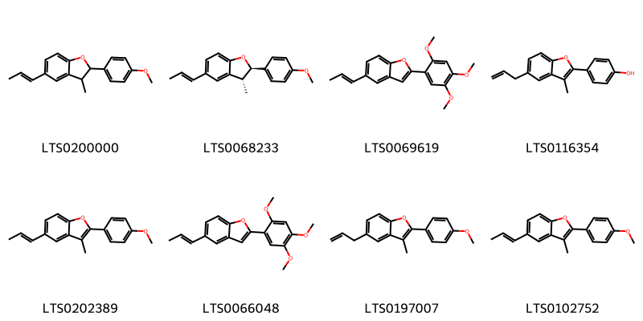
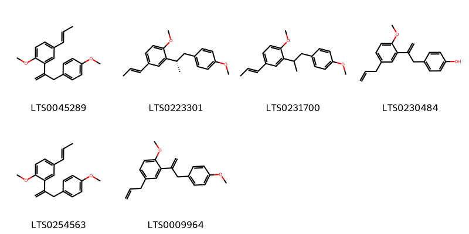

!!! abstract "Tóm tắt"

    Họ Krameriaceae gồm khoảng 1 chi và 3 loài được một số cộng đồng tại các quốc gia như Turkey, Elsewhere, Curacao, Mexico, Peru, Brazil sử dụng trong một số trường hợp MYMEMORY WARNING: YOU USED ALL AVAILABLE FREE TRANSLATIONS FOR TODAY. NEXT AVAILABLE IN  07 HOURS 12 MINUTES 45 SECONDS VISIT HTTPS://MYMEMORY.TRANSLATED.NET/DOC/USAGELIMITS.PHP TO TRANSLATE MORE.

!!! info "DrDuke"

    James A. Duke sinh năm 1929-2017 là một nhà thực vật học người Mỹ. Đây là một trong những tác giả hàng đầu trong lĩnh vực dược dân tộc học với cuốn *CRC Handbook of Medicinal Herbs* và chính là người xây dựng lên cơ sở dữ liệu về hợp chất tự nhiên và dược dân tộc học tại Bộ nông nghiệp Hoa Kỳ. Các thông tin được đăng tải tại website [Dr. Duke's Phytochemical and Ethnobotanical Databases](https://phytochem.nal.usda.gov/). 
    Trong suốt thập niên 1970, ông lãnh đạo the Plant Taxonomy Laboratory, Plant Genetics and Germplasm Institute of the Agricultural Research Service, U.S. Department of Agriculture.
    Trong tài liệu này, các thông tin về dược dân tộc của các dược liệu được trích dẫn từ tài liệu của James A. Ducke với sự trợ giúp của phần mềm dịch thuật từ tiếng Anh sang tiếng Việt.
   

# Chi Krameria

??? note "Danh sách các dược liệu thuộc chi"
    
	 - *Krameria argentea*
	 - *Krameria ixina*
	 - *Krameria triandra*

---
## Krameria argentea
### Thông tin về thực vật

!!! info "Phân loại thực vật của *Krameria argentea* từ GIBF:"
    - **Kingdom:** Plantae
    - **Phylum:** Tracheophyta
    - **Order:** Zygophyllales
    - **Family:** Krameriaceae
    - **Genus:** Krameria
    - **Species:** *Krameria argentea*

 

| Label (VI)   | Label (EN)   | Scientific Name   | Descriptions (VI)   | Descriptions (EN)   | Also Known As (VI)   | Also Known As (EN)   |
|:-------------|:-------------|:------------------|:--------------------|:--------------------|:---------------------|:---------------------|
| N/A          | N/A          | Krameria argentea | loài thực vật       | species of plant    | ['']                 | ['']                 |

#### Phân bố trên thế giới

**Từ CSDL GIBF** Brazil

#### Phân bố tại Việt Nam

**Từ CSDL GIBF**: Không có ghi nhận ở Việt Nam

---
### Thành phần hóa học
        
- Theo cơ sở dữ liệu lotus: Từ loài *Krameria argentea* đã phân lập và xác định được Chưa có hoạt chất nào được phân lập. hoạt chất thuộc về các nhóm Không có hoạt chất nào được phân lập. 

Không có hình ảnh nào được tạo ra

---

### Dược dân tộc học

Danh sách các quốc gia có sử dụng *Krameria argentea* trong điều trị các bệnh. 

| Country   | Disease                    | Bệnh                                                                                                                                                                                                |
|:----------|:---------------------------|:----------------------------------------------------------------------------------------------------------------------------------------------------------------------------------------------------|
| Brazil    | Astringent, Tonic          | MYMEMORY WARNING: YOU USED ALL AVAILABLE FREE TRANSLATIONS FOR TODAY. NEXT AVAILABLE IN  07 HOURS 12 MINUTES 42 SECONDS VISIT HTTPS://MYMEMORY.TRANSLATED.NET/DOC/USAGELIMITS.PHP TO TRANSLATE MORE |
| Mexico    | Styptic, Astringent, Tonic | MYMEMORY WARNING: YOU USED ALL AVAILABLE FREE TRANSLATIONS FOR TODAY. NEXT AVAILABLE IN  07 HOURS 12 MINUTES 40 SECONDS VISIT HTTPS://MYMEMORY.TRANSLATED.NET/DOC/USAGELIMITS.PHP TO TRANSLATE MORE |

---

---
## Krameria ixina
### Thông tin về thực vật

!!! info "Phân loại thực vật của *Krameria ixina* từ GIBF:"
    - **Kingdom:** Plantae
    - **Phylum:** Tracheophyta
    - **Order:** Zygophyllales
    - **Family:** Krameriaceae
    - **Genus:** Krameria
    - **Species:** *Krameria ixina*

 

| Label (VI)   | Label (EN)   | Scientific Name   | Descriptions (VI)   | Descriptions (EN)   | Also Known As (VI)   | Also Known As (EN)   |
|:-------------|:-------------|:------------------|:--------------------|:--------------------|:---------------------|:---------------------|
| N/A          | N/A          | Krameria ixina    |                     |                     | ['']                 | ['']                 |

#### Phân bố trên thế giới

**Từ CSDL GIBF** Virgin Islands (U.S.), nan, Puerto Rico, Colombia, Costa Rica, Jamaica, Venezuela (Bolivarian Republic of)

#### Phân bố tại Việt Nam

**Từ CSDL GIBF**: Không có ghi nhận ở Việt Nam

---
### Thành phần hóa học
        
- Theo cơ sở dữ liệu lotus: Từ loài *Krameria ixina* đã phân lập và xác định được 14 hoạt chất thuộc về các nhóm 2-arylbenzofuran flavonoids, Stilbenes. 

|    | chemicalTaxonomyClassyfireClass   |   smiles_count |
|---:|:----------------------------------|---------------:|
|  0 | 2-arylbenzofuran flavonoids       |              8 |
|  1 | Stilbenes                         |              6 |

#### Nhóm 2-arylbenzofuran flavonoids
<figure markdown="span">
    { width=100% }
    <figcaption>Hình ảnh cấu trúc hóa học của 8 hoạt chất thuộc nhóm 2-arylbenzofuran flavonoids gồm ['2-(4-methoxyphenyl)-3-methyl-5-(prop-1-en-1-yl)-2,3-dihydro-1-benzofuran (LTS0200000)', '(2r,3r)-2-(4-methoxyphenyl)-3-methyl-5-[(1e)-prop-1-en-1-yl]-2,3-dihydro-1-benzofuran (LTS0068233)', '5-[(1e)-prop-1-en-1-yl]-2-(2,4,5-trimethoxyphenyl)-1-benzofuran (LTS0069619)', '4-[3-methyl-5-(prop-2-en-1-yl)-1-benzofuran-2-yl]phenol (LTS0116354)', '2-(4-methoxyphenyl)-3-methyl-5-[(1e)-prop-1-en-1-yl]-1-benzofuran (LTS0202389)', '5-(prop-1-en-1-yl)-2-(2,4,5-trimethoxyphenyl)-1-benzofuran (LTS0066048)', '2-(4-methoxyphenyl)-3-methyl-5-(prop-2-en-1-yl)-1-benzofuran (LTS0197007)', '2-(4-methoxyphenyl)-3-methyl-5-(prop-1-en-1-yl)-1-benzofuran (LTS0102752)'].</figcaption>
</figure>
#### Nhóm Stilbenes
<figure markdown="span">
    { width=100% }
    <figcaption>Hình ảnh cấu trúc hóa học của 6 hoạt chất thuộc nhóm Stilbenes gồm ['1-methoxy-2-[3-(4-methoxyphenyl)prop-1-en-2-yl]-4-(prop-1-en-1-yl)benzene (LTS0045289)', '1-methoxy-2-[(2s)-1-(4-methoxyphenyl)propan-2-yl]-4-[(1e)-prop-1-en-1-yl]benzene (LTS0223301)', '1-methoxy-2-[1-(4-methoxyphenyl)propan-2-yl]-4-(prop-1-en-1-yl)benzene (LTS0231700)', '4-{2-[2-methoxy-5-(prop-2-en-1-yl)phenyl]prop-2-en-1-yl}phenol (LTS0230484)', '1-methoxy-2-[3-(4-methoxyphenyl)prop-1-en-2-yl]-4-[(1e)-prop-1-en-1-yl]benzene (LTS0254563)', '1-methoxy-2-[3-(4-methoxyphenyl)prop-1-en-2-yl]-4-(prop-2-en-1-yl)benzene (LTS0009964)'].</figcaption>
</figure>

---

### Dược dân tộc học

Danh sách các quốc gia có sử dụng *Krameria ixina* trong điều trị các bệnh. 

| Country   | Disease                                   | Bệnh                                                                                                                                                                                                |
|:----------|:------------------------------------------|:----------------------------------------------------------------------------------------------------------------------------------------------------------------------------------------------------|
| Curacao   | Abortifacient, Emmenagogue, Abortifacient | MYMEMORY WARNING: YOU USED ALL AVAILABLE FREE TRANSLATIONS FOR TODAY. NEXT AVAILABLE IN  07 HOURS 12 MINUTES 12 SECONDS VISIT HTTPS://MYMEMORY.TRANSLATED.NET/DOC/USAGELIMITS.PHP TO TRANSLATE MORE |
| Mexico    | Styptic, Tonic, Astringent                | MYMEMORY WARNING: YOU USED ALL AVAILABLE FREE TRANSLATIONS FOR TODAY. NEXT AVAILABLE IN  07 HOURS 12 MINUTES 09 SECONDS VISIT HTTPS://MYMEMORY.TRANSLATED.NET/DOC/USAGELIMITS.PHP TO TRANSLATE MORE |

---

---
## Krameria triandra
### Thông tin về thực vật

!!! info "Phân loại thực vật của *Krameria lappacea* từ GIBF:"
    - **Kingdom:** Plantae
    - **Phylum:** Tracheophyta
    - **Order:** Zygophyllales
    - **Family:** Krameriaceae
    - **Genus:** Krameria
    - **Species:** *Krameria lappacea*

 

| Label (VI)   | Label (EN)   | Scientific Name   | Descriptions (VI)   | Descriptions (EN)   | Also Known As (VI)   | Also Known As (EN)   |
|:-------------|:-------------|:------------------|:--------------------|:--------------------|:---------------------|:---------------------|
| N/A          | N/A          | Krameria triandra | loài thực vật       | species of plant    | ['']                 | ['']                 |

#### Phân bố trên thế giới

**Từ CSDL GIBF** nan, Pakistan, Bolivia (Plurinational State of), unknown or invalid, United States of America, Peru, Chile, Venezuela (Bolivarian Republic of)

#### Phân bố tại Việt Nam

**Từ CSDL GIBF**: Không có ghi nhận ở Việt Nam

---
### Thành phần hóa học
        
- Theo cơ sở dữ liệu lotus: Từ loài *Krameria lappacea* đã phân lập và xác định được Chưa có hoạt chất nào được phân lập. hoạt chất thuộc về các nhóm Không có hoạt chất nào được phân lập. 

Không có hình ảnh nào được tạo ra

---

### Dược dân tộc học

Danh sách các quốc gia có sử dụng *Krameria lappacea* trong điều trị các bệnh. 

| Country   | Disease                                                        | Bệnh                                                                                                                                                                                                |
|:----------|:---------------------------------------------------------------|:----------------------------------------------------------------------------------------------------------------------------------------------------------------------------------------------------|
| Elsewhere | Astringent, Astringent, Dentifrice, Styptic, Tonic, Astringent | MYMEMORY WARNING: YOU USED ALL AVAILABLE FREE TRANSLATIONS FOR TODAY. NEXT AVAILABLE IN  07 HOURS 11 MINUTES 32 SECONDS VISIT HTTPS://MYMEMORY.TRANSLATED.NET/DOC/USAGELIMITS.PHP TO TRANSLATE MORE |
| Mexico    | Astringent, Styptic, Tonic                                     | MYMEMORY WARNING: YOU USED ALL AVAILABLE FREE TRANSLATIONS FOR TODAY. NEXT AVAILABLE IN  07 HOURS 11 MINUTES 27 SECONDS VISIT HTTPS://MYMEMORY.TRANSLATED.NET/DOC/USAGELIMITS.PHP TO TRANSLATE MORE |
| Peru      | Astringent                                                     | MYMEMORY WARNING: YOU USED ALL AVAILABLE FREE TRANSLATIONS FOR TODAY. NEXT AVAILABLE IN  07 HOURS 11 MINUTES 20 SECONDS VISIT HTTPS://MYMEMORY.TRANSLATED.NET/DOC/USAGELIMITS.PHP TO TRANSLATE MORE |
| Turkey    | Astringent, Expectorant, Hemostat                              | MYMEMORY WARNING: YOU USED ALL AVAILABLE FREE TRANSLATIONS FOR TODAY. NEXT AVAILABLE IN  07 HOURS 11 MINUTES 17 SECONDS VISIT HTTPS://MYMEMORY.TRANSLATED.NET/DOC/USAGELIMITS.PHP TO TRANSLATE MORE |

---

