!!! abstract "Tóm tắt"

    Họ Lauraceae gồm khoảng 17 chi và 45 loài được một số cộng đồng tại các quốc gia như Turkey, South Africa, Cambodia, Guiana, Guatemala, Brazil, Malagasy, US(Appalachia), US, Dutch, Mexico, Dominican Republic, Malaya, China, Panama, Latin America, Hainan, anish, Haiti, English, German, Elsewhere, Indonesia, Java, Venezuela, Japan*, ain, Philippines, Paraguay, Malaysia, Borneo, Nepal sử dụng trong một số trường hợp QUERY LENGTH LIMIT EXCEEDED. MAX ALLOWED QUERY : 500 CHARS QUERY LENGTH LIMIT EXCEEDED. MAX ALLOWED QUERY : 500 CHARS Dentifrice, Diaphoretic, Diuretic, Perfume, Sudorific, Tonic, Khử trùng, Khử trùng, Demulcent, Diuretic, Emmenagogue, Pediculicide, Stimulant, Sudorific, Astringent, Tonic, Astringent, Carminative.

!!! info "DrDuke"

    James A. Duke sinh năm 1929-2017 là một nhà thực vật học người Mỹ. Đây là một trong những tác giả hàng đầu trong lĩnh vực dược dân tộc học với cuốn *CRC Handbook of Medicinal Herbs* và chính là người xây dựng lên cơ sở dữ liệu về hợp chất tự nhiên và dược dân tộc học tại Bộ nông nghiệp Hoa Kỳ. Các thông tin được đăng tải tại website [Dr. Duke's Phytochemical and Ethnobotanical Databases](https://phytochem.nal.usda.gov/). 
    Trong suốt thập niên 1970, ông lãnh đạo the Plant Taxonomy Laboratory, Plant Genetics and Germplasm Institute of the Agricultural Research Service, U.S. Department of Agriculture.
    Trong tài liệu này, các thông tin về dược dân tộc của các dược liệu được trích dẫn từ tài liệu của James A. Ducke với sự trợ giúp của phần mềm dịch thuật từ tiếng Anh sang tiếng Việt.
   

# Chi Ravensara

??? note "Danh sách các dược liệu thuộc chi"
    
	 - *Ravensara aromatica*

---
## Ravensara aromatica
### Thông tin về thực vật

!!! info "Phân loại thực vật của *Cryptocarya agathophylla* từ GIBF:"
    - **Kingdom:** Plantae
    - **Phylum:** Tracheophyta
    - **Order:** Laurales
    - **Family:** Lauraceae
    - **Genus:** Cryptocarya
    - **Species:** *Cryptocarya agathophylla*

 

| Label (VI)   | Label (EN)   | Scientific Name     | Descriptions (VI)   | Descriptions (EN)   | Also Known As (VI)   | Also Known As (EN)   |
|:-------------|:-------------|:--------------------|:--------------------|:--------------------|:---------------------|:---------------------|
| N/A          | N/A          | Ravensara aromatica | loài thực vật       | species of plant    | ['']                 | ['']                 |

#### Phân bố trên thế giới

**Từ CSDL GIBF** nan, Sri Lanka, French Polynesia, Réunion, Madagascar, Mauritius, unknown or invalid, Congo, Democratic Republic of the

#### Phân bố tại Việt Nam

**Từ CSDL GIBF**: Không có ghi nhận ở Việt Nam

---
### Thành phần hóa học
        
- Theo cơ sở dữ liệu lotus: Từ loài *Cryptocarya agathophylla* đã phân lập và xác định được Chưa có hoạt chất nào được phân lập. hoạt chất thuộc về các nhóm Không có hoạt chất nào được phân lập. 

Không có hình ảnh nào được tạo ra

---

### Dược dân tộc học

Danh sách các quốc gia có sử dụng *Cryptocarya agathophylla* trong điều trị các bệnh. 

| Country   | Disease    | Bệnh         |
|:----------|:-----------|:-------------|
| Malagasy  | Intoxicant | chất gây độc |

---

# Chi Sassafras

??? note "Danh sách các dược liệu thuộc chi"
    
	 - *Sassafras albidum*
	 - *Sassafras officinale*

---
## Sassafras albidum
### Thông tin về thực vật

!!! info "Phân loại thực vật của *Sassafras albidum* từ GIBF:"
    - **Kingdom:** Plantae
    - **Phylum:** Tracheophyta
    - **Order:** Laurales
    - **Family:** Lauraceae
    - **Genus:** Sassafras
    - **Species:** *Sassafras albidum*

 

| Label (VI)   | Label (EN)   | Scientific Name   | Descriptions (VI)   | Descriptions (EN)   | Also Known As (VI)   | Also Known As (EN)       |
|:-------------|:-------------|:------------------|:--------------------|:--------------------|:---------------------|:-------------------------|
| N/A          | N/A          | Sassafras albidum | loài thực vật       | species of plant    | ['']                 | ['Sassafras officinale'] |

#### Phân bố trên thế giới

**Từ CSDL GIBF** United States of America, Canada

#### Phân bố tại Việt Nam

**Từ CSDL GIBF**: Không có ghi nhận ở Việt Nam

---
### Thành phần hóa học
        
- Theo cơ sở dữ liệu lotus: Từ loài *Sassafras albidum* đã phân lập và xác định được 52 hoạt chất thuộc về các nhóm Phenol ethers, Fatty Acyls, Prenol lipids, Aporphines, Benzodioxoles, Benzene and substituted derivatives, Organooxygen compounds, Phenols, Furanoid lignans, Isoquinolines and derivatives. 

|    | chemicalTaxonomyClassyfireClass     |   smiles_count |
|---:|:------------------------------------|---------------:|
|  0 | Aporphines                          |              6 |
|  1 | Benzene and substituted derivatives |              1 |
|  2 | Benzodioxoles                       |              5 |
|  3 | Fatty Acyls                         |              2 |
|  4 | Furanoid lignans                    |              1 |
|  5 | Isoquinolines and derivatives       |              6 |
|  6 | Organooxygen compounds              |              3 |
|  7 | Phenol ethers                       |              2 |
|  8 | Phenols                             |              3 |
|  9 | Prenol lipids                       |             23 |

#### Nhóm Aporphines
<figure markdown="span">
    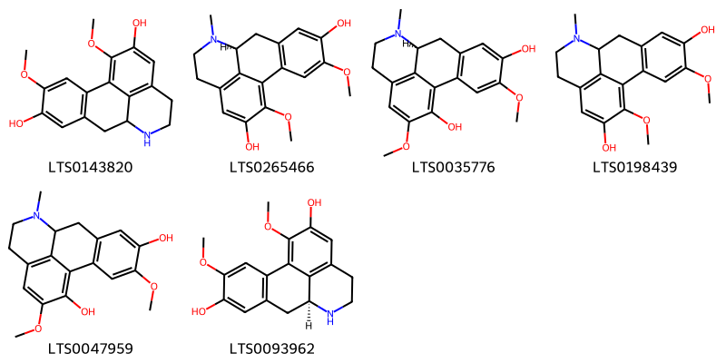{ width=100% }
    <figcaption>Hình ảnh cấu trúc hóa học của 6 hoạt chất thuộc nhóm Aporphines gồm ['4,16-dimethoxy-10-azatetracyclo[7.7.1.0²,⁷.0¹³,¹⁷]heptadeca-1(17),2(7),3,5,13,15-hexaene-5,15-diol (LTS0143820)', '(9s)-4,16-dimethoxy-10-methyl-10-azatetracyclo[7.7.1.0²,⁷.0¹³,¹⁷]heptadeca-1(16),2(7),3,5,13(17),14-hexaene-5,15-diol (LTS0265466)', '(9s)-4,15-dimethoxy-10-methyl-10-azatetracyclo[7.7.1.0²,⁷.0¹³,¹⁷]heptadeca-1(16),2(7),3,5,13(17),14-hexaene-5,16-diol (LTS0035776)', '4,16-dimethoxy-10-methyl-10-azatetracyclo[7.7.1.0²,⁷.0¹³,¹⁷]heptadeca-1(16),2(7),3,5,13(17),14-hexaene-5,15-diol (LTS0198439)', '4,15-dimethoxy-10-methyl-10-azatetracyclo[7.7.1.0²,⁷.0¹³,¹⁷]heptadeca-1(16),2(7),3,5,13(17),14-hexaene-5,16-diol (LTS0047959)', 'laurolitsine (LTS0093962)'].</figcaption>
</figure>
#### Nhóm Benzene and substituted derivatives
<figure markdown="span">
    { width=100% }
    <figcaption>Hình ảnh cấu trúc hóa học của 1 hoạt chất thuộc nhóm Benzene and substituted derivatives gồm ['methyl eugenol (LTS0098881)'].</figcaption>
</figure>
#### Nhóm Benzodioxoles
<figure markdown="span">
    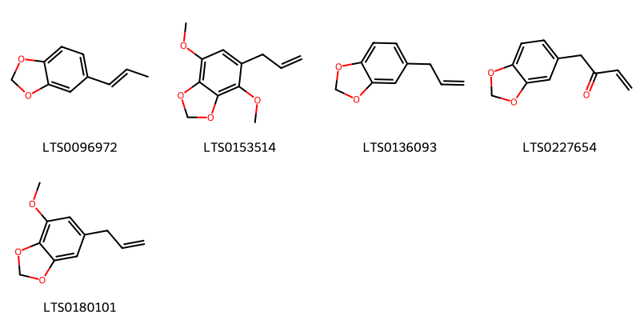{ width=100% }
    <figcaption>Hình ảnh cấu trúc hóa học của 5 hoạt chất thuộc nhóm Benzodioxoles gồm ['isosafrole (LTS0096972)', 'apiol (LTS0153514)', 'sassafras (LTS0136093)', '1-(2h-1,3-benzodioxol-5-yl)but-3-en-2-one (LTS0227654)', 'myristicin (LTS0180101)'].</figcaption>
</figure>
#### Nhóm Fatty Acyls
<figure markdown="span">
    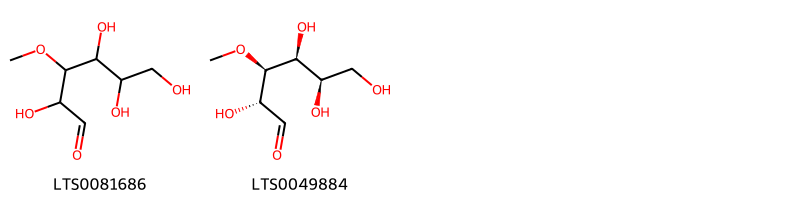{ width=100% }
    <figcaption>Hình ảnh cấu trúc hóa học của 2 hoạt chất thuộc nhóm Fatty Acyls gồm ['2,4,5,6-tetrahydroxy-3-methoxyhexanal (LTS0081686)', '(2r,3s,4s,5r)-2,4,5,6-tetrahydroxy-3-methoxyhexanal (LTS0049884)'].</figcaption>
</figure>
#### Nhóm Furanoid lignans
<figure markdown="span">
    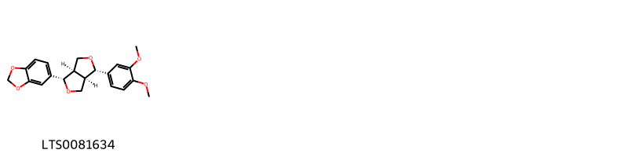{ width=100% }
    <figcaption>Hình ảnh cấu trúc hóa học của 1 hoạt chất thuộc nhóm Furanoid lignans gồm ['5-[(1s,3ar,4s,6ar)-4-(3,4-dimethoxyphenyl)-hexahydrofuro[3,4-c]furan-1-yl]-2h-1,3-benzodioxole (LTS0081634)'].</figcaption>
</figure>
#### Nhóm Isoquinolines and derivatives
<figure markdown="span">
    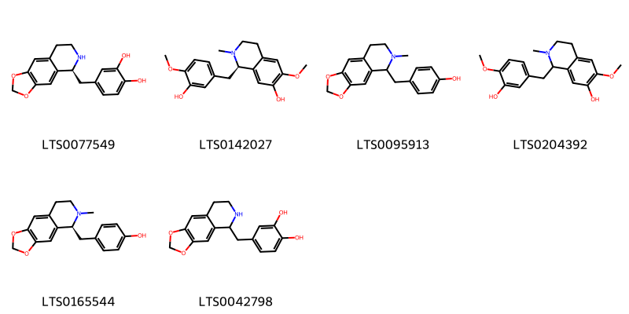{ width=100% }
    <figcaption>Hình ảnh cấu trúc hóa học của 6 hoạt chất thuộc nhóm Isoquinolines and derivatives gồm ['4-[(5s)-2h,5h,6h,7h,8h-[1,3]dioxolo[4,5-g]isoquinolin-5-ylmethyl]benzene-1,2-diol (LTS0077549)', '(-)-reticuline (LTS0142027)', '4-({6-methyl-2h,5h,7h,8h-[1,3]dioxolo[4,5-g]isoquinolin-5-yl}methyl)phenol (LTS0095913)', 'reticuline (LTS0204392)', '4-{[(5s)-6-methyl-2h,5h,7h,8h-[1,3]dioxolo[4,5-g]isoquinolin-5-yl]methyl}phenol (LTS0165544)', '4-{2h,5h,6h,7h,8h-[1,3]dioxolo[4,5-g]isoquinolin-5-ylmethyl}benzene-1,2-diol (LTS0042798)'].</figcaption>
</figure>
#### Nhóm Organooxygen compounds
<figure markdown="span">
    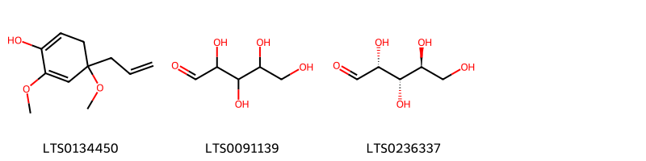{ width=100% }
    <figcaption>Hình ảnh cấu trúc hóa học của 3 hoạt chất thuộc nhóm Organooxygen compounds gồm ['4,6-dimethoxy-4-(prop-2-en-1-yl)cyclohexa-1,5-dien-1-ol (LTS0134450)', 'xylose (LTS0091139)', 'l-arabinose (LTS0236337)'].</figcaption>
</figure>
#### Nhóm Phenol ethers
<figure markdown="span">
    { width=100% }
    <figcaption>Hình ảnh cấu trúc hóa học của 2 hoạt chất thuộc nhóm Phenol ethers gồm ['elemicin (LTS0188875)', 'tarragon (LTS0245226)'].</figcaption>
</figure>
#### Nhóm Phenols
<figure markdown="span">
    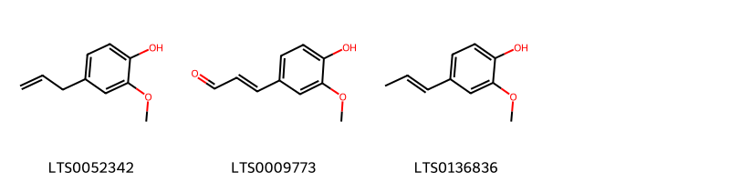{ width=100% }
    <figcaption>Hình ảnh cấu trúc hóa học của 3 hoạt chất thuộc nhóm Phenols gồm ['eugenol (LTS0052342)', 'coniferaldehyde (LTS0009773)', 'isoeugenol (LTS0136836)'].</figcaption>
</figure>
#### Nhóm Prenol lipids
<figure markdown="span">
    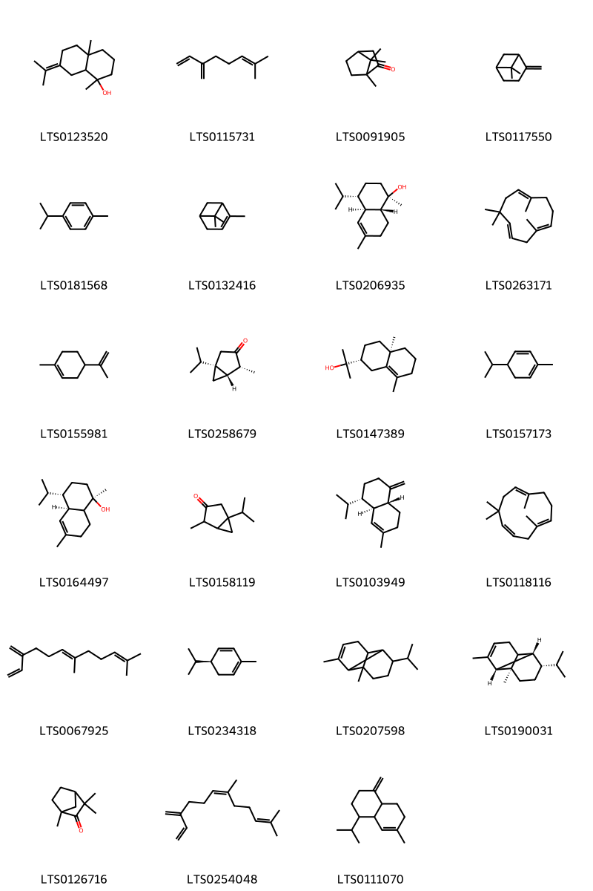{ width=100% }
    <figcaption>Hình ảnh cấu trúc hóa học của 23 hoạt chất thuộc nhóm Prenol lipids gồm ['1,4a-dimethyl-7-(propan-2-ylidene)-hexahydro-2h-naphthalen-1-ol (LTS0123520)', 'α-myrcene (LTS0115731)', 'camphor (LTS0091905)', 'β-pinene (LTS0117550)', 'cymene (LTS0181568)', 'α pinene (LTS0132416)', 'α-cadinol (LTS0206935)', 'humulene (LTS0263171)', 'limonene,  (LTS0155981)', '(1r,4r,5s)-thujan-3-one (LTS0258679)', 'gamma-eudesmol (LTS0147389)', 'phellandrene (LTS0157173)', '(1r,4s,4ar)-4-isopropyl-1,6-dimethyl-3,4,4a,7,8,8a-hexahydro-2h-naphthalen-1-ol (LTS0164497)', '3-isothujone (LTS0158119)', '(+)-gamma-cadinene (LTS0103949)', '(4e,8e)-4,8,11,11-tetramethylcycloundeca-1,4,8-triene (LTS0118116)', 'β-farnesene (LTS0067925)', '(+)-α-phellandrene (LTS0234318)', 'α-copaene (LTS0207598)', '(1r,2s,7s,8s)-8-isopropyl-1,3-dimethyltricyclo[4.4.0.0²,⁷]dec-3-ene (LTS0190031)', 'fenchone (LTS0126716)', '(z)-β-farnesene (LTS0254048)', '4-isopropyl-6-methyl-1-methylidene-3,4,4a,7,8,8a-hexahydro-2h-naphthalene (LTS0111070)'].</figcaption>
</figure>

---

### Dược dân tộc học

Danh sách các quốc gia có sử dụng *Sassafras albidum* trong điều trị các bệnh. 

| Country   | Disease                                                                                                                                 | Bệnh                                                                                                                                                    |
|:----------|:----------------------------------------------------------------------------------------------------------------------------------------|:--------------------------------------------------------------------------------------------------------------------------------------------------------|
| Elsewhere | Analgesic, Antiseptic, Astringent, Rubefacient, Stimulant, nan, Demulcent, Carcinogenic, Diaphoretic, Fungicide, Pediculicide, Diuretic | Thuốc giảm đau, sát trùng, làm se, Rubefacient, chất kích thích, nan, Demulcent, gây ung thư, Diaphoretic, thuốc diệt nấm, Pediculicide, thuốc lợi tiểu |
| Turkey    | Antiseptic, Demulcent, Diuretic, Emmenagogue, Pediculicide, Stimulant, Sudorific                                                        | Khử trùng, Demulcent, Thuốc lợi tiểu, Emmenagogue, Pediculicide, Chất kích thích, Sudorific                                                             |
| US        | Carminative, Dentifrice, Diaphoretic, Diuretic, Perfume, Sudorific, Tonic, Antiseptic                                                   | Carminative, Dentifrice, Diaphoretic, lợi tiểu, nước hoa, Sudorific, thuốc bổ, sát trùng                                                                |

---

---
## Sassafras officinale
### Thông tin về thực vật

!!! info "Phân loại thực vật của *N/A* từ GIBF:"
    - **Kingdom:** Plantae
    - **Phylum:** Tracheophyta
    - **Order:** Laurales
    - **Family:** Lauraceae
    - **Genus:** N/A
    - **Species:** *N/A*

 

| Label (VI)   | Label (EN)   | Scientific Name   | Descriptions (VI)   | Descriptions (EN)   | Also Known As (VI)   | Also Known As (EN)       |
|:-------------|:-------------|:------------------|:--------------------|:--------------------|:---------------------|:-------------------------|
| N/A          | N/A          | Sassafras albidum | loài thực vật       | species of plant    | ['']                 | ['Sassafras officinale'] |

#### Phân bố trên thế giới

**Từ CSDL GIBF** Italy, Australia, Japan, Argentina, Canada, Puerto Rico, Chinese Taipei, Spain, Türkiye, Portugal, United States of America, Uruguay, Chile, Greece, South Africa, Hong Kong, Brazil, Bhutan, Mexico, France, United Kingdom of Great Britain and Northern Ireland, China, Colombia, India, New Zealand, Ethiopia

#### Phân bố tại Việt Nam

**Từ CSDL GIBF**: Không có ghi nhận ở Việt Nam

---
### Thành phần hóa học
        
- Theo cơ sở dữ liệu lotus: Từ loài *N/A* đã phân lập và xác định được Chưa có hoạt chất nào được phân lập. hoạt chất thuộc về các nhóm Không có hoạt chất nào được phân lập. 

Không có hình ảnh nào được tạo ra

---

### Dược dân tộc học

Danh sách các quốc gia có sử dụng *N/A* trong điều trị các bệnh. 

| Country   | Disease            | Bệnh                     |
|:----------|:-------------------|:-------------------------|
| Elsewhere | Diaphoretic, Tonic | Thuốc lợi tiểu, Thuốc bổ |

---

# Chi Cryptocarya

??? note "Danh sách các dược liệu thuộc chi"
    
	 - *Cryptocarya ferrea*
	 - *Cryptocarya griffithiana*

---
## Cryptocarya ferrea
### Thông tin về thực vật

!!! info "Phân loại thực vật của *Cryptocarya ferrea* từ GIBF:"
    - **Kingdom:** Plantae
    - **Phylum:** Tracheophyta
    - **Order:** Laurales
    - **Family:** Lauraceae
    - **Genus:** Cryptocarya
    - **Species:** *Cryptocarya ferrea*

 

| Label (VI)   | Label (EN)   | Scientific Name    | Descriptions (VI)   | Descriptions (EN)   | Also Known As (VI)   | Also Known As (EN)   |
|:-------------|:-------------|:-------------------|:--------------------|:--------------------|:---------------------|:---------------------|
| N/A          | N/A          | Cryptocarya ferrea | loài thực vật       | species of plant    | ['']                 | ['']                 |

#### Phân bố trên thế giới

**Từ CSDL GIBF** Australia, Thailand, Lao People’s Democratic Republic, Cambodia, unknown or invalid, Indonesia, Viet Nam, Philippines, Singapore, Malaysia, Brunei Darussalam

#### Phân bố tại Việt Nam

**Từ CSDL GIBF**: Đồng Nai, Kiên Giang

---
### Thành phần hóa học
        
- Theo cơ sở dữ liệu lotus: Từ loài *Cryptocarya ferrea* đã phân lập và xác định được Chưa có hoạt chất nào được phân lập. hoạt chất thuộc về các nhóm Không có hoạt chất nào được phân lập. 

Không có hình ảnh nào được tạo ra

---

### Dược dân tộc học

Danh sách các quốc gia có sử dụng *Cryptocarya ferrea* trong điều trị các bệnh. 

| Country   | Disease   | Bệnh     |
|:----------|:----------|:---------|
| Elsewhere | Poison    | Chất độc |

---

---
## Cryptocarya griffithiana
### Thông tin về thực vật

!!! info "Phân loại thực vật của *Cryptocarya griffithiana* từ GIBF:"
    - **Kingdom:** Plantae
    - **Phylum:** Tracheophyta
    - **Order:** Laurales
    - **Family:** Lauraceae
    - **Genus:** Cryptocarya
    - **Species:** *Cryptocarya griffithiana*

 

| Label (VI)   | Label (EN)   | Scientific Name          | Descriptions (VI)   | Descriptions (EN)   | Also Known As (VI)   | Also Known As (EN)   |
|:-------------|:-------------|:-------------------------|:--------------------|:--------------------|:---------------------|:---------------------|
| N/A          | N/A          | Cryptocarya griffithiana | loài thực vật       | species of plant    | ['']                 | ['']                 |

#### Phân bố trên thế giới

**Từ CSDL GIBF** nan, Papua New Guinea, Indonesia, Singapore, Malaysia

#### Phân bố tại Việt Nam

**Từ CSDL GIBF**: Không có ghi nhận ở Việt Nam

---
### Thành phần hóa học
        
- Theo cơ sở dữ liệu lotus: Từ loài *Cryptocarya griffithiana* đã phân lập và xác định được 12 hoạt chất thuộc về các nhóm 6,6a-secoaporphines, Aporphines, Furanoid lignans, Isoquinolines and derivatives. 

|    | chemicalTaxonomyClassyfireClass   |   smiles_count |
|---:|:----------------------------------|---------------:|
|  0 | 6,6a-secoaporphines               |              1 |
|  1 | Aporphines                        |              4 |
|  2 | Furanoid lignans                  |              1 |
|  3 | Isoquinolines and derivatives     |              2 |

#### Nhóm 6_6a-secoaporphines
<figure markdown="span">
    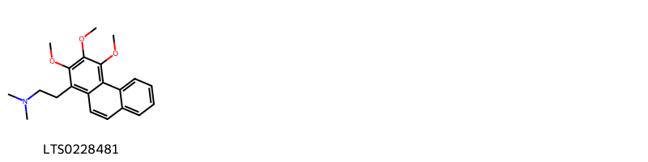{ width=100% }
    <figcaption>Hình ảnh cấu trúc hóa học của Không tìm thấy chú thích hoạt chất thuộc nhóm 6_6a-secoaporphines gồm Không tìm thấy chú thích.</figcaption>
</figure>
#### Nhóm Aporphines
<figure markdown="span">
    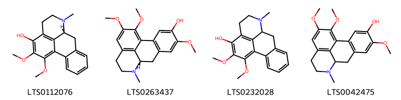{ width=100% }
    <figcaption>Hình ảnh cấu trúc hóa học của 4 hoạt chất thuộc nhóm Aporphines gồm ['(9r)-15,16-dimethoxy-10-methyl-10-azatetracyclo[7.7.1.0²,⁷.0¹³,¹⁷]heptadeca-1(16),2,4,6,13(17),14-hexaen-14-ol (LTS0112076)', '(9s)-5,15,16-trimethoxy-10-methyl-10-azatetracyclo[7.7.1.0²,⁷.0¹³,¹⁷]heptadeca-1(16),2(7),3,5,13(17),14-hexaen-4-ol (LTS0263437)', '15,16-dimethoxy-10-methyl-10-azatetracyclo[7.7.1.0²,⁷.0¹³,¹⁷]heptadeca-1(16),2,4,6,13(17),14-hexaen-14-ol (LTS0232028)', '5,15,16-trimethoxy-10-methyl-10-azatetracyclo[7.7.1.0²,⁷.0¹³,¹⁷]heptadeca-1(16),2(7),3,5,13(17),14-hexaen-4-ol (LTS0042475)'].</figcaption>
</figure>
#### Nhóm Furanoid lignans
<figure markdown="span">
    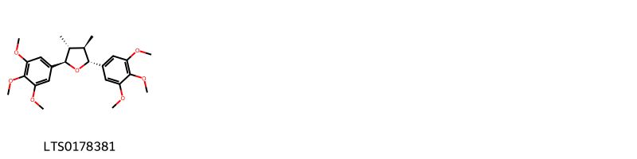{ width=100% }
    <figcaption>Hình ảnh cấu trúc hóa học của 1 hoạt chất thuộc nhóm Furanoid lignans gồm ['(2r,3r,4r,5r)-3,4-dimethyl-2,5-bis(3,4,5-trimethoxyphenyl)oxolane (LTS0178381)'].</figcaption>
</figure>
#### Nhóm Isoquinolines and derivatives
<figure markdown="span">
    { width=100% }
    <figcaption>Hình ảnh cấu trúc hóa học của 2 hoạt chất thuộc nhóm Isoquinolines and derivatives gồm ['reticuline (LTS0204392)', '(+,-)-reticuline (LTS0181650)'].</figcaption>
</figure>

---

### Dược dân tộc học

Danh sách các quốc gia có sử dụng *Cryptocarya griffithiana* trong điều trị các bệnh. 

| Country   | Disease   | Bệnh     |
|:----------|:----------|:---------|
| Elsewhere | Poison    | Chất độc |
| Malaya    | Poison    | Chất độc |

---

# Chi Lindera

??? note "Danh sách các dược liệu thuộc chi"
    
	 - *Lindera benzoin*
	 - *Lindera glauca*
	 - *Lindera pipericarpa*
	 - *Lindera sericea*
	 - *Lindera strychnifolia*
	 - *Lindera tzumu*

---
## Lindera benzoin
### Thông tin về thực vật

!!! info "Phân loại thực vật của *Lindera benzoin* từ GIBF:"
    - **Kingdom:** Plantae
    - **Phylum:** Tracheophyta
    - **Order:** Laurales
    - **Family:** Lauraceae
    - **Genus:** Lindera
    - **Species:** *Lindera benzoin*

 

| Label (VI)   | Label (EN)   | Scientific Name   | Descriptions (VI)   | Descriptions (EN)   | Also Known As (VI)   | Also Known As (EN)                                                                        |
|:-------------|:-------------|:------------------|:--------------------|:--------------------|:---------------------|:------------------------------------------------------------------------------------------|
| N/A          | N/A          | Lindera benzoin   | loài thực vật       | species of plant    | ['']                 | ['spicebush', 'Benjamin bush', 'common spicebush', 'northern spicebush', 'wild allspice'] |

#### Phân bố trên thế giới

**Từ CSDL GIBF** United States of America, Canada

#### Phân bố tại Việt Nam

**Từ CSDL GIBF**: Không có ghi nhận ở Việt Nam

---
### Thành phần hóa học
        
- Theo cơ sở dữ liệu lotus: Từ loài *Lindera benzoin* đã phân lập và xác định được 8 hoạt chất thuộc về các nhóm Aporphines, Prenol lipids, Tetrahydrofurans, Oxolanes. 

|    | chemicalTaxonomyClassyfireClass   |   smiles_count |
|---:|:----------------------------------|---------------:|
|  0 | Aporphines                        |              2 |
|  1 | Oxolanes                          |              4 |
|  2 | Prenol lipids                     |              1 |
|  3 | Tetrahydrofurans                  |              1 |

#### Nhóm Aporphines
<figure markdown="span">
    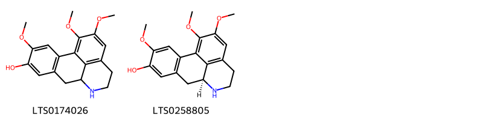{ width=100% }
    <figcaption>Hình ảnh cấu trúc hóa học của 2 hoạt chất thuộc nhóm Aporphines gồm ['4,15,16-trimethoxy-10-azatetracyclo[7.7.1.0²,⁷.0¹³,¹⁷]heptadeca-1(17),2(7),3,5,13,15-hexaen-5-ol (LTS0174026)', 'laurotetanine (LTS0258805)'].</figcaption>
</figure>
#### Nhóm Oxolanes
<figure markdown="span">
    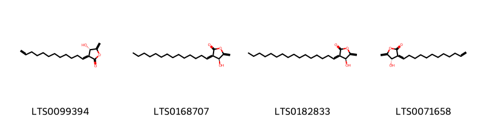{ width=100% }
    <figcaption>Hình ảnh cấu trúc hóa học của 4 hoạt chất thuộc nhóm Oxolanes gồm ['(3e,4s)-3-(dodec-11-en-1-ylidene)-4-hydroxy-5-methylideneoxolan-2-one (LTS0099394)', 'isoobtusilactone a (LTS0168707)', '(3z,4s)-3-hexadecylidene-4-hydroxy-5-methylideneoxolan-2-one (LTS0182833)', '(3z,4s)-3-(dodec-11-en-1-ylidene)-4-hydroxy-5-methylideneoxolan-2-one (LTS0071658)'].</figcaption>
</figure>
#### Nhóm Prenol lipids
<figure markdown="span">
    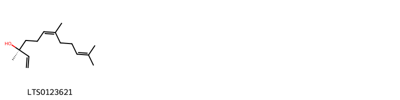{ width=100% }
    <figcaption>Hình ảnh cấu trúc hóa học của 1 hoạt chất thuộc nhóm Prenol lipids gồm ['(6z)-(+)-nerolidol (LTS0123621)'].</figcaption>
</figure>
#### Nhóm Tetrahydrofurans
<figure markdown="span">
    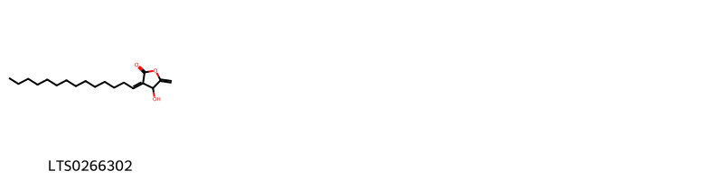{ width=100% }
    <figcaption>Hình ảnh cấu trúc hóa học của 1 hoạt chất thuộc nhóm Tetrahydrofurans gồm ['(3z)-4-hydroxy-5-methylidene-3-tetradecylideneoxolan-2-one (LTS0266302)'].</figcaption>
</figure>

---

### Dược dân tộc học

Danh sách các quốc gia có sử dụng *Lindera benzoin* trong điều trị các bệnh. 

| Country        | Disease              | Bệnh                 |
|:---------------|:---------------------|:---------------------|
| US             | Sudorific, Vermifuge | Ngạt nước, Vermifuge |
| US(Appalachia) | Tonic                | (thuộc) trương lực   |

---

---
## Lindera glauca
### Thông tin về thực vật

!!! info "Phân loại thực vật của *Lindera glauca* từ GIBF:"
    - **Kingdom:** Plantae
    - **Phylum:** Tracheophyta
    - **Order:** Laurales
    - **Family:** Lauraceae
    - **Genus:** Lindera
    - **Species:** *Lindera glauca*

 

| Label (VI)   | Label (EN)   | Scientific Name   | Descriptions (VI)   | Descriptions (EN)   | Also Known As (VI)   | Also Known As (EN)      |
|:-------------|:-------------|:------------------|:--------------------|:--------------------|:---------------------|:------------------------|
| N/A          | N/A          | Lindera glauca    | loài thực vật       | species of plant    | ['']                 | ['gray-blue spicebush'] |

#### Phân bố trên thế giới

**Từ CSDL GIBF** Japan, Korea, Republic of, Chinese Taipei, United States of America, China

#### Phân bố tại Việt Nam

**Từ CSDL GIBF**: Không có ghi nhận ở Việt Nam

---
### Thành phần hóa học
        
- Theo cơ sở dữ liệu lotus: Từ loài *Lindera glauca* đã phân lập và xác định được 103 hoạt chất thuộc về các nhóm Flavonoids, Prenol lipids, Steroids and steroid derivatives, Phenylpropanoic acids, Pyrrolidines, Cinnamic acids and derivatives, Aporphines, Phenanthrenes and derivatives, Tetrahydrofurans, Benzene and substituted derivatives, Oxolanes, Dihydrofurans, Organooxygen compounds, Phenols, Isoquinolines and derivatives, Protoberberine alkaloids and derivatives. 

|    | chemicalTaxonomyClassyfireClass          |   smiles_count |
|---:|:-----------------------------------------|---------------:|
|  0 | Aporphines                               |             20 |
|  1 | Benzene and substituted derivatives      |              5 |
|  2 | Cinnamic acids and derivatives           |              7 |
|  3 | Dihydrofurans                            |              3 |
|  4 | Flavonoids                               |              7 |
|  5 | Isoquinolines and derivatives            |              4 |
|  6 | Organooxygen compounds                   |              4 |
|  7 | Oxolanes                                 |             11 |
|  8 | Phenanthrenes and derivatives            |              6 |
|  9 | Phenols                                  |              1 |
| 10 | Phenylpropanoic acids                    |              1 |
| 11 | Prenol lipids                            |             13 |
| 12 | Protoberberine alkaloids and derivatives |              3 |
| 13 | Pyrrolidines                             |              1 |
| 14 | Steroids and steroid derivatives         |              5 |
| 15 | Tetrahydrofurans                         |             12 |

#### Nhóm Aporphines
<figure markdown="span">
    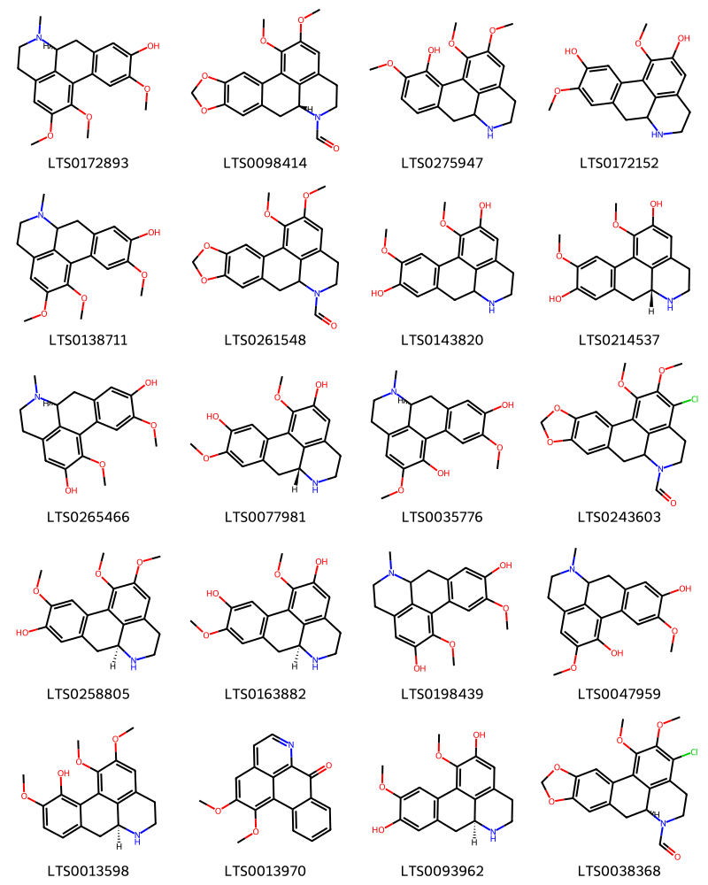{ width=100% }
    <figcaption>Hình ảnh cấu trúc hóa học của 20 hoạt chất thuộc nhóm Aporphines gồm ['(9s)-4,15,16-trimethoxy-10-methyl-10-azatetracyclo[7.7.1.0²,⁷.0¹³,¹⁷]heptadeca-1(16),2(7),3,5,13(17),14-hexaen-5-ol (LTS0172893)', '(12r)-18,19-dimethoxy-5,7-dioxa-13-azapentacyclo[10.7.1.0²,¹⁰.0⁴,⁸.0¹⁶,²⁰]icosa-1(19),2,4(8),9,16(20),17-hexaene-13-carbaldehyde (LTS0098414)', '4,15,16-trimethoxy-10-azatetracyclo[7.7.1.0²,⁷.0¹³,¹⁷]heptadeca-1(16),2,4,6,13(17),14-hexaen-3-ol (LTS0275947)', '5,16-dimethoxy-10-azatetracyclo[7.7.1.0²,⁷.0¹³,¹⁷]heptadeca-1(16),2(7),3,5,13(17),14-hexaene-4,15-diol (LTS0172152)', '4,15,16-trimethoxy-10-methyl-10-azatetracyclo[7.7.1.0²,⁷.0¹³,¹⁷]heptadeca-1(16),2(7),3,5,13(17),14-hexaen-5-ol (LTS0138711)', '18,19-dimethoxy-5,7-dioxa-13-azapentacyclo[10.7.1.0²,¹⁰.0⁴,⁸.0¹⁶,²⁰]icosa-1(19),2,4(8),9,16(20),17-hexaene-13-carbaldehyde (LTS0261548)', '4,16-dimethoxy-10-azatetracyclo[7.7.1.0²,⁷.0¹³,¹⁷]heptadeca-1(17),2(7),3,5,13,15-hexaene-5,15-diol (LTS0143820)', '(9r)-4,16-dimethoxy-10-azatetracyclo[7.7.1.0²,⁷.0¹³,¹⁷]heptadeca-1(17),2(7),3,5,13,15-hexaene-5,15-diol (LTS0214537)', '(9s)-4,16-dimethoxy-10-methyl-10-azatetracyclo[7.7.1.0²,⁷.0¹³,¹⁷]heptadeca-1(16),2(7),3,5,13(17),14-hexaene-5,15-diol (LTS0265466)', '(9r)-5,16-dimethoxy-10-azatetracyclo[7.7.1.0²,⁷.0¹³,¹⁷]heptadeca-1(16),2(7),3,5,13(17),14-hexaene-4,15-diol (LTS0077981)', '(9s)-4,15-dimethoxy-10-methyl-10-azatetracyclo[7.7.1.0²,⁷.0¹³,¹⁷]heptadeca-1(16),2(7),3,5,13(17),14-hexaene-5,16-diol (LTS0035776)', '17-chloro-18,19-dimethoxy-5,7-dioxa-13-azapentacyclo[10.7.1.0²,¹⁰.0⁴,⁸.0¹⁶,²⁰]icosa-1(19),2,4(8),9,16(20),17-hexaene-13-carbaldehyde (LTS0243603)', 'laurotetanine (LTS0258805)', '(9s)-5,16-dimethoxy-10-azatetracyclo[7.7.1.0²,⁷.0¹³,¹⁷]heptadeca-1(16),2(7),3,5,13(17),14-hexaene-4,15-diol (LTS0163882)', '4,16-dimethoxy-10-methyl-10-azatetracyclo[7.7.1.0²,⁷.0¹³,¹⁷]heptadeca-1(16),2(7),3,5,13(17),14-hexaene-5,15-diol (LTS0198439)', '4,15-dimethoxy-10-methyl-10-azatetracyclo[7.7.1.0²,⁷.0¹³,¹⁷]heptadeca-1(16),2(7),3,5,13(17),14-hexaene-5,16-diol (LTS0047959)', '(9s)-4,15,16-trimethoxy-10-azatetracyclo[7.7.1.0²,⁷.0¹³,¹⁷]heptadeca-1(16),2,4,6,13(17),14-hexaen-3-ol (LTS0013598)', 'lysicamine (LTS0013970)', 'laurolitsine (LTS0093962)', '(12s)-17-chloro-18,19-dimethoxy-5,7-dioxa-13-azapentacyclo[10.7.1.0²,¹⁰.0⁴,⁸.0¹⁶,²⁰]icosa-1(19),2,4(8),9,16(20),17-hexaene-13-carbaldehyde (LTS0038368)'].</figcaption>
</figure>
#### Nhóm Benzene and substituted derivatives
<figure markdown="span">
    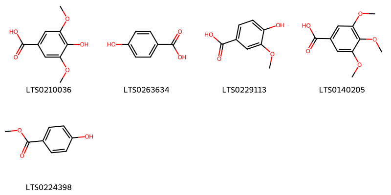{ width=100% }
    <figcaption>Hình ảnh cấu trúc hóa học của 5 hoạt chất thuộc nhóm Benzene and substituted derivatives gồm ['syringic acid (LTS0210036)', 'p-hydroxybenzoic acid (LTS0263634)', 'vanillic acid (LTS0229113)', '3,4,5-trimethoxybenzoic acid (LTS0140205)', 'paraben (LTS0224398)'].</figcaption>
</figure>
#### Nhóm Cinnamic acids and derivatives
<figure markdown="span">
    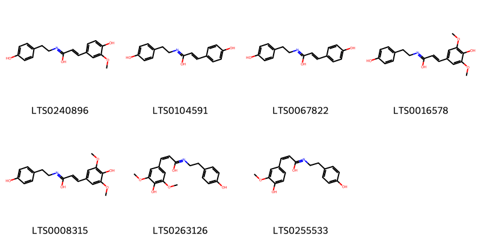{ width=100% }
    <figcaption>Hình ảnh cấu trúc hóa học của 7 hoạt chất thuộc nhóm Cinnamic acids and derivatives gồm ['3-(4-hydroxy-3-methoxyphenyl)-n-[2-(4-hydroxyphenyl)ethyl]prop-2-enimidic acid (LTS0240896)', '3-(4-hydroxyphenyl)-n-[2-(4-hydroxyphenyl)ethyl]prop-2-enimidic acid (LTS0104591)', '(2e)-3-(4-hydroxyphenyl)-n-[2-(4-hydroxyphenyl)ethyl]prop-2-enimidic acid (LTS0067822)', '(2e)-3-(4-hydroxy-3,5-dimethoxyphenyl)-n-[2-(4-hydroxyphenyl)ethyl]prop-2-enimidic acid (LTS0016578)', '3-(4-hydroxy-3,5-dimethoxyphenyl)-n-[2-(4-hydroxyphenyl)ethyl]prop-2-enimidic acid (LTS0008315)', '(2z)-3-(4-hydroxy-3,5-dimethoxyphenyl)-n-[2-(4-hydroxyphenyl)ethyl]prop-2-enimidic acid (LTS0263126)', '(2z)-3-(4-hydroxy-3-methoxyphenyl)-n-[2-(4-hydroxyphenyl)ethyl]prop-2-enimidic acid (LTS0255533)'].</figcaption>
</figure>
#### Nhóm Dihydrofurans
<figure markdown="span">
    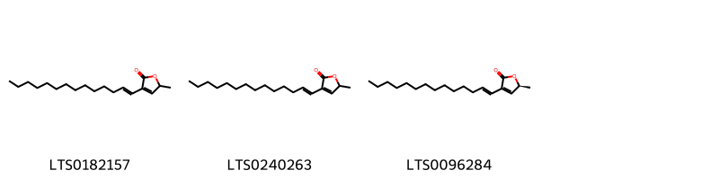{ width=100% }
    <figcaption>Hình ảnh cấu trúc hóa học của 3 hoạt chất thuộc nhóm Dihydrofurans gồm ['5-methyl-3-(tetradec-1-en-1-yl)-5h-furan-2-one (LTS0182157)', '5-methyl-3-[(1e)-tetradec-1-en-1-yl]-5h-furan-2-one (LTS0240263)', '(5s)-5-methyl-3-[(1e)-tetradec-1-en-1-yl]-5h-furan-2-one (LTS0096284)'].</figcaption>
</figure>
#### Nhóm Flavonoids
<figure markdown="span">
    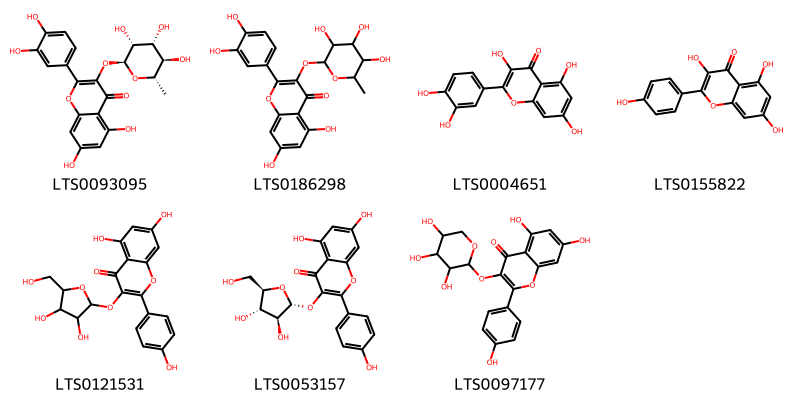{ width=100% }
    <figcaption>Hình ảnh cấu trúc hóa học của 7 hoạt chất thuộc nhóm Flavonoids gồm ['quercitrin (LTS0093095)', 'quercitrin (LTS0186298)', 'quercetin (LTS0004651)', 'kaempherol (LTS0155822)', 'juglanin (LTS0121531)', '3-{[(2r,3s,4s,5r)-3,4-dihydroxy-5-(hydroxymethyl)oxolan-2-yl]oxy}-5,7-dihydroxy-2-(4-hydroxyphenyl)chromen-4-one (LTS0053157)', '5,7-dihydroxy-2-(4-hydroxyphenyl)-3-[(3,4,5-trihydroxyoxan-2-yl)oxy]chromen-4-one (LTS0097177)'].</figcaption>
</figure>
#### Nhóm Isoquinolines and derivatives
<figure markdown="span">
    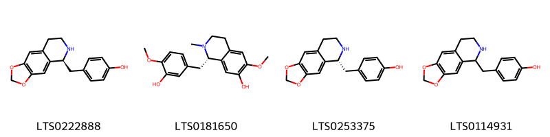{ width=100% }
    <figcaption>Hình ảnh cấu trúc hóa học của 4 hoạt chất thuộc nhóm Isoquinolines and derivatives gồm ['4-[(5s)-2h,5h,6h,7h,8h-[1,3]dioxolo[4,5-g]isoquinolin-5-ylmethyl]phenol (LTS0222888)', '(+,-)-reticuline (LTS0181650)', 'norcinnamolaurine (LTS0253375)', '4-{2h,5h,6h,7h,8h-[1,3]dioxolo[4,5-g]isoquinolin-5-ylmethyl}phenol (LTS0114931)'].</figcaption>
</figure>
#### Nhóm Organooxygen compounds
<figure markdown="span">
    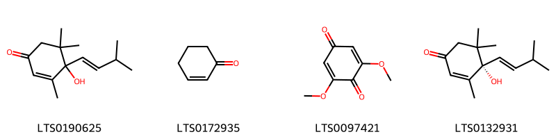{ width=100% }
    <figcaption>Hình ảnh cấu trúc hóa học của 4 hoạt chất thuộc nhóm Organooxygen compounds gồm ['4-hydroxy-3,5,5-trimethyl-4-(3-methylbut-1-en-1-yl)cyclohex-2-en-1-one (LTS0190625)', 'cyclohexenone (LTS0172935)', '2,6-dimethoxy-1,4-benzoquinone (LTS0097421)', '(4s)-4-hydroxy-3,5,5-trimethyl-4-[(1e)-3-methylbut-1-en-1-yl]cyclohex-2-en-1-one (LTS0132931)'].</figcaption>
</figure>
#### Nhóm Oxolanes
<figure markdown="span">
    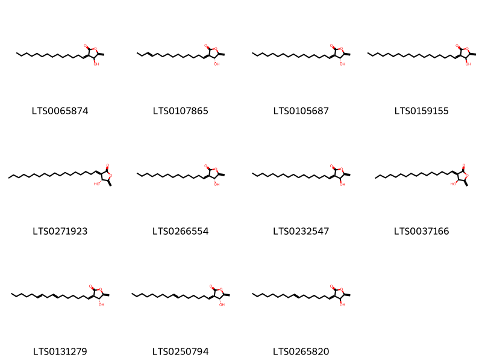{ width=100% }
    <figcaption>Hình ảnh cấu trúc hóa học của 11 hoạt chất thuộc nhóm Oxolanes gồm ['4-hydroxy-5-methylidene-3-tetradecylideneoxolan-2-one (LTS0065874)', '(3z,4r)-4-hydroxy-5-methylidene-3-[(11e)-tetradec-11-en-1-ylidene]oxolan-2-one (LTS0107865)', '(3z,4r)-3-hexadecylidene-4-hydroxy-5-methylideneoxolan-2-one (LTS0105687)', '4-hydroxy-5-methylidene-3-octadecylideneoxolan-2-one (LTS0159155)', '(3e,4r)-4-hydroxy-5-methylidene-3-octadecylideneoxolan-2-one (LTS0271923)', '(3z,4r)-4-hydroxy-5-methylidene-3-tetradecylideneoxolan-2-one (LTS0266554)', '3-hexadecylidene-4-hydroxy-5-methylideneoxolan-2-one (LTS0232547)', '(3e,4s)-3-hexadecylidene-4-hydroxy-5-methylideneoxolan-2-one (LTS0037166)', '(3z,4r)-3-[(7e,10e)-hexadeca-7,10-dien-1-ylidene]-4-hydroxy-5-methylideneoxolan-2-one (LTS0131279)', '(3z,4r)-3-[(7e)-hexadec-7-en-1-ylidene]-4-hydroxy-5-methylideneoxolan-2-one (LTS0250794)', '3-(hexadec-7-en-1-ylidene)-4-hydroxy-5-methylideneoxolan-2-one (LTS0265820)'].</figcaption>
</figure>
#### Nhóm Phenanthrenes and derivatives
<figure markdown="span">
    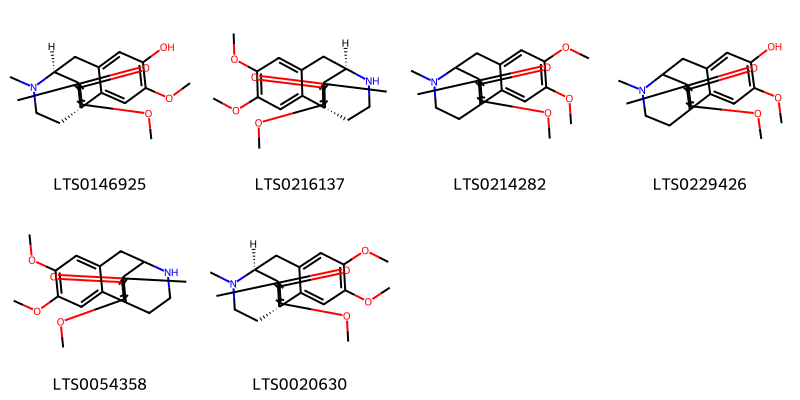{ width=100% }
    <figcaption>Hình ảnh cấu trúc hóa học của 6 hoạt chất thuộc nhóm Phenanthrenes and derivatives gồm ['(1s,9s)-5-hydroxy-4,13-dimethoxy-17-methyl-17-azatetracyclo[7.5.3.0¹,¹⁰.0²,⁷]heptadeca-2,4,6,10,13-pentaen-12-one (LTS0146925)', '(1r,9r)-4,5,13-trimethoxy-17-azatetracyclo[7.5.3.0¹,¹⁰.0²,⁷]heptadeca-2,4,6,10,13-pentaen-12-one (LTS0216137)', 'o-methylpallidine (LTS0214282)', '5-hydroxy-4,13-dimethoxy-17-methyl-17-azatetracyclo[7.5.3.0¹,¹⁰.0²,⁷]heptadeca-2,4,6,10,13-pentaen-12-one (LTS0229426)', '4,5,13-trimethoxy-17-azatetracyclo[7.5.3.0¹,¹⁰.0²,⁷]heptadeca-2,4,6,10,13-pentaen-12-one (LTS0054358)', '(1s,9s)-4,5,13-trimethoxy-17-methyl-17-azatetracyclo[7.5.3.0¹,¹⁰.0²,⁷]heptadeca-2,4,6,10,13-pentaen-12-one (LTS0020630)'].</figcaption>
</figure>
#### Nhóm Phenols
<figure markdown="span">
    { width=100% }
    <figcaption>Hình ảnh cấu trúc hóa học của 1 hoạt chất thuộc nhóm Phenols gồm ['(2e)-3-(4-hydroxy-3-methoxyphenyl)-n-[2-(4-hydroxyphenyl)ethyl]prop-2-enimidic acid (LTS0187051)'].</figcaption>
</figure>
#### Nhóm Phenylpropanoic acids
<figure markdown="span">
    { width=100% }
    <figcaption>Hình ảnh cấu trúc hóa học của 1 hoạt chất thuộc nhóm Phenylpropanoic acids gồm ['dihydrocaffeic acid (LTS0157090)'].</figcaption>
</figure>
#### Nhóm Prenol lipids
<figure markdown="span">
    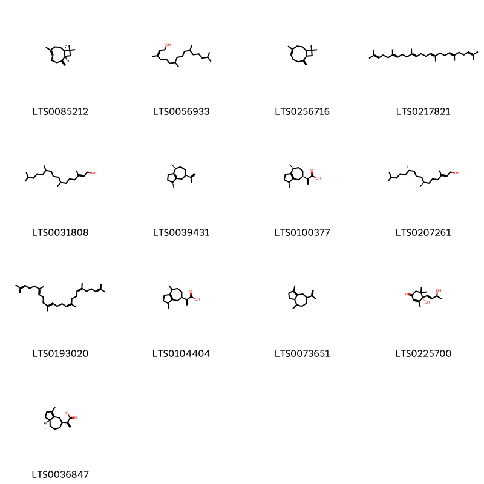{ width=100% }
    <figcaption>Hình ảnh cấu trúc hóa học của 13 hoạt chất thuộc nhóm Prenol lipids gồm ['caryophyllene (LTS0085212)', '3,7,11,15-tetramethylhexadec-2-en-1-ol (LTS0056933)', '4,11,11-trimethyl-8-methylidenebicyclo[7.2.0]undec-4-ene (LTS0256716)', 'squalene (LTS0217821)', 'phytol (LTS0031808)', 'guaiene (LTS0039431)', '2-[(3s,5r,8s)-3,8-dimethyl-1,2,3,4,5,6,7,8-octahydroazulen-5-yl]prop-2-enoic acid (LTS0100377)', '(2e,7s,11s)-3,7,11,15-tetramethylhexadec-2-en-1-ol (LTS0207261)', '2,6,10,15,19,23-hexamethyltetracosa-2,6,10,14,18,22-hexaene (LTS0193020)', '2-(3,8-dimethyl-1,2,3,4,5,6,7,8-octahydroazulen-5-yl)prop-2-enoic acid (LTS0104404)', '1,4-dimethyl-7-(prop-1-en-2-yl)-2,3,3a,4,5,6,7,8-octahydroazulene (LTS0073651)', '(4s)-4-hydroxy-4-(3-hydroxybut-1-en-1-yl)-3,5,5-trimethylcyclohex-2-en-1-one (LTS0225700)', '2-[(5s,8s,8as)-3,8-dimethyl-1,2,4,5,6,7,8,8a-octahydroazulen-5-yl]prop-2-enoic acid (LTS0036847)'].</figcaption>
</figure>
#### Nhóm Protoberberine alkaloids and derivatives
<figure markdown="span">
    { width=100% }
    <figcaption>Hình ảnh cấu trúc hóa học của 3 hoạt chất thuộc nhóm Protoberberine alkaloids and derivatives gồm ['canadin (LTS0116620)', '(s)-canadine (LTS0147391)', '(+)-canadine (LTS0054524)'].</figcaption>
</figure>
#### Nhóm Pyrrolidines
<figure markdown="span">
    { width=100% }
    <figcaption>Hình ảnh cấu trúc hóa học của 1 hoạt chất thuộc nhóm Pyrrolidines gồm ['2-oxopyrrolidine-1-carboximidic acid (LTS0107936)'].</figcaption>
</figure>
#### Nhóm Steroids and steroid derivatives
<figure markdown="span">
    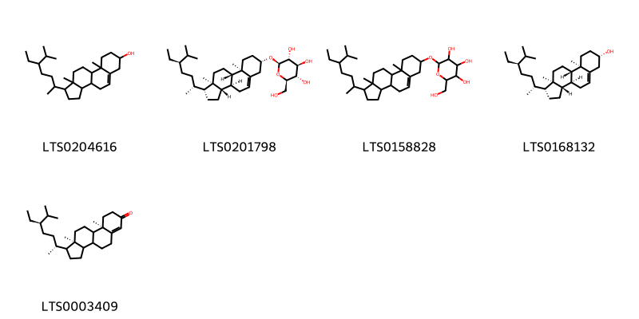{ width=100% }
    <figcaption>Hình ảnh cấu trúc hóa học của 5 hoạt chất thuộc nhóm Steroids and steroid derivatives gồm ['stigmast-5-en-3-ol, (3β)- (LTS0204616)', 'sitogluside (LTS0201798)', '2-{[1-(5-ethyl-6-methylheptan-2-yl)-9a,11a-dimethyl-1h,2h,3h,3ah,3bh,4h,6h,7h,8h,9h,9bh,10h,11h-cyclopenta[a]phenanthren-7-yl]oxy}-6-(hydroxymethyl)oxane-3,4,5-triol (LTS0158828)', 'sitosterol (LTS0168132)', '(9ar,11ar)-1-[(2r,5r)-5-ethyl-6-methylheptan-2-yl]-9a,11a-dimethyl-1h,2h,3h,3ah,3bh,4h,5h,8h,9h,9bh,10h,11h-cyclopenta[a]phenanthren-7-one (LTS0003409)'].</figcaption>
</figure>
#### Nhóm Tetrahydrofurans
<figure markdown="span">
    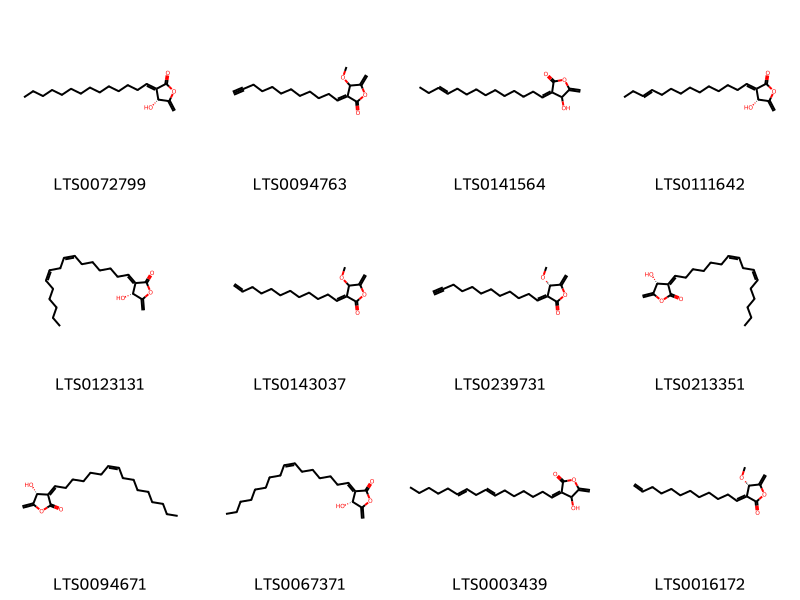{ width=100% }
    <figcaption>Hình ảnh cấu trúc hóa học của 12 hoạt chất thuộc nhóm Tetrahydrofurans gồm ['(3e,4r)-4-hydroxy-5-methylidene-3-tetradecylideneoxolan-2-one (LTS0072799)', '(3e)-3-(dodec-11-yn-1-ylidene)-4-methoxy-5-methylideneoxolan-2-one (LTS0094763)', '4-hydroxy-5-methylidene-3-(tetradec-11-en-1-ylidene)oxolan-2-one (LTS0141564)', '(3e,4r)-4-hydroxy-5-methylidene-3-[(11e)-tetradec-11-en-1-ylidene]oxolan-2-one (LTS0111642)', '(3e,4r)-3-[(7z,10z)-hexadeca-7,10-dien-1-ylidene]-4-hydroxy-5-methylideneoxolan-2-one (LTS0123131)', '(3e)-3-(dodec-11-en-1-ylidene)-4-methoxy-5-methylideneoxolan-2-one (LTS0143037)', '(3e,4s)-3-(dodec-11-yn-1-ylidene)-4-methoxy-5-methylideneoxolan-2-one (LTS0239731)', '(3z,4r)-3-[(7z,10z)-hexadeca-7,10-dien-1-ylidene]-4-hydroxy-5-methylideneoxolan-2-one (LTS0213351)', '(3z,4r)-3-[(7z)-hexadec-7-en-1-ylidene]-4-hydroxy-5-methylideneoxolan-2-one (LTS0094671)', '(3e,4r)-3-[(7z)-hexadec-7-en-1-ylidene]-4-hydroxy-5-methylideneoxolan-2-one (LTS0067371)', '3-(hexadeca-7,10-dien-1-ylidene)-4-hydroxy-5-methylideneoxolan-2-one (LTS0003439)', '(3e,4s)-3-(dodec-11-en-1-ylidene)-4-methoxy-5-methylideneoxolan-2-one (LTS0016172)'].</figcaption>
</figure>

---

### Dược dân tộc học

Danh sách các quốc gia có sử dụng *Lindera glauca* trong điều trị các bệnh. 

| Country   | Disease                           | Bệnh                            |
|:----------|:----------------------------------|:--------------------------------|
| China     | Stomachic, Stimulant, Carminative | Dạ dày, Kích thích, Carminative |

---

---
## Lindera pipericarpa
### Thông tin về thực vật

!!! info "Phân loại thực vật của *Lindera pipericarpa* từ GIBF:"
    - **Kingdom:** Plantae
    - **Phylum:** Tracheophyta
    - **Order:** Laurales
    - **Family:** Lauraceae
    - **Genus:** Lindera
    - **Species:** *Lindera pipericarpa*

 

| Label (VI)   | Label (EN)   | Scientific Name     | Descriptions (VI)   | Descriptions (EN)   | Also Known As (VI)   | Also Known As (EN)   |
|:-------------|:-------------|:--------------------|:--------------------|:--------------------|:---------------------|:---------------------|
| N/A          | N/A          | Lindera pipericarpa | loài thực vật       | species of plant    | ['']                 | ['']                 |

#### Phân bố trên thế giới

**Từ CSDL GIBF** nan, unknown or invalid, Indonesia, China, Singapore, Malaysia, Brunei Darussalam

#### Phân bố tại Việt Nam

**Từ CSDL GIBF**: Không có ghi nhận ở Việt Nam

---
### Thành phần hóa học
        
- Theo cơ sở dữ liệu lotus: Từ loài *Lindera pipericarpa* đã phân lập và xác định được 2 hoạt chất thuộc về các nhóm Aporphines. 

|    | chemicalTaxonomyClassyfireClass   |   smiles_count |
|---:|:----------------------------------|---------------:|
|  0 | Aporphines                        |              2 |

#### Nhóm Aporphines
<figure markdown="span">
    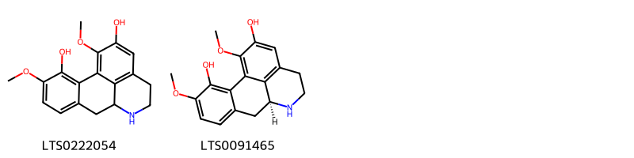{ width=100% }
    <figcaption>Hình ảnh cấu trúc hóa học của 2 hoạt chất thuộc nhóm Aporphines gồm ['4,16-dimethoxy-10-azatetracyclo[7.7.1.0²,⁷.0¹³,¹⁷]heptadeca-1(16),2,4,6,13(17),14-hexaene-3,15-diol (LTS0222054)', '(9s)-4,16-dimethoxy-10-azatetracyclo[7.7.1.0²,⁷.0¹³,¹⁷]heptadeca-1(16),2,4,6,13(17),14-hexaene-3,15-diol (LTS0091465)'].</figcaption>
</figure>

---

### Dược dân tộc học

Danh sách các quốc gia có sử dụng *Lindera pipericarpa* trong điều trị các bệnh. 

| Country   | Disease   | Bệnh     |
|:----------|:----------|:---------|
| Java      | Cosmetic  | Cosmetic |

---

---
## Lindera sericea
### Thông tin về thực vật

!!! info "Phân loại thực vật của *Lindera sericea* từ GIBF:"
    - **Kingdom:** Plantae
    - **Phylum:** Tracheophyta
    - **Order:** Laurales
    - **Family:** Lauraceae
    - **Genus:** Lindera
    - **Species:** *Lindera sericea*

 

| Label (VI)   | Label (EN)   | Scientific Name   | Descriptions (VI)   | Descriptions (EN)   | Also Known As (VI)   | Also Known As (EN)   |
|:-------------|:-------------|:------------------|:--------------------|:--------------------|:---------------------|:---------------------|
| N/A          | N/A          | Lindera sericea   | loài thực vật       | species of plant    | ['']                 | ['']                 |

#### Phân bố trên thế giới

**Từ CSDL GIBF** nan, Korea, Republic of, Japan

#### Phân bố tại Việt Nam

**Từ CSDL GIBF**: Không có ghi nhận ở Việt Nam

---
### Thành phần hóa học
        
- Theo cơ sở dữ liệu lotus: Từ loài *Lindera sericea* đã phân lập và xác định được 9 hoạt chất thuộc về các nhóm Aporphines, Prenol lipids, Linear 1,3-diarylpropanoids. 

|    | chemicalTaxonomyClassyfireClass   |   smiles_count |
|---:|:----------------------------------|---------------:|
|  0 | Aporphines                        |              3 |
|  1 | Linear 1,3-diarylpropanoids       |              4 |
|  2 | Prenol lipids                     |              2 |

#### Nhóm Aporphines
<figure markdown="span">
    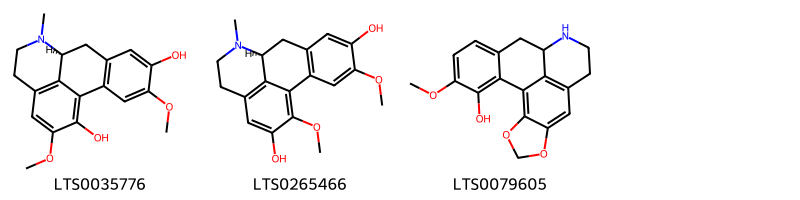{ width=100% }
    <figcaption>Hình ảnh cấu trúc hóa học của 3 hoạt chất thuộc nhóm Aporphines gồm ['(9s)-4,15-dimethoxy-10-methyl-10-azatetracyclo[7.7.1.0²,⁷.0¹³,¹⁷]heptadeca-1(16),2(7),3,5,13(17),14-hexaene-5,16-diol (LTS0035776)', '(9s)-4,16-dimethoxy-10-methyl-10-azatetracyclo[7.7.1.0²,⁷.0¹³,¹⁷]heptadeca-1(16),2(7),3,5,13(17),14-hexaene-5,15-diol (LTS0265466)', '17-methoxy-3,5-dioxa-11-azapentacyclo[10.7.1.0²,⁶.0⁸,²⁰.0¹⁴,¹⁹]icosa-1,6,8(20),14,16,18-hexaen-18-ol (LTS0079605)'].</figcaption>
</figure>
#### Nhóm Linear 1_3-diarylpropanoids
<figure markdown="span">
    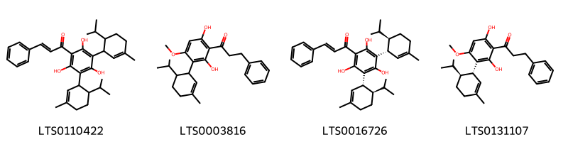{ width=100% }
    <figcaption>Hình ảnh cấu trúc hóa học của Không tìm thấy chú thích hoạt chất thuộc nhóm Linear 1_3-diarylpropanoids gồm Không tìm thấy chú thích.</figcaption>
</figure>
#### Nhóm Prenol lipids
<figure markdown="span">
    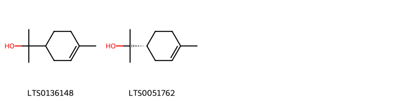{ width=100% }
    <figcaption>Hình ảnh cấu trúc hóa học của 2 hoạt chất thuộc nhóm Prenol lipids gồm ['terpineol (LTS0136148)', 'lily of valley (LTS0051762)'].</figcaption>
</figure>

---

### Dược dân tộc học

Danh sách các quốc gia có sử dụng *Lindera sericea* trong điều trị các bệnh. 

| Country   | Disease              | Bệnh                     |
|:----------|:---------------------|:-------------------------|
| China     | Hemostat, Astringent | Máy cầm máu, Chất làm se |

---

---
## Lindera strychnifolia
### Thông tin về thực vật

!!! info "Phân loại thực vật của *N/A* từ GIBF:"
    - **Kingdom:** Plantae
    - **Phylum:** Tracheophyta
    - **Order:** Laurales
    - **Family:** Lauraceae
    - **Genus:** Lindera
    - **Species:** *N/A*

 

| Label (VI)   | Label (EN)   | Scientific Name       | Descriptions (VI)   | Descriptions (EN)   | Also Known As (VI)   | Also Known As (EN)   |
|:-------------|:-------------|:----------------------|:--------------------|:--------------------|:---------------------|:---------------------|
| N/A          | N/A          | Lindera strychnifolia | loài thực vật       | species of plant    | ['']                 | ['']                 |

#### Phân bố trên thế giới

**Từ CSDL GIBF** Hong Kong, Korea, Republic of, Chinese Taipei, United States of America, China, Canada

#### Phân bố tại Việt Nam

**Từ CSDL GIBF**: Không có ghi nhận ở Việt Nam

---
### Thành phần hóa học
        
- Theo cơ sở dữ liệu lotus: Từ loài *N/A* đã phân lập và xác định được Chưa có hoạt chất nào được phân lập. hoạt chất thuộc về các nhóm Không có hoạt chất nào được phân lập. 

Không có hình ảnh nào được tạo ra

---

### Dược dân tộc học

Danh sách các quốc gia có sử dụng *N/A* trong điều trị các bệnh. 

| Country   | Disease                                                                                                       | Bệnh                                                                                                                         |
|:----------|:--------------------------------------------------------------------------------------------------------------|:-----------------------------------------------------------------------------------------------------------------------------|
| China     | Astringent, Carminative, Carminative, Diaphoretic, Stimulant, Stomachic, Stomachic, Diuretic, Sedative, Tonic | Chất làm se, Carminative, Carminative, Diaphoretic, Chất kích thích, Dạ dày, Dạ dày, Thuốc lợi tiểu, Thuốc an thần, Thuốc bổ |
| Elsewhere | Stomachic                                                                                                     | Sững sờ                                                                                                                      |

---

---
## Lindera tzumu
### Thông tin về thực vật

!!! info "Phân loại thực vật của *Sassafras tzumu* từ GIBF:"
    - **Kingdom:** Plantae
    - **Phylum:** Tracheophyta
    - **Order:** Laurales
    - **Family:** Lauraceae
    - **Genus:** Sassafras
    - **Species:** *Sassafras tzumu*

 

| Label (VI)   | Label (EN)   | Scientific Name   | Descriptions (VI)   | Descriptions (EN)   | Also Known As (VI)   | Also Known As (EN)   |
|:-------------|:-------------|:------------------|:--------------------|:--------------------|:---------------------|:---------------------|
| N/A          | N/A          | Lindera tzumu     | loài thực vật       | species of plant    | ['']                 | ['']                 |

#### Phân bố trên thế giới

**Từ CSDL GIBF** China

#### Phân bố tại Việt Nam

**Từ CSDL GIBF**: Không có ghi nhận ở Việt Nam

---
### Thành phần hóa học
        
- Theo cơ sở dữ liệu lotus: Từ loài *Sassafras tzumu* đã phân lập và xác định được Chưa có hoạt chất nào được phân lập. hoạt chất thuộc về các nhóm Không có hoạt chất nào được phân lập. 

Không có hình ảnh nào được tạo ra

---

### Dược dân tộc học

Danh sách các quốc gia có sử dụng *Sassafras tzumu* trong điều trị các bệnh. 

| Country   | Disease                 | Bệnh                                |
|:----------|:------------------------|:------------------------------------|
| China     | Parasiticide, Vermifuge | Thuốc diệt ký sinh trùng, Vermifuge |

---

# Chi Daphnidium

??? note "Danh sách các dược liệu thuộc chi"
    
	 - *Daphnidium cubeba*

---
## Daphnidium cubeba
### Thông tin về thực vật

!!! info "Phân loại thực vật của *Litsea cubeba* từ GIBF:"
    - **Kingdom:** Plantae
    - **Phylum:** Tracheophyta
    - **Order:** Laurales
    - **Family:** Lauraceae
    - **Genus:** Litsea
    - **Species:** *Litsea cubeba*

 

| Label (VI)   | Label (EN)   | Scientific Name   | Descriptions (VI)   | Descriptions (EN)   | Also Known As (VI)   | Also Known As (EN)   |
|:-------------|:-------------|:------------------|:--------------------|:--------------------|:---------------------|:---------------------|
| N/A          | N/A          | Daphnidium cubeba |                     |                     | ['']                 | ['']                 |

#### Phân bố trên thế giới

**Từ CSDL GIBF** China

#### Phân bố tại Việt Nam

**Từ CSDL GIBF**: Không có ghi nhận ở Việt Nam

---
### Thành phần hóa học
        
- Theo cơ sở dữ liệu lotus: Từ loài *Litsea cubeba* đã phân lập và xác định được Chưa có hoạt chất nào được phân lập. hoạt chất thuộc về các nhóm Không có hoạt chất nào được phân lập. 

Không có hình ảnh nào được tạo ra

---

### Dược dân tộc học

Danh sách các quốc gia có sử dụng *Litsea cubeba* trong điều trị các bệnh. 

| Country   | Disease                                               | Bệnh                                                 |
|:----------|:------------------------------------------------------|:-----------------------------------------------------|
| China     | Digestive, Stomachic, Expectorant, Tonic, Carminative | Tiêu hóa, Dạ dày, Thuốc long đờm, Tonic, Carminative |

---

# Chi Persea

??? note "Danh sách các dược liệu thuộc chi"
    
	 - *Persea americana*

---
## Persea americana
### Thông tin về thực vật

!!! info "Phân loại thực vật của *Persea americana* từ GIBF:"
    - **Kingdom:** Plantae
    - **Phylum:** Tracheophyta
    - **Order:** Laurales
    - **Family:** Lauraceae
    - **Genus:** Persea
    - **Species:** *Persea americana*

 

| Label (VI)   | Label (EN)   | Scientific Name   | Descriptions (VI)   | Descriptions (EN)                           | Also Known As (VI)                       | Also Known As (EN)                                                         |
|:-------------|:-------------|:------------------|:--------------------|:--------------------------------------------|:-----------------------------------------|:---------------------------------------------------------------------------|
| N/A          | N/A          | Persea americana  | loài thực vật       | species of plant, use Q961769 for the fruit | ['Quả bơ', 'Persea americana', 'Lê dầu'] | ['abacate', 'avocadoes', 'avocados', 'Persea americana', 'alligator pear'] |

#### Phân bố trên thế giới

**Từ CSDL GIBF** nan, United Arab Emirates, Sri Lanka, Australia, Guadeloupe, Belgium, Guatemala, Argentina, Rwanda, Venezuela (Bolivarian Republic of), Panama, French Guiana, Puerto Rico, Cyprus, Chinese Taipei, Spain, Türkiye, Portugal, Honduras, United States of America, Ethiopia, Chile, Belize, South Africa, Uganda, Trinidad and Tobago, Hong Kong, Saint Vincent and the Grenadines, Germany, Thailand, Brazil, New Zealand, Bahamas, Cuba, Mexico, Dominican Republic, France, Dominica, Peru, Viet Nam, Ecuador, French Polynesia, Madagascar, Haiti, Colombia, Costa Rica, Vanuatu, India, Indonesia, Anguilla, Lebanon, Philippines, Cameroon, Malaysia, Northern Mariana Islands, Nepal

#### Phân bố tại Việt Nam

**Từ CSDL GIBF**: Gia Lai

---
### Thành phần hóa học
        
- Theo cơ sở dữ liệu lotus: Từ loài *Persea americana* đã phân lập và xác định được 172 hoạt chất thuộc về các nhóm Phenol ethers, Fatty Acyls, Flavonoids, Prenol lipids, Phenylpropanoic acids, Cinnamic acids and derivatives, Dibenzylbutane lignans, Benzene and substituted derivatives, Unsaturated hydrocarbons, Heteroaromatic compounds, Organooxygen compounds, Saturated hydrocarbons, Phenols, Pyrrolizidines, Furanoid lignans. 

|    | chemicalTaxonomyClassyfireClass     |   smiles_count |
|---:|:------------------------------------|---------------:|
|  0 | Benzene and substituted derivatives |             12 |
|  1 | Cinnamic acids and derivatives      |              7 |
|  2 | Dibenzylbutane lignans              |              2 |
|  3 | Fatty Acyls                         |             31 |
|  4 | Flavonoids                          |             35 |
|  5 | Furanoid lignans                    |              1 |
|  6 | Heteroaromatic compounds            |              3 |
|  7 | Organooxygen compounds              |              5 |
|  8 | Phenol ethers                       |              1 |
|  9 | Phenols                             |              1 |
| 10 | Phenylpropanoic acids               |              1 |
| 11 | Prenol lipids                       |             67 |
| 12 | Pyrrolizidines                      |              2 |
| 13 | Saturated hydrocarbons              |              2 |
| 14 | Unsaturated hydrocarbons            |              1 |

#### Nhóm Benzene and substituted derivatives
<figure markdown="span">
    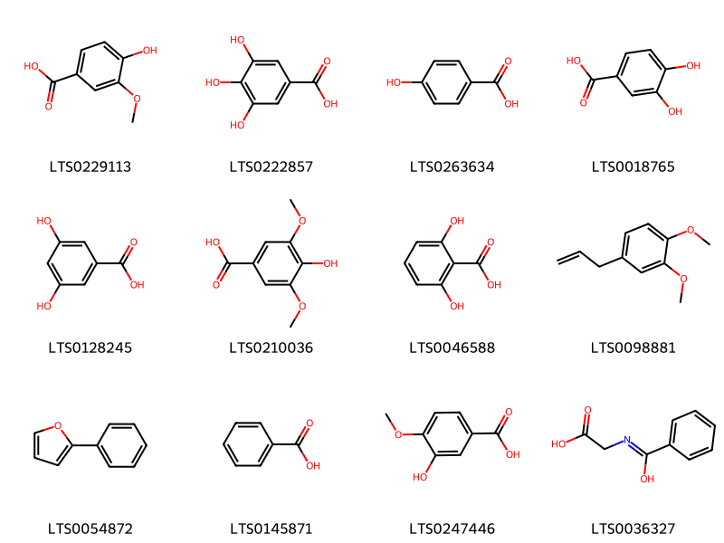{ width=100% }
    <figcaption>Hình ảnh cấu trúc hóa học của 12 hoạt chất thuộc nhóm Benzene and substituted derivatives gồm ['vanillic acid (LTS0229113)', 'galop (LTS0222857)', 'p-hydroxybenzoic acid (LTS0263634)', '3,4-dihydroxybenzoic acid (LTS0018765)', '3,5-dihydroxybenzoic acid (LTS0128245)', 'syringic acid (LTS0210036)', '2,6-dihydroxybenzoic acid (LTS0046588)', 'methyl eugenol (LTS0098881)', '2-phenylfuran (LTS0054872)', 'benzoic acid (LTS0145871)', 'isovanillic acid (LTS0247446)', '{[hydroxy(phenyl)methylidene]amino}acetic acid (LTS0036327)'].</figcaption>
</figure>
#### Nhóm Cinnamic acids and derivatives
<figure markdown="span">
    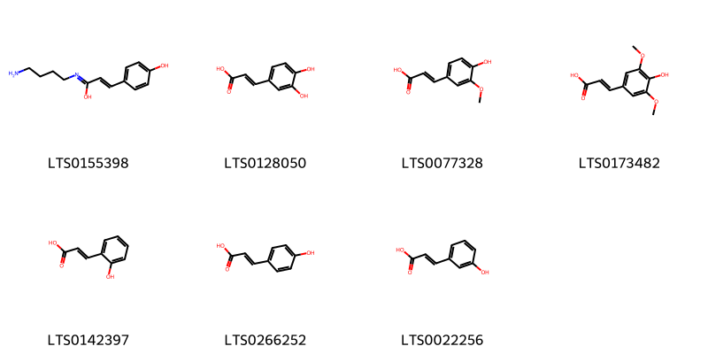{ width=100% }
    <figcaption>Hình ảnh cấu trúc hóa học của 7 hoạt chất thuộc nhóm Cinnamic acids and derivatives gồm ['(2e)-n-(4-aminobutyl)-3-(4-hydroxyphenyl)prop-2-enimidic acid (LTS0155398)', '3,4-dihydroxycinnamic acid (LTS0128050)', 'ferulic acid (LTS0077328)', 'sinapinate (LTS0173482)', 'trans-2-hydroxycinnamic acid (LTS0142397)', 'para-coumaric acid (LTS0266252)', 'm-coumaric acid (LTS0022256)'].</figcaption>
</figure>
#### Nhóm Dibenzylbutane lignans
<figure markdown="span">
    { width=100% }
    <figcaption>Hình ảnh cấu trúc hóa học của 2 hoạt chất thuộc nhóm Dibenzylbutane lignans gồm ['(2s,3r)-2,3-bis[(4-hydroxy-3-methoxyphenyl)(¹³c)methyl](1-¹³c)butane-1,4-diol (LTS0268699)', 'secoisolariciresinol (LTS0086727)'].</figcaption>
</figure>
#### Nhóm Fatty Acyls
<figure markdown="span">
    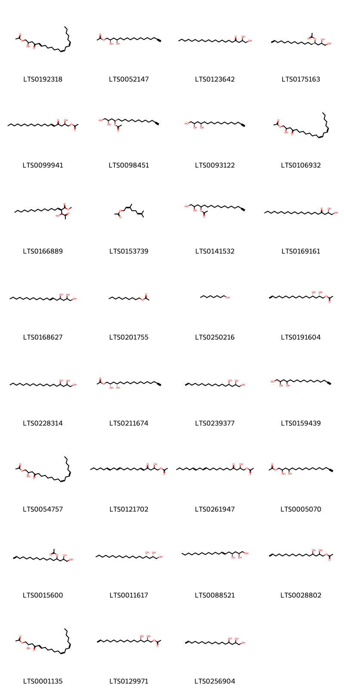{ width=100% }
    <figcaption>Hình ảnh cấu trúc hóa học của 31 hoạt chất thuộc nhóm Fatty Acyls gồm ['(+/-)-persenone a (LTS0192318)', '(2r,4r)-2,4-dihydroxyheptadec-16-yn-1-yl acetate (LTS0052147)', '1,2-dihydroxyhenicosan-4-one (LTS0123642)', '(2r,4r)-1,2-dihydroxyheptadec-16-en-4-yl acetate (LTS0175163)', 'persenone b (LTS0099941)', '(2r,4r)-1,2-dihydroxyheptadec-16-yn-4-yl acetate (LTS0098451)', '(2r,4r)-heptadec-16-yne-1,2,4-triol (LTS0093122)', 'persin (LTS0106932)', 'methyl (2e)-2-(1-hydroxy-2-oxopropyl)hexadec-2-enoate (LTS0166889)', 'neryl acetate (LTS0153739)', '1,2-dihydroxyheptadec-16-yn-4-yl acetate (LTS0141532)', '(2r)-1,2-dihydroxyhenicosan-4-one (LTS0169161)', 'nonadec-6-ene-1,2,4-triol (LTS0168627)', 'decyl acetate (LTS0201755)', 'octanol (LTS0250216)', '(2s,4s)-2,4-dihydroxyheptadec-16-en-1-yl acetate (LTS0191604)', 'nonadecane-1,2,4-triol (LTS0228314)', '(2s,4s)-2,4-dihydroxyheptadec-16-yn-1-yl acetate (LTS0211674)', '(2r,4r)-heptadec-16-ene-1,2,4-triol (LTS0239377)', 'heptadec-16-yne-1,2,4-triol (LTS0159439)', '(2r,12z,15z)-2-hydroxy-4-oxohenicosa-12,15-dien-1-yl acetate (LTS0054757)', '2-hydroxy-4-oxohenicosa-5,12,15-trien-1-yl acetate (LTS0121702)', 'persin (LTS0261947)', '2,4-dihydroxyheptadec-16-yn-1-yl acetate (LTS0005070)', '1,2-dihydroxyheptadec-16-en-4-yl acetate (LTS0015600)', '(2s,4s)-nonadecane-1,2,4-triol (LTS0011617)', '(2s,4s,6e)-nonadec-6-ene-1,2,4-triol (LTS0088521)', '2,4-dihydroxyheptadec-16-en-1-yl acetate (LTS0028802)', '(s)-persenone a (LTS0001135)', '(2r,4r)-2,4-dihydroxyheptadec-16-en-1-yl acetate (LTS0129971)', 'heptadec-16-ene-1,2,4-triol (LTS0256904)'].</figcaption>
</figure>
#### Nhóm Flavonoids
<figure markdown="span">
    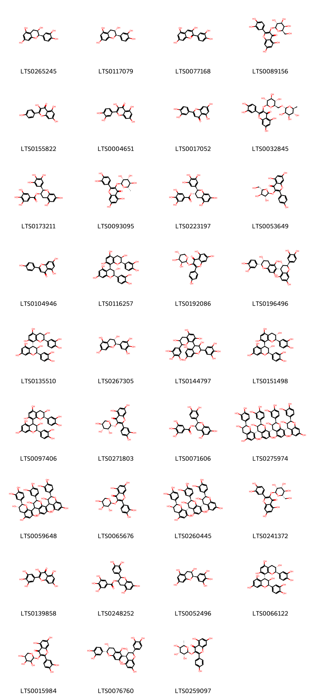{ width=100% }
    <figcaption>Hình ảnh cấu trúc hóa học của 35 hoạt chất thuộc nhóm Flavonoids gồm ['ent-epicatechin (LTS0265245)', '(+)-catechol (LTS0117079)', 'cyanidin (LTS0077168)', 'hyperoside (LTS0089156)', 'kaempherol (LTS0155822)', 'quercetin (LTS0004651)', 'luteolin (LTS0017052)', '3-rutinosyl quercetin (LTS0032845)', '(-)-epigallocatechin gallate (LTS0173211)', 'quercitrin (LTS0093095)', 'gallocatechin 3-o-gallate (LTS0223197)', 'juglanin (LTS0053649)', 'chamomile (LTS0104946)', '(2r,3s,4s)-2-(3,4-dihydroxyphenyl)-4-[(2r,3r)-2-(3,4-dihydroxyphenyl)-3,5,7-trihydroxy-3,4-dihydro-2h-1-benzopyran-8-yl]-3,4-dihydro-2h-1-benzopyran-3,5,7-triol (LTS0116257)', '5,7-dihydroxy-2-(4-hydroxyphenyl)-3-{[(2s,3s,4s,5r)-3,4,5-trihydroxyoxan-2-yl]oxy}chromen-4-one (LTS0192086)', '(2r,3s,4s)-2-(3,4-dihydroxyphenyl)-4-[(2r,3r)-2-(3,4-dihydroxyphenyl)-3,5,7-trihydroxy-3,4-dihydro-2h-1-benzopyran-6-yl]-3,4-dihydro-2h-1-benzopyran-3,5,7-triol (LTS0196496)', '(2r,3r,4r)-2-(3,4-dihydroxyphenyl)-4-[(2r,3r)-2-(3,4-dihydroxyphenyl)-3,5,7-trihydroxy-3,4-dihydro-2h-1-benzopyran-8-yl]-3,4-dihydro-2h-1-benzopyran-3,5,7-triol (LTS0135510)', 'gallocatechol (LTS0267305)', '4-[3,5,7-trihydroxy-2-(3,4,5-trihydroxyphenyl)-3,4-dihydro-2h-1-benzopyran-8-yl]-2-(3,4,5-trihydroxyphenyl)-3,4-dihydro-2h-1-benzopyran-3,5,7-triol (LTS0144797)', '(2r,3s,4s)-2-(3,4-dihydroxyphenyl)-4-[(2r,3s)-2-(3,4-dihydroxyphenyl)-3,5,7-trihydroxy-3,4-dihydro-2h-1-benzopyran-8-yl]-3,4-dihydro-2h-1-benzopyran-3,5,7-triol (LTS0151498)', '(2r,3r)-2-(3,4-dihydroxyphenyl)-4-[(2r,3r)-2-(3,4-dihydroxyphenyl)-3,5,7-trihydroxy-3,4-dihydro-2h-1-benzopyran-8-yl]-3,4-dihydro-2h-1-benzopyran-3,5,7-triol (LTS0097406)', '2-(3,4-dihydroxyphenyl)-5,7-dihydroxy-3-{[(2r,3r,4r,5s)-3,4,5-trihydroxyoxan-2-yl]oxy}chromen-4-one (LTS0271803)', 'epicatechin gallate (LTS0071606)', '(2r,3r,4r)-2-(3,4-dihydroxyphenyl)-8-[(2r,3r,4r)-2-(3,4-dihydroxyphenyl)-3,5,7-trihydroxy-3,4-dihydro-2h-1-benzopyran-4-yl]-4-[(2r,3r,4s)-2-(3,4-dihydroxyphenyl)-4-[(2r,3r)-2-(3,4-dihydroxyphenyl)-3,5,7-trihydroxy-3,4-dihydro-2h-1-benzopyran-8-yl]-3,5,7-trihydroxy-3,4-dihydro-2h-1-benzopyran-8-yl]-3,4-dihydro-2h-1-benzopyran-3,5,7-triol (LTS0275974)', '(2r,3r)-2-(3,4-dihydroxyphenyl)-8-[(2r,3r)-2-(3,4-dihydroxyphenyl)-3,5,7-trihydroxy-3,4-dihydro-2h-1-benzopyran-4-yl]-4-[(2r,3s)-2-(3,4-dihydroxyphenyl)-3,5,7-trihydroxy-3,4-dihydro-2h-1-benzopyran-8-yl]-3,4-dihydro-2h-1-benzopyran-3,5,7-triol (LTS0059648)', 'guaijaverin (LTS0065676)', 'procyanidin c1 (LTS0260445)', '2-(3,4-dihydroxyphenyl)-5,7-dihydroxy-3-{[(2s,3r,4r,5r,6s)-3,4,5-trihydroxy-6-(hydroxymethyl)oxan-2-yl]oxy}chromen-4-one (LTS0241372)', 'myricetin (LTS0139858)', '2-(3,4-dihydroxyphenyl)-5,7-dihydroxy-3,4-dihydro-2h-1-benzopyran-3-yl 3,4,5-trihydroxybenzoate (LTS0248252)', 'epigallocatechin (LTS0052496)', '(2r,3r,4r)-2-(3,4-dihydroxyphenyl)-4-[(2r,3s)-2-(3,4-dihydroxyphenyl)-3,5,7-trihydroxy-3,4-dihydro-2h-1-benzopyran-8-yl]-3,4-dihydro-2h-1-benzopyran-3,5,7-triol (LTS0066122)', 'guaijaverin (LTS0015984)', '(2r,3s,4r)-2-(3,4-dihydroxyphenyl)-4-[(2r,3r)-2-(3,4-dihydroxyphenyl)-3,5,7-trihydroxy-3,4-dihydro-2h-1-benzopyran-6-yl]-3,4-dihydro-2h-1-benzopyran-3,5,7-triol (LTS0076760)', 'afzelin (LTS0259097)'].</figcaption>
</figure>
#### Nhóm Furanoid lignans
<figure markdown="span">
    { width=100% }
    <figcaption>Hình ảnh cấu trúc hóa học của 1 hoạt chất thuộc nhóm Furanoid lignans gồm ['matairesinol (LTS0193475)'].</figcaption>
</figure>
#### Nhóm Heteroaromatic compounds
<figure markdown="span">
    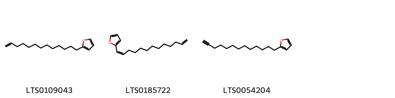{ width=100% }
    <figcaption>Hình ảnh cấu trúc hóa học của 3 hoạt chất thuộc nhóm Heteroaromatic compounds gồm ['2-(tridec-12-en-1-yl)furan (LTS0109043)', '2-[(1z)-trideca-1,12-dien-1-yl]furan (LTS0185722)', '2-(tridec-12-yn-1-yl)furan (LTS0054204)'].</figcaption>
</figure>
#### Nhóm Organooxygen compounds
<figure markdown="span">
    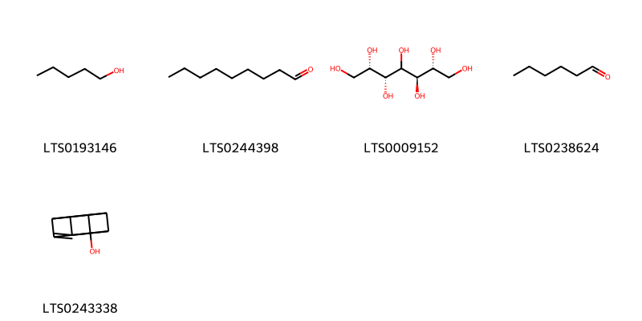{ width=100% }
    <figcaption>Hình ảnh cấu trúc hóa học của 5 hoạt chất thuộc nhóm Organooxygen compounds gồm ['amyl alcohol (LTS0193146)', 'nonanal (LTS0244398)', '(2r,3r,5r,6s)-heptane-1,2,3,4,5,6,7-heptol (LTS0009152)', 'hexanal (LTS0238624)', '3,4,5,8-tetrahydro-2h-cuban-1-ol (LTS0243338)'].</figcaption>
</figure>
#### Nhóm Phenol ethers
<figure markdown="span">
    { width=100% }
    <figcaption>Hình ảnh cấu trúc hóa học của 1 hoạt chất thuộc nhóm Phenol ethers gồm ['tarragon (LTS0245226)'].</figcaption>
</figure>
#### Nhóm Phenols
<figure markdown="span">
    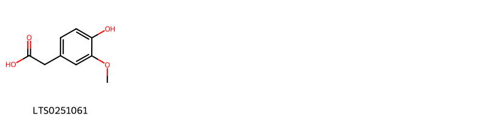{ width=100% }
    <figcaption>Hình ảnh cấu trúc hóa học của 1 hoạt chất thuộc nhóm Phenols gồm ['homovanillic acid (LTS0251061)'].</figcaption>
</figure>
#### Nhóm Phenylpropanoic acids
<figure markdown="span">
    { width=100% }
    <figcaption>Hình ảnh cấu trúc hóa học của 1 hoạt chất thuộc nhóm Phenylpropanoic acids gồm ['hydroxyphenyl propionic acid (LTS0119368)'].</figcaption>
</figure>
#### Nhóm Prenol lipids
<figure markdown="span">
    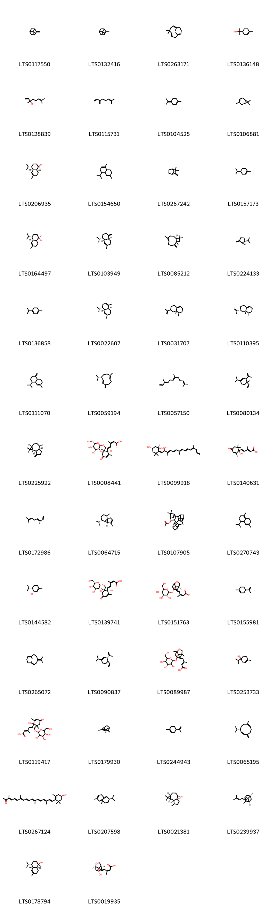{ width=100% }
    <figcaption>Hình ảnh cấu trúc hóa học của 67 hoạt chất thuộc nhóm Prenol lipids gồm ['β-pinene (LTS0117550)', 'α pinene (LTS0132416)', 'humulene (LTS0263171)', 'terpineol (LTS0136148)', 'linalool, (+-)- (LTS0128839)', 'α-myrcene (LTS0115731)', 'terpinolene (LTS0104525)', 'monoterpenes (LTS0106881)', 'α-cadinol (LTS0206935)', '4-isopropyl-1,6-dimethyl-3,4,4a,7,8,8a-hexahydronaphthalene (LTS0154650)', 'camphene (LTS0267242)', 'phellandrene (LTS0157173)', '(1r,4s,4ar)-4-isopropyl-1,6-dimethyl-3,4,4a,7,8,8a-hexahydro-2h-naphthalen-1-ol (LTS0164497)', '(+)-gamma-cadinene (LTS0103949)', 'caryophyllene (LTS0085212)', 'sabinene (LTS0224133)', 'terpinene (LTS0136858)', 'α-muurolene (LTS0022607)', 'valencene (LTS0031707)', 'valencene (LTS0110395)', '4-isopropyl-6-methyl-1-methylidene-3,4,4a,7,8,8a-hexahydro-2h-naphthalene (LTS0111070)', '(-)-germacrene d (LTS0059194)', 'farnesene (LTS0057150)', '4-ethenyl-1-isopropyl-4-methyl-3-(prop-1-en-2-yl)cyclohex-1-ene (LTS0080134)', 'β-gurjunene (LTS0225922)', '(2z,4e)-5-[(1r,6r)-1-hydroxy-2,6-dimethyl-4-oxo-6-({[(2r,3s,4s,5r,6s)-3,4,5-trihydroxy-6-(hydroxymethyl)oxan-2-yl]oxy}methyl)cyclohex-2-en-1-yl]-3-methylpenta-2,4-dienoic acid (LTS0008441)', '(1s,3s,6z)-6-[(2r,3e,5e,7e,9e,11e)-2-hydroxy-3,7,12-trimethylpentadeca-3,5,7,9,11,14-hexaen-1-ylidene]-1,5,5-trimethylcyclohexane-1,3-diol (LTS0099918)', 'abscisic acid,  (LTS0140631)', '3,7-dimethyl-1,3,6-octatriene (LTS0172986)', '(1s,5r,7s,10r)-7-isopropyl-4,10-dimethyltricyclo[4.4.0.0¹,⁵]dec-3-ene (LTS0064715)', '4,6,6-trimethyl-3-(2,6,6-trimethyl-3-{2,6,6-trimethylbicyclo[3.1.1]hept-1-en-3-yl}bicyclo[3.1.1]hept-1-en-3-yl)bicyclo[3.1.1]hept-4-en-2-yl acetate (LTS0107905)', '4-isopropyl-1,6-dimethyl-2,3,4,4a,7,8-hexahydronaphthalene (LTS0270743)', '(1r,6s)-6-isopropyl-3-methylcyclohex-2-en-1-ol (LTS0144582)', '(2z,4e)-5-[(1r,6r)-1-hydroxy-2,6-dimethyl-4-oxo-6-({[(2r,3r,4s,5s,6r)-3,4,5-trihydroxy-6-(hydroxymethyl)oxan-2-yl]oxy}methyl)cyclohex-2-en-1-yl]-3-methylpenta-2,4-dienoic acid (LTS0139741)', '(2z,4e)-5-[(1r,3s,5r,8s)-8-hydroxy-1,5-dimethyl-3-{[(2r,3r,4s,5s,6r)-3,4,5-trihydroxy-6-(hydroxymethyl)oxan-2-yl]oxy}-6-oxabicyclo[3.2.1]octan-8-yl]-3-methylpenta-2,4-dienoic acid (LTS0151763)', 'limonene,  (LTS0155981)', 'germacrene b (LTS0265072)', 'elemene (LTS0090837)', '5-(8-hydroxy-1,5-dimethyl-3-{[3,4,5-trihydroxy-6-(hydroxymethyl)oxan-2-yl]oxy}-6-oxabicyclo[3.2.1]octan-8-yl)-3-methylpenta-2,4-dienoic acid (LTS0089987)', '4-terpineol (LTS0253733)', '5-[1-hydroxy-2,6-dimethyl-4-oxo-6-({[3,4,5-trihydroxy-6-(hydroxymethyl)oxan-2-yl]oxy}methyl)cyclohex-2-en-1-yl]-3-methylpenta-2,4-dienoic acid (LTS0119417)', 'tricyclene (LTS0179930)', 'α-limonene (LTS0244943)', '(1z,6z,8s)-8-isopropyl-1-methyl-5-methylidenecyclodeca-1,6-diene (LTS0065195)', '(3e,5e,7e,9e,11e,13e,15e,17e)-18-[(4r)-4-hydroxy-2,6,6-trimethylcyclohex-1-en-1-yl]-3,7,12,16-tetramethyloctadeca-3,5,7,9,11,13,15,17-octaen-2-one (LTS0267124)', 'α-copaene (LTS0207598)', '(1ar,4r,4ar,7as,7bs)-1,1,4,7-tetramethyl-octahydro-1ah-cyclopropa[e]azulen-4-ol (LTS0021381)', '(-)-trans-α-bergamotene (LTS0239937)', 'α-cadinol (LTS0178794)', 'dihydrophaseic acid (LTS0019935)', 'β-ocimene (LTS0242381)', '(1r,2s,7s,8s)-8-isopropyl-1,3-dimethyltricyclo[4.4.0.0²,⁷]dec-3-ene (LTS0190031)', 'nerolidol isomers (LTS0007569)', '(2z,4e)-5-[(1r,3r,5r,8s)-8-hydroxy-1,5-dimethyl-3-{[(2r,3r,4s,5s,6r)-3,4,5-trihydroxy-6-(hydroxymethyl)oxan-2-yl]oxy}-6-oxabicyclo[3.2.1]octan-8-yl]-3-methylpenta-2,4-dienoic acid (LTS0065650)', 'ledol (LTS0243935)', 'gamma-muurolene (LTS0052920)', '(-)-β-bisabolene (LTS0009940)', '6-[(3e,5e,7e,9e)-2-hydroxy-3,7,12-trimethylpentadeca-3,5,7,9,11,14-hexaen-1-ylidene]-1,5,5-trimethylcyclohexane-1,3-diol (LTS0015166)', 'carvacrol (LTS0012882)', 'delta-cadinol (LTS0013807)', 'terpinene 4-acetate (LTS0008191)', '(1s,4r,4ar,8ar)-1-isopropyl-4,7-dimethyl-2,3,4,5,6,8a-hexahydro-1h-naphthalen-4a-ol (LTS0018576)', 'delta-cadinene (LTS0019321)', '(4e)-5-[(1s)-1-hydroxy-2,6,6-trimethyl-4-oxocyclohex-2-en-1-yl]-3-methylpenta-2,4-dienoic acid (LTS0268716)', 'carvone, (+)- (LTS0027671)', '(-)-α-cubebene (LTS0042045)', '(-)-β-cubebene (LTS0123697)'].</figcaption>
</figure>
#### Nhóm Pyrrolizidines
<figure markdown="span">
    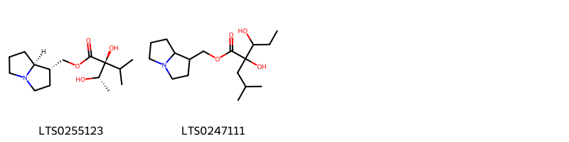{ width=100% }
    <figcaption>Hình ảnh cấu trúc hóa học của 2 hoạt chất thuộc nhóm Pyrrolizidines gồm ['viridiflorine (LTS0255123)', 'hexahydro-1h-pyrrolizin-1-ylmethyl 2,3-dihydroxy-2-(2-methylpropyl)pentanoate (LTS0247111)'].</figcaption>
</figure>
#### Nhóm Saturated hydrocarbons
<figure markdown="span">
    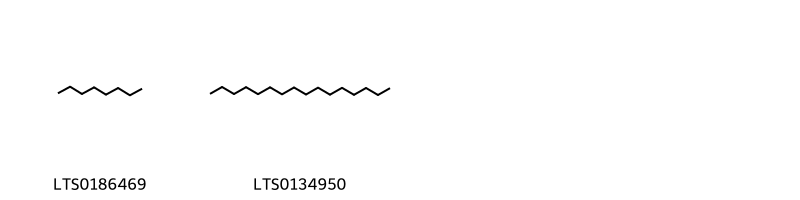{ width=100% }
    <figcaption>Hình ảnh cấu trúc hóa học của 2 hoạt chất thuộc nhóm Saturated hydrocarbons gồm ['octane (LTS0186469)', 'cetane (LTS0134950)'].</figcaption>
</figure>
#### Nhóm Unsaturated hydrocarbons
<figure markdown="span">
    { width=100% }
    <figcaption>Hình ảnh cấu trúc hóa học của 1 hoạt chất thuộc nhóm Unsaturated hydrocarbons gồm ['α terpinene (LTS0232891)'].</figcaption>
</figure>

---

### Dược dân tộc học

Danh sách các quốc gia có sử dụng *Persea americana* trong điều trị các bệnh. 

| Country            | Disease                                                                                                                            | Bệnh                                                                                                                                                                                                |
|:-------------------|:-----------------------------------------------------------------------------------------------------------------------------------|:----------------------------------------------------------------------------------------------------------------------------------------------------------------------------------------------------|
| Dominican Republic | Carminative, Cholagogue, Diuretic, Emmenagogue, Abortifacient, Rodenticide                                                         | Carminative, Cholagogue, lợi tiểu, Emmenagogue, Abortifacient, thuốc diệt gặm nhấm                                                                                                                  |
| Elsewhere          | Antibiotic, Aperient, Aphrodisiac, Emmenagogue, Parasiticide, Stomachic, Vermifuge, Diuretic, Raticide, Suppurative, Aphrodisiac   | Kháng sinh, Aperient, Aphrodisiac, Emmenagogue, Thuốc diệt ký sinh trùng, Dạ dày, Vermifuge, Thuốc lợi tiểu, Raticide, Suppurative, Aphrodisiac                                                     |
| Guatemala          | Aphrodisiac, Raticide, Soap                                                                                                        | Thuốc kích thích tình dục, Raticide, Xà phòng                                                                                                                                                       |
| Haiti              | Apertif, Aphrodisiac, Aphrodisiac                                                                                                  | Apertif, Aphrodisiac, Aphrodisiac                                                                                                                                                                   |
| Latin America      | Poison, Piscicide                                                                                                                  | Chất độc, Piscicide                                                                                                                                                                                 |
| Mexico             | Emmenagogue, Emmenagogue, Raticide, Stomachic, Stomachic, Vermifuge, Aphrodisiac, Rubefacient, Suppurative, Aphrodisiac, Vermifuge | MYMEMORY WARNING: YOU USED ALL AVAILABLE FREE TRANSLATIONS FOR TODAY. NEXT AVAILABLE IN  02 HOURS 37 MINUTES 59 SECONDS VISIT HTTPS://MYMEMORY.TRANSLATED.NET/DOC/USAGELIMITS.PHP TO TRANSLATE MORE |
| Panama             | Emmenagogue                                                                                                                        | MYMEMORY WARNING: YOU USED ALL AVAILABLE FREE TRANSLATIONS FOR TODAY. NEXT AVAILABLE IN  02 HOURS 37 MINUTES 57 SECONDS VISIT HTTPS://MYMEMORY.TRANSLATED.NET/DOC/USAGELIMITS.PHP TO TRANSLATE MORE |
| Paraguay           | Antifertility                                                                                                                      | MYMEMORY WARNING: YOU USED ALL AVAILABLE FREE TRANSLATIONS FOR TODAY. NEXT AVAILABLE IN  02 HOURS 37 MINUTES 54 SECONDS VISIT HTTPS://MYMEMORY.TRANSLATED.NET/DOC/USAGELIMITS.PHP TO TRANSLATE MORE |
| Turkey             | Cosmetic                                                                                                                           | MYMEMORY WARNING: YOU USED ALL AVAILABLE FREE TRANSLATIONS FOR TODAY. NEXT AVAILABLE IN  02 HOURS 37 MINUTES 52 SECONDS VISIT HTTPS://MYMEMORY.TRANSLATED.NET/DOC/USAGELIMITS.PHP TO TRANSLATE MORE |
| Venezuela          | Aphrodisiac, Astringent                                                                                                            | MYMEMORY WARNING: YOU USED ALL AVAILABLE FREE TRANSLATIONS FOR TODAY. NEXT AVAILABLE IN  02 HOURS 37 MINUTES 50 SECONDS VISIT HTTPS://MYMEMORY.TRANSLATED.NET/DOC/USAGELIMITS.PHP TO TRANSLATE MORE |

---

# Chi Ocotea

??? note "Danh sách các dược liệu thuộc chi"
    
	 - *Ocotea bullata*
	 - *Ocotea sassafras*
	 - *Ocotea squarrosa*

---
## Ocotea bullata
### Thông tin về thực vật

!!! info "Phân loại thực vật của *Ocotea bullata* từ GIBF:"
    - **Kingdom:** Plantae
    - **Phylum:** Tracheophyta
    - **Order:** Laurales
    - **Family:** Lauraceae
    - **Genus:** Ocotea
    - **Species:** *Ocotea bullata*

 

| Label (VI)   | Label (EN)   | Scientific Name   | Descriptions (VI)   | Descriptions (EN)   | Also Known As (VI)   | Also Known As (EN)   |
|:-------------|:-------------|:------------------|:--------------------|:--------------------|:---------------------|:---------------------|
| N/A          | N/A          | Ocotea bullata    | loài thực vật       | species of plant    | ['']                 | ['']                 |

#### Phân bố trên thế giới

**Từ CSDL GIBF** nan, South Africa, Eswatini, unknown or invalid

#### Phân bố tại Việt Nam

**Từ CSDL GIBF**: Không có ghi nhận ở Việt Nam

---
### Thành phần hóa học
        
- Theo cơ sở dữ liệu lotus: Từ loài *Ocotea bullata* đã phân lập và xác định được 10 hoạt chất thuộc về các nhóm Benzodioxoles, Prenol lipids. 

|    | chemicalTaxonomyClassyfireClass   |   smiles_count |
|---:|:----------------------------------|---------------:|
|  0 | Benzodioxoles                     |              6 |
|  1 | Prenol lipids                     |              4 |

#### Nhóm Benzodioxoles
<figure markdown="span">
    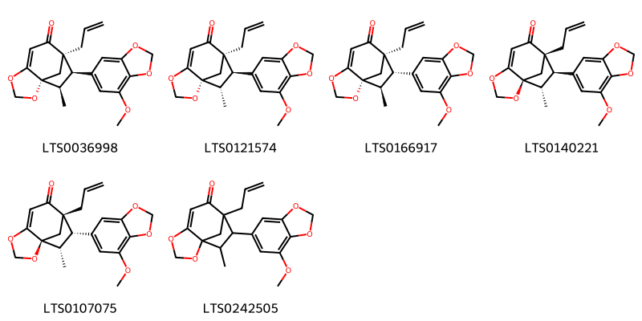{ width=100% }
    <figcaption>Hình ảnh cấu trúc hóa học của 6 hoạt chất thuộc nhóm Benzodioxoles gồm ['(1r,8r,9r,10r)-9-(7-methoxy-2h-1,3-benzodioxol-5-yl)-10-methyl-8-(prop-2-en-1-yl)-2,4-dioxatricyclo[6.2.1.0¹,⁵]undec-5-en-7-one (LTS0036998)', '(1r,8r,9r,10s)-9-(7-methoxy-2h-1,3-benzodioxol-5-yl)-10-methyl-8-(prop-2-en-1-yl)-2,4-dioxatricyclo[6.2.1.0¹,⁵]undec-5-en-7-one (LTS0121574)', '(1r,8r,9s,10r)-9-(7-methoxy-2h-1,3-benzodioxol-5-yl)-10-methyl-8-(prop-2-en-1-yl)-2,4-dioxatricyclo[6.2.1.0¹,⁵]undec-5-en-7-one (LTS0166917)', '(1s,8s,9r,10s)-9-(7-methoxy-2h-1,3-benzodioxol-5-yl)-10-methyl-8-(prop-2-en-1-yl)-2,4-dioxatricyclo[6.2.1.0¹,⁵]undec-5-en-7-one (LTS0140221)', '(1s,8s,9s,10s)-9-(7-methoxy-2h-1,3-benzodioxol-5-yl)-10-methyl-8-(prop-2-en-1-yl)-2,4-dioxatricyclo[6.2.1.0¹,⁵]undec-5-en-7-one (LTS0107075)', '9-(7-methoxy-2h-1,3-benzodioxol-5-yl)-10-methyl-8-(prop-2-en-1-yl)-2,4-dioxatricyclo[6.2.1.0¹,⁵]undec-5-en-7-one (LTS0242505)'].</figcaption>
</figure>
#### Nhóm Prenol lipids
<figure markdown="span">
    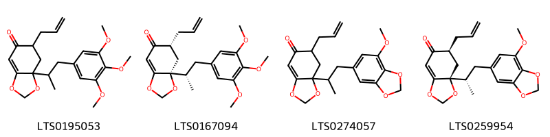{ width=100% }
    <figcaption>Hình ảnh cấu trúc hóa học của 4 hoạt chất thuộc nhóm Prenol lipids gồm ['6-(prop-2-en-1-yl)-7a-[1-(3,4,5-trimethoxyphenyl)propan-2-yl]-6,7-dihydro-2h-1,3-benzodioxol-5-one (LTS0195053)', '(6r,7ar)-6-(prop-2-en-1-yl)-7a-[(2s)-1-(3,4,5-trimethoxyphenyl)propan-2-yl]-6,7-dihydro-2h-1,3-benzodioxol-5-one (LTS0167094)', '7a-[1-(7-methoxy-2h-1,3-benzodioxol-5-yl)propan-2-yl]-6-(prop-2-en-1-yl)-6,7-dihydro-2h-1,3-benzodioxol-5-one (LTS0274057)', '(6s,7as)-7a-[(2s)-1-(7-methoxy-2h-1,3-benzodioxol-5-yl)propan-2-yl]-6-(prop-2-en-1-yl)-6,7-dihydro-2h-1,3-benzodioxol-5-one (LTS0259954)'].</figcaption>
</figure>

---

### Dược dân tộc học

Danh sách các quốc gia có sử dụng *Ocotea bullata* trong điều trị các bệnh. 

| Country      | Disease    | Bệnh                                                                                                                                                                                                |
|:-------------|:-----------|:----------------------------------------------------------------------------------------------------------------------------------------------------------------------------------------------------|
| South Africa | Astringent | MYMEMORY WARNING: YOU USED ALL AVAILABLE FREE TRANSLATIONS FOR TODAY. NEXT AVAILABLE IN  02 HOURS 36 MINUTES 39 SECONDS VISIT HTTPS://MYMEMORY.TRANSLATED.NET/DOC/USAGELIMITS.PHP TO TRANSLATE MORE |

---

---
## Ocotea sassafras
### Thông tin về thực vật

!!! info "Phân loại thực vật của *Mespilodaphne sassafras* từ GIBF:"
    - **Kingdom:** Plantae
    - **Phylum:** Tracheophyta
    - **Order:** Laurales
    - **Family:** Lauraceae
    - **Genus:** Mespilodaphne
    - **Species:** *Mespilodaphne sassafras*

 

| Label (VI)   | Label (EN)   | Scientific Name   | Descriptions (VI)   | Descriptions (EN)   | Also Known As (VI)   | Also Known As (EN)   |
|:-------------|:-------------|:------------------|:--------------------|:--------------------|:---------------------|:---------------------|
| N/A          | N/A          | Ocotea sassafras  | loài thực vật       | species of plant    | ['']                 | ['']                 |

#### Phân bố trên thế giới

**Từ CSDL GIBF** nan, Brazil

#### Phân bố tại Việt Nam

**Từ CSDL GIBF**: Không có ghi nhận ở Việt Nam

---
### Thành phần hóa học
        
- Theo cơ sở dữ liệu lotus: Từ loài *Mespilodaphne sassafras* đã phân lập và xác định được Chưa có hoạt chất nào được phân lập. hoạt chất thuộc về các nhóm Không có hoạt chất nào được phân lập. 

Không có hình ảnh nào được tạo ra

---

### Dược dân tộc học

Danh sách các quốc gia có sử dụng *Mespilodaphne sassafras* trong điều trị các bệnh. 

| Country   | Disease                                    | Bệnh                                                                                                                                                                                                |
|:----------|:-------------------------------------------|:----------------------------------------------------------------------------------------------------------------------------------------------------------------------------------------------------|
| Brazil    | Deodorant, Diuretic, Sudorific, Antiseptic | MYMEMORY WARNING: YOU USED ALL AVAILABLE FREE TRANSLATIONS FOR TODAY. NEXT AVAILABLE IN  02 HOURS 36 MINUTES 17 SECONDS VISIT HTTPS://MYMEMORY.TRANSLATED.NET/DOC/USAGELIMITS.PHP TO TRANSLATE MORE |

---

---
## Ocotea squarrosa
### Thông tin về thực vật

!!! info "Phân loại thực vật của *Ocotea squarrosa* từ GIBF:"
    - **Kingdom:** Plantae
    - **Phylum:** Tracheophyta
    - **Order:** Laurales
    - **Family:** Lauraceae
    - **Genus:** Ocotea
    - **Species:** *Ocotea squarrosa*

 

| Label (VI)   | Label (EN)   | Scientific Name   | Descriptions (VI)   | Descriptions (EN)   | Also Known As (VI)   | Also Known As (EN)   |
|:-------------|:-------------|:------------------|:--------------------|:--------------------|:---------------------|:---------------------|
| N/A          | N/A          | Ocotea squarrosa  | loài thực vật       | species of plant    | ['']                 | ['']                 |

#### Phân bố trên thế giới

**Từ CSDL GIBF** nan, Brazil

#### Phân bố tại Việt Nam

**Từ CSDL GIBF**: Không có ghi nhận ở Việt Nam

---
### Thành phần hóa học
        
- Theo cơ sở dữ liệu lotus: Từ loài *Ocotea squarrosa* đã phân lập và xác định được Chưa có hoạt chất nào được phân lập. hoạt chất thuộc về các nhóm Không có hoạt chất nào được phân lập. 

Không có hình ảnh nào được tạo ra

---

### Dược dân tộc học

Danh sách các quốc gia có sử dụng *Ocotea squarrosa* trong điều trị các bệnh. 

| Country   | Disease   | Bệnh                                                                                                                                                                                                |
|:----------|:----------|:----------------------------------------------------------------------------------------------------------------------------------------------------------------------------------------------------|
| Brazil    | Tonic     | MYMEMORY WARNING: YOU USED ALL AVAILABLE FREE TRANSLATIONS FOR TODAY. NEXT AVAILABLE IN  02 HOURS 35 MINUTES 59 SECONDS VISIT HTTPS://MYMEMORY.TRANSLATED.NET/DOC/USAGELIMITS.PHP TO TRANSLATE MORE |

---

# Chi Cinnamomum

??? note "Danh sách các dược liệu thuộc chi"
    
	 - *Cinnamomum aromaticum*
	 - *Cinnamomum burmannii*
	 - *Cinnamomum cambodianum*
	 - *Cinnamomum camphora*
	 - *Cinnamomum cassia*
	 - *Cinnamomum cecicodaphne*
	 - *Cinnamomum iners*
	 - *Cinnamomum loureirii*
	 - *Cinnamomum oliveri*
	 - *Cinnamomum pauciflorum*
	 - *Cinnamomum sieboldii*
	 - *Cinnamomum sintok*
	 - *Cinnamomum tamala*
	 - *Cinnamomum tetragonum*
	 - *Cinnamomum verum*
	 - *Cinnamomum zeylanicum*

---
## Cinnamomum aromaticum
### Thông tin về thực vật

!!! info "Phân loại thực vật của *Cinnamomum aromaticum* từ GIBF:"
    - **Kingdom:** Plantae
    - **Phylum:** Tracheophyta
    - **Order:** Laurales
    - **Family:** Lauraceae
    - **Genus:** Cinnamomum
    - **Species:** *Cinnamomum aromaticum*

 

| Label (VI)   | Label (EN)   | Scientific Name       | Descriptions (VI)   | Descriptions (EN)   | Also Known As (VI)   | Also Known As (EN)   |
|:-------------|:-------------|:----------------------|:--------------------|:--------------------|:---------------------|:---------------------|
| N/A          | N/A          | Cinnamomum aromaticum |                     | species of plant    | ['']                 | ['cassia']           |

#### Phân bố trên thế giới

**Từ CSDL GIBF** nan, Sri Lanka, Lao People’s Democratic Republic, Cambodia, Guatemala, unknown or invalid, Afghanistan, Papua New Guinea, Honduras, United States of America, Hong Kong, Thailand, Germany, Iran (Islamic Republic of), Cuba, Singapore, Viet Nam, China, Colombia, India, Indonesia, Philippines

#### Phân bố tại Việt Nam

**Từ CSDL GIBF**: Khánh Hòa, Bình Định, Nghệ An, Quang Ninh, Thái Nguyên, Quảng Ninh, Đà Nẵng, Đồng Nai, Ninh Bình, Quảng Nam, Thanh Hóa, Quang Nam-Da Nang

---
### Thành phần hóa học
        
- Theo cơ sở dữ liệu lotus: Từ loài *Cinnamomum aromaticum* đã phân lập và xác định được 116 hoạt chất thuộc về các nhóm Fatty Acyls, Cinnamyl alcohols, Flavonoids, Phenylpropanoic acids, Steroids and steroid derivatives, Prenol lipids, Cinnamic acids and derivatives, Benzene and substituted derivatives, Cinnamaldehydes, Organooxygen compounds, Phenols, Coumarins and derivatives, Neoflavonoids, Furanoid lignans. 

|    | chemicalTaxonomyClassyfireClass     |   smiles_count |
|---:|:------------------------------------|---------------:|
|  0 | Benzene and substituted derivatives |              7 |
|  1 | Cinnamaldehydes                     |              7 |
|  2 | Cinnamic acids and derivatives      |              7 |
|  3 | Cinnamyl alcohols                   |              2 |
|  4 | Coumarins and derivatives           |              1 |
|  5 | Fatty Acyls                         |              2 |
|  6 | Flavonoids                          |             54 |
|  7 | Furanoid lignans                    |              2 |
|  8 | Neoflavonoids                       |              2 |
|  9 | Organooxygen compounds              |             15 |
| 10 | Phenols                             |              5 |
| 11 | Phenylpropanoic acids               |              1 |
| 12 | Prenol lipids                       |             10 |
| 13 | Steroids and steroid derivatives    |              1 |

#### Nhóm Benzene and substituted derivatives
<figure markdown="span">
    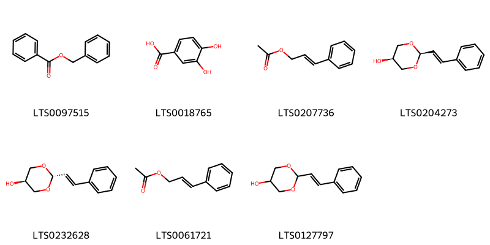{ width=100% }
    <figcaption>Hình ảnh cấu trúc hóa học của 7 hoạt chất thuộc nhóm Benzene and substituted derivatives gồm ['benzyl benzoate (LTS0097515)', '3,4-dihydroxybenzoic acid (LTS0018765)', 'cinnamyl acetate (LTS0207736)', '(2s,5s)-2-[(1e)-2-phenylethenyl]-1,3-dioxan-5-ol (LTS0204273)', '(2r,5r)-2-[(1e)-2-phenylethenyl]-1,3-dioxan-5-ol (LTS0232628)', '3-phenyl-2-propenyl acetate (LTS0061721)', '2-(2-phenylethenyl)-1,3-dioxan-5-ol (LTS0127797)'].</figcaption>
</figure>
#### Nhóm Cinnamaldehydes
<figure markdown="span">
    { width=100% }
    <figcaption>Hình ảnh cấu trúc hóa học của 7 hoạt chất thuộc nhóm Cinnamaldehydes gồm ['3-(2-hydroxyphenyl)prop-2-enal (LTS0196582)', '3-phenyl-2-propenal (LTS0204346)', '(2e)-3-(2-hydroxyphenyl)prop-2-enal (LTS0196725)', '(z)-3-phenyl-2-propenal (LTS0238808)', '2-methoxycinnamaldehyde (LTS0195380)', '3-(2-methoxyphenyl)prop-2-enal (LTS0007230)', 'cinnamal (LTS0271313)'].</figcaption>
</figure>
#### Nhóm Cinnamic acids and derivatives
<figure markdown="span">
    { width=100% }
    <figcaption>Hình ảnh cấu trúc hóa học của 7 hoạt chất thuộc nhóm Cinnamic acids and derivatives gồm ['cinnamic acid (LTS0128130)', 'trans-2-hydroxycinnamic acid (LTS0142397)', 'phenylacrylic acid (LTS0097258)', '3-(2-methoxyphenyl)prop-2-enoic acid (LTS0095780)', 'o-coumaric acid (LTS0065925)', '(2s,3r,4s,5s,6r)-3,4,5-trihydroxy-6-({[(2s,3r,4s,5s)-3,4,5-trihydroxyoxan-2-yl]oxy}methyl)oxan-2-yl (2e)-3-phenylprop-2-enoate (LTS0004266)', '3,4,5-trihydroxy-6-{[(3,4,5-trihydroxyoxan-2-yl)oxy]methyl}oxan-2-yl 3-phenylprop-2-enoate (LTS0266014)'].</figcaption>
</figure>
#### Nhóm Cinnamyl alcohols
<figure markdown="span">
    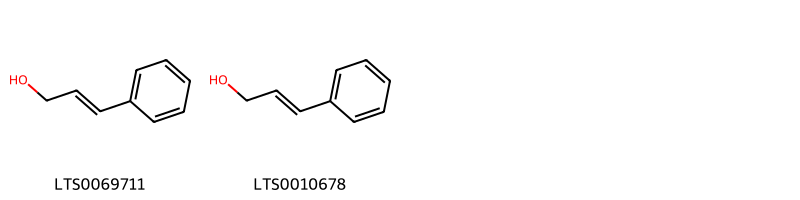{ width=100% }
    <figcaption>Hình ảnh cấu trúc hóa học của 2 hoạt chất thuộc nhóm Cinnamyl alcohols gồm ['3-phenyl-2-propen-1-ol (LTS0069711)', 'cinnamyl alcohol (LTS0010678)'].</figcaption>
</figure>
#### Nhóm Coumarins and derivatives
<figure markdown="span">
    { width=100% }
    <figcaption>Hình ảnh cấu trúc hóa học của 1 hoạt chất thuộc nhóm Coumarins and derivatives gồm ['2h-1-benzopyran-2-one (LTS0069773)'].</figcaption>
</figure>
#### Nhóm Fatty Acyls
<figure markdown="span">
    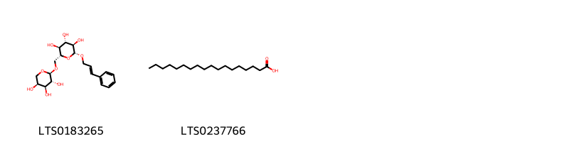{ width=100% }
    <figcaption>Hình ảnh cấu trúc hóa học của 2 hoạt chất thuộc nhóm Fatty Acyls gồm ['rosavin (LTS0183265)', 'stearic acid (LTS0237766)'].</figcaption>
</figure>
#### Nhóm Flavonoids
<figure markdown="span">
    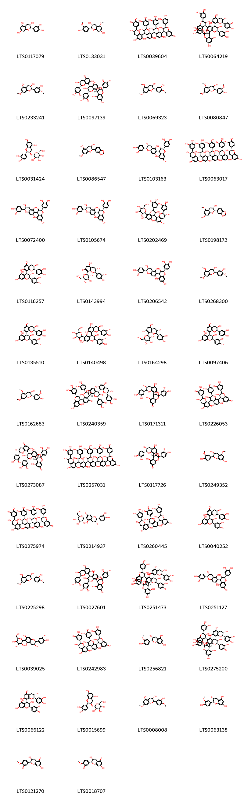{ width=100% }
    <figcaption>Hình ảnh cấu trúc hóa học của 54 hoạt chất thuộc nhóm Flavonoids gồm ['(+)-catechol (LTS0117079)', '(2r,3r)-2-(4-hydroxy-3-methoxyphenyl)-5-methoxy-3,4-dihydro-2h-1-benzopyran-3,7-diol (LTS0133031)', '2-(3,4-dihydroxyphenyl)-8-[2-(3,4-dihydroxyphenyl)-3,5,7-trihydroxy-3,4-dihydro-2h-1-benzopyran-4-yl]-4-[2-(3,4-dihydroxyphenyl)-4-[2-(3,4-dihydroxyphenyl)-3,5,7-trihydroxy-3,4-dihydro-2h-1-benzopyran-8-yl]-3,5,7-trihydroxy-3,4-dihydro-2h-1-benzopyran-8-yl]-3,4-dihydro-2h-1-benzopyran-3,5,7-triol (LTS0039604)', '5,13-bis(3,4-dihydroxyphenyl)-10-[2-(3,4-dihydroxyphenyl)-3,5,7-trihydroxy-3,4-dihydro-2h-1-benzopyran-4-yl]-7-[2-(3,4-dihydroxyphenyl)-3,5,7-trihydroxy-3,4-dihydro-2h-1-benzopyran-8-yl]-4,12,14-trioxapentacyclo[11.7.1.0²,¹¹.0³,⁸.0¹⁵,²⁰]henicosa-2(11),3(8),9,15,17,19-hexaene-6,9,17,19,21-pentol (LTS0064219)', '2-(3-hydroxy-4-methoxyphenyl)-7-methoxy-3,4-dihydro-2h-1-benzopyran-3,5-diol (LTS0233241)', 'cinnamtannin d-1 (LTS0097139)', '2-(3-hydroxy-4-methoxyphenyl)-5,7-dimethoxy-3,4-dihydro-2h-1-benzopyran-3-ol (LTS0069323)', '2-(4-hydroxy-3-methoxyphenyl)-5,7-dimethoxy-3,4-dihydro-2h-1-benzopyran-3-ol (LTS0080847)', '(2r,3r,4s,5s,6r)-2-{[(2r,3r)-2-(3,4-dihydroxyphenyl)-5,7-dihydroxy-3,4-dihydro-2h-1-benzopyran-3-yl]oxy}-6-(hydroxymethyl)oxane-3,4,5-triol (LTS0031424)', '2-(2h-1,3-benzodioxol-5-yl)-5,7-dimethoxy-3,4-dihydro-2h-1-benzopyran-3-ol (LTS0086547)', '(2r,3r,4s)-2-(3,4-dihydroxyphenyl)-4-[(2r,3r)-2-(3,4-dihydroxyphenyl)-3,5,7-trihydroxy-3,4-dihydro-2h-1-benzopyran-6-yl]-3,4-dihydro-2h-1-benzopyran-3,5,7-triol (LTS0103163)', '(2r,3r,4r)-2-(3,4-dihydroxyphenyl)-8-[(2r,3r,4r)-2-(3,4-dihydroxyphenyl)-3,5,7-trihydroxy-3,4-dihydro-2h-1-benzopyran-4-yl]-4-[(2r,3r,4r)-2-(3,4-dihydroxyphenyl)-4-[(2r,3r,4s)-2-(3,4-dihydroxyphenyl)-4-[(2r,3r)-2-(3,4-dihydroxyphenyl)-3,5,7-trihydroxy-3,4-dihydro-2h-1-benzopyran-8-yl]-3,5,7-trihydroxy-3,4-dihydro-2h-1-benzopyran-8-yl]-3,5,7-trihydroxy-3,4-dihydro-2h-1-benzopyran-8-yl]-3,4-dihydro-2h-1-benzopyran-3,5,7-triol (LTS0063017)', '2-(3,4-dihydroxyphenyl)-4-[2-(3,4-dihydroxyphenyl)-3,5,7-trihydroxy-3,4-dihydro-2h-1-benzopyran-6-yl]-3,4-dihydro-2h-1-benzopyran-3,5,7-triol (LTS0072400)', '(2r,3r,4s)-2-(3,4-dihydroxyphenyl)-4-[(2r,3s)-2-(3,4-dihydroxyphenyl)-3,5,7-trihydroxy-3,4-dihydro-2h-1-benzopyran-6-yl]-3,4-dihydro-2h-1-benzopyran-3,5,7-triol (LTS0105674)', '2-(3,4-dihydroxyphenyl)-4-[2-(3,4-dihydroxyphenyl)-3,5,7-trihydroxy-3,4-dihydro-2h-1-benzopyran-8-yl]-8-[3,4,5-trihydroxy-6-(hydroxymethyl)oxan-2-yl]-3,4-dihydro-2h-1-benzopyran-3,5,7-triol (LTS0202469)', '(2r,3s)-2-(2h-1,3-benzodioxol-5-yl)-5,7-dimethoxy-3,4-dihydro-2h-1-benzopyran-3-ol (LTS0198172)', '(2r,3s,4s)-2-(3,4-dihydroxyphenyl)-4-[(2r,3r)-2-(3,4-dihydroxyphenyl)-3,5,7-trihydroxy-3,4-dihydro-2h-1-benzopyran-8-yl]-3,4-dihydro-2h-1-benzopyran-3,5,7-triol (LTS0116257)', '(2r,3r)-2-(3,4-dihydroxyphenyl)-8-[(2s,3r,4r,5s,6r)-3,4,5-trihydroxy-6-(hydroxymethyl)oxan-2-yl]-3,4-dihydro-2h-1-benzopyran-3,5,7-triol (LTS0143994)', '(2r,3r,4r)-2-(3,4-dihydroxyphenyl)-4-[(2r,3s)-2-(3,4-dihydroxyphenyl)-3,5,7-trihydroxy-3,4-dihydro-2h-1-benzopyran-6-yl]-3,4-dihydro-2h-1-benzopyran-3,5,7-triol (LTS0206542)', '(2r,3s)-2-(3-hydroxy-4-methoxyphenyl)-5,7-dimethoxy-3,4-dihydro-2h-1-benzopyran-3-ol (LTS0268300)', '(2r,3r,4r)-2-(3,4-dihydroxyphenyl)-4-[(2r,3r)-2-(3,4-dihydroxyphenyl)-3,5,7-trihydroxy-3,4-dihydro-2h-1-benzopyran-8-yl]-3,4-dihydro-2h-1-benzopyran-3,5,7-triol (LTS0135510)', '2-(3,4-dihydroxyphenyl)-4-[2-(3,4-dihydroxyphenyl)-3,5,7-trihydroxy-3,4-dihydro-2h-1-benzopyran-8-yl]-6-[3,4,5-trihydroxy-6-(hydroxymethyl)oxan-2-yl]-3,4-dihydro-2h-1-benzopyran-3,5,7-triol (LTS0140498)', '2-(3,4-dihydroxyphenyl)-8-[3,4,5-trihydroxy-6-(hydroxymethyl)oxan-2-yl]-3,4-dihydro-2h-1-benzopyran-3,5,7-triol (LTS0164298)', '(2r,3r)-2-(3,4-dihydroxyphenyl)-4-[(2r,3r)-2-(3,4-dihydroxyphenyl)-3,5,7-trihydroxy-3,4-dihydro-2h-1-benzopyran-8-yl]-3,4-dihydro-2h-1-benzopyran-3,5,7-triol (LTS0097406)', '(2r,3r)-2-(4-hydroxy-3-methoxyphenyl)-5,7-dimethoxy-3,4-dihydro-2h-1-benzopyran-3-ol (LTS0162683)', 'cinnamtannin b2 (LTS0240359)', 'procyanidin a1 (LTS0171311)', 'procyanidin c2 (LTS0226053)', 'cinnamtannin b1 (LTS0273087)', '2-(3,4-dihydroxyphenyl)-8-[2-(3,4-dihydroxyphenyl)-3,5,7-trihydroxy-3,4-dihydro-2h-1-benzopyran-4-yl]-4-[2-(3,4-dihydroxyphenyl)-4-[2-(3,4-dihydroxyphenyl)-4-[2-(3,4-dihydroxyphenyl)-3,5,7-trihydroxy-3,4-dihydro-2h-1-benzopyran-8-yl]-3,5,7-trihydroxy-3,4-dihydro-2h-1-benzopyran-8-yl]-3,5,7-trihydroxy-3,4-dihydro-2h-1-benzopyran-8-yl]-3,4-dihydro-2h-1-benzopyran-3,5,7-triol (LTS0257031)', 'proanthocyanidin a2 (LTS0117726)', '2-(4-hydroxy-3-methoxyphenyl)-5-methoxy-3,4-dihydro-2h-1-benzopyran-3,7-diol (LTS0249352)', '(2r,3r,4r)-2-(3,4-dihydroxyphenyl)-8-[(2r,3r,4r)-2-(3,4-dihydroxyphenyl)-3,5,7-trihydroxy-3,4-dihydro-2h-1-benzopyran-4-yl]-4-[(2r,3r,4s)-2-(3,4-dihydroxyphenyl)-4-[(2r,3r)-2-(3,4-dihydroxyphenyl)-3,5,7-trihydroxy-3,4-dihydro-2h-1-benzopyran-8-yl]-3,5,7-trihydroxy-3,4-dihydro-2h-1-benzopyran-8-yl]-3,4-dihydro-2h-1-benzopyran-3,5,7-triol (LTS0275974)', '(2r,3r)-2-(3,4-dihydroxyphenyl)-6-[(2s,3r,4r,5s,6r)-3,4,5-trihydroxy-6-(hydroxymethyl)oxan-2-yl]-3,4-dihydro-2h-1-benzopyran-3,5,7-triol (LTS0214937)', 'procyanidin c1 (LTS0260445)', '2-(3,4-dihydroxyphenyl)-4-[2-(3,4-dihydroxyphenyl)-3,5,7-trihydroxy-3,4-dihydro-2h-1-benzopyran-8-yl]-3,4-dihydro-2h-1-benzopyran-3,5,7-triol (LTS0040252)', '(2s,3r)-2-(3-hydroxy-4-methoxyphenyl)-5,7-dimethoxy-3,4-dihydro-2h-1-benzopyran-3-ol (LTS0225298)', '5,13-bis(3,4-dihydroxyphenyl)-7-[2-(3,4-dihydroxyphenyl)-3,5,7-trihydroxy-3,4-dihydro-2h-1-benzopyran-8-yl]-4,12,14-trioxapentacyclo[11.7.1.0²,¹¹.0³,⁸.0¹⁵,²⁰]henicosa-2,8,10,15,17,19-hexaene-6,9,17,19,21-pentol (LTS0027601)', 'parameritannin a-1 (LTS0251473)', '(2r,3r,4r)-2-(3,4-dihydroxyphenyl)-4-[(2r,3r)-2-(3,4-dihydroxyphenyl)-3,5,7-trihydroxy-3,4-dihydro-2h-1-benzopyran-6-yl]-3,4-dihydro-2h-1-benzopyran-3,5,7-triol (LTS0251127)', '2-(3,4-dihydroxyphenyl)-6-[3,4,5-trihydroxy-6-(hydroxymethyl)oxan-2-yl]-3,4-dihydro-2h-1-benzopyran-3,5,7-triol (LTS0039025)', '(2r,3r,4r)-2-(3,4-dihydroxyphenyl)-8-[(2r,3r,4r)-2-(3,4-dihydroxyphenyl)-3,5,7-trihydroxy-3,4-dihydro-2h-1-benzopyran-4-yl]-4-[(2s,3r)-2-(3,4-dihydroxyphenyl)-3,5,7-trihydroxy-3,4-dihydro-2h-1-benzopyran-8-yl]-3,4-dihydro-2h-1-benzopyran-3,5,7-triol (LTS0242983)', 'symplocosidin (LTS0256821)', 'cassiatannin a (LTS0275200)', '(2r,3r,4r)-2-(3,4-dihydroxyphenyl)-4-[(2r,3s)-2-(3,4-dihydroxyphenyl)-3,5,7-trihydroxy-3,4-dihydro-2h-1-benzopyran-8-yl]-3,4-dihydro-2h-1-benzopyran-3,5,7-triol (LTS0066122)', '2-{[2-(3,4-dihydroxyphenyl)-5,7-dihydroxy-3,4-dihydro-2h-1-benzopyran-3-yl]oxy}-6-(hydroxymethyl)oxane-3,4,5-triol (LTS0015699)', "catechin 7,4'-dimethyl ether (LTS0008008)", '2-(4-hydroxy-3-methoxyphenyl)-3,4-dihydro-2h-1-benzopyran-3,5,7-triol (LTS0063138)', '2-(3-hydroxy-4-methoxyphenyl)-3,4-dihydro-2h-1-benzopyran-3,5,7-triol (LTS0121270)', "catechin 4'-methyl ether (LTS0018707)", 'catechol (LTS0090912)', '(2r,3r,4s)-2-(3,4-dihydroxyphenyl)-4-[(2r,3r)-2-(3,4-dihydroxyphenyl)-3,5,7-trihydroxy-3,4-dihydro-2h-1-benzopyran-8-yl]-8-[(2s,3r,4r,5s,6r)-3,4,5-trihydroxy-6-(hydroxymethyl)oxan-2-yl]-3,4-dihydro-2h-1-benzopyran-3,5,7-triol (LTS0004781)', '(2r,3r,4r)-2-(3,4-dihydroxyphenyl)-4-[(2r,3r)-2-(3,4-dihydroxyphenyl)-3,5,7-trihydroxy-3,4-dihydro-2h-1-benzopyran-8-yl]-6-[(2s,3r,4r,5s,6r)-3,4,5-trihydroxy-6-(hydroxymethyl)oxan-2-yl]-3,4-dihydro-2h-1-benzopyran-3,5,7-triol (LTS0254947)', 'ent-epicatechin (LTS0265245)'].</figcaption>
</figure>
#### Nhóm Furanoid lignans
<figure markdown="span">
    { width=100% }
    <figcaption>Hình ảnh cấu trúc hóa học của 2 hoạt chất thuộc nhóm Furanoid lignans gồm ['syringaresinol (LTS0116280)', '(+)-syringaresinol (LTS0158868)'].</figcaption>
</figure>
#### Nhóm Neoflavonoids
<figure markdown="span">
    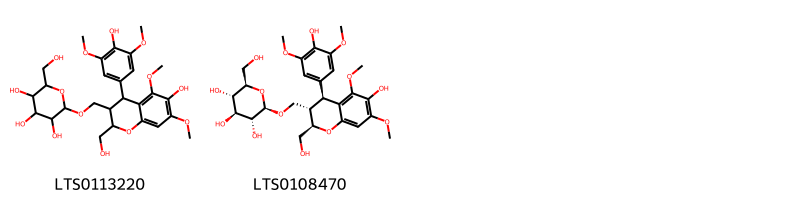{ width=100% }
    <figcaption>Hình ảnh cấu trúc hóa học của 2 hoạt chất thuộc nhóm Neoflavonoids gồm ['2-{[6-hydroxy-4-(4-hydroxy-3,5-dimethoxyphenyl)-2-(hydroxymethyl)-5,7-dimethoxy-3,4-dihydro-2h-1-benzopyran-3-yl]methoxy}-6-(hydroxymethyl)oxane-3,4,5-triol (LTS0113220)', '(2r,3r,4s,5s,6r)-2-{[(2r,3s,4s)-6-hydroxy-4-(4-hydroxy-3,5-dimethoxyphenyl)-2-(hydroxymethyl)-5,7-dimethoxy-3,4-dihydro-2h-1-benzopyran-3-yl]methoxy}-6-(hydroxymethyl)oxane-3,4,5-triol (LTS0108470)'].</figcaption>
</figure>
#### Nhóm Organooxygen compounds
<figure markdown="span">
    { width=100% }
    <figcaption>Hình ảnh cấu trúc hóa học của 15 hoạt chất thuộc nhóm Organooxygen compounds gồm ['3-(2-{[(2s,3r,4s,5s,6r)-3,4,5-trihydroxy-6-(hydroxymethyl)oxan-2-yl]oxy}phenyl)propanoic acid (LTS0136515)', '(2r,3s,4s,5r,6s)-2-({[(2r,3r,4r)-3,4-dihydroxy-4-(hydroxymethyl)oxolan-2-yl]oxy}methyl)-6-(3,4,5-trimethoxyphenoxy)oxane-3,4,5-triol (LTS0127559)', '(2r,3r,4r,5s,6r)-5-{[(2s,3r,4r)-3,4-dihydroxy-4-(hydroxymethyl)oxolan-2-yl]oxy}-6-(hydroxymethyl)-2-(2-phenylethoxy)oxane-3,4-diol (LTS0169640)', '1,4,4-trimethyltricyclo[5.3.1.0²,⁶]undecan-11-ol (LTS0148379)', '(2s,3r,4s,5s,6r)-3,4,5-trihydroxy-6-(hydroxymethyl)oxan-2-yl 3-(2-hydroxyphenyl)propanoate (LTS0153346)', 'methyl 3-(2-{[3,4,5-trihydroxy-6-(hydroxymethyl)oxan-2-yl]oxy}phenyl)propanoate (LTS0148798)', '3,4,5-trihydroxy-6-(hydroxymethyl)oxan-2-yl 3-(2-hydroxyphenyl)propanoate (LTS0246040)', '2-[(5-{[2-(benzyloxy)-6-({[3,4-dihydroxy-4-(hydroxymethyl)oxolan-2-yl]oxy}methyl)-4,5-dihydroxyoxan-3-yl]oxy}-3,4-dihydroxy-6-[2-(3-hydroxyprop-1-en-1-yl)phenoxy]oxan-2-yl)methoxy]-6-methyloxane-3,4,5-triol (LTS0210339)', 'methyl 3-(2-{[(2s,3r,4s,5s,6r)-3,4,5-trihydroxy-6-(hydroxymethyl)oxan-2-yl]oxy}phenyl)propanoate (LTS0218623)', '(2r,3r,4r,5r,6s)-2-{[(2r,3s,4s,5r,6s)-5-{[(2s,3s,4r,5r,6s)-2-(benzyloxy)-6-({[(2r,3r,4r)-3,4-dihydroxy-4-(hydroxymethyl)oxolan-2-yl]oxy}methyl)-4,5-dihydroxyoxan-3-yl]oxy}-3,4-dihydroxy-6-{2-[(1e)-3-hydroxyprop-1-en-1-yl]phenoxy}oxan-2-yl]methoxy}-6-methyloxane-3,4,5-triol (LTS0227461)', '3-[(1e)-4-hydroxy-3-(hydroxymethyl)but-1-en-1-yl]-2,4-dimethyl-4-({[3,4,5-trihydroxy-6-(hydroxymethyl)oxan-2-yl]oxy}methyl)cyclohex-2-en-1-one (LTS0062579)', '2-({[3,4-dihydroxy-4-(hydroxymethyl)oxolan-2-yl]oxy}methyl)-6-(3,4,5-trimethoxyphenoxy)oxane-3,4,5-triol (LTS0016161)', '5-{[3,4-dihydroxy-4-(hydroxymethyl)oxolan-2-yl]oxy}-6-(hydroxymethyl)-2-(2-phenylethoxy)oxane-3,4-diol (LTS0244971)', '(2r,3r,4r,5r,6s)-2-{[(2r,3s,4s,5r,6s)-5-{[(2r,3r,4s,5s,6r)-2-(benzyloxy)-6-({[(2r,3r,4r)-3,4-dihydroxy-4-(hydroxymethyl)oxolan-2-yl]oxy}methyl)-4,5-dihydroxyoxan-3-yl]oxy}-3,4-dihydroxy-6-{2-[(1e)-3-hydroxyprop-1-en-1-yl]phenoxy}oxan-2-yl]methoxy}-6-methyloxane-3,4,5-triol (LTS0030847)', '3-(2-{[3,4,5-trihydroxy-6-(hydroxymethyl)oxan-2-yl]oxy}phenyl)propanoic acid (LTS0130065)'].</figcaption>
</figure>
#### Nhóm Phenols
<figure markdown="span">
    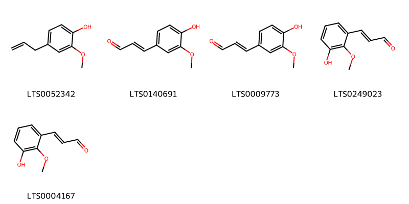{ width=100% }
    <figcaption>Hình ảnh cấu trúc hóa học của 5 hoạt chất thuộc nhóm Phenols gồm ['eugenol (LTS0052342)', 'coniferyl aldehyde (LTS0140691)', 'coniferaldehyde (LTS0009773)', '3-(3-hydroxy-2-methoxyphenyl)prop-2-enal (LTS0249023)', '(2e)-3-(3-hydroxy-2-methoxyphenyl)prop-2-enal (LTS0004167)'].</figcaption>
</figure>
#### Nhóm Phenylpropanoic acids
<figure markdown="span">
    { width=100% }
    <figcaption>Hình ảnh cấu trúc hóa học của 1 hoạt chất thuộc nhóm Phenylpropanoic acids gồm ['melilotic acid (LTS0176151)'].</figcaption>
</figure>
#### Nhóm Prenol lipids
<figure markdown="span">
    { width=100% }
    <figcaption>Hình ảnh cấu trúc hóa học của 10 hoạt chất thuộc nhóm Prenol lipids gồm ['cinncassiol e (LTS0193858)', '4-(4-{[6-({[3,4-dihydroxy-4-(hydroxymethyl)oxolan-2-yl]oxy}methyl)-3,4,5-trihydroxyoxan-2-yl]oxy}-2-hydroxy-2,6,6-trimethylcyclohexylidene)but-3-en-2-one (LTS0153623)', '2,6,8,12-tetrahydroxy-4-isopropyl-3,7,11-trimethyl-13-oxatetracyclo[5.5.3.0¹,⁸.0²,⁶]pentadec-3-en-14-one (LTS0157203)', 'cinncassiol a (LTS0214717)', '2,6,8-trihydroxy-4-isopropyl-3,7,11-trimethyl-14-oxo-13-oxatetracyclo[5.5.3.0¹,⁸.0²,⁶]pentadec-3-en-12-yl acetate (LTS0218214)', '9,10,11,15-tetrahydroxy-1,6,12-trimethyl-13-(1-{[3,4,5-trihydroxy-6-(hydroxymethyl)oxan-2-yl]oxy}propan-2-yl)-4-oxatetracyclo[7.6.0.0⁵,¹⁰.0¹¹,¹⁵]pentadec-12-en-3-one (LTS0088393)', '(1r,5r,6s,9s,10r,11r,15r)-9,10,11,15-tetrahydroxy-1,6,12-trimethyl-13-[(2s)-1-{[(2r,3r,4s,5s,6r)-3,4,5-trihydroxy-6-(hydroxymethyl)oxan-2-yl]oxy}propan-2-yl]-4-oxatetracyclo[7.6.0.0⁵,¹⁰.0¹¹,¹⁵]pentadec-12-en-3-one (LTS0164057)', '9,10,11,15-tetrahydroxy-13-(1-hydroxypropan-2-yl)-1,6,12-trimethyl-4-oxatetracyclo[7.6.0.0⁵,¹⁰.0¹¹,¹⁵]pentadec-12-en-3-one (LTS0231977)', '(1s,4e,9s)-4,11,11-trimethyl-8-methylidenebicyclo[7.2.0]undec-4-ene (LTS0246065)', '(1r,5r,6s,9s,10r,11r,15r)-9,10,11,15-tetrahydroxy-13-[(2s)-1-hydroxypropan-2-yl]-1,6,12-trimethyl-4-oxatetracyclo[7.6.0.0⁵,¹⁰.0¹¹,¹⁵]pentadec-12-en-3-one (LTS0136502)'].</figcaption>
</figure>
#### Nhóm Steroids and steroid derivatives
<figure markdown="span">
    { width=100% }
    <figcaption>Hình ảnh cấu trúc hóa học của 1 hoạt chất thuộc nhóm Steroids and steroid derivatives gồm ['stigmast-5-en-3-ol, (3β)- (LTS0204616)'].</figcaption>
</figure>

---

### Dược dân tộc học

Danh sách các quốc gia có sử dụng *Cinnamomum aromaticum* trong điều trị các bệnh. 

| Country   | Disease   | Bệnh                                                                                                                                                                                                |
|:----------|:----------|:----------------------------------------------------------------------------------------------------------------------------------------------------------------------------------------------------|
| China     | Sedative  | MYMEMORY WARNING: YOU USED ALL AVAILABLE FREE TRANSLATIONS FOR TODAY. NEXT AVAILABLE IN  02 HOURS 35 MINUTES 42 SECONDS VISIT HTTPS://MYMEMORY.TRANSLATED.NET/DOC/USAGELIMITS.PHP TO TRANSLATE MORE |

---

---
## Cinnamomum burmannii
### Thông tin về thực vật

!!! info "Phân loại thực vật của *Cinnamomum burmanni* từ GIBF:"
    - **Kingdom:** Plantae
    - **Phylum:** Tracheophyta
    - **Order:** Laurales
    - **Family:** Lauraceae
    - **Genus:** Cinnamomum
    - **Species:** *Cinnamomum burmanni*

 

| Label (VI)   | Label (EN)   | Scientific Name       | Descriptions (VI)   | Descriptions (EN)   | Also Known As (VI)   | Also Known As (EN)   |
|:-------------|:-------------|:----------------------|:--------------------|:--------------------|:---------------------|:---------------------|
| N/A          | N/A          | Cinnamomum aromaticum |                     | species of plant    | ['']                 | ['cassia']           |

#### Phân bố trên thế giới

**Từ CSDL GIBF** Sri Lanka, Hong Kong, Chinese Taipei, Brazil, Macao, India, United States of America, China

#### Phân bố tại Việt Nam

**Từ CSDL GIBF**: Không có ghi nhận ở Việt Nam

---
### Thành phần hóa học
        
- Theo cơ sở dữ liệu lotus: Từ loài *Cinnamomum burmanni* đã phân lập và xác định được 130 hoạt chất thuộc về các nhóm Fatty Acyls, Cinnamyl alcohols, Flavonoids, Prenol lipids, Steroids and steroid derivatives, Benzodioxoles, Benzene and substituted derivatives, Unsaturated hydrocarbons, Cinnamaldehydes, Organooxygen compounds, Phenols, Coumarins and derivatives, Furanoid lignans, Carboxylic acids and derivatives. 

|    | chemicalTaxonomyClassyfireClass     |   smiles_count |
|---:|:------------------------------------|---------------:|
|  0 | Benzene and substituted derivatives |              7 |
|  1 | Benzodioxoles                       |              1 |
|  2 | Carboxylic acids and derivatives    |              1 |
|  3 | Cinnamaldehydes                     |              2 |
|  4 | Cinnamyl alcohols                   |              2 |
|  5 | Coumarins and derivatives           |              1 |
|  6 | Fatty Acyls                         |              4 |
|  7 | Flavonoids                          |             31 |
|  8 | Furanoid lignans                    |              2 |
|  9 | Organooxygen compounds              |              3 |
| 10 | Phenols                             |              2 |
| 11 | Prenol lipids                       |             71 |
| 12 | Steroids and steroid derivatives    |              2 |
| 13 | Unsaturated hydrocarbons            |              1 |

#### Nhóm Benzene and substituted derivatives
<figure markdown="span">
    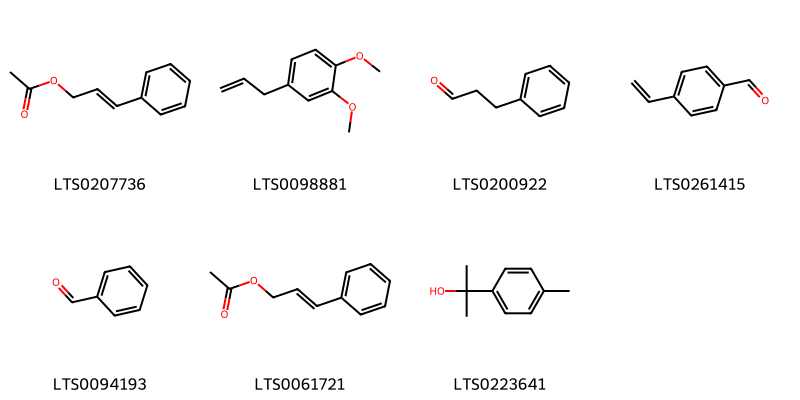{ width=100% }
    <figcaption>Hình ảnh cấu trúc hóa học của 7 hoạt chất thuộc nhóm Benzene and substituted derivatives gồm ['cinnamyl acetate (LTS0207736)', 'methyl eugenol (LTS0098881)', 'benzenepropanal (LTS0200922)', '4-vinylbenzaldehyde (LTS0261415)', 'benzaldehyde (LTS0094193)', '3-phenyl-2-propenyl acetate (LTS0061721)', 'p-cymen-8-ol (LTS0223641)'].</figcaption>
</figure>
#### Nhóm Benzodioxoles
<figure markdown="span">
    { width=100% }
    <figcaption>Hình ảnh cấu trúc hóa học của 1 hoạt chất thuộc nhóm Benzodioxoles gồm ['sassafras (LTS0136093)'].</figcaption>
</figure>
#### Nhóm Carboxylic acids and derivatives
<figure markdown="span">
    { width=100% }
    <figcaption>Hình ảnh cấu trúc hóa học của 1 hoạt chất thuộc nhóm Carboxylic acids and derivatives gồm ['ethyl acetate (LTS0196824)'].</figcaption>
</figure>
#### Nhóm Cinnamaldehydes
<figure markdown="span">
    { width=100% }
    <figcaption>Hình ảnh cấu trúc hóa học của 2 hoạt chất thuộc nhóm Cinnamaldehydes gồm ['3-phenyl-2-propenal (LTS0204346)', 'cinnamal (LTS0271313)'].</figcaption>
</figure>
#### Nhóm Cinnamyl alcohols
<figure markdown="span">
    { width=100% }
    <figcaption>Hình ảnh cấu trúc hóa học của 2 hoạt chất thuộc nhóm Cinnamyl alcohols gồm ['3-phenyl-2-propen-1-ol (LTS0069711)', 'cinnamyl alcohol (LTS0010678)'].</figcaption>
</figure>
#### Nhóm Coumarins and derivatives
<figure markdown="span">
    { width=100% }
    <figcaption>Hình ảnh cấu trúc hóa học của 1 hoạt chất thuộc nhóm Coumarins and derivatives gồm ['2h-1-benzopyran-2-one (LTS0069773)'].</figcaption>
</figure>
#### Nhóm Fatty Acyls
<figure markdown="span">
    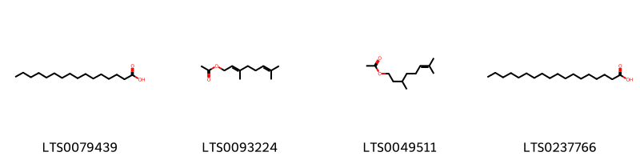{ width=100% }
    <figcaption>Hình ảnh cấu trúc hóa học của 4 hoạt chất thuộc nhóm Fatty Acyls gồm ['palmitic acid (LTS0079439)', 'geranyl acetate (LTS0093224)', 'citronellyl acetate (LTS0049511)', 'stearic acid (LTS0237766)'].</figcaption>
</figure>
#### Nhóm Flavonoids
<figure markdown="span">
    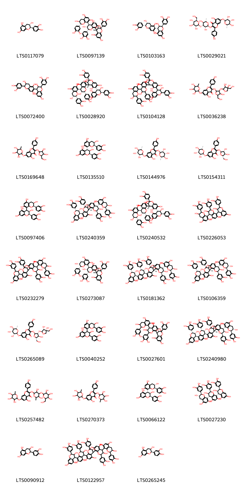{ width=100% }
    <figcaption>Hình ảnh cấu trúc hóa học của 31 hoạt chất thuộc nhóm Flavonoids gồm ['(+)-catechol (LTS0117079)', 'cinnamtannin d-1 (LTS0097139)', '(2r,3r,4s)-2-(3,4-dihydroxyphenyl)-4-[(2r,3r)-2-(3,4-dihydroxyphenyl)-3,5,7-trihydroxy-3,4-dihydro-2h-1-benzopyran-6-yl]-3,4-dihydro-2h-1-benzopyran-3,5,7-triol (LTS0103163)', '3-{[(2s,3r,4r,5s,6s)-3,5-dihydroxy-6-methyl-4-{[(2s,3r,4s,5s,6r)-3,4,5-trihydroxy-6-(hydroxymethyl)oxan-2-yl]oxy}oxan-2-yl]oxy}-5-hydroxy-2-(4-hydroxyphenyl)-7-{[(2s,3r,4r,5r,6s)-3,4,5-trihydroxy-6-methyloxan-2-yl]oxy}chromen-4-one (LTS0029021)', '2-(3,4-dihydroxyphenyl)-4-[2-(3,4-dihydroxyphenyl)-3,5,7-trihydroxy-3,4-dihydro-2h-1-benzopyran-6-yl]-3,4-dihydro-2h-1-benzopyran-3,5,7-triol (LTS0072400)', '(1r,5r,6r,7s,13s,21r)-5,13-bis(3,4-dihydroxyphenyl)-18-[(2r,3r,4s)-2-(3,4-dihydroxyphenyl)-3,5,7-trihydroxy-3,4-dihydro-2h-1-benzopyran-4-yl]-7-[(2r,3r)-2-(3,4-dihydroxyphenyl)-3,5,7-trihydroxy-3,4-dihydro-2h-1-benzopyran-8-yl]-4,12,14-trioxapentacyclo[11.7.1.0²,¹¹.0³,⁸.0¹⁵,²⁰]henicosa-2(11),3(8),9,15,17,19-hexaene-6,9,17,19,21-pentol (LTS0028920)', '5,13-bis(3,4-dihydroxyphenyl)-18-[2-(3,4-dihydroxyphenyl)-3,5,7-trihydroxy-3,4-dihydro-2h-1-benzopyran-4-yl]-7-[2-(3,4-dihydroxyphenyl)-3,5,7-trihydroxy-3,4-dihydro-2h-1-benzopyran-8-yl]-4,12,14-trioxapentacyclo[11.7.1.0²,¹¹.0³,⁸.0¹⁵,²⁰]henicosa-2(11),3(8),9,15,17,19-hexaene-6,9,17,19,21-pentol (LTS0104128)', '3-[(3-{[3,4-dihydroxy-4-(hydroxymethyl)oxolan-2-yl]oxy}-4-hydroxy-5-(hydroxymethyl)oxolan-2-yl)oxy]-5-hydroxy-2-(4-hydroxyphenyl)-7-[(3,4,5-trihydroxy-6-methyloxan-2-yl)oxy]chromen-4-one (LTS0036238)', '3-{[3,4-dihydroxy-5-(hydroxymethyl)oxolan-2-yl]oxy}-5-hydroxy-2-(4-hydroxyphenyl)-7-[(3,4,5-trihydroxy-6-methyloxan-2-yl)oxy]chromen-4-one (LTS0169648)', '(2r,3r,4r)-2-(3,4-dihydroxyphenyl)-4-[(2r,3r)-2-(3,4-dihydroxyphenyl)-3,5,7-trihydroxy-3,4-dihydro-2h-1-benzopyran-8-yl]-3,4-dihydro-2h-1-benzopyran-3,5,7-triol (LTS0135510)', 'lespedin (LTS0144976)', '3-{[(2s,3r,4r,5s)-3,4-dihydroxy-5-(hydroxymethyl)oxolan-2-yl]oxy}-5-hydroxy-2-(4-hydroxyphenyl)-7-{[(2s,3r,4r,5r,6s)-3,4,5-trihydroxy-6-methyloxan-2-yl]oxy}chromen-4-one (LTS0154311)', '(2r,3r)-2-(3,4-dihydroxyphenyl)-4-[(2r,3r)-2-(3,4-dihydroxyphenyl)-3,5,7-trihydroxy-3,4-dihydro-2h-1-benzopyran-8-yl]-3,4-dihydro-2h-1-benzopyran-3,5,7-triol (LTS0097406)', 'cinnamtannin b2 (LTS0240359)', '(1r,5r,6r,7s,13s,21r)-5,13-bis(3,4-dihydroxyphenyl)-18-[(2r,3r,4s)-2-(3,4-dihydroxyphenyl)-3,5,7-trihydroxy-3,4-dihydro-2h-1-benzopyran-4-yl]-7-[(2r,3s)-2-(3,4-dihydroxyphenyl)-3,5,7-trihydroxy-3,4-dihydro-2h-1-benzopyran-8-yl]-4,12,14-trioxapentacyclo[11.7.1.0²,¹¹.0³,⁸.0¹⁵,²⁰]henicosa-2(11),3(8),9,15,17,19-hexaene-6,9,17,19,21-pentol (LTS0240532)', 'procyanidin c2 (LTS0226053)', '5,13-bis(3,4-dihydroxyphenyl)-16-[2-(3,4-dihydroxyphenyl)-3,5,7-trihydroxy-3,4-dihydro-2h-1-benzopyran-4-yl]-7-[2-(3,4-dihydroxyphenyl)-3,5,7-trihydroxy-3,4-dihydro-2h-1-benzopyran-8-yl]-4,12,14-trioxapentacyclo[11.7.1.0²,¹¹.0³,⁸.0¹⁵,²⁰]henicosa-2,8,10,15(20),16,18-hexaene-6,9,17,19,21-pentol (LTS0232279)', 'cinnamtannin b1 (LTS0273087)', '(1r,5r,6r,7s,13r,21r)-5,13-bis(3,4-dihydroxyphenyl)-7-[(2r,3r)-2-(3,4-dihydroxyphenyl)-3,5,7-trihydroxy-3,4-dihydro-2h-1-benzopyran-8-yl]-16-[(2r,3r,4r)-2-(3,4-dihydroxyphenyl)-8-[(2r,3r,4r)-2-(3,4-dihydroxyphenyl)-3,5,7-trihydroxy-3,4-dihydro-2h-1-benzopyran-4-yl]-3,5,7-trihydroxy-3,4-dihydro-2h-1-benzopyran-4-yl]-4,12,14-trioxapentacyclo[11.7.1.0²,¹¹.0³,⁸.0¹⁵,²⁰]henicosa-2,8,10,15(20),16,18-hexaene-6,9,17,19,21-pentol (LTS0181362)', 'cinnamtannin d2 (LTS0106359)', '3-{[(2s,3r,4s,5s)-3-{[(2s,3r,4r)-3,4-dihydroxy-4-(hydroxymethyl)oxolan-2-yl]oxy}-4-hydroxy-5-(hydroxymethyl)oxolan-2-yl]oxy}-5-hydroxy-2-(4-hydroxyphenyl)-7-{[(2s,3r,4r,5r,6s)-3,4,5-trihydroxy-6-methyloxan-2-yl]oxy}chromen-4-one (LTS0265089)', '2-(3,4-dihydroxyphenyl)-4-[2-(3,4-dihydroxyphenyl)-3,5,7-trihydroxy-3,4-dihydro-2h-1-benzopyran-8-yl]-3,4-dihydro-2h-1-benzopyran-3,5,7-triol (LTS0040252)', '5,13-bis(3,4-dihydroxyphenyl)-7-[2-(3,4-dihydroxyphenyl)-3,5,7-trihydroxy-3,4-dihydro-2h-1-benzopyran-8-yl]-4,12,14-trioxapentacyclo[11.7.1.0²,¹¹.0³,⁸.0¹⁵,²⁰]henicosa-2,8,10,15,17,19-hexaene-6,9,17,19,21-pentol (LTS0027601)', '(1r,5r,6r,7s,13r,21r)-5,13-bis(3,4-dihydroxyphenyl)-7-[(2r,3s)-2-(3,4-dihydroxyphenyl)-3,5,7-trihydroxy-3,4-dihydro-2h-1-benzopyran-8-yl]-16-[(2r,3r,4r)-2-(3,4-dihydroxyphenyl)-8-[(2r,3r,4r)-2-(3,4-dihydroxyphenyl)-3,5,7-trihydroxy-3,4-dihydro-2h-1-benzopyran-4-yl]-3,5,7-trihydroxy-3,4-dihydro-2h-1-benzopyran-4-yl]-4,12,14-trioxapentacyclo[11.7.1.0²,¹¹.0³,⁸.0¹⁵,²⁰]henicosa-2,8,10,15(20),16,18-hexaene-6,9,17,19,21-pentol (LTS0240980)', '3-[(3,5-dihydroxy-6-methyl-4-{[3,4,5-trihydroxy-6-(hydroxymethyl)oxan-2-yl]oxy}oxan-2-yl)oxy]-5-hydroxy-2-(4-hydroxyphenyl)-7-[(3,4,5-trihydroxy-6-methyloxan-2-yl)oxy]chromen-4-one (LTS0257482)', 'kaempferitrin (LTS0270373)', '(2r,3r,4r)-2-(3,4-dihydroxyphenyl)-4-[(2r,3s)-2-(3,4-dihydroxyphenyl)-3,5,7-trihydroxy-3,4-dihydro-2h-1-benzopyran-8-yl]-3,4-dihydro-2h-1-benzopyran-3,5,7-triol (LTS0066122)', '(2r,3r,4s)-2-(3,4-dihydroxyphenyl)-8-[(2r,3r,4r)-2-(3,4-dihydroxyphenyl)-3,5,7-trihydroxy-3,4-dihydro-2h-1-benzopyran-4-yl]-4-[(2r,3s)-2-(3,4-dihydroxyphenyl)-3,5,7-trihydroxy-3,4-dihydro-2h-1-benzopyran-8-yl]-3,4-dihydro-2h-1-benzopyran-3,5,7-triol (LTS0027230)', 'catechol (LTS0090912)', '5,13-bis(3,4-dihydroxyphenyl)-7-[2-(3,4-dihydroxyphenyl)-3,5,7-trihydroxy-3,4-dihydro-2h-1-benzopyran-8-yl]-16-[2-(3,4-dihydroxyphenyl)-8-[2-(3,4-dihydroxyphenyl)-3,5,7-trihydroxy-3,4-dihydro-2h-1-benzopyran-4-yl]-3,5,7-trihydroxy-3,4-dihydro-2h-1-benzopyran-4-yl]-4,12,14-trioxapentacyclo[11.7.1.0²,¹¹.0³,⁸.0¹⁵,²⁰]henicosa-2,8,10,15(20),16,18-hexaene-6,9,17,19,21-pentol (LTS0122957)', 'ent-epicatechin (LTS0265245)'].</figcaption>
</figure>
#### Nhóm Furanoid lignans
<figure markdown="span">
    { width=100% }
    <figcaption>Hình ảnh cấu trúc hóa học của 2 hoạt chất thuộc nhóm Furanoid lignans gồm ['syringaresinol (LTS0116280)', '(+)-syringaresinol (LTS0158868)'].</figcaption>
</figure>
#### Nhóm Organooxygen compounds
<figure markdown="span">
    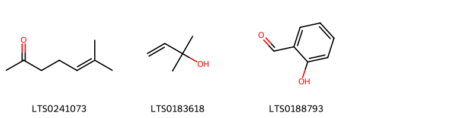{ width=100% }
    <figcaption>Hình ảnh cấu trúc hóa học của 3 hoạt chất thuộc nhóm Organooxygen compounds gồm ['6-methyl-5-hepten-2-one (LTS0241073)', '2-methyl-3-buten-2-ol (LTS0183618)', 'salicylaldehyde (LTS0188793)'].</figcaption>
</figure>
#### Nhóm Phenols
<figure markdown="span">
    { width=100% }
    <figcaption>Hình ảnh cấu trúc hóa học của 2 hoạt chất thuộc nhóm Phenols gồm ['eugenol (LTS0052342)', 'chavicol (LTS0008864)'].</figcaption>
</figure>
#### Nhóm Prenol lipids
<figure markdown="span">
    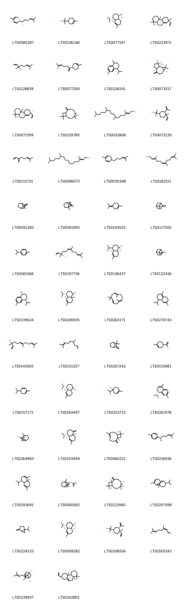{ width=100% }
    <figcaption>Hình ảnh cấu trúc hóa học của 71 hoạt chất thuộc nhóm Prenol lipids gồm ['zingiberene (LTS0085287)', 'terpineol (LTS0136148)', '(1s,4r,4as,8ar)-1-isopropyl-4,7-dimethyl-2,3,4,5,6,8a-hexahydro-1h-naphthalen-4a-ol (LTS0077197)', '(+)-sandaracopimaradiene (LTS0223971)', 'linalool, (+-)- (LTS0128839)', '(r)-β-bisabolene (LTS0077209)', '(e)-calamene (LTS0228241)', '(1as,4as,7s,7ar,7bs)-1,1,7-trimethyl-4-methylidene-octahydrocyclopropa[e]azulen-7-ol (LTS0073517)', 'pimaradiene (LTS0071599)', 'caryophyllene oxide (LTS0159789)', 'phytol (LTS0031808)', '2-[4-ethenyl-4-methyl-3-(prop-1-en-2-yl)cyclohexyl]propan-2-ol (LTS0072139)', 'α-myrcene (LTS0115731)', 'phytol (LTS0096073)', '2-methyl-5-[(2s)-6-methylhept-5-en-2-yl]cyclohexa-1,3-diene (LTS0030348)', '(e,z)-farnesol (LTS0182151)', '7,7-dimethyl-2-methylidenebicyclo[2.2.1]heptane (LTS0092282)', 'camphor (LTS0091905)', 'terpinolene (LTS0104525)', 'β-pinene (LTS0117550)', 'cymene (LTS0181568)', 'nerolidol (LTS0197738)', '(1r,4ar,8as)-4-isopropyl-1,6-dimethyl-3,4,4a,7,8,8a-hexahydro-2h-naphthalen-1-ol (LTS0136437)', 'α pinene (LTS0132416)', '(1s,4s)-4-isopropyl-1,6-dimethyl-1,2,3,4-tetrahydronaphthalene (LTS0139634)', 'α-cadinol (LTS0206935)', 'humulene (LTS0263171)', '4-isopropyl-1,6-dimethyl-2,3,4,4a,7,8-hexahydronaphthalene (LTS0270743)', '(3r,6e)-nerolidol (LTS0145065)', 'citronella (LTS0151257)', 'camphene (LTS0267242)', 'limonene,  (LTS0155981)', 'phellandrene (LTS0157173)', '(1r,4s,4ar)-4-isopropyl-1,6-dimethyl-3,4,4a,7,8,8a-hexahydro-2h-naphthalen-1-ol (LTS0164497)', '4-terpineol (LTS0253733)', '(4s)-4-isopropyl-1,6-dimethyl-3,4-dihydronaphthalene (LTS0261978)', 'borneol (LTS0264960)', '(+)-gamma-cadinene (LTS0103949)', 'caryophyllene (LTS0085212)', '(-)-α-curcumene (LTS0216936)', '(4r,8ar)-4-isopropyl-1,6-dimethyl-3,4,4a,7,8,8a-hexahydronaphthalene (LTS0191845)', 'bornyl acetate (LTS0060565)', 'β-caryophyllene oxide (LTS0213960)', 'α-copaene (LTS0207598)', 'sabinene (LTS0224133)', 'delta-cadinol (LTS0008282)', 'elemol (LTS0208556)', 'neral (LTS0165243)', '(-)-trans-α-bergamotene (LTS0239937)', 'isopimara-7,15-diene (LTS0162801)', 'α-cadinol (LTS0178794)', 'geraniol (LTS0258838)', 'curcumene (LTS0190074)', '(1r,2s,7s,8s)-8-isopropyl-1,3-dimethyltricyclo[4.4.0.0²,⁷]dec-3-ene (LTS0190031)', 'farnesol (LTS0059667)', 'gamma-muurolene (LTS0052920)', '3,7,11,15,19,23,27,31,35,39,43-undecamethyltetratetraconta-2,6,10,14,18,22,26,30,34,38,42-undecaen-1-ol (LTS0065004)', 'terpinene (LTS0136858)', '(-)-β-bisabolene (LTS0009940)', 'fenchone (LTS0126716)', '(-)-α-himachalene (LTS0021074)', '3,4-dihydrocadalene (LTS0015523)', 'delta-cadinol (LTS0013807)', 'nerol (LTS0244289)', 'delta-cadinene (LTS0019321)', '(7ar)-1,1,7-trimethyl-4-methylidene-octahydrocyclopropa[e]azulen-7-ol (LTS0091612)', 'cadinene (LTS0003360)', 'citronellol, (+-)- (LTS0090925)', 'α-citral (LTS0246122)', '4-isopropyl-6-methyl-1-methylidene-3,4,4a,7,8,8a-hexahydro-2h-naphthalene (LTS0111070)', '(2z,6z,10z,14z,18z,22z,26z,30e,34e,38e)-3,7,11,15,19,23,27,31,35,39,43-undecamethyltetratetraconta-2,6,10,14,18,22,26,30,34,38,42-undecaen-1-ol (LTS0092809)'].</figcaption>
</figure>
#### Nhóm Steroids and steroid derivatives
<figure markdown="span">
    { width=100% }
    <figcaption>Hình ảnh cấu trúc hóa học của 2 hoạt chất thuộc nhóm Steroids and steroid derivatives gồm ['sitosterol (LTS0168132)', 'stigmast-5-en-3-ol, (3β)- (LTS0204616)'].</figcaption>
</figure>
#### Nhóm Unsaturated hydrocarbons
<figure markdown="span">
    { width=100% }
    <figcaption>Hình ảnh cấu trúc hóa học của 1 hoạt chất thuộc nhóm Unsaturated hydrocarbons gồm ['α terpinene (LTS0232891)'].</figcaption>
</figure>

---

### Dược dân tộc học

Danh sách các quốc gia có sử dụng *Cinnamomum burmanni* trong điều trị các bệnh. 

| Country   | Disease               | Bệnh                                                                                                                                                                                                |
|:----------|:----------------------|:----------------------------------------------------------------------------------------------------------------------------------------------------------------------------------------------------|
| German    | Antiseptic            | MYMEMORY WARNING: YOU USED ALL AVAILABLE FREE TRANSLATIONS FOR TODAY. NEXT AVAILABLE IN  02 HOURS 34 MINUTES 59 SECONDS VISIT HTTPS://MYMEMORY.TRANSLATED.NET/DOC/USAGELIMITS.PHP TO TRANSLATE MORE |
| Malaysia  | Stomachic             | MYMEMORY WARNING: YOU USED ALL AVAILABLE FREE TRANSLATIONS FOR TODAY. NEXT AVAILABLE IN  02 HOURS 34 MINUTES 57 SECONDS VISIT HTTPS://MYMEMORY.TRANSLATED.NET/DOC/USAGELIMITS.PHP TO TRANSLATE MORE |
| US        | Astringent, Stimulant | MYMEMORY WARNING: YOU USED ALL AVAILABLE FREE TRANSLATIONS FOR TODAY. NEXT AVAILABLE IN  02 HOURS 34 MINUTES 55 SECONDS VISIT HTTPS://MYMEMORY.TRANSLATED.NET/DOC/USAGELIMITS.PHP TO TRANSLATE MORE |
| anish     | Carminative           | MYMEMORY WARNING: YOU USED ALL AVAILABLE FREE TRANSLATIONS FOR TODAY. NEXT AVAILABLE IN  02 HOURS 34 MINUTES 52 SECONDS VISIT HTTPS://MYMEMORY.TRANSLATED.NET/DOC/USAGELIMITS.PHP TO TRANSLATE MORE |

---

---
## Cinnamomum cambodianum
### Thông tin về thực vật

!!! info "Phân loại thực vật của *Cinnamomum cambodianum* từ GIBF:"
    - **Kingdom:** Plantae
    - **Phylum:** Tracheophyta
    - **Order:** Laurales
    - **Family:** Lauraceae
    - **Genus:** Cinnamomum
    - **Species:** *Cinnamomum cambodianum*

 

| Label (VI)   | Label (EN)   | Scientific Name        | Descriptions (VI)   | Descriptions (EN)   | Also Known As (VI)         | Also Known As (EN)    |
|:-------------|:-------------|:-----------------------|:--------------------|:--------------------|:---------------------------|:----------------------|
| N/A          | N/A          | Cinnamomum cambodianum | loài thực vật       | species of plant    | ['Cinnamomum cambodianum'] | ['Cambodia cinnamom'] |

#### Phân bố trên thế giới

**Từ CSDL GIBF** Lao People’s Democratic Republic, Cambodia, Viet Nam

#### Phân bố tại Việt Nam

**Từ CSDL GIBF**: Thanh Hóa

---
### Thành phần hóa học
        
- Theo cơ sở dữ liệu lotus: Từ loài *Cinnamomum cambodianum* đã phân lập và xác định được Chưa có hoạt chất nào được phân lập. hoạt chất thuộc về các nhóm Không có hoạt chất nào được phân lập. 

Không có hình ảnh nào được tạo ra

---

### Dược dân tộc học

Danh sách các quốc gia có sử dụng *Cinnamomum cambodianum* trong điều trị các bệnh. 

| Country   | Disease                            | Bệnh                                                                                                                                                                                                |
|:----------|:-----------------------------------|:----------------------------------------------------------------------------------------------------------------------------------------------------------------------------------------------------|
| Elsewhere | Astringent, Emmenagogue, Stomachic | MYMEMORY WARNING: YOU USED ALL AVAILABLE FREE TRANSLATIONS FOR TODAY. NEXT AVAILABLE IN  02 HOURS 33 MINUTES 35 SECONDS VISIT HTTPS://MYMEMORY.TRANSLATED.NET/DOC/USAGELIMITS.PHP TO TRANSLATE MORE |

---

---
## Cinnamomum camphora
### Thông tin về thực vật

!!! info "Phân loại thực vật của *Cinnamomum camphora* từ GIBF:"
    - **Kingdom:** Plantae
    - **Phylum:** Tracheophyta
    - **Order:** Laurales
    - **Family:** Lauraceae
    - **Genus:** Cinnamomum
    - **Species:** *Cinnamomum camphora*

 

| Label (VI)   | Label (EN)   | Scientific Name     | Descriptions (VI)   | Descriptions (EN)   | Also Known As (VI)                      | Also Known As (EN)                                |
|:-------------|:-------------|:--------------------|:--------------------|:--------------------|:----------------------------------------|:--------------------------------------------------|
| N/A          | N/A          | Cinnamomum camphora | loài thực vật       | species of plant    | ['Cinnamomum camphora', 'Cây long não'] | ['camphor laurel', 'camphor tree', 'camphorwood'] |

#### Phân bố trên thế giới

**Từ CSDL GIBF** South Africa, Hong Kong, Australia, Japan, Chinese Taipei, New Zealand, United States of America, Uruguay, China

#### Phân bố tại Việt Nam

**Từ CSDL GIBF**: Không có ghi nhận ở Việt Nam

---
### Thành phần hóa học
        
- Theo cơ sở dữ liệu lotus: Từ loài *Cinnamomum camphora* đã phân lập và xác định được 69 hoạt chất thuộc về các nhóm Polypeptides, Fatty Acyls, Cinnamyl alcohols, Flavonoids, Prenol lipids, Steroids and steroid derivatives, Aporphines, Benzodioxoles, Tetrahydrofurans, Oxolanes, Unsaturated hydrocarbons, Organooxygen compounds, Furanoid lignans. 

|    | chemicalTaxonomyClassyfireClass   |   smiles_count |
|---:|:----------------------------------|---------------:|
|  0 | Aporphines                        |              2 |
|  1 | Benzodioxoles                     |              1 |
|  2 | Cinnamyl alcohols                 |              1 |
|  3 | Fatty Acyls                       |              8 |
|  4 | Flavonoids                        |              4 |
|  5 | Furanoid lignans                  |              4 |
|  6 | Organooxygen compounds            |              5 |
|  7 | Oxolanes                          |              6 |
|  8 | Polypeptides                      |              1 |
|  9 | Prenol lipids                     |             31 |
| 10 | Steroids and steroid derivatives  |              4 |
| 11 | Tetrahydrofurans                  |              1 |
| 12 | Unsaturated hydrocarbons          |              1 |

#### Nhóm Aporphines
<figure markdown="span">
    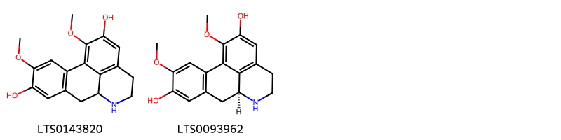{ width=100% }
    <figcaption>Hình ảnh cấu trúc hóa học của 2 hoạt chất thuộc nhóm Aporphines gồm ['4,16-dimethoxy-10-azatetracyclo[7.7.1.0²,⁷.0¹³,¹⁷]heptadeca-1(17),2(7),3,5,13,15-hexaene-5,15-diol (LTS0143820)', 'laurolitsine (LTS0093962)'].</figcaption>
</figure>
#### Nhóm Benzodioxoles
<figure markdown="span">
    { width=100% }
    <figcaption>Hình ảnh cấu trúc hóa học của 1 hoạt chất thuộc nhóm Benzodioxoles gồm ['sassafras (LTS0136093)'].</figcaption>
</figure>
#### Nhóm Cinnamyl alcohols
<figure markdown="span">
    { width=100% }
    <figcaption>Hình ảnh cấu trúc hóa học của 1 hoạt chất thuộc nhóm Cinnamyl alcohols gồm ['cinnamyl alcohol (LTS0010678)'].</figcaption>
</figure>
#### Nhóm Fatty Acyls
<figure markdown="span">
    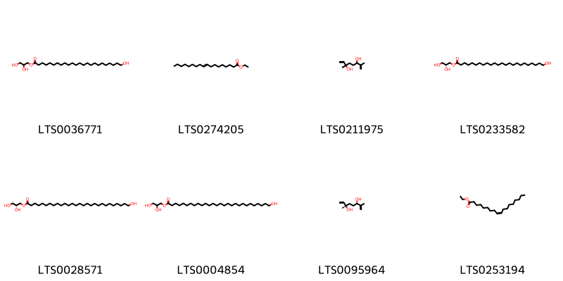{ width=100% }
    <figcaption>Hình ảnh cấu trúc hóa học của 8 hoạt chất thuộc nhóm Fatty Acyls gồm ['2,3-dihydroxypropyl 24-hydroxytetracosanoate (LTS0036771)', 'ethyl octadec-9-enoate (LTS0274205)', '2,6-dimethylocta-1,7-diene-3,6-diol (LTS0211975)', '(2r)-2,3-dihydroxypropyl 24-hydroxytetracosanoate (LTS0233582)', '(2r)-2,3-dihydroxypropyl 28-hydroxyoctacosanoate (LTS0028571)', '2,3-dihydroxypropyl 28-hydroxyoctacosanoate (LTS0004854)', '(3r,6s)-2,6-dimethylocta-1,7-diene-3,6-diol (LTS0095964)', 'ethyl oleate (LTS0253194)'].</figcaption>
</figure>
#### Nhóm Flavonoids
<figure markdown="span">
    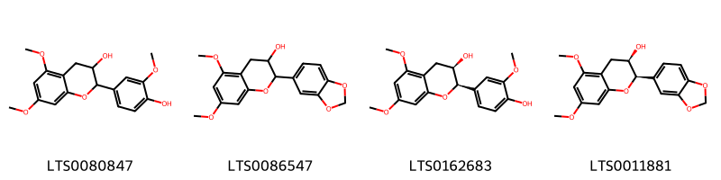{ width=100% }
    <figcaption>Hình ảnh cấu trúc hóa học của 4 hoạt chất thuộc nhóm Flavonoids gồm ['2-(4-hydroxy-3-methoxyphenyl)-5,7-dimethoxy-3,4-dihydro-2h-1-benzopyran-3-ol (LTS0080847)', '2-(2h-1,3-benzodioxol-5-yl)-5,7-dimethoxy-3,4-dihydro-2h-1-benzopyran-3-ol (LTS0086547)', '(2r,3r)-2-(4-hydroxy-3-methoxyphenyl)-5,7-dimethoxy-3,4-dihydro-2h-1-benzopyran-3-ol (LTS0162683)', '(2r,3r)-2-(2h-1,3-benzodioxol-5-yl)-5,7-dimethoxy-3,4-dihydro-2h-1-benzopyran-3-ol (LTS0011881)'].</figcaption>
</figure>
#### Nhóm Furanoid lignans
<figure markdown="span">
    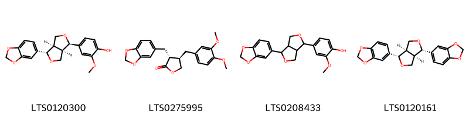{ width=100% }
    <figcaption>Hình ảnh cấu trúc hóa học của 4 hoạt chất thuộc nhóm Furanoid lignans gồm ['4-[(1r,3ar,4s,6ar)-4-(2h-1,3-benzodioxol-5-yl)-hexahydrofuro[3,4-c]furan-1-yl]-2-methoxyphenol (LTS0120300)', '(3r,4r)-3-(2h-1,3-benzodioxol-5-ylmethyl)-4-[(3,4-dimethoxyphenyl)methyl]oxolan-2-one (LTS0275995)', '4-[4-(2h-1,3-benzodioxol-5-yl)-hexahydrofuro[3,4-c]furan-1-yl]-2-methoxyphenol (LTS0208433)', 'sesamin (LTS0120161)'].</figcaption>
</figure>
#### Nhóm Organooxygen compounds
<figure markdown="span">
    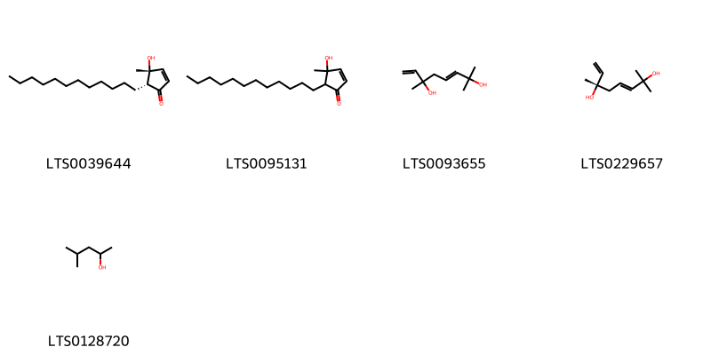{ width=100% }
    <figcaption>Hình ảnh cấu trúc hóa học của 5 hoạt chất thuộc nhóm Organooxygen compounds gồm ['(4r,5r)-5-dodecyl-4-hydroxy-4-methylcyclopent-2-en-1-one (LTS0039644)', '5-dodecyl-4-hydroxy-4-methylcyclopent-2-en-1-one (LTS0095131)', '2,6-dimethylocta-3,7-diene-2,6-diol (LTS0093655)', '(3e,6s)-2,6-dimethylocta-3,7-diene-2,6-diol (LTS0229657)', '4-methyl-2-pentanol (LTS0128720)'].</figcaption>
</figure>
#### Nhóm Oxolanes
<figure markdown="span">
    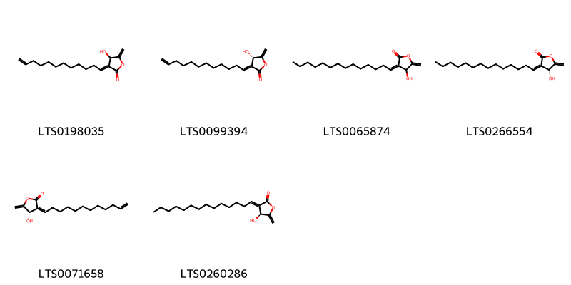{ width=100% }
    <figcaption>Hình ảnh cấu trúc hóa học của 6 hoạt chất thuộc nhóm Oxolanes gồm ['3-(dodec-11-en-1-ylidene)-4-hydroxy-5-methylideneoxolan-2-one (LTS0198035)', '(3e,4s)-3-(dodec-11-en-1-ylidene)-4-hydroxy-5-methylideneoxolan-2-one (LTS0099394)', '4-hydroxy-5-methylidene-3-tetradecylideneoxolan-2-one (LTS0065874)', '(3z,4r)-4-hydroxy-5-methylidene-3-tetradecylideneoxolan-2-one (LTS0266554)', '(3z,4s)-3-(dodec-11-en-1-ylidene)-4-hydroxy-5-methylideneoxolan-2-one (LTS0071658)', '(3e,4s)-4-hydroxy-5-methylidene-3-tetradecylideneoxolan-2-one (LTS0260286)'].</figcaption>
</figure>
#### Nhóm Polypeptides
<figure markdown="span">
    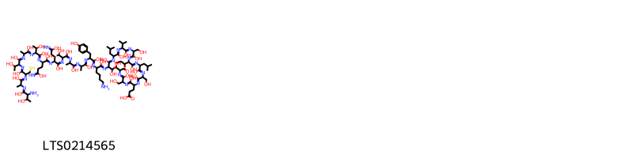{ width=100% }
    <figcaption>Hình ảnh cấu trúc hóa học của 1 hoạt chất thuộc nhóm Polypeptides gồm ['4-({2-[(2-{[2-({2-[(2-{[2-({2-[(6-amino-2-{[2-({2-[(2-{[2-({2-[(2-{[2-({2-[(2-{[2-({2-[(2-amino-1,3-dihydroxybutylidene)amino]-1-hydroxypropylidene}amino)-1-hydroxy-3-sulfanylpropylidene]amino}-1,3-dihydroxybutylidene)amino]-1-hydroxypropylidene}amino)-1,3-dihydroxybutylidene]amino}-1-hydroxy-4-(c-hydroxycarbonimidoyl)butylidene)amino]-1-hydroxy-4-(c-hydroxycarbonimidoyl)butylidene}amino)-1,3-dihydroxybutylidene]amino}-1-hydroxypropylidene)amino]-1-hydroxypropylidene}amino)-1-hydroxy-3-(4-hydroxyphenyl)propylidene]amino}-1-hydroxyhexylidene)amino]-1,3-dihydroxybutylidene}amino)-1-hydroxy-4-methylpentylidene]amino}-1-hydroxy-3-methylbutylidene)amino]-1,3-dihydroxypropylidene}amino)-1-hydroxy-3-methylpentylidene]amino}-1-hydroxy-4-methylpentylidene)amino]-1,3-dihydroxypropylidene}amino)-4-({2-hydroxy-1-[(1-hydroxy-3-oxopropan-2-yl)-c-hydroxycarbonimidoyl]ethyl}-c-hydroxycarbonimidoyl)butanoic acid (LTS0214565)'].</figcaption>
</figure>
#### Nhóm Prenol lipids
<figure markdown="span">
    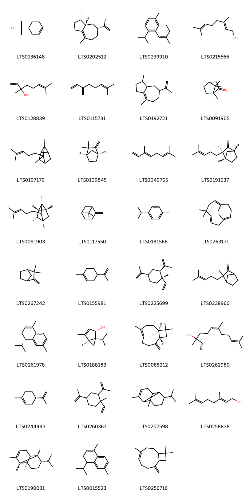{ width=100% }
    <figcaption>Hình ảnh cấu trúc hóa học của 31 hoạt chất thuộc nhóm Prenol lipids gồm ['terpineol (LTS0136148)', 'α-bulnesene (LTS0202512)', '4-isopropyl-1,6-dimethyl-7,8-dihydronaphthalene (LTS0239910)', '3,7-dimethyl-2,6-octadien-1-ol (LTS0215566)', 'linalool, (+-)- (LTS0128839)', 'α-myrcene (LTS0115731)', '1,4-dimethyl-7-(prop-1-en-2-yl)-1,2,3,5,6,7,8,8a-octahydroazulene (LTS0192721)', 'camphor (LTS0091905)', '1,7-dimethyl-7-(4-methylpent-3-en-1-yl)tricyclo[2.2.1.0²,⁶]heptane (LTS0197179)', '(+)-camphene (LTS0109845)', 'trans-β-ocimene (LTS0049765)', 'β-santalene (LTS0191637)', '(+)-α-santalene (LTS0091903)', 'β-pinene (LTS0117550)', 'cymene (LTS0181568)', 'humulene (LTS0263171)', 'camphene (LTS0267242)', 'limonene,  (LTS0155981)', 'β-elemene (LTS0225699)', 'β-santalene (LTS0238960)', '(4s)-4-isopropyl-1,6-dimethyl-3,4-dihydronaphthalene (LTS0261978)', '(1r,2s,5s)-1-isopropyl-4-methylbicyclo[3.1.0]hex-3-en-2-ol (LTS0188183)', 'caryophyllene (LTS0085212)', 'nerolidol (LTS0262980)', 'α-limonene (LTS0244943)', 'β-elemene (LTS0260361)', 'α-copaene (LTS0207598)', 'geraniol (LTS0258838)', '(1r,2s,7s,8s)-8-isopropyl-1,3-dimethyltricyclo[4.4.0.0²,⁷]dec-3-ene (LTS0190031)', '3,4-dihydrocadalene (LTS0015523)', '4,11,11-trimethyl-8-methylidenebicyclo[7.2.0]undec-4-ene (LTS0256716)'].</figcaption>
</figure>
#### Nhóm Steroids and steroid derivatives
<figure markdown="span">
    { width=100% }
    <figcaption>Hình ảnh cấu trúc hóa học của 4 hoạt chất thuộc nhóm Steroids and steroid derivatives gồm ['stigmast-5-en-3-ol (LTS0071224)', 'stigmast-5-en-3-ol, (3β)- (LTS0204616)', 'sitogluside (LTS0201798)', '2-{[1-(5-ethyl-6-methylheptan-2-yl)-9a,11a-dimethyl-1h,2h,3h,3ah,3bh,4h,6h,7h,8h,9h,9bh,10h,11h-cyclopenta[a]phenanthren-7-yl]oxy}-6-(hydroxymethyl)oxane-3,4,5-triol (LTS0158828)'].</figcaption>
</figure>
#### Nhóm Tetrahydrofurans
<figure markdown="span">
    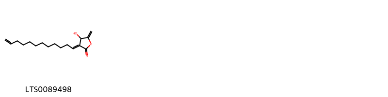{ width=100% }
    <figcaption>Hình ảnh cấu trúc hóa học của 1 hoạt chất thuộc nhóm Tetrahydrofurans gồm ['(3e)-3-(dodec-11-en-1-ylidene)-4-hydroxy-5-methylideneoxolan-2-one (LTS0089498)'].</figcaption>
</figure>
#### Nhóm Unsaturated hydrocarbons
<figure markdown="span">
    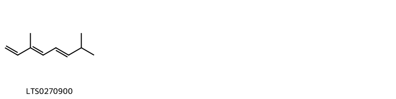{ width=100% }
    <figcaption>Hình ảnh cấu trúc hóa học của 1 hoạt chất thuộc nhóm Unsaturated hydrocarbons gồm ['(3e,5e)-3,7-dimethylocta-1,3,5-triene (LTS0270900)'].</figcaption>
</figure>

---

### Dược dân tộc học

Danh sách các quốc gia có sử dụng *Cinnamomum camphora* trong điều trị các bệnh. 

| Country   | Disease                                                                                    | Bệnh                                                                                                                                                                                                |
|:----------|:-------------------------------------------------------------------------------------------|:----------------------------------------------------------------------------------------------------------------------------------------------------------------------------------------------------|
| China     | Vermifuge, Vermifuge, Insecticide                                                          | MYMEMORY WARNING: YOU USED ALL AVAILABLE FREE TRANSLATIONS FOR TODAY. NEXT AVAILABLE IN  02 HOURS 33 MINUTES 19 SECONDS VISIT HTTPS://MYMEMORY.TRANSLATED.NET/DOC/USAGELIMITS.PHP TO TRANSLATE MORE |
| Elsewhere | Analeptic, Antiseptic, Antiseptic, Antiseptic, Rubefacient, Sedative, Stimulant, Stimulant | MYMEMORY WARNING: YOU USED ALL AVAILABLE FREE TRANSLATIONS FOR TODAY. NEXT AVAILABLE IN  02 HOURS 33 MINUTES 16 SECONDS VISIT HTTPS://MYMEMORY.TRANSLATED.NET/DOC/USAGELIMITS.PHP TO TRANSLATE MORE |
| Nepal     | Carminative, Stimulant                                                                     | MYMEMORY WARNING: YOU USED ALL AVAILABLE FREE TRANSLATIONS FOR TODAY. NEXT AVAILABLE IN  02 HOURS 33 MINUTES 14 SECONDS VISIT HTTPS://MYMEMORY.TRANSLATED.NET/DOC/USAGELIMITS.PHP TO TRANSLATE MORE |
| Turkey    | Fumigant, Stimulant, Vulnerary                                                             | MYMEMORY WARNING: YOU USED ALL AVAILABLE FREE TRANSLATIONS FOR TODAY. NEXT AVAILABLE IN  02 HOURS 33 MINUTES 12 SECONDS VISIT HTTPS://MYMEMORY.TRANSLATED.NET/DOC/USAGELIMITS.PHP TO TRANSLATE MORE |

---

---
## Cinnamomum cassia
### Thông tin về thực vật

!!! info "Phân loại thực vật của *N/A* từ GIBF:"
    - **Kingdom:** Plantae
    - **Phylum:** Tracheophyta
    - **Order:** Laurales
    - **Family:** Lauraceae
    - **Genus:** N/A
    - **Species:** *N/A*

 

| Label (VI)   | Label (EN)   | Scientific Name   | Descriptions (VI)   | Descriptions (EN)   | Also Known As (VI)   | Also Known As (EN)                     |
|:-------------|:-------------|:------------------|:--------------------|:--------------------|:---------------------|:---------------------------------------|
| N/A          | N/A          | Cinnamomum cassia | loài thực vật       | species of plant    | ['']                 | ['Chinese cinnamon', 'Chinese cassia'] |

#### Phân bố trên thế giới

**Từ CSDL GIBF** Italy, Australia, Japan, Argentina, Canada, Puerto Rico, Chinese Taipei, Spain, Türkiye, Portugal, United States of America, Uruguay, Chile, Greece, South Africa, Hong Kong, Brazil, Bhutan, Mexico, France, United Kingdom of Great Britain and Northern Ireland, China, Colombia, India, New Zealand, Ethiopia

#### Phân bố tại Việt Nam

**Từ CSDL GIBF**: Không có ghi nhận ở Việt Nam

---
### Thành phần hóa học
        
- Theo cơ sở dữ liệu lotus: Từ loài *N/A* đã phân lập và xác định được 124 hoạt chất thuộc về các nhóm Fatty Acyls, Cinnamyl alcohols, Flavonoids, Phenylpropanoic acids, Steroids and steroid derivatives, Prenol lipids, Cinnamic acids and derivatives, Dioxanes, Benzene and substituted derivatives, Cinnamaldehydes, Dihydrofurans, Organooxygen compounds, Phenols, Coumarins and derivatives, Neoflavonoids, Furanoid lignans. 

|    | chemicalTaxonomyClassyfireClass     |   smiles_count |
|---:|:------------------------------------|---------------:|
|  0 | Benzene and substituted derivatives |              7 |
|  1 | Cinnamaldehydes                     |              7 |
|  2 | Cinnamic acids and derivatives      |              7 |
|  3 | Cinnamyl alcohols                   |              2 |
|  4 | Coumarins and derivatives           |              1 |
|  5 | Dihydrofurans                       |              7 |
|  6 | Dioxanes                            |              1 |
|  7 | Fatty Acyls                         |              2 |
|  8 | Flavonoids                          |             54 |
|  9 | Furanoid lignans                    |              2 |
| 10 | Neoflavonoids                       |              2 |
| 11 | Organooxygen compounds              |             15 |
| 12 | Phenols                             |              5 |
| 13 | Phenylpropanoic acids               |              1 |
| 14 | Prenol lipids                       |             10 |
| 15 | Steroids and steroid derivatives    |              1 |

#### Nhóm Benzene and substituted derivatives
<figure markdown="span">
    { width=100% }
    <figcaption>Hình ảnh cấu trúc hóa học của 7 hoạt chất thuộc nhóm Benzene and substituted derivatives gồm ['cinnamyl acetate (LTS0207736)', '(2s,5s)-2-[(1e)-2-phenylethenyl]-1,3-dioxan-5-ol (LTS0204273)', 'benzyl benzoate (LTS0097515)', '(2r,5r)-2-[(1e)-2-phenylethenyl]-1,3-dioxan-5-ol (LTS0232628)', '3-phenyl-2-propenyl acetate (LTS0061721)', '3,4-dihydroxybenzoic acid (LTS0018765)', '2-(2-phenylethenyl)-1,3-dioxan-5-ol (LTS0127797)'].</figcaption>
</figure>
#### Nhóm Cinnamaldehydes
<figure markdown="span">
    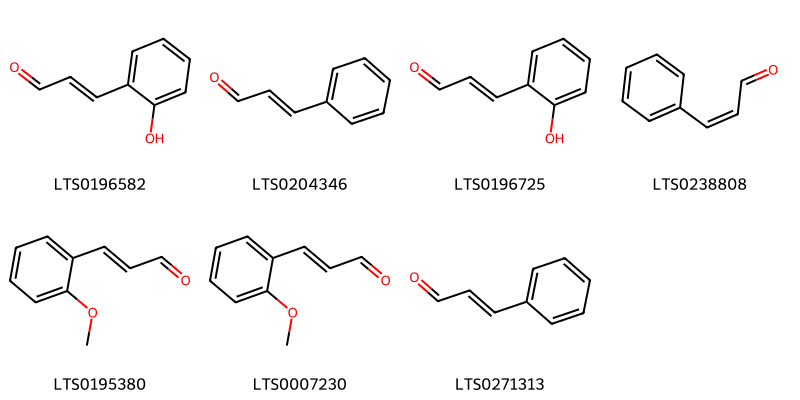{ width=100% }
    <figcaption>Hình ảnh cấu trúc hóa học của 7 hoạt chất thuộc nhóm Cinnamaldehydes gồm ['3-(2-hydroxyphenyl)prop-2-enal (LTS0196582)', '3-phenyl-2-propenal (LTS0204346)', '(2e)-3-(2-hydroxyphenyl)prop-2-enal (LTS0196725)', '(z)-3-phenyl-2-propenal (LTS0238808)', '2-methoxycinnamaldehyde (LTS0195380)', '3-(2-methoxyphenyl)prop-2-enal (LTS0007230)', 'cinnamal (LTS0271313)'].</figcaption>
</figure>
#### Nhóm Cinnamic acids and derivatives
<figure markdown="span">
    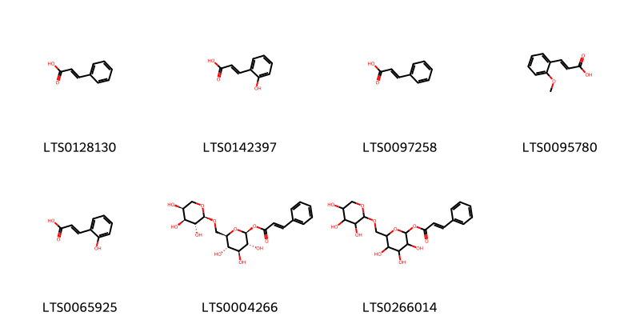{ width=100% }
    <figcaption>Hình ảnh cấu trúc hóa học của 7 hoạt chất thuộc nhóm Cinnamic acids and derivatives gồm ['cinnamic acid (LTS0128130)', 'trans-2-hydroxycinnamic acid (LTS0142397)', 'phenylacrylic acid (LTS0097258)', '3-(2-methoxyphenyl)prop-2-enoic acid (LTS0095780)', 'o-coumaric acid (LTS0065925)', '(2s,3r,4s,5s,6r)-3,4,5-trihydroxy-6-({[(2s,3r,4s,5s)-3,4,5-trihydroxyoxan-2-yl]oxy}methyl)oxan-2-yl (2e)-3-phenylprop-2-enoate (LTS0004266)', '3,4,5-trihydroxy-6-{[(3,4,5-trihydroxyoxan-2-yl)oxy]methyl}oxan-2-yl 3-phenylprop-2-enoate (LTS0266014)'].</figcaption>
</figure>
#### Nhóm Cinnamyl alcohols
<figure markdown="span">
    { width=100% }
    <figcaption>Hình ảnh cấu trúc hóa học của 2 hoạt chất thuộc nhóm Cinnamyl alcohols gồm ['3-phenyl-2-propen-1-ol (LTS0069711)', 'cinnamyl alcohol (LTS0010678)'].</figcaption>
</figure>
#### Nhóm Coumarins and derivatives
<figure markdown="span">
    { width=100% }
    <figcaption>Hình ảnh cấu trúc hóa học của 1 hoạt chất thuộc nhóm Coumarins and derivatives gồm ['2h-1-benzopyran-2-one (LTS0069773)'].</figcaption>
</figure>
#### Nhóm Dihydrofurans
<figure markdown="span">
    { width=100% }
    <figcaption>Hình ảnh cấu trúc hóa học của 7 hoạt chất thuộc nhóm Dihydrofurans gồm ['3,8-dimethyl-5,9,15-trioxatetracyclo[11.2.1.0²,⁶.0⁸,¹⁰]hexadeca-2(6),3,13(16)-trien-14-one (LTS0133064)', 'linderalactone (LTS0251917)', '(1r,8r,10s)-3,8-dimethyl-5,9,15-trioxatetracyclo[11.2.1.0²,⁶.0⁸,¹⁰]hexadeca-2(6),3,13(16)-trien-14-one (LTS0107843)', '(1s,7z,9r)-3,8-dimethyl-13-oxo-5,14-dioxatricyclo[10.2.1.0²,⁶]pentadeca-2(6),3,7,12(15)-tetraen-9-yl acetate (LTS0193817)', '3,8-dimethyl-5,14-dioxatricyclo[10.2.1.0²,⁶]pentadeca-2(6),3,8,12(15)-tetraen-13-one (LTS0222441)', '(1r,7r,8r,10r)-3,8-dimethyl-14-oxo-5,9,15-trioxatetracyclo[11.2.1.0²,⁶.0⁸,¹⁰]hexadeca-2(6),3,13(16)-trien-7-yl acetate (LTS0132624)', '(1s,8r,10s)-3,8-dimethyl-5,9,15-trioxatetracyclo[11.2.1.0²,⁶.0⁸,¹⁰]hexadeca-2(6),3,13(16)-trien-14-one (LTS0261559)'].</figcaption>
</figure>
#### Nhóm Dioxanes
<figure markdown="span">
    { width=100% }
    <figcaption>Hình ảnh cấu trúc hóa học của 1 hoạt chất thuộc nhóm Dioxanes gồm ['(1r,4r,6s,7r,13s,14r)-6,11-dimethyl-16-oxo-5,9,15,17-tetraoxapentacyclo[11.2.2.0¹,¹⁴.0⁴,⁶.0⁸,¹²]heptadeca-8(12),10-dien-7-yl acetate (LTS0061054)'].</figcaption>
</figure>
#### Nhóm Fatty Acyls
<figure markdown="span">
    { width=100% }
    <figcaption>Hình ảnh cấu trúc hóa học của 2 hoạt chất thuộc nhóm Fatty Acyls gồm ['stearic acid (LTS0237766)', 'rosavin (LTS0183265)'].</figcaption>
</figure>
#### Nhóm Flavonoids
<figure markdown="span">
    { width=100% }
    <figcaption>Hình ảnh cấu trúc hóa học của 54 hoạt chất thuộc nhóm Flavonoids gồm ['(+)-catechol (LTS0117079)', 'catechol (LTS0090912)', 'ent-epicatechin (LTS0265245)', '(2r,3r,4r)-2-(3,4-dihydroxyphenyl)-4-[(2r,3r)-2-(3,4-dihydroxyphenyl)-3,5,7-trihydroxy-3,4-dihydro-2h-1-benzopyran-8-yl]-3,4-dihydro-2h-1-benzopyran-3,5,7-triol (LTS0135510)', '(2r,3r)-2-(3,4-dihydroxyphenyl)-4-[(2r,3r)-2-(3,4-dihydroxyphenyl)-3,5,7-trihydroxy-3,4-dihydro-2h-1-benzopyran-8-yl]-3,4-dihydro-2h-1-benzopyran-3,5,7-triol (LTS0097406)', '2-(3,4-dihydroxyphenyl)-4-[2-(3,4-dihydroxyphenyl)-3,5,7-trihydroxy-3,4-dihydro-2h-1-benzopyran-8-yl]-3,4-dihydro-2h-1-benzopyran-3,5,7-triol (LTS0040252)', '(2r,3r)-2-(4-hydroxy-3-methoxyphenyl)-5-methoxy-3,4-dihydro-2h-1-benzopyran-3,7-diol (LTS0133031)', '2-(3,4-dihydroxyphenyl)-8-[2-(3,4-dihydroxyphenyl)-3,5,7-trihydroxy-3,4-dihydro-2h-1-benzopyran-4-yl]-4-[2-(3,4-dihydroxyphenyl)-4-[2-(3,4-dihydroxyphenyl)-3,5,7-trihydroxy-3,4-dihydro-2h-1-benzopyran-8-yl]-3,5,7-trihydroxy-3,4-dihydro-2h-1-benzopyran-8-yl]-3,4-dihydro-2h-1-benzopyran-3,5,7-triol (LTS0039604)', '5,13-bis(3,4-dihydroxyphenyl)-10-[2-(3,4-dihydroxyphenyl)-3,5,7-trihydroxy-3,4-dihydro-2h-1-benzopyran-4-yl]-7-[2-(3,4-dihydroxyphenyl)-3,5,7-trihydroxy-3,4-dihydro-2h-1-benzopyran-8-yl]-4,12,14-trioxapentacyclo[11.7.1.0²,¹¹.0³,⁸.0¹⁵,²⁰]henicosa-2(11),3(8),9,15,17,19-hexaene-6,9,17,19,21-pentol (LTS0064219)', '2-(3-hydroxy-4-methoxyphenyl)-7-methoxy-3,4-dihydro-2h-1-benzopyran-3,5-diol (LTS0233241)', 'cinnamtannin d-1 (LTS0097139)', '2-(3-hydroxy-4-methoxyphenyl)-5,7-dimethoxy-3,4-dihydro-2h-1-benzopyran-3-ol (LTS0069323)', '2-(4-hydroxy-3-methoxyphenyl)-5,7-dimethoxy-3,4-dihydro-2h-1-benzopyran-3-ol (LTS0080847)', '(2r,3r,4s,5s,6r)-2-{[(2r,3r)-2-(3,4-dihydroxyphenyl)-5,7-dihydroxy-3,4-dihydro-2h-1-benzopyran-3-yl]oxy}-6-(hydroxymethyl)oxane-3,4,5-triol (LTS0031424)', '2-(2h-1,3-benzodioxol-5-yl)-5,7-dimethoxy-3,4-dihydro-2h-1-benzopyran-3-ol (LTS0086547)', '(2r,3r,4s)-2-(3,4-dihydroxyphenyl)-4-[(2r,3r)-2-(3,4-dihydroxyphenyl)-3,5,7-trihydroxy-3,4-dihydro-2h-1-benzopyran-6-yl]-3,4-dihydro-2h-1-benzopyran-3,5,7-triol (LTS0103163)', '(2r,3r,4r)-2-(3,4-dihydroxyphenyl)-8-[(2r,3r,4r)-2-(3,4-dihydroxyphenyl)-3,5,7-trihydroxy-3,4-dihydro-2h-1-benzopyran-4-yl]-4-[(2r,3r,4r)-2-(3,4-dihydroxyphenyl)-4-[(2r,3r,4s)-2-(3,4-dihydroxyphenyl)-4-[(2r,3r)-2-(3,4-dihydroxyphenyl)-3,5,7-trihydroxy-3,4-dihydro-2h-1-benzopyran-8-yl]-3,5,7-trihydroxy-3,4-dihydro-2h-1-benzopyran-8-yl]-3,5,7-trihydroxy-3,4-dihydro-2h-1-benzopyran-8-yl]-3,4-dihydro-2h-1-benzopyran-3,5,7-triol (LTS0063017)', '2-(3,4-dihydroxyphenyl)-4-[2-(3,4-dihydroxyphenyl)-3,5,7-trihydroxy-3,4-dihydro-2h-1-benzopyran-6-yl]-3,4-dihydro-2h-1-benzopyran-3,5,7-triol (LTS0072400)', '(2r,3r,4s)-2-(3,4-dihydroxyphenyl)-4-[(2r,3s)-2-(3,4-dihydroxyphenyl)-3,5,7-trihydroxy-3,4-dihydro-2h-1-benzopyran-6-yl]-3,4-dihydro-2h-1-benzopyran-3,5,7-triol (LTS0105674)', '2-(3,4-dihydroxyphenyl)-4-[2-(3,4-dihydroxyphenyl)-3,5,7-trihydroxy-3,4-dihydro-2h-1-benzopyran-8-yl]-8-[3,4,5-trihydroxy-6-(hydroxymethyl)oxan-2-yl]-3,4-dihydro-2h-1-benzopyran-3,5,7-triol (LTS0202469)', '(2r,3s)-2-(2h-1,3-benzodioxol-5-yl)-5,7-dimethoxy-3,4-dihydro-2h-1-benzopyran-3-ol (LTS0198172)', '(2r,3s,4s)-2-(3,4-dihydroxyphenyl)-4-[(2r,3r)-2-(3,4-dihydroxyphenyl)-3,5,7-trihydroxy-3,4-dihydro-2h-1-benzopyran-8-yl]-3,4-dihydro-2h-1-benzopyran-3,5,7-triol (LTS0116257)', '(2r,3r)-2-(3,4-dihydroxyphenyl)-8-[(2s,3r,4r,5s,6r)-3,4,5-trihydroxy-6-(hydroxymethyl)oxan-2-yl]-3,4-dihydro-2h-1-benzopyran-3,5,7-triol (LTS0143994)', '(2r,3r,4r)-2-(3,4-dihydroxyphenyl)-4-[(2r,3s)-2-(3,4-dihydroxyphenyl)-3,5,7-trihydroxy-3,4-dihydro-2h-1-benzopyran-6-yl]-3,4-dihydro-2h-1-benzopyran-3,5,7-triol (LTS0206542)', '(2r,3s)-2-(3-hydroxy-4-methoxyphenyl)-5,7-dimethoxy-3,4-dihydro-2h-1-benzopyran-3-ol (LTS0268300)', '2-(3,4-dihydroxyphenyl)-4-[2-(3,4-dihydroxyphenyl)-3,5,7-trihydroxy-3,4-dihydro-2h-1-benzopyran-8-yl]-6-[3,4,5-trihydroxy-6-(hydroxymethyl)oxan-2-yl]-3,4-dihydro-2h-1-benzopyran-3,5,7-triol (LTS0140498)', '2-(3,4-dihydroxyphenyl)-8-[3,4,5-trihydroxy-6-(hydroxymethyl)oxan-2-yl]-3,4-dihydro-2h-1-benzopyran-3,5,7-triol (LTS0164298)', '(2r,3r)-2-(4-hydroxy-3-methoxyphenyl)-5,7-dimethoxy-3,4-dihydro-2h-1-benzopyran-3-ol (LTS0162683)', 'cinnamtannin b2 (LTS0240359)', 'procyanidin a1 (LTS0171311)', 'procyanidin c2 (LTS0226053)', 'cinnamtannin b1 (LTS0273087)', '2-(3,4-dihydroxyphenyl)-8-[2-(3,4-dihydroxyphenyl)-3,5,7-trihydroxy-3,4-dihydro-2h-1-benzopyran-4-yl]-4-[2-(3,4-dihydroxyphenyl)-4-[2-(3,4-dihydroxyphenyl)-4-[2-(3,4-dihydroxyphenyl)-3,5,7-trihydroxy-3,4-dihydro-2h-1-benzopyran-8-yl]-3,5,7-trihydroxy-3,4-dihydro-2h-1-benzopyran-8-yl]-3,5,7-trihydroxy-3,4-dihydro-2h-1-benzopyran-8-yl]-3,4-dihydro-2h-1-benzopyran-3,5,7-triol (LTS0257031)', 'proanthocyanidin a2 (LTS0117726)', '2-(4-hydroxy-3-methoxyphenyl)-5-methoxy-3,4-dihydro-2h-1-benzopyran-3,7-diol (LTS0249352)', '(2r,3r,4r)-2-(3,4-dihydroxyphenyl)-8-[(2r,3r,4r)-2-(3,4-dihydroxyphenyl)-3,5,7-trihydroxy-3,4-dihydro-2h-1-benzopyran-4-yl]-4-[(2r,3r,4s)-2-(3,4-dihydroxyphenyl)-4-[(2r,3r)-2-(3,4-dihydroxyphenyl)-3,5,7-trihydroxy-3,4-dihydro-2h-1-benzopyran-8-yl]-3,5,7-trihydroxy-3,4-dihydro-2h-1-benzopyran-8-yl]-3,4-dihydro-2h-1-benzopyran-3,5,7-triol (LTS0275974)', '(2r,3r)-2-(3,4-dihydroxyphenyl)-6-[(2s,3r,4r,5s,6r)-3,4,5-trihydroxy-6-(hydroxymethyl)oxan-2-yl]-3,4-dihydro-2h-1-benzopyran-3,5,7-triol (LTS0214937)', 'procyanidin c1 (LTS0260445)', '(2s,3r)-2-(3-hydroxy-4-methoxyphenyl)-5,7-dimethoxy-3,4-dihydro-2h-1-benzopyran-3-ol (LTS0225298)', '5,13-bis(3,4-dihydroxyphenyl)-7-[2-(3,4-dihydroxyphenyl)-3,5,7-trihydroxy-3,4-dihydro-2h-1-benzopyran-8-yl]-4,12,14-trioxapentacyclo[11.7.1.0²,¹¹.0³,⁸.0¹⁵,²⁰]henicosa-2,8,10,15,17,19-hexaene-6,9,17,19,21-pentol (LTS0027601)', 'parameritannin a-1 (LTS0251473)', '(2r,3r,4r)-2-(3,4-dihydroxyphenyl)-4-[(2r,3r)-2-(3,4-dihydroxyphenyl)-3,5,7-trihydroxy-3,4-dihydro-2h-1-benzopyran-6-yl]-3,4-dihydro-2h-1-benzopyran-3,5,7-triol (LTS0251127)', '2-(3,4-dihydroxyphenyl)-6-[3,4,5-trihydroxy-6-(hydroxymethyl)oxan-2-yl]-3,4-dihydro-2h-1-benzopyran-3,5,7-triol (LTS0039025)', '(2r,3r,4r)-2-(3,4-dihydroxyphenyl)-8-[(2r,3r,4r)-2-(3,4-dihydroxyphenyl)-3,5,7-trihydroxy-3,4-dihydro-2h-1-benzopyran-4-yl]-4-[(2s,3r)-2-(3,4-dihydroxyphenyl)-3,5,7-trihydroxy-3,4-dihydro-2h-1-benzopyran-8-yl]-3,4-dihydro-2h-1-benzopyran-3,5,7-triol (LTS0242983)', 'symplocosidin (LTS0256821)', 'cassiatannin a (LTS0275200)', '(2r,3r,4r)-2-(3,4-dihydroxyphenyl)-4-[(2r,3s)-2-(3,4-dihydroxyphenyl)-3,5,7-trihydroxy-3,4-dihydro-2h-1-benzopyran-8-yl]-3,4-dihydro-2h-1-benzopyran-3,5,7-triol (LTS0066122)', '2-{[2-(3,4-dihydroxyphenyl)-5,7-dihydroxy-3,4-dihydro-2h-1-benzopyran-3-yl]oxy}-6-(hydroxymethyl)oxane-3,4,5-triol (LTS0015699)', "catechin 7,4'-dimethyl ether (LTS0008008)", '2-(4-hydroxy-3-methoxyphenyl)-3,4-dihydro-2h-1-benzopyran-3,5,7-triol (LTS0063138)', '2-(3-hydroxy-4-methoxyphenyl)-3,4-dihydro-2h-1-benzopyran-3,5,7-triol (LTS0121270)', "catechin 4'-methyl ether (LTS0018707)", '(2r,3r,4s)-2-(3,4-dihydroxyphenyl)-4-[(2r,3r)-2-(3,4-dihydroxyphenyl)-3,5,7-trihydroxy-3,4-dihydro-2h-1-benzopyran-8-yl]-8-[(2s,3r,4r,5s,6r)-3,4,5-trihydroxy-6-(hydroxymethyl)oxan-2-yl]-3,4-dihydro-2h-1-benzopyran-3,5,7-triol (LTS0004781)', '(2r,3r,4r)-2-(3,4-dihydroxyphenyl)-4-[(2r,3r)-2-(3,4-dihydroxyphenyl)-3,5,7-trihydroxy-3,4-dihydro-2h-1-benzopyran-8-yl]-6-[(2s,3r,4r,5s,6r)-3,4,5-trihydroxy-6-(hydroxymethyl)oxan-2-yl]-3,4-dihydro-2h-1-benzopyran-3,5,7-triol (LTS0254947)'].</figcaption>
</figure>
#### Nhóm Furanoid lignans
<figure markdown="span">
    { width=100% }
    <figcaption>Hình ảnh cấu trúc hóa học của 2 hoạt chất thuộc nhóm Furanoid lignans gồm ['syringaresinol (LTS0116280)', '(+)-syringaresinol (LTS0158868)'].</figcaption>
</figure>
#### Nhóm Neoflavonoids
<figure markdown="span">
    { width=100% }
    <figcaption>Hình ảnh cấu trúc hóa học của 2 hoạt chất thuộc nhóm Neoflavonoids gồm ['2-{[6-hydroxy-4-(4-hydroxy-3,5-dimethoxyphenyl)-2-(hydroxymethyl)-5,7-dimethoxy-3,4-dihydro-2h-1-benzopyran-3-yl]methoxy}-6-(hydroxymethyl)oxane-3,4,5-triol (LTS0113220)', '(2r,3r,4s,5s,6r)-2-{[(2r,3s,4s)-6-hydroxy-4-(4-hydroxy-3,5-dimethoxyphenyl)-2-(hydroxymethyl)-5,7-dimethoxy-3,4-dihydro-2h-1-benzopyran-3-yl]methoxy}-6-(hydroxymethyl)oxane-3,4,5-triol (LTS0108470)'].</figcaption>
</figure>
#### Nhóm Organooxygen compounds
<figure markdown="span">
    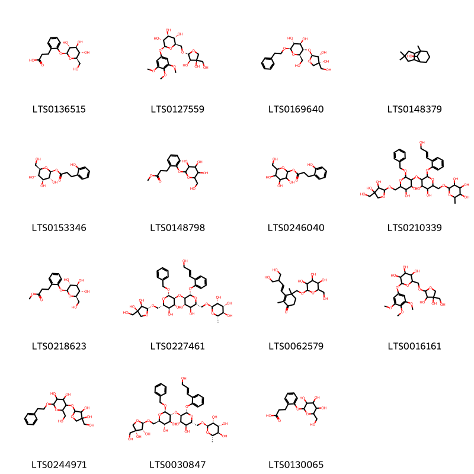{ width=100% }
    <figcaption>Hình ảnh cấu trúc hóa học của 15 hoạt chất thuộc nhóm Organooxygen compounds gồm ['3-(2-{[(2s,3r,4s,5s,6r)-3,4,5-trihydroxy-6-(hydroxymethyl)oxan-2-yl]oxy}phenyl)propanoic acid (LTS0136515)', '(2r,3s,4s,5r,6s)-2-({[(2r,3r,4r)-3,4-dihydroxy-4-(hydroxymethyl)oxolan-2-yl]oxy}methyl)-6-(3,4,5-trimethoxyphenoxy)oxane-3,4,5-triol (LTS0127559)', '(2r,3r,4r,5s,6r)-5-{[(2s,3r,4r)-3,4-dihydroxy-4-(hydroxymethyl)oxolan-2-yl]oxy}-6-(hydroxymethyl)-2-(2-phenylethoxy)oxane-3,4-diol (LTS0169640)', '1,4,4-trimethyltricyclo[5.3.1.0²,⁶]undecan-11-ol (LTS0148379)', '(2s,3r,4s,5s,6r)-3,4,5-trihydroxy-6-(hydroxymethyl)oxan-2-yl 3-(2-hydroxyphenyl)propanoate (LTS0153346)', 'methyl 3-(2-{[3,4,5-trihydroxy-6-(hydroxymethyl)oxan-2-yl]oxy}phenyl)propanoate (LTS0148798)', '3,4,5-trihydroxy-6-(hydroxymethyl)oxan-2-yl 3-(2-hydroxyphenyl)propanoate (LTS0246040)', '2-[(5-{[2-(benzyloxy)-6-({[3,4-dihydroxy-4-(hydroxymethyl)oxolan-2-yl]oxy}methyl)-4,5-dihydroxyoxan-3-yl]oxy}-3,4-dihydroxy-6-[2-(3-hydroxyprop-1-en-1-yl)phenoxy]oxan-2-yl)methoxy]-6-methyloxane-3,4,5-triol (LTS0210339)', 'methyl 3-(2-{[(2s,3r,4s,5s,6r)-3,4,5-trihydroxy-6-(hydroxymethyl)oxan-2-yl]oxy}phenyl)propanoate (LTS0218623)', '(2r,3r,4r,5r,6s)-2-{[(2r,3s,4s,5r,6s)-5-{[(2s,3s,4r,5r,6s)-2-(benzyloxy)-6-({[(2r,3r,4r)-3,4-dihydroxy-4-(hydroxymethyl)oxolan-2-yl]oxy}methyl)-4,5-dihydroxyoxan-3-yl]oxy}-3,4-dihydroxy-6-{2-[(1e)-3-hydroxyprop-1-en-1-yl]phenoxy}oxan-2-yl]methoxy}-6-methyloxane-3,4,5-triol (LTS0227461)', '3-[(1e)-4-hydroxy-3-(hydroxymethyl)but-1-en-1-yl]-2,4-dimethyl-4-({[3,4,5-trihydroxy-6-(hydroxymethyl)oxan-2-yl]oxy}methyl)cyclohex-2-en-1-one (LTS0062579)', '2-({[3,4-dihydroxy-4-(hydroxymethyl)oxolan-2-yl]oxy}methyl)-6-(3,4,5-trimethoxyphenoxy)oxane-3,4,5-triol (LTS0016161)', '5-{[3,4-dihydroxy-4-(hydroxymethyl)oxolan-2-yl]oxy}-6-(hydroxymethyl)-2-(2-phenylethoxy)oxane-3,4-diol (LTS0244971)', '(2r,3r,4r,5r,6s)-2-{[(2r,3s,4s,5r,6s)-5-{[(2r,3r,4s,5s,6r)-2-(benzyloxy)-6-({[(2r,3r,4r)-3,4-dihydroxy-4-(hydroxymethyl)oxolan-2-yl]oxy}methyl)-4,5-dihydroxyoxan-3-yl]oxy}-3,4-dihydroxy-6-{2-[(1e)-3-hydroxyprop-1-en-1-yl]phenoxy}oxan-2-yl]methoxy}-6-methyloxane-3,4,5-triol (LTS0030847)', '3-(2-{[3,4,5-trihydroxy-6-(hydroxymethyl)oxan-2-yl]oxy}phenyl)propanoic acid (LTS0130065)'].</figcaption>
</figure>
#### Nhóm Phenols
<figure markdown="span">
    { width=100% }
    <figcaption>Hình ảnh cấu trúc hóa học của 5 hoạt chất thuộc nhóm Phenols gồm ['eugenol (LTS0052342)', 'coniferyl aldehyde (LTS0140691)', '3-(3-hydroxy-2-methoxyphenyl)prop-2-enal (LTS0249023)', '(2e)-3-(3-hydroxy-2-methoxyphenyl)prop-2-enal (LTS0004167)', 'coniferaldehyde (LTS0009773)'].</figcaption>
</figure>
#### Nhóm Phenylpropanoic acids
<figure markdown="span">
    { width=100% }
    <figcaption>Hình ảnh cấu trúc hóa học của 1 hoạt chất thuộc nhóm Phenylpropanoic acids gồm ['melilotic acid (LTS0176151)'].</figcaption>
</figure>
#### Nhóm Prenol lipids
<figure markdown="span">
    { width=100% }
    <figcaption>Hình ảnh cấu trúc hóa học của 10 hoạt chất thuộc nhóm Prenol lipids gồm ['cinncassiol e (LTS0193858)', '4-(4-{[6-({[3,4-dihydroxy-4-(hydroxymethyl)oxolan-2-yl]oxy}methyl)-3,4,5-trihydroxyoxan-2-yl]oxy}-2-hydroxy-2,6,6-trimethylcyclohexylidene)but-3-en-2-one (LTS0153623)', '2,6,8,12-tetrahydroxy-4-isopropyl-3,7,11-trimethyl-13-oxatetracyclo[5.5.3.0¹,⁸.0²,⁶]pentadec-3-en-14-one (LTS0157203)', 'cinncassiol a (LTS0214717)', '2,6,8-trihydroxy-4-isopropyl-3,7,11-trimethyl-14-oxo-13-oxatetracyclo[5.5.3.0¹,⁸.0²,⁶]pentadec-3-en-12-yl acetate (LTS0218214)', '9,10,11,15-tetrahydroxy-1,6,12-trimethyl-13-(1-{[3,4,5-trihydroxy-6-(hydroxymethyl)oxan-2-yl]oxy}propan-2-yl)-4-oxatetracyclo[7.6.0.0⁵,¹⁰.0¹¹,¹⁵]pentadec-12-en-3-one (LTS0088393)', '(1r,5r,6s,9s,10r,11r,15r)-9,10,11,15-tetrahydroxy-1,6,12-trimethyl-13-[(2s)-1-{[(2r,3r,4s,5s,6r)-3,4,5-trihydroxy-6-(hydroxymethyl)oxan-2-yl]oxy}propan-2-yl]-4-oxatetracyclo[7.6.0.0⁵,¹⁰.0¹¹,¹⁵]pentadec-12-en-3-one (LTS0164057)', '9,10,11,15-tetrahydroxy-13-(1-hydroxypropan-2-yl)-1,6,12-trimethyl-4-oxatetracyclo[7.6.0.0⁵,¹⁰.0¹¹,¹⁵]pentadec-12-en-3-one (LTS0231977)', '(1s,4e,9s)-4,11,11-trimethyl-8-methylidenebicyclo[7.2.0]undec-4-ene (LTS0246065)', '(1r,5r,6s,9s,10r,11r,15r)-9,10,11,15-tetrahydroxy-13-[(2s)-1-hydroxypropan-2-yl]-1,6,12-trimethyl-4-oxatetracyclo[7.6.0.0⁵,¹⁰.0¹¹,¹⁵]pentadec-12-en-3-one (LTS0136502)'].</figcaption>
</figure>
#### Nhóm Steroids and steroid derivatives
<figure markdown="span">
    { width=100% }
    <figcaption>Hình ảnh cấu trúc hóa học của 1 hoạt chất thuộc nhóm Steroids and steroid derivatives gồm ['stigmast-5-en-3-ol, (3β)- (LTS0204616)'].</figcaption>
</figure>

---

### Dược dân tộc học

Danh sách các quốc gia có sử dụng *N/A* trong điều trị các bệnh. 

| Country   | Disease                                                                              | Bệnh                                                                                                                                                                                                |
|:----------|:-------------------------------------------------------------------------------------|:----------------------------------------------------------------------------------------------------------------------------------------------------------------------------------------------------|
| China     | Antiseptic, Aperient, Carminative, Fungicide, Stomachic, Analgesic, Stimulant, Tonic | MYMEMORY WARNING: YOU USED ALL AVAILABLE FREE TRANSLATIONS FOR TODAY. NEXT AVAILABLE IN  02 HOURS 32 MINUTES 25 SECONDS VISIT HTTPS://MYMEMORY.TRANSLATED.NET/DOC/USAGELIMITS.PHP TO TRANSLATE MORE |
| Elsewhere | Carminative, nan, nan                                                                | MYMEMORY WARNING: YOU USED ALL AVAILABLE FREE TRANSLATIONS FOR TODAY. NEXT AVAILABLE IN  02 HOURS 32 MINUTES 23 SECONDS VISIT HTTPS://MYMEMORY.TRANSLATED.NET/DOC/USAGELIMITS.PHP TO TRANSLATE MORE |
| Japan*    | Diaphoretic, nan, Stomachic                                                          | MYMEMORY WARNING: YOU USED ALL AVAILABLE FREE TRANSLATIONS FOR TODAY. NEXT AVAILABLE IN  02 HOURS 32 MINUTES 20 SECONDS VISIT HTTPS://MYMEMORY.TRANSLATED.NET/DOC/USAGELIMITS.PHP TO TRANSLATE MORE |
| Turkey    | Carminative, Tonic, Stomachic                                                        | MYMEMORY WARNING: YOU USED ALL AVAILABLE FREE TRANSLATIONS FOR TODAY. NEXT AVAILABLE IN  02 HOURS 32 MINUTES 18 SECONDS VISIT HTTPS://MYMEMORY.TRANSLATED.NET/DOC/USAGELIMITS.PHP TO TRANSLATE MORE |

---

---
## Cinnamomum cecicodaphne
### Thông tin về thực vật

!!! info "Phân loại thực vật của *Cinnamomum glaucescens* từ GIBF:"
    - **Kingdom:** Plantae
    - **Phylum:** Tracheophyta
    - **Order:** Laurales
    - **Family:** Lauraceae
    - **Genus:** Cinnamomum
    - **Species:** *Cinnamomum glaucescens*

 

| Label (VI)   | Label (EN)   | Scientific Name   | Descriptions (VI)   | Descriptions (EN)   | Also Known As (VI)   | Also Known As (EN)                     |
|:-------------|:-------------|:------------------|:--------------------|:--------------------|:---------------------|:---------------------------------------|
| N/A          | N/A          | Cinnamomum cassia | loài thực vật       | species of plant    | ['']                 | ['Chinese cinnamon', 'Chinese cassia'] |

#### Phân bố trên thế giới

**Từ CSDL GIBF** Italy, Australia, Japan, Argentina, Canada, Puerto Rico, Chinese Taipei, Spain, Türkiye, Portugal, United States of America, Uruguay, Chile, Greece, South Africa, Hong Kong, Brazil, Bhutan, Mexico, France, United Kingdom of Great Britain and Northern Ireland, China, Colombia, India, New Zealand, Ethiopia

#### Phân bố tại Việt Nam

**Từ CSDL GIBF**: Không có ghi nhận ở Việt Nam

---
### Thành phần hóa học
        
- Theo cơ sở dữ liệu lotus: Từ loài *Cinnamomum glaucescens* đã phân lập và xác định được Chưa có hoạt chất nào được phân lập. hoạt chất thuộc về các nhóm Không có hoạt chất nào được phân lập. 

Không có hình ảnh nào được tạo ra

---

### Dược dân tộc học

Danh sách các quốc gia có sử dụng *Cinnamomum glaucescens* trong điều trị các bệnh. 

| Country   | Disease     | Bệnh                                                                                                                                                                                                |
|:----------|:------------|:----------------------------------------------------------------------------------------------------------------------------------------------------------------------------------------------------|
| Elsewhere | Insecticide | MYMEMORY WARNING: YOU USED ALL AVAILABLE FREE TRANSLATIONS FOR TODAY. NEXT AVAILABLE IN  02 HOURS 31 MINUTES 40 SECONDS VISIT HTTPS://MYMEMORY.TRANSLATED.NET/DOC/USAGELIMITS.PHP TO TRANSLATE MORE |

---

---
## Cinnamomum iners
### Thông tin về thực vật

!!! info "Phân loại thực vật của *Cinnamomum iners* từ GIBF:"
    - **Kingdom:** Plantae
    - **Phylum:** Tracheophyta
    - **Order:** Laurales
    - **Family:** Lauraceae
    - **Genus:** Cinnamomum
    - **Species:** *Cinnamomum iners*

 

| Label (VI)   | Label (EN)   | Scientific Name   | Descriptions (VI)   | Descriptions (EN)   | Also Known As (VI)   | Also Known As (EN)   |
|:-------------|:-------------|:------------------|:--------------------|:--------------------|:---------------------|:---------------------|
| N/A          | N/A          | Cinnamomum iners  | loài thực vật       | species of plant    | ['']                 | ['']                 |

#### Phân bố trên thế giới

**Từ CSDL GIBF** Brunei Darussalam, Thailand, Belgium, Cambodia, Lao People’s Democratic Republic, Germany, New Zealand, Myanmar, Chinese Taipei, India, Indonesia, unknown or invalid, United States of America, Viet Nam, Philippines, Singapore, Malaysia, China

#### Phân bố tại Việt Nam

**Từ CSDL GIBF**: Đồng Nai, Ha Giang

---
### Thành phần hóa học
        
- Theo cơ sở dữ liệu lotus: Từ loài *Cinnamomum iners* đã phân lập và xác định được 2 hoạt chất thuộc về các nhóm Prenol lipids. 

|    | chemicalTaxonomyClassyfireClass   |   smiles_count |
|---:|:----------------------------------|---------------:|
|  0 | Prenol lipids                     |              2 |

#### Nhóm Prenol lipids
<figure markdown="span">
    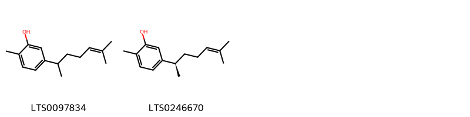{ width=100% }
    <figcaption>Hình ảnh cấu trúc hóa học của 2 hoạt chất thuộc nhóm Prenol lipids gồm ['2-methyl-5-(6-methylhept-5-en-2-yl)phenol (LTS0097834)', '2-methyl-5-[(2r)-6-methylhept-5-en-2-yl]phenol (LTS0246670)'].</figcaption>
</figure>

---

### Dược dân tộc học

Danh sách các quốc gia có sử dụng *Cinnamomum iners* trong điều trị các bệnh. 

| Country   | Disease                                       | Bệnh                                                                                                                                                                                                |
|:----------|:----------------------------------------------|:----------------------------------------------------------------------------------------------------------------------------------------------------------------------------------------------------|
| Elsewhere | Carminative, Diaphoretic, Diuretic, Stimulant | MYMEMORY WARNING: YOU USED ALL AVAILABLE FREE TRANSLATIONS FOR TODAY. NEXT AVAILABLE IN  02 HOURS 31 MINUTES 24 SECONDS VISIT HTTPS://MYMEMORY.TRANSLATED.NET/DOC/USAGELIMITS.PHP TO TRANSLATE MORE |

---

---
## Cinnamomum loureirii
### Thông tin về thực vật

!!! info "Phân loại thực vật của *Cinnamomum loureiroi* từ GIBF:"
    - **Kingdom:** Plantae
    - **Phylum:** Tracheophyta
    - **Order:** Laurales
    - **Family:** Lauraceae
    - **Genus:** Cinnamomum
    - **Species:** *Cinnamomum loureiroi*

 

| Label (VI)   | Label (EN)   | Scientific Name   | Descriptions (VI)   | Descriptions (EN)   | Also Known As (VI)   | Also Known As (EN)   |
|:-------------|:-------------|:------------------|:--------------------|:--------------------|:---------------------|:---------------------|
| N/A          | N/A          | Cinnamomum iners  | loài thực vật       | species of plant    | ['']                 | ['']                 |

#### Phân bố trên thế giới

**Từ CSDL GIBF** nan, Australia, Japan, Thailand, Germany, Korea, Republic of, Georgia, Chinese Taipei, India, Russian Federation, Indonesia, United States of America, China, Guinea, Viet Nam, New Zealand

#### Phân bố tại Việt Nam

**Từ CSDL GIBF**: Kon Tum, Tuyên Quang, Lam Dong, Lâm Đồng, Annam

---
### Thành phần hóa học
        
- Theo cơ sở dữ liệu lotus: Từ loài *Cinnamomum loureiroi* đã phân lập và xác định được Chưa có hoạt chất nào được phân lập. hoạt chất thuộc về các nhóm Không có hoạt chất nào được phân lập. 

Không có hình ảnh nào được tạo ra

---

### Dược dân tộc học

Danh sách các quốc gia có sử dụng *Cinnamomum loureiroi* trong điều trị các bệnh. 

| Country   | Disease                 | Bệnh                                                                                                                                                                                                |
|:----------|:------------------------|:----------------------------------------------------------------------------------------------------------------------------------------------------------------------------------------------------|
| China     | Stomachic               | MYMEMORY WARNING: YOU USED ALL AVAILABLE FREE TRANSLATIONS FOR TODAY. NEXT AVAILABLE IN  02 HOURS 31 MINUTES 03 SECONDS VISIT HTTPS://MYMEMORY.TRANSLATED.NET/DOC/USAGELIMITS.PHP TO TRANSLATE MORE |
| Dutch     | Astringent              | MYMEMORY WARNING: YOU USED ALL AVAILABLE FREE TRANSLATIONS FOR TODAY. NEXT AVAILABLE IN  02 HOURS 31 MINUTES 01 SECONDS VISIT HTTPS://MYMEMORY.TRANSLATED.NET/DOC/USAGELIMITS.PHP TO TRANSLATE MORE |
| Elsewhere | Astringent, Carminative | MYMEMORY WARNING: YOU USED ALL AVAILABLE FREE TRANSLATIONS FOR TODAY. NEXT AVAILABLE IN  02 HOURS 30 MINUTES 58 SECONDS VISIT HTTPS://MYMEMORY.TRANSLATED.NET/DOC/USAGELIMITS.PHP TO TRANSLATE MORE |
| German    | Carminative             | MYMEMORY WARNING: YOU USED ALL AVAILABLE FREE TRANSLATIONS FOR TODAY. NEXT AVAILABLE IN  02 HOURS 30 MINUTES 56 SECONDS VISIT HTTPS://MYMEMORY.TRANSLATED.NET/DOC/USAGELIMITS.PHP TO TRANSLATE MORE |
| US        | Stimulant, Antiseptic   | MYMEMORY WARNING: YOU USED ALL AVAILABLE FREE TRANSLATIONS FOR TODAY. NEXT AVAILABLE IN  02 HOURS 30 MINUTES 54 SECONDS VISIT HTTPS://MYMEMORY.TRANSLATED.NET/DOC/USAGELIMITS.PHP TO TRANSLATE MORE |

---

---
## Cinnamomum oliveri
### Thông tin về thực vật

!!! info "Phân loại thực vật của *Cinnamomum oliveri* từ GIBF:"
    - **Kingdom:** Plantae
    - **Phylum:** Tracheophyta
    - **Order:** Laurales
    - **Family:** Lauraceae
    - **Genus:** Cinnamomum
    - **Species:** *Cinnamomum oliveri*

 

| Label (VI)   | Label (EN)   | Scientific Name    | Descriptions (VI)   | Descriptions (EN)   | Also Known As (VI)   | Also Known As (EN)   |
|:-------------|:-------------|:-------------------|:--------------------|:--------------------|:---------------------|:---------------------|
| N/A          | N/A          | Cinnamomum oliveri | loài thực vật       | species of plant    | ['']                 | ['']                 |

#### Phân bố trên thế giới

**Từ CSDL GIBF** Australia

#### Phân bố tại Việt Nam

**Từ CSDL GIBF**: Không có ghi nhận ở Việt Nam

---
### Thành phần hóa học
        
- Theo cơ sở dữ liệu lotus: Từ loài *Cinnamomum oliveri* đã phân lập và xác định được 6 hoạt chất thuộc về các nhóm Benzodioxoles, Prenol lipids, Benzene and substituted derivatives. 

|    | chemicalTaxonomyClassyfireClass     |   smiles_count |
|---:|:------------------------------------|---------------:|
|  0 | Benzene and substituted derivatives |              1 |
|  1 | Benzodioxoles                       |              1 |
|  2 | Prenol lipids                       |              4 |

#### Nhóm Benzene and substituted derivatives
<figure markdown="span">
    { width=100% }
    <figcaption>Hình ảnh cấu trúc hóa học của 1 hoạt chất thuộc nhóm Benzene and substituted derivatives gồm ['methyl eugenol (LTS0098881)'].</figcaption>
</figure>
#### Nhóm Benzodioxoles
<figure markdown="span">
    { width=100% }
    <figcaption>Hình ảnh cấu trúc hóa học của 1 hoạt chất thuộc nhóm Benzodioxoles gồm ['sassafras (LTS0136093)'].</figcaption>
</figure>
#### Nhóm Prenol lipids
<figure markdown="span">
    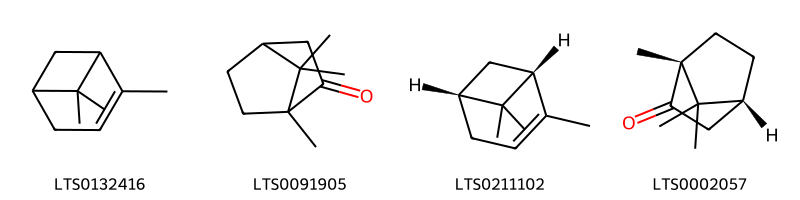{ width=100% }
    <figcaption>Hình ảnh cấu trúc hóa học của 4 hoạt chất thuộc nhóm Prenol lipids gồm ['α pinene (LTS0132416)', 'camphor (LTS0091905)', '(+)-α-pinene (LTS0211102)', 'd-camphor (LTS0002057)'].</figcaption>
</figure>

---

### Dược dân tộc học

Danh sách các quốc gia có sử dụng *Cinnamomum oliveri* trong điều trị các bệnh. 

| Country   | Disease   | Bệnh                                                                                                                                                                                                |
|:----------|:----------|:----------------------------------------------------------------------------------------------------------------------------------------------------------------------------------------------------|
| US        | Stimulant | MYMEMORY WARNING: YOU USED ALL AVAILABLE FREE TRANSLATIONS FOR TODAY. NEXT AVAILABLE IN  02 HOURS 30 MINUTES 36 SECONDS VISIT HTTPS://MYMEMORY.TRANSLATED.NET/DOC/USAGELIMITS.PHP TO TRANSLATE MORE |

---

---
## Cinnamomum pauciflorum
### Thông tin về thực vật

!!! info "Phân loại thực vật của *N/A* từ GIBF:"
    - **Kingdom:** Plantae
    - **Phylum:** Tracheophyta
    - **Order:** Laurales
    - **Family:** Lauraceae
    - **Genus:** Cinnamomum
    - **Species:** *N/A*

 

| Label (VI)   | Label (EN)   | Scientific Name        | Descriptions (VI)   | Descriptions (EN)   | Also Known As (VI)   | Also Known As (EN)   |
|:-------------|:-------------|:-----------------------|:--------------------|:--------------------|:---------------------|:---------------------|
| N/A          | N/A          | Cinnamomum pauciflorum | loài thực vật       | species of plant    | ['']                 | ['']                 |

#### Phân bố trên thế giới

**Từ CSDL GIBF** South Africa, Sri Lanka, Hong Kong, Australia, Japan, Thailand, Chinese Taipei, New Zealand, El Salvador, India, United States of America, Uruguay, Singapore, Malaysia, China

#### Phân bố tại Việt Nam

**Từ CSDL GIBF**: Không có ghi nhận ở Việt Nam

---
### Thành phần hóa học
        
- Theo cơ sở dữ liệu lotus: Từ loài *N/A* đã phân lập và xác định được Chưa có hoạt chất nào được phân lập. hoạt chất thuộc về các nhóm Không có hoạt chất nào được phân lập. 

Không có hình ảnh nào được tạo ra

---

### Dược dân tộc học

Danh sách các quốc gia có sử dụng *N/A* trong điều trị các bệnh. 

| Country     | Disease                            | Bệnh                                                                                                                                                                                                |
|:------------|:-----------------------------------|:----------------------------------------------------------------------------------------------------------------------------------------------------------------------------------------------------|
| Philippines | Cardiotonic, Stomachic, Antiseptic | MYMEMORY WARNING: YOU USED ALL AVAILABLE FREE TRANSLATIONS FOR TODAY. NEXT AVAILABLE IN  02 HOURS 30 MINUTES 08 SECONDS VISIT HTTPS://MYMEMORY.TRANSLATED.NET/DOC/USAGELIMITS.PHP TO TRANSLATE MORE |

---

---
## Cinnamomum sieboldii
### Thông tin về thực vật

!!! info "Phân loại thực vật của *Cinnamomum sieboldii* từ GIBF:"
    - **Kingdom:** Plantae
    - **Phylum:** Tracheophyta
    - **Order:** Laurales
    - **Family:** Lauraceae
    - **Genus:** Cinnamomum
    - **Species:** *Cinnamomum sieboldii*

 

| Label (VI)   | Label (EN)   | Scientific Name      | Descriptions (VI)   | Descriptions (EN)   | Also Known As (VI)   | Also Known As (EN)   |
|:-------------|:-------------|:---------------------|:--------------------|:--------------------|:---------------------|:---------------------|
| N/A          | N/A          | Cinnamomum sieboldii |                     | species of plant    | ['']                 | ['']                 |

#### Phân bố trên thế giới

**Từ CSDL GIBF** nan, Japan, Korea, Republic of, Chinese Taipei, Russian Federation

#### Phân bố tại Việt Nam

**Từ CSDL GIBF**: Không có ghi nhận ở Việt Nam

---
### Thành phần hóa học
        
- Theo cơ sở dữ liệu lotus: Từ loài *Cinnamomum sieboldii* đã phân lập và xác định được 122 hoạt chất thuộc về các nhóm Cinnamyl alcohols, Fatty Acyls, Flavonoids, Prenol lipids, Benzodioxoles, Benzene and substituted derivatives, Unsaturated hydrocarbons, Cinnamaldehydes, Organooxygen compounds, Phenols, Coumarins and derivatives, Carboxylic acids and derivatives. 

|    | chemicalTaxonomyClassyfireClass     |   smiles_count |
|---:|:------------------------------------|---------------:|
|  0 | Benzene and substituted derivatives |              7 |
|  1 | Benzodioxoles                       |              1 |
|  2 | Carboxylic acids and derivatives    |              1 |
|  3 | Cinnamaldehydes                     |              2 |
|  4 | Cinnamyl alcohols                   |              2 |
|  5 | Coumarins and derivatives           |              1 |
|  6 | Fatty Acyls                         |              2 |
|  7 | Flavonoids                          |             31 |
|  8 | Organooxygen compounds              |              3 |
|  9 | Phenols                             |              2 |
| 10 | Prenol lipids                       |             69 |
| 11 | Unsaturated hydrocarbons            |              1 |

#### Nhóm Benzene and substituted derivatives
<figure markdown="span">
    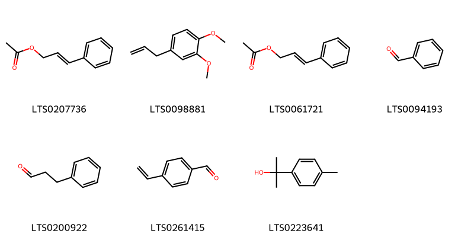{ width=100% }
    <figcaption>Hình ảnh cấu trúc hóa học của 7 hoạt chất thuộc nhóm Benzene and substituted derivatives gồm ['cinnamyl acetate (LTS0207736)', 'methyl eugenol (LTS0098881)', '3-phenyl-2-propenyl acetate (LTS0061721)', 'benzaldehyde (LTS0094193)', 'benzenepropanal (LTS0200922)', '4-vinylbenzaldehyde (LTS0261415)', 'p-cymen-8-ol (LTS0223641)'].</figcaption>
</figure>
#### Nhóm Benzodioxoles
<figure markdown="span">
    { width=100% }
    <figcaption>Hình ảnh cấu trúc hóa học của 1 hoạt chất thuộc nhóm Benzodioxoles gồm ['sassafras (LTS0136093)'].</figcaption>
</figure>
#### Nhóm Carboxylic acids and derivatives
<figure markdown="span">
    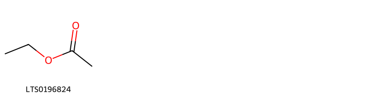{ width=100% }
    <figcaption>Hình ảnh cấu trúc hóa học của 1 hoạt chất thuộc nhóm Carboxylic acids and derivatives gồm ['ethyl acetate (LTS0196824)'].</figcaption>
</figure>
#### Nhóm Cinnamaldehydes
<figure markdown="span">
    { width=100% }
    <figcaption>Hình ảnh cấu trúc hóa học của 2 hoạt chất thuộc nhóm Cinnamaldehydes gồm ['3-phenyl-2-propenal (LTS0204346)', 'cinnamal (LTS0271313)'].</figcaption>
</figure>
#### Nhóm Cinnamyl alcohols
<figure markdown="span">
    { width=100% }
    <figcaption>Hình ảnh cấu trúc hóa học của 2 hoạt chất thuộc nhóm Cinnamyl alcohols gồm ['cinnamyl alcohol (LTS0010678)', '3-phenyl-2-propen-1-ol (LTS0069711)'].</figcaption>
</figure>
#### Nhóm Coumarins and derivatives
<figure markdown="span">
    { width=100% }
    <figcaption>Hình ảnh cấu trúc hóa học của 1 hoạt chất thuộc nhóm Coumarins and derivatives gồm ['2h-1-benzopyran-2-one (LTS0069773)'].</figcaption>
</figure>
#### Nhóm Fatty Acyls
<figure markdown="span">
    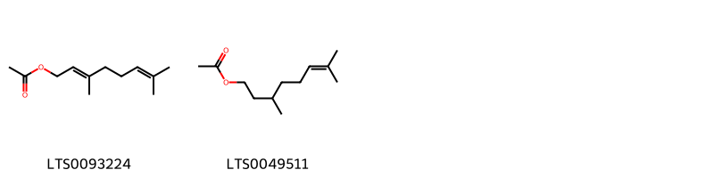{ width=100% }
    <figcaption>Hình ảnh cấu trúc hóa học của 2 hoạt chất thuộc nhóm Fatty Acyls gồm ['geranyl acetate (LTS0093224)', 'citronellyl acetate (LTS0049511)'].</figcaption>
</figure>
#### Nhóm Flavonoids
<figure markdown="span">
    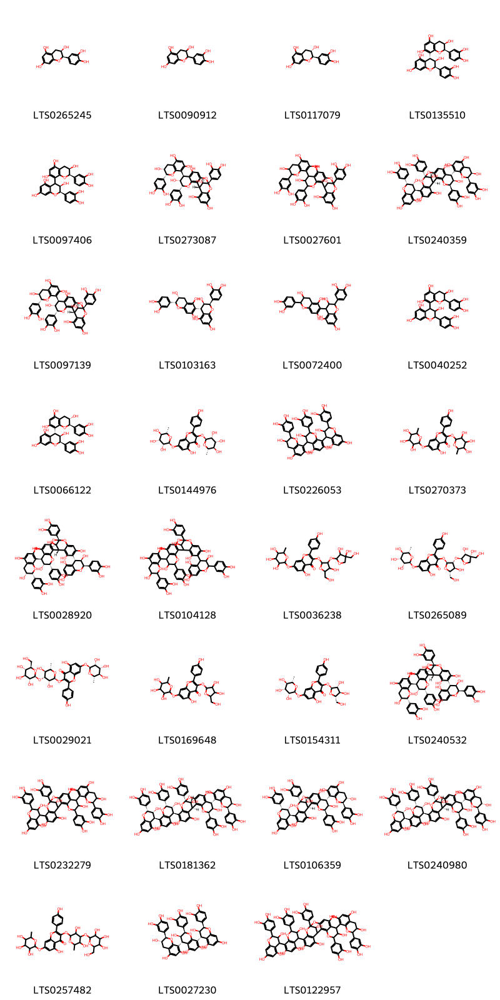{ width=100% }
    <figcaption>Hình ảnh cấu trúc hóa học của 31 hoạt chất thuộc nhóm Flavonoids gồm ['ent-epicatechin (LTS0265245)', 'catechol (LTS0090912)', '(+)-catechol (LTS0117079)', '(2r,3r,4r)-2-(3,4-dihydroxyphenyl)-4-[(2r,3r)-2-(3,4-dihydroxyphenyl)-3,5,7-trihydroxy-3,4-dihydro-2h-1-benzopyran-8-yl]-3,4-dihydro-2h-1-benzopyran-3,5,7-triol (LTS0135510)', '(2r,3r)-2-(3,4-dihydroxyphenyl)-4-[(2r,3r)-2-(3,4-dihydroxyphenyl)-3,5,7-trihydroxy-3,4-dihydro-2h-1-benzopyran-8-yl]-3,4-dihydro-2h-1-benzopyran-3,5,7-triol (LTS0097406)', 'cinnamtannin b1 (LTS0273087)', '5,13-bis(3,4-dihydroxyphenyl)-7-[2-(3,4-dihydroxyphenyl)-3,5,7-trihydroxy-3,4-dihydro-2h-1-benzopyran-8-yl]-4,12,14-trioxapentacyclo[11.7.1.0²,¹¹.0³,⁸.0¹⁵,²⁰]henicosa-2,8,10,15,17,19-hexaene-6,9,17,19,21-pentol (LTS0027601)', 'cinnamtannin b2 (LTS0240359)', 'cinnamtannin d-1 (LTS0097139)', '(2r,3r,4s)-2-(3,4-dihydroxyphenyl)-4-[(2r,3r)-2-(3,4-dihydroxyphenyl)-3,5,7-trihydroxy-3,4-dihydro-2h-1-benzopyran-6-yl]-3,4-dihydro-2h-1-benzopyran-3,5,7-triol (LTS0103163)', '2-(3,4-dihydroxyphenyl)-4-[2-(3,4-dihydroxyphenyl)-3,5,7-trihydroxy-3,4-dihydro-2h-1-benzopyran-6-yl]-3,4-dihydro-2h-1-benzopyran-3,5,7-triol (LTS0072400)', '2-(3,4-dihydroxyphenyl)-4-[2-(3,4-dihydroxyphenyl)-3,5,7-trihydroxy-3,4-dihydro-2h-1-benzopyran-8-yl]-3,4-dihydro-2h-1-benzopyran-3,5,7-triol (LTS0040252)', '(2r,3r,4r)-2-(3,4-dihydroxyphenyl)-4-[(2r,3s)-2-(3,4-dihydroxyphenyl)-3,5,7-trihydroxy-3,4-dihydro-2h-1-benzopyran-8-yl]-3,4-dihydro-2h-1-benzopyran-3,5,7-triol (LTS0066122)', 'lespedin (LTS0144976)', 'procyanidin c2 (LTS0226053)', 'kaempferitrin (LTS0270373)', '(1r,5r,6r,7s,13s,21r)-5,13-bis(3,4-dihydroxyphenyl)-18-[(2r,3r,4s)-2-(3,4-dihydroxyphenyl)-3,5,7-trihydroxy-3,4-dihydro-2h-1-benzopyran-4-yl]-7-[(2r,3r)-2-(3,4-dihydroxyphenyl)-3,5,7-trihydroxy-3,4-dihydro-2h-1-benzopyran-8-yl]-4,12,14-trioxapentacyclo[11.7.1.0²,¹¹.0³,⁸.0¹⁵,²⁰]henicosa-2(11),3(8),9,15,17,19-hexaene-6,9,17,19,21-pentol (LTS0028920)', '5,13-bis(3,4-dihydroxyphenyl)-18-[2-(3,4-dihydroxyphenyl)-3,5,7-trihydroxy-3,4-dihydro-2h-1-benzopyran-4-yl]-7-[2-(3,4-dihydroxyphenyl)-3,5,7-trihydroxy-3,4-dihydro-2h-1-benzopyran-8-yl]-4,12,14-trioxapentacyclo[11.7.1.0²,¹¹.0³,⁸.0¹⁵,²⁰]henicosa-2(11),3(8),9,15,17,19-hexaene-6,9,17,19,21-pentol (LTS0104128)', '3-[(3-{[3,4-dihydroxy-4-(hydroxymethyl)oxolan-2-yl]oxy}-4-hydroxy-5-(hydroxymethyl)oxolan-2-yl)oxy]-5-hydroxy-2-(4-hydroxyphenyl)-7-[(3,4,5-trihydroxy-6-methyloxan-2-yl)oxy]chromen-4-one (LTS0036238)', '3-{[(2s,3r,4s,5s)-3-{[(2s,3r,4r)-3,4-dihydroxy-4-(hydroxymethyl)oxolan-2-yl]oxy}-4-hydroxy-5-(hydroxymethyl)oxolan-2-yl]oxy}-5-hydroxy-2-(4-hydroxyphenyl)-7-{[(2s,3r,4r,5r,6s)-3,4,5-trihydroxy-6-methyloxan-2-yl]oxy}chromen-4-one (LTS0265089)', '3-{[(2s,3r,4r,5s,6s)-3,5-dihydroxy-6-methyl-4-{[(2s,3r,4s,5s,6r)-3,4,5-trihydroxy-6-(hydroxymethyl)oxan-2-yl]oxy}oxan-2-yl]oxy}-5-hydroxy-2-(4-hydroxyphenyl)-7-{[(2s,3r,4r,5r,6s)-3,4,5-trihydroxy-6-methyloxan-2-yl]oxy}chromen-4-one (LTS0029021)', '3-{[3,4-dihydroxy-5-(hydroxymethyl)oxolan-2-yl]oxy}-5-hydroxy-2-(4-hydroxyphenyl)-7-[(3,4,5-trihydroxy-6-methyloxan-2-yl)oxy]chromen-4-one (LTS0169648)', '3-{[(2s,3r,4r,5s)-3,4-dihydroxy-5-(hydroxymethyl)oxolan-2-yl]oxy}-5-hydroxy-2-(4-hydroxyphenyl)-7-{[(2s,3r,4r,5r,6s)-3,4,5-trihydroxy-6-methyloxan-2-yl]oxy}chromen-4-one (LTS0154311)', '(1r,5r,6r,7s,13s,21r)-5,13-bis(3,4-dihydroxyphenyl)-18-[(2r,3r,4s)-2-(3,4-dihydroxyphenyl)-3,5,7-trihydroxy-3,4-dihydro-2h-1-benzopyran-4-yl]-7-[(2r,3s)-2-(3,4-dihydroxyphenyl)-3,5,7-trihydroxy-3,4-dihydro-2h-1-benzopyran-8-yl]-4,12,14-trioxapentacyclo[11.7.1.0²,¹¹.0³,⁸.0¹⁵,²⁰]henicosa-2(11),3(8),9,15,17,19-hexaene-6,9,17,19,21-pentol (LTS0240532)', '5,13-bis(3,4-dihydroxyphenyl)-16-[2-(3,4-dihydroxyphenyl)-3,5,7-trihydroxy-3,4-dihydro-2h-1-benzopyran-4-yl]-7-[2-(3,4-dihydroxyphenyl)-3,5,7-trihydroxy-3,4-dihydro-2h-1-benzopyran-8-yl]-4,12,14-trioxapentacyclo[11.7.1.0²,¹¹.0³,⁸.0¹⁵,²⁰]henicosa-2,8,10,15(20),16,18-hexaene-6,9,17,19,21-pentol (LTS0232279)', '(1r,5r,6r,7s,13r,21r)-5,13-bis(3,4-dihydroxyphenyl)-7-[(2r,3r)-2-(3,4-dihydroxyphenyl)-3,5,7-trihydroxy-3,4-dihydro-2h-1-benzopyran-8-yl]-16-[(2r,3r,4r)-2-(3,4-dihydroxyphenyl)-8-[(2r,3r,4r)-2-(3,4-dihydroxyphenyl)-3,5,7-trihydroxy-3,4-dihydro-2h-1-benzopyran-4-yl]-3,5,7-trihydroxy-3,4-dihydro-2h-1-benzopyran-4-yl]-4,12,14-trioxapentacyclo[11.7.1.0²,¹¹.0³,⁸.0¹⁵,²⁰]henicosa-2,8,10,15(20),16,18-hexaene-6,9,17,19,21-pentol (LTS0181362)', 'cinnamtannin d2 (LTS0106359)', '(1r,5r,6r,7s,13r,21r)-5,13-bis(3,4-dihydroxyphenyl)-7-[(2r,3s)-2-(3,4-dihydroxyphenyl)-3,5,7-trihydroxy-3,4-dihydro-2h-1-benzopyran-8-yl]-16-[(2r,3r,4r)-2-(3,4-dihydroxyphenyl)-8-[(2r,3r,4r)-2-(3,4-dihydroxyphenyl)-3,5,7-trihydroxy-3,4-dihydro-2h-1-benzopyran-4-yl]-3,5,7-trihydroxy-3,4-dihydro-2h-1-benzopyran-4-yl]-4,12,14-trioxapentacyclo[11.7.1.0²,¹¹.0³,⁸.0¹⁵,²⁰]henicosa-2,8,10,15(20),16,18-hexaene-6,9,17,19,21-pentol (LTS0240980)', '3-[(3,5-dihydroxy-6-methyl-4-{[3,4,5-trihydroxy-6-(hydroxymethyl)oxan-2-yl]oxy}oxan-2-yl)oxy]-5-hydroxy-2-(4-hydroxyphenyl)-7-[(3,4,5-trihydroxy-6-methyloxan-2-yl)oxy]chromen-4-one (LTS0257482)', '(2r,3r,4s)-2-(3,4-dihydroxyphenyl)-8-[(2r,3r,4r)-2-(3,4-dihydroxyphenyl)-3,5,7-trihydroxy-3,4-dihydro-2h-1-benzopyran-4-yl]-4-[(2r,3s)-2-(3,4-dihydroxyphenyl)-3,5,7-trihydroxy-3,4-dihydro-2h-1-benzopyran-8-yl]-3,4-dihydro-2h-1-benzopyran-3,5,7-triol (LTS0027230)', '5,13-bis(3,4-dihydroxyphenyl)-7-[2-(3,4-dihydroxyphenyl)-3,5,7-trihydroxy-3,4-dihydro-2h-1-benzopyran-8-yl]-16-[2-(3,4-dihydroxyphenyl)-8-[2-(3,4-dihydroxyphenyl)-3,5,7-trihydroxy-3,4-dihydro-2h-1-benzopyran-4-yl]-3,5,7-trihydroxy-3,4-dihydro-2h-1-benzopyran-4-yl]-4,12,14-trioxapentacyclo[11.7.1.0²,¹¹.0³,⁸.0¹⁵,²⁰]henicosa-2,8,10,15(20),16,18-hexaene-6,9,17,19,21-pentol (LTS0122957)'].</figcaption>
</figure>
#### Nhóm Organooxygen compounds
<figure markdown="span">
    { width=100% }
    <figcaption>Hình ảnh cấu trúc hóa học của 3 hoạt chất thuộc nhóm Organooxygen compounds gồm ['6-methyl-5-hepten-2-one (LTS0241073)', '2-methyl-3-buten-2-ol (LTS0183618)', 'salicylaldehyde (LTS0188793)'].</figcaption>
</figure>
#### Nhóm Phenols
<figure markdown="span">
    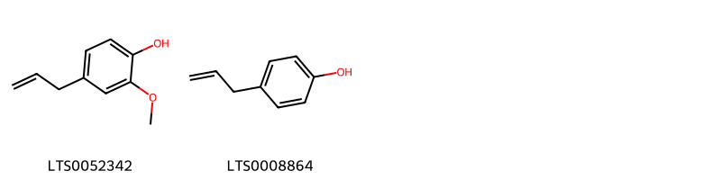{ width=100% }
    <figcaption>Hình ảnh cấu trúc hóa học của 2 hoạt chất thuộc nhóm Phenols gồm ['eugenol (LTS0052342)', 'chavicol (LTS0008864)'].</figcaption>
</figure>
#### Nhóm Prenol lipids
<figure markdown="span">
    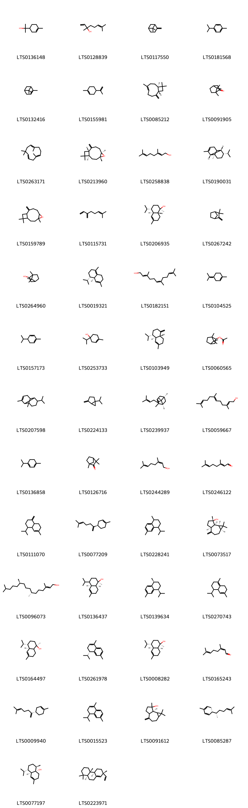{ width=100% }
    <figcaption>Hình ảnh cấu trúc hóa học của 69 hoạt chất thuộc nhóm Prenol lipids gồm ['terpineol (LTS0136148)', 'linalool, (+-)- (LTS0128839)', 'β-pinene (LTS0117550)', 'cymene (LTS0181568)', 'α pinene (LTS0132416)', 'limonene,  (LTS0155981)', 'caryophyllene (LTS0085212)', 'camphor (LTS0091905)', 'humulene (LTS0263171)', 'β-caryophyllene oxide (LTS0213960)', 'geraniol (LTS0258838)', '(1r,2s,7s,8s)-8-isopropyl-1,3-dimethyltricyclo[4.4.0.0²,⁷]dec-3-ene (LTS0190031)', 'caryophyllene oxide (LTS0159789)', 'α-myrcene (LTS0115731)', 'α-cadinol (LTS0206935)', 'camphene (LTS0267242)', 'borneol (LTS0264960)', 'delta-cadinene (LTS0019321)', '(e,z)-farnesol (LTS0182151)', 'terpinolene (LTS0104525)', 'phellandrene (LTS0157173)', '4-terpineol (LTS0253733)', '(+)-gamma-cadinene (LTS0103949)', 'bornyl acetate (LTS0060565)', 'α-copaene (LTS0207598)', 'sabinene (LTS0224133)', '(-)-trans-α-bergamotene (LTS0239937)', 'farnesol (LTS0059667)', 'terpinene (LTS0136858)', 'fenchone (LTS0126716)', 'nerol (LTS0244289)', 'α-citral (LTS0246122)', '4-isopropyl-6-methyl-1-methylidene-3,4,4a,7,8,8a-hexahydro-2h-naphthalene (LTS0111070)', '(r)-β-bisabolene (LTS0077209)', '(e)-calamene (LTS0228241)', '(1as,4as,7s,7ar,7bs)-1,1,7-trimethyl-4-methylidene-octahydrocyclopropa[e]azulen-7-ol (LTS0073517)', 'phytol (LTS0096073)', '(1r,4ar,8as)-4-isopropyl-1,6-dimethyl-3,4,4a,7,8,8a-hexahydro-2h-naphthalen-1-ol (LTS0136437)', '(1s,4s)-4-isopropyl-1,6-dimethyl-1,2,3,4-tetrahydronaphthalene (LTS0139634)', '4-isopropyl-1,6-dimethyl-2,3,4,4a,7,8-hexahydronaphthalene (LTS0270743)', '(1r,4s,4ar)-4-isopropyl-1,6-dimethyl-3,4,4a,7,8,8a-hexahydro-2h-naphthalen-1-ol (LTS0164497)', '(4s)-4-isopropyl-1,6-dimethyl-3,4-dihydronaphthalene (LTS0261978)', 'delta-cadinol (LTS0008282)', 'neral (LTS0165243)', '(-)-β-bisabolene (LTS0009940)', '3,4-dihydrocadalene (LTS0015523)', '(7ar)-1,1,7-trimethyl-4-methylidene-octahydrocyclopropa[e]azulen-7-ol (LTS0091612)', 'zingiberene (LTS0085287)', '(1s,4r,4as,8ar)-1-isopropyl-4,7-dimethyl-2,3,4,5,6,8a-hexahydro-1h-naphthalen-4a-ol (LTS0077197)', '(+)-sandaracopimaradiene (LTS0223971)', 'pimaradiene (LTS0071599)', 'phytol (LTS0031808)', '2-[4-ethenyl-4-methyl-3-(prop-1-en-2-yl)cyclohexyl]propan-2-ol (LTS0072139)', '2-methyl-5-[(2s)-6-methylhept-5-en-2-yl]cyclohexa-1,3-diene (LTS0030348)', '7,7-dimethyl-2-methylidenebicyclo[2.2.1]heptane (LTS0092282)', 'nerolidol (LTS0197738)', '(3r,6e)-nerolidol (LTS0145065)', 'citronella (LTS0151257)', '(-)-α-curcumene (LTS0216936)', '(4r,8ar)-4-isopropyl-1,6-dimethyl-3,4,4a,7,8,8a-hexahydronaphthalene (LTS0191845)', 'elemol (LTS0208556)', 'isopimara-7,15-diene (LTS0162801)', 'α-cadinol (LTS0178794)', 'curcumene (LTS0190074)', 'gamma-muurolene (LTS0052920)', '(-)-α-himachalene (LTS0021074)', 'delta-cadinol (LTS0013807)', 'cadinene (LTS0003360)', 'citronellol, (+-)- (LTS0090925)'].</figcaption>
</figure>
#### Nhóm Unsaturated hydrocarbons
<figure markdown="span">
    { width=100% }
    <figcaption>Hình ảnh cấu trúc hóa học của 1 hoạt chất thuộc nhóm Unsaturated hydrocarbons gồm ['α terpinene (LTS0232891)'].</figcaption>
</figure>

---

### Dược dân tộc học

Danh sách các quốc gia có sử dụng *Cinnamomum sieboldii* trong điều trị các bệnh. 

| Country   | Disease                     | Bệnh                                                                                                                                                                                                |
|:----------|:----------------------------|:----------------------------------------------------------------------------------------------------------------------------------------------------------------------------------------------------|
| Japan*    | Diaphoretic, nan, Stomachic | MYMEMORY WARNING: YOU USED ALL AVAILABLE FREE TRANSLATIONS FOR TODAY. NEXT AVAILABLE IN  02 HOURS 29 MINUTES 46 SECONDS VISIT HTTPS://MYMEMORY.TRANSLATED.NET/DOC/USAGELIMITS.PHP TO TRANSLATE MORE |

---

---
## Cinnamomum sintok
### Thông tin về thực vật

!!! info "Phân loại thực vật của *Cinnamomum sintoc* từ GIBF:"
    - **Kingdom:** Plantae
    - **Phylum:** Tracheophyta
    - **Order:** Laurales
    - **Family:** Lauraceae
    - **Genus:** Cinnamomum
    - **Species:** *Cinnamomum sintoc*

 

| Label (VI)   | Label (EN)   | Scientific Name      | Descriptions (VI)   | Descriptions (EN)   | Also Known As (VI)   | Also Known As (EN)   |
|:-------------|:-------------|:---------------------|:--------------------|:--------------------|:---------------------|:---------------------|
| N/A          | N/A          | Cinnamomum sieboldii |                     | species of plant    | ['']                 | ['']                 |

#### Phân bố trên thế giới

**Từ CSDL GIBF** nan, India, unknown or invalid, Indonesia, Malaysia

#### Phân bố tại Việt Nam

**Từ CSDL GIBF**: Không có ghi nhận ở Việt Nam

---
### Thành phần hóa học
        
- Theo cơ sở dữ liệu lotus: Từ loài *Cinnamomum sintoc* đã phân lập và xác định được Chưa có hoạt chất nào được phân lập. hoạt chất thuộc về các nhóm Không có hoạt chất nào được phân lập. 

Không có hình ảnh nào được tạo ra

---

### Dược dân tộc học

Danh sách các quốc gia có sử dụng *Cinnamomum sintoc* trong điều trị các bệnh. 

| Country   | Disease   | Bệnh                                                                                                                                                                                                |
|:----------|:----------|:----------------------------------------------------------------------------------------------------------------------------------------------------------------------------------------------------|
| Indonesia | Vermifuge | MYMEMORY WARNING: YOU USED ALL AVAILABLE FREE TRANSLATIONS FOR TODAY. NEXT AVAILABLE IN  02 HOURS 28 MINUTES 43 SECONDS VISIT HTTPS://MYMEMORY.TRANSLATED.NET/DOC/USAGELIMITS.PHP TO TRANSLATE MORE |
| Java      | Vermifuge | MYMEMORY WARNING: YOU USED ALL AVAILABLE FREE TRANSLATIONS FOR TODAY. NEXT AVAILABLE IN  02 HOURS 28 MINUTES 41 SECONDS VISIT HTTPS://MYMEMORY.TRANSLATED.NET/DOC/USAGELIMITS.PHP TO TRANSLATE MORE |

---

---
## Cinnamomum tamala
### Thông tin về thực vật

!!! info "Phân loại thực vật của *Cinnamomum tamala* từ GIBF:"
    - **Kingdom:** Plantae
    - **Phylum:** Tracheophyta
    - **Order:** Laurales
    - **Family:** Lauraceae
    - **Genus:** Cinnamomum
    - **Species:** *Cinnamomum tamala*

 

| Label (VI)   | Label (EN)   | Scientific Name   | Descriptions (VI)   | Descriptions (EN)   | Also Known As (VI)   | Also Known As (EN)                                                          |
|:-------------|:-------------|:------------------|:--------------------|:--------------------|:---------------------|:----------------------------------------------------------------------------|
| N/A          | N/A          | Cinnamomum tamala | loài thực vật       | species of plant    | ['']                 | ['Indian Bay Leaf', 'Indian cassia', 'Indian cassia bark', 'Tamala cassia'] |

#### Phân bố trên thế giới

**Từ CSDL GIBF** nan, Pakistan, Malaysia, Hong Kong, Thailand, Lao People’s Democratic Republic, Cambodia, Myanmar, Bhutan, India, Portugal, Bangladesh, United States of America, Indonesia, Philippines, Viet Nam, China, Nepal

#### Phân bố tại Việt Nam

**Từ CSDL GIBF**: Annam, Hà Nôi, Tonkin

---
### Thành phần hóa học
        
- Theo cơ sở dữ liệu lotus: Từ loài *Cinnamomum tamala* đã phân lập và xác định được 13 hoạt chất thuộc về các nhóm Cinnamaldehydes, Flavonoids, Prenol lipids, Phenols. 

|    | chemicalTaxonomyClassyfireClass   |   smiles_count |
|---:|:----------------------------------|---------------:|
|  0 | Cinnamaldehydes                   |              2 |
|  1 | Flavonoids                        |              5 |
|  2 | Phenols                           |              1 |
|  3 | Prenol lipids                     |              5 |

#### Nhóm Cinnamaldehydes
<figure markdown="span">
    { width=100% }
    <figcaption>Hình ảnh cấu trúc hóa học của 2 hoạt chất thuộc nhóm Cinnamaldehydes gồm ['3-phenyl-2-propenal (LTS0204346)', 'cinnamal (LTS0271313)'].</figcaption>
</figure>
#### Nhóm Flavonoids
<figure markdown="span">
    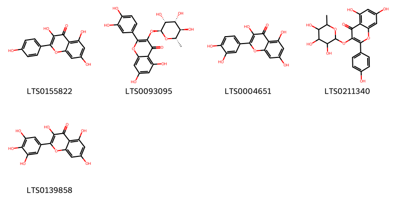{ width=100% }
    <figcaption>Hình ảnh cấu trúc hóa học của 5 hoạt chất thuộc nhóm Flavonoids gồm ['kaempherol (LTS0155822)', 'quercitrin (LTS0093095)', 'quercetin (LTS0004651)', '5,7-dihydroxy-2-(4-hydroxyphenyl)-3-[(3,4,5-trihydroxy-6-methyloxan-2-yl)oxy]chromen-4-one (LTS0211340)', 'myricetin (LTS0139858)'].</figcaption>
</figure>
#### Nhóm Phenols
<figure markdown="span">
    { width=100% }
    <figcaption>Hình ảnh cấu trúc hóa học của 1 hoạt chất thuộc nhóm Phenols gồm ['eugenol (LTS0052342)'].</figcaption>
</figure>
#### Nhóm Prenol lipids
<figure markdown="span">
    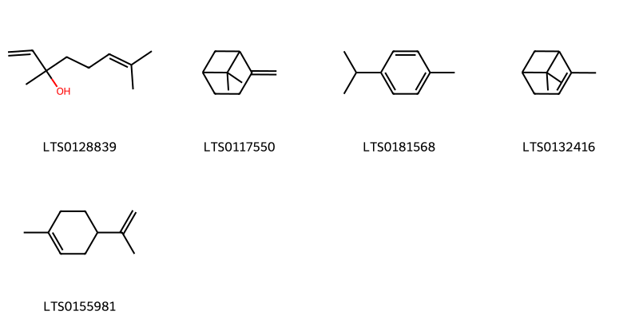{ width=100% }
    <figcaption>Hình ảnh cấu trúc hóa học của 5 hoạt chất thuộc nhóm Prenol lipids gồm ['linalool, (+-)- (LTS0128839)', 'β-pinene (LTS0117550)', 'cymene (LTS0181568)', 'α pinene (LTS0132416)', 'limonene,  (LTS0155981)'].</figcaption>
</figure>

---

### Dược dân tộc học

Danh sách các quốc gia có sử dụng *Cinnamomum tamala* trong điều trị các bệnh. 

| Country   | Disease     | Bệnh                                                                                                                                                                                                |
|:----------|:------------|:----------------------------------------------------------------------------------------------------------------------------------------------------------------------------------------------------|
| Elsewhere | Carminative | MYMEMORY WARNING: YOU USED ALL AVAILABLE FREE TRANSLATIONS FOR TODAY. NEXT AVAILABLE IN  02 HOURS 28 MINUTES 23 SECONDS VISIT HTTPS://MYMEMORY.TRANSLATED.NET/DOC/USAGELIMITS.PHP TO TRANSLATE MORE |
| Nepal     | Astringent  | MYMEMORY WARNING: YOU USED ALL AVAILABLE FREE TRANSLATIONS FOR TODAY. NEXT AVAILABLE IN  02 HOURS 28 MINUTES 21 SECONDS VISIT HTTPS://MYMEMORY.TRANSLATED.NET/DOC/USAGELIMITS.PHP TO TRANSLATE MORE |

---

---
## Cinnamomum tetragonum
### Thông tin về thực vật

!!! info "Phân loại thực vật của *Cinnamomum tetragonum* từ GIBF:"
    - **Kingdom:** Plantae
    - **Phylum:** Tracheophyta
    - **Order:** Laurales
    - **Family:** Lauraceae
    - **Genus:** Cinnamomum
    - **Species:** *Cinnamomum tetragonum*

 

| Label (VI)   | Label (EN)   | Scientific Name       | Descriptions (VI)   | Descriptions (EN)   | Also Known As (VI)   | Also Known As (EN)   |
|:-------------|:-------------|:----------------------|:--------------------|:--------------------|:---------------------|:---------------------|
| N/A          | N/A          | Cinnamomum tetragonum | loài thực vật       | species of plant    | ['']                 | ['']                 |

#### Phân bố trên thế giới

**Từ CSDL GIBF** nan, Viet Nam

#### Phân bố tại Việt Nam

**Từ CSDL GIBF**: Hà Nội, Tonkin, Thái Nguyên, Bac Can, Ninh Bình, Lâm Đồng

---
### Thành phần hóa học
        
- Theo cơ sở dữ liệu lotus: Từ loài *Cinnamomum tetragonum* đã phân lập và xác định được Chưa có hoạt chất nào được phân lập. hoạt chất thuộc về các nhóm Không có hoạt chất nào được phân lập. 

Không có hình ảnh nào được tạo ra

---

### Dược dân tộc học

Danh sách các quốc gia có sử dụng *Cinnamomum tetragonum* trong điều trị các bệnh. 

| Country   | Disease   | Bệnh                                                                                                                                                                                                |
|:----------|:----------|:----------------------------------------------------------------------------------------------------------------------------------------------------------------------------------------------------|
| Cambodia  | Stimulant | MYMEMORY WARNING: YOU USED ALL AVAILABLE FREE TRANSLATIONS FOR TODAY. NEXT AVAILABLE IN  02 HOURS 27 MINUTES 44 SECONDS VISIT HTTPS://MYMEMORY.TRANSLATED.NET/DOC/USAGELIMITS.PHP TO TRANSLATE MORE |

---

---
## Cinnamomum verum
### Thông tin về thực vật

!!! info "Phân loại thực vật của *Cinnamomum verum* từ GIBF:"
    - **Kingdom:** Plantae
    - **Phylum:** Tracheophyta
    - **Order:** Laurales
    - **Family:** Lauraceae
    - **Genus:** Cinnamomum
    - **Species:** *Cinnamomum verum*

 

| Label (VI)   | Label (EN)   | Scientific Name   | Descriptions (VI)   | Descriptions (EN)   | Also Known As (VI)   | Also Known As (EN)                                                             |
|:-------------|:-------------|:------------------|:--------------------|:--------------------|:---------------------|:-------------------------------------------------------------------------------|
| N/A          | N/A          | Cinnamomum verum  | loài thực vật       | species of plant    | ['']                 | ['Ceylon cinnamon', 'Cinnamomum verum', 'Sri Lanka cinnamon', 'true cinnamon'] |

#### Phân bố trên thế giới

**Từ CSDL GIBF** Sri Lanka, Australia, Guadeloupe, Cook Islands, Mauritius, Guatemala, Argentina, Nicaragua, Panama, Chinese Taipei, Bangladesh, United States of America, El Salvador, South Africa, Sao Tome and Principe, Thailand, Martinique, Brazil, Mayotte, Dominica, Singapore, Seychelles, Costa Rica, India, Indonesia, Samoa, Philippines, Malaysia

#### Phân bố tại Việt Nam

**Từ CSDL GIBF**: Không có ghi nhận ở Việt Nam

---
### Thành phần hóa học
        
- Theo cơ sở dữ liệu lotus: Từ loài *Cinnamomum verum* đã phân lập và xác định được 121 hoạt chất thuộc về các nhóm Phenol ethers, Cinnamyl alcohols, Fatty Acyls, Flavonoids, Prenol lipids, Cinnamic acids and derivatives, Benzodioxoles, Benzene and substituted derivatives, Unsaturated hydrocarbons, 2-arylbenzofuran flavonoids, Cinnamaldehydes, Organooxygen compounds, Phenols, Phenol esters, Coumarins and derivatives, Saturated hydrocarbons. 

|    | chemicalTaxonomyClassyfireClass     |   smiles_count |
|---:|:------------------------------------|---------------:|
|  0 | 2-arylbenzofuran flavonoids         |              2 |
|  1 | Benzene and substituted derivatives |             12 |
|  2 | Benzodioxoles                       |              1 |
|  3 | Cinnamaldehydes                     |              4 |
|  4 | Cinnamic acids and derivatives      |              6 |
|  5 | Cinnamyl alcohols                   |              2 |
|  6 | Coumarins and derivatives           |              1 |
|  7 | Fatty Acyls                         |              2 |
|  8 | Flavonoids                          |             17 |
|  9 | Organooxygen compounds              |             11 |
| 10 | Phenol esters                       |              1 |
| 11 | Phenol ethers                       |              1 |
| 12 | Phenols                             |              4 |
| 13 | Prenol lipids                       |             55 |
| 14 | Saturated hydrocarbons              |              1 |
| 15 | Unsaturated hydrocarbons            |              1 |

#### Nhóm 2-arylbenzofuran flavonoids
<figure markdown="span">
    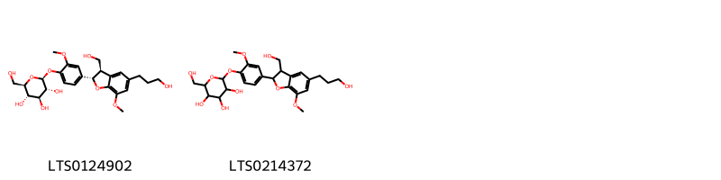{ width=100% }
    <figcaption>Hình ảnh cấu trúc hóa học của 2 hoạt chất thuộc nhóm 2-arylbenzofuran flavonoids gồm ['(2r,3s,4s,5r,6s)-2-(hydroxymethyl)-6-{4-[(2s,3r)-3-(hydroxymethyl)-5-(3-hydroxypropyl)-7-methoxy-2,3-dihydro-1-benzofuran-2-yl]-2-methoxyphenoxy}oxane-3,4,5-triol (LTS0124902)', '2-(hydroxymethyl)-6-{4-[3-(hydroxymethyl)-5-(3-hydroxypropyl)-7-methoxy-2,3-dihydro-1-benzofuran-2-yl]-2-methoxyphenoxy}oxane-3,4,5-triol (LTS0214372)'].</figcaption>
</figure>
#### Nhóm Benzene and substituted derivatives
<figure markdown="span">
    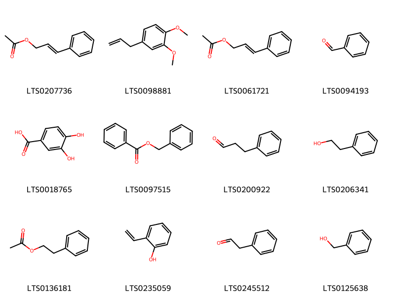{ width=100% }
    <figcaption>Hình ảnh cấu trúc hóa học của 12 hoạt chất thuộc nhóm Benzene and substituted derivatives gồm ['cinnamyl acetate (LTS0207736)', 'methyl eugenol (LTS0098881)', '3-phenyl-2-propenyl acetate (LTS0061721)', 'benzaldehyde (LTS0094193)', '3,4-dihydroxybenzoic acid (LTS0018765)', 'benzyl benzoate (LTS0097515)', 'benzenepropanal (LTS0200922)', '2-phenyl-ethanol (LTS0206341)', 'phenethyl acetate (LTS0136181)', '2-ethenyl-phenol (LTS0235059)', 'phenylacetaldehyde (LTS0245512)', 'benzyl alcohol (LTS0125638)'].</figcaption>
</figure>
#### Nhóm Benzodioxoles
<figure markdown="span">
    { width=100% }
    <figcaption>Hình ảnh cấu trúc hóa học của 1 hoạt chất thuộc nhóm Benzodioxoles gồm ['sassafras (LTS0136093)'].</figcaption>
</figure>
#### Nhóm Cinnamaldehydes
<figure markdown="span">
    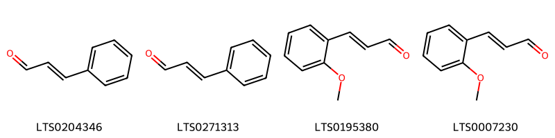{ width=100% }
    <figcaption>Hình ảnh cấu trúc hóa học của 4 hoạt chất thuộc nhóm Cinnamaldehydes gồm ['3-phenyl-2-propenal (LTS0204346)', 'cinnamal (LTS0271313)', '2-methoxycinnamaldehyde (LTS0195380)', '3-(2-methoxyphenyl)prop-2-enal (LTS0007230)'].</figcaption>
</figure>
#### Nhóm Cinnamic acids and derivatives
<figure markdown="span">
    { width=100% }
    <figcaption>Hình ảnh cấu trúc hóa học của 6 hoạt chất thuộc nhóm Cinnamic acids and derivatives gồm ['cinnamic acid (LTS0128130)', 'phenylacrylic acid (LTS0097258)', 'methyl cinnamate (LTS0083574)', 'methyl cinnamate (LTS0222336)', 'ethyl 3-phenylprop-2-enoate (LTS0005299)', 'ethyl cinnamate (LTS0031825)'].</figcaption>
</figure>
#### Nhóm Cinnamyl alcohols
<figure markdown="span">
    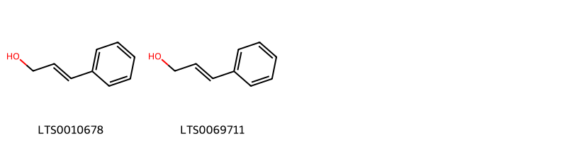{ width=100% }
    <figcaption>Hình ảnh cấu trúc hóa học của 2 hoạt chất thuộc nhóm Cinnamyl alcohols gồm ['cinnamyl alcohol (LTS0010678)', '3-phenyl-2-propen-1-ol (LTS0069711)'].</figcaption>
</figure>
#### Nhóm Coumarins and derivatives
<figure markdown="span">
    { width=100% }
    <figcaption>Hình ảnh cấu trúc hóa học của 1 hoạt chất thuộc nhóm Coumarins and derivatives gồm ['2h-1-benzopyran-2-one (LTS0069773)'].</figcaption>
</figure>
#### Nhóm Fatty Acyls
<figure markdown="span">
    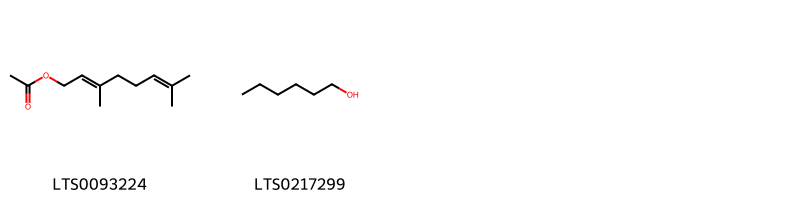{ width=100% }
    <figcaption>Hình ảnh cấu trúc hóa học của 2 hoạt chất thuộc nhóm Fatty Acyls gồm ['geranyl acetate (LTS0093224)', 'hexanol (LTS0217299)'].</figcaption>
</figure>
#### Nhóm Flavonoids
<figure markdown="span">
    { width=100% }
    <figcaption>Hình ảnh cấu trúc hóa học của 17 hoạt chất thuộc nhóm Flavonoids gồm ['ent-epicatechin (LTS0265245)', '(2r,3r,4r)-2-(3,4-dihydroxyphenyl)-4-[(2r,3r)-2-(3,4-dihydroxyphenyl)-3,5,7-trihydroxy-3,4-dihydro-2h-1-benzopyran-8-yl]-3,4-dihydro-2h-1-benzopyran-3,5,7-triol (LTS0135510)', '(2r,3r)-2-(3,4-dihydroxyphenyl)-4-[(2r,3r)-2-(3,4-dihydroxyphenyl)-3,5,7-trihydroxy-3,4-dihydro-2h-1-benzopyran-8-yl]-3,4-dihydro-2h-1-benzopyran-3,5,7-triol (LTS0097406)', 'cinnamtannin b1 (LTS0273087)', '5,13-bis(3,4-dihydroxyphenyl)-7-[2-(3,4-dihydroxyphenyl)-3,5,7-trihydroxy-3,4-dihydro-2h-1-benzopyran-8-yl]-4,12,14-trioxapentacyclo[11.7.1.0²,¹¹.0³,⁸.0¹⁵,²⁰]henicosa-2,8,10,15,17,19-hexaene-6,9,17,19,21-pentol (LTS0027601)', 'cinnamtannin b2 (LTS0240359)', 'kaempherol (LTS0155822)', 'quercitrin (LTS0093095)', 'procyanidin c1 (LTS0260445)', 'rutin (LTS0042292)', 'quercitrin (LTS0186298)', '(3r)-2-(3,5-dihydroxy-4-methoxyphenyl)-8-[(2r,3r,4r)-3,5,7-trihydroxy-2-(4-hydroxyphenyl)-3,4-dihydro-2h-1-benzopyran-4-yl]-3,4-dihydro-2h-1-benzopyran-3,5,7-triol (LTS0226294)', 'nictoflorin (LTS0182501)', '(1r,5r,6r,7s,13s,15r,20s,21r)-5,13-bis(3,4-dihydroxyphenyl)-7-[(2r,3r)-2-(3,4-dihydroxyphenyl)-3,5,7-trihydroxy-3,4-dihydro-2h-1-benzopyran-8-yl]-4,12,14-trioxapentacyclo[11.7.1.0²,¹¹.0³,⁸.0¹⁵,²⁰]henicosa-2,8,10,16,18-pentaene-6,9,17,19,21-pentol (LTS0112558)', 'orientin (LTS0172349)', '5,13-bis(3,4-dihydroxyphenyl)-7-[2-(3,4-dihydroxyphenyl)-3,5,7-trihydroxy-3,4-dihydro-2h-1-benzopyran-8-yl]-4,12,14-trioxapentacyclo[11.7.1.0²,¹¹.0³,⁸.0¹⁵,²⁰]henicosa-2,8,10,16,18-pentaene-6,9,17,19,21-pentol (LTS0174111)', '3-rutinosyl quercetin (LTS0032845)'].</figcaption>
</figure>
#### Nhóm Organooxygen compounds
<figure markdown="span">
    { width=100% }
    <figcaption>Hình ảnh cấu trúc hóa học của 11 hoạt chất thuộc nhóm Organooxygen compounds gồm ['4-{[5-({3,4-dihydroxy-5-[(3,4,5-trihydroxyoxan-2-yl)oxy]oxan-2-yl}oxy)-3,4-dihydroxyoxan-2-yl]oxy}-2,3,5-trihydroxypentanal (LTS0210614)', '(2r,3r,4s)-4-{[(2s,3r,4r,5r)-5-{[(2s,3r,4r,5r)-3,4-dihydroxy-5-{[(2s,3r,4s,5r)-3,4,5-trihydroxyoxan-2-yl]oxy}oxan-2-yl]oxy}-3,4-dihydroxyoxan-2-yl]oxy}-2,3,5-trihydroxypentanal (LTS0102262)', 'bran oil (LTS0143969)', '2,4,5-trihydroxy-3-[(3,4,5-trihydroxyoxan-2-yl)oxy]pentanal (LTS0153652)', 'nonanal (LTS0244398)', '(2r,3s,4s)-2,4,5-trihydroxy-3-{[(2r,3r,4s,5r)-3,4,5-trihydroxyoxan-2-yl]oxy}pentanal (LTS0174522)', '(2r,3r,4s)-2,3,5-trihydroxy-4-{[(2s,3r,4s,5r)-3,4,5-trihydroxyoxan-2-yl]oxy}pentanal (LTS0203914)', '(2r,3r,4s)-4-{[(2s,3r,4r,5r)-3,4-dihydroxy-5-{[(2s,3r,4s,5r)-3,4,5-trihydroxyoxan-2-yl]oxy}oxan-2-yl]oxy}-2,3,5-trihydroxypentanal (LTS0057486)', '1-[2-hydroxy-3-methoxy-5-(prop-2-en-1-yl)phenyl]ethanone (LTS0217393)', '4-({3,4-dihydroxy-5-[(3,4,5-trihydroxyoxan-2-yl)oxy]oxan-2-yl}oxy)-2,3,5-trihydroxypentanal (LTS0067549)', '2,3,5-trihydroxy-4-[(3,4,5-trihydroxyoxan-2-yl)oxy]pentanal (LTS0120352)'].</figcaption>
</figure>
#### Nhóm Phenol esters
<figure markdown="span">
    { width=100% }
    <figcaption>Hình ảnh cấu trúc hóa học của 1 hoạt chất thuộc nhóm Phenol esters gồm ['eugenyl acetate (LTS0165886)'].</figcaption>
</figure>
#### Nhóm Phenol ethers
<figure markdown="span">
    { width=100% }
    <figcaption>Hình ảnh cấu trúc hóa học của 1 hoạt chất thuộc nhóm Phenol ethers gồm ['tarragon (LTS0245226)'].</figcaption>
</figure>
#### Nhóm Phenols
<figure markdown="span">
    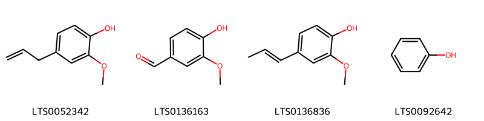{ width=100% }
    <figcaption>Hình ảnh cấu trúc hóa học của 4 hoạt chất thuộc nhóm Phenols gồm ['eugenol (LTS0052342)', 'vanillin (LTS0136163)', 'isoeugenol (LTS0136836)', 'phenol (LTS0092642)'].</figcaption>
</figure>
#### Nhóm Prenol lipids
<figure markdown="span">
    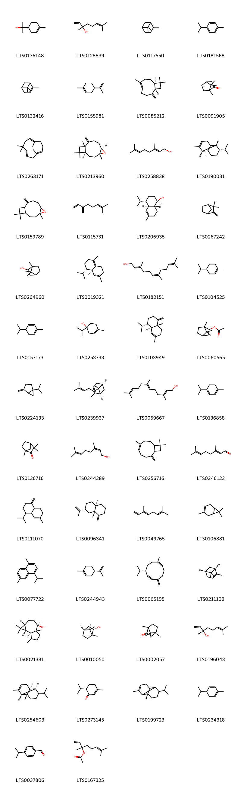{ width=100% }
    <figcaption>Hình ảnh cấu trúc hóa học của 55 hoạt chất thuộc nhóm Prenol lipids gồm ['terpineol (LTS0136148)', 'linalool, (+-)- (LTS0128839)', 'β-pinene (LTS0117550)', 'cymene (LTS0181568)', 'α pinene (LTS0132416)', 'limonene,  (LTS0155981)', 'caryophyllene (LTS0085212)', 'camphor (LTS0091905)', 'humulene (LTS0263171)', 'β-caryophyllene oxide (LTS0213960)', 'geraniol (LTS0258838)', '(1r,2s,7s,8s)-8-isopropyl-1,3-dimethyltricyclo[4.4.0.0²,⁷]dec-3-ene (LTS0190031)', 'caryophyllene oxide (LTS0159789)', 'α-myrcene (LTS0115731)', 'α-cadinol (LTS0206935)', 'camphene (LTS0267242)', 'borneol (LTS0264960)', 'delta-cadinene (LTS0019321)', '(e,z)-farnesol (LTS0182151)', 'terpinolene (LTS0104525)', 'phellandrene (LTS0157173)', '4-terpineol (LTS0253733)', '(+)-gamma-cadinene (LTS0103949)', 'bornyl acetate (LTS0060565)', 'sabinene (LTS0224133)', '(-)-trans-α-bergamotene (LTS0239937)', 'farnesol (LTS0059667)', 'terpinene (LTS0136858)', 'fenchone (LTS0126716)', 'nerol (LTS0244289)', '4,11,11-trimethyl-8-methylidenebicyclo[7.2.0]undec-4-ene (LTS0256716)', 'α-citral (LTS0246122)', '4-isopropyl-6-methyl-1-methylidene-3,4,4a,7,8,8a-hexahydro-2h-naphthalene (LTS0111070)', 'β-selinene (LTS0096341)', 'trans-β-ocimene (LTS0049765)', 'monoterpenes (LTS0106881)', 'cadalene (LTS0077722)', 'α-limonene (LTS0244943)', '(1z,6z,8s)-8-isopropyl-1-methyl-5-methylidenecyclodeca-1,6-diene (LTS0065195)', '(+)-α-pinene (LTS0211102)', '(1ar,4r,4ar,7as,7bs)-1,1,4,7-tetramethyl-octahydro-1ah-cyclopropa[e]azulen-4-ol (LTS0021381)', '(2s,4r)-1,7,7-trimethylbicyclo[2.2.1]heptan-2-ol (LTS0010050)', 'd-camphor (LTS0002057)', '(+)-linalool (LTS0196043)', 'α-ylangene (LTS0254603)', 'piperitone (LTS0273145)', '(1s)-8-isopropyl-1,3-dimethyltricyclo[4.4.0.0²,⁷]dec-3-ene (LTS0199723)', '(+)-α-phellandrene (LTS0234318)', 'cuminaldehyde (LTS0037806)', 'linalyl acetate (LTS0167325)', 'β-ocimene (LTS0242381)', '(+)-caryophyllene (LTS0046179)', 'lily of valley (LTS0051762)', 'caryophyllene (LTS0131870)', 'carvacrol (LTS0012882)'].</figcaption>
</figure>
#### Nhóm Saturated hydrocarbons
<figure markdown="span">
    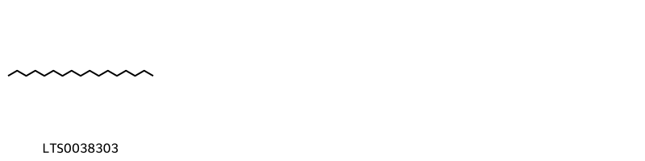{ width=100% }
    <figcaption>Hình ảnh cấu trúc hóa học của 1 hoạt chất thuộc nhóm Saturated hydrocarbons gồm ['heptadecane (LTS0038303)'].</figcaption>
</figure>
#### Nhóm Unsaturated hydrocarbons
<figure markdown="span">
    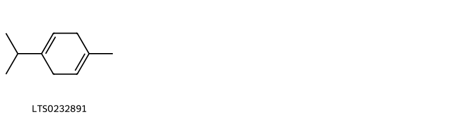{ width=100% }
    <figcaption>Hình ảnh cấu trúc hóa học của 1 hoạt chất thuộc nhóm Unsaturated hydrocarbons gồm ['α terpinene (LTS0232891)'].</figcaption>
</figure>

---

### Dược dân tộc học

Danh sách các quốc gia có sử dụng *Cinnamomum verum* trong điều trị các bệnh. 

| Country   | Disease                                                   | Bệnh                                                                                                                                                                                                |
|:----------|:----------------------------------------------------------|:----------------------------------------------------------------------------------------------------------------------------------------------------------------------------------------------------|
| Turkey    | Antiseptic, Astringent, Carminative, Stimulant, Stomachic | MYMEMORY WARNING: YOU USED ALL AVAILABLE FREE TRANSLATIONS FOR TODAY. NEXT AVAILABLE IN  02 HOURS 27 MINUTES 27 SECONDS VISIT HTTPS://MYMEMORY.TRANSLATED.NET/DOC/USAGELIMITS.PHP TO TRANSLATE MORE |

---

---
## Cinnamomum zeylanicum
### Thông tin về thực vật

!!! info "Phân loại thực vật của *Cinnamomum verum* từ GIBF:"
    - **Kingdom:** Plantae
    - **Phylum:** Tracheophyta
    - **Order:** Laurales
    - **Family:** Lauraceae
    - **Genus:** Cinnamomum
    - **Species:** *Cinnamomum verum*

 

| Label (VI)   | Label (EN)   | Scientific Name       | Descriptions (VI)   | Descriptions (EN)   | Also Known As (VI)   | Also Known As (EN)   |
|:-------------|:-------------|:----------------------|:--------------------|:--------------------|:---------------------|:---------------------|
| N/A          | N/A          | Cinnamomum zeylanicum | loài thực vật       | species of plant    | ['']                 | ['']                 |

#### Phân bố trên thế giới

**Từ CSDL GIBF** Ghana, Australia, Cook Islands, Argentina, unknown or invalid, Norway, Tanzania, United Republic of, Togo, Chinese Taipei, United States of America, Guinea, Paraguay, El Salvador, Uganda, Sao Tome and Principe, Brazil, Mayotte, Mexico, China, Ecuador, Madagascar, Colombia, Indonesia, Samoa, Cameroon, New Zealand

#### Phân bố tại Việt Nam

**Từ CSDL GIBF**: Không có ghi nhận ở Việt Nam

---
### Thành phần hóa học
        
- Theo cơ sở dữ liệu lotus: Từ loài *Cinnamomum verum* đã phân lập và xác định được 121 hoạt chất thuộc về các nhóm Phenol ethers, Cinnamyl alcohols, Fatty Acyls, Flavonoids, Prenol lipids, Cinnamic acids and derivatives, Benzodioxoles, Benzene and substituted derivatives, Unsaturated hydrocarbons, 2-arylbenzofuran flavonoids, Cinnamaldehydes, Organooxygen compounds, Phenols, Phenol esters, Coumarins and derivatives, Saturated hydrocarbons. 

|    | chemicalTaxonomyClassyfireClass     |   smiles_count |
|---:|:------------------------------------|---------------:|
|  0 | 2-arylbenzofuran flavonoids         |              2 |
|  1 | Benzene and substituted derivatives |             12 |
|  2 | Benzodioxoles                       |              1 |
|  3 | Cinnamaldehydes                     |              4 |
|  4 | Cinnamic acids and derivatives      |              6 |
|  5 | Cinnamyl alcohols                   |              2 |
|  6 | Coumarins and derivatives           |              1 |
|  7 | Fatty Acyls                         |              2 |
|  8 | Flavonoids                          |             17 |
|  9 | Organooxygen compounds              |             11 |
| 10 | Phenol esters                       |              1 |
| 11 | Phenol ethers                       |              1 |
| 12 | Phenols                             |              4 |
| 13 | Prenol lipids                       |             55 |
| 14 | Saturated hydrocarbons              |              1 |
| 15 | Unsaturated hydrocarbons            |              1 |

#### Nhóm 2-arylbenzofuran flavonoids
<figure markdown="span">
    { width=100% }
    <figcaption>Hình ảnh cấu trúc hóa học của 2 hoạt chất thuộc nhóm 2-arylbenzofuran flavonoids gồm ['(2r,3s,4s,5r,6s)-2-(hydroxymethyl)-6-{4-[(2s,3r)-3-(hydroxymethyl)-5-(3-hydroxypropyl)-7-methoxy-2,3-dihydro-1-benzofuran-2-yl]-2-methoxyphenoxy}oxane-3,4,5-triol (LTS0124902)', '2-(hydroxymethyl)-6-{4-[3-(hydroxymethyl)-5-(3-hydroxypropyl)-7-methoxy-2,3-dihydro-1-benzofuran-2-yl]-2-methoxyphenoxy}oxane-3,4,5-triol (LTS0214372)'].</figcaption>
</figure>
#### Nhóm Benzene and substituted derivatives
<figure markdown="span">
    { width=100% }
    <figcaption>Hình ảnh cấu trúc hóa học của 12 hoạt chất thuộc nhóm Benzene and substituted derivatives gồm ['cinnamyl acetate (LTS0207736)', 'methyl eugenol (LTS0098881)', '3-phenyl-2-propenyl acetate (LTS0061721)', 'benzaldehyde (LTS0094193)', '3,4-dihydroxybenzoic acid (LTS0018765)', 'benzyl benzoate (LTS0097515)', 'benzenepropanal (LTS0200922)', '2-phenyl-ethanol (LTS0206341)', 'phenethyl acetate (LTS0136181)', '2-ethenyl-phenol (LTS0235059)', 'phenylacetaldehyde (LTS0245512)', 'benzyl alcohol (LTS0125638)'].</figcaption>
</figure>
#### Nhóm Benzodioxoles
<figure markdown="span">
    { width=100% }
    <figcaption>Hình ảnh cấu trúc hóa học của 1 hoạt chất thuộc nhóm Benzodioxoles gồm ['sassafras (LTS0136093)'].</figcaption>
</figure>
#### Nhóm Cinnamaldehydes
<figure markdown="span">
    { width=100% }
    <figcaption>Hình ảnh cấu trúc hóa học của 4 hoạt chất thuộc nhóm Cinnamaldehydes gồm ['3-phenyl-2-propenal (LTS0204346)', 'cinnamal (LTS0271313)', '2-methoxycinnamaldehyde (LTS0195380)', '3-(2-methoxyphenyl)prop-2-enal (LTS0007230)'].</figcaption>
</figure>
#### Nhóm Cinnamic acids and derivatives
<figure markdown="span">
    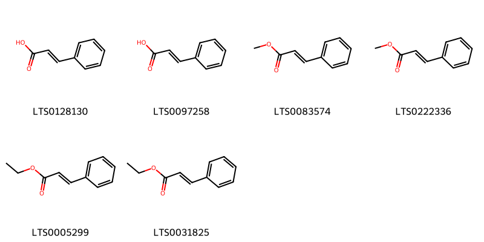{ width=100% }
    <figcaption>Hình ảnh cấu trúc hóa học của 6 hoạt chất thuộc nhóm Cinnamic acids and derivatives gồm ['cinnamic acid (LTS0128130)', 'phenylacrylic acid (LTS0097258)', 'methyl cinnamate (LTS0083574)', 'methyl cinnamate (LTS0222336)', 'ethyl 3-phenylprop-2-enoate (LTS0005299)', 'ethyl cinnamate (LTS0031825)'].</figcaption>
</figure>
#### Nhóm Cinnamyl alcohols
<figure markdown="span">
    { width=100% }
    <figcaption>Hình ảnh cấu trúc hóa học của 2 hoạt chất thuộc nhóm Cinnamyl alcohols gồm ['cinnamyl alcohol (LTS0010678)', '3-phenyl-2-propen-1-ol (LTS0069711)'].</figcaption>
</figure>
#### Nhóm Coumarins and derivatives
<figure markdown="span">
    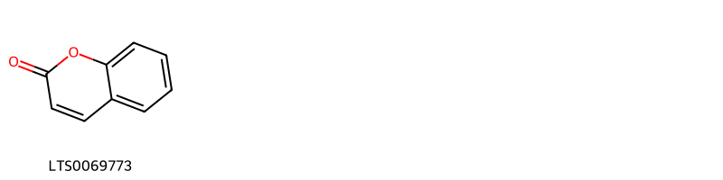{ width=100% }
    <figcaption>Hình ảnh cấu trúc hóa học của 1 hoạt chất thuộc nhóm Coumarins and derivatives gồm ['2h-1-benzopyran-2-one (LTS0069773)'].</figcaption>
</figure>
#### Nhóm Fatty Acyls
<figure markdown="span">
    { width=100% }
    <figcaption>Hình ảnh cấu trúc hóa học của 2 hoạt chất thuộc nhóm Fatty Acyls gồm ['geranyl acetate (LTS0093224)', 'hexanol (LTS0217299)'].</figcaption>
</figure>
#### Nhóm Flavonoids
<figure markdown="span">
    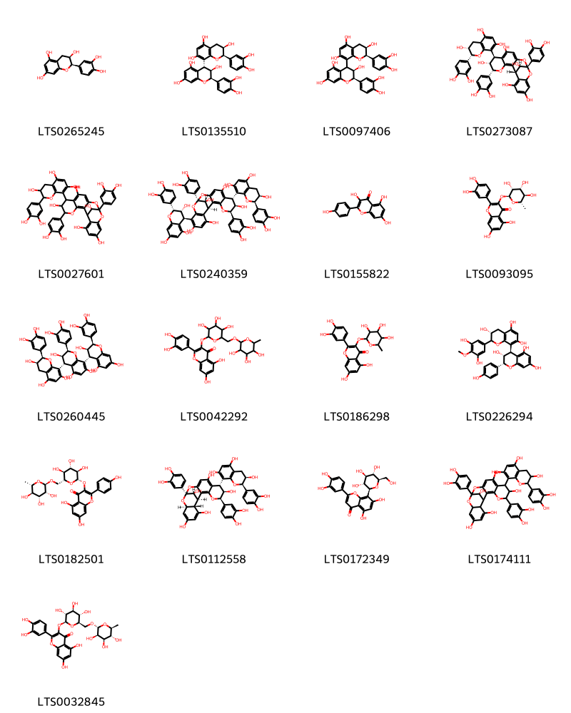{ width=100% }
    <figcaption>Hình ảnh cấu trúc hóa học của 17 hoạt chất thuộc nhóm Flavonoids gồm ['ent-epicatechin (LTS0265245)', '(2r,3r,4r)-2-(3,4-dihydroxyphenyl)-4-[(2r,3r)-2-(3,4-dihydroxyphenyl)-3,5,7-trihydroxy-3,4-dihydro-2h-1-benzopyran-8-yl]-3,4-dihydro-2h-1-benzopyran-3,5,7-triol (LTS0135510)', '(2r,3r)-2-(3,4-dihydroxyphenyl)-4-[(2r,3r)-2-(3,4-dihydroxyphenyl)-3,5,7-trihydroxy-3,4-dihydro-2h-1-benzopyran-8-yl]-3,4-dihydro-2h-1-benzopyran-3,5,7-triol (LTS0097406)', 'cinnamtannin b1 (LTS0273087)', '5,13-bis(3,4-dihydroxyphenyl)-7-[2-(3,4-dihydroxyphenyl)-3,5,7-trihydroxy-3,4-dihydro-2h-1-benzopyran-8-yl]-4,12,14-trioxapentacyclo[11.7.1.0²,¹¹.0³,⁸.0¹⁵,²⁰]henicosa-2,8,10,15,17,19-hexaene-6,9,17,19,21-pentol (LTS0027601)', 'cinnamtannin b2 (LTS0240359)', 'kaempherol (LTS0155822)', 'quercitrin (LTS0093095)', 'procyanidin c1 (LTS0260445)', 'rutin (LTS0042292)', 'quercitrin (LTS0186298)', '(3r)-2-(3,5-dihydroxy-4-methoxyphenyl)-8-[(2r,3r,4r)-3,5,7-trihydroxy-2-(4-hydroxyphenyl)-3,4-dihydro-2h-1-benzopyran-4-yl]-3,4-dihydro-2h-1-benzopyran-3,5,7-triol (LTS0226294)', 'nictoflorin (LTS0182501)', '(1r,5r,6r,7s,13s,15r,20s,21r)-5,13-bis(3,4-dihydroxyphenyl)-7-[(2r,3r)-2-(3,4-dihydroxyphenyl)-3,5,7-trihydroxy-3,4-dihydro-2h-1-benzopyran-8-yl]-4,12,14-trioxapentacyclo[11.7.1.0²,¹¹.0³,⁸.0¹⁵,²⁰]henicosa-2,8,10,16,18-pentaene-6,9,17,19,21-pentol (LTS0112558)', 'orientin (LTS0172349)', '5,13-bis(3,4-dihydroxyphenyl)-7-[2-(3,4-dihydroxyphenyl)-3,5,7-trihydroxy-3,4-dihydro-2h-1-benzopyran-8-yl]-4,12,14-trioxapentacyclo[11.7.1.0²,¹¹.0³,⁸.0¹⁵,²⁰]henicosa-2,8,10,16,18-pentaene-6,9,17,19,21-pentol (LTS0174111)', '3-rutinosyl quercetin (LTS0032845)'].</figcaption>
</figure>
#### Nhóm Organooxygen compounds
<figure markdown="span">
    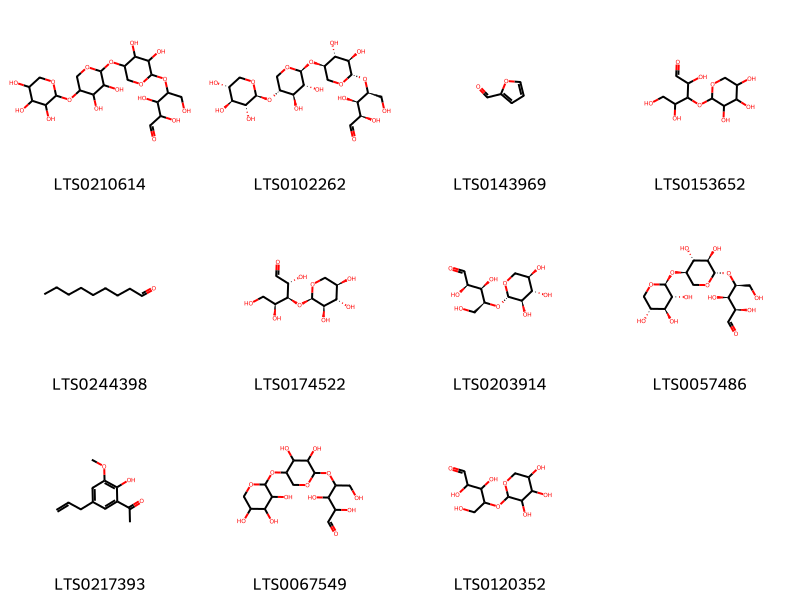{ width=100% }
    <figcaption>Hình ảnh cấu trúc hóa học của 11 hoạt chất thuộc nhóm Organooxygen compounds gồm ['4-{[5-({3,4-dihydroxy-5-[(3,4,5-trihydroxyoxan-2-yl)oxy]oxan-2-yl}oxy)-3,4-dihydroxyoxan-2-yl]oxy}-2,3,5-trihydroxypentanal (LTS0210614)', '(2r,3r,4s)-4-{[(2s,3r,4r,5r)-5-{[(2s,3r,4r,5r)-3,4-dihydroxy-5-{[(2s,3r,4s,5r)-3,4,5-trihydroxyoxan-2-yl]oxy}oxan-2-yl]oxy}-3,4-dihydroxyoxan-2-yl]oxy}-2,3,5-trihydroxypentanal (LTS0102262)', 'bran oil (LTS0143969)', '2,4,5-trihydroxy-3-[(3,4,5-trihydroxyoxan-2-yl)oxy]pentanal (LTS0153652)', 'nonanal (LTS0244398)', '(2r,3s,4s)-2,4,5-trihydroxy-3-{[(2r,3r,4s,5r)-3,4,5-trihydroxyoxan-2-yl]oxy}pentanal (LTS0174522)', '(2r,3r,4s)-2,3,5-trihydroxy-4-{[(2s,3r,4s,5r)-3,4,5-trihydroxyoxan-2-yl]oxy}pentanal (LTS0203914)', '(2r,3r,4s)-4-{[(2s,3r,4r,5r)-3,4-dihydroxy-5-{[(2s,3r,4s,5r)-3,4,5-trihydroxyoxan-2-yl]oxy}oxan-2-yl]oxy}-2,3,5-trihydroxypentanal (LTS0057486)', '1-[2-hydroxy-3-methoxy-5-(prop-2-en-1-yl)phenyl]ethanone (LTS0217393)', '4-({3,4-dihydroxy-5-[(3,4,5-trihydroxyoxan-2-yl)oxy]oxan-2-yl}oxy)-2,3,5-trihydroxypentanal (LTS0067549)', '2,3,5-trihydroxy-4-[(3,4,5-trihydroxyoxan-2-yl)oxy]pentanal (LTS0120352)'].</figcaption>
</figure>
#### Nhóm Phenol esters
<figure markdown="span">
    { width=100% }
    <figcaption>Hình ảnh cấu trúc hóa học của 1 hoạt chất thuộc nhóm Phenol esters gồm ['eugenyl acetate (LTS0165886)'].</figcaption>
</figure>
#### Nhóm Phenol ethers
<figure markdown="span">
    { width=100% }
    <figcaption>Hình ảnh cấu trúc hóa học của 1 hoạt chất thuộc nhóm Phenol ethers gồm ['tarragon (LTS0245226)'].</figcaption>
</figure>
#### Nhóm Phenols
<figure markdown="span">
    { width=100% }
    <figcaption>Hình ảnh cấu trúc hóa học của 4 hoạt chất thuộc nhóm Phenols gồm ['eugenol (LTS0052342)', 'vanillin (LTS0136163)', 'isoeugenol (LTS0136836)', 'phenol (LTS0092642)'].</figcaption>
</figure>
#### Nhóm Prenol lipids
<figure markdown="span">
    { width=100% }
    <figcaption>Hình ảnh cấu trúc hóa học của 55 hoạt chất thuộc nhóm Prenol lipids gồm ['terpineol (LTS0136148)', 'linalool, (+-)- (LTS0128839)', 'β-pinene (LTS0117550)', 'cymene (LTS0181568)', 'α pinene (LTS0132416)', 'limonene,  (LTS0155981)', 'caryophyllene (LTS0085212)', 'camphor (LTS0091905)', 'humulene (LTS0263171)', 'β-caryophyllene oxide (LTS0213960)', 'geraniol (LTS0258838)', '(1r,2s,7s,8s)-8-isopropyl-1,3-dimethyltricyclo[4.4.0.0²,⁷]dec-3-ene (LTS0190031)', 'caryophyllene oxide (LTS0159789)', 'α-myrcene (LTS0115731)', 'α-cadinol (LTS0206935)', 'camphene (LTS0267242)', 'borneol (LTS0264960)', 'delta-cadinene (LTS0019321)', '(e,z)-farnesol (LTS0182151)', 'terpinolene (LTS0104525)', 'phellandrene (LTS0157173)', '4-terpineol (LTS0253733)', '(+)-gamma-cadinene (LTS0103949)', 'bornyl acetate (LTS0060565)', 'sabinene (LTS0224133)', '(-)-trans-α-bergamotene (LTS0239937)', 'farnesol (LTS0059667)', 'terpinene (LTS0136858)', 'fenchone (LTS0126716)', 'nerol (LTS0244289)', '4,11,11-trimethyl-8-methylidenebicyclo[7.2.0]undec-4-ene (LTS0256716)', 'α-citral (LTS0246122)', '4-isopropyl-6-methyl-1-methylidene-3,4,4a,7,8,8a-hexahydro-2h-naphthalene (LTS0111070)', 'β-selinene (LTS0096341)', 'trans-β-ocimene (LTS0049765)', 'monoterpenes (LTS0106881)', 'cadalene (LTS0077722)', 'α-limonene (LTS0244943)', '(1z,6z,8s)-8-isopropyl-1-methyl-5-methylidenecyclodeca-1,6-diene (LTS0065195)', '(+)-α-pinene (LTS0211102)', '(1ar,4r,4ar,7as,7bs)-1,1,4,7-tetramethyl-octahydro-1ah-cyclopropa[e]azulen-4-ol (LTS0021381)', '(2s,4r)-1,7,7-trimethylbicyclo[2.2.1]heptan-2-ol (LTS0010050)', 'd-camphor (LTS0002057)', '(+)-linalool (LTS0196043)', 'α-ylangene (LTS0254603)', 'piperitone (LTS0273145)', '(1s)-8-isopropyl-1,3-dimethyltricyclo[4.4.0.0²,⁷]dec-3-ene (LTS0199723)', '(+)-α-phellandrene (LTS0234318)', 'cuminaldehyde (LTS0037806)', 'linalyl acetate (LTS0167325)', 'β-ocimene (LTS0242381)', '(+)-caryophyllene (LTS0046179)', 'lily of valley (LTS0051762)', 'caryophyllene (LTS0131870)', 'carvacrol (LTS0012882)'].</figcaption>
</figure>
#### Nhóm Saturated hydrocarbons
<figure markdown="span">
    { width=100% }
    <figcaption>Hình ảnh cấu trúc hóa học của 1 hoạt chất thuộc nhóm Saturated hydrocarbons gồm ['heptadecane (LTS0038303)'].</figcaption>
</figure>
#### Nhóm Unsaturated hydrocarbons
<figure markdown="span">
    { width=100% }
    <figcaption>Hình ảnh cấu trúc hóa học của 1 hoạt chất thuộc nhóm Unsaturated hydrocarbons gồm ['α terpinene (LTS0232891)'].</figcaption>
</figure>

---

### Dược dân tộc học

Danh sách các quốc gia có sử dụng *Cinnamomum verum* trong điều trị các bệnh. 

| Country   | Disease                                                                           | Bệnh                                                                                                                                                                                                |
|:----------|:----------------------------------------------------------------------------------|:----------------------------------------------------------------------------------------------------------------------------------------------------------------------------------------------------|
| Elsewhere | Astringent, Astringent, Carminative, Carminative, Fungicide, Stimulant, Stomachic | MYMEMORY WARNING: YOU USED ALL AVAILABLE FREE TRANSLATIONS FOR TODAY. NEXT AVAILABLE IN  02 HOURS 26 MINUTES 27 SECONDS VISIT HTTPS://MYMEMORY.TRANSLATED.NET/DOC/USAGELIMITS.PHP TO TRANSLATE MORE |
| Japan*    | Diaphoretic, nan, Stomachic                                                       | MYMEMORY WARNING: YOU USED ALL AVAILABLE FREE TRANSLATIONS FOR TODAY. NEXT AVAILABLE IN  02 HOURS 26 MINUTES 25 SECONDS VISIT HTTPS://MYMEMORY.TRANSLATED.NET/DOC/USAGELIMITS.PHP TO TRANSLATE MORE |

---

# Chi Litsea

??? note "Danh sách các dược liệu thuộc chi"
    
	 - *Litsea cubeba*
	 - *Litsea glutinosa*
	 - *Litsea monopetala*
	 - *Litsea odorifera*
	 - *Litsea variabilis*

---
## Litsea cubeba
### Thông tin về thực vật

!!! info "Phân loại thực vật của *Litsea cubeba* từ GIBF:"
    - **Kingdom:** Plantae
    - **Phylum:** Tracheophyta
    - **Order:** Laurales
    - **Family:** Lauraceae
    - **Genus:** Litsea
    - **Species:** *Litsea cubeba*

 

| Label (VI)   | Label (EN)   | Scientific Name   | Descriptions (VI)   | Descriptions (EN)   | Also Known As (VI)   | Also Known As (EN)   |
|:-------------|:-------------|:------------------|:--------------------|:--------------------|:---------------------|:---------------------|
| N/A          | N/A          | Litsea cubeba     | loài thực vật       | species of plant    | ['']                 | ['']                 |

#### Phân bố trên thế giới

**Từ CSDL GIBF** Hong Kong, Japan, Chinese Taipei, Malaysia, China, Nepal

#### Phân bố tại Việt Nam

**Từ CSDL GIBF**: Không có ghi nhận ở Việt Nam

---
### Thành phần hóa học
        
- Theo cơ sở dữ liệu lotus: Từ loài *Litsea cubeba* đã phân lập và xác định được 53 hoạt chất thuộc về các nhóm Cinnamyl alcohols, Prenol lipids, Proaporphines, Phenanthrenes and derivatives, Aporphines, Benzene and substituted derivatives, Hydroxy acids and derivatives, Benzimidazoles, Organooxygen compounds, Tetrahydroisoquinolines, Isoquinolines and derivatives. 

|    | chemicalTaxonomyClassyfireClass     |   smiles_count |
|---:|:------------------------------------|---------------:|
|  0 | Aporphines                          |             16 |
|  1 | Benzene and substituted derivatives |              1 |
|  2 | Benzimidazoles                      |              1 |
|  3 | Cinnamyl alcohols                   |              2 |
|  4 | Hydroxy acids and derivatives       |              2 |
|  5 | Isoquinolines and derivatives       |              5 |
|  6 | Organooxygen compounds              |              3 |
|  7 | Phenanthrenes and derivatives       |              1 |
|  8 | Prenol lipids                       |             14 |
|  9 | Proaporphines                       |              2 |
| 10 | Tetrahydroisoquinolines             |              6 |

#### Nhóm Aporphines
<figure markdown="span">
    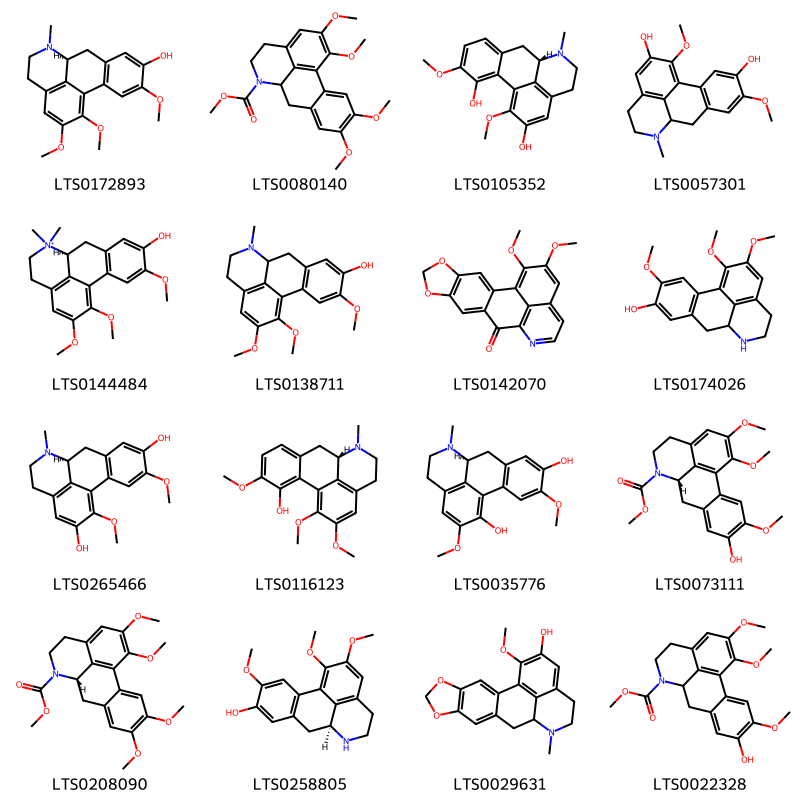{ width=100% }
    <figcaption>Hình ảnh cấu trúc hóa học của 16 hoạt chất thuộc nhóm Aporphines gồm ['(9s)-4,15,16-trimethoxy-10-methyl-10-azatetracyclo[7.7.1.0²,⁷.0¹³,¹⁷]heptadeca-1(16),2(7),3,5,13(17),14-hexaen-5-ol (LTS0172893)', 'methyl 4,5,15,16-tetramethoxy-10-azatetracyclo[7.7.1.0²,⁷.0¹³,¹⁷]heptadeca-1(17),2,4,6,13,15-hexaene-10-carboxylate (LTS0080140)', '(9s)-4,16-dimethoxy-10-methyl-10-azatetracyclo[7.7.1.0²,⁷.0¹³,¹⁷]heptadeca-1(16),2,4,6,13(17),14-hexaene-3,15-diol (LTS0105352)', '5,16-dimethoxy-10-methyl-10-azatetracyclo[7.7.1.0²,⁷.0¹³,¹⁷]heptadeca-1(16),2(7),3,5,13(17),14-hexaene-4,15-diol (LTS0057301)', '(9s)-5-hydroxy-4,15,16-trimethoxy-10,10-dimethyl-10-azatetracyclo[7.7.1.0²,⁷.0¹³,¹⁷]heptadeca-1(16),2(7),3,5,13(17),14-hexaen-10-ium (LTS0144484)', '4,15,16-trimethoxy-10-methyl-10-azatetracyclo[7.7.1.0²,⁷.0¹³,¹⁷]heptadeca-1(16),2(7),3,5,13(17),14-hexaen-5-ol (LTS0138711)', 'oxonantenine (LTS0142070)', '4,15,16-trimethoxy-10-azatetracyclo[7.7.1.0²,⁷.0¹³,¹⁷]heptadeca-1(17),2(7),3,5,13,15-hexaen-5-ol (LTS0174026)', '(9s)-4,16-dimethoxy-10-methyl-10-azatetracyclo[7.7.1.0²,⁷.0¹³,¹⁷]heptadeca-1(16),2(7),3,5,13(17),14-hexaene-5,15-diol (LTS0265466)', '(9s)-4,15,16-trimethoxy-10-methyl-10-azatetracyclo[7.7.1.0²,⁷.0¹³,¹⁷]heptadeca-1(16),2,4,6,13(17),14-hexaen-3-ol (LTS0116123)', '(9s)-4,15-dimethoxy-10-methyl-10-azatetracyclo[7.7.1.0²,⁷.0¹³,¹⁷]heptadeca-1(16),2(7),3,5,13(17),14-hexaene-5,16-diol (LTS0035776)', 'methyl (9s)-5-hydroxy-4,15,16-trimethoxy-10-azatetracyclo[7.7.1.0²,⁷.0¹³,¹⁷]heptadeca-1(17),2,4,6,13,15-hexaene-10-carboxylate (LTS0073111)', 'methyl (9s)-4,5,15,16-tetramethoxy-10-azatetracyclo[7.7.1.0²,⁷.0¹³,¹⁷]heptadeca-1(17),2,4,6,13,15-hexaene-10-carboxylate (LTS0208090)', 'laurotetanine (LTS0258805)', '19-methoxy-13-methyl-5,7-dioxa-13-azapentacyclo[10.7.1.0²,¹⁰.0⁴,⁸.0¹⁶,²⁰]icosa-1(20),2,4(8),9,16,18-hexaen-18-ol (LTS0029631)', 'methyl 5-hydroxy-4,15,16-trimethoxy-10-azatetracyclo[7.7.1.0²,⁷.0¹³,¹⁷]heptadeca-1(17),2,4,6,13,15-hexaene-10-carboxylate (LTS0022328)'].</figcaption>
</figure>
#### Nhóm Benzene and substituted derivatives
<figure markdown="span">
    { width=100% }
    <figcaption>Hình ảnh cấu trúc hóa học của 1 hoạt chất thuộc nhóm Benzene and substituted derivatives gồm ['vanillic acid (LTS0229113)'].</figcaption>
</figure>
#### Nhóm Benzimidazoles
<figure markdown="span">
    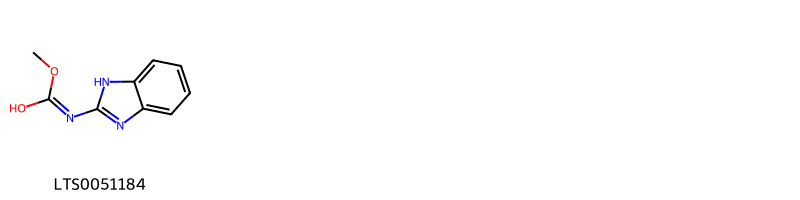{ width=100% }
    <figcaption>Hình ảnh cấu trúc hóa học của 1 hoạt chất thuộc nhóm Benzimidazoles gồm ['n-(1h-1,3-benzodiazol-2-yl)methoxycarboximidic acid (LTS0051184)'].</figcaption>
</figure>
#### Nhóm Cinnamyl alcohols
<figure markdown="span">
    { width=100% }
    <figcaption>Hình ảnh cấu trúc hóa học của 2 hoạt chất thuộc nhóm Cinnamyl alcohols gồm ['3-(3,4,5-trimethoxyphenyl)prop-2-en-1-ol (LTS0071419)', '(2e)-3-(3,4,5-trimethoxyphenyl)prop-2-en-1-ol (LTS0124755)'].</figcaption>
</figure>
#### Nhóm Hydroxy acids and derivatives
<figure markdown="span">
    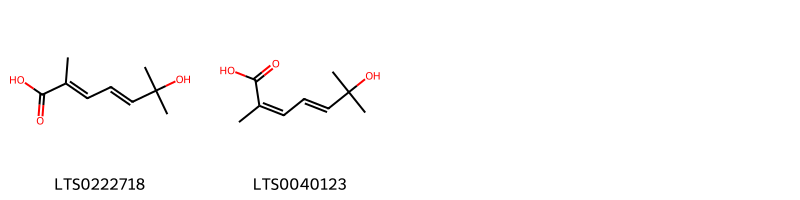{ width=100% }
    <figcaption>Hình ảnh cấu trúc hóa học của 2 hoạt chất thuộc nhóm Hydroxy acids and derivatives gồm ['(2e,4e)-6-hydroxy-2,6-dimethylhepta-2,4-dienoic acid (LTS0222718)', '(4e)-6-hydroxy-2,6-dimethylhepta-2,4-dienoic acid (LTS0040123)'].</figcaption>
</figure>
#### Nhóm Isoquinolines and derivatives
<figure markdown="span">
    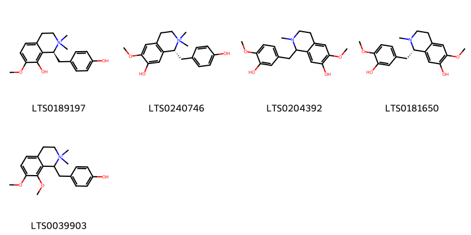{ width=100% }
    <figcaption>Hình ảnh cấu trúc hóa học của 5 hoạt chất thuộc nhóm Isoquinolines and derivatives gồm ['(1s)-8-hydroxy-1-[(4-hydroxyphenyl)methyl]-7-methoxy-2,2-dimethyl-3,4-dihydro-1h-isoquinolin-2-ium (LTS0189197)', 'magnocurarine (LTS0240746)', 'reticuline (LTS0204392)', '(+,-)-reticuline (LTS0181650)', '1-[(4-hydroxyphenyl)methyl]-7,8-dimethoxy-2,2-dimethyl-3,4-dihydro-1h-isoquinolin-2-ium (LTS0039903)'].</figcaption>
</figure>
#### Nhóm Organooxygen compounds
<figure markdown="span">
    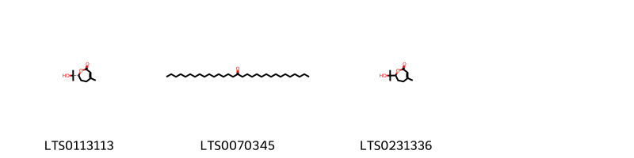{ width=100% }
    <figcaption>Hình ảnh cấu trúc hóa học của 3 hoạt chất thuộc nhóm Organooxygen compounds gồm ['(7r)-7-(2-hydroxypropan-2-yl)-4-methyl-6,7-dihydro-5h-oxepin-2-one (LTS0113113)', 'palmitone (LTS0070345)', '7-(2-hydroxypropan-2-yl)-4-methyl-6,7-dihydro-5h-oxepin-2-one (LTS0231336)'].</figcaption>
</figure>
#### Nhóm Phenanthrenes and derivatives
<figure markdown="span">
    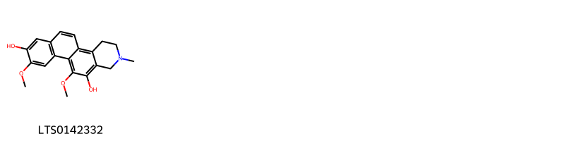{ width=100% }
    <figcaption>Hình ảnh cấu trúc hóa học của 1 hoạt chất thuộc nhóm Phenanthrenes and derivatives gồm ['9,11-dimethoxy-2-methyl-1h,3h,4h-naphtho[2,1-f]isoquinoline-8,12-diol (LTS0142332)'].</figcaption>
</figure>
#### Nhóm Prenol lipids
<figure markdown="span">
    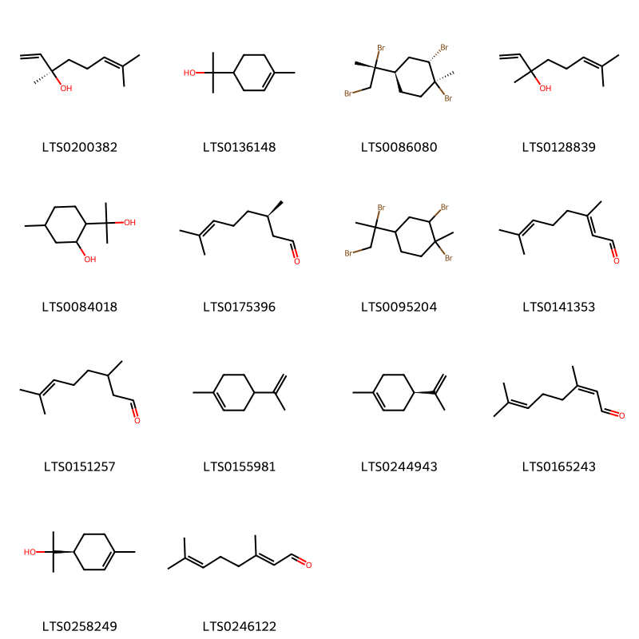{ width=100% }
    <figcaption>Hình ảnh cấu trúc hóa học của 14 hoạt chất thuộc nhóm Prenol lipids gồm ['(-)-linalool (LTS0200382)', 'terpineol (LTS0136148)', '(1s,2s,4r)-1,2-dibromo-4-[(2r)-1,2-dibromopropan-2-yl]-1-methylcyclohexane (LTS0086080)', 'linalool, (+-)- (LTS0128839)', 'p-menthane-3,8-diol (LTS0084018)', '(r)-(+)-citronellal (LTS0175396)', '1,2-dibromo-4-(1,2-dibromopropan-2-yl)-1-methylcyclohexane (LTS0095204)', '3,7-dimethyl-2,6-octadienal (LTS0141353)', 'citronella (LTS0151257)', 'limonene,  (LTS0155981)', 'α-limonene (LTS0244943)', 'neral (LTS0165243)', '(+)-α-terpineol (LTS0258249)', 'α-citral (LTS0246122)'].</figcaption>
</figure>
#### Nhóm Proaporphines
<figure markdown="span">
    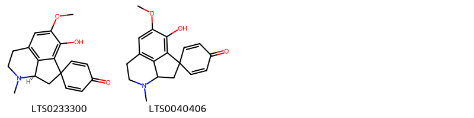{ width=100% }
    <figcaption>Hình ảnh cấu trúc hóa học của 2 hoạt chất thuộc nhóm Proaporphines gồm ['glaziovine (LTS0233300)', "11'-hydroxy-10'-methoxy-5'-methyl-5'-azaspiro[cyclohexane-1,2'-tricyclo[6.3.1.0⁴,¹²]dodecane]-1'(11'),2,5,8'(12'),9'-pentaen-4-one (LTS0040406)"].</figcaption>
</figure>
#### Nhóm Tetrahydroisoquinolines
<figure markdown="span">
    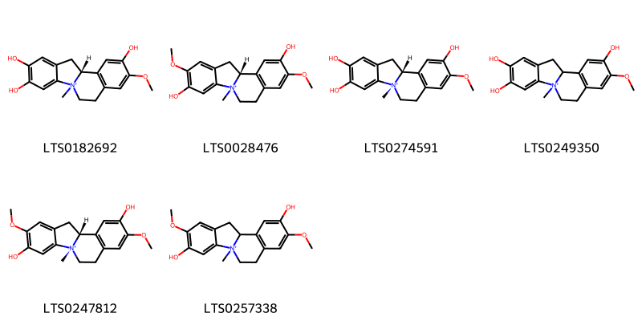{ width=100% }
    <figcaption>Hình ảnh cấu trúc hóa học của 6 hoạt chất thuộc nhóm Tetrahydroisoquinolines gồm ['(12ar)-2,9,10-trihydroxy-3-methoxy-7-methyl-5h,6h,12h,12ah-indolo[2,1-a]isoquinolin-7-ium (LTS0182692)', '(12ar)-2,9-dihydroxy-3,10-dimethoxy-7-methyl-5h,6h,12h,12ah-indolo[2,1-a]isoquinolin-7-ium (LTS0028476)', '(7s,12ar)-2,9,10-trihydroxy-3-methoxy-7-methyl-5h,6h,12h,12ah-indolo[2,1-a]isoquinolin-7-ium (LTS0274591)', '2,9,10-trihydroxy-3-methoxy-7-methyl-5h,6h,12h,12ah-indolo[2,1-a]isoquinolin-7-ium (LTS0249350)', '(7s,12ar)-2,9-dihydroxy-3,10-dimethoxy-7-methyl-5h,6h,12h,12ah-indolo[2,1-a]isoquinolin-7-ium (LTS0247812)', '2,9-dihydroxy-3,10-dimethoxy-7-methyl-5h,6h,12h,12ah-indolo[2,1-a]isoquinolin-7-ium (LTS0257338)'].</figcaption>
</figure>

---

### Dược dân tộc học

Danh sách các quốc gia có sử dụng *Litsea cubeba* trong điều trị các bệnh. 

| Country   | Disease            | Bệnh                                                                                                                                                                                                |
|:----------|:-------------------|:----------------------------------------------------------------------------------------------------------------------------------------------------------------------------------------------------|
| China     | Expectorant, Tonic | MYMEMORY WARNING: YOU USED ALL AVAILABLE FREE TRANSLATIONS FOR TODAY. NEXT AVAILABLE IN  02 HOURS 25 MINUTES 23 SECONDS VISIT HTTPS://MYMEMORY.TRANSLATED.NET/DOC/USAGELIMITS.PHP TO TRANSLATE MORE |

---

---
## Litsea glutinosa
### Thông tin về thực vật

!!! info "Phân loại thực vật của *Litsea glutinosa* từ GIBF:"
    - **Kingdom:** Plantae
    - **Phylum:** Tracheophyta
    - **Order:** Laurales
    - **Family:** Lauraceae
    - **Genus:** Litsea
    - **Species:** *Litsea glutinosa*

 

| Label (VI)   | Label (EN)   | Scientific Name   | Descriptions (VI)   | Descriptions (EN)   | Also Known As (VI)   | Also Known As (EN)                                              |
|:-------------|:-------------|:------------------|:--------------------|:--------------------|:---------------------|:----------------------------------------------------------------|
| N/A          | N/A          | Litsea glutinosa  | loài thực vật       | species of plant    | ['Litsea glutinosa'] | ['Bolly beech', 'Indian Laurel', 'Pond Spice', 'Soft bollygum'] |

#### Phân bố trên thế giới

**Từ CSDL GIBF** South Africa, Réunion, Hong Kong, Australia, Madagascar, Thailand, Mauritius, Chinese Taipei, Brazil, India, Indonesia, Mayotte, Viet Nam, China

#### Phân bố tại Việt Nam

**Từ CSDL GIBF**: Hà Tĩnh, Quảng Ninh

---
### Thành phần hóa học
        
- Theo cơ sở dữ liệu lotus: Từ loài *Litsea glutinosa* đã phân lập và xác định được 40 hoạt chất thuộc về các nhóm Fatty Acyls, Flavonoids, Prenol lipids, Steroids and steroid derivatives, Aporphines, 2-arylbenzofuran flavonoids, Aryltetralin lignans, Lignan glycosides. 

|    | chemicalTaxonomyClassyfireClass   |   smiles_count |
|---:|:----------------------------------|---------------:|
|  0 | 2-arylbenzofuran flavonoids       |              6 |
|  1 | Aporphines                        |              8 |
|  2 | Aryltetralin lignans              |              2 |
|  3 | Fatty Acyls                       |              4 |
|  4 | Flavonoids                        |              4 |
|  5 | Lignan glycosides                 |             12 |
|  6 | Prenol lipids                     |              2 |
|  7 | Steroids and steroid derivatives  |              2 |

#### Nhóm 2-arylbenzofuran flavonoids
<figure markdown="span">
    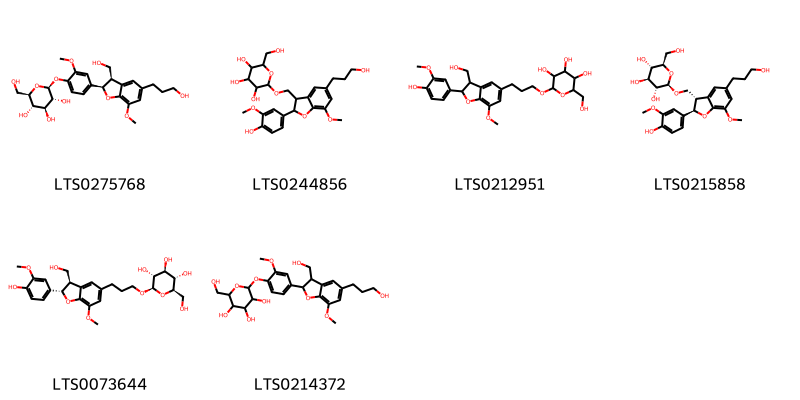{ width=100% }
    <figcaption>Hình ảnh cấu trúc hóa học của 6 hoạt chất thuộc nhóm 2-arylbenzofuran flavonoids gồm ['(2r,3s,4s,5r,6s)-2-(hydroxymethyl)-6-{4-[(2r,3r)-3-(hydroxymethyl)-5-(3-hydroxypropyl)-7-methoxy-2,3-dihydro-1-benzofuran-2-yl]-2-methoxyphenoxy}oxane-3,4,5-triol (LTS0275768)', '2-{[2-(4-hydroxy-3-methoxyphenyl)-5-(3-hydroxypropyl)-7-methoxy-2,3-dihydro-1-benzofuran-3-yl]methoxy}-6-(hydroxymethyl)oxane-3,4,5-triol (LTS0244856)', '2-{3-[2-(4-hydroxy-3-methoxyphenyl)-3-(hydroxymethyl)-7-methoxy-2,3-dihydro-1-benzofuran-5-yl]propoxy}-6-(hydroxymethyl)oxane-3,4,5-triol (LTS0212951)', '(2r,3r,4s,5s,6r)-2-{[(2r,3s)-2-(4-hydroxy-3-methoxyphenyl)-5-(3-hydroxypropyl)-7-methoxy-2,3-dihydro-1-benzofuran-3-yl]methoxy}-6-(hydroxymethyl)oxane-3,4,5-triol (LTS0215858)', '(2r,3r,4s,5s,6r)-2-{3-[(2s,3r)-2-(4-hydroxy-3-methoxyphenyl)-3-(hydroxymethyl)-7-methoxy-2,3-dihydro-1-benzofuran-5-yl]propoxy}-6-(hydroxymethyl)oxane-3,4,5-triol (LTS0073644)', '2-(hydroxymethyl)-6-{4-[3-(hydroxymethyl)-5-(3-hydroxypropyl)-7-methoxy-2,3-dihydro-1-benzofuran-2-yl]-2-methoxyphenoxy}oxane-3,4,5-triol (LTS0214372)'].</figcaption>
</figure>
#### Nhóm Aporphines
<figure markdown="span">
    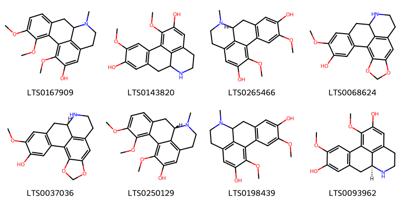{ width=100% }
    <figcaption>Hình ảnh cấu trúc hóa học của 8 hoạt chất thuộc nhóm Aporphines gồm ['3,4,16-trimethoxy-10-methyl-10-azatetracyclo[7.7.1.0²,⁷.0¹³,¹⁷]heptadeca-1(16),2,4,6,13(17),14-hexaen-15-ol (LTS0167909)', '4,16-dimethoxy-10-azatetracyclo[7.7.1.0²,⁷.0¹³,¹⁷]heptadeca-1(17),2(7),3,5,13,15-hexaene-5,15-diol (LTS0143820)', '(9s)-4,16-dimethoxy-10-methyl-10-azatetracyclo[7.7.1.0²,⁷.0¹³,¹⁷]heptadeca-1(16),2(7),3,5,13(17),14-hexaene-5,15-diol (LTS0265466)', '16-methoxy-3,5-dioxa-11-azapentacyclo[10.7.1.0²,⁶.0⁸,²⁰.0¹⁴,¹⁹]icosa-1,6,8(20),14(19),15,17-hexaen-17-ol (LTS0068624)', '(12r)-16-methoxy-3,5-dioxa-11-azapentacyclo[10.7.1.0²,⁶.0⁸,²⁰.0¹⁴,¹⁹]icosa-1,6,8(20),14(19),15,17-hexaen-17-ol (LTS0037036)', '(9s)-3,4,16-trimethoxy-10-methyl-10-azatetracyclo[7.7.1.0²,⁷.0¹³,¹⁷]heptadeca-1(16),2,4,6,13(17),14-hexaen-15-ol (LTS0250129)', '4,16-dimethoxy-10-methyl-10-azatetracyclo[7.7.1.0²,⁷.0¹³,¹⁷]heptadeca-1(16),2(7),3,5,13(17),14-hexaene-5,15-diol (LTS0198439)', 'laurolitsine (LTS0093962)'].</figcaption>
</figure>
#### Nhóm Aryltetralin lignans
<figure markdown="span">
    { width=100% }
    <figcaption>Hình ảnh cấu trúc hóa học của 2 hoạt chất thuộc nhóm Aryltetralin lignans gồm ['8-(4-hydroxy-3,5-dimethoxyphenyl)-6,7-bis(hydroxymethyl)-1,3-dimethoxy-5,6,7,8-tetrahydronaphthalen-2-ol (LTS0068427)', '(6s,7s,8r)-8-(4-hydroxy-3,5-dimethoxyphenyl)-6,7-bis(hydroxymethyl)-1,3-dimethoxy-5,6,7,8-tetrahydronaphthalen-2-ol (LTS0243275)'].</figcaption>
</figure>
#### Nhóm Fatty Acyls
<figure markdown="span">
    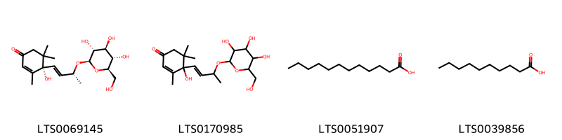{ width=100% }
    <figcaption>Hình ảnh cấu trúc hóa học của 4 hoạt chất thuộc nhóm Fatty Acyls gồm ['(4s)-4-hydroxy-3,5,5-trimethyl-4-[(1e,3r)-3-{[(2r,3r,4s,5s,6r)-3,4,5-trihydroxy-6-(hydroxymethyl)oxan-2-yl]oxy}but-1-en-1-yl]cyclohex-2-en-1-one (LTS0069145)', '4-hydroxy-3,5,5-trimethyl-4-(3-{[3,4,5-trihydroxy-6-(hydroxymethyl)oxan-2-yl]oxy}but-1-en-1-yl)cyclohex-2-en-1-one (LTS0170985)', 'lauric acid (LTS0051907)', 'capric acid (LTS0039856)'].</figcaption>
</figure>
#### Nhóm Flavonoids
<figure markdown="span">
    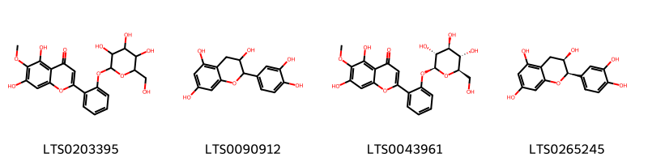{ width=100% }
    <figcaption>Hình ảnh cấu trúc hóa học của 4 hoạt chất thuộc nhóm Flavonoids gồm ['5,7-dihydroxy-6-methoxy-2-(2-{[3,4,5-trihydroxy-6-(hydroxymethyl)oxan-2-yl]oxy}phenyl)chromen-4-one (LTS0203395)', 'catechol (LTS0090912)', '5,7-dihydroxy-6-methoxy-2-(2-{[(2s,3r,4s,5s,6r)-3,4,5-trihydroxy-6-(hydroxymethyl)oxan-2-yl]oxy}phenyl)chromen-4-one (LTS0043961)', 'ent-epicatechin (LTS0265245)'].</figcaption>
</figure>
#### Nhóm Lignan glycosides
<figure markdown="span">
    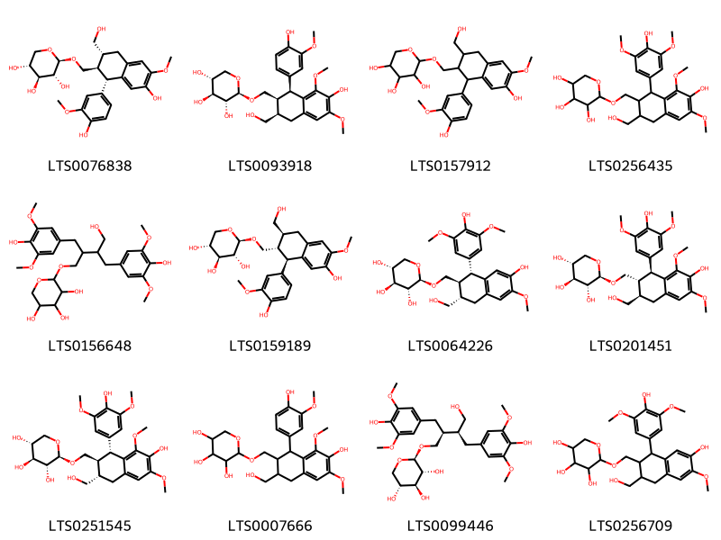{ width=100% }
    <figcaption>Hình ảnh cấu trúc hóa học của 12 hoạt chất thuộc nhóm Lignan glycosides gồm ['(2r,3r,4s,5r)-2-{[(1s,2r,3r)-7-hydroxy-1-(4-hydroxy-3-methoxyphenyl)-3-(hydroxymethyl)-6-methoxy-1,2,3,4-tetrahydronaphthalen-2-yl]methoxy}oxane-3,4,5-triol (LTS0076838)', '(2r,3r,4s,5r)-2-{[(1s,2s,3r)-7-hydroxy-1-(4-hydroxy-3-methoxyphenyl)-3-(hydroxymethyl)-6,8-dimethoxy-1,2,3,4-tetrahydronaphthalen-2-yl]methoxy}oxane-3,4,5-triol (LTS0093918)', '2-{[7-hydroxy-1-(4-hydroxy-3-methoxyphenyl)-3-(hydroxymethyl)-6-methoxy-1,2,3,4-tetrahydronaphthalen-2-yl]methoxy}oxane-3,4,5-triol (LTS0157912)', '2-{[7-hydroxy-1-(4-hydroxy-3,5-dimethoxyphenyl)-3-(hydroxymethyl)-6,8-dimethoxy-1,2,3,4-tetrahydronaphthalen-2-yl]methoxy}oxane-3,4,5-triol (LTS0256435)', '2-{4-hydroxy-2,3-bis[(4-hydroxy-3,5-dimethoxyphenyl)methyl]butoxy}oxane-3,4,5-triol (LTS0156648)', '(2r,3r,4s,5r)-2-{[(1r,2s,3s)-7-hydroxy-1-(4-hydroxy-3-methoxyphenyl)-3-(hydroxymethyl)-6-methoxy-1,2,3,4-tetrahydronaphthalen-2-yl]methoxy}oxane-3,4,5-triol (LTS0159189)', '(2r,3r,4s,5r)-2-{[(1r,2s,3s)-7-hydroxy-1-(4-hydroxy-3,5-dimethoxyphenyl)-3-(hydroxymethyl)-6-methoxy-1,2,3,4-tetrahydronaphthalen-2-yl]methoxy}oxane-3,4,5-triol (LTS0064226)', '(2r,3r,4s,5r)-2-{[(1s,2r,3r)-7-hydroxy-1-(4-hydroxy-3,5-dimethoxyphenyl)-3-(hydroxymethyl)-6,8-dimethoxy-1,2,3,4-tetrahydronaphthalen-2-yl]methoxy}oxane-3,4,5-triol (LTS0201451)', '(2r,3r,4s,5r)-2-{[(1r,2s,3s)-7-hydroxy-1-(4-hydroxy-3,5-dimethoxyphenyl)-3-(hydroxymethyl)-6,8-dimethoxy-1,2,3,4-tetrahydronaphthalen-2-yl]methoxy}oxane-3,4,5-triol (LTS0251545)', '2-{[7-hydroxy-1-(4-hydroxy-3-methoxyphenyl)-3-(hydroxymethyl)-6,8-dimethoxy-1,2,3,4-tetrahydronaphthalen-2-yl]methoxy}oxane-3,4,5-triol (LTS0007666)', '(2r,3r,4s,5r)-2-[(2s,3s)-4-hydroxy-2,3-bis[(4-hydroxy-3,5-dimethoxyphenyl)methyl]butoxy]oxane-3,4,5-triol (LTS0099446)', '2-{[7-hydroxy-1-(4-hydroxy-3,5-dimethoxyphenyl)-3-(hydroxymethyl)-6-methoxy-1,2,3,4-tetrahydronaphthalen-2-yl]methoxy}oxane-3,4,5-triol (LTS0256709)'].</figcaption>
</figure>
#### Nhóm Prenol lipids
<figure markdown="span">
    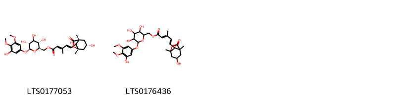{ width=100% }
    <figcaption>Hình ảnh cấu trúc hóa học của 2 hoạt chất thuộc nhóm Prenol lipids gồm ['[(2r,3s,4s,5r,6s)-3,4,5-trihydroxy-6-(3-hydroxy-4,5-dimethoxyphenoxy)oxan-2-yl]methyl (2e,4e)-5-[(1r,3s,5s,8s)-3,8-dihydroxy-1,5-dimethyl-7-oxo-6-oxabicyclo[3.2.1]octan-8-yl]-3-methylpenta-2,4-dienoate (LTS0177053)', '[3,4,5-trihydroxy-6-(3-hydroxy-4,5-dimethoxyphenoxy)oxan-2-yl]methyl 5-{3,8-dihydroxy-1,5-dimethyl-7-oxo-6-oxabicyclo[3.2.1]octan-8-yl}-3-methylpenta-2,4-dienoate (LTS0176436)'].</figcaption>
</figure>
#### Nhóm Steroids and steroid derivatives
<figure markdown="span">
    { width=100% }
    <figcaption>Hình ảnh cấu trúc hóa học của 2 hoạt chất thuộc nhóm Steroids and steroid derivatives gồm ['phytosterol (LTS0029311)', 'stigmasterol (LTS0024262)'].</figcaption>
</figure>

---

### Dược dân tộc học

Danh sách các quốc gia có sử dụng *Litsea glutinosa* trong điều trị các bệnh. 

| Country     | Disease     | Bệnh                                                                                                                                                                                                |
|:------------|:------------|:----------------------------------------------------------------------------------------------------------------------------------------------------------------------------------------------------|
| Elsewhere   | Astringent  | MYMEMORY WARNING: YOU USED ALL AVAILABLE FREE TRANSLATIONS FOR TODAY. NEXT AVAILABLE IN  02 HOURS 24 MINUTES 45 SECONDS VISIT HTTPS://MYMEMORY.TRANSLATED.NET/DOC/USAGELIMITS.PHP TO TRANSLATE MORE |
| Philippines | Emmenagogue | MYMEMORY WARNING: YOU USED ALL AVAILABLE FREE TRANSLATIONS FOR TODAY. NEXT AVAILABLE IN  02 HOURS 24 MINUTES 43 SECONDS VISIT HTTPS://MYMEMORY.TRANSLATED.NET/DOC/USAGELIMITS.PHP TO TRANSLATE MORE |

---

---
## Litsea monopetala
### Thông tin về thực vật

!!! info "Phân loại thực vật của *Litsea monopetala* từ GIBF:"
    - **Kingdom:** Plantae
    - **Phylum:** Tracheophyta
    - **Order:** Laurales
    - **Family:** Lauraceae
    - **Genus:** Litsea
    - **Species:** *Litsea monopetala*

 

| Label (VI)   | Label (EN)   | Scientific Name   | Descriptions (VI)   | Descriptions (EN)   | Also Known As (VI)   | Also Known As (EN)                  |
|:-------------|:-------------|:------------------|:--------------------|:--------------------|:---------------------|:------------------------------------|
| N/A          | N/A          | Litsea monopetala | loài thực vật       | species of plant    | ['']                 | ['Meda', 'Persimmon-leaved Litsea'] |

#### Phân bố trên thế giới

**Từ CSDL GIBF** Lao People’s Democratic Republic, Cambodia, Mauritius, Myanmar, unknown or invalid, Pakistan, Réunion, Bangladesh, Hong Kong, Thailand, Bhutan, France, Viet Nam, China, Madagascar, India, Indonesia, Malaysia, Nepal

#### Phân bố tại Việt Nam

**Từ CSDL GIBF**: Kon Tum, Hoa Binh, Ha Tinh, Bac Thai, Ninh Binh, Thà nh phá»' Há»" Chí Minh, Ha Giang

---
### Thành phần hóa học
        
- Theo cơ sở dữ liệu lotus: Từ loài *Litsea monopetala* đã phân lập và xác định được 6 hoạt chất thuộc về các nhóm Organooxygen compounds. 

|    | chemicalTaxonomyClassyfireClass   |   smiles_count |
|---:|:----------------------------------|---------------:|
|  0 | Organooxygen compounds            |              6 |

#### Nhóm Organooxygen compounds
<figure markdown="span">
    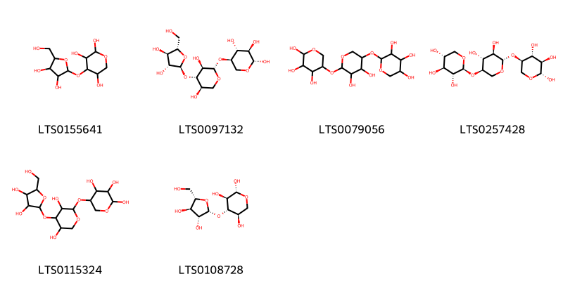{ width=100% }
    <figcaption>Hình ảnh cấu trúc hóa học của 6 hoạt chất thuộc nhóm Organooxygen compounds gồm ['4-{[3,4-dihydroxy-5-(hydroxymethyl)oxolan-2-yl]oxy}oxane-2,3,5-triol (LTS0155641)', '(2r,3r,4r,5r)-5-{[(2s,3r,4s,5r)-4-{[(2s,3r,4r,5s)-3,4-dihydroxy-5-(hydroxymethyl)oxolan-2-yl]oxy}-3,5-dihydroxyoxan-2-yl]oxy}oxane-2,3,4-triol (LTS0097132)', '2-({4,5-dihydroxy-6-[(4,5,6-trihydroxyoxan-3-yl)oxy]oxan-3-yl}oxy)oxane-3,4,5-triol (LTS0079056)', '(2s,3r,4s,5r)-2-{[(3r,4r,5r,6s)-4,5-dihydroxy-6-{[(3r,4r,5r,6r)-4,5,6-trihydroxyoxan-3-yl]oxy}oxan-3-yl]oxy}oxane-3,4,5-triol (LTS0257428)', '5-[(4-{[3,4-dihydroxy-5-(hydroxymethyl)oxolan-2-yl]oxy}-3,5-dihydroxyoxan-2-yl)oxy]oxane-2,3,4-triol (LTS0115324)', '(2r,3r,4s,5r)-4-{[(2r,3r,4r,5s)-3,4-dihydroxy-5-(hydroxymethyl)oxolan-2-yl]oxy}oxane-2,3,5-triol (LTS0108728)'].</figcaption>
</figure>

---

### Dược dân tộc học

Danh sách các quốc gia có sử dụng *Litsea monopetala* trong điều trị các bệnh. 

| Country   | Disease    | Bệnh                                                                                                                                                                                                |
|:----------|:-----------|:----------------------------------------------------------------------------------------------------------------------------------------------------------------------------------------------------|
| Elsewhere | Astringent | MYMEMORY WARNING: YOU USED ALL AVAILABLE FREE TRANSLATIONS FOR TODAY. NEXT AVAILABLE IN  02 HOURS 24 MINUTES 07 SECONDS VISIT HTTPS://MYMEMORY.TRANSLATED.NET/DOC/USAGELIMITS.PHP TO TRANSLATE MORE |

---

---
## Litsea odorifera
### Thông tin về thực vật

!!! info "Phân loại thực vật của *Litsea elliptica* từ GIBF:"
    - **Kingdom:** Plantae
    - **Phylum:** Tracheophyta
    - **Order:** Laurales
    - **Family:** Lauraceae
    - **Genus:** Litsea
    - **Species:** *Litsea elliptica*

 

| Label (VI)   | Label (EN)   | Scientific Name   | Descriptions (VI)   | Descriptions (EN)   | Also Known As (VI)   | Also Known As (EN)   |
|:-------------|:-------------|:------------------|:--------------------|:--------------------|:---------------------|:---------------------|
| N/A          | N/A          | Litsea odorifera  |                     | species of plant    | ['']                 | ['']                 |

#### Phân bố trên thế giới

**Từ CSDL GIBF** nan, Indonesia, Malaysia, Philippines

#### Phân bố tại Việt Nam

**Từ CSDL GIBF**: Không có ghi nhận ở Việt Nam

---
### Thành phần hóa học
        
- Theo cơ sở dữ liệu lotus: Từ loài *Litsea elliptica* đã phân lập và xác định được Chưa có hoạt chất nào được phân lập. hoạt chất thuộc về các nhóm Không có hoạt chất nào được phân lập. 

Không có hình ảnh nào được tạo ra

---

### Dược dân tộc học

Danh sách các quốc gia có sử dụng *Litsea elliptica* trong điều trị các bệnh. 

| Country   | Disease    | Bệnh                                                                                                                                                                                                |
|:----------|:-----------|:----------------------------------------------------------------------------------------------------------------------------------------------------------------------------------------------------|
| Malaya    | Lactagogue | MYMEMORY WARNING: YOU USED ALL AVAILABLE FREE TRANSLATIONS FOR TODAY. NEXT AVAILABLE IN  02 HOURS 23 MINUTES 46 SECONDS VISIT HTTPS://MYMEMORY.TRANSLATED.NET/DOC/USAGELIMITS.PHP TO TRANSLATE MORE |

---

---
## Litsea variabilis
### Thông tin về thực vật

!!! info "Phân loại thực vật của *Litsea variabilis* từ GIBF:"
    - **Kingdom:** Plantae
    - **Phylum:** Tracheophyta
    - **Order:** Laurales
    - **Family:** Lauraceae
    - **Genus:** Litsea
    - **Species:** *Litsea variabilis*

 

| Label (VI)   | Label (EN)   | Scientific Name   | Descriptions (VI)   | Descriptions (EN)   | Also Known As (VI)   | Also Known As (EN)   |
|:-------------|:-------------|:------------------|:--------------------|:--------------------|:---------------------|:---------------------|
| N/A          | N/A          | Litsea variabilis | loài thực vật       | species of plant    | ['']                 | ['']                 |

#### Phân bố trên thế giới

**Từ CSDL GIBF** Thailand, Lao People’s Democratic Republic, Cambodia, Viet Nam, China

#### Phân bố tại Việt Nam

**Từ CSDL GIBF**: Tonkin, Lao Cai, 谅山省

---
### Thành phần hóa học
        
- Theo cơ sở dữ liệu lotus: Từ loài *Litsea variabilis* đã phân lập và xác định được Chưa có hoạt chất nào được phân lập. hoạt chất thuộc về các nhóm Không có hoạt chất nào được phân lập. 

Không có hình ảnh nào được tạo ra

---

### Dược dân tộc học

Danh sách các quốc gia có sử dụng *Litsea variabilis* trong điều trị các bệnh. 

| Country   | Disease   | Bệnh                                                                                                                                                                                                |
|:----------|:----------|:----------------------------------------------------------------------------------------------------------------------------------------------------------------------------------------------------|
| Hainan    | Poison    | MYMEMORY WARNING: YOU USED ALL AVAILABLE FREE TRANSLATIONS FOR TODAY. NEXT AVAILABLE IN  02 HOURS 23 MINUTES 30 SECONDS VISIT HTTPS://MYMEMORY.TRANSLATED.NET/DOC/USAGELIMITS.PHP TO TRANSLATE MORE |

---

# Chi Phoebe

??? note "Danh sách các dược liệu thuộc chi"
    
	 - *Phoebe mexicana*

---
## Phoebe mexicana
### Thông tin về thực vật

!!! info "Phân loại thực vật của *N/A* từ GIBF:"
    - **Kingdom:** N/A
    - **Phylum:** N/A
    - **Order:** N/A
    - **Family:** N/A
    - **Genus:** N/A
    - **Species:** *N/A*

 

| Label (VI)   | Label (EN)   | Scientific Name   | Descriptions (VI)   | Descriptions (EN)   | Also Known As (VI)   | Also Known As (EN)   |
|:-------------|:-------------|:------------------|:--------------------|:--------------------|:---------------------|:---------------------|
| N/A          | N/A          | Phoebe mexicana   |                     | species of beetle   | ['']                 | ['']                 |
| N/A          | N/A          | Phoebe mexicana   |                     | species of plant    | ['']                 | ['']                 |

#### Phân bố trên thế giới

**Từ CSDL GIBF** Không có kết quả phù hợp

#### Phân bố tại Việt Nam

**Từ CSDL GIBF**: Không có ghi nhận ở Việt Nam

---
### Thành phần hóa học
        
- Theo cơ sở dữ liệu lotus: Từ loài *N/A* đã phân lập và xác định được 2 hoạt chất thuộc về các nhóm Furanoid lignans, Flavonoids. 

|    | chemicalTaxonomyClassyfireClass   |   smiles_count |
|---:|:----------------------------------|---------------:|
|  0 | Flavonoids                        |              1 |
|  1 | Furanoid lignans                  |              1 |

#### Nhóm Flavonoids
<figure markdown="span">
    { width=100% }
    <figcaption>Hình ảnh cấu trúc hóa học của 1 hoạt chất thuộc nhóm Flavonoids gồm ['ent-epicatechin (LTS0265245)'].</figcaption>
</figure>
#### Nhóm Furanoid lignans
<figure markdown="span">
    { width=100% }
    <figcaption>Hình ảnh cấu trúc hóa học của 1 hoạt chất thuộc nhóm Furanoid lignans gồm ['sesamin (LTS0120161)'].</figcaption>
</figure>

---

### Dược dân tộc học

Danh sách các quốc gia có sử dụng *N/A* trong điều trị các bệnh. 

| Country   | Disease    | Bệnh                                                                                                                                                                                                |
|:----------|:-----------|:----------------------------------------------------------------------------------------------------------------------------------------------------------------------------------------------------|
| Elsewhere | Depressant | MYMEMORY WARNING: YOU USED ALL AVAILABLE FREE TRANSLATIONS FOR TODAY. NEXT AVAILABLE IN  02 HOURS 23 MINUTES 11 SECONDS VISIT HTTPS://MYMEMORY.TRANSLATED.NET/DOC/USAGELIMITS.PHP TO TRANSLATE MORE |

---

# Chi Misanteca

??? note "Danh sách các dược liệu thuộc chi"
    
	 - *Misanteca anacardioides*

---
## Misanteca anacardioides
### Thông tin về thực vật

!!! info "Phân loại thực vật của *Mezilaurus ita-uba* từ GIBF:"
    - **Kingdom:** Plantae
    - **Phylum:** Tracheophyta
    - **Order:** Laurales
    - **Family:** Lauraceae
    - **Genus:** Mezilaurus
    - **Species:** *Mezilaurus ita-uba*

 

| Label (VI)   | Label (EN)   | Scientific Name   | Descriptions (VI)   | Descriptions (EN)   | Also Known As (VI)   | Also Known As (EN)   |
|:-------------|:-------------|:------------------|:--------------------|:--------------------|:---------------------|:---------------------|
| N/A          | N/A          | Phoebe mexicana   |                     | species of beetle   | ['']                 | ['']                 |
| N/A          | N/A          | Phoebe mexicana   |                     | species of plant    | ['']                 | ['']                 |

#### Phân bố trên thế giới

**Từ CSDL GIBF** Không có kết quả phù hợp

#### Phân bố tại Việt Nam

**Từ CSDL GIBF**: Không có ghi nhận ở Việt Nam

---
### Thành phần hóa học
        
- Theo cơ sở dữ liệu lotus: Từ loài *Mezilaurus ita-uba* đã phân lập và xác định được Chưa có hoạt chất nào được phân lập. hoạt chất thuộc về các nhóm Không có hoạt chất nào được phân lập. 

Không có hình ảnh nào được tạo ra

---

### Dược dân tộc học

Danh sách các quốc gia có sử dụng *Mezilaurus ita-uba* trong điều trị các bệnh. 

| Country   | Disease       | Bệnh                                                                                                                                                                                                |
|:----------|:--------------|:----------------------------------------------------------------------------------------------------------------------------------------------------------------------------------------------------|
| Brazil    | Abortifacient | MYMEMORY WARNING: YOU USED ALL AVAILABLE FREE TRANSLATIONS FOR TODAY. NEXT AVAILABLE IN  02 HOURS 22 MINUTES 52 SECONDS VISIT HTTPS://MYMEMORY.TRANSLATED.NET/DOC/USAGELIMITS.PHP TO TRANSLATE MORE |

---

# Chi Alseodaphne

??? note "Danh sách các dược liệu thuộc chi"
    
	 - *Alseodaphne perakensis*

---
## Alseodaphne perakensis
### Thông tin về thực vật

!!! info "Phân loại thực vật của *Alseodaphne perakensis* từ GIBF:"
    - **Kingdom:** Plantae
    - **Phylum:** Tracheophyta
    - **Order:** Laurales
    - **Family:** Lauraceae
    - **Genus:** Alseodaphne
    - **Species:** *Alseodaphne perakensis*

 

| Label (VI)   | Label (EN)   | Scientific Name        | Descriptions (VI)   | Descriptions (EN)   | Also Known As (VI)   | Also Known As (EN)   |
|:-------------|:-------------|:-----------------------|:--------------------|:--------------------|:---------------------|:---------------------|
| N/A          | N/A          | Alseodaphne perakensis | loài thực vật       | species of plant    | ['']                 | ['']                 |

#### Phân bố trên thế giới

**Từ CSDL GIBF** nan, Indonesia, unknown or invalid, Malaysia

#### Phân bố tại Việt Nam

**Từ CSDL GIBF**: Không có ghi nhận ở Việt Nam

---
### Thành phần hóa học
        
- Theo cơ sở dữ liệu lotus: Từ loài *Alseodaphne perakensis* đã phân lập và xác định được 5 hoạt chất thuộc về các nhóm Aporphines. 

|    | chemicalTaxonomyClassyfireClass   |   smiles_count |
|---:|:----------------------------------|---------------:|
|  0 | Aporphines                        |              5 |

#### Nhóm Aporphines
<figure markdown="span">
    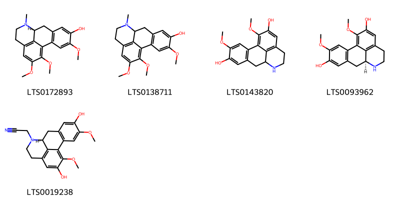{ width=100% }
    <figcaption>Hình ảnh cấu trúc hóa học của 5 hoạt chất thuộc nhóm Aporphines gồm ['(9s)-4,15,16-trimethoxy-10-methyl-10-azatetracyclo[7.7.1.0²,⁷.0¹³,¹⁷]heptadeca-1(16),2(7),3,5,13(17),14-hexaen-5-ol (LTS0172893)', '4,15,16-trimethoxy-10-methyl-10-azatetracyclo[7.7.1.0²,⁷.0¹³,¹⁷]heptadeca-1(16),2(7),3,5,13(17),14-hexaen-5-ol (LTS0138711)', '4,16-dimethoxy-10-azatetracyclo[7.7.1.0²,⁷.0¹³,¹⁷]heptadeca-1(17),2(7),3,5,13,15-hexaene-5,15-diol (LTS0143820)', 'laurolitsine (LTS0093962)', '2-[(9s)-5,15-dihydroxy-4,16-dimethoxy-10-azatetracyclo[7.7.1.0²,⁷.0¹³,¹⁷]heptadeca-1(16),2(7),3,5,13(17),14-hexaen-10-yl]acetonitrile (LTS0019238)'].</figcaption>
</figure>

---

### Dược dân tộc học

Danh sách các quốc gia có sử dụng *Alseodaphne perakensis* trong điều trị các bệnh. 

| Country   | Disease   | Bệnh                                                                                                                                                                                                |
|:----------|:----------|:----------------------------------------------------------------------------------------------------------------------------------------------------------------------------------------------------|
| Malaya    | Poison    | MYMEMORY WARNING: YOU USED ALL AVAILABLE FREE TRANSLATIONS FOR TODAY. NEXT AVAILABLE IN  02 HOURS 22 MINUTES 38 SECONDS VISIT HTTPS://MYMEMORY.TRANSLATED.NET/DOC/USAGELIMITS.PHP TO TRANSLATE MORE |

---

# Chi Dicypellium

??? note "Danh sách các dược liệu thuộc chi"
    
	 - *Dicypellium caryophyllatum*

---
## Dicypellium caryophyllatum
### Thông tin về thực vật

!!! info "Phân loại thực vật của *Dicypellium caryophyllaceum* từ GIBF:"
    - **Kingdom:** Plantae
    - **Phylum:** Tracheophyta
    - **Order:** Laurales
    - **Family:** Lauraceae
    - **Genus:** Dicypellium
    - **Species:** *Dicypellium caryophyllaceum*

 

| Label (VI)   | Label (EN)   | Scientific Name            | Descriptions (VI)   | Descriptions (EN)   | Also Known As (VI)   | Also Known As (EN)   |
|:-------------|:-------------|:---------------------------|:--------------------|:--------------------|:---------------------|:---------------------|
| N/A          | N/A          | Dicypellium caryophyllatum | loài thực vật       | species of plant    | ['']                 | ['']                 |

#### Phân bố trên thế giới

**Từ CSDL GIBF** nan, Brazil, unknown or invalid, Indonesia, Singapore, Malaysia, French Guiana

#### Phân bố tại Việt Nam

**Từ CSDL GIBF**: Không có ghi nhận ở Việt Nam

---
### Thành phần hóa học
        
- Theo cơ sở dữ liệu lotus: Từ loài *Dicypellium caryophyllaceum* đã phân lập và xác định được Chưa có hoạt chất nào được phân lập. hoạt chất thuộc về các nhóm Không có hoạt chất nào được phân lập. 

Không có hình ảnh nào được tạo ra

---

### Dược dân tộc học

Danh sách các quốc gia có sử dụng *Dicypellium caryophyllaceum* trong điều trị các bệnh. 

| Country   | Disease   | Bệnh                                                                                                                                                                                                |
|:----------|:----------|:----------------------------------------------------------------------------------------------------------------------------------------------------------------------------------------------------|
| Turkey    | Perfume   | MYMEMORY WARNING: YOU USED ALL AVAILABLE FREE TRANSLATIONS FOR TODAY. NEXT AVAILABLE IN  02 HOURS 22 MINUTES 22 SECONDS VISIT HTTPS://MYMEMORY.TRANSLATED.NET/DOC/USAGELIMITS.PHP TO TRANSLATE MORE |

---

# Chi Beilschmiedia

??? note "Danh sách các dược liệu thuộc chi"
    
	 - *Beilschmiedia madang*

---
## Beilschmiedia madang
### Thông tin về thực vật

!!! info "Phân loại thực vật của *Beilschmiedia madang* từ GIBF:"
    - **Kingdom:** Plantae
    - **Phylum:** Tracheophyta
    - **Order:** Laurales
    - **Family:** Lauraceae
    - **Genus:** Beilschmiedia
    - **Species:** *Beilschmiedia madang*

 

| Label (VI)   | Label (EN)   | Scientific Name      | Descriptions (VI)   | Descriptions (EN)   | Also Known As (VI)   | Also Known As (EN)   |
|:-------------|:-------------|:---------------------|:--------------------|:--------------------|:---------------------|:---------------------|
| N/A          | N/A          | Beilschmiedia madang | loài thực vật       | species of plant    | ['']                 | ['']                 |

#### Phân bố trên thế giới

**Từ CSDL GIBF** nan, unknown or invalid, Indonesia, Singapore, Malaysia

#### Phân bố tại Việt Nam

**Từ CSDL GIBF**: Không có ghi nhận ở Việt Nam

---
### Thành phần hóa học
        
- Theo cơ sở dữ liệu lotus: Từ loài *Beilschmiedia madang* đã phân lập và xác định được 1 hoạt chất thuộc về các nhóm . 

|    | chemicalTaxonomyClassyfireClass   |   smiles_count |
|---:|:----------------------------------|---------------:|
|  0 |                                   |              1 |

#### Nhóm 
<figure markdown="span">
    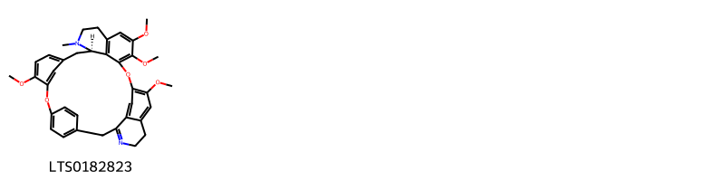{ width=100% }
    <figcaption>Hình ảnh cấu trúc hóa học của 1 hoạt chất thuộc nhóm  gồm ['(14r)-9,20,21,25-tetramethoxy-15-methyl-7,23-dioxa-15,30-diazaheptacyclo[22.6.2.2³,⁶.1⁸,¹².1¹⁴,¹⁸.0²⁷,³¹.0²²,³³]hexatriaconta-1(30),3,5,8(34),9,11,18(33),19,21,24,26,31,35-tridecaene (LTS0182823)'].</figcaption>
</figure>

---

### Dược dân tộc học

Danh sách các quốc gia có sử dụng *Beilschmiedia madang* trong điều trị các bệnh. 

| Country   | Disease    | Bệnh                                                                                                                                                                                                |
|:----------|:-----------|:----------------------------------------------------------------------------------------------------------------------------------------------------------------------------------------------------|
| Borneo    | Astringent | MYMEMORY WARNING: YOU USED ALL AVAILABLE FREE TRANSLATIONS FOR TODAY. NEXT AVAILABLE IN  02 HOURS 22 MINUTES 06 SECONDS VISIT HTTPS://MYMEMORY.TRANSLATED.NET/DOC/USAGELIMITS.PHP TO TRANSLATE MORE |

---

# Chi Cassytha

??? note "Danh sách các dược liệu thuộc chi"
    
	 - *Cassytha filiformis*

---
## Cassytha filiformis
### Thông tin về thực vật

!!! info "Phân loại thực vật của *Cassytha filiformis* từ GIBF:"
    - **Kingdom:** Plantae
    - **Phylum:** Tracheophyta
    - **Order:** Laurales
    - **Family:** Lauraceae
    - **Genus:** Cassytha
    - **Species:** *Cassytha filiformis*

 

| Label (VI)   | Label (EN)   | Scientific Name     | Descriptions (VI)   | Descriptions (EN)   | Also Known As (VI)   | Also Known As (EN)           |
|:-------------|:-------------|:--------------------|:--------------------|:--------------------|:---------------------|:-----------------------------|
| N/A          | N/A          | Cassytha filiformis | loài thực vật       | species of plant    | ['']                 | ['Air Creeper', 'Love vine'] |

#### Phân bố trên thế giới

**Từ CSDL GIBF** Palau, Micronesia (Federated States of), Australia, Japan, Cook Islands, Mozambique, Sierra Leone, French Guiana, Puerto Rico, Nigeria, Tuvalu, Chinese Taipei, Jamaica, United States of America, Liberia, Belize, Trinidad and Tobago, Fiji, South Africa, Hong Kong, Marshall Islands, Turks and Caicos Islands, Thailand, Brazil, Bahamas, New Caledonia, Cuba, Dominican Republic, Mexico, Singapore, Niue, India, Indonesia, Samoa, Northern Mariana Islands, Ethiopia

#### Phân bố tại Việt Nam

**Từ CSDL GIBF**: Không có ghi nhận ở Việt Nam

---
### Thành phần hóa học
        
- Theo cơ sở dữ liệu lotus: Từ loài *Cassytha filiformis* đã phân lập và xác định được 79 hoạt chất thuộc về các nhóm Flavonoids, Steroids and steroid derivatives, Cinnamic acids and derivatives, Aporphines, Phenanthrenes and derivatives, Purine nucleosides, 2-arylbenzofuran flavonoids, Organooxygen compounds, Phenols, Furanoid lignans, Pyridines and derivatives. 

|    | chemicalTaxonomyClassyfireClass   |   smiles_count |
|---:|:----------------------------------|---------------:|
|  0 | 2-arylbenzofuran flavonoids       |              4 |
|  1 | Aporphines                        |             33 |
|  2 | Cinnamic acids and derivatives    |              3 |
|  3 | Flavonoids                        |             17 |
|  4 | Furanoid lignans                  |              4 |
|  5 | Organooxygen compounds            |              4 |
|  6 | Phenanthrenes and derivatives     |              6 |
|  7 | Phenols                           |              2 |
|  8 | Purine nucleosides                |              3 |
|  9 | Pyridines and derivatives         |              1 |
| 10 | Steroids and steroid derivatives  |              2 |

#### Nhóm 2-arylbenzofuran flavonoids
<figure markdown="span">
    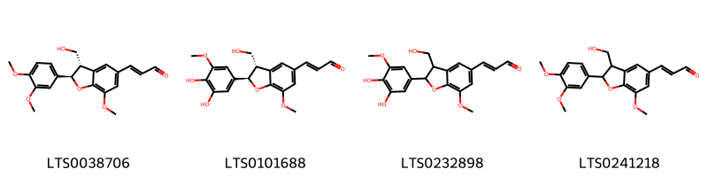{ width=100% }
    <figcaption>Hình ảnh cấu trúc hóa học của 4 hoạt chất thuộc nhóm 2-arylbenzofuran flavonoids gồm ['(2e)-3-[(2r,3s)-2-(3,4-dimethoxyphenyl)-3-(hydroxymethyl)-7-methoxy-2,3-dihydro-1-benzofuran-5-yl]prop-2-enal (LTS0038706)', '(2e)-3-[(2r,3s)-2-(3,4-dihydroxy-5-methoxyphenyl)-3-(hydroxymethyl)-7-methoxy-2,3-dihydro-1-benzofuran-5-yl]prop-2-enal (LTS0101688)', '3-[2-(3,4-dihydroxy-5-methoxyphenyl)-3-(hydroxymethyl)-7-methoxy-2,3-dihydro-1-benzofuran-5-yl]prop-2-enal (LTS0232898)', '3-[2-(3,4-dimethoxyphenyl)-3-(hydroxymethyl)-7-methoxy-2,3-dihydro-1-benzofuran-5-yl]prop-2-enal (LTS0241218)'].</figcaption>
</figure>
#### Nhóm Aporphines
<figure markdown="span">
    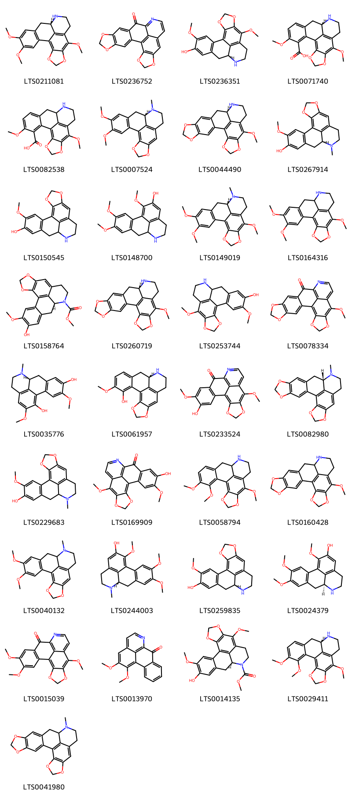{ width=100% }
    <figcaption>Hình ảnh cấu trúc hóa học của 33 hoạt chất thuộc nhóm Aporphines gồm ['(12s)-7,16,17-trimethoxy-3,5-dioxa-11-azapentacyclo[10.7.1.0²,⁶.0⁸,²⁰.0¹⁴,¹⁹]icosa-1,6,8(20),14(19),15,17-hexaene (LTS0211081)', '5,7,19,21-tetraoxa-13-azahexacyclo[10.10.1.0²,¹⁰.0⁴,⁸.0¹⁶,²³.0¹⁸,²²]tricosa-1(22),2,4(8),9,12(23),13,15,17-octaen-11-one (LTS0236752)', 'cassythine (LTS0236351)', '(12s)-7,17-dimethoxy-3,5-dioxa-11-azapentacyclo[10.7.1.0²,⁶.0⁸,²⁰.0¹⁴,¹⁹]icosa-1,6,8(20),14,16,18-hexaene-18-carboxylic acid (LTS0071740)', '7,17-dimethoxy-3,5-dioxa-11-azapentacyclo[10.7.1.0²,⁶.0⁸,²⁰.0¹⁴,¹⁹]icosa-1,6,8(20),14,16,18-hexaene-18-carboxylic acid (LTS0082538)', '(12s)-16,17-dimethoxy-11-methyl-3,5-dioxa-11-azapentacyclo[10.7.1.0²,⁶.0⁸,²⁰.0¹⁴,¹⁹]icosa-1,6,8(20),14(19),15,17-hexaene (LTS0007524)', '(12r)-17-methoxy-5,7,19,21-tetraoxa-13-azahexacyclo[10.10.1.0²,¹⁰.0⁴,⁸.0¹⁶,²³.0¹⁸,²²]tricosa-1(23),2,4(8),9,16,18(22)-hexaene (LTS0044490)', '(12s)-17-methoxy-11-methyl-3,5-dioxa-11-azapentacyclo[10.7.1.0²,⁶.0⁸,²⁰.0¹⁴,¹⁹]icosa-1,6,8(20),14(19),15,17-hexaen-16-ol (LTS0267914)', '17-methoxy-3,5-dioxa-11-azapentacyclo[10.7.1.0²,⁶.0⁸,²⁰.0¹⁴,¹⁹]icosa-1(20),2(6),7,14(19),15,17-hexaen-16-ol (LTS0150545)', '4,5,16-trimethoxy-10-azatetracyclo[7.7.1.0²,⁷.0¹³,¹⁷]heptadeca-1(16),2(7),3,5,13(17),14-hexaen-15-ol (LTS0148700)', '(12s)-7,16,17-trimethoxy-11-methyl-3,5-dioxa-11-azapentacyclo[10.7.1.0²,⁶.0⁸,²⁰.0¹⁴,¹⁹]icosa-1,6,8(20),14(19),15,17-hexaene (LTS0149019)', '7,16,17-trimethoxy-3,5-dioxa-11-azapentacyclo[10.7.1.0²,⁶.0⁸,²⁰.0¹⁴,¹⁹]icosa-1,6,8(20),14(19),15,17-hexaene (LTS0164316)', 'methyl (12s)-16-hydroxy-17-methoxy-3,5-dioxa-11-azapentacyclo[10.7.1.0²,⁶.0⁸,²⁰.0¹⁴,¹⁹]icosa-1(20),2(6),7,14,16,18-hexaene-11-carboxylate (LTS0158764)', '(12s)-17-methoxy-5,7,19,21-tetraoxa-13-azahexacyclo[10.10.1.0²,¹⁰.0⁴,⁸.0¹⁶,²³.0¹⁸,²²]tricosa-1(23),2,4(8),9,16,18(22)-hexaene (LTS0260719)', '7,17-dimethoxy-3,5-dioxa-11-azapentacyclo[10.7.1.0²,⁶.0⁸,²⁰.0¹⁴,¹⁹]icosa-1(20),2(6),7,14(19),15,17-hexaen-16-ol (LTS0253744)', '17-methoxy-5,7,19,21-tetraoxa-13-azahexacyclo[10.10.1.0²,¹⁰.0⁴,⁸.0¹⁶,²³.0¹⁸,²²]tricosa-1(22),2,4(8),9,12(23),13,15,17-octaen-11-one (LTS0078334)', '(9s)-4,15-dimethoxy-10-methyl-10-azatetracyclo[7.7.1.0²,⁷.0¹³,¹⁷]heptadeca-1(16),2(7),3,5,13(17),14-hexaene-5,16-diol (LTS0035776)', '(12s)-17-methoxy-3,5-dioxa-11-azapentacyclo[10.7.1.0²,⁶.0⁸,²⁰.0¹⁴,¹⁹]icosa-1,6,8(20),14,16,18-hexaen-18-ol (LTS0061957)', '17-hydroxy-7,16-dimethoxy-3,5-dioxa-11-azapentacyclo[10.7.1.0²,⁶.0⁸,²⁰.0¹⁴,¹⁹]icosa-1,6,8,10,12(20),14(19),15,17-octaen-13-one (LTS0233524)', 'neolitsine (LTS0082980)', '17-methoxy-11-methyl-3,5-dioxa-11-azapentacyclo[10.7.1.0²,⁶.0⁸,²⁰.0¹⁴,¹⁹]icosa-1,6,8(20),14(19),15,17-hexaen-16-ol (LTS0229683)', '16-hydroxy-7,17-dimethoxy-3,5-dioxa-11-azapentacyclo[10.7.1.0²,⁶.0⁸,²⁰.0¹⁴,¹⁹]icosa-1(20),2(6),7,9,11,14(19),15,17-octaen-13-one (LTS0169909)', '7,17,18-trimethoxy-3,5-dioxa-11-azapentacyclo[10.7.1.0²,⁶.0⁸,²⁰.0¹⁴,¹⁹]icosa-1,6,8(20),14,16,18-hexaene (LTS0058794)', '17-methoxy-5,7,19,21-tetraoxa-13-azahexacyclo[10.10.1.0²,¹⁰.0⁴,⁸.0¹⁶,²³.0¹⁸,²²]tricosa-1(23),2,4(8),9,16,18(22)-hexaene (LTS0160428)', '16,17-dimethoxy-11-methyl-3,5-dioxa-11-azapentacyclo[10.7.1.0²,⁶.0⁸,²⁰.0¹⁴,¹⁹]icosa-1,6,8(20),14(19),15,17-hexaene (LTS0040132)', '(9s)-4,5,16-trimethoxy-10-methyl-10-azatetracyclo[7.7.1.0²,⁷.0¹³,¹⁷]heptadeca-1(16),2(7),3,5,13(17),14-hexaen-15-ol (LTS0244003)', '(+)-actinodaphnine (LTS0259835)', '(9s)-4,5,16-trimethoxy-10-azatetracyclo[7.7.1.0²,⁷.0¹³,¹⁷]heptadeca-1(16),2(7),3,5,13(17),14-hexaen-15-ol (LTS0024379)', '7,16,17-trimethoxy-3,5-dioxa-11-azapentacyclo[10.7.1.0²,⁶.0⁸,²⁰.0¹⁴,¹⁹]icosa-1,6,8,10,12(20),14(19),15,17-octaen-13-one (LTS0015039)', 'lysicamine (LTS0013970)', 'methyl (12s)-16-hydroxy-7,17-dimethoxy-3,5-dioxa-11-azapentacyclo[10.7.1.0²,⁶.0⁸,²⁰.0¹⁴,¹⁹]icosa-1(20),2(6),7,14,16,18-hexaene-11-carboxylate (LTS0014135)', '(12s)-7,17,18-trimethoxy-3,5-dioxa-11-azapentacyclo[10.7.1.0²,⁶.0⁸,²⁰.0¹⁴,¹⁹]icosa-1,6,8(20),14,16,18-hexaene (LTS0029411)', '13-methyl-5,7,19,21-tetraoxa-13-azahexacyclo[10.10.1.0²,¹⁰.0⁴,⁸.0¹⁶,²³.0¹⁸,²²]tricosa-1(23),2,4(8),9,16,18(22)-hexaene (LTS0041980)'].</figcaption>
</figure>
#### Nhóm Cinnamic acids and derivatives
<figure markdown="span">
    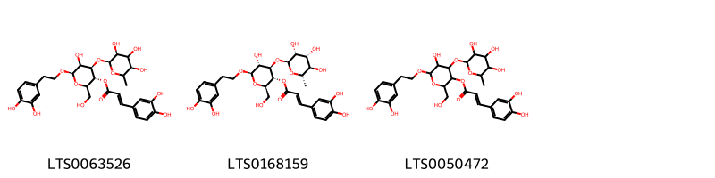{ width=100% }
    <figcaption>Hình ảnh cấu trúc hóa học của 3 hoạt chất thuộc nhóm Cinnamic acids and derivatives gồm ['(3r,4r,6r)-6-[2-(3,4-dihydroxyphenyl)ethoxy]-5-hydroxy-2-(hydroxymethyl)-4-{[(2s,3s,5r)-3,4,5-trihydroxy-6-methyloxan-2-yl]oxy}oxan-3-yl (2e)-3-(3,4-dihydroxyphenyl)prop-2-enoate (LTS0063526)', 'verbascoside (LTS0168159)', '6-[2-(3,4-dihydroxyphenyl)ethoxy]-5-hydroxy-2-(hydroxymethyl)-4-[(3,4,5-trihydroxy-6-methyloxan-2-yl)oxy]oxan-3-yl 3-(3,4-dihydroxyphenyl)prop-2-enoate (LTS0050472)'].</figcaption>
</figure>
#### Nhóm Flavonoids
<figure markdown="span">
    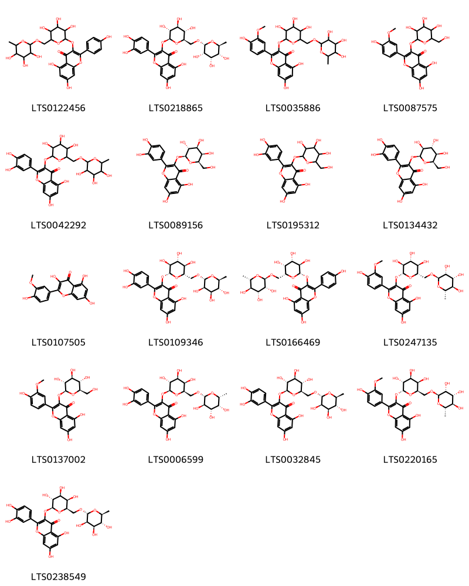{ width=100% }
    <figcaption>Hình ảnh cấu trúc hóa học của 17 hoạt chất thuộc nhóm Flavonoids gồm ['5,7-dihydroxy-2-(4-hydroxyphenyl)-3-[(3,4,5-trihydroxy-6-{[(3,4,5-trihydroxy-6-methyloxan-2-yl)oxy]methyl}oxan-2-yl)oxy]chromen-4-one (LTS0122456)', '2-(3,4-dihydroxyphenyl)-5,7-dihydroxy-3-{[(2s,3r,4s,5s,6r)-3,4,5-trihydroxy-6-({[(2r,3s,4s,5r,6s)-3,4,5-trihydroxy-6-methyloxan-2-yl]oxy}methyl)oxan-2-yl]oxy}chromen-4-one (LTS0218865)', '5,7-dihydroxy-2-(4-hydroxy-3-methoxyphenyl)-3-[(3,4,5-trihydroxy-6-{[(3,4,5-trihydroxy-6-methyloxan-2-yl)oxy]methyl}oxan-2-yl)oxy]chromen-4-one (LTS0035886)', 'isorhamnetin 3-galactoside (LTS0087575)', 'rutin (LTS0042292)', 'hyperoside (LTS0089156)', '2-(3,4-dihydroxyphenyl)-5,7-dihydroxy-3-{[3,4,5-trihydroxy-6-(hydroxymethyl)oxan-2-yl]oxy}chromen-4-one (LTS0195312)', '2-(3,4-dihydroxyphenyl)-5,7-dihydroxy-3-{[(2s,3s,4r,5r,6r)-3,4,5-trihydroxy-6-(hydroxymethyl)oxan-2-yl]oxy}chromen-4-one (LTS0134432)', 'isorhamnetin (LTS0107505)', '2-(3,4-dihydroxyphenyl)-5,7-dihydroxy-3-{[(2r,3s,4r,5r,6s)-3,4,5-trihydroxy-6-({[(2r,3r,4r,5r,6s)-3,4,5-trihydroxy-6-methyloxan-2-yl]oxy}methyl)oxan-2-yl]oxy}chromen-4-one (LTS0109346)', '5,7-dihydroxy-2-(4-hydroxyphenyl)-3-{[(2s,3r,4s,5r,6r)-3,4,5-trihydroxy-6-({[(2r,3r,4r,5r,6s)-3,4,5-trihydroxy-6-methyloxan-2-yl]oxy}methyl)oxan-2-yl]oxy}chromen-4-one (LTS0166469)', '5,7-dihydroxy-2-(4-hydroxy-3-methoxyphenyl)-3-{[(2r,3s,4r,5r,6s)-3,4,5-trihydroxy-6-({[(2r,3r,4r,5r,6s)-3,4,5-trihydroxy-6-methyloxan-2-yl]oxy}methyl)oxan-2-yl]oxy}chromen-4-one (LTS0247135)', 'isorhamnetin 3-o-glucoside (LTS0137002)', '2-(3,4-dihydroxyphenyl)-5,7-dihydroxy-3-{[(2s,3r,4s,5r,6r)-3,4,5-trihydroxy-6-({[(2r,3r,4s,5r,6r)-3,4,5-trihydroxy-6-methyloxan-2-yl]oxy}methyl)oxan-2-yl]oxy}chromen-4-one (LTS0006599)', '3-rutinosyl quercetin (LTS0032845)', '5,7-dihydroxy-2-(4-hydroxy-3-methoxyphenyl)-3-{[(2r,3r,4s,5r,6r)-3,4,5-trihydroxy-6-({[(2r,3r,4r,5r,6s)-3,4,5-trihydroxy-6-methyloxan-2-yl]oxy}methyl)oxan-2-yl]oxy}chromen-4-one (LTS0220165)', '2-(3,4-dihydroxyphenyl)-5,7-dihydroxy-3-{[(2s,3r,4s,5r,6r)-3,4,5-trihydroxy-6-({[(2r,3r,4r,5r,6s)-3,4,5-trihydroxy-6-methyloxan-2-yl]oxy}methyl)oxan-2-yl]oxy}chromen-4-one (LTS0238549)'].</figcaption>
</figure>
#### Nhóm Furanoid lignans
<figure markdown="span">
    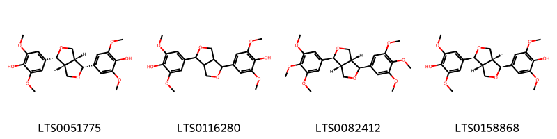{ width=100% }
    <figcaption>Hình ảnh cấu trúc hóa học của 4 hoạt chất thuộc nhóm Furanoid lignans gồm ['4-[(1r,3ar,4r,6ar)-4-(4-hydroxy-3,5-dimethoxyphenyl)-hexahydrofuro[3,4-c]furan-1-yl]-2,6-dimethoxyphenol (LTS0051775)', 'syringaresinol (LTS0116280)', '( )-yangabin (LTS0082412)', '(+)-syringaresinol (LTS0158868)'].</figcaption>
</figure>
#### Nhóm Organooxygen compounds
<figure markdown="span">
    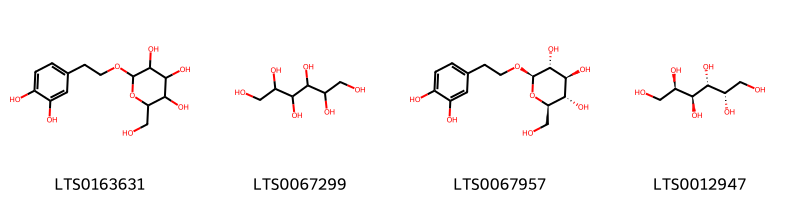{ width=100% }
    <figcaption>Hình ảnh cấu trúc hóa học của 4 hoạt chất thuộc nhóm Organooxygen compounds gồm ['2-[2-(3,4-dihydroxyphenyl)ethoxy]-6-(hydroxymethyl)oxane-3,4,5-triol (LTS0163631)', 'sorbo (LTS0067299)', '(2r,3r,4s,5s,6r)-2-[2-(3,4-dihydroxyphenyl)ethoxy]-6-(hydroxymethyl)oxane-3,4,5-triol (LTS0067957)', 'galactitol (LTS0012947)'].</figcaption>
</figure>
#### Nhóm Phenanthrenes and derivatives
<figure markdown="span">
    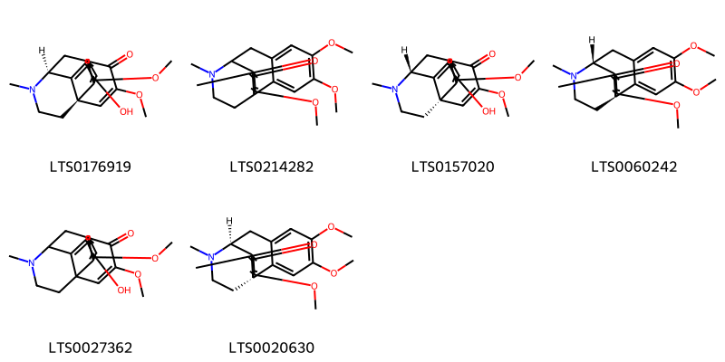{ width=100% }
    <figcaption>Hình ảnh cấu trúc hóa học của 6 hoạt chất thuộc nhóm Phenanthrenes and derivatives gồm ['(-)-salutaridine (LTS0176919)', 'o-methylpallidine (LTS0214282)', 'salutaridine (LTS0157020)', '(1r,9r)-4,5,13-trimethoxy-17-methyl-17-azatetracyclo[7.5.3.0¹,¹⁰.0²,⁷]heptadeca-2,4,6,10,13-pentaen-12-one (LTS0060242)', '3-hydroxy-4,13-dimethoxy-17-methyl-17-azatetracyclo[7.5.3.0¹,¹⁰.0²,⁷]heptadeca-2,4,6,10,13-pentaen-12-one (LTS0027362)', '(1s,9s)-4,5,13-trimethoxy-17-methyl-17-azatetracyclo[7.5.3.0¹,¹⁰.0²,⁷]heptadeca-2,4,6,10,13-pentaen-12-one (LTS0020630)'].</figcaption>
</figure>
#### Nhóm Phenols
<figure markdown="span">
    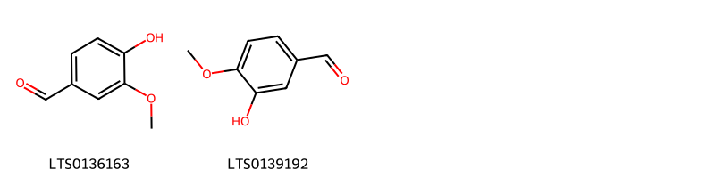{ width=100% }
    <figcaption>Hình ảnh cấu trúc hóa học của 2 hoạt chất thuộc nhóm Phenols gồm ['vanillin (LTS0136163)', 'isovanillin (LTS0139192)'].</figcaption>
</figure>
#### Nhóm Purine nucleosides
<figure markdown="span">
    { width=100% }
    <figcaption>Hình ảnh cấu trúc hóa học của 3 hoạt chất thuộc nhóm Purine nucleosides gồm ['(2r,3s,4r,5s)-2-(6-aminopurin-9-yl)-5-(hydroxymethyl)oxolane-3,4-diol (LTS0178532)', 'adenosine (LTS0052576)', 'adenosine (LTS0014061)'].</figcaption>
</figure>
#### Nhóm Pyridines and derivatives
<figure markdown="span">
    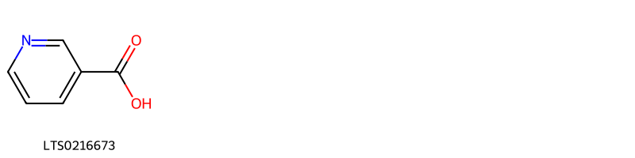{ width=100% }
    <figcaption>Hình ảnh cấu trúc hóa học của 1 hoạt chất thuộc nhóm Pyridines and derivatives gồm ['niacin (LTS0216673)'].</figcaption>
</figure>
#### Nhóm Steroids and steroid derivatives
<figure markdown="span">
    { width=100% }
    <figcaption>Hình ảnh cấu trúc hóa học của 2 hoạt chất thuộc nhóm Steroids and steroid derivatives gồm ['sitogluside (LTS0201798)', '2-{[1-(5-ethyl-6-methylheptan-2-yl)-9a,11a-dimethyl-1h,2h,3h,3ah,3bh,4h,6h,7h,8h,9h,9bh,10h,11h-cyclopenta[a]phenanthren-7-yl]oxy}-6-(hydroxymethyl)oxane-3,4,5-triol (LTS0158828)'].</figcaption>
</figure>

---

### Dược dân tộc học

Danh sách các quốc gia có sử dụng *Cassytha filiformis* trong điều trị các bệnh. 

| Country   | Disease                        | Bệnh                                                                                                                                                                                                |
|:----------|:-------------------------------|:----------------------------------------------------------------------------------------------------------------------------------------------------------------------------------------------------|
| Elsewhere | Poison, Collyrium, Insecticide | MYMEMORY WARNING: YOU USED ALL AVAILABLE FREE TRANSLATIONS FOR TODAY. NEXT AVAILABLE IN  02 HOURS 21 MINUTES 45 SECONDS VISIT HTTPS://MYMEMORY.TRANSLATED.NET/DOC/USAGELIMITS.PHP TO TRANSLATE MORE |
| Java      | Vermifuge                      | MYMEMORY WARNING: YOU USED ALL AVAILABLE FREE TRANSLATIONS FOR TODAY. NEXT AVAILABLE IN  02 HOURS 21 MINUTES 43 SECONDS VISIT HTTPS://MYMEMORY.TRANSLATED.NET/DOC/USAGELIMITS.PHP TO TRANSLATE MORE |

---

# Chi Nectandra

??? note "Danh sách các dược liệu thuộc chi"
    
	 - *Nectandra coto*
	 - *Nectandra rodiaei*

---
## Nectandra coto
### Thông tin về thực vật

!!! info "Phân loại thực vật của *Aniba coto* từ GIBF:"
    - **Kingdom:** Plantae
    - **Phylum:** Tracheophyta
    - **Order:** Laurales
    - **Family:** Lauraceae
    - **Genus:** Aniba
    - **Species:** *Aniba coto*

 

| Label (VI)   | Label (EN)   | Scientific Name   | Descriptions (VI)   | Descriptions (EN)   | Also Known As (VI)   | Also Known As (EN)   |
|:-------------|:-------------|:------------------|:--------------------|:--------------------|:---------------------|:---------------------|
| N/A          | N/A          | Nectandra coto    | loài thực vật       | species of plant    | ['']                 | ['']                 |

#### Phân bố trên thế giới

**Từ CSDL GIBF** nan, Venezuela (Bolivarian Republic of), Bolivia (Plurinational State of)

#### Phân bố tại Việt Nam

**Từ CSDL GIBF**: Không có ghi nhận ở Việt Nam

---
### Thành phần hóa học
        
- Theo cơ sở dữ liệu lotus: Từ loài *Aniba coto* đã phân lập và xác định được Chưa có hoạt chất nào được phân lập. hoạt chất thuộc về các nhóm Không có hoạt chất nào được phân lập. 

Không có hình ảnh nào được tạo ra

---

### Dược dân tộc học

Danh sách các quốc gia có sử dụng *Aniba coto* trong điều trị các bệnh. 

| Country   | Disease    | Bệnh                                                                                                                                                                                                |
|:----------|:-----------|:----------------------------------------------------------------------------------------------------------------------------------------------------------------------------------------------------|
| Dutch     | Astringent | MYMEMORY WARNING: YOU USED ALL AVAILABLE FREE TRANSLATIONS FOR TODAY. NEXT AVAILABLE IN  02 HOURS 21 MINUTES 02 SECONDS VISIT HTTPS://MYMEMORY.TRANSLATED.NET/DOC/USAGELIMITS.PHP TO TRANSLATE MORE |
| English   | Antiseptic | MYMEMORY WARNING: YOU USED ALL AVAILABLE FREE TRANSLATIONS FOR TODAY. NEXT AVAILABLE IN  02 HOURS 20 MINUTES 59 SECONDS VISIT HTTPS://MYMEMORY.TRANSLATED.NET/DOC/USAGELIMITS.PHP TO TRANSLATE MORE |
| German    | Poison     | MYMEMORY WARNING: YOU USED ALL AVAILABLE FREE TRANSLATIONS FOR TODAY. NEXT AVAILABLE IN  02 HOURS 20 MINUTES 57 SECONDS VISIT HTTPS://MYMEMORY.TRANSLATED.NET/DOC/USAGELIMITS.PHP TO TRANSLATE MORE |

---

---
## Nectandra rodiaei
### Thông tin về thực vật

!!! info "Phân loại thực vật của *Chlorocardium rodiei* từ GIBF:"
    - **Kingdom:** Plantae
    - **Phylum:** Tracheophyta
    - **Order:** Laurales
    - **Family:** Lauraceae
    - **Genus:** Chlorocardium
    - **Species:** *Chlorocardium rodiei*

 

| Label (VI)   | Label (EN)   | Scientific Name   | Descriptions (VI)   | Descriptions (EN)   | Also Known As (VI)   | Also Known As (EN)   |
|:-------------|:-------------|:------------------|:--------------------|:--------------------|:---------------------|:---------------------|
| N/A          | N/A          | Nectandra coto    | loài thực vật       | species of plant    | ['']                 | ['']                 |

#### Phân bố trên thế giới

**Từ CSDL GIBF** nan, Venezuela (Bolivarian Republic of), Bolivia (Plurinational State of)

#### Phân bố tại Việt Nam

**Từ CSDL GIBF**: Không có ghi nhận ở Việt Nam

---
### Thành phần hóa học
        
- Theo cơ sở dữ liệu lotus: Từ loài *Chlorocardium rodiei* đã phân lập và xác định được Chưa có hoạt chất nào được phân lập. hoạt chất thuộc về các nhóm Không có hoạt chất nào được phân lập. 

Không có hình ảnh nào được tạo ra

---

### Dược dân tộc học

Danh sách các quốc gia có sử dụng *Chlorocardium rodiei* trong điều trị các bệnh. 

| Country   | Disease           | Bệnh                                                                                                                                                                                                |
|:----------|:------------------|:----------------------------------------------------------------------------------------------------------------------------------------------------------------------------------------------------|
| Guiana    | Stomachic         | MYMEMORY WARNING: YOU USED ALL AVAILABLE FREE TRANSLATIONS FOR TODAY. NEXT AVAILABLE IN  02 HOURS 20 MINUTES 42 SECONDS VISIT HTTPS://MYMEMORY.TRANSLATED.NET/DOC/USAGELIMITS.PHP TO TRANSLATE MORE |
| Mexico    | Astringent, Tonic | MYMEMORY WARNING: YOU USED ALL AVAILABLE FREE TRANSLATIONS FOR TODAY. NEXT AVAILABLE IN  02 HOURS 20 MINUTES 39 SECONDS VISIT HTTPS://MYMEMORY.TRANSLATED.NET/DOC/USAGELIMITS.PHP TO TRANSLATE MORE |
| anish     | Tonic             | MYMEMORY WARNING: YOU USED ALL AVAILABLE FREE TRANSLATIONS FOR TODAY. NEXT AVAILABLE IN  02 HOURS 20 MINUTES 37 SECONDS VISIT HTTPS://MYMEMORY.TRANSLATED.NET/DOC/USAGELIMITS.PHP TO TRANSLATE MORE |

---

# Chi Laurus

??? note "Danh sách các dược liệu thuộc chi"
    
	 - *Laurus nobilis*

---
## Laurus nobilis
### Thông tin về thực vật

!!! info "Phân loại thực vật của *Laurus nobilis* từ GIBF:"
    - **Kingdom:** Plantae
    - **Phylum:** Tracheophyta
    - **Order:** Laurales
    - **Family:** Lauraceae
    - **Genus:** Laurus
    - **Species:** *Laurus nobilis*

 

| Label (VI)   | Label (EN)   | Scientific Name   | Descriptions (VI)   | Descriptions (EN)   | Also Known As (VI)   | Also Known As (EN)   |
|:-------------|:-------------|:------------------|:--------------------|:--------------------|:---------------------|:---------------------|
| N/A          | N/A          | Nectandra coto    | loài thực vật       | species of plant    | ['']                 | ['']                 |

#### Phân bố trên thế giới

**Từ CSDL GIBF** nan, Italy, Australia, Belgium, Georgia, Argentina, Palestine, State of, Israel, Netherlands, Cyprus, Malta, Spain, Türkiye, Portugal, Algeria, Russian Federation, United States of America, Uruguay, Chile, Croatia, Greece, Monaco, Montenegro, Germany, Switzerland, France, United Kingdom of Great Britain and Northern Ireland, Colombia, Ireland, New Zealand

#### Phân bố tại Việt Nam

**Từ CSDL GIBF**: Không có ghi nhận ở Việt Nam

---
### Thành phần hóa học
        
- Theo cơ sở dữ liệu lotus: Từ loài *Laurus nobilis* đã phân lập và xác định được 198 hoạt chất thuộc về các nhóm Phenol ethers, Fatty Acyls, Flavonoids, Prenol lipids, Cinnamic acids and derivatives, Aporphines, Benzofurans, Benzene and substituted derivatives, Unsaturated hydrocarbons, Tetrahydrofurans, Organooxygen compounds, Lactones, Phenols, Phenol esters, Lignan glycosides, Isoquinolines and derivatives. 

|    | chemicalTaxonomyClassyfireClass     |   smiles_count |
|---:|:------------------------------------|---------------:|
|  0 | Aporphines                          |             10 |
|  1 | Benzene and substituted derivatives |              5 |
|  2 | Benzofurans                         |              1 |
|  3 | Cinnamic acids and derivatives      |              4 |
|  4 | Fatty Acyls                         |             16 |
|  5 | Flavonoids                          |             21 |
|  6 | Isoquinolines and derivatives       |              1 |
|  7 | Lactones                            |              2 |
|  8 | Lignan glycosides                   |              2 |
|  9 | Organooxygen compounds              |              9 |
| 10 | Phenol esters                       |              1 |
| 11 | Phenol ethers                       |              4 |
| 12 | Phenols                             |              4 |
| 13 | Prenol lipids                       |            114 |
| 14 | Tetrahydrofurans                    |              1 |
| 15 | Unsaturated hydrocarbons            |              1 |

#### Nhóm Aporphines
<figure markdown="span">
    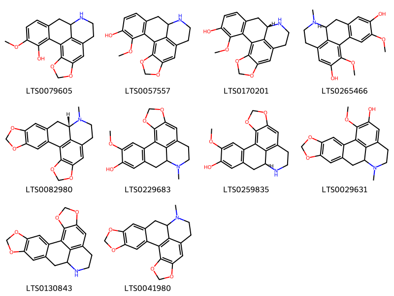{ width=100% }
    <figcaption>Hình ảnh cấu trúc hóa học của 10 hoạt chất thuộc nhóm Aporphines gồm ['17-methoxy-3,5-dioxa-11-azapentacyclo[10.7.1.0²,⁶.0⁸,²⁰.0¹⁴,¹⁹]icosa-1,6,8(20),14,16,18-hexaen-18-ol (LTS0079605)', '18-methoxy-3,5-dioxa-11-azapentacyclo[10.7.1.0²,⁶.0⁸,²⁰.0¹⁴,¹⁹]icosa-1,6,8(20),14(19),15,17-hexaen-17-ol (LTS0057557)', '(12s)-18-methoxy-3,5-dioxa-11-azapentacyclo[10.7.1.0²,⁶.0⁸,²⁰.0¹⁴,¹⁹]icosa-1,6,8(20),14(19),15,17-hexaen-17-ol (LTS0170201)', '(9s)-4,16-dimethoxy-10-methyl-10-azatetracyclo[7.7.1.0²,⁷.0¹³,¹⁷]heptadeca-1(16),2(7),3,5,13(17),14-hexaene-5,15-diol (LTS0265466)', 'neolitsine (LTS0082980)', '17-methoxy-11-methyl-3,5-dioxa-11-azapentacyclo[10.7.1.0²,⁶.0⁸,²⁰.0¹⁴,¹⁹]icosa-1,6,8(20),14(19),15,17-hexaen-16-ol (LTS0229683)', '(+)-actinodaphnine (LTS0259835)', '19-methoxy-13-methyl-5,7-dioxa-13-azapentacyclo[10.7.1.0²,¹⁰.0⁴,⁸.0¹⁶,²⁰]icosa-1(20),2,4(8),9,16,18-hexaen-18-ol (LTS0029631)', '5,7,19,21-tetraoxa-13-azahexacyclo[10.10.1.0²,¹⁰.0⁴,⁸.0¹⁶,²³.0¹⁸,²²]tricosa-1(22),2,4(8),9,16(23),17-hexaene (LTS0130843)', '13-methyl-5,7,19,21-tetraoxa-13-azahexacyclo[10.10.1.0²,¹⁰.0⁴,⁸.0¹⁶,²³.0¹⁸,²²]tricosa-1(23),2,4(8),9,16,18(22)-hexaene (LTS0041980)'].</figcaption>
</figure>
#### Nhóm Benzene and substituted derivatives
<figure markdown="span">
    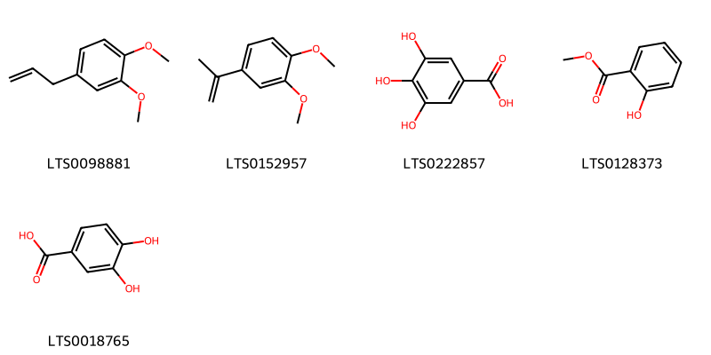{ width=100% }
    <figcaption>Hình ảnh cấu trúc hóa học của 5 hoạt chất thuộc nhóm Benzene and substituted derivatives gồm ['methyl eugenol (LTS0098881)', '1,2-dimethoxy-4-(prop-1-en-2-yl)benzene (LTS0152957)', 'galop (LTS0222857)', 'methyl salicylate (LTS0128373)', '3,4-dihydroxybenzoic acid (LTS0018765)'].</figcaption>
</figure>
#### Nhóm Benzofurans
<figure markdown="span">
    { width=100% }
    <figcaption>Hình ảnh cấu trúc hóa học của 1 hoạt chất thuộc nhóm Benzofurans gồm ["7-hydroxy-6-isopropyl-3',3'-dimethyl-2-oxospiro[1-benzofuran-3,1'-cyclohexane]-2',4-dicarbaldehyde (LTS0255026)"].</figcaption>
</figure>
#### Nhóm Cinnamic acids and derivatives
<figure markdown="span">
    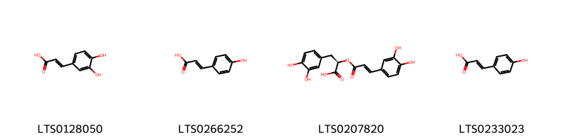{ width=100% }
    <figcaption>Hình ảnh cấu trúc hóa học của 4 hoạt chất thuộc nhóm Cinnamic acids and derivatives gồm ['3,4-dihydroxycinnamic acid (LTS0128050)', 'para-coumaric acid (LTS0266252)', 'rosemary acid (LTS0207820)', 'hydroxycinnamic acid (LTS0233023)'].</figcaption>
</figure>
#### Nhóm Fatty Acyls
<figure markdown="span">
    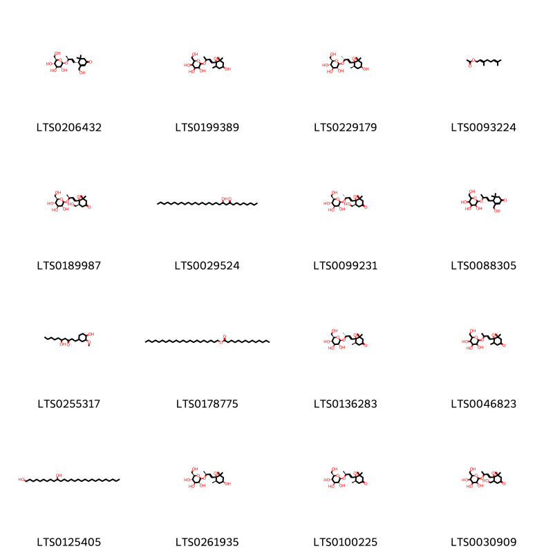{ width=100% }
    <figcaption>Hình ảnh cấu trúc hóa học của 16 hoạt chất thuộc nhóm Fatty Acyls gồm ['(4r)-3-(hydroxymethyl)-5,5-dimethyl-4-[(1e,3s)-3-{[(2r,3r,4s,5s,6r)-3,4,5-trihydroxy-6-(hydroxymethyl)oxan-2-yl]oxy}but-1-en-1-yl]cyclohex-2-en-1-one (LTS0206432)', '2-{[4-(1,4-dihydroxy-2,2,6-trimethylcyclohexyl)but-3-en-2-yl]oxy}-6-(hydroxymethyl)oxane-3,4,5-triol (LTS0199389)', '(2r,3r,4s,5s,6r)-2-{[(2r,3e)-4-[(1s,4s,6r)-1,4-dihydroxy-2,2,6-trimethylcyclohexyl]but-3-en-2-yl]oxy}-6-(hydroxymethyl)oxane-3,4,5-triol (LTS0229179)', 'geranyl acetate (LTS0093224)', '(4r,5s)-4-hydroxy-5-(hydroxymethyl)-3,3-dimethyl-4-[(1e,3s)-3-{[(2r,3r,4s,5s,6r)-3,4,5-trihydroxy-6-(hydroxymethyl)oxan-2-yl]oxy}but-1-en-1-yl]cyclohexan-1-one (LTS0189987)', '11-hydroxytriacontan-9-one (LTS0029524)', 'lauroside b (LTS0099231)', '3-(hydroxymethyl)-5,5-dimethyl-4-(3-{[3,4,5-trihydroxy-6-(hydroxymethyl)oxan-2-yl]oxy}but-1-en-1-yl)cyclohex-2-en-1-one (LTS0088305)', '5-hydroxy-1-(4-hydroxy-3-methoxycyclohexyl)decan-3-one (LTS0255317)', 'docosyl tetradecanoate (LTS0178775)', '(4s,5r)-4-hydroxy-3,3,5-trimethyl-4-[(1e,3r)-3-{[(2r,3r,4s,5s,6r)-3,4,5-trihydroxy-6-(hydroxymethyl)oxan-2-yl]oxy}but-1-en-1-yl]cyclohexan-1-one (LTS0136283)', '4-hydroxy-3,3,5-trimethyl-4-(3-{[3,4,5-trihydroxy-6-(hydroxymethyl)oxan-2-yl]oxy}but-1-en-1-yl)cyclohexan-1-one (LTS0046823)', 'octacosane-1,10-diol (LTS0125405)', '(2r,3r,4s,5s,6r)-2-{[(2s,3e)-4-[(1s,4s,6r)-1,4-dihydroxy-2,2,6-trimethylcyclohexyl]but-3-en-2-yl]oxy}-6-(hydroxymethyl)oxane-3,4,5-triol (LTS0261935)', '(4s,5r)-4-hydroxy-3,3,5-trimethyl-4-[(1e,3s)-3-{[(2r,3r,4s,5s,6r)-3,4,5-trihydroxy-6-(hydroxymethyl)oxan-2-yl]oxy}but-1-en-1-yl]cyclohexan-1-one (LTS0100225)', '4-hydroxy-5-(hydroxymethyl)-3,3-dimethyl-4-(3-{[3,4,5-trihydroxy-6-(hydroxymethyl)oxan-2-yl]oxy}but-1-en-1-yl)cyclohexan-1-one (LTS0030909)'].</figcaption>
</figure>
#### Nhóm Flavonoids
<figure markdown="span">
    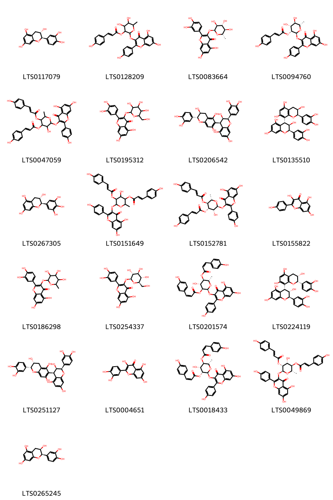{ width=100% }
    <figcaption>Hình ảnh cấu trúc hóa học của 21 hoạt chất thuộc nhóm Flavonoids gồm ['(+)-catechol (LTS0117079)', '2-{[5,7-dihydroxy-2-(4-hydroxyphenyl)-4-oxochromen-3-yl]oxy}-4,5-dihydroxy-6-methyloxan-3-yl 3-(4-hydroxyphenyl)prop-2-enoate (LTS0128209)', '2-(3,4-dihydroxyphenyl)-5,7-dihydroxy-3-{[(2s,3s,4r,5r,6s)-3,4,5-trihydroxy-6-methyloxan-2-yl]oxy}chromen-4-one (LTS0083664)', '(2s,3r,4r,5r,6s)-2-{[5,7-dihydroxy-2-(4-hydroxyphenyl)-4-oxochromen-3-yl]oxy}-4,5-dihydroxy-6-methyloxan-3-yl (2e)-3-(4-hydroxyphenyl)prop-2-enoate (LTS0094760)', '2-{[5,7-dihydroxy-2-(4-hydroxyphenyl)-4-oxochromen-3-yl]oxy}-3-hydroxy-5-{[3-(4-hydroxyphenyl)prop-2-enoyl]oxy}-6-methyloxan-4-yl 3-(4-hydroxyphenyl)prop-2-enoate (LTS0047059)', '2-(3,4-dihydroxyphenyl)-5,7-dihydroxy-3-{[3,4,5-trihydroxy-6-(hydroxymethyl)oxan-2-yl]oxy}chromen-4-one (LTS0195312)', '(2r,3r,4r)-2-(3,4-dihydroxyphenyl)-4-[(2r,3s)-2-(3,4-dihydroxyphenyl)-3,5,7-trihydroxy-3,4-dihydro-2h-1-benzopyran-6-yl]-3,4-dihydro-2h-1-benzopyran-3,5,7-triol (LTS0206542)', '(2r,3r,4r)-2-(3,4-dihydroxyphenyl)-4-[(2r,3r)-2-(3,4-dihydroxyphenyl)-3,5,7-trihydroxy-3,4-dihydro-2h-1-benzopyran-8-yl]-3,4-dihydro-2h-1-benzopyran-3,5,7-triol (LTS0135510)', 'gallocatechol (LTS0267305)', '2-{[5,7-dihydroxy-2-(4-hydroxyphenyl)-4-oxochromen-3-yl]oxy}-4-hydroxy-5-{[3-(4-hydroxyphenyl)prop-2-enoyl]oxy}-6-methyloxan-3-yl 3-(4-hydroxyphenyl)prop-2-enoate (LTS0151649)', '(2s,3r,4s,5s,6s)-2-{[5,7-dihydroxy-2-(4-hydroxyphenyl)-4-oxochromen-3-yl]oxy}-3-hydroxy-5-{[(2e)-3-(4-hydroxyphenyl)prop-2-enoyl]oxy}-6-methyloxan-4-yl (2e)-3-(4-hydroxyphenyl)prop-2-enoate (LTS0152781)', 'kaempherol (LTS0155822)', 'quercitrin (LTS0186298)', 'isoquercetin (LTS0254337)', '(2s,3s,4r,5r,6s)-2-{[5,7-dihydroxy-2-(4-hydroxyphenyl)-4-oxochromen-3-yl]oxy}-4-hydroxy-5-{[(2z)-3-(4-hydroxyphenyl)prop-2-enoyl]oxy}-6-methyloxan-3-yl (2z)-3-(4-hydroxyphenyl)prop-2-enoate (LTS0201574)', '(2r,3s,4r)-2-(3,4-dihydroxyphenyl)-4-[(2s,3s)-2-(3,4-dihydroxyphenyl)-3,5,7-trihydroxy-3,4-dihydro-2h-1-benzopyran-8-yl]-3,4-dihydro-2h-1-benzopyran-3,5,7-triol (LTS0224119)', '(2r,3r,4r)-2-(3,4-dihydroxyphenyl)-4-[(2r,3r)-2-(3,4-dihydroxyphenyl)-3,5,7-trihydroxy-3,4-dihydro-2h-1-benzopyran-6-yl]-3,4-dihydro-2h-1-benzopyran-3,5,7-triol (LTS0251127)', 'quercetin (LTS0004651)', '(2s,3r,4r,5r,6s)-2-{[5,7-dihydroxy-2-(4-hydroxyphenyl)-4-oxochromen-3-yl]oxy}-4-hydroxy-5-{[(2z)-3-(4-hydroxyphenyl)prop-2-enoyl]oxy}-6-methyloxan-3-yl (2z)-3-(4-hydroxyphenyl)prop-2-enoate (LTS0018433)', '(2s,3r,4r,5r,6s)-2-{[5,7-dihydroxy-2-(4-hydroxyphenyl)-4-oxochromen-3-yl]oxy}-4-hydroxy-5-{[(2e)-3-(4-hydroxyphenyl)prop-2-enoyl]oxy}-6-methyloxan-3-yl (2e)-3-(4-hydroxyphenyl)prop-2-enoate (LTS0049869)', 'ent-epicatechin (LTS0265245)'].</figcaption>
</figure>
#### Nhóm Isoquinolines and derivatives
<figure markdown="span">
    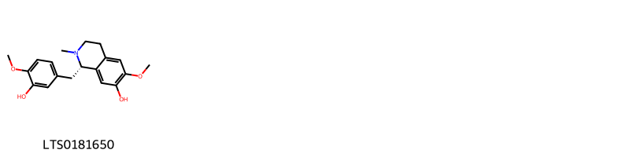{ width=100% }
    <figcaption>Hình ảnh cấu trúc hóa học của 1 hoạt chất thuộc nhóm Isoquinolines and derivatives gồm ['(+,-)-reticuline (LTS0181650)'].</figcaption>
</figure>
#### Nhóm Lactones
<figure markdown="span">
    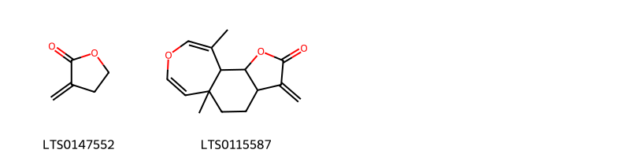{ width=100% }
    <figcaption>Hình ảnh cấu trúc hóa học của 2 hoạt chất thuộc nhóm Lactones gồm ['tulipalin a (LTS0147552)', '9,14-dimethyl-5-methylidene-3,12-dioxatricyclo[7.5.0.0²,⁶]tetradeca-10,13-dien-4-one (LTS0115587)'].</figcaption>
</figure>
#### Nhóm Lignan glycosides
<figure markdown="span">
    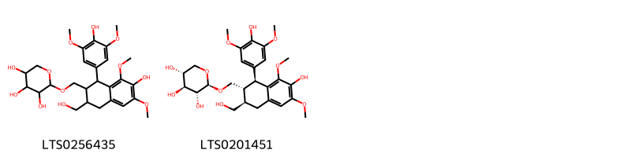{ width=100% }
    <figcaption>Hình ảnh cấu trúc hóa học của 2 hoạt chất thuộc nhóm Lignan glycosides gồm ['2-{[7-hydroxy-1-(4-hydroxy-3,5-dimethoxyphenyl)-3-(hydroxymethyl)-6,8-dimethoxy-1,2,3,4-tetrahydronaphthalen-2-yl]methoxy}oxane-3,4,5-triol (LTS0256435)', '(2r,3r,4s,5r)-2-{[(1s,2r,3r)-7-hydroxy-1-(4-hydroxy-3,5-dimethoxyphenyl)-3-(hydroxymethyl)-6,8-dimethoxy-1,2,3,4-tetrahydronaphthalen-2-yl]methoxy}oxane-3,4,5-triol (LTS0201451)'].</figcaption>
</figure>
#### Nhóm Organooxygen compounds
<figure markdown="span">
    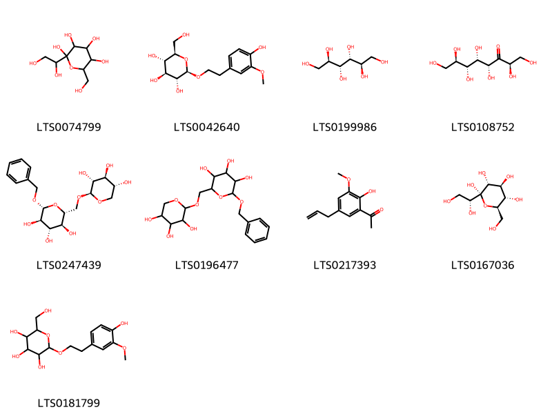{ width=100% }
    <figcaption>Hình ảnh cấu trúc hóa học của 9 hoạt chất thuộc nhóm Organooxygen compounds gồm ['2-(1,2-dihydroxyethyl)-6-(hydroxymethyl)oxane-2,3,4,5-tetrol (LTS0074799)', '(2r,3r,4s,5s,6r)-2-[2-(4-hydroxy-3-methoxyphenyl)ethoxy]-6-(hydroxymethyl)oxane-3,4,5-triol (LTS0042640)', 'mannitol (LTS0199986)', '(2r,4r,5s,6r,7r)-1,2,4,5,6,7,8-heptahydroxyoctan-3-one (LTS0108752)', '(2r,3r,4s,5s,6r)-2-(benzyloxy)-6-({[(2s,3r,4s,5r)-3,4,5-trihydroxyoxan-2-yl]oxy}methyl)oxane-3,4,5-triol (LTS0247439)', '2-(benzyloxy)-6-{[(3,4,5-trihydroxyoxan-2-yl)oxy]methyl}oxane-3,4,5-triol (LTS0196477)', '1-[2-hydroxy-3-methoxy-5-(prop-2-en-1-yl)phenyl]ethanone (LTS0217393)', '(2s,3r,4s,5s,6r)-2-[(1r)-1,2-dihydroxyethyl]-6-(hydroxymethyl)oxane-2,3,4,5-tetrol (LTS0167036)', '2-[2-(4-hydroxy-3-methoxyphenyl)ethoxy]-6-(hydroxymethyl)oxane-3,4,5-triol (LTS0181799)'].</figcaption>
</figure>
#### Nhóm Phenol esters
<figure markdown="span">
    { width=100% }
    <figcaption>Hình ảnh cấu trúc hóa học của 1 hoạt chất thuộc nhóm Phenol esters gồm ['eugenyl acetate (LTS0165886)'].</figcaption>
</figure>
#### Nhóm Phenol ethers
<figure markdown="span">
    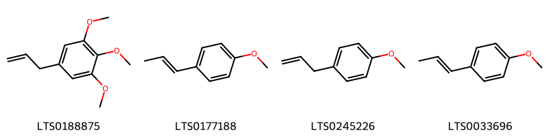{ width=100% }
    <figcaption>Hình ảnh cấu trúc hóa học của 4 hoạt chất thuộc nhóm Phenol ethers gồm ['elemicin (LTS0188875)', 'p-propenylanisole (LTS0177188)', 'tarragon (LTS0245226)', 'anethole (LTS0033696)'].</figcaption>
</figure>
#### Nhóm Phenols
<figure markdown="span">
    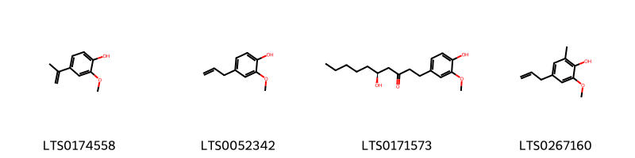{ width=100% }
    <figcaption>Hình ảnh cấu trúc hóa học của 4 hoạt chất thuộc nhóm Phenols gồm ['2-methoxy-4-(prop-1-en-2-yl)phenol (LTS0174558)', 'eugenol (LTS0052342)', 'gingerol (LTS0171573)', '6-methyleugenol (LTS0267160)'].</figcaption>
</figure>
#### Nhóm Prenol lipids
<figure markdown="span">
    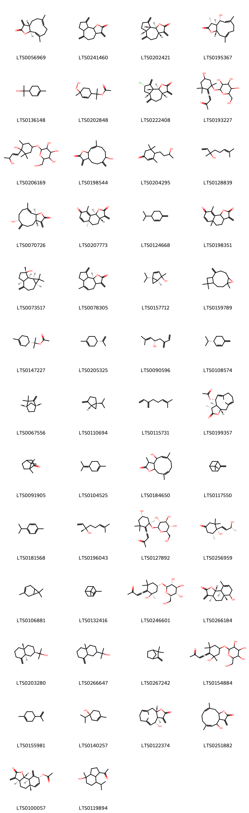{ width=100% }
    <figcaption>Hình ảnh cấu trúc hóa học của 114 hoạt chất thuộc nhóm Prenol lipids gồm ['costunolide (LTS0056969)', '3,6,9-trimethylidene-octahydroazuleno[4,5-b]furan-2-one (LTS0241460)', 'dehydrocostus lactone (LTS0202421)', '(3r,3as,4r,11as)-4-hydroxy-3,6,10-trimethyl-3h,3ah,4h,7h,8h,11h,11ah-cyclodeca[b]furan-2-one (LTS0195367)', 'terpineol (LTS0136148)', '2-(4-hydroperoxy-4-methylcyclohex-2-en-1-yl)propan-2-yl acetate (LTS0202848)', '(3as,6ar,8s,9ar,9bs)-8-chloro-3,6,9-trimethylidene-octahydroazuleno[4,5-b]furan-2-one (LTS0222408)', '4-(4-hydroxy-2,2,6-trimethyl-6-{[3,4,5-trihydroxy-6-(hydroxymethyl)oxan-2-yl]oxy}cyclohexylidene)but-3-en-2-one (LTS0193227)', '2-{[4-hydroxy-4-(3-hydroxybut-1-en-1-yl)-3,3,5-trimethylcyclohexyl]oxy}-6-(hydroxymethyl)oxane-3,4,5-triol (LTS0206169)', '7-hydroxy-10-methyl-3,6-dimethylidene-3ah,4h,5h,7h,8h,9h,11ah-cyclodeca[b]furan-2-one (LTS0198544)', '4-(3-hydroxybutyl)-3,5,5-trimethylcyclohex-2-en-1-one (LTS0204295)', 'linalool, (+-)- (LTS0128839)', 'artemorin (LTS0070726)', '(3as,5as,9bs)-5a,9-dimethyl-3-methylidene-3ah,4h,5h,9bh-naphtho[1,2-b]furan-2,8-dione (LTS0207773)', 'β phellandrene (LTS0124668)', '5a,9-dimethyl-3-methylidene-3ah,4h,5h,9bh-naphtho[1,2-b]furan-2,8-dione (LTS0198351)', '(1as,4as,7s,7ar,7bs)-1,1,7-trimethyl-4-methylidene-octahydrocyclopropa[e]azulen-7-ol (LTS0073517)', '(9bs)-6-methyl-3,9-dimethylidene-3ah,4h,6ah,7h,8h,9ah,9bh-azuleno[4,5-b]furan-2-one (LTS0078305)', '(1s,5r)-5-isopropyl-2-methylbicyclo[3.1.0]hex-3-en-2-ol (LTS0157712)', 'caryophyllene oxide (LTS0159789)', '(-)-α-terpinyl acetate (LTS0147227)', '(-)-limonene (LTS0205325)', 'ipsdienol (LTS0090596)', '(+)-β-phellandrene (LTS0108574)', '(-)-camphene (LTS0067556)', '(+)-sabinene (LTS0110694)', 'α-myrcene (LTS0115731)', '(3r,3ar,4r,11as)-3,6,10-trimethyl-2-oxo-3h,3ah,4h,7h,8h,11h,11ah-cyclodeca[b]furan-4-yl acetate (LTS0199357)', 'camphor (LTS0091905)', 'terpinolene (LTS0104525)', '4-hydroxy-3,6,10-trimethyl-3h,3ah,4h,7h,8h,11h,11ah-cyclodeca[b]furan-2-one (LTS0184650)', 'β-pinene (LTS0117550)', 'cymene (LTS0181568)', '(+)-linalool (LTS0196043)', 'citroside b (LTS0127892)', '(4s,5r)-4-hydroxy-4-[(1e,3r)-3-hydroxybut-1-en-1-yl]-3,3,5-trimethylcyclohexan-1-one (LTS0256959)', 'monoterpenes (LTS0106881)', 'α pinene (LTS0132416)', '4-[(2r,4s)-2-hydroxy-2,6,6-trimethyl-4-{[(2r,3r,4s,5s,6r)-3,4,5-trihydroxy-6-(hydroxymethyl)oxan-2-yl]oxy}cyclohexylidene]but-3-en-2-one (LTS0246601)', '(+)-santamarine (LTS0266184)', 'β-eudesmol (LTS0203280)', 'β-eudesmol (LTS0266647)', 'camphene (LTS0267242)', '4-(2-hydroxy-2,6,6-trimethyl-4-{[3,4,5-trihydroxy-6-(hydroxymethyl)oxan-2-yl]oxy}cyclohexylidene)but-3-en-2-one (LTS0154884)', 'limonene,  (LTS0155981)', '(+)-4-terpineol (LTS0140257)', '(3as,4r,11as)-4-hydroxy-6,10-dimethyl-3-methylidene-3ah,4h,7h,8h,11h,11ah-cyclodeca[b]furan-2-one (LTS0122374)', '4-hydroxy-6,10-dimethyl-3-methylidene-3ah,4h,7h,8h,11h,11ah-cyclodeca[b]furan-2-one (LTS0251882)', '(3as,5as,8r,9ar,9bs)-5a-methyl-3,9-dimethylidene-2-oxo-3ah,4h,5h,8h,9ah,9bh-naphtho[1,2-b]furan-8-yl acetate (LTS0100057)', '1-(4-hydroxy-7-isopropyl-4-methyl-octahydroinden-1-yl)ethanone (LTS0119894)', 'zaluzanin c (LTS0168502)', '3,6,10-trimethyl-2-oxo-3h,3ah,4h,7h,8h,11h,11ah-cyclodeca[b]furan-4-yl acetate (LTS0154107)', 'gamma-eudesmol (LTS0147389)', 'phellandrene (LTS0157173)', '5a,9-dimethyl-3-methylidene-3ah,4h,5h,6h,7h,8h-azuleno[3a,3-b]furan-2-one (LTS0230468)', '(+)-β-pinene (LTS0172720)', '(-)-β-pinene (LTS0108757)', '(4r)-4-[(3r)-3-hydroxybutyl]-3,5,5-trimethylcyclohex-2-en-1-one (LTS0232551)', '(1r,4as,6r,8ar)-4,8a-dimethyl-6-(prop-1-en-2-yl)-2,4a,5,6,7,8-hexahydro-1h-naphthalen-1-ol (LTS0248904)', '4-terpineol (LTS0253733)', 'zaluzanin d (LTS0096117)', '2-hydroxy-2-(4-hydroxy-4,8-dimethylcyclodeca-2,7-dien-1-yl)propyl acetate (LTS0233383)', '6-hydroxy-5a,9-dimethyl-3-methylidene-3ah,4h,5h,6h,7h,9ah,9bh-naphtho[1,2-b]furan-2-one (LTS0183420)', 'verlotorin (LTS0248258)', 'borneol (LTS0264960)', '7-(1,2-dihydroxypropan-2-yl)-1,4a-dimethyl-octahydronaphthalene-1,8-diol (LTS0135707)', '6,10-dimethyl-3-methylidene-2-oxo-3ah,4h,7h,8h,11h,11ah-cyclodeca[b]furan-4-yl acetate (LTS0188598)', '(2r,3r,4s,5s,6r)-2-{[(1s,4s,5r)-4-hydroxy-4-[(1e,3r)-3-hydroxybut-1-en-1-yl]-3,3,5-trimethylcyclohexyl]oxy}-6-(hydroxymethyl)oxane-3,4,5-triol (LTS0189590)', 'laurenobiolide (LTS0185429)', 'caryophyllene (LTS0085212)', '1-[(1s,3ar,4r,7s,7as)-4-hydroxy-7-isopropyl-4-methyl-octahydroinden-1-yl]ethanone (LTS0258092)', '3,4-dihydroxy-5-isopropyl-11,11-dimethyl-16-oxatetracyclo[6.6.2.0¹,¹⁰.0²,⁷]hexadeca-2(7),3,5-trien-15-one (LTS0266849)', '3,6,9-trimethylidene-2-oxo-octahydroazuleno[4,5-b]furan-8-yl acetate (LTS0197449)', '(2s)-2-hydroxy-2-[(1r,2e,4s,7e)-4-hydroxy-4,8-dimethylcyclodeca-2,7-dien-1-yl]propyl acetate (LTS0247883)', 'α-limonene (LTS0244943)', 'laurenobiolide (LTS0059912)', 'bornyl acetate (LTS0060565)', 'carnosic acid (LTS0097375)', 'α-eudesmol (LTS0222498)', 'β-caryophyllene oxide (LTS0213960)', 'sabinene (LTS0224133)', '(3as,5as,10ar)-5a,9-dimethyl-3-methylidene-3ah,4h,5h,6h,7h,8h-azuleno[3a,3-b]furan-2-one (LTS0074200)', '(+)-α-pinene (LTS0211102)', '(1r,4ar,7r,8s,8as)-7-[(2s)-1,2-dihydroxypropan-2-yl]-1,4a-dimethyl-octahydronaphthalene-1,8-diol (LTS0154829)', 'sabinene hydrate (LTS0215494)', 'thymol (LTS0168527)', '6,10-dimethyl-3-methylidene-3ah,4h,5h,8h,9h,11ah-cyclodeca[b]furan-2-one (LTS0218598)', '8-chloro-3,6,9-trimethylidene-octahydroazuleno[4,5-b]furan-2-one (LTS0230105)', '(-)-α-phellandrene (LTS0226766)', '(1r,4s,6r,10s)-4,12,12-trimethyl-9-methylidene-5-oxatricyclo[8.2.0.0⁴,⁶]dodecane (LTS0057919)', '2-[(1s,4r)-4-hydroperoxy-4-methylcyclohex-2-en-1-yl]propan-2-yl acetate (LTS0062947)', 'linalyl acetate (LTS0167325)', '(3as,5ar,6r)-6-hydroxy-5a,9-dimethyl-3-methylidene-3ah,4h,5h,6h,7h,8h,9bh-naphtho[1,2-b]furan-2-one (LTS0160186)', 'α-terpinyl acetate (LTS0172943)', '(-)-sabinene (LTS0224535)', '6-hydroxy-5a-methyl-3,9-dimethylidene-octahydronaphtho[1,2-b]furan-2-one (LTS0184419)', '6-hydroxy-9-(hydroxymethyl)-5a-methyl-3-methylidene-3ah,4h,5h,6h,7h,9ah,9bh-naphtho[1,2-b]furan-2-one (LTS0159376)', '(+)-α-terpineol (LTS0258249)', '(2s,4r)-1,7,7-trimethylbicyclo[2.2.1]heptan-2-ol (LTS0010050)', '3,4,8-trihydroxy-5-isopropyl-11,11-dimethyl-16-oxatetracyclo[7.5.2.0¹,¹⁰.0²,⁷]hexadeca-2(7),3,5-trien-15-one (LTS0269672)', 'reynosin (LTS0059699)', '(3as,5ar,6r,9bs)-6-hydroxy-5a,9-dimethyl-3-methylidene-3ah,4h,5h,6h,7h,8h,9bh-naphtho[1,2-b]furan-2-one (LTS0259801)', 'terpinene (LTS0136858)', 'eremanthin (LTS0007484)', 'costunolide (LTS0018499)', 'carvacrol (LTS0012882)', '(3ar,5as,6s,9ar,9br)-6-hydroxy-9-(hydroxymethyl)-5a-methyl-3-methylidene-3ah,4h,5h,6h,7h,9ah,9bh-naphtho[1,2-b]furan-2-one (LTS0011584)', '5a-methyl-3,9-dimethylidene-2-oxo-3ah,4h,5h,8h,9ah,9bh-naphtho[1,2-b]furan-8-yl acetate (LTS0265421)', 'tulipinolide (LTS0236144)', '(7ar)-1,1,7-trimethyl-4-methylidene-octahydrocyclopropa[e]azulen-7-ol (LTS0091612)', '4,11,11-trimethyl-8-methylidenebicyclo[7.2.0]undec-4-ene (LTS0256716)', '4-hydroxy-4-(3-hydroxybut-1-en-1-yl)-3,3,5-trimethylcyclohexan-1-one (LTS0023393)', 'sabinene hydrate (LTS0236165)', 'pseudoionone (LTS0119297)'].</figcaption>
</figure>
#### Nhóm Tetrahydrofurans
<figure markdown="span">
    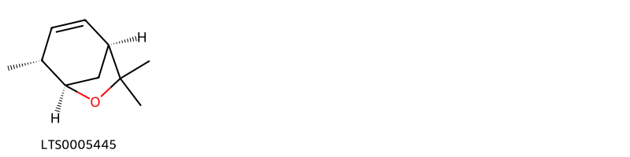{ width=100% }
    <figcaption>Hình ảnh cấu trúc hóa học của 1 hoạt chất thuộc nhóm Tetrahydrofurans gồm ['(1s,4r,5r)-4,7,7-trimethyl-6-oxabicyclo[3.2.1]oct-2-ene (LTS0005445)'].</figcaption>
</figure>
#### Nhóm Unsaturated hydrocarbons
<figure markdown="span">
    { width=100% }
    <figcaption>Hình ảnh cấu trúc hóa học của 1 hoạt chất thuộc nhóm Unsaturated hydrocarbons gồm ['α terpinene (LTS0232891)'].</figcaption>
</figure>

---

### Dược dân tộc học

Danh sách các quốc gia có sử dụng *Laurus nobilis* trong điều trị các bệnh. 

| Country   | Disease                                                                                       | Bệnh                                                                                                                                                                                                |
|:----------|:----------------------------------------------------------------------------------------------|:----------------------------------------------------------------------------------------------------------------------------------------------------------------------------------------------------|
| Elsewhere | Stomachic, Carminative, Soap, Stimulant, Narcotic                                             | MYMEMORY WARNING: YOU USED ALL AVAILABLE FREE TRANSLATIONS FOR TODAY. NEXT AVAILABLE IN  02 HOURS 20 MINUTES 22 SECONDS VISIT HTTPS://MYMEMORY.TRANSLATED.NET/DOC/USAGELIMITS.PHP TO TRANSLATE MORE |
| Turkey    | Carminative, Diuretic, Emetic, Emmenagogue, Nervine, Stimulant, Stomachic, Sudorific, Apertif | MYMEMORY WARNING: YOU USED ALL AVAILABLE FREE TRANSLATIONS FOR TODAY. NEXT AVAILABLE IN  02 HOURS 20 MINUTES 20 SECONDS VISIT HTTPS://MYMEMORY.TRANSLATED.NET/DOC/USAGELIMITS.PHP TO TRANSLATE MORE |
| ain       | Stomachic                                                                                     | MYMEMORY WARNING: YOU USED ALL AVAILABLE FREE TRANSLATIONS FOR TODAY. NEXT AVAILABLE IN  02 HOURS 20 MINUTES 18 SECONDS VISIT HTTPS://MYMEMORY.TRANSLATED.NET/DOC/USAGELIMITS.PHP TO TRANSLATE MORE |

---

