!!! abstract "Tóm tắt"

    Họ Lecythidaceae gồm khoảng 7 chi và 19 loài được một số cộng đồng tại các quốc gia như Honduras, Brazil, Indochina, Philippines, Ghana, New Hebrides, Venezuela, Java, South America, Perak, Malaya, Australia, Elsewhere, Dominican Republic, Burma, India, Samoa, Solomon I, Tanzania sử dụng trong một số trường hợp MYMEMORY WARNING: YOU USED ALL AVAILABLE FREE TRANSLATIONS FOR TODAY. NEXT AVAILABLE IN  19 HOURS 41 MINUTES 05 SECONDS VISIT HTTPS://MYMEMORY.TRANSLATED.NET/DOC/USAGELIMITS.PHP TO TRANSLATE MORE.

!!! info "DrDuke"

    James A. Duke sinh năm 1929-2017 là một nhà thực vật học người Mỹ. Đây là một trong những tác giả hàng đầu trong lĩnh vực dược dân tộc học với cuốn *CRC Handbook of Medicinal Herbs* và chính là người xây dựng lên cơ sở dữ liệu về hợp chất tự nhiên và dược dân tộc học tại Bộ nông nghiệp Hoa Kỳ. Các thông tin được đăng tải tại website [Dr. Duke's Phytochemical and Ethnobotanical Databases](https://phytochem.nal.usda.gov/). 
    Trong suốt thập niên 1970, ông lãnh đạo the Plant Taxonomy Laboratory, Plant Genetics and Germplasm Institute of the Agricultural Research Service, U.S. Department of Agriculture.
    Trong tài liệu này, các thông tin về dược dân tộc của các dược liệu được trích dẫn từ tài liệu của James A. Ducke với sự trợ giúp của phần mềm dịch thuật từ tiếng Anh sang tiếng Việt.
   

# Chi Gustavia

??? note "Danh sách các dược liệu thuộc chi"
    
	 - *Gustavia brasiliana*
	 - *Gustavia superba*

---
## Gustavia brasiliana
### Thông tin về thực vật

!!! info "Phân loại thực vật của *Gustavia hexapetala* từ GIBF:"
    - **Kingdom:** Plantae
    - **Phylum:** Tracheophyta
    - **Order:** Ericales
    - **Family:** Lecythidaceae
    - **Genus:** Gustavia
    - **Species:** *Gustavia hexapetala*

 

| Label (VI)   | Label (EN)   | Scientific Name      | Descriptions (VI)   | Descriptions (EN)   | Also Known As (VI)   | Also Known As (EN)   |
|:-------------|:-------------|:---------------------|:--------------------|:--------------------|:---------------------|:---------------------|
| N/A          | N/A          | Marcgravia umbellata | loài thực vật       | species of plant    | ['']                 | ['']                 |

#### Phân bố trên thế giới

**Từ CSDL GIBF** nan, Brazil

#### Phân bố tại Việt Nam

**Từ CSDL GIBF**: Không có ghi nhận ở Việt Nam

---
### Thành phần hóa học
        
- Theo cơ sở dữ liệu lotus: Từ loài *Gustavia hexapetala* đã phân lập và xác định được Chưa có hoạt chất nào được phân lập. hoạt chất thuộc về các nhóm Không có hoạt chất nào được phân lập. 

Không có hình ảnh nào được tạo ra

---

### Dược dân tộc học

Danh sách các quốc gia có sử dụng *Gustavia hexapetala* trong điều trị các bệnh. 

| Country   | Disease   | Bệnh                                                                                                                                                                                                |
|:----------|:----------|:----------------------------------------------------------------------------------------------------------------------------------------------------------------------------------------------------|
| Elsewhere | Emetic    | MYMEMORY WARNING: YOU USED ALL AVAILABLE FREE TRANSLATIONS FOR TODAY. NEXT AVAILABLE IN  19 HOURS 41 MINUTES 02 SECONDS VISIT HTTPS://MYMEMORY.TRANSLATED.NET/DOC/USAGELIMITS.PHP TO TRANSLATE MORE |

---

---
## Gustavia superba
### Thông tin về thực vật

!!! info "Phân loại thực vật của *Gustavia superba* từ GIBF:"
    - **Kingdom:** Plantae
    - **Phylum:** Tracheophyta
    - **Order:** Ericales
    - **Family:** Lecythidaceae
    - **Genus:** Gustavia
    - **Species:** *Gustavia superba*

 

| Label (VI)   | Label (EN)   | Scientific Name   | Descriptions (VI)   | Descriptions (EN)   | Also Known As (VI)   | Also Known As (EN)   |
|:-------------|:-------------|:------------------|:--------------------|:--------------------|:---------------------|:---------------------|
| N/A          | N/A          | Gustavia superba  |                     | species of plant    | ['']                 | ['']                 |

#### Phân bố trên thế giới

**Từ CSDL GIBF** Colombia, Panama, Brazil, Malaysia, Singapore, China

#### Phân bố tại Việt Nam

**Từ CSDL GIBF**: Không có ghi nhận ở Việt Nam

---
### Thành phần hóa học
        
- Theo cơ sở dữ liệu lotus: Từ loài *Gustavia superba* đã phân lập và xác định được Chưa có hoạt chất nào được phân lập. hoạt chất thuộc về các nhóm Không có hoạt chất nào được phân lập. 

Không có hình ảnh nào được tạo ra

---

### Dược dân tộc học

Danh sách các quốc gia có sử dụng *Gustavia superba* trong điều trị các bệnh. 

| Country   | Disease   | Bệnh                                                                                                                                                                                                |
|:----------|:----------|:----------------------------------------------------------------------------------------------------------------------------------------------------------------------------------------------------|
| Elsewhere | Antidote  | MYMEMORY WARNING: YOU USED ALL AVAILABLE FREE TRANSLATIONS FOR TODAY. NEXT AVAILABLE IN  19 HOURS 40 MINUTES 36 SECONDS VISIT HTTPS://MYMEMORY.TRANSLATED.NET/DOC/USAGELIMITS.PHP TO TRANSLATE MORE |

---

# Chi Lecythis

??? note "Danh sách các dược liệu thuộc chi"
    
	 - *Lecythis elliptica*
	 - *Lecythis ollaria*
	 - *Lecythis paraensis*

---
## Lecythis elliptica
### Thông tin về thực vật

!!! info "Phân loại thực vật của *Lecythis minor* từ GIBF:"
    - **Kingdom:** Plantae
    - **Phylum:** Tracheophyta
    - **Order:** Ericales
    - **Family:** Lecythidaceae
    - **Genus:** Lecythis
    - **Species:** *Lecythis minor*

 

| Label (VI)   | Label (EN)   | Scientific Name    | Descriptions (VI)   | Descriptions (EN)   | Also Known As (VI)   | Also Known As (EN)   |
|:-------------|:-------------|:-------------------|:--------------------|:--------------------|:---------------------|:---------------------|
| N/A          | N/A          | Lecythis elliptica | loài thực vật       | species of plant    | ['']                 | ['']                 |

#### Phân bố trên thế giới

**Từ CSDL GIBF** nan, Colombia, United States of America

#### Phân bố tại Việt Nam

**Từ CSDL GIBF**: Không có ghi nhận ở Việt Nam

---
### Thành phần hóa học
        
- Theo cơ sở dữ liệu lotus: Từ loài *Lecythis minor* đã phân lập và xác định được Chưa có hoạt chất nào được phân lập. hoạt chất thuộc về các nhóm Không có hoạt chất nào được phân lập. 

Không có hình ảnh nào được tạo ra

---

### Dược dân tộc học

Danh sách các quốc gia có sử dụng *Lecythis minor* trong điều trị các bệnh. 

| Country   | Disease    | Bệnh                                                                                                                                                                                                |
|:----------|:-----------|:----------------------------------------------------------------------------------------------------------------------------------------------------------------------------------------------------|
| Honduras  | Depilatory | MYMEMORY WARNING: YOU USED ALL AVAILABLE FREE TRANSLATIONS FOR TODAY. NEXT AVAILABLE IN  19 HOURS 39 MINUTES 54 SECONDS VISIT HTTPS://MYMEMORY.TRANSLATED.NET/DOC/USAGELIMITS.PHP TO TRANSLATE MORE |
| Venezuela | Poison     | MYMEMORY WARNING: YOU USED ALL AVAILABLE FREE TRANSLATIONS FOR TODAY. NEXT AVAILABLE IN  19 HOURS 39 MINUTES 51 SECONDS VISIT HTTPS://MYMEMORY.TRANSLATED.NET/DOC/USAGELIMITS.PHP TO TRANSLATE MORE |

---

---
## Lecythis ollaria
### Thông tin về thực vật

!!! info "Phân loại thực vật của *Lecythis ollaria* từ GIBF:"
    - **Kingdom:** Plantae
    - **Phylum:** Tracheophyta
    - **Order:** Ericales
    - **Family:** Lecythidaceae
    - **Genus:** Lecythis
    - **Species:** *Lecythis ollaria*

 

| Label (VI)   | Label (EN)   | Scientific Name   | Descriptions (VI)   | Descriptions (EN)   | Also Known As (VI)   | Also Known As (EN)   |
|:-------------|:-------------|:------------------|:--------------------|:--------------------|:---------------------|:---------------------|
| N/A          | N/A          | Lecythis ollaria  | loài thực vật       | species of plant    | ['']                 | ['']                 |

#### Phân bố trên thế giới

**Từ CSDL GIBF** nan, Colombia, Venezuela (Bolivarian Republic of), unknown or invalid, Suriname, Brazil, Malaysia, Puerto Rico, French Guiana, Singapore, Guyana

#### Phân bố tại Việt Nam

**Từ CSDL GIBF**: Không có ghi nhận ở Việt Nam

---
### Thành phần hóa học
        
- Theo cơ sở dữ liệu lotus: Từ loài *Lecythis ollaria* đã phân lập và xác định được 2 hoạt chất thuộc về các nhóm Tannins. 

|    | chemicalTaxonomyClassyfireClass   |   smiles_count |
|---:|:----------------------------------|---------------:|
|  0 | Tannins                           |              2 |

#### Nhóm Tannins
<figure markdown="span">
    { width=100% }
    <figcaption>Hình ảnh cấu trúc hóa học của 2 hoạt chất thuộc nhóm Tannins gồm ['6,7,13-trihydroxy-14-methoxy-2,9-dioxatetracyclo[6.6.2.0⁴,¹⁶.0¹¹,¹⁵]hexadeca-1(15),4,6,8(16),11,13-hexaene-3,10-dione (LTS0125222)', 'ellagic acid (LTS0037297)'].</figcaption>
</figure>

---

### Dược dân tộc học

Danh sách các quốc gia có sử dụng *Lecythis ollaria* trong điều trị các bệnh. 

| Country       | Disease              | Bệnh                                                                                                                                                                                                |
|:--------------|:---------------------|:----------------------------------------------------------------------------------------------------------------------------------------------------------------------------------------------------|
| Elsewhere     | Hemostat             | MYMEMORY WARNING: YOU USED ALL AVAILABLE FREE TRANSLATIONS FOR TODAY. NEXT AVAILABLE IN  19 HOURS 39 MINUTES 27 SECONDS VISIT HTTPS://MYMEMORY.TRANSLATED.NET/DOC/USAGELIMITS.PHP TO TRANSLATE MORE |
| South America | Depilatory           | MYMEMORY WARNING: YOU USED ALL AVAILABLE FREE TRANSLATIONS FOR TODAY. NEXT AVAILABLE IN  19 HOURS 39 MINUTES 24 SECONDS VISIT HTTPS://MYMEMORY.TRANSLATED.NET/DOC/USAGELIMITS.PHP TO TRANSLATE MORE |
| Venezuela     | Depilatory, Hemostat | MYMEMORY WARNING: YOU USED ALL AVAILABLE FREE TRANSLATIONS FOR TODAY. NEXT AVAILABLE IN  19 HOURS 39 MINUTES 21 SECONDS VISIT HTTPS://MYMEMORY.TRANSLATED.NET/DOC/USAGELIMITS.PHP TO TRANSLATE MORE |

---

---
## Lecythis paraensis
### Thông tin về thực vật

!!! info "Phân loại thực vật của *Lecythis pisonis* từ GIBF:"
    - **Kingdom:** Plantae
    - **Phylum:** Tracheophyta
    - **Order:** Ericales
    - **Family:** Lecythidaceae
    - **Genus:** Lecythis
    - **Species:** *Lecythis pisonis*

 

| Label (VI)   | Label (EN)   | Scientific Name    | Descriptions (VI)   | Descriptions (EN)   | Also Known As (VI)   | Also Known As (EN)   |
|:-------------|:-------------|:-------------------|:--------------------|:--------------------|:---------------------|:---------------------|
| N/A          | N/A          | Lecythis paraensis | loài thực vật       | species of plant    | ['']                 | ['']                 |

#### Phân bố trên thế giới

**Từ CSDL GIBF** Brazil

#### Phân bố tại Việt Nam

**Từ CSDL GIBF**: Không có ghi nhận ở Việt Nam

---
### Thành phần hóa học
        
- Theo cơ sở dữ liệu lotus: Từ loài *Lecythis pisonis* đã phân lập và xác định được Chưa có hoạt chất nào được phân lập. hoạt chất thuộc về các nhóm Không có hoạt chất nào được phân lập. 

Không có hình ảnh nào được tạo ra

---

### Dược dân tộc học

Danh sách các quốc gia có sử dụng *Lecythis pisonis* trong điều trị các bệnh. 

| Country   | Disease    | Bệnh                                                                                                                                                                                                |
|:----------|:-----------|:----------------------------------------------------------------------------------------------------------------------------------------------------------------------------------------------------|
| Brazil    | Depilatory | MYMEMORY WARNING: YOU USED ALL AVAILABLE FREE TRANSLATIONS FOR TODAY. NEXT AVAILABLE IN  19 HOURS 38 MINUTES 47 SECONDS VISIT HTTPS://MYMEMORY.TRANSLATED.NET/DOC/USAGELIMITS.PHP TO TRANSLATE MORE |

---

# Chi Couroupita

??? note "Danh sách các dược liệu thuộc chi"
    
	 - *Couroupita guianensis*
	 - *Couroupita surinamensis*

---
## Couroupita guianensis
### Thông tin về thực vật

!!! info "Phân loại thực vật của *Couroupita guianensis* từ GIBF:"
    - **Kingdom:** Plantae
    - **Phylum:** Tracheophyta
    - **Order:** Ericales
    - **Family:** Lecythidaceae
    - **Genus:** Couroupita
    - **Species:** *Couroupita guianensis*

 

| Label (VI)   | Label (EN)   | Scientific Name       | Descriptions (VI)   | Descriptions (EN)                                                 | Also Known As (VI)        | Also Known As (EN)   |
|:-------------|:-------------|:----------------------|:--------------------|:------------------------------------------------------------------|:--------------------------|:---------------------|
| N/A          | N/A          | Couroupita guianensis | loài thực vật       | species of flowering plant in the Brazil nut family Lecythidaceae | ['Couroupita guianensis'] | ['']                 |

#### Phân bố trên thế giới

**Từ CSDL GIBF** Viet Nam, Honduras, Thailand, El Salvador, Philippines, Trinidad and Tobago, French Guiana, Lao People’s Democratic Republic, Australia, Jamaica, Saint Vincent and the Grenadines, Colombia, Dominican Republic, Venezuela (Bolivarian Republic of), Sri Lanka, Malaysia, India, Cuba, Virgin Islands (U.S.), Cambodia, Panama, Brazil, Mexico, Costa Rica, Ecuador

#### Phân bố tại Việt Nam

**Từ CSDL GIBF**: Hồ Chí Minh city, Bến Tre, Kiên Giang, Đà Nẵng, Thừa Thiên - Huế

---
### Thành phần hóa học
        
- Theo cơ sở dữ liệu lotus: Từ loài *Couroupita guianensis* đã phân lập và xác định được 11 hoạt chất thuộc về các nhóm Diazanaphthalenes, Tannins, Indoles and derivatives, Carboxylic acids and derivatives. 

|    | chemicalTaxonomyClassyfireClass   |   smiles_count |
|---:|:----------------------------------|---------------:|
|  0 | Carboxylic acids and derivatives  |              2 |
|  1 | Diazanaphthalenes                 |              1 |
|  2 | Indoles and derivatives           |              6 |
|  3 | Tannins                           |              2 |

#### Nhóm Carboxylic acids and derivatives
<figure markdown="span">
    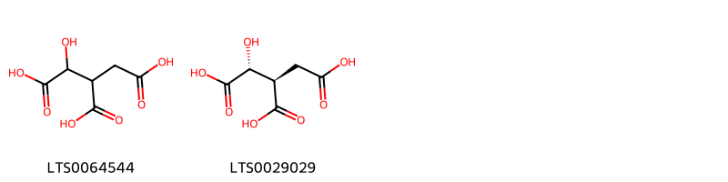{ width=100% }
    <figcaption>Hình ảnh cấu trúc hóa học của 2 hoạt chất thuộc nhóm Carboxylic acids and derivatives gồm ['isocitric acid (LTS0064544)', 'l-erythro-isocitric acid (LTS0029029)'].</figcaption>
</figure>
#### Nhóm Diazanaphthalenes
<figure markdown="span">
    { width=100% }
    <figcaption>Hình ảnh cấu trúc hóa học của 1 hoạt chất thuộc nhóm Diazanaphthalenes gồm ['tryptanthrin (LTS0210698)'].</figcaption>
</figure>
#### Nhóm Indoles and derivatives
<figure markdown="span">
    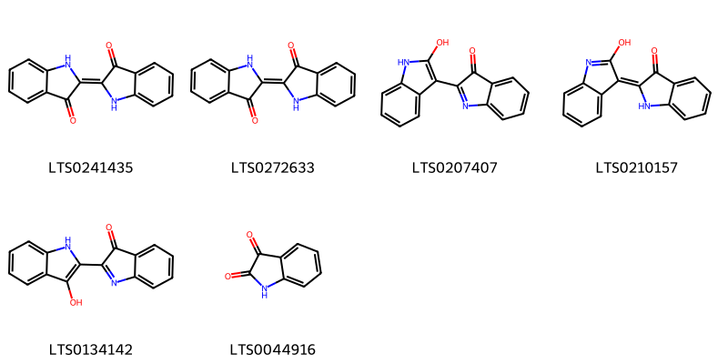{ width=100% }
    <figcaption>Hình ảnh cấu trúc hóa học của 6 hoạt chất thuộc nhóm Indoles and derivatives gồm ['indigo dye (LTS0241435)', "1h,1'h-[2,2'-biindolylidene]-3,3'-dione (LTS0272633)", "2'-hydroxy-1'h-[2,3'-biindol]-3-one (LTS0207407)", "(e)-2'-hydroxy-1h-[2,3'-biindolyliden]-3-one (LTS0210157)", "3'-hydroxy-1'h-[2,2'-biindol]-3-one (LTS0134142)", 'isatin (LTS0044916)'].</figcaption>
</figure>
#### Nhóm Tannins
<figure markdown="span">
    { width=100% }
    <figcaption>Hình ảnh cấu trúc hóa học của 2 hoạt chất thuộc nhóm Tannins gồm ['ellagic acid (LTS0037297)', '6,7,13-trihydroxy-14-methoxy-2,9-dioxatetracyclo[6.6.2.0⁴,¹⁶.0¹¹,¹⁵]hexadeca-1(15),4,6,8(16),11,13-hexaene-3,10-dione (LTS0125222)'].</figcaption>
</figure>

---

### Dược dân tộc học

Danh sách các quốc gia có sử dụng *Couroupita guianensis* trong điều trị các bệnh. 

| Country            | Disease            | Bệnh                                                                                                                                                                                                |
|:-------------------|:-------------------|:----------------------------------------------------------------------------------------------------------------------------------------------------------------------------------------------------|
| Dominican Republic | Poison, Depilatory | MYMEMORY WARNING: YOU USED ALL AVAILABLE FREE TRANSLATIONS FOR TODAY. NEXT AVAILABLE IN  19 HOURS 38 MINUTES 23 SECONDS VISIT HTTPS://MYMEMORY.TRANSLATED.NET/DOC/USAGELIMITS.PHP TO TRANSLATE MORE |
| Venezuela          | Depilatory         | MYMEMORY WARNING: YOU USED ALL AVAILABLE FREE TRANSLATIONS FOR TODAY. NEXT AVAILABLE IN  19 HOURS 38 MINUTES 20 SECONDS VISIT HTTPS://MYMEMORY.TRANSLATED.NET/DOC/USAGELIMITS.PHP TO TRANSLATE MORE |

---

---
## Couroupita surinamensis
### Thông tin về thực vật

!!! info "Phân loại thực vật của *Couroupita guianensis* từ GIBF:"
    - **Kingdom:** Plantae
    - **Phylum:** Tracheophyta
    - **Order:** Ericales
    - **Family:** Lecythidaceae
    - **Genus:** Couroupita
    - **Species:** *Couroupita guianensis*

 

| Label (VI)   | Label (EN)   | Scientific Name       | Descriptions (VI)   | Descriptions (EN)                                                 | Also Known As (VI)        | Also Known As (EN)   |
|:-------------|:-------------|:----------------------|:--------------------|:------------------------------------------------------------------|:--------------------------|:---------------------|
| N/A          | N/A          | Couroupita guianensis | loài thực vật       | species of flowering plant in the Brazil nut family Lecythidaceae | ['Couroupita guianensis'] | ['']                 |

#### Phân bố trên thế giới

**Từ CSDL GIBF** Brazil

#### Phân bố tại Việt Nam

**Từ CSDL GIBF**: Không có ghi nhận ở Việt Nam

---
### Thành phần hóa học
        
- Theo cơ sở dữ liệu lotus: Từ loài *Couroupita guianensis* đã phân lập và xác định được Chưa có hoạt chất nào được phân lập. hoạt chất thuộc về các nhóm Không có hoạt chất nào được phân lập. 

Không có hình ảnh nào được tạo ra

---

### Dược dân tộc học

Danh sách các quốc gia có sử dụng *Couroupita guianensis* trong điều trị các bệnh. 

| Country   | Disease    | Bệnh                                                                                                                                                                                                |
|:----------|:-----------|:----------------------------------------------------------------------------------------------------------------------------------------------------------------------------------------------------|
| Venezuela | Depilatory | MYMEMORY WARNING: YOU USED ALL AVAILABLE FREE TRANSLATIONS FOR TODAY. NEXT AVAILABLE IN  19 HOURS 37 MINUTES 37 SECONDS VISIT HTTPS://MYMEMORY.TRANSLATED.NET/DOC/USAGELIMITS.PHP TO TRANSLATE MORE |

---

# Chi Careya

??? note "Danh sách các dược liệu thuộc chi"
    
	 - *Careya arborea*

---
## Careya arborea
### Thông tin về thực vật

!!! info "Phân loại thực vật của *Careya arborea* từ GIBF:"
    - **Kingdom:** Plantae
    - **Phylum:** Tracheophyta
    - **Order:** Ericales
    - **Family:** Lecythidaceae
    - **Genus:** Careya
    - **Species:** *Careya arborea*

 

| Label (VI)   | Label (EN)   | Scientific Name   | Descriptions (VI)   | Descriptions (EN)   | Also Known As (VI)   | Also Known As (EN)   |
|:-------------|:-------------|:------------------|:--------------------|:--------------------|:---------------------|:---------------------|
| N/A          | N/A          | Careya arborea    | loài thực vật       | species of plant    | ['']                 | ['Slow Match Tree']  |

#### Phân bố trên thế giới

**Từ CSDL GIBF** Viet Nam, nan, unknown or invalid, Sri Lanka, Thailand, Bhutan, Myanmar, Philippines, Malaysia, India, Lao People’s Democratic Republic, Bangladesh, Singapore, Nepal, Australia, Finland, Cambodia, Indonesia

#### Phân bố tại Việt Nam

**Từ CSDL GIBF**: Đồng Nai, Dak Lak, Ninh Thuan

---
### Thành phần hóa học
        
- Theo cơ sở dữ liệu lotus: Từ loài *Careya arborea* đã phân lập và xác định được 11 hoạt chất thuộc về các nhóm Prenol lipids. 

|    | chemicalTaxonomyClassyfireClass   |   smiles_count |
|---:|:----------------------------------|---------------:|
|  0 | Prenol lipids                     |             11 |

#### Nhóm Prenol lipids
<figure markdown="span">
    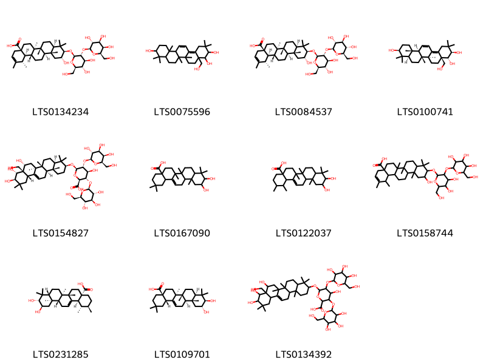{ width=100% }
    <figcaption>Hình ảnh cấu trúc hóa học của 11 hoạt chất thuộc nhóm Prenol lipids gồm ['(1s,4ar,6ar,6br,8ar,10r,11r,12ar,12br,14ar,14br)-10-{[(2r,3r,4s,5s,6r)-4,5-dihydroxy-6-(hydroxymethyl)-3-{[(2s,3r,4s,5r,6r)-3,4,5-trihydroxy-6-(hydroxymethyl)oxan-2-yl]oxy}oxan-2-yl]oxy}-11-hydroxy-1,2,6a,6b,9,9,12a-heptamethyl-4,5,6,7,8,8a,10,11,12,12b,13,14,14a,14b-tetradecahydro-1h-picene-4a-carboxylic acid (LTS0134234)', '4a-(hydroxymethyl)-2,2,6a,6b,9,9,12a-heptamethyl-1,3,4,5,6,7,8,8a,10,11,12,12b-dodecahydropicene-3,4,10-triol (LTS0075596)', '(1s,4ar,6ar,6br,8ar,10r,11r,12ar,12br,14ar,14br)-10-{[(2r,3r,4s,5s,6r)-4,5-dihydroxy-6-(hydroxymethyl)-3-{[(2s,3r,4s,5s,6r)-3,4,5-trihydroxy-6-(hydroxymethyl)oxan-2-yl]oxy}oxan-2-yl]oxy}-11-hydroxy-1,2,6a,6b,9,9,12a-heptamethyl-4,5,6,7,8,8a,10,11,12,12b,13,14,14a,14b-tetradecahydro-1h-picene-4a-carboxylic acid (LTS0084537)', '(3r,4r,4ar,6as,6br,8ar,10s,12as,12br)-4a-(hydroxymethyl)-2,2,6a,6b,9,9,12a-heptamethyl-1,3,4,5,6,7,8,8a,10,11,12,12b-dodecahydropicene-3,4,10-triol (LTS0100741)', '(2s,3s,4s,5r,6r)-6-{[(3s,4ar,6ar,6bs,8r,8ar,9r,10r,12as,14ar,14br)-8,9,10-trihydroxy-8a-(hydroxymethyl)-4,4,6a,6b,11,11,14b-heptamethyl-1,2,3,4a,5,6,7,8,9,10,12,12a,14,14a-tetradecahydropicen-3-yl]oxy}-4-hydroxy-5-{[(2s,3r,4s,5r,6r)-3,4,5-trihydroxy-6-(hydroxymethyl)oxan-2-yl]oxy}-3-{[(2s,3r,4s,5s,6r)-3,4,5-trihydroxy-6-(hydroxymethyl)oxan-2-yl]oxy}oxane-2-carboxylic acid (LTS0154827)', '10,11-dihydroxy-2,2,6a,6b,9,9,12a-heptamethyl-1,3,4,5,6,7,8,8a,10,11,12,12b,13,14b-tetradecahydropicene-4a-carboxylic acid (LTS0167090)', '10,11-dihydroxy-1,2,6a,6b,9,9,12a-heptamethyl-2,3,4,5,6,7,8,8a,10,11,12,12b,13,14b-tetradecahydro-1h-picene-4a-carboxylic acid (LTS0122037)', '10-{[4,5-dihydroxy-6-(hydroxymethyl)-3-{[3,4,5-trihydroxy-6-(hydroxymethyl)oxan-2-yl]oxy}oxan-2-yl]oxy}-11-hydroxy-1,2,6a,6b,9,9,12a-heptamethyl-4,5,6,7,8,8a,10,11,12,12b,13,14,14a,14b-tetradecahydro-1h-picene-4a-carboxylic acid (LTS0158744)', 'corosolic acid (LTS0231285)', 'maslinic acid (LTS0109701)', '4-hydroxy-3,5-bis({[3,4,5-trihydroxy-6-(hydroxymethyl)oxan-2-yl]oxy})-6-{[8,9,10-trihydroxy-8a-(hydroxymethyl)-4,4,6a,6b,11,11,14b-heptamethyl-1,2,3,4a,5,6,7,8,9,10,12,12a,14,14a-tetradecahydropicen-3-yl]oxy}oxane-2-carboxylic acid (LTS0134392)'].</figcaption>
</figure>

---

### Dược dân tộc học

Danh sách các quốc gia có sử dụng *Careya arborea* trong điều trị các bệnh. 

| Country   | Disease                                            | Bệnh                                                                                                                                                                                                |
|:----------|:---------------------------------------------------|:----------------------------------------------------------------------------------------------------------------------------------------------------------------------------------------------------|
| Burma     | Piscicide                                          | MYMEMORY WARNING: YOU USED ALL AVAILABLE FREE TRANSLATIONS FOR TODAY. NEXT AVAILABLE IN  19 HOURS 37 MINUTES 16 SECONDS VISIT HTTPS://MYMEMORY.TRANSLATED.NET/DOC/USAGELIMITS.PHP TO TRANSLATE MORE |
| Elsewhere | Emollient, Piscicide, Demulcent, Digestive, Poison | MYMEMORY WARNING: YOU USED ALL AVAILABLE FREE TRANSLATIONS FOR TODAY. NEXT AVAILABLE IN  19 HOURS 37 MINUTES 12 SECONDS VISIT HTTPS://MYMEMORY.TRANSLATED.NET/DOC/USAGELIMITS.PHP TO TRANSLATE MORE |
| Indochina | Emollient                                          | MYMEMORY WARNING: YOU USED ALL AVAILABLE FREE TRANSLATIONS FOR TODAY. NEXT AVAILABLE IN  19 HOURS 37 MINUTES 09 SECONDS VISIT HTTPS://MYMEMORY.TRANSLATED.NET/DOC/USAGELIMITS.PHP TO TRANSLATE MORE |

---

# Chi Grias

??? note "Danh sách các dược liệu thuộc chi"
    
	 - *Grias peruviana*

---
## Grias peruviana
### Thông tin về thực vật

!!! info "Phân loại thực vật của *Grias peruviana* từ GIBF:"
    - **Kingdom:** Plantae
    - **Phylum:** Tracheophyta
    - **Order:** Ericales
    - **Family:** Lecythidaceae
    - **Genus:** Grias
    - **Species:** *Grias peruviana*

 

| Label (VI)   | Label (EN)   | Scientific Name   | Descriptions (VI)   | Descriptions (EN)   | Also Known As (VI)   | Also Known As (EN)   |
|:-------------|:-------------|:------------------|:--------------------|:--------------------|:---------------------|:---------------------|
| N/A          | N/A          | Grias peruviana   | loài thực vật       | species of plant    | ['']                 | ['']                 |

#### Phân bố trên thế giới

**Từ CSDL GIBF** Ecuador, Peru

#### Phân bố tại Việt Nam

**Từ CSDL GIBF**: Không có ghi nhận ở Việt Nam

---
### Thành phần hóa học
        
- Theo cơ sở dữ liệu lotus: Từ loài *Grias peruviana* đã phân lập và xác định được Chưa có hoạt chất nào được phân lập. hoạt chất thuộc về các nhóm Không có hoạt chất nào được phân lập. 

Không có hình ảnh nào được tạo ra

---

### Dược dân tộc học

Danh sách các quốc gia có sử dụng *Grias peruviana* trong điều trị các bệnh. 

| Country   | Disease   | Bệnh                                                                                                                                                                                                |
|:----------|:----------|:----------------------------------------------------------------------------------------------------------------------------------------------------------------------------------------------------|
| Elsewhere | Emetic    | MYMEMORY WARNING: YOU USED ALL AVAILABLE FREE TRANSLATIONS FOR TODAY. NEXT AVAILABLE IN  19 HOURS 36 MINUTES 35 SECONDS VISIT HTTPS://MYMEMORY.TRANSLATED.NET/DOC/USAGELIMITS.PHP TO TRANSLATE MORE |

---

# Chi Barringtonia

??? note "Danh sách các dược liệu thuộc chi"
    
	 - *Barringtonia acutangula*
	 - *Barringtonia asiatica*
	 - *Barringtonia calyptrata*
	 - *Barringtonia careya*
	 - *Barringtonia cylindrostachya*
	 - *Barringtonia eciosa*
	 - *Barringtonia icata*
	 - *Barringtonia insignis*
	 - *Barringtonia racemosa*

---
## Barringtonia acutangula
### Thông tin về thực vật

!!! info "Phân loại thực vật của *Barringtonia acutangula* từ GIBF:"
    - **Kingdom:** Plantae
    - **Phylum:** Tracheophyta
    - **Order:** Ericales
    - **Family:** Lecythidaceae
    - **Genus:** Barringtonia
    - **Species:** *Barringtonia acutangula*

 

| Label (VI)   | Label (EN)   | Scientific Name         | Descriptions (VI)   | Descriptions (EN)   | Also Known As (VI)          | Also Known As (EN)                                                         |
|:-------------|:-------------|:------------------------|:--------------------|:--------------------|:----------------------------|:---------------------------------------------------------------------------|
| N/A          | N/A          | Barringtonia acutangula | loài thực vật       | species of plant    | ['Barringtonia acutangula'] | ['freshwater mangrove', 'Hijal', 'itchytree', 'mango-pine', 'hijjal tree'] |

#### Phân bố trên thế giới

**Từ CSDL GIBF** Viet Nam, Thailand, Sri Lanka, Myanmar, Malaysia, India, Macao, Indonesia, United States of America, Singapore, China, Australia, Cambodia, Hong Kong

#### Phân bố tại Việt Nam

**Từ CSDL GIBF**: Quảng Nam, Kiên Giang, Hà Nội, Đà Nẵng, Thừa Thiên - Huế

---
### Thành phần hóa học
        
- Theo cơ sở dữ liệu lotus: Từ loài *Barringtonia acutangula* đã phân lập và xác định được 41 hoạt chất thuộc về các nhóm Tannins, Prenol lipids, Steroids and steroid derivatives. 

|    | chemicalTaxonomyClassyfireClass   |   smiles_count |
|---:|:----------------------------------|---------------:|
|  0 | Prenol lipids                     |             37 |
|  1 | Steroids and steroid derivatives  |              2 |
|  2 | Tannins                           |              2 |

#### Nhóm Prenol lipids
<figure markdown="span">
    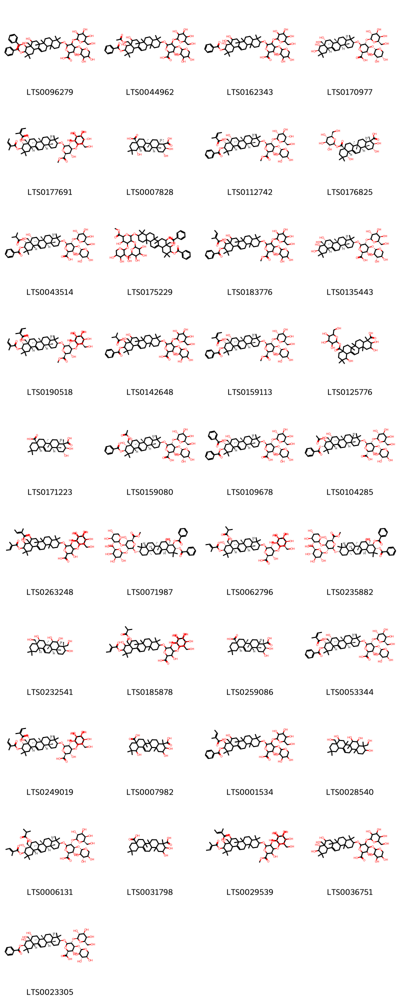{ width=100% }
    <figcaption>Hình ảnh cấu trúc hóa học của 37 hoạt chất thuộc nhóm Prenol lipids gồm ['6-{[9,10-bis(benzoyloxy)-8-hydroxy-8a-(hydroxymethyl)-4,4,6a,6b,11,11,14b-heptamethyl-1,2,3,4a,5,6,7,8,9,10,12,12a,14,14a-tetradecahydropicen-3-yl]oxy}-3-hydroxy-5-{[3,4,5-trihydroxy-6-(hydroxymethyl)oxan-2-yl]oxy}-4-[(3,4,5-trihydroxyoxan-2-yl)oxy]oxane-2-carboxylic acid (LTS0096279)', '6-({8a-[(acetyloxy)methyl]-10-(benzoyloxy)-8,9-dihydroxy-4,4,6a,6b,11,11,14b-heptamethyl-1,2,3,4a,5,6,7,8,9,10,12,12a,14,14a-tetradecahydropicen-3-yl}oxy)-3-hydroxy-5-{[3,4,5-trihydroxy-6-(hydroxymethyl)oxan-2-yl]oxy}-4-[(3,4,5-trihydroxyoxan-2-yl)oxy]oxane-2-carboxylic acid (LTS0044962)', '6-{[10-(benzoyloxy)-8,9-dihydroxy-8a-(hydroxymethyl)-4,4,6a,6b,11,11,14b-heptamethyl-1,2,3,4a,5,6,7,8,9,10,12,12a,14,14a-tetradecahydropicen-3-yl]oxy}-3-hydroxy-5-{[3,4,5-trihydroxy-6-(hydroxymethyl)oxan-2-yl]oxy}-4-[(3,4,5-trihydroxyoxan-2-yl)oxy]oxane-2-carboxylic acid (LTS0162343)', '(2s,3s,4s,5r,6r)-6-{[(3s,4ar,6ar,6bs,8r,8ar,9r,10r,12as,14ar,14br)-8,9,10-trihydroxy-8a-(hydroxymethyl)-4,4,6a,6b,11,11,14b-heptamethyl-1,2,3,4a,5,6,7,8,9,10,12,12a,14,14a-tetradecahydropicen-3-yl]oxy}-3-hydroxy-5-{[(2s,3r,4s,5r,6r)-3,4,5-trihydroxy-6-(hydroxymethyl)oxan-2-yl]oxy}-4-{[(2s,3r,4s,5s)-3,4,5-trihydroxyoxan-2-yl]oxy}oxane-2-carboxylic acid (LTS0170977)', 'methyl (2s,3s,4s,5r,6r)-6-{[(3s,4ar,6ar,6bs,8r,8ar,9r,10r,12as,14ar,14br)-8-hydroxy-8a-(hydroxymethyl)-4,4,6a,6b,11,11,14b-heptamethyl-9,10-bis({[(2z)-2-methylbut-2-enoyl]oxy})-1,2,3,4a,5,6,7,8,9,10,12,12a,14,14a-tetradecahydropicen-3-yl]oxy}-3-hydroxy-5-{[(2s,3r,4s,5s,6r)-3,4,5-trihydroxy-6-(hydroxymethyl)oxan-2-yl]oxy}-4-{[(2s,3r,4s,5r)-3,4,5-trihydroxyoxan-2-yl]oxy}oxane-2-carboxylate (LTS0177691)', '(2r,3r,4r,4ar,6ar,6bs,8ar,12s,12as,14ar,14br)-2,3,12-trihydroxy-4,6a,6b,11,11,14b-hexamethyl-1,2,3,4a,5,6,7,8,9,10,12,12a,14,14a-tetradecahydropicene-4,8a-dicarboxylic acid (LTS0007828)', 'methyl (2s,3s,4s,5r,6r)-6-{[(3s,4ar,6ar,6bs,8r,8ar,9r,10r,12as,14ar,14br)-10-(benzoyloxy)-8-hydroxy-8a-(hydroxymethyl)-4,4,6a,6b,11,11,14b-heptamethyl-9-{[(2z)-2-methylbut-2-enoyl]oxy}-1,2,3,4a,5,6,7,8,9,10,12,12a,14,14a-tetradecahydropicen-3-yl]oxy}-3-hydroxy-5-{[(2s,3r,4s,5s,6r)-3,4,5-trihydroxy-6-(hydroxymethyl)oxan-2-yl]oxy}-4-{[(2s,3r,4s,5r)-3,4,5-trihydroxyoxan-2-yl]oxy}oxane-2-carboxylate (LTS0112742)', '(2r,3r,4s,4ar,6ar,6bs,8ar,12s,12as,14ar,14br)-2,3,12-trihydroxy-4,6a,6b,11,11,14b-hexamethyl-8a-({[(2s,3r,4s,5s,6r)-3,4,5-trihydroxy-6-(hydroxymethyl)oxan-2-yl]oxy}carbonyl)-1,2,3,4a,5,6,7,8,9,10,12,12a,14,14a-tetradecahydropicene-4-carboxylic acid (LTS0176825)', '(2s,3s,4s,5r,6r)-6-{[(3s,4ar,6ar,6bs,8r,8ar,9r,10r,12as,14ar,14br)-10-(benzoyloxy)-8-hydroxy-8a-(hydroxymethyl)-4,4,6a,6b,11,11,14b-heptamethyl-9-[(2-methylpropanoyl)oxy]-1,2,3,4a,5,6,7,8,9,10,12,12a,14,14a-tetradecahydropicen-3-yl]oxy}-3-hydroxy-5-{[(2s,3r,4s,5r,6r)-3,4,5-trihydroxy-6-(hydroxymethyl)oxan-2-yl]oxy}-4-{[(2s,3r,4s,5r)-3,4,5-trihydroxyoxan-2-yl]oxy}oxane-2-carboxylic acid (LTS0043514)', 'methyl 6-{[9,10-bis(benzoyloxy)-8-hydroxy-8a-(hydroxymethyl)-4,4,6a,6b,11,11,14b-heptamethyl-1,2,3,4a,5,6,7,8,9,10,12,12a,14,14a-tetradecahydropicen-3-yl]oxy}-3-hydroxy-5-{[3,4,5-trihydroxy-6-(hydroxymethyl)oxan-2-yl]oxy}-4-[(3,4,5-trihydroxyoxan-2-yl)oxy]oxane-2-carboxylate (LTS0175229)', 'methyl 6-{[10-(benzoyloxy)-8-hydroxy-8a-(hydroxymethyl)-4,4,6a,6b,11,11,14b-heptamethyl-9-[(2-methylbut-2-enoyl)oxy]-1,2,3,4a,5,6,7,8,9,10,12,12a,14,14a-tetradecahydropicen-3-yl]oxy}-3-hydroxy-5-{[3,4,5-trihydroxy-6-(hydroxymethyl)oxan-2-yl]oxy}-4-[(3,4,5-trihydroxyoxan-2-yl)oxy]oxane-2-carboxylate (LTS0183776)', '(2s,3s,4s,5r,6r)-6-{[(3s,4ar,6ar,6bs,8r,8ar,9r,10r,12as,14ar,14br)-8,9,10-trihydroxy-8a-(hydroxymethyl)-4,4,6a,6b,11,11,14b-heptamethyl-1,2,3,4a,5,6,7,8,9,10,12,12a,14,14a-tetradecahydropicen-3-yl]oxy}-3-hydroxy-5-{[(2s,3r,4s,5r,6r)-3,4,5-trihydroxy-6-(hydroxymethyl)oxan-2-yl]oxy}-4-{[(2s,3r,4s,5r)-3,4,5-trihydroxyoxan-2-yl]oxy}oxane-2-carboxylic acid (LTS0135443)', 'methyl (2s,3s,4s,5r,6r)-6-{[(3s,4ar,6ar,6bs,8r,8ar,9r,10r,12as,14ar,14br)-8-hydroxy-8a-(hydroxymethyl)-4,4,6a,6b,11,11,14b-heptamethyl-9,10-bis({[(2z)-2-methylbut-2-enoyl]oxy})-1,2,3,4a,5,6,7,8,9,10,12,12a,14,14a-tetradecahydropicen-3-yl]oxy}-3-hydroxy-5-{[(2s,3r,4s,5r,6r)-3,4,5-trihydroxy-6-(hydroxymethyl)oxan-2-yl]oxy}-4-{[(2s,3r,4s,5r)-3,4,5-trihydroxyoxan-2-yl]oxy}oxane-2-carboxylate (LTS0190518)', '6-{[10-(benzoyloxy)-8-hydroxy-8a-(hydroxymethyl)-4,4,6a,6b,11,11,14b-heptamethyl-9-[(2-methylpropanoyl)oxy]-1,2,3,4a,5,6,7,8,9,10,12,12a,14,14a-tetradecahydropicen-3-yl]oxy}-3-hydroxy-5-{[3,4,5-trihydroxy-6-(hydroxymethyl)oxan-2-yl]oxy}-4-[(3,4,5-trihydroxyoxan-2-yl)oxy]oxane-2-carboxylic acid (LTS0142648)', 'methyl (2s,3s,4s,5r,6r)-6-{[(3s,4ar,6ar,6bs,8r,8ar,9r,10r,12as,14ar,14br)-10-(benzoyloxy)-8-hydroxy-8a-(hydroxymethyl)-4,4,6a,6b,11,11,14b-heptamethyl-9-{[(2z)-2-methylbut-2-enoyl]oxy}-1,2,3,4a,5,6,7,8,9,10,12,12a,14,14a-tetradecahydropicen-3-yl]oxy}-3-hydroxy-5-{[(2s,3r,4s,5r,6r)-3,4,5-trihydroxy-6-(hydroxymethyl)oxan-2-yl]oxy}-4-{[(2s,3r,4s,5r)-3,4,5-trihydroxyoxan-2-yl]oxy}oxane-2-carboxylate (LTS0159113)', '2,3,12-trihydroxy-4,6a,6b,11,11,14b-hexamethyl-8a-({[3,4,5-trihydroxy-6-(hydroxymethyl)oxan-2-yl]oxy}carbonyl)-1,2,3,4a,5,6,7,8,9,10,12,12a,14,14a-tetradecahydropicene-4-carboxylic acid (LTS0125776)', '(2r,3r,4s,4ar,6ar,6bs,8as,12as,14ar,14br)-2,3-dihydroxy-4,6a,6b,11,11,14b-hexamethyl-1,2,3,4a,5,6,7,8,9,10,12,12a,14,14a-tetradecahydropicene-4,8a-dicarboxylic acid (LTS0171223)', '(2s,3s,4s,5r,6r)-6-{[(3s,4ar,6ar,6bs,8r,8ar,9r,10r,12as,14ar,14br)-8a-[(acetyloxy)methyl]-10-(benzoyloxy)-8,9-dihydroxy-4,4,6a,6b,11,11,14b-heptamethyl-1,2,3,4a,5,6,7,8,9,10,12,12a,14,14a-tetradecahydropicen-3-yl]oxy}-3-hydroxy-5-{[(2s,3r,4s,5r,6r)-3,4,5-trihydroxy-6-(hydroxymethyl)oxan-2-yl]oxy}-4-{[(2s,3r,4s,5r)-3,4,5-trihydroxyoxan-2-yl]oxy}oxane-2-carboxylic acid (LTS0159080)', '(2s,3s,4s,5r,6r)-6-{[(3s,4ar,6ar,6bs,8r,8ar,9r,10r,12as,14ar,14br)-9,10-bis(benzoyloxy)-8-hydroxy-8a-(hydroxymethyl)-4,4,6a,6b,11,11,14b-heptamethyl-1,2,3,4a,5,6,7,8,9,10,12,12a,14,14a-tetradecahydropicen-3-yl]oxy}-3-hydroxy-5-{[(2s,3r,4s,5r,6r)-3,4,5-trihydroxy-6-(hydroxymethyl)oxan-2-yl]oxy}-4-{[(2s,3r,4s,5r)-3,4,5-trihydroxyoxan-2-yl]oxy}oxane-2-carboxylic acid (LTS0109678)', '(2r,3s,4s,5r,6r)-6-{[(3s,4as,6ar,6bs,8r,8ar,9s,10s,12as,14ar,14br)-9-(acetyloxy)-10-(benzoyloxy)-8-hydroxy-8a-(hydroxymethyl)-4,4,6a,6b,11,11,14b-heptamethyl-1,2,3,4a,5,6,7,8,9,10,12,12a,14,14a-tetradecahydropicen-3-yl]oxy}-3-hydroxy-5-{[(2s,3r,4s,5r,6r)-3,4,5-trihydroxy-6-(hydroxymethyl)oxan-2-yl]oxy}-4-{[(2s,3r,4s,5r)-3,4,5-trihydroxyoxan-2-yl]oxy}oxane-2-carboxylic acid (LTS0104285)', '3-hydroxy-6-{[8-hydroxy-8a-(hydroxymethyl)-4,4,6a,6b,11,11,14b-heptamethyl-9,10-bis[(2-methylbut-2-enoyl)oxy]-1,2,3,4a,5,6,7,8,9,10,12,12a,14,14a-tetradecahydropicen-3-yl]oxy}-5-{[3,4,5-trihydroxy-6-(hydroxymethyl)oxan-2-yl]oxy}-4-[(3,4,5-trihydroxyoxan-2-yl)oxy]oxane-2-carboxylic acid (LTS0263248)', 'methyl (2s,3s,4s,5r,6r)-6-{[(3s,4ar,6ar,6bs,8r,8ar,9r,10r,12as,14ar,14br)-9,10-bis(benzoyloxy)-8-hydroxy-8a-(hydroxymethyl)-4,4,6a,6b,11,11,14b-heptamethyl-1,2,3,4a,5,6,7,8,9,10,12,12a,14,14a-tetradecahydropicen-3-yl]oxy}-3-hydroxy-5-{[(2s,3r,4s,5r,6r)-3,4,5-trihydroxy-6-(hydroxymethyl)oxan-2-yl]oxy}-4-{[(2s,3r,4s,5r)-3,4,5-trihydroxyoxan-2-yl]oxy}oxane-2-carboxylate (LTS0071987)', '(2s,3s,4s,5r,6r)-6-{[(3s,4ar,6ar,6bs,8r,8ar,9r,10r,12ar,14ar,14br)-8,9-dihydroxy-4,4,6a,6b,11,11,14b-heptamethyl-10-{[(2e)-2-methylbut-2-enoyl]oxy}-8a-{[(2-methylpropanoyl)oxy]methyl}-1,2,3,4a,5,6,7,8,9,10,12,12a,14,14a-tetradecahydropicen-3-yl]oxy}-3-hydroxy-5-{[(2s,3r,4s,5r,6r)-3,4,5-trihydroxy-6-(hydroxymethyl)oxan-2-yl]oxy}-4-{[(2s,3r,4s,5r)-3,4,5-trihydroxyoxan-2-yl]oxy}oxane-2-carboxylic acid (LTS0062796)', 'methyl (2s,3s,4s,5r,6r)-6-{[(3s,4ar,6ar,6bs,8r,8ar,9r,10r,12as,14ar,14br)-9,10-bis(benzoyloxy)-8-hydroxy-8a-(hydroxymethyl)-4,4,6a,6b,11,11,14b-heptamethyl-1,2,3,4a,5,6,7,8,9,10,12,12a,14,14a-tetradecahydropicen-3-yl]oxy}-3-hydroxy-5-{[(2s,3r,4s,5s,6r)-3,4,5-trihydroxy-6-(hydroxymethyl)oxan-2-yl]oxy}-4-{[(2s,3r,4s,5r)-3,4,5-trihydroxyoxan-2-yl]oxy}oxane-2-carboxylate (LTS0235882)', '(3s,4r,4ar,5s,6r,6ar,6br,8s,8as,12as,14ar,14br)-4,8a-bis(hydroxymethyl)-4,6a,6b,11,11,14b-hexamethyl-1,2,3,4a,5,6,7,8,9,10,12,12a,14,14a-tetradecahydropicene-3,5,6,8-tetrol (LTS0232541)', '6-({8,9-dihydroxy-4,4,6a,6b,11,11,14b-heptamethyl-10-[(2-methylbut-2-enoyl)oxy]-8a-{[(2-methylpropanoyl)oxy]methyl}-1,2,3,4a,5,6,7,8,9,10,12,12a,14,14a-tetradecahydropicen-3-yl}oxy)-3-hydroxy-5-{[3,4,5-trihydroxy-6-(hydroxymethyl)oxan-2-yl]oxy}-4-[(3,4,5-trihydroxyoxan-2-yl)oxy]oxane-2-carboxylic acid (LTS0185878)', '(2s,3r,4s,4as,6ar,6br,8as,12ar,14as,14br)-2,3-dihydroxy-4,6a,6b,11,11,14b-hexamethyl-1,2,3,4a,5,6,7,8,9,10,12,12a,14,14a-tetradecahydropicene-4,8a-dicarboxylic acid (LTS0259086)', '(2s,3s,4s,5r,6r)-6-{[(3s,4ar,6ar,6bs,8r,8ar,9r,10r,12as,14ar,14br)-10-(benzoyloxy)-8-hydroxy-8a-(hydroxymethyl)-4,4,6a,6b,11,11,14b-heptamethyl-9-{[(2z)-2-methylbut-2-enoyl]oxy}-1,2,3,4a,5,6,7,8,9,10,12,12a,14,14a-tetradecahydropicen-3-yl]oxy}-3-hydroxy-5-{[(2s,3r,4s,5r,6r)-3,4,5-trihydroxy-6-(hydroxymethyl)oxan-2-yl]oxy}-4-{[(2s,3r,4s,5r)-3,4,5-trihydroxyoxan-2-yl]oxy}oxane-2-carboxylic acid (LTS0053344)', '(2s,3s,4s,5r,6r)-6-{[(3s,4ar,6ar,6bs,8r,8ar,9r,10r,12as,14ar,14br)-8-hydroxy-8a-(hydroxymethyl)-4,4,6a,6b,11,11,14b-heptamethyl-9,10-bis({[(2z)-2-methylbut-2-enoyl]oxy})-1,2,3,4a,5,6,7,8,9,10,12,12a,14,14a-tetradecahydropicen-3-yl]oxy}-3-hydroxy-5-{[(2s,3r,4s,5r,6r)-3,4,5-trihydroxy-6-(hydroxymethyl)oxan-2-yl]oxy}-4-{[(2s,3r,4s,5r)-3,4,5-trihydroxyoxan-2-yl]oxy}oxane-2-carboxylic acid (LTS0249019)', '2,3,12-trihydroxy-4,6a,6b,11,11,14b-hexamethyl-1,2,3,4a,5,6,7,8,9,10,12,12a,14,14a-tetradecahydropicene-4,8a-dicarboxylic acid (LTS0007982)', '6-{[10-(benzoyloxy)-8-hydroxy-8a-(hydroxymethyl)-4,4,6a,6b,11,11,14b-heptamethyl-9-[(2-methylbut-2-enoyl)oxy]-1,2,3,4a,5,6,7,8,9,10,12,12a,14,14a-tetradecahydropicen-3-yl]oxy}-3-hydroxy-5-{[3,4,5-trihydroxy-6-(hydroxymethyl)oxan-2-yl]oxy}-4-[(3,4,5-trihydroxyoxan-2-yl)oxy]oxane-2-carboxylic acid (LTS0001534)', '4,8a-bis(hydroxymethyl)-4,6a,6b,11,11,14b-hexamethyl-1,2,3,4a,5,6,7,8,9,10,12,12a,14,14a-tetradecahydropicene-3,5,6,8-tetrol (LTS0028540)', '(2s,3s,4s,5r,6r)-6-{[(3s,4ar,6ar,6bs,8r,8ar,9r,10r,12as,14ar,14br)-8,9-dihydroxy-4,4,6a,6b,11,11,14b-heptamethyl-10-{[(2e)-2-methylbut-2-enoyl]oxy}-8a-{[(2-methylpropanoyl)oxy]methyl}-1,2,3,4a,5,6,7,8,9,10,12,12a,14,14a-tetradecahydropicen-3-yl]oxy}-3-hydroxy-5-{[(2s,3r,4s,5r,6r)-3,4,5-trihydroxy-6-(hydroxymethyl)oxan-2-yl]oxy}-4-{[(2s,3r,4s,5r)-3,4,5-trihydroxyoxan-2-yl]oxy}oxane-2-carboxylic acid (LTS0006131)', '2,3-dihydroxy-4,6a,6b,11,11,14b-hexamethyl-1,2,3,4a,5,6,7,8,9,10,12,12a,14,14a-tetradecahydropicene-4,8a-dicarboxylic acid (LTS0031798)', 'methyl 3-hydroxy-6-{[8-hydroxy-8a-(hydroxymethyl)-4,4,6a,6b,11,11,14b-heptamethyl-9,10-bis[(2-methylbut-2-enoyl)oxy]-1,2,3,4a,5,6,7,8,9,10,12,12a,14,14a-tetradecahydropicen-3-yl]oxy}-5-{[3,4,5-trihydroxy-6-(hydroxymethyl)oxan-2-yl]oxy}-4-[(3,4,5-trihydroxyoxan-2-yl)oxy]oxane-2-carboxylate (LTS0029539)', '3-hydroxy-5-{[3,4,5-trihydroxy-6-(hydroxymethyl)oxan-2-yl]oxy}-6-{[8,9,10-trihydroxy-8a-(hydroxymethyl)-4,4,6a,6b,11,11,14b-heptamethyl-1,2,3,4a,5,6,7,8,9,10,12,12a,14,14a-tetradecahydropicen-3-yl]oxy}-4-[(3,4,5-trihydroxyoxan-2-yl)oxy]oxane-2-carboxylic acid (LTS0036751)', '(2s,3s,4s,5r,6r)-6-{[(3s,4ar,6ar,6bs,8r,8ar,9r,10r,12as,14ar,14br)-10-(benzoyloxy)-8,9-dihydroxy-8a-(hydroxymethyl)-4,4,6a,6b,11,11,14b-heptamethyl-1,2,3,4a,5,6,7,8,9,10,12,12a,14,14a-tetradecahydropicen-3-yl]oxy}-3-hydroxy-5-{[(2s,3r,4s,5r,6r)-3,4,5-trihydroxy-6-(hydroxymethyl)oxan-2-yl]oxy}-4-{[(2s,3r,4s,5r)-3,4,5-trihydroxyoxan-2-yl]oxy}oxane-2-carboxylic acid (LTS0023305)'].</figcaption>
</figure>
#### Nhóm Steroids and steroid derivatives
<figure markdown="span">
    { width=100% }
    <figcaption>Hình ảnh cấu trúc hóa học của 2 hoạt chất thuộc nhóm Steroids and steroid derivatives gồm ['stigmast-5-en-3-ol, (3β)- (LTS0204616)', 'sitosterol (LTS0168132)'].</figcaption>
</figure>
#### Nhóm Tannins
<figure markdown="span">
    { width=100% }
    <figcaption>Hình ảnh cấu trúc hóa học của 2 hoạt chất thuộc nhóm Tannins gồm ['6,7,13-trihydroxy-14-methoxy-2,9-dioxatetracyclo[6.6.2.0⁴,¹⁶.0¹¹,¹⁵]hexadeca-1(15),4,6,8(16),11,13-hexaene-3,10-dione (LTS0125222)', 'ellagic acid (LTS0037297)'].</figcaption>
</figure>

---

### Dược dân tộc học

Danh sách các quốc gia có sử dụng *Barringtonia acutangula* trong điều trị các bệnh. 

| Country   | Disease              | Bệnh                                                                                                                                                                                                |
|:----------|:---------------------|:----------------------------------------------------------------------------------------------------------------------------------------------------------------------------------------------------|
| Elsewhere | Piscicide, Piscicide | MYMEMORY WARNING: YOU USED ALL AVAILABLE FREE TRANSLATIONS FOR TODAY. NEXT AVAILABLE IN  19 HOURS 36 MINUTES 02 SECONDS VISIT HTTPS://MYMEMORY.TRANSLATED.NET/DOC/USAGELIMITS.PHP TO TRANSLATE MORE |

---

---
## Barringtonia asiatica
### Thông tin về thực vật

!!! info "Phân loại thực vật của *Barringtonia asiatica* từ GIBF:"
    - **Kingdom:** Plantae
    - **Phylum:** Tracheophyta
    - **Order:** Ericales
    - **Family:** Lecythidaceae
    - **Genus:** Barringtonia
    - **Species:** *Barringtonia asiatica*

 

| Label (VI)   | Label (EN)   | Scientific Name       | Descriptions (VI)   | Descriptions (EN)   | Also Known As (VI)        | Also Known As (EN)   |
|:-------------|:-------------|:----------------------|:--------------------|:--------------------|:--------------------------|:---------------------|
| N/A          | N/A          | Barringtonia asiatica |                     | species of plant    | ['Barringtonia asiatica'] | ['']                 |

#### Phân bố trên thế giới

**Từ CSDL GIBF** Viet Nam, Thailand, Philippines, Guadeloupe, French Polynesia, Northern Mariana Islands, United States Minor Outlying Islands, Singapore, Australia, Jamaica, Indonesia, Haiti, Sri Lanka, American Samoa, Maldives, Puerto Rico, Malaysia, India, Samoa, Seychelles, Cuba, Guam, Cambodia, Christmas Island, Japan, Vanuatu, Palau, Chinese Taipei, Niue, Micronesia (Federated States of), Mozambique, New Zealand, Cook Islands, Fiji, Papua New Guinea, New Caledonia, United States of America, Madagascar, Wallis and Futuna, Solomon Islands

#### Phân bố tại Việt Nam

**Từ CSDL GIBF**: Khánh Hòa

---
### Thành phần hóa học
        
- Theo cơ sở dữ liệu lotus: Từ loài *Barringtonia asiatica* đã phân lập và xác định được 35 hoạt chất thuộc về các nhóm Glycerolipids, Prenol lipids, Steroids and steroid derivatives, Fatty Acyls. 

|    | chemicalTaxonomyClassyfireClass   |   smiles_count |
|---:|:----------------------------------|---------------:|
|  0 | Fatty Acyls                       |              2 |
|  1 | Glycerolipids                     |              2 |
|  2 | Prenol lipids                     |             25 |
|  3 | Steroids and steroid derivatives  |              6 |

#### Nhóm Fatty Acyls
<figure markdown="span">
    { width=100% }
    <figcaption>Hình ảnh cấu trúc hóa học của 2 hoạt chất thuộc nhóm Fatty Acyls gồm ['9,12-octadecadienoic acid (LTS0101463)', 'linoleic (LTS0013198)'].</figcaption>
</figure>
#### Nhóm Glycerolipids
<figure markdown="span">
    { width=100% }
    <figcaption>Hình ảnh cấu trúc hóa học của 2 hoạt chất thuộc nhóm Glycerolipids gồm ['linolein (LTS0183869)', 'trilinolein (LTS0236992)'].</figcaption>
</figure>
#### Nhóm Prenol lipids
<figure markdown="span">
    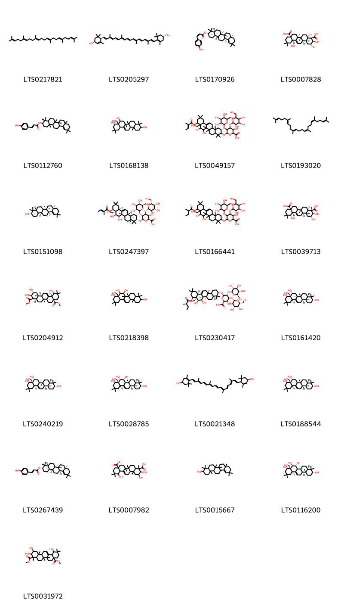{ width=100% }
    <figcaption>Hình ảnh cấu trúc hóa học của 25 hoạt chất thuộc nhóm Prenol lipids gồm ['squalene (LTS0217821)', 'carotenoid (LTS0205297)', '(3s,4ar,6ar,6br,8ar,12bs,14ar,14br)-4,4,6a,6b,8a,11,11,14b-octamethyl-1,2,3,4a,5,6,7,8,9,10,12b,13,14,14a-tetradecahydropicen-3-yl (2z)-3-(4-hydroxyphenyl)prop-2-enoate (LTS0170926)', '(2r,3r,4r,4ar,6ar,6bs,8ar,12s,12as,14ar,14br)-2,3,12-trihydroxy-4,6a,6b,11,11,14b-hexamethyl-1,2,3,4a,5,6,7,8,9,10,12,12a,14,14a-tetradecahydropicene-4,8a-dicarboxylic acid (LTS0007828)', '4,4,6a,6b,8a,11,11,14b-octamethyl-1,2,3,4a,5,6,7,8,9,10,12b,13,14,14a-tetradecahydropicen-3-yl 3-(4-hydroxyphenyl)prop-2-enoate (LTS0112760)', '8a-(hydroxymethyl)-4,4,6a,6b,11,11,14b-heptamethyl-1,2,3,4a,5,6,7,8,9,10,12,12a,14,14a-tetradecahydropicene-3,8,9-triol (LTS0168138)', '6-{[7,8-dihydroxy-8a-(hydroxymethyl)-4,4,6a,6b,11,11,14b-heptamethyl-9-[(2-methylbut-2-enoyl)oxy]-1,2,3,4a,5,6,7,8,9,10,12,12a,14,14a-tetradecahydropicen-3-yl]oxy}-3-hydroxy-4,5-bis({[3,4,5-trihydroxy-6-(hydroxymethyl)oxan-2-yl]oxy})oxane-2-carboxylic acid (LTS0049157)', '2,6,10,15,19,23-hexamethyltetracosa-2,6,10,14,18,22-hexaene (LTS0193020)', 'germanicol (LTS0151098)', '(2s,3s,4s,5r,6r)-6-{[(3s,4ar,6ar,6bs,7r,8s,8ar,9s,12as,14ar,14br)-7,8-dihydroxy-8a-(hydroxymethyl)-4,4,6a,6b,11,11,14b-heptamethyl-9-{[(2e)-2-methylbut-2-enoyl]oxy}-1,2,3,4a,5,6,7,8,9,10,12,12a,14,14a-tetradecahydropicen-3-yl]oxy}-3-hydroxy-4-{[(2s,3r,4s,5r,6r)-3,4,5-trihydroxy-6-(hydroxymethyl)oxan-2-yl]oxy}-5-{[(2s,3r,4s,5s,6r)-3,4,5-trihydroxy-6-(hydroxymethyl)oxan-2-yl]oxy}oxane-2-carboxylic acid (LTS0247397)', '6-{[7,8-dihydroxy-8a-(hydroxymethyl)-4,4,6a,6b,11,11,14b-heptamethyl-9-[(2-methylbutanoyl)oxy]-1,2,3,4a,5,6,7,8,9,10,12,12a,14,14a-tetradecahydropicen-3-yl]oxy}-3-hydroxy-4,5-bis({[3,4,5-trihydroxy-6-(hydroxymethyl)oxan-2-yl]oxy})oxane-2-carboxylic acid (LTS0166441)', '(2r,3r,4s,4ar,6ar,6bs,8ar,12s,12as,14ar,14br)-2,3,12-trihydroxy-4,6a,6b,11,11,14b-hexamethyl-1,2,3,4a,5,6,7,8,9,10,12,12a,14,14a-tetradecahydropicene-4,8a-dicarboxylic acid (LTS0039713)', '4,8a-dimethyl (2r,3r,4r,4ar,6ar,6bs,8ar,12r,12as,14ar,14br)-2,3,12-trihydroxy-4,6a,6b,11,11,14b-hexamethyl-1,2,3,4a,5,6,7,8,9,10,12,12a,14,14a-tetradecahydropicene-4,8a-dicarboxylate (LTS0204912)', '8a-(hydroxymethyl)-4,4,6a,6b,11,11,14b-heptamethyl-1,2,3,4a,5,6,7,8,9,10,12,12a,14,14a-tetradecahydropicene-3,7,8,9-tetrol (LTS0218398)', '(2s,3s,4s,5r,6r)-6-{[(3s,4ar,6ar,6bs,7r,8s,8ar,9s,12as,14ar,14br)-7,8-dihydroxy-8a-(hydroxymethyl)-4,4,6a,6b,11,11,14b-heptamethyl-9-{[(2r)-2-methylbutanoyl]oxy}-1,2,3,4a,5,6,7,8,9,10,12,12a,14,14a-tetradecahydropicen-3-yl]oxy}-3-hydroxy-4-{[(2s,3r,4s,5r,6r)-3,4,5-trihydroxy-6-(hydroxymethyl)oxan-2-yl]oxy}-5-{[(2s,3r,4s,5s,6r)-3,4,5-trihydroxy-6-(hydroxymethyl)oxan-2-yl]oxy}oxane-2-carboxylic acid (LTS0230417)', '(3s,4ar,6ar,6bs,8r,8as,9s,12as,14ar,14br)-8a-(hydroxymethyl)-4,4,6a,6b,11,11,14b-heptamethyl-1,2,3,4a,5,6,7,8,9,10,12,12a,14,14a-tetradecahydropicene-3,8,9-triol (LTS0161420)', '(3r,4ar,6ar,6bs,8r,8as,9s,12ar,14ar,14br)-8a-(hydroxymethyl)-4,4,6a,6b,11,11,14b-heptamethyl-1,2,3,4a,5,6,7,8,9,10,12,12a,14,14a-tetradecahydropicene-3,8,9-triol (LTS0240219)', '(3s,4ar,6ar,6bs,7r,8s,8as,9s,12as,14ar,14br)-8a-(hydroxymethyl)-4,4,6a,6b,11,11,14b-heptamethyl-1,2,3,4a,5,6,7,8,9,10,12,12a,14,14a-tetradecahydropicene-3,7,8,9-tetrol (LTS0028785)', '4-[(9e,11e,13e,15e,17e)-18-(4-hydroxy-2,6,6-trimethylcyclohex-1-en-1-yl)-3,7,12,16-tetramethyloctadeca-1,3,5,7,9,11,13,15,17-nonaen-1-yl]-3,5,5-trimethylcyclohex-2-en-1-ol (LTS0021348)', '(3s,4ar,6ar,6bs,8r,8as,9s,12as,14as,14br)-8a-(hydroxymethyl)-4,4,6a,6b,11,11,14b-heptamethyl-1,2,3,4a,5,6,7,8,9,10,12,12a,14,14a-tetradecahydropicene-3,8,9-triol (LTS0188544)', '(3s,4ar,6ar,6br,8ar,12bs,14ar,14br)-4,4,6a,6b,8a,11,11,14b-octamethyl-1,2,3,4a,5,6,7,8,9,10,12b,13,14,14a-tetradecahydropicen-3-yl (2e)-3-(4-hydroxyphenyl)prop-2-enoate (LTS0267439)', '2,3,12-trihydroxy-4,6a,6b,11,11,14b-hexamethyl-1,2,3,4a,5,6,7,8,9,10,12,12a,14,14a-tetradecahydropicene-4,8a-dicarboxylic acid (LTS0007982)', '4,4,6a,6b,8a,11,11,14b-octamethyl-1,2,3,4a,5,6,7,8,9,10,12b,13,14,14a-tetradecahydropicen-3-ol (LTS0015667)', '(3r,4ar,6as,6bs,7r,8r,8as,9s,12ar,14ar,14br)-8a-(hydroxymethyl)-4,4,6a,6b,11,11,14b-heptamethyl-1,2,3,4a,5,6,7,8,9,10,12,12a,14,14a-tetradecahydropicene-3,7,8,9-tetrol (LTS0116200)', '4,8a-dimethyl 2,3,12-trihydroxy-4,6a,6b,11,11,14b-hexamethyl-1,2,3,4a,5,6,7,8,9,10,12,12a,14,14a-tetradecahydropicene-4,8a-dicarboxylate (LTS0031972)'].</figcaption>
</figure>
#### Nhóm Steroids and steroid derivatives
<figure markdown="span">
    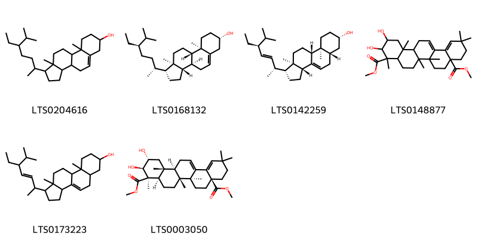{ width=100% }
    <figcaption>Hình ảnh cấu trúc hóa học của 6 hoạt chất thuộc nhóm Steroids and steroid derivatives gồm ['stigmast-5-en-3-ol, (3β)- (LTS0204616)', 'sitosterol (LTS0168132)', 'chondrillasterol (LTS0142259)', '4,8a-dimethyl 2,3-dihydroxy-4,6a,6b,11,11,14b-hexamethyl-1,2,3,4a,5,6,7,8,9,10,14,14a-dodecahydropicene-4,8a-dicarboxylate (LTS0148877)', '1-(5-ethyl-6-methylhept-3-en-2-yl)-9a,11a-dimethyl-1h,2h,3h,3ah,5h,5ah,6h,7h,8h,9h,9bh,10h,11h-cyclopenta[a]phenanthren-7-ol (LTS0173223)', '4,8a-dimethyl (2r,3r,4r,4ar,6ar,6bs,8as,14ar,14br)-2,3-dihydroxy-4,6a,6b,11,11,14b-hexamethyl-1,2,3,4a,5,6,7,8,9,10,14,14a-dodecahydropicene-4,8a-dicarboxylate (LTS0003050)'].</figcaption>
</figure>

---

### Dược dân tộc học

Danh sách các quốc gia có sử dụng *Barringtonia asiatica* trong điều trị các bệnh. 

| Country   | Disease                | Bệnh                                                                                                                                                                                                |
|:----------|:-----------------------|:----------------------------------------------------------------------------------------------------------------------------------------------------------------------------------------------------|
| Elsewhere | Piscicide              | MYMEMORY WARNING: YOU USED ALL AVAILABLE FREE TRANSLATIONS FOR TODAY. NEXT AVAILABLE IN  19 HOURS 34 MINUTES 44 SECONDS VISIT HTTPS://MYMEMORY.TRANSLATED.NET/DOC/USAGELIMITS.PHP TO TRANSLATE MORE |
| Java      | Piscicide, Insecticide | MYMEMORY WARNING: YOU USED ALL AVAILABLE FREE TRANSLATIONS FOR TODAY. NEXT AVAILABLE IN  19 HOURS 34 MINUTES 40 SECONDS VISIT HTTPS://MYMEMORY.TRANSLATED.NET/DOC/USAGELIMITS.PHP TO TRANSLATE MORE |
| Samoa     | Piscicide              | MYMEMORY WARNING: YOU USED ALL AVAILABLE FREE TRANSLATIONS FOR TODAY. NEXT AVAILABLE IN  19 HOURS 34 MINUTES 35 SECONDS VISIT HTTPS://MYMEMORY.TRANSLATED.NET/DOC/USAGELIMITS.PHP TO TRANSLATE MORE |
| Solomon I | Piscicide, Piscicide   | MYMEMORY WARNING: YOU USED ALL AVAILABLE FREE TRANSLATIONS FOR TODAY. NEXT AVAILABLE IN  19 HOURS 34 MINUTES 31 SECONDS VISIT HTTPS://MYMEMORY.TRANSLATED.NET/DOC/USAGELIMITS.PHP TO TRANSLATE MORE |

---

---
## Barringtonia calyptrata
### Thông tin về thực vật

!!! info "Phân loại thực vật của *Barringtonia calyptrata* từ GIBF:"
    - **Kingdom:** Plantae
    - **Phylum:** Tracheophyta
    - **Order:** Ericales
    - **Family:** Lecythidaceae
    - **Genus:** Barringtonia
    - **Species:** *Barringtonia calyptrata*

 

| Label (VI)   | Label (EN)   | Scientific Name         | Descriptions (VI)   | Descriptions (EN)                           | Also Known As (VI)   | Also Known As (EN)                                                                              |
|:-------------|:-------------|:------------------------|:--------------------|:--------------------------------------------|:---------------------|:------------------------------------------------------------------------------------------------|
| N/A          | N/A          | Barringtonia calyptrata |                     | species of tree in the family Lecythidaceae | ['']                 | ['Blue-fruited Barringtonia', 'Cassowary pine', 'China pine', 'Corned beef wood', 'Mango pine'] |

#### Phân bố trên thế giới

**Từ CSDL GIBF** Vanuatu, Papua New Guinea, Fiji, Singapore, Australia, Solomon Islands, Indonesia

#### Phân bố tại Việt Nam

**Từ CSDL GIBF**: Không có ghi nhận ở Việt Nam

---
### Thành phần hóa học
        
- Theo cơ sở dữ liệu lotus: Từ loài *Barringtonia calyptrata* đã phân lập và xác định được Chưa có hoạt chất nào được phân lập. hoạt chất thuộc về các nhóm Không có hoạt chất nào được phân lập. 

Không có hình ảnh nào được tạo ra

---

### Dược dân tộc học

Danh sách các quốc gia có sử dụng *Barringtonia calyptrata* trong điều trị các bệnh. 

| Country   | Disease   | Bệnh                                                                                                                                                                                                |
|:----------|:----------|:----------------------------------------------------------------------------------------------------------------------------------------------------------------------------------------------------|
| Australia | Piscicide | MYMEMORY WARNING: YOU USED ALL AVAILABLE FREE TRANSLATIONS FOR TODAY. NEXT AVAILABLE IN  19 HOURS 33 MINUTES 41 SECONDS VISIT HTTPS://MYMEMORY.TRANSLATED.NET/DOC/USAGELIMITS.PHP TO TRANSLATE MORE |

---

---
## Barringtonia careya
### Thông tin về thực vật

!!! info "Phân loại thực vật của *Planchonia careya* từ GIBF:"
    - **Kingdom:** Plantae
    - **Phylum:** Tracheophyta
    - **Order:** Ericales
    - **Family:** Lecythidaceae
    - **Genus:** Planchonia
    - **Species:** *Planchonia careya*

 

| Label (VI)   | Label (EN)   | Scientific Name     | Descriptions (VI)   | Descriptions (EN)   | Also Known As (VI)   | Also Known As (EN)   |
|:-------------|:-------------|:--------------------|:--------------------|:--------------------|:---------------------|:---------------------|
| N/A          | N/A          | Barringtonia careya | loài thực vật       | species of plant    | ['']                 | ['']                 |

#### Phân bố trên thế giới

**Từ CSDL GIBF** Vanuatu, Papua New Guinea, Fiji, Singapore, Australia, Solomon Islands, Indonesia

#### Phân bố tại Việt Nam

**Từ CSDL GIBF**: Không có ghi nhận ở Việt Nam

---
### Thành phần hóa học
        
- Theo cơ sở dữ liệu lotus: Từ loài *Planchonia careya* đã phân lập và xác định được Chưa có hoạt chất nào được phân lập. hoạt chất thuộc về các nhóm Không có hoạt chất nào được phân lập. 

Không có hình ảnh nào được tạo ra

---

### Dược dân tộc học

Danh sách các quốc gia có sử dụng *Planchonia careya* trong điều trị các bệnh. 

| Country   | Disease   | Bệnh                                                                                                                                                                                                |
|:----------|:----------|:----------------------------------------------------------------------------------------------------------------------------------------------------------------------------------------------------|
| Elsewhere | Piscicide | MYMEMORY WARNING: YOU USED ALL AVAILABLE FREE TRANSLATIONS FOR TODAY. NEXT AVAILABLE IN  19 HOURS 33 MINUTES 10 SECONDS VISIT HTTPS://MYMEMORY.TRANSLATED.NET/DOC/USAGELIMITS.PHP TO TRANSLATE MORE |

---

---
## Barringtonia cylindrostachya
### Thông tin về thực vật

!!! info "Phân loại thực vật của *Barringtonia macrostachya* từ GIBF:"
    - **Kingdom:** Plantae
    - **Phylum:** Tracheophyta
    - **Order:** Ericales
    - **Family:** Lecythidaceae
    - **Genus:** Barringtonia
    - **Species:** *Barringtonia macrostachya*

 

| Label (VI)   | Label (EN)   | Scientific Name     | Descriptions (VI)   | Descriptions (EN)   | Also Known As (VI)   | Also Known As (EN)   |
|:-------------|:-------------|:--------------------|:--------------------|:--------------------|:---------------------|:---------------------|
| N/A          | N/A          | Barringtonia careya | loài thực vật       | species of plant    | ['']                 | ['']                 |

#### Phân bố trên thế giới

**Từ CSDL GIBF** Vanuatu, Papua New Guinea, Fiji, Singapore, Australia, Solomon Islands, Indonesia

#### Phân bố tại Việt Nam

**Từ CSDL GIBF**: Không có ghi nhận ở Việt Nam

---
### Thành phần hóa học
        
- Theo cơ sở dữ liệu lotus: Từ loài *Barringtonia macrostachya* đã phân lập và xác định được Chưa có hoạt chất nào được phân lập. hoạt chất thuộc về các nhóm Không có hoạt chất nào được phân lập. 

Không có hình ảnh nào được tạo ra

---

### Dược dân tộc học

Danh sách các quốc gia có sử dụng *Barringtonia macrostachya* trong điều trị các bệnh. 

| Country   | Disease   | Bệnh                                                                                                                                                                                                |
|:----------|:----------|:----------------------------------------------------------------------------------------------------------------------------------------------------------------------------------------------------|
| Malaya    | Piscicide | MYMEMORY WARNING: YOU USED ALL AVAILABLE FREE TRANSLATIONS FOR TODAY. NEXT AVAILABLE IN  19 HOURS 32 MINUTES 44 SECONDS VISIT HTTPS://MYMEMORY.TRANSLATED.NET/DOC/USAGELIMITS.PHP TO TRANSLATE MORE |

---

---
## Barringtonia eciosa
### Thông tin về thực vật

!!! info "Phân loại thực vật của *N/A* từ GIBF:"
    - **Kingdom:** Plantae
    - **Phylum:** Tracheophyta
    - **Order:** Ericales
    - **Family:** Lecythidaceae
    - **Genus:** Barringtonia
    - **Species:** *N/A*

 

| Label (VI)   | Label (EN)   | Scientific Name     | Descriptions (VI)   | Descriptions (EN)   | Also Known As (VI)   | Also Known As (EN)   |
|:-------------|:-------------|:--------------------|:--------------------|:--------------------|:---------------------|:---------------------|
| N/A          | N/A          | Barringtonia careya | loài thực vật       | species of plant    | ['']                 | ['']                 |

#### Phân bố trên thế giới

**Từ CSDL GIBF** Viet Nam, Thailand, Philippines, Guadeloupe, French Polynesia, Northern Mariana Islands, Singapore, Australia, Indonesia, Sri Lanka, American Samoa, Maldives, Malaysia, Puerto Rico, India, Samoa, Seychelles, Guam, Christmas Island, Japan, Vanuatu, Palau, Chinese Taipei, South Africa, Micronesia (Federated States of), Tanzania, United Republic of, New Zealand, Mozambique, Fiji, Macao, New Caledonia, Papua New Guinea, United States of America, Madagascar, Wallis and Futuna, Solomon Islands

#### Phân bố tại Việt Nam

**Từ CSDL GIBF**: Quảng Nam, Hồ Chí Minh city

---
### Thành phần hóa học
        
- Theo cơ sở dữ liệu lotus: Từ loài *N/A* đã phân lập và xác định được Chưa có hoạt chất nào được phân lập. hoạt chất thuộc về các nhóm Không có hoạt chất nào được phân lập. 

Không có hình ảnh nào được tạo ra

---

### Dược dân tộc học

Danh sách các quốc gia có sử dụng *N/A* trong điều trị các bệnh. 

| Country   | Disease   | Bệnh                                                                                                                                                                                                |
|:----------|:----------|:----------------------------------------------------------------------------------------------------------------------------------------------------------------------------------------------------|
| Elsewhere | Piscicide | MYMEMORY WARNING: YOU USED ALL AVAILABLE FREE TRANSLATIONS FOR TODAY. NEXT AVAILABLE IN  19 HOURS 32 MINUTES 19 SECONDS VISIT HTTPS://MYMEMORY.TRANSLATED.NET/DOC/USAGELIMITS.PHP TO TRANSLATE MORE |
| India     | Piscicide | MYMEMORY WARNING: YOU USED ALL AVAILABLE FREE TRANSLATIONS FOR TODAY. NEXT AVAILABLE IN  19 HOURS 32 MINUTES 14 SECONDS VISIT HTTPS://MYMEMORY.TRANSLATED.NET/DOC/USAGELIMITS.PHP TO TRANSLATE MORE |
| Samoa     | Piscicide | MYMEMORY WARNING: YOU USED ALL AVAILABLE FREE TRANSLATIONS FOR TODAY. NEXT AVAILABLE IN  19 HOURS 32 MINUTES 08 SECONDS VISIT HTTPS://MYMEMORY.TRANSLATED.NET/DOC/USAGELIMITS.PHP TO TRANSLATE MORE |

---

---
## Barringtonia icata
### Thông tin về thực vật

!!! info "Phân loại thực vật của *N/A* từ GIBF:"
    - **Kingdom:** Plantae
    - **Phylum:** Tracheophyta
    - **Order:** Ericales
    - **Family:** Lecythidaceae
    - **Genus:** Barringtonia
    - **Species:** *N/A*

 

| Label (VI)   | Label (EN)   | Scientific Name     | Descriptions (VI)   | Descriptions (EN)   | Also Known As (VI)   | Also Known As (EN)   |
|:-------------|:-------------|:--------------------|:--------------------|:--------------------|:---------------------|:---------------------|
| N/A          | N/A          | Barringtonia careya | loài thực vật       | species of plant    | ['']                 | ['']                 |

#### Phân bố trên thế giới

**Từ CSDL GIBF** Viet Nam, Thailand, Philippines, Guadeloupe, French Polynesia, Northern Mariana Islands, Singapore, Australia, Indonesia, Sri Lanka, American Samoa, Maldives, Malaysia, Puerto Rico, India, Samoa, Seychelles, Guam, Christmas Island, Japan, Vanuatu, Palau, Chinese Taipei, South Africa, Micronesia (Federated States of), Tanzania, United Republic of, New Zealand, Mozambique, Fiji, Macao, New Caledonia, Papua New Guinea, United States of America, Madagascar, Wallis and Futuna, Solomon Islands

#### Phân bố tại Việt Nam

**Từ CSDL GIBF**: Quảng Nam, Hồ Chí Minh city

---
### Thành phần hóa học
        
- Theo cơ sở dữ liệu lotus: Từ loài *N/A* đã phân lập và xác định được Chưa có hoạt chất nào được phân lập. hoạt chất thuộc về các nhóm Không có hoạt chất nào được phân lập. 

Không có hình ảnh nào được tạo ra

---

### Dược dân tộc học

Danh sách các quốc gia có sử dụng *N/A* trong điều trị các bệnh. 

| Country   | Disease                      | Bệnh                                                                                                                                                                                                |
|:----------|:-----------------------------|:----------------------------------------------------------------------------------------------------------------------------------------------------------------------------------------------------|
| Perak     | Abortifacient, Contraceptive | MYMEMORY WARNING: YOU USED ALL AVAILABLE FREE TRANSLATIONS FOR TODAY. NEXT AVAILABLE IN  19 HOURS 31 MINUTES 38 SECONDS VISIT HTTPS://MYMEMORY.TRANSLATED.NET/DOC/USAGELIMITS.PHP TO TRANSLATE MORE |

---

---
## Barringtonia insignis
### Thông tin về thực vật

!!! info "Phân loại thực vật của *Barringtonia macrocarpa* từ GIBF:"
    - **Kingdom:** Plantae
    - **Phylum:** Tracheophyta
    - **Order:** Ericales
    - **Family:** Lecythidaceae
    - **Genus:** Barringtonia
    - **Species:** *Barringtonia macrocarpa*

 

| Label (VI)   | Label (EN)   | Scientific Name     | Descriptions (VI)   | Descriptions (EN)   | Also Known As (VI)   | Also Known As (EN)   |
|:-------------|:-------------|:--------------------|:--------------------|:--------------------|:---------------------|:---------------------|
| N/A          | N/A          | Barringtonia careya | loài thực vật       | species of plant    | ['']                 | ['']                 |

#### Phân bố trên thế giới

**Từ CSDL GIBF** Viet Nam, Thailand, Philippines, Guadeloupe, French Polynesia, Northern Mariana Islands, Singapore, Australia, Indonesia, Sri Lanka, American Samoa, Maldives, Malaysia, Puerto Rico, India, Samoa, Seychelles, Guam, Christmas Island, Japan, Vanuatu, Palau, Chinese Taipei, South Africa, Micronesia (Federated States of), Tanzania, United Republic of, New Zealand, Mozambique, Fiji, Macao, New Caledonia, Papua New Guinea, United States of America, Madagascar, Wallis and Futuna, Solomon Islands

#### Phân bố tại Việt Nam

**Từ CSDL GIBF**: Quảng Nam, Hồ Chí Minh city

---
### Thành phần hóa học
        
- Theo cơ sở dữ liệu lotus: Từ loài *Barringtonia macrocarpa* đã phân lập và xác định được Chưa có hoạt chất nào được phân lập. hoạt chất thuộc về các nhóm Không có hoạt chất nào được phân lập. 

Không có hình ảnh nào được tạo ra

---

### Dược dân tộc học

Danh sách các quốc gia có sử dụng *Barringtonia macrocarpa* trong điều trị các bệnh. 

| Country   | Disease   | Bệnh                                                                                                                                                                                                |
|:----------|:----------|:----------------------------------------------------------------------------------------------------------------------------------------------------------------------------------------------------|
| Elsewhere | Piscicide | MYMEMORY WARNING: YOU USED ALL AVAILABLE FREE TRANSLATIONS FOR TODAY. NEXT AVAILABLE IN  19 HOURS 31 MINUTES 11 SECONDS VISIT HTTPS://MYMEMORY.TRANSLATED.NET/DOC/USAGELIMITS.PHP TO TRANSLATE MORE |

---

---
## Barringtonia racemosa
### Thông tin về thực vật

!!! info "Phân loại thực vật của *Barringtonia racemosa* từ GIBF:"
    - **Kingdom:** Plantae
    - **Phylum:** Tracheophyta
    - **Order:** Ericales
    - **Family:** Lecythidaceae
    - **Genus:** Barringtonia
    - **Species:** *Barringtonia racemosa*

 

| Label (VI)   | Label (EN)   | Scientific Name       | Descriptions (VI)   | Descriptions (EN)                            | Also Known As (VI)   | Also Known As (EN)                                                      |
|:-------------|:-------------|:----------------------|:--------------------|:---------------------------------------------|:---------------------|:------------------------------------------------------------------------|
| N/A          | N/A          | Barringtonia racemosa | loài thực vật       | species of plant in the family Lecythidaceae | ['']                 | ['freshwater mangrove', 'barringtonia', 'cassowary pine', 'mango pine'] |

#### Phân bố trên thế giới

**Từ CSDL GIBF** Viet Nam, Thailand, Sri Lanka, South Africa, Japan, Tanzania, United Republic of, Malaysia, Maldives, India, Mozambique, Macao, Philippines, Indonesia, Singapore, China, Guam, Australia, Chinese Taipei

#### Phân bố tại Việt Nam

**Từ CSDL GIBF**: Hồ Chí Minh city

---
### Thành phần hóa học
        
- Theo cơ sở dữ liệu lotus: Từ loài *Barringtonia racemosa* đã phân lập và xác định được 42 hoạt chất thuộc về các nhóm Flavonoids, Tannins, Prenol lipids, Neoflavonoids, Steroids and steroid derivatives. 

|    | chemicalTaxonomyClassyfireClass   |   smiles_count |
|---:|:----------------------------------|---------------:|
|  0 | Flavonoids                        |              2 |
|  1 | Neoflavonoids                     |              1 |
|  2 | Prenol lipids                     |             34 |
|  3 | Steroids and steroid derivatives  |              3 |
|  4 | Tannins                           |              2 |

#### Nhóm Flavonoids
<figure markdown="span">
    { width=100% }
    <figcaption>Hình ảnh cấu trúc hóa học của 2 hoạt chất thuộc nhóm Flavonoids gồm ['rutin (LTS0042292)', '3-rutinosyl quercetin (LTS0032845)'].</figcaption>
</figure>
#### Nhóm Neoflavonoids
<figure markdown="span">
    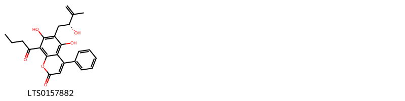{ width=100% }
    <figcaption>Hình ảnh cấu trúc hóa học của 1 hoạt chất thuộc nhóm Neoflavonoids gồm ['8-butanoyl-5,7-dihydroxy-6-[(2r)-2-hydroxy-3-methylbut-3-en-1-yl]-4-phenylchromen-2-one (LTS0157882)'].</figcaption>
</figure>
#### Nhóm Prenol lipids
<figure markdown="span">
    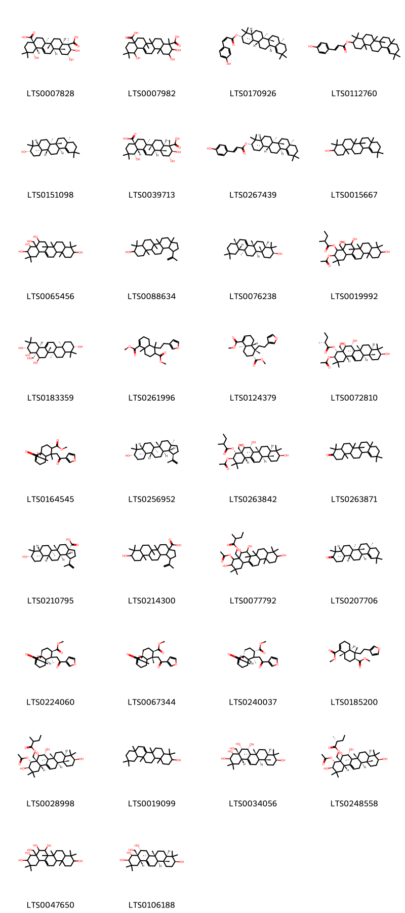{ width=100% }
    <figcaption>Hình ảnh cấu trúc hóa học của 34 hoạt chất thuộc nhóm Prenol lipids gồm ['(2r,3r,4r,4ar,6ar,6bs,8ar,12s,12as,14ar,14br)-2,3,12-trihydroxy-4,6a,6b,11,11,14b-hexamethyl-1,2,3,4a,5,6,7,8,9,10,12,12a,14,14a-tetradecahydropicene-4,8a-dicarboxylic acid (LTS0007828)', '2,3,12-trihydroxy-4,6a,6b,11,11,14b-hexamethyl-1,2,3,4a,5,6,7,8,9,10,12,12a,14,14a-tetradecahydropicene-4,8a-dicarboxylic acid (LTS0007982)', '(3s,4ar,6ar,6br,8ar,12bs,14ar,14br)-4,4,6a,6b,8a,11,11,14b-octamethyl-1,2,3,4a,5,6,7,8,9,10,12b,13,14,14a-tetradecahydropicen-3-yl (2z)-3-(4-hydroxyphenyl)prop-2-enoate (LTS0170926)', '4,4,6a,6b,8a,11,11,14b-octamethyl-1,2,3,4a,5,6,7,8,9,10,12b,13,14,14a-tetradecahydropicen-3-yl 3-(4-hydroxyphenyl)prop-2-enoate (LTS0112760)', 'germanicol (LTS0151098)', '(2r,3r,4s,4ar,6ar,6bs,8ar,12s,12as,14ar,14br)-2,3,12-trihydroxy-4,6a,6b,11,11,14b-hexamethyl-1,2,3,4a,5,6,7,8,9,10,12,12a,14,14a-tetradecahydropicene-4,8a-dicarboxylic acid (LTS0039713)', '(3s,4ar,6ar,6br,8ar,12bs,14ar,14br)-4,4,6a,6b,8a,11,11,14b-octamethyl-1,2,3,4a,5,6,7,8,9,10,12b,13,14,14a-tetradecahydropicen-3-yl (2e)-3-(4-hydroxyphenyl)prop-2-enoate (LTS0267439)', '4,4,6a,6b,8a,11,11,14b-octamethyl-1,2,3,4a,5,6,7,8,9,10,12b,13,14,14a-tetradecahydropicen-3-ol (LTS0015667)', '4a-(hydroxymethyl)-2,2,6a,6b,9,9,12a-heptamethyl-1,3,4,5,6,7,8,8a,10,11,12,12b,13,14b-tetradecahydropicene-3,4,5,10-tetrol (LTS0065456)', 'lupeol (LTS0088634)', 'alnulin (LTS0076238)', '3-(acetyloxy)-5,6,10-trihydroxy-4a-(hydroxymethyl)-2,2,6a,6b,9,9,12a-heptamethyl-1,3,4,5,6,7,8,8a,10,11,12,12b,13,14b-tetradecahydropicen-4-yl 2-methylbutanoate (LTS0019992)', '(3r,4r,4ar,5r,6as,6br,10s,12ar,14bs)-4a-(hydroxymethyl)-2,2,6a,6b,9,9,12a-heptamethyl-1,3,4,5,6,7,8,8a,10,11,12,12b,13,14b-tetradecahydropicene-3,4,5,10-tetrol (LTS0183359)', '1,6-dimethyl 5-[2-(furan-3-yl)ethyl]-5,8a-dimethyl-3,4,4a,6,7,8-hexahydronaphthalene-1,6-dicarboxylate (LTS0261996)', '1,6-dimethyl (4ar,5s,6r,8ar)-5-[2-(furan-3-yl)ethyl]-5,8a-dimethyl-3,4,4a,6,7,8-hexahydronaphthalene-1,6-dicarboxylate (LTS0124379)', '(3r,4r,4ar,5s,6r,6as,6br,8ar,10s,12ar,12br,14bs)-3-(acetyloxy)-5,6,10-trihydroxy-4a-(hydroxymethyl)-2,2,6a,6b,9,9,12a-heptamethyl-1,3,4,5,6,7,8,8a,10,11,12,12b,13,14b-tetradecahydropicen-4-yl (2r)-2-methylbutanoate (LTS0072810)', 'methyl 7-[2-(furan-3-yl)-2-oxoethyl]-7-methyl-3-oxo-1h,5h,6h,6ah,8h,9h,10h-naphtho[4,4a-c]furan-8-carboxylate (LTS0164545)', 'lupeol (LTS0256952)', '(3r,4r,4ar,5s,6r,6as,6br,8ar,10s,12ar,12br,14bs)-3-(acetyloxy)-5,6,10-trihydroxy-4a-(hydroxymethyl)-2,2,6a,6b,9,9,12a-heptamethyl-1,3,4,5,6,7,8,8a,10,11,12,12b,13,14b-tetradecahydropicen-4-yl 2-methylbutanoate (LTS0263842)', '4,4,6a,6b,8a,11,11,14b-octamethyl-2,4a,5,6,7,8,9,10,12b,13,14,14a-dodecahydro-1h-picen-3-one (LTS0263871)', 'betulinic acid (LTS0210795)', '9-hydroxy-5a,5b,8,8,11a-pentamethyl-1-(prop-1-en-2-yl)-hexadecahydrocyclopenta[a]chrysene-3a-carboxylic acid (LTS0214300)', '[4-(acetyloxy)-3,5,6,10-tetrahydroxy-2,2,6a,6b,9,9,12a-heptamethyl-1,3,4,5,6,7,8,8a,10,11,12,12b,13,14b-tetradecahydropicen-4a-yl]methyl 2-methylbutanoate (LTS0077792)', '(4ar,6ar,6br,8ar,12bs,14ar,14br)-4,4,6a,6b,8a,11,11,14b-octamethyl-2,4a,5,6,7,8,9,10,12b,13,14,14a-dodecahydro-1h-picen-3-one (LTS0207706)', 'methyl (6ar,7s,8r,10as)-7-[2-(furan-3-yl)-2-oxoethyl]-7-methyl-3-oxo-1h,5h,6h,6ah,8h,9h,10h-naphtho[4,4a-c]furan-8-carboxylate (LTS0224060)', 'methyl (7r,8r,10as)-7-[2-(furan-3-yl)-2-oxoethyl]-7-methyl-3-oxo-1h,5h,6h,6ah,8h,9h,10h-naphtho[4,4a-c]furan-8-carboxylate (LTS0067344)', 'methyl (6as,7s,8s,10ar)-7-[2-(furan-3-yl)-2-oxoethyl]-7-methyl-3-oxo-1h,5h,6h,6ah,8h,9h,10h-naphtho[4,4a-c]furan-8-carboxylate (LTS0240037)', '1,6-dimethyl (4as,5s,6s,8as)-5-[2-(furan-3-yl)ethyl]-5,8a-dimethyl-3,4,4a,6,7,8-hexahydronaphthalene-1,6-dicarboxylate (LTS0185200)', '[(3r,4r,4ar,5s,6r,6as,6br,8ar,10s,12ar,12br,14bs)-4-(acetyloxy)-3,5,6,10-tetrahydroxy-2,2,6a,6b,9,9,12a-heptamethyl-1,3,4,5,6,7,8,8a,10,11,12,12b,13,14b-tetradecahydropicen-4a-yl]methyl 2-methylbutanoate (LTS0028998)', 'taraxerol (LTS0019099)', '(3r,4r,4as,5s,6r,6as,6br,8ar,10s,12ar,12br,14bs)-4a-(hydroxymethyl)-2,2,6a,6b,9,9,12a-heptamethyl-1,3,4,5,6,7,8,8a,10,11,12,12b,13,14b-tetradecahydropicene-3,4,5,6,10-pentol (LTS0034056)', '[(3r,4r,4ar,5s,6r,6as,6br,8ar,10s,12ar,12br,14bs)-4-(acetyloxy)-3,5,6,10-tetrahydroxy-2,2,6a,6b,9,9,12a-heptamethyl-1,3,4,5,6,7,8,8a,10,11,12,12b,13,14b-tetradecahydropicen-4a-yl]methyl (2r)-2-methylbutanoate (LTS0248558)', '4a-(hydroxymethyl)-2,2,6a,6b,9,9,12a-heptamethyl-1,3,4,5,6,7,8,8a,10,11,12,12b,13,14b-tetradecahydropicene-3,4,5,6,10-pentol (LTS0047650)', 'theasapogenol b (LTS0106188)'].</figcaption>
</figure>
#### Nhóm Steroids and steroid derivatives
<figure markdown="span">
    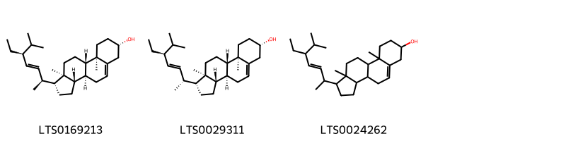{ width=100% }
    <figcaption>Hình ảnh cấu trúc hóa học của 3 hoạt chất thuộc nhóm Steroids and steroid derivatives gồm ['(1r,3as,3bs,7s,9ar,9bs,11ar)-1-[(2s,3e,5s)-5-ethyl-6-methylhept-3-en-2-yl]-9a,11a-dimethyl-1h,2h,3h,3ah,3bh,4h,6h,7h,8h,9h,9bh,10h,11h-cyclopenta[a]phenanthren-7-ol (LTS0169213)', 'phytosterol (LTS0029311)', 'stigmasterol (LTS0024262)'].</figcaption>
</figure>
#### Nhóm Tannins
<figure markdown="span">
    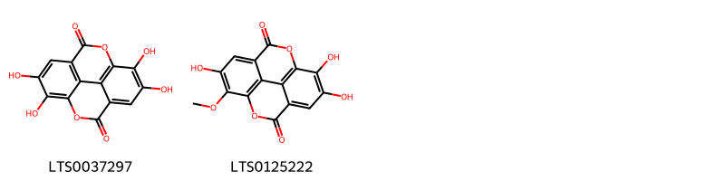{ width=100% }
    <figcaption>Hình ảnh cấu trúc hóa học của 2 hoạt chất thuộc nhóm Tannins gồm ['ellagic acid (LTS0037297)', '6,7,13-trihydroxy-14-methoxy-2,9-dioxatetracyclo[6.6.2.0⁴,¹⁶.0¹¹,¹⁵]hexadeca-1(15),4,6,8(16),11,13-hexaene-3,10-dione (LTS0125222)'].</figcaption>
</figure>

---

### Dược dân tộc học

Danh sách các quốc gia có sử dụng *Barringtonia racemosa* trong điều trị các bệnh. 

| Country      | Disease                           | Bệnh                                                                                                                                                                                                |
|:-------------|:----------------------------------|:----------------------------------------------------------------------------------------------------------------------------------------------------------------------------------------------------|
| Elsewhere    | Insecticide, Piscicide, Piscicide | MYMEMORY WARNING: YOU USED ALL AVAILABLE FREE TRANSLATIONS FOR TODAY. NEXT AVAILABLE IN  19 HOURS 30 MINUTES 49 SECONDS VISIT HTTPS://MYMEMORY.TRANSLATED.NET/DOC/USAGELIMITS.PHP TO TRANSLATE MORE |
| India        | Piscicide                         | MYMEMORY WARNING: YOU USED ALL AVAILABLE FREE TRANSLATIONS FOR TODAY. NEXT AVAILABLE IN  19 HOURS 30 MINUTES 46 SECONDS VISIT HTTPS://MYMEMORY.TRANSLATED.NET/DOC/USAGELIMITS.PHP TO TRANSLATE MORE |
| New Hebrides | Piscicide                         | MYMEMORY WARNING: YOU USED ALL AVAILABLE FREE TRANSLATIONS FOR TODAY. NEXT AVAILABLE IN  19 HOURS 30 MINUTES 42 SECONDS VISIT HTTPS://MYMEMORY.TRANSLATED.NET/DOC/USAGELIMITS.PHP TO TRANSLATE MORE |
| Philippines  | Poison                            | MYMEMORY WARNING: YOU USED ALL AVAILABLE FREE TRANSLATIONS FOR TODAY. NEXT AVAILABLE IN  19 HOURS 30 MINUTES 36 SECONDS VISIT HTTPS://MYMEMORY.TRANSLATED.NET/DOC/USAGELIMITS.PHP TO TRANSLATE MORE |
| Tanzania     | Piscicide                         | MYMEMORY WARNING: YOU USED ALL AVAILABLE FREE TRANSLATIONS FOR TODAY. NEXT AVAILABLE IN  19 HOURS 30 MINUTES 33 SECONDS VISIT HTTPS://MYMEMORY.TRANSLATED.NET/DOC/USAGELIMITS.PHP TO TRANSLATE MORE |

---

# Chi Petersianthus

??? note "Danh sách các dược liệu thuộc chi"
    
	 - *Petersianthus macrocarpus*

---
## Petersianthus macrocarpus
### Thông tin về thực vật

!!! info "Phân loại thực vật của *Petersianthus macrocarpus* từ GIBF:"
    - **Kingdom:** Plantae
    - **Phylum:** Tracheophyta
    - **Order:** Ericales
    - **Family:** Lecythidaceae
    - **Genus:** Petersianthus
    - **Species:** *Petersianthus macrocarpus*

 

| Label (VI)   | Label (EN)   | Scientific Name           | Descriptions (VI)   | Descriptions (EN)   | Also Known As (VI)   | Also Known As (EN)   |
|:-------------|:-------------|:--------------------------|:--------------------|:--------------------|:---------------------|:---------------------|
| N/A          | N/A          | Petersianthus macrocarpus | loài thực vật       | species of plant    | ['']                 | ['']                 |

#### Phân bố trên thế giới

**Từ CSDL GIBF** Côte d’Ivoire, Ghana, Liberia, Cameroon, Congo, Democratic Republic of the, Gabon, Nigeria, Guinea

#### Phân bố tại Việt Nam

**Từ CSDL GIBF**: Không có ghi nhận ở Việt Nam

---
### Thành phần hóa học
        
- Theo cơ sở dữ liệu lotus: Từ loài *Petersianthus macrocarpus* đã phân lập và xác định được 18 hoạt chất thuộc về các nhóm Tannins, Prenol lipids, Steroids and steroid derivatives, Fatty Acyls. 

|    | chemicalTaxonomyClassyfireClass   |   smiles_count |
|---:|:----------------------------------|---------------:|
|  0 | Fatty Acyls                       |              1 |
|  1 | Prenol lipids                     |             11 |
|  2 | Steroids and steroid derivatives  |              3 |
|  3 | Tannins                           |              3 |

#### Nhóm Fatty Acyls
<figure markdown="span">
    { width=100% }
    <figcaption>Hình ảnh cấu trúc hóa học của 1 hoạt chất thuộc nhóm Fatty Acyls gồm ['octacosanol (LTS0049071)'].</figcaption>
</figure>
#### Nhóm Prenol lipids
<figure markdown="span">
    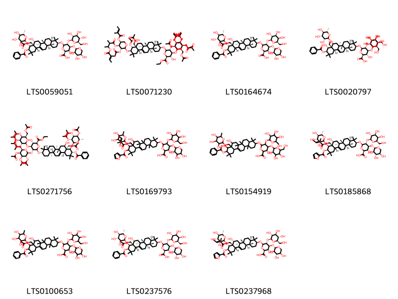{ width=100% }
    <figcaption>Hình ảnh cấu trúc hóa học của 11 hoạt chất thuộc nhóm Prenol lipids gồm ['(2s,3s,4s,5r,6r)-6-{[(3s,4ar,6ar,6bs,8r,8ar,9r,10r,12as,14ar,14br)-9-(acetyloxy)-10-(benzoyloxy)-8-hydroxy-4,4,6a,6b,11,11,14b-heptamethyl-8a-({[(2r,3r,4r,5r,6s)-3,4,5-trihydroxy-6-methyloxan-2-yl]oxy}methyl)-1,2,3,4a,5,6,7,8,9,10,12,12a,14,14a-tetradecahydropicen-3-yl]oxy}-3-hydroxy-5-{[(2s,3r,4s,5s,6r)-3,4,5-trihydroxy-6-(hydroxymethyl)oxan-2-yl]oxy}-4-{[(2s,3r,4s,5r)-3,4,5-trihydroxyoxan-2-yl]oxy}oxane-2-carboxylic acid (LTS0059051)', 'ethyl (2s,3s,4s,5r,6r)-6-{[(3s,4ar,6ar,6bs,8r,8ar,9r,10r,12as,14ar,14br)-9-(acetyloxy)-10-{[(2s,3r,4s,5s)-3-(acetyloxy)-4-[(2-methyl-3-{[(2e)-2-methylbut-2-enoyl]oxy}butanoyl)oxy]-5-{[(2e)-2-methylbut-2-enoyl]oxy}oxan-2-yl]oxy}-8a-[(acetyloxy)methyl]-8-hydroxy-4,4,6a,6b,11,11,14b-heptamethyl-1,2,3,4a,5,6,7,8,9,10,12,12a,14,14a-tetradecahydropicen-3-yl]oxy}-3-hydroxy-4,5-bis({[(2s,3r,4s,5s,6r)-3,4,5-tris(acetyloxy)-6-[(acetyloxy)methyl]oxan-2-yl]oxy})oxane-2-carboxylate (LTS0071230)', '(2s,3s,4s,5r,6r)-6-{[(3s,4ar,6ar,6bs,8r,8ar,9r,10r,12as,14ar,14br)-9-(acetyloxy)-10-(benzoyloxy)-8-hydroxy-4,4,6a,6b,11,11,14b-heptamethyl-8a-({[(2r,3r,4r,5r,6s)-3,4,5-trihydroxy-6-methyloxan-2-yl]oxy}methyl)-1,2,3,4a,5,6,7,8,9,10,12,12a,14,14a-tetradecahydropicen-3-yl]oxy}-3-hydroxy-5-{[(2s,3r,4s,5r,6r)-3,4,5-trihydroxy-6-(hydroxymethyl)oxan-2-yl]oxy}-4-{[(2s,3r,4s,5r)-3,4,5-trihydroxyoxan-2-yl]oxy}oxane-2-carboxylic acid (LTS0164674)', '(2s,3s,4s,5r,6r)-6-{[(3s,4ar,6ar,6bs,8r,8ar,9r,10r,12ar,14ar,14br)-10-(benzoyloxy)-8,9-dihydroxy-4,4,6a,6b,11,11,14b-heptamethyl-8a-({[(2r,3r,4r,5r,6s)-3,4,5-trihydroxy-6-methyloxan-2-yl]oxy}methyl)-1,2,3,4a,5,6,7,8,9,10,12,12a,14,14a-tetradecahydropicen-3-yl]oxy}-3-hydroxy-4,5-bis({[(2s,3r,4s,5r,6r)-3,4,5-trihydroxy-6-(hydroxymethyl)oxan-2-yl]oxy})oxane-2-carboxylic acid (LTS0020797)', 'ethyl (2s,3s,4s,5r,6r)-6-{[(3s,4ar,6ar,6bs,8r,8ar,9r,10r,12as,14ar,14br)-9-(acetyloxy)-10-(benzoyloxy)-8-hydroxy-4,4,6a,6b,11,11,14b-heptamethyl-8a-({[(2r,3r,4r,5s,6s)-3,4,5-tris(acetyloxy)-6-methyloxan-2-yl]oxy}methyl)-1,2,3,4a,5,6,7,8,9,10,12,12a,14,14a-tetradecahydropicen-3-yl]oxy}-3-hydroxy-4,5-bis({[(2s,3r,4s,5s,6r)-3,4,5-tris(acetyloxy)-6-[(acetyloxy)methyl]oxan-2-yl]oxy})oxane-2-carboxylate (LTS0271756)', '6-{[10-(furan-2-carbonyloxy)-8-hydroxy-4,4,6a,6b,11,11,14b-heptamethyl-9-[(2-methylbut-2-enoyl)oxy]-8a-{[(3,4,5-trihydroxy-6-methyloxan-2-yl)oxy]methyl}-1,2,3,4a,5,6,7,8,9,10,12,12a,14,14a-tetradecahydropicen-3-yl]oxy}-3-hydroxy-5-{[3,4,5-trihydroxy-6-(hydroxymethyl)oxan-2-yl]oxy}-4-[(3,4,5-trihydroxyoxan-2-yl)oxy]oxane-2-carboxylic acid (LTS0169793)', '6-{[10-(benzoyloxy)-8,9-dihydroxy-4,4,6a,6b,11,11,14b-heptamethyl-8a-{[(3,4,5-trihydroxy-6-methyloxan-2-yl)oxy]methyl}-1,2,3,4a,5,6,7,8,9,10,12,12a,14,14a-tetradecahydropicen-3-yl]oxy}-3-hydroxy-4,5-bis({[3,4,5-trihydroxy-6-(hydroxymethyl)oxan-2-yl]oxy})oxane-2-carboxylic acid (LTS0154919)', '(2s,3s,4s,5r,6r)-6-{[(3s,4ar,6ar,6bs,8r,8ar,9s,10r,12as,14ar,14br)-10-(furan-2-carbonyloxy)-8-hydroxy-4,4,6a,6b,11,11,14b-heptamethyl-9-{[(2e)-2-methylbut-2-enoyl]oxy}-8a-({[(2r,3r,4r,5r,6s)-3,4,5-trihydroxy-6-methyloxan-2-yl]oxy}methyl)-1,2,3,4a,5,6,7,8,9,10,12,12a,14,14a-tetradecahydropicen-3-yl]oxy}-3-hydroxy-5-{[(2s,3r,4s,5r,6r)-3,4,5-trihydroxy-6-(hydroxymethyl)oxan-2-yl]oxy}-4-{[(2s,3r,4s,5r)-3,4,5-trihydroxyoxan-2-yl]oxy}oxane-2-carboxylic acid (LTS0185868)', '6-{[9-(acetyloxy)-10-(benzoyloxy)-8-hydroxy-4,4,6a,6b,11,11,14b-heptamethyl-8a-{[(3,4,5-trihydroxy-6-methyloxan-2-yl)oxy]methyl}-1,2,3,4a,5,6,7,8,9,10,12,12a,14,14a-tetradecahydropicen-3-yl]oxy}-3-hydroxy-5-{[3,4,5-trihydroxy-6-(hydroxymethyl)oxan-2-yl]oxy}-4-[(3,4,5-trihydroxyoxan-2-yl)oxy]oxane-2-carboxylic acid (LTS0100653)', '(2s,3s,4s,5r,6r)-6-{[(3s,4ar,6ar,6bs,8r,8ar,9s,10r,12as,14ar,14br)-9-(acetyloxy)-10-(benzoyloxy)-8-hydroxy-4,4,6a,6b,11,11,14b-heptamethyl-8a-({[(2r,3r,4r,5r,6s)-3,4,5-trihydroxy-6-methyloxan-2-yl]oxy}methyl)-1,2,3,4a,5,6,7,8,9,10,12,12a,14,14a-tetradecahydropicen-3-yl]oxy}-3-hydroxy-5-{[(2s,3r,4s,5r,6r)-3,4,5-trihydroxy-6-(hydroxymethyl)oxan-2-yl]oxy}-4-{[(2s,3r,4s,5r)-3,4,5-trihydroxyoxan-2-yl]oxy}oxane-2-carboxylic acid (LTS0237576)', '(2s,3s,4s,5r,6r)-6-{[(3s,4ar,6ar,6bs,8r,8ar,9r,10r,12as,14ar,14br)-10-(furan-2-carbonyloxy)-8-hydroxy-4,4,6a,6b,11,11,14b-heptamethyl-9-{[(2e)-2-methylbut-2-enoyl]oxy}-8a-({[(2r,3r,4r,5r,6s)-3,4,5-trihydroxy-6-methyloxan-2-yl]oxy}methyl)-1,2,3,4a,5,6,7,8,9,10,12,12a,14,14a-tetradecahydropicen-3-yl]oxy}-3-hydroxy-5-{[(2s,3r,4s,5s,6r)-3,4,5-trihydroxy-6-(hydroxymethyl)oxan-2-yl]oxy}-4-{[(2s,3r,4s,5r)-3,4,5-trihydroxyoxan-2-yl]oxy}oxane-2-carboxylic acid (LTS0237968)'].</figcaption>
</figure>
#### Nhóm Steroids and steroid derivatives
<figure markdown="span">
    { width=100% }
    <figcaption>Hình ảnh cấu trúc hóa học của 3 hoạt chất thuộc nhóm Steroids and steroid derivatives gồm ['stigmast-5-en-3-ol (LTS0071224)', 'stigmast-5-en-3-ol, (3β)- (LTS0204616)', 'phytosterol (LTS0029311)'].</figcaption>
</figure>
#### Nhóm Tannins
<figure markdown="span">
    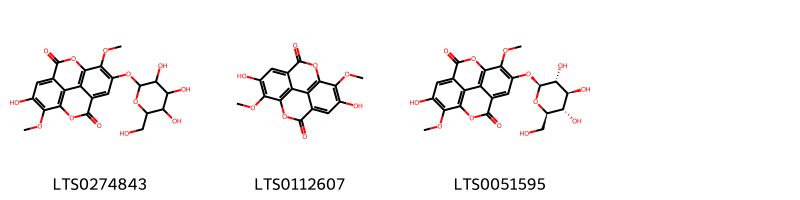{ width=100% }
    <figcaption>Hình ảnh cấu trúc hóa học của 3 hoạt chất thuộc nhóm Tannins gồm ['6-hydroxy-7,14-dimethoxy-13-{[3,4,5-trihydroxy-6-(hydroxymethyl)oxan-2-yl]oxy}-2,9-dioxatetracyclo[6.6.2.0⁴,¹⁶.0¹¹,¹⁵]hexadeca-1(15),4,6,8(16),11,13-hexaene-3,10-dione (LTS0274843)', '6,13-dihydroxy-7,14-dimethoxy-2,9-dioxatetracyclo[6.6.2.0⁴,¹⁶.0¹¹,¹⁵]hexadeca-1(15),4,6,8(16),11,13-hexaene-3,10-dione (LTS0112607)', '6-hydroxy-7,14-dimethoxy-13-{[(2s,3r,4s,5s,6r)-3,4,5-trihydroxy-6-(hydroxymethyl)oxan-2-yl]oxy}-2,9-dioxatetracyclo[6.6.2.0⁴,¹⁶.0¹¹,¹⁵]hexadeca-1(15),4,6,8(16),11,13-hexaene-3,10-dione (LTS0051595)'].</figcaption>
</figure>

---

### Dược dân tộc học

Danh sách các quốc gia có sử dụng *Petersianthus macrocarpus* trong điều trị các bệnh. 

| Country   | Disease     | Bệnh                                                                                                                                                                                                |
|:----------|:------------|:----------------------------------------------------------------------------------------------------------------------------------------------------------------------------------------------------|
| Ghana     | Expectorant | MYMEMORY WARNING: YOU USED ALL AVAILABLE FREE TRANSLATIONS FOR TODAY. NEXT AVAILABLE IN  19 HOURS 29 MINUTES 50 SECONDS VISIT HTTPS://MYMEMORY.TRANSLATED.NET/DOC/USAGELIMITS.PHP TO TRANSLATE MORE |

---

