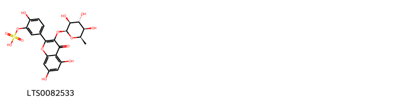

!!! abstract "Tóm tắt"

    Họ Leeaceae gồm khoảng 1 chi và 6 loài được một số cộng đồng tại các quốc gia như Africa, India, Elsewhere, India(Gujarat), China, Hindu sử dụng trong một số trường hợp Cicatrizant, Astringent, Larvicide, Vermifuge, Taenifuge, Sudorific, Larvicide, Vermicide, Sát trùng, nan, Purgative.

!!! info "DrDuke"

    James A. Duke sinh năm 1929-2017 là một nhà thực vật học người Mỹ. Đây là một trong những tác giả hàng đầu trong lĩnh vực dược dân tộc học với cuốn *CRC Handbook of Medicinal Herbs* và chính là người xây dựng lên cơ sở dữ liệu về hợp chất tự nhiên và dược dân tộc học tại Bộ nông nghiệp Hoa Kỳ. Các thông tin được đăng tải tại website [Dr. Duke's Phytochemical and Ethnobotanical Databases](https://phytochem.nal.usda.gov/). 
    Trong suốt thập niên 1970, ông lãnh đạo the Plant Taxonomy Laboratory, Plant Genetics and Germplasm Institute of the Agricultural Research Service, U.S. Department of Agriculture.
    Trong tài liệu này, các thông tin về dược dân tộc của các dược liệu được trích dẫn từ tài liệu của James A. Ducke với sự trợ giúp của phần mềm dịch thuật từ tiếng Anh sang tiếng Việt.
   

# Chi Leea

??? note "Danh sách các dược liệu thuộc chi"
    
	 - *Leea aequata*
	 - *Leea cria*
	 - *Leea guineensis*
	 - *Leea indica*
	 - *Leea macrophylla*
	 - *Leea rubra*

---
## Leea aequata
### Thông tin về thực vật

!!! info "Phân loại thực vật của *Leea aequata* từ GIBF:"
    - **Kingdom:** Plantae
    - **Phylum:** Tracheophyta
    - **Order:** Vitales
    - **Family:** Vitaceae
    - **Genus:** Leea
    - **Species:** *Leea aequata*

 

| Label (VI)   | Label (EN)   | Scientific Name   | Descriptions (VI)   | Descriptions (EN)   | Also Known As (VI)   | Also Known As (EN)   |
|:-------------|:-------------|:------------------|:--------------------|:--------------------|:---------------------|:---------------------|
| N/A          | N/A          | Leea aequata      | loài thực vật       | species of plant    | ['']                 | ['']                 |

#### Phân bố trên thế giới

**Từ CSDL GIBF** nan, Malaysia, Thailand, Cambodia, Myanmar, Papua New Guinea, unknown or invalid, Indonesia, India, Philippines, Singapore, Viet Nam, China, Nepal

#### Phân bố tại Việt Nam

**Từ CSDL GIBF**: Thua Thien-Hue, Khanh Hoa

---
### Thành phần hóa học
        
- Theo cơ sở dữ liệu lotus: Từ loài *Leea aequata* đã phân lập và xác định được Chưa có hoạt chất nào được phân lập. hoạt chất thuộc về các nhóm Không có hoạt chất nào được phân lập. 

Không có hình ảnh nào được tạo ra

---

### Dược dân tộc học

Danh sách các quốc gia có sử dụng *Leea aequata* trong điều trị các bệnh. 

| Country   | Disease         | Bệnh           |
|:----------|:----------------|:---------------|
| India     | Antiseptic, nan | Khử trùng, nan |

---

---
## Leea cria
### Thông tin về thực vật

!!! info "Phân loại thực vật của *N/A* từ GIBF:"
    - **Kingdom:** Plantae
    - **Phylum:** Tracheophyta
    - **Order:** Vitales
    - **Family:** Vitaceae
    - **Genus:** Leea
    - **Species:** *N/A*

 

| Label (VI)   | Label (EN)   | Scientific Name   | Descriptions (VI)   | Descriptions (EN)   | Also Known As (VI)   | Also Known As (EN)   |
|:-------------|:-------------|:------------------|:--------------------|:--------------------|:---------------------|:---------------------|
| N/A          | N/A          | Leea aequata      | loài thực vật       | species of plant    | ['']                 | ['']                 |

#### Phân bố trên thế giới

**Từ CSDL GIBF** Puerto Rico, Australia, Madagascar, Sao Tome and Principe, Gabon, Thailand, Brazil, Chinese Taipei, India, Indonesia, Dominican Republic, Tanzania, United Republic of, Philippines, Singapore, Malaysia, China, Cameroon

#### Phân bố tại Việt Nam

**Từ CSDL GIBF**: Không có ghi nhận ở Việt Nam

---
### Thành phần hóa học
        
- Theo cơ sở dữ liệu lotus: Từ loài *N/A* đã phân lập và xác định được Chưa có hoạt chất nào được phân lập. hoạt chất thuộc về các nhóm Không có hoạt chất nào được phân lập. 

Không có hình ảnh nào được tạo ra

---

### Dược dân tộc học

Danh sách các quốc gia có sử dụng *N/A* trong điều trị các bệnh. 

| Country   | Disease   | Bệnh           |
|:----------|:----------|:---------------|
| India     | Larvicide | Diệt côn trùng |

---

---
## Leea guineensis
### Thông tin về thực vật

!!! info "Phân loại thực vật của *Leea guineensis* từ GIBF:"
    - **Kingdom:** Plantae
    - **Phylum:** Tracheophyta
    - **Order:** Vitales
    - **Family:** Vitaceae
    - **Genus:** Leea
    - **Species:** *Leea guineensis*

 

| Label (VI)   | Label (EN)   | Scientific Name   | Descriptions (VI)   | Descriptions (EN)   | Also Known As (VI)   | Also Known As (EN)   |
|:-------------|:-------------|:------------------|:--------------------|:--------------------|:---------------------|:---------------------|
| N/A          | N/A          | Leea guineensis   | loài thực vật       | species of plant    | ['']                 | ['']                 |

#### Phân bố trên thế giới

**Từ CSDL GIBF** nan, Palau, Gabon, Mauritius, Benin, Tanzania, United Republic of, Puerto Rico, Réunion, Nigeria, Chinese Taipei, Congo, Democratic Republic of the, Thailand, Brazil, Côte d’Ivoire, Dominican Republic, Madagascar, India, Indonesia, Burkina Faso, Philippines, Cameroon

#### Phân bố tại Việt Nam

**Từ CSDL GIBF**: Không có ghi nhận ở Việt Nam

---
### Thành phần hóa học
        
- Theo cơ sở dữ liệu lotus: Từ loài *Leea guineensis* đã phân lập và xác định được 1 hoạt chất thuộc về các nhóm Flavonoids. 

|    | chemicalTaxonomyClassyfireClass   |   smiles_count |
|---:|:----------------------------------|---------------:|
|  0 | Flavonoids                        |              1 |

#### Nhóm Flavonoids
<figure markdown="span">
    { width=100% }
    <figcaption>Hình ảnh cấu trúc hóa học của 1 hoạt chất thuộc nhóm Flavonoids gồm ['[5-(5,7-dihydroxy-4-oxo-3-{[(2s,3s,4r,5r,6r)-3,4,5-trihydroxy-6-methyloxan-2-yl]oxy}chromen-2-yl)-2-hydroxyphenyl]oxidanesulfonic acid (LTS0082533)'].</figcaption>
</figure>

---

### Dược dân tộc học

Danh sách các quốc gia có sử dụng *Leea guineensis* trong điều trị các bệnh. 

| Country   | Disease   | Bệnh     |
|:----------|:----------|:---------|
| Africa    | Purgative | Thuốc xổ |

---

---
## Leea indica
### Thông tin về thực vật

!!! info "Phân loại thực vật của *Leea indica* từ GIBF:"
    - **Kingdom:** Plantae
    - **Phylum:** Tracheophyta
    - **Order:** Vitales
    - **Family:** Vitaceae
    - **Genus:** Leea
    - **Species:** *Leea indica*

 

| Label (VI)   | Label (EN)   | Scientific Name   | Descriptions (VI)   | Descriptions (EN)   | Also Known As (VI)   | Also Known As (EN)   |
|:-------------|:-------------|:------------------|:--------------------|:--------------------|:---------------------|:---------------------|
| N/A          | N/A          | Leea indica       | loài thực vật       | species of plant    | ['']                 | ['Bandicoot berry']  |

#### Phân bố trên thế giới

**Từ CSDL GIBF** nan, Palau, Sri Lanka, Australia, Thailand, Lao People’s Democratic Republic, Myanmar, Papua New Guinea, Vanuatu, India, Indonesia, Solomon Islands, Viet Nam, Philippines, Singapore, Malaysia, Brunei Darussalam, Nepal

#### Phân bố tại Việt Nam

**Từ CSDL GIBF**: Thua Thien-Hue, Quang Tri

---
### Thành phần hóa học
        
- Theo cơ sở dữ liệu lotus: Từ loài *Leea indica* đã phân lập và xác định được Chưa có hoạt chất nào được phân lập. hoạt chất thuộc về các nhóm Không có hoạt chất nào được phân lập. 

Không có hình ảnh nào được tạo ra

---

### Dược dân tộc học

Danh sách các quốc gia có sử dụng *Leea indica* trong điều trị các bệnh. 

| Country   | Disease   | Bệnh     |
|:----------|:----------|:---------|
| Elsewhere | Sudorific | Ngạt thở |

---

---
## Leea macrophylla
### Thông tin về thực vật

!!! info "Phân loại thực vật của *Leea macrophylla* từ GIBF:"
    - **Kingdom:** Plantae
    - **Phylum:** Tracheophyta
    - **Order:** Vitales
    - **Family:** Vitaceae
    - **Genus:** Leea
    - **Species:** *Leea macrophylla*

 

| Label (VI)   | Label (EN)   | Scientific Name   | Descriptions (VI)   | Descriptions (EN)   | Also Known As (VI)   | Also Known As (EN)   |
|:-------------|:-------------|:------------------|:--------------------|:--------------------|:---------------------|:---------------------|
| N/A          | N/A          | Leea macrophylla  | loài thực vật       | species of plant    | ['']                 | ['']                 |

#### Phân bố trên thế giới

**Từ CSDL GIBF** nan, Thailand, Myanmar, Bhutan, India, unknown or invalid, Bangladesh, Malaysia, China, Nepal

#### Phân bố tại Việt Nam

**Từ CSDL GIBF**: Không có ghi nhận ở Việt Nam

---
### Thành phần hóa học
        
- Theo cơ sở dữ liệu lotus: Từ loài *Leea macrophylla* đã phân lập và xác định được Chưa có hoạt chất nào được phân lập. hoạt chất thuộc về các nhóm Không có hoạt chất nào được phân lập. 

Không có hình ảnh nào được tạo ra

---

### Dược dân tộc học

Danh sách các quốc gia có sử dụng *Leea macrophylla* trong điều trị các bệnh. 

| Country        | Disease                          | Bệnh                              |
|:---------------|:---------------------------------|:----------------------------------|
| Elsewhere      | Astringent, Larvicide, Vermifuge | Chất làm se, Larvicide, Vermifuge |
| Hindu          | Cicatrizant                      | Cicatrizant                       |
| India(Gujarat) | Vermicide                        | Chứng nói lập                     |

---

---
## Leea rubra
### Thông tin về thực vật

!!! info "Phân loại thực vật của *Leea rubra* từ GIBF:"
    - **Kingdom:** Plantae
    - **Phylum:** Tracheophyta
    - **Order:** Vitales
    - **Family:** Vitaceae
    - **Genus:** Leea
    - **Species:** *Leea rubra*

 

| Label (VI)   | Label (EN)   | Scientific Name   | Descriptions (VI)   | Descriptions (EN)                       | Also Known As (VI)   | Also Known As (EN)   |
|:-------------|:-------------|:------------------|:--------------------|:----------------------------------------|:---------------------|:---------------------|
| N/A          | N/A          | Leea rubra        | loài thực vật       | species of plant in the family Vitaceae | ['']                 | ['Red leea']         |

#### Phân bố trên thế giới

**Từ CSDL GIBF** nan, Australia, Belgium, Cambodia, Myanmar, Papua New Guinea, United States of America, Timor-Leste, Solomon Islands, Trinidad and Tobago, Thailand, Brazil, Singapore, Viet Nam, China, Seychelles, India, Indonesia, Philippines, Malaysia, Nepal

#### Phân bố tại Việt Nam

**Từ CSDL GIBF**: Đồng Nai, Lâm Đồng

---
### Thành phần hóa học
        
- Theo cơ sở dữ liệu lotus: Từ loài *Leea rubra* đã phân lập và xác định được Chưa có hoạt chất nào được phân lập. hoạt chất thuộc về các nhóm Không có hoạt chất nào được phân lập. 

Không có hình ảnh nào được tạo ra

---

### Dược dân tộc học

Danh sách các quốc gia có sử dụng *Leea rubra* trong điều trị các bệnh. 

| Country   | Disease   | Bệnh      |
|:----------|:----------|:----------|
| China     | Taenifuge | Taenifuge |

---

