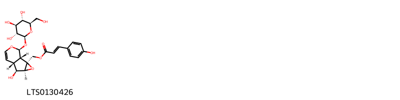
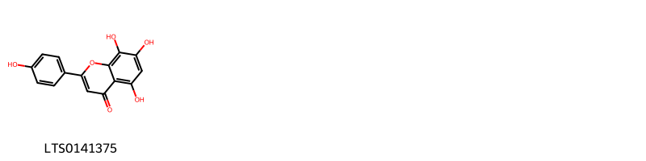
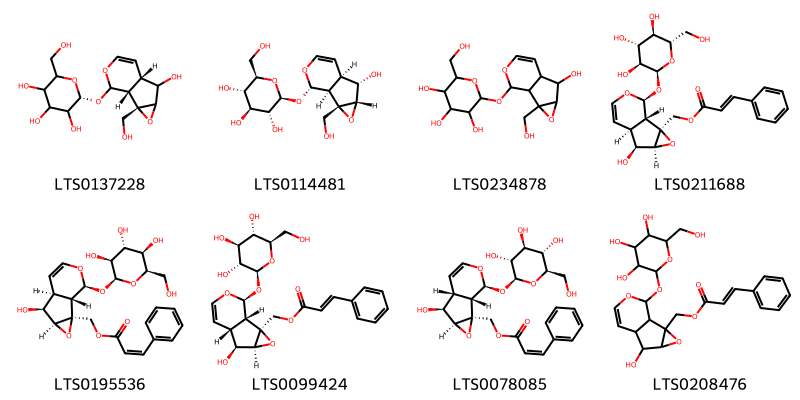

!!! abstract "Tóm tắt"

    Họ Lentibulariaceae gồm khoảng 2 chi và 2 loài được một số cộng đồng tại các quốc gia như English, ain sử dụng trong một số trường hợp MYMEMORY WARNING: YOU USED ALL AVAILABLE FREE TRANSLATIONS FOR TODAY. NEXT AVAILABLE IN  06 HOURS 09 MINUTES 07 SECONDS VISIT HTTPS://MYMEMORY.TRANSLATED.NET/DOC/USAGELIMITS.PHP TO TRANSLATE MORE.

!!! info "DrDuke"

    James A. Duke sinh năm 1929-2017 là một nhà thực vật học người Mỹ. Đây là một trong những tác giả hàng đầu trong lĩnh vực dược dân tộc học với cuốn *CRC Handbook of Medicinal Herbs* và chính là người xây dựng lên cơ sở dữ liệu về hợp chất tự nhiên và dược dân tộc học tại Bộ nông nghiệp Hoa Kỳ. Các thông tin được đăng tải tại website [Dr. Duke's Phytochemical and Ethnobotanical Databases](https://phytochem.nal.usda.gov/). 
    Trong suốt thập niên 1970, ông lãnh đạo the Plant Taxonomy Laboratory, Plant Genetics and Germplasm Institute of the Agricultural Research Service, U.S. Department of Agriculture.
    Trong tài liệu này, các thông tin về dược dân tộc của các dược liệu được trích dẫn từ tài liệu của James A. Ducke với sự trợ giúp của phần mềm dịch thuật từ tiếng Anh sang tiếng Việt.
   

# Chi Pinguicula

??? note "Danh sách các dược liệu thuộc chi"
    
	 - *Pinguicula vulgaris*

---
## Pinguicula vulgaris
### Thông tin về thực vật

!!! info "Phân loại thực vật của *Pinguicula vulgaris* từ GIBF:"
    - **Kingdom:** Plantae
    - **Phylum:** Tracheophyta
    - **Order:** Lamiales
    - **Family:** Lentibulariaceae
    - **Genus:** Pinguicula
    - **Species:** *Pinguicula vulgaris*

 

| Label (VI)   | Label (EN)   | Scientific Name     | Descriptions (VI)   | Descriptions (EN)   | Also Known As (VI)   | Also Known As (EN)      |
|:-------------|:-------------|:--------------------|:--------------------|:--------------------|:---------------------|:------------------------|
| N/A          | N/A          | Pinguicula vulgaris | loài thực vật       | species of plant    | ['']                 | ['Pinguicula vulgaris'] |

#### Phân bố trên thế giới

**Từ CSDL GIBF** nan, Faroe Islands, Czechia, Sweden, Denmark, Netherlands, Montenegro, United States of America, Russian Federation, Norway, Iceland, United Kingdom of Great Britain and Northern Ireland, Canada, Germany, Austria, Slovakia, Italy, Switzerland, France, Ireland

#### Phân bố tại Việt Nam

**Từ CSDL GIBF**: Không có ghi nhận ở Việt Nam

---
### Thành phần hóa học
        
- Theo cơ sở dữ liệu lotus: Từ loài *Pinguicula vulgaris* đã phân lập và xác định được 10 hoạt chất thuộc về các nhóm Organooxygen compounds, Cinnamic acids and derivatives, Flavonoids. 

|    | chemicalTaxonomyClassyfireClass   |   smiles_count |
|---:|:----------------------------------|---------------:|
|  0 | Cinnamic acids and derivatives    |              1 |
|  1 | Flavonoids                        |              1 |
|  2 | Organooxygen compounds            |              8 |

#### Nhóm Cinnamic acids and derivatives
<figure markdown="span">
    { width=100% }
    <figcaption>Hình ảnh cấu trúc hóa học của 1 hoạt chất thuộc nhóm Cinnamic acids and derivatives gồm ['[(1s,2s,4s,5s,6r,10s)-5-hydroxy-10-{[(2s,3r,4s,5s,6r)-3,4,5-trihydroxy-6-(hydroxymethyl)oxan-2-yl]oxy}-3,9-dioxatricyclo[4.4.0.0²,⁴]dec-7-en-2-yl]methyl (2e)-3-(4-hydroxyphenyl)prop-2-enoate (LTS0130426)'].</figcaption>
</figure>
#### Nhóm Flavonoids
<figure markdown="span">
    { width=100% }
    <figcaption>Hình ảnh cấu trúc hóa học của 1 hoạt chất thuộc nhóm Flavonoids gồm ['isoscutellarein (LTS0141375)'].</figcaption>
</figure>
#### Nhóm Organooxygen compounds
<figure markdown="span">
    { width=100% }
    <figcaption>Hình ảnh cấu trúc hóa học của 8 hoạt chất thuộc nhóm Organooxygen compounds gồm ['(2r)-2-{[(1r,2s,6s)-5-hydroxy-2-(hydroxymethyl)-3,9-dioxatricyclo[4.4.0.0²,⁴]dec-7-en-10-yl]oxy}-6-(hydroxymethyl)oxane-3,4,5-triol (LTS0137228)', 'catalpol (LTS0114481)', 'catalpol (LTS0234878)', '[(1s,2s,4s,5s,6s,10s)-5-hydroxy-10-{[(2s,3s,4r,5r,6s)-3,4,5-trihydroxy-6-(hydroxymethyl)oxan-2-yl]oxy}-3,9-dioxatricyclo[4.4.0.0²,⁴]dec-7-en-2-yl]methyl (2e)-3-phenylprop-2-enoate (LTS0211688)', '[(1s,2s,4s,5s,6s,10s)-5-hydroxy-10-{[(2s,3s,4r,5r,6r)-3,4,5-trihydroxy-6-(hydroxymethyl)oxan-2-yl]oxy}-3,9-dioxatricyclo[4.4.0.0²,⁴]dec-7-en-2-yl]methyl (2z)-3-phenylprop-2-enoate (LTS0195536)', '[(1s,2s,4s,5s,6r,10s)-5-hydroxy-10-{[(2s,3r,4s,5s,6r)-3,4,5-trihydroxy-6-(hydroxymethyl)oxan-2-yl]oxy}-3,9-dioxatricyclo[4.4.0.0²,⁴]dec-7-en-2-yl]methyl (2e)-3-phenylprop-2-enoate (LTS0099424)', '[(1s,2s,4s,5s,6r,10s)-5-hydroxy-10-{[(2s,3r,4s,5s,6r)-3,4,5-trihydroxy-6-(hydroxymethyl)oxan-2-yl]oxy}-3,9-dioxatricyclo[4.4.0.0²,⁴]dec-7-en-2-yl]methyl (2z)-3-phenylprop-2-enoate (LTS0078085)', '(5-hydroxy-10-{[3,4,5-trihydroxy-6-(hydroxymethyl)oxan-2-yl]oxy}-3,9-dioxatricyclo[4.4.0.0²,⁴]dec-7-en-2-yl)methyl 3-phenylprop-2-enoate (LTS0208476)'].</figcaption>
</figure>

---

### Dược dân tộc học

Danh sách các quốc gia có sử dụng *Pinguicula vulgaris* trong điều trị các bệnh. 

| Country   | Disease     | Bệnh                                                                                                                                                                                                |
|:----------|:------------|:----------------------------------------------------------------------------------------------------------------------------------------------------------------------------------------------------|
| English   | Expectorant | MYMEMORY WARNING: YOU USED ALL AVAILABLE FREE TRANSLATIONS FOR TODAY. NEXT AVAILABLE IN  06 HOURS 09 MINUTES 03 SECONDS VISIT HTTPS://MYMEMORY.TRANSLATED.NET/DOC/USAGELIMITS.PHP TO TRANSLATE MORE |

---

# Chi Utricularia

??? note "Danh sách các dược liệu thuộc chi"
    
	 - *Utricularia aquatica*

---
## Utricularia aquatica
### Thông tin về thực vật

!!! info "Phân loại thực vật của *Utricularia neglecta* từ GIBF:"
    - **Kingdom:** Plantae
    - **Phylum:** Tracheophyta
    - **Order:** Lamiales
    - **Family:** Lentibulariaceae
    - **Genus:** Utricularia
    - **Species:** *Utricularia neglecta*

 

| Label (VI)   | Label (EN)   | Scientific Name     | Descriptions (VI)   | Descriptions (EN)   | Also Known As (VI)   | Also Known As (EN)      |
|:-------------|:-------------|:--------------------|:--------------------|:--------------------|:---------------------|:------------------------|
| N/A          | N/A          | Pinguicula vulgaris | loài thực vật       | species of plant    | ['']                 | ['Pinguicula vulgaris'] |

#### Phân bố trên thế giới

**Từ CSDL GIBF** nan, Faroe Islands, Czechia, Sweden, Denmark, Netherlands, Montenegro, United States of America, Russian Federation, Norway, Iceland, United Kingdom of Great Britain and Northern Ireland, Canada, Germany, Austria, Slovakia, Italy, Switzerland, France, Ireland

#### Phân bố tại Việt Nam

**Từ CSDL GIBF**: Không có ghi nhận ở Việt Nam

---
### Thành phần hóa học
        
- Theo cơ sở dữ liệu lotus: Từ loài *Utricularia neglecta* đã phân lập và xác định được Chưa có hoạt chất nào được phân lập. hoạt chất thuộc về các nhóm Không có hoạt chất nào được phân lập. 

Không có hình ảnh nào được tạo ra

---

### Dược dân tộc học

Danh sách các quốc gia có sử dụng *Utricularia neglecta* trong điều trị các bệnh. 

| Country   | Disease   | Bệnh                                                                                                                                                                                                |
|:----------|:----------|:----------------------------------------------------------------------------------------------------------------------------------------------------------------------------------------------------|
| ain       | Vulnerary | MYMEMORY WARNING: YOU USED ALL AVAILABLE FREE TRANSLATIONS FOR TODAY. NEXT AVAILABLE IN  06 HOURS 08 MINUTES 37 SECONDS VISIT HTTPS://MYMEMORY.TRANSLATED.NET/DOC/USAGELIMITS.PHP TO TRANSLATE MORE |

---

