!!! abstract "Tóm tắt"

    Họ Liliaceae gồm khoảng 66 chi và 172 loài được một số cộng đồng tại các quốc gia như Trinidad, Italian, Japan*, Brazil, Central America, French, Japan, Guatemala, Africa(Pondo), Johore, Nepal, China, Newguinea, Dutch, Java, Turkey, Africa(Swahili), Wi(Carib), South Africa(Zulu), US(Appalachia), German, Rhodesia(Zimbabwe), English, anish, Sicily, Dominican Republic, Africa, UK, Mediterranean, Europe, Lesotho, Africa(Xosa), Chinese, Mexico, Latin America, US(Shoshone), Africa(Baca), Iran, Haiti, South America, Malaysia, Philippines, Canada(Kwakiutl), Arabia, Iraq, South Africa(Xhosa), Malagasy, Korea, Egypt, Sudan, Kurdistan, US(Colonial), ain, Expectorant, Africa(Griqua), India(Hindu), Venezuela, US(Blackfoot), Elsewhere, South Africa, US(Amerindian), Malaya, India, US(Flathead), US, France, Samoa, Africa(Fingu) sử dụng trong một số trường hợp QUERY LENGTH LIMIT EXCEEDED. MAX ALLOWED QUERY : 500 CHARS QUERY LENGTH LIMIT EXCEEDED. MAX ALLOWED QUERY : 500 CHARS QUERY LENGTH LIMIT EXCEEDED. MAX ALLOWED QUERY : 500 CHARS QUERY LENGTH LIMIT EXCEEDED. MAX ALLOWED QUERY : 500 CHARS QUERY LENGTH LIMIT EXCEEDED. MAX ALLOWED QUERY : 500 CHARS QUERY LENGTH LIMIT EXCEEDED. MAX ALLOWED QUERY : 500 CHARS Thuốc lợi tiểu, dạ dày, thuốc bổ, thuốc bổ, thuốc dễ bị tổn thương, thuốc làm se.

!!! info "DrDuke"

    James A. Duke sinh năm 1929-2017 là một nhà thực vật học người Mỹ. Đây là một trong những tác giả hàng đầu trong lĩnh vực dược dân tộc học với cuốn *CRC Handbook of Medicinal Herbs* và chính là người xây dựng lên cơ sở dữ liệu về hợp chất tự nhiên và dược dân tộc học tại Bộ nông nghiệp Hoa Kỳ. Các thông tin được đăng tải tại website [Dr. Duke's Phytochemical and Ethnobotanical Databases](https://phytochem.nal.usda.gov/). 
    Trong suốt thập niên 1970, ông lãnh đạo the Plant Taxonomy Laboratory, Plant Genetics and Germplasm Institute of the Agricultural Research Service, U.S. Department of Agriculture.
    Trong tài liệu này, các thông tin về dược dân tộc của các dược liệu được trích dẫn từ tài liệu của James A. Ducke với sự trợ giúp của phần mềm dịch thuật từ tiếng Anh sang tiếng Việt.
   

# Chi Liriope

??? note "Danh sách các dược liệu thuộc chi"
    
	 - *Liriope graminifolia*
	 - *Liriope icata*
	 - *Liriope platyphylla*

---
## Liriope graminifolia
### Thông tin về thực vật

!!! info "Phân loại thực vật của *Liriope graminifolia* từ GIBF:"
    - **Kingdom:** Plantae
    - **Phylum:** Tracheophyta
    - **Order:** Asparagales
    - **Family:** Asparagaceae
    - **Genus:** Liriope
    - **Species:** *Liriope graminifolia*

 

| Label (VI)   | Label (EN)   | Scientific Name      | Descriptions (VI)   | Descriptions (EN)   | Also Known As (VI)   | Also Known As (EN)       |
|:-------------|:-------------|:---------------------|:--------------------|:--------------------|:---------------------|:-------------------------|
| N/A          | N/A          | Liriope graminifolia | loài thực vật       | species of plant    | ['']                 | ['liriope graminifolia'] |

#### Phân bố trên thế giới

**Từ CSDL GIBF** nan, Hong Kong, United States of America, Japan, Malaysia, Chinese Taipei, China, Pakistan, Germany

#### Phân bố tại Việt Nam

**Từ CSDL GIBF**: Không có ghi nhận ở Việt Nam

---
### Thành phần hóa học
        
- Theo cơ sở dữ liệu lotus: Từ loài *Liriope graminifolia* đã phân lập và xác định được 1 hoạt chất thuộc về các nhóm Steroids and steroid derivatives. 

|    | chemicalTaxonomyClassyfireClass   |   smiles_count |
|---:|:----------------------------------|---------------:|
|  0 | Steroids and steroid derivatives  |              1 |

#### Nhóm Steroids and steroid derivatives
<figure markdown="span">
    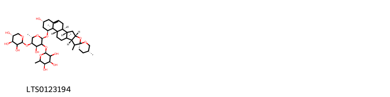{ width=100% }
    <figcaption>Hình ảnh cấu trúc hóa học của 1 hoạt chất thuộc nhóm Steroids and steroid derivatives gồm ["(2s,4s,5r)-2-{[(2r,4s,5r,6s)-4-hydroxy-6-methyl-2-[(1's,2r,2's,4's,5r,8'r,9's,12's,13'r,14's,16'r)-5,7',9',13'-tetramethyl-5'-oxaspiro[oxane-2,6'-pentacyclo[10.8.0.0²,⁹.0⁴,⁸.0¹³,¹⁸]icosan]-18'-en-16'-oloxy]-5-{[(2s,4s,5r)-3,4,5-trihydroxyoxan-2-yl]oxy}oxan-3-yl]oxy}-6-methyloxane-3,4,5-triol (LTS0123194)"].</figcaption>
</figure>

---

### Dược dân tộc học

Danh sách các quốc gia có sử dụng *Liriope graminifolia* trong điều trị các bệnh. 

| Country   | Disease            | Bệnh                                |
|:----------|:-------------------|:------------------------------------|
| China     | Aphrodisiac, Tonic | Thuốc kích thích tình dục, Thuốc bổ |

---

---
## Liriope icata
### Thông tin về thực vật

!!! info "Phân loại thực vật của *N/A* từ GIBF:"
    - **Kingdom:** N/A
    - **Phylum:** N/A
    - **Order:** N/A
    - **Family:** N/A
    - **Genus:** N/A
    - **Species:** *N/A*

 

| Label (VI)   | Label (EN)   | Scientific Name      | Descriptions (VI)   | Descriptions (EN)   | Also Known As (VI)   | Also Known As (EN)       |
|:-------------|:-------------|:---------------------|:--------------------|:--------------------|:---------------------|:-------------------------|
| N/A          | N/A          | Liriope graminifolia | loài thực vật       | species of plant    | ['']                 | ['liriope graminifolia'] |

#### Phân bố trên thế giới

**Từ CSDL GIBF** Không có kết quả phù hợp

#### Phân bố tại Việt Nam

**Từ CSDL GIBF**: Không có ghi nhận ở Việt Nam

---
### Thành phần hóa học
        
- Theo cơ sở dữ liệu lotus: Từ loài *N/A* đã phân lập và xác định được Chưa có hoạt chất nào được phân lập. hoạt chất thuộc về các nhóm Không có hoạt chất nào được phân lập. 

Không có hình ảnh nào được tạo ra

---

### Dược dân tộc học

Danh sách các quốc gia có sử dụng *N/A* trong điều trị các bệnh. 

| Country   | Disease                | Bệnh                   |
|:----------|:-----------------------|:-----------------------|
| China     | Emollient, Antitussive | Chất làm mềm, Chống ho |

---

---
## Liriope platyphylla
### Thông tin về thực vật

!!! info "Phân loại thực vật của *Liriope muscari* từ GIBF:"
    - **Kingdom:** Plantae
    - **Phylum:** Tracheophyta
    - **Order:** Asparagales
    - **Family:** Asparagaceae
    - **Genus:** Liriope
    - **Species:** *Liriope muscari*

 

| Label (VI)   | Label (EN)   | Scientific Name     | Descriptions (VI)   | Descriptions (EN)   | Also Known As (VI)   | Also Known As (EN)   |
|:-------------|:-------------|:--------------------|:--------------------|:--------------------|:---------------------|:---------------------|
| N/A          | N/A          | Liriope platyphylla |                     | species of plant    | ['']                 | ['']                 |

#### Phân bố trên thế giới

**Từ CSDL GIBF** nan, Japan, Korea, Republic of, Chinese Taipei, China

#### Phân bố tại Việt Nam

**Từ CSDL GIBF**: Không có ghi nhận ở Việt Nam

---
### Thành phần hóa học
        
- Theo cơ sở dữ liệu lotus: Từ loài *Liriope muscari* đã phân lập và xác định được Chưa có hoạt chất nào được phân lập. hoạt chất thuộc về các nhóm Không có hoạt chất nào được phân lập. 

Không có hình ảnh nào được tạo ra

---

### Dược dân tộc học

Danh sách các quốc gia có sử dụng *Liriope muscari* trong điều trị các bệnh. 

| Country   | Disease            | Bệnh                     |
|:----------|:-------------------|:-------------------------|
| Elsewhere | Antitussive, Tonic | Thuốc chống ho, Thuốc bổ |

---

# Chi Vallota

??? note "Danh sách các dược liệu thuộc chi"
    
	 - *Vallota eciosa*

---
## Vallota eciosa
### Thông tin về thực vật

!!! info "Phân loại thực vật của *N/A* từ GIBF:"
    - **Kingdom:** Plantae
    - **Phylum:** Tracheophyta
    - **Order:** Asparagales
    - **Family:** Amaryllidaceae
    - **Genus:** Cyrtanthus
    - **Species:** *N/A*

 

| Label (VI)   | Label (EN)   | Scientific Name     | Descriptions (VI)   | Descriptions (EN)   | Also Known As (VI)   | Also Known As (EN)   |
|:-------------|:-------------|:--------------------|:--------------------|:--------------------|:---------------------|:---------------------|
| N/A          | N/A          | Liriope platyphylla |                     | species of plant    | ['']                 | ['']                 |

#### Phân bố trên thế giới

**Từ CSDL GIBF** nan, Japan, Korea, Republic of, Chinese Taipei, China

#### Phân bố tại Việt Nam

**Từ CSDL GIBF**: Không có ghi nhận ở Việt Nam

---
### Thành phần hóa học
        
- Theo cơ sở dữ liệu lotus: Từ loài *N/A* đã phân lập và xác định được Chưa có hoạt chất nào được phân lập. hoạt chất thuộc về các nhóm Không có hoạt chất nào được phân lập. 

Không có hình ảnh nào được tạo ra

---

### Dược dân tộc học

Danh sách các quốc gia có sử dụng *N/A* trong điều trị các bệnh. 

| Country   | Disease   | Bệnh     |
|:----------|:----------|:---------|
| Elsewhere | Poison    | Chất độc |

---

# Chi Pancratium

??? note "Danh sách các dược liệu thuộc chi"
    
	 - *Pancratium declinatum*
	 - *Pancratium eciosum*
	 - *Pancratium maritimum*
	 - *Pancratium zeylanicum*

---
## Pancratium declinatum
### Thông tin về thực vật

!!! info "Phân loại thực vật của *Hymenocallis caribaea* từ GIBF:"
    - **Kingdom:** Plantae
    - **Phylum:** Tracheophyta
    - **Order:** Asparagales
    - **Family:** Amaryllidaceae
    - **Genus:** Hymenocallis
    - **Species:** *Hymenocallis caribaea*

 

| Label (VI)   | Label (EN)   | Scientific Name     | Descriptions (VI)   | Descriptions (EN)   | Also Known As (VI)   | Also Known As (EN)   |
|:-------------|:-------------|:--------------------|:--------------------|:--------------------|:---------------------|:---------------------|
| N/A          | N/A          | Liriope platyphylla |                     | species of plant    | ['']                 | ['']                 |

#### Phân bố trên thế giới

**Từ CSDL GIBF** nan, Japan, Korea, Republic of, Chinese Taipei, China

#### Phân bố tại Việt Nam

**Từ CSDL GIBF**: Không có ghi nhận ở Việt Nam

---
### Thành phần hóa học
        
- Theo cơ sở dữ liệu lotus: Từ loài *Hymenocallis caribaea* đã phân lập và xác định được Chưa có hoạt chất nào được phân lập. hoạt chất thuộc về các nhóm Không có hoạt chất nào được phân lập. 

Không có hình ảnh nào được tạo ra

---

### Dược dân tộc học

Danh sách các quốc gia có sử dụng *Hymenocallis caribaea* trong điều trị các bệnh. 

| Country   | Disease   | Bệnh   |
|:----------|:----------|:-------|
| Haiti     | Emetic    | Phôi   |

---

---
## Pancratium eciosum
### Thông tin về thực vật

!!! info "Phân loại thực vật của *N/A* từ GIBF:"
    - **Kingdom:** Plantae
    - **Phylum:** Tracheophyta
    - **Order:** Asparagales
    - **Family:** Amaryllidaceae
    - **Genus:** Pancratium
    - **Species:** *N/A*

 

| Label (VI)   | Label (EN)   | Scientific Name     | Descriptions (VI)   | Descriptions (EN)   | Also Known As (VI)   | Also Known As (EN)   |
|:-------------|:-------------|:--------------------|:--------------------|:--------------------|:---------------------|:---------------------|
| N/A          | N/A          | Liriope platyphylla |                     | species of plant    | ['']                 | ['']                 |

#### Phân bố trên thế giới

**Từ CSDL GIBF** Montenegro, Algeria, Benin, Portugal, Libya, Malta, Greece, Botswana, South Africa, Israel, Albania, Italy, India, Türkiye, Bulgaria, Cyprus, France, Spain

#### Phân bố tại Việt Nam

**Từ CSDL GIBF**: Không có ghi nhận ở Việt Nam

---
### Thành phần hóa học
        
- Theo cơ sở dữ liệu lotus: Từ loài *N/A* đã phân lập và xác định được Chưa có hoạt chất nào được phân lập. hoạt chất thuộc về các nhóm Không có hoạt chất nào được phân lập. 

Không có hình ảnh nào được tạo ra

---

### Dược dân tộc học

Danh sách các quốc gia có sử dụng *N/A* trong điều trị các bệnh. 

| Country   | Disease   | Bệnh   |
|:----------|:----------|:-------|
| Wi(Carib) | Emetic    | Phôi   |

---

---
## Pancratium maritimum
### Thông tin về thực vật

!!! info "Phân loại thực vật của *Pancratium maritimum* từ GIBF:"
    - **Kingdom:** Plantae
    - **Phylum:** Tracheophyta
    - **Order:** Asparagales
    - **Family:** Amaryllidaceae
    - **Genus:** Pancratium
    - **Species:** *Pancratium maritimum*

 

| Label (VI)   | Label (EN)   | Scientific Name      | Descriptions (VI)   | Descriptions (EN)   | Also Known As (VI)   | Also Known As (EN)   |
|:-------------|:-------------|:---------------------|:--------------------|:--------------------|:---------------------|:---------------------|
| N/A          | N/A          | Pancratium maritimum | loài thực vật       | species of plant    | ['']                 | ['']                 |

#### Phân bố trên thế giới

**Từ CSDL GIBF** Montenegro, Algeria, Portugal, Malta, Greece, South Africa, Israel, Albania, Italy, Türkiye, Bulgaria, Cyprus, France, Spain

#### Phân bố tại Việt Nam

**Từ CSDL GIBF**: Không có ghi nhận ở Việt Nam

---
### Thành phần hóa học
        
- Theo cơ sở dữ liệu lotus: Từ loài *Pancratium maritimum* đã phân lập và xác định được 74 hoạt chất thuộc về các nhóm Benzene and substituted derivatives, Quinolines and derivatives, Linear 1,3-diarylpropanoids, Flavonoids, Diazines, Phenols, Organooxygen compounds, Benzopyrans, Amaryllidaceae alkaloids. 

|    | chemicalTaxonomyClassyfireClass     |   smiles_count |
|---:|:------------------------------------|---------------:|
|  0 |                                     |              1 |
|  1 | Amaryllidaceae alkaloids            |             33 |
|  2 | Benzene and substituted derivatives |              3 |
|  3 | Benzopyrans                         |              4 |
|  4 | Diazines                            |              2 |
|  5 | Flavonoids                          |             12 |
|  6 | Linear 1,3-diarylpropanoids         |              2 |
|  7 | Organooxygen compounds              |              2 |
|  8 | Phenols                             |              1 |
|  9 | Quinolines and derivatives          |             14 |

#### Nhóm 
<figure markdown="span">
    { width=100% }
    <figcaption>Hình ảnh cấu trúc hóa học của 1 hoạt chất thuộc nhóm  gồm ['pancracine (LTS0086552)'].</figcaption>
</figure>
#### Nhóm Amaryllidaceae alkaloids
<figure markdown="span">
    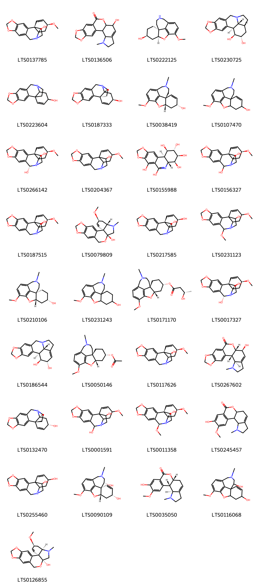{ width=100% }
    <figcaption>Hình ảnh cấu trúc hóa học của 33 hoạt chất thuộc nhóm Amaryllidaceae alkaloids gồm ['haemanthamine (LTS0137785)', '9-hydroxy-4-methyl-11,16,18-trioxa-4-azapentacyclo[11.7.0.0²,¹⁰.0³,⁷.0¹⁵,¹⁹]icosa-1(20),7,13,15(19)-tetraen-12-one (LTS0136506)', '(1s,12s,14s)-9-methoxy-11-oxa-4-azatetracyclo[8.6.1.0¹,¹².0⁶,¹⁷]heptadeca-6,8,10(17)-trien-14-ol (LTS0222125)', 'dihydrolycorine (LTS0230725)', '5,7-dioxa-12-azapentacyclo[10.5.2.0¹,¹³.0²,¹⁰.0⁴,⁸]nonadeca-2,4(8),9,16-tetraen-15-ol (LTS0223604)', 'crinine (LTS0187333)', 'galantamine (LTS0038419)', 'galantamine (LTS0107470)', '(1s,11r,13s,15s,18s)-15-methoxy-5,7-dioxa-12-azapentacyclo[10.5.2.0¹,¹³.0²,¹⁰.0⁴,⁸]nonadeca-2,4(8),9,16-tetraene-11,18-diol (LTS0266142)', '15-methoxy-5,7-dioxa-12-azapentacyclo[10.5.2.0¹,¹³.0²,¹⁰.0⁴,⁸]nonadeca-2,4(8),9,16-tetraen-18-ol (LTS0204367)', 'pancratistatin (LTS0155988)', '(1s,13s,15s,18s)-15-methoxy-5,7-dioxa-12-azapentacyclo[10.5.2.0¹,¹³.0²,¹⁰.0⁴,⁸]nonadeca-2,4(8),9,16-tetraene-11,18-diol (LTS0156327)', 'haemanthamine (LTS0187515)', '(1s,13r,16s,18s)-18-methoxy-15-methyl-5,7,12-trioxa-15-azapentacyclo[11.7.0.0¹,¹⁶.0²,¹⁰.0⁴,⁸]icosa-2,4(8),9,19-tetraen-13-ol (LTS0079809)', '(1s,13s,15s,18s)-5,7-dioxa-12-azapentacyclo[10.5.2.0¹,¹³.0²,¹⁰.0⁴,⁸]nonadeca-2,4(8),9,16-tetraene-15,18-diol (LTS0217585)', '11,15-dimethoxy-5,7-dioxa-12-azapentacyclo[10.5.2.0¹,¹³.0²,¹⁰.0⁴,⁸]nonadeca-2,4(8),9,16-tetraen-18-ol (LTS0231123)', 'lycoramine (LTS0210106)', '9-methoxy-4-methyl-11-oxa-4-azatetracyclo[8.6.1.0¹,¹².0⁶,¹⁷]heptadeca-6,8,10(17)-trien-14-ol (LTS0231243)', '(1s,12s,14s)-9-methoxy-4-methyl-11-oxa-4-azatetracyclo[8.6.1.0¹,¹².0⁶,¹⁷]heptadeca-6,8,10(17)-trien-14-yl (3s)-3-hydroxybutanoate (LTS0171170)', '(1s,11r,13s,15s,18r)-15-methoxy-5,7-dioxa-12-azapentacyclo[10.5.2.0¹,¹³.0²,¹⁰.0⁴,⁸]nonadeca-2,4(8),9,16-tetraene-11,18-diol (LTS0017327)', 'lycorine (LTS0186544)', '(1s,12s,14s)-9-methoxy-4-methyl-11-oxa-4-azatetracyclo[8.6.1.0¹,¹².0⁶,¹⁷]heptadeca-6,8,10(17)-trien-14-yl acetate (LTS0050146)', '(1s,15s,18r)-15-methoxy-5,7-dioxa-12-azapentacyclo[10.5.2.0¹,¹³.0²,¹⁰.0⁴,⁸]nonadeca-2,4(8),9,16-tetraen-18-ol (LTS0117626)', 'hippeastrine (LTS0267602)', '(1r,13s,15s)-5,7-dioxa-12-azapentacyclo[10.5.2.0¹,¹³.0²,¹⁰.0⁴,⁸]nonadeca-2,4(8),9,16-tetraen-15-ol (LTS0132470)', '15-methoxy-5,7-dioxa-12-azapentacyclo[10.5.2.0¹,¹³.0²,¹⁰.0⁴,⁸]nonadeca-2,4(8),9,16-tetraene-11,18-diol (LTS0001591)', '(1s,11s,13s,15s,18s)-11,15-dimethoxy-5,7-dioxa-12-azapentacyclo[10.5.2.0¹,¹³.0²,¹⁰.0⁴,⁸]nonadeca-2,4(8),9,16-tetraen-18-ol (LTS0011358)', '5-hydroxy-4-methoxy-16-methyl-9-oxa-16-azatetracyclo[8.7.0.0²,⁷.0¹³,¹⁷]heptadeca-2(7),3,5,12-tetraen-8-one (LTS0245457)', '5,7-dioxa-12-azapentacyclo[10.5.2.0¹,¹³.0²,¹⁰.0⁴,⁸]nonadeca-2,4(8),9,16-tetraene-15,18-diol (LTS0255460)', '(1s,2r,12s,14r)-9-methoxy-4-methyl-11-oxa-4-azatetracyclo[8.6.1.0¹,¹².0⁶,¹⁷]heptadeca-6,8,10(17),15-tetraene-2,14-diol (LTS0090109)', '9-o-demethylhomolycorine (LTS0035050)', '9-methoxy-4-methyl-11-oxa-4-azatetracyclo[8.6.1.0¹,¹².0⁶,¹⁷]heptadeca-6,8,10(17),15-tetraene-2,14-diol (LTS0116068)', '(1s,13s,16r,18s)-18-methoxy-15-methyl-5,7,12-trioxa-15-azapentacyclo[11.7.0.0¹,¹⁶.0²,¹⁰.0⁴,⁸]icosa-2,4(8),9,19-tetraen-13-ol (LTS0126855)'].</figcaption>
</figure>
#### Nhóm Benzene and substituted derivatives
<figure markdown="span">
    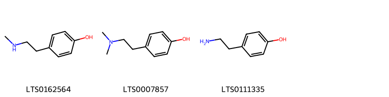{ width=100% }
    <figcaption>Hình ảnh cấu trúc hóa học của 3 hoạt chất thuộc nhóm Benzene and substituted derivatives gồm ['n-methyltyramine (LTS0162564)', 'hordenine (LTS0007857)', 'tyramine (LTS0111335)'].</figcaption>
</figure>
#### Nhóm Benzopyrans
<figure markdown="span">
    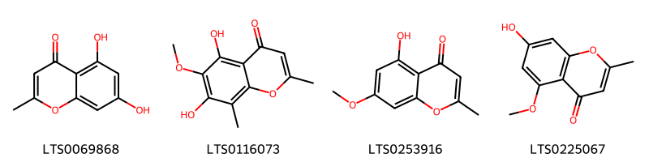{ width=100% }
    <figcaption>Hình ảnh cấu trúc hóa học của 4 hoạt chất thuộc nhóm Benzopyrans gồm ['dihydroxy methylchromone (LTS0069868)', '5,7-dihydroxy-6-methoxy-2,8-dimethylchromen-4-one (LTS0116073)', 'eugenin (LTS0253916)', '7-hydroxy-5-methoxy-2-methylchromen-4-one (LTS0225067)'].</figcaption>
</figure>
#### Nhóm Diazines
<figure markdown="span">
    { width=100% }
    <figcaption>Hình ảnh cấu trúc hóa học của 2 hoạt chất thuộc nhóm Diazines gồm ['5-methylpyrimidine-2,4-dione (LTS0084111)', 'pirod (LTS0008205)'].</figcaption>
</figure>
#### Nhóm Flavonoids
<figure markdown="span">
    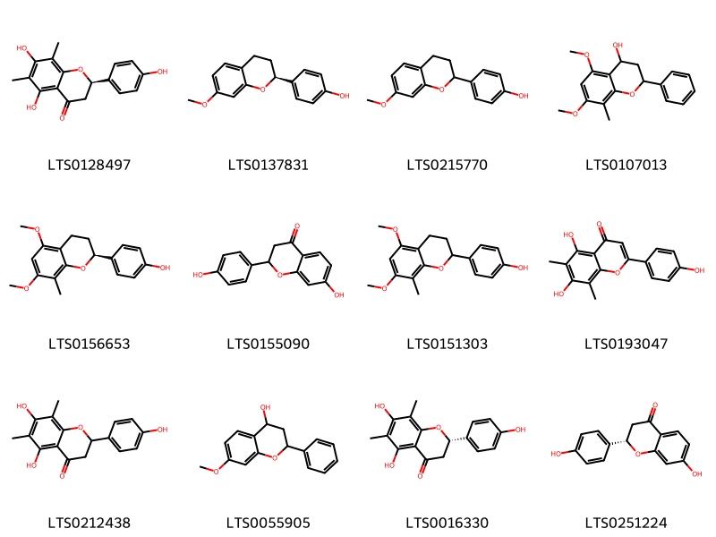{ width=100% }
    <figcaption>Hình ảnh cấu trúc hóa học của 12 hoạt chất thuộc nhóm Flavonoids gồm ['(2r)-5,7-dihydroxy-2-(4-hydroxyphenyl)-6,8-dimethyl-2,3-dihydro-1-benzopyran-4-one (LTS0128497)', '4-[(2s)-7-methoxy-3,4-dihydro-2h-1-benzopyran-2-yl]phenol (LTS0137831)', '4-(7-methoxy-3,4-dihydro-2h-1-benzopyran-2-yl)phenol (LTS0215770)', '5,7-dimethoxy-8-methyl-2-phenyl-3,4-dihydro-2h-1-benzopyran-4-ol (LTS0107013)', '4-[(2s)-5,7-dimethoxy-8-methyl-3,4-dihydro-2h-1-benzopyran-2-yl]phenol (LTS0156653)', "7,4'-dihydroxyflavanone (LTS0155090)", '4-(5,7-dimethoxy-8-methyl-3,4-dihydro-2h-1-benzopyran-2-yl)phenol (LTS0151303)', '6,8-dimethylapigenin (LTS0193047)', 'farrerol (LTS0212438)', '7-methoxy-2-phenyl-3,4-dihydro-2h-1-benzopyran-4-ol (LTS0055905)', 'farrerol (LTS0016330)', '5-deoxyflavanone (LTS0251224)'].</figcaption>
</figure>
#### Nhóm Linear 1_3-diarylpropanoids
<figure markdown="span">
    { width=100% }
    <figcaption>Hình ảnh cấu trúc hóa học của Không tìm thấy chú thích hoạt chất thuộc nhóm Linear 1_3-diarylpropanoids gồm Không tìm thấy chú thích.</figcaption>
</figure>
#### Nhóm Organooxygen compounds
<figure markdown="span">
    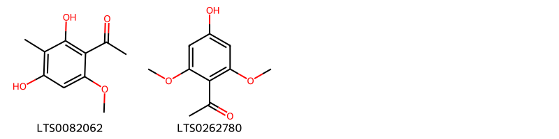{ width=100% }
    <figcaption>Hình ảnh cấu trúc hóa học của 2 hoạt chất thuộc nhóm Organooxygen compounds gồm ['1-(2,4-dihydroxy-6-methoxy-3-methylphenyl)ethanone (LTS0082062)', '1-(4-hydroxy-2,6-dimethoxyphenyl)ethanone (LTS0262780)'].</figcaption>
</figure>
#### Nhóm Phenols
<figure markdown="span">
    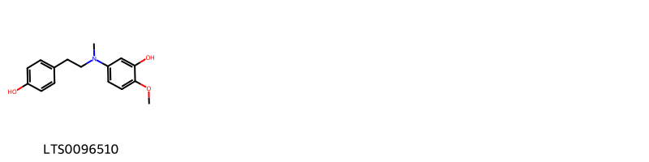{ width=100% }
    <figcaption>Hình ảnh cấu trúc hóa học của 1 hoạt chất thuộc nhóm Phenols gồm ['5-{[2-(4-hydroxyphenyl)ethyl](methyl)amino}-2-methoxyphenol (LTS0096510)'].</figcaption>
</figure>
#### Nhóm Quinolines and derivatives
<figure markdown="span">
    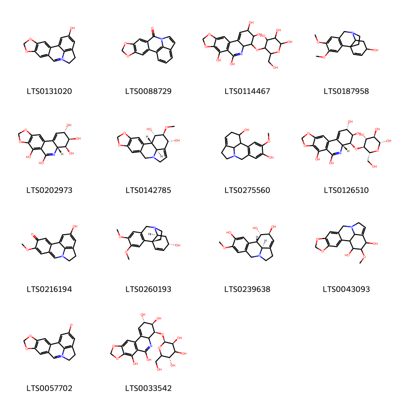{ width=100% }
    <figcaption>Hình ảnh cấu trúc hóa học của 14 hoạt chất thuộc nhóm Quinolines and derivatives gồm ['ungeremine (LTS0131020)', '5,7-dioxa-12-azapentacyclo[10.6.1.0²,¹⁰.0⁴,⁸.0¹⁵,¹⁹]nonadeca-1(19),2(10),3,8,13,15,17-heptaen-11-one (LTS0088729)', '4-{[4,5,6-trihydroxy-2-(hydroxymethyl)oxan-3-yl]oxy}-2h,3h,4h,4ah,9h-[1,3]dioxolo[4,5-j]phenanthridine-2,3,6,7-tetrol (LTS0114467)', '4,5-dimethoxy-9-azatetracyclo[7.5.2.0¹,¹⁰.0²,⁷]hexadeca-2(7),3,5,13-tetraen-12-ol (LTS0187958)', 'lycoricidinol (LTS0202973)', 'ungiminorine (LTS0142785)', '4-methoxy-9-azatetracyclo[7.6.1.0²,⁷.0¹²,¹⁶]hexadeca-2(7),3,5,12-tetraene-5,15-diol (LTS0275560)', '(2s,3r,4s,4ar)-4-{[(2r,3s,4r,5r,6r)-4,5,6-trihydroxy-2-(hydroxymethyl)oxan-3-yl]oxy}-2h,3h,4h,4ah,9h-[1,3]dioxolo[4,5-j]phenanthridine-2,3,6,7-tetrol (LTS0126510)', '14-hydroxy-5-methoxy-9-azatetracyclo[7.6.1.0²,⁷.0¹²,¹⁶]hexadeca-1(15),2,5,7,12(16),13-hexaen-4-one (LTS0216194)', '(1r,10s,12s)-4,5-dimethoxy-9-azatetracyclo[7.5.2.0¹,¹⁰.0²,⁷]hexadeca-2(7),3,5,13-tetraen-12-ol (LTS0260193)', 'pseudolycorine (LTS0239638)', '17-methoxy-5,7-dioxa-12-azapentacyclo[10.6.1.0²,¹⁰.0⁴,⁸.0¹⁵,¹⁹]nonadeca-2,4(8),9,14-tetraene-16,18-diol (LTS0043093)', '5,7-dioxa-12λ⁵-azapentacyclo[10.6.1.0²,¹⁰.0⁴,⁸.0¹⁵,¹⁹]nonadeca-1(19),2(10),3,8,11,15,17-heptaen-12-ylium-17-olate (LTS0057702)', '(2s,3r,4s)-4-{[(2r,3s,5s)-3,4,5-trihydroxy-6-(hydroxymethyl)oxan-2-yl]oxy}-2h,3h,4h,4ah,9h-[1,3]dioxolo[4,5-j]phenanthridine-2,3,6,7-tetrol (LTS0033542)'].</figcaption>
</figure>

---

### Dược dân tộc học

Danh sách các quốc gia có sử dụng *Pancratium maritimum* trong điều trị các bệnh. 

| Country   | Disease           | Bệnh              |
|:----------|:------------------|:------------------|
| Egypt     | Purgative, Emetic | Purgative, Emetic |

---

---
## Pancratium zeylanicum
### Thông tin về thực vật

!!! info "Phân loại thực vật của *Pancratium zeylanicum* từ GIBF:"
    - **Kingdom:** Plantae
    - **Phylum:** Tracheophyta
    - **Order:** Asparagales
    - **Family:** Amaryllidaceae
    - **Genus:** Pancratium
    - **Species:** *Pancratium zeylanicum*

 

| Label (VI)   | Label (EN)   | Scientific Name       | Descriptions (VI)   | Descriptions (EN)   | Also Known As (VI)   | Also Known As (EN)   |
|:-------------|:-------------|:----------------------|:--------------------|:--------------------|:---------------------|:---------------------|
| N/A          | N/A          | Pancratium zeylanicum |                     | species of plant    | ['']                 | ['']                 |

#### Phân bố trên thế giới

**Từ CSDL GIBF** Sri Lanka, nan, Congo, Democratic Republic of the, Seychelles, Malaysia, Indonesia, China, Mayotte, Philippines, Thailand, Italy, India, unknown or invalid, Madagascar, Christmas Island

#### Phân bố tại Việt Nam

**Từ CSDL GIBF**: Không có ghi nhận ở Việt Nam

---
### Thành phần hóa học
        
- Theo cơ sở dữ liệu lotus: Từ loài *Pancratium zeylanicum* đã phân lập và xác định được Chưa có hoạt chất nào được phân lập. hoạt chất thuộc về các nhóm Không có hoạt chất nào được phân lập. 

Không có hình ảnh nào được tạo ra

---

### Dược dân tộc học

Danh sách các quốc gia có sử dụng *Pancratium zeylanicum* trong điều trị các bệnh. 

| Country   | Disease        | Bệnh           |
|:----------|:---------------|:---------------|
| Elsewhere | Emetic, Poison | Emetic, Poison |

---

# Chi Paris

??? note "Danh sách các dược liệu thuộc chi"
    
	 - *Paris hainanense*
	 - *Paris pokyphylla*
	 - *Paris polyphylla*
	 - *Paris quadrifolia*

---
## Paris hainanense
### Thông tin về thực vật

!!! info "Phân loại thực vật của *Paris dunniana* từ GIBF:"
    - **Kingdom:** Plantae
    - **Phylum:** Tracheophyta
    - **Order:** Liliales
    - **Family:** Melanthiaceae
    - **Genus:** Paris
    - **Species:** *Paris dunniana*

 

| Label (VI)   | Label (EN)   | Scientific Name       | Descriptions (VI)   | Descriptions (EN)   | Also Known As (VI)   | Also Known As (EN)   |
|:-------------|:-------------|:----------------------|:--------------------|:--------------------|:---------------------|:---------------------|
| N/A          | N/A          | Pancratium zeylanicum |                     | species of plant    | ['']                 | ['']                 |

#### Phân bố trên thế giới

**Từ CSDL GIBF** Viet Nam, China

#### Phân bố tại Việt Nam

**Từ CSDL GIBF**: Kon Tum

---
### Thành phần hóa học
        
- Theo cơ sở dữ liệu lotus: Từ loài *Paris dunniana* đã phân lập và xác định được Chưa có hoạt chất nào được phân lập. hoạt chất thuộc về các nhóm Không có hoạt chất nào được phân lập. 

Không có hình ảnh nào được tạo ra

---

### Dược dân tộc học

Danh sách các quốc gia có sử dụng *Paris dunniana* trong điều trị các bệnh. 

| Country   | Disease   | Bệnh          |
|:----------|:----------|:--------------|
| China     | Antidote  | Chất giải độc |

---

---
## Paris pokyphylla
### Thông tin về thực vật

!!! info "Phân loại thực vật của *Paris polyphylla* từ GIBF:"
    - **Kingdom:** Plantae
    - **Phylum:** Tracheophyta
    - **Order:** Liliales
    - **Family:** Melanthiaceae
    - **Genus:** Paris
    - **Species:** *Paris polyphylla*

 

| Label (VI)   | Label (EN)   | Scientific Name       | Descriptions (VI)   | Descriptions (EN)   | Also Known As (VI)   | Also Known As (EN)   |
|:-------------|:-------------|:----------------------|:--------------------|:--------------------|:---------------------|:---------------------|
| N/A          | N/A          | Pancratium zeylanicum |                     | species of plant    | ['']                 | ['']                 |

#### Phân bố trên thế giới

**Từ CSDL GIBF** Hong Kong, India, Chinese Taipei, China

#### Phân bố tại Việt Nam

**Từ CSDL GIBF**: Không có ghi nhận ở Việt Nam

---
### Thành phần hóa học
        
- Theo cơ sở dữ liệu lotus: Từ loài *Paris polyphylla* đã phân lập và xác định được Chưa có hoạt chất nào được phân lập. hoạt chất thuộc về các nhóm Không có hoạt chất nào được phân lập. 

Không có hình ảnh nào được tạo ra

---

### Dược dân tộc học

Danh sách các quốc gia có sử dụng *Paris polyphylla* trong điều trị các bệnh. 

| Country   | Disease    | Bệnh       |
|:----------|:-----------|:-----------|
| China     | Alexiteric | Alexiteric |

---

---
## Paris polyphylla
### Thông tin về thực vật

!!! info "Phân loại thực vật của *Paris polyphylla* từ GIBF:"
    - **Kingdom:** Plantae
    - **Phylum:** Tracheophyta
    - **Order:** Liliales
    - **Family:** Melanthiaceae
    - **Genus:** Paris
    - **Species:** *Paris polyphylla*

 

| Label (VI)   | Label (EN)   | Scientific Name   | Descriptions (VI)   | Descriptions (EN)   | Also Known As (VI)   | Also Known As (EN)   |
|:-------------|:-------------|:------------------|:--------------------|:--------------------|:---------------------|:---------------------|
| N/A          | N/A          | Paris polyphylla  | loài thực vật       | species of plant    | ['']                 | ['']                 |

#### Phân bố trên thế giới

**Từ CSDL GIBF** Hong Kong, India, Chinese Taipei, China

#### Phân bố tại Việt Nam

**Từ CSDL GIBF**: Không có ghi nhận ở Việt Nam

---
### Thành phần hóa học
        
- Theo cơ sở dữ liệu lotus: Từ loài *Paris polyphylla* đã phân lập và xác định được 127 hoạt chất thuộc về các nhóm Fatty Acyls, Carboxylic acids and derivatives, Cinnamic acids and derivatives, Steroids and steroid derivatives, Glycerolipids, Imidazopyrimidines, Organooxygen compounds, Hydroxy acids and derivatives, Prenol lipids, Tetracyclines, Keto acids and derivatives. 

|    | chemicalTaxonomyClassyfireClass   |   smiles_count |
|---:|:----------------------------------|---------------:|
|  0 | Carboxylic acids and derivatives  |             15 |
|  1 | Cinnamic acids and derivatives    |              2 |
|  2 | Fatty Acyls                       |              7 |
|  3 | Glycerolipids                     |              1 |
|  4 | Hydroxy acids and derivatives     |              1 |
|  5 | Imidazopyrimidines                |              1 |
|  6 | Keto acids and derivatives        |              1 |
|  7 | Organooxygen compounds            |             11 |
|  8 | Prenol lipids                     |              4 |
|  9 | Steroids and steroid derivatives  |             75 |
| 10 | Tetracyclines                     |              1 |

#### Nhóm Carboxylic acids and derivatives
<figure markdown="span">
    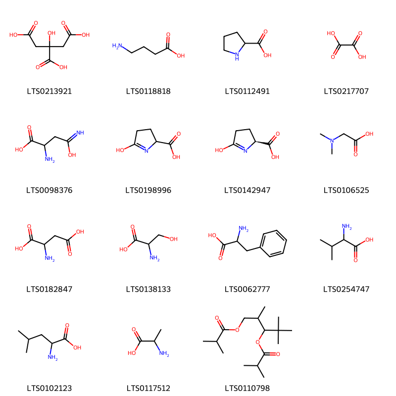{ width=100% }
    <figcaption>Hình ảnh cấu trúc hóa học của 15 hoạt chất thuộc nhóm Carboxylic acids and derivatives gồm ['citric acid (LTS0213921)', 'gamma(amino)-butyric acid (LTS0118818)', 'proline (LTS0112491)', 'oxalic acid (LTS0217707)', 'asparagine (LTS0098376)', 'pyroglutamic acid (LTS0198996)', 'pyroglutamic acid (LTS0142947)', 'dimethylglycine (LTS0106525)', 'aspartic acid (LTS0182847)', 'serin (LTS0138133)', 'phenylalanin (LTS0062777)', 'valin (LTS0254747)', 'leucine (LTS0102123)', 'alanine (LTS0117512)', '2,4,4-trimethyl-1-[(2-methylpropanoyl)oxy]pentan-3-yl 2-methylpropanoate (LTS0110798)'].</figcaption>
</figure>
#### Nhóm Cinnamic acids and derivatives
<figure markdown="span">
    { width=100% }
    <figcaption>Hình ảnh cấu trúc hóa học của 2 hoạt chất thuộc nhóm Cinnamic acids and derivatives gồm ['[(2r,3r,4s,5s)-3-hydroxy-4-{[(2e)-3-(4-hydroxy-3-methoxyphenyl)prop-2-enoyl]oxy}-5-(hydroxymethyl)-5-{[(2r,3r,4s,5s,6r)-3,4,5-trihydroxy-6-(hydroxymethyl)oxan-2-yl]oxy}oxolan-2-yl]methyl (2e)-3-(4-hydroxy-3-methoxyphenyl)prop-2-enoate (LTS0154285)', '(3-hydroxy-4-{[3-(4-hydroxy-3-methoxyphenyl)prop-2-enoyl]oxy}-5-(hydroxymethyl)-5-{[3,4,5-trihydroxy-6-(hydroxymethyl)oxan-2-yl]oxy}oxolan-2-yl)methyl 3-(4-hydroxy-3-methoxyphenyl)prop-2-enoate (LTS0203636)'].</figcaption>
</figure>
#### Nhóm Fatty Acyls
<figure markdown="span">
    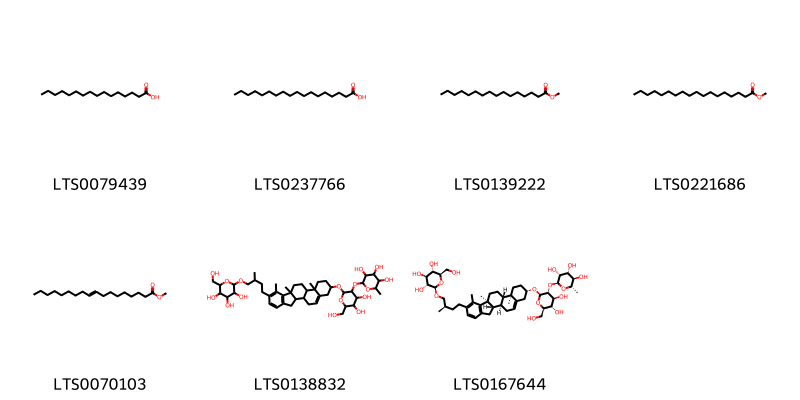{ width=100% }
    <figcaption>Hình ảnh cấu trúc hóa học của 7 hoạt chất thuộc nhóm Fatty Acyls gồm ['palmitic acid (LTS0079439)', 'stearic acid (LTS0237766)', 'methyl palmitate (LTS0139222)', 'methyl stearate (LTS0221686)', 'methyl 9-octadecenoate (LTS0070103)', '2-[4-(2-{[4,5-dihydroxy-6-(hydroxymethyl)-3-[(3,4,5-trihydroxy-6-methyloxan-2-yl)oxy]oxan-2-yl]oxy}-4a,6a,7-trimethyl-1h,2h,3h,4h,4bh,5h,6h,11h,11ah,11bh,12h-indeno[2,1-a]phenanthren-8-yl)-2-methylbutoxy]-6-(hydroxymethyl)oxane-3,4,5-triol (LTS0138832)', '(2r,3r,4s,5s,6r)-2-[(2r)-4-[(2s,4ar,4bs,6as,11as,11br)-2-{[(2r,3r,4s,5s,6r)-4,5-dihydroxy-6-(hydroxymethyl)-3-{[(2s,3r,4r,5r,6s)-3,4,5-trihydroxy-6-methyloxan-2-yl]oxy}oxan-2-yl]oxy}-4a,6a,7-trimethyl-1h,2h,3h,4h,4bh,5h,6h,11h,11ah,11bh,12h-indeno[2,1-a]phenanthren-8-yl]-2-methylbutoxy]-6-(hydroxymethyl)oxane-3,4,5-triol (LTS0167644)'].</figcaption>
</figure>
#### Nhóm Glycerolipids
<figure markdown="span">
    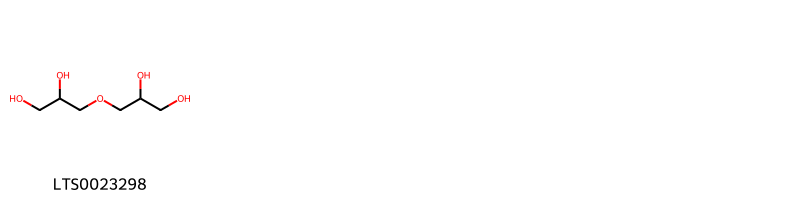{ width=100% }
    <figcaption>Hình ảnh cấu trúc hóa học của 1 hoạt chất thuộc nhóm Glycerolipids gồm ["α,α'-diglycerol (LTS0023298)"].</figcaption>
</figure>
#### Nhóm Hydroxy acids and derivatives
<figure markdown="span">
    { width=100% }
    <figcaption>Hình ảnh cấu trúc hóa học của 1 hoạt chất thuộc nhóm Hydroxy acids and derivatives gồm ['malic acid (LTS0216520)'].</figcaption>
</figure>
#### Nhóm Imidazopyrimidines
<figure markdown="span">
    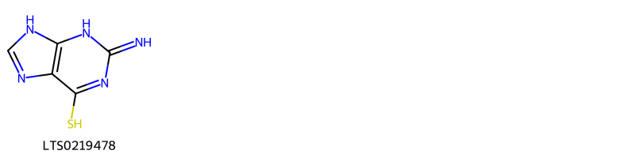{ width=100% }
    <figcaption>Hình ảnh cấu trúc hóa học của 1 hoạt chất thuộc nhóm Imidazopyrimidines gồm ['tioguanine (LTS0219478)'].</figcaption>
</figure>
#### Nhóm Keto acids and derivatives
<figure markdown="span">
    { width=100% }
    <figcaption>Hình ảnh cấu trúc hóa học của 1 hoạt chất thuộc nhóm Keto acids and derivatives gồm ['pyruvic acid (LTS0207290)'].</figcaption>
</figure>
#### Nhóm Organooxygen compounds
<figure markdown="span">
    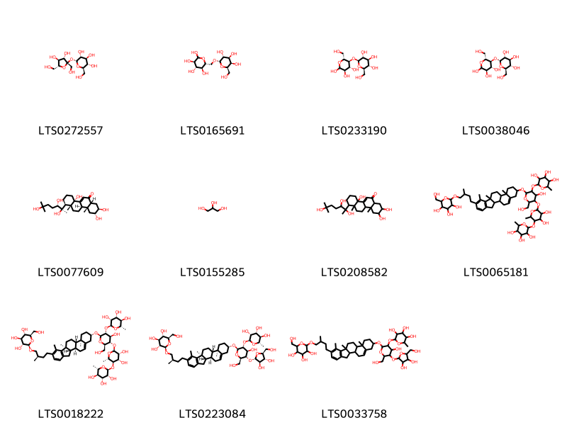{ width=100% }
    <figcaption>Hình ảnh cấu trúc hóa học của 11 hoạt chất thuộc nhóm Organooxygen compounds gồm ['sucrose (LTS0272557)', 'd-melibiose (LTS0165691)', 'cellobiose (LTS0233190)', 'maltose (LTS0038046)', '(1s,4as,6ar,8r,9r,10ar,10br,12ar)-4a,8,9-trihydroxy-10a,12a-dimethyl-1-[(2r,3s)-2,3,6-trihydroxy-6-methylheptan-2-yl]-1,2,3,4,6a,7,8,9,10,10b,11,12-dodecahydrochrysen-6-one (LTS0077609)', 'glycerol (LTS0155285)', '4a,8,9-trihydroxy-10a,12a-dimethyl-1-(2,3,6-trihydroxy-6-methylheptan-2-yl)-1,2,3,4,6a,7,8,9,10,10b,11,12-dodecahydrochrysen-6-one (LTS0208582)', '2-[4-(2-{[5-({3,4-dihydroxy-6-methyl-5-[(3,4,5-trihydroxy-6-methyloxan-2-yl)oxy]oxan-2-yl}oxy)-4-hydroxy-6-(hydroxymethyl)-3-[(3,4,5-trihydroxy-6-methyloxan-2-yl)oxy]oxan-2-yl]oxy}-4a,6a,7-trimethyl-1h,2h,3h,4h,4bh,5h,6h,11h,11ah,11bh,12h-indeno[2,1-a]phenanthren-8-yl)-2-methylbutoxy]-6-(hydroxymethyl)oxane-3,4,5-triol (LTS0065181)', '(2r,3r,4s,5s,6r)-2-[(2r)-4-[(2s,4ar,4bs,6as,11as,11br)-2-{[(2r,3r,4s,5s,6r)-5-{[(2s,3r,4s,5r,6s)-3,4-dihydroxy-6-methyl-5-{[(2s,3r,4r,5r,6s)-3,4,5-trihydroxy-6-methyloxan-2-yl]oxy}oxan-2-yl]oxy}-4-hydroxy-6-(hydroxymethyl)-3-{[(2s,3r,4r,5r,6s)-3,4,5-trihydroxy-6-methyloxan-2-yl]oxy}oxan-2-yl]oxy}-4a,6a,7-trimethyl-1h,2h,3h,4h,4bh,5h,6h,11h,11ah,11bh,12h-indeno[2,1-a]phenanthren-8-yl]-2-methylbutoxy]-6-(hydroxymethyl)oxane-3,4,5-triol (LTS0018222)', '(2r,3r,4s,5s,6r)-2-[(2r)-4-[(2s,4ar,4bs,6as,11as,11br)-2-{[(2r,3r,4s,5s,6r)-5-{[(2s,3r,4r,5s)-3,4-dihydroxy-5-(hydroxymethyl)oxolan-2-yl]oxy}-4-hydroxy-6-(hydroxymethyl)-3-{[(2s,3r,4r,5r,6s)-3,4,5-trihydroxy-6-methyloxan-2-yl]oxy}oxan-2-yl]oxy}-4a,6a,7-trimethyl-1h,2h,3h,4h,4bh,5h,6h,11h,11ah,11bh,12h-indeno[2,1-a]phenanthren-8-yl]-2-methylbutoxy]-6-(hydroxymethyl)oxane-3,4,5-triol (LTS0223084)', '2-(4-{2-[(5-{[3,4-dihydroxy-5-(hydroxymethyl)oxolan-2-yl]oxy}-4-hydroxy-6-(hydroxymethyl)-3-[(3,4,5-trihydroxy-6-methyloxan-2-yl)oxy]oxan-2-yl)oxy]-4a,6a,7-trimethyl-1h,2h,3h,4h,4bh,5h,6h,11h,11ah,11bh,12h-indeno[2,1-a]phenanthren-8-yl}-2-methylbutoxy)-6-(hydroxymethyl)oxane-3,4,5-triol (LTS0033758)'].</figcaption>
</figure>
#### Nhóm Prenol lipids
<figure markdown="span">
    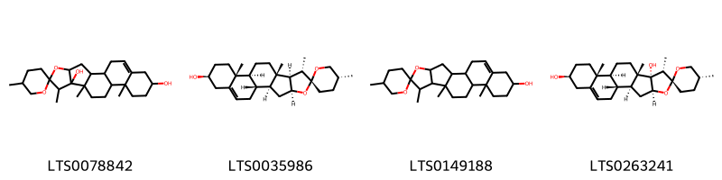{ width=100% }
    <figcaption>Hình ảnh cấu trúc hóa học của 4 hoạt chất thuộc nhóm Prenol lipids gồm ["5,7',9',13'-tetramethyl-5'-oxaspiro[oxane-2,6'-pentacyclo[10.8.0.0²,⁹.0⁴,⁸.0¹³,¹⁸]icosan]-18'-ene-8',16'-diol (LTS0078842)", 'diosgenin (LTS0035986)', 'diosgenin (LTS0149188)', 'pennogenin (LTS0263241)'].</figcaption>
</figure>
#### Nhóm Steroids and steroid derivatives
<figure markdown="span">
    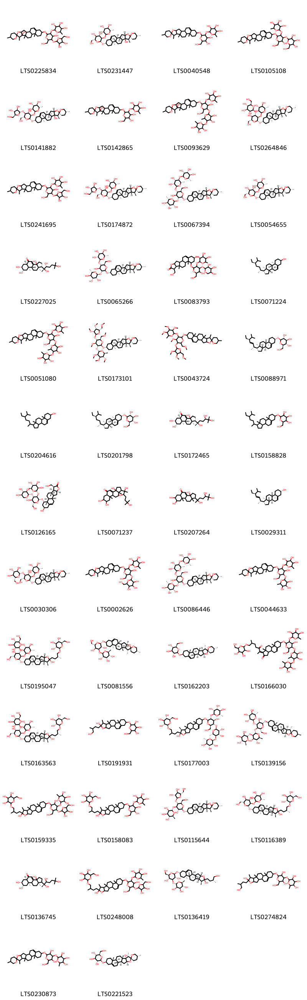{ width=100% }
    <figcaption>Hình ảnh cấu trúc hóa học của 75 hoạt chất thuộc nhóm Steroids and steroid derivatives gồm ["2-[(5-{[3,4-dihydroxy-5-(hydroxymethyl)oxolan-2-yl]oxy}-4-hydroxy-6-(hydroxymethyl)-2-{5,7',9',13'-tetramethyl-5'-oxaspiro[oxane-2,6'-pentacyclo[10.8.0.0²,⁹.0⁴,⁸.0¹³,¹⁸]icosan]-18'-en-8'-oloxy}oxan-3-yl)oxy]-6-methyloxane-3,4,5-triol (LTS0225834)", "(2s,3r,4r,5r,6s)-2-{[(2r,3r,4s,5s,6r)-4,5-dihydroxy-6-(hydroxymethyl)-2-[(1'r,2r,2's,4's,5r,7's,8's,9's,12's,13'r,16's)-5,7',9',13'-tetramethyl-5'-oxaspiro[oxane-2,6'-pentacyclo[10.8.0.0²,⁹.0⁴,⁸.0¹³,¹⁸]icosan]-18'-en-8'-oloxy]oxan-3-yl]oxy}-6-methyloxane-3,4,5-triol (LTS0231447)", "2-{[4,5-dihydroxy-6-(hydroxymethyl)-2-{5,7',9',13'-tetramethyl-5'-oxaspiro[oxane-2,6'-pentacyclo[10.8.0.0²,⁹.0⁴,⁸.0¹³,¹⁸]icosan]-18'-eneoxy}oxan-3-yl]oxy}-6-methyloxane-3,4,5-triol (LTS0040548)", "2-{[3-hydroxy-2-(hydroxymethyl)-6-{5,7',9',13'-tetramethyl-5'-oxaspiro[oxane-2,6'-pentacyclo[10.8.0.0²,⁹.0⁴,⁸.0¹³,¹⁸]icosan]-18'-eneoxy}-5-[(3,4,5-trihydroxy-6-methyloxan-2-yl)oxy]oxan-4-yl]oxy}-6-(hydroxymethyl)oxane-3,4,5-triol (LTS0105108)", "(2s,3r,4r,5r,6s)-2-{[(2r,3r,4s,5s,6r)-5-{[(2s,3r,4r,5s)-3,4-dihydroxy-5-(hydroxymethyl)oxolan-2-yl]oxy}-4-hydroxy-6-(hydroxymethyl)-2-[(1'r,2r,2's,4's,5r,7's,8's,9's,12's,13'r,16's)-5,7',9',13'-tetramethyl-5'-oxaspiro[oxane-2,6'-pentacyclo[10.8.0.0²,⁹.0⁴,⁸.0¹³,¹⁸]icosan]-18'-en-8'-oloxy]oxan-3-yl]oxy}-6-methyloxane-3,4,5-triol (LTS0141882)", "2-{[4,5-dihydroxy-6-(hydroxymethyl)-2-{5,7',9',13'-tetramethyl-5'-oxaspiro[oxane-2,6'-pentacyclo[10.8.0.0²,⁹.0⁴,⁸.0¹³,¹⁸]icosan]-18'-en-8'-oloxy}oxan-3-yl]oxy}-6-methyloxane-3,4,5-triol (LTS0142865)", "2-[(4,5-dihydroxy-6-{[4-hydroxy-2-(hydroxymethyl)-6-{5,7',9',13'-tetramethyl-5'-oxaspiro[oxane-2,6'-pentacyclo[10.8.0.0²,⁹.0⁴,⁸.0¹³,¹⁸]icosan]-18'-en-8'-oloxy}-5-[(3,4,5-trihydroxy-6-methyloxan-2-yl)oxy]oxan-3-yl]oxy}-2-methyloxan-3-yl)oxy]-6-methyloxane-3,4,5-triol (LTS0093629)", "(2s,3r,4r,5r,6s)-2-{[(2r,3r,4s,5r,6r)-5-hydroxy-6-(hydroxymethyl)-2-[(1's,2r,2's,4's,5r,7's,8'r,9's,12's,13'r,16's)-5,7',9',13'-tetramethyl-5'-oxaspiro[oxane-2,6'-pentacyclo[10.8.0.0²,⁹.0⁴,⁸.0¹³,¹⁸]icosan]-18'-eneoxy]-4-{[(2s,3r,4s,5s,6r)-3,4,5-trihydroxy-6-(hydroxymethyl)oxan-2-yl]oxy}oxan-3-yl]oxy}-6-methyloxane-3,4,5-triol (LTS0264846)", "2-[(5-{[3,4-dihydroxy-5-(hydroxymethyl)oxolan-2-yl]oxy}-4-hydroxy-6-(hydroxymethyl)-2-{5,7',9',13'-tetramethyl-5'-oxaspiro[oxane-2,6'-pentacyclo[10.8.0.0²,⁹.0⁴,⁸.0¹³,¹⁸]icosan]-18'-eneoxy}oxan-3-yl)oxy]-6-methyloxane-3,4,5-triol (LTS0241695)", "(2s,3r,4r,5r,6s)-2-{[(2r,3r,4s,5s,6r)-5-{[(2s,3r,4r,5s)-3,4-dihydroxy-5-(hydroxymethyl)oxolan-2-yl]oxy}-4-hydroxy-6-(hydroxymethyl)-2-[(1's,2r,2's,4's,5r,7's,8'r,9's,12's,13'r,16's)-5,7',9',13'-tetramethyl-5'-oxaspiro[oxane-2,6'-pentacyclo[10.8.0.0²,⁹.0⁴,⁸.0¹³,¹⁸]icosan]-18'-eneoxy]oxan-3-yl]oxy}-6-methyloxane-3,4,5-triol (LTS0174872)", "(2s,3r,4r,5r,6s)-2-{[(2r,3r,4s,5s,6r)-5-{[(2s,3r,4s,5r,6s)-3,4-dihydroxy-6-methyl-5-{[(2s,3r,4r,5r,6s)-3,4,5-trihydroxy-6-methyloxan-2-yl]oxy}oxan-2-yl]oxy}-4-hydroxy-6-(hydroxymethyl)-2-[(1'r,2r,2's,4's,5r,7's,8's,9's,12's,13'r,16's)-5,7',9',13'-tetramethyl-5'-oxaspiro[oxane-2,6'-pentacyclo[10.8.0.0²,⁹.0⁴,⁸.0¹³,¹⁸]icosan]-18'-en-8'-oloxy]oxan-3-yl]oxy}-6-methyloxane-3,4,5-triol (LTS0067394)", "(2s,3r,4r,5r,6s)-2-{[(2r,3r,4s,5s,6r)-4,5-dihydroxy-6-(hydroxymethyl)-2-[(1's,2r,2's,4's,5r,7's,8'r,9's,12's,13'r,16's)-5,7',9',13'-tetramethyl-5'-oxaspiro[oxane-2,6'-pentacyclo[10.8.0.0²,⁹.0⁴,⁸.0¹³,¹⁸]icosan]-18'-eneoxy]oxan-3-yl]oxy}-6-methyloxane-3,4,5-triol (LTS0054655)", '20-hydroxyecdysone (LTS0227025)', "(2s,3r,4r,5r,6s)-2-{[(2r,3s,4s,5r,6r)-4-hydroxy-2-(hydroxymethyl)-6-[(1's,2r,2's,4's,5r,7's,8'r,9's,12's,13'r,16's)-5,7',9',13'-tetramethyl-5'-oxaspiro[oxane-2,6'-pentacyclo[10.8.0.0²,⁹.0⁴,⁸.0¹³,¹⁸]icosan]-18'-eneoxy]-5-{[(2s,3r,4r,5r,6s)-3,4,5-trihydroxy-6-methyloxan-2-yl]oxy}oxan-3-yl]oxy}-6-methyloxane-3,4,5-triol (LTS0065266)", '16-hydroxy-14-{[5-hydroxy-6-(hydroxymethyl)-3-[(3,4,5-trihydroxy-6-methyloxan-2-yl)oxy]-4-[(3,4,5-trihydroxyoxan-2-yl)oxy]oxan-2-yl]oxy}-7-(hydroxymethyl)-9,13-dimethyl-5-oxapentacyclo[10.8.0.0²,⁹.0⁴,⁸.0¹³,¹⁸]icos-18-en-6-one (LTS0083793)', 'stigmast-5-en-3-ol (LTS0071224)', "2-[(4,5-dihydroxy-6-{[4-hydroxy-2-(hydroxymethyl)-6-{5,7',9',13'-tetramethyl-5'-oxaspiro[oxane-2,6'-pentacyclo[10.8.0.0²,⁹.0⁴,⁸.0¹³,¹⁸]icosan]-18'-eneoxy}-5-[(3,4,5-trihydroxy-6-methyloxan-2-yl)oxy]oxan-3-yl]oxy}-2-methyloxan-3-yl)oxy]-6-methyloxane-3,4,5-triol (LTS0051080)", "(1's,2r,2's,4's,5r,7's,8'r,9's,12's,13'r,16's)-16'-{[(2r,3r,4s,5r,6r)-5-{[(2s,3r,4r,5s)-3,4-dimethoxy-5-(methoxymethyl)oxolan-2-yl]oxy}-4-methoxy-6-(methoxymethyl)-3-{[(2s,3r,4r,5s,6s)-3,4,5-trimethoxy-6-methyloxan-2-yl]oxy}oxan-2-yl]oxy}-5,7',9',13'-tetramethyl-5'-oxaspiro[oxane-2,6'-pentacyclo[10.8.0.0²,⁹.0⁴,⁸.0¹³,¹⁸]icosan]-18'-ene (LTS0173101)", "16'-[(5-{[3,4-dimethoxy-5-(methoxymethyl)oxolan-2-yl]oxy}-4-methoxy-6-(methoxymethyl)-3-[(3,4,5-trimethoxy-6-methyloxan-2-yl)oxy]oxan-2-yl)oxy]-5,7',9',13'-tetramethyl-5'-oxaspiro[oxane-2,6'-pentacyclo[10.8.0.0²,⁹.0⁴,⁸.0¹³,¹⁸]icosan]-18'-ene (LTS0043724)", '(2r,3r,4s,5s,6r)-2-{[(1r,3as,3bs,7s,9ar,9bs,11ar)-1-[(2r,3e,5s)-5-ethyl-6-methylhept-3-en-2-yl]-9a,11a-dimethyl-1h,2h,3h,3ah,3bh,4h,6h,7h,8h,9h,9bh,10h,11h-cyclopenta[a]phenanthren-7-yl]oxy}-6-(hydroxymethyl)oxane-3,4,5-triol (LTS0088971)', 'stigmast-5-en-3-ol, (3β)- (LTS0204616)', 'sitogluside (LTS0201798)', '(1s,3as,5ar,7r,8s,9ar,9br,11ar)-3a,7,8-trihydroxy-9a,11a-dimethyl-1-[(2s,5r)-2,5,6-trihydroxy-6-methylheptan-2-yl]-1h,2h,3h,5ah,6h,7h,8h,9h,9bh,10h,11h-cyclopenta[a]phenanthren-5-one (LTS0172465)', '2-{[1-(5-ethyl-6-methylheptan-2-yl)-9a,11a-dimethyl-1h,2h,3h,3ah,3bh,4h,6h,7h,8h,9h,9bh,10h,11h-cyclopenta[a]phenanthren-7-yl]oxy}-6-(hydroxymethyl)oxane-3,4,5-triol (LTS0158828)', '(1s,2s,4s,7s,8r,9s,12s,13r,14s,16r)-16-hydroxy-14-{[(2r,3r,4s,5r,6r)-5-hydroxy-6-(hydroxymethyl)-3-{[(2s,3r,4r,5r,6s)-3,4,5-trihydroxy-6-methyloxan-2-yl]oxy}-4-{[(2s,3r,4s,5r)-3,4,5-trihydroxyoxan-2-yl]oxy}oxan-2-yl]oxy}-7-(hydroxymethyl)-9,13-dimethyl-5-oxapentacyclo[10.8.0.0²,⁹.0⁴,⁸.0¹³,¹⁸]icos-18-en-6-one (LTS0126165)', '3a,7,8-trihydroxy-9a,11a-dimethyl-1-(2,3,6-trihydroxy-6-methylheptan-2-yl)-1h,2h,3h,5ah,6h,7h,8h,9h,9bh,10h,11h-cyclopenta[a]phenanthren-5-one (LTS0071237)', '3a,7,8-trihydroxy-9a,11a-dimethyl-1-(2,5,6-trihydroxy-6-methylheptan-2-yl)-1h,2h,3h,5ah,6h,7h,8h,9h,9bh,10h,11h-cyclopenta[a]phenanthren-5-one (LTS0207264)', 'phytosterol (LTS0029311)', "(2s,3r,4r,5r,6s)-2-{[(2r,3r,4s,5s,6r)-4-hydroxy-6-(hydroxymethyl)-2-[(1's,2r,2's,4's,5r,7's,8'r,9's,12's,13'r,16's)-5,7',9',13'-tetramethyl-5'-oxaspiro[oxane-2,6'-pentacyclo[10.8.0.0²,⁹.0⁴,⁸.0¹³,¹⁸]icosan]-18'-eneoxy]-5-{[(2s,3r,4s,5s,6r)-3,4,5-trihydroxy-6-(hydroxymethyl)oxan-2-yl]oxy}oxan-3-yl]oxy}-6-methyloxane-3,4,5-triol (LTS0030306)", "2-{[4-hydroxy-2-(hydroxymethyl)-6-{5,7',9',13'-tetramethyl-5'-oxaspiro[oxane-2,6'-pentacyclo[10.8.0.0²,⁹.0⁴,⁸.0¹³,¹⁸]icosan]-18'-eneoxy}-5-[(3,4,5-trihydroxy-6-methyloxan-2-yl)oxy]oxan-3-yl]oxy}-6-(hydroxymethyl)oxane-3,4,5-triol (LTS0002626)", "(2s,3r,4r,5r,6s)-2-{[(2r,3r,4s,5s,6r)-5-{[(2s,3r,4s,5r,6s)-3,4-dihydroxy-6-methyl-5-{[(2s,3r,4r,5r,6s)-3,4,5-trihydroxy-6-methyloxan-2-yl]oxy}oxan-2-yl]oxy}-4-hydroxy-6-(hydroxymethyl)-2-[(1's,2r,2's,4's,5r,7's,8'r,9's,12's,13'r,16's)-5,7',9',13'-tetramethyl-5'-oxaspiro[oxane-2,6'-pentacyclo[10.8.0.0²,⁹.0⁴,⁸.0¹³,¹⁸]icosan]-18'-eneoxy]oxan-3-yl]oxy}-6-methyloxane-3,4,5-triol (LTS0086446)", "2-{[4-hydroxy-2-(hydroxymethyl)-6-{5,7',9',13'-tetramethyl-5'-oxaspiro[oxane-2,6'-pentacyclo[10.8.0.0²,⁹.0⁴,⁸.0¹³,¹⁸]icosan]-18'-eneoxy}-5-[(3,4,5-trihydroxy-6-methyloxan-2-yl)oxy]oxan-3-yl]oxy}-6-methyloxane-3,4,5-triol (LTS0044633)", '(2s,3r,4r,5r,6s)-2-{[(2r,3r,4s,5r,6r)-5-hydroxy-2-{[(1s,2s,4s,6r,7s,8r,9s,12s,13r,16s)-6-hydroxy-7,9,13-trimethyl-6-[(3r)-3-methyl-4-{[(2r,3r,4s,5s,6r)-3,4,5-trihydroxy-6-(hydroxymethyl)oxan-2-yl]oxy}butyl]-5-oxapentacyclo[10.8.0.0²,⁹.0⁴,⁸.0¹³,¹⁸]icos-18-en-16-yl]oxy}-6-(hydroxymethyl)-4-{[(2s,3r,4s,5s,6r)-3,4,5-trihydroxy-6-(hydroxymethyl)oxan-2-yl]oxy}oxan-3-yl]oxy}-6-methyloxane-3,4,5-triol (LTS0195047)', "(2r,3s,4s,5r,6s)-2-{[(2s,3s,4s,5r,6s)-3,5-dihydroxy-2-(hydroxymethyl)-6-[(1'r,2s,2'r,4'r,5r,7'r,8's,9'r,12'r,13'r,16'r)-5,7',9',13'-tetramethyl-5'-oxaspiro[oxane-2,6'-pentacyclo[10.8.0.0²,⁹.0⁴,⁸.0¹³,¹⁸]icosan]-18'-eneoxy]oxan-4-yl]oxy}-6-methyloxane-3,4,5-triol (LTS0081556)", 'disogluside (LTS0162203)', '2-(7-{[5-({3,4-dihydroxy-6-methyl-5-[(3,4,5-trihydroxy-6-methyloxan-2-yl)oxy]oxan-2-yl}oxy)-4-hydroxy-6-(hydroxymethyl)-3-[(3,4,5-trihydroxy-6-methyloxan-2-yl)oxy]oxan-2-yl]oxy}-9a,11a-dimethyl-2-oxo-3h,3ah,3bh,4h,6h,7h,8h,9h,9bh,10h,11h-cyclopenta[a]phenanthren-1-ylidene)-6-methyl-7-{[3,4,5-trihydroxy-6-(hydroxymethyl)oxan-2-yl]oxy}heptan-3-one (LTS0166030)', '(2s,3r,4r,5r,6s)-2-{[(2r,3r,4s,5s,6r)-5-hydroxy-2-{[(1s,2s,4s,6r,7s,8r,9s,12s,13r,16s)-6-hydroxy-7,9,13-trimethyl-6-[(3r)-3-methyl-4-{[(2r,3r,4s,5s,6r)-3,4,5-trihydroxy-6-(hydroxymethyl)oxan-2-yl]oxy}butyl]-5-oxapentacyclo[10.8.0.0²,⁹.0⁴,⁸.0¹³,¹⁸]icos-18-en-16-yl]oxy}-6-(hydroxymethyl)-4-{[(2s,3r,4s,5s,6r)-3,4,5-trihydroxy-6-(hydroxymethyl)oxan-2-yl]oxy}oxan-3-yl]oxy}-6-methyloxane-3,4,5-triol (LTS0163563)', '2-{[6-hydroxy-6-(4-hydroxy-3-methylbutyl)-7,9,13-trimethyl-5-oxapentacyclo[10.8.0.0²,⁹.0⁴,⁸.0¹³,¹⁸]icos-18-en-16-yl]oxy}-6-(hydroxymethyl)oxane-3,4,5-triol (LTS0191931)', '(2s,3r,4r,5r,6s)-2-{[(2s,3r,4s,5r,6s)-4,5-dihydroxy-6-{[(2r,3s,4s,5r,6r)-4-hydroxy-6-{[(6r,7s)-6-hydroxy-7,9,13-trimethyl-6-(3-methyl-4-{[(2r,3r,4s,5s,6r)-3,4,5-trihydroxy-6-(hydroxymethyl)oxan-2-yl]oxy}butyl)-5-oxapentacyclo[10.8.0.0²,⁹.0⁴,⁸.0¹³,¹⁸]icos-18-en-16-yl]oxy}-2-(hydroxymethyl)-5-{[(2s,3r,4r,5r,6s)-3,4,5-trihydroxy-6-methyloxan-2-yl]oxy}oxan-3-yl]oxy}-2-methyloxan-3-yl]oxy}-6-methyloxane-3,4,5-triol (LTS0177003)', "(2s,3r,4r,5r,6s)-2-{[(2s,3r,4r,5r,6s)-4,5-dihydroxy-2-{[(2r,3r,4r,5r,6r)-5-hydroxy-2-(hydroxymethyl)-6-[(1's,2r,2's,4's,5r,7's,8'r,9's,12's,13'r,16's)-5,7',9',13'-tetramethyl-5'-oxaspiro[oxane-2,6'-pentacyclo[10.8.0.0²,⁹.0⁴,⁸.0¹³,¹⁸]icosan]-18'-eneoxy]-4-{[(2s,3r,4r,5r,6s)-3,4,5-trihydroxy-6-methyloxan-2-yl]oxy}oxan-3-yl]oxy}-6-methyloxan-3-yl]oxy}-6-methyloxane-3,4,5-triol (LTS0139156)", '2-[(3-{[3,4-dihydroxy-5-(hydroxymethyl)oxolan-2-yl]oxy}-5-hydroxy-6-{[6-hydroxy-7,9,13-trimethyl-6-(3-methyl-4-{[3,4,5-trihydroxy-6-(hydroxymethyl)oxan-2-yl]oxy}butyl)-5-oxapentacyclo[10.8.0.0²,⁹.0⁴,⁸.0¹³,¹⁸]icos-18-en-16-yl]oxy}-2-(hydroxymethyl)oxan-4-yl)oxy]-6-methyloxane-3,4,5-triol (LTS0159335)', '2-[(4,5-dihydroxy-2-{[6-hydroxy-7,9,13-trimethyl-6-(3-methyl-4-{[3,4,5-trihydroxy-6-(hydroxymethyl)oxan-2-yl]oxy}butyl)-5-oxapentacyclo[10.8.0.0²,⁹.0⁴,⁸.0¹³,¹⁸]icos-18-en-16-yl]oxy}-6-(hydroxymethyl)oxan-3-yl)oxy]-6-methyloxane-3,4,5-triol (LTS0158083)', "(2s,3r,4r,5r,6s)-2-{[(2r,3r,4r,5r,6r)-3-{[(2s,3r,4r,5s)-3,4-dihydroxy-5-(hydroxymethyl)oxolan-2-yl]oxy}-5-hydroxy-2-(hydroxymethyl)-6-[(1's,2r,2's,4's,5r,7's,8'r,9's,12's,13'r,16's)-5,7',9',13'-tetramethyl-5'-oxaspiro[oxane-2,6'-pentacyclo[10.8.0.0²,⁹.0⁴,⁸.0¹³,¹⁸]icosan]-18'-eneoxy]oxan-4-yl]oxy}-6-methyloxane-3,4,5-triol (LTS0115644)", '(2s,3r,4r,5r,6s)-2-{[(2r,3r,4s,5s,6r)-4,5-dihydroxy-2-{[(1s,2s,4s,6r,7s,8r,9s,12s,13r,16s)-6-hydroxy-7,9,13-trimethyl-6-[(3r)-3-methyl-4-{[(2r,3r,4s,5s,6r)-3,4,5-trihydroxy-6-(hydroxymethyl)oxan-2-yl]oxy}butyl]-5-oxapentacyclo[10.8.0.0²,⁹.0⁴,⁸.0¹³,¹⁸]icos-18-en-16-yl]oxy}-6-(hydroxymethyl)oxan-3-yl]oxy}-6-methyloxane-3,4,5-triol (LTS0116389)', 'ecdysterone (LTS0136745)', '2-[(5-{[3,4-dihydroxy-5-(hydroxymethyl)oxolan-2-yl]oxy}-4-hydroxy-2-{[6-hydroxy-7,9,13-trimethyl-6-(3-methyl-4-{[3,4,5-trihydroxy-6-(hydroxymethyl)oxan-2-yl]oxy}butyl)-5-oxapentacyclo[10.8.0.0²,⁹.0⁴,⁸.0¹³,¹⁸]icos-18-en-16-yl]oxy}-6-(hydroxymethyl)oxan-3-yl)oxy]-6-methyloxane-3,4,5-triol (LTS0248008)', '(2s,3r,4r,5r,6s)-2-{[(2r,3r,4s,5r,6r)-3,5-dihydroxy-2-{[(1s,2s,4s,6r,7s,8r,9s,12s,13r,16s)-6-hydroxy-6-[(3r)-4-hydroxy-3-methylbutyl]-7,9,13-trimethyl-5-oxapentacyclo[10.8.0.0²,⁹.0⁴,⁸.0¹³,¹⁸]icos-18-en-16-yl]oxy}-6-(hydroxymethyl)oxan-4-yl]oxy}-6-methyloxane-3,4,5-triol (LTS0136419)', '2-[(3,5-dihydroxy-2-{[6-hydroxy-6-(4-hydroxy-3-methylbutyl)-7,9,13-trimethyl-5-oxapentacyclo[10.8.0.0²,⁹.0⁴,⁸.0¹³,¹⁸]icos-18-en-16-yl]oxy}-6-(hydroxymethyl)oxan-4-yl)oxy]-6-methyloxane-3,4,5-triol (LTS0274824)', "2-{[3,5-dihydroxy-2-(hydroxymethyl)-6-{5,7',9',13'-tetramethyl-5'-oxaspiro[oxane-2,6'-pentacyclo[10.8.0.0²,⁹.0⁴,⁸.0¹³,¹⁸]icosan]-18'-eneoxy}oxan-4-yl]oxy}-6-methyloxane-3,4,5-triol (LTS0230873)", 'floribundasaponin a (LTS0221523)', '(2r,3s,4r,5r,6s)-2-{[(2s,3s,4s,5s,6s)-3-{[(2r,3s,4s,5r)-3,4-dihydroxy-5-(hydroxymethyl)oxolan-2-yl]oxy}-5-hydroxy-6-{[(1s,2s,4s,6r,7s,8r,9r,12s,13s,16r)-6-hydroxy-7,9,13-trimethyl-6-[(3r)-3-methyl-4-{[(2r,3r,4s,5s,6r)-3,4,5-trihydroxy-6-(hydroxymethyl)oxan-2-yl]oxy}butyl]-5-oxapentacyclo[10.8.0.0²,⁹.0⁴,⁸.0¹³,¹⁸]icos-18-en-16-yl]oxy}-2-(hydroxymethyl)oxan-4-yl]oxy}-6-methyloxane-3,4,5-triol (LTS0057559)', '(2s,3r,4r,5r,6s)-2-{[(2r,3r,4s,5s,6r)-5-{[(2s,3r,4r,5s)-3,4-dihydroxy-5-(hydroxymethyl)oxolan-2-yl]oxy}-4-hydroxy-2-{[(1s,2s,4s,6r,7s,8r,9s,12s,13r,16s)-6-hydroxy-7,9,13-trimethyl-6-[(3s)-3-methyl-4-{[(2r,3r,4s,5s,6r)-3,4,5-trihydroxy-6-(hydroxymethyl)oxan-2-yl]oxy}butyl]-5-oxapentacyclo[10.8.0.0²,⁹.0⁴,⁸.0¹³,¹⁸]icos-18-en-16-yl]oxy}-6-(hydroxymethyl)oxan-3-yl]oxy}-6-methyloxane-3,4,5-triol (LTS0214919)', '(2s,3r,4r,5r,6s)-2-{[(2r,3r,4s,5s,6r)-5-{[(2s,3r,4r,5s)-3,4-dihydroxy-5-(hydroxymethyl)oxolan-2-yl]oxy}-4-hydroxy-2-{[(1s,2s,4s,6r,7s,8r,9s,12s,13r,16s)-6-hydroxy-7,9,13-trimethyl-6-[(3r)-3-methyl-4-{[(2r,3r,4s,5s,6r)-3,4,5-trihydroxy-6-(hydroxymethyl)oxan-2-yl]oxy}butyl]-5-oxapentacyclo[10.8.0.0²,⁹.0⁴,⁸.0¹³,¹⁸]icos-18-en-16-yl]oxy}-6-(hydroxymethyl)oxan-3-yl]oxy}-6-methyloxane-3,4,5-triol (LTS0186374)', '(2s,3r,4r,5r,6s)-2-{[(2r,3r,4s,5r,6r)-5-hydroxy-2-{[(1s,2s,4s,6s,7s,8r,9s,12s,13r,16s)-6-hydroxy-7,9,13-trimethyl-6-[(3r)-3-methyl-4-{[(2r,3r,4s,5s,6r)-3,4,5-trihydroxy-6-(hydroxymethyl)oxan-2-yl]oxy}butyl]-5-oxapentacyclo[10.8.0.0²,⁹.0⁴,⁸.0¹³,¹⁸]icos-18-en-16-yl]oxy}-6-(hydroxymethyl)-4-{[(2s,3r,4s,5s,6r)-3,4,5-trihydroxy-6-(hydroxymethyl)oxan-2-yl]oxy}oxan-3-yl]oxy}-6-methyloxane-3,4,5-triol (LTS0222740)', '(2r,3r,4s,5s,6r)-2-{[(1s,2s,4s,6r,7s,8r,9s,12s,13r,16s)-6-hydroxy-6-[(3r)-4-hydroxy-3-methylbutyl]-7,9,13-trimethyl-5-oxapentacyclo[10.8.0.0²,⁹.0⁴,⁸.0¹³,¹⁸]icos-18-en-16-yl]oxy}-6-(hydroxymethyl)oxane-3,4,5-triol (LTS0174301)', "2-methyl-6-[(2-methyl-6-{5,7',9',13'-tetramethyl-5'-oxaspiro[oxane-2,6'-pentacyclo[10.8.0.0²,⁹.0⁴,⁸.0¹³,¹⁸]icosan]-18'-eneoxy}-5-{[3,4,5-trihydroxy-6-(hydroxymethyl)oxan-2-yl]oxy}-4-[(3,4,5-trihydroxy-6-methyloxan-2-yl)oxy]oxan-3-yl)oxy]oxane-3,4,5-triol (LTS0236395)", "2-[(3-{[3,4-dihydroxy-5-(hydroxymethyl)oxolan-2-yl]oxy}-5-hydroxy-2-(hydroxymethyl)-6-{5,7',9',13'-tetramethyl-5'-oxaspiro[oxane-2,6'-pentacyclo[10.8.0.0²,⁹.0⁴,⁸.0¹³,¹⁸]icosan]-18'-eneoxy}oxan-4-yl)oxy]-6-methyloxane-3,4,5-triol (LTS0161210)", '(6r)-2-[(1z,3as,3br,7s,9ar,9bs,11as)-7-{[(2r,3r,4s,5s,6r)-5-{[(2s,3r,4r,5s)-3,4-dihydroxy-5-(hydroxymethyl)oxolan-2-yl]oxy}-4-hydroxy-6-(hydroxymethyl)-3-{[(2s,3r,4r,5r,6s)-3,4,5-trihydroxy-6-methyloxan-2-yl]oxy}oxan-2-yl]oxy}-9a,11a-dimethyl-2-oxo-3h,3ah,3bh,4h,6h,7h,8h,9h,9bh,10h,11h-cyclopenta[a]phenanthren-1-ylidene]-6-methyl-7-{[(2r,3r,4s,5s,6r)-3,4,5-trihydroxy-6-(hydroxymethyl)oxan-2-yl]oxy}heptan-3-one (LTS0179305)', '2-[(3-{[3,4-dihydroxy-5-(hydroxymethyl)oxolan-2-yl]oxy}-5-hydroxy-6-{[6-hydroxy-6-(4-hydroxy-3-methylbutyl)-7,9,13-trimethyl-5-oxapentacyclo[10.8.0.0²,⁹.0⁴,⁸.0¹³,¹⁸]icos-18-en-16-yl]oxy}-2-(hydroxymethyl)oxan-4-yl)oxy]-6-methyloxane-3,4,5-triol (LTS0191181)', '2-[(3-hydroxy-6-{[6-hydroxy-7,9,13-trimethyl-6-(3-methyl-4-{[3,4,5-trihydroxy-6-(hydroxymethyl)oxan-2-yl]oxy}butyl)-5-oxapentacyclo[10.8.0.0²,⁹.0⁴,⁸.0¹³,¹⁸]icos-18-en-16-yl]oxy}-2-(hydroxymethyl)-5-[(3,4,5-trihydroxy-6-methyloxan-2-yl)oxy]oxan-4-yl)oxy]-6-(hydroxymethyl)oxane-3,4,5-triol (LTS0254268)', "(2r,3s,4r,5r,6s)-2-{[(2r,3s,4r,5s)-2-{[(2s,3r,4s,5s,6s)-4,5-dihydroxy-2-(hydroxymethyl)-6-[(1'r,2s,2'r,4'r,5r,7'r,8's,9'r,12'r,13'r,16's)-5,7',9',13'-tetramethyl-5'-oxaspiro[oxane-2,6'-pentacyclo[10.8.0.0²,⁹.0⁴,⁸.0¹³,¹⁸]icosan]-18'-eneoxy]oxan-3-yl]oxy}-4,5-dihydroxyoxan-3-yl]oxy}-6-methyloxane-3,4,5-triol (LTS0031512)", '2-{7-[(5-{[3,4-dihydroxy-5-(hydroxymethyl)oxolan-2-yl]oxy}-4-hydroxy-6-(hydroxymethyl)-3-[(3,4,5-trihydroxy-6-methyloxan-2-yl)oxy]oxan-2-yl)oxy]-9a,11a-dimethyl-2-oxo-3h,3ah,3bh,4h,6h,7h,8h,9h,9bh,10h,11h-cyclopenta[a]phenanthren-1-ylidene}-6-methyl-7-{[3,4,5-trihydroxy-6-(hydroxymethyl)oxan-2-yl]oxy}heptan-3-one (LTS0064283)', "2-(hydroxymethyl)-6-{5,7',9',13'-tetramethyl-5'-oxaspiro[oxane-2,6'-pentacyclo[10.8.0.0²,⁹.0⁴,⁸.0¹³,¹⁸]icosan]-18'-eneoxy}oxane-3,4,5-triol (LTS0027414)", "(2s,3r,4r,5r,6s)-2-{[(2s,3r,4s,5r,6s)-4,5-dihydroxy-6-{[(2r,3s,4s,5r,6r)-4-hydroxy-2-(hydroxymethyl)-6-[(1'r,2r,2's,4's,5s,7's,8's,9's,12's,13'r,16's)-5,7',9',13'-tetramethyl-5'-oxaspiro[oxane-2,6'-pentacyclo[10.8.0.0²,⁹.0⁴,⁸.0¹³,¹⁸]icosan]-18'-en-8'-oloxy]-5-{[(2s,3r,4r,5r,6s)-3,4,5-trihydroxy-6-methyloxan-2-yl]oxy}oxan-3-yl]oxy}-2-methyloxan-3-yl]oxy}-6-methyloxane-3,4,5-triol (LTS0011450)", "(2s,3r,4r,5r,6s)-2-{[(2r,3r,4s,5r,6r)-3,5-dihydroxy-2-(hydroxymethyl)-6-[(1's,2r,2's,4's,5r,7's,8'r,9's,12's,13'r,16's)-5,7',9',13'-tetramethyl-5'-oxaspiro[oxane-2,6'-pentacyclo[10.8.0.0²,⁹.0⁴,⁸.0¹³,¹⁸]icosan]-18'-eneoxy]oxan-4-yl]oxy}-6-methyloxane-3,4,5-triol (LTS0003883)", '2-(4-{16-[(5-{[3,4-dihydroxy-5-(hydroxymethyl)oxolan-2-yl]oxy}-3-hydroxy-6-(hydroxymethyl)-4-[(3,4,5-trihydroxy-6-methyloxan-2-yl)oxy]oxan-2-yl)oxy]-6-methoxy-7,9,13-trimethyl-5-oxapentacyclo[10.8.0.0²,⁹.0⁴,⁸.0¹³,¹⁸]icos-18-en-6-yl}-2-methylbutoxy)-6-(hydroxymethyl)oxane-3,4,5-triol (LTS0020139)', "2-({3,5-dihydroxy-2-[(4-hydroxy-2-methyl-6-{5,7',9',13'-tetramethyl-5'-oxaspiro[oxane-2,6'-pentacyclo[10.8.0.0²,⁹.0⁴,⁸.0¹³,¹⁸]icosan]-18'-eneoxy}-5-{[3,4,5-trihydroxy-6-(hydroxymethyl)oxan-2-yl]oxy}oxan-3-yl)oxy]-6-methyloxan-4-yl}oxy)-6-methyloxane-3,4,5-triol (LTS0011796)", "(2r,3s,4r,5r,6s)-2-{[(2r,3r,4r,5r,6r)-4,5-dihydroxy-2-{[(2s,3r,4s,5s,6s)-5-hydroxy-2-(hydroxymethyl)-6-[(1's,2s,2'r,4'r,5s,7'r,8's,9's,12's,13'r,16'r)-5,7',9',13'-tetramethyl-5'-oxaspiro[oxane-2,6'-pentacyclo[10.8.0.0²,⁹.0⁴,⁸.0¹³,¹⁸]icosan]-18'-eneoxy]-4-{[(2r,3r,4r,5s,6s)-3,4,5-trihydroxy-6-methyloxan-2-yl]oxy}oxan-3-yl]oxy}-6-methyloxan-3-yl]oxy}-6-methyloxane-3,4,5-triol (LTS0254364)", "2-[(2-{[4,5-dihydroxy-2-(hydroxymethyl)-6-{5,7',9',13'-tetramethyl-5'-oxaspiro[oxane-2,6'-pentacyclo[10.8.0.0²,⁹.0⁴,⁸.0¹³,¹⁸]icosan]-18'-eneoxy}oxan-3-yl]oxy}-4,5-dihydroxyoxan-3-yl)oxy]-6-methyloxane-3,4,5-triol (LTS0110225)", "2-[(4,5-dihydroxy-2-{[5-hydroxy-2-(hydroxymethyl)-6-{5,7',9',13'-tetramethyl-5'-oxaspiro[oxane-2,6'-pentacyclo[10.8.0.0²,⁹.0⁴,⁸.0¹³,¹⁸]icosan]-18'-eneoxy}-4-[(3,4,5-trihydroxy-6-methyloxan-2-yl)oxy]oxan-3-yl]oxy}-6-methyloxan-3-yl)oxy]-6-methyloxane-3,4,5-triol (LTS0129740)", '(2s,3r,4r,5r,6s)-2-{[(2r,3r,4r,5r,6r)-3-{[(2s,3s,4s,5s)-3,4-dihydroxy-5-(hydroxymethyl)oxolan-2-yl]oxy}-5-hydroxy-6-{[(1s,2s,4s,6r,7s,8r,9s,12s,13r,16s)-6-hydroxy-6-[(3r)-4-hydroxy-3-methylbutyl]-7,9,13-trimethyl-5-oxapentacyclo[10.8.0.0²,⁹.0⁴,⁸.0¹³,¹⁸]icos-18-en-16-yl]oxy}-2-(hydroxymethyl)oxan-4-yl]oxy}-6-methyloxane-3,4,5-triol (LTS0120440)', "(2r,3s,4r,5r,6s)-2-{[(2s,3s,4r,5r,6s)-5-{[(2r,3s,4r,5s,6s)-3,5-dihydroxy-6-methyl-4-{[(2r,3s,4r,5r,6s)-3,4,5-trihydroxy-6-methyloxan-2-yl]oxy}oxan-2-yl]oxy}-4-hydroxy-6-methyl-2-[(1'r,2s,2'r,4'r,5r,7'r,8's,9'r,12'r,13'r,16's)-5,7',9',13'-tetramethyl-5'-oxaspiro[oxane-2,6'-pentacyclo[10.8.0.0²,⁹.0⁴,⁸.0¹³,¹⁸]icosan]-18'-eneoxy]oxan-3-yl]oxy}-6-(hydroxymethyl)oxane-3,4,5-triol (LTS0243097)", '(2s,3s,4r,5r,6s)-2-[(2s)-4-[(1s,2s,4s,6r,7s,8r,9r,12s,13s,16r)-16-{[(2s,3s,4s,5s,6s)-5-{[(2r,3s,4s,5r)-3,4-dihydroxy-5-(hydroxymethyl)oxolan-2-yl]oxy}-3-hydroxy-6-(hydroxymethyl)-4-{[(2r,3s,4r,5r,6s)-3,4,5-trihydroxy-6-methyloxan-2-yl]oxy}oxan-2-yl]oxy}-6-methoxy-7,9,13-trimethyl-5-oxapentacyclo[10.8.0.0²,⁹.0⁴,⁸.0¹³,¹⁸]icos-18-en-6-yl]-2-methylbutoxy]-6-(hydroxymethyl)oxane-3,4,5-triol (LTS0124657)', "(2s,3r,4r,5s,6r)-2-(hydroxymethyl)-6-{[(2r,3r,4r,5s,6s)-6-methyl-2-[(1's,2r,2's,4's,5r,7's,8'r,9's,12's,13'r,16's)-5,7',9',13'-tetramethyl-5'-oxaspiro[oxane-2,6'-pentacyclo[10.8.0.0²,⁹.0⁴,⁸.0¹³,¹⁸]icosan]-18'-eneoxy]-5-{[(2r,3r,4r,5r,6s)-3,4,5-trihydroxy-6-methyloxan-2-yl]oxy}-4-{[(2s,3r,4r,5r,6s)-3,4,5-trihydroxy-6-methyloxan-2-yl]oxy}oxan-3-yl]oxy}oxane-3,4,5-triol (LTS0245926)", '(6r)-2-[(1z,3as,3br,7s,9ar,9bs,11as)-7-{[(2r,3r,4s,5s,6r)-5-{[(2s,3r,4s,5r,6s)-3,4-dihydroxy-6-methyl-5-{[(2s,3r,4r,5r,6s)-3,4,5-trihydroxy-6-methyloxan-2-yl]oxy}oxan-2-yl]oxy}-4-hydroxy-6-(hydroxymethyl)-3-{[(2s,3r,4r,5r,6s)-3,4,5-trihydroxy-6-methyloxan-2-yl]oxy}oxan-2-yl]oxy}-9a,11a-dimethyl-2-oxo-3h,3ah,3bh,4h,6h,7h,8h,9h,9bh,10h,11h-cyclopenta[a]phenanthren-1-ylidene]-6-methyl-7-{[(2r,3r,4s,5s,6r)-3,4,5-trihydroxy-6-(hydroxymethyl)oxan-2-yl]oxy}heptan-3-one (LTS0263167)'].</figcaption>
</figure>
#### Nhóm Tetracyclines
<figure markdown="span">
    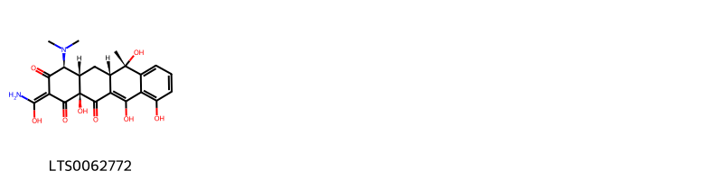{ width=100% }
    <figcaption>Hình ảnh cấu trúc hóa học của 1 hoạt chất thuộc nhóm Tetracyclines gồm ['tetracycline (LTS0062772)'].</figcaption>
</figure>

---

### Dược dân tộc học

Danh sách các quốc gia có sử dụng *Paris polyphylla* trong điều trị các bệnh. 

| Country   | Disease          | Bệnh             |
|:----------|:-----------------|:-----------------|
| Elsewhere | Tonic, Vermifuge | Tonic, Vermifuge |

---

---
## Paris quadrifolia
### Thông tin về thực vật

!!! info "Phân loại thực vật của *Paris quadrifolia* từ GIBF:"
    - **Kingdom:** Plantae
    - **Phylum:** Tracheophyta
    - **Order:** Liliales
    - **Family:** Melanthiaceae
    - **Genus:** Paris
    - **Species:** *Paris quadrifolia*

 

| Label (VI)   | Label (EN)   | Scientific Name   | Descriptions (VI)   | Descriptions (EN)   | Also Known As (VI)   | Also Known As (EN)   |
|:-------------|:-------------|:------------------|:--------------------|:--------------------|:---------------------|:---------------------|
| N/A          | N/A          | Paris quadrifolia | loài thực vật       | species of plant    | ['']                 | ['']                 |

#### Phân bố trên thế giới

**Từ CSDL GIBF** Austria, Sweden, Netherlands, Belgium, France, Slovakia, Denmark, Ukraine, Italy, Switzerland, Luxembourg, Croatia, Slovenia, Germany, United Kingdom of Great Britain and Northern Ireland, Poland

#### Phân bố tại Việt Nam

**Từ CSDL GIBF**: Không có ghi nhận ở Việt Nam

---
### Thành phần hóa học
        
- Theo cơ sở dữ liệu lotus: Từ loài *Paris quadrifolia* đã phân lập và xác định được 2 hoạt chất thuộc về các nhóm Steroids and steroid derivatives. 

|    | chemicalTaxonomyClassyfireClass   |   smiles_count |
|---:|:----------------------------------|---------------:|
|  0 | Steroids and steroid derivatives  |              2 |

#### Nhóm Steroids and steroid derivatives
<figure markdown="span">
    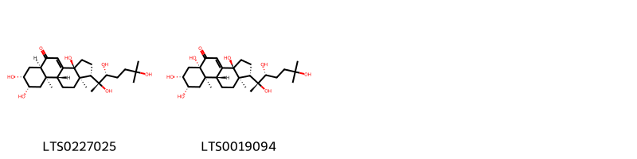{ width=100% }
    <figcaption>Hình ảnh cấu trúc hóa học của 2 hoạt chất thuộc nhóm Steroids and steroid derivatives gồm ['20-hydroxyecdysone (LTS0227025)', 'polypodine b (LTS0019094)'].</figcaption>
</figure>

---

### Dược dân tộc học

Danh sách các quốc gia có sử dụng *Paris quadrifolia* trong điều trị các bệnh. 

| Country   | Disease                             | Bệnh                                |
|:----------|:------------------------------------|:------------------------------------|
| Europe    | Poison                              | Chất độc                            |
| Turkey    | Poison, Narcotic, Emetic, Purgative | Chất độc, Ma túy, Emetic, Purgative |

---

# Chi Ruscus

??? note "Danh sách các dược liệu thuộc chi"
    
	 - *Ruscus aculeatus*
	 - *Ruscus alexandrinus*

---
## Ruscus aculeatus
### Thông tin về thực vật

!!! info "Phân loại thực vật của *Ruscus aculeatus* từ GIBF:"
    - **Kingdom:** Plantae
    - **Phylum:** Tracheophyta
    - **Order:** Asparagales
    - **Family:** Asparagaceae
    - **Genus:** Ruscus
    - **Species:** *Ruscus aculeatus*

 

| Label (VI)   | Label (EN)   | Scientific Name   | Descriptions (VI)   | Descriptions (EN)   | Also Known As (VI)   | Also Known As (EN)   |
|:-------------|:-------------|:------------------|:--------------------|:--------------------|:---------------------|:---------------------|
| N/A          | N/A          | Ruscus aculeatus  |                     | mesquito            | ['']                 | ["butcher's broom"]  |

#### Phân bố trên thế giới

**Từ CSDL GIBF** nan, New Zealand, Türkiye, Spain, United States of America, Greece, Russian Federation, Albania, Jersey, Morocco, France, Georgia, Serbia, Syrian Arab Republic, Germany, Hungary, Portugal, Ukraine, Italy, Switzerland, Bulgaria, United Kingdom of Great Britain and Northern Ireland

#### Phân bố tại Việt Nam

**Từ CSDL GIBF**: Không có ghi nhận ở Việt Nam

---
### Thành phần hóa học
        
- Theo cơ sở dữ liệu lotus: Từ loài *Ruscus aculeatus* đã phân lập và xác định được 83 hoạt chất thuộc về các nhóm Fatty Acyls, Benzofurans, Flavonoids, Anthracenes, Steroids and steroid derivatives, Prenol lipids. 

|    | chemicalTaxonomyClassyfireClass   |   smiles_count |
|---:|:----------------------------------|---------------:|
|  0 | Anthracenes                       |              1 |
|  1 | Benzofurans                       |              1 |
|  2 | Fatty Acyls                       |              7 |
|  3 | Flavonoids                        |              8 |
|  4 | Prenol lipids                     |              4 |
|  5 | Steroids and steroid derivatives  |             62 |

#### Nhóm Anthracenes
<figure markdown="span">
    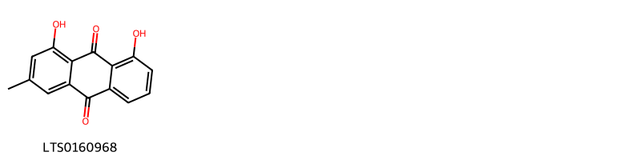{ width=100% }
    <figcaption>Hình ảnh cấu trúc hóa học của 1 hoạt chất thuộc nhóm Anthracenes gồm ['turkey rhubarb (LTS0160968)'].</figcaption>
</figure>
#### Nhóm Benzofurans
<figure markdown="span">
    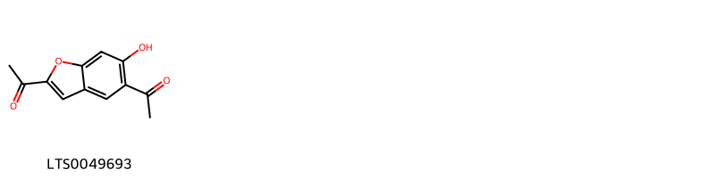{ width=100% }
    <figcaption>Hình ảnh cấu trúc hóa học của 1 hoạt chất thuộc nhóm Benzofurans gồm ['1-(5-acetyl-6-hydroxy-1-benzofuran-2-yl)ethanone (LTS0049693)'].</figcaption>
</figure>
#### Nhóm Fatty Acyls
<figure markdown="span">
    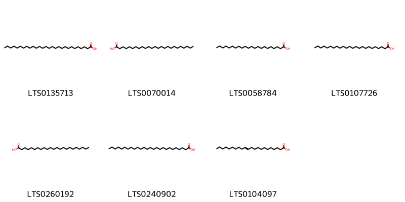{ width=100% }
    <figcaption>Hình ảnh cấu trúc hóa học của 7 hoạt chất thuộc nhóm Fatty Acyls gồm ['octacosanoic acid (LTS0135713)', 'pentacosanoic acid (LTS0070014)', 'behenic acid (LTS0058784)', 'lignoceric acid (LTS0107726)', 'tricosanoic acid (LTS0260192)', 'hexacosanoic acid (LTS0240902)', 'docos-12-enoic acid (LTS0104097)'].</figcaption>
</figure>
#### Nhóm Flavonoids
<figure markdown="span">
    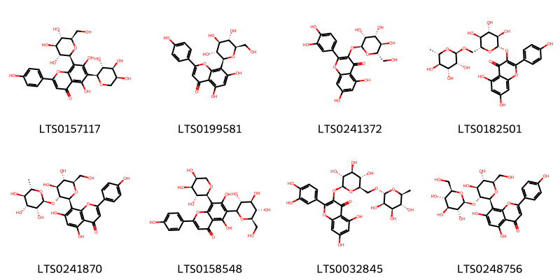{ width=100% }
    <figcaption>Hình ảnh cấu trúc hóa học của 8 hoạt chất thuộc nhóm Flavonoids gồm ['isoschaftoside (LTS0157117)', 'vitexin (LTS0199581)', '2-(3,4-dihydroxyphenyl)-5,7-dihydroxy-3-{[(2s,3r,4r,5r,6s)-3,4,5-trihydroxy-6-(hydroxymethyl)oxan-2-yl]oxy}chromen-4-one (LTS0241372)', 'nictoflorin (LTS0182501)', "vitexin 2''-rhamnoside (LTS0241870)", '5,7-dihydroxy-2-(4-hydroxyphenyl)-6-[(3r,4r,5s,6r)-3,4,5-trihydroxy-6-(hydroxymethyl)oxan-2-yl]-8-[(2s,3r,4s,5s)-3,4,5-trihydroxyoxan-2-yl]chromen-4-one (LTS0158548)', '3-rutinosyl quercetin (LTS0032845)', "2''-o-glucosylvitexin (LTS0248756)"].</figcaption>
</figure>
#### Nhóm Prenol lipids
<figure markdown="span">
    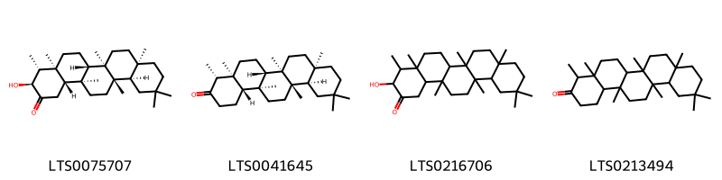{ width=100% }
    <figcaption>Hình ảnh cấu trúc hóa học của 4 hoạt chất thuộc nhóm Prenol lipids gồm ['(3s,4r,4as,6as,6br,8ar,12ar,12bs,14as,14bs)-3-hydroxy-4,4a,6b,8a,11,11,12b,14a-octamethyl-tetradecahydro-1h-picen-2-one (LTS0075707)', '(-)-friedelin (LTS0041645)', '3-hydroxy-4,4a,6b,8a,11,11,12b,14a-octamethyl-tetradecahydro-1h-picen-2-one (LTS0216706)', 'friedelin (LTS0213494)'].</figcaption>
</figure>
#### Nhóm Steroids and steroid derivatives
<figure markdown="span">
    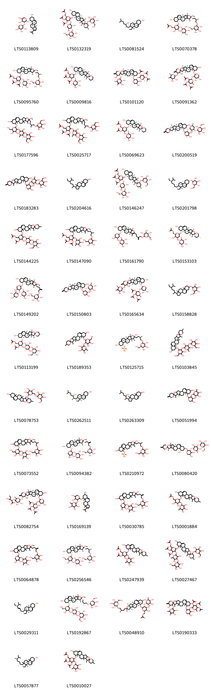{ width=100% }
    <figcaption>Hình ảnh cấu trúc hóa học của 62 hoạt chất thuộc nhóm Steroids and steroid derivatives gồm ['1-[(3as,3bs,7r,9r,9ar,9bs,11as)-9-{[(2s,3r,4s,5s)-4,5-dihydroxy-3-{[(2s,3r,4r,5r,6s)-3,4,5-trihydroxy-6-methyloxan-2-yl]oxy}oxan-2-yl]oxy}-7-hydroxy-9a,11a-dimethyl-3h,3ah,3bh,4h,6h,7h,8h,9h,9bh,10h,11h-cyclopenta[a]phenanthren-1-yl]ethanone (LTS0113809)', "[(2r,3s,4s,5r,6r)-3,4-bis(acetyloxy)-5-{[(2s,3r,4r,5s,6s)-3,5-dihydroxy-6-methyl-4-{[(2s,3r,4s,5s,6r)-3,4,5-trihydroxy-6-(hydroxymethyl)oxan-2-yl]oxy}oxan-2-yl]oxy}-6-[(1's,2s,2's,3s,4's,5r,7's,8'r,9's,12's,13'r,14'r,16'r)-5,7',9',13'-tetramethyl-3-{[(2s,3r,4s,5s,6r)-3,4,5-trihydroxy-6-(hydroxymethyl)oxan-2-yl]oxy}-5'-oxaspiro[oxane-2,6'-pentacyclo[10.8.0.0²,⁹.0⁴,⁸.0¹³,¹⁸]icosan]-18'-en-16'-oloxy]oxan-2-yl]methyl acetate (LTS0132319)", '(22r)-22-hydroxycholesterol (LTS0081524)', '[(2r,3r,4s,5r,6r)-3,4-dihydroxy-6-{[(1r,2r,4s,6r,7s,8r,9s,12r,13r,14r,16r)-16-hydroxy-6-methoxy-7,9,13-trimethyl-6-[(3r)-3-methyl-4-{[(2r,3r,4s,5s,6r)-3,4,5-trihydroxy-6-(hydroxymethyl)oxan-2-yl]oxy}butyl]-5-oxapentacyclo[10.8.0.0²,⁹.0⁴,⁸.0¹³,¹⁸]icos-18-en-14-yl]oxy}-5-{[(2s,3r,4r,5r,6s)-3,4,5-trihydroxy-6-methyloxan-2-yl]oxy}oxan-2-yl]methyl acetate (LTS0070378)', '[(2r,3s,4s,5r,6r)-3,4-bis(acetyloxy)-6-{[(1r,2r,4s,6r,7s,8r,9s,12s,13r,14r,16r)-16-hydroxy-6-methoxy-7,9,13-trimethyl-6-[(3r)-3-methyl-4-{[(2r,3r,4s,5s,6r)-3,4,5-trihydroxy-6-(hydroxymethyl)oxan-2-yl]oxy}butyl]-5-oxapentacyclo[10.8.0.0²,⁹.0⁴,⁸.0¹³,¹⁸]icos-18-en-14-yl]oxy}-5-{[(2s,3r,4r,5r,6s)-3,4,5-trihydroxy-6-methyloxan-2-yl]oxy}oxan-2-yl]methyl acetate (LTS0095760)', "[(2r,3s,4s,5r,6r)-3,4-bis(acetyloxy)-6-[(1'r,2r,2's,4's,5r,7's,8'r,9's,12'r,13'r,14'r,16'r)-5,7',9',13'-tetramethyl-5'-oxaspiro[oxane-2,6'-pentacyclo[10.8.0.0²,⁹.0⁴,⁸.0¹³,¹⁸]icosan]-18'-en-16'-oloxy]-5-{[(2s,3r,4r,5r,6s)-3,4,5-trihydroxy-6-methyloxan-2-yl]oxy}oxan-2-yl]methyl acetate (LTS0009816)", "(2s,3s,4r,5r,6s)-4,5-bis(acetyloxy)-6-{[(2s,3r,4s,5s)-2-[(1's,2s,2's,3r,4s,4's,7's,8'r,9's,12's,13'r,14'r,16'r)-3-{[(2s,3r,4r,6r)-3,4-dihydroxy-6-methyl-5-oxooxan-2-yl]oxy}-7',9',13'-trimethyl-5-methylidene-5'-oxaspiro[oxane-2,6'-pentacyclo[10.8.0.0²,⁹.0⁴,⁸.0¹³,¹⁸]icosan]-18'-ene-4,16'-dioloxy]-4,5-dihydroxyoxan-3-yl]oxy}-2-methyloxan-3-yl acetate (LTS0101120)", "(2s,3s,4r,5r,6s)-4,5-bis(acetyloxy)-6-{[(2s,3r,4s,5s)-2-[(1's,2s,2's,3s,4s,4's,7's,8'r,9's,12's,13'r,14'r,16'r)-4-{[(2r,3r,4r,6r)-3,4-dihydroxy-6-methyl-5-oxooxan-2-yl]oxy}-7',9',13'-trimethyl-5-methylidene-5'-oxaspiro[oxane-2,6'-pentacyclo[10.8.0.0²,⁹.0⁴,⁸.0¹³,¹⁸]icosan]-18'-ene-3,16'-dioloxy]-4,5-dihydroxyoxan-3-yl]oxy}-2-methyloxan-3-yl acetate (LTS0091362)", '2-{4-[14-({3-[(3,5-dihydroxy-6-methyl-4-{[3,4,5-trihydroxy-6-(hydroxymethyl)oxan-2-yl]oxy}oxan-2-yl)oxy]-4,5-dihydroxy-6-(hydroxymethyl)oxan-2-yl}oxy)-16-hydroxy-6-methoxy-7,9,13-trimethyl-5-oxapentacyclo[10.8.0.0²,⁹.0⁴,⁸.0¹³,¹⁸]icos-18-en-6-yl]-2-methylbutoxy}-6-(hydroxymethyl)oxane-3,4,5-triol (LTS0177596)', '[3,4-bis(acetyloxy)-5-[(3,5-dihydroxy-6-methyl-4-{[3,4,5-trihydroxy-6-(hydroxymethyl)oxan-2-yl]oxy}oxan-2-yl)oxy]-6-{[16-hydroxy-6-methoxy-7,9,13-trimethyl-6-(3-methyl-4-{[3,4,5-trihydroxy-6-(hydroxymethyl)oxan-2-yl]oxy}butyl)-5-oxapentacyclo[10.8.0.0²,⁹.0⁴,⁸.0¹³,¹⁸]icos-18-en-14-yl]oxy}oxan-2-yl]methyl acetate (LTS0025717)', "[(2r,3r,4s,5r,6r)-3-(acetyloxy)-4-hydroxy-6-[(1'r,2r,2's,4's,5r,7's,8'r,9's,12'r,13'r,14'r,16'r)-5,7',9',13'-tetramethyl-5'-oxaspiro[oxane-2,6'-pentacyclo[10.8.0.0²,⁹.0⁴,⁸.0¹³,¹⁸]icosan]-18'-en-16'-oloxy]-5-{[(2s,3r,4r,5r,6s)-3,4,5-trihydroxy-6-methyloxan-2-yl]oxy}oxan-2-yl]methyl acetate (LTS0069623)", "(2s,3r,4s,5s,6r)-2-{[(2s,3r,4r,5s,6s)-2-{[(2s,3r,4s,5s)-4,5-dihydroxy-2-[(1's,2r,2's,4's,7's,8'r,9's,12's,13'r,14'r,16'r)-7',9',13'-trimethyl-5-methylidene-5'-oxaspiro[oxane-2,6'-pentacyclo[10.8.0.0²,⁹.0⁴,⁸.0¹³,¹⁸]icosan]-18'-en-16'-oloxy]oxan-3-yl]oxy}-3,5-dihydroxy-6-methyloxan-4-yl]oxy}-6-(hydroxymethyl)oxane-3,4,5-triol (LTS0200519)", "2-({2-[(4,5-dihydroxy-2-{7',9',13'-trimethyl-5-methylidene-5'-oxaspiro[oxane-2,6'-pentacyclo[10.8.0.0²,⁹.0⁴,⁸.0¹³,¹⁸]icosan]-18'-en-16'-oloxy}oxan-3-yl)oxy]-3,5-dihydroxy-6-methyloxan-4-yl}oxy)-6-(hydroxymethyl)oxane-3,4,5-triol (LTS0183283)", 'stigmast-5-en-3-ol, (3β)- (LTS0204616)', "[(2r,3s,4s,5r,6r)-3,4-bis(acetyloxy)-5-{[(2s,3r,4r,5s,6s)-3,5-dihydroxy-6-methyl-4-{[(2s,3r,4s,5s,6r)-3,4,5-trihydroxy-6-(hydroxymethyl)oxan-2-yl]oxy}oxan-2-yl]oxy}-6-[(1's,2r,2's,3s,4's,5r,7's,8'r,9's,12's,13'r,14'r,16'r)-5,7',9',13'-tetramethyl-3-{[(2s,3r,4s,5s,6r)-3,4,5-trihydroxy-6-(hydroxymethyl)oxan-2-yl]oxy}-5'-oxaspiro[oxane-2,6'-pentacyclo[10.8.0.0²,⁹.0⁴,⁸.0¹³,¹⁸]icosan]-18'-en-16'-oloxy]oxan-2-yl]methyl acetate (LTS0146247)", 'sitogluside (LTS0201798)', "[3-(acetyloxy)-5-[(3,5-dihydroxy-6-methyl-4-{[3,4,5-trihydroxy-6-(hydroxymethyl)oxan-2-yl]oxy}oxan-2-yl)oxy]-4-hydroxy-6-{5,7',9',13'-tetramethyl-5'-oxaspiro[oxane-2,6'-pentacyclo[10.8.0.0²,⁹.0⁴,⁸.0¹³,¹⁸]icosan]-18'-en-16'-oloxy}oxan-2-yl]methyl acetate (LTS0144225)", '[3,4-bis(acetyloxy)-6-{[16-hydroxy-6-methoxy-7,9,13-trimethyl-6-(3-methyl-4-{[3,4,5-trihydroxy-6-(hydroxymethyl)oxan-2-yl]oxy}butyl)-5-oxapentacyclo[10.8.0.0²,⁹.0⁴,⁸.0¹³,¹⁸]icos-18-en-14-yl]oxy}-5-[(3,4,5-trihydroxy-6-methyloxan-2-yl)oxy]oxan-2-yl]methyl acetate (LTS0147090)', '(2s,3r,4r,5r,6s)-2-{[(2s,3r,4s,5s)-4,5-dihydroxy-2-{[(1s,2s,4s,8s,9s,12s,13r,14r,16r)-16-hydroxy-7,9,13-trimethyl-6-[3-({[(2r,3r,4s,5s,6r)-3,4,5-trihydroxy-6-(hydroxymethyl)oxan-2-yl]oxy}methyl)but-3-en-1-yl]-5-oxapentacyclo[10.8.0.0²,⁹.0⁴,⁸.0¹³,¹⁸]icosa-6,18-dien-14-yl]oxy}oxan-3-yl]oxy}-6-methyloxane-3,4,5-triol (LTS0161790)', "[(2r,3r,4s,5r,6r)-3,4-dihydroxy-6-[(1's,2r,2's,4's,5r,7's,8'r,9's,12'r,13'r,14'r,16'r)-5,7',9',13'-tetramethyl-5'-oxaspiro[oxane-2,6'-pentacyclo[10.8.0.0²,⁹.0⁴,⁸.0¹³,¹⁸]icosan]-18'-en-16'-oloxy]-5-{[(2s,3r,4r,5r,6s)-3,4,5-trihydroxy-6-methyloxan-2-yl]oxy}oxan-2-yl]methyl acetate (LTS0153103)", '(2s,3r,4r,5r,6s)-2-{[(2s,3r,4s,5s)-5-hydroxy-2-{[(1s,2s,4s,6s,7s,8r,9s,12s,13r,14r,16r)-16-hydroxy-6-methoxy-7,9,13-trimethyl-6-[3-({[(2r,3r,4s,5s,6r)-3,4,5-trihydroxy-6-(hydroxymethyl)oxan-2-yl]oxy}methyl)but-3-en-1-yl]-5-oxapentacyclo[10.8.0.0²,⁹.0⁴,⁸.0¹³,¹⁸]icos-18-en-14-yl]oxy}-4-{[(2s,3r,4s,5r)-3,4,5-trihydroxyoxan-2-yl]oxy}oxan-3-yl]oxy}-6-methyloxane-3,4,5-triol (LTS0149202)', "(2s,3r,4r,5r,6s)-2-{[(2s,3r,4s,5s)-4,5-dihydroxy-2-[(1's,2r,2's,4's,7's,8'r,9's,12's,13'r,14'r,16'r)-7',9',13'-trimethyl-5-methylidene-5'-oxaspiro[oxane-2,6'-pentacyclo[10.8.0.0²,⁹.0⁴,⁸.0¹³,¹⁸]icosan]-18'-en-16'-oloxy]oxan-3-yl]oxy}-6-methyloxane-3,4,5-triol (LTS0150803)", "(2s,3s,4r,5r,6s)-4,5-bis(acetyloxy)-6-{[(2s,3r,4s,5s)-2-[(1's,2s,2's,3s,4s,4's,7's,8'r,9's,12's,13'r,14'r,16's)-4-{[(2r,3r,4r,6r)-3,4-dihydroxy-6-methyl-5-oxooxan-2-yl]oxy}-7',9',13'-trimethyl-5-methylidene-5'-oxaspiro[oxane-2,6'-pentacyclo[10.8.0.0²,⁹.0⁴,⁸.0¹³,¹⁸]icosan]-18'-ene-3,16'-dioloxy]-4,5-dihydroxyoxan-3-yl]oxy}-2-methyloxan-3-yl acetate (LTS0165634)", '2-{[1-(5-ethyl-6-methylheptan-2-yl)-9a,11a-dimethyl-1h,2h,3h,3ah,3bh,4h,6h,7h,8h,9h,9bh,10h,11h-cyclopenta[a]phenanthren-7-yl]oxy}-6-(hydroxymethyl)oxane-3,4,5-triol (LTS0158828)', "[(2r,3r,4s,5r,6r)-3-(acetyloxy)-5-{[(2s,3r,4r,5s,6s)-3,5-dihydroxy-6-methyl-4-{[(2s,3r,4s,5s,6r)-3,4,5-trihydroxy-6-(hydroxymethyl)oxan-2-yl]oxy}oxan-2-yl]oxy}-4-hydroxy-6-[(1'r,2r,2's,4's,5r,7's,8'r,9's,12'r,13'r,14'r,16'r)-5,7',9',13'-tetramethyl-5'-oxaspiro[oxane-2,6'-pentacyclo[10.8.0.0²,⁹.0⁴,⁸.0¹³,¹⁸]icosan]-18'-en-16'-oloxy]oxan-2-yl]methyl acetate (LTS0113199)", "2-{[4,5-dihydroxy-6-(hydroxymethyl)-2-{5,7',9',13'-tetramethyl-5'-oxaspiro[oxane-2,6'-pentacyclo[10.8.0.0²,⁹.0⁴,⁸.0¹³,¹⁸]icosan]-18'-en-16'-oloxy}oxan-3-yl]oxy}-6-methyloxane-3,4,5-triol (LTS0189353)", '[(1s,2s,4s,6s,7s,8r,9s,12s,13r,14r,16r)-6,16-dihydroxy-7,9,13-trimethyl-6-[(3r)-3-methyl-4-{[(2r,3r,4s,5s,6r)-3,4,5-trihydroxy-6-(hydroxymethyl)oxan-2-yl]oxy}butyl]-5-oxapentacyclo[10.8.0.0²,⁹.0⁴,⁸.0¹³,¹⁸]icos-18-en-14-yl]oxidanesulfonic acid (LTS0125715)', "2-[(2-{[4,5-dihydroxy-6-(hydroxymethyl)-2-{5,7',9',13'-tetramethyl-5'-oxaspiro[oxane-2,6'-pentacyclo[10.8.0.0²,⁹.0⁴,⁸.0¹³,¹⁸]icosan]-18'-en-16'-oloxy}oxan-3-yl]oxy}-3,5-dihydroxy-6-methyloxan-4-yl)oxy]-6-(hydroxymethyl)oxane-3,4,5-triol (LTS0103845)", "2-{5,7',9',13'-tetramethyl-5'-oxaspiro[oxane-2,6'-pentacyclo[10.8.0.0²,⁹.0⁴,⁸.0¹³,¹⁸]icosan]-18'-en-16'-oloxy}-6-({[3,4,5-trihydroxy-6-(hydroxymethyl)oxan-2-yl]oxy}methyl)oxane-3,4,5-triol (LTS0078753)", '(1r,3as,3bs,7s,9ar,9bs,11as)-1-[(2r,3r)-3-hydroxy-6-methylheptan-2-yl]-9a,11a-dimethyl-1h,2h,3h,3ah,3bh,4h,6h,7h,8h,9h,9bh,10h,11h-cyclopenta[a]phenanthren-7-ol (LTS0262511)', '1-(3-hydroxy-6-methylheptan-2-yl)-9a,11a-dimethyl-1h,2h,3h,3ah,3bh,4h,6h,7h,8h,9h,9bh,10h,11h-cyclopenta[a]phenanthren-7-ol (LTS0263309)', "2-[(4,5-dihydroxy-2-{7',9',13'-trimethyl-5-methylidene-5'-oxaspiro[oxane-2,6'-pentacyclo[10.8.0.0²,⁹.0⁴,⁸.0¹³,¹⁸]icosan]-18'-en-16'-oloxy}oxan-3-yl)oxy]-6-methyloxane-3,4,5-triol (LTS0051994)", '2-[4-(14-{[4,5-dihydroxy-6-(hydroxymethyl)-3-[(3,4,5-trihydroxy-6-methyloxan-2-yl)oxy]oxan-2-yl]oxy}-16-hydroxy-6-methoxy-7,9,13-trimethyl-5-oxapentacyclo[10.8.0.0²,⁹.0⁴,⁸.0¹³,¹⁸]icos-18-en-6-yl)-2-methylbutoxy]-6-(hydroxymethyl)oxane-3,4,5-triol (LTS0073552)', '(2s,3r,4r,5r,6s)-2-{[(2s,3r,4s,5s)-4,5-dihydroxy-2-{[(1s,2s,4s,6r,7s,8r,9s,12s,13r,14r,16r)-16-hydroxy-6-methoxy-7,9,13-trimethyl-6-[3-({[(2r,3r,4s,5s,6r)-3,4,5-trihydroxy-6-(hydroxymethyl)oxan-2-yl]oxy}methyl)but-3-en-1-yl]-5-oxapentacyclo[10.8.0.0²,⁹.0⁴,⁸.0¹³,¹⁸]icos-18-en-14-yl]oxy}oxan-3-yl]oxy}-6-methyloxane-3,4,5-triol (LTS0094382)', '[6,16-dihydroxy-7,9,13-trimethyl-6-(3-methyl-4-{[3,4,5-trihydroxy-6-(hydroxymethyl)oxan-2-yl]oxy}butyl)-5-oxapentacyclo[10.8.0.0²,⁹.0⁴,⁸.0¹³,¹⁸]icos-18-en-14-yl]oxidanesulfonic acid (LTS0210972)', "(2r,3s,4r,5r,6s)-2-{[(2r,3s,4s,5r,6r)-2-{[(2s,3r,5s)-4,5-dihydroxy-2-[(1'r,2s,4'r,7'r,8's,9'r,13's,14's,16'r)-7',9',13'-trimethyl-5-methylidene-5'-oxaspiro[oxane-2,6'-pentacyclo[10.8.0.0²,⁹.0⁴,⁸.0¹³,¹⁸]icosan]-18'-en-14'-oloxy]oxan-3-yl]oxy}-3,5-dihydroxy-6-methyloxan-4-yl]oxy}-6-(hydroxymethyl)oxane-3,4,5-triol (LTS0080420)", "(2r,3r,4r,5r,6r)-4,5-bis(acetyloxy)-6-{[(2r,3r,4s,5r)-2-[(1's,2r,2's,3r,4r,4'r,7's,8's,9'r,12'r,13'r,16'r)-4-{[(2s,5s,6r,8s,9r,10s)-9,10-dihydroxy-2-[(2s)-2-hydroxybutan-2-yl]-6-methyl-3-oxo-1,4,7-trioxaspiro[4.5]decan-8-yl]oxy}-7',9',13'-trimethyl-5-methylidene-5'-oxaspiro[oxane-2,6'-pentacyclo[10.8.0.0²,⁹.0⁴,⁸.0¹³,¹⁸]icosan]-18'-ene-3,16'-dioloxy]-4,5-dihydroxyoxan-3-yl]oxy}-2-methyloxan-3-yl acetate (LTS0082754)", '1-[9-({4,5-dihydroxy-3-[(3,4,5-trihydroxy-6-methyloxan-2-yl)oxy]oxan-2-yl}oxy)-7-hydroxy-9a,11a-dimethyl-3h,3ah,3bh,4h,6h,7h,8h,9h,9bh,10h,11h-cyclopenta[a]phenanthren-1-yl]ethanone (LTS0169139)', '2-{[2-({6,16-dihydroxy-7,9,13-trimethyl-6-[3-({[3,4,5-trihydroxy-6-(hydroxymethyl)oxan-2-yl]oxy}methyl)but-3-en-1-yl]-5-oxapentacyclo[10.8.0.0²,⁹.0⁴,⁸.0¹³,¹⁸]icos-18-en-14-yl}oxy)-4,5-dihydroxyoxan-3-yl]oxy}-6-methyloxane-3,4,5-triol (LTS0030785)', "(3,4-dihydroxy-6-{5,7',9',13'-tetramethyl-5'-oxaspiro[oxane-2,6'-pentacyclo[10.8.0.0²,⁹.0⁴,⁸.0¹³,¹⁸]icosan]-18'-en-16'-oloxy}-5-[(3,4,5-trihydroxy-6-methyloxan-2-yl)oxy]oxan-2-yl)methyl acetate (LTS0001884)", '2-{[4,5-dihydroxy-2-({16-hydroxy-6-methoxy-7,9,13-trimethyl-6-[3-({[3,4,5-trihydroxy-6-(hydroxymethyl)oxan-2-yl]oxy}methyl)but-3-en-1-yl]-5-oxapentacyclo[10.8.0.0²,⁹.0⁴,⁸.0¹³,¹⁸]icos-18-en-14-yl}oxy)oxan-3-yl]oxy}-6-methyloxane-3,4,5-triol (LTS0064878)', '(2r,3r,4s,5s,6r)-2-[(2r)-4-[(1r,2r,4s,6r,7s,8r,9s,12s,13r,14r,16r)-14-{[(2r,3r,4s,5r,6r)-4,5-dihydroxy-6-(hydroxymethyl)-3-{[(2s,3r,4r,5r,6s)-3,4,5-trihydroxy-6-methyloxan-2-yl]oxy}oxan-2-yl]oxy}-16-hydroxy-6-methoxy-7,9,13-trimethyl-5-oxapentacyclo[10.8.0.0²,⁹.0⁴,⁸.0¹³,¹⁸]icos-18-en-6-yl]-2-methylbutoxy]-6-(hydroxymethyl)oxane-3,4,5-triol (LTS0256546)', "[3-(acetyloxy)-4-hydroxy-6-{5,7',9',13'-tetramethyl-5'-oxaspiro[oxane-2,6'-pentacyclo[10.8.0.0²,⁹.0⁴,⁸.0¹³,¹⁸]icosan]-18'-en-16'-oloxy}-5-[(3,4,5-trihydroxy-6-methyloxan-2-yl)oxy]oxan-2-yl]methyl acetate (LTS0247939)", "[3,4-bis(acetyloxy)-5-[(3,5-dihydroxy-6-methyl-4-{[3,4,5-trihydroxy-6-(hydroxymethyl)oxan-2-yl]oxy}oxan-2-yl)oxy]-6-(5,7',9',13'-tetramethyl-3-{[3,4,5-trihydroxy-6-(hydroxymethyl)oxan-2-yl]oxy}-5'-oxaspiro[oxane-2,6'-pentacyclo[10.8.0.0²,⁹.0⁴,⁸.0¹³,¹⁸]icosan]-18'-en-16'-oloxy)oxan-2-yl]methyl acetate (LTS0027467)", 'phytosterol (LTS0029311)', '(2r,3r,4s,5s,6r)-2-[(2r)-4-[(1r,2r,4s,6r,7s,8r,9s,12s,13r,14r,16r)-14-{[(2r,3r,4s,5r,6r)-3-{[(2s,3r,4r,5s,6s)-3,5-dihydroxy-6-methyl-4-{[(2s,3r,4s,5s,6r)-3,4,5-trihydroxy-6-(hydroxymethyl)oxan-2-yl]oxy}oxan-2-yl]oxy}-4,5-dihydroxy-6-(hydroxymethyl)oxan-2-yl]oxy}-16-hydroxy-6-methoxy-7,9,13-trimethyl-5-oxapentacyclo[10.8.0.0²,⁹.0⁴,⁸.0¹³,¹⁸]icos-18-en-6-yl]-2-methylbutoxy]-6-(hydroxymethyl)oxane-3,4,5-triol (LTS0192867)', '[(2r,3r,4s,5r,6r)-6-{[(1s,2s,4s,6s,7s,8r,9s,12s,13r,14r,16r)-6,16-dihydroxy-7,9,13-trimethyl-6-[(3r)-3-methyl-4-{[(2r,3r,4s,5s,6r)-3,4,5-trihydroxy-6-(hydroxymethyl)oxan-2-yl]oxy}butyl]-5-oxapentacyclo[10.8.0.0²,⁹.0⁴,⁸.0¹³,¹⁸]icos-18-en-14-yl]oxy}-3,4-dihydroxy-5-{[(2s,3r,4r,5r,6s)-3,4,5-trihydroxy-6-methyloxan-2-yl]oxy}oxan-2-yl]methyl acetate (LTS0048910)', "4,5-bis(acetyloxy)-6-[(2-{3-[(3,4-dihydroxy-6-methyl-5-oxooxan-2-yl)oxy]-7',9',13'-trimethyl-5-methylidene-5'-oxaspiro[oxane-2,6'-pentacyclo[10.8.0.0²,⁹.0⁴,⁸.0¹³,¹⁸]icosan]-18'-ene-4,16'-dioloxy}-4,5-dihydroxyoxan-3-yl)oxy]-2-methyloxan-3-yl acetate (LTS0190333)", '(1r,3as,3bs,7s,9bs)-1-[(2r,5r)-5,6-dimethylheptan-2-yl]-9a,11a-dimethyl-1h,2h,3h,3ah,3bh,4h,6h,7h,8h,9h,9bh,10h,11h-cyclopenta[a]phenanthren-7-ol (LTS0057877)', "[3,4-bis(acetyloxy)-6-{5,7',9',13'-tetramethyl-5'-oxaspiro[oxane-2,6'-pentacyclo[10.8.0.0²,⁹.0⁴,⁸.0¹³,¹⁸]icosan]-18'-en-16'-oloxy}-5-[(3,4,5-trihydroxy-6-methyloxan-2-yl)oxy]oxan-2-yl]methyl acetate (LTS0010027)", '2-{[4,5-dihydroxy-2-({16-hydroxy-7,9,13-trimethyl-6-[3-({[3,4,5-trihydroxy-6-(hydroxymethyl)oxan-2-yl]oxy}methyl)but-3-en-1-yl]-5-oxapentacyclo[10.8.0.0²,⁹.0⁴,⁸.0¹³,¹⁸]icosa-6,18-dien-14-yl}oxy)oxan-3-yl]oxy}-6-methyloxane-3,4,5-triol (LTS0130797)', '(6-{[6,16-dihydroxy-7,9,13-trimethyl-6-(3-methyl-4-{[3,4,5-trihydroxy-6-(hydroxymethyl)oxan-2-yl]oxy}butyl)-5-oxapentacyclo[10.8.0.0²,⁹.0⁴,⁸.0¹³,¹⁸]icos-18-en-14-yl]oxy}-3,4-dihydroxy-5-[(3,4,5-trihydroxy-6-methyloxan-2-yl)oxy]oxan-2-yl)methyl acetate (LTS0005843)', '(2s,3r,4r,5r,6s)-2-{[(2s,3r,4s,5s)-2-{[(1s,2s,4s,6r,7s,8r,9s,12s,13r,14r,16r)-6,16-dihydroxy-7,9,13-trimethyl-6-[3-({[(2r,3r,4s,5s,6r)-3,4,5-trihydroxy-6-(hydroxymethyl)oxan-2-yl]oxy}methyl)but-3-en-1-yl]-5-oxapentacyclo[10.8.0.0²,⁹.0⁴,⁸.0¹³,¹⁸]icos-18-en-14-yl]oxy}-4,5-dihydroxyoxan-3-yl]oxy}-6-methyloxane-3,4,5-triol (LTS0068246)', "(2r,3r,4r,5r,6r)-4,5-bis(acetyloxy)-6-{[(2r,3r,4s,5r)-2-[(1's,2r,2's,3r,4r,4'r,7's,8's,9'r,12'r,13'r,16'r)-4-{[(2s,5r,6r,8s,9r,10s)-9,10-dihydroxy-2-[(2s)-2-hydroxybutan-2-yl]-6-methyl-3-oxo-1,4,7-trioxaspiro[4.5]decan-8-yl]oxy}-7',9',13'-trimethyl-5-methylidene-5'-oxaspiro[oxane-2,6'-pentacyclo[10.8.0.0²,⁹.0⁴,⁸.0¹³,¹⁸]icosan]-18'-ene-3,16'-dioloxy]-4,5-dihydroxyoxan-3-yl]oxy}-2-methyloxan-3-yl acetate (LTS0040376)", "(2s,3r,4s,5s,6r)-2-[(1's,2s,2's,3s,4's,5r,7's,8'r,9's,12's,13'r,16's)-5,7',9',13'-tetramethyl-5'-oxaspiro[oxane-2,6'-pentacyclo[10.8.0.0²,⁹.0⁴,⁸.0¹³,¹⁸]icosan]-18'-en-16'-oloxy]-6-({[(2r,3r,4s,5s,6r)-3,4,5-trihydroxy-6-(hydroxymethyl)oxan-2-yl]oxy}methyl)oxane-3,4,5-triol (LTS0003327)", "(2s,3r,4s,5s,6r)-2-{[(2s,3r,4r,5s,6s)-2-{[(2r,3r,4s,5r,6r)-4,5-dihydroxy-6-(hydroxymethyl)-2-[(1'r,2r,2's,4's,5r,7's,8'r,9's,12'r,13'r,14'r,16'r)-5,7',9',13'-tetramethyl-5'-oxaspiro[oxane-2,6'-pentacyclo[10.8.0.0²,⁹.0⁴,⁸.0¹³,¹⁸]icosan]-18'-en-16'-oloxy]oxan-3-yl]oxy}-3,5-dihydroxy-6-methyloxan-4-yl]oxy}-6-(hydroxymethyl)oxane-3,4,5-triol (LTS0002303)", '2-{[5-hydroxy-2-({16-hydroxy-6-methoxy-7,9,13-trimethyl-6-[3-({[3,4,5-trihydroxy-6-(hydroxymethyl)oxan-2-yl]oxy}methyl)but-3-en-1-yl]-5-oxapentacyclo[10.8.0.0²,⁹.0⁴,⁸.0¹³,¹⁸]icos-18-en-14-yl}oxy)-4-[(3,4,5-trihydroxyoxan-2-yl)oxy]oxan-3-yl]oxy}-6-methyloxane-3,4,5-triol (LTS0270398)', "(2s,3r,4r,5r,6s)-2-{[(2r,3r,4s,5r,6r)-4,5-dihydroxy-6-(hydroxymethyl)-2-[(1'r,2r,2's,4's,5r,7's,8'r,9's,12'r,13'r,14'r,16'r)-5,7',9',13'-tetramethyl-5'-oxaspiro[oxane-2,6'-pentacyclo[10.8.0.0²,⁹.0⁴,⁸.0¹³,¹⁸]icosan]-18'-en-16'-oloxy]oxan-3-yl]oxy}-6-methyloxane-3,4,5-triol (LTS0246381)", '[(2r,3s,4s,5r,6r)-3,4-bis(acetyloxy)-5-{[(2s,3r,4r,5s,6s)-3,5-dihydroxy-6-methyl-4-{[(2s,3r,4s,5s,6r)-3,4,5-trihydroxy-6-(hydroxymethyl)oxan-2-yl]oxy}oxan-2-yl]oxy}-6-{[(1r,2r,4s,6r,7s,8r,9s,12s,13r,14r,16r)-16-hydroxy-6-methoxy-7,9,13-trimethyl-6-[(3r)-3-methyl-4-{[(2r,3r,4s,5s,6r)-3,4,5-trihydroxy-6-(hydroxymethyl)oxan-2-yl]oxy}butyl]-5-oxapentacyclo[10.8.0.0²,⁹.0⁴,⁸.0¹³,¹⁸]icos-18-en-14-yl]oxy}oxan-2-yl]methyl acetate (LTS0131444)', "(2s,3r,4s,5s,6r)-2-[(1's,2s,2's,3r,4's,5r,7's,8'r,9's,12's,13'r,16's)-5,7',9',13'-tetramethyl-5'-oxaspiro[oxane-2,6'-pentacyclo[10.8.0.0²,⁹.0⁴,⁸.0¹³,¹⁸]icosan]-18'-en-16'-oloxy]-6-({[(2r,3r,4s,5s,6r)-3,4,5-trihydroxy-6-(hydroxymethyl)oxan-2-yl]oxy}methyl)oxane-3,4,5-triol (LTS0252220)", '(3,4-dihydroxy-6-{[16-hydroxy-6-methoxy-7,9,13-trimethyl-6-(3-methyl-4-{[3,4,5-trihydroxy-6-(hydroxymethyl)oxan-2-yl]oxy}butyl)-5-oxapentacyclo[10.8.0.0²,⁹.0⁴,⁸.0¹³,¹⁸]icos-18-en-14-yl]oxy}-5-[(3,4,5-trihydroxy-6-methyloxan-2-yl)oxy]oxan-2-yl)methyl acetate (LTS0036710)', "4,5-bis(acetyloxy)-6-[(2-{4-[(3,4-dihydroxy-6-methyl-5-oxooxan-2-yl)oxy]-7',9',13'-trimethyl-5-methylidene-5'-oxaspiro[oxane-2,6'-pentacyclo[10.8.0.0²,⁹.0⁴,⁸.0¹³,¹⁸]icosan]-18'-ene-3,16'-dioloxy}-4,5-dihydroxyoxan-3-yl)oxy]-2-methyloxan-3-yl acetate (LTS0118659)"].</figcaption>
</figure>

---

### Dược dân tộc học

Danh sách các quốc gia có sử dụng *Ruscus aculeatus* trong điều trị các bệnh. 

| Country       | Disease                                                       | Bệnh                                                                                |
|:--------------|:--------------------------------------------------------------|:------------------------------------------------------------------------------------|
| Egypt         | Aperient, Diaphoretic, Emmenagogue, Diuretic                  | Aperient, Diaphoretic, Emmenagogue, lợi tiểu                                        |
| France        | Diuretic                                                      | Thuốc lợi tiêu                                                                      |
| Mediterranean | Aperient, Diaphoretic                                         | Aperient, Diaphoretic                                                               |
| Turkey        | Apertif, Diuretic, Laxative, Sudorific, Aperient, Emmenagogue | Apertif, Thuốc lợi tiểu, Thuốc nhuận tràng, Thuốc hút mồ hôi, Aperient, Emmenagogue |
| ain           | Apertif                                                       | Apertif                                                                             |

---

---
## Ruscus alexandrinus
### Thông tin về thực vật

!!! info "Phân loại thực vật của *Ruscus hypoglossum* từ GIBF:"
    - **Kingdom:** Plantae
    - **Phylum:** Tracheophyta
    - **Order:** Asparagales
    - **Family:** Asparagaceae
    - **Genus:** Ruscus
    - **Species:** *Ruscus hypoglossum*

 

| Label (VI)   | Label (EN)   | Scientific Name   | Descriptions (VI)   | Descriptions (EN)   | Also Known As (VI)   | Also Known As (EN)   |
|:-------------|:-------------|:------------------|:--------------------|:--------------------|:---------------------|:---------------------|
| N/A          | N/A          | Ruscus aculeatus  |                     | mesquito            | ['']                 | ["butcher's broom"]  |

#### Phân bố trên thế giới

**Từ CSDL GIBF** nan, New Zealand, Türkiye, Spain, United States of America, Greece, Russian Federation, Albania, Jersey, Morocco, France, Georgia, Serbia, Syrian Arab Republic, Germany, Hungary, Portugal, Ukraine, Italy, Switzerland, Bulgaria, United Kingdom of Great Britain and Northern Ireland

#### Phân bố tại Việt Nam

**Từ CSDL GIBF**: Không có ghi nhận ở Việt Nam

---
### Thành phần hóa học
        
- Theo cơ sở dữ liệu lotus: Từ loài *Ruscus hypoglossum* đã phân lập và xác định được Chưa có hoạt chất nào được phân lập. hoạt chất thuộc về các nhóm Không có hoạt chất nào được phân lập. 

Không có hình ảnh nào được tạo ra

---

### Dược dân tộc học

Danh sách các quốc gia có sử dụng *Ruscus hypoglossum* trong điều trị các bệnh. 

| Country   | Disease                         | Bệnh                            |
|:----------|:--------------------------------|:--------------------------------|
| Egypt     | Aperient, Emmenagogue, Diuretic | Aperient, Emmenagogue, lợi tiểu |

---

# Chi Helonias

??? note "Danh sách các dược liệu thuộc chi"
    
	 - *Helonias dioica*

---
## Helonias dioica
### Thông tin về thực vật

!!! info "Phân loại thực vật của *Chamaelirium luteum* từ GIBF:"
    - **Kingdom:** Plantae
    - **Phylum:** Tracheophyta
    - **Order:** Liliales
    - **Family:** Melanthiaceae
    - **Genus:** Chamaelirium
    - **Species:** *Chamaelirium luteum*

 

| Label (VI)   | Label (EN)   | Scientific Name   | Descriptions (VI)   | Descriptions (EN)   | Also Known As (VI)   | Also Known As (EN)   |
|:-------------|:-------------|:------------------|:--------------------|:--------------------|:---------------------|:---------------------|
| N/A          | N/A          | Helonias dioica   | loài thực vật       | species of plant    | ['']                 | ['']                 |

#### Phân bố trên thế giới

**Từ CSDL GIBF** nan, New Zealand, Türkiye, Spain, United States of America, Greece, Russian Federation, Albania, Jersey, Morocco, France, Georgia, Serbia, Syrian Arab Republic, Germany, Hungary, Portugal, Ukraine, Italy, Switzerland, Bulgaria, United Kingdom of Great Britain and Northern Ireland

#### Phân bố tại Việt Nam

**Từ CSDL GIBF**: Không có ghi nhận ở Việt Nam

---
### Thành phần hóa học
        
- Theo cơ sở dữ liệu lotus: Từ loài *Chamaelirium luteum* đã phân lập và xác định được Chưa có hoạt chất nào được phân lập. hoạt chất thuộc về các nhóm Không có hoạt chất nào được phân lập. 

Không có hình ảnh nào được tạo ra

---

### Dược dân tộc học

Danh sách các quốc gia có sử dụng *Chamaelirium luteum* trong điều trị các bệnh. 

| Country   | Disease         | Bệnh                     |
|:----------|:----------------|:-------------------------|
| Dutch     | Emmenagogue     | Emmenagogue              |
| English   | Diuretic, Tonic | Thuốc lợi tiểu, Thuốc bổ |
| German    | Vermifuge       | Thuốc diệt sán           |

---

# Chi Chamaelirium

??? note "Danh sách các dược liệu thuộc chi"
    
	 - *Chamaelirium luteum*

---
## Chamaelirium luteum
### Thông tin về thực vật

!!! info "Phân loại thực vật của *Chamaelirium luteum* từ GIBF:"
    - **Kingdom:** Plantae
    - **Phylum:** Tracheophyta
    - **Order:** Liliales
    - **Family:** Melanthiaceae
    - **Genus:** Chamaelirium
    - **Species:** *Chamaelirium luteum*

 

| Label (VI)   | Label (EN)   | Scientific Name     | Descriptions (VI)   | Descriptions (EN)   | Also Known As (VI)   | Also Known As (EN)   |
|:-------------|:-------------|:--------------------|:--------------------|:--------------------|:---------------------|:---------------------|
| N/A          | N/A          | Chamaelirium luteum | loài thực vật       | species of plant    | ['']                 | ['']                 |

#### Phân bố trên thế giới

**Từ CSDL GIBF** United States of America

#### Phân bố tại Việt Nam

**Từ CSDL GIBF**: Không có ghi nhận ở Việt Nam

---
### Thành phần hóa học
        
- Theo cơ sở dữ liệu lotus: Từ loài *Chamaelirium luteum* đã phân lập và xác định được Chưa có hoạt chất nào được phân lập. hoạt chất thuộc về các nhóm Không có hoạt chất nào được phân lập. 

Không có hình ảnh nào được tạo ra

---

### Dược dân tộc học

Danh sách các quốc gia có sử dụng *Chamaelirium luteum* trong điều trị các bệnh. 

| Country        | Disease                                          | Bệnh                                             |
|:---------------|:-------------------------------------------------|:-------------------------------------------------|
| Elsewhere      | Diuretic, Uterotonic                             | Thuốc lợi tiểu, Uterotonic                       |
| US             | Apertif, Diuretic, Vermifuge, Sialogogue, Emetic | Apertif, lợi tiểu, Vermifuge, Sialogogue, Emetic |
| US(Appalachia) | Vermifuge                                        | Thuốc diệt sán                                   |

---

# Chi Melanthium

??? note "Danh sách các dược liệu thuộc chi"
    
	 - *Melanthium virginicum*

---
## Melanthium virginicum
### Thông tin về thực vật

!!! info "Phân loại thực vật của *Melanthium virginicum* từ GIBF:"
    - **Kingdom:** Plantae
    - **Phylum:** Tracheophyta
    - **Order:** Liliales
    - **Family:** Melanthiaceae
    - **Genus:** Melanthium
    - **Species:** *Melanthium virginicum*

 

| Label (VI)   | Label (EN)   | Scientific Name       | Descriptions (VI)   | Descriptions (EN)   | Also Known As (VI)   | Also Known As (EN)   |
|:-------------|:-------------|:----------------------|:--------------------|:--------------------|:---------------------|:---------------------|
| N/A          | N/A          | Melanthium virginicum | loài thực vật       | species of plant    | ['']                 | ['']                 |

#### Phân bố trên thế giới

**Từ CSDL GIBF** United States of America

#### Phân bố tại Việt Nam

**Từ CSDL GIBF**: Không có ghi nhận ở Việt Nam

---
### Thành phần hóa học
        
- Theo cơ sở dữ liệu lotus: Từ loài *Melanthium virginicum* đã phân lập và xác định được Chưa có hoạt chất nào được phân lập. hoạt chất thuộc về các nhóm Không có hoạt chất nào được phân lập. 

Không có hình ảnh nào được tạo ra

---

### Dược dân tộc học

Danh sách các quốc gia có sử dụng *Melanthium virginicum* trong điều trị các bệnh. 

| Country   | Disease   | Bệnh     |
|:----------|:----------|:---------|
| US        | Poison    | Chất độc |

---

# Chi Erythronium

??? note "Danh sách các dược liệu thuộc chi"
    
	 - *Erythronium americanum*
	 - *Erythronium grandiflorum*
	 - *Erythronium japonicum*

---
## Erythronium americanum
### Thông tin về thực vật

!!! info "Phân loại thực vật của *Erythronium americanum* từ GIBF:"
    - **Kingdom:** Plantae
    - **Phylum:** Tracheophyta
    - **Order:** Liliales
    - **Family:** Liliaceae
    - **Genus:** Erythronium
    - **Species:** *Erythronium americanum*

 

| Label (VI)   | Label (EN)   | Scientific Name        | Descriptions (VI)   | Descriptions (EN)   | Also Known As (VI)   | Also Known As (EN)   |
|:-------------|:-------------|:-----------------------|:--------------------|:--------------------|:---------------------|:---------------------|
| N/A          | N/A          | Erythronium americanum | loài thực vật       | species of plant    | ['']                 | ['']                 |

#### Phân bố trên thế giới

**Từ CSDL GIBF** United States of America, Canada

#### Phân bố tại Việt Nam

**Từ CSDL GIBF**: Không có ghi nhận ở Việt Nam

---
### Thành phần hóa học
        
- Theo cơ sở dữ liệu lotus: Từ loài *Erythronium americanum* đã phân lập và xác định được 1 hoạt chất thuộc về các nhóm Lactones. 

|    | chemicalTaxonomyClassyfireClass   |   smiles_count |
|---:|:----------------------------------|---------------:|
|  0 | Lactones                          |              1 |

#### Nhóm Lactones
<figure markdown="span">
    { width=100% }
    <figcaption>Hình ảnh cấu trúc hóa học của 1 hoạt chất thuộc nhóm Lactones gồm ['tulipalin a (LTS0147552)'].</figcaption>
</figure>

---

### Dược dân tộc học

Danh sách các quốc gia có sử dụng *Erythronium americanum* trong điều trị các bệnh. 

| Country   | Disease                     | Bệnh                        |
|:----------|:----------------------------|:----------------------------|
| Elsewhere | Emetic, Emollient, Poultice | Emetic, Emollient, Poultice |
| French    | Emetic                      | Phôi                        |
| German    | Poultice                    | thuốc đắp, đắp thuốc cao    |
| Italian   | Emollient                   | Chỉnh thị                   |
| anish     | Diuretic                    | Thuốc lợi tiêu              |

---

---
## Erythronium grandiflorum
### Thông tin về thực vật

!!! info "Phân loại thực vật của *Erythronium grandiflorum* từ GIBF:"
    - **Kingdom:** Plantae
    - **Phylum:** Tracheophyta
    - **Order:** Liliales
    - **Family:** Liliaceae
    - **Genus:** Erythronium
    - **Species:** *Erythronium grandiflorum*

 

| Label (VI)   | Label (EN)   | Scientific Name          | Descriptions (VI)   | Descriptions (EN)   | Also Known As (VI)   | Also Known As (EN)   |
|:-------------|:-------------|:-------------------------|:--------------------|:--------------------|:---------------------|:---------------------|
| N/A          | N/A          | Erythronium grandiflorum | loài thực vật       | species of plant    | ['']                 | ['']                 |

#### Phân bố trên thế giới

**Từ CSDL GIBF** United States of America, Canada

#### Phân bố tại Việt Nam

**Từ CSDL GIBF**: Không có ghi nhận ở Việt Nam

---
### Thành phần hóa học
        
- Theo cơ sở dữ liệu lotus: Từ loài *Erythronium grandiflorum* đã phân lập và xác định được 1 hoạt chất thuộc về các nhóm Lactones. 

|    | chemicalTaxonomyClassyfireClass   |   smiles_count |
|---:|:----------------------------------|---------------:|
|  0 | Lactones                          |              1 |

#### Nhóm Lactones
<figure markdown="span">
    { width=100% }
    <figcaption>Hình ảnh cấu trúc hóa học của 1 hoạt chất thuộc nhóm Lactones gồm ['tulipalin a (LTS0147552)'].</figcaption>
</figure>

---

### Dược dân tộc học

Danh sách các quốc gia có sử dụng *Erythronium grandiflorum* trong điều trị các bệnh. 

| Country        | Disease   | Bệnh                     |
|:---------------|:----------|:-------------------------|
| US(Amerindian) | Poultice  | thuốc đắp, đắp thuốc cao |
| US(Blackfoot)  | Poultice  | thuốc đắp, đắp thuốc cao |

---

---
## Erythronium japonicum
### Thông tin về thực vật

!!! info "Phân loại thực vật của *Erythronium japonicum* từ GIBF:"
    - **Kingdom:** Plantae
    - **Phylum:** Tracheophyta
    - **Order:** Liliales
    - **Family:** Liliaceae
    - **Genus:** Erythronium
    - **Species:** *Erythronium japonicum*

 

| Label (VI)   | Label (EN)   | Scientific Name       | Descriptions (VI)   | Descriptions (EN)   | Also Known As (VI)   | Also Known As (EN)   |
|:-------------|:-------------|:----------------------|:--------------------|:--------------------|:---------------------|:---------------------|
| N/A          | N/A          | Erythronium japonicum | loài thực vật       | species of plant    | ['']                 | ['']                 |

#### Phân bố trên thế giới

**Từ CSDL GIBF** nan, Japan, Korea, Republic of, China, Russian Federation

#### Phân bố tại Việt Nam

**Từ CSDL GIBF**: Không có ghi nhận ở Việt Nam

---
### Thành phần hóa học
        
- Theo cơ sở dữ liệu lotus: Từ loài *Erythronium japonicum* đã phân lập và xác định được 5 hoạt chất thuộc về các nhóm Steroids and steroid derivatives. 

|    | chemicalTaxonomyClassyfireClass   |   smiles_count |
|---:|:----------------------------------|---------------:|
|  0 | Steroids and steroid derivatives  |              5 |

#### Nhóm Steroids and steroid derivatives
<figure markdown="span">
    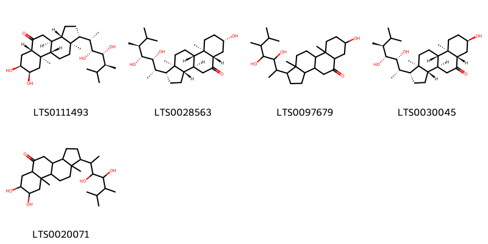{ width=100% }
    <figcaption>Hình ảnh cấu trúc hóa học của 5 hoạt chất thuộc nhóm Steroids and steroid derivatives gồm ['castasterone (LTS0111493)', 'teasterone (LTS0028563)', '1-(3,4-dihydroxy-5,6-dimethylheptan-2-yl)-7-hydroxy-9a,11a-dimethyl-tetradecahydrocyclopenta[a]phenanthren-5-one (LTS0097679)', 'typhasterol (LTS0030045)', '1-(3,4-dihydroxy-5,6-dimethylheptan-2-yl)-7,8-dihydroxy-9a,11a-dimethyl-tetradecahydrocyclopenta[a]phenanthren-5-one (LTS0020071)'].</figcaption>
</figure>

---

### Dược dân tộc học

Danh sách các quốc gia có sử dụng *Erythronium japonicum* trong điều trị các bệnh. 

| Country   | Disease   | Bệnh     |
|:----------|:----------|:---------|
| Elsewhere | Aperient  | Aperient |

---

# Chi Ornithogalum

??? note "Danh sách các dược liệu thuộc chi"
    
	 - *Ornithogalum longibracteatum*
	 - *Ornithogalum umbellatum*

---
## Ornithogalum longibracteatum
### Thông tin về thực vật

!!! info "Phân loại thực vật của *Albuca bracteata* từ GIBF:"
    - **Kingdom:** Plantae
    - **Phylum:** Tracheophyta
    - **Order:** Asparagales
    - **Family:** Asparagaceae
    - **Genus:** Albuca
    - **Species:** *Albuca bracteata*

 

| Label (VI)   | Label (EN)   | Scientific Name              | Descriptions (VI)   | Descriptions (EN)   | Also Known As (VI)   | Also Known As (EN)   |
|:-------------|:-------------|:-----------------------------|:--------------------|:--------------------|:---------------------|:---------------------|
| N/A          | N/A          | Ornithogalum longibracteatum | loài thực vật       | species of plant    | ['']                 | ['']                 |

#### Phân bố trên thế giới

**Từ CSDL GIBF** nan, Uganda, China, Zimbabwe, Mozambique, Tanzania, United Republic of, Spain, United States of America, Zambia, unknown or invalid, Ethiopia, Cabo Verde, Belarus, Congo, Democratic Republic of the, Kenya, Canada, Germany, Namibia, Austria, Portugal, South Africa, Jordan, France

#### Phân bố tại Việt Nam

**Từ CSDL GIBF**: Không có ghi nhận ở Việt Nam

---
### Thành phần hóa học
        
- Theo cơ sở dữ liệu lotus: Từ loài *Albuca bracteata* đã phân lập và xác định được Chưa có hoạt chất nào được phân lập. hoạt chất thuộc về các nhóm Không có hoạt chất nào được phân lập. 

Không có hình ảnh nào được tạo ra

---

### Dược dân tộc học

Danh sách các quốc gia có sử dụng *Albuca bracteata* trong điều trị các bệnh. 

| Country   | Disease   | Bệnh     |
|:----------|:----------|:---------|
| Africa    | Poison    | Chất độc |

---

---
## Ornithogalum umbellatum
### Thông tin về thực vật

!!! info "Phân loại thực vật của *Ornithogalum umbellatum* từ GIBF:"
    - **Kingdom:** Plantae
    - **Phylum:** Tracheophyta
    - **Order:** Asparagales
    - **Family:** Asparagaceae
    - **Genus:** Ornithogalum
    - **Species:** *Ornithogalum umbellatum*

 

| Label (VI)   | Label (EN)   | Scientific Name         | Descriptions (VI)   | Descriptions (EN)   | Also Known As (VI)   | Also Known As (EN)                                                                                                                        |
|:-------------|:-------------|:------------------------|:--------------------|:--------------------|:---------------------|:------------------------------------------------------------------------------------------------------------------------------------------|
| N/A          | N/A          | Ornithogalum umbellatum | loài thực vật       | species of plant    | ['']                 | ['star of Bethlehem', "dove's dung", "eleven-o'clock lady", 'grass lily', 'nap-at-noon', 'star-of-Bethlehem', 'common star-of-bethlehem'] |

#### Phân bố trên thế giới

**Từ CSDL GIBF** United States of America, Czechia, Netherlands, United Kingdom of Great Britain and Northern Ireland, Israel, Switzerland, Germany, France, Denmark

#### Phân bố tại Việt Nam

**Từ CSDL GIBF**: Không có ghi nhận ở Việt Nam

---
### Thành phần hóa học
        
- Theo cơ sở dữ liệu lotus: Từ loài *Ornithogalum umbellatum* đã phân lập và xác định được 27 hoạt chất thuộc về các nhóm Fatty Acyls, Organooxygen compounds, Steroids and steroid derivatives. 

|    | chemicalTaxonomyClassyfireClass   |   smiles_count |
|---:|:----------------------------------|---------------:|
|  0 | Fatty Acyls                       |             12 |
|  1 | Organooxygen compounds            |              2 |
|  2 | Steroids and steroid derivatives  |             13 |

#### Nhóm Fatty Acyls
<figure markdown="span">
    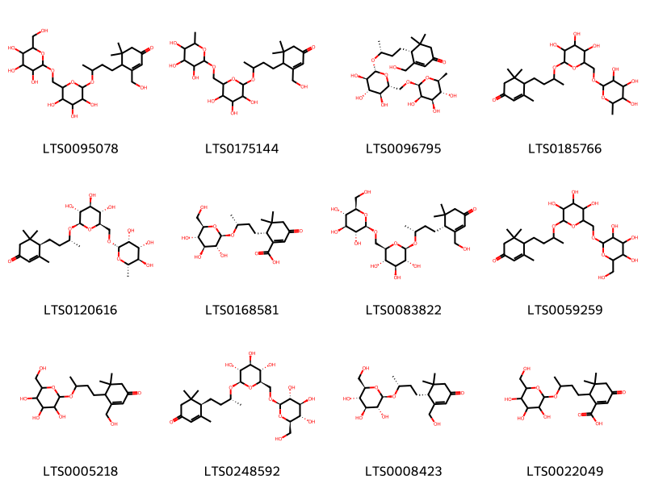{ width=100% }
    <figcaption>Hình ảnh cấu trúc hóa học của 12 hoạt chất thuộc nhóm Fatty Acyls gồm ['3-(hydroxymethyl)-5,5-dimethyl-4-(3-{[3,4,5-trihydroxy-6-({[3,4,5-trihydroxy-6-(hydroxymethyl)oxan-2-yl]oxy}methyl)oxan-2-yl]oxy}butyl)cyclohex-2-en-1-one (LTS0095078)', '3-(hydroxymethyl)-5,5-dimethyl-4-{3-[(3,4,5-trihydroxy-6-{[(3,4,5-trihydroxy-6-methyloxan-2-yl)oxy]methyl}oxan-2-yl)oxy]butyl}cyclohex-2-en-1-one (LTS0175144)', '(4r)-3-(hydroxymethyl)-5,5-dimethyl-4-[(3r)-3-{[(2r,3r,4s,5s,6r)-3,4,5-trihydroxy-6-({[(2s,3r,4r,5r,6s)-3,4,5-trihydroxy-6-methyloxan-2-yl]oxy}methyl)oxan-2-yl]oxy}butyl]cyclohex-2-en-1-one (LTS0096795)', '3,5,5-trimethyl-4-{3-[(3,4,5-trihydroxy-6-{[(3,4,5-trihydroxy-6-methyloxan-2-yl)oxy]methyl}oxan-2-yl)oxy]butyl}cyclohex-2-en-1-one (LTS0185766)', '(4r)-3,5,5-trimethyl-4-[(3r)-3-{[(2r,3r,4s,5s,6r)-3,4,5-trihydroxy-6-({[(2s,3r,4r,5r,6s)-3,4,5-trihydroxy-6-methyloxan-2-yl]oxy}methyl)oxan-2-yl]oxy}butyl]cyclohex-2-en-1-one (LTS0120616)', '(6r)-5,5-dimethyl-3-oxo-6-[(3r)-3-{[(2r,3r,4s,5s,6r)-3,4,5-trihydroxy-6-(hydroxymethyl)oxan-2-yl]oxy}butyl]cyclohex-1-ene-1-carboxylic acid (LTS0168581)', '(4r)-3-(hydroxymethyl)-5,5-dimethyl-4-[(3r)-3-{[(2r,3r,4s,5s,6r)-3,4,5-trihydroxy-6-({[(2r,3r,4s,5s,6r)-3,4,5-trihydroxy-6-(hydroxymethyl)oxan-2-yl]oxy}methyl)oxan-2-yl]oxy}butyl]cyclohex-2-en-1-one (LTS0083822)', '3,5,5-trimethyl-4-(3-{[3,4,5-trihydroxy-6-({[3,4,5-trihydroxy-6-(hydroxymethyl)oxan-2-yl]oxy}methyl)oxan-2-yl]oxy}butyl)cyclohex-2-en-1-one (LTS0059259)', '3-(hydroxymethyl)-5,5-dimethyl-4-(3-{[3,4,5-trihydroxy-6-(hydroxymethyl)oxan-2-yl]oxy}butyl)cyclohex-2-en-1-one (LTS0005218)', '(4r)-3,5,5-trimethyl-4-[(3r)-3-{[(2r,3r,4s,5s,6r)-3,4,5-trihydroxy-6-({[(2r,3r,4s,5s,6r)-3,4,5-trihydroxy-6-(hydroxymethyl)oxan-2-yl]oxy}methyl)oxan-2-yl]oxy}butyl]cyclohex-2-en-1-one (LTS0248592)', '(4r)-3-(hydroxymethyl)-5,5-dimethyl-4-[(3r)-3-{[(2r,3r,4s,5s,6r)-3,4,5-trihydroxy-6-(hydroxymethyl)oxan-2-yl]oxy}butyl]cyclohex-2-en-1-one (LTS0008423)', '5,5-dimethyl-3-oxo-6-(3-{[3,4,5-trihydroxy-6-(hydroxymethyl)oxan-2-yl]oxy}butyl)cyclohex-1-ene-1-carboxylic acid (LTS0022049)'].</figcaption>
</figure>
#### Nhóm Organooxygen compounds
<figure markdown="span">
    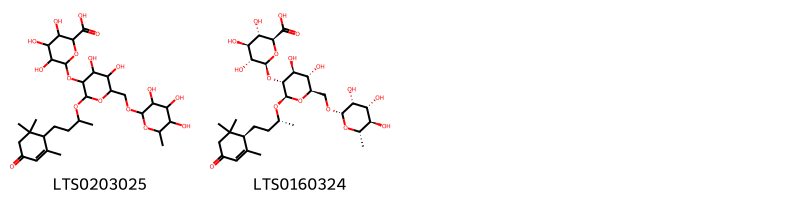{ width=100% }
    <figcaption>Hình ảnh cấu trúc hóa học của 2 hoạt chất thuộc nhóm Organooxygen compounds gồm ['6-[(4,5-dihydroxy-6-{[(3,4,5-trihydroxy-6-methyloxan-2-yl)oxy]methyl}-2-{[4-(2,6,6-trimethyl-4-oxocyclohex-2-en-1-yl)butan-2-yl]oxy}oxan-3-yl)oxy]-3,4,5-trihydroxyoxane-2-carboxylic acid (LTS0203025)', '(2s,3s,4s,5r,6r)-6-{[(2r,3r,4s,5s,6r)-4,5-dihydroxy-6-({[(2s,3r,4r,5r,6s)-3,4,5-trihydroxy-6-methyloxan-2-yl]oxy}methyl)-2-{[(2r)-4-[(1r)-2,6,6-trimethyl-4-oxocyclohex-2-en-1-yl]butan-2-yl]oxy}oxan-3-yl]oxy}-3,4,5-trihydroxyoxane-2-carboxylic acid (LTS0160324)'].</figcaption>
</figure>
#### Nhóm Steroids and steroid derivatives
<figure markdown="span">
    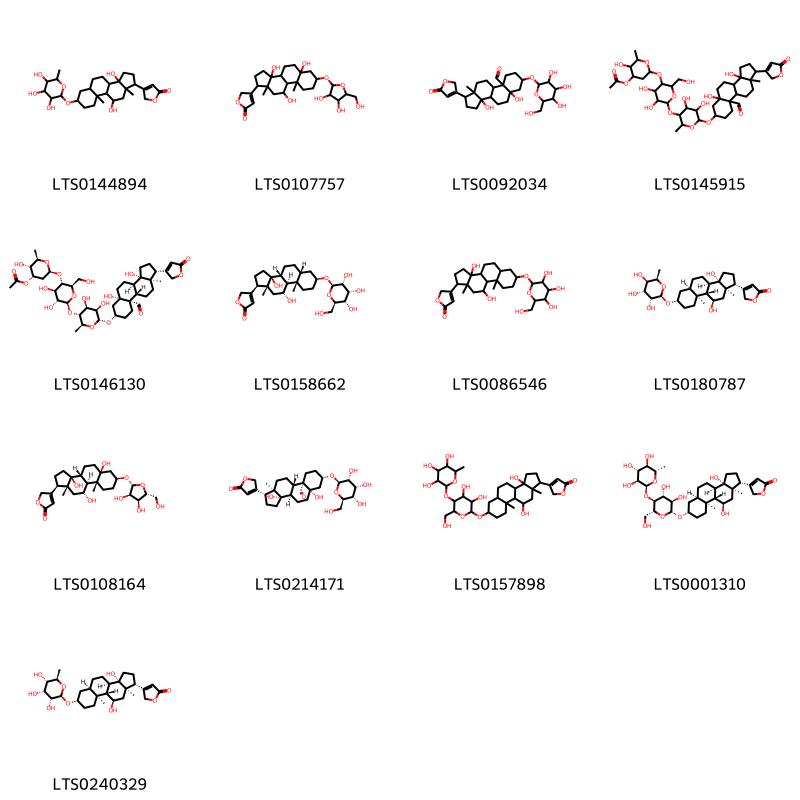{ width=100% }
    <figcaption>Hình ảnh cấu trúc hóa học của 13 hoạt chất thuộc nhóm Steroids and steroid derivatives gồm ['4-{3a,10-dihydroxy-9a,11a-dimethyl-7-[(3,4,5-trihydroxy-6-methyloxan-2-yl)oxy]-tetradecahydrocyclopenta[a]phenanthren-1-yl}-5h-furan-2-one (LTS0144894)', '4-(7-{[3,4-dihydroxy-5-(hydroxymethyl)oxolan-2-yl]oxy}-3a,5a,10-trihydroxy-9a,11a-dimethyl-dodecahydro-1h-cyclopenta[a]phenanthren-1-yl)-5h-furan-2-one (LTS0107757)', '3a,5a-dihydroxy-11a-methyl-1-(5-oxo-2h-furan-3-yl)-7-{[3,4,5-trihydroxy-6-(hydroxymethyl)oxan-2-yl]oxy}-dodecahydro-1h-cyclopenta[a]phenanthrene-9a-carbaldehyde (LTS0092034)', '6-({6-[(6-{[9a-formyl-3a,5a-dihydroxy-11a-methyl-1-(5-oxo-2h-furan-3-yl)-dodecahydro-1h-cyclopenta[a]phenanthren-7-yl]oxy}-4,5-dihydroxy-2-methyloxan-3-yl)oxy]-4,5-dihydroxy-2-(hydroxymethyl)oxan-3-yl}oxy)-3-hydroxy-2-methyloxan-4-yl acetate (LTS0145915)', '(2r,3r,4s,6s)-6-{[(2r,3s,4r,5r,6s)-6-{[(2s,3r,4s,5r,6r)-6-{[(1r,3as,3br,5as,7s,9as,9bs,11ar)-9a-formyl-3a,5a-dihydroxy-11a-methyl-1-(5-oxo-2h-furan-3-yl)-dodecahydro-1h-cyclopenta[a]phenanthren-7-yl]oxy}-4,5-dihydroxy-2-methyloxan-3-yl]oxy}-4,5-dihydroxy-2-(hydroxymethyl)oxan-3-yl]oxy}-3-hydroxy-2-methyloxan-4-yl acetate (LTS0146130)', '4-[(1r,3as,3br,5ar,7s,9as,9bs,10r,11ar)-3a,10-dihydroxy-9a,11a-dimethyl-7-{[(2r,3r,4r,5s,6r)-3,4,5-trihydroxy-6-(hydroxymethyl)oxan-2-yl]oxy}-tetradecahydrocyclopenta[a]phenanthren-1-yl]-5h-furan-2-one (LTS0158662)', '4-(3a,10-dihydroxy-9a,11a-dimethyl-7-{[3,4,5-trihydroxy-6-(hydroxymethyl)oxan-2-yl]oxy}-tetradecahydrocyclopenta[a]phenanthren-1-yl)-5h-furan-2-one (LTS0086546)', '4-[(1r,3as,3br,5ar,7s,9as,9bs,10r,11ar)-3a,10-dihydroxy-9a,11a-dimethyl-7-{[(2r,3r,4r,5r,6r)-3,4,5-trihydroxy-6-methyloxan-2-yl]oxy}-tetradecahydrocyclopenta[a]phenanthren-1-yl]-5h-furan-2-one (LTS0180787)', '4-[(1r,3as,3br,5as,7s,9ar,9bs,10r,11ar)-7-{[(2r,3r,4s,5r)-3,4-dihydroxy-5-(hydroxymethyl)oxolan-2-yl]oxy}-3a,5a,10-trihydroxy-9a,11a-dimethyl-dodecahydro-1h-cyclopenta[a]phenanthren-1-yl]-5h-furan-2-one (LTS0108164)', '(1r,3as,3br,5as,7s,9as,9bs,11ar)-3a,5a-dihydroxy-11a-methyl-1-(5-oxo-2h-furan-3-yl)-7-{[(2r,3r,4r,5s,6r)-3,4,5-trihydroxy-6-(hydroxymethyl)oxan-2-yl]oxy}-dodecahydro-1h-cyclopenta[a]phenanthrene-9a-carbaldehyde (LTS0214171)', '4-(7-{[3,4-dihydroxy-6-(hydroxymethyl)-5-[(3,4,5-trihydroxy-6-methyloxan-2-yl)oxy]oxan-2-yl]oxy}-3a,10-dihydroxy-9a,11a-dimethyl-tetradecahydrocyclopenta[a]phenanthren-1-yl)-5h-furan-2-one (LTS0157898)', '4-[(1r,3as,3br,5ar,7s,9as,9bs,10r,11ar)-7-{[(2r,3r,4r,5s,6r)-3,4-dihydroxy-6-(hydroxymethyl)-5-{[(2s,3s,4r,5r,6s)-3,4,5-trihydroxy-6-methyloxan-2-yl]oxy}oxan-2-yl]oxy}-3a,10-dihydroxy-9a,11a-dimethyl-tetradecahydrocyclopenta[a]phenanthren-1-yl]-5h-furan-2-one (LTS0001310)', '4-[(1r,3as,3br,5ar,7s,9as,9bs,10r,11ar)-3a,10-dihydroxy-9a,11a-dimethyl-7-{[(2r,3r,4r,5s,6r)-3,4,5-trihydroxy-6-methyloxan-2-yl]oxy}-tetradecahydrocyclopenta[a]phenanthren-1-yl]-5h-furan-2-one (LTS0240329)'].</figcaption>
</figure>

---

### Dược dân tộc học

Danh sách các quốc gia có sử dụng *Ornithogalum umbellatum* trong điều trị các bệnh. 

| Country   | Disease   | Bệnh           |
|:----------|:----------|:---------------|
| Egypt     | Poison    | Chất độc       |
| US        | Poison    | Chất độc       |
| ain       | Diuretic  | Thuốc lợi tiêu |

---

# Chi Simethis

??? note "Danh sách các dược liệu thuộc chi"
    
	 - *Simethis planifolia*

---
## Simethis planifolia
### Thông tin về thực vật

!!! info "Phân loại thực vật của *Simethis planifolia* từ GIBF:"
    - **Kingdom:** Plantae
    - **Phylum:** Tracheophyta
    - **Order:** Asparagales
    - **Family:** Asphodelaceae
    - **Genus:** Simethis
    - **Species:** *Simethis planifolia*

 

| Label (VI)   | Label (EN)   | Scientific Name     | Descriptions (VI)   | Descriptions (EN)   | Also Known As (VI)   | Also Known As (EN)   |
|:-------------|:-------------|:--------------------|:--------------------|:--------------------|:---------------------|:---------------------|
| N/A          | N/A          | Simethis planifolia | loài thực vật       | species of plant    | ['']                 | ['']                 |

#### Phân bố trên thế giới

**Từ CSDL GIBF** Morocco, nan, Portugal, Tunisia, Spain, France, Ireland

#### Phân bố tại Việt Nam

**Từ CSDL GIBF**: Không có ghi nhận ở Việt Nam

---
### Thành phần hóa học
        
- Theo cơ sở dữ liệu lotus: Từ loài *Simethis planifolia* đã phân lập và xác định được Chưa có hoạt chất nào được phân lập. hoạt chất thuộc về các nhóm Không có hoạt chất nào được phân lập. 

Không có hình ảnh nào được tạo ra

---

### Dược dân tộc học

Danh sách các quốc gia có sử dụng *Simethis planifolia* trong điều trị các bệnh. 

| Country   | Disease   | Bệnh     |
|:----------|:----------|:---------|
| ain       | Purgative | Thuốc xổ |

---

# Chi Tulipa

??? note "Danh sách các dược liệu thuộc chi"
    
	 - *Tulipa edulis*
	 - *Tulipa gesneriana*
	 - *Tulipa latifolia*

---
## Tulipa edulis
### Thông tin về thực vật

!!! info "Phân loại thực vật của *Amana edulis* từ GIBF:"
    - **Kingdom:** Plantae
    - **Phylum:** Tracheophyta
    - **Order:** Liliales
    - **Family:** Liliaceae
    - **Genus:** Amana
    - **Species:** *Amana edulis*

 

| Label (VI)   | Label (EN)   | Scientific Name   | Descriptions (VI)   | Descriptions (EN)   | Also Known As (VI)   | Also Known As (EN)   |
|:-------------|:-------------|:------------------|:--------------------|:--------------------|:---------------------|:---------------------|
| N/A          | N/A          | Tulipa edulis     | loài thực vật       | species of plant    | ['']                 | ['Amana edulis']     |

#### Phân bố trên thế giới

**Từ CSDL GIBF** nan, Japan, Korea, Republic of

#### Phân bố tại Việt Nam

**Từ CSDL GIBF**: Không có ghi nhận ở Việt Nam

---
### Thành phần hóa học
        
- Theo cơ sở dữ liệu lotus: Từ loài *Amana edulis* đã phân lập và xác định được Chưa có hoạt chất nào được phân lập. hoạt chất thuộc về các nhóm Không có hoạt chất nào được phân lập. 

Không có hình ảnh nào được tạo ra

---

### Dược dân tộc học

Danh sách các quốc gia có sử dụng *Amana edulis* trong điều trị các bệnh. 

| Country   | Disease   | Bệnh               |
|:----------|:----------|:-------------------|
| China     | Poison    | Chất độc           |
| Elsewhere | Tonic     | (thuộc) trương lực |

---

---
## Tulipa gesneriana
### Thông tin về thực vật

!!! info "Phân loại thực vật của *Tulipa gesneriana* từ GIBF:"
    - **Kingdom:** Plantae
    - **Phylum:** Tracheophyta
    - **Order:** Liliales
    - **Family:** Liliaceae
    - **Genus:** Tulipa
    - **Species:** *Tulipa gesneriana*

 

| Label (VI)   | Label (EN)   | Scientific Name   | Descriptions (VI)   | Descriptions (EN)   | Also Known As (VI)   | Also Known As (EN)                        |
|:-------------|:-------------|:------------------|:--------------------|:--------------------|:---------------------|:------------------------------------------|
| N/A          | N/A          | Tulipa gesneriana | loài thực vật       | species of plant    | ['']                 | ["Didier's tulip", 'Tulipa × gesneriana'] |

#### Phân bố trên thế giới

**Từ CSDL GIBF** Czechia, Sweden, Finland, Denmark, United States of America, Russian Federation, Estonia, Belarus, Norway, France, Belgium, Canada, Germany, Austria, Ukraine, Italy, Switzerland, United Kingdom of Great Britain and Northern Ireland, Ireland

#### Phân bố tại Việt Nam

**Từ CSDL GIBF**: Không có ghi nhận ở Việt Nam

---
### Thành phần hóa học
        
- Theo cơ sở dữ liệu lotus: Từ loài *Tulipa gesneriana* đã phân lập và xác định được 38 hoạt chất thuộc về các nhóm Lactones, Organooxygen compounds, Saccharolipids, Flavonoids. 

|    | chemicalTaxonomyClassyfireClass   |   smiles_count |
|---:|:----------------------------------|---------------:|
|  0 | Flavonoids                        |             28 |
|  1 | Lactones                          |              1 |
|  2 | Organooxygen compounds            |              5 |
|  3 | Saccharolipids                    |              4 |

#### Nhóm Flavonoids
<figure markdown="span">
    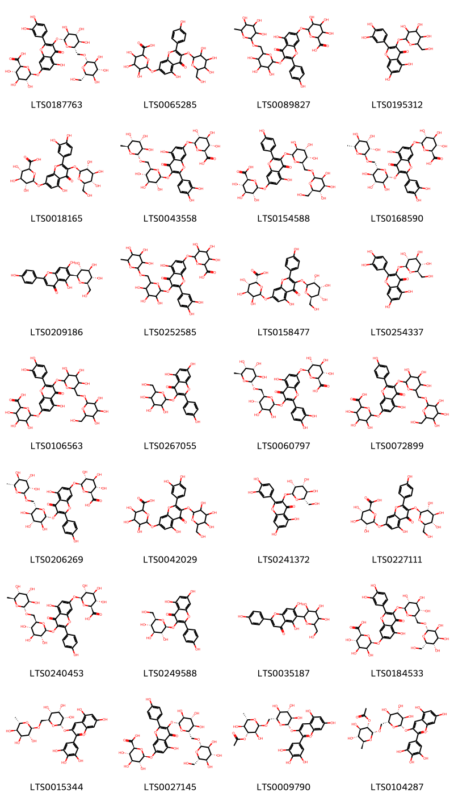{ width=100% }
    <figcaption>Hình ảnh cấu trúc hóa học của 28 hoạt chất thuộc nhóm Flavonoids gồm ['(2s,3s,4s,5r,6s)-6-{[2-(3,4-dihydroxyphenyl)-5-hydroxy-4-oxo-3-{[(2r,3s,4r,5r,6s)-3,4,5-trihydroxy-6-({[(2s,3s,4r,5r,6s)-3,4,5-trihydroxy-6-(hydroxymethyl)oxan-2-yl]oxy}methyl)oxan-2-yl]oxy}chromen-7-yl]oxy}-3,4,5-trihydroxyoxane-2-carboxylic acid (LTS0187763)', '3,4,5-trihydroxy-6-{[5-hydroxy-2-(4-hydroxyphenyl)-4-oxo-3-{[3,4,5-trihydroxy-6-(hydroxymethyl)oxan-2-yl]oxy}chromen-7-yl]oxy}oxane-2-carboxylic acid (LTS0065285)', '3,4,5-trihydroxy-6-{[5-hydroxy-2-(4-hydroxyphenyl)-4-oxo-3-[(3,4,5-trihydroxy-6-{[(3,4,5-trihydroxy-6-methyloxan-2-yl)oxy]methyl}oxan-2-yl)oxy]chromen-7-yl]oxy}oxane-2-carboxylic acid (LTS0089827)', '2-(3,4-dihydroxyphenyl)-5,7-dihydroxy-3-{[3,4,5-trihydroxy-6-(hydroxymethyl)oxan-2-yl]oxy}chromen-4-one (LTS0195312)', '(2s,3s,4s,5r,6s)-6-{[2-(3,4-dihydroxyphenyl)-5-hydroxy-4-oxo-3-{[(2s,3r,4s,5s,6r)-3,4,5-trihydroxy-6-(hydroxymethyl)oxan-2-yl]oxy}chromen-7-yl]oxy}-3,4,5-trihydroxyoxane-2-carboxylic acid (LTS0018165)', '(2s,3s,4s,5r,6s)-6-{[2-(3,4-dihydroxyphenyl)-5-hydroxy-4-oxo-3-{[(2s,3r,4s,5s,6r)-3,4,5-trihydroxy-6-({[(2r,3r,4s,5r,6s)-3,4,5-trihydroxy-6-methyloxan-2-yl]oxy}methyl)oxan-2-yl]oxy}chromen-7-yl]oxy}-3,4,5-trihydroxyoxane-2-carboxylic acid (LTS0043558)', '(2s,3s,4s,5r,6s)-3,4,5-trihydroxy-6-{[5-hydroxy-2-(4-hydroxyphenyl)-4-oxo-3-{[(2s,3s,4r,5s,6r)-3,4,5-trihydroxy-6-({[(2r,3s,4s,5s,6r)-3,4,5-trihydroxy-6-(hydroxymethyl)oxan-2-yl]oxy}methyl)oxan-2-yl]oxy}chromen-7-yl]oxy}oxane-2-carboxylic acid (LTS0154588)', '(2s,3s,4s,5r,6s)-6-{[2-(3,4-dihydroxyphenyl)-5-hydroxy-4-oxo-3-{[(2r,3s,4r,5r,6s)-3,4,5-trihydroxy-6-({[(2s,3s,4s,5s,6r)-3,4,5-trihydroxy-6-methyloxan-2-yl]oxy}methyl)oxan-2-yl]oxy}chromen-7-yl]oxy}-3,4,5-trihydroxyoxane-2-carboxylic acid (LTS0168590)', 'isovitexin (LTS0209186)', '6-{[2-(3,4-dihydroxyphenyl)-5-hydroxy-4-oxo-3-[(3,4,5-trihydroxy-6-{[(3,4,5-trihydroxy-6-methyloxan-2-yl)oxy]methyl}oxan-2-yl)oxy]chromen-7-yl]oxy}-3,4,5-trihydroxyoxane-2-carboxylic acid (LTS0252585)', '(2r,3s,4s,5s,6s)-3,4,5-trihydroxy-6-{[5-hydroxy-2-(4-hydroxyphenyl)-4-oxo-3-{[(2s,3r,4r,5s,6r)-3,4,5-trihydroxy-6-(hydroxymethyl)oxan-2-yl]oxy}chromen-7-yl]oxy}oxane-2-carboxylic acid (LTS0158477)', 'isoquercetin (LTS0254337)', '6-{[2-(3,4-dihydroxyphenyl)-5-hydroxy-4-oxo-3-{[3,4,5-trihydroxy-6-({[3,4,5-trihydroxy-6-(hydroxymethyl)oxan-2-yl]oxy}methyl)oxan-2-yl]oxy}chromen-7-yl]oxy}-3,4,5-trihydroxyoxane-2-carboxylic acid (LTS0106563)', 'trifolin (LTS0267055)', '(2s,3s,4s,5r,6s)-6-{[2-(3,4-dihydroxyphenyl)-5-hydroxy-4-oxo-3-{[(2s,4s,5s,6r)-3,4,5-trihydroxy-6-({[(2r,3r,4s,5r,6s)-3,4,5-trihydroxy-6-methyloxan-2-yl]oxy}methyl)oxan-2-yl]oxy}chromen-7-yl]oxy}-3,4,5-trihydroxyoxane-2-carboxylic acid (LTS0060797)', '3,4,5-trihydroxy-6-{[5-hydroxy-2-(4-hydroxyphenyl)-4-oxo-3-{[3,4,5-trihydroxy-6-({[3,4,5-trihydroxy-6-(hydroxymethyl)oxan-2-yl]oxy}methyl)oxan-2-yl]oxy}chromen-7-yl]oxy}oxane-2-carboxylic acid (LTS0072899)', '(2s,3s,4s,5r,6s)-3,4,5-trihydroxy-6-{[5-hydroxy-2-(4-hydroxyphenyl)-4-oxo-3-{[(2r,3s,4r,5r,6s)-3,4,5-trihydroxy-6-({[(2s,3s,4s,5s,6r)-3,4,5-trihydroxy-6-methyloxan-2-yl]oxy}methyl)oxan-2-yl]oxy}chromen-7-yl]oxy}oxane-2-carboxylic acid (LTS0206269)', '6-{[2-(3,4-dihydroxyphenyl)-5-hydroxy-4-oxo-3-{[3,4,5-trihydroxy-6-(hydroxymethyl)oxan-2-yl]oxy}chromen-7-yl]oxy}-3,4,5-trihydroxyoxane-2-carboxylic acid (LTS0042029)', '2-(3,4-dihydroxyphenyl)-5,7-dihydroxy-3-{[(2s,3r,4r,5r,6s)-3,4,5-trihydroxy-6-(hydroxymethyl)oxan-2-yl]oxy}chromen-4-one (LTS0241372)', '(2s,3s,4s,5r,6s)-3,4,5-trihydroxy-6-{[5-hydroxy-2-(4-hydroxyphenyl)-4-oxo-3-{[(2s,3r,4s,5s,6r)-3,4,5-trihydroxy-6-(hydroxymethyl)oxan-2-yl]oxy}chromen-7-yl]oxy}oxane-2-carboxylic acid (LTS0227111)', '(2s,3s,4s,5r,6s)-3,4,5-trihydroxy-6-{[5-hydroxy-2-(4-hydroxyphenyl)-4-oxo-3-{[(2s,3r,4s,5s,6r)-3,4,5-trihydroxy-6-({[(2r,3r,4s,5r,6s)-3,4,5-trihydroxy-6-methyloxan-2-yl]oxy}methyl)oxan-2-yl]oxy}chromen-7-yl]oxy}oxane-2-carboxylic acid (LTS0240453)', 'astragalin (LTS0249588)', 'isovitexin (LTS0035187)', '(2s,3s,4s,5s,6s)-6-{[2-(3,4-dihydroxyphenyl)-5-hydroxy-4-oxo-3-{[(2s,3r,4s,5s,6r)-3,4,5-trihydroxy-6-({[(2s,3s,4s,5s,6s)-3,4,5-trihydroxy-6-(hydroxymethyl)oxan-2-yl]oxy}methyl)oxan-2-yl]oxy}chromen-7-yl]oxy}-3,4,5-trihydroxyoxane-2-carboxylic acid (LTS0184533)', '5,7-dihydroxy-3-{[(2s,3s,4s,5r,6s)-3,4,5-trihydroxy-6-({[(2r,3r,4s,5r,6s)-3,4,5-trihydroxy-6-methyloxan-2-yl]oxy}methyl)oxan-2-yl]oxy}-2-(3,4,5-trihydroxyphenyl)-1λ⁴-chromen-1-ylium (LTS0015344)', '(2s,3s,4s,5r,6s)-3,4,5-trihydroxy-6-{[5-hydroxy-2-(4-hydroxyphenyl)-4-oxo-3-{[(2r,3s,4r,5r,6s)-3,4,5-trihydroxy-6-({[(2s,3s,4r,5r,6s)-3,4,5-trihydroxy-6-(hydroxymethyl)oxan-2-yl]oxy}methyl)oxan-2-yl]oxy}chromen-7-yl]oxy}oxane-2-carboxylic acid (LTS0027145)', '3-{[(2s,3r,4s,5s,6r)-6-({[(2r,3s,4r,5s,6s)-4-(acetyloxy)-3,5-dihydroxy-6-methyloxan-2-yl]oxy}methyl)-3,4,5-trihydroxyoxan-2-yl]oxy}-5,7-dihydroxy-2-(3,4,5-trihydroxyphenyl)-1λ⁴-chromen-1-ylium (LTS0009790)', '3-{[(2s,3r,4s,5s,6r)-6-({[(2r,3s,4r,5r,6s)-3-(acetyloxy)-4,5-dihydroxy-6-methyloxan-2-yl]oxy}methyl)-3,4,5-trihydroxyoxan-2-yl]oxy}-5,7-dihydroxy-2-(3,4,5-trihydroxyphenyl)-1λ⁴-chromen-1-ylium (LTS0104287)'].</figcaption>
</figure>
#### Nhóm Lactones
<figure markdown="span">
    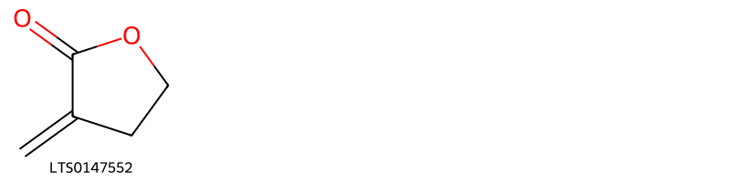{ width=100% }
    <figcaption>Hình ảnh cấu trúc hóa học của 1 hoạt chất thuộc nhóm Lactones gồm ['tulipalin a (LTS0147552)'].</figcaption>
</figure>
#### Nhóm Organooxygen compounds
<figure markdown="span">
    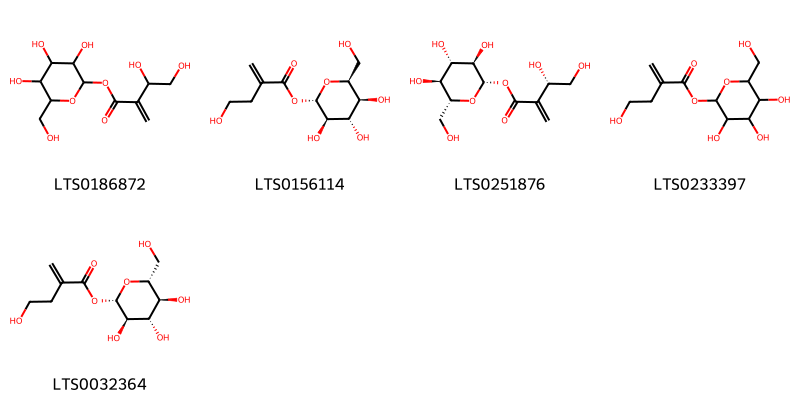{ width=100% }
    <figcaption>Hình ảnh cấu trúc hóa học của 5 hoạt chất thuộc nhóm Organooxygen compounds gồm ['3,4,5-trihydroxy-6-(hydroxymethyl)oxan-2-yl 3,4-dihydroxy-2-methylidenebutanoate (LTS0186872)', '(2s,3r,4s,5s,6s)-3,4,5-trihydroxy-6-(hydroxymethyl)oxan-2-yl 4-hydroxy-2-methylidenebutanoate (LTS0156114)', '(2s,3r,4s,5s,6r)-3,4,5-trihydroxy-6-(hydroxymethyl)oxan-2-yl (3s)-3,4-dihydroxy-2-methylidenebutanoate (LTS0251876)', '3,4,5-trihydroxy-6-(hydroxymethyl)oxan-2-yl 4-hydroxy-2-methylidenebutanoate (LTS0233397)', 'tuliposide a (LTS0032364)'].</figcaption>
</figure>
#### Nhóm Saccharolipids
<figure markdown="span">
    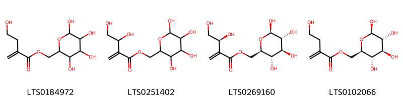{ width=100% }
    <figcaption>Hình ảnh cấu trúc hóa học của 4 hoạt chất thuộc nhóm Saccharolipids gồm ['(3,4,5,6-tetrahydroxyoxan-2-yl)methyl 4-hydroxy-2-methylidenebutanoate (LTS0184972)', '(3,4,5,6-tetrahydroxyoxan-2-yl)methyl 3,4-dihydroxy-2-methylidenebutanoate (LTS0251402)', '[(2r,3s,4s,5r,6r)-3,4,5,6-tetrahydroxyoxan-2-yl]methyl (3s)-3,4-dihydroxy-2-methylidenebutanoate (LTS0269160)', '[(2r,3s,4s,5r,6r)-3,4,5,6-tetrahydroxyoxan-2-yl]methyl 4-hydroxy-2-methylidenebutanoate (LTS0102066)'].</figcaption>
</figure>

---

### Dược dân tộc học

Danh sách các quốc gia có sử dụng *Tulipa gesneriana* trong điều trị các bệnh. 

| Country   | Disease   | Bệnh     |
|:----------|:----------|:---------|
| Elsewhere | Poison    | Chất độc |

---

---
## Tulipa latifolia
### Thông tin về thực vật

!!! info "Phân loại thực vật của *Amana erythronioides* từ GIBF:"
    - **Kingdom:** Plantae
    - **Phylum:** Tracheophyta
    - **Order:** Liliales
    - **Family:** Liliaceae
    - **Genus:** Amana
    - **Species:** *Amana erythronioides*

 

| Label (VI)   | Label (EN)   | Scientific Name   | Descriptions (VI)   | Descriptions (EN)   | Also Known As (VI)   | Also Known As (EN)   |
|:-------------|:-------------|:------------------|:--------------------|:--------------------|:---------------------|:---------------------|
| N/A          | N/A          | Tulipa latifolia  | loài thực vật       | species of plant    | ['']                 | ['']                 |

#### Phân bố trên thế giới

**Từ CSDL GIBF** nan, Japan

#### Phân bố tại Việt Nam

**Từ CSDL GIBF**: Không có ghi nhận ở Việt Nam

---
### Thành phần hóa học
        
- Theo cơ sở dữ liệu lotus: Từ loài *Amana erythronioides* đã phân lập và xác định được Chưa có hoạt chất nào được phân lập. hoạt chất thuộc về các nhóm Không có hoạt chất nào được phân lập. 

Không có hình ảnh nào được tạo ra

---

### Dược dân tộc học

Danh sách các quốc gia có sử dụng *Amana erythronioides* trong điều trị các bệnh. 

| Country   | Disease   | Bệnh               |
|:----------|:----------|:-------------------|
| Elsewhere | Tonic     | (thuộc) trương lực |

---

# Chi Hypoxis

??? note "Danh sách các dược liệu thuộc chi"
    
	 - *Hypoxis aurea*

---
## Hypoxis aurea
### Thông tin về thực vật

!!! info "Phân loại thực vật của *Hypoxis aurea* từ GIBF:"
    - **Kingdom:** Plantae
    - **Phylum:** Tracheophyta
    - **Order:** Asparagales
    - **Family:** Hypoxidaceae
    - **Genus:** Hypoxis
    - **Species:** *Hypoxis aurea*

 

| Label (VI)   | Label (EN)   | Scientific Name   | Descriptions (VI)   | Descriptions (EN)   | Also Known As (VI)   | Also Known As (EN)   |
|:-------------|:-------------|:------------------|:--------------------|:--------------------|:---------------------|:---------------------|
| N/A          | N/A          | Hypoxis aurea     | loài thực vật       | species of plant    | ['']                 | ['']                 |

#### Phân bố trên thế giới

**Từ CSDL GIBF** nan, Hong Kong, Viet Nam, Japan, Cambodia, United States of America, Bhutan, Indonesia, Nepal, Chinese Taipei, China, Myanmar, India, unknown or invalid, Brunei Darussalam, Thailand, Lao People’s Democratic Republic

#### Phân bố tại Việt Nam

**Từ CSDL GIBF**: Cao Bang, Lam Dong, Lam Dong (林同省)

---
### Thành phần hóa học
        
- Theo cơ sở dữ liệu lotus: Từ loài *Hypoxis aurea* đã phân lập và xác định được Chưa có hoạt chất nào được phân lập. hoạt chất thuộc về các nhóm Không có hoạt chất nào được phân lập. 

Không có hình ảnh nào được tạo ra

---

### Dược dân tộc học

Danh sách các quốc gia có sử dụng *Hypoxis aurea* trong điều trị các bệnh. 

| Country   | Disease                                | Bệnh                                                                     |
|:----------|:---------------------------------------|:-------------------------------------------------------------------------|
| China     | Aphrodisiac, Tonic, Tonic, Aphrodisiac | Thuốc kích thích tình dục, Thuốc bổ, Thuốc bổ, Thuốc kích thích tình dục |
| Elsewhere | Aphrodisiac, Tonic                     | Thuốc kích thích tình dục, Thuốc bổ                                      |

---

# Chi Polygonatum

??? note "Danh sách các dược liệu thuộc chi"
    
	 - *Polygonatum biflorum*
	 - *Polygonatum canaliculatum*
	 - *Polygonatum cirrhifolium*
	 - *Polygonatum falcatum*
	 - *Polygonatum macranthum*
	 - *Polygonatum multiflorum*
	 - *Polygonatum odoratum*
	 - *Polygonatum officinale*
	 - *Polygonatum verticillatum*

---
## Polygonatum biflorum
### Thông tin về thực vật

!!! info "Phân loại thực vật của *Polygonatum biflorum* từ GIBF:"
    - **Kingdom:** Plantae
    - **Phylum:** Tracheophyta
    - **Order:** Asparagales
    - **Family:** Asparagaceae
    - **Genus:** Polygonatum
    - **Species:** *Polygonatum biflorum*

 

| Label (VI)   | Label (EN)   | Scientific Name      | Descriptions (VI)   | Descriptions (EN)   | Also Known As (VI)   | Also Known As (EN)   |
|:-------------|:-------------|:---------------------|:--------------------|:--------------------|:---------------------|:---------------------|
| N/A          | N/A          | Polygonatum biflorum | loài thực vật       | species of plant    | ['']                 | ['']                 |

#### Phân bố trên thế giới

**Từ CSDL GIBF** United States of America

#### Phân bố tại Việt Nam

**Từ CSDL GIBF**: Không có ghi nhận ở Việt Nam

---
### Thành phần hóa học
        
- Theo cơ sở dữ liệu lotus: Từ loài *Polygonatum biflorum* đã phân lập và xác định được Chưa có hoạt chất nào được phân lập. hoạt chất thuộc về các nhóm Không có hoạt chất nào được phân lập. 

Không có hình ảnh nào được tạo ra

---

### Dược dân tộc học

Danh sách các quốc gia có sử dụng *Polygonatum biflorum* trong điều trị các bệnh. 

| Country   | Disease             | Bệnh                          |
|:----------|:--------------------|:------------------------------|
| US        | Laxative, Sudorific | Thuốc nhuận tràng, hút mồ hôi |

---

---
## Polygonatum canaliculatum
### Thông tin về thực vật

!!! info "Phân loại thực vật của *N/A* từ GIBF:"
    - **Kingdom:** Plantae
    - **Phylum:** Tracheophyta
    - **Order:** Asparagales
    - **Family:** Asparagaceae
    - **Genus:** Polygonatum
    - **Species:** *N/A*

 

| Label (VI)   | Label (EN)   | Scientific Name      | Descriptions (VI)   | Descriptions (EN)   | Also Known As (VI)   | Also Known As (EN)   |
|:-------------|:-------------|:---------------------|:--------------------|:--------------------|:---------------------|:---------------------|
| N/A          | N/A          | Polygonatum biflorum | loài thực vật       | species of plant    | ['']                 | ['']                 |

#### Phân bố trên thế giới

**Từ CSDL GIBF** Czechia, Sweden, China, Spain, Netherlands, United States of America, Romania, Russian Federation, Croatia, Norway, Belgium, Chinese Taipei, Luxembourg, Germany, Austria, Hungary, Portugal, Ukraine, Slovakia, Italy, Switzerland, Serbia

#### Phân bố tại Việt Nam

**Từ CSDL GIBF**: Không có ghi nhận ở Việt Nam

---
### Thành phần hóa học
        
- Theo cơ sở dữ liệu lotus: Từ loài *N/A* đã phân lập và xác định được Chưa có hoạt chất nào được phân lập. hoạt chất thuộc về các nhóm Không có hoạt chất nào được phân lập. 

Không có hình ảnh nào được tạo ra

---

### Dược dân tộc học

Danh sách các quốc gia có sử dụng *N/A* trong điều trị các bệnh. 

| Country   | Disease                              | Bệnh                                 |
|:----------|:-------------------------------------|:-------------------------------------|
| China     | Demulcent, Tonic, Aphrodisiac, Tonic | Demulcent, Tonic, Aphrodisiac, Tonic |

---

---
## Polygonatum cirrhifolium
### Thông tin về thực vật

!!! info "Phân loại thực vật của *Polygonatum cirrhifolium* từ GIBF:"
    - **Kingdom:** Plantae
    - **Phylum:** Tracheophyta
    - **Order:** Asparagales
    - **Family:** Asparagaceae
    - **Genus:** Polygonatum
    - **Species:** *Polygonatum cirrhifolium*

 

| Label (VI)   | Label (EN)   | Scientific Name          | Descriptions (VI)   | Descriptions (EN)   | Also Known As (VI)   | Also Known As (EN)   |
|:-------------|:-------------|:-------------------------|:--------------------|:--------------------|:---------------------|:---------------------|
| N/A          | N/A          | Polygonatum cirrhifolium | loài thực vật       | species of plant    | ['']                 | ['']                 |

#### Phân bố trên thế giới

**Từ CSDL GIBF** nan, Norway, Bhutan, Nepal, China, India, Canada

#### Phân bố tại Việt Nam

**Từ CSDL GIBF**: Không có ghi nhận ở Việt Nam

---
### Thành phần hóa học
        
- Theo cơ sở dữ liệu lotus: Từ loài *Polygonatum cirrhifolium* đã phân lập và xác định được Chưa có hoạt chất nào được phân lập. hoạt chất thuộc về các nhóm Không có hoạt chất nào được phân lập. 

Không có hình ảnh nào được tạo ra

---

### Dược dân tộc học

Danh sách các quốc gia có sử dụng *Polygonatum cirrhifolium* trong điều trị các bệnh. 

| Country   | Disease                | Bệnh                       |
|:----------|:-----------------------|:---------------------------|
| India     | Soap, Tonic, Vulnerary | Xà phòng, Tonic, Vulnerary |

---

---
## Polygonatum falcatum
### Thông tin về thực vật

!!! info "Phân loại thực vật của *Polygonatum falcatum* từ GIBF:"
    - **Kingdom:** Plantae
    - **Phylum:** Tracheophyta
    - **Order:** Asparagales
    - **Family:** Asparagaceae
    - **Genus:** Polygonatum
    - **Species:** *Polygonatum falcatum*

 

| Label (VI)   | Label (EN)   | Scientific Name      | Descriptions (VI)   | Descriptions (EN)   | Also Known As (VI)   | Also Known As (EN)   |
|:-------------|:-------------|:---------------------|:--------------------|:--------------------|:---------------------|:---------------------|
| N/A          | N/A          | Polygonatum falcatum | loài thực vật       | species of plant    | ['']                 | ['']                 |

#### Phân bố trên thế giới

**Từ CSDL GIBF** nan, Japan, Norway, Korea, Republic of

#### Phân bố tại Việt Nam

**Từ CSDL GIBF**: Không có ghi nhận ở Việt Nam

---
### Thành phần hóa học
        
- Theo cơ sở dữ liệu lotus: Từ loài *Polygonatum falcatum* đã phân lập và xác định được Chưa có hoạt chất nào được phân lập. hoạt chất thuộc về các nhóm Không có hoạt chất nào được phân lập. 

Không có hình ảnh nào được tạo ra

---

### Dược dân tộc học

Danh sách các quốc gia có sử dụng *Polygonatum falcatum* trong điều trị các bệnh. 

| Country   | Disease   | Bệnh               |
|:----------|:----------|:-------------------|
| Elsewhere | Tonic     | (thuộc) trương lực |

---

---
## Polygonatum macranthum
### Thông tin về thực vật

!!! info "Phân loại thực vật của *Polygonatum macranthum* từ GIBF:"
    - **Kingdom:** Plantae
    - **Phylum:** Tracheophyta
    - **Order:** Asparagales
    - **Family:** Asparagaceae
    - **Genus:** Polygonatum
    - **Species:** *Polygonatum macranthum*

 

| Label (VI)   | Label (EN)   | Scientific Name        | Descriptions (VI)   | Descriptions (EN)   | Also Known As (VI)   | Also Known As (EN)   |
|:-------------|:-------------|:-----------------------|:--------------------|:--------------------|:---------------------|:---------------------|
| N/A          | N/A          | Polygonatum macranthum | loài thực vật       | species of plant    | ['']                 | ['']                 |

#### Phân bố trên thế giới

**Từ CSDL GIBF** nan, Japan

#### Phân bố tại Việt Nam

**Từ CSDL GIBF**: Không có ghi nhận ở Việt Nam

---
### Thành phần hóa học
        
- Theo cơ sở dữ liệu lotus: Từ loài *Polygonatum macranthum* đã phân lập và xác định được Chưa có hoạt chất nào được phân lập. hoạt chất thuộc về các nhóm Không có hoạt chất nào được phân lập. 

Không có hình ảnh nào được tạo ra

---

### Dược dân tộc học

Danh sách các quốc gia có sử dụng *Polygonatum macranthum* trong điều trị các bệnh. 

| Country   | Disease   | Bệnh               |
|:----------|:----------|:-------------------|
| Elsewhere | Tonic     | (thuộc) trương lực |

---

---
## Polygonatum multiflorum
### Thông tin về thực vật

!!! info "Phân loại thực vật của *Polygonatum multiflorum* từ GIBF:"
    - **Kingdom:** Plantae
    - **Phylum:** Tracheophyta
    - **Order:** Asparagales
    - **Family:** Asparagaceae
    - **Genus:** Polygonatum
    - **Species:** *Polygonatum multiflorum*

 

| Label (VI)   | Label (EN)   | Scientific Name         | Descriptions (VI)   | Descriptions (EN)   | Also Known As (VI)   | Also Known As (EN)                              |
|:-------------|:-------------|:------------------------|:--------------------|:--------------------|:---------------------|:------------------------------------------------|
| N/A          | N/A          | Polygonatum multiflorum | loài thực vật       | species of plant    | ['']                 | ['Convallaria multiflora L.', "solomon's seal"] |

#### Phân bố trên thế giới

**Từ CSDL GIBF** Liechtenstein, Austria, Hungary, Czechia, United Kingdom of Great Britain and Northern Ireland, Belgium, France, Ukraine, Italy, Croatia, Switzerland, Luxembourg, Slovenia, Germany, Denmark, Spain, Bosnia and Herzegovina, Netherlands

#### Phân bố tại Việt Nam

**Từ CSDL GIBF**: Không có ghi nhận ở Việt Nam

---
### Thành phần hóa học
        
- Theo cơ sở dữ liệu lotus: Từ loài *Polygonatum multiflorum* đã phân lập và xác định được 3 hoạt chất thuộc về các nhóm Prenol lipids, Carboxylic acids and derivatives. 

|    | chemicalTaxonomyClassyfireClass   |   smiles_count |
|---:|:----------------------------------|---------------:|
|  0 | Carboxylic acids and derivatives  |              2 |
|  1 | Prenol lipids                     |              1 |

#### Nhóm Carboxylic acids and derivatives
<figure markdown="span">
    { width=100% }
    <figcaption>Hình ảnh cấu trúc hóa học của 2 hoạt chất thuộc nhóm Carboxylic acids and derivatives gồm ['l-azetidine 2-carboxylic acid (LTS0201230)', 'azetidine-2-carboxylic acid (LTS0249821)'].</figcaption>
</figure>
#### Nhóm Prenol lipids
<figure markdown="span">
    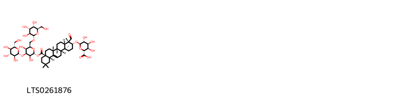{ width=100% }
    <figcaption>Hình ảnh cấu trúc hóa học của 1 hoạt chất thuộc nhóm Prenol lipids gồm ['(2r,3r,4s,5r,6r)-6-{[(3r,4s,4as,6ar,6br,8as,12as,14as,14bs)-8a-({[(2r,3s,4s,5s,6r)-3,5-dihydroxy-4-{[(2r,3s,4r,5r,6s)-3,4,5-trihydroxy-6-(hydroxymethyl)oxan-2-yl]oxy}-6-({[(2s,3s,4r,5s,6r)-3,4,5-trihydroxy-6-(hydroxymethyl)oxan-2-yl]oxy}methyl)oxan-2-yl]oxy}carbonyl)-4-formyl-4,6a,6b,11,11,14b-hexamethyl-1,2,3,4a,5,6,7,8,9,10,12,12a,14,14a-tetradecahydropicen-3-yl]oxy}-3,4,5-trihydroxyoxane-2-carboxylic acid (LTS0261876)'].</figcaption>
</figure>

---

### Dược dân tộc học

Danh sách các quốc gia có sử dụng *Polygonatum multiflorum* trong điều trị các bệnh. 

| Country   | Disease   | Bệnh     |
|:----------|:----------|:---------|
| Elsewhere | Soap      | Xà phòng |

---

---
## Polygonatum odoratum
### Thông tin về thực vật

!!! info "Phân loại thực vật của *Polygonatum odoratum* từ GIBF:"
    - **Kingdom:** Plantae
    - **Phylum:** Tracheophyta
    - **Order:** Asparagales
    - **Family:** Asparagaceae
    - **Genus:** Polygonatum
    - **Species:** *Polygonatum odoratum*

 

| Label (VI)   | Label (EN)   | Scientific Name      | Descriptions (VI)   | Descriptions (EN)   | Also Known As (VI)   | Also Known As (EN)   |
|:-------------|:-------------|:---------------------|:--------------------|:--------------------|:---------------------|:---------------------|
| N/A          | N/A          | Polygonatum odoratum | loài thực vật       | species of plant    | ['']                 | ['']                 |

#### Phân bố trên thế giới

**Từ CSDL GIBF** Japan, Czechia, Sweden, China, Slovenia, Spain, Poland, Netherlands, Romania, Korea, Republic of, Russian Federation, Croatia, Belarus, Belgium, Germany, Austria, Hungary, Portugal, Ukraine, Slovakia, Italy, Switzerland, France

#### Phân bố tại Việt Nam

**Từ CSDL GIBF**: Không có ghi nhận ở Việt Nam

---
### Thành phần hóa học
        
- Theo cơ sở dữ liệu lotus: Từ loài *Polygonatum odoratum* đã phân lập và xác định được 45 hoạt chất thuộc về các nhóm Flavonoids, Carboxylic acids and derivatives, Steroids and steroid derivatives, Isoflavonoids, Homoisoflavonoids. 

|    | chemicalTaxonomyClassyfireClass   |   smiles_count |
|---:|:----------------------------------|---------------:|
|  0 | Carboxylic acids and derivatives  |              1 |
|  1 | Flavonoids                        |              2 |
|  2 | Homoisoflavonoids                 |             25 |
|  3 | Isoflavonoids                     |              2 |
|  4 | Steroids and steroid derivatives  |             15 |

#### Nhóm Carboxylic acids and derivatives
<figure markdown="span">
    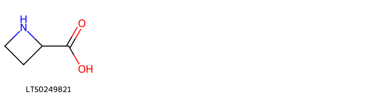{ width=100% }
    <figcaption>Hình ảnh cấu trúc hóa học của 1 hoạt chất thuộc nhóm Carboxylic acids and derivatives gồm ['azetidine-2-carboxylic acid (LTS0249821)'].</figcaption>
</figure>
#### Nhóm Flavonoids
<figure markdown="span">
    { width=100% }
    <figcaption>Hình ảnh cấu trúc hóa học của 2 hoạt chất thuộc nhóm Flavonoids gồm ['hesperidin (LTS0261835)', 'hesperidin (LTS0011065)'].</figcaption>
</figure>
#### Nhóm Homoisoflavonoids
<figure markdown="span">
    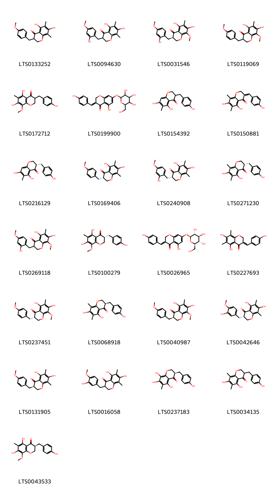{ width=100% }
    <figcaption>Hình ảnh cấu trúc hóa học của 25 hoạt chất thuộc nhóm Homoisoflavonoids gồm ['5,7-dihydroxy-3-[(4-methoxyphenyl)methyl]-6,8-dimethyl-2,3-dihydro-1-benzopyran-4-one (LTS0133252)', '5,7-dihydroxy-3-[(2-hydroxy-4-methoxyphenyl)methyl]-6,8-dimethyl-2,3-dihydro-1-benzopyran-4-one (LTS0094630)', '(3r)-5,7-dihydroxy-3-[(2-hydroxy-4-methoxyphenyl)methyl]-8-methoxy-6-methyl-2,3-dihydro-1-benzopyran-4-one (LTS0031546)', '5,7-dihydroxy-8-methoxy-3-[(4-methoxyphenyl)methyl]-6-methyl-2,3-dihydro-1-benzopyran-4-one (LTS0119069)', '5,7-dihydroxy-3-[(4-hydroxyphenyl)methyl]-8-methoxy-6-methyl-2,3-dihydro-1-benzopyran-4-one (LTS0172712)', '5-hydroxy-3-[(4-hydroxyphenyl)methylidene]-7-{[3,4,5-trihydroxy-6-(hydroxymethyl)oxan-2-yl]oxy}-2h-1-benzopyran-4-one (LTS0199900)', '5,7-dihydroxy-3-[(4-hydroxyphenyl)methyl]-6-methyl-2,3-dihydro-1-benzopyran-4-one (LTS0154392)', '5,7-dihydroxy-3-[(4-hydroxyphenyl)methylidene]-6,8-dimethyl-2h-1-benzopyran-4-one (LTS0150881)', '(3s)-5,7-dihydroxy-3-[(4-hydroxyphenyl)methyl]-6-methyl-2,3-dihydro-1-benzopyran-4-one (LTS0216129)', '(3s)-5,7-dihydroxy-3-[(4-methoxyphenyl)methyl]-6,8-dimethyl-2,3-dihydro-1-benzopyran-4-one (LTS0169406)', '(3s)-5,7-dihydroxy-3-[(2-hydroxy-4-methoxyphenyl)methyl]-6,8-dimethyl-2,3-dihydro-1-benzopyran-4-one (LTS0240908)', '(3s)-5,7-dihydroxy-3-[(4-hydroxyphenyl)methyl]-6,8-dimethyl-2,3-dihydro-1-benzopyran-4-one (LTS0271230)', '5,7-dihydroxy-3-[(2-hydroxy-4-methoxyphenyl)methyl]-8-methoxy-6-methyl-2,3-dihydro-1-benzopyran-4-one (LTS0269118)', '(3r)-5,7-dihydroxy-3-[(4-hydroxyphenyl)methyl]-8-methoxy-6-methyl-2,3-dihydro-1-benzopyran-4-one (LTS0100279)', '(3e)-5-hydroxy-3-[(4-hydroxyphenyl)methylidene]-7-{[(2s,3r,4s,5s,6r)-3,4,5-trihydroxy-6-(hydroxymethyl)oxan-2-yl]oxy}-2h-1-benzopyran-4-one (LTS0026965)', '(3e)-5,7-dihydroxy-3-[(4-hydroxyphenyl)methylidene]-6,8-dimethyl-2h-1-benzopyran-4-one (LTS0227693)', '(3s)-5,7-dihydroxy-8-methoxy-3-[(4-methoxyphenyl)methyl]-6-methyl-2,3-dihydro-1-benzopyran-4-one (LTS0237451)', '(3r)-5,7-dihydroxy-3-[(4-hydroxyphenyl)methyl]-6,8-dimethyl-2,3-dihydro-1-benzopyran-4-one (LTS0068918)', '(3r)-5,7-dihydroxy-8-methoxy-3-[(4-methoxyphenyl)methyl]-6-methyl-2,3-dihydro-1-benzopyran-4-one (LTS0040987)', '(3s)-5,7-dihydroxy-3-[(3-hydroxy-4-methoxyphenyl)methyl]-6,8-dimethyl-2,3-dihydro-1-benzopyran-4-one (LTS0042646)', '(3r)-5,7-dihydroxy-3-[(4-methoxyphenyl)methyl]-6,8-dimethyl-2,3-dihydro-1-benzopyran-4-one (LTS0131905)', '5,7-dihydroxy-3-[(3-hydroxy-4-methoxyphenyl)methyl]-6,8-dimethyl-2,3-dihydro-1-benzopyran-4-one (LTS0016058)', '(3r)-5,7,8-trihydroxy-3-[(4-hydroxyphenyl)methyl]-6-methyl-2,3-dihydro-1-benzopyran-4-one (LTS0237183)', '5,7-dihydroxy-3-[(4-hydroxyphenyl)methyl]-6,8-dimethyl-2,3-dihydro-1-benzopyran-4-one (LTS0034135)', '(3s)-5,7-dihydroxy-3-[(4-hydroxyphenyl)methyl]-8-methoxy-6-methyl-2,3-dihydro-1-benzopyran-4-one (LTS0043533)'].</figcaption>
</figure>
#### Nhóm Isoflavonoids
<figure markdown="span">
    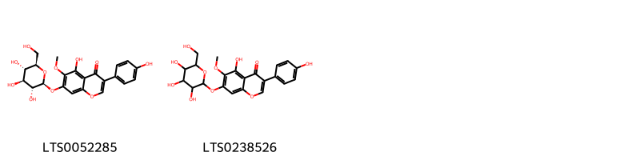{ width=100% }
    <figcaption>Hình ảnh cấu trúc hóa học của 2 hoạt chất thuộc nhóm Isoflavonoids gồm ['tectoridin (LTS0052285)', '5-hydroxy-3-(4-hydroxyphenyl)-6-methoxy-7-{[3,4,5-trihydroxy-6-(hydroxymethyl)oxan-2-yl]oxy}chromen-4-one (LTS0238526)'].</figcaption>
</figure>
#### Nhóm Steroids and steroid derivatives
<figure markdown="span">
    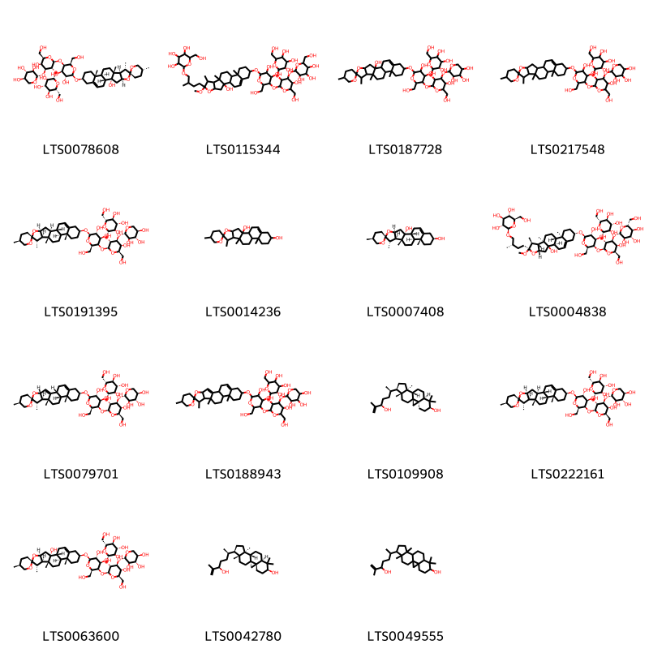{ width=100% }
    <figcaption>Hình ảnh cấu trúc hóa học của 15 hoạt chất thuộc nhóm Steroids and steroid derivatives gồm ["(2s,3r,4s,5s,6r)-2-{[(2s,3r,4s,5r,6r)-2-{[(2r,3r,4r,5r,6r)-4,5-dihydroxy-2-(hydroxymethyl)-6-[(1'r,2r,2'r,4's,5r,7's,8'r,9'r,12's,13'r,16's)-5,7',9',13'-tetramethyl-5'-oxaspiro[oxane-2,6'-pentacyclo[10.8.0.0²,⁹.0⁴,⁸.0¹³,¹⁸]icosan]-18'-en-2'-oloxy]oxan-3-yl]oxy}-5-hydroxy-6-(hydroxymethyl)-4-{[(2s,3r,4s,5r)-3,4,5-trihydroxyoxan-2-yl]oxy}oxan-3-yl]oxy}-6-(hydroxymethyl)oxane-3,4,5-triol (LTS0078608)", '2-(4-{16-[(3,4-dihydroxy-5-{[5-hydroxy-6-(hydroxymethyl)-3,4-bis({[3,4,5-trihydroxy-6-(hydroxymethyl)oxan-2-yl]oxy})oxan-2-yl]oxy}-6-(hydroxymethyl)oxan-2-yl)oxy]-2-hydroxy-6-methoxy-7,9,13-trimethyl-5-oxapentacyclo[10.8.0.0²,⁹.0⁴,⁸.0¹³,¹⁸]icos-18-en-6-yl}-2-methylbutoxy)-6-(hydroxymethyl)oxane-3,4,5-triol (LTS0115344)', "2-[(2-{[4,5-dihydroxy-2-(hydroxymethyl)-6-{5,7',9',13'-tetramethyl-5'-oxaspiro[oxane-2,6'-pentacyclo[10.8.0.0²,⁹.0⁴,⁸.0¹³,¹⁸]icosan]-18'-en-2'-oloxy}oxan-3-yl]oxy}-5-hydroxy-6-(hydroxymethyl)-4-[(3,4,5-trihydroxyoxan-2-yl)oxy]oxan-3-yl)oxy]-6-(hydroxymethyl)oxane-3,4,5-triol (LTS0187728)", "2-[(2-{[4,5-dihydroxy-2-(hydroxymethyl)-6-{5,7',9',13'-tetramethyl-5'-oxaspiro[oxane-2,6'-pentacyclo[10.8.0.0²,⁹.0⁴,⁸.0¹³,¹⁸]icosan]-18'-eneoxy}oxan-3-yl]oxy}-5-hydroxy-6-(hydroxymethyl)-4-[(3,4,5-trihydroxyoxan-2-yl)oxy]oxan-3-yl)oxy]-6-(hydroxymethyl)oxane-3,4,5-triol (LTS0217548)", "(2s,3r,4s,5s,6r)-2-{[(2s,3r,4s,5r,6r)-2-{[(2r,3r,4r,5r,6r)-4,5-dihydroxy-2-(hydroxymethyl)-6-[(1's,2r,2's,4's,5s,7's,8'r,9's,12's,13'r,16's)-5,7',9',13'-tetramethyl-5'-oxaspiro[oxane-2,6'-pentacyclo[10.8.0.0²,⁹.0⁴,⁸.0¹³,¹⁸]icosan]-18'-eneoxy]oxan-3-yl]oxy}-5-hydroxy-6-(hydroxymethyl)-4-{[(2s,3r,4s,5r)-3,4,5-trihydroxyoxan-2-yl]oxy}oxan-3-yl]oxy}-6-(hydroxymethyl)oxane-3,4,5-triol (LTS0191395)", "5,7',9',13'-tetramethyl-5'-oxaspiro[oxane-2,6'-pentacyclo[10.8.0.0²,⁹.0⁴,⁸.0¹³,¹⁸]icosan]-18'-ene-2',16'-diol (LTS0014236)", "(1'r,2r,2'r,4's,5s,7's,8'r,9'r,12's,13'r,16's)-5,7',9',13'-tetramethyl-5'-oxaspiro[oxane-2,6'-pentacyclo[10.8.0.0²,⁹.0⁴,⁸.0¹³,¹⁸]icosan]-18'-ene-2',16'-diol (LTS0007408)", '(2r,3r,4s,5s,6r)-2-[(2s)-4-[(1r,2r,4s,6r,7s,8r,9r,12s,13r,16s)-16-{[(2r,3r,4r,5r,6r)-3,4-dihydroxy-5-{[(2s,3r,4s,5r,6r)-5-hydroxy-6-(hydroxymethyl)-3,4-bis({[(2s,3r,4s,5s,6r)-3,4,5-trihydroxy-6-(hydroxymethyl)oxan-2-yl]oxy})oxan-2-yl]oxy}-6-(hydroxymethyl)oxan-2-yl]oxy}-2-hydroxy-6-methoxy-7,9,13-trimethyl-5-oxapentacyclo[10.8.0.0²,⁹.0⁴,⁸.0¹³,¹⁸]icos-18-en-6-yl]-2-methylbutoxy]-6-(hydroxymethyl)oxane-3,4,5-triol (LTS0004838)', "(2s,3r,4s,5s,6r)-2-{[(2s,3r,4s,5r,6r)-2-{[(2r,3r,4r,5r,6r)-4,5-dihydroxy-2-(hydroxymethyl)-6-[(1'r,2r,4'r,5s,7's,8'r,9'r,12'r,13'r,16's)-5,7',9',13'-tetramethyl-5'-oxaspiro[oxane-2,6'-pentacyclo[10.8.0.0²,⁹.0⁴,⁸.0¹³,¹⁸]icosane]-2',18'-dieneoxy]oxan-3-yl]oxy}-5-hydroxy-6-(hydroxymethyl)-4-{[(2s,3r,4s,5r)-3,4,5-trihydroxyoxan-2-yl]oxy}oxan-3-yl]oxy}-6-(hydroxymethyl)oxane-3,4,5-triol (LTS0079701)", "2-[(2-{[4,5-dihydroxy-2-(hydroxymethyl)-6-{5,7',9',13'-tetramethyl-5'-oxaspiro[oxane-2,6'-pentacyclo[10.8.0.0²,⁹.0⁴,⁸.0¹³,¹⁸]icosane]-2',18'-dieneoxy}oxan-3-yl]oxy}-5-hydroxy-6-(hydroxymethyl)-4-[(3,4,5-trihydroxyoxan-2-yl)oxy]oxan-3-yl)oxy]-6-(hydroxymethyl)oxane-3,4,5-triol (LTS0188943)", '(1s,3r,6s,8r,11s,12s,15r,16r)-15-[(2r,5r)-5-hydroxy-6-methylhept-6-en-2-yl]-7,7,12,16-tetramethylpentacyclo[9.7.0.0¹,³.0³,⁸.0¹²,¹⁶]octadecan-6-ol (LTS0109908)', "(2s,3r,4s,5s,6r)-2-{[(2s,3r,4s,5r,6r)-2-{[(2r,3r,4r,5r,6r)-4,5-dihydroxy-2-(hydroxymethyl)-6-[(1's,2r,2's,4's,5s,7's,8'r,9's,12'r,13'r,16's)-5,7',9',13'-tetramethyl-5'-oxaspiro[oxane-2,6'-pentacyclo[10.8.0.0²,⁹.0⁴,⁸.0¹³,¹⁸]icosan]-18'-eneoxy]oxan-3-yl]oxy}-5-hydroxy-6-(hydroxymethyl)-4-{[(2s,3r,4s,5r)-3,4,5-trihydroxyoxan-2-yl]oxy}oxan-3-yl]oxy}-6-(hydroxymethyl)oxane-3,4,5-triol (LTS0222161)", "(2s,3r,4s,5s,6r)-2-{[(2s,3r,4s,5r,6r)-2-{[(2r,3r,4r,5r,6r)-4,5-dihydroxy-2-(hydroxymethyl)-6-[(1'r,2r,2'r,4's,5s,7's,8'r,9'r,12's,13'r,16's)-5,7',9',13'-tetramethyl-5'-oxaspiro[oxane-2,6'-pentacyclo[10.8.0.0²,⁹.0⁴,⁸.0¹³,¹⁸]icosan]-18'-en-2'-oloxy]oxan-3-yl]oxy}-5-hydroxy-6-(hydroxymethyl)-4-{[(2s,3r,4s,5r)-3,4,5-trihydroxyoxan-2-yl]oxy}oxan-3-yl]oxy}-6-(hydroxymethyl)oxane-3,4,5-triol (LTS0063600)", '(1r,3s,6s,8r,11s,12s,15r,16r)-15-[(2r,5r)-5-hydroxy-6-methylhept-6-en-2-yl]-7,7,12,16-tetramethylpentacyclo[9.7.0.0¹,³.0³,⁸.0¹²,¹⁶]octadecan-6-ol (LTS0042780)', '15-(5-hydroxy-6-methylhept-6-en-2-yl)-7,7,12,16-tetramethylpentacyclo[9.7.0.0¹,³.0³,⁸.0¹²,¹⁶]octadecan-6-ol (LTS0049555)'].</figcaption>
</figure>

---

### Dược dân tộc học

Danh sách các quốc gia có sử dụng *Polygonatum odoratum* trong điều trị các bệnh. 

| Country   | Disease   | Bệnh               |
|:----------|:----------|:-------------------|
| Elsewhere | Tonic     | (thuộc) trương lực |
| Japan     | Tonic     | (thuộc) trương lực |

---

---
## Polygonatum officinale
### Thông tin về thực vật

!!! info "Phân loại thực vật của *Polygonatum odoratum* từ GIBF:"
    - **Kingdom:** Plantae
    - **Phylum:** Tracheophyta
    - **Order:** Asparagales
    - **Family:** Asparagaceae
    - **Genus:** Polygonatum
    - **Species:** *Polygonatum odoratum*

 

| Label (VI)   | Label (EN)   | Scientific Name        | Descriptions (VI)   | Descriptions (EN)   | Also Known As (VI)   | Also Known As (EN)   |
|:-------------|:-------------|:-----------------------|:--------------------|:--------------------|:---------------------|:---------------------|
| N/A          | N/A          | Polygonatum officinale | loài thực vật       | species of plant    | ['']                 | ['']                 |

#### Phân bố trên thế giới

**Từ CSDL GIBF** nan, Mongolia, Czechia, Finland, China, Korea (Democratic People’s Republic of), Spain, Netherlands, Poland, United States of America, Russian Federation, unknown or invalid, Estonia, Belgium, Luxembourg, Germany, Austria, Latvia, Ukraine, Italy, Switzerland, France

#### Phân bố tại Việt Nam

**Từ CSDL GIBF**: Không có ghi nhận ở Việt Nam

---
### Thành phần hóa học
        
- Theo cơ sở dữ liệu lotus: Từ loài *Polygonatum odoratum* đã phân lập và xác định được Chưa có hoạt chất nào được phân lập. hoạt chất thuộc về các nhóm Không có hoạt chất nào được phân lập. 

Không có hình ảnh nào được tạo ra

---

### Dược dân tộc học

Danh sách các quốc gia có sử dụng *Polygonatum odoratum* trong điều trị các bệnh. 

| Country   | Disease                                             | Bệnh                                                              |
|:----------|:----------------------------------------------------|:------------------------------------------------------------------|
| China     | Demulcent, Refrigerant, Sedative, Tonic             | Demulcent, Refrigerant, An thần, Thuốc bổ                         |
| Elsewhere | Cardiotonic                                         | Tim mạch                                                          |
| Turkey    | Demulcent, Refrigerant, Tonic, Astringent, Sedative | Chất làm dịu, Chất làm lạnh, Thuốc bổ, Chất làm se, Thuốc an thần |

---

---
## Polygonatum verticillatum
### Thông tin về thực vật

!!! info "Phân loại thực vật của *Polygonatum verticillatum* từ GIBF:"
    - **Kingdom:** Plantae
    - **Phylum:** Tracheophyta
    - **Order:** Asparagales
    - **Family:** Asparagaceae
    - **Genus:** Polygonatum
    - **Species:** *Polygonatum verticillatum*

 

| Label (VI)   | Label (EN)   | Scientific Name           | Descriptions (VI)   | Descriptions (EN)   | Also Known As (VI)   | Also Known As (EN)   |
|:-------------|:-------------|:--------------------------|:--------------------|:--------------------|:---------------------|:---------------------|
| N/A          | N/A          | Polygonatum verticillatum | loài thực vật       | species of plant    | ['']                 | ['']                 |

#### Phân bố trên thế giới

**Từ CSDL GIBF** Czechia, Sweden, Slovenia, Spain, Poland, Netherlands, Montenegro, Denmark, Romania, Russian Federation, Croatia, Lithuania, Norway, Belgium, Serbia, Luxembourg, Germany, Austria, Slovakia, Ukraine, Italy, Switzerland, France

#### Phân bố tại Việt Nam

**Từ CSDL GIBF**: Không có ghi nhận ở Việt Nam

---
### Thành phần hóa học
        
- Theo cơ sở dữ liệu lotus: Từ loài *Polygonatum verticillatum* đã phân lập và xác định được Chưa có hoạt chất nào được phân lập. hoạt chất thuộc về các nhóm Không có hoạt chất nào được phân lập. 

Không có hình ảnh nào được tạo ra

---

### Dược dân tộc học

Danh sách các quốc gia có sử dụng *Polygonatum verticillatum* trong điều trị các bệnh. 

| Country   | Disease          | Bệnh                      |
|:----------|:-----------------|:--------------------------|
| India     | Diuretic, Poison | Thuốc lợi tiểu, thuốc độc |

---

# Chi Eurycles

??? note "Danh sách các dược liệu thuộc chi"
    
	 - *Eurycles amboinensis*

---
## Eurycles amboinensis
### Thông tin về thực vật

!!! info "Phân loại thực vật của *Proiphys amboinensis* từ GIBF:"
    - **Kingdom:** Plantae
    - **Phylum:** Tracheophyta
    - **Order:** Asparagales
    - **Family:** Amaryllidaceae
    - **Genus:** Proiphys
    - **Species:** *Proiphys amboinensis*

 

| Label (VI)   | Label (EN)   | Scientific Name      | Descriptions (VI)   | Descriptions (EN)   | Also Known As (VI)   | Also Known As (EN)   |
|:-------------|:-------------|:---------------------|:--------------------|:--------------------|:---------------------|:---------------------|
| N/A          | N/A          | Eurycles amboinensis |                     |                     | ['']                 | ['']                 |

#### Phân bố trên thế giới

**Từ CSDL GIBF** Czechia, Sweden, Slovenia, Spain, Poland, Netherlands, Montenegro, Denmark, Romania, Russian Federation, Croatia, Lithuania, Norway, Belgium, Serbia, Luxembourg, Germany, Austria, Slovakia, Ukraine, Italy, Switzerland, France

#### Phân bố tại Việt Nam

**Từ CSDL GIBF**: Không có ghi nhận ở Việt Nam

---
### Thành phần hóa học
        
- Theo cơ sở dữ liệu lotus: Từ loài *Proiphys amboinensis* đã phân lập và xác định được Chưa có hoạt chất nào được phân lập. hoạt chất thuộc về các nhóm Không có hoạt chất nào được phân lập. 

Không có hình ảnh nào được tạo ra

---

### Dược dân tộc học

Danh sách các quốc gia có sử dụng *Proiphys amboinensis* trong điều trị các bệnh. 

| Country   | Disease   | Bệnh   |
|:----------|:----------|:-------|
| Java      | Emetic    | Phôi   |

---

# Chi Haemanthus

??? note "Danh sách các dược liệu thuộc chi"
    
	 - *Haemanthus coccineus*
	 - *Haemanthus multiflorus*
	 - *Haemanthus natalensis*

---
## Haemanthus coccineus
### Thông tin về thực vật

!!! info "Phân loại thực vật của *Haemanthus coccineus* từ GIBF:"
    - **Kingdom:** Plantae
    - **Phylum:** Tracheophyta
    - **Order:** Asparagales
    - **Family:** Amaryllidaceae
    - **Genus:** Haemanthus
    - **Species:** *Haemanthus coccineus*

 

| Label (VI)   | Label (EN)   | Scientific Name      | Descriptions (VI)   | Descriptions (EN)   | Also Known As (VI)   | Also Known As (EN)           |
|:-------------|:-------------|:---------------------|:--------------------|:--------------------|:---------------------|:-----------------------------|
| N/A          | N/A          | Haemanthus coccineus | loài thực vật       | species of plant    | ['']                 | ['Paintbrush', 'April fool'] |

#### Phân bố trên thế giới

**Từ CSDL GIBF** Australia, nan, New Zealand, South Africa

#### Phân bố tại Việt Nam

**Từ CSDL GIBF**: Không có ghi nhận ở Việt Nam

---
### Thành phần hóa học
        
- Theo cơ sở dữ liệu lotus: Từ loài *Haemanthus coccineus* đã phân lập và xác định được 3 hoạt chất thuộc về các nhóm Amaryllidaceae alkaloids, Benzazepines. 

|    | chemicalTaxonomyClassyfireClass   |   smiles_count |
|---:|:----------------------------------|---------------:|
|  0 |                                   |              1 |
|  1 | Amaryllidaceae alkaloids          |              1 |
|  2 | Benzazepines                      |              1 |

#### Nhóm 
<figure markdown="span">
    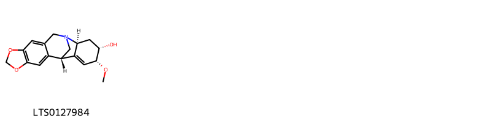{ width=100% }
    <figcaption>Hình ảnh cấu trúc hóa học của 1 hoạt chất thuộc nhóm  gồm ['(1s,13s,15s,16r)-16-methoxy-5,7-dioxa-12-azapentacyclo[10.6.1.0²,¹⁰.0⁴,⁸.0¹³,¹⁸]nonadeca-2,4(8),9,17-tetraen-15-ol (LTS0127984)'].</figcaption>
</figure>
#### Nhóm Amaryllidaceae alkaloids
<figure markdown="span">
    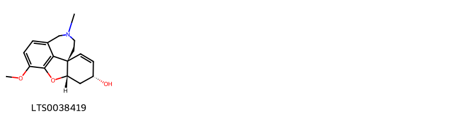{ width=100% }
    <figcaption>Hình ảnh cấu trúc hóa học của 1 hoạt chất thuộc nhóm Amaryllidaceae alkaloids gồm ['galantamine (LTS0038419)'].</figcaption>
</figure>
#### Nhóm Benzazepines
<figure markdown="span">
    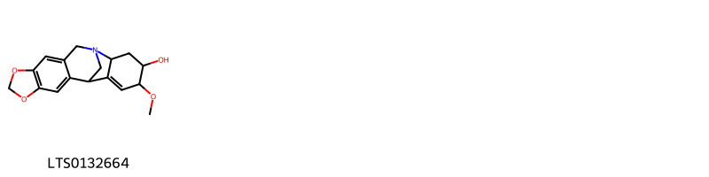{ width=100% }
    <figcaption>Hình ảnh cấu trúc hóa học của 1 hoạt chất thuộc nhóm Benzazepines gồm ['16-methoxy-5,7-dioxa-12-azapentacyclo[10.6.1.0²,¹⁰.0⁴,⁸.0¹³,¹⁸]nonadeca-2,4(8),9,17-tetraen-15-ol (LTS0132664)'].</figcaption>
</figure>

---

### Dược dân tộc học

Danh sách các quốc gia có sử dụng *Haemanthus coccineus* trong điều trị các bệnh. 

| Country   | Disease               | Bệnh                     |
|:----------|:----------------------|:-------------------------|
| Elsewhere | Expectorant, Diuretic | Thuốc long đờm, lợi tiểu |

---

---
## Haemanthus multiflorus
### Thông tin về thực vật

!!! info "Phân loại thực vật của *Haemanthus multiflorus* từ GIBF:"
    - **Kingdom:** Plantae
    - **Phylum:** Tracheophyta
    - **Order:** Asparagales
    - **Family:** Amaryllidaceae
    - **Genus:** Haemanthus
    - **Species:** *Haemanthus multiflorus*

 

| Label (VI)   | Label (EN)   | Scientific Name        | Descriptions (VI)   | Descriptions (EN)   | Also Known As (VI)   | Also Known As (EN)   |
|:-------------|:-------------|:-----------------------|:--------------------|:--------------------|:---------------------|:---------------------|
| N/A          | N/A          | Haemanthus multiflorus | loài thực vật       | species of plant    | ['']                 | ['']                 |

#### Phân bố trên thế giới

**Từ CSDL GIBF** nan, Benin, Congo, Democratic Republic of the, Kenya, Rwanda, Senegal, Eswatini, China, Tanzania, United Republic of, France, Guinea, Ghana

#### Phân bố tại Việt Nam

**Từ CSDL GIBF**: Không có ghi nhận ở Việt Nam

---
### Thành phần hóa học
        
- Theo cơ sở dữ liệu lotus: Từ loài *Haemanthus multiflorus* đã phân lập và xác định được 24 hoạt chất thuộc về các nhóm Benzazepines, Quinolines and derivatives, Amaryllidaceae alkaloids. 

|    | chemicalTaxonomyClassyfireClass   |   smiles_count |
|---:|:----------------------------------|---------------:|
|  0 |                                   |              1 |
|  1 | Amaryllidaceae alkaloids          |             13 |
|  2 | Benzazepines                      |              1 |
|  3 | Quinolines and derivatives        |              9 |

#### Nhóm 
<figure markdown="span">
    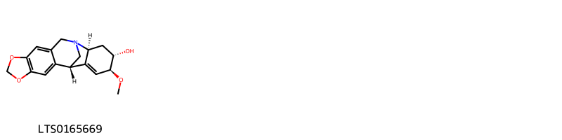{ width=100% }
    <figcaption>Hình ảnh cấu trúc hóa học của 1 hoạt chất thuộc nhóm  gồm ['(1s,13s,15s,16s)-16-methoxy-5,7-dioxa-12-azapentacyclo[10.6.1.0²,¹⁰.0⁴,⁸.0¹³,¹⁸]nonadeca-2,4(8),9,17-tetraen-15-ol (LTS0165669)'].</figcaption>
</figure>
#### Nhóm Amaryllidaceae alkaloids
<figure markdown="span">
    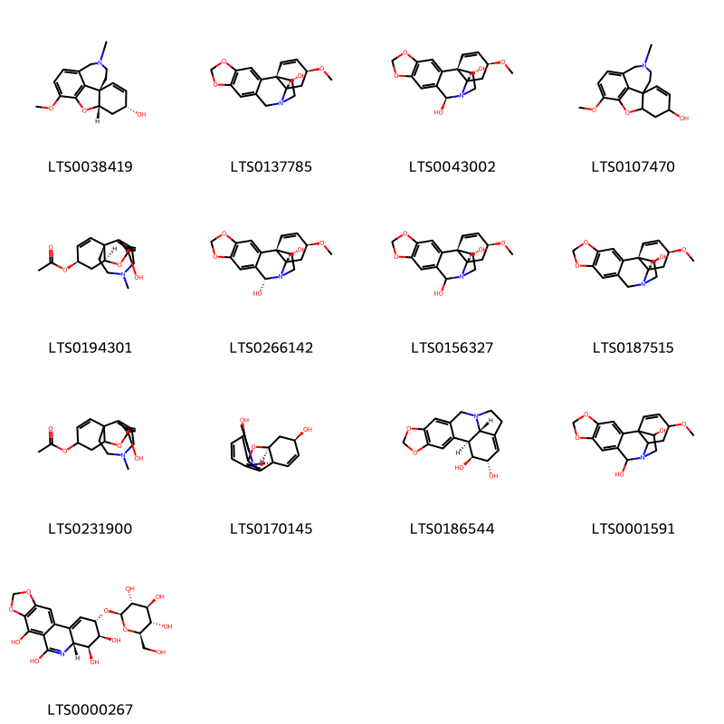{ width=100% }
    <figcaption>Hình ảnh cấu trúc hóa học của 13 hoạt chất thuộc nhóm Amaryllidaceae alkaloids gồm ['galantamine (LTS0038419)', 'haemanthamine (LTS0137785)', '(1s,11s,13s,15s,18s)-15-methoxy-5,7-dioxa-12-azapentacyclo[10.5.2.0¹,¹³.0²,¹⁰.0⁴,⁸]nonadeca-2,4(8),9,16-tetraene-11,18-diol (LTS0043002)', 'galantamine (LTS0107470)', '(1r,12s,14r)-9-hydroxy-4-methyl-11-oxa-4-azatetracyclo[8.6.1.0¹,¹².0⁶,¹⁷]heptadeca-6,8,10(17),15-tetraen-14-yl acetate (LTS0194301)', '(1s,11r,13s,15s,18s)-15-methoxy-5,7-dioxa-12-azapentacyclo[10.5.2.0¹,¹³.0²,¹⁰.0⁴,⁸]nonadeca-2,4(8),9,16-tetraene-11,18-diol (LTS0266142)', '(1s,13s,15s,18s)-15-methoxy-5,7-dioxa-12-azapentacyclo[10.5.2.0¹,¹³.0²,¹⁰.0⁴,⁸]nonadeca-2,4(8),9,16-tetraene-11,18-diol (LTS0156327)', 'haemanthamine (LTS0187515)', '9-hydroxy-4-methyl-11-oxa-4-azatetracyclo[8.6.1.0¹,¹².0⁶,¹⁷]heptadeca-6,8,10(17),15-tetraen-14-yl acetate (LTS0231900)', 'o-desmethylgalantamine (LTS0170145)', 'lycorine (LTS0186544)', '15-methoxy-5,7-dioxa-12-azapentacyclo[10.5.2.0¹,¹³.0²,¹⁰.0⁴,⁸]nonadeca-2,4(8),9,16-tetraene-11,18-diol (LTS0001591)', 'kalbreclasine (LTS0000267)'].</figcaption>
</figure>
#### Nhóm Benzazepines
<figure markdown="span">
    { width=100% }
    <figcaption>Hình ảnh cấu trúc hóa học của 1 hoạt chất thuộc nhóm Benzazepines gồm ['16-methoxy-5,7-dioxa-12-azapentacyclo[10.6.1.0²,¹⁰.0⁴,⁸.0¹³,¹⁸]nonadeca-2,4(8),9,17-tetraen-15-ol (LTS0132664)'].</figcaption>
</figure>
#### Nhóm Quinolines and derivatives
<figure markdown="span">
    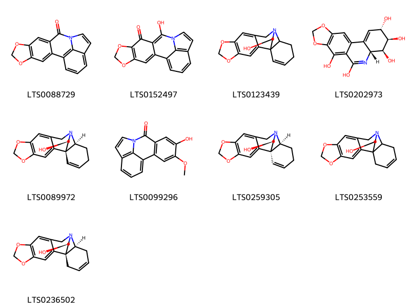{ width=100% }
    <figcaption>Hình ảnh cấu trúc hóa học của 9 hoạt chất thuộc nhóm Quinolines and derivatives gồm ['5,7-dioxa-12-azapentacyclo[10.6.1.0²,¹⁰.0⁴,⁸.0¹⁵,¹⁹]nonadeca-1(19),2(10),3,8,13,15,17-heptaen-11-one (LTS0088729)', '11-hydroxy-5,7-dioxa-12-azapentacyclo[10.6.1.0²,¹⁰.0⁴,⁸.0¹⁵,¹⁹]nonadeca-1(18),2,4(8),10,13,15(19),16-heptaen-9-one (LTS0152497)', '5,7-dioxa-12-azapentacyclo[10.5.2.0¹,¹³.0²,¹⁰.0⁴,⁸]nonadeca-2,4(8),9,16-tetraen-18-ol (LTS0123439)', 'lycoricidinol (LTS0202973)', '(1s,13s,18s)-5,7-dioxa-12-azapentacyclo[10.5.2.0¹,¹³.0²,¹⁰.0⁴,⁸]nonadeca-2,4(8),9,16-tetraen-18-ol (LTS0089972)', '5-hydroxy-4-methoxy-9-azatetracyclo[7.6.1.0²,⁷.0¹²,¹⁶]hexadeca-1(15),2(7),3,5,10,12(16),13-heptaen-8-one (LTS0099296)', '(1r,13s,18s)-5,7-dioxa-12-azapentacyclo[10.5.2.0¹,¹³.0²,¹⁰.0⁴,⁸]nonadeca-2,4(8),9,16-tetraen-18-ol (LTS0259305)', '5,7-dioxa-12-azapentacyclo[10.5.2.0¹,¹³.0²,¹⁰.0⁴,⁸]nonadeca-2,4(8),9,15-tetraen-18-ol (LTS0253559)', '(1s,13s,18s)-5,7-dioxa-12-azapentacyclo[10.5.2.0¹,¹³.0²,¹⁰.0⁴,⁸]nonadeca-2,4(8),9,15-tetraen-18-ol (LTS0236502)'].</figcaption>
</figure>

---

### Dược dân tộc học

Danh sách các quốc gia có sử dụng *Haemanthus multiflorus* trong điều trị các bệnh. 

| Country   | Disease   | Bệnh          |
|:----------|:----------|:--------------|
| Africa    | Piscicide | Thuốc diệt cá |

---

---
## Haemanthus natalensis
### Thông tin về thực vật

!!! info "Phân loại thực vật của *Scadoxus puniceus* từ GIBF:"
    - **Kingdom:** Plantae
    - **Phylum:** Tracheophyta
    - **Order:** Asparagales
    - **Family:** Amaryllidaceae
    - **Genus:** Scadoxus
    - **Species:** *Scadoxus puniceus*

 

| Label (VI)   | Label (EN)   | Scientific Name       | Descriptions (VI)   | Descriptions (EN)   | Also Known As (VI)   | Also Known As (EN)   |
|:-------------|:-------------|:----------------------|:--------------------|:--------------------|:---------------------|:---------------------|
| N/A          | N/A          | Haemanthus natalensis |                     | species of plant    | ['']                 | ['']                 |

#### Phân bố trên thế giới

**Từ CSDL GIBF** nan, United States of America, South Africa

#### Phân bố tại Việt Nam

**Từ CSDL GIBF**: Không có ghi nhận ở Việt Nam

---
### Thành phần hóa học
        
- Theo cơ sở dữ liệu lotus: Từ loài *Scadoxus puniceus* đã phân lập và xác định được Chưa có hoạt chất nào được phân lập. hoạt chất thuộc về các nhóm Không có hoạt chất nào được phân lập. 

Không có hình ảnh nào được tạo ra

---

### Dược dân tộc học

Danh sách các quốc gia có sử dụng *Scadoxus puniceus* trong điều trị các bệnh. 

| Country   | Disease             | Bệnh             |
|:----------|:--------------------|:-----------------|
| Elsewhere | Emetic, Expectorant | Emetic, long đờm |

---

# Chi Fritillaria

??? note "Danh sách các dược liệu thuộc chi"
    
	 - *Fritillaria imperialis*
	 - *Fritillaria meleagris*
	 - *Fritillaria roylei*
	 - *Fritillaria thunbergii*
	 - *Fritillaria verticillata*

---
## Fritillaria imperialis
### Thông tin về thực vật

!!! info "Phân loại thực vật của *Fritillaria imperialis* từ GIBF:"
    - **Kingdom:** Plantae
    - **Phylum:** Tracheophyta
    - **Order:** Liliales
    - **Family:** Liliaceae
    - **Genus:** Fritillaria
    - **Species:** *Fritillaria imperialis*

 

| Label (VI)   | Label (EN)   | Scientific Name        | Descriptions (VI)   | Descriptions (EN)   | Also Known As (VI)   | Also Known As (EN)   |
|:-------------|:-------------|:-----------------------|:--------------------|:--------------------|:---------------------|:---------------------|
| N/A          | N/A          | Fritillaria imperialis |                     | species of plant    | ['']                 | ['']                 |

#### Phân bố trên thế giới

**Từ CSDL GIBF** Austria, United States of America, Norway, Czechia, Sweden, Iran (Islamic Republic of), Belgium, France, Russian Federation, India, Türkiye, Switzerland, Germany, Denmark, Netherlands

#### Phân bố tại Việt Nam

**Từ CSDL GIBF**: Không có ghi nhận ở Việt Nam

---
### Thành phần hóa học
        
- Theo cơ sở dữ liệu lotus: Từ loài *Fritillaria imperialis* đã phân lập và xác định được 38 hoạt chất thuộc về các nhóm Piperidines, Prenol lipids, Steroids and steroid derivatives. 

|    | chemicalTaxonomyClassyfireClass   |   smiles_count |
|---:|:----------------------------------|---------------:|
|  0 | Piperidines                       |             15 |
|  1 | Prenol lipids                     |              1 |
|  2 | Steroids and steroid derivatives  |             21 |

#### Nhóm Piperidines
<figure markdown="span">
    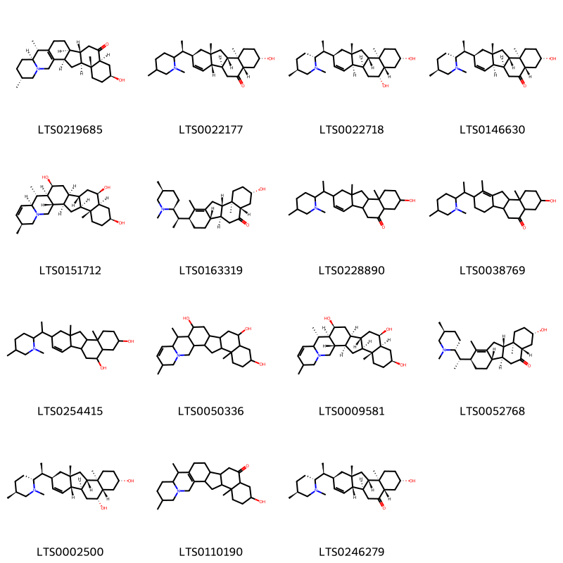{ width=100% }
    <figcaption>Hình ảnh cấu trúc hóa học của 15 hoạt chất thuộc nhóm Piperidines gồm ['(1r,6r,9s,10r,14s,15s,18s,20s,23r,24s)-20-hydroxy-6,10,23-trimethyl-4-azahexacyclo[12.11.0.0²,¹¹.0⁴,⁹.0¹⁵,²⁴.0¹⁸,²³]pentacos-2(11)-en-17-one (LTS0219685)', '(3s,4as,6ar,6bs,9s,10ar,11as,11br)-9-[(1s)-1-(1,5-dimethylpiperidin-2-yl)ethyl]-3-hydroxy-10a,11b-dimethyl-1h,2h,3h,4h,4ah,6h,6ah,6bh,9h,10h,11h,11ah-cyclohexa[a]fluoren-5-one (LTS0022177)', '(3s,4as,5r,6ar,6br,9s,10ar,11as,11br)-9-[(1s)-1-[(2r,5s)-1,5-dimethylpiperidin-2-yl]ethyl]-10a,11b-dimethyl-1h,2h,3h,4h,4ah,5h,6h,6ah,6bh,9h,10h,11h,11ah-cyclohexa[a]fluorene-3,5-diol (LTS0022718)', '(3s,4as,6ar,6br,9s,10ar,11as,11br)-9-[(1s)-1-[(2r,5s)-1,5-dimethylpiperidin-2-yl]ethyl]-3-hydroxy-10a,11b-dimethyl-1h,2h,3h,4h,4ah,6h,6ah,6bh,9h,10h,11h,11ah-cyclohexa[a]fluoren-5-one (LTS0146630)', '(1r,2s,6s,9s,10r,11s,12s,14s,15s,17r,18s,20s,23r,24s)-6,10,23-trimethyl-4-azahexacyclo[12.11.0.0²,¹¹.0⁴,⁹.0¹⁵,²⁴.0¹⁸,²³]pentacos-7-ene-12,17,20-triol (LTS0151712)', '(3s,4as,6ar,6bs,9s,11as,11br)-9-[(1r)-1-[(2s,5s)-1,5-dimethylpiperidin-2-yl]ethyl]-3-hydroxy-10,11b-dimethyl-1h,2h,3h,4h,4ah,6h,6ah,6bh,7h,8h,9h,11h,11ah-cyclohexa[a]fluoren-5-one (LTS0163319)', '9-[1-(1,5-dimethylpiperidin-2-yl)ethyl]-3-hydroxy-10a,11b-dimethyl-1h,2h,3h,4h,4ah,6h,6ah,6bh,9h,10h,11h,11ah-cyclohexa[a]fluoren-5-one (LTS0228890)', '9-[1-(1,5-dimethylpiperidin-2-yl)ethyl]-3-hydroxy-10,11b-dimethyl-1h,2h,3h,4h,4ah,6h,6ah,6bh,7h,8h,9h,11h,11ah-cyclohexa[a]fluoren-5-one (LTS0038769)', '9-[1-(1,5-dimethylpiperidin-2-yl)ethyl]-10a,11b-dimethyl-1h,2h,3h,4h,4ah,5h,6h,6ah,6bh,9h,10h,11h,11ah-cyclohexa[a]fluorene-3,5-diol (LTS0254415)', '6,10,23-trimethyl-4-azahexacyclo[12.11.0.0²,¹¹.0⁴,⁹.0¹⁵,²⁴.0¹⁸,²³]pentacos-7-ene-12,17,20-triol (LTS0050336)', '(1r,2s,10r,11s,12s,14s,15s,17r,18s,20s,23r,24s)-6,10,23-trimethyl-4-azahexacyclo[12.11.0.0²,¹¹.0⁴,⁹.0¹⁵,²⁴.0¹⁸,²³]pentacos-7-ene-12,17,20-triol (LTS0009581)', '(3s,4as,6ar,6bs,9s,11as,11br)-9-[(1s)-1-[(2r,5s)-1,5-dimethylpiperidin-2-yl]ethyl]-3-hydroxy-10,11b-dimethyl-1h,2h,3h,4h,4ah,6h,6ah,6bh,7h,8h,9h,11h,11ah-cyclohexa[a]fluoren-5-one (LTS0052768)', '(3s,4as,5r,6ar,6bs,9s,10ar,11as,11br)-9-[(1s)-1-[(2r,5s)-1,5-dimethylpiperidin-2-yl]ethyl]-10a,11b-dimethyl-1h,2h,3h,4h,4ah,5h,6h,6ah,6bh,9h,10h,11h,11ah-cyclohexa[a]fluorene-3,5-diol (LTS0002500)', '20-hydroxy-6,10,23-trimethyl-4-azahexacyclo[12.11.0.0²,¹¹.0⁴,⁹.0¹⁵,²⁴.0¹⁸,²³]pentacos-2(11)-en-17-one (LTS0110190)', '(3s,4as,6ar,6bs,9s,10ar,11as,11br)-9-[(1s)-1-[(2r,5s)-1,5-dimethylpiperidin-2-yl]ethyl]-3-hydroxy-10a,11b-dimethyl-1h,2h,3h,4h,4ah,6h,6ah,6bh,9h,10h,11h,11ah-cyclohexa[a]fluoren-5-one (LTS0246279)'].</figcaption>
</figure>
#### Nhóm Prenol lipids
<figure markdown="span">
    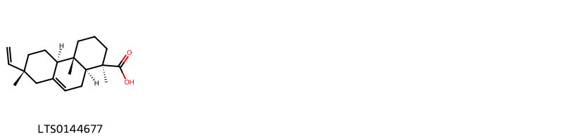{ width=100% }
    <figcaption>Hình ảnh cấu trúc hóa học của 1 hoạt chất thuộc nhóm Prenol lipids gồm ['(1r,4as,4br,7r,10as)-7-ethenyl-1,4a,7-trimethyl-3,4,4b,5,6,8,10,10a-octahydro-2h-phenanthrene-1-carboxylic acid (LTS0144677)'].</figcaption>
</figure>
#### Nhóm Steroids and steroid derivatives
<figure markdown="span">
    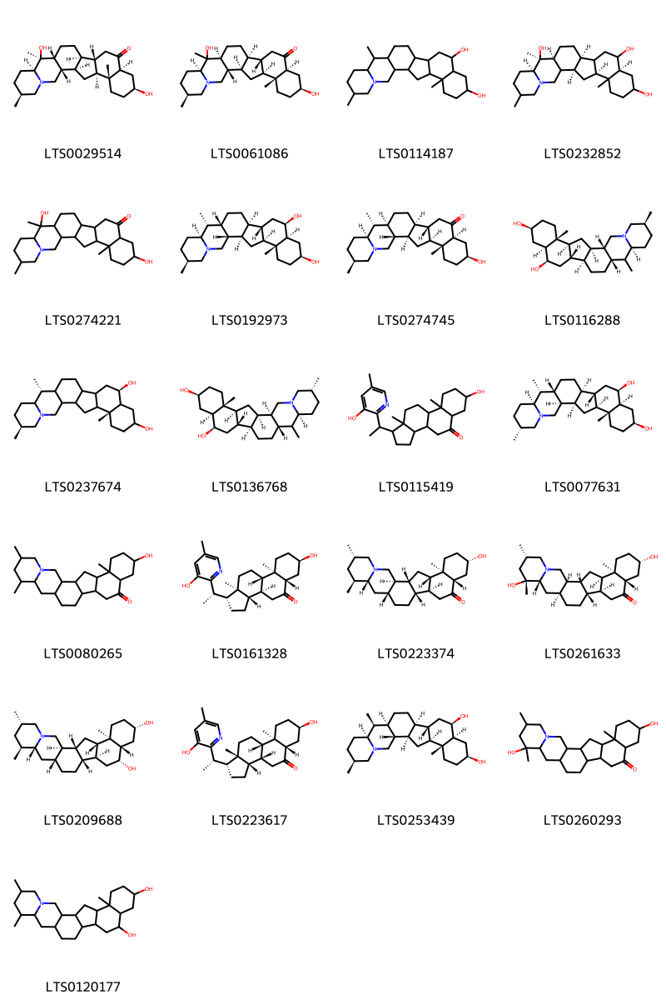{ width=100% }
    <figcaption>Hình ảnh cấu trúc hóa học của 21 hoạt chất thuộc nhóm Steroids and steroid derivatives gồm ['imperialin (LTS0029514)', '(1r,2s,6s,9s,11s,14s,15s,18s,20s,23r,24s)-10,20-dihydroxy-6,10,23-trimethyl-4-azahexacyclo[12.11.0.0²,¹¹.0⁴,⁹.0¹⁵,²⁴.0¹⁸,²³]pentacosan-17-one (LTS0061086)', '6,10,23-trimethyl-4-azahexacyclo[12.11.0.0²,¹¹.0⁴,⁹.0¹⁵,²⁴.0¹⁸,²³]pentacosane-17,20-diol (LTS0114187)', '(1r,9s,10s,11s,14s,18s,24s)-6,10,23-trimethyl-4-azahexacyclo[12.11.0.0²,¹¹.0⁴,⁹.0¹⁵,²⁴.0¹⁸,²³]pentacosane-10,17,20-triol (LTS0232852)', '10,20-dihydroxy-6,10,23-trimethyl-4-azahexacyclo[12.11.0.0²,¹¹.0⁴,⁹.0¹⁵,²⁴.0¹⁸,²³]pentacosan-17-one (LTS0274221)', '(1r,2s,6s,9s,10r,11r,14s,15s,17r,18s,20s,23r,24s)-6,10,23-trimethyl-4-azahexacyclo[12.11.0.0²,¹¹.0⁴,⁹.0¹⁵,²⁴.0¹⁸,²³]pentacosane-17,20-diol (LTS0192973)', '(1r,2s,6s,9s,10r,11s,14s,15s,18s,20s,23r,24s)-20-hydroxy-6,10,23-trimethyl-4-azahexacyclo[12.11.0.0²,¹¹.0⁴,⁹.0¹⁵,²⁴.0¹⁸,²³]pentacosan-17-one (LTS0274745)', '(1r,2s,6s,9s,11r,14s,15s,17r,18s,20s,23r,24s)-6,10,23-trimethyl-4-azahexacyclo[12.11.0.0²,¹¹.0⁴,⁹.0¹⁵,²⁴.0¹⁸,²³]pentacosane-17,20-diol (LTS0116288)', '(6s,10r,17r,23r)-6,10,23-trimethyl-4-azahexacyclo[12.11.0.0²,¹¹.0⁴,⁹.0¹⁵,²⁴.0¹⁸,²³]pentacosane-17,20-diol (LTS0237674)', '(1r,2r,6r,9s,11r,14s,15s,17r,18s,20s,23r,24s)-6,10,23-trimethyl-4-azahexacyclo[12.11.0.0²,¹¹.0⁴,⁹.0¹⁵,²⁴.0¹⁸,²³]pentacosane-17,20-diol (LTS0136768)', '7-hydroxy-1-[1-(3-hydroxy-5-methylpyridin-2-yl)ethyl]-9a,11a-dimethyl-tetradecahydrocyclopenta[a]phenanthren-5-one (LTS0115419)', '(1r,2r,6r,9s,10r,11r,14s,15s,17r,18s,20s,23r,24s)-6,10,23-trimethyl-4-azahexacyclo[12.11.0.0²,¹¹.0⁴,⁹.0¹⁵,²⁴.0¹⁸,²³]pentacosane-17,20-diol (LTS0077631)', '20-hydroxy-6,8,23-trimethyl-4-azahexacyclo[12.11.0.0²,¹¹.0⁴,⁹.0¹⁵,²⁴.0¹⁸,²³]pentacosan-17-one (LTS0080265)', '(1r,3as,3bs,5as,7r,9ar,9bs,11as)-7-hydroxy-1-[(1s)-1-(3-hydroxy-5-methylpyridin-2-yl)ethyl]-9a,11a-dimethyl-tetradecahydrocyclopenta[a]phenanthren-5-one (LTS0161328)', '(1r,2r,6s,8s,9r,11r,14s,15s,18s,20s,23r,24s)-20-hydroxy-6,8,23-trimethyl-4-azahexacyclo[12.11.0.0²,¹¹.0⁴,⁹.0¹⁵,²⁴.0¹⁸,²³]pentacosan-17-one (LTS0223374)', '(1r,2r,6s,8r,9r,11s,14s,15s,18s,20s,23r,24r)-8,20-dihydroxy-6,8,23-trimethyl-4-azahexacyclo[12.11.0.0²,¹¹.0⁴,⁹.0¹⁵,²⁴.0¹⁸,²³]pentacosan-17-one (LTS0261633)', '(1r,2r,6s,8s,9r,11r,14s,15s,17r,18s,20s,23r,24s)-6,8,23-trimethyl-4-azahexacyclo[12.11.0.0²,¹¹.0⁴,⁹.0¹⁵,²⁴.0¹⁸,²³]pentacosane-17,20-diol (LTS0209688)', '(1r,3as,3br,5as,7r,9ar,9bs,11ar)-7-hydroxy-1-[(1s)-1-(3-hydroxy-5-methylpyridin-2-yl)ethyl]-9a,11a-dimethyl-tetradecahydrocyclopenta[a]phenanthren-5-one (LTS0223617)', '(1r,2s,6s,9s,10s,11s,14s,15s,17r,18s,20s,23r,24s)-6,10,23-trimethyl-4-azahexacyclo[12.11.0.0²,¹¹.0⁴,⁹.0¹⁵,²⁴.0¹⁸,²³]pentacosane-17,20-diol (LTS0253439)', '8,20-dihydroxy-6,8,23-trimethyl-4-azahexacyclo[12.11.0.0²,¹¹.0⁴,⁹.0¹⁵,²⁴.0¹⁸,²³]pentacosan-17-one (LTS0260293)', '6,8,23-trimethyl-4-azahexacyclo[12.11.0.0²,¹¹.0⁴,⁹.0¹⁵,²⁴.0¹⁸,²³]pentacosane-17,20-diol (LTS0120177)'].</figcaption>
</figure>

---

### Dược dân tộc học

Danh sách các quốc gia có sử dụng *Fritillaria imperialis* trong điều trị các bệnh. 

| Country   | Disease                     | Bệnh                                   |
|:----------|:----------------------------|:---------------------------------------|
| India     | Diuretic, Emollient, Poison | Thuốc lợi tiểu, chất làm mềm, chất độc |
| Iraq      | Diuretic                    | Thuốc lợi tiêu                         |
| Kurdistan | Emollient                   | Chỉnh thị                              |
| Turkey    | Poison                      | Chất độc                               |

---

---
## Fritillaria meleagris
### Thông tin về thực vật

!!! info "Phân loại thực vật của *Fritillaria meleagris* từ GIBF:"
    - **Kingdom:** Plantae
    - **Phylum:** Tracheophyta
    - **Order:** Liliales
    - **Family:** Liliaceae
    - **Genus:** Fritillaria
    - **Species:** *Fritillaria meleagris*

 

| Label (VI)   | Label (EN)   | Scientific Name       | Descriptions (VI)   | Descriptions (EN)   | Also Known As (VI)   | Also Known As (EN)   |
|:-------------|:-------------|:----------------------|:--------------------|:--------------------|:---------------------|:---------------------|
| N/A          | N/A          | Fritillaria meleagris | loài thực vật       | species of plant    | ['']                 | ['']                 |

#### Phân bố trên thế giới

**Từ CSDL GIBF** Austria, Hungary, United States of America, Sweden, France, Ukraine, Croatia, Slovenia, Germany, United Kingdom of Great Britain and Northern Ireland, Ireland, Netherlands

#### Phân bố tại Việt Nam

**Từ CSDL GIBF**: Không có ghi nhận ở Việt Nam

---
### Thành phần hóa học
        
- Theo cơ sở dữ liệu lotus: Từ loài *Fritillaria meleagris* đã phân lập và xác định được Chưa có hoạt chất nào được phân lập. hoạt chất thuộc về các nhóm Không có hoạt chất nào được phân lập. 

Không có hình ảnh nào được tạo ra

---

### Dược dân tộc học

Danh sách các quốc gia có sử dụng *Fritillaria meleagris* trong điều trị các bệnh. 

| Country   | Disease   | Bệnh     |
|:----------|:----------|:---------|
| Europe    | Poison    | Chất độc |

---

---
## Fritillaria roylei
### Thông tin về thực vật

!!! info "Phân loại thực vật của *Fritillaria cirrhosa* từ GIBF:"
    - **Kingdom:** Plantae
    - **Phylum:** Tracheophyta
    - **Order:** Liliales
    - **Family:** Liliaceae
    - **Genus:** Fritillaria
    - **Species:** *Fritillaria cirrhosa*

 

| Label (VI)   | Label (EN)   | Scientific Name    | Descriptions (VI)   | Descriptions (EN)   | Also Known As (VI)   | Also Known As (EN)   |
|:-------------|:-------------|:-------------------|:--------------------|:--------------------|:---------------------|:---------------------|
| N/A          | N/A          | Fritillaria roylei | loài thực vật       | species of plant    | ['']                 | ['']                 |

#### Phân bố trên thế giới

**Từ CSDL GIBF** nan, Norway, Uzbekistan, Nepal, Pakistan, China, Myanmar, India

#### Phân bố tại Việt Nam

**Từ CSDL GIBF**: Không có ghi nhận ở Việt Nam

---
### Thành phần hóa học
        
- Theo cơ sở dữ liệu lotus: Từ loài *Fritillaria cirrhosa* đã phân lập và xác định được Chưa có hoạt chất nào được phân lập. hoạt chất thuộc về các nhóm Không có hoạt chất nào được phân lập. 

Không có hình ảnh nào được tạo ra

---

### Dược dân tộc học

Danh sách các quốc gia có sử dụng *Fritillaria cirrhosa* trong điều trị các bệnh. 

| Country   | Disease     | Bệnh           |
|:----------|:------------|:---------------|
| China     | Expectorant | Thuốc long đàm |
| India     | Poison      | Chất độc       |

---

---
## Fritillaria thunbergii
### Thông tin về thực vật

!!! info "Phân loại thực vật của *Fritillaria thunbergii* từ GIBF:"
    - **Kingdom:** Plantae
    - **Phylum:** Tracheophyta
    - **Order:** Liliales
    - **Family:** Liliaceae
    - **Genus:** Fritillaria
    - **Species:** *Fritillaria thunbergii*

 

| Label (VI)   | Label (EN)   | Scientific Name        | Descriptions (VI)   | Descriptions (EN)   | Also Known As (VI)   | Also Known As (EN)   |
|:-------------|:-------------|:-----------------------|:--------------------|:--------------------|:---------------------|:---------------------|
| N/A          | N/A          | Fritillaria thunbergii | loài thực vật       | species of plant    | ['']                 | ['']                 |

#### Phân bố trên thế giới

**Từ CSDL GIBF** nan, Japan, Norway, Korea, Republic of, China, Netherlands

#### Phân bố tại Việt Nam

**Từ CSDL GIBF**: Không có ghi nhận ở Việt Nam

---
### Thành phần hóa học
        
- Theo cơ sở dữ liệu lotus: Từ loài *Fritillaria thunbergii* đã phân lập và xác định được 61 hoạt chất thuộc về các nhóm Piperidines, Purine nucleosides, Steroids and steroid derivatives, Imidazopyrimidines, Pyrimidine nucleosides, Prenol lipids. 

|    | chemicalTaxonomyClassyfireClass   |   smiles_count |
|---:|:----------------------------------|---------------:|
|  0 | Imidazopyrimidines                |              1 |
|  1 | Piperidines                       |              2 |
|  2 | Prenol lipids                     |             17 |
|  3 | Purine nucleosides                |              1 |
|  4 | Pyrimidine nucleosides            |              2 |
|  5 | Steroids and steroid derivatives  |             35 |

#### Nhóm Imidazopyrimidines
<figure markdown="span">
    { width=100% }
    <figcaption>Hình ảnh cấu trúc hóa học của 1 hoạt chất thuộc nhóm Imidazopyrimidines gồm ['stella polaris (LTS0179440)'].</figcaption>
</figure>
#### Nhóm Piperidines
<figure markdown="span">
    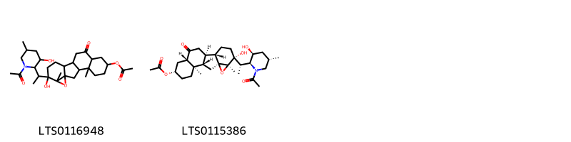{ width=100% }
    <figcaption>Hình ảnh cấu trúc hóa học của 2 hoạt chất thuộc nhóm Piperidines gồm ['5-[1-(1-acetyl-3-hydroxy-5-methylpiperidin-2-yl)ethyl]-5-hydroxy-6,11-dimethyl-17-oxo-7-oxapentacyclo[8.8.0.0²,⁸.0⁶,⁸.0¹¹,¹⁶]octadecan-14-yl acetate (LTS0116948)', '(1r,2s,5r,6r,8s,10s,11r,14s,16s)-5-[(1s)-1-[(2s,3s,5s)-1-acetyl-3-hydroxy-5-methylpiperidin-2-yl]ethyl]-5-hydroxy-6,11-dimethyl-17-oxo-7-oxapentacyclo[8.8.0.0²,⁸.0⁶,⁸.0¹¹,¹⁶]octadecan-14-yl acetate (LTS0115386)'].</figcaption>
</figure>
#### Nhóm Prenol lipids
<figure markdown="span">
    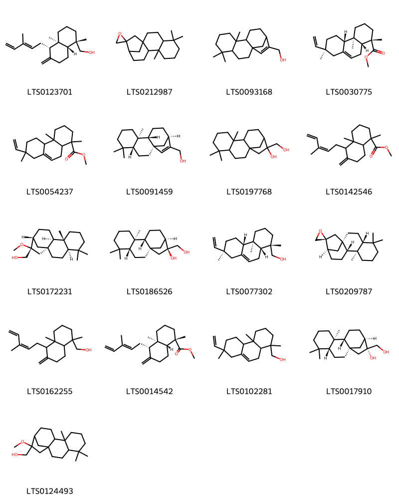{ width=100% }
    <figcaption>Hình ảnh cấu trúc hóa học của 17 hoạt chất thuộc nhóm Prenol lipids gồm ['[(1s,4ar,5s,8ar)-1,4a-dimethyl-6-methylidene-5-[(2e)-3-methylpenta-2,4-dien-1-yl]-hexahydro-2h-naphthalen-1-yl]methanol (LTS0123701)', "5',5',9'-trimethylspiro[oxirane-2,14'-tetracyclo[11.2.1.0¹,¹⁰.0⁴,⁹]hexadecane] (LTS0212987)", '{5,5,9-trimethyltetracyclo[11.2.1.0¹,¹⁰.0⁴,⁹]hexadec-14-en-14-yl}methanol (LTS0093168)', 'methyl (1s,4ar,4bs,7s,10ar)-7-ethenyl-1,4a,7-trimethyl-3,4,4b,5,6,8,10,10a-octahydro-2h-phenanthrene-1-carboxylate (LTS0030775)', 'methyl 7-ethenyl-1,4a,7-trimethyl-3,4,4b,5,6,8,10,10a-octahydro-2h-phenanthrene-1-carboxylate (LTS0054237)', '[(1s,4r,9r,10s,13r)-5,5,9-trimethyltetracyclo[11.2.1.0¹,¹⁰.0⁴,⁹]hexadec-14-en-14-yl]methanol (LTS0091459)', '14-(hydroxymethyl)-5,5,9-trimethyltetracyclo[11.2.1.0¹,¹⁰.0⁴,⁹]hexadecan-14-ol (LTS0197768)', 'methyl 1,4a-dimethyl-6-methylidene-5-(3-methylpenta-2,4-dien-1-yl)-hexahydro-2h-naphthalene-1-carboxylate (LTS0142546)', '[(1s,4r,9r,10r,13r,14s)-14-methoxy-5,5,9-trimethyltetracyclo[11.2.1.0¹,¹⁰.0⁴,⁹]hexadecan-14-yl]methanol (LTS0172231)', '(1s,4r,9r,10r,13r,14s)-14-(hydroxymethyl)-5,5,9-trimethyltetracyclo[11.2.1.0¹,¹⁰.0⁴,⁹]hexadecan-14-ol (LTS0186526)', '[(1s,4ar,4bs,7s,10ar)-7-ethenyl-1,4a,7-trimethyl-3,4,4b,5,6,8,10,10a-octahydro-2h-phenanthren-1-yl]methanol (LTS0077302)', "(1's,2r,4'r,9'r,10'r,13'r)-5',5',9'-trimethylspiro[oxirane-2,14'-tetracyclo[11.2.1.0¹,¹⁰.0⁴,⁹]hexadecane] (LTS0209787)", '[1,4a-dimethyl-6-methylidene-5-(3-methylpenta-2,4-dien-1-yl)-hexahydro-2h-naphthalen-1-yl]methanol (LTS0162255)', 'methyl (1s,4ar,5s,8ar)-1,4a-dimethyl-6-methylidene-5-[(2e)-3-methylpenta-2,4-dien-1-yl]-hexahydro-2h-naphthalene-1-carboxylate (LTS0014542)', '(7-ethenyl-1,4a,7-trimethyl-3,4,4b,5,6,8,10,10a-octahydro-2h-phenanthren-1-yl)methanol (LTS0102281)', '(1s,4r,9r,10r,13r,14r)-14-(hydroxymethyl)-5,5,9-trimethyltetracyclo[11.2.1.0¹,¹⁰.0⁴,⁹]hexadecan-14-ol (LTS0017910)', '{14-methoxy-5,5,9-trimethyltetracyclo[11.2.1.0¹,¹⁰.0⁴,⁹]hexadecan-14-yl}methanol (LTS0124493)'].</figcaption>
</figure>
#### Nhóm Purine nucleosides
<figure markdown="span">
    { width=100% }
    <figcaption>Hình ảnh cấu trúc hóa học của 1 hoạt chất thuộc nhóm Purine nucleosides gồm ['(-)-inosine (LTS0273582)'].</figcaption>
</figure>
#### Nhóm Pyrimidine nucleosides
<figure markdown="span">
    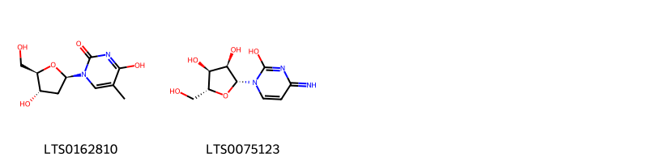{ width=100% }
    <figcaption>Hình ảnh cấu trúc hóa học của 2 hoạt chất thuộc nhóm Pyrimidine nucleosides gồm ['thymidine (LTS0162810)', 'cytidine (LTS0075123)'].</figcaption>
</figure>
#### Nhóm Steroids and steroid derivatives
<figure markdown="span">
    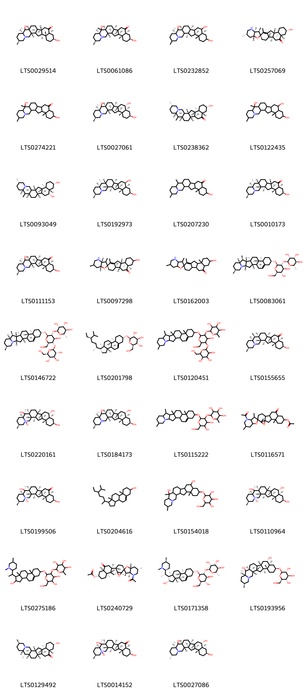{ width=100% }
    <figcaption>Hình ảnh cấu trúc hóa học của 35 hoạt chất thuộc nhóm Steroids and steroid derivatives gồm ['imperialin (LTS0029514)', '(1r,2s,6s,9s,11s,14s,15s,18s,20s,23r,24s)-10,20-dihydroxy-6,10,23-trimethyl-4-azahexacyclo[12.11.0.0²,¹¹.0⁴,⁹.0¹⁵,²⁴.0¹⁸,²³]pentacosan-17-one (LTS0061086)', '(1r,9s,10s,11s,14s,18s,24s)-6,10,23-trimethyl-4-azahexacyclo[12.11.0.0²,¹¹.0⁴,⁹.0¹⁵,²⁴.0¹⁸,²³]pentacosane-10,17,20-triol (LTS0232852)', "(3s,3'r,3'as,4as,6's,6ar,6bs,7'ar,9r,11as,11br)-3-hydroxy-3',6',10,11b-tetramethyl-1,2,3,3'a,4,4',4a,5',6,6',6a,6b,7,7',7'a,8,11,11a-octadecahydro-3'h-spiro[cyclohexa[a]fluorene-9,2'-furo[3,2-b]pyridin]-5-one (LTS0257069)", '10,20-dihydroxy-6,10,23-trimethyl-4-azahexacyclo[12.11.0.0²,¹¹.0⁴,⁹.0¹⁵,²⁴.0¹⁸,²³]pentacosan-17-one (LTS0274221)', 'verticine (LTS0027061)', '(1r,2s,6s,9s,11s,14s,15s,18s,20s,23r,24s)-20-hydroxy-6,10,23-trimethyl-4-azahexacyclo[12.11.0.0²,¹¹.0⁴,⁹.0¹⁵,²⁴.0¹⁸,²³]pentacosan-17-one (LTS0238362)', '6,10,23-trimethyl-4-azahexacyclo[12.11.0.0²,¹¹.0⁴,⁹.0¹⁵,²⁴.0¹⁸,²³]pentacosane-10,17,20-triol (LTS0122435)', '(1r,2s,6s,9s,11s,14s,15s,17r,18s,20s,23r,24s)-6,10,23-trimethyl-4-azahexacyclo[12.11.0.0²,¹¹.0⁴,⁹.0¹⁵,²⁴.0¹⁸,²³]pentacosane-17,20-diol (LTS0093049)', '(1r,2s,6s,9s,10r,11r,14s,15s,17r,18s,20s,23r,24s)-6,10,23-trimethyl-4-azahexacyclo[12.11.0.0²,¹¹.0⁴,⁹.0¹⁵,²⁴.0¹⁸,²³]pentacosane-17,20-diol (LTS0192973)', '20-hydroxy-6,10,23-trimethyl-4-azahexacyclo[12.11.0.0²,¹¹.0⁴,⁹.0¹⁵,²⁴.0¹⁸,²³]pentacosan-17-one (LTS0207230)', '(1r,2s,6s,9s,10r,11r,15s,18s,20s,23r,24s)-20-hydroxy-6,10,23-trimethyl-4-azahexacyclo[12.11.0.0²,¹¹.0⁴,⁹.0¹⁵,²⁴.0¹⁸,²³]pentacosan-17-one (LTS0010173)', 'verticinone (LTS0111153)', "(3'ar,4ar,6as,6br,7'ar,9r,11as,11br)-3-hydroxy-3',6',10,11b-tetramethyl-1,2,3,3'a,4,4',4a,5',6,6',6a,6b,7,7',7'a,8,11,11a-octadecahydro-3'h-spiro[cyclohexa[a]fluorene-9,2'-furo[3,2-b]pyridin]-5-one (LTS0097298)", "3-hydroxy-3',6',10,11b-tetramethyl-1,2,3,3'a,4,4',4a,5',6,6',6a,6b,7,7',7'a,8,11,11a-octadecahydro-3'h-spiro[cyclohexa[a]fluorene-9,2'-furo[3,2-b]pyridin]-5-one (LTS0162003)", 'β-chaconine (LTS0083061)', '(2s,3r,4s,5s,6r)-2-{[(2r,3s,4s,5r,6r)-4-hydroxy-2-(hydroxymethyl)-6-{[(1s,2s,7s,10r,11s,14s,15r,16s,17r,20s,23s)-10,14,16,20-tetramethyl-22-azahexacyclo[12.10.0.0²,¹¹.0⁵,¹⁰.0¹⁵,²³.0¹⁷,²²]tetracos-4-en-7-yl]oxy}-5-{[(2s,3r,4r,5r,6s)-3,4,5-trihydroxy-6-methyloxan-2-yl]oxy}oxan-3-yl]oxy}-6-(hydroxymethyl)oxane-3,4,5-triol (LTS0146722)', 'sitogluside (LTS0201798)', '2-{[4-hydroxy-2-(hydroxymethyl)-6-({10,14,16,20-tetramethyl-22-azahexacyclo[12.10.0.0²,¹¹.0⁵,¹⁰.0¹⁵,²³.0¹⁷,²²]tetracos-4-en-7-yl}oxy)-5-[(3,4,5-trihydroxy-6-methyloxan-2-yl)oxy]oxan-3-yl]oxy}-6-(hydroxymethyl)oxane-3,4,5-triol (LTS0120451)', '(1r,2s,6s,9s,10s,11s,14s,15s,18s,20s,23r,24s)-20-hydroxy-6,10,23-trimethyl-4-azahexacyclo[12.11.0.0²,¹¹.0⁴,⁹.0¹⁵,²⁴.0¹⁸,²³]pentacosan-17-one (LTS0155655)', '(1r,2s,6s,9s,10s,11s,14r,15s,17s,18s,20s,23r,24s)-10,17,20-trihydroxy-6,10,23-trimethyl-4-azahexacyclo[12.11.0.0²,¹¹.0⁴,⁹.0¹⁵,²⁴.0¹⁸,²³]pentacosan-4-ium-4-olate (LTS0220161)', '(1r,2s,6s,9r,10s,11s,14s,15s,17s,18s,20s,23r,24s)-6,10,23-trimethyl-4-azahexacyclo[12.11.0.0²,¹¹.0⁴,⁹.0¹⁵,²⁴.0¹⁸,²³]pentacosane-10,17,20-triol (LTS0184173)', '2-{[4,5-dihydroxy-6-(hydroxymethyl)-2-({10,14,16,20-tetramethyl-22-azahexacyclo[12.10.0.0²,¹¹.0⁵,¹⁰.0¹⁵,²³.0¹⁷,²²]tetracos-4-en-7-yl}oxy)oxan-3-yl]oxy}-6-methyloxane-3,4,5-triol (LTS0115222)', "4-acetyl-3,6,6',11'-tetramethyl-17'-oxo-hexahydro-7'-oxaspiro[furo[3,2-b]pyridine-2,5'-pentacyclo[8.8.0.0²,⁸.0⁶,⁸.0¹¹,¹⁶]octadecan]-14'-yl acetate (LTS0116571)", '(1r,2s,4s,6s,9s,10s,11s,14s,15s,18s,20s,23r,24s)-10,20-dihydroxy-6,10,23-trimethyl-17-oxo-4-azahexacyclo[12.11.0.0²,¹¹.0⁴,⁹.0¹⁵,²⁴.0¹⁸,²³]pentacosan-4-ium-4-olate (LTS0199506)', 'stigmast-5-en-3-ol, (3β)- (LTS0204616)', '2-({10,17-dihydroxy-6,10,23-trimethyl-4-azahexacyclo[12.11.0.0²,¹¹.0⁴,⁹.0¹⁵,²⁴.0¹⁸,²³]pentacosan-20-yl}oxy)-6-(hydroxymethyl)oxane-3,4,5-triol (LTS0154018)', '(1r,2s,4s,6s,9s,10s,11s,14r,15s,17s,18s,20s,23r,24s)-10,17,20-trihydroxy-6,10,23-trimethyl-4-azahexacyclo[12.11.0.0²,¹¹.0⁴,⁹.0¹⁵,²⁴.0¹⁸,²³]pentacosan-4-ium-4-olate (LTS0110964)', '2-{[2-({1-[1-(1,5-dimethylpiperidin-2-yl)ethyl]-2-hydroxy-9a,11a-dimethyl-1h,2h,3h,3ah,3bh,4h,6h,7h,8h,9h,9bh,10h,11h-cyclopenta[a]phenanthren-7-yl}oxy)-4,5-dihydroxy-6-(hydroxymethyl)oxan-3-yl]oxy}-6-methyloxane-3,4,5-triol (LTS0275186)', "(1'r,2r,2's,3r,3as,6s,6's,7ar,8's,10's,11'r,14's,16's)-4-acetyl-3,6,6',11'-tetramethyl-17'-oxo-hexahydro-7'-oxaspiro[furo[3,2-b]pyridine-2,5'-pentacyclo[8.8.0.0²,⁸.0⁶,⁸.0¹¹,¹⁶]octadecan]-14'-yl acetate (LTS0240729)", '(2s,3r,4r,5r,6s)-2-{[(2r,3r,4s,5s,6r)-2-{[(1r,2s,3as,3bs,7s,9ar,9bs,11as)-1-[(1s)-1-[(2s,5s)-1,5-dimethylpiperidin-2-yl]ethyl]-2-hydroxy-9a,11a-dimethyl-1h,2h,3h,3ah,3bh,4h,6h,7h,8h,9h,9bh,10h,11h-cyclopenta[a]phenanthren-7-yl]oxy}-4,5-dihydroxy-6-(hydroxymethyl)oxan-3-yl]oxy}-6-methyloxane-3,4,5-triol (LTS0171358)', '(2r,3r,4s,5s,6r)-2-{[(1s,2s,6s,9r,10s,11s,14s,15s,17s,18s,20s,23r,24s)-10,17-dihydroxy-6,10,23-trimethyl-4-azahexacyclo[12.11.0.0²,¹¹.0⁴,⁹.0¹⁵,²⁴.0¹⁸,²³]pentacosan-20-yl]oxy}-6-(hydroxymethyl)oxane-3,4,5-triol (LTS0193956)', '(1r,2s,6r,9s,10s,11s,14s,15s,18s,20s,23r,24s)-20-hydroxy-6,10,23-trimethyl-4-azahexacyclo[12.11.0.0²,¹¹.0⁴,⁹.0¹⁵,²⁴.0¹⁸,²³]pentacosan-17-one (LTS0129492)', '(1r,2s,6s,9s,10s,11s,14s,15s,18s,20s,23r,24s)-10,20-dihydroxy-6,10,23-trimethyl-17-oxo-4-azahexacyclo[12.11.0.0²,¹¹.0⁴,⁹.0¹⁵,²⁴.0¹⁸,²³]pentacosan-4-ium-4-olate (LTS0014152)', 'zhebeinine (LTS0027086)'].</figcaption>
</figure>

---

### Dược dân tộc học

Danh sách các quốc gia có sử dụng *Fritillaria thunbergii* trong điều trị các bệnh. 

| Country   | Disease    | Bệnh      |
|:----------|:-----------|:----------|
| China     | Antiemetic | Chống nôn |

---

---
## Fritillaria verticillata
### Thông tin về thực vật

!!! info "Phân loại thực vật của *Fritillaria verticillata* từ GIBF:"
    - **Kingdom:** Plantae
    - **Phylum:** Tracheophyta
    - **Order:** Liliales
    - **Family:** Liliaceae
    - **Genus:** Fritillaria
    - **Species:** *Fritillaria verticillata*

 

| Label (VI)   | Label (EN)   | Scientific Name          | Descriptions (VI)   | Descriptions (EN)   | Also Known As (VI)   | Also Known As (EN)   |
|:-------------|:-------------|:-------------------------|:--------------------|:--------------------|:---------------------|:---------------------|
| N/A          | N/A          | Fritillaria verticillata | loài thực vật       | species of plant    | ['']                 | ['']                 |

#### Phân bố trên thế giới

**Từ CSDL GIBF** nan, Japan, Tajikistan, Uzbekistan, Sweden, Belgium, Kyrgyzstan, China, Russian Federation, Kazakhstan, India, unknown or invalid

#### Phân bố tại Việt Nam

**Từ CSDL GIBF**: Không có ghi nhận ở Việt Nam

---
### Thành phần hóa học
        
- Theo cơ sở dữ liệu lotus: Từ loài *Fritillaria verticillata* đã phân lập và xác định được 7 hoạt chất thuộc về các nhóm Steroids and steroid derivatives. 

|    | chemicalTaxonomyClassyfireClass   |   smiles_count |
|---:|:----------------------------------|---------------:|
|  0 | Steroids and steroid derivatives  |              7 |

#### Nhóm Steroids and steroid derivatives
<figure markdown="span">
    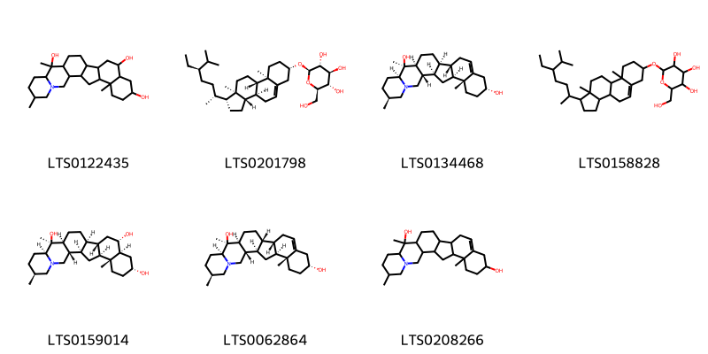{ width=100% }
    <figcaption>Hình ảnh cấu trúc hóa học của 7 hoạt chất thuộc nhóm Steroids and steroid derivatives gồm ['6,10,23-trimethyl-4-azahexacyclo[12.11.0.0²,¹¹.0⁴,⁹.0¹⁵,²⁴.0¹⁸,²³]pentacosane-10,17,20-triol (LTS0122435)', 'sitogluside (LTS0201798)', '(1r,2s,6s,9s,10s,11s,14s,15s,20r,23r,24s)-6,10,23-trimethyl-4-azahexacyclo[12.11.0.0²,¹¹.0⁴,⁹.0¹⁵,²⁴.0¹⁸,²³]pentacos-17-ene-10,20-diol (LTS0134468)', '2-{[1-(5-ethyl-6-methylheptan-2-yl)-9a,11a-dimethyl-1h,2h,3h,3ah,3bh,4h,6h,7h,8h,9h,9bh,10h,11h-cyclopenta[a]phenanthren-7-yl]oxy}-6-(hydroxymethyl)oxane-3,4,5-triol (LTS0158828)', '(1r,2s,6s,9s,10s,11s,14s,15s,17s,18s,20r,23r,24s)-6,10,23-trimethyl-4-azahexacyclo[12.11.0.0²,¹¹.0⁴,⁹.0¹⁵,²⁴.0¹⁸,²³]pentacosane-10,17,20-triol (LTS0159014)', '(1r,2s,6s,9s,10s,11s,14r,15s,20r,23r,24s)-6,10,23-trimethyl-4-azahexacyclo[12.11.0.0²,¹¹.0⁴,⁹.0¹⁵,²⁴.0¹⁸,²³]pentacos-17-ene-10,20-diol (LTS0062864)', '6,10,23-trimethyl-4-azahexacyclo[12.11.0.0²,¹¹.0⁴,⁹.0¹⁵,²⁴.0¹⁸,²³]pentacos-17-ene-10,20-diol (LTS0208266)'].</figcaption>
</figure>

---

### Dược dân tộc học

Danh sách các quốc gia có sử dụng *Fritillaria verticillata* trong điều trị các bệnh. 

| Country   | Disease                          | Bệnh                                      |
|:----------|:---------------------------------|:------------------------------------------|
| China     | Antitussive, Expectorant, Poison | Thuốc chống ho, thuốc long đờm, thuốc độc |

---

# Chi Tulbaghia

??? note "Danh sách các dược liệu thuộc chi"
    
	 - *Tulbaghia alliacea*

---
## Tulbaghia alliacea
### Thông tin về thực vật

!!! info "Phân loại thực vật của *Tulbaghia alliacea* từ GIBF:"
    - **Kingdom:** Plantae
    - **Phylum:** Tracheophyta
    - **Order:** Asparagales
    - **Family:** Amaryllidaceae
    - **Genus:** Tulbaghia
    - **Species:** *Tulbaghia alliacea*

 

| Label (VI)   | Label (EN)   | Scientific Name    | Descriptions (VI)   | Descriptions (EN)   | Also Known As (VI)   | Also Known As (EN)   |
|:-------------|:-------------|:-------------------|:--------------------|:--------------------|:---------------------|:---------------------|
| N/A          | N/A          | Tulbaghia alliacea | loài thực vật       | species of plant    | ['']                 | ['']                 |

#### Phân bố trên thế giới

**Từ CSDL GIBF** nan, Brazil, Congo, Democratic Republic of the, United States of America, Zambia, Eswatini, Malawi, South Africa, Zimbabwe, Colombia, unknown or invalid, Lesotho

#### Phân bố tại Việt Nam

**Từ CSDL GIBF**: Không có ghi nhận ở Việt Nam

---
### Thành phần hóa học
        
- Theo cơ sở dữ liệu lotus: Từ loài *Tulbaghia alliacea* đã phân lập và xác định được Chưa có hoạt chất nào được phân lập. hoạt chất thuộc về các nhóm Không có hoạt chất nào được phân lập. 

Không có hình ảnh nào được tạo ra

---

### Dược dân tộc học

Danh sách các quốc gia có sử dụng *Tulbaghia alliacea* trong điều trị các bệnh. 

| Country      | Disease   | Bệnh           |
|:-------------|:----------|:---------------|
| South Africa | Vermifuge | Thuốc diệt sán |

---

# Chi Boophane

??? note "Danh sách các dược liệu thuộc chi"
    
	 - *Boophane disticha*

---
## Boophane disticha
### Thông tin về thực vật

!!! info "Phân loại thực vật của *Boophone disticha* từ GIBF:"
    - **Kingdom:** Plantae
    - **Phylum:** Tracheophyta
    - **Order:** Asparagales
    - **Family:** Amaryllidaceae
    - **Genus:** Boophone
    - **Species:** *Boophone disticha*

 

| Label (VI)   | Label (EN)   | Scientific Name    | Descriptions (VI)   | Descriptions (EN)   | Also Known As (VI)   | Also Known As (EN)   |
|:-------------|:-------------|:-------------------|:--------------------|:--------------------|:---------------------|:---------------------|
| N/A          | N/A          | Tulbaghia alliacea | loài thực vật       | species of plant    | ['']                 | ['']                 |

#### Phân bố trên thế giới

**Từ CSDL GIBF** nan, Namibia, Botswana, Eswatini, South Africa, Zimbabwe, Tanzania, United Republic of

#### Phân bố tại Việt Nam

**Từ CSDL GIBF**: Không có ghi nhận ở Việt Nam

---
### Thành phần hóa học
        
- Theo cơ sở dữ liệu lotus: Từ loài *Boophone disticha* đã phân lập và xác định được Chưa có hoạt chất nào được phân lập. hoạt chất thuộc về các nhóm Không có hoạt chất nào được phân lập. 

Không có hình ảnh nào được tạo ra

---

### Dược dân tộc học

Danh sách các quốc gia có sử dụng *Boophone disticha* trong điều trị các bệnh. 

| Country   | Disease   | Bệnh     |
|:----------|:----------|:---------|
| Lesotho   | Poison    | Chất độc |

---

# Chi Hemerocallis

??? note "Danh sách các dược liệu thuộc chi"
    
	 - *Hemerocallis fulva*
	 - *Hemerocallis lilio-ahodelus*
	 - *Hemerocallis longituba*

---
## Hemerocallis fulva
### Thông tin về thực vật

!!! info "Phân loại thực vật của *Hemerocallis fulva* từ GIBF:"
    - **Kingdom:** Plantae
    - **Phylum:** Tracheophyta
    - **Order:** Asparagales
    - **Family:** Asphodelaceae
    - **Genus:** Hemerocallis
    - **Species:** *Hemerocallis fulva*

 

| Label (VI)   | Label (EN)   | Scientific Name    | Descriptions (VI)   | Descriptions (EN)   | Also Known As (VI)     | Also Known As (EN)                                                                                                                                                                                     |
|:-------------|:-------------|:-------------------|:--------------------|:--------------------|:-----------------------|:-------------------------------------------------------------------------------------------------------------------------------------------------------------------------------------------------------|
| N/A          | N/A          | Hemerocallis fulva | loài thực vật       | species of plant    | ['Hemerocallis fulva'] | ['corn lily', 'ditch lily', 'Fourth of July lily', 'fulvous daylily', 'orange day-lily', 'outhouse lily', 'railroad daylily', 'roadside daylily', 'tawny daylily', 'tiger daylily', 'wash-house lily'] |

#### Phân bố trên thế giới

**Từ CSDL GIBF** Brazil, Japan, Czechia, Sweden, China, Kazakhstan, New Zealand, Poland, Netherlands, United States of America, Russian Federation, Colombia, Belarus, Hong Kong, Mexico, Belgium, Chinese Taipei, Canada, Germany, Austria, Hungary, Ukraine, Slovakia, Italy, Switzerland, India, France

#### Phân bố tại Việt Nam

**Từ CSDL GIBF**: Không có ghi nhận ở Việt Nam

---
### Thành phần hóa học
        
- Theo cơ sở dữ liệu lotus: Từ loài *Hemerocallis fulva* đã phân lập và xác định được 106 hoạt chất thuộc về các nhóm Fatty Acyls, Flavonoids, Purine nucleosides, Carboxylic acids and derivatives, Pyrrolidines, Steroids and steroid derivatives, Anthracenes, Organooxygen compounds, Furanoid lignans, Prenol lipids, Organonitrogen compounds. 

|    | chemicalTaxonomyClassyfireClass   |   smiles_count |
|---:|:----------------------------------|---------------:|
|  0 | Anthracenes                       |             13 |
|  1 | Carboxylic acids and derivatives  |             19 |
|  2 | Fatty Acyls                       |              6 |
|  3 | Flavonoids                        |             11 |
|  4 | Furanoid lignans                  |              2 |
|  5 | Organonitrogen compounds          |              1 |
|  6 | Organooxygen compounds            |              8 |
|  7 | Prenol lipids                     |             19 |
|  8 | Purine nucleosides                |              2 |
|  9 | Pyrrolidines                      |             13 |
| 10 | Steroids and steroid derivatives  |              7 |

#### Nhóm Anthracenes
<figure markdown="span">
    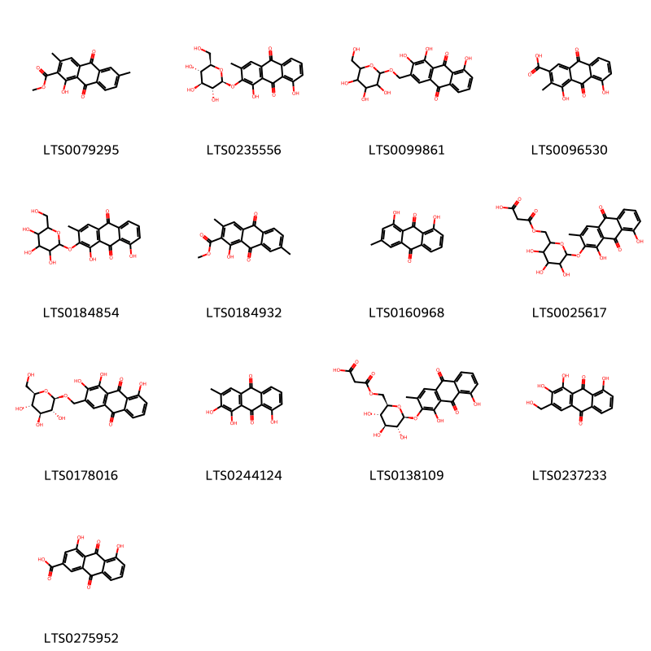{ width=100% }
    <figcaption>Hình ảnh cấu trúc hóa học của 13 hoạt chất thuộc nhóm Anthracenes gồm ['methyl 1-hydroxy-3,6-dimethyl-9,10-dioxoanthracene-2-carboxylate (LTS0079295)', '1,8-dihydroxy-3-methyl-2-{[(2s,3r,4s,5s,6r)-3,4,5-trihydroxy-6-(hydroxymethyl)oxan-2-yl]oxy}anthracene-9,10-dione (LTS0235556)', '1,2,8-trihydroxy-3-({[3,4,5-trihydroxy-6-(hydroxymethyl)oxan-2-yl]oxy}methyl)anthracene-9,10-dione (LTS0099861)', '4,5-dihydroxy-3-methyl-9,10-dioxoanthracene-2-carboxylic acid (LTS0096530)', '1,8-dihydroxy-3-methyl-2-{[3,4,5-trihydroxy-6-(hydroxymethyl)oxan-2-yl]oxy}anthracene-9,10-dione (LTS0184854)', 'methyl 1-hydroxy-3,7-dimethyl-9,10-dioxoanthracene-2-carboxylate (LTS0184932)', 'turkey rhubarb (LTS0160968)', '3-({6-[(1,8-dihydroxy-3-methyl-9,10-dioxoanthracen-2-yl)oxy]-3,4,5-trihydroxyoxan-2-yl}methoxy)-3-oxopropanoic acid (LTS0025617)', '1,2,8-trihydroxy-3-({[(2r,3r,4s,5s,6r)-3,4,5-trihydroxy-6-(hydroxymethyl)oxan-2-yl]oxy}methyl)anthracene-9,10-dione (LTS0178016)', '2-hydroxychrysophanol (LTS0244124)', '3-{[(2r,3s,4s,5r,6s)-6-[(1,8-dihydroxy-3-methyl-9,10-dioxoanthracen-2-yl)oxy]-3,4,5-trihydroxyoxan-2-yl]methoxy}-3-oxopropanoic acid (LTS0138109)', '1,2,8-trihydroxy-3-(hydroxymethyl)anthracene-9,10-dione (LTS0237233)', 'monorhein (LTS0275952)'].</figcaption>
</figure>
#### Nhóm Carboxylic acids and derivatives
<figure markdown="span">
    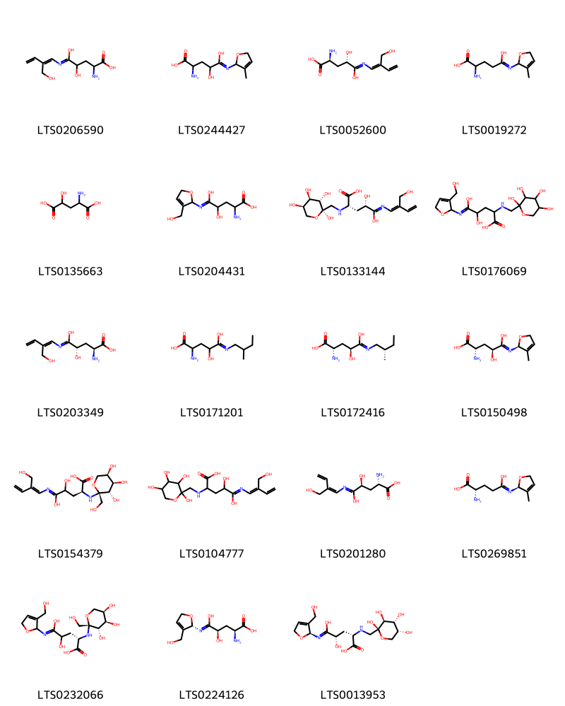{ width=100% }
    <figcaption>Hình ảnh cấu trúc hóa học của 19 hoạt chất thuộc nhóm Carboxylic acids and derivatives gồm ['2-amino-4-[(2-ethenyl-3-hydroxyprop-1-en-1-yl)-c-hydroxycarbonimidoyl]-4-hydroxybutanoic acid (LTS0206590)', '2-amino-4-hydroxy-4-[(3-methyl-2,5-dihydrofuran-2-yl)-c-hydroxycarbonimidoyl]butanoic acid (LTS0244427)', '(2s,4s)-2-amino-4-{[(1z)-2-ethenyl-3-hydroxyprop-1-en-1-yl]-c-hydroxycarbonimidoyl}-4-hydroxybutanoic acid (LTS0052600)', '2-amino-4-[(3-methyl-2,5-dihydrofuran-2-yl)-c-hydroxycarbonimidoyl]butanoic acid (LTS0019272)', 'hydroxyglutamic acid (LTS0135663)', '2-amino-4-hydroxy-4-{[3-(hydroxymethyl)-2,5-dihydrofuran-2-yl]-c-hydroxycarbonimidoyl}butanoic acid (LTS0204431)', '(2s,4s)-4-{[(1z)-2-ethenyl-3-hydroxyprop-1-en-1-yl]-c-hydroxycarbonimidoyl}-4-hydroxy-2-({[(2r,3s,4r,5r)-2,3,4,5-tetrahydroxyoxan-2-yl]methyl}amino)butanoic acid (LTS0133144)', '4-hydroxy-4-{[3-(hydroxymethyl)-2,5-dihydrofuran-2-yl]-c-hydroxycarbonimidoyl}-2-{[(2,3,4,5-tetrahydroxyoxan-2-yl)methyl]amino}butanoic acid (LTS0176069)', '(2s,4s)-2-amino-4-[(2-ethenyl-3-hydroxyprop-1-en-1-yl)-c-hydroxycarbonimidoyl]-4-hydroxybutanoic acid (LTS0203349)', '2-amino-4-hydroxy-4-[(2-methylbutyl)-c-hydroxycarbonimidoyl]butanoic acid (LTS0171201)', '(2s,4s)-2-amino-4-hydroxy-4-{[(2s)-2-methylbutyl]-c-hydroxycarbonimidoyl}butanoic acid (LTS0172416)', '(2s,4s)-2-amino-4-hydroxy-4-{[(2s)-3-methyl-2,5-dihydrofuran-2-yl]-c-hydroxycarbonimidoyl}butanoic acid (LTS0150498)', '(2s)-4-{[(1z)-2-ethenyl-3-hydroxyprop-1-en-1-yl]-c-hydroxycarbonimidoyl}-4-hydroxy-2-{[(2r,3s,4r,5r)-3,4,5-trihydroxy-2-(hydroxymethyl)oxan-2-yl]amino}butanoic acid (LTS0154379)', '4-[(2-ethenyl-3-hydroxyprop-1-en-1-yl)-c-hydroxycarbonimidoyl]-4-hydroxy-2-{[(2,3,4,5-tetrahydroxyoxan-2-yl)methyl]amino}butanoic acid (LTS0104777)', '(2s,4s)-2-amino-4-{[(1e)-2-ethenyl-3-hydroxyprop-1-en-1-yl]-c-hydroxycarbonimidoyl}-4-hydroxybutanoic acid (LTS0201280)', '(2s)-2-amino-4-{[(2s)-3-methyl-2,5-dihydrofuran-2-yl]-c-hydroxycarbonimidoyl}butanoic acid (LTS0269851)', '(2s)-4-hydroxy-4-{[3-(hydroxymethyl)-2,5-dihydrofuran-2-yl]-c-hydroxycarbonimidoyl}-2-{[(2r,3s,4r,5r)-3,4,5-trihydroxy-2-(hydroxymethyl)oxan-2-yl]amino}butanoic acid (LTS0232066)', '(2s,4r)-2-amino-4-hydroxy-4-{[(2s)-3-(hydroxymethyl)-2,5-dihydrofuran-2-yl]-c-hydroxycarbonimidoyl}butanoic acid (LTS0224126)', '(2s,4s)-4-hydroxy-4-{[(2s)-3-(hydroxymethyl)-2,5-dihydrofuran-2-yl]-c-hydroxycarbonimidoyl}-2-({[(2r,3s,4r,5r)-2,3,4,5-tetrahydroxyoxan-2-yl]methyl}amino)butanoic acid (LTS0013953)'].</figcaption>
</figure>
#### Nhóm Fatty Acyls
<figure markdown="span">
    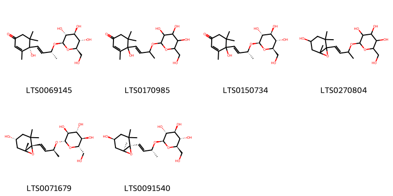{ width=100% }
    <figcaption>Hình ảnh cấu trúc hóa học của 6 hoạt chất thuộc nhóm Fatty Acyls gồm ['(4s)-4-hydroxy-3,5,5-trimethyl-4-[(1e,3r)-3-{[(2r,3r,4s,5s,6r)-3,4,5-trihydroxy-6-(hydroxymethyl)oxan-2-yl]oxy}but-1-en-1-yl]cyclohex-2-en-1-one (LTS0069145)', '4-hydroxy-3,5,5-trimethyl-4-(3-{[3,4,5-trihydroxy-6-(hydroxymethyl)oxan-2-yl]oxy}but-1-en-1-yl)cyclohex-2-en-1-one (LTS0170985)', '4-hydroxy-3,5,5-trimethyl-4-[(1e,3r)-3-{[(2r,3r,4s,5s,6r)-3,4,5-trihydroxy-6-(hydroxymethyl)oxan-2-yl]oxy}but-1-en-1-yl]cyclohex-2-en-1-one (LTS0150734)', '2-[(4-{4-hydroxy-2,2,6-trimethyl-7-oxabicyclo[4.1.0]heptan-1-yl}but-3-en-2-yl)oxy]-6-(hydroxymethyl)oxane-3,4,5-triol (LTS0270804)', '(2s,3s,4r,5r,6s)-2-{[(2s,3e)-4-[(1s,4r,6r)-4-hydroxy-2,2,6-trimethyl-7-oxabicyclo[4.1.0]heptan-1-yl]but-3-en-2-yl]oxy}-6-(hydroxymethyl)oxane-3,4,5-triol (LTS0071679)', 'phlomuroside (LTS0091540)'].</figcaption>
</figure>
#### Nhóm Flavonoids
<figure markdown="span">
    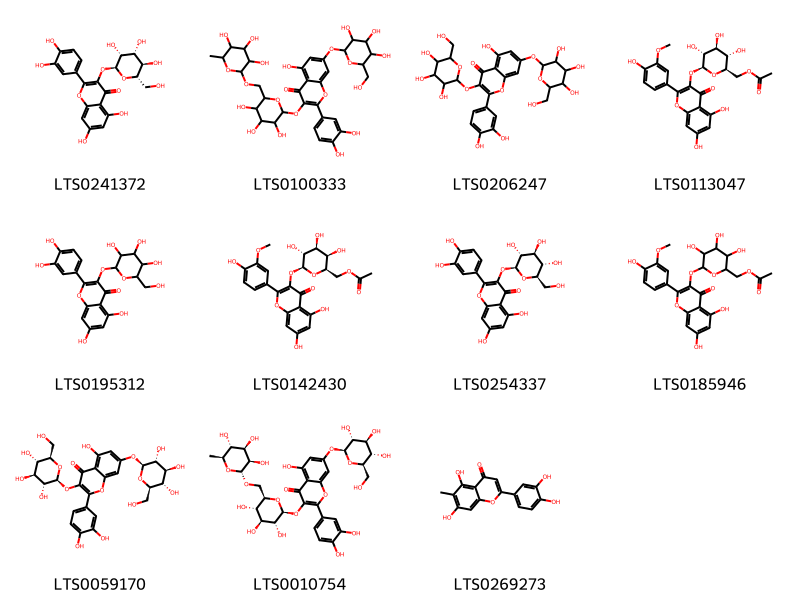{ width=100% }
    <figcaption>Hình ảnh cấu trúc hóa học của 11 hoạt chất thuộc nhóm Flavonoids gồm ['2-(3,4-dihydroxyphenyl)-5,7-dihydroxy-3-{[(2s,3r,4r,5r,6s)-3,4,5-trihydroxy-6-(hydroxymethyl)oxan-2-yl]oxy}chromen-4-one (LTS0241372)', '2-(3,4-dihydroxyphenyl)-5-hydroxy-7-{[3,4,5-trihydroxy-6-(hydroxymethyl)oxan-2-yl]oxy}-3-[(3,4,5-trihydroxy-6-{[(3,4,5-trihydroxy-6-methyloxan-2-yl)oxy]methyl}oxan-2-yl)oxy]chromen-4-one (LTS0100333)', '2-(3,4-dihydroxyphenyl)-5-hydroxy-3,7-bis({[3,4,5-trihydroxy-6-(hydroxymethyl)oxan-2-yl]oxy})chromen-4-one (LTS0206247)', '[(2r,3s,4s,5r,6s)-6-{[5,7-dihydroxy-2-(4-hydroxy-3-methoxyphenyl)-4-oxochromen-3-yl]oxy}-3,4,5-trihydroxyoxan-2-yl]methyl acetate (LTS0113047)', '2-(3,4-dihydroxyphenyl)-5,7-dihydroxy-3-{[3,4,5-trihydroxy-6-(hydroxymethyl)oxan-2-yl]oxy}chromen-4-one (LTS0195312)', '[(2r,3r,4s,5r,6s)-6-{[5,7-dihydroxy-2-(4-hydroxy-3-methoxyphenyl)-4-oxochromen-3-yl]oxy}-3,4,5-trihydroxyoxan-2-yl]methyl acetate (LTS0142430)', 'isoquercetin (LTS0254337)', '(6-{[5,7-dihydroxy-2-(4-hydroxy-3-methoxyphenyl)-4-oxochromen-3-yl]oxy}-3,4,5-trihydroxyoxan-2-yl)methyl acetate (LTS0185946)', 'quercetin 3,7-diglucoside (LTS0059170)', '2-(3,4-dihydroxyphenyl)-5-hydroxy-7-{[(2s,3r,4s,5s,6r)-3,4,5-trihydroxy-6-(hydroxymethyl)oxan-2-yl]oxy}-3-{[(2s,3r,4s,5s,6r)-3,4,5-trihydroxy-6-({[(2r,3r,4r,5r,6s)-3,4,5-trihydroxy-6-methyloxan-2-yl]oxy}methyl)oxan-2-yl]oxy}chromen-4-one (LTS0010754)', '6-methylluteolin (LTS0269273)'].</figcaption>
</figure>
#### Nhóm Furanoid lignans
<figure markdown="span">
    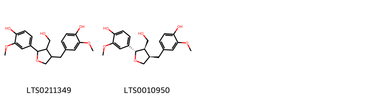{ width=100% }
    <figcaption>Hình ảnh cấu trúc hóa học của 2 hoạt chất thuộc nhóm Furanoid lignans gồm ['4-{4-[(4-hydroxy-3-methoxyphenyl)methyl]-3-(hydroxymethyl)oxolan-2-yl}-2-methoxyphenol (LTS0211349)', 'lariciresinol (LTS0010950)'].</figcaption>
</figure>
#### Nhóm Organonitrogen compounds
<figure markdown="span">
    { width=100% }
    <figcaption>Hình ảnh cấu trúc hóa học của 1 hoạt chất thuộc nhóm Organonitrogen compounds gồm ['choline (LTS0170307)'].</figcaption>
</figure>
#### Nhóm Organooxygen compounds
<figure markdown="span">
    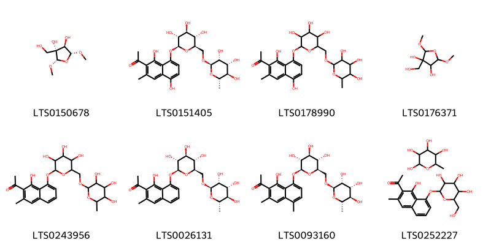{ width=100% }
    <figcaption>Hình ảnh cấu trúc hóa học của 8 hoạt chất thuộc nhóm Organooxygen compounds gồm ['(2s,3r,4r,5r)-3-(hydroxymethyl)-2,5-dimethoxyoxolane-3,4-diol (LTS0150678)', '1-(1,5-dihydroxy-3-methyl-8-{[(2s,3r,4s,5s,6r)-3,4,5-trihydroxy-6-({[(2r,3r,4r,5r,6s)-3,4,5-trihydroxy-6-methyloxan-2-yl]oxy}methyl)oxan-2-yl]oxy}naphthalen-2-yl)ethanone (LTS0151405)', '1-{1,5-dihydroxy-3-methyl-8-[(3,4,5-trihydroxy-6-{[(3,4,5-trihydroxy-6-methyloxan-2-yl)oxy]methyl}oxan-2-yl)oxy]naphthalen-2-yl}ethanone (LTS0178990)', '3-(hydroxymethyl)-2,5-dimethoxyoxolane-3,4-diol (LTS0176371)', '1-{1-hydroxy-3-methyl-8-[(3,4,5-trihydroxy-6-{[(3,4,5-trihydroxy-6-methyloxan-2-yl)oxy]methyl}oxan-2-yl)oxy]naphthalen-2-yl}ethanone (LTS0243956)', '1-(1-hydroxy-3-methyl-8-{[(2s,3r,4s,5s,6r)-3,4,5-trihydroxy-6-({[(2r,3r,4r,5r,6s)-3,4,5-trihydroxy-6-methyloxan-2-yl]oxy}methyl)oxan-2-yl]oxy}naphthalen-2-yl)ethanone (LTS0026131)', '1-(1-hydroxy-3,5-dimethyl-8-{[(2s,3r,4s,5s,6r)-3,4,5-trihydroxy-6-({[(2r,3r,4r,5r,6s)-3,4,5-trihydroxy-6-methyloxan-2-yl]oxy}methyl)oxan-2-yl]oxy}naphthalen-2-yl)ethanone (LTS0093160)', '1-(1-hydroxy-3-methyl-8-{[3,4,5-trihydroxy-6-(hydroxymethyl)oxan-2-yl]oxy}naphthalen-2-yl)ethanone; 6-methyloxane-2,3,4,5-tetrol (LTS0252227)'].</figcaption>
</figure>
#### Nhóm Prenol lipids
<figure markdown="span">
    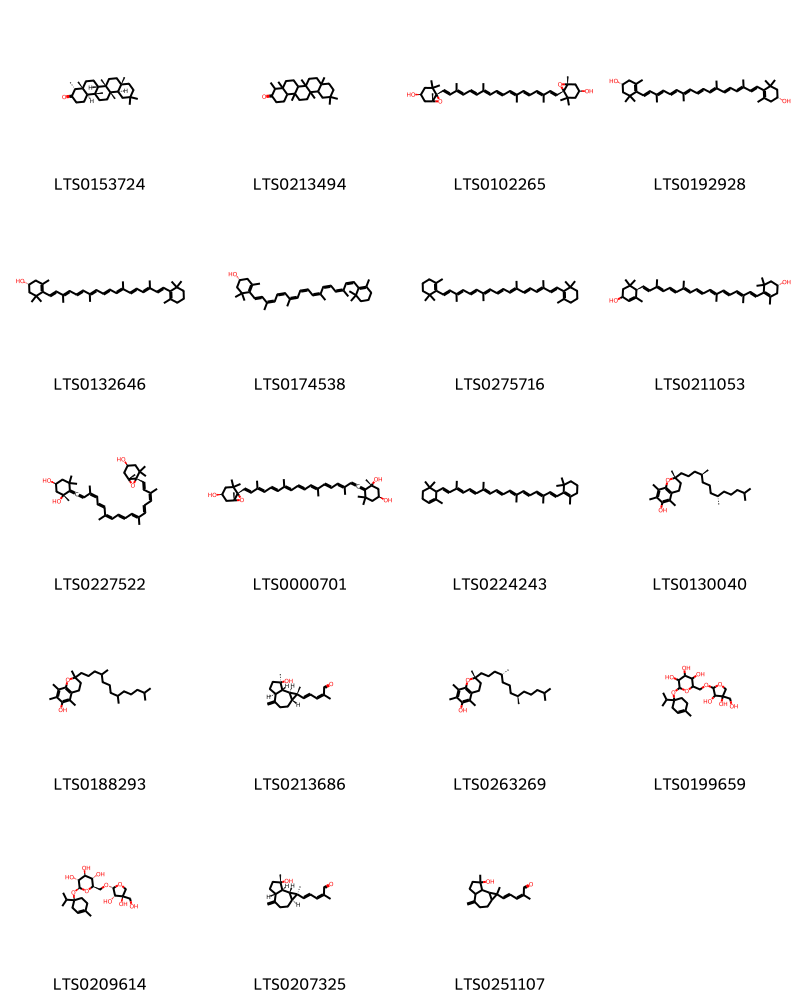{ width=100% }
    <figcaption>Hình ảnh cấu trúc hóa học của 19 hoạt chất thuộc nhóm Prenol lipids gồm ['(4r,4ar,6as,6bs,8as,12ar,12bs,14ar,14br)-4,4a,6b,8a,11,11,12b,14a-octamethyl-tetradecahydro-1h-picen-3-one (LTS0153724)', 'friedelin (LTS0213494)', 'violaxanthin (LTS0102265)', 'zeaxanthin (LTS0192928)', 'cryptoxanthin (LTS0132646)', '(1r)-3,5,5-trimethyl-4-[(1e,3z,5z,7z,9z,11z,13z,15z,17z)-3,7,12,16-tetramethyl-18-(2,6,6-trimethylcyclohex-1-en-1-yl)octadeca-1,3,5,7,9,11,13,15,17-nonaen-1-yl]cyclohex-3-en-1-ol (LTS0174538)', 'β-carotene (LTS0275716)', '(4r)-4-[(1e,3e,5e,7e,9e,11e,13e,15e,17e)-18-[(4r)-4-hydroxy-2,6,6-trimethylcyclohex-1-en-1-yl]-3,7,12,16-tetramethyloctadeca-1,3,5,7,9,11,13,15,17-nonaen-1-yl]-3,5,5-trimethylcyclohex-2-en-1-ol (LTS0211053)', 'neoxanthin (LTS0227522)', 'neoxanthin (LTS0000701)', 'α-carotene (LTS0224243)', '(2r)-2,5,7,8-tetramethyl-2-[(4s,8s)-4,8,12-trimethyltridecyl]-3,4-dihydro-1-benzopyran-6-ol (LTS0130040)', 'vita e (LTS0188293)', '(2z,4e)-5-[(1r,1ar,4as,7r,7as,7bs)-7-hydroxy-1,7-dimethyl-4-methylidene-octahydrocyclopropa[e]azulen-1-yl]-2-methylpenta-2,4-dienal (LTS0213686)', 'vitamin e (LTS0263269)', '2-({[3,4-dihydroxy-4-(hydroxymethyl)oxolan-2-yl]oxy}methyl)-6-[(1-isopropyl-4-methylcyclohex-3-en-1-yl)oxy]oxane-3,4,5-triol (LTS0199659)', '(2r,3s,4s,5r,6s)-2-({[(2r,3s,4r)-3,4-dihydroxy-4-(hydroxymethyl)oxolan-2-yl]oxy}methyl)-6-{[(1s)-1-isopropyl-4-methylcyclohex-3-en-1-yl]oxy}oxane-3,4,5-triol (LTS0209614)', '(2z,4e)-5-[(1s,1as,4ar,7s,7ar,7br)-7-hydroxy-1,7-dimethyl-4-methylidene-octahydrocyclopropa[e]azulen-1-yl]-2-methylpenta-2,4-dienal (LTS0207325)', '5-{7-hydroxy-1,7-dimethyl-4-methylidene-octahydrocyclopropa[e]azulen-1-yl}-2-methylpenta-2,4-dienal (LTS0251107)'].</figcaption>
</figure>
#### Nhóm Purine nucleosides
<figure markdown="span">
    { width=100% }
    <figcaption>Hình ảnh cấu trúc hóa học của 2 hoạt chất thuộc nhóm Purine nucleosides gồm ['adenosine (LTS0052576)', 'adenosine (LTS0014061)'].</figcaption>
</figure>
#### Nhóm Pyrrolidines
<figure markdown="span">
    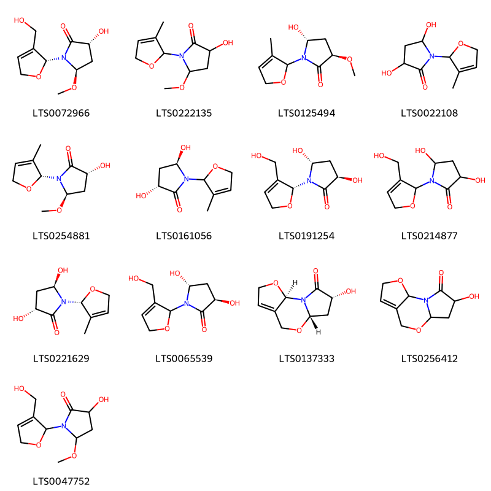{ width=100% }
    <figcaption>Hình ảnh cấu trúc hóa học của 13 hoạt chất thuộc nhóm Pyrrolidines gồm ['(3r,5r)-3-hydroxy-1-[(2r)-3-(hydroxymethyl)-2,5-dihydrofuran-2-yl]-5-methoxypyrrolidin-2-one (LTS0072966)', '3-hydroxy-5-methoxy-1-(3-methyl-2,5-dihydrofuran-2-yl)pyrrolidin-2-one (LTS0222135)', '(3r,5r)-5-hydroxy-3-methoxy-1-(3-methyl-2,5-dihydrofuran-2-yl)pyrrolidin-2-one (LTS0125494)', '3,5-dihydroxy-1-(3-methyl-2,5-dihydrofuran-2-yl)pyrrolidin-2-one (LTS0022108)', '(3r,5r)-3-hydroxy-5-methoxy-1-[(2r)-3-methyl-2,5-dihydrofuran-2-yl]pyrrolidin-2-one (LTS0254881)', '(3r,5r)-3,5-dihydroxy-1-(3-methyl-2,5-dihydrofuran-2-yl)pyrrolidin-2-one (LTS0161056)', '(3r,5r)-3,5-dihydroxy-1-[(2r)-3-(hydroxymethyl)-2,5-dihydrofuran-2-yl]pyrrolidin-2-one (LTS0191254)', '3,5-dihydroxy-1-[3-(hydroxymethyl)-2,5-dihydrofuran-2-yl]pyrrolidin-2-one (LTS0214877)', '(3r,5r)-3,5-dihydroxy-1-[(2r)-3-methyl-2,5-dihydrofuran-2-yl]pyrrolidin-2-one (LTS0221629)', '(3r,5r)-3,5-dihydroxy-1-[3-(hydroxymethyl)-2,5-dihydrofuran-2-yl]pyrrolidin-2-one (LTS0065539)', '(2r,9s,11r)-11-hydroxy-3,8-dioxa-1-azatricyclo[7.3.0.0²,⁶]dodec-5-en-12-one (LTS0137333)', '11-hydroxy-3,8-dioxa-1-azatricyclo[7.3.0.0²,⁶]dodec-5-en-12-one (LTS0256412)', '3-hydroxy-1-[3-(hydroxymethyl)-2,5-dihydrofuran-2-yl]-5-methoxypyrrolidin-2-one (LTS0047752)'].</figcaption>
</figure>
#### Nhóm Steroids and steroid derivatives
<figure markdown="span">
    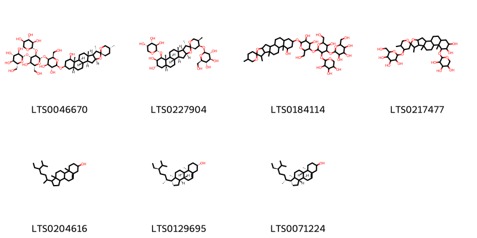{ width=100% }
    <figcaption>Hình ảnh cấu trúc hóa học của 7 hoạt chất thuộc nhóm Steroids and steroid derivatives gồm ["(2s,3r,4s,5s,6r)-2-{[(2s,3r,4s,5r,6r)-2-{[(2r,3r,4r,5r,6r)-4,5-dihydroxy-2-(hydroxymethyl)-6-[(1's,2r,2's,4's,5r,7's,8'r,9's,12's,13's,14'r,16'r,18'r)-5,7',9',13'-tetramethyl-5'-oxaspiro[oxane-2,6'-pentacyclo[10.8.0.0²,⁹.0⁴,⁸.0¹³,¹⁸]icosan]-14'-oloxy]oxan-3-yl]oxy}-5-hydroxy-6-(hydroxymethyl)-3-{[(2s,3r,4s,5r)-3,4,5-trihydroxyoxan-2-yl]oxy}oxan-4-yl]oxy}-6-(hydroxymethyl)oxane-3,4,5-triol (LTS0046670)", "(2r,3s,4s,5r,6r)-2-(hydroxymethyl)-6-[(1's,2r,2's,4s,4's,5r,7's,8'r,9's,12's,13's,14's,15'r,16's,18'r)-5,7',9',13'-tetramethyl-14'-{[(2s,3r,4s,5s)-3,4,5-trihydroxyoxan-2-yl]oxy}-5'-oxaspiro[oxane-2,6'-pentacyclo[10.8.0.0²,⁹.0⁴,⁸.0¹³,¹⁸]icosane]-15',16'-dioloxy]oxane-3,4,5-triol (LTS0227904)", "2-[(2-{[4,5-dihydroxy-2-(hydroxymethyl)-6-{5,7',9',13'-tetramethyl-5'-oxaspiro[oxane-2,6'-pentacyclo[10.8.0.0²,⁹.0⁴,⁸.0¹³,¹⁸]icosan]-14'-oloxy}oxan-3-yl]oxy}-5-hydroxy-6-(hydroxymethyl)-3-[(3,4,5-trihydroxyoxan-2-yl)oxy]oxan-4-yl)oxy]-6-(hydroxymethyl)oxane-3,4,5-triol (LTS0184114)", "2-(hydroxymethyl)-6-{5,7',9',13'-tetramethyl-14'-[(3,4,5-trihydroxyoxan-2-yl)oxy]-5'-oxaspiro[oxane-2,6'-pentacyclo[10.8.0.0²,⁹.0⁴,⁸.0¹³,¹⁸]icosane]-15',16'-dioloxy}oxane-3,4,5-triol (LTS0217477)", 'stigmast-5-en-3-ol, (3β)- (LTS0204616)', '(1r,3ar,3br,7s,9ar,9br,11ar)-1-[(2r,5r)-5-ethyl-6-methylheptan-2-yl]-9a,11a-dimethyl-1h,2h,3h,3ah,3bh,4h,6h,7h,8h,9h,9bh,10h,11h-cyclopenta[a]phenanthren-7-ol (LTS0129695)', 'stigmast-5-en-3-ol (LTS0071224)'].</figcaption>
</figure>

---

### Dược dân tộc học

Danh sách các quốc gia có sử dụng *Hemerocallis fulva* trong điều trị các bệnh. 

| Country   | Disease                                    | Bệnh                                                |
|:----------|:-------------------------------------------|:----------------------------------------------------|
| China     | Diuretic, Stimulant, Intoxicant            | Thuốc lợi tiểu, chất kích thích, chất không oxy hóa |
| Elsewhere | Diuretic, Hemostatic, Diuretic, Hemostatic | Thuốc lợi tiểu, cầm máu, lợi tiểu, cầm máu          |

---

---
## Hemerocallis lilioahodelus
### Thông tin về thực vật

!!! info "Phân loại thực vật của *Hemerocallis lilioasphodelus* từ GIBF:"
    - **Kingdom:** Plantae
    - **Phylum:** Tracheophyta
    - **Order:** Asparagales
    - **Family:** Asphodelaceae
    - **Genus:** Hemerocallis
    - **Species:** *Hemerocallis lilioasphodelus*

 

| Label (VI)   | Label (EN)   | Scientific Name    | Descriptions (VI)   | Descriptions (EN)   | Also Known As (VI)     | Also Known As (EN)                                                                                                                                                                                     |
|:-------------|:-------------|:-------------------|:--------------------|:--------------------|:-----------------------|:-------------------------------------------------------------------------------------------------------------------------------------------------------------------------------------------------------|
| N/A          | N/A          | Hemerocallis fulva | loài thực vật       | species of plant    | ['Hemerocallis fulva'] | ['corn lily', 'ditch lily', 'Fourth of July lily', 'fulvous daylily', 'orange day-lily', 'outhouse lily', 'railroad daylily', 'roadside daylily', 'tawny daylily', 'tiger daylily', 'wash-house lily'] |

#### Phân bố trên thế giới

**Từ CSDL GIBF** Brazil, Czechia, Mongolia, Sweden, Finland, China, Madagascar, Netherlands, Denmark, United States of America, Russian Federation, Croatia, Estonia, Norway, France, Belgium, Canada, Germany, Austria, Hungary, Italy, Switzerland, United Kingdom of Great Britain and Northern Ireland

#### Phân bố tại Việt Nam

**Từ CSDL GIBF**: Không có ghi nhận ở Việt Nam

---
### Thành phần hóa học
        
- Theo cơ sở dữ liệu lotus: Từ loài *Hemerocallis lilioasphodelus* đã phân lập và xác định được Chưa có hoạt chất nào được phân lập. hoạt chất thuộc về các nhóm Không có hoạt chất nào được phân lập. 

Không có hình ảnh nào được tạo ra

---

### Dược dân tộc học

Danh sách các quốc gia có sử dụng *Hemerocallis lilioasphodelus* trong điều trị các bệnh. 

| Country   |   Disease | Bệnh   |
|:----------|----------:|:-------|
| Elsewhere |       nan | Ở đây  |

---

---
## Hemerocallis longituba
### Thông tin về thực vật

!!! info "Phân loại thực vật của *Hemerocallis fulva* từ GIBF:"
    - **Kingdom:** Plantae
    - **Phylum:** Tracheophyta
    - **Order:** Asparagales
    - **Family:** Asphodelaceae
    - **Genus:** Hemerocallis
    - **Species:** *Hemerocallis fulva*

 

| Label (VI)   | Label (EN)   | Scientific Name        | Descriptions (VI)   | Descriptions (EN)   | Also Known As (VI)   | Also Known As (EN)   |
|:-------------|:-------------|:-----------------------|:--------------------|:--------------------|:---------------------|:---------------------|
| N/A          | N/A          | Hemerocallis longituba | loài thực vật       | species of plant    | ['']                 | ['']                 |

#### Phân bố trên thế giới

**Từ CSDL GIBF** nan, Japan, Korea, Republic of

#### Phân bố tại Việt Nam

**Từ CSDL GIBF**: Không có ghi nhận ở Việt Nam

---
### Thành phần hóa học
        
- Theo cơ sở dữ liệu lotus: Từ loài *Hemerocallis fulva* đã phân lập và xác định được Chưa có hoạt chất nào được phân lập. hoạt chất thuộc về các nhóm Không có hoạt chất nào được phân lập. 

Không có hình ảnh nào được tạo ra

---

### Dược dân tộc học

Danh sách các quốc gia có sử dụng *Hemerocallis fulva* trong điều trị các bệnh. 

| Country   | Disease              | Bệnh                    |
|:----------|:---------------------|:------------------------|
| Elsewhere | Diuretic, Hemostatic | Thuốc lợi tiểu, cầm máu |

---

# Chi Metanarthecium

??? note "Danh sách các dược liệu thuộc chi"
    
	 - *Metanarthecium luteo-viride*

---
## Metanarthecium luteoviride
### Thông tin về thực vật

!!! info "Phân loại thực vật của *Metanarthecium luteoviride* từ GIBF:"
    - **Kingdom:** Plantae
    - **Phylum:** Tracheophyta
    - **Order:** Dioscoreales
    - **Family:** Nartheciaceae
    - **Genus:** Metanarthecium
    - **Species:** *Metanarthecium luteoviride*

 

| Label (VI)   | Label (EN)   | Scientific Name            | Descriptions (VI)   | Descriptions (EN)   | Also Known As (VI)   | Also Known As (EN)   |
|:-------------|:-------------|:---------------------------|:--------------------|:--------------------|:---------------------|:---------------------|
| N/A          | N/A          | Metanarthecium luteoviride | loài thực vật       | species of plant    | ['']                 | ['']                 |

#### Phân bố trên thế giới

**Từ CSDL GIBF** nan, United States of America, Japan, Korea, Republic of, Russian Federation, unknown or invalid

#### Phân bố tại Việt Nam

**Từ CSDL GIBF**: Không có ghi nhận ở Việt Nam

---
### Thành phần hóa học
        
- Theo cơ sở dữ liệu lotus: Từ loài *Metanarthecium luteoviride* đã phân lập và xác định được 4 hoạt chất thuộc về các nhóm Prenol lipids, Steroids and steroid derivatives. 

|    | chemicalTaxonomyClassyfireClass   |   smiles_count |
|---:|:----------------------------------|---------------:|
|  0 | Prenol lipids                     |              2 |
|  1 | Steroids and steroid derivatives  |              2 |

#### Nhóm Prenol lipids
<figure markdown="span">
    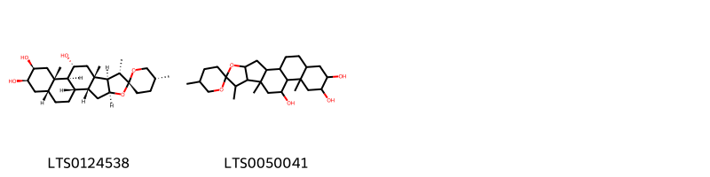{ width=100% }
    <figcaption>Hình ảnh cấu trúc hóa học của 2 hoạt chất thuộc nhóm Prenol lipids gồm ["(1's,2r,2'r,4's,5r,7's,8'r,9's,11'r,12's,13's,15's,16'r,18'r)-5,7',9',13'-tetramethyl-5'-oxaspiro[oxane-2,6'-pentacyclo[10.8.0.0²,⁹.0⁴,⁸.0¹³,¹⁸]icosane]-11',15',16'-triol (LTS0124538)", "5,7',9',13'-tetramethyl-5'-oxaspiro[oxane-2,6'-pentacyclo[10.8.0.0²,⁹.0⁴,⁸.0¹³,¹⁸]icosane]-11',15',16'-triol (LTS0050041)"].</figcaption>
</figure>
#### Nhóm Steroids and steroid derivatives
<figure markdown="span">
    { width=100% }
    <figcaption>Hình ảnh cấu trúc hóa học của 2 hoạt chất thuộc nhóm Steroids and steroid derivatives gồm ['stigmast-5-en-3-ol, (3β)- (LTS0204616)', '(1r,3ar,3br,7s,9ar,9br,11ar)-1-[(2r,5r)-5-ethyl-6-methylheptan-2-yl]-9a,11a-dimethyl-1h,2h,3h,3ah,3bh,4h,6h,7h,8h,9h,9bh,10h,11h-cyclopenta[a]phenanthren-7-ol (LTS0129695)'].</figcaption>
</figure>

---

### Dược dân tộc học

Danh sách các quốc gia có sử dụng *Metanarthecium luteoviride* trong điều trị các bệnh. 

| Country   | Disease   | Bệnh           |
|:----------|:----------|:---------------|
| Elsewhere | Diuretic  | Thuốc lợi tiêu |

---

# Chi Bulbine

??? note "Danh sách các dược liệu thuộc chi"
    
	 - *Bulbine ahodeloides*
	 - *Bulbine narcissifolia*

---
## Bulbine ahodeloides
### Thông tin về thực vật

!!! info "Phân loại thực vật của *N/A* từ GIBF:"
    - **Kingdom:** Plantae
    - **Phylum:** Tracheophyta
    - **Order:** Asparagales
    - **Family:** Asphodelaceae
    - **Genus:** Bulbine
    - **Species:** *N/A*

 

| Label (VI)   | Label (EN)   | Scientific Name            | Descriptions (VI)   | Descriptions (EN)   | Also Known As (VI)   | Also Known As (EN)   |
|:-------------|:-------------|:---------------------------|:--------------------|:--------------------|:---------------------|:---------------------|
| N/A          | N/A          | Metanarthecium luteoviride | loài thực vật       | species of plant    | ['']                 | ['']                 |

#### Phân bố trên thế giới

**Từ CSDL GIBF** nan, United States of America, South Africa, Australia, Argentina, France, Spain

#### Phân bố tại Việt Nam

**Từ CSDL GIBF**: Không có ghi nhận ở Việt Nam

---
### Thành phần hóa học
        
- Theo cơ sở dữ liệu lotus: Từ loài *N/A* đã phân lập và xác định được Chưa có hoạt chất nào được phân lập. hoạt chất thuộc về các nhóm Không có hoạt chất nào được phân lập. 

Không có hình ảnh nào được tạo ra

---

### Dược dân tộc học

Danh sách các quốc gia có sử dụng *N/A* trong điều trị các bệnh. 

| Country       | Disease               | Bệnh               |
|:--------------|:----------------------|:-------------------|
| Africa(Fingu) | Aperient              | Aperient           |
| Africa(Xosa)  | Aperient, Hemostatic  | Aperient, cầm máu  |
| Elsewhere     | Antiseptic, Demulcent | Khử trùng, khử mùi |

---

---
## Bulbine narcissifolia
### Thông tin về thực vật

!!! info "Phân loại thực vật của *Bulbine narcissifolia* từ GIBF:"
    - **Kingdom:** Plantae
    - **Phylum:** Tracheophyta
    - **Order:** Asparagales
    - **Family:** Asphodelaceae
    - **Genus:** Bulbine
    - **Species:** *Bulbine narcissifolia*

 

| Label (VI)   | Label (EN)   | Scientific Name       | Descriptions (VI)   | Descriptions (EN)   | Also Known As (VI)   | Also Known As (EN)   |
|:-------------|:-------------|:----------------------|:--------------------|:--------------------|:---------------------|:---------------------|
| N/A          | N/A          | Bulbine narcissifolia | loài thực vật       | species of plant    | ['']                 | ['']                 |

#### Phân bố trên thế giới

**Từ CSDL GIBF** Lesotho, South Africa

#### Phân bố tại Việt Nam

**Từ CSDL GIBF**: Không có ghi nhận ở Việt Nam

---
### Thành phần hóa học
        
- Theo cơ sở dữ liệu lotus: Từ loài *Bulbine narcissifolia* đã phân lập và xác định được 13 hoạt chất thuộc về các nhóm Anthracenes, Organooxygen compounds. 

|    | chemicalTaxonomyClassyfireClass   |   smiles_count |
|---:|:----------------------------------|---------------:|
|  0 | Anthracenes                       |             12 |
|  1 | Organooxygen compounds            |              1 |

#### Nhóm Anthracenes
<figure markdown="span">
    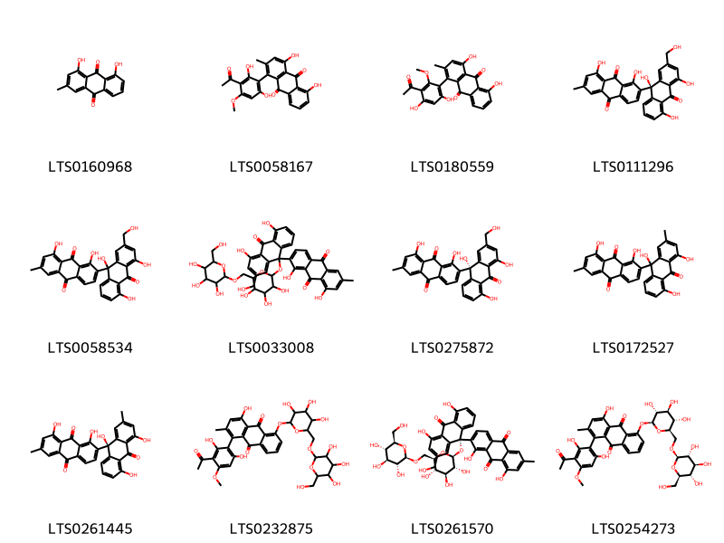{ width=100% }
    <figcaption>Hình ảnh cấu trúc hóa học của 12 hoạt chất thuộc nhóm Anthracenes gồm ['turkey rhubarb (LTS0160968)', 'knipholone (LTS0058167)', '1-(3-acetyl-4,6-dihydroxy-2-methoxyphenyl)-4,5-dihydroxy-2-methylanthracene-9,10-dione (LTS0180559)', "(9'r)-1,4',5',8,9'-pentahydroxy-2'-(hydroxymethyl)-6-methyl-[2,9'-bianthracene]-9,10,10'-trione (LTS0111296)", "1,4',5',8,9'-pentahydroxy-2'-(hydroxymethyl)-6-methyl-[2,9'-bianthracene]-9,10,10'-trione (LTS0058534)", "1,4',5',8-tetrahydroxy-2'-(hydroxymethyl)-6-methyl-9'-{[3,4,5-trihydroxy-6-({[3,4,5-trihydroxy-6-(hydroxymethyl)oxan-2-yl]oxy}methyl)oxan-2-yl]oxy}-[2,9'-bianthracene]-9,10,10'-trione (LTS0033008)", "(9's)-1,4',5',8,9'-pentahydroxy-2'-(hydroxymethyl)-6-methyl-[2,9'-bianthracene]-9,10,10'-trione (LTS0275872)", "1,4',5',8,9'-pentahydroxy-2',6-dimethyl-[2,9'-bianthracene]-9,10,10'-trione (LTS0172527)", "(9'r)-1,4',5',8,9'-pentahydroxy-2',6-dimethyl-[2,9'-bianthracene]-9,10,10'-trione (LTS0261445)", '1-(3-acetyl-2,6-dihydroxy-4-methoxyphenyl)-4-hydroxy-2-methyl-5-{[3,4,5-trihydroxy-6-({[3,4,5-trihydroxy-6-(hydroxymethyl)oxan-2-yl]oxy}methyl)oxan-2-yl]oxy}anthracene-9,10-dione (LTS0232875)', "(9's)-1,4',5',8-tetrahydroxy-2'-(hydroxymethyl)-6-methyl-9'-{[(2s,3r,4s,5s,6r)-3,4,5-trihydroxy-6-({[(2r,3r,4s,5s,6r)-3,4,5-trihydroxy-6-(hydroxymethyl)oxan-2-yl]oxy}methyl)oxan-2-yl]oxy}-[2,9'-bianthracene]-9,10,10'-trione (LTS0261570)", '1-(3-acetyl-2,6-dihydroxy-4-methoxyphenyl)-4-hydroxy-2-methyl-5-{[(2s,3r,4s,5s,6r)-3,4,5-trihydroxy-6-({[(2r,3r,4s,5s,6r)-3,4,5-trihydroxy-6-(hydroxymethyl)oxan-2-yl]oxy}methyl)oxan-2-yl]oxy}anthracene-9,10-dione (LTS0254273)'].</figcaption>
</figure>
#### Nhóm Organooxygen compounds
<figure markdown="span">
    { width=100% }
    <figcaption>Hình ảnh cấu trúc hóa học của 1 hoạt chất thuộc nhóm Organooxygen compounds gồm ['acetosyringone (LTS0017449)'].</figcaption>
</figure>

---

### Dược dân tộc học

Danh sách các quốc gia có sử dụng *Bulbine narcissifolia* trong điều trị các bệnh. 

| Country        | Disease   | Bệnh         |
|:---------------|:----------|:-------------|
| Africa(Griqua) | Purgative | Thuốc xổ     |
| Lesotho        | Laxative  | Nhuận trường |

---

# Chi Chlorophytum

??? note "Danh sách các dược liệu thuộc chi"
    
	 - *Chlorophytum arundinaceum*
	 - *Chlorophytum tuberosum*

---
## Chlorophytum arundinaceum
### Thông tin về thực vật

!!! info "Phân loại thực vật của *Chlorophytum arundinaceum* từ GIBF:"
    - **Kingdom:** Plantae
    - **Phylum:** Tracheophyta
    - **Order:** Asparagales
    - **Family:** Asparagaceae
    - **Genus:** Chlorophytum
    - **Species:** *Chlorophytum arundinaceum*

 

| Label (VI)   | Label (EN)   | Scientific Name           | Descriptions (VI)   | Descriptions (EN)   | Also Known As (VI)   | Also Known As (EN)   |
|:-------------|:-------------|:--------------------------|:--------------------|:--------------------|:---------------------|:---------------------|
| N/A          | N/A          | Chlorophytum arundinaceum | loài thực vật       | species of plant    | ['']                 | ['']                 |

#### Phân bố trên thế giới

**Từ CSDL GIBF** nan, Bhutan, Nepal, Myanmar, India, Svalbard and Jan Mayen

#### Phân bố tại Việt Nam

**Từ CSDL GIBF**: Không có ghi nhận ở Việt Nam

---
### Thành phần hóa học
        
- Theo cơ sở dữ liệu lotus: Từ loài *Chlorophytum arundinaceum* đã phân lập và xác định được 12 hoạt chất thuộc về các nhóm Fatty Acyls, Saturated hydrocarbons, Steroids and steroid derivatives, Stilbenes. 

|    | chemicalTaxonomyClassyfireClass   |   smiles_count |
|---:|:----------------------------------|---------------:|
|  0 | Fatty Acyls                       |              5 |
|  1 | Saturated hydrocarbons            |              1 |
|  2 | Steroids and steroid derivatives  |              4 |
|  3 | Stilbenes                         |              2 |

#### Nhóm Fatty Acyls
<figure markdown="span">
    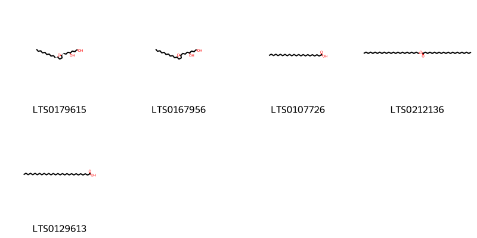{ width=100% }
    <figcaption>Hình ảnh cấu trúc hóa học của 5 hoạt chất thuộc nhóm Fatty Acyls gồm ['(4s)-7-[(2r,5s)-5-decyloxolan-2-yl]heptane-1,4-diol (LTS0179615)', '7-(5-decyloxolan-2-yl)heptane-1,4-diol (LTS0167956)', 'lignoceric acid (LTS0107726)', 'pentacosyl docosanoate (LTS0212136)', 'triacontanoic acid (LTS0129613)'].</figcaption>
</figure>
#### Nhóm Saturated hydrocarbons
<figure markdown="span">
    { width=100% }
    <figcaption>Hình ảnh cấu trúc hóa học của 1 hoạt chất thuộc nhóm Saturated hydrocarbons gồm ['nonacosane (LTS0062747)'].</figcaption>
</figure>
#### Nhóm Steroids and steroid derivatives
<figure markdown="span">
    { width=100% }
    <figcaption>Hình ảnh cấu trúc hóa học của 4 hoạt chất thuộc nhóm Steroids and steroid derivatives gồm ['(2r,3r,4s,5s,6r)-2-{[(1r,3as,3bs,7s,9ar,9bs,11ar)-1-[(2r,3e,5s)-5-ethyl-6-methylhept-3-en-2-yl]-9a,11a-dimethyl-1h,2h,3h,3ah,3bh,4h,6h,7h,8h,9h,9bh,10h,11h-cyclopenta[a]phenanthren-7-yl]oxy}-6-(hydroxymethyl)oxane-3,4,5-triol (LTS0088971)', 'phytosterol (LTS0029311)', 'stigmasterol (LTS0024262)', '2-{[1-(5-ethyl-6-methylhept-3-en-2-yl)-9a,11a-dimethyl-1h,2h,3h,3ah,3bh,4h,6h,7h,8h,9h,9bh,10h,11h-cyclopenta[a]phenanthren-7-yl]oxy}-6-(hydroxymethyl)oxane-3,4,5-triol (LTS0057912)'].</figcaption>
</figure>
#### Nhóm Stilbenes
<figure markdown="span">
    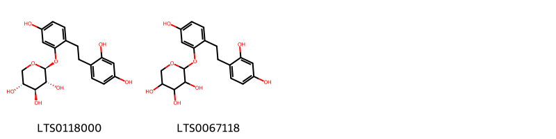{ width=100% }
    <figcaption>Hình ảnh cấu trúc hóa học của 2 hoạt chất thuộc nhóm Stilbenes gồm ['(2s,3r,4s,5r)-2-{2-[2-(2,4-dihydroxyphenyl)ethyl]-5-hydroxyphenoxy}oxane-3,4,5-triol (LTS0118000)', '2-{2-[2-(2,4-dihydroxyphenyl)ethyl]-5-hydroxyphenoxy}oxane-3,4,5-triol (LTS0067118)'].</figcaption>
</figure>

---

### Dược dân tộc học

Danh sách các quốc gia có sử dụng *Chlorophytum arundinaceum* trong điều trị các bệnh. 

| Country   | Disease   | Bệnh               |
|:----------|:----------|:-------------------|
| Elsewhere | Tonic     | (thuộc) trương lực |

---

---
## Chlorophytum tuberosum
### Thông tin về thực vật

!!! info "Phân loại thực vật của *Chlorophytum tuberosum* từ GIBF:"
    - **Kingdom:** Plantae
    - **Phylum:** Tracheophyta
    - **Order:** Asparagales
    - **Family:** Asparagaceae
    - **Genus:** Chlorophytum
    - **Species:** *Chlorophytum tuberosum*

 

| Label (VI)   | Label (EN)   | Scientific Name        | Descriptions (VI)   | Descriptions (EN)                               | Also Known As (VI)   | Also Known As (EN)   |
|:-------------|:-------------|:-----------------------|:--------------------|:------------------------------------------------|:---------------------|:---------------------|
| N/A          | N/A          | Chlorophytum tuberosum |                     | A shrub used in Ayurveda for medicinal purposes | ['']                 | ['']                 |

#### Phân bố trên thế giới

**Từ CSDL GIBF** nan, Sri Lanka, Uganda, Kenya, Chad, Central African Republic, Nepal, Nigeria, Somalia, India, Tanzania, United Republic of, New Zealand, Myanmar, unknown or invalid, Ethiopia, Cameroon, Sudan

#### Phân bố tại Việt Nam

**Từ CSDL GIBF**: Không có ghi nhận ở Việt Nam

---
### Thành phần hóa học
        
- Theo cơ sở dữ liệu lotus: Từ loài *Chlorophytum tuberosum* đã phân lập và xác định được Chưa có hoạt chất nào được phân lập. hoạt chất thuộc về các nhóm Không có hoạt chất nào được phân lập. 

Không có hình ảnh nào được tạo ra

---

### Dược dân tộc học

Danh sách các quốc gia có sử dụng *Chlorophytum tuberosum* trong điều trị các bệnh. 

| Country   | Disease   | Bệnh               |
|:----------|:----------|:-------------------|
| India     | Tonic     | (thuộc) trương lực |

---

# Chi Xerophyllum

??? note "Danh sách các dược liệu thuộc chi"
    
	 - *Xerophyllum tenax*

---
## Xerophyllum tenax
### Thông tin về thực vật

!!! info "Phân loại thực vật của *Xerophyllum tenax* từ GIBF:"
    - **Kingdom:** Plantae
    - **Phylum:** Tracheophyta
    - **Order:** Liliales
    - **Family:** Melanthiaceae
    - **Genus:** Xerophyllum
    - **Species:** *Xerophyllum tenax*

 

| Label (VI)   | Label (EN)   | Scientific Name   | Descriptions (VI)   | Descriptions (EN)   | Also Known As (VI)   | Also Known As (EN)                                                                     |
|:-------------|:-------------|:------------------|:--------------------|:--------------------|:---------------------|:---------------------------------------------------------------------------------------|
| N/A          | N/A          | Xerophyllum tenax | loài thực vật       | species of plant    | ['']                 | ['basket-grass', 'bear-grass', 'beargrass', 'common beargrass', 'western turkeybeard'] |

#### Phân bố trên thế giới

**Từ CSDL GIBF** United States of America, Canada

#### Phân bố tại Việt Nam

**Từ CSDL GIBF**: Không có ghi nhận ở Việt Nam

---
### Thành phần hóa học
        
- Theo cơ sở dữ liệu lotus: Từ loài *Xerophyllum tenax* đã phân lập và xác định được Chưa có hoạt chất nào được phân lập. hoạt chất thuộc về các nhóm Không có hoạt chất nào được phân lập. 

Không có hình ảnh nào được tạo ra

---

### Dược dân tộc học

Danh sách các quốc gia có sử dụng *Xerophyllum tenax* trong điều trị các bệnh. 

| Country       | Disease   | Bệnh        |
|:--------------|:----------|:------------|
| US(Blackfoot) | Hemostat  | Máy cầm máu |

---

# Chi Narcissus

??? note "Danh sách các dược liệu thuộc chi"
    
	 - *Narcissus jonquilla*
	 - *Narcissus pseudo-narcissus*
	 - *Narcissus tazetta*

---
## Narcissus jonquilla
### Thông tin về thực vật

!!! info "Phân loại thực vật của *Narcissus jonquilla* từ GIBF:"
    - **Kingdom:** Plantae
    - **Phylum:** Tracheophyta
    - **Order:** Asparagales
    - **Family:** Amaryllidaceae
    - **Genus:** Narcissus
    - **Species:** *Narcissus jonquilla*

 

| Label (VI)   | Label (EN)   | Scientific Name     | Descriptions (VI)   | Descriptions (EN)   | Also Known As (VI)   | Also Known As (EN)       |
|:-------------|:-------------|:--------------------|:--------------------|:--------------------|:---------------------|:-------------------------|
| N/A          | N/A          | Narcissus jonquilla | loài thực vật       | species of plant    | ['']                 | ['jonquil', 'narcissus'] |

#### Phân bố trên thế giới

**Từ CSDL GIBF** nan, United States of America, Portugal, Sweden, Netherlands, Belgium, United Kingdom of Great Britain and Northern Ireland, Denmark, Australia, New Zealand, Italy, Switzerland, Slovenia, Germany, France, Spain, Poland

#### Phân bố tại Việt Nam

**Từ CSDL GIBF**: Không có ghi nhận ở Việt Nam

---
### Thành phần hóa học
        
- Theo cơ sở dữ liệu lotus: Từ loài *Narcissus jonquilla* đã phân lập và xác định được 4 hoạt chất thuộc về các nhóm Amaryllidaceae alkaloids. 

|    | chemicalTaxonomyClassyfireClass   |   smiles_count |
|---:|:----------------------------------|---------------:|
|  0 | Amaryllidaceae alkaloids          |              4 |

#### Nhóm Amaryllidaceae alkaloids
<figure markdown="span">
    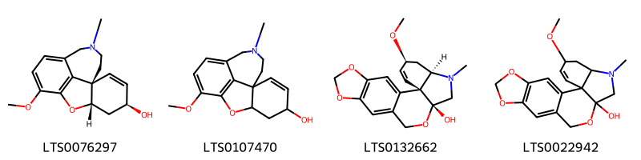{ width=100% }
    <figcaption>Hình ảnh cấu trúc hóa học của 4 hoạt chất thuộc nhóm Amaryllidaceae alkaloids gồm ['epigalantamine (LTS0076297)', 'galantamine (LTS0107470)', '(1r,13r,16r,18s)-18-methoxy-15-methyl-5,7,12-trioxa-15-azapentacyclo[11.7.0.0¹,¹⁶.0²,¹⁰.0⁴,⁸]icosa-2,4(8),9,19-tetraen-13-ol (LTS0132662)', 'tazettine (LTS0022942)'].</figcaption>
</figure>

---

### Dược dân tộc học

Danh sách các quốc gia có sử dụng *Narcissus jonquilla* trong điều trị các bệnh. 

| Country   | Disease                                        | Bệnh                                                     |
|:----------|:-----------------------------------------------|:---------------------------------------------------------|
| Europe    | Perfume                                        | Nước hoa                                                 |
| Turkey    | Narcotic, Perfume, Poison, Emetic, Emmenagogue | Chất gây nghiện, Nước hoa, Chất độc, Emetic, Emmenagogue |

---

---
## Narcissus pseudonarcissus
### Thông tin về thực vật

!!! info "Phân loại thực vật của *Narcissus pseudonarcissus* từ GIBF:"
    - **Kingdom:** Plantae
    - **Phylum:** Tracheophyta
    - **Order:** Asparagales
    - **Family:** Amaryllidaceae
    - **Genus:** Narcissus
    - **Species:** *Narcissus pseudonarcissus*

 

| Label (VI)   | Label (EN)   | Scientific Name           | Descriptions (VI)   | Descriptions (EN)                    | Also Known As (VI)   | Also Known As (EN)   |
|:-------------|:-------------|:--------------------------|:--------------------|:-------------------------------------|:---------------------|:---------------------|
| N/A          | N/A          | Narcissus pseudonarcissus |                     | species of perennial flowering plant | ['']                 | ['common daffodil']  |

#### Phân bố trên thế giới

**Từ CSDL GIBF** nan, Austria, United States of America, Portugal, Sweden, France, Belgium, Finland, Denmark, Italy, Switzerland, Canada, Germany, United Kingdom of Great Britain and Northern Ireland, Spain, Netherlands

#### Phân bố tại Việt Nam

**Từ CSDL GIBF**: Không có ghi nhận ở Việt Nam

---
### Thành phần hóa học
        
- Theo cơ sở dữ liệu lotus: Từ loài *Narcissus pseudonarcissus* đã phân lập và xác định được 60 hoạt chất thuộc về các nhóm Quinolines and derivatives, Amaryllidaceae alkaloids. 

|    | chemicalTaxonomyClassyfireClass   |   smiles_count |
|---:|:----------------------------------|---------------:|
|  0 | Amaryllidaceae alkaloids          |             45 |
|  1 | Quinolines and derivatives        |              6 |

#### Nhóm Amaryllidaceae alkaloids
<figure markdown="span">
    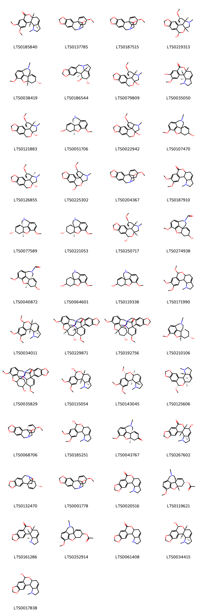{ width=100% }
    <figcaption>Hình ảnh cấu trúc hóa học của 45 hoạt chất thuộc nhóm Amaryllidaceae alkaloids gồm ['homolycorine (LTS0185840)', 'haemanthamine (LTS0137785)', 'haemanthamine (LTS0187515)', 'pretazettine (LTS0219313)', 'galantamine (LTS0038419)', 'lycorine (LTS0186544)', '(1s,13r,16s,18s)-18-methoxy-15-methyl-5,7,12-trioxa-15-azapentacyclo[11.7.0.0¹,¹⁶.0²,¹⁰.0⁴,⁸]icosa-2,4(8),9,19-tetraen-13-ol (LTS0079809)', '9-o-demethylhomolycorine (LTS0035050)', 'tazettine (LTS0121883)', 'n-desmethylgalantamine (LTS0051706)', 'tazettine (LTS0022942)', 'galantamine (LTS0107470)', '(1s,13s,16r,18s)-18-methoxy-15-methyl-5,7,12-trioxa-15-azapentacyclo[11.7.0.0¹,¹⁶.0²,¹⁰.0⁴,⁸]icosa-2,4(8),9,19-tetraen-13-ol (LTS0126855)', '18-methoxy-15-methyl-5,7,12-trioxa-15-azapentacyclo[11.7.0.0¹,¹⁶.0²,¹⁰.0⁴,⁸]icosa-2,4(8),9,19-tetraen-11-ol (LTS0225302)', '15-methoxy-5,7-dioxa-12-azapentacyclo[10.5.2.0¹,¹³.0²,¹⁰.0⁴,⁸]nonadeca-2,4(8),9,16-tetraen-18-ol (LTS0204367)', '4,5-dimethoxy-16-methyl-9-oxa-16-azatetracyclo[8.7.0.0²,⁷.0¹³,¹⁷]heptadeca-2(7),3,5,12-tetraen-8-one (LTS0187910)', '(1s,12s,14s)-9-methoxy-11-oxa-4-azatetracyclo[8.6.1.0¹,¹².0⁶,¹⁷]heptadeca-6,8,10(17),15-tetraen-14-ol (LTS0077589)', 'epinorlycoramine (LTS0221053)', '(1s,11s,13r,16s,18s)-18-methoxy-15-methyl-5,7,12-trioxa-15-azapentacyclo[11.7.0.0¹,¹⁶.0²,¹⁰.0⁴,⁸]icosa-2,4(8),9,19-tetraen-11-ol (LTS0250717)', '14-hydroxy-9-methoxy-11-oxa-4-azatetracyclo[8.6.1.0¹,¹².0⁶,¹⁷]heptadeca-6,8,10(17),15-tetraene-4-carbaldehyde (LTS0274938)', '(1r,12r,14s)-14-hydroxy-9-methoxy-11-oxa-4-azatetracyclo[8.6.1.0¹,¹².0⁶,¹⁷]heptadeca-6,8,10(17),15-tetraene-4-carbaldehyde (LTS0040872)', '9-methoxy-11-oxa-4-azatetracyclo[8.6.1.0¹,¹².0⁶,¹⁷]heptadeca-6,8,10(17)-trien-14-ol (LTS0064601)', '9-methoxy-11-oxa-4-azatetracyclo[8.6.1.0¹,¹².0⁶,¹⁷]heptadeca-6,8,10(17),15-tetraen-14-ol (LTS0119338)', '4,5,8-trimethoxy-16-methyl-9-oxa-16-azatetracyclo[8.7.0.0²,⁷.0¹³,¹⁷]heptadeca-2(7),3,5,12-tetraene (LTS0171990)', '(1s,8s,10r,17s)-4,5,8-trimethoxy-16-methyl-9-oxa-16-azatetracyclo[8.7.0.0²,⁷.0¹³,¹⁷]heptadeca-2(7),3,5,12-tetraene (LTS0034011)', '(3as,6s,7as)-3a-(6-{[(1r,12s,14s)-14-hydroxy-9-methoxy-11-oxa-4-azatetracyclo[8.6.1.0¹,¹².0⁶,¹⁷]heptadeca-6,8,10(17)-trien-4-yl]methyl}-2h-1,3-benzodioxol-5-yl)-6-methoxy-1-methyl-2,6,7,7a-tetrahydroindol-3-one (LTS0229871)', '(3as,6s)-3a-(6-{[(1s,12s,14s)-14-hydroxy-9-methoxy-11-oxa-4-azatetracyclo[8.6.1.0¹,¹².0⁶,¹⁷]heptadeca-6,8,10(17)-trien-4-yl]methyl}-2h-1,3-benzodioxol-5-yl)-6-methoxy-1-methyl-2,6,7,7a-tetrahydroindol-3-one (LTS0192756)', 'lycoramine (LTS0210106)', '3a-[6-({14-hydroxy-9-methoxy-11-oxa-4-azatetracyclo[8.6.1.0¹,¹².0⁶,¹⁷]heptadeca-6,8,10(17)-trien-4-yl}methyl)-2h-1,3-benzodioxol-5-yl]-6-methoxy-1-methyl-2,6,7,7a-tetrahydroindol-3-one (LTS0035829)', 'lycorenine (LTS0115054)', '(1r,8r,10s,17r)-4,5,8-trimethoxy-16-methyl-9-oxa-16-azatetracyclo[8.7.0.0²,⁷.0¹³,¹⁷]heptadeca-2(7),3,5,12-tetraene (LTS0143045)', '(2s,3s,10r,12s)-12-methoxy-4-methyl-11,16,18-trioxa-4-azapentacyclo[11.7.0.0²,¹⁰.0³,⁷.0¹⁵,¹⁹]icosa-1(20),7,13,15(19)-tetraene (LTS0125606)', '(1r,13r,15s,18r)-15-methoxy-5,7-dioxa-12-azapentacyclo[10.5.2.0¹,¹³.0²,¹⁰.0⁴,⁸]nonadeca-2,4(8),9,16-tetraen-18-ol (LTS0068706)', '4,5-dimethoxy-16-methyl-9-oxa-16-azatetracyclo[8.7.0.0²,⁷.0¹³,¹⁷]heptadeca-2(7),3,5,12-tetraen-8-ol (LTS0185251)', '(+)-narwedine (LTS0043767)', 'hippeastrine (LTS0267602)', '(1r,13s,15s)-5,7-dioxa-12-azapentacyclo[10.5.2.0¹,¹³.0²,¹⁰.0⁴,⁸]nonadeca-2,4(8),9,16-tetraen-15-ol (LTS0132470)', '(1s,13r,15s,18s)-15-methoxy-5,7-dioxa-12-azapentacyclo[10.5.2.0¹,¹³.0²,¹⁰.0⁴,⁸]nonadeca-2,4(8),9,16-tetraen-18-ol (LTS0001778)', '4-methyl-11,16,18-trioxa-4-azapentacyclo[11.7.0.0²,¹⁰.0³,⁷.0¹⁵,¹⁹]icosa-1(20),7,13,15(19)-tetraen-12-one (LTS0020516)', '(1s,12s,14r)-9-methoxy-4-methyl-11-oxa-4-azatetracyclo[8.6.1.0¹,¹².0⁶,¹⁷]heptadeca-6,8,10(17),15-tetraen-14-yl acetate (LTS0119621)', '(2s,3s,10r)-11,16,18-trioxa-4-azapentacyclo[11.7.0.0²,¹⁰.0³,⁷.0¹⁵,¹⁹]icosa-1(20),7,13,15(19)-tetraen-12-one (LTS0161286)', '9-methoxy-4-methyl-11-oxa-4-azatetracyclo[8.6.1.0¹,¹².0⁶,¹⁷]heptadeca-6,8,10(17),15-tetraen-14-yl acetate (LTS0252914)', '11,16,18-trioxa-4-azapentacyclo[11.7.0.0²,¹⁰.0³,⁷.0¹⁵,¹⁹]icosa-1(20),7,13,15(19)-tetraen-12-one (LTS0061408)', '(2s,3s,10r,12s)-4-methyl-11,16,18-trioxa-4-azapentacyclo[11.7.0.0²,¹⁰.0³,⁷.0¹⁵,¹⁹]icosa-1(20),7,13,15(19)-tetraen-12-ol (LTS0034415)', '4-methyl-11,16,18-trioxa-4-azapentacyclo[11.7.0.0²,¹⁰.0³,⁷.0¹⁵,¹⁹]icosa-1(20),7,13,15(19)-tetraen-12-ol (LTS0017838)'].</figcaption>
</figure>
#### Nhóm Quinolines and derivatives
<figure markdown="span">
    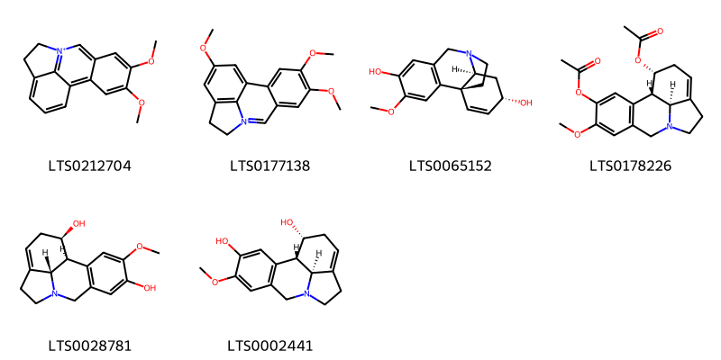{ width=100% }
    <figcaption>Hình ảnh cấu trúc hóa học của 6 hoạt chất thuộc nhóm Quinolines and derivatives gồm ['vasconine (LTS0212704)', '4,5,14-trimethoxy-9λ⁵-azatetracyclo[7.6.1.0²,⁷.0¹²,¹⁶]hexadeca-1(16),2(7),3,5,8,12,14-heptaen-9-ylium (LTS0177138)', '(-)-8-demethylmaritidine (LTS0065152)', '(1s,15r,16s)-15-(acetyloxy)-5-methoxy-9-azatetracyclo[7.6.1.0²,⁷.0¹²,¹⁶]hexadeca-2(7),3,5,12-tetraen-4-yl acetate (LTS0178226)', '(1s,15r,16s)-4-methoxy-9-azatetracyclo[7.6.1.0²,⁷.0¹²,¹⁶]hexadeca-2(7),3,5,12-tetraene-5,15-diol (LTS0028781)', '(1s,15r,16s)-5-methoxy-9-azatetracyclo[7.6.1.0²,⁷.0¹²,¹⁶]hexadeca-2(7),3,5,12-tetraene-4,15-diol (LTS0002441)'].</figcaption>
</figure>

---

### Dược dân tộc học

Danh sách các quốc gia có sử dụng *Narcissus pseudonarcissus* trong điều trị các bệnh. 

| Country   | Disease                                                      | Bệnh                                                          |
|:----------|:-------------------------------------------------------------|:--------------------------------------------------------------|
| Iraq      | Astringent, Emetic, Emmenagogue, Narcotic, Poison, Purgative | Chất làm se, Emetic, Emmenagogue, Narcotic, Poison, Purgative |
| ain       | Poison                                                       | Chất độc                                                      |

---

---
## Narcissus tazetta
### Thông tin về thực vật

!!! info "Phân loại thực vật của *Narcissus tazetta* từ GIBF:"
    - **Kingdom:** Plantae
    - **Phylum:** Tracheophyta
    - **Order:** Asparagales
    - **Family:** Amaryllidaceae
    - **Genus:** Narcissus
    - **Species:** *Narcissus tazetta*

 

| Label (VI)   | Label (EN)   | Scientific Name   | Descriptions (VI)   | Descriptions (EN)   | Also Known As (VI)    | Also Known As (EN)     |
|:-------------|:-------------|:------------------|:--------------------|:--------------------|:----------------------|:-----------------------|
| N/A          | N/A          | Narcissus tazetta | loài thực vật       | species of plant    | ['Narcissus tazetta'] | ['Narcissus tazzetta'] |

#### Phân bố trên thế giới

**Từ CSDL GIBF** nan, Japan, Malta, Israel, Chile, New Zealand, Türkiye, Spain, Netherlands, Denmark, Montenegro, United States of America, Greece, Albania, Croatia, Argentina, Cyprus, Algeria, United Kingdom of Great Britain and Northern Ireland, Belgium, Syrian Arab Republic, Germany, Lebanon, Portugal, South Africa, Australia, Italy, France

#### Phân bố tại Việt Nam

**Từ CSDL GIBF**: Không có ghi nhận ở Việt Nam

---
### Thành phần hóa học
        
- Theo cơ sở dữ liệu lotus: Từ loài *Narcissus tazetta* đã phân lập và xác định được 63 hoạt chất thuộc về các nhóm Indoles and derivatives, Benzene and substituted derivatives, Quinolines and derivatives, Unsaturated hydrocarbons, Flavonoids, Cinnamyl alcohols, Cinnamic acids and derivatives, Prenol lipids, Amaryllidaceae alkaloids. 

|    | chemicalTaxonomyClassyfireClass     |   smiles_count |
|---:|:------------------------------------|---------------:|
|  0 | Amaryllidaceae alkaloids            |             29 |
|  1 | Benzene and substituted derivatives |              4 |
|  2 | Cinnamic acids and derivatives      |              4 |
|  3 | Cinnamyl alcohols                   |              1 |
|  4 | Flavonoids                          |              3 |
|  5 | Indoles and derivatives             |              1 |
|  6 | Prenol lipids                       |              7 |
|  7 | Quinolines and derivatives          |             12 |
|  8 | Unsaturated hydrocarbons            |              1 |

#### Nhóm Amaryllidaceae alkaloids
<figure markdown="span">
    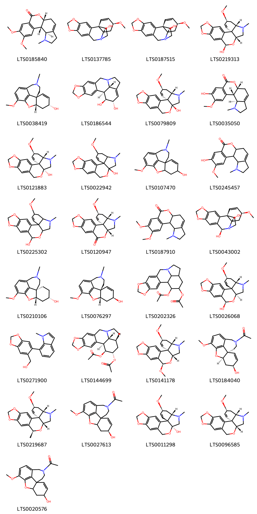{ width=100% }
    <figcaption>Hình ảnh cấu trúc hóa học của 29 hoạt chất thuộc nhóm Amaryllidaceae alkaloids gồm ['homolycorine (LTS0185840)', 'haemanthamine (LTS0137785)', 'haemanthamine (LTS0187515)', 'pretazettine (LTS0219313)', 'galantamine (LTS0038419)', 'lycorine (LTS0186544)', '(1s,13r,16s,18s)-18-methoxy-15-methyl-5,7,12-trioxa-15-azapentacyclo[11.7.0.0¹,¹⁶.0²,¹⁰.0⁴,⁸]icosa-2,4(8),9,19-tetraen-13-ol (LTS0079809)', '9-o-demethylhomolycorine (LTS0035050)', 'tazettine (LTS0121883)', 'tazettine (LTS0022942)', 'galantamine (LTS0107470)', '5-hydroxy-4-methoxy-16-methyl-9-oxa-16-azatetracyclo[8.7.0.0²,⁷.0¹³,¹⁷]heptadeca-2(7),3,5,12-tetraen-8-one (LTS0245457)', '18-methoxy-15-methyl-5,7,12-trioxa-15-azapentacyclo[11.7.0.0¹,¹⁶.0²,¹⁰.0⁴,⁸]icosa-2,4(8),9,19-tetraen-11-ol (LTS0225302)', '3-epimacronine (LTS0120947)', '4,5-dimethoxy-16-methyl-9-oxa-16-azatetracyclo[8.7.0.0²,⁷.0¹³,¹⁷]heptadeca-2(7),3,5,12-tetraen-8-one (LTS0187910)', '(1s,11s,13s,15s,18s)-15-methoxy-5,7-dioxa-12-azapentacyclo[10.5.2.0¹,¹³.0²,¹⁰.0⁴,⁸]nonadeca-2,4(8),9,16-tetraene-11,18-diol (LTS0043002)', 'lycoramine (LTS0210106)', 'epigalantamine (LTS0076297)', '17-(acetyloxy)-5,7-dioxa-12-azapentacyclo[10.6.1.0²,¹⁰.0⁴,⁸.0¹⁵,¹⁹]nonadeca-2,4(8),9-trien-18-yl acetate (LTS0202326)', '(1r,11r,13s,16s,18s)-18-methoxy-15-methyl-5,7,12-trioxa-15-azapentacyclo[11.7.0.0¹,¹⁶.0²,¹⁰.0⁴,⁸]icosa-2,4(8),9,19-tetraen-11-ol (LTS0026068)', '[6-(1-methylindol-7-yl)-2h-1,3-benzodioxol-5-yl]methanol (LTS0271900)', '(1s,15r,17s,18s,19r)-17-(acetyloxy)-5,7-dioxa-12-azapentacyclo[10.6.1.0²,¹⁰.0⁴,⁸.0¹⁵,¹⁹]nonadeca-2,4(8),9-trien-18-yl acetate (LTS0144699)', '(1s,11r,13r,16s,18s)-11,18-dimethoxy-15-methyl-5,7,12-trioxa-15-azapentacyclo[11.7.0.0¹,¹⁶.0²,¹⁰.0⁴,⁸]icosa-2,4(8),9,19-tetraene (LTS0141178)', '1-[(1r,12r,14s)-14-hydroxy-9-methoxy-11-oxa-4-azatetracyclo[8.6.1.0¹,¹².0⁶,¹⁷]heptadeca-6,8,10(17),15-tetraen-4-yl]ethanone (LTS0184040)', '(1s,11s,13r,16s,18s)-18-methoxy-11,15-dimethyl-5,7,12-trioxa-15-azapentacyclo[11.7.0.0¹,¹⁶.0²,¹⁰.0⁴,⁸]icosa-2,4(8),9,19-tetraene (LTS0219687)', '1-[(14s)-14-hydroxy-9-methoxy-11-oxa-4-azatetracyclo[8.6.1.0¹,¹².0⁶,¹⁷]heptadeca-6,8,10(17),15-tetraen-4-yl]ethanone (LTS0027613)', 'tazettin (LTS0011298)', '(1s,13r,16s,18s)-18-methoxy-15-methyl-5,7,12-trioxa-15-azapentacyclo[11.7.0.0¹,¹⁶.0²,¹⁰.0⁴,⁸]icosa-2,4(8),9,19-tetraene (LTS0096585)', '1-{14-hydroxy-9-methoxy-11-oxa-4-azatetracyclo[8.6.1.0¹,¹².0⁶,¹⁷]heptadeca-6,8,10(17),15-tetraen-4-yl}ethanone (LTS0020576)'].</figcaption>
</figure>
#### Nhóm Benzene and substituted derivatives
<figure markdown="span">
    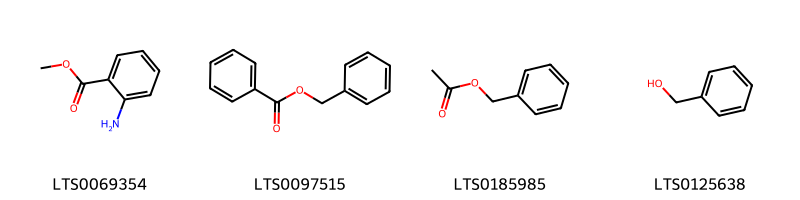{ width=100% }
    <figcaption>Hình ảnh cấu trúc hóa học của 4 hoạt chất thuộc nhóm Benzene and substituted derivatives gồm ['methyl anthranilate (LTS0069354)', 'benzyl benzoate (LTS0097515)', 'benzyl acetate (LTS0185985)', 'benzyl alcohol (LTS0125638)'].</figcaption>
</figure>
#### Nhóm Cinnamic acids and derivatives
<figure markdown="span">
    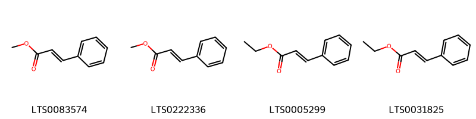{ width=100% }
    <figcaption>Hình ảnh cấu trúc hóa học của 4 hoạt chất thuộc nhóm Cinnamic acids and derivatives gồm ['methyl cinnamate (LTS0083574)', 'methyl cinnamate (LTS0222336)', 'ethyl 3-phenylprop-2-enoate (LTS0005299)', 'ethyl cinnamate (LTS0031825)'].</figcaption>
</figure>
#### Nhóm Cinnamyl alcohols
<figure markdown="span">
    { width=100% }
    <figcaption>Hình ảnh cấu trúc hóa học của 1 hoạt chất thuộc nhóm Cinnamyl alcohols gồm ['cinnamyl alcohol (LTS0010678)'].</figcaption>
</figure>
#### Nhóm Flavonoids
<figure markdown="span">
    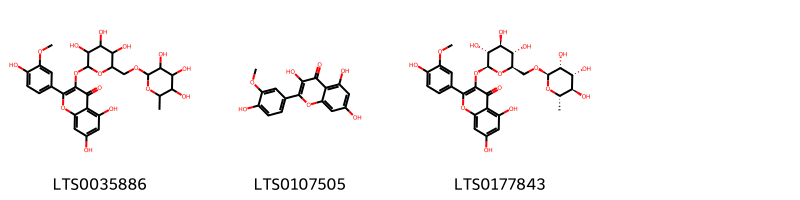{ width=100% }
    <figcaption>Hình ảnh cấu trúc hóa học của 3 hoạt chất thuộc nhóm Flavonoids gồm ['5,7-dihydroxy-2-(4-hydroxy-3-methoxyphenyl)-3-[(3,4,5-trihydroxy-6-{[(3,4,5-trihydroxy-6-methyloxan-2-yl)oxy]methyl}oxan-2-yl)oxy]chromen-4-one (LTS0035886)', 'isorhamnetin (LTS0107505)', 'narcissin (LTS0177843)'].</figcaption>
</figure>
#### Nhóm Indoles and derivatives
<figure markdown="span">
    { width=100% }
    <figcaption>Hình ảnh cấu trúc hóa học của 1 hoạt chất thuộc nhóm Indoles and derivatives gồm ['indole (LTS0185357)'].</figcaption>
</figure>
#### Nhóm Prenol lipids
<figure markdown="span">
    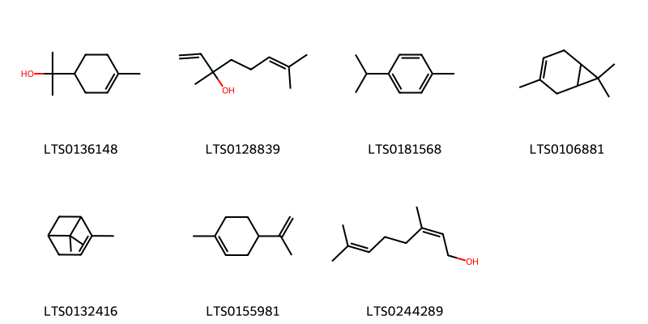{ width=100% }
    <figcaption>Hình ảnh cấu trúc hóa học của 7 hoạt chất thuộc nhóm Prenol lipids gồm ['terpineol (LTS0136148)', 'linalool, (+-)- (LTS0128839)', 'cymene (LTS0181568)', 'monoterpenes (LTS0106881)', 'α pinene (LTS0132416)', 'limonene,  (LTS0155981)', 'nerol (LTS0244289)'].</figcaption>
</figure>
#### Nhóm Quinolines and derivatives
<figure markdown="span">
    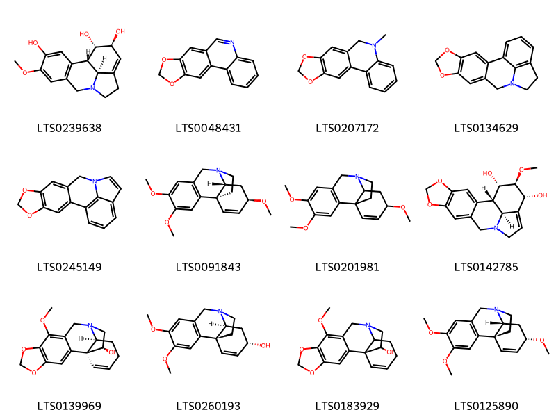{ width=100% }
    <figcaption>Hình ảnh cấu trúc hóa học của 12 hoạt chất thuộc nhóm Quinolines and derivatives gồm ['pseudolycorine (LTS0239638)', 'trisphaeridine (LTS0048431)', '5-methyl-6h,9h-[1,3]dioxolo[4,5-j]phenanthridine (LTS0207172)', '5,7-dioxa-12-azapentacyclo[10.6.1.0²,¹⁰.0⁴,⁸.0¹⁵,¹⁹]nonadeca-1(18),2,4(8),9,15(19),16-hexaene (LTS0134629)', '5,7-dioxa-12-azapentacyclo[10.6.1.0²,¹⁰.0⁴,⁸.0¹⁵,¹⁹]nonadeca-1(19),2,4(8),9,13,15,17-heptaene (LTS0245149)', '(1s,10r,12r)-4,5,12-trimethoxy-9-azatetracyclo[7.5.2.0¹,¹⁰.0²,⁷]hexadeca-2(7),3,5,13-tetraene (LTS0091843)', '4,5,12-trimethoxy-9-azatetracyclo[7.5.2.0¹,¹⁰.0²,⁷]hexadeca-2(7),3,5,13-tetraene (LTS0201981)', 'ungiminorine (LTS0142785)', '(1s,13s,18s)-9-methoxy-5,7-dioxa-12-azapentacyclo[10.5.2.0¹,¹³.0²,¹⁰.0⁴,⁸]nonadeca-2,4(8),9,16-tetraen-18-ol (LTS0139969)', '(1r,10s,12s)-4,5-dimethoxy-9-azatetracyclo[7.5.2.0¹,¹⁰.0²,⁷]hexadeca-2(7),3,5,13-tetraen-12-ol (LTS0260193)', '9-methoxy-5,7-dioxa-12-azapentacyclo[10.5.2.0¹,¹³.0²,¹⁰.0⁴,⁸]nonadeca-2,4(8),9,16-tetraen-18-ol (LTS0183929)', '(1r,10r,12s)-4,5,12-trimethoxy-9-azatetracyclo[7.5.2.0¹,¹⁰.0²,⁷]hexadeca-2(7),3,5,13-tetraene (LTS0125890)'].</figcaption>
</figure>
#### Nhóm Unsaturated hydrocarbons
<figure markdown="span">
    { width=100% }
    <figcaption>Hình ảnh cấu trúc hóa học của 1 hoạt chất thuộc nhóm Unsaturated hydrocarbons gồm ['α terpinene (LTS0232891)'].</figcaption>
</figure>

---

### Dược dân tộc học

Danh sách các quốc gia có sử dụng *Narcissus tazetta* trong điều trị các bệnh. 

| Country   | Disease                                                          | Bệnh                                                                       |
|:----------|:-----------------------------------------------------------------|:---------------------------------------------------------------------------|
| China     | Cosmetic, Demulcent, Poison, Poultice, Analgesic, Antiphlogistic | Mỹ phẩm, Demulcent, Poison, Poultice, Analgesic, Antiphlogistic            |
| Elsewhere | Poison                                                           | Chất độc                                                                   |
| India     | Diuretic, Diuretic, Emetic, Purgative, Purgative, Emetic         | Thuốc lợi tiểu, lợi tiểu, lợi tiểu, lợi tiểu, lợi tiểu, lợi tiểu, lợi tiểu |

---

# Chi Scilla

??? note "Danh sách các dược liệu thuộc chi"
    
	 - *Scilla autumnalis*
	 - *Scilla hyacinthiana*
	 - *Scilla lilio-hyacinthus*
	 - *Scilla natalensis*
	 - *Scilla non-scripta*
	 - *Scilla nutans*
	 - *Scilla sibirica*

---
## Scilla autumnalis
### Thông tin về thực vật

!!! info "Phân loại thực vật của *Scilla autumnalis* từ GIBF:"
    - **Kingdom:** Plantae
    - **Phylum:** Tracheophyta
    - **Order:** Asparagales
    - **Family:** Asparagaceae
    - **Genus:** Scilla
    - **Species:** *Scilla autumnalis*

 

| Label (VI)   | Label (EN)   | Scientific Name   | Descriptions (VI)   | Descriptions (EN)   | Also Known As (VI)   | Also Known As (EN)       |
|:-------------|:-------------|:------------------|:--------------------|:--------------------|:---------------------|:-------------------------|
| N/A          | N/A          | Scilla autumnalis | loài thực vật       | species of plant    | ['']                 | ['autumn spring squill'] |

#### Phân bố trên thế giới

**Từ CSDL GIBF** nan, Guernsey, Portugal, Korea, Republic of, Greece, United Kingdom of Great Britain and Northern Ireland, Ukraine, Israel, Palestine, State of, Italy, Croatia, Türkiye, Bulgaria, Cyprus, Syrian Arab Republic, France, Spain, Bosnia and Herzegovina

#### Phân bố tại Việt Nam

**Từ CSDL GIBF**: Không có ghi nhận ở Việt Nam

---
### Thành phần hóa học
        
- Theo cơ sở dữ liệu lotus: Từ loài *Scilla autumnalis* đã phân lập và xác định được Chưa có hoạt chất nào được phân lập. hoạt chất thuộc về các nhóm Không có hoạt chất nào được phân lập. 

Không có hình ảnh nào được tạo ra

---

### Dược dân tộc học

Danh sách các quốc gia có sử dụng *Scilla autumnalis* trong điều trị các bệnh. 

| Country   | Disease                            | Bệnh                       |
|:----------|:-----------------------------------|:---------------------------|
| Iraq      | Cardiotonic, Diuretic, Expectorant | Cardiotonic, lợi tiểu, đờm |
| Turkey    | Stimulant                          | Chất kích thích            |

---

---
## Scilla hyacinthiana
### Thông tin về thực vật

!!! info "Phân loại thực vật của *Ledebouria revoluta* từ GIBF:"
    - **Kingdom:** Plantae
    - **Phylum:** Tracheophyta
    - **Order:** Asparagales
    - **Family:** Asparagaceae
    - **Genus:** Ledebouria
    - **Species:** *Ledebouria revoluta*

 

| Label (VI)   | Label (EN)   | Scientific Name   | Descriptions (VI)   | Descriptions (EN)   | Also Known As (VI)   | Also Known As (EN)       |
|:-------------|:-------------|:------------------|:--------------------|:--------------------|:---------------------|:-------------------------|
| N/A          | N/A          | Scilla autumnalis | loài thực vật       | species of plant    | ['']                 | ['autumn spring squill'] |

#### Phân bố trên thế giới

**Từ CSDL GIBF** Sri Lanka, nan, Uganda, Kenya, Zambia, Botswana, Saudi Arabia, Zimbabwe, Mozambique, Tanzania, United Republic of, India, Yemen, Ethiopia, Sudan, Eritrea, Malawi

#### Phân bố tại Việt Nam

**Từ CSDL GIBF**: Không có ghi nhận ở Việt Nam

---
### Thành phần hóa học
        
- Theo cơ sở dữ liệu lotus: Từ loài *Ledebouria revoluta* đã phân lập và xác định được Chưa có hoạt chất nào được phân lập. hoạt chất thuộc về các nhóm Không có hoạt chất nào được phân lập. 

Không có hình ảnh nào được tạo ra

---

### Dược dân tộc học

Danh sách các quốc gia có sử dụng *Ledebouria revoluta* trong điều trị các bệnh. 

| Country   | Disease                            | Bệnh                                     |
|:----------|:-----------------------------------|:-----------------------------------------|
| Elsewhere | Diuretic, Cardiotonic, Expectorant | Thuốc lợi tiểu, Cardiotonic, Expectorant |

---

---
## Scilla liliohyacinthus
### Thông tin về thực vật

!!! info "Phân loại thực vật của *Scilla lilio-hyacinthus* từ GIBF:"
    - **Kingdom:** Plantae
    - **Phylum:** Tracheophyta
    - **Order:** Asparagales
    - **Family:** Asparagaceae
    - **Genus:** Scilla
    - **Species:** *Scilla lilio-hyacinthus*

 

| Label (VI)   | Label (EN)   | Scientific Name        | Descriptions (VI)   | Descriptions (EN)   | Also Known As (VI)   | Also Known As (EN)         |
|:-------------|:-------------|:-----------------------|:--------------------|:--------------------|:---------------------|:---------------------------|
| N/A          | N/A          | Scilla liliohyacinthus | loài thực vật       | species of plant    | ['']                 | ['Scilla liliohyacinthus'] |

#### Phân bố trên thế giới

**Từ CSDL GIBF** nan, United Kingdom of Great Britain and Northern Ireland, France, Spain, Netherlands

#### Phân bố tại Việt Nam

**Từ CSDL GIBF**: Không có ghi nhận ở Việt Nam

---
### Thành phần hóa học
        
- Theo cơ sở dữ liệu lotus: Từ loài *Scilla lilio-hyacinthus* đã phân lập và xác định được Chưa có hoạt chất nào được phân lập. hoạt chất thuộc về các nhóm Không có hoạt chất nào được phân lập. 

Không có hình ảnh nào được tạo ra

---

### Dược dân tộc học

Danh sách các quốc gia có sử dụng *Scilla lilio-hyacinthus* trong điều trị các bệnh. 

| Country   | Disease   | Bệnh     |
|:----------|:----------|:---------|
| France    | Purgative | Thuốc xổ |

---

---
## Scilla natalensis
### Thông tin về thực vật

!!! info "Phân loại thực vật của *Merwilla plumbea* từ GIBF:"
    - **Kingdom:** Plantae
    - **Phylum:** Tracheophyta
    - **Order:** Asparagales
    - **Family:** Asparagaceae
    - **Genus:** Merwilla
    - **Species:** *Merwilla plumbea*

 

| Label (VI)   | Label (EN)   | Scientific Name   | Descriptions (VI)   | Descriptions (EN)   | Also Known As (VI)   | Also Known As (EN)   |
|:-------------|:-------------|:------------------|:--------------------|:--------------------|:---------------------|:---------------------|
| N/A          | N/A          | Scilla natalensis | loài thực vật       | species of plant    | ['']                 | ['']                 |

#### Phân bố trên thế giới

**Từ CSDL GIBF** nan, Lesotho, Zambia, Eswatini, South Africa, New Zealand, Zimbabwe, Mozambique, United Kingdom of Great Britain and Northern Ireland, Malawi

#### Phân bố tại Việt Nam

**Từ CSDL GIBF**: Không có ghi nhận ở Việt Nam

---
### Thành phần hóa học
        
- Theo cơ sở dữ liệu lotus: Từ loài *Merwilla plumbea* đã phân lập và xác định được Chưa có hoạt chất nào được phân lập. hoạt chất thuộc về các nhóm Không có hoạt chất nào được phân lập. 

Không có hình ảnh nào được tạo ra

---

### Dược dân tộc học

Danh sách các quốc gia có sử dụng *Merwilla plumbea* trong điều trị các bệnh. 

| Country   | Disease   | Bệnh     |
|:----------|:----------|:---------|
| Lesotho   | Aperient  | Aperient |

---

---
## Scilla nonscripta
### Thông tin về thực vật

!!! info "Phân loại thực vật của *Hyacinthoides non-scripta* từ GIBF:"
    - **Kingdom:** Plantae
    - **Phylum:** Tracheophyta
    - **Order:** Asparagales
    - **Family:** Asparagaceae
    - **Genus:** Hyacinthoides
    - **Species:** *Hyacinthoides non-scripta*

 

| Label (VI)   | Label (EN)   | Scientific Name   | Descriptions (VI)   | Descriptions (EN)   | Also Known As (VI)   | Also Known As (EN)   |
|:-------------|:-------------|:------------------|:--------------------|:--------------------|:---------------------|:---------------------|
| N/A          | N/A          | Scilla nonscripta |                     | species of plant    | ['']                 | ['']                 |

#### Phân bố trên thế giới

**Từ CSDL GIBF** Ireland, Austria, United States of America, Portugal, United Kingdom of Great Britain and Northern Ireland, Belgium, New Zealand, unknown or invalid, Canada, Germany, France, Spain, Netherlands

#### Phân bố tại Việt Nam

**Từ CSDL GIBF**: Không có ghi nhận ở Việt Nam

---
### Thành phần hóa học
        
- Theo cơ sở dữ liệu lotus: Từ loài *Hyacinthoides non-scripta* đã phân lập và xác định được Chưa có hoạt chất nào được phân lập. hoạt chất thuộc về các nhóm Không có hoạt chất nào được phân lập. 

Không có hình ảnh nào được tạo ra

---

### Dược dân tộc học

Danh sách các quốc gia có sử dụng *Hyacinthoides non-scripta* trong điều trị các bệnh. 

| Country   | Disease   | Bệnh     |
|:----------|:----------|:---------|
| Europe    | Poison    | Chất độc |

---

---
## Scilla nutans
### Thông tin về thực vật

!!! info "Phân loại thực vật của *Hyacinthoides non-scripta* từ GIBF:"
    - **Kingdom:** Plantae
    - **Phylum:** Tracheophyta
    - **Order:** Asparagales
    - **Family:** Asparagaceae
    - **Genus:** Hyacinthoides
    - **Species:** *Hyacinthoides non-scripta*

 

| Label (VI)   | Label (EN)   | Scientific Name   | Descriptions (VI)   | Descriptions (EN)   | Also Known As (VI)   | Also Known As (EN)   |
|:-------------|:-------------|:------------------|:--------------------|:--------------------|:---------------------|:---------------------|
| N/A          | N/A          | Scilla nonscripta |                     | species of plant    | ['']                 | ['']                 |

#### Phân bố trên thế giới

**Từ CSDL GIBF** nan, France, unknown or invalid, Canada, Germany, United Kingdom of Great Britain and Northern Ireland, Spain

#### Phân bố tại Việt Nam

**Từ CSDL GIBF**: Không có ghi nhận ở Việt Nam

---
### Thành phần hóa học
        
- Theo cơ sở dữ liệu lotus: Từ loài *Hyacinthoides non-scripta* đã phân lập và xác định được Chưa có hoạt chất nào được phân lập. hoạt chất thuộc về các nhóm Không có hoạt chất nào được phân lập. 

Không có hình ảnh nào được tạo ra

---

### Dược dân tộc học

Danh sách các quốc gia có sử dụng *Hyacinthoides non-scripta* trong điều trị các bệnh. 

| Country   | Disease   | Bệnh   |
|:----------|:----------|:-------|
| English   | Styptic   | L.     |

---

---
## Scilla sibirica
### Thông tin về thực vật

!!! info "Phân loại thực vật của *Scilla siberica* từ GIBF:"
    - **Kingdom:** Plantae
    - **Phylum:** Tracheophyta
    - **Order:** Asparagales
    - **Family:** Asparagaceae
    - **Genus:** Scilla
    - **Species:** *Scilla siberica*

 

| Label (VI)   | Label (EN)   | Scientific Name   | Descriptions (VI)   | Descriptions (EN)   | Also Known As (VI)   | Also Known As (EN)   |
|:-------------|:-------------|:------------------|:--------------------|:--------------------|:---------------------|:---------------------|
| N/A          | N/A          | Scilla nonscripta |                     | species of plant    | ['']                 | ['']                 |

#### Phân bố trên thế giới

**Từ CSDL GIBF** nan, Austria, United States of America, Cyprus, Netherlands, Åland Islands, Finland, Ukraine, Russian Federation, Armenia, unknown or invalid, Canada, Germany, Poland

#### Phân bố tại Việt Nam

**Từ CSDL GIBF**: Không có ghi nhận ở Việt Nam

---
### Thành phần hóa học
        
- Theo cơ sở dữ liệu lotus: Từ loài *Scilla siberica* đã phân lập và xác định được Chưa có hoạt chất nào được phân lập. hoạt chất thuộc về các nhóm Không có hoạt chất nào được phân lập. 

Không có hình ảnh nào được tạo ra

---

### Dược dân tộc học

Danh sách các quốc gia có sử dụng *Scilla siberica* trong điều trị các bệnh. 

| Country   | Disease                          | Bệnh                                             |
|:----------|:---------------------------------|:-------------------------------------------------|
| Iraq      | Diuretic, Expectorant, Stimulant | Thuốc lợi tiểu, thuốc long đờm, thuốc kích thích |
| Turkey    | Cardiotonic                      | Tim mạch                                         |

---

# Chi Bowiea

??? note "Danh sách các dược liệu thuộc chi"
    
	 - *Bowiea volubilis*
	 - *Bowiea vulubilis*

---
## Bowiea volubilis
### Thông tin về thực vật

!!! info "Phân loại thực vật của *Bowiea volubilis* từ GIBF:"
    - **Kingdom:** Plantae
    - **Phylum:** Tracheophyta
    - **Order:** Asparagales
    - **Family:** Asparagaceae
    - **Genus:** Bowiea
    - **Species:** *Bowiea volubilis*

 

| Label (VI)   | Label (EN)   | Scientific Name   | Descriptions (VI)   | Descriptions (EN)   | Also Known As (VI)   | Also Known As (EN)   |
|:-------------|:-------------|:------------------|:--------------------|:--------------------|:---------------------|:---------------------|
| N/A          | N/A          | Bowiea volubilis  | loài thực vật       | species of plant    | ['']                 | ['climbing onion']   |

#### Phân bố trên thế giới

**Từ CSDL GIBF** nan, Namibia, Brazil, Congo, Democratic Republic of the, United States of America, Kenya, Portugal, Uganda, Zambia, Eswatini, Belgium, South Africa, Zimbabwe, Mozambique, Tanzania, United Republic of, unknown or invalid, Angola, Malawi

#### Phân bố tại Việt Nam

**Từ CSDL GIBF**: Không có ghi nhận ở Việt Nam

---
### Thành phần hóa học
        
- Theo cơ sở dữ liệu lotus: Từ loài *Bowiea volubilis* đã phân lập và xác định được 12 hoạt chất thuộc về các nhóm Steroids and steroid derivatives. 

|    | chemicalTaxonomyClassyfireClass   |   smiles_count |
|---:|:----------------------------------|---------------:|
|  0 | Steroids and steroid derivatives  |             12 |

#### Nhóm Steroids and steroid derivatives
<figure markdown="span">
    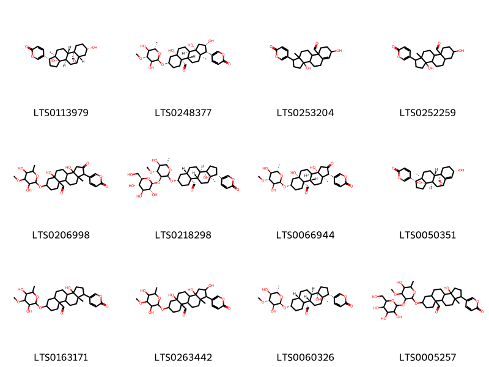{ width=100% }
    <figcaption>Hình ảnh cấu trúc hóa học của 12 hoạt chất thuộc nhóm Steroids and steroid derivatives gồm ['(1r,3as,3br,5as,7s,9ar,9bs,11ar)-3a,7-dihydroxy-11a-methyl-1-(6-oxopyran-3-yl)-tetradecahydrocyclopenta[a]phenanthrene-9a-carbaldehyde (LTS0113979)', '(1r,2s,3as,3br,5as,7s,9as,9bs,11ar)-7-{[(2r,3s,4r,5s,6s)-3,5-dihydroxy-4-methoxy-6-methyloxan-2-yl]oxy}-2,3a,5a-trihydroxy-11a-methyl-1-(6-oxopyran-3-yl)-dodecahydro-1h-cyclopenta[a]phenanthrene-9a-carbaldehyde (LTS0248377)', '3a,7-dihydroxy-11a-methyl-1-(6-oxopyran-3-yl)-1h,2h,3h,3bh,4h,5h,7h,8h,9h,9bh,10h,11h-cyclopenta[a]phenanthrene-9a-carbaldehyde (LTS0253204)', '3a,7-dihydroxy-11a-methyl-1-(6-oxopyran-3-yl)-tetradecahydrocyclopenta[a]phenanthrene-9a-carbaldehyde (LTS0252259)', '7-[(3,5-dihydroxy-4-methoxy-6-methyloxan-2-yl)oxy]-3a,5a-dihydroxy-11a-methyl-2-oxo-1-(6-oxopyran-3-yl)-dodecahydrocyclopenta[a]phenanthrene-9a-carbaldehyde (LTS0206998)', '(1r,3as,3br,5as,7s,9ar,9bs,11ar)-3a-hydroxy-7-{[(2r,3s,4r,5s,6s)-5-hydroxy-4-methoxy-6-methyl-3-{[(2s,3r,4s,5s,6r)-3,4,5-trihydroxy-6-(hydroxymethyl)oxan-2-yl]oxy}oxan-2-yl]oxy}-11a-methyl-1-(6-oxopyran-3-yl)-tetradecahydrocyclopenta[a]phenanthrene-9a-carbaldehyde (LTS0218298)', '(1r,3as,3br,5as,7s,9as,9bs,11ar)-7-{[(2r,3s,4r,5s,6s)-3,5-dihydroxy-4-methoxy-6-methyloxan-2-yl]oxy}-3a,5a-dihydroxy-11a-methyl-2-oxo-1-(6-oxopyran-3-yl)-dodecahydrocyclopenta[a]phenanthrene-9a-carbaldehyde (LTS0066944)', '(1r,3as,3br,7s,9as,9bs,11ar)-3a,7-dihydroxy-11a-methyl-1-(6-oxopyran-3-yl)-1h,2h,3h,3bh,4h,5h,7h,8h,9h,9bh,10h,11h-cyclopenta[a]phenanthrene-9a-carbaldehyde (LTS0050351)', '7-[(3,5-dihydroxy-4-methoxy-6-methyloxan-2-yl)oxy]-3a-hydroxy-11a-methyl-1-(6-oxopyran-3-yl)-tetradecahydrocyclopenta[a]phenanthrene-9a-carbaldehyde (LTS0163171)', '7-[(3,5-dihydroxy-4-methoxy-6-methyloxan-2-yl)oxy]-2,3a,5a-trihydroxy-11a-methyl-1-(6-oxopyran-3-yl)-dodecahydro-1h-cyclopenta[a]phenanthrene-9a-carbaldehyde (LTS0263442)', '(1r,3as,3br,5as,7s,9ar,9bs,11ar)-7-{[(2r,3s,4r,5s,6s)-3,5-dihydroxy-4-methoxy-6-methyloxan-2-yl]oxy}-3a-hydroxy-11a-methyl-1-(6-oxopyran-3-yl)-tetradecahydrocyclopenta[a]phenanthrene-9a-carbaldehyde (LTS0060326)', '3a-hydroxy-7-[(5-hydroxy-4-methoxy-6-methyl-3-{[3,4,5-trihydroxy-6-(hydroxymethyl)oxan-2-yl]oxy}oxan-2-yl)oxy]-11a-methyl-1-(6-oxopyran-3-yl)-tetradecahydrocyclopenta[a]phenanthrene-9a-carbaldehyde (LTS0005257)'].</figcaption>
</figure>

---

### Dược dân tộc học

Danh sách các quốc gia có sử dụng *Bowiea volubilis* trong điều trị các bệnh. 

| Country       | Disease     | Bệnh     |
|:--------------|:------------|:---------|
| Africa        | Cardiotonic | Tim mạch |
| Africa(Fingu) | Purgative   | Thuốc xổ |
| Elsewhere     | Poison      | Chất độc |

---

---
## Bowiea vulubilis
### Thông tin về thực vật

!!! info "Phân loại thực vật của *Bowiea volubilis* từ GIBF:"
    - **Kingdom:** Plantae
    - **Phylum:** Tracheophyta
    - **Order:** Asparagales
    - **Family:** Asparagaceae
    - **Genus:** Bowiea
    - **Species:** *Bowiea volubilis*

 

| Label (VI)   | Label (EN)   | Scientific Name   | Descriptions (VI)   | Descriptions (EN)   | Also Known As (VI)   | Also Known As (EN)   |
|:-------------|:-------------|:------------------|:--------------------|:--------------------|:---------------------|:---------------------|
| N/A          | N/A          | Bowiea volubilis  | loài thực vật       | species of plant    | ['']                 | ['climbing onion']   |

#### Phân bố trên thế giới

**Từ CSDL GIBF** nan, Namibia, Brazil, Congo, Democratic Republic of the, United States of America, Kenya, Portugal, Uganda, Zambia, Eswatini, Belgium, South Africa, Zimbabwe, Mozambique, Tanzania, United Republic of, unknown or invalid, Angola, Malawi

#### Phân bố tại Việt Nam

**Từ CSDL GIBF**: Không có ghi nhận ở Việt Nam

---
### Thành phần hóa học
        
- Theo cơ sở dữ liệu lotus: Từ loài *Bowiea volubilis* đã phân lập và xác định được Chưa có hoạt chất nào được phân lập. hoạt chất thuộc về các nhóm Không có hoạt chất nào được phân lập. 

Không có hình ảnh nào được tạo ra

---

### Dược dân tộc học

Danh sách các quốc gia có sử dụng *Bowiea volubilis* trong điều trị các bệnh. 

| Country       | Disease   | Bệnh     |
|:--------------|:----------|:---------|
| Africa(Baca)  | Purgative | Thuốc xổ |
| Africa(Pondo) | Purgative | Thuốc xổ |

---

# Chi Chlorogalum

??? note "Danh sách các dược liệu thuộc chi"
    
	 - *Chlorogalum pomeridianum*

---
## Chlorogalum pomeridianum
### Thông tin về thực vật

!!! info "Phân loại thực vật của *Chlorogalum pomeridianum* từ GIBF:"
    - **Kingdom:** Plantae
    - **Phylum:** Tracheophyta
    - **Order:** Asparagales
    - **Family:** Asparagaceae
    - **Genus:** Chlorogalum
    - **Species:** *Chlorogalum pomeridianum*

 

| Label (VI)   | Label (EN)   | Scientific Name          | Descriptions (VI)   | Descriptions (EN)   | Also Known As (VI)   | Also Known As (EN)   |
|:-------------|:-------------|:-------------------------|:--------------------|:--------------------|:---------------------|:---------------------|
| N/A          | N/A          | Chlorogalum pomeridianum | loài thực vật       | species of plant    | ['']                 | ['']                 |

#### Phân bố trên thế giới

**Từ CSDL GIBF** United States of America

#### Phân bố tại Việt Nam

**Từ CSDL GIBF**: Không có ghi nhận ở Việt Nam

---
### Thành phần hóa học
        
- Theo cơ sở dữ liệu lotus: Từ loài *Chlorogalum pomeridianum* đã phân lập và xác định được 6 hoạt chất thuộc về các nhóm Prenol lipids. 

|    | chemicalTaxonomyClassyfireClass   |   smiles_count |
|---:|:----------------------------------|---------------:|
|  0 | Prenol lipids                     |              6 |

#### Nhóm Prenol lipids
<figure markdown="span">
    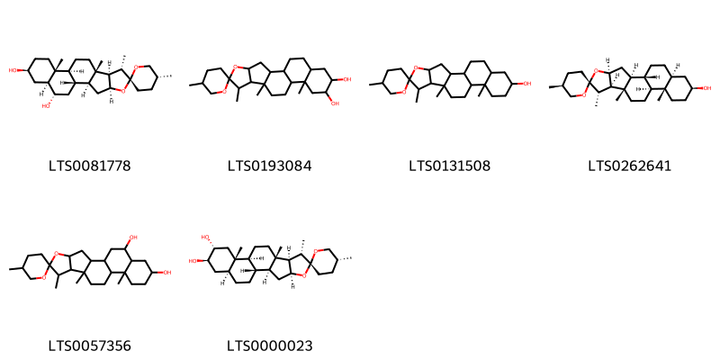{ width=100% }
    <figcaption>Hình ảnh cấu trúc hóa học của 6 hoạt chất thuộc nhóm Prenol lipids gồm ['chlorogenin (LTS0081778)', "5,7',9',13'-tetramethyl-5'-oxaspiro[oxane-2,6'-pentacyclo[10.8.0.0²,⁹.0⁴,⁸.0¹³,¹⁸]icosane]-15',16'-diol (LTS0193084)", 'tigogenin (LTS0131508)', 'neotigogenin (LTS0262641)', "5,7',9',13'-tetramethyl-5'-oxaspiro[oxane-2,6'-pentacyclo[10.8.0.0²,⁹.0⁴,⁸.0¹³,¹⁸]icosane]-16',19'-diol (LTS0057356)", 'gitogenin (LTS0000023)'].</figcaption>
</figure>

---

### Dược dân tộc học

Danh sách các quốc gia có sử dụng *Chlorogalum pomeridianum* trong điều trị các bệnh. 

| Country   | Disease   | Bệnh     |
|:----------|:----------|:---------|
| Elsewhere | Soap      | Xà phòng |

---

# Chi Convallaria

??? note "Danh sách các dược liệu thuộc chi"
    
	 - *Convallaria keiskei*
	 - *Convallaria majalis*

---
## Convallaria keiskei
### Thông tin về thực vật

!!! info "Phân loại thực vật của *Convallaria keiskei* từ GIBF:"
    - **Kingdom:** Plantae
    - **Phylum:** Tracheophyta
    - **Order:** Asparagales
    - **Family:** Asparagaceae
    - **Genus:** Convallaria
    - **Species:** *Convallaria keiskei*

 

| Label (VI)   | Label (EN)   | Scientific Name     | Descriptions (VI)   | Descriptions (EN)   | Also Known As (VI)   | Also Known As (EN)   |
|:-------------|:-------------|:--------------------|:--------------------|:--------------------|:---------------------|:---------------------|
| N/A          | N/A          | Convallaria keiskei | loài thực vật       | species of plant    | ['']                 | ['']                 |

#### Phân bố trên thế giới

**Từ CSDL GIBF** Japan, Korea, Republic of, Mongolia, China, Russian Federation

#### Phân bố tại Việt Nam

**Từ CSDL GIBF**: Không có ghi nhận ở Việt Nam

---
### Thành phần hóa học
        
- Theo cơ sở dữ liệu lotus: Từ loài *Convallaria keiskei* đã phân lập và xác định được 14 hoạt chất thuộc về các nhóm Steroids and steroid derivatives. 

|    | chemicalTaxonomyClassyfireClass   |   smiles_count |
|---:|:----------------------------------|---------------:|
|  0 | Steroids and steroid derivatives  |             14 |

#### Nhóm Steroids and steroid derivatives
<figure markdown="span">
    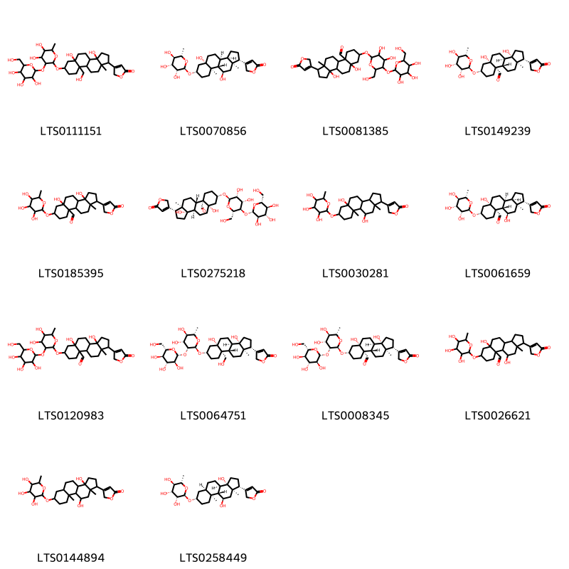{ width=100% }
    <figcaption>Hình ảnh cấu trúc hóa học của 14 hoạt chất thuộc nhóm Steroids and steroid derivatives gồm ['4-{7-[(4,5-dihydroxy-6-methyl-3-{[3,4,5-trihydroxy-6-(hydroxymethyl)oxan-2-yl]oxy}oxan-2-yl)oxy]-3a,5a-dihydroxy-9a-(hydroxymethyl)-11a-methyl-dodecahydro-1h-cyclopenta[a]phenanthren-1-yl}-5h-furan-2-one (LTS0111151)', '4-[(1s,3ar,3bs,5as,7s,9ar,9bs,10r,11as)-5a,10-dihydroxy-9a,11a-dimethyl-7-{[(2r,3r,4r,5r,6s)-3,4,5-trihydroxy-6-methyloxan-2-yl]oxy}-tetradecahydrocyclopenta[a]phenanthren-1-yl]-5h-furan-2-one (LTS0070856)', '7-{[3,4-dihydroxy-6-(hydroxymethyl)-5-{[3,4,5-trihydroxy-6-(hydroxymethyl)oxan-2-yl]oxy}oxan-2-yl]oxy}-3a,5a-dihydroxy-11a-methyl-1-(5-oxo-2h-furan-3-yl)-dodecahydro-1h-cyclopenta[a]phenanthrene-9a-carbaldehyde (LTS0081385)', 'convallatoxin (LTS0149239)', 'convallatoxin (LTS0185395)', '(1r,3as,3br,5as,7s,9as,9bs,11ar)-7-{[(2r,3r,4s,5r,6s)-3,4-dihydroxy-6-(hydroxymethyl)-5-{[(2s,3r,4s,5s,6r)-3,4,5-trihydroxy-6-(hydroxymethyl)oxan-2-yl]oxy}oxan-2-yl]oxy}-3a,5a-dihydroxy-11a-methyl-1-(5-oxo-2h-furan-3-yl)-dodecahydro-1h-cyclopenta[a]phenanthrene-9a-carbaldehyde (LTS0275218)', '4-{5a,10-dihydroxy-9a,11a-dimethyl-7-[(3,4,5-trihydroxy-6-methyloxan-2-yl)oxy]-tetradecahydrocyclopenta[a]phenanthren-1-yl}-5h-furan-2-one (LTS0030281)', '(1s,3ar,3bs,5as,7s,9as,9bs,10r,11as)-5a,10-dihydroxy-11a-methyl-1-(5-oxo-2h-furan-3-yl)-7-{[(2r,3r,4r,5r,6s)-3,4,5-trihydroxy-6-methyloxan-2-yl]oxy}-tetradecahydrocyclopenta[a]phenanthrene-9a-carbaldehyde (LTS0061659)', '7-[(4,5-dihydroxy-6-methyl-3-{[3,4,5-trihydroxy-6-(hydroxymethyl)oxan-2-yl]oxy}oxan-2-yl)oxy]-3a,5a-dihydroxy-11a-methyl-1-(5-oxo-2h-furan-3-yl)-dodecahydro-1h-cyclopenta[a]phenanthrene-9a-carbaldehyde (LTS0120983)', '4-[(1r,3as,3br,5as,7s,9ar,9bs,11ar)-7-{[(2r,3r,4r,5r,6s)-4,5-dihydroxy-6-methyl-3-{[(2r,3s,4r,5r,6s)-3,4,5-trihydroxy-6-(hydroxymethyl)oxan-2-yl]oxy}oxan-2-yl]oxy}-3a,5a-dihydroxy-9a-(hydroxymethyl)-11a-methyl-dodecahydro-1h-cyclopenta[a]phenanthren-1-yl]-5h-furan-2-one (LTS0064751)', '(1r,3as,3br,5as,7s,9as,9bs,11ar)-7-{[(2r,3r,4r,5r,6s)-4,5-dihydroxy-6-methyl-3-{[(2r,3s,4r,5r,6s)-3,4,5-trihydroxy-6-(hydroxymethyl)oxan-2-yl]oxy}oxan-2-yl]oxy}-3a,5a-dihydroxy-11a-methyl-1-(5-oxo-2h-furan-3-yl)-dodecahydro-1h-cyclopenta[a]phenanthrene-9a-carbaldehyde (LTS0008345)', '5a,10-dihydroxy-11a-methyl-1-(5-oxo-2h-furan-3-yl)-7-[(3,4,5-trihydroxy-6-methyloxan-2-yl)oxy]-tetradecahydrocyclopenta[a]phenanthrene-9a-carbaldehyde (LTS0026621)', '4-{3a,10-dihydroxy-9a,11a-dimethyl-7-[(3,4,5-trihydroxy-6-methyloxan-2-yl)oxy]-tetradecahydrocyclopenta[a]phenanthren-1-yl}-5h-furan-2-one (LTS0144894)', 'rhodexin a (LTS0258449)'].</figcaption>
</figure>

---

### Dược dân tộc học

Danh sách các quốc gia có sử dụng *Convallaria keiskei* trong điều trị các bệnh. 

| Country   | Disease               | Bệnh                  |
|:----------|:----------------------|:----------------------|
| Elsewhere | Cardiotonic, Diuretic | Cardiotonic, lợi tiểu |

---

---
## Convallaria majalis
### Thông tin về thực vật

!!! info "Phân loại thực vật của *Convallaria majalis* từ GIBF:"
    - **Kingdom:** Plantae
    - **Phylum:** Tracheophyta
    - **Order:** Asparagales
    - **Family:** Asparagaceae
    - **Genus:** Convallaria
    - **Species:** *Convallaria majalis*

 

| Label (VI)   | Label (EN)   | Scientific Name     | Descriptions (VI)   | Descriptions (EN)   | Also Known As (VI)                                  | Also Known As (EN)                           |
|:-------------|:-------------|:--------------------|:--------------------|:--------------------|:----------------------------------------------------|:---------------------------------------------|
| N/A          | N/A          | Convallaria majalis | loài thực vật       | species of plant    | ['Lan chuông', 'Huệ chuông', 'Convallaria majalis'] | ['lily of the valley', 'Lily-of-the-valley'] |

#### Phân bố trên thế giới

**Từ CSDL GIBF** Austria, Hungary, United States of America, Norway, Czechia, Sweden, France, Belgium, Finland, Ukraine, Serbia, Switzerland, Croatia, Italy, Canada, Germany, United Kingdom of Great Britain and Northern Ireland, Netherlands

#### Phân bố tại Việt Nam

**Từ CSDL GIBF**: Không có ghi nhận ở Việt Nam

---
### Thành phần hóa học
        
- Theo cơ sở dữ liệu lotus: Từ loài *Convallaria majalis* đã phân lập và xác định được 25 hoạt chất thuộc về các nhóm Carboxylic acids and derivatives, Steroids and steroid derivatives. 

|    | chemicalTaxonomyClassyfireClass   |   smiles_count |
|---:|:----------------------------------|---------------:|
|  0 | Carboxylic acids and derivatives  |              2 |
|  1 | Steroids and steroid derivatives  |             22 |

#### Nhóm Carboxylic acids and derivatives
<figure markdown="span">
    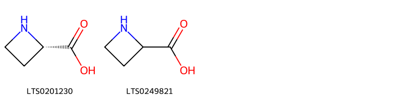{ width=100% }
    <figcaption>Hình ảnh cấu trúc hóa học của 2 hoạt chất thuộc nhóm Carboxylic acids and derivatives gồm ['l-azetidine 2-carboxylic acid (LTS0201230)', 'azetidine-2-carboxylic acid (LTS0249821)'].</figcaption>
</figure>
#### Nhóm Steroids and steroid derivatives
<figure markdown="span">
    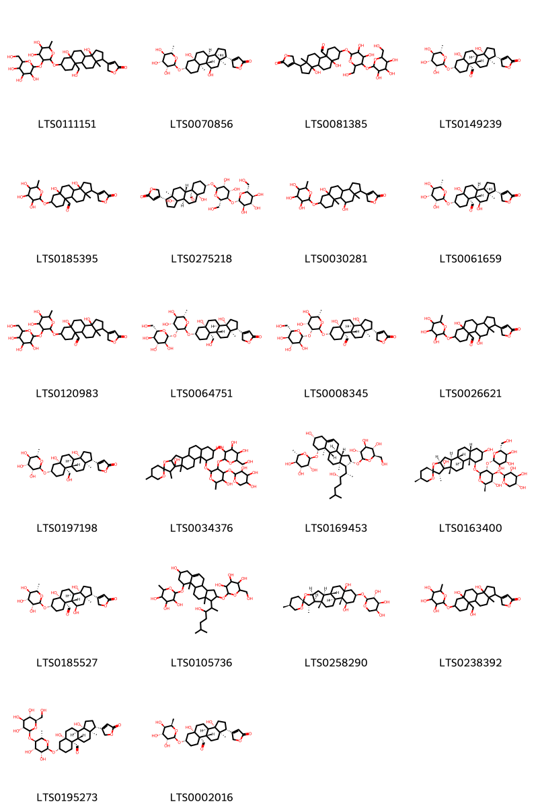{ width=100% }
    <figcaption>Hình ảnh cấu trúc hóa học của 22 hoạt chất thuộc nhóm Steroids and steroid derivatives gồm ['4-{7-[(4,5-dihydroxy-6-methyl-3-{[3,4,5-trihydroxy-6-(hydroxymethyl)oxan-2-yl]oxy}oxan-2-yl)oxy]-3a,5a-dihydroxy-9a-(hydroxymethyl)-11a-methyl-dodecahydro-1h-cyclopenta[a]phenanthren-1-yl}-5h-furan-2-one (LTS0111151)', '4-[(1s,3ar,3bs,5as,7s,9ar,9bs,10r,11as)-5a,10-dihydroxy-9a,11a-dimethyl-7-{[(2r,3r,4r,5r,6s)-3,4,5-trihydroxy-6-methyloxan-2-yl]oxy}-tetradecahydrocyclopenta[a]phenanthren-1-yl]-5h-furan-2-one (LTS0070856)', '7-{[3,4-dihydroxy-6-(hydroxymethyl)-5-{[3,4,5-trihydroxy-6-(hydroxymethyl)oxan-2-yl]oxy}oxan-2-yl]oxy}-3a,5a-dihydroxy-11a-methyl-1-(5-oxo-2h-furan-3-yl)-dodecahydro-1h-cyclopenta[a]phenanthrene-9a-carbaldehyde (LTS0081385)', 'convallatoxin (LTS0149239)', 'convallatoxin (LTS0185395)', '(1r,3as,3br,5as,7s,9as,9bs,11ar)-7-{[(2r,3r,4s,5r,6s)-3,4-dihydroxy-6-(hydroxymethyl)-5-{[(2s,3r,4s,5s,6r)-3,4,5-trihydroxy-6-(hydroxymethyl)oxan-2-yl]oxy}oxan-2-yl]oxy}-3a,5a-dihydroxy-11a-methyl-1-(5-oxo-2h-furan-3-yl)-dodecahydro-1h-cyclopenta[a]phenanthrene-9a-carbaldehyde (LTS0275218)', '4-{5a,10-dihydroxy-9a,11a-dimethyl-7-[(3,4,5-trihydroxy-6-methyloxan-2-yl)oxy]-tetradecahydrocyclopenta[a]phenanthren-1-yl}-5h-furan-2-one (LTS0030281)', '(1s,3ar,3bs,5as,7s,9as,9bs,10r,11as)-5a,10-dihydroxy-11a-methyl-1-(5-oxo-2h-furan-3-yl)-7-{[(2r,3r,4r,5r,6s)-3,4,5-trihydroxy-6-methyloxan-2-yl]oxy}-tetradecahydrocyclopenta[a]phenanthrene-9a-carbaldehyde (LTS0061659)', '7-[(4,5-dihydroxy-6-methyl-3-{[3,4,5-trihydroxy-6-(hydroxymethyl)oxan-2-yl]oxy}oxan-2-yl)oxy]-3a,5a-dihydroxy-11a-methyl-1-(5-oxo-2h-furan-3-yl)-dodecahydro-1h-cyclopenta[a]phenanthrene-9a-carbaldehyde (LTS0120983)', '4-[(1r,3as,3br,5as,7s,9ar,9bs,11ar)-7-{[(2r,3r,4r,5r,6s)-4,5-dihydroxy-6-methyl-3-{[(2r,3s,4r,5r,6s)-3,4,5-trihydroxy-6-(hydroxymethyl)oxan-2-yl]oxy}oxan-2-yl]oxy}-3a,5a-dihydroxy-9a-(hydroxymethyl)-11a-methyl-dodecahydro-1h-cyclopenta[a]phenanthren-1-yl]-5h-furan-2-one (LTS0064751)', '(1r,3as,3br,5as,7s,9as,9bs,11ar)-7-{[(2r,3r,4r,5r,6s)-4,5-dihydroxy-6-methyl-3-{[(2r,3s,4r,5r,6s)-3,4,5-trihydroxy-6-(hydroxymethyl)oxan-2-yl]oxy}oxan-2-yl]oxy}-3a,5a-dihydroxy-11a-methyl-1-(5-oxo-2h-furan-3-yl)-dodecahydro-1h-cyclopenta[a]phenanthrene-9a-carbaldehyde (LTS0008345)', '5a,10-dihydroxy-11a-methyl-1-(5-oxo-2h-furan-3-yl)-7-[(3,4,5-trihydroxy-6-methyloxan-2-yl)oxy]-tetradecahydrocyclopenta[a]phenanthrene-9a-carbaldehyde (LTS0026621)', '4-[(1r,3as,3br,5as,7s,9ar,9bs,11ar)-3a,5a-dihydroxy-9a-(hydroxymethyl)-11a-methyl-7-{[(2r,3r,4r,5r,6s)-3,4,5-trihydroxy-6-methyloxan-2-yl]oxy}-dodecahydro-1h-cyclopenta[a]phenanthren-1-yl]-5h-furan-2-one (LTS0197198)', "2-[(5-hydroxy-6-methyl-2-{5,7',9',13'-tetramethyl-5'-oxaspiro[oxane-2,6'-pentacyclo[10.8.0.0²,⁹.0⁴,⁸.0¹³,¹⁸]icosane]-8',16'-dioloxy}-4-[(3,4,5-trihydroxyoxan-2-yl)oxy]oxan-3-yl)oxy]-6-(hydroxymethyl)oxane-3,4,5-triol (LTS0034376)", '(2r,3r,4s,5s,6r)-2-{[(1r,2s,3as,3bs,7r,9r,9ar,9bs,11as)-7-hydroxy-1-[(2s,3s)-3-hydroxy-6-methylheptan-2-yl]-9a,11a-dimethyl-9-{[(2r,3r,4r,5r,6s)-3,4,5-trihydroxy-6-methyloxan-2-yl]oxy}-1h,2h,3h,3ah,3bh,4h,6h,7h,8h,9h,9bh,10h,11h-cyclopenta[a]phenanthren-2-yl]oxy}-6-(hydroxymethyl)oxane-3,4,5-triol (LTS0169453)', 'convallasaponin a (LTS0163400)', '(1r,3as,3br,5as,7s,9as,9bs,10r,11ar)-3a,5a,10-trihydroxy-11a-methyl-1-(5-oxo-2h-furan-3-yl)-7-{[(2r,3r,4r,5r,6s)-3,4,5-trihydroxy-6-methyloxan-2-yl]oxy}-dodecahydro-1h-cyclopenta[a]phenanthrene-9a-carbaldehyde (LTS0185527)', '2-{[7-hydroxy-1-(3-hydroxy-6-methylheptan-2-yl)-9a,11a-dimethyl-9-[(3,4,5-trihydroxy-6-methyloxan-2-yl)oxy]-1h,2h,3h,3ah,3bh,4h,6h,7h,8h,9h,9bh,10h,11h-cyclopenta[a]phenanthren-2-yl]oxy}-6-(hydroxymethyl)oxane-3,4,5-triol (LTS0105736)', "(2s,3r,4s,5s)-2-[(1's,2r,2's,4's,5s,7's,8'r,9's,12's,13's,14'r,16's,18's)-5,7',9',13'-tetramethyl-5'-oxaspiro[oxane-2,6'-pentacyclo[10.8.0.0²,⁹.0⁴,⁸.0¹³,¹⁸]icosane]-14',18'-dioloxy]oxane-3,4,5-triol (LTS0258290)", 'convallotoxol (LTS0238392)', '(1r,3as,3br,5as,7s,9as,9bs,11ar)-7-{[(2r,3r,4s,5r,6s)-3,4-dihydroxy-6-methyl-5-{[(2s,3r,4s,5s,6r)-3,4,5-trihydroxy-6-(hydroxymethyl)oxan-2-yl]oxy}oxan-2-yl]oxy}-3a,5a-dihydroxy-11a-methyl-1-(5-oxo-2h-furan-3-yl)-dodecahydro-1h-cyclopenta[a]phenanthrene-9a-carbaldehyde (LTS0195273)', '(1r,3as,3br,5as,7s,9as,9bs,11ar)-3a,5a-dihydroxy-11a-methyl-1-(5-oxo-2h-furan-3-yl)-7-{[(2r,3r,4r,5r,6r)-3,4,5-trihydroxy-6-methyloxan-2-yl]oxy}-dodecahydro-1h-cyclopenta[a]phenanthrene-9a-carbaldehyde (LTS0002016)'].</figcaption>
</figure>

---

### Dược dân tộc học

Danh sách các quốc gia có sử dụng *Convallaria majalis* trong điều trị các bệnh. 

| Country   | Disease                                        | Bệnh                                         |
|:----------|:-----------------------------------------------|:---------------------------------------------|
| Elsewhere | Cardiotonic, Diuretic, Cardiotonic, Diuretic   | Cardiotonic, lợi tiểu, Cardiotonic, lợi tiểu |
| Turkey    | Cardiotonic, Diuretic, Poison, Emetic, Nervine | Cardiotonic, lợi tiểu, độc, nôn, thần kinh   |
| US        | Poison                                         | Chất độc                                     |
| ain       | Cardiotonic                                    | Tim mạch                                     |

---

# Chi Dianella

??? note "Danh sách các dược liệu thuộc chi"
    
	 - *Dianella ensifolia*
	 - *Dianella nemorosa*

---
## Dianella ensifolia
### Thông tin về thực vật

!!! info "Phân loại thực vật của *Dianella ensifolia* từ GIBF:"
    - **Kingdom:** Plantae
    - **Phylum:** Tracheophyta
    - **Order:** Asparagales
    - **Family:** Asphodelaceae
    - **Genus:** Dianella
    - **Species:** *Dianella ensifolia*

 

| Label (VI)   | Label (EN)   | Scientific Name    | Descriptions (VI)   | Descriptions (EN)   | Also Known As (VI)   | Also Known As (EN)   |
|:-------------|:-------------|:-------------------|:--------------------|:--------------------|:---------------------|:---------------------|
| N/A          | N/A          | Dianella ensifolia | loài thực vật       | species of plant    | ['']                 | ['']                 |

#### Phân bố trên thế giới

**Từ CSDL GIBF** Hong Kong, Brazil, Singapore, Viet Nam, United States of America, Japan, Chinese Taipei, China, Mauritius, Dominican Republic, Madagascar

#### Phân bố tại Việt Nam

**Từ CSDL GIBF**: Hà Tĩnh, Thừa Thiên - Huế

---
### Thành phần hóa học
        
- Theo cơ sở dữ liệu lotus: Từ loài *Dianella ensifolia* đã phân lập và xác định được Chưa có hoạt chất nào được phân lập. hoạt chất thuộc về các nhóm Không có hoạt chất nào được phân lập. 

Không có hình ảnh nào được tạo ra

---

### Dược dân tộc học

Danh sách các quốc gia có sử dụng *Dianella ensifolia* trong điều trị các bệnh. 

| Country   | Disease                | Bệnh                                    |
|:----------|:-----------------------|:----------------------------------------|
| Elsewhere | Raticide               | Raticide                                |
| Malaya    | Rodenticide, Vermifuge | Thuốc diệt động vật gặm nhấm, Vermifuge |

---

---
## Dianella nemorosa
### Thông tin về thực vật

!!! info "Phân loại thực vật của *Dianella ensifolia* từ GIBF:"
    - **Kingdom:** Plantae
    - **Phylum:** Tracheophyta
    - **Order:** Asparagales
    - **Family:** Asphodelaceae
    - **Genus:** Dianella
    - **Species:** *Dianella ensifolia*

 

| Label (VI)   | Label (EN)   | Scientific Name   | Descriptions (VI)   | Descriptions (EN)   | Also Known As (VI)   | Also Known As (EN)   |
|:-------------|:-------------|:------------------|:--------------------|:--------------------|:---------------------|:---------------------|
| N/A          | N/A          | Dianella nemorosa |                     |                     | ['']                 | ['']                 |

#### Phân bố trên thế giới

**Từ CSDL GIBF** nan, Singapore, Viet Nam, Japan, Madagascar, Indonesia, Chinese Taipei, Malaysia, China, Mauritius, Nepal, New Caledonia, India, unknown or invalid, Papua New Guinea, Thailand

#### Phân bố tại Việt Nam

**Từ CSDL GIBF**: Thua Thien-Hue, Lam Dong, Kon Tum, Tay Ninh, Lao Cai, Ninh Thuan, Tuyen Quang, Ha Tinh

---
### Thành phần hóa học
        
- Theo cơ sở dữ liệu lotus: Từ loài *Dianella ensifolia* đã phân lập và xác định được Chưa có hoạt chất nào được phân lập. hoạt chất thuộc về các nhóm Không có hoạt chất nào được phân lập. 

Không có hình ảnh nào được tạo ra

---

### Dược dân tộc học

Danh sách các quốc gia có sử dụng *Dianella ensifolia* trong điều trị các bệnh. 

| Country   | Disease   | Bệnh                                        |
|:----------|:----------|:--------------------------------------------|
| Elsewhere | Fumigant  | chất hun khói (diệt côn trùng, vi sinh vật) |

---

# Chi Ophiopogon

??? note "Danh sách các dược liệu thuộc chi"
    
	 - *Ophiopogon icatus*
	 - *Ophiopogon japonicus*
	 - *Ophiopogon ohwii*

---
## Ophiopogon icatus
### Thông tin về thực vật

!!! info "Phân loại thực vật của *N/A* từ GIBF:"
    - **Kingdom:** Plantae
    - **Phylum:** Tracheophyta
    - **Order:** Asparagales
    - **Family:** Asparagaceae
    - **Genus:** Ophiopogon
    - **Species:** *N/A*

 

| Label (VI)   | Label (EN)   | Scientific Name   | Descriptions (VI)   | Descriptions (EN)   | Also Known As (VI)   | Also Known As (EN)   |
|:-------------|:-------------|:------------------|:--------------------|:--------------------|:---------------------|:---------------------|
| N/A          | N/A          | Dianella nemorosa |                     |                     | ['']                 | ['']                 |

#### Phân bố trên thế giới

**Từ CSDL GIBF** nan, Brazil, Viet Nam, Japan, China, New Zealand, Ecuador, Thailand, Spain, Netherlands, Puerto Rico, United States of America, Korea, Republic of, Indonesia, Andorra, Argentina, Hong Kong, United Kingdom of Great Britain and Northern Ireland, Chinese Taipei, Panama, Portugal, Cook Islands, South Africa, Australia, Italy, India, France, Ireland, Venezuela (Bolivarian Republic of)

#### Phân bố tại Việt Nam

**Từ CSDL GIBF**: Dien Bien Province

---
### Thành phần hóa học
        
- Theo cơ sở dữ liệu lotus: Từ loài *N/A* đã phân lập và xác định được Chưa có hoạt chất nào được phân lập. hoạt chất thuộc về các nhóm Không có hoạt chất nào được phân lập. 

Không có hình ảnh nào được tạo ra

---

### Dược dân tộc học

Danh sách các quốc gia có sử dụng *N/A* trong điều trị các bệnh. 

| Country   | Disease     | Bệnh           |
|:----------|:------------|:---------------|
| China     | Aphrodisiac | Thuốc kích dục |

---

---
## Ophiopogon japonicus
### Thông tin về thực vật

!!! info "Phân loại thực vật của *Ophiopogon japonicus* từ GIBF:"
    - **Kingdom:** Plantae
    - **Phylum:** Tracheophyta
    - **Order:** Asparagales
    - **Family:** Asparagaceae
    - **Genus:** Ophiopogon
    - **Species:** *Ophiopogon japonicus*

 

| Label (VI)   | Label (EN)   | Scientific Name      | Descriptions (VI)   | Descriptions (EN)   | Also Known As (VI)   | Also Known As (EN)                                                                                                       |
|:-------------|:-------------|:---------------------|:--------------------|:--------------------|:---------------------|:-------------------------------------------------------------------------------------------------------------------------|
| N/A          | N/A          | Ophiopogon japonicus | loài thực vật       | species of plant    | ['']                 | ['dwarf lilyturf', 'fountainplant', 'mondo grass', 'mondograss', 'monkeygrass', 'dwarf mondo grass', 'dwarf mondograss'] |

#### Phân bố trên thế giới

**Từ CSDL GIBF** nan, Brazil, Japan, China, New Zealand, Spain, Puerto Rico, United States of America, Korea, Republic of, Indonesia, Argentina, Hong Kong, Belgium, Chinese Taipei, Philippines, Portugal, South Africa, Australia, Italy, India, France, Venezuela (Bolivarian Republic of)

#### Phân bố tại Việt Nam

**Từ CSDL GIBF**: Không có ghi nhận ở Việt Nam

---
### Thành phần hóa học
        
- Theo cơ sở dữ liệu lotus: Từ loài *Ophiopogon japonicus* đã phân lập và xác định được 128 hoạt chất thuộc về các nhóm Carboxylic acids and derivatives, Cinnamic acids and derivatives, Steroids and steroid derivatives, Coumarins and derivatives, Organooxygen compounds, Homoisoflavonoids, Prenol lipids, Indoles and derivatives. 

|    | chemicalTaxonomyClassyfireClass   |   smiles_count |
|---:|:----------------------------------|---------------:|
|  0 | Carboxylic acids and derivatives  |              2 |
|  1 | Cinnamic acids and derivatives    |              2 |
|  2 | Coumarins and derivatives         |              1 |
|  3 | Homoisoflavonoids                 |             59 |
|  4 | Indoles and derivatives           |              1 |
|  5 | Organooxygen compounds            |              4 |
|  6 | Prenol lipids                     |             13 |
|  7 | Steroids and steroid derivatives  |             46 |

#### Nhóm Carboxylic acids and derivatives
<figure markdown="span">
    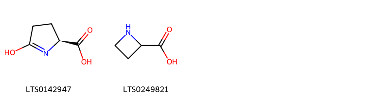{ width=100% }
    <figcaption>Hình ảnh cấu trúc hóa học của 2 hoạt chất thuộc nhóm Carboxylic acids and derivatives gồm ['pyroglutamic acid (LTS0142947)', 'azetidine-2-carboxylic acid (LTS0249821)'].</figcaption>
</figure>
#### Nhóm Cinnamic acids and derivatives
<figure markdown="span">
    { width=100% }
    <figcaption>Hình ảnh cấu trúc hóa học của 2 hoạt chất thuộc nhóm Cinnamic acids and derivatives gồm ['3-(4-hydroxyphenyl)-n-[2-(4-hydroxyphenyl)ethyl]prop-2-enimidic acid (LTS0104591)', '(2e)-3-(4-hydroxyphenyl)-n-[2-(4-hydroxyphenyl)ethyl]prop-2-enimidic acid (LTS0067822)'].</figcaption>
</figure>
#### Nhóm Coumarins and derivatives
<figure markdown="span">
    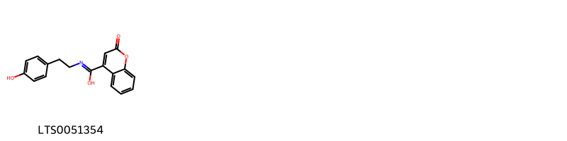{ width=100% }
    <figcaption>Hình ảnh cấu trúc hóa học của 1 hoạt chất thuộc nhóm Coumarins and derivatives gồm ['n-[2-(4-hydroxyphenyl)ethyl]-2-oxochromene-4-carboximidic acid (LTS0051354)'].</figcaption>
</figure>
#### Nhóm Homoisoflavonoids
<figure markdown="span">
    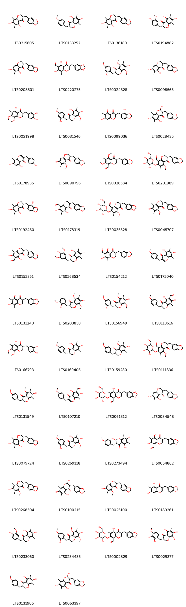{ width=100% }
    <figcaption>Hình ảnh cấu trúc hóa học của 59 hoạt chất thuộc nhóm Homoisoflavonoids gồm ['3-(2h-1,3-benzodioxol-5-ylmethyl)-5,7-dihydroxy-6,8-dimethyl-2,3-dihydro-1-benzopyran-4-one (LTS0215605)', '5,7-dihydroxy-3-[(4-methoxyphenyl)methyl]-6,8-dimethyl-2,3-dihydro-1-benzopyran-4-one (LTS0133252)', '(3r)-3-(2h-1,3-benzodioxol-5-ylmethyl)-5,7-dihydroxy-6,8-dimethyl-2,3-dihydro-1-benzopyran-4-one (LTS0136180)', '(3s)-5,7-dihydroxy-3-[(4-hydroxy-3-methoxyphenyl)methyl]-6,8-dimethyl-2,3-dihydro-1-benzopyran-4-one (LTS0194882)', '(3s)-3-(2h-1,3-benzodioxol-5-ylmethyl)-5,7-dihydroxy-6-methyl-2,3-dihydro-1-benzopyran-4-one (LTS0208501)', '(3s)-3-(2h-1,3-benzodioxol-5-ylmethyl)-5,7-dihydroxy-8-methyl-4-oxo-2,3-dihydro-1-benzopyran-6-carbaldehyde (LTS0220275)', '(3r)-7-hydroxy-3-[(2-hydroxy-4-methoxyphenyl)methyl]-5,8-dimethoxy-6-methyl-2,3-dihydro-1-benzopyran-4-one (LTS0024328)', 'ophiopogonanone a (LTS0098563)', '3-[(3,4-dihydroxyphenyl)methyl]-5-hydroxy-7,8-dimethoxy-6-methyl-2,3-dihydro-1-benzopyran-4-one (LTS0021998)', '(3r)-5,7-dihydroxy-3-[(2-hydroxy-4-methoxyphenyl)methyl]-8-methoxy-6-methyl-2,3-dihydro-1-benzopyran-4-one (LTS0031546)', '5,7-dihydroxy-3-[(4-hydroxy-2h-1,3-benzodioxol-5-yl)methyl]-6-methylchromen-4-one (LTS0099036)', '3-(2h-1,3-benzodioxol-5-ylmethyl)-2,5,7-trihydroxy-6,8-dimethyl-2,3-dihydro-1-benzopyran-4-one (LTS0028435)', '5,7-dihydroxy-3-[(4-hydroxyphenyl)methyl]-8-methylchromen-4-one (LTS0178935)', '(3r)-3-(2h-1,3-benzodioxol-5-ylmethyl)-7-hydroxy-5-methoxy-6-methyl-2,3-dihydro-1-benzopyran-4-one (LTS0090796)', '(3r)-3-(2h-1,3-benzodioxol-5-ylmethyl)-5,7-dimethoxy-6-methyl-4-oxo-2,3-dihydro-1-benzopyran-8-carbaldehyde (LTS0026584)', '(3s)-3-(2h-1,3-benzodioxol-5-ylmethyl)-5-methoxy-6-methyl-4-oxo-7-{[(2s,3r,4s,5r,6r)-3,4,5-trihydroxy-6-(hydroxymethyl)oxan-2-yl]oxy}-2,3-dihydro-1-benzopyran-8-carbaldehyde (LTS0201989)', '(3s)-5,7-dihydroxy-3-[(4-hydroxy-2h-1,3-benzodioxol-5-yl)methyl]-6,8-dimethyl-2,3-dihydro-1-benzopyran-4-one (LTS0192460)', '(3r)-3-(2h-1,3-benzodioxol-5-ylmethyl)-5,7-dihydroxy-6-methyl-4-oxo-2,3-dihydro-1-benzopyran-8-carbaldehyde (LTS0178319)', '(3r)-3-(2h-1,3-benzodioxol-5-ylmethyl)-5-methoxy-6-methyl-4-oxo-7-{[(2s,3r,4s,5s,6r)-3,4,5-trihydroxy-6-(hydroxymethyl)oxan-2-yl]oxy}-2,3-dihydro-1-benzopyran-8-carbaldehyde (LTS0035528)', '3-(2h-1,3-benzodioxol-5-ylmethyl)-7-hydroxy-5-methoxy-6,8-dimethyl-2,3-dihydro-1-benzopyran-4-one (LTS0045707)', '3-(2h-1,3-benzodioxol-5-ylmethyl)-5,7-dihydroxy-8-methyl-4-oxochromene-6-carbaldehyde (LTS0152351)', '(3s)-5,7-dihydroxy-3-[(4-hydroxy-3,5-dimethoxyphenyl)methyl]-6,8-dimethyl-2,3-dihydro-1-benzopyran-4-one (LTS0268534)', '3-(2h-1,3-benzodioxol-5-ylmethyl)-5,7-dihydroxy-8-methyl-4-oxo-2,3-dihydro-1-benzopyran-6-carbaldehyde (LTS0154212)', 'methylophiopogonone b (LTS0172040)', 'methylophiopogonone a (LTS0131240)', '(3r)-7-hydroxy-3-[(2-hydroxy-3-methoxyphenyl)methyl]-5,8-dimethoxy-6-methyl-2,3-dihydro-1-benzopyran-4-one (LTS0203838)', '(3s)-7-hydroxy-3-[(2-hydroxy-4-methoxyphenyl)methyl]-5,8-dimethoxy-6-methyl-2,3-dihydro-1-benzopyran-4-one (LTS0156949)', '5,7-dihydroxy-3-[(4-methoxyphenyl)methyl]-8-methyl-4-oxo-2,3-dihydro-1-benzopyran-6-carbaldehyde (LTS0113616)', '(3r)-3-[(3,4-dihydroxyphenyl)methyl]-5-hydroxy-7,8-dimethoxy-6-methyl-2,3-dihydro-1-benzopyran-4-one (LTS0166793)', '(3s)-5,7-dihydroxy-3-[(4-methoxyphenyl)methyl]-6,8-dimethyl-2,3-dihydro-1-benzopyran-4-one (LTS0169406)', '(3r)-7-hydroxy-5-methoxy-3-[(4-methoxyphenyl)methyl]-6,8-dimethyl-2,3-dihydro-1-benzopyran-4-one (LTS0159280)', '3-(2h-1,3-benzodioxol-5-ylmethyl)-5-methoxy-6-methyl-4-oxo-7-{[3,4,5-trihydroxy-6-(hydroxymethyl)oxan-2-yl]oxy}-2,3-dihydro-1-benzopyran-8-carbaldehyde (LTS0111836)', '7-hydroxy-5-methoxy-3-[(4-methoxyphenyl)methyl]-6,8-dimethyl-2,3-dihydro-1-benzopyran-4-one (LTS0131549)', '5,7-dihydroxy-3-[(4-methoxyphenyl)methyl]-8-methyl-4-oxochromene-6-carbaldehyde (LTS0107210)', '(3s)-3-(2h-1,3-benzodioxol-5-ylmethyl)-5-hydroxy-6-methyl-4-oxo-7-{[(2s,3r,4s,5r,6r)-3,4,5-trihydroxy-6-(hydroxymethyl)oxan-2-yl]oxy}-2,3-dihydro-1-benzopyran-8-carbaldehyde (LTS0061312)', '(3r)-3-(2h-1,3-benzodioxol-5-ylmethyl)-5,7-dihydroxy-6-methyl-2,3-dihydro-1-benzopyran-4-one (LTS0084548)', '(3s)-3-(2h-1,3-benzodioxol-5-ylmethyl)-5,7-dihydroxy-6,8-dimethyl-2,3-dihydro-1-benzopyran-4-one (LTS0079724)', '5,7-dihydroxy-3-[(2-hydroxy-4-methoxyphenyl)methyl]-8-methoxy-6-methyl-2,3-dihydro-1-benzopyran-4-one (LTS0269118)', '(2r,3r)-2,5,7-trihydroxy-3-[(4-methoxyphenyl)methyl]-6,8-dimethyl-2,3-dihydro-1-benzopyran-4-one (LTS0273494)', '3-(2h-1,3-benzodioxol-5-ylmethyl)-5,7-dihydroxy-6-methyl-4-oxochromene-8-carbaldehyde (LTS0054862)', '(3r)-3-(2h-1,3-benzodioxol-5-ylmethyl)-7-hydroxy-5-methoxy-6,8-dimethyl-2,3-dihydro-1-benzopyran-4-one (LTS0268504)', '(2s,3s)-3-(2h-1,3-benzodioxol-5-ylmethyl)-2,5,7-trihydroxy-6,8-dimethyl-2,3-dihydro-1-benzopyran-4-one (LTS0100215)', '3-(2h-1,3-benzodioxol-5-ylmethyl)-7-hydroxy-5-methoxy-6-methyl-2,3-dihydro-1-benzopyran-4-one (LTS0025100)', 'ophiopogonone a (LTS0189261)', '(3r)-5,7-dihydroxy-3-[(4-hydroxy-3-methoxyphenyl)methyl]-6,8-dimethyl-2,3-dihydro-1-benzopyran-4-one (LTS0233050)', '7-hydroxy-3-[(2-hydroxy-4-methoxyphenyl)methyl]-5,8-dimethoxy-6-methyl-2,3-dihydro-1-benzopyran-4-one (LTS0234435)', '3-(2h-1,3-benzodioxol-5-ylmethyl)-5-hydroxy-6-methyl-4-oxo-7-{[3,4,5-trihydroxy-6-(hydroxymethyl)oxan-2-yl]oxy}-2,3-dihydro-1-benzopyran-8-carbaldehyde (LTS0002829)', '(3r)-3-[(2,3-dihydroxy-4-methoxyphenyl)methyl]-5,7-dihydroxy-8-methoxy-6-methyl-2,3-dihydro-1-benzopyran-4-one (LTS0029377)', '(3r)-5,7-dihydroxy-3-[(4-methoxyphenyl)methyl]-6,8-dimethyl-2,3-dihydro-1-benzopyran-4-one (LTS0131905)', '(2r,3r)-3-(2h-1,3-benzodioxol-5-ylmethyl)-2,5,7-trihydroxy-6,8-dimethyl-2,3-dihydro-1-benzopyran-4-one (LTS0063397)', '(3s)-5,7-dihydroxy-3-[(4-methoxyphenyl)methyl]-8-methyl-4-oxo-2,3-dihydro-1-benzopyran-6-carbaldehyde (LTS0013111)', '(3r)-3-(2h-1,3-benzodioxol-5-ylmethyl)-5-hydroxy-6-methyl-4-oxo-7-{[(2s,3r,4s,5s,6r)-3,4,5-trihydroxy-6-(hydroxymethyl)oxan-2-yl]oxy}-2,3-dihydro-1-benzopyran-8-carbaldehyde (LTS0021664)', '5,7-dihydroxy-3-[(4-hydroxy-2h-1,3-benzodioxol-5-yl)methyl]-8-methylchromen-4-one (LTS0004904)', '(3s)-3-(2h-1,3-benzodioxol-5-ylmethyl)-5,7-dihydroxy-6-methyl-4-oxo-2,3-dihydro-1-benzopyran-8-carbaldehyde (LTS0015244)', '5,7-dihydroxy-3-[(4-hydroxy-2h-1,3-benzodioxol-5-yl)methyl]-6,8-dimethylchromen-4-one (LTS0026699)', '5,7-dihydroxy-3-[(4-hydroxy-3-methoxyphenyl)methyl]-6,8-dimethyl-2,3-dihydro-1-benzopyran-4-one (LTS0132727)', '5,7-dihydroxy-3-[(4-hydroxyphenyl)methyl]-6-methylchromen-4-one (LTS0042293)', '2,5,7-trihydroxy-3-[(4-methoxyphenyl)methyl]-6,8-dimethyl-2,3-dihydro-1-benzopyran-4-one (LTS0263859)', '3-[(2,3-dihydroxy-4-methoxyphenyl)methyl]-5,7-dihydroxy-8-methoxy-6-methyl-2,3-dihydro-1-benzopyran-4-one (LTS0039942)'].</figcaption>
</figure>
#### Nhóm Indoles and derivatives
<figure markdown="span">
    { width=100% }
    <figcaption>Hình ảnh cấu trúc hóa học của 1 hoạt chất thuộc nhóm Indoles and derivatives gồm ['n-[2-(5-methoxy-1h-indol-3-yl)ethyl]ethanimidic acid (LTS0219322)'].</figcaption>
</figure>
#### Nhóm Organooxygen compounds
<figure markdown="span">
    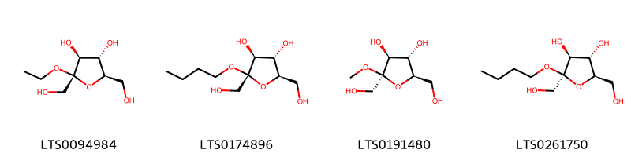{ width=100% }
    <figcaption>Hình ảnh cấu trúc hóa học của 4 hoạt chất thuộc nhóm Organooxygen compounds gồm ['(2s,3s,4s,5r)-2-ethoxy-2,5-bis(hydroxymethyl)oxolane-3,4-diol (LTS0094984)', '(2s,3s,4s,5r)-2-butoxy-2,5-bis(hydroxymethyl)oxolane-3,4-diol (LTS0174896)', '(2r,3s,4s,5r)-2,5-bis(hydroxymethyl)-2-methoxyoxolane-3,4-diol (LTS0191480)', '(2r,3s,4s,5r)-2-butoxy-2,5-bis(hydroxymethyl)oxolane-3,4-diol (LTS0261750)'].</figcaption>
</figure>
#### Nhóm Prenol lipids
<figure markdown="span">
    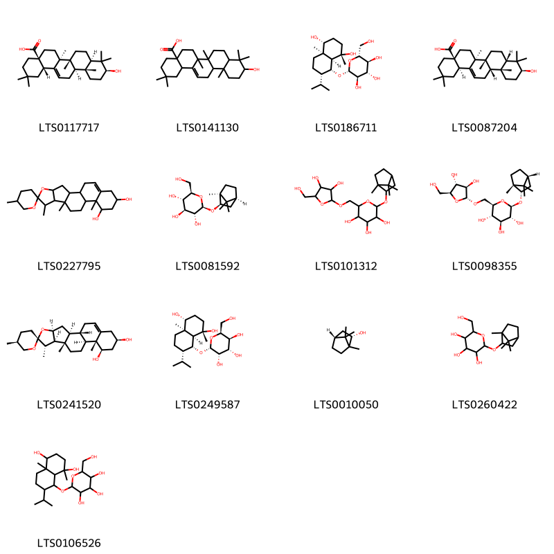{ width=100% }
    <figcaption>Hình ảnh cấu trúc hóa học của 13 hoạt chất thuộc nhóm Prenol lipids gồm ['oleanolic acid (LTS0117717)', 'oleanolic acid (LTS0141130)', '(2r,3r,4s,5s,6r)-2-{[(1r,2s,4ar,5r,8s,8ar)-5,8-dihydroxy-2-isopropyl-4a,8-dimethyl-octahydronaphthalen-1-yl]oxy}-6-(hydroxymethyl)oxane-3,4,5-triol (LTS0186711)', '(4as,6as,6br,8as,10s,12ar,12bs,14br)-10-hydroxy-2,2,6a,6b,9,9,12a-heptamethyl-1,3,4,5,6,7,8,8a,10,11,12,12b,13,14b-tetradecahydropicene-4a-carboxylic acid (LTS0087204)', "5,7',9',13'-tetramethyl-5'-oxaspiro[oxane-2,6'-pentacyclo[10.8.0.0²,⁹.0⁴,⁸.0¹³,¹⁸]icosan]-18'-ene-14',16'-diol (LTS0227795)", '(2r,3s,4s,5r,6r)-2-(hydroxymethyl)-6-{[(1s,2r,4s)-1,7,7-trimethylbicyclo[2.2.1]heptan-2-yl]oxy}oxane-3,4,5-triol (LTS0081592)', '2-({[3,4-dihydroxy-5-(hydroxymethyl)oxolan-2-yl]oxy}methyl)-6-({1,7,7-trimethylbicyclo[2.2.1]heptan-2-yl}oxy)oxane-3,4,5-triol (LTS0101312)', '(2r,3s,4s,5r,6r)-2-({[(2r,3r,4r,5s)-3,4-dihydroxy-5-(hydroxymethyl)oxolan-2-yl]oxy}methyl)-6-{[(1r,2s,4r)-1,7,7-trimethylbicyclo[2.2.1]heptan-2-yl]oxy}oxane-3,4,5-triol (LTS0098355)', "(1's,2r,2's,4's,5s,7's,8'r,9's,12's,13'r,14'r,16'r)-5,7',9',13'-tetramethyl-5'-oxaspiro[oxane-2,6'-pentacyclo[10.8.0.0²,⁹.0⁴,⁸.0¹³,¹⁸]icosan]-18'-ene-14',16'-diol (LTS0241520)", '(2r,3s,4s,5s,6s)-2-{[(1r,2s,4ar,5r,8s,8ar)-5,8-dihydroxy-2-isopropyl-4a,8-dimethyl-octahydronaphthalen-1-yl]oxy}-6-(hydroxymethyl)oxane-3,4,5-triol (LTS0249587)', '(2s,4r)-1,7,7-trimethylbicyclo[2.2.1]heptan-2-ol (LTS0010050)', '2-(hydroxymethyl)-6-({1,7,7-trimethylbicyclo[2.2.1]heptan-2-yl}oxy)oxane-3,4,5-triol (LTS0260422)', '2-[(5,8-dihydroxy-2-isopropyl-4a,8-dimethyl-octahydronaphthalen-1-yl)oxy]-6-(hydroxymethyl)oxane-3,4,5-triol (LTS0106526)'].</figcaption>
</figure>
#### Nhóm Steroids and steroid derivatives
<figure markdown="span">
    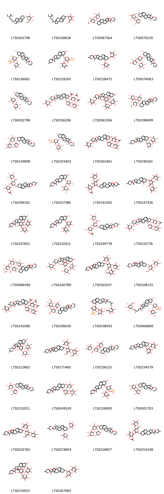{ width=100% }
    <figcaption>Hình ảnh cấu trúc hóa học của 46 hoạt chất thuộc nhóm Steroids and steroid derivatives gồm ['sitogluside (LTS0201798)', '2-{[1-(5-ethyl-6-methylheptan-2-yl)-9a,11a-dimethyl-1h,2h,3h,3ah,3bh,4h,6h,7h,8h,9h,9bh,10h,11h-cyclopenta[a]phenanthren-7-yl]oxy}-6-(hydroxymethyl)oxane-3,4,5-triol (LTS0158828)', "(2s,3r,4r,5r,6s)-2-{[(2r,3r,4s,5s,6r)-4,5-dihydroxy-6-(hydroxymethyl)-2-[(1'r,2r,2'r,4's,5r,7's,8's,9's,12'r,13'r,16's)-5,7',9',13'-tetramethyl-5'-oxaspiro[oxane-2,6'-pentacyclo[10.8.0.0²,⁹.0⁴,⁸.0¹³,¹⁸]icosan]-18'-ene-2',8'-dioloxy]oxan-3-yl]oxy}-6-methyloxane-3,4,5-triol (LTS0067364)", 'ophiopogonin b (LTS0076230)', "[(2r,3r,4r,5r,6r)-4-hydroxy-2-methyl-6-[(1's,2r,2's,4's,5r,7's,8'r,9's,12's,13'r,14'r,16'r)-5,7',9',13'-tetramethyl-5'-oxaspiro[oxane-2,6'-pentacyclo[10.8.0.0²,⁹.0⁴,⁸.0¹³,¹⁸]icosan]-18'-en-16'-oloxy]-5-{[(2s,3r,4r,5r,6s)-3,4,5-trihydroxy-6-methyloxan-2-yl]oxy}oxan-3-yl]oxidanesulfonic acid (LTS0136061)", "(4-hydroxy-6-{5,7',9',13'-tetramethyl-5'-oxaspiro[oxane-2,6'-pentacyclo[10.8.0.0²,⁹.0⁴,⁸.0¹³,¹⁸]icosan]-18'-en-16'-oloxy}-5-[(3,4,5-trihydroxy-6-methyloxan-2-yl)oxy]oxan-3-yl)oxidanesulfonic acid (LTS0219205)", "2-methyl-6-{5,7',9',13'-tetramethyl-14'-[(3,4,5-trihydroxy-6-methyloxan-2-yl)oxy]-5'-oxaspiro[oxane-2,6'-pentacyclo[10.8.0.0²,⁹.0⁴,⁸.0¹³,¹⁸]icosan]-18'-eneoxy}oxane-3,4,5-triol (LTS0128472)", "(2s,3r,4r,5r,6s)-2-{[(2s,3r,4s,5s)-5-hydroxy-2-[(1's,2r,2's,4's,5r,7's,8'r,9's,12's,13'r,14'r,16'r)-5,7',9',13'-tetramethyl-5'-oxaspiro[oxane-2,6'-pentacyclo[10.8.0.0²,⁹.0⁴,⁸.0¹³,¹⁸]icosan]-18'-en-16'-oloxy]-4-{[(2s,3r,4s,5r)-3,4,5-trihydroxyoxan-2-yl]oxy}oxan-3-yl]oxy}-6-methyloxane-3,4,5-triol (LTS0074063)", "(2s,3r,4r,5r,6s)-2-{[(2s,3r,4s,5r,6r)-4,5-dihydroxy-6-methyl-2-[(1's,2r,2's,4's,5r,7's,8'r,9's,12's,13'r,14'r,16'r)-5,7',9',13'-tetramethyl-5'-oxaspiro[oxane-2,6'-pentacyclo[10.8.0.0²,⁹.0⁴,⁸.0¹³,¹⁸]icosan]-18'-en-16'-oloxy]oxan-3-yl]oxy}-6-methyloxane-3,4,5-triol (LTS0052798)", "(2s,3r,4r,5s,6s)-4,5-bis(acetyloxy)-2-{[(2s,3r,4s,5s)-5-hydroxy-2-[(1's,2s,2's,3s,4s,4's,5s,7's,8'r,9's,12's,13'r,14'r,16'r)-5,7',9',13'-tetramethyl-4-{[(2s,3r,4s,5r,6r)-3,4,5-trihydroxy-6-methyloxan-2-yl]oxy}-5'-oxaspiro[oxane-2,6'-pentacyclo[10.8.0.0²,⁹.0⁴,⁸.0¹³,¹⁸]icosan]-18'-ene-3,16'-dioloxy]-4-{[(2s,3r,4s,5r)-3,4,5-trihydroxyoxan-2-yl]oxy}oxan-3-yl]oxy}-6-methyloxan-3-yl acetate (LTS0156206)", "2-[(5-hydroxy-2-{5,7',9',13'-tetramethyl-4-[(3,4,5-trihydroxy-6-methyloxan-2-yl)oxy]-5'-oxaspiro[oxane-2,6'-pentacyclo[10.8.0.0²,⁹.0⁴,⁸.0¹³,¹⁸]icosan]-18'-ene-3,16'-dioloxy}-4-[(3,4,5-trihydroxyoxan-2-yl)oxy]oxan-3-yl)oxy]-6-methyloxane-3,4,5-triol (LTS0063356)", "(2s,3r,4r,5r,6s)-2-{[(2r,3r,4s,5r,6r)-5-hydroxy-6-(hydroxymethyl)-2-[(1'r,2r,2'r,4's,5r,7's,8's,9's,12's,13'r,16's)-5,7',9',13'-tetramethyl-5'-oxaspiro[oxane-2,6'-pentacyclo[10.8.0.0²,⁹.0⁴,⁸.0¹³,¹⁸]icosan]-18'-ene-2',8'-dioloxy]-4-{[(2s,3r,4s,5r)-3,4,5-trihydroxyoxan-2-yl]oxy}oxan-3-yl]oxy}-6-methyloxane-3,4,5-triol (LTS0198499)", "(2s,3r,4r,5r,6s)-2-{[(2r,3r,4s,5s,6r)-5-hydroxy-6-methyl-2-[(1'r,2r,2's,4's,5r,7's,8'r,9's,12'r,13'r,14'r,16'r)-5,7',9',13'-tetramethyl-5'-oxaspiro[oxane-2,6'-pentacyclo[10.8.0.0²,⁹.0⁴,⁸.0¹³,¹⁸]icosan]-18'-en-16'-oloxy]-4-{[(2s,3r,4s,5r)-3,4,5-trihydroxyoxan-2-yl]oxy}oxan-3-yl]oxy}-6-methyloxane-3,4,5-triol (LTS0134898)", "[(3s,4r,5r,6s)-4-hydroxy-6-[(1's,2r,2's,4's,5r,7's,8'r,9's,12's,13'r,14'r,16'r)-5,7',9',13'-tetramethyl-5'-oxaspiro[oxane-2,6'-pentacyclo[10.8.0.0²,⁹.0⁴,⁸.0¹³,¹⁸]icosan]-18'-en-16'-oloxy]-5-{[(2s,3r,4r,5r,6s)-3,4,5-trihydroxy-6-methyloxan-2-yl]oxy}oxan-3-yl]oxidanesulfonic acid (LTS0203402)", "4,5-dihydroxy-6-[(5-hydroxy-2-{5,7',9',13'-tetramethyl-4-[(3,4,5-trihydroxy-6-methyloxan-2-yl)oxy]-5'-oxaspiro[oxane-2,6'-pentacyclo[10.8.0.0²,⁹.0⁴,⁸.0¹³,¹⁸]icosan]-18'-ene-3,16'-dioloxy}-4-[(3,4,5-trihydroxyoxan-2-yl)oxy]oxan-3-yl)oxy]-2-methyloxan-3-yl acetate (LTS0265461)", "(2s,3r,4r,5r,6s)-2-{[(2r,3r,4s,5r,6r)-4,5-dihydroxy-6-methyl-2-[(1'r,2r,2's,4's,5s,7's,8'r,9's,12'r,13'r,14'r,16'r)-5,7',9',13'-tetramethyl-5'-oxaspiro[oxane-2,6'-pentacyclo[10.8.0.0²,⁹.0⁴,⁸.0¹³,¹⁸]icosan]-18'-en-16'-oloxy]oxan-3-yl]oxy}-6-methyloxane-3,4,5-triol (LTS0196165)", "(2s,3r,4r,5r,6s)-4,5-dihydroxy-2-{[(2r,3r,4s,5s,6r)-4-hydroxy-6-(hydroxymethyl)-2-[(1's,2r,2's,4's,5r,7's,8'r,9's,12's,13'r,16's)-5,7',9',13'-tetramethyl-5'-oxaspiro[oxane-2,6'-pentacyclo[10.8.0.0²,⁹.0⁴,⁸.0¹³,¹⁸]icosan]-18'-eneoxy]-5-{[(2s,3r,4s,5r)-3,4,5-trihydroxyoxan-2-yl]oxy}oxan-3-yl]oxy}-6-methyloxan-3-yl acetate (LTS0196192)", "(2s,3r,4r,5r,6s)-2-{[(2r,3r,4s,5r,6r)-4,5-dihydroxy-6-methyl-2-[(14'r,16'r)-5,7',9',13'-tetramethyl-5'-oxaspiro[oxane-2,6'-pentacyclo[10.8.0.0²,⁹.0⁴,⁸.0¹³,¹⁸]icosan]-18'-en-16'-oloxy]oxan-3-yl]oxy}-6-methyloxane-3,4,5-triol (LTS0157386)", "4,5-dihydroxy-2-{[4-hydroxy-6-(hydroxymethyl)-2-{5,7',9',13'-tetramethyl-5'-oxaspiro[oxane-2,6'-pentacyclo[10.8.0.0²,⁹.0⁴,⁸.0¹³,¹⁸]icosan]-18'-en-8'-oloxy}-5-[(3,4,5-trihydroxyoxan-2-yl)oxy]oxan-3-yl]oxy}-6-methyloxan-3-yl acetate (LTS0143105)", "2-{[4-hydroxy-6-(hydroxymethyl)-2-{5,7',9',13'-tetramethyl-5'-oxaspiro[oxane-2,6'-pentacyclo[10.8.0.0²,⁹.0⁴,⁸.0¹³,¹⁸]icosan]-18'-en-14'-oloxy}-5-[(3,4,5-trihydroxyoxan-2-yl)oxy]oxan-3-yl]oxy}-6-methyloxane-3,4,5-triol (LTS0147326)", "2-[(5-hydroxy-2-{5,7',9',13'-tetramethyl-5'-oxaspiro[oxane-2,6'-pentacyclo[10.8.0.0²,⁹.0⁴,⁸.0¹³,¹⁸]icosan]-18'-en-16'-oloxy}-4-[(3,4,5-trihydroxyoxan-2-yl)oxy]oxan-3-yl)oxy]-6-methyloxane-3,4,5-triol (LTS0247601)", "2-[(4,5-dihydroxy-6-methyl-2-{5,7',9',13'-tetramethyl-5'-oxaspiro[oxane-2,6'-pentacyclo[10.8.0.0²,⁹.0⁴,⁸.0¹³,¹⁸]icosan]-18'-en-16'-oloxy}oxan-3-yl)oxy]-6-methyloxane-3,4,5-triol (LTS0110411)", "(2s,3r,4r,5r,6s)-4,5-dihydroxy-2-{[(2r,3r,4s,5s,6r)-4-hydroxy-6-(hydroxymethyl)-2-[(1'r,2r,2's,4's,5r,7's,8's,9's,12's,13'r,16's)-5,7',9',13'-tetramethyl-5'-oxaspiro[oxane-2,6'-pentacyclo[10.8.0.0²,⁹.0⁴,⁸.0¹³,¹⁸]icosan]-18'-en-8'-oloxy]-5-{[(2s,3r,4s,5r)-3,4,5-trihydroxyoxan-2-yl]oxy}oxan-3-yl]oxy}-6-methyloxan-3-yl acetate (LTS0249778)", "(2s,3r,4s,5r,6s)-4,5-dihydroxy-6-{[(2s,3r,4s,5s)-5-hydroxy-2-[(1's,2s,2'r,3s,4s,4's,5s,7's,8'r,9's,12'r,13'r,14'r,16'r)-5,7',9',13'-tetramethyl-4-{[(2s,3r,4s,5r,6r)-3,4,5-trihydroxy-6-methyloxan-2-yl]oxy}-5'-oxaspiro[oxane-2,6'-pentacyclo[10.8.0.0²,⁹.0⁴,⁸.0¹³,¹⁸]icosan]-18'-ene-3,16'-dioloxy]-4-{[(2s,3r,4s,5r)-3,4,5-trihydroxyoxan-2-yl]oxy}oxan-3-yl]oxy}-2-methyloxan-3-yl acetate (LTS0155778)", "(2s,3r,4r,5r,6s)-2-{[(2r,3r,4s,5r,6r)-6-(hydroxymethyl)-2-[(1'r,2r,2'r,4's,5r,7's,8's,9's,12's,13'r,16's)-5,7',9',13'-tetramethyl-5'-oxaspiro[oxane-2,6'-pentacyclo[10.8.0.0²,⁹.0⁴,⁸.0¹³,¹⁸]icosan]-18'-ene-2',8'-dioloxy]-5-{[(2s,3r,4s,5s,6r)-3,4,5-trihydroxy-6-(hydroxymethyl)oxan-2-yl]oxy}-4-{[(2s,3r,4s,5r)-3,4,5-trihydroxyoxan-2-yl]oxy}oxan-3-yl]oxy}-6-methyloxane-3,4,5-triol (LTS0088490)", "(2s,3r,4r,5r,6s)-2-{[(2s,3r,4s,5s)-5-hydroxy-2-[(1's,2s,2'r,3s,4s,4'r,5s,7's,8'r,9's,12's,13'r,14'r,16'r)-5,7',9',13'-tetramethyl-4-{[(2s,3r,4s,5r,6r)-3,4,5-trihydroxy-6-methyloxan-2-yl]oxy}-5'-oxaspiro[oxane-2,6'-pentacyclo[10.8.0.0²,⁹.0⁴,⁸.0¹³,¹⁸]icosan]-18'-ene-3,16'-dioloxy]-4-{[(2s,3r,4s,5r)-3,4,5-trihydroxyoxan-2-yl]oxy}oxan-3-yl]oxy}-6-methyloxane-3,4,5-triol (LTS0240780)", "2-(hydroxymethyl)-6-{[2-(hydroxymethyl)-6-{5,7',9',13'-tetramethyl-5'-oxaspiro[oxane-2,6'-pentacyclo[10.8.0.0²,⁹.0⁴,⁸.0¹³,¹⁸]icosan]-18'-ene-2',8'-dioloxy}-5-[(3,4,5-trihydroxy-6-methyloxan-2-yl)oxy]-4-[(3,4,5-trihydroxyoxan-2-yl)oxy]oxan-3-yl]oxy}oxane-3,4,5-triol (LTS0165037)", "(2r,3s,4r,5r,6s)-2-{[(2s,3s,4r,5r,6s)-4,5-dihydroxy-6-(hydroxymethyl)-2-[(1'r,2s,2'r,4'r,5s,7's,8'r,9'r,12'r,13's,16'r)-5,7',9',13'-tetramethyl-5'-oxaspiro[oxane-2,6'-pentacyclo[10.8.0.0²,⁹.0⁴,⁸.0¹³,¹⁸]icosan]-18'-ene-2',8'-dioloxy]oxan-3-yl]oxy}-6-methyloxane-3,4,5-triol (LTS0108133)", "4,5-bis(acetyloxy)-2-[(5-hydroxy-2-{5,7',9',13'-tetramethyl-4-[(3,4,5-trihydroxy-6-methyloxan-2-yl)oxy]-5'-oxaspiro[oxane-2,6'-pentacyclo[10.8.0.0²,⁹.0⁴,⁸.0¹³,¹⁸]icosan]-18'-ene-3,16'-dioloxy}-4-[(3,4,5-trihydroxyoxan-2-yl)oxy]oxan-3-yl)oxy]-6-methyloxan-3-yl acetate (LTS0243586)", "(2s,3r,4r,5r,6s)-2-{[(2r,3r,4s,5r,6r)-5-hydroxy-6-(hydroxymethyl)-2-[(1'r,2r,2'r,4's,5r,7's,8's,9's,12's,13'r,16's)-5,7',9',13'-tetramethyl-5'-oxaspiro[oxane-2,6'-pentacyclo[10.8.0.0²,⁹.0⁴,⁸.0¹³,¹⁸]icosan]-18'-ene-2',8'-dioloxy]-4-{[(2s,3r,4s,5s,6r)-3,4,5-trihydroxy-6-(hydroxymethyl)oxan-2-yl]oxy}oxan-3-yl]oxy}-6-methyloxane-3,4,5-triol (LTS0106630)", '(6-{[6,16-dihydroxy-7,9,13-trimethyl-6-(3-methyl-4-{[3,4,5-trihydroxy-6-(hydroxymethyl)oxan-2-yl]oxy}butyl)-5-oxapentacyclo[10.8.0.0²,⁹.0⁴,⁸.0¹³,¹⁸]icos-18-en-14-yl]oxy}-4-hydroxy-2-methyl-5-[(3,4,5-trihydroxy-6-methyloxan-2-yl)oxy]oxan-3-yl)oxidanesulfonic acid (LTS0038093)', '[(2r,3r,4r,5r,6r)-6-{[(1s,2s,4s,6s,7s,8r,9s,12s,13r,14r,16r)-6,16-dihydroxy-7,9,13-trimethyl-6-[(3r)-3-methyl-4-{[(2r,3r,4s,5s,6r)-3,4,5-trihydroxy-6-(hydroxymethyl)oxan-2-yl]oxy}butyl]-5-oxapentacyclo[10.8.0.0²,⁹.0⁴,⁸.0¹³,¹⁸]icos-18-en-14-yl]oxy}-4-hydroxy-2-methyl-5-{[(2s,3r,4r,5r,6s)-3,4,5-trihydroxy-6-methyloxan-2-yl]oxy}oxan-3-yl]oxidanesulfonic acid (LTS0068889)', "(2s,3r,4r,5r,6s)-2-{[(2r,3r,4s,5s,6r)-5-hydroxy-6-methyl-2-[(1'r,2r,2's,4's,5s,7's,8'r,9's,12'r,13'r,14'r,16'r)-5,7',9',13'-tetramethyl-5'-oxaspiro[oxane-2,6'-pentacyclo[10.8.0.0²,⁹.0⁴,⁸.0¹³,¹⁸]icosan]-18'-en-16'-oloxy]-4-{[(2s,3r,4s,5r)-3,4,5-trihydroxyoxan-2-yl]oxy}oxan-3-yl]oxy}-6-methyloxane-3,4,5-triol (LTS0212862)", "2-{[3-hydroxy-2-(hydroxymethyl)-6-{5,7',9',13'-tetramethyl-5'-oxaspiro[oxane-2,6'-pentacyclo[10.8.0.0²,⁹.0⁴,⁸.0¹³,¹⁸]icosan]-18'-ene-2',8'-dioloxy}-5-[(3,4,5-trihydroxy-6-methyloxan-2-yl)oxy]oxan-4-yl]oxy}-6-(hydroxymethyl)oxane-3,4,5-triol (LTS0171460)", "(2s,3r,4r,5r,6s)-2-{[(2r,3r,4s,5s,6r)-4-hydroxy-6-(hydroxymethyl)-2-[(1's,2r,2's,4's,5r,7's,8'r,9's,12's,13'r,14'r,16'r)-5,7',9',13'-tetramethyl-5'-oxaspiro[oxane-2,6'-pentacyclo[10.8.0.0²,⁹.0⁴,⁸.0¹³,¹⁸]icosan]-18'-en-14'-oloxy]-5-{[(2s,3r,4s,5r)-3,4,5-trihydroxyoxan-2-yl]oxy}oxan-3-yl]oxy}-6-methyloxane-3,4,5-triol (LTS0236215)", "2-[(4,5-dihydroxy-6-methyl-2-{5,7',9',13'-tetramethyl-5'-oxaspiro[oxane-2,6'-pentacyclo[10.8.0.0²,⁹.0⁴,⁸.0¹³,¹⁸]icosan]-18'-eneoxy}oxan-3-yl)oxy]-6-methyloxane-3,4,5-triol (LTS0234579)", "(2s,3r,4r,5r,6s)-2-{[(2r,3r,4s,5r,6r)-4,5-dihydroxy-6-methyl-2-[(1's,2r,2's,4's,5r,7's,8'r,9's,12's,13'r,14'r)-5,7',9',13'-tetramethyl-5'-oxaspiro[oxane-2,6'-pentacyclo[10.8.0.0²,⁹.0⁴,⁸.0¹³,¹⁸]icosan]-18'-eneoxy]oxan-3-yl]oxy}-6-methyloxane-3,4,5-triol (LTS0232011)", "(2s,3r,4s,5s,6r)-2-{[(2r,3s,4s,5r,6r)-3-hydroxy-2-methyl-6-[(14'r,16'r)-5,7',9',13'-tetramethyl-5'-oxaspiro[oxane-2,6'-pentacyclo[10.8.0.0²,⁹.0⁴,⁸.0¹³,¹⁸]icosan]-18'-en-16'-oloxy]-5-{[(2s,3r,4r,5r,6s)-3,4,5-trihydroxy-6-methyloxan-2-yl]oxy}oxan-4-yl]oxy}-6-methyloxane-3,4,5-triol (LTS0049529)", "(4-hydroxy-2-methyl-6-{5,7',9',13'-tetramethyl-5'-oxaspiro[oxane-2,6'-pentacyclo[10.8.0.0²,⁹.0⁴,⁸.0¹³,¹⁸]icosan]-18'-en-16'-oloxy}-5-[(3,4,5-trihydroxy-6-methyloxan-2-yl)oxy]oxan-3-yl)oxidanesulfonic acid (LTS0126900)", "(2s,3r,4r,5r,6s)-2-{[(2r,3r,4s,5r,6r)-4,5-dihydroxy-6-methyl-2-[(1's,2r,2's,4's,5r,7's,8'r,9's,12'r,13'r,14'r,16'r)-5,7',9',13'-tetramethyl-5'-oxaspiro[oxane-2,6'-pentacyclo[10.8.0.0²,⁹.0⁴,⁸.0¹³,¹⁸]icosan]-18'-en-16'-oloxy]oxan-3-yl]oxy}-6-methyloxane-3,4,5-triol (LTS0001703)", "2-{[5-hydroxy-6-(hydroxymethyl)-2-{5,7',9',13'-tetramethyl-5'-oxaspiro[oxane-2,6'-pentacyclo[10.8.0.0²,⁹.0⁴,⁸.0¹³,¹⁸]icosan]-18'-ene-2',8'-dioloxy}-4-[(3,4,5-trihydroxyoxan-2-yl)oxy]oxan-3-yl]oxy}-6-methyloxane-3,4,5-triol (LTS0020765)", "(2s,3r,4r,5r,6r)-2-methyl-6-[(1's,2s,2's,4's,5s,7's,8'r,9's,12's,13'r,14'r,16'r)-5,7',9',13'-tetramethyl-14'-{[(2r,3r,4s,5r,6r)-3,4,5-trihydroxy-6-methyloxan-2-yl]oxy}-5'-oxaspiro[oxane-2,6'-pentacyclo[10.8.0.0²,⁹.0⁴,⁸.0¹³,¹⁸]icosan]-18'-eneoxy]oxane-3,4,5-triol (LTS0023804)", 'ophiopogonin d (LTS0218857)', "4,5-dihydroxy-2-{[4-hydroxy-6-(hydroxymethyl)-2-{5,7',9',13'-tetramethyl-5'-oxaspiro[oxane-2,6'-pentacyclo[10.8.0.0²,⁹.0⁴,⁸.0¹³,¹⁸]icosan]-18'-eneoxy}-5-[(3,4,5-trihydroxyoxan-2-yl)oxy]oxan-3-yl]oxy}-6-methyloxan-3-yl acetate (LTS0254248)", "2-[(5-hydroxy-6-methyl-2-{5,7',9',13'-tetramethyl-5'-oxaspiro[oxane-2,6'-pentacyclo[10.8.0.0²,⁹.0⁴,⁸.0¹³,¹⁸]icosan]-18'-en-16'-oloxy}-4-[(3,4,5-trihydroxyoxan-2-yl)oxy]oxan-3-yl)oxy]-6-methyloxane-3,4,5-triol (LTS0119923)", "2-{[4,5-dihydroxy-6-(hydroxymethyl)-2-{5,7',9',13'-tetramethyl-5'-oxaspiro[oxane-2,6'-pentacyclo[10.8.0.0²,⁹.0⁴,⁸.0¹³,¹⁸]icosan]-18'-ene-2',8'-dioloxy}oxan-3-yl]oxy}-6-methyloxane-3,4,5-triol (LTS0267083)"].</figcaption>
</figure>

---

### Dược dân tộc học

Danh sách các quốc gia có sử dụng *Ophiopogon japonicus* trong điều trị các bệnh. 

| Country   | Disease                         | Bệnh                         |
|:----------|:--------------------------------|:-----------------------------|
| China     | Sialogogue                      | Thuốc lợi tiết nước bọt      |
| Japan*    | Antitussive, Expectorant, Tonic | Chống ho, long đờm, thuốc bổ |

---

---
## Ophiopogon ohwii
### Thông tin về thực vật

!!! info "Phân loại thực vật của *Ophiopogon japonicus* từ GIBF:"
    - **Kingdom:** Plantae
    - **Phylum:** Tracheophyta
    - **Order:** Asparagales
    - **Family:** Asparagaceae
    - **Genus:** Ophiopogon
    - **Species:** *Ophiopogon japonicus*

 

| Label (VI)   | Label (EN)   | Scientific Name      | Descriptions (VI)   | Descriptions (EN)   | Also Known As (VI)   | Also Known As (EN)                                                                                                       |
|:-------------|:-------------|:---------------------|:--------------------|:--------------------|:---------------------|:-------------------------------------------------------------------------------------------------------------------------|
| N/A          | N/A          | Ophiopogon japonicus | loài thực vật       | species of plant    | ['']                 | ['dwarf lilyturf', 'fountainplant', 'mondo grass', 'mondograss', 'monkeygrass', 'dwarf mondo grass', 'dwarf mondograss'] |

#### Phân bố trên thế giới

**Từ CSDL GIBF** nan, United States of America, Japan

#### Phân bố tại Việt Nam

**Từ CSDL GIBF**: Không có ghi nhận ở Việt Nam

---
### Thành phần hóa học
        
- Theo cơ sở dữ liệu lotus: Từ loài *Ophiopogon japonicus* đã phân lập và xác định được Chưa có hoạt chất nào được phân lập. hoạt chất thuộc về các nhóm Không có hoạt chất nào được phân lập. 

Không có hình ảnh nào được tạo ra

---

### Dược dân tộc học

Danh sách các quốc gia có sử dụng *Ophiopogon japonicus* trong điều trị các bệnh. 

| Country   | Disease                                               | Bệnh                                                  |
|:----------|:------------------------------------------------------|:------------------------------------------------------|
| Japan     | Antiphlogistic, Cardiotonic, Expectorant, Antitussive | Antiphlogistic, Cardiotonic, Expectorant, Antitussive |
| Japan*    | Antitussive, Expectorant, Tonic                       | Chống ho, long đờm, thuốc bổ                          |

---

# Chi Anthericum

??? note "Danh sách các dược liệu thuộc chi"
    
	 - *Anthericum triflorum*

---
## Anthericum triflorum
### Thông tin về thực vật

!!! info "Phân loại thực vật của *Chlorophytum triflorum* từ GIBF:"
    - **Kingdom:** Plantae
    - **Phylum:** Tracheophyta
    - **Order:** Asparagales
    - **Family:** Asparagaceae
    - **Genus:** Chlorophytum
    - **Species:** *Chlorophytum triflorum*

 

| Label (VI)   | Label (EN)   | Scientific Name      | Descriptions (VI)   | Descriptions (EN)   | Also Known As (VI)   | Also Known As (EN)   |
|:-------------|:-------------|:---------------------|:--------------------|:--------------------|:---------------------|:---------------------|
| N/A          | N/A          | Anthericum triflorum |                     |                     | ['']                 | ['']                 |

#### Phân bố trên thế giới

**Từ CSDL GIBF** nan, Tanzania, United Republic of, Malawi, South Africa

#### Phân bố tại Việt Nam

**Từ CSDL GIBF**: Không có ghi nhận ở Việt Nam

---
### Thành phần hóa học
        
- Theo cơ sở dữ liệu lotus: Từ loài *Chlorophytum triflorum* đã phân lập và xác định được Chưa có hoạt chất nào được phân lập. hoạt chất thuộc về các nhóm Không có hoạt chất nào được phân lập. 

Không có hình ảnh nào được tạo ra

---

### Dược dân tộc học

Danh sách các quốc gia có sử dụng *Chlorophytum triflorum* trong điều trị các bệnh. 

| Country   | Disease   | Bệnh     |
|:----------|:----------|:---------|
| Sudan     | Poison    | Chất độc |

---

# Chi Boophone

??? note "Danh sách các dược liệu thuộc chi"
    
	 - *Boophone disticha*

---
## Boophone disticha
### Thông tin về thực vật

!!! info "Phân loại thực vật của *Boophone disticha* từ GIBF:"
    - **Kingdom:** Plantae
    - **Phylum:** Tracheophyta
    - **Order:** Asparagales
    - **Family:** Amaryllidaceae
    - **Genus:** Boophone
    - **Species:** *Boophone disticha*

 

| Label (VI)   | Label (EN)   | Scientific Name   | Descriptions (VI)   | Descriptions (EN)   | Also Known As (VI)    | Also Known As (EN)                                                             |
|:-------------|:-------------|:------------------|:--------------------|:--------------------|:----------------------|:-------------------------------------------------------------------------------|
| N/A          | N/A          | Boophone disticha | loài thực vật       | species of plant    | ['Boophane disticha'] | ['Bushman Poison Bulb', 'Candelabra Flower', 'Cape Poison Bulb', 'Tumblehead'] |

#### Phân bố trên thế giới

**Từ CSDL GIBF** nan, Namibia, Botswana, Eswatini, South Africa, Zimbabwe, Tanzania, United Republic of

#### Phân bố tại Việt Nam

**Từ CSDL GIBF**: Không có ghi nhận ở Việt Nam

---
### Thành phần hóa học
        
- Theo cơ sở dữ liệu lotus: Từ loài *Boophone disticha* đã phân lập và xác định được 6 hoạt chất thuộc về các nhóm Amaryllidaceae alkaloids. 

|    | chemicalTaxonomyClassyfireClass   |   smiles_count |
|---:|:----------------------------------|---------------:|
|  0 | Amaryllidaceae alkaloids          |              6 |

#### Nhóm Amaryllidaceae alkaloids
<figure markdown="span">
    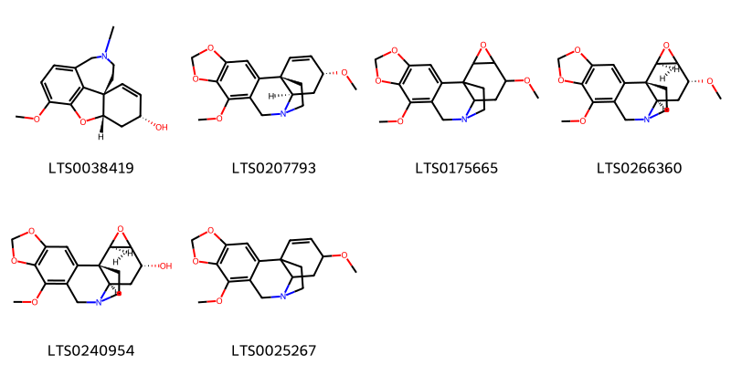{ width=100% }
    <figcaption>Hình ảnh cấu trúc hóa học của 6 hoạt chất thuộc nhóm Amaryllidaceae alkaloids gồm ['galantamine (LTS0038419)', '(1s,13r,15r)-9,15-dimethoxy-5,7-dioxa-12-azapentacyclo[10.5.2.0¹,¹³.0²,¹⁰.0⁴,⁸]nonadeca-2,4(8),9,16-tetraene (LTS0207793)', '9,15-dimethoxy-5,7,17-trioxa-12-azahexacyclo[10.6.2.0¹,¹³.0²,¹⁰.0⁴,⁸.0¹⁶,¹⁸]icosa-2,4(8),9-triene (LTS0175665)', 'undulatine (LTS0266360)', 'crinamidine (LTS0240954)', '9,15-dimethoxy-5,7-dioxa-12-azapentacyclo[10.5.2.0¹,¹³.0²,¹⁰.0⁴,⁸]nonadeca-2,4(8),9,16-tetraene (LTS0025267)'].</figcaption>
</figure>

---

### Dược dân tộc học

Danh sách các quốc gia có sử dụng *Boophone disticha* trong điều trị các bệnh. 

| Country   | Disease   | Bệnh     |
|:----------|:----------|:---------|
| Elsewhere | Poison    | Chất độc |

---

# Chi Hymenocallis

??? note "Danh sách các dược liệu thuộc chi"
    
	 - *Hymenocallis littoralis*
	 - *Hymenocallis tubiflora*

---
## Hymenocallis littoralis
### Thông tin về thực vật

!!! info "Phân loại thực vật của *Hymenocallis littoralis* từ GIBF:"
    - **Kingdom:** Plantae
    - **Phylum:** Tracheophyta
    - **Order:** Asparagales
    - **Family:** Amaryllidaceae
    - **Genus:** Hymenocallis
    - **Species:** *Hymenocallis littoralis*

 

| Label (VI)   | Label (EN)   | Scientific Name         | Descriptions (VI)   | Descriptions (EN)   | Also Known As (VI)   | Also Known As (EN)   |
|:-------------|:-------------|:------------------------|:--------------------|:--------------------|:---------------------|:---------------------|
| N/A          | N/A          | Hymenocallis littoralis | loài thực vật       | species of plant    | ['']                 | ['Spider Lily']      |

#### Phân bố trên thế giới

**Từ CSDL GIBF** nan, United Arab Emirates, Guatemala, Viet Nam, Nepal, China, Saint Lucia, Honduras, Tanzania, United Republic of, Ecuador, Thailand, Sri Lanka, United States of America, Jamaica, Zambia, Indonesia, Costa Rica, Dominican Republic, Nigeria, Colombia, French Guiana, Fiji, Hong Kong, Mexico, Benin, Rwanda, El Salvador, Guam, Philippines, Malaysia, Mauritius, Palau, Panama, Egypt, Nicaragua, Singapore, Cambodia, Bermuda, Bahamas, South Africa, Australia, Côte d’Ivoire, Saint Vincent and the Grenadines, Micronesia (Federated States of), India, Northern Mariana Islands, Liberia, Belize

#### Phân bố tại Việt Nam

**Từ CSDL GIBF**: Phú Yên, Đà Nẵng, Hà Nội, Quảng Ngãi, Hồ Chí Minh city

---
### Thành phần hóa học
        
- Theo cơ sở dữ liệu lotus: Từ loài *Hymenocallis littoralis* đã phân lập và xác định được 47 hoạt chất thuộc về các nhóm Flavonoids, Dibenzylbutane lignans, Quinolines and derivatives, Amaryllidaceae alkaloids. 

|    | chemicalTaxonomyClassyfireClass   |   smiles_count |
|---:|:----------------------------------|---------------:|
|  0 | Amaryllidaceae alkaloids          |             36 |
|  1 | Dibenzylbutane lignans            |              2 |
|  2 | Flavonoids                        |              2 |
|  3 | Quinolines and derivatives        |              7 |

#### Nhóm Amaryllidaceae alkaloids
<figure markdown="span">
    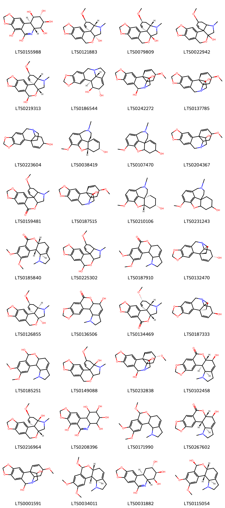{ width=100% }
    <figcaption>Hình ảnh cấu trúc hóa học của 36 hoạt chất thuộc nhóm Amaryllidaceae alkaloids gồm ['pancratistatin (LTS0155988)', 'tazettine (LTS0121883)', '(1s,13r,16s,18s)-18-methoxy-15-methyl-5,7,12-trioxa-15-azapentacyclo[11.7.0.0¹,¹⁶.0²,¹⁰.0⁴,⁸]icosa-2,4(8),9,19-tetraen-13-ol (LTS0079809)', 'tazettine (LTS0022942)', 'pretazettine (LTS0219313)', 'lycorine (LTS0186544)', 'hemanthidine (LTS0242272)', 'haemanthamine (LTS0137785)', '5,7-dioxa-12-azapentacyclo[10.5.2.0¹,¹³.0²,¹⁰.0⁴,⁸]nonadeca-2,4(8),9,16-tetraen-15-ol (LTS0223604)', 'galantamine (LTS0038419)', 'galantamine (LTS0107470)', '15-methoxy-5,7-dioxa-12-azapentacyclo[10.5.2.0¹,¹³.0²,¹⁰.0⁴,⁸]nonadeca-2,4(8),9,16-tetraen-18-ol (LTS0204367)', '18-methoxy-15-methyl-5,7,12-trioxa-15-azapentacyclo[11.7.0.0¹,¹⁶.0²,¹⁰.0⁴,⁸]icosa-2,4(8),9,19-tetraen-11-one (LTS0159481)', 'haemanthamine (LTS0187515)', 'lycoramine (LTS0210106)', '9-methoxy-4-methyl-11-oxa-4-azatetracyclo[8.6.1.0¹,¹².0⁶,¹⁷]heptadeca-6,8,10(17)-trien-14-ol (LTS0231243)', 'homolycorine (LTS0185840)', '18-methoxy-15-methyl-5,7,12-trioxa-15-azapentacyclo[11.7.0.0¹,¹⁶.0²,¹⁰.0⁴,⁸]icosa-2,4(8),9,19-tetraen-11-ol (LTS0225302)', '4,5-dimethoxy-16-methyl-9-oxa-16-azatetracyclo[8.7.0.0²,⁷.0¹³,¹⁷]heptadeca-2(7),3,5,12-tetraen-8-one (LTS0187910)', '(1r,13s,15s)-5,7-dioxa-12-azapentacyclo[10.5.2.0¹,¹³.0²,¹⁰.0⁴,⁸]nonadeca-2,4(8),9,16-tetraen-15-ol (LTS0132470)', '(1s,13s,16r,18s)-18-methoxy-15-methyl-5,7,12-trioxa-15-azapentacyclo[11.7.0.0¹,¹⁶.0²,¹⁰.0⁴,⁸]icosa-2,4(8),9,19-tetraen-13-ol (LTS0126855)', '9-hydroxy-4-methyl-11,16,18-trioxa-4-azapentacyclo[11.7.0.0²,¹⁰.0³,⁷.0¹⁵,¹⁹]icosa-1(20),7,13,15(19)-tetraen-12-one (LTS0136506)', '(1s,13r,16s,18r)-18-methoxy-15-methyl-5,7,12-trioxa-15-azapentacyclo[11.7.0.0¹,¹⁶.0²,¹⁰.0⁴,⁸]icosa-2,4(8),9,19-tetraen-11-one (LTS0134469)', 'crinine (LTS0187333)', '4,5-dimethoxy-16-methyl-9-oxa-16-azatetracyclo[8.7.0.0²,⁷.0¹³,¹⁷]heptadeca-2(7),3,5,12-tetraen-8-ol (LTS0185251)', '18-methoxy-15-methyl-5,7,12-trioxa-15-azapentacyclo[11.7.0.0¹,¹⁶.0²,¹⁰.0⁴,⁸]icosa-2,4(8),9,19-tetraen-16-ol (LTS0149088)', '(1s,11s,13s,15r,18r)-15-methoxy-5,7-dioxa-12-azapentacyclo[10.5.2.0¹,¹³.0²,¹⁰.0⁴,⁸]nonadeca-2,4(8),9,16-tetraene-11,18-diol (LTS0232838)', '(2r,3s,9s,10s)-9-hydroxy-4-methyl-11,16,18-trioxa-4-azapentacyclo[11.7.0.0²,¹⁰.0³,⁷.0¹⁵,¹⁹]icosa-1(20),7,13,15(19)-tetraen-12-one (LTS0102458)', '(1r,13r,16r,18s)-18-methoxy-15-methyl-5,7,12-trioxa-15-azapentacyclo[11.7.0.0¹,¹⁶.0²,¹⁰.0⁴,⁸]icosa-2,4(8),9,19-tetraen-16-ol (LTS0216964)', '1h,2h,3h,4h,4ah,9h,11bh-[1,3]dioxolo[4,5-j]phenanthridine-1,2,3,4,6,7-hexol (LTS0208396)', '4,5,8-trimethoxy-16-methyl-9-oxa-16-azatetracyclo[8.7.0.0²,⁷.0¹³,¹⁷]heptadeca-2(7),3,5,12-tetraene (LTS0171990)', 'hippeastrine (LTS0267602)', '15-methoxy-5,7-dioxa-12-azapentacyclo[10.5.2.0¹,¹³.0²,¹⁰.0⁴,⁸]nonadeca-2,4(8),9,16-tetraene-11,18-diol (LTS0001591)', '(1s,8s,10r,17s)-4,5,8-trimethoxy-16-methyl-9-oxa-16-azatetracyclo[8.7.0.0²,⁷.0¹³,¹⁷]heptadeca-2(7),3,5,12-tetraene (LTS0034011)', '(2s,3r,4s,4ar,11br)-1h,2h,3h,4h,4ah,9h,11bh-[1,3]dioxolo[4,5-j]phenanthridine-2,3,4,6-tetrol (LTS0031882)', 'lycorenine (LTS0115054)'].</figcaption>
</figure>
#### Nhóm Dibenzylbutane lignans
<figure markdown="span">
    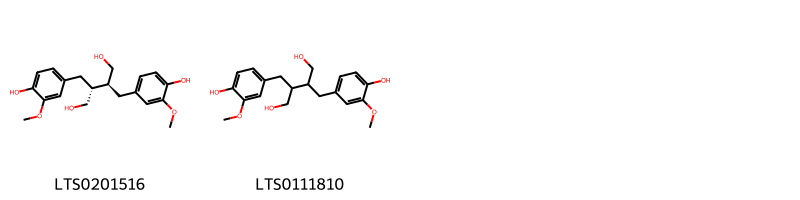{ width=100% }
    <figcaption>Hình ảnh cấu trúc hóa học của 2 hoạt chất thuộc nhóm Dibenzylbutane lignans gồm ['(2r,3s)-2,3-bis[(4-hydroxy-3-methoxyphenyl)methyl]butane-1,4-diol (LTS0201516)', 'secoisolariciresinol (LTS0111810)'].</figcaption>
</figure>
#### Nhóm Flavonoids
<figure markdown="span">
    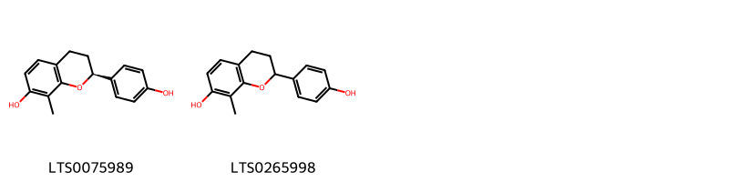{ width=100% }
    <figcaption>Hình ảnh cấu trúc hóa học của 2 hoạt chất thuộc nhóm Flavonoids gồm ["7,4'-dihydroxy-8-methylflavan (LTS0075989)", "7,4'-dihydroxy-8-methylflavan (LTS0265998)"].</figcaption>
</figure>
#### Nhóm Quinolines and derivatives
<figure markdown="span">
    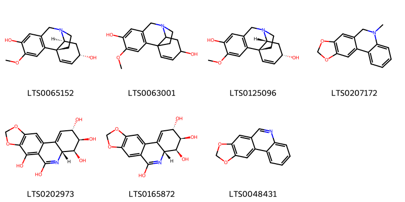{ width=100% }
    <figcaption>Hình ảnh cấu trúc hóa học của 7 hoạt chất thuộc nhóm Quinolines and derivatives gồm ['(-)-8-demethylmaritidine (LTS0065152)', '4-methoxy-9-azatetracyclo[7.5.2.0¹,¹⁰.0²,⁷]hexadeca-2(7),3,5,13-tetraene-5,12-diol (LTS0063001)', '(1r,10r,12s)-4-methoxy-9-azatetracyclo[7.5.2.0¹,¹⁰.0²,⁷]hexadeca-2(7),3,5,13-tetraene-5,12-diol (LTS0125096)', '5-methyl-6h,9h-[1,3]dioxolo[4,5-j]phenanthridine (LTS0207172)', 'lycoricidinol (LTS0202973)', 'lycoricidine (LTS0165872)', 'trisphaeridine (LTS0048431)'].</figcaption>
</figure>

---

### Dược dân tộc học

Danh sách các quốc gia có sử dụng *Hymenocallis littoralis* trong điều trị các bệnh. 

| Country     | Disease   | Bệnh      |
|:------------|:----------|:----------|
| Philippines | Vulnerary | Vulnerary |

---

---
## Hymenocallis tubiflora
### Thông tin về thực vật

!!! info "Phân loại thực vật của *Hymenocallis tubiflora* từ GIBF:"
    - **Kingdom:** Plantae
    - **Phylum:** Tracheophyta
    - **Order:** Asparagales
    - **Family:** Amaryllidaceae
    - **Genus:** Hymenocallis
    - **Species:** *Hymenocallis tubiflora*

 

| Label (VI)   | Label (EN)   | Scientific Name        | Descriptions (VI)   | Descriptions (EN)   | Also Known As (VI)   | Also Known As (EN)   |
|:-------------|:-------------|:-----------------------|:--------------------|:--------------------|:---------------------|:---------------------|
| N/A          | N/A          | Hymenocallis tubiflora | loài thực vật       | species of plant    | ['']                 | ['']                 |

#### Phân bố trên thế giới

**Từ CSDL GIBF** nan, Brazil, Saint Kitts and Nevis, United States of America, United Kingdom of Great Britain and Northern Ireland, Suriname, Colombia, unknown or invalid, French Guiana, Trinidad and Tobago, France, Guyana, Venezuela (Bolivarian Republic of)

#### Phân bố tại Việt Nam

**Từ CSDL GIBF**: Không có ghi nhận ở Việt Nam

---
### Thành phần hóa học
        
- Theo cơ sở dữ liệu lotus: Từ loài *Hymenocallis tubiflora* đã phân lập và xác định được 3 hoạt chất thuộc về các nhóm Quinolines and derivatives, Amaryllidaceae alkaloids. 

|    | chemicalTaxonomyClassyfireClass   |   smiles_count |
|---:|:----------------------------------|---------------:|
|  0 | Amaryllidaceae alkaloids          |              2 |
|  1 | Quinolines and derivatives        |              1 |

#### Nhóm Amaryllidaceae alkaloids
<figure markdown="span">
    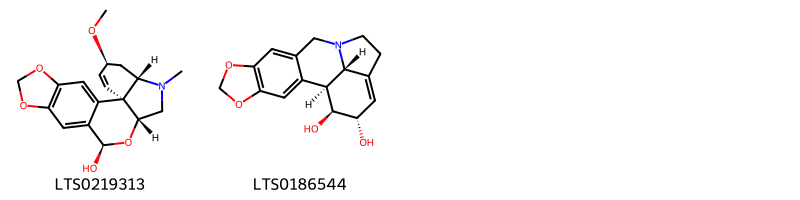{ width=100% }
    <figcaption>Hình ảnh cấu trúc hóa học của 2 hoạt chất thuộc nhóm Amaryllidaceae alkaloids gồm ['pretazettine (LTS0219313)', 'lycorine (LTS0186544)'].</figcaption>
</figure>
#### Nhóm Quinolines and derivatives
<figure markdown="span">
    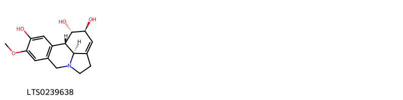{ width=100% }
    <figcaption>Hình ảnh cấu trúc hóa học của 1 hoạt chất thuộc nhóm Quinolines and derivatives gồm ['pseudolycorine (LTS0239638)'].</figcaption>
</figure>

---

### Dược dân tộc học

Danh sách các quốc gia có sử dụng *Hymenocallis tubiflora* trong điều trị các bệnh. 

| Country   | Disease                           | Bệnh                            |
|:----------|:----------------------------------|:--------------------------------|
| Brazil    | Astringent, Expectorant, Diuretic | Chất làm se, long đờm, lợi tiểu |

---

# Chi Zephyranthes

??? note "Danh sách các dược liệu thuộc chi"
    
	 - *Zephyranthes atamasco*

---
## Zephyranthes atamasco
### Thông tin về thực vật

!!! info "Phân loại thực vật của *Zephyranthes atamasco* từ GIBF:"
    - **Kingdom:** Plantae
    - **Phylum:** Tracheophyta
    - **Order:** Asparagales
    - **Family:** Amaryllidaceae
    - **Genus:** Zephyranthes
    - **Species:** *Zephyranthes atamasco*

 

| Label (VI)   | Label (EN)   | Scientific Name       | Descriptions (VI)   | Descriptions (EN)   | Also Known As (VI)   | Also Known As (EN)        |
|:-------------|:-------------|:----------------------|:--------------------|:--------------------|:---------------------|:--------------------------|
| N/A          | N/A          | Zephyranthes atamasco | loài thực vật       | species of plant    | ['']                 | ['Zephyranthes atamasca'] |

#### Phân bố trên thế giới

**Từ CSDL GIBF** United States of America

#### Phân bố tại Việt Nam

**Từ CSDL GIBF**: Không có ghi nhận ở Việt Nam

---
### Thành phần hóa học
        
- Theo cơ sở dữ liệu lotus: Từ loài *Zephyranthes atamasco* đã phân lập và xác định được Chưa có hoạt chất nào được phân lập. hoạt chất thuộc về các nhóm Không có hoạt chất nào được phân lập. 

Không có hình ảnh nào được tạo ra

---

### Dược dân tộc học

Danh sách các quốc gia có sử dụng *Zephyranthes atamasco* trong điều trị các bệnh. 

| Country   | Disease   | Bệnh     |
|:----------|:----------|:---------|
| US        | Poison    | Chất độc |

---

# Chi Aidistra

??? note "Danh sách các dược liệu thuộc chi"
    
	 - *Aidistra elatior*

---
## Aidistra elatior
### Thông tin về thực vật

!!! info "Phân loại thực vật của *N/A* từ GIBF:"
    - **Kingdom:** N/A
    - **Phylum:** N/A
    - **Order:** N/A
    - **Family:** N/A
    - **Genus:** N/A
    - **Species:** *N/A*

 

| Label (VI)   | Label (EN)   | Scientific Name       | Descriptions (VI)   | Descriptions (EN)   | Also Known As (VI)   | Also Known As (EN)        |
|:-------------|:-------------|:----------------------|:--------------------|:--------------------|:---------------------|:--------------------------|
| N/A          | N/A          | Zephyranthes atamasco | loài thực vật       | species of plant    | ['']                 | ['Zephyranthes atamasca'] |

#### Phân bố trên thế giới

**Từ CSDL GIBF** Không có kết quả phù hợp

#### Phân bố tại Việt Nam

**Từ CSDL GIBF**: Không có ghi nhận ở Việt Nam

---
### Thành phần hóa học
        
- Theo cơ sở dữ liệu lotus: Từ loài *N/A* đã phân lập và xác định được Chưa có hoạt chất nào được phân lập. hoạt chất thuộc về các nhóm Không có hoạt chất nào được phân lập. 

Không có hình ảnh nào được tạo ra

---

### Dược dân tộc học

Danh sách các quốc gia có sử dụng *N/A* trong điều trị các bệnh. 

| Country   | Disease               | Bệnh                  |
|:----------|:----------------------|:----------------------|
| Elsewhere | Cardiotonic, Diuretic | Cardiotonic, lợi tiểu |

---

# Chi Drimia

??? note "Danh sách các dược liệu thuộc chi"
    
	 - *Drimia ciliaris*
	 - *Drimia cowanni*

---
## Drimia ciliaris
### Thông tin về thực vật

!!! info "Phân loại thực vật của *Drimia elata* từ GIBF:"
    - **Kingdom:** Plantae
    - **Phylum:** Tracheophyta
    - **Order:** Asparagales
    - **Family:** Asparagaceae
    - **Genus:** Drimia
    - **Species:** *Drimia elata*

 

| Label (VI)   | Label (EN)   | Scientific Name   | Descriptions (VI)   | Descriptions (EN)   | Also Known As (VI)   | Also Known As (EN)   |
|:-------------|:-------------|:------------------|:--------------------|:--------------------|:---------------------|:---------------------|
| N/A          | N/A          | Drimia ciliaris   |                     |                     | ['']                 | ['']                 |

#### Phân bố trên thế giới

**Từ CSDL GIBF** Không có kết quả phù hợp

#### Phân bố tại Việt Nam

**Từ CSDL GIBF**: Không có ghi nhận ở Việt Nam

---
### Thành phần hóa học
        
- Theo cơ sở dữ liệu lotus: Từ loài *Drimia elata* đã phân lập và xác định được Chưa có hoạt chất nào được phân lập. hoạt chất thuộc về các nhóm Không có hoạt chất nào được phân lập. 

Không có hình ảnh nào được tạo ra

---

### Dược dân tộc học

Danh sách các quốc gia có sử dụng *Drimia elata* trong điều trị các bệnh. 

| Country   | Disease                       | Bệnh                                          |
|:----------|:------------------------------|:----------------------------------------------|
| Africa    | Diuretic, Emetic, Expectorant | Thuốc lợi tiểu, thuốc gây nôn, thuốc long đờm |

---

---
## Drimia cowanni
### Thông tin về thực vật

!!! info "Phân loại thực vật của *Dipcadi cowanii* từ GIBF:"
    - **Kingdom:** Plantae
    - **Phylum:** Tracheophyta
    - **Order:** Asparagales
    - **Family:** Asparagaceae
    - **Genus:** Dipcadi
    - **Species:** *Dipcadi cowanii*

 

| Label (VI)   | Label (EN)   | Scientific Name   | Descriptions (VI)   | Descriptions (EN)   | Also Known As (VI)   | Also Known As (EN)   |
|:-------------|:-------------|:------------------|:--------------------|:--------------------|:---------------------|:---------------------|
| N/A          | N/A          | Drimia ciliaris   |                     |                     | ['']                 | ['']                 |

#### Phân bố trên thế giới

**Từ CSDL GIBF** Không có kết quả phù hợp

#### Phân bố tại Việt Nam

**Từ CSDL GIBF**: Không có ghi nhận ở Việt Nam

---
### Thành phần hóa học
        
- Theo cơ sở dữ liệu lotus: Từ loài *Dipcadi cowanii* đã phân lập và xác định được Chưa có hoạt chất nào được phân lập. hoạt chất thuộc về các nhóm Không có hoạt chất nào được phân lập. 

Không có hình ảnh nào được tạo ra

---

### Dược dân tộc học

Danh sách các quốc gia có sử dụng *Dipcadi cowanii* trong điều trị các bệnh. 

| Country   | Disease   | Bệnh     |
|:----------|:----------|:---------|
| Malagasy  | Raticide  | Raticide |

---

# Chi Aaragus

??? note "Danh sách các dược liệu thuộc chi"
    
	 - *Aaragus adscendens*
	 - *Aaragus filicinus*
	 - *Aaragus lucidum*
	 - *Aaragus lucidus*
	 - *Aaragus officinalis*
	 - *Aaragus racemosus*
	 - *Aaragus recemosus*
	 - *Aaragus sarmentosus*
	 - *Aaragus stipularis*

---
## Aaragus adscendens
### Thông tin về thực vật

!!! info "Phân loại thực vật của *N/A* từ GIBF:"
    - **Kingdom:** N/A
    - **Phylum:** N/A
    - **Order:** N/A
    - **Family:** N/A
    - **Genus:** N/A
    - **Species:** *N/A*

 

| Label (VI)   | Label (EN)   | Scientific Name   | Descriptions (VI)   | Descriptions (EN)   | Also Known As (VI)   | Also Known As (EN)   |
|:-------------|:-------------|:------------------|:--------------------|:--------------------|:---------------------|:---------------------|
| N/A          | N/A          | Drimia ciliaris   |                     |                     | ['']                 | ['']                 |

#### Phân bố trên thế giới

**Từ CSDL GIBF** Không có kết quả phù hợp

#### Phân bố tại Việt Nam

**Từ CSDL GIBF**: Không có ghi nhận ở Việt Nam

---
### Thành phần hóa học
        
- Theo cơ sở dữ liệu lotus: Từ loài *N/A* đã phân lập và xác định được Chưa có hoạt chất nào được phân lập. hoạt chất thuộc về các nhóm Không có hoạt chất nào được phân lập. 

Không có hình ảnh nào được tạo ra

---

### Dược dân tộc học

Danh sách các quốc gia có sử dụng *N/A* trong điều trị các bệnh. 

| Country   | Disease                | Bệnh                                |
|:----------|:-----------------------|:------------------------------------|
| Elsewhere | Refrigerant, Demulcent | Môi chất lạnh, khử màu              |
| India     | Aphrodisiac, Tonic     | Thuốc kích thích tình dục, Thuốc bổ |
| Iran      | Diaphoretic, Stimulant | Thuốc lợi tiểu, thuốc kích thích    |

---

---
## Aaragus filicinus
### Thông tin về thực vật

!!! info "Phân loại thực vật của *N/A* từ GIBF:"
    - **Kingdom:** N/A
    - **Phylum:** N/A
    - **Order:** N/A
    - **Family:** N/A
    - **Genus:** N/A
    - **Species:** *N/A*

 

| Label (VI)   | Label (EN)   | Scientific Name   | Descriptions (VI)   | Descriptions (EN)   | Also Known As (VI)   | Also Known As (EN)   |
|:-------------|:-------------|:------------------|:--------------------|:--------------------|:---------------------|:---------------------|
| N/A          | N/A          | Drimia ciliaris   |                     |                     | ['']                 | ['']                 |

#### Phân bố trên thế giới

**Từ CSDL GIBF** Không có kết quả phù hợp

#### Phân bố tại Việt Nam

**Từ CSDL GIBF**: Không có ghi nhận ở Việt Nam

---
### Thành phần hóa học
        
- Theo cơ sở dữ liệu lotus: Từ loài *N/A* đã phân lập và xác định được Chưa có hoạt chất nào được phân lập. hoạt chất thuộc về các nhóm Không có hoạt chất nào được phân lập. 

Không có hình ảnh nào được tạo ra

---

### Dược dân tộc học

Danh sách các quốc gia có sử dụng *N/A* trong điều trị các bệnh. 

| Country   | Disease           | Bệnh                  |
|:----------|:------------------|:----------------------|
| Elsewhere | Astringent, Tonic | Chất làm se, Thuốc bổ |

---

---
## Aaragus lucidum
### Thông tin về thực vật

!!! info "Phân loại thực vật của *N/A* từ GIBF:"
    - **Kingdom:** N/A
    - **Phylum:** N/A
    - **Order:** N/A
    - **Family:** N/A
    - **Genus:** N/A
    - **Species:** *N/A*

 

| Label (VI)   | Label (EN)   | Scientific Name   | Descriptions (VI)   | Descriptions (EN)   | Also Known As (VI)   | Also Known As (EN)   |
|:-------------|:-------------|:------------------|:--------------------|:--------------------|:---------------------|:---------------------|
| N/A          | N/A          | Drimia ciliaris   |                     |                     | ['']                 | ['']                 |

#### Phân bố trên thế giới

**Từ CSDL GIBF** Không có kết quả phù hợp

#### Phân bố tại Việt Nam

**Từ CSDL GIBF**: Không có ghi nhận ở Việt Nam

---
### Thành phần hóa học
        
- Theo cơ sở dữ liệu lotus: Từ loài *N/A* đã phân lập và xác định được Chưa có hoạt chất nào được phân lập. hoạt chất thuộc về các nhóm Không có hoạt chất nào được phân lập. 

Không có hình ảnh nào được tạo ra

---

### Dược dân tộc học

Danh sách các quốc gia có sử dụng *N/A* trong điều trị các bệnh. 

| Country   | Disease         | Bệnh                    |
|:----------|:----------------|:------------------------|
| China     | Sedative, Tonic | Thuốc an thần, Thuốc bổ |

---

---
## Aaragus lucidus
### Thông tin về thực vật

!!! info "Phân loại thực vật của *N/A* từ GIBF:"
    - **Kingdom:** N/A
    - **Phylum:** N/A
    - **Order:** N/A
    - **Family:** N/A
    - **Genus:** N/A
    - **Species:** *N/A*

 

| Label (VI)   | Label (EN)   | Scientific Name   | Descriptions (VI)   | Descriptions (EN)   | Also Known As (VI)   | Also Known As (EN)   |
|:-------------|:-------------|:------------------|:--------------------|:--------------------|:---------------------|:---------------------|
| N/A          | N/A          | Drimia ciliaris   |                     |                     | ['']                 | ['']                 |

#### Phân bố trên thế giới

**Từ CSDL GIBF** Không có kết quả phù hợp

#### Phân bố tại Việt Nam

**Từ CSDL GIBF**: Không có ghi nhận ở Việt Nam

---
### Thành phần hóa học
        
- Theo cơ sở dữ liệu lotus: Từ loài *N/A* đã phân lập và xác định được Chưa có hoạt chất nào được phân lập. hoạt chất thuộc về các nhóm Không có hoạt chất nào được phân lập. 

Không có hình ảnh nào được tạo ra

---

### Dược dân tộc học

Danh sách các quốc gia có sử dụng *N/A* trong điều trị các bệnh. 

| Country   | Disease                                                                           | Bệnh                                                                                                     |
|:----------|:----------------------------------------------------------------------------------|:---------------------------------------------------------------------------------------------------------|
| China     | Diuretic, Expectorant, Expectorant, Nervine, Stimulant, Stomachic, Nervine, Tonic | Thuốc lợi tiểu, thuốc long đờm, thuốc long đờm, thần kinh, thuốc kích thích, dạ dày, thần kinh, thuốc bổ |
| Italian   | Diuretic                                                                          | Thuốc lợi tiêu                                                                                           |

---

---
## Aaragus officinalis
### Thông tin về thực vật

!!! info "Phân loại thực vật của *N/A* từ GIBF:"
    - **Kingdom:** N/A
    - **Phylum:** N/A
    - **Order:** N/A
    - **Family:** N/A
    - **Genus:** N/A
    - **Species:** *N/A*

 

| Label (VI)   | Label (EN)   | Scientific Name   | Descriptions (VI)   | Descriptions (EN)   | Also Known As (VI)   | Also Known As (EN)   |
|:-------------|:-------------|:------------------|:--------------------|:--------------------|:---------------------|:---------------------|
| N/A          | N/A          | Drimia ciliaris   |                     |                     | ['']                 | ['']                 |

#### Phân bố trên thế giới

**Từ CSDL GIBF** Không có kết quả phù hợp

#### Phân bố tại Việt Nam

**Từ CSDL GIBF**: Không có ghi nhận ở Việt Nam

---
### Thành phần hóa học
        
- Theo cơ sở dữ liệu lotus: Từ loài *N/A* đã phân lập và xác định được Chưa có hoạt chất nào được phân lập. hoạt chất thuộc về các nhóm Không có hoạt chất nào được phân lập. 

Không có hình ảnh nào được tạo ra

---

### Dược dân tộc học

Danh sách các quốc gia có sử dụng *N/A* trong điều trị các bệnh. 

| Country            | Disease                                                       | Bệnh                                                                 |
|:-------------------|:--------------------------------------------------------------|:---------------------------------------------------------------------|
| China              | Diuretic, Parasiticide                                        | Thuốc lợi tiểu, Thuốc diệt ký sinh trùng                             |
| Dominican Republic | Diuretic                                                      | Thuốc lợi tiêu                                                       |
| Egypt              | Aphrodisiac, Diuretic, Purgative                              | Thuốc kích thích tình dục, lợi tiểu, thanh lọc                       |
| Elsewhere          | Diuretic, Diuretic, Diuretic                                  | Lợi tiểu, lợi tiểu, lợi tiểu                                         |
| France             | Diuretic, Diuretic                                            | Lợi tiểu, lợi tiểu                                                   |
| Haiti              | Diuretic, Sedative                                            | Thuốc lợi tiểu, thuốc an thần                                        |
| Iraq               | Cardiac, Diuretic                                             | Tim, lợi tiểu                                                        |
| Turkey             | Aperient, Cardiac, Demulcent, Sedative, Diuretic, Aphrodisiac | Aperient, Cardiac, Demulcent, An thần, Lợi tiểu, Kích thích tình dục |
| Venezuela          | Diuretic                                                      | Thuốc lợi tiêu                                                       |
| ain                | Diuretic                                                      | Thuốc lợi tiêu                                                       |

---

---
## Aaragus racemosus
### Thông tin về thực vật

!!! info "Phân loại thực vật của *N/A* từ GIBF:"
    - **Kingdom:** N/A
    - **Phylum:** N/A
    - **Order:** N/A
    - **Family:** N/A
    - **Genus:** N/A
    - **Species:** *N/A*

 

| Label (VI)   | Label (EN)   | Scientific Name   | Descriptions (VI)   | Descriptions (EN)   | Also Known As (VI)   | Also Known As (EN)   |
|:-------------|:-------------|:------------------|:--------------------|:--------------------|:---------------------|:---------------------|
| N/A          | N/A          | Drimia ciliaris   |                     |                     | ['']                 | ['']                 |

#### Phân bố trên thế giới

**Từ CSDL GIBF** Không có kết quả phù hợp

#### Phân bố tại Việt Nam

**Từ CSDL GIBF**: Không có ghi nhận ở Việt Nam

---
### Thành phần hóa học
        
- Theo cơ sở dữ liệu lotus: Từ loài *N/A* đã phân lập và xác định được Chưa có hoạt chất nào được phân lập. hoạt chất thuộc về các nhóm Không có hoạt chất nào được phân lập. 

Không có hình ảnh nào được tạo ra

---

### Dược dân tộc học

Danh sách các quốc gia có sử dụng *N/A* trong điều trị các bệnh. 

| Country   | Disease                               | Bệnh                                     |
|:----------|:--------------------------------------|:-----------------------------------------|
| Elsewhere | Demulcent, Diuretic, Tonic, Demulcent | Demulcent, lợi tiểu, thuốc bổ, Demulcent |
| India     | Aphrodisiac                           | Thuốc kích dục                           |
| Iran      | Demulcent                             | dịu, giảm kích thích                     |
| Sudan     | Demulcent, Diuretic                   | Khử mỡ, lợi tiểu                         |

---

---
## Aaragus recemosus
### Thông tin về thực vật

!!! info "Phân loại thực vật của *N/A* từ GIBF:"
    - **Kingdom:** N/A
    - **Phylum:** N/A
    - **Order:** N/A
    - **Family:** N/A
    - **Genus:** N/A
    - **Species:** *N/A*

 

| Label (VI)   | Label (EN)   | Scientific Name   | Descriptions (VI)   | Descriptions (EN)   | Also Known As (VI)   | Also Known As (EN)   |
|:-------------|:-------------|:------------------|:--------------------|:--------------------|:---------------------|:---------------------|
| N/A          | N/A          | Drimia ciliaris   |                     |                     | ['']                 | ['']                 |

#### Phân bố trên thế giới

**Từ CSDL GIBF** Không có kết quả phù hợp

#### Phân bố tại Việt Nam

**Từ CSDL GIBF**: Không có ghi nhận ở Việt Nam

---
### Thành phần hóa học
        
- Theo cơ sở dữ liệu lotus: Từ loài *N/A* đã phân lập và xác định được Chưa có hoạt chất nào được phân lập. hoạt chất thuộc về các nhóm Không có hoạt chất nào được phân lập. 

Không có hình ảnh nào được tạo ra

---

### Dược dân tộc học

Danh sách các quốc gia có sử dụng *N/A* trong điều trị các bệnh. 

| Country   | Disease   | Bệnh           |
|:----------|:----------|:---------------|
| Elsewhere | Diuretic  | Thuốc lợi tiêu |

---

---
## Aaragus sarmentosus
### Thông tin về thực vật

!!! info "Phân loại thực vật của *N/A* từ GIBF:"
    - **Kingdom:** N/A
    - **Phylum:** N/A
    - **Order:** N/A
    - **Family:** N/A
    - **Genus:** N/A
    - **Species:** *N/A*

 

| Label (VI)   | Label (EN)   | Scientific Name   | Descriptions (VI)   | Descriptions (EN)   | Also Known As (VI)   | Also Known As (EN)   |
|:-------------|:-------------|:------------------|:--------------------|:--------------------|:---------------------|:---------------------|
| N/A          | N/A          | Drimia ciliaris   |                     |                     | ['']                 | ['']                 |

#### Phân bố trên thế giới

**Từ CSDL GIBF** Không có kết quả phù hợp

#### Phân bố tại Việt Nam

**Từ CSDL GIBF**: Không có ghi nhận ở Việt Nam

---
### Thành phần hóa học
        
- Theo cơ sở dữ liệu lotus: Từ loài *N/A* đã phân lập và xác định được Chưa có hoạt chất nào được phân lập. hoạt chất thuộc về các nhóm Không có hoạt chất nào được phân lập. 

Không có hình ảnh nào được tạo ra

---

### Dược dân tộc học

Danh sách các quốc gia có sử dụng *N/A* trong điều trị các bệnh. 

| Country   | Disease     | Bệnh           |
|:----------|:------------|:---------------|
| Elsewhere | Aphrodisiac | Thuốc kích dục |

---

---
## Aaragus stipularis
### Thông tin về thực vật

!!! info "Phân loại thực vật của *N/A* từ GIBF:"
    - **Kingdom:** N/A
    - **Phylum:** N/A
    - **Order:** N/A
    - **Family:** N/A
    - **Genus:** N/A
    - **Species:** *N/A*

 

| Label (VI)   | Label (EN)   | Scientific Name   | Descriptions (VI)   | Descriptions (EN)   | Also Known As (VI)   | Also Known As (EN)   |
|:-------------|:-------------|:------------------|:--------------------|:--------------------|:---------------------|:---------------------|
| N/A          | N/A          | Drimia ciliaris   |                     |                     | ['']                 | ['']                 |

#### Phân bố trên thế giới

**Từ CSDL GIBF** Không có kết quả phù hợp

#### Phân bố tại Việt Nam

**Từ CSDL GIBF**: Không có ghi nhận ở Việt Nam

---
### Thành phần hóa học
        
- Theo cơ sở dữ liệu lotus: Từ loài *N/A* đã phân lập và xác định được Chưa có hoạt chất nào được phân lập. hoạt chất thuộc về các nhóm Không có hoạt chất nào được phân lập. 

Không có hình ảnh nào được tạo ra

---

### Dược dân tộc học

Danh sách các quốc gia có sử dụng *N/A* trong điều trị các bệnh. 

| Country   | Disease     | Bệnh                      |
|:----------|:------------|:--------------------------|
| Egypt     | Diaphoretic | Thuốc tràn dịch màng phổi |

---

# Chi Schoenocaulon

??? note "Danh sách các dược liệu thuộc chi"
    
	 - *Schoenocaulon jaliscense*
	 - *Schoenocaulon officinale*

---
## Schoenocaulon jaliscense
### Thông tin về thực vật

!!! info "Phân loại thực vật của *Schoenocaulon jaliscense* từ GIBF:"
    - **Kingdom:** Plantae
    - **Phylum:** Tracheophyta
    - **Order:** Liliales
    - **Family:** Melanthiaceae
    - **Genus:** Schoenocaulon
    - **Species:** *Schoenocaulon jaliscense*

 

| Label (VI)   | Label (EN)   | Scientific Name          | Descriptions (VI)   | Descriptions (EN)   | Also Known As (VI)   | Also Known As (EN)   |
|:-------------|:-------------|:-------------------------|:--------------------|:--------------------|:---------------------|:---------------------|
| N/A          | N/A          | Schoenocaulon jaliscense | loài thực vật       | species of plant    | ['']                 | ['']                 |

#### Phân bố trên thế giới

**Từ CSDL GIBF** nan, Mexico

#### Phân bố tại Việt Nam

**Từ CSDL GIBF**: Không có ghi nhận ở Việt Nam

---
### Thành phần hóa học
        
- Theo cơ sở dữ liệu lotus: Từ loài *Schoenocaulon jaliscense* đã phân lập và xác định được Chưa có hoạt chất nào được phân lập. hoạt chất thuộc về các nhóm Không có hoạt chất nào được phân lập. 

Không có hình ảnh nào được tạo ra

---

### Dược dân tộc học

Danh sách các quốc gia có sử dụng *Schoenocaulon jaliscense* trong điều trị các bệnh. 

| Country   | Disease     | Bệnh          |
|:----------|:------------|:--------------|
| Mexico    | Insecticide | Thuốc trừ sâu |

---

---
## Schoenocaulon officinale
### Thông tin về thực vật

!!! info "Phân loại thực vật của *Schoenocaulon officinale* từ GIBF:"
    - **Kingdom:** Plantae
    - **Phylum:** Tracheophyta
    - **Order:** Liliales
    - **Family:** Melanthiaceae
    - **Genus:** Schoenocaulon
    - **Species:** *Schoenocaulon officinale*

 

| Label (VI)   | Label (EN)   | Scientific Name          | Descriptions (VI)   | Descriptions (EN)   | Also Known As (VI)   | Also Known As (EN)   |
|:-------------|:-------------|:-------------------------|:--------------------|:--------------------|:---------------------|:---------------------|
| N/A          | N/A          | Schoenocaulon officinale | loài thực vật       | species of plant    | ['']                 | ['']                 |

#### Phân bố trên thế giới

**Từ CSDL GIBF** nan, Mexico, Nicaragua, Guatemala, El Salvador, Costa Rica, Honduras, Peru, Bolivia (Plurinational State of), Venezuela (Bolivarian Republic of)

#### Phân bố tại Việt Nam

**Từ CSDL GIBF**: Không có ghi nhận ở Việt Nam

---
### Thành phần hóa học
        
- Theo cơ sở dữ liệu lotus: Từ loài *Schoenocaulon officinale* đã phân lập và xác định được 23 hoạt chất thuộc về các nhóm 2-arylbenzofuran flavonoids, Steroids and steroid derivatives, Stilbenes. 

|    | chemicalTaxonomyClassyfireClass   |   smiles_count |
|---:|:----------------------------------|---------------:|
|  0 | 2-arylbenzofuran flavonoids       |              5 |
|  1 | Steroids and steroid derivatives  |              2 |
|  2 | Stilbenes                         |             16 |

#### Nhóm 2-arylbenzofuran flavonoids
<figure markdown="span">
    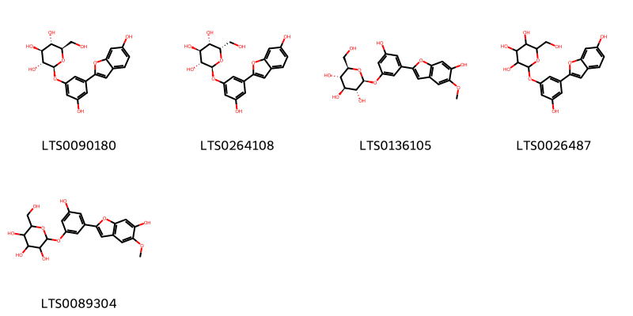{ width=100% }
    <figcaption>Hình ảnh cấu trúc hóa học của 5 hoạt chất thuộc nhóm 2-arylbenzofuran flavonoids gồm ['(2s,3r,4s,5s,6r)-2-[3-hydroxy-5-(6-hydroxy-1-benzofuran-2-yl)phenoxy]-6-(hydroxymethyl)oxane-3,4,5-triol (LTS0090180)', '(2s,3r,4s,5s,6s)-2-[3-hydroxy-5-(6-hydroxy-1-benzofuran-2-yl)phenoxy]-6-(hydroxymethyl)oxane-3,4,5-triol (LTS0264108)', '(2s,3r,4s,5s,6r)-2-[3-hydroxy-5-(6-hydroxy-5-methoxy-1-benzofuran-2-yl)phenoxy]-6-(hydroxymethyl)oxane-3,4,5-triol (LTS0136105)', '2-[3-hydroxy-5-(6-hydroxy-1-benzofuran-2-yl)phenoxy]-6-(hydroxymethyl)oxane-3,4,5-triol (LTS0026487)', '2-[3-hydroxy-5-(6-hydroxy-5-methoxy-1-benzofuran-2-yl)phenoxy]-6-(hydroxymethyl)oxane-3,4,5-triol (LTS0089304)'].</figcaption>
</figure>
#### Nhóm Steroids and steroid derivatives
<figure markdown="span">
    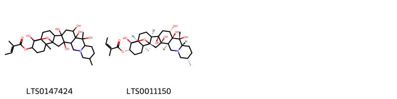{ width=100% }
    <figcaption>Hình ảnh cấu trúc hóa học của 2 hoạt chất thuộc nhóm Steroids and steroid derivatives gồm ['1,10,11,12,14,23-hexahydroxy-6,10,19-trimethyl-24-oxa-4-azaheptacyclo[12.12.0.0²,¹¹.0⁴,⁹.0¹⁵,²⁵.0¹⁸,²³.0¹⁹,²⁵]hexacosan-22-yl 2-methylbut-2-enoate (LTS0147424)', 'cevadine (LTS0011150)'].</figcaption>
</figure>
#### Nhóm Stilbenes
<figure markdown="span">
    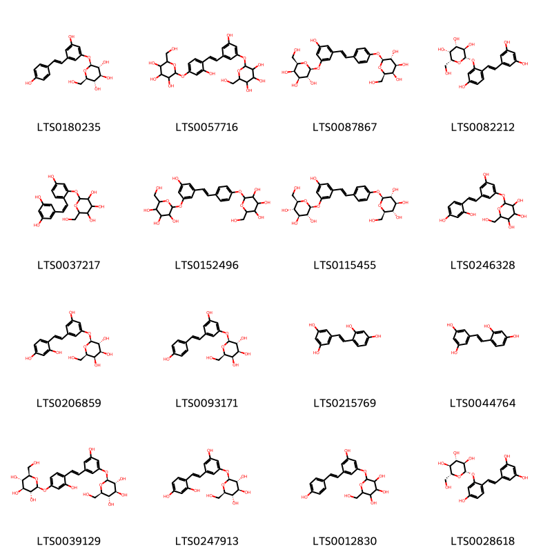{ width=100% }
    <figcaption>Hình ảnh cấu trúc hóa học của 16 hoạt chất thuộc nhóm Stilbenes gồm ['piceid (LTS0180235)', '2-{3-hydroxy-5-[2-(2-hydroxy-4-{[3,4,5-trihydroxy-6-(hydroxymethyl)oxan-2-yl]oxy}phenyl)ethenyl]phenoxy}-6-(hydroxymethyl)oxane-3,4,5-triol (LTS0057716)', '(2s,3r,4s,5r,6r)-2-{4-[(1e)-2-(3-hydroxy-5-{[(2s,3r,4s,5r,6r)-3,4,5-trihydroxy-6-(hydroxymethyl)oxan-2-yl]oxy}phenyl)ethenyl]phenoxy}-6-(hydroxymethyl)oxane-3,4,5-triol (LTS0087867)', '(2s,3r,4s,5r,6r)-2-{2-[(1e)-2-(3,5-dihydroxyphenyl)ethenyl]-5-hydroxyphenoxy}-6-(hydroxymethyl)oxane-3,4,5-triol (LTS0082212)', '2-{2-[2-(3,5-dihydroxyphenyl)ethenyl]-5-hydroxyphenoxy}-6-(hydroxymethyl)oxane-3,4,5-triol (LTS0037217)', '2-{4-[2-(3-hydroxy-5-{[3,4,5-trihydroxy-6-(hydroxymethyl)oxan-2-yl]oxy}phenyl)ethenyl]phenoxy}-6-(hydroxymethyl)oxane-3,4,5-triol (LTS0152496)', '(2s,3r,4s,5s,6r)-2-{4-[(1e)-2-(3-hydroxy-5-{[(2s,3r,4s,5s,6r)-3,4,5-trihydroxy-6-(hydroxymethyl)oxan-2-yl]oxy}phenyl)ethenyl]phenoxy}-6-(hydroxymethyl)oxane-3,4,5-triol (LTS0115455)', '2-{3-[2-(2,4-dihydroxyphenyl)ethenyl]-5-hydroxyphenoxy}-6-(hydroxymethyl)oxane-3,4,5-triol (LTS0246328)', '(2s,3r,4s,5r,6r)-2-{3-[(1e)-2-(2,4-dihydroxyphenyl)ethenyl]-5-hydroxyphenoxy}-6-(hydroxymethyl)oxane-3,4,5-triol (LTS0206859)', '(2s,3r,4s,5r,6r)-2-{3-hydroxy-5-[(1e)-2-(4-hydroxyphenyl)ethenyl]phenoxy}-6-(hydroxymethyl)oxane-3,4,5-triol (LTS0093171)', '5-[2-(2,4-dihydroxyphenyl)ethenyl]benzene-1,3-diol (LTS0215769)', '5-[(1e)-2-(2,4-dihydroxyphenyl)ethenyl]benzene-1,3-diol (LTS0044764)', '(2s,3r,4s,5s,6r)-2-{3-hydroxy-5-[(1e)-2-(2-hydroxy-4-{[(2s,3r,4s,5s,6r)-3,4,5-trihydroxy-6-(hydroxymethyl)oxan-2-yl]oxy}phenyl)ethenyl]phenoxy}-6-(hydroxymethyl)oxane-3,4,5-triol (LTS0039129)', '(2s,3r,4s,5s,6r)-2-{3-[(1e)-2-(2,4-dihydroxyphenyl)ethenyl]-5-hydroxyphenoxy}-6-(hydroxymethyl)oxane-3,4,5-triol (LTS0247913)', '2-{3-hydroxy-5-[2-(4-hydroxyphenyl)ethenyl]phenoxy}-6-(hydroxymethyl)oxane-3,4,5-triol (LTS0012830)', '(2s,3r,4s,5s,6r)-2-{2-[(1e)-2-(3,5-dihydroxyphenyl)ethenyl]-5-hydroxyphenoxy}-6-(hydroxymethyl)oxane-3,4,5-triol (LTS0028618)'].</figcaption>
</figure>

---

### Dược dân tộc học

Danh sách các quốc gia có sử dụng *Schoenocaulon officinale* trong điều trị các bệnh. 

| Country         | Disease                   | Bệnh                      |
|:----------------|:--------------------------|:--------------------------|
| Central America | Insecticide               | Thuốc trừ sâu             |
| Europe          | Vermifuge, Pediculicide   | Máy tạo bọt, Pediculicide |
| Guatemala       | Cathartic, Poison, Emetic | Cathartic, Poison, Emetic |
| Latin America   | Pediculicide, Poison      | Pediculicide, Poison      |

---

# Chi Aletris

??? note "Danh sách các dược liệu thuộc chi"
    
	 - *Aletris farinosa*
	 - *Aletris icata*

---
## Aletris farinosa
### Thông tin về thực vật

!!! info "Phân loại thực vật của *Aletris farinosa* từ GIBF:"
    - **Kingdom:** Plantae
    - **Phylum:** Tracheophyta
    - **Order:** Dioscoreales
    - **Family:** Nartheciaceae
    - **Genus:** Aletris
    - **Species:** *Aletris farinosa*

 

| Label (VI)   | Label (EN)   | Scientific Name   | Descriptions (VI)   | Descriptions (EN)   | Also Known As (VI)   | Also Known As (EN)   |
|:-------------|:-------------|:------------------|:--------------------|:--------------------|:---------------------|:---------------------|
| N/A          | N/A          | Aletris farinosa  | loài thực vật       | species of plant    | ['']                 | ['']                 |

#### Phân bố trên thế giới

**Từ CSDL GIBF** United States of America, Canada

#### Phân bố tại Việt Nam

**Từ CSDL GIBF**: Không có ghi nhận ở Việt Nam

---
### Thành phần hóa học
        
- Theo cơ sở dữ liệu lotus: Từ loài *Aletris farinosa* đã phân lập và xác định được Chưa có hoạt chất nào được phân lập. hoạt chất thuộc về các nhóm Không có hoạt chất nào được phân lập. 

Không có hình ảnh nào được tạo ra

---

### Dược dân tộc học

Danh sách các quốc gia có sử dụng *Aletris farinosa* trong điều trị các bệnh. 

| Country        | Disease                                                 | Bệnh                                                            |
|:---------------|:--------------------------------------------------------|:----------------------------------------------------------------|
| Dutch          | Tonic                                                   | (thuộc) trương lực                                              |
| French         | Diuretic                                                | Thuốc lợi tiêu                                                  |
| German         | Purgative                                               | Thuốc xổ                                                        |
| US             | Diuretic, Sedative, Stomachic, Emetic, Tonic, Vermifuge | Thuốc lợi tiểu, Thuốc an thần, Dạ dày, Emetic, Tonic, Vermifuge |
| US(Appalachia) | Stomachic, Tonic                                        | Dạ dày, Thuốc bổ                                                |

---

---
## Aletris icata
### Thông tin về thực vật

!!! info "Phân loại thực vật của *N/A* từ GIBF:"
    - **Kingdom:** Plantae
    - **Phylum:** Tracheophyta
    - **Order:** Dioscoreales
    - **Family:** Nartheciaceae
    - **Genus:** Aletris
    - **Species:** *N/A*

 

| Label (VI)   | Label (EN)   | Scientific Name   | Descriptions (VI)   | Descriptions (EN)   | Also Known As (VI)   | Also Known As (EN)   |
|:-------------|:-------------|:------------------|:--------------------|:--------------------|:---------------------|:---------------------|
| N/A          | N/A          | Aletris farinosa  | loài thực vật       | species of plant    | ['']                 | ['']                 |

#### Phân bố trên thế giới

**Từ CSDL GIBF** nan, United States of America, Japan, Chinese Taipei, China

#### Phân bố tại Việt Nam

**Từ CSDL GIBF**: Không có ghi nhận ở Việt Nam

---
### Thành phần hóa học
        
- Theo cơ sở dữ liệu lotus: Từ loài *N/A* đã phân lập và xác định được Chưa có hoạt chất nào được phân lập. hoạt chất thuộc về các nhóm Không có hoạt chất nào được phân lập. 

Không có hình ảnh nào được tạo ra

---

### Dược dân tộc học

Danh sách các quốc gia có sử dụng *N/A* trong điều trị các bệnh. 

| Country   | Disease              | Bệnh                            |
|:----------|:---------------------|:--------------------------------|
| China     | Larvicide, Vermifuge | Thuốc diệt côn trùng, Vermifuge |

---

# Chi Androcymbium

??? note "Danh sách các dược liệu thuộc chi"
    
	 - *Androcymbium gramineum*

---
## Androcymbium gramineum
### Thông tin về thực vật

!!! info "Phân loại thực vật của *Colchicum gramineum* từ GIBF:"
    - **Kingdom:** Plantae
    - **Phylum:** Tracheophyta
    - **Order:** Liliales
    - **Family:** Colchicaceae
    - **Genus:** Colchicum
    - **Species:** *Colchicum gramineum*

 

| Label (VI)   | Label (EN)   | Scientific Name        | Descriptions (VI)   | Descriptions (EN)   | Also Known As (VI)   | Also Known As (EN)   |
|:-------------|:-------------|:-----------------------|:--------------------|:--------------------|:---------------------|:---------------------|
| N/A          | N/A          | Androcymbium gramineum | loài thực vật       | species of plant    | ['']                 | ['']                 |

#### Phân bố trên thế giới

**Từ CSDL GIBF** Morocco, Namibia, nan, Algeria, Norway, Niger, Libya, Mauritania, Tunisia, Western Sahara, Spain

#### Phân bố tại Việt Nam

**Từ CSDL GIBF**: Không có ghi nhận ở Việt Nam

---
### Thành phần hóa học
        
- Theo cơ sở dữ liệu lotus: Từ loài *Colchicum gramineum* đã phân lập và xác định được Chưa có hoạt chất nào được phân lập. hoạt chất thuộc về các nhóm Không có hoạt chất nào được phân lập. 

Không có hình ảnh nào được tạo ra

---

### Dược dân tộc học

Danh sách các quốc gia có sử dụng *Colchicum gramineum* trong điều trị các bệnh. 

| Country   | Disease   | Bệnh     |
|:----------|:----------|:---------|
| Egypt     | Poison    | Chất độc |

---

# Chi Rohdea

??? note "Danh sách các dược liệu thuộc chi"
    
	 - *Rohdea japonica*

---
## Rohdea japonica
### Thông tin về thực vật

!!! info "Phân loại thực vật của *Rohdea japonica* từ GIBF:"
    - **Kingdom:** Plantae
    - **Phylum:** Tracheophyta
    - **Order:** Asparagales
    - **Family:** Asparagaceae
    - **Genus:** Rohdea
    - **Species:** *Rohdea japonica*

 

| Label (VI)   | Label (EN)   | Scientific Name   | Descriptions (VI)   | Descriptions (EN)   | Also Known As (VI)   | Also Known As (EN)   |
|:-------------|:-------------|:------------------|:--------------------|:--------------------|:---------------------|:---------------------|
| N/A          | N/A          | Rohdea japonica   | loài thực vật       | species of plant    | ['']                 | ['']                 |

#### Phân bố trên thế giới

**Từ CSDL GIBF** nan, United States of America, Japan, Korea, Republic of, Portugal, Belgium, Chinese Taipei, China, Germany, United Kingdom of Great Britain and Northern Ireland, Spain

#### Phân bố tại Việt Nam

**Từ CSDL GIBF**: Không có ghi nhận ở Việt Nam

---
### Thành phần hóa học
        
- Theo cơ sở dữ liệu lotus: Từ loài *Rohdea japonica* đã phân lập và xác định được 6 hoạt chất thuộc về các nhóm Prenol lipids, Steroids and steroid derivatives. 

|    | chemicalTaxonomyClassyfireClass   |   smiles_count |
|---:|:----------------------------------|---------------:|
|  0 | Prenol lipids                     |              2 |
|  1 | Steroids and steroid derivatives  |              4 |

#### Nhóm Prenol lipids
<figure markdown="span">
    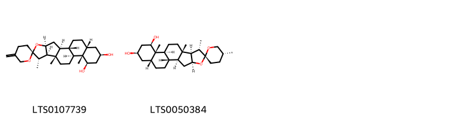{ width=100% }
    <figcaption>Hình ảnh cấu trúc hóa học của 2 hoạt chất thuộc nhóm Prenol lipids gồm ['convallamarogenin (LTS0107739)', "(1's,2r,2's,4's,5r,7's,8'r,9's,12's,13's,14'r,16'r,18'r)-5,7',9',13'-tetramethyl-5'-oxaspiro[oxane-2,6'-pentacyclo[10.8.0.0²,⁹.0⁴,⁸.0¹³,¹⁸]icosane]-14',16'-diol (LTS0050384)"].</figcaption>
</figure>
#### Nhóm Steroids and steroid derivatives
<figure markdown="span">
    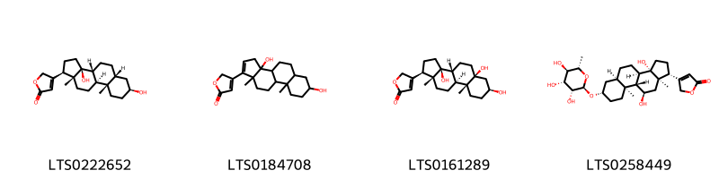{ width=100% }
    <figcaption>Hình ảnh cấu trúc hóa học của 4 hoạt chất thuộc nhóm Steroids and steroid derivatives gồm ['digitoxigenin (LTS0222652)', '4-{3a,7-dihydroxy-9a,11a-dimethyl-3h,3bh,4h,5h,5ah,6h,7h,8h,9h,9bh,10h,11h-cyclopenta[a]phenanthren-1-yl}-5h-furan-2-one (LTS0184708)', 'periplogenin (LTS0161289)', 'rhodexin a (LTS0258449)'].</figcaption>
</figure>

---

### Dược dân tộc học

Danh sách các quốc gia có sử dụng *Rohdea japonica* trong điều trị các bệnh. 

| Country   | Disease               | Bệnh                  |
|:----------|:----------------------|:----------------------|
| China     | Alexiteric            | Alexiteric            |
| Elsewhere | Cardiotonic, Diuretic | Cardiotonic, lợi tiểu |
| Japan     | Cardiac, Diuretic     | Tim, lợi tiểu         |

---

# Chi Trillium

??? note "Danh sách các dược liệu thuộc chi"
    
	 - *Trillium erectum*
	 - *Trillium pendulum*
	 - *Trillium smallii*

---
## Trillium erectum
### Thông tin về thực vật

!!! info "Phân loại thực vật của *Trillium erectum* từ GIBF:"
    - **Kingdom:** Plantae
    - **Phylum:** Tracheophyta
    - **Order:** Liliales
    - **Family:** Melanthiaceae
    - **Genus:** Trillium
    - **Species:** *Trillium erectum*

 

| Label (VI)   | Label (EN)   | Scientific Name   | Descriptions (VI)   | Descriptions (EN)   | Also Known As (VI)   | Also Known As (EN)                                |
|:-------------|:-------------|:------------------|:--------------------|:--------------------|:---------------------|:--------------------------------------------------|
| N/A          | N/A          | Trillium erectum  | loài thực vật       | species of plant    | ['']                 | ['purple trillium', 'red trillium', 'wake-robin'] |

#### Phân bố trên thế giới

**Từ CSDL GIBF** United States of America, Canada

#### Phân bố tại Việt Nam

**Từ CSDL GIBF**: Không có ghi nhận ở Việt Nam

---
### Thành phần hóa học
        
- Theo cơ sở dữ liệu lotus: Từ loài *Trillium erectum* đã phân lập và xác định được 63 hoạt chất thuộc về các nhóm Fatty Acyls, Steroids and steroid derivatives. 

|    | chemicalTaxonomyClassyfireClass   |   smiles_count |
|---:|:----------------------------------|---------------:|
|  0 | Fatty Acyls                       |              2 |
|  1 | Steroids and steroid derivatives  |             61 |

#### Nhóm Fatty Acyls
<figure markdown="span">
    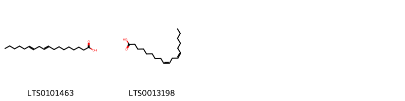{ width=100% }
    <figcaption>Hình ảnh cấu trúc hóa học của 2 hoạt chất thuộc nhóm Fatty Acyls gồm ['9,12-octadecadienoic acid (LTS0101463)', 'linoleic (LTS0013198)'].</figcaption>
</figure>
#### Nhóm Steroids and steroid derivatives
<figure markdown="span">
    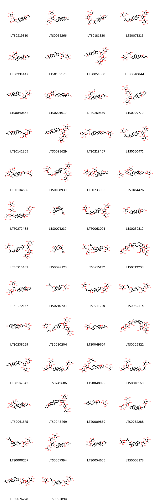{ width=100% }
    <figcaption>Hình ảnh cấu trúc hóa học của 61 hoạt chất thuộc nhóm Steroids and steroid derivatives gồm ["(2s,3r,4r,5r,6s)-2-{[(2r,3s,4r,5r,6r)-4,5-dihydroxy-2-(hydroxymethyl)-6-[(1'r,2r,2's,4's,5r,7's,8's,9's,12's,13'r,16's)-5,7',9',13'-tetramethyl-5'-oxaspiro[oxane-2,6'-pentacyclo[10.8.0.0²,⁹.0⁴,⁸.0¹³,¹⁸]icosan]-18'-en-8'-oloxy]oxan-3-yl]oxy}-6-methyloxane-3,4,5-triol (LTS0219810)", "(2s,3r,4r,5r,6s)-2-{[(2r,3s,4s,5r,6r)-4-hydroxy-2-(hydroxymethyl)-6-[(1's,2r,2's,4's,5r,7's,8'r,9's,12's,13'r,16's)-5,7',9',13'-tetramethyl-5'-oxaspiro[oxane-2,6'-pentacyclo[10.8.0.0²,⁹.0⁴,⁸.0¹³,¹⁸]icosan]-18'-eneoxy]-5-{[(2s,3r,4r,5r,6s)-3,4,5-trihydroxy-6-methyloxan-2-yl]oxy}oxan-3-yl]oxy}-6-methyloxane-3,4,5-triol (LTS0065266)", "(2s,3r,4r,5r,6s)-2-{[(2s,3r,4s,5r,6s)-6-{[(2r,3s,4r,5r,6r)-4,5-dihydroxy-2-(hydroxymethyl)-6-[(1'r,2r,2's,4's,5r,7's,8's,9's,12's,13'r,16's)-5,7',9',13'-tetramethyl-5'-oxaspiro[oxane-2,6'-pentacyclo[10.8.0.0²,⁹.0⁴,⁸.0¹³,¹⁸]icosan]-18'-en-8'-oloxy]oxan-3-yl]oxy}-4,5-dihydroxy-2-methyloxan-3-yl]oxy}-6-methyloxane-3,4,5-triol (LTS0181330)", '2-[4-(8-hydroxy-16-{[4-hydroxy-6-(hydroxymethyl)-3,5-bis[(3,4,5-trihydroxy-6-methyloxan-2-yl)oxy]oxan-2-yl]oxy}-6-methoxy-7,9,13-trimethyl-5-oxapentacyclo[10.8.0.0²,⁹.0⁴,⁸.0¹³,¹⁸]icos-18-en-6-yl)-2-methylbutoxy]-6-(hydroxymethyl)oxane-3,4,5-triol (LTS0071315)', "(2s,3r,4r,5r,6s)-2-{[(2r,3r,4s,5s,6r)-4,5-dihydroxy-6-(hydroxymethyl)-2-[(1'r,2r,2's,4's,5r,7's,8's,9's,12's,13'r,16's)-5,7',9',13'-tetramethyl-5'-oxaspiro[oxane-2,6'-pentacyclo[10.8.0.0²,⁹.0⁴,⁸.0¹³,¹⁸]icosan]-18'-en-8'-oloxy]oxan-3-yl]oxy}-6-methyloxane-3,4,5-triol (LTS0231447)", "2-{[4,5-dihydroxy-2-(hydroxymethyl)-6-{5,7',9',13'-tetramethyl-5'-oxaspiro[oxane-2,6'-pentacyclo[10.8.0.0²,⁹.0⁴,⁸.0¹³,¹⁸]icosan]-18'-en-8'-oloxy}oxan-3-yl]oxy}-6-methyloxane-3,4,5-triol (LTS0189176)", "2-[(4,5-dihydroxy-6-{[4-hydroxy-2-(hydroxymethyl)-6-{5,7',9',13'-tetramethyl-5'-oxaspiro[oxane-2,6'-pentacyclo[10.8.0.0²,⁹.0⁴,⁸.0¹³,¹⁸]icosan]-18'-eneoxy}-5-[(3,4,5-trihydroxy-6-methyloxan-2-yl)oxy]oxan-3-yl]oxy}-2-methyloxan-3-yl)oxy]-6-methyloxane-3,4,5-triol (LTS0051080)", "2-{[4,5-dihydroxy-6-(hydroxymethyl)-2-[5-(hydroxymethyl)-7',9',13'-trimethyl-5'-oxaspiro[oxane-2,6'-pentacyclo[10.8.0.0²,⁹.0⁴,⁸.0¹³,¹⁸]icosan]-18'-en-8'-oloxy]oxan-3-yl]oxy}-6-methyloxane-3,4,5-triol (LTS0040844)", "2-{[4,5-dihydroxy-6-(hydroxymethyl)-2-{5,7',9',13'-tetramethyl-5'-oxaspiro[oxane-2,6'-pentacyclo[10.8.0.0²,⁹.0⁴,⁸.0¹³,¹⁸]icosan]-18'-eneoxy}oxan-3-yl]oxy}-6-methyloxane-3,4,5-triol (LTS0040548)", "6-{[4,5-dihydroxy-6-(hydroxymethyl)-2-[5-(hydroxymethyl)-7',9',13'-trimethyl-5'-oxaspiro[oxane-2,6'-pentacyclo[10.8.0.0²,⁹.0⁴,⁸.0¹³,¹⁸]icosan]-18'-en-8'-oloxy]oxan-3-yl]oxy}-4,5-dihydroxy-2-methyloxan-3-yl acetate (LTS0201619)", "(2s,3r,4s,5r,6s)-6-{[(2r,3r,4s,5s,6r)-4,5-dihydroxy-6-(hydroxymethyl)-2-[(1'r,2r,2's,4's,5s,7's,8's,9's,12's,13'r,16's)-5-(hydroxymethyl)-7',9',13'-trimethyl-5'-oxaspiro[oxane-2,6'-pentacyclo[10.8.0.0²,⁹.0⁴,⁸.0¹³,¹⁸]icosan]-18'-en-8'-oloxy]oxan-3-yl]oxy}-4,5-dihydroxy-2-methyloxan-3-yl acetate (LTS0269559)", "(2s,3r,4r,5r,6s)-2-{[(2r,3r,4s,5s,6r)-5-{[(2s,3r,4r,5s,6s)-3,5-dihydroxy-6-methyl-4-{[(2s,3r,4r,5r,6s)-3,4,5-trihydroxy-6-methyloxan-2-yl]oxy}oxan-2-yl]oxy}-4-hydroxy-6-(hydroxymethyl)-2-[(1'r,2r,2's,4's,5r,7's,8's,9's,12's,13'r,16's)-5,7',9',13'-tetramethyl-5'-oxaspiro[oxane-2,6'-pentacyclo[10.8.0.0²,⁹.0⁴,⁸.0¹³,¹⁸]icosan]-18'-en-8'-oloxy]oxan-3-yl]oxy}-6-methyloxane-3,4,5-triol (LTS0199770)", "2-{[4,5-dihydroxy-6-(hydroxymethyl)-2-{5,7',9',13'-tetramethyl-5'-oxaspiro[oxane-2,6'-pentacyclo[10.8.0.0²,⁹.0⁴,⁸.0¹³,¹⁸]icosan]-18'-en-8'-oloxy}oxan-3-yl]oxy}-6-methyloxane-3,4,5-triol (LTS0142865)", "2-[(4,5-dihydroxy-6-{[4-hydroxy-2-(hydroxymethyl)-6-{5,7',9',13'-tetramethyl-5'-oxaspiro[oxane-2,6'-pentacyclo[10.8.0.0²,⁹.0⁴,⁸.0¹³,¹⁸]icosan]-18'-en-8'-oloxy}-5-[(3,4,5-trihydroxy-6-methyloxan-2-yl)oxy]oxan-3-yl]oxy}-2-methyloxan-3-yl)oxy]-6-methyloxane-3,4,5-triol (LTS0093629)", "6-{[4,5-dihydroxy-6-(hydroxymethyl)-2-[7',9',13'-trimethyl-5-({[3,4,5-trihydroxy-6-(hydroxymethyl)oxan-2-yl]oxy}methyl)-5'-oxaspiro[oxane-2,6'-pentacyclo[10.8.0.0²,⁹.0⁴,⁸.0¹³,¹⁸]icosan]-18'-en-8'-oloxy]oxan-3-yl]oxy}-4,5-dihydroxy-2-methyloxan-3-yl acetate (LTS0219407)", '2-[(4-hydroxy-6-{[6-hydroxy-7,9,13-trimethyl-6-(3-methyl-4-{[3,4,5-trihydroxy-6-(hydroxymethyl)oxan-2-yl]oxy}butyl)-5-oxapentacyclo[10.8.0.0²,⁹.0⁴,⁸.0¹³,¹⁸]icos-18-en-16-yl]oxy}-2-(hydroxymethyl)-5-[(3,4,5-trihydroxy-6-methyloxan-2-yl)oxy]oxan-3-yl)oxy]-6-methyloxane-3,4,5-triol (LTS0160471)', "(2s,3r,4s,5r,6s)-6-{[(2r,3r,4s,5s,6r)-4,5-dihydroxy-6-(hydroxymethyl)-2-[(1'r,2r,2's,4's,5s,7's,8's,9's,12's,13'r,16's)-7',9',13'-trimethyl-5-({[(2r,3r,4s,5s,6r)-3,4,5-trihydroxy-6-(hydroxymethyl)oxan-2-yl]oxy}methyl)-5'-oxaspiro[oxane-2,6'-pentacyclo[10.8.0.0²,⁹.0⁴,⁸.0¹³,¹⁸]icosan]-18'-en-8'-oloxy]oxan-3-yl]oxy}-4,5-dihydroxy-2-methyloxan-3-yl acetate (LTS0104536)", '(2r,3r,4s,5s,6r)-2-[(2r)-4-[(1r,2s,4s,6r,7s,8s,9s,12s,13r,16s)-16-{[(2r,3r,4s,5s,6r)-5-{[(2s,3r,4s,5r,6s)-3,4-dihydroxy-6-methyl-5-{[(2s,3r,4r,5r,6s)-3,4,5-trihydroxy-6-methyloxan-2-yl]oxy}oxan-2-yl]oxy}-4-hydroxy-6-(hydroxymethyl)-3-{[(2s,3r,4r,5r,6s)-3,4,5-trihydroxy-6-methyloxan-2-yl]oxy}oxan-2-yl]oxy}-8-hydroxy-6-methoxy-7,9,13-trimethyl-5-oxapentacyclo[10.8.0.0²,⁹.0⁴,⁸.0¹³,¹⁸]icos-18-en-6-yl]-2-methylbutoxy]-6-(hydroxymethyl)oxane-3,4,5-triol (LTS0168939)', "(2s,3r,4r,5r,6s)-2-{[(2s,3s,4s,5r,6s)-4-hydroxy-2-(hydroxymethyl)-6-[(1's,2r,2's,4's,5r,7's,8'r,9's,12's,13'r,16's)-5,7',9',13'-tetramethyl-5'-oxaspiro[oxane-2,6'-pentacyclo[10.8.0.0²,⁹.0⁴,⁸.0¹³,¹⁸]icosan]-18'-eneoxy]-5-{[(2s,3r,4r,5r,6s)-3,4,5-trihydroxy-6-methyloxan-2-yl]oxy}oxan-3-yl]oxy}-6-methyloxane-3,4,5-triol (LTS0233003)", "(2s,3r,4r,5r,6s)-2-{[(2r,3r,4s,5s,6r)-4,5-dihydroxy-6-({[(2r,3r,4s,5s,6r)-3,4,5-trihydroxy-6-(hydroxymethyl)oxan-2-yl]oxy}methyl)-2-[(1'r,2r,2's,4's,5s,7's,8's,9's,12's,13'r,16's)-7',9',13'-trimethyl-5-({[(2r,3r,4s,5s,6r)-3,4,5-trihydroxy-6-(hydroxymethyl)oxan-2-yl]oxy}methyl)-5'-oxaspiro[oxane-2,6'-pentacyclo[10.8.0.0²,⁹.0⁴,⁸.0¹³,¹⁸]icosan]-18'-en-8'-oloxy]oxan-3-yl]oxy}-6-methyloxane-3,4,5-triol (LTS0184426)", '(2s,3r,4r,5r,6s)-2-{[(2r,3r,4s,5s,6r)-5-{[(2s,3r,4r,5s,6s)-3,5-dihydroxy-6-methyl-4-{[(2s,3r,4r,5r,6s)-3,4,5-trihydroxy-6-methyloxan-2-yl]oxy}oxan-2-yl]oxy}-2-{[(1r,2s,4s,6r,7s,8s,9s,12s,13r,16s)-6,8-dihydroxy-7,9,13-trimethyl-6-[(3r)-3-methyl-4-{[(2s,3s,4r,5r,6s)-3,4,5-trihydroxy-6-(hydroxymethyl)oxan-2-yl]oxy}butyl]-5-oxapentacyclo[10.8.0.0²,⁹.0⁴,⁸.0¹³,¹⁸]icos-18-en-16-yl]oxy}-4-hydroxy-6-(hydroxymethyl)oxan-3-yl]oxy}-6-methyloxane-3,4,5-triol (LTS0272468)', '3a,7,8-trihydroxy-9a,11a-dimethyl-1-(2,3,6-trihydroxy-6-methylheptan-2-yl)-1h,2h,3h,5ah,6h,7h,8h,9h,9bh,10h,11h-cyclopenta[a]phenanthren-5-one (LTS0071237)', '2-[(6-{[6,8-dihydroxy-7,9,13-trimethyl-6-(3-methyl-4-{[3,4,5-trihydroxy-6-(hydroxymethyl)oxan-2-yl]oxy}butyl)-5-oxapentacyclo[10.8.0.0²,⁹.0⁴,⁸.0¹³,¹⁸]icos-18-en-16-yl]oxy}-4-hydroxy-2-(hydroxymethyl)-5-[(3,4,5-trihydroxy-6-methyloxan-2-yl)oxy]oxan-3-yl)oxy]-6-methyloxane-3,4,5-triol (LTS0063091)', "(2r,3s,4s,5r,6r)-2-(hydroxymethyl)-6-[(1'r,2r,2's,4's,5s,7's,8's,9's,12's,13'r,16's)-5-(hydroxymethyl)-7',9',13'-trimethyl-5'-oxaspiro[oxane-2,6'-pentacyclo[10.8.0.0²,⁹.0⁴,⁸.0¹³,¹⁸]icosan]-18'-en-8'-oloxy]oxane-3,4,5-triol (LTS0232512)", '2-[4-(16-{[5-({3,4-dihydroxy-6-methyl-5-[(3,4,5-trihydroxy-6-methyloxan-2-yl)oxy]oxan-2-yl}oxy)-4-hydroxy-6-(hydroxymethyl)-3-[(3,4,5-trihydroxy-6-methyloxan-2-yl)oxy]oxan-2-yl]oxy}-8-hydroxy-6-methoxy-7,9,13-trimethyl-5-oxapentacyclo[10.8.0.0²,⁹.0⁴,⁸.0¹³,¹⁸]icos-18-en-6-yl)-2-methylbutoxy]-6-(hydroxymethyl)oxane-3,4,5-triol (LTS0216481)', '3a,5a,7,8-tetrahydroxy-9a,11a-dimethyl-1-(2,3,6-trihydroxy-6-methylheptan-2-yl)-1h,2h,3h,6h,7h,8h,9h,9bh,10h,11h-cyclopenta[a]phenanthren-5-one (LTS0099123)', '(2r,3r,4s,5s,6r)-2-{[(1r,3as,3bs,7s,9ar,9bs,11as)-1-[(2s,3s)-7-{[(2r,3r,4s,5s,6r)-4,5-dihydroxy-6-(hydroxymethyl)-3-{[(2s,3r,4s,5s,6r)-3,4,5-trihydroxy-6-(hydroxymethyl)oxan-2-yl]oxy}oxan-2-yl]oxy}-3-hydroxy-6-methylheptan-2-yl]-2-hydroxy-9a,11a-dimethyl-1h,2h,3h,3ah,3bh,4h,6h,7h,8h,9h,9bh,10h,11h-cyclopenta[a]phenanthren-7-yl]oxy}-6-(hydroxymethyl)oxane-3,4,5-triol (LTS0215172)', "2-[(4-{[3,4-dihydroxy-5-(hydroxymethyl)oxolan-2-yl]oxy}-2-[4-({3,4-dihydroxy-6-methyl-5-[(3,4,5-trihydroxy-6-methyloxan-2-yl)oxy]oxan-2-yl}oxy)-7'-(hydroxymethyl)-9',13'-dimethyl-5-methylidene-5'-oxaspiro[oxane-2,6'-pentacyclo[10.8.0.0²,⁹.0⁴,⁸.0¹³,¹⁸]icosan]-18'-ene-3,16'-dioloxy]-5-hydroxy-6-(hydroxymethyl)oxan-3-yl)oxy]-6-methyloxane-3,4,5-triol (LTS0212203)", "(2s,3r,4r,5r,6s)-2-{[(2r,3s,4s,5r,6r)-4-hydroxy-2-(hydroxymethyl)-6-[(1'r,2r,2's,4's,5r,7's,8's,9's,12's,13'r,16's)-5,7',9',13'-tetramethyl-5'-oxaspiro[oxane-2,6'-pentacyclo[10.8.0.0²,⁹.0⁴,⁸.0¹³,¹⁸]icosan]-18'-en-8'-oloxy]-5-{[(2s,3r,4r,5r,6s)-3,4,5-trihydroxy-6-methyloxan-2-yl]oxy}oxan-3-yl]oxy}-6-methyloxane-3,4,5-triol (LTS0222177)", '(2r,3r,4s,5s,6r)-2-{[(1r,3as,3bs,7s,9ar,9bs,11as)-1-[(2s,3s)-3,7-dihydroxy-6-methylheptan-2-yl]-2-hydroxy-9a,11a-dimethyl-1h,2h,3h,3ah,3bh,4h,6h,7h,8h,9h,9bh,10h,11h-cyclopenta[a]phenanthren-7-yl]oxy}-6-(hydroxymethyl)oxane-3,4,5-triol (LTS0210703)', '(6r)-2-[(1z,3as,3br,7s,9ar,9bs,11as)-7-{[(2r,3r,4s,5s,6r)-4,5-dihydroxy-6-(hydroxymethyl)-3-{[(2s,3r,4r,5r,6s)-3,4,5-trihydroxy-6-methyloxan-2-yl]oxy}oxan-2-yl]oxy}-9a,11a-dimethyl-2-oxo-3h,3ah,3bh,4h,6h,7h,8h,9h,9bh,10h,11h-cyclopenta[a]phenanthren-1-ylidene]-6-methyl-7-{[(2r,3r,4s,5s,6r)-3,4,5-trihydroxy-6-(hydroxymethyl)oxan-2-yl]oxy}heptan-3-one (LTS0211218)', '2-[(4,5-dihydroxy-2-{[2-hydroxy-1-(3-hydroxy-6-methyl-7-{[3,4,5-trihydroxy-6-(hydroxymethyl)oxan-2-yl]oxy}heptan-2-yl)-9a,11a-dimethyl-1h,2h,3h,3ah,3bh,4h,6h,7h,8h,9h,9bh,10h,11h-cyclopenta[a]phenanthren-7-yl]oxy}-6-(hydroxymethyl)oxan-3-yl)oxy]-6-(hydroxymethyl)oxane-3,4,5-triol (LTS0082514)', "(2r,3r,4s,5s,6r)-2-[(1'r,2r,2's,4's,5s,7's,8's,9's,12's,13'r,16's)-8',16'-dihydroxy-7',9',13'-trimethyl-5'-oxaspiro[oxane-2,6'-pentacyclo[10.8.0.0²,⁹.0⁴,⁸.0¹³,¹⁸]icosan]-18'-en-5-ylmethoxy]-6-(hydroxymethyl)oxane-3,4,5-triol (LTS0238259)", '2-({2-[(6-{[6,8-dihydroxy-7,9,13-trimethyl-6-(3-methyl-4-{[3,4,5-trihydroxy-6-(hydroxymethyl)oxan-2-yl]oxy}butyl)-5-oxapentacyclo[10.8.0.0²,⁹.0⁴,⁸.0¹³,¹⁸]icos-18-en-16-yl]oxy}-4-hydroxy-2-(hydroxymethyl)-5-[(3,4,5-trihydroxy-6-methyloxan-2-yl)oxy]oxan-3-yl)oxy]-3,5-dihydroxy-6-methyloxan-4-yl}oxy)-6-methyloxane-3,4,5-triol (LTS0030204)', "2-(hydroxymethyl)-6-[5-(hydroxymethyl)-7',9',13'-trimethyl-5'-oxaspiro[oxane-2,6'-pentacyclo[10.8.0.0²,⁹.0⁴,⁸.0¹³,¹⁸]icosan]-18'-en-8'-oloxy]oxane-3,4,5-triol (LTS0049607)", "(2s,3r,4r,5r,6s)-2-{[(2r,3r,4s,5r,6r)-4-{[(2s,3r,4r,5r)-3,4-dihydroxy-5-(hydroxymethyl)oxolan-2-yl]oxy}-2-[(1's,2s,2's,3s,4s,4's,7'r,8'r,9's,12's,13'r,14'r,16'r)-4-{[(2s,3r,4s,5r,6r)-3,4-dihydroxy-6-methyl-5-{[(2s,3r,4r,5r,6s)-3,4,5-trihydroxy-6-methyloxan-2-yl]oxy}oxan-2-yl]oxy}-7'-(hydroxymethyl)-9',13'-dimethyl-5-methylidene-5'-oxaspiro[oxane-2,6'-pentacyclo[10.8.0.0²,⁹.0⁴,⁸.0¹³,¹⁸]icosan]-18'-ene-3,16'-dioloxy]-5-hydroxy-6-(hydroxymethyl)oxan-3-yl]oxy}-6-methyloxane-3,4,5-triol (LTS0202322)", "2-{[4-hydroxy-2-(hydroxymethyl)-6-{5,7',9',13'-tetramethyl-5'-oxaspiro[oxane-2,6'-pentacyclo[10.8.0.0²,⁹.0⁴,⁸.0¹³,¹⁸]icosan]-18'-en-8'-oloxy}-5-[(3,4,5-trihydroxy-6-methyloxan-2-yl)oxy]oxan-3-yl]oxy}-6-methyloxane-3,4,5-triol (LTS0182843)", '(2s,3r,4r,5r,6s)-2-{[(2r,3s,4s,5r,6r)-4-hydroxy-6-{[(1s,2s,4s,6r,7s,8r,9s,12s,13r,16s)-6-hydroxy-7,9,13-trimethyl-6-[(3r)-3-methyl-4-{[(2s,3s,4r,5r,6s)-3,4,5-trihydroxy-6-(hydroxymethyl)oxan-2-yl]oxy}butyl]-5-oxapentacyclo[10.8.0.0²,⁹.0⁴,⁸.0¹³,¹⁸]icos-18-en-16-yl]oxy}-2-(hydroxymethyl)-5-{[(2s,3r,4r,5r,6s)-3,4,5-trihydroxy-6-methyloxan-2-yl]oxy}oxan-3-yl]oxy}-6-methyloxane-3,4,5-triol (LTS0249686)', "2-{[4,5-dihydroxy-6-({[3,4,5-trihydroxy-6-(hydroxymethyl)oxan-2-yl]oxy}methyl)-2-[7',9',13'-trimethyl-5-({[3,4,5-trihydroxy-6-(hydroxymethyl)oxan-2-yl]oxy}methyl)-5'-oxaspiro[oxane-2,6'-pentacyclo[10.8.0.0²,⁹.0⁴,⁸.0¹³,¹⁸]icosan]-18'-en-8'-oloxy]oxan-3-yl]oxy}-6-methyloxane-3,4,5-triol (LTS0048999)", '(2s,3r,4r,5r,6s)-2-{[(2r,3s,4s,5r,6r)-6-{[(1r,2s,4s,6r,7s,8s,9s,12s,13r,16s)-6,8-dihydroxy-7,9,13-trimethyl-6-[(3r)-3-methyl-4-{[(2s,3s,4r,5r,6s)-3,4,5-trihydroxy-6-(hydroxymethyl)oxan-2-yl]oxy}butyl]-5-oxapentacyclo[10.8.0.0²,⁹.0⁴,⁸.0¹³,¹⁸]icos-18-en-16-yl]oxy}-4-hydroxy-2-(hydroxymethyl)-5-{[(2s,3r,4r,5r,6s)-3,4,5-trihydroxy-6-methyloxan-2-yl]oxy}oxan-3-yl]oxy}-6-methyloxane-3,4,5-triol (LTS0010160)', "(2s,3r,4r,5r,6s)-2-{[(2r,3r,4s,5s,6r)-4,5-dihydroxy-6-(hydroxymethyl)-2-[(1'r,2r,2's,4's,5s,7's,8's,9's,12's,13'r,16's)-5-(hydroxymethyl)-7',9',13'-trimethyl-5'-oxaspiro[oxane-2,6'-pentacyclo[10.8.0.0²,⁹.0⁴,⁸.0¹³,¹⁸]icosan]-18'-en-8'-oloxy]oxan-3-yl]oxy}-6-methyloxane-3,4,5-triol (LTS0061575)", "2-[(3,5-dihydroxy-2-{[4-hydroxy-2-(hydroxymethyl)-6-{5,7',9',13'-tetramethyl-5'-oxaspiro[oxane-2,6'-pentacyclo[10.8.0.0²,⁹.0⁴,⁸.0¹³,¹⁸]icosan]-18'-en-8'-oloxy}-5-[(3,4,5-trihydroxy-6-methyloxan-2-yl)oxy]oxan-3-yl]oxy}-6-methyloxan-4-yl)oxy]-6-methyloxane-3,4,5-triol (LTS0043469)", "2-{8',16'-dihydroxy-7',9',13'-trimethyl-5'-oxaspiro[oxane-2,6'-pentacyclo[10.8.0.0²,⁹.0⁴,⁸.0¹³,¹⁸]icosan]-18'-en-5-ylmethoxy}-6-(hydroxymethyl)oxane-3,4,5-triol (LTS0009859)", 'protodioscin (LTS0262288)', '2-[(2-{[1-(3,7-dihydroxy-6-methylheptan-2-yl)-2-hydroxy-9a,11a-dimethyl-1h,2h,3h,3ah,3bh,4h,6h,7h,8h,9h,9bh,10h,11h-cyclopenta[a]phenanthren-7-yl]oxy}-4,5-dihydroxy-6-(hydroxymethyl)oxan-3-yl)oxy]-6-(hydroxymethyl)oxane-3,4,5-triol (LTS0000257)', "(2s,3r,4r,5r,6s)-2-{[(2r,3r,4s,5s,6r)-5-{[(2s,3r,4s,5r,6s)-3,4-dihydroxy-6-methyl-5-{[(2s,3r,4r,5r,6s)-3,4,5-trihydroxy-6-methyloxan-2-yl]oxy}oxan-2-yl]oxy}-4-hydroxy-6-(hydroxymethyl)-2-[(1'r,2r,2's,4's,5r,7's,8's,9's,12's,13'r,16's)-5,7',9',13'-tetramethyl-5'-oxaspiro[oxane-2,6'-pentacyclo[10.8.0.0²,⁹.0⁴,⁸.0¹³,¹⁸]icosan]-18'-en-8'-oloxy]oxan-3-yl]oxy}-6-methyloxane-3,4,5-triol (LTS0067394)", "(2s,3r,4r,5r,6s)-2-{[(2r,3r,4s,5s,6r)-4,5-dihydroxy-6-(hydroxymethyl)-2-[(1's,2r,2's,4's,5r,7's,8'r,9's,12's,13'r,16's)-5,7',9',13'-tetramethyl-5'-oxaspiro[oxane-2,6'-pentacyclo[10.8.0.0²,⁹.0⁴,⁸.0¹³,¹⁸]icosan]-18'-eneoxy]oxan-3-yl]oxy}-6-methyloxane-3,4,5-triol (LTS0054655)", '2-(7-{[4,5-dihydroxy-6-(hydroxymethyl)-3-[(3,4,5-trihydroxy-6-methyloxan-2-yl)oxy]oxan-2-yl]oxy}-9a,11a-dimethyl-2-oxo-3h,3ah,3bh,4h,6h,7h,8h,9h,9bh,10h,11h-cyclopenta[a]phenanthren-1-ylidene)-6-methyl-7-{[3,4,5-trihydroxy-6-(hydroxymethyl)oxan-2-yl]oxy}heptan-3-one (LTS0002178)', "2-[(6-{[4,5-dihydroxy-2-(hydroxymethyl)-6-{5,7',9',13'-tetramethyl-5'-oxaspiro[oxane-2,6'-pentacyclo[10.8.0.0²,⁹.0⁴,⁸.0¹³,¹⁸]icosan]-18'-en-8'-oloxy}oxan-3-yl]oxy}-4,5-dihydroxy-2-methyloxan-3-yl)oxy]-6-methyloxane-3,4,5-triol (LTS0076278)", '(2r,3r,4s,5s,6r)-2-{[(2r,5r,6s)-6-[(1r,2s,3as,3bs,7s,9ar,9bs,11as)-7-{[(2r,3r,4s,5s,6r)-4,5-dihydroxy-6-(hydroxymethyl)-3-{[(2s,3r,4s,5s,6r)-3,4,5-trihydroxy-6-(hydroxymethyl)oxan-2-yl]oxy}oxan-2-yl]oxy}-2-hydroxy-9a,11a-dimethyl-1h,2h,3h,3ah,3bh,4h,6h,7h,8h,9h,9bh,10h,11h-cyclopenta[a]phenanthren-1-yl]-5-hydroxy-2-methylheptyl]oxy}-6-(hydroxymethyl)oxane-3,4,5-triol (LTS0092894)', "2-{[4,5-dihydroxy-6-(hydroxymethyl)-2-[7',9',13'-trimethyl-5-({[3,4,5-trihydroxy-6-(hydroxymethyl)oxan-2-yl]oxy}methyl)-5'-oxaspiro[oxane-2,6'-pentacyclo[10.8.0.0²,⁹.0⁴,⁸.0¹³,¹⁸]icosan]-18'-en-8'-oloxy]oxan-3-yl]oxy}-6-methyloxane-3,4,5-triol (LTS0118045)", "(2s,3r,4r,5r,6s)-2-{[(2s,3r,4s,5s,6r)-2-{[(2s,3r,4s,5r)-2-[(1's,2s,2's,3s,4s,4's,7'r,8'r,9's,12's,13'r,14'r,16'r)-4-{[(2s,3r,4r,5s,6r)-3,4-dihydroxy-6-methyl-5-{[(2s,3r,4r,5r,6s)-3,4,5-trihydroxy-6-methyloxan-2-yl]oxy}oxan-2-yl]oxy}-7'-(hydroxymethyl)-9',13'-dimethyl-5-methylidene-5'-oxaspiro[oxane-2,6'-pentacyclo[10.8.0.0²,⁹.0⁴,⁸.0¹³,¹⁸]icosan]-18'-ene-3,16'-dioloxy]-3,5-dihydroxyoxan-4-yl]oxy}-4,5-dihydroxy-6-(hydroxymethyl)oxan-3-yl]oxy}-6-methyloxane-3,4,5-triol (LTS0118537)", '(2r,3r,4s,5s,6r)-2-[(2r)-4-[(1r,2s,4s,6r,7s,8s,9s,12s,13r,16s)-8-hydroxy-16-{[(2r,3r,4s,5s,6r)-4-hydroxy-6-(hydroxymethyl)-3,5-bis({[(2s,3r,4r,5r,6s)-3,4,5-trihydroxy-6-methyloxan-2-yl]oxy})oxan-2-yl]oxy}-6-methoxy-7,9,13-trimethyl-5-oxapentacyclo[10.8.0.0²,⁹.0⁴,⁸.0¹³,¹⁸]icos-18-en-6-yl]-2-methylbutoxy]-6-(hydroxymethyl)oxane-3,4,5-triol (LTS0104295)', 'polypodine b (LTS0019094)', '(2s,3r,4s,5s,6r)-2-{[(2r,3r,4s,5s,6r)-2-{[(1r,2s,3as,3bs,7s,9ar,9bs,11as)-1-[(2s,3r,6r)-3,7-dihydroxy-6-methylheptan-2-yl]-2-hydroxy-9a,11a-dimethyl-1h,2h,3h,3ah,3bh,4h,6h,7h,8h,9h,9bh,10h,11h-cyclopenta[a]phenanthren-7-yl]oxy}-4,5-dihydroxy-6-(hydroxymethyl)oxan-3-yl]oxy}-6-(hydroxymethyl)oxane-3,4,5-triol (LTS0000836)', '20-hydroxyecdysone (LTS0227025)', "(2s,3r,4r,5r,6s)-2-{[(2r,3r,4s,5s,6r)-5-{[(2s,3r,4s,5r,6s)-3,4-dihydroxy-6-methyl-5-{[(2s,3r,4r,5r,6s)-3,4,5-trihydroxy-6-methyloxan-2-yl]oxy}oxan-2-yl]oxy}-4-hydroxy-6-(hydroxymethyl)-2-[(1's,2r,2's,4's,5r,7's,8'r,9's,12's,13'r,16's)-5,7',9',13'-tetramethyl-5'-oxaspiro[oxane-2,6'-pentacyclo[10.8.0.0²,⁹.0⁴,⁸.0¹³,¹⁸]icosan]-18'-eneoxy]oxan-3-yl]oxy}-6-methyloxane-3,4,5-triol (LTS0086446)", 'methylprotodioscin (LTS0248418)', "2-{[4-hydroxy-2-(hydroxymethyl)-6-{5,7',9',13'-tetramethyl-5'-oxaspiro[oxane-2,6'-pentacyclo[10.8.0.0²,⁹.0⁴,⁸.0¹³,¹⁸]icosan]-18'-eneoxy}-5-[(3,4,5-trihydroxy-6-methyloxan-2-yl)oxy]oxan-3-yl]oxy}-6-methyloxane-3,4,5-triol (LTS0044633)", "(2s,3r,4r,5r,6s)-2-{[(2r,3r,4s,5s,6r)-4,5-dihydroxy-6-(hydroxymethyl)-2-[(1'r,2r,2's,4's,5s,7's,8's,9's,12's,13'r,16's)-7',9',13'-trimethyl-5-({[(2r,3r,4s,5s,6r)-3,4,5-trihydroxy-6-(hydroxymethyl)oxan-2-yl]oxy}methyl)-5'-oxaspiro[oxane-2,6'-pentacyclo[10.8.0.0²,⁹.0⁴,⁸.0¹³,¹⁸]icosan]-18'-en-8'-oloxy]oxan-3-yl]oxy}-6-methyloxane-3,4,5-triol (LTS0125446)", '2-[4-(16-{[4-hydroxy-6-(hydroxymethyl)-3,5-bis[(3,4,5-trihydroxy-6-methyloxan-2-yl)oxy]oxan-2-yl]oxy}-6-methoxy-7,9,13-trimethyl-5-oxapentacyclo[10.8.0.0²,⁹.0⁴,⁸.0¹³,¹⁸]icos-18-en-6-yl)-2-methylbutoxy]-6-(hydroxymethyl)oxane-3,4,5-triol (LTS0267851)'].</figcaption>
</figure>

---

### Dược dân tộc học

Danh sách các quốc gia có sử dụng *Trillium erectum* trong điều trị các bệnh. 

| Country        | Disease                                         | Bệnh                                           |
|:---------------|:------------------------------------------------|:-----------------------------------------------|
| Dutch          | Astringent                                      | Lam se da                                      |
| German         | Expectorant                                     | Thuốc long đàm                                 |
| US             | Antiseptic, Emetic, Tonic, Uterotonic, Hemostat | Khử trùng, Emetic, Tonic, Uterotonic, Hemostat |
| US(Amerindian) | Astringent, Poultice, Antiseptic                | Chất làm se, Thuốc đắp, Khử trùng              |

---

---
## Trillium pendulum
### Thông tin về thực vật

!!! info "Phân loại thực vật của *Trillium erectum* từ GIBF:"
    - **Kingdom:** Plantae
    - **Phylum:** Tracheophyta
    - **Order:** Liliales
    - **Family:** Melanthiaceae
    - **Genus:** Trillium
    - **Species:** *Trillium erectum*

 

| Label (VI)   | Label (EN)   | Scientific Name   | Descriptions (VI)   | Descriptions (EN)   | Also Known As (VI)   | Also Known As (EN)                                |
|:-------------|:-------------|:------------------|:--------------------|:--------------------|:---------------------|:--------------------------------------------------|
| N/A          | N/A          | Trillium erectum  | loài thực vật       | species of plant    | ['']                 | ['purple trillium', 'red trillium', 'wake-robin'] |

#### Phân bố trên thế giới

**Từ CSDL GIBF** nan, United States of America

#### Phân bố tại Việt Nam

**Từ CSDL GIBF**: Không có ghi nhận ở Việt Nam

---
### Thành phần hóa học
        
- Theo cơ sở dữ liệu lotus: Từ loài *Trillium erectum* đã phân lập và xác định được Chưa có hoạt chất nào được phân lập. hoạt chất thuộc về các nhóm Không có hoạt chất nào được phân lập. 

Không có hình ảnh nào được tạo ra

---

### Dược dân tộc học

Danh sách các quốc gia có sử dụng *Trillium erectum* trong điều trị các bệnh. 

| Country   | Disease                     | Bệnh                        |
|:----------|:----------------------------|:----------------------------|
| Dutch     | Expectorant                 | Thuốc long đàm              |
| German    | Astringent                  | Lam se da                   |
| US        | Hemostat, Tonic, Uterotonic | Hemostat, Tonic, Uterotonic |

---

---
## Trillium smallii
### Thông tin về thực vật

!!! info "Phân loại thực vật của *Trillium smallii* từ GIBF:"
    - **Kingdom:** Plantae
    - **Phylum:** Tracheophyta
    - **Order:** Liliales
    - **Family:** Melanthiaceae
    - **Genus:** Trillium
    - **Species:** *Trillium smallii*

 

| Label (VI)   | Label (EN)   | Scientific Name   | Descriptions (VI)   | Descriptions (EN)   | Also Known As (VI)   | Also Known As (EN)   |
|:-------------|:-------------|:------------------|:--------------------|:--------------------|:---------------------|:---------------------|
| N/A          | N/A          | Trillium smallii  | loài thực vật       | species of plant    | ['']                 | ['']                 |

#### Phân bố trên thế giới

**Từ CSDL GIBF** Russian Federation, nan, Japan, Canada

#### Phân bố tại Việt Nam

**Từ CSDL GIBF**: Không có ghi nhận ở Việt Nam

---
### Thành phần hóa học
        
- Theo cơ sở dữ liệu lotus: Từ loài *Trillium smallii* đã phân lập và xác định được 1 hoạt chất thuộc về các nhóm Steroids and steroid derivatives. 

|    | chemicalTaxonomyClassyfireClass   |   smiles_count |
|---:|:----------------------------------|---------------:|
|  0 | Steroids and steroid derivatives  |              1 |

#### Nhóm Steroids and steroid derivatives
<figure markdown="span">
    { width=100% }
    <figcaption>Hình ảnh cấu trúc hóa học của 1 hoạt chất thuộc nhóm Steroids and steroid derivatives gồm ['20-hydroxyecdysone (LTS0227025)'].</figcaption>
</figure>

---

### Dược dân tộc học

Danh sách các quốc gia có sử dụng *Trillium smallii* trong điều trị các bệnh. 

| Country   | Disease   | Bệnh   |
|:----------|:----------|:-------|
| Elsewhere | Emetic    | Phôi   |

---

# Chi Veratrum

??? note "Danh sách các dược liệu thuộc chi"
    
	 - *Veratrum album*
	 - *Veratrum californicum*
	 - *Veratrum eschscholtzii*
	 - *Veratrum grandiflorum*
	 - *Veratrum japonicum*
	 - *Veratrum maackii*
	 - *Veratrum nigrum*
	 - *Veratrum virginicum*
	 - *Veratrum viride*

---
## Veratrum album
### Thông tin về thực vật

!!! info "Phân loại thực vật của *Veratrum album* từ GIBF:"
    - **Kingdom:** Plantae
    - **Phylum:** Tracheophyta
    - **Order:** Liliales
    - **Family:** Melanthiaceae
    - **Genus:** Veratrum
    - **Species:** *Veratrum album*

 

| Label (VI)   | Label (EN)   | Scientific Name   | Descriptions (VI)   | Descriptions (EN)   | Also Known As (VI)   | Also Known As (EN)   |
|:-------------|:-------------|:------------------|:--------------------|:--------------------|:---------------------|:---------------------|
| N/A          | N/A          | Veratrum album    |                     | species of plant    | ['']                 | ['']                 |

#### Phân bố trên thế giới

**Từ CSDL GIBF** Austria, Hungary, Romania, Ukraine, Kosovo, Italy, Switzerland, Slovenia, Croatia, Germany, France, Spain, Poland

#### Phân bố tại Việt Nam

**Từ CSDL GIBF**: Không có ghi nhận ở Việt Nam

---
### Thành phần hóa học
        
- Theo cơ sở dữ liệu lotus: Từ loài *Veratrum album* đã phân lập và xác định được 138 hoạt chất thuộc về các nhóm Fatty Acyls, Piperidines, Steroids and steroid derivatives, Organooxygen compounds, Fluorenes, Prenol lipids. 

|    | chemicalTaxonomyClassyfireClass   |   smiles_count |
|---:|:----------------------------------|---------------:|
|  0 | Fatty Acyls                       |              2 |
|  1 | Fluorenes                         |              9 |
|  2 | Organooxygen compounds            |              2 |
|  3 | Piperidines                       |              5 |
|  4 | Prenol lipids                     |              2 |
|  5 | Steroids and steroid derivatives  |            115 |

#### Nhóm Fatty Acyls
<figure markdown="span">
    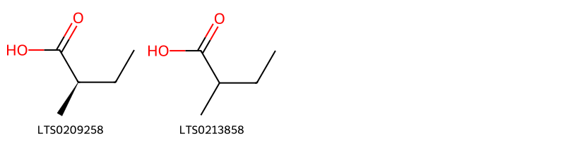{ width=100% }
    <figcaption>Hình ảnh cấu trúc hóa học của 2 hoạt chất thuộc nhóm Fatty Acyls gồm ['(r)-2-methylbutyric acid (LTS0209258)', '2-methylbutanoic acid (LTS0213858)'].</figcaption>
</figure>
#### Nhóm Fluorenes
<figure markdown="span">
    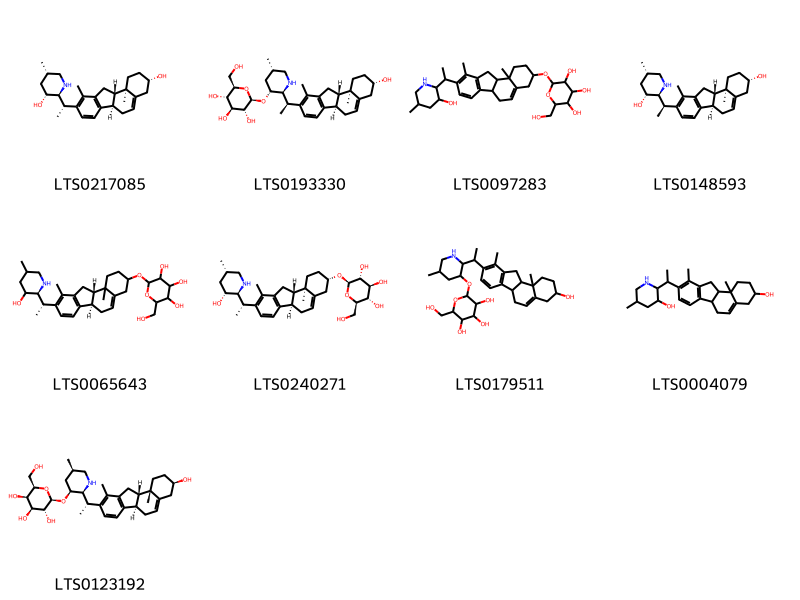{ width=100% }
    <figcaption>Hình ảnh cấu trúc hóa học của 9 hoạt chất thuộc nhóm Fluorenes gồm ['veratramine (LTS0217085)', '(2r,3r,4s,5s,6r)-2-{[(2s,3r,5s)-2-[(1r)-1-[(3s,6ar,11as,11br)-3-hydroxy-10,11b-dimethyl-1h,2h,3h,4h,6h,6ah,11h,11ah-cyclohexa[a]fluoren-9-yl]ethyl]-5-methylpiperidin-3-yl]oxy}-6-(hydroxymethyl)oxane-3,4,5-triol (LTS0193330)', 'veratrosine (LTS0097283)', '(2s,3r,5s)-2-[(1r)-1-[(3s,6ar,11as,11br)-3-hydroxy-10,11b-dimethyl-1h,2h,3h,4h,6h,6ah,11h,11ah-cyclohexa[a]fluoren-9-yl]ethyl]-5-methylpiperidin-3-ol (LTS0148593)', '2-{[(6ar,11as)-9-[(1s)-1-[(2s)-3-hydroxy-5-methylpiperidin-2-yl]ethyl]-10,11b-dimethyl-1h,2h,3h,4h,6h,6ah,11h,11ah-cyclohexa[a]fluoren-3-yl]oxy}-6-(hydroxymethyl)oxane-3,4,5-triol (LTS0065643)', 'veratrosine (LTS0240271)', '2-{[2-(1-{3-hydroxy-10,11b-dimethyl-1h,2h,3h,4h,6h,6ah,11h,11ah-cyclohexa[a]fluoren-9-yl}ethyl)-5-methylpiperidin-3-yl]oxy}-6-(hydroxymethyl)oxane-3,4,5-triol (LTS0179511)', 'veratramine (LTS0004079)', '(2r,3r,4s,5r,6r)-2-{[(2s,3s,5r)-2-[(1s)-1-[(3r,6ar,11as,11bs)-3-hydroxy-10,11b-dimethyl-1h,2h,3h,4h,6h,6ah,11h,11ah-cyclohexa[a]fluoren-9-yl]ethyl]-5-methylpiperidin-3-yl]oxy}-6-(hydroxymethyl)oxane-3,4,5-triol (LTS0123192)'].</figcaption>
</figure>
#### Nhóm Organooxygen compounds
<figure markdown="span">
    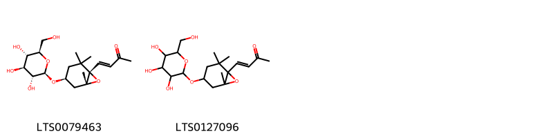{ width=100% }
    <figcaption>Hình ảnh cấu trúc hóa học của 2 hoạt chất thuộc nhóm Organooxygen compounds gồm ['(3e)-4-[(1s,4s,6r)-2,2,6-trimethyl-4-{[(2r,3r,4s,5s,6r)-3,4,5-trihydroxy-6-(hydroxymethyl)oxan-2-yl]oxy}-7-oxabicyclo[4.1.0]heptan-1-yl]but-3-en-2-one (LTS0079463)', '4-(2,2,6-trimethyl-4-{[3,4,5-trihydroxy-6-(hydroxymethyl)oxan-2-yl]oxy}-7-oxabicyclo[4.1.0]heptan-1-yl)but-3-en-2-one (LTS0127096)'].</figcaption>
</figure>
#### Nhóm Piperidines
<figure markdown="span">
    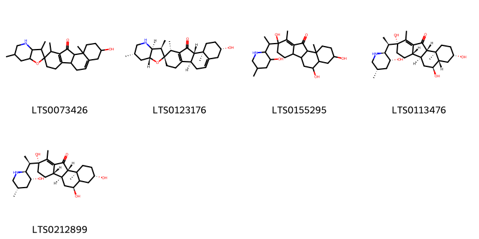{ width=100% }
    <figcaption>Hình ảnh cấu trúc hóa học của 5 hoạt chất thuộc nhóm Piperidines gồm ["3-hydroxy-3',6',10,11b-tetramethyl-1,2,3,3'a,4,4',5',6,6',6a,7,7',7'a,8,10,11a-hexadecahydro-3'h-spiro[cyclohexa[a]fluorene-9,2'-furo[3,2-b]pyridin]-11-one (LTS0073426)", "(3s,3'r,3'as,6's,6ar,7'ar,9s,10r,11as,11br)-3-hydroxy-3',6',10,11b-tetramethyl-1,2,3,3'a,4,4',5',6,6',6a,7,7',7'a,8,10,11a-hexadecahydro-3'h-spiro[cyclohexa[a]fluorene-9,2'-furo[3,2-b]pyridin]-11-one (LTS0123176)", '3,5,9-trihydroxy-9-[1-(3-hydroxy-5-methylpiperidin-2-yl)ethyl]-10,11b-dimethyl-1h,2h,3h,4h,4ah,5h,6h,6ah,6bh,7h,8h,11ah-cyclohexa[a]fluoren-11-one (LTS0155295)', '(3s,4as,5s,6as,6bs,9r,11as,11bs)-3,5,9-trihydroxy-9-[(1r)-1-[(2s,3r,5s)-3-hydroxy-5-methylpiperidin-2-yl]ethyl]-10,11b-dimethyl-1h,2h,3h,4h,4ah,5h,6h,6ah,6bh,7h,8h,11ah-cyclohexa[a]fluoren-11-one (LTS0113476)', '(3s,5s,6as,6bs,9r,11as,11bs)-3,5,9-trihydroxy-9-[(1r)-1-[(2s,3r,5s)-3-hydroxy-5-methylpiperidin-2-yl]ethyl]-10,11b-dimethyl-1h,2h,3h,4h,4ah,5h,6h,6ah,6bh,7h,8h,11ah-cyclohexa[a]fluoren-11-one (LTS0212899)'].</figcaption>
</figure>
#### Nhóm Prenol lipids
<figure markdown="span">
    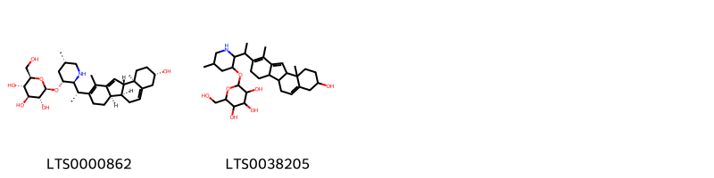{ width=100% }
    <figcaption>Hình ảnh cấu trúc hóa học của 2 hoạt chất thuộc nhóm Prenol lipids gồm ['(2r,3r,4s,5s,6r)-2-{[(2s,3r,5s)-2-[(1s)-1-[(3s,6as,6br,11ar,11br)-3-hydroxy-10,11b-dimethyl-1h,2h,3h,4h,6h,6ah,6bh,7h,8h,11ah-cyclohexa[a]fluoren-9-yl]ethyl]-5-methylpiperidin-3-yl]oxy}-6-(hydroxymethyl)oxane-3,4,5-triol (LTS0000862)', '2-{[2-(1-{3-hydroxy-10,11b-dimethyl-1h,2h,3h,4h,6h,6ah,6bh,7h,8h,11ah-cyclohexa[a]fluoren-9-yl}ethyl)-5-methylpiperidin-3-yl]oxy}-6-(hydroxymethyl)oxane-3,4,5-triol (LTS0038205)'].</figcaption>
</figure>
#### Nhóm Steroids and steroid derivatives
<figure markdown="span">
    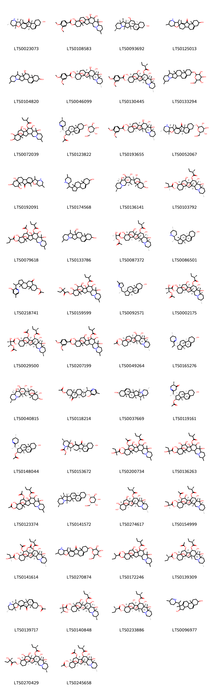{ width=100% }
    <figcaption>Hình ảnh cấu trúc hóa học của 115 hoạt chất thuộc nhóm Steroids and steroid derivatives gồm ['jervine (LTS0023073)', '10,12,13,14,23-pentahydroxy-6,10,19-trimethyl-24-oxa-4-azaheptacyclo[12.12.0.0²,¹¹.0⁴,⁹.0¹⁵,²⁵.0¹⁸,²³.0¹⁹,²⁵]hexacosan-22-yl 3,4-dimethoxybenzoate (LTS0108583)', 'rubijervine (LTS0093692)', 'jervine (LTS0125013)', '10,14,16,20-tetramethyl-22-azahexacyclo[12.10.0.0²,¹¹.0⁵,¹⁰.0¹⁵,²³.0¹⁷,²²]tetracos-4-ene-7,13-diol (LTS0104820)', '(1s,2s,6s,9s,10s,11r,12r,13s,14s,15s,18s,19s,22s,23s,25r)-10,12,13,14,23-pentahydroxy-6,10,19-trimethyl-24-oxa-4-azaheptacyclo[12.12.0.0²,¹¹.0⁴,⁹.0¹⁵,²⁵.0¹⁸,²³.0¹⁹,²⁵]hexacosan-22-yl 3,4-dimethoxybenzoate (LTS0046099)', '(1s,2s,6s,9s,10s,11r,12r,13s,14s,15s,16r,18s,19s,22s,23r,25r)-10,12,14,16,23-pentahydroxy-6,10,19-trimethyl-13-{[(2r)-2-methylbutanoyl]oxy}-24-oxa-4-azaheptacyclo[12.12.0.0²,¹¹.0⁴,⁹.0¹⁵,²⁵.0¹⁸,²³.0¹⁹,²⁵]hexacosan-22-yl 3,4-dimethoxybenzoate (LTS0130445)', '2-(hydroxymethyl)-6-({10,14,16,20-tetramethyl-22-azahexacyclo[12.10.0.0²,¹¹.0⁵,¹⁰.0¹⁵,²³.0¹⁷,²²]tetracos-4-en-7-yl}oxy)oxane-3,4,5-triol (LTS0133294)', '10,12,14,16,22,23-hexahydroxy-6,10,19-trimethyl-24-oxa-4-azaheptacyclo[12.12.0.0²,¹¹.0⁴,⁹.0¹⁵,²⁵.0¹⁸,²³.0¹⁹,²⁵]hexacosan-13-yl 2-methylbutanoate (LTS0072039)', '(1r,2r,3ar,3br,7r,9as,9br,11as)-9a,11a-dimethyl-1-[(1s)-1-[(5s)-5-methyl-3,4,5,6-tetrahydropyridin-2-yl]ethyl]-7-{[(2s,3s,4s,5s,6s)-3,4,5-trihydroxy-6-(hydroxymethyl)oxan-2-yl]oxy}-1h,2h,3h,3ah,3bh,4h,6h,7h,8h,9h,9bh,10h,11h-cyclopenta[a]phenanthren-2-yl acetate (LTS0123822)', '(1s,2s,6s,9s,11r,12r,13s,14s,15s,18s,19s,22s,23s,25r)-10,12,13,14,23-pentahydroxy-6,10,19-trimethyl-24-oxa-4-azaheptacyclo[12.12.0.0²,¹¹.0⁴,⁹.0¹⁵,²⁵.0¹⁸,²³.0¹⁹,²⁵]hexacosan-22-yl 3,4-dimethoxybenzoate (LTS0193655)', 'pseudojervine (LTS0052067)', "1,3,4a-trihydroxy-3',6',10,11b-tetramethyl-2,3,3'a,4,4',5,5',6,6',6a,6b,7,7',7'a,8,11a-hexadecahydro-1h,3'h-spiro[cyclohexa[a]fluorene-9,2'-furo[3,2-b]pyridin]-11-one (LTS0192091)", '9a,11a-dimethyl-1-[1-(5-methylpiperidin-2-yl)ethyl]-1h,2h,3h,3ah,3bh,4h,6h,7h,8h,9h,9bh,10h,11h-cyclopenta[a]phenanthren-7-ol (LTS0174568)', '(1s,6s,9s,10s,11r,13s,14s,15s,16r,19s,23s,25r)-6,10,19-trimethyl-24-oxa-4-azaheptacyclo[12.12.0.0²,¹¹.0⁴,⁹.0¹⁵,²⁵.0¹⁸,²³.0¹⁹,²⁵]hexacosane-10,12,13,14,16,22,23-heptol (LTS0136141)', '(1s,2s,6s,9s,10r,11r,12r,13s,14s,15s,16r,18s,19s,22s,23s,25r)-10,12,14,16,23-pentahydroxy-6,10,19-trimethyl-13-{[(2r)-2-methylbutanoyl]oxy}-24-oxa-4-azaheptacyclo[12.12.0.0²,¹¹.0⁴,⁹.0¹⁵,²⁵.0¹⁸,²³.0¹⁹,²⁵]hexacosan-22-yl (2s)-2-hydroxy-2-methylbutanoate (LTS0103792)', '16-(acetyloxy)-10,12,14,23-tetrahydroxy-6,10,19-trimethyl-13-[(2-methylbutanoyl)oxy]-24-oxa-4-azaheptacyclo[12.12.0.0²,¹¹.0⁴,⁹.0¹⁵,²⁵.0¹⁸,²³.0¹⁹,²⁵]hexacosan-22-yl 2-methylbutanoate (LTS0079618)', '14-(hydroxymethyl)-10,16,20-trimethyl-22-azahexacyclo[12.10.0.0²,¹¹.0⁵,¹⁰.0¹⁵,²³.0¹⁷,²²]tetracos-4-en-7-ol (LTS0133786)', '(1s,2r,6s,9s,10r,11s,12r,13s,14s,15r,16r,18s,19s,22r,23s,25r)-10,12,14,16,23-pentahydroxy-6,10,19-trimethyl-13-{[(2r)-2-methylbutanoyl]oxy}-24-oxa-4-azaheptacyclo[12.12.0.0²,¹¹.0⁴,⁹.0¹⁵,²⁵.0¹⁸,²³.0¹⁹,²⁵]hexacosan-22-yl (2r,3r)-3-(acetyloxy)-2-hydroxy-2-methylbutanoate (LTS0087372)', '(1s,3as,3bs,7s,9ar,9br,11ar)-9a,11a-dimethyl-1-[(1s)-1-[(2s,5r)-5-methylpiperidin-2-yl]ethyl]-1h,2h,3h,3ah,3bh,4h,6h,7h,8h,9h,9bh,10h,11h-cyclopenta[a]phenanthren-7-ol (LTS0086501)', '1-[1-(3-hydroxy-5-methylpyridin-2-yl)ethyl]-9a,11a-dimethyl-5-oxo-tetradecahydrocyclopenta[a]phenanthren-7-yl acetate (LTS0218741)', '10,12,14,16,17,23-hexahydroxy-22-[(3-hydroxy-3-methyl-2-oxopentyl)oxy]-6,10,19-trimethyl-24-oxa-4-azaheptacyclo[12.12.0.0²,¹¹.0⁴,⁹.0¹⁵,²⁵.0¹⁸,²³.0¹⁹,²⁵]hexacosan-13-yl 2-methylbutanoate (LTS0159599)', '(1s,3ar,3br,7s,9as,9br,11as)-9a,11a-dimethyl-1-[(1s)-1-[(2s)-5-methyl-3,4-dihydro-2h-pyrrol-2-yl]ethyl]-1h,2h,3h,3ah,3bh,4h,6h,7h,8h,9h,9bh,10h,11h-cyclopenta[a]phenanthren-7-ol (LTS0092571)', '(1s,2s,6s,9s,10s,11r,12r,13s,14s,15s,16r,18s,19s,22s,23s,25r)-10,12,14,16,23-pentahydroxy-6,10,19-trimethyl-13-{[(2r)-2-methylbutanoyl]oxy}-24-oxa-4-azaheptacyclo[12.12.0.0²,¹¹.0⁴,⁹.0¹⁵,²⁵.0¹⁸,²³.0¹⁹,²⁵]hexacosan-22-yl (2s,3s)-3-(acetyloxy)-2-hydroxy-2-methylbutanoate (LTS0002175)', '(1s,2s,6r,9s,10s,11r,12r,13s,14s,15s,16r,18s,19s,22s,23s,25r)-16-(acetyloxy)-10,12,14,23-tetrahydroxy-6,10,19-trimethyl-13-{[(2r)-2-methylbutanoyl]oxy}-24-oxa-4-azaheptacyclo[12.12.0.0²,¹¹.0⁴,⁹.0¹⁵,²⁵.0¹⁸,²³.0¹⁹,²⁵]hexacosan-22-yl (2s,3s)-3-(acetyloxy)-2-hydroxy-2-methylbutanoate (LTS0029500)', '10,12,14,16,23-pentahydroxy-6,10,19-trimethyl-13-[(2-methylbutanoyl)oxy]-24-oxa-4-azaheptacyclo[12.12.0.0²,¹¹.0⁴,⁹.0¹⁵,²⁵.0¹⁸,²³.0¹⁹,²⁵]hexacosan-22-yl 3,4-dimethoxybenzoate (LTS0207199)', '(1s,2s,6s,9s,10s,11r,12r,13s,14s,15s,18s,19s,22s,23s,25r)-10,12,13,14,23-pentahydroxy-6,10,19-trimethyl-24-oxa-4-azaheptacyclo[12.12.0.0²,¹¹.0⁴,⁹.0¹⁵,²⁵.0¹⁸,²³.0¹⁹,²⁵]hexacosan-22-yl acetate (LTS0049264)', '(1r,3as,3bs,7s,9ar,9bs,11as)-9a,11a-dimethyl-1-{1-[(5s)-5-methyl-3,4,5,6-tetrahydropyridin-2-yl]ethyl}-1h,2h,3h,3ah,3bh,4h,6h,7h,8h,9h,9bh,10h,11h-cyclopenta[a]phenanthren-7-ol (LTS0165276)', 'germine (LTS0040815)', '(1r,3as,3br,5ar,7s,9ar,9br,11ar)-1-[(1r)-1-(3-hydroxy-5-methylpyridin-2-yl)ethyl]-9a,11a-dimethyl-5-oxo-tetradecahydrocyclopenta[a]phenanthren-7-yl acetate (LTS0118214)', '(1s,2r,7r,10s,11r,14r,15r,16s,17r,20r,23s)-10,14,16,20-tetramethyl-22-azahexacyclo[12.10.0.0²,¹¹.0⁵,¹⁰.0¹⁵,²³.0¹⁷,²²]tetracos-4-en-7-ol (LTS0037669)', '(1r,2r,3as,3bs,7s,9ar,9bs,11as)-7-hydroxy-9a,11a-dimethyl-1-[(1s)-1-[(5r)-5-methyl-4-oxo-5,6-dihydro-3h-pyridin-2-yl]ethyl]-1h,2h,3h,3ah,3bh,4h,6h,7h,8h,9h,9bh,10h,11h-cyclopenta[a]phenanthren-2-yl acetate (LTS0119161)', '(1r,2r,3as,3bs,7s,9as,9bs,11as)-7-hydroxy-9a,11a-dimethyl-1-[(1s)-1-[(5r)-5-methyl-3,4,5,6-tetrahydropyridin-2-yl]ethyl]-1h,2h,3h,3ah,3bh,4h,6h,7h,8h,9h,9bh,10h,11h-cyclopenta[a]phenanthren-2-yl acetate (LTS0148044)', "methyl (3s,3's,3'as,6's,6as,6br,7'as,9r,11ar,11br)-3-hydroxy-3',6',10,11b-tetramethyl-11-oxo-1,2,3,3',3'a,4,5',6,6',6a,6b,7,7',7'a,8,11a-hexadecahydrospiro[cyclohexa[a]fluorene-9,2'-furo[3,2-b]pyridine]-4'-carboxylate (LTS0153672)", '17-(acetyloxy)-10,12,14,16,23-pentahydroxy-6,10,19-trimethyl-13-[(2-methylbutanoyl)oxy]-24-oxa-4-azaheptacyclo[12.12.0.0²,¹¹.0⁴,⁹.0¹⁵,²⁵.0¹⁸,²³.0¹⁹,²⁵]hexacosan-22-yl 2-hydroxy-2-methylbutanoate (LTS0200734)', '10,12,14,16,17,23-hexahydroxy-6,10,19-trimethyl-13-[(2-methylbutanoyl)oxy]-24-oxa-4-azaheptacyclo[12.12.0.0²,¹¹.0⁴,⁹.0¹⁵,²⁵.0¹⁸,²³.0¹⁹,²⁵]hexacosan-22-yl 2-hydroxy-2-methylbutanoate (LTS0136263)', '16,22-bis(acetyloxy)-10,12,14,23-tetrahydroxy-6,10,19-trimethyl-24-oxa-4-azaheptacyclo[12.12.0.0²,¹¹.0⁴,⁹.0¹⁵,²⁵.0¹⁸,²³.0¹⁹,²⁵]hexacosan-13-yl 2-methylbutanoate (LTS0123374)', '(2s,3s,4r,5s,6s)-2-(hydroxymethyl)-6-{[(1s,2s,7s,10r,11s,14s,15r,16s,17r,20s,23s)-10,14,16,20-tetramethyl-22-azahexacyclo[12.10.0.0²,¹¹.0⁵,¹⁰.0¹⁵,²³.0¹⁷,²²]tetracos-4-en-7-yl]oxy}oxane-3,4,5-triol (LTS0141572)', '(1s,2s,6s,9s,10s,11r,12r,13s,14s,15s,16r,18s,19s,22s,23s,25r)-10,12,14,16,22,23-hexahydroxy-6,10,19-trimethyl-24-oxa-4-azaheptacyclo[12.12.0.0²,¹¹.0⁴,⁹.0¹⁵,²⁵.0¹⁸,²³.0¹⁹,²⁵]hexacosan-13-yl (2r)-2-methylbutanoate (LTS0274617)', '(1s,2r,6s,9s,10s,11r,12r,13s,14s,15s,16s,17r,18r,19s,22s,23s,25r)-17-(acetyloxy)-10,12,14,16,23-pentahydroxy-6,10,19-trimethyl-13-{[(2r)-2-methylbutanoyl]oxy}-24-oxa-4-azaheptacyclo[12.12.0.0²,¹¹.0⁴,⁹.0¹⁵,²⁵.0¹⁸,²³.0¹⁹,²⁵]hexacosan-22-yl (2s)-2-hydroxy-2-methylbutanoate (LTS0154999)', 'protoveratrine a (LTS0141614)', "3',6',10,11b-tetramethyl-3-{[3,4,5-trihydroxy-6-(hydroxymethyl)oxan-2-yl]oxy}-1,2,3,3'a,4,4',5',6,6',6a,6b,7,7',7'a,8,11a-hexadecahydro-3'h-spiro[cyclohexa[a]fluorene-9,2'-furo[3,2-b]pyridin]-11-one (LTS0270874)", '10,12,14,16,23-pentahydroxy-6,10,19-trimethyl-13-[(2-methylbutanoyl)oxy]-24-oxa-4-azaheptacyclo[12.12.0.0²,¹¹.0⁴,⁹.0¹⁵,²⁵.0¹⁸,²³.0¹⁹,²⁵]hexacosan-22-yl 2-methylbutanoate (LTS0172246)', '(1s,2s,6s,9s,10s,11r,12r,13s,14s,15s,16r,18s,19s,22s,23s,25r)-16-(acetyloxy)-10,12,14,23-tetrahydroxy-6,10,19-trimethyl-13-{[(2r)-2-methylbutanoyl]oxy}-24-oxa-4-azaheptacyclo[12.12.0.0²,¹¹.0⁴,⁹.0¹⁵,²⁵.0¹⁸,²³.0¹⁹,²⁵]hexacosan-22-yl (2r)-2-methylbutanoate (LTS0139309)', 'o-acetyljervine (LTS0139717)', '(1s,2s,6r,9s,10r,11s,12s,13s,14r,15r,16r,18r,19r,22s,23r,25s)-10,12,14,16,23-pentahydroxy-6,10,19-trimethyl-13-{[(2s)-2-methylbutanoyl]oxy}-24-oxa-4-azaheptacyclo[12.12.0.0²,¹¹.0⁴,⁹.0¹⁵,²⁵.0¹⁸,²³.0¹⁹,²⁵]hexacosan-22-yl (2s,3s)-2,3-dihydroxy-2-methylbutanoate (LTS0140848)', '(1s,2s,6s,9s,10s,11r,12r,13s,14s,15s,16s,18s,19s,22s,23s,25r)-10,12,14,16,23-pentahydroxy-6,10,19-trimethyl-13-{[(2r)-2-methylbutanoyl]oxy}-24-oxa-4-azaheptacyclo[12.12.0.0²,¹¹.0⁴,⁹.0¹⁵,²⁵.0¹⁸,²³.0¹⁹,²⁵]hexacosan-22-yl (2r)-2-methylbutanoate (LTS0233886)', '1,9a-dimethyl-1-[1-(5-methylpiperidin-2-yl)ethyl]-2h,3h,3ah,3bh,4h,6h,7h,8h,9h,9bh,10h-cyclopenta[a]phenanthrene-2,7-diol (LTS0096977)', '(1r,2s,6r,9r,10s,11r,12r,13s,14s,15r,16s,17r,18r,19s,22s,23s,25r)-10,12,14,16,17,23-hexahydroxy-22-{[(3s)-3-hydroxy-3-methyl-2-oxopentyl]oxy}-6,10,19-trimethyl-24-oxa-4-azaheptacyclo[12.12.0.0²,¹¹.0⁴,⁹.0¹⁵,²⁵.0¹⁸,²³.0¹⁹,²⁵]hexacosan-13-yl (2r)-2-methylbutanoate (LTS0270429)', '(1s,2s,6s,9s,10s,11r,12r,13s,14s,15s,16r,18s,19s,22s,23r,25r)-16,22-bis(acetyloxy)-10,12,14,23-tetrahydroxy-6,10,19-trimethyl-24-oxa-4-azaheptacyclo[12.12.0.0²,¹¹.0⁴,⁹.0¹⁵,²⁵.0¹⁸,²³.0¹⁹,²⁵]hexacosan-13-yl (2r)-2-methylbutanoate (LTS0245658)', '(1s,2s,6s,9s,10s,11r,12r,13s,14s,15s,18s,19s,22s,23r,25r)-10,12,13,14,23-pentahydroxy-6,10,19-trimethyl-24-oxa-4-azaheptacyclo[12.12.0.0²,¹¹.0⁴,⁹.0¹⁵,²⁵.0¹⁸,²³.0¹⁹,²⁵]hexacosan-22-yl 3,4-dimethoxybenzoate (LTS0176796)', '10,12,14,16,23-pentahydroxy-6,10,19-trimethyl-13-[(2-methylbutanoyl)oxy]-24-oxa-4-azaheptacyclo[12.12.0.0²,¹¹.0⁴,⁹.0¹⁵,²⁵.0¹⁸,²³.0¹⁹,²⁵]hexacosan-22-yl 3-(acetyloxy)-2-hydroxy-2-methylbutanoate (LTS0075135)', '(1s,2s,6s,9s,11r,12r,13s,14s,15s,16r,18s,19s,22s,23s,25r)-10,12,14,16,23-pentahydroxy-6,10,19-trimethyl-13-{[(2r)-2-methylbutanoyl]oxy}-24-oxa-4-azaheptacyclo[12.12.0.0²,¹¹.0⁴,⁹.0¹⁵,²⁵.0¹⁸,²³.0¹⁹,²⁵]hexacosan-22-yl (2s)-2-hydroxy-2-methylbutanoate (LTS0175901)', '(1s,2r,6s,9s,10s,11r,12r,13s,14s,15s,16s,17r,18r,19s,22s,23s,25r)-16,17-bis(acetyloxy)-10,12,14,23-tetrahydroxy-6,10,19-trimethyl-13-{[(2r)-2-methylbutanoyl]oxy}-24-oxa-4-azaheptacyclo[12.12.0.0²,¹¹.0⁴,⁹.0¹⁵,²⁵.0¹⁸,²³.0¹⁹,²⁵]hexacosan-22-yl (2s)-2-hydroxy-2-methylbutanoate (LTS0249813)', "(1r,3r,3'r,3'as,4as,6's,6as,6bs,7'ar,9r,11as,11bs)-1,3,4a-trihydroxy-3',6',10,11b-tetramethyl-2,3,3'a,4,4',5,5',6,6',6a,6b,7,7',7'a,8,11a-hexadecahydro-1h,3'h-spiro[cyclohexa[a]fluorene-9,2'-furo[3,2-b]pyridin]-11-one (LTS0242267)", '9a,11a-dimethyl-1-[1-(5-methyl-3,4-dihydro-2h-pyrrol-2-yl)ethyl]-1h,2h,3h,3ah,3bh,4h,6h,7h,8h,9h,9bh,10h,11h-cyclopenta[a]phenanthren-7-ol (LTS0275256)', '16-(acetyloxy)-10,12,14,23-tetrahydroxy-6,10,19-trimethyl-13-[(2-methylbutanoyl)oxy]-24-oxa-4-azaheptacyclo[12.12.0.0²,¹¹.0⁴,⁹.0¹⁵,²⁵.0¹⁸,²³.0¹⁹,²⁵]hexacosan-22-yl 3-(acetyloxy)-2-hydroxy-2-methylbutanoate (LTS0223236)', 'isorubijervine (LTS0084230)', '(2r,3s,4s,5r,6r)-2-(hydroxymethyl)-6-{[(1s,2r,7s,10r,11s,14s,15r,16r,17r,20r,23s)-14-(hydroxymethyl)-10,16,20-trimethyl-22-azahexacyclo[12.10.0.0²,¹¹.0⁵,¹⁰.0¹⁵,²³.0¹⁷,²²]tetracos-4-en-7-yl]oxy}oxane-3,4,5-triol (LTS0070524)', "(1r,2s,4r,5's,6s,7s,8s,12s,13r,16s)-5',7,8,13-tetramethyl-5-oxaspiro[pentacyclo[10.8.0.0²,⁹.0⁴,⁸.0¹³,¹⁸]icosane-6,2'-piperidine]-9,18-dien-16-ol (LTS0049499)", '9a,11a-dimethyl-1-[1-(5-methyl-3,4,5,6-tetrahydropyridin-2-yl)ethyl]-1h,2h,3h,3ah,3bh,4h,6h,7h,8h,9h,9bh,10h,11h-cyclopenta[a]phenanthren-7-ol (LTS0226634)', '6,10,19-trimethyl-24-oxa-4-azaheptacyclo[12.12.0.0²,¹¹.0⁴,⁹.0¹⁵,²⁵.0¹⁸,²³.0¹⁹,²⁵]hexacosane-10,12,13,14,16,22,23-heptol (LTS0184444)', "methyl (3s,3'r,3'as,6's,6as,6bs,7'ar,9r,11as,11br)-3-hydroxy-3',6',10,11b-tetramethyl-11-oxo-1,2,3,3',3'a,4,5',6,6',6a,6b,7,7',7'a,8,11a-hexadecahydrospiro[cyclohexa[a]fluorene-9,2'-furo[3,2-b]pyridine]-4'-carboxylate (LTS0237933)", '(2s,3s,4r,5s,6s)-2-{[(1s,3as,3br,7s,9ar,9bs)-1,9a-dimethyl-1-[(1s)-1-[(2s,5s)-5-methylpiperidin-2-yl]ethyl]-2h,3h,3ah,3bh,4h,6h,7h,8h,9h,9bh,10h-cyclopenta[a]phenanthren-7-yl]oxy}-6-(hydroxymethyl)oxane-3,4,5-triol (LTS0186244)', '1,9a-dimethyl-1-[1-(5-methylpiperidin-2-yl)ethyl]-2h,3h,3ah,3bh,4h,6h,7h,8h,9h,9bh,10h-cyclopenta[a]phenanthren-7-ol (LTS0021153)', '16-hydroxy-6,10,23-trimethyl-4-azahexacyclo[12.11.0.0²,¹¹.0⁴,⁹.0¹⁵,²⁴.0¹⁸,²³]pentacos-18-ene-3,20-dione (LTS0245463)', '(1s,2s,6s,9s,11r,12r,13s,14s,15s,16s,17r,18r,19s,22s,23s,25r)-17-(acetyloxy)-10,12,14,16,23-pentahydroxy-6,10,19-trimethyl-13-{[(2r)-2-methylbutanoyl]oxy}-24-oxa-4-azaheptacyclo[12.12.0.0²,¹¹.0⁴,⁹.0¹⁵,²⁵.0¹⁸,²³.0¹⁹,²⁵]hexacosan-22-yl (2s)-2-hydroxy-2-methylbutanoate (LTS0053746)', '(1r,2s,3as,3br,7r,9as,9bs)-1,9a-dimethyl-1-[(1s)-1-[(2s,5s)-5-methylpiperidin-2-yl]ethyl]-2h,3h,3ah,3bh,4h,6h,7h,8h,9h,9bh,10h-cyclopenta[a]phenanthrene-2,7-diol (LTS0252925)', 'solanidine (LTS0027764)', '6,10,23-trimethyl-4-azahexacyclo[12.11.0.0²,¹¹.0⁴,⁹.0¹⁵,²⁴.0¹⁸,²³]pentacos-17-ene-10,12,20-triol (LTS0008346)', '2-(hydroxymethyl)-6-{[(7s,10r,14r,15r,16s,17r,20s,23s)-14-(hydroxymethyl)-10,16,20-trimethyl-22-azahexacyclo[12.10.0.0²,¹¹.0⁵,¹⁰.0¹⁵,²³.0¹⁷,²²]tetracos-4-en-7-yl]oxy}oxane-3,4,5-triol (LTS0023616)', '(1r,3as,3br,7s,9ar,9bs)-1,9a-dimethyl-1-[(1s)-1-[(2r,5s)-5-methylpiperidin-2-yl]ethyl]-2h,3h,3ah,3bh,4h,6h,7h,8h,9h,9bh,10h-cyclopenta[a]phenanthren-7-ol (LTS0016660)', '7-hydroxy-9a,11a-dimethyl-1-[1-(5-methyl-3,4,5,6-tetrahydropyridin-2-yl)ethyl]-1h,2h,3h,3ah,3bh,4h,6h,7h,8h,9h,9bh,10h,11h-cyclopenta[a]phenanthren-2-yl acetate (LTS0013588)', '(1r,3as,3bs,5as,7s,9ar,9bs,11as)-1-[(1r)-1-(3-hydroxy-5-methylpyridin-2-yl)ethyl]-9a,11a-dimethyl-5-oxo-tetradecahydrocyclopenta[a]phenanthren-7-yl acetate (LTS0102560)', '(1r,3ar,3br,7s,9ar,9br,11as)-9a,11a-dimethyl-1-[(1s)-1-[(5r)-5-methyl-3,4,5,6-tetrahydropyridin-2-yl]ethyl]-1h,2h,3h,3ah,3bh,4h,6h,7h,8h,9h,9bh,10h,11h-cyclopenta[a]phenanthren-7-ol (LTS0025903)', "(1r,3s,3'r,3'as,4ar,5s,6's,6as,6bs,7'ar,9r,11as,11bs)-1,3,5-trihydroxy-3',6',10,11b-tetramethyl-1,2,3,3'a,4,4',4a,5,5',6,6',6a,6b,7,7',7'a,8,11a-octadecahydro-3'h-spiro[cyclohexa[a]fluorene-9,2'-furo[3,2-b]pyridin]-11-one (LTS0004803)", '(1r,2r,3as,3bs,7s,9ar,9bs,11as)-7-hydroxy-9a,11a-dimethyl-1-[(1s)-1-[(5r)-5-methyl-3,4,5,6-tetrahydropyridin-2-yl]ethyl]-1h,2h,3h,3ah,3bh,4h,6h,7h,8h,9h,9bh,10h,11h-cyclopenta[a]phenanthren-2-yl acetate (LTS0247878)', '10,12,13,14,23-pentahydroxy-6,10,19-trimethyl-24-oxa-4-azaheptacyclo[12.12.0.0²,¹¹.0⁴,⁹.0¹⁵,²⁵.0¹⁸,²³.0¹⁹,²⁵]hexacosan-22-yl acetate (LTS0077639)', '(1s,2s,6s,9s,10s,11r,12r,13s,14s,15s,16r,18s,19s,22s,23s,25r)-16-(acetyloxy)-10,12,14,23-tetrahydroxy-6,10,19-trimethyl-13-{[(2s)-2-methylbutanoyl]oxy}-24-oxa-4-azaheptacyclo[12.12.0.0²,¹¹.0⁴,⁹.0¹⁵,²⁵.0¹⁸,²³.0¹⁹,²⁵]hexacosan-22-yl (2s,3r)-3-(acetyloxy)-2-hydroxy-2-methylbutanoate (LTS0113009)', '(1s,3as,3br,7s,9ar,9bs)-1,9a-dimethyl-1-[(1s)-1-[(2r,5s)-5-methylpiperidin-2-yl]ethyl]-2h,3h,3ah,3bh,4h,6h,7h,8h,9h,9bh,10h-cyclopenta[a]phenanthren-7-ol (LTS0035107)', "(3s,3'r,3'ar,6's,6as,6bs,7'as,9s,11as,11br)-3',6',10,11b-tetramethyl-3-{[(2r,3r,4s,5s,6r)-3,4,5-trihydroxy-6-(hydroxymethyl)oxan-2-yl]oxy}-1,2,3,3'a,4,4',5',6,6',6a,6b,7,7',7'a,8,11a-hexadecahydro-3'h-spiro[cyclohexa[a]fluorene-9,2'-furo[3,2-b]pyridin]-11-one (LTS0266497)", '16,17-bis(acetyloxy)-10,12,14,23-tetrahydroxy-6,10,19-trimethyl-13-[(2-methylbutanoyl)oxy]-24-oxa-4-azaheptacyclo[12.12.0.0²,¹¹.0⁴,⁹.0¹⁵,²⁵.0¹⁸,²³.0¹⁹,²⁵]hexacosan-22-yl 2-hydroxy-2-methylbutanoate (LTS0120705)', '(1s,2s,6s,9s,10s,11r,12r,13s,14s,15s,16r,18s,19s,22s,23s,25r)-10,12,13,14,16,23-hexahydroxy-6,10,19-trimethyl-24-oxa-4-azaheptacyclo[12.12.0.0²,¹¹.0⁴,⁹.0¹⁵,²⁵.0¹⁸,²³.0¹⁹,²⁵]hexacosan-22-yl (2r)-2-methylbutanoate (LTS0059212)', "(3s,3'r,3'as,6's,6as,6br,7'ar,9r,11as,11br)-3-hydroxy-3',6',10,11b-tetramethyl-1,2,3,3'a,4,4',5',6,6',6a,6b,7,7',7'a,8,11a-hexadecahydro-3'h-spiro[cyclohexa[a]fluorene-9,2'-furo[3,2-b]pyridin]-11-one (LTS0121635)", '20-(acetyloxy)-10,12,14,16,23-pentahydroxy-6,10,19-trimethyl-13-[(2-methylbutanoyl)oxy]-24-oxa-4-azaheptacyclo[12.12.0.0²,¹¹.0⁴,⁹.0¹⁵,²⁵.0¹⁸,²³.0¹⁹,²⁵]hexacosan-22-yl 2,2-dimethylbutanoate (LTS0219272)', "(1s,3r,3'r,3'as,4as,6's,6as,6bs,7'ar,9r,11as,11bs)-1,3-dihydroxy-3',6',10,11b-tetramethyl-1,2,3,3'a,4,4',4a,5,5',6,6',6a,6b,7,7',7'a,8,11a-octadecahydro-3'h-spiro[cyclohexa[a]fluorene-9,2'-furo[3,2-b]pyridin]-11-one (LTS0124120)", "methyl 3-{3-hydroxy-3',6',10,11b-tetramethyl-11-oxo-1,2,3,3',3'a,4,5',6,6',6a,6b,7,7',7'a,8,11a-hexadecahydrospiro[cyclohexa[a]fluorene-9,2'-furo[3,2-b]pyridin]-4'-yl}propanoate (LTS0073383)", 'neogermitrine (LTS0100403)', '(1s,2s,6s,9s,11r,12r,13s,14s,15s,16r,18s,19s,22s,23s,25r)-16-(acetyloxy)-10,12,14,23-tetrahydroxy-6,10,19-trimethyl-13-{[(2r)-2-methylbutanoyl]oxy}-24-oxa-4-azaheptacyclo[12.12.0.0²,¹¹.0⁴,⁹.0¹⁵,²⁵.0¹⁸,²³.0¹⁹,²⁵]hexacosan-22-yl (2r,3r)-2,3-dihydroxy-2-methylbutanoate (LTS0201852)', "3',6',10,11b-tetramethyl-11-oxo-1,2,3,3'a,4,4',5',6,6',6a,6b,7,7',7'a,8,11a-hexadecahydro-3'h-spiro[cyclohexa[a]fluorene-9,2'-furo[3,2-b]pyridin]-3-yl acetate (LTS0036536)", "1,3-dihydroxy-3',6',10,11b-tetramethyl-1,2,3,3'a,4,4',4a,5,5',6,6',6a,6b,7,7',7'a,8,11a-octadecahydro-3'h-spiro[cyclohexa[a]fluorene-9,2'-furo[3,2-b]pyridin]-11-one (LTS0185804)", "5',7,8,13-tetramethyl-5-oxaspiro[pentacyclo[10.8.0.0²,⁹.0⁴,⁸.0¹³,¹⁸]icosane-6,2'-piperidine]-9,18-dien-16-ol (LTS0188299)", '10,12,13,14,16,23-hexahydroxy-6,10,19-trimethyl-24-oxa-4-azaheptacyclo[12.12.0.0²,¹¹.0⁴,⁹.0¹⁵,²⁵.0¹⁸,²³.0¹⁹,²⁵]hexacosan-22-yl 2-methylbutanoate (LTS0188836)', '(1s,2s,6s,9s,10s,11r,12r,13s,14s,15s,16s,17r,18r,19s,22s,23s,25r)-16,17-bis(acetyloxy)-10,12,14,23-tetrahydroxy-6,10,19-trimethyl-13-{[(2r)-2-methylbutanoyl]oxy}-24-oxa-4-azaheptacyclo[12.12.0.0²,¹¹.0⁴,⁹.0¹⁵,²⁵.0¹⁸,²³.0¹⁹,²⁵]hexacosan-22-yl (2r,3r)-2,3-dihydroxy-2-methylbutanoate (LTS0204194)', '10,12,14,16,23-pentahydroxy-6,10,19-trimethyl-13-[(2-methylbutanoyl)oxy]-24-oxa-4-azaheptacyclo[12.12.0.0²,¹¹.0⁴,⁹.0¹⁵,²⁵.0¹⁸,²³.0¹⁹,²⁵]hexacosan-22-yl 2-hydroxy-2-methylbutanoate (LTS0125841)', '(1s,2s,6s,9s,11r,12r,13s,14s,15s,16r,18s,19s,22s,23s,25r)-10,12,14,16,23-pentahydroxy-6,10,19-trimethyl-13-{[(2r)-2-methylbutanoyl]oxy}-24-oxa-4-azaheptacyclo[12.12.0.0²,¹¹.0⁴,⁹.0¹⁵,²⁵.0¹⁸,²³.0¹⁹,²⁵]hexacosan-22-yl (2r,3r)-2,3-dihydroxy-2-methylbutanoate (LTS0200960)', '(1s,2s,6s,9s,10s,11r,12r,13s,14s,15s,16r,18s,19s,22s,23s,25r)-16-(acetyloxy)-10,12,14,23-tetrahydroxy-6,10,19-trimethyl-13-{[(2r)-2-methylbutanoyl]oxy}-24-oxa-4-azaheptacyclo[12.12.0.0²,¹¹.0⁴,⁹.0¹⁵,²⁵.0¹⁸,²³.0¹⁹,²⁵]hexacosan-22-yl (2s,3s)-3-(acetyloxy)-2-hydroxy-2-methylbutanoate (LTS0201633)', "3',6',10,11b-tetramethyl-2,3'a,4',5,5',6,6',6a,6b,7,7',7'a,8,11a-tetradecahydro-1h,3'h-spiro[cyclohexa[a]fluorene-9,2'-furo[3,2-b]pyridine]-3,11-dione (LTS0162122)", '2-({1,9a-dimethyl-1-[1-(5-methylpiperidin-2-yl)ethyl]-2h,3h,3ah,3bh,4h,6h,7h,8h,9h,9bh,10h-cyclopenta[a]phenanthren-7-yl}oxy)-6-(hydroxymethyl)oxane-3,4,5-triol (LTS0147695)', "(1r,2s,4r,5'r,6s,7s,8s,12s,13r,16s)-5',7,8,13-tetramethyl-5-oxaspiro[pentacyclo[10.8.0.0²,⁹.0⁴,⁸.0¹³,¹⁸]icosane-6,2'-piperidine]-9,18-dien-16-ol (LTS0149875)", '(1s,2s,6s,9s,10s,11r,12r,13s,14s,15s,16r,18s,19r,20s,22s,23s,25r)-20-(acetyloxy)-10,12,14,16,23-pentahydroxy-6,10,19-trimethyl-13-{[(2s)-2-methylbutanoyl]oxy}-24-oxa-4-azaheptacyclo[12.12.0.0²,¹¹.0⁴,⁹.0¹⁵,²⁵.0¹⁸,²³.0¹⁹,²⁵]hexacosan-22-yl (2s)-2-hydroxy-2-methylbutanoate (LTS0160953)', "(1r,3s,3'r,3'as,5s,6's,6as,6bs,7'ar,9r,11as,11bs)-1,3,5-trihydroxy-3',6',10,11b-tetramethyl-1,2,3,3'a,4,4',4a,5,5',6,6',6a,6b,7,7',7'a,8,11a-octadecahydro-3'h-spiro[cyclohexa[a]fluorene-9,2'-furo[3,2-b]pyridin]-11-one (LTS0245777)", "(3'r,3'as,6's,6as,7'ar,9r,11br)-3',6',10,11b-tetramethyl-2,3'a,4',5,5',6,6',6a,6b,7,7',7'a,8,11a-tetradecahydro-1h,3'h-spiro[cyclohexa[a]fluorene-9,2'-furo[3,2-b]pyridine]-3,11-dione (LTS0100432)", "3',6',10,11b-tetramethyl-2,3,3'a,4,4',5',6,6',6a,6b,7,7',7'a,8,11,11a-hexadecahydro-1h,3'h-spiro[cyclohexa[a]fluorene-9,2'-furo[3,2-b]pyridine]-3,11-diol (LTS0095339)", '(1s,2s,6s,9s,11r,12r,13s,14s,15s,16r,18s,19r,20s,22s,23s,25r)-20-(acetyloxy)-10,12,14,16,23-pentahydroxy-6,10,19-trimethyl-13-[(2-methylbutanoyl)oxy]-24-oxa-4-azaheptacyclo[12.12.0.0²,¹¹.0⁴,⁹.0¹⁵,²⁵.0¹⁸,²³.0¹⁹,²⁵]hexacosan-22-yl 2-hydroxy-2-methylbutanoate (LTS0264659)', '(1s,2s,6s,9s,10s,11r,12r,13s,14s,15s,16r,18s,19s,22s,23s,25r)-16-(acetyloxy)-10,12,14,23-tetrahydroxy-6,10,19-trimethyl-13-{[(2r)-2-methylbutanoyl]oxy}-24-oxa-4-azaheptacyclo[12.12.0.0²,¹¹.0⁴,⁹.0¹⁵,²⁵.0¹⁸,²³.0¹⁹,²⁵]hexacosan-22-yl (2z)-2-methylbut-2-enoate (LTS0193194)', "methyl 3-[(3s,3'r,3'as,6's,6as,6br,7'ar,9r,11as,11br)-3-hydroxy-3',6',10,11b-tetramethyl-11-oxo-1,2,3,3',3'a,4,5',6,6',6a,6b,7,7',7'a,8,11a-hexadecahydrospiro[cyclohexa[a]fluorene-9,2'-furo[3,2-b]pyridin]-4'-yl]propanoate (LTS0187313)", "(3s,3'r,3'as,6's,6as,6br,7'ar,9r,11as,11br)-3',6',10,11b-tetramethyl-11-oxo-1,2,3,3'a,4,4',5',6,6',6a,6b,7,7',7'a,8,11a-hexadecahydro-3'h-spiro[cyclohexa[a]fluorene-9,2'-furo[3,2-b]pyridin]-3-yl acetate (LTS0042019)", '16,17-bis(acetyloxy)-10,12,14,23-tetrahydroxy-6,10,19-trimethyl-13-[(2-methylbutanoyl)oxy]-24-oxa-4-azaheptacyclo[12.12.0.0²,¹¹.0⁴,⁹.0¹⁵,²⁵.0¹⁸,²³.0¹⁹,²⁵]hexacosan-22-yl 2,3-dihydroxy-2-methylbutanoate (LTS0135590)', '(1s,2s,6s,9s,10s,11r,12r,13s,14s,15s,16r,18s,19s,22s,23s,25r)-10,12,14,16,23-pentahydroxy-6,10,19-trimethyl-13-[(2-methylbutanoyl)oxy]-24-oxa-4-azaheptacyclo[12.12.0.0²,¹¹.0⁴,⁹.0¹⁵,²⁵.0¹⁸,²³.0¹⁹,²⁵]hexacosan-22-yl 3,4-dimethoxybenzoate (LTS0252324)', '(1s,2s,6s,9s,10s,11r,12r,13s,14s,15s,16r,18s,19s,22s,23s,25r)-10,12,14,16,23-pentahydroxy-6,10,19-trimethyl-13-{[(2r)-2-methylbutanoyl]oxy}-24-oxa-4-azaheptacyclo[12.12.0.0²,¹¹.0⁴,⁹.0¹⁵,²⁵.0¹⁸,²³.0¹⁹,²⁵]hexacosan-22-yl (2s)-2-hydroxy-2-methylbutanoate (LTS0212535)', "(3s,3'r,3'as,6's,6as,6bs,7'ar,9r,11r,11as,11br)-3',6',10,11b-tetramethyl-2,3,3'a,4,4',5',6,6',6a,6b,7,7',7'a,8,11,11a-hexadecahydro-1h,3'h-spiro[cyclohexa[a]fluorene-9,2'-furo[3,2-b]pyridine]-3,11-diol (LTS0089248)", '(1s,2s,6s,9s,10s,11r,12r,13s,14s,15s,16r,18s,19r,20s,22s,23s,25r)-20-(acetyloxy)-10,12,14,16,23-pentahydroxy-6,10,19-trimethyl-13-{[(2r)-2-methylbutanoyl]oxy}-24-oxa-4-azaheptacyclo[12.12.0.0²,¹¹.0⁴,⁹.0¹⁵,²⁵.0¹⁸,²³.0¹⁹,²⁵]hexacosan-22-yl 2,2-dimethylbutanoate (LTS0269346)', "(3'r,3'as,6's,6as,6bs,7'ar,9r,11as,11br)-3',6',10,11b-tetramethyl-2,3'a,4',5,5',6,6',6a,6b,7,7',7'a,8,11a-tetradecahydro-1h,3'h-spiro[cyclohexa[a]fluorene-9,2'-furo[3,2-b]pyridine]-3,11-dione (LTS0108231)", '(1s,2s,6s,9s,10s,11r,12r,13s,14s,15s,16r,18s,19s,22s,23s,25r)-16-(acetyloxy)-10,12,14,23-tetrahydroxy-6,10,19-trimethyl-13-{[(2r)-2-methylbutanoyl]oxy}-24-oxa-4-azaheptacyclo[12.12.0.0²,¹¹.0⁴,⁹.0¹⁵,²⁵.0¹⁸,²³.0¹⁹,²⁵]hexacosan-22-yl 3,4-dimethoxybenzoate (LTS0106678)'].</figcaption>
</figure>

---

### Dược dân tộc học

Danh sách các quốc gia có sử dụng *Veratrum album* trong điều trị các bệnh. 

| Country   | Disease                                                                                   | Bệnh                                                                                      |
|:----------|:------------------------------------------------------------------------------------------|:------------------------------------------------------------------------------------------|
| Egypt     | Purgative, Emetic, Sternutatory                                                           | Purgative, Emetic, Sternutatory                                                           |
| Turkey    | Emetic, Expectorant, Laxative, Sedative, Cathartic, Nervine, Poison, Sudorific, Vermifuge | Emetic, đờm, nhuận tràng, thuốc an thần, Cathartic, Nervine, Poison, Sudorific, Vermifuge |
| UK        | Rodenticide                                                                               | thuốc diệt động vật gặm nhấm                                                              |
| ain       | Poison                                                                                    | Chất độc                                                                                  |

---

---
## Veratrum californicum
### Thông tin về thực vật

!!! info "Phân loại thực vật của *Veratrum californicum* từ GIBF:"
    - **Kingdom:** Plantae
    - **Phylum:** Tracheophyta
    - **Order:** Liliales
    - **Family:** Melanthiaceae
    - **Genus:** Veratrum
    - **Species:** *Veratrum californicum*

 

| Label (VI)   | Label (EN)   | Scientific Name       | Descriptions (VI)   | Descriptions (EN)   | Also Known As (VI)   | Also Known As (EN)   |
|:-------------|:-------------|:----------------------|:--------------------|:--------------------|:---------------------|:---------------------|
| N/A          | N/A          | Veratrum californicum | loài thực vật       | species of plant    | ['']                 | ['']                 |

#### Phân bố trên thế giới

**Từ CSDL GIBF** Mexico, United States of America

#### Phân bố tại Việt Nam

**Từ CSDL GIBF**: Không có ghi nhận ở Việt Nam

---
### Thành phần hóa học
        
- Theo cơ sở dữ liệu lotus: Từ loài *Veratrum californicum* đã phân lập và xác định được 9 hoạt chất thuộc về các nhóm Steroids and steroid derivatives, Fluorenes. 

|    | chemicalTaxonomyClassyfireClass   |   smiles_count |
|---:|:----------------------------------|---------------:|
|  0 | Fluorenes                         |              3 |
|  1 | Steroids and steroid derivatives  |              6 |

#### Nhóm Fluorenes
<figure markdown="span">
    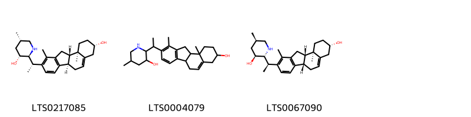{ width=100% }
    <figcaption>Hình ảnh cấu trúc hóa học của 3 hoạt chất thuộc nhóm Fluorenes gồm ['veratramine (LTS0217085)', 'veratramine (LTS0004079)', '(2r,3s,5r)-2-[(1r)-1-[(3s,6as,11as,11br)-3-hydroxy-10,11b-dimethyl-1h,2h,3h,4h,6h,6ah,11h,11ah-cyclohexa[a]fluoren-9-yl]ethyl]-5-methylpiperidin-3-ol (LTS0067090)'].</figcaption>
</figure>
#### Nhóm Steroids and steroid derivatives
<figure markdown="span">
    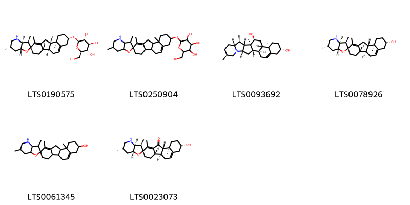{ width=100% }
    <figcaption>Hình ảnh cấu trúc hóa học của 6 hoạt chất thuộc nhóm Steroids and steroid derivatives gồm ['cycloposine (LTS0190575)', "2-{3',6',10,11b-tetramethyl-2,3,3'a,4,4',5',6,6',6a,6b,7,7',7'a,8,11,11a-hexadecahydro-1h,3'h-spiro[cyclohexa[a]fluorene-9,2'-furo[3,2-b]pyridine]oxy}-6-(hydroxymethyl)oxane-3,4,5-triol (LTS0250904)", 'rubijervine (LTS0093692)', 'cyclopamine (LTS0078926)', 'cyclopamine (LTS0061345)', 'jervine (LTS0023073)'].</figcaption>
</figure>

---

### Dược dân tộc học

Danh sách các quốc gia có sử dụng *Veratrum californicum* trong điều trị các bệnh. 

| Country        | Disease       | Bệnh               |
|:---------------|:--------------|:-------------------|
| US             | Pediculicide  | Pediculicide       |
| US(Amerindian) | Contraceptive | Kiểm soát sinh sản |
| US(Shoshone)   | Contraceptive | Kiểm soát sinh sản |

---

---
## Veratrum eschscholtzii
### Thông tin về thực vật

!!! info "Phân loại thực vật của *Veratrum viride* từ GIBF:"
    - **Kingdom:** Plantae
    - **Phylum:** Tracheophyta
    - **Order:** Liliales
    - **Family:** Melanthiaceae
    - **Genus:** Veratrum
    - **Species:** *Veratrum viride*

 

| Label (VI)   | Label (EN)   | Scientific Name        | Descriptions (VI)   | Descriptions (EN)   | Also Known As (VI)   | Also Known As (EN)   |
|:-------------|:-------------|:-----------------------|:--------------------|:--------------------|:---------------------|:---------------------|
| N/A          | N/A          | Veratrum eschscholtzii |                     | species of plant    | ['']                 | ['']                 |

#### Phân bố trên thế giới

**Từ CSDL GIBF** nan, Korea (Democratic People’s Republic of), United States of America, Canada

#### Phân bố tại Việt Nam

**Từ CSDL GIBF**: Không có ghi nhận ở Việt Nam

---
### Thành phần hóa học
        
- Theo cơ sở dữ liệu lotus: Từ loài *Veratrum viride* đã phân lập và xác định được Chưa có hoạt chất nào được phân lập. hoạt chất thuộc về các nhóm Không có hoạt chất nào được phân lập. 

Không có hình ảnh nào được tạo ra

---

### Dược dân tộc học

Danh sách các quốc gia có sử dụng *Veratrum viride* trong điều trị các bệnh. 

| Country       | Disease   | Bệnh     |
|:--------------|:----------|:---------|
| US(Blackfoot) | Poison    | Chất độc |

---

---
## Veratrum grandiflorum
### Thông tin về thực vật

!!! info "Phân loại thực vật của *Veratrum grandiflorum* từ GIBF:"
    - **Kingdom:** Plantae
    - **Phylum:** Tracheophyta
    - **Order:** Liliales
    - **Family:** Melanthiaceae
    - **Genus:** Veratrum
    - **Species:** *Veratrum grandiflorum*

 

| Label (VI)   | Label (EN)   | Scientific Name       | Descriptions (VI)   | Descriptions (EN)   | Also Known As (VI)   | Also Known As (EN)   |
|:-------------|:-------------|:----------------------|:--------------------|:--------------------|:---------------------|:---------------------|
| N/A          | N/A          | Veratrum grandiflorum | loài thực vật       | species of plant    | ['']                 | ['']                 |

#### Phân bố trên thế giới

**Từ CSDL GIBF** Japan, Norway, Korea, Republic of, China, Russian Federation

#### Phân bố tại Việt Nam

**Từ CSDL GIBF**: Không có ghi nhận ở Việt Nam

---
### Thành phần hóa học
        
- Theo cơ sở dữ liệu lotus: Từ loài *Veratrum grandiflorum* đã phân lập và xác định được 40 hoạt chất thuộc về các nhóm Flavonoids, Steroids and steroid derivatives, Fluorenes, Quinolizidines, Stilbenes. 

|    | chemicalTaxonomyClassyfireClass   |   smiles_count |
|---:|:----------------------------------|---------------:|
|  0 | Flavonoids                        |              6 |
|  1 | Fluorenes                         |              2 |
|  2 | Quinolizidines                    |              2 |
|  3 | Steroids and steroid derivatives  |             21 |
|  4 | Stilbenes                         |              9 |

#### Nhóm Flavonoids
<figure markdown="span">
    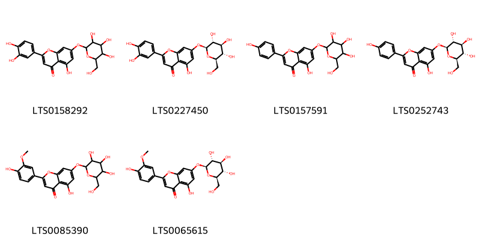{ width=100% }
    <figcaption>Hình ảnh cấu trúc hóa học của 6 hoạt chất thuộc nhóm Flavonoids gồm ['2-(3,4-dihydroxyphenyl)-5-hydroxy-7-{[3,4,5-trihydroxy-6-(hydroxymethyl)oxan-2-yl]oxy}chromen-4-one (LTS0158292)', 'luteolin 7-o-glucoside (LTS0227450)', 'apigetrin (LTS0157591)', 'apigenin 7-o-β-glucoside (LTS0252743)', '5-hydroxy-2-(4-hydroxy-3-methoxyphenyl)-7-{[3,4,5-trihydroxy-6-(hydroxymethyl)oxan-2-yl]oxy}chromen-4-one (LTS0085390)', '5-hydroxy-2-(4-hydroxy-3-methoxyphenyl)-7-{[(2s,3r,4s,5s,6r)-3,4,5-trihydroxy-6-(hydroxymethyl)oxan-2-yl]oxy}chromen-4-one (LTS0065615)'].</figcaption>
</figure>
#### Nhóm Fluorenes
<figure markdown="span">
    { width=100% }
    <figcaption>Hình ảnh cấu trúc hóa học của 2 hoạt chất thuộc nhóm Fluorenes gồm ['veratramine (LTS0217085)', 'veratramine (LTS0004079)'].</figcaption>
</figure>
#### Nhóm Quinolizidines
<figure markdown="span">
    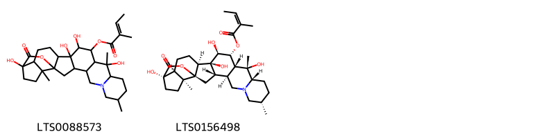{ width=100% }
    <figcaption>Hình ảnh cấu trúc hóa học của 2 hoạt chất thuộc nhóm Quinolizidines gồm ['10,13,14,22-tetrahydroxy-6,10,19-trimethyl-23-oxo-24-oxa-4-azaheptacyclo[12.12.0.0²,¹¹.0⁴,⁹.0¹⁵,²⁵.0¹⁸,²².0¹⁹,²⁵]hexacosan-12-yl 2-methylbut-2-enoate (LTS0088573)', '(1s,2s,6s,9s,10s,11r,12r,13s,14s,15s,18s,19s,22s,25r)-10,13,14,22-tetrahydroxy-6,10,19-trimethyl-23-oxo-24-oxa-4-azaheptacyclo[12.12.0.0²,¹¹.0⁴,⁹.0¹⁵,²⁵.0¹⁸,²².0¹⁹,²⁵]hexacosan-12-yl (2z)-2-methylbut-2-enoate (LTS0156498)'].</figcaption>
</figure>
#### Nhóm Steroids and steroid derivatives
<figure markdown="span">
    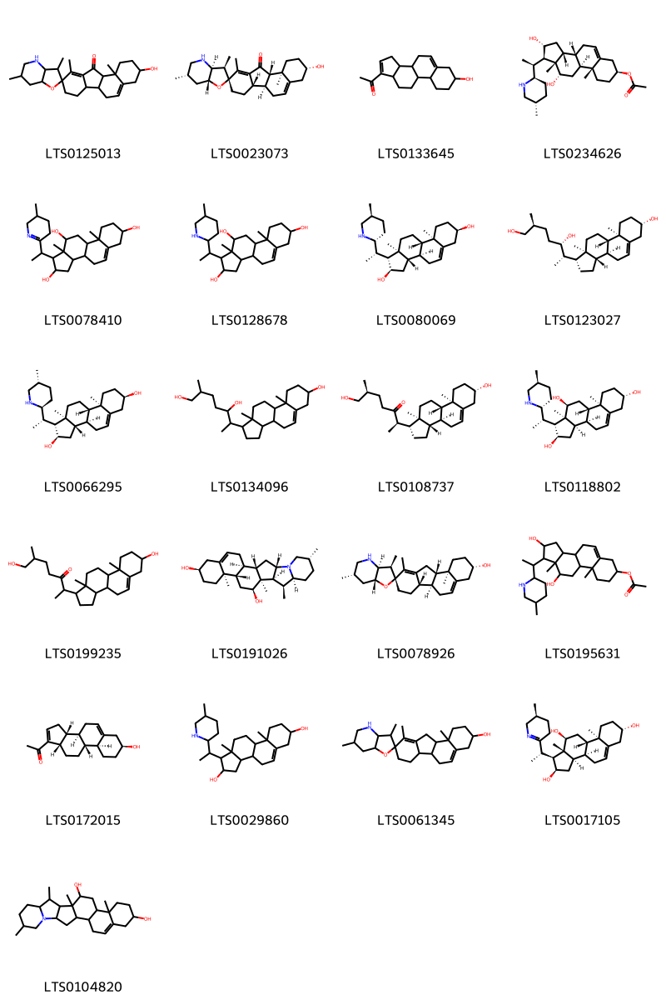{ width=100% }
    <figcaption>Hình ảnh cấu trúc hóa học của 21 hoạt chất thuộc nhóm Steroids and steroid derivatives gồm ['jervine (LTS0125013)', 'jervine (LTS0023073)', '1-{7-hydroxy-3h,3ah,3bh,4h,6h,7h,8h,9h,9ah,9bh,10h,11h,11ah-cyclopenta[a]phenanthren-1-yl}ethanone (LTS0133645)', '(1r,2r,3ar,3br,7s,9ar,9bs,11s,11as)-2,11-dihydroxy-9a,11a-dimethyl-1-[(1s)-1-[(2r,5s)-5-methylpiperidin-2-yl]ethyl]-1h,2h,3h,3ah,3bh,4h,6h,7h,8h,9h,9bh,10h,11h-cyclopenta[a]phenanthren-7-yl acetate (LTS0234626)', '9a,11a-dimethyl-1-[1-(5-methyl-3,4,5,6-tetrahydropyridin-2-yl)ethyl]-1h,2h,3h,3ah,3bh,4h,6h,7h,8h,9h,9bh,10h,11h-cyclopenta[a]phenanthrene-2,7,11-triol (LTS0078410)', '9a,11a-dimethyl-1-[1-(5-methylpiperidin-2-yl)ethyl]-1h,2h,3h,3ah,3bh,4h,6h,7h,8h,9h,9bh,10h,11h-cyclopenta[a]phenanthrene-2,7,11-triol (LTS0128678)', '(1r,2r,3as,3bs,7r,9ar,9bs,11as)-9a,11a-dimethyl-1-[(1s)-1-[(2r,5s)-5-methylpiperidin-2-yl]ethyl]-1h,2h,3h,3ah,3bh,4h,6h,7h,8h,9h,9bh,10h,11h-cyclopenta[a]phenanthrene-2,7-diol (LTS0080069)', 'dormatinol (LTS0123027)', '(1r,2r,3as,3bs,7r,9ar,9bs,11as)-9a,11a-dimethyl-1-[(1s)-1-[(2s,5r)-5-methylpiperidin-2-yl]ethyl]-1h,2h,3h,3ah,3bh,4h,6h,7h,8h,9h,9bh,10h,11h-cyclopenta[a]phenanthrene-2,7-diol (LTS0066295)', '6-{7-hydroxy-9a,11a-dimethyl-1h,2h,3h,3ah,3bh,4h,6h,7h,8h,9h,9bh,10h,11h-cyclopenta[a]phenanthren-1-yl}-2-methylheptane-1,5-diol (LTS0134096)', '(2r,6s)-2-[(1r,3as,3bs,7s,9ar,9bs,11as)-7-hydroxy-9a,11a-dimethyl-1h,2h,3h,3ah,3bh,4h,6h,7h,8h,9h,9bh,10h,11h-cyclopenta[a]phenanthren-1-yl]-7-hydroxy-6-methylheptan-3-one (LTS0108737)', '(1r,2r,3ar,3br,7s,9ar,9bs,11s,11as)-9a,11a-dimethyl-1-[(1s)-1-[(2r,5s)-5-methylpiperidin-2-yl]ethyl]-1h,2h,3h,3ah,3bh,4h,6h,7h,8h,9h,9bh,10h,11h-cyclopenta[a]phenanthrene-2,7,11-triol (LTS0118802)', '7-hydroxy-2-{7-hydroxy-9a,11a-dimethyl-1h,2h,3h,3ah,3bh,4h,6h,7h,8h,9h,9bh,10h,11h-cyclopenta[a]phenanthren-1-yl}-6-methylheptan-3-one (LTS0199235)', '(1s,2r,7r,10r,11s,13s,14s,15s,16s,17s,20r,23s)-10,14,16,20-tetramethyl-22-azahexacyclo[12.10.0.0²,¹¹.0⁵,¹⁰.0¹⁵,²³.0¹⁷,²²]tetracos-4-ene-7,13-diol (LTS0191026)', 'cyclopamine (LTS0078926)', '2,11-dihydroxy-9a,11a-dimethyl-1-[1-(5-methylpiperidin-2-yl)ethyl]-1h,2h,3h,3ah,3bh,4h,6h,7h,8h,9h,9bh,10h,11h-cyclopenta[a]phenanthren-7-yl acetate (LTS0195631)', '1-[(3ar,3bs,7s,9as,9br,11as)-7-hydroxy-3h,3ah,3bh,4h,6h,7h,8h,9h,9ah,9bh,10h,11h,11ah-cyclopenta[a]phenanthren-1-yl]ethanone (LTS0172015)', '9a,11a-dimethyl-1-[1-(5-methylpiperidin-2-yl)ethyl]-1h,2h,3h,3ah,3bh,4h,6h,7h,8h,9h,9bh,10h,11h-cyclopenta[a]phenanthrene-2,7-diol (LTS0029860)', 'cyclopamine (LTS0061345)', '(1s,2r,3ar,3br,7s,9ar,9bs,11s,11ar)-9a,11a-dimethyl-1-[(1s)-1-[(5s)-5-methyl-3,4,5,6-tetrahydropyridin-2-yl]ethyl]-1h,2h,3h,3ah,3bh,4h,6h,7h,8h,9h,9bh,10h,11h-cyclopenta[a]phenanthrene-2,7,11-triol (LTS0017105)', '10,14,16,20-tetramethyl-22-azahexacyclo[12.10.0.0²,¹¹.0⁵,¹⁰.0¹⁵,²³.0¹⁷,²²]tetracos-4-ene-7,13-diol (LTS0104820)'].</figcaption>
</figure>
#### Nhóm Stilbenes
<figure markdown="span">
    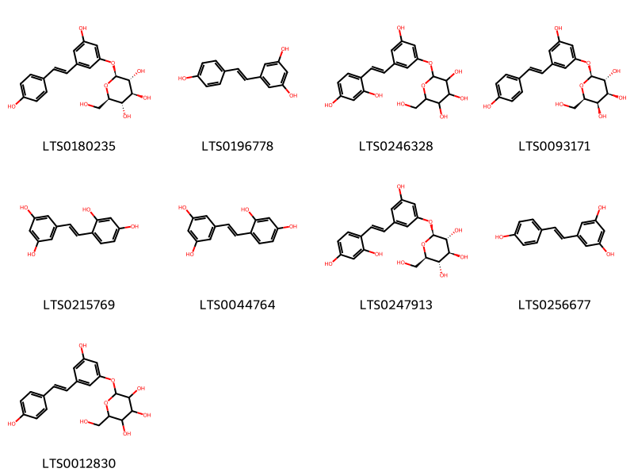{ width=100% }
    <figcaption>Hình ảnh cấu trúc hóa học của 9 hoạt chất thuộc nhóm Stilbenes gồm ['piceid (LTS0180235)', 'tocilizumab (LTS0196778)', '2-{3-[2-(2,4-dihydroxyphenyl)ethenyl]-5-hydroxyphenoxy}-6-(hydroxymethyl)oxane-3,4,5-triol (LTS0246328)', '(2s,3r,4s,5r,6r)-2-{3-hydroxy-5-[(1e)-2-(4-hydroxyphenyl)ethenyl]phenoxy}-6-(hydroxymethyl)oxane-3,4,5-triol (LTS0093171)', '5-[2-(2,4-dihydroxyphenyl)ethenyl]benzene-1,3-diol (LTS0215769)', '5-[(1e)-2-(2,4-dihydroxyphenyl)ethenyl]benzene-1,3-diol (LTS0044764)', '(2s,3r,4s,5s,6r)-2-{3-[(1e)-2-(2,4-dihydroxyphenyl)ethenyl]-5-hydroxyphenoxy}-6-(hydroxymethyl)oxane-3,4,5-triol (LTS0247913)', 'resveratrol (LTS0256677)', '2-{3-hydroxy-5-[2-(4-hydroxyphenyl)ethenyl]phenoxy}-6-(hydroxymethyl)oxane-3,4,5-triol (LTS0012830)'].</figcaption>
</figure>

---

### Dược dân tộc học

Danh sách các quốc gia có sử dụng *Veratrum grandiflorum* trong điều trị các bệnh. 

| Country   | Disease             | Bệnh                  |
|:----------|:--------------------|:----------------------|
| Elsewhere | Emetic, Insecticide | Emetic, Thuốc trừ sâu |

---

---
## Veratrum japonicum
### Thông tin về thực vật

!!! info "Phân loại thực vật của *Veratrum maackii* từ GIBF:"
    - **Kingdom:** Plantae
    - **Phylum:** Tracheophyta
    - **Order:** Liliales
    - **Family:** Melanthiaceae
    - **Genus:** Veratrum
    - **Species:** *Veratrum maackii*

 

| Label (VI)   | Label (EN)   | Scientific Name    | Descriptions (VI)   | Descriptions (EN)   | Also Known As (VI)   | Also Known As (EN)   |
|:-------------|:-------------|:-------------------|:--------------------|:--------------------|:---------------------|:---------------------|
| N/A          | N/A          | Veratrum japonicum | loài thực vật       | species of plant    | ['']                 | ['']                 |

#### Phân bố trên thế giới

**Từ CSDL GIBF** nan, Korea (Democratic People’s Republic of), Japan, China

#### Phân bố tại Việt Nam

**Từ CSDL GIBF**: Không có ghi nhận ở Việt Nam

---
### Thành phần hóa học
        
- Theo cơ sở dữ liệu lotus: Từ loài *Veratrum maackii* đã phân lập và xác định được Chưa có hoạt chất nào được phân lập. hoạt chất thuộc về các nhóm Không có hoạt chất nào được phân lập. 

Không có hình ảnh nào được tạo ra

---

### Dược dân tộc học

Danh sách các quốc gia có sử dụng *Veratrum maackii* trong điều trị các bệnh. 

| Country   | Disease   | Bệnh     |
|:----------|:----------|:---------|
| Korea     | Poison    | Chất độc |

---

---
## Veratrum maackii
### Thông tin về thực vật

!!! info "Phân loại thực vật của *Veratrum maackii* từ GIBF:"
    - **Kingdom:** Plantae
    - **Phylum:** Tracheophyta
    - **Order:** Liliales
    - **Family:** Melanthiaceae
    - **Genus:** Veratrum
    - **Species:** *Veratrum maackii*

 

| Label (VI)   | Label (EN)   | Scientific Name   | Descriptions (VI)   | Descriptions (EN)   | Also Known As (VI)   | Also Known As (EN)   |
|:-------------|:-------------|:------------------|:--------------------|:--------------------|:---------------------|:---------------------|
| N/A          | N/A          | Veratrum maackii  | loài thực vật       | species of plant    | ['']                 | ['']                 |

#### Phân bố trên thế giới

**Từ CSDL GIBF** nan, Japan, Korea, Republic of, China, Russian Federation

#### Phân bố tại Việt Nam

**Từ CSDL GIBF**: Không có ghi nhận ở Việt Nam

---
### Thành phần hóa học
        
- Theo cơ sở dữ liệu lotus: Từ loài *Veratrum maackii* đã phân lập và xác định được 27 hoạt chất thuộc về các nhóm Steroids and steroid derivatives. 

|    | chemicalTaxonomyClassyfireClass   |   smiles_count |
|---:|:----------------------------------|---------------:|
|  0 | Steroids and steroid derivatives  |             26 |

#### Nhóm Steroids and steroid derivatives
<figure markdown="span">
    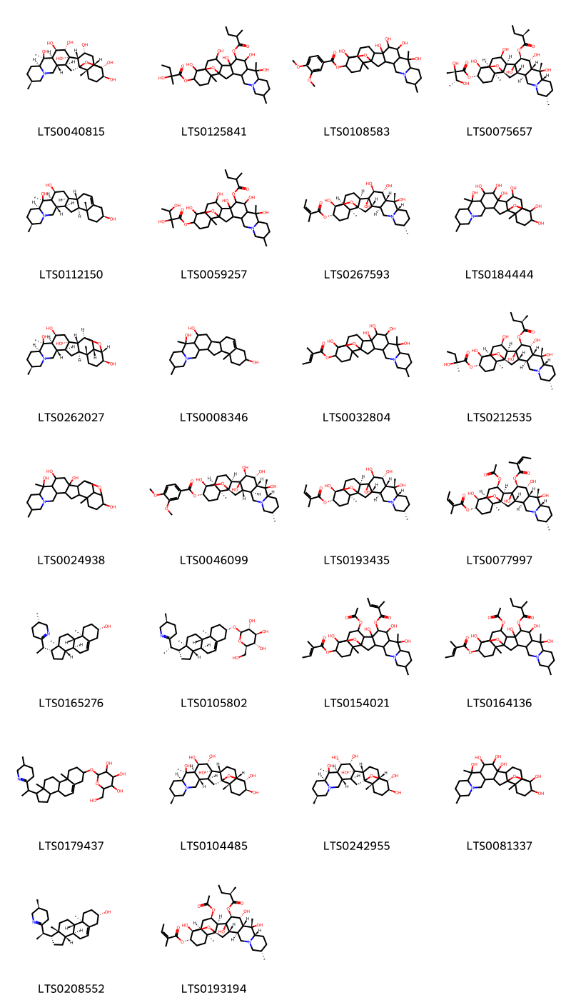{ width=100% }
    <figcaption>Hình ảnh cấu trúc hóa học của 26 hoạt chất thuộc nhóm Steroids and steroid derivatives gồm ['germine (LTS0040815)', '10,12,14,16,23-pentahydroxy-6,10,19-trimethyl-13-[(2-methylbutanoyl)oxy]-24-oxa-4-azaheptacyclo[12.12.0.0²,¹¹.0⁴,⁹.0¹⁵,²⁵.0¹⁸,²³.0¹⁹,²⁵]hexacosan-22-yl 2-hydroxy-2-methylbutanoate (LTS0125841)', '10,12,13,14,23-pentahydroxy-6,10,19-trimethyl-24-oxa-4-azaheptacyclo[12.12.0.0²,¹¹.0⁴,⁹.0¹⁵,²⁵.0¹⁸,²³.0¹⁹,²⁵]hexacosan-22-yl 3,4-dimethoxybenzoate (LTS0108583)', '(1s,2s,6s,9s,10s,11r,12r,13s,14s,15s,16r,18s,19s,22s,23s,25r)-10,12,14,16,23-pentahydroxy-6,10,19-trimethyl-13-{[(2r)-2-methylbutanoyl]oxy}-24-oxa-4-azaheptacyclo[12.12.0.0²,¹¹.0⁴,⁹.0¹⁵,²⁵.0¹⁸,²³.0¹⁹,²⁵]hexacosan-22-yl (2s,3r)-2,3-dihydroxy-2-methylbutanoate (LTS0075657)', '(1r,2s,6s,9s,10s,11r,12s,14s,15s,20s,23r,24s)-6,10,23-trimethyl-4-azahexacyclo[12.11.0.0²,¹¹.0⁴,⁹.0¹⁵,²⁴.0¹⁸,²³]pentacos-17-ene-10,12,20-triol (LTS0112150)', '10,12,14,16,23-pentahydroxy-6,10,19-trimethyl-13-[(2-methylbutanoyl)oxy]-24-oxa-4-azaheptacyclo[12.12.0.0²,¹¹.0⁴,⁹.0¹⁵,²⁵.0¹⁸,²³.0¹⁹,²⁵]hexacosan-22-yl 2,3-dihydroxy-2-methylbutanoate (LTS0059257)', '(1s,2s,6s,9s,10s,11r,12r,13s,14s,15s,18s,19s,22s,23s,25r)-10,12,13,14,23-pentahydroxy-6,10,19-trimethyl-24-oxa-4-azaheptacyclo[12.12.0.0²,¹¹.0⁴,⁹.0¹⁵,²⁵.0¹⁸,²³.0¹⁹,²⁵]hexacosan-22-yl (2z)-2-methylbut-2-enoate (LTS0267593)', '6,10,19-trimethyl-24-oxa-4-azaheptacyclo[12.12.0.0²,¹¹.0⁴,⁹.0¹⁵,²⁵.0¹⁸,²³.0¹⁹,²⁵]hexacosane-10,12,13,14,16,22,23-heptol (LTS0184444)', '(1r,2s,3s,5s,6r,7s,8s,11s,15s,16s,18s,19r,22s,23s,24s)-7,11,19-trimethyl-26-oxa-13-azaheptacyclo[21.2.1.0²,¹⁸.0³,¹⁶.0⁶,¹⁵.0⁸,¹³.0¹⁹,²⁴]hexacosane-3,5,7,22-tetrol (LTS0262027)', '6,10,23-trimethyl-4-azahexacyclo[12.11.0.0²,¹¹.0⁴,⁹.0¹⁵,²⁴.0¹⁸,²³]pentacos-17-ene-10,12,20-triol (LTS0008346)', '10,12,13,14,23-pentahydroxy-6,10,19-trimethyl-24-oxa-4-azaheptacyclo[12.12.0.0²,¹¹.0⁴,⁹.0¹⁵,²⁵.0¹⁸,²³.0¹⁹,²⁵]hexacosan-22-yl 2-methylbut-2-enoate (LTS0032804)', '(1s,2s,6s,9s,10s,11r,12r,13s,14s,15s,16r,18s,19s,22s,23s,25r)-10,12,14,16,23-pentahydroxy-6,10,19-trimethyl-13-{[(2r)-2-methylbutanoyl]oxy}-24-oxa-4-azaheptacyclo[12.12.0.0²,¹¹.0⁴,⁹.0¹⁵,²⁵.0¹⁸,²³.0¹⁹,²⁵]hexacosan-22-yl (2s)-2-hydroxy-2-methylbutanoate (LTS0212535)', '7,11,19-trimethyl-26-oxa-13-azaheptacyclo[21.2.1.0²,¹⁸.0³,¹⁶.0⁶,¹⁵.0⁸,¹³.0¹⁹,²⁴]hexacosane-3,5,7,22-tetrol (LTS0024938)', '(1s,2s,6s,9s,10s,11r,12r,13s,14s,15s,18s,19s,22s,23s,25r)-10,12,13,14,23-pentahydroxy-6,10,19-trimethyl-24-oxa-4-azaheptacyclo[12.12.0.0²,¹¹.0⁴,⁹.0¹⁵,²⁵.0¹⁸,²³.0¹⁹,²⁵]hexacosan-22-yl 3,4-dimethoxybenzoate (LTS0046099)', '(1s,2s,6s,9s,10s,11r,12r,13s,15s,19s,22s,23s)-10,12,13,14,23-pentahydroxy-6,10,19-trimethyl-24-oxa-4-azaheptacyclo[12.12.0.0²,¹¹.0⁴,⁹.0¹⁵,²⁵.0¹⁸,²³.0¹⁹,²⁵]hexacosan-22-yl (2z)-2-methylbut-2-enoate (LTS0193435)', '(1s,2s,6s,9s,10s,11r,12r,13s,14s,15s,16r,18s,19s,22s,23s,25r)-16-(acetyloxy)-10,12,14,23-tetrahydroxy-6,10,19-trimethyl-13-{[(2z)-2-methylbut-2-enoyl]oxy}-24-oxa-4-azaheptacyclo[12.12.0.0²,¹¹.0⁴,⁹.0¹⁵,²⁵.0¹⁸,²³.0¹⁹,²⁵]hexacosan-22-yl (2z)-2-methylbut-2-enoate (LTS0077997)', '(1r,3as,3bs,7s,9ar,9bs,11as)-9a,11a-dimethyl-1-{1-[(5s)-5-methyl-3,4,5,6-tetrahydropyridin-2-yl]ethyl}-1h,2h,3h,3ah,3bh,4h,6h,7h,8h,9h,9bh,10h,11h-cyclopenta[a]phenanthren-7-ol (LTS0165276)', '(2r,3r,4s,5s,6r)-2-{[(1r,3as,3bs,7s,9ar,9bs,11as)-9a,11a-dimethyl-1-[(1s)-1-[(5s)-5-methyl-3,4,5,6-tetrahydropyridin-2-yl]ethyl]-1h,2h,3h,3ah,3bh,4h,6h,7h,8h,9h,9bh,10h,11h-cyclopenta[a]phenanthren-7-yl]oxy}-6-(hydroxymethyl)oxane-3,4,5-triol (LTS0105802)', '16-(acetyloxy)-10,12,14,23-tetrahydroxy-6,10,19-trimethyl-13-[(2-methylbut-2-enoyl)oxy]-24-oxa-4-azaheptacyclo[12.12.0.0²,¹¹.0⁴,⁹.0¹⁵,²⁵.0¹⁸,²³.0¹⁹,²⁵]hexacosan-22-yl 2-methylbut-2-enoate (LTS0154021)', '16-(acetyloxy)-10,12,14,23-tetrahydroxy-6,10,19-trimethyl-13-[(2-methylbutanoyl)oxy]-24-oxa-4-azaheptacyclo[12.12.0.0²,¹¹.0⁴,⁹.0¹⁵,²⁵.0¹⁸,²³.0¹⁹,²⁵]hexacosan-22-yl 2-methylbut-2-enoate (LTS0164136)', '2-({9a,11a-dimethyl-1-[1-(5-methyl-3,4,5,6-tetrahydropyridin-2-yl)ethyl]-1h,2h,3h,3ah,3bh,4h,6h,7h,8h,9h,9bh,10h,11h-cyclopenta[a]phenanthren-7-yl}oxy)-6-(hydroxymethyl)oxane-3,4,5-triol (LTS0179437)', 'zygadenine (LTS0104485)', '(1s,2s,6s,9s,10s,11r,12s,13s,14s,15s,18s,19s,22s,23s,25r)-6,10,19-trimethyl-24-oxa-4-azaheptacyclo[12.12.0.0²,¹¹.0⁴,⁹.0¹⁵,²⁵.0¹⁸,²³.0¹⁹,²⁵]hexacosane-10,12,13,14,22,23-hexol (LTS0242955)', '6,10,19-trimethyl-24-oxa-4-azaheptacyclo[12.12.0.0²,¹¹.0⁴,⁹.0¹⁵,²⁵.0¹⁸,²³.0¹⁹,²⁵]hexacosane-10,12,13,14,22,23-hexol (LTS0081337)', '(1r,3as,3bs,7s,9ar,9bs,11ar)-9a,11a-dimethyl-1-[(1r)-1-[(5s)-5-methyl-3,4,5,6-tetrahydropyridin-2-yl]ethyl]-1h,2h,3h,3ah,3bh,4h,6h,7h,8h,9h,9bh,10h,11h-cyclopenta[a]phenanthren-7-ol (LTS0208552)', '(1s,2s,6s,9s,10s,11r,12r,13s,14s,15s,16r,18s,19s,22s,23s,25r)-16-(acetyloxy)-10,12,14,23-tetrahydroxy-6,10,19-trimethyl-13-{[(2r)-2-methylbutanoyl]oxy}-24-oxa-4-azaheptacyclo[12.12.0.0²,¹¹.0⁴,⁹.0¹⁵,²⁵.0¹⁸,²³.0¹⁹,²⁵]hexacosan-22-yl (2z)-2-methylbut-2-enoate (LTS0193194)'].</figcaption>
</figure>

---

### Dược dân tộc học

Danh sách các quốc gia có sử dụng *Veratrum maackii* trong điều trị các bệnh. 

| Country   | Disease             | Bệnh                         |
|:----------|:--------------------|:-----------------------------|
| Elsewhere | Insecticide, Emetic | Thuốc diệt côn trùng, Emetic |

---

---
## Veratrum nigrum
### Thông tin về thực vật

!!! info "Phân loại thực vật của *Veratrum nigrum* từ GIBF:"
    - **Kingdom:** Plantae
    - **Phylum:** Tracheophyta
    - **Order:** Liliales
    - **Family:** Melanthiaceae
    - **Genus:** Veratrum
    - **Species:** *Veratrum nigrum*

 

| Label (VI)   | Label (EN)   | Scientific Name   | Descriptions (VI)   | Descriptions (EN)   | Also Known As (VI)   | Also Known As (EN)   |
|:-------------|:-------------|:------------------|:--------------------|:--------------------|:---------------------|:---------------------|
| N/A          | N/A          | Veratrum nigrum   | loài thực vật       | species of plant    | ['']                 | ['black-hellebore']  |

#### Phân bố trên thế giới

**Từ CSDL GIBF** Austria, Hungary, Czechia, Sweden, Ukraine, China, Russian Federation, Italy, Switzerland, Slovenia, Germany

#### Phân bố tại Việt Nam

**Từ CSDL GIBF**: Không có ghi nhận ở Việt Nam

---
### Thành phần hóa học
        
- Theo cơ sở dữ liệu lotus: Từ loài *Veratrum nigrum* đã phân lập và xác định được 53 hoạt chất thuộc về các nhóm Flavonoids, Steroids and steroid derivatives, Fluorenes, Prenol lipids. 

|    | chemicalTaxonomyClassyfireClass   |   smiles_count |
|---:|:----------------------------------|---------------:|
|  0 | Flavonoids                        |              4 |
|  1 | Fluorenes                         |              2 |
|  2 | Prenol lipids                     |              1 |
|  3 | Steroids and steroid derivatives  |             39 |

#### Nhóm Flavonoids
<figure markdown="span">
    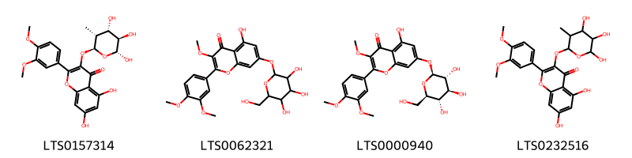{ width=100% }
    <figcaption>Hình ảnh cấu trúc hóa học của 4 hoạt chất thuộc nhóm Flavonoids gồm ['2-(3,4-dimethoxyphenyl)-5,7-dihydroxy-3-{[(2r,3r,4s,5r,6r)-4,5,6-trihydroxy-3-methyloxan-2-yl]oxy}chromen-4-one (LTS0157314)', '2-(3,4-dimethoxyphenyl)-5-hydroxy-3-methoxy-7-{[3,4,5-trihydroxy-6-(hydroxymethyl)oxan-2-yl]oxy}chromen-4-one (LTS0062321)', '2-(3,4-dimethoxyphenyl)-5-hydroxy-3-methoxy-7-{[(2s,3r,4s,5s,6r)-3,4,5-trihydroxy-6-(hydroxymethyl)oxan-2-yl]oxy}chromen-4-one (LTS0000940)', '2-(3,4-dimethoxyphenyl)-5,7-dihydroxy-3-[(4,5,6-trihydroxy-3-methyloxan-2-yl)oxy]chromen-4-one (LTS0232516)'].</figcaption>
</figure>
#### Nhóm Fluorenes
<figure markdown="span">
    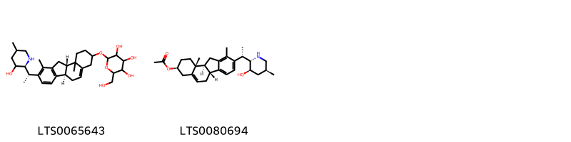{ width=100% }
    <figcaption>Hình ảnh cấu trúc hóa học của 2 hoạt chất thuộc nhóm Fluorenes gồm ['2-{[(6ar,11as)-9-[(1s)-1-[(2s)-3-hydroxy-5-methylpiperidin-2-yl]ethyl]-10,11b-dimethyl-1h,2h,3h,4h,6h,6ah,11h,11ah-cyclohexa[a]fluoren-3-yl]oxy}-6-(hydroxymethyl)oxane-3,4,5-triol (LTS0065643)', '(3s,6ar,11as,11br)-9-[(1s)-1-[(2s,3r,5s)-3-hydroxy-5-methylpiperidin-2-yl]ethyl]-10,11b-dimethyl-1h,2h,3h,4h,6h,6ah,11h,11ah-cyclohexa[a]fluoren-3-yl acetate (LTS0080694)'].</figcaption>
</figure>
#### Nhóm Prenol lipids
<figure markdown="span">
    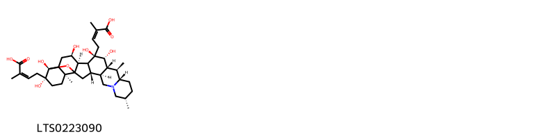{ width=100% }
    <figcaption>Hình ảnh cấu trúc hóa học của 1 hoạt chất thuộc nhóm Prenol lipids gồm ['(2z)-4-[(1s,2s,6s,9s,10r,11s,12r,13r,15r,16r,19s,22r,23s)-22-[(2z)-3-carboxy-3-methylprop-2-en-1-yl]-12,13,16,22,23-pentahydroxy-6,10,19-trimethyl-24-oxa-4-azaheptacyclo[12.12.0.0²,¹¹.0⁴,⁹.0¹⁵,²⁵.0¹⁸,²³.0¹⁹,²⁵]hexacosan-13-yl]-2-methylbut-2-enoic acid (LTS0223090)'].</figcaption>
</figure>
#### Nhóm Steroids and steroid derivatives
<figure markdown="span">
    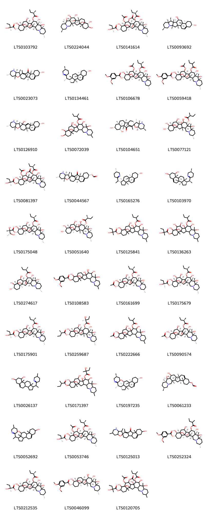{ width=100% }
    <figcaption>Hình ảnh cấu trúc hóa học của 39 hoạt chất thuộc nhóm Steroids and steroid derivatives gồm ['(1s,2s,6s,9s,10r,11r,12r,13s,14s,15s,16r,18s,19s,22s,23s,25r)-10,12,14,16,23-pentahydroxy-6,10,19-trimethyl-13-{[(2r)-2-methylbutanoyl]oxy}-24-oxa-4-azaheptacyclo[12.12.0.0²,¹¹.0⁴,⁹.0¹⁵,²⁵.0¹⁸,²³.0¹⁹,²⁵]hexacosan-22-yl (2s)-2-hydroxy-2-methylbutanoate (LTS0103792)', '(1s,2s,6s,9s,10s,11r,12r,13s,15s,19s,22s,23s)-6,10,19-trimethyl-24-oxa-4-azaheptacyclo[12.12.0.0²,¹¹.0⁴,⁹.0¹⁵,²⁵.0¹⁸,²³.0¹⁹,²⁵]hexacosane-10,12,13,14,22,23-hexol (LTS0224044)', 'protoveratrine a (LTS0141614)', 'rubijervine (LTS0093692)', 'jervine (LTS0023073)', '(1r,3as,3bs,7s,9ar,9bs,11ar)-9a,11a-dimethyl-1-[(1s)-1-[(5s)-5-methyl-3,4,5,6-tetrahydropyridin-2-yl]ethyl]-1h,2h,3h,3ah,3bh,4h,6h,7h,8h,9h,9bh,10h,11h-cyclopenta[a]phenanthren-7-ol (LTS0134461)', '(1s,2s,6s,9s,10s,11r,12r,13s,14s,15s,16r,18s,19s,22s,23s,25r)-16-(acetyloxy)-10,12,14,23-tetrahydroxy-6,10,19-trimethyl-13-{[(2r)-2-methylbutanoyl]oxy}-24-oxa-4-azaheptacyclo[12.12.0.0²,¹¹.0⁴,⁹.0¹⁵,²⁵.0¹⁸,²³.0¹⁹,²⁵]hexacosan-22-yl 3,4-dimethoxybenzoate (LTS0106678)', '(1s,2s,6s,9s,10s,11r,12r,13s,14s,15s,16r,18s,19s,22s,23s,25r)-16-(acetyloxy)-10,12,14,23-tetrahydroxy-6,10,19-trimethyl-13-[(2-methylbutanoyl)oxy]-24-oxa-4-azaheptacyclo[12.12.0.0²,¹¹.0⁴,⁹.0¹⁵,²⁵.0¹⁸,²³.0¹⁹,²⁵]hexacosan-22-yl 3,4-dimethoxybenzoate (LTS0059418)', "(3s,3'r,3'as,6's,6as,6bs,7'ar,9r,10r,11ar,11br)-3',6',10,11b-tetramethyl-1,2,3,3'a,4,4',5',6,6',6a,6b,7,7',7'a,8,11a-hexadecahydro-3'h-spiro[cyclohexa[a]fluorene-9,2'-furo[3,2-b]pyridine]-3,10-diol (LTS0126910)", '10,12,14,16,22,23-hexahydroxy-6,10,19-trimethyl-24-oxa-4-azaheptacyclo[12.12.0.0²,¹¹.0⁴,⁹.0¹⁵,²⁵.0¹⁸,²³.0¹⁹,²⁵]hexacosan-13-yl 2-methylbutanoate (LTS0072039)', "(1r,3r,3'r,3'as,4ar,6's,6as,6bs,7'ar,9r,11as,11bs)-1,3-dihydroxy-3',6',10,11b-tetramethyl-1,2,3,3'a,4,4',4a,5,5',6,6',6a,6b,7,7',7'a,8,11a-octadecahydro-3'h-spiro[cyclohexa[a]fluorene-9,2'-furo[3,2-b]pyridin]-11-one (LTS0104651)", '(1s,2s,6s,9s,11r,12r,13s,14s,15s,16r,18s,19s,22s,23s,25r)-10,13,14,16,22,23-hexahydroxy-6,10,19-trimethyl-24-oxa-4-azaheptacyclo[12.12.0.0²,¹¹.0⁴,⁹.0¹⁵,²⁵.0¹⁸,²³.0¹⁹,²⁵]hexacosan-12-yl 2-methylbutanoate (LTS0077121)', '(1s,2s,6s,9s,10s,11r,12s,13s,14s,15r,16s,17r,18r,19s,22r,23s,25r)-16,17-bis(acetyloxy)-10,12,14,23-tetrahydroxy-6,10,19-trimethyl-13-{[(2r)-2-methylbutanoyl]oxy}-24-oxa-4-azaheptacyclo[12.12.0.0²,¹¹.0⁴,⁹.0¹⁵,²⁵.0¹⁸,²³.0¹⁹,²⁵]hexacosan-22-yl (2s)-2-hydroxy-2-methylbutanoate (LTS0081397)', "(3s,3'r,3'as,6's,6as,6bs,7'ar,9r,11as,11br)-3',6',10,11b-tetramethyl-11-oxo-1,2,3,3'a,4,4',5',6,6',6a,6b,7,7',7'a,8,11a-hexadecahydro-3'h-spiro[cyclohexa[a]fluorene-9,2'-furo[3,2-b]pyridin]-3-yl formate (LTS0044567)", '(1r,3as,3bs,7s,9ar,9bs,11as)-9a,11a-dimethyl-1-{1-[(5s)-5-methyl-3,4,5,6-tetrahydropyridin-2-yl]ethyl}-1h,2h,3h,3ah,3bh,4h,6h,7h,8h,9h,9bh,10h,11h-cyclopenta[a]phenanthren-7-ol (LTS0165276)', '(1r,3as,3bs,7r,9r,9ar,9bs,11as)-9a,11a-dimethyl-1-[(1s)-1-[(5s)-5-methyl-3,4,5,6-tetrahydropyridin-2-yl]ethyl]-1h,2h,3h,3ah,3bh,4h,6h,7h,8h,9h,9bh,10h,11h-cyclopenta[a]phenanthrene-7,9-diol (LTS0103970)', '(1s,2s,6s,9s,11r,12r,13s,14s,15s,16r,18s,19s,22s,23s,25r)-10,12,14,16,23-pentahydroxy-6,10,19-trimethyl-13-{[(2r)-2-methylbutanoyl]oxy}-24-oxa-4-azaheptacyclo[12.12.0.0²,¹¹.0⁴,⁹.0¹⁵,²⁵.0¹⁸,²³.0¹⁹,²⁵]hexacosan-22-yl (2s,3r)-2,3-dihydroxy-2-methylbutanoate (LTS0175048)', '(1s,2s,6s,9s,10s,11r,12r,13s,14s,15s,16r,18s,19s,22s,23s,25r)-10,13,14,16,22,23-hexahydroxy-6,10,19-trimethyl-24-oxa-4-azaheptacyclo[12.12.0.0²,¹¹.0⁴,⁹.0¹⁵,²⁵.0¹⁸,²³.0¹⁹,²⁵]hexacosan-12-yl (2s)-2-methylbutanoate (LTS0051640)', '10,12,14,16,23-pentahydroxy-6,10,19-trimethyl-13-[(2-methylbutanoyl)oxy]-24-oxa-4-azaheptacyclo[12.12.0.0²,¹¹.0⁴,⁹.0¹⁵,²⁵.0¹⁸,²³.0¹⁹,²⁵]hexacosan-22-yl 2-hydroxy-2-methylbutanoate (LTS0125841)', '10,12,14,16,17,23-hexahydroxy-6,10,19-trimethyl-13-[(2-methylbutanoyl)oxy]-24-oxa-4-azaheptacyclo[12.12.0.0²,¹¹.0⁴,⁹.0¹⁵,²⁵.0¹⁸,²³.0¹⁹,²⁵]hexacosan-22-yl 2-hydroxy-2-methylbutanoate (LTS0136263)', '(1s,2s,6s,9s,10s,11r,12r,13s,14s,15s,16r,18s,19s,22s,23s,25r)-10,12,14,16,22,23-hexahydroxy-6,10,19-trimethyl-24-oxa-4-azaheptacyclo[12.12.0.0²,¹¹.0⁴,⁹.0¹⁵,²⁵.0¹⁸,²³.0¹⁹,²⁵]hexacosan-13-yl (2r)-2-methylbutanoate (LTS0274617)', '10,12,13,14,23-pentahydroxy-6,10,19-trimethyl-24-oxa-4-azaheptacyclo[12.12.0.0²,¹¹.0⁴,⁹.0¹⁵,²⁵.0¹⁸,²³.0¹⁹,²⁵]hexacosan-22-yl 3,4-dimethoxybenzoate (LTS0108583)', '(1s,2s,6s,9s,10s,11r,12r,13s,14s,15s,16r,18s,19s,22s,23s,25r)-22-(acetyloxy)-10,12,14,16,23-pentahydroxy-6,10,19-trimethyl-24-oxa-4-azaheptacyclo[12.12.0.0²,¹¹.0⁴,⁹.0¹⁵,²⁵.0¹⁸,²³.0¹⁹,²⁵]hexacosan-13-yl (2r)-2-methylbutanoate (LTS0161699)', '(1s,2s,6s,9s,10s,11r,12s,13s,14s,15s,16s,17r,18r,19s,22s,23s,25r)-10,12,14,16,17,23-hexahydroxy-6,10,19-trimethyl-13-{[(2r)-2-methylbutanoyl]oxy}-24-oxa-4-azaheptacyclo[12.12.0.0²,¹¹.0⁴,⁹.0¹⁵,²⁵.0¹⁸,²³.0¹⁹,²⁵]hexacosan-22-yl (2s)-2-hydroxy-2-methylbutanoate (LTS0175679)', '(1s,2s,6s,9s,11r,12r,13s,14s,15s,16r,18s,19s,22s,23s,25r)-10,12,14,16,23-pentahydroxy-6,10,19-trimethyl-13-{[(2r)-2-methylbutanoyl]oxy}-24-oxa-4-azaheptacyclo[12.12.0.0²,¹¹.0⁴,⁹.0¹⁵,²⁵.0¹⁸,²³.0¹⁹,²⁵]hexacosan-22-yl (2s)-2-hydroxy-2-methylbutanoate (LTS0175901)', '(1s,2s,6s,9r,10s,11r,12r,13s,14s,15r,16r,18s,19s,22s,23s,25r)-10,12,14,16,23-pentahydroxy-6,10,19-trimethyl-22-{[(2r)-2-methylbutanoyl]oxy}-24-oxa-4-azaheptacyclo[12.12.0.0²,¹¹.0⁴,⁹.0¹⁵,²⁵.0¹⁸,²³.0¹⁹,²⁵]hexacosan-13-yl (2s)-2-hydroxy-2-methylbutanoate (LTS0259687)', '22-(acetyloxy)-10,12,14,16,23-pentahydroxy-6,10,19-trimethyl-24-oxa-4-azaheptacyclo[12.12.0.0²,¹¹.0⁴,⁹.0¹⁵,²⁵.0¹⁸,²³.0¹⁹,²⁵]hexacosan-13-yl 2-methylbutanoate (LTS0222666)', 'germidine (LTS0090574)', '9a,11a-dimethyl-1-[1-(5-methyl-3,4,5,6-tetrahydropyridin-2-yl)ethyl]-1h,2h,3h,3ah,3bh,4h,6h,7h,8h,9h,9bh,10h,11h-cyclopenta[a]phenanthrene-7,9-diol (LTS0026137)', '10,12,14,16,23-pentahydroxy-6,10,19-trimethyl-22-[(2-methylbutanoyl)oxy]-24-oxa-4-azaheptacyclo[12.12.0.0²,¹¹.0⁴,⁹.0¹⁵,²⁵.0¹⁸,²³.0¹⁹,²⁵]hexacosan-13-yl 2-hydroxy-2-methylbutanoate (LTS0171397)', '(1r,3as,3br,7s,9ar,9bs,11s,11as)-9a,11a-dimethyl-1-[(1s)-1-[(5s)-5-methyl-3,4,5,6-tetrahydropyridin-2-yl]ethyl]-1h,2h,3h,3ah,3bh,4h,6h,7h,8h,9h,9bh,10h,11h-cyclopenta[a]phenanthrene-7,11-diol (LTS0197235)', '(1r,2s,6s,9s,10s,11r,12s,14s,15s,20s,23r,24s)-10,12-dihydroxy-6,10,23-trimethyl-4-azahexacyclo[12.11.0.0²,¹¹.0⁴,⁹.0¹⁵,²⁴.0¹⁸,²³]pentacos-17-en-20-yl formate (LTS0061233)', '9a,11a-dimethyl-1-[1-(5-methyl-3,4,5,6-tetrahydropyridin-2-yl)ethyl]-1h,2h,3h,3ah,3bh,4h,6h,7h,8h,9h,9bh,10h,11h-cyclopenta[a]phenanthrene-7,11-diol (LTS0052692)', '(1s,2s,6s,9s,11r,12r,13s,14s,15s,16s,17r,18r,19s,22s,23s,25r)-17-(acetyloxy)-10,12,14,16,23-pentahydroxy-6,10,19-trimethyl-13-{[(2r)-2-methylbutanoyl]oxy}-24-oxa-4-azaheptacyclo[12.12.0.0²,¹¹.0⁴,⁹.0¹⁵,²⁵.0¹⁸,²³.0¹⁹,²⁵]hexacosan-22-yl (2s)-2-hydroxy-2-methylbutanoate (LTS0053746)', 'jervine (LTS0125013)', '(1s,2s,6s,9s,10s,11r,12r,13s,14s,15s,16r,18s,19s,22s,23s,25r)-10,12,14,16,23-pentahydroxy-6,10,19-trimethyl-13-[(2-methylbutanoyl)oxy]-24-oxa-4-azaheptacyclo[12.12.0.0²,¹¹.0⁴,⁹.0¹⁵,²⁵.0¹⁸,²³.0¹⁹,²⁵]hexacosan-22-yl 3,4-dimethoxybenzoate (LTS0252324)', '(1s,2s,6s,9s,10s,11r,12r,13s,14s,15s,16r,18s,19s,22s,23s,25r)-10,12,14,16,23-pentahydroxy-6,10,19-trimethyl-13-{[(2r)-2-methylbutanoyl]oxy}-24-oxa-4-azaheptacyclo[12.12.0.0²,¹¹.0⁴,⁹.0¹⁵,²⁵.0¹⁸,²³.0¹⁹,²⁵]hexacosan-22-yl (2s)-2-hydroxy-2-methylbutanoate (LTS0212535)', '(1s,2s,6s,9s,10s,11r,12r,13s,14s,15s,18s,19s,22s,23s,25r)-10,12,13,14,23-pentahydroxy-6,10,19-trimethyl-24-oxa-4-azaheptacyclo[12.12.0.0²,¹¹.0⁴,⁹.0¹⁵,²⁵.0¹⁸,²³.0¹⁹,²⁵]hexacosan-22-yl 3,4-dimethoxybenzoate (LTS0046099)', '16,17-bis(acetyloxy)-10,12,14,23-tetrahydroxy-6,10,19-trimethyl-13-[(2-methylbutanoyl)oxy]-24-oxa-4-azaheptacyclo[12.12.0.0²,¹¹.0⁴,⁹.0¹⁵,²⁵.0¹⁸,²³.0¹⁹,²⁵]hexacosan-22-yl 2-hydroxy-2-methylbutanoate (LTS0120705)'].</figcaption>
</figure>

---

### Dược dân tộc học

Danh sách các quốc gia có sử dụng *Veratrum nigrum* trong điều trị các bệnh. 

| Country   | Disease                                 | Bệnh                                                             |
|:----------|:----------------------------------------|:-----------------------------------------------------------------|
| China     | Analgesic, Emetic, Poison, Sternutatory | Thuốc giảm đau, thuốc gây nôn, thuốc độc, thuốc ức chế tuyến yên |

---

---
## Veratrum virginicum
### Thông tin về thực vật

!!! info "Phân loại thực vật của *Melanthium virginicum* từ GIBF:"
    - **Kingdom:** Plantae
    - **Phylum:** Tracheophyta
    - **Order:** Liliales
    - **Family:** Melanthiaceae
    - **Genus:** Melanthium
    - **Species:** *Melanthium virginicum*

 

| Label (VI)   | Label (EN)   | Scientific Name     | Descriptions (VI)   | Descriptions (EN)   | Also Known As (VI)   | Also Known As (EN)   |
|:-------------|:-------------|:--------------------|:--------------------|:--------------------|:---------------------|:---------------------|
| N/A          | N/A          | Veratrum virginicum |                     | species of plant    | ['']                 | ['']                 |

#### Phân bố trên thế giới

**Từ CSDL GIBF** United States of America

#### Phân bố tại Việt Nam

**Từ CSDL GIBF**: Không có ghi nhận ở Việt Nam

---
### Thành phần hóa học
        
- Theo cơ sở dữ liệu lotus: Từ loài *Melanthium virginicum* đã phân lập và xác định được Chưa có hoạt chất nào được phân lập. hoạt chất thuộc về các nhóm Không có hoạt chất nào được phân lập. 

Không có hình ảnh nào được tạo ra

---

### Dược dân tộc học

Danh sách các quốc gia có sử dụng *Melanthium virginicum* trong điều trị các bệnh. 

| Country   | Disease   | Bệnh     |
|:----------|:----------|:---------|
| US        | Poison    | Chất độc |

---

---
## Veratrum viride
### Thông tin về thực vật

!!! info "Phân loại thực vật của *Veratrum viride* từ GIBF:"
    - **Kingdom:** Plantae
    - **Phylum:** Tracheophyta
    - **Order:** Liliales
    - **Family:** Melanthiaceae
    - **Genus:** Veratrum
    - **Species:** *Veratrum viride*

 

| Label (VI)   | Label (EN)   | Scientific Name   | Descriptions (VI)   | Descriptions (EN)   | Also Known As (VI)   | Also Known As (EN)                                          |
|:-------------|:-------------|:------------------|:--------------------|:--------------------|:---------------------|:------------------------------------------------------------|
| N/A          | N/A          | Veratrum viride   | loài thực vật       | species of plant    | ['']                 | ['false hellebore', 'green false hellebore', 'Indian poke'] |

#### Phân bố trên thế giới

**Từ CSDL GIBF** United States of America, Canada

#### Phân bố tại Việt Nam

**Từ CSDL GIBF**: Không có ghi nhận ở Việt Nam

---
### Thành phần hóa học
        
- Theo cơ sở dữ liệu lotus: Từ loài *Veratrum viride* đã phân lập và xác định được 37 hoạt chất thuộc về các nhóm Steroids and steroid derivatives, Fluorenes. 

|    | chemicalTaxonomyClassyfireClass   |   smiles_count |
|---:|:----------------------------------|---------------:|
|  0 | Fluorenes                         |              2 |
|  1 | Steroids and steroid derivatives  |             35 |

#### Nhóm Fluorenes
<figure markdown="span">
    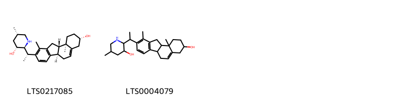{ width=100% }
    <figcaption>Hình ảnh cấu trúc hóa học của 2 hoạt chất thuộc nhóm Fluorenes gồm ['veratramine (LTS0217085)', 'veratramine (LTS0004079)'].</figcaption>
</figure>
#### Nhóm Steroids and steroid derivatives
<figure markdown="span">
    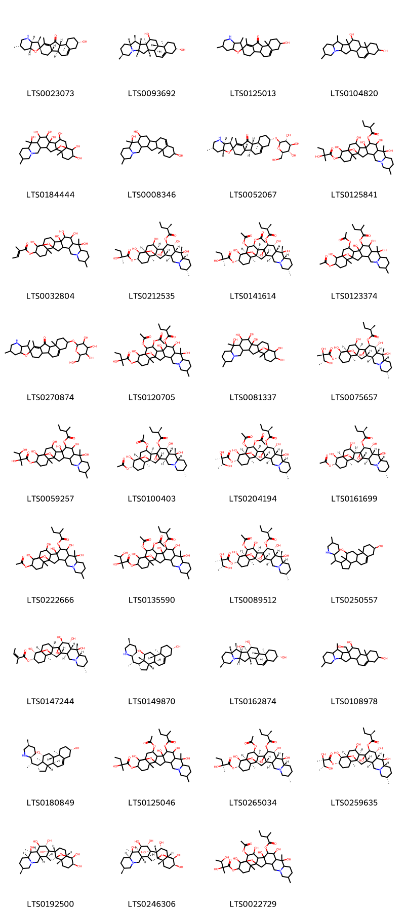{ width=100% }
    <figcaption>Hình ảnh cấu trúc hóa học của 35 hoạt chất thuộc nhóm Steroids and steroid derivatives gồm ['jervine (LTS0023073)', 'rubijervine (LTS0093692)', 'jervine (LTS0125013)', '10,14,16,20-tetramethyl-22-azahexacyclo[12.10.0.0²,¹¹.0⁵,¹⁰.0¹⁵,²³.0¹⁷,²²]tetracos-4-ene-7,13-diol (LTS0104820)', '6,10,19-trimethyl-24-oxa-4-azaheptacyclo[12.12.0.0²,¹¹.0⁴,⁹.0¹⁵,²⁵.0¹⁸,²³.0¹⁹,²⁵]hexacosane-10,12,13,14,16,22,23-heptol (LTS0184444)', '6,10,23-trimethyl-4-azahexacyclo[12.11.0.0²,¹¹.0⁴,⁹.0¹⁵,²⁴.0¹⁸,²³]pentacos-17-ene-10,12,20-triol (LTS0008346)', 'pseudojervine (LTS0052067)', '10,12,14,16,23-pentahydroxy-6,10,19-trimethyl-13-[(2-methylbutanoyl)oxy]-24-oxa-4-azaheptacyclo[12.12.0.0²,¹¹.0⁴,⁹.0¹⁵,²⁵.0¹⁸,²³.0¹⁹,²⁵]hexacosan-22-yl 2-hydroxy-2-methylbutanoate (LTS0125841)', '10,12,13,14,23-pentahydroxy-6,10,19-trimethyl-24-oxa-4-azaheptacyclo[12.12.0.0²,¹¹.0⁴,⁹.0¹⁵,²⁵.0¹⁸,²³.0¹⁹,²⁵]hexacosan-22-yl 2-methylbut-2-enoate (LTS0032804)', '(1s,2s,6s,9s,10s,11r,12r,13s,14s,15s,16r,18s,19s,22s,23s,25r)-10,12,14,16,23-pentahydroxy-6,10,19-trimethyl-13-{[(2r)-2-methylbutanoyl]oxy}-24-oxa-4-azaheptacyclo[12.12.0.0²,¹¹.0⁴,⁹.0¹⁵,²⁵.0¹⁸,²³.0¹⁹,²⁵]hexacosan-22-yl (2s)-2-hydroxy-2-methylbutanoate (LTS0212535)', 'protoveratrine a (LTS0141614)', '16,22-bis(acetyloxy)-10,12,14,23-tetrahydroxy-6,10,19-trimethyl-24-oxa-4-azaheptacyclo[12.12.0.0²,¹¹.0⁴,⁹.0¹⁵,²⁵.0¹⁸,²³.0¹⁹,²⁵]hexacosan-13-yl 2-methylbutanoate (LTS0123374)', "3',6',10,11b-tetramethyl-3-{[3,4,5-trihydroxy-6-(hydroxymethyl)oxan-2-yl]oxy}-1,2,3,3'a,4,4',5',6,6',6a,6b,7,7',7'a,8,11a-hexadecahydro-3'h-spiro[cyclohexa[a]fluorene-9,2'-furo[3,2-b]pyridin]-11-one (LTS0270874)", '16,17-bis(acetyloxy)-10,12,14,23-tetrahydroxy-6,10,19-trimethyl-13-[(2-methylbutanoyl)oxy]-24-oxa-4-azaheptacyclo[12.12.0.0²,¹¹.0⁴,⁹.0¹⁵,²⁵.0¹⁸,²³.0¹⁹,²⁵]hexacosan-22-yl 2-hydroxy-2-methylbutanoate (LTS0120705)', '6,10,19-trimethyl-24-oxa-4-azaheptacyclo[12.12.0.0²,¹¹.0⁴,⁹.0¹⁵,²⁵.0¹⁸,²³.0¹⁹,²⁵]hexacosane-10,12,13,14,22,23-hexol (LTS0081337)', '(1s,2s,6s,9s,10s,11r,12r,13s,14s,15s,16r,18s,19s,22s,23s,25r)-10,12,14,16,23-pentahydroxy-6,10,19-trimethyl-13-{[(2r)-2-methylbutanoyl]oxy}-24-oxa-4-azaheptacyclo[12.12.0.0²,¹¹.0⁴,⁹.0¹⁵,²⁵.0¹⁸,²³.0¹⁹,²⁵]hexacosan-22-yl (2s,3r)-2,3-dihydroxy-2-methylbutanoate (LTS0075657)', '10,12,14,16,23-pentahydroxy-6,10,19-trimethyl-13-[(2-methylbutanoyl)oxy]-24-oxa-4-azaheptacyclo[12.12.0.0²,¹¹.0⁴,⁹.0¹⁵,²⁵.0¹⁸,²³.0¹⁹,²⁵]hexacosan-22-yl 2,3-dihydroxy-2-methylbutanoate (LTS0059257)', 'neogermitrine (LTS0100403)', '(1s,2s,6s,9s,10s,11r,12r,13s,14s,15s,16s,17r,18r,19s,22s,23s,25r)-16,17-bis(acetyloxy)-10,12,14,23-tetrahydroxy-6,10,19-trimethyl-13-{[(2r)-2-methylbutanoyl]oxy}-24-oxa-4-azaheptacyclo[12.12.0.0²,¹¹.0⁴,⁹.0¹⁵,²⁵.0¹⁸,²³.0¹⁹,²⁵]hexacosan-22-yl (2r,3r)-2,3-dihydroxy-2-methylbutanoate (LTS0204194)', '(1s,2s,6s,9s,10s,11r,12r,13s,14s,15s,16r,18s,19s,22s,23s,25r)-22-(acetyloxy)-10,12,14,16,23-pentahydroxy-6,10,19-trimethyl-24-oxa-4-azaheptacyclo[12.12.0.0²,¹¹.0⁴,⁹.0¹⁵,²⁵.0¹⁸,²³.0¹⁹,²⁵]hexacosan-13-yl (2r)-2-methylbutanoate (LTS0161699)', '22-(acetyloxy)-10,12,14,16,23-pentahydroxy-6,10,19-trimethyl-24-oxa-4-azaheptacyclo[12.12.0.0²,¹¹.0⁴,⁹.0¹⁵,²⁵.0¹⁸,²³.0¹⁹,²⁵]hexacosan-13-yl 2-methylbutanoate (LTS0222666)', '16,17-bis(acetyloxy)-10,12,14,23-tetrahydroxy-6,10,19-trimethyl-13-[(2-methylbutanoyl)oxy]-24-oxa-4-azaheptacyclo[12.12.0.0²,¹¹.0⁴,⁹.0¹⁵,²⁵.0¹⁸,²³.0¹⁹,²⁵]hexacosan-22-yl 2,3-dihydroxy-2-methylbutanoate (LTS0135590)', '(1s,2s,6s,9s,10s,11r,12r,13s,14s,15s,16s,17r,18r,19s,22s,23s,25r)-17-(acetyloxy)-10,12,14,16,23-pentahydroxy-6,10,19-trimethyl-13-{[(2r)-2-methylbutanoyl]oxy}-24-oxa-4-azaheptacyclo[12.12.0.0²,¹¹.0⁴,⁹.0¹⁵,²⁵.0¹⁸,²³.0¹⁹,²⁵]hexacosan-22-yl (2r,3r)-2,3-dihydroxy-2-methylbutanoate (LTS0089512)', '9a,11a-dimethyl-1-[1-(5-methylpiperidin-2-yl)ethyl]-1h,2h,3h,3ah,3bh,4h,6h,7h,8h,9h,9bh,10h,11h-cyclopenta[a]phenanthrene-7,11-diol (LTS0250557)', '(1s,2s,6s,9s,10s,11r,12r,13s,14s,15s,18s,19s,22s,23r,25r)-10,12,13,14,23-pentahydroxy-6,10,19-trimethyl-24-oxa-4-azaheptacyclo[12.12.0.0²,¹¹.0⁴,⁹.0¹⁵,²⁵.0¹⁸,²³.0¹⁹,²⁵]hexacosan-22-yl (2z)-2-methylbut-2-enoate (LTS0147244)', '(1r,3as,3br,7s,9ar,9bs,11s,11ar)-9a,11a-dimethyl-1-[(1s)-1-[(2s,5s)-5-methylpiperidin-2-yl]ethyl]-1h,2h,3h,3ah,3bh,4h,6h,7h,8h,9h,9bh,10h,11h-cyclopenta[a]phenanthrene-7,11-diol (LTS0149870)', '(1s,2r,7s,10r,11s,13r,14s,15r,16s,17r,20s,23s)-14-(hydroxymethyl)-10,16,20-trimethyl-22-azahexacyclo[12.10.0.0²,¹¹.0⁵,¹⁰.0¹⁵,²³.0¹⁷,²²]tetracos-4-ene-7,13-diol (LTS0162874)', '14-(hydroxymethyl)-10,16,20-trimethyl-22-azahexacyclo[12.10.0.0²,¹¹.0⁵,¹⁰.0¹⁵,²³.0¹⁷,²²]tetracos-4-ene-7,13-diol (LTS0108978)', '(1r,3as,3br,7s,9ar,9bs,11r,11as)-9a,11a-dimethyl-1-[(1s)-1-[(2s,5s)-5-methylpiperidin-2-yl]ethyl]-1h,2h,3h,3ah,3bh,4h,6h,7h,8h,9h,9bh,10h,11h-cyclopenta[a]phenanthrene-7,11-diol (LTS0180849)', '16-(acetyloxy)-10,12,14,23-tetrahydroxy-6,10,19-trimethyl-13-[(2-methylbutanoyl)oxy]-24-oxa-4-azaheptacyclo[12.12.0.0²,¹¹.0⁴,⁹.0¹⁵,²⁵.0¹⁸,²³.0¹⁹,²⁵]hexacosan-22-yl 2-hydroxy-2-methylbutanoate (LTS0125046)', '(1s,2s,6s,9s,10s,11r,12r,13s,14s,15s,16r,18s,19s,22s,23s,25r)-16-(acetyloxy)-10,12,14,23-tetrahydroxy-6,10,19-trimethyl-13-{[(2r)-2-methylbutanoyl]oxy}-24-oxa-4-azaheptacyclo[12.12.0.0²,¹¹.0⁴,⁹.0¹⁵,²⁵.0¹⁸,²³.0¹⁹,²⁵]hexacosan-22-yl (2s)-2-hydroxy-2-methylbutanoate (LTS0265034)', '(1s,2s,6s,9s,10s,11r,12r,13s,14s,15s,16r,18s,19s,22s,23s,25r)-10,12,14,16,23-pentahydroxy-6,10,19-trimethyl-13-{[(2r)-2-methylbutanoyl]oxy}-24-oxa-4-azaheptacyclo[12.12.0.0²,¹¹.0⁴,⁹.0¹⁵,²⁵.0¹⁸,²³.0¹⁹,²⁵]hexacosan-22-yl (2r,3r)-2,3-dihydroxy-2-methylbutanoate (LTS0259635)', '(1s,2s,6s,9s,10s,11r,12r,13s,14s,15s,18s,19s,22s,23r,25r)-6,10,19-trimethyl-24-oxa-4-azaheptacyclo[12.12.0.0²,¹¹.0⁴,⁹.0¹⁵,²⁵.0¹⁸,²³.0¹⁹,²⁵]hexacosane-10,12,13,14,22,23-hexol (LTS0192500)', '(1s,2s,6s,9s,10s,11r,12r,13s,14s,15s,16r,18s,19s,22s,23r,25r)-6,10,19-trimethyl-24-oxa-4-azaheptacyclo[12.12.0.0²,¹¹.0⁴,⁹.0¹⁵,²⁵.0¹⁸,²³.0¹⁹,²⁵]hexacosane-10,12,13,14,16,22,23-heptol (LTS0246306)', '17-(acetyloxy)-10,12,14,16,23-pentahydroxy-6,10,19-trimethyl-13-[(2-methylbutanoyl)oxy]-24-oxa-4-azaheptacyclo[12.12.0.0²,¹¹.0⁴,⁹.0¹⁵,²⁵.0¹⁸,²³.0¹⁹,²⁵]hexacosan-22-yl 2,3-dihydroxy-2-methylbutanoate (LTS0022729)'].</figcaption>
</figure>

---

### Dược dân tộc học

Danh sách các quốc gia có sử dụng *Veratrum viride* trong điều trị các bệnh. 

| Country          | Disease                                                                                          | Bệnh                                                                                                                |
|:-----------------|:-------------------------------------------------------------------------------------------------|:--------------------------------------------------------------------------------------------------------------------|
| Canada(Kwakiutl) | Emetic, Poison, Abortifacient, Laxative, Poultice                                                | Emetic, Poison, Abortifacient, Laxative, Poultice                                                                   |
| Turkey           | Cardiosedative, Emetic, Sudorific, Diuretic, Poison                                              | Cardiosedative, Emetic, Sudorific, lợi tiểu, chất độc                                                               |
| US               | Analgesic, Diaphoretic, Insecticide, Insecticide, Poison, Sedative, Tranquilizer, Poison, Emetic | Thuốc giảm đau, Diaphoretic, Thuốc trừ sâu, Thuốc trừ sâu, Chất độc, Thuốc an thần, Thuốc an thần, Chất độc, Emetic |
| US(Appalachia)   | Intoxicant                                                                                       | chất gây độc                                                                                                        |
| US(Colonial)     | Pediculicide                                                                                     | Pediculicide                                                                                                        |
| US(Flathead)     | Decongestant                                                                                     | Gỉảm xung huyêt                                                                                                     |

---

# Chi Smilacina

??? note "Danh sách các dược liệu thuộc chi"
    
	 - *Smilacina amplexicaulis*
	 - *Smilacina stellata*

---
## Smilacina amplexicaulis
### Thông tin về thực vật

!!! info "Phân loại thực vật của *Maianthemum racemosum* từ GIBF:"
    - **Kingdom:** Plantae
    - **Phylum:** Tracheophyta
    - **Order:** Asparagales
    - **Family:** Asparagaceae
    - **Genus:** Maianthemum
    - **Species:** *Maianthemum racemosum*

 

| Label (VI)   | Label (EN)   | Scientific Name         | Descriptions (VI)   | Descriptions (EN)   | Also Known As (VI)   | Also Known As (EN)   |
|:-------------|:-------------|:------------------------|:--------------------|:--------------------|:---------------------|:---------------------|
| N/A          | N/A          | Smilacina amplexicaulis | loài thực vật       | species of plant    | ['']                 | ['']                 |

#### Phân bố trên thế giới

**Từ CSDL GIBF** nan, Mexico, United States of America, Canada

#### Phân bố tại Việt Nam

**Từ CSDL GIBF**: Không có ghi nhận ở Việt Nam

---
### Thành phần hóa học
        
- Theo cơ sở dữ liệu lotus: Từ loài *Maianthemum racemosum* đã phân lập và xác định được Chưa có hoạt chất nào được phân lập. hoạt chất thuộc về các nhóm Không có hoạt chất nào được phân lập. 

Không có hình ảnh nào được tạo ra

---

### Dược dân tộc học

Danh sách các quốc gia có sử dụng *Maianthemum racemosum* trong điều trị các bệnh. 

| Country   | Disease       | Bệnh               |
|:----------|:--------------|:-------------------|
| US        | Contraceptive | Kiểm soát sinh sản |

---

---
## Smilacina stellata
### Thông tin về thực vật

!!! info "Phân loại thực vật của *Maianthemum stellatum* từ GIBF:"
    - **Kingdom:** Plantae
    - **Phylum:** Tracheophyta
    - **Order:** Asparagales
    - **Family:** Asparagaceae
    - **Genus:** Maianthemum
    - **Species:** *Maianthemum stellatum*

 

| Label (VI)   | Label (EN)   | Scientific Name    | Descriptions (VI)   | Descriptions (EN)   | Also Known As (VI)   | Also Known As (EN)   |
|:-------------|:-------------|:-------------------|:--------------------|:--------------------|:---------------------|:---------------------|
| N/A          | N/A          | Smilacina stellata | loài thực vật       | species of plant    | ['']                 | ['']                 |

#### Phân bố trên thế giới

**Từ CSDL GIBF** nan, Mexico, United States of America, Norway, Belgium, Canada, Netherlands

#### Phân bố tại Việt Nam

**Từ CSDL GIBF**: Không có ghi nhận ở Việt Nam

---
### Thành phần hóa học
        
- Theo cơ sở dữ liệu lotus: Từ loài *Maianthemum stellatum* đã phân lập và xác định được Chưa có hoạt chất nào được phân lập. hoạt chất thuộc về các nhóm Không có hoạt chất nào được phân lập. 

Không có hình ảnh nào được tạo ra

---

### Dược dân tộc học

Danh sách các quốc gia có sử dụng *Maianthemum stellatum* trong điều trị các bệnh. 

| Country       | Disease   | Bệnh        |
|:--------------|:----------|:------------|
| US(Blackfoot) | Hemostat  | Máy cầm máu |

---

# Chi Ahodelus

??? note "Danh sách các dược liệu thuộc chi"
    
	 - *Ahodelus fistulosus*
	 - *Ahodelus microcarpus*
	 - *Ahodelus ramosus*
	 - *Ahodelus tenuifolius*

---
## Ahodelus fistulosus
### Thông tin về thực vật

!!! info "Phân loại thực vật của *N/A* từ GIBF:"
    - **Kingdom:** N/A
    - **Phylum:** N/A
    - **Order:** N/A
    - **Family:** N/A
    - **Genus:** N/A
    - **Species:** *N/A*

 

| Label (VI)   | Label (EN)   | Scientific Name    | Descriptions (VI)   | Descriptions (EN)   | Also Known As (VI)   | Also Known As (EN)   |
|:-------------|:-------------|:-------------------|:--------------------|:--------------------|:---------------------|:---------------------|
| N/A          | N/A          | Smilacina stellata | loài thực vật       | species of plant    | ['']                 | ['']                 |

#### Phân bố trên thế giới

**Từ CSDL GIBF** Không có kết quả phù hợp

#### Phân bố tại Việt Nam

**Từ CSDL GIBF**: Không có ghi nhận ở Việt Nam

---
### Thành phần hóa học
        
- Theo cơ sở dữ liệu lotus: Từ loài *N/A* đã phân lập và xác định được Chưa có hoạt chất nào được phân lập. hoạt chất thuộc về các nhóm Không có hoạt chất nào được phân lập. 

Không có hình ảnh nào được tạo ra

---

### Dược dân tộc học

Danh sách các quốc gia có sử dụng *N/A* trong điều trị các bệnh. 

| Country   | Disease   | Bệnh           |
|:----------|:----------|:---------------|
| Iraq      | Diuretic  | Thuốc lợi tiêu |
| Sudan     | Diuretic  | Thuốc lợi tiêu |
| ain       | Poison    | Chất độc       |

---

---
## Ahodelus microcarpus
### Thông tin về thực vật

!!! info "Phân loại thực vật của *N/A* từ GIBF:"
    - **Kingdom:** N/A
    - **Phylum:** N/A
    - **Order:** N/A
    - **Family:** N/A
    - **Genus:** N/A
    - **Species:** *N/A*

 

| Label (VI)   | Label (EN)   | Scientific Name    | Descriptions (VI)   | Descriptions (EN)   | Also Known As (VI)   | Also Known As (EN)   |
|:-------------|:-------------|:-------------------|:--------------------|:--------------------|:---------------------|:---------------------|
| N/A          | N/A          | Smilacina stellata | loài thực vật       | species of plant    | ['']                 | ['']                 |

#### Phân bố trên thế giới

**Từ CSDL GIBF** Không có kết quả phù hợp

#### Phân bố tại Việt Nam

**Từ CSDL GIBF**: Không có ghi nhận ở Việt Nam

---
### Thành phần hóa học
        
- Theo cơ sở dữ liệu lotus: Từ loài *N/A* đã phân lập và xác định được Chưa có hoạt chất nào được phân lập. hoạt chất thuộc về các nhóm Không có hoạt chất nào được phân lập. 

Không có hình ảnh nào được tạo ra

---

### Dược dân tộc học

Danh sách các quốc gia có sử dụng *N/A* trong điều trị các bệnh. 

| Country   | Disease    | Bệnh           |
|:----------|:-----------|:---------------|
| Africa    | Diuretic   | Thuốc lợi tiêu |
| Arabia    | Diuretic   | Thuốc lợi tiêu |
| Egypt     | Astringent | Lam se da      |

---

---
## Ahodelus ramosus
### Thông tin về thực vật

!!! info "Phân loại thực vật của *N/A* từ GIBF:"
    - **Kingdom:** N/A
    - **Phylum:** N/A
    - **Order:** N/A
    - **Family:** N/A
    - **Genus:** N/A
    - **Species:** *N/A*

 

| Label (VI)   | Label (EN)   | Scientific Name    | Descriptions (VI)   | Descriptions (EN)   | Also Known As (VI)   | Also Known As (EN)   |
|:-------------|:-------------|:-------------------|:--------------------|:--------------------|:---------------------|:---------------------|
| N/A          | N/A          | Smilacina stellata | loài thực vật       | species of plant    | ['']                 | ['']                 |

#### Phân bố trên thế giới

**Từ CSDL GIBF** Không có kết quả phù hợp

#### Phân bố tại Việt Nam

**Từ CSDL GIBF**: Không có ghi nhận ở Việt Nam

---
### Thành phần hóa học
        
- Theo cơ sở dữ liệu lotus: Từ loài *N/A* đã phân lập và xác định được Chưa có hoạt chất nào được phân lập. hoạt chất thuộc về các nhóm Không có hoạt chất nào được phân lập. 

Không có hình ảnh nào được tạo ra

---

### Dược dân tộc học

Danh sách các quốc gia có sử dụng *N/A* trong điều trị các bệnh. 

| Country   | Disease               | Bệnh                           |
|:----------|:----------------------|:-------------------------------|
| Turkey    | Diuretic, Emmenagogue | Thuốc lợi tiểu, Thuốc lợi tiểu |

---

---
## Ahodelus tenuifolius
### Thông tin về thực vật

!!! info "Phân loại thực vật của *N/A* từ GIBF:"
    - **Kingdom:** N/A
    - **Phylum:** N/A
    - **Order:** N/A
    - **Family:** N/A
    - **Genus:** N/A
    - **Species:** *N/A*

 

| Label (VI)   | Label (EN)   | Scientific Name    | Descriptions (VI)   | Descriptions (EN)   | Also Known As (VI)   | Also Known As (EN)   |
|:-------------|:-------------|:-------------------|:--------------------|:--------------------|:---------------------|:---------------------|
| N/A          | N/A          | Smilacina stellata | loài thực vật       | species of plant    | ['']                 | ['']                 |

#### Phân bố trên thế giới

**Từ CSDL GIBF** Không có kết quả phù hợp

#### Phân bố tại Việt Nam

**Từ CSDL GIBF**: Không có ghi nhận ở Việt Nam

---
### Thành phần hóa học
        
- Theo cơ sở dữ liệu lotus: Từ loài *N/A* đã phân lập và xác định được Chưa có hoạt chất nào được phân lập. hoạt chất thuộc về các nhóm Không có hoạt chất nào được phân lập. 

Không có hình ảnh nào được tạo ra

---

### Dược dân tộc học

Danh sách các quốc gia có sử dụng *N/A* trong điều trị các bệnh. 

| Country   | Disease   | Bệnh           |
|:----------|:----------|:---------------|
| Elsewhere | Diuretic  | Thuốc lợi tiêu |

---

# Chi Eucomis

??? note "Danh sách các dược liệu thuộc chi"
    
	 - *Eucomis undulata*

---
## Eucomis undulata
### Thông tin về thực vật

!!! info "Phân loại thực vật của *Eucomis autumnalis* từ GIBF:"
    - **Kingdom:** Plantae
    - **Phylum:** Tracheophyta
    - **Order:** Asparagales
    - **Family:** Asparagaceae
    - **Genus:** Eucomis
    - **Species:** *Eucomis autumnalis*

 

| Label (VI)   | Label (EN)   | Scientific Name   | Descriptions (VI)   | Descriptions (EN)   | Also Known As (VI)   | Also Known As (EN)   |
|:-------------|:-------------|:------------------|:--------------------|:--------------------|:---------------------|:---------------------|
| N/A          | N/A          | Eucomis undulata  | loài thực vật       | species of plant    | ['']                 | ['']                 |

#### Phân bố trên thế giới

**Từ CSDL GIBF** nan, Lesotho, Mexico, Zambia, Eswatini, South Africa, Zimbabwe, Mozambique, unknown or invalid, Malawi

#### Phân bố tại Việt Nam

**Từ CSDL GIBF**: Không có ghi nhận ở Việt Nam

---
### Thành phần hóa học
        
- Theo cơ sở dữ liệu lotus: Từ loài *Eucomis autumnalis* đã phân lập và xác định được Chưa có hoạt chất nào được phân lập. hoạt chất thuộc về các nhóm Không có hoạt chất nào được phân lập. 

Không có hình ảnh nào được tạo ra

---

### Dược dân tộc học

Danh sách các quốc gia có sử dụng *Eucomis autumnalis* trong điều trị các bệnh. 

| Country   | Disease      | Bệnh               |
|:----------|:-------------|:-------------------|
| Africa    | Poison       | Chất độc           |
| Lesotho   | Poison, Soap | Chất độc, xà phòng |

---

# Chi Anemarrhena

??? note "Danh sách các dược liệu thuộc chi"
    
	 - *Anemarrhena ahodelioides*
	 - *Anemarrhena ahodeloides*

---
## Anemarrhena ahodelioides
### Thông tin về thực vật

!!! info "Phân loại thực vật của *N/A* từ GIBF:"
    - **Kingdom:** Plantae
    - **Phylum:** Tracheophyta
    - **Order:** Asparagales
    - **Family:** Asparagaceae
    - **Genus:** Anemarrhena
    - **Species:** *N/A*

 

| Label (VI)   | Label (EN)   | Scientific Name   | Descriptions (VI)   | Descriptions (EN)   | Also Known As (VI)   | Also Known As (EN)   |
|:-------------|:-------------|:------------------|:--------------------|:--------------------|:---------------------|:---------------------|
| N/A          | N/A          | Eucomis undulata  | loài thực vật       | species of plant    | ['']                 | ['']                 |

#### Phân bố trên thế giới

**Từ CSDL GIBF** nan, United States of America, Japan, Korea, Republic of, Mongolia, Portugal, Central African Republic, China, Russian Federation, unknown or invalid

#### Phân bố tại Việt Nam

**Từ CSDL GIBF**: Không có ghi nhận ở Việt Nam

---
### Thành phần hóa học
        
- Theo cơ sở dữ liệu lotus: Từ loài *N/A* đã phân lập và xác định được Chưa có hoạt chất nào được phân lập. hoạt chất thuộc về các nhóm Không có hoạt chất nào được phân lập. 

Không có hình ảnh nào được tạo ra

---

### Dược dân tộc học

Danh sách các quốc gia có sử dụng *N/A* trong điều trị các bệnh. 

| Country   | Disease     | Bệnh           |
|:----------|:------------|:---------------|
| China     | Expectorant | Thuốc long đàm |

---

---
## Anemarrhena ahodeloides
### Thông tin về thực vật

!!! info "Phân loại thực vật của *N/A* từ GIBF:"
    - **Kingdom:** Plantae
    - **Phylum:** Tracheophyta
    - **Order:** Asparagales
    - **Family:** Asparagaceae
    - **Genus:** Anemarrhena
    - **Species:** *N/A*

 

| Label (VI)   | Label (EN)   | Scientific Name   | Descriptions (VI)   | Descriptions (EN)   | Also Known As (VI)   | Also Known As (EN)   |
|:-------------|:-------------|:------------------|:--------------------|:--------------------|:---------------------|:---------------------|
| N/A          | N/A          | Eucomis undulata  | loài thực vật       | species of plant    | ['']                 | ['']                 |

#### Phân bố trên thế giới

**Từ CSDL GIBF** nan, United States of America, Japan, Korea, Republic of, Mongolia, Portugal, Central African Republic, China, Russian Federation, unknown or invalid

#### Phân bố tại Việt Nam

**Từ CSDL GIBF**: Không có ghi nhận ở Việt Nam

---
### Thành phần hóa học
        
- Theo cơ sở dữ liệu lotus: Từ loài *N/A* đã phân lập và xác định được Chưa có hoạt chất nào được phân lập. hoạt chất thuộc về các nhóm Không có hoạt chất nào được phân lập. 

Không có hình ảnh nào được tạo ra

---

### Dược dân tộc học

Danh sách các quốc gia có sử dụng *N/A* trong điều trị các bệnh. 

| Country   | Disease                                      | Bệnh                                                             |
|:----------|:---------------------------------------------|:-----------------------------------------------------------------|
| China     | Expectorant, Laxative, Refrigerant, Diuretic | Thuốc long đờm, thuốc nhuận tràng, chất làm lạnh, thuốc lợi tiểu |
| Chinese   | Antipyretic                                  | hạ sốt, hạ nhiệt, thuốc hạ sốt                                   |
| Japan*    | Antiphlogistic, Diuretic, Sedative, nan      | Thuốc chống đông máu, lợi tiểu, thuốc an thần, nan               |

---

# Chi Hippeastrum

??? note "Danh sách các dược liệu thuộc chi"
    
	 - *Hippeastrum puniceum*

---
## Hippeastrum puniceum
### Thông tin về thực vật

!!! info "Phân loại thực vật của *Hippeastrum puniceum* từ GIBF:"
    - **Kingdom:** Plantae
    - **Phylum:** Tracheophyta
    - **Order:** Asparagales
    - **Family:** Amaryllidaceae
    - **Genus:** Hippeastrum
    - **Species:** *Hippeastrum puniceum*

 

| Label (VI)   | Label (EN)   | Scientific Name      | Descriptions (VI)   | Descriptions (EN)   | Also Known As (VI)   | Also Known As (EN)   |
|:-------------|:-------------|:---------------------|:--------------------|:--------------------|:---------------------|:---------------------|
| N/A          | N/A          | Hippeastrum puniceum | loài thực vật       | species of plant    | ['']                 | ['']                 |

#### Phân bố trên thế giới

**Từ CSDL GIBF** Brazil, Guatemala, Guadeloupe, Suriname, Honduras, Ecuador, Trinidad and Tobago, Thailand, Madagascar, Puerto Rico, Sri Lanka, Réunion, United States of America, Jamaica, Indonesia, Costa Rica, Dominican Republic, Colombia, Guyana, Cuba, French Guiana, Sierra Leone, Malawi, Hong Kong, Mexico, Dominica, Congo, Democratic Republic of the, Rwanda, Montserrat, Haiti, Chinese Taipei, Gabon, Panama, Nicaragua, Cambodia, Bonaire, Sint Eustatius and Saba, Martinique, Timor-Leste, Bahamas, Australia, India, Peru, Bolivia (Plurinational State of), Belize, Venezuela (Bolivarian Republic of)

#### Phân bố tại Việt Nam

**Từ CSDL GIBF**: Không có ghi nhận ở Việt Nam

---
### Thành phần hóa học
        
- Theo cơ sở dữ liệu lotus: Từ loài *Hippeastrum puniceum* đã phân lập và xác định được 29 hoạt chất thuộc về các nhóm Quinolines and derivatives, Benzodioxoles, Amaryllidaceae alkaloids, Ergoline and derivatives, Indoles and derivatives. 

|    | chemicalTaxonomyClassyfireClass   |   smiles_count |
|---:|:----------------------------------|---------------:|
|  0 | Amaryllidaceae alkaloids          |             20 |
|  1 | Benzodioxoles                     |              3 |
|  2 | Ergoline and derivatives          |              1 |
|  3 | Indoles and derivatives           |              1 |
|  4 | Quinolines and derivatives        |              4 |

#### Nhóm Amaryllidaceae alkaloids
<figure markdown="span">
    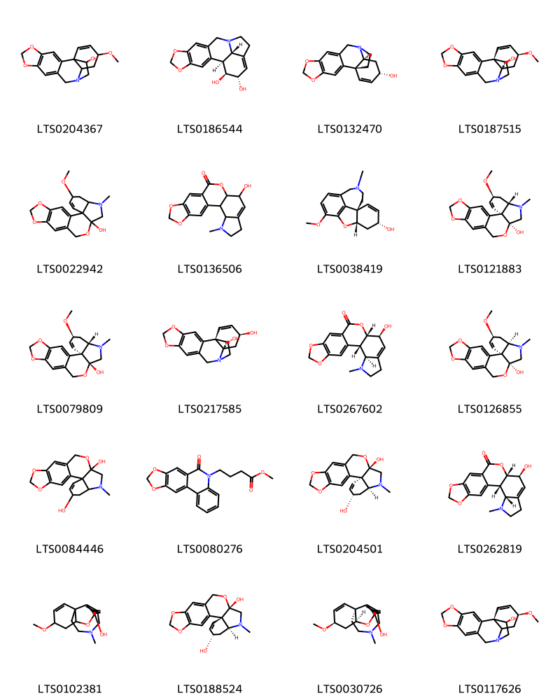{ width=100% }
    <figcaption>Hình ảnh cấu trúc hóa học của 20 hoạt chất thuộc nhóm Amaryllidaceae alkaloids gồm ['15-methoxy-5,7-dioxa-12-azapentacyclo[10.5.2.0¹,¹³.0²,¹⁰.0⁴,⁸]nonadeca-2,4(8),9,16-tetraen-18-ol (LTS0204367)', 'lycorine (LTS0186544)', '(1r,13s,15s)-5,7-dioxa-12-azapentacyclo[10.5.2.0¹,¹³.0²,¹⁰.0⁴,⁸]nonadeca-2,4(8),9,16-tetraen-15-ol (LTS0132470)', 'haemanthamine (LTS0187515)', 'tazettine (LTS0022942)', '9-hydroxy-4-methyl-11,16,18-trioxa-4-azapentacyclo[11.7.0.0²,¹⁰.0³,⁷.0¹⁵,¹⁹]icosa-1(20),7,13,15(19)-tetraen-12-one (LTS0136506)', 'galantamine (LTS0038419)', 'tazettine (LTS0121883)', '(1s,13r,16s,18s)-18-methoxy-15-methyl-5,7,12-trioxa-15-azapentacyclo[11.7.0.0¹,¹⁶.0²,¹⁰.0⁴,⁸]icosa-2,4(8),9,19-tetraen-13-ol (LTS0079809)', '(1s,13s,15s,18s)-5,7-dioxa-12-azapentacyclo[10.5.2.0¹,¹³.0²,¹⁰.0⁴,⁸]nonadeca-2,4(8),9,16-tetraene-15,18-diol (LTS0217585)', 'hippeastrine (LTS0267602)', '(1s,13s,16r,18s)-18-methoxy-15-methyl-5,7,12-trioxa-15-azapentacyclo[11.7.0.0¹,¹⁶.0²,¹⁰.0⁴,⁸]icosa-2,4(8),9,19-tetraen-13-ol (LTS0126855)', '15-methyl-5,7,12-trioxa-15-azapentacyclo[11.7.0.0¹,¹⁶.0²,¹⁰.0⁴,⁸]icosa-2,4(8),9,19-tetraene-13,18-diol (LTS0084446)', 'methyl 4-{6-oxo-9h-[1,3]dioxolo[4,5-j]phenanthridin-5-yl}butanoate (LTS0080276)', '(1r,13s,16s,18s)-15-methyl-5,7,12-trioxa-15-azapentacyclo[11.7.0.0¹,¹⁶.0²,¹⁰.0⁴,⁸]icosa-2,4(8),9,19-tetraene-13,18-diol (LTS0204501)', '(2s,3r,9s,10s)-9-hydroxy-4-methyl-11,16,18-trioxa-4-azapentacyclo[11.7.0.0²,¹⁰.0³,⁷.0¹⁵,¹⁹]icosa-1(20),7,13,15(19)-tetraen-12-one (LTS0262819)', '14-methoxy-4-methyl-11-oxa-4-azatetracyclo[8.6.1.0¹,¹².0⁶,¹⁷]heptadeca-6,8,10(17),15-tetraen-9-ol (LTS0102381)', '(1s,13s,16s,18s)-15-methyl-5,7,12-trioxa-15-azapentacyclo[11.7.0.0¹,¹⁶.0²,¹⁰.0⁴,⁸]icosa-2,4(8),9,19-tetraene-13,18-diol (LTS0188524)', '(1s,12s,14r)-14-methoxy-4-methyl-11-oxa-4-azatetracyclo[8.6.1.0¹,¹².0⁶,¹⁷]heptadeca-6,8,10(17),15-tetraen-9-ol (LTS0030726)', '(1s,15s,18r)-15-methoxy-5,7-dioxa-12-azapentacyclo[10.5.2.0¹,¹³.0²,¹⁰.0⁴,⁸]nonadeca-2,4(8),9,16-tetraen-18-ol (LTS0117626)'].</figcaption>
</figure>
#### Nhóm Benzodioxoles
<figure markdown="span">
    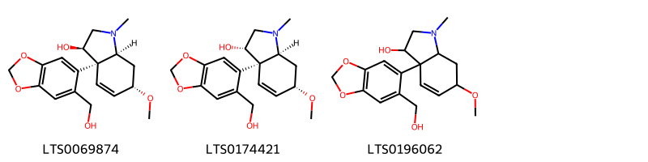{ width=100% }
    <figcaption>Hình ảnh cấu trúc hóa học của 3 hoạt chất thuộc nhóm Benzodioxoles gồm ['(3r,3as,6s,7as)-3a-[6-(hydroxymethyl)-2h-1,3-benzodioxol-5-yl]-6-methoxy-1-methyl-3,6,7,7a-tetrahydro-2h-indol-3-ol (LTS0069874)', '(3s,3as,6s,7as)-3a-[6-(hydroxymethyl)-2h-1,3-benzodioxol-5-yl]-6-methoxy-1-methyl-3,6,7,7a-tetrahydro-2h-indol-3-ol (LTS0174421)', '3a-[6-(hydroxymethyl)-2h-1,3-benzodioxol-5-yl]-6-methoxy-1-methyl-3,6,7,7a-tetrahydro-2h-indol-3-ol (LTS0196062)'].</figcaption>
</figure>
#### Nhóm Ergoline and derivatives
<figure markdown="span">
    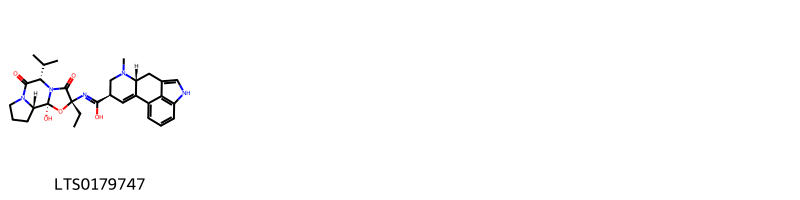{ width=100% }
    <figcaption>Hình ảnh cấu trúc hóa học của 1 hoạt chất thuộc nhóm Ergoline and derivatives gồm ['(4r,7r)-n-[(1s,2s,4r,7s)-4-ethyl-2-hydroxy-7-isopropyl-5,8-dioxo-3-oxa-6,9-diazatricyclo[7.3.0.0²,⁶]dodecan-4-yl]-6-methyl-6,11-diazatetracyclo[7.6.1.0²,⁷.0¹²,¹⁶]hexadeca-1(16),2,9,12,14-pentaene-4-carboximidic acid (LTS0179747)'].</figcaption>
</figure>
#### Nhóm Indoles and derivatives
<figure markdown="span">
    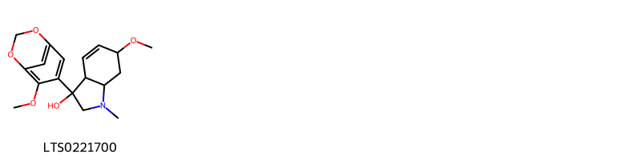{ width=100% }
    <figcaption>Hình ảnh cấu trúc hóa học của 1 hoạt chất thuộc nhóm Indoles and derivatives gồm ['6-methoxy-3-{6-methoxy-2,4-dioxabicyclo[3.3.1]nona-1(9),5,7-trien-7-yl}-1-methyl-3a,6,7,7a-tetrahydro-2h-indol-3-ol (LTS0221700)'].</figcaption>
</figure>
#### Nhóm Quinolines and derivatives
<figure markdown="span">
    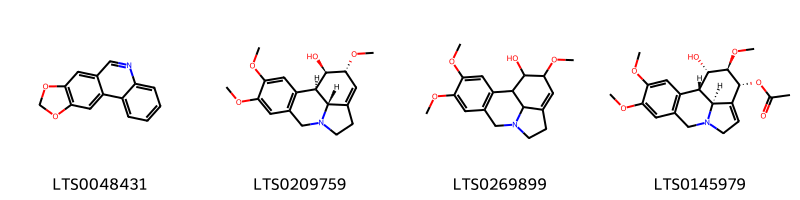{ width=100% }
    <figcaption>Hình ảnh cấu trúc hóa học của 4 hoạt chất thuộc nhóm Quinolines and derivatives gồm ['trisphaeridine (LTS0048431)', '(1r,14r,15r,16r)-4,5,14-trimethoxy-9-azatetracyclo[7.6.1.0²,⁷.0¹²,¹⁶]hexadeca-2(7),3,5,12-tetraen-15-ol (LTS0209759)', '4,5,14-trimethoxy-9-azatetracyclo[7.6.1.0²,⁷.0¹²,¹⁶]hexadeca-2(7),3,5,12-tetraen-15-ol (LTS0269899)', '(1s,13r,14r,15s,16s)-15-hydroxy-4,5,14-trimethoxy-9-azatetracyclo[7.6.1.0²,⁷.0¹²,¹⁶]hexadeca-2(7),3,5,11-tetraen-13-yl acetate (LTS0145979)'].</figcaption>
</figure>

---

### Dược dân tộc học

Danh sách các quốc gia có sử dụng *Hippeastrum puniceum* trong điều trị các bệnh. 

| Country            | Disease   | Bệnh           |
|:-------------------|:----------|:---------------|
| Dominican Republic | Diuretic  | Thuốc lợi tiêu |

---

# Chi Lilium

??? note "Danh sách các dược liệu thuộc chi"
    
	 - *Lilium auratum*
	 - *Lilium brownii*
	 - *Lilium candidum*
	 - *Lilium concolor*
	 - *Lilium japonicum*
	 - *Lilium lancifolium*
	 - *Lilium leichtlinii*
	 - *Lilium martagon*
	 - *Lilium philadelphicum*
	 - *Lilium tigrinum*
	 - *Lilium wallichianum*

---
## Lilium auratum
### Thông tin về thực vật

!!! info "Phân loại thực vật của *Lilium auratum* từ GIBF:"
    - **Kingdom:** Plantae
    - **Phylum:** Tracheophyta
    - **Order:** Liliales
    - **Family:** Liliaceae
    - **Genus:** Lilium
    - **Species:** *Lilium auratum*

 

| Label (VI)   | Label (EN)   | Scientific Name   | Descriptions (VI)   | Descriptions (EN)   | Also Known As (VI)   | Also Known As (EN)                                                                   |
|:-------------|:-------------|:------------------|:--------------------|:--------------------|:---------------------|:-------------------------------------------------------------------------------------|
| N/A          | N/A          | Lilium auratum    | loài thực vật       | species of plant    | ['']                 | ['gold band lily', 'gold rayed lily', 'golden rayed lily of Japan', 'mountain lily'] |

#### Phân bố trên thế giới

**Từ CSDL GIBF** Germany, nan, Japan

#### Phân bố tại Việt Nam

**Từ CSDL GIBF**: Không có ghi nhận ở Việt Nam

---
### Thành phần hóa học
        
- Theo cơ sở dữ liệu lotus: Từ loài *Lilium auratum* đã phân lập và xác định được 28 hoạt chất thuộc về các nhóm Flavonoids, Cinnamic acids and derivatives, Steroids and steroid derivatives, Glycerolipids, Furanoid lignans. 

|    | chemicalTaxonomyClassyfireClass   |   smiles_count |
|---:|:----------------------------------|---------------:|
|  0 | Cinnamic acids and derivatives    |              4 |
|  1 | Flavonoids                        |              2 |
|  2 | Furanoid lignans                  |              2 |
|  3 | Glycerolipids                     |             17 |
|  4 | Steroids and steroid derivatives  |              3 |

#### Nhóm Cinnamic acids and derivatives
<figure markdown="span">
    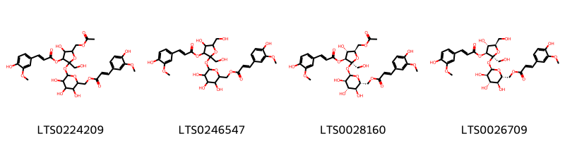{ width=100% }
    <figcaption>Hình ảnh cấu trúc hóa học của 4 hoạt chất thuộc nhóm Cinnamic acids and derivatives gồm ['[6-({5-[(acetyloxy)methyl]-4-hydroxy-3-{[3-(4-hydroxy-3-methoxyphenyl)prop-2-enoyl]oxy}-2-(hydroxymethyl)oxolan-2-yl}oxy)-3,4,5-trihydroxyoxan-2-yl]methyl 3-(4-hydroxy-3-methoxyphenyl)prop-2-enoate (LTS0224209)', '{3,4,5-trihydroxy-6-[(4-hydroxy-3-{[3-(4-hydroxy-3-methoxyphenyl)prop-2-enoyl]oxy}-2,5-bis(hydroxymethyl)oxolan-2-yl)oxy]oxan-2-yl}methyl 3-(4-hydroxy-3-methoxyphenyl)prop-2-enoate (LTS0246547)', '[(2r,3s,4s,5r,6r)-6-{[(2s,3s,4r,5r)-5-[(acetyloxy)methyl]-4-hydroxy-3-{[(2e)-3-(4-hydroxy-3-methoxyphenyl)prop-2-enoyl]oxy}-2-(hydroxymethyl)oxolan-2-yl]oxy}-3,4,5-trihydroxyoxan-2-yl]methyl (2e)-3-(4-hydroxy-3-methoxyphenyl)prop-2-enoate (LTS0028160)', '[(2r,3s,4s,5r,6r)-3,4,5-trihydroxy-6-{[(2s,3s,4r,5r)-4-hydroxy-3-{[(2e)-3-(4-hydroxy-3-methoxyphenyl)prop-2-enoyl]oxy}-2,5-bis(hydroxymethyl)oxolan-2-yl]oxy}oxan-2-yl]methyl (2e)-3-(4-hydroxy-3-methoxyphenyl)prop-2-enoate (LTS0026709)'].</figcaption>
</figure>
#### Nhóm Flavonoids
<figure markdown="span">
    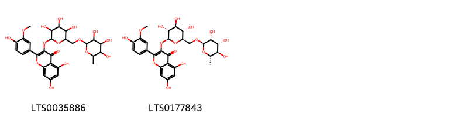{ width=100% }
    <figcaption>Hình ảnh cấu trúc hóa học của 2 hoạt chất thuộc nhóm Flavonoids gồm ['5,7-dihydroxy-2-(4-hydroxy-3-methoxyphenyl)-3-[(3,4,5-trihydroxy-6-{[(3,4,5-trihydroxy-6-methyloxan-2-yl)oxy]methyl}oxan-2-yl)oxy]chromen-4-one (LTS0035886)', 'narcissin (LTS0177843)'].</figcaption>
</figure>
#### Nhóm Furanoid lignans
<figure markdown="span">
    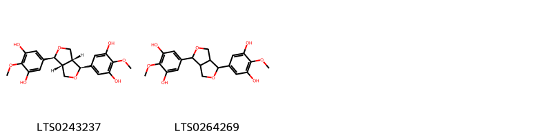{ width=100% }
    <figcaption>Hình ảnh cấu trúc hóa học của 2 hoạt chất thuộc nhóm Furanoid lignans gồm ['5-[(1s,3ar,4s,6ar)-4-(3,5-dihydroxy-4-methoxyphenyl)-hexahydrofuro[3,4-c]furan-1-yl]-2-methoxybenzene-1,3-diol (LTS0243237)', '5-[4-(3,5-dihydroxy-4-methoxyphenyl)-hexahydrofuro[3,4-c]furan-1-yl]-2-methoxybenzene-1,3-diol (LTS0264269)'].</figcaption>
</figure>
#### Nhóm Glycerolipids
<figure markdown="span">
    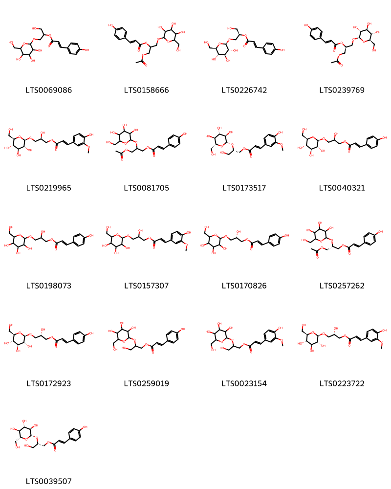{ width=100% }
    <figcaption>Hình ảnh cấu trúc hóa học của 17 hoạt chất thuộc nhóm Glycerolipids gồm ['1-hydroxy-3-{[3,4,5-trihydroxy-6-(hydroxymethyl)oxan-2-yl]oxy}propan-2-yl 3-(4-hydroxyphenyl)prop-2-enoate (LTS0069086)', '1-(acetyloxy)-3-{[3,4,5-trihydroxy-6-(hydroxymethyl)oxan-2-yl]oxy}propan-2-yl 3-(4-hydroxyphenyl)prop-2-enoate (LTS0158666)', '(2r)-1-hydroxy-3-{[(2r,3r,4s,5s,6r)-3,4,5-trihydroxy-6-(hydroxymethyl)oxan-2-yl]oxy}propan-2-yl (2e)-3-(4-hydroxyphenyl)prop-2-enoate (LTS0226742)', '(2s)-1-(acetyloxy)-3-{[(2r,3r,4s,5s,6r)-3,4,5-trihydroxy-6-(hydroxymethyl)oxan-2-yl]oxy}propan-2-yl (2e)-3-(4-hydroxyphenyl)prop-2-enoate (LTS0239769)', '(2r)-2-hydroxy-3-{[(2r,3r,4s,5s,6r)-3,4,5-trihydroxy-6-(hydroxymethyl)oxan-2-yl]oxy}propyl (2e)-3-(4-hydroxy-3-methoxyphenyl)prop-2-enoate (LTS0219965)', '3-(acetyloxy)-2-{[3,4,5-trihydroxy-6-(hydroxymethyl)oxan-2-yl]oxy}propyl (2e)-3-(4-hydroxyphenyl)prop-2-enoate (LTS0081705)', '(2s)-3-hydroxy-2-{[(2r,3r,4s,5s,6r)-3,4,5-trihydroxy-6-(hydroxymethyl)oxan-2-yl]oxy}propyl (2e)-3-(4-hydroxy-3-methoxyphenyl)prop-2-enoate (LTS0173517)', '(2r)-2-hydroxy-3-{[(2r,3r,4s,5s,6r)-3,4,5-trihydroxy-6-(hydroxymethyl)oxan-2-yl]oxy}propyl (2e)-3-(4-hydroxyphenyl)prop-2-enoate (LTS0040321)', '2-hydroxy-3-{[3,4,5-trihydroxy-6-(hydroxymethyl)oxan-2-yl]oxy}propyl 3-(4-hydroxyphenyl)prop-2-enoate (LTS0198073)', '2-hydroxy-3-{[3,4,5-trihydroxy-6-(hydroxymethyl)oxan-2-yl]oxy}propyl 3-(4-hydroxy-3-methoxyphenyl)prop-2-enoate (LTS0157307)', '(2s)-2-hydroxy-3-{[3,4,5-trihydroxy-6-(hydroxymethyl)oxan-2-yl]oxy}propyl (2e)-3-(4-hydroxyphenyl)prop-2-enoate (LTS0170826)', '(2s)-3-(acetyloxy)-2-{[3,4,5-trihydroxy-6-(hydroxymethyl)oxan-2-yl]oxy}propyl (2e)-3-(4-hydroxyphenyl)prop-2-enoate (LTS0257262)', '(2s)-2-hydroxy-3-{[(2r,3r,4s,5s,6r)-3,4,5-trihydroxy-6-(hydroxymethyl)oxan-2-yl]oxy}propyl (2e)-3-(4-hydroxyphenyl)prop-2-enoate (LTS0172923)', '3-hydroxy-2-{[3,4,5-trihydroxy-6-(hydroxymethyl)oxan-2-yl]oxy}propyl 3-(4-hydroxyphenyl)prop-2-enoate (LTS0259019)', '3-hydroxy-2-{[3,4,5-trihydroxy-6-(hydroxymethyl)oxan-2-yl]oxy}propyl 3-(4-hydroxy-3-methoxyphenyl)prop-2-enoate (LTS0023154)', '(2s)-2-hydroxy-3-{[(2r,3r,4s,5s,6r)-3,4,5-trihydroxy-6-(hydroxymethyl)oxan-2-yl]oxy}propyl (2e)-3-(4-hydroxy-3-methoxyphenyl)prop-2-enoate (LTS0223722)', '(2s)-3-hydroxy-2-{[(2r,3r,4s,5s,6r)-3,4,5-trihydroxy-6-(hydroxymethyl)oxan-2-yl]oxy}propyl (2e)-3-(4-hydroxyphenyl)prop-2-enoate (LTS0039507)'].</figcaption>
</figure>
#### Nhóm Steroids and steroid derivatives
<figure markdown="span">
    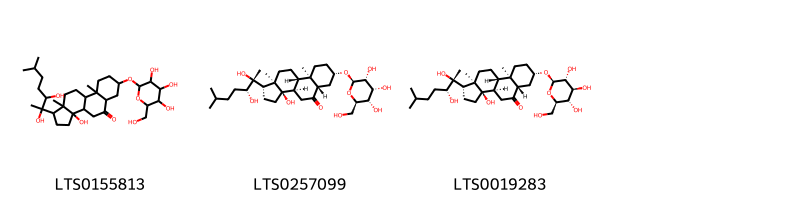{ width=100% }
    <figcaption>Hình ảnh cấu trúc hóa học của 3 hoạt chất thuộc nhóm Steroids and steroid derivatives gồm ['1-(2,3-dihydroxy-6-methylheptan-2-yl)-3a-hydroxy-9a,11a-dimethyl-7-{[3,4,5-trihydroxy-6-(hydroxymethyl)oxan-2-yl]oxy}-dodecahydro-1h-cyclopenta[a]phenanthren-5-one (LTS0155813)', '(1s,3ar,3br,5as,7s,9ar,9bs,11ar)-1-[(2r,3r)-2,3-dihydroxy-6-methylheptan-2-yl]-3a-hydroxy-9a,11a-dimethyl-7-{[(2r,3r,4r,5s,6r)-3,4,5-trihydroxy-6-(hydroxymethyl)oxan-2-yl]oxy}-dodecahydro-1h-cyclopenta[a]phenanthren-5-one (LTS0257099)', '(1s,3ar,3br,5as,7s,9ar,9bs,11ar)-1-[(2r,3r)-2,3-dihydroxy-6-methylheptan-2-yl]-3a-hydroxy-9a,11a-dimethyl-7-{[(2r,3r,4s,5s,6r)-3,4,5-trihydroxy-6-(hydroxymethyl)oxan-2-yl]oxy}-dodecahydro-1h-cyclopenta[a]phenanthren-5-one (LTS0019283)'].</figcaption>
</figure>

---

### Dược dân tộc học

Danh sách các quốc gia có sử dụng *Lilium auratum* trong điều trị các bệnh. 

| Country   | Disease   | Bệnh               |
|:----------|:----------|:-------------------|
| Elsewhere | Tonic     | (thuộc) trương lực |

---

---
## Lilium brownii
### Thông tin về thực vật

!!! info "Phân loại thực vật của *Lilium brownii* từ GIBF:"
    - **Kingdom:** Plantae
    - **Phylum:** Tracheophyta
    - **Order:** Liliales
    - **Family:** Liliaceae
    - **Genus:** Lilium
    - **Species:** *Lilium brownii*

 

| Label (VI)   | Label (EN)   | Scientific Name   | Descriptions (VI)   | Descriptions (EN)   | Also Known As (VI)   | Also Known As (EN)                 |
|:-------------|:-------------|:------------------|:--------------------|:--------------------|:---------------------|:-----------------------------------|
| N/A          | N/A          | Lilium brownii    | loài thực vật       | species of plant    | ['bách hợp']         | ["Brown's lily", 'Hong Kong lily'] |

#### Phân bố trên thế giới

**Từ CSDL GIBF** Hong Kong, Viet Nam, United States of America, Chinese Taipei, China, unknown or invalid, Canada

#### Phân bố tại Việt Nam

**Từ CSDL GIBF**: Ha Giang, Lai Chau, Cao Bang, Son La

---
### Thành phần hóa học
        
- Theo cơ sở dữ liệu lotus: Từ loài *Lilium brownii* đã phân lập và xác định được 21 hoạt chất thuộc về các nhóm Glycerolipids, Steroids and steroid derivatives. 

|    | chemicalTaxonomyClassyfireClass   |   smiles_count |
|---:|:----------------------------------|---------------:|
|  0 | Glycerolipids                     |              4 |
|  1 | Steroids and steroid derivatives  |             17 |

#### Nhóm Glycerolipids
<figure markdown="span">
    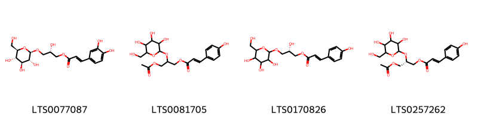{ width=100% }
    <figcaption>Hình ảnh cấu trúc hóa học của 4 hoạt chất thuộc nhóm Glycerolipids gồm ['(2s)-2-hydroxy-3-{[(2r,3r,4s,5s,6r)-3,4,5-trihydroxy-6-(hydroxymethyl)oxan-2-yl]oxy}propyl (2e)-3-(3,4-dihydroxyphenyl)prop-2-enoate (LTS0077087)', '3-(acetyloxy)-2-{[3,4,5-trihydroxy-6-(hydroxymethyl)oxan-2-yl]oxy}propyl (2e)-3-(4-hydroxyphenyl)prop-2-enoate (LTS0081705)', '(2s)-2-hydroxy-3-{[3,4,5-trihydroxy-6-(hydroxymethyl)oxan-2-yl]oxy}propyl (2e)-3-(4-hydroxyphenyl)prop-2-enoate (LTS0170826)', '(2s)-3-(acetyloxy)-2-{[3,4,5-trihydroxy-6-(hydroxymethyl)oxan-2-yl]oxy}propyl (2e)-3-(4-hydroxyphenyl)prop-2-enoate (LTS0257262)'].</figcaption>
</figure>
#### Nhóm Steroids and steroid derivatives
<figure markdown="span">
    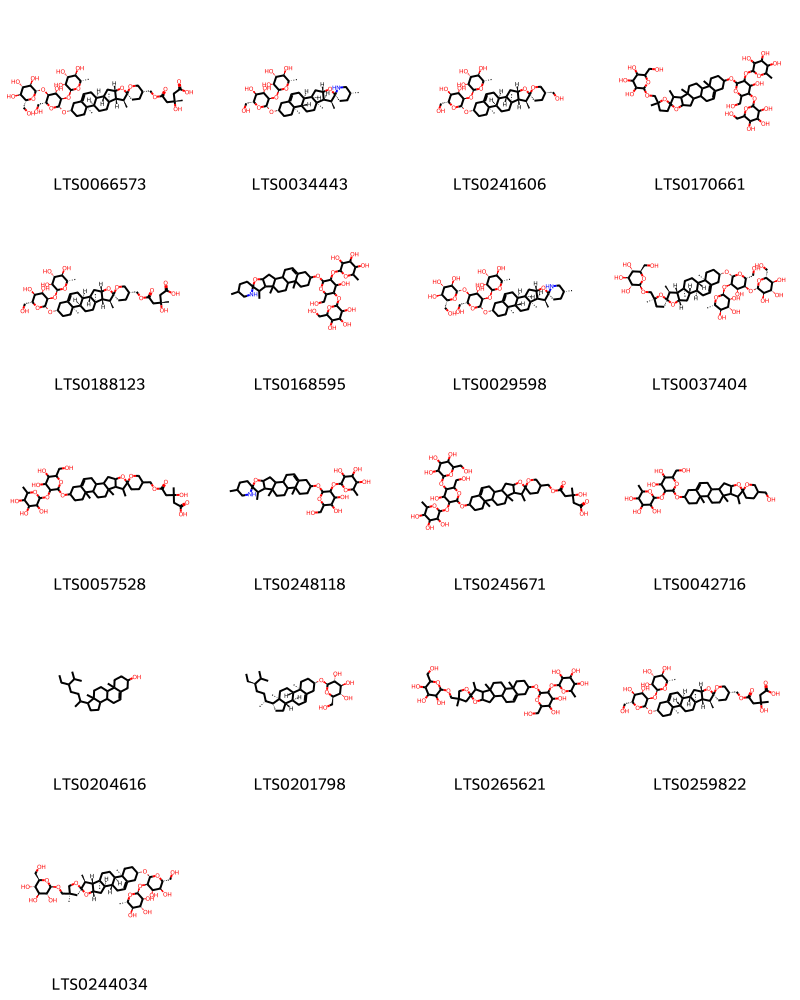{ width=100% }
    <figcaption>Hình ảnh cấu trúc hóa học của 17 hoạt chất thuộc nhóm Steroids and steroid derivatives gồm ["(3s)-3-hydroxy-5-[(1's,2r,2's,4's,5r,7's,8'r,9's,12'r,13'r,16's)-16'-{[(2r,3r,4s,5s,6r)-4-hydroxy-6-(hydroxymethyl)-5-{[(2s,3r,4s,5s,6r)-3,4,5-trihydroxy-6-(hydroxymethyl)oxan-2-yl]oxy}-3-{[(2s,3r,4r,5r,6s)-3,4,5-trihydroxy-6-methyloxan-2-yl]oxy}oxan-2-yl]oxy}-7',9',13'-trimethyl-5'-oxaspiro[oxane-2,6'-pentacyclo[10.8.0.0²,⁹.0⁴,⁸.0¹³,¹⁸]icosan]-18'-en-5-ylmethoxy]-3-methyl-5-oxopentanoic acid (LTS0066573)", "(2s,3r,4r,5r,6s)-2-{[(2r,3r,4s,5s,6r)-4,5-dihydroxy-6-(hydroxymethyl)-2-[(1s,2r,4s,5'r,6r,7s,8s,9s,12s,13r,16s)-5',7,9,13-tetramethyl-5-oxaspiro[pentacyclo[10.8.0.0²,⁹.0⁴,⁸.0¹³,¹⁸]icosane-6,2'-piperidin]-18-eneoxy]oxan-3-yl]oxy}-6-methyloxane-3,4,5-triol (LTS0034443)", "(2s,3r,4r,5r,6s)-2-{[(2r,3r,4s,5s,6r)-4,5-dihydroxy-6-(hydroxymethyl)-2-[(1's,2r,2's,4's,5s,7's,8'r,9's,12'r,13'r,16's)-5-(hydroxymethyl)-7',9',13'-trimethyl-5'-oxaspiro[oxane-2,6'-pentacyclo[10.8.0.0²,⁹.0⁴,⁸.0¹³,¹⁸]icosan]-18'-eneoxy]oxan-3-yl]oxy}-6-methyloxane-3,4,5-triol (LTS0241606)", "2-{[4-hydroxy-6-(hydroxymethyl)-2-[5,7',9',13'-tetramethyl-5-({[3,4,5-trihydroxy-6-(hydroxymethyl)oxan-2-yl]oxy}methyl)-5'-oxaspiro[oxolane-2,6'-pentacyclo[10.8.0.0²,⁹.0⁴,⁸.0¹³,¹⁸]icosan]-18'-eneoxy]-5-{[3,4,5-trihydroxy-6-(hydroxymethyl)oxan-2-yl]oxy}oxan-3-yl]oxy}-6-methyloxane-3,4,5-triol (LTS0170661)", "(3s)-5-[(1's,2r,2's,4's,5r,7's,8'r,9's,12'r,13'r,16's)-16'-{[(2r,3r,4s,5s,6r)-4,5-dihydroxy-6-(hydroxymethyl)-3-{[(2s,3r,4r,5r,6s)-3,4,5-trihydroxy-6-methyloxan-2-yl]oxy}oxan-2-yl]oxy}-7',9',13'-trimethyl-5'-oxaspiro[oxane-2,6'-pentacyclo[10.8.0.0²,⁹.0⁴,⁸.0¹³,¹⁸]icosan]-18'-en-5-ylmethoxy]-3-hydroxy-3-methyl-5-oxopentanoic acid (LTS0188123)", "2-{[4-hydroxy-2-(hydroxymethyl)-6-{5',7,9,13-tetramethyl-5-oxaspiro[pentacyclo[10.8.0.0²,⁹.0⁴,⁸.0¹³,¹⁸]icosane-6,2'-piperidin]-18-eneoxy}-5-[(3,4,5-trihydroxy-6-methyloxan-2-yl)oxy]oxan-3-yl]oxy}-6-(hydroxymethyl)oxane-3,4,5-triol (LTS0168595)", "(2s,3r,4r,5r,6s)-2-{[(2r,3r,4s,5s,6r)-4-hydroxy-6-(hydroxymethyl)-2-[(1s,2r,4s,5'r,6r,7s,8s,9s,12s,13r,16s)-5',7,9,13-tetramethyl-5-oxaspiro[pentacyclo[10.8.0.0²,⁹.0⁴,⁸.0¹³,¹⁸]icosane-6,2'-piperidin]-18-eneoxy]-5-{[(2s,3r,4s,5s,6r)-3,4,5-trihydroxy-6-(hydroxymethyl)oxan-2-yl]oxy}oxan-3-yl]oxy}-6-methyloxane-3,4,5-triol (LTS0029598)", "(2s,3r,4r,5r,6s)-2-{[(2r,3r,4s,5s,6r)-4-hydroxy-6-(hydroxymethyl)-2-[(1's,2s,2's,4's,5s,7's,8'r,9's,12's,13'r,16's)-5,7',9',13'-tetramethyl-5-({[(2r,3r,4s,5s,6r)-3,4,5-trihydroxy-6-(hydroxymethyl)oxan-2-yl]oxy}methyl)-5'-oxaspiro[oxolane-2,6'-pentacyclo[10.8.0.0²,⁹.0⁴,⁸.0¹³,¹⁸]icosan]-18'-eneoxy]-5-{[(2s,3r,4s,5s,6r)-3,4,5-trihydroxy-6-(hydroxymethyl)oxan-2-yl]oxy}oxan-3-yl]oxy}-6-methyloxane-3,4,5-triol (LTS0037404)", "5-(16'-{[4,5-dihydroxy-6-(hydroxymethyl)-3-[(3,4,5-trihydroxy-6-methyloxan-2-yl)oxy]oxan-2-yl]oxy}-7',9',13'-trimethyl-5'-oxaspiro[oxane-2,6'-pentacyclo[10.8.0.0²,⁹.0⁴,⁸.0¹³,¹⁸]icosan]-18'-en-5-ylmethoxy)-3-hydroxy-3-methyl-5-oxopentanoic acid (LTS0057528)", "2-{[4,5-dihydroxy-6-(hydroxymethyl)-2-{5',7,9,13-tetramethyl-5-oxaspiro[pentacyclo[10.8.0.0²,⁹.0⁴,⁸.0¹³,¹⁸]icosane-6,2'-piperidin]-18-eneoxy}oxan-3-yl]oxy}-6-methyloxane-3,4,5-triol (LTS0248118)", "3-hydroxy-5-(16'-{[4-hydroxy-6-(hydroxymethyl)-5-{[3,4,5-trihydroxy-6-(hydroxymethyl)oxan-2-yl]oxy}-3-[(3,4,5-trihydroxy-6-methyloxan-2-yl)oxy]oxan-2-yl]oxy}-7',9',13'-trimethyl-5'-oxaspiro[oxane-2,6'-pentacyclo[10.8.0.0²,⁹.0⁴,⁸.0¹³,¹⁸]icosan]-18'-en-5-ylmethoxy)-3-methyl-5-oxopentanoic acid (LTS0245671)", "2-{[4,5-dihydroxy-6-(hydroxymethyl)-2-[5-(hydroxymethyl)-7',9',13'-trimethyl-5'-oxaspiro[oxane-2,6'-pentacyclo[10.8.0.0²,⁹.0⁴,⁸.0¹³,¹⁸]icosan]-18'-eneoxy]oxan-3-yl]oxy}-6-methyloxane-3,4,5-triol (LTS0042716)", 'stigmast-5-en-3-ol, (3β)- (LTS0204616)', 'sitogluside (LTS0201798)', "2-{[4,5-dihydroxy-6-(hydroxymethyl)-2-[4,7',9',13'-tetramethyl-4-({[3,4,5-trihydroxy-6-(hydroxymethyl)oxan-2-yl]oxy}methyl)-5'-oxaspiro[oxolane-2,6'-pentacyclo[10.8.0.0²,⁹.0⁴,⁸.0¹³,¹⁸]icosan]-18'-eneoxy]oxan-3-yl]oxy}-6-methyloxane-3,4,5-triol (LTS0265621)", "5-[(1's,2r,2's,4's,5r,7's,8'r,9's,12's,13'r,16's)-16'-{[(2r,3r,4s,5s,6r)-4,5-dihydroxy-6-(hydroxymethyl)-3-{[(2s,3r,4r,5r,6s)-3,4,5-trihydroxy-6-methyloxan-2-yl]oxy}oxan-2-yl]oxy}-7',9',13'-trimethyl-5'-oxaspiro[oxane-2,6'-pentacyclo[10.8.0.0²,⁹.0⁴,⁸.0¹³,¹⁸]icosan]-18'-en-5-ylmethoxy]-3-hydroxy-3-methyl-5-oxopentanoic acid (LTS0259822)", "(2s,3r,4r,5r,6s)-2-{[(2r,3r,4s,5s,6r)-4,5-dihydroxy-6-(hydroxymethyl)-2-[(1'r,2r,2'r,4s,4's,7's,8'r,9's,12'r,13'r,16's)-4,7',9',13'-tetramethyl-4-({[(2r,3r,4s,5s,6r)-3,4,5-trihydroxy-6-(hydroxymethyl)oxan-2-yl]oxy}methyl)-5'-oxaspiro[oxolane-2,6'-pentacyclo[10.8.0.0²,⁹.0⁴,⁸.0¹³,¹⁸]icosan]-18'-eneoxy]oxan-3-yl]oxy}-6-methyloxane-3,4,5-triol (LTS0244034)"].</figcaption>
</figure>

---

### Dược dân tộc học

Danh sách các quốc gia có sử dụng *Lilium brownii* trong điều trị các bệnh. 

| Country   | Disease                                | Bệnh                                        |
|:----------|:---------------------------------------|:--------------------------------------------|
| China     | Diuretic, Tonic, Carminative, Sedative | Thuốc lợi tiểu, Tonic, Carminative, An thần |

---

---
## Lilium candidum
### Thông tin về thực vật

!!! info "Phân loại thực vật của *Lilium candidum* từ GIBF:"
    - **Kingdom:** Plantae
    - **Phylum:** Tracheophyta
    - **Order:** Liliales
    - **Family:** Liliaceae
    - **Genus:** Lilium
    - **Species:** *Lilium candidum*

 

| Label (VI)   | Label (EN)   | Scientific Name   | Descriptions (VI)   | Descriptions (EN)   | Also Known As (VI)   | Also Known As (EN)             |
|:-------------|:-------------|:------------------|:--------------------|:--------------------|:---------------------|:-------------------------------|
| N/A          | N/A          | Lilium candidum   | loài thực vật       | species of plant    | ['']                 | ['Madonna Lily', 'white lily'] |

#### Phân bố trên thế giới

**Từ CSDL GIBF** Czechia, Sweden, Israel, Türkiye, Spain, Denmark, Netherlands, United States of America, Romania, Greece, Albania, Croatia, Estonia, France, North Macedonia, Serbia, Canada, Germany, Austria, Portugal, Ukraine, Slovakia, Australia, Italy, Bulgaria, United Kingdom of Great Britain and Northern Ireland

#### Phân bố tại Việt Nam

**Từ CSDL GIBF**: Không có ghi nhận ở Việt Nam

---
### Thành phần hóa học
        
- Theo cơ sở dữ liệu lotus: Từ loài *Lilium candidum* đã phân lập và xác định được 67 hoạt chất thuộc về các nhóm Flavonoids, Carboxylic acids and derivatives, Steroids and steroid derivatives, Carboximidic acids and derivatives, Organooxygen compounds, Prenol lipids, Pyrrolines. 

|    | chemicalTaxonomyClassyfireClass    |   smiles_count |
|---:|:-----------------------------------|---------------:|
|  0 | Carboximidic acids and derivatives |              1 |
|  1 | Carboxylic acids and derivatives   |              2 |
|  2 | Flavonoids                         |              6 |
|  3 | Organooxygen compounds             |              2 |
|  4 | Prenol lipids                      |              2 |
|  5 | Pyrrolines                         |              5 |
|  6 | Steroids and steroid derivatives   |             49 |

#### Nhóm Carboximidic acids and derivatives
<figure markdown="span">
    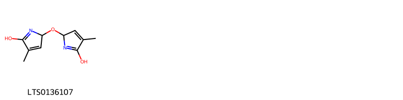{ width=100% }
    <figcaption>Hình ảnh cấu trúc hóa học của 1 hoạt chất thuộc nhóm Carboximidic acids and derivatives gồm ['5-[(5-hydroxy-4-methyl-2h-pyrrol-2-yl)oxy]-3-methyl-5h-pyrrol-2-ol (LTS0136107)'].</figcaption>
</figure>
#### Nhóm Carboxylic acids and derivatives
<figure markdown="span">
    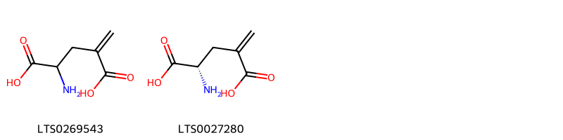{ width=100% }
    <figcaption>Hình ảnh cấu trúc hóa học của 2 hoạt chất thuộc nhóm Carboxylic acids and derivatives gồm ['4-methyleneglutamic acid (LTS0269543)', '4-methylene-l-glutamic acid (LTS0027280)'].</figcaption>
</figure>
#### Nhóm Flavonoids
<figure markdown="span">
    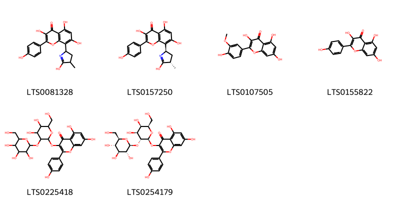{ width=100% }
    <figcaption>Hình ảnh cấu trúc hóa học của 6 hoạt chất thuộc nhóm Flavonoids gồm ['lilaline (LTS0081328)', '3,5,7-trihydroxy-8-[(2r,4s)-5-hydroxy-4-methyl-3,4-dihydro-2h-pyrrol-2-yl]-2-(4-hydroxyphenyl)chromen-4-one (LTS0157250)', 'isorhamnetin (LTS0107505)', 'kaempherol (LTS0155822)', '3-{[4,5-dihydroxy-6-(hydroxymethyl)-3-{[3,4,5-trihydroxy-6-(hydroxymethyl)oxan-2-yl]oxy}oxan-2-yl]oxy}-5,7-dihydroxy-2-(4-hydroxyphenyl)chromen-4-one (LTS0225418)', '3-{[(2s,3r,4s,5r,6r)-4,5-dihydroxy-6-(hydroxymethyl)-3-{[(2s,3r,4s,5s,6r)-3,4,5-trihydroxy-6-(hydroxymethyl)oxan-2-yl]oxy}oxan-2-yl]oxy}-5,7-dihydroxy-2-(4-hydroxyphenyl)chromen-4-one (LTS0254179)'].</figcaption>
</figure>
#### Nhóm Organooxygen compounds
<figure markdown="span">
    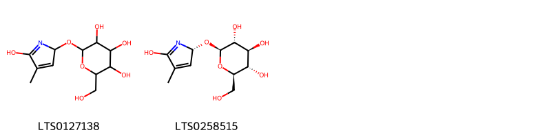{ width=100% }
    <figcaption>Hình ảnh cấu trúc hóa học của 2 hoạt chất thuộc nhóm Organooxygen compounds gồm ['2-[(5-hydroxy-4-methyl-2h-pyrrol-2-yl)oxy]-6-(hydroxymethyl)oxane-3,4,5-triol (LTS0127138)', '(2s,3r,4s,5s,6r)-2-{[(2r)-5-hydroxy-4-methyl-2h-pyrrol-2-yl]oxy}-6-(hydroxymethyl)oxane-3,4,5-triol (LTS0258515)'].</figcaption>
</figure>
#### Nhóm Prenol lipids
<figure markdown="span">
    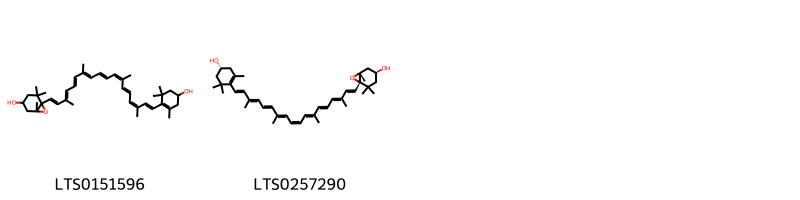{ width=100% }
    <figcaption>Hình ảnh cấu trúc hóa học của 2 hoạt chất thuộc nhóm Prenol lipids gồm ['6-[18-(4-hydroxy-2,6,6-trimethylcyclohex-1-en-1-yl)-3,7,12,16-tetramethyloctadeca-1,3,5,7,9,11,13,15,17-nonaen-1-yl]-1,5,5-trimethyl-7-oxabicyclo[4.1.0]heptan-3-ol (LTS0151596)', '(1r,3s,6s)-6-[(1e,3e,5e,7e,9z,11e,13e,15e,17e)-18-[(4r)-4-hydroxy-2,6,6-trimethylcyclohex-1-en-1-yl]-3,7,12,16-tetramethyloctadeca-1,3,5,7,9,11,13,15,17-nonaen-1-yl]-1,5,5-trimethyl-7-oxabicyclo[4.1.0]heptan-3-ol (LTS0257290)'].</figcaption>
</figure>
#### Nhóm Pyrrolines
<figure markdown="span">
    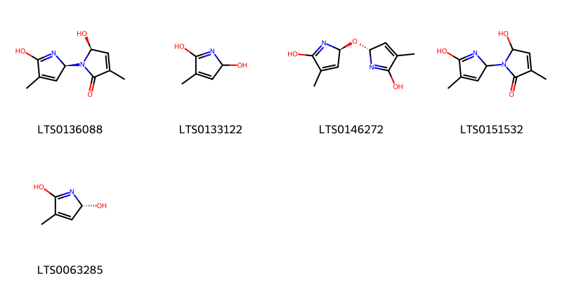{ width=100% }
    <figcaption>Hình ảnh cấu trúc hóa học của 5 hoạt chất thuộc nhóm Pyrrolines gồm ["(2's,5s)-5,5'-dihydroxy-3,4'-dimethyl-2'h,5h-[1,2'-bipyrrol]-2-one (LTS0136088)", '3-methyl-5h-pyrrole-2,5-diol (LTS0133122)', '(5s)-5-{[(2r)-5-hydroxy-4-methyl-2h-pyrrol-2-yl]oxy}-3-methyl-5h-pyrrol-2-ol (LTS0146272)', "5,5'-dihydroxy-3,4'-dimethyl-2'h,5h-[1,2'-bipyrrol]-2-one (LTS0151532)", '(5r)-3-methyl-5h-pyrrole-2,5-diol (LTS0063285)'].</figcaption>
</figure>
#### Nhóm Steroids and steroid derivatives
<figure markdown="span">
    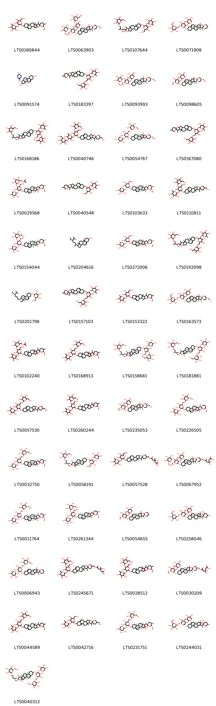{ width=100% }
    <figcaption>Hình ảnh cấu trúc hóa học của 49 hoạt chất thuộc nhóm Steroids and steroid derivatives gồm ["2-{[4,5-dihydroxy-6-(hydroxymethyl)-2-{6-methoxy-5,7',9',13'-tetramethyl-5'-oxaspiro[oxane-2,6'-pentacyclo[10.8.0.0²,⁹.0⁴,⁸.0¹³,¹⁸]icosan]-18'-en-8'-oloxy}oxan-3-yl]oxy}-6-methyloxane-3,4,5-triol (LTS0180844)", "(2s,3r,4s,5s,6r)-2-{[(2r,3s,4s,5r,6r)-5-{[(2s,3r,4r,5s,6s)-3,5-dihydroxy-6-methyl-4-{[(2s,3r,4s,5s,6r)-3,4,5-trihydroxy-6-(hydroxymethyl)oxan-2-yl]oxy}oxan-2-yl]oxy}-4-hydroxy-2-(hydroxymethyl)-6-[(1's,2r,2's,4's,5s,7's,8'r,9's,12's,13'r,16's)-5-(hydroxymethyl)-7',9',13'-trimethyl-5'-oxaspiro[oxane-2,6'-pentacyclo[10.8.0.0²,⁹.0⁴,⁸.0¹³,¹⁸]icosan]-18'-eneoxy]oxan-3-yl]oxy}-6-(hydroxymethyl)oxane-3,4,5-triol (LTS0063903)", '2-[4-(16-{[4,5-dihydroxy-6-(hydroxymethyl)-3-[(3,4,5-trihydroxy-6-methyloxan-2-yl)oxy]oxan-2-yl]oxy}-6-methoxy-7,9,13-trimethyl-5-oxapentacyclo[10.8.0.0²,⁹.0⁴,⁸.0¹³,¹⁸]icos-18-en-6-yl)-2-methylbutoxy]-6-(hydroxymethyl)oxane-3,4,5-triol (LTS0107644)', "(2s,3r,4r,5r,6s)-2-{[(2r,3r,4s,5s,6r)-4,5-dihydroxy-2-[(1's,2r,2's,4's,5r,7's,8'r,9's,12's,13'r,16's)-5,7',9',13'-tetramethyl-5'-oxaspiro[oxane-2,6'-pentacyclo[10.8.0.0²,⁹.0⁴,⁸.0¹³,¹⁸]icosan]-18'-eneoxy]-6-({[(2r,3r,4s,5s,6r)-3,4,5-trihydroxy-6-(hydroxymethyl)oxan-2-yl]oxy}methyl)oxan-3-yl]oxy}-6-methyloxane-3,4,5-triol (LTS0071908)", 'etioline (LTS0091574)', "2-[(3,4-dihydroxy-6-{1',5,7',9',13'-pentamethyl-5'-oxaspiro[oxane-2,6'-pentacyclo[10.8.0.0²,⁹.0⁴,⁸.0¹³,¹⁸]icosan]-18'-eneoxy}-5-[(3,4,5-trihydroxy-6-methyloxan-2-yl)oxy]oxan-2-yl)methoxy]-6-(hydroxymethyl)oxane-3,4,5-triol (LTS0183397)", "(2s,3r,4r,5r,6s)-2-{[(2r,3r,4s,5s,6r)-4-hydroxy-6-(hydroxymethyl)-2-[(1's,2r,2's,4's,5s,7's,8'r,9's,12's,13'r,16's)-5-(hydroxymethyl)-7',9',13'-trimethyl-5'-oxaspiro[oxane-2,6'-pentacyclo[10.8.0.0²,⁹.0⁴,⁸.0¹³,¹⁸]icosan]-18'-eneoxy]-5-{[(2s,3r,4s,5s,6r)-3,4,5-trihydroxy-6-(hydroxymethyl)oxan-2-yl]oxy}oxan-3-yl]oxy}-6-methyloxane-3,4,5-triol (LTS0093993)", "(2s,3r,4r,5r,6s)-2-{[(2r,3r,4s,5s,6r)-4,5-dihydroxy-6-(hydroxymethyl)-2-[(1's,2r,2's,4's,5s,7's,8'r,9's,12's,13'r,16's)-5-(hydroxymethyl)-7',9',13'-trimethyl-5'-oxaspiro[oxane-2,6'-pentacyclo[10.8.0.0²,⁹.0⁴,⁸.0¹³,¹⁸]icosan]-18'-eneoxy]oxan-3-yl]oxy}-6-methyloxane-3,4,5-triol (LTS0098605)", '2-[4-(16-{[4-hydroxy-6-(hydroxymethyl)-5-{[3,4,5-trihydroxy-6-(hydroxymethyl)oxan-2-yl]oxy}-3-[(3,4,5-trihydroxy-6-methyloxan-2-yl)oxy]oxan-2-yl]oxy}-6-methoxy-7,9,13-trimethyl-5-oxapentacyclo[10.8.0.0²,⁹.0⁴,⁸.0¹³,¹⁸]icos-18-en-6-yl)-2-methylbutoxy]-6-(hydroxymethyl)oxane-3,4,5-triol (LTS0168186)', "2-({5-[(3,5-dihydroxy-6-methyl-4-{[3,4,5-trihydroxy-6-(hydroxymethyl)oxan-2-yl]oxy}oxan-2-yl)oxy]-4-hydroxy-2-(hydroxymethyl)-6-[5-(hydroxymethyl)-7',9',13'-trimethyl-5'-oxaspiro[oxane-2,6'-pentacyclo[10.8.0.0²,⁹.0⁴,⁸.0¹³,¹⁸]icosan]-18'-eneoxy]oxan-3-yl}oxy)-6-(hydroxymethyl)oxane-3,4,5-triol (LTS0040746)", "(2s,3r,4r,5s,6s)-2-{[(2r,3r,4r,5s,6r)-4,5-dihydroxy-2-[(1'r,2s,2'r,4'r,5s,7'r,8's,9'r,12'r,13'r,16's)-5-(hydroxymethyl)-7',9',13'-trimethyl-5'-oxaspiro[oxane-2,6'-pentacyclo[10.8.0.0²,⁹.0⁴,⁸.0¹³,¹⁸]icosan]-18'-eneoxy]-6-({[(2s,3s,4s,5r,6s)-3,4,5-trihydroxy-6-(hydroxymethyl)oxan-2-yl]oxy}methyl)oxan-3-yl]oxy}-6-methyloxane-3,4,5-triol (LTS0054767)", "2-[(3,4-dihydroxy-6-{5,7',9',13'-tetramethyl-5'-oxaspiro[oxane-2,6'-pentacyclo[10.8.0.0²,⁹.0⁴,⁸.0¹³,¹⁸]icosan]-18'-eneoxy}-5-[(3,4,5-trihydroxy-6-methyloxan-2-yl)oxy]oxan-2-yl)methoxy]-6-(hydroxymethyl)oxane-3,4,5-triol (LTS0167080)", "[(2r,3s,4s,5r,6s)-3,4,5-trihydroxy-6-{[(2r,3s,4s,5r,6r)-4-hydroxy-2-(hydroxymethyl)-6-[(1'r,2s,2's,4's,5r,6r,7's,8's,9's,12's,13'r,16's)-6-methoxy-5,7',9',13'-tetramethyl-5'-oxaspiro[oxane-2,6'-pentacyclo[10.8.0.0²,⁹.0⁴,⁸.0¹³,¹⁸]icosan]-18'-en-8'-oloxy]-5-{[(2s,3r,4r,5r,6s)-3,4,5-trihydroxy-6-methyloxan-2-yl]oxy}oxan-3-yl]oxy}oxan-2-yl]methyl acetate (LTS0029568)", "2-{[4,5-dihydroxy-6-(hydroxymethyl)-2-{5,7',9',13'-tetramethyl-5'-oxaspiro[oxane-2,6'-pentacyclo[10.8.0.0²,⁹.0⁴,⁸.0¹³,¹⁸]icosan]-18'-eneoxy}oxan-3-yl]oxy}-6-methyloxane-3,4,5-triol (LTS0040548)", "(2s,3r,4r,5r,6s)-2-{[(2r,3r,4s,5s,6r)-4,5-dihydroxy-6-(hydroxymethyl)-2-[(1's,2s,2's,4's,5r,6r,7's,8'r,9's,12's,13'r,16's)-6-methoxy-5,7',9',13'-tetramethyl-5'-oxaspiro[oxane-2,6'-pentacyclo[10.8.0.0²,⁹.0⁴,⁸.0¹³,¹⁸]icosan]-18'-eneoxy]oxan-3-yl]oxy}-6-methyloxane-3,4,5-triol (LTS0103633)", "2-{[4-hydroxy-6-(hydroxymethyl)-2-[5-(hydroxymethyl)-7',9',13'-trimethyl-5'-oxaspiro[oxane-2,6'-pentacyclo[10.8.0.0²,⁹.0⁴,⁸.0¹³,¹⁸]icosan]-18'-eneoxy]-5-{[3,4,5-trihydroxy-6-(hydroxymethyl)oxan-2-yl]oxy}oxan-3-yl]oxy}-6-methyloxane-3,4,5-triol (LTS0110811)", "(2s,3r,4s,5s,6r)-2-{[(2r,3s,4s,5r,6r)-4-hydroxy-2-(hydroxymethyl)-6-[(1's,2s,2's,4's,5r,6r,7's,8'r,9's,12's,13'r,16's)-6-methoxy-5,7',9',13'-tetramethyl-5'-oxaspiro[oxane-2,6'-pentacyclo[10.8.0.0²,⁹.0⁴,⁸.0¹³,¹⁸]icosan]-18'-eneoxy]-5-{[(2s,3r,4r,5r,6s)-3,4,5-trihydroxy-6-methyloxan-2-yl]oxy}oxan-3-yl]oxy}-6-(hydroxymethyl)oxane-3,4,5-triol (LTS0154044)", 'stigmast-5-en-3-ol, (3β)- (LTS0204616)', "(2s,3r,4r,5r,6s)-2-{[(2r,3r,4s,5s,6r)-4,5-dihydroxy-6-(hydroxymethyl)-2-[(1'r,2s,2's,4's,5r,6r,7's,8's,9's,12's,13'r,16's)-6-methoxy-5,7',9',13'-tetramethyl-5'-oxaspiro[oxane-2,6'-pentacyclo[10.8.0.0²,⁹.0⁴,⁸.0¹³,¹⁸]icosan]-18'-en-8'-oloxy]oxan-3-yl]oxy}-6-methyloxane-3,4,5-triol (LTS0272006)", '2-[4-(16-{[4,5-dihydroxy-6-({[3,4,5-trihydroxy-6-(hydroxymethyl)oxan-2-yl]oxy}methyl)-3-[(3,4,5-trihydroxy-6-methyloxan-2-yl)oxy]oxan-2-yl]oxy}-6-methoxy-7,9,13-trimethyl-5-oxapentacyclo[10.8.0.0²,⁹.0⁴,⁸.0¹³,¹⁸]icos-18-en-6-yl)-2-methylbutoxy]-6-(hydroxymethyl)oxane-3,4,5-triol (LTS0192098)', 'sitogluside (LTS0201798)', "2-[(3,4-dihydroxy-6-{5,7',9',13'-tetramethyl-5'-oxaspiro[oxane-2,6'-pentacyclo[10.8.0.0²,⁹.0⁴,⁸.0¹³,¹⁸]icosan]-18'-en-3-oloxy}-5-[(3,4,5-trihydroxy-6-methyloxan-2-yl)oxy]oxan-2-yl)methoxy]-6-(hydroxymethyl)oxane-3,4,5-triol (LTS0157103)", "2-{[4,5-dihydroxy-6-(hydroxymethyl)-2-{6-methoxy-5,7',9',13'-tetramethyl-5'-oxaspiro[oxane-2,6'-pentacyclo[10.8.0.0²,⁹.0⁴,⁸.0¹³,¹⁸]icosan]-18'-eneoxy}oxan-3-yl]oxy}-6-methyloxane-3,4,5-triol (LTS0153322)", "(2s,3r,4r,5r,6s)-2-{[(2r,3r,4s,5s,6r)-4,5-dihydroxy-2-[(1's,2r,2's,4's,5s,7's,8'r,9's,12's,13'r,16's)-5-(hydroxymethyl)-7',9',13'-trimethyl-5'-oxaspiro[oxane-2,6'-pentacyclo[10.8.0.0²,⁹.0⁴,⁸.0¹³,¹⁸]icosan]-18'-eneoxy]-6-({[(2r,3r,4s,5s,6r)-3,4,5-trihydroxy-6-(hydroxymethyl)oxan-2-yl]oxy}methyl)oxan-3-yl]oxy}-6-methyloxane-3,4,5-triol (LTS0163573)", "(3,4,5-trihydroxy-6-{[4-hydroxy-2-(hydroxymethyl)-6-{6-methoxy-5,7',9',13'-tetramethyl-5'-oxaspiro[oxane-2,6'-pentacyclo[10.8.0.0²,⁹.0⁴,⁸.0¹³,¹⁸]icosan]-18'-en-8'-oloxy}-5-[(3,4,5-trihydroxy-6-methyloxan-2-yl)oxy]oxan-3-yl]oxy}oxan-2-yl)methyl acetate (LTS0102240)", "2-[(3,4-dihydroxy-6-{6-methoxy-5,7',9',13'-tetramethyl-5'-oxaspiro[oxane-2,6'-pentacyclo[10.8.0.0²,⁹.0⁴,⁸.0¹³,¹⁸]icosan]-18'-en-8'-oloxy}-5-[(3,4,5-trihydroxy-6-methyloxan-2-yl)oxy]oxan-2-yl)methoxy]-6-(hydroxymethyl)oxane-3,4,5-triol (LTS0168913)", '(2r,3r,4s,5s,6r)-2-[(2r)-4-[(1s,2s,4s,6s,7s,8r,9s,12s,13r,16s)-16-{[(2r,3r,4s,5s,6r)-4-hydroxy-6-(hydroxymethyl)-5-{[(2s,3r,4s,5s,6r)-3,4,5-trihydroxy-6-(hydroxymethyl)oxan-2-yl]oxy}-3-{[(2s,3r,4r,5r,6s)-3,4,5-trihydroxy-6-methyloxan-2-yl]oxy}oxan-2-yl]oxy}-6-methoxy-7,9,13-trimethyl-5-oxapentacyclo[10.8.0.0²,⁹.0⁴,⁸.0¹³,¹⁸]icos-18-en-6-yl]-2-methylbutoxy]-6-(hydroxymethyl)oxane-3,4,5-triol (LTS0158681)', '(2r,3r,4s,5s,6r)-2-[(2r)-4-[(1s,2s,4s,6r,7s,8r,9s,12s,13r,16s)-16-{[(2r,3r,4s,5s,6r)-4,5-dihydroxy-6-({[(2r,3r,4s,5s,6r)-3,4,5-trihydroxy-6-(hydroxymethyl)oxan-2-yl]oxy}methyl)-3-{[(2s,3r,4r,5r,6s)-3,4,5-trihydroxy-6-methyloxan-2-yl]oxy}oxan-2-yl]oxy}-6-methoxy-7,9,13-trimethyl-5-oxapentacyclo[10.8.0.0²,⁹.0⁴,⁸.0¹³,¹⁸]icos-18-en-6-yl]-2-methylbutoxy]-6-(hydroxymethyl)oxane-3,4,5-triol (LTS0181881)', "2-({4,5-dihydroxy-2-[5-(hydroxymethyl)-7',9',13'-trimethyl-5'-oxaspiro[oxane-2,6'-pentacyclo[10.8.0.0²,⁹.0⁴,⁸.0¹³,¹⁸]icosan]-18'-eneoxy]-6-({[3,4,5-trihydroxy-6-(hydroxymethyl)oxan-2-yl]oxy}methyl)oxan-3-yl}oxy)-6-methyloxane-3,4,5-triol (LTS0057530)", "2-{[4-hydroxy-2-(hydroxymethyl)-6-{6-methoxy-5,7',9',13'-tetramethyl-5'-oxaspiro[oxane-2,6'-pentacyclo[10.8.0.0²,⁹.0⁴,⁸.0¹³,¹⁸]icosan]-18'-eneoxy}-5-[(3,4,5-trihydroxy-6-methyloxan-2-yl)oxy]oxan-3-yl]oxy}-6-(hydroxymethyl)oxane-3,4,5-triol (LTS0260244)", "(2s,3r,4r,5r,6s)-2-{[(2r,3r,4s,5s,6r)-4,5-dihydroxy-6-(hydroxymethyl)-2-[(1's,2r,2's,4's,5r,7's,8'r,9's,12's,13'r,16's)-5-(hydroxymethyl)-7',9',13'-trimethyl-5'-oxaspiro[oxane-2,6'-pentacyclo[10.8.0.0²,⁹.0⁴,⁸.0¹³,¹⁸]icosan]-18'-eneoxy]oxan-3-yl]oxy}-6-methyloxane-3,4,5-triol (LTS0235053)", "(2r,3s,4r,5r,6s)-2-{[(2r,3r,4r,5r,6r)-3,4-dihydroxy-6-[(1'r,2r,2's,4's,5s,6r,7'r,8's,9's,12's,13's,16's)-6-methoxy-5,7',9',13'-tetramethyl-5'-oxaspiro[oxane-2,6'-pentacyclo[10.8.0.0²,⁹.0⁴,⁸.0¹³,¹⁸]icosan]-18'-en-8'-oloxy]-5-{[(2s,3s,4s,5s,6r)-3,4,5-trihydroxy-6-methyloxan-2-yl]oxy}oxan-2-yl]methoxy}-6-(hydroxymethyl)oxane-3,4,5-triol (LTS0226505)", "(2r,3r,4s,5s,6r)-2-{[(2r,3s,4s,5r,6r)-3,4-dihydroxy-6-[(1's,2s,2's,4's,5r,6r,7's,8'r,9's,12's,13'r,16's)-6-methoxy-5,7',9',13'-tetramethyl-5'-oxaspiro[oxane-2,6'-pentacyclo[10.8.0.0²,⁹.0⁴,⁸.0¹³,¹⁸]icosan]-18'-eneoxy]-5-{[(2s,3r,4r,5r,6s)-3,4,5-trihydroxy-6-methyloxan-2-yl]oxy}oxan-2-yl]methoxy}-6-(hydroxymethyl)oxane-3,4,5-triol (LTS0032750)", '(2r,3r,4s,5s,6r)-2-[(2r)-4-[(1s,2s,4s,6r,7s,8r,9s,12s,13r,16s)-16-{[(2r,3r,4s,5s,6r)-4,5-dihydroxy-6-(hydroxymethyl)-3-{[(2s,3r,4r,5r,6s)-3,4,5-trihydroxy-6-methyloxan-2-yl]oxy}oxan-2-yl]oxy}-6-methoxy-7,9,13-trimethyl-5-oxapentacyclo[10.8.0.0²,⁹.0⁴,⁸.0¹³,¹⁸]icos-18-en-6-yl]-2-methylbutoxy]-6-(hydroxymethyl)oxane-3,4,5-triol (LTS0058191)', "5-(16'-{[4,5-dihydroxy-6-(hydroxymethyl)-3-[(3,4,5-trihydroxy-6-methyloxan-2-yl)oxy]oxan-2-yl]oxy}-7',9',13'-trimethyl-5'-oxaspiro[oxane-2,6'-pentacyclo[10.8.0.0²,⁹.0⁴,⁸.0¹³,¹⁸]icosan]-18'-en-5-ylmethoxy)-3-hydroxy-3-methyl-5-oxopentanoic acid (LTS0057528)", "(3s)-3-hydroxy-5-[(1's,2r,2's,4's,5s,7's,8'r,9's,12's,13'r,16's)-16'-{[(2r,3r,4s,5s,6r)-4-hydroxy-6-(hydroxymethyl)-5-{[(2s,3r,4s,5s,6r)-3,4,5-trihydroxy-6-(hydroxymethyl)oxan-2-yl]oxy}-3-{[(2s,3r,4r,5r,6s)-3,4,5-trihydroxy-6-methyloxan-2-yl]oxy}oxan-2-yl]oxy}-7',9',13'-trimethyl-5'-oxaspiro[oxane-2,6'-pentacyclo[10.8.0.0²,⁹.0⁴,⁸.0¹³,¹⁸]icosan]-18'-en-5-ylmethoxy]-3-methyl-5-oxopentanoic acid (LTS0067952)", "(2s,3s,4r,5r,6s)-2-{[(2s,3r,4r,5s,6s)-3,4-dihydroxy-6-[(1's,2r,2's,4's,5r,6r,7'r,8'r,9's,12's,13'r,16's)-6-methoxy-5,7',9',13'-tetramethyl-5'-oxaspiro[oxane-2,6'-pentacyclo[10.8.0.0²,⁹.0⁴,⁸.0¹³,¹⁸]icosan]-18'-eneoxy]-5-{[(2r,3s,4r,5r,6s)-3,4,5-trihydroxy-6-methyloxan-2-yl]oxy}oxan-2-yl]methoxy}-6-(hydroxymethyl)oxane-3,4,5-triol (LTS0011764)", "(2s,3r,4s,5s,6r)-2-{[(2r,3s,4s,5r,6r)-4-hydroxy-2-(hydroxymethyl)-6-[(1'r,2s,2's,4's,5r,6r,7's,8's,9's,12's,13'r,16's)-6-methoxy-5,7',9',13'-tetramethyl-5'-oxaspiro[oxane-2,6'-pentacyclo[10.8.0.0²,⁹.0⁴,⁸.0¹³,¹⁸]icosan]-18'-en-8'-oloxy]-5-{[(2s,3r,4r,5r,6s)-3,4,5-trihydroxy-6-methyloxan-2-yl]oxy}oxan-3-yl]oxy}-6-(hydroxymethyl)oxane-3,4,5-triol (LTS0261344)", "(2s,3r,4r,5r,6s)-2-{[(2r,3r,4s,5s,6r)-4,5-dihydroxy-6-(hydroxymethyl)-2-[(1's,2r,2's,4's,5r,7's,8'r,9's,12's,13'r,16's)-5,7',9',13'-tetramethyl-5'-oxaspiro[oxane-2,6'-pentacyclo[10.8.0.0²,⁹.0⁴,⁸.0¹³,¹⁸]icosan]-18'-eneoxy]oxan-3-yl]oxy}-6-methyloxane-3,4,5-triol (LTS0054655)", "(2s,3r,4r,5r,6s)-2-{[(2r,3r,4s,5s,6r)-4,5-dihydroxy-2-[(1's,2s,2's,3s,4's,5r,7's,8'r,9's,12's,13'r,16's)-5,7',9',13'-tetramethyl-5'-oxaspiro[oxane-2,6'-pentacyclo[10.8.0.0²,⁹.0⁴,⁸.0¹³,¹⁸]icosan]-18'-en-3-oloxy]-6-({[(2r,3r,4s,5s,6r)-3,4,5-trihydroxy-6-(hydroxymethyl)oxan-2-yl]oxy}methyl)oxan-3-yl]oxy}-6-methyloxane-3,4,5-triol (LTS0258046)", "(2r,3s,4r,5r,6s)-2-{[(2s,3s,4r,5r,6s)-4,5-dihydroxy-2-[(1's,2s,2's,4's,5r,7's,8'r,9'r,12's,13's,16'r)-1',5,7',9',13'-pentamethyl-5'-oxaspiro[oxane-2,6'-pentacyclo[10.8.0.0²,⁹.0⁴,⁸.0¹³,¹⁸]icosan]-18'-eneoxy]-6-({[(2s,3s,4r,5r,6s)-3,4,5-trihydroxy-6-(hydroxymethyl)oxan-2-yl]oxy}methyl)oxan-3-yl]oxy}-6-methyloxane-3,4,5-triol (LTS0006943)", "3-hydroxy-5-(16'-{[4-hydroxy-6-(hydroxymethyl)-5-{[3,4,5-trihydroxy-6-(hydroxymethyl)oxan-2-yl]oxy}-3-[(3,4,5-trihydroxy-6-methyloxan-2-yl)oxy]oxan-2-yl]oxy}-7',9',13'-trimethyl-5'-oxaspiro[oxane-2,6'-pentacyclo[10.8.0.0²,⁹.0⁴,⁸.0¹³,¹⁸]icosan]-18'-en-5-ylmethoxy)-3-methyl-5-oxopentanoic acid (LTS0245671)", "2-{[4-hydroxy-2-(hydroxymethyl)-6-{6-methoxy-5,7',9',13'-tetramethyl-5'-oxaspiro[oxane-2,6'-pentacyclo[10.8.0.0²,⁹.0⁴,⁸.0¹³,¹⁸]icosan]-18'-en-8'-oloxy}-5-[(3,4,5-trihydroxy-6-methyloxan-2-yl)oxy]oxan-3-yl]oxy}-6-(hydroxymethyl)oxane-3,4,5-triol (LTS0028512)", "(3s)-5-[(1's,2r,2's,4's,5s,7's,8'r,9's,12's,13'r,16's)-16'-{[(2r,3r,4s,5s,6r)-4,5-dihydroxy-6-(hydroxymethyl)-3-{[(2s,3r,4r,5r,6s)-3,4,5-trihydroxy-6-methyloxan-2-yl]oxy}oxan-2-yl]oxy}-7',9',13'-trimethyl-5'-oxaspiro[oxane-2,6'-pentacyclo[10.8.0.0²,⁹.0⁴,⁸.0¹³,¹⁸]icosan]-18'-en-5-ylmethoxy]-3-hydroxy-3-methyl-5-oxopentanoic acid (LTS0030209)", "2-[(3,4-dihydroxy-6-{6-methoxy-5,7',9',13'-tetramethyl-5'-oxaspiro[oxane-2,6'-pentacyclo[10.8.0.0²,⁹.0⁴,⁸.0¹³,¹⁸]icosan]-18'-eneoxy}-5-[(3,4,5-trihydroxy-6-methyloxan-2-yl)oxy]oxan-2-yl)methoxy]-6-(hydroxymethyl)oxane-3,4,5-triol (LTS0044589)", "2-{[4,5-dihydroxy-6-(hydroxymethyl)-2-[5-(hydroxymethyl)-7',9',13'-trimethyl-5'-oxaspiro[oxane-2,6'-pentacyclo[10.8.0.0²,⁹.0⁴,⁸.0¹³,¹⁸]icosan]-18'-eneoxy]oxan-3-yl]oxy}-6-methyloxane-3,4,5-triol (LTS0042716)", "(2r,3r,4s,5s,6r)-2-{[(2r,3s,4s,5r,6r)-3,4-dihydroxy-6-[(1'r,2s,2's,4's,5r,6r,7's,8's,9's,12's,13'r,16's)-6-methoxy-5,7',9',13'-tetramethyl-5'-oxaspiro[oxane-2,6'-pentacyclo[10.8.0.0²,⁹.0⁴,⁸.0¹³,¹⁸]icosan]-18'-en-8'-oloxy]-5-{[(2s,3r,4r,5r,6s)-3,4,5-trihydroxy-6-methyloxan-2-yl]oxy}oxan-2-yl]methoxy}-6-(hydroxymethyl)oxane-3,4,5-triol (LTS0231751)", "(2s,3r,4r,5r,6s)-2-{[(2r,3r,4s,5s,6r)-4,5-dihydroxy-2-[(1's,2s,2'r,3r,4's,5r,7's,8'r,9's,12's,13'r,16's)-5,7',9',13'-tetramethyl-5'-oxaspiro[oxane-2,6'-pentacyclo[10.8.0.0²,⁹.0⁴,⁸.0¹³,¹⁸]icosan]-18'-en-3-oloxy]-6-({[(2r,3r,4s,5s,6r)-3,4,5-trihydroxy-6-(hydroxymethyl)oxan-2-yl]oxy}methyl)oxan-3-yl]oxy}-6-methyloxane-3,4,5-triol (LTS0244031)", '(2s,3s,4r,5r,6s)-2-[(2s)-4-[(1s,2s,4s,6r,7s,8r,9r,12s,13s,16r)-16-{[(2s,3s,4r,5r,6s)-4,5-dihydroxy-6-({[(2s,3s,4r,5r,6s)-3,4,5-trihydroxy-6-(hydroxymethyl)oxan-2-yl]oxy}methyl)-3-{[(2r,3s,4r,5r,6s)-3,4,5-trihydroxy-6-methyloxan-2-yl]oxy}oxan-2-yl]oxy}-6-methoxy-7,9,13-trimethyl-5-oxapentacyclo[10.8.0.0²,⁹.0⁴,⁸.0¹³,¹⁸]icos-18-en-6-yl]-2-methylbutoxy]-6-(hydroxymethyl)oxane-3,4,5-triol (LTS0040313)'].</figcaption>
</figure>

---

### Dược dân tộc học

Danh sách các quốc gia có sử dụng *Lilium candidum* trong điều trị các bệnh. 

| Country   | Disease                                                 | Bệnh                                              |
|:----------|:--------------------------------------------------------|:--------------------------------------------------|
| Elsewhere | Demulcent, Astringent                                   | Làm dịu, làm se                                   |
| Iraq      | Stimulant                                               | Chất kích thích                                   |
| Turkey    | Astringent, Diuretic, Emollient, Expectorant, Demulcent | Chất làm se, lợi tiểu, chất làm mềm, đờm, khử mùi |
| Venezuela | Sudorific                                               | Ngạt thở                                          |
| ain       | Diuretic                                                | Thuốc lợi tiêu                                    |

---

---
## Lilium concolor
### Thông tin về thực vật

!!! info "Phân loại thực vật của *Lilium concolor* từ GIBF:"
    - **Kingdom:** Plantae
    - **Phylum:** Tracheophyta
    - **Order:** Liliales
    - **Family:** Liliaceae
    - **Genus:** Lilium
    - **Species:** *Lilium concolor*

 

| Label (VI)   | Label (EN)   | Scientific Name   | Descriptions (VI)   | Descriptions (EN)   | Also Known As (VI)   | Also Known As (EN)   |
|:-------------|:-------------|:------------------|:--------------------|:--------------------|:---------------------|:---------------------|
| N/A          | N/A          | Lilium concolor   | loài thực vật       | species of plant    | ['']                 | ['']                 |

#### Phân bố trên thế giới

**Từ CSDL GIBF** nan, Japan, Korea, Republic of, Mongolia, Belgium, China, Russian Federation

#### Phân bố tại Việt Nam

**Từ CSDL GIBF**: Không có ghi nhận ở Việt Nam

---
### Thành phần hóa học
        
- Theo cơ sở dữ liệu lotus: Từ loài *Lilium concolor* đã phân lập và xác định được Chưa có hoạt chất nào được phân lập. hoạt chất thuộc về các nhóm Không có hoạt chất nào được phân lập. 

Không có hình ảnh nào được tạo ra

---

### Dược dân tộc học

Danh sách các quốc gia có sử dụng *Lilium concolor* trong điều trị các bệnh. 

| Country   | Disease     | Bệnh           |
|:----------|:------------|:---------------|
| China     | Expectorant | Thuốc long đàm |

---

---
## Lilium japonicum
### Thông tin về thực vật

!!! info "Phân loại thực vật của *Lilium japonicum* từ GIBF:"
    - **Kingdom:** Plantae
    - **Phylum:** Tracheophyta
    - **Order:** Liliales
    - **Family:** Liliaceae
    - **Genus:** Lilium
    - **Species:** *Lilium japonicum*

 

| Label (VI)   | Label (EN)   | Scientific Name   | Descriptions (VI)   | Descriptions (EN)   | Also Known As (VI)   | Also Known As (EN)   |
|:-------------|:-------------|:------------------|:--------------------|:--------------------|:---------------------|:---------------------|
| N/A          | N/A          | Lilium japonicum  | loài thực vật       | species of plant    | ['']                 | ['']                 |

#### Phân bố trên thế giới

**Từ CSDL GIBF** Germany, Japan

#### Phân bố tại Việt Nam

**Từ CSDL GIBF**: Không có ghi nhận ở Việt Nam

---
### Thành phần hóa học
        
- Theo cơ sở dữ liệu lotus: Từ loài *Lilium japonicum* đã phân lập và xác định được 5 hoạt chất thuộc về các nhóm Organooxygen compounds, Glycerolipids. 

|    | chemicalTaxonomyClassyfireClass   |   smiles_count |
|---:|:----------------------------------|---------------:|
|  0 | Glycerolipids                     |              4 |
|  1 | Organooxygen compounds            |              1 |

#### Nhóm Glycerolipids
<figure markdown="span">
    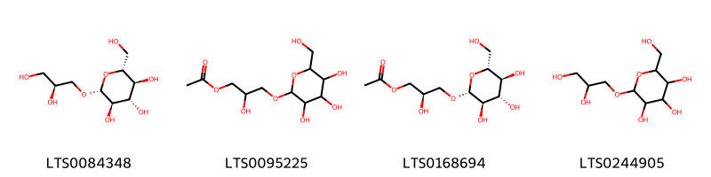{ width=100% }
    <figcaption>Hình ảnh cấu trúc hóa học của 4 hoạt chất thuộc nhóm Glycerolipids gồm ['(2r,3r,4s,5s,6r)-2-[(2s)-2,3-dihydroxypropoxy]-6-(hydroxymethyl)oxane-3,4,5-triol (LTS0084348)', '2-hydroxy-3-{[3,4,5-trihydroxy-6-(hydroxymethyl)oxan-2-yl]oxy}propyl acetate (LTS0095225)', '(2r)-2-hydroxy-3-{[(2r,3r,4s,5s,6r)-3,4,5-trihydroxy-6-(hydroxymethyl)oxan-2-yl]oxy}propyl acetate (LTS0168694)', '2-(2,3-dihydroxypropoxy)-6-(hydroxymethyl)oxane-3,4,5-triol (LTS0244905)'].</figcaption>
</figure>
#### Nhóm Organooxygen compounds
<figure markdown="span">
    { width=100% }
    <figcaption>Hình ảnh cấu trúc hóa học của 1 hoạt chất thuộc nhóm Organooxygen compounds gồm ['sucrose (LTS0272557)'].</figcaption>
</figure>

---

### Dược dân tộc học

Danh sách các quốc gia có sử dụng *Lilium japonicum* trong điều trị các bệnh. 

| Country   | Disease     | Bệnh               |
|:----------|:------------|:-------------------|
| China     | Expectorant | Thuốc long đàm     |
| Elsewhere | Tonic       | (thuộc) trương lực |

---

---
## Lilium lancifolium
### Thông tin về thực vật

!!! info "Phân loại thực vật của *Lilium lancifolium* từ GIBF:"
    - **Kingdom:** Plantae
    - **Phylum:** Tracheophyta
    - **Order:** Liliales
    - **Family:** Liliaceae
    - **Genus:** Lilium
    - **Species:** *Lilium lancifolium*

 

| Label (VI)   | Label (EN)   | Scientific Name    | Descriptions (VI)   | Descriptions (EN)   | Also Known As (VI)   | Also Known As (EN)   |
|:-------------|:-------------|:-------------------|:--------------------|:--------------------|:---------------------|:---------------------|
| N/A          | N/A          | Lilium lancifolium |                     | species of plant    | ['']                 | ['']                 |

#### Phân bố trên thế giới

**Từ CSDL GIBF** nan, United States of America, Japan, Korea, Republic of, Norway, Sweden, China, Australia, Russian Federation, New Zealand, Italy, India, Canada, Germany

#### Phân bố tại Việt Nam

**Từ CSDL GIBF**: Không có ghi nhận ở Việt Nam

---
### Thành phần hóa học
        
- Theo cơ sở dữ liệu lotus: Từ loài *Lilium lancifolium* đã phân lập và xác định được 17 hoạt chất thuộc về các nhóm Fatty Acyls, Prenol lipids, Glycerolipids. 

|    | chemicalTaxonomyClassyfireClass   |   smiles_count |
|---:|:----------------------------------|---------------:|
|  0 | Fatty Acyls                       |              1 |
|  1 | Glycerolipids                     |              2 |
|  2 | Prenol lipids                     |             14 |

#### Nhóm Fatty Acyls
<figure markdown="span">
    { width=100% }
    <figcaption>Hình ảnh cấu trúc hóa học của 1 hoạt chất thuộc nhóm Fatty Acyls gồm ['2-carboxy-d-arabinitol (LTS0056947)'].</figcaption>
</figure>
#### Nhóm Glycerolipids
<figure markdown="span">
    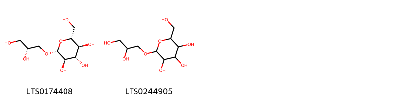{ width=100% }
    <figcaption>Hình ảnh cấu trúc hóa học của 2 hoạt chất thuộc nhóm Glycerolipids gồm ['(2r,3r,4s,5s,6r)-2-[(2r)-2,3-dihydroxypropoxy]-6-(hydroxymethyl)oxane-3,4,5-triol (LTS0174408)', '2-(2,3-dihydroxypropoxy)-6-(hydroxymethyl)oxane-3,4,5-triol (LTS0244905)'].</figcaption>
</figure>
#### Nhóm Prenol lipids
<figure markdown="span">
    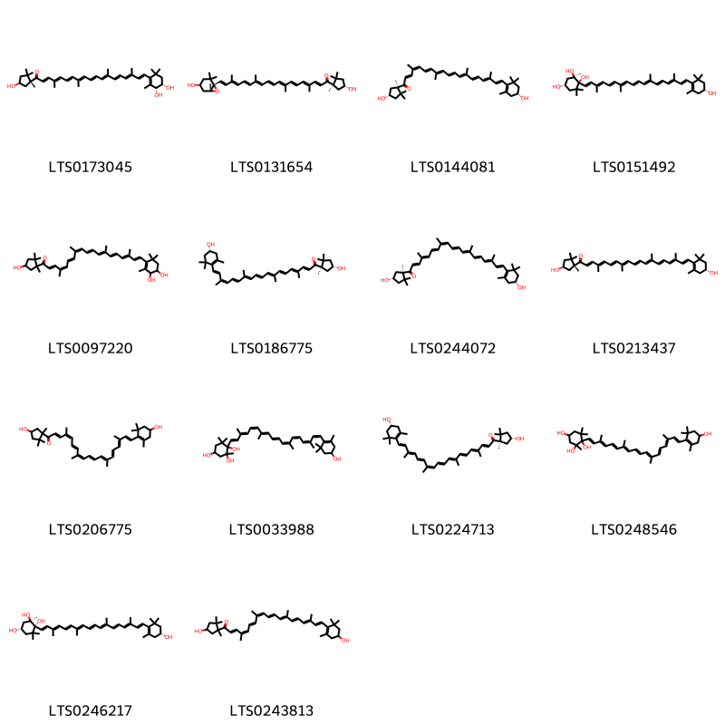{ width=100% }
    <figcaption>Hình ảnh cấu trúc hóa học của 14 hoạt chất thuộc nhóm Prenol lipids gồm ['(2e,4e,6e,8e,10e,12e,14e,16e,18e)-19-[(3r,4s)-3,4-dihydroxy-2,6,6-trimethylcyclohex-1-en-1-yl]-1-[(1r,4s)-4-hydroxy-1,2,2-trimethylcyclopentyl]-4,8,13,17-tetramethylnonadeca-2,4,6,8,10,12,14,16,18-nonaen-1-one (LTS0173045)', 'capsanthin 5,6-epoxide (LTS0131654)', '(2e,4z,6e,8e,10e,12e,14e,16e,18e)-1-[(1r,4s)-4-hydroxy-1,2,2-trimethylcyclopentyl]-19-[(4r)-4-hydroxy-2,6,6-trimethylcyclohex-1-en-1-yl]-4,8,13,17-tetramethylnonadeca-2,4,6,8,10,12,14,16,18-nonaen-1-one (LTS0144081)', '(1s,2r,4s)-1-[(1e,3e,5e,7e,9e,11e,13e,15e,17e)-18-[(4r)-4-hydroxy-2,6,6-trimethylcyclohex-1-en-1-yl]-3,7,12,16-tetramethyloctadeca-1,3,5,7,9,11,13,15,17-nonaen-1-yl]-2,6,6-trimethylcyclohexane-1,2,4-triol (LTS0151492)', '(10e,12e,14e,16e,18e)-19-(3,4-dihydroxy-2,6,6-trimethylcyclohex-1-en-1-yl)-1-(4-hydroxy-1,2,2-trimethylcyclopentyl)-4,8,13,17-tetramethylnonadeca-2,4,6,8,10,12,14,16,18-nonaen-1-one (LTS0097220)', '(2e,4e,6e,8e,10e,12e,14e,16z,18e)-1-[(1r,4s)-4-hydroxy-1,2,2-trimethylcyclopentyl]-19-[(4r)-4-hydroxy-2,6,6-trimethylcyclohex-1-en-1-yl]-4,8,13,17-tetramethylnonadeca-2,4,6,8,10,12,14,16,18-nonaen-1-one (LTS0186775)', '(2e,4e,6e,8z,10e,12e,14e,16e,18e)-1-[(1r,4s)-4-hydroxy-1,2,2-trimethylcyclopentyl]-19-[(4r)-4-hydroxy-2,6,6-trimethylcyclohex-1-en-1-yl]-4,8,13,17-tetramethylnonadeca-2,4,6,8,10,12,14,16,18-nonaen-1-one (LTS0244072)', 'capsanthin (LTS0213437)', '1-(4-hydroxy-1,2,2-trimethylcyclopentyl)-19-(4-hydroxy-2,6,6-trimethylcyclohex-1-en-1-yl)-4,8,13,17-tetramethylnonadeca-2,4,6,8,10,12,14,16,18-nonaen-1-one (LTS0206775)', '1-[(1e,3e,5z,7e,9e,11z,13z,15z,17z)-18-(4-hydroxy-2,6,6-trimethylcyclohex-1-en-1-yl)-3,7,12,16-tetramethyloctadeca-1,3,5,7,9,11,13,15,17-nonaen-1-yl]-2,6,6-trimethylcyclohexane-1,2,4-triol (LTS0033988)', '(2e,4e,6e,8e,10e,12z,14e,16e,18e)-1-[(1r,4s)-4-hydroxy-1,2,2-trimethylcyclopentyl]-19-[(4r)-4-hydroxy-2,6,6-trimethylcyclohex-1-en-1-yl]-4,8,13,17-tetramethylnonadeca-2,4,6,8,10,12,14,16,18-nonaen-1-one (LTS0224713)', '1-[(1e,3e,5e,7e,9e)-18-(4-hydroxy-2,6,6-trimethylcyclohex-1-en-1-yl)-3,7,12,16-tetramethyloctadeca-1,3,5,7,9,11,13,15,17-nonaen-1-yl]-2,6,6-trimethylcyclohexane-1,2,4-triol (LTS0248546)', '(1r,2r,4s)-1-[(1e,3e,5e,7e,9e,11e,13e,15e,17e)-18-[(4r)-4-hydroxy-2,6,6-trimethylcyclohex-1-en-1-yl]-3,7,12,16-tetramethyloctadeca-1,3,5,7,9,11,13,15,17-nonaen-1-yl]-2,6,6-trimethylcyclohexane-1,2,4-triol (LTS0246217)', '(10e,12e,14e,16e,18e)-1-(4-hydroxy-1,2,2-trimethylcyclopentyl)-19-(4-hydroxy-2,6,6-trimethylcyclohex-1-en-1-yl)-4,8,13,17-tetramethylnonadeca-2,4,6,8,10,12,14,16,18-nonaen-1-one (LTS0243813)'].</figcaption>
</figure>

---

### Dược dân tộc học

Danh sách các quốc gia có sử dụng *Lilium lancifolium* trong điều trị các bệnh. 

| Country   | Disease   | Bệnh               |
|:----------|:----------|:-------------------|
| Elsewhere | Tonic     | (thuộc) trương lực |

---

---
## Lilium leichtlinii
### Thông tin về thực vật

!!! info "Phân loại thực vật của *Lilium leichtlinii* từ GIBF:"
    - **Kingdom:** Plantae
    - **Phylum:** Tracheophyta
    - **Order:** Liliales
    - **Family:** Liliaceae
    - **Genus:** Lilium
    - **Species:** *Lilium leichtlinii*

 

| Label (VI)   | Label (EN)   | Scientific Name    | Descriptions (VI)   | Descriptions (EN)   | Also Known As (VI)   | Also Known As (EN)   |
|:-------------|:-------------|:-------------------|:--------------------|:--------------------|:---------------------|:---------------------|
| N/A          | N/A          | Lilium leichtlinii | loài thực vật       | species of plant    | ['']                 | ['']                 |

#### Phân bố trên thế giới

**Từ CSDL GIBF** nan, Japan, Korea, Republic of, China, Russian Federation, unknown or invalid

#### Phân bố tại Việt Nam

**Từ CSDL GIBF**: Không có ghi nhận ở Việt Nam

---
### Thành phần hóa học
        
- Theo cơ sở dữ liệu lotus: Từ loài *Lilium leichtlinii* đã phân lập và xác định được 6 hoạt chất thuộc về các nhóm Phenols. 

|    | chemicalTaxonomyClassyfireClass   |   smiles_count |
|---:|:----------------------------------|---------------:|
|  0 | Phenols                           |              1 |

#### Nhóm Phenols
<figure markdown="span">
    { width=100% }
    <figcaption>Hình ảnh cấu trúc hóa học của 1 hoạt chất thuộc nhóm Phenols gồm ['orcinol (LTS0230426)'].</figcaption>
</figure>

---

### Dược dân tộc học

Danh sách các quốc gia có sử dụng *Lilium leichtlinii* trong điều trị các bệnh. 

| Country   | Disease   | Bệnh               |
|:----------|:----------|:-------------------|
| Elsewhere | Tonic     | (thuộc) trương lực |

---

---
## Lilium martagon
### Thông tin về thực vật

!!! info "Phân loại thực vật của *Lilium martagon* từ GIBF:"
    - **Kingdom:** Plantae
    - **Phylum:** Tracheophyta
    - **Order:** Liliales
    - **Family:** Liliaceae
    - **Genus:** Lilium
    - **Species:** *Lilium martagon*

 

| Label (VI)   | Label (EN)   | Scientific Name   | Descriptions (VI)   | Descriptions (EN)   | Also Known As (VI)   | Also Known As (EN)                   |
|:-------------|:-------------|:------------------|:--------------------|:--------------------|:---------------------|:-------------------------------------|
| N/A          | N/A          | Lilium martagon   | loài thực vật       | species of plant    | ['']                 | ['martagon lily', "Turk's cap lily"] |

#### Phân bố trên thế giới

**Từ CSDL GIBF** nan, Czechia, Sweden, Finland, Slovenia, Spain, Netherlands, Denmark, Poland, Romania, Russian Federation, Croatia, Belarus, Norway, Germany, Austria, Hungary, Slovakia, Ukraine, Italy, Switzerland, France

#### Phân bố tại Việt Nam

**Từ CSDL GIBF**: Không có ghi nhận ở Việt Nam

---
### Thành phần hóa học
        
- Theo cơ sở dữ liệu lotus: Từ loài *Lilium martagon* đã phân lập và xác định được 16 hoạt chất thuộc về các nhóm Cinnamic acids and derivatives, Steroids and steroid derivatives, Glycerolipids, Organooxygen compounds, Pyrrolines. 

|    | chemicalTaxonomyClassyfireClass   |   smiles_count |
|---:|:----------------------------------|---------------:|
|  0 | Cinnamic acids and derivatives    |              4 |
|  1 | Glycerolipids                     |              2 |
|  2 | Organooxygen compounds            |              4 |
|  3 | Pyrrolines                        |              2 |
|  4 | Steroids and steroid derivatives  |              4 |

#### Nhóm Cinnamic acids and derivatives
<figure markdown="span">
    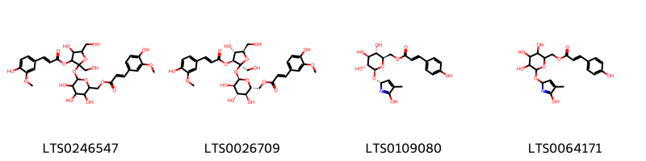{ width=100% }
    <figcaption>Hình ảnh cấu trúc hóa học của 4 hoạt chất thuộc nhóm Cinnamic acids and derivatives gồm ['{3,4,5-trihydroxy-6-[(4-hydroxy-3-{[3-(4-hydroxy-3-methoxyphenyl)prop-2-enoyl]oxy}-2,5-bis(hydroxymethyl)oxolan-2-yl)oxy]oxan-2-yl}methyl 3-(4-hydroxy-3-methoxyphenyl)prop-2-enoate (LTS0246547)', '[(2r,3s,4s,5r,6r)-3,4,5-trihydroxy-6-{[(2s,3s,4r,5r)-4-hydroxy-3-{[(2e)-3-(4-hydroxy-3-methoxyphenyl)prop-2-enoyl]oxy}-2,5-bis(hydroxymethyl)oxolan-2-yl]oxy}oxan-2-yl]methyl (2e)-3-(4-hydroxy-3-methoxyphenyl)prop-2-enoate (LTS0026709)', '[(2r,3s,4s,5r,6s)-3,4,5-trihydroxy-6-{[(2r)-5-hydroxy-4-methyl-2h-pyrrol-2-yl]oxy}oxan-2-yl]methyl (2e)-3-(4-hydroxyphenyl)prop-2-enoate (LTS0109080)', '{3,4,5-trihydroxy-6-[(5-hydroxy-4-methyl-2h-pyrrol-2-yl)oxy]oxan-2-yl}methyl 3-(4-hydroxyphenyl)prop-2-enoate (LTS0064171)'].</figcaption>
</figure>
#### Nhóm Glycerolipids
<figure markdown="span">
    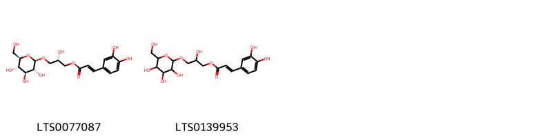{ width=100% }
    <figcaption>Hình ảnh cấu trúc hóa học của 2 hoạt chất thuộc nhóm Glycerolipids gồm ['(2s)-2-hydroxy-3-{[(2r,3r,4s,5s,6r)-3,4,5-trihydroxy-6-(hydroxymethyl)oxan-2-yl]oxy}propyl (2e)-3-(3,4-dihydroxyphenyl)prop-2-enoate (LTS0077087)', '2-hydroxy-3-{[3,4,5-trihydroxy-6-(hydroxymethyl)oxan-2-yl]oxy}propyl 3-(3,4-dihydroxyphenyl)prop-2-enoate (LTS0139953)'].</figcaption>
</figure>
#### Nhóm Organooxygen compounds
<figure markdown="span">
    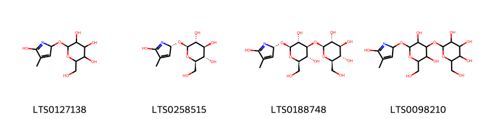{ width=100% }
    <figcaption>Hình ảnh cấu trúc hóa học của 4 hoạt chất thuộc nhóm Organooxygen compounds gồm ['2-[(5-hydroxy-4-methyl-2h-pyrrol-2-yl)oxy]-6-(hydroxymethyl)oxane-3,4,5-triol (LTS0127138)', '(2s,3r,4s,5s,6r)-2-{[(2r)-5-hydroxy-4-methyl-2h-pyrrol-2-yl]oxy}-6-(hydroxymethyl)oxane-3,4,5-triol (LTS0258515)', '(2s,3r,4s,5s,6r)-2-{[(2s,3r,4s,5r,6r)-3,5-dihydroxy-2-{[(2r)-5-hydroxy-4-methyl-2h-pyrrol-2-yl]oxy}-6-(hydroxymethyl)oxan-4-yl]oxy}-6-(hydroxymethyl)oxane-3,4,5-triol (LTS0188748)', '2-({3,5-dihydroxy-2-[(5-hydroxy-4-methyl-2h-pyrrol-2-yl)oxy]-6-(hydroxymethyl)oxan-4-yl}oxy)-6-(hydroxymethyl)oxane-3,4,5-triol (LTS0098210)'].</figcaption>
</figure>
#### Nhóm Pyrrolines
<figure markdown="span">
    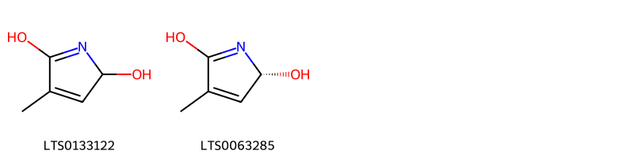{ width=100% }
    <figcaption>Hình ảnh cấu trúc hóa học của 2 hoạt chất thuộc nhóm Pyrrolines gồm ['3-methyl-5h-pyrrole-2,5-diol (LTS0133122)', '(5r)-3-methyl-5h-pyrrole-2,5-diol (LTS0063285)'].</figcaption>
</figure>
#### Nhóm Steroids and steroid derivatives
<figure markdown="span">
    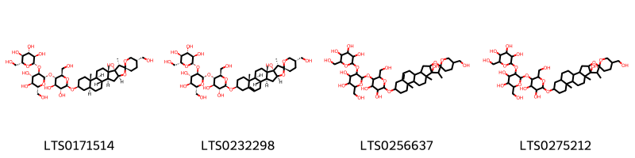{ width=100% }
    <figcaption>Hình ảnh cấu trúc hóa học của 4 hoạt chất thuộc nhóm Steroids and steroid derivatives gồm ["(2s,3r,4s,5s,6r)-2-{[(2s,3r,4s,5s,6r)-2-{[(2r,3s,4r,5r,6r)-4,5-dihydroxy-2-(hydroxymethyl)-6-[(1'r,2r,2's,4's,5s,7's,8's,9's,12's,13's,16's,18's)-5-(hydroxymethyl)-7',9',13'-trimethyl-5'-oxaspiro[oxane-2,6'-pentacyclo[10.8.0.0²,⁹.0⁴,⁸.0¹³,¹⁸]icosan]-8'-oloxy]oxan-3-yl]oxy}-4,5-dihydroxy-6-(hydroxymethyl)oxan-3-yl]oxy}-6-(hydroxymethyl)oxane-3,4,5-triol (LTS0171514)", "(2s,3r,4s,5s,6r)-2-{[(2s,3r,4s,5s,6r)-2-{[(2r,3s,4r,5r,6r)-4,5-dihydroxy-2-(hydroxymethyl)-6-[(1'r,2r,2's,4's,5s,7's,8's,9's,12's,13'r,16's)-5-(hydroxymethyl)-7',9',13'-trimethyl-5'-oxaspiro[oxane-2,6'-pentacyclo[10.8.0.0²,⁹.0⁴,⁸.0¹³,¹⁸]icosan]-18'-en-8'-oloxy]oxan-3-yl]oxy}-4,5-dihydroxy-6-(hydroxymethyl)oxan-3-yl]oxy}-6-(hydroxymethyl)oxane-3,4,5-triol (LTS0232298)", "2-[(2-{[4,5-dihydroxy-2-(hydroxymethyl)-6-[5-(hydroxymethyl)-7',9',13'-trimethyl-5'-oxaspiro[oxane-2,6'-pentacyclo[10.8.0.0²,⁹.0⁴,⁸.0¹³,¹⁸]icosan]-18'-en-8'-oloxy]oxan-3-yl]oxy}-4,5-dihydroxy-6-(hydroxymethyl)oxan-3-yl)oxy]-6-(hydroxymethyl)oxane-3,4,5-triol (LTS0256637)", "2-[(2-{[4,5-dihydroxy-2-(hydroxymethyl)-6-[5-(hydroxymethyl)-7',9',13'-trimethyl-5'-oxaspiro[oxane-2,6'-pentacyclo[10.8.0.0²,⁹.0⁴,⁸.0¹³,¹⁸]icosan]-8'-oloxy]oxan-3-yl]oxy}-4,5-dihydroxy-6-(hydroxymethyl)oxan-3-yl)oxy]-6-(hydroxymethyl)oxane-3,4,5-triol (LTS0275212)"].</figcaption>
</figure>

---

### Dược dân tộc học

Danh sách các quốc gia có sử dụng *Lilium martagon* trong điều trị các bệnh. 

| Country   | Disease   | Bệnh      |
|:----------|:----------|:----------|
| ain       | Emollient | Chỉnh thị |

---

---
## Lilium philadelphicum
### Thông tin về thực vật

!!! info "Phân loại thực vật của *Lilium philadelphicum* từ GIBF:"
    - **Kingdom:** Plantae
    - **Phylum:** Tracheophyta
    - **Order:** Liliales
    - **Family:** Liliaceae
    - **Genus:** Lilium
    - **Species:** *Lilium philadelphicum*

 

| Label (VI)   | Label (EN)   | Scientific Name       | Descriptions (VI)   | Descriptions (EN)   | Also Known As (VI)   | Also Known As (EN)   |
|:-------------|:-------------|:----------------------|:--------------------|:--------------------|:---------------------|:---------------------|
| N/A          | N/A          | Lilium philadelphicum | loài thực vật       | species of plant    | ['']                 | ['']                 |

#### Phân bố trên thế giới

**Từ CSDL GIBF** United States of America, Canada

#### Phân bố tại Việt Nam

**Từ CSDL GIBF**: Không có ghi nhận ở Việt Nam

---
### Thành phần hóa học
        
- Theo cơ sở dữ liệu lotus: Từ loài *Lilium philadelphicum* đã phân lập và xác định được Chưa có hoạt chất nào được phân lập. hoạt chất thuộc về các nhóm Không có hoạt chất nào được phân lập. 

Không có hình ảnh nào được tạo ra

---

### Dược dân tộc học

Danh sách các quốc gia có sử dụng *Lilium philadelphicum* trong điều trị các bệnh. 

| Country       | Disease   | Bệnh                     |
|:--------------|:----------|:-------------------------|
| US(Blackfoot) | Poultice  | thuốc đắp, đắp thuốc cao |

---

---
## Lilium tigrinum
### Thông tin về thực vật

!!! info "Phân loại thực vật của *Lilium lancifolium* từ GIBF:"
    - **Kingdom:** Plantae
    - **Phylum:** Tracheophyta
    - **Order:** Liliales
    - **Family:** Liliaceae
    - **Genus:** Lilium
    - **Species:** *Lilium lancifolium*

 

| Label (VI)   | Label (EN)   | Scientific Name   | Descriptions (VI)   | Descriptions (EN)   | Also Known As (VI)   | Also Known As (EN)   |
|:-------------|:-------------|:------------------|:--------------------|:--------------------|:---------------------|:---------------------|
| N/A          | N/A          | Lilium tigrinum   | loài thực vật       | species of plant    | ['']                 | ['tiger lily']       |

#### Phân bố trên thế giới

**Từ CSDL GIBF** nan, United States of America, Portugal, Korea, Republic of, Japan, Estonia, China, unknown or invalid, Canada, Germany, Argentina

#### Phân bố tại Việt Nam

**Từ CSDL GIBF**: Không có ghi nhận ở Việt Nam

---
### Thành phần hóa học
        
- Theo cơ sở dữ liệu lotus: Từ loài *Lilium lancifolium* đã phân lập và xác định được Chưa có hoạt chất nào được phân lập. hoạt chất thuộc về các nhóm Không có hoạt chất nào được phân lập. 

Không có hình ảnh nào được tạo ra

---

### Dược dân tộc học

Danh sách các quốc gia có sử dụng *Lilium lancifolium* trong điều trị các bệnh. 

| Country   | Disease                                                           | Bệnh                                                                       |
|:----------|:------------------------------------------------------------------|:---------------------------------------------------------------------------|
| China     | Expectorant                                                       | Thuốc long đàm                                                             |
| Turkey    | Carminative, Emmenagogue, Emollient, Tonic, Expectorant, Diuretic | Carminative, Emmenagogue, Chất làm mềm, Thuốc bổ, Chất đờm, Thuốc lợi tiểu |

---

---
## Lilium wallichianum
### Thông tin về thực vật

!!! info "Phân loại thực vật của *Lilium wallichianum* từ GIBF:"
    - **Kingdom:** Plantae
    - **Phylum:** Tracheophyta
    - **Order:** Liliales
    - **Family:** Liliaceae
    - **Genus:** Lilium
    - **Species:** *Lilium wallichianum*

 

| Label (VI)   | Label (EN)   | Scientific Name     | Descriptions (VI)   | Descriptions (EN)   | Also Known As (VI)   | Also Known As (EN)   |
|:-------------|:-------------|:--------------------|:--------------------|:--------------------|:---------------------|:---------------------|
| N/A          | N/A          | Lilium wallichianum | loài thực vật       | species of plant    | ['']                 | ['']                 |

#### Phân bố trên thế giới

**Từ CSDL GIBF** nan, Guatemala, United States of America, Japan, Bhutan, Chinese Taipei, Costa Rica, Nepal, New Caledonia, India, unknown or invalid

#### Phân bố tại Việt Nam

**Từ CSDL GIBF**: Không có ghi nhận ở Việt Nam

---
### Thành phần hóa học
        
- Theo cơ sở dữ liệu lotus: Từ loài *Lilium wallichianum* đã phân lập và xác định được Chưa có hoạt chất nào được phân lập. hoạt chất thuộc về các nhóm Không có hoạt chất nào được phân lập. 

Không có hình ảnh nào được tạo ra

---

### Dược dân tộc học

Danh sách các quốc gia có sử dụng *Lilium wallichianum* trong điều trị các bệnh. 

| Country      | Disease              | Bệnh                 |
|:-------------|:---------------------|:---------------------|
| Elsewhere    | Demulcent            | dịu, giảm kích thích |
| India(Hindu) | Demulcent            | dịu, giảm kích thích |
| Nepal        | Demulcent, Demulcent | DEMULECT, DEMULECT   |

---

# Chi Dipcadi

??? note "Danh sách các dược liệu thuộc chi"
    
	 - *Dipcadi cowanii*
	 - *Dipcadi erythraeum*

---
## Dipcadi cowanii
### Thông tin về thực vật

!!! info "Phân loại thực vật của *Dipcadi cowanii* từ GIBF:"
    - **Kingdom:** Plantae
    - **Phylum:** Tracheophyta
    - **Order:** Asparagales
    - **Family:** Asparagaceae
    - **Genus:** Dipcadi
    - **Species:** *Dipcadi cowanii*

 

| Label (VI)   | Label (EN)   | Scientific Name   | Descriptions (VI)   | Descriptions (EN)   | Also Known As (VI)   | Also Known As (EN)   |
|:-------------|:-------------|:------------------|:--------------------|:--------------------|:---------------------|:---------------------|
| N/A          | N/A          | Dipcadi cowanii   | loài thực vật       | species of plant    | ['']                 | ['']                 |

#### Phân bố trên thế giới

**Từ CSDL GIBF** Madagascar

#### Phân bố tại Việt Nam

**Từ CSDL GIBF**: Không có ghi nhận ở Việt Nam

---
### Thành phần hóa học
        
- Theo cơ sở dữ liệu lotus: Từ loài *Dipcadi cowanii* đã phân lập và xác định được Chưa có hoạt chất nào được phân lập. hoạt chất thuộc về các nhóm Không có hoạt chất nào được phân lập. 

Không có hình ảnh nào được tạo ra

---

### Dược dân tộc học

Danh sách các quốc gia có sử dụng *Dipcadi cowanii* trong điều trị các bệnh. 

| Country   | Disease   | Bệnh     |
|:----------|:----------|:---------|
| Malagasy  | Raticide  | Raticide |

---

---
## Dipcadi erythraeum
### Thông tin về thực vật

!!! info "Phân loại thực vật của *Dipcadi erythraeum* từ GIBF:"
    - **Kingdom:** Plantae
    - **Phylum:** Tracheophyta
    - **Order:** Asparagales
    - **Family:** Asparagaceae
    - **Genus:** Dipcadi
    - **Species:** *Dipcadi erythraeum*

 

| Label (VI)   | Label (EN)   | Scientific Name    | Descriptions (VI)   | Descriptions (EN)   | Also Known As (VI)   | Also Known As (EN)   |
|:-------------|:-------------|:-------------------|:--------------------|:--------------------|:---------------------|:---------------------|
| N/A          | N/A          | Dipcadi erythraeum | loài thực vật       | species of plant    | ['']                 | ['']                 |

#### Phân bố trên thế giới

**Từ CSDL GIBF** nan, United Arab Emirates, Bahrain, Israel, Qatar, Yemen, Spain, Iran (Islamic Republic of), Tunisia, unknown or invalid, Morocco, Saudi Arabia, Kuwait, Iraq, Egypt, Oman, India, Jordan, France

#### Phân bố tại Việt Nam

**Từ CSDL GIBF**: Không có ghi nhận ở Việt Nam

---
### Thành phần hóa học
        
- Theo cơ sở dữ liệu lotus: Từ loài *Dipcadi erythraeum* đã phân lập và xác định được Chưa có hoạt chất nào được phân lập. hoạt chất thuộc về các nhóm Không có hoạt chất nào được phân lập. 

Không có hình ảnh nào được tạo ra

---

### Dược dân tộc học

Danh sách các quốc gia có sử dụng *Dipcadi erythraeum* trong điều trị các bệnh. 

| Country   | Disease     | Bệnh           |
|:----------|:------------|:---------------|
| Elsewhere | Expectorant | Thuốc long đàm |
| India     | Expectorant | Thuốc long đàm |

---

# Chi Gloriosa

??? note "Danh sách các dược liệu thuộc chi"
    
	 - *Gloriosa simplex*
	 - *Gloriosa superba*
	 - *Gloriosa virescens*

---
## Gloriosa simplex
### Thông tin về thực vật

!!! info "Phân loại thực vật của *Gloriosa simplex* từ GIBF:"
    - **Kingdom:** Plantae
    - **Phylum:** Tracheophyta
    - **Order:** Liliales
    - **Family:** Colchicaceae
    - **Genus:** Gloriosa
    - **Species:** *Gloriosa simplex*

 

| Label (VI)   | Label (EN)   | Scientific Name   | Descriptions (VI)   | Descriptions (EN)     | Also Known As (VI)   | Also Known As (EN)   |
|:-------------|:-------------|:------------------|:--------------------|:----------------------|:---------------------|:---------------------|
| N/A          | N/A          | Gloriosa simplex  |                     | species of angiosperm | ['']                 | ['']                 |

#### Phân bố trên thế giới

**Từ CSDL GIBF** Uganda, Senegal, Botswana, Gambia, Mali, Zimbabwe, Somalia, Mozambique, Tanzania, United Republic of, Madagascar, Guinea, Ghana, Zambia, Nigeria, Burkina Faso, Ethiopia, Togo, Equatorial Guinea, Malawi, Benin, Congo, Democratic Republic of the, Malaysia, Gabon, Namibia, South Africa, Côte d’Ivoire, Cameroon

#### Phân bố tại Việt Nam

**Từ CSDL GIBF**: Không có ghi nhận ở Việt Nam

---
### Thành phần hóa học
        
- Theo cơ sở dữ liệu lotus: Từ loài *Gloriosa simplex* đã phân lập và xác định được Chưa có hoạt chất nào được phân lập. hoạt chất thuộc về các nhóm Không có hoạt chất nào được phân lập. 

Không có hình ảnh nào được tạo ra

---

### Dược dân tộc học

Danh sách các quốc gia có sử dụng *Gloriosa simplex* trong điều trị các bệnh. 

| Country         | Disease   | Bệnh     |
|:----------------|:----------|:---------|
| Africa          | Poison    | Chất độc |
| Africa(Swahili) | Poison    | Chất độc |

---

---
## Gloriosa superba
### Thông tin về thực vật

!!! info "Phân loại thực vật của *Gloriosa superba* từ GIBF:"
    - **Kingdom:** Plantae
    - **Phylum:** Tracheophyta
    - **Order:** Liliales
    - **Family:** Colchicaceae
    - **Genus:** Gloriosa
    - **Species:** *Gloriosa superba*

 

| Label (VI)   | Label (EN)   | Scientific Name   | Descriptions (VI)   | Descriptions (EN)   | Also Known As (VI)                                            | Also Known As (EN)                                          |
|:-------------|:-------------|:------------------|:--------------------|:--------------------|:--------------------------------------------------------------|:------------------------------------------------------------|
| N/A          | N/A          | Gloriosa superba  | loài thực vật       | species of plant    | ['Ngọt nghẹo', 'Huệ lồng đèn', 'Gloriosa superba', 'Gia lan'] | ['Climbing lily', 'Flame lily', 'Glory Lily', 'Tiger claw'] |

#### Phân bố trên thế giới

**Từ CSDL GIBF** nan, Uganda, Botswana, Zimbabwe, Mozambique, Tanzania, United Republic of, French Polynesia, Thailand, Sri Lanka, United States of America, Zambia, Indonesia, Malawi, Kenya, Rwanda, Vanuatu, Maldives, Malaysia, Namibia, Martinique, South Africa, Australia, India, Samoa

#### Phân bố tại Việt Nam

**Từ CSDL GIBF**: Không có ghi nhận ở Việt Nam

---
### Thành phần hóa học
        
- Theo cơ sở dữ liệu lotus: Từ loài *Gloriosa superba* đã phân lập và xác định được 54 hoạt chất thuộc về các nhóm Fatty Acyls, Benzene and substituted derivatives, Tropones, Carboxylic acids and derivatives, Benzodioxoles, Steroids and steroid derivatives, Homoaporphines, Lumicolchicine alkaloids, Organooxygen compounds, Indoles and derivatives. 

|    | chemicalTaxonomyClassyfireClass     |   smiles_count |
|---:|:------------------------------------|---------------:|
|  0 | Benzene and substituted derivatives |              1 |
|  1 | Benzodioxoles                       |              5 |
|  2 | Carboxylic acids and derivatives    |             19 |
|  3 | Fatty Acyls                         |              1 |
|  4 | Homoaporphines                      |              4 |
|  5 | Indoles and derivatives             |              2 |
|  6 | Lumicolchicine alkaloids            |              3 |
|  7 | Organooxygen compounds              |              5 |
|  8 | Steroids and steroid derivatives    |              2 |
|  9 | Tropones                            |             12 |

#### Nhóm Benzene and substituted derivatives
<figure markdown="span">
    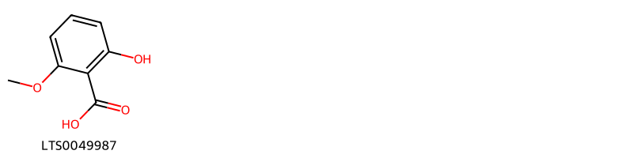{ width=100% }
    <figcaption>Hình ảnh cấu trúc hóa học của 1 hoạt chất thuộc nhóm Benzene and substituted derivatives gồm ['2-hydroxy-6-methoxybenzoic acid (LTS0049987)'].</figcaption>
</figure>
#### Nhóm Benzodioxoles
<figure markdown="span">
    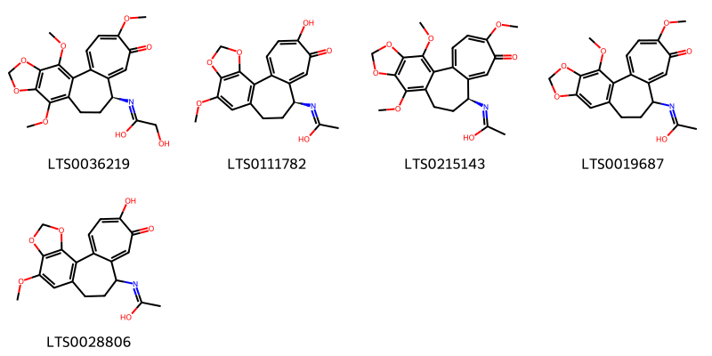{ width=100% }
    <figcaption>Hình ảnh cấu trúc hóa học của 5 hoạt chất thuộc nhóm Benzodioxoles gồm ['2-hydroxy-n-[(9s)-5,13,19-trimethoxy-6-oxo-15,17-dioxatetracyclo[10.7.0.0²,⁸.0¹⁴,¹⁸]nonadeca-1(19),2,4,7,12,14(18)-hexaen-9-yl]ethanimidic acid (LTS0036219)', 'n-[(9s)-5-hydroxy-14-methoxy-6-oxo-16,18-dioxatetracyclo[10.7.0.0²,⁸.0¹⁵,¹⁹]nonadeca-1(12),2,4,7,13,15(19)-hexaen-9-yl]ethanimidic acid (LTS0111782)', 'n-[(9s)-5,13,19-trimethoxy-6-oxo-15,17-dioxatetracyclo[10.7.0.0²,⁸.0¹⁴,¹⁸]nonadeca-1(19),2,4,7,12,14(18)-hexaen-9-yl]ethanimidic acid (LTS0215143)', 'n-{5,19-dimethoxy-6-oxo-15,17-dioxatetracyclo[10.7.0.0²,⁸.0¹⁴,¹⁸]nonadeca-1(12),2,4,7,13,18-hexaen-9-yl}ethanimidic acid (LTS0019687)', 'n-{5-hydroxy-14-methoxy-6-oxo-16,18-dioxatetracyclo[10.7.0.0²,⁸.0¹⁵,¹⁹]nonadeca-1(12),2,4,7,13,15(19)-hexaen-9-yl}ethanimidic acid (LTS0028806)'].</figcaption>
</figure>
#### Nhóm Carboxylic acids and derivatives
<figure markdown="span">
    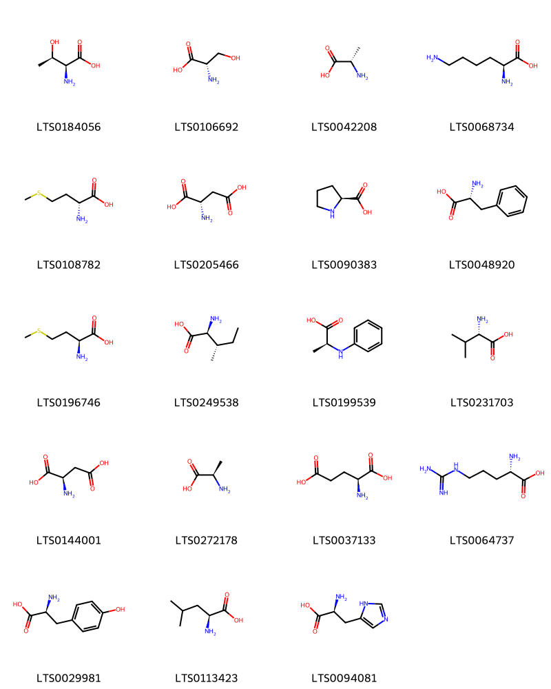{ width=100% }
    <figcaption>Hình ảnh cấu trúc hóa học của 19 hoạt chất thuộc nhóm Carboxylic acids and derivatives gồm ['l-threonine (LTS0184056)', 'l-serine (LTS0106692)', 'l-alanine (LTS0042208)', 'l-lysine (LTS0068734)', 'd-methionine (LTS0108782)', 'l-aspartic acid (LTS0205466)', 'l-proline (LTS0090383)', 'd-phenylalanine (LTS0048920)', 'l-methionine (LTS0196746)', 'l-isoleucine (LTS0249538)', '(2s)-2-(phenylamino)propanoic acid (LTS0199539)', 'l-valine (LTS0231703)', 'd-aspartic acid (LTS0144001)', 'd-alanine (LTS0272178)', 'l-glutamic acid (LTS0037133)', 'l-arginine (LTS0064737)', 'l-tyrosine (LTS0029981)', 'l-leucine (LTS0113423)', 'l-histidine (LTS0094081)'].</figcaption>
</figure>
#### Nhóm Fatty Acyls
<figure markdown="span">
    { width=100% }
    <figcaption>Hình ảnh cấu trúc hóa học của 1 hoạt chất thuộc nhóm Fatty Acyls gồm ['palmitic acid (LTS0079439)'].</figcaption>
</figure>
#### Nhóm Homoaporphines
<figure markdown="span">
    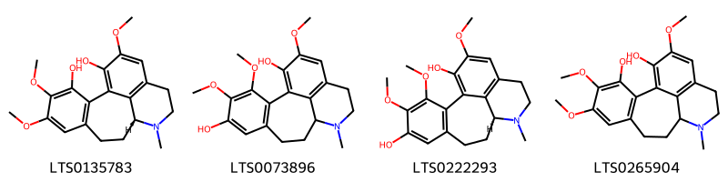{ width=100% }
    <figcaption>Hình ảnh cấu trúc hóa học của 4 hoạt chất thuộc nhóm Homoaporphines gồm ['(10r)-4,5,16-trimethoxy-11-methyl-11-azatetracyclo[8.7.1.0²,⁷.0¹⁴,¹⁸]octadeca-1(17),2(7),3,5,14(18),15-hexaene-3,17-diol (LTS0135783)', '3,4,16-trimethoxy-11-methyl-11-azatetracyclo[8.7.1.0²,⁷.0¹⁴,¹⁸]octadeca-1(17),2(7),3,5,14(18),15-hexaene-5,17-diol (LTS0073896)', '(10s)-3,4,16-trimethoxy-11-methyl-11-azatetracyclo[8.7.1.0²,⁷.0¹⁴,¹⁸]octadeca-1(17),2(7),3,5,14(18),15-hexaene-5,17-diol (LTS0222293)', '4,5,16-trimethoxy-11-methyl-11-azatetracyclo[8.7.1.0²,⁷.0¹⁴,¹⁸]octadeca-1(17),2(7),3,5,14(18),15-hexaene-3,17-diol (LTS0265904)'].</figcaption>
</figure>
#### Nhóm Indoles and derivatives
<figure markdown="span">
    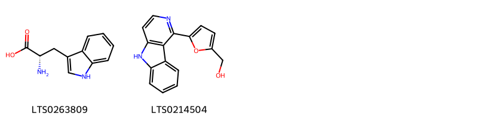{ width=100% }
    <figcaption>Hình ảnh cấu trúc hóa học của 2 hoạt chất thuộc nhóm Indoles and derivatives gồm ['l-tryptophan (LTS0263809)', '(5-{5h-pyrido[4,3-b]indol-1-yl}furan-2-yl)methanol (LTS0214504)'].</figcaption>
</figure>
#### Nhóm Lumicolchicine alkaloids
<figure markdown="span">
    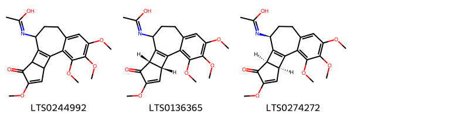{ width=100% }
    <figcaption>Hình ảnh cấu trúc hóa học của 3 hoạt chất thuộc nhóm Lumicolchicine alkaloids gồm ['n-{3,4,5,14-tetramethoxy-13-oxotetracyclo[9.5.0.0²,⁷.0¹²,¹⁶]hexadeca-1(11),2,4,6,14-pentaen-10-yl}ethanimidic acid (LTS0244992)', 'n-[(12s,16r)-3,4,5,14-tetramethoxy-13-oxotetracyclo[9.5.0.0²,⁷.0¹²,¹⁶]hexadeca-1(11),2,4,6,14-pentaen-10-yl]ethanimidic acid (LTS0136365)', 'n-[(10s,12r,16s)-3,4,5,14-tetramethoxy-13-oxotetracyclo[9.5.0.0²,⁷.0¹²,¹⁶]hexadeca-1(11),2,4,6,14-pentaen-10-yl]ethanimidic acid (LTS0274272)'].</figcaption>
</figure>
#### Nhóm Organooxygen compounds
<figure markdown="span">
    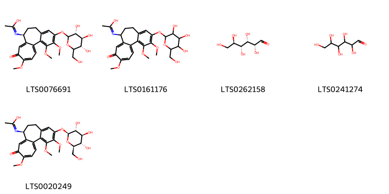{ width=100% }
    <figcaption>Hình ảnh cấu trúc hóa học của 5 hoạt chất thuộc nhóm Organooxygen compounds gồm ['n-[(10s)-3,4,14-trimethoxy-13-oxo-5-{[(3r,4s,5s)-3,4,5-trihydroxy-6-(hydroxymethyl)oxan-2-yl]oxy}tricyclo[9.5.0.0²,⁷]hexadeca-1(16),2,4,6,11,14-hexaen-10-yl]ethanimidic acid (LTS0076691)', 'n-(3,4,14-trimethoxy-13-oxo-5-{[3,4,5-trihydroxy-6-(hydroxymethyl)oxan-2-yl]oxy}tricyclo[9.5.0.0²,⁷]hexadeca-1(16),2,4,6,11,14-hexaen-10-yl)ethanimidic acid (LTS0161176)', '(+)-glucose (LTS0262158)', 'dextrose (LTS0241274)', 'n-[(10s)-3,4,14-trimethoxy-13-oxo-5-{[(2s,3r,4s,5s,6r)-3,4,5-trihydroxy-6-(hydroxymethyl)oxan-2-yl]oxy}tricyclo[9.5.0.0²,⁷]hexadeca-1(16),2,4,6,11,14-hexaen-10-yl]ethanimidic acid (LTS0020249)'].</figcaption>
</figure>
#### Nhóm Steroids and steroid derivatives
<figure markdown="span">
    { width=100% }
    <figcaption>Hình ảnh cấu trúc hóa học của 2 hoạt chất thuộc nhóm Steroids and steroid derivatives gồm ['(1r,3as,3bs,7s,9ar,9bs,11ar)-1-[(2s,3e,5s)-5-ethyl-6-methylhept-3-en-2-yl]-9a,11a-dimethyl-1h,2h,3h,3ah,3bh,4h,6h,7h,8h,9h,9bh,10h,11h-cyclopenta[a]phenanthren-7-ol (LTS0169213)', 'stigmasterol (LTS0024262)'].</figcaption>
</figure>
#### Nhóm Tropones
<figure markdown="span">
    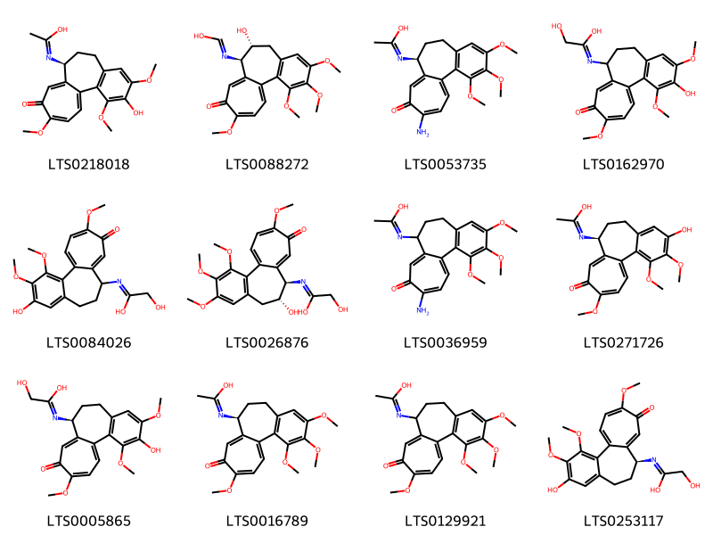{ width=100% }
    <figcaption>Hình ảnh cấu trúc hóa học của 12 hoạt chất thuộc nhóm Tropones gồm ['n-[(10s)-4-hydroxy-3,5,14-trimethoxy-13-oxotricyclo[9.5.0.0²,⁷]hexadeca-1(16),2(7),3,5,11,14-hexaen-10-yl]ethanimidic acid (LTS0218018)', 'n-[(9r,10r)-9-hydroxy-3,4,5,14-tetramethoxy-13-oxotricyclo[9.5.0.0²,⁷]hexadeca-1(16),2(7),3,5,11,14-hexaen-10-yl]carboximidic acid (LTS0088272)', 'n-[(10s)-14-amino-3,4,5-trimethoxy-13-oxotricyclo[9.5.0.0²,⁷]hexadeca-1(16),2(7),3,5,11,14-hexaen-10-yl]ethanimidic acid (LTS0053735)', '2-hydroxy-n-{4-hydroxy-3,5,14-trimethoxy-13-oxotricyclo[9.5.0.0²,⁷]hexadeca-1(16),2(7),3,5,11,14-hexaen-10-yl}ethanimidic acid (LTS0162970)', '2-hydroxy-n-{5-hydroxy-3,4,14-trimethoxy-13-oxotricyclo[9.5.0.0²,⁷]hexadeca-1(16),2,4,6,11,14-hexaen-10-yl}ethanimidic acid (LTS0084026)', '2-hydroxy-n-[(9r,10r)-9-hydroxy-3,4,5,14-tetramethoxy-13-oxotricyclo[9.5.0.0²,⁷]hexadeca-1(16),2(7),3,5,11,14-hexaen-10-yl]ethanimidic acid (LTS0026876)', 'n-{14-amino-3,4,5-trimethoxy-13-oxotricyclo[9.5.0.0²,⁷]hexadeca-1(16),2(7),3,5,11,14-hexaen-10-yl}ethanimidic acid (LTS0036959)', 'n-[(10s)-5-hydroxy-3,4,14-trimethoxy-13-oxotricyclo[9.5.0.0²,⁷]hexadeca-1(16),2,4,6,11,14-hexaen-10-yl]ethanimidic acid (LTS0271726)', '2-hydroxy-n-[(10s)-4-hydroxy-3,5,14-trimethoxy-13-oxotricyclo[9.5.0.0²,⁷]hexadeca-1(16),2(7),3,5,11,14-hexaen-10-yl]ethanimidic acid (LTS0005865)', 'n-[(10s)-3,4,5,14-tetramethoxy-13-oxotricyclo[9.5.0.0²,⁷]hexadeca-1(16),2(7),3,5,11,14-hexaen-10-yl]ethanimidic acid (LTS0016789)', 'n-{3,4,5,14-tetramethoxy-13-oxotricyclo[9.5.0.0²,⁷]hexadeca-1(16),2(7),3,5,11,14-hexaen-10-yl}ethanimidic acid (LTS0129921)', '2-hydroxy-n-[(10s)-5-hydroxy-3,4,14-trimethoxy-13-oxotricyclo[9.5.0.0²,⁷]hexadeca-1(16),2,4,6,11,14-hexaen-10-yl]ethanimidic acid (LTS0253117)'].</figcaption>
</figure>

---

### Dược dân tộc học

Danh sách các quốc gia có sử dụng *Gloriosa superba* trong điều trị các bệnh. 

| Country   | Disease                                                                                                             | Bệnh                                                                                                                |
|:----------|:--------------------------------------------------------------------------------------------------------------------|:--------------------------------------------------------------------------------------------------------------------|
| French    | Vermifuge                                                                                                           | Thuốc diệt sán                                                                                                      |
| German    | Cholagogue                                                                                                          | Cholagogue                                                                                                          |
| India     | Abortifacient, Abortifacient, Mitogen, Pediculicide, Poison, Stomachic, Tonic, Vermifuge, nan, Parasiticide, Poison | Abortifacient, Abortifacient, Mitogen, Pediculicide, Poison, Stomachic, Tonic, Vermifuge, nan, Parasiticide, Poison |
| Iran      | Tonic                                                                                                               | (thuộc) trương lực                                                                                                  |
| Malaysia  | Canicide                                                                                                            | Thuốc diệt côn trùng                                                                                                |
| anish     | Laxative                                                                                                            | Nhuận trường                                                                                                        |

---

---
## Gloriosa virescens
### Thông tin về thực vật

!!! info "Phân loại thực vật của *Gloriosa simplex* từ GIBF:"
    - **Kingdom:** Plantae
    - **Phylum:** Tracheophyta
    - **Order:** Liliales
    - **Family:** Colchicaceae
    - **Genus:** Gloriosa
    - **Species:** *Gloriosa simplex*

 

| Label (VI)   | Label (EN)   | Scientific Name    | Descriptions (VI)   | Descriptions (EN)   | Also Known As (VI)   | Also Known As (EN)   |
|:-------------|:-------------|:-------------------|:--------------------|:--------------------|:---------------------|:---------------------|
| N/A          | N/A          | Gloriosa virescens | loài thực vật       | species of plant    | ['']                 | ['']                 |

#### Phân bố trên thế giới

**Từ CSDL GIBF** nan, Uganda, Mali, Zimbabwe, Tanzania, United Republic of, Madagascar, Chad, unknown or invalid, Sierra Leone, Malawi, Benin, Congo, Democratic Republic of the, Kenya, Curaçao, Namibia, Bermuda, South Africa, Angola, United Kingdom of Great Britain and Northern Ireland, Cameroon

#### Phân bố tại Việt Nam

**Từ CSDL GIBF**: Không có ghi nhận ở Việt Nam

---
### Thành phần hóa học
        
- Theo cơ sở dữ liệu lotus: Từ loài *Gloriosa simplex* đã phân lập và xác định được Chưa có hoạt chất nào được phân lập. hoạt chất thuộc về các nhóm Không có hoạt chất nào được phân lập. 

Không có hình ảnh nào được tạo ra

---

### Dược dân tộc học

Danh sách các quốc gia có sử dụng *Gloriosa simplex* trong điều trị các bệnh. 

| Country   | Disease   | Bệnh     |
|:----------|:----------|:---------|
| Sudan     | Poison    | Chất độc |

---

# Chi Galanthus

??? note "Danh sách các dược liệu thuộc chi"
    
	 - *Galanthus nivalis*

---
## Galanthus nivalis
### Thông tin về thực vật

!!! info "Phân loại thực vật của *Galanthus nivalis* từ GIBF:"
    - **Kingdom:** Plantae
    - **Phylum:** Tracheophyta
    - **Order:** Asparagales
    - **Family:** Amaryllidaceae
    - **Genus:** Galanthus
    - **Species:** *Galanthus nivalis*

 

| Label (VI)   | Label (EN)   | Scientific Name   | Descriptions (VI)   | Descriptions (EN)   | Also Known As (VI)   | Also Known As (EN)              |
|:-------------|:-------------|:------------------|:--------------------|:--------------------|:---------------------|:--------------------------------|
| N/A          | N/A          | Galanthus nivalis | loài thực vật       | species of plant    | ['']                 | ['Snowdrop', 'Common snowdrop'] |

#### Phân bố trên thế giới

**Từ CSDL GIBF** Ireland, Hungary, United States of America, Czechia, Isle of Man, France, Belgium, Slovakia, Jersey, Italy, Luxembourg, Slovenia, Canada, Germany, Serbia, United Kingdom of Great Britain and Northern Ireland, Spain, Netherlands

#### Phân bố tại Việt Nam

**Từ CSDL GIBF**: Không có ghi nhận ở Việt Nam

---
### Thành phần hóa học
        
- Theo cơ sở dữ liệu lotus: Từ loài *Galanthus nivalis* đã phân lập và xác định được 14 hoạt chất thuộc về các nhóm Quinolines and derivatives, Amaryllidaceae alkaloids. 

|    | chemicalTaxonomyClassyfireClass   |   smiles_count |
|---:|:----------------------------------|---------------:|
|  0 | Amaryllidaceae alkaloids          |             13 |
|  1 | Quinolines and derivatives        |              1 |

#### Nhóm Amaryllidaceae alkaloids
<figure markdown="span">
    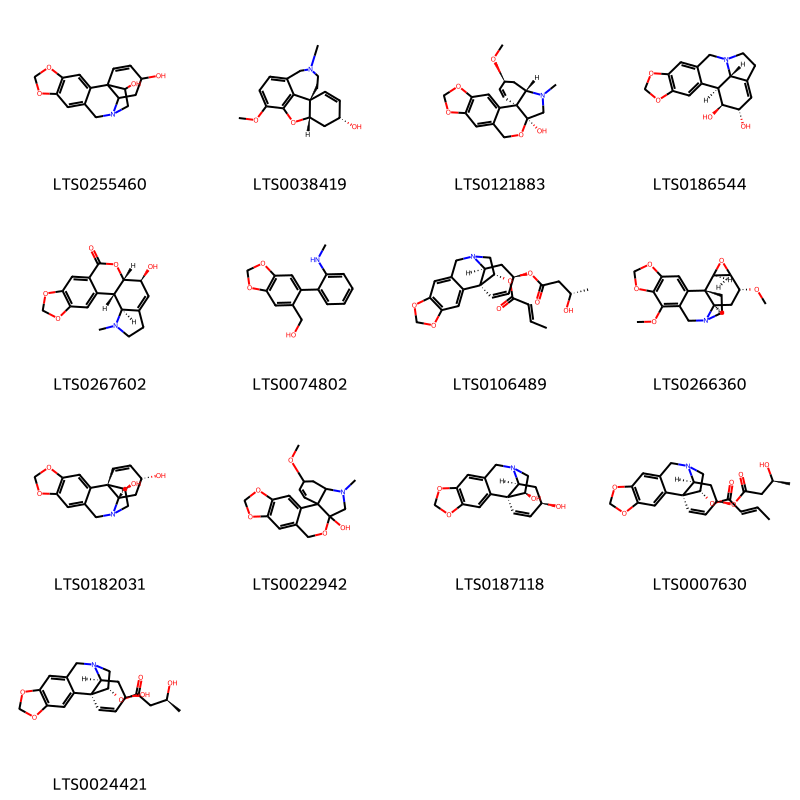{ width=100% }
    <figcaption>Hình ảnh cấu trúc hóa học của 13 hoạt chất thuộc nhóm Amaryllidaceae alkaloids gồm ['5,7-dioxa-12-azapentacyclo[10.5.2.0¹,¹³.0²,¹⁰.0⁴,⁸]nonadeca-2,4(8),9,16-tetraene-15,18-diol (LTS0255460)', 'galantamine (LTS0038419)', 'tazettine (LTS0121883)', 'lycorine (LTS0186544)', 'hippeastrine (LTS0267602)', 'ismine (LTS0074802)', '(1s,13s,15r,18r)-15-{[(3s)-3-hydroxybutanoyl]oxy}-5,7-dioxa-12-azapentacyclo[10.5.2.0¹,¹³.0²,¹⁰.0⁴,⁸]nonadeca-2,4(8),9,16-tetraen-18-yl (2e)-but-2-enoate (LTS0106489)', 'undulatine (LTS0266360)', 'hamayne (LTS0182031)', 'tazettine (LTS0022942)', '(1s,13s,15r,18s)-5,7-dioxa-12-azapentacyclo[10.5.2.0¹,¹³.0²,¹⁰.0⁴,⁸]nonadeca-2,4(8),9,16-tetraene-15,18-diol (LTS0187118)', '(1s,13s,15r,18r)-15-{[(3s)-3-hydroxybutanoyl]oxy}-5,7-dioxa-12-azapentacyclo[10.5.2.0¹,¹³.0²,¹⁰.0⁴,⁸]nonadeca-2,4(8),9,16-tetraen-18-yl but-2-enoate (LTS0007630)', '(1s,13s,15r,18r)-15-hydroxy-5,7-dioxa-12-azapentacyclo[10.5.2.0¹,¹³.0²,¹⁰.0⁴,⁸]nonadeca-2,4(8),9,16-tetraen-18-yl (3s)-3-hydroxybutanoate (LTS0024421)'].</figcaption>
</figure>
#### Nhóm Quinolines and derivatives
<figure markdown="span">
    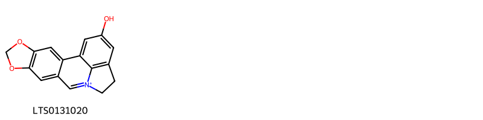{ width=100% }
    <figcaption>Hình ảnh cấu trúc hóa học của 1 hoạt chất thuộc nhóm Quinolines and derivatives gồm ['ungeremine (LTS0131020)'].</figcaption>
</figure>

---

### Dược dân tộc học

Danh sách các quốc gia có sử dụng *Galanthus nivalis* trong điều trị các bệnh. 

| Country   | Disease                             | Bệnh                               |
|:----------|:------------------------------------|:-----------------------------------|
| Turkey    | Cardiotonic, Digestive, Emmenagogue | Cardiotonic, Tiêu hóa, Emmenagogue |

---

# Chi Zigadenus

??? note "Danh sách các dược liệu thuộc chi"
    
	 - *Zigadenus elegans*
	 - *Zigadenus gramineus*

---
## Zigadenus elegans
### Thông tin về thực vật

!!! info "Phân loại thực vật của *Anticlea elegans* từ GIBF:"
    - **Kingdom:** Plantae
    - **Phylum:** Tracheophyta
    - **Order:** Liliales
    - **Family:** Melanthiaceae
    - **Genus:** Anticlea
    - **Species:** *Anticlea elegans*

 

| Label (VI)   | Label (EN)   | Scientific Name   | Descriptions (VI)   | Descriptions (EN)   | Also Known As (VI)   | Also Known As (EN)                                                                  |
|:-------------|:-------------|:------------------|:--------------------|:--------------------|:---------------------|:------------------------------------------------------------------------------------|
| N/A          | N/A          | Zigadenus elegans | loài thực vật       | species of plant    | ['']                 | ['death camas', 'mountain deathcamas', 'mountain death-camas', 'Zygadenus elegans'] |

#### Phân bố trên thế giới

**Từ CSDL GIBF** United States of America, Norway, Canada

#### Phân bố tại Việt Nam

**Từ CSDL GIBF**: Không có ghi nhận ở Việt Nam

---
### Thành phần hóa học
        
- Theo cơ sở dữ liệu lotus: Từ loài *Anticlea elegans* đã phân lập và xác định được Chưa có hoạt chất nào được phân lập. hoạt chất thuộc về các nhóm Không có hoạt chất nào được phân lập. 

Không có hình ảnh nào được tạo ra

---

### Dược dân tộc học

Danh sách các quốc gia có sử dụng *Anticlea elegans* trong điều trị các bệnh. 

| Country      | Disease   | Bệnh     |
|:-------------|:----------|:---------|
| US(Flathead) | Poison    | Chất độc |

---

---
## Zigadenus gramineus
### Thông tin về thực vật

!!! info "Phân loại thực vật của *Toxicoscordion venenosum* từ GIBF:"
    - **Kingdom:** Plantae
    - **Phylum:** Tracheophyta
    - **Order:** Liliales
    - **Family:** Melanthiaceae
    - **Genus:** Toxicoscordion
    - **Species:** *Toxicoscordion venenosum*

 

| Label (VI)   | Label (EN)   | Scientific Name     | Descriptions (VI)   | Descriptions (EN)   | Also Known As (VI)   | Also Known As (EN)   |
|:-------------|:-------------|:--------------------|:--------------------|:--------------------|:---------------------|:---------------------|
| N/A          | N/A          | Zigadenus gramineus | loài thực vật       | species of plant    | ['']                 | ['']                 |

#### Phân bố trên thế giới

**Từ CSDL GIBF** nan, United States of America, unknown or invalid, Canada

#### Phân bố tại Việt Nam

**Từ CSDL GIBF**: Không có ghi nhận ở Việt Nam

---
### Thành phần hóa học
        
- Theo cơ sở dữ liệu lotus: Từ loài *Toxicoscordion venenosum* đã phân lập và xác định được Chưa có hoạt chất nào được phân lập. hoạt chất thuộc về các nhóm Không có hoạt chất nào được phân lập. 

Không có hình ảnh nào được tạo ra

---

### Dược dân tộc học

Danh sách các quốc gia có sử dụng *Toxicoscordion venenosum* trong điều trị các bệnh. 

| Country       | Disease          | Bệnh                 |
|:--------------|:-----------------|:---------------------|
| US(Blackfoot) | Poultice, Poison | Thuốc đắp, thuốc độc |

---

# Chi Allium

??? note "Danh sách các dược liệu thuộc chi"
    
	 - *Allium ampeloprasum*
	 - *Allium ascalonium*
	 - *Allium cepa*
	 - *Allium cernuum*
	 - *Allium chinense*
	 - *Allium fistulosum*
	 - *Allium grayi*
	 - *Allium japonicum*
	 - *Allium kurrat*
	 - *Allium odorum*
	 - *Allium porrum*
	 - *Allium sativum*
	 - *Allium schoenoprasum*
	 - *Allium scorodoprasum*
	 - *Allium ursinum*
	 - *Allium victorialis*

---
## Allium ampeloprasum
### Thông tin về thực vật

!!! info "Phân loại thực vật của *Allium ampeloprasum* từ GIBF:"
    - **Kingdom:** Plantae
    - **Phylum:** Tracheophyta
    - **Order:** Asparagales
    - **Family:** Amaryllidaceae
    - **Genus:** Allium
    - **Species:** *Allium ampeloprasum*

 

| Label (VI)   | Label (EN)   | Scientific Name     | Descriptions (VI)   | Descriptions (EN)                         | Also Known As (VI)   | Also Known As (EN)   |
|:-------------|:-------------|:--------------------|:--------------------|:------------------------------------------|:---------------------|:---------------------|
| N/A          | N/A          | Allium ampeloprasum | loài thực vật       | Species of plant in family Amaryllidaceae | ['']                 | ['']                 |

#### Phân bố trên thế giới

**Từ CSDL GIBF** Malta, Sweden, Israel, Spain, Denmark, Netherlands, United States of America, Greece, Croatia, Cyprus, Gibraltar, Algeria, France, Belgium, Palestine, State of, Guernsey, Portugal, Ukraine, Italy, United Kingdom of Great Britain and Northern Ireland, Ireland

#### Phân bố tại Việt Nam

**Từ CSDL GIBF**: Không có ghi nhận ở Việt Nam

---
### Thành phần hóa học
        
- Theo cơ sở dữ liệu lotus: Từ loài *Allium ampeloprasum* đã phân lập và xác định được 147 hoạt chất thuộc về các nhóm Organic oxoanionic compounds, Fatty Acyls, Organic phosphoric acids and derivatives, Unsaturated hydrocarbons, Organic thiosulfuric acids and derivatives, Carboxylic acids and derivatives, Organic disulfides, Phenols, Thioethers, Prenol lipids, Organooxygen compounds, Benzofurans, Sulfenyl compounds, Allyl sulfur compounds, Thioacetals, Benzene and substituted derivatives, Steroids and steroid derivatives, Azacyclic compounds, Saturated hydrocarbons, Heteroaromatic compounds, Flavonoids, Organic trisulfides, Other mixed metal/non-metal oxoanionic compounds, Thiosulfinic acid esters. 

|    | chemicalTaxonomyClassyfireClass                  |   smiles_count |
|---:|:-------------------------------------------------|---------------:|
|  0 |                                                  |              3 |
|  1 | Allyl sulfur compounds                           |              6 |
|  2 | Azacyclic compounds                              |              1 |
|  3 | Benzene and substituted derivatives              |              5 |
|  4 | Benzofurans                                      |              3 |
|  5 | Carboxylic acids and derivatives                 |             12 |
|  6 | Fatty Acyls                                      |             15 |
|  7 | Flavonoids                                       |              4 |
|  8 | Heteroaromatic compounds                         |              2 |
|  9 | Organic disulfides                               |             14 |
| 10 | Organic oxoanionic compounds                     |              5 |
| 11 | Organic phosphoric acids and derivatives         |              1 |
| 12 | Organic thiosulfuric acids and derivatives       |              2 |
| 13 | Organic trisulfides                              |              3 |
| 14 | Organooxygen compounds                           |             12 |
| 15 | Other mixed metal/non-metal oxoanionic compounds |              1 |
| 16 | Phenols                                          |              1 |
| 17 | Prenol lipids                                    |             15 |
| 18 | Saturated hydrocarbons                           |             11 |
| 19 | Steroids and steroid derivatives                 |             11 |
| 20 | Sulfenyl compounds                               |              7 |
| 21 | Thioacetals                                      |              1 |
| 22 | Thioethers                                       |              2 |
| 23 | Thiosulfinic acid esters                         |              9 |
| 24 | Unsaturated hydrocarbons                         |              1 |

#### Nhóm 
<figure markdown="span">
    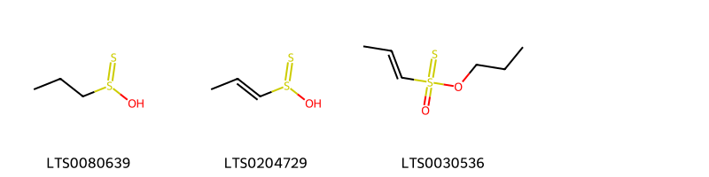{ width=100% }
    <figcaption>Hình ảnh cấu trúc hóa học của 3 hoạt chất thuộc nhóm  gồm ['propyl-λ⁴-disulfanylol (LTS0080639)', '(1e)-prop-1-en-1-yl-λ⁴-disulfanylol (LTS0204729)', '1-(prop-1-en-1-yl)-1-propoxy-1λ⁶-disulfen-1-one (LTS0030536)'].</figcaption>
</figure>
#### Nhóm Allyl sulfur compounds
<figure markdown="span">
    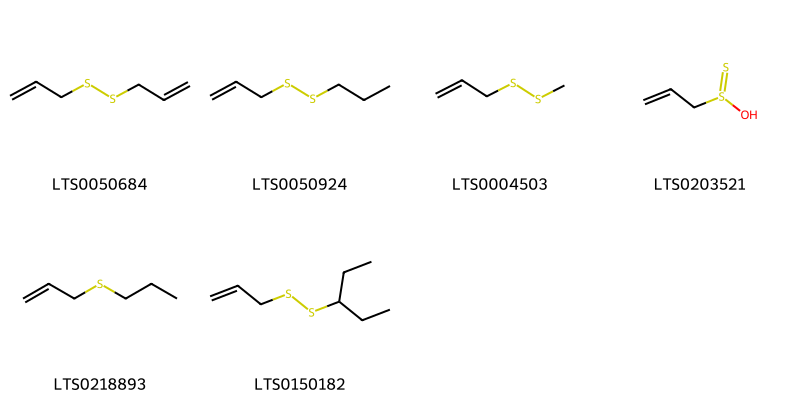{ width=100% }
    <figcaption>Hình ảnh cấu trúc hóa học của 6 hoạt chất thuộc nhóm Allyl sulfur compounds gồm ['garlicin (LTS0050684)', 'allyl propyl disulfide (LTS0050924)', 'allyl methyl disulfide (LTS0004503)', 'prop-2-en-1-yl-λ⁴-disulfanylol (LTS0203521)', '3-(propylthio)propene (LTS0218893)', '3-(prop-2-en-1-yldisulfanyl)pentane (LTS0150182)'].</figcaption>
</figure>
#### Nhóm Azacyclic compounds
<figure markdown="span">
    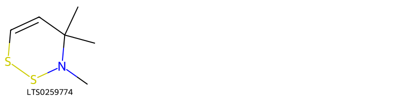{ width=100% }
    <figcaption>Hình ảnh cấu trúc hóa học của 1 hoạt chất thuộc nhóm Azacyclic compounds gồm ['3,4,4-trimethyl-1,2,3-dithiazine (LTS0259774)'].</figcaption>
</figure>
#### Nhóm Benzene and substituted derivatives
<figure markdown="span">
    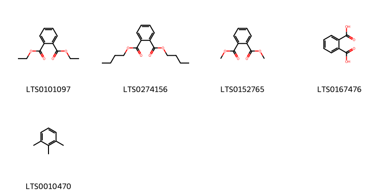{ width=100% }
    <figcaption>Hình ảnh cấu trúc hóa học của 5 hoạt chất thuộc nhóm Benzene and substituted derivatives gồm ['diethyl phthalate (LTS0101097)', 'dibutyl-phthalate (LTS0274156)', 'dimethyl phthalate (LTS0152765)', 'phthalic acid (LTS0167476)', '1,2,3-trimethylbenzene (LTS0010470)'].</figcaption>
</figure>
#### Nhóm Benzofurans
<figure markdown="span">
    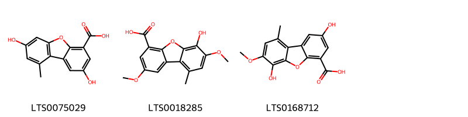{ width=100% }
    <figcaption>Hình ảnh cấu trúc hóa học của 3 hoạt chất thuộc nhóm Benzofurans gồm ['4,11-dihydroxy-13-methyl-8-oxatricyclo[7.4.0.0²,⁷]trideca-1(9),2(7),3,5,10,12-hexaene-6-carboxylic acid (LTS0075029)', '10-hydroxy-4,11-dimethoxy-13-methyl-8-oxatricyclo[7.4.0.0²,⁷]trideca-1(9),2(7),3,5,10,12-hexaene-6-carboxylic acid (LTS0018285)', '4,10-dihydroxy-11-methoxy-13-methyl-8-oxatricyclo[7.4.0.0²,⁷]trideca-1(9),2(7),3,5,10,12-hexaene-6-carboxylic acid (LTS0168712)'].</figcaption>
</figure>
#### Nhóm Carboxylic acids and derivatives
<figure markdown="span">
    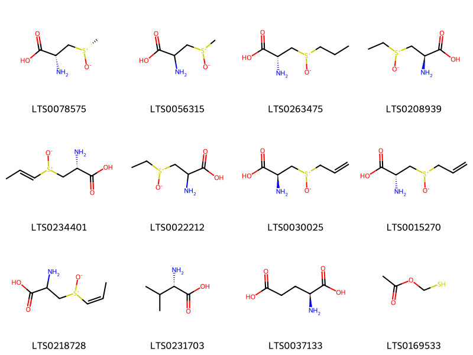{ width=100% }
    <figcaption>Hình ảnh cấu trúc hóa học của 12 hoạt chất thuộc nhóm Carboxylic acids and derivatives gồm ['(2r)-2-amino-3-[(s)-methanesulfinyl]propanoic acid (LTS0078575)', '2-amino-3-methanesulfinylpropanoic acid (LTS0056315)', '(2r)-2-amino-3-(propane-1-sulfinyl)propanoic acid (LTS0263475)', '(2r)-2-amino-3-(ethanesulfinyl)propanoic acid (LTS0208939)', 'isoalliin (LTS0234401)', '2-amino-3-(ethanesulfinyl)propanoic acid (LTS0022212)', '(2s)-2-amino-3-(prop-2-ene-1-sulfinyl)propanoic acid (LTS0030025)', 'alliin (LTS0015270)', '2-amino-3-[(1z)-prop-1-ene-1-sulfinyl]propanoic acid (LTS0218728)', 'l-valine (LTS0231703)', 'l-glutamic acid (LTS0037133)', 'methanethiol acetate (LTS0169533)'].</figcaption>
</figure>
#### Nhóm Fatty Acyls
<figure markdown="span">
    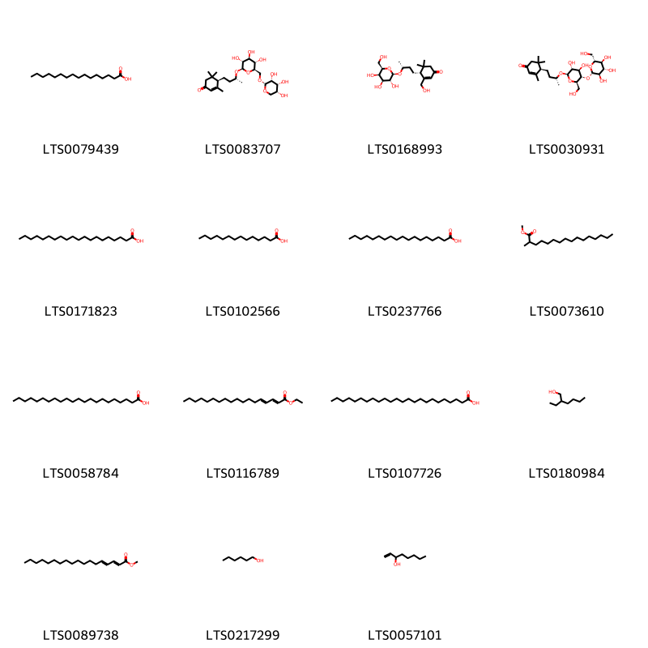{ width=100% }
    <figcaption>Hình ảnh cấu trúc hóa học của 15 hoạt chất thuộc nhóm Fatty Acyls gồm ['palmitic acid (LTS0079439)', '(4r)-3,5,5-trimethyl-4-[(3r)-3-{[(2r,3r,4s,5s,6r)-3,4,5-trihydroxy-6-({[(2r,3r,4r,5r)-3,4,5-trihydroxyoxan-2-yl]oxy}methyl)oxan-2-yl]oxy}butyl]cyclohex-2-en-1-one (LTS0083707)', '(4r)-3-(hydroxymethyl)-5,5-dimethyl-4-[(3r)-3-{[(2r,3r,4s,5r,6r)-3,4,5-trihydroxy-6-(hydroxymethyl)oxan-2-yl]oxy}butyl]cyclohex-2-en-1-one (LTS0168993)', '(4r)-4-[(3r)-3-{[(2r,3r,4r,5s,6r)-3,4-dihydroxy-6-(hydroxymethyl)-5-{[(2s,3r,4s,5s,6r)-3,4,5-trihydroxy-6-(hydroxymethyl)oxan-2-yl]oxy}oxan-2-yl]oxy}butyl]-3,5,5-trimethylcyclohex-2-en-1-one (LTS0030931)', 'arachidic acid (LTS0171823)', 'myristic acid (LTS0102566)', 'stearic acid (LTS0237766)', 'methyl 2-methylhexadecanoate (LTS0073610)', 'behenic acid (LTS0058784)', 'ethyl octadeca-2,4-dienoate (LTS0116789)', 'lignoceric acid (LTS0107726)', '2-ethylhexanol (LTS0180984)', 'methyl octadeca-2,4-dienoate (LTS0089738)', 'hexanol (LTS0217299)', '1-octen-3-ol (LTS0057101)'].</figcaption>
</figure>
#### Nhóm Flavonoids
<figure markdown="span">
    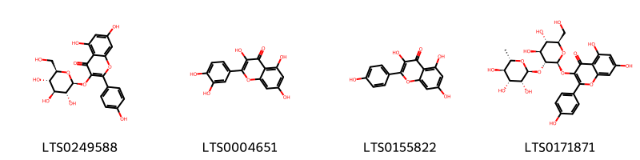{ width=100% }
    <figcaption>Hình ảnh cấu trúc hóa học của 4 hoạt chất thuộc nhóm Flavonoids gồm ['astragalin (LTS0249588)', 'quercetin (LTS0004651)', 'kaempherol (LTS0155822)', '3-{[(2s,3r,4s,5s,6r)-4,5-dihydroxy-6-(hydroxymethyl)-3-{[(2s,3r,4r,5r,6s)-3,4,5-trihydroxy-6-methyloxan-2-yl]oxy}oxan-2-yl]oxy}-5,7-dihydroxy-2-(4-hydroxyphenyl)chromen-4-one (LTS0171871)'].</figcaption>
</figure>
#### Nhóm Heteroaromatic compounds
<figure markdown="span">
    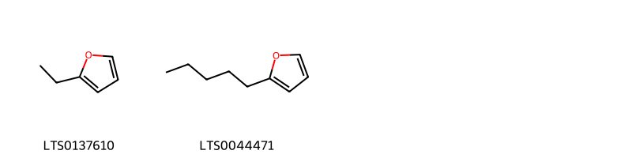{ width=100% }
    <figcaption>Hình ảnh cấu trúc hóa học của 2 hoạt chất thuộc nhóm Heteroaromatic compounds gồm ['2-ethylfuran (LTS0137610)', 'amylfuran (LTS0044471)'].</figcaption>
</figure>
#### Nhóm Organic disulfides
<figure markdown="span">
    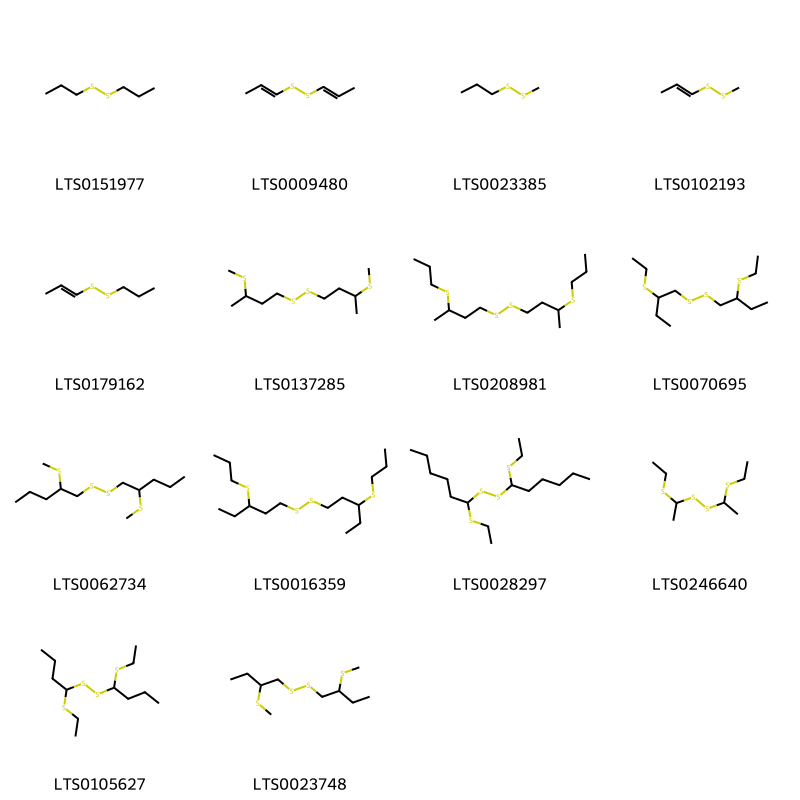{ width=100% }
    <figcaption>Hình ảnh cấu trúc hóa học của 14 hoạt chất thuộc nhóm Organic disulfides gồm ['propyl disulfide (LTS0151977)', '1-(prop-1-en-1-yldisulfanyl)prop-1-ene (LTS0009480)', 'methyl propyl disulfide (LTS0023385)', '1-(methyldisulfanyl)prop-1-ene (LTS0102193)', '1-(propyldisulfanyl)prop-1-ene (LTS0179162)', '3-(methylsulfanyl)-1-{[3-(methylsulfanyl)butyl]disulfanyl}butane (LTS0137285)', '3-(propylsulfanyl)-1-{[3-(propylsulfanyl)butyl]disulfanyl}butane (LTS0208981)', '2-(ethylsulfanyl)-1-{[2-(ethylsulfanyl)butyl]disulfanyl}butane (LTS0070695)', '2-(methylsulfanyl)-1-{[2-(methylsulfanyl)pentyl]disulfanyl}pentane (LTS0062734)', '3-(propylsulfanyl)-1-{[3-(propylsulfanyl)pentyl]disulfanyl}pentane (LTS0016359)', '1-(ethylsulfanyl)-1-{[1-(ethylsulfanyl)hexyl]disulfanyl}hexane (LTS0028297)', '1-(ethylsulfanyl)-1-{[1-(ethylsulfanyl)ethyl]disulfanyl}ethane (LTS0246640)', '1-(ethylsulfanyl)-1-{[1-(ethylsulfanyl)butyl]disulfanyl}butane (LTS0105627)', '2-(methylsulfanyl)-1-{[2-(methylsulfanyl)butyl]disulfanyl}butane (LTS0023748)'].</figcaption>
</figure>
#### Nhóm Organic oxoanionic compounds
<figure markdown="span">
    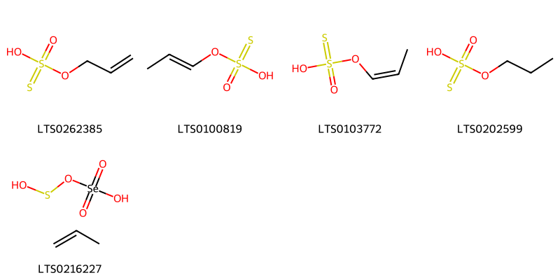{ width=100% }
    <figcaption>Hình ảnh cấu trúc hóa học của 5 hoạt chất thuộc nhóm Organic oxoanionic compounds gồm ['1-hydroxy-1-(prop-2-en-1-yloxy)-1λ⁶-disulfen-1-one (LTS0262385)', '1-hydroxy-1-[(1e)-prop-1-en-1-yloxy]-1λ⁶-disulfen-1-one (LTS0100819)', '1-hydroxy-1-[(1z)-prop-1-en-1-yloxy]-1λ⁶-disulfen-1-one (LTS0103772)', '1-hydroxy-1-propoxy-1λ⁶-disulfen-1-one (LTS0202599)', '(hydroxysulfanyl)oxyselenonic acid; propylene (LTS0216227)'].</figcaption>
</figure>
#### Nhóm Organic phosphoric acids and derivatives
<figure markdown="span">
    { width=100% }
    <figcaption>Hình ảnh cấu trúc hóa học của 1 hoạt chất thuộc nhóm Organic phosphoric acids and derivatives gồm ['o-phosphoethanolamine; bis(nonane) (LTS0249963)'].</figcaption>
</figure>
#### Nhóm Organic thiosulfuric acids and derivatives
<figure markdown="span">
    { width=100% }
    <figcaption>Hình ảnh cấu trúc hóa học của 2 hoạt chất thuộc nhóm Organic thiosulfuric acids and derivatives gồm ['prop-2-en-1-ylsulfanylsulfonic acid (LTS0084048)', 'propylsulfanylsulfonic acid (LTS0154623)'].</figcaption>
</figure>
#### Nhóm Organic trisulfides
<figure markdown="span">
    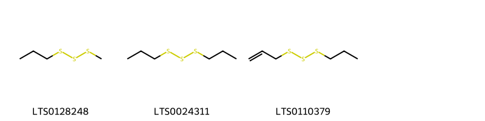{ width=100% }
    <figcaption>Hình ảnh cấu trúc hóa học của 3 hoạt chất thuộc nhóm Organic trisulfides gồm ['methyl propyl trisulfide (LTS0128248)', 'dipropyl trisulfide (LTS0024311)', '1-(prop-2-en-1-yl)-3-propyltrisulfane (LTS0110379)'].</figcaption>
</figure>
#### Nhóm Organooxygen compounds
<figure markdown="span">
    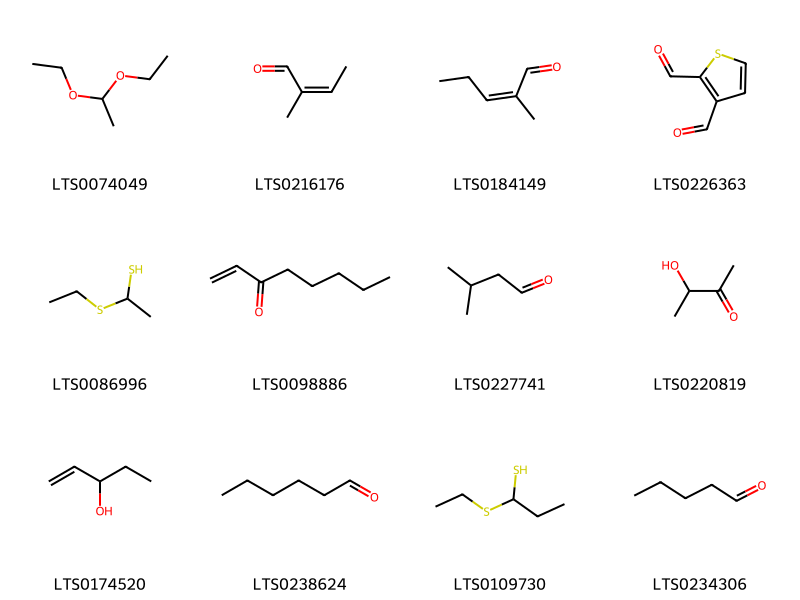{ width=100% }
    <figcaption>Hình ảnh cấu trúc hóa học của 12 hoạt chất thuộc nhóm Organooxygen compounds gồm ['polyacetal (LTS0074049)', '2-butenal, 2-methyl- (LTS0216176)', '2-pentenal, 2-methyl- (LTS0184149)', 'thiophene-2,3-dicarbaldehyde (LTS0226363)', '1-(ethylsulfanyl)ethanethiol (LTS0086996)', '1-octen-3-one (LTS0098886)', 'isovaleraldehyde (LTS0227741)', 'acetoin (LTS0220819)', '1-penten-3-ol (LTS0174520)', 'hexanal (LTS0238624)', '1-(ethylsulfanyl)propane-1-thiol (LTS0109730)', 'pentanal (LTS0234306)'].</figcaption>
</figure>
#### Nhóm Other mixed metal_non-metal oxoanionic compounds
<figure markdown="span">
    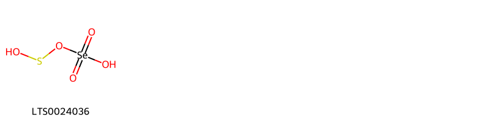{ width=100% }
    <figcaption>Hình ảnh cấu trúc hóa học của Không tìm thấy chú thích hoạt chất thuộc nhóm Other mixed metal_non-metal oxoanionic compounds gồm Không tìm thấy chú thích.</figcaption>
</figure>
#### Nhóm Phenols
<figure markdown="span">
    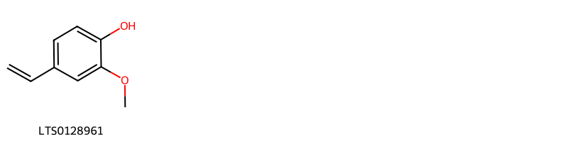{ width=100% }
    <figcaption>Hình ảnh cấu trúc hóa học của 1 hoạt chất thuộc nhóm Phenols gồm ['2-methoxy-4-vinyl-phenol (LTS0128961)'].</figcaption>
</figure>
#### Nhóm Prenol lipids
<figure markdown="span">
    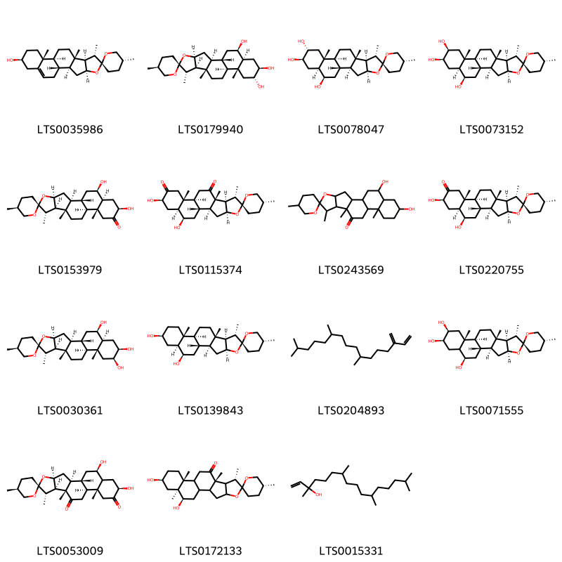{ width=100% }
    <figcaption>Hình ảnh cấu trúc hóa học của 15 hoạt chất thuộc nhóm Prenol lipids gồm ['diosgenin (LTS0035986)', "(1'r,2r,2's,4's,5s,7's,8'r,9's,12's,13'r,15'r,16'r,18's,19'r)-5,7',9',13'-tetramethyl-5'-oxaspiro[oxane-2,6'-pentacyclo[10.8.0.0²,⁹.0⁴,⁸.0¹³,¹⁸]icosane]-15',16',19'-triol (LTS0179940)", 'agigenin (LTS0078047)', "(1'r,2r,2's,4's,5r,7's,8'r,9's,12's,13'r,15's,16'r,18's,19'r)-5,7',9',13'-tetramethyl-5'-oxaspiro[oxane-2,6'-pentacyclo[10.8.0.0²,⁹.0⁴,⁸.0¹³,¹⁸]icosane]-15',16',19'-triol (LTS0073152)", "(1'r,2r,2's,4's,5s,7's,8'r,9's,12's,13'r,16'r,18's,19'r)-16',19'-dihydroxy-5,7',9',13'-tetramethyl-5'-oxaspiro[oxane-2,6'-pentacyclo[10.8.0.0²,⁹.0⁴,⁸.0¹³,¹⁸]icosan]-15'-one (LTS0153979)", "(1'r,2r,2's,4's,5r,7's,8'r,9's,12's,13'r,16'r,18's,19'r)-16',19'-dihydroxy-5,7',9',13'-tetramethyl-5'-oxaspiro[oxane-2,6'-pentacyclo[10.8.0.0²,⁹.0⁴,⁸.0¹³,¹⁸]icosane]-10',15'-dione (LTS0115374)", "16',19'-dihydroxy-5,7',9',13'-tetramethyl-5'-oxaspiro[oxane-2,6'-pentacyclo[10.8.0.0²,⁹.0⁴,⁸.0¹³,¹⁸]icosan]-10'-one (LTS0243569)", "(1'r,2r,2's,4's,5r,7's,8'r,9's,12's,13'r,16'r,18's,19'r)-16',19'-dihydroxy-5,7',9',13'-tetramethyl-5'-oxaspiro[oxane-2,6'-pentacyclo[10.8.0.0²,⁹.0⁴,⁸.0¹³,¹⁸]icosan]-15'-one (LTS0220755)", "(1'r,2r,2's,4's,5s,7's,8'r,9's,12's,13'r,15's,16'r,18's,19'r)-5,7',9',13'-tetramethyl-5'-oxaspiro[oxane-2,6'-pentacyclo[10.8.0.0²,⁹.0⁴,⁸.0¹³,¹⁸]icosane]-15',16',19'-triol (LTS0030361)", 'β-chlorogenin (LTS0139843)', '7,11,15-trimethyl-3-methylidenehexadec-1-ene (LTS0204893)', 'porrigenin a (LTS0071555)', "(1'r,2r,2's,4's,5s,7's,8'r,9's,12's,13'r,16'r,19'r)-16',19'-dihydroxy-5,7',9',13'-tetramethyl-5'-oxaspiro[oxane-2,6'-pentacyclo[10.8.0.0²,⁹.0⁴,⁸.0¹³,¹⁸]icosane]-10',15'-dione (LTS0053009)", "(5r,7's,9's,13'r,16's,18's,19'r)-16',19'-dihydroxy-5,7',9',13',18'-pentamethyl-5'-oxaspiro[oxane-2,6'-pentacyclo[10.8.0.0²,⁹.0⁴,⁸.0¹³,¹⁸]icosan]-10'-one (LTS0172133)", 'isophytol (LTS0015331)'].</figcaption>
</figure>
#### Nhóm Saturated hydrocarbons
<figure markdown="span">
    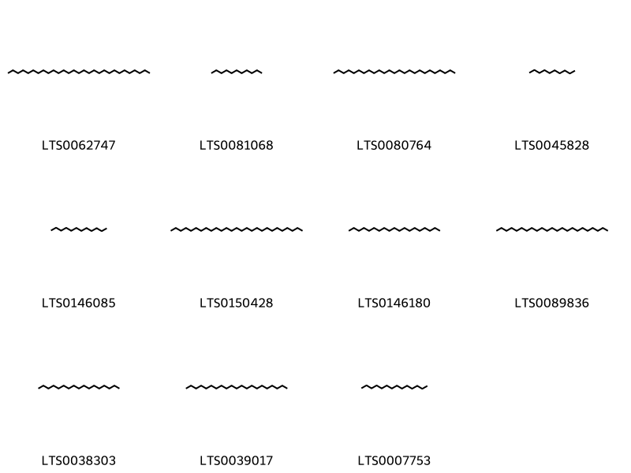{ width=100% }
    <figcaption>Hình ảnh cấu trúc hóa học của 11 hoạt chất thuộc nhóm Saturated hydrocarbons gồm ['nonacosane (LTS0062747)', 'undecane (LTS0081068)', 'pentacosane (LTS0080764)', 'decane (LTS0045828)', 'dodecane (LTS0146085)', 'heptacosane (LTS0150428)', 'nonadecane (LTS0146180)', 'tricosane (LTS0089836)', 'heptadecane (LTS0038303)', 'heneicosane (LTS0039017)', 'tetradecane (LTS0007753)'].</figcaption>
</figure>
#### Nhóm Steroids and steroid derivatives
<figure markdown="span">
    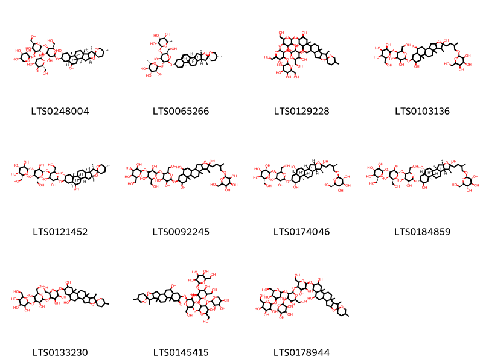{ width=100% }
    <figcaption>Hình ảnh cấu trúc hóa học của 11 hoạt chất thuộc nhóm Steroids and steroid derivatives gồm ["(2s,3r,4s,5s,6r)-2-{[(2s,3r,4s,5r,6r)-2-{[(2r,3r,4r,5r,6r)-4,5-dihydroxy-2-(hydroxymethyl)-6-[(1'r,2r,2's,4's,5r,7's,8'r,9's,12's,13'r,15'r,16'r,18's,19'r)-5,7',9',13'-tetramethyl-5'-oxaspiro[oxane-2,6'-pentacyclo[10.8.0.0²,⁹.0⁴,⁸.0¹³,¹⁸]icosane]-15',19'-dioloxy]oxan-3-yl]oxy}-5-hydroxy-6-(hydroxymethyl)-4-{[(2s,3r,4s,5r)-3,4,5-trihydroxyoxan-2-yl]oxy}oxan-3-yl]oxy}-6-(hydroxymethyl)oxane-3,4,5-triol (LTS0248004)", "(2s,3r,4r,5r,6s)-2-{[(2r,3s,4s,5r,6r)-4-hydroxy-2-(hydroxymethyl)-6-[(1's,2r,2's,4's,5r,7's,8'r,9's,12's,13'r,16's)-5,7',9',13'-tetramethyl-5'-oxaspiro[oxane-2,6'-pentacyclo[10.8.0.0²,⁹.0⁴,⁸.0¹³,¹⁸]icosan]-18'-eneoxy]-5-{[(2s,3r,4r,5r,6s)-3,4,5-trihydroxy-6-methyloxan-2-yl]oxy}oxan-3-yl]oxy}-6-methyloxane-3,4,5-triol (LTS0065266)", "2-[(2-{[4,5-dihydroxy-2-(hydroxymethyl)-6-{5,7',9',13'-tetramethyl-5'-oxaspiro[oxane-2,6'-pentacyclo[10.8.0.0²,⁹.0⁴,⁸.0¹³,¹⁸]icosane]-15',19'-dioloxy}oxan-3-yl]oxy}-5-hydroxy-6-(hydroxymethyl)-3-{[3,4,5-trihydroxy-6-(hydroxymethyl)oxan-2-yl]oxy}oxan-4-yl)oxy]-6-(hydroxymethyl)oxane-3,4,5-triol (LTS0129228)", '16-{[3,4-dihydroxy-6-(hydroxymethyl)-5-{[3,4,5-trihydroxy-6-(hydroxymethyl)oxan-2-yl]oxy}oxan-2-yl]oxy}-7,9,13-trimethyl-6-(3-methyl-4-{[3,4,5-trihydroxy-6-(hydroxymethyl)oxan-2-yl]oxy}butyl)-5-oxapentacyclo[10.8.0.0²,⁹.0⁴,⁸.0¹³,¹⁸]icosane-6,15,19-triol (LTS0103136)', "(2s,3r,4s,5s,6r)-2-{[(2s,3r,4s,5r,6r)-2-{[(2r,3r,4r,5r,6r)-4,5-dihydroxy-2-(hydroxymethyl)-6-[(1'r,2r,2's,4's,5r,7's,8'r,9's,12's,13'r,15'r,16'r,18's,19'r)-5,7',9',13'-tetramethyl-5'-oxaspiro[oxane-2,6'-pentacyclo[10.8.0.0²,⁹.0⁴,⁸.0¹³,¹⁸]icosane]-15',19'-dioloxy]oxan-3-yl]oxy}-3,5-dihydroxy-6-(hydroxymethyl)oxan-4-yl]oxy}-6-(hydroxymethyl)oxane-3,4,5-triol (LTS0121452)", '16-[(5-{[3,5-dihydroxy-6-(hydroxymethyl)-4-{[3,4,5-trihydroxy-6-(hydroxymethyl)oxan-2-yl]oxy}oxan-2-yl]oxy}-3,4-dihydroxy-6-(hydroxymethyl)oxan-2-yl)oxy]-7,9,13-trimethyl-6-(3-methyl-4-{[3,4,5-trihydroxy-6-(hydroxymethyl)oxan-2-yl]oxy}butyl)-5-oxapentacyclo[10.8.0.0²,⁹.0⁴,⁸.0¹³,¹⁸]icosane-6,15,19-triol (LTS0092245)', '(1r,2s,4s,6s,7s,8r,9s,12s,13r,15r,16r,18s,19r)-16-{[(2r,3r,4r,5r,6r)-3,4-dihydroxy-6-(hydroxymethyl)-5-{[(2s,3r,4s,5s,6r)-3,4,5-trihydroxy-6-(hydroxymethyl)oxan-2-yl]oxy}oxan-2-yl]oxy}-7,9,13-trimethyl-6-[(3r)-3-methyl-4-{[(2r,3r,4s,5s,6r)-3,4,5-trihydroxy-6-(hydroxymethyl)oxan-2-yl]oxy}butyl]-5-oxapentacyclo[10.8.0.0²,⁹.0⁴,⁸.0¹³,¹⁸]icosane-6,15,19-triol (LTS0174046)', '(1r,2s,4s,6s,7s,8r,9s,12s,13r,15r,16r,18s,19r)-16-{[(2r,3r,4r,5r,6r)-5-{[(2s,3r,4s,5r,6r)-3,5-dihydroxy-6-(hydroxymethyl)-4-{[(2s,3r,4s,5s,6r)-3,4,5-trihydroxy-6-(hydroxymethyl)oxan-2-yl]oxy}oxan-2-yl]oxy}-3,4-dihydroxy-6-(hydroxymethyl)oxan-2-yl]oxy}-7,9,13-trimethyl-6-[(3r)-3-methyl-4-{[(2r,3r,4s,5s,6r)-3,4,5-trihydroxy-6-(hydroxymethyl)oxan-2-yl]oxy}butyl]-5-oxapentacyclo[10.8.0.0²,⁹.0⁴,⁸.0¹³,¹⁸]icosane-6,15,19-triol (LTS0184859)', "2-[(2-{[4,5-dihydroxy-2-(hydroxymethyl)-6-{5,7',9',13'-tetramethyl-5'-oxaspiro[oxane-2,6'-pentacyclo[10.8.0.0²,⁹.0⁴,⁸.0¹³,¹⁸]icosane]-15',19'-dioloxy}oxan-3-yl]oxy}-3,5-dihydroxy-6-(hydroxymethyl)oxan-4-yl)oxy]-6-(hydroxymethyl)oxane-3,4,5-triol (LTS0133230)", "16'-({5-[(3-{[3,5-dihydroxy-6-(hydroxymethyl)-4-{[3,4,5-trihydroxy-6-(hydroxymethyl)oxan-2-yl]oxy}oxan-2-yl]oxy}-5-hydroxy-6-(hydroxymethyl)-4-[(3,4,5-trihydroxyoxan-2-yl)oxy]oxan-2-yl)oxy]-3,4-dihydroxy-6-(hydroxymethyl)oxan-2-yl}oxy)-19'-hydroxy-5,7',9',13'-tetramethyl-5'-oxaspiro[oxane-2,6'-pentacyclo[10.8.0.0²,⁹.0⁴,⁸.0¹³,¹⁸]icosan]-15'-one (LTS0145415)", "2-({2-[(2-{[4,5-dihydroxy-2-(hydroxymethyl)-6-{5,7',9',13'-tetramethyl-5'-oxaspiro[oxane-2,6'-pentacyclo[10.8.0.0²,⁹.0⁴,⁸.0¹³,¹⁸]icosane]-15',19'-dioloxy}oxan-3-yl]oxy}-5-hydroxy-6-(hydroxymethyl)-4-[(3,4,5-trihydroxyoxan-2-yl)oxy]oxan-3-yl)oxy]-3,5-dihydroxy-6-(hydroxymethyl)oxan-4-yl}oxy)-6-(hydroxymethyl)oxane-3,4,5-triol (LTS0178944)"].</figcaption>
</figure>
#### Nhóm Sulfenyl compounds
<figure markdown="span">
    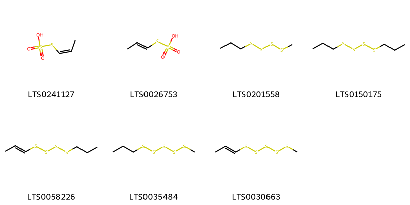{ width=100% }
    <figcaption>Hình ảnh cấu trúc hóa học của 7 hoạt chất thuộc nhóm Sulfenyl compounds gồm ['(1z)-prop-1-en-1-ylsulfanylsulfonic acid (LTS0241127)', '(1e)-prop-1-en-1-ylsulfanylsulfonic acid (LTS0026753)', '1-methyl-4-propyltetrasulfane (LTS0201558)', 'dipropyltetrasulfane (LTS0150175)', '1-(prop-1-en-1-yl)-4-propyltetrasulfane (LTS0058226)', '1-methyl-5-propylpentasulfane (LTS0035484)', '1-methyl-5-(prop-1-en-1-yl)pentasulfane (LTS0030663)'].</figcaption>
</figure>
#### Nhóm Thioacetals
<figure markdown="span">
    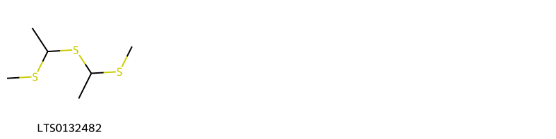{ width=100% }
    <figcaption>Hình ảnh cấu trúc hóa học của 1 hoạt chất thuộc nhóm Thioacetals gồm ['1-(methylsulfanyl)-1-{[1-(methylsulfanyl)ethyl]sulfanyl}ethane (LTS0132482)'].</figcaption>
</figure>
#### Nhóm Thioethers
<figure markdown="span">
    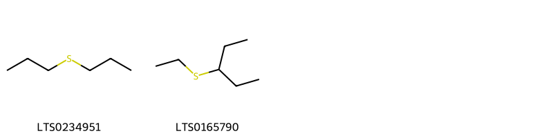{ width=100% }
    <figcaption>Hình ảnh cấu trúc hóa học của 2 hoạt chất thuộc nhóm Thioethers gồm ['propyl sulfide (LTS0234951)', '3-(ethylsulfanyl)pentane (LTS0165790)'].</figcaption>
</figure>
#### Nhóm Thiosulfinic acid esters
<figure markdown="span">
    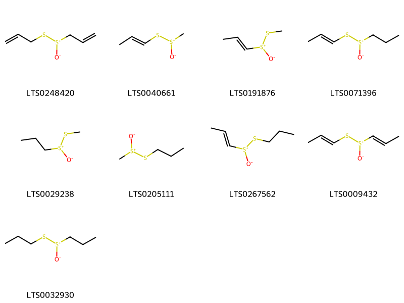{ width=100% }
    <figcaption>Hình ảnh cấu trúc hóa học của 9 hoạt chất thuộc nhóm Thiosulfinic acid esters gồm ['allicin (LTS0248420)', '(1e)-1-(methanesulfinylsulfanyl)prop-1-ene (LTS0040661)', '{[(1e)-prop-1-ene-1-sulfinyl]sulfanyl}methane (LTS0191876)', '(1e)-1-[(propane-1-sulfinyl)sulfanyl]prop-1-ene (LTS0071396)', '[(propane-1-sulfinyl)sulfanyl]methane (LTS0029238)', '1-(methanesulfinylsulfanyl)propane (LTS0205111)', '1-{[(1e)-prop-1-ene-1-sulfinyl]sulfanyl}propane (LTS0267562)', '(1e)-1-{[(1e)-prop-1-ene-1-sulfinyl]sulfanyl}prop-1-ene (LTS0009432)', 's-propyl propanethiosulfinate (LTS0032930)'].</figcaption>
</figure>
#### Nhóm Unsaturated hydrocarbons
<figure markdown="span">
    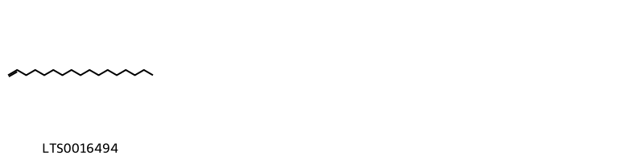{ width=100% }
    <figcaption>Hình ảnh cấu trúc hóa học của 1 hoạt chất thuộc nhóm Unsaturated hydrocarbons gồm ['heptadecene (LTS0016494)'].</figcaption>
</figure>

---

### Dược dân tộc học

Danh sách các quốc gia có sử dụng *Allium ampeloprasum* trong điều trị các bệnh. 

| Country   | Disease   | Bệnh           |
|:----------|:----------|:---------------|
| China     | Vermifuge | Thuốc diệt sán |

---

---
## Allium ascalonium
### Thông tin về thực vật

!!! info "Phân loại thực vật của *Allium gomphrenoides* từ GIBF:"
    - **Kingdom:** Plantae
    - **Phylum:** Tracheophyta
    - **Order:** Asparagales
    - **Family:** Amaryllidaceae
    - **Genus:** Allium
    - **Species:** *Allium gomphrenoides*

 

| Label (VI)   | Label (EN)   | Scientific Name   | Descriptions (VI)   | Descriptions (EN)   | Also Known As (VI)   | Also Known As (EN)   |
|:-------------|:-------------|:------------------|:--------------------|:--------------------|:---------------------|:---------------------|
| N/A          | N/A          | Allium ascalonium |                     |                     | ['']                 | ['']                 |

#### Phân bố trên thế giới

**Từ CSDL GIBF** Malta, Sweden, Israel, Spain, Denmark, Netherlands, United States of America, Greece, Croatia, Cyprus, Gibraltar, Algeria, France, Belgium, Palestine, State of, Guernsey, Portugal, Ukraine, Italy, United Kingdom of Great Britain and Northern Ireland, Ireland

#### Phân bố tại Việt Nam

**Từ CSDL GIBF**: Không có ghi nhận ở Việt Nam

---
### Thành phần hóa học
        
- Theo cơ sở dữ liệu lotus: Từ loài *Allium gomphrenoides* đã phân lập và xác định được Chưa có hoạt chất nào được phân lập. hoạt chất thuộc về các nhóm Không có hoạt chất nào được phân lập. 

Không có hình ảnh nào được tạo ra

---

### Dược dân tộc học

Danh sách các quốc gia có sử dụng *Allium gomphrenoides* trong điều trị các bệnh. 

| Country   | Disease                                     | Bệnh                                            |
|:----------|:--------------------------------------------|:------------------------------------------------|
| China     | Discutient, Tonic, Vulnerary, Astringent    | Discutient, Tonic, Vulnerary, Astringent        |
| Haiti     | Apertif, Sedative                           | Apertif, Thuốc an thần                          |
| Malaya    | Vermifuge                                   | Thuốc diệt sán                                  |
| Turkey    | Aphrodisiac, Digestive, Diuretic, Stomachic | Kích thích tình dục, Tiêu hóa, Lợi tiểu, Dạ dày |

---

---
## Allium cepa
### Thông tin về thực vật

!!! info "Phân loại thực vật của *Allium cepa* từ GIBF:"
    - **Kingdom:** Plantae
    - **Phylum:** Tracheophyta
    - **Order:** Asparagales
    - **Family:** Amaryllidaceae
    - **Genus:** Allium
    - **Species:** *Allium cepa*

 

| Label (VI)   | Label (EN)   | Scientific Name   | Descriptions (VI)   | Descriptions (EN)   | Also Known As (VI)   | Also Known As (EN)                |
|:-------------|:-------------|:------------------|:--------------------|:--------------------|:---------------------|:----------------------------------|
| N/A          | N/A          | Allium cepa       | loài thực vật       | species of plant    | ['Allium cepa']      | ['Allium cepa L.', 'onion plant'] |

#### Phân bố trên thế giới

**Từ CSDL GIBF** Czechia, Mongolia, Sweden, Chile, Türkiye, Ecuador, Slovenia, Trinidad and Tobago, Spain, Netherlands, Poland, Denmark, United States of America, Greece, Armenia, Pakistan, Russian Federation, Colombia, Croatia, Argentina, Estonia, Mexico, Algeria, Norway, Libya, United Kingdom of Great Britain and Northern Ireland, Belgium, Malaysia, Serbia, Canada, Germany, Egypt, Bosnia and Herzegovina, Austria, Bahamas, Ukraine, Slovakia, Italy, India, Switzerland, France

#### Phân bố tại Việt Nam

**Từ CSDL GIBF**: Không có ghi nhận ở Việt Nam

---
### Thành phần hóa học
        
- Theo cơ sở dữ liệu lotus: Từ loài *Allium cepa* đã phân lập và xác định được 251 hoạt chất thuộc về các nhóm Organic oxoanionic compounds, Fatty Acyls, Thiols, Organic thiosulfuric acids and derivatives, Carboxylic acids and derivatives, Organic disulfides, Phenols, Organooxygen compounds, Thiosulfinic acid esters, Sulfenyl compounds, Allyl sulfur compounds, Thiocarboxylic acids and derivatives, Thiolanes, Keto acids and derivatives, Stilbenes, Dihydrofurans, Depsides and depsidones, Benzene and substituted derivatives, Purine nucleosides, Cinnamic acids and derivatives, Steroids and steroid derivatives, Furanoid lignans, 2-arylbenzofuran flavonoids, Flavonoids, Organic trisulfides, Sulfoxides, Prenol lipids. 

|    | chemicalTaxonomyClassyfireClass            |   smiles_count |
|---:|:-------------------------------------------|---------------:|
|  0 |                                            |              3 |
|  1 | 2-arylbenzofuran flavonoids                |              2 |
|  2 | Allyl sulfur compounds                     |              6 |
|  3 | Benzene and substituted derivatives        |              6 |
|  4 | Carboxylic acids and derivatives           |             40 |
|  5 | Cinnamic acids and derivatives             |              8 |
|  6 | Depsides and depsidones                    |              1 |
|  7 | Dihydrofurans                              |              2 |
|  8 | Fatty Acyls                                |              8 |
|  9 | Flavonoids                                 |             65 |
| 10 | Furanoid lignans                           |              2 |
| 11 | Keto acids and derivatives                 |              1 |
| 12 | Organic disulfides                         |              9 |
| 13 | Organic oxoanionic compounds               |              4 |
| 14 | Organic thiosulfuric acids and derivatives |              2 |
| 15 | Organic trisulfides                        |              4 |
| 16 | Organooxygen compounds                     |             16 |
| 17 | Phenols                                    |              3 |
| 18 | Prenol lipids                              |              4 |
| 19 | Purine nucleosides                         |              1 |
| 20 | Steroids and steroid derivatives           |             26 |
| 21 | Stilbenes                                  |              3 |
| 22 | Sulfenyl compounds                         |              6 |
| 23 | Sulfoxides                                 |              6 |
| 24 | Thiocarboxylic acids and derivatives       |              2 |
| 25 | Thiolanes                                  |              3 |
| 26 | Thiols                                     |              1 |
| 27 | Thiosulfinic acid esters                   |             16 |

#### Nhóm 
<figure markdown="span">
    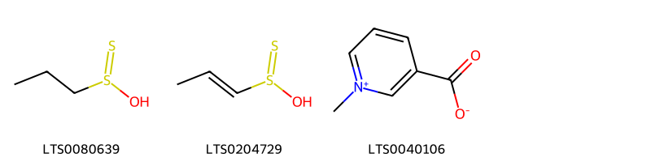{ width=100% }
    <figcaption>Hình ảnh cấu trúc hóa học của 3 hoạt chất thuộc nhóm  gồm ['propyl-λ⁴-disulfanylol (LTS0080639)', '(1e)-prop-1-en-1-yl-λ⁴-disulfanylol (LTS0204729)', 'trigonelline (LTS0040106)'].</figcaption>
</figure>
#### Nhóm 2-arylbenzofuran flavonoids
<figure markdown="span">
    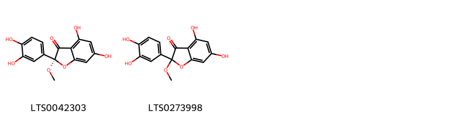{ width=100% }
    <figcaption>Hình ảnh cấu trúc hóa học của 2 hoạt chất thuộc nhóm 2-arylbenzofuran flavonoids gồm ['(2s)-2-(3,4-dihydroxyphenyl)-4,6-dihydroxy-2-methoxy-1-benzofuran-3-one (LTS0042303)', '2-(3,4-dihydroxyphenyl)-4,6-dihydroxy-2-methoxy-1-benzofuran-3-one (LTS0273998)'].</figcaption>
</figure>
#### Nhóm Allyl sulfur compounds
<figure markdown="span">
    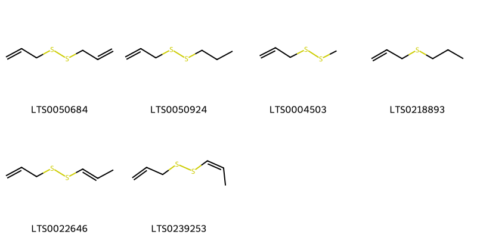{ width=100% }
    <figcaption>Hình ảnh cấu trúc hóa học của 6 hoạt chất thuộc nhóm Allyl sulfur compounds gồm ['garlicin (LTS0050684)', 'allyl propyl disulfide (LTS0050924)', 'allyl methyl disulfide (LTS0004503)', '3-(propylthio)propene (LTS0218893)', '3-[(1e)-prop-1-en-1-yldisulfanyl]prop-1-ene (LTS0022646)', '3-[(1z)-prop-1-en-1-yldisulfanyl]prop-1-ene (LTS0239253)'].</figcaption>
</figure>
#### Nhóm Benzene and substituted derivatives
<figure markdown="span">
    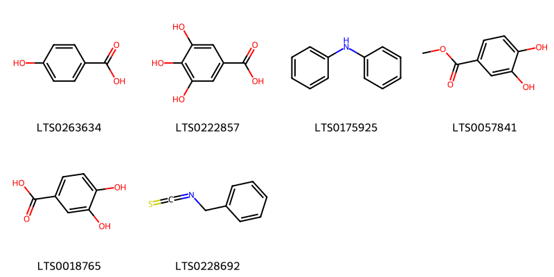{ width=100% }
    <figcaption>Hình ảnh cấu trúc hóa học của 6 hoạt chất thuộc nhóm Benzene and substituted derivatives gồm ['p-hydroxybenzoic acid (LTS0263634)', 'galop (LTS0222857)', 'diphenylamine (LTS0175925)', 'methyl 3,4-dihydroxybenzoate (LTS0057841)', '3,4-dihydroxybenzoic acid (LTS0018765)', 'benzyl isothiocyanate (LTS0228692)'].</figcaption>
</figure>
#### Nhóm Carboxylic acids and derivatives
<figure markdown="span">
    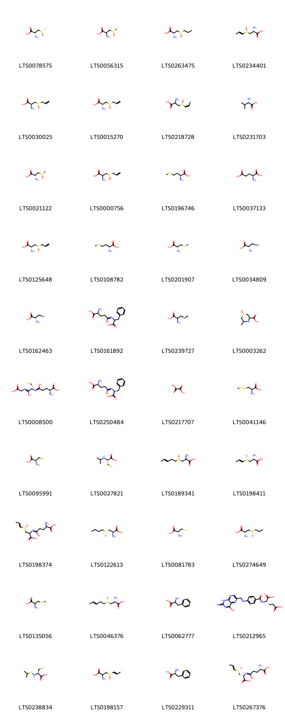{ width=100% }
    <figcaption>Hình ảnh cấu trúc hóa học của 40 hoạt chất thuộc nhóm Carboxylic acids and derivatives gồm ['(2r)-2-amino-3-[(s)-methanesulfinyl]propanoic acid (LTS0078575)', '2-amino-3-methanesulfinylpropanoic acid (LTS0056315)', '(2r)-2-amino-3-(propane-1-sulfinyl)propanoic acid (LTS0263475)', 'isoalliin (LTS0234401)', '(2s)-2-amino-3-(prop-2-ene-1-sulfinyl)propanoic acid (LTS0030025)', 'alliin (LTS0015270)', '2-amino-3-[(1z)-prop-1-ene-1-sulfinyl]propanoic acid (LTS0218728)', 'l-valine (LTS0231703)', '(2r)-2-amino-3-methanesulfinylpropanoic acid (LTS0021122)', 'allin (LTS0000756)', 'l-methionine (LTS0196746)', 'l-glutamic acid (LTS0037133)', '(2r)-2-amino-3-[(r)-prop-2-ene-1-sulfinyl]propanoic acid (LTS0125648)', 'd-methionine (LTS0108782)', 's-methylcysteine (LTS0201907)', 'l-selenocysteine (LTS0034809)', 'selenocysteine (LTS0162463)', '2-amino-4-[(1-carboxy-2-phenylethyl)-c-hydroxycarbonimidoyl]butanoic acid (LTS0161892)', 'se-methylselenocysteine (LTS0239727)', '3-carboxy-5-methylthiomorpholin-1-ium-1-olate (LTS0003262)', '(2s)-2-amino-4-{[(1r)-1-(carboxymethyl-c-hydroxycarbonimidoyl)-2-sulfanylethyl]-c-hydroxycarbonimidoyl}butanoic acid (LTS0008500)', '(2s)-2-amino-4-{[(1s)-1-carboxy-2-phenylethyl]-c-hydroxycarbonimidoyl}butanoic acid (LTS0250484)', 'oxalic acid (LTS0217707)', 's-methyl-thio-cysteine (LTS0041146)', 'd-cysteine (LTS0095991)', '(2r)-2-(isopropylamino)-3-sulfanylpropanoic acid (LTS0027821)', '2-amino-3-(pent-3-ene-1-sulfinyl)propanoic acid (LTS0189341)', '(2r)-2-amino-3-[(r)-(1e)-prop-1-ene-1-sulfinyl]propanoic acid (LTS0198411)', '2-amino-4-{[1-carboxy-2-(prop-1-ene-1-sulfinyl)ethyl]-c-hydroxycarbonimidoyl}butanoic acid (LTS0198374)', '(2r)-2-amino-3-[(r)-butane-1-sulfinyl]propanoic acid (LTS0122613)', 'l-cysteine (LTS0081783)', '(2r)-2-amino-3-[(s)-propane-1-sulfinyl]propanoic acid (LTS0274649)', 'methylcysteine (LTS0135056)', '(2r)-2-amino-3-[(s)-(3e)-pent-3-ene-1-sulfinyl]propanoic acid (LTS0046376)', 'phenylalanin (LTS0062777)', 'acid, folic (LTS0212965)', '(2r)-2-[(isopropylsulfanyl)amino]-3-sulfanylpropanoic acid (LTS0238834)', '2-amino-3-(prop-1-ene-1-sulfinyl)propanoic acid (LTS0198157)', 'l-phenylalanine (LTS0229311)', '(2s)-2-amino-4-{[(1r)-1-carboxy-2-[(r)-(1e)-prop-1-ene-1-sulfinyl]ethyl]-c-hydroxycarbonimidoyl}butanoic acid (LTS0267376)'].</figcaption>
</figure>
#### Nhóm Cinnamic acids and derivatives
<figure markdown="span">
    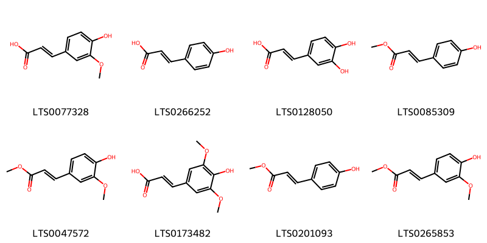{ width=100% }
    <figcaption>Hình ảnh cấu trúc hóa học của 8 hoạt chất thuộc nhóm Cinnamic acids and derivatives gồm ['ferulic acid (LTS0077328)', 'para-coumaric acid (LTS0266252)', '3,4-dihydroxycinnamic acid (LTS0128050)', 'methyl (2e)-3-(4-hydroxyphenyl)prop-2-enoate (LTS0085309)', 'methyl ferulate (LTS0047572)', 'sinapinate (LTS0173482)', 'methyl hydroxycinnamate (LTS0201093)', 'methyl ferulate (LTS0265853)'].</figcaption>
</figure>
#### Nhóm Depsides and depsidones
<figure markdown="span">
    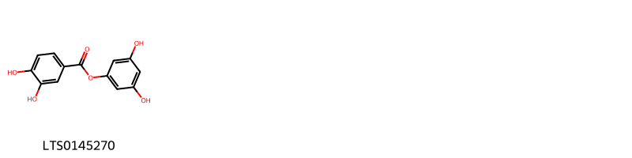{ width=100% }
    <figcaption>Hình ảnh cấu trúc hóa học của 1 hoạt chất thuộc nhóm Depsides and depsidones gồm ['3,5-dihydroxyphenyl 3,4-dihydroxybenzoate (LTS0145270)'].</figcaption>
</figure>
#### Nhóm Dihydrofurans
<figure markdown="span">
    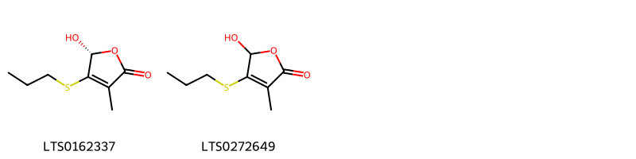{ width=100% }
    <figcaption>Hình ảnh cấu trúc hóa học của 2 hoạt chất thuộc nhóm Dihydrofurans gồm ['(5r)-5-hydroxy-3-methyl-4-(propylsulfanyl)-5h-furan-2-one (LTS0162337)', '5-hydroxy-3-methyl-4-(propylsulfanyl)-5h-furan-2-one (LTS0272649)'].</figcaption>
</figure>
#### Nhóm Fatty Acyls
<figure markdown="span">
    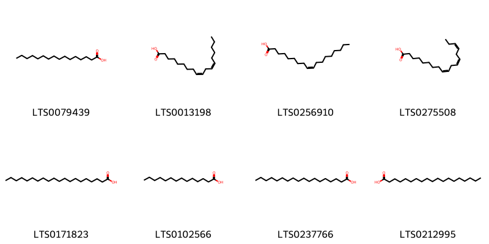{ width=100% }
    <figcaption>Hình ảnh cấu trúc hóa học của 8 hoạt chất thuộc nhóm Fatty Acyls gồm ['palmitic acid (LTS0079439)', 'linoleic (LTS0013198)', 'oleic acid (LTS0256910)', 'α-linolenic acid (LTS0275508)', 'arachidic acid (LTS0171823)', 'myristic acid (LTS0102566)', 'stearic acid (LTS0237766)', 'nonadecanoic acid (LTS0212995)'].</figcaption>
</figure>
#### Nhóm Flavonoids
<figure markdown="span">
    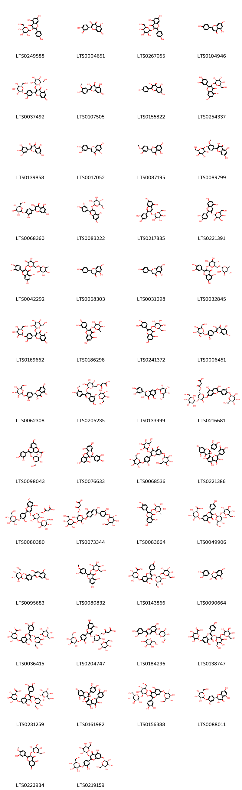{ width=100% }
    <figcaption>Hình ảnh cấu trúc hóa học của 65 hoạt chất thuộc nhóm Flavonoids gồm ['astragalin (LTS0249588)', 'quercetin (LTS0004651)', 'trifolin (LTS0267055)', 'chamomile (LTS0104946)', "quercetin 3,4'-diglucoside (LTS0037492)", 'isorhamnetin (LTS0107505)', 'kaempherol (LTS0155822)', 'isoquercetin (LTS0254337)', 'myricetin (LTS0139858)', 'luteolin (LTS0017052)', 'hesperetin (LTS0087195)', '3,5,7-trihydroxy-2-(3-methoxy-4-{[3,4,5-trihydroxy-6-(hydroxymethyl)oxan-2-yl]oxy}phenyl)chromen-4-one (LTS0089799)', 'spiraeoside (LTS0068360)', '5,7-dihydroxy-2-(4-hydroxy-3-oxidophenyl)-3-{[(2s,3r,4s,5s,6r)-3,4,5-trihydroxy-6-(hydroxymethyl)oxan-2-yl]oxy}-1λ⁴-chromen-1-ylium (LTS0083222)', 'cyanidin 3-glucoside (LTS0217835)', 'chrysanthemin (LTS0221391)', 'rutin (LTS0042292)', 'asahina (LTS0068303)', 'naringenin (LTS0031098)', '3-rutinosyl quercetin (LTS0032845)', "quercetin 3,4'-diglucoside (LTS0169662)", 'quercitrin (LTS0186298)', '2-(3,4-dihydroxyphenyl)-5,7-dihydroxy-3-{[(2s,3r,4r,5r,6s)-3,4,5-trihydroxy-6-(hydroxymethyl)oxan-2-yl]oxy}chromen-4-one (LTS0241372)', '3,5,7-trihydroxy-2-(3-hydroxy-4-{[3,4,5-trihydroxy-6-(hydroxymethyl)oxan-2-yl]oxy}phenyl)chromen-4-one (LTS0006451)', '3,5,7-trihydroxy-2-(3-hydroxy-4-{[3,4,5-trihydroxy-6-(hydroxymethyl)oxan-2-yl]oxy}phenyl)-2,3-dihydro-1-benzopyran-4-one (LTS0062308)', '3-{[(2s,3s,4r,5r,6r)-6-{[(2-carboxyacetyl)oxy]methyl}-3,4,5-trihydroxyoxan-2-yl]oxy}-7-hydroxy-2-(4-hydroxy-3-methoxyphenyl)-5-{[(2s,3r,4s,5r,6r)-3,4,5-trihydroxy-6-(hydroxymethyl)oxan-2-yl]oxy}-1λ⁴-chromen-1-ylium (LTS0205235)', 'taxifolin 7-glucoside (LTS0133999)', '[(2s,3s,4s,5r,6s)-6-{[(2-carboxyacetyl)oxy]methyl}-3,5-dihydroxy-4-{[(2s,3r,4s,5s,6r)-3,4,5-trihydroxy-6-(hydroxymethyl)oxan-2-yl]oxy}oxan-2-yl][3,5-dihydroxy-2-(3-hydroxy-4-{[(2s,3s,4s,5s,6r)-3,4,5-trihydroxy-6-(hydroxymethyl)oxan-2-yl]oxy}phenyl)chromen-7-ylidene]oxidanium (LTS0216681)', '3-carboxy-7-(3,4-dihydroxyphenyl)-11-hydroxy-6-{[(2s,3r,4r,5s,6r)-3,4,5-trihydroxy-6-(hydroxymethyl)oxan-2-yl]oxy}-2λ⁴,8-dioxatricyclo[7.3.1.0⁵,¹³]trideca-1(12),2,4,6,9(13),10-hexaen-2-ylium (LTS0098043)', '3-(3,4-dihydroxyphenyl)-8,10-dihydroxy-5-(2,4,6-trihydroxyphenyl)-2,4-dioxatricyclo[5.4.0.0³,⁵]undeca-1(11),7,9-trien-6-one (LTS0076633)', '5-hydroxy-2-(3-hydroxy-4-{[3,4,5-trihydroxy-6-(hydroxymethyl)oxan-2-yl]oxy}phenyl)-3,7-bis({[3,4,5-trihydroxy-6-(hydroxymethyl)oxan-2-yl]oxy})chromen-4-one (LTS0068536)', '(3s)-3-(3,4-dihydroxyphenyl)-5-[2-(3,4-dihydroxyphenyl)-3,5,7-trihydroxy-4-oxochromen-8-yl]-8,10-dihydroxy-2,4-dioxatricyclo[5.4.0.0³,⁵]undeca-1(11),7,9-trien-6-one (LTS0221386)', '3-{[(2s,3r,4s,5r,6r)-6-{[(2-carboxyacetyl)oxy]methyl}-3,5-dihydroxy-4-{[(2s,3r,4s,5s,6r)-3,4,5-trihydroxy-6-(hydroxymethyl)oxan-2-yl]oxy}oxan-2-yl]oxy}-5,7-dihydroxy-2-(3-hydroxy-4-{[(2s,3r,4s,5s,6r)-3,4,5-trihydroxy-6-(hydroxymethyl)oxan-2-yl]oxy}phenyl)-1λ⁴-chromen-1-ylium (LTS0080380)', '[(2s,4s,5r,6s)-6-{[(2-carboxyacetyl)oxy]methyl}-3,5-dihydroxy-4-{[(2s,3r,4s,5s,6r)-3,4,5-trihydroxy-6-(hydroxymethyl)oxan-2-yl]oxy}oxan-2-yl][3,5-dihydroxy-2-(3-hydroxy-4-{[(2s,3s,4s,5s,6r)-3,4,5-trihydroxy-6-(hydroxymethyl)oxan-2-yl]oxy}phenyl)chromen-7-ylidene]oxidanium (LTS0073344)', '2-(3,4-dihydroxyphenyl)-5,7-dihydroxy-3-{[(2s,3s,4r,5r,6s)-3,4,5-trihydroxy-6-methyloxan-2-yl]oxy}chromen-4-one (LTS0083664)', '(2r,3s,4s,5r,6s)-6-[(3-{[(2s,3r,4s,5s,6r)-4,5-dihydroxy-6-(hydroxymethyl)-3-{[(2s,3r,4s,5s,6r)-3,4,5-trihydroxy-6-(hydroxymethyl)oxan-2-yl]oxy}oxan-2-yl]oxy}-5-hydroxy-2-(4-hydroxyphenyl)-4-oxochromen-7-yl)oxy]-3,4,5-trihydroxyoxane-2-carboxylic acid (LTS0049906)', '3,5,7-trihydroxy-2-(3-hydroxy-4-{[(2s,3s,4r,5s,6r)-3,4,5-trihydroxy-6-(hydroxymethyl)oxan-2-yl]oxy}phenyl)-1λ⁴-chromen-1-ylium (LTS0095683)', '5,7-dihydroxy-2-(3-hydroxy-4-methoxyphenyl)-3-{[3,4,5-trihydroxy-6-(hydroxymethyl)oxan-2-yl]oxy}chromen-4-one (LTS0080832)', '(2s,3s,4s,5r,6s)-6-[(3-{[(2s,3r,4s,5s,6r)-4,5-dihydroxy-6-(hydroxymethyl)-3-{[(2s,3r,4s,5s,6r)-3,4,5-trihydroxy-6-(hydroxymethyl)oxan-2-yl]oxy}oxan-2-yl]oxy}-5-hydroxy-2-(4-hydroxyphenyl)-4-oxochromen-7-yl)oxy]-3,4,5-trihydroxyoxane-2-carboxylic acid (LTS0143866)', '(+)-taxifolin (LTS0090664)', '(2s,3s,4s,5r,6s)-6-[(3-{[(2s,3r,4s,5s,6r)-4,5-dihydroxy-6-(hydroxymethyl)-3-{[(2s,3r,4s,5s,6r)-3,4,5-trihydroxy-6-(hydroxymethyl)oxan-2-yl]oxy}oxan-2-yl]oxy}-2-(3,4-dihydroxyphenyl)-5-hydroxy-4-oxochromen-7-yl)oxy]-3,4,5-trihydroxyoxane-2-carboxylic acid (LTS0036415)', '3-{[(2s,3r,4s,5r,6r)-6-{[(2-carboxyacetyl)oxy]methyl}-3,5-dihydroxy-4-{[(2s,3r,4s,5s,6s)-3,4,5-trihydroxy-6-(hydroxymethyl)oxan-2-yl]oxy}oxan-2-yl]oxy}-5,7-dihydroxy-2-(3-hydroxy-4-{[(2s,3s,4s,5s,6s)-3,4,5-trihydroxy-6-(hydroxymethyl)oxan-2-yl]oxy}phenyl)-1λ⁴-chromen-1-ylium (LTS0204747)', '2-(3,4-dihydroxyphenyl)-7-hydroxy-3-{[(2s,3r,4r,5s,6s)-3,4,5-trihydroxy-6-(hydroxymethyl)oxan-2-yl]oxy}-5-{[(2s,3r,4s,5s,6s)-3,4,5-trihydroxy-6-(hydroxymethyl)oxan-2-yl]oxy}-1λ⁴-chromen-1-ylium (LTS0184296)', '6-[(3-{[4,5-dihydroxy-6-(hydroxymethyl)-3-{[3,4,5-trihydroxy-6-(hydroxymethyl)oxan-2-yl]oxy}oxan-2-yl]oxy}-5-hydroxy-2-(4-hydroxyphenyl)-4-oxochromen-7-yl)oxy]-3,4,5-trihydroxyoxane-2-carboxylic acid (LTS0138747)', '(2s,3s,4s,5r,6s)-6-[(3-{[(2s,3r,4r,5s,6s)-4,5-dihydroxy-6-(hydroxymethyl)-3-{[(2s,3r,4s,5s,6r)-3,4,5-trihydroxy-6-(hydroxymethyl)oxan-2-yl]oxy}oxan-2-yl]oxy}-2-(3,4-dihydroxyphenyl)-5-hydroxy-4-oxochromen-7-yl)oxy]-3,4,5-trihydroxyoxane-2-carboxylic acid (LTS0231259)', '3-(3,4-dihydroxyphenyl)-5-[2-(3,4-dihydroxyphenyl)-3,5,7-trihydroxy-4-oxochromen-8-yl]-8,10-dihydroxy-2,4-dioxatricyclo[5.4.0.0³,⁵]undeca-1(11),7,9-trien-6-one (LTS0161982)', '3-{[(2s,3s,4s,5s,6r)-4,5-dihydroxy-6-(hydroxymethyl)-3-{[(2s,3r,4s,5s,6r)-3,4,5-trihydroxy-6-(hydroxymethyl)oxan-2-yl]oxy}oxan-2-yl]oxy}-2-(3,4-dihydroxyphenyl)-5-hydroxy-7-{[(2s,3r,4s,5s,6r)-3,4,5-trihydroxy-6-(hydroxymethyl)oxan-2-yl]oxy}chromen-4-one (LTS0156388)', "taxifolin 4'-glucoside (LTS0088011)", '5,7-dihydroxy-2-(3-hydroxy-4-methoxyphenyl)-3-{[(2s,3r,4s,5s,6r)-3,4,5-trihydroxy-6-(hydroxymethyl)oxan-2-yl]oxy}chromen-4-one (LTS0223934)', '5-hydroxy-2-(3-hydroxy-4-{[(2s,3r,4s,5s,6r)-3,4,5-trihydroxy-6-(hydroxymethyl)oxan-2-yl]oxy}phenyl)-3,7-bis({[(2s,3r,4s,5s,6r)-3,4,5-trihydroxy-6-(hydroxymethyl)oxan-2-yl]oxy})chromen-4-one (LTS0219159)', 'methyl 2-{3-[(3r)-3-(3,4-dihydroxyphenyl)-8,10-dihydroxy-6-oxo-2,4-dioxatricyclo[5.4.0.0³,⁵]undeca-1(11),7,9-trien-5-yl]-2,4,6-trihydroxyphenyl}-2-oxoacetate (LTS0163777)', 'methyl 2-{3-[3-(3,4-dihydroxyphenyl)-8,10-dihydroxy-6-oxo-2,4-dioxatricyclo[5.4.0.0³,⁵]undeca-1(11),7,9-trien-5-yl]-2,4,6-trihydroxyphenyl}-2-oxoacetate (LTS0093026)', '6-[(3-{[4,5-dihydroxy-6-(hydroxymethyl)-3-{[3,4,5-trihydroxy-6-(hydroxymethyl)oxan-2-yl]oxy}oxan-2-yl]oxy}-2-(3,4-dihydroxyphenyl)-5-hydroxy-4-oxochromen-7-yl)oxy]-3,4,5-trihydroxyoxane-2-carboxylic acid (LTS0208698)', '2-(3,4-dihydroxyphenyl)-2,5,7-trihydroxy-1-benzopyran-3,4-dione (LTS0246545)', '5,7-dihydroxy-2-(3-hydroxy-4-{[(2s,3r,4s,5s,6r)-3,4,5-trihydroxy-6-(hydroxymethyl)oxan-2-yl]oxy}phenyl)-3-{[(2s,3r,4s,5s,6r)-3,4,5-trihydroxy-6-(hydroxymethyl)oxan-2-yl]oxy}-1λ⁴-chromen-1-ylium (LTS0177055)', '3-{[(2s,5r)-3,5-dihydroxy-6-(hydroxymethyl)-4-{[(2s,3r,5s)-3,4,5-trihydroxy-6-(hydroxymethyl)oxan-2-yl]oxy}oxan-2-yl]oxy}-2-(3,4-dihydroxyphenyl)-5,7-dihydroxy-1λ⁴-chromen-1-ylium (LTS0208208)', '(3s)-3-(3,4-dihydroxyphenyl)-8,10-dihydroxy-5-(2,4,6-trihydroxyphenyl)-2,4-dioxatricyclo[5.4.0.0³,⁵]undeca-1(11),7,9-trien-6-one (LTS0211401)', '3,5,7-trihydroxy-2-(3-hydroxy-4-{[(2s,3r,4s,5s,6r)-3,4,5-trihydroxy-6-(hydroxymethyl)oxan-2-yl]oxy}phenyl)-1λ⁴-chromen-1-ylium (LTS0217263)', '2,3-dihydroquercetin (LTS0040950)', '2-(3,4-dihydroxyphenyl)-3,5-dihydroxy-7-{[3,4,5-trihydroxy-6-(hydroxymethyl)oxan-2-yl]oxy}-2,3-dihydro-1-benzopyran-4-one (LTS0236869)', '3-carboxy-7-(3,4-dihydroxyphenyl)-11-hydroxy-6-{[(2r,3r,4s,5s,6s)-3,4,5-trihydroxy-6-(hydroxymethyl)oxan-2-yl]oxy}-2λ⁴,8-dioxatricyclo[7.3.1.0⁵,¹³]trideca-1(12),2,4,6,9(13),10-hexaen-2-ylium (LTS0062709)', 'tamarixetin (LTS0258243)', '(2s)-2-(3,4-dihydroxyphenyl)-2,5,7-trihydroxy-1-benzopyran-3,4-dione (LTS0058192)', '3-carboxy-6-{[(2s,3r,4r,5s,6r)-6-{[(2-carboxyacetyl)oxy]methyl}-3,4,5-trihydroxyoxan-2-yl]oxy}-7-(3,4-dihydroxyphenyl)-11-hydroxy-2λ⁴,8-dioxatricyclo[7.3.1.0⁵,¹³]trideca-1,3,5(13),6,9,11-hexaen-2-ylium (LTS0187581)', '3-carboxy-6-{[(2r,3r,4s,5s,6s)-6-{[(2-carboxyacetyl)oxy]methyl}-3,4,5-trihydroxyoxan-2-yl]oxy}-7-(3,4-dihydroxyphenyl)-11-hydroxy-2λ⁴,8-dioxatricyclo[7.3.1.0⁵,¹³]trideca-1,3,5(13),6,9,11-hexaen-2-ylium (LTS0240441)'].</figcaption>
</figure>
#### Nhóm Furanoid lignans
<figure markdown="span">
    { width=100% }
    <figcaption>Hình ảnh cấu trúc hóa học của 2 hoạt chất thuộc nhóm Furanoid lignans gồm ['syringaresinol (LTS0116280)', '(+)-syringaresinol (LTS0158868)'].</figcaption>
</figure>
#### Nhóm Keto acids and derivatives
<figure markdown="span">
    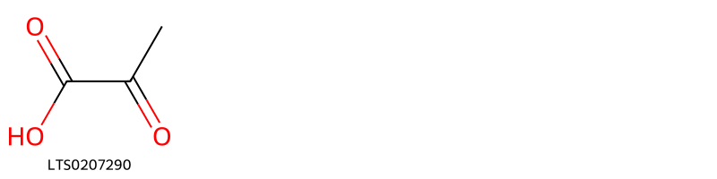{ width=100% }
    <figcaption>Hình ảnh cấu trúc hóa học của 1 hoạt chất thuộc nhóm Keto acids and derivatives gồm ['pyruvic acid (LTS0207290)'].</figcaption>
</figure>
#### Nhóm Organic disulfides
<figure markdown="span">
    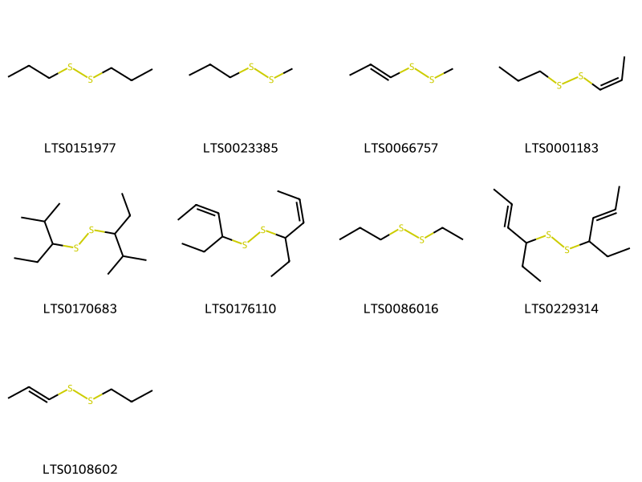{ width=100% }
    <figcaption>Hình ảnh cấu trúc hóa học của 9 hoạt chất thuộc nhóm Organic disulfides gồm ['propyl disulfide (LTS0151977)', 'methyl propyl disulfide (LTS0023385)', 'methyl propenyl disulfide (LTS0066757)', '(1z)-propenyl propyl disulfide (LTS0001183)', '2-methyl-3-[(2-methylpentan-3-yl)disulfanyl]pentane (LTS0170683)', '(2z)-4-[(4z)-hex-4-en-3-yldisulfanyl]hex-2-ene (LTS0176110)', 'ethyl propyl disulfide (LTS0086016)', '(2e)-4-[(4e)-hex-4-en-3-yldisulfanyl]hex-2-ene (LTS0229314)', '(1e)-propenyl propyl disulfide (LTS0108602)'].</figcaption>
</figure>
#### Nhóm Organic oxoanionic compounds
<figure markdown="span">
    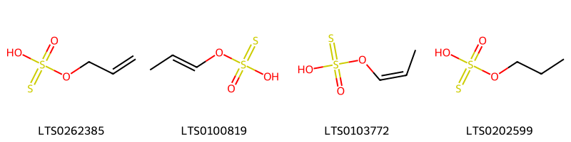{ width=100% }
    <figcaption>Hình ảnh cấu trúc hóa học của 4 hoạt chất thuộc nhóm Organic oxoanionic compounds gồm ['1-hydroxy-1-(prop-2-en-1-yloxy)-1λ⁶-disulfen-1-one (LTS0262385)', '1-hydroxy-1-[(1e)-prop-1-en-1-yloxy]-1λ⁶-disulfen-1-one (LTS0100819)', '1-hydroxy-1-[(1z)-prop-1-en-1-yloxy]-1λ⁶-disulfen-1-one (LTS0103772)', '1-hydroxy-1-propoxy-1λ⁶-disulfen-1-one (LTS0202599)'].</figcaption>
</figure>
#### Nhóm Organic thiosulfuric acids and derivatives
<figure markdown="span">
    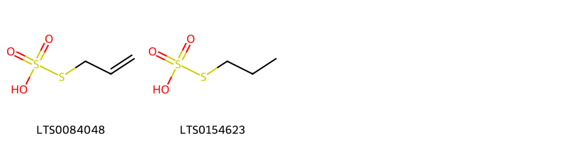{ width=100% }
    <figcaption>Hình ảnh cấu trúc hóa học của 2 hoạt chất thuộc nhóm Organic thiosulfuric acids and derivatives gồm ['prop-2-en-1-ylsulfanylsulfonic acid (LTS0084048)', 'propylsulfanylsulfonic acid (LTS0154623)'].</figcaption>
</figure>
#### Nhóm Organic trisulfides
<figure markdown="span">
    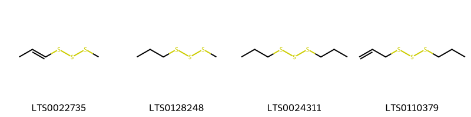{ width=100% }
    <figcaption>Hình ảnh cấu trúc hóa học của 4 hoạt chất thuộc nhóm Organic trisulfides gồm ['1-methyl-3-(prop-1-en-1-yl)trisulfane (LTS0022735)', 'methyl propyl trisulfide (LTS0128248)', 'dipropyl trisulfide (LTS0024311)', '1-(prop-2-en-1-yl)-3-propyltrisulfane (LTS0110379)'].</figcaption>
</figure>
#### Nhóm Organooxygen compounds
<figure markdown="span">
    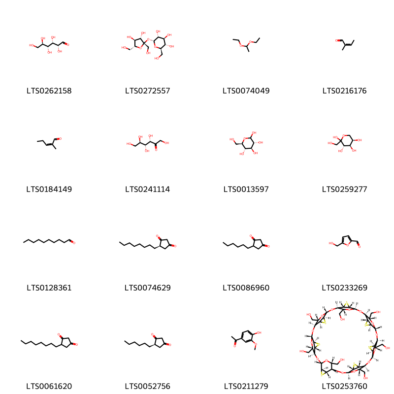{ width=100% }
    <figcaption>Hình ảnh cấu trúc hóa học của 16 hoạt chất thuộc nhóm Organooxygen compounds gồm ['(+)-glucose (LTS0262158)', 'sucrose (LTS0272557)', 'polyacetal (LTS0074049)', '2-butenal, 2-methyl- (LTS0216176)', '2-pentenal, 2-methyl- (LTS0184149)', 'keto-d-fructose (LTS0241114)', 'glucose (LTS0013597)', 'd-fructopyranose (LTS0259277)', 'decanal (LTS0128361)', '(4r)-4-octylcyclopentane-1,3-dione (LTS0074629)', '4-hexylcyclopentane-1,3-dione (LTS0086960)', 'hydroxymethylfurfural (LTS0233269)', '4-octylcyclopentane-1,3-dione (LTS0061620)', '(4r)-4-hexylcyclopentane-1,3-dione (LTS0052756)', 'apocynin (LTS0211279)', '[(1s,3s,4r,6r,7r,9s,10s,12r,13r,15r,16s,18r,19r,21s,22r,24r,25r,27s,28s,30r,31s,33s,34r,36s,37s,39s,40s,42s,44r,46s,48s,50s,52r,54s,56s)-46,48,50,52,54,56-hexakis(hydroxymethyl)-2,8,14,20,26,32,38,43,45,47,49,51,53,55-tetradecaoxa-5,11,17,23,29,35,41-heptathiapentadecacyclo[37.3.2.2³,⁷.2⁹,¹³.2¹⁵,¹⁹.2²¹,²⁵.2²⁷,³¹.2³³,³⁷.0⁴,⁶.0¹⁰,¹².0¹⁶,¹⁸.0²²,²⁴.0²⁸,³⁰.0³⁴,³⁶.0⁴⁰,⁴²]hexapentacontan-44-yl]methanol (LTS0253760)'].</figcaption>
</figure>
#### Nhóm Phenols
<figure markdown="span">
    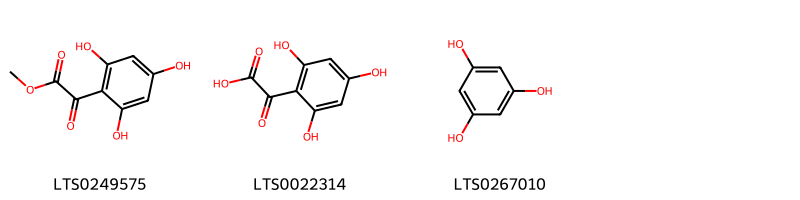{ width=100% }
    <figcaption>Hình ảnh cấu trúc hóa học của 3 hoạt chất thuộc nhóm Phenols gồm ['methyl 2-oxo-2-(2,4,6-trihydroxyphenyl)acetate (LTS0249575)', 'oxo(2,4,6-trihydroxyphenyl)acetic acid (LTS0022314)', 'phloroglucinol (LTS0267010)'].</figcaption>
</figure>
#### Nhóm Prenol lipids
<figure markdown="span">
    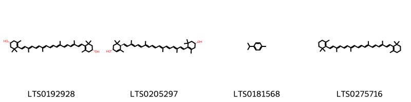{ width=100% }
    <figcaption>Hình ảnh cấu trúc hóa học của 4 hoạt chất thuộc nhóm Prenol lipids gồm ['zeaxanthin (LTS0192928)', 'carotenoid (LTS0205297)', 'cymene (LTS0181568)', 'β-carotene (LTS0275716)'].</figcaption>
</figure>
#### Nhóm Purine nucleosides
<figure markdown="span">
    { width=100% }
    <figcaption>Hình ảnh cấu trúc hóa học của 1 hoạt chất thuộc nhóm Purine nucleosides gồm ['adenosine (LTS0014061)'].</figcaption>
</figure>
#### Nhóm Steroids and steroid derivatives
<figure markdown="span">
    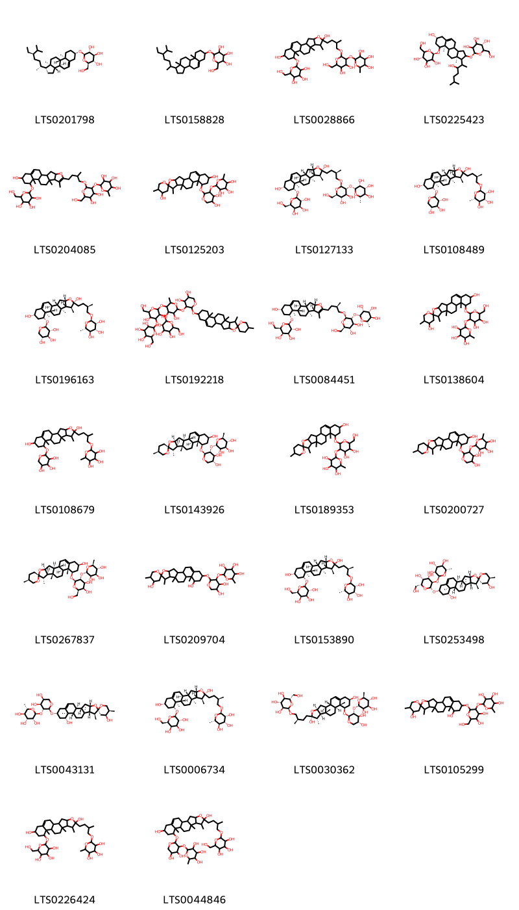{ width=100% }
    <figcaption>Hình ảnh cấu trúc hóa học của 26 hoạt chất thuộc nhóm Steroids and steroid derivatives gồm ['sitogluside (LTS0201798)', '2-{[1-(5-ethyl-6-methylheptan-2-yl)-9a,11a-dimethyl-1h,2h,3h,3ah,3bh,4h,6h,7h,8h,9h,9bh,10h,11h-cyclopenta[a]phenanthren-7-yl]oxy}-6-(hydroxymethyl)oxane-3,4,5-triol (LTS0158828)', '2-{[6-(4-{[4,5-dihydroxy-6-(hydroxymethyl)-3-[(3,4,5-trihydroxy-6-methyloxan-2-yl)oxy]oxan-2-yl]oxy}-3-methylbutyl)-6,16-dihydroxy-7,9,13-trimethyl-5-oxapentacyclo[10.8.0.0²,⁹.0⁴,⁸.0¹³,¹⁸]icos-18-en-14-yl]oxy}-6-(hydroxymethyl)oxane-3,4,5-triol (LTS0028866)', '(2r,5s)-2-{[(7r,9ar,11as)-7-hydroxy-1-(3-hydroxy-6-methylheptan-2-yl)-9a,11a-dimethyl-9-{[(2r,5s)-3,4,5-trihydroxy-6-(hydroxymethyl)oxan-2-yl]oxy}-1h,2h,3h,3ah,3bh,4h,6h,7h,8h,9h,9bh,10h,11h-cyclopenta[a]phenanthren-2-yl]oxy}-6-(hydroxymethyl)oxane-3,4,5-triol (LTS0225423)', '2-({4,5-dihydroxy-2-[4-(16-hydroxy-7,9,13-trimethyl-14-{[3,4,5-trihydroxy-6-(hydroxymethyl)oxan-2-yl]oxy}-5-oxapentacyclo[10.8.0.0²,⁹.0⁴,⁸.0¹³,¹⁸]icosa-6,18-dien-6-yl)-2-methylbutoxy]-6-(hydroxymethyl)oxan-3-yl}oxy)-6-methyloxane-3,4,5-triol (LTS0204085)', "2-[(4,5-dihydroxy-2-{5,7',9',13'-tetramethyl-5'-oxaspiro[oxane-2,6'-pentacyclo[10.8.0.0²,⁹.0⁴,⁸.0¹³,¹⁸]icosan]-18'-ene-4,16'-dioloxy}oxan-3-yl)oxy]-6-methyloxane-3,4,5-triol (LTS0125203)", '(2r,3r,4r,5r,6s)-2-{[(2r,3r,4s,5s,6r)-2-[(2r)-4-[(1s,2s,4s,6s,7s,8r,9s,12s,13r,14r,16r)-6,16-dihydroxy-7,9,13-trimethyl-14-{[(2r,3r,4s,5r,6r)-3,4,5-trihydroxy-6-(hydroxymethyl)oxan-2-yl]oxy}-5-oxapentacyclo[10.8.0.0²,⁹.0⁴,⁸.0¹³,¹⁸]icos-18-en-6-yl]-2-methylbutoxy]-4,5-dihydroxy-6-(hydroxymethyl)oxan-3-yl]oxy}-6-methyloxane-3,4,5-triol (LTS0127133)', '(2r,3r,4r,5r,6s)-2-[(2r)-4-[(1s,2s,4s,6r,7s,8r,9s,12s,13r,14r,16r)-6,16-dihydroxy-7,9,13-trimethyl-14-{[(2s,3r,4s,5r)-3,4,5-trihydroxyoxan-2-yl]oxy}-5-oxapentacyclo[10.8.0.0²,⁹.0⁴,⁸.0¹³,¹⁸]icos-18-en-6-yl]-2-methylbutoxy]-6-methyloxane-3,4,5-triol (LTS0108489)', '(2r,3r,4r,5r,6s)-2-[(2r)-4-[(1s,2s,4s,6s,7s,8r,9s,12s,13r,14r,16r)-6,16-dihydroxy-7,9,13-trimethyl-14-{[(2s,3r,4s,5r)-3,4,5-trihydroxyoxan-2-yl]oxy}-5-oxapentacyclo[10.8.0.0²,⁹.0⁴,⁸.0¹³,¹⁸]icos-18-en-6-yl]-2-methylbutoxy]-6-methyloxane-3,4,5-triol (LTS0196163)', "2-{[2-({6-[(4,5-dihydroxy-2-{5,7',9',13'-tetramethyl-5'-oxaspiro[oxane-2,6'-pentacyclo[10.8.0.0²,⁹.0⁴,⁸.0¹³,¹⁸]icosan]-18'-eneoxy}oxan-3-yl)oxy]-4,5-dihydroxy-2-methyloxan-3-yl}oxy)-5-hydroxy-6-(hydroxymethyl)-3-{[3,4,5-trihydroxy-6-(hydroxymethyl)oxan-2-yl]oxy}oxan-4-yl]oxy}-6-(hydroxymethyl)oxane-3,4,5-triol (LTS0192218)", '(2r,3r,4r,5r,6s)-2-{[(2r,3r,4s,5s,6r)-4,5-dihydroxy-2-[(2r)-4-[(1s,2s,4s,8s,9s,12s,13r,14r,16r)-16-hydroxy-7,9,13-trimethyl-14-{[(2r,3r,4s,5r,6r)-3,4,5-trihydroxy-6-(hydroxymethyl)oxan-2-yl]oxy}-5-oxapentacyclo[10.8.0.0²,⁹.0⁴,⁸.0¹³,¹⁸]icosa-6,18-dien-6-yl]-2-methylbutoxy]-6-(hydroxymethyl)oxan-3-yl]oxy}-6-methyloxane-3,4,5-triol (LTS0084451)', "2-{[4,5-dihydroxy-6-(hydroxymethyl)-2-{5,7',9',13'-tetramethyl-5'-oxaspiro[oxane-2,6'-pentacyclo[10.8.0.0²,⁹.0⁴,⁸.0¹³,¹⁸]icosan]-18'-ene-4,16'-dioloxy}oxan-3-yl]oxy}-6-methyloxane-3,4,5-triol (LTS0138604)", '2-(4-{6,16-dihydroxy-7,9,13-trimethyl-14-[(3,4,5-trihydroxyoxan-2-yl)oxy]-5-oxapentacyclo[10.8.0.0²,⁹.0⁴,⁸.0¹³,¹⁸]icos-18-en-6-yl}-2-methylbutoxy)-6-methyloxane-3,4,5-triol (LTS0108679)', "(2s,3r,4r,5r,6s)-2-{[(2s,3r,4s,5r)-4,5-dihydroxy-2-[(1's,2r,2's,4's,5s,7's,8'r,9's,12's,13'r,14'r,16'r)-5,7',9',13'-tetramethyl-5'-oxaspiro[oxane-2,6'-pentacyclo[10.8.0.0²,⁹.0⁴,⁸.0¹³,¹⁸]icosan]-18'-en-16'-oloxy]oxan-3-yl]oxy}-6-methyloxane-3,4,5-triol (LTS0143926)", "2-{[4,5-dihydroxy-6-(hydroxymethyl)-2-{5,7',9',13'-tetramethyl-5'-oxaspiro[oxane-2,6'-pentacyclo[10.8.0.0²,⁹.0⁴,⁸.0¹³,¹⁸]icosan]-18'-en-16'-oloxy}oxan-3-yl]oxy}-6-methyloxane-3,4,5-triol (LTS0189353)", "2-[(4,5-dihydroxy-2-{5,7',9',13'-tetramethyl-5'-oxaspiro[oxane-2,6'-pentacyclo[10.8.0.0²,⁹.0⁴,⁸.0¹³,¹⁸]icosan]-18'-en-16'-oloxy}oxan-3-yl)oxy]-6-methyloxane-3,4,5-triol (LTS0200727)", "(2s,3r,4r,5r,6s)-2-{[(2r,3r,4s,5r,6r)-4,5-dihydroxy-6-(hydroxymethyl)-2-[(1's,2r,2's,4's,5s,7's,8'r,9's,12's,13'r,14'r,16'r)-5,7',9',13'-tetramethyl-5'-oxaspiro[oxane-2,6'-pentacyclo[10.8.0.0²,⁹.0⁴,⁸.0¹³,¹⁸]icosan]-18'-en-16'-oloxy]oxan-3-yl]oxy}-6-methyloxane-3,4,5-triol (LTS0267837)", "2-[(4,5-dihydroxy-2-{5,7',9',13'-tetramethyl-5'-oxaspiro[oxane-2,6'-pentacyclo[10.8.0.0²,⁹.0⁴,⁸.0¹³,¹⁸]icosan]-18'-ene-4,14'-dioloxy}oxan-3-yl)oxy]-6-methyloxane-3,4,5-triol (LTS0209704)", '(2r,3r,4r,5r,6s)-2-[(2r)-4-[(1s,2s,4s,6r,7s,8r,9s,12s,13r,14r,16r)-6,16-dihydroxy-7,9,13-trimethyl-14-{[(2r,3r,4s,5r,6r)-3,4,5-trihydroxy-6-(hydroxymethyl)oxan-2-yl]oxy}-5-oxapentacyclo[10.8.0.0²,⁹.0⁴,⁸.0¹³,¹⁸]icos-18-en-6-yl]-2-methylbutoxy]-6-methyloxane-3,4,5-triol (LTS0153890)', "(2s,3r,4r,5r,6s)-2-{[(2r,3r,4s,5r,6r)-4,5-dihydroxy-6-(hydroxymethyl)-2-[(1's,2r,2's,4s,4's,5r,7's,8'r,9's,12's,13'r,14'r,16'r)-5,7',9',13'-tetramethyl-5'-oxaspiro[oxane-2,6'-pentacyclo[10.8.0.0²,⁹.0⁴,⁸.0¹³,¹⁸]icosan]-18'-ene-4,14'-dioloxy]oxan-3-yl]oxy}-6-methyloxane-3,4,5-triol (LTS0253498)", "(2s,3r,4r,5r,6s)-2-{[(2s,3r,4s,5s)-4,5-dihydroxy-2-[(1's,2r,2's,4s,4's,5r,7's,8'r,9's,12's,13'r,14'r,16'r)-5,7',9',13'-tetramethyl-5'-oxaspiro[oxane-2,6'-pentacyclo[10.8.0.0²,⁹.0⁴,⁸.0¹³,¹⁸]icosan]-18'-ene-4,14'-dioloxy]oxan-3-yl]oxy}-6-methyloxane-3,4,5-triol (LTS0043131)", '(2r,3r,4r,5r,6s)-2-[(2r)-4-[(1s,2s,4s,6s,7s,8r,9s,12s,13r,14r,16r)-6,16-dihydroxy-7,9,13-trimethyl-14-{[(2r,3r,4s,5r,6r)-3,4,5-trihydroxy-6-(hydroxymethyl)oxan-2-yl]oxy}-5-oxapentacyclo[10.8.0.0²,⁹.0⁴,⁸.0¹³,¹⁸]icos-18-en-6-yl]-2-methylbutoxy]-6-methyloxane-3,4,5-triol (LTS0006734)', '(2s,3r,4r,5r,6s)-2-{[(2s,3r,4s,5r)-2-{[(1s,2s,4s,6r,7s,8r,9s,12s,13r,14r,16r)-6,16-dihydroxy-7,9,13-trimethyl-6-[(3r)-3-methyl-4-{[(2r,3s,4r,5r,6s)-3,4,5-trihydroxy-6-(hydroxymethyl)oxan-2-yl]oxy}butyl]-5-oxapentacyclo[10.8.0.0²,⁹.0⁴,⁸.0¹³,¹⁸]icos-18-en-14-yl]oxy}-4,5-dihydroxyoxan-3-yl]oxy}-6-methyloxane-3,4,5-triol (LTS0030362)', "2-{[4,5-dihydroxy-6-(hydroxymethyl)-2-{5,7',9',13'-tetramethyl-5'-oxaspiro[oxane-2,6'-pentacyclo[10.8.0.0²,⁹.0⁴,⁸.0¹³,¹⁸]icosan]-18'-ene-4,14'-dioloxy}oxan-3-yl]oxy}-6-methyloxane-3,4,5-triol (LTS0105299)", '2-[(6,16-dihydroxy-7,9,13-trimethyl-6-{3-methyl-4-[(3,4,5-trihydroxy-6-methyloxan-2-yl)oxy]butyl}-5-oxapentacyclo[10.8.0.0²,⁹.0⁴,⁸.0¹³,¹⁸]icos-18-en-14-yl)oxy]-6-(hydroxymethyl)oxane-3,4,5-triol (LTS0226424)', '2-[(2-{[6,16-dihydroxy-7,9,13-trimethyl-6-(3-methyl-4-{[3,4,5-trihydroxy-6-(hydroxymethyl)oxan-2-yl]oxy}butyl)-5-oxapentacyclo[10.8.0.0²,⁹.0⁴,⁸.0¹³,¹⁸]icos-18-en-14-yl]oxy}-4,5-dihydroxyoxan-3-yl)oxy]-6-methyloxane-3,4,5-triol (LTS0044846)'].</figcaption>
</figure>
#### Nhóm Stilbenes
<figure markdown="span">
    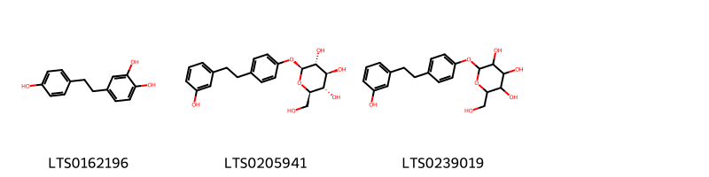{ width=100% }
    <figcaption>Hình ảnh cấu trúc hóa học của 3 hoạt chất thuộc nhóm Stilbenes gồm ['4-[2-(4-hydroxyphenyl)ethyl]benzene-1,2-diol (LTS0162196)', '(2r,3s,4s,5r,6s)-2-(hydroxymethyl)-6-{4-[2-(3-hydroxyphenyl)ethyl]phenoxy}oxane-3,4,5-triol (LTS0205941)', '2-(hydroxymethyl)-6-{4-[2-(3-hydroxyphenyl)ethyl]phenoxy}oxane-3,4,5-triol (LTS0239019)'].</figcaption>
</figure>
#### Nhóm Sulfenyl compounds
<figure markdown="span">
    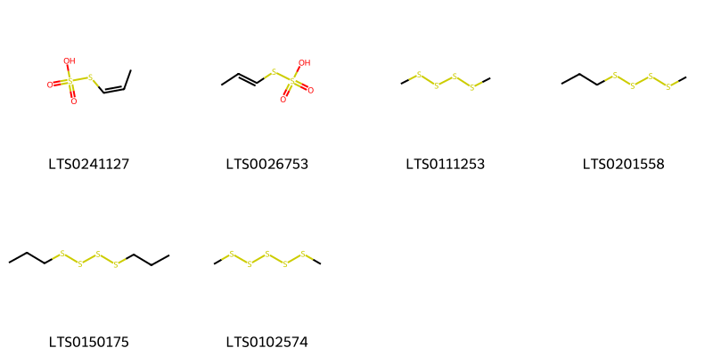{ width=100% }
    <figcaption>Hình ảnh cấu trúc hóa học của 6 hoạt chất thuộc nhóm Sulfenyl compounds gồm ['(1z)-prop-1-en-1-ylsulfanylsulfonic acid (LTS0241127)', '(1e)-prop-1-en-1-ylsulfanylsulfonic acid (LTS0026753)', 'dimethyltetrasulfane (LTS0111253)', '1-methyl-4-propyltetrasulfane (LTS0201558)', 'dipropyltetrasulfane (LTS0150175)', 'dimethylpentasulfane (LTS0102574)'].</figcaption>
</figure>
#### Nhóm Sulfoxides
<figure markdown="span">
    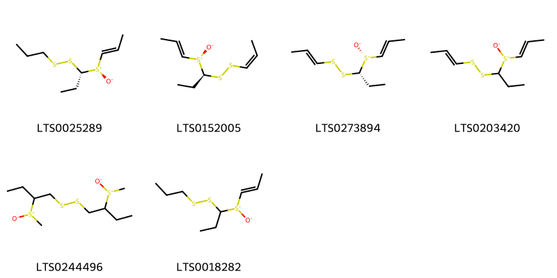{ width=100% }
    <figcaption>Hình ảnh cấu trúc hóa học của 6 hoạt chất thuộc nhóm Sulfoxides gồm ['(1s)-1-[(r)-(1e)-prop-1-ene-1-sulfinyl]-1-(propyldisulfanyl)propane (LTS0025289)', '(1z)-1-{[(1s)-1-[(r)-(1e)-prop-1-ene-1-sulfinyl]propyl]disulfanyl}prop-1-ene (LTS0152005)', '(1e)-1-{[(1s)-1-[(r)-(1e)-prop-1-ene-1-sulfinyl]propyl]disulfanyl}prop-1-ene (LTS0273894)', '1-{[1-(prop-1-ene-1-sulfinyl)propyl]disulfanyl}prop-1-ene (LTS0203420)', '2-methanesulfinyl-1-[(2-methanesulfinylbutyl)disulfanyl]butane (LTS0244496)', '1-(prop-1-ene-1-sulfinyl)-1-(propyldisulfanyl)propane (LTS0018282)'].</figcaption>
</figure>
#### Nhóm Thiocarboxylic acids and derivatives
<figure markdown="span">
    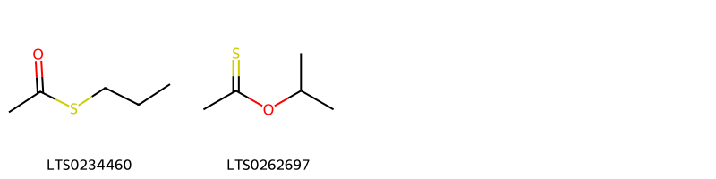{ width=100% }
    <figcaption>Hình ảnh cấu trúc hóa học của 2 hoạt chất thuộc nhóm Thiocarboxylic acids and derivatives gồm ['propyl thioacetate (LTS0234460)', 'isopropyl ethanethioate (LTS0262697)'].</figcaption>
</figure>
#### Nhóm Thiolanes
<figure markdown="span">
    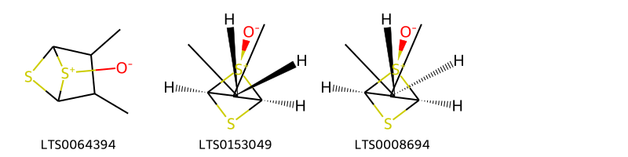{ width=100% }
    <figcaption>Hình ảnh cấu trúc hóa học của 3 hoạt chất thuộc nhóm Thiolanes gồm ['2,3-dimethyl-5,6-dithiabicyclo[2.1.1]hexan-5-ium-5-olate (LTS0064394)', '(1r,2r,3r,4s,5s)-2,3-dimethyl-5,6-dithiabicyclo[2.1.1]hexan-5-ium-5-olate (LTS0153049)', '(1r,2s,3r,4s,5s)-2,3-dimethyl-5,6-dithiabicyclo[2.1.1]hexan-5-ium-5-olate (LTS0008694)'].</figcaption>
</figure>
#### Nhóm Thiols
<figure markdown="span">
    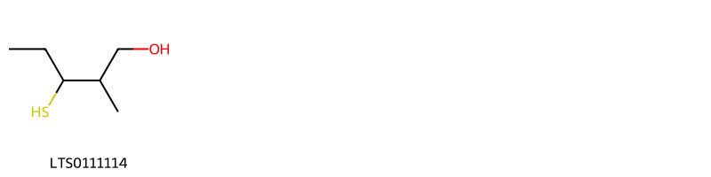{ width=100% }
    <figcaption>Hình ảnh cấu trúc hóa học của 1 hoạt chất thuộc nhóm Thiols gồm ['3-mercapto-2-methylpentan-1-ol (LTS0111114)'].</figcaption>
</figure>
#### Nhóm Thiosulfinic acid esters
<figure markdown="span">
    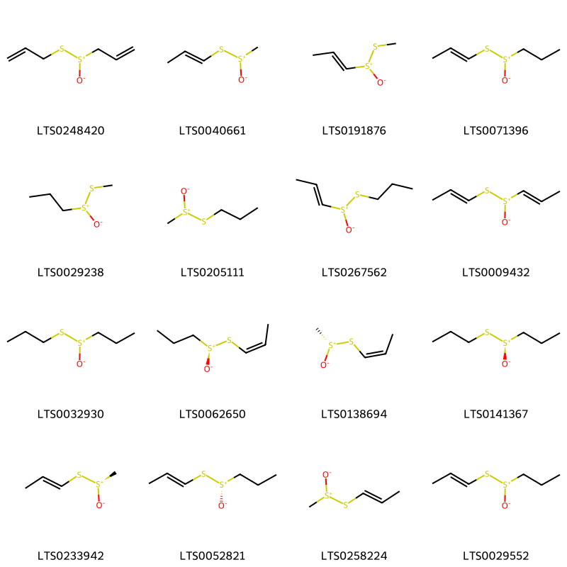{ width=100% }
    <figcaption>Hình ảnh cấu trúc hóa học của 16 hoạt chất thuộc nhóm Thiosulfinic acid esters gồm ['allicin (LTS0248420)', '(1e)-1-(methanesulfinylsulfanyl)prop-1-ene (LTS0040661)', '{[(1e)-prop-1-ene-1-sulfinyl]sulfanyl}methane (LTS0191876)', '(1e)-1-[(propane-1-sulfinyl)sulfanyl]prop-1-ene (LTS0071396)', '[(propane-1-sulfinyl)sulfanyl]methane (LTS0029238)', '1-(methanesulfinylsulfanyl)propane (LTS0205111)', '1-{[(1e)-prop-1-ene-1-sulfinyl]sulfanyl}propane (LTS0267562)', '(1e)-1-{[(1e)-prop-1-ene-1-sulfinyl]sulfanyl}prop-1-ene (LTS0009432)', 's-propyl propanethiosulfinate (LTS0032930)', '(1z)-1-{[(r)-propane-1-sulfinyl]sulfanyl}prop-1-ene (LTS0062650)', '(1z)-1-[(s)-methanesulfinylsulfanyl]prop-1-ene (LTS0138694)', '1-{[(s)-propane-1-sulfinyl]sulfanyl}propane (LTS0141367)', '(1e)-1-[(s)-methanesulfinylsulfanyl]prop-1-ene (LTS0233942)', '(1e)-1-{[(r)-propane-1-sulfinyl]sulfanyl}prop-1-ene (LTS0052821)', '1-(methanesulfinylsulfanyl)prop-1-ene (LTS0258224)', '1-[(propane-1-sulfinyl)sulfanyl]prop-1-ene (LTS0029552)'].</figcaption>
</figure>

---

### Dược dân tộc học

Danh sách các quốc gia có sử dụng *Allium cepa* trong điều trị các bệnh. 

| Country   | Disease                                                                                                   | Bệnh                                                                                      |
|:----------|:----------------------------------------------------------------------------------------------------------|:------------------------------------------------------------------------------------------|
| China     | Poultice                                                                                                  | thuốc đắp, đắp thuốc cao                                                                  |
| Egypt     | Apertif, Aphrodisiac, Diuretic, Sedative, Stomachic, Vermifuge, Antiseptic, Expectorant, Emmenagogue      | Apertif, Aphrodisiac, lợi tiểu, an thần, dạ dày, Vermifuge, sát trùng, đờm, Emmenagogue   |
| Elsewhere | nan, Carminative, Emmenagogue, Expectorant, Soporific, Aphrodisiac, Carminative, Diaphoretic, Expectorant | nan, Carminative, Emmenagogue, đờm, Soporific, Aphrodisiac, Carminative, Diaphoretic, đờm |
| Iraq      | Aphrodisiac, Carminative, Emmenagogue, Expectorant, Stimulant                                             | Kích thích tình dục, Carminative, Emmenagogue, Expectorant, Stimulant                     |
| Mexico    | Vermifuge, Diuretic                                                                                       | Vermifuge, lợi tiểu                                                                       |
| Trinidad  | Expectorant                                                                                               | Thuốc long đàm                                                                            |
| Turkey    | Antiseptic, Digestive, Diuretic, Soporific, Emmenagogue, Stomachic                                        | Khử trùng, Tiêu hóa, lợi tiểu, ngủ ngon, Emmenagogue, Dạ dày                              |
| US        | Poison                                                                                                    | Chất độc                                                                                  |
| Venezuela | Vermifuge                                                                                                 | Thuốc diệt sán                                                                            |

---

---
## Allium cernuum
### Thông tin về thực vật

!!! info "Phân loại thực vật của *Allium cernuum* từ GIBF:"
    - **Kingdom:** Plantae
    - **Phylum:** Tracheophyta
    - **Order:** Asparagales
    - **Family:** Amaryllidaceae
    - **Genus:** Allium
    - **Species:** *Allium cernuum*

 

| Label (VI)   | Label (EN)   | Scientific Name   | Descriptions (VI)   | Descriptions (EN)   | Also Known As (VI)   | Also Known As (EN)                      |
|:-------------|:-------------|:------------------|:--------------------|:--------------------|:---------------------|:----------------------------------------|
| N/A          | N/A          | Allium cernuum    | loài thực vật       | species of plant    | ['']                 | ['nodding onion', 'nodding pink onion'] |

#### Phân bố trên thế giới

**Từ CSDL GIBF** Germany, United States of America, Canada

#### Phân bố tại Việt Nam

**Từ CSDL GIBF**: Không có ghi nhận ở Việt Nam

---
### Thành phần hóa học
        
- Theo cơ sở dữ liệu lotus: Từ loài *Allium cernuum* đã phân lập và xác định được 2 hoạt chất thuộc về các nhóm Prenol lipids. 

|    | chemicalTaxonomyClassyfireClass   |   smiles_count |
|---:|:----------------------------------|---------------:|
|  0 | Prenol lipids                     |              2 |

#### Nhóm Prenol lipids
<figure markdown="span">
    { width=100% }
    <figcaption>Hình ảnh cấu trúc hóa học của 2 hoạt chất thuộc nhóm Prenol lipids gồm ['diosgenin (LTS0035986)', 'diosgenin (LTS0149188)'].</figcaption>
</figure>

---

### Dược dân tộc học

Danh sách các quốc gia có sử dụng *Allium cernuum* trong điều trị các bệnh. 

| Country   | Disease                                     | Bệnh                                                              |
|:----------|:--------------------------------------------|:------------------------------------------------------------------|
| US        | Diaphoretic, Diuretic, Stimulant, Vermifuge | Thuốc lợi tiểu, thuốc lợi tiểu, thuốc kích thích, thuốc diệt giun |

---

---
## Allium chinense
### Thông tin về thực vật

!!! info "Phân loại thực vật của *Allium chinense* từ GIBF:"
    - **Kingdom:** Plantae
    - **Phylum:** Tracheophyta
    - **Order:** Asparagales
    - **Family:** Amaryllidaceae
    - **Genus:** Allium
    - **Species:** *Allium chinense*

 

| Label (VI)   | Label (EN)   | Scientific Name   | Descriptions (VI)   | Descriptions (EN)   | Also Known As (VI)             | Also Known As (EN)          |
|:-------------|:-------------|:------------------|:--------------------|:--------------------|:-------------------------------|:----------------------------|
| N/A          | N/A          | Allium chinense   | loài thực vật       | species of plant    | ['Củ kiệu', 'Allium chinense'] | ['Chinese onion', 'rakkyo'] |

#### Phân bố trên thế giới

**Từ CSDL GIBF** nan, Viet Nam, Japan, Norway, United States of America, Mongolia, Indonesia, Chinese Taipei, Philippines, China, Russian Federation, India, unknown or invalid

#### Phân bố tại Việt Nam

**Từ CSDL GIBF**: Không có ghi nhận ở Việt Nam

---
### Thành phần hóa học
        
- Theo cơ sở dữ liệu lotus: Từ loài *Allium chinense* đã phân lập và xác định được 82 hoạt chất thuộc về các nhóm Dihydrofurans, Benzene and substituted derivatives, Sulfenyl compounds, Allyl sulfur compounds, Flavonoids, Purine nucleosides, Stilbenes, Linear 1,3-diarylpropanoids, Carboxylic acids and derivatives, Cinnamic acids and derivatives, Steroids and steroid derivatives, Organic trisulfides, Organic disulfides, Isothiocyanates, Prenol lipids, Organooxygen compounds, Thiosulfinic acid esters, Indoles and derivatives. 

|    | chemicalTaxonomyClassyfireClass     |   smiles_count |
|---:|:------------------------------------|---------------:|
|  0 | Allyl sulfur compounds              |              4 |
|  1 | Benzene and substituted derivatives |              1 |
|  2 | Carboxylic acids and derivatives    |              8 |
|  3 | Cinnamic acids and derivatives      |              3 |
|  4 | Dihydrofurans                       |              2 |
|  5 | Flavonoids                          |              3 |
|  6 | Indoles and derivatives             |              2 |
|  7 | Isothiocyanates                     |              1 |
|  8 | Linear 1,3-diarylpropanoids         |              2 |
|  9 | Organic disulfides                  |              1 |
| 10 | Organic trisulfides                 |              4 |
| 11 | Organooxygen compounds              |              9 |
| 12 | Prenol lipids                       |              5 |
| 13 | Purine nucleosides                  |              3 |
| 14 | Steroids and steroid derivatives    |             31 |
| 15 | Stilbenes                           |              1 |
| 16 | Sulfenyl compounds                  |              1 |
| 17 | Thiosulfinic acid esters            |              1 |

#### Nhóm Allyl sulfur compounds
<figure markdown="span">
    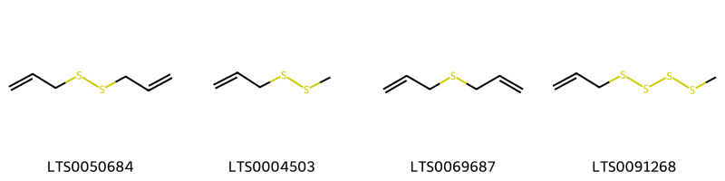{ width=100% }
    <figcaption>Hình ảnh cấu trúc hóa học của 4 hoạt chất thuộc nhóm Allyl sulfur compounds gồm ['garlicin (LTS0050684)', 'allyl methyl disulfide (LTS0004503)', 'oil garlic (LTS0069687)', '1-methyl-4-(prop-2-en-1-yl)tetrasulfane (LTS0091268)'].</figcaption>
</figure>
#### Nhóm Benzene and substituted derivatives
<figure markdown="span">
    { width=100% }
    <figcaption>Hình ảnh cấu trúc hóa học của 1 hoạt chất thuộc nhóm Benzene and substituted derivatives gồm ['p-hydroxybenzoic acid (LTS0263634)'].</figcaption>
</figure>
#### Nhóm Carboxylic acids and derivatives
<figure markdown="span">
    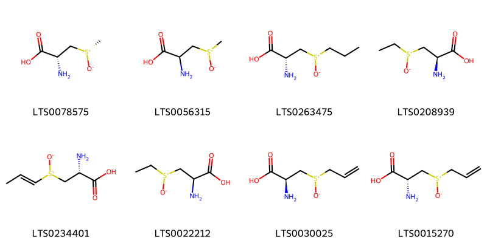{ width=100% }
    <figcaption>Hình ảnh cấu trúc hóa học của 8 hoạt chất thuộc nhóm Carboxylic acids and derivatives gồm ['(2r)-2-amino-3-[(s)-methanesulfinyl]propanoic acid (LTS0078575)', '2-amino-3-methanesulfinylpropanoic acid (LTS0056315)', '(2r)-2-amino-3-(propane-1-sulfinyl)propanoic acid (LTS0263475)', '(2r)-2-amino-3-(ethanesulfinyl)propanoic acid (LTS0208939)', 'isoalliin (LTS0234401)', '2-amino-3-(ethanesulfinyl)propanoic acid (LTS0022212)', '(2s)-2-amino-3-(prop-2-ene-1-sulfinyl)propanoic acid (LTS0030025)', 'alliin (LTS0015270)'].</figcaption>
</figure>
#### Nhóm Cinnamic acids and derivatives
<figure markdown="span">
    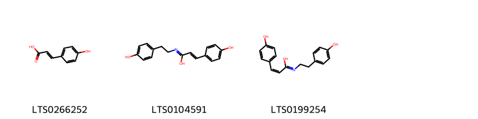{ width=100% }
    <figcaption>Hình ảnh cấu trúc hóa học của 3 hoạt chất thuộc nhóm Cinnamic acids and derivatives gồm ['para-coumaric acid (LTS0266252)', '3-(4-hydroxyphenyl)-n-[2-(4-hydroxyphenyl)ethyl]prop-2-enimidic acid (LTS0104591)', '(2z)-3-(4-hydroxyphenyl)-n-[2-(4-hydroxyphenyl)ethyl]prop-2-enimidic acid (LTS0199254)'].</figcaption>
</figure>
#### Nhóm Dihydrofurans
<figure markdown="span">
    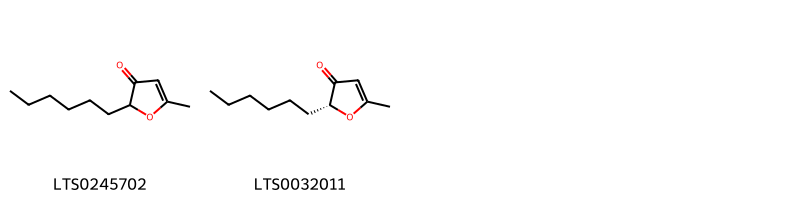{ width=100% }
    <figcaption>Hình ảnh cấu trúc hóa học của 2 hoạt chất thuộc nhóm Dihydrofurans gồm ['2-hexyl-5-methyl-2h-furan-3-one (LTS0245702)', '(2r)-2-hexyl-5-methyl-2h-furan-3-one (LTS0032011)'].</figcaption>
</figure>
#### Nhóm Flavonoids
<figure markdown="span">
    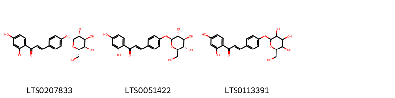{ width=100% }
    <figcaption>Hình ảnh cấu trúc hóa học của 3 hoạt chất thuộc nhóm Flavonoids gồm ['(2e)-1-(2,4-dihydroxyphenyl)-3-(4-{[(2r,3s,4s,5r,6s)-3,4,5-trihydroxy-6-(hydroxymethyl)oxan-2-yl]oxy}phenyl)prop-2-en-1-one (LTS0207833)', 'isoliquiritin (LTS0051422)', '1-(2,4-dihydroxyphenyl)-3-(4-{[3,4,5-trihydroxy-6-(hydroxymethyl)oxan-2-yl]oxy}phenyl)prop-2-en-1-one (LTS0113391)'].</figcaption>
</figure>
#### Nhóm Indoles and derivatives
<figure markdown="span">
    { width=100% }
    <figcaption>Hình ảnh cấu trúc hóa học của 2 hoạt chất thuộc nhóm Indoles and derivatives gồm ['l-tryptophan (LTS0263809)', 'optimax (LTS0014343)'].</figcaption>
</figure>
#### Nhóm Isothiocyanates
<figure markdown="span">
    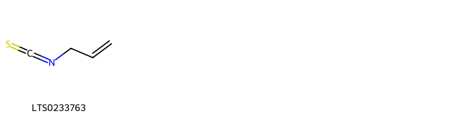{ width=100% }
    <figcaption>Hình ảnh cấu trúc hóa học của 1 hoạt chất thuộc nhóm Isothiocyanates gồm ['allyl isothiocyanate (LTS0233763)'].</figcaption>
</figure>
#### Nhóm Linear 1_3-diarylpropanoids
<figure markdown="span">
    { width=100% }
    <figcaption>Hình ảnh cấu trúc hóa học của Không tìm thấy chú thích hoạt chất thuộc nhóm Linear 1_3-diarylpropanoids gồm Không tìm thấy chú thích.</figcaption>
</figure>
#### Nhóm Organic disulfides
<figure markdown="span">
    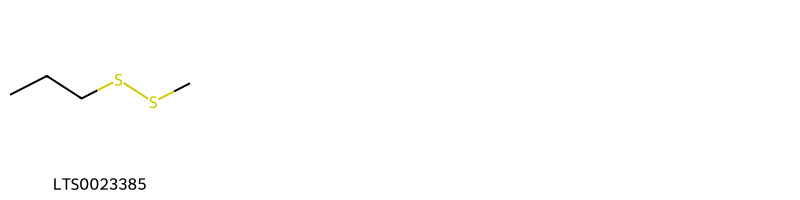{ width=100% }
    <figcaption>Hình ảnh cấu trúc hóa học của 1 hoạt chất thuộc nhóm Organic disulfides gồm ['methyl propyl disulfide (LTS0023385)'].</figcaption>
</figure>
#### Nhóm Organic trisulfides
<figure markdown="span">
    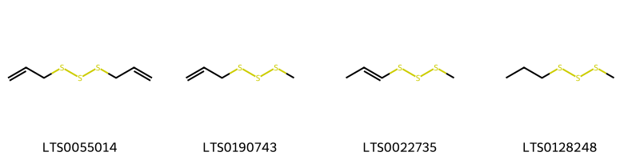{ width=100% }
    <figcaption>Hình ảnh cấu trúc hóa học của 4 hoạt chất thuộc nhóm Organic trisulfides gồm ['allyl trisulfide (LTS0055014)', 'allyl methyl trisulfide (LTS0190743)', '1-methyl-3-(prop-1-en-1-yl)trisulfane (LTS0022735)', 'methyl propyl trisulfide (LTS0128248)'].</figcaption>
</figure>
#### Nhóm Organooxygen compounds
<figure markdown="span">
    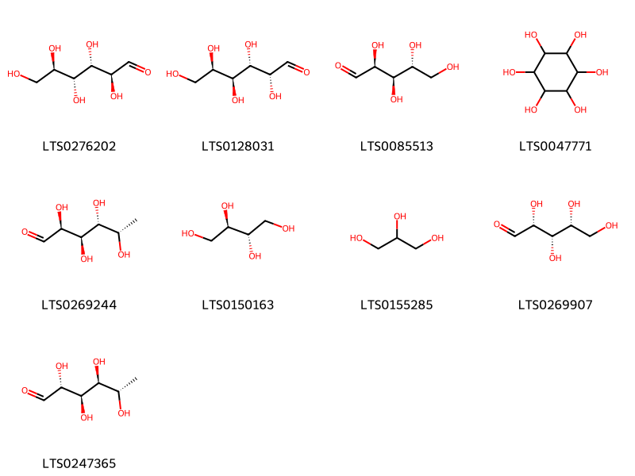{ width=100% }
    <figcaption>Hình ảnh cấu trúc hóa học của 9 hoạt chất thuộc nhóm Organooxygen compounds gồm ['(+-)-mannose (LTS0276202)', 'aldehydo-d-galactose (LTS0128031)', 'arabinose (LTS0085513)', '(-)-inositol (LTS0047771)', 'aldehydo-l-fucose (LTS0269244)', 'meso-erythritol (LTS0150163)', 'glycerol (LTS0155285)', '(d)-xylose (LTS0269907)', 'rhamnose (LTS0247365)'].</figcaption>
</figure>
#### Nhóm Prenol lipids
<figure markdown="span">
    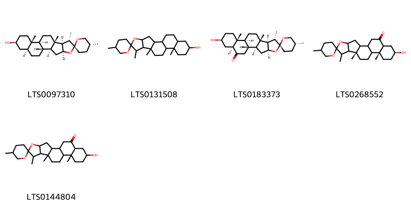{ width=100% }
    <figcaption>Hình ảnh cấu trúc hóa học của 5 hoạt chất thuộc nhóm Prenol lipids gồm ['tigogenin (LTS0097310)', 'tigogenin (LTS0131508)', 'laxogenin (LTS0183373)', "(9's,13'r,16's)-16'-hydroxy-5,7',9',13'-tetramethyl-5'-oxaspiro[oxane-2,6'-pentacyclo[10.8.0.0²,⁹.0⁴,⁸.0¹³,¹⁸]icosan]-19'-one (LTS0268552)", "16'-hydroxy-5,7',9',13'-tetramethyl-5'-oxaspiro[oxane-2,6'-pentacyclo[10.8.0.0²,⁹.0⁴,⁸.0¹³,¹⁸]icosan]-19'-one (LTS0144804)"].</figcaption>
</figure>
#### Nhóm Purine nucleosides
<figure markdown="span">
    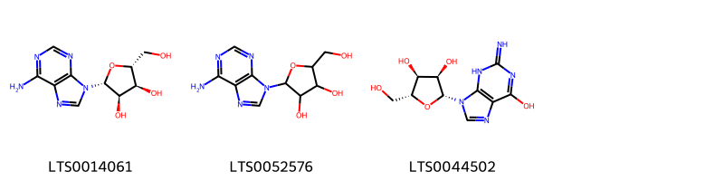{ width=100% }
    <figcaption>Hình ảnh cấu trúc hóa học của 3 hoạt chất thuộc nhóm Purine nucleosides gồm ['adenosine (LTS0014061)', 'adenosine (LTS0052576)', 'ribonucleoside (LTS0044502)'].</figcaption>
</figure>
#### Nhóm Steroids and steroid derivatives
<figure markdown="span">
    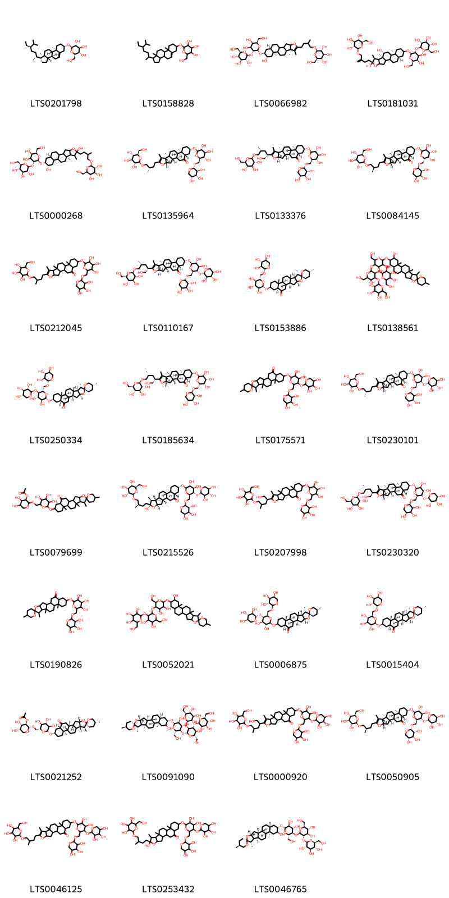{ width=100% }
    <figcaption>Hình ảnh cấu trúc hóa học của 31 hoạt chất thuộc nhóm Steroids and steroid derivatives gồm ['sitogluside (LTS0201798)', '2-{[1-(5-ethyl-6-methylheptan-2-yl)-9a,11a-dimethyl-1h,2h,3h,3ah,3bh,4h,6h,7h,8h,9h,9bh,10h,11h-cyclopenta[a]phenanthren-7-yl]oxy}-6-(hydroxymethyl)oxane-3,4,5-triol (LTS0158828)', '(2r,3r,4s,5s,6r)-2-{4-[(9s,13s,15s,16r,18r)-16-{[(2r,3r,4s,5r,6r)-4,5-dihydroxy-6-(hydroxymethyl)-3-{[(2s,3r,4s,5s,6r)-3,4,5-trihydroxy-6-(hydroxymethyl)oxan-2-yl]oxy}oxan-2-yl]oxy}-15-hydroxy-7,9,13-trimethyl-5-oxapentacyclo[10.8.0.0²,⁹.0⁴,⁸.0¹³,¹⁸]icos-6-en-6-yl]-2-methylbutoxy}-6-(hydroxymethyl)oxane-3,4,5-triol (LTS0066982)', '(2s,3r,4s,5s,6r)-2-{[(2r,3r,4s,5r,6r)-2-{[(9s,10r,13s,18r)-6,10-dihydroxy-7,9,13-trimethyl-6-[3-({[(2r,3r,4s,5s,6r)-3,4,5-trihydroxy-6-(hydroxymethyl)oxan-2-yl]oxy}methyl)but-3-en-1-yl]-5-oxapentacyclo[10.8.0.0²,⁹.0⁴,⁸.0¹³,¹⁸]icosan-16-yl]oxy}-4,5-dihydroxy-6-(hydroxymethyl)oxan-3-yl]oxy}-6-(hydroxymethyl)oxane-3,4,5-triol (LTS0181031)', '(2s,3r,4s,5s,6r)-2-{[(2r,3r,4s,5r,6r)-2-{[(9s,13s,15s,16r,18r)-6,15-dihydroxy-7,9,13-trimethyl-6-(3-methyl-4-{[(2r,3r,4s,5s,6r)-3,4,5-trihydroxy-6-(hydroxymethyl)oxan-2-yl]oxy}butyl)-5-oxapentacyclo[10.8.0.0²,⁹.0⁴,⁸.0¹³,¹⁸]icosan-16-yl]oxy}-4,5-dihydroxy-6-(hydroxymethyl)oxan-3-yl]oxy}-6-(hydroxymethyl)oxane-3,4,5-triol (LTS0000268)', '(1r,2s,4s,8s,9s,12s,13r,16s,18s)-7,9,13-trimethyl-6-[(3s)-3-methyl-4-{[(2r,3r,4s,5s,6r)-3,4,5-trihydroxy-6-(hydroxymethyl)oxan-2-yl]oxy}butyl]-16-{[(2r,3r,4s,5s,6r)-3,4,5-trihydroxy-6-({[(2r,3s,4r,5r)-3,4,5-trihydroxyoxan-2-yl]oxy}methyl)oxan-2-yl]oxy}-5-oxapentacyclo[10.8.0.0²,⁹.0⁴,⁸.0¹³,¹⁸]icos-6-en-19-one (LTS0135964)', '(1r,2s,4r,8r,9s,12s,13r,16s,18s)-6-[(2s,4r)-1-hydroxy-4-methyl-5-{[(2r,3r,4s,5s,6r)-3,4,5-trihydroxy-6-(hydroxymethyl)oxan-2-yl]oxy}pentan-2-yl]-7,9,13-trimethyl-16-{[(2r,3r,4s,5s,6r)-3,4,5-trihydroxy-6-({[(2r,3r,4s,5s)-3,4,5-trihydroxyoxan-2-yl]oxy}methyl)oxan-2-yl]oxy}-5-oxapentacyclo[10.8.0.0²,⁹.0⁴,⁸.0¹³,¹⁸]icos-6-en-19-one (LTS0133376)', '(1r,2s,4s,8s,9s,12s,13r,16s,18s)-7,9,13-trimethyl-6-[(3r)-3-methyl-4-{[(2r,3r,4s,5s,6r)-3,4,5-trihydroxy-6-(hydroxymethyl)oxan-2-yl]oxy}butyl]-16-{[(2r,3s,4r,5s,6s)-3,4,5-trihydroxy-6-({[(2s,3s,4s,5s)-3,4,5-trihydroxyoxan-2-yl]oxy}methyl)oxan-2-yl]oxy}-5-oxapentacyclo[10.8.0.0²,⁹.0⁴,⁸.0¹³,¹⁸]icos-6-en-19-one (LTS0084145)', '7,9,13-trimethyl-6-(3-methyl-4-{[3,4,5-trihydroxy-6-(hydroxymethyl)oxan-2-yl]oxy}butyl)-16-[(3,4,5-trihydroxy-6-{[(3,4,5-trihydroxyoxan-2-yl)oxy]methyl}oxan-2-yl)oxy]-5-oxapentacyclo[10.8.0.0²,⁹.0⁴,⁸.0¹³,¹⁸]icos-6-en-19-one (LTS0212045)', '(1r,2s,4r,8r,9s,12s,13r,16s,18s)-16-{[(2r,3r,4r,5s,6r)-3,4-dihydroxy-5-{[(2s,3r,4s,5r)-3,4,5-trihydroxyoxan-2-yl]oxy}-6-({[(2r,3r,4s,5s)-3,4,5-trihydroxyoxan-2-yl]oxy}methyl)oxan-2-yl]oxy}-6-[(2s,4r)-1-hydroxy-4-methyl-5-{[(2r,3r,4s,5s,6r)-3,4,5-trihydroxy-6-(hydroxymethyl)oxan-2-yl]oxy}pentan-2-yl]-7,9,13-trimethyl-5-oxapentacyclo[10.8.0.0²,⁹.0⁴,⁸.0¹³,¹⁸]icos-6-en-19-one (LTS0110167)', "(1'r,2r,2's,4's,5r,7's,8'r,9's,12's,13'r,16's,18's)-5,7',9',13'-tetramethyl-16'-{[(2s,3s,4r,5r,6s)-3,4,5-trihydroxy-6-({[(2r,3s,4r,5s)-3,4,5-trihydroxyoxan-2-yl]oxy}methyl)oxan-2-yl]oxy}-5'-oxaspiro[oxane-2,6'-pentacyclo[10.8.0.0²,⁹.0⁴,⁸.0¹³,¹⁸]icosan]-19'-one (LTS0153886)", "2-[(2-{[4,5-dihydroxy-2-(hydroxymethyl)-6-{5,7',9',13'-tetramethyl-5'-oxaspiro[oxane-2,6'-pentacyclo[10.8.0.0²,⁹.0⁴,⁸.0¹³,¹⁸]icosan]-15'-oloxy}oxan-3-yl]oxy}-5-hydroxy-6-(hydroxymethyl)-3-{[3,4,5-trihydroxy-6-(hydroxymethyl)oxan-2-yl]oxy}oxan-4-yl)oxy]-6-(hydroxymethyl)oxane-3,4,5-triol (LTS0138561)", "(1'r,2r,2's,4's,5r,7's,8'r,9's,12's,13'r,16's,18's)-16'-{[(2s,3s,4s,5r,6s)-3,4-dihydroxy-5-{[(2r,3s,4r,5s)-3,4,5-trihydroxyoxan-2-yl]oxy}-6-({[(2r,3s,4r,5s)-3,4,5-trihydroxyoxan-2-yl]oxy}methyl)oxan-2-yl]oxy}-5,7',9',13'-tetramethyl-5'-oxaspiro[oxane-2,6'-pentacyclo[10.8.0.0²,⁹.0⁴,⁸.0¹³,¹⁸]icosan]-19'-one (LTS0250334)", '(1r,2s,4s,8s,9s,12s,13r,16s,18s)-6-[(2s,4r)-1-hydroxy-4-methyl-5-{[(2r,3r,4s,5s,6r)-3,4,5-trihydroxy-6-(hydroxymethyl)oxan-2-yl]oxy}pentan-2-yl]-7,9,13-trimethyl-16-{[(2r,3s,4r,5s,6s)-3,4,5-trihydroxy-6-({[(2s,3s,4r,5r)-3,4,5-trihydroxyoxan-2-yl]oxy}methyl)oxan-2-yl]oxy}-5-oxapentacyclo[10.8.0.0²,⁹.0⁴,⁸.0¹³,¹⁸]icos-6-en-19-one (LTS0185634)', "16'-({3,4-dihydroxy-5-[(3,4,5-trihydroxyoxan-2-yl)oxy]-6-{[(3,4,5-trihydroxyoxan-2-yl)oxy]methyl}oxan-2-yl}oxy)-5,7',9',13'-tetramethyl-5'-oxaspiro[oxane-2,6'-pentacyclo[10.8.0.0²,⁹.0⁴,⁸.0¹³,¹⁸]icosan]-19'-one (LTS0175571)", '(1r,2s,4s,8s,9s,12s,13r,16s,18s)-16-{[(2r,3r,4r,5s,6r)-3,4-dihydroxy-5-{[(2s,3r,4s,5r)-3,4,5-trihydroxyoxan-2-yl]oxy}-6-({[(2r,3s,4r,5r)-3,4,5-trihydroxyoxan-2-yl]oxy}methyl)oxan-2-yl]oxy}-7,9,13-trimethyl-6-[(3s)-3-methyl-4-{[(2r,3r,4s,5s,6r)-3,4,5-trihydroxy-6-(hydroxymethyl)oxan-2-yl]oxy}butyl]-5-oxapentacyclo[10.8.0.0²,⁹.0⁴,⁸.0¹³,¹⁸]icos-6-en-19-one (LTS0230101)', "4,5-dihydroxy-2-[(3,4,5-trihydroxy-6-{5,7',9',13'-tetramethyl-5'-oxaspiro[oxane-2,6'-pentacyclo[10.8.0.0²,⁹.0⁴,⁸.0¹³,¹⁸]icosan]-19'-oneoxy}oxan-2-yl)methoxy]oxan-3-yl acetate (LTS0079699)", '(1r,2s,4s,6s,7s,8r,9s,12s,13r,16s,18s)-16-{[(2r,3r,4r,5s,6r)-3,4-dihydroxy-5-{[(2s,3r,4s,5r)-3,4,5-trihydroxyoxan-2-yl]oxy}-6-({[(2s,3r,4s,5s)-3,4,5-trihydroxyoxan-2-yl]oxy}methyl)oxan-2-yl]oxy}-6-hydroxy-7,9,13-trimethyl-6-[(3r)-3-methyl-4-{[(2r,3r,4s,5s,6r)-3,4,5-trihydroxy-6-(hydroxymethyl)oxan-2-yl]oxy}butyl]-5-oxapentacyclo[10.8.0.0²,⁹.0⁴,⁸.0¹³,¹⁸]icosan-19-one (LTS0215526)', '6-(1-hydroxy-4-methyl-5-{[3,4,5-trihydroxy-6-(hydroxymethyl)oxan-2-yl]oxy}pentan-2-yl)-7,9,13-trimethyl-16-[(3,4,5-trihydroxy-6-{[(3,4,5-trihydroxyoxan-2-yl)oxy]methyl}oxan-2-yl)oxy]-5-oxapentacyclo[10.8.0.0²,⁹.0⁴,⁸.0¹³,¹⁸]icos-6-en-19-one (LTS0207998)', '(1r,2s,4s,8s,9s,12s,13r,16s,18s)-16-{[(2r,3s,4s,5s,6r)-3,4-dihydroxy-5-{[(2s,3s,4s,5s)-3,4,5-trihydroxyoxan-2-yl]oxy}-6-({[(2s,3s,4s,5s)-3,4,5-trihydroxyoxan-2-yl]oxy}methyl)oxan-2-yl]oxy}-6-[(2r,4r)-1-hydroxy-4-methyl-5-{[(2r,3r,4s,5s,6r)-3,4,5-trihydroxy-6-(hydroxymethyl)oxan-2-yl]oxy}pentan-2-yl]-7,9,13-trimethyl-5-oxapentacyclo[10.8.0.0²,⁹.0⁴,⁸.0¹³,¹⁸]icos-6-en-19-one (LTS0230320)', "5,7',9',13'-tetramethyl-16'-[(3,4,5-trihydroxy-6-{[(3,4,5-trihydroxyoxan-2-yl)oxy]methyl}oxan-2-yl)oxy]-5'-oxaspiro[oxane-2,6'-pentacyclo[10.8.0.0²,⁹.0⁴,⁸.0¹³,¹⁸]icosan]-19'-one (LTS0190826)", "2-[(2-{[4,5-dihydroxy-2-(hydroxymethyl)-6-{5,7',9',13'-tetramethyl-5'-oxaspiro[oxane-2,6'-pentacyclo[10.8.0.0²,⁹.0⁴,⁸.0¹³,¹⁸]icosan]-15'-oloxy}oxan-3-yl]oxy}-4,5-dihydroxy-6-(hydroxymethyl)oxan-3-yl)oxy]-6-(hydroxymethyl)oxane-3,4,5-triol (LTS0052021)", "(1'r,2r,2's,4's,5r,7's,8'r,9's,12's,13'r,16's,18's)-16'-{[(2r,3r,4r,5s,6r)-3,4-dihydroxy-5-{[(2s,3r,4s,5r)-3,4,5-trihydroxyoxan-2-yl]oxy}-6-({[(2s,3r,4s,5s)-3,4,5-trihydroxyoxan-2-yl]oxy}methyl)oxan-2-yl]oxy}-5,7',9',13'-tetramethyl-5'-oxaspiro[oxane-2,6'-pentacyclo[10.8.0.0²,⁹.0⁴,⁸.0¹³,¹⁸]icosan]-19'-one (LTS0006875)", "(1'r,2r,2's,4's,5r,7's,8'r,9's,12's,13'r,16's,18's)-5,7',9',13'-tetramethyl-16'-{[(2r,3r,4s,5s,6r)-3,4,5-trihydroxy-6-({[(2s,3r,4s,5s)-3,4,5-trihydroxyoxan-2-yl]oxy}methyl)oxan-2-yl]oxy}-5'-oxaspiro[oxane-2,6'-pentacyclo[10.8.0.0²,⁹.0⁴,⁸.0¹³,¹⁸]icosan]-19'-one (LTS0015404)", "(2s,3r,4s,5s)-4,5-dihydroxy-2-{[(2r,3s,4s,5r,6r)-3,4,5-trihydroxy-6-[(1'r,2r,2's,4's,5r,7's,8'r,9's,12's,13'r,16's,18's)-5,7',9',13'-tetramethyl-5'-oxaspiro[oxane-2,6'-pentacyclo[10.8.0.0²,⁹.0⁴,⁸.0¹³,¹⁸]icosan]-19'-oneoxy]oxan-2-yl]methoxy}oxan-3-yl acetate (LTS0021252)", "(2r,3s,4r,5r,6s)-2-{[(2r,3s,4r,5s,6s)-2-{[(2s,3r,4s,5s,6s)-4,5-dihydroxy-2-(hydroxymethyl)-6-[(1'r,2s,2's,4's,5s,7's,8'r,9'r,12's,13'r,15's,16's,18's)-5,7',9',13'-tetramethyl-5'-oxaspiro[oxane-2,6'-pentacyclo[10.8.0.0²,⁹.0⁴,⁸.0¹³,¹⁸]icosan]-15'-oloxy]oxan-3-yl]oxy}-5-hydroxy-6-(hydroxymethyl)-3-{[(2r,3s,4r,5r,6s)-3,4,5-trihydroxy-6-(hydroxymethyl)oxan-2-yl]oxy}oxan-4-yl]oxy}-6-(hydroxymethyl)oxane-3,4,5-triol (LTS0091090)", '16-({3,4-dihydroxy-5-[(3,4,5-trihydroxyoxan-2-yl)oxy]-6-{[(3,4,5-trihydroxyoxan-2-yl)oxy]methyl}oxan-2-yl}oxy)-6-(1-hydroxy-4-methyl-5-{[3,4,5-trihydroxy-6-(hydroxymethyl)oxan-2-yl]oxy}pentan-2-yl)-7,9,13-trimethyl-5-oxapentacyclo[10.8.0.0²,⁹.0⁴,⁸.0¹³,¹⁸]icos-6-en-19-one (LTS0000920)', '(1r,2s,4s,8s,9s,12s,13r,16s,18s)-16-{[(2r,3r,4r,5s,6r)-3,4-dihydroxy-5-{[(2s,3s,4s,5r)-3,4,5-trihydroxyoxan-2-yl]oxy}-6-({[(2r,3r,4r,5r)-3,4,5-trihydroxyoxan-2-yl]oxy}methyl)oxan-2-yl]oxy}-7,9,13-trimethyl-6-[(3r)-3-methyl-4-{[(2r,3r,4s,5s,6r)-3,4,5-trihydroxy-6-(hydroxymethyl)oxan-2-yl]oxy}butyl]-5-oxapentacyclo[10.8.0.0²,⁹.0⁴,⁸.0¹³,¹⁸]icos-6-en-19-one (LTS0050905)', '16-({3,4-dihydroxy-5-[(3,4,5-trihydroxyoxan-2-yl)oxy]-6-{[(3,4,5-trihydroxyoxan-2-yl)oxy]methyl}oxan-2-yl}oxy)-7,9,13-trimethyl-6-(3-methyl-4-{[3,4,5-trihydroxy-6-(hydroxymethyl)oxan-2-yl]oxy}butyl)-5-oxapentacyclo[10.8.0.0²,⁹.0⁴,⁸.0¹³,¹⁸]icos-6-en-19-one (LTS0046125)', '16-({3,4-dihydroxy-5-[(3,4,5-trihydroxyoxan-2-yl)oxy]-6-{[(3,4,5-trihydroxyoxan-2-yl)oxy]methyl}oxan-2-yl}oxy)-6-hydroxy-7,9,13-trimethyl-6-(3-methyl-4-{[3,4,5-trihydroxy-6-(hydroxymethyl)oxan-2-yl]oxy}butyl)-5-oxapentacyclo[10.8.0.0²,⁹.0⁴,⁸.0¹³,¹⁸]icosan-19-one (LTS0253432)', "(2r,3s,4r,5r,6s)-2-{[(2r,3s,4r,5r,6s)-2-{[(2s,3r,4s,5s,6s)-4,5-dihydroxy-2-(hydroxymethyl)-6-[(1'r,2s,2's,4's,5s,7's,8'r,9'r,12's,13'r,15's,16's,18's)-5,7',9',13'-tetramethyl-5'-oxaspiro[oxane-2,6'-pentacyclo[10.8.0.0²,⁹.0⁴,⁸.0¹³,¹⁸]icosan]-15'-oloxy]oxan-3-yl]oxy}-4,5-dihydroxy-6-(hydroxymethyl)oxan-3-yl]oxy}-6-(hydroxymethyl)oxane-3,4,5-triol (LTS0046765)"].</figcaption>
</figure>
#### Nhóm Stilbenes
<figure markdown="span">
    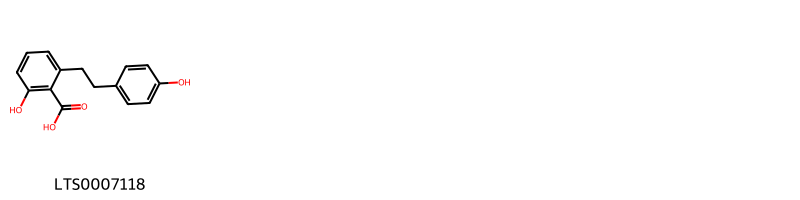{ width=100% }
    <figcaption>Hình ảnh cấu trúc hóa học của 1 hoạt chất thuộc nhóm Stilbenes gồm ['lunularic acid (LTS0007118)'].</figcaption>
</figure>
#### Nhóm Sulfenyl compounds
<figure markdown="span">
    { width=100% }
    <figcaption>Hình ảnh cấu trúc hóa học của 1 hoạt chất thuộc nhóm Sulfenyl compounds gồm ['dimethyltetrasulfane (LTS0111253)'].</figcaption>
</figure>
#### Nhóm Thiosulfinic acid esters
<figure markdown="span">
    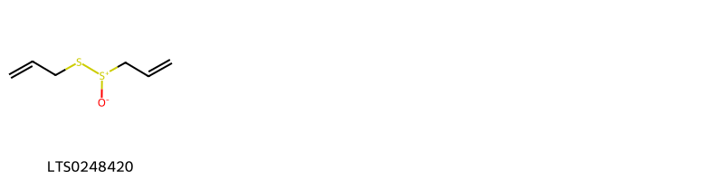{ width=100% }
    <figcaption>Hình ảnh cấu trúc hóa học của 1 hoạt chất thuộc nhóm Thiosulfinic acid esters gồm ['allicin (LTS0248420)'].</figcaption>
</figure>

---

### Dược dân tộc học

Danh sách các quốc gia có sử dụng *Allium chinense* trong điều trị các bệnh. 

| Country   | Disease   | Bệnh    |
|:----------|:----------|:--------|
| Elsewhere | Stomachic | Sững sờ |

---

---
## Allium fistulosum
### Thông tin về thực vật

!!! info "Phân loại thực vật của *Allium fistulosum* từ GIBF:"
    - **Kingdom:** Plantae
    - **Phylum:** Tracheophyta
    - **Order:** Asparagales
    - **Family:** Amaryllidaceae
    - **Genus:** Allium
    - **Species:** *Allium fistulosum*

 

| Label (VI)   | Label (EN)   | Scientific Name   | Descriptions (VI)   | Descriptions (EN)   | Also Known As (VI)                                     | Also Known As (EN)                                                 |
|:-------------|:-------------|:------------------|:--------------------|:--------------------|:-------------------------------------------------------|:-------------------------------------------------------------------|
| N/A          | N/A          | Allium fistulosum | loài thực vật       | species of plant    | ['Hành ta', 'Hành lá', 'Hành củ', 'Allium fistulosum'] | ['Allium fistulosum', 'bunching onion', 'green onion', 'scallion'] |

#### Phân bố trên thế giới

**Từ CSDL GIBF** nan, Brazil, Japan, Czechia, Sweden, China, New Zealand, Ecuador, Puerto Rico, United States of America, Romania, Korea, Republic of, Russian Federation, Nigeria, Colombia, Estonia, Belarus, Hong Kong, Norway, Niue, France, Belgium, Chinese Taipei, Philippines, Canada, Germany, Austria, Ukraine, Italy, Switzerland, India, United Kingdom of Great Britain and Northern Ireland, Ireland

#### Phân bố tại Việt Nam

**Từ CSDL GIBF**: Không có ghi nhận ở Việt Nam

---
### Thành phần hóa học
        
- Theo cơ sở dữ liệu lotus: Từ loài *Allium fistulosum* đã phân lập và xác định được 78 hoạt chất thuộc về các nhóm Organic oxoanionic compounds, Fatty Acyls, Organic thiosulfuric acids and derivatives, Carboxylic acids and derivatives, Organic disulfides, Organooxygen compounds, Sulfenyl compounds, Allyl sulfur compounds, Dihydrofurans, Benzene and substituted derivatives, Cinnamic acids and derivatives, Steroids and steroid derivatives, Furanoid lignans, Flavonoids, Dibenzylbutane lignans, Organic trisulfides, Thiosulfinic acid esters, Organic sulfonic acids and derivatives, Indoles and derivatives. 

|    | chemicalTaxonomyClassyfireClass            |   smiles_count |
|---:|:-------------------------------------------|---------------:|
|  0 |                                            |              3 |
|  1 | Allyl sulfur compounds                     |              1 |
|  2 | Benzene and substituted derivatives        |              2 |
|  3 | Carboxylic acids and derivatives           |              8 |
|  4 | Cinnamic acids and derivatives             |              3 |
|  5 | Dibenzylbutane lignans                     |              2 |
|  6 | Dihydrofurans                              |              2 |
|  7 | Fatty Acyls                                |              4 |
|  8 | Flavonoids                                 |              8 |
|  9 | Furanoid lignans                           |              1 |
| 10 | Indoles and derivatives                    |              1 |
| 11 | Organic disulfides                         |              4 |
| 12 | Organic oxoanionic compounds               |              4 |
| 13 | Organic sulfonic acids and derivatives     |              1 |
| 14 | Organic thiosulfuric acids and derivatives |              2 |
| 15 | Organic trisulfides                        |              4 |
| 16 | Organooxygen compounds                     |              1 |
| 17 | Steroids and steroid derivatives           |             16 |
| 18 | Sulfenyl compounds                         |              2 |
| 19 | Thiosulfinic acid esters                   |              9 |

#### Nhóm 
<figure markdown="span">
    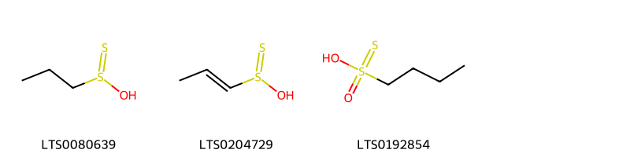{ width=100% }
    <figcaption>Hình ảnh cấu trúc hóa học của 3 hoạt chất thuộc nhóm  gồm ['propyl-λ⁴-disulfanylol (LTS0080639)', '(1e)-prop-1-en-1-yl-λ⁴-disulfanylol (LTS0204729)', '1-butyl-1-hydroxy-1λ⁶-disulfen-1-one (LTS0192854)'].</figcaption>
</figure>
#### Nhóm Allyl sulfur compounds
<figure markdown="span">
    { width=100% }
    <figcaption>Hình ảnh cấu trúc hóa học của 1 hoạt chất thuộc nhóm Allyl sulfur compounds gồm ['allyl propyl disulfide (LTS0050924)'].</figcaption>
</figure>
#### Nhóm Benzene and substituted derivatives
<figure markdown="span">
    { width=100% }
    <figcaption>Hình ảnh cấu trúc hóa học của 2 hoạt chất thuộc nhóm Benzene and substituted derivatives gồm ['p-hydroxybenzoic acid (LTS0263634)', 'vanillic acid (LTS0229113)'].</figcaption>
</figure>
#### Nhóm Carboxylic acids and derivatives
<figure markdown="span">
    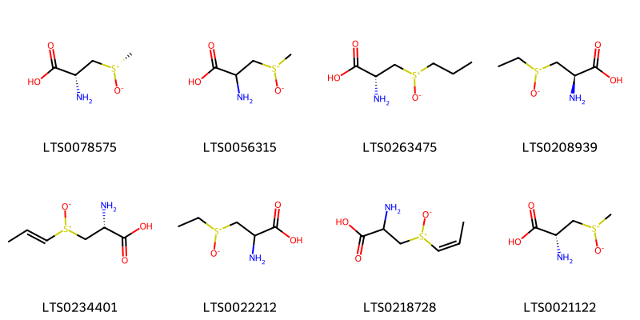{ width=100% }
    <figcaption>Hình ảnh cấu trúc hóa học của 8 hoạt chất thuộc nhóm Carboxylic acids and derivatives gồm ['(2r)-2-amino-3-[(s)-methanesulfinyl]propanoic acid (LTS0078575)', '2-amino-3-methanesulfinylpropanoic acid (LTS0056315)', '(2r)-2-amino-3-(propane-1-sulfinyl)propanoic acid (LTS0263475)', '(2r)-2-amino-3-(ethanesulfinyl)propanoic acid (LTS0208939)', 'isoalliin (LTS0234401)', '2-amino-3-(ethanesulfinyl)propanoic acid (LTS0022212)', '2-amino-3-[(1z)-prop-1-ene-1-sulfinyl]propanoic acid (LTS0218728)', '(2r)-2-amino-3-methanesulfinylpropanoic acid (LTS0021122)'].</figcaption>
</figure>
#### Nhóm Cinnamic acids and derivatives
<figure markdown="span">
    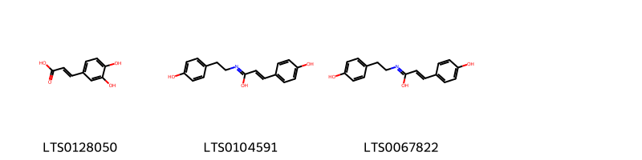{ width=100% }
    <figcaption>Hình ảnh cấu trúc hóa học của 3 hoạt chất thuộc nhóm Cinnamic acids and derivatives gồm ['3,4-dihydroxycinnamic acid (LTS0128050)', '3-(4-hydroxyphenyl)-n-[2-(4-hydroxyphenyl)ethyl]prop-2-enimidic acid (LTS0104591)', '(2e)-3-(4-hydroxyphenyl)-n-[2-(4-hydroxyphenyl)ethyl]prop-2-enimidic acid (LTS0067822)'].</figcaption>
</figure>
#### Nhóm Dibenzylbutane lignans
<figure markdown="span">
    { width=100% }
    <figcaption>Hình ảnh cấu trúc hóa học của 2 hoạt chất thuộc nhóm Dibenzylbutane lignans gồm ['(2s,3r)-2,3-bis[(4-hydroxy-3-methoxyphenyl)(¹³c)methyl](1-¹³c)butane-1,4-diol (LTS0268699)', 'secoisolariciresinol (LTS0086727)'].</figcaption>
</figure>
#### Nhóm Dihydrofurans
<figure markdown="span">
    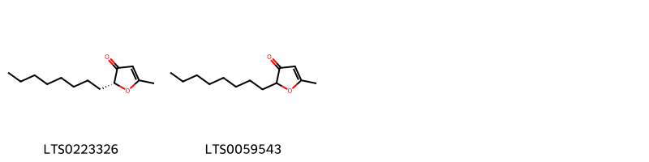{ width=100% }
    <figcaption>Hình ảnh cấu trúc hóa học của 2 hoạt chất thuộc nhóm Dihydrofurans gồm ['(2r)-5-methyl-2-octyl-2h-furan-3-one (LTS0223326)', '5-methyl-2-octyl-2h-furan-3-one (LTS0059543)'].</figcaption>
</figure>
#### Nhóm Fatty Acyls
<figure markdown="span">
    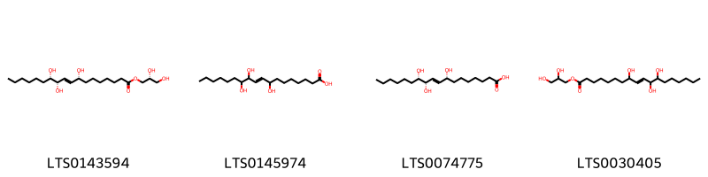{ width=100% }
    <figcaption>Hình ảnh cấu trúc hóa học của 4 hoạt chất thuộc nhóm Fatty Acyls gồm ['(2r)-2,3-dihydroxypropyl (8r,9e,11s,12s)-8,11,12-trihydroxyoctadec-9-enoate (LTS0143594)', '8,11,12-trihydroxyoctadec-9-enoic acid (LTS0145974)', '(8r,9e,11s,12s)-8,11,12-trihydroxyoctadec-9-enoic acid (LTS0074775)', '2,3-dihydroxypropyl 8,11,12-trihydroxyoctadec-9-enoate (LTS0030405)'].</figcaption>
</figure>
#### Nhóm Flavonoids
<figure markdown="span">
    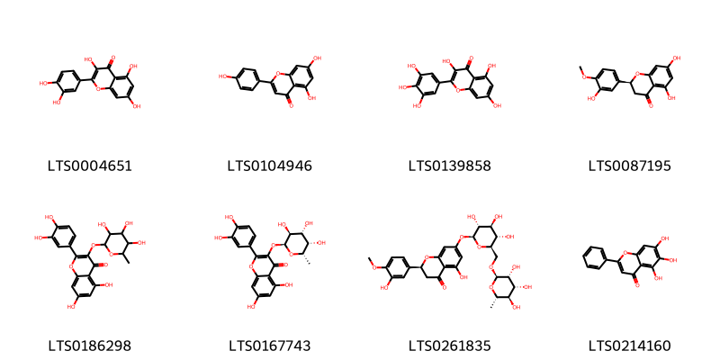{ width=100% }
    <figcaption>Hình ảnh cấu trúc hóa học của 8 hoạt chất thuộc nhóm Flavonoids gồm ['quercetin (LTS0004651)', 'chamomile (LTS0104946)', 'myricetin (LTS0139858)', 'hesperetin (LTS0087195)', 'quercitrin (LTS0186298)', '2-(3,4-dihydroxyphenyl)-5,7-dihydroxy-3-{[(2s,3s,4r,5s,6s)-3,4,5-trihydroxy-6-methyloxan-2-yl]oxy}chromen-4-one (LTS0167743)', 'hesperidin (LTS0261835)', 'baicalein (LTS0214160)'].</figcaption>
</figure>
#### Nhóm Furanoid lignans
<figure markdown="span">
    { width=100% }
    <figcaption>Hình ảnh cấu trúc hóa học của 1 hoạt chất thuộc nhóm Furanoid lignans gồm ['matairesinol (LTS0193475)'].</figcaption>
</figure>
#### Nhóm Indoles and derivatives
<figure markdown="span">
    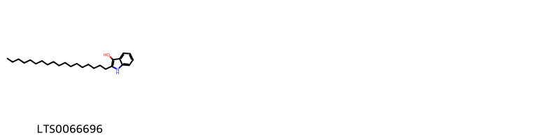{ width=100% }
    <figcaption>Hình ảnh cấu trúc hóa học của 1 hoạt chất thuộc nhóm Indoles and derivatives gồm ['2-octadecyl-1h-indol-3-ol (LTS0066696)'].</figcaption>
</figure>
#### Nhóm Organic disulfides
<figure markdown="span">
    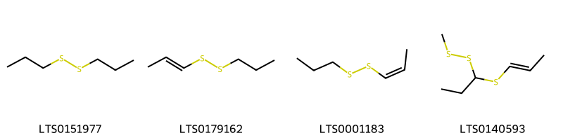{ width=100% }
    <figcaption>Hình ảnh cấu trúc hóa học của 4 hoạt chất thuộc nhóm Organic disulfides gồm ['propyl disulfide (LTS0151977)', '1-(propyldisulfanyl)prop-1-ene (LTS0179162)', '(1z)-propenyl propyl disulfide (LTS0001183)', '1-(methyldisulfanyl)-1-(prop-1-en-1-ylsulfanyl)propane (LTS0140593)'].</figcaption>
</figure>
#### Nhóm Organic oxoanionic compounds
<figure markdown="span">
    { width=100% }
    <figcaption>Hình ảnh cấu trúc hóa học của 4 hoạt chất thuộc nhóm Organic oxoanionic compounds gồm ['1-hydroxy-1-(prop-2-en-1-yloxy)-1λ⁶-disulfen-1-one (LTS0262385)', '1-hydroxy-1-[(1e)-prop-1-en-1-yloxy]-1λ⁶-disulfen-1-one (LTS0100819)', '1-hydroxy-1-[(1z)-prop-1-en-1-yloxy]-1λ⁶-disulfen-1-one (LTS0103772)', '1-hydroxy-1-propoxy-1λ⁶-disulfen-1-one (LTS0202599)'].</figcaption>
</figure>
#### Nhóm Organic sulfonic acids and derivatives
<figure markdown="span">
    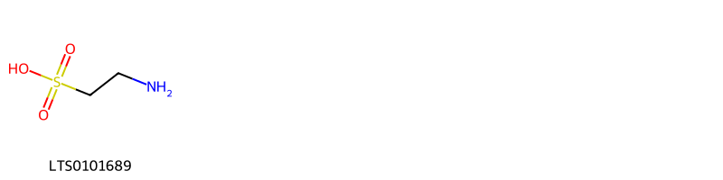{ width=100% }
    <figcaption>Hình ảnh cấu trúc hóa học của 1 hoạt chất thuộc nhóm Organic sulfonic acids and derivatives gồm ['2-aminoethanesulfonic acid (LTS0101689)'].</figcaption>
</figure>
#### Nhóm Organic thiosulfuric acids and derivatives
<figure markdown="span">
    { width=100% }
    <figcaption>Hình ảnh cấu trúc hóa học của 2 hoạt chất thuộc nhóm Organic thiosulfuric acids and derivatives gồm ['prop-2-en-1-ylsulfanylsulfonic acid (LTS0084048)', 'propylsulfanylsulfonic acid (LTS0154623)'].</figcaption>
</figure>
#### Nhóm Organic trisulfides
<figure markdown="span">
    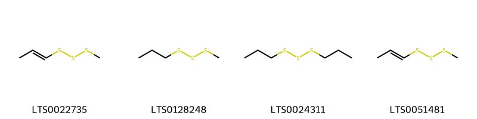{ width=100% }
    <figcaption>Hình ảnh cấu trúc hóa học của 4 hoạt chất thuộc nhóm Organic trisulfides gồm ['1-methyl-3-(prop-1-en-1-yl)trisulfane (LTS0022735)', 'methyl propyl trisulfide (LTS0128248)', 'dipropyl trisulfide (LTS0024311)', '1-methyl-3-[(1e)-prop-1-en-1-yl]trisulfane (LTS0051481)'].</figcaption>
</figure>
#### Nhóm Organooxygen compounds
<figure markdown="span">
    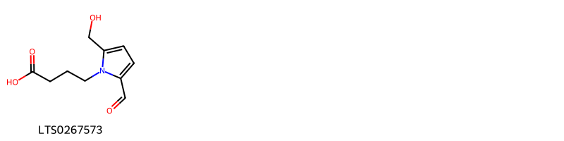{ width=100% }
    <figcaption>Hình ảnh cấu trúc hóa học của 1 hoạt chất thuộc nhóm Organooxygen compounds gồm ['4-[2-formyl-5-(hydroxymethyl)pyrrol-1-yl]butanoic acid (LTS0267573)'].</figcaption>
</figure>
#### Nhóm Steroids and steroid derivatives
<figure markdown="span">
    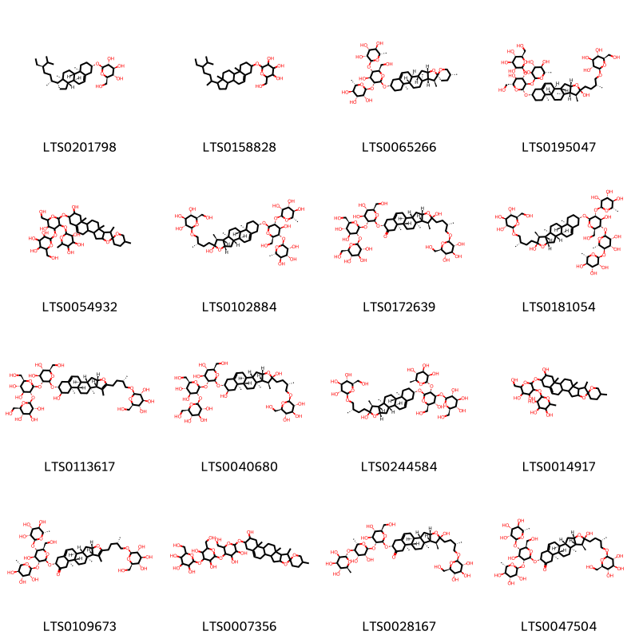{ width=100% }
    <figcaption>Hình ảnh cấu trúc hóa học của 16 hoạt chất thuộc nhóm Steroids and steroid derivatives gồm ['sitogluside (LTS0201798)', '2-{[1-(5-ethyl-6-methylheptan-2-yl)-9a,11a-dimethyl-1h,2h,3h,3ah,3bh,4h,6h,7h,8h,9h,9bh,10h,11h-cyclopenta[a]phenanthren-7-yl]oxy}-6-(hydroxymethyl)oxane-3,4,5-triol (LTS0158828)', "(2s,3r,4r,5r,6s)-2-{[(2r,3s,4s,5r,6r)-4-hydroxy-2-(hydroxymethyl)-6-[(1's,2r,2's,4's,5r,7's,8'r,9's,12's,13'r,16's)-5,7',9',13'-tetramethyl-5'-oxaspiro[oxane-2,6'-pentacyclo[10.8.0.0²,⁹.0⁴,⁸.0¹³,¹⁸]icosan]-18'-eneoxy]-5-{[(2s,3r,4r,5r,6s)-3,4,5-trihydroxy-6-methyloxan-2-yl]oxy}oxan-3-yl]oxy}-6-methyloxane-3,4,5-triol (LTS0065266)", '(2s,3r,4r,5r,6s)-2-{[(2r,3r,4s,5r,6r)-5-hydroxy-2-{[(1s,2s,4s,6r,7s,8r,9s,12s,13r,16s)-6-hydroxy-7,9,13-trimethyl-6-[(3r)-3-methyl-4-{[(2r,3r,4s,5s,6r)-3,4,5-trihydroxy-6-(hydroxymethyl)oxan-2-yl]oxy}butyl]-5-oxapentacyclo[10.8.0.0²,⁹.0⁴,⁸.0¹³,¹⁸]icos-18-en-16-yl]oxy}-6-(hydroxymethyl)-4-{[(2s,3r,4s,5s,6r)-3,4,5-trihydroxy-6-(hydroxymethyl)oxan-2-yl]oxy}oxan-3-yl]oxy}-6-methyloxane-3,4,5-triol (LTS0195047)', "2-{[3-hydroxy-2-(hydroxymethyl)-6-{5,7',9',13'-tetramethyl-5'-oxaspiro[oxane-2,6'-pentacyclo[10.8.0.0²,⁹.0⁴,⁸.0¹³,¹⁸]icosan]-18'-en-15'-oloxy}-5-[(3,4,5-trihydroxy-6-methyloxan-2-yl)oxy]oxan-4-yl]oxy}-6-(hydroxymethyl)oxane-3,4,5-triol (LTS0054932)", 'trigonelloside c (LTS0102884)', '(1s,2s,4s,6r,7s,8r,9s,12s,13r,16r)-16-{[(2s,3r,4s,5s,6r)-3-{[(2s,3r,4s,5s,6r)-4,5-dihydroxy-6-(hydroxymethyl)-3-{[(2s,3r,4s,5s,6r)-3,4,5-trihydroxy-6-(hydroxymethyl)oxan-2-yl]oxy}oxan-2-yl]oxy}-4,5-dihydroxy-6-(hydroxymethyl)oxan-2-yl]oxy}-6-hydroxy-7,9,13-trimethyl-6-[(3s)-3-methyl-4-{[(2r,3r,4s,5s,6r)-3,4,5-trihydroxy-6-(hydroxymethyl)oxan-2-yl]oxy}butyl]-5-oxapentacyclo[10.8.0.0²,⁹.0⁴,⁸.0¹³,¹⁸]icos-18-en-15-one (LTS0172639)', '(2s,3r,4r,5r,6s)-2-{[(2s,3r,4s,5r,6s)-4,5-dihydroxy-6-{[(2r,3s,4s,5r,6r)-4-hydroxy-6-{[(1s,2s,4s,6r,7s,8r,9s,12s,13r,16s)-6-hydroxy-7,9,13-trimethyl-6-[(3s)-3-methyl-4-{[(2r,3r,4s,5s,6r)-3,4,5-trihydroxy-6-(hydroxymethyl)oxan-2-yl]oxy}butyl]-5-oxapentacyclo[10.8.0.0²,⁹.0⁴,⁸.0¹³,¹⁸]icos-18-en-16-yl]oxy}-2-(hydroxymethyl)-5-{[(2s,3r,4r,5r,6s)-3,4,5-trihydroxy-6-methyloxan-2-yl]oxy}oxan-3-yl]oxy}-2-methyloxan-3-yl]oxy}-6-methyloxane-3,4,5-triol (LTS0181054)', '(2r,3r,4s,5s,6r)-2-[(2s)-4-[(1s,2s,4s,8s,9s,12s,13r,15r,16r)-16-{[(2r,3r,4s,5s,6r)-3-{[(2s,3r,4s,5s,6r)-4,5-dihydroxy-6-(hydroxymethyl)-3-{[(2s,3r,4s,5s,6r)-3,4,5-trihydroxy-6-(hydroxymethyl)oxan-2-yl]oxy}oxan-2-yl]oxy}-4,5-dihydroxy-6-(hydroxymethyl)oxan-2-yl]oxy}-15-hydroxy-7,9,13-trimethyl-5-oxapentacyclo[10.8.0.0²,⁹.0⁴,⁸.0¹³,¹⁸]icosa-6,18-dien-6-yl]-2-methylbutoxy]-6-(hydroxymethyl)oxane-3,4,5-triol (LTS0113617)', '(2s,3r,4s,5s,6r)-2-{[(2s,3r,4s,5s,6r)-2-{[(2r,3r,4s,5s,6r)-2-{[(1s,2s,4s,6r,7s,8r,9s,12s,13r,15r,16r)-6,15-dihydroxy-7,9,13-trimethyl-6-[(3s)-3-methyl-4-{[(2r,3r,4s,5s,6r)-3,4,5-trihydroxy-6-(hydroxymethyl)oxan-2-yl]oxy}butyl]-5-oxapentacyclo[10.8.0.0²,⁹.0⁴,⁸.0¹³,¹⁸]icos-18-en-16-yl]oxy}-4,5-dihydroxy-6-(hydroxymethyl)oxan-3-yl]oxy}-4,5-dihydroxy-6-(hydroxymethyl)oxan-3-yl]oxy}-6-(hydroxymethyl)oxane-3,4,5-triol (LTS0040680)', '(2s,3r,4s,5s,6r)-2-{[(2r,3r,4s,5r,6r)-3-hydroxy-6-{[(1s,2s,4s,6r,7s,8r,9s,12s,13r,16s)-6-hydroxy-7,9,13-trimethyl-6-[(3s)-3-methyl-4-{[(2r,3r,4s,5s,6r)-3,4,5-trihydroxy-6-(hydroxymethyl)oxan-2-yl]oxy}butyl]-5-oxapentacyclo[10.8.0.0²,⁹.0⁴,⁸.0¹³,¹⁸]icos-18-en-16-yl]oxy}-2-(hydroxymethyl)-5-{[(2s,3r,4r,5r,6s)-3,4,5-trihydroxy-6-methyloxan-2-yl]oxy}oxan-4-yl]oxy}-6-(hydroxymethyl)oxane-3,4,5-triol (LTS0244584)', "2-{[4,5-dihydroxy-6-(hydroxymethyl)-2-{5,7',9',13'-tetramethyl-5'-oxaspiro[oxane-2,6'-pentacyclo[10.8.0.0²,⁹.0⁴,⁸.0¹³,¹⁸]icosan]-18'-en-15'-oloxy}oxan-3-yl]oxy}-6-methyloxane-3,4,5-triol (LTS0014917)", '(1s,2s,4s,8s,9s,12s,13r,16r)-16-{[(2s,3r,4s,5s,6r)-4-hydroxy-6-(hydroxymethyl)-3,5-bis({[(2s,3r,4r,5r,6s)-3,4,5-trihydroxy-6-methyloxan-2-yl]oxy})oxan-2-yl]oxy}-7,9,13-trimethyl-6-[(3s)-3-methyl-4-{[(2r,3r,4s,5s,6r)-3,4,5-trihydroxy-6-(hydroxymethyl)oxan-2-yl]oxy}butyl]-5-oxapentacyclo[10.8.0.0²,⁹.0⁴,⁸.0¹³,¹⁸]icosa-6,18-dien-15-one (LTS0109673)', "2-[(2-{[4,5-dihydroxy-2-(hydroxymethyl)-6-{5,7',9',13'-tetramethyl-5'-oxaspiro[oxane-2,6'-pentacyclo[10.8.0.0²,⁹.0⁴,⁸.0¹³,¹⁸]icosan]-18'-en-15'-oloxy}oxan-3-yl]oxy}-3,5-dihydroxy-6-(hydroxymethyl)oxan-4-yl)oxy]-6-(hydroxymethyl)oxane-3,4,5-triol (LTS0007356)", '(1s,2s,4s,6r,7s,8r,9s,12s,13r,16r)-16-{[(2s,3r,4s,5s,6r)-3-{[(2s,3r,4s,5r,6s)-3,4-dihydroxy-6-methyl-5-{[(2s,3r,4r,5r,6s)-3,4,5-trihydroxy-6-methyloxan-2-yl]oxy}oxan-2-yl]oxy}-4,5-dihydroxy-6-(hydroxymethyl)oxan-2-yl]oxy}-6-hydroxy-7,9,13-trimethyl-6-[(3s)-3-methyl-4-{[(2r,3r,4s,5s,6r)-3,4,5-trihydroxy-6-(hydroxymethyl)oxan-2-yl]oxy}butyl]-5-oxapentacyclo[10.8.0.0²,⁹.0⁴,⁸.0¹³,¹⁸]icos-18-en-15-one (LTS0028167)', '(1s,2s,4s,6r,7s,8r,9s,12s,13r,16r)-6-hydroxy-16-{[(2s,3r,4s,5s,6r)-4-hydroxy-6-(hydroxymethyl)-3,5-bis({[(2s,3r,4r,5r,6s)-3,4,5-trihydroxy-6-methyloxan-2-yl]oxy})oxan-2-yl]oxy}-7,9,13-trimethyl-6-[(3s)-3-methyl-4-{[(2r,3r,4s,5s,6r)-3,4,5-trihydroxy-6-(hydroxymethyl)oxan-2-yl]oxy}butyl]-5-oxapentacyclo[10.8.0.0²,⁹.0⁴,⁸.0¹³,¹⁸]icos-18-en-15-one (LTS0047504)'].</figcaption>
</figure>
#### Nhóm Sulfenyl compounds
<figure markdown="span">
    { width=100% }
    <figcaption>Hình ảnh cấu trúc hóa học của 2 hoạt chất thuộc nhóm Sulfenyl compounds gồm ['(1z)-prop-1-en-1-ylsulfanylsulfonic acid (LTS0241127)', '(1e)-prop-1-en-1-ylsulfanylsulfonic acid (LTS0026753)'].</figcaption>
</figure>
#### Nhóm Thiosulfinic acid esters
<figure markdown="span">
    { width=100% }
    <figcaption>Hình ảnh cấu trúc hóa học của 9 hoạt chất thuộc nhóm Thiosulfinic acid esters gồm ['allicin (LTS0248420)', '(1e)-1-(methanesulfinylsulfanyl)prop-1-ene (LTS0040661)', '{[(1e)-prop-1-ene-1-sulfinyl]sulfanyl}methane (LTS0191876)', '(1e)-1-[(propane-1-sulfinyl)sulfanyl]prop-1-ene (LTS0071396)', '[(propane-1-sulfinyl)sulfanyl]methane (LTS0029238)', '1-(methanesulfinylsulfanyl)propane (LTS0205111)', '1-{[(1e)-prop-1-ene-1-sulfinyl]sulfanyl}propane (LTS0267562)', '(1e)-1-{[(1e)-prop-1-ene-1-sulfinyl]sulfanyl}prop-1-ene (LTS0009432)', 's-propyl propanethiosulfinate (LTS0032930)'].</figcaption>
</figure>

---

### Dược dân tộc học

Danh sách các quốc gia có sử dụng *Allium fistulosum* trong điều trị các bệnh. 

| Country   | Disease     | Bệnh                      |
|:----------|:------------|:--------------------------|
| Elsewhere | Diaphoretic | Thuốc tràn dịch màng phổi |

---

---
## Allium grayi
### Thông tin về thực vật

!!! info "Phân loại thực vật của *Allium macrostemon* từ GIBF:"
    - **Kingdom:** Plantae
    - **Phylum:** Tracheophyta
    - **Order:** Asparagales
    - **Family:** Amaryllidaceae
    - **Genus:** Allium
    - **Species:** *Allium macrostemon*

 

| Label (VI)   | Label (EN)   | Scientific Name   | Descriptions (VI)   | Descriptions (EN)   | Also Known As (VI)   | Also Known As (EN)   |
|:-------------|:-------------|:------------------|:--------------------|:--------------------|:---------------------|:---------------------|
| N/A          | N/A          | Allium grayi      | loài thực vật       | species of plant    | ['']                 | ['']                 |

#### Phân bố trên thế giới

**Từ CSDL GIBF** nan, Japan, Korea, Republic of, Chinese Taipei, China

#### Phân bố tại Việt Nam

**Từ CSDL GIBF**: Không có ghi nhận ở Việt Nam

---
### Thành phần hóa học
        
- Theo cơ sở dữ liệu lotus: Từ loài *Allium macrostemon* đã phân lập và xác định được 5 hoạt chất thuộc về các nhóm Fatty Acyls, Benzene and substituted derivatives, Sulfonyls. 

|    | chemicalTaxonomyClassyfireClass     |   smiles_count |
|---:|:------------------------------------|---------------:|
|  0 | Benzene and substituted derivatives |              1 |
|  1 | Fatty Acyls                         |              1 |
|  2 | Sulfonyls                           |              3 |

#### Nhóm Benzene and substituted derivatives
<figure markdown="span">
    { width=100% }
    <figcaption>Hình ảnh cấu trúc hóa học của 1 hoạt chất thuộc nhóm Benzene and substituted derivatives gồm ['paraben (LTS0224398)'].</figcaption>
</figure>
#### Nhóm Fatty Acyls
<figure markdown="span">
    { width=100% }
    <figcaption>Hình ảnh cấu trúc hóa học của 1 hoạt chất thuộc nhóm Fatty Acyls gồm ['octanol (LTS0250216)'].</figcaption>
</figure>
#### Nhóm Sulfonyls
<figure markdown="span">
    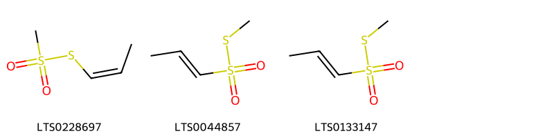{ width=100% }
    <figcaption>Hình ảnh cấu trúc hóa học của 3 hoạt chất thuộc nhóm Sulfonyls gồm ['(1z)-1-(methanesulfonylsulfanyl)prop-1-ene (LTS0228697)', '[(prop-1-ene-1-sulfonyl)sulfanyl]methane (LTS0044857)', '{[(1e)-prop-1-ene-1-sulfonyl]sulfanyl}methane (LTS0133147)'].</figcaption>
</figure>

---

### Dược dân tộc học

Danh sách các quốc gia có sử dụng *Allium macrostemon* trong điều trị các bệnh. 

| Country   | Disease   | Bệnh    |
|:----------|:----------|:--------|
| Elsewhere | Stomachic | Sững sờ |

---

---
## Allium japonicum
### Thông tin về thực vật

!!! info "Phân loại thực vật của *N/A* từ GIBF:"
    - **Kingdom:** Plantae
    - **Phylum:** Tracheophyta
    - **Order:** Asparagales
    - **Family:** Amaryllidaceae
    - **Genus:** Allium
    - **Species:** *N/A*

 

| Label (VI)   | Label (EN)   | Scientific Name   | Descriptions (VI)   | Descriptions (EN)   | Also Known As (VI)   | Also Known As (EN)   |
|:-------------|:-------------|:------------------|:--------------------|:--------------------|:---------------------|:---------------------|
| N/A          | N/A          | Allium grayi      | loài thực vật       | species of plant    | ['']                 | ['']                 |

#### Phân bố trên thế giới

**Từ CSDL GIBF** Brazil, China, Israel, New Zealand, Ecuador, Spain, Netherlands, United States of America, Russian Federation, Mexico, Algeria, United Kingdom of Great Britain and Northern Ireland, Canada, Germany, Austria, Portugal, Ukraine, Australia, Italy, Switzerland, France, Ireland

#### Phân bố tại Việt Nam

**Từ CSDL GIBF**: Không có ghi nhận ở Việt Nam

---
### Thành phần hóa học
        
- Theo cơ sở dữ liệu lotus: Từ loài *N/A* đã phân lập và xác định được Chưa có hoạt chất nào được phân lập. hoạt chất thuộc về các nhóm Không có hoạt chất nào được phân lập. 

Không có hình ảnh nào được tạo ra

---

### Dược dân tộc học

Danh sách các quốc gia có sử dụng *N/A* trong điều trị các bệnh. 

| Country   | Disease     | Bệnh                   |
|:----------|:------------|:-----------------------|
| China     | Carminative | Gây ô nhiễm môi trường |

---

---
## Allium kurrat
### Thông tin về thực vật

!!! info "Phân loại thực vật của *Allium ampeloprasum* từ GIBF:"
    - **Kingdom:** Plantae
    - **Phylum:** Tracheophyta
    - **Order:** Asparagales
    - **Family:** Amaryllidaceae
    - **Genus:** Allium
    - **Species:** *Allium ampeloprasum*

 

| Label (VI)   | Label (EN)   | Scientific Name   | Descriptions (VI)   | Descriptions (EN)   | Also Known As (VI)   | Also Known As (EN)   |
|:-------------|:-------------|:------------------|:--------------------|:--------------------|:---------------------|:---------------------|
| N/A          | N/A          | Allium kurrat     | loài thực vật       | species of plant    | ['']                 | ['']                 |

#### Phân bố trên thế giới

**Từ CSDL GIBF** Brazil, China, Israel, New Zealand, Ecuador, Spain, Netherlands, United States of America, Russian Federation, Mexico, Algeria, United Kingdom of Great Britain and Northern Ireland, Canada, Germany, Austria, Portugal, Ukraine, Australia, Italy, Switzerland, France, Ireland

#### Phân bố tại Việt Nam

**Từ CSDL GIBF**: Không có ghi nhận ở Việt Nam

---
### Thành phần hóa học
        
- Theo cơ sở dữ liệu lotus: Từ loài *Allium ampeloprasum* đã phân lập và xác định được Chưa có hoạt chất nào được phân lập. hoạt chất thuộc về các nhóm Không có hoạt chất nào được phân lập. 

Không có hình ảnh nào được tạo ra

---

### Dược dân tộc học

Danh sách các quốc gia có sử dụng *Allium ampeloprasum* trong điều trị các bệnh. 

| Country   | Disease                                                  | Bệnh                                                |
|:----------|:---------------------------------------------------------|:----------------------------------------------------|
| Egypt     | Aphrodisiac, Emollient, Expectorant, Diuretic, Stomachic | Kích thích tình dục, làm mềm, đờm, lợi tiểu, dạ dày |

---

---
## Allium odorum
### Thông tin về thực vật

!!! info "Phân loại thực vật của *Allium odorum* từ GIBF:"
    - **Kingdom:** Plantae
    - **Phylum:** Tracheophyta
    - **Order:** Asparagales
    - **Family:** Amaryllidaceae
    - **Genus:** Allium
    - **Species:** *Allium odorum*

 

| Label (VI)   | Label (EN)   | Scientific Name   | Descriptions (VI)   | Descriptions (EN)   | Also Known As (VI)   | Also Known As (EN)   |
|:-------------|:-------------|:------------------|:--------------------|:--------------------|:---------------------|:---------------------|
| N/A          | N/A          | Allium odorum     |                     | species of plant    | ['']                 | ['']                 |

#### Phân bố trên thế giới

**Từ CSDL GIBF** nan, Algeria, Japan, Korea, Republic of, Finland, China, Russian Federation, India, Spain

#### Phân bố tại Việt Nam

**Từ CSDL GIBF**: Không có ghi nhận ở Việt Nam

---
### Thành phần hóa học
        
- Theo cơ sở dữ liệu lotus: Từ loài *Allium odorum* đã phân lập và xác định được 6 hoạt chất thuộc về các nhóm Organic trisulfides, Allyl sulfur compounds, Indoles and derivatives. 

|    | chemicalTaxonomyClassyfireClass   |   smiles_count |
|---:|:----------------------------------|---------------:|
|  0 | Allyl sulfur compounds            |              3 |
|  1 | Indoles and derivatives           |              2 |
|  2 | Organic trisulfides               |              1 |

#### Nhóm Allyl sulfur compounds
<figure markdown="span">
    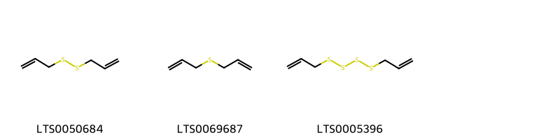{ width=100% }
    <figcaption>Hình ảnh cấu trúc hóa học của 3 hoạt chất thuộc nhóm Allyl sulfur compounds gồm ['garlicin (LTS0050684)', 'oil garlic (LTS0069687)', 'diallyl tetrasulfide (LTS0005396)'].</figcaption>
</figure>
#### Nhóm Indoles and derivatives
<figure markdown="span">
    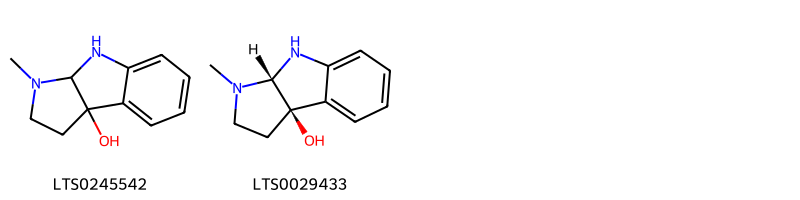{ width=100% }
    <figcaption>Hình ảnh cấu trúc hóa học của 2 hoạt chất thuộc nhóm Indoles and derivatives gồm ['1-methyl-2h,3h,8h,8ah-pyrrolo[2,3-b]indol-3a-ol (LTS0245542)', '(3ar,8as)-1-methyl-2h,3h,8h,8ah-pyrrolo[2,3-b]indol-3a-ol (LTS0029433)'].</figcaption>
</figure>
#### Nhóm Organic trisulfides
<figure markdown="span">
    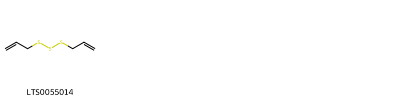{ width=100% }
    <figcaption>Hình ảnh cấu trúc hóa học của 1 hoạt chất thuộc nhóm Organic trisulfides gồm ['allyl trisulfide (LTS0055014)'].</figcaption>
</figure>

---

### Dược dân tộc học

Danh sách các quốc gia có sử dụng *Allium odorum* trong điều trị các bệnh. 

| Country   | Disease                           | Bệnh                             |
|:----------|:----------------------------------|:---------------------------------|
| China     | Antiseptic, nan, Tonic, Stomachic | Khử trùng, nan, thuốc bổ, dạ dày |

---

---
## Allium porrum
### Thông tin về thực vật

!!! info "Phân loại thực vật của *N/A* từ GIBF:"
    - **Kingdom:** Plantae
    - **Phylum:** Tracheophyta
    - **Order:** Asparagales
    - **Family:** Amaryllidaceae
    - **Genus:** Allium
    - **Species:** *N/A*

 

| Label (VI)   | Label (EN)   | Scientific Name   | Descriptions (VI)   | Descriptions (EN)   | Also Known As (VI)   | Also Known As (EN)   |
|:-------------|:-------------|:------------------|:--------------------|:--------------------|:---------------------|:---------------------|
| N/A          | N/A          | Allium porrum     | loài thực vật       | species of plant    | ['']                 | ['']                 |

#### Phân bố trên thế giới

**Từ CSDL GIBF** Brazil, China, Israel, New Zealand, Ecuador, Spain, Netherlands, United States of America, Russian Federation, Mexico, Algeria, United Kingdom of Great Britain and Northern Ireland, Canada, Germany, Austria, Portugal, Ukraine, Australia, Italy, Switzerland, France, Ireland

#### Phân bố tại Việt Nam

**Từ CSDL GIBF**: Không có ghi nhận ở Việt Nam

---
### Thành phần hóa học
        
- Theo cơ sở dữ liệu lotus: Từ loài *N/A* đã phân lập và xác định được 112 hoạt chất thuộc về các nhóm Fatty Acyls, Organic oxoanionic compounds, Thiosulfinic acid esters, Benzofurans, Sulfenyl compounds, Allyl sulfur compounds, Flavonoids, Organic thiosulfuric acids and derivatives, Naphthofurans, Carboxylic acids and derivatives, Saccharolipids, Organic disulfides, Steroids and steroid derivatives, Organooxygen compounds, Prenol lipids. 

|    | chemicalTaxonomyClassyfireClass            |   smiles_count |
|---:|:-------------------------------------------|---------------:|
|  0 | Allyl sulfur compounds                     |              1 |
|  1 | Benzofurans                                |              3 |
|  2 | Carboxylic acids and derivatives           |              4 |
|  3 | Fatty Acyls                                |             18 |
|  4 | Flavonoids                                 |             13 |
|  5 | Naphthofurans                              |              3 |
|  6 | Organic disulfides                         |              1 |
|  7 | Organic oxoanionic compounds               |              4 |
|  8 | Organic thiosulfuric acids and derivatives |              2 |
|  9 | Organooxygen compounds                     |              4 |
| 10 | Prenol lipids                              |             19 |
| 11 | Saccharolipids                             |              6 |
| 12 | Steroids and steroid derivatives           |             24 |
| 13 | Sulfenyl compounds                         |              2 |
| 14 | Thiosulfinic acid esters                   |              8 |

#### Nhóm Allyl sulfur compounds
<figure markdown="span">
    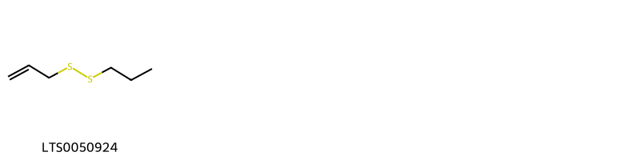{ width=100% }
    <figcaption>Hình ảnh cấu trúc hóa học của 1 hoạt chất thuộc nhóm Allyl sulfur compounds gồm ['allyl propyl disulfide (LTS0050924)'].</figcaption>
</figure>
#### Nhóm Benzofurans
<figure markdown="span">
    { width=100% }
    <figcaption>Hình ảnh cấu trúc hóa học của 3 hoạt chất thuộc nhóm Benzofurans gồm ['4,11-dihydroxy-13-methyl-8-oxatricyclo[7.4.0.0²,⁷]trideca-1(9),2(7),3,5,10,12-hexaene-6-carboxylic acid (LTS0075029)', '10-hydroxy-4,11-dimethoxy-13-methyl-8-oxatricyclo[7.4.0.0²,⁷]trideca-1(9),2(7),3,5,10,12-hexaene-6-carboxylic acid (LTS0018285)', '4,10-dihydroxy-11-methoxy-13-methyl-8-oxatricyclo[7.4.0.0²,⁷]trideca-1(9),2(7),3,5,10,12-hexaene-6-carboxylic acid (LTS0168712)'].</figcaption>
</figure>
#### Nhóm Carboxylic acids and derivatives
<figure markdown="span">
    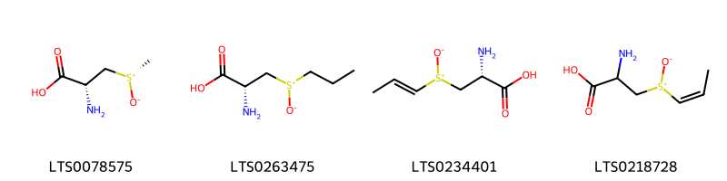{ width=100% }
    <figcaption>Hình ảnh cấu trúc hóa học của 4 hoạt chất thuộc nhóm Carboxylic acids and derivatives gồm ['(2r)-2-amino-3-[(s)-methanesulfinyl]propanoic acid (LTS0078575)', '(2r)-2-amino-3-(propane-1-sulfinyl)propanoic acid (LTS0263475)', 'isoalliin (LTS0234401)', '2-amino-3-[(1z)-prop-1-ene-1-sulfinyl]propanoic acid (LTS0218728)'].</figcaption>
</figure>
#### Nhóm Fatty Acyls
<figure markdown="span">
    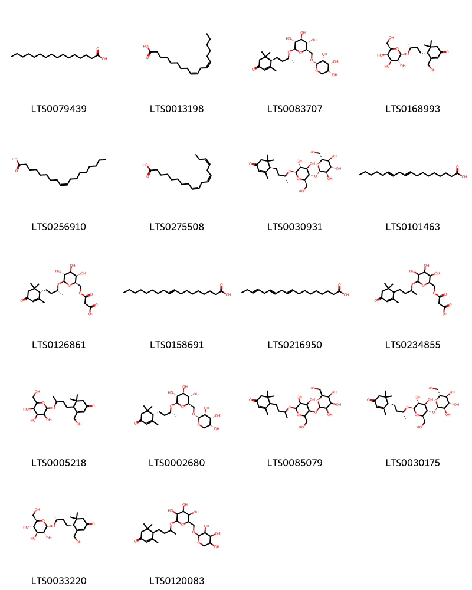{ width=100% }
    <figcaption>Hình ảnh cấu trúc hóa học của 18 hoạt chất thuộc nhóm Fatty Acyls gồm ['palmitic acid (LTS0079439)', 'linoleic (LTS0013198)', '(4r)-3,5,5-trimethyl-4-[(3r)-3-{[(2r,3r,4s,5s,6r)-3,4,5-trihydroxy-6-({[(2r,3r,4r,5r)-3,4,5-trihydroxyoxan-2-yl]oxy}methyl)oxan-2-yl]oxy}butyl]cyclohex-2-en-1-one (LTS0083707)', '(4r)-3-(hydroxymethyl)-5,5-dimethyl-4-[(3r)-3-{[(2r,3r,4s,5r,6r)-3,4,5-trihydroxy-6-(hydroxymethyl)oxan-2-yl]oxy}butyl]cyclohex-2-en-1-one (LTS0168993)', 'oleic acid (LTS0256910)', 'α-linolenic acid (LTS0275508)', '(4r)-4-[(3r)-3-{[(2r,3r,4r,5s,6r)-3,4-dihydroxy-6-(hydroxymethyl)-5-{[(2s,3r,4s,5s,6r)-3,4,5-trihydroxy-6-(hydroxymethyl)oxan-2-yl]oxy}oxan-2-yl]oxy}butyl]-3,5,5-trimethylcyclohex-2-en-1-one (LTS0030931)', '9,12-octadecadienoic acid (LTS0101463)', '3-oxo-3-{[(2r,3s,4s,5r,6r)-3,4,5-trihydroxy-6-{[(2r)-4-[(1s)-2,6,6-trimethyl-4-oxocyclohex-2-en-1-yl]butan-2-yl]oxy}oxan-2-yl]methoxy}propanoic acid (LTS0126861)', '9 octadecenoic acid (LTS0158691)', 'octadeca-9,12,15-trienoic acid (LTS0216950)', '3-oxo-3-[(3,4,5-trihydroxy-6-{[4-(2,6,6-trimethyl-4-oxocyclohex-2-en-1-yl)butan-2-yl]oxy}oxan-2-yl)methoxy]propanoic acid (LTS0234855)', '3-(hydroxymethyl)-5,5-dimethyl-4-(3-{[3,4,5-trihydroxy-6-(hydroxymethyl)oxan-2-yl]oxy}butyl)cyclohex-2-en-1-one (LTS0005218)', '(4s)-3,5,5-trimethyl-4-[(3r)-3-{[(2r,3r,4s,5s,6r)-3,4,5-trihydroxy-6-({[(2r,3s,4r,5r)-3,4,5-trihydroxyoxan-2-yl]oxy}methyl)oxan-2-yl]oxy}butyl]cyclohex-2-en-1-one (LTS0002680)', '4-(3-{[3,4-dihydroxy-6-(hydroxymethyl)-5-{[3,4,5-trihydroxy-6-(hydroxymethyl)oxan-2-yl]oxy}oxan-2-yl]oxy}butyl)-3,5,5-trimethylcyclohex-2-en-1-one (LTS0085079)', '(4s)-4-[(3r)-3-{[(2r,3r,4r,5s,6r)-3,4-dihydroxy-6-(hydroxymethyl)-5-{[(2s,3r,4s,5s,6r)-3,4,5-trihydroxy-6-(hydroxymethyl)oxan-2-yl]oxy}oxan-2-yl]oxy}butyl]-3,5,5-trimethylcyclohex-2-en-1-one (LTS0030175)', '(4s)-3-(hydroxymethyl)-5,5-dimethyl-4-[(3r)-3-{[(2r,3r,4s,5s,6r)-3,4,5-trihydroxy-6-(hydroxymethyl)oxan-2-yl]oxy}butyl]cyclohex-2-en-1-one (LTS0033220)', '3,5,5-trimethyl-4-{3-[(3,4,5-trihydroxy-6-{[(3,4,5-trihydroxyoxan-2-yl)oxy]methyl}oxan-2-yl)oxy]butyl}cyclohex-2-en-1-one (LTS0120083)'].</figcaption>
</figure>
#### Nhóm Flavonoids
<figure markdown="span">
    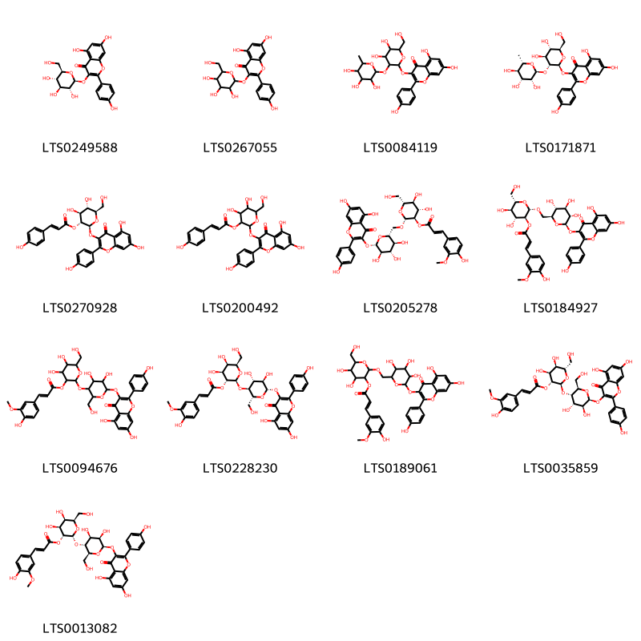{ width=100% }
    <figcaption>Hình ảnh cấu trúc hóa học của 13 hoạt chất thuộc nhóm Flavonoids gồm ['astragalin (LTS0249588)', 'trifolin (LTS0267055)', '3-{[4,5-dihydroxy-6-(hydroxymethyl)-3-[(3,4,5-trihydroxy-6-methyloxan-2-yl)oxy]oxan-2-yl]oxy}-5,7-dihydroxy-2-(4-hydroxyphenyl)chromen-4-one (LTS0084119)', '3-{[(2s,3r,4s,5s,6r)-4,5-dihydroxy-6-(hydroxymethyl)-3-{[(2s,3r,4r,5r,6s)-3,4,5-trihydroxy-6-methyloxan-2-yl]oxy}oxan-2-yl]oxy}-5,7-dihydroxy-2-(4-hydroxyphenyl)chromen-4-one (LTS0171871)', '(2s,3r,4s,5s,6r)-2-{[5,7-dihydroxy-2-(4-hydroxyphenyl)-4-oxochromen-3-yl]oxy}-4,5-dihydroxy-6-(hydroxymethyl)oxan-3-yl (2e)-3-(4-hydroxyphenyl)prop-2-enoate (LTS0270928)', '2-{[5,7-dihydroxy-2-(4-hydroxyphenyl)-4-oxochromen-3-yl]oxy}-4,5-dihydroxy-6-(hydroxymethyl)oxan-3-yl 3-(4-hydroxyphenyl)prop-2-enoate (LTS0200492)', '(2r,3r,4s,5s,6r)-2-{[(2r,3s,4s,5r,6s)-6-{[5,7-dihydroxy-2-(4-hydroxyphenyl)-4-oxochromen-3-yl]oxy}-3,4,5-trihydroxyoxan-2-yl]methoxy}-4,5-dihydroxy-6-(hydroxymethyl)oxan-3-yl (2e)-3-(4-hydroxy-3-methoxyphenyl)prop-2-enoate (LTS0205278)', '(2s,3s,4r,5r,6s)-2-{[(2s,3r,4r,5s,6r)-6-{[5,7-dihydroxy-2-(4-hydroxyphenyl)-4-oxochromen-3-yl]oxy}-3,4,5-trihydroxyoxan-2-yl]methoxy}-4,5-dihydroxy-6-(hydroxymethyl)oxan-3-yl (2e)-3-(4-hydroxy-3-methoxyphenyl)prop-2-enoate (LTS0184927)', '2-[(6-{[5,7-dihydroxy-2-(4-hydroxyphenyl)-4-oxochromen-3-yl]oxy}-4,5-dihydroxy-2-(hydroxymethyl)oxan-3-yl)oxy]-4,5-dihydroxy-6-(hydroxymethyl)oxan-3-yl 3-(4-hydroxy-3-methoxyphenyl)prop-2-enoate (LTS0094676)', '(2s,3r,4s,5r,6r)-2-{[(2r,3s,4r,5r,6s)-6-{[5,7-dihydroxy-2-(4-hydroxyphenyl)-4-oxochromen-3-yl]oxy}-4,5-dihydroxy-2-(hydroxymethyl)oxan-3-yl]oxy}-4,5-dihydroxy-6-(hydroxymethyl)oxan-3-yl (2e)-3-(4-hydroxy-3-methoxyphenyl)prop-2-enoate (LTS0228230)', '2-[(6-{[5,7-dihydroxy-2-(4-hydroxyphenyl)-4-oxochromen-3-yl]oxy}-3,4,5-trihydroxyoxan-2-yl)methoxy]-4,5-dihydroxy-6-(hydroxymethyl)oxan-3-yl 3-(4-hydroxy-3-methoxyphenyl)prop-2-enoate (LTS0189061)', '(2s,3r,4s,5r,6s)-2-{[(2r,3s,4s,5s,6s)-6-{[5,7-dihydroxy-2-(4-hydroxyphenyl)-4-oxochromen-3-yl]oxy}-4,5-dihydroxy-2-(hydroxymethyl)oxan-3-yl]oxy}-4,5-dihydroxy-6-(hydroxymethyl)oxan-3-yl (2e)-3-(4-hydroxy-3-methoxyphenyl)prop-2-enoate (LTS0035859)', '(2r,3r,4s,5r,6r)-2-{[(2s,3r,4s,5r,6r)-6-{[5,7-dihydroxy-2-(4-hydroxyphenyl)-4-oxochromen-3-yl]oxy}-4,5-dihydroxy-2-(hydroxymethyl)oxan-3-yl]oxy}-4,5-dihydroxy-6-(hydroxymethyl)oxan-3-yl (2e)-3-(4-hydroxy-3-methoxyphenyl)prop-2-enoate (LTS0013082)'].</figcaption>
</figure>
#### Nhóm Naphthofurans
<figure markdown="span">
    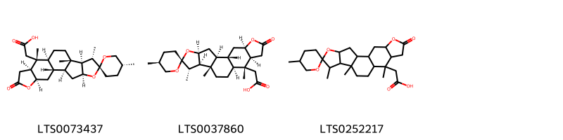{ width=100% }
    <figcaption>Hình ảnh cấu trúc hóa học của 3 hoạt chất thuộc nhóm Naphthofurans gồm ["(1'r,2r,2's,4's,5r,7's,8'r,9's,12's,13'r,14's,18'r)-5,7',9',13'-tetramethyl-16'-oxo-5',17'-dioxaspiro[oxane-2,6'-pentacyclo[10.7.0.0²,⁹.0⁴,⁸.0¹⁴,¹⁸]nonadecan]-13'-ylacetic acid (LTS0073437)", "(1'r,2r,2's,4's,5s,7's,8'r,9's,12's,13'r,14's,18'r)-5,7',9',13'-tetramethyl-16'-oxo-5',17'-dioxaspiro[oxane-2,6'-pentacyclo[10.7.0.0²,⁹.0⁴,⁸.0¹⁴,¹⁸]nonadecan]-13'-ylacetic acid (LTS0037860)", "5,7',9',13'-tetramethyl-16'-oxo-5',17'-dioxaspiro[oxane-2,6'-pentacyclo[10.7.0.0²,⁹.0⁴,⁸.0¹⁴,¹⁸]nonadecan]-13'-ylacetic acid (LTS0252217)"].</figcaption>
</figure>
#### Nhóm Organic disulfides
<figure markdown="span">
    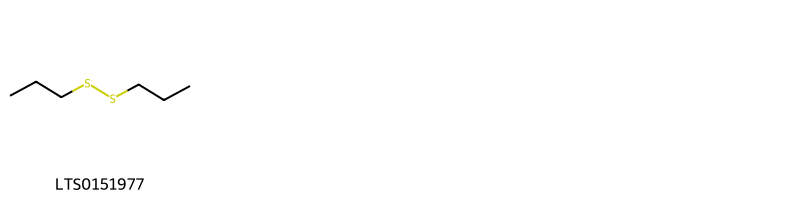{ width=100% }
    <figcaption>Hình ảnh cấu trúc hóa học của 1 hoạt chất thuộc nhóm Organic disulfides gồm ['propyl disulfide (LTS0151977)'].</figcaption>
</figure>
#### Nhóm Organic oxoanionic compounds
<figure markdown="span">
    { width=100% }
    <figcaption>Hình ảnh cấu trúc hóa học của 4 hoạt chất thuộc nhóm Organic oxoanionic compounds gồm ['1-hydroxy-1-(prop-2-en-1-yloxy)-1λ⁶-disulfen-1-one (LTS0262385)', '1-hydroxy-1-[(1e)-prop-1-en-1-yloxy]-1λ⁶-disulfen-1-one (LTS0100819)', '1-hydroxy-1-[(1z)-prop-1-en-1-yloxy]-1λ⁶-disulfen-1-one (LTS0103772)', '1-hydroxy-1-propoxy-1λ⁶-disulfen-1-one (LTS0202599)'].</figcaption>
</figure>
#### Nhóm Organic thiosulfuric acids and derivatives
<figure markdown="span">
    { width=100% }
    <figcaption>Hình ảnh cấu trúc hóa học của 2 hoạt chất thuộc nhóm Organic thiosulfuric acids and derivatives gồm ['prop-2-en-1-ylsulfanylsulfonic acid (LTS0084048)', 'propylsulfanylsulfonic acid (LTS0154623)'].</figcaption>
</figure>
#### Nhóm Organooxygen compounds
<figure markdown="span">
    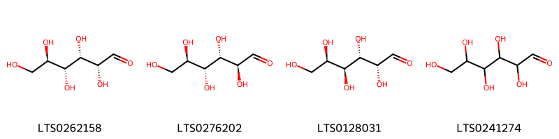{ width=100% }
    <figcaption>Hình ảnh cấu trúc hóa học của 4 hoạt chất thuộc nhóm Organooxygen compounds gồm ['(+)-glucose (LTS0262158)', '(+-)-mannose (LTS0276202)', 'aldehydo-d-galactose (LTS0128031)', 'dextrose (LTS0241274)'].</figcaption>
</figure>
#### Nhóm Prenol lipids
<figure markdown="span">
    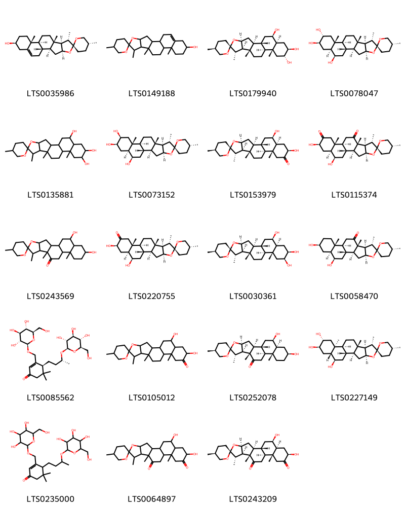{ width=100% }
    <figcaption>Hình ảnh cấu trúc hóa học của 19 hoạt chất thuộc nhóm Prenol lipids gồm ['diosgenin (LTS0035986)', 'diosgenin (LTS0149188)', "(1'r,2r,2's,4's,5s,7's,8'r,9's,12's,13'r,15'r,16'r,18's,19'r)-5,7',9',13'-tetramethyl-5'-oxaspiro[oxane-2,6'-pentacyclo[10.8.0.0²,⁹.0⁴,⁸.0¹³,¹⁸]icosane]-15',16',19'-triol (LTS0179940)", 'agigenin (LTS0078047)', "5,7',9',13'-tetramethyl-5'-oxaspiro[oxane-2,6'-pentacyclo[10.8.0.0²,⁹.0⁴,⁸.0¹³,¹⁸]icosane]-15',16',19'-triol (LTS0135881)", "(1'r,2r,2's,4's,5r,7's,8'r,9's,12's,13'r,15's,16'r,18's,19'r)-5,7',9',13'-tetramethyl-5'-oxaspiro[oxane-2,6'-pentacyclo[10.8.0.0²,⁹.0⁴,⁸.0¹³,¹⁸]icosane]-15',16',19'-triol (LTS0073152)", "(1'r,2r,2's,4's,5s,7's,8'r,9's,12's,13'r,16'r,18's,19'r)-16',19'-dihydroxy-5,7',9',13'-tetramethyl-5'-oxaspiro[oxane-2,6'-pentacyclo[10.8.0.0²,⁹.0⁴,⁸.0¹³,¹⁸]icosan]-15'-one (LTS0153979)", "(1'r,2r,2's,4's,5r,7's,8'r,9's,12's,13'r,16'r,18's,19'r)-16',19'-dihydroxy-5,7',9',13'-tetramethyl-5'-oxaspiro[oxane-2,6'-pentacyclo[10.8.0.0²,⁹.0⁴,⁸.0¹³,¹⁸]icosane]-10',15'-dione (LTS0115374)", "16',19'-dihydroxy-5,7',9',13'-tetramethyl-5'-oxaspiro[oxane-2,6'-pentacyclo[10.8.0.0²,⁹.0⁴,⁸.0¹³,¹⁸]icosan]-10'-one (LTS0243569)", "(1'r,2r,2's,4's,5r,7's,8'r,9's,12's,13'r,16'r,18's,19'r)-16',19'-dihydroxy-5,7',9',13'-tetramethyl-5'-oxaspiro[oxane-2,6'-pentacyclo[10.8.0.0²,⁹.0⁴,⁸.0¹³,¹⁸]icosan]-15'-one (LTS0220755)", "(1'r,2r,2's,4's,5s,7's,8'r,9's,12's,13'r,15's,16'r,18's,19'r)-5,7',9',13'-tetramethyl-5'-oxaspiro[oxane-2,6'-pentacyclo[10.8.0.0²,⁹.0⁴,⁸.0¹³,¹⁸]icosane]-15',16',19'-triol (LTS0030361)", "(1'r,2r,2's,4's,5r,7's,8'r,9's,12's,13'r,16's,18's,19'r)-16',19'-dihydroxy-5,7',9',13'-tetramethyl-5'-oxaspiro[oxane-2,6'-pentacyclo[10.8.0.0²,⁹.0⁴,⁸.0¹³,¹⁸]icosan]-10'-one (LTS0058470)", '(4s)-5,5-dimethyl-4-[(3r)-3-{[(2r,3r,4s,5s,6r)-3,4,5-trihydroxy-6-(hydroxymethyl)oxan-2-yl]oxy}butyl]-3-({[(2r,3r,4s,5s,6r)-3,4,5-trihydroxy-6-(hydroxymethyl)oxan-2-yl]oxy}methyl)cyclohex-2-en-1-one (LTS0085562)', "16',19'-dihydroxy-5,7',9',13'-tetramethyl-5'-oxaspiro[oxane-2,6'-pentacyclo[10.8.0.0²,⁹.0⁴,⁸.0¹³,¹⁸]icosan]-15'-one (LTS0105012)", "(1'r,2r,2's,4's,5s,7's,8'r,9's,12's,13'r,16's,18's,19'r)-16',19'-dihydroxy-5,7',9',13'-tetramethyl-5'-oxaspiro[oxane-2,6'-pentacyclo[10.8.0.0²,⁹.0⁴,⁸.0¹³,¹⁸]icosan]-10'-one (LTS0252078)", "(1'r,2r,2's,4's,5r,7's,8'r,9's,12's,13's,15'r,16'r,18'r,19'r)-5,7',9',13'-tetramethyl-5'-oxaspiro[oxane-2,6'-pentacyclo[10.8.0.0²,⁹.0⁴,⁸.0¹³,¹⁸]icosane]-15',16',19'-triol (LTS0227149)", '5,5-dimethyl-4-(3-{[3,4,5-trihydroxy-6-(hydroxymethyl)oxan-2-yl]oxy}butyl)-3-({[3,4,5-trihydroxy-6-(hydroxymethyl)oxan-2-yl]oxy}methyl)cyclohex-2-en-1-one (LTS0235000)', "16',19'-dihydroxy-5,7',9',13'-tetramethyl-5'-oxaspiro[oxane-2,6'-pentacyclo[10.8.0.0²,⁹.0⁴,⁸.0¹³,¹⁸]icosane]-10',15'-dione (LTS0064897)", "(1'r,2r,2's,4's,5s,7's,8'r,9's,12's,13'r,16'r,18's,19'r)-16',19'-dihydroxy-5,7',9',13'-tetramethyl-5'-oxaspiro[oxane-2,6'-pentacyclo[10.8.0.0²,⁹.0⁴,⁸.0¹³,¹⁸]icosane]-10',15'-dione (LTS0243209)"].</figcaption>
</figure>
#### Nhóm Saccharolipids
<figure markdown="span">
    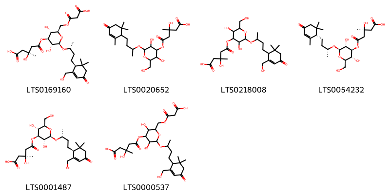{ width=100% }
    <figcaption>Hình ảnh cấu trúc hóa học của 6 hoạt chất thuộc nhóm Saccharolipids gồm ['(3s)-5-{[(2r,3r,4s,5r,6r)-2-{[(2-carboxyacetyl)oxy]methyl}-3,5-dihydroxy-6-{[(2r)-4-[(1s)-2-(hydroxymethyl)-6,6-dimethyl-4-oxocyclohex-2-en-1-yl]butan-2-yl]oxy}oxan-4-yl]oxy}-3-hydroxy-3-methyl-5-oxopentanoic acid (LTS0169160)', '5-{[3,5-dihydroxy-2-(hydroxymethyl)-6-{[4-(2,6,6-trimethyl-4-oxocyclohex-2-en-1-yl)butan-2-yl]oxy}oxan-4-yl]oxy}-3-hydroxy-3-methyl-5-oxopentanoic acid (LTS0020652)', '5-{[3,5-dihydroxy-2-(hydroxymethyl)-6-({4-[2-(hydroxymethyl)-6,6-dimethyl-4-oxocyclohex-2-en-1-yl]butan-2-yl}oxy)oxan-4-yl]oxy}-3-hydroxy-3-methyl-5-oxopentanoic acid (LTS0218008)', '(3s)-5-{[(2r,3r,4s,5r,6r)-3,5-dihydroxy-2-(hydroxymethyl)-6-{[(2r)-4-[(1s)-2,6,6-trimethyl-4-oxocyclohex-2-en-1-yl]butan-2-yl]oxy}oxan-4-yl]oxy}-3-hydroxy-3-methyl-5-oxopentanoic acid (LTS0054232)', '(3s)-5-{[(2r,3r,4s,5r,6r)-3,5-dihydroxy-2-(hydroxymethyl)-6-{[(2r)-4-[(1s)-2-(hydroxymethyl)-6,6-dimethyl-4-oxocyclohex-2-en-1-yl]butan-2-yl]oxy}oxan-4-yl]oxy}-3-hydroxy-3-methyl-5-oxopentanoic acid (LTS0001487)', '5-[(2-{[(2-carboxyacetyl)oxy]methyl}-3,5-dihydroxy-6-({4-[2-(hydroxymethyl)-6,6-dimethyl-4-oxocyclohex-2-en-1-yl]butan-2-yl}oxy)oxan-4-yl)oxy]-3-hydroxy-3-methyl-5-oxopentanoic acid (LTS0000537)'].</figcaption>
</figure>
#### Nhóm Steroids and steroid derivatives
<figure markdown="span">
    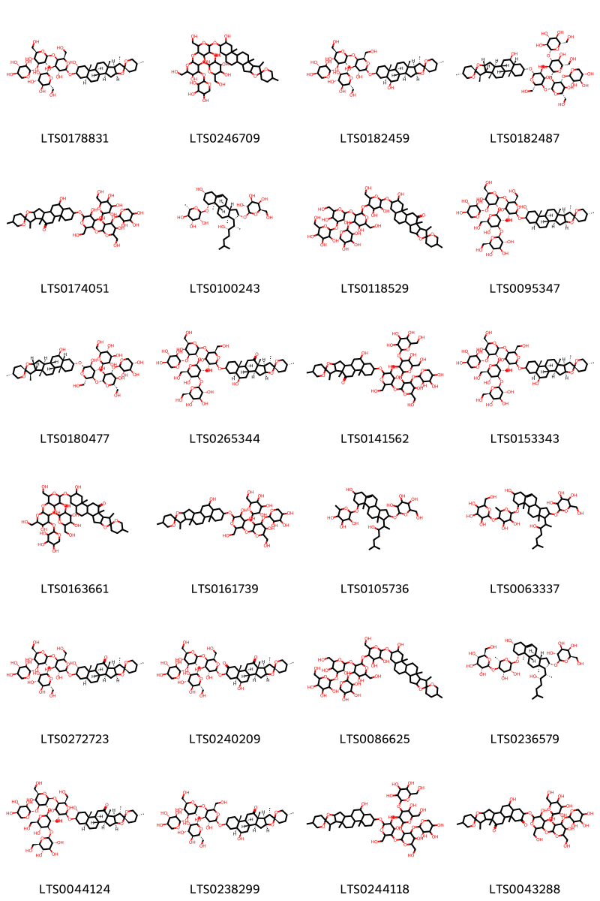{ width=100% }
    <figcaption>Hình ảnh cấu trúc hóa học của 24 hoạt chất thuộc nhóm Steroids and steroid derivatives gồm ['f-gitonin (LTS0178831)', "2-[(2-{[4,5-dihydroxy-2-(hydroxymethyl)-6-{5,7',9',13'-tetramethyl-5'-oxaspiro[oxane-2,6'-pentacyclo[10.8.0.0²,⁹.0⁴,⁸.0¹³,¹⁸]icosan]-15'-oloxy}oxan-3-yl]oxy}-5-hydroxy-6-(hydroxymethyl)-4-[(3,4,5-trihydroxyoxan-2-yl)oxy]oxan-3-yl)oxy]-6-(hydroxymethyl)oxane-3,4,5-triol (LTS0246709)", "(2s,3r,4s,5s,6r)-2-{[(2s,3r,4s,5r,6r)-2-{[(2r,3r,4r,5r,6r)-4,5-dihydroxy-2-(hydroxymethyl)-6-[(1'r,2r,2's,4's,5r,7's,8'r,9's,12's,13'r,16's,18's,19'r)-5,7',9',13'-tetramethyl-5'-oxaspiro[oxane-2,6'-pentacyclo[10.8.0.0²,⁹.0⁴,⁸.0¹³,¹⁸]icosan]-19'-oloxy]oxan-3-yl]oxy}-5-hydroxy-6-(hydroxymethyl)-4-{[(2s,3r,4s,5r)-3,4,5-trihydroxyoxan-2-yl]oxy}oxan-3-yl]oxy}-6-(hydroxymethyl)oxane-3,4,5-triol (LTS0182459)", "(2r,3s,4r,5r,6s)-2-{[(2r,3s,4r,5s,6s)-2-{[(2r,3s,4r,5s,6s)-2-{[(2s,3r,4s,5s,6s)-4,5-dihydroxy-2-(hydroxymethyl)-6-[(1'r,2r,2's,4'r,5r,7'r,8's,9's,12'r,13'r,16'r,18'r,19'r)-5,7',9',13'-tetramethyl-5'-oxaspiro[oxane-2,6'-pentacyclo[10.8.0.0²,⁹.0⁴,⁸.0¹³,¹⁸]icosan]-19'-oloxy]oxan-3-yl]oxy}-5-hydroxy-6-(hydroxymethyl)-4-{[(2r,3s,4r,5s)-3,4,5-trihydroxyoxan-2-yl]oxy}oxan-3-yl]oxy}-3,5-dihydroxy-6-(hydroxymethyl)oxan-4-yl]oxy}-6-(hydroxymethyl)oxane-3,4,5-triol (LTS0182487)", "16'-[(3,4-dihydroxy-5-{[5-hydroxy-6-(hydroxymethyl)-3-{[3,4,5-trihydroxy-6-(hydroxymethyl)oxan-2-yl]oxy}-4-[(3,4,5-trihydroxyoxan-2-yl)oxy]oxan-2-yl]oxy}-6-(hydroxymethyl)oxan-2-yl)oxy]-19'-hydroxy-5,7',9',13'-tetramethyl-5'-oxaspiro[oxane-2,6'-pentacyclo[10.8.0.0²,⁹.0⁴,⁸.0¹³,¹⁸]icosan]-10'-one (LTS0174051)", '(2r,3r,4s,5r,6r)-2-{[(1r,2s,3as,3bs,7r,9r,9ar,9bs,11as)-7-hydroxy-1-[(2s,3s)-3-hydroxy-6-methylheptan-2-yl]-9a,11a-dimethyl-9-{[(2r,3r,4r,5r,6s)-3,4,5-trihydroxy-6-methyloxan-2-yl]oxy}-1h,2h,3h,3ah,3bh,4h,6h,7h,8h,9h,9bh,10h,11h-cyclopenta[a]phenanthren-2-yl]oxy}-6-(hydroxymethyl)oxane-3,4,5-triol (LTS0100243)', "16'-({5-[(3-{[3,5-dihydroxy-6-(hydroxymethyl)-4-{[3,4,5-trihydroxy-6-(hydroxymethyl)oxan-2-yl]oxy}oxan-2-yl]oxy}-5-hydroxy-6-(hydroxymethyl)-4-[(3,4,5-trihydroxyoxan-2-yl)oxy]oxan-2-yl)oxy]-3,4-dihydroxy-6-(hydroxymethyl)oxan-2-yl}oxy)-15'-hydroxy-5,7',9',13'-tetramethyl-5'-oxaspiro[oxane-2,6'-pentacyclo[10.8.0.0²,⁹.0⁴,⁸.0¹³,¹⁸]icosan]-10'-one (LTS0118529)", "(2s,3r,4s,5s,6r)-2-{[(2s,3r,4s,5r,6r)-2-{[(2s,3r,4s,5r,6r)-2-{[(2r,3r,4r,5r,6r)-4,5-dihydroxy-2-(hydroxymethyl)-6-[(1'r,2r,2's,4's,5r,7's,8'r,9's,12's,13's,15'r,16'r,18's)-5,7',9',13'-tetramethyl-5'-oxaspiro[oxane-2,6'-pentacyclo[10.8.0.0²,⁹.0⁴,⁸.0¹³,¹⁸]icosan]-15'-oloxy]oxan-3-yl]oxy}-5-hydroxy-6-(hydroxymethyl)-4-{[(2s,3r,4s,5r)-3,4,5-trihydroxyoxan-2-yl]oxy}oxan-3-yl]oxy}-3,5-dihydroxy-6-(hydroxymethyl)oxan-4-yl]oxy}-6-(hydroxymethyl)oxane-3,4,5-triol (LTS0095347)", "(2r,3s,4r,5r,6s)-2-{[(2r,3s,4r,5s,6s)-2-{[(2s,3r,4s,5s,6s)-4,5-dihydroxy-2-(hydroxymethyl)-6-[(1'r,2r,2's,4'r,5r,7'r,8's,9's,12'r,13'r,16'r,18'r,19'r)-5,7',9',13'-tetramethyl-5'-oxaspiro[oxane-2,6'-pentacyclo[10.8.0.0²,⁹.0⁴,⁸.0¹³,¹⁸]icosan]-19'-oloxy]oxan-3-yl]oxy}-5-hydroxy-6-(hydroxymethyl)-4-{[(2r,3s,4r,5s)-3,4,5-trihydroxyoxan-2-yl]oxy}oxan-3-yl]oxy}-6-(hydroxymethyl)oxane-3,4,5-triol (LTS0180477)", "(1'r,2r,2's,4's,5r,7's,8'r,9's,12's,13'r,16's,18's,19'r)-16'-{[(2r,3r,4r,5r,6r)-5-{[(2s,3r,4s,5r,6r)-3-{[(2s,3r,4s,5r,6r)-3,5-dihydroxy-6-(hydroxymethyl)-4-{[(2s,3r,4s,5s,6r)-3,4,5-trihydroxy-6-(hydroxymethyl)oxan-2-yl]oxy}oxan-2-yl]oxy}-5-hydroxy-6-(hydroxymethyl)-4-{[(2s,3r,4s,5r)-3,4,5-trihydroxyoxan-2-yl]oxy}oxan-2-yl]oxy}-3,4-dihydroxy-6-(hydroxymethyl)oxan-2-yl]oxy}-19'-hydroxy-5,7',9',13'-tetramethyl-5'-oxaspiro[oxane-2,6'-pentacyclo[10.8.0.0²,⁹.0⁴,⁸.0¹³,¹⁸]icosan]-10'-one (LTS0265344)", "16'-({5-[(3-{[3,5-dihydroxy-6-(hydroxymethyl)-4-{[3,4,5-trihydroxy-6-(hydroxymethyl)oxan-2-yl]oxy}oxan-2-yl]oxy}-5-hydroxy-6-(hydroxymethyl)-4-[(3,4,5-trihydroxyoxan-2-yl)oxy]oxan-2-yl)oxy]-3,4-dihydroxy-6-(hydroxymethyl)oxan-2-yl}oxy)-19'-hydroxy-5,7',9',13'-tetramethyl-5'-oxaspiro[oxane-2,6'-pentacyclo[10.8.0.0²,⁹.0⁴,⁸.0¹³,¹⁸]icosan]-10'-one (LTS0141562)", "(2s,3r,4s,5s,6r)-2-{[(2s,3r,4s,5r,6r)-2-{[(2s,3r,4s,5r,6r)-2-{[(2r,3r,4r,5r,6r)-4,5-dihydroxy-2-(hydroxymethyl)-6-[(1'r,2r,2's,4's,5r,7's,8'r,9's,12's,13'r,16's,18's,19'r)-5,7',9',13'-tetramethyl-5'-oxaspiro[oxane-2,6'-pentacyclo[10.8.0.0²,⁹.0⁴,⁸.0¹³,¹⁸]icosan]-19'-oloxy]oxan-3-yl]oxy}-5-hydroxy-6-(hydroxymethyl)-4-{[(2s,3r,4s,5r)-3,4,5-trihydroxyoxan-2-yl]oxy}oxan-3-yl]oxy}-3,5-dihydroxy-6-(hydroxymethyl)oxan-4-yl]oxy}-6-(hydroxymethyl)oxane-3,4,5-triol (LTS0153343)", "16'-[(3,4-dihydroxy-5-{[5-hydroxy-6-(hydroxymethyl)-3-{[3,4,5-trihydroxy-6-(hydroxymethyl)oxan-2-yl]oxy}-4-[(3,4,5-trihydroxyoxan-2-yl)oxy]oxan-2-yl]oxy}-6-(hydroxymethyl)oxan-2-yl)oxy]-15'-hydroxy-5,7',9',13'-tetramethyl-5'-oxaspiro[oxane-2,6'-pentacyclo[10.8.0.0²,⁹.0⁴,⁸.0¹³,¹⁸]icosan]-10'-one (LTS0163661)", "2-[(2-{[4,5-dihydroxy-2-(hydroxymethyl)-6-{5,7',9',13'-tetramethyl-5'-oxaspiro[oxane-2,6'-pentacyclo[10.8.0.0²,⁹.0⁴,⁸.0¹³,¹⁸]icosan]-19'-oloxy}oxan-3-yl]oxy}-5-hydroxy-6-(hydroxymethyl)-4-[(3,4,5-trihydroxyoxan-2-yl)oxy]oxan-3-yl)oxy]-6-(hydroxymethyl)oxane-3,4,5-triol (LTS0161739)", '2-{[7-hydroxy-1-(3-hydroxy-6-methylheptan-2-yl)-9a,11a-dimethyl-9-[(3,4,5-trihydroxy-6-methyloxan-2-yl)oxy]-1h,2h,3h,3ah,3bh,4h,6h,7h,8h,9h,9bh,10h,11h-cyclopenta[a]phenanthren-2-yl]oxy}-6-(hydroxymethyl)oxane-3,4,5-triol (LTS0105736)', '2-({9-[(3,4-dihydroxy-6-methyl-5-{[3,4,5-trihydroxy-6-(hydroxymethyl)oxan-2-yl]oxy}oxan-2-yl)oxy]-7-hydroxy-1-(3-hydroxy-6-methylheptan-2-yl)-9a,11a-dimethyl-1h,2h,3h,3ah,3bh,4h,6h,7h,8h,9h,9bh,10h,11h-cyclopenta[a]phenanthren-2-yl}oxy)-6-(hydroxymethyl)oxane-3,4,5-triol (LTS0063337)', "(1'r,2r,2's,4's,5r,7's,8'r,9's,12's,13's,15'r,16'r,18's)-16'-{[(2r,3r,4r,5r,6r)-3,4-dihydroxy-5-{[(2s,3r,4s,5r,6r)-5-hydroxy-6-(hydroxymethyl)-3-{[(2s,3r,4s,5s,6r)-3,4,5-trihydroxy-6-(hydroxymethyl)oxan-2-yl]oxy}-4-{[(2s,3r,4s,5r)-3,4,5-trihydroxyoxan-2-yl]oxy}oxan-2-yl]oxy}-6-(hydroxymethyl)oxan-2-yl]oxy}-15'-hydroxy-5,7',9',13'-tetramethyl-5'-oxaspiro[oxane-2,6'-pentacyclo[10.8.0.0²,⁹.0⁴,⁸.0¹³,¹⁸]icosan]-10'-one (LTS0272723)", "(1'r,2r,2's,4's,5r,7's,8'r,9's,12's,13'r,16'r,18's,19'r)-16'-{[(2s,3r,4r,5r,6r)-3,4-dihydroxy-5-{[(2s,3r,4s,5r,6r)-5-hydroxy-6-(hydroxymethyl)-3-{[(2s,3r,4s,5s,6r)-3,4,5-trihydroxy-6-(hydroxymethyl)oxan-2-yl]oxy}-4-{[(2s,3r,4s,5r)-3,4,5-trihydroxyoxan-2-yl]oxy}oxan-2-yl]oxy}-6-(hydroxymethyl)oxan-2-yl]oxy}-19'-hydroxy-5,7',9',13'-tetramethyl-5'-oxaspiro[oxane-2,6'-pentacyclo[10.8.0.0²,⁹.0⁴,⁸.0¹³,¹⁸]icosane]-10',15'-dione (LTS0240209)", "2-({2-[(2-{[4,5-dihydroxy-2-(hydroxymethyl)-6-{5,7',9',13'-tetramethyl-5'-oxaspiro[oxane-2,6'-pentacyclo[10.8.0.0²,⁹.0⁴,⁸.0¹³,¹⁸]icosan]-15'-oloxy}oxan-3-yl]oxy}-5-hydroxy-6-(hydroxymethyl)-4-[(3,4,5-trihydroxyoxan-2-yl)oxy]oxan-3-yl)oxy]-3,5-dihydroxy-6-(hydroxymethyl)oxan-4-yl}oxy)-6-(hydroxymethyl)oxane-3,4,5-triol (LTS0086625)", '(2r,3r,4s,5r,6r)-2-{[(1r,2s,3as,3bs,7r,9r,9ar,9bs,11as)-9-{[(2r,3r,4s,5r,6s)-3,4-dihydroxy-6-methyl-5-{[(2s,3r,4s,5s,6r)-3,4,5-trihydroxy-6-(hydroxymethyl)oxan-2-yl]oxy}oxan-2-yl]oxy}-7-hydroxy-1-[(2s,3s)-3-hydroxy-6-methylheptan-2-yl]-9a,11a-dimethyl-1h,2h,3h,3ah,3bh,4h,6h,7h,8h,9h,9bh,10h,11h-cyclopenta[a]phenanthren-2-yl]oxy}-6-(hydroxymethyl)oxane-3,4,5-triol (LTS0236579)', "(1'r,2r,2's,4's,5r,7's,8'r,9's,12's,13's,15'r,16'r,18's)-16'-{[(2r,3r,4r,5r,6r)-5-{[(2s,3r,4s,5r,6r)-3-{[(2s,3r,4s,5r,6r)-3,5-dihydroxy-6-(hydroxymethyl)-4-{[(2s,3r,4s,5s,6r)-3,4,5-trihydroxy-6-(hydroxymethyl)oxan-2-yl]oxy}oxan-2-yl]oxy}-5-hydroxy-6-(hydroxymethyl)-4-{[(2s,3r,4s,5r)-3,4,5-trihydroxyoxan-2-yl]oxy}oxan-2-yl]oxy}-3,4-dihydroxy-6-(hydroxymethyl)oxan-2-yl]oxy}-15'-hydroxy-5,7',9',13'-tetramethyl-5'-oxaspiro[oxane-2,6'-pentacyclo[10.8.0.0²,⁹.0⁴,⁸.0¹³,¹⁸]icosan]-10'-one (LTS0044124)", "(1'r,2r,2's,4's,5r,7's,8'r,9's,12's,13'r,16's,18's,19'r)-16'-{[(2r,3r,4r,5r,6r)-3,4-dihydroxy-5-{[(2s,3r,4s,5r,6r)-5-hydroxy-6-(hydroxymethyl)-3-{[(2s,3r,4s,5s,6r)-3,4,5-trihydroxy-6-(hydroxymethyl)oxan-2-yl]oxy}-4-{[(2s,3r,4s,5r)-3,4,5-trihydroxyoxan-2-yl]oxy}oxan-2-yl]oxy}-6-(hydroxymethyl)oxan-2-yl]oxy}-19'-hydroxy-5,7',9',13'-tetramethyl-5'-oxaspiro[oxane-2,6'-pentacyclo[10.8.0.0²,⁹.0⁴,⁸.0¹³,¹⁸]icosan]-10'-one (LTS0238299)", "2-({2-[(2-{[4,5-dihydroxy-2-(hydroxymethyl)-6-{5,7',9',13'-tetramethyl-5'-oxaspiro[oxane-2,6'-pentacyclo[10.8.0.0²,⁹.0⁴,⁸.0¹³,¹⁸]icosan]-19'-oloxy}oxan-3-yl]oxy}-5-hydroxy-6-(hydroxymethyl)-4-[(3,4,5-trihydroxyoxan-2-yl)oxy]oxan-3-yl)oxy]-3,5-dihydroxy-6-(hydroxymethyl)oxan-4-yl}oxy)-6-(hydroxymethyl)oxane-3,4,5-triol (LTS0244118)", "16'-[(3,4-dihydroxy-5-{[5-hydroxy-6-(hydroxymethyl)-3-{[3,4,5-trihydroxy-6-(hydroxymethyl)oxan-2-yl]oxy}-4-[(3,4,5-trihydroxyoxan-2-yl)oxy]oxan-2-yl]oxy}-6-(hydroxymethyl)oxan-2-yl)oxy]-19'-hydroxy-5,7',9',13'-tetramethyl-5'-oxaspiro[oxane-2,6'-pentacyclo[10.8.0.0²,⁹.0⁴,⁸.0¹³,¹⁸]icosane]-10',15'-dione (LTS0043288)"].</figcaption>
</figure>
#### Nhóm Sulfenyl compounds
<figure markdown="span">
    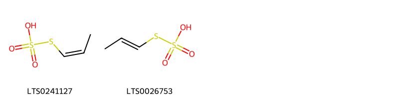{ width=100% }
    <figcaption>Hình ảnh cấu trúc hóa học của 2 hoạt chất thuộc nhóm Sulfenyl compounds gồm ['(1z)-prop-1-en-1-ylsulfanylsulfonic acid (LTS0241127)', '(1e)-prop-1-en-1-ylsulfanylsulfonic acid (LTS0026753)'].</figcaption>
</figure>
#### Nhóm Thiosulfinic acid esters
<figure markdown="span">
    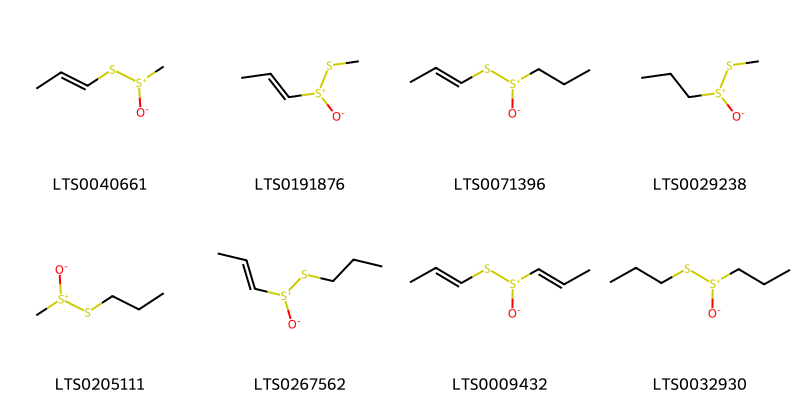{ width=100% }
    <figcaption>Hình ảnh cấu trúc hóa học của 8 hoạt chất thuộc nhóm Thiosulfinic acid esters gồm ['(1e)-1-(methanesulfinylsulfanyl)prop-1-ene (LTS0040661)', '{[(1e)-prop-1-ene-1-sulfinyl]sulfanyl}methane (LTS0191876)', '(1e)-1-[(propane-1-sulfinyl)sulfanyl]prop-1-ene (LTS0071396)', '[(propane-1-sulfinyl)sulfanyl]methane (LTS0029238)', '1-(methanesulfinylsulfanyl)propane (LTS0205111)', '1-{[(1e)-prop-1-ene-1-sulfinyl]sulfanyl}propane (LTS0267562)', '(1e)-1-{[(1e)-prop-1-ene-1-sulfinyl]sulfanyl}prop-1-ene (LTS0009432)', 's-propyl propanethiosulfinate (LTS0032930)'].</figcaption>
</figure>

---

### Dược dân tộc học

Danh sách các quốc gia có sử dụng *N/A* trong điều trị các bệnh. 

| Country     | Disease                                                 | Bệnh                                                            |
|:------------|:--------------------------------------------------------|:----------------------------------------------------------------|
| Egypt       | Aphrodisiac, Emollient, Stomachic, Diuretic             | Thuốc kích thích tình dục, Chất làm mềm, Dạ dày, Thuốc lợi tiểu |
| Expectorant | Expectorant                                             | Thuốc long đàm                                                  |
| Iraq        | Digestive, Expectorant, Stimulant                       | Tiêu hóa, đờm, kích thích                                       |
| Kurdistan   | Emollient                                               | Chỉnh thị                                                       |
| Turkey      | Digestive, Discutient, Diuretic, Emollient, Expectorant | Tiêu hóa, Discutient, lợi tiểu, chất làm mềm, long đờm          |

---

---
## Allium sativum
### Thông tin về thực vật

!!! info "Phân loại thực vật của *Allium sativum* từ GIBF:"
    - **Kingdom:** Plantae
    - **Phylum:** Tracheophyta
    - **Order:** Asparagales
    - **Family:** Amaryllidaceae
    - **Genus:** Allium
    - **Species:** *Allium sativum*

 

| Label (VI)   | Label (EN)   | Scientific Name   | Descriptions (VI)   | Descriptions (EN)                              | Also Known As (VI)   | Also Known As (EN)                 |
|:-------------|:-------------|:------------------|:--------------------|:-----------------------------------------------|:---------------------|:-----------------------------------|
| N/A          | N/A          | Allium sativum    | loài thực vật       | species of plant (for the food, use Q21546392) | ['Allium sativum']   | ['allium sativum', 'garlic plant'] |

#### Phân bố trên thế giới

**Từ CSDL GIBF** nan, Czechia, Sweden, Finland, Kazakhstan, Türkiye, Ecuador, Spain, Poland, United States of America, Romania, Iran (Islamic Republic of), Pakistan, Russian Federation, Estonia, Belarus, Mexico, Algeria, Norway, France, Canada, Germany, Austria, Hungary, Latvia, Ukraine, Australia, Italy, India, Switzerland, United Kingdom of Great Britain and Northern Ireland

#### Phân bố tại Việt Nam

**Từ CSDL GIBF**: Không có ghi nhận ở Việt Nam

---
### Thành phần hóa học
        
- Theo cơ sở dữ liệu lotus: Từ loài *Allium sativum* đã phân lập và xác định được 172 hoạt chất thuộc về các nhóm Fatty Acyls, Organic oxoanionic compounds, Organic phosphoric acids and derivatives, Organic thiosulfuric acids and derivatives, Carboxylic acids and derivatives, Organic disulfides, Triphenyl compounds, Prenol lipids, Organooxygen compounds, Allyl sulfur compounds, Purine nucleosides, Sphingolipids, Cinnamic acids and derivatives, Steroids and steroid derivatives, Organic sulfuric acids and derivatives, Glycerolipids, Sulfonyls, Furanoid lignans, Flavonoids, Dibenzylbutane lignans, Organic trisulfides, Pyrans, Sulfoxides, Thiosulfinic acid esters, Organic sulfonic acids and derivatives, Indoles and derivatives. 

|    | chemicalTaxonomyClassyfireClass            |   smiles_count |
|---:|:-------------------------------------------|---------------:|
|  0 |                                            |              9 |
|  1 | Allyl sulfur compounds                     |             16 |
|  2 | Carboxylic acids and derivatives           |             57 |
|  3 | Cinnamic acids and derivatives             |              3 |
|  4 | Dibenzylbutane lignans                     |              2 |
|  5 | Fatty Acyls                                |              6 |
|  6 | Flavonoids                                 |              6 |
|  7 | Furanoid lignans                           |              3 |
|  8 | Glycerolipids                              |              1 |
|  9 | Indoles and derivatives                    |              2 |
| 10 | Organic disulfides                         |              5 |
| 11 | Organic oxoanionic compounds               |              1 |
| 12 | Organic phosphoric acids and derivatives   |              1 |
| 13 | Organic sulfonic acids and derivatives     |              1 |
| 14 | Organic sulfuric acids and derivatives     |              2 |
| 15 | Organic thiosulfuric acids and derivatives |              1 |
| 16 | Organic trisulfides                        |              3 |
| 17 | Organooxygen compounds                     |              9 |
| 18 | Prenol lipids                              |              3 |
| 19 | Purine nucleosides                         |              2 |
| 20 | Pyrans                                     |              1 |
| 21 | Sphingolipids                              |              9 |
| 22 | Steroids and steroid derivatives           |             12 |
| 23 | Sulfonyls                                  |              1 |
| 24 | Sulfoxides                                 |              4 |
| 25 | Thiosulfinic acid esters                   |              8 |
| 26 | Triphenyl compounds                        |              1 |

#### Nhóm 
<figure markdown="span">
    { width=100% }
    <figcaption>Hình ảnh cấu trúc hóa học của 9 hoạt chất thuộc nhóm  gồm ['[(prop-2-en-1-yloxy)-λ⁴-disulfanyl]methane (LTS0087364)', '(2z)-but-2-en-1-yl-λ⁴-disulfanylol (LTS0190764)', '(1e)-1-[(prop-2-en-1-yloxy)-λ⁴-disulfanyl]prop-1-ene (LTS0072906)', '1-[(prop-2-en-1-yloxy)-λ⁴-disulfanyl]propane (LTS0169114)', '(2e)-but-2-en-1-yl-λ⁴-disulfanylol (LTS0178952)', '(4e)-hexa-1,4-dien-3-yl-λ⁴-disulfanylol (LTS0074654)', '(4z)-hexa-1,4-dien-3-yl-λ⁴-disulfanylol (LTS0020251)', '(1z)-1-(methoxy-λ⁴-disulfanyl)prop-1-ene (LTS0138094)', '(1e)-1-(methoxy-λ⁴-disulfanyl)prop-1-ene (LTS0230354)'].</figcaption>
</figure>
#### Nhóm Allyl sulfur compounds
<figure markdown="span">
    { width=100% }
    <figcaption>Hình ảnh cấu trúc hóa học của 16 hoạt chất thuộc nhóm Allyl sulfur compounds gồm ['garlicin (LTS0050684)', 'allyl propyl disulfide (LTS0050924)', 'allyl methyl disulfide (LTS0004503)', 'oil garlic (LTS0069687)', 'prop-2-en-1-yl-λ⁴-disulfanylol (LTS0203521)', 'diallyl tetrasulfide (LTS0005396)', '3-(propylthio)propene (LTS0218893)', '3-[(methoxysulfinyl)sulfanyl]prop-1-ene (LTS0206233)', '3-(methoxy-λ⁴-disulfanyl)prop-1-ene (LTS0008651)', '3-[(1e)-prop-1-en-1-yldisulfanyl]prop-1-ene (LTS0022646)', '3-(propoxy-λ⁴-disulfanyl)prop-1-ene (LTS0111586)', 'allyl pentasulfide (LTS0173905)', '3-(prop-1-en-1-yldisulfanyl)prop-1-ene (LTS0143200)', 'bis(prop-2-en-1-yl)hexasulfane (LTS0272714)', 'ethyl prop-2-ene-1-sulfinate (LTS0253441)', 'bis(prop-2-en-1-yl)heptasulfane (LTS0267309)'].</figcaption>
</figure>
#### Nhóm Carboxylic acids and derivatives
<figure markdown="span">
    { width=100% }
    <figcaption>Hình ảnh cấu trúc hóa học của 57 hoạt chất thuộc nhóm Carboxylic acids and derivatives gồm ['(2r)-2-amino-3-[(s)-methanesulfinyl]propanoic acid (LTS0078575)', '2-amino-3-methanesulfinylpropanoic acid (LTS0056315)', '(2r)-2-amino-3-(propane-1-sulfinyl)propanoic acid (LTS0263475)', '(2r)-2-amino-3-(ethanesulfinyl)propanoic acid (LTS0208939)', 'isoalliin (LTS0234401)', '2-amino-3-(ethanesulfinyl)propanoic acid (LTS0022212)', '(2s)-2-amino-3-(prop-2-ene-1-sulfinyl)propanoic acid (LTS0030025)', 'alliin (LTS0015270)', '2-amino-3-[(1z)-prop-1-ene-1-sulfinyl]propanoic acid (LTS0218728)', 'l-valine (LTS0231703)', '(2r)-2-amino-3-methanesulfinylpropanoic acid (LTS0021122)', 'allin (LTS0000756)', 'l-methionine (LTS0196746)', 'l-glutamic acid (LTS0037133)', '(2r)-2-amino-3-[(r)-prop-2-ene-1-sulfinyl]propanoic acid (LTS0125648)', 'l-serine (LTS0106692)', 'l-alanine (LTS0042208)', 'l-lysine (LTS0068734)', 'd-methionine (LTS0108782)', 's-methylcysteine (LTS0201907)', 'l-aspartic acid (LTS0205466)', 'l-selenocysteine (LTS0034809)', 'selenocysteine (LTS0162463)', '2-amino-4-[(1-carboxy-2-phenylethyl)-c-hydroxycarbonimidoyl]butanoic acid (LTS0161892)', 's-allylcysteine (LTS0136939)', '(2s)-2-amino-4-{[(1r)-1-carboxy-2-[(1e)-prop-1-en-1-ylsulfanyl]ethyl]-c-hydroxycarbonimidoyl}butanoic acid (LTS0086027)', 'se-methylselenocysteine (LTS0239727)', '2-amino-4-{[1-carboxy-2-(prop-1-en-1-ylsulfanyl)ethyl]-c-hydroxycarbonimidoyl}butanoic acid (LTS0052570)', '3-carboxy-5-methylthiomorpholin-1-ium-1-olate (LTS0003262)', 'alliin (LTS0012435)', 'l-tyrosine (LTS0029981)', '(2s)-2-amino-4-{[(1r)-1-(carboxymethyl-c-hydroxycarbonimidoyl)-2-sulfanylethyl]-c-hydroxycarbonimidoyl}butanoic acid (LTS0008500)', '(2s)-2-amino-4-{[(1s)-1-carboxy-2-phenylethyl]-c-hydroxycarbonimidoyl}butanoic acid (LTS0250484)', 'l-threonine (LTS0184056)', '2-(prop-2-en-1-yldisulfanyl)ethanimidic acid (LTS0113306)', 'l(+)-citrulline (LTS0065454)', '2-amino-4-{[1-carboxy-2-(prop-2-en-1-ylsulfanyl)ethyl]-c-hydroxycarbonimidoyl}butanoic acid (LTS0100045)', 'l-proline (LTS0090383)', 'd-phenylalanine (LTS0048920)', 'l-isoleucine (LTS0249538)', '(+,-)-selenomethionine (LTS0150888)', '(2s)-2-(phenylamino)propanoic acid (LTS0199539)', 'l-cystine (LTS0192149)', 'd-aspartic acid (LTS0144001)', 'd-alanine (LTS0272178)', 'd-cystine (LTS0177923)', 'l glutamine (LTS0263175)', 'l-arginine (LTS0064737)', 'l-ornithine (LTS0093444)', '2-amino-4-{[1-carboxy-2-(prop-2-en-1-yldisulfanyl)ethyl]-c-hydroxycarbonimidoyl}butanoic acid (LTS0239254)', 'abu (LTS0208699)', 'aspartamate (LTS0243014)', '(2s)-2-amino-4-{[(1r)-1-carboxy-2-(prop-2-en-1-ylsulfanyl)ethyl]-c-hydroxycarbonimidoyl}butanoic acid (LTS0055613)', '(2s)-2-amino-4-{[(1r)-1-carboxy-2-(prop-2-en-1-yldisulfanyl)ethyl]-c-hydroxycarbonimidoyl}butanoic acid (LTS0019976)', 'l-selenomethionine (LTS0227125)', 'l-leucine (LTS0113423)', 'l-histidine (LTS0094081)'].</figcaption>
</figure>
#### Nhóm Cinnamic acids and derivatives
<figure markdown="span">
    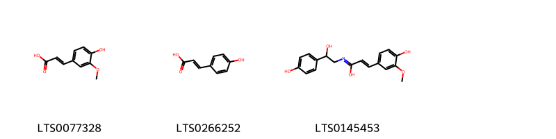{ width=100% }
    <figcaption>Hình ảnh cấu trúc hóa học của 3 hoạt chất thuộc nhóm Cinnamic acids and derivatives gồm ['ferulic acid (LTS0077328)', 'para-coumaric acid (LTS0266252)', '(2e)-n-[2-hydroxy-2-(4-hydroxyphenyl)ethyl]-3-(4-hydroxy-3-methoxyphenyl)prop-2-enimidic acid (LTS0145453)'].</figcaption>
</figure>
#### Nhóm Dibenzylbutane lignans
<figure markdown="span">
    { width=100% }
    <figcaption>Hình ảnh cấu trúc hóa học của 2 hoạt chất thuộc nhóm Dibenzylbutane lignans gồm ['(2s,3r)-2,3-bis[(4-hydroxy-3-methoxyphenyl)(¹³c)methyl](1-¹³c)butane-1,4-diol (LTS0268699)', 'secoisolariciresinol (LTS0086727)'].</figcaption>
</figure>
#### Nhóm Fatty Acyls
<figure markdown="span">
    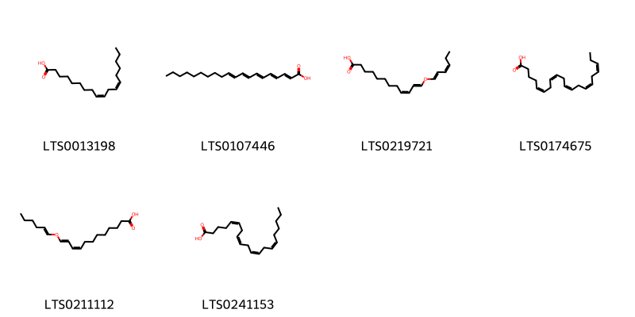{ width=100% }
    <figcaption>Hình ảnh cấu trúc hóa học của 6 hoạt chất thuộc nhóm Fatty Acyls gồm ['linoleic (LTS0013198)', 'icosa-2,4,6,8,10-pentaenoic acid (LTS0107446)', 'etherolenic acid (LTS0219721)', 'eicosapentaenoic acid (LTS0174675)', '(9z,11e)-12-[(1e)-hex-1-en-1-yloxy]dodeca-9,11-dienoic acid (LTS0211112)', 'arachidonic acid (LTS0241153)'].</figcaption>
</figure>
#### Nhóm Flavonoids
<figure markdown="span">
    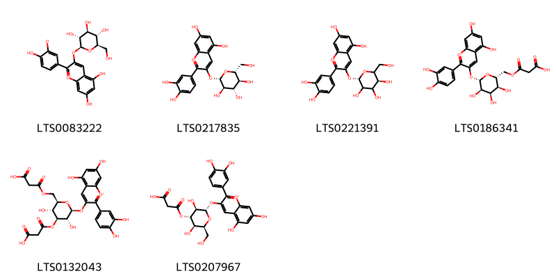{ width=100% }
    <figcaption>Hình ảnh cấu trúc hóa học của 6 hoạt chất thuộc nhóm Flavonoids gồm ['5,7-dihydroxy-2-(4-hydroxy-3-oxidophenyl)-3-{[(2s,3r,4s,5s,6r)-3,4,5-trihydroxy-6-(hydroxymethyl)oxan-2-yl]oxy}-1λ⁴-chromen-1-ylium (LTS0083222)', 'cyanidin 3-glucoside (LTS0217835)', 'chrysanthemin (LTS0221391)', '3-{[(2s,3r,4r,5s,6r)-6-{[(2-carboxyacetyl)oxy]methyl}-3,4,5-trihydroxyoxan-2-yl]oxy}-2-(3,4-dihydroxyphenyl)-5,7-dihydroxy-1λ⁴-chromen-1-ylium (LTS0186341)', '3-{[(2s,3r,4s,5r,6r)-4-[(2-carboxyacetyl)oxy]-6-{[(2-carboxyacetyl)oxy]methyl}-3,5-dihydroxyoxan-2-yl]oxy}-2-(3,4-dihydroxyphenyl)-5,7-dihydroxy-1λ⁴-chromen-1-ylium (LTS0132043)', '3-{[(2s,3r,4s,5r,6s)-4-[(2-carboxyacetyl)oxy]-3,5-dihydroxy-6-(hydroxymethyl)oxan-2-yl]oxy}-2-(3,4-dihydroxyphenyl)-5,7-dihydroxy-1λ⁴-chromen-1-ylium (LTS0207967)'].</figcaption>
</figure>
#### Nhóm Furanoid lignans
<figure markdown="span">
    { width=100% }
    <figcaption>Hình ảnh cấu trúc hóa học của 3 hoạt chất thuộc nhóm Furanoid lignans gồm ['matairesinol (LTS0193475)', 'pinoresinol (LTS0057431)', 'lariciresinol (LTS0010950)'].</figcaption>
</figure>
#### Nhóm Glycerolipids
<figure markdown="span">
    { width=100% }
    <figcaption>Hình ảnh cấu trúc hóa học của 1 hoạt chất thuộc nhóm Glycerolipids gồm ['[(2s,3s,4s,5r,6s)-6-(2,3-dihydroxypropoxy)-3,4,5-trihydroxyoxan-2-yl]methanesulfonic acid (LTS0146582)'].</figcaption>
</figure>
#### Nhóm Indoles and derivatives
<figure markdown="span">
    { width=100% }
    <figcaption>Hình ảnh cấu trúc hóa học của 2 hoạt chất thuộc nhóm Indoles and derivatives gồm ['1-methyl-2h,3h,8h,8ah-pyrrolo[2,3-b]indol-3a-ol (LTS0245542)', 'l-tryptophan (LTS0263809)'].</figcaption>
</figure>
#### Nhóm Organic disulfides
<figure markdown="span">
    { width=100% }
    <figcaption>Hình ảnh cấu trúc hóa học của 5 hoạt chất thuộc nhóm Organic disulfides gồm ['propyl disulfide (LTS0151977)', '1-(prop-1-en-1-yldisulfanyl)prop-1-ene (LTS0009480)', '1-(methyldisulfanyl)prop-1-ene (LTS0102193)', 'methyl propenyl disulfide (LTS0066757)', '(1e)-1-[(1e)-prop-1-en-1-yldisulfanyl]prop-1-ene (LTS0184194)'].</figcaption>
</figure>
#### Nhóm Organic oxoanionic compounds
<figure markdown="span">
    { width=100% }
    <figcaption>Hình ảnh cấu trúc hóa học của 1 hoạt chất thuộc nhóm Organic oxoanionic compounds gồm ['1-hydroxy-1-(prop-2-en-1-yloxy)-1λ⁶-disulfen-1-one (LTS0262385)'].</figcaption>
</figure>
#### Nhóm Organic phosphoric acids and derivatives
<figure markdown="span">
    { width=100% }
    <figcaption>Hình ảnh cấu trúc hóa học của 1 hoạt chất thuộc nhóm Organic phosphoric acids and derivatives gồm ['o-phosphoethanolamine; bis(nonane) (LTS0249963)'].</figcaption>
</figure>
#### Nhóm Organic sulfonic acids and derivatives
<figure markdown="span">
    { width=100% }
    <figcaption>Hình ảnh cấu trúc hóa học của 1 hoạt chất thuộc nhóm Organic sulfonic acids and derivatives gồm ['2-aminoethanesulfonic acid (LTS0101689)'].</figcaption>
</figure>
#### Nhóm Organic sulfuric acids and derivatives
<figure markdown="span">
    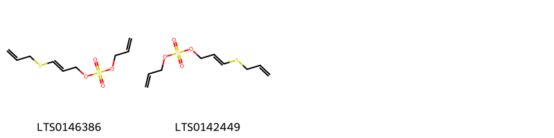{ width=100% }
    <figcaption>Hình ảnh cấu trúc hóa học của 2 hoạt chất thuộc nhóm Organic sulfuric acids and derivatives gồm ['prop-2-en-1-yl 3-(prop-2-en-1-ylsulfanyl)prop-2-en-1-yl sulfate (LTS0146386)', 'prop-2-en-1-yl (2e)-3-(prop-2-en-1-ylsulfanyl)prop-2-en-1-yl sulfate (LTS0142449)'].</figcaption>
</figure>
#### Nhóm Organic thiosulfuric acids and derivatives
<figure markdown="span">
    { width=100% }
    <figcaption>Hình ảnh cấu trúc hóa học của 1 hoạt chất thuộc nhóm Organic thiosulfuric acids and derivatives gồm ['3-[(prop-2-en-1-yloxysulfonyl)sulfanyl]prop-1-ene (LTS0088695)'].</figcaption>
</figure>
#### Nhóm Organic trisulfides
<figure markdown="span">
    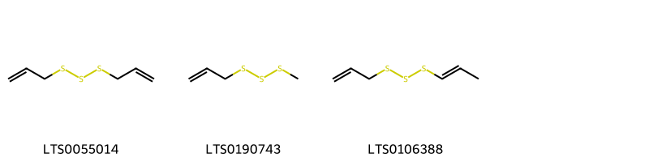{ width=100% }
    <figcaption>Hình ảnh cấu trúc hóa học của 3 hoạt chất thuộc nhóm Organic trisulfides gồm ['allyl trisulfide (LTS0055014)', 'allyl methyl trisulfide (LTS0190743)', '1-(prop-1-en-1-yl)-3-(prop-2-en-1-yl)trisulfane (LTS0106388)'].</figcaption>
</figure>
#### Nhóm Organooxygen compounds
<figure markdown="span">
    { width=100% }
    <figcaption>Hình ảnh cấu trúc hóa học của 9 hoạt chất thuộc nhóm Organooxygen compounds gồm ['sucrose (LTS0272557)', 'raffinose (LTS0113066)', '(2r,3r,4s,5r)-2-(hydroxymethyl)-6-[3-(3-{[(3r,4s,5r,6r)-3,4,5-trihydroxy-6-(hydroxymethyl)oxan-2-yl]oxy}propoxy)propoxy]oxane-3,4,5-triol (LTS0157972)', '3,6-bis(hydroxymethyl)-3-[(2s,3r,4s,5r,6r)-2,3,4,5-tetrahydroxy-6-(hydroxymethyl)oxan-2-yl]-1,4-dioxane-2,5-dione (LTS0110247)', '(2r,3r,4s,5s,6r)-2-{[(2s,3r,4s,5r)-3,4-dihydroxy-2,5-bis(hydroxymethyl)oxolan-2-yl]oxy}-6-({[(2s,3s,4r,5r,6r)-3,4,5-trihydroxy-6-({[(2s,3r,4s,5r,6r)-3,4,5-trihydroxy-6-(hydroxymethyl)oxan-2-yl]oxy}methyl)oxan-2-yl]oxy}methyl)oxane-3,4,5-triol (LTS0183884)', 'β-d-galactopyranuronic acid (LTS0271461)', 'amylose (LTS0110579)', 'stachyose (LTS0062089)', '(3s,4s,5r,6s)-5-{[(2s,3s,4s,5r,6s)-3,4-dihydroxy-6-(hydroxymethyl)-5-{[(2r,3r,4s,5s,6r)-3,4,5-trihydroxy-6-(hydroxymethyl)oxan-2-yl]oxy}oxan-2-yl]oxy}-6-(hydroxymethyl)oxane-2,3,4-triol (LTS0137131)'].</figcaption>
</figure>
#### Nhóm Prenol lipids
<figure markdown="span">
    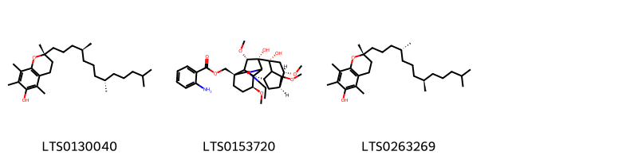{ width=100% }
    <figcaption>Hình ảnh cấu trúc hóa học của 3 hoạt chất thuộc nhóm Prenol lipids gồm ['(2r)-2,5,7,8-tetramethyl-2-[(4s,8s)-4,8,12-trimethyltridecyl]-3,4-dihydro-1-benzopyran-6-ol (LTS0130040)', '[(1s,4s,5r,6s,8r,9r,13s,16s,18s)-11-ethyl-8,9-dihydroxy-4,6,16,18-tetramethoxy-11-azahexacyclo[7.7.2.1²,⁵.0¹,¹⁰.0³,⁸.0¹³,¹⁷]nonadecan-13-yl]methyl 2-aminobenzoate (LTS0153720)', 'vitamin e (LTS0263269)'].</figcaption>
</figure>
#### Nhóm Purine nucleosides
<figure markdown="span">
    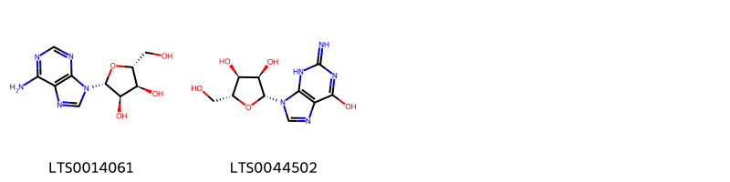{ width=100% }
    <figcaption>Hình ảnh cấu trúc hóa học của 2 hoạt chất thuộc nhóm Purine nucleosides gồm ['adenosine (LTS0014061)', 'ribonucleoside (LTS0044502)'].</figcaption>
</figure>
#### Nhóm Pyrans
<figure markdown="span">
    { width=100% }
    <figcaption>Hình ảnh cấu trúc hóa học của 1 hoạt chất thuộc nhóm Pyrans gồm ['allixin (LTS0115650)'].</figcaption>
</figure>
#### Nhóm Sphingolipids
<figure markdown="span">
    { width=100% }
    <figcaption>Hình ảnh cấu trúc hóa học của 9 hoạt chất thuộc nhóm Sphingolipids gồm ['(2r)-2-hydroxy-n-[(2s,3r,4e,8e)-3-hydroxy-1-{[(2r,3r,4s,5s,6r)-3,4,5-trihydroxy-6-(hydroxymethyl)oxan-2-yl]oxy}octadeca-4,8-dien-2-yl]hexadecanimidic acid (LTS0055771)', '(2r)-2-hydroxy-n-[(2s,3r,4e)-3-hydroxy-1-{[(2r,3r,4s,5s,6r)-3,4,5-trihydroxy-6-(hydroxymethyl)oxan-2-yl]oxy}octadec-4-en-2-yl]hexadecanimidic acid (LTS0217809)', '(2r)-2-hydroxy-n-[(2s,3r,4e,8e)-3-hydroxy-1-{[(2r,3r,4s,5s,6r)-3,4,5-trihydroxy-6-(hydroxymethyl)oxan-2-yl]oxy}octadeca-4,8-dien-2-yl]pentadecanimidic acid (LTS0157949)', '(2r)-2-hydroxy-n-[(2s,3r,4e,8e)-3-hydroxy-1-{[(2r,3r,4s,5s,6r)-3,4,5-trihydroxy-6-(hydroxymethyl)oxan-2-yl]oxy}octadeca-4,8-dien-2-yl]tetradecanimidic acid (LTS0268925)', '2-hydroxy-n-(3-hydroxy-1-{[3,4,5-trihydroxy-6-(hydroxymethyl)oxan-2-yl]oxy}octadeca-4,8-dien-2-yl)tetradecanimidic acid (LTS0181919)', '2-hydroxy-n-(3-hydroxy-1-{[3,4,5-trihydroxy-6-(hydroxymethyl)oxan-2-yl]oxy}octadec-4-en-2-yl)hexadecanimidic acid (LTS0156651)', '2-hydroxy-n-(3-hydroxy-1-{[3,4,5-trihydroxy-6-(hydroxymethyl)oxan-2-yl]oxy}octadeca-4,8-dien-2-yl)pentadecanimidic acid (LTS0026005)', '(2r)-2-hydroxy-n-[(2s,3r,4e,8z)-3-hydroxy-1-{[(2r,3r,4s,5s,6r)-3,4,5-trihydroxy-6-(hydroxymethyl)oxan-2-yl]oxy}octadeca-4,8-dien-2-yl]hexadecanimidic acid (LTS0070116)', '2-hydroxy-n-(3-hydroxy-1-{[3,4,5-trihydroxy-6-(hydroxymethyl)oxan-2-yl]oxy}octadeca-4,8-dien-2-yl)hexadecanimidic acid (LTS0121977)'].</figcaption>
</figure>
#### Nhóm Steroids and steroid derivatives
<figure markdown="span">
    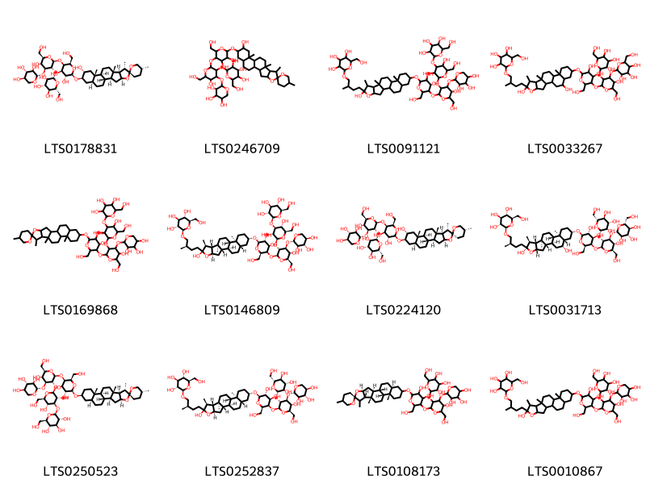{ width=100% }
    <figcaption>Hình ảnh cấu trúc hóa học của 12 hoạt chất thuộc nhóm Steroids and steroid derivatives gồm ['f-gitonin (LTS0178831)', "2-[(2-{[4,5-dihydroxy-2-(hydroxymethyl)-6-{5,7',9',13'-tetramethyl-5'-oxaspiro[oxane-2,6'-pentacyclo[10.8.0.0²,⁹.0⁴,⁸.0¹³,¹⁸]icosan]-15'-oloxy}oxan-3-yl]oxy}-5-hydroxy-6-(hydroxymethyl)-4-[(3,4,5-trihydroxyoxan-2-yl)oxy]oxan-3-yl)oxy]-6-(hydroxymethyl)oxane-3,4,5-triol (LTS0246709)", '2-{[2-({2-[(4,5-dihydroxy-6-{[6-hydroxy-7,9,13-trimethyl-6-(3-methyl-4-{[3,4,5-trihydroxy-6-(hydroxymethyl)oxan-2-yl]oxy}butyl)-5-oxapentacyclo[10.8.0.0²,⁹.0⁴,⁸.0¹³,¹⁸]icosan-16-yl]oxy}-2-(hydroxymethyl)oxan-3-yl)oxy]-5-hydroxy-6-(hydroxymethyl)-4-[(3,4,5-trihydroxyoxan-2-yl)oxy]oxan-3-yl}oxy)-3,5-dihydroxy-6-(hydroxymethyl)oxan-4-yl]oxy}-6-(hydroxymethyl)oxane-3,4,5-triol (LTS0091121)', '2-({2-[(6-{[6,19-dihydroxy-7,9,13-trimethyl-6-(3-methyl-4-{[3,4,5-trihydroxy-6-(hydroxymethyl)oxan-2-yl]oxy}butyl)-5-oxapentacyclo[10.8.0.0²,⁹.0⁴,⁸.0¹³,¹⁸]icosan-16-yl]oxy}-4,5-dihydroxy-2-(hydroxymethyl)oxan-3-yl)oxy]-5-hydroxy-6-(hydroxymethyl)-3-{[3,4,5-trihydroxy-6-(hydroxymethyl)oxan-2-yl]oxy}oxan-4-yl}oxy)-6-(hydroxymethyl)oxane-3,4,5-triol (LTS0033267)', "2-({2-[(2-{[4,5-dihydroxy-2-(hydroxymethyl)-6-{5,7',9',13'-tetramethyl-5'-oxaspiro[oxane-2,6'-pentacyclo[10.8.0.0²,⁹.0⁴,⁸.0¹³,¹⁸]icosane]oxy}oxan-3-yl]oxy}-5-hydroxy-6-(hydroxymethyl)-4-[(3,4,5-trihydroxyoxan-2-yl)oxy]oxan-3-yl)oxy]-3,5-dihydroxy-6-(hydroxymethyl)oxan-4-yl}oxy)-6-(hydroxymethyl)oxane-3,4,5-triol (LTS0169868)", '(2s,3r,4s,5s,6r)-2-{[(2s,3r,4s,5r,6r)-2-{[(2s,3r,4s,5r,6r)-2-{[(2r,3r,4r,5r,6r)-4,5-dihydroxy-6-{[(1r,2s,4r,6r,7s,8r,9s,12s,13s,16s,18s)-6-hydroxy-7,9,13-trimethyl-6-[(3r)-3-methyl-4-{[(2r,3r,4s,5s,6r)-3,4,5-trihydroxy-6-(hydroxymethyl)oxan-2-yl]oxy}butyl]-5-oxapentacyclo[10.8.0.0²,⁹.0⁴,⁸.0¹³,¹⁸]icosan-16-yl]oxy}-2-(hydroxymethyl)oxan-3-yl]oxy}-5-hydroxy-6-(hydroxymethyl)-4-{[(2s,3r,4s,5r)-3,4,5-trihydroxyoxan-2-yl]oxy}oxan-3-yl]oxy}-3,5-dihydroxy-6-(hydroxymethyl)oxan-4-yl]oxy}-6-(hydroxymethyl)oxane-3,4,5-triol (LTS0146809)', "(2s,3r,4s,5s,6r)-2-{[(2s,3r,4s,5r,6r)-2-{[(2r,3r,4r,5r,6r)-4,5-dihydroxy-2-(hydroxymethyl)-6-[(1'r,2s,2's,4's,5r,7's,8'r,9's,12's,13's,15'r,16'r,18's)-5,7',9',13'-tetramethyl-5'-oxaspiro[oxane-2,6'-pentacyclo[10.8.0.0²,⁹.0⁴,⁸.0¹³,¹⁸]icosan]-15'-oloxy]oxan-3-yl]oxy}-5-hydroxy-6-(hydroxymethyl)-4-{[(2s,3r,4s,5r)-3,4,5-trihydroxyoxan-2-yl]oxy}oxan-3-yl]oxy}-6-(hydroxymethyl)oxane-3,4,5-triol (LTS0224120)", '(2s,3r,4s,5s,6r)-2-{[(2s,3r,4s,5r,6r)-2-{[(2r,3r,4r,5r,6r)-6-{[(1r,2s,4s,6s,7s,8r,9s,12s,13r,16s,18s,19r)-6,19-dihydroxy-7,9,13-trimethyl-6-[(3r)-3-methyl-4-{[(2r,3r,4s,5s,6r)-3,4,5-trihydroxy-6-(hydroxymethyl)oxan-2-yl]oxy}butyl]-5-oxapentacyclo[10.8.0.0²,⁹.0⁴,⁸.0¹³,¹⁸]icosan-16-yl]oxy}-4,5-dihydroxy-2-(hydroxymethyl)oxan-3-yl]oxy}-5-hydroxy-6-(hydroxymethyl)-3-{[(2s,3r,4s,5s,6r)-3,4,5-trihydroxy-6-(hydroxymethyl)oxan-2-yl]oxy}oxan-4-yl]oxy}-6-(hydroxymethyl)oxane-3,4,5-triol (LTS0031713)', "(2s,3r,4s,5s,6r)-2-{[(2s,3r,4s,5r,6r)-2-{[(2s,3r,4s,5r,6r)-2-{[(2r,3r,4r,5r,6r)-4,5-dihydroxy-2-(hydroxymethyl)-6-[(1'r,2r,2's,4's,5r,7's,8'r,9's,12's,13's,16's,18's)-5,7',9',13'-tetramethyl-5'-oxaspiro[oxane-2,6'-pentacyclo[10.8.0.0²,⁹.0⁴,⁸.0¹³,¹⁸]icosane]oxy]oxan-3-yl]oxy}-5-hydroxy-6-(hydroxymethyl)-4-{[(2s,3r,4s,5r)-3,4,5-trihydroxyoxan-2-yl]oxy}oxan-3-yl]oxy}-3,5-dihydroxy-6-(hydroxymethyl)oxan-4-yl]oxy}-6-(hydroxymethyl)oxane-3,4,5-triol (LTS0250523)", '(2s,3r,4s,5s,6r)-2-{[(2s,3r,4s,5r,6r)-2-{[(2r,3r,4r,5r,6r)-4,5-dihydroxy-6-{[(1r,2s,4r,6r,7s,8r,9s,12s,13s,16s,18s)-6-hydroxy-7,9,13-trimethyl-6-[(3r)-3-methyl-4-{[(2r,3r,4s,5s,6r)-3,4,5-trihydroxy-6-(hydroxymethyl)oxan-2-yl]oxy}butyl]-5-oxapentacyclo[10.8.0.0²,⁹.0⁴,⁸.0¹³,¹⁸]icosan-16-yl]oxy}-2-(hydroxymethyl)oxan-3-yl]oxy}-5-hydroxy-6-(hydroxymethyl)-4-{[(2s,3r,4s,5r)-3,4,5-trihydroxyoxan-2-yl]oxy}oxan-3-yl]oxy}-6-(hydroxymethyl)oxane-3,4,5-triol (LTS0252837)', "2-[(2-{[4,5-dihydroxy-2-(hydroxymethyl)-6-[(1'r,2r,2's,4's,8's,9's,12'r,13's,18's)-5,7',9',13'-tetramethyl-5'-oxaspiro[oxane-2,6'-pentacyclo[10.8.0.0²,⁹.0⁴,⁸.0¹³,¹⁸]icosane]oxy]oxan-3-yl]oxy}-5-hydroxy-6-(hydroxymethyl)-4-[(3,4,5-trihydroxyoxan-2-yl)oxy]oxan-3-yl)oxy]-6-(hydroxymethyl)oxane-3,4,5-triol (LTS0108173)", '2-({2-[(4,5-dihydroxy-6-{[6-hydroxy-7,9,13-trimethyl-6-(3-methyl-4-{[3,4,5-trihydroxy-6-(hydroxymethyl)oxan-2-yl]oxy}butyl)-5-oxapentacyclo[10.8.0.0²,⁹.0⁴,⁸.0¹³,¹⁸]icosan-16-yl]oxy}-2-(hydroxymethyl)oxan-3-yl)oxy]-5-hydroxy-6-(hydroxymethyl)-4-[(3,4,5-trihydroxyoxan-2-yl)oxy]oxan-3-yl}oxy)-6-(hydroxymethyl)oxane-3,4,5-triol (LTS0010867)'].</figcaption>
</figure>
#### Nhóm Sulfonyls
<figure markdown="span">
    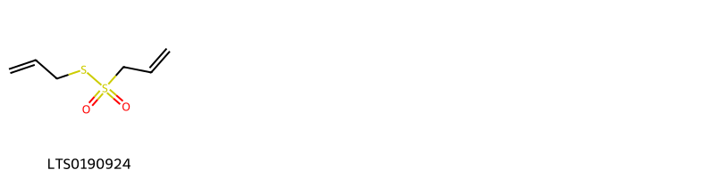{ width=100% }
    <figcaption>Hình ảnh cấu trúc hóa học của 1 hoạt chất thuộc nhóm Sulfonyls gồm ['3-[(prop-2-ene-1-sulfonyl)sulfanyl]prop-1-ene (LTS0190924)'].</figcaption>
</figure>
#### Nhóm Sulfoxides
<figure markdown="span">
    { width=100% }
    <figcaption>Hình ảnh cấu trúc hóa học của 4 hoạt chất thuộc nhóm Sulfoxides gồm ['(z)-ajoene (LTS0148764)', 'ajoene (LTS0118127)', '3-{[3-(prop-2-ene-1-sulfinyl)prop-1-en-1-yl]disulfanyl}prop-1-ene (LTS0097898)', '3-{[(1e)-3-[(r)-prop-2-ene-1-sulfinyl]prop-1-en-1-yl]disulfanyl}prop-1-ene (LTS0126255)'].</figcaption>
</figure>
#### Nhóm Thiosulfinic acid esters
<figure markdown="span">
    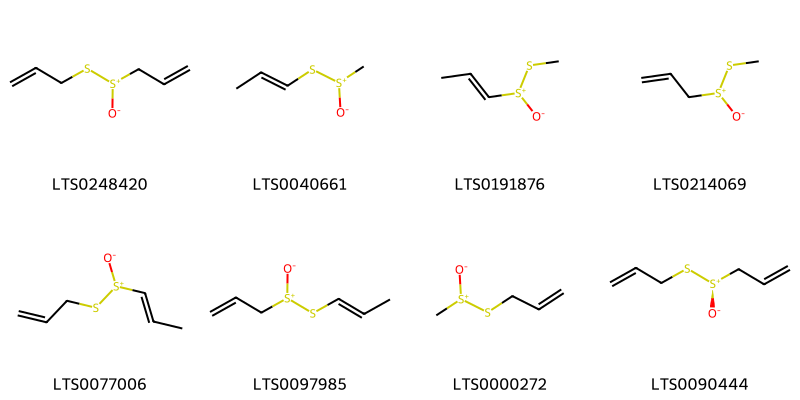{ width=100% }
    <figcaption>Hình ảnh cấu trúc hóa học của 8 hoạt chất thuộc nhóm Thiosulfinic acid esters gồm ['allicin (LTS0248420)', '(1e)-1-(methanesulfinylsulfanyl)prop-1-ene (LTS0040661)', '{[(1e)-prop-1-ene-1-sulfinyl]sulfanyl}methane (LTS0191876)', '[(prop-2-ene-1-sulfinyl)sulfanyl]methane (LTS0214069)', '3-{[(1e)-prop-1-ene-1-sulfinyl]sulfanyl}prop-1-ene (LTS0077006)', '(1e)-1-[(prop-2-ene-1-sulfinyl)sulfanyl]prop-1-ene (LTS0097985)', '3-(methanesulfinylsulfanyl)prop-1-ene (LTS0000272)', '3-{[(s)-prop-2-ene-1-sulfinyl]sulfanyl}prop-1-ene (LTS0090444)'].</figcaption>
</figure>
#### Nhóm Triphenyl compounds
<figure markdown="span">
    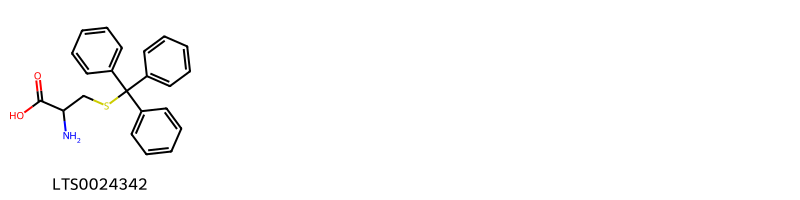{ width=100% }
    <figcaption>Hình ảnh cấu trúc hóa học của 1 hoạt chất thuộc nhóm Triphenyl compounds gồm ['2-amino-3-[(triphenylmethyl)sulfanyl]propanoic acid (LTS0024342)'].</figcaption>
</figure>

---

### Dược dân tộc học

Danh sách các quốc gia có sử dụng *Allium sativum* trong điều trị các bệnh. 

| Country            | Disease                                                                                                                                                                                                           | Bệnh                                                                                                                                                                                                           |
|:-------------------|:------------------------------------------------------------------------------------------------------------------------------------------------------------------------------------------------------------------|:---------------------------------------------------------------------------------------------------------------------------------------------------------------------------------------------------------------|
| China              | Antidote, Antiseptic, Sedative                                                                                                                                                                                    | Thuốc giải độc, sát trùng, an thần                                                                                                                                                                             |
| Dominican Republic | Vermifuge                                                                                                                                                                                                         | Thuốc diệt sán                                                                                                                                                                                                 |
| Egypt              | Demulcent, Vermifuge                                                                                                                                                                                              | Demulcent, Vermifuge                                                                                                                                                                                           |
| Elsewhere          | Antiseptic, Antiseptic, nan, Carminative, Carminative, Emmenagogue, Hypertensive, Rubefacient, Stimulant, Stomachic, Vermifuge, Antiseptic, Ascaricide, Diaphoretic, Expectorant, Stimulant, Stomachic, Vermifuge | Khử trùng, sát trùng, nan, Carminative, Carminative, Emmenagogue, Hypertensive, Rubefacient, Stimulant, Stomachic, Vermifuge, Khử trùng, Ascaricide, Diaphoretic, Expectorant, Stimulant, Stomachic, Vermifuge |
| Haiti              | Vermifuge, Antiseptic, Parasiticide                                                                                                                                                                               | Vermifuge, Sát trùng, Ký sinh trùng                                                                                                                                                                            |
| Iraq               | Carminative, Diaphoretic, Diuretic, Vermifuge, Expectorant                                                                                                                                                        | Carminative, Diaphoretic, lợi tiểu, Vermifuge, đờm                                                                                                                                                             |
| Malaya             | Vermifuge                                                                                                                                                                                                         | Thuốc diệt sán                                                                                                                                                                                                 |
| South America      | Stimulant                                                                                                                                                                                                         | Chất kích thích                                                                                                                                                                                                |
| Trinidad           | Antiseptic, Ascaricide, Carminative, Hypertensive, Vermifuge, Vermifuge, Vermifuge                                                                                                                                | Khử trùng, Ascaricide, Carminative, Tăng huyết áp, Vermifuge, Vermifuge, Vermifuge                                                                                                                             |
| Turkey             | Antiseptic, Carminative, Expectorant, Hypotensive, Stimulant, Tonic, Vasodilator, Vermifuge                                                                                                                       | Khử trùng, Carminative, Expectorant, Hypotensive, Stimulant, Tonic, Vasodilator, Vermifuge                                                                                                                     |
| US                 | Vermifuge                                                                                                                                                                                                         | Thuốc diệt sán                                                                                                                                                                                                 |
| Venezuela          | Vermifuge                                                                                                                                                                                                         | Thuốc diệt sán                                                                                                                                                                                                 |

---

---
## Allium schoenoprasum
### Thông tin về thực vật

!!! info "Phân loại thực vật của *Allium schoenoprasum* từ GIBF:"
    - **Kingdom:** Plantae
    - **Phylum:** Tracheophyta
    - **Order:** Asparagales
    - **Family:** Amaryllidaceae
    - **Genus:** Allium
    - **Species:** *Allium schoenoprasum*

 

| Label (VI)   | Label (EN)   | Scientific Name      | Descriptions (VI)   | Descriptions (EN)       | Also Known As (VI)   | Also Known As (EN)                                   |
|:-------------|:-------------|:---------------------|:--------------------|:------------------------|:---------------------|:-----------------------------------------------------|
| N/A          | N/A          | Allium schoenoprasum | loài thực vật       | edible species of plant | ['']                 | ['chives', 'wild chives', 'cives', 'Spanish garlic'] |

#### Phân bố trên thế giới

**Từ CSDL GIBF** Czechia, Sweden, Finland, China, Kazakhstan, New Zealand, Spain, Netherlands, Poland, Denmark, United States of America, Russian Federation, Norway, France, Belgium, Luxembourg, Canada, Germany, Austria, Slovakia, Italy, Switzerland, United Kingdom of Great Britain and Northern Ireland

#### Phân bố tại Việt Nam

**Từ CSDL GIBF**: Không có ghi nhận ở Việt Nam

---
### Thành phần hóa học
        
- Theo cơ sở dữ liệu lotus: Từ loài *Allium schoenoprasum* đã phân lập và xác định được 52 hoạt chất thuộc về các nhóm Organic oxoanionic compounds, Sulfenyl compounds, Allyl sulfur compounds, Flavonoids, Organic thiosulfuric acids and derivatives, Carboxylic acids and derivatives, Organic disulfides, Thiosulfinic acid esters. 

|    | chemicalTaxonomyClassyfireClass            |   smiles_count |
|---:|:-------------------------------------------|---------------:|
|  0 |                                            |              2 |
|  1 | Allyl sulfur compounds                     |              1 |
|  2 | Carboxylic acids and derivatives           |             11 |
|  3 | Flavonoids                                 |             18 |
|  4 | Organic disulfides                         |              2 |
|  5 | Organic oxoanionic compounds               |              4 |
|  6 | Organic thiosulfuric acids and derivatives |              2 |
|  7 | Sulfenyl compounds                         |              3 |
|  8 | Thiosulfinic acid esters                   |              9 |

#### Nhóm 
<figure markdown="span">
    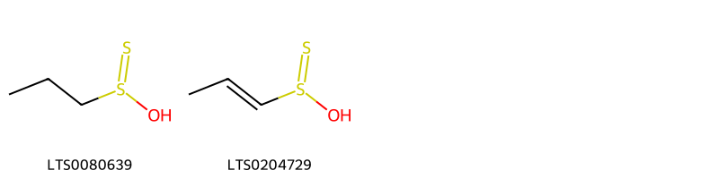{ width=100% }
    <figcaption>Hình ảnh cấu trúc hóa học của 2 hoạt chất thuộc nhóm  gồm ['propyl-λ⁴-disulfanylol (LTS0080639)', '(1e)-prop-1-en-1-yl-λ⁴-disulfanylol (LTS0204729)'].</figcaption>
</figure>
#### Nhóm Allyl sulfur compounds
<figure markdown="span">
    { width=100% }
    <figcaption>Hình ảnh cấu trúc hóa học của 1 hoạt chất thuộc nhóm Allyl sulfur compounds gồm ['allyl propyl disulfide (LTS0050924)'].</figcaption>
</figure>
#### Nhóm Carboxylic acids and derivatives
<figure markdown="span">
    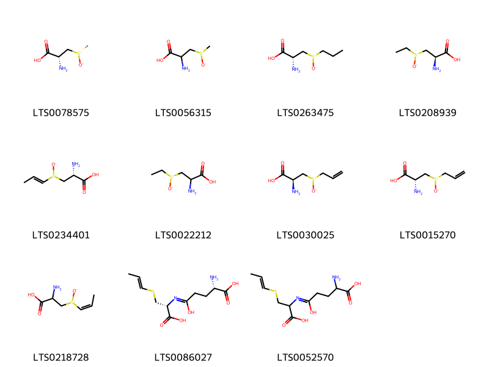{ width=100% }
    <figcaption>Hình ảnh cấu trúc hóa học của 11 hoạt chất thuộc nhóm Carboxylic acids and derivatives gồm ['(2r)-2-amino-3-[(s)-methanesulfinyl]propanoic acid (LTS0078575)', '2-amino-3-methanesulfinylpropanoic acid (LTS0056315)', '(2r)-2-amino-3-(propane-1-sulfinyl)propanoic acid (LTS0263475)', '(2r)-2-amino-3-(ethanesulfinyl)propanoic acid (LTS0208939)', 'isoalliin (LTS0234401)', '2-amino-3-(ethanesulfinyl)propanoic acid (LTS0022212)', '(2s)-2-amino-3-(prop-2-ene-1-sulfinyl)propanoic acid (LTS0030025)', 'alliin (LTS0015270)', '2-amino-3-[(1z)-prop-1-ene-1-sulfinyl]propanoic acid (LTS0218728)', '(2s)-2-amino-4-{[(1r)-1-carboxy-2-[(1e)-prop-1-en-1-ylsulfanyl]ethyl]-c-hydroxycarbonimidoyl}butanoic acid (LTS0086027)', '2-amino-4-{[1-carboxy-2-(prop-1-en-1-ylsulfanyl)ethyl]-c-hydroxycarbonimidoyl}butanoic acid (LTS0052570)'].</figcaption>
</figure>
#### Nhóm Flavonoids
<figure markdown="span">
    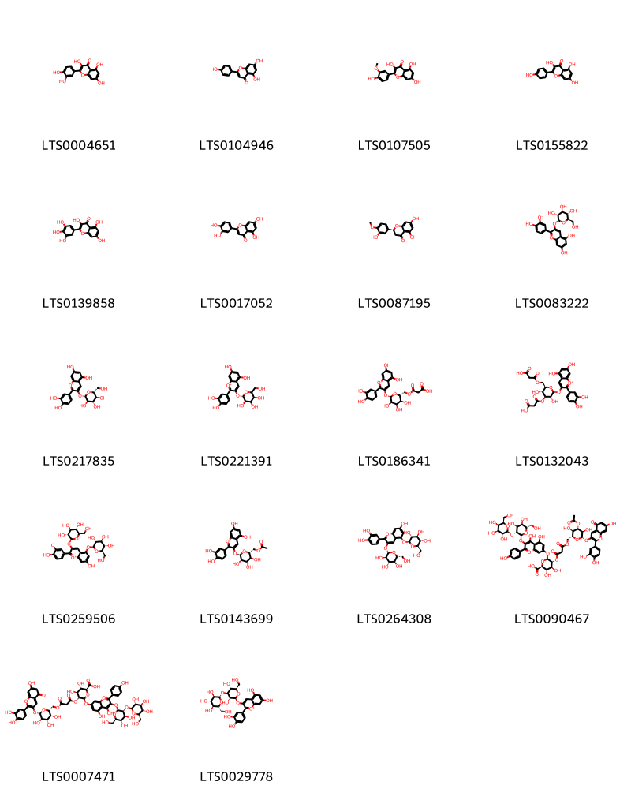{ width=100% }
    <figcaption>Hình ảnh cấu trúc hóa học của 18 hoạt chất thuộc nhóm Flavonoids gồm ['quercetin (LTS0004651)', 'chamomile (LTS0104946)', 'isorhamnetin (LTS0107505)', 'kaempherol (LTS0155822)', 'myricetin (LTS0139858)', 'luteolin (LTS0017052)', 'hesperetin (LTS0087195)', '5,7-dihydroxy-2-(4-hydroxy-3-oxidophenyl)-3-{[(2s,3r,4s,5s,6r)-3,4,5-trihydroxy-6-(hydroxymethyl)oxan-2-yl]oxy}-1λ⁴-chromen-1-ylium (LTS0083222)', 'cyanidin 3-glucoside (LTS0217835)', 'chrysanthemin (LTS0221391)', '3-{[(2s,3r,4r,5s,6r)-6-{[(2-carboxyacetyl)oxy]methyl}-3,4,5-trihydroxyoxan-2-yl]oxy}-2-(3,4-dihydroxyphenyl)-5,7-dihydroxy-1λ⁴-chromen-1-ylium (LTS0186341)', '3-{[(2s,3r,4s,5r,6r)-4-[(2-carboxyacetyl)oxy]-6-{[(2-carboxyacetyl)oxy]methyl}-3,5-dihydroxyoxan-2-yl]oxy}-2-(3,4-dihydroxyphenyl)-5,7-dihydroxy-1λ⁴-chromen-1-ylium (LTS0132043)', 'cyanin betaine (LTS0259506)', '3-{[(2s,3r,4s,5s,6r)-6-[(acetyloxy)methyl]-3,4,5-trihydroxyoxan-2-yl]oxy}-2-(3,4-dihydroxyphenyl)-5,7-dihydroxy-1λ⁴-chromen-1-ylium (LTS0143699)', 'cyanin (LTS0264308)', '7-{[(2s,3r,4s,5s,6s)-3-[(3-{[(2r,3r,4s,5r,6s)-4-(acetyloxy)-6-{[2-(3,4-dihydroxyphenyl)-7-hydroxy-5-oxochromen-3-yl]oxy}-3,5-dihydroxyoxan-2-yl]methoxy}-3-oxopropanoyl)oxy]-6-carboxy-4,5-dihydroxyoxan-2-yl]oxy}-3-{[(2s,3r,4s,5r,6s)-4,5-dihydroxy-6-(hydroxymethyl)-3-{[(2s,3r,4s,5r,6r)-3,4,5-trihydroxy-6-(hydroxymethyl)oxan-2-yl]oxy}oxan-2-yl]oxy}-4,5-dihydroxy-2-(4-hydroxyphenyl)-1λ⁴-chromen-1-ylium (LTS0090467)', '7-{[(2s,3r,4s,5s,6s)-6-carboxy-3-[(3-{[(2r,3s,4s,5r,6s)-6-{[2-(3,4-dihydroxyphenyl)-7-hydroxy-5-oxochromen-3-yl]oxy}-3,4,5-trihydroxyoxan-2-yl]methoxy}-3-oxopropanoyl)oxy]-4,5-dihydroxyoxan-2-yl]oxy}-3-{[(2s,3r,4s,5s,6r)-4,5-dihydroxy-6-(hydroxymethyl)-3-{[(2s,3r,4s,5s,6r)-3,4,5-trihydroxy-6-(hydroxymethyl)oxan-2-yl]oxy}oxan-2-yl]oxy}-4,5-dihydroxy-2-(4-hydroxyphenyl)-1λ⁴-chromen-1-ylium (LTS0007471)', '3-{[(2s,3r,4s,5r,6r)-3,5-dihydroxy-6-(hydroxymethyl)-4-{[(2s,3r,4s,5s,6r)-3,4,5-trihydroxy-6-(hydroxymethyl)oxan-2-yl]oxy}oxan-2-yl]oxy}-2-(3,4-dihydroxyphenyl)-5,7-dihydroxy-1λ⁴-chromen-1-ylium (LTS0029778)'].</figcaption>
</figure>
#### Nhóm Organic disulfides
<figure markdown="span">
    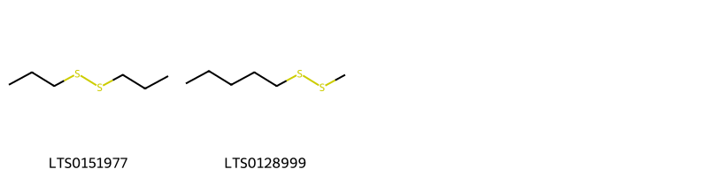{ width=100% }
    <figcaption>Hình ảnh cấu trúc hóa học của 2 hoạt chất thuộc nhóm Organic disulfides gồm ['propyl disulfide (LTS0151977)', 'amyl methyl disulfide (LTS0128999)'].</figcaption>
</figure>
#### Nhóm Organic oxoanionic compounds
<figure markdown="span">
    { width=100% }
    <figcaption>Hình ảnh cấu trúc hóa học của 4 hoạt chất thuộc nhóm Organic oxoanionic compounds gồm ['1-hydroxy-1-(prop-2-en-1-yloxy)-1λ⁶-disulfen-1-one (LTS0262385)', '1-hydroxy-1-[(1e)-prop-1-en-1-yloxy]-1λ⁶-disulfen-1-one (LTS0100819)', '1-hydroxy-1-[(1z)-prop-1-en-1-yloxy]-1λ⁶-disulfen-1-one (LTS0103772)', '1-hydroxy-1-propoxy-1λ⁶-disulfen-1-one (LTS0202599)'].</figcaption>
</figure>
#### Nhóm Organic thiosulfuric acids and derivatives
<figure markdown="span">
    { width=100% }
    <figcaption>Hình ảnh cấu trúc hóa học của 2 hoạt chất thuộc nhóm Organic thiosulfuric acids and derivatives gồm ['prop-2-en-1-ylsulfanylsulfonic acid (LTS0084048)', 'propylsulfanylsulfonic acid (LTS0154623)'].</figcaption>
</figure>
#### Nhóm Sulfenyl compounds
<figure markdown="span">
    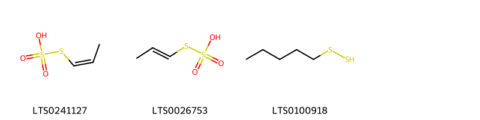{ width=100% }
    <figcaption>Hình ảnh cấu trúc hóa học của 3 hoạt chất thuộc nhóm Sulfenyl compounds gồm ['(1z)-prop-1-en-1-ylsulfanylsulfonic acid (LTS0241127)', '(1e)-prop-1-en-1-ylsulfanylsulfonic acid (LTS0026753)', 'pentane-1-dithioperoxol (LTS0100918)'].</figcaption>
</figure>
#### Nhóm Thiosulfinic acid esters
<figure markdown="span">
    { width=100% }
    <figcaption>Hình ảnh cấu trúc hóa học của 9 hoạt chất thuộc nhóm Thiosulfinic acid esters gồm ['allicin (LTS0248420)', '(1e)-1-(methanesulfinylsulfanyl)prop-1-ene (LTS0040661)', '{[(1e)-prop-1-ene-1-sulfinyl]sulfanyl}methane (LTS0191876)', '(1e)-1-[(propane-1-sulfinyl)sulfanyl]prop-1-ene (LTS0071396)', '[(propane-1-sulfinyl)sulfanyl]methane (LTS0029238)', '1-(methanesulfinylsulfanyl)propane (LTS0205111)', '1-{[(1e)-prop-1-ene-1-sulfinyl]sulfanyl}propane (LTS0267562)', '(1e)-1-{[(1e)-prop-1-ene-1-sulfinyl]sulfanyl}prop-1-ene (LTS0009432)', 's-propyl propanethiosulfinate (LTS0032930)'].</figcaption>
</figure>

---

### Dược dân tộc học

Danh sách các quốc gia có sử dụng *Allium schoenoprasum* trong điều trị các bệnh. 

| Country   | Disease                                      | Bệnh                                             |
|:----------|:---------------------------------------------|:-------------------------------------------------|
| Haiti     | Digestive                                    | tiêu                                             |
| Iraq      | Carminative, Digestive, Antiseptic, Diuretic | Carminative, tiêu hóa, sát trùng, lợi tiểu       |
| Turkey    | Antiseptic, Carminative, Digestive, Diuretic | Khử trùng, Carminative, Tiêu hóa, Thuốc lợi tiểu |

---

---
## Allium scorodoprasum
### Thông tin về thực vật

!!! info "Phân loại thực vật của *Allium scorodoprasum* từ GIBF:"
    - **Kingdom:** Plantae
    - **Phylum:** Tracheophyta
    - **Order:** Asparagales
    - **Family:** Amaryllidaceae
    - **Genus:** Allium
    - **Species:** *Allium scorodoprasum*

 

| Label (VI)   | Label (EN)   | Scientific Name      | Descriptions (VI)   | Descriptions (EN)   | Also Known As (VI)   | Also Known As (EN)                                       |
|:-------------|:-------------|:---------------------|:--------------------|:--------------------|:---------------------|:---------------------------------------------------------|
| N/A          | N/A          | Allium scorodoprasum | loài thực vật       | species of plant    | ['']                 | ['Korean pickled-peel garlic', 'rocambole', 'sand leek'] |

#### Phân bố trên thế giới

**Từ CSDL GIBF** Austria, Hungary, Norway, Romania, Czechia, Poland, Sweden, Netherlands, Belgium, France, Slovakia, Ukraine, Switzerland, Slovenia, Estonia, Germany, United Kingdom of Great Britain and Northern Ireland, Denmark

#### Phân bố tại Việt Nam

**Từ CSDL GIBF**: Không có ghi nhận ở Việt Nam

---
### Thành phần hóa học
        
- Theo cơ sở dữ liệu lotus: Từ loài *Allium scorodoprasum* đã phân lập và xác định được 2 hoạt chất thuộc về các nhóm Organooxygen compounds. 

|    | chemicalTaxonomyClassyfireClass   |   smiles_count |
|---:|:----------------------------------|---------------:|
|  0 | Organooxygen compounds            |              2 |

#### Nhóm Organooxygen compounds
<figure markdown="span">
    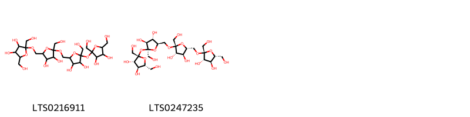{ width=100% }
    <figcaption>Hình ảnh cấu trúc hóa học của 2 hoạt chất thuộc nhóm Organooxygen compounds gồm ['2-({5-[(5-{[3,4-dihydroxy-2,5-bis(hydroxymethyl)oxolan-2-yl]oxy}-3,4-dihydroxy-5-(hydroxymethyl)oxolan-2-yl)methoxy]-3,4-dihydroxy-5-(hydroxymethyl)oxolan-2-yl}methoxy)-2,5-bis(hydroxymethyl)oxolane-3,4-diol (LTS0216911)', '(2s,3s,4s,5r)-2-{[(2s,3s,4s,5r)-5-({[(2r,3s,4s,5r)-5-({[(2r,3s,4s,5r)-3,4-dihydroxy-2,5-bis(hydroxymethyl)oxolan-2-yl]oxy}methyl)-3,4-dihydroxy-2-(hydroxymethyl)oxolan-2-yl]oxy}methyl)-3,4-dihydroxy-2-(hydroxymethyl)oxolan-2-yl]oxy}-2,5-bis(hydroxymethyl)oxolane-3,4-diol (LTS0247235)'].</figcaption>
</figure>

---

### Dược dân tộc học

Danh sách các quốc gia có sử dụng *Allium scorodoprasum* trong điều trị các bệnh. 

| Country   | Disease             | Bệnh                     |
|:----------|:--------------------|:-------------------------|
| China     | Antidote, Digestive | Thuốc giải độc, Tiêu hóa |

---

---
## Allium ursinum
### Thông tin về thực vật

!!! info "Phân loại thực vật của *Allium ursinum* từ GIBF:"
    - **Kingdom:** Plantae
    - **Phylum:** Tracheophyta
    - **Order:** Asparagales
    - **Family:** Amaryllidaceae
    - **Genus:** Allium
    - **Species:** *Allium ursinum*

 

| Label (VI)   | Label (EN)   | Scientific Name   | Descriptions (VI)   | Descriptions (EN)      | Also Known As (VI)   | Also Known As (EN)                                                                         |
|:-------------|:-------------|:------------------|:--------------------|:-----------------------|:---------------------|:-------------------------------------------------------------------------------------------|
| N/A          | N/A          | Allium ursinum    | loài thực vật       | species of plant, herb | ['Allium ursinum']   | ['broad-leaved garlic', 'buckrams', 'ramsons', 'ramsons garlic', 'ransoms', 'wild garlic'] |

#### Phân bố trên thế giới

**Từ CSDL GIBF** nan, Austria, Germany, Hungary, Czechia, France, Belgium, Slovakia, Russian Federation, Serbia, Switzerland, Slovenia, Denmark, United Kingdom of Great Britain and Northern Ireland, Ireland, Netherlands

#### Phân bố tại Việt Nam

**Từ CSDL GIBF**: Không có ghi nhận ở Việt Nam

---
### Thành phần hóa học
        
- Theo cơ sở dữ liệu lotus: Từ loài *Allium ursinum* đã phân lập và xác định được 47 hoạt chất thuộc về các nhóm Allyl sulfur compounds, Flavonoids, Organic thiosulfuric acids and derivatives, Carboxylic acids and derivatives, Organic disulfides, Organic trisulfides, Thiosulfinic acid esters. 

|    | chemicalTaxonomyClassyfireClass            |   smiles_count |
|---:|:-------------------------------------------|---------------:|
|  0 |                                            |              1 |
|  1 | Allyl sulfur compounds                     |              5 |
|  2 | Carboxylic acids and derivatives           |             12 |
|  3 | Flavonoids                                 |             18 |
|  4 | Organic disulfides                         |              2 |
|  5 | Organic thiosulfuric acids and derivatives |              1 |
|  6 | Organic trisulfides                        |              1 |
|  7 | Thiosulfinic acid esters                   |              7 |

#### Nhóm 
<figure markdown="span">
    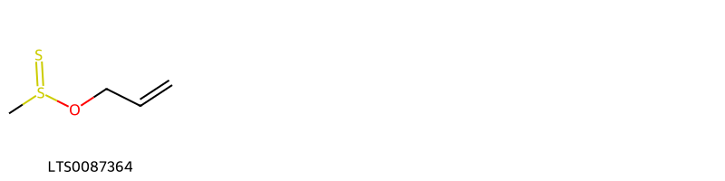{ width=100% }
    <figcaption>Hình ảnh cấu trúc hóa học của 1 hoạt chất thuộc nhóm  gồm ['[(prop-2-en-1-yloxy)-λ⁴-disulfanyl]methane (LTS0087364)'].</figcaption>
</figure>
#### Nhóm Allyl sulfur compounds
<figure markdown="span">
    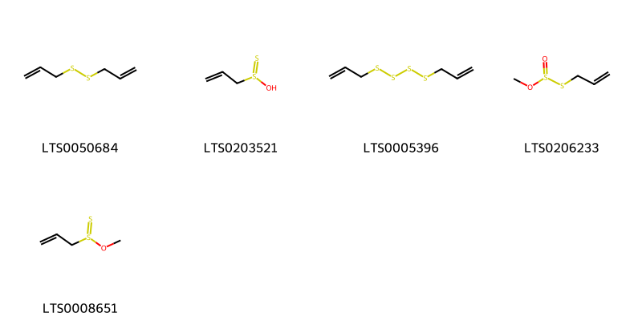{ width=100% }
    <figcaption>Hình ảnh cấu trúc hóa học của 5 hoạt chất thuộc nhóm Allyl sulfur compounds gồm ['garlicin (LTS0050684)', 'prop-2-en-1-yl-λ⁴-disulfanylol (LTS0203521)', 'diallyl tetrasulfide (LTS0005396)', '3-[(methoxysulfinyl)sulfanyl]prop-1-ene (LTS0206233)', '3-(methoxy-λ⁴-disulfanyl)prop-1-ene (LTS0008651)'].</figcaption>
</figure>
#### Nhóm Carboxylic acids and derivatives
<figure markdown="span">
    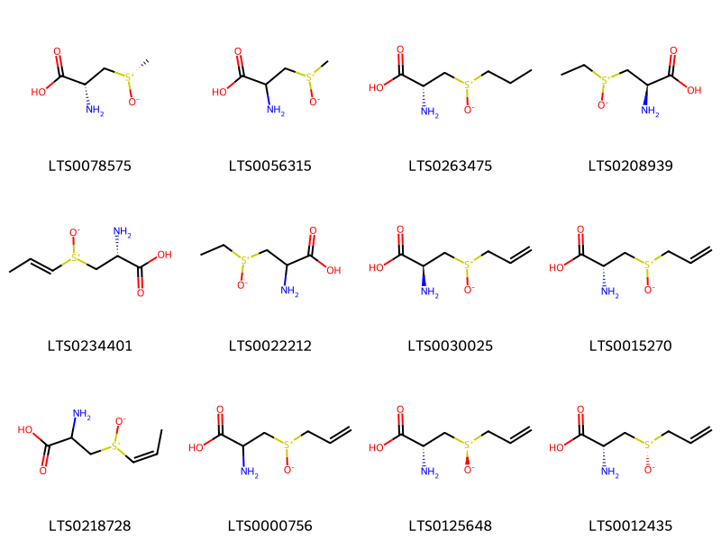{ width=100% }
    <figcaption>Hình ảnh cấu trúc hóa học của 12 hoạt chất thuộc nhóm Carboxylic acids and derivatives gồm ['(2r)-2-amino-3-[(s)-methanesulfinyl]propanoic acid (LTS0078575)', '2-amino-3-methanesulfinylpropanoic acid (LTS0056315)', '(2r)-2-amino-3-(propane-1-sulfinyl)propanoic acid (LTS0263475)', '(2r)-2-amino-3-(ethanesulfinyl)propanoic acid (LTS0208939)', 'isoalliin (LTS0234401)', '2-amino-3-(ethanesulfinyl)propanoic acid (LTS0022212)', '(2s)-2-amino-3-(prop-2-ene-1-sulfinyl)propanoic acid (LTS0030025)', 'alliin (LTS0015270)', '2-amino-3-[(1z)-prop-1-ene-1-sulfinyl]propanoic acid (LTS0218728)', 'allin (LTS0000756)', '(2r)-2-amino-3-[(r)-prop-2-ene-1-sulfinyl]propanoic acid (LTS0125648)', 'alliin (LTS0012435)'].</figcaption>
</figure>
#### Nhóm Flavonoids
<figure markdown="span">
    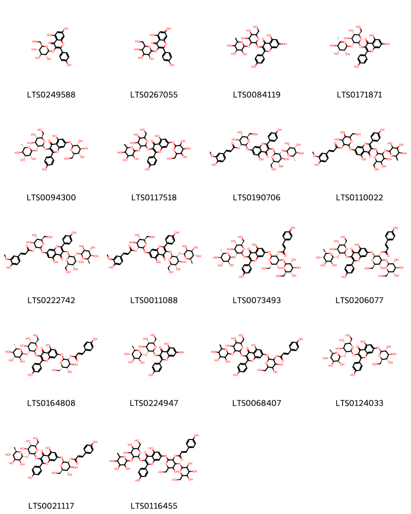{ width=100% }
    <figcaption>Hình ảnh cấu trúc hóa học của 18 hoạt chất thuộc nhóm Flavonoids gồm ['astragalin (LTS0249588)', 'trifolin (LTS0267055)', '3-{[4,5-dihydroxy-6-(hydroxymethyl)-3-[(3,4,5-trihydroxy-6-methyloxan-2-yl)oxy]oxan-2-yl]oxy}-5,7-dihydroxy-2-(4-hydroxyphenyl)chromen-4-one (LTS0084119)', '3-{[(2s,3r,4s,5s,6r)-4,5-dihydroxy-6-(hydroxymethyl)-3-{[(2s,3r,4r,5r,6s)-3,4,5-trihydroxy-6-methyloxan-2-yl]oxy}oxan-2-yl]oxy}-5,7-dihydroxy-2-(4-hydroxyphenyl)chromen-4-one (LTS0171871)', '3-{[(2s,3r,4s,5s,6r)-4,5-dihydroxy-6-(hydroxymethyl)-3-{[(2s,3r,4r,5r,6s)-3,4,5-trihydroxy-6-methyloxan-2-yl]oxy}oxan-2-yl]oxy}-5-hydroxy-2-(4-hydroxyphenyl)-7-{[(2s,3r,4s,5s,6r)-3,4,5-trihydroxy-6-(hydroxymethyl)oxan-2-yl]oxy}chromen-4-one (LTS0094300)', '3-{[4,5-dihydroxy-6-(hydroxymethyl)-3-[(3,4,5-trihydroxy-6-methyloxan-2-yl)oxy]oxan-2-yl]oxy}-5-hydroxy-2-(4-hydroxyphenyl)-7-{[3,4,5-trihydroxy-6-(hydroxymethyl)oxan-2-yl]oxy}chromen-4-one (LTS0117518)', '(2s,3r,4s,5s,6r)-2-[(3-{[(2s,3r,4s,5s,6r)-4,5-dihydroxy-6-(hydroxymethyl)-3-{[(2s,3r,4r,5r,6s)-3,4,5-trihydroxy-6-methyloxan-2-yl]oxy}oxan-2-yl]oxy}-5-hydroxy-2-(4-hydroxyphenyl)-4-oxochromen-7-yl)oxy]-4,5-dihydroxy-6-(hydroxymethyl)oxan-3-yl (2e)-3-(4-hydroxy-3-methoxyphenyl)prop-2-enoate (LTS0190706)', '2-[(3-{[4,5-dihydroxy-6-(hydroxymethyl)-3-[(3,4,5-trihydroxy-6-methyloxan-2-yl)oxy]oxan-2-yl]oxy}-5-hydroxy-2-(4-hydroxyphenyl)-4-oxochromen-7-yl)oxy]-4,5-dihydroxy-6-(hydroxymethyl)oxan-3-yl 3-(4-hydroxy-3-methoxyphenyl)prop-2-enoate (LTS0110022)', '(2s,3r,4s,5s,6r)-2-[(3-{[(2s,3r,4r,5s,6r)-4,5-dihydroxy-6-(hydroxymethyl)-3-{[(2s,3s,4r,5r,6r)-3,4,5-trihydroxy-6-methyloxan-2-yl]oxy}oxan-2-yl]oxy}-5-hydroxy-2-(4-hydroxyphenyl)-4-oxochromen-7-yl)oxy]-4,5-dihydroxy-6-(hydroxymethyl)oxan-3-yl (2e)-3-(4-hydroxy-3-methoxyphenyl)prop-2-enoate (LTS0222742)', '(2s,3r,4s,5s,6r)-2-[(3-{[(2s,3r,4s,5s,6r)-4,5-dihydroxy-6-(hydroxymethyl)-3-{[(2r,3s,4s,5s,6r)-3,4,5-trihydroxy-6-methyloxan-2-yl]oxy}oxan-2-yl]oxy}-5-hydroxy-2-(4-hydroxyphenyl)-4-oxochromen-7-yl)oxy]-4,5-dihydroxy-6-(hydroxymethyl)oxan-3-yl (2e)-3-(4-hydroxy-3-methoxyphenyl)prop-2-enoate (LTS0011088)', '(2s,3r,4s,5r,6s)-2-[(3-{[(2s,3r,4s,5s,6r)-4,5-dihydroxy-6-(hydroxymethyl)-3-{[(2s,3s,4r,5r,6s)-3,4,5-trihydroxy-6-methyloxan-2-yl]oxy}oxan-2-yl]oxy}-5-hydroxy-2-(4-hydroxyphenyl)-4-oxochromen-7-yl)oxy]-5-hydroxy-6-(hydroxymethyl)-4-{[(2s,3r,4s,5s,6r)-3,4,5-trihydroxy-6-(hydroxymethyl)oxan-2-yl]oxy}oxan-3-yl (2e)-3-(4-hydroxyphenyl)prop-2-enoate (LTS0073493)', '(2s,3r,4s,5r,6r)-2-[(3-{[(2s,3r,4s,5s,6r)-4,5-dihydroxy-6-(hydroxymethyl)-3-{[(2r,3s,4s,5s,6r)-3,4,5-trihydroxy-6-methyloxan-2-yl]oxy}oxan-2-yl]oxy}-5-hydroxy-2-(4-hydroxyphenyl)-4-oxochromen-7-yl)oxy]-5-hydroxy-6-(hydroxymethyl)-4-{[(2s,3r,4s,5s,6r)-3,4,5-trihydroxy-6-(hydroxymethyl)oxan-2-yl]oxy}oxan-3-yl (2e)-3-(4-hydroxyphenyl)prop-2-enoate (LTS0206077)', '(2s,3r,4s,5s,6s)-2-[(3-{[(2s,3r,4s,5s,6r)-4,5-dihydroxy-6-(hydroxymethyl)-3-{[(2s,3s,4r,5r,6s)-3,4,5-trihydroxy-6-methyloxan-2-yl]oxy}oxan-2-yl]oxy}-5-hydroxy-2-(4-hydroxyphenyl)-4-oxochromen-7-yl)oxy]-4,5-dihydroxy-6-(hydroxymethyl)oxan-3-yl (2e)-3-(4-hydroxyphenyl)prop-2-enoate (LTS0164808)', '3-{[(2s,3r,4s,5s,6r)-4,5-dihydroxy-6-(hydroxymethyl)-3-{[(2r,3s,4s,5s,6r)-3,4,5-trihydroxy-6-methyloxan-2-yl]oxy}oxan-2-yl]oxy}-5,7-dihydroxy-2-(4-hydroxyphenyl)chromen-4-one (LTS0224947)', '2-[(3-{[4,5-dihydroxy-6-(hydroxymethyl)-3-[(3,4,5-trihydroxy-6-methyloxan-2-yl)oxy]oxan-2-yl]oxy}-5-hydroxy-2-(4-hydroxyphenyl)-4-oxochromen-7-yl)oxy]-4,5-dihydroxy-6-(hydroxymethyl)oxan-3-yl 3-(4-hydroxyphenyl)prop-2-enoate (LTS0068407)', '3-{[(2s,3r,4s,5s,6r)-4,5-dihydroxy-6-(hydroxymethyl)-3-{[(2r,3s,4s,5s,6r)-3,4,5-trihydroxy-6-methyloxan-2-yl]oxy}oxan-2-yl]oxy}-5-hydroxy-2-(4-hydroxyphenyl)-7-{[(2s,3r,4s,5s,6r)-3,4,5-trihydroxy-6-(hydroxymethyl)oxan-2-yl]oxy}chromen-4-one (LTS0124033)', '(2s,3r,4s,5s,6r)-2-[(3-{[(2s,3r,4s,5s,6r)-4,5-dihydroxy-6-(hydroxymethyl)-3-{[(2r,3s,4s,5s,6r)-3,4,5-trihydroxy-6-methyloxan-2-yl]oxy}oxan-2-yl]oxy}-5-hydroxy-2-(4-hydroxyphenyl)-4-oxochromen-7-yl)oxy]-4,5-dihydroxy-6-(hydroxymethyl)oxan-3-yl (2e)-3-(4-hydroxyphenyl)prop-2-enoate (LTS0021117)', '2-[(3-{[4,5-dihydroxy-6-(hydroxymethyl)-3-[(3,4,5-trihydroxy-6-methyloxan-2-yl)oxy]oxan-2-yl]oxy}-5-hydroxy-2-(4-hydroxyphenyl)-4-oxochromen-7-yl)oxy]-5-hydroxy-6-(hydroxymethyl)-4-{[3,4,5-trihydroxy-6-(hydroxymethyl)oxan-2-yl]oxy}oxan-3-yl 3-(4-hydroxyphenyl)prop-2-enoate (LTS0116455)'].</figcaption>
</figure>
#### Nhóm Organic disulfides
<figure markdown="span">
    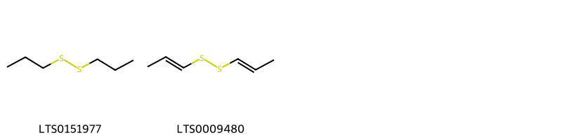{ width=100% }
    <figcaption>Hình ảnh cấu trúc hóa học của 2 hoạt chất thuộc nhóm Organic disulfides gồm ['propyl disulfide (LTS0151977)', '1-(prop-1-en-1-yldisulfanyl)prop-1-ene (LTS0009480)'].</figcaption>
</figure>
#### Nhóm Organic thiosulfuric acids and derivatives
<figure markdown="span">
    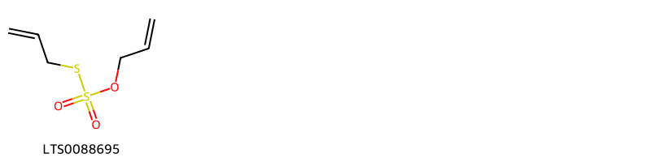{ width=100% }
    <figcaption>Hình ảnh cấu trúc hóa học của 1 hoạt chất thuộc nhóm Organic thiosulfuric acids and derivatives gồm ['3-[(prop-2-en-1-yloxysulfonyl)sulfanyl]prop-1-ene (LTS0088695)'].</figcaption>
</figure>
#### Nhóm Organic trisulfides
<figure markdown="span">
    { width=100% }
    <figcaption>Hình ảnh cấu trúc hóa học của 1 hoạt chất thuộc nhóm Organic trisulfides gồm ['allyl trisulfide (LTS0055014)'].</figcaption>
</figure>
#### Nhóm Thiosulfinic acid esters
<figure markdown="span">
    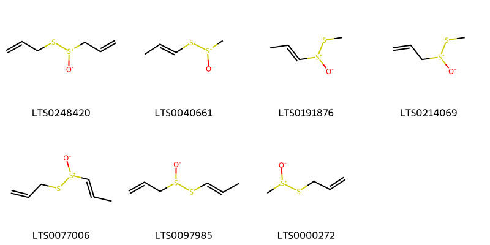{ width=100% }
    <figcaption>Hình ảnh cấu trúc hóa học của 7 hoạt chất thuộc nhóm Thiosulfinic acid esters gồm ['allicin (LTS0248420)', '(1e)-1-(methanesulfinylsulfanyl)prop-1-ene (LTS0040661)', '{[(1e)-prop-1-ene-1-sulfinyl]sulfanyl}methane (LTS0191876)', '[(prop-2-ene-1-sulfinyl)sulfanyl]methane (LTS0214069)', '3-{[(1e)-prop-1-ene-1-sulfinyl]sulfanyl}prop-1-ene (LTS0077006)', '(1e)-1-[(prop-2-ene-1-sulfinyl)sulfanyl]prop-1-ene (LTS0097985)', '3-(methanesulfinylsulfanyl)prop-1-ene (LTS0000272)'].</figcaption>
</figure>

---

### Dược dân tộc học

Danh sách các quốc gia có sử dụng *Allium ursinum* trong điều trị các bệnh. 

| Country   | Disease                | Bệnh                    |
|:----------|:-----------------------|:------------------------|
| Turkey    | Carminative, Stomachic | Đốt cháy âm đạo, Dạ dày |

---

---
## Allium victorialis
### Thông tin về thực vật

!!! info "Phân loại thực vật của *Allium victorialis* từ GIBF:"
    - **Kingdom:** Plantae
    - **Phylum:** Tracheophyta
    - **Order:** Asparagales
    - **Family:** Amaryllidaceae
    - **Genus:** Allium
    - **Species:** *Allium victorialis*

 

| Label (VI)   | Label (EN)   | Scientific Name    | Descriptions (VI)   | Descriptions (EN)   | Also Known As (VI)   | Also Known As (EN)                                           |
|:-------------|:-------------|:-------------------|:--------------------|:--------------------|:---------------------|:-------------------------------------------------------------|
| N/A          | N/A          | Allium victorialis | loài thực vật       | species of plant    | ['']                 | ['Alpine broad-leaf allium', 'Alpine leek', 'Victory onion'] |

#### Phân bố trên thế giới

**Từ CSDL GIBF** Austria, Norway, Sweden, Slovakia, Ukraine, Russian Federation, Italy, Switzerland, Slovenia, Croatia, Germany, France, Spain, Poland

#### Phân bố tại Việt Nam

**Từ CSDL GIBF**: Không có ghi nhận ở Việt Nam

---
### Thành phần hóa học
        
- Theo cơ sở dữ liệu lotus: Từ loài *Allium victorialis* đã phân lập và xác định được 51 hoạt chất thuộc về các nhóm Fatty Acyls, Sulfenyl compounds, Allyl sulfur compounds, Flavonoids, Carboxylic acids and derivatives, Organic trisulfides, Steroids and steroid derivatives, Prenol lipids, Thiosulfinic acid esters. 

|    | chemicalTaxonomyClassyfireClass   |   smiles_count |
|---:|:----------------------------------|---------------:|
|  0 | Allyl sulfur compounds            |              2 |
|  1 | Carboxylic acids and derivatives  |              7 |
|  2 | Fatty Acyls                       |              2 |
|  3 | Flavonoids                        |             23 |
|  4 | Organic trisulfides               |              5 |
|  5 | Prenol lipids                     |              6 |
|  6 | Steroids and steroid derivatives  |              4 |
|  7 | Sulfenyl compounds                |              1 |
|  8 | Thiosulfinic acid esters          |              1 |

#### Nhóm Allyl sulfur compounds
<figure markdown="span">
    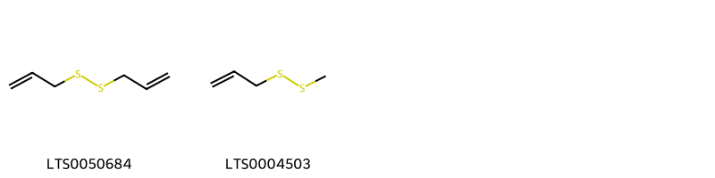{ width=100% }
    <figcaption>Hình ảnh cấu trúc hóa học của 2 hoạt chất thuộc nhóm Allyl sulfur compounds gồm ['garlicin (LTS0050684)', 'allyl methyl disulfide (LTS0004503)'].</figcaption>
</figure>
#### Nhóm Carboxylic acids and derivatives
<figure markdown="span">
    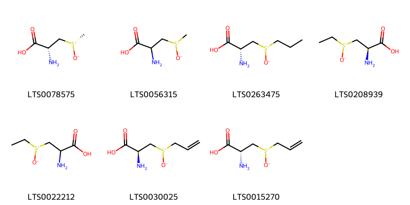{ width=100% }
    <figcaption>Hình ảnh cấu trúc hóa học của 7 hoạt chất thuộc nhóm Carboxylic acids and derivatives gồm ['(2r)-2-amino-3-[(s)-methanesulfinyl]propanoic acid (LTS0078575)', '2-amino-3-methanesulfinylpropanoic acid (LTS0056315)', '(2r)-2-amino-3-(propane-1-sulfinyl)propanoic acid (LTS0263475)', '(2r)-2-amino-3-(ethanesulfinyl)propanoic acid (LTS0208939)', '2-amino-3-(ethanesulfinyl)propanoic acid (LTS0022212)', '(2s)-2-amino-3-(prop-2-ene-1-sulfinyl)propanoic acid (LTS0030025)', 'alliin (LTS0015270)'].</figcaption>
</figure>
#### Nhóm Fatty Acyls
<figure markdown="span">
    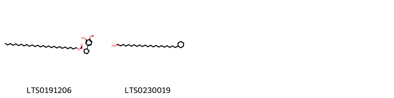{ width=100% }
    <figcaption>Hình ảnh cấu trúc hóa học của 2 hoạt chất thuộc nhóm Fatty Acyls gồm ['heptacosyl (1s,2s)-2-(3-hydroxy-4-methoxyphenyl)cyclopentane-1-carboxylate (LTS0191206)', '22-cyclohexyldocosan-1-ol (LTS0230019)'].</figcaption>
</figure>
#### Nhóm Flavonoids
<figure markdown="span">
    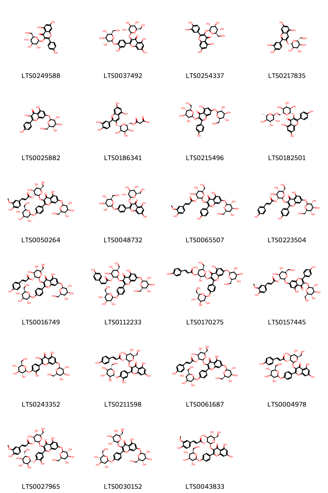{ width=100% }
    <figcaption>Hình ảnh cấu trúc hóa học của 23 hoạt chất thuộc nhóm Flavonoids gồm ['astragalin (LTS0249588)', "quercetin 3,4'-diglucoside (LTS0037492)", 'isoquercetin (LTS0254337)', 'cyanidin 3-glucoside (LTS0217835)', 'kaempferol 7-o-glucoside (LTS0025882)', '3-{[(2s,3r,4r,5s,6r)-6-{[(2-carboxyacetyl)oxy]methyl}-3,4,5-trihydroxyoxan-2-yl]oxy}-2-(3,4-dihydroxyphenyl)-5,7-dihydroxy-1λ⁴-chromen-1-ylium (LTS0186341)', '5-hydroxy-2-(4-hydroxyphenyl)-3,7-bis({[(2s,3r,4s,5s,6r)-3,4,5-trihydroxy-6-(hydroxymethyl)oxan-2-yl]oxy})chromen-4-one (LTS0215496)', 'nictoflorin (LTS0182501)', '(2s,3r,4s,5s,6r)-4,5-dihydroxy-2-[(5-hydroxy-4-oxo-7-{[(2s,3r,4s,5s,6r)-3,4,5-trihydroxy-6-(hydroxymethyl)oxan-2-yl]oxy}-2-(4-{[(2s,3r,4s,5s,6r)-3,4,5-trihydroxy-6-(hydroxymethyl)oxan-2-yl]oxy}phenyl)chromen-3-yl)oxy]-6-(hydroxymethyl)oxan-3-yl (2e)-3-(4-hydroxy-3-methoxyphenyl)prop-2-enoate (LTS0050264)', '5,7-dihydroxy-3-{[(2s,3r,4s,5s,6r)-3,4,5-trihydroxy-6-(hydroxymethyl)oxan-2-yl]oxy}-2-(4-{[(2s,3r,4s,5s,6r)-3,4,5-trihydroxy-6-(hydroxymethyl)oxan-2-yl]oxy}phenyl)chromen-4-one (LTS0048732)', '(2s,3r,4s,5s,6r)-4,5-dihydroxy-2-{[5-hydroxy-2-(4-hydroxyphenyl)-4-oxo-7-{[(2s,3r,4s,5s,6r)-3,4,5-trihydroxy-6-(hydroxymethyl)oxan-2-yl]oxy}chromen-3-yl]oxy}-6-(hydroxymethyl)oxan-3-yl (2e)-3-(4-hydroxy-3-methoxyphenyl)prop-2-enoate (LTS0065507)', '(2s,3r,4s,5s,6r)-4,5-dihydroxy-2-{[5-hydroxy-2-(4-hydroxyphenyl)-4-oxo-7-{[(2s,3r,4s,5s,6r)-3,4,5-trihydroxy-6-(hydroxymethyl)oxan-2-yl]oxy}chromen-3-yl]oxy}-6-(hydroxymethyl)oxan-3-yl (2e)-3-(4-hydroxyphenyl)prop-2-enoate (LTS0223504)', '(2s,3r,4s,5s,6r)-4,5-dihydroxy-2-[(5-hydroxy-4-oxo-7-{[(2s,3r,4s,5s,6r)-3,4,5-trihydroxy-6-(hydroxymethyl)oxan-2-yl]oxy}-2-(4-{[(2s,3r,4s,5s,6r)-3,4,5-trihydroxy-6-(hydroxymethyl)oxan-2-yl]oxy}phenyl)chromen-3-yl)oxy]-6-(hydroxymethyl)oxan-3-yl 3-(4-hydroxyphenyl)prop-2-enoate (LTS0016749)', '(2s,3r,4s,5s,6r)-4,5-dihydroxy-2-[(5-hydroxy-4-oxo-7-{[(2s,3r,4s,5s,6r)-3,4,5-trihydroxy-6-(hydroxymethyl)oxan-2-yl]oxy}-2-(4-{[(2s,3r,4s,5s,6r)-3,4,5-trihydroxy-6-(hydroxymethyl)oxan-2-yl]oxy}phenyl)chromen-3-yl)oxy]-6-(hydroxymethyl)oxan-3-yl (2z)-3-(4-hydroxyphenyl)prop-2-enoate (LTS0112233)', '(2s,3r,4s,5r,6r)-3,5-dihydroxy-2-[(5-hydroxy-4-oxo-7-{[(2s,3r,4s,5s,6r)-3,4,5-trihydroxy-6-(hydroxymethyl)oxan-2-yl]oxy}-2-(4-{[(2s,3r,4s,5s,6r)-3,4,5-trihydroxy-6-(hydroxymethyl)oxan-2-yl]oxy}phenyl)chromen-3-yl)oxy]-6-(hydroxymethyl)oxan-4-yl (2e)-3-(4-hydroxyphenyl)prop-2-enoate (LTS0170275)', '(2s,3r,4s,5s,6r)-4,5-dihydroxy-2-{[5-hydroxy-2-(4-hydroxyphenyl)-4-oxo-3-{[(2s,3r,4s,5s,6r)-3,4,5-trihydroxy-6-(hydroxymethyl)oxan-2-yl]oxy}chromen-7-yl]oxy}-6-(hydroxymethyl)oxan-3-yl (2e)-3-(4-hydroxy-3-methoxyphenyl)prop-2-enoate (LTS0157445)', '3,5-dihydroxy-2-(3-hydroxy-4-{[(2s,3r,4s,5s,6r)-3,4,5-trihydroxy-6-(hydroxymethyl)oxan-2-yl]oxy}phenyl)-7-{[(2s,3r,4s,5s,6r)-3,4,5-trihydroxy-6-(hydroxymethyl)oxan-2-yl]oxy}chromen-4-one (LTS0243352)', '(2s,3r,4s,5s,6r)-2-{[5,7-dihydroxy-2-(3-hydroxy-4-{[(2r,3s,4r,5r,6s)-3,4,5-trihydroxy-6-(hydroxymethyl)oxan-2-yl]oxy}phenyl)-4-oxochromen-3-yl]oxy}-4,5-dihydroxy-6-(hydroxymethyl)oxan-3-yl (2e)-3-(4-hydroxyphenyl)prop-2-enoate (LTS0211598)', '(2s,3r,4s,5s,6r)-4,5-dihydroxy-2-[(5-hydroxy-4-oxo-7-{[(2s,3r,4s,5s,6r)-3,4,5-trihydroxy-6-(hydroxymethyl)oxan-2-yl]oxy}-2-(4-{[(2s,3r,4s,5s,6r)-3,4,5-trihydroxy-6-(hydroxymethyl)oxan-2-yl]oxy}phenyl)chromen-3-yl)oxy]-6-(hydroxymethyl)oxan-3-yl (2e)-3-(4-hydroxyphenyl)prop-2-enoate (LTS0061687)', '(2s,3r,4s,5s,6r)-2-{[5,7-dihydroxy-4-oxo-2-(4-{[(2s,3r,4s,5s,6r)-3,4,5-trihydroxy-6-(hydroxymethyl)oxan-2-yl]oxy}phenyl)chromen-3-yl]oxy}-4,5-dihydroxy-6-(hydroxymethyl)oxan-3-yl (2e)-3-(4-hydroxyphenyl)prop-2-enoate (LTS0004978)', '(2s,3r,4s,5s,6r)-4,5-dihydroxy-2-{[5-hydroxy-2-(3-hydroxy-4-{[(2r,3s,4r,5r,6s)-3,4,5-trihydroxy-6-(hydroxymethyl)oxan-2-yl]oxy}phenyl)-4-oxo-7-{[(2s,3r,4s,5s,6r)-3,4,5-trihydroxy-6-(hydroxymethyl)oxan-2-yl]oxy}chromen-3-yl]oxy}-6-(hydroxymethyl)oxan-3-yl (2e)-3-(4-hydroxy-3-methoxyphenyl)prop-2-enoate (LTS0027965)', '5-hydroxy-3,7-bis({[(2s,3r,4s,5s,6r)-3,4,5-trihydroxy-6-(hydroxymethyl)oxan-2-yl]oxy})-2-(4-{[(2s,3r,4s,5s,6r)-3,4,5-trihydroxy-6-(hydroxymethyl)oxan-2-yl]oxy}phenyl)chromen-4-one (LTS0030152)', '(2s,3r,4s,5s,6r)-2-{[5,7-dihydroxy-4-oxo-2-(4-{[(2s,3r,4s,5s,6r)-3,4,5-trihydroxy-6-(hydroxymethyl)oxan-2-yl]oxy}phenyl)chromen-3-yl]oxy}-4,5-dihydroxy-6-(hydroxymethyl)oxan-3-yl (2e)-3-(4-hydroxy-3-methoxyphenyl)prop-2-enoate (LTS0043833)'].</figcaption>
</figure>
#### Nhóm Organic trisulfides
<figure markdown="span">
    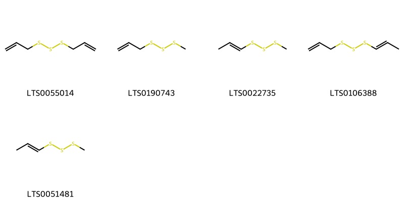{ width=100% }
    <figcaption>Hình ảnh cấu trúc hóa học của 5 hoạt chất thuộc nhóm Organic trisulfides gồm ['allyl trisulfide (LTS0055014)', 'allyl methyl trisulfide (LTS0190743)', '1-methyl-3-(prop-1-en-1-yl)trisulfane (LTS0022735)', '1-(prop-1-en-1-yl)-3-(prop-2-en-1-yl)trisulfane (LTS0106388)', '1-methyl-3-[(1e)-prop-1-en-1-yl]trisulfane (LTS0051481)'].</figcaption>
</figure>
#### Nhóm Prenol lipids
<figure markdown="span">
    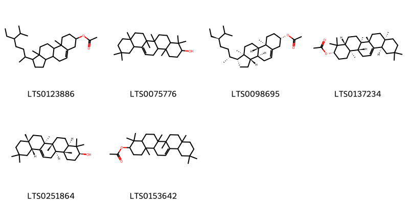{ width=100% }
    <figcaption>Hình ảnh cấu trúc hóa học của 6 hoạt chất thuộc nhóm Prenol lipids gồm ['1-(5-ethyl-6-methylheptan-2-yl)-9a,11a-dimethyl-1h,2h,3h,3ah,3bh,4h,6h,7h,8h,9h,9bh,10h,11h-cyclopenta[a]phenanthren-7-yl acetate (LTS0123886)', 'β-amyrin (LTS0075776)', 'β-sitosteryl acetate (LTS0098695)', 'β-amyrin acetate (LTS0137234)', 'β-amyrin (LTS0251864)', '4,4,6a,6b,8a,11,11,14b-octamethyl-1,2,3,4a,5,6,7,8,9,10,12,12a,14,14a-tetradecahydropicen-3-yl acetate (LTS0153642)'].</figcaption>
</figure>
#### Nhóm Steroids and steroid derivatives
<figure markdown="span">
    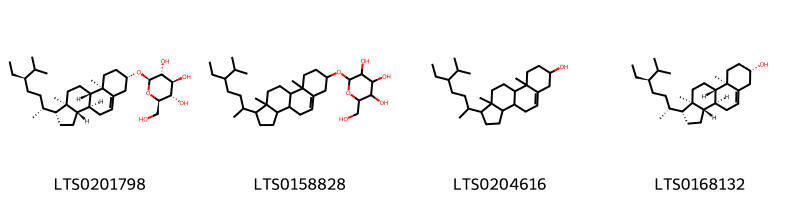{ width=100% }
    <figcaption>Hình ảnh cấu trúc hóa học của 4 hoạt chất thuộc nhóm Steroids and steroid derivatives gồm ['sitogluside (LTS0201798)', '2-{[1-(5-ethyl-6-methylheptan-2-yl)-9a,11a-dimethyl-1h,2h,3h,3ah,3bh,4h,6h,7h,8h,9h,9bh,10h,11h-cyclopenta[a]phenanthren-7-yl]oxy}-6-(hydroxymethyl)oxane-3,4,5-triol (LTS0158828)', 'stigmast-5-en-3-ol, (3β)- (LTS0204616)', 'sitosterol (LTS0168132)'].</figcaption>
</figure>
#### Nhóm Sulfenyl compounds
<figure markdown="span">
    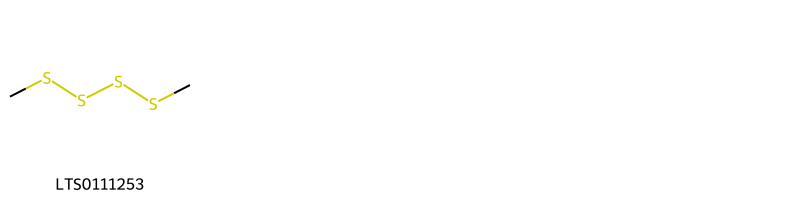{ width=100% }
    <figcaption>Hình ảnh cấu trúc hóa học của 1 hoạt chất thuộc nhóm Sulfenyl compounds gồm ['dimethyltetrasulfane (LTS0111253)'].</figcaption>
</figure>
#### Nhóm Thiosulfinic acid esters
<figure markdown="span">
    { width=100% }
    <figcaption>Hình ảnh cấu trúc hóa học của 1 hoạt chất thuộc nhóm Thiosulfinic acid esters gồm ['allicin (LTS0248420)'].</figcaption>
</figure>

---

### Dược dân tộc học

Danh sách các quốc gia có sử dụng *Allium victorialis* trong điều trị các bệnh. 

| Country   | Disease   | Bệnh           |
|:----------|:----------|:---------------|
| Egypt     | Vermifuge | Thuốc diệt sán |
| French    | Vermifuge | Thuốc diệt sán |
| German    | Diuretic  | Thuốc lợi tiêu |

---

# Chi Funkia

??? note "Danh sách các dược liệu thuộc chi"
    
	 - *Funkia subcordata*

---
## Funkia subcordata
### Thông tin về thực vật

!!! info "Phân loại thực vật của *Hosta plantaginea* từ GIBF:"
    - **Kingdom:** Plantae
    - **Phylum:** Tracheophyta
    - **Order:** Asparagales
    - **Family:** Asparagaceae
    - **Genus:** Hosta
    - **Species:** *Hosta plantaginea*

 

| Label (VI)   | Label (EN)   | Scientific Name   | Descriptions (VI)   | Descriptions (EN)   | Also Known As (VI)   | Also Known As (EN)   |
|:-------------|:-------------|:------------------|:--------------------|:--------------------|:---------------------|:---------------------|
| N/A          | N/A          | Funkia subcordata |                     |                     | ['']                 | ['']                 |

#### Phân bố trên thế giới

**Từ CSDL GIBF** nan, United States of America, Japan, unknown or invalid, Spain

#### Phân bố tại Việt Nam

**Từ CSDL GIBF**: Không có ghi nhận ở Việt Nam

---
### Thành phần hóa học
        
- Theo cơ sở dữ liệu lotus: Từ loài *Hosta plantaginea* đã phân lập và xác định được Chưa có hoạt chất nào được phân lập. hoạt chất thuộc về các nhóm Không có hoạt chất nào được phân lập. 

Không có hình ảnh nào được tạo ra

---

### Dược dân tộc học

Danh sách các quốc gia có sử dụng *Hosta plantaginea* trong điều trị các bệnh. 

| Country   | Disease   | Bệnh     |
|:----------|:----------|:---------|
| China     | Poison    | Chất độc |

---

# Chi Lycoris

??? note "Danh sách các dược liệu thuộc chi"
    
	 - *Lycoris albiflora*
	 - *Lycoris haywardii*
	 - *Lycoris radiata*
	 - *Lycoris sanguinea*
	 - *Lycoris squamigera*

---
## Lycoris albiflora
### Thông tin về thực vật

!!! info "Phân loại thực vật của *Lycoris albiflora* từ GIBF:"
    - **Kingdom:** Plantae
    - **Phylum:** Tracheophyta
    - **Order:** Asparagales
    - **Family:** Amaryllidaceae
    - **Genus:** Lycoris
    - **Species:** *Lycoris albiflora*

 

| Label (VI)   | Label (EN)   | Scientific Name   | Descriptions (VI)   | Descriptions (EN)   | Also Known As (VI)   | Also Known As (EN)   |
|:-------------|:-------------|:------------------|:--------------------|:--------------------|:---------------------|:---------------------|
| N/A          | N/A          | Lycoris albiflora | loài thực vật       | species of plant    | ['']                 | ['']                 |

#### Phân bố trên thế giới

**Từ CSDL GIBF** nan, United States of America, Japan, Korea, Republic of, Chinese Taipei

#### Phân bố tại Việt Nam

**Từ CSDL GIBF**: Không có ghi nhận ở Việt Nam

---
### Thành phần hóa học
        
- Theo cơ sở dữ liệu lotus: Từ loài *Lycoris albiflora* đã phân lập và xác định được Chưa có hoạt chất nào được phân lập. hoạt chất thuộc về các nhóm Không có hoạt chất nào được phân lập. 

Không có hình ảnh nào được tạo ra

---

### Dược dân tộc học

Danh sách các quốc gia có sử dụng *Lycoris albiflora* trong điều trị các bệnh. 

| Country   | Disease             | Bệnh             |
|:----------|:--------------------|:-----------------|
| Elsewhere | Expectorant, Emetic | Chất đờm, Emetic |

---

---
## Lycoris haywardii
### Thông tin về thực vật

!!! info "Phân loại thực vật của *Lycoris haywardii* từ GIBF:"
    - **Kingdom:** Plantae
    - **Phylum:** Tracheophyta
    - **Order:** Asparagales
    - **Family:** Amaryllidaceae
    - **Genus:** Lycoris
    - **Species:** *Lycoris haywardii*

 

| Label (VI)   | Label (EN)   | Scientific Name   | Descriptions (VI)   | Descriptions (EN)   | Also Known As (VI)   | Also Known As (EN)   |
|:-------------|:-------------|:------------------|:--------------------|:--------------------|:---------------------|:---------------------|
| N/A          | N/A          | Lycoris haywardii | loài thực vật       | species of plant    | ['']                 | ['']                 |

#### Phân bố trên thế giới

**Từ CSDL GIBF** nan, China

#### Phân bố tại Việt Nam

**Từ CSDL GIBF**: Không có ghi nhận ở Việt Nam

---
### Thành phần hóa học
        
- Theo cơ sở dữ liệu lotus: Từ loài *Lycoris haywardii* đã phân lập và xác định được Chưa có hoạt chất nào được phân lập. hoạt chất thuộc về các nhóm Không có hoạt chất nào được phân lập. 

Không có hình ảnh nào được tạo ra

---

### Dược dân tộc học

Danh sách các quốc gia có sử dụng *Lycoris haywardii* trong điều trị các bệnh. 

| Country   | Disease             | Bệnh             |
|:----------|:--------------------|:-----------------|
| Elsewhere | Emetic, Expectorant | Emetic, long đờm |

---

---
## Lycoris radiata
### Thông tin về thực vật

!!! info "Phân loại thực vật của *Lycoris radiata* từ GIBF:"
    - **Kingdom:** Plantae
    - **Phylum:** Tracheophyta
    - **Order:** Asparagales
    - **Family:** Amaryllidaceae
    - **Genus:** Lycoris
    - **Species:** *Lycoris radiata*

 

| Label (VI)   | Label (EN)   | Scientific Name   | Descriptions (VI)   | Descriptions (EN)   | Also Known As (VI)   | Also Known As (EN)   |
|:-------------|:-------------|:------------------|:--------------------|:--------------------|:---------------------|:---------------------|
| N/A          | N/A          | Lycoris radiata   | loài thực vật       | species of plant    | ['']                 | ['red magic lily']   |

#### Phân bố trên thế giới

**Từ CSDL GIBF** nan, United States of America, Japan, Korea, Republic of, Chinese Taipei, China, Georgia, India

#### Phân bố tại Việt Nam

**Từ CSDL GIBF**: Không có ghi nhận ở Việt Nam

---
### Thành phần hóa học
        
- Theo cơ sở dữ liệu lotus: Từ loài *Lycoris radiata* đã phân lập và xác định được 70 hoạt chất thuộc về các nhóm Fatty Acyls, Quinolines and derivatives, Flavonoids, Organooxygen compounds, Glycerophospholipids, Amaryllidaceae alkaloids, Benzazepines. 

|    | chemicalTaxonomyClassyfireClass   |   smiles_count |
|---:|:----------------------------------|---------------:|
|  0 |                                   |              1 |
|  1 | Amaryllidaceae alkaloids          |             47 |
|  2 | Benzazepines                      |              2 |
|  3 | Fatty Acyls                       |              2 |
|  4 | Flavonoids                        |              4 |
|  5 | Glycerophospholipids              |              2 |
|  6 | Organooxygen compounds            |              3 |
|  7 | Quinolines and derivatives        |              9 |

#### Nhóm 
<figure markdown="span">
    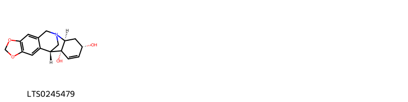{ width=100% }
    <figcaption>Hình ảnh cấu trúc hóa học của 1 hoạt chất thuộc nhóm  gồm ['(1r,13s,15s,18r)-5,7-dioxa-12-azapentacyclo[10.6.1.0²,¹⁰.0⁴,⁸.0¹³,¹⁸]nonadeca-2,4(8),9,16-tetraene-15,18-diol (LTS0245479)'].</figcaption>
</figure>
#### Nhóm Amaryllidaceae alkaloids
<figure markdown="span">
    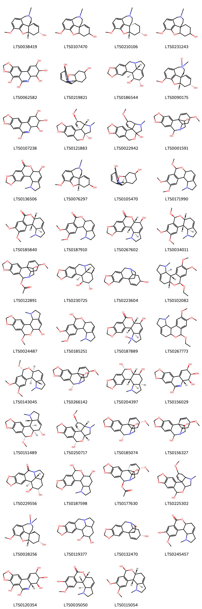{ width=100% }
    <figcaption>Hình ảnh cấu trúc hóa học của 47 hoạt chất thuộc nhóm Amaryllidaceae alkaloids gồm ['galantamine (LTS0038419)', 'galantamine (LTS0107470)', 'lycoramine (LTS0210106)', '9-methoxy-4-methyl-11-oxa-4-azatetracyclo[8.6.1.0¹,¹².0⁶,¹⁷]heptadeca-6,8,10(17)-trien-14-ol (LTS0231243)', '2h,3h,4h,4ah,9h-[1,3]dioxolo[4,5-j]phenanthridine-2,3,4,6,7-pentol (LTS0062582)', '4-methyl-11-oxa-4-azatetracyclo[8.6.1.0¹,¹².0⁶,¹⁷]heptadeca-6(17),7,9-triene-9,14-diol (LTS0219821)', 'lycorine (LTS0186544)', 'galantamine n-oxide (LTS0090175)', '2h,3h,4h,4ah,9h-[1,3]dioxolo[4,5-j]phenanthridine-2,3,4,6-tetrol (LTS0107238)', 'tazettine (LTS0121883)', 'tazettine (LTS0022942)', '15-methoxy-5,7-dioxa-12-azapentacyclo[10.5.2.0¹,¹³.0²,¹⁰.0⁴,⁸]nonadeca-2,4(8),9,16-tetraene-11,18-diol (LTS0001591)', '9-hydroxy-4-methyl-11,16,18-trioxa-4-azapentacyclo[11.7.0.0²,¹⁰.0³,⁷.0¹⁵,¹⁹]icosa-1(20),7,13,15(19)-tetraen-12-one (LTS0136506)', 'epigalantamine (LTS0076297)', '(1r,12s,14s)-4-methyl-11-oxa-4-azatetracyclo[8.6.1.0¹,¹².0⁶,¹⁷]heptadeca-6(17),7,9-triene-9,14-diol (LTS0105470)', '4,5,8-trimethoxy-16-methyl-9-oxa-16-azatetracyclo[8.7.0.0²,⁷.0¹³,¹⁷]heptadeca-2(7),3,5,12-tetraene (LTS0171990)', 'homolycorine (LTS0185840)', '4,5-dimethoxy-16-methyl-9-oxa-16-azatetracyclo[8.7.0.0²,⁷.0¹³,¹⁷]heptadeca-2(7),3,5,12-tetraen-8-one (LTS0187910)', 'hippeastrine (LTS0267602)', '(1s,8s,10r,17s)-4,5,8-trimethoxy-16-methyl-9-oxa-16-azatetracyclo[8.7.0.0²,⁷.0¹³,¹⁷]heptadeca-2(7),3,5,12-tetraene (LTS0034011)', '18-hydroxy-15-methoxy-5,7-dioxa-12-azapentacyclo[10.5.2.0¹,¹³.0²,¹⁰.0⁴,⁸]nonadeca-2,4(8),9,16-tetraen-11-yl acetate (LTS0122891)', 'dihydrolycorine (LTS0230725)', '5,7-dioxa-12-azapentacyclo[10.5.2.0¹,¹³.0²,¹⁰.0⁴,⁸]nonadeca-2,4(8),9,16-tetraen-15-ol (LTS0223604)', '(1s,8s,10r,17s)-8-ethoxy-4,5-dimethoxy-16-methyl-9-oxa-16-azatetracyclo[8.7.0.0²,⁷.0¹³,¹⁷]heptadeca-2,4,6,12-tetraene (LTS0102082)', '12-methoxy-4-methyl-11,16,18-trioxa-4-azapentacyclo[11.7.0.0²,¹⁰.0³,⁷.0¹⁵,¹⁹]icosa-1(20),7,13,15(19)-tetraen-9-ol (LTS0024487)', '4,5-dimethoxy-16-methyl-9-oxa-16-azatetracyclo[8.7.0.0²,⁷.0¹³,¹⁷]heptadeca-2(7),3,5,12-tetraen-8-ol (LTS0185251)', '(2s,3s,9s,10s)-9-hydroxy-4-methyl-12-oxo-11,16,18-trioxa-4-azapentacyclo[11.7.0.0²,¹⁰.0³,⁷.0¹⁵,¹⁹]icosa-1(20),7,13,15(19)-tetraen-4-ium-4-olate (LTS0187889)', '8-ethoxy-4,5-dimethoxy-16-methyl-9-oxa-16-azatetracyclo[8.7.0.0²,⁷.0¹³,¹⁷]heptadeca-2,4,6,12-tetraene (LTS0267773)', '(1r,8r,10s,17r)-4,5,8-trimethoxy-16-methyl-9-oxa-16-azatetracyclo[8.7.0.0²,⁷.0¹³,¹⁷]heptadeca-2(7),3,5,12-tetraene (LTS0143045)', '(1s,11r,13s,15s,18s)-15-methoxy-5,7-dioxa-12-azapentacyclo[10.5.2.0¹,¹³.0²,¹⁰.0⁴,⁸]nonadeca-2,4(8),9,16-tetraene-11,18-diol (LTS0266142)', '(2s,3r,7r,9s,10s,12r)-4-methyl-11,16,18-trioxa-4-azapentacyclo[11.7.0.0²,¹⁰.0³,⁷.0¹⁵,¹⁹]icosa-1(20),13,15(19)-triene-9,12-diol (LTS0204397)', '(2r,3r,4s,4ar)-2h,3h,4h,4ah,9h-[1,3]dioxolo[4,5-j]phenanthridine-2,3,4,6-tetrol (LTS0156029)', '(2s,3s,9s,10s,12s)-12-methoxy-4-methyl-11,16,18-trioxa-4-azapentacyclo[11.7.0.0²,¹⁰.0³,⁷.0¹⁵,¹⁹]icosa-1(20),7,13,15(19)-tetraen-9-ol (LTS0151489)', '(1s,11s,13r,16s,18s)-18-methoxy-15-methyl-5,7,12-trioxa-15-azapentacyclo[11.7.0.0¹,¹⁶.0²,¹⁰.0⁴,⁸]icosa-2,4(8),9,19-tetraen-11-ol (LTS0250717)', '(1s,11r,13s,15r,18s)-15-methoxy-5,7-dioxa-12-azapentacyclo[10.5.2.0¹,¹³.0²,¹⁰.0⁴,⁸]nonadeca-2,4(8),9,16-tetraene-11,18-diol (LTS0185074)', '(1s,13s,15s,18s)-15-methoxy-5,7-dioxa-12-azapentacyclo[10.5.2.0¹,¹³.0²,¹⁰.0⁴,⁸]nonadeca-2,4(8),9,16-tetraene-11,18-diol (LTS0156327)', '(1s,15r,17s,18s,19r)-17,18-dihydroxy-5,7-dioxa-12-azapentacyclo[10.6.1.0²,¹⁰.0⁴,⁸.0¹⁵,¹⁹]nonadeca-2,4(8),9-trien-11-one (LTS0229556)', '4-methyl-11,16,18-trioxa-4-azapentacyclo[11.7.0.0²,¹⁰.0³,⁷.0¹⁵,¹⁹]icosa-1(20),13,15(19)-triene-9,12-diol (LTS0187598)', '(1r,11s,13s,15r,18s)-18-hydroxy-15-methoxy-5,7-dioxa-12-azapentacyclo[10.5.2.0¹,¹³.0²,¹⁰.0⁴,⁸]nonadeca-2,4(8),9,16-tetraen-11-yl acetate (LTS0177630)', '18-methoxy-15-methyl-5,7,12-trioxa-15-azapentacyclo[11.7.0.0¹,¹⁶.0²,¹⁰.0⁴,⁸]icosa-2,4(8),9,19-tetraen-11-ol (LTS0225302)', '(1s,12s,14s)-14-hydroxy-9-methoxy-4-methyl-11-oxa-4-azatetracyclo[8.6.1.0¹,¹².0⁶,¹⁷]heptadeca-6,8,10(17)-trien-4-ium-4-olate (LTS0028256)', '5,7-dioxa-12-azapentacyclo[10.6.1.0²,¹⁰.0⁴,⁸.0¹⁵,¹⁹]nonadeca-2,4(8),9-triene-17,18-diol (LTS0119377)', '(1r,13s,15s)-5,7-dioxa-12-azapentacyclo[10.5.2.0¹,¹³.0²,¹⁰.0⁴,⁸]nonadeca-2,4(8),9,16-tetraen-15-ol (LTS0132470)', '5-hydroxy-4-methoxy-16-methyl-9-oxa-16-azatetracyclo[8.7.0.0²,⁷.0¹³,¹⁷]heptadeca-2(7),3,5,12-tetraen-8-one (LTS0245457)', '(2r,3r,4s,4ar)-2h,3h,4h,4ah,9h-[1,3]dioxolo[4,5-j]phenanthridine-2,3,4,6,7-pentol (LTS0120354)', '9-o-demethylhomolycorine (LTS0035050)', 'lycorenine (LTS0115054)'].</figcaption>
</figure>
#### Nhóm Benzazepines
<figure markdown="span">
    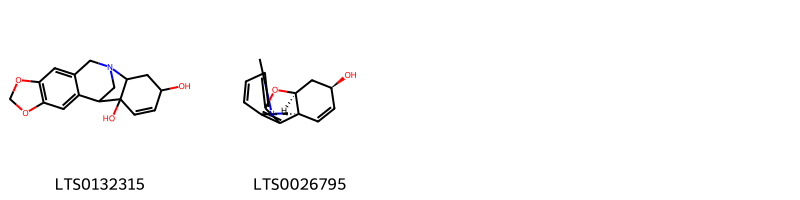{ width=100% }
    <figcaption>Hình ảnh cấu trúc hóa học của 2 hoạt chất thuộc nhóm Benzazepines gồm ['5,7-dioxa-12-azapentacyclo[10.6.1.0²,¹⁰.0⁴,⁸.0¹³,¹⁸]nonadeca-2,4(8),9,16-tetraene-15,18-diol (LTS0132315)', '(1s,12s,14r)-4-methyl-11-oxa-4-azatetracyclo[8.6.1.0¹,¹².0⁶,¹⁷]heptadeca-6(17),7,9,15-tetraen-14-ol (LTS0026795)'].</figcaption>
</figure>
#### Nhóm Fatty Acyls
<figure markdown="span">
    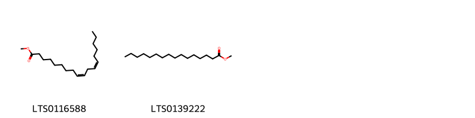{ width=100% }
    <figcaption>Hình ảnh cấu trúc hóa học của 2 hoạt chất thuộc nhóm Fatty Acyls gồm ['methyl linoleate (LTS0116588)', 'methyl palmitate (LTS0139222)'].</figcaption>
</figure>
#### Nhóm Flavonoids
<figure markdown="span">
    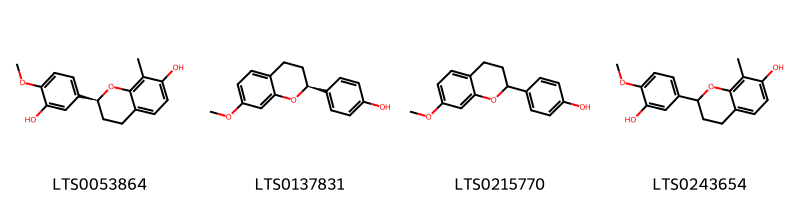{ width=100% }
    <figcaption>Hình ảnh cấu trúc hóa học của 4 hoạt chất thuộc nhóm Flavonoids gồm ['(2s)-2-(3-hydroxy-4-methoxyphenyl)-8-methyl-3,4-dihydro-2h-1-benzopyran-7-ol (LTS0053864)', '4-[(2s)-7-methoxy-3,4-dihydro-2h-1-benzopyran-2-yl]phenol (LTS0137831)', '4-(7-methoxy-3,4-dihydro-2h-1-benzopyran-2-yl)phenol (LTS0215770)', '2-(3-hydroxy-4-methoxyphenyl)-8-methyl-3,4-dihydro-2h-1-benzopyran-7-ol (LTS0243654)'].</figcaption>
</figure>
#### Nhóm Glycerophospholipids
<figure markdown="span">
    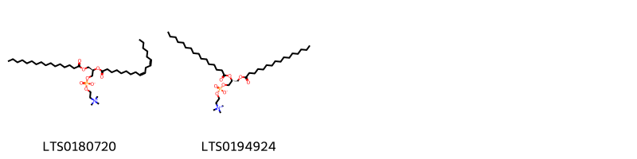{ width=100% }
    <figcaption>Hình ảnh cấu trúc hóa học của 2 hoạt chất thuộc nhóm Glycerophospholipids gồm ['phosphatidylcholine(16:0/18:2w6) (LTS0180720)', 'dipalmitoylphosphatidylcholine (LTS0194924)'].</figcaption>
</figure>
#### Nhóm Organooxygen compounds
<figure markdown="span">
    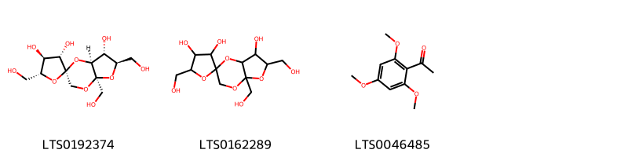{ width=100% }
    <figcaption>Hình ảnh cấu trúc hóa học của 3 hoạt chất thuộc nhóm Organooxygen compounds gồm ["(2r,3's,4's,4ar,5'r,6r,7r,7as)-4a,5',6-tris(hydroxymethyl)-tetrahydrospiro[furo[2,3-b][1,4]dioxine-2,2'-oxolane]-3',4',7-triol (LTS0192374)", "4a,5',6-tris(hydroxymethyl)-tetrahydrospiro[furo[2,3-b][1,4]dioxine-2,2'-oxolane]-3',4',7-triol (LTS0162289)", '1-(2,4,6-trimethoxyphenyl)ethanone (LTS0046485)'].</figcaption>
</figure>
#### Nhóm Quinolines and derivatives
<figure markdown="span">
    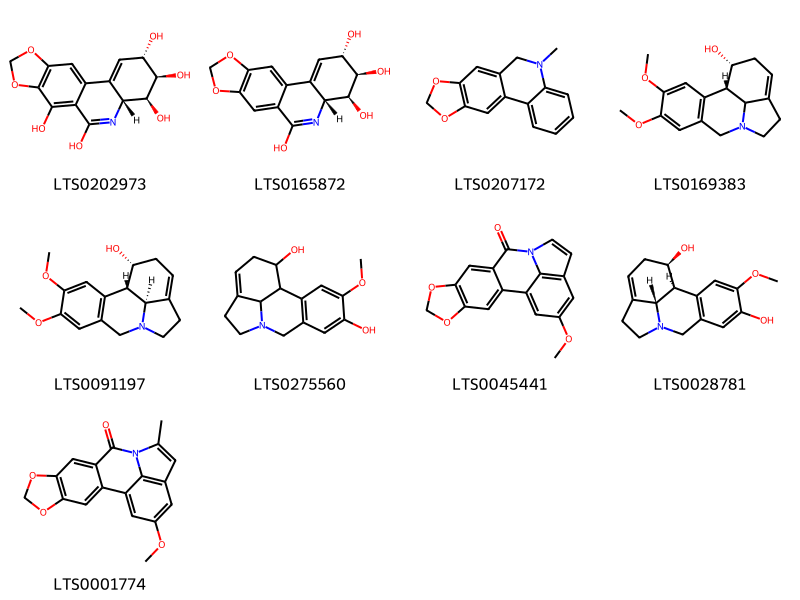{ width=100% }
    <figcaption>Hình ảnh cấu trúc hóa học của 9 hoạt chất thuộc nhóm Quinolines and derivatives gồm ['lycoricidinol (LTS0202973)', 'lycoricidine (LTS0165872)', '5-methyl-6h,9h-[1,3]dioxolo[4,5-j]phenanthridine (LTS0207172)', '(1s,15r)-4,5-dimethoxy-9-azatetracyclo[7.6.1.0²,⁷.0¹²,¹⁶]hexadeca-2(7),3,5,12-tetraen-15-ol (LTS0169383)', '(1s,15r,16s)-4,5-dimethoxy-9-azatetracyclo[7.6.1.0²,⁷.0¹²,¹⁶]hexadeca-2(7),3,5,12-tetraen-15-ol (LTS0091197)', '4-methoxy-9-azatetracyclo[7.6.1.0²,⁷.0¹²,¹⁶]hexadeca-2(7),3,5,12-tetraene-5,15-diol (LTS0275560)', '17-methoxy-5,7-dioxa-12-azapentacyclo[10.6.1.0²,¹⁰.0⁴,⁸.0¹⁵,¹⁹]nonadeca-1(18),2(10),3,8,13,15(19),16-heptaen-11-one (LTS0045441)', '(1s,15r,16s)-4-methoxy-9-azatetracyclo[7.6.1.0²,⁷.0¹²,¹⁶]hexadeca-2(7),3,5,12-tetraene-5,15-diol (LTS0028781)', '17-methoxy-13-methyl-5,7-dioxa-12-azapentacyclo[10.6.1.0²,¹⁰.0⁴,⁸.0¹⁵,¹⁹]nonadeca-1(18),2(10),3,8,13,15(19),16-heptaen-11-one (LTS0001774)'].</figcaption>
</figure>

---

### Dược dân tộc học

Danh sách các quốc gia có sử dụng *Lycoris radiata* trong điều trị các bệnh. 

| Country   | Disease                                                         | Bệnh                                                                      |
|:----------|:----------------------------------------------------------------|:--------------------------------------------------------------------------|
| China     | Antidote, Antitussive, Expectorant, Poison, Emetic, Expectorant | Thuốc giải độc, Thuốc chống ho, Thuốc đờm, Chất độc, Thuốc nôn, Thuốc đờm |
| Elsewhere | Emetic, Expectorant, Expectorant                                | Emetic, long đờm, long đờm                                                |
| Japan     | Emetic, Poison, Expectorant                                     | Emetic, Poison, Expectorant                                               |

---

---
## Lycoris sanguinea
### Thông tin về thực vật

!!! info "Phân loại thực vật của *Lycoris sanguinea* từ GIBF:"
    - **Kingdom:** Plantae
    - **Phylum:** Tracheophyta
    - **Order:** Asparagales
    - **Family:** Amaryllidaceae
    - **Genus:** Lycoris
    - **Species:** *Lycoris sanguinea*

 

| Label (VI)   | Label (EN)   | Scientific Name   | Descriptions (VI)   | Descriptions (EN)   | Also Known As (VI)   | Also Known As (EN)   |
|:-------------|:-------------|:------------------|:--------------------|:--------------------|:---------------------|:---------------------|
| N/A          | N/A          | Lycoris sanguinea | loài thực vật       | species of plant    | ['']                 | ['']                 |

#### Phân bố trên thế giới

**Từ CSDL GIBF** nan, Japan, Korea, Republic of

#### Phân bố tại Việt Nam

**Từ CSDL GIBF**: Không có ghi nhận ở Việt Nam

---
### Thành phần hóa học
        
- Theo cơ sở dữ liệu lotus: Từ loài *Lycoris sanguinea* đã phân lập và xác định được 41 hoạt chất thuộc về các nhóm Steroids and steroid derivatives, Fatty Acyls, Quinolines and derivatives, Amaryllidaceae alkaloids. 

|    | chemicalTaxonomyClassyfireClass   |   smiles_count |
|---:|:----------------------------------|---------------:|
|  0 | Amaryllidaceae alkaloids          |             30 |
|  1 | Fatty Acyls                       |              2 |
|  2 | Quinolines and derivatives        |              7 |
|  3 | Steroids and steroid derivatives  |              2 |

#### Nhóm Amaryllidaceae alkaloids
<figure markdown="span">
    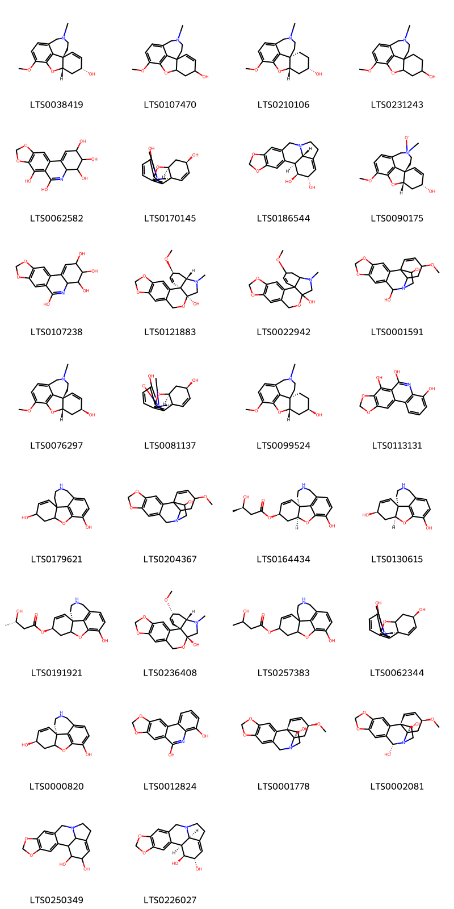{ width=100% }
    <figcaption>Hình ảnh cấu trúc hóa học của 30 hoạt chất thuộc nhóm Amaryllidaceae alkaloids gồm ['galantamine (LTS0038419)', 'galantamine (LTS0107470)', 'lycoramine (LTS0210106)', '9-methoxy-4-methyl-11-oxa-4-azatetracyclo[8.6.1.0¹,¹².0⁶,¹⁷]heptadeca-6,8,10(17)-trien-14-ol (LTS0231243)', '2h,3h,4h,4ah,9h-[1,3]dioxolo[4,5-j]phenanthridine-2,3,4,6,7-pentol (LTS0062582)', 'o-desmethylgalantamine (LTS0170145)', 'lycorine (LTS0186544)', 'galantamine n-oxide (LTS0090175)', '2h,3h,4h,4ah,9h-[1,3]dioxolo[4,5-j]phenanthridine-2,3,4,6-tetrol (LTS0107238)', 'tazettine (LTS0121883)', 'tazettine (LTS0022942)', '15-methoxy-5,7-dioxa-12-azapentacyclo[10.5.2.0¹,¹³.0²,¹⁰.0⁴,⁸]nonadeca-2,4(8),9,16-tetraene-11,18-diol (LTS0001591)', 'epigalantamine (LTS0076297)', '(1s,12s,14r)-9,14-dihydroxy-4-methyl-11-oxa-4-azatetracyclo[8.6.1.0¹,¹².0⁶,¹⁷]heptadeca-6(17),7,9,15-tetraen-4-ium-4-olate (LTS0081137)', '(1r,12s,14r)-9-methoxy-4-methyl-11-oxa-4-azatetracyclo[8.6.1.0¹,¹².0⁶,¹⁷]heptadeca-6,8,10(17)-trien-14-ol (LTS0099524)', '9h-[1,3]dioxolo[4,5-j]phenanthridine-4,6,7-triol (LTS0113131)', '11-oxa-4-azatetracyclo[8.6.1.0¹,¹².0⁶,¹⁷]heptadeca-6,8,10(17),15-tetraene-9,14-diol (LTS0179621)', '15-methoxy-5,7-dioxa-12-azapentacyclo[10.5.2.0¹,¹³.0²,¹⁰.0⁴,⁸]nonadeca-2,4(8),9,16-tetraen-18-ol (LTS0204367)', '(1s,12s,14r)-9-hydroxy-11-oxa-4-azatetracyclo[8.6.1.0¹,¹².0⁶,¹⁷]heptadeca-6,8,10(17),15-tetraen-14-yl (3r)-3-hydroxybutanoate (LTS0164434)', 'norsanguinine (LTS0130615)', '(1s,14r)-9-hydroxy-11-oxa-4-azatetracyclo[8.6.1.0¹,¹².0⁶,¹⁷]heptadeca-6,8,10(17),15-tetraen-14-yl (3s)-3-hydroxybutanoate (LTS0191921)', '(1r,13r,16s,18r)-18-methoxy-15-methyl-5,7,12-trioxa-15-azapentacyclo[11.7.0.0¹,¹⁶.0²,¹⁰.0⁴,⁸]icosa-2,4(8),9,19-tetraen-13-ol (LTS0236408)', '9-hydroxy-11-oxa-4-azatetracyclo[8.6.1.0¹,¹².0⁶,¹⁷]heptadeca-6,8,10(17),15-tetraen-14-yl 3-hydroxybutanoate (LTS0257383)', '(1s,14r)-4-methyl-11-oxa-4-azatetracyclo[8.6.1.0¹,¹².0⁶,¹⁷]heptadeca-6(17),7,9,15-tetraene-9,14-diol (LTS0062344)', '(1s,14r)-11-oxa-4-azatetracyclo[8.6.1.0¹,¹².0⁶,¹⁷]heptadeca-6,8,10(17),15-tetraene-9,14-diol (LTS0000820)', '9h-[1,3]dioxolo[4,5-j]phenanthridine-4,6-diol (LTS0012824)', '(1s,13r,15s,18s)-15-methoxy-5,7-dioxa-12-azapentacyclo[10.5.2.0¹,¹³.0²,¹⁰.0⁴,⁸]nonadeca-2,4(8),9,16-tetraen-18-ol (LTS0001778)', '(1s,11r,13r,15s,18s)-15-methoxy-5,7-dioxa-12-azapentacyclo[10.5.2.0¹,¹³.0²,¹⁰.0⁴,⁸]nonadeca-2,4(8),9,16-tetraene-11,18-diol (LTS0002081)', 'lycorine (LTS0250349)', '(1s,17s,18s,19r)-5,7-dioxa-12-azapentacyclo[10.6.1.0²,¹⁰.0⁴,⁸.0¹⁵,¹⁹]nonadeca-2,4(8),9,15-tetraene-17,18-diol (LTS0226027)'].</figcaption>
</figure>
#### Nhóm Fatty Acyls
<figure markdown="span">
    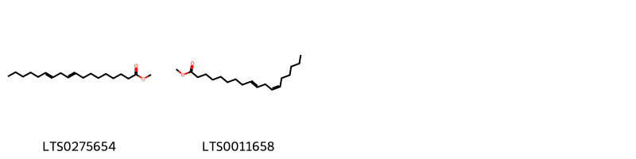{ width=100% }
    <figcaption>Hình ảnh cấu trúc hóa học của 2 hoạt chất thuộc nhóm Fatty Acyls gồm ['methyl octadeca-9,12-dienoate (LTS0275654)', 'methyl (9e,12z)-octadeca-9,12-dienoate (LTS0011658)'].</figcaption>
</figure>
#### Nhóm Quinolines and derivatives
<figure markdown="span">
    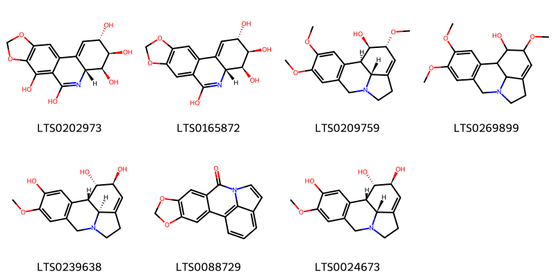{ width=100% }
    <figcaption>Hình ảnh cấu trúc hóa học của 7 hoạt chất thuộc nhóm Quinolines and derivatives gồm ['lycoricidinol (LTS0202973)', 'lycoricidine (LTS0165872)', '(1r,14r,15r,16r)-4,5,14-trimethoxy-9-azatetracyclo[7.6.1.0²,⁷.0¹²,¹⁶]hexadeca-2(7),3,5,12-tetraen-15-ol (LTS0209759)', '4,5,14-trimethoxy-9-azatetracyclo[7.6.1.0²,⁷.0¹²,¹⁶]hexadeca-2(7),3,5,12-tetraen-15-ol (LTS0269899)', 'pseudolycorine (LTS0239638)', '5,7-dioxa-12-azapentacyclo[10.6.1.0²,¹⁰.0⁴,⁸.0¹⁵,¹⁹]nonadeca-1(19),2(10),3,8,13,15,17-heptaen-11-one (LTS0088729)', '(1s,14s,15s,16r)-5-methoxy-9-azatetracyclo[7.6.1.0²,⁷.0¹²,¹⁶]hexadeca-2(7),3,5,12-tetraene-4,14,15-triol (LTS0024673)'].</figcaption>
</figure>
#### Nhóm Steroids and steroid derivatives
<figure markdown="span">
    { width=100% }
    <figcaption>Hình ảnh cấu trúc hóa học của 2 hoạt chất thuộc nhóm Steroids and steroid derivatives gồm ['stigmast-5-en-3-ol, (3β)- (LTS0204616)', '(1s,3ar,3br,7r,9as,9br,11ar)-1-[(2r,5r)-5-ethyl-6-methylheptan-2-yl]-9a,11a-dimethyl-1h,2h,3h,3ah,3bh,4h,6h,7h,8h,9h,9bh,10h,11h-cyclopenta[a]phenanthren-7-ol (LTS0234781)'].</figcaption>
</figure>

---

### Dược dân tộc học

Danh sách các quốc gia có sử dụng *Lycoris sanguinea* trong điều trị các bệnh. 

| Country   | Disease             | Bệnh             |
|:----------|:--------------------|:-----------------|
| Elsewhere | Emetic, Expectorant | Emetic, long đờm |

---

---
## Lycoris squamigera
### Thông tin về thực vật

!!! info "Phân loại thực vật của *Lycoris squamigera* từ GIBF:"
    - **Kingdom:** Plantae
    - **Phylum:** Tracheophyta
    - **Order:** Asparagales
    - **Family:** Amaryllidaceae
    - **Genus:** Lycoris
    - **Species:** *Lycoris squamigera*

 

| Label (VI)   | Label (EN)   | Scientific Name    | Descriptions (VI)   | Descriptions (EN)   | Also Known As (VI)   | Also Known As (EN)                                   |
|:-------------|:-------------|:-------------------|:--------------------|:--------------------|:---------------------|:-----------------------------------------------------|
| N/A          | N/A          | Lycoris squamigera | loài thực vật       | species of plant    | ['']                 | ['magic lily', 'resurrection lily', 'surprise lily'] |

#### Phân bố trên thế giới

**Từ CSDL GIBF** nan, United States of America, Korea, Republic of, Ukraine, Canada

#### Phân bố tại Việt Nam

**Từ CSDL GIBF**: Không có ghi nhận ở Việt Nam

---
### Thành phần hóa học
        
- Theo cơ sở dữ liệu lotus: Từ loài *Lycoris squamigera* đã phân lập và xác định được 25 hoạt chất thuộc về các nhóm Benzazepines, Quinolines and derivatives, Amaryllidaceae alkaloids. 

|    | chemicalTaxonomyClassyfireClass   |   smiles_count |
|---:|:----------------------------------|---------------:|
|  0 |                                   |              2 |
|  1 | Amaryllidaceae alkaloids          |             19 |
|  2 | Benzazepines                      |              2 |
|  3 | Quinolines and derivatives        |              2 |

#### Nhóm 
<figure markdown="span">
    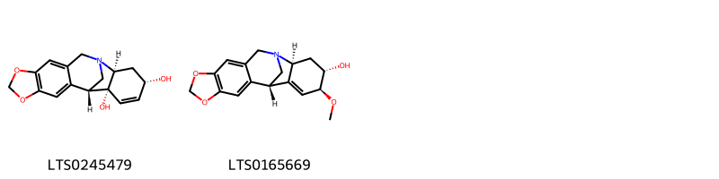{ width=100% }
    <figcaption>Hình ảnh cấu trúc hóa học của 2 hoạt chất thuộc nhóm  gồm ['(1r,13s,15s,18r)-5,7-dioxa-12-azapentacyclo[10.6.1.0²,¹⁰.0⁴,⁸.0¹³,¹⁸]nonadeca-2,4(8),9,16-tetraene-15,18-diol (LTS0245479)', '(1s,13s,15s,16s)-16-methoxy-5,7-dioxa-12-azapentacyclo[10.6.1.0²,¹⁰.0⁴,⁸.0¹³,¹⁸]nonadeca-2,4(8),9,17-tetraen-15-ol (LTS0165669)'].</figcaption>
</figure>
#### Nhóm Amaryllidaceae alkaloids
<figure markdown="span">
    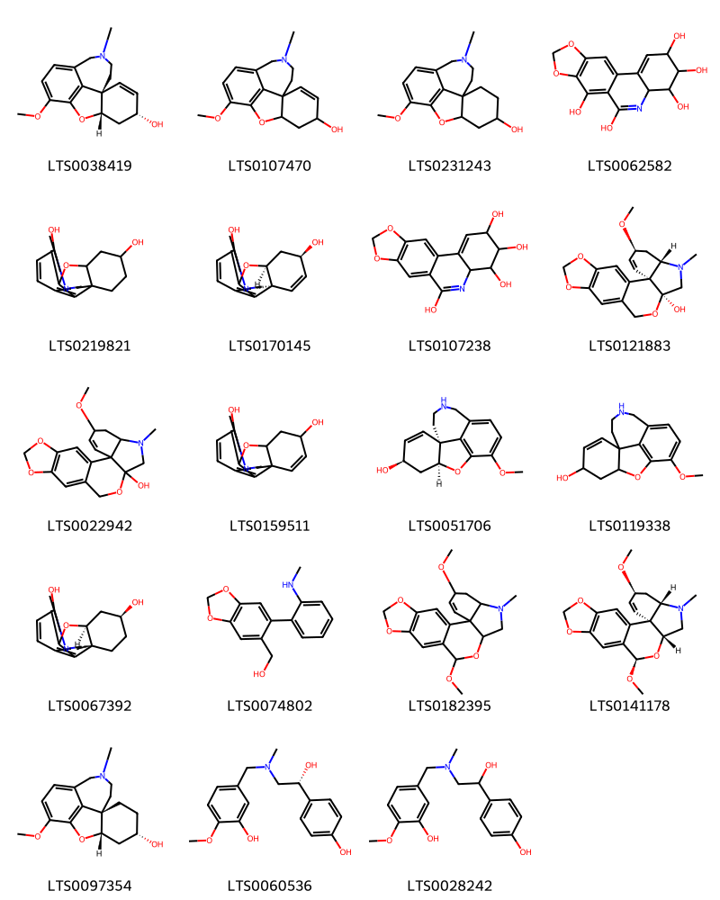{ width=100% }
    <figcaption>Hình ảnh cấu trúc hóa học của 19 hoạt chất thuộc nhóm Amaryllidaceae alkaloids gồm ['galantamine (LTS0038419)', 'galantamine (LTS0107470)', '9-methoxy-4-methyl-11-oxa-4-azatetracyclo[8.6.1.0¹,¹².0⁶,¹⁷]heptadeca-6,8,10(17)-trien-14-ol (LTS0231243)', '2h,3h,4h,4ah,9h-[1,3]dioxolo[4,5-j]phenanthridine-2,3,4,6,7-pentol (LTS0062582)', '4-methyl-11-oxa-4-azatetracyclo[8.6.1.0¹,¹².0⁶,¹⁷]heptadeca-6(17),7,9-triene-9,14-diol (LTS0219821)', 'o-desmethylgalantamine (LTS0170145)', '2h,3h,4h,4ah,9h-[1,3]dioxolo[4,5-j]phenanthridine-2,3,4,6-tetrol (LTS0107238)', 'tazettine (LTS0121883)', 'tazettine (LTS0022942)', '4-methyl-11-oxa-4-azatetracyclo[8.6.1.0¹,¹².0⁶,¹⁷]heptadeca-6(17),7,9,15-tetraene-9,14-diol (LTS0159511)', 'n-desmethylgalantamine (LTS0051706)', '9-methoxy-11-oxa-4-azatetracyclo[8.6.1.0¹,¹².0⁶,¹⁷]heptadeca-6,8,10(17),15-tetraen-14-ol (LTS0119338)', '(1s,12s,14s)-4-methyl-11-oxa-4-azatetracyclo[8.6.1.0¹,¹².0⁶,¹⁷]heptadeca-6(17),7,9-triene-9,14-diol (LTS0067392)', 'ismine (LTS0074802)', '11,18-dimethoxy-15-methyl-5,7,12-trioxa-15-azapentacyclo[11.7.0.0¹,¹⁶.0²,¹⁰.0⁴,⁸]icosa-2,4(8),9,19-tetraene (LTS0182395)', '(1s,11r,13r,16s,18s)-11,18-dimethoxy-15-methyl-5,7,12-trioxa-15-azapentacyclo[11.7.0.0¹,¹⁶.0²,¹⁰.0⁴,⁸]icosa-2,4(8),9,19-tetraene (LTS0141178)', '1,2-dihydrogalanthamine (LTS0097354)', '5-({[(2r)-2-hydroxy-2-(4-hydroxyphenyl)ethyl](methyl)amino}methyl)-2-methoxyphenol (LTS0060536)', '5-({[2-hydroxy-2-(4-hydroxyphenyl)ethyl](methyl)amino}methyl)-2-methoxyphenol (LTS0028242)'].</figcaption>
</figure>
#### Nhóm Benzazepines
<figure markdown="span">
    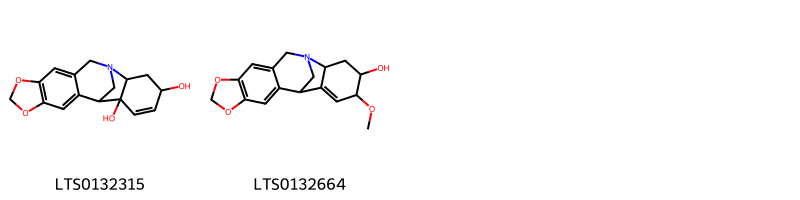{ width=100% }
    <figcaption>Hình ảnh cấu trúc hóa học của 2 hoạt chất thuộc nhóm Benzazepines gồm ['5,7-dioxa-12-azapentacyclo[10.6.1.0²,¹⁰.0⁴,⁸.0¹³,¹⁸]nonadeca-2,4(8),9,16-tetraene-15,18-diol (LTS0132315)', '16-methoxy-5,7-dioxa-12-azapentacyclo[10.6.1.0²,¹⁰.0⁴,⁸.0¹³,¹⁸]nonadeca-2,4(8),9,17-tetraen-15-ol (LTS0132664)'].</figcaption>
</figure>
#### Nhóm Quinolines and derivatives
<figure markdown="span">
    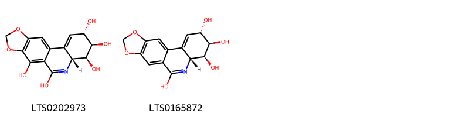{ width=100% }
    <figcaption>Hình ảnh cấu trúc hóa học của 2 hoạt chất thuộc nhóm Quinolines and derivatives gồm ['lycoricidinol (LTS0202973)', 'lycoricidine (LTS0165872)'].</figcaption>
</figure>

---

### Dược dân tộc học

Danh sách các quốc gia có sử dụng *Lycoris squamigera* trong điều trị các bệnh. 

| Country   | Disease             | Bệnh             |
|:----------|:--------------------|:-----------------|
| Elsewhere | Emetic, Expectorant | Emetic, long đờm |

---

# Chi Muscari

??? note "Danh sách các dược liệu thuộc chi"
    
	 - *Muscari moschatum*

---
## Muscari moschatum
### Thông tin về thực vật

!!! info "Phân loại thực vật của *Muscarimia muscari* từ GIBF:"
    - **Kingdom:** Plantae
    - **Phylum:** Tracheophyta
    - **Order:** Asparagales
    - **Family:** Asparagaceae
    - **Genus:** Muscarimia
    - **Species:** *Muscarimia muscari*

 

| Label (VI)   | Label (EN)   | Scientific Name   | Descriptions (VI)   | Descriptions (EN)   | Also Known As (VI)   | Also Known As (EN)   |
|:-------------|:-------------|:------------------|:--------------------|:--------------------|:---------------------|:---------------------|
| N/A          | N/A          | Muscari moschatum |                     | species of plant    | ['']                 | ['']                 |

#### Phân bố trên thế giới

**Từ CSDL GIBF** nan, Brazil, Hungary, United States of America, Greece, Sweden, Belgium, Italy, unknown or invalid, France, Spain, Netherlands

#### Phân bố tại Việt Nam

**Từ CSDL GIBF**: Không có ghi nhận ở Việt Nam

---
### Thành phần hóa học
        
- Theo cơ sở dữ liệu lotus: Từ loài *Muscarimia muscari* đã phân lập và xác định được Chưa có hoạt chất nào được phân lập. hoạt chất thuộc về các nhóm Không có hoạt chất nào được phân lập. 

Không có hình ảnh nào được tạo ra

---

### Dược dân tộc học

Danh sách các quốc gia có sử dụng *Muscarimia muscari* trong điều trị các bệnh. 

| Country   | Disease   | Bệnh   |
|:----------|:----------|:-------|
| Egypt     | Emetic    | Phôi   |

---

# Chi Reineckea

??? note "Danh sách các dược liệu thuộc chi"
    
	 - *Reineckea carnea*

---
## Reineckea carnea
### Thông tin về thực vật

!!! info "Phân loại thực vật của *Reineckea carnea* từ GIBF:"
    - **Kingdom:** Plantae
    - **Phylum:** Tracheophyta
    - **Order:** Asparagales
    - **Family:** Asparagaceae
    - **Genus:** Reineckea
    - **Species:** *Reineckea carnea*

 

| Label (VI)   | Label (EN)   | Scientific Name   | Descriptions (VI)   | Descriptions (EN)   | Also Known As (VI)   | Also Known As (EN)   |
|:-------------|:-------------|:------------------|:--------------------|:--------------------|:---------------------|:---------------------|
| N/A          | N/A          | Reineckea carnea  | loài thực vật       | species of plant    | ['']                 | ['']                 |

#### Phân bố trên thế giới

**Từ CSDL GIBF** nan, United States of America, Japan, Belgium, China, New Zealand, Netherlands

#### Phân bố tại Việt Nam

**Từ CSDL GIBF**: Không có ghi nhận ở Việt Nam

---
### Thành phần hóa học
        
- Theo cơ sở dữ liệu lotus: Từ loài *Reineckea carnea* đã phân lập và xác định được 20 hoạt chất thuộc về các nhóm Prenol lipids, Steroids and steroid derivatives. 

|    | chemicalTaxonomyClassyfireClass   |   smiles_count |
|---:|:----------------------------------|---------------:|
|  0 | Prenol lipids                     |              6 |
|  1 | Steroids and steroid derivatives  |             14 |

#### Nhóm Prenol lipids
<figure markdown="span">
    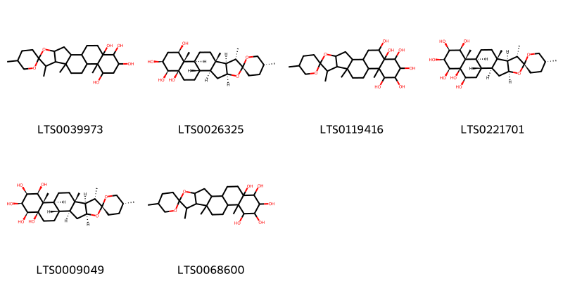{ width=100% }
    <figcaption>Hình ảnh cấu trúc hóa học của 6 hoạt chất thuộc nhóm Prenol lipids gồm ["5,7',9',13'-tetramethyl-5'-oxaspiro[oxane-2,6'-pentacyclo[10.8.0.0²,⁹.0⁴,⁸.0¹³,¹⁸]icosane]-14',16',17',18'-tetrol (LTS0039973)", "(1's,2r,2's,4's,5r,7's,8'r,9's,12's,13's,14'r,16's,17's,18'r)-5,7',9',13'-tetramethyl-5'-oxaspiro[oxane-2,6'-pentacyclo[10.8.0.0²,⁹.0⁴,⁸.0¹³,¹⁸]icosane]-14',16',17',18'-tetrol (LTS0026325)", "5,7',9',13'-tetramethyl-5'-oxaspiro[oxane-2,6'-pentacyclo[10.8.0.0²,⁹.0⁴,⁸.0¹³,¹⁸]icosane]-14',15',16',17',18',19'-hexol (LTS0119416)", "(1's,2r,2's,4's,5r,7's,8'r,9's,12's,13's,14's,15's,16's,17's,18's,19'r)-5,7',9',13'-tetramethyl-5'-oxaspiro[oxane-2,6'-pentacyclo[10.8.0.0²,⁹.0⁴,⁸.0¹³,¹⁸]icosane]-14',15',16',17',18',19'-hexol (LTS0221701)", "(1's,2r,2's,4's,5r,7's,8'r,9's,12's,13's,14's,15's,16's,17's,18'r)-5,7',9',13'-tetramethyl-5'-oxaspiro[oxane-2,6'-pentacyclo[10.8.0.0²,⁹.0⁴,⁸.0¹³,¹⁸]icosane]-14',15',16',17',18'-pentol (LTS0009049)", "5,7',9',13'-tetramethyl-5'-oxaspiro[oxane-2,6'-pentacyclo[10.8.0.0²,⁹.0⁴,⁸.0¹³,¹⁸]icosane]-14',15',16',17',18'-pentol (LTS0068600)"].</figcaption>
</figure>
#### Nhóm Steroids and steroid derivatives
<figure markdown="span">
    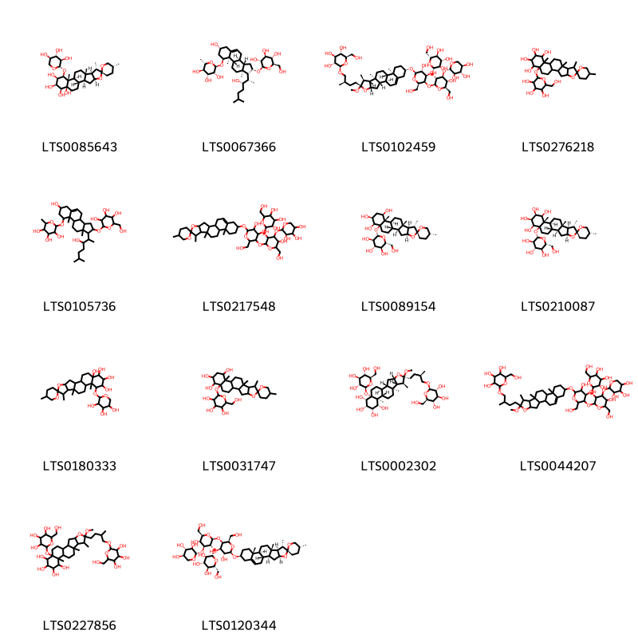{ width=100% }
    <figcaption>Hình ảnh cấu trúc hóa học của 14 hoạt chất thuộc nhóm Steroids and steroid derivatives gồm ["(1's,2r,2's,4's,5r,7's,8'r,9's,12's,13's,14's,15'r,16's,17's,18'r)-5,7',9',13'-tetramethyl-14'-{[(2s,3r,4s,5r)-3,4,5-trihydroxyoxan-2-yl]oxy}-5'-oxaspiro[oxane-2,6'-pentacyclo[10.8.0.0²,⁹.0⁴,⁸.0¹³,¹⁸]icosane]-15',16',17',18'-tetrol (LTS0085643)", '(2r,3r,4s,5s,6r)-2-{[(1r,2s,3as,3bs,7r,9s,9ar,9bs,11as)-7-hydroxy-1-[(2s,3s)-3-hydroxy-6-methylheptan-2-yl]-9a,11a-dimethyl-9-{[(2r,3r,4r,5r,6s)-3,4,5-trihydroxy-6-methyloxan-2-yl]oxy}-1h,2h,3h,3ah,3bh,4h,6h,7h,8h,9h,9bh,10h,11h-cyclopenta[a]phenanthren-2-yl]oxy}-6-(hydroxymethyl)oxane-3,4,5-triol (LTS0067366)', '(2r,3r,4s,5s,6r)-2-[(2r)-4-[(1s,2s,4s,6s,7s,8r,9s,12s,13r,16s)-16-{[(2r,3r,4r,5r,6r)-3,4-dihydroxy-5-{[(2s,3r,4s,5r,6r)-5-hydroxy-6-(hydroxymethyl)-3-{[(2s,3r,4s,5s,6r)-3,4,5-trihydroxy-6-(hydroxymethyl)oxan-2-yl]oxy}-4-{[(2s,3r,4s,5r)-3,4,5-trihydroxyoxan-2-yl]oxy}oxan-2-yl]oxy}-6-(hydroxymethyl)oxan-2-yl]oxy}-6-methoxy-7,9,13-trimethyl-5-oxapentacyclo[10.8.0.0²,⁹.0⁴,⁸.0¹³,¹⁸]icos-18-en-6-yl]-2-methylbutoxy]-6-(hydroxymethyl)oxane-3,4,5-triol (LTS0102459)', "5,7',9',13'-tetramethyl-18'-{[3,4,5-trihydroxy-6-(hydroxymethyl)oxan-2-yl]oxy}-5'-oxaspiro[oxane-2,6'-pentacyclo[10.8.0.0²,⁹.0⁴,⁸.0¹³,¹⁸]icosane]-14',15',16',17'-tetrol (LTS0276218)", '2-{[7-hydroxy-1-(3-hydroxy-6-methylheptan-2-yl)-9a,11a-dimethyl-9-[(3,4,5-trihydroxy-6-methyloxan-2-yl)oxy]-1h,2h,3h,3ah,3bh,4h,6h,7h,8h,9h,9bh,10h,11h-cyclopenta[a]phenanthren-2-yl]oxy}-6-(hydroxymethyl)oxane-3,4,5-triol (LTS0105736)', "2-[(2-{[4,5-dihydroxy-2-(hydroxymethyl)-6-{5,7',9',13'-tetramethyl-5'-oxaspiro[oxane-2,6'-pentacyclo[10.8.0.0²,⁹.0⁴,⁸.0¹³,¹⁸]icosan]-18'-eneoxy}oxan-3-yl]oxy}-5-hydroxy-6-(hydroxymethyl)-4-[(3,4,5-trihydroxyoxan-2-yl)oxy]oxan-3-yl)oxy]-6-(hydroxymethyl)oxane-3,4,5-triol (LTS0217548)", "(1's,2r,2's,4's,5r,7's,8'r,9's,12's,13's,14'r,16's,17's,18'r)-5,7',9',13'-tetramethyl-18'-{[(2s,3r,4s,5s,6r)-3,4,5-trihydroxy-6-(hydroxymethyl)oxan-2-yl]oxy}-5'-oxaspiro[oxane-2,6'-pentacyclo[10.8.0.0²,⁹.0⁴,⁸.0¹³,¹⁸]icosane]-14',16',17'-triol (LTS0089154)", "(1's,2r,2's,4's,5r,7's,8'r,9's,12's,13's,14's,15's,16's,17's,18'r)-5,7',9',13'-tetramethyl-18'-{[(2s,3r,4s,5s,6r)-3,4,5-trihydroxy-6-(hydroxymethyl)oxan-2-yl]oxy}-5'-oxaspiro[oxane-2,6'-pentacyclo[10.8.0.0²,⁹.0⁴,⁸.0¹³,¹⁸]icosane]-14',15',16',17'-tetrol (LTS0210087)", "5,7',9',13'-tetramethyl-14'-[(3,4,5-trihydroxyoxan-2-yl)oxy]-5'-oxaspiro[oxane-2,6'-pentacyclo[10.8.0.0²,⁹.0⁴,⁸.0¹³,¹⁸]icosane]-15',16',17',18'-tetrol (LTS0180333)", "5,7',9',13'-tetramethyl-18'-{[3,4,5-trihydroxy-6-(hydroxymethyl)oxan-2-yl]oxy}-5'-oxaspiro[oxane-2,6'-pentacyclo[10.8.0.0²,⁹.0⁴,⁸.0¹³,¹⁸]icosane]-14',16',17'-triol (LTS0031747)", '(1s,2s,4s,6r,7s,8r,9s,12s,13s,14s,15s,16s,17s,18r)-6-methoxy-7,9,13-trimethyl-6-[(3r)-3-methyl-4-{[(2r,3r,4s,5s,6r)-3,4,5-trihydroxy-6-(hydroxymethyl)oxan-2-yl]oxy}butyl]-18-{[(2s,3r,4s,5s,6r)-3,4,5-trihydroxy-6-(hydroxymethyl)oxan-2-yl]oxy}-5-oxapentacyclo[10.8.0.0²,⁹.0⁴,⁸.0¹³,¹⁸]icosane-14,15,16,17-tetrol (LTS0002302)', 'sibiricoside a (LTS0044207)', '6-methoxy-7,9,13-trimethyl-6-(3-methyl-4-{[3,4,5-trihydroxy-6-(hydroxymethyl)oxan-2-yl]oxy}butyl)-18-{[3,4,5-trihydroxy-6-(hydroxymethyl)oxan-2-yl]oxy}-5-oxapentacyclo[10.8.0.0²,⁹.0⁴,⁸.0¹³,¹⁸]icosane-14,15,16,17-tetrol (LTS0227856)', "(2s,3r,4s,5s,6r)-2-{[(2s,3r,4s,5r,6r)-2-{[(2r,3r,4r,5r,6r)-4,5-dihydroxy-2-(hydroxymethyl)-6-[(1's,2r,2's,4's,5r,7's,8'r,9's,12's,13'r,16's)-5,7',9',13'-tetramethyl-5'-oxaspiro[oxane-2,6'-pentacyclo[10.8.0.0²,⁹.0⁴,⁸.0¹³,¹⁸]icosan]-18'-eneoxy]oxan-3-yl]oxy}-5-hydroxy-6-(hydroxymethyl)-4-{[(2s,3r,4s,5r)-3,4,5-trihydroxyoxan-2-yl]oxy}oxan-3-yl]oxy}-6-(hydroxymethyl)oxane-3,4,5-triol (LTS0120344)"].</figcaption>
</figure>

---

### Dược dân tộc học

Danh sách các quốc gia có sử dụng *Reineckea carnea* trong điều trị các bệnh. 

| Country   | Disease                  | Bệnh                             |
|:----------|:-------------------------|:---------------------------------|
| China     | Cardiotonic, Refrigerant | Điều hòa nhịp tim, môi chất lạnh |

---

# Chi Urginea

??? note "Danh sách các dược liệu thuộc chi"
    
	 - *Urginea altissima*
	 - *Urginea burkei*
	 - *Urginea indica*
	 - *Urginea macrocentra*
	 - *Urginea maritima*
	 - *Urginea scilla*

---
## Urginea altissima
### Thông tin về thực vật

!!! info "Phân loại thực vật của *Drimia altissima* từ GIBF:"
    - **Kingdom:** Plantae
    - **Phylum:** Tracheophyta
    - **Order:** Asparagales
    - **Family:** Asparagaceae
    - **Genus:** Drimia
    - **Species:** *Drimia altissima*

 

| Label (VI)   | Label (EN)   | Scientific Name   | Descriptions (VI)   | Descriptions (EN)   | Also Known As (VI)   | Also Known As (EN)   |
|:-------------|:-------------|:------------------|:--------------------|:--------------------|:---------------------|:---------------------|
| N/A          | N/A          | Urginea altissima |                     | species of plant    | ['']                 | ['']                 |

#### Phân bố trên thế giới

**Từ CSDL GIBF** nan, Botswana, Central African Republic, Mali, Zimbabwe, Tanzania, United Republic of, Guinea, Ghana, Chad, Nigeria, Burkina Faso, Ethiopia, Togo, Malawi, Benin, Congo, Democratic Republic of the, Kenya, Namibia, South Africa, Côte d’Ivoire, Cameroon

#### Phân bố tại Việt Nam

**Từ CSDL GIBF**: Không có ghi nhận ở Việt Nam

---
### Thành phần hóa học
        
- Theo cơ sở dữ liệu lotus: Từ loài *Drimia altissima* đã phân lập và xác định được Chưa có hoạt chất nào được phân lập. hoạt chất thuộc về các nhóm Không có hoạt chất nào được phân lập. 

Không có hình ảnh nào được tạo ra

---

### Dược dân tộc học

Danh sách các quốc gia có sử dụng *Drimia altissima* trong điều trị các bệnh. 

| Country   | Disease   | Bệnh     |
|:----------|:----------|:---------|
| Africa    | Poison    | Chất độc |

---

---
## Urginea burkei
### Thông tin về thực vật

!!! info "Phân loại thực vật của *Drimia sanguinea* từ GIBF:"
    - **Kingdom:** Plantae
    - **Phylum:** Tracheophyta
    - **Order:** Asparagales
    - **Family:** Asparagaceae
    - **Genus:** Drimia
    - **Species:** *Drimia sanguinea*

 

| Label (VI)   | Label (EN)   | Scientific Name   | Descriptions (VI)   | Descriptions (EN)   | Also Known As (VI)   | Also Known As (EN)   |
|:-------------|:-------------|:------------------|:--------------------|:--------------------|:---------------------|:---------------------|
| N/A          | N/A          | Urginea burkei    | loài thực vật       | species of plant    | ['']                 | ['']                 |

#### Phân bố trên thế giới

**Từ CSDL GIBF** nan, Botswana, Central African Republic, Mali, Zimbabwe, Tanzania, United Republic of, Guinea, Ghana, Chad, Nigeria, Burkina Faso, Ethiopia, Togo, Malawi, Benin, Congo, Democratic Republic of the, Kenya, Namibia, South Africa, Côte d’Ivoire, Cameroon

#### Phân bố tại Việt Nam

**Từ CSDL GIBF**: Không có ghi nhận ở Việt Nam

---
### Thành phần hóa học
        
- Theo cơ sở dữ liệu lotus: Từ loài *Drimia sanguinea* đã phân lập và xác định được Chưa có hoạt chất nào được phân lập. hoạt chất thuộc về các nhóm Không có hoạt chất nào được phân lập. 

Không có hình ảnh nào được tạo ra

---

### Dược dân tộc học

Danh sách các quốc gia có sử dụng *Drimia sanguinea* trong điều trị các bệnh. 

| Country            | Disease               | Bệnh               |
|:-------------------|:----------------------|:-------------------|
| Rhodesia(Zimbabwe) | Abortifacient, Poison | Ngừa thai, Ngộ độc |

---

---
## Urginea indica
### Thông tin về thực vật

!!! info "Phân loại thực vật của *Drimia indica* từ GIBF:"
    - **Kingdom:** Plantae
    - **Phylum:** Tracheophyta
    - **Order:** Asparagales
    - **Family:** Asparagaceae
    - **Genus:** Drimia
    - **Species:** *Drimia indica*

 

| Label (VI)   | Label (EN)   | Scientific Name   | Descriptions (VI)   | Descriptions (EN)   | Also Known As (VI)   | Also Known As (EN)   |
|:-------------|:-------------|:------------------|:--------------------|:--------------------|:---------------------|:---------------------|
| N/A          | N/A          | Urginea indica    | loài thực vật       | species of plant    | ['']                 | ['']                 |

#### Phân bố trên thế giới

**Từ CSDL GIBF** nan, Congo, Democratic Republic of the, Kenya, Niger, Chad, Central African Republic, Côte d’Ivoire, Zimbabwe, Nigeria, India, Myanmar, Burkina Faso, unknown or invalid, Togo, Sierra Leone, Cameroon, Guinea, Ghana

#### Phân bố tại Việt Nam

**Từ CSDL GIBF**: Không có ghi nhận ở Việt Nam

---
### Thành phần hóa học
        
- Theo cơ sở dữ liệu lotus: Từ loài *Drimia indica* đã phân lập và xác định được Chưa có hoạt chất nào được phân lập. hoạt chất thuộc về các nhóm Không có hoạt chất nào được phân lập. 

Không có hình ảnh nào được tạo ra

---

### Dược dân tộc học

Danh sách các quốc gia có sử dụng *Drimia indica* trong điều trị các bệnh. 

| Country      | Disease                                               | Bệnh                                                  |
|:-------------|:------------------------------------------------------|:------------------------------------------------------|
| Elsewhere    | Cardiotonic, Cathartic, Emetic, Expectorant, Diuretic | Cardiotonic, Cathartic, Emetic, Expectorant, lợi tiểu |
| India(Hindu) | Cardiotonic, Diuretic, Expectorant                    | Cardiotonic, lợi tiểu, đờm                            |

---

---
## Urginea macrocentra
### Thông tin về thực vật

!!! info "Phân loại thực vật của *Drimia macrocentra* từ GIBF:"
    - **Kingdom:** Plantae
    - **Phylum:** Tracheophyta
    - **Order:** Asparagales
    - **Family:** Asparagaceae
    - **Genus:** Drimia
    - **Species:** *Drimia macrocentra*

 

| Label (VI)   | Label (EN)   | Scientific Name     | Descriptions (VI)   | Descriptions (EN)   | Also Known As (VI)   | Also Known As (EN)   |
|:-------------|:-------------|:--------------------|:--------------------|:--------------------|:---------------------|:---------------------|
| N/A          | N/A          | Urginea macrocentra | loài thực vật       | species of plant    | ['']                 | ['']                 |

#### Phân bố trên thế giới

**Từ CSDL GIBF** nan, Congo, Democratic Republic of the, South Africa

#### Phân bố tại Việt Nam

**Từ CSDL GIBF**: Không có ghi nhận ở Việt Nam

---
### Thành phần hóa học
        
- Theo cơ sở dữ liệu lotus: Từ loài *Drimia macrocentra* đã phân lập và xác định được Chưa có hoạt chất nào được phân lập. hoạt chất thuộc về các nhóm Không có hoạt chất nào được phân lập. 

Không có hình ảnh nào được tạo ra

---

### Dược dân tộc học

Danh sách các quốc gia có sử dụng *Drimia macrocentra* trong điều trị các bệnh. 

| Country             | Disease   | Bệnh           |
|:--------------------|:----------|:---------------|
| South Africa(Xhosa) | Poison    | Chất độc       |
| South Africa(Zulu)  | Vermifuge | Thuốc diệt sán |

---

---
## Urginea maritima
### Thông tin về thực vật

!!! info "Phân loại thực vật của *Drimia maritima* từ GIBF:"
    - **Kingdom:** Plantae
    - **Phylum:** Tracheophyta
    - **Order:** Asparagales
    - **Family:** Asparagaceae
    - **Genus:** Drimia
    - **Species:** *Drimia maritima*

 

| Label (VI)   | Label (EN)   | Scientific Name   | Descriptions (VI)   | Descriptions (EN)   | Also Known As (VI)   | Also Known As (EN)   |
|:-------------|:-------------|:------------------|:--------------------|:--------------------|:---------------------|:---------------------|
| N/A          | N/A          | Urginea maritima  |                     | species of plant    | ['']                 | ['']                 |

#### Phân bố trên thế giới

**Từ CSDL GIBF** Spain, Portugal, Malta

#### Phân bố tại Việt Nam

**Từ CSDL GIBF**: Không có ghi nhận ở Việt Nam

---
### Thành phần hóa học
        
- Theo cơ sở dữ liệu lotus: Từ loài *Drimia maritima* đã phân lập và xác định được Chưa có hoạt chất nào được phân lập. hoạt chất thuộc về các nhóm Không có hoạt chất nào được phân lập. 

Không có hình ảnh nào được tạo ra

---

### Dược dân tộc học

Danh sách các quốc gia có sử dụng *Drimia maritima* trong điều trị các bệnh. 

| Country   | Disease                                                                                                                             | Bệnh                                                                                                                              |
|:----------|:------------------------------------------------------------------------------------------------------------------------------------|:----------------------------------------------------------------------------------------------------------------------------------|
| Egypt     | Cardiac, Cathartic, Ecbolic, Emetic, Emmenagogue, Expectorant, Insecticide, Raticide, Rubefacient, Suppurative, Vesicant, Vermifuge | Tim, Cathartic, Ecbolic, Emetic, Emmenagogue, Expectorant, Thuốc trừ sâu, Raticide, Rubefacient, Suppurative, Vesicant, Vermifuge |
| France    | Expectorant                                                                                                                         | Thuốc long đàm                                                                                                                    |
| Iraq      | Raticide, Cardiotonic                                                                                                               | Raticide, Cardiotonic                                                                                                             |
| Sicily    | Poison                                                                                                                              | Chất độc                                                                                                                          |
| Turkey    | Diuretic, Emetic, Poison, Raticide, Stimulant, Expectorant, Cardiotonic, Cathartic                                                  | Thuốc lợi tiểu, Emetic, Poison, Raticide, Stimulant, Expectorant, Cardiotonic, Cathartic                                          |
| ain       | Cardiotonic                                                                                                                         | Tim mạch                                                                                                                          |

---

---
## Urginea scilla
### Thông tin về thực vật

!!! info "Phân loại thực vật của *Drimia maritima* từ GIBF:"
    - **Kingdom:** Plantae
    - **Phylum:** Tracheophyta
    - **Order:** Asparagales
    - **Family:** Asparagaceae
    - **Genus:** Drimia
    - **Species:** *Drimia maritima*

 

| Label (VI)   | Label (EN)   | Scientific Name   | Descriptions (VI)   | Descriptions (EN)   | Also Known As (VI)   | Also Known As (EN)   |
|:-------------|:-------------|:------------------|:--------------------|:--------------------|:---------------------|:---------------------|
| N/A          | N/A          | Urginea scilla    |                     | species of plant    | ['']                 | ['spring squill']    |

#### Phân bố trên thế giới

**Từ CSDL GIBF** nan, Morocco, Algeria, Malta, Greece, Türkiye, United Kingdom of Great Britain and Northern Ireland, Spain

#### Phân bố tại Việt Nam

**Từ CSDL GIBF**: Không có ghi nhận ở Việt Nam

---
### Thành phần hóa học
        
- Theo cơ sở dữ liệu lotus: Từ loài *Drimia maritima* đã phân lập và xác định được Chưa có hoạt chất nào được phân lập. hoạt chất thuộc về các nhóm Không có hoạt chất nào được phân lập. 

Không có hình ảnh nào được tạo ra

---

### Dược dân tộc học

Danh sách các quốc gia có sử dụng *Drimia maritima* trong điều trị các bệnh. 

| Country       | Disease                                                      | Bệnh                                                         |
|:--------------|:-------------------------------------------------------------|:-------------------------------------------------------------|
| China         | Cardiotonic                                                  | Tim mạch                                                     |
| Elsewhere     | Cardiotonic, Diuretic                                        | Cardiotonic, lợi tiểu                                        |
| Mediterranean | Cardiotonic, Emetic, Expectorant, Poison, Raticide, Diuretic | Cardiotonic, Emetic, Expectorant, Poison, Raticide, lợi tiểu |

---

# Chi Amaryllis

??? note "Danh sách các dược liệu thuộc chi"
    
	 - *Amaryllis belladonna*

---
## Amaryllis belladonna
### Thông tin về thực vật

!!! info "Phân loại thực vật của *Amaryllis belladonna* từ GIBF:"
    - **Kingdom:** Plantae
    - **Phylum:** Tracheophyta
    - **Order:** Asparagales
    - **Family:** Amaryllidaceae
    - **Genus:** Amaryllis
    - **Species:** *Amaryllis belladonna*

 

| Label (VI)   | Label (EN)   | Scientific Name      | Descriptions (VI)   | Descriptions (EN)   | Also Known As (VI)   | Also Known As (EN)                         |
|:-------------|:-------------|:---------------------|:--------------------|:--------------------|:---------------------|:-------------------------------------------|
| N/A          | N/A          | Amaryllis belladonna | loài thực vật       | species of plant    | ['']                 | ['March Lily', 'amaryllis', 'Jersey lily'] |

#### Phân bố trên thế giới

**Từ CSDL GIBF** Brazil, United States of America, Portugal, South Africa, Australia, Chile, New Zealand, Colombia, Argentina, Uruguay

#### Phân bố tại Việt Nam

**Từ CSDL GIBF**: Không có ghi nhận ở Việt Nam

---
### Thành phần hóa học
        
- Theo cơ sở dữ liệu lotus: Từ loài *Amaryllis belladonna* đã phân lập và xác định được 23 hoạt chất thuộc về các nhóm Benzazepines, Quinolines and derivatives, Amaryllidaceae alkaloids. 

|    | chemicalTaxonomyClassyfireClass   |   smiles_count |
|---:|:----------------------------------|---------------:|
|  0 |                                   |              1 |
|  1 | Amaryllidaceae alkaloids          |             17 |
|  2 | Benzazepines                      |              1 |
|  3 | Quinolines and derivatives        |              4 |

#### Nhóm 
<figure markdown="span">
    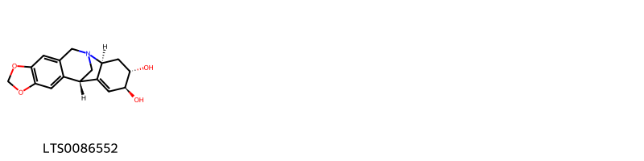{ width=100% }
    <figcaption>Hình ảnh cấu trúc hóa học của 1 hoạt chất thuộc nhóm  gồm ['pancracine (LTS0086552)'].</figcaption>
</figure>
#### Nhóm Amaryllidaceae alkaloids
<figure markdown="span">
    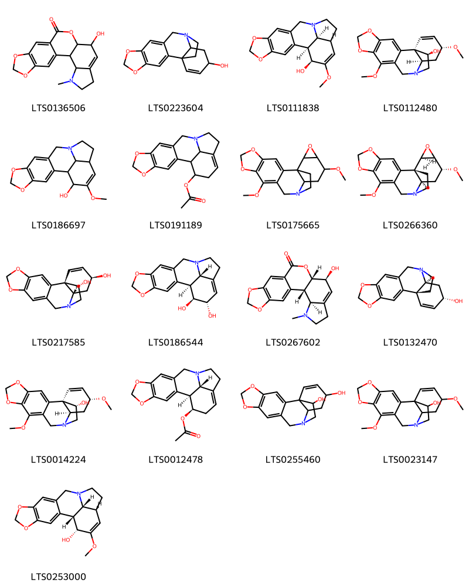{ width=100% }
    <figcaption>Hình ảnh cấu trúc hóa học của 17 hoạt chất thuộc nhóm Amaryllidaceae alkaloids gồm ['9-hydroxy-4-methyl-11,16,18-trioxa-4-azapentacyclo[11.7.0.0²,¹⁰.0³,⁷.0¹⁵,¹⁹]icosa-1(20),7,13,15(19)-tetraen-12-one (LTS0136506)', '5,7-dioxa-12-azapentacyclo[10.5.2.0¹,¹³.0²,¹⁰.0⁴,⁸]nonadeca-2,4(8),9,16-tetraen-15-ol (LTS0223604)', '(1s,15s,18s,19s)-17-methoxy-5,7-dioxa-12-azapentacyclo[10.6.1.0²,¹⁰.0⁴,⁸.0¹⁵,¹⁹]nonadeca-2,4(8),9,16-tetraen-18-ol (LTS0111838)', 'ambelline (LTS0112480)', '17-methoxy-5,7-dioxa-12-azapentacyclo[10.6.1.0²,¹⁰.0⁴,⁸.0¹⁵,¹⁹]nonadeca-2,4(8),9,16-tetraen-18-ol (LTS0186697)', '5,7-dioxa-12-azapentacyclo[10.6.1.0²,¹⁰.0⁴,⁸.0¹⁵,¹⁹]nonadeca-2,4(8),9,15-tetraen-18-yl acetate (LTS0191189)', '9,15-dimethoxy-5,7,17-trioxa-12-azahexacyclo[10.6.2.0¹,¹³.0²,¹⁰.0⁴,⁸.0¹⁶,¹⁸]icosa-2,4(8),9-triene (LTS0175665)', 'undulatine (LTS0266360)', '(1s,13s,15s,18s)-5,7-dioxa-12-azapentacyclo[10.5.2.0¹,¹³.0²,¹⁰.0⁴,⁸]nonadeca-2,4(8),9,16-tetraene-15,18-diol (LTS0217585)', 'lycorine (LTS0186544)', 'hippeastrine (LTS0267602)', '(1r,13s,15s)-5,7-dioxa-12-azapentacyclo[10.5.2.0¹,¹³.0²,¹⁰.0⁴,⁸]nonadeca-2,4(8),9,16-tetraen-15-ol (LTS0132470)', '(1r,13r,15r,18s)-9,15-dimethoxy-5,7-dioxa-12-azapentacyclo[10.5.2.0¹,¹³.0²,¹⁰.0⁴,⁸]nonadeca-2,4(8),9,16-tetraen-18-ol (LTS0014224)', 'acetylcaranine (LTS0012478)', '5,7-dioxa-12-azapentacyclo[10.5.2.0¹,¹³.0²,¹⁰.0⁴,⁸]nonadeca-2,4(8),9,16-tetraene-15,18-diol (LTS0255460)', '9,15-dimethoxy-5,7-dioxa-12-azapentacyclo[10.5.2.0¹,¹³.0²,¹⁰.0⁴,⁸]nonadeca-2,4(8),9,16-tetraen-18-ol (LTS0023147)', '(1r,15r,18r,19r)-17-methoxy-5,7-dioxa-12-azapentacyclo[10.6.1.0²,¹⁰.0⁴,⁸.0¹⁵,¹⁹]nonadeca-2,4(8),9,16-tetraen-18-ol (LTS0253000)'].</figcaption>
</figure>
#### Nhóm Benzazepines
<figure markdown="span">
    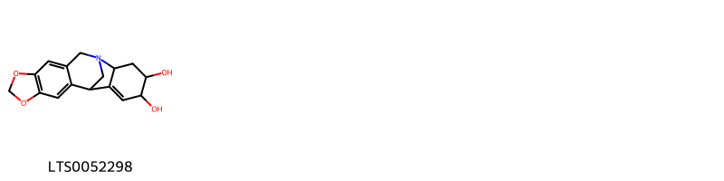{ width=100% }
    <figcaption>Hình ảnh cấu trúc hóa học của 1 hoạt chất thuộc nhóm Benzazepines gồm ['5,7-dioxa-12-azapentacyclo[10.6.1.0²,¹⁰.0⁴,⁸.0¹³,¹⁸]nonadeca-2,4(8),9,17-tetraene-15,16-diol (LTS0052298)'].</figcaption>
</figure>
#### Nhóm Quinolines and derivatives
<figure markdown="span">
    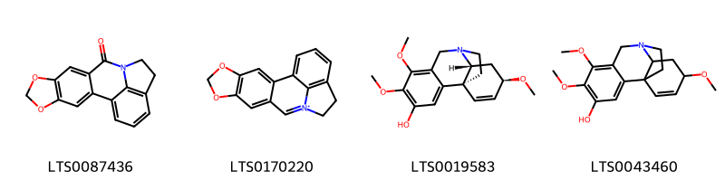{ width=100% }
    <figcaption>Hình ảnh cấu trúc hóa học của 4 hoạt chất thuộc nhóm Quinolines and derivatives gồm ['anhydrolycorinone (LTS0087436)', '5,7-dioxa-12λ⁵-azapentacyclo[10.6.1.0²,¹⁰.0⁴,⁸.0¹⁵,¹⁹]nonadeca-1(19),2(10),3,8,11,15,17-heptaen-12-ylium (LTS0170220)', '(1s,10r,12r)-5,6,12-trimethoxy-9-azatetracyclo[7.5.2.0¹,¹⁰.0²,⁷]hexadeca-2,4,6,13-tetraen-4-ol (LTS0019583)', '5,6,12-trimethoxy-9-azatetracyclo[7.5.2.0¹,¹⁰.0²,⁷]hexadeca-2,4,6,13-tetraen-4-ol (LTS0043460)'].</figcaption>
</figure>

---

### Dược dân tộc học

Danh sách các quốc gia có sử dụng *Amaryllis belladonna* trong điều trị các bệnh. 

| Country   | Disease   | Bệnh     |
|:----------|:----------|:---------|
| India     | Poison    | Chất độc |

---

# Chi Colchicum

??? note "Danh sách các dược liệu thuộc chi"
    
	 - *Colchicum autumnale*
	 - *Colchicum luteum*
	 - *Colchicum ritchii*

---
## Colchicum autumnale
### Thông tin về thực vật

!!! info "Phân loại thực vật của *Colchicum autumnale* từ GIBF:"
    - **Kingdom:** Plantae
    - **Phylum:** Tracheophyta
    - **Order:** Liliales
    - **Family:** Colchicaceae
    - **Genus:** Colchicum
    - **Species:** *Colchicum autumnale*

 

| Label (VI)   | Label (EN)   | Scientific Name     | Descriptions (VI)   | Descriptions (EN)   | Also Known As (VI)                    | Also Known As (EN)                                  |
|:-------------|:-------------|:--------------------|:--------------------|:--------------------|:--------------------------------------|:----------------------------------------------------|
| N/A          | N/A          | Colchicum autumnale | loài thực vật       | species of plant    | ['Colchicum autumnale', 'Cây bả chó'] | ['naked ladies', 'autumn crocus', 'meadow saffron'] |

#### Phân bố trên thế giới

**Từ CSDL GIBF** nan, Austria, Hungary, Czechia, France, Belgium, Slovakia, Ukraine, New Zealand, Italy, Switzerland, Slovenia, Croatia, Germany, United Kingdom of Great Britain and Northern Ireland, Netherlands

#### Phân bố tại Việt Nam

**Từ CSDL GIBF**: Không có ghi nhận ở Việt Nam

---
### Thành phần hóa học
        
- Theo cơ sở dữ liệu lotus: Từ loài *Colchicum autumnale* đã phân lập và xác định được 45 hoạt chất thuộc về các nhóm Benzene and substituted derivatives, Tropones, Flavonoids, Lumicolchicine alkaloids, Organooxygen compounds, Androcymbine alkaloids, Phenethylisoquinoline alkaloids. 

|    | chemicalTaxonomyClassyfireClass     |   smiles_count |
|---:|:------------------------------------|---------------:|
|  0 | Androcymbine alkaloids              |              1 |
|  1 | Benzene and substituted derivatives |              1 |
|  2 | Flavonoids                          |              1 |
|  3 | Lumicolchicine alkaloids            |              7 |
|  4 | Organooxygen compounds              |              4 |
|  5 | Phenethylisoquinoline alkaloids     |              1 |
|  6 | Tropones                            |             30 |

#### Nhóm Androcymbine alkaloids
<figure markdown="span">
    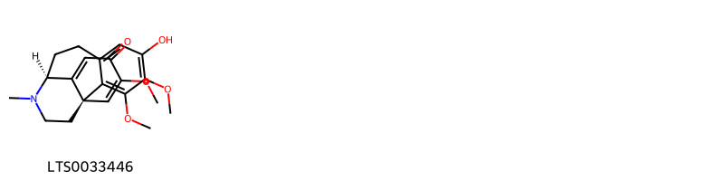{ width=100% }
    <figcaption>Hình ảnh cấu trúc hóa học của 1 hoạt chất thuộc nhóm Androcymbine alkaloids gồm ['isoandrocymbine (LTS0033446)'].</figcaption>
</figure>
#### Nhóm Benzene and substituted derivatives
<figure markdown="span">
    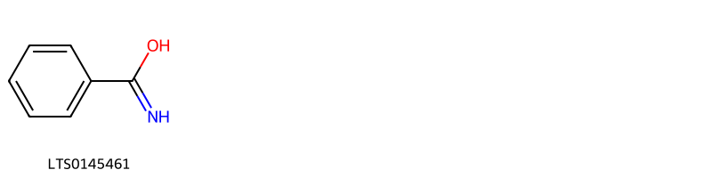{ width=100% }
    <figcaption>Hình ảnh cấu trúc hóa học của 1 hoạt chất thuộc nhóm Benzene and substituted derivatives gồm ['α-toluimidic acid (LTS0145461)'].</figcaption>
</figure>
#### Nhóm Flavonoids
<figure markdown="span">
    { width=100% }
    <figcaption>Hình ảnh cấu trúc hóa học của 1 hoạt chất thuộc nhóm Flavonoids gồm ['chamomile (LTS0104946)'].</figcaption>
</figure>
#### Nhóm Lumicolchicine alkaloids
<figure markdown="span">
    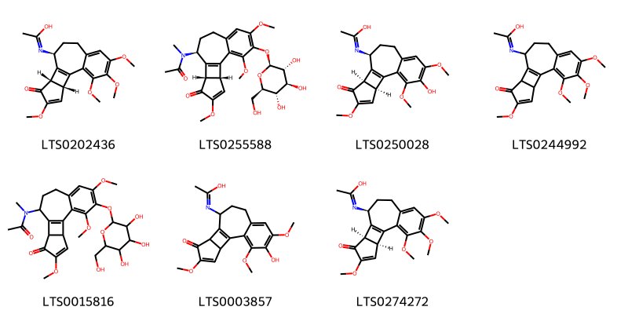{ width=100% }
    <figcaption>Hình ảnh cấu trúc hóa học của 7 hoạt chất thuộc nhóm Lumicolchicine alkaloids gồm ['n-[(10s,12s,16r)-3,4,5,14-tetramethoxy-13-oxotetracyclo[9.5.0.0²,⁷.0¹²,¹⁶]hexadeca-1(11),2,4,6,14-pentaen-10-yl]ethanimidic acid (LTS0202436)', 'n-methyl-n-[(10s,12s,16r)-3,5,14-trimethoxy-13-oxo-4-{[(2s,3r,4s,5s,6r)-3,4,5-trihydroxy-6-(hydroxymethyl)oxan-2-yl]oxy}tetracyclo[9.5.0.0²,⁷.0¹²,¹⁶]hexadeca-1(11),2,4,6,14-pentaen-10-yl]acetamide (LTS0255588)', 'n-[(10s,12r,16s)-4-hydroxy-3,5,14-trimethoxy-13-oxotetracyclo[9.5.0.0²,⁷.0¹²,¹⁶]hexadeca-1(11),2,4,6,14-pentaen-10-yl]ethanimidic acid (LTS0250028)', 'n-{3,4,5,14-tetramethoxy-13-oxotetracyclo[9.5.0.0²,⁷.0¹²,¹⁶]hexadeca-1(11),2,4,6,14-pentaen-10-yl}ethanimidic acid (LTS0244992)', 'n-methyl-n-(3,5,14-trimethoxy-13-oxo-4-{[3,4,5-trihydroxy-6-(hydroxymethyl)oxan-2-yl]oxy}tetracyclo[9.5.0.0²,⁷.0¹²,¹⁶]hexadeca-1(11),2,4,6,14-pentaen-10-yl)acetamide (LTS0015816)', 'n-{4-hydroxy-3,5,14-trimethoxy-13-oxotetracyclo[9.5.0.0²,⁷.0¹²,¹⁶]hexadeca-1(11),2,4,6,14-pentaen-10-yl}ethanimidic acid (LTS0003857)', 'n-[(10s,12r,16s)-3,4,5,14-tetramethoxy-13-oxotetracyclo[9.5.0.0²,⁷.0¹²,¹⁶]hexadeca-1(11),2,4,6,14-pentaen-10-yl]ethanimidic acid (LTS0274272)'].</figcaption>
</figure>
#### Nhóm Organooxygen compounds
<figure markdown="span">
    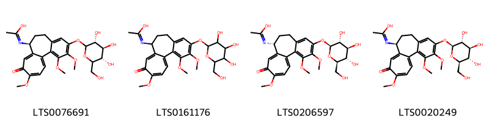{ width=100% }
    <figcaption>Hình ảnh cấu trúc hóa học của 4 hoạt chất thuộc nhóm Organooxygen compounds gồm ['n-[(10s)-3,4,14-trimethoxy-13-oxo-5-{[(3r,4s,5s)-3,4,5-trihydroxy-6-(hydroxymethyl)oxan-2-yl]oxy}tricyclo[9.5.0.0²,⁷]hexadeca-1(16),2,4,6,11,14-hexaen-10-yl]ethanimidic acid (LTS0076691)', 'n-(3,4,14-trimethoxy-13-oxo-5-{[3,4,5-trihydroxy-6-(hydroxymethyl)oxan-2-yl]oxy}tricyclo[9.5.0.0²,⁷]hexadeca-1(16),2,4,6,11,14-hexaen-10-yl)ethanimidic acid (LTS0161176)', 'n-[(10r)-3,4,14-trimethoxy-13-oxo-5-{[(2s,3r,4s,5s,6r)-3,4,5-trihydroxy-6-(hydroxymethyl)oxan-2-yl]oxy}tricyclo[9.5.0.0²,⁷]hexadeca-1(16),2,4,6,11,14-hexaen-10-yl]ethanimidic acid (LTS0206597)', 'n-[(10s)-3,4,14-trimethoxy-13-oxo-5-{[(2s,3r,4s,5s,6r)-3,4,5-trihydroxy-6-(hydroxymethyl)oxan-2-yl]oxy}tricyclo[9.5.0.0²,⁷]hexadeca-1(16),2,4,6,11,14-hexaen-10-yl]ethanimidic acid (LTS0020249)'].</figcaption>
</figure>
#### Nhóm Phenethylisoquinoline alkaloids
<figure markdown="span">
    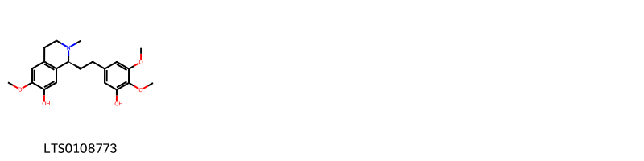{ width=100% }
    <figcaption>Hình ảnh cấu trúc hóa học của 1 hoạt chất thuộc nhóm Phenethylisoquinoline alkaloids gồm ['(s)-autumnaline (LTS0108773)'].</figcaption>
</figure>
#### Nhóm Tropones
<figure markdown="span">
    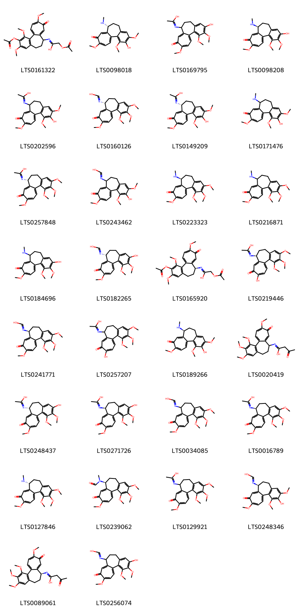{ width=100% }
    <figcaption>Hình ảnh cấu trúc hóa học của 30 hoạt chất thuộc nhóm Tropones gồm ['2-(acetyloxy)-n-[4-(acetyloxy)-3,5,14-trimethoxy-13-oxotricyclo[9.5.0.0²,⁷]hexadeca-1(16),2(7),3,5,11,14-hexaen-10-yl]ethanimidic acid (LTS0161322)', '(10r)-4-hydroxy-3,5,14-trimethoxy-10-(methylamino)tricyclo[9.5.0.0²,⁷]hexadeca-1(16),2,4,6,11,14-hexaen-13-one (LTS0098018)', 'n-{5-hydroxy-3,4,14-trimethoxy-13-oxotricyclo[9.5.0.0²,⁷]hexadeca-1(16),2,4,6,11,14-hexaen-10-yl}ethanimidic acid (LTS0169795)', '(10s)-5-hydroxy-3,4,14-trimethoxy-10-(methylamino)tricyclo[9.5.0.0²,⁷]hexadeca-1(16),2,4,6,11,14-hexaen-13-one (LTS0098208)', 'n-{4-hydroxy-3,5,14-trimethoxy-13-oxotricyclo[9.5.0.0²,⁷]hexadeca-1(16),2(7),3,5,11,14-hexaen-10-yl}ethanimidic acid (LTS0202596)', 'n-[(10r)-3,4,5,14-tetramethoxy-13-oxotricyclo[9.5.0.0²,⁷]hexadeca-1(16),2(7),3,5,11,14-hexaen-10-yl]carboximidic acid (LTS0160126)', 'n-[(10r)-4-hydroxy-3,5,14-trimethoxy-13-oxotricyclo[9.5.0.0²,⁷]hexadeca-1(16),2(7),3,5,11,14-hexaen-10-yl]ethanimidic acid (LTS0149209)', '4-hydroxy-3,5,14-trimethoxy-10-(methylamino)tricyclo[9.5.0.0²,⁷]hexadeca-1(16),2,4,6,11,14-hexaen-13-one (LTS0171476)', 'n-[(10r)-3,4,5,14-tetramethoxy-13-oxotricyclo[9.5.0.0²,⁷]hexadeca-1(16),2(7),3,5,11,14-hexaen-10-yl]ethanimidic acid (LTS0257848)', 'n-{4-hydroxy-3,5,14-trimethoxy-13-oxotricyclo[9.5.0.0²,⁷]hexadeca-1(16),2(7),3,5,11,14-hexaen-10-yl}carboximidic acid (LTS0243462)', 'colcemid (LTS0223323)', '(+-)-demecolcine (LTS0216871)', '5-hydroxy-3,4,14-trimethoxy-10-(methylamino)tricyclo[9.5.0.0²,⁷]hexadeca-1(16),2,4,6,11,14-hexaen-13-one (LTS0184696)', 'n-[(10r)-5-hydroxy-3,4,14-trimethoxy-13-oxotricyclo[9.5.0.0²,⁷]hexadeca-1(16),2,4,6,11,14-hexaen-10-yl]carboximidic acid (LTS0182265)', '2-(acetyloxy)-n-[(10s)-4-(acetyloxy)-3,5,14-trimethoxy-13-oxotricyclo[9.5.0.0²,⁷]hexadeca-1(16),2(7),3,5,11,14-hexaen-10-yl]ethanimidic acid (LTS0165920)', 'n-[(10s)-14-hydroxy-3,4,5-trimethoxy-13-oxotricyclo[9.5.0.0²,⁷]hexadeca-1(16),2(7),3,5,11,14-hexaen-10-yl]ethanimidic acid (LTS0219446)', 'n-[(10s)-3,4,5,14-tetramethoxy-13-oxotricyclo[9.5.0.0²,⁷]hexadeca-1(16),2(7),3,5,11,14-hexaen-10-yl]carboximidic acid (LTS0241771)', 'n-{14-hydroxy-3,4,5-trimethoxy-13-oxotricyclo[9.5.0.0²,⁷]hexadeca-1(16),2(7),3,5,11,14-hexaen-10-yl}ethanimidic acid (LTS0257207)', '(10s)-4-hydroxy-3,5,14-trimethoxy-10-(methylamino)tricyclo[9.5.0.0²,⁷]hexadeca-1(16),2,4,6,11,14-hexaen-13-one (LTS0189266)', '3-oxo-n-{3,4,5,14-tetramethoxy-13-oxotricyclo[9.5.0.0²,⁷]hexadeca-1(16),2(7),3,5,11,14-hexaen-10-yl}butanimidic acid (LTS0020419)', 'n-[(10r)-5-hydroxy-3,4,14-trimethoxy-13-oxotricyclo[9.5.0.0²,⁷]hexadeca-1(16),2,4,6,11,14-hexaen-10-yl]ethanimidic acid (LTS0248437)', 'n-[(10s)-5-hydroxy-3,4,14-trimethoxy-13-oxotricyclo[9.5.0.0²,⁷]hexadeca-1(16),2,4,6,11,14-hexaen-10-yl]ethanimidic acid (LTS0271726)', 'n-{3,4,5,14-tetramethoxy-13-oxotricyclo[9.5.0.0²,⁷]hexadeca-1(16),2(7),3,5,11,14-hexaen-10-yl}carboximidic acid (LTS0034085)', 'n-[(10s)-3,4,5,14-tetramethoxy-13-oxotricyclo[9.5.0.0²,⁷]hexadeca-1(16),2(7),3,5,11,14-hexaen-10-yl]ethanimidic acid (LTS0016789)', '(10r)-3,4,5,14-tetramethoxy-10-(methylamino)tricyclo[9.5.0.0²,⁷]hexadeca-1(16),2,4,6,11,14-hexaen-13-one (LTS0127846)', 'n-formyldemecolcine (LTS0239062)', 'n-{3,4,5,14-tetramethoxy-13-oxotricyclo[9.5.0.0²,⁷]hexadeca-1(16),2(7),3,5,11,14-hexaen-10-yl}ethanimidic acid (LTS0129921)', 'n-[(10s)-4-hydroxy-3,5,14-trimethoxy-13-oxotricyclo[9.5.0.0²,⁷]hexadeca-1(16),2(7),3,5,11,14-hexaen-10-yl]carboximidic acid (LTS0248346)', '3-oxo-n-[(10s)-3,4,5,14-tetramethoxy-13-oxotricyclo[9.5.0.0²,⁷]hexadeca-1(16),2(7),3,5,11,14-hexaen-10-yl]butanimidic acid (LTS0089061)', 'n-{5-hydroxy-3,4,14-trimethoxy-13-oxotricyclo[9.5.0.0²,⁷]hexadeca-1(16),2,4,6,11,14-hexaen-10-yl}carboximidic acid (LTS0256074)'].</figcaption>
</figure>

---

### Dược dân tộc học

Danh sách các quốc gia có sử dụng *Colchicum autumnale* trong điều trị các bệnh. 

| Country   | Disease                               | Bệnh                                                |
|:----------|:--------------------------------------|:----------------------------------------------------|
| Elsewhere | Sedative                              | Thuốc an thần                                       |
| Turkey    | Diuretic, Laxative, Poison, Sudorific | Thuốc lợi tiểu, nhuận tràng, chất độc, gây ngạt thở |
| ain       | Poison                                | Chất độc                                            |

---

---
## Colchicum luteum
### Thông tin về thực vật

!!! info "Phân loại thực vật của *Colchicum luteum* từ GIBF:"
    - **Kingdom:** Plantae
    - **Phylum:** Tracheophyta
    - **Order:** Liliales
    - **Family:** Colchicaceae
    - **Genus:** Colchicum
    - **Species:** *Colchicum luteum*

 

| Label (VI)   | Label (EN)   | Scientific Name   | Descriptions (VI)   | Descriptions (EN)   | Also Known As (VI)   | Also Known As (EN)   |
|:-------------|:-------------|:------------------|:--------------------|:--------------------|:---------------------|:---------------------|
| N/A          | N/A          | Colchicum luteum  | loài thực vật       | species of plant    | ['']                 | ['']                 |

#### Phân bố trên thế giới

**Từ CSDL GIBF** nan, Turkmenistan, Afghanistan, Tajikistan, Uzbekistan, Iran (Islamic Republic of), Timor-Leste, Pakistan, Kyrgyzstan, Palestine, State of, Kazakhstan, India, Türkiye, unknown or invalid, France

#### Phân bố tại Việt Nam

**Từ CSDL GIBF**: Không có ghi nhận ở Việt Nam

---
### Thành phần hóa học
        
- Theo cơ sở dữ liệu lotus: Từ loài *Colchicum luteum* đã phân lập và xác định được 6 hoạt chất thuộc về các nhóm Dibenzazecins, Tropones, Tetrahydroisoquinolines. 

|    | chemicalTaxonomyClassyfireClass   |   smiles_count |
|---:|:----------------------------------|---------------:|
|  0 | Dibenzazecins                     |              1 |
|  1 | Tetrahydroisoquinolines           |              2 |
|  2 | Tropones                          |              3 |

#### Nhóm Dibenzazecins
<figure markdown="span">
    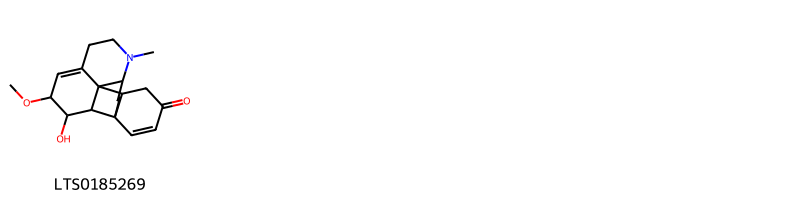{ width=100% }
    <figcaption>Hình ảnh cấu trúc hóa học của 1 hoạt chất thuộc nhóm Dibenzazecins gồm ['3-hydroxy-4-methoxy-9-methyl-9-azapentacyclo[8.8.0.0¹,⁶.0²,¹³.0¹³,¹⁸]octadeca-5,14-dien-16-one (LTS0185269)'].</figcaption>
</figure>
#### Nhóm Tetrahydroisoquinolines
<figure markdown="span">
    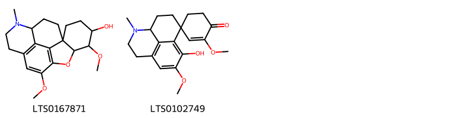{ width=100% }
    <figcaption>Hình ảnh cấu trúc hóa học của 2 hoạt chất thuộc nhóm Tetrahydroisoquinolines gồm ['5,9-dimethoxy-14-methyl-7-oxa-14-azapentacyclo[9.6.2.0¹,⁶.0⁸,¹⁸.0¹⁵,¹⁹]nonadeca-8(18),9,11(19)-trien-4-ol (LTS0167871)', "12'-hydroxy-3,11'-dimethoxy-6'-methyl-6'-azaspiro[cyclohexane-1,2'-tricyclo[7.3.1.0⁵,¹³]tridecane]-1'(12'),2,9'(13'),10'-tetraen-4-one (LTS0102749)"].</figcaption>
</figure>
#### Nhóm Tropones
<figure markdown="span">
    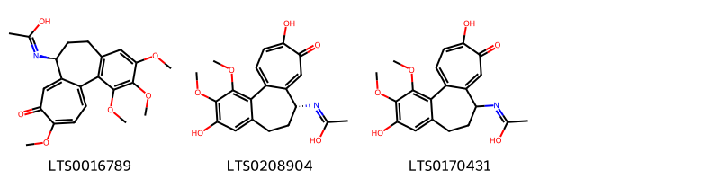{ width=100% }
    <figcaption>Hình ảnh cấu trúc hóa học của 3 hoạt chất thuộc nhóm Tropones gồm ['n-[(10s)-3,4,5,14-tetramethoxy-13-oxotricyclo[9.5.0.0²,⁷]hexadeca-1(16),2(7),3,5,11,14-hexaen-10-yl]ethanimidic acid (LTS0016789)', 'n-[(10r)-5,14-dihydroxy-3,4-dimethoxy-13-oxotricyclo[9.5.0.0²,⁷]hexadeca-1(16),2,4,6,11,14-hexaen-10-yl]ethanimidic acid (LTS0208904)', 'n-{5,14-dihydroxy-3,4-dimethoxy-13-oxotricyclo[9.5.0.0²,⁷]hexadeca-1(16),2,4,6,11,14-hexaen-10-yl}ethanimidic acid (LTS0170431)'].</figcaption>
</figure>

---

### Dược dân tộc học

Danh sách các quốc gia có sử dụng *Colchicum luteum* trong điều trị các bệnh. 

| Country   | Disease                                      | Bệnh                                                          |
|:----------|:---------------------------------------------|:--------------------------------------------------------------|
| Elsewhere | Aphrodisiac, Laxative, Carminative, Aperient | Thuốc kích thích tình dục, nhuận tràng, Carminative, Aperient |

---

---
## Colchicum ritchii
### Thông tin về thực vật

!!! info "Phân loại thực vật của *Colchicum ritchii* từ GIBF:"
    - **Kingdom:** Plantae
    - **Phylum:** Tracheophyta
    - **Order:** Liliales
    - **Family:** Colchicaceae
    - **Genus:** Colchicum
    - **Species:** *Colchicum ritchii*

 

| Label (VI)   | Label (EN)   | Scientific Name   | Descriptions (VI)   | Descriptions (EN)   | Also Known As (VI)   | Also Known As (EN)   |
|:-------------|:-------------|:------------------|:--------------------|:--------------------|:---------------------|:---------------------|
| N/A          | N/A          | Colchicum ritchii | loài thực vật       | species of plant    | ['']                 | ['']                 |

#### Phân bố trên thế giới

**Từ CSDL GIBF** nan, Libya, Sweden, Saudi Arabia, Iran (Islamic Republic of), Syrian Arab Republic, Israel, Tunisia, Palestine, State of, unknown or invalid, Jordan, Yemen, Egypt

#### Phân bố tại Việt Nam

**Từ CSDL GIBF**: Không có ghi nhận ở Việt Nam

---
### Thành phần hóa học
        
- Theo cơ sở dữ liệu lotus: Từ loài *Colchicum ritchii* đã phân lập và xác định được 31 hoạt chất thuộc về các nhóm Tropones, Flavonoids, Allocolchicine alkaloids, Benzodioxoles, Phenol ethers, Homoaporphines, Lumicolchicine alkaloids, Androcymbine alkaloids, Isoquinolines and derivatives, Phenethylisoquinoline alkaloids. 

|    | chemicalTaxonomyClassyfireClass   |   smiles_count |
|---:|:----------------------------------|---------------:|
|  0 | Allocolchicine alkaloids          |              1 |
|  1 | Androcymbine alkaloids            |              2 |
|  2 | Benzodioxoles                     |              6 |
|  3 | Flavonoids                        |              1 |
|  4 | Homoaporphines                    |              1 |
|  5 | Isoquinolines and derivatives     |              1 |
|  6 | Lumicolchicine alkaloids          |              2 |
|  7 | Phenethylisoquinoline alkaloids   |              2 |
|  8 | Phenol ethers                     |              1 |
|  9 | Tropones                          |             14 |

#### Nhóm Allocolchicine alkaloids
<figure markdown="span">
    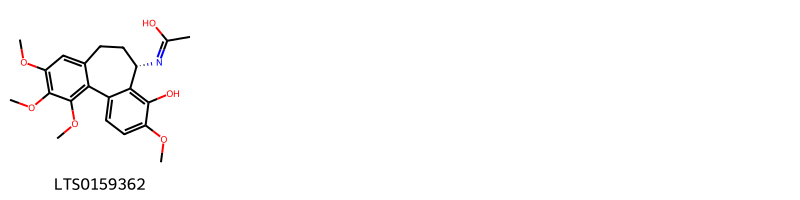{ width=100% }
    <figcaption>Hình ảnh cấu trúc hóa học của 1 hoạt chất thuộc nhóm Allocolchicine alkaloids gồm ['n-[(8s)-6-hydroxy-5,13,14,15-tetramethoxytricyclo[9.4.0.0²,⁷]pentadeca-1(15),2,4,6,11,13-hexaen-8-yl]ethanimidic acid (LTS0159362)'].</figcaption>
</figure>
#### Nhóm Androcymbine alkaloids
<figure markdown="span">
    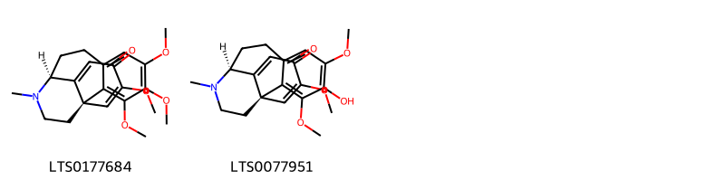{ width=100% }
    <figcaption>Hình ảnh cấu trúc hóa học của 2 hoạt chất thuộc nhóm Androcymbine alkaloids gồm ['o-methylandrocymbine (LTS0177684)', 'androcymbine (LTS0077951)'].</figcaption>
</figure>
#### Nhóm Benzodioxoles
<figure markdown="span">
    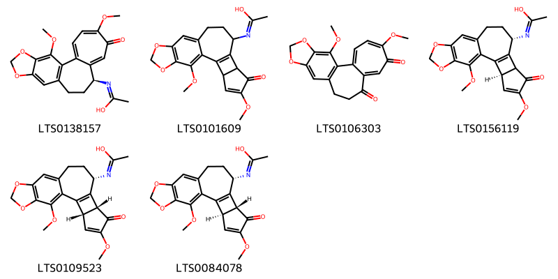{ width=100% }
    <figcaption>Hình ảnh cấu trúc hóa học của 6 hoạt chất thuộc nhóm Benzodioxoles gồm ['n-[(9s)-5,19-dimethoxy-6-oxo-15,17-dioxatetracyclo[10.7.0.0²,⁸.0¹⁴,¹⁸]nonadeca-1(12),2,4,7,13,18-hexaen-9-yl]ethanimidic acid (LTS0138157)', 'n-{5,19-dimethoxy-6-oxo-15,17-dioxapentacyclo[10.7.0.0²,⁸.0³,⁷.0¹⁴,¹⁸]nonadeca-1(19),2(8),4,12,14(18)-pentaen-9-yl}ethanimidic acid (LTS0101609)', '5,19-dimethoxy-15,17-dioxatetracyclo[10.7.0.0²,⁸.0¹⁴,¹⁸]nonadeca-1(12),2,4,7,13,18-hexaene-6,9-dione (LTS0106303)', 'n-[(3r,9s)-5,19-dimethoxy-6-oxo-15,17-dioxapentacyclo[10.7.0.0²,⁸.0³,⁷.0¹⁴,¹⁸]nonadeca-1(19),2(8),4,12,14(18)-pentaen-9-yl]ethanimidic acid (LTS0156119)', 'n-[(3s,7r,9s)-5,19-dimethoxy-6-oxo-15,17-dioxapentacyclo[10.7.0.0²,⁸.0³,⁷.0¹⁴,¹⁸]nonadeca-1(19),2(8),4,12,14(18)-pentaen-9-yl]ethanimidic acid (LTS0109523)', 'n-[(3r,7r,9s)-5,19-dimethoxy-6-oxo-15,17-dioxapentacyclo[10.7.0.0²,⁸.0³,⁷.0¹⁴,¹⁸]nonadeca-1(19),2(8),4,12,14(18)-pentaen-9-yl]ethanimidic acid (LTS0084078)'].</figcaption>
</figure>
#### Nhóm Flavonoids
<figure markdown="span">
    { width=100% }
    <figcaption>Hình ảnh cấu trúc hóa học của 1 hoạt chất thuộc nhóm Flavonoids gồm ['luteolin (LTS0017052)'].</figcaption>
</figure>
#### Nhóm Homoaporphines
<figure markdown="span">
    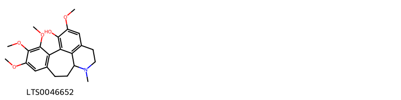{ width=100% }
    <figcaption>Hình ảnh cấu trúc hóa học của 1 hoạt chất thuộc nhóm Homoaporphines gồm ['3,4,5,16-tetramethoxy-11-methyl-11-azatetracyclo[8.7.1.0²,⁷.0¹⁴,¹⁸]octadeca-1(17),2(7),3,5,14(18),15-hexaen-17-ol (LTS0046652)'].</figcaption>
</figure>
#### Nhóm Isoquinolines and derivatives
<figure markdown="span">
    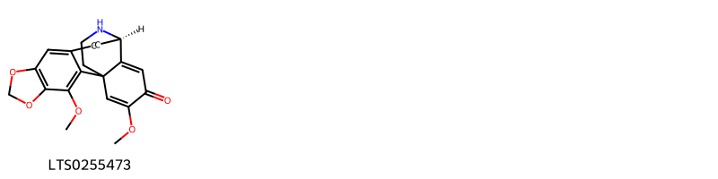{ width=100% }
    <figcaption>Hình ảnh cấu trúc hóa học của 1 hoạt chất thuộc nhóm Isoquinolines and derivatives gồm ['(13r)-3,17-dimethoxy-5,7-dioxa-21-azapentacyclo[11.5.3.0¹,¹⁴.0²,¹⁰.0⁴,⁸]henicosa-2,4(8),9,14,17-pentaen-16-one (LTS0255473)'].</figcaption>
</figure>
#### Nhóm Lumicolchicine alkaloids
<figure markdown="span">
    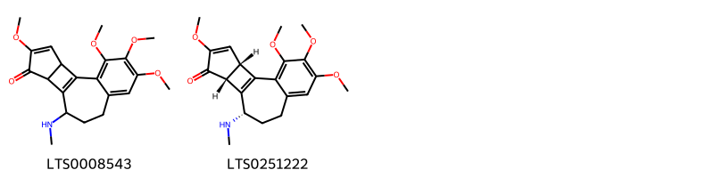{ width=100% }
    <figcaption>Hình ảnh cấu trúc hóa học của 2 hoạt chất thuộc nhóm Lumicolchicine alkaloids gồm ['3,4,5,14-tetramethoxy-10-(methylamino)tetracyclo[9.5.0.0²,⁷.0¹²,¹⁶]hexadeca-1(11),2,4,6,14-pentaen-13-one (LTS0008543)', '(10s,12r,16s)-3,4,5,14-tetramethoxy-10-(methylamino)tetracyclo[9.5.0.0²,⁷.0¹²,¹⁶]hexadeca-1(11),2,4,6,14-pentaen-13-one (LTS0251222)'].</figcaption>
</figure>
#### Nhóm Phenethylisoquinoline alkaloids
<figure markdown="span">
    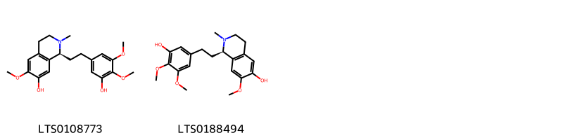{ width=100% }
    <figcaption>Hình ảnh cấu trúc hóa học của 2 hoạt chất thuộc nhóm Phenethylisoquinoline alkaloids gồm ['(s)-autumnaline (LTS0108773)', '(1r)-1-[2-(3-hydroxy-4,5-dimethoxyphenyl)ethyl]-7-methoxy-2-methyl-3,4-dihydro-1h-isoquinolin-6-ol (LTS0188494)'].</figcaption>
</figure>
#### Nhóm Phenol ethers
<figure markdown="span">
    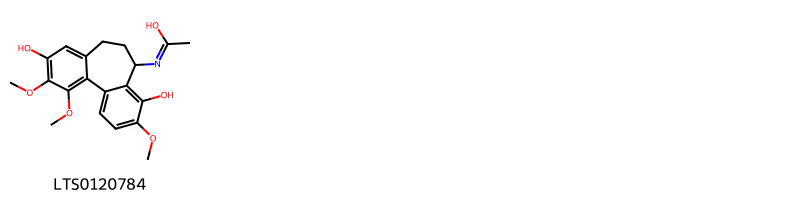{ width=100% }
    <figcaption>Hình ảnh cấu trúc hóa học của 1 hoạt chất thuộc nhóm Phenol ethers gồm ['n-{6,13-dihydroxy-5,14,15-trimethoxytricyclo[9.4.0.0²,⁷]pentadeca-1(15),2,4,6,11,13-hexaen-8-yl}ethanimidic acid (LTS0120784)'].</figcaption>
</figure>
#### Nhóm Tropones
<figure markdown="span">
    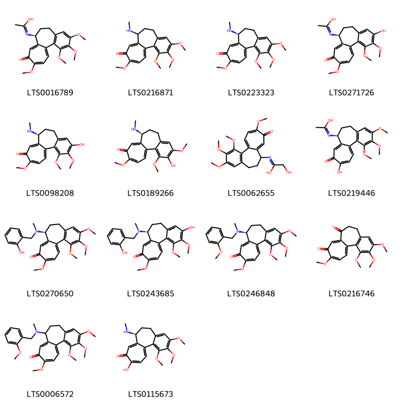{ width=100% }
    <figcaption>Hình ảnh cấu trúc hóa học của 14 hoạt chất thuộc nhóm Tropones gồm ['n-[(10s)-3,4,5,14-tetramethoxy-13-oxotricyclo[9.5.0.0²,⁷]hexadeca-1(16),2(7),3,5,11,14-hexaen-10-yl]ethanimidic acid (LTS0016789)', '(+-)-demecolcine (LTS0216871)', 'colcemid (LTS0223323)', 'n-[(10s)-5-hydroxy-3,4,14-trimethoxy-13-oxotricyclo[9.5.0.0²,⁷]hexadeca-1(16),2,4,6,11,14-hexaen-10-yl]ethanimidic acid (LTS0271726)', '(10s)-5-hydroxy-3,4,14-trimethoxy-10-(methylamino)tricyclo[9.5.0.0²,⁷]hexadeca-1(16),2,4,6,11,14-hexaen-13-one (LTS0098208)', '(10s)-4-hydroxy-3,5,14-trimethoxy-10-(methylamino)tricyclo[9.5.0.0²,⁷]hexadeca-1(16),2,4,6,11,14-hexaen-13-one (LTS0189266)', '2-hydroxy-n-{3,4,5,14-tetramethoxy-13-oxotricyclo[9.5.0.0²,⁷]hexadeca-1(16),2(7),3,5,11,14-hexaen-10-yl}ethanimidic acid (LTS0062655)', 'n-[(10s)-14-hydroxy-3,4,5-trimethoxy-13-oxotricyclo[9.5.0.0²,⁷]hexadeca-1(16),2(7),3,5,11,14-hexaen-10-yl]ethanimidic acid (LTS0219446)', '(10s)-10-{[(2-hydroxyphenyl)methyl](methyl)amino}-3,4,5,14-tetramethoxytricyclo[9.5.0.0²,⁷]hexadeca-1(16),2(7),3,5,11,14-hexaen-13-one (LTS0270650)', '(10s)-5-hydroxy-10-{[(2-hydroxyphenyl)methyl](methyl)amino}-3,4,14-trimethoxytricyclo[9.5.0.0²,⁷]hexadeca-1(16),2,4,6,11,14-hexaen-13-one (LTS0243685)', '(10s)-3,4,5,14-tetramethoxy-10-{[(2-methoxyphenyl)methyl](methyl)amino}tricyclo[9.5.0.0²,⁷]hexadeca-1(16),2,4,6,11,14-hexaen-13-one (LTS0246848)', '3,4,5,14-tetramethoxytricyclo[9.5.0.0²,⁷]hexadeca-1(16),2(7),3,5,11,14-hexaene-10,13-dione (LTS0216746)', '3,4,5,14-tetramethoxy-10-{[(2-methoxyphenyl)methyl](methyl)amino}tricyclo[9.5.0.0²,⁷]hexadeca-1(16),2,4,6,11,14-hexaen-13-one (LTS0006572)', '(10s)-14-hydroxy-3,4,5-trimethoxy-10-(methylamino)tricyclo[9.5.0.0²,⁷]hexadeca-1(16),2,4,6,11,14-hexaen-13-one (LTS0115673)'].</figcaption>
</figure>

---

### Dược dân tộc học

Danh sách các quốc gia có sử dụng *Colchicum ritchii* trong điều trị các bệnh. 

| Country   | Disease                  | Bệnh                     |
|:----------|:-------------------------|:-------------------------|
| Egypt     | Purgative, Tonic, Emetic | Purgative, Tonic, Emetic |

---

# Chi Curculigo

??? note "Danh sách các dược liệu thuộc chi"
    
	 - *Curculigo ensifolia*
	 - *Curculigo latifolia*
	 - *Curculigo orchioides*

---
## Curculigo ensifolia
### Thông tin về thực vật

!!! info "Phân loại thực vật của *Curculigo ensifolia* từ GIBF:"
    - **Kingdom:** Plantae
    - **Phylum:** Tracheophyta
    - **Order:** Asparagales
    - **Family:** Hypoxidaceae
    - **Genus:** Curculigo
    - **Species:** *Curculigo ensifolia*

 

| Label (VI)   | Label (EN)   | Scientific Name     | Descriptions (VI)   | Descriptions (EN)   | Also Known As (VI)   | Also Known As (EN)   |
|:-------------|:-------------|:--------------------|:--------------------|:--------------------|:---------------------|:---------------------|
| N/A          | N/A          | Curculigo ensifolia | loài thực vật       | species of plant    | ['']                 | ['']                 |

#### Phân bố trên thế giới

**Từ CSDL GIBF** Australia, nan, Thailand

#### Phân bố tại Việt Nam

**Từ CSDL GIBF**: Không có ghi nhận ở Việt Nam

---
### Thành phần hóa học
        
- Theo cơ sở dữ liệu lotus: Từ loài *Curculigo ensifolia* đã phân lập và xác định được Chưa có hoạt chất nào được phân lập. hoạt chất thuộc về các nhóm Không có hoạt chất nào được phân lập. 

Không có hình ảnh nào được tạo ra

---

### Dược dân tộc học

Danh sách các quốc gia có sử dụng *Curculigo ensifolia* trong điều trị các bệnh. 

| Country   | Disease                 | Bệnh                    |
|:----------|:------------------------|:------------------------|
| China     | Apertif, Nervine, Tonic | Apertif, Nervine, Tonic |

---

---
## Curculigo latifolia
### Thông tin về thực vật

!!! info "Phân loại thực vật của *Curculigo latifolia* từ GIBF:"
    - **Kingdom:** Plantae
    - **Phylum:** Tracheophyta
    - **Order:** Asparagales
    - **Family:** Hypoxidaceae
    - **Genus:** Curculigo
    - **Species:** *Curculigo latifolia*

 

| Label (VI)   | Label (EN)   | Scientific Name     | Descriptions (VI)   | Descriptions (EN)   | Also Known As (VI)   | Also Known As (EN)   |
|:-------------|:-------------|:--------------------|:--------------------|:--------------------|:---------------------|:---------------------|
| N/A          | N/A          | Curculigo latifolia | loài thực vật       | species of plant    | ['']                 | ['']                 |

#### Phân bố trên thế giới

**Từ CSDL GIBF** Brazil, Singapore, Viet Nam, United States of America, Tonga, Indonesia, Malaysia, Philippines, China, Colombia, India, Solomon Islands, unknown or invalid, Papua New Guinea, Brunei Darussalam, Thailand, Puerto Rico

#### Phân bố tại Việt Nam

**Từ CSDL GIBF**: Thua Thien-Hue, Ninh Thuan, Kon Tum

---
### Thành phần hóa học
        
- Theo cơ sở dữ liệu lotus: Từ loài *Curculigo latifolia* đã phân lập và xác định được Chưa có hoạt chất nào được phân lập. hoạt chất thuộc về các nhóm Không có hoạt chất nào được phân lập. 

Không có hình ảnh nào được tạo ra

---

### Dược dân tộc học

Danh sách các quốc gia có sử dụng *Curculigo latifolia* trong điều trị các bệnh. 

| Country   | Disease             | Bệnh                   |
|:----------|:--------------------|:-----------------------|
| Elsewhere | Apertif             | Apertif                |
| Java      | Stimulant           | Chất kích thích        |
| Johore    | Stomachic, Diuretic | Dạ dày, lợi tiểu       |
| Malaya    | Apertif, Sweetener  | Apertif, Chất làm ngọt |

---

---
## Curculigo orchioides
### Thông tin về thực vật

!!! info "Phân loại thực vật của *Curculigo orchioides* từ GIBF:"
    - **Kingdom:** Plantae
    - **Phylum:** Tracheophyta
    - **Order:** Asparagales
    - **Family:** Hypoxidaceae
    - **Genus:** Curculigo
    - **Species:** *Curculigo orchioides*

 

| Label (VI)   | Label (EN)   | Scientific Name      | Descriptions (VI)   | Descriptions (EN)   | Also Known As (VI)   | Also Known As (EN)   |
|:-------------|:-------------|:---------------------|:--------------------|:--------------------|:---------------------|:---------------------|
| N/A          | N/A          | Curculigo orchioides | loài thực vật       | species of plant    | ['']                 | ['']                 |

#### Phân bố trên thế giới

**Từ CSDL GIBF** Sri Lanka, Hong Kong, nan, Brazil, Viet Nam, Vanuatu, Guam, Indonesia, Chinese Taipei, New Caledonia, Nepal, China, India, Solomon Islands, Thailand, Lao People’s Democratic Republic

#### Phân bố tại Việt Nam

**Từ CSDL GIBF**: Vinh Phuc

---
### Thành phần hóa học
        
- Theo cơ sở dữ liệu lotus: Từ loài *Curculigo orchioides* đã phân lập và xác định được 115 hoạt chất thuộc về các nhóm Fatty Acyls, Benzene and substituted derivatives, Tannins, Steroids and steroid derivatives, Organooxygen compounds. 

|    | chemicalTaxonomyClassyfireClass     |   smiles_count |
|---:|:------------------------------------|---------------:|
|  0 | Benzene and substituted derivatives |              2 |
|  1 | Fatty Acyls                         |             13 |
|  2 | Organooxygen compounds              |             45 |
|  3 | Steroids and steroid derivatives    |             53 |
|  4 | Tannins                             |              2 |

#### Nhóm Benzene and substituted derivatives
<figure markdown="span">
    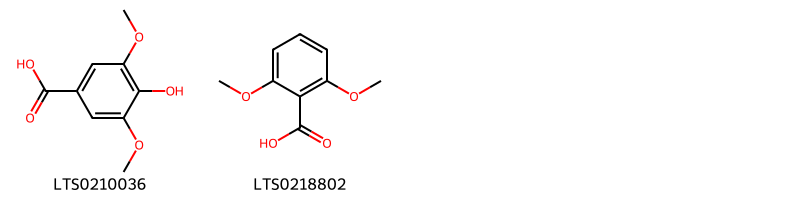{ width=100% }
    <figcaption>Hình ảnh cấu trúc hóa học của 2 hoạt chất thuộc nhóm Benzene and substituted derivatives gồm ['syringic acid (LTS0210036)', '2,6-dimethoxybenzoic acid (LTS0218802)'].</figcaption>
</figure>
#### Nhóm Fatty Acyls
<figure markdown="span">
    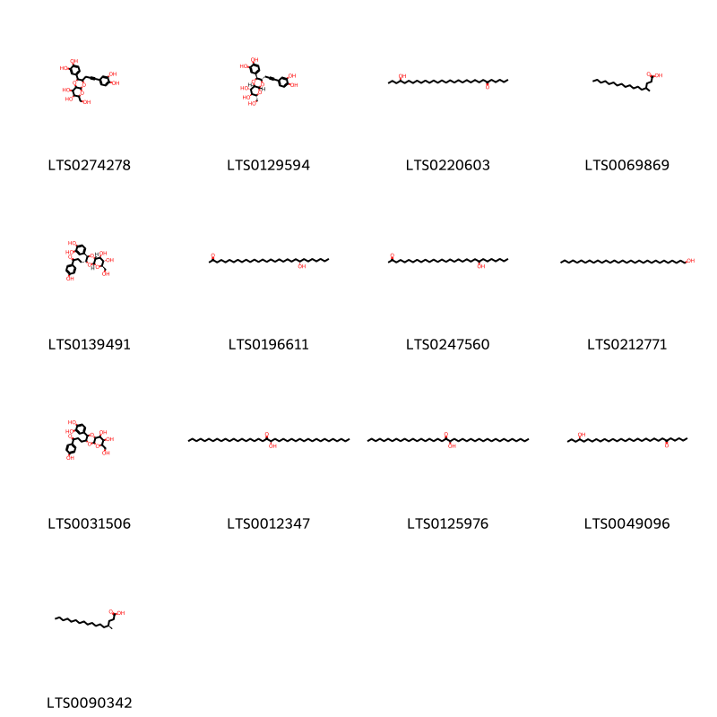{ width=100% }
    <figcaption>Hình ảnh cấu trúc hóa học của 13 hoạt chất thuộc nhóm Fatty Acyls gồm ['2-(3,4-dihydroxyphenyl)-3-[3-(3,4-dihydroxyphenyl)prop-2-yn-1-yl]-6-(hydroxymethyl)-hexahydro-2h-pyrano[2,3-b][1,4]dioxine-7,8-diol (LTS0274278)', '(2s,3s,4ar,6r,7s,8s,8ar)-2-(3,4-dihydroxyphenyl)-3-[3-(3,4-dihydroxyphenyl)prop-2-yn-1-yl]-6-(hydroxymethyl)-hexahydro-2h-pyrano[2,3-b][1,4]dioxine-7,8-diol (LTS0129594)', '27-hydroxytriacontan-6-one (LTS0220603)', '4-methylheptadecanoic acid (LTS0069869)', '3-[(2r,3r,4ar,6r,7s,8s,8ar)-2-(3,4-dihydroxyphenyl)-7,8-dihydroxy-6-(hydroxymethyl)-hexahydro-2h-pyrano[2,3-b][1,4]dioxin-3-yl]-1-(4-hydroxyphenyl)propan-1-one (LTS0139491)', '(23s)-23-hydroxytriacontan-2-one (LTS0196611)', '23-hydroxytriacontan-2-one (LTS0247560)', 'n-hentriacontanol (LTS0212771)', '3-[2-(3,4-dihydroxyphenyl)-7,8-dihydroxy-6-(hydroxymethyl)-hexahydro-2h-pyrano[2,3-b][1,4]dioxin-3-yl]-1-(4-hydroxyphenyl)propan-1-one (LTS0031506)', '(21r)-21-hydroxytetracontan-20-one (LTS0012347)', '21-hydroxytetracontan-20-one (LTS0125976)', '(27r)-27-hydroxytriacontan-6-one (LTS0049096)', '(4s)-4-methylheptadecanoic acid (LTS0090342)'].</figcaption>
</figure>
#### Nhóm Organooxygen compounds
<figure markdown="span">
    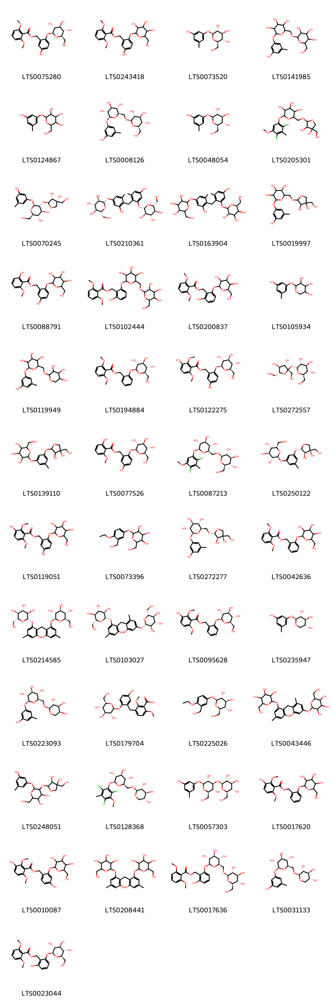{ width=100% }
    <figcaption>Hình ảnh cấu trúc hóa học của 45 hoạt chất thuộc nhóm Organooxygen compounds gồm ['curculigoside a (LTS0075280)', '(5-hydroxy-2-{[3,4,5-trihydroxy-6-(hydroxymethyl)oxan-2-yl]oxy}phenyl)methyl 2,6-dimethoxybenzoate (LTS0243418)', '(2s,3r,4s,5s,6r)-2-(3-hydroxy-5-methylphenoxy)-6-(hydroxymethyl)oxane-3,4,5-triol (LTS0073520)', '2-(3-hydroxy-5-methylphenoxy)-6-({[3,4,5-trihydroxy-6-(hydroxymethyl)oxan-2-yl]oxy}methyl)oxane-3,4,5-triol (LTS0141985)', '2-(3-hydroxy-5-methylphenoxy)-6-(hydroxymethyl)oxane-3,4,5-triol (LTS0124867)', '(2s,3r,4s,5s,6r)-2-(3-hydroxy-5-methylphenoxy)-6-({[(2r,3r,4s,5s,6r)-3,4,5-trihydroxy-6-(hydroxymethyl)oxan-2-yl]oxy}methyl)oxane-3,4,5-triol (LTS0008126)', '(3r,4s,5s,6r)-2-(3-hydroxy-5-methylphenoxy)-6-(hydroxymethyl)oxane-3,4,5-triol (LTS0048054)', '2-(2,4-dichloro-5-methoxy-3-methylphenoxy)-6-({[3,4-dihydroxy-4-(hydroxymethyl)oxolan-2-yl]oxy}methyl)oxane-3,4,5-triol (LTS0205301)', '(2r,3s,4s,5r,6s)-5-{[(2s,3r,4r)-3,4-dihydroxy-4-(hydroxymethyl)oxolan-2-yl]oxy}-6-(3-hydroxy-5-methylphenoxy)-2-(hydroxymethyl)oxane-3,4-diol (LTS0070245)', '(2s,3r,4s,5s,6r)-2-{3-hydroxy-4-[(4-hydroxy-2-methyl-6-{[(2s,3r,4s,5s,6r)-3,4,5-trihydroxy-6-(hydroxymethyl)oxan-2-yl]oxy}phenyl)methyl]-5-methylphenoxy}-6-(hydroxymethyl)oxane-3,4,5-triol (LTS0210361)', '2-{3-hydroxy-4-[(4-hydroxy-2-methyl-6-{[3,4,5-trihydroxy-6-(hydroxymethyl)oxan-2-yl]oxy}phenyl)methyl]-5-methylphenoxy}-6-(hydroxymethyl)oxane-3,4,5-triol (LTS0163904)', '2-({[3,4-dihydroxy-4-(hydroxymethyl)oxolan-2-yl]oxy}methyl)-6-(3-hydroxy-5-methylphenoxy)oxane-3,4,5-triol (LTS0019997)', '(5-hydroxy-2-{[3,4,5-trihydroxy-6-(hydroxymethyl)oxan-2-yl]oxy}phenyl)methyl 2-hydroxy-6-methoxybenzoate (LTS0088791)', '(2-hydroxy-6-{[3,4,5-trihydroxy-6-({[3,4,5-trihydroxy-6-(hydroxymethyl)oxan-2-yl]oxy}methyl)oxan-2-yl]oxy}phenyl)methyl 2,6-dimethoxybenzoate (LTS0102444)', '(2-hydroxy-6-{[3,4,5-trihydroxy-6-(hydroxymethyl)oxan-2-yl]oxy}phenyl)methyl 2,6-dimethoxybenzoate (LTS0200837)', '2-(3-hydroxy-5-methylphenoxy)oxane-3,4,5-triol (LTS0105934)', '2-(3-hydroxy-5-methylphenoxy)-6-{[(3,4,5-trihydroxyoxan-2-yl)oxy]methyl}oxane-3,4,5-triol (LTS0119949)', '(2-{[(2s,3r,4s,5s,6r)-3,4,5-trihydroxy-6-(hydroxymethyl)oxan-2-yl]oxy}phenyl)methyl 2,6-dimethoxybenzoate (LTS0194884)', '(5-hydroxy-2-{[(2s,3r,4s,5s,6r)-3,4,5-trihydroxy-6-(hydroxymethyl)oxan-2-yl]oxy}phenyl)methyl 3-hydroxy-2,6-dimethoxybenzoate (LTS0122275)', 'sucrose (LTS0272557)', '2-(3-{[3,4-dihydroxy-4-(hydroxymethyl)oxolan-2-yl]oxy}-5-methylphenoxy)-6-(hydroxymethyl)oxane-3,4,5-triol (LTS0139110)', '(5-hydroxy-2-{[(2s,3r,4s,5s,6r)-3,4,5-trihydroxy-6-(hydroxymethyl)oxan-2-yl]oxy}phenyl)methyl 2-hydroxy-6-methoxybenzoate (LTS0077526)', '(2s,3r,4s,5s,6r)-2-(2,4-dichloro-5-methoxy-3-methylphenoxy)-6-({[(2r,3r,4s,5s,6r)-3,4,5-trihydroxy-6-(hydroxymethyl)oxan-2-yl]oxy}methyl)oxane-3,4,5-triol (LTS0087213)', '(2s,3r,4s,5s,6r)-2-(3-{[(2s,3r,4r)-3,4-dihydroxy-4-(hydroxymethyl)oxolan-2-yl]oxy}-5-methylphenoxy)-6-(hydroxymethyl)oxane-3,4,5-triol (LTS0250122)', '(5-hydroxy-2-{[3,4,5-trihydroxy-6-(hydroxymethyl)oxan-2-yl]oxy}phenyl)methyl 3-hydroxy-2,6-dimethoxybenzoate (LTS0119051)', '2-[4-ethoxy-3-(hydroxymethyl)phenoxy]-6-(hydroxymethyl)oxane-3,4,5-triol (LTS0073396)', '(2r,3s,4s,5r,6s)-2-({[(2r,3r,4r)-3,4-dihydroxy-4-(hydroxymethyl)oxolan-2-yl]oxy}methyl)-6-(3-hydroxy-5-methylphenoxy)oxane-3,4,5-triol (LTS0272277)', '(2-{[3,4,5-trihydroxy-6-(hydroxymethyl)oxan-2-yl]oxy}phenyl)methyl 2,6-dimethoxybenzoate (LTS0042636)', '(2s,3r,4s,5s,6r)-2-{3-hydroxy-2-[(2-hydroxy-4-methyl-6-{[(2s,3r,4s,5s,6r)-3,4,5-trihydroxy-6-(hydroxymethyl)oxan-2-yl]oxy}phenyl)methyl]-5-methylphenoxy}-6-(hydroxymethyl)oxane-3,4,5-triol (LTS0214585)', '(2s,3r,4s,5s,6r)-2-{3-hydroxy-4-[(2-hydroxy-4-methyl-6-{[(2s,3r,4s,5s,6r)-3,4,5-trihydroxy-6-(hydroxymethyl)oxan-2-yl]oxy}phenyl)methyl]-5-methylphenoxy}-6-(hydroxymethyl)oxane-3,4,5-triol (LTS0103027)', '(2-{[(2s,3r,4s,5s,6r)-3,4,5-trihydroxy-6-(hydroxymethyl)oxan-2-yl]oxy}phenyl)methyl 3-hydroxy-2,6-dimethoxybenzoate (LTS0095628)', '(2s,3r,4s,5r)-2-(3-hydroxy-5-methylphenoxy)oxane-3,4,5-triol (LTS0235947)', '(2s,3r,4s,5s,6r)-2-(3-hydroxy-5-methylphenoxy)-6-({[(2s,3r,4s,5s)-3,4,5-trihydroxyoxan-2-yl]oxy}methyl)oxane-3,4,5-triol (LTS0223093)', '3-[(5-hydroxy-2-{[(2s,3r,4s,5s,6r)-3,4,5-trihydroxy-6-(hydroxymethyl)oxan-2-yl]oxy}phenyl)methyl]-2,6-dimethoxybenzoic acid (LTS0179704)', '(2s,3r,4s,5s,6r)-2-[4-ethoxy-3-(hydroxymethyl)phenoxy]-6-(hydroxymethyl)oxane-3,4,5-triol (LTS0225026)', '2-{3-hydroxy-4-[(2-hydroxy-4-methyl-6-{[3,4,5-trihydroxy-6-(hydroxymethyl)oxan-2-yl]oxy}phenyl)methyl]-5-methylphenoxy}-6-(hydroxymethyl)oxane-3,4,5-triol (LTS0043446)', '5-{[3,4-dihydroxy-4-(hydroxymethyl)oxolan-2-yl]oxy}-6-(3-hydroxy-5-methylphenoxy)-2-(hydroxymethyl)oxane-3,4-diol (LTS0248051)', '(2s,3r,4s,5s,6r)-2-(2,4,6-trichloro-3-methoxy-5-methylphenoxy)-6-({[(2s,3r,4s,5r)-3,4,5-trihydroxyoxan-2-yl]oxy}methyl)oxane-3,4,5-triol (LTS0128368)', '(2s,3r,4s,5s,6r)-2-{[(2s,3r,4s,5r,6r)-3,5-dihydroxy-2-(3-hydroxy-5-methylphenoxy)-6-(hydroxymethyl)oxan-4-yl]oxy}-6-(hydroxymethyl)oxane-3,4,5-triol (LTS0057303)', '(2-{[3,4,5-trihydroxy-6-(hydroxymethyl)oxan-2-yl]oxy}phenyl)methyl 3-hydroxy-2,6-dimethoxybenzoate (LTS0017620)', '(4-hydroxy-2-{[3,4,5-trihydroxy-6-(hydroxymethyl)oxan-2-yl]oxy}phenyl)methyl 3-hydroxy-2,6-dimethoxybenzoate (LTS0010087)', '2-{3-hydroxy-2-[(2-hydroxy-4-methyl-6-{[3,4,5-trihydroxy-6-(hydroxymethyl)oxan-2-yl]oxy}phenyl)methyl]-5-methylphenoxy}-6-(hydroxymethyl)oxane-3,4,5-triol (LTS0208441)', '(2-hydroxy-6-{[(2s,3r,4s,5s,6r)-3,4,5-trihydroxy-6-({[(2r,3r,4s,5s,6r)-3,4,5-trihydroxy-6-(hydroxymethyl)oxan-2-yl]oxy}methyl)oxan-2-yl]oxy}phenyl)methyl 2,6-dimethoxybenzoate (LTS0017636)', '(2s,3r,4s,5s,6r)-2-(3-hydroxy-5-methylphenoxy)-6-({[(2s,3r,4s,5r)-3,4,5-trihydroxyoxan-2-yl]oxy}methyl)oxane-3,4,5-triol (LTS0031133)', '(2-hydroxy-6-{[(2s,3r,4s,5s,6r)-3,4,5-trihydroxy-6-(hydroxymethyl)oxan-2-yl]oxy}phenyl)methyl 2,6-dimethoxybenzoate (LTS0023044)'].</figcaption>
</figure>
#### Nhóm Steroids and steroid derivatives
<figure markdown="span">
    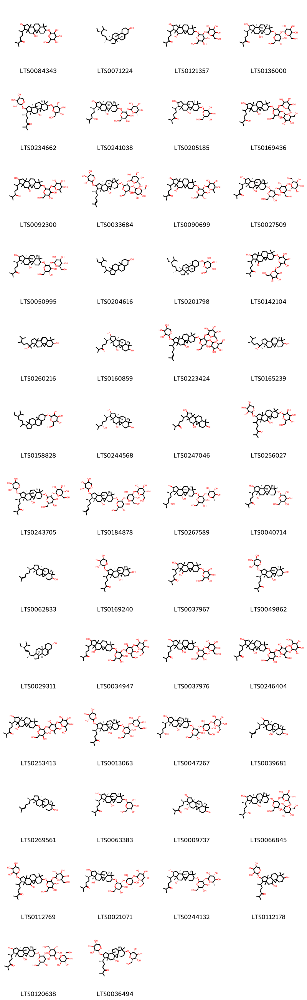{ width=100% }
    <figcaption>Hình ảnh cấu trúc hóa học của 53 hoạt chất thuộc nhóm Steroids and steroid derivatives gồm ['6-(14,18-dihydroxy-7,7,12,16-tetramethyl-6-{[3,4,5-trihydroxy-6-(hydroxymethyl)oxan-2-yl]oxy}pentacyclo[9.7.0.0¹,³.0³,⁸.0¹²,¹⁶]octadecan-15-yl)-2-methylheptan-3-one (LTS0084343)', 'stigmast-5-en-3-ol (LTS0071224)', '6-(6-{[4,5-dihydroxy-6-(hydroxymethyl)-3-{[3,4,5-trihydroxy-6-(hydroxymethyl)oxan-2-yl]oxy}oxan-2-yl]oxy}-14,17-dihydroxy-7,7,12,16-tetramethylpentacyclo[9.7.0.0¹,³.0³,⁸.0¹²,¹⁶]octadecan-15-yl)-2-methylheptan-3-one (LTS0121357)', '(6r)-6-[(1r,3r,6s,8s,11s,12s,14s,15r,16r,18r)-6-{[(2r,3r,4s,5s,6r)-4,5-dihydroxy-6-(hydroxymethyl)-3-{[(2s,3r,4s,5s,6r)-3,4,5-trihydroxy-6-(hydroxymethyl)oxan-2-yl]oxy}oxan-2-yl]oxy}-14,18-dihydroxy-7,7,12,16-tetramethylpentacyclo[9.7.0.0¹,³.0³,⁸.0¹²,¹⁶]octadecan-15-yl]-2-methylheptan-3-one (LTS0136000)', '(6r)-6-[(1s,3s,6s,8r,11s,12s,14s,15r,16r,18r)-18-hydroxy-7,7,12,16-tetramethyl-6-{[(2r,3r,4s,5s,6r)-3,4,5-trihydroxy-6-(hydroxymethyl)oxan-2-yl]oxy}-14-{[(2s,3r,4s,5s)-3,4,5-trihydroxyoxan-2-yl]oxy}pentacyclo[9.7.0.0¹,³.0³,⁸.0¹²,¹⁶]octadecan-15-yl]-2-methylheptan-3-one (LTS0234662)', '(2s,3r,4r,5r,6s)-2-{[(2r,3r,4s,5s,6r)-2-{[(1r,3r,6s,8r,11s,12s,14s,15r,16r,18r)-14,18-dihydroxy-15-[(2r,5s)-5-hydroxy-6-methylheptan-2-yl]-7,7,12,16-tetramethylpentacyclo[9.7.0.0¹,³.0³,⁸.0¹²,¹⁶]octadecan-6-yl]oxy}-4,5-dihydroxy-6-(hydroxymethyl)oxan-3-yl]oxy}-6-methyloxane-3,4,5-triol (LTS0241038)', '(6r)-6-[(1s,3s,6s,8r,11s,12s,14s,15r,16r,18r)-14,18-dihydroxy-7,7,12,16-tetramethyl-6-{[(2r,3r,4s,5s,6r)-3,4,5-trihydroxy-6-(hydroxymethyl)oxan-2-yl]oxy}pentacyclo[9.7.0.0¹,³.0³,⁸.0¹²,¹⁶]octadecan-15-yl]-2-methylheptan-3-one (LTS0205185)', '2-[(2-{[14,18-dihydroxy-15-(5-hydroxy-6-methylheptan-2-yl)-7,7,12,16-tetramethylpentacyclo[9.7.0.0¹,³.0³,⁸.0¹²,¹⁶]octadecan-6-yl]oxy}-5-hydroxy-6-(hydroxymethyl)-3-{[3,4,5-trihydroxy-6-(hydroxymethyl)oxan-2-yl]oxy}oxan-4-yl)oxy]-6-(hydroxymethyl)oxane-3,4,5-triol (LTS0169436)', '2-[(2-{[14,18-dihydroxy-15-(5-hydroxy-6-methylheptan-2-yl)-7,7,12,16-tetramethylpentacyclo[9.7.0.0¹,³.0³,⁸.0¹²,¹⁶]octadecan-6-yl]oxy}-4,5-dihydroxy-6-(hydroxymethyl)oxan-3-yl)oxy]-6-methyloxane-3,4,5-triol (LTS0092300)', '(2s,3r,4s,5s,6r)-2-{[(2r,3r,4s,5r,6r)-3-hydroxy-6-{[(1r,3r,6s,8s,11r,12s,14s,15r,16r,18r)-18-hydroxy-7,7,12,16-tetramethyl-15-[(2r)-6-methylhept-5-en-2-yl]-14-{[(2s,3r,4s,5s)-3,4,5-trihydroxyoxan-2-yl]oxy}pentacyclo[9.7.0.0¹,³.0³,⁸.0¹²,¹⁶]octadecan-6-yl]oxy}-2-(hydroxymethyl)-5-{[(2s,3r,4s,5s,6r)-3,4,5-trihydroxy-6-(hydroxymethyl)oxan-2-yl]oxy}oxan-4-yl]oxy}-6-(hydroxymethyl)oxane-3,4,5-triol (LTS0033684)', '6-(6-{[4,5-dihydroxy-6-(hydroxymethyl)-3-[(3,4,5-trihydroxy-6-methyloxan-2-yl)oxy]oxan-2-yl]oxy}-14,17-dihydroxy-7,7,12,16-tetramethylpentacyclo[9.7.0.0¹,³.0³,⁸.0¹²,¹⁶]octadecan-15-yl)-2-methylheptan-3-one (LTS0090699)', '(6r)-6-[(1r,3r,6s,8s,11s,12s,14s,15r,16r,18r)-6-{[(2r,3r,4s,5s,6r)-3-{[(2s,3r,4r,5s,6r)-3,4-dihydroxy-6-(hydroxymethyl)-5-{[(2s,3r,4s,5s,6r)-3,4,5-trihydroxy-6-(hydroxymethyl)oxan-2-yl]oxy}oxan-2-yl]oxy}-4,5-dihydroxy-6-(hydroxymethyl)oxan-2-yl]oxy}-14,18-dihydroxy-7,7,12,16-tetramethylpentacyclo[9.7.0.0¹,³.0³,⁸.0¹²,¹⁶]octadecan-15-yl]-2-methylheptan-3-one (LTS0027509)', '(6r)-6-[(1r,3r,6s,8r,11s,12s,14s,15r,16r,18r)-6-{[(2r,3r,4s,5s,6r)-4,5-dihydroxy-6-(hydroxymethyl)-3-{[(2s,3r,4s,5s,6r)-3,4,5-trihydroxy-6-(hydroxymethyl)oxan-2-yl]oxy}oxan-2-yl]oxy}-14,18-dihydroxy-7,7,12,16-tetramethylpentacyclo[9.7.0.0¹,³.0³,⁸.0¹²,¹⁶]octadecan-15-yl]-2-methylheptan-3-one (LTS0050995)', 'stigmast-5-en-3-ol, (3β)- (LTS0204616)', 'sitogluside (LTS0201798)', '6-(14,17-dihydroxy-7,7,12,16-tetramethyl-6-{[3,4,5-trihydroxy-6-({[3,4,5-trihydroxy-6-(hydroxymethyl)oxan-2-yl]oxy}methyl)oxan-2-yl]oxy}pentacyclo[9.7.0.0¹,³.0³,⁸.0¹²,¹⁶]octadecan-15-yl)-2-methylheptan-3-one (LTS0142104)', '15-(2-hydroxy-5,6-dimethylheptan-2-yl)-7,7,12,16-tetramethylpentacyclo[9.7.0.0¹,³.0³,⁸.0¹²,¹⁶]octadec-10-en-6-ol (LTS0260216)', '(6r)-2-methyl-6-[(1s,3s,6s,8r,11s,12s,14s,15r,16r,18r)-6,14,18-trihydroxy-7,7,12,16-tetramethylpentacyclo[9.7.0.0¹,³.0³,⁸.0¹²,¹⁶]octadecan-15-yl]heptan-3-one (LTS0160859)', '2-[(3-hydroxy-6-{[18-hydroxy-7,7,12,16-tetramethyl-15-(6-methylhept-5-en-2-yl)-14-[(3,4,5-trihydroxyoxan-2-yl)oxy]pentacyclo[9.7.0.0¹,³.0³,⁸.0¹²,¹⁶]octadecan-6-yl]oxy}-2-(hydroxymethyl)-5-{[3,4,5-trihydroxy-6-(hydroxymethyl)oxan-2-yl]oxy}oxan-4-yl)oxy]-6-(hydroxymethyl)oxane-3,4,5-triol (LTS0223424)', '(1r,3r,6s,8r,12r,15s,16r)-15-[(2s,5r)-2-hydroxy-5,6-dimethylheptan-2-yl]-7,7,12,16-tetramethylpentacyclo[9.7.0.0¹,³.0³,⁸.0¹²,¹⁶]octadec-10-en-6-ol (LTS0165239)', '2-{[1-(5-ethyl-6-methylheptan-2-yl)-9a,11a-dimethyl-1h,2h,3h,3ah,3bh,4h,6h,7h,8h,9h,9bh,10h,11h-cyclopenta[a]phenanthren-7-yl]oxy}-6-(hydroxymethyl)oxane-3,4,5-triol (LTS0158828)', '(1r,3r,6s,8r,11s,12s,14s,15r,16r,18r)-15-[(2r,5s)-5-hydroxy-6-methylheptan-2-yl]-7,7,12,16-tetramethylpentacyclo[9.7.0.0¹,³.0³,⁸.0¹²,¹⁶]octadecane-6,14,18-triol (LTS0244568)', '2-methyl-6-{6,14,18-trihydroxy-7,7,12,16-tetramethylpentacyclo[9.7.0.0¹,³.0³,⁸.0¹²,¹⁶]octadecan-15-yl}heptan-3-one (LTS0247046)', '6-(18-hydroxy-7,7,12,16-tetramethyl-6-{[3,4,5-trihydroxy-6-(hydroxymethyl)oxan-2-yl]oxy}-14-[(3,4,5-trihydroxyoxan-2-yl)oxy]pentacyclo[9.7.0.0¹,³.0³,⁸.0¹²,¹⁶]octadecan-15-yl)-2-methylheptan-3-one (LTS0256027)', '(6r)-6-[(1r,3r,6s,8r,11s,12s,14s,15r,16r,18r)-6-{[(2r,3r,4s,5s,6r)-4,5-dihydroxy-6-(hydroxymethyl)-3-{[(2s,3r,4s,5s,6r)-3,4,5-trihydroxy-6-(hydroxymethyl)oxan-2-yl]oxy}oxan-2-yl]oxy}-18-hydroxy-7,7,12,16-tetramethyl-14-{[(2s,3r,4s,5s)-3,4,5-trihydroxyoxan-2-yl]oxy}pentacyclo[9.7.0.0¹,³.0³,⁸.0¹²,¹⁶]octadecan-15-yl]-2-methylheptan-3-one (LTS0243705)', '(2s,3r,4s,5s,6r)-2-{[(2s,3r,4s,5r,6r)-2-{[(2r,3r,4s,5s,6r)-4,5-dihydroxy-2-{[(1r,3r,6s,8r,11s,12s,14s,15r,16r,18r)-18-hydroxy-7,7,12,16-tetramethyl-15-[(2r)-6-methylhept-5-en-2-yl]-14-{[(2s,3r,4s,5s)-3,4,5-trihydroxyoxan-2-yl]oxy}pentacyclo[9.7.0.0¹,³.0³,⁸.0¹²,¹⁶]octadecan-6-yl]oxy}-6-(hydroxymethyl)oxan-3-yl]oxy}-3,5-dihydroxy-6-(hydroxymethyl)oxan-4-yl]oxy}-6-(hydroxymethyl)oxane-3,4,5-triol (LTS0184878)', '(2s,3r,4r,5r,6s)-2-{[(2r,3r,4s,5s,6r)-2-{[(1r,3r,6s,8s,11r,12s,14s,15r,16r,18r)-14,18-dihydroxy-15-[(2r,5s)-5-hydroxy-6-methylheptan-2-yl]-7,7,12,16-tetramethylpentacyclo[9.7.0.0¹,³.0³,⁸.0¹²,¹⁶]octadecan-6-yl]oxy}-4,5-dihydroxy-6-(hydroxymethyl)oxan-3-yl]oxy}-6-methyloxane-3,4,5-triol (LTS0267589)', '(6r)-6-[(1r,3r,6s,8r,11s,12s,14s,15r,16r,17s)-14,17-dihydroxy-7,7,12,16-tetramethyl-6-{[(2r,3r,4s,5s,6r)-3,4,5-trihydroxy-6-(hydroxymethyl)oxan-2-yl]oxy}pentacyclo[9.7.0.0¹,³.0³,⁸.0¹²,¹⁶]octadecan-15-yl]-2-methylheptan-3-one (LTS0040714)', '(3r,6s,8r,11s,12s,15r,16r)-7,7,12,16-tetramethyl-15-[(2r)-6-methylhept-5-en-2-yl]pentacyclo[9.7.0.0¹,³.0³,⁸.0¹²,¹⁶]octadecan-6-ol (LTS0062833)', '(6r)-6-[(1s,3s,6s,8r,11s,12s,14s,15r,16r,18r)-6,18-dihydroxy-7,7,12,16-tetramethyl-14-{[(2s,3r,4s,5s)-3,4,5-trihydroxyoxan-2-yl]oxy}pentacyclo[9.7.0.0¹,³.0³,⁸.0¹²,¹⁶]octadecan-15-yl]-2-methylheptan-3-one (LTS0169240)', '6-(14,17-dihydroxy-7,7,12,16-tetramethyl-6-{[3,4,5-trihydroxy-6-(hydroxymethyl)oxan-2-yl]oxy}pentacyclo[9.7.0.0¹,³.0³,⁸.0¹²,¹⁶]octadecan-15-yl)-2-methylheptan-3-one (LTS0037967)', '(6r)-6-[(1r,3r,6s,8r,11s,12s,14s,15r,16r,18r)-6,18-dihydroxy-7,7,12,16-tetramethyl-14-{[(2s,3r,4s,5s)-3,4,5-trihydroxyoxan-2-yl]oxy}pentacyclo[9.7.0.0¹,³.0³,⁸.0¹²,¹⁶]octadecan-15-yl]-2-methylheptan-3-one (LTS0049862)', 'phytosterol (LTS0029311)', '6-{6-[(3-{[3,5-dihydroxy-6-(hydroxymethyl)-4-{[3,4,5-trihydroxy-6-(hydroxymethyl)oxan-2-yl]oxy}oxan-2-yl]oxy}-4,5-dihydroxy-6-(hydroxymethyl)oxan-2-yl)oxy]-14,17-dihydroxy-7,7,12,16-tetramethylpentacyclo[9.7.0.0¹,³.0³,⁸.0¹²,¹⁶]octadecan-15-yl}-2-methylheptan-3-one (LTS0034947)', '6-(6-{[4,5-dihydroxy-6-(hydroxymethyl)-3-{[3,4,5-trihydroxy-6-(hydroxymethyl)oxan-2-yl]oxy}oxan-2-yl]oxy}-14,18-dihydroxy-7,7,12,16-tetramethylpentacyclo[9.7.0.0¹,³.0³,⁸.0¹²,¹⁶]octadecan-15-yl)-2-methylheptan-3-one (LTS0037976)', '6-{6-[(3-{[3,4-dihydroxy-6-(hydroxymethyl)-5-{[3,4,5-trihydroxy-6-(hydroxymethyl)oxan-2-yl]oxy}oxan-2-yl]oxy}-4,5-dihydroxy-6-(hydroxymethyl)oxan-2-yl)oxy]-14,18-dihydroxy-7,7,12,16-tetramethylpentacyclo[9.7.0.0¹,³.0³,⁸.0¹²,¹⁶]octadecan-15-yl}-2-methylheptan-3-one (LTS0246404)', '6-[6-({3-[(3,5-dihydroxy-6-methyl-4-{[3,4,5-trihydroxy-6-(hydroxymethyl)oxan-2-yl]oxy}oxan-2-yl)oxy]-4,5-dihydroxy-6-(hydroxymethyl)oxan-2-yl}oxy)-14,17-dihydroxy-7,7,12,16-tetramethylpentacyclo[9.7.0.0¹,³.0³,⁸.0¹²,¹⁶]octadecan-15-yl]-2-methylheptan-3-one (LTS0253413)', '(6r)-6-[(1s,3s,6s,8r,11s,12s,14s,15r,16r,18r)-6-{[(2r,3r,4s,5s,6r)-4,5-dihydroxy-6-(hydroxymethyl)-3-{[(2s,3r,4s,5s,6r)-3,4,5-trihydroxy-6-(hydroxymethyl)oxan-2-yl]oxy}oxan-2-yl]oxy}-18-hydroxy-7,7,12,16-tetramethyl-14-{[(2s,3r,4s,5s)-3,4,5-trihydroxyoxan-2-yl]oxy}pentacyclo[9.7.0.0¹,³.0³,⁸.0¹²,¹⁶]octadecan-15-yl]-2-methylheptan-3-one (LTS0013063)', '(2s,3r,4s,5s,6r)-2-{[(2s,3r,4s,5r,6r)-2-{[(2r,3r,4s,5s,6r)-2-{[(1r,3r,6s,8r,11s,12s,14s,15r,16r,18r)-14,18-dihydroxy-15-[(2r,5s)-5-hydroxy-6-methylheptan-2-yl]-7,7,12,16-tetramethylpentacyclo[9.7.0.0¹,³.0³,⁸.0¹²,¹⁶]octadecan-6-yl]oxy}-4,5-dihydroxy-6-(hydroxymethyl)oxan-3-yl]oxy}-3,5-dihydroxy-6-(hydroxymethyl)oxan-4-yl]oxy}-6-(hydroxymethyl)oxane-3,4,5-triol (LTS0047267)', '(1r,3r,6s,8r,11s,12s,14s,15r,16r,18r)-7,7,12,16-tetramethyl-15-[(2r)-6-methylhept-5-en-2-yl]pentacyclo[9.7.0.0¹,³.0³,⁸.0¹²,¹⁶]octadecane-6,14,18-triol (LTS0039681)', 'cycloartenol (LTS0269561)', '(6r)-6-[(1r,3r,6s,8r,11s,12s,14s,15r,16r,18r)-14,18-dihydroxy-7,7,12,16-tetramethyl-6-{[(2r,3r,4s,5s,6r)-3,4,5-trihydroxy-6-(hydroxymethyl)oxan-2-yl]oxy}pentacyclo[9.7.0.0¹,³.0³,⁸.0¹²,¹⁶]octadecan-15-yl]-2-methylheptan-3-one (LTS0063383)', '(6r)-2-methyl-6-[(1r,3r,6s,8r,11s,12s,14s,15r,16r,17s)-6,14,17-trihydroxy-7,7,12,16-tetramethylpentacyclo[9.7.0.0¹,³.0³,⁸.0¹²,¹⁶]octadecan-15-yl]heptan-3-one (LTS0009737)', '(2s,3r,4s,5s,6r)-2-{[(2r,3r,4s,5r,6r)-2-{[(1r,3r,6s,8s,11r,12s,14s,15r,16r,18r)-14,18-dihydroxy-15-[(2r,5s)-5-hydroxy-6-methylheptan-2-yl]-7,7,12,16-tetramethylpentacyclo[9.7.0.0¹,³.0³,⁸.0¹²,¹⁶]octadecan-6-yl]oxy}-5-hydroxy-6-(hydroxymethyl)-3-{[(2s,3r,4s,5s,6r)-3,4,5-trihydroxy-6-(hydroxymethyl)oxan-2-yl]oxy}oxan-4-yl]oxy}-6-(hydroxymethyl)oxane-3,4,5-triol (LTS0066845)', '6-(6-{[4,5-dihydroxy-6-(hydroxymethyl)-3-{[3,4,5-trihydroxy-6-(hydroxymethyl)oxan-2-yl]oxy}oxan-2-yl]oxy}-18-hydroxy-7,7,12,16-tetramethyl-14-[(3,4,5-trihydroxyoxan-2-yl)oxy]pentacyclo[9.7.0.0¹,³.0³,⁸.0¹²,¹⁶]octadecan-15-yl)-2-methylheptan-3-one (LTS0112769)', '(6r)-6-[(1r,3r,6s,8r,11s,12s,14s,15r,16r,17s)-6-{[(2r,3r,4s,5s,6r)-3-{[(2s,3r,4r,5s,6s)-3,5-dihydroxy-6-methyl-4-{[(2s,3r,4s,5s,6r)-3,4,5-trihydroxy-6-(hydroxymethyl)oxan-2-yl]oxy}oxan-2-yl]oxy}-4,5-dihydroxy-6-(hydroxymethyl)oxan-2-yl]oxy}-14,17-dihydroxy-7,7,12,16-tetramethylpentacyclo[9.7.0.0¹,³.0³,⁸.0¹²,¹⁶]octadecan-15-yl]-2-methylheptan-3-one (LTS0021071)', '(6r)-6-[(1r,3r,6s,8r,11s,12s,14s,15r,16r,17s)-6-{[(2r,3r,4s,5s,6r)-4,5-dihydroxy-6-(hydroxymethyl)-3-{[(2s,3r,4r,5r,6s)-3,4,5-trihydroxy-6-methyloxan-2-yl]oxy}oxan-2-yl]oxy}-14,17-dihydroxy-7,7,12,16-tetramethylpentacyclo[9.7.0.0¹,³.0³,⁸.0¹²,¹⁶]octadecan-15-yl]-2-methylheptan-3-one (LTS0244132)', '6-{6,18-dihydroxy-7,7,12,16-tetramethyl-14-[(3,4,5-trihydroxyoxan-2-yl)oxy]pentacyclo[9.7.0.0¹,³.0³,⁸.0¹²,¹⁶]octadecan-15-yl}-2-methylheptan-3-one (LTS0112178)', '(6r)-6-[(1r,3r,6s,8r,11s,12s,14s,15r,16r,18r)-6-{[(2r,3r,4s,5r,6r)-4-{[(2s,3r,4s,5s,6r)-4,5-dihydroxy-6-(hydroxymethyl)-3-{[(2s,3r,4s,5s,6r)-3,4,5-trihydroxy-6-(hydroxymethyl)oxan-2-yl]oxy}oxan-2-yl]oxy}-3,5-dihydroxy-6-(hydroxymethyl)oxan-2-yl]oxy}-14,18-dihydroxy-7,7,12,16-tetramethylpentacyclo[9.7.0.0¹,³.0³,⁸.0¹²,¹⁶]octadecan-15-yl]-2-methylheptan-3-one (LTS0120638)', '(6r)-6-[(1r,3r,6s,8r,11s,12s,14s,15r,16r,18r)-18-hydroxy-7,7,12,16-tetramethyl-6-{[(2r,3r,4s,5s,6r)-3,4,5-trihydroxy-6-(hydroxymethyl)oxan-2-yl]oxy}-14-{[(2s,3r,4s,5s)-3,4,5-trihydroxyoxan-2-yl]oxy}pentacyclo[9.7.0.0¹,³.0³,⁸.0¹²,¹⁶]octadecan-15-yl]-2-methylheptan-3-one (LTS0036494)', '(6r)-6-[(1r,3r,6s,8r,11s,12s,14s,15r,16r,17s)-6-{[(2r,3r,4s,5s,6r)-3-{[(2s,3r,4s,5r,6r)-3,5-dihydroxy-6-(hydroxymethyl)-4-{[(2s,3r,4s,5s,6r)-3,4,5-trihydroxy-6-(hydroxymethyl)oxan-2-yl]oxy}oxan-2-yl]oxy}-4,5-dihydroxy-6-(hydroxymethyl)oxan-2-yl]oxy}-14,17-dihydroxy-7,7,12,16-tetramethylpentacyclo[9.7.0.0¹,³.0³,⁸.0¹²,¹⁶]octadecan-15-yl]-2-methylheptan-3-one (LTS0117275)', '(6r)-6-[(1r,3r,6s,8r,11s,12s,14s,15r,16r,17s)-6-{[(2r,3r,4s,5s,6r)-4,5-dihydroxy-6-(hydroxymethyl)-3-{[(2s,3r,4s,5s,6r)-3,4,5-trihydroxy-6-(hydroxymethyl)oxan-2-yl]oxy}oxan-2-yl]oxy}-14,17-dihydroxy-7,7,12,16-tetramethylpentacyclo[9.7.0.0¹,³.0³,⁸.0¹²,¹⁶]octadecan-15-yl]-2-methylheptan-3-one (LTS0114589)', '(6r)-6-[(1r,3r,6s,8r,11s,12s,14s,15r,16r,17s)-14,17-dihydroxy-7,7,12,16-tetramethyl-6-{[(2r,3r,4s,5s,6r)-3,4,5-trihydroxy-6-({[(2r,3r,4s,5s,6r)-3,4,5-trihydroxy-6-(hydroxymethyl)oxan-2-yl]oxy}methyl)oxan-2-yl]oxy}pentacyclo[9.7.0.0¹,³.0³,⁸.0¹²,¹⁶]octadecan-15-yl]-2-methylheptan-3-one (LTS0265324)'].</figcaption>
</figure>
#### Nhóm Tannins
<figure markdown="span">
    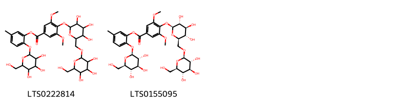{ width=100% }
    <figcaption>Hình ảnh cấu trúc hóa học của 2 hoạt chất thuộc nhóm Tannins gồm ['5-methyl-2-{[3,4,5-trihydroxy-6-(hydroxymethyl)oxan-2-yl]oxy}phenyl 3,5-dimethoxy-4-{[3,4,5-trihydroxy-6-({[3,4,5-trihydroxy-6-(hydroxymethyl)oxan-2-yl]oxy}methyl)oxan-2-yl]oxy}benzoate (LTS0222814)', '5-methyl-2-{[(2s,3r,4s,5s,6r)-3,4,5-trihydroxy-6-(hydroxymethyl)oxan-2-yl]oxy}phenyl 3,5-dimethoxy-4-{[(2s,3r,4s,5s,6r)-3,4,5-trihydroxy-6-({[(2r,3r,4s,5s,6r)-3,4,5-trihydroxy-6-(hydroxymethyl)oxan-2-yl]oxy}methyl)oxan-2-yl]oxy}benzoate (LTS0155095)'].</figcaption>
</figure>

---

### Dược dân tộc học

Danh sách các quốc gia có sử dụng *Curculigo orchioides* trong điều trị các bệnh. 

| Country   | Disease                              | Bệnh                                    |
|:----------|:-------------------------------------|:----------------------------------------|
| China     | Carminative                          | Gây ô nhiễm môi trường                  |
| Elsewhere | Aperient, Demulcent, Diuretic, Tonic | Aperient, Demulcent, lợi tiểu, thuốc bổ |

---

# Chi Leucojum

??? note "Danh sách các dược liệu thuộc chi"
    
	 - *Leucojum aestivum*

---
## Leucojum aestivum
### Thông tin về thực vật

!!! info "Phân loại thực vật của *Leucojum aestivum* từ GIBF:"
    - **Kingdom:** Plantae
    - **Phylum:** Tracheophyta
    - **Order:** Asparagales
    - **Family:** Amaryllidaceae
    - **Genus:** Leucojum
    - **Species:** *Leucojum aestivum*

 

| Label (VI)   | Label (EN)   | Scientific Name   | Descriptions (VI)   | Descriptions (EN)   | Also Known As (VI)   | Also Known As (EN)                  |
|:-------------|:-------------|:------------------|:--------------------|:--------------------|:---------------------|:------------------------------------|
| N/A          | N/A          | Leucojum aestivum | loài thực vật       | species of plant    | ['']                 | ['Loddon lily', 'Summer Snowflake'] |

#### Phân bố trên thế giới

**Từ CSDL GIBF** nan, United States of America, Portugal, Guernsey, France, Russian Federation, Croatia, Spain, Canada, Germany, United Kingdom of Great Britain and Northern Ireland, Ireland, Netherlands

#### Phân bố tại Việt Nam

**Từ CSDL GIBF**: Không có ghi nhận ở Việt Nam

---
### Thành phần hóa học
        
- Theo cơ sở dữ liệu lotus: Từ loài *Leucojum aestivum* đã phân lập và xác định được 23 hoạt chất thuộc về các nhóm Tetrahydroisoquinolines, Quinolines and derivatives, Pyrans, Amaryllidaceae alkaloids. 

|    | chemicalTaxonomyClassyfireClass   |   smiles_count |
|---:|:----------------------------------|---------------:|
|  0 | Amaryllidaceae alkaloids          |             18 |
|  1 | Pyrans                            |              1 |
|  2 | Quinolines and derivatives        |              3 |
|  3 | Tetrahydroisoquinolines           |              1 |

#### Nhóm Amaryllidaceae alkaloids
<figure markdown="span">
    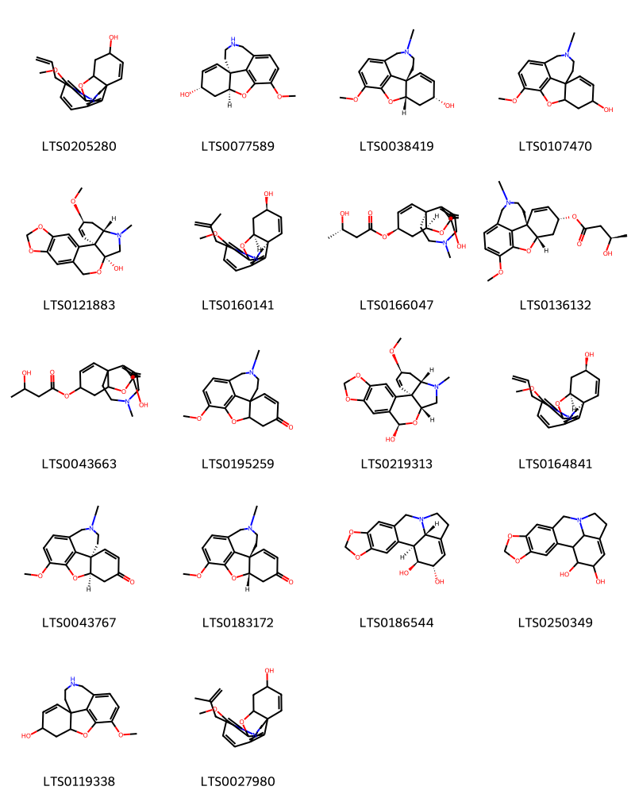{ width=100% }
    <figcaption>Hình ảnh cấu trúc hóa học của 18 hoạt chất thuộc nhóm Amaryllidaceae alkaloids gồm ['9-methoxy-4-(prop-2-en-1-yl)-11-oxa-4-azatetracyclo[8.6.1.0¹,¹².0⁶,¹⁷]heptadeca-6(17),7,9,15-tetraen-14-ol (LTS0205280)', '(1s,12s,14s)-9-methoxy-11-oxa-4-azatetracyclo[8.6.1.0¹,¹².0⁶,¹⁷]heptadeca-6,8,10(17),15-tetraen-14-ol (LTS0077589)', 'galantamine (LTS0038419)', 'galantamine (LTS0107470)', 'tazettine (LTS0121883)', '(1s,12s,14r)-9-methoxy-4-(2-methylprop-2-en-1-yl)-11-oxa-4-azatetracyclo[8.6.1.0¹,¹².0⁶,¹⁷]heptadeca-6(17),7,9,15-tetraen-14-ol (LTS0160141)', '(1s,12s,14r)-9-hydroxy-4-methyl-11-oxa-4-azatetracyclo[8.6.1.0¹,¹².0⁶,¹⁷]heptadeca-6,8,10(17),15-tetraen-14-yl (3s)-3-hydroxybutanoate (LTS0166047)', '(1s,12s,14r)-9-methoxy-4-methyl-11-oxa-4-azatetracyclo[8.6.1.0¹,¹².0⁶,¹⁷]heptadeca-6,8,10(17),15-tetraen-14-yl (3r)-3-hydroxybutanoate (LTS0136132)', '9-hydroxy-4-methyl-11-oxa-4-azatetracyclo[8.6.1.0¹,¹².0⁶,¹⁷]heptadeca-6,8,10(17),15-tetraen-14-yl 3-hydroxybutanoate (LTS0043663)', '9-methoxy-4-methyl-11-oxa-4-azatetracyclo[8.6.1.0¹,¹².0⁶,¹⁷]heptadeca-6,8,10(17),15-tetraen-14-one (LTS0195259)', 'pretazettine (LTS0219313)', '(1s,12s,14r)-9-methoxy-4-(prop-2-en-1-yl)-11-oxa-4-azatetracyclo[8.6.1.0¹,¹².0⁶,¹⁷]heptadeca-6(17),7,9,15-tetraen-14-ol (LTS0164841)', '(+)-narwedine (LTS0043767)', 'narwedine (LTS0183172)', 'lycorine (LTS0186544)', 'lycorine (LTS0250349)', '9-methoxy-11-oxa-4-azatetracyclo[8.6.1.0¹,¹².0⁶,¹⁷]heptadeca-6,8,10(17),15-tetraen-14-ol (LTS0119338)', '9-methoxy-4-(2-methylprop-2-en-1-yl)-11-oxa-4-azatetracyclo[8.6.1.0¹,¹².0⁶,¹⁷]heptadeca-6(17),7,9,15-tetraen-14-ol (LTS0027980)'].</figcaption>
</figure>
#### Nhóm Pyrans
<figure markdown="span">
    { width=100% }
    <figcaption>Hình ảnh cấu trúc hóa học của 1 hoạt chất thuộc nhóm Pyrans gồm ['chelidonic acid (LTS0084071)'].</figcaption>
</figure>
#### Nhóm Quinolines and derivatives
<figure markdown="span">
    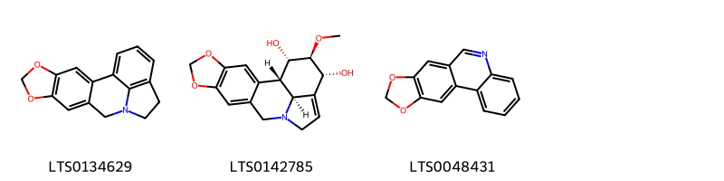{ width=100% }
    <figcaption>Hình ảnh cấu trúc hóa học của 3 hoạt chất thuộc nhóm Quinolines and derivatives gồm ['5,7-dioxa-12-azapentacyclo[10.6.1.0²,¹⁰.0⁴,⁸.0¹⁵,¹⁹]nonadeca-1(18),2,4(8),9,15(19),16-hexaene (LTS0134629)', 'ungiminorine (LTS0142785)', 'trisphaeridine (LTS0048431)'].</figcaption>
</figure>
#### Nhóm Tetrahydroisoquinolines
<figure markdown="span">
    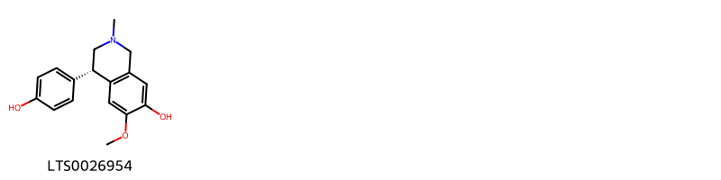{ width=100% }
    <figcaption>Hình ảnh cấu trúc hóa học của 1 hoạt chất thuộc nhóm Tetrahydroisoquinolines gồm ['cherylline (LTS0026954)'].</figcaption>
</figure>

---

### Dược dân tộc học

Danh sách các quốc gia có sử dụng *Leucojum aestivum* trong điều trị các bệnh. 

| Country   | Disease   | Bệnh   |
|:----------|:----------|:-------|
| India     | Emetic    | Phôi   |

---

# Chi Leopoldia

??? note "Danh sách các dược liệu thuộc chi"
    
	 - *Leopoldia comosa*

---
## Leopoldia comosa
### Thông tin về thực vật

!!! info "Phân loại thực vật của *Muscari comosum* từ GIBF:"
    - **Kingdom:** Plantae
    - **Phylum:** Tracheophyta
    - **Order:** Asparagales
    - **Family:** Asparagaceae
    - **Genus:** Muscari
    - **Species:** *Muscari comosum*

 

| Label (VI)   | Label (EN)   | Scientific Name   | Descriptions (VI)   | Descriptions (EN)   | Also Known As (VI)   | Also Known As (EN)   |
|:-------------|:-------------|:------------------|:--------------------|:--------------------|:---------------------|:---------------------|
| N/A          | N/A          | Leopoldia comosa  | loài thực vật       | species of plant    | ['']                 | ['']                 |

#### Phân bố trên thế giới

**Từ CSDL GIBF** Malta, Czechia, Israel, Slovenia, Spain, Netherlands, Poland, Greece, Albania, Croatia, Cyprus, Morocco, Germany, Austria, Portugal, Ukraine, Italy, Switzerland, Bulgaria, France

#### Phân bố tại Việt Nam

**Từ CSDL GIBF**: Không có ghi nhận ở Việt Nam

---
### Thành phần hóa học
        
- Theo cơ sở dữ liệu lotus: Từ loài *Muscari comosum* đã phân lập và xác định được 41 hoạt chất thuộc về các nhóm Homoisoflavonoids, Prenol lipids, Isoflavonoids, Steroids and steroid derivatives. 

|    | chemicalTaxonomyClassyfireClass   |   smiles_count |
|---:|:----------------------------------|---------------:|
|  0 | Homoisoflavonoids                 |             16 |
|  1 | Isoflavonoids                     |              4 |
|  2 | Prenol lipids                     |             19 |
|  3 | Steroids and steroid derivatives  |              2 |

#### Nhóm Homoisoflavonoids
<figure markdown="span">
    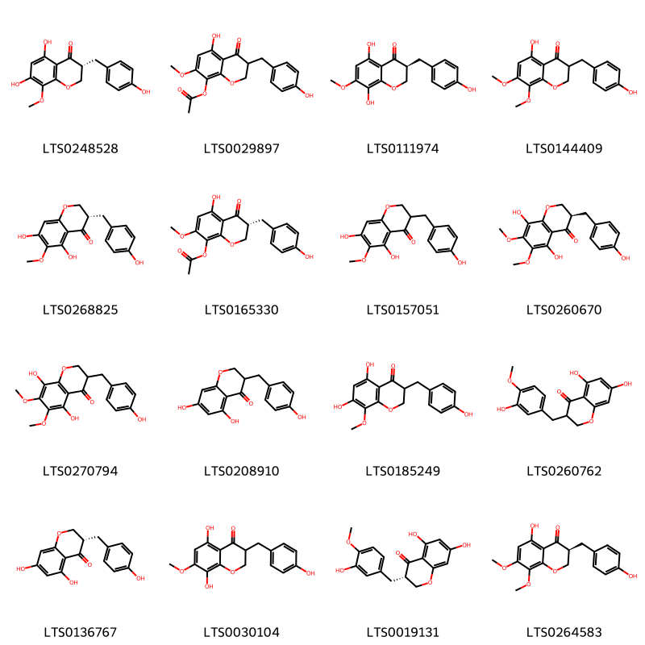{ width=100% }
    <figcaption>Hình ảnh cấu trúc hóa học của 16 hoạt chất thuộc nhóm Homoisoflavonoids gồm ['(3r)-5,7-dihydroxy-3-[(4-hydroxyphenyl)methyl]-8-methoxy-2,3-dihydro-1-benzopyran-4-one (LTS0248528)', '5-hydroxy-3-[(4-hydroxyphenyl)methyl]-7-methoxy-4-oxo-2,3-dihydro-1-benzopyran-8-yl acetate (LTS0029897)', '(3s)-5,8-dihydroxy-3-[(4-hydroxyphenyl)methyl]-7-methoxy-2,3-dihydro-1-benzopyran-4-one (LTS0111974)', '5-hydroxy-3-[(4-hydroxyphenyl)methyl]-7,8-dimethoxy-2,3-dihydro-1-benzopyran-4-one (LTS0144409)', '(3s)-5,7-dihydroxy-3-[(4-hydroxyphenyl)methyl]-6-methoxy-2,3-dihydro-1-benzopyran-4-one (LTS0268825)', '(3r)-5-hydroxy-3-[(4-hydroxyphenyl)methyl]-7-methoxy-4-oxo-2,3-dihydro-1-benzopyran-8-yl acetate (LTS0165330)', '5,7-dihydroxy-3-[(4-hydroxyphenyl)methyl]-6-methoxy-2,3-dihydro-1-benzopyran-4-one (LTS0157051)', '(3r)-5,8-dihydroxy-3-[(4-hydroxyphenyl)methyl]-6,7-dimethoxy-2,3-dihydro-1-benzopyran-4-one (LTS0260670)', '5,8-dihydroxy-3-[(4-hydroxyphenyl)methyl]-6,7-dimethoxy-2,3-dihydro-1-benzopyran-4-one (LTS0270794)', '5,7-dihydroxy-3-[(4-hydroxyphenyl)methyl]-2,3-dihydro-1-benzopyran-4-one (LTS0208910)', '5,7-dihydroxy-3-[(4-hydroxyphenyl)methyl]-8-methoxy-2,3-dihydro-1-benzopyran-4-one (LTS0185249)', '5,7-dihydroxy-3-[(3-hydroxy-4-methoxyphenyl)methyl]-2,3-dihydro-1-benzopyran-4-one (LTS0260762)', '(3s)-5,7-dihydroxy-3-[(4-hydroxyphenyl)methyl]-2,3-dihydro-1-benzopyran-4-one (LTS0136767)', '5,8-dihydroxy-3-[(4-hydroxyphenyl)methyl]-7-methoxy-2,3-dihydro-1-benzopyran-4-one (LTS0030104)', '(3s)-5,7-dihydroxy-3-[(3-hydroxy-4-methoxyphenyl)methyl]-2,3-dihydro-1-benzopyran-4-one (LTS0019131)', '(3s)-5-hydroxy-3-[(4-hydroxyphenyl)methyl]-7,8-dimethoxy-2,3-dihydro-1-benzopyran-4-one (LTS0264583)'].</figcaption>
</figure>
#### Nhóm Isoflavonoids
<figure markdown="span">
    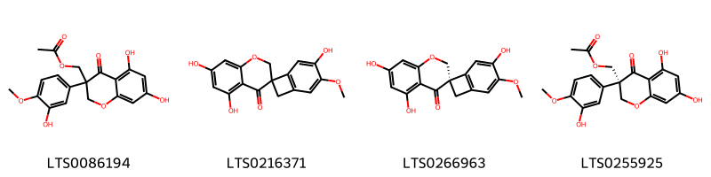{ width=100% }
    <figcaption>Hình ảnh cấu trúc hóa học của 4 hoạt chất thuộc nhóm Isoflavonoids gồm ['[5,7-dihydroxy-3-(3-hydroxy-4-methoxyphenyl)-4-oxo-2h-1-benzopyran-3-yl]methyl acetate (LTS0086194)', "4',5,7-trihydroxy-3'-methoxy-2h-spiro[1-benzopyran-3,7'-bicyclo[4.2.0]octane]-1'(6'),2',4'-trien-4-one (LTS0216371)", "(3r)-4',5,7-trihydroxy-3'-methoxy-2h-spiro[1-benzopyran-3,7'-bicyclo[4.2.0]octane]-1'(6'),2',4'-trien-4-one (LTS0266963)", '[(3r)-5,7-dihydroxy-3-(3-hydroxy-4-methoxyphenyl)-4-oxo-2h-1-benzopyran-3-yl]methyl acetate (LTS0255925)'].</figcaption>
</figure>
#### Nhóm Prenol lipids
<figure markdown="span">
    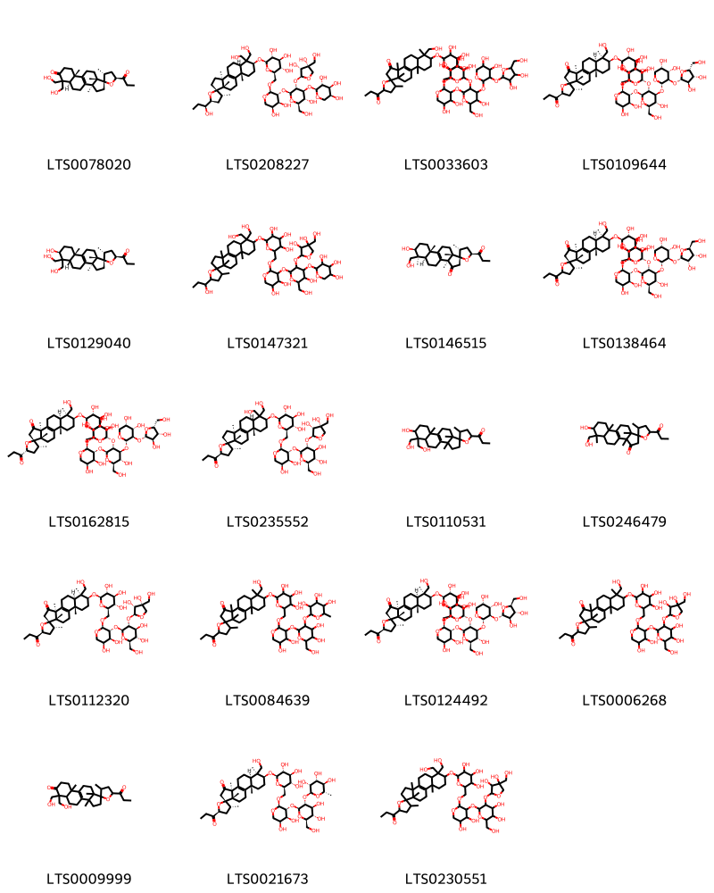{ width=100% }
    <figcaption>Hình ảnh cấu trúc hóa học của 19 hoạt chất thuộc nhóm Prenol lipids gồm ["(1s,3'r,3as,5's,5ar,9as,11as)-6,6-bis(hydroxymethyl)-3',3a,9a,11a-tetramethyl-5'-propanoyl-3,4,5,5a,8,9,10,11-octahydro-2h-spiro[cyclopenta[a]phenanthrene-1,2'-oxolan]-7-one (LTS0078020)", "(2r,3r,4s,5s,6r)-2-[(1s,3'r,3as,5's,5ar,7s,9as,11as)-6,6-bis(hydroxymethyl)-5'-[(1s)-1-hydroxypropyl]-3',3a,9a,11a-tetramethyl-2,3,4,5,5a,7,8,9,10,11-decahydrospiro[cyclopenta[a]phenanthrene-1,2'-oxolane]oxy]-6-({[(2s,3r,4s,5s)-3-{[(2s,3r,4s,5r,6r)-3-{[(2s,3r,4r)-3,4-dihydroxy-4-(hydroxymethyl)oxolan-2-yl]oxy}-5-hydroxy-6-(hydroxymethyl)-4-{[(2s,3r,4s,5s)-3,4,5-trihydroxyoxan-2-yl]oxy}oxan-2-yl]oxy}-4,5-dihydroxyoxan-2-yl]oxy}methyl)oxane-3,4,5-triol (LTS0208227)", "7-{[6-({[3-({4-[(3-{[3,4-dihydroxy-5-(hydroxymethyl)oxolan-2-yl]oxy}-4,5-dihydroxyoxan-2-yl)oxy]-5-hydroxy-6-(hydroxymethyl)-3-[(3,4,5-trihydroxy-6-methyloxan-2-yl)oxy]oxan-2-yl}oxy)-4,5-dihydroxyoxan-2-yl]oxy}methyl)-3,4,5-trihydroxyoxan-2-yl]oxy}-6-(hydroxymethyl)-3',3a,6,9a,11a-pentamethyl-5'-propanoyl-4,5,5a,7,8,9,10,11-octahydro-2h-spiro[cyclopenta[a]phenanthrene-1,2'-oxolan]-3-one (LTS0033603)", "(1s,3'r,3as,5's,5ar,6s,7s,9as,11as)-7-{[(2r,3r,4s,5s,6r)-6-({[(2s,3r,4s,5s)-3-{[(2s,3r,4s,5r,6r)-4-{[(2s,3r,4s,5s)-3-{[(2s,3r,4r,5r)-3,4-dihydroxy-5-(hydroxymethyl)oxolan-2-yl]oxy}-4,5-dihydroxyoxan-2-yl]oxy}-5-hydroxy-6-(hydroxymethyl)-3-{[(2s,3r,4r,5r,6s)-3,4,5-trihydroxy-6-methyloxan-2-yl]oxy}oxan-2-yl]oxy}-4,5-dihydroxyoxan-2-yl]oxy}methyl)-3,4,5-trihydroxyoxan-2-yl]oxy}-6-(hydroxymethyl)-3',3a,6,9a,11a-pentamethyl-5'-propanoyl-4,5,5a,7,8,9,10,11-octahydro-2h-spiro[cyclopenta[a]phenanthrene-1,2'-oxolan]-3-one (LTS0109644)", "1-[(1s,3'r,3as,5's,5as,7s,9as,11as)-7-hydroxy-6,6-bis(hydroxymethyl)-3',3a,9a,11a-tetramethyl-2,3,4,5,5a,7,8,9,10,11-decahydrospiro[cyclopenta[a]phenanthrene-1,2'-oxolan]-5'-yl]propan-1-one (LTS0129040)", "2-[6,6-bis(hydroxymethyl)-5'-(1-hydroxypropyl)-3',3a,9a,11a-tetramethyl-2,3,4,5,5a,7,8,9,10,11-decahydrospiro[cyclopenta[a]phenanthrene-1,2'-oxolane]oxy]-6-[({3-[(3-{[3,4-dihydroxy-4-(hydroxymethyl)oxolan-2-yl]oxy}-5-hydroxy-6-(hydroxymethyl)-4-[(3,4,5-trihydroxyoxan-2-yl)oxy]oxan-2-yl)oxy]-4,5-dihydroxyoxan-2-yl}oxy)methyl]oxane-3,4,5-triol (LTS0147321)", "(1s,3'r,3as,5's,5ar,6s,7s,9as,11as)-7-hydroxy-6-(hydroxymethyl)-3',3a,6,9a,11a-pentamethyl-5'-propanoyl-4,5,5a,7,8,9,10,11-octahydro-2h-spiro[cyclopenta[a]phenanthrene-1,2'-oxolan]-3-one (LTS0146515)", "(1s,3'r,3as,5ar,6s,7s,9as,11as)-7-{[(2r,3r,4s,5s,6r)-6-({[(2s,3r,4s,5s)-3-{[(2s,3r,4s,5r,6r)-4-{[(2s,3r,4s,5s)-3-{[(2s,3s,4r,5s)-3,4-dihydroxy-5-(hydroxymethyl)oxolan-2-yl]oxy}-4,5-dihydroxyoxan-2-yl]oxy}-5-hydroxy-6-(hydroxymethyl)-3-{[(2s,3r,4r,5r,6s)-3,4,5-trihydroxy-6-methyloxan-2-yl]oxy}oxan-2-yl]oxy}-4,5-dihydroxyoxan-2-yl]oxy}methyl)-3,4,5-trihydroxyoxan-2-yl]oxy}-6-(hydroxymethyl)-3',3a,6,9a,11a-pentamethyl-5'-propanoyl-4,5,5a,7,8,9,10,11-octahydro-2h-spiro[cyclopenta[a]phenanthrene-1,2'-oxolan]-3-one (LTS0138464)", "(1s,3'r,3as,5'r,5ar,6s,7s,9as,11as)-7-{[(2r,3r,4s,5s,6r)-6-({[(2s,3r,4s,5s)-3-{[(2s,3r,4s,5r,6r)-4-{[(2s,3r,4s,5s)-3-{[(2s,3r,4r,5r)-3,4-dihydroxy-5-(hydroxymethyl)oxolan-2-yl]oxy}-4,5-dihydroxyoxan-2-yl]oxy}-5-hydroxy-6-(hydroxymethyl)-3-{[(2s,3r,4r,5r,6s)-3,4,5-trihydroxy-6-methyloxan-2-yl]oxy}oxan-2-yl]oxy}-4,5-dihydroxyoxan-2-yl]oxy}methyl)-3,4,5-trihydroxyoxan-2-yl]oxy}-6-(hydroxymethyl)-3',3a,6,9a,11a-pentamethyl-5'-propanoyl-4,5,5a,7,8,9,10,11-octahydro-2h-spiro[cyclopenta[a]phenanthrene-1,2'-oxolan]-3-one (LTS0162815)", "1-[(1s,3'r,3as,5's,5ar,7s,9as,11as)-7-{[(2r,3r,4s,5s,6r)-6-({[(2s,3r,4s,5s)-3-{[(2s,3r,4s,5s,6r)-3-{[(2s,3r,4r)-3,4-dihydroxy-4-(hydroxymethyl)oxolan-2-yl]oxy}-4,5-dihydroxy-6-(hydroxymethyl)oxan-2-yl]oxy}-4,5-dihydroxyoxan-2-yl]oxy}methyl)-3,4,5-trihydroxyoxan-2-yl]oxy}-6,6-bis(hydroxymethyl)-3',3a,9a,11a-tetramethyl-2,3,4,5,5a,7,8,9,10,11-decahydrospiro[cyclopenta[a]phenanthrene-1,2'-oxolan]-5'-yl]propan-1-one (LTS0235552)", "1-[7-hydroxy-6,6-bis(hydroxymethyl)-3',3a,9a,11a-tetramethyl-2,3,4,5,5a,7,8,9,10,11-decahydrospiro[cyclopenta[a]phenanthrene-1,2'-oxolan]-5'-yl]propan-1-one (LTS0110531)", "7-hydroxy-6-(hydroxymethyl)-3',3a,6,9a,11a-pentamethyl-5'-propanoyl-4,5,5a,7,8,9,10,11-octahydro-2h-spiro[cyclopenta[a]phenanthrene-1,2'-oxolan]-3-one (LTS0246479)", "(1s,3'r,3as,5's,5ar,6s,7s,9as,11as)-7-{[(2r,3r,4s,5s,6r)-6-({[(2s,3r,4s,5s)-3-{[(2s,3r,4s,5s,6r)-3-{[(2s,3r,4r)-3,4-dihydroxy-4-(hydroxymethyl)oxolan-2-yl]oxy}-4,5-dihydroxy-6-(hydroxymethyl)oxan-2-yl]oxy}-4,5-dihydroxyoxan-2-yl]oxy}methyl)-3,4,5-trihydroxyoxan-2-yl]oxy}-6-(hydroxymethyl)-3',3a,6,9a,11a-pentamethyl-5'-propanoyl-4,5,5a,7,8,9,10,11-octahydro-2h-spiro[cyclopenta[a]phenanthrene-1,2'-oxolan]-3-one (LTS0112320)", "7-[(6-{[(3-{[4,5-dihydroxy-6-(hydroxymethyl)-3-[(3,4,5-trihydroxy-6-methyloxan-2-yl)oxy]oxan-2-yl]oxy}-4,5-dihydroxyoxan-2-yl)oxy]methyl}-3,4,5-trihydroxyoxan-2-yl)oxy]-6-(hydroxymethyl)-3',3a,6,9a,11a-pentamethyl-5'-propanoyl-4,5,5a,7,8,9,10,11-octahydro-2h-spiro[cyclopenta[a]phenanthrene-1,2'-oxolan]-3-one (LTS0084639)", "(1s,3'r,3as,5's,5ar,6s,7s,9as,11as)-7-{[(2r,3r,4s,5s,6r)-6-({[(2s,3r,4s,5s)-3-{[(2s,3r,4s,5r,6r)-4-{[(2s,3r,4s,5s)-3-{[(2s,3r,4r,5s)-3,4-dihydroxy-5-(hydroxymethyl)oxolan-2-yl]oxy}-4,5-dihydroxyoxan-2-yl]oxy}-5-hydroxy-6-(hydroxymethyl)-3-{[(2s,3r,4r,5r,6s)-3,4,5-trihydroxy-6-methyloxan-2-yl]oxy}oxan-2-yl]oxy}-4,5-dihydroxyoxan-2-yl]oxy}methyl)-3,4,5-trihydroxyoxan-2-yl]oxy}-6-(hydroxymethyl)-3',3a,6,9a,11a-pentamethyl-5'-propanoyl-4,5,5a,7,8,9,10,11-octahydro-2h-spiro[cyclopenta[a]phenanthrene-1,2'-oxolan]-3-one (LTS0124492)", "7-({6-[({3-[(3-{[3,4-dihydroxy-4-(hydroxymethyl)oxolan-2-yl]oxy}-4,5-dihydroxy-6-(hydroxymethyl)oxan-2-yl)oxy]-4,5-dihydroxyoxan-2-yl}oxy)methyl]-3,4,5-trihydroxyoxan-2-yl}oxy)-6-(hydroxymethyl)-3',3a,6,9a,11a-pentamethyl-5'-propanoyl-4,5,5a,7,8,9,10,11-octahydro-2h-spiro[cyclopenta[a]phenanthrene-1,2'-oxolan]-3-one (LTS0006268)", "6,6-bis(hydroxymethyl)-3',3a,9a,11a-tetramethyl-5'-propanoyl-3,4,5,5a,8,9,10,11-octahydro-2h-spiro[cyclopenta[a]phenanthrene-1,2'-oxolan]-7-one (LTS0009999)", "(1s,3'r,3as,5's,5ar,6s,7s,9as,11as)-7-{[(2r,3r,4s,5s,6r)-6-({[(2s,3r,4s,5s)-3-{[(2s,3r,4s,5s,6r)-4,5-dihydroxy-6-(hydroxymethyl)-3-{[(2s,3r,4r,5r,6s)-3,4,5-trihydroxy-6-methyloxan-2-yl]oxy}oxan-2-yl]oxy}-4,5-dihydroxyoxan-2-yl]oxy}methyl)-3,4,5-trihydroxyoxan-2-yl]oxy}-6-(hydroxymethyl)-3',3a,6,9a,11a-pentamethyl-5'-propanoyl-4,5,5a,7,8,9,10,11-octahydro-2h-spiro[cyclopenta[a]phenanthrene-1,2'-oxolan]-3-one (LTS0021673)", "1-[7-({6-[({3-[(3-{[3,4-dihydroxy-4-(hydroxymethyl)oxolan-2-yl]oxy}-4,5-dihydroxy-6-(hydroxymethyl)oxan-2-yl)oxy]-4,5-dihydroxyoxan-2-yl}oxy)methyl]-3,4,5-trihydroxyoxan-2-yl}oxy)-6,6-bis(hydroxymethyl)-3',3a,9a,11a-tetramethyl-2,3,4,5,5a,7,8,9,10,11-decahydrospiro[cyclopenta[a]phenanthrene-1,2'-oxolan]-5'-yl]propan-1-one (LTS0230551)"].</figcaption>
</figure>
#### Nhóm Steroids and steroid derivatives
<figure markdown="span">
    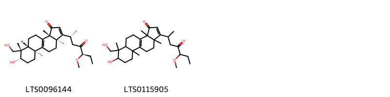{ width=100% }
    <figcaption>Hình ảnh cấu trúc hóa học của 2 hoạt chất thuộc nhóm Steroids and steroid derivatives gồm ['(3as,5ar,6s,7s,9as,11ar)-7-hydroxy-6-(hydroxymethyl)-1-[(2r,5r)-5-methoxy-4-oxoheptan-2-yl]-3a,6,9a,11a-tetramethyl-4h,5h,5ah,7h,8h,9h,10h,11h-cyclopenta[a]phenanthren-3-one (LTS0096144)', '7-hydroxy-6-(hydroxymethyl)-1-(5-methoxy-4-oxoheptan-2-yl)-3a,6,9a,11a-tetramethyl-4h,5h,5ah,7h,8h,9h,10h,11h-cyclopenta[a]phenanthren-3-one (LTS0115905)'].</figcaption>
</figure>

---

### Dược dân tộc học

Danh sách các quốc gia có sử dụng *Muscari comosum* trong điều trị các bệnh. 

| Country   | Disease                        | Bệnh                           |
|:----------|:-------------------------------|:-------------------------------|
| Egypt     | Cicatrizant, Apertif, Diuretic | Cicatrizant, Apertif, lợi tiểu |

---

# Chi Crinum

??? note "Danh sách các dược liệu thuộc chi"
    
	 - *Crinum asiaticum*
	 - *Crinum defixum*
	 - *Crinum erubescens*
	 - *Crinum latifolium*
	 - *Crinum longiflorum*
	 - *Crinum macrantherum*

---
## Crinum asiaticum
### Thông tin về thực vật

!!! info "Phân loại thực vật của *Crinum asiaticum* từ GIBF:"
    - **Kingdom:** Plantae
    - **Phylum:** Tracheophyta
    - **Order:** Asparagales
    - **Family:** Amaryllidaceae
    - **Genus:** Crinum
    - **Species:** *Crinum asiaticum*

 

| Label (VI)   | Label (EN)   | Scientific Name   | Descriptions (VI)   | Descriptions (EN)   | Also Known As (VI)                            | Also Known As (EN)                   |
|:-------------|:-------------|:------------------|:--------------------|:--------------------|:----------------------------------------------|:-------------------------------------|
| N/A          | N/A          | Crinum asiaticum  | loài thực vật       | species of plant    | ['Tỏi voi', 'Crinum asiaticum', 'Chuối nước'] | ['Grand Crinum Lily', 'Poison Bulb'] |

#### Phân bố trên thế giới

**Từ CSDL GIBF** Brazil, British Indian Ocean Territory, Japan, Marshall Islands, Barbados, New Caledonia, Mozambique, Tanzania, United Republic of, Thailand, Puerto Rico, United States of America, Korea, Republic of, Virgin Islands (U.S.), Indonesia, French Guiana, Hong Kong, Vanuatu, El Salvador, Maldives, Chinese Taipei, Malaysia, Philippines, Panama, Singapore, United States Minor Outlying Islands, Bahamas, South Africa, Australia, India, Peru, Christmas Island

#### Phân bố tại Việt Nam

**Từ CSDL GIBF**: Không có ghi nhận ở Việt Nam

---
### Thành phần hóa học
        
- Theo cơ sở dữ liệu lotus: Từ loài *Crinum asiaticum* đã phân lập và xác định được 171 hoạt chất thuộc về các nhóm Fatty Acyls, Benzene and substituted derivatives, Quinolines and derivatives, Linear 1,3-diarylpropanoids, Flavonoids, Benzodioxoles, Cinnamic acids and derivatives, Steroids and steroid derivatives, Phenols, Tetrahydroisoquinolines, Benzopyrans, Amaryllidaceae alkaloids. 

|    | chemicalTaxonomyClassyfireClass     |   smiles_count |
|---:|:------------------------------------|---------------:|
|  0 | Amaryllidaceae alkaloids            |             81 |
|  1 | Benzene and substituted derivatives |              3 |
|  2 | Benzodioxoles                       |              2 |
|  3 | Benzopyrans                         |              2 |
|  4 | Cinnamic acids and derivatives      |              6 |
|  5 | Fatty Acyls                         |             14 |
|  6 | Flavonoids                          |              9 |
|  7 | Linear 1,3-diarylpropanoids         |              1 |
|  8 | Phenols                             |              2 |
|  9 | Quinolines and derivatives          |             38 |
| 10 | Steroids and steroid derivatives    |              9 |
| 11 | Tetrahydroisoquinolines             |              1 |

#### Nhóm Amaryllidaceae alkaloids
<figure markdown="span">
    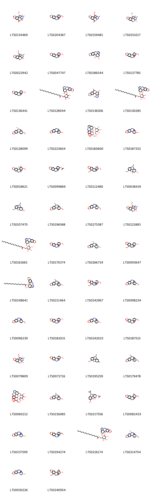{ width=100% }
    <figcaption>Hình ảnh cấu trúc hóa học của 81 hoạt chất thuộc nhóm Amaryllidaceae alkaloids gồm ['(1s,13r,16s,18r)-18-methoxy-15-methyl-5,7,12-trioxa-15-azapentacyclo[11.7.0.0¹,¹⁶.0²,¹⁰.0⁴,⁸]icosa-2,4(8),9,19-tetraen-11-one (LTS0134469)', '15-methoxy-5,7-dioxa-12-azapentacyclo[10.5.2.0¹,¹³.0²,¹⁰.0⁴,⁸]nonadeca-2,4(8),9,16-tetraen-18-ol (LTS0204367)', '18-methoxy-15-methyl-5,7,12-trioxa-15-azapentacyclo[11.7.0.0¹,¹⁶.0²,¹⁰.0⁴,⁸]icosa-2,4(8),9,19-tetraen-11-one (LTS0159481)', '(1s,13s,16s,18r)-18-methoxy-15-methyl-5,7,12-trioxa-15-azapentacyclo[11.7.0.0¹,¹⁶.0²,¹⁰.0⁴,⁸]icosa-2,4(8),9,19-tetraen-13-ol (LTS0251017)', 'tazettine (LTS0022942)', '(1s,13r,15r,18s)-15-methoxy-5,7-dioxa-12-azapentacyclo[10.5.2.0¹,¹³.0²,¹⁰.0⁴,⁸]nonadeca-2,4(8),9,16-tetraen-18-ol (LTS0047747)', 'lycorine (LTS0186544)', 'haemanthamine (LTS0137785)', 'crinamine (LTS0136441)', '[3,4,5-trihydroxy-6-({17-hydroxy-5,7-dioxa-12-azapentacyclo[10.6.1.0²,¹⁰.0⁴,⁸.0¹⁵,¹⁹]nonadeca-2,4(8),9,15-tetraen-18-yl}oxy)oxan-2-yl]methyl hexadecanoate (LTS0128044)', '9-hydroxy-4-methyl-11,16,18-trioxa-4-azapentacyclo[11.7.0.0²,¹⁰.0³,⁷.0¹⁵,¹⁹]icosa-1(20),7,13,15(19)-tetraen-12-one (LTS0136506)', '[(2r,3s,4s,5s,6r)-3,4,5-trihydroxy-6-{[(1r,17r,18r,19r)-17-hydroxy-5,7-dioxa-12-azapentacyclo[10.6.1.0²,¹⁰.0⁴,⁸.0¹⁵,¹⁹]nonadeca-2,4(8),9,15-tetraen-18-yl]oxy}oxan-2-yl]methyl hexadecanoate (LTS0130285)', '(1s,11s,15r)-15-methoxy-5,7-dioxa-12-azapentacyclo[10.5.2.0¹,¹³.0²,¹⁰.0⁴,⁸]nonadeca-2,4(8),9,16-tetraen-11-ol (LTS0128099)', '5,7-dioxa-12-azapentacyclo[10.5.2.0¹,¹³.0²,¹⁰.0⁴,⁸]nonadeca-2,4(8),9,16-tetraen-15-ol (LTS0223604)', '(2r,3s,4s,5r,6r)-2-(hydroxymethyl)-6-{[(1s,17s,18s,19s)-18-{[(2r,3r,4s,5s,6r)-3,4,5-trihydroxy-6-(hydroxymethyl)oxan-2-yl]oxy}-5,7-dioxa-12-azapentacyclo[10.6.1.0²,¹⁰.0⁴,⁸.0¹⁵,¹⁹]nonadeca-2,4(8),9,15-tetraen-17-yl]oxy}oxane-3,4,5-triol (LTS0160600)', 'crinine (LTS0187333)', '(1r,13s,15s,16s,18r)-15-methoxy-5,7,17-trioxa-12-azahexacyclo[10.6.2.0¹,¹³.0²,¹⁰.0⁴,⁸.0¹⁶,¹⁸]icosa-2,4(8),9-triene (LTS0018621)', '18-hydroxy-5,7-dioxa-12-azapentacyclo[10.5.2.0¹,¹³.0²,¹⁰.0⁴,⁸]nonadeca-2,4(8),9,16-tetraen-15-yl acetate (LTS0099869)', 'ambelline (LTS0112480)', 'galantamine (LTS0038419)', 'galantamine (LTS0107470)', '(1s,11r,15r)-15-methoxy-5,7-dioxa-12-azapentacyclo[10.5.2.0¹,¹³.0²,¹⁰.0⁴,⁸]nonadeca-2,4(8),9,16-tetraen-11-ol (LTS0196588)', '(1s,13r,15r)-15-methoxy-5,7-dioxa-12-azapentacyclo[10.5.2.0¹,¹³.0²,¹⁰.0⁴,⁸]nonadeca-2,4(8),9,16-tetraene (LTS0275387)', 'tazettine (LTS0121883)', '[(2r,3s,4s,5r,6r)-3,4,5-trihydroxy-6-{[(1s,17s,18s,19s)-17-hydroxy-5,7-dioxa-12-azapentacyclo[10.6.1.0²,¹⁰.0⁴,⁸.0¹⁵,¹⁹]nonadeca-2,4(8),9,15-tetraen-18-yl]oxy}oxan-2-yl]methyl hexadecanoate (LTS0161665)', '(1s,13s,15r,18s)-15-methoxy-5,7-dioxa-12-azapentacyclo[10.5.2.0¹,¹³.0²,¹⁰.0⁴,⁸]nonadeca-2,4(8),9,16-tetraen-18-ol (LTS0170374)', '(1s,11s,15r)-5,7-dioxa-12-azapentacyclo[10.5.2.0¹,¹³.0²,¹⁰.0⁴,⁸]nonadeca-2,4(8),9,16-tetraene-11,15-diol (LTS0266734)', '(1s,13r,15r)-9-methoxy-5,7-dioxa-12-azapentacyclo[10.5.2.0¹,¹³.0²,¹⁰.0⁴,⁸]nonadeca-2,4(8),9,16-tetraen-15-ol (LTS0093647)', '(1s,17s,18s,19r)-17-hydroxy-5,7-dioxa-12-azapentacyclo[10.6.1.0²,¹⁰.0⁴,⁸.0¹⁵,¹⁹]nonadeca-2,4(8),9,15-tetraen-18-yl hexadecanoate (LTS0248641)', '5,7-dioxa-12-azapentacyclo[10.5.2.0¹,¹³.0²,¹⁰.0⁴,⁸]nonadeca-2,4(8),9,16-tetraene-11,15-diol (LTS0211464)', '(1r,13s,15r,18r)-9,15-dimethoxy-5,7-dioxa-12-azapentacyclo[10.5.2.0¹,¹³.0²,¹⁰.0⁴,⁸]nonadeca-2,4(8),9,16-tetraen-18-ol (LTS0242967)', '15-methoxy-5,7-dioxa-12-azapentacyclo[10.5.2.0¹,¹³.0²,¹⁰.0⁴,⁸]nonadeca-2,4(8),9,16-tetraene (LTS0098234)', '(1s,13s,15r)-15-methoxy-5,7-dioxa-12-azapentacyclo[10.5.2.0¹,¹³.0²,¹⁰.0⁴,⁸]nonadeca-2,4(8),9,16-tetraene (LTS0096239)', 'hamayne (LTS0182031)', '(1r,13s,15r)-5,7-dioxa-12-azapentacyclo[10.5.2.0¹,¹³.0²,¹⁰.0⁴,⁸]nonadeca-2,4(8),9,16-tetraen-15-ol (LTS0242023)', 'haemanthamine (LTS0187515)', '(1s,13r,16s,18s)-18-methoxy-15-methyl-5,7,12-trioxa-15-azapentacyclo[11.7.0.0¹,¹⁶.0²,¹⁰.0⁴,⁸]icosa-2,4(8),9,19-tetraen-13-ol (LTS0079809)', '(1r,13r,15r,18r)-15-methoxy-5,7-dioxa-12-azapentacyclo[10.5.2.0¹,¹³.0²,¹⁰.0⁴,⁸]nonadeca-2,4(8),9,16-tetraen-18-ol (LTS0072716)', '9-methoxy-4-methyl-11-oxa-4-azatetracyclo[8.6.1.0¹,¹².0⁶,¹⁷]heptadeca-6,8,10(17),15-tetraen-14-one (LTS0195259)', '15-methoxy-5,7-dioxa-12-azapentacyclo[10.5.2.0¹,¹³.0²,¹⁰.0⁴,⁸]nonadeca-2,4(8),9,16-tetraen-11-ol (LTS0179478)', '2-(hydroxymethyl)-6-[(18-{[3,4,5-trihydroxy-6-(hydroxymethyl)oxan-2-yl]oxy}-5,7-dioxa-12-azapentacyclo[10.6.1.0²,¹⁰.0⁴,⁸.0¹⁵,¹⁹]nonadeca-2,4(8),9,15-tetraen-17-yl)oxy]oxane-3,4,5-triol (LTS0060212)', '(1s,11r,13s,15r)-5,7-dioxa-12-azapentacyclo[10.5.2.0¹,¹³.0²,¹⁰.0⁴,⁸]nonadeca-2,4(8),9,16-tetraene-11,15-diol (LTS0216085)', '(1s,12s,14r)-4-acetyl-9-methoxy-11-oxa-4-azatetracyclo[8.6.1.0¹,¹².0⁶,¹⁷]heptadeca-6,8,10(17),15-tetraen-14-yl acetate (LTS0217556)', '15-methoxy-5,7,17-trioxa-12-azahexacyclo[10.6.2.0¹,¹³.0²,¹⁰.0⁴,⁸.0¹⁶,¹⁸]icosa-2,4(8),9-triene (LTS0082433)', '(1r,13r,15s)-5,7-dioxa-12-azapentacyclo[10.5.2.0¹,¹³.0²,¹⁰.0⁴,⁸]nonadeca-2,4(8),9-trien-15-ol (LTS0237599)', '(1s,13s,15r,18r)-15,18-dimethoxy-5,7-dioxa-12-azapentacyclo[10.5.2.0¹,¹³.0²,¹⁰.0⁴,⁸]nonadeca-2,4(8),9,16-tetraene (LTS0194274)', '[(2r,3s,4s,5r,6r)-3,4,5-trihydroxy-6-{[(1s,17s,18s,19r)-17-hydroxy-5,7-dioxa-12-azapentacyclo[10.6.1.0²,¹⁰.0⁴,⁸.0¹⁵,¹⁹]nonadeca-2,4(8),9,15-tetraen-18-yl]oxy}oxan-2-yl]methyl hexadecanoate (LTS0216174)', '(1s,11s,13r,15r)-15-methoxy-5,7-dioxa-12-azapentacyclo[10.5.2.0¹,¹³.0²,¹⁰.0⁴,⁸]nonadeca-2,4(8),9,16-tetraen-11-ol (LTS0214754)', '(1s,13s,15r)-5,7-dioxa-12-azapentacyclo[10.5.2.0¹,¹³.0²,¹⁰.0⁴,⁸]nonadeca-2,4(8),9-trien-15-ol (LTS0030226)', 'crinamidine (LTS0240954)', '9-methoxy-5,7-dioxa-12-azapentacyclo[10.5.2.0¹,¹³.0²,¹⁰.0⁴,⁸]nonadeca-2,4(8),9,16-tetraen-15-ol (LTS0229851)', '(1s,13s,15r,18s)-5,7-dioxa-12-azapentacyclo[10.5.2.0¹,¹³.0²,¹⁰.0⁴,⁸]nonadeca-2,4(8),9,16-tetraene-15,18-diol (LTS0187118)', '4-acetyl-9-methoxy-11-oxa-4-azatetracyclo[8.6.1.0¹,¹².0⁶,¹⁷]heptadeca-6,8,10(17),15-tetraen-14-yl acetate (LTS0169303)', 'narwedine (LTS0183172)', '(1s,11s,13r,15r)-5,7-dioxa-12-azapentacyclo[10.5.2.0¹,¹³.0²,¹⁰.0⁴,⁸]nonadeca-2,4(8),9,16-tetraene-11,15-diol (LTS0175417)', '2-({17-hydroxy-5,7-dioxa-12-azapentacyclo[10.6.1.0²,¹⁰.0⁴,⁸.0¹⁵,¹⁹]nonadeca-2,4(8),9,15-tetraen-18-yl}oxy)-6-(hydroxymethyl)oxane-3,4,5-triol (LTS0171369)', '(1s,11r,13s,15r)-15-methoxy-5,7-dioxa-12-azapentacyclo[10.5.2.0¹,¹³.0²,¹⁰.0⁴,⁸]nonadeca-2,4(8),9,16-tetraen-11-ol (LTS0184438)', '(2r,3r,4s,5s,6r)-2-{[(1s,17s,18s,19r)-17-hydroxy-5,7-dioxa-12-azapentacyclo[10.6.1.0²,¹⁰.0⁴,⁸.0¹⁵,¹⁹]nonadeca-2,4(8),9,15-tetraen-18-yl]oxy}-6-(hydroxymethyl)oxane-3,4,5-triol (LTS0244310)', 'hippeastrine (LTS0267602)', '(1s,15r,18r)-15-methoxy-5,7-dioxa-12-azapentacyclo[10.5.2.0¹,¹³.0²,¹⁰.0⁴,⁸]nonadeca-2,4(8),9,16-tetraen-18-ol (LTS0068876)', '(1s,11r,15r)-5,7-dioxa-12-azapentacyclo[10.5.2.0¹,¹³.0²,¹⁰.0⁴,⁸]nonadeca-2,4(8),9,16-tetraene-11,15-diol (LTS0010729)', '(1s,17r,18s,19s)-5,7-dioxa-12-azapentacyclo[10.6.1.0²,¹⁰.0⁴,⁸.0¹⁵,¹⁹]nonadeca-2,4(8),9,15-tetraene-17,18-diol (LTS0013699)', '(1s,13r,15r,16s,18r)-5,7,17-trioxa-12-azahexacyclo[10.6.2.0¹,¹³.0²,¹⁰.0⁴,⁸.0¹⁶,¹⁸]icosa-2,4(8),9-trien-15-ol (LTS0055081)', '(1r,13s,15s)-5,7-dioxa-12-azapentacyclo[10.5.2.0¹,¹³.0²,¹⁰.0⁴,⁸]nonadeca-2,4(8),9,16-tetraen-15-ol (LTS0132470)', '3-o-acetylhamayne (LTS0041666)', '5,7,17-trioxa-12-azahexacyclo[10.6.2.0¹,¹³.0²,¹⁰.0⁴,⁸.0¹⁶,¹⁸]icosa-2,4(8),9-trien-15-ol (LTS0066351)', '(1r,13r,15r,18s)-9,15-dimethoxy-5,7-dioxa-12-azapentacyclo[10.5.2.0¹,¹³.0²,¹⁰.0⁴,⁸]nonadeca-2,4(8),9,16-tetraen-18-ol (LTS0014224)', '17-hydroxy-5,7-dioxa-12-azapentacyclo[10.6.1.0²,¹⁰.0⁴,⁸.0¹⁵,¹⁹]nonadeca-2,4(8),9,15-tetraen-18-yl hexadecanoate (LTS0106026)', 'lycorine (LTS0250349)', '5,7-dioxa-12-azapentacyclo[10.5.2.0¹,¹³.0²,¹⁰.0⁴,⁸]nonadeca-2,4(8),9,16-tetraene-15,18-diol (LTS0255460)', '5,7-dioxa-12-azapentacyclo[10.5.2.0¹,¹³.0²,¹⁰.0⁴,⁸]nonadeca-2,4(8),9-trien-15-ol (LTS0109936)', '9,15-dimethoxy-5,7,17-trioxa-12-azahexacyclo[10.6.2.0¹,¹³.0²,¹⁰.0⁴,⁸.0¹⁶,¹⁸]icosa-2,4(8),9-trien-19-ol (LTS0111361)', '(1s,13r,15r,16s,18r)-15-methoxy-5,7,17-trioxa-12-azahexacyclo[10.6.2.0¹,¹³.0²,¹⁰.0⁴,⁸.0¹⁶,¹⁸]icosa-2,4(8),9-triene (LTS0236576)', '(1s,13r,15r,18r)-15-methoxy-5,7-dioxa-12-azapentacyclo[10.5.2.0¹,¹³.0²,¹⁰.0⁴,⁸]nonadeca-2,4(8),9,16-tetraen-18-ol (LTS0023441)', '9,15-dimethoxy-5,7-dioxa-12-azapentacyclo[10.5.2.0¹,¹³.0²,¹⁰.0⁴,⁸]nonadeca-2,4(8),9,16-tetraen-18-ol (LTS0023147)', '9-methoxy-11-oxa-4-azatetracyclo[8.6.1.0¹,¹².0⁶,¹⁷]heptadeca-6,8,10(17),15-tetraen-14-ol (LTS0119338)', '(1s,17s,18s,19r)-5,7-dioxa-12-azapentacyclo[10.6.1.0²,¹⁰.0⁴,⁸.0¹⁵,¹⁹]nonadeca-2,4(8),9,15-tetraene-17,18-diol (LTS0226027)', '15,18-dimethoxy-5,7-dioxa-12-azapentacyclo[10.5.2.0¹,¹³.0²,¹⁰.0⁴,⁸]nonadeca-2,4(8),9,16-tetraene (LTS0035767)', '(1s,13s,15r,16s,18r,19r)-9,15-dimethoxy-5,7,17-trioxa-12-azahexacyclo[10.6.2.0¹,¹³.0²,¹⁰.0⁴,⁸.0¹⁶,¹⁸]icosa-2,4(8),9-trien-19-ol (LTS0045636)', 'n-desmethylgalantamine (LTS0051706)', '(1s,13s,16r,18s)-18-methoxy-15-methyl-5,7,12-trioxa-15-azapentacyclo[11.7.0.0¹,¹⁶.0²,¹⁰.0⁴,⁸]icosa-2,4(8),9,19-tetraen-13-ol (LTS0126855)'].</figcaption>
</figure>
#### Nhóm Benzene and substituted derivatives
<figure markdown="span">
    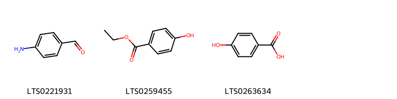{ width=100% }
    <figcaption>Hình ảnh cấu trúc hóa học của 3 hoạt chất thuộc nhóm Benzene and substituted derivatives gồm ['4-aminobenzaldehyde (LTS0221931)', 'ethylparaben (LTS0259455)', 'p-hydroxybenzoic acid (LTS0263634)'].</figcaption>
</figure>
#### Nhóm Benzodioxoles
<figure markdown="span">
    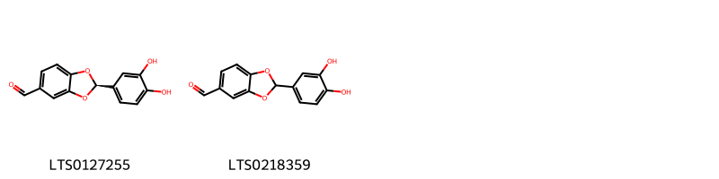{ width=100% }
    <figcaption>Hình ảnh cấu trúc hóa học của 2 hoạt chất thuộc nhóm Benzodioxoles gồm ['(2r)-2-(3,4-dihydroxyphenyl)-2h-1,3-benzodioxole-5-carbaldehyde (LTS0127255)', '2-(3,4-dihydroxyphenyl)-2h-1,3-benzodioxole-5-carbaldehyde (LTS0218359)'].</figcaption>
</figure>
#### Nhóm Benzopyrans
<figure markdown="span">
    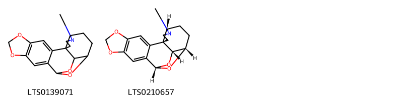{ width=100% }
    <figcaption>Hình ảnh cấu trúc hóa học của 2 hoạt chất thuộc nhóm Benzopyrans gồm ['14-methyl-5,7,20,21-tetraoxa-14-azahexacyclo[16.2.1.0²,¹⁰.0⁴,⁸.0¹¹,¹⁵.0¹¹,¹⁹]henicosa-2,4(8),9-triene (LTS0139071)', '(1s,11r,15s,18s,19r)-14-methyl-5,7,20,21-tetraoxa-14-azahexacyclo[16.2.1.0²,¹⁰.0⁴,⁸.0¹¹,¹⁵.0¹¹,¹⁹]henicosa-2,4(8),9-triene (LTS0210657)'].</figcaption>
</figure>
#### Nhóm Cinnamic acids and derivatives
<figure markdown="span">
    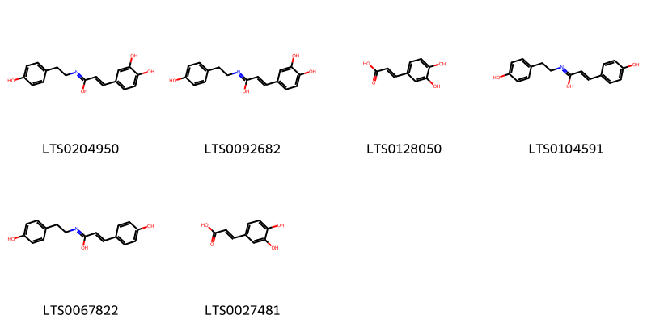{ width=100% }
    <figcaption>Hình ảnh cấu trúc hóa học của 6 hoạt chất thuộc nhóm Cinnamic acids and derivatives gồm ['3-(3,4-dihydroxyphenyl)-n-[2-(4-hydroxyphenyl)ethyl]prop-2-enimidic acid (LTS0204950)', '(2e)-3-(3,4-dihydroxyphenyl)-n-[2-(4-hydroxyphenyl)ethyl]prop-2-enimidic acid (LTS0092682)', '3,4-dihydroxycinnamic acid (LTS0128050)', '3-(4-hydroxyphenyl)-n-[2-(4-hydroxyphenyl)ethyl]prop-2-enimidic acid (LTS0104591)', '(2e)-3-(4-hydroxyphenyl)-n-[2-(4-hydroxyphenyl)ethyl]prop-2-enimidic acid (LTS0067822)', 'caffeic acid (LTS0027481)'].</figcaption>
</figure>
#### Nhóm Fatty Acyls
<figure markdown="span">
    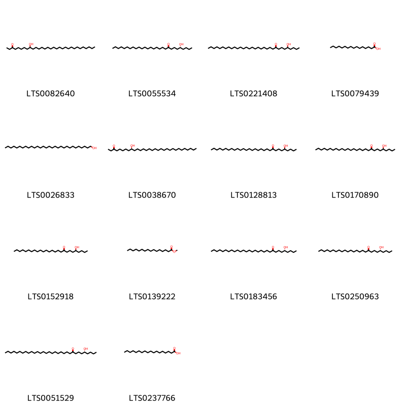{ width=100% }
    <figcaption>Hình ảnh cấu trúc hóa học của 14 hoạt chất thuộc nhóm Fatty Acyls gồm ['9-hydroxyhentriacontan-3-one (LTS0082640)', '(5r)-5-hydroxyoctacosan-9-one (LTS0055534)', '5-hydroxydotriacontan-9-one (LTS0221408)', 'palmitic acid (LTS0079439)', 'triacontanol (LTS0026833)', '(9s)-9-hydroxyhentriacontan-3-one (LTS0038670)', '5-hydroxytriacontan-9-one (LTS0128813)', '5-hydroxyoctacosan-9-one (LTS0170890)', '5-hydroxyhexacosan-9-one (LTS0152918)', 'methyl palmitate (LTS0139222)', '(5r)-5-hydroxytriacontan-9-one (LTS0183456)', '(5r)-5-hydroxyhexacosan-9-one (LTS0250963)', '(5r)-5-hydroxydotriacontan-9-one (LTS0051529)', 'stearic acid (LTS0237766)'].</figcaption>
</figure>
#### Nhóm Flavonoids
<figure markdown="span">
    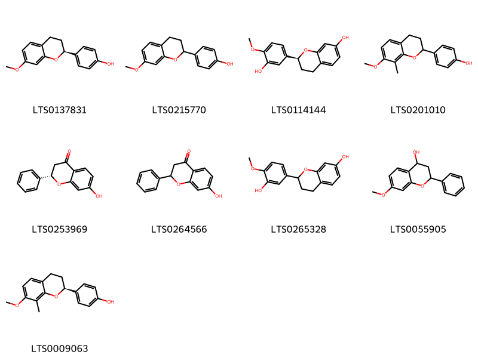{ width=100% }
    <figcaption>Hình ảnh cấu trúc hóa học của 9 hoạt chất thuộc nhóm Flavonoids gồm ['4-[(2s)-7-methoxy-3,4-dihydro-2h-1-benzopyran-2-yl]phenol (LTS0137831)', '4-(7-methoxy-3,4-dihydro-2h-1-benzopyran-2-yl)phenol (LTS0215770)', '(2s)-2-(3-hydroxy-4-methoxyphenyl)-3,4-dihydro-2h-1-benzopyran-7-ol (LTS0114144)', '4-(7-methoxy-8-methyl-3,4-dihydro-2h-1-benzopyran-2-yl)phenol (LTS0201010)', '(2s)-7-hydroxyflavanone (LTS0253969)', '7-hydroxyflavanone (LTS0264566)', '2-(3-hydroxy-4-methoxyphenyl)-3,4-dihydro-2h-1-benzopyran-7-ol (LTS0265328)', '7-methoxy-2-phenyl-3,4-dihydro-2h-1-benzopyran-4-ol (LTS0055905)', '4-[(2s)-7-methoxy-8-methyl-3,4-dihydro-2h-1-benzopyran-2-yl]phenol (LTS0009063)'].</figcaption>
</figure>
#### Nhóm Linear 1_3-diarylpropanoids
<figure markdown="span">
    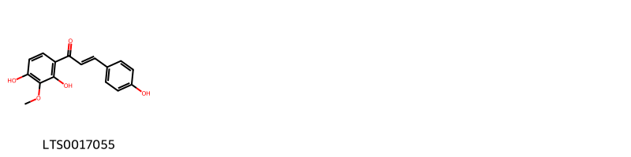{ width=100% }
    <figcaption>Hình ảnh cấu trúc hóa học của Không tìm thấy chú thích hoạt chất thuộc nhóm Linear 1_3-diarylpropanoids gồm Không tìm thấy chú thích.</figcaption>
</figure>
#### Nhóm Phenols
<figure markdown="span">
    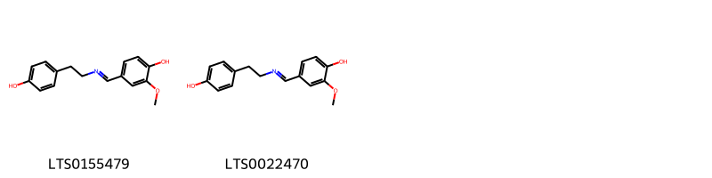{ width=100% }
    <figcaption>Hình ảnh cấu trúc hóa học của 2 hoạt chất thuộc nhóm Phenols gồm ['4-({[2-(4-hydroxyphenyl)ethyl]imino}methyl)-2-methoxyphenol (LTS0155479)', '4-[(e)-{[2-(4-hydroxyphenyl)ethyl]imino}methyl]-2-methoxyphenol (LTS0022470)'].</figcaption>
</figure>
#### Nhóm Quinolines and derivatives
<figure markdown="span">
    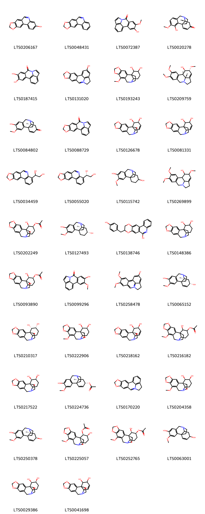{ width=100% }
    <figcaption>Hình ảnh cấu trúc hóa học của 38 hoạt chất thuộc nhóm Quinolines and derivatives gồm ['9h-[1,3]dioxolo[4,5-j]phenanthridin-3-ol (LTS0206167)', 'trisphaeridine (LTS0048431)', '4-hydroxy-5-methoxy-9-azatetracyclo[7.6.1.0²,⁷.0¹²,¹⁶]hexadeca-1(15),2(7),3,5,10,12(16),13-heptaen-8-one (LTS0072387)', '(1r,10r)-3-hydroxy-4-methoxy-9-azatetracyclo[7.5.2.0¹,¹⁰.0²,⁷]hexadeca-2,4,6,13-tetraen-12-one (LTS0020278)', '4,5-dihydroxy-9-azatetracyclo[7.6.1.0²,⁷.0¹²,¹⁶]hexadeca-1(16),2(7),3,5,10,12,14-heptaen-8-one (LTS0187415)', 'ungeremine (LTS0131020)', '9-methoxy-5,7-dioxa-12-azapentacyclo[10.5.2.0¹,¹³.0²,¹⁰.0⁴,⁸]nonadeca-2,4(8),9-triene-16,17-diol (LTS0193243)', '(1r,14r,15r,16r)-4,5,14-trimethoxy-9-azatetracyclo[7.6.1.0²,⁷.0¹²,¹⁶]hexadeca-2(7),3,5,12-tetraen-15-ol (LTS0209759)', '(1r,10s)-5-hydroxy-4-methoxy-9-azatetracyclo[7.5.2.0¹,¹⁰.0²,⁷]hexadeca-2(7),3,5,13-tetraen-12-one (LTS0084802)', '5,7-dioxa-12-azapentacyclo[10.6.1.0²,¹⁰.0⁴,⁸.0¹⁵,¹⁹]nonadeca-1(19),2(10),3,8,13,15,17-heptaen-11-one (LTS0088729)', '(1s,13r,16s,17r)-5,7-dioxa-12-azapentacyclo[10.5.2.0¹,¹³.0²,¹⁰.0⁴,⁸]nonadeca-2,4(8),9,14-tetraene-16,17-diol (LTS0126678)', '5,7-dioxa-12-azapentacyclo[10.5.2.0¹,¹³.0²,¹⁰.0⁴,⁸]nonadeca-2,4(8),9,14-tetraene-16,17-diol (LTS0081331)', '1-{9h-[1,3]dioxolo[4,5-j]phenanthridin-4-yl}ethane-1,2-diol (LTS0034459)', '(1s)-1-{9h-[1,3]dioxolo[4,5-j]phenanthridin-4-yl}ethane-1,2-diol (LTS0055020)', '4-methoxy-9-azatetracyclo[7.5.2.0¹,¹⁰.0²,⁷]hexadeca-2(7),3,5-triene-5,12-diol (LTS0115742)', '4,5,14-trimethoxy-9-azatetracyclo[7.6.1.0²,⁷.0¹²,¹⁶]hexadeca-2(7),3,5,12-tetraen-15-ol (LTS0269899)', '(1s,13r,16s,17r)-17-hydroxy-5,7-dioxa-12-azapentacyclo[10.5.2.0¹,¹³.0²,¹⁰.0⁴,⁸]nonadeca-2,4(8),9-trien-16-yl acetate (LTS0202249)', '(1s,10s,12r)-4-methoxy-9-azatetracyclo[7.5.2.0¹,¹⁰.0²,⁷]hexadeca-2(7),3,5-triene-5,12-diol (LTS0127493)', 'crinasiatine (LTS0138746)', '5,7-dioxa-12-azapentacyclo[10.5.2.0¹,¹³.0²,¹⁰.0⁴,⁸]nonadeca-2,4(8),9-triene-16,17-diol (LTS0148386)', '(1r,13s,16s,17r)-13,17-dihydroxy-5,7-dioxa-12-azapentacyclo[10.5.2.0¹,¹³.0²,¹⁰.0⁴,⁸]nonadeca-2,4(8),9-trien-16-yl acetate (LTS0093890)', '5-hydroxy-4-methoxy-9-azatetracyclo[7.6.1.0²,⁷.0¹²,¹⁶]hexadeca-1(15),2(7),3,5,10,12(16),13-heptaen-8-one (LTS0099296)', '4,5-dimethoxy-9λ⁵-azatetracyclo[7.6.1.0²,⁷.0¹²,¹⁶]hexadeca-1(16),2(7),3,5,8,12,14-heptaen-9-ylium-14-olate (LTS0258478)', '(-)-8-demethylmaritidine (LTS0065152)', '(1s,13r,16r,17s)-5,7-dioxa-12-azapentacyclo[10.5.2.0¹,¹³.0²,¹⁰.0⁴,⁸]nonadeca-2,4(8),9-triene-16,17-diol (LTS0210317)', '(1r,13s,16s,17r)-9-methoxy-5,7-dioxa-12-azapentacyclo[10.5.2.0¹,¹³.0²,¹⁰.0⁴,⁸]nonadeca-2,4(8),9-triene-13,16,17-triol (LTS0222906)', '(1r,13s,16s,17r)-5,7-dioxa-12-azapentacyclo[10.5.2.0¹,¹³.0²,¹⁰.0⁴,⁸]nonadeca-2,4(8),9,14-tetraene-13,16,17-triol (LTS0218162)', '17-hydroxy-9-methoxy-5,7-dioxa-12-azapentacyclo[10.5.2.0¹,¹³.0²,¹⁰.0⁴,⁸]nonadeca-2,4(8),9-trien-16-yl acetate (LTS0216182)', '(1s,13r,16s,17r)-5,7-dioxa-12-azapentacyclo[10.5.2.0¹,¹³.0²,¹⁰.0⁴,⁸]nonadeca-2,4(8),9-triene-16,17-diol (LTS0217522)', '(1r,10s,12s)-5-hydroxy-4-methoxy-9-azatetracyclo[7.5.2.0¹,¹⁰.0²,⁷]hexadeca-2(7),3,5,13-tetraen-12-yl acetate (LTS0224736)', '5,7-dioxa-12λ⁵-azapentacyclo[10.6.1.0²,¹⁰.0⁴,⁸.0¹⁵,¹⁹]nonadeca-1(19),2(10),3,8,11,15,17-heptaen-12-ylium (LTS0170220)', '1-epideacetylbowdensine (LTS0204358)', '(1r,10s,12r)-4-methoxy-9-azatetracyclo[7.5.2.0¹,¹⁰.0²,⁷]hexadeca-2(7),3,5,13-tetraene-5,12-diol (LTS0250378)', '(1s,13r,16s,17r)-16-hydroxy-9-methoxy-5,7-dioxa-12-azapentacyclo[10.5.2.0¹,¹³.0²,¹⁰.0⁴,⁸]nonadeca-2,4(8),9-trien-17-yl acetate (LTS0225057)', '(1s,13r,16s,17r)-17-hydroxy-9-methoxy-5,7-dioxa-12-azapentacyclo[10.5.2.0¹,¹³.0²,¹⁰.0⁴,⁸]nonadeca-2,4(8),9-trien-16-yl acetate (LTS0252765)', '4-methoxy-9-azatetracyclo[7.5.2.0¹,¹⁰.0²,⁷]hexadeca-2(7),3,5,13-tetraene-5,12-diol (LTS0063001)', '(1r,13s,16s,17r)-5,7-dioxa-12-azapentacyclo[10.5.2.0¹,¹³.0²,¹⁰.0⁴,⁸]nonadeca-2,4(8),9-triene-13,16,17-triol (LTS0029386)', '5,7-dioxa-12-azapentacyclo[10.5.2.0¹,¹³.0²,¹⁰.0⁴,⁸]nonadeca-2,4(8),9,14-tetraene-13,16,17-triol (LTS0041698)'].</figcaption>
</figure>
#### Nhóm Steroids and steroid derivatives
<figure markdown="span">
    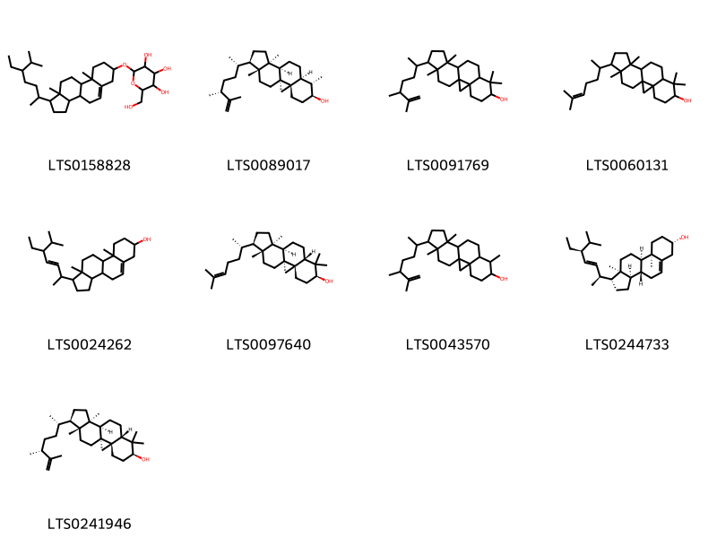{ width=100% }
    <figcaption>Hình ảnh cấu trúc hóa học của 9 hoạt chất thuộc nhóm Steroids and steroid derivatives gồm ['2-{[1-(5-ethyl-6-methylheptan-2-yl)-9a,11a-dimethyl-1h,2h,3h,3ah,3bh,4h,6h,7h,8h,9h,9bh,10h,11h-cyclopenta[a]phenanthren-7-yl]oxy}-6-(hydroxymethyl)oxane-3,4,5-triol (LTS0158828)', '(1r,3s,6s,7s,8s,11r,12s,15r,16r)-15-[(2s,5r)-5,6-dimethylhept-6-en-2-yl]-7,12,16-trimethylpentacyclo[9.7.0.0¹,³.0³,⁸.0¹²,¹⁶]octadecan-6-ol (LTS0089017)', '15-(5,6-dimethylhept-6-en-2-yl)-7,7,12,16-tetramethylpentacyclo[9.7.0.0¹,³.0³,⁸.0¹²,¹⁶]octadecan-6-ol (LTS0091769)', 'cycloartenol (LTS0060131)', 'stigmasterol (LTS0024262)', '(1r,3s,6s,8s,11r,12s,15r,16r)-7,7,12,16-tetramethyl-15-[(2s)-6-methylhept-5-en-2-yl]pentacyclo[9.7.0.0¹,³.0³,⁸.0¹²,¹⁶]octadecan-6-ol (LTS0097640)', '15-(5,6-dimethylhept-6-en-2-yl)-7,12,16-trimethylpentacyclo[9.7.0.0¹,³.0³,⁸.0¹²,¹⁶]octadecan-6-ol (LTS0043570)', '(1r,3ar,3br,7s,9ar,9br,11ar)-1-[(2s,3e,5s)-5-ethyl-6-methylhept-3-en-2-yl]-9a,11a-dimethyl-1h,2h,3h,3ah,3bh,4h,6h,7h,8h,9h,9bh,10h,11h-cyclopenta[a]phenanthren-7-ol (LTS0244733)', '(1r,3s,6s,8s,11r,12s,15r,16r)-15-[(2s,5r)-5,6-dimethylhept-6-en-2-yl]-7,7,12,16-tetramethylpentacyclo[9.7.0.0¹,³.0³,⁸.0¹²,¹⁶]octadecan-6-ol (LTS0241946)'].</figcaption>
</figure>
#### Nhóm Tetrahydroisoquinolines
<figure markdown="span">
    { width=100% }
    <figcaption>Hình ảnh cấu trúc hóa học của 1 hoạt chất thuộc nhóm Tetrahydroisoquinolines gồm ['cherylline (LTS0026954)'].</figcaption>
</figure>

---

### Dược dân tộc học

Danh sách các quốc gia có sử dụng *Crinum asiaticum* trong điều trị các bệnh. 

| Country   | Disease                                           | Bệnh                                            |
|:----------|:--------------------------------------------------|:------------------------------------------------|
| Egypt     | Diaphoretic, Emetic                               | Tràn dịch màng phổi, nôn mửa                    |
| Elsewhere | Diaphoretic, Emetic, Expectorant, Laxative, Tonic | Thuốc lợi tiểu, nôn, đờm, nhuận tràng, thuốc bổ |
| Malaya    | Emetic                                            | Phôi                                            |
| Samoa     | Antidote, Emetic                                  | Thuốc giải độc, nôn mửa                         |

---

---
## Crinum defixum
### Thông tin về thực vật

!!! info "Phân loại thực vật của *Crinum defixum* từ GIBF:"
    - **Kingdom:** Plantae
    - **Phylum:** Tracheophyta
    - **Order:** Asparagales
    - **Family:** Amaryllidaceae
    - **Genus:** Crinum
    - **Species:** *Crinum defixum*

 

| Label (VI)   | Label (EN)   | Scientific Name   | Descriptions (VI)   | Descriptions (EN)   | Also Known As (VI)   | Also Known As (EN)   |
|:-------------|:-------------|:------------------|:--------------------|:--------------------|:---------------------|:---------------------|
| N/A          | N/A          | Crinum defixum    |                     |                     | ['']                 | ['']                 |

#### Phân bố trên thế giới

**Từ CSDL GIBF** Sri Lanka, nan, Viet Nam, Nepal, Malaysia, India, unknown or invalid, Thailand, Lao People’s Democratic Republic

#### Phân bố tại Việt Nam

**Từ CSDL GIBF**: Không có ghi nhận ở Việt Nam

---
### Thành phần hóa học
        
- Theo cơ sở dữ liệu lotus: Từ loài *Crinum defixum* đã phân lập và xác định được 8 hoạt chất thuộc về các nhóm Carboxylic acids and derivatives, Amaryllidaceae alkaloids. 

|    | chemicalTaxonomyClassyfireClass   |   smiles_count |
|---:|:----------------------------------|---------------:|
|  0 | Amaryllidaceae alkaloids          |              6 |
|  1 | Carboxylic acids and derivatives  |              2 |

#### Nhóm Amaryllidaceae alkaloids
<figure markdown="span">
    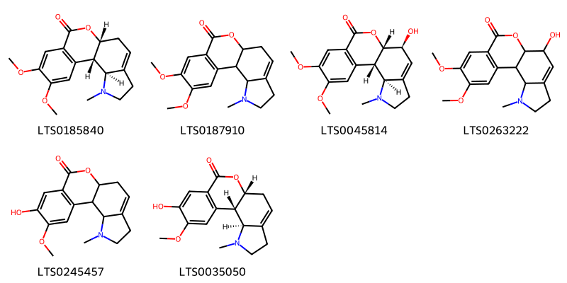{ width=100% }
    <figcaption>Hình ảnh cấu trúc hóa học của 6 hoạt chất thuộc nhóm Amaryllidaceae alkaloids gồm ['homolycorine (LTS0185840)', '4,5-dimethoxy-16-methyl-9-oxa-16-azatetracyclo[8.7.0.0²,⁷.0¹³,¹⁷]heptadeca-2(7),3,5,12-tetraen-8-one (LTS0187910)', '(1s,10s,11s,17s)-11-hydroxy-4,5-dimethoxy-16-methyl-9-oxa-16-azatetracyclo[8.7.0.0²,⁷.0¹³,¹⁷]heptadeca-2(7),3,5,12-tetraen-8-one (LTS0045814)', '11-hydroxy-4,5-dimethoxy-16-methyl-9-oxa-16-azatetracyclo[8.7.0.0²,⁷.0¹³,¹⁷]heptadeca-2(7),3,5,12-tetraen-8-one (LTS0263222)', '5-hydroxy-4-methoxy-16-methyl-9-oxa-16-azatetracyclo[8.7.0.0²,⁷.0¹³,¹⁷]heptadeca-2(7),3,5,12-tetraen-8-one (LTS0245457)', '9-o-demethylhomolycorine (LTS0035050)'].</figcaption>
</figure>
#### Nhóm Carboxylic acids and derivatives
<figure markdown="span">
    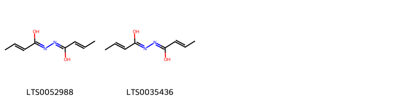{ width=100% }
    <figcaption>Hình ảnh cấu trúc hóa học của 2 hoạt chất thuộc nhóm Carboxylic acids and derivatives gồm ['(2e)-n-[(2e)-1-hydroxybut-2-en-1-ylidene]but-2-enehydrazonic acid (LTS0052988)', 'n-(1-hydroxybut-2-en-1-ylidene)but-2-enehydrazonic acid (LTS0035436)'].</figcaption>
</figure>

---

### Dược dân tộc học

Danh sách các quốc gia có sử dụng *Crinum defixum* trong điều trị các bệnh. 

| Country   | Disease   | Bệnh     |
|:----------|:----------|:---------|
| Elsewhere | Poison    | Chất độc |

---

---
## Crinum erubescens
### Thông tin về thực vật

!!! info "Phân loại thực vật của *Crinum erubescens* từ GIBF:"
    - **Kingdom:** Plantae
    - **Phylum:** Tracheophyta
    - **Order:** Asparagales
    - **Family:** Amaryllidaceae
    - **Genus:** Crinum
    - **Species:** *Crinum erubescens*

 

| Label (VI)   | Label (EN)   | Scientific Name   | Descriptions (VI)   | Descriptions (EN)     | Also Known As (VI)   | Also Known As (EN)   |
|:-------------|:-------------|:------------------|:--------------------|:----------------------|:---------------------|:---------------------|
| N/A          | N/A          | Crinum erubescens |                     | species of swamp lily | ['']                 | ['']                 |

#### Phân bố trên thế giới

**Từ CSDL GIBF** Mexico, Guatemala, Brazil, Nicaragua, United States of America, El Salvador, Paraguay, Costa Rica, Suriname, Colombia, Guyana, Ecuador, Peru, French Guiana, Trinidad and Tobago, Panama, Belize, Venezuela (Bolivarian Republic of)

#### Phân bố tại Việt Nam

**Từ CSDL GIBF**: Không có ghi nhận ở Việt Nam

---
### Thành phần hóa học
        
- Theo cơ sở dữ liệu lotus: Từ loài *Crinum erubescens* đã phân lập và xác định được Chưa có hoạt chất nào được phân lập. hoạt chất thuộc về các nhóm Không có hoạt chất nào được phân lập. 

Không có hình ảnh nào được tạo ra

---

### Dược dân tộc học

Danh sách các quốc gia có sử dụng *Crinum erubescens* trong điều trị các bệnh. 

| Country            | Disease                  | Bệnh               |
|:-------------------|:-------------------------|:-------------------|
| Dominican Republic | Emetic                   | Phôi               |
| Haiti              | Cardiotonic, Expectorant | Tim mạch, long đờm |

---

---
## Crinum latifolium
### Thông tin về thực vật

!!! info "Phân loại thực vật của *Crinum latifolium* từ GIBF:"
    - **Kingdom:** Plantae
    - **Phylum:** Tracheophyta
    - **Order:** Asparagales
    - **Family:** Amaryllidaceae
    - **Genus:** Crinum
    - **Species:** *Crinum latifolium*

 

| Label (VI)   | Label (EN)   | Scientific Name   | Descriptions (VI)   | Descriptions (EN)   | Also Known As (VI)   | Also Known As (EN)   |
|:-------------|:-------------|:------------------|:--------------------|:--------------------|:---------------------|:---------------------|
| N/A          | N/A          | Crinum latifolium | loài thực vật       | species of plant    | ['']                 | ['']                 |

#### Phân bố trên thế giới

**Từ CSDL GIBF** nan, Brazil, British Indian Ocean Territory, Japan, Marshall Islands, Guadeloupe, China, Madagascar, Thailand, Puerto Rico, Sri Lanka, Saint Barthélemy, Jamaica, Indonesia, Seychelles, Saint Helena, Ascension and Tristan da Cunha, unknown or invalid, Hong Kong, Malaysia, Martinique, India, Angola, United Kingdom of Great Britain and Northern Ireland

#### Phân bố tại Việt Nam

**Từ CSDL GIBF**: Không có ghi nhận ở Việt Nam

---
### Thành phần hóa học
        
- Theo cơ sở dữ liệu lotus: Từ loài *Crinum latifolium* đã phân lập và xác định được 63 hoạt chất thuộc về các nhóm Fatty Acyls, Quinolines and derivatives, Carboxylic acids and derivatives, Coumarins and derivatives, Pyrans, Steroids and steroid derivatives, Tetrahydroisoquinolines, Benzopyrans, Amaryllidaceae alkaloids. 

|    | chemicalTaxonomyClassyfireClass   |   smiles_count |
|---:|:----------------------------------|---------------:|
|  0 | Amaryllidaceae alkaloids          |             43 |
|  1 | Benzopyrans                       |              1 |
|  2 | Carboxylic acids and derivatives  |              2 |
|  3 | Coumarins and derivatives         |              1 |
|  4 | Fatty Acyls                       |              1 |
|  5 | Pyrans                            |              1 |
|  6 | Quinolines and derivatives        |              8 |
|  7 | Steroids and steroid derivatives  |              2 |
|  8 | Tetrahydroisoquinolines           |              4 |

#### Nhóm Amaryllidaceae alkaloids
<figure markdown="span">
    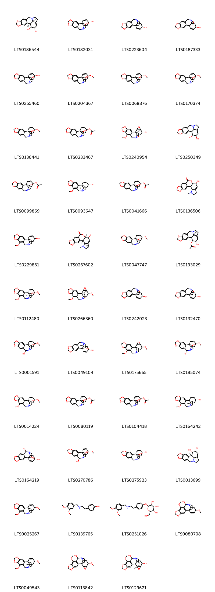{ width=100% }
    <figcaption>Hình ảnh cấu trúc hóa học của 43 hoạt chất thuộc nhóm Amaryllidaceae alkaloids gồm ['lycorine (LTS0186544)', 'hamayne (LTS0182031)', '5,7-dioxa-12-azapentacyclo[10.5.2.0¹,¹³.0²,¹⁰.0⁴,⁸]nonadeca-2,4(8),9,16-tetraen-15-ol (LTS0223604)', 'crinine (LTS0187333)', '5,7-dioxa-12-azapentacyclo[10.5.2.0¹,¹³.0²,¹⁰.0⁴,⁸]nonadeca-2,4(8),9,16-tetraene-15,18-diol (LTS0255460)', '15-methoxy-5,7-dioxa-12-azapentacyclo[10.5.2.0¹,¹³.0²,¹⁰.0⁴,⁸]nonadeca-2,4(8),9,16-tetraen-18-ol (LTS0204367)', '(1s,15r,18r)-15-methoxy-5,7-dioxa-12-azapentacyclo[10.5.2.0¹,¹³.0²,¹⁰.0⁴,⁸]nonadeca-2,4(8),9,16-tetraen-18-ol (LTS0068876)', '(1s,13s,15r,18s)-15-methoxy-5,7-dioxa-12-azapentacyclo[10.5.2.0¹,¹³.0²,¹⁰.0⁴,⁸]nonadeca-2,4(8),9,16-tetraen-18-ol (LTS0170374)', 'crinamine (LTS0136441)', '(1s,13s,15s,18s)-18-hydroxy-5,7-dioxa-12-azapentacyclo[10.5.2.0¹,¹³.0²,¹⁰.0⁴,⁸]nonadeca-2,4(8),9,16-tetraen-15-yl acetate (LTS0233467)', 'crinamidine (LTS0240954)', 'lycorine (LTS0250349)', '18-hydroxy-5,7-dioxa-12-azapentacyclo[10.5.2.0¹,¹³.0²,¹⁰.0⁴,⁸]nonadeca-2,4(8),9,16-tetraen-15-yl acetate (LTS0099869)', '(1s,13r,15r)-9-methoxy-5,7-dioxa-12-azapentacyclo[10.5.2.0¹,¹³.0²,¹⁰.0⁴,⁸]nonadeca-2,4(8),9,16-tetraen-15-ol (LTS0093647)', '3-o-acetylhamayne (LTS0041666)', '9-hydroxy-4-methyl-11,16,18-trioxa-4-azapentacyclo[11.7.0.0²,¹⁰.0³,⁷.0¹⁵,¹⁹]icosa-1(20),7,13,15(19)-tetraen-12-one (LTS0136506)', '9-methoxy-5,7-dioxa-12-azapentacyclo[10.5.2.0¹,¹³.0²,¹⁰.0⁴,⁸]nonadeca-2,4(8),9,16-tetraen-15-ol (LTS0229851)', 'hippeastrine (LTS0267602)', '(1s,13r,15r,18s)-15-methoxy-5,7-dioxa-12-azapentacyclo[10.5.2.0¹,¹³.0²,¹⁰.0⁴,⁸]nonadeca-2,4(8),9,16-tetraen-18-ol (LTS0047747)', '1-o-acetyllycorine (LTS0193029)', 'ambelline (LTS0112480)', 'undulatine (LTS0266360)', '(1r,13s,15r)-5,7-dioxa-12-azapentacyclo[10.5.2.0¹,¹³.0²,¹⁰.0⁴,⁸]nonadeca-2,4(8),9,16-tetraen-15-ol (LTS0242023)', '(1r,13s,15s)-5,7-dioxa-12-azapentacyclo[10.5.2.0¹,¹³.0²,¹⁰.0⁴,⁸]nonadeca-2,4(8),9,16-tetraen-15-ol (LTS0132470)', '15-methoxy-5,7-dioxa-12-azapentacyclo[10.5.2.0¹,¹³.0²,¹⁰.0⁴,⁸]nonadeca-2,4(8),9,16-tetraene-11,18-diol (LTS0001591)', '(1s,13r,15r,18s)-5,7-dioxa-12-azapentacyclo[10.5.2.0¹,¹³.0²,¹⁰.0⁴,⁸]nonadeca-2,4(8),9,16-tetraene-15,18-diol (LTS0049104)', '9,15-dimethoxy-5,7,17-trioxa-12-azahexacyclo[10.6.2.0¹,¹³.0²,¹⁰.0⁴,⁸.0¹⁶,¹⁸]icosa-2,4(8),9-triene (LTS0175665)', '(1s,11r,13s,15r,18s)-15-methoxy-5,7-dioxa-12-azapentacyclo[10.5.2.0¹,¹³.0²,¹⁰.0⁴,⁸]nonadeca-2,4(8),9,16-tetraene-11,18-diol (LTS0185074)', '(1r,13r,15r,18s)-9,15-dimethoxy-5,7-dioxa-12-azapentacyclo[10.5.2.0¹,¹³.0²,¹⁰.0⁴,⁸]nonadeca-2,4(8),9,16-tetraen-18-ol (LTS0014224)', '3-o-acetylhamayne (LTS0080119)', '(1s,13r,15r,18s)-18-hydroxy-5,7-dioxa-12-azapentacyclo[10.5.2.0¹,¹³.0²,¹⁰.0⁴,⁸]nonadeca-2,4(8),9,16-tetraen-15-yl acetate (LTS0104418)', '(1s,13s,15r)-9-methoxy-5,7-dioxa-12-azapentacyclo[10.5.2.0¹,¹³.0²,¹⁰.0⁴,⁸]nonadeca-2,4(8),9,16-tetraen-15-ol (LTS0164242)', '(1r,13s,15s,18s)-5,7-dioxa-12-azapentacyclo[10.5.2.0¹,¹³.0²,¹⁰.0⁴,⁸]nonadeca-2,4(8),9,16-tetraene-11,15,18-triol (LTS0164219)', '(1r,13s,15r,18s)-15-methoxy-5,7-dioxa-12-azapentacyclo[10.5.2.0¹,¹³.0²,¹⁰.0⁴,⁸]nonadeca-2,4(8),9,16-tetraene-11,18-diol (LTS0270786)', 'hamayne (LTS0275923)', '(1s,17r,18s,19s)-5,7-dioxa-12-azapentacyclo[10.6.1.0²,¹⁰.0⁴,⁸.0¹⁵,¹⁹]nonadeca-2,4(8),9,15-tetraene-17,18-diol (LTS0013699)', '9,15-dimethoxy-5,7-dioxa-12-azapentacyclo[10.5.2.0¹,¹³.0²,¹⁰.0⁴,⁸]nonadeca-2,4(8),9,16-tetraene (LTS0025267)', '4-(2-{[(3,4-dimethoxyphenyl)methyl]amino}ethyl)phenol (LTS0139765)', '(2s,3s,4r,5s,6r)-2-[4-(2-{[(3,4-dimethoxyphenyl)methyl]amino}ethyl)phenoxy]-6-(hydroxymethyl)oxane-3,4,5-triol (LTS0251026)', '9,15-dimethoxy-5,7-dioxa-12-azapentacyclo[10.5.2.0¹,¹³.0²,¹⁰.0⁴,⁸]nonadeca-2(10),3,8,16-tetraen-11-ol (LTS0080708)', '(1s,13s,15r)-9,15-dimethoxy-5,7-dioxa-12-azapentacyclo[10.5.2.0¹,¹³.0²,¹⁰.0⁴,⁸]nonadeca-2,4(8),9,16-tetraene (LTS0049543)', '9,15-dimethoxy-5,7,17-trioxa-12-azahexacyclo[10.6.2.0¹,¹³.0²,¹⁰.0⁴,⁸.0¹⁶,¹⁸]icosa-2(10),3,8-trien-11-ol (LTS0113842)', '(1s,13r,15r,16s,18r)-9-methoxy-5,7,17-trioxa-12-azahexacyclo[10.6.2.0¹,¹³.0²,¹⁰.0⁴,⁸.0¹⁶,¹⁸]icosa-2(10),3,8-triene-11,15-diol (LTS0129621)'].</figcaption>
</figure>
#### Nhóm Benzopyrans
<figure markdown="span">
    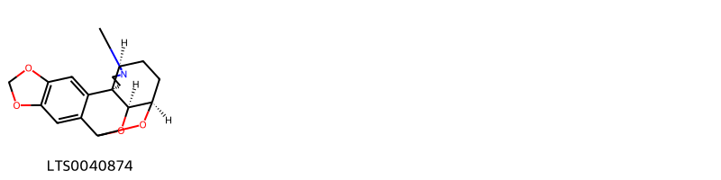{ width=100% }
    <figcaption>Hình ảnh cấu trúc hóa học của 1 hoạt chất thuộc nhóm Benzopyrans gồm ['(11s,15r,18r,19s)-14-methyl-5,7,20,21-tetraoxa-14-azahexacyclo[16.2.1.0²,¹⁰.0⁴,⁸.0¹¹,¹⁵.0¹¹,¹⁹]henicosa-2,4(8),9-triene (LTS0040874)'].</figcaption>
</figure>
#### Nhóm Carboxylic acids and derivatives
<figure markdown="span">
    { width=100% }
    <figcaption>Hình ảnh cấu trúc hóa học của 2 hoạt chất thuộc nhóm Carboxylic acids and derivatives gồm ['2-(1-carboxyethoxy)propanoic acid (LTS0204177)', '(2s)-2-[(1r)-1-carboxyethoxy]propanoic acid (LTS0152488)'].</figcaption>
</figure>
#### Nhóm Coumarins and derivatives
<figure markdown="span">
    { width=100% }
    <figcaption>Hình ảnh cấu trúc hóa học của 1 hoạt chất thuộc nhóm Coumarins and derivatives gồm ['(6,7-dimethoxy-2-oxochromen-4-yl)methyl 3-methylbut-2-enoate (LTS0048088)'].</figcaption>
</figure>
#### Nhóm Fatty Acyls
<figure markdown="span">
    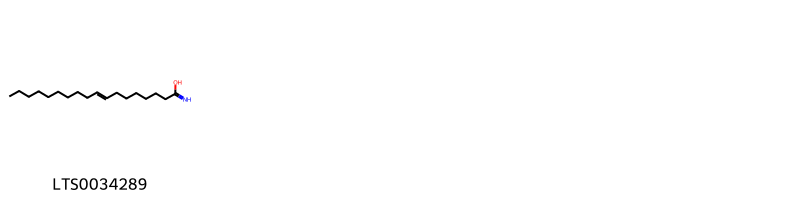{ width=100% }
    <figcaption>Hình ảnh cấu trúc hóa học của 1 hoạt chất thuộc nhóm Fatty Acyls gồm ['octadec-8-enimidic acid (LTS0034289)'].</figcaption>
</figure>
#### Nhóm Pyrans
<figure markdown="span">
    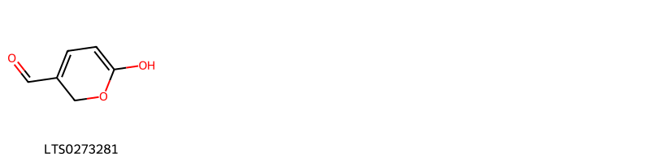{ width=100% }
    <figcaption>Hình ảnh cấu trúc hóa học của 1 hoạt chất thuộc nhóm Pyrans gồm ['6-hydroxy-2h-pyran-3-carbaldehyde (LTS0273281)'].</figcaption>
</figure>
#### Nhóm Quinolines and derivatives
<figure markdown="span">
    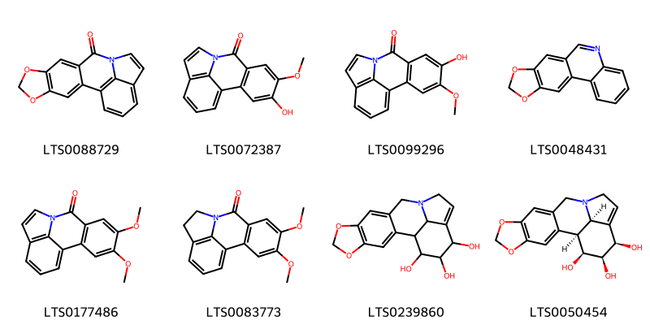{ width=100% }
    <figcaption>Hình ảnh cấu trúc hóa học của 8 hoạt chất thuộc nhóm Quinolines and derivatives gồm ['5,7-dioxa-12-azapentacyclo[10.6.1.0²,¹⁰.0⁴,⁸.0¹⁵,¹⁹]nonadeca-1(19),2(10),3,8,13,15,17-heptaen-11-one (LTS0088729)', '4-hydroxy-5-methoxy-9-azatetracyclo[7.6.1.0²,⁷.0¹²,¹⁶]hexadeca-1(15),2(7),3,5,10,12(16),13-heptaen-8-one (LTS0072387)', '5-hydroxy-4-methoxy-9-azatetracyclo[7.6.1.0²,⁷.0¹²,¹⁶]hexadeca-1(15),2(7),3,5,10,12(16),13-heptaen-8-one (LTS0099296)', 'trisphaeridine (LTS0048431)', '4,5-dimethoxy-9-azatetracyclo[7.6.1.0²,⁷.0¹²,¹⁶]hexadeca-1(15),2(7),3,5,10,12(16),13-heptaen-8-one (LTS0177486)', 'oxoassoanine (LTS0083773)', '5,7-dioxa-12-azapentacyclo[10.6.1.0²,¹⁰.0⁴,⁸.0¹⁵,¹⁹]nonadeca-2,4(8),9,14-tetraene-16,17,18-triol (LTS0239860)', '(1s,16r,17s,18s,19r)-5,7-dioxa-12-azapentacyclo[10.6.1.0²,¹⁰.0⁴,⁸.0¹⁵,¹⁹]nonadeca-2,4(8),9,14-tetraene-16,17,18-triol (LTS0050454)'].</figcaption>
</figure>
#### Nhóm Steroids and steroid derivatives
<figure markdown="span">
    { width=100% }
    <figcaption>Hình ảnh cấu trúc hóa học của 2 hoạt chất thuộc nhóm Steroids and steroid derivatives gồm ['(3r,6s,8r,11s,12s,15r,16r)-7,7,12,16-tetramethyl-15-[(2r)-6-methylhept-5-en-2-yl]pentacyclo[9.7.0.0¹,³.0³,⁸.0¹²,¹⁶]octadecan-6-ol (LTS0062833)', 'cycloartenol (LTS0269561)'].</figcaption>
</figure>
#### Nhóm Tetrahydroisoquinolines
<figure markdown="span">
    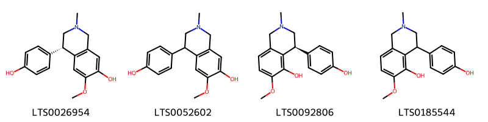{ width=100% }
    <figcaption>Hình ảnh cấu trúc hóa học của 4 hoạt chất thuộc nhóm Tetrahydroisoquinolines gồm ['cherylline (LTS0026954)', '4-(4-hydroxyphenyl)-6-methoxy-2-methyl-3,4-dihydro-1h-isoquinolin-7-ol (LTS0052602)', '(4s)-4-(4-hydroxyphenyl)-6-methoxy-2-methyl-3,4-dihydro-1h-isoquinolin-5-ol (LTS0092806)', '4-(4-hydroxyphenyl)-6-methoxy-2-methyl-3,4-dihydro-1h-isoquinolin-5-ol (LTS0185544)'].</figcaption>
</figure>

---

### Dược dân tộc học

Danh sách các quốc gia có sử dụng *Crinum latifolium* trong điều trị các bệnh. 

| Country   | Disease     | Bệnh                   |
|:----------|:------------|:-----------------------|
| Elsewhere | Rubefacient | Chất gây xung huyết da |
| India     | Rubefacient | Chất gây xung huyết da |

---

---
## Crinum longiflorum
### Thông tin về thực vật

!!! info "Phân loại thực vật của *Crinum americanum* từ GIBF:"
    - **Kingdom:** Plantae
    - **Phylum:** Tracheophyta
    - **Order:** Asparagales
    - **Family:** Amaryllidaceae
    - **Genus:** Crinum
    - **Species:** *Crinum americanum*

 

| Label (VI)   | Label (EN)   | Scientific Name    | Descriptions (VI)   | Descriptions (EN)   | Also Known As (VI)   | Also Known As (EN)   |
|:-------------|:-------------|:-------------------|:--------------------|:--------------------|:---------------------|:---------------------|
| N/A          | N/A          | Crinum longiflorum |                     |                     | ['']                 | ['']                 |

#### Phân bố trên thế giới

**Từ CSDL GIBF** nan, Mexico, Guatemala, United States of America, El Salvador, Niue, Virgin Islands (U.S.), Martinique, Costa Rica, Panama, Guyana

#### Phân bố tại Việt Nam

**Từ CSDL GIBF**: Không có ghi nhận ở Việt Nam

---
### Thành phần hóa học
        
- Theo cơ sở dữ liệu lotus: Từ loài *Crinum americanum* đã phân lập và xác định được Chưa có hoạt chất nào được phân lập. hoạt chất thuộc về các nhóm Không có hoạt chất nào được phân lập. 

Không có hình ảnh nào được tạo ra

---

### Dược dân tộc học

Danh sách các quốc gia có sử dụng *Crinum americanum* trong điều trị các bệnh. 

| Country   | Disease   | Bệnh     |
|:----------|:----------|:---------|
| US        | Poison    | Chất độc |

---

---
## Crinum macrantherum
### Thông tin về thực vật

!!! info "Phân loại thực vật của *Crinum asiaticum* từ GIBF:"
    - **Kingdom:** Plantae
    - **Phylum:** Tracheophyta
    - **Order:** Asparagales
    - **Family:** Amaryllidaceae
    - **Genus:** Crinum
    - **Species:** *Crinum asiaticum*

 

| Label (VI)   | Label (EN)   | Scientific Name     | Descriptions (VI)   | Descriptions (EN)   | Also Known As (VI)   | Also Known As (EN)   |
|:-------------|:-------------|:--------------------|:--------------------|:--------------------|:---------------------|:---------------------|
| N/A          | N/A          | Crinum macrantherum |                     |                     | ['']                 | ['']                 |

#### Phân bố trên thế giới

**Từ CSDL GIBF** nan, Marshall Islands, Micronesia (Federated States of), Solomon Islands, French Polynesia, Papua New Guinea

#### Phân bố tại Việt Nam

**Từ CSDL GIBF**: Không có ghi nhận ở Việt Nam

---
### Thành phần hóa học
        
- Theo cơ sở dữ liệu lotus: Từ loài *Crinum asiaticum* đã phân lập và xác định được Chưa có hoạt chất nào được phân lập. hoạt chất thuộc về các nhóm Không có hoạt chất nào được phân lập. 

Không có hình ảnh nào được tạo ra

---

### Dược dân tộc học

Danh sách các quốc gia có sử dụng *Crinum asiaticum* trong điều trị các bệnh. 

| Country   | Disease   | Bệnh   |
|:----------|:----------|:-------|
| Newguinea | Emetic    | Phôi   |

---

