!!! abstract "Tóm tắt"

    Họ Linaceae gồm khoảng 3 chi và 11 loài được một số cộng đồng tại các quốc gia như India*, ain, Venezuela, Elsewhere, China, India, US, Turkey, Europe sử dụng trong một số trường hợp MYMEMORY WARNING: YOU USED ALL AVAILABLE FREE TRANSLATIONS FOR TODAY. NEXT AVAILABLE IN  16 HOURS 26 MINUTES 14 SECONDS VISIT HTTPS://MYMEMORY.TRANSLATED.NET/DOC/USAGELIMITS.PHP TO TRANSLATE MORE.

!!! info "DrDuke"

    James A. Duke sinh năm 1929-2017 là một nhà thực vật học người Mỹ. Đây là một trong những tác giả hàng đầu trong lĩnh vực dược dân tộc học với cuốn *CRC Handbook of Medicinal Herbs* và chính là người xây dựng lên cơ sở dữ liệu về hợp chất tự nhiên và dược dân tộc học tại Bộ nông nghiệp Hoa Kỳ. Các thông tin được đăng tải tại website [Dr. Duke's Phytochemical and Ethnobotanical Databases](https://phytochem.nal.usda.gov/). 
    Trong suốt thập niên 1970, ông lãnh đạo the Plant Taxonomy Laboratory, Plant Genetics and Germplasm Institute of the Agricultural Research Service, U.S. Department of Agriculture.
    Trong tài liệu này, các thông tin về dược dân tộc của các dược liệu được trích dẫn từ tài liệu của James A. Ducke với sự trợ giúp của phần mềm dịch thuật từ tiếng Anh sang tiếng Việt.
   

# Chi Linum

??? note "Danh sách các dược liệu thuộc chi"
    
	 - *Linum catharticum*
	 - *Linum lewisii*
	 - *Linum neomexicanum*
	 - *Linum perenne*
	 - *Linum rigidum*
	 - *Linum sativum*
	 - *Linum strictum*
	 - *Linum usitatissimum*

---
## Linum catharticum
### Thông tin về thực vật

!!! info "Phân loại thực vật của *Linum catharticum* từ GIBF:"
    - **Kingdom:** Plantae
    - **Phylum:** Tracheophyta
    - **Order:** Malpighiales
    - **Family:** Linaceae
    - **Genus:** Linum
    - **Species:** *Linum catharticum*

 

| Label (VI)   | Label (EN)   | Scientific Name   | Descriptions (VI)   | Descriptions (EN)   | Also Known As (VI)   | Also Known As (EN)   |
|:-------------|:-------------|:------------------|:--------------------|:--------------------|:---------------------|:---------------------|
| N/A          | N/A          | Linum catharticum | loài thực vật       | species of plant    | ['']                 | ['']                 |

#### Phân bố trên thế giới

**Từ CSDL GIBF** Czechia, Sweden, New Zealand, Slovenia, Spain, Poland, Netherlands, Denmark, Romania, Russian Federation, Croatia, Argentina, Norway, United Kingdom of Great Britain and Northern Ireland, Belgium, Canada, Germany, Austria, Hungary, Slovakia, Ukraine, Australia, Italy, Switzerland, France, Ireland

#### Phân bố tại Việt Nam

**Từ CSDL GIBF**: Không có ghi nhận ở Việt Nam

---
### Thành phần hóa học
        
- Theo cơ sở dữ liệu lotus: Từ loài *Linum catharticum* đã phân lập và xác định được 12 hoạt chất thuộc về các nhóm Organooxygen compounds, Lignan lactones. 

|    | chemicalTaxonomyClassyfireClass   |   smiles_count |
|---:|:----------------------------------|---------------:|
|  0 | Lignan lactones                   |              8 |
|  1 | Organooxygen compounds            |              4 |

#### Nhóm Lignan lactones
<figure markdown="span">
    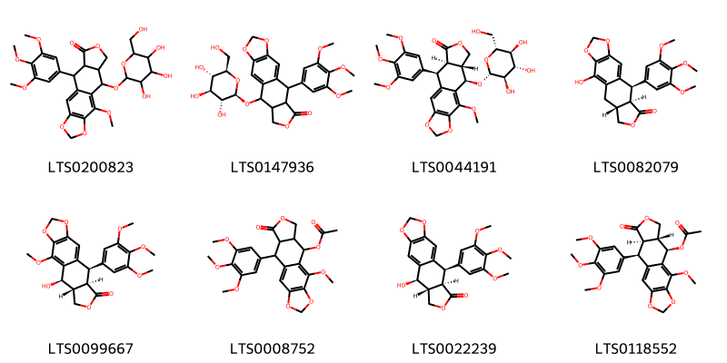{ width=100% }
    <figcaption>Hình ảnh cấu trúc hóa học của 8 hoạt chất thuộc nhóm Lignan lactones gồm ['2-methoxy-16-{[3,4,5-trihydroxy-6-(hydroxymethyl)oxan-2-yl]oxy}-10-(3,4,5-trimethoxyphenyl)-4,6,13-trioxatetracyclo[7.7.0.0³,⁷.0¹¹,¹⁵]hexadeca-1,3(7),8-trien-12-one (LTS0200823)', '16-{[(2r,3r,4s,5s,6r)-3,4,5-trihydroxy-6-(hydroxymethyl)oxan-2-yl]oxy}-10-(3,4,5-trimethoxyphenyl)-4,6,13-trioxatetracyclo[7.7.0.0³,⁷.0¹¹,¹⁵]hexadeca-1,3(7),8-trien-12-one (LTS0147936)', '(10r,11r,15r,16r)-2-methoxy-16-{[(2r,3r,4s,5s,6r)-3,4,5-trihydroxy-6-(hydroxymethyl)oxan-2-yl]oxy}-10-(3,4,5-trimethoxyphenyl)-4,6,13-trioxatetracyclo[7.7.0.0³,⁷.0¹¹,¹⁵]hexadeca-1,3(7),8-trien-12-one (LTS0044191)', 'β-peltatin (LTS0082079)', '(10r,11r,15r,16r)-16-hydroxy-2-methoxy-10-(3,4,5-trimethoxyphenyl)-4,6,13-trioxatetracyclo[7.7.0.0³,⁷.0¹¹,¹⁵]hexadeca-1,3(7),8-trien-12-one (LTS0099667)', '8-methoxy-14-oxo-16-(3,4,5-trimethoxyphenyl)-4,6,13-trioxatetracyclo[7.7.0.0³,⁷.0¹¹,¹⁵]hexadeca-1,3(7),8-trien-10-yl acetate (LTS0008752)', 'podofilox (LTS0022239)', '(10r,11r,15r,16r)-8-methoxy-14-oxo-16-(3,4,5-trimethoxyphenyl)-4,6,13-trioxatetracyclo[7.7.0.0³,⁷.0¹¹,¹⁵]hexadeca-1,3(7),8-trien-10-yl acetate (LTS0118552)'].</figcaption>
</figure>
#### Nhóm Organooxygen compounds
<figure markdown="span">
    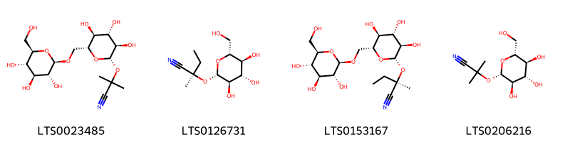{ width=100% }
    <figcaption>Hình ảnh cấu trúc hóa học của 4 hoạt chất thuộc nhóm Organooxygen compounds gồm ['linustatin (LTS0023485)', 'lotaustralin (LTS0126731)', 'neolinustatin (LTS0153167)', 'linamarin (LTS0206216)'].</figcaption>
</figure>

---

### Dược dân tộc học

Danh sách các quốc gia có sử dụng *Linum catharticum* trong điều trị các bệnh. 

| Country   | Disease                        | Bệnh                                                                                                                                                                                                |
|:----------|:-------------------------------|:----------------------------------------------------------------------------------------------------------------------------------------------------------------------------------------------------|
| Turkey    | Diuretic, Purgative, Vermifuge | MYMEMORY WARNING: YOU USED ALL AVAILABLE FREE TRANSLATIONS FOR TODAY. NEXT AVAILABLE IN  16 HOURS 26 MINUTES 11 SECONDS VISIT HTTPS://MYMEMORY.TRANSLATED.NET/DOC/USAGELIMITS.PHP TO TRANSLATE MORE |
| ain       | Purgative                      | MYMEMORY WARNING: YOU USED ALL AVAILABLE FREE TRANSLATIONS FOR TODAY. NEXT AVAILABLE IN  16 HOURS 26 MINUTES 09 SECONDS VISIT HTTPS://MYMEMORY.TRANSLATED.NET/DOC/USAGELIMITS.PHP TO TRANSLATE MORE |

---

---
## Linum lewisii
### Thông tin về thực vật

!!! info "Phân loại thực vật của *Linum lewisii* từ GIBF:"
    - **Kingdom:** Plantae
    - **Phylum:** Tracheophyta
    - **Order:** Malpighiales
    - **Family:** Linaceae
    - **Genus:** Linum
    - **Species:** *Linum lewisii*

 

| Label (VI)   | Label (EN)   | Scientific Name   | Descriptions (VI)   | Descriptions (EN)   | Also Known As (VI)   | Also Known As (EN)                            |
|:-------------|:-------------|:------------------|:--------------------|:--------------------|:---------------------|:----------------------------------------------|
| N/A          | N/A          | Linum lewisii     | loài thực vật       | species of plant    | ['']                 | ['blue flax', 'Lewis flax', 'wild blue flax'] |

#### Phân bố trên thế giới

**Từ CSDL GIBF** United States of America, Canada

#### Phân bố tại Việt Nam

**Từ CSDL GIBF**: Không có ghi nhận ở Việt Nam

---
### Thành phần hóa học
        
- Theo cơ sở dữ liệu lotus: Từ loài *Linum lewisii* đã phân lập và xác định được 5 hoạt chất thuộc về các nhóm Lignan lactones. 

|    | chemicalTaxonomyClassyfireClass   |   smiles_count |
|---:|:----------------------------------|---------------:|
|  0 | Lignan lactones                   |              5 |

#### Nhóm Lignan lactones
<figure markdown="span">
    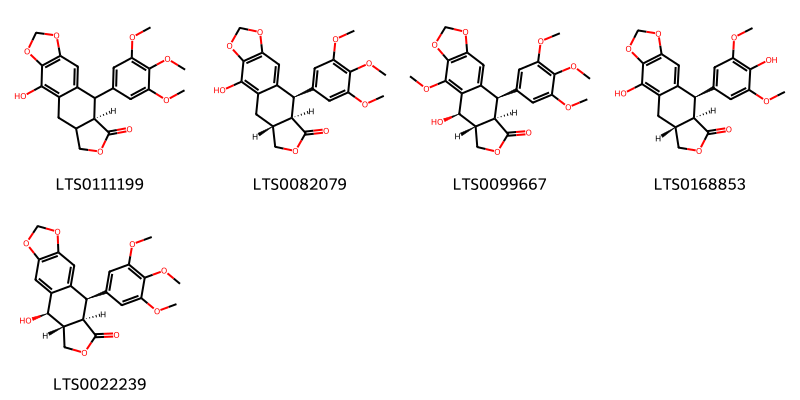{ width=100% }
    <figcaption>Hình ảnh cấu trúc hóa học của 5 hoạt chất thuộc nhóm Lignan lactones gồm ['(11r)-2-hydroxy-10-(3,4,5-trimethoxyphenyl)-4,6,13-trioxatetracyclo[7.7.0.0³,⁷.0¹¹,¹⁵]hexadeca-1,3(7),8-trien-12-one (LTS0111199)', 'β-peltatin (LTS0082079)', '(10r,11r,15r,16r)-16-hydroxy-2-methoxy-10-(3,4,5-trimethoxyphenyl)-4,6,13-trioxatetracyclo[7.7.0.0³,⁷.0¹¹,¹⁵]hexadeca-1,3(7),8-trien-12-one (LTS0099667)', 'α peltatin (LTS0168853)', 'podofilox (LTS0022239)'].</figcaption>
</figure>

---

### Dược dân tộc học

Danh sách các quốc gia có sử dụng *Linum lewisii* trong điều trị các bệnh. 

| Country   | Disease   | Bệnh                                                                                                                                                                                                |
|:----------|:----------|:----------------------------------------------------------------------------------------------------------------------------------------------------------------------------------------------------|
| US        | Poison    | MYMEMORY WARNING: YOU USED ALL AVAILABLE FREE TRANSLATIONS FOR TODAY. NEXT AVAILABLE IN  16 HOURS 25 MINUTES 45 SECONDS VISIT HTTPS://MYMEMORY.TRANSLATED.NET/DOC/USAGELIMITS.PHP TO TRANSLATE MORE |

---

---
## Linum neomexicanum
### Thông tin về thực vật

!!! info "Phân loại thực vật của *Linum neomexicanum* từ GIBF:"
    - **Kingdom:** Plantae
    - **Phylum:** Tracheophyta
    - **Order:** Malpighiales
    - **Family:** Linaceae
    - **Genus:** Linum
    - **Species:** *Linum neomexicanum*

 

| Label (VI)   | Label (EN)   | Scientific Name    | Descriptions (VI)   | Descriptions (EN)   | Also Known As (VI)   | Also Known As (EN)   |
|:-------------|:-------------|:-------------------|:--------------------|:--------------------|:---------------------|:---------------------|
| N/A          | N/A          | Linum neomexicanum | loài thực vật       | species of plant    | ['']                 | ['']                 |

#### Phân bố trên thế giới

**Từ CSDL GIBF** Mexico, United States of America

#### Phân bố tại Việt Nam

**Từ CSDL GIBF**: Không có ghi nhận ở Việt Nam

---
### Thành phần hóa học
        
- Theo cơ sở dữ liệu lotus: Từ loài *Linum neomexicanum* đã phân lập và xác định được Chưa có hoạt chất nào được phân lập. hoạt chất thuộc về các nhóm Không có hoạt chất nào được phân lập. 

Không có hình ảnh nào được tạo ra

---

### Dược dân tộc học

Danh sách các quốc gia có sử dụng *Linum neomexicanum* trong điều trị các bệnh. 

| Country   | Disease   | Bệnh                                                                                                                                                                                                |
|:----------|:----------|:----------------------------------------------------------------------------------------------------------------------------------------------------------------------------------------------------|
| US        | Poison    | MYMEMORY WARNING: YOU USED ALL AVAILABLE FREE TRANSLATIONS FOR TODAY. NEXT AVAILABLE IN  16 HOURS 25 MINUTES 22 SECONDS VISIT HTTPS://MYMEMORY.TRANSLATED.NET/DOC/USAGELIMITS.PHP TO TRANSLATE MORE |

---

---
## Linum perenne
### Thông tin về thực vật

!!! info "Phân loại thực vật của *Linum perenne* từ GIBF:"
    - **Kingdom:** Plantae
    - **Phylum:** Tracheophyta
    - **Order:** Malpighiales
    - **Family:** Linaceae
    - **Genus:** Linum
    - **Species:** *Linum perenne*

 

| Label (VI)   | Label (EN)   | Scientific Name   | Descriptions (VI)   | Descriptions (EN)   | Also Known As (VI)   | Also Known As (EN)   |
|:-------------|:-------------|:------------------|:--------------------|:--------------------|:---------------------|:---------------------|
| N/A          | N/A          | Linum perenne     |                     | species of plant    | ['']                 | ['']                 |

#### Phân bố trên thế giới

**Từ CSDL GIBF** Belarus, Austria, Hungary, United States of America, Norway, Romania, Mongolia, United Kingdom of Great Britain and Northern Ireland, Ukraine, China, Russian Federation, Switzerland, Croatia, Canada, Germany, France, Spain, Poland

#### Phân bố tại Việt Nam

**Từ CSDL GIBF**: Không có ghi nhận ở Việt Nam

---
### Thành phần hóa học
        
- Theo cơ sở dữ liệu lotus: Từ loài *Linum perenne* đã phân lập và xác định được 21 hoạt chất thuộc về các nhóm Arylnaphthalene lignans, Organooxygen compounds, Lignan lactones. 

|    | chemicalTaxonomyClassyfireClass   |   smiles_count |
|---:|:----------------------------------|---------------:|
|  0 | Arylnaphthalene lignans           |              3 |
|  1 | Lignan lactones                   |             13 |
|  2 | Organooxygen compounds            |              5 |

#### Nhóm Arylnaphthalene lignans
<figure markdown="span">
    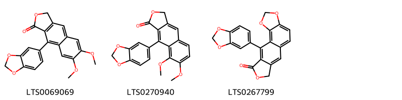{ width=100% }
    <figcaption>Hình ảnh cấu trúc hóa học của 3 hoạt chất thuộc nhóm Arylnaphthalene lignans gồm ['justicidin b (LTS0069069)', '9-(2h-1,3-benzodioxol-5-yl)-7,8-dimethoxy-3h-naphtho[2,3-c]furan-1-one (LTS0270940)', '16-(2h-1,3-benzodioxol-5-yl)-3,5,13-trioxatetracyclo[7.7.0.0²,⁶.0¹¹,¹⁵]hexadeca-1,6,8,10,15-pentaen-14-one (LTS0267799)'].</figcaption>
</figure>
#### Nhóm Lignan lactones
<figure markdown="span">
    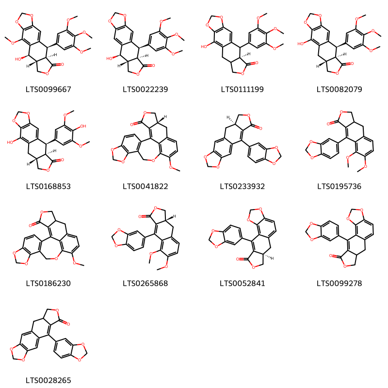{ width=100% }
    <figcaption>Hình ảnh cấu trúc hóa học của 13 hoạt chất thuộc nhóm Lignan lactones gồm ['(10r,11r,15r,16r)-16-hydroxy-2-methoxy-10-(3,4,5-trimethoxyphenyl)-4,6,13-trioxatetracyclo[7.7.0.0³,⁷.0¹¹,¹⁵]hexadeca-1,3(7),8-trien-12-one (LTS0099667)', 'podofilox (LTS0022239)', '(11r)-2-hydroxy-10-(3,4,5-trimethoxyphenyl)-4,6,13-trioxatetracyclo[7.7.0.0³,⁷.0¹¹,¹⁵]hexadeca-1,3(7),8-trien-12-one (LTS0111199)', 'β-peltatin (LTS0082079)', 'α peltatin (LTS0168853)', '(19r)-14-methoxy-6,8,12,21-tetraoxahexacyclo[11.10.1.0²,¹⁰.0⁵,⁹.0¹⁷,²⁴.0¹⁹,²³]tetracosa-1(23),2(10),3,5(9),13(24),14,16-heptaen-22-one (LTS0041822)', '(15r)-10-(2h-1,3-benzodioxol-5-yl)-4,6,13-trioxatetracyclo[7.7.0.0³,⁷.0¹¹,¹⁵]hexadeca-1,3(7),8,10-tetraen-12-one (LTS0233932)', '9-(2h-1,3-benzodioxol-5-yl)-7,8-dimethoxy-3h,3ah,4h-naphtho[2,3-c]furan-1-one (LTS0195736)', '14-methoxy-6,8,12,21-tetraoxahexacyclo[11.10.1.0²,¹⁰.0⁵,⁹.0¹⁷,²⁴.0¹⁹,²³]tetracosa-1(23),2(10),3,5(9),13(24),14,16-heptaen-22-one (LTS0186230)', '(3ar)-9-(2h-1,3-benzodioxol-5-yl)-7,8-dimethoxy-3h,3ah,4h-naphtho[2,3-c]furan-1-one (LTS0265868)', '(11r)-16-(2h-1,3-benzodioxol-5-yl)-3,5,13-trioxatetracyclo[7.7.0.0²,⁶.0¹¹,¹⁵]hexadeca-1,6,8,15-tetraen-14-one (LTS0052841)', '16-(2h-1,3-benzodioxol-5-yl)-3,5,13-trioxatetracyclo[7.7.0.0²,⁶.0¹¹,¹⁵]hexadeca-1,6,8,15-tetraen-14-one (LTS0099278)', '10-(2h-1,3-benzodioxol-5-yl)-4,6,13-trioxatetracyclo[7.7.0.0³,⁷.0¹¹,¹⁵]hexadeca-1,3(7),8,10-tetraen-12-one (LTS0028265)'].</figcaption>
</figure>
#### Nhóm Organooxygen compounds
<figure markdown="span">
    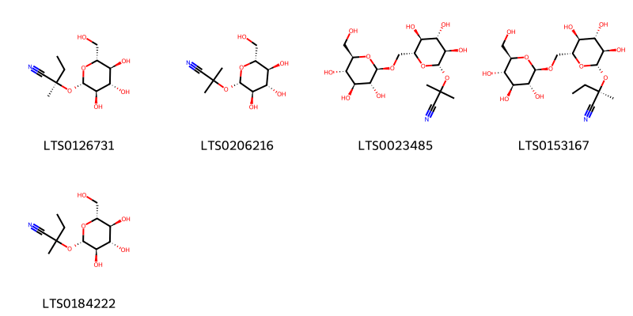{ width=100% }
    <figcaption>Hình ảnh cấu trúc hóa học của 5 hoạt chất thuộc nhóm Organooxygen compounds gồm ['lotaustralin (LTS0126731)', 'linamarin (LTS0206216)', 'linustatin (LTS0023485)', 'neolinustatin (LTS0153167)', '2-methyl-2-{[(2s,3r,4s,5s,6r)-3,4,5-trihydroxy-6-(hydroxymethyl)oxan-2-yl]oxy}butanenitrile (LTS0184222)'].</figcaption>
</figure>

---

### Dược dân tộc học

Danh sách các quốc gia có sử dụng *Linum perenne* trong điều trị các bệnh. 

| Country   | Disease   | Bệnh                                                                                                                                                                                                |
|:----------|:----------|:----------------------------------------------------------------------------------------------------------------------------------------------------------------------------------------------------|
| China     | Emollient | MYMEMORY WARNING: YOU USED ALL AVAILABLE FREE TRANSLATIONS FOR TODAY. NEXT AVAILABLE IN  16 HOURS 25 MINUTES 00 SECONDS VISIT HTTPS://MYMEMORY.TRANSLATED.NET/DOC/USAGELIMITS.PHP TO TRANSLATE MORE |
| Europe    | Emollient | MYMEMORY WARNING: YOU USED ALL AVAILABLE FREE TRANSLATIONS FOR TODAY. NEXT AVAILABLE IN  16 HOURS 24 MINUTES 57 SECONDS VISIT HTTPS://MYMEMORY.TRANSLATED.NET/DOC/USAGELIMITS.PHP TO TRANSLATE MORE |

---

---
## Linum rigidum
### Thông tin về thực vật

!!! info "Phân loại thực vật của *Linum rigidum* từ GIBF:"
    - **Kingdom:** Plantae
    - **Phylum:** Tracheophyta
    - **Order:** Malpighiales
    - **Family:** Linaceae
    - **Genus:** Linum
    - **Species:** *Linum rigidum*

 

| Label (VI)   | Label (EN)   | Scientific Name   | Descriptions (VI)   | Descriptions (EN)   | Also Known As (VI)   | Also Known As (EN)   |
|:-------------|:-------------|:------------------|:--------------------|:--------------------|:---------------------|:---------------------|
| N/A          | N/A          | Linum rigidum     | loài thực vật       | species of plant    | ['']                 | ['']                 |

#### Phân bố trên thế giới

**Từ CSDL GIBF** United States of America, Canada

#### Phân bố tại Việt Nam

**Từ CSDL GIBF**: Không có ghi nhận ở Việt Nam

---
### Thành phần hóa học
        
- Theo cơ sở dữ liệu lotus: Từ loài *Linum rigidum* đã phân lập và xác định được Chưa có hoạt chất nào được phân lập. hoạt chất thuộc về các nhóm Không có hoạt chất nào được phân lập. 

Không có hình ảnh nào được tạo ra

---

### Dược dân tộc học

Danh sách các quốc gia có sử dụng *Linum rigidum* trong điều trị các bệnh. 

| Country   | Disease   | Bệnh                                                                                                                                                                                                |
|:----------|:----------|:----------------------------------------------------------------------------------------------------------------------------------------------------------------------------------------------------|
| US        | Poison    | MYMEMORY WARNING: YOU USED ALL AVAILABLE FREE TRANSLATIONS FOR TODAY. NEXT AVAILABLE IN  16 HOURS 24 MINUTES 30 SECONDS VISIT HTTPS://MYMEMORY.TRANSLATED.NET/DOC/USAGELIMITS.PHP TO TRANSLATE MORE |

---

---
## Linum sativum
### Thông tin về thực vật

!!! info "Phân loại thực vật của *Linum usitatissimum* từ GIBF:"
    - **Kingdom:** Plantae
    - **Phylum:** Tracheophyta
    - **Order:** Malpighiales
    - **Family:** Linaceae
    - **Genus:** Linum
    - **Species:** *Linum usitatissimum*

 

| Label (VI)   | Label (EN)   | Scientific Name   | Descriptions (VI)   | Descriptions (EN)   | Also Known As (VI)   | Also Known As (EN)   |
|:-------------|:-------------|:------------------|:--------------------|:--------------------|:---------------------|:---------------------|
| N/A          | N/A          | Linum rigidum     | loài thực vật       | species of plant    | ['']                 | ['']                 |

#### Phân bố trên thế giới

**Từ CSDL GIBF** nan, Hungary, United States of America, Portugal, Greece, Iran (Islamic Republic of), Slovakia, Tunisia, Israel, India, Türkiye, Bulgaria, Germany

#### Phân bố tại Việt Nam

**Từ CSDL GIBF**: Không có ghi nhận ở Việt Nam

---
### Thành phần hóa học
        
- Theo cơ sở dữ liệu lotus: Từ loài *Linum usitatissimum* đã phân lập và xác định được Chưa có hoạt chất nào được phân lập. hoạt chất thuộc về các nhóm Không có hoạt chất nào được phân lập. 

Không có hình ảnh nào được tạo ra

---

### Dược dân tộc học

Danh sách các quốc gia có sử dụng *Linum usitatissimum* trong điều trị các bệnh. 

| Country   | Disease   | Bệnh                                                                                                                                                                                                |
|:----------|:----------|:----------------------------------------------------------------------------------------------------------------------------------------------------------------------------------------------------|
| China     | Emollient | MYMEMORY WARNING: YOU USED ALL AVAILABLE FREE TRANSLATIONS FOR TODAY. NEXT AVAILABLE IN  16 HOURS 24 MINUTES 06 SECONDS VISIT HTTPS://MYMEMORY.TRANSLATED.NET/DOC/USAGELIMITS.PHP TO TRANSLATE MORE |

---

---
## Linum strictum
### Thông tin về thực vật

!!! info "Phân loại thực vật của *Linum strictum* từ GIBF:"
    - **Kingdom:** Plantae
    - **Phylum:** Tracheophyta
    - **Order:** Malpighiales
    - **Family:** Linaceae
    - **Genus:** Linum
    - **Species:** *Linum strictum*

 

| Label (VI)   | Label (EN)   | Scientific Name   | Descriptions (VI)   | Descriptions (EN)   | Also Known As (VI)   | Also Known As (EN)   |
|:-------------|:-------------|:------------------|:--------------------|:--------------------|:---------------------|:---------------------|
| N/A          | N/A          | Linum strictum    | loài thực vật       | species of plant    | ['']                 | ['']                 |

#### Phân bố trên thế giới

**Từ CSDL GIBF** Algeria, Portugal, Malta, Greece, Israel, Australia, Italy, Croatia, Iraq, Cyprus, France, Spain

#### Phân bố tại Việt Nam

**Từ CSDL GIBF**: Không có ghi nhận ở Việt Nam

---
### Thành phần hóa học
        
- Theo cơ sở dữ liệu lotus: Từ loài *Linum strictum* đã phân lập và xác định được Chưa có hoạt chất nào được phân lập. hoạt chất thuộc về các nhóm Không có hoạt chất nào được phân lập. 

Không có hình ảnh nào được tạo ra

---

### Dược dân tộc học

Danh sách các quốc gia có sử dụng *Linum strictum* trong điều trị các bệnh. 

| Country   | Disease              | Bệnh                                                                                                                                                                                                |
|:----------|:---------------------|:----------------------------------------------------------------------------------------------------------------------------------------------------------------------------------------------------|
| ain       | Emollient, Emollient | MYMEMORY WARNING: YOU USED ALL AVAILABLE FREE TRANSLATIONS FOR TODAY. NEXT AVAILABLE IN  16 HOURS 23 MINUTES 47 SECONDS VISIT HTTPS://MYMEMORY.TRANSLATED.NET/DOC/USAGELIMITS.PHP TO TRANSLATE MORE |

---

---
## Linum usitatissimum
### Thông tin về thực vật

!!! info "Phân loại thực vật của *Linum usitatissimum* từ GIBF:"
    - **Kingdom:** Plantae
    - **Phylum:** Tracheophyta
    - **Order:** Malpighiales
    - **Family:** Linaceae
    - **Genus:** Linum
    - **Species:** *Linum usitatissimum*

 

| Label (VI)   | Label (EN)   | Scientific Name     | Descriptions (VI)   | Descriptions (EN)   | Also Known As (VI)   | Also Known As (EN)                    |
|:-------------|:-------------|:--------------------|:--------------------|:--------------------|:---------------------|:--------------------------------------|
| N/A          | N/A          | Linum usitatissimum | loài thực vật       | species of plant    | ['']                 | ['flax', 'common flax', 'fibre flax'] |

#### Phân bố trên thế giới

**Từ CSDL GIBF** Sweden, Israel, Slovenia, Spain, Poland, Netherlands, Denmark, United States of America, Korea, Republic of, Russian Federation, Colombia, Argentina, Belarus, Mexico, France, Belgium, Chinese Taipei, Germany, Austria, Portugal, Ukraine, Italy, Switzerland, United Kingdom of Great Britain and Northern Ireland, Ireland

#### Phân bố tại Việt Nam

**Từ CSDL GIBF**: Không có ghi nhận ở Việt Nam

---
### Thành phần hóa học
        
- Theo cơ sở dữ liệu lotus: Từ loài *Linum usitatissimum* đã phân lập và xác định được 98 hoạt chất thuộc về các nhóm Fatty Acyls, Dibenzylbutane lignans, Flavonoids, Carboxylic acids and derivatives, Cinnamic acids and derivatives, Pyrrolines, Pyridines and derivatives, Steroids and steroid derivatives, Aryltetralin lignans, Prenol lipids, Organooxygen compounds, Lignan lactones, Furanoid lignans, Arylnaphthalene lignans, Lignan glycosides, Organonitrogen compounds, Indoles and derivatives. 

|    | chemicalTaxonomyClassyfireClass   |   smiles_count |
|---:|:----------------------------------|---------------:|
|  0 | Arylnaphthalene lignans           |              2 |
|  1 | Aryltetralin lignans              |              1 |
|  2 | Carboxylic acids and derivatives  |             22 |
|  3 | Cinnamic acids and derivatives    |              2 |
|  4 | Dibenzylbutane lignans            |              6 |
|  5 | Fatty Acyls                       |              8 |
|  6 | Flavonoids                        |             10 |
|  7 | Furanoid lignans                  |              6 |
|  8 | Indoles and derivatives           |              1 |
|  9 | Lignan glycosides                 |              5 |
| 10 | Lignan lactones                   |              3 |
| 11 | Organonitrogen compounds          |              1 |
| 12 | Organooxygen compounds            |             15 |
| 13 | Prenol lipids                     |             12 |
| 14 | Pyridines and derivatives         |              1 |
| 15 | Pyrrolines                        |              1 |
| 16 | Steroids and steroid derivatives  |              2 |

#### Nhóm Arylnaphthalene lignans
<figure markdown="span">
    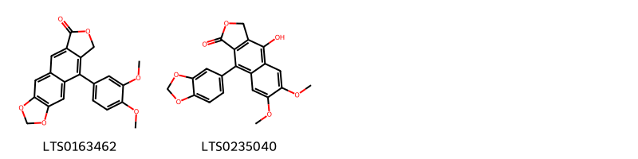{ width=100% }
    <figcaption>Hình ảnh cấu trúc hóa học của 2 hoạt chất thuộc nhóm Arylnaphthalene lignans gồm ['retrochinensin (LTS0163462)', 'diphyllin (LTS0235040)'].</figcaption>
</figure>
#### Nhóm Aryltetralin lignans
<figure markdown="span">
    { width=100% }
    <figcaption>Hình ảnh cấu trúc hóa học của 1 hoạt chất thuộc nhóm Aryltetralin lignans gồm ['(+)-isolariciresinol (LTS0164886)'].</figcaption>
</figure>
#### Nhóm Carboxylic acids and derivatives
<figure markdown="span">
    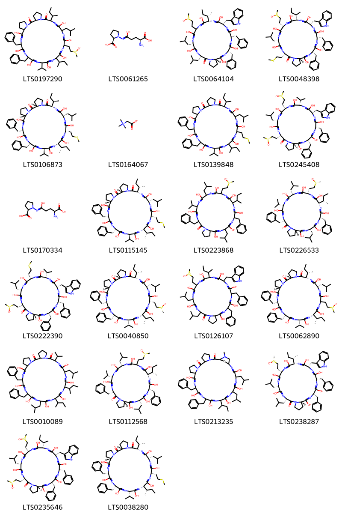{ width=100% }
    <figcaption>Hình ảnh cấu trúc hóa học của 22 hoạt chất thuộc nhóm Carboxylic acids and derivatives gồm ['24,27-dibenzyl-11,14,17,20,23,26,29-heptahydroxy-21-isopropyl-15-(2-methanesulfinylethyl)-12-(2-methylpropyl)-9,18-bis(sec-butyl)-1,7,10,13,16,19,22,25,28-nonaazatricyclo[28.3.0.0³,⁷]tritriaconta-10,13,16,19,22,25,28-heptaene-2,8-dione (LTS0197290)', '(2r)-1-{[(4s)-4-amino-4-carboxy-1-hydroxybutylidene]amino}pyrrolidine-2-carboxylic acid (LTS0061265)', '(3s,6s,9s,12s,18s,21s,26as)-3,6-dibenzyl-12-[(2s)-butan-2-yl]-1,4,7,10,13,16,19-heptahydroxy-9-(1h-indol-3-ylmethyl)-15-(2-methanesulfinylethyl)-18,21-bis(2-methylpropyl)-3h,6h,9h,12h,15h,18h,21h,24h,25h,26h,26ah-pyrrolo[1,2-a]1,4,7,10,13,16,19,22-octaazacyclotetracosan-22-one (LTS0064104)', '(3s,6s,9s,12s,15s,18s,21s,26as)-3,6-dibenzyl-1,4,7,10,13,16,19-heptahydroxy-9-(1h-indol-3-ylmethyl)-15-(2-methanesulfinylethyl)-18-(2-methylpropyl)-21-[2-(methylsulfanyl)ethyl]-12-(sec-butyl)-3h,6h,9h,12h,15h,18h,21h,24h,25h,26h,26ah-pyrrolo[1,2-a]1,4,7,10,13,16,19,22-octaazacyclotetracosan-22-one (LTS0048398)', '(3s,9s,12s,15s,18s,21r,24s,27s,30s)-24,27-dibenzyl-9-[(2r)-butan-2-yl]-18-[(2s)-butan-2-yl]-11,14,17,20,23,26,29-heptahydroxy-21-isopropyl-12-(2-methylpropyl)-15-[2-(methylsulfanyl)ethyl]-1,7,10,13,16,19,22,25,28-nonaazatricyclo[28.3.0.0³,⁷]tritriaconta-10,13,16,19,22,25,28-heptaene-2,8-dione (LTS0106873)', 'bet (LTS0164067)', '24,27-dibenzyl-11,14,17,20,23,26,29-heptahydroxy-21-isopropyl-12-(2-methylpropyl)-15-[2-(methylsulfanyl)ethyl]-9,18-bis(sec-butyl)-1,7,10,13,16,19,22,25,28-nonaazatricyclo[28.3.0.0³,⁷]tritriaconta-10,13,16,19,22,25,28-heptaene-2,8-dione (LTS0139848)', '(3s,6s,9s,12s,15s,18s,21s,26as)-3,6-dibenzyl-1,4,7,10,13,16,19-heptahydroxy-9-(1h-indol-3-ylmethyl)-12-isopropyl-15,21-bis(2-methanesulfinylethyl)-18-(2-methylpropyl)-3h,6h,9h,12h,15h,18h,21h,24h,25h,26h,26ah-pyrrolo[1,2-a]1,4,7,10,13,16,19,22-octaazacyclotetracosan-22-one (LTS0245408)', '1-[(4-amino-4-carboxy-1-hydroxybutylidene)amino]pyrrolidine-2-carboxylic acid (LTS0170334)', '(3s,9s,12s,15s,18s,21r,24s,27s,30s)-24,27-dibenzyl-9,18-bis[(2s)-butan-2-yl]-11,14,17,20,23,26,29-heptahydroxy-21-isopropyl-12-(2-methylpropyl)-15-[2-(methylsulfanyl)ethyl]-1,7,10,13,16,19,22,25,28-nonaazatricyclo[28.3.0.0³,⁷]tritriaconta-10,13,16,19,22,25,28-heptaene-2,8-dione (LTS0115145)', '6,21-dibenzyl-1,4,7,10,13,16,19-heptahydroxy-18-isopropyl-12-(2-methanesulfinylethyl)-3,15-bis(2-methylpropyl)-9-(sec-butyl)-3h,6h,9h,12h,15h,18h,21h,24h,25h,26h,26ah-pyrrolo[1,2-a]1,4,7,10,13,16,19,22-octaazacyclotetracosan-22-one (LTS0223868)', '(3s,6s,9s,12s,15s,18s,21s,26as)-6,21-dibenzyl-9-[(2s)-butan-2-yl]-1,4,7,10,13,16,19-heptahydroxy-18-isopropyl-12-{2-[(r)-methanesulfinyl]ethyl}-3,15-bis(2-methylpropyl)-3h,6h,9h,12h,15h,18h,21h,24h,25h,26h,26ah-pyrrolo[1,2-a]1,4,7,10,13,16,19,22-octaazacyclotetracosan-22-one (LTS0226533)', '(3s,6s,9s,12s,15s,18s,21s,26as)-3,6-dibenzyl-1,4,7,10,13,16,19-heptahydroxy-9-(1h-indol-3-ylmethyl)-12-isopropyl-21-(2-methanesulfinylethyl)-18-(2-methylpropyl)-15-[2-(methylsulfanyl)ethyl]-3h,6h,9h,12h,15h,18h,21h,24h,25h,26h,26ah-pyrrolo[1,2-a]1,4,7,10,13,16,19,22-octaazacyclotetracosan-22-one (LTS0222390)', '(3s,9s,12s,15s,18s,21s,24s,27s,30s)-24,27-dibenzyl-9,18-bis[(2s)-butan-2-yl]-11,14,17,20,23,26,29-heptahydroxy-21-isopropyl-15-{2-[(r)-methanesulfinyl]ethyl}-12-(2-methylpropyl)-1,7,10,13,16,19,22,25,28-nonaazatricyclo[28.3.0.0³,⁷]tritriaconta-10,13,16,19,22,25,28-heptaene-2,8-dione (LTS0040850)', '3,6-dibenzyl-1,4,7,10,13,16,19-heptahydroxy-9-(1h-indol-3-ylmethyl)-15-(2-methanesulfinylethyl)-18,21-bis(2-methylpropyl)-12-(sec-butyl)-3h,6h,9h,12h,15h,18h,21h,24h,25h,26h,26ah-pyrrolo[1,2-a]1,4,7,10,13,16,19,22-octaazacyclotetracosan-22-one (LTS0126107)', '(3s,9s,12s,18s,21s,24s,27s,30s)-24,27-dibenzyl-9,18-bis[(2s)-butan-2-yl]-11,14,17,20,23,26,29-heptahydroxy-21-isopropyl-15-(2-methanesulfinylethyl)-12-(2-methylpropyl)-1,7,10,13,16,19,22,25,28-nonaazatricyclo[28.3.0.0³,⁷]tritriaconta-10,13,16,19,22,25,28-heptaene-2,8-dione (LTS0062890)', '24,27-dibenzyl-11,14,17,20,23,26,29-heptahydroxy-9-isopropyl-12,21-bis(2-methylpropyl)-15,18-bis(sec-butyl)-1,7,10,13,16,19,22,25,28-nonaazatricyclo[28.3.0.0³,⁷]tritriaconta-10,13,16,19,22,25,28-heptaene-2,8-dione (LTS0010089)', '(3s,6s,9s,15s,18s,21s,26as)-6,21-dibenzyl-9-[(2s)-butan-2-yl]-1,4,7,10,13,16,19-heptahydroxy-18-isopropyl-12-(2-methanesulfinylethyl)-3,15-bis(2-methylpropyl)-3h,6h,9h,12h,15h,18h,21h,24h,25h,26h,26ah-pyrrolo[1,2-a]1,4,7,10,13,16,19,22-octaazacyclotetracosan-22-one (LTS0112568)', '16,19-dibenzyl-14,17,20,23,26,29-hexahydroxy-33-methyl-25,28-bis(2-methylpropyl)-22-(sec-butyl)-3,9,15,18,21,24,27,30,33-nonaazatetracyclo[29.2.1.0³,⁷.0⁹,¹³]tetratriaconta-14,17,20,23,26,29-hexaene-2,8-dione (LTS0213235)', '(3s,6s,9s,12s,15s,18s,21s,26as)-3,6-dibenzyl-12-[(2s)-butan-2-yl]-1,4,7,10,13,16,19-heptahydroxy-9-(1h-indol-3-ylmethyl)-15-{2-[(r)-methanesulfinyl]ethyl}-18,21-bis(2-methylpropyl)-3h,6h,9h,12h,15h,18h,21h,24h,25h,26h,26ah-pyrrolo[1,2-a]1,4,7,10,13,16,19,22-octaazacyclotetracosan-22-one (LTS0238287)', '(3s,6s,9s,12s,15s,18s,21s,26as)-3,6-dibenzyl-1,4,7,10,13,16,19-heptahydroxy-9-(1h-indol-3-ylmethyl)-15,21-bis(2-methanesulfinylethyl)-18-(2-methylpropyl)-12-(sec-butyl)-3h,6h,9h,12h,15h,18h,21h,24h,25h,26h,26ah-pyrrolo[1,2-a]1,4,7,10,13,16,19,22-octaazacyclotetracosan-22-one (LTS0235646)', '(3s,9s,12s,15s,18s,21s,24s,27s,30s)-24,27-dibenzyl-9,18-bis[(2s)-butan-2-yl]-11,14,17,20,23,26,29-heptahydroxy-21-isopropyl-12-(2-methylpropyl)-15-[2-(methylsulfanyl)ethyl]-1,7,10,13,16,19,22,25,28-nonaazatricyclo[28.3.0.0³,⁷]tritriaconta-10,13,16,19,22,25,28-heptaene-2,8-dione (LTS0038280)'].</figcaption>
</figure>
#### Nhóm Cinnamic acids and derivatives
<figure markdown="span">
    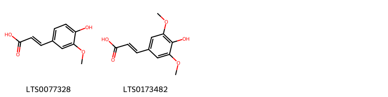{ width=100% }
    <figcaption>Hình ảnh cấu trúc hóa học của 2 hoạt chất thuộc nhóm Cinnamic acids and derivatives gồm ['ferulic acid (LTS0077328)', 'sinapinate (LTS0173482)'].</figcaption>
</figure>
#### Nhóm Dibenzylbutane lignans
<figure markdown="span">
    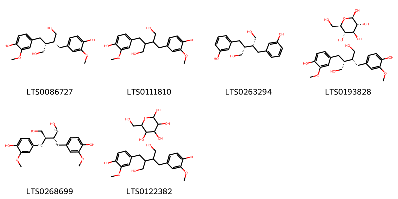{ width=100% }
    <figcaption>Hình ảnh cấu trúc hóa học của 6 hoạt chất thuộc nhóm Dibenzylbutane lignans gồm ['secoisolariciresinol (LTS0086727)', 'secoisolariciresinol (LTS0111810)', '(-)-enterodiol (LTS0263294)', 'secoisolariciresinol; β-d-glucose (LTS0193828)', '(2s,3r)-2,3-bis[(4-hydroxy-3-methoxyphenyl)(¹³c)methyl](1-¹³c)butane-1,4-diol (LTS0268699)', 'd-galactose; secoisolariciresinol (LTS0122382)'].</figcaption>
</figure>
#### Nhóm Fatty Acyls
<figure markdown="span">
    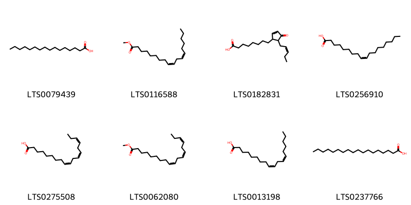{ width=100% }
    <figcaption>Hình ảnh cấu trúc hóa học của 8 hoạt chất thuộc nhóm Fatty Acyls gồm ['palmitic acid (LTS0079439)', 'methyl linoleate (LTS0116588)', '9r,13r-opda (LTS0182831)', 'oleic acid (LTS0256910)', 'α-linolenic acid (LTS0275508)', 'methyl linolenate (LTS0062080)', 'linoleic (LTS0013198)', 'stearic acid (LTS0237766)'].</figcaption>
</figure>
#### Nhóm Flavonoids
<figure markdown="span">
    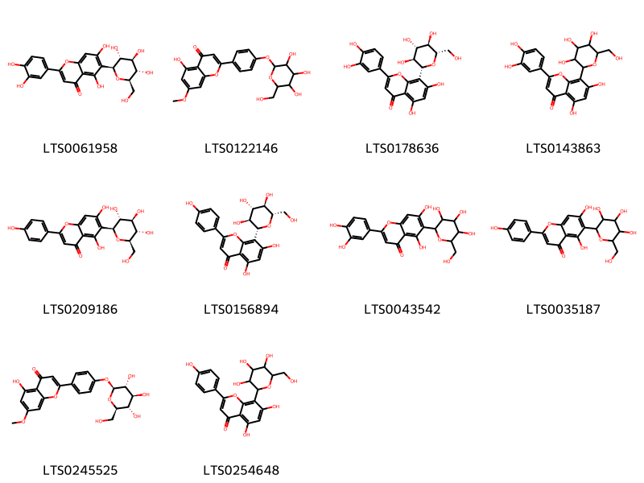{ width=100% }
    <figcaption>Hình ảnh cấu trúc hóa học của 10 hoạt chất thuộc nhóm Flavonoids gồm ['isoorientin (LTS0061958)', '5-hydroxy-7-methoxy-2-(4-{[3,4,5-trihydroxy-6-(hydroxymethyl)oxan-2-yl]oxy}phenyl)chromen-4-one (LTS0122146)', '2-(3,4-dihydroxyphenyl)-5,7-dihydroxy-8-[(2r,3s,4s,5r,6s)-3,4,5-trihydroxy-6-(hydroxymethyl)oxan-2-yl]chromen-4-one (LTS0178636)', 'orientin (LTS0143863)', 'isovitexin (LTS0209186)', '5,7-dihydroxy-2-(4-hydroxyphenyl)-8-[(2r,3s,4s,5r,6s)-3,4,5-trihydroxy-6-(hydroxymethyl)oxan-2-yl]chromen-4-one (LTS0156894)', 'isoorientin (LTS0043542)', 'isovitexin (LTS0035187)', '5-hydroxy-7-methoxy-2-(4-{[(2s,3r,4s,5s,6r)-3,4,5-trihydroxy-6-(hydroxymethyl)oxan-2-yl]oxy}phenyl)chromen-4-one (LTS0245525)', 'vitexin (LTS0254648)'].</figcaption>
</figure>
#### Nhóm Furanoid lignans
<figure markdown="span">
    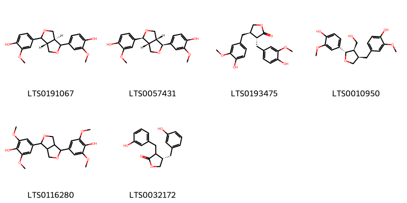{ width=100% }
    <figcaption>Hình ảnh cấu trúc hóa học của 6 hoạt chất thuộc nhóm Furanoid lignans gồm ['4-[(3ar,6as)-4-(4-hydroxy-3-methoxyphenyl)-hexahydrofuro[3,4-c]furan-1-yl]-2-methoxyphenol (LTS0191067)', 'pinoresinol (LTS0057431)', 'matairesinol (LTS0193475)', 'lariciresinol (LTS0010950)', 'syringaresinol (LTS0116280)', '(4s)-3,4-bis[(3-hydroxyphenyl)methyl]oxolan-2-one (LTS0032172)'].</figcaption>
</figure>
#### Nhóm Indoles and derivatives
<figure markdown="span">
    { width=100% }
    <figcaption>Hình ảnh cấu trúc hóa học của 1 hoạt chất thuộc nhóm Indoles and derivatives gồm ['l-tryptophan (LTS0263809)'].</figcaption>
</figure>
#### Nhóm Lignan glycosides
<figure markdown="span">
    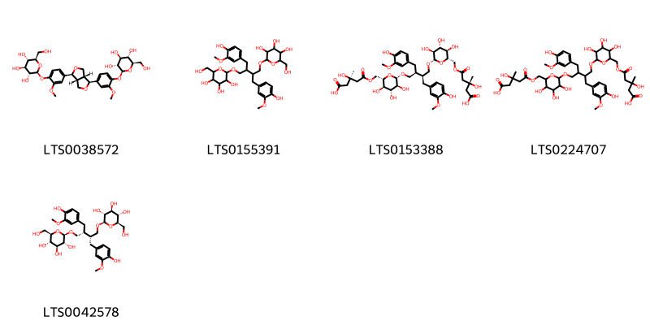{ width=100% }
    <figcaption>Hình ảnh cấu trúc hóa học của 5 hoạt chất thuộc nhóm Lignan glycosides gồm ['(2s,3r,4s,5s,6r)-2-{4-[(1s,3ar,4s,6ar)-4-(3-methoxy-4-{[(2s,3r,4s,5s,6r)-3,4,5-trihydroxy-6-(hydroxymethyl)oxan-2-yl]oxy}phenyl)-hexahydrofuro[3,4-c]furan-1-yl]-2-methoxyphenoxy}-6-(hydroxymethyl)oxane-3,4,5-triol (LTS0038572)', '2-{2,3-bis[(4-hydroxy-3-methoxyphenyl)methyl]-4-{[3,4,5-trihydroxy-6-(hydroxymethyl)oxan-2-yl]oxy}butoxy}-6-(hydroxymethyl)oxane-3,4,5-triol (LTS0155391)', '(3r)-5-{[(2s,3r,4r,5s,6s)-6-[(2s,3s)-4-{[(2s,3s,4r,5r,6s)-6-({[(3r)-4-carboxy-3-hydroxy-3-methylbutanoyl]oxy}methyl)-3,4,5-trihydroxyoxan-2-yl]oxy}-2,3-bis[(4-hydroxy-3-methoxyphenyl)methyl]butoxy]-3,4,5-trihydroxyoxan-2-yl]methoxy}-3-hydroxy-3-methyl-5-oxopentanoic acid (LTS0153388)', '5-[(6-{4-[(6-{[(4-carboxy-3-hydroxy-3-methylbutanoyl)oxy]methyl}-3,4,5-trihydroxyoxan-2-yl)oxy]-2,3-bis[(4-hydroxy-3-methoxyphenyl)methyl]butoxy}-3,4,5-trihydroxyoxan-2-yl)methoxy]-3-hydroxy-3-methyl-5-oxopentanoic acid (LTS0224707)', 'secoisolariciresinol diglucoside (LTS0042578)'].</figcaption>
</figure>
#### Nhóm Lignan lactones
<figure markdown="span">
    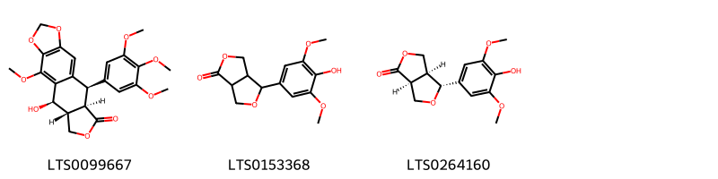{ width=100% }
    <figcaption>Hình ảnh cấu trúc hóa học của 3 hoạt chất thuộc nhóm Lignan lactones gồm ['(10r,11r,15r,16r)-16-hydroxy-2-methoxy-10-(3,4,5-trimethoxyphenyl)-4,6,13-trioxatetracyclo[7.7.0.0³,⁷.0¹¹,¹⁵]hexadeca-1,3(7),8-trien-12-one (LTS0099667)', '4-(4-hydroxy-3,5-dimethoxyphenyl)-tetrahydro-3h-furo[3,4-c]furan-1-one (LTS0153368)', '(3as,4r,6as)-4-(4-hydroxy-3,5-dimethoxyphenyl)-tetrahydro-3h-furo[3,4-c]furan-1-one (LTS0264160)'].</figcaption>
</figure>
#### Nhóm Organonitrogen compounds
<figure markdown="span">
    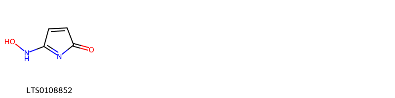{ width=100% }
    <figcaption>Hình ảnh cấu trúc hóa học của 1 hoạt chất thuộc nhóm Organonitrogen compounds gồm ['5-(hydroxyamino)pyrrol-2-one (LTS0108852)'].</figcaption>
</figure>
#### Nhóm Organooxygen compounds
<figure markdown="span">
    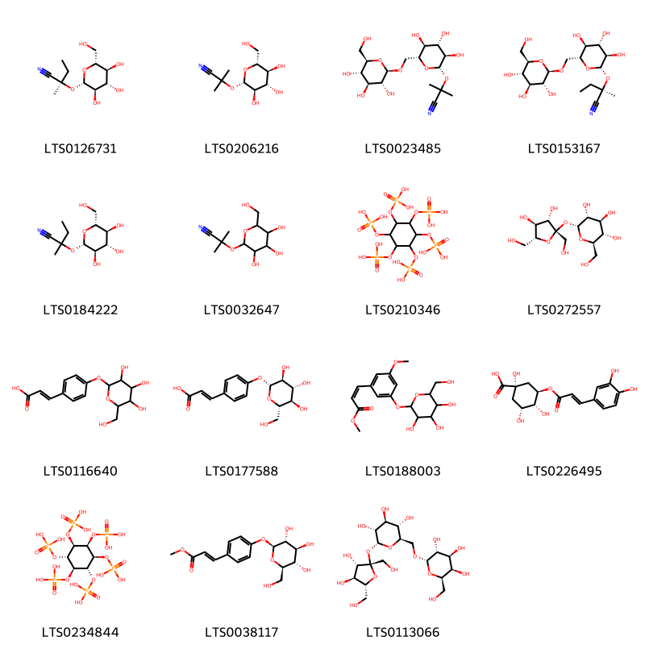{ width=100% }
    <figcaption>Hình ảnh cấu trúc hóa học của 15 hoạt chất thuộc nhóm Organooxygen compounds gồm ['lotaustralin (LTS0126731)', 'linamarin (LTS0206216)', 'linustatin (LTS0023485)', 'neolinustatin (LTS0153167)', '2-methyl-2-{[(2s,3r,4s,5s,6r)-3,4,5-trihydroxy-6-(hydroxymethyl)oxan-2-yl]oxy}butanenitrile (LTS0184222)', 'linamarin (LTS0032647)', 'phytic acid (LTS0210346)', 'sucrose (LTS0272557)', '3-(4-{[3,4,5-trihydroxy-6-(hydroxymethyl)oxan-2-yl]oxy}phenyl)prop-2-enoic acid (LTS0116640)', '(2e)-3-(4-{[(2r,3s,4r,5r,6s)-3,4,5-trihydroxy-6-(hydroxymethyl)oxan-2-yl]oxy}phenyl)prop-2-enoic acid (LTS0177588)', 'methyl (2z)-3-(3-methoxy-5-{[3,4,5-trihydroxy-6-(hydroxymethyl)oxan-2-yl]oxy}phenyl)prop-2-enoate (LTS0188003)', 'chlorogenic acid (LTS0226495)', '[(1r,2r,3s,4r,5s,6s)-2,3,4,5,6-pentakis(phosphonooxy)cyclohexyl]oxyphosphonic acid (LTS0234844)', 'methyl (2e)-3-(4-{[(2s,3r,4s,5s,6r)-3,4,5-trihydroxy-6-(hydroxymethyl)oxan-2-yl]oxy}phenyl)prop-2-enoate (LTS0038117)', 'raffinose (LTS0113066)'].</figcaption>
</figure>
#### Nhóm Prenol lipids
<figure markdown="span">
    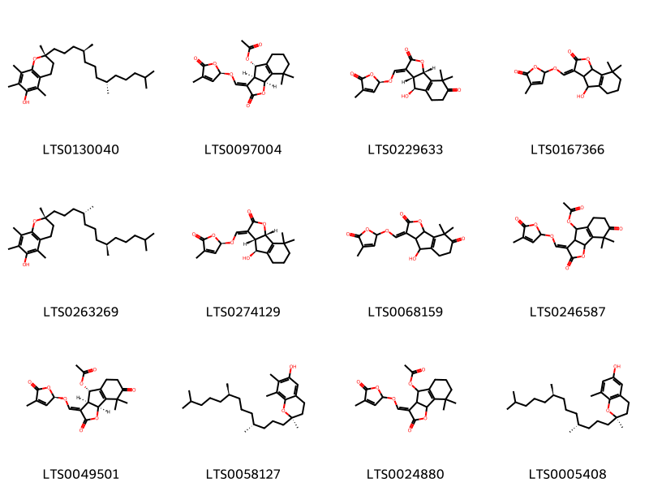{ width=100% }
    <figcaption>Hình ảnh cấu trúc hóa học của 12 hoạt chất thuộc nhóm Prenol lipids gồm ['(2r)-2,5,7,8-tetramethyl-2-[(4s,8s)-4,8,12-trimethyltridecyl]-3,4-dihydro-1-benzopyran-6-ol (LTS0130040)', '(3e,3as,4s,8bs)-8,8-dimethyl-3-({[(2r)-4-methyl-5-oxo-2h-furan-2-yl]oxy}methylidene)-2-oxo-3ah,4h,5h,6h,7h,8bh-indeno[1,2-b]furan-4-yl acetate (LTS0097004)', '(3e,3as,4s,8bs)-4-hydroxy-8,8-dimethyl-3-({[(2r)-4-methyl-5-oxo-2h-furan-2-yl]oxy}methylidene)-3ah,4h,5h,6h,8bh-indeno[1,2-b]furan-2,7-dione (LTS0229633)', '5-({4-hydroxy-8,8-dimethyl-2-oxo-3ah,4h,5h,6h,7h,8bh-indeno[1,2-b]furan-3-ylidene}methoxy)-3-methyl-5h-furan-2-one (LTS0167366)', 'vitamin e (LTS0263269)', '(5r)-5-{[(3e,3as,4s,8bs)-4-hydroxy-8,8-dimethyl-2-oxo-3ah,4h,5h,6h,7h,8bh-indeno[1,2-b]furan-3-ylidene]methoxy}-3-methyl-5h-furan-2-one (LTS0274129)', '4-hydroxy-8,8-dimethyl-3-{[(4-methyl-5-oxo-2h-furan-2-yl)oxy]methylidene}-3ah,4h,5h,6h,8bh-indeno[1,2-b]furan-2,7-dione (LTS0068159)', '(3e)-8,8-dimethyl-3-{[(4-methyl-5-oxo-2h-furan-2-yl)oxy]methylidene}-2,7-dioxo-3ah,4h,5h,6h,8bh-indeno[1,2-b]furan-4-yl acetate (LTS0246587)', '(3e,3as,4s,8bs)-8,8-dimethyl-3-({[(2r)-4-methyl-5-oxo-2h-furan-2-yl]oxy}methylidene)-2,7-dioxo-3ah,4h,5h,6h,8bh-indeno[1,2-b]furan-4-yl acetate (LTS0049501)', 'gamma-tocopherol (LTS0058127)', '(3e)-8,8-dimethyl-3-{[(4-methyl-5-oxo-2h-furan-2-yl)oxy]methylidene}-2-oxo-3ah,4h,5h,6h,7h,8bh-indeno[1,2-b]furan-4-yl acetate (LTS0024880)', 'delta-tocopherol (LTS0005408)'].</figcaption>
</figure>
#### Nhóm Pyridines and derivatives
<figure markdown="span">
    { width=100% }
    <figcaption>Hình ảnh cấu trúc hóa học của 1 hoạt chất thuộc nhóm Pyridines and derivatives gồm ['vitamin b>3< (LTS0028908)'].</figcaption>
</figure>
#### Nhóm Pyrrolines
<figure markdown="span">
    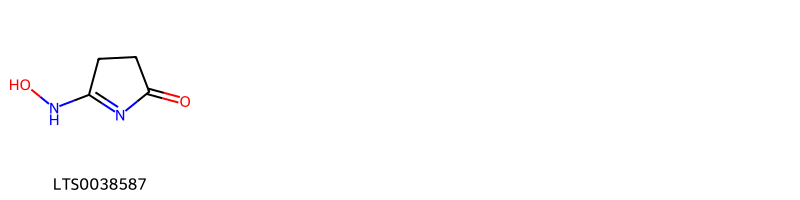{ width=100% }
    <figcaption>Hình ảnh cấu trúc hóa học của 1 hoạt chất thuộc nhóm Pyrrolines gồm ['5-(hydroxyamino)-3,4-dihydropyrrol-2-one (LTS0038587)'].</figcaption>
</figure>
#### Nhóm Steroids and steroid derivatives
<figure markdown="span">
    { width=100% }
    <figcaption>Hình ảnh cấu trúc hóa học của 2 hoạt chất thuộc nhóm Steroids and steroid derivatives gồm ['stigmast-5-en-3-ol, (3β)- (LTS0204616)', 'sitogluside (LTS0201798)'].</figcaption>
</figure>

---

### Dược dân tộc học

Danh sách các quốc gia có sử dụng *Linum usitatissimum* trong điều trị các bệnh. 

| Country   | Disease                                                | Bệnh                                                                                                                                                                                                |
|:----------|:-------------------------------------------------------|:----------------------------------------------------------------------------------------------------------------------------------------------------------------------------------------------------|
| China     | Emollient                                              | MYMEMORY WARNING: YOU USED ALL AVAILABLE FREE TRANSLATIONS FOR TODAY. NEXT AVAILABLE IN  16 HOURS 23 MINUTES 25 SECONDS VISIT HTTPS://MYMEMORY.TRANSLATED.NET/DOC/USAGELIMITS.PHP TO TRANSLATE MORE |
| Elsewhere | Astringent, Emollient, Suppurative                     | MYMEMORY WARNING: YOU USED ALL AVAILABLE FREE TRANSLATIONS FOR TODAY. NEXT AVAILABLE IN  16 HOURS 23 MINUTES 22 SECONDS VISIT HTTPS://MYMEMORY.TRANSLATED.NET/DOC/USAGELIMITS.PHP TO TRANSLATE MORE |
| India*    | Demulcent, Diuretic, Emollient, Expectorant            | MYMEMORY WARNING: YOU USED ALL AVAILABLE FREE TRANSLATIONS FOR TODAY. NEXT AVAILABLE IN  16 HOURS 23 MINUTES 19 SECONDS VISIT HTTPS://MYMEMORY.TRANSLATED.NET/DOC/USAGELIMITS.PHP TO TRANSLATE MORE |
| Turkey    | Emollient, Expectorant, Laxative, Vulnerary, Demulcent | MYMEMORY WARNING: YOU USED ALL AVAILABLE FREE TRANSLATIONS FOR TODAY. NEXT AVAILABLE IN  16 HOURS 23 MINUTES 17 SECONDS VISIT HTTPS://MYMEMORY.TRANSLATED.NET/DOC/USAGELIMITS.PHP TO TRANSLATE MORE |
| US        | Poison                                                 | MYMEMORY WARNING: YOU USED ALL AVAILABLE FREE TRANSLATIONS FOR TODAY. NEXT AVAILABLE IN  16 HOURS 23 MINUTES 14 SECONDS VISIT HTTPS://MYMEMORY.TRANSLATED.NET/DOC/USAGELIMITS.PHP TO TRANSLATE MORE |
| Venezuela | Emollient                                              | MYMEMORY WARNING: YOU USED ALL AVAILABLE FREE TRANSLATIONS FOR TODAY. NEXT AVAILABLE IN  16 HOURS 23 MINUTES 11 SECONDS VISIT HTTPS://MYMEMORY.TRANSLATED.NET/DOC/USAGELIMITS.PHP TO TRANSLATE MORE |
| ain       | Emollient                                              | MYMEMORY WARNING: YOU USED ALL AVAILABLE FREE TRANSLATIONS FOR TODAY. NEXT AVAILABLE IN  16 HOURS 23 MINUTES 09 SECONDS VISIT HTTPS://MYMEMORY.TRANSLATED.NET/DOC/USAGELIMITS.PHP TO TRANSLATE MORE |

---

# Chi Hugonia

??? note "Danh sách các dược liệu thuộc chi"
    
	 - *Hugonia mystax*
	 - *Hugonia platysepala*

---
## Hugonia mystax
### Thông tin về thực vật

!!! info "Phân loại thực vật của *Hugonia mystax* từ GIBF:"
    - **Kingdom:** Plantae
    - **Phylum:** Tracheophyta
    - **Order:** Malpighiales
    - **Family:** Linaceae
    - **Genus:** Hugonia
    - **Species:** *Hugonia mystax*

 

| Label (VI)   | Label (EN)   | Scientific Name   | Descriptions (VI)   | Descriptions (EN)   | Also Known As (VI)   | Also Known As (EN)   |
|:-------------|:-------------|:------------------|:--------------------|:--------------------|:---------------------|:---------------------|
| N/A          | N/A          | Hugonia mystax    | loài thực vật       | species of plant    | ['']                 | ['']                 |

#### Phân bố trên thế giới

**Từ CSDL GIBF** Sri Lanka, nan, Mexico, India, unknown or invalid

#### Phân bố tại Việt Nam

**Từ CSDL GIBF**: Không có ghi nhận ở Việt Nam

---
### Thành phần hóa học
        
- Theo cơ sở dữ liệu lotus: Từ loài *Hugonia mystax* đã phân lập và xác định được Chưa có hoạt chất nào được phân lập. hoạt chất thuộc về các nhóm Không có hoạt chất nào được phân lập. 

Không có hình ảnh nào được tạo ra

---

### Dược dân tộc học

Danh sách các quốc gia có sử dụng *Hugonia mystax* trong điều trị các bệnh. 

| Country   | Disease                        | Bệnh                                                                                                                                                                                                |
|:----------|:-------------------------------|:----------------------------------------------------------------------------------------------------------------------------------------------------------------------------------------------------|
| India     | Antidote, Vermicide, Vermifuge | MYMEMORY WARNING: YOU USED ALL AVAILABLE FREE TRANSLATIONS FOR TODAY. NEXT AVAILABLE IN  16 HOURS 22 MINUTES 36 SECONDS VISIT HTTPS://MYMEMORY.TRANSLATED.NET/DOC/USAGELIMITS.PHP TO TRANSLATE MORE |

---

---
## Hugonia platysepala
### Thông tin về thực vật

!!! info "Phân loại thực vật của *Hugonia platysepala* từ GIBF:"
    - **Kingdom:** Plantae
    - **Phylum:** Tracheophyta
    - **Order:** Malpighiales
    - **Family:** Linaceae
    - **Genus:** Hugonia
    - **Species:** *Hugonia platysepala*

 

| Label (VI)   | Label (EN)   | Scientific Name     | Descriptions (VI)   | Descriptions (EN)   | Also Known As (VI)   | Also Known As (EN)   |
|:-------------|:-------------|:--------------------|:--------------------|:--------------------|:---------------------|:---------------------|
| N/A          | N/A          | Hugonia platysepala | loài thực vật       | species of plant    | ['']                 | ['']                 |

#### Phân bố trên thế giới

**Từ CSDL GIBF** Sao Tome and Principe, Benin, Congo, Democratic Republic of the, Equatorial Guinea, Uganda, Central African Republic, Gabon, Liberia, Côte d’Ivoire, Nigeria, Congo, Tanzania, United Republic of, Angola, Togo, Sierra Leone, Cameroon, Guinea, Ghana

#### Phân bố tại Việt Nam

**Từ CSDL GIBF**: Không có ghi nhận ở Việt Nam

---
### Thành phần hóa học
        
- Theo cơ sở dữ liệu lotus: Từ loài *Hugonia platysepala* đã phân lập và xác định được Chưa có hoạt chất nào được phân lập. hoạt chất thuộc về các nhóm Không có hoạt chất nào được phân lập. 

Không có hình ảnh nào được tạo ra

---

### Dược dân tộc học

Danh sách các quốc gia có sử dụng *Hugonia platysepala* trong điều trị các bệnh. 

| Country   | Disease   | Bệnh                                                                                                                                                                                                |
|:----------|:----------|:----------------------------------------------------------------------------------------------------------------------------------------------------------------------------------------------------|
| Elsewhere | Laxative  | MYMEMORY WARNING: YOU USED ALL AVAILABLE FREE TRANSLATIONS FOR TODAY. NEXT AVAILABLE IN  16 HOURS 22 MINUTES 15 SECONDS VISIT HTTPS://MYMEMORY.TRANSLATED.NET/DOC/USAGELIMITS.PHP TO TRANSLATE MORE |

---

# Chi Reinwardtia

??? note "Danh sách các dược liệu thuộc chi"
    
	 - *Reinwardtia indica*

---
## Reinwardtia indica
### Thông tin về thực vật

!!! info "Phân loại thực vật của *Reinwardtia indica* từ GIBF:"
    - **Kingdom:** Plantae
    - **Phylum:** Tracheophyta
    - **Order:** Malpighiales
    - **Family:** Linaceae
    - **Genus:** Reinwardtia
    - **Species:** *Reinwardtia indica*

 

| Label (VI)   | Label (EN)   | Scientific Name    | Descriptions (VI)   | Descriptions (EN)   | Also Known As (VI)   | Also Known As (EN)   |
|:-------------|:-------------|:-------------------|:--------------------|:--------------------|:---------------------|:---------------------|
| N/A          | N/A          | Reinwardtia indica |                     | species of plant    | ['']                 | ['']                 |

#### Phân bố trên thế giới

**Từ CSDL GIBF** nan, Japan, Guadeloupe, Nepal, China, New Zealand, Papua New Guinea, Thailand, Spain, United States of America, Jamaica, Bhutan, Pakistan, unknown or invalid, Hong Kong, Kenya, Belgium, Australia, Myanmar, India, United Kingdom of Great Britain and Northern Ireland

#### Phân bố tại Việt Nam

**Từ CSDL GIBF**: Không có ghi nhận ở Việt Nam

---
### Thành phần hóa học
        
- Theo cơ sở dữ liệu lotus: Từ loài *Reinwardtia indica* đã phân lập và xác định được Chưa có hoạt chất nào được phân lập. hoạt chất thuộc về các nhóm Không có hoạt chất nào được phân lập. 

Không có hình ảnh nào được tạo ra

---

### Dược dân tộc học

Danh sách các quốc gia có sử dụng *Reinwardtia indica* trong điều trị các bệnh. 

| Country   | Disease   | Bệnh                                                                                                                                                                                                |
|:----------|:----------|:----------------------------------------------------------------------------------------------------------------------------------------------------------------------------------------------------|
| Elsewhere | Larvicide | MYMEMORY WARNING: YOU USED ALL AVAILABLE FREE TRANSLATIONS FOR TODAY. NEXT AVAILABLE IN  16 HOURS 21 MINUTES 55 SECONDS VISIT HTTPS://MYMEMORY.TRANSLATED.NET/DOC/USAGELIMITS.PHP TO TRANSLATE MORE |

---

