!!! abstract "Tóm tắt"

    Họ Loganiaceae gồm khoảng 8 chi và 39 loài được một số cộng đồng tại các quốc gia như Guiana, Philippines, French, South America, Java, English, Malagasy, Malaya, Indonesia, Haiti, Dominican Republic, Burma, Africa, German, Malaysia, India, US, US(Appalachia), Nigeria, Turkey, Djukut puntir, Cambodia, Dutch, Japan, Panama, Brazil, Venezuela, Mexico, China, Nepal, anish, Surinam, Elsewhere, Argentina, Latin America, Pokok ipoh, New Caledonia, Kaju saludang, US(Amerindian), Madagascar sử dụng trong một số trường hợp QUERY LENGTH LIMIT EXCEEDED. MAX ALLOWED QUERY : 500 CHARS MYMEMORY WARNING: YOU USED ALL AVAILABLE FREE TRANSLATIONS FOR TODAY. NEXT AVAILABLE IN  14 HOURS 50 MINUTES 39 SECONDS VISIT HTTPS://MYMEMORY.TRANSLATED.NET/DOC/USAGELIMITS.PHP TO TRANSLATE MORE.

!!! info "DrDuke"

    James A. Duke sinh năm 1929-2017 là một nhà thực vật học người Mỹ. Đây là một trong những tác giả hàng đầu trong lĩnh vực dược dân tộc học với cuốn *CRC Handbook of Medicinal Herbs* và chính là người xây dựng lên cơ sở dữ liệu về hợp chất tự nhiên và dược dân tộc học tại Bộ nông nghiệp Hoa Kỳ. Các thông tin được đăng tải tại website [Dr. Duke's Phytochemical and Ethnobotanical Databases](https://phytochem.nal.usda.gov/). 
    Trong suốt thập niên 1970, ông lãnh đạo the Plant Taxonomy Laboratory, Plant Genetics and Germplasm Institute of the Agricultural Research Service, U.S. Department of Agriculture.
    Trong tài liệu này, các thông tin về dược dân tộc của các dược liệu được trích dẫn từ tài liệu của James A. Ducke với sự trợ giúp của phần mềm dịch thuật từ tiếng Anh sang tiếng Việt.
   

# Chi Strychnos

??? note "Danh sách các dược liệu thuộc chi"
    
	 - *Strychnos colubrina*
	 - *Strychnos ignatia*
	 - *Strychnos ignatii*
	 - *Strychnos ignatius*
	 - *Strychnos inosa*
	 - *Strychnos jollyana*
	 - *Strychnos laurina*
	 - *Strychnos ligustrina*
	 - *Strychnos melinoniana*
	 - *Strychnos nux-blanda*
	 - *Strychnos nux-vomica*
	 - *Strychnos potatorum*
	 - *Strychnos pseudoquina*
	 - *Strychnos tieute*
	 - *Strychnos toxifera*
	 - *Strychnos triclisioides*

---
## Strychnos colubrina
### Thông tin về thực vật

!!! info "Phân loại thực vật của *N/A* từ GIBF:"
    - **Kingdom:** Plantae
    - **Phylum:** Tracheophyta
    - **Order:** Gentianales
    - **Family:** Loganiaceae
    - **Genus:** Strychnos
    - **Species:** *N/A*

 

| Label (VI)   | Label (EN)   | Scientific Name     | Descriptions (VI)   | Descriptions (EN)   | Also Known As (VI)   | Also Known As (EN)   |
|:-------------|:-------------|:--------------------|:--------------------|:--------------------|:---------------------|:---------------------|
| N/A          | N/A          | Strychnos colubrina | loài thực vật       | species of plant    | ['']                 | ['']                 |

#### Phân bố trên thế giới

**Từ CSDL GIBF** Argentina, Uganda, South Africa, Botswana, Brazil, Australia, Mozambique, India, Eswatini, Cameroon, Gabon, United States of America, Zimbabwe, Madagascar, Benin, Hong Kong, Chinese Taipei

#### Phân bố tại Việt Nam

**Từ CSDL GIBF**: Không có ghi nhận ở Việt Nam

---
### Thành phần hóa học
        
- Theo cơ sở dữ liệu lotus: Từ loài *N/A* đã phân lập và xác định được 1 hoạt chất thuộc về các nhóm Strychnos alkaloids. 

|    | chemicalTaxonomyClassyfireClass   |   smiles_count |
|---:|:----------------------------------|---------------:|
|  0 | Strychnos alkaloids               |              1 |

#### Nhóm Strychnos alkaloids
<figure markdown="span">
    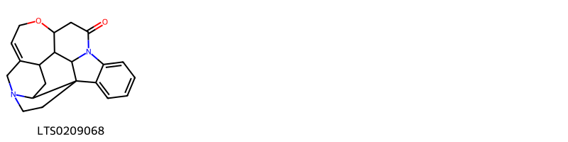{ width=100% }
    <figcaption>Hình ảnh cấu trúc hóa học của 1 hoạt chất thuộc nhóm Strychnos alkaloids gồm ['strychnos (LTS0209068)'].</figcaption>
</figure>

---

### Dược dân tộc học

Danh sách các quốc gia có sử dụng *N/A* trong điều trị các bệnh. 

| Country   | Disease   | Bệnh                                                                                                                                                                                                |
|:----------|:----------|:----------------------------------------------------------------------------------------------------------------------------------------------------------------------------------------------------|
| Elsewhere | Purgative | MYMEMORY WARNING: YOU USED ALL AVAILABLE FREE TRANSLATIONS FOR TODAY. NEXT AVAILABLE IN  14 HOURS 50 MINUTES 36 SECONDS VISIT HTTPS://MYMEMORY.TRANSLATED.NET/DOC/USAGELIMITS.PHP TO TRANSLATE MORE |

---

---
## Strychnos ignatia
### Thông tin về thực vật

!!! info "Phân loại thực vật của *Strychnos ignatii* từ GIBF:"
    - **Kingdom:** Plantae
    - **Phylum:** Tracheophyta
    - **Order:** Gentianales
    - **Family:** Loganiaceae
    - **Genus:** Strychnos
    - **Species:** *Strychnos ignatii*

 

| Label (VI)   | Label (EN)   | Scientific Name   | Descriptions (VI)   | Descriptions (EN)   | Also Known As (VI)   | Also Known As (EN)   |
|:-------------|:-------------|:------------------|:--------------------|:--------------------|:---------------------|:---------------------|
| N/A          | N/A          | Strychnos ignatia |                     |                     | ['']                 | ['']                 |

#### Phân bố trên thế giới

**Từ CSDL GIBF** Argentina, Uganda, South Africa, Botswana, Brazil, Australia, Mozambique, India, Eswatini, Cameroon, Gabon, United States of America, Zimbabwe, Madagascar, Benin, Hong Kong, Chinese Taipei

#### Phân bố tại Việt Nam

**Từ CSDL GIBF**: Không có ghi nhận ở Việt Nam

---
### Thành phần hóa học
        
- Theo cơ sở dữ liệu lotus: Từ loài *Strychnos ignatii* đã phân lập và xác định được Chưa có hoạt chất nào được phân lập. hoạt chất thuộc về các nhóm Không có hoạt chất nào được phân lập. 

Không có hình ảnh nào được tạo ra

---

### Dược dân tộc học

Danh sách các quốc gia có sử dụng *Strychnos ignatii* trong điều trị các bệnh. 

| Country   | Disease                     | Bệnh                                                                                                                                                                                                |
|:----------|:----------------------------|:----------------------------------------------------------------------------------------------------------------------------------------------------------------------------------------------------|
| China     | Antidote, Poison, Vermifuge | MYMEMORY WARNING: YOU USED ALL AVAILABLE FREE TRANSLATIONS FOR TODAY. NEXT AVAILABLE IN  14 HOURS 50 MINUTES 10 SECONDS VISIT HTTPS://MYMEMORY.TRANSLATED.NET/DOC/USAGELIMITS.PHP TO TRANSLATE MORE |

---

---
## Strychnos ignatii
### Thông tin về thực vật

!!! info "Phân loại thực vật của *Strychnos ignatii* từ GIBF:"
    - **Kingdom:** Plantae
    - **Phylum:** Tracheophyta
    - **Order:** Gentianales
    - **Family:** Loganiaceae
    - **Genus:** Strychnos
    - **Species:** *Strychnos ignatii*

 

| Label (VI)   | Label (EN)   | Scientific Name   | Descriptions (VI)   | Descriptions (EN)   | Also Known As (VI)   | Also Known As (EN)    |
|:-------------|:-------------|:------------------|:--------------------|:--------------------|:---------------------|:----------------------|
| N/A          | N/A          | Strychnos ignatii | loài thực vật       | species of plant    | ['']                 | ['Strychnos ignatii'] |

#### Phân bố trên thế giới

**Từ CSDL GIBF** Viet Nam, nan, unknown or invalid, Thailand, Brunei Darussalam, Philippines, Malaysia, India, Lao People’s Democratic Republic, Singapore, China, Indonesia

#### Phân bố tại Việt Nam

**Từ CSDL GIBF**: Tonkin

---
### Thành phần hóa học
        
- Theo cơ sở dữ liệu lotus: Từ loài *Strychnos ignatii* đã phân lập và xác định được 13 hoạt chất thuộc về các nhóm Prenol lipids, Strychnos alkaloids, Macroline alkaloids. 

|    | chemicalTaxonomyClassyfireClass   |   smiles_count |
|---:|:----------------------------------|---------------:|
|  0 | Macroline alkaloids               |              2 |
|  1 | Prenol lipids                     |              2 |
|  2 | Strychnos alkaloids               |              9 |

#### Nhóm Macroline alkaloids
<figure markdown="span">
    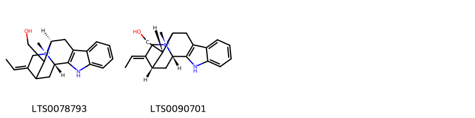{ width=100% }
    <figcaption>Hình ảnh cấu trúc hóa học của 2 hoạt chất thuộc nhóm Macroline alkaloids gồm ['(1s,12s,17r)-15-ethylidene-13-(hydroxymethyl)-17-methyl-3,17-diazapentacyclo[12.3.1.0²,¹⁰.0⁴,⁹.0¹²,¹⁷]octadeca-2(10),4,6,8-tetraen-17-ium (LTS0078793)', 'macusine b (LTS0090701)'].</figcaption>
</figure>
#### Nhóm Prenol lipids
<figure markdown="span">
    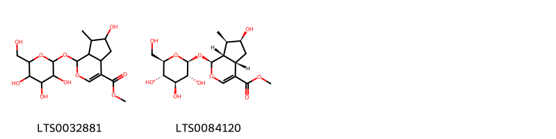{ width=100% }
    <figcaption>Hình ảnh cấu trúc hóa học của 2 hoạt chất thuộc nhóm Prenol lipids gồm ['methyl 6-hydroxy-7-methyl-1-{[3,4,5-trihydroxy-6-(hydroxymethyl)oxan-2-yl]oxy}-1h,4ah,5h,6h,7h,7ah-cyclopenta[c]pyran-4-carboxylate (LTS0032881)', 'loganin (LTS0084120)'].</figcaption>
</figure>
#### Nhóm Strychnos alkaloids
<figure markdown="span">
    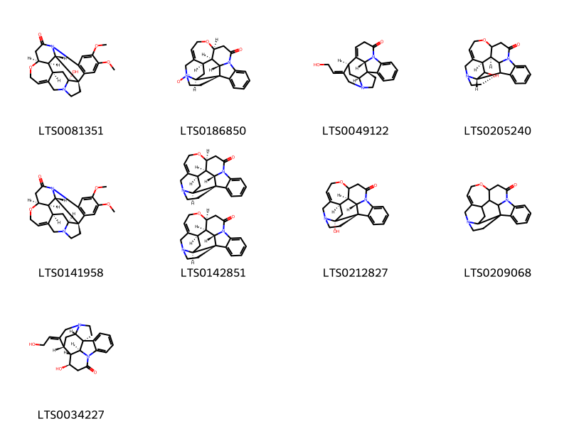{ width=100% }
    <figcaption>Hình ảnh cấu trúc hóa học của 9 hoạt chất thuộc nhóm Strychnos alkaloids gồm ['(1s,11s,18r,20r,21r,22s)-18-hydroxy-4,5-dimethoxy-12-oxa-8,17-diazaheptacyclo[15.5.2.0¹,¹⁸.0²,⁷.0⁸,²².0¹¹,²¹.0¹⁵,²⁰]tetracosa-2(7),3,5,14-tetraen-9-one (LTS0081351)', 'strychnine n-oxide (LTS0186850)', '(1r,13s,14e,19s,21s)-14-(2-hydroxyethylidene)-8,16-diazahexacyclo[11.5.2.1¹,⁸.0²,⁷.0¹⁶,¹⁹.0¹²,²¹]henicosa-2,4,6,11-tetraen-9-one (LTS0049122)', '(1r,18s,20r,21r)-19-hydroxy-12-oxa-8,17-diazaheptacyclo[15.5.2.0¹,¹⁸.0²,⁷.0⁸,²².0¹¹,²¹.0¹⁵,²⁰]tetracosa-2,4,6,14-tetraen-9-one (LTS0205240)', 'brucine (LTS0141958)', 'bis(strychnine) (LTS0142851)', '(1s,18r,20r,21r,22s)-18-hydroxy-12-oxa-8,17-diazaheptacyclo[15.5.2.0¹,¹⁸.0²,⁷.0⁸,²².0¹¹,²¹.0¹⁵,²⁰]tetracosa-2,4,6,14-tetraen-9-one (LTS0212827)', 'strychnos (LTS0209068)', '(1r,11r,12r,13r,14e,19s,21s)-11-hydroxy-14-(2-hydroxyethylidene)-8,16-diazahexacyclo[11.5.2.1¹,⁸.0²,⁷.0¹⁶,¹⁹.0¹²,²¹]henicosa-2,4,6-trien-9-one (LTS0034227)'].</figcaption>
</figure>

---

### Dược dân tộc học

Danh sách các quốc gia có sử dụng *Strychnos ignatii* trong điều trị các bệnh. 

| Country    | Disease                  | Bệnh                                                                                                                                                                                                |
|:-----------|:-------------------------|:----------------------------------------------------------------------------------------------------------------------------------------------------------------------------------------------------|
| Malaysia   | Stimulant, Tonic, Poison | MYMEMORY WARNING: YOU USED ALL AVAILABLE FREE TRANSLATIONS FOR TODAY. NEXT AVAILABLE IN  14 HOURS 49 MINUTES 51 SECONDS VISIT HTTPS://MYMEMORY.TRANSLATED.NET/DOC/USAGELIMITS.PHP TO TRANSLATE MORE |
| Pokok ipoh | Piscicide                | MYMEMORY WARNING: YOU USED ALL AVAILABLE FREE TRANSLATIONS FOR TODAY. NEXT AVAILABLE IN  14 HOURS 49 MINUTES 48 SECONDS VISIT HTTPS://MYMEMORY.TRANSLATED.NET/DOC/USAGELIMITS.PHP TO TRANSLATE MORE |

---

---
## Strychnos ignatius
### Thông tin về thực vật

!!! info "Phân loại thực vật của *Strychnos ignatii* từ GIBF:"
    - **Kingdom:** Plantae
    - **Phylum:** Tracheophyta
    - **Order:** Gentianales
    - **Family:** Loganiaceae
    - **Genus:** Strychnos
    - **Species:** *Strychnos ignatii*

 

| Label (VI)   | Label (EN)   | Scientific Name   | Descriptions (VI)   | Descriptions (EN)   | Also Known As (VI)   | Also Known As (EN)    |
|:-------------|:-------------|:------------------|:--------------------|:--------------------|:---------------------|:----------------------|
| N/A          | N/A          | Strychnos ignatii | loài thực vật       | species of plant    | ['']                 | ['Strychnos ignatii'] |

#### Phân bố trên thế giới

**Từ CSDL GIBF** Viet Nam, nan, unknown or invalid, Thailand, Brunei Darussalam, Philippines, Malaysia, India, Lao People’s Democratic Republic, Singapore, China, Indonesia

#### Phân bố tại Việt Nam

**Từ CSDL GIBF**: Tonkin

---
### Thành phần hóa học
        
- Theo cơ sở dữ liệu lotus: Từ loài *Strychnos ignatii* đã phân lập và xác định được Chưa có hoạt chất nào được phân lập. hoạt chất thuộc về các nhóm Không có hoạt chất nào được phân lập. 

Không có hình ảnh nào được tạo ra

---

### Dược dân tộc học

Danh sách các quốc gia có sử dụng *Strychnos ignatii* trong điều trị các bệnh. 

| Country   | Disease         | Bệnh                                                                                                                                                                                                |
|:----------|:----------------|:----------------------------------------------------------------------------------------------------------------------------------------------------------------------------------------------------|
| China     | Vasoconstrictor | MYMEMORY WARNING: YOU USED ALL AVAILABLE FREE TRANSLATIONS FOR TODAY. NEXT AVAILABLE IN  14 HOURS 49 MINUTES 18 SECONDS VISIT HTTPS://MYMEMORY.TRANSLATED.NET/DOC/USAGELIMITS.PHP TO TRANSLATE MORE |
| Dutch     | Laxative        | MYMEMORY WARNING: YOU USED ALL AVAILABLE FREE TRANSLATIONS FOR TODAY. NEXT AVAILABLE IN  14 HOURS 49 MINUTES 15 SECONDS VISIT HTTPS://MYMEMORY.TRANSLATED.NET/DOC/USAGELIMITS.PHP TO TRANSLATE MORE |
| English   | Tonic           | MYMEMORY WARNING: YOU USED ALL AVAILABLE FREE TRANSLATIONS FOR TODAY. NEXT AVAILABLE IN  14 HOURS 49 MINUTES 11 SECONDS VISIT HTTPS://MYMEMORY.TRANSLATED.NET/DOC/USAGELIMITS.PHP TO TRANSLATE MORE |
| French    | Stimulant       | MYMEMORY WARNING: YOU USED ALL AVAILABLE FREE TRANSLATIONS FOR TODAY. NEXT AVAILABLE IN  14 HOURS 49 MINUTES 07 SECONDS VISIT HTTPS://MYMEMORY.TRANSLATED.NET/DOC/USAGELIMITS.PHP TO TRANSLATE MORE |
| German    | Avicide         | MYMEMORY WARNING: YOU USED ALL AVAILABLE FREE TRANSLATIONS FOR TODAY. NEXT AVAILABLE IN  14 HOURS 49 MINUTES 03 SECONDS VISIT HTTPS://MYMEMORY.TRANSLATED.NET/DOC/USAGELIMITS.PHP TO TRANSLATE MORE |
| India     | Canicide        | MYMEMORY WARNING: YOU USED ALL AVAILABLE FREE TRANSLATIONS FOR TODAY. NEXT AVAILABLE IN  14 HOURS 49 MINUTES 00 SECONDS VISIT HTTPS://MYMEMORY.TRANSLATED.NET/DOC/USAGELIMITS.PHP TO TRANSLATE MORE |
| anish     | Poison          | MYMEMORY WARNING: YOU USED ALL AVAILABLE FREE TRANSLATIONS FOR TODAY. NEXT AVAILABLE IN  14 HOURS 48 MINUTES 57 SECONDS VISIT HTTPS://MYMEMORY.TRANSLATED.NET/DOC/USAGELIMITS.PHP TO TRANSLATE MORE |

---

---
## Strychnos inosa
### Thông tin về thực vật

!!! info "Phân loại thực vật của *Strychnos innocua* từ GIBF:"
    - **Kingdom:** Plantae
    - **Phylum:** Tracheophyta
    - **Order:** Gentianales
    - **Family:** Loganiaceae
    - **Genus:** Strychnos
    - **Species:** *Strychnos innocua*

 

| Label (VI)   | Label (EN)   | Scientific Name   | Descriptions (VI)   | Descriptions (EN)   | Also Known As (VI)   | Also Known As (EN)    |
|:-------------|:-------------|:------------------|:--------------------|:--------------------|:---------------------|:----------------------|
| N/A          | N/A          | Strychnos ignatii | loài thực vật       | species of plant    | ['']                 | ['Strychnos ignatii'] |

#### Phân bố trên thế giới

**Từ CSDL GIBF** Malawi, Togo, Uganda, Angola, Tanzania, United Republic of, Ethiopia, Congo, Democratic Republic of the, Nigeria, Zambia, Guinea, Benin

#### Phân bố tại Việt Nam

**Từ CSDL GIBF**: Không có ghi nhận ở Việt Nam

---
### Thành phần hóa học
        
- Theo cơ sở dữ liệu lotus: Từ loài *Strychnos innocua* đã phân lập và xác định được Chưa có hoạt chất nào được phân lập. hoạt chất thuộc về các nhóm Không có hoạt chất nào được phân lập. 

Không có hình ảnh nào được tạo ra

---

### Dược dân tộc học

Danh sách các quốc gia có sử dụng *Strychnos innocua* trong điều trị các bệnh. 

| Country   | Disease   | Bệnh                                                                                                                                                                                                |
|:----------|:----------|:----------------------------------------------------------------------------------------------------------------------------------------------------------------------------------------------------|
| Malagasy  | Poison    | MYMEMORY WARNING: YOU USED ALL AVAILABLE FREE TRANSLATIONS FOR TODAY. NEXT AVAILABLE IN  14 HOURS 48 MINUTES 39 SECONDS VISIT HTTPS://MYMEMORY.TRANSLATED.NET/DOC/USAGELIMITS.PHP TO TRANSLATE MORE |

---

---
## Strychnos jollyana
### Thông tin về thực vật

!!! info "Phân loại thực vật của *Strychnos aculeata* từ GIBF:"
    - **Kingdom:** Plantae
    - **Phylum:** Tracheophyta
    - **Order:** Gentianales
    - **Family:** Loganiaceae
    - **Genus:** Strychnos
    - **Species:** *Strychnos aculeata*

 

| Label (VI)   | Label (EN)   | Scientific Name   | Descriptions (VI)   | Descriptions (EN)   | Also Known As (VI)   | Also Known As (EN)    |
|:-------------|:-------------|:------------------|:--------------------|:--------------------|:---------------------|:----------------------|
| N/A          | N/A          | Strychnos ignatii | loài thực vật       | species of plant    | ['']                 | ['Strychnos ignatii'] |

#### Phân bố trên thế giới

**Từ CSDL GIBF** Malawi, Togo, Uganda, Angola, Tanzania, United Republic of, Ethiopia, Congo, Democratic Republic of the, Nigeria, Zambia, Guinea, Benin

#### Phân bố tại Việt Nam

**Từ CSDL GIBF**: Không có ghi nhận ở Việt Nam

---
### Thành phần hóa học
        
- Theo cơ sở dữ liệu lotus: Từ loài *Strychnos aculeata* đã phân lập và xác định được Chưa có hoạt chất nào được phân lập. hoạt chất thuộc về các nhóm Không có hoạt chất nào được phân lập. 

Không có hình ảnh nào được tạo ra

---

### Dược dân tộc học

Danh sách các quốc gia có sử dụng *Strychnos aculeata* trong điều trị các bệnh. 

| Country   | Disease                 | Bệnh                                                                                                                                                                                                |
|:----------|:------------------------|:----------------------------------------------------------------------------------------------------------------------------------------------------------------------------------------------------|
| Africa    | Poison, Purgative, Soap | MYMEMORY WARNING: YOU USED ALL AVAILABLE FREE TRANSLATIONS FOR TODAY. NEXT AVAILABLE IN  14 HOURS 48 MINUTES 07 SECONDS VISIT HTTPS://MYMEMORY.TRANSLATED.NET/DOC/USAGELIMITS.PHP TO TRANSLATE MORE |

---

---
## Strychnos laurina
### Thông tin về thực vật

!!! info "Phân loại thực vật của *Strychnos laurina* từ GIBF:"
    - **Kingdom:** Plantae
    - **Phylum:** Tracheophyta
    - **Order:** Gentianales
    - **Family:** Loganiaceae
    - **Genus:** Strychnos
    - **Species:** *Strychnos laurina*

 

| Label (VI)   | Label (EN)   | Scientific Name   | Descriptions (VI)   | Descriptions (EN)   | Also Known As (VI)   | Also Known As (EN)    |
|:-------------|:-------------|:------------------|:--------------------|:--------------------|:---------------------|:----------------------|
| N/A          | N/A          | Strychnos ignatii | loài thực vật       | species of plant    | ['']                 | ['Strychnos ignatii'] |

#### Phân bố trên thế giới

**Từ CSDL GIBF** Malawi, Togo, Uganda, Angola, Tanzania, United Republic of, Ethiopia, Congo, Democratic Republic of the, Nigeria, Zambia, Guinea, Benin

#### Phân bố tại Việt Nam

**Từ CSDL GIBF**: Không có ghi nhận ở Việt Nam

---
### Thành phần hóa học
        
- Theo cơ sở dữ liệu lotus: Từ loài *Strychnos laurina* đã phân lập và xác định được Chưa có hoạt chất nào được phân lập. hoạt chất thuộc về các nhóm Không có hoạt chất nào được phân lập. 

Không có hình ảnh nào được tạo ra

---

### Dược dân tộc học

Danh sách các quốc gia có sử dụng *Strychnos laurina* trong điều trị các bệnh. 

| Country   | Disease   | Bệnh                                                                                                                                                                                                |
|:----------|:----------|:----------------------------------------------------------------------------------------------------------------------------------------------------------------------------------------------------|
| Elsewhere | Vermifuge | MYMEMORY WARNING: YOU USED ALL AVAILABLE FREE TRANSLATIONS FOR TODAY. NEXT AVAILABLE IN  14 HOURS 47 MINUTES 46 SECONDS VISIT HTTPS://MYMEMORY.TRANSLATED.NET/DOC/USAGELIMITS.PHP TO TRANSLATE MORE |

---

---
## Strychnos ligustrina
### Thông tin về thực vật

!!! info "Phân loại thực vật của *N/A* từ GIBF:"
    - **Kingdom:** Plantae
    - **Phylum:** Tracheophyta
    - **Order:** Gentianales
    - **Family:** Loganiaceae
    - **Genus:** Strychnos
    - **Species:** *N/A*

 

| Label (VI)   | Label (EN)   | Scientific Name   | Descriptions (VI)   | Descriptions (EN)   | Also Known As (VI)   | Also Known As (EN)    |
|:-------------|:-------------|:------------------|:--------------------|:--------------------|:---------------------|:----------------------|
| N/A          | N/A          | Strychnos ignatii | loài thực vật       | species of plant    | ['']                 | ['Strychnos ignatii'] |

#### Phân bố trên thế giới

**Từ CSDL GIBF** Argentina, Uganda, South Africa, Botswana, Brazil, Australia, Mozambique, India, Eswatini, Cameroon, Gabon, United States of America, Zimbabwe, Madagascar, Benin, Hong Kong, Chinese Taipei

#### Phân bố tại Việt Nam

**Từ CSDL GIBF**: Không có ghi nhận ở Việt Nam

---
### Thành phần hóa học
        
- Theo cơ sở dữ liệu lotus: Từ loài *N/A* đã phân lập và xác định được Chưa có hoạt chất nào được phân lập. hoạt chất thuộc về các nhóm Không có hoạt chất nào được phân lập. 

Không có hình ảnh nào được tạo ra

---

### Dược dân tộc học

Danh sách các quốc gia có sử dụng *N/A* trong điều trị các bệnh. 

| Country   | Disease                   | Bệnh                                                                                                                                                                                                |
|:----------|:--------------------------|:----------------------------------------------------------------------------------------------------------------------------------------------------------------------------------------------------|
| Indonesia | Apertif, Tonic, Vermifuge | MYMEMORY WARNING: YOU USED ALL AVAILABLE FREE TRANSLATIONS FOR TODAY. NEXT AVAILABLE IN  14 HOURS 47 MINUTES 19 SECONDS VISIT HTTPS://MYMEMORY.TRANSLATED.NET/DOC/USAGELIMITS.PHP TO TRANSLATE MORE |
| Malaya    | Vermifuge                 | MYMEMORY WARNING: YOU USED ALL AVAILABLE FREE TRANSLATIONS FOR TODAY. NEXT AVAILABLE IN  14 HOURS 47 MINUTES 16 SECONDS VISIT HTTPS://MYMEMORY.TRANSLATED.NET/DOC/USAGELIMITS.PHP TO TRANSLATE MORE |

---

---
## Strychnos melinoniana
### Thông tin về thực vật

!!! info "Phân loại thực vật của *Strychnos melinoniana* từ GIBF:"
    - **Kingdom:** Plantae
    - **Phylum:** Tracheophyta
    - **Order:** Gentianales
    - **Family:** Loganiaceae
    - **Genus:** Strychnos
    - **Species:** *Strychnos melinoniana*

 

| Label (VI)   | Label (EN)   | Scientific Name       | Descriptions (VI)   | Descriptions (EN)   | Also Known As (VI)   | Also Known As (EN)   |
|:-------------|:-------------|:----------------------|:--------------------|:--------------------|:---------------------|:---------------------|
| N/A          | N/A          | Strychnos melinoniana |                     | species of plant    | ['']                 | ['']                 |

#### Phân bố trên thế giới

**Từ CSDL GIBF** nan, unknown or invalid, Suriname, Brazil, French Guiana, Guyana

#### Phân bố tại Việt Nam

**Từ CSDL GIBF**: Không có ghi nhận ở Việt Nam

---
### Thành phần hóa học
        
- Theo cơ sở dữ liệu lotus: Từ loài *Strychnos melinoniana* đã phân lập và xác định được Chưa có hoạt chất nào được phân lập. hoạt chất thuộc về các nhóm Không có hoạt chất nào được phân lập. 

Không có hình ảnh nào được tạo ra

---

### Dược dân tộc học

Danh sách các quốc gia có sử dụng *Strychnos melinoniana* trong điều trị các bệnh. 

| Country   | Disease     | Bệnh                                                                                                                                                                                                |
|:----------|:------------|:----------------------------------------------------------------------------------------------------------------------------------------------------------------------------------------------------|
| Guiana    | Aphrodisiac | MYMEMORY WARNING: YOU USED ALL AVAILABLE FREE TRANSLATIONS FOR TODAY. NEXT AVAILABLE IN  14 HOURS 46 MINUTES 46 SECONDS VISIT HTTPS://MYMEMORY.TRANSLATED.NET/DOC/USAGELIMITS.PHP TO TRANSLATE MORE |

---

---
## Strychnos nuxblanda
### Thông tin về thực vật

!!! info "Phân loại thực vật của *Strychnos nux-blanda* từ GIBF:"
    - **Kingdom:** Plantae
    - **Phylum:** Tracheophyta
    - **Order:** Gentianales
    - **Family:** Loganiaceae
    - **Genus:** Strychnos
    - **Species:** *Strychnos nux-blanda*

 

| Label (VI)   | Label (EN)   | Scientific Name       | Descriptions (VI)   | Descriptions (EN)   | Also Known As (VI)   | Also Known As (EN)   |
|:-------------|:-------------|:----------------------|:--------------------|:--------------------|:---------------------|:---------------------|
| N/A          | N/A          | Strychnos melinoniana |                     | species of plant    | ['']                 | ['']                 |

#### Phân bố trên thế giới

**Từ CSDL GIBF** nan, Viet Nam, unknown or invalid, Thailand, Myanmar, Panama, Lao People’s Democratic Republic, Cambodia

#### Phân bố tại Việt Nam

**Từ CSDL GIBF**: Dak Lak, Ninh Thuan

---
### Thành phần hóa học
        
- Theo cơ sở dữ liệu lotus: Từ loài *Strychnos nux-blanda* đã phân lập và xác định được Chưa có hoạt chất nào được phân lập. hoạt chất thuộc về các nhóm Không có hoạt chất nào được phân lập. 

Không có hình ảnh nào được tạo ra

---

### Dược dân tộc học

Danh sách các quốc gia có sử dụng *Strychnos nux-blanda* trong điều trị các bệnh. 

| Country   | Disease   | Bệnh                                                                                                                                                                                                |
|:----------|:----------|:----------------------------------------------------------------------------------------------------------------------------------------------------------------------------------------------------|
| Burma     | Piscicide | MYMEMORY WARNING: YOU USED ALL AVAILABLE FREE TRANSLATIONS FOR TODAY. NEXT AVAILABLE IN  14 HOURS 46 MINUTES 23 SECONDS VISIT HTTPS://MYMEMORY.TRANSLATED.NET/DOC/USAGELIMITS.PHP TO TRANSLATE MORE |

---

---
## Strychnos nuxvomica
### Thông tin về thực vật

!!! info "Phân loại thực vật của *Strychnos nux-vomica* từ GIBF:"
    - **Kingdom:** Plantae
    - **Phylum:** Tracheophyta
    - **Order:** Gentianales
    - **Family:** Loganiaceae
    - **Genus:** Strychnos
    - **Species:** *Strychnos nux-vomica*

 

| Label (VI)   | Label (EN)   | Scientific Name       | Descriptions (VI)   | Descriptions (EN)   | Also Known As (VI)   | Also Known As (EN)   |
|:-------------|:-------------|:----------------------|:--------------------|:--------------------|:---------------------|:---------------------|
| N/A          | N/A          | Strychnos melinoniana |                     | species of plant    | ['']                 | ['']                 |

#### Phân bố trên thế giới

**Từ CSDL GIBF** nan, Viet Nam, unknown or invalid, Thailand, Honduras, Philippines, Trinidad and Tobago, Lao People’s Democratic Republic, Australia, Indonesia, Sri Lanka, Côte d’Ivoire, India, Canada, Bangladesh, Cuba, Belgium, Cambodia, Türkiye, Brazil, China, Bolivia (Plurinational State of), United States of America, Congo, Guyana

#### Phân bố tại Việt Nam

**Từ CSDL GIBF**: Ninh Thuan

---
### Thành phần hóa học
        
- Theo cơ sở dữ liệu lotus: Từ loài *Strychnos nux-vomica* đã phân lập và xác định được Chưa có hoạt chất nào được phân lập. hoạt chất thuộc về các nhóm Không có hoạt chất nào được phân lập. 

Không có hình ảnh nào được tạo ra

---

### Dược dân tộc học

Danh sách các quốc gia có sử dụng *Strychnos nux-vomica* trong điều trị các bệnh. 

| Country       | Disease                                                                | Bệnh                                                                                                                                                                                                |
|:--------------|:-----------------------------------------------------------------------|:----------------------------------------------------------------------------------------------------------------------------------------------------------------------------------------------------|
| Cambodia      | Emetic                                                                 | MYMEMORY WARNING: YOU USED ALL AVAILABLE FREE TRANSLATIONS FOR TODAY. NEXT AVAILABLE IN  14 HOURS 46 MINUTES 00 SECONDS VISIT HTTPS://MYMEMORY.TRANSLATED.NET/DOC/USAGELIMITS.PHP TO TRANSLATE MORE |
| China         | Poison, Abortifacient, Canicide, Poison                                | MYMEMORY WARNING: YOU USED ALL AVAILABLE FREE TRANSLATIONS FOR TODAY. NEXT AVAILABLE IN  14 HOURS 45 MINUTES 57 SECONDS VISIT HTTPS://MYMEMORY.TRANSLATED.NET/DOC/USAGELIMITS.PHP TO TRANSLATE MORE |
| Elsewhere     | Aphrodisiac, Canicide, Poison, Insecticide                             | MYMEMORY WARNING: YOU USED ALL AVAILABLE FREE TRANSLATIONS FOR TODAY. NEXT AVAILABLE IN  14 HOURS 45 MINUTES 51 SECONDS VISIT HTTPS://MYMEMORY.TRANSLATED.NET/DOC/USAGELIMITS.PHP TO TRANSLATE MORE |
| India         | Tonic, Stimulant                                                       | MYMEMORY WARNING: YOU USED ALL AVAILABLE FREE TRANSLATIONS FOR TODAY. NEXT AVAILABLE IN  14 HOURS 45 MINUTES 45 SECONDS VISIT HTTPS://MYMEMORY.TRANSLATED.NET/DOC/USAGELIMITS.PHP TO TRANSLATE MORE |
| Malaysia      | Canicide, Poison, Tonic                                                | MYMEMORY WARNING: YOU USED ALL AVAILABLE FREE TRANSLATIONS FOR TODAY. NEXT AVAILABLE IN  14 HOURS 45 MINUTES 40 SECONDS VISIT HTTPS://MYMEMORY.TRANSLATED.NET/DOC/USAGELIMITS.PHP TO TRANSLATE MORE |
| South America | Poison                                                                 | MYMEMORY WARNING: YOU USED ALL AVAILABLE FREE TRANSLATIONS FOR TODAY. NEXT AVAILABLE IN  14 HOURS 45 MINUTES 37 SECONDS VISIT HTTPS://MYMEMORY.TRANSLATED.NET/DOC/USAGELIMITS.PHP TO TRANSLATE MORE |
| Turkey        | Avicide, Laxative, Tonic, Vasoconstrictor, Canicide, Poison, Stimulant | MYMEMORY WARNING: YOU USED ALL AVAILABLE FREE TRANSLATIONS FOR TODAY. NEXT AVAILABLE IN  14 HOURS 45 MINUTES 35 SECONDS VISIT HTTPS://MYMEMORY.TRANSLATED.NET/DOC/USAGELIMITS.PHP TO TRANSLATE MORE |

---

---
## Strychnos potatorum
### Thông tin về thực vật

!!! info "Phân loại thực vật của *Strychnos potatorum* từ GIBF:"
    - **Kingdom:** Plantae
    - **Phylum:** Tracheophyta
    - **Order:** Gentianales
    - **Family:** Loganiaceae
    - **Genus:** Strychnos
    - **Species:** *Strychnos potatorum*

 

| Label (VI)   | Label (EN)   | Scientific Name     | Descriptions (VI)   | Descriptions (EN)   | Also Known As (VI)   | Also Known As (EN)    |
|:-------------|:-------------|:--------------------|:--------------------|:--------------------|:---------------------|:----------------------|
| N/A          | N/A          | Strychnos potatorum |                     | species of plant    | ['']                 | ['Black Bitterberry'] |

#### Phân bố trên thế giới

**Từ CSDL GIBF** nan, Malawi, Botswana, South Africa, Namibia, Mozambique, Tanzania, United Republic of, Malaysia, India, Congo, Democratic Republic of the, United States of America, Zimbabwe, Zambia, Madagascar, Belgium

#### Phân bố tại Việt Nam

**Từ CSDL GIBF**: Không có ghi nhận ở Việt Nam

---
### Thành phần hóa học
        
- Theo cơ sở dữ liệu lotus: Từ loài *Strychnos potatorum* đã phân lập và xác định được 52 hoạt chất thuộc về các nhóm Macroline alkaloids, Indoles and derivatives, Prenol lipids, Harmala alkaloids, Strychnos alkaloids, Pleiocarpaman alkaloids, Steroids and steroid derivatives, Pyridines and derivatives. 

|    | chemicalTaxonomyClassyfireClass   |   smiles_count |
|---:|:----------------------------------|---------------:|
|  0 | Harmala alkaloids                 |              6 |
|  1 | Indoles and derivatives           |              6 |
|  2 | Macroline alkaloids               |              4 |
|  3 | Pleiocarpaman alkaloids           |              1 |
|  4 | Prenol lipids                     |             12 |
|  5 | Pyridines and derivatives         |              1 |
|  6 | Steroids and steroid derivatives  |              6 |
|  7 | Strychnos alkaloids               |             15 |

#### Nhóm Harmala alkaloids
<figure markdown="span">
    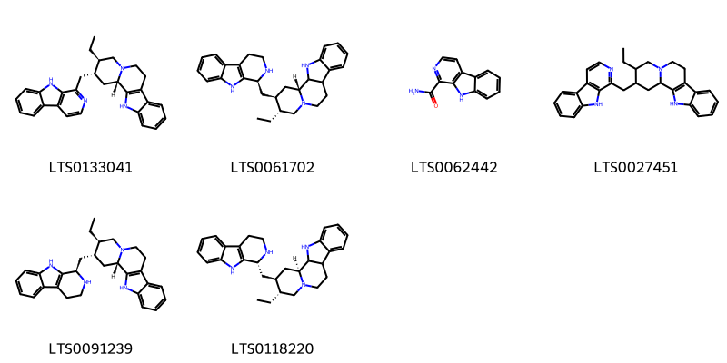{ width=100% }
    <figcaption>Hình ảnh cấu trúc hóa học của 6 hoạt chất thuộc nhóm Harmala alkaloids gồm ['(2r,3r,12bs)-3-ethyl-2-{9h-pyrido[3,4-b]indol-1-ylmethyl}-1h,2h,3h,4h,6h,7h,12h,12bh-indolo[2,3-a]quinolizine (LTS0133041)', '(2s,3r,12br)-3-ethyl-2-[(1s)-1h,2h,3h,4h,9h-pyrido[3,4-b]indol-1-ylmethyl]-1h,2h,3h,4h,6h,7h,7ah,12h,12ah,12bh-indolo[2,3-a]quinolizine (LTS0061702)', '9h-pyrido[3,4-b]indole-1-carboxamide (LTS0062442)', '3-ethyl-2-{9h-pyrido[3,4-b]indol-1-ylmethyl}-1h,2h,3h,4h,6h,7h,12h,12bh-indolo[2,3-a]quinolizine (LTS0027451)', 'ochrolifuanine (LTS0091239)', '(2s,3r,12bs)-3-ethyl-2-[(1r)-1h,2h,3h,4h,9h-pyrido[3,4-b]indol-1-ylmethyl]-1h,2h,3h,4h,6h,7h,7ah,12h,12ah,12bh-indolo[2,3-a]quinolizine (LTS0118220)'].</figcaption>
</figure>
#### Nhóm Indoles and derivatives
<figure markdown="span">
    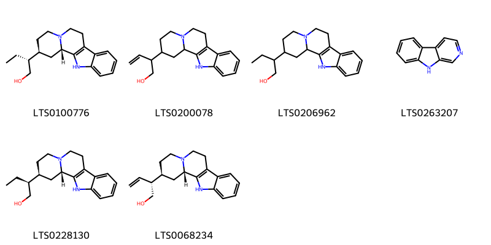{ width=100% }
    <figcaption>Hình ảnh cấu trúc hóa học của 6 hoạt chất thuộc nhóm Indoles and derivatives gồm ['(2r)-2-[(2s,12bs)-1h,2h,3h,4h,6h,7h,12h,12bh-indolo[2,3-a]quinolizin-2-yl]butan-1-ol (LTS0100776)', '2-{1h,2h,3h,4h,6h,7h,12h,12bh-indolo[2,3-a]quinolizin-2-yl}but-3-en-1-ol (LTS0200078)', '2-{1h,2h,3h,4h,6h,7h,12h,12bh-indolo[2,3-a]quinolizin-2-yl}butan-1-ol (LTS0206962)', 'β-carboline (LTS0263207)', '(2s)-2-[(2s,12bs)-1h,2h,3h,4h,6h,7h,12h,12bh-indolo[2,3-a]quinolizin-2-yl]butan-1-ol (LTS0228130)', 'antirhine (LTS0068234)'].</figcaption>
</figure>
#### Nhóm Macroline alkaloids
<figure markdown="span">
    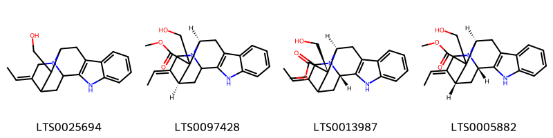{ width=100% }
    <figcaption>Hình ảnh cấu trúc hóa học của 4 hoạt chất thuộc nhóm Macroline alkaloids gồm ['normacusine b (LTS0025694)', 'methyl (12s,14s,15e)-15-ethylidene-13-(hydroxymethyl)-3,17-diazapentacyclo[12.3.1.0²,¹⁰.0⁴,⁹.0¹²,¹⁷]octadeca-2(10),4,6,8-tetraene-13-carboxylate (LTS0097428)', 'methyl (1s,12s,13s)-15-ethylidene-13-(hydroxymethyl)-3,17-diazapentacyclo[12.3.1.0²,¹⁰.0⁴,⁹.0¹²,¹⁷]octadeca-2(10),4,6,8-tetraene-13-carboxylate (LTS0013987)', 'methyl (1s,12s,14r,15e)-15-ethylidene-13-(hydroxymethyl)-3,17-diazapentacyclo[12.3.1.0²,¹⁰.0⁴,⁹.0¹²,¹⁷]octadeca-2(10),4,6,8-tetraene-13-carboxylate (LTS0005882)'].</figcaption>
</figure>
#### Nhóm Pleiocarpaman alkaloids
<figure markdown="span">
    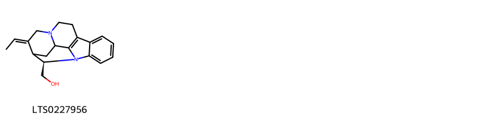{ width=100% }
    <figcaption>Hình ảnh cấu trúc hóa học của 1 hoạt chất thuộc nhóm Pleiocarpaman alkaloids gồm ['[(13e,18r)-13-ethylidene-1,11-diazapentacyclo[12.3.1.0²,⁷.0⁸,¹⁷.0¹¹,¹⁶]octadeca-2,4,6,8(17)-tetraen-18-yl]methanol (LTS0227956)'].</figcaption>
</figure>
#### Nhóm Prenol lipids
<figure markdown="span">
    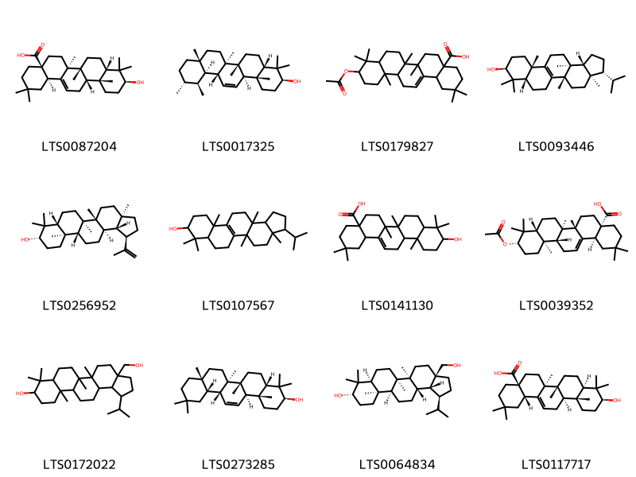{ width=100% }
    <figcaption>Hình ảnh cấu trúc hóa học của 12 hoạt chất thuộc nhóm Prenol lipids gồm ['(4as,6as,6br,8as,10s,12ar,12bs,14br)-10-hydroxy-2,2,6a,6b,9,9,12a-heptamethyl-1,3,4,5,6,7,8,8a,10,11,12,12b,13,14b-tetradecahydropicene-4a-carboxylic acid (LTS0087204)', '(3s,4as,6ar,6br,8ar,11r,12s,12ar,12br,14ar,14bs)-4,4,6a,6b,8a,11,12,14b-octamethyl-2,3,4a,5,6,7,8,9,10,11,12,12a,12b,14a-tetradecahydro-1h-picen-3-ol (LTS0017325)', '10-(acetyloxy)-2,2,6a,6b,9,9,12a-heptamethyl-1,3,4,5,6,7,8,8a,10,11,12,12b,13,14b-tetradecahydropicene-4a-carboxylic acid (LTS0179827)', '(3r,3ar,5as,7as,9s,11as,13as,13br)-3-isopropyl-3a,5a,8,8,11a,13a-hexamethyl-1h,2h,3h,4h,5h,6h,7h,7ah,9h,10h,11h,12h,13h,13bh-cyclopenta[a]chrysen-9-ol (LTS0093446)', 'lupeol (LTS0256952)', '3-isopropyl-3a,5a,8,8,11a,13a-hexamethyl-1h,2h,3h,4h,5h,6h,7h,7ah,9h,10h,11h,12h,13h,13bh-cyclopenta[a]chrysen-9-ol (LTS0107567)', 'oleanolic acid (LTS0141130)', '(4as,6as,6br,8ar,10s,12ar,12br,14bs)-10-(acetyloxy)-2,2,6a,6b,9,9,12a-heptamethyl-1,3,4,5,6,7,8,8a,10,11,12,12b,13,14b-tetradecahydropicene-4a-carboxylic acid (LTS0039352)', '3a-(hydroxymethyl)-1-isopropyl-5a,5b,8,8,11a-pentamethyl-hexadecahydrocyclopenta[a]chrysen-9-ol (LTS0172022)', '(3s,4as,6ar,6br,8ar,12as,12br,14ar,14bs)-4,4,6a,6b,8a,11,11,14b-octamethyl-1,2,3,4a,5,6,7,8,9,10,12,12a,12b,14a-tetradecahydropicen-3-ol (LTS0273285)', '(1s,3ar,5as,5br,7as,9s,11ar,11bs,13as,13br)-3a-(hydroxymethyl)-1-isopropyl-5a,5b,8,8,11a-pentamethyl-hexadecahydrocyclopenta[a]chrysen-9-ol (LTS0064834)', 'oleanolic acid (LTS0117717)'].</figcaption>
</figure>
#### Nhóm Pyridines and derivatives
<figure markdown="span">
    { width=100% }
    <figcaption>Hình ảnh cấu trúc hóa học của 1 hoạt chất thuộc nhóm Pyridines and derivatives gồm ['cantleyine (LTS0056457)'].</figcaption>
</figure>
#### Nhóm Steroids and steroid derivatives
<figure markdown="span">
    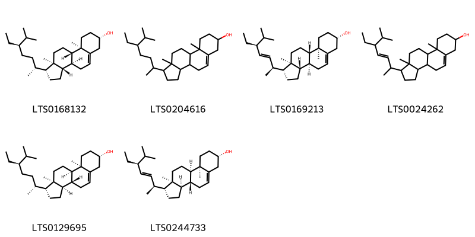{ width=100% }
    <figcaption>Hình ảnh cấu trúc hóa học của 6 hoạt chất thuộc nhóm Steroids and steroid derivatives gồm ['sitosterol (LTS0168132)', 'stigmast-5-en-3-ol, (3β)- (LTS0204616)', '(1r,3as,3bs,7s,9ar,9bs,11ar)-1-[(2s,3e,5s)-5-ethyl-6-methylhept-3-en-2-yl]-9a,11a-dimethyl-1h,2h,3h,3ah,3bh,4h,6h,7h,8h,9h,9bh,10h,11h-cyclopenta[a]phenanthren-7-ol (LTS0169213)', 'stigmasterol (LTS0024262)', '(1r,3ar,3br,7s,9ar,9br,11ar)-1-[(2r,5r)-5-ethyl-6-methylheptan-2-yl]-9a,11a-dimethyl-1h,2h,3h,3ah,3bh,4h,6h,7h,8h,9h,9bh,10h,11h-cyclopenta[a]phenanthren-7-ol (LTS0129695)', '(1r,3ar,3br,7s,9ar,9br,11ar)-1-[(2s,3e,5s)-5-ethyl-6-methylhept-3-en-2-yl]-9a,11a-dimethyl-1h,2h,3h,3ah,3bh,4h,6h,7h,8h,9h,9bh,10h,11h-cyclopenta[a]phenanthren-7-ol (LTS0244733)'].</figcaption>
</figure>
#### Nhóm Strychnos alkaloids
<figure markdown="span">
    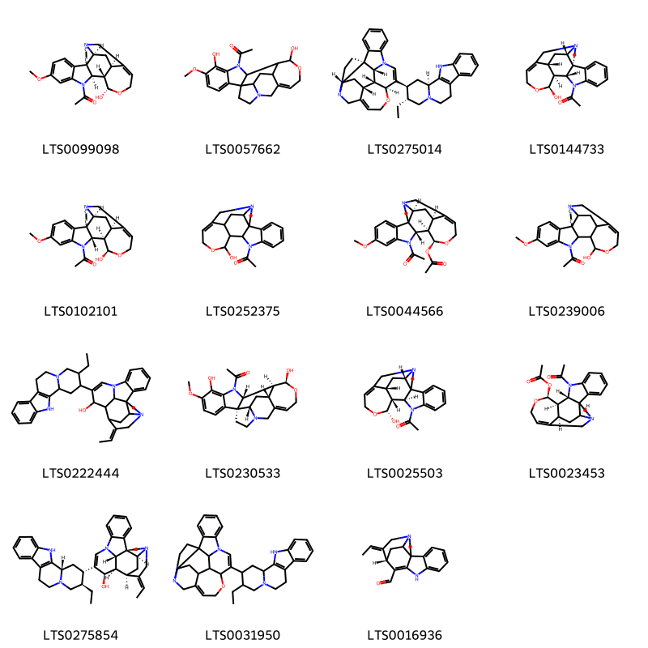{ width=100% }
    <figcaption>Hình ảnh cấu trúc hóa học của 15 hoạt chất thuộc nhóm Strychnos alkaloids gồm ['1-[(4r,12r,13s,14s,19r,21s)-14-hydroxy-8-methoxy-15-oxa-1,11-diazahexacyclo[16.3.1.0⁴,¹².0⁴,²¹.0⁵,¹⁰.0¹³,¹⁹]docosa-5,7,9,17-tetraen-11-yl]ethanone (LTS0099098)', '1-{9,14-dihydroxy-8-methoxy-15-oxa-1,11-diazahexacyclo[16.3.1.0⁴,¹².0⁴,²¹.0⁵,¹⁰.0¹³,¹⁹]docosa-5,7,9,17-tetraen-11-yl}ethanone (LTS0057662)', '(1r,11s,18s,20r,21r,22r)-10-[(2s,3r,12bs)-3-ethyl-1h,2h,3h,4h,6h,7h,12h,12bh-indolo[2,3-a]quinolizin-2-yl]-12-oxa-8,17-diazaheptacyclo[15.5.2.0¹,¹⁸.0²,⁷.0⁸,²².0¹¹,²¹.0¹⁵,²⁰]tetracosa-2,4,6,9,14-pentaene (LTS0275014)', '1-[(4r,12r,13s,14s,19r,21s)-14-hydroxy-15-oxa-1,11-diazahexacyclo[16.3.1.0⁴,¹².0⁴,²¹.0⁵,¹⁰.0¹³,¹⁹]docosa-5,7,9,17-tetraen-11-yl]ethanone (LTS0144733)', '11-methoxydiaboline (LTS0102101)', 'diaboline (LTS0252375)', '(12s,13r,14s,19r,21s)-11-acetyl-8-methoxy-15-oxa-1,11-diazahexacyclo[16.3.1.0⁴,¹².0⁴,²¹.0⁵,¹⁰.0¹³,¹⁹]docosa-5,7,9,17-tetraen-14-yl acetate (LTS0044566)', '1-{14-hydroxy-8-methoxy-15-oxa-1,11-diazahexacyclo[16.3.1.0⁴,¹².0⁴,²¹.0⁵,¹⁰.0¹³,¹⁹]docosa-5,7,9,17-tetraen-11-yl}ethanone (LTS0239006)', '(14e)-10-{3-ethyl-1h,2h,3h,4h,6h,7h,12h,12bh-indolo[2,3-a]quinolizin-2-yl}-14-ethylidene-8,16-diazahexacyclo[11.5.2.1¹,⁸.0²,⁷.0¹⁶,¹⁹.0¹²,²¹]henicosa-2,4,6,9-tetraen-11-ol (LTS0222444)', '1-[(4r,12r,13s,14s,19r,21s)-9,14-dihydroxy-8-methoxy-15-oxa-1,11-diazahexacyclo[16.3.1.0⁴,¹².0⁴,²¹.0⁵,¹⁰.0¹³,¹⁹]docosa-5,7,9,17-tetraen-11-yl]ethanone (LTS0230533)', '1-[(12s,13r,14r,19r,21s)-14-hydroxy-15-oxa-1,11-diazahexacyclo[16.3.1.0⁴,¹².0⁴,²¹.0⁵,¹⁰.0¹³,¹⁹]docosa-5,7,9,17-tetraen-11-yl]ethanone (LTS0025503)', '(12s,13r,14s,19r,21s)-11-acetyl-15-oxa-1,11-diazahexacyclo[16.3.1.0⁴,¹².0⁴,²¹.0⁵,¹⁰.0¹³,¹⁹]docosa-5,7,9,17-tetraen-14-yl acetate (LTS0023453)', '(1r,11r,12r,13r,14e,19s,21s)-10-[(2s,3r,12bs)-3-ethyl-1h,2h,3h,4h,6h,7h,12h,12bh-indolo[2,3-a]quinolizin-2-yl]-14-ethylidene-8,16-diazahexacyclo[11.5.2.1¹,⁸.0²,⁷.0¹⁶,¹⁹.0¹²,²¹]henicosa-2,4,6,9-tetraen-11-ol (LTS0275854)', '10-{3-ethyl-1h,2h,3h,4h,6h,7h,12h,12bh-indolo[2,3-a]quinolizin-2-yl}-12-oxa-8,17-diazaheptacyclo[15.5.2.0¹,¹⁸.0²,⁷.0⁸,²².0¹¹,²¹.0¹⁵,²⁰]tetracosa-2,4,6,9,14-pentaene (LTS0031950)', '(11s,12e)-12-ethylidene-8,14-diazapentacyclo[9.5.2.0¹,⁹.0²,⁷.0¹⁴,¹⁷]octadeca-2,4,6,9-tetraene-10-carbaldehyde (LTS0016936)'].</figcaption>
</figure>

---

### Dược dân tộc học

Danh sách các quốc gia có sử dụng *Strychnos potatorum* trong điều trị các bệnh. 

| Country   | Disease                             | Bệnh                                                                                                                                                                                                |
|:----------|:------------------------------------|:----------------------------------------------------------------------------------------------------------------------------------------------------------------------------------------------------|
| Elsewhere | Stomachic, Tonic, Demulcent, Emetic | MYMEMORY WARNING: YOU USED ALL AVAILABLE FREE TRANSLATIONS FOR TODAY. NEXT AVAILABLE IN  14 HOURS 45 MINUTES 10 SECONDS VISIT HTTPS://MYMEMORY.TRANSLATED.NET/DOC/USAGELIMITS.PHP TO TRANSLATE MORE |
| India     | Emetic                              | MYMEMORY WARNING: YOU USED ALL AVAILABLE FREE TRANSLATIONS FOR TODAY. NEXT AVAILABLE IN  14 HOURS 45 MINUTES 07 SECONDS VISIT HTTPS://MYMEMORY.TRANSLATED.NET/DOC/USAGELIMITS.PHP TO TRANSLATE MORE |

---

---
## Strychnos pseudoquina
### Thông tin về thực vật

!!! info "Phân loại thực vật của *Strychnos pseudoquina* từ GIBF:"
    - **Kingdom:** Plantae
    - **Phylum:** Tracheophyta
    - **Order:** Gentianales
    - **Family:** Loganiaceae
    - **Genus:** Strychnos
    - **Species:** *Strychnos pseudoquina*

 

| Label (VI)   | Label (EN)   | Scientific Name       | Descriptions (VI)   | Descriptions (EN)   | Also Known As (VI)   | Also Known As (EN)   |
|:-------------|:-------------|:----------------------|:--------------------|:--------------------|:---------------------|:---------------------|
| N/A          | N/A          | Strychnos pseudoquina | loài thực vật       | species of plant    | ['']                 | ['']                 |

#### Phân bố trên thế giới

**Từ CSDL GIBF** Brazil

#### Phân bố tại Việt Nam

**Từ CSDL GIBF**: Không có ghi nhận ở Việt Nam

---
### Thành phần hóa học
        
- Theo cơ sở dữ liệu lotus: Từ loài *Strychnos pseudoquina* đã phân lập và xác định được 12 hoạt chất thuộc về các nhóm Strychnos alkaloids, Flavonoids. 

|    | chemicalTaxonomyClassyfireClass   |   smiles_count |
|---:|:----------------------------------|---------------:|
|  0 | Flavonoids                        |              6 |
|  1 | Strychnos alkaloids               |              6 |

#### Nhóm Flavonoids
<figure markdown="span">
    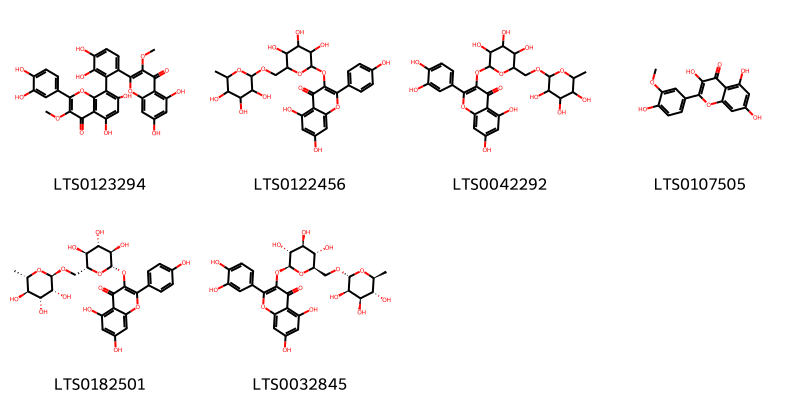{ width=100% }
    <figcaption>Hình ảnh cấu trúc hóa học của 6 hoạt chất thuộc nhóm Flavonoids gồm ['8-[6-(5,7-dihydroxy-3-methoxy-4-oxochromen-2-yl)-2,3-dihydroxyphenyl]-2-(3,4-dihydroxyphenyl)-5,7-dihydroxy-3-methoxychromen-4-one (LTS0123294)', '5,7-dihydroxy-2-(4-hydroxyphenyl)-3-[(3,4,5-trihydroxy-6-{[(3,4,5-trihydroxy-6-methyloxan-2-yl)oxy]methyl}oxan-2-yl)oxy]chromen-4-one (LTS0122456)', 'rutin (LTS0042292)', 'isorhamnetin (LTS0107505)', 'nictoflorin (LTS0182501)', '3-rutinosyl quercetin (LTS0032845)'].</figcaption>
</figure>
#### Nhóm Strychnos alkaloids
<figure markdown="span">
    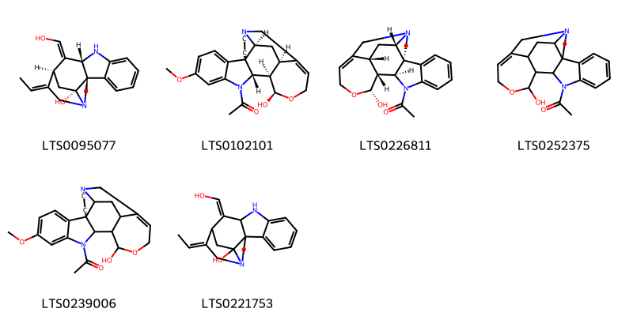{ width=100% }
    <figcaption>Hình ảnh cấu trúc hóa học của 6 hoạt chất thuộc nhóm Strychnos alkaloids gồm ['(1s,9s,10e,11s,12e,17r)-12-ethylidene-10-(hydroxymethylidene)-8,14-diazapentacyclo[9.5.2.0¹,⁹.0²,⁷.0¹⁴,¹⁷]octadeca-2,4,6-trien-17-ol (LTS0095077)', '11-methoxydiaboline (LTS0102101)', 'diaboline (LTS0226811)', 'diaboline (LTS0252375)', '1-{14-hydroxy-8-methoxy-15-oxa-1,11-diazahexacyclo[16.3.1.0⁴,¹².0⁴,²¹.0⁵,¹⁰.0¹³,¹⁹]docosa-5,7,9,17-tetraen-11-yl}ethanone (LTS0239006)', '12-ethylidene-10-(hydroxymethylidene)-8,14-diazapentacyclo[9.5.2.0¹,⁹.0²,⁷.0¹⁴,¹⁷]octadeca-2,4,6-trien-17-ol (LTS0221753)'].</figcaption>
</figure>

---

### Dược dân tộc học

Danh sách các quốc gia có sử dụng *Strychnos pseudoquina* trong điều trị các bệnh. 

| Country   | Disease   | Bệnh                                                                                                                                                                                                |
|:----------|:----------|:----------------------------------------------------------------------------------------------------------------------------------------------------------------------------------------------------|
| Brazil    | Vermifuge | MYMEMORY WARNING: YOU USED ALL AVAILABLE FREE TRANSLATIONS FOR TODAY. NEXT AVAILABLE IN  14 HOURS 44 MINUTES 21 SECONDS VISIT HTTPS://MYMEMORY.TRANSLATED.NET/DOC/USAGELIMITS.PHP TO TRANSLATE MORE |

---

---
## Strychnos tieute
### Thông tin về thực vật

!!! info "Phân loại thực vật của *Strychnos ignatii* từ GIBF:"
    - **Kingdom:** Plantae
    - **Phylum:** Tracheophyta
    - **Order:** Gentianales
    - **Family:** Loganiaceae
    - **Genus:** Strychnos
    - **Species:** *Strychnos ignatii*

 

| Label (VI)   | Label (EN)   | Scientific Name   | Descriptions (VI)   | Descriptions (EN)   | Also Known As (VI)   | Also Known As (EN)   |
|:-------------|:-------------|:------------------|:--------------------|:--------------------|:---------------------|:---------------------|
| N/A          | N/A          | Strychnos tieute  | loài thực vật       | species of plant    | ['']                 | ['']                 |

#### Phân bố trên thế giới

**Từ CSDL GIBF** nan, unknown or invalid, Indonesia

#### Phân bố tại Việt Nam

**Từ CSDL GIBF**: Không có ghi nhận ở Việt Nam

---
### Thành phần hóa học
        
- Theo cơ sở dữ liệu lotus: Từ loài *Strychnos ignatii* đã phân lập và xác định được Chưa có hoạt chất nào được phân lập. hoạt chất thuộc về các nhóm Không có hoạt chất nào được phân lập. 

Không có hình ảnh nào được tạo ra

---

### Dược dân tộc học

Danh sách các quốc gia có sử dụng *Strychnos ignatii* trong điều trị các bệnh. 

| Country   | Disease   | Bệnh                                                                                                                                                                                                |
|:----------|:----------|:----------------------------------------------------------------------------------------------------------------------------------------------------------------------------------------------------|
| Java      | Poison    | MYMEMORY WARNING: YOU USED ALL AVAILABLE FREE TRANSLATIONS FOR TODAY. NEXT AVAILABLE IN  14 HOURS 43 MINUTES 52 SECONDS VISIT HTTPS://MYMEMORY.TRANSLATED.NET/DOC/USAGELIMITS.PHP TO TRANSLATE MORE |

---

---
## Strychnos toxifera
### Thông tin về thực vật

!!! info "Phân loại thực vật của *Strychnos toxifera* từ GIBF:"
    - **Kingdom:** Plantae
    - **Phylum:** Tracheophyta
    - **Order:** Gentianales
    - **Family:** Loganiaceae
    - **Genus:** Strychnos
    - **Species:** *Strychnos toxifera*

 

| Label (VI)   | Label (EN)   | Scientific Name    | Descriptions (VI)   | Descriptions (EN)   | Also Known As (VI)   | Also Known As (EN)   |
|:-------------|:-------------|:-------------------|:--------------------|:--------------------|:---------------------|:---------------------|
| N/A          | N/A          | Strychnos toxifera | loài thực vật       | species of plant    | ['']                 | ['']                 |

#### Phân bố trên thế giới

**Từ CSDL GIBF** nan, Colombia, Venezuela (Bolivarian Republic of), Suriname, Panama, Brazil, Peru, Bolivia (Plurinational State of), Costa Rica, French Guiana, Ecuador, Guyana

#### Phân bố tại Việt Nam

**Từ CSDL GIBF**: Không có ghi nhận ở Việt Nam

---
### Thành phần hóa học
        
- Theo cơ sở dữ liệu lotus: Từ loài *Strychnos toxifera* đã phân lập và xác định được 3 hoạt chất thuộc về các nhóm Macroline alkaloids. 

|    | chemicalTaxonomyClassyfireClass   |   smiles_count |
|---:|:----------------------------------|---------------:|
|  0 | Macroline alkaloids               |              3 |

#### Nhóm Macroline alkaloids
<figure markdown="span">
    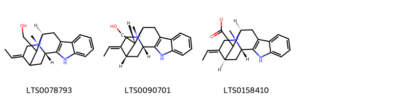{ width=100% }
    <figcaption>Hình ảnh cấu trúc hóa học của 3 hoạt chất thuộc nhóm Macroline alkaloids gồm ['(1s,12s,17r)-15-ethylidene-13-(hydroxymethyl)-17-methyl-3,17-diazapentacyclo[12.3.1.0²,¹⁰.0⁴,⁹.0¹²,¹⁷]octadeca-2(10),4,6,8-tetraen-17-ium (LTS0078793)', 'macusine b (LTS0090701)', '(1s,12s,14r,15e)-15-ethylidene-17-methyl-3,17-diazapentacyclo[12.3.1.0²,¹⁰.0⁴,⁹.0¹²,¹⁷]octadeca-2(10),4,6,8-tetraen-17-ium-13-carboxylate (LTS0158410)'].</figcaption>
</figure>

---

### Dược dân tộc học

Danh sách các quốc gia có sử dụng *Strychnos toxifera* trong điều trị các bệnh. 

| Country   | Disease   | Bệnh                                                                                                                                                                                                |
|:----------|:----------|:----------------------------------------------------------------------------------------------------------------------------------------------------------------------------------------------------|
| Elsewhere | Poison    | MYMEMORY WARNING: YOU USED ALL AVAILABLE FREE TRANSLATIONS FOR TODAY. NEXT AVAILABLE IN  14 HOURS 43 MINUTES 31 SECONDS VISIT HTTPS://MYMEMORY.TRANSLATED.NET/DOC/USAGELIMITS.PHP TO TRANSLATE MORE |

---

---
## Strychnos triclisioides
### Thông tin về thực vật

!!! info "Phân loại thực vật của *Strychnos innocua* từ GIBF:"
    - **Kingdom:** Plantae
    - **Phylum:** Tracheophyta
    - **Order:** Gentianales
    - **Family:** Loganiaceae
    - **Genus:** Strychnos
    - **Species:** *Strychnos innocua*

 

| Label (VI)   | Label (EN)   | Scientific Name         | Descriptions (VI)   | Descriptions (EN)   | Also Known As (VI)   | Also Known As (EN)   |
|:-------------|:-------------|:------------------------|:--------------------|:--------------------|:---------------------|:---------------------|
| N/A          | N/A          | Strychnos triclisioides |                     |                     | ['']                 | ['']                 |

#### Phân bố trên thế giới

**Từ CSDL GIBF** nan, Burkina Faso, Nigeria, Mali, Niger

#### Phân bố tại Việt Nam

**Từ CSDL GIBF**: Không có ghi nhận ở Việt Nam

---
### Thành phần hóa học
        
- Theo cơ sở dữ liệu lotus: Từ loài *Strychnos innocua* đã phân lập và xác định được Chưa có hoạt chất nào được phân lập. hoạt chất thuộc về các nhóm Không có hoạt chất nào được phân lập. 

Không có hình ảnh nào được tạo ra

---

### Dược dân tộc học

Danh sách các quốc gia có sử dụng *Strychnos innocua* trong điều trị các bệnh. 

| Country   | Disease   | Bệnh                                                                                                                                                                                                |
|:----------|:----------|:----------------------------------------------------------------------------------------------------------------------------------------------------------------------------------------------------|
| Nigeria   | Emetic    | MYMEMORY WARNING: YOU USED ALL AVAILABLE FREE TRANSLATIONS FOR TODAY. NEXT AVAILABLE IN  14 HOURS 43 MINUTES 01 SECONDS VISIT HTTPS://MYMEMORY.TRANSLATED.NET/DOC/USAGELIMITS.PHP TO TRANSLATE MORE |

---

# Chi Fagraea

??? note "Danh sách các dược liệu thuộc chi"
    
	 - *Fagraea berteriana*
	 - *Fagraea racemosa*

---
## Fagraea berteriana
### Thông tin về thực vật

!!! info "Phân loại thực vật của *Fagraea berteroana* từ GIBF:"
    - **Kingdom:** Plantae
    - **Phylum:** Tracheophyta
    - **Order:** Gentianales
    - **Family:** Gentianaceae
    - **Genus:** Fagraea
    - **Species:** *Fagraea berteroana*

 

| Label (VI)   | Label (EN)   | Scientific Name    | Descriptions (VI)   | Descriptions (EN)   | Also Known As (VI)   | Also Known As (EN)   |
|:-------------|:-------------|:-------------------|:--------------------|:--------------------|:---------------------|:---------------------|
| N/A          | N/A          | Fagraea berteriana |                     | species of plant    | ['']                 | ['']                 |

#### Phân bố trên thế giới

**Từ CSDL GIBF** nan, Vanuatu, Cook Islands, Fiji, Papua New Guinea, United States of America, Guam, Solomon Islands

#### Phân bố tại Việt Nam

**Từ CSDL GIBF**: Không có ghi nhận ở Việt Nam

---
### Thành phần hóa học
        
- Theo cơ sở dữ liệu lotus: Từ loài *Fagraea berteroana* đã phân lập và xác định được Chưa có hoạt chất nào được phân lập. hoạt chất thuộc về các nhóm Không có hoạt chất nào được phân lập. 

Không có hình ảnh nào được tạo ra

---

### Dược dân tộc học

Danh sách các quốc gia có sử dụng *Fagraea berteroana* trong điều trị các bệnh. 

| Country       | Disease   | Bệnh                                                                                                                                                                                                |
|:--------------|:----------|:----------------------------------------------------------------------------------------------------------------------------------------------------------------------------------------------------|
| New Caledonia | Perfumery | MYMEMORY WARNING: YOU USED ALL AVAILABLE FREE TRANSLATIONS FOR TODAY. NEXT AVAILABLE IN  14 HOURS 42 MINUTES 42 SECONDS VISIT HTTPS://MYMEMORY.TRANSLATED.NET/DOC/USAGELIMITS.PHP TO TRANSLATE MORE |

---

---
## Fagraea racemosa
### Thông tin về thực vật

!!! info "Phân loại thực vật của *Utania racemosa* từ GIBF:"
    - **Kingdom:** Plantae
    - **Phylum:** Tracheophyta
    - **Order:** Gentianales
    - **Family:** Gentianaceae
    - **Genus:** Utania
    - **Species:** *Utania racemosa*

 

| Label (VI)   | Label (EN)   | Scientific Name   | Descriptions (VI)   | Descriptions (EN)   | Also Known As (VI)   | Also Known As (EN)   |
|:-------------|:-------------|:------------------|:--------------------|:--------------------|:---------------------|:---------------------|
| N/A          | N/A          | Fagraea racemosa  | loài thực vật       | species of plant    | ['']                 | ['']                 |

#### Phân bố trên thế giới

**Từ CSDL GIBF** nan, unknown or invalid, Thailand, Brunei Darussalam, Philippines, Malaysia, India, Papua New Guinea, Australia, Solomon Islands, Cambodia, Indonesia

#### Phân bố tại Việt Nam

**Từ CSDL GIBF**: Không có ghi nhận ở Việt Nam

---
### Thành phần hóa học
        
- Theo cơ sở dữ liệu lotus: Từ loài *Utania racemosa* đã phân lập và xác định được 12 hoạt chất thuộc về các nhóm Organooxygen compounds, Furanoid lignans, Prenol lipids, Aryltetralin lignans, Phenols. 

|    | chemicalTaxonomyClassyfireClass   |   smiles_count |
|---:|:----------------------------------|---------------:|
|  0 | Aryltetralin lignans              |              2 |
|  1 | Furanoid lignans                  |              5 |
|  2 | Organooxygen compounds            |              1 |
|  3 | Phenols                           |              2 |
|  4 | Prenol lipids                     |              2 |

#### Nhóm Aryltetralin lignans
<figure markdown="span">
    { width=100% }
    <figcaption>Hình ảnh cấu trúc hóa học của 2 hoạt chất thuộc nhóm Aryltetralin lignans gồm ['(+)-isolariciresinol (LTS0164886)', '8-(4-hydroxy-3-methoxyphenyl)-6,7-bis(hydroxymethyl)-3-methoxy-5,6,7,8-tetrahydronaphthalen-2-ol (LTS0008421)'].</figcaption>
</figure>
#### Nhóm Furanoid lignans
<figure markdown="span">
    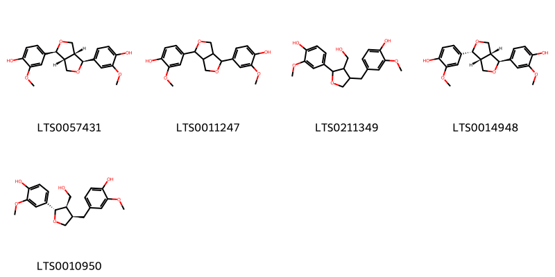{ width=100% }
    <figcaption>Hình ảnh cấu trúc hóa học của 5 hoạt chất thuộc nhóm Furanoid lignans gồm ['pinoresinol (LTS0057431)', 'pinoresinol (LTS0011247)', '4-{4-[(4-hydroxy-3-methoxyphenyl)methyl]-3-(hydroxymethyl)oxolan-2-yl}-2-methoxyphenol (LTS0211349)', '4-[(1s,3ar,4r,6ar)-4-(4-hydroxy-3-methoxyphenyl)-hexahydrofuro[3,4-c]furan-1-yl]-2-methoxyphenol (LTS0014948)', 'lariciresinol (LTS0010950)'].</figcaption>
</figure>
#### Nhóm Organooxygen compounds
<figure markdown="span">
    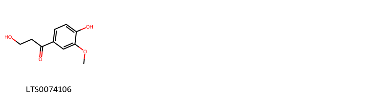{ width=100% }
    <figcaption>Hình ảnh cấu trúc hóa học của 1 hoạt chất thuộc nhóm Organooxygen compounds gồm ['3-hydroxy-1-(4-hydroxy-3-methoxyphenyl)propan-1-one (LTS0074106)'].</figcaption>
</figure>
#### Nhóm Phenols
<figure markdown="span">
    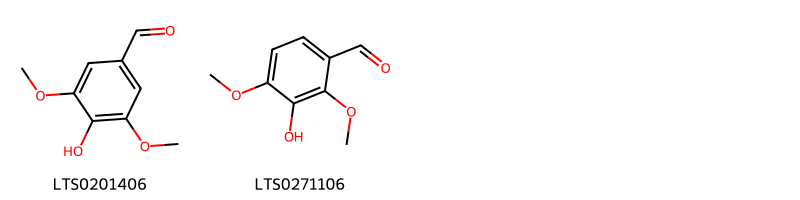{ width=100% }
    <figcaption>Hình ảnh cấu trúc hóa học của 2 hoạt chất thuộc nhóm Phenols gồm ['syringaldehyde (LTS0201406)', '3-hydroxy-2,4-dimethoxybenzaldehyde (LTS0271106)'].</figcaption>
</figure>
#### Nhóm Prenol lipids
<figure markdown="span">
    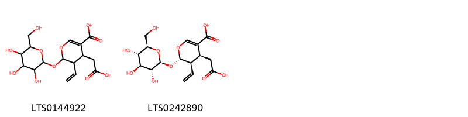{ width=100% }
    <figcaption>Hình ảnh cấu trúc hóa học của 2 hoạt chất thuộc nhóm Prenol lipids gồm ['4-(carboxymethyl)-5-ethenyl-6-{[3,4,5-trihydroxy-6-(hydroxymethyl)oxan-2-yl]oxy}-5,6-dihydro-4h-pyran-3-carboxylic acid (LTS0144922)', '(4s,5r,6s)-4-(carboxymethyl)-5-ethenyl-6-{[(2s,3r,4s,5s,6r)-3,4,5-trihydroxy-6-(hydroxymethyl)oxan-2-yl]oxy}-5,6-dihydro-4h-pyran-3-carboxylic acid (LTS0242890)'].</figcaption>
</figure>

---

### Dược dân tộc học

Danh sách các quốc gia có sử dụng *Utania racemosa* trong điều trị các bệnh. 

| Country   | Disease   | Bệnh                                                                                                                                                                                                |
|:----------|:----------|:----------------------------------------------------------------------------------------------------------------------------------------------------------------------------------------------------|
| Malaya    | Tonic     | MYMEMORY WARNING: YOU USED ALL AVAILABLE FREE TRANSLATIONS FOR TODAY. NEXT AVAILABLE IN  14 HOURS 42 MINUTES 04 SECONDS VISIT HTTPS://MYMEMORY.TRANSLATED.NET/DOC/USAGELIMITS.PHP TO TRANSLATE MORE |
| Malaysia  | Tonic     | MYMEMORY WARNING: YOU USED ALL AVAILABLE FREE TRANSLATIONS FOR TODAY. NEXT AVAILABLE IN  14 HOURS 42 MINUTES 00 SECONDS VISIT HTTPS://MYMEMORY.TRANSLATED.NET/DOC/USAGELIMITS.PHP TO TRANSLATE MORE |

---

# Chi Anthocleista

??? note "Danh sách các dược liệu thuộc chi"
    
	 - *Anthocleista nobilis*

---
## Anthocleista nobilis
### Thông tin về thực vật

!!! info "Phân loại thực vật của *Anthocleista nobilis* từ GIBF:"
    - **Kingdom:** Plantae
    - **Phylum:** Tracheophyta
    - **Order:** Gentianales
    - **Family:** Gentianaceae
    - **Genus:** Anthocleista
    - **Species:** *Anthocleista nobilis*

 

| Label (VI)   | Label (EN)   | Scientific Name      | Descriptions (VI)   | Descriptions (EN)   | Also Known As (VI)   | Also Known As (EN)   |
|:-------------|:-------------|:---------------------|:--------------------|:--------------------|:---------------------|:---------------------|
| N/A          | N/A          | Anthocleista nobilis | loài thực vật       | species of plant    | ['']                 | ['']                 |

#### Phân bố trên thế giới

**Từ CSDL GIBF** Sierra Leone, Togo, Côte d’Ivoire, Ghana, Liberia, Nigeria, Guinea, Benin

#### Phân bố tại Việt Nam

**Từ CSDL GIBF**: Không có ghi nhận ở Việt Nam

---
### Thành phần hóa học
        
- Theo cơ sở dữ liệu lotus: Từ loài *Anthocleista nobilis* đã phân lập và xác định được 2 hoạt chất thuộc về các nhóm Organooxygen compounds. 

|    | chemicalTaxonomyClassyfireClass   |   smiles_count |
|---:|:----------------------------------|---------------:|
|  0 | Organooxygen compounds            |              2 |

#### Nhóm Organooxygen compounds
<figure markdown="span">
    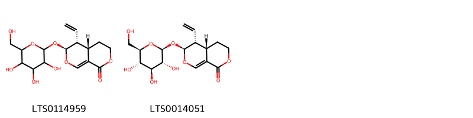{ width=100% }
    <figcaption>Hình ảnh cấu trúc hóa học của 2 hoạt chất thuộc nhóm Organooxygen compounds gồm ['(4as,5r,6s)-5-ethenyl-6-{[3,4,5-trihydroxy-6-(hydroxymethyl)oxan-2-yl]oxy}-3h,4h,4ah,5h,6h-pyrano[3,4-c]pyran-1-one (LTS0114959)', 'sweroside (LTS0014051)'].</figcaption>
</figure>

---

### Dược dân tộc học

Danh sách các quốc gia có sử dụng *Anthocleista nobilis* trong điều trị các bệnh. 

| Country   | Disease   | Bệnh                                                                                                                                                                                                |
|:----------|:----------|:----------------------------------------------------------------------------------------------------------------------------------------------------------------------------------------------------|
| Africa    | Soap      | MYMEMORY WARNING: YOU USED ALL AVAILABLE FREE TRANSLATIONS FOR TODAY. NEXT AVAILABLE IN  14 HOURS 41 MINUTES 29 SECONDS VISIT HTTPS://MYMEMORY.TRANSLATED.NET/DOC/USAGELIMITS.PHP TO TRANSLATE MORE |

---

# Chi Antonia

??? note "Danh sách các dược liệu thuộc chi"
    
	 - *Antonia ovata*

---
## Antonia ovata
### Thông tin về thực vật

!!! info "Phân loại thực vật của *Antonia ovata* từ GIBF:"
    - **Kingdom:** Plantae
    - **Phylum:** Tracheophyta
    - **Order:** Gentianales
    - **Family:** Loganiaceae
    - **Genus:** Antonia
    - **Species:** *Antonia ovata*

 

| Label (VI)   | Label (EN)   | Scientific Name   | Descriptions (VI)   | Descriptions (EN)   | Also Known As (VI)   | Also Known As (EN)   |
|:-------------|:-------------|:------------------|:--------------------|:--------------------|:---------------------|:---------------------|
| N/A          | N/A          | Antonia ovata     | loài thực vật       | species of plant    | ['']                 | ['']                 |

#### Phân bố trên thế giới

**Từ CSDL GIBF** Colombia, Benin, French Guiana, Brazil

#### Phân bố tại Việt Nam

**Từ CSDL GIBF**: Không có ghi nhận ở Việt Nam

---
### Thành phần hóa học
        
- Theo cơ sở dữ liệu lotus: Từ loài *Antonia ovata* đã phân lập và xác định được 19 hoạt chất thuộc về các nhóm Organooxygen compounds, Prenol lipids. 

|    | chemicalTaxonomyClassyfireClass   |   smiles_count |
|---:|:----------------------------------|---------------:|
|  0 | Organooxygen compounds            |             13 |
|  1 | Prenol lipids                     |              6 |

#### Nhóm Organooxygen compounds
<figure markdown="span">
    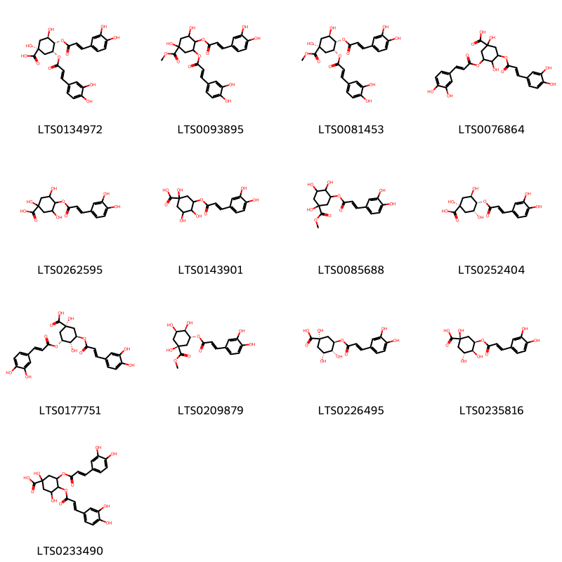{ width=100% }
    <figcaption>Hình ảnh cấu trúc hóa học của 13 hoạt chất thuộc nhóm Organooxygen compounds gồm ['3,4-dicaffeoylquinic acid (LTS0134972)', 'methyl 3,4-bis({[3-(3,4-dihydroxyphenyl)prop-2-enoyl]oxy})-1,5-dihydroxycyclohexane-1-carboxylate (LTS0093895)', 'methyl (1r,3r,4s,5r)-3,4-bis({[(2e)-3-(3,4-dihydroxyphenyl)prop-2-enoyl]oxy})-1,5-dihydroxycyclohexane-1-carboxylate (LTS0081453)', '3,5-bis({[3-(3,4-dihydroxyphenyl)prop-2-enoyl]oxy})-1,4-dihydroxycyclohexane-1-carboxylic acid (LTS0076864)', '4-{[3-(3,4-dihydroxyphenyl)prop-2-enoyl]oxy}-1,3,5-trihydroxycyclohexane-1-carboxylic acid (LTS0262595)', '3-{[3-(3,4-dihydroxyphenyl)prop-2-enoyl]oxy}-1,4,5-trihydroxycyclohexane-1-carboxylic acid (LTS0143901)', 'methyl 3-{[3-(3,4-dihydroxyphenyl)prop-2-enoyl]oxy}-1,4,5-trihydroxycyclohexane-1-carboxylate (LTS0085688)', 'cryptochlorogenic acid (LTS0252404)', '3,5-dicaffeoylquinic acid (LTS0177751)', 'methyl chlorogenate (LTS0209879)', 'chlorogenic acid (LTS0226495)', 'neochlorogenic acid (LTS0235816)', '3,4-bis({[3-(3,4-dihydroxyphenyl)prop-2-enoyl]oxy})-1,5-dihydroxycyclohexane-1-carboxylic acid (LTS0233490)'].</figcaption>
</figure>
#### Nhóm Prenol lipids
<figure markdown="span">
    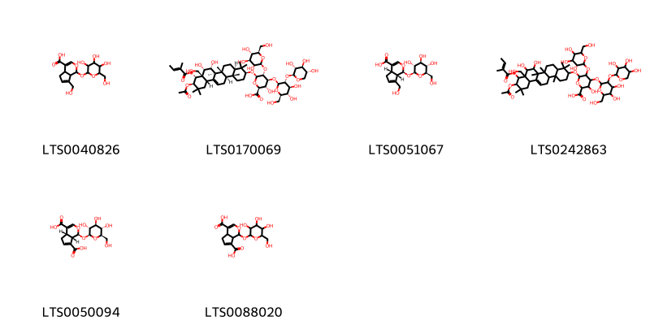{ width=100% }
    <figcaption>Hình ảnh cấu trúc hóa học của 6 hoạt chất thuộc nhóm Prenol lipids gồm ['7-(hydroxymethyl)-1-{[3,4,5-trihydroxy-6-(hydroxymethyl)oxan-2-yl]oxy}-1h,4ah,5h,7ah-cyclopenta[c]pyran-4-carboxylic acid (LTS0040826)', '(2s,3s,4s,5r,6r)-6-{[(3s,4ar,6ar,6bs,7r,8s,8ar,9r,10r,12as,14ar,14br)-10-(acetyloxy)-7,8-dihydroxy-8a-(hydroxymethyl)-4,4,6a,6b,11,11,14b-heptamethyl-9-{[(2e)-2-methylbut-2-enoyl]oxy}-1,2,3,4a,5,6,7,8,9,10,12,12a,14,14a-tetradecahydropicen-3-yl]oxy}-4-{[(2s,3r,4s,5s,6r)-4,5-dihydroxy-6-(hydroxymethyl)-3-{[(2s,3r,4s,5r)-3,4,5-trihydroxyoxan-2-yl]oxy}oxan-2-yl]oxy}-3-hydroxy-5-{[(2s,3r,4s,5s,6r)-3,4,5-trihydroxy-6-(hydroxymethyl)oxan-2-yl]oxy}oxane-2-carboxylic acid (LTS0170069)', 'geniposidic acid (LTS0051067)', '6-{[10-(acetyloxy)-7,8-dihydroxy-8a-(hydroxymethyl)-4,4,6a,6b,11,11,14b-heptamethyl-9-[(2-methylbut-2-enoyl)oxy]-1,2,3,4a,5,6,7,8,9,10,12,12a,14,14a-tetradecahydropicen-3-yl]oxy}-4-{[4,5-dihydroxy-6-(hydroxymethyl)-3-[(3,4,5-trihydroxyoxan-2-yl)oxy]oxan-2-yl]oxy}-3-hydroxy-5-{[3,4,5-trihydroxy-6-(hydroxymethyl)oxan-2-yl]oxy}oxane-2-carboxylic acid (LTS0242863)', '(1s,4as,7as)-1-{[(2s,3r,4s,5s,6r)-3,4,5-trihydroxy-6-(hydroxymethyl)oxan-2-yl]oxy}-1h,4ah,5h,7ah-cyclopenta[c]pyran-4,7-dicarboxylic acid (LTS0050094)', '1-{[3,4,5-trihydroxy-6-(hydroxymethyl)oxan-2-yl]oxy}-1h,4ah,5h,7ah-cyclopenta[c]pyran-4,7-dicarboxylic acid (LTS0088020)'].</figcaption>
</figure>

---

### Dược dân tộc học

Danh sách các quốc gia có sử dụng *Antonia ovata* trong điều trị các bệnh. 

| Country   | Disease   | Bệnh                                                                                                                                                                                                |
|:----------|:----------|:----------------------------------------------------------------------------------------------------------------------------------------------------------------------------------------------------|
| Guiana    | Piscicide | MYMEMORY WARNING: YOU USED ALL AVAILABLE FREE TRANSLATIONS FOR TODAY. NEXT AVAILABLE IN  14 HOURS 41 MINUTES 00 SECONDS VISIT HTTPS://MYMEMORY.TRANSLATED.NET/DOC/USAGELIMITS.PHP TO TRANSLATE MORE |

---

# Chi Potalia

??? note "Danh sách các dược liệu thuộc chi"
    
	 - *Potalia amara*

---
## Potalia amara
### Thông tin về thực vật

!!! info "Phân loại thực vật của *Potalia amara* từ GIBF:"
    - **Kingdom:** Plantae
    - **Phylum:** Tracheophyta
    - **Order:** Gentianales
    - **Family:** Gentianaceae
    - **Genus:** Potalia
    - **Species:** *Potalia amara*

 

| Label (VI)   | Label (EN)   | Scientific Name   | Descriptions (VI)   | Descriptions (EN)   | Also Known As (VI)   | Also Known As (EN)   |
|:-------------|:-------------|:------------------|:--------------------|:--------------------|:---------------------|:---------------------|
| N/A          | N/A          | Potalia amara     |                     | species of plant    | ['']                 | ['']                 |

#### Phân bố trên thế giới

**Từ CSDL GIBF** nan, Colombia, Suriname, Panama, Brazil, Peru, French Guiana, Bolivia (Plurinational State of), Costa Rica, Ecuador

#### Phân bố tại Việt Nam

**Từ CSDL GIBF**: Không có ghi nhận ở Việt Nam

---
### Thành phần hóa học
        
- Theo cơ sở dữ liệu lotus: Từ loài *Potalia amara* đã phân lập và xác định được 11 hoạt chất thuộc về các nhóm Organooxygen compounds. 

|    | chemicalTaxonomyClassyfireClass   |   smiles_count |
|---:|:----------------------------------|---------------:|
|  0 | Organooxygen compounds            |             11 |

#### Nhóm Organooxygen compounds
<figure markdown="span">
    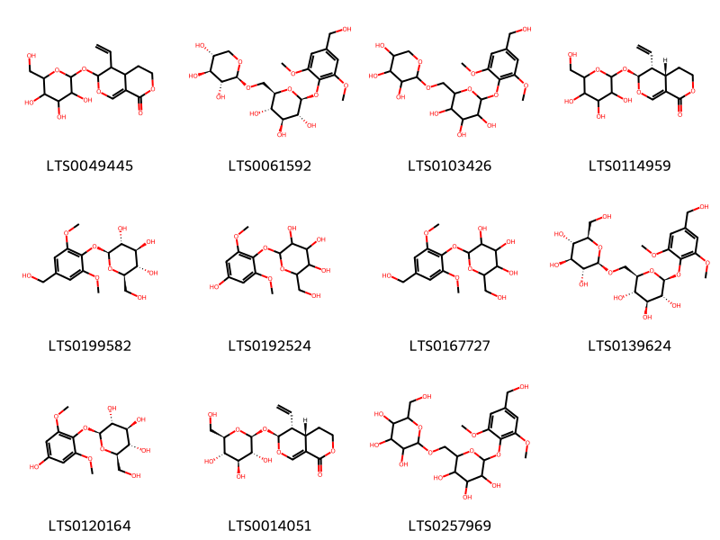{ width=100% }
    <figcaption>Hình ảnh cấu trúc hóa học của 11 hoạt chất thuộc nhóm Organooxygen compounds gồm ['5-ethenyl-6-{[3,4,5-trihydroxy-6-(hydroxymethyl)oxan-2-yl]oxy}-3h,4h,4ah,5h,6h-pyrano[3,4-c]pyran-1-one (LTS0049445)', '(2s,3r,4s,5s,6r)-2-[4-(hydroxymethyl)-2,6-dimethoxyphenoxy]-6-({[(2s,3r,4s,5r)-3,4,5-trihydroxyoxan-2-yl]oxy}methyl)oxane-3,4,5-triol (LTS0061592)', '2-[4-(hydroxymethyl)-2,6-dimethoxyphenoxy]-6-{[(3,4,5-trihydroxyoxan-2-yl)oxy]methyl}oxane-3,4,5-triol (LTS0103426)', '(4as,5r,6s)-5-ethenyl-6-{[3,4,5-trihydroxy-6-(hydroxymethyl)oxan-2-yl]oxy}-3h,4h,4ah,5h,6h-pyrano[3,4-c]pyran-1-one (LTS0114959)', '(2r,3s,4s,5r,6s)-2-(hydroxymethyl)-6-[4-(hydroxymethyl)-2,6-dimethoxyphenoxy]oxane-3,4,5-triol (LTS0199582)', '2-(4-hydroxy-2,6-dimethoxyphenoxy)-6-(hydroxymethyl)oxane-3,4,5-triol (LTS0192524)', '2-(hydroxymethyl)-6-[4-(hydroxymethyl)-2,6-dimethoxyphenoxy]oxane-3,4,5-triol (LTS0167727)', '(2s,3r,4s,5s,6r)-2-[4-(hydroxymethyl)-2,6-dimethoxyphenoxy]-6-({[(2r,3r,4s,5s,6r)-3,4,5-trihydroxy-6-(hydroxymethyl)oxan-2-yl]oxy}methyl)oxane-3,4,5-triol (LTS0139624)', '(2s,3r,4s,5s,6r)-2-(4-hydroxy-2,6-dimethoxyphenoxy)-6-(hydroxymethyl)oxane-3,4,5-triol (LTS0120164)', 'sweroside (LTS0014051)', '2-[4-(hydroxymethyl)-2,6-dimethoxyphenoxy]-6-({[3,4,5-trihydroxy-6-(hydroxymethyl)oxan-2-yl]oxy}methyl)oxane-3,4,5-triol (LTS0257969)'].</figcaption>
</figure>

---

### Dược dân tộc học

Danh sách các quốc gia có sử dụng *Potalia amara* trong điều trị các bệnh. 

| Country   | Disease   | Bệnh                                                                                                                                                                                                |
|:----------|:----------|:----------------------------------------------------------------------------------------------------------------------------------------------------------------------------------------------------|
| Venezuela | Laxative  | MYMEMORY WARNING: YOU USED ALL AVAILABLE FREE TRANSLATIONS FOR TODAY. NEXT AVAILABLE IN  14 HOURS 40 MINUTES 30 SECONDS VISIT HTTPS://MYMEMORY.TRANSLATED.NET/DOC/USAGELIMITS.PHP TO TRANSLATE MORE |

---

# Chi igelia

??? note "Danh sách các dược liệu thuộc chi"
    
	 - *igelia anthelmia*
	 - *igelia flemmingiana*
	 - *igelia glabrata*
	 - *igelia marilandica*

---
## igelia anthelmia
### Thông tin về thực vật

!!! info "Phân loại thực vật của *N/A* từ GIBF:"
    - **Kingdom:** N/A
    - **Phylum:** N/A
    - **Order:** N/A
    - **Family:** N/A
    - **Genus:** N/A
    - **Species:** *N/A*

 

| Label (VI)   | Label (EN)   | Scientific Name   | Descriptions (VI)   | Descriptions (EN)   | Also Known As (VI)   | Also Known As (EN)   |
|:-------------|:-------------|:------------------|:--------------------|:--------------------|:---------------------|:---------------------|
| N/A          | N/A          | Potalia amara     |                     | species of plant    | ['']                 | ['']                 |

#### Phân bố trên thế giới

**Từ CSDL GIBF** Không có kết quả phù hợp

#### Phân bố tại Việt Nam

**Từ CSDL GIBF**: Không có ghi nhận ở Việt Nam

---
### Thành phần hóa học
        
- Theo cơ sở dữ liệu lotus: Từ loài *N/A* đã phân lập và xác định được 3 hoạt chất thuộc về các nhóm Prenol lipids. 

|    | chemicalTaxonomyClassyfireClass   |   smiles_count |
|---:|:----------------------------------|---------------:|
|  0 | Prenol lipids                     |              3 |

#### Nhóm Prenol lipids
<figure markdown="span">
    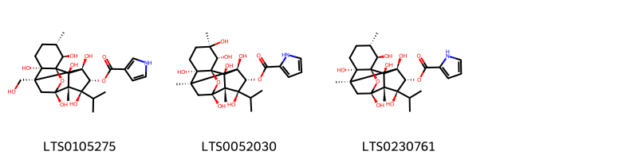{ width=100% }
    <figcaption>Hình ảnh cấu trúc hóa học của 3 hoạt chất thuộc nhóm Prenol lipids gồm ['(1r,2r,3s,6s,7r,9s,10s,11s,12r,13s,14r)-2,6,9,11,13,14-hexahydroxy-7-(hydroxymethyl)-11-isopropyl-3,10-dimethyl-15-oxapentacyclo[7.5.1.0¹,⁶.0⁷,¹³.0¹⁰,¹⁴]pentadecan-12-yl 1h-pyrrole-3-carboxylate (LTS0105275)', '(1r,2s,3r,6s,7s,9s,10s,11s,12r,13s,14r)-2,3,6,9,11,13,14-heptahydroxy-11-isopropyl-3,7,10-trimethyl-15-oxapentacyclo[7.5.1.0¹,⁶.0⁷,¹³.0¹⁰,¹⁴]pentadecan-12-yl 1h-pyrrole-2-carboxylate (LTS0052030)', 'ryanodine (LTS0230761)'].</figcaption>
</figure>

---

### Dược dân tộc học

Danh sách các quốc gia có sử dụng *N/A* trong điều trị các bệnh. 

| Country            | Disease                        | Bệnh                                                                                                                                                                                                |
|:-------------------|:-------------------------------|:----------------------------------------------------------------------------------------------------------------------------------------------------------------------------------------------------|
| Djukut puntir      | Vermifuge                      | MYMEMORY WARNING: YOU USED ALL AVAILABLE FREE TRANSLATIONS FOR TODAY. NEXT AVAILABLE IN  14 HOURS 40 MINUTES 00 SECONDS VISIT HTTPS://MYMEMORY.TRANSLATED.NET/DOC/USAGELIMITS.PHP TO TRANSLATE MORE |
| Dominican Republic | Narcotic, Poison               | MYMEMORY WARNING: YOU USED ALL AVAILABLE FREE TRANSLATIONS FOR TODAY. NEXT AVAILABLE IN  14 HOURS 39 MINUTES 55 SECONDS VISIT HTTPS://MYMEMORY.TRANSLATED.NET/DOC/USAGELIMITS.PHP TO TRANSLATE MORE |
| Elsewhere          | Insecticide, Poison, Vermifuge | MYMEMORY WARNING: YOU USED ALL AVAILABLE FREE TRANSLATIONS FOR TODAY. NEXT AVAILABLE IN  14 HOURS 39 MINUTES 52 SECONDS VISIT HTTPS://MYMEMORY.TRANSLATED.NET/DOC/USAGELIMITS.PHP TO TRANSLATE MORE |
| Haiti              | Vermifuge                      | MYMEMORY WARNING: YOU USED ALL AVAILABLE FREE TRANSLATIONS FOR TODAY. NEXT AVAILABLE IN  14 HOURS 39 MINUTES 48 SECONDS VISIT HTTPS://MYMEMORY.TRANSLATED.NET/DOC/USAGELIMITS.PHP TO TRANSLATE MORE |
| Latin America      | Vermifuge                      | MYMEMORY WARNING: YOU USED ALL AVAILABLE FREE TRANSLATIONS FOR TODAY. NEXT AVAILABLE IN  14 HOURS 39 MINUTES 45 SECONDS VISIT HTTPS://MYMEMORY.TRANSLATED.NET/DOC/USAGELIMITS.PHP TO TRANSLATE MORE |
| Panama             | Vermifuge, Poison              | MYMEMORY WARNING: YOU USED ALL AVAILABLE FREE TRANSLATIONS FOR TODAY. NEXT AVAILABLE IN  14 HOURS 39 MINUTES 42 SECONDS VISIT HTTPS://MYMEMORY.TRANSLATED.NET/DOC/USAGELIMITS.PHP TO TRANSLATE MORE |
| Surinam            | Piscicide                      | MYMEMORY WARNING: YOU USED ALL AVAILABLE FREE TRANSLATIONS FOR TODAY. NEXT AVAILABLE IN  14 HOURS 39 MINUTES 39 SECONDS VISIT HTTPS://MYMEMORY.TRANSLATED.NET/DOC/USAGELIMITS.PHP TO TRANSLATE MORE |
| Venezuela          | Vermifuge                      | MYMEMORY WARNING: YOU USED ALL AVAILABLE FREE TRANSLATIONS FOR TODAY. NEXT AVAILABLE IN  14 HOURS 39 MINUTES 35 SECONDS VISIT HTTPS://MYMEMORY.TRANSLATED.NET/DOC/USAGELIMITS.PHP TO TRANSLATE MORE |

---

---
## igelia flemmingiana
### Thông tin về thực vật

!!! info "Phân loại thực vật của *N/A* từ GIBF:"
    - **Kingdom:** N/A
    - **Phylum:** N/A
    - **Order:** N/A
    - **Family:** N/A
    - **Genus:** N/A
    - **Species:** *N/A*

 

| Label (VI)   | Label (EN)   | Scientific Name   | Descriptions (VI)   | Descriptions (EN)   | Also Known As (VI)   | Also Known As (EN)   |
|:-------------|:-------------|:------------------|:--------------------|:--------------------|:---------------------|:---------------------|
| N/A          | N/A          | Potalia amara     |                     | species of plant    | ['']                 | ['']                 |

#### Phân bố trên thế giới

**Từ CSDL GIBF** Không có kết quả phù hợp

#### Phân bố tại Việt Nam

**Từ CSDL GIBF**: Không có ghi nhận ở Việt Nam

---
### Thành phần hóa học
        
- Theo cơ sở dữ liệu lotus: Từ loài *N/A* đã phân lập và xác định được Chưa có hoạt chất nào được phân lập. hoạt chất thuộc về các nhóm Không có hoạt chất nào được phân lập. 

Không có hình ảnh nào được tạo ra

---

### Dược dân tộc học

Danh sách các quốc gia có sử dụng *N/A* trong điều trị các bệnh. 

| Country   | Disease              | Bệnh                                                                                                                                                                                                |
|:----------|:---------------------|:----------------------------------------------------------------------------------------------------------------------------------------------------------------------------------------------------|
| Brazil    | Sudorific, Vermifuge | MYMEMORY WARNING: YOU USED ALL AVAILABLE FREE TRANSLATIONS FOR TODAY. NEXT AVAILABLE IN  14 HOURS 39 MINUTES 12 SECONDS VISIT HTTPS://MYMEMORY.TRANSLATED.NET/DOC/USAGELIMITS.PHP TO TRANSLATE MORE |

---

---
## igelia glabrata
### Thông tin về thực vật

!!! info "Phân loại thực vật của *N/A* từ GIBF:"
    - **Kingdom:** N/A
    - **Phylum:** N/A
    - **Order:** N/A
    - **Family:** N/A
    - **Genus:** N/A
    - **Species:** *N/A*

 

| Label (VI)   | Label (EN)   | Scientific Name   | Descriptions (VI)   | Descriptions (EN)   | Also Known As (VI)   | Also Known As (EN)   |
|:-------------|:-------------|:------------------|:--------------------|:--------------------|:---------------------|:---------------------|
| N/A          | N/A          | Potalia amara     |                     | species of plant    | ['']                 | ['']                 |

#### Phân bố trên thế giới

**Từ CSDL GIBF** Không có kết quả phù hợp

#### Phân bố tại Việt Nam

**Từ CSDL GIBF**: Không có ghi nhận ở Việt Nam

---
### Thành phần hóa học
        
- Theo cơ sở dữ liệu lotus: Từ loài *N/A* đã phân lập và xác định được Chưa có hoạt chất nào được phân lập. hoạt chất thuộc về các nhóm Không có hoạt chất nào được phân lập. 

Không có hình ảnh nào được tạo ra

---

### Dược dân tộc học

Danh sách các quốc gia có sử dụng *N/A* trong điều trị các bệnh. 

| Country   | Disease                         | Bệnh                                                                                                                                                                                                |
|:----------|:--------------------------------|:----------------------------------------------------------------------------------------------------------------------------------------------------------------------------------------------------|
| Brazil    | Sudorific, Stimulant, Vermifuge | MYMEMORY WARNING: YOU USED ALL AVAILABLE FREE TRANSLATIONS FOR TODAY. NEXT AVAILABLE IN  14 HOURS 38 MINUTES 56 SECONDS VISIT HTTPS://MYMEMORY.TRANSLATED.NET/DOC/USAGELIMITS.PHP TO TRANSLATE MORE |

---

---
## igelia marilandica
### Thông tin về thực vật

!!! info "Phân loại thực vật của *N/A* từ GIBF:"
    - **Kingdom:** N/A
    - **Phylum:** N/A
    - **Order:** N/A
    - **Family:** N/A
    - **Genus:** N/A
    - **Species:** *N/A*

 

| Label (VI)   | Label (EN)   | Scientific Name   | Descriptions (VI)   | Descriptions (EN)   | Also Known As (VI)   | Also Known As (EN)   |
|:-------------|:-------------|:------------------|:--------------------|:--------------------|:---------------------|:---------------------|
| N/A          | N/A          | Potalia amara     |                     | species of plant    | ['']                 | ['']                 |

#### Phân bố trên thế giới

**Từ CSDL GIBF** Không có kết quả phù hợp

#### Phân bố tại Việt Nam

**Từ CSDL GIBF**: Không có ghi nhận ở Việt Nam

---
### Thành phần hóa học
        
- Theo cơ sở dữ liệu lotus: Từ loài *N/A* đã phân lập và xác định được Chưa có hoạt chất nào được phân lập. hoạt chất thuộc về các nhóm Không có hoạt chất nào được phân lập. 

Không có hình ảnh nào được tạo ra

---

### Dược dân tộc học

Danh sách các quốc gia có sử dụng *N/A* trong điều trị các bệnh. 

| Country        | Disease                                                       | Bệnh                                                                                                                                                                                                |
|:---------------|:--------------------------------------------------------------|:----------------------------------------------------------------------------------------------------------------------------------------------------------------------------------------------------|
| Turkey         | Cardiotonic, Narcotic, Soporific, Vermifuge, Poison, Sedative | MYMEMORY WARNING: YOU USED ALL AVAILABLE FREE TRANSLATIONS FOR TODAY. NEXT AVAILABLE IN  14 HOURS 38 MINUTES 42 SECONDS VISIT HTTPS://MYMEMORY.TRANSLATED.NET/DOC/USAGELIMITS.PHP TO TRANSLATE MORE |
| US             | Vermifuge                                                     | MYMEMORY WARNING: YOU USED ALL AVAILABLE FREE TRANSLATIONS FOR TODAY. NEXT AVAILABLE IN  14 HOURS 38 MINUTES 39 SECONDS VISIT HTTPS://MYMEMORY.TRANSLATED.NET/DOC/USAGELIMITS.PHP TO TRANSLATE MORE |
| US(Amerindian) | Vermifuge                                                     | MYMEMORY WARNING: YOU USED ALL AVAILABLE FREE TRANSLATIONS FOR TODAY. NEXT AVAILABLE IN  14 HOURS 38 MINUTES 36 SECONDS VISIT HTTPS://MYMEMORY.TRANSLATED.NET/DOC/USAGELIMITS.PHP TO TRANSLATE MORE |
| US(Appalachia) | Digestive, Vermifuge                                          | MYMEMORY WARNING: YOU USED ALL AVAILABLE FREE TRANSLATIONS FOR TODAY. NEXT AVAILABLE IN  14 HOURS 38 MINUTES 33 SECONDS VISIT HTTPS://MYMEMORY.TRANSLATED.NET/DOC/USAGELIMITS.PHP TO TRANSLATE MORE |

---

# Chi Buddleja

??? note "Danh sách các dược liệu thuộc chi"
    
	 - *Buddleja americana*
	 - *Buddleja asiatica*
	 - *Buddleja brasiliensis*
	 - *Buddleja cordata*
	 - *Buddleja curviflora*
	 - *Buddleja lindleyana*
	 - *Buddleja madagascariensis*
	 - *Buddleja marrubiifolia*
	 - *Buddleja marubifolia*
	 - *Buddleja sessiliflora*
	 - *Buddleja tucumanensis*
	 - *Buddleja yunnanensis*

---
## Buddleja americana
### Thông tin về thực vật

!!! info "Phân loại thực vật của *Buddleja americana* từ GIBF:"
    - **Kingdom:** Plantae
    - **Phylum:** Tracheophyta
    - **Order:** Lamiales
    - **Family:** Scrophulariaceae
    - **Genus:** Buddleja
    - **Species:** *Buddleja americana*

 

| Label (VI)   | Label (EN)   | Scientific Name    | Descriptions (VI)   | Descriptions (EN)   | Also Known As (VI)     | Also Known As (EN)     |
|:-------------|:-------------|:-------------------|:--------------------|:--------------------|:-----------------------|:-----------------------|
| N/A          | N/A          | Buddleja americana | loài thực vật       | species of plant    | ['Buddleia americana'] | ['Buddleia americana'] |

#### Phân bố trên thế giới

**Từ CSDL GIBF** Honduras, Colombia, Venezuela (Bolivarian Republic of), El Salvador, Nicaragua, New Zealand, Peru, Costa Rica, Ecuador, Mexico, Guatemala

#### Phân bố tại Việt Nam

**Từ CSDL GIBF**: Không có ghi nhận ở Việt Nam

---
### Thành phần hóa học
        
- Theo cơ sở dữ liệu lotus: Từ loài *Buddleja americana* đã phân lập và xác định được Chưa có hoạt chất nào được phân lập. hoạt chất thuộc về các nhóm Không có hoạt chất nào được phân lập. 

Không có hình ảnh nào được tạo ra

---

### Dược dân tộc học

Danh sách các quốc gia có sử dụng *Buddleja americana* trong điều trị các bệnh. 

| Country   | Disease                                 | Bệnh                                                                                                                                                                                                |
|:----------|:----------------------------------------|:----------------------------------------------------------------------------------------------------------------------------------------------------------------------------------------------------|
| Elsewhere | Diuretic                                | MYMEMORY WARNING: YOU USED ALL AVAILABLE FREE TRANSLATIONS FOR TODAY. NEXT AVAILABLE IN  14 HOURS 38 MINUTES 09 SECONDS VISIT HTTPS://MYMEMORY.TRANSLATED.NET/DOC/USAGELIMITS.PHP TO TRANSLATE MORE |
| Mexico    | Analgesic, Diuretic, Hypnotic, Diuretic | MYMEMORY WARNING: YOU USED ALL AVAILABLE FREE TRANSLATIONS FOR TODAY. NEXT AVAILABLE IN  14 HOURS 38 MINUTES 04 SECONDS VISIT HTTPS://MYMEMORY.TRANSLATED.NET/DOC/USAGELIMITS.PHP TO TRANSLATE MORE |

---

---
## Buddleja asiatica
### Thông tin về thực vật

!!! info "Phân loại thực vật của *Buddleja asiatica* từ GIBF:"
    - **Kingdom:** Plantae
    - **Phylum:** Tracheophyta
    - **Order:** Lamiales
    - **Family:** Scrophulariaceae
    - **Genus:** Buddleja
    - **Species:** *Buddleja asiatica*

 

| Label (VI)   | Label (EN)   | Scientific Name   | Descriptions (VI)   | Descriptions (EN)   | Also Known As (VI)   | Also Known As (EN)   |
|:-------------|:-------------|:------------------|:--------------------|:--------------------|:---------------------|:---------------------|
| N/A          | N/A          | Buddleja asiatica | loài thực vật       | species of plant    | ['']                 | ['']                 |

#### Phân bố trên thế giới

**Từ CSDL GIBF** Viet Nam, Chinese Taipei, Thailand, India, Macao, Indonesia, United States of America, China, Guam, Nepal, Hong Kong

#### Phân bố tại Việt Nam

**Từ CSDL GIBF**: Lâm Đồng

---
### Thành phần hóa học
        
- Theo cơ sở dữ liệu lotus: Từ loài *Buddleja asiatica* đã phân lập và xác định được 43 hoạt chất thuộc về các nhóm Organooxygen compounds, Flavonoids, Oxepanes, Prenol lipids, Cinnamic acids and derivatives, Steroids and steroid derivatives. 

|    | chemicalTaxonomyClassyfireClass   |   smiles_count |
|---:|:----------------------------------|---------------:|
|  0 | Cinnamic acids and derivatives    |             11 |
|  1 | Flavonoids                        |              3 |
|  2 | Organooxygen compounds            |              6 |
|  3 | Oxepanes                          |              2 |
|  4 | Prenol lipids                     |             18 |
|  5 | Steroids and steroid derivatives  |              3 |

#### Nhóm Cinnamic acids and derivatives
<figure markdown="span">
    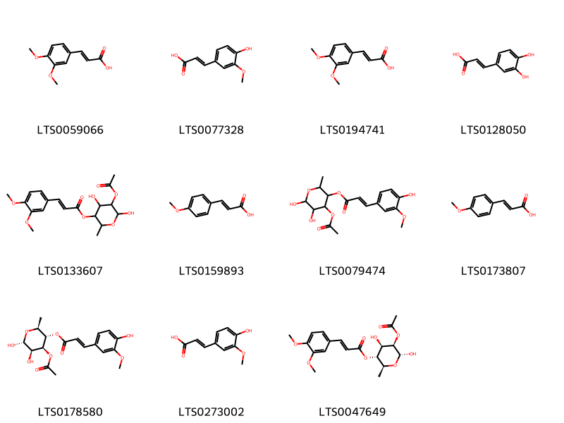{ width=100% }
    <figcaption>Hình ảnh cấu trúc hóa học của 11 hoạt chất thuộc nhóm Cinnamic acids and derivatives gồm ['3,4-dimethoxycinnamic acid (LTS0059066)', 'ferulic acid (LTS0077328)', '3-(3,4-dimethoxyphenyl)prop-2-enoic acid (LTS0194741)', '3,4-dihydroxycinnamic acid (LTS0128050)', '5-(acetyloxy)-4,6-dihydroxy-2-methyloxan-3-yl 3-(3,4-dimethoxyphenyl)prop-2-enoate (LTS0133607)', 'p-methoxy-cinnamic acid (LTS0159893)', '4-(acetyloxy)-5,6-dihydroxy-2-methyloxan-3-yl 3-(4-hydroxy-3-methoxyphenyl)prop-2-enoate (LTS0079474)', '4-methoxycinnamic acid (LTS0173807)', '(2s,3s,4s,5r,6r)-4-(acetyloxy)-5,6-dihydroxy-2-methyloxan-3-yl (2e)-3-(4-hydroxy-3-methoxyphenyl)prop-2-enoate (LTS0178580)', 'ferulic acid (LTS0273002)', '(2s,3r,4r,5r,6r)-5-(acetyloxy)-4,6-dihydroxy-2-methyloxan-3-yl (2e)-3-(3,4-dimethoxyphenyl)prop-2-enoate (LTS0047649)'].</figcaption>
</figure>
#### Nhóm Flavonoids
<figure markdown="span">
    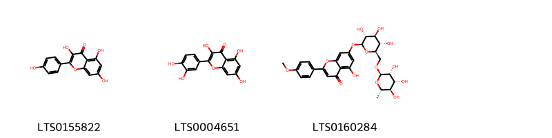{ width=100% }
    <figcaption>Hình ảnh cấu trúc hóa học của 3 hoạt chất thuộc nhóm Flavonoids gồm ['kaempherol (LTS0155822)', 'quercetin (LTS0004651)', 'linarin (LTS0160284)'].</figcaption>
</figure>
#### Nhóm Organooxygen compounds
<figure markdown="span">
    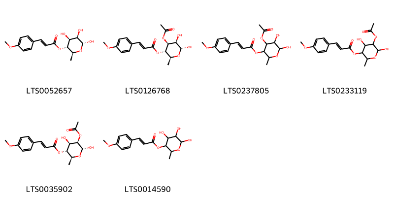{ width=100% }
    <figcaption>Hình ảnh cấu trúc hóa học của 6 hoạt chất thuộc nhóm Organooxygen compounds gồm ['(2s,3r,4s,5r,6r)-4,5,6-trihydroxy-2-methyloxan-3-yl (2e)-3-(4-methoxyphenyl)prop-2-enoate (LTS0052657)', '(2s,3s,4s,5r,6r)-4-(acetyloxy)-5,6-dihydroxy-2-methyloxan-3-yl (2e)-3-(4-methoxyphenyl)prop-2-enoate (LTS0126768)', '4-(acetyloxy)-5,6-dihydroxy-2-methyloxan-3-yl 3-(4-methoxyphenyl)prop-2-enoate (LTS0237805)', '5-(acetyloxy)-4,6-dihydroxy-2-methyloxan-3-yl 3-(4-methoxyphenyl)prop-2-enoate (LTS0233119)', '(2s,3r,4r,5r,6r)-5-(acetyloxy)-4,6-dihydroxy-2-methyloxan-3-yl (2e)-3-(4-methoxyphenyl)prop-2-enoate (LTS0035902)', '4,5,6-trihydroxy-2-methyloxan-3-yl 3-(4-methoxyphenyl)prop-2-enoate (LTS0014590)'].</figcaption>
</figure>
#### Nhóm Oxepanes
<figure markdown="span">
    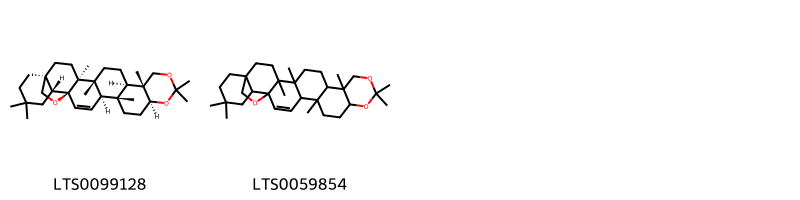{ width=100% }
    <figcaption>Hình ảnh cấu trúc hóa học của 2 hoạt chất thuộc nhóm Oxepanes gồm ['(1s,4s,5r,8r,9r,14s,17s,18r,21s,22r)-4,5,9,12,12,17,24,24-octamethyl-11,13,28-trioxaheptacyclo[19.5.2.0¹,²².0⁴,²¹.0⁵,¹⁸.0⁸,¹⁷.0⁹,¹⁴]octacos-19-ene (LTS0099128)', '4,5,9,12,12,17,24,24-octamethyl-11,13,28-trioxaheptacyclo[19.5.2.0¹,²².0⁴,²¹.0⁵,¹⁸.0⁸,¹⁷.0⁹,¹⁴]octacos-19-ene (LTS0059854)'].</figcaption>
</figure>
#### Nhóm Prenol lipids
<figure markdown="span">
    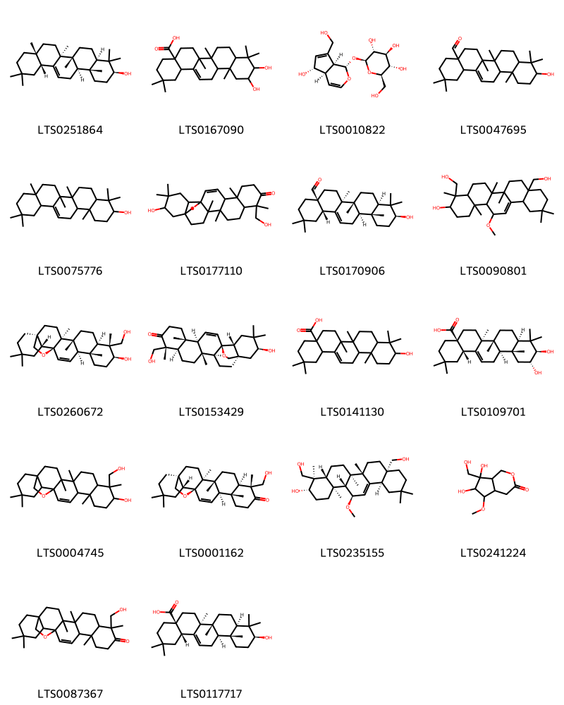{ width=100% }
    <figcaption>Hình ảnh cấu trúc hóa học của 18 hoạt chất thuộc nhóm Prenol lipids gồm ['β-amyrin (LTS0251864)', '10,11-dihydroxy-2,2,6a,6b,9,9,12a-heptamethyl-1,3,4,5,6,7,8,8a,10,11,12,12b,13,14b-tetradecahydropicene-4a-carboxylic acid (LTS0167090)', 'aucubin (LTS0010822)', '10-hydroxy-2,2,6a,6b,9,9,12a-heptamethyl-1,3,4,5,6,7,8,8a,10,11,12,12b,13,14b-tetradecahydropicene-4a-carbaldehyde (LTS0047695)', 'β-amyrin (LTS0075776)', '21-hydroxy-9-(hydroxymethyl)-4,5,9,13,20,20-hexamethyl-24-oxahexacyclo[15.5.2.0¹,¹⁸.0⁴,¹⁷.0⁵,¹⁴.0⁸,¹³]tetracos-15-en-10-one (LTS0177110)', 'oleanolic aldehyde (LTS0170906)', '4,8a-bis(hydroxymethyl)-14-methoxy-4,6a,6b,11,11,14b-hexamethyl-1,2,3,4a,5,6,7,8,9,10,12,12a,14,14a-tetradecahydropicen-3-ol (LTS0090801)', '(1s,4s,5r,8r,9r,10s,13s,14r,17s,18r)-9-(hydroxymethyl)-4,5,9,13,20,20-hexamethyl-24-oxahexacyclo[15.5.2.0¹,¹⁸.0⁴,¹⁷.0⁵,¹⁴.0⁸,¹³]tetracos-15-en-10-ol (LTS0260672)', '(1r,4s,5r,8r,9r,13s,14r,17s,18r,21s)-21-hydroxy-9-(hydroxymethyl)-4,5,9,13,20,20-hexamethyl-24-oxahexacyclo[15.5.2.0¹,¹⁸.0⁴,¹⁷.0⁵,¹⁴.0⁸,¹³]tetracos-15-en-10-one (LTS0153429)', 'oleanolic acid (LTS0141130)', 'maslinic acid (LTS0109701)', '9-(hydroxymethyl)-4,5,9,13,20,20-hexamethyl-24-oxahexacyclo[15.5.2.0¹,¹⁸.0⁴,¹⁷.0⁵,¹⁴.0⁸,¹³]tetracos-15-en-10-ol (LTS0004745)', '(1s,4s,5r,8r,9r,13s,14r,17s,18r)-9-(hydroxymethyl)-4,5,9,13,20,20-hexamethyl-24-oxahexacyclo[15.5.2.0¹,¹⁸.0⁴,¹⁷.0⁵,¹⁴.0⁸,¹³]tetracos-15-en-10-one (LTS0001162)', '(3s,4r,4ar,6ar,6bs,8as,12as,14r,14ar,14bs)-4,8a-bis(hydroxymethyl)-14-methoxy-4,6a,6b,11,11,14b-hexamethyl-1,2,3,4a,5,6,7,8,9,10,12,12a,14,14a-tetradecahydropicen-3-ol (LTS0235155)', '6,7-dihydroxy-7-(hydroxymethyl)-5-methoxy-hexahydrocyclopenta[c]pyran-3-one (LTS0241224)', '9-(hydroxymethyl)-4,5,9,13,20,20-hexamethyl-24-oxahexacyclo[15.5.2.0¹,¹⁸.0⁴,¹⁷.0⁵,¹⁴.0⁸,¹³]tetracos-15-en-10-one (LTS0087367)', 'oleanolic acid (LTS0117717)'].</figcaption>
</figure>
#### Nhóm Steroids and steroid derivatives
<figure markdown="span">
    { width=100% }
    <figcaption>Hình ảnh cấu trúc hóa học của 3 hoạt chất thuộc nhóm Steroids and steroid derivatives gồm ['stigmast-5-en-3-ol, (3β)- (LTS0204616)', 'stigmast-5-en-3-ol (LTS0071224)', 'phytosterol (LTS0029311)'].</figcaption>
</figure>

---

### Dược dân tộc học

Danh sách các quốc gia có sử dụng *Buddleja asiatica* trong điều trị các bệnh. 

| Country       | Disease                      | Bệnh                                                                                                                                                                                                |
|:--------------|:-----------------------------|:----------------------------------------------------------------------------------------------------------------------------------------------------------------------------------------------------|
| China         | Poison                       | MYMEMORY WARNING: YOU USED ALL AVAILABLE FREE TRANSLATIONS FOR TODAY. NEXT AVAILABLE IN  14 HOURS 37 MINUTES 33 SECONDS VISIT HTTPS://MYMEMORY.TRANSLATED.NET/DOC/USAGELIMITS.PHP TO TRANSLATE MORE |
| Indonesia     | Intoxicant                   | MYMEMORY WARNING: YOU USED ALL AVAILABLE FREE TRANSLATIONS FOR TODAY. NEXT AVAILABLE IN  14 HOURS 37 MINUTES 29 SECONDS VISIT HTTPS://MYMEMORY.TRANSLATED.NET/DOC/USAGELIMITS.PHP TO TRANSLATE MORE |
| Kaju saludang | Piscicide                    | MYMEMORY WARNING: YOU USED ALL AVAILABLE FREE TRANSLATIONS FOR TODAY. NEXT AVAILABLE IN  14 HOURS 37 MINUTES 25 SECONDS VISIT HTTPS://MYMEMORY.TRANSLATED.NET/DOC/USAGELIMITS.PHP TO TRANSLATE MORE |
| Nepal         | Abortifacient                | MYMEMORY WARNING: YOU USED ALL AVAILABLE FREE TRANSLATIONS FOR TODAY. NEXT AVAILABLE IN  14 HOURS 37 MINUTES 21 SECONDS VISIT HTTPS://MYMEMORY.TRANSLATED.NET/DOC/USAGELIMITS.PHP TO TRANSLATE MORE |
| Philippines   | Abortifacient, Abortifacient | MYMEMORY WARNING: YOU USED ALL AVAILABLE FREE TRANSLATIONS FOR TODAY. NEXT AVAILABLE IN  14 HOURS 37 MINUTES 18 SECONDS VISIT HTTPS://MYMEMORY.TRANSLATED.NET/DOC/USAGELIMITS.PHP TO TRANSLATE MORE |

---

---
## Buddleja brasiliensis
### Thông tin về thực vật

!!! info "Phân loại thực vật của *Buddleja brasiliensis* từ GIBF:"
    - **Kingdom:** Plantae
    - **Phylum:** Tracheophyta
    - **Order:** Lamiales
    - **Family:** Scrophulariaceae
    - **Genus:** Buddleja
    - **Species:** *Buddleja brasiliensis*

 

| Label (VI)   | Label (EN)   | Scientific Name       | Descriptions (VI)   | Descriptions (EN)   | Also Known As (VI)   | Also Known As (EN)   |
|:-------------|:-------------|:----------------------|:--------------------|:--------------------|:---------------------|:---------------------|
| N/A          | N/A          | Buddleja brasiliensis | loài thực vật       | species of plant    | ['']                 | ['']                 |

#### Phân bố trên thế giới

**Từ CSDL GIBF** nan, unknown or invalid, Argentina, Portugal, Brazil, Réunion, Paraguay, Bolivia (Plurinational State of), Germany

#### Phân bố tại Việt Nam

**Từ CSDL GIBF**: Không có ghi nhận ở Việt Nam

---
### Thành phần hóa học
        
- Theo cơ sở dữ liệu lotus: Từ loài *Buddleja brasiliensis* đã phân lập và xác định được Chưa có hoạt chất nào được phân lập. hoạt chất thuộc về các nhóm Không có hoạt chất nào được phân lập. 

Không có hình ảnh nào được tạo ra

---

### Dược dân tộc học

Danh sách các quốc gia có sử dụng *Buddleja brasiliensis* trong điều trị các bệnh. 

| Country   | Disease     | Bệnh                                                                                                                                                                                                |
|:----------|:------------|:----------------------------------------------------------------------------------------------------------------------------------------------------------------------------------------------------|
| Elsewhere | Expectorant | MYMEMORY WARNING: YOU USED ALL AVAILABLE FREE TRANSLATIONS FOR TODAY. NEXT AVAILABLE IN  14 HOURS 36 MINUTES 35 SECONDS VISIT HTTPS://MYMEMORY.TRANSLATED.NET/DOC/USAGELIMITS.PHP TO TRANSLATE MORE |

---

---
## Buddleja cordata
### Thông tin về thực vật

!!! info "Phân loại thực vật của *Buddleja cordata* từ GIBF:"
    - **Kingdom:** Plantae
    - **Phylum:** Tracheophyta
    - **Order:** Lamiales
    - **Family:** Scrophulariaceae
    - **Genus:** Buddleja
    - **Species:** *Buddleja cordata*

 

| Label (VI)   | Label (EN)   | Scientific Name   | Descriptions (VI)   | Descriptions (EN)   | Also Known As (VI)   | Also Known As (EN)   |
|:-------------|:-------------|:------------------|:--------------------|:--------------------|:---------------------|:---------------------|
| N/A          | N/A          | Buddleja cordata  | loài thực vật       | species of plant    | ['']                 | ['']                 |

#### Phân bố trên thế giới

**Từ CSDL GIBF** United States of America, Mexico

#### Phân bố tại Việt Nam

**Từ CSDL GIBF**: Không có ghi nhận ở Việt Nam

---
### Thành phần hóa học
        
- Theo cơ sở dữ liệu lotus: Từ loài *Buddleja cordata* đã phân lập và xác định được 24 hoạt chất thuộc về các nhóm Organooxygen compounds, Furanoid lignans, Flavonoids, Prenol lipids, Phenols, Cinnamic acids and derivatives, Steroids and steroid derivatives, Benzene and substituted derivatives. 

|    | chemicalTaxonomyClassyfireClass     |   smiles_count |
|---:|:------------------------------------|---------------:|
|  0 | Benzene and substituted derivatives |              2 |
|  1 | Cinnamic acids and derivatives      |              2 |
|  2 | Flavonoids                          |              1 |
|  3 | Furanoid lignans                    |              1 |
|  4 | Organooxygen compounds              |              4 |
|  5 | Phenols                             |             10 |
|  6 | Prenol lipids                       |              1 |
|  7 | Steroids and steroid derivatives    |              3 |

#### Nhóm Benzene and substituted derivatives
<figure markdown="span">
    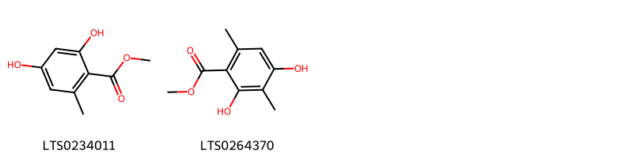{ width=100% }
    <figcaption>Hình ảnh cấu trúc hóa học của 2 hoạt chất thuộc nhóm Benzene and substituted derivatives gồm ['orsellinic acid methyl ester (LTS0234011)', 'atraric acid (LTS0264370)'].</figcaption>
</figure>
#### Nhóm Cinnamic acids and derivatives
<figure markdown="span">
    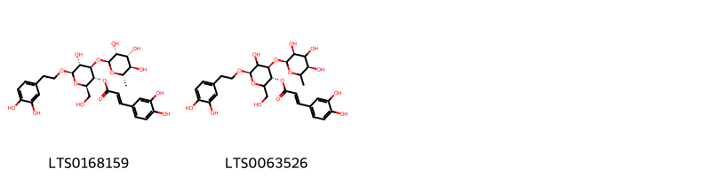{ width=100% }
    <figcaption>Hình ảnh cấu trúc hóa học của 2 hoạt chất thuộc nhóm Cinnamic acids and derivatives gồm ['verbascoside (LTS0168159)', '(3r,4r,6r)-6-[2-(3,4-dihydroxyphenyl)ethoxy]-5-hydroxy-2-(hydroxymethyl)-4-{[(2s,3s,5r)-3,4,5-trihydroxy-6-methyloxan-2-yl]oxy}oxan-3-yl (2e)-3-(3,4-dihydroxyphenyl)prop-2-enoate (LTS0063526)'].</figcaption>
</figure>
#### Nhóm Flavonoids
<figure markdown="span">
    { width=100% }
    <figcaption>Hình ảnh cấu trúc hóa học của 1 hoạt chất thuộc nhóm Flavonoids gồm ['linarin (LTS0160284)'].</figcaption>
</figure>
#### Nhóm Furanoid lignans
<figure markdown="span">
    { width=100% }
    <figcaption>Hình ảnh cấu trúc hóa học của 1 hoạt chất thuộc nhóm Furanoid lignans gồm ['sesamin (LTS0120161)'].</figcaption>
</figure>
#### Nhóm Organooxygen compounds
<figure markdown="span">
    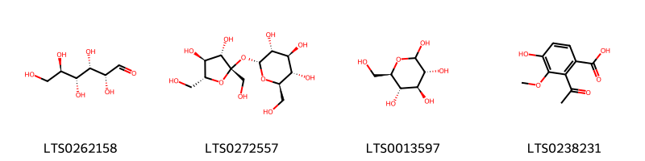{ width=100% }
    <figcaption>Hình ảnh cấu trúc hóa học của 4 hoạt chất thuộc nhóm Organooxygen compounds gồm ['(+)-glucose (LTS0262158)', 'sucrose (LTS0272557)', 'glucose (LTS0013597)', '2-acetyl-4-hydroxy-3-methoxybenzoic acid (LTS0238231)'].</figcaption>
</figure>
#### Nhóm Phenols
<figure markdown="span">
    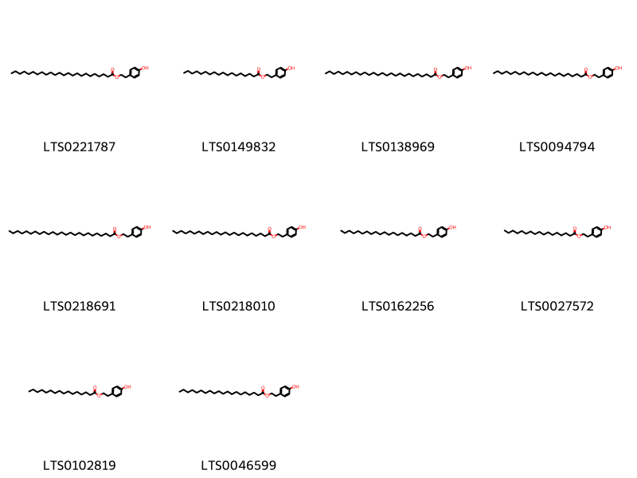{ width=100% }
    <figcaption>Hình ảnh cấu trúc hóa học của 10 hoạt chất thuộc nhóm Phenols gồm ['2-(4-hydroxyphenyl)ethyl tetracosanoate (LTS0221787)', '2-(4-hydroxyphenyl)ethyl octadecanoate (LTS0149832)', '2-(4-hydroxyphenyl)ethyl hexacosanoate (LTS0138969)', '2-(4-hydroxyphenyl)ethyl docosanoate (LTS0094794)', '2-(4-hydroxyphenyl)ethyl pentacosanoate (LTS0218691)', '2-(4-hydroxyphenyl)ethyl tricosanoate (LTS0218010)', '2-(4-hydroxyphenyl)ethyl nonadecanoate (LTS0162256)', '2-(4-hydroxyphenyl)ethyl heptadecanoate (LTS0027572)', '2-(4-hydroxyphenyl)ethyl hexadecanoate (LTS0102819)', '2-(4-hydroxyphenyl)ethyl icosanoate (LTS0046599)'].</figcaption>
</figure>
#### Nhóm Prenol lipids
<figure markdown="span">
    { width=100% }
    <figcaption>Hình ảnh cấu trúc hóa học của 1 hoạt chất thuộc nhóm Prenol lipids gồm ['aucubin (LTS0010822)'].</figcaption>
</figure>
#### Nhóm Steroids and steroid derivatives
<figure markdown="span">
    { width=100% }
    <figcaption>Hình ảnh cấu trúc hóa học của 3 hoạt chất thuộc nhóm Steroids and steroid derivatives gồm ['stigmast-5-en-3-ol, (3β)- (LTS0204616)', 'stigmast-5-en-3-ol (LTS0071224)', 'phytosterol (LTS0029311)'].</figcaption>
</figure>

---

### Dược dân tộc học

Danh sách các quốc gia có sử dụng *Buddleja cordata* trong điều trị các bệnh. 

| Country   | Disease   | Bệnh                                                                                                                                                                                                |
|:----------|:----------|:----------------------------------------------------------------------------------------------------------------------------------------------------------------------------------------------------|
| Mexico    | Diuretic  | MYMEMORY WARNING: YOU USED ALL AVAILABLE FREE TRANSLATIONS FOR TODAY. NEXT AVAILABLE IN  14 HOURS 36 MINUTES 09 SECONDS VISIT HTTPS://MYMEMORY.TRANSLATED.NET/DOC/USAGELIMITS.PHP TO TRANSLATE MORE |

---

---
## Buddleja curviflora
### Thông tin về thực vật

!!! info "Phân loại thực vật của *Buddleja curviflora* từ GIBF:"
    - **Kingdom:** Plantae
    - **Phylum:** Tracheophyta
    - **Order:** Lamiales
    - **Family:** Scrophulariaceae
    - **Genus:** Buddleja
    - **Species:** *Buddleja curviflora*

 

| Label (VI)   | Label (EN)   | Scientific Name     | Descriptions (VI)   | Descriptions (EN)   | Also Known As (VI)   | Also Known As (EN)   |
|:-------------|:-------------|:--------------------|:--------------------|:--------------------|:---------------------|:---------------------|
| N/A          | N/A          | Buddleja curviflora | loài thực vật       | species of plant    | ['']                 | ['']                 |

#### Phân bố trên thế giới

**Từ CSDL GIBF** nan, unknown or invalid, Japan, Portugal, New Zealand, United States of America, China, Chinese Taipei

#### Phân bố tại Việt Nam

**Từ CSDL GIBF**: Không có ghi nhận ở Việt Nam

---
### Thành phần hóa học
        
- Theo cơ sở dữ liệu lotus: Từ loài *Buddleja curviflora* đã phân lập và xác định được 2 hoạt chất thuộc về các nhóm Flavonoids, Prenol lipids. 

|    | chemicalTaxonomyClassyfireClass   |   smiles_count |
|---:|:----------------------------------|---------------:|
|  0 | Flavonoids                        |              1 |
|  1 | Prenol lipids                     |              1 |

#### Nhóm Flavonoids
<figure markdown="span">
    { width=100% }
    <figcaption>Hình ảnh cấu trúc hóa học của 1 hoạt chất thuộc nhóm Flavonoids gồm ['linarin (LTS0160284)'].</figcaption>
</figure>
#### Nhóm Prenol lipids
<figure markdown="span">
    { width=100% }
    <figcaption>Hình ảnh cấu trúc hóa học của 1 hoạt chất thuộc nhóm Prenol lipids gồm ['aucubin (LTS0010822)'].</figcaption>
</figure>

---

### Dược dân tộc học

Danh sách các quốc gia có sử dụng *Buddleja curviflora* trong điều trị các bệnh. 

| Country   | Disease   | Bệnh                                                                                                                                                                                                |
|:----------|:----------|:----------------------------------------------------------------------------------------------------------------------------------------------------------------------------------------------------|
| China     | Piscicide | MYMEMORY WARNING: YOU USED ALL AVAILABLE FREE TRANSLATIONS FOR TODAY. NEXT AVAILABLE IN  14 HOURS 35 MINUTES 32 SECONDS VISIT HTTPS://MYMEMORY.TRANSLATED.NET/DOC/USAGELIMITS.PHP TO TRANSLATE MORE |
| Japan     | Piscicide | MYMEMORY WARNING: YOU USED ALL AVAILABLE FREE TRANSLATIONS FOR TODAY. NEXT AVAILABLE IN  14 HOURS 35 MINUTES 29 SECONDS VISIT HTTPS://MYMEMORY.TRANSLATED.NET/DOC/USAGELIMITS.PHP TO TRANSLATE MORE |

---

---
## Buddleja lindleyana
### Thông tin về thực vật

!!! info "Phân loại thực vật của *Buddleja lindleyana* từ GIBF:"
    - **Kingdom:** Plantae
    - **Phylum:** Tracheophyta
    - **Order:** Lamiales
    - **Family:** Scrophulariaceae
    - **Genus:** Buddleja
    - **Species:** *Buddleja lindleyana*

 

| Label (VI)   | Label (EN)   | Scientific Name     | Descriptions (VI)   | Descriptions (EN)   | Also Known As (VI)   | Also Known As (EN)   |
|:-------------|:-------------|:--------------------|:--------------------|:--------------------|:---------------------|:---------------------|
| N/A          | N/A          | Buddleja lindleyana | loài thực vật       | species of plant    | ['']                 | ['Butterfly bush']   |

#### Phân bố trên thế giới

**Từ CSDL GIBF** France, India, United States of America, Italy, China

#### Phân bố tại Việt Nam

**Từ CSDL GIBF**: Không có ghi nhận ở Việt Nam

---
### Thành phần hóa học
        
- Theo cơ sở dữ liệu lotus: Từ loài *Buddleja lindleyana* đã phân lập và xác định được 9 hoạt chất thuộc về các nhóm Flavonoids, Saturated hydrocarbons, Phenanthrenes and derivatives, Tannins, Prenol lipids, Steroids and steroid derivatives. 

|    | chemicalTaxonomyClassyfireClass   |   smiles_count |
|---:|:----------------------------------|---------------:|
|  0 | Flavonoids                        |              1 |
|  1 | Phenanthrenes and derivatives     |              1 |
|  2 | Prenol lipids                     |              2 |
|  3 | Saturated hydrocarbons            |              1 |
|  4 | Steroids and steroid derivatives  |              3 |
|  5 | Tannins                           |              1 |

#### Nhóm Flavonoids
<figure markdown="span">
    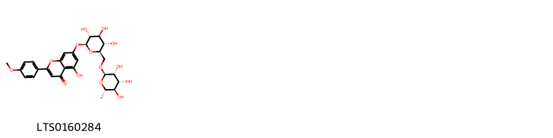{ width=100% }
    <figcaption>Hình ảnh cấu trúc hóa học của 1 hoạt chất thuộc nhóm Flavonoids gồm ['linarin (LTS0160284)'].</figcaption>
</figure>
#### Nhóm Phenanthrenes and derivatives
<figure markdown="span">
    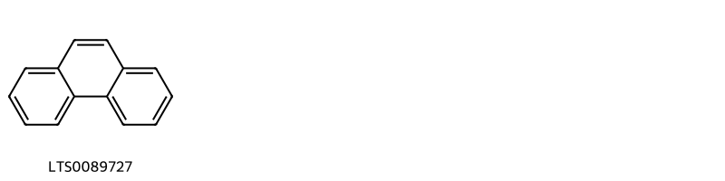{ width=100% }
    <figcaption>Hình ảnh cấu trúc hóa học của 1 hoạt chất thuộc nhóm Phenanthrenes and derivatives gồm ['phenanthrene (LTS0089727)'].</figcaption>
</figure>
#### Nhóm Prenol lipids
<figure markdown="span">
    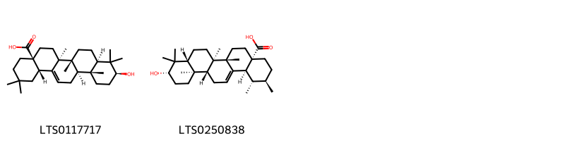{ width=100% }
    <figcaption>Hình ảnh cấu trúc hóa học của 2 hoạt chất thuộc nhóm Prenol lipids gồm ['oleanolic acid (LTS0117717)', 'ursolic acid (LTS0250838)'].</figcaption>
</figure>
#### Nhóm Saturated hydrocarbons
<figure markdown="span">
    { width=100% }
    <figcaption>Hình ảnh cấu trúc hóa học của 1 hoạt chất thuộc nhóm Saturated hydrocarbons gồm ['nonacosane (LTS0062747)'].</figcaption>
</figure>
#### Nhóm Steroids and steroid derivatives
<figure markdown="span">
    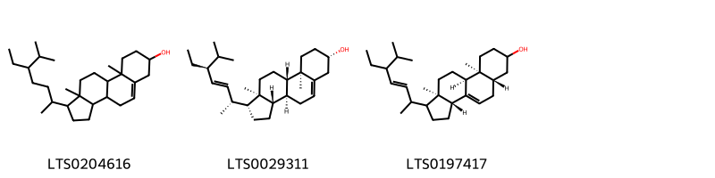{ width=100% }
    <figcaption>Hình ảnh cấu trúc hóa học của 3 hoạt chất thuộc nhóm Steroids and steroid derivatives gồm ['stigmast-5-en-3-ol, (3β)- (LTS0204616)', 'phytosterol (LTS0029311)', '(3ar,5as,9as,9bs,11ar)-1-(5-ethyl-6-methylhept-3-en-2-yl)-9a,11a-dimethyl-1h,2h,3h,3ah,5h,5ah,6h,7h,8h,9h,9bh,10h,11h-cyclopenta[a]phenanthren-7-ol (LTS0197417)'].</figcaption>
</figure>
#### Nhóm Tannins
<figure markdown="span">
    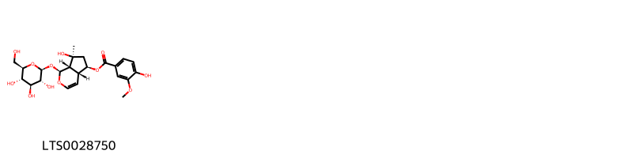{ width=100% }
    <figcaption>Hình ảnh cấu trúc hóa học của 1 hoạt chất thuộc nhóm Tannins gồm ['(1s,4ar,5r,7s,7as)-7-hydroxy-7-methyl-1-{[(2s,3r,4s,5s,6r)-3,4,5-trihydroxy-6-(hydroxymethyl)oxan-2-yl]oxy}-1h,4ah,5h,6h,7ah-cyclopenta[c]pyran-5-yl 4-hydroxy-3-methoxybenzoate (LTS0028750)'].</figcaption>
</figure>

---

### Dược dân tộc học

Danh sách các quốc gia có sử dụng *Buddleja lindleyana* trong điều trị các bệnh. 

| Country   | Disease   | Bệnh                                                                                                                                                                                                |
|:----------|:----------|:----------------------------------------------------------------------------------------------------------------------------------------------------------------------------------------------------|
| China     | Antidote  | MYMEMORY WARNING: YOU USED ALL AVAILABLE FREE TRANSLATIONS FOR TODAY. NEXT AVAILABLE IN  14 HOURS 34 MINUTES 53 SECONDS VISIT HTTPS://MYMEMORY.TRANSLATED.NET/DOC/USAGELIMITS.PHP TO TRANSLATE MORE |

---

---
## Buddleja madagascariensis
### Thông tin về thực vật

!!! info "Phân loại thực vật của *Buddleja madagascariensis* từ GIBF:"
    - **Kingdom:** Plantae
    - **Phylum:** Tracheophyta
    - **Order:** Lamiales
    - **Family:** Scrophulariaceae
    - **Genus:** Buddleja
    - **Species:** *Buddleja madagascariensis*

 

| Label (VI)   | Label (EN)   | Scientific Name           | Descriptions (VI)   | Descriptions (EN)   | Also Known As (VI)   | Also Known As (EN)   |
|:-------------|:-------------|:--------------------------|:--------------------|:--------------------|:---------------------|:---------------------|
| N/A          | N/A          | Buddleja madagascariensis | loài thực vật       | species of plant    | ['']                 | ['']                 |

#### Phân bố trên thế giới

**Từ CSDL GIBF** nan, Malawi, Spain, Chile, Rwanda, Australia, Puerto Rico, India, Belgium, Brazil, Saint Helena, Ascension and Tristan da Cunha, Norway, Uruguay, Portugal, Bermuda, South Africa, New Zealand, Cyprus, United States of America, Madagascar, Greece

#### Phân bố tại Việt Nam

**Từ CSDL GIBF**: Không có ghi nhận ở Việt Nam

---
### Thành phần hóa học
        
- Theo cơ sở dữ liệu lotus: Từ loài *Buddleja madagascariensis* đã phân lập và xác định được 20 hoạt chất thuộc về các nhóm Prenol lipids, Steroids and steroid derivatives, Flavonoids. 

|    | chemicalTaxonomyClassyfireClass   |   smiles_count |
|---:|:----------------------------------|---------------:|
|  0 | Flavonoids                        |              8 |
|  1 | Prenol lipids                     |              9 |
|  2 | Steroids and steroid derivatives  |              3 |

#### Nhóm Flavonoids
<figure markdown="span">
    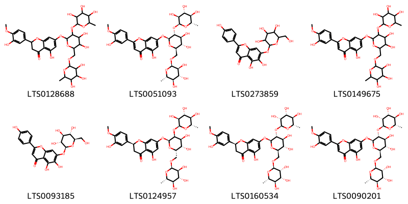{ width=100% }
    <figcaption>Hình ảnh cấu trúc hóa học của 8 hoạt chất thuộc nhóm Flavonoids gồm ['7-({4,5-dihydroxy-3-[(3,4,5-trihydroxy-6-methyloxan-2-yl)oxy]-6-{[(3,4,5-trihydroxy-6-methyloxan-2-yl)oxy]methyl}oxan-2-yl}oxy)-5-hydroxy-2-(3-hydroxy-4-methoxyphenyl)-2,3-dihydro-1-benzopyran-4-one (LTS0128688)', '7-{[(2s,3r,4s,5s,6r)-4,5-dihydroxy-3-{[(2s,3s,4r,5r,6s)-3,4,5-trihydroxy-6-methyloxan-2-yl]oxy}-6-({[(2r,3s,4r,5r,6s)-3,4,5-trihydroxy-6-methyloxan-2-yl]oxy}methyl)oxan-2-yl]oxy}-5-hydroxy-2-(3-hydroxy-4-methoxyphenyl)chromen-4-one (LTS0051093)', '5,6-dihydroxy-2-(4-hydroxyphenyl)-7-{[3,4,5-trihydroxy-6-(hydroxymethyl)oxan-2-yl]oxy}chromen-4-one (LTS0273859)', '7-({4,5-dihydroxy-3-[(3,4,5-trihydroxy-6-methyloxan-2-yl)oxy]-6-{[(3,4,5-trihydroxy-6-methyloxan-2-yl)oxy]methyl}oxan-2-yl}oxy)-5-hydroxy-2-(3-hydroxy-4-methoxyphenyl)chromen-4-one (LTS0149675)', 'plantaginin (LTS0093185)', '(2s)-7-{[(2s,3s,4s,5s,6s)-4,5-dihydroxy-3-{[(2s,3s,4r,5r,6s)-3,4,5-trihydroxy-6-methyloxan-2-yl]oxy}-6-({[(2r,3s,4r,5r,6s)-3,4,5-trihydroxy-6-methyloxan-2-yl]oxy}methyl)oxan-2-yl]oxy}-5-hydroxy-2-(3-hydroxy-4-methoxyphenyl)-2,3-dihydro-1-benzopyran-4-one (LTS0124957)', '(2s)-7-{[(2s,3r,4s,5s,6r)-4,5-dihydroxy-3-{[(2s,3r,4r,5r,6s)-3,4,5-trihydroxy-6-methyloxan-2-yl]oxy}-6-({[(2r,3r,4r,5r,6s)-3,4,5-trihydroxy-6-methyloxan-2-yl]oxy}methyl)oxan-2-yl]oxy}-5-hydroxy-2-(3-hydroxy-4-methoxyphenyl)-2,3-dihydro-1-benzopyran-4-one (LTS0160534)', '7-{[(2s,3r,4s,5s,6r)-4,5-dihydroxy-3-{[(2s,3r,4r,5r,6s)-3,4,5-trihydroxy-6-methyloxan-2-yl]oxy}-6-({[(2r,3r,4r,5r,6s)-3,4,5-trihydroxy-6-methyloxan-2-yl]oxy}methyl)oxan-2-yl]oxy}-5-hydroxy-2-(3-hydroxy-4-methoxyphenyl)chromen-4-one (LTS0090201)'].</figcaption>
</figure>
#### Nhóm Prenol lipids
<figure markdown="span">
    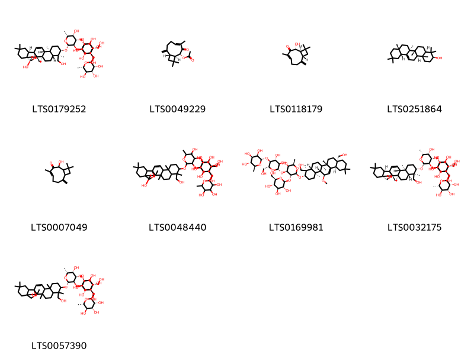{ width=100% }
    <figcaption>Hình ảnh cấu trúc hóa học của 9 hoạt chất thuộc nhóm Prenol lipids gồm ['(2s,3r,4r,5r,6s)-2-{[(2r,3s,4r,5r,6s)-4,5-dihydroxy-6-{[(2r,3s,4s,5r,6r)-3-hydroxy-6-{[(1s,2s,4s,5r,8r,9r,10s,13s,14r,17s,18r)-2-hydroxy-9-(hydroxymethyl)-4,5,9,13,20,20-hexamethyl-24-oxahexacyclo[15.5.2.0¹,¹⁸.0⁴,¹⁷.0⁵,¹⁴.0⁸,¹³]tetracos-15-en-10-yl]oxy}-2-methyl-5-{[(2s,3r,4s,5s,6r)-3,4,5-trihydroxy-6-(hydroxymethyl)oxan-2-yl]oxy}oxan-4-yl]oxy}-2-(hydroxymethyl)oxan-3-yl]oxy}-6-methyloxane-3,4,5-triol (LTS0179252)', 'buddledin a (LTS0049229)', '(1r,2r,4e,9s)-2-hydroxy-4,11,11-trimethyl-8-methylidenebicyclo[7.2.0]undec-4-en-3-one (LTS0118179)', 'β-amyrin (LTS0251864)', '(4e)-2-hydroxy-4,11,11-trimethyl-8-methylidenebicyclo[7.2.0]undec-4-en-3-one (LTS0007049)', '2-({4,5-dihydroxy-6-[(3-hydroxy-6-{[2-hydroxy-9-(hydroxymethyl)-4,5,9,13,20,20-hexamethyl-24-oxahexacyclo[15.5.2.0¹,¹⁸.0⁴,¹⁷.0⁵,¹⁴.0⁸,¹³]tetracos-15-en-10-yl]oxy}-2-methyl-5-{[3,4,5-trihydroxy-6-(hydroxymethyl)oxan-2-yl]oxy}oxan-4-yl)oxy]-2-(hydroxymethyl)oxan-3-yl}oxy)-6-methyloxane-3,4,5-triol (LTS0048440)', '(2s,3r,4r,5r,6s)-2-{[(2r,3s,4r,5r,6s)-6-{[(2r,3r,4s,5s,6r)-2-{[(3s,4r,4ar,6ar,6bs,8as,12as,14r,14ar,14bs)-4,8a-bis(hydroxymethyl)-14-methoxy-4,6a,6b,11,11,14b-hexamethyl-1,2,3,4a,5,6,7,8,9,10,12,12a,14,14a-tetradecahydropicen-3-yl]oxy}-5-hydroxy-6-methyl-3-{[(2s,3r,4s,5s,6r)-3,4,5-trihydroxy-6-(hydroxymethyl)oxan-2-yl]oxy}oxan-4-yl]oxy}-4,5-dihydroxy-2-(hydroxymethyl)oxan-3-yl]oxy}-6-methyloxane-3,4,5-triol (LTS0169981)', '(2s,3r,4r,5r,6s)-2-{[(2r,3s,4r,5r,6s)-4,5-dihydroxy-6-{[(2r,3s,4s,5r,6r)-3-hydroxy-6-{[(1s,4s,5r,8r,9r,10s,13s,14r,17s,18r)-9-(hydroxymethyl)-4,5,9,13,20,20-hexamethyl-24-oxahexacyclo[15.5.2.0¹,¹⁸.0⁴,¹⁷.0⁵,¹⁴.0⁸,¹³]tetracos-15-en-10-yl]oxy}-2-methyl-5-{[(2s,3r,4s,5s,6r)-3,4,5-trihydroxy-6-(hydroxymethyl)oxan-2-yl]oxy}oxan-4-yl]oxy}-2-(hydroxymethyl)oxan-3-yl]oxy}-6-methyloxane-3,4,5-triol (LTS0032175)', '(2s,3r,4r,5r,6s)-2-{[(2r,3s,4r,5r,6s)-4,5-dihydroxy-6-{[(2r,3s,4s,5r,6r)-3-hydroxy-6-{[9-(hydroxymethyl)-4,5,9,13,20,20-hexamethyl-24-oxahexacyclo[15.5.2.0¹,¹⁸.0⁴,¹⁷.0⁵,¹⁴.0⁸,¹³]tetracos-15-en-10-yl]oxy}-2-methyl-5-{[(2s,3r,4s,5s,6r)-3,4,5-trihydroxy-6-(hydroxymethyl)oxan-2-yl]oxy}oxan-4-yl]oxy}-2-(hydroxymethyl)oxan-3-yl]oxy}-6-methyloxane-3,4,5-triol (LTS0057390)'].</figcaption>
</figure>
#### Nhóm Steroids and steroid derivatives
<figure markdown="span">
    { width=100% }
    <figcaption>Hình ảnh cấu trúc hóa học của 3 hoạt chất thuộc nhóm Steroids and steroid derivatives gồm ['stigmast-5-en-3-ol, (3β)- (LTS0204616)', 'stigmast-5-en-3-ol (LTS0071224)', 'phytosterol (LTS0029311)'].</figcaption>
</figure>

---

### Dược dân tộc học

Danh sách các quốc gia có sử dụng *Buddleja madagascariensis* trong điều trị các bệnh. 

| Country    | Disease   | Bệnh                                                                                                                                                                                                |
|:-----------|:----------|:----------------------------------------------------------------------------------------------------------------------------------------------------------------------------------------------------|
| Madagascar | Soap      | MYMEMORY WARNING: YOU USED ALL AVAILABLE FREE TRANSLATIONS FOR TODAY. NEXT AVAILABLE IN  14 HOURS 34 MINUTES 21 SECONDS VISIT HTTPS://MYMEMORY.TRANSLATED.NET/DOC/USAGELIMITS.PHP TO TRANSLATE MORE |

---

---
## Buddleja marrubiifolia
### Thông tin về thực vật

!!! info "Phân loại thực vật của *Buddleja marrubiifolia* từ GIBF:"
    - **Kingdom:** Plantae
    - **Phylum:** Tracheophyta
    - **Order:** Lamiales
    - **Family:** Scrophulariaceae
    - **Genus:** Buddleja
    - **Species:** *Buddleja marrubiifolia*

 

| Label (VI)   | Label (EN)   | Scientific Name        | Descriptions (VI)   | Descriptions (EN)   | Also Known As (VI)   | Also Known As (EN)   |
|:-------------|:-------------|:-----------------------|:--------------------|:--------------------|:---------------------|:---------------------|
| N/A          | N/A          | Buddleja marrubiifolia | loài thực vật       | species of plant    | ['']                 | ['']                 |

#### Phân bố trên thế giới

**Từ CSDL GIBF** nan, United States of America, Mexico

#### Phân bố tại Việt Nam

**Từ CSDL GIBF**: Không có ghi nhận ở Việt Nam

---
### Thành phần hóa học
        
- Theo cơ sở dữ liệu lotus: Từ loài *Buddleja marrubiifolia* đã phân lập và xác định được Chưa có hoạt chất nào được phân lập. hoạt chất thuộc về các nhóm Không có hoạt chất nào được phân lập. 

Không có hình ảnh nào được tạo ra

---

### Dược dân tộc học

Danh sách các quốc gia có sử dụng *Buddleja marrubiifolia* trong điều trị các bệnh. 

| Country   | Disease           | Bệnh                                                                                                                                                                                                |
|:----------|:------------------|:----------------------------------------------------------------------------------------------------------------------------------------------------------------------------------------------------|
| Elsewhere | Diuretic, Apertif | MYMEMORY WARNING: YOU USED ALL AVAILABLE FREE TRANSLATIONS FOR TODAY. NEXT AVAILABLE IN  14 HOURS 33 MINUTES 43 SECONDS VISIT HTTPS://MYMEMORY.TRANSLATED.NET/DOC/USAGELIMITS.PHP TO TRANSLATE MORE |

---

---
## Buddleja marubifolia
### Thông tin về thực vật

!!! info "Phân loại thực vật của *Buddleja marrubiifolia* từ GIBF:"
    - **Kingdom:** Plantae
    - **Phylum:** Tracheophyta
    - **Order:** Lamiales
    - **Family:** Scrophulariaceae
    - **Genus:** Buddleja
    - **Species:** *Buddleja marrubiifolia*

 

| Label (VI)   | Label (EN)   | Scientific Name        | Descriptions (VI)   | Descriptions (EN)   | Also Known As (VI)   | Also Known As (EN)   |
|:-------------|:-------------|:-----------------------|:--------------------|:--------------------|:---------------------|:---------------------|
| N/A          | N/A          | Buddleja marrubiifolia | loài thực vật       | species of plant    | ['']                 | ['']                 |

#### Phân bố trên thế giới

**Từ CSDL GIBF** nan, United States of America, Mexico

#### Phân bố tại Việt Nam

**Từ CSDL GIBF**: Không có ghi nhận ở Việt Nam

---
### Thành phần hóa học
        
- Theo cơ sở dữ liệu lotus: Từ loài *Buddleja marrubiifolia* đã phân lập và xác định được Chưa có hoạt chất nào được phân lập. hoạt chất thuộc về các nhóm Không có hoạt chất nào được phân lập. 

Không có hình ảnh nào được tạo ra

---

### Dược dân tộc học

Danh sách các quốc gia có sử dụng *Buddleja marrubiifolia* trong điều trị các bệnh. 

| Country   | Disease   | Bệnh                                                                                                                                                                                                |
|:----------|:----------|:----------------------------------------------------------------------------------------------------------------------------------------------------------------------------------------------------|
| Mexico    | Diuretic  | MYMEMORY WARNING: YOU USED ALL AVAILABLE FREE TRANSLATIONS FOR TODAY. NEXT AVAILABLE IN  14 HOURS 33 MINUTES 09 SECONDS VISIT HTTPS://MYMEMORY.TRANSLATED.NET/DOC/USAGELIMITS.PHP TO TRANSLATE MORE |

---

---
## Buddleja sessiliflora
### Thông tin về thực vật

!!! info "Phân loại thực vật của *Buddleja sessiliflora* từ GIBF:"
    - **Kingdom:** Plantae
    - **Phylum:** Tracheophyta
    - **Order:** Lamiales
    - **Family:** Scrophulariaceae
    - **Genus:** Buddleja
    - **Species:** *Buddleja sessiliflora*

 

| Label (VI)   | Label (EN)   | Scientific Name       | Descriptions (VI)   | Descriptions (EN)   | Also Known As (VI)   | Also Known As (EN)            |
|:-------------|:-------------|:----------------------|:--------------------|:--------------------|:---------------------|:------------------------------|
| N/A          | N/A          | Buddleja sessiliflora | loài thực vật       | species of plant    | ['']                 | ['Rio Grande butterfly-bush'] |

#### Phân bố trên thế giới

**Từ CSDL GIBF** United States of America, Mexico

#### Phân bố tại Việt Nam

**Từ CSDL GIBF**: Không có ghi nhận ở Việt Nam

---
### Thành phần hóa học
        
- Theo cơ sở dữ liệu lotus: Từ loài *Buddleja sessiliflora* đã phân lập và xác định được 3 hoạt chất thuộc về các nhóm Furanoid lignans, Prenol lipids. 

|    | chemicalTaxonomyClassyfireClass   |   smiles_count |
|---:|:----------------------------------|---------------:|
|  0 | Furanoid lignans                  |              1 |
|  1 | Prenol lipids                     |              2 |

#### Nhóm Furanoid lignans
<figure markdown="span">
    { width=100% }
    <figcaption>Hình ảnh cấu trúc hóa học của 1 hoạt chất thuộc nhóm Furanoid lignans gồm ['sesamin (LTS0120161)'].</figcaption>
</figure>
#### Nhóm Prenol lipids
<figure markdown="span">
    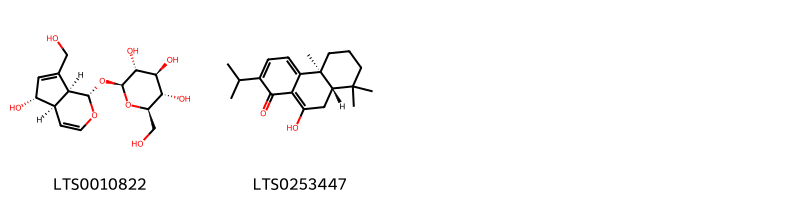{ width=100% }
    <figcaption>Hình ảnh cấu trúc hóa học của 2 hoạt chất thuộc nhóm Prenol lipids gồm ['aucubin (LTS0010822)', '(4bs,8as)-10-hydroxy-2-isopropyl-4b,8,8-trimethyl-6,7,8a,9-tetrahydro-5h-phenanthren-1-one (LTS0253447)'].</figcaption>
</figure>

---

### Dược dân tộc học

Danh sách các quốc gia có sử dụng *Buddleja sessiliflora* trong điều trị các bệnh. 

| Country   | Disease   | Bệnh                                                                                                                                                                                                |
|:----------|:----------|:----------------------------------------------------------------------------------------------------------------------------------------------------------------------------------------------------|
| Mexico    | Vulnerary | MYMEMORY WARNING: YOU USED ALL AVAILABLE FREE TRANSLATIONS FOR TODAY. NEXT AVAILABLE IN  14 HOURS 32 MINUTES 43 SECONDS VISIT HTTPS://MYMEMORY.TRANSLATED.NET/DOC/USAGELIMITS.PHP TO TRANSLATE MORE |

---

---
## Buddleja tucumanensis
### Thông tin về thực vật

!!! info "Phân loại thực vật của *Buddleja tucumanensis* từ GIBF:"
    - **Kingdom:** Plantae
    - **Phylum:** Tracheophyta
    - **Order:** Lamiales
    - **Family:** Scrophulariaceae
    - **Genus:** Buddleja
    - **Species:** *Buddleja tucumanensis*

 

| Label (VI)   | Label (EN)   | Scientific Name       | Descriptions (VI)   | Descriptions (EN)   | Also Known As (VI)   | Also Known As (EN)   |
|:-------------|:-------------|:----------------------|:--------------------|:--------------------|:---------------------|:---------------------|
| N/A          | N/A          | Buddleja tucumanensis | loài thực vật       | species of plant    | ['']                 | ['']                 |

#### Phân bố trên thế giới

**Từ CSDL GIBF** nan, Colombia, Argentina, Bolivia (Plurinational State of)

#### Phân bố tại Việt Nam

**Từ CSDL GIBF**: Không có ghi nhận ở Việt Nam

---
### Thành phần hóa học
        
- Theo cơ sở dữ liệu lotus: Từ loài *Buddleja tucumanensis* đã phân lập và xác định được Chưa có hoạt chất nào được phân lập. hoạt chất thuộc về các nhóm Không có hoạt chất nào được phân lập. 

Không có hình ảnh nào được tạo ra

---

### Dược dân tộc học

Danh sách các quốc gia có sử dụng *Buddleja tucumanensis* trong điều trị các bệnh. 

| Country   | Disease               | Bệnh                                                                                                                                                                                                |
|:----------|:----------------------|:----------------------------------------------------------------------------------------------------------------------------------------------------------------------------------------------------|
| Argentina | Astringent, Stimulant | MYMEMORY WARNING: YOU USED ALL AVAILABLE FREE TRANSLATIONS FOR TODAY. NEXT AVAILABLE IN  14 HOURS 32 MINUTES 16 SECONDS VISIT HTTPS://MYMEMORY.TRANSLATED.NET/DOC/USAGELIMITS.PHP TO TRANSLATE MORE |

---

---
## Buddleja yunnanensis
### Thông tin về thực vật

!!! info "Phân loại thực vật của *Buddleja yunnanensis* từ GIBF:"
    - **Kingdom:** Plantae
    - **Phylum:** Tracheophyta
    - **Order:** Lamiales
    - **Family:** Scrophulariaceae
    - **Genus:** Buddleja
    - **Species:** *Buddleja yunnanensis*

 

| Label (VI)   | Label (EN)   | Scientific Name      | Descriptions (VI)   | Descriptions (EN)   | Also Known As (VI)   | Also Known As (EN)   |
|:-------------|:-------------|:---------------------|:--------------------|:--------------------|:---------------------|:---------------------|
| N/A          | N/A          | Buddleja yunnanensis | loài thực vật       | species of plant    | ['']                 | ['']                 |

#### Phân bố trên thế giới

**Từ CSDL GIBF** nan, China

#### Phân bố tại Việt Nam

**Từ CSDL GIBF**: Không có ghi nhận ở Việt Nam

---
### Thành phần hóa học
        
- Theo cơ sở dữ liệu lotus: Từ loài *Buddleja yunnanensis* đã phân lập và xác định được 9 hoạt chất thuộc về các nhóm Steroids and steroid derivatives, Organooxygen compounds, Cinnamic acids and derivatives. 

|    | chemicalTaxonomyClassyfireClass   |   smiles_count |
|---:|:----------------------------------|---------------:|
|  0 | Cinnamic acids and derivatives    |              2 |
|  1 | Organooxygen compounds            |              5 |
|  2 | Steroids and steroid derivatives  |              2 |

#### Nhóm Cinnamic acids and derivatives
<figure markdown="span">
    { width=100% }
    <figcaption>Hình ảnh cấu trúc hóa học của 2 hoạt chất thuộc nhóm Cinnamic acids and derivatives gồm ['verbascoside (LTS0168159)', '(3r,4r,6r)-6-[2-(3,4-dihydroxyphenyl)ethoxy]-5-hydroxy-2-(hydroxymethyl)-4-{[(2s,3s,5r)-3,4,5-trihydroxy-6-methyloxan-2-yl]oxy}oxan-3-yl (2e)-3-(3,4-dihydroxyphenyl)prop-2-enoate (LTS0063526)'].</figcaption>
</figure>
#### Nhóm Organooxygen compounds
<figure markdown="span">
    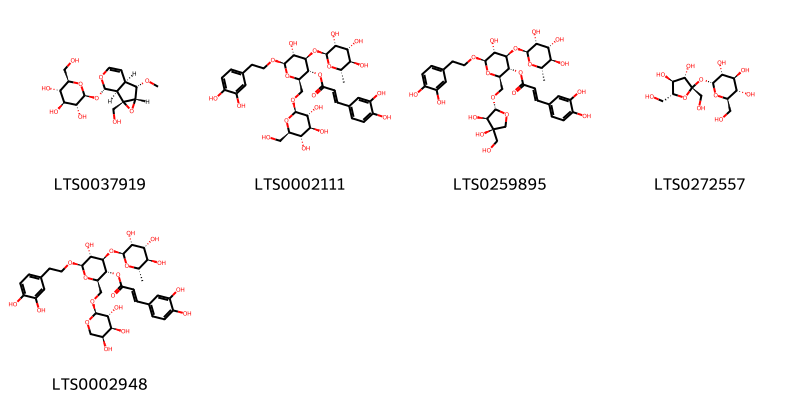{ width=100% }
    <figcaption>Hình ảnh cấu trúc hóa học của 5 hoạt chất thuộc nhóm Organooxygen compounds gồm ['(2r,3s,4s,5r,6s)-2-(hydroxymethyl)-6-{[(1s,2s,4s,5s,6r,10s)-2-(hydroxymethyl)-5-methoxy-3,9-dioxatricyclo[4.4.0.0²,⁴]dec-7-en-10-yl]oxy}oxane-3,4,5-triol (LTS0037919)', 'echinacoside (LTS0002111)', '(2r,3r,4r,5r,6r)-2-({[(2r,3r,4r)-3,4-dihydroxy-4-(hydroxymethyl)oxolan-2-yl]oxy}methyl)-6-[2-(3,4-dihydroxyphenyl)ethoxy]-5-hydroxy-4-{[(2s,3r,4r,5r,6s)-3,4,5-trihydroxy-6-methyloxan-2-yl]oxy}oxan-3-yl (2e)-3-(3,4-dihydroxyphenyl)prop-2-enoate (LTS0259895)', 'sucrose (LTS0272557)', '(2r,3r,4r,5r,6r)-6-[2-(3,4-dihydroxyphenyl)ethoxy]-5-hydroxy-4-{[(2s,3r,4r,5r,6s)-3,4,5-trihydroxy-6-methyloxan-2-yl]oxy}-2-({[(2s,3r,4s,5s)-3,4,5-trihydroxyoxan-2-yl]oxy}methyl)oxan-3-yl (2e)-3-(3,4-dihydroxyphenyl)prop-2-enoate (LTS0002948)'].</figcaption>
</figure>
#### Nhóm Steroids and steroid derivatives
<figure markdown="span">
    { width=100% }
    <figcaption>Hình ảnh cấu trúc hóa học của 2 hoạt chất thuộc nhóm Steroids and steroid derivatives gồm ['stigmast-5-en-3-ol, (3β)- (LTS0204616)', 'stigmast-5-en-3-ol (LTS0071224)'].</figcaption>
</figure>

---

### Dược dân tộc học

Danh sách các quốc gia có sử dụng *Buddleja yunnanensis* trong điều trị các bệnh. 

| Country   | Disease   | Bệnh                                                                                                                                                                                                |
|:----------|:----------|:----------------------------------------------------------------------------------------------------------------------------------------------------------------------------------------------------|
| China     | Poison    | MYMEMORY WARNING: YOU USED ALL AVAILABLE FREE TRANSLATIONS FOR TODAY. NEXT AVAILABLE IN  14 HOURS 31 MINUTES 37 SECONDS VISIT HTTPS://MYMEMORY.TRANSLATED.NET/DOC/USAGELIMITS.PHP TO TRANSLATE MORE |

---

# Chi Gelsemium

??? note "Danh sách các dược liệu thuộc chi"
    
	 - *Gelsemium elegans*
	 - *Gelsemium sempervirens*

---
## Gelsemium elegans
### Thông tin về thực vật

!!! info "Phân loại thực vật của *Gelsemium elegans* từ GIBF:"
    - **Kingdom:** Plantae
    - **Phylum:** Tracheophyta
    - **Order:** Gentianales
    - **Family:** Gelsemiaceae
    - **Genus:** Gelsemium
    - **Species:** *Gelsemium elegans*

 

| Label (VI)   | Label (EN)   | Scientific Name   | Descriptions (VI)   | Descriptions (EN)   | Also Known As (VI)                                       | Also Known As (EN)   |
|:-------------|:-------------|:------------------|:--------------------|:--------------------|:---------------------------------------------------------|:---------------------|
| N/A          | N/A          | Gelsemium elegans | loài thực vật       | species of plant    | ['Gelsemium elegans', 'Đoạn trường thảo', 'Cây lá ngón'] | ['']                 |

#### Phân bố trên thế giới

**Từ CSDL GIBF** Viet Nam, Chinese Taipei, Thailand, unknown or invalid, Malaysia, Indonesia, Lao People’s Democratic Republic, United States of America, China, Cambodia, Hong Kong

#### Phân bố tại Việt Nam

**Từ CSDL GIBF**: Cao Bang, Đăk Nông, Son La, Lam Dong, Lào Cai, Lâm Đồng, Kon Tum, Hoa Binh, Lai Chau

---
### Thành phần hóa học
        
- Theo cơ sở dữ liệu lotus: Từ loài *Gelsemium elegans* đã phân lập và xác định được 177 hoạt chất thuộc về các nhóm Furopyrans, Indoles and derivatives, Coumarins and derivatives, Azobenzenes, Isoquinolines and derivatives, Gelsemium alkaloids, Prenol lipids, Pyrrolidines, Phenols, Vobasan alkaloids, Macroline alkaloids. 

|    | chemicalTaxonomyClassyfireClass   |   smiles_count |
|---:|:----------------------------------|---------------:|
|  0 | Azobenzenes                       |              2 |
|  1 | Coumarins and derivatives         |              1 |
|  2 | Furopyrans                        |              6 |
|  3 | Gelsemium alkaloids               |             69 |
|  4 | Indoles and derivatives           |             63 |
|  5 | Isoquinolines and derivatives     |              1 |
|  6 | Macroline alkaloids               |             12 |
|  7 | Phenols                           |              2 |
|  8 | Prenol lipids                     |             10 |
|  9 | Pyrrolidines                      |              8 |
| 10 | Vobasan alkaloids                 |              2 |

#### Nhóm Azobenzenes
<figure markdown="span">
    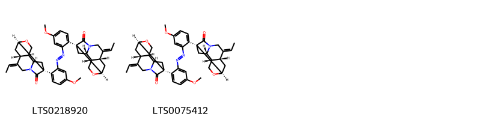{ width=100% }
    <figcaption>Hình ảnh cấu trúc hóa học của 2 hoạt chất thuộc nhóm Azobenzenes gồm ['(1r,3r,8s,10s,11s)-4-ethylidene-8-{2-[(1e)-2-{2-[(1r,3r,4z,8s,10s,11s)-4-ethylidene-7-oxo-13-oxa-6-azatetracyclo[6.5.0.0³,¹¹.0⁶,¹⁰]tridecan-8-yl]-5-methoxyphenyl}diazen-1-yl]-4-methoxyphenyl}-13-oxa-6-azatetracyclo[6.5.0.0³,¹¹.0⁶,¹⁰]tridecan-7-one (LTS0218920)', '(1r,3r,4z,8s,10s,11s)-4-ethylidene-8-{2-[(1e)-2-{2-[(1r,3r,4z,8s,10s,11s)-4-ethylidene-7-oxo-13-oxa-6-azatetracyclo[6.5.0.0³,¹¹.0⁶,¹⁰]tridecan-8-yl]-5-methoxyphenyl}diazen-1-yl]-4-methoxyphenyl}-13-oxa-6-azatetracyclo[6.5.0.0³,¹¹.0⁶,¹⁰]tridecan-7-one (LTS0075412)'].</figcaption>
</figure>
#### Nhóm Coumarins and derivatives
<figure markdown="span">
    { width=100% }
    <figcaption>Hình ảnh cấu trúc hóa học của 1 hoạt chất thuộc nhóm Coumarins and derivatives gồm ['scopoletin (LTS0193112)'].</figcaption>
</figure>
#### Nhóm Furopyrans
<figure markdown="span">
    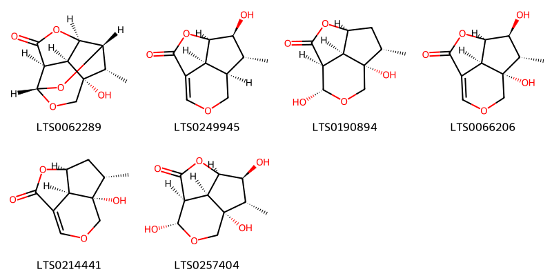{ width=100% }
    <figcaption>Hình ảnh cấu trúc hóa học của 6 hoạt chất thuộc nhóm Furopyrans gồm ['(1s,2s,3s,6r,7s,9s,12s)-1-hydroxy-12-methyl-5,8,10-trioxatetracyclo[5.4.1.0²,⁶.0³,⁹]dodecan-4-one (LTS0062289)', '(4r,5s,6r,7r,11s)-5-hydroxy-6-methyl-3,9-dioxatricyclo[5.3.1.0⁴,¹¹]undec-1(10)-en-2-one (LTS0249945)', '(1s,4s,6s,7s,10s,11s)-7,10-dihydroxy-6-methyl-3,9-dioxatricyclo[5.3.1.0⁴,¹¹]undecan-2-one (LTS0190894)', '(4r,5s,6s,7s,11s)-5,7-dihydroxy-6-methyl-3,9-dioxatricyclo[5.3.1.0⁴,¹¹]undec-1(10)-en-2-one (LTS0066206)', '(4s,6s,7s,11s)-7-hydroxy-6-methyl-3,9-dioxatricyclo[5.3.1.0⁴,¹¹]undec-1(10)-en-2-one (LTS0214441)', '(1s,4r,5s,6s,7s,10s,11s)-5,7,10-trihydroxy-6-methyl-3,9-dioxatricyclo[5.3.1.0⁴,¹¹]undecan-2-one (LTS0257404)'].</figcaption>
</figure>
#### Nhóm Gelsemium alkaloids
<figure markdown="span">
    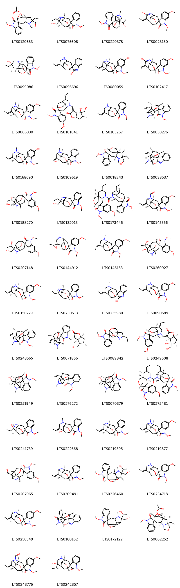{ width=100% }
    <figcaption>Hình ảnh cấu trúc hóa học của 69 hoạt chất thuộc nhóm Gelsemium alkaloids gồm ["2'-ethyl-1-methoxy-2-oxo-4',11'-dioxa-6'-azaspiro[indole-3,9'-tetracyclo[8.3.1.0²,⁶.0⁷,¹³]tetradecan]-14'-yl acetate (LTS0120653)", "(1'r,3s,4's,6'r,7'r,8's)-6'-ethyl-6'-(hydroxymethyl)-1-methoxy-10'-oxa-5'-azaspiro[indole-3,2'-tricyclo[5.3.1.0⁴,⁸]undecan]-2-one (LTS0075608)", "2'-(1-hydroxyethyl)-1-methoxy-4'-methyl-9'-oxa-4'-azaspiro[indole-3,7'-tetracyclo[6.3.1.0²,⁶.0⁵,¹¹]dodecan]-2-one (LTS0220378)", "7'-ethylidene-6'-hydroxy-1,6-dimethoxy-11'-oxa-5'-azaspiro[indole-3,2'-tricyclo[6.3.1.0⁴,⁹]dodecan]-5'-en-2-one (LTS0023150)", "(1's,3s,4's,7's,8's,9's,12's)-7'-ethyl-7',12'-dihydroxy-1-methoxy-11'-oxa-5'-azaspiro[indole-3,2'-tricyclo[6.3.1.0⁴,⁹]dodecan]-2-one (LTS0099086)", "(7'z)-7'-ethylidene-11'-oxa-5'-azaspiro[indole-3,2'-tricyclo[6.3.1.0⁴,⁹]dodecan]-2-ol (LTS0096696)", "(1's,3s,4's,8's,9'r)-7'-ethylidene-6-hydroxy-1-methoxy-11'-oxa-5'-azaspiro[indole-3,2'-tricyclo[6.3.1.0⁴,⁹]dodecan]-2-one (LTS0080059)", "(1'r,3s,4's,7'e,8'r,9's)-7'-ethylidene-6'-hydroxy-1,6-dimethoxy-11'-oxa-5'-azaspiro[indole-3,2'-tricyclo[6.3.1.0⁴,⁹]dodecan]-5'-en-2-one (LTS0102417)", "(1's,3r,4'r,7'z,8's,9'r)-7'-ethylidene-1,6-dimethoxy-5'-methyl-11'-oxa-5'-azaspiro[indole-3,2'-tricyclo[6.3.1.0⁴,⁹]dodecan]-2-one (LTS0086330)", "7'-ethylidene-5'-{[4-hydroxy-4-(hydroxymethyl)-5-methyl-2-oxo-tetrahydrocyclopenta[b]furan-3-ylidene]methyl}-1,6-dimethoxy-11'-oxa-5'-azaspiro[indole-3,2'-tricyclo[6.3.1.0⁴,⁹]dodecan]-2-one (LTS0101641)", "(7'z)-7'-ethylidene-1-methoxy-5'-methyl-11'-oxa-5'-azaspiro[indole-3,2'-tricyclo[6.3.1.0⁴,⁹]dodecan]-2-one (LTS0103267)", "(1'r,2's,3s,5'r,6's,8'r,11's)-2'-ethenyl-1-methoxy-4'-methyl-9'-oxa-4'-azaspiro[indole-3,7'-tetracyclo[6.3.1.0²,⁶.0⁵,¹¹]dodecan]-2-one (LTS0033276)", "(1's,3s,7'z,8'r)-7'-ethylidene-6-hydroxy-1-methoxy-5'-methyl-11'-oxa-5'-azaspiro[indole-3,2'-tricyclo[6.3.1.0⁴,⁹]dodecan]-2-one (LTS0168690)", "(1'r,3s,4's,7'z,8's,9's)-7'-ethylidene-8'-hydroxy-1-methoxy-5'-methyl-11'-oxa-5'-azaspiro[indole-3,2'-tricyclo[6.3.1.0⁴,⁹]dodecan]-2-one (LTS0109619)", "(1'r,3s,4's,6'r,7'r,8's)-6'-ethyl-6'-(hydroxymethyl)-1-methoxy-5'-methyl-10'-oxa-5'-azaspiro[indole-3,2'-tricyclo[5.3.1.0⁴,⁸]undecan]-2-one (LTS0018243)", "(1'r,2's,3s,5's,6's,8'r,11's)-2'-ethenyl-4'-methyl-9'-oxa-4'-azaspiro[indole-3,7'-tetracyclo[6.3.1.0²,⁶.0⁵,¹¹]dodecan]-2-ol (LTS0038537)", "(1'r,3s,4's,6'r,7'r,8's)-6'-[(1r)-1-hydroxyethyl]-6'-(hydroxymethyl)-1,6-dimethoxy-10'-oxa-5'-azaspiro[indole-3,2'-tricyclo[5.3.1.0⁴,⁸]undecan]-2-one (LTS0188270)", "6'-ethyl-6'-(hydroxymethyl)-1-methoxy-10'-oxa-5'-azaspiro[indole-3,2'-tricyclo[5.3.1.0⁴,⁸]undecan]-2-one (LTS0132013)", "(1'r,3s,4's,7'z,8'r,9's)-7'-ethylidene-5'-{[(1'r,3s,4's,8'r,9's)-7'-ethylidene-1-methoxy-2-oxo-11'-oxa-5'-azaspiro[indole-3,2'-tricyclo[6.3.1.0⁴,⁹]dodecan]-5'-yl]carbonyl}-1,6-dimethoxy-11'-oxa-5'-azaspiro[indole-3,2'-tricyclo[6.3.1.0⁴,⁹]dodecan]-2-one (LTS0173445)", "(1'r,3s,4's,8'r,9's)-7'-ethylidene-1,6-dimethoxy-2-oxo-11'-oxa-5'-azaspiro[indole-3,2'-tricyclo[6.3.1.0⁴,⁹]dodecane]-5'-carbaldehyde (LTS0145356)", "6'-(1-hydroxyethyl)-6'-(hydroxymethyl)-1,6-dimethoxy-10'-oxa-5'-azaspiro[indole-3,2'-tricyclo[5.3.1.0⁴,⁸]undecan]-2-one (LTS0207148)", "1,6-dimethoxy-3''-methyldispiro[indole-3,2'-[11]oxa-[5]azatricyclo[6.3.1.0⁴,⁹]dodecane-7',2''-oxiran]-5'-en-2-one (LTS0144912)", "(7'e)-7'-ethylidene-1,6-dimethoxy-5'-methyl-11'-oxa-5'-azaspiro[indole-3,2'-tricyclo[6.3.1.0⁴,⁹]dodecan]-2-one (LTS0146153)", "(1'r,3s,4's,7's,8'r,9's)-7'-hydroxy-7'-(1-hydroxyethyl)-1,6-dimethoxy-11'-oxa-5'-azaspiro[indole-3,2'-tricyclo[6.3.1.0⁴,⁹]dodecan]-2-one (LTS0260927)", "(1'r,3s,4's,7'z,8'r,9's)-7'-ethylidene-1,6-dimethoxy-11'-oxa-5'-azaspiro[indole-3,2'-tricyclo[6.3.1.0⁴,⁹]dodecan]-2-one (LTS0150779)", "(1'r,3s,4's,6'r,7'r,8's)-6'-ethyl-1-methoxy-10'-oxa-5'-azaspiro[indole-3,2'-tricyclo[5.3.1.0⁴,⁸]undecan]-2-one (LTS0230513)", "7'-ethylidene-5'-methyl-11'-oxa-5'-azaspiro[indole-3,2'-tricyclo[6.3.1.0⁴,⁹]dodecan]-2-ol (LTS0235980)", "(7'z)-7'-ethylidene-1,6-dimethoxy-11'-oxa-5'-azaspiro[indole-3,2'-tricyclo[6.3.1.0⁴,⁹]dodecan]-2-one (LTS0090589)", "(1'r,2's,3s,5's,6's,8'r)-2'-ethenyl-1-methoxy-4'-methyl-9'-oxa-4'-azaspiro[indole-3,7'-tetracyclo[6.3.1.0²,⁶.0⁵,¹¹]dodecan]-2-one (LTS0243565)", "(1'r,2'r,3s,5'r,6'r,11'r)-1-{[(3r,3as,4r,5s,6as)-4-(hydroxymethyl)-5-methyl-2-oxo-hexahydrocyclopenta[b]furan-3-yl]methyl}-2'-ethenyl-4'-methyl-9'-oxa-4'-azaspiro[indole-3,7'-tetracyclo[6.3.1.0²,⁶.0⁵,¹¹]dodecan]-2-one (LTS0071866)", "6'-ethyl-11'-hydroxy-1-methoxy-10'-oxa-5'-azaspiro[indole-3,2'-tricyclo[5.3.1.0⁴,⁸]undecan]-2-one (LTS0089842)", "(1'r,3s,4's,7'z,8'r,9's)-5'-{[(3z,3as,4s,5s,6as)-4-hydroxy-4-(hydroxymethyl)-5-methyl-2-oxo-tetrahydrocyclopenta[b]furan-3-ylidene]methyl}-7'-ethylidene-1,6-dimethoxy-11'-oxa-5'-azaspiro[indole-3,2'-tricyclo[6.3.1.0⁴,⁹]dodecan]-2-one (LTS0249508)", "(1'r,2'r,3s,5's,6's,8'r,11's)-2'-[(1s)-1-hydroxyethyl]-1-methoxy-4'-methyl-9'-oxa-4'-azaspiro[indole-3,7'-tetracyclo[6.3.1.0²,⁶.0⁵,¹¹]dodecan]-2-one (LTS0251949)", "2'-ethenyl-1-methoxy-4'-methyl-9'-oxa-4'-azaspiro[indole-3,7'-tetracyclo[6.3.1.0²,⁶.0⁵,¹¹]dodecan]-2-one (LTS0276272)", "(1'r,2'r,3s,5's,6's,8'r,11's)-2'-[(1r)-1-hydroxyethyl]-1-methoxy-4'-methyl-9'-oxa-4'-azaspiro[indole-3,7'-tetracyclo[6.3.1.0²,⁶.0⁵,¹¹]dodecan]-2-one (LTS0070379)", "(1'r,3s,4's,7'z,8'r,9's)-7'-ethylidene-5'-{[(1'r,3s,4's,7'z,8'r,9's)-7'-ethylidene-1-methoxy-2-oxo-11'-oxa-5'-azaspiro[indole-3,2'-tricyclo[6.3.1.0⁴,⁹]dodecan]-5'-yl]carbonyl}-1,6-dimethoxy-11'-oxa-5'-azaspiro[indole-3,2'-tricyclo[6.3.1.0⁴,⁹]dodecan]-2-one (LTS0275481)", "(1'r,2's,3s,4's,5's,8'r,11's)-2'-ethyl-1-methoxy-3',9'-dioxa-4'-azaspiro[indole-3,7'-tetracyclo[6.3.1.0²,⁴.0⁵,¹¹]dodecan]-2-one (LTS0241739)", "7'-ethylidene-8'-hydroxy-1-methoxy-5'-methyl-11'-oxa-5'-azaspiro[indole-3,2'-tricyclo[6.3.1.0⁴,⁹]dodecan]-2-one (LTS0222668)", "(1'r,3s,4's,7'z,8'r,9's)-7'-ethylidene-1-methoxy-11'-oxa-5'-azaspiro[indole-3,2'-tricyclo[6.3.1.0⁴,⁹]dodecan]-2-one (LTS0219395)", "(1'r,3s,4's,7'z,8'r,9's)-7'-ethylidene-1,6-dimethoxy-5'-methyl-11'-oxa-5'-azaspiro[indole-3,2'-tricyclo[6.3.1.0⁴,⁹]dodecan]-2-one (LTS0219877)", "(1'r,3s,4's,8'r,9's)-1,6-dimethoxy-2-oxo-11'-oxa-5'-azaspiro[indole-3,2'-tricyclo[6.3.1.0⁴,⁹]dodecan]-6'-ene-7'-carbaldehyde (LTS0207965)", "(1'r,3s,4's,8'r,9's)-7'-ethylidene-1-methoxy-11'-oxa-5'-azaspiro[indole-3,2'-tricyclo[6.3.1.0⁴,⁹]dodecan]-2-one (LTS0209491)", "(1'r,3s,4's,6'r,7'r,8's)-6'-[(1s)-1-hydroxyethyl]-6'-(hydroxymethyl)-1-methoxy-5'-methyl-10'-oxa-5'-azaspiro[indole-3,2'-tricyclo[5.3.1.0⁴,⁸]undecan]-2-one (LTS0226460)", "7'-ethylidene-1,6-dimethoxy-11'-oxa-5'-azaspiro[indole-3,2'-tricyclo[6.3.1.0⁴,⁹]dodecan]-2-one (LTS0234718)", "(1'r,3s,4's,8'r,9's)-7'-ethylidene-1,6-dimethoxy-11'-oxa-5'-azaspiro[indole-3,2'-tricyclo[6.3.1.0⁴,⁹]dodecan]-2-one (LTS0236349)", "(1'r,2's,3s,5'r,6'r,8'r,11's)-2'-ethenyl-2-hydroxy-4'-methyl-9'-oxa-4'-azaspiro[indole-3,7'-tetracyclo[6.3.1.0²,⁶.0⁵,¹¹]dodecan]-3'-one (LTS0180162)", "6'-(1-hydroxyethyl)-6'-(hydroxymethyl)-1-methoxy-5'-methyl-10'-oxa-5'-azaspiro[indole-3,2'-tricyclo[5.3.1.0⁴,⁸]undecan]-2-one (LTS0172122)", "(1'r,2'r,3s,7's,10's,13's,14's)-2'-ethyl-1-methoxy-2-oxo-4',11'-dioxa-6'-azaspiro[indole-3,9'-tetracyclo[8.3.1.0²,⁶.0⁷,¹³]tetradecan]-14'-yl acetate (LTS0062252)", "(1'r,3s,4's,7'z,8'r,9's)-7'-ethylidene-1,6-dimethoxy-2-oxo-11'-oxa-5'-azaspiro[indole-3,2'-tricyclo[6.3.1.0⁴,⁹]dodecane]-5'-carbaldehyde (LTS0248776)", "(1'r,3s,4's,7'r,8'r,9's)-7'-ethyl-7'-hydroxy-1-methoxy-11'-oxa-5'-azaspiro[indole-3,2'-tricyclo[6.3.1.0⁴,⁹]dodecan]-2-one (LTS0242857)", "2'-ethenyl-4'-methyl-9'-oxa-4'-azaspiro[indole-3,7'-tetracyclo[6.3.1.0²,⁶.0⁵,¹¹]dodecan]-2-ol (LTS0242146)", "(1's,3s,4's,6'r,7'r,8's,11'r)-6'-ethyl-6'-(hydroxymethyl)-1-methoxy-2-oxo-10'-oxa-5'-azaspiro[indole-3,2'-tricyclo[5.3.1.0⁴,⁸]undecan]-11'-yl acetate (LTS0247941)", "(1's,3s,4's,6's,7'r,8's,11's)-6'-ethyl-11'-hydroxy-1-methoxy-10'-oxa-5'-azaspiro[indole-3,2'-tricyclo[5.3.1.0⁴,⁸]undecan]-2-one (LTS0258915)", "(1'r,3s,3''s,4's,7's,8'r,9's)-1,6-dimethoxy-3''-methyldispiro[indole-3,2'-[11]oxa-[5]azatricyclo[6.3.1.0⁴,⁹]dodecane-7',2''-oxiran]-5'-en-2-one (LTS0190749)", "2'-ethenyl-2-hydroxy-4'-methyl-9'-oxa-4'-azaspiro[indole-3,7'-tetracyclo[6.3.1.0²,⁶.0⁵,¹¹]dodecan]-4'-ium-4'-olate (LTS0050983)", "6'-ethyl-1-methoxy-10'-oxa-5'-azaspiro[indole-3,2'-tricyclo[5.3.1.0⁴,⁸]undecan]-2-one (LTS0252838)", "7'-ethyl-7'-hydroxy-1-methoxy-11'-oxa-5'-azaspiro[indole-3,2'-tricyclo[6.3.1.0⁴,⁹]dodecan]-2-one (LTS0246128)", 'gelsemicine (LTS0063179)', "(1'r,3s,4's,7'e,8's,9'r)-7'-ethylidene-1-methoxy-5'-methyl-11'-oxa-5'-azaspiro[indole-3,2'-tricyclo[6.3.1.0⁴,⁹]dodecan]-2-one (LTS0066221)", "6'-ethyl-6'-(hydroxymethyl)-1-methoxy-2-oxo-10'-oxa-5'-azaspiro[indole-3,2'-tricyclo[5.3.1.0⁴,⁸]undecan]-11'-yl acetate (LTS0040945)", "(1'r,2's,3s,6's,8'r,11's)-2'-ethenyl-1-methoxy-4'-methyl-9'-oxa-4'-azaspiro[indole-3,7'-tetracyclo[6.3.1.0²,⁶.0⁵,¹¹]dodecan]-2-one (LTS0068498)", "(1'r,3s,4's,7'e,8's,9's)-7'-ethylidene-8'-hydroxy-1-methoxy-5'-methyl-11'-oxa-5'-azaspiro[indole-3,2'-tricyclo[6.3.1.0⁴,⁹]dodecan]-2-one (LTS0000380)", "6'-ethyl-1,6-dimethoxy-10'-oxa-5'-azaspiro[indole-3,2'-tricyclo[5.3.1.0⁴,⁸]undecan]-2-one (LTS0136298)", "(1'r,2's,3s,5's,8'r,11's)-2'-ethyl-1-methoxy-3',9'-dioxa-4'-azaspiro[indole-3,7'-tetracyclo[6.3.1.0²,⁴.0⁵,¹¹]dodecan]-2-one (LTS0137040)", "(1'r,2'r,3s,5'r,6'r,8'r,11'r)-1-{[(3r,3as,4r,5s,6as)-4-(hydroxymethyl)-5-methyl-2-oxo-hexahydrocyclopenta[b]furan-3-yl]methyl}-2'-ethenyl-4'-methyl-9'-oxa-4'-azaspiro[indole-3,7'-tetracyclo[6.3.1.0²,⁶.0⁵,¹¹]dodecan]-2-one (LTS0025460)", "(1'r,2's,3s,5's,6's,8'r,11's)-2'-ethenyl-1-methoxy-4'-methyl-9'-oxa-4'-azaspiro[indole-3,7'-tetracyclo[6.3.1.0²,⁶.0⁵,¹¹]dodecan]-2-one (LTS0118628)", "(1's,3r,4's,6'r,7'r,8's,11's)-6'-ethyl-6'-(hydroxymethyl)-1-methoxy-2-oxo-10'-oxa-5'-azaspiro[indole-3,2'-tricyclo[5.3.1.0⁴,⁸]undecan]-11'-yl acetate (LTS0023251)", "(7'e)-7'-ethylidene-1-methoxy-11'-oxa-5'-azaspiro[indole-3,2'-tricyclo[6.3.1.0⁴,⁹]dodecan]-2-one (LTS0130535)", "(1'r,3s,4's,7'e,8's,9's)-7'-ethylidene-1,6-dimethoxy-11'-oxa-5'-azaspiro[indole-3,2'-tricyclo[6.3.1.0⁴,⁹]dodecan]-2-one (LTS0125742)"].</figcaption>
</figure>
#### Nhóm Indoles and derivatives
<figure markdown="span">
    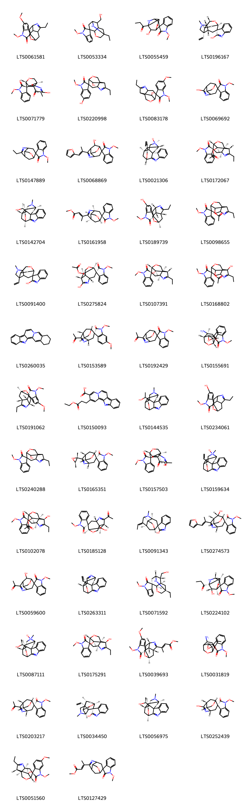{ width=100% }
    <figcaption>Hình ảnh cấu trúc hóa học của 63 hoạt chất thuộc nhóm Indoles and derivatives gồm ["6'-ethyl-1,6-dimethoxy-10'-oxa-5'-azaspiro[indole-3,2'-tricyclo[5.3.1.0⁴,⁸]undecan]-5'-en-2-one (LTS0061581)", "7'-ethyl-10'-(hydroxymethyl)-1-methoxy-5'-oxa-11'-azaspiro[indole-3,3'-tricyclo[5.3.1.0⁴,⁹]undecan]-2-one (LTS0053334)", "10'-hydroxy-1-methoxy-1'-propanoyl-7'-oxa-2'-azaspiro[indole-3,5'-tricyclo[4.3.1.0³,⁹]decan]-2-one (LTS0055459)", "(1's,2's,3s,5'r,6'r,9'r,11's)-5'-ethenyl-3'-methyl-12'-oxa-3'-azaspiro[indole-3,8'-tetracyclo[7.2.1.0²,⁶.0⁵,¹¹]dodecan]-2-ol (LTS0196167)", "n-[(1r,2s,4s,5s)-1'-methoxy-2'-oxo-9-propanoyl-7-oxaspiro[bicyclo[3.2.2]nonane-2,3'-indol]-8-en-4-yl]carboximidic acid (LTS0071779)", "6'-ethyl-6,11'-dihydroxy-1-methoxy-10'-oxa-5'-azaspiro[indole-3,2'-tricyclo[5.3.1.0⁴,⁸]undecan]-5'-en-2-one (LTS0220998)", "6'-ethyl-11'-hydroxy-1,6-dimethoxy-10'-oxa-5'-azaspiro[indole-3,2'-tricyclo[5.3.1.0⁴,⁸]undecan]-5'-en-2-one (LTS0083178)", "6'-hydroxy-1-methoxy-10'-oxa-5'-azaspiro[indole-3,2'-tricyclo[5.3.1.0⁴,⁸]undecan]-5'-en-2-one (LTS0069692)", "6'-ethyl-1-methoxy-10'-oxa-5'-azaspiro[indole-3,2'-tricyclo[5.3.1.0⁴,⁸]undecan]-5'-en-2-one (LTS0147889)", "6'-[1-(furan-2-yl)prop-1-en-2-yl]-11'-hydroxy-1-methoxy-10'-oxa-5'-azaspiro[indole-3,2'-tricyclo[5.3.1.0⁴,⁸]undecan]-5'-en-2-one (LTS0068869)", '(1s,10r,12r,13r,15r,16s,17r)-15-ethenyl-13-methyl-19-oxa-3,13-diazahexacyclo[14.3.1.0²,¹⁰.0⁴,⁹.0¹⁰,¹⁵.0¹²,¹⁷]icosa-2,4,6,8-tetraen-13-ium-13-olate (LTS0021306)', "(1's,3s,4's,7'r,8's,11'r)-6'-ethyl-1-methoxy-2-oxo-10'-oxa-5'-azaspiro[indole-3,2'-tricyclo[5.3.1.0⁴,⁸]undecan]-5'-en-11'-yl acetate (LTS0172067)", '(1r)-1-[(1r,10r,12s,15r,16r,17s)-13-methyl-19-oxa-3,13-diazahexacyclo[14.3.1.0²,¹⁰.0⁴,⁹.0¹⁰,¹⁵.0¹²,¹⁷]icosa-2,4,6,8-tetraen-15-yl]ethanol (LTS0142704)', "methyl (2e)-3-[(1'r,3s,4's,7'r,8's)-1-methoxy-2-oxo-10'-oxa-5'-azaspiro[indole-3,2'-tricyclo[5.3.1.0⁴,⁸]undecan]-5'-en-6'-yl]but-2-enoate (LTS0161958)", "(1'r,3s,4's,7'r,8's)-6'-ethyl-6-hydroxy-1-methoxy-10'-oxa-5'-azaspiro[indole-3,2'-tricyclo[5.3.1.0⁴,⁸]undecan]-5'-en-2-one (LTS0189739)", "6'-ethyl-1-methoxy-2-oxo-10'-oxa-5'-azaspiro[indole-3,2'-tricyclo[5.3.1.0⁴,⁸]undecan]-5'-en-11'-yl acetate (LTS0098655)", "5'-ethenyl-3'-methyl-12'-oxa-3'-azaspiro[indole-3,8'-tetracyclo[7.2.1.0²,⁶.0⁵,¹¹]dodecan]-2-ol (LTS0091400)", "(1's,3s,4's,7's,8's,11'r)-6'-hydroxy-1-methoxy-2-oxo-10'-oxa-5'-azaspiro[indole-3,2'-tricyclo[5.3.1.0⁴,⁸]undecan]-5'-en-11'-yl acetate (LTS0275824)", "(1's,3s,4's,7'r,8's,11'r)-6'-ethyl-11'-hydroxy-1-methoxy-10'-oxa-5'-azaspiro[indole-3,2'-tricyclo[5.3.1.0⁴,⁸]undecan]-5'-en-2-one (LTS0107391)", "6'-ethyl-7'-hydroxy-1-methoxy-2-oxo-10'-oxa-5'-azaspiro[indole-3,2'-tricyclo[5.3.1.0⁴,⁸]undecan]-5'-en-11'-yl acetate (LTS0168802)", 'sempervirine (LTS0260035)', "(1'r,3s,4's,7'r,8's)-6'-acetyl-1,6-dimethoxy-10'-oxa-5'-azaspiro[indole-3,2'-tricyclo[5.3.1.0⁴,⁸]undecan]-5'-en-2-one (LTS0153589)", "6'-acetyl-1-methoxy-10'-oxa-5'-azaspiro[indole-3,2'-tricyclo[5.3.1.0⁴,⁸]undecan]-5'-en-2-one (LTS0192429)", "(1's,2'r,3s,4's,5's,8's)-8'-amino-1-methoxy-2'-propanoyl-3',10'-dioxaspiro[indole-3,6'-tricyclo[3.3.2.0²,⁴]decan]-2-one (LTS0155691)", "(1'r,3s,4's,7'r,8's)-6'-ethyl-1,6-dimethoxy-10'-oxa-5'-azaspiro[indole-3,2'-tricyclo[5.3.1.0⁴,⁸]undecan]-5'-en-2-one (LTS0191062)", '2-(3-ethoxy-3-oxopropyl)indolo[2,3-a]quinolizine-3-carboxylic acid (LTS0150093)', '1-{13-methyl-19-oxa-3,13-diazahexacyclo[14.3.1.0²,¹⁰.0⁴,⁹.0¹⁰,¹⁵.0¹²,¹⁷]icosa-2,4,6,8-tetraen-15-yl}ethanol (LTS0144535)', "6'-ethyl-6-hydroxy-1-methoxy-10'-oxa-5'-azaspiro[indole-3,2'-tricyclo[5.3.1.0⁴,⁸]undecan]-5'-en-2-one (LTS0234061)", "6'-ethyl-11'-hydroxy-1-methoxy-10'-oxa-5'-azaspiro[indole-3,2'-tricyclo[5.3.1.0⁴,⁸]undecan]-5'-en-2-one (LTS0240288)", "(1'r,3s,4's,7'r,8's)-6'-[(2r,3r)-2,3-dimethyloxiran-2-yl]-1-methoxy-10'-oxa-5'-azaspiro[indole-3,2'-tricyclo[5.3.1.0⁴,⁸]undecan]-5'-en-2-one (LTS0165351)", "n-[(1r,2s,4s,5s)-1'-methoxy-2'-oxo-9-propanoyl-7-oxaspiro[bicyclo[3.2.2]nonane-2,3'-indol]-8-en-4-yl]ethanimidic acid (LTS0157503)", '15-ethenyl-13-methyl-19-oxa-3,13-diazahexacyclo[14.3.1.0²,¹⁰.0⁴,⁹.0¹⁰,¹⁵.0¹²,¹⁷]icosa-2,4,6,8-tetraen-13-ium-13-olate (LTS0159634)', "(1's,3s,4's,7's,8's,11's)-6'-ethyl-7'-hydroxy-1-methoxy-2-oxo-10'-oxa-5'-azaspiro[indole-3,2'-tricyclo[5.3.1.0⁴,⁸]undecan]-5'-en-11'-yl acetate (LTS0102078)", "(1's,3s,4's,7'r,8's,11'r)-6'-acetyl-11'-hydroxy-1-methoxy-10'-oxa-5'-azaspiro[indole-3,2'-tricyclo[5.3.1.0⁴,⁸]undecan]-5'-en-2-one (LTS0185128)", "(1'r,3s,4's,7'e,8'r,9's)-7'-ethylidene-5'-methyl-11'-oxa-5'-azaspiro[indole-3,2'-tricyclo[6.3.1.0⁴,⁹]dodecan]-2-ol (LTS0091343)", "(1's,3s,4's,7'r,8's,11's)-6'-[(1e)-1-(furan-2-yl)prop-1-en-2-yl]-11'-hydroxy-1-methoxy-10'-oxa-5'-azaspiro[indole-3,2'-tricyclo[5.3.1.0⁴,⁸]undecan]-5'-en-2-one (LTS0274573)", "6'-acetyl-11'-hydroxy-1-methoxy-10'-oxa-5'-azaspiro[indole-3,2'-tricyclo[5.3.1.0⁴,⁸]undecan]-5'-en-2-one (LTS0059600)", '(10r,16r,17s)-15-ethenyl-19-oxa-3,13-diazahexacyclo[14.3.1.0²,¹⁰.0⁴,⁹.0¹⁰,¹⁵.0¹²,¹⁷]icosa-2,4,6,8,13-pentaene (LTS0263311)', "(1'r,3r,4'r,7'r,9'r,10'r)-7'-ethyl-10'-(hydroxymethyl)-1-methoxy-5'-oxa-11'-azaspiro[indole-3,3'-tricyclo[5.3.1.0⁴,⁹]undecan]-2-one (LTS0071592)", "(1's,3s,3's,6's,9'r,10'r)-10'-hydroxy-1-methoxy-1'-propanoyl-7'-oxa-2'-azaspiro[indole-3,5'-tricyclo[4.3.1.0³,⁹]decan]-2-one (LTS0224102)", '(10r,15r,16r,17s)-15-[(1s)-1-hydroxyethyl]-13-methyl-19-oxa-3,13-diazahexacyclo[14.3.1.0²,¹⁰.0⁴,⁹.0¹⁰,¹⁵.0¹²,¹⁷]icosa-2,4,6,8-tetraen-13-ium-13-olate (LTS0087111)', "(1's,3s,4's,7's,8's,11's)-6'-ethyl-7',11'-dihydroxy-1-methoxy-10'-oxa-5'-azaspiro[indole-3,2'-tricyclo[5.3.1.0⁴,⁸]undecan]-5'-en-2-one (LTS0175291)", "methyl (2e)-3-[(1'r,3s,4's,7'r,8's)-1,6-dimethoxy-2-oxo-10'-oxa-5'-azaspiro[indole-3,2'-tricyclo[5.3.1.0⁴,⁸]undecan]-5'-en-6'-yl]but-2-enoate (LTS0039693)", "8'-amino-1-methoxy-2'-propanoyl-3',10'-dioxaspiro[indole-3,6'-tricyclo[3.3.2.0²,⁴]decan]-2-one (LTS0031819)", "(1'r,3s,4's,7'r,8's)-6'-acetyl-1-methoxy-10'-oxa-5'-azaspiro[indole-3,2'-tricyclo[5.3.1.0⁴,⁸]undecan]-5'-en-2-one (LTS0203217)", "(1'r,2's,3s,5'r,6's,8's)-2'-ethenyl-4'-methyl-9'-oxa-4'-azaspiro[indole-3,7'-tetracyclo[6.3.1.0²,⁶.0⁵,¹¹]dodecan]-2-ol (LTS0034450)", '(1s)-1-[(1r,10r,12s,15r,16r,17s)-13-methyl-19-oxa-3,13-diazahexacyclo[14.3.1.0²,¹⁰.0⁴,⁹.0¹⁰,¹⁵.0¹²,¹⁷]icosa-2,4,6,8-tetraen-15-yl]ethanol (LTS0056975)', "(1'r,3s,4's,7'r,8's)-6'-hydroxy-1-methoxy-10'-oxa-5'-azaspiro[indole-3,2'-tricyclo[5.3.1.0⁴,⁸]undecan]-5'-en-2-one (LTS0252439)", "(1's,3s,4's,7'r,8's,11'r)-6'-ethyl-11'-hydroxy-1,6-dimethoxy-10'-oxa-5'-azaspiro[indole-3,2'-tricyclo[5.3.1.0⁴,⁸]undecan]-5'-en-2-one (LTS0051560)", "methyl 3-{1-methoxy-2-oxo-10'-oxa-5'-azaspiro[indole-3,2'-tricyclo[5.3.1.0⁴,⁸]undecan]-5'-en-6'-yl}but-2-enoate (LTS0127429)", '(10r,14r,16r,17s)-15-ethenyl-13-methyl-19-oxa-3,13-diazahexacyclo[14.3.1.0²,¹⁰.0⁴,⁹.0¹⁰,¹⁵.0¹²,¹⁷]icosa-2,4,6,8-tetraen-14-ol (LTS0063889)', "(1'r,3s,4's,7'r,8's)-6'-ethyl-1-methoxy-10'-oxa-5'-azaspiro[indole-3,2'-tricyclo[5.3.1.0⁴,⁸]undecan]-5'-en-2-one (LTS0034460)", "(1's,3s,3's,6's,9'r,10's)-10'-hydroxy-1-methoxy-1'-propanoyl-7'-oxa-2'-azaspiro[indole-3,5'-tricyclo[4.3.1.0³,⁹]decan]-2-one (LTS0058968)", '(15s)-15-ethenyl-13-methyl-19-oxa-3,13-diazahexacyclo[14.3.1.0²,¹⁰.0⁴,⁹.0¹⁰,¹⁵.0¹²,¹⁷]icosa-2,4,6,8-tetraene (LTS0000928)', "(1's,3s,4's,7'r,8's,11'r)-6'-[(1e)-1-(furan-2-yl)prop-1-en-2-yl]-11'-hydroxy-1-methoxy-10'-oxa-5'-azaspiro[indole-3,2'-tricyclo[5.3.1.0⁴,⁸]undecan]-5'-en-2-one (LTS0001040)", "methyl 3-{1,6-dimethoxy-2-oxo-10'-oxa-5'-azaspiro[indole-3,2'-tricyclo[5.3.1.0⁴,⁸]undecan]-5'-en-6'-yl}but-2-enoate (LTS0005347)", "6'-ethyl-7',11'-dihydroxy-1-methoxy-10'-oxa-5'-azaspiro[indole-3,2'-tricyclo[5.3.1.0⁴,⁸]undecan]-5'-en-2-one (LTS0024232)", "(1's,3s,4's,7'r,8's,11'r)-6'-ethyl-6,11'-dihydroxy-1-methoxy-10'-oxa-5'-azaspiro[indole-3,2'-tricyclo[5.3.1.0⁴,⁸]undecan]-5'-en-2-one (LTS0275015)", "6'-acetyl-1,6-dimethoxy-10'-oxa-5'-azaspiro[indole-3,2'-tricyclo[5.3.1.0⁴,⁸]undecan]-5'-en-2-one (LTS0110187)", "6'-hydroxy-1-methoxy-2-oxo-10'-oxa-5'-azaspiro[indole-3,2'-tricyclo[5.3.1.0⁴,⁸]undecan]-5'-en-11'-yl acetate (LTS0268160)", '15-ethenyl-13-methyl-19-oxa-3,13-diazahexacyclo[14.3.1.0²,¹⁰.0⁴,⁹.0¹⁰,¹⁵.0¹²,¹⁷]icosa-2,4,6,8-tetraene (LTS0048098)', '(10r,14s,16r,17s)-15-ethenyl-13-methyl-19-oxa-3,13-diazahexacyclo[14.3.1.0²,¹⁰.0⁴,⁹.0¹⁰,¹⁵.0¹²,¹⁷]icosa-2,4,6,8-tetraen-14-ol (LTS0127095)', "(1's,3s,4's,7'r,8's,11'r)-6'-ethyl-7',11'-dihydroxy-1-methoxy-10'-oxa-5'-azaspiro[indole-3,2'-tricyclo[5.3.1.0⁴,⁸]undecan]-5'-en-2-one (LTS0017425)"].</figcaption>
</figure>
#### Nhóm Isoquinolines and derivatives
<figure markdown="span">
    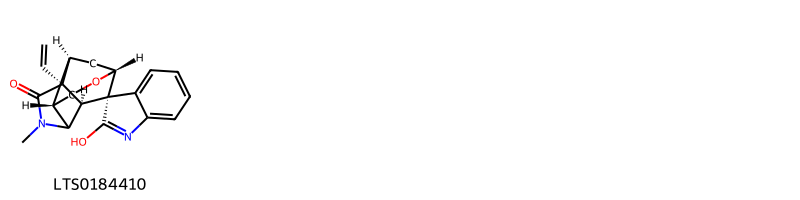{ width=100% }
    <figcaption>Hình ảnh cấu trúc hóa học của 1 hoạt chất thuộc nhóm Isoquinolines and derivatives gồm ["(1'r,2's,3s,6'r,8'r,11's)-2'-ethenyl-2-hydroxy-4'-methyl-9'-oxa-4'-azaspiro[indole-3,7'-tetracyclo[6.3.1.0²,⁶.0⁵,¹¹]dodecan]-3'-one (LTS0184410)"].</figcaption>
</figure>
#### Nhóm Macroline alkaloids
<figure markdown="span">
    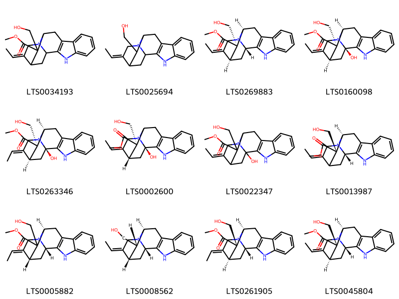{ width=100% }
    <figcaption>Hình ảnh cấu trúc hóa học của 12 hoạt chất thuộc nhóm Macroline alkaloids gồm ['methyl 15-ethylidene-13-(hydroxymethyl)-3,17-diazapentacyclo[12.3.1.0²,¹⁰.0⁴,⁹.0¹²,¹⁷]octadeca-2(10),4,6,8-tetraene-13-carboxylate (LTS0034193)', 'normacusine b (LTS0025694)', 'methyl (1s,12s,13r,14s,15z)-15-ethylidene-13-(hydroxymethyl)-3,17-diazapentacyclo[12.3.1.0²,¹⁰.0⁴,⁹.0¹²,¹⁷]octadeca-2(10),4,6,8-tetraene-13-carboxylate (LTS0269883)', 'methyl (1r,12s,13r,14s,15z)-15-ethylidene-1-hydroxy-13-(hydroxymethyl)-3,17-diazapentacyclo[12.3.1.0²,¹⁰.0⁴,⁹.0¹²,¹⁷]octadeca-2(10),4,6,8-tetraene-13-carboxylate (LTS0160098)', 'methyl (1r,12s,13r,14s,15e)-15-ethylidene-1-hydroxy-13-(hydroxymethyl)-3,17-diazapentacyclo[12.3.1.0²,¹⁰.0⁴,⁹.0¹²,¹⁷]octadeca-2(10),4,6,8-tetraene-13-carboxylate (LTS0263346)', 'methyl (1r,13r,14r)-15-ethylidene-1-hydroxy-13-(hydroxymethyl)-3,17-diazapentacyclo[12.3.1.0²,¹⁰.0⁴,⁹.0¹²,¹⁷]octadeca-2(10),4,6,8-tetraene-13-carboxylate (LTS0002600)', 'methyl 15-ethylidene-1-hydroxy-13-(hydroxymethyl)-3,17-diazapentacyclo[12.3.1.0²,¹⁰.0⁴,⁹.0¹²,¹⁷]octadeca-2(10),4,6,8-tetraene-13-carboxylate (LTS0022347)', 'methyl (1s,12s,13s)-15-ethylidene-13-(hydroxymethyl)-3,17-diazapentacyclo[12.3.1.0²,¹⁰.0⁴,⁹.0¹²,¹⁷]octadeca-2(10),4,6,8-tetraene-13-carboxylate (LTS0013987)', 'methyl (1s,12s,14r,15e)-15-ethylidene-13-(hydroxymethyl)-3,17-diazapentacyclo[12.3.1.0²,¹⁰.0⁴,⁹.0¹²,¹⁷]octadeca-2(10),4,6,8-tetraene-13-carboxylate (LTS0005882)', 'sarpagan-17-ol (LTS0008562)', 'methyl (1s,12s,13s,14s,15e)-15-ethylidene-13-(hydroxymethyl)-3,17-diazapentacyclo[12.3.1.0²,¹⁰.0⁴,⁹.0¹²,¹⁷]octadeca-2(10),4,6,8-tetraene-13-carboxylate (LTS0261905)', 'methyl (1s,12s,13s,14s,15z)-15-ethylidene-13-(hydroxymethyl)-3,17-diazapentacyclo[12.3.1.0²,¹⁰.0⁴,⁹.0¹²,¹⁷]octadeca-2(10),4,6,8-tetraene-13-carboxylate (LTS0045804)'].</figcaption>
</figure>
#### Nhóm Phenols
<figure markdown="span">
    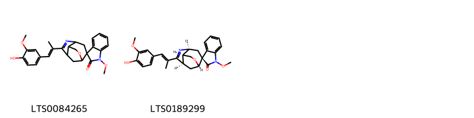{ width=100% }
    <figcaption>Hình ảnh cấu trúc hóa học của 2 hoạt chất thuộc nhóm Phenols gồm ["6'-[1-(4-hydroxy-3-methoxyphenyl)prop-1-en-2-yl]-1-methoxy-10'-oxa-5'-azaspiro[indole-3,2'-tricyclo[5.3.1.0⁴,⁸]undecan]-5'-en-2-one (LTS0084265)", "(1'r,3s,4's,7'r,8's)-6'-[(1e)-1-(4-hydroxy-3-methoxyphenyl)prop-1-en-2-yl]-1-methoxy-10'-oxa-5'-azaspiro[indole-3,2'-tricyclo[5.3.1.0⁴,⁸]undecan]-5'-en-2-one (LTS0189299)"].</figcaption>
</figure>
#### Nhóm Prenol lipids
<figure markdown="span">
    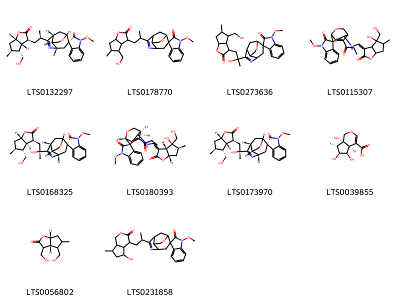{ width=100% }
    <figcaption>Hình ảnh cấu trúc hóa học của 10 hoạt chất thuộc nhóm Prenol lipids gồm ["(1'r,3s,4's,7'r,8's)-6'-[(2r)-1-[(3s,3as,4r,5s,6as)-4-(hydroxymethyl)-5-methyl-2-oxo-hexahydrocyclopenta[b]furan-3-yl]propan-2-yl]-1-methoxy-10'-oxa-5'-azaspiro[indole-3,2'-tricyclo[5.3.1.0⁴,⁸]undecan]-5'-en-2-one (LTS0132297)", "6'-{1-[4-(hydroxymethyl)-5-methyl-2-oxo-hexahydrocyclopenta[b]furan-3-yl]propan-2-yl}-1-methoxy-10'-oxa-5'-azaspiro[indole-3,2'-tricyclo[5.3.1.0⁴,⁸]undecan]-5'-en-2-one (LTS0178770)", "6'-{2-hydroxy-1-[4-(hydroxymethyl)-5-methyl-2-oxo-hexahydrocyclopenta[b]furan-3-yl]propan-2-yl}-1-methoxy-10'-oxa-5'-azaspiro[indole-3,2'-tricyclo[5.3.1.0⁴,⁸]undecan]-5'-en-2-one (LTS0273636)", "4-({[4-hydroxy-4-(hydroxymethyl)-5-methyl-2-oxo-tetrahydrocyclopenta[b]furan-3-ylidene]methyl}amino)-1'-methoxy-9-propanoyl-7-oxaspiro[bicyclo[3.2.2]nonane-2,3'-indol]-8-en-2'-one (LTS0115307)", "(1'r,3s,4's,7'r,8's)-6'-[(2r)-1-[(3s,3ar,4r,5s,6as)-4-(hydroxymethyl)-5-methyl-2-oxo-hexahydrocyclopenta[b]furan-3-yl]-2-hydroxypropan-2-yl]-1-methoxy-10'-oxa-5'-azaspiro[indole-3,2'-tricyclo[5.3.1.0⁴,⁸]undecan]-5'-en-2-one (LTS0168325)", "(1r,2s,4s,5s)-4-({[(3z,3as,4s,5s,6as)-4-hydroxy-4-(hydroxymethyl)-5-methyl-2-oxo-tetrahydrocyclopenta[b]furan-3-ylidene]methyl}amino)-1'-methoxy-9-propanoyl-7-oxaspiro[bicyclo[3.2.2]nonane-2,3'-indol]-8-en-2'-one (LTS0180393)", "(1'r,3s,4's,7'r,8's)-6'-[(2r)-1-[(3s,3as,4r,5s,6as)-4-(hydroxymethyl)-5-methyl-2-oxo-hexahydrocyclopenta[b]furan-3-yl]-2-hydroxypropan-2-yl]-1-methoxy-10'-oxa-5'-azaspiro[indole-3,2'-tricyclo[5.3.1.0⁴,⁸]undecan]-5'-en-2-one (LTS0173970)", '(4as,5r,6s,7s,7as)-5,6,7a-trihydroxy-7-methyl-1h,4ah,5h,6h,7h-cyclopenta[c]pyran-4-carboxylic acid (LTS0039855)', '(3ar,6ar)-3,4-bis(hydroxymethyl)-5-methyl-hexahydrocyclopenta[b]furan-2-one (LTS0056802)', "6'-(1-{5-hydroxy-7-methyl-3-oxo-hexahydro-1h-cyclopenta[c]pyran-4-yl}propan-2-yl)-1-methoxy-10'-oxa-5'-azaspiro[indole-3,2'-tricyclo[5.3.1.0⁴,⁸]undecan]-5'-en-2-one (LTS0231858)"].</figcaption>
</figure>
#### Nhóm Pyrrolidines
<figure markdown="span">
    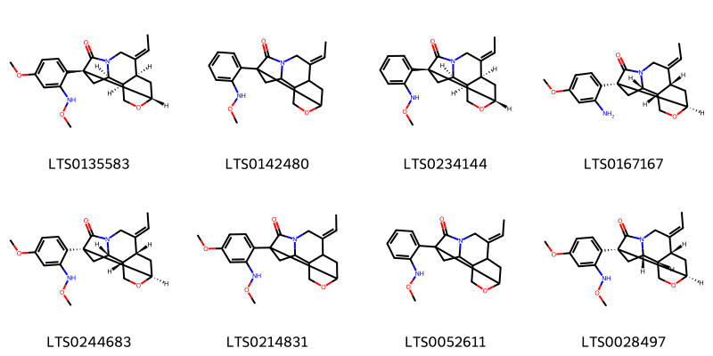{ width=100% }
    <figcaption>Hình ảnh cấu trúc hóa học của 8 hoạt chất thuộc nhóm Pyrrolidines gồm ['(1s,3s,4z,8r,10r,11r)-4-ethylidene-8-[4-methoxy-2-(methoxyamino)phenyl]-13-oxa-6-azatetracyclo[6.5.0.0³,¹¹.0⁶,¹⁰]tridecan-7-one (LTS0135583)', '(4z)-4-ethylidene-8-[2-(methoxyamino)phenyl]-13-oxa-6-azatetracyclo[6.5.0.0³,¹¹.0⁶,¹⁰]tridecan-7-one (LTS0142480)', '(1s,3s,4z,8r,10r,11r)-4-ethylidene-8-[2-(methoxyamino)phenyl]-13-oxa-6-azatetracyclo[6.5.0.0³,¹¹.0⁶,¹⁰]tridecan-7-one (LTS0234144)', '(1r,3r,4z,8s,10s,11s)-8-(2-amino-4-methoxyphenyl)-4-ethylidene-13-oxa-6-azatetracyclo[6.5.0.0³,¹¹.0⁶,¹⁰]tridecan-7-one (LTS0167167)', '(1r,3r,4z,8s,10s,11s)-4-ethylidene-8-[4-methoxy-2-(methoxyamino)phenyl]-13-oxa-6-azatetracyclo[6.5.0.0³,¹¹.0⁶,¹⁰]tridecan-7-one (LTS0244683)', '4-ethylidene-8-[4-methoxy-2-(methoxyamino)phenyl]-13-oxa-6-azatetracyclo[6.5.0.0³,¹¹.0⁶,¹⁰]tridecan-7-one (LTS0214831)', '4-ethylidene-8-[2-(methoxyamino)phenyl]-13-oxa-6-azatetracyclo[6.5.0.0³,¹¹.0⁶,¹⁰]tridecan-7-one (LTS0052611)', '(1r,3r,8s,10s,11s)-4-ethylidene-8-[4-methoxy-2-(methoxyamino)phenyl]-13-oxa-6-azatetracyclo[6.5.0.0³,¹¹.0⁶,¹⁰]tridecan-7-one (LTS0028497)'].</figcaption>
</figure>
#### Nhóm Vobasan alkaloids
<figure markdown="span">
    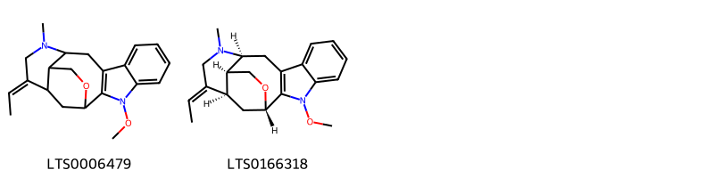{ width=100% }
    <figcaption>Hình ảnh cấu trúc hóa học của 2 hoạt chất thuộc nhóm Vobasan alkaloids gồm ['(15e)-15-ethylidene-3-methoxy-13-methyl-19-oxa-3,13-diazapentacyclo[14.3.1.0²,¹⁰.0⁴,⁹.0¹²,¹⁷]icosa-2(10),4,6,8-tetraene (LTS0006479)', '(1s,12s,15e,16r,17s)-15-ethylidene-3-methoxy-13-methyl-19-oxa-3,13-diazapentacyclo[14.3.1.0²,¹⁰.0⁴,⁹.0¹²,¹⁷]icosa-2(10),4,6,8-tetraene (LTS0166318)'].</figcaption>
</figure>

---

### Dược dân tộc học

Danh sách các quốc gia có sử dụng *Gelsemium elegans* trong điều trị các bệnh. 

| Country   | Disease   | Bệnh                                                                                                                                                                                                |
|:----------|:----------|:----------------------------------------------------------------------------------------------------------------------------------------------------------------------------------------------------|
| China     | Poison    | MYMEMORY WARNING: YOU USED ALL AVAILABLE FREE TRANSLATIONS FOR TODAY. NEXT AVAILABLE IN  14 HOURS 31 MINUTES 11 SECONDS VISIT HTTPS://MYMEMORY.TRANSLATED.NET/DOC/USAGELIMITS.PHP TO TRANSLATE MORE |
| Elsewhere | Poison    | MYMEMORY WARNING: YOU USED ALL AVAILABLE FREE TRANSLATIONS FOR TODAY. NEXT AVAILABLE IN  14 HOURS 31 MINUTES 08 SECONDS VISIT HTTPS://MYMEMORY.TRANSLATED.NET/DOC/USAGELIMITS.PHP TO TRANSLATE MORE |
| India     | Poison    | MYMEMORY WARNING: YOU USED ALL AVAILABLE FREE TRANSLATIONS FOR TODAY. NEXT AVAILABLE IN  14 HOURS 31 MINUTES 05 SECONDS VISIT HTTPS://MYMEMORY.TRANSLATED.NET/DOC/USAGELIMITS.PHP TO TRANSLATE MORE |

---

---
## Gelsemium sempervirens
### Thông tin về thực vật

!!! info "Phân loại thực vật của *Gelsemium sempervirens* từ GIBF:"
    - **Kingdom:** Plantae
    - **Phylum:** Tracheophyta
    - **Order:** Gentianales
    - **Family:** Gelsemiaceae
    - **Genus:** Gelsemium
    - **Species:** *Gelsemium sempervirens*

 

| Label (VI)   | Label (EN)   | Scientific Name        | Descriptions (VI)   | Descriptions (EN)   | Also Known As (VI)   | Also Known As (EN)                                               |
|:-------------|:-------------|:-----------------------|:--------------------|:--------------------|:---------------------|:-----------------------------------------------------------------|
| N/A          | N/A          | Gelsemium sempervirens | loài thực vật       | species of plant    | ['']                 | ['evening trumpetflower', 'false jessamine', 'yellow jessamine'] |

#### Phân bố trên thế giới

**Từ CSDL GIBF** United States of America

#### Phân bố tại Việt Nam

**Từ CSDL GIBF**: Không có ghi nhận ở Việt Nam

---
### Thành phần hóa học
        
- Theo cơ sở dữ liệu lotus: Từ loài *Gelsemium sempervirens* đã phân lập và xác định được 86 hoạt chất thuộc về các nhóm Furopyrans, Organooxygen compounds, Indoles and derivatives, Benzopyrans, Coumarins and derivatives, Isoquinolines and derivatives, Gelsemium alkaloids, Prenol lipids, Fatty Acyls, Steroids and steroid derivatives, Vobasan alkaloids, Macroline alkaloids, Benzene and substituted derivatives. 

|    | chemicalTaxonomyClassyfireClass     |   smiles_count |
|---:|:------------------------------------|---------------:|
|  0 | Benzene and substituted derivatives |              1 |
|  1 | Benzopyrans                         |              2 |
|  2 | Coumarins and derivatives           |              3 |
|  3 | Fatty Acyls                         |              2 |
|  4 | Furopyrans                          |              3 |
|  5 | Gelsemium alkaloids                 |             23 |
|  6 | Indoles and derivatives             |             18 |
|  7 | Isoquinolines and derivatives       |              1 |
|  8 | Macroline alkaloids                 |              8 |
|  9 | Organooxygen compounds              |              9 |
| 10 | Prenol lipids                       |              7 |
| 11 | Steroids and steroid derivatives    |              2 |
| 12 | Vobasan alkaloids                   |              6 |

#### Nhóm Benzene and substituted derivatives
<figure markdown="span">
    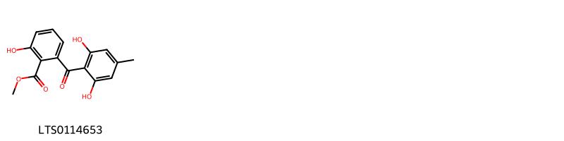{ width=100% }
    <figcaption>Hình ảnh cấu trúc hóa học của 1 hoạt chất thuộc nhóm Benzene and substituted derivatives gồm ['methyl 2-(2,6-dihydroxy-4-methylbenzoyl)-6-hydroxybenzoate (LTS0114653)'].</figcaption>
</figure>
#### Nhóm Benzopyrans
<figure markdown="span">
    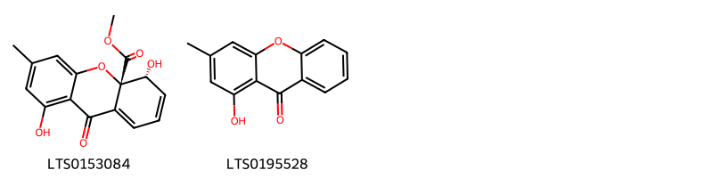{ width=100% }
    <figcaption>Hình ảnh cấu trúc hóa học của 2 hoạt chất thuộc nhóm Benzopyrans gồm ['nidulalin a (LTS0153084)', '1-hydroxy-3-methylxanthen-9-one (LTS0195528)'].</figcaption>
</figure>
#### Nhóm Coumarins and derivatives
<figure markdown="span">
    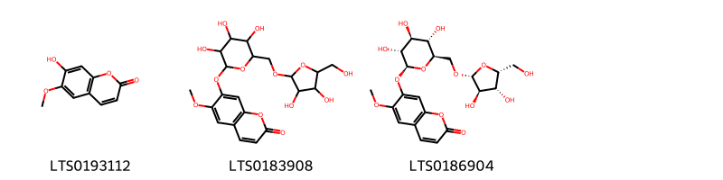{ width=100% }
    <figcaption>Hình ảnh cấu trúc hóa học của 3 hoạt chất thuộc nhóm Coumarins and derivatives gồm ['scopoletin (LTS0193112)', '7-{[6-({[3,4-dihydroxy-5-(hydroxymethyl)oxolan-2-yl]oxy}methyl)-3,4,5-trihydroxyoxan-2-yl]oxy}-6-methoxychromen-2-one (LTS0183908)', '7-{[(2s,3r,4s,5s,6r)-6-({[(2r,3r,4r,5r)-3,4-dihydroxy-5-(hydroxymethyl)oxolan-2-yl]oxy}methyl)-3,4,5-trihydroxyoxan-2-yl]oxy}-6-methoxychromen-2-one (LTS0186904)'].</figcaption>
</figure>
#### Nhóm Fatty Acyls
<figure markdown="span">
    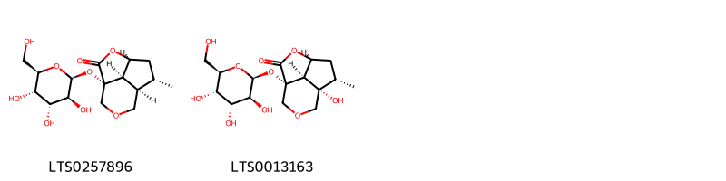{ width=100% }
    <figcaption>Hình ảnh cấu trúc hóa học của 2 hoạt chất thuộc nhóm Fatty Acyls gồm ['(1r,4s,6s,7r,11r)-6-methyl-1-{[(2s,3s,4r,5s,6r)-3,4,5-trihydroxy-6-(hydroxymethyl)oxan-2-yl]oxy}-3,9-dioxatricyclo[5.3.1.0⁴,¹¹]undecan-2-one (LTS0257896)', '(1r,4s,6s,7s,11s)-7-hydroxy-6-methyl-1-{[(2s,3s,4r,5s,6r)-3,4,5-trihydroxy-6-(hydroxymethyl)oxan-2-yl]oxy}-3,9-dioxatricyclo[5.3.1.0⁴,¹¹]undecan-2-one (LTS0013163)'].</figcaption>
</figure>
#### Nhóm Furopyrans
<figure markdown="span">
    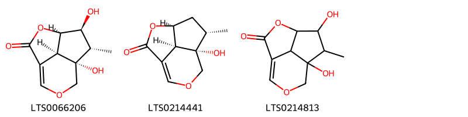{ width=100% }
    <figcaption>Hình ảnh cấu trúc hóa học của 3 hoạt chất thuộc nhóm Furopyrans gồm ['(4r,5s,6s,7s,11s)-5,7-dihydroxy-6-methyl-3,9-dioxatricyclo[5.3.1.0⁴,¹¹]undec-1(10)-en-2-one (LTS0066206)', '(4s,6s,7s,11s)-7-hydroxy-6-methyl-3,9-dioxatricyclo[5.3.1.0⁴,¹¹]undec-1(10)-en-2-one (LTS0214441)', '5,7-dihydroxy-6-methyl-3,9-dioxatricyclo[5.3.1.0⁴,¹¹]undec-1(10)-en-2-one (LTS0214813)'].</figcaption>
</figure>
#### Nhóm Gelsemium alkaloids
<figure markdown="span">
    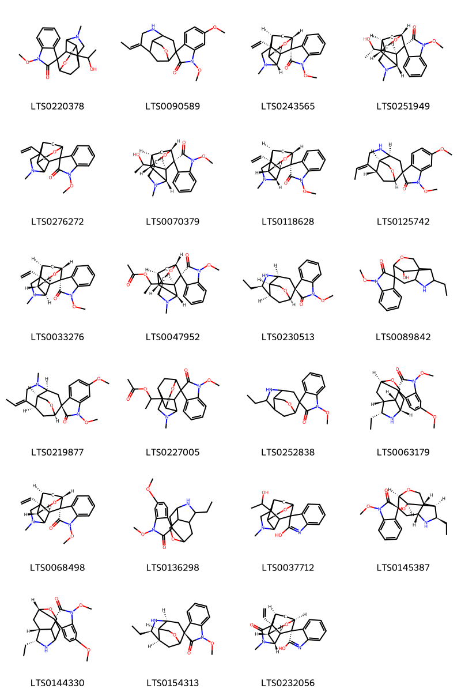{ width=100% }
    <figcaption>Hình ảnh cấu trúc hóa học của 23 hoạt chất thuộc nhóm Gelsemium alkaloids gồm ["2'-(1-hydroxyethyl)-1-methoxy-4'-methyl-9'-oxa-4'-azaspiro[indole-3,7'-tetracyclo[6.3.1.0²,⁶.0⁵,¹¹]dodecan]-2-one (LTS0220378)", "(7'z)-7'-ethylidene-1,6-dimethoxy-11'-oxa-5'-azaspiro[indole-3,2'-tricyclo[6.3.1.0⁴,⁹]dodecan]-2-one (LTS0090589)", "(1'r,2's,3s,5's,6's,8'r)-2'-ethenyl-1-methoxy-4'-methyl-9'-oxa-4'-azaspiro[indole-3,7'-tetracyclo[6.3.1.0²,⁶.0⁵,¹¹]dodecan]-2-one (LTS0243565)", "(1'r,2'r,3s,5's,6's,8'r,11's)-2'-[(1s)-1-hydroxyethyl]-1-methoxy-4'-methyl-9'-oxa-4'-azaspiro[indole-3,7'-tetracyclo[6.3.1.0²,⁶.0⁵,¹¹]dodecan]-2-one (LTS0251949)", "2'-ethenyl-1-methoxy-4'-methyl-9'-oxa-4'-azaspiro[indole-3,7'-tetracyclo[6.3.1.0²,⁶.0⁵,¹¹]dodecan]-2-one (LTS0276272)", "(1'r,2'r,3s,5's,6's,8'r,11's)-2'-[(1r)-1-hydroxyethyl]-1-methoxy-4'-methyl-9'-oxa-4'-azaspiro[indole-3,7'-tetracyclo[6.3.1.0²,⁶.0⁵,¹¹]dodecan]-2-one (LTS0070379)", "(1'r,2's,3s,5's,6's,8'r,11's)-2'-ethenyl-1-methoxy-4'-methyl-9'-oxa-4'-azaspiro[indole-3,7'-tetracyclo[6.3.1.0²,⁶.0⁵,¹¹]dodecan]-2-one (LTS0118628)", "(1'r,3s,4's,7'e,8's,9's)-7'-ethylidene-1,6-dimethoxy-11'-oxa-5'-azaspiro[indole-3,2'-tricyclo[6.3.1.0⁴,⁹]dodecan]-2-one (LTS0125742)", "(1'r,2's,3s,5'r,6's,8'r,11's)-2'-ethenyl-1-methoxy-4'-methyl-9'-oxa-4'-azaspiro[indole-3,7'-tetracyclo[6.3.1.0²,⁶.0⁵,¹¹]dodecan]-2-one (LTS0033276)", "(1r)-1-[(1'r,2'r,3s,5's,6's,8'r,11's)-1-methoxy-4'-methyl-2-oxo-9'-oxa-4'-azaspiro[indole-3,7'-tetracyclo[6.3.1.0²,⁶.0⁵,¹¹]dodecan]-2'-yl]ethyl acetate (LTS0047952)", "(1'r,3s,4's,6'r,7'r,8's)-6'-ethyl-1-methoxy-10'-oxa-5'-azaspiro[indole-3,2'-tricyclo[5.3.1.0⁴,⁸]undecan]-2-one (LTS0230513)", "6'-ethyl-11'-hydroxy-1-methoxy-10'-oxa-5'-azaspiro[indole-3,2'-tricyclo[5.3.1.0⁴,⁸]undecan]-2-one (LTS0089842)", "(1'r,3s,4's,7'z,8'r,9's)-7'-ethylidene-1,6-dimethoxy-5'-methyl-11'-oxa-5'-azaspiro[indole-3,2'-tricyclo[6.3.1.0⁴,⁹]dodecan]-2-one (LTS0219877)", "1-{1-methoxy-4'-methyl-2-oxo-9'-oxa-4'-azaspiro[indole-3,7'-tetracyclo[6.3.1.0²,⁶.0⁵,¹¹]dodecan]-2'-yl}ethyl acetate (LTS0227005)", "6'-ethyl-1-methoxy-10'-oxa-5'-azaspiro[indole-3,2'-tricyclo[5.3.1.0⁴,⁸]undecan]-2-one (LTS0252838)", 'gelsemicine (LTS0063179)', "(1'r,2's,3s,6's,8'r,11's)-2'-ethenyl-1-methoxy-4'-methyl-9'-oxa-4'-azaspiro[indole-3,7'-tetracyclo[6.3.1.0²,⁶.0⁵,¹¹]dodecan]-2-one (LTS0068498)", "6'-ethyl-1,6-dimethoxy-10'-oxa-5'-azaspiro[indole-3,2'-tricyclo[5.3.1.0⁴,⁸]undecan]-2-one (LTS0136298)", "2'-(1-hydroxyethyl)-4'-methyl-9'-oxa-4'-azaspiro[indole-3,7'-tetracyclo[6.3.1.0²,⁶.0⁵,¹¹]dodecan]-2-ol (LTS0037712)", "(1'r,3s,4'r,6'r,7's,8'r,11'r)-6'-ethyl-11'-hydroxy-1-methoxy-10'-oxa-5'-azaspiro[indole-3,2'-tricyclo[5.3.1.0⁴,⁸]undecan]-2-one (LTS0145387)", "(1's,3s,6'r,7'r)-6'-ethyl-1,6-dimethoxy-10'-oxa-5'-azaspiro[indole-3,2'-tricyclo[5.3.1.0⁴,⁸]undecan]-2-one (LTS0144330)", "(3s,4's,6'r,7'r,8's)-6'-ethyl-1-methoxy-10'-oxa-5'-azaspiro[indole-3,2'-tricyclo[5.3.1.0⁴,⁸]undecan]-2-one (LTS0154313)", "(1'r,2's,3s,5's,6'r,8's,11's)-2'-ethenyl-2-hydroxy-4'-methyl-9'-oxa-4'-azaspiro[indole-3,7'-tetracyclo[6.3.1.0²,⁶.0⁵,¹¹]dodecan]-3'-one (LTS0232056)"].</figcaption>
</figure>
#### Nhóm Indoles and derivatives
<figure markdown="span">
    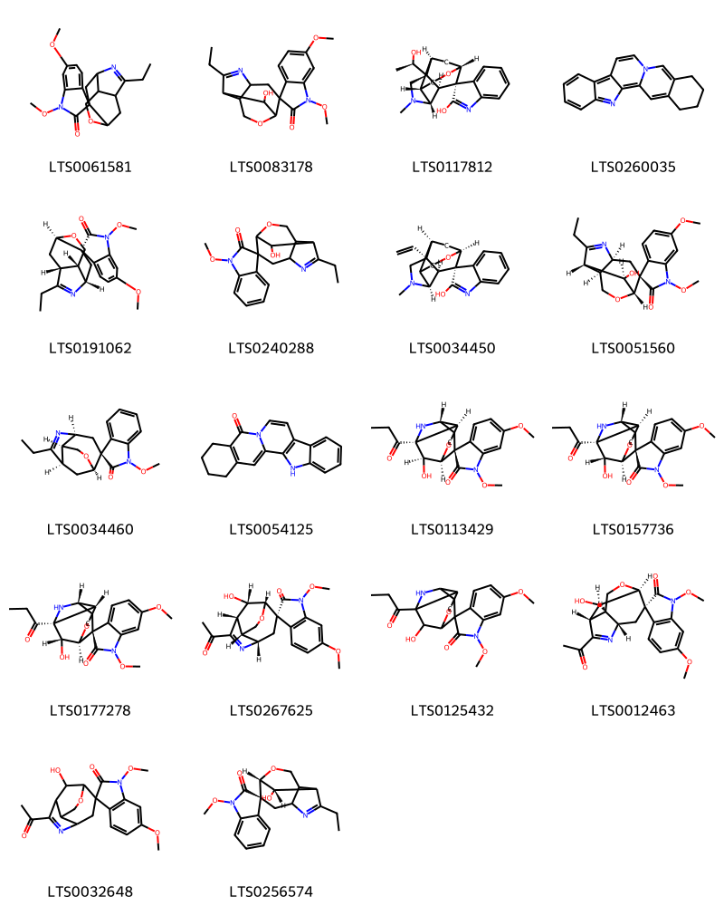{ width=100% }
    <figcaption>Hình ảnh cấu trúc hóa học của 18 hoạt chất thuộc nhóm Indoles and derivatives gồm ["6'-ethyl-1,6-dimethoxy-10'-oxa-5'-azaspiro[indole-3,2'-tricyclo[5.3.1.0⁴,⁸]undecan]-5'-en-2-one (LTS0061581)", "6'-ethyl-11'-hydroxy-1,6-dimethoxy-10'-oxa-5'-azaspiro[indole-3,2'-tricyclo[5.3.1.0⁴,⁸]undecan]-5'-en-2-one (LTS0083178)", "(1'r,2'r,3s,5's,6's,8'r,11's)-2'-[(1r)-1-hydroxyethyl]-4'-methyl-9'-oxa-4'-azaspiro[indole-3,7'-tetracyclo[6.3.1.0²,⁶.0⁵,¹¹]dodecan]-2-ol (LTS0117812)", 'sempervirine (LTS0260035)', "(1'r,3s,4's,7'r,8's)-6'-ethyl-1,6-dimethoxy-10'-oxa-5'-azaspiro[indole-3,2'-tricyclo[5.3.1.0⁴,⁸]undecan]-5'-en-2-one (LTS0191062)", "6'-ethyl-11'-hydroxy-1-methoxy-10'-oxa-5'-azaspiro[indole-3,2'-tricyclo[5.3.1.0⁴,⁸]undecan]-5'-en-2-one (LTS0240288)", "(1'r,2's,3s,5'r,6's,8's)-2'-ethenyl-4'-methyl-9'-oxa-4'-azaspiro[indole-3,7'-tetracyclo[6.3.1.0²,⁶.0⁵,¹¹]dodecan]-2-ol (LTS0034450)", "(1's,3s,4's,7'r,8's,11'r)-6'-ethyl-11'-hydroxy-1,6-dimethoxy-10'-oxa-5'-azaspiro[indole-3,2'-tricyclo[5.3.1.0⁴,⁸]undecan]-5'-en-2-one (LTS0051560)", "(1'r,3s,4's,7'r,8's)-6'-ethyl-1-methoxy-10'-oxa-5'-azaspiro[indole-3,2'-tricyclo[5.3.1.0⁴,⁸]undecan]-5'-en-2-one (LTS0034460)", '3,13-diazapentacyclo[11.8.0.0²,¹⁰.0⁴,⁹.0¹⁵,²⁰]henicosa-1(21),2(10),4(9),5,7,11,15(20)-heptaen-14-one (LTS0054125)', "(1's,3s,3's,6's,9'r,10's)-10'-hydroxy-1,6-dimethoxy-1'-propanoyl-7'-oxa-2'-azaspiro[indole-3,5'-tricyclo[4.3.1.0³,⁹]decan]-2-one (LTS0113429)", "(1's,3s,3's,6's,9'r,10'r)-10'-hydroxy-1,6-dimethoxy-1'-propanoyl-7'-oxa-2'-azaspiro[indole-3,5'-tricyclo[4.3.1.0³,⁹]decan]-2-one (LTS0157736)", "(1's,3s,3's,6's,9's,10'r)-10'-hydroxy-1,6-dimethoxy-1'-propanoyl-7'-oxa-2'-azaspiro[indole-3,5'-tricyclo[4.3.1.0³,⁹]decan]-2-one (LTS0177278)", "(1's,3s,4's,7'r,8's,11's)-6'-acetyl-11'-hydroxy-1,6-dimethoxy-10'-oxa-5'-azaspiro[indole-3,2'-tricyclo[5.3.1.0⁴,⁸]undecan]-5'-en-2-one (LTS0267625)", "10'-hydroxy-1,6-dimethoxy-1'-propanoyl-7'-oxa-2'-azaspiro[indole-3,5'-tricyclo[4.3.1.0³,⁹]decan]-2-one (LTS0125432)", "(1's,3s,4's,7'r,8's,11'r)-6'-acetyl-11'-hydroxy-1,6-dimethoxy-10'-oxa-5'-azaspiro[indole-3,2'-tricyclo[5.3.1.0⁴,⁸]undecan]-5'-en-2-one (LTS0012463)", "6'-acetyl-11'-hydroxy-1,6-dimethoxy-10'-oxa-5'-azaspiro[indole-3,2'-tricyclo[5.3.1.0⁴,⁸]undecan]-5'-en-2-one (LTS0032648)", "(1's,3s,11's)-6'-ethyl-11'-hydroxy-1-methoxy-10'-oxa-5'-azaspiro[indole-3,2'-tricyclo[5.3.1.0⁴,⁸]undecan]-5'-en-2-one (LTS0256574)"].</figcaption>
</figure>
#### Nhóm Isoquinolines and derivatives
<figure markdown="span">
    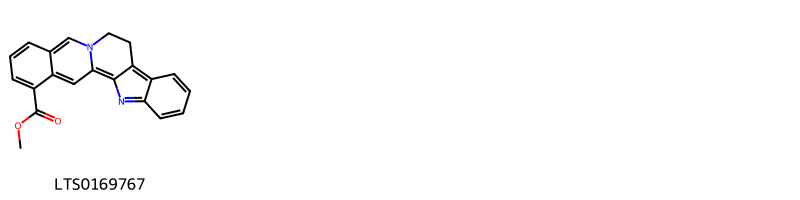{ width=100% }
    <figcaption>Hình ảnh cấu trúc hóa học của 1 hoạt chất thuộc nhóm Isoquinolines and derivatives gồm ['methyl 3,13-diazapentacyclo[11.8.0.0²,¹⁰.0⁴,⁹.0¹⁵,²⁰]henicosa-1,3,5,7,9,14,16,18,20-nonaene-19-carboxylate (LTS0169767)'].</figcaption>
</figure>
#### Nhóm Macroline alkaloids
<figure markdown="span">
    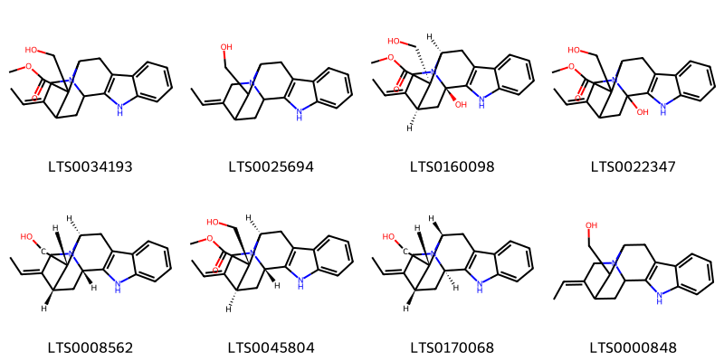{ width=100% }
    <figcaption>Hình ảnh cấu trúc hóa học của 8 hoạt chất thuộc nhóm Macroline alkaloids gồm ['methyl 15-ethylidene-13-(hydroxymethyl)-3,17-diazapentacyclo[12.3.1.0²,¹⁰.0⁴,⁹.0¹²,¹⁷]octadeca-2(10),4,6,8-tetraene-13-carboxylate (LTS0034193)', 'normacusine b (LTS0025694)', 'methyl (1r,12s,13r,14s,15z)-15-ethylidene-1-hydroxy-13-(hydroxymethyl)-3,17-diazapentacyclo[12.3.1.0²,¹⁰.0⁴,⁹.0¹²,¹⁷]octadeca-2(10),4,6,8-tetraene-13-carboxylate (LTS0160098)', 'methyl 15-ethylidene-1-hydroxy-13-(hydroxymethyl)-3,17-diazapentacyclo[12.3.1.0²,¹⁰.0⁴,⁹.0¹²,¹⁷]octadeca-2(10),4,6,8-tetraene-13-carboxylate (LTS0022347)', 'sarpagan-17-ol (LTS0008562)', 'methyl (1s,12s,13s,14s,15z)-15-ethylidene-13-(hydroxymethyl)-3,17-diazapentacyclo[12.3.1.0²,¹⁰.0⁴,⁹.0¹²,¹⁷]octadeca-2(10),4,6,8-tetraene-13-carboxylate (LTS0045804)', '[(1r,12r,13s,14s,15z)-15-ethylidene-3,17-diazapentacyclo[12.3.1.0²,¹⁰.0⁴,⁹.0¹²,¹⁷]octadeca-2(10),4,6,8-tetraen-13-yl]methanol (LTS0170068)', '{15-ethylidene-3,17-diazapentacyclo[12.3.1.0²,¹⁰.0⁴,⁹.0¹²,¹⁷]octadeca-2(10),4,6,8-tetraen-13-yl}methanol (LTS0000848)'].</figcaption>
</figure>
#### Nhóm Organooxygen compounds
<figure markdown="span">
    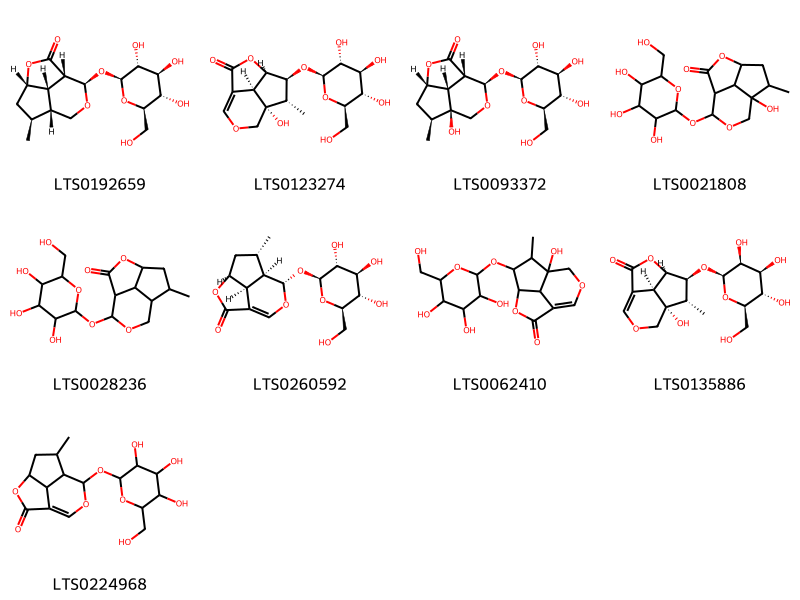{ width=100% }
    <figcaption>Hình ảnh cấu trúc hóa học của 9 hoạt chất thuộc nhóm Organooxygen compounds gồm ['(1s,4s,6s,7r,10r,11s)-6-methyl-10-{[(2s,3r,4s,5s,6r)-3,4,5-trihydroxy-6-(hydroxymethyl)oxan-2-yl]oxy}-3,9-dioxatricyclo[5.3.1.0⁴,¹¹]undecan-2-one (LTS0192659)', '(4r,5s,6s,7s,11s)-7-hydroxy-6-methyl-5-{[(2r,3r,4s,5s,6r)-3,4,5-trihydroxy-6-(hydroxymethyl)oxan-2-yl]oxy}-3,9-dioxatricyclo[5.3.1.0⁴,¹¹]undec-1(10)-en-2-one (LTS0123274)', '(1s,4s,6s,7s,10r,11s)-7-hydroxy-6-methyl-10-{[(2s,3r,4s,5s,6r)-3,4,5-trihydroxy-6-(hydroxymethyl)oxan-2-yl]oxy}-3,9-dioxatricyclo[5.3.1.0⁴,¹¹]undecan-2-one (LTS0093372)', '7-hydroxy-6-methyl-10-{[3,4,5-trihydroxy-6-(hydroxymethyl)oxan-2-yl]oxy}-3,9-dioxatricyclo[5.3.1.0⁴,¹¹]undecan-2-one (LTS0021808)', '6-methyl-10-{[3,4,5-trihydroxy-6-(hydroxymethyl)oxan-2-yl]oxy}-3,9-dioxatricyclo[5.3.1.0⁴,¹¹]undecan-2-one (LTS0028236)', '(4s,6s,7r,8s,11s)-6-methyl-8-{[(2s,3r,4s,5s,6r)-3,4,5-trihydroxy-6-(hydroxymethyl)oxan-2-yl]oxy}-3,9-dioxatricyclo[5.3.1.0⁴,¹¹]undec-1(10)-en-2-one (LTS0260592)', '7-hydroxy-6-methyl-5-{[3,4,5-trihydroxy-6-(hydroxymethyl)oxan-2-yl]oxy}-3,9-dioxatricyclo[5.3.1.0⁴,¹¹]undec-1(10)-en-2-one (LTS0062410)', '(4r,5s,6s,7s,11s)-7-hydroxy-6-methyl-5-{[(2r,3s,4s,5s,6r)-3,4,5-trihydroxy-6-(hydroxymethyl)oxan-2-yl]oxy}-3,9-dioxatricyclo[5.3.1.0⁴,¹¹]undec-1(10)-en-2-one (LTS0135886)', '6-methyl-8-{[3,4,5-trihydroxy-6-(hydroxymethyl)oxan-2-yl]oxy}-3,9-dioxatricyclo[5.3.1.0⁴,¹¹]undec-1(10)-en-2-one (LTS0224968)'].</figcaption>
</figure>
#### Nhóm Prenol lipids
<figure markdown="span">
    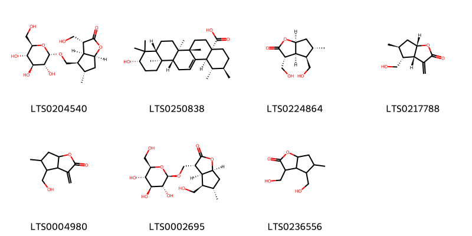{ width=100% }
    <figcaption>Hình ảnh cấu trúc hóa học của 7 hoạt chất thuộc nhóm Prenol lipids gồm ['(3r,3as,4r,5s,6as)-3-(hydroxymethyl)-5-methyl-4-({[(2s,3r,4s,5s,6r)-3,4,5-trihydroxy-6-(hydroxymethyl)oxan-2-yl]oxy}methyl)-hexahydrocyclopenta[b]furan-2-one (LTS0204540)', 'ursolic acid (LTS0250838)', '(3r,3as,4r,5s,6as)-3,4-bis(hydroxymethyl)-5-methyl-hexahydrocyclopenta[b]furan-2-one (LTS0224864)', '(3as,4r,5s,6as)-4-(hydroxymethyl)-5-methyl-3-methylidene-tetrahydro-3ah-cyclopenta[b]furan-2-one (LTS0217788)', '4-(hydroxymethyl)-5-methyl-3-methylidene-tetrahydro-3ah-cyclopenta[b]furan-2-one (LTS0004980)', '(3r,3as,4r,5s,6as)-4-(hydroxymethyl)-5-methyl-3-({[(2r,3r,4s,5s,6r)-3,4,5-trihydroxy-6-(hydroxymethyl)oxan-2-yl]oxy}methyl)-hexahydrocyclopenta[b]furan-2-one (LTS0002695)', '3,4-bis(hydroxymethyl)-5-methyl-hexahydrocyclopenta[b]furan-2-one (LTS0236556)'].</figcaption>
</figure>
#### Nhóm Steroids and steroid derivatives
<figure markdown="span">
    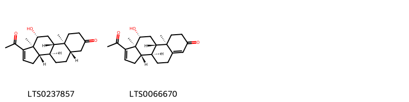{ width=100% }
    <figcaption>Hình ảnh cấu trúc hóa học của 2 hoạt chất thuộc nhóm Steroids and steroid derivatives gồm ['(3as,3br,5as,9as,9bs,11r,11as)-1-acetyl-11-hydroxy-9a,11a-dimethyl-3h,3ah,3bh,4h,5h,5ah,6h,8h,9h,9bh,10h,11h-cyclopenta[a]phenanthren-7-one (LTS0237857)', '(3as,3br,9ar,9bs,11r,11as)-1-acetyl-11-hydroxy-9a,11a-dimethyl-3h,3ah,3bh,4h,5h,8h,9h,9bh,10h,11h-cyclopenta[a]phenanthren-7-one (LTS0066670)'].</figcaption>
</figure>
#### Nhóm Vobasan alkaloids
<figure markdown="span">
    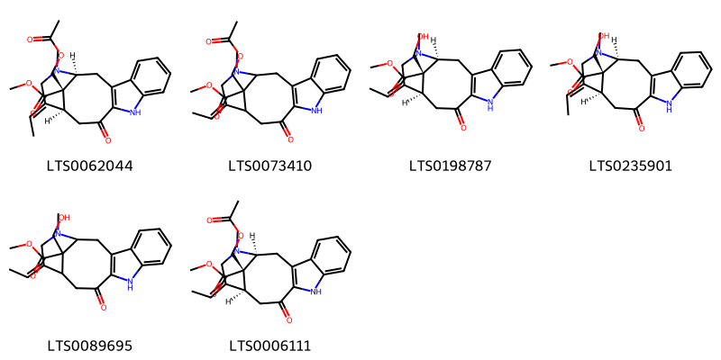{ width=100% }
    <figcaption>Hình ảnh cấu trúc hóa học của 6 hoạt chất thuộc nhóm Vobasan alkaloids gồm ['methyl (1s,14s,15e,18s)-18-[(acetyloxy)methyl]-15-ethylidene-17-methyl-12-oxo-10,17-diazatetracyclo[12.3.1.0³,¹¹.0⁴,⁹]octadeca-3(11),4,6,8-tetraene-18-carboxylate (LTS0062044)', 'methyl 18-[(acetyloxy)methyl]-15-ethylidene-17-methyl-12-oxo-10,17-diazatetracyclo[12.3.1.0³,¹¹.0⁴,⁹]octadeca-3(11),4,6,8-tetraene-18-carboxylate (LTS0073410)', 'methyl (1s,14s,15z,18s)-15-ethylidene-18-(hydroxymethyl)-17-methyl-12-oxo-10,17-diazatetracyclo[12.3.1.0³,¹¹.0⁴,⁹]octadeca-3(11),4,6,8-tetraene-18-carboxylate (LTS0198787)', 'methyl (1s,14s,15e,18s)-15-ethylidene-18-(hydroxymethyl)-17-methyl-12-oxo-10,17-diazatetracyclo[12.3.1.0³,¹¹.0⁴,⁹]octadeca-3(11),4,6,8-tetraene-18-carboxylate (LTS0235901)', 'methyl 15-ethylidene-18-(hydroxymethyl)-17-methyl-12-oxo-10,17-diazatetracyclo[12.3.1.0³,¹¹.0⁴,⁹]octadeca-3(11),4,6,8-tetraene-18-carboxylate (LTS0089695)', 'methyl (1s,14s,15z,18s)-18-[(acetyloxy)methyl]-15-ethylidene-17-methyl-12-oxo-10,17-diazatetracyclo[12.3.1.0³,¹¹.0⁴,⁹]octadeca-3(11),4,6,8-tetraene-18-carboxylate (LTS0006111)'].</figcaption>
</figure>

---

### Dược dân tộc học

Danh sách các quốc gia có sử dụng *Gelsemium sempervirens* trong điều trị các bệnh. 

| Country   | Disease                                          | Bệnh                                                                                                                                                                                                |
|:----------|:-------------------------------------------------|:----------------------------------------------------------------------------------------------------------------------------------------------------------------------------------------------------|
| Elsewhere | Mydriatic, Poison, Sedative, Nervine, Depressant | MYMEMORY WARNING: YOU USED ALL AVAILABLE FREE TRANSLATIONS FOR TODAY. NEXT AVAILABLE IN  14 HOURS 30 MINUTES 30 SECONDS VISIT HTTPS://MYMEMORY.TRANSLATED.NET/DOC/USAGELIMITS.PHP TO TRANSLATE MORE |
| Mexico    | Analgesic, Poison, Sedative, Poison, Sedative    | MYMEMORY WARNING: YOU USED ALL AVAILABLE FREE TRANSLATIONS FOR TODAY. NEXT AVAILABLE IN  14 HOURS 30 MINUTES 27 SECONDS VISIT HTTPS://MYMEMORY.TRANSLATED.NET/DOC/USAGELIMITS.PHP TO TRANSLATE MORE |
| Turkey    | Nervine, Sedative, Poison, Tonic                 | MYMEMORY WARNING: YOU USED ALL AVAILABLE FREE TRANSLATIONS FOR TODAY. NEXT AVAILABLE IN  14 HOURS 30 MINUTES 24 SECONDS VISIT HTTPS://MYMEMORY.TRANSLATED.NET/DOC/USAGELIMITS.PHP TO TRANSLATE MORE |
| US        | Poison                                           | MYMEMORY WARNING: YOU USED ALL AVAILABLE FREE TRANSLATIONS FOR TODAY. NEXT AVAILABLE IN  14 HOURS 30 MINUTES 21 SECONDS VISIT HTTPS://MYMEMORY.TRANSLATED.NET/DOC/USAGELIMITS.PHP TO TRANSLATE MORE |

---

