!!! abstract "Tóm tắt"

    Họ Lycopodiaceae gồm khoảng 1 chi và 5 loài được một số cộng đồng tại các quốc gia như Ruku-ruku, ain, US, Java, Turkey, US(Blackfoot), Elsewhere, China sử dụng trong một số trường hợp Máy ép, Uterotonic, sát trùng, Apertif, lợi tiểu, kích thích tình dục, thuốc bổ, Abortifacient, Emmenagogue, Carminative, Emmenagogue, nhuận tràng, lợi tiểu, Carminative.

!!! info "DrDuke"

    James A. Duke sinh năm 1929-2017 là một nhà thực vật học người Mỹ. Đây là một trong những tác giả hàng đầu trong lĩnh vực dược dân tộc học với cuốn *CRC Handbook of Medicinal Herbs* và chính là người xây dựng lên cơ sở dữ liệu về hợp chất tự nhiên và dược dân tộc học tại Bộ nông nghiệp Hoa Kỳ. Các thông tin được đăng tải tại website [Dr. Duke's Phytochemical and Ethnobotanical Databases](https://phytochem.nal.usda.gov/). 
    Trong suốt thập niên 1970, ông lãnh đạo the Plant Taxonomy Laboratory, Plant Genetics and Germplasm Institute of the Agricultural Research Service, U.S. Department of Agriculture.
    Trong tài liệu này, các thông tin về dược dân tộc của các dược liệu được trích dẫn từ tài liệu của James A. Ducke với sự trợ giúp của phần mềm dịch thuật từ tiếng Anh sang tiếng Việt.
   

# Chi Lycopodium

??? note "Danh sách các dược liệu thuộc chi"
    
	 - *Lycopodium cernuum*
	 - *Lycopodium clavatum*
	 - *Lycopodium complanatum*
	 - *Lycopodium phlegmaria*
	 - *Lycopodium selago*

---
## Lycopodium cernuum
### Thông tin về thực vật

!!! info "Phân loại thực vật của *Palhinhaea cernua* từ GIBF:"
    - **Kingdom:** Plantae
    - **Phylum:** Tracheophyta
    - **Order:** Lycopodiales
    - **Family:** Lycopodiaceae
    - **Genus:** Palhinhaea
    - **Species:** *Palhinhaea cernua*

 

| Label (VI)   | Label (EN)   | Scientific Name    | Descriptions (VI)   | Descriptions (EN)   | Also Known As (VI)   | Also Known As (EN)   |
|:-------------|:-------------|:-------------------|:--------------------|:--------------------|:---------------------|:---------------------|
| N/A          | N/A          | Lycopodium cernuum | loài thực vật       | species of plant    | ['']                 | ['']                 |

#### Phân bố trên thế giới

**Từ CSDL GIBF** nan, Brazil, Guatemala, Viet Nam, Japan, Uganda, Guadeloupe, Nepal, China, Madagascar, Cameroon, Thailand, Guinea, Ghana, Puerto Rico, United States of America, Korea, Republic of, Tonga, Indonesia, Costa Rica, Nigeria, Colombia, Saint Helena, Ascension and Tristan da Cunha, Togo, Lao People’s Democratic Republic, Fiji, Mexico, Chinese Taipei, Philippines, Palau, Solomon Islands, Cambodia, Timor-Leste, India, Peru, Bolivia (Plurinational State of), Samoa

#### Phân bố tại Việt Nam

**Từ CSDL GIBF**: Quang Tri (廣治省), Vinh Phuc (永富省), Thua Thien-Hue, Lam Dong, Da Nang

---
### Thành phần hóa học
        
- Theo cơ sở dữ liệu lotus: Từ loài *Palhinhaea cernua* đã phân lập và xác định được Chưa có hoạt chất nào được phân lập. hoạt chất thuộc về các nhóm Không có hoạt chất nào được phân lập. 

Không có hình ảnh nào được tạo ra

---

### Dược dân tộc học

Danh sách các quốc gia có sử dụng *Palhinhaea cernua* trong điều trị các bệnh. 

| Country   | Disease     | Bệnh                   |
|:----------|:------------|:-----------------------|
| China     | Carminative | Gây ô nhiễm môi trường |
| Ruku-ruku | Tonic       | (thuộc) trương lực     |

---

---
## Lycopodium clavatum
### Thông tin về thực vật

!!! info "Phân loại thực vật của *Lycopodium clavatum* từ GIBF:"
    - **Kingdom:** Plantae
    - **Phylum:** Tracheophyta
    - **Order:** Lycopodiales
    - **Family:** Lycopodiaceae
    - **Genus:** Lycopodium
    - **Species:** *Lycopodium clavatum*

 

| Label (VI)   | Label (EN)   | Scientific Name     | Descriptions (VI)   | Descriptions (EN)   | Also Known As (VI)   | Also Known As (EN)                                                                                                                     |
|:-------------|:-------------|:--------------------|:--------------------|:--------------------|:---------------------|:---------------------------------------------------------------------------------------------------------------------------------------|
| N/A          | N/A          | Lycopodium clavatum | loài thực vật       | species of plant    | ['']                 | ["stag's-horn clubmoss", "wolf's-foot clubmoss", 'common clubmoss', 'elk-moss', 'common club moss', 'ground pine', 'running clubmoss'] |

#### Phân bố trên thế giới

**Từ CSDL GIBF** Brazil, Guatemala, Czechia, Sweden, Finland, Slovenia, Poland, Denmark, Netherlands, United States of America, Russian Federation, Colombia, Estonia, Belarus, Norway, United Kingdom of Great Britain and Northern Ireland, Belgium, Chinese Taipei, Canada, Germany, Austria, Hungary, Ukraine, Slovakia, South Africa, Switzerland, Peru, France

#### Phân bố tại Việt Nam

**Từ CSDL GIBF**: Không có ghi nhận ở Việt Nam

---
### Thành phần hóa học
        
- Theo cơ sở dữ liệu lotus: Từ loài *Lycopodium clavatum* đã phân lập và xác định được 76 hoạt chất thuộc về các nhóm Flavonoids, Cinnamic acids and derivatives, Steroids and steroid derivatives, Azaspirodecane derivatives, Phenanthrolines, Phenylpropanoic acids, Organooxygen compounds, Prenol lipids. 

|    | chemicalTaxonomyClassyfireClass   |   smiles_count |
|---:|:----------------------------------|---------------:|
|  0 | Azaspirodecane derivatives        |              9 |
|  1 | Cinnamic acids and derivatives    |              2 |
|  2 | Flavonoids                        |              7 |
|  3 | Organooxygen compounds            |              2 |
|  4 | Phenanthrolines                   |              1 |
|  5 | Phenylpropanoic acids             |              1 |
|  6 | Prenol lipids                     |             52 |
|  7 | Steroids and steroid derivatives  |              1 |

#### Nhóm Azaspirodecane derivatives
<figure markdown="span">
    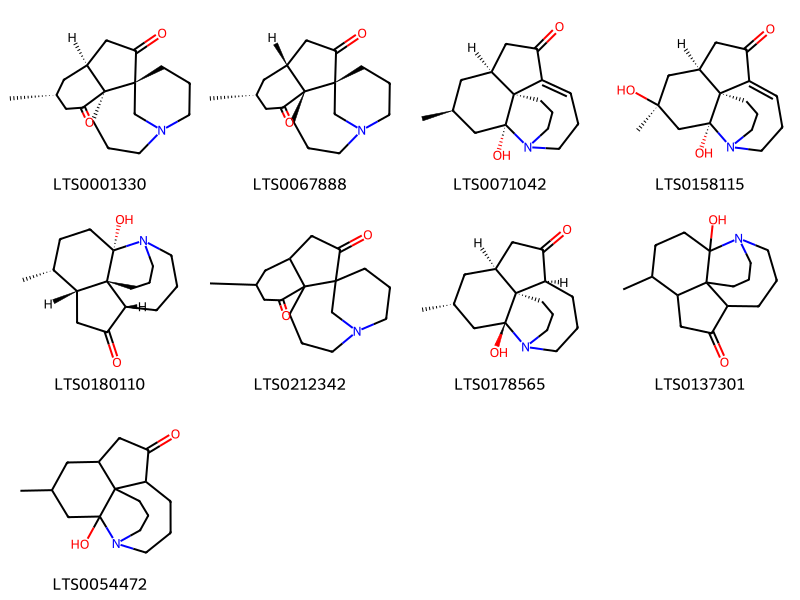{ width=100% }
    <figcaption>Hình ảnh cấu trúc hóa học của 9 hoạt chất thuộc nhóm Azaspirodecane derivatives gồm ['lycoflexine (LTS0001330)', '(1s,4r,6r,9r)-6-methyl-13-azatetracyclo[11.3.1.0¹,⁹.0⁴,⁹]heptadecane-2,8-dione (LTS0067888)', '(1s,2r,4s,6s)-2-hydroxy-4-methyl-13-azatetracyclo[7.7.0.0¹,⁶.0²,¹³]hexadec-9-en-8-one (LTS0071042)', '(1s,2r,4s,6s)-2,4-dihydroxy-4-methyl-13-azatetracyclo[7.7.0.0¹,⁶.0²,¹³]hexadec-9-en-8-one (LTS0158115)', '(1s,2s,5r,6r,9s)-2-hydroxy-5-methyl-13-azatetracyclo[7.7.0.0¹,⁶.0²,¹³]hexadecan-8-one (LTS0180110)', '6-methyl-13-azatetracyclo[11.3.1.0¹,⁹.0⁴,⁹]heptadecane-2,8-dione (LTS0212342)', 'fawcettimine (LTS0178565)', '2-hydroxy-5-methyl-13-azatetracyclo[7.7.0.0¹,⁶.0²,¹³]hexadecan-8-one (LTS0137301)', '2-hydroxy-4-methyl-13-azatetracyclo[7.7.0.0¹,⁶.0²,¹³]hexadecan-8-one (LTS0054472)'].</figcaption>
</figure>
#### Nhóm Cinnamic acids and derivatives
<figure markdown="span">
    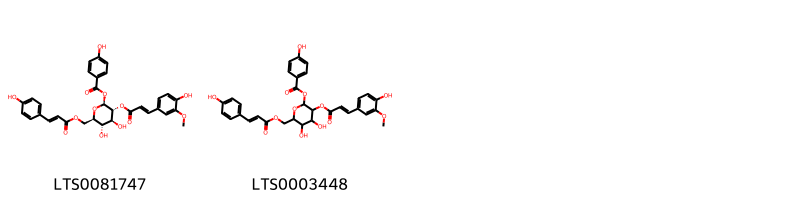{ width=100% }
    <figcaption>Hình ảnh cấu trúc hóa học của 2 hoạt chất thuộc nhóm Cinnamic acids and derivatives gồm ['(2s,3r,4s,5s,6r)-4,5-dihydroxy-3-{[(2e)-3-(4-hydroxy-3-methoxyphenyl)prop-2-enoyl]oxy}-6-({[(2e)-3-(4-hydroxyphenyl)prop-2-enoyl]oxy}methyl)oxan-2-yl 4-hydroxybenzoate (LTS0081747)', '4,5-dihydroxy-3-{[3-(4-hydroxy-3-methoxyphenyl)prop-2-enoyl]oxy}-6-({[3-(4-hydroxyphenyl)prop-2-enoyl]oxy}methyl)oxan-2-yl 4-hydroxybenzoate (LTS0003448)'].</figcaption>
</figure>
#### Nhóm Flavonoids
<figure markdown="span">
    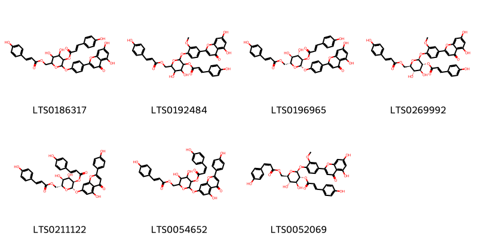{ width=100% }
    <figcaption>Hình ảnh cấu trúc hóa học của 7 hoạt chất thuộc nhóm Flavonoids gồm ['{6-[4-(5,7-dihydroxy-4-oxochromen-2-yl)phenoxy]-3,4-dihydroxy-5-{[3-(4-hydroxyphenyl)prop-2-enoyl]oxy}oxan-2-yl}methyl 3-(4-hydroxyphenyl)prop-2-enoate (LTS0186317)', '{6-[4-(5,7-dihydroxy-4-oxochromen-2-yl)-2-methoxyphenoxy]-3,4-dihydroxy-5-{[3-(4-hydroxyphenyl)prop-2-enoyl]oxy}oxan-2-yl}methyl 3-(4-hydroxyphenyl)prop-2-enoate (LTS0192484)', '[(2r,3s,4s,5r,6s)-6-[4-(5,7-dihydroxy-4-oxochromen-2-yl)phenoxy]-3,4-dihydroxy-5-{[(2e)-3-(4-hydroxyphenyl)prop-2-enoyl]oxy}oxan-2-yl]methyl (2e)-3-(4-hydroxyphenyl)prop-2-enoate (LTS0196965)', '[(2r,3s,4s,5r,6s)-6-[4-(5,7-dihydroxy-4-oxochromen-2-yl)-2-methoxyphenoxy]-3,4-dihydroxy-5-{[(2e)-3-(4-hydroxyphenyl)prop-2-enoyl]oxy}oxan-2-yl]methyl (2e)-3-(4-hydroxyphenyl)prop-2-enoate (LTS0269992)', '[(2r,3s,4s,5r,6s)-3,4-dihydroxy-6-{[5-hydroxy-2-(4-hydroxyphenyl)-4-oxochromen-7-yl]oxy}-5-{[(2e)-3-(4-hydroxyphenyl)prop-2-enoyl]oxy}oxan-2-yl]methyl (2e)-3-(4-hydroxyphenyl)prop-2-enoate (LTS0211122)', '(3,4-dihydroxy-6-{[5-hydroxy-2-(4-hydroxyphenyl)-4-oxochromen-7-yl]oxy}-5-{[3-(4-hydroxyphenyl)prop-2-enoyl]oxy}oxan-2-yl)methyl 3-(4-hydroxyphenyl)prop-2-enoate (LTS0054652)', '[(2r,3s,4s,5r,6s)-6-[4-(5,7-dihydroxy-4-oxochromen-2-yl)-2-methoxyphenoxy]-3,4-dihydroxy-5-{[(2e)-3-(4-hydroxyphenyl)prop-2-enoyl]oxy}oxan-2-yl]methyl (2z)-3-(4-hydroxyphenyl)prop-2-enoate (LTS0052069)'].</figcaption>
</figure>
#### Nhóm Organooxygen compounds
<figure markdown="span">
    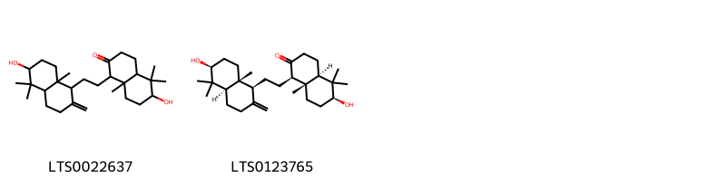{ width=100% }
    <figcaption>Hình ảnh cấu trúc hóa học của 2 hoạt chất thuộc nhóm Organooxygen compounds gồm ['6-hydroxy-1-[2-(6-hydroxy-5,5,8a-trimethyl-2-methylidene-hexahydro-1h-naphthalen-1-yl)ethyl]-5,5,8a-trimethyl-hexahydro-1h-naphthalen-2-one (LTS0022637)', '(1r,4ar,6s,8as)-1-{2-[(1s,4ar,6s,8ar)-6-hydroxy-5,5,8a-trimethyl-2-methylidene-hexahydro-1h-naphthalen-1-yl]ethyl}-6-hydroxy-5,5,8a-trimethyl-hexahydro-1h-naphthalen-2-one (LTS0123765)'].</figcaption>
</figure>
#### Nhóm Phenanthrolines
<figure markdown="span">
    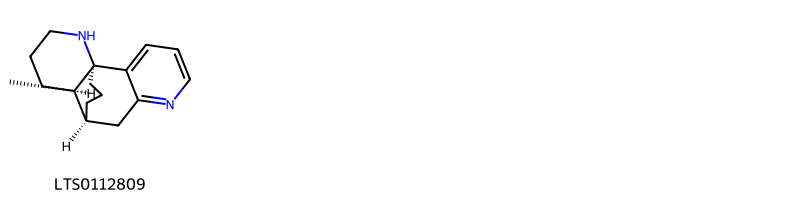{ width=100% }
    <figcaption>Hình ảnh cấu trúc hóa học của 1 hoạt chất thuộc nhóm Phenanthrolines gồm ['lycodine (LTS0112809)'].</figcaption>
</figure>
#### Nhóm Phenylpropanoic acids
<figure markdown="span">
    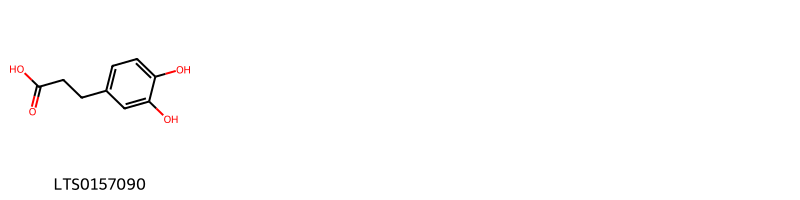{ width=100% }
    <figcaption>Hình ảnh cấu trúc hóa học của 1 hoạt chất thuộc nhóm Phenylpropanoic acids gồm ['dihydrocaffeic acid (LTS0157090)'].</figcaption>
</figure>
#### Nhóm Prenol lipids
<figure markdown="span">
    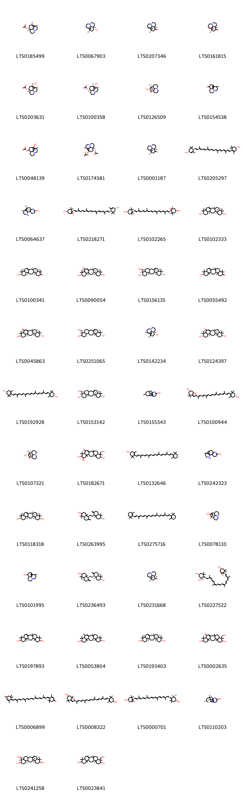{ width=100% }
    <figcaption>Hình ảnh cấu trúc hóa học của 52 hoạt chất thuộc nhóm Prenol lipids gồm ['(1r,2r,10s,11r,13s,15r)-15-methyl-6-azatetracyclo[8.6.0.0¹,⁶.0²,¹³]hexadecan-11-yl acetate (LTS0185499)', '(1r,2r,10s,11r,13s,15r)-15-methyl-6-azatetracyclo[8.6.0.0¹,⁶.0²,¹³]hexadecan-11-ol (LTS0067903)', '(1s,10s,13s,15r)-15-methyl-6-azatetracyclo[8.6.0.0¹,⁶.0²,¹³]hexadec-2-en-11-one (LTS0207346)', '(1s,2s,10s,13s,15r)-2-hydroxy-15-methyl-6-azatetracyclo[8.6.0.0¹,⁶.0²,¹³]hexadecan-11-one (LTS0161815)', '(1r,2r,10s,11r,13s,14r,15s)-14-hydroxy-15-methyl-6-azatetracyclo[8.6.0.0¹,⁶.0²,¹³]hexadecan-11-yl acetate (LTS0203631)', '(1s,2r,10r,11r,13r,14r,15s)-14-hydroxy-15-methyl-6-azatetracyclo[8.6.0.0¹,⁶.0²,¹³]hexadecan-11-yl acetate (LTS0100358)', '(1r,2r,10s,13s,14s,15s)-14-hydroxy-15-methyl-6-azatetracyclo[8.6.0.0¹,⁶.0²,¹³]hexadecan-11-one (LTS0126509)', '15-methyl-6-azatetracyclo[8.6.0.0¹,⁶.0²,¹³]hexadecan-11-one (LTS0154538)', '14-hydroxy-15-methyl-6-azatetracyclo[8.6.0.0¹,⁶.0²,¹³]hexadecan-11-yl acetate (LTS0048139)', '(1r,2r,10s,11r,13s,14r,15s)-14-(acetyloxy)-15-methyl-6-azatetracyclo[8.6.0.0¹,⁶.0²,¹³]hexadecan-11-yl acetate (LTS0174581)', 'lycopodine (LTS0001187)', 'carotenoid (LTS0205297)', '(1s,9r,10s,16s)-14,16-dimethyl-6,14-diazatetracyclo[7.5.3.0¹,¹⁰.0²,⁷]heptadeca-2(7),5-dien-5-ol (LTS0064637)', 'taraxanthin (LTS0218271)', 'violaxanthin (LTS0102265)', '(1s,6r,8s,11r,12s,15s,16r,19s,21r)-1,7,7,11,16,20,20-heptamethylpentacyclo[13.8.0.0³,¹².0⁶,¹¹.0¹⁶,²¹]tricos-3-ene-8,19-diol (LTS0102333)', '(3s,6r,11r,12s,15s,16r,19r,21r)-19-hydroxy-3,7,7,11,16,20,20-heptamethylpentacyclo[13.8.0.0³,¹².0⁶,¹¹.0¹⁶,²¹]tricos-1(23)-en-8-one (LTS0100341)', '(1s,6r,8r,11r,12s,15s,16r,19s,21r)-8,19-dihydroxy-1,7,7,11,16,20,20-heptamethylpentacyclo[13.8.0.0³,¹².0⁶,¹¹.0¹⁶,²¹]tricos-3-en-5-one (LTS0090054)', '(1s,6r,8r,11r,12s,15s,16r,19s,20s,21r)-20-(hydroxymethyl)-1,7,7,11,16,20-hexamethylpentacyclo[13.8.0.0³,¹².0⁶,¹¹.0¹⁶,²¹]tricos-3-ene-8,19-diol (LTS0156135)', '19-hydroxy-3,7,7,11,16,20,20-heptamethylpentacyclo[13.8.0.0³,¹².0⁶,¹¹.0¹⁶,²¹]tricos-1(23)-en-8-one (LTS0055492)', '(1s,6r,8r,11r,12s,15s,16r,19r,21r)-8,19-dihydroxy-1,7,7,11,16,20,20-heptamethylpentacyclo[13.8.0.0³,¹².0⁶,¹¹.0¹⁶,²¹]tricos-3-en-5-one (LTS0045863)', '(1s,6r,8r,12s,16r,20s)-20-(hydroxymethyl)-1,7,7,11,16,20-hexamethylpentacyclo[13.8.0.0³,¹².0⁶,¹¹.0¹⁶,²¹]tricos-3-ene-8,19-diol (LTS0251065)', '(1s,2s,10r,11r,13r,15s)-15-methyl-6-azatetracyclo[8.6.0.0¹,⁶.0²,¹³]hexadecan-11-ol (LTS0142234)', '(1s,6r,8s,11r,12s,15s,16r,19s,21r)-8,19-dihydroxy-1,7,7,11,16,20,20-heptamethylpentacyclo[13.8.0.0³,¹².0⁶,¹¹.0¹⁶,²¹]tricos-3-en-5-one (LTS0124397)', 'zeaxanthin (LTS0192928)', '(1s,6r,8s,11r,12s,15s,16r,19s,20s,21r)-20-(hydroxymethyl)-1,7,7,11,16,20-hexamethylpentacyclo[13.8.0.0³,¹².0⁶,¹¹.0¹⁶,²¹]tricos-3-ene-8,19-diol (LTS0153142)', '16-methyl-6,14-diazatetracyclo[7.5.3.0¹,¹⁰.0²,⁷]heptadeca-2(7),5-dien-5-ol (LTS0155343)', '(6s,7ar)-2-[(2e,4e,6e,8e,10e,12e,14e,16e)-17-[(4r)-4-hydroxy-2,6,6-trimethylcyclohex-1-en-1-yl]-6,11,15-trimethylheptadeca-2,4,6,8,10,12,14,16-octaen-2-yl]-4,4,7a-trimethyl-2,5,6,7-tetrahydro-1-benzofuran-6-ol (LTS0100944)', '(1s,2r,10r,13r,14s,15r)-14-hydroxy-15-methyl-6-azatetracyclo[8.6.0.0¹,⁶.0²,¹³]hexadecan-11-one (LTS0107321)', '8,9,19-trihydroxy-20-(hydroxymethyl)-1,7,7,11,16,20-hexamethylpentacyclo[13.8.0.0³,¹².0⁶,¹¹.0¹⁶,²¹]tricos-3-en-5-one (LTS0182671)', 'cryptoxanthin (LTS0132646)', '14,16-dimethyl-6,14-diazatetracyclo[7.5.3.0¹,¹⁰.0²,⁷]heptadeca-2(7),5-dien-5-ol (LTS0242323)', '(1s,6r,8r,11r,12s,15s,16r,19s,21r)-1,7,7,11,16,20,20-heptamethylpentacyclo[13.8.0.0³,¹².0⁶,¹¹.0¹⁶,²¹]tricos-3-ene-8,19-diol (LTS0118318)', '5-[2-(6-hydroxy-5,5,8a-trimethyl-2-methylidene-hexahydro-1h-naphthalen-1-yl)ethyl]-1,1,4a-trimethyl-6-methylidene-hexahydro-2h-naphthalen-2-ol (LTS0263995)', 'β-carotene (LTS0275716)', '14-hydroxy-15-methyl-6-azatetracyclo[8.6.0.0¹,⁶.0²,¹³]hexadecan-11-one (LTS0078110)', '15-methyl-6-azatetracyclo[8.6.0.0¹,⁶.0²,¹³]hexadecan-11-ol (LTS0101995)', '(2s,4ar,5s,8ar)-5-{2-[(1s,4ar,6s,8ar)-6-hydroxy-5,5,8a-trimethyl-2-methylidene-hexahydro-1h-naphthalen-1-yl]ethyl}-1,1,4a-trimethyl-6-methylidene-hexahydro-2h-naphthalen-2-ol (LTS0236493)', '(1r,2r,10r,13s,15r)-15-methyl-6-azatetracyclo[8.6.0.0¹,⁶.0²,¹³]hexadecan-11-one (LTS0231668)', 'neoxanthin (LTS0227522)', '1,7,7,11,16,20,20-heptamethylpentacyclo[13.8.0.0³,¹².0⁶,¹¹.0¹⁶,²¹]tricos-3-ene-8,19-diol (LTS0197893)', '8,19-dihydroxy-1,7,7,11,16,20,20-heptamethylpentacyclo[13.8.0.0³,¹².0⁶,¹¹.0¹⁶,²¹]tricos-3-en-5-one (LTS0053804)', '(1s,6r,8r,11r,12s,15s,16r,19r,21r)-1,7,7,11,16,20,20-heptamethylpentacyclo[13.8.0.0³,¹².0⁶,¹¹.0¹⁶,²¹]tricos-3-ene-8,19-diol (LTS0193403)', '8,19-dihydroxy-20-(hydroxymethyl)-1,7,7,11,16,20-hexamethylpentacyclo[13.8.0.0³,¹².0⁶,¹¹.0¹⁶,²¹]tricos-3-en-5-one (LTS0002635)', 'rhodoxanthin (LTS0006899)', '2-[(2e,4e,6e,8e,10e,12e,14e,16e)-17-(4-hydroxy-2,6,6-trimethylcyclohex-1-en-1-yl)-6,11,15-trimethylheptadeca-2,4,6,8,10,12,14,16-octaen-2-yl]-4,4,7a-trimethyl-2,5,6,7-tetrahydro-1-benzofuran-6-ol (LTS0008322)', 'neoxanthin (LTS0000701)', '(1s,9r,10s,16s)-16-methyl-6,14-diazatetracyclo[7.5.3.0¹,¹⁰.0²,⁷]heptadeca-2(7),5-dien-5-ol (LTS0110203)', '(1s,6r,11r,12r,15r,16r,20s,21r)-20-(hydroxymethyl)-1,7,7,11,16,20-hexamethylpentacyclo[13.8.0.0³,¹².0⁶,¹¹.0¹⁶,²¹]tricos-3-ene-8,19-diol (LTS0241258)', '20-(hydroxymethyl)-1,7,7,11,16,20-hexamethylpentacyclo[13.8.0.0³,¹².0⁶,¹¹.0¹⁶,²¹]tricos-3-ene-8,19-diol (LTS0023841)', '(1s,6r,8s,11r,12s,15s,16r,19s,20s,21r)-8,19-dihydroxy-20-(hydroxymethyl)-1,7,7,11,16,20-hexamethylpentacyclo[13.8.0.0³,¹².0⁶,¹¹.0¹⁶,²¹]tricos-3-en-5-one (LTS0095965)', '(1s,6r,8s,9r,11r,12s,15s,16r,19r,20s,21r)-8,9,19-trihydroxy-20-(hydroxymethyl)-1,7,7,11,16,20-hexamethylpentacyclo[13.8.0.0³,¹².0⁶,¹¹.0¹⁶,²¹]tricos-3-en-5-one (LTS0256048)'].</figcaption>
</figure>
#### Nhóm Steroids and steroid derivatives
<figure markdown="span">
    { width=100% }
    <figcaption>Hình ảnh cấu trúc hóa học của 1 hoạt chất thuộc nhóm Steroids and steroid derivatives gồm ['cholesterol (LTS0102304)'].</figcaption>
</figure>

---

### Dược dân tộc học

Danh sách các quốc gia có sử dụng *Lycopodium clavatum* trong điều trị các bệnh. 

| Country   | Disease                                      | Bệnh                                            |
|:----------|:---------------------------------------------|:------------------------------------------------|
| Elsewhere | Pressor, Uterotonic                          | Máy ép, Uterotonic                              |
| Turkey    | Carminative, Emmenagogue, Laxative, Diuretic | Carminative, Emmenagogue, nhuận tràng, lợi tiểu |
| US        | Apertif, Diuretic, Aphrodisiac               | Apertif, lợi tiểu, kích thích tình dục          |

---

---
## Lycopodium complanatum
### Thông tin về thực vật

!!! info "Phân loại thực vật của *N/A* từ GIBF:"
    - **Kingdom:** Plantae
    - **Phylum:** Tracheophyta
    - **Order:** Lycopodiales
    - **Family:** Lycopodiaceae
    - **Genus:** Diphasiastrum
    - **Species:** *N/A*

 

| Label (VI)   | Label (EN)   | Scientific Name        | Descriptions (VI)   | Descriptions (EN)   | Also Known As (VI)   | Also Known As (EN)   |
|:-------------|:-------------|:-----------------------|:--------------------|:--------------------|:---------------------|:---------------------|
| N/A          | N/A          | Lycopodium complanatum |                     | species of plant    | ['']                 | ['']                 |

#### Phân bố trên thế giới

**Từ CSDL GIBF** Hungary, United States of America, Sweden, Chinese Taipei, Colombia, Slovenia, Canada, Germany, United Kingdom of Great Britain and Northern Ireland, Poland

#### Phân bố tại Việt Nam

**Từ CSDL GIBF**: Không có ghi nhận ở Việt Nam

---
### Thành phần hóa học
        
- Theo cơ sở dữ liệu lotus: Từ loài *N/A* đã phân lập và xác định được 94 hoạt chất thuộc về các nhóm Fatty Acyls, Quinolidines, Azaspirodecane derivatives, Pyridines and derivatives, Phenanthrolines, Diazanaphthalenes, Organooxygen compounds, Quinolizidines, Prenol lipids. 

|    | chemicalTaxonomyClassyfireClass   |   smiles_count |
|---:|:----------------------------------|---------------:|
|  0 | Azaspirodecane derivatives        |              8 |
|  1 | Diazanaphthalenes                 |              4 |
|  2 | Fatty Acyls                       |              9 |
|  3 | Organooxygen compounds            |              2 |
|  4 | Phenanthrolines                   |             17 |
|  5 | Prenol lipids                     |             42 |
|  6 | Pyridines and derivatives         |              3 |
|  7 | Quinolidines                      |              6 |
|  8 | Quinolizidines                    |              2 |

#### Nhóm Azaspirodecane derivatives
<figure markdown="span">
    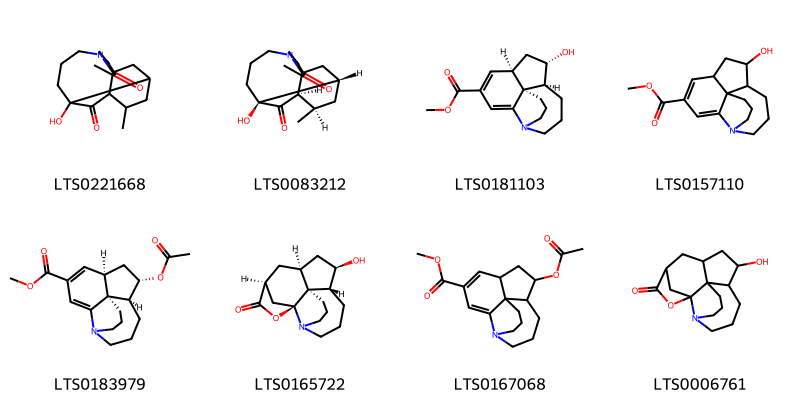{ width=100% }
    <figcaption>Hình ảnh cấu trúc hóa học của 8 hoạt chất thuộc nhóm Azaspirodecane derivatives gồm ['8-hydroxy-5-methyl-12-azatetracyclo[10.4.0.0¹,⁶.0³,⁸]hexadecane-7,16-dione (LTS0221668)', '(1s,3s,5r,6r,8s)-8-hydroxy-5-methyl-12-azatetracyclo[10.4.0.0¹,⁶.0³,⁸]hexadecane-7,16-dione (LTS0083212)', 'methyl (1s,6r,8s,9s)-8-hydroxy-13-azatetracyclo[7.7.0.0¹,⁶.0²,¹³]hexadeca-2,4-diene-4-carboxylate (LTS0181103)', 'methyl 8-hydroxy-13-azatetracyclo[7.7.0.0¹,⁶.0²,¹³]hexadeca-2,4-diene-4-carboxylate (LTS0157110)', 'methyl (1s,6r,8s,9s)-8-(acetyloxy)-13-azatetracyclo[7.7.0.0¹,⁶.0²,¹³]hexadeca-2,4-diene-4-carboxylate (LTS0183979)', '(1s,2s,10r,11r,13s,15s)-11-hydroxy-17-oxa-6-azapentacyclo[13.2.1.0¹,⁶.0²,¹⁰.0²,¹³]octadecan-16-one (LTS0165722)', 'methyl 8-(acetyloxy)-13-azatetracyclo[7.7.0.0¹,⁶.0²,¹³]hexadeca-2,4-diene-4-carboxylate (LTS0167068)', '11-hydroxy-17-oxa-6-azapentacyclo[13.2.1.0¹,⁶.0²,¹⁰.0²,¹³]octadecan-16-one (LTS0006761)'].</figcaption>
</figure>
#### Nhóm Diazanaphthalenes
<figure markdown="span">
    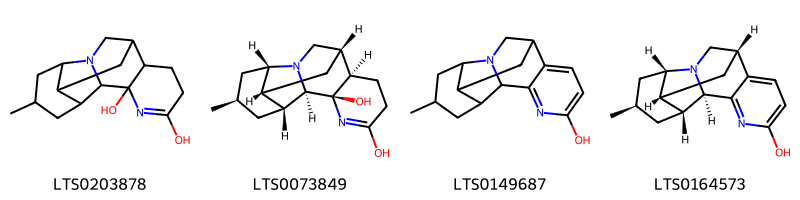{ width=100% }
    <figcaption>Hình ảnh cấu trúc hóa học của 4 hoạt chất thuộc nhóm Diazanaphthalenes gồm ['14-methyl-1,4-diazapentacyclo[7.7.1.0²,¹².0³,⁸.0¹¹,¹⁶]heptadec-4-ene-3,5-diol (LTS0203878)', '(2r,3r,8r,9s,11r,12r,14r,16s)-14-methyl-1,4-diazapentacyclo[7.7.1.0²,¹².0³,⁸.0¹¹,¹⁶]heptadec-4-ene-3,5-diol (LTS0073849)', '14-methyl-1,4-diazapentacyclo[7.7.1.0²,¹².0³,⁸.0¹¹,¹⁶]heptadeca-3,5,7-trien-5-ol (LTS0149687)', '(2r,9s,11r,12r,14r,16s)-14-methyl-1,4-diazapentacyclo[7.7.1.0²,¹².0³,⁸.0¹¹,¹⁶]heptadeca-3,5,7-trien-5-ol (LTS0164573)'].</figcaption>
</figure>
#### Nhóm Fatty Acyls
<figure markdown="span">
    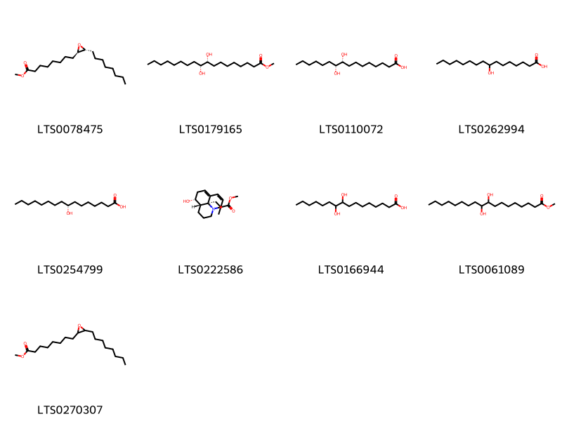{ width=100% }
    <figcaption>Hình ảnh cấu trúc hóa học của 9 hoạt chất thuộc nhóm Fatty Acyls gồm ['methyl 8-[(2r,3r)-3-octyloxiran-2-yl]octanoate (LTS0078475)', 'methyl (9r,10r)-9,10-dihydroxyoctadecanoate (LTS0179165)', '(9r,10r)-9,10-dihydroxyhexadecanoic acid (LTS0110072)', '8-hydroxyhexadecanoic acid (LTS0262994)', '(8r)-8-hydroxyhexadecanoic acid (LTS0254799)', 'lyconnotine (LTS0222586)', '9,10-dihydroxyhexadecanoic acid (LTS0166944)', 'methyl 9,10-dihydroxyoctadecanoate (LTS0061089)', 'methyl 8-(3-octyloxiran-2-yl)octanoate (LTS0270307)'].</figcaption>
</figure>
#### Nhóm Organooxygen compounds
<figure markdown="span">
    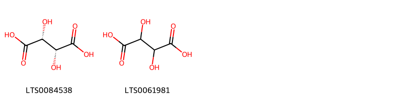{ width=100% }
    <figcaption>Hình ảnh cấu trúc hóa học của 2 hoạt chất thuộc nhóm Organooxygen compounds gồm ['l(+)-tartaric acid (LTS0084538)', '(.+-.)-tartaric acid (LTS0061981)'].</figcaption>
</figure>
#### Nhóm Phenanthrolines
<figure markdown="span">
    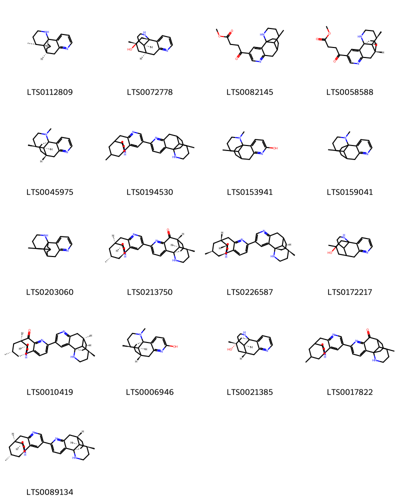{ width=100% }
    <figcaption>Hình ảnh cấu trúc hóa học của 17 hoạt chất thuộc nhóm Phenanthrolines gồm ['lycodine (LTS0112809)', '(1s,9r,10r,16r)-16-methyl-6,14-diazatetracyclo[7.5.3.0¹,¹⁰.0²,⁷]heptadeca-2,4,6-trien-11-ol (LTS0072778)', 'methyl 4-{16-methyl-6,14-diazatetracyclo[7.5.3.0¹,¹⁰.0²,⁷]heptadeca-2,4,6-trien-4-yl}-4-oxobutanoate (LTS0082145)', 'methyl 4-[(1s,9r,10s,16s)-16-methyl-6,14-diazatetracyclo[7.5.3.0¹,¹⁰.0²,⁷]heptadeca-2,4,6-trien-4-yl]-4-oxobutanoate (LTS0058588)', '(1r,9s,10r,16r)-14,16-dimethyl-6,14-diazatetracyclo[7.5.3.0¹,¹⁰.0²,⁷]heptadeca-2,4,6-triene (LTS0045975)', '16-methyl-4-{16-methyl-6,14-diazatetracyclo[7.5.3.0¹,¹⁰.0²,⁷]heptadeca-2,4,6-trien-5-yl}-6,14-diazatetracyclo[7.5.3.0¹,¹⁰.0²,⁷]heptadeca-2,4,6-triene (LTS0194530)', '14,16-dimethyl-6,14-diazatetracyclo[7.5.3.0¹,¹⁰.0²,⁷]heptadeca-2,4,6-trien-5-ol (LTS0153941)', '14,16-dimethyl-6,14-diazatetracyclo[7.5.3.0¹,¹⁰.0²,⁷]heptadeca-2,4,6-triene (LTS0159041)', '16-methyl-6,14-diazatetracyclo[7.5.3.0¹,¹⁰.0²,⁷]heptadeca-2,4,6-triene (LTS0203060)', '(1r,9r,10r,16r)-16-methyl-5-[(1r,9s,10r,16r)-16-methyl-6,14-diazatetracyclo[7.5.3.0¹,¹⁰.0²,⁷]heptadeca-2,4,6-trien-4-yl]-6,14-diazatetracyclo[7.5.3.0¹,¹⁰.0²,⁷]heptadeca-2,4,6-trien-8-one (LTS0213750)', '(1r,9r,10s,16s)-16-methyl-5-[(1s,10r,16r)-16-methyl-6,14-diazatetracyclo[7.5.3.0¹,¹⁰.0²,⁷]heptadeca-2,4,6-trien-4-yl]-6,14-diazatetracyclo[7.5.3.0¹,¹⁰.0²,⁷]heptadeca-2,4,6-triene (LTS0226587)', '16-methyl-6,14-diazatetracyclo[7.5.3.0¹,¹⁰.0²,⁷]heptadeca-2,4,6-trien-11-ol (LTS0172217)', '(1s,9r,10r,16r)-16-methyl-5-[(1r,9r,10r,16r)-16-methyl-6,14-diazatetracyclo[7.5.3.0¹,¹⁰.0²,⁷]heptadeca-2,4,6-trien-4-yl]-6,14-diazatetracyclo[7.5.3.0¹,¹⁰.0²,⁷]heptadeca-2,4,6-trien-8-one (LTS0010419)', '(1r,9s,10r,16r)-14,16-dimethyl-6,14-diazatetracyclo[7.5.3.0¹,¹⁰.0²,⁷]heptadeca-2,4,6-trien-5-ol (LTS0006946)', '(1r,9s,10r,11r,16r)-16-methyl-6,14-diazatetracyclo[7.5.3.0¹,¹⁰.0²,⁷]heptadeca-2,4,6-trien-11-ol (LTS0021385)', '16-methyl-5-{16-methyl-6,14-diazatetracyclo[7.5.3.0¹,¹⁰.0²,⁷]heptadeca-2,4,6-trien-4-yl}-6,14-diazatetracyclo[7.5.3.0¹,¹⁰.0²,⁷]heptadeca-2,4,6-trien-8-one (LTS0017822)', '(1r,9s,10r,16r)-16-methyl-4-[(1r,9s,10r,16r)-16-methyl-6,14-diazatetracyclo[7.5.3.0¹,¹⁰.0²,⁷]heptadeca-2,4,6-trien-5-yl]-6,14-diazatetracyclo[7.5.3.0¹,¹⁰.0²,⁷]heptadeca-2,4,6-triene (LTS0089134)'].</figcaption>
</figure>
#### Nhóm Prenol lipids
<figure markdown="span">
    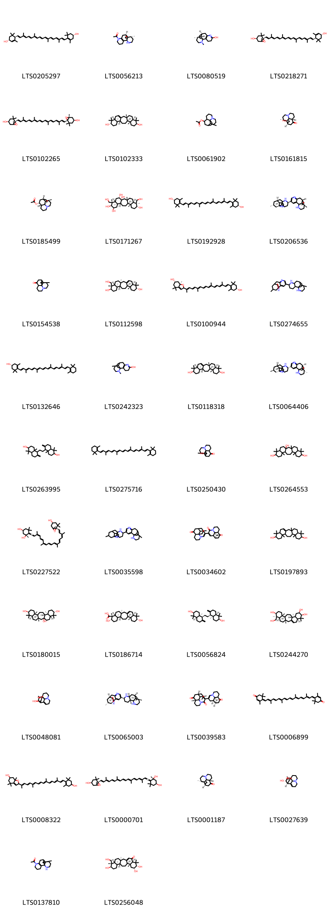{ width=100% }
    <figcaption>Hình ảnh cấu trúc hóa học của 42 hoạt chất thuộc nhóm Prenol lipids gồm ['carotenoid (LTS0205297)', 'flabellidine (LTS0056213)', '(1r,9s,10r,16r)-14,16-dimethyl-6,14-diazatetracyclo[7.5.3.0¹,¹⁰.0²,⁷]heptadeca-2(7),5-dien-5-ol (LTS0080519)', 'taraxanthin (LTS0218271)', 'violaxanthin (LTS0102265)', '(1s,6r,8s,11r,12s,15s,16r,19s,21r)-1,7,7,11,16,20,20-heptamethylpentacyclo[13.8.0.0³,¹².0⁶,¹¹.0¹⁶,²¹]tricos-3-ene-8,19-diol (LTS0102333)', '15-methyl-6-azatetracyclo[8.6.0.0¹,⁶.0²,¹³]hexadecan-11-yl acetate (LTS0061902)', '(1s,2s,10s,13s,15r)-2-hydroxy-15-methyl-6-azatetracyclo[8.6.0.0¹,⁶.0²,¹³]hexadecan-11-one (LTS0161815)', '(1r,2r,10s,11r,13s,15r)-15-methyl-6-azatetracyclo[8.6.0.0¹,⁶.0²,¹³]hexadecan-11-yl acetate (LTS0185499)', '(1r,3s,6r,7s,8r,11r,12s,15r,16s,18r,19s,20s,21r,23s)-7,20-bis(hydroxymethyl)-3,7,11,16,20-pentamethylpentacyclo[13.8.0.0³,¹².0⁶,¹¹.0¹⁶,²¹]tricosane-1,8,18,19,23-pentol (LTS0171267)', 'zeaxanthin (LTS0192928)', '(1r,9s,10r,16r)-16-methyl-4-[(1r,5r,9s,10r,16r)-16-methyl-6,14-diazatetracyclo[7.5.3.0¹,¹⁰.0²,⁷]heptadec-2(7)-en-5-yl]-6,14-diazatetracyclo[7.5.3.0¹,¹⁰.0²,⁷]heptadeca-2,4,6-triene (LTS0206536)', '15-methyl-6-azatetracyclo[8.6.0.0¹,⁶.0²,¹³]hexadecan-11-one (LTS0154538)', '(1s,6r,8r,11r,12s,15s,16r,19r,20s,21r)-20-(hydroxymethyl)-1,7,7,11,16,20-hexamethylpentacyclo[13.8.0.0³,¹².0⁶,¹¹.0¹⁶,²¹]tricos-3-ene-8,19-diol (LTS0112598)', '(6s,7ar)-2-[(2e,4e,6e,8e,10e,12e,14e,16e)-17-[(4r)-4-hydroxy-2,6,6-trimethylcyclohex-1-en-1-yl]-6,11,15-trimethylheptadeca-2,4,6,8,10,12,14,16-octaen-2-yl]-4,4,7a-trimethyl-2,5,6,7-tetrahydro-1-benzofuran-6-ol (LTS0100944)', '16-methyl-4-{16-methyl-6,14-diazatetracyclo[7.5.3.0¹,¹⁰.0²,⁷]heptadecan-5-yl}-6,14-diazatetracyclo[7.5.3.0¹,¹⁰.0²,⁷]heptadeca-2,4,6-triene (LTS0274655)', 'cryptoxanthin (LTS0132646)', '14,16-dimethyl-6,14-diazatetracyclo[7.5.3.0¹,¹⁰.0²,⁷]heptadeca-2(7),5-dien-5-ol (LTS0242323)', '(1s,6r,8r,11r,12s,15s,16r,19s,21r)-1,7,7,11,16,20,20-heptamethylpentacyclo[13.8.0.0³,¹².0⁶,¹¹.0¹⁶,²¹]tricos-3-ene-8,19-diol (LTS0118318)', '(1s,9r,10s,16s)-16-methyl-4-[(1s,5s,9r,10s,16s)-16-methyl-6,14-diazatetracyclo[7.5.3.0¹,¹⁰.0²,⁷]heptadec-2(7)-en-5-yl]-6,14-diazatetracyclo[7.5.3.0¹,¹⁰.0²,⁷]heptadeca-2,4,6-triene (LTS0064406)', '5-[2-(6-hydroxy-5,5,8a-trimethyl-2-methylidene-hexahydro-1h-naphthalen-1-yl)ethyl]-1,1,4a-trimethyl-6-methylidene-hexahydro-2h-naphthalen-2-ol (LTS0263995)', 'β-carotene (LTS0275716)', '(2s)-2-hydroxy-15-methyl-6-azatetracyclo[8.6.0.0¹,⁶.0²,¹³]hexadecan-11-one (LTS0250430)', '3,7,7,11,16,20,20-heptamethylpentacyclo[13.8.0.0³,¹².0⁶,¹¹.0¹⁶,²¹]tricosane-1,8,19-triol (LTS0264553)', 'neoxanthin (LTS0227522)', '16-methyl-4-{16-methyl-6,14-diazatetracyclo[7.5.3.0¹,¹⁰.0²,⁷]heptadec-2(7)-en-5-yl}-6,14-diazatetracyclo[7.5.3.0¹,¹⁰.0²,⁷]heptadeca-2,4,6-triene (LTS0035598)', '15-methyl-4-{15-methyl-11-oxo-6-azatetracyclo[8.6.0.0¹,⁶.0²,¹³]hexadec-4-en-4-yl}-6-azatetracyclo[8.6.0.0¹,⁶.0²,¹³]hexadec-3-ene-5,11-dione (LTS0034602)', '1,7,7,11,16,20,20-heptamethylpentacyclo[13.8.0.0³,¹².0⁶,¹¹.0¹⁶,²¹]tricos-3-ene-8,19-diol (LTS0197893)', '(1s,3s,6r,8s,11r,12s,15r,16s,19s,21r)-3,7,7,11,16,20,20-heptamethylpentacyclo[13.8.0.0³,¹².0⁶,¹¹.0¹⁶,²¹]tricosane-1,8,19-triol (LTS0180015)', '(3s,6r,7r,8s,11r,12s,15s,16r,19r,21r)-8,19-dihydroxy-3,7,11,16,20,20-hexamethylpentacyclo[13.8.0.0³,¹².0⁶,¹¹.0¹⁶,²¹]tricos-1(23)-ene-7-carboxylic acid (LTS0186714)', '(2s,4as,5s,8ar)-5-{2-[(1s,4ar,6s,8as)-6-hydroxy-5,5,8a-trimethyl-2-methylidene-hexahydro-1h-naphthalen-1-yl]ethyl}-1,1,4a-trimethyl-6-methylidene-hexahydro-2h-naphthalen-2-ol (LTS0056824)', '(1s,6s,8s,9r,11r,12s,15s,16r,19s,20s,21r)-20-(hydroxymethyl)-1,7,7,11,16,20-hexamethylpentacyclo[13.8.0.0³,¹².0⁶,¹¹.0¹⁶,²¹]tricos-3-ene-8,9,19-triol (LTS0244270)', '15-methyl-6-azatetracyclo[8.6.0.0¹,⁶.0²,¹³]hexadec-2-ene-11,12-diol (LTS0048081)', '(1r,9s,10r,16r)-16-methyl-4-[(1r,2r,5s,7r,9s,10r,16r)-16-methyl-6,14-diazatetracyclo[7.5.3.0¹,¹⁰.0²,⁷]heptadecan-5-yl]-6,14-diazatetracyclo[7.5.3.0¹,¹⁰.0²,⁷]heptadeca-2,4,6-triene (LTS0065003)', '(1r,2s,10s,13s,15r)-15-methyl-4-[(1r,2r,10s,13s,15r)-15-methyl-11-oxo-6-azatetracyclo[8.6.0.0¹,⁶.0²,¹³]hexadec-4-en-4-yl]-6-azatetracyclo[8.6.0.0¹,⁶.0²,¹³]hexadec-3-ene-5,11-dione (LTS0039583)', 'rhodoxanthin (LTS0006899)', '2-[(2e,4e,6e,8e,10e,12e,14e,16e)-17-(4-hydroxy-2,6,6-trimethylcyclohex-1-en-1-yl)-6,11,15-trimethylheptadeca-2,4,6,8,10,12,14,16-octaen-2-yl]-4,4,7a-trimethyl-2,5,6,7-tetrahydro-1-benzofuran-6-ol (LTS0008322)', 'neoxanthin (LTS0000701)', 'lycopodine (LTS0001187)', '(1s,10s,11s,12s,13r,15r)-15-methyl-6-azatetracyclo[8.6.0.0¹,⁶.0²,¹³]hexadec-2-ene-11,12-diol (LTS0027639)', '1-{16-methyl-6,14-diazatetracyclo[7.5.3.0¹,¹⁰.0²,⁷]heptadec-2(7)-en-6-yl}ethanone (LTS0137810)', '(1s,6r,8s,9r,11r,12s,15s,16r,19r,20s,21r)-8,9,19-trihydroxy-20-(hydroxymethyl)-1,7,7,11,16,20-hexamethylpentacyclo[13.8.0.0³,¹².0⁶,¹¹.0¹⁶,²¹]tricos-3-en-5-one (LTS0256048)'].</figcaption>
</figure>
#### Nhóm Pyridines and derivatives
<figure markdown="span">
    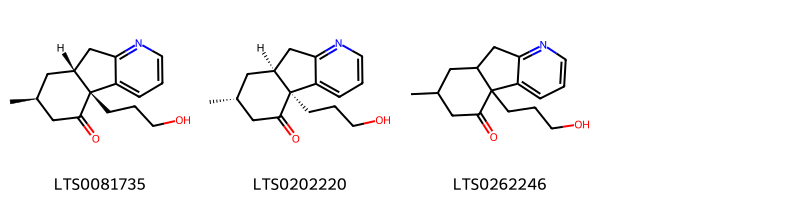{ width=100% }
    <figcaption>Hình ảnh cấu trúc hóa học của 3 hoạt chất thuộc nhóm Pyridines and derivatives gồm ['(4br,7s,8ar)-4b-(3-hydroxypropyl)-7-methyl-6h,7h,8h,8ah,9h-indeno[2,1-b]pyridin-5-one (LTS0081735)', '(4bs,7r,8as)-4b-(3-hydroxypropyl)-7-methyl-6h,7h,8h,8ah,9h-indeno[2,1-b]pyridin-5-one (LTS0202220)', '4b-(3-hydroxypropyl)-7-methyl-6h,7h,8h,8ah,9h-indeno[2,1-b]pyridin-5-one (LTS0262246)'].</figcaption>
</figure>
#### Nhóm Quinolidines
<figure markdown="span">
    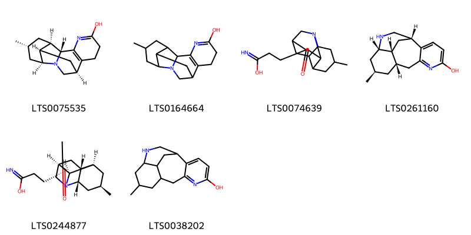{ width=100% }
    <figcaption>Hình ảnh cấu trúc hóa học của 6 hoạt chất thuộc nhóm Quinolidines gồm ['(2r,9s,11r,12r,14r,16s)-14-methyl-1,4-diazapentacyclo[7.7.1.0²,¹².0³,⁸.0¹¹,¹⁶]heptadeca-3(8),4-dien-5-ol (LTS0075535)', '14-methyl-1,4-diazapentacyclo[7.7.1.0²,¹².0³,⁸.0¹¹,¹⁶]heptadeca-3(8),4-dien-5-ol (LTS0164664)', '3-{4-methyl-11-oxo-1-azatetracyclo[7.3.1.0²,⁷.0⁶,¹²]tridecan-10-yl}propanimidic acid (LTS0074639)', '(1s,9s,11r,13s,17r)-11-methyl-6,14-diazatetracyclo[7.6.2.0²,⁷.0¹³,¹⁷]heptadeca-2,4,6-trien-5-ol (LTS0261160)', '3-[(2s,4r,6r,7r,9s,10s,12r)-4-methyl-11-oxo-1-azatetracyclo[7.3.1.0²,⁷.0⁶,¹²]tridecan-10-yl]propanimidic acid (LTS0244877)', '11-methyl-6,14-diazatetracyclo[7.6.2.0²,⁷.0¹³,¹⁷]heptadeca-2,4,6-trien-5-ol (LTS0038202)'].</figcaption>
</figure>
#### Nhóm Quinolizidines
<figure markdown="span">
    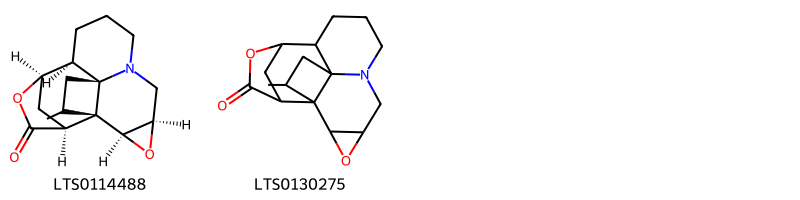{ width=100% }
    <figcaption>Hình ảnh cấu trúc hóa học của 2 hoạt chất thuộc nhóm Quinolizidines gồm ['annotinine (LTS0114488)', '15-methyl-3,12-dioxa-6-azahexacyclo[8.4.3.1¹¹,¹⁴.0¹,¹⁷.0²,⁴.0⁶,¹⁷]octadecan-13-one (LTS0130275)'].</figcaption>
</figure>

---

### Dược dân tộc học

Danh sách các quốc gia có sử dụng *N/A* trong điều trị các bệnh. 

| Country       | Disease    | Bệnh      |
|:--------------|:-----------|:----------|
| US(Blackfoot) | Antiseptic | Khử trùng |

---

---
## Lycopodium phlegmaria
### Thông tin về thực vật

!!! info "Phân loại thực vật của *N/A* từ GIBF:"
    - **Kingdom:** Plantae
    - **Phylum:** Tracheophyta
    - **Order:** Lycopodiales
    - **Family:** Lycopodiaceae
    - **Genus:** Phlegmariurus
    - **Species:** *N/A*

 

| Label (VI)   | Label (EN)   | Scientific Name       | Descriptions (VI)   | Descriptions (EN)   | Also Known As (VI)   | Also Known As (EN)   |
|:-------------|:-------------|:----------------------|:--------------------|:--------------------|:---------------------|:---------------------|
| N/A          | N/A          | Lycopodium phlegmaria | loài thực vật       | species of plant    | ['']                 | ['']                 |

#### Phân bố trên thế giới

**Từ CSDL GIBF** nan, Brazil, New Zealand, Ecuador, Thailand, Madagascar, Puerto Rico, United States of America, Seychelles, Dominican Republic, Colombia, Argentina, French Guiana, Chinese Taipei, Portugal, Martinique, South Africa, Australia, Micronesia (Federated States of), Peru

#### Phân bố tại Việt Nam

**Từ CSDL GIBF**: Không có ghi nhận ở Việt Nam

---
### Thành phần hóa học
        
- Theo cơ sở dữ liệu lotus: Từ loài *N/A* đã phân lập và xác định được Chưa có hoạt chất nào được phân lập. hoạt chất thuộc về các nhóm Không có hoạt chất nào được phân lập. 

Không có hình ảnh nào được tạo ra

---

### Dược dân tộc học

Danh sách các quốc gia có sử dụng *N/A* trong điều trị các bệnh. 

| Country   | Disease     | Bệnh        |
|:----------|:------------|:------------|
| Java      | Emmenagogue | Emmenagogue |

---

---
## Lycopodium selago
### Thông tin về thực vật

!!! info "Phân loại thực vật của *Huperzia selago* từ GIBF:"
    - **Kingdom:** Plantae
    - **Phylum:** Tracheophyta
    - **Order:** Lycopodiales
    - **Family:** Lycopodiaceae
    - **Genus:** Huperzia
    - **Species:** *Huperzia selago*

 

| Label (VI)   | Label (EN)   | Scientific Name   | Descriptions (VI)   | Descriptions (EN)   | Also Known As (VI)   | Also Known As (EN)   |
|:-------------|:-------------|:------------------|:--------------------|:--------------------|:---------------------|:---------------------|
| N/A          | N/A          | Lycopodium selago | loài thực vật       | species of plant    | ['']                 | ['']                 |

#### Phân bố trên thế giới

**Từ CSDL GIBF** Japan, Sweden, Finland, Türkiye, Papua New Guinea, Spain, Poland, Denmark, United States of America, Korea, Republic of, Indonesia, Andorra, Russian Federation, unknown or invalid, Estonia, Norway, Iceland, Canada, Germany, Austria, Hungary, Greenland, Ukraine, Switzerland, India, France

#### Phân bố tại Việt Nam

**Từ CSDL GIBF**: Không có ghi nhận ở Việt Nam

---
### Thành phần hóa học
        
- Theo cơ sở dữ liệu lotus: Từ loài *Huperzia selago* đã phân lập và xác định được Chưa có hoạt chất nào được phân lập. hoạt chất thuộc về các nhóm Không có hoạt chất nào được phân lập. 

Không có hình ảnh nào được tạo ra

---

### Dược dân tộc học

Danh sách các quốc gia có sử dụng *Huperzia selago* trong điều trị các bệnh. 

| Country   | Disease       | Bệnh               |
|:----------|:--------------|:-------------------|
| ain       | Abortifacient | Thuốc gây sẩy thai |

---

