!!! abstract "Tóm tắt"

    Họ Lythraceae gồm khoảng 7 chi và 13 loài được một số cộng đồng tại các quốc gia như Indochina, Philippines, South America, English, Mexico, China, Malaya, Elsewhere, Colombia, Argentina, Dominican Republic, Kurdistan, Egypt, India, Sudan, Turkey, Iraq, Sanscrit sử dụng trong một số trường hợp QUERY LENGTH LIMIT EXCEEDED. MAX ALLOWED QUERY : 500 CHARS.

!!! info "DrDuke"

    James A. Duke sinh năm 1929-2017 là một nhà thực vật học người Mỹ. Đây là một trong những tác giả hàng đầu trong lĩnh vực dược dân tộc học với cuốn *CRC Handbook of Medicinal Herbs* và chính là người xây dựng lên cơ sở dữ liệu về hợp chất tự nhiên và dược dân tộc học tại Bộ nông nghiệp Hoa Kỳ. Các thông tin được đăng tải tại website [Dr. Duke's Phytochemical and Ethnobotanical Databases](https://phytochem.nal.usda.gov/). 
    Trong suốt thập niên 1970, ông lãnh đạo the Plant Taxonomy Laboratory, Plant Genetics and Germplasm Institute of the Agricultural Research Service, U.S. Department of Agriculture.
    Trong tài liệu này, các thông tin về dược dân tộc của các dược liệu được trích dẫn từ tài liệu của James A. Ducke với sự trợ giúp của phần mềm dịch thuật từ tiếng Anh sang tiếng Việt.
   

# Chi Ammannia

??? note "Danh sách các dược liệu thuộc chi"
    
	 - *Ammannia baccifera*
	 - *Ammannia senegalensis*

---
## Ammannia baccifera
### Thông tin về thực vật

!!! info "Phân loại thực vật của *Ammannia baccifera* từ GIBF:"
    - **Kingdom:** Plantae
    - **Phylum:** Tracheophyta
    - **Order:** Myrtales
    - **Family:** Lythraceae
    - **Genus:** Ammannia
    - **Species:** *Ammannia baccifera*

 

| Label (VI)   | Label (EN)   | Scientific Name    | Descriptions (VI)   | Descriptions (EN)   | Also Known As (VI)   | Also Known As (EN)      |
|:-------------|:-------------|:-------------------|:--------------------|:--------------------|:---------------------|:------------------------|
| N/A          | N/A          | Ammannia baccifera | loài thực vật       | species of plant    | ['']                 | ['Blistering ammannia'] |

#### Phân bố trên thế giới

**Từ CSDL GIBF** nan, unknown or invalid, Thailand, Spain, Guadeloupe, Philippines, Burkina Faso, Lao People’s Democratic Republic, Australia, Indonesia, Togo, Puerto Rico, Mauritius, India, Bangladesh, Iraq, Japan, Yemen, Palau, China, Benin, Chinese Taipei, South Africa, Tanzania, United Republic of, Egypt, Italy, Israel, Madagascar

#### Phân bố tại Việt Nam

**Từ CSDL GIBF**: Không có ghi nhận ở Việt Nam

---
### Thành phần hóa học
        
- Theo cơ sở dữ liệu lotus: Từ loài *Ammannia baccifera* đã phân lập và xác định được Chưa có hoạt chất nào được phân lập. hoạt chất thuộc về các nhóm Không có hoạt chất nào được phân lập. 

Không có hình ảnh nào được tạo ra

---

### Dược dân tộc học

Danh sách các quốc gia có sử dụng *Ammannia baccifera* trong điều trị các bệnh. 

| Country   | Disease               | Bệnh                                                                                                                                                                                                |
|:----------|:----------------------|:----------------------------------------------------------------------------------------------------------------------------------------------------------------------------------------------------|
| Elsewhere | Rubefacient           | MYMEMORY WARNING: YOU USED ALL AVAILABLE FREE TRANSLATIONS FOR TODAY. NEXT AVAILABLE IN  13 HOURS 16 MINUTES 41 SECONDS VISIT HTTPS://MYMEMORY.TRANSLATED.NET/DOC/USAGELIMITS.PHP TO TRANSLATE MORE |
| India     | Rubefacient           | MYMEMORY WARNING: YOU USED ALL AVAILABLE FREE TRANSLATIONS FOR TODAY. NEXT AVAILABLE IN  13 HOURS 16 MINUTES 37 SECONDS VISIT HTTPS://MYMEMORY.TRANSLATED.NET/DOC/USAGELIMITS.PHP TO TRANSLATE MORE |
| Iraq      | Rubefacient, Vesicant | MYMEMORY WARNING: YOU USED ALL AVAILABLE FREE TRANSLATIONS FOR TODAY. NEXT AVAILABLE IN  13 HOURS 16 MINUTES 34 SECONDS VISIT HTTPS://MYMEMORY.TRANSLATED.NET/DOC/USAGELIMITS.PHP TO TRANSLATE MORE |
| Sudan     | Vesicant              | MYMEMORY WARNING: YOU USED ALL AVAILABLE FREE TRANSLATIONS FOR TODAY. NEXT AVAILABLE IN  13 HOURS 16 MINUTES 31 SECONDS VISIT HTTPS://MYMEMORY.TRANSLATED.NET/DOC/USAGELIMITS.PHP TO TRANSLATE MORE |

---

---
## Ammannia senegalensis
### Thông tin về thực vật

!!! info "Phân loại thực vật của *Ammannia senegalensis* từ GIBF:"
    - **Kingdom:** Plantae
    - **Phylum:** Tracheophyta
    - **Order:** Myrtales
    - **Family:** Lythraceae
    - **Genus:** Ammannia
    - **Species:** *Ammannia senegalensis*

 

| Label (VI)   | Label (EN)   | Scientific Name       | Descriptions (VI)   | Descriptions (EN)   | Also Known As (VI)   | Also Known As (EN)        |
|:-------------|:-------------|:----------------------|:--------------------|:--------------------|:---------------------|:--------------------------|
| N/A          | N/A          | Ammannia senegalensis | loài thực vật       | species of plant    | ['']                 | ['Ammannia senegalensis'] |

#### Phân bố trên thế giới

**Từ CSDL GIBF** nan, Malawi, unknown or invalid, Namibia, Ghana, Burkina Faso, Senegal, Cameroon, Kenya, Niger, Colombia, Côte d’Ivoire, India, Sudan, Nigeria, Uganda, Brazil, Eswatini, Mexico, China, Benin, Angola, Chinese Taipei, Hong Kong, South Africa, Botswana, Portugal, France, Mozambique, Mauritania, Congo, Democratic Republic of the, United States of America, Zimbabwe, Zambia, Chad, Madagascar, Cabo Verde, Mali

#### Phân bố tại Việt Nam

**Từ CSDL GIBF**: Không có ghi nhận ở Việt Nam

---
### Thành phần hóa học
        
- Theo cơ sở dữ liệu lotus: Từ loài *Ammannia senegalensis* đã phân lập và xác định được Chưa có hoạt chất nào được phân lập. hoạt chất thuộc về các nhóm Không có hoạt chất nào được phân lập. 

Không có hình ảnh nào được tạo ra

---

### Dược dân tộc học

Danh sách các quốc gia có sử dụng *Ammannia senegalensis* trong điều trị các bệnh. 

| Country   | Disease   | Bệnh                                                                                                                                                                                                |
|:----------|:----------|:----------------------------------------------------------------------------------------------------------------------------------------------------------------------------------------------------|
| Sudan     | Vesicant  | MYMEMORY WARNING: YOU USED ALL AVAILABLE FREE TRANSLATIONS FOR TODAY. NEXT AVAILABLE IN  13 HOURS 15 MINUTES 59 SECONDS VISIT HTTPS://MYMEMORY.TRANSLATED.NET/DOC/USAGELIMITS.PHP TO TRANSLATE MORE |

---

# Chi Lagerstroemia

??? note "Danh sách các dược liệu thuộc chi"
    
	 - *Lagerstroemia eciosa*
	 - *Lagerstroemia indica*

---
## Lagerstroemia eciosa
### Thông tin về thực vật

!!! info "Phân loại thực vật của *N/A* từ GIBF:"
    - **Kingdom:** Plantae
    - **Phylum:** Tracheophyta
    - **Order:** Myrtales
    - **Family:** Lythraceae
    - **Genus:** Lagerstroemia
    - **Species:** *N/A*

 

| Label (VI)   | Label (EN)   | Scientific Name       | Descriptions (VI)   | Descriptions (EN)   | Also Known As (VI)   | Also Known As (EN)        |
|:-------------|:-------------|:----------------------|:--------------------|:--------------------|:---------------------|:--------------------------|
| N/A          | N/A          | Ammannia senegalensis | loài thực vật       | species of plant    | ['']                 | ['Ammannia senegalensis'] |

#### Phân bố trên thế giới

**Từ CSDL GIBF** Viet Nam, Honduras, Thailand, Guadeloupe, Trinidad and Tobago, Lao People’s Democratic Republic, Chile, Singapore, Australia, Colombia, Sri Lanka, Malaysia, Puerto Rico, India, Seychelles, Bangladesh, Cambodia, Brazil, Peru, Hong Kong, Chinese Taipei, South Africa, New Zealand, Bolivia (Plurinational State of), Costa Rica, United States of America

#### Phân bố tại Việt Nam

**Từ CSDL GIBF**: Đồng Nai

---
### Thành phần hóa học
        
- Theo cơ sở dữ liệu lotus: Từ loài *N/A* đã phân lập và xác định được Chưa có hoạt chất nào được phân lập. hoạt chất thuộc về các nhóm Không có hoạt chất nào được phân lập. 

Không có hình ảnh nào được tạo ra

---

### Dược dân tộc học

Danh sách các quốc gia có sử dụng *N/A* trong điều trị các bệnh. 

| Country     | Disease                                              | Bệnh                                                                                                                                                                                                |
|:------------|:-----------------------------------------------------|:----------------------------------------------------------------------------------------------------------------------------------------------------------------------------------------------------|
| Elsewhere   | Astringent, Diuretic, Narcotic, Stimulant, Purgative | MYMEMORY WARNING: YOU USED ALL AVAILABLE FREE TRANSLATIONS FOR TODAY. NEXT AVAILABLE IN  13 HOURS 15 MINUTES 32 SECONDS VISIT HTTPS://MYMEMORY.TRANSLATED.NET/DOC/USAGELIMITS.PHP TO TRANSLATE MORE |
| Malaya      | Narcotic                                             | MYMEMORY WARNING: YOU USED ALL AVAILABLE FREE TRANSLATIONS FOR TODAY. NEXT AVAILABLE IN  13 HOURS 15 MINUTES 29 SECONDS VISIT HTTPS://MYMEMORY.TRANSLATED.NET/DOC/USAGELIMITS.PHP TO TRANSLATE MORE |
| Philippines | Narcotic                                             | MYMEMORY WARNING: YOU USED ALL AVAILABLE FREE TRANSLATIONS FOR TODAY. NEXT AVAILABLE IN  13 HOURS 15 MINUTES 26 SECONDS VISIT HTTPS://MYMEMORY.TRANSLATED.NET/DOC/USAGELIMITS.PHP TO TRANSLATE MORE |

---

---
## Lagerstroemia indica
### Thông tin về thực vật

!!! info "Phân loại thực vật của *Lagerstroemia indica* từ GIBF:"
    - **Kingdom:** Plantae
    - **Phylum:** Tracheophyta
    - **Order:** Myrtales
    - **Family:** Lythraceae
    - **Genus:** Lagerstroemia
    - **Species:** *Lagerstroemia indica*

 

| Label (VI)   | Label (EN)   | Scientific Name      | Descriptions (VI)   | Descriptions (EN)   | Also Known As (VI)       | Also Known As (EN)                                                                                                                                                                                            |
|:-------------|:-------------|:---------------------|:--------------------|:--------------------|:-------------------------|:--------------------------------------------------------------------------------------------------------------------------------------------------------------------------------------------------------------|
| N/A          | N/A          | Lagerstroemia indica | loài thực vật       | species of plant    | ['Lagerstroemia indica'] | ['common crape myrtle', 'crape myrtle', 'crapemyrtle', 'crepe myrtle', 'cannonball', 'carrion tree', 'Indian crape myrtle', 'June rose', 'lilac of the south', 'crape-myrtle', 'crepe-myrtle', 'crepemyrtle'] |

#### Phân bố trên thế giới

**Từ CSDL GIBF** Honduras, Viet Nam, nan, Thailand, Georgia, Philippines, French Guiana, Chile, Singapore, Australia, Jamaica, Korea, Republic of, Guatemala, Colombia, Saint Vincent and the Grenadines, Dominican Republic, Malaysia, Puerto Rico, India, Réunion, Seychelles, Saint Kitts and Nevis, Türkiye, Japan, Panama, Brazil, Nicaragua, Peru, Saint Lucia, China, Nepal, Hong Kong, Argentina, South Africa, Grenada, France, New Zealand, Romania, Costa Rica, Bolivia (Plurinational State of), Ecuador, United States of America, Greece

#### Phân bố tại Việt Nam

**Từ CSDL GIBF**: Hà Nội

---
### Thành phần hóa học
        
- Theo cơ sở dữ liệu lotus: Từ loài *Lagerstroemia indica* đã phân lập và xác định được 23 hoạt chất thuộc về các nhóm Macrolides and analogues, Tannins, Flavonoids, Benzene and substituted derivatives. 

|    | chemicalTaxonomyClassyfireClass     |   smiles_count |
|---:|:------------------------------------|---------------:|
|  0 | Benzene and substituted derivatives |              1 |
|  1 | Flavonoids                          |              5 |
|  2 | Macrolides and analogues            |             16 |
|  3 | Tannins                             |              1 |

#### Nhóm Benzene and substituted derivatives
<figure markdown="span">
    { width=100% }
    <figcaption>Hình ảnh cấu trúc hóa học của 1 hoạt chất thuộc nhóm Benzene and substituted derivatives gồm ['galop (LTS0222857)'].</figcaption>
</figure>
#### Nhóm Flavonoids
<figure markdown="span">
    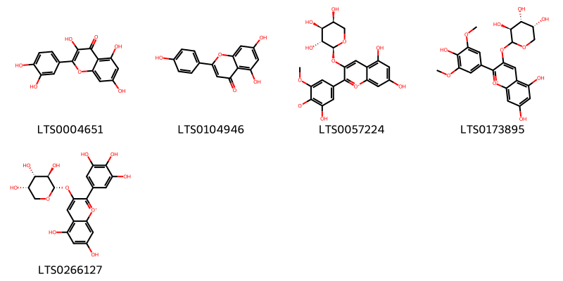{ width=100% }
    <figcaption>Hình ảnh cấu trúc hóa học của 5 hoạt chất thuộc nhóm Flavonoids gồm ['quercetin (LTS0004651)', 'chamomile (LTS0104946)', '5,7-dihydroxy-2-(3-hydroxy-5-methoxy-4-oxidophenyl)-3-{[(2s,3r,4s,5s)-3,4,5-trihydroxyoxan-2-yl]oxy}-1λ⁴-chromen-1-ylium (LTS0057224)', '5,7-dihydroxy-2-(4-hydroxy-3,5-dimethoxyphenyl)-3-{[(3s,4r,5r)-3,4,5-trihydroxyoxan-2-yl]oxy}-1λ⁴-chromen-1-ylium (LTS0173895)', '5,7-dihydroxy-3-{[(2s,3r,4s,5s)-3,4,5-trihydroxyoxan-2-yl]oxy}-2-(3,4,5-trihydroxyphenyl)-1λ⁴-chromen-1-ylium (LTS0266127)'].</figcaption>
</figure>
#### Nhóm Macrolides and analogues
<figure markdown="span">
    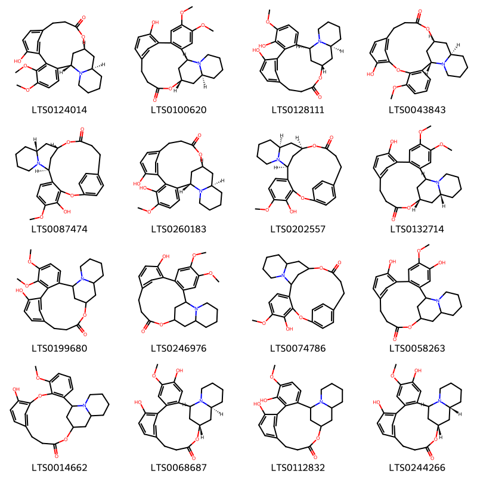{ width=100% }
    <figcaption>Hình ảnh cấu trúc hóa học của 16 hoạt chất thuộc nhóm Macrolides and analogues gồm ['(1s,17s,19r)-9-hydroxy-5,6-dimethoxy-16-oxa-24-azapentacyclo[15.7.1.1⁸,¹².0²,⁷.0¹⁹,²⁴]hexacosa-2,4,6,8(26),9,11-hexaen-15-one (LTS0124014)', '(1s,17s,19s)-9-hydroxy-4,5-dimethoxy-16-oxa-24-azapentacyclo[15.7.1.1⁸,¹².0²,⁷.0¹⁹,²⁴]hexacosa-2(7),3,5,8(26),9,11-hexaen-15-one (LTS0100620)', '(1s,17s,19s)-6,9-dihydroxy-5-methoxy-16-oxa-24-azapentacyclo[15.7.1.1⁸,¹².0²,⁷.0¹⁹,²⁴]hexacosa-2,4,6,8(26),9,11-hexaen-15-one (LTS0128111)', '(1s,18s,20r)-10-hydroxy-6-methoxy-8,17-dioxa-25-azapentacyclo[16.7.1.1⁹,¹³.0²,⁷.0²⁰,²⁵]heptacosa-2(7),3,5,9(27),10,12-hexaen-16-one (LTS0043843)', '(9s,15r,17s)-4-hydroxy-5-methoxy-2,18-dioxa-10-azapentacyclo[20.2.2.1⁹,¹⁷.0³,⁸.0¹⁰,¹⁵]heptacosa-1(24),3,5,7,22,25-hexaen-19-one (LTS0087474)', '(1s,17s,19r)-6,9-dihydroxy-5-methoxy-16-oxa-24-azapentacyclo[15.7.1.1⁸,¹².0²,⁷.0¹⁹,²⁴]hexacosa-2,4,6,8(26),9,11-hexaen-15-one (LTS0260183)', '(9s,15s,17r)-4-hydroxy-5-methoxy-2,18-dioxa-10-azapentacyclo[20.2.2.1⁹,¹⁷.0³,⁸.0¹⁰,¹⁵]heptacosa-1(24),3,5,7,22,25-hexaen-19-one (LTS0202557)', '(1s,17s,19r)-9-hydroxy-4,5-dimethoxy-16-oxa-24-azapentacyclo[15.7.1.1⁸,¹².0²,⁷.0¹⁹,²⁴]hexacosa-2(7),3,5,8(26),9,11-hexaen-15-one (LTS0132714)', '9-hydroxy-5,6-dimethoxy-16-oxa-24-azapentacyclo[15.7.1.1⁸,¹².0²,⁷.0¹⁹,²⁴]hexacosa-2,4,6,8(26),9,11-hexaen-15-one (LTS0199680)', '9-hydroxy-4,5-dimethoxy-16-oxa-24-azapentacyclo[15.7.1.1⁸,¹².0²,⁷.0¹⁹,²⁴]hexacosa-2(7),3,5,8(26),9,11-hexaen-15-one (LTS0246976)', '4-hydroxy-5-methoxy-2,18-dioxa-10-azapentacyclo[20.2.2.1⁹,¹⁷.0³,⁸.0¹⁰,¹⁵]heptacosa-1(24),3,5,7,22,25-hexaen-19-one (LTS0074786)', '4,9-dihydroxy-5-methoxy-16-oxa-24-azapentacyclo[15.7.1.1⁸,¹².0²,⁷.0¹⁹,²⁴]hexacosa-2(7),3,5,8(26),9,11-hexaen-15-one (LTS0058263)', '10-hydroxy-6-methoxy-8,17-dioxa-25-azapentacyclo[16.7.1.1⁹,¹³.0²,⁷.0²⁰,²⁵]heptacosa-2(7),3,5,9(27),10,12-hexaen-16-one (LTS0014662)', '(1s,17s,19s)-4,9-dihydroxy-5-methoxy-16-oxa-24-azapentacyclo[15.7.1.1⁸,¹².0²,⁷.0¹⁹,²⁴]hexacosa-2(7),3,5,8(26),9,11-hexaen-15-one (LTS0068687)', '6,9-dihydroxy-5-methoxy-16-oxa-24-azapentacyclo[15.7.1.1⁸,¹².0²,⁷.0¹⁹,²⁴]hexacosa-2,4,6,8(26),9,11-hexaen-15-one (LTS0112832)', '(1s,17s,19r)-4,9-dihydroxy-5-methoxy-16-oxa-24-azapentacyclo[15.7.1.1⁸,¹².0²,⁷.0¹⁹,²⁴]hexacosa-2(7),3,5,8(26),9,11-hexaen-15-one (LTS0244266)'].</figcaption>
</figure>
#### Nhóm Tannins
<figure markdown="span">
    { width=100% }
    <figcaption>Hình ảnh cấu trúc hóa học của 1 hoạt chất thuộc nhóm Tannins gồm ['ellagic acid (LTS0037297)'].</figcaption>
</figure>

---

### Dược dân tộc học

Danh sách các quốc gia có sử dụng *Lagerstroemia indica* trong điều trị các bệnh. 

| Country   | Disease                         | Bệnh                                                                                                                                                                                                |
|:----------|:--------------------------------|:----------------------------------------------------------------------------------------------------------------------------------------------------------------------------------------------------|
| China     | Antidote, Diuretic, Alexiteric  | MYMEMORY WARNING: YOU USED ALL AVAILABLE FREE TRANSLATIONS FOR TODAY. NEXT AVAILABLE IN  13 HOURS 14 MINUTES 54 SECONDS VISIT HTTPS://MYMEMORY.TRANSLATED.NET/DOC/USAGELIMITS.PHP TO TRANSLATE MORE |
| Elsewhere | Astringent, Stimulant, Narcotic | MYMEMORY WARNING: YOU USED ALL AVAILABLE FREE TRANSLATIONS FOR TODAY. NEXT AVAILABLE IN  13 HOURS 14 MINUTES 51 SECONDS VISIT HTTPS://MYMEMORY.TRANSLATED.NET/DOC/USAGELIMITS.PHP TO TRANSLATE MORE |
| Indochina | Purgative                       | MYMEMORY WARNING: YOU USED ALL AVAILABLE FREE TRANSLATIONS FOR TODAY. NEXT AVAILABLE IN  13 HOURS 14 MINUTES 48 SECONDS VISIT HTTPS://MYMEMORY.TRANSLATED.NET/DOC/USAGELIMITS.PHP TO TRANSLATE MORE |
| Iraq      | Purgative                       | MYMEMORY WARNING: YOU USED ALL AVAILABLE FREE TRANSLATIONS FOR TODAY. NEXT AVAILABLE IN  13 HOURS 14 MINUTES 45 SECONDS VISIT HTTPS://MYMEMORY.TRANSLATED.NET/DOC/USAGELIMITS.PHP TO TRANSLATE MORE |
| Kurdistan | Narcotic                        | MYMEMORY WARNING: YOU USED ALL AVAILABLE FREE TRANSLATIONS FOR TODAY. NEXT AVAILABLE IN  13 HOURS 14 MINUTES 42 SECONDS VISIT HTTPS://MYMEMORY.TRANSLATED.NET/DOC/USAGELIMITS.PHP TO TRANSLATE MORE |
| Turkey    | Narcotic                        | MYMEMORY WARNING: YOU USED ALL AVAILABLE FREE TRANSLATIONS FOR TODAY. NEXT AVAILABLE IN  13 HOURS 14 MINUTES 37 SECONDS VISIT HTTPS://MYMEMORY.TRANSLATED.NET/DOC/USAGELIMITS.PHP TO TRANSLATE MORE |

---

# Chi Cuphea

??? note "Danh sách các dược liệu thuộc chi"
    
	 - *Cuphea aequipetala*
	 - *Cuphea glutinosa*
	 - *Cuphea racemosa*

---
## Cuphea aequipetala
### Thông tin về thực vật

!!! info "Phân loại thực vật của *Cuphea aequipetala* từ GIBF:"
    - **Kingdom:** Plantae
    - **Phylum:** Tracheophyta
    - **Order:** Myrtales
    - **Family:** Lythraceae
    - **Genus:** Cuphea
    - **Species:** *Cuphea aequipetala*

 

| Label (VI)   | Label (EN)   | Scientific Name    | Descriptions (VI)   | Descriptions (EN)   | Also Known As (VI)   | Also Known As (EN)   |
|:-------------|:-------------|:-------------------|:--------------------|:--------------------|:---------------------|:---------------------|
| N/A          | N/A          | Cuphea aequipetala | loài thực vật       | species of plant    | ['']                 | ['']                 |

#### Phân bố trên thế giới

**Từ CSDL GIBF** Mexico, Guatemala

#### Phân bố tại Việt Nam

**Từ CSDL GIBF**: Không có ghi nhận ở Việt Nam

---
### Thành phần hóa học
        
- Theo cơ sở dữ liệu lotus: Từ loài *Cuphea aequipetala* đã phân lập và xác định được Chưa có hoạt chất nào được phân lập. hoạt chất thuộc về các nhóm Không có hoạt chất nào được phân lập. 

Không có hình ảnh nào được tạo ra

---

### Dược dân tộc học

Danh sách các quốc gia có sử dụng *Cuphea aequipetala* trong điều trị các bệnh. 

| Country   | Disease   | Bệnh                                                                                                                                                                                                |
|:----------|:----------|:----------------------------------------------------------------------------------------------------------------------------------------------------------------------------------------------------|
| Mexico    | Vulnerary | MYMEMORY WARNING: YOU USED ALL AVAILABLE FREE TRANSLATIONS FOR TODAY. NEXT AVAILABLE IN  13 HOURS 13 MINUTES 45 SECONDS VISIT HTTPS://MYMEMORY.TRANSLATED.NET/DOC/USAGELIMITS.PHP TO TRANSLATE MORE |

---

---
## Cuphea glutinosa
### Thông tin về thực vật

!!! info "Phân loại thực vật của *Cuphea glutinosa* từ GIBF:"
    - **Kingdom:** Plantae
    - **Phylum:** Tracheophyta
    - **Order:** Myrtales
    - **Family:** Lythraceae
    - **Genus:** Cuphea
    - **Species:** *Cuphea glutinosa*

 

| Label (VI)   | Label (EN)   | Scientific Name   | Descriptions (VI)   | Descriptions (EN)   | Also Known As (VI)   | Also Known As (EN)   |
|:-------------|:-------------|:------------------|:--------------------|:--------------------|:---------------------|:---------------------|
| N/A          | N/A          | Cuphea glutinosa  | loài thực vật       | species of plant    | ['']                 | ['']                 |

#### Phân bố trên thế giới

**Từ CSDL GIBF** Uruguay, Argentina, Brazil, Bolivia (Plurinational State of), United States of America

#### Phân bố tại Việt Nam

**Từ CSDL GIBF**: Không có ghi nhận ở Việt Nam

---
### Thành phần hóa học
        
- Theo cơ sở dữ liệu lotus: Từ loài *Cuphea glutinosa* đã phân lập và xác định được Chưa có hoạt chất nào được phân lập. hoạt chất thuộc về các nhóm Không có hoạt chất nào được phân lập. 

Không có hình ảnh nào được tạo ra

---

### Dược dân tộc học

Danh sách các quốc gia có sử dụng *Cuphea glutinosa* trong điều trị các bệnh. 

| Country       | Disease             | Bệnh                                                                                                                                                                                                |
|:--------------|:--------------------|:----------------------------------------------------------------------------------------------------------------------------------------------------------------------------------------------------|
| South America | Diuretic, Purgative | MYMEMORY WARNING: YOU USED ALL AVAILABLE FREE TRANSLATIONS FOR TODAY. NEXT AVAILABLE IN  13 HOURS 13 MINUTES 20 SECONDS VISIT HTTPS://MYMEMORY.TRANSLATED.NET/DOC/USAGELIMITS.PHP TO TRANSLATE MORE |

---

---
## Cuphea racemosa
### Thông tin về thực vật

!!! info "Phân loại thực vật của *Cuphea racemosa* từ GIBF:"
    - **Kingdom:** Plantae
    - **Phylum:** Tracheophyta
    - **Order:** Myrtales
    - **Family:** Lythraceae
    - **Genus:** Cuphea
    - **Species:** *Cuphea racemosa*

 

| Label (VI)   | Label (EN)   | Scientific Name   | Descriptions (VI)   | Descriptions (EN)   | Also Known As (VI)   | Also Known As (EN)   |
|:-------------|:-------------|:------------------|:--------------------|:--------------------|:---------------------|:---------------------|
| N/A          | N/A          | Cuphea racemosa   | loài thực vật       | species of plant    | ['']                 | ['']                 |

#### Phân bố trên thế giới

**Từ CSDL GIBF** Honduras, Uruguay, Colombia, Argentina, Brazil, Costa Rica, Paraguay, Ecuador, Mexico

#### Phân bố tại Việt Nam

**Từ CSDL GIBF**: Không có ghi nhận ở Việt Nam

---
### Thành phần hóa học
        
- Theo cơ sở dữ liệu lotus: Từ loài *Cuphea racemosa* đã phân lập và xác định được Chưa có hoạt chất nào được phân lập. hoạt chất thuộc về các nhóm Không có hoạt chất nào được phân lập. 

Không có hình ảnh nào được tạo ra

---

### Dược dân tộc học

Danh sách các quốc gia có sử dụng *Cuphea racemosa* trong điều trị các bệnh. 

| Country   | Disease   | Bệnh                                                                                                                                                                                                |
|:----------|:----------|:----------------------------------------------------------------------------------------------------------------------------------------------------------------------------------------------------|
| Colombia  | Diuretic  | MYMEMORY WARNING: YOU USED ALL AVAILABLE FREE TRANSLATIONS FOR TODAY. NEXT AVAILABLE IN  13 HOURS 12 MINUTES 52 SECONDS VISIT HTTPS://MYMEMORY.TRANSLATED.NET/DOC/USAGELIMITS.PHP TO TRANSLATE MORE |

---

# Chi Lawsonia

??? note "Danh sách các dược liệu thuộc chi"
    
	 - *Lawsonia inermis*

---
## Lawsonia inermis
### Thông tin về thực vật

!!! info "Phân loại thực vật của *Lawsonia inermis* từ GIBF:"
    - **Kingdom:** Plantae
    - **Phylum:** Tracheophyta
    - **Order:** Myrtales
    - **Family:** Lythraceae
    - **Genus:** Lawsonia
    - **Species:** *Lawsonia inermis*

 

| Label (VI)   | Label (EN)   | Scientific Name   | Descriptions (VI)   | Descriptions (EN)   | Also Known As (VI)   | Also Known As (EN)                                                          |
|:-------------|:-------------|:------------------|:--------------------|:--------------------|:---------------------|:----------------------------------------------------------------------------|
| N/A          | N/A          | Lawsonia inermis  | loài thực vật       | species of plant    | ['']                 | ['Egyptian privet', 'henna plant', 'henna tree', 'hina', 'Mignonette tree'] |

#### Phân bố trên thế giới

**Từ CSDL GIBF** Tunisia, Maldives, Malaysia, Egypt, India, French Guiana, Mexico, Singapore, United Arab Emirates, Benin

#### Phân bố tại Việt Nam

**Từ CSDL GIBF**: Không có ghi nhận ở Việt Nam

---
### Thành phần hóa học
        
- Theo cơ sở dữ liệu lotus: Từ loài *Lawsonia inermis* đã phân lập và xác định được 94 hoạt chất thuộc về các nhóm Organooxygen compounds, Benzopyrans, Flavonoids, Coumarins and derivatives, Dioxanes, 2-arylbenzofuran flavonoids, Prenol lipids, Lignan glycosides, Fatty Acyls, Naphthopyrans, Steroids and steroid derivatives, Benzene and substituted derivatives, Naphthalenes. 

|    | chemicalTaxonomyClassyfireClass     |   smiles_count |
|---:|:------------------------------------|---------------:|
|  0 | 2-arylbenzofuran flavonoids         |              2 |
|  1 | Benzene and substituted derivatives |              1 |
|  2 | Benzopyrans                         |              3 |
|  3 | Coumarins and derivatives           |              5 |
|  4 | Dioxanes                            |              2 |
|  5 | Fatty Acyls                         |              6 |
|  6 | Flavonoids                          |             23 |
|  7 | Lignan glycosides                   |              6 |
|  8 | Naphthalenes                        |              3 |
|  9 | Naphthopyrans                       |              1 |
| 10 | Organooxygen compounds              |              9 |
| 11 | Prenol lipids                       |             25 |
| 12 | Steroids and steroid derivatives    |              8 |

#### Nhóm 2-arylbenzofuran flavonoids
<figure markdown="span">
    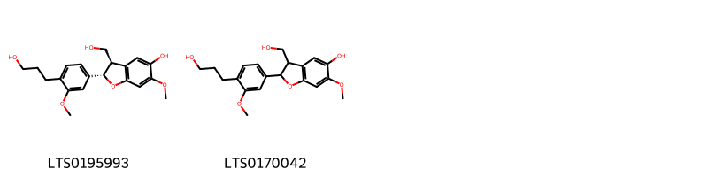{ width=100% }
    <figcaption>Hình ảnh cấu trúc hóa học của 2 hoạt chất thuộc nhóm 2-arylbenzofuran flavonoids gồm ['lawsonicin (LTS0195993)', '3-(hydroxymethyl)-2-[4-(3-hydroxypropyl)-3-methoxyphenyl]-6-methoxy-2,3-dihydro-1-benzofuran-5-ol (LTS0170042)'].</figcaption>
</figure>
#### Nhóm Benzene and substituted derivatives
<figure markdown="span">
    { width=100% }
    <figcaption>Hình ảnh cấu trúc hóa học của 1 hoạt chất thuộc nhóm Benzene and substituted derivatives gồm ['galop (LTS0222857)'].</figcaption>
</figure>
#### Nhóm Benzopyrans
<figure markdown="span">
    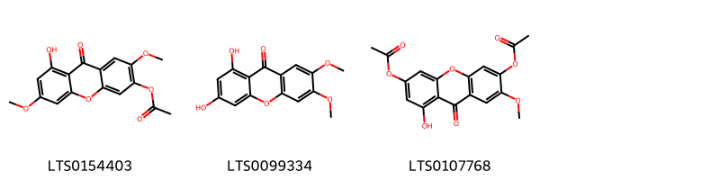{ width=100% }
    <figcaption>Hình ảnh cấu trúc hóa học của 3 hoạt chất thuộc nhóm Benzopyrans gồm ['8-hydroxy-2,6-dimethoxy-9-oxoxanthen-3-yl acetate (LTS0154403)', '1,3-dihydroxy-6,7-dimethoxyxanthen-9-one (LTS0099334)', '6-(acetyloxy)-8-hydroxy-2-methoxy-9-oxoxanthen-3-yl acetate (LTS0107768)'].</figcaption>
</figure>
#### Nhóm Coumarins and derivatives
<figure markdown="span">
    { width=100% }
    <figcaption>Hình ảnh cấu trúc hóa học của 5 hoạt chất thuộc nhóm Coumarins and derivatives gồm ['7-hydroxy-5-(prop-2-en-1-yloxy)chromen-2-one (LTS0130157)', '7,8-bis({[(2s,3r,4s,5s,6r)-3,4,5-trihydroxy-6-(hydroxymethyl)oxan-2-yl]oxy})chromen-2-one (LTS0075724)', '7,8-bis({[3,4,5-trihydroxy-6-(hydroxymethyl)oxan-2-yl]oxy})chromen-2-one (LTS0056785)', '6-methoxy-3-[(2-oxochromen-7-yl)oxy]-7-{[(2s,3r,4s,5s,6r)-3,4,5-trihydroxy-6-(hydroxymethyl)oxan-2-yl]oxy}chromen-2-one (LTS0178249)', '6-methoxy-3-[(2-oxochromen-7-yl)oxy]-7-{[3,4,5-trihydroxy-6-(hydroxymethyl)oxan-2-yl]oxy}chromen-2-one (LTS0022127)'].</figcaption>
</figure>
#### Nhóm Dioxanes
<figure markdown="span">
    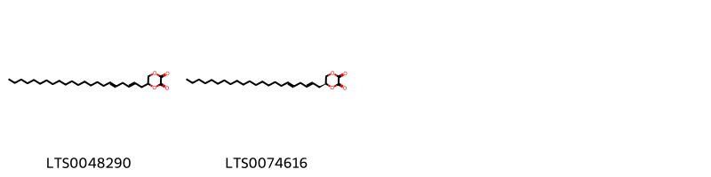{ width=100% }
    <figcaption>Hình ảnh cấu trúc hóa học của 2 hoạt chất thuộc nhóm Dioxanes gồm ['5-(docosa-2,5-dien-1-yl)-1,4-dioxane-2,3-dione (LTS0048290)', '(5s)-5-[(2e,5e)-docosa-2,5-dien-1-yl]-1,4-dioxane-2,3-dione (LTS0074616)'].</figcaption>
</figure>
#### Nhóm Fatty Acyls
<figure markdown="span">
    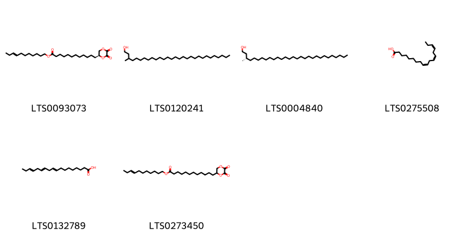{ width=100% }
    <figcaption>Hình ảnh cấu trúc hóa học của 6 hoạt chất thuộc nhóm Fatty Acyls gồm ['(8e)-undec-8-en-1-yl 12-[(2s)-5,6-dioxo-1,4-dioxan-2-yl]dodecanoate (LTS0093073)', '3-methylnonacosan-1-ol (LTS0120241)', '(3s)-3-methylnonacosan-1-ol (LTS0004840)', 'α-linolenic acid (LTS0275508)', 'α linolenic acid (LTS0132789)', 'undec-8-en-1-yl 12-(5,6-dioxo-1,4-dioxan-2-yl)dodecanoate (LTS0273450)'].</figcaption>
</figure>
#### Nhóm Flavonoids
<figure markdown="span">
    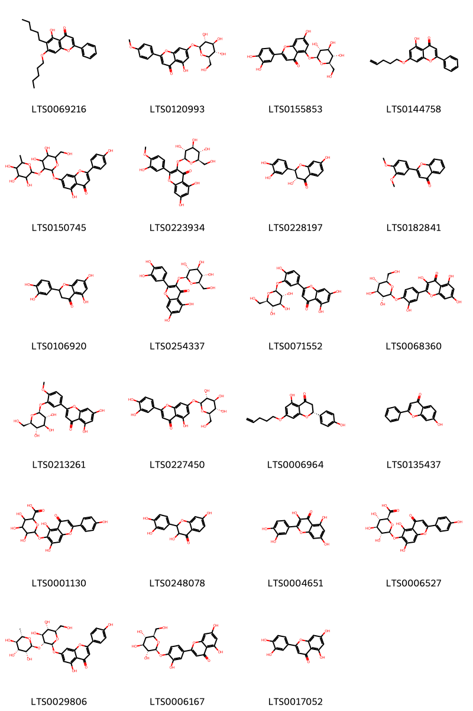{ width=100% }
    <figcaption>Hình ảnh cấu trúc hóa học của 23 hoạt chất thuộc nhóm Flavonoids gồm ['5-hydroxy-6-pentyl-7-(pentyloxy)-2-phenylchromen-4-one (LTS0069216)', '5-hydroxy-2-(4-methoxyphenyl)-7-{[(2s,3r,4s,5s,6r)-3,4,5-trihydroxy-6-(hydroxymethyl)oxan-2-yl]oxy}chromen-4-one (LTS0120993)', '2-(3,4-dihydroxyphenyl)-7-hydroxy-5-{[(2s,3r,4s,5s,6r)-3,4,5-trihydroxy-6-(hydroxymethyl)oxan-2-yl]oxy}chromen-4-one (LTS0155853)', '5-hydroxy-7-(pent-4-en-1-yloxy)-2-phenylchromen-4-one (LTS0144758)', 'rhoifolin (LTS0150745)', '5,7-dihydroxy-2-(3-hydroxy-4-methoxyphenyl)-3-{[(2s,3r,4s,5s,6r)-3,4,5-trihydroxy-6-(hydroxymethyl)oxan-2-yl]oxy}chromen-4-one (LTS0223934)', 'fustin (LTS0228197)', '2-(3,4-dimethoxyphenyl)chromen-4-one (LTS0182841)', '(+/-)-eriodictyol (LTS0106920)', 'isoquercetin (LTS0254337)', "luteolin 3'-glucoside (LTS0071552)", 'spiraeoside (LTS0068360)', '5,7-dihydroxy-2-(4-methoxy-3-{[(2s,3r,4s,5s,6r)-3,4,5-trihydroxy-6-(hydroxymethyl)oxan-2-yl]oxy}phenyl)chromen-4-one (LTS0213261)', 'luteolin 7-o-glucoside (LTS0227450)', '(2r)-5-hydroxy-2-(4-hydroxyphenyl)-7-(pent-4-en-1-yloxy)-2,3-dihydro-1-benzopyran-4-one (LTS0006964)', '7-hydroxyflavone (LTS0135437)', '6-{[5,7-dihydroxy-2-(4-hydroxyphenyl)-4-oxochromen-6-yl]oxy}-3,4,5-trihydroxyoxane-2-carboxylic acid (LTS0001130)', 'fustin (LTS0248078)', 'quercetin (LTS0004651)', '(2s,3s,4s,5r,6s)-6-{[5,7-dihydroxy-2-(4-hydroxyphenyl)-4-oxochromen-6-yl]oxy}-3,4,5-trihydroxyoxane-2-carboxylic acid (LTS0006527)', 'rhoifolin (LTS0029806)', '5,7-dihydroxy-2-(3-hydroxy-4-{[(2s,3r,4s,5s,6r)-3,4,5-trihydroxy-6-(hydroxymethyl)oxan-2-yl]oxy}phenyl)chromen-4-one (LTS0006167)', 'luteolin (LTS0017052)'].</figcaption>
</figure>
#### Nhóm Lignan glycosides
<figure markdown="span">
    { width=100% }
    <figcaption>Hình ảnh cấu trúc hóa học của 6 hoạt chất thuộc nhóm Lignan glycosides gồm ['2-{4-[4-(4-hydroxy-3,5-dimethoxyphenyl)-hexahydrofuro[3,4-c]furan-1-yl]-2,6-dimethoxyphenoxy}-6-(hydroxymethyl)oxane-3,4,5-triol (LTS0209275)', '(2s,3r,4s,5s,6r)-2-{4-[(1s,3ar,4s,6ar)-4-(3-methoxy-4-{[(2s,3r,4s,5s,6r)-3,4,5-trihydroxy-6-(hydroxymethyl)oxan-2-yl]oxy}phenyl)-hexahydrofuro[3,4-c]furan-1-yl]-2-methoxyphenoxy}-6-(hydroxymethyl)oxane-3,4,5-triol (LTS0038572)', '2-(hydroxymethyl)-6-{2-methoxy-4-[4-(3-methoxy-4-{[3,4,5-trihydroxy-6-(hydroxymethyl)oxan-2-yl]oxy}phenyl)-hexahydrofuro[3,4-c]furan-1-yl]phenoxy}oxane-3,4,5-triol (LTS0086767)', 'acanthoside b (LTS0081842)', '2-{4-[4-(3,5-dimethoxy-4-{[3,4,5-trihydroxy-6-(hydroxymethyl)oxan-2-yl]oxy}phenyl)-hexahydrofuro[3,4-c]furan-1-yl]-2,6-dimethoxyphenoxy}-6-(hydroxymethyl)oxane-3,4,5-triol (LTS0011685)', 'liriodendrin (LTS0016790)'].</figcaption>
</figure>
#### Nhóm Naphthalenes
<figure markdown="span">
    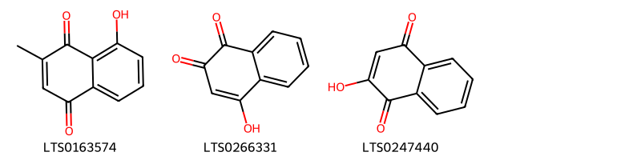{ width=100% }
    <figcaption>Hình ảnh cấu trúc hóa học của 3 hoạt chất thuộc nhóm Naphthalenes gồm ['8-hydroxy-2-methylnaphthalene-1,4-dione (LTS0163574)', '2-hydroxy-1,4-naphthoquinone (LTS0266331)', 'hana (LTS0247440)'].</figcaption>
</figure>
#### Nhóm Naphthopyrans
<figure markdown="span">
    { width=100% }
    <figcaption>Hình ảnh cấu trúc hóa học của 1 hoạt chất thuộc nhóm Naphthopyrans gồm ['1-methoxy-13h-6-oxapentacene-5,7,12,14-tetrone (LTS0234779)'].</figcaption>
</figure>
#### Nhóm Organooxygen compounds
<figure markdown="span">
    { width=100% }
    <figcaption>Hình ảnh cấu trúc hóa học của 9 hoạt chất thuộc nhóm Organooxygen compounds gồm ['(2s,3r,4s,5s,6r)-2-{4-[(1e)-3-hydroxyprop-1-en-1-yl]-2,6-dimethoxyphenoxy}-6-({[(2r,3r,4s,5s,6r)-3,4,5-trihydroxy-6-(hydroxymethyl)oxan-2-yl]oxy}methyl)oxane-3,4,5-triol (LTS0135469)', '1-(2,4-dihydroxy-3,5-dimethyl-6-{[(2s,3r,4s,5s,6r)-3,4,5-trihydroxy-6-(hydroxymethyl)oxan-2-yl]oxy}phenyl)butan-1-one (LTS0066785)', '2-[4-(3-hydroxyprop-1-en-1-yl)-2,6-dimethoxyphenoxy]-6-({[3,4,5-trihydroxy-6-(hydroxymethyl)oxan-2-yl]oxy}methyl)oxane-3,4,5-triol (LTS0077374)', '8-hydroxy-3-[2-(4-methoxyphenyl)ethyl]-6-{[3,4,5-trihydroxy-6-(hydroxymethyl)oxan-2-yl]oxy}-3,4-dihydro-2-benzopyran-1-one (LTS0193766)', '(3s)-8-hydroxy-3-[2-(4-methoxyphenyl)ethyl]-6-{[(2s,3r,4s,5s,6r)-3,4,5-trihydroxy-6-(hydroxymethyl)oxan-2-yl]oxy}-3,4-dihydro-2-benzopyran-1-one (LTS0246099)', '(2r,3s,4s,5r,6r)-2-(hydroxymethyl)-6-{4-[(1e)-3-hydroxyprop-1-en-1-yl]-2,6-dimethoxyphenoxy}oxane-3,4,5-triol (LTS0230398)', '2-(hydroxymethyl)-6-[4-(3-hydroxyprop-1-en-1-yl)-2,6-dimethoxyphenoxy]oxane-3,4,5-triol (LTS0188912)', '1-(2,4-dihydroxy-3,5-dimethyl-6-{[3,4,5-trihydroxy-6-(hydroxymethyl)oxan-2-yl]oxy}phenyl)butan-1-one (LTS0058757)', '(2s,3r,4s,5s,6r)-2-[(3-hydroxy-4-{[(2s,3r,4s,5s,6r)-3,4,5-trihydroxy-6-(hydroxymethyl)oxan-2-yl]oxy}naphthalen-1-yl)oxy]-6-(hydroxymethyl)oxane-3,4,5-triol (LTS0133896)'].</figcaption>
</figure>
#### Nhóm Prenol lipids
<figure markdown="span">
    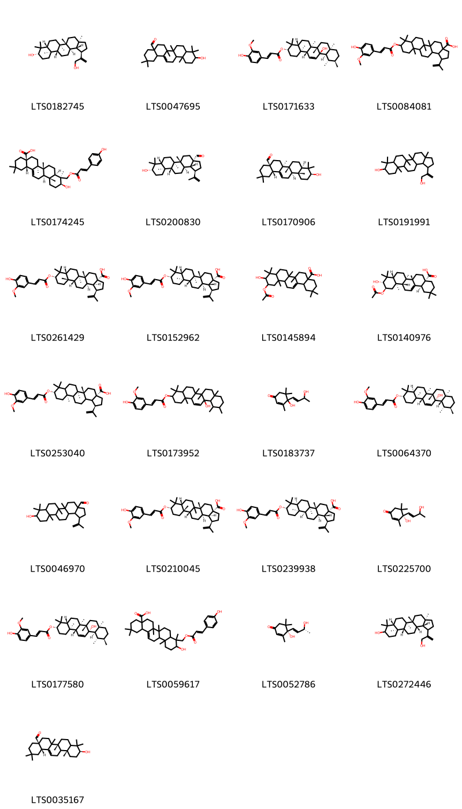{ width=100% }
    <figcaption>Hình ảnh cấu trúc hóa học của 25 hoạt chất thuộc nhóm Prenol lipids gồm ['(1r,3ar,5ar,5br,7ar,9s,11ar,11br,13ar,13bs)-1-(3-hydroxyprop-1-en-2-yl)-3a,5a,5b,8,8,11a-hexamethyl-hexadecahydrocyclopenta[a]chrysen-9-ol (LTS0182745)', '10-hydroxy-2,2,6a,6b,9,9,12a-heptamethyl-1,3,4,5,6,7,8,8a,10,11,12,12b,13,14b-tetradecahydropicene-4a-carbaldehyde (LTS0047695)', '(3s,4ar,6ar,6bs,8ar,11r,12s,12ar,12br,14ar,14bs)-12b-hydroxy-4,4,6a,6b,8a,11,12,14b-octamethyl-1,2,3,4a,5,6,7,8,9,10,11,12,12a,14a-tetradecahydropicen-3-yl (2e)-3-(4-hydroxy-3-methoxyphenyl)prop-2-enoate (LTS0171633)', '9-{[3-(4-hydroxy-3-methoxyphenyl)prop-2-enoyl]oxy}-5a,5b,8,8,11a-pentamethyl-1-(prop-1-en-2-yl)-hexadecahydrocyclopenta[a]chrysene-3a-carboxylic acid (LTS0084081)', '(4as,6as,6br,8ar,9s,10s,12ar,12br,14bs)-10-hydroxy-9-({[(2e)-3-(4-hydroxyphenyl)prop-2-enoyl]oxy}methyl)-2,2,6a,6b,9,12a-hexamethyl-1,3,4,5,6,7,8,8a,10,11,12,12b,13,14b-tetradecahydropicene-4a-carboxylic acid (LTS0174245)', '(1r,3as,5ar,5br,7ar,9s,11ar,11br,13ar,13br)-9-hydroxy-5a,5b,8,8,11a-pentamethyl-1-(prop-1-en-2-yl)-hexadecahydrocyclopenta[a]chrysene-3a-carbaldehyde (LTS0200830)', 'oleanolic aldehyde (LTS0170906)', '1-(3-hydroxyprop-1-en-2-yl)-3a,5a,5b,8,8,11a-hexamethyl-hexadecahydrocyclopenta[a]chrysen-9-ol (LTS0191991)', '(1r,3as,5ar,5br,7ar,9s,11as,11br,13ar,13bs)-9-{[(2e)-3-(4-hydroxy-3-methoxyphenyl)prop-2-enoyl]oxy}-5a,5b,8,8,11a-pentamethyl-1-(prop-1-en-2-yl)-hexadecahydrocyclopenta[a]chrysene-3a-carboxylic acid (LTS0261429)', '(1r,3as,5ar,5br,7ar,9s,11ar,11br,13ar,13br)-9-{[(2e)-3-(4-hydroxy-3-methoxyphenyl)prop-2-enoyl]oxy}-5a,5b,8,8,11a-pentamethyl-1-(prop-1-en-2-yl)-hexadecahydrocyclopenta[a]chrysene-3a-carboxylic acid (LTS0152962)', '11-(acetyloxy)-10-hydroxy-2,2,6a,6b,9,9,12a-heptamethyl-1,3,4,5,6,7,8,8a,10,11,12,12b,13,14b-tetradecahydropicene-4a-carboxylic acid (LTS0145894)', '(4as,6as,6br,8ar,10r,11r,12ar,12br,14bs)-11-(acetyloxy)-10-hydroxy-2,2,6a,6b,9,9,12a-heptamethyl-1,3,4,5,6,7,8,8a,10,11,12,12b,13,14b-tetradecahydropicene-4a-carboxylic acid (LTS0140976)', '(1r,3as,5ar,5br,9s,11ar)-9-{[(2e)-3-(4-hydroxy-3-methoxyphenyl)prop-2-enoyl]oxy}-5a,5b,8,8,11a-pentamethyl-1-(prop-1-en-2-yl)-hexadecahydrocyclopenta[a]chrysene-3a-carboxylic acid (LTS0253040)', '12b-hydroxy-4,4,6a,6b,8a,11,12,14b-octamethyl-1,2,3,4a,5,6,7,8,9,10,11,12,12a,14a-tetradecahydropicen-3-yl 3-(4-hydroxy-3-methoxyphenyl)prop-2-enoate (LTS0173952)', '4-hydroxy-4-(3-hydroxybut-1-en-1-yl)-3,5,5-trimethylcyclohex-2-en-1-one (LTS0183737)', '(3s,4as,6ar,6bs,8ar,11r,12s,12as,12bs,14ar,14bs)-12b-hydroxy-4,4,6a,6b,8a,11,12,14b-octamethyl-1,2,3,4a,5,6,7,8,9,10,11,12,12a,14a-tetradecahydropicen-3-yl (2e)-3-(4-hydroxy-3-methoxyphenyl)prop-2-enoate (LTS0064370)', 'betulinaldehyde (LTS0046970)', '(1r,3as,5ar,7ar,9s,11as,11br,13ar,13bs)-9-{[(2e)-3-(4-hydroxy-3-methoxyphenyl)prop-2-enoyl]oxy}-5a,5b,8,8,11a-pentamethyl-1-(prop-1-en-2-yl)-hexadecahydrocyclopenta[a]chrysene-3a-carboxylic acid (LTS0210045)', '(1r,3as,5ar,5br,7as,9s,11ar,11bs,13ar,13br)-9-{[(2e)-3-(4-hydroxy-3-methoxyphenyl)prop-2-enoyl]oxy}-5a,5b,8,8,11a-pentamethyl-1-(prop-1-en-2-yl)-hexadecahydrocyclopenta[a]chrysene-3a-carboxylic acid (LTS0239938)', '(4s)-4-hydroxy-4-(3-hydroxybut-1-en-1-yl)-3,5,5-trimethylcyclohex-2-en-1-one (LTS0225700)', '(3s,4ar,6ar,6bs,8ar,11r,12s,12ar,12bs,14ar,14bs)-12b-hydroxy-4,4,6a,6b,8a,11,12,14b-octamethyl-1,2,3,4a,5,6,7,8,9,10,11,12,12a,14a-tetradecahydropicen-3-yl (2e)-3-(4-hydroxy-3-methoxyphenyl)prop-2-enoate (LTS0177580)', '10-hydroxy-9-({[3-(4-hydroxyphenyl)prop-2-enoyl]oxy}methyl)-2,2,6a,6b,9,12a-hexamethyl-1,3,4,5,6,7,8,8a,10,11,12,12b,13,14b-tetradecahydropicene-4a-carboxylic acid (LTS0059617)', '(6s,9r)-vomifoliol (LTS0052786)', '(3ar,5ar,5br,7ar,11ar,11br,13as,13bs)-1-(3-hydroxyprop-1-en-2-yl)-3a,5a,5b,8,8,11a-hexamethyl-hexadecahydrocyclopenta[a]chrysen-9-ol (LTS0272446)', '(4as,6br,10s,12ar,14bs)-10-hydroxy-2,2,6a,6b,9,9,12a-heptamethyl-1,3,4,5,6,7,8,8a,10,11,12,12b,13,14b-tetradecahydropicene-4a-carbaldehyde (LTS0035167)'].</figcaption>
</figure>
#### Nhóm Steroids and steroid derivatives
<figure markdown="span">
    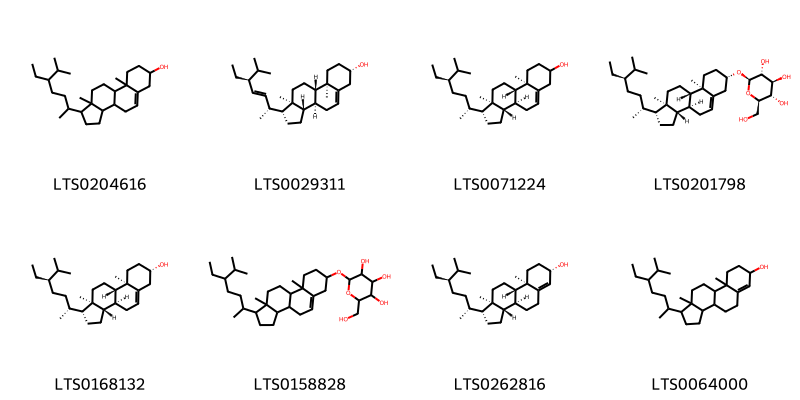{ width=100% }
    <figcaption>Hình ảnh cấu trúc hóa học của 8 hoạt chất thuộc nhóm Steroids and steroid derivatives gồm ['stigmast-5-en-3-ol, (3β)- (LTS0204616)', 'phytosterol (LTS0029311)', 'stigmast-5-en-3-ol (LTS0071224)', 'sitogluside (LTS0201798)', 'sitosterol (LTS0168132)', '2-{[1-(5-ethyl-6-methylheptan-2-yl)-9a,11a-dimethyl-1h,2h,3h,3ah,3bh,4h,6h,7h,8h,9h,9bh,10h,11h-cyclopenta[a]phenanthren-7-yl]oxy}-6-(hydroxymethyl)oxane-3,4,5-triol (LTS0158828)', '(1r,3as,3bs,7s,9ar,9bs,11ar)-1-[(2r,5r)-5-ethyl-6-methylheptan-2-yl]-9a,11a-dimethyl-1h,2h,3h,3ah,3bh,4h,5h,7h,8h,9h,9bh,10h,11h-cyclopenta[a]phenanthren-7-ol (LTS0262816)', '1-(5-ethyl-6-methylheptan-2-yl)-9a,11a-dimethyl-1h,2h,3h,3ah,3bh,4h,5h,7h,8h,9h,9bh,10h,11h-cyclopenta[a]phenanthren-7-ol (LTS0064000)'].</figcaption>
</figure>

---

### Dược dân tộc học

Danh sách các quốc gia có sử dụng *Lawsonia inermis* trong điều trị các bệnh. 

| Country            | Disease                                                | Bệnh                                                                                                                                                                                                |
|:-------------------|:-------------------------------------------------------|:----------------------------------------------------------------------------------------------------------------------------------------------------------------------------------------------------|
| China              | Astringent, Cosmetic                                   | MYMEMORY WARNING: YOU USED ALL AVAILABLE FREE TRANSLATIONS FOR TODAY. NEXT AVAILABLE IN  13 HOURS 12 MINUTES 26 SECONDS VISIT HTTPS://MYMEMORY.TRANSLATED.NET/DOC/USAGELIMITS.PHP TO TRANSLATE MORE |
| Dominican Republic | Deodorant, Emmenagogue, Astringent                     | MYMEMORY WARNING: YOU USED ALL AVAILABLE FREE TRANSLATIONS FOR TODAY. NEXT AVAILABLE IN  13 HOURS 12 MINUTES 23 SECONDS VISIT HTTPS://MYMEMORY.TRANSLATED.NET/DOC/USAGELIMITS.PHP TO TRANSLATE MORE |
| Egypt              | Cosmetic                                               | MYMEMORY WARNING: YOU USED ALL AVAILABLE FREE TRANSLATIONS FOR TODAY. NEXT AVAILABLE IN  13 HOURS 12 MINUTES 20 SECONDS VISIT HTTPS://MYMEMORY.TRANSLATED.NET/DOC/USAGELIMITS.PHP TO TRANSLATE MORE |
| Elsewhere          | Astringent, nan                                        | MYMEMORY WARNING: YOU USED ALL AVAILABLE FREE TRANSLATIONS FOR TODAY. NEXT AVAILABLE IN  13 HOURS 12 MINUTES 11 SECONDS VISIT HTTPS://MYMEMORY.TRANSLATED.NET/DOC/USAGELIMITS.PHP TO TRANSLATE MORE |
| India              | nan, Fungicide                                         | MYMEMORY WARNING: YOU USED ALL AVAILABLE FREE TRANSLATIONS FOR TODAY. NEXT AVAILABLE IN  13 HOURS 12 MINUTES 05 SECONDS VISIT HTTPS://MYMEMORY.TRANSLATED.NET/DOC/USAGELIMITS.PHP TO TRANSLATE MORE |
| Iraq               | Cosmetic                                               | MYMEMORY WARNING: YOU USED ALL AVAILABLE FREE TRANSLATIONS FOR TODAY. NEXT AVAILABLE IN  13 HOURS 12 MINUTES 00 SECONDS VISIT HTTPS://MYMEMORY.TRANSLATED.NET/DOC/USAGELIMITS.PHP TO TRANSLATE MORE |
| Kurdistan          | Sedative                                               | MYMEMORY WARNING: YOU USED ALL AVAILABLE FREE TRANSLATIONS FOR TODAY. NEXT AVAILABLE IN  13 HOURS 11 MINUTES 57 SECONDS VISIT HTTPS://MYMEMORY.TRANSLATED.NET/DOC/USAGELIMITS.PHP TO TRANSLATE MORE |
| Mexico             | Emmenagogue, Emmenagogue, Poison, Purgative, Vermifuge | MYMEMORY WARNING: YOU USED ALL AVAILABLE FREE TRANSLATIONS FOR TODAY. NEXT AVAILABLE IN  13 HOURS 11 MINUTES 53 SECONDS VISIT HTTPS://MYMEMORY.TRANSLATED.NET/DOC/USAGELIMITS.PHP TO TRANSLATE MORE |
| Turkey             | Astringent, Poultice, Sedative                         | MYMEMORY WARNING: YOU USED ALL AVAILABLE FREE TRANSLATIONS FOR TODAY. NEXT AVAILABLE IN  13 HOURS 11 MINUTES 49 SECONDS VISIT HTTPS://MYMEMORY.TRANSLATED.NET/DOC/USAGELIMITS.PHP TO TRANSLATE MORE |

---

# Chi Heimia

??? note "Danh sách các dược liệu thuộc chi"
    
	 - *Heimia salicifolia*

---
## Heimia salicifolia
### Thông tin về thực vật

!!! info "Phân loại thực vật của *Heimia salicifolia* từ GIBF:"
    - **Kingdom:** Plantae
    - **Phylum:** Tracheophyta
    - **Order:** Myrtales
    - **Family:** Lythraceae
    - **Genus:** Heimia
    - **Species:** *Heimia salicifolia*

 

| Label (VI)   | Label (EN)   | Scientific Name    | Descriptions (VI)   | Descriptions (EN)   | Also Known As (VI)   | Also Known As (EN)   |
|:-------------|:-------------|:-------------------|:--------------------|:--------------------|:---------------------|:---------------------|
| N/A          | N/A          | Heimia salicifolia | loài thực vật       | species of plant    | ['']                 | ['']                 |

#### Phân bố trên thế giới

**Từ CSDL GIBF** Uruguay, Argentina, South Africa, Brazil, United States of America, Mexico, Australia

#### Phân bố tại Việt Nam

**Từ CSDL GIBF**: Không có ghi nhận ở Việt Nam

---
### Thành phần hóa học
        
- Theo cơ sở dữ liệu lotus: Từ loài *Heimia salicifolia* đã phân lập và xác định được 26 hoạt chất thuộc về các nhóm Macrolides and analogues, Piperidines, Quinolizidines, Phenol ethers, Cinnamic acids and derivatives. 

|    | chemicalTaxonomyClassyfireClass   |   smiles_count |
|---:|:----------------------------------|---------------:|
|  0 | Cinnamic acids and derivatives    |              2 |
|  1 | Macrolides and analogues          |              5 |
|  2 | Phenol ethers                     |              1 |
|  3 | Piperidines                       |              4 |
|  4 | Quinolizidines                    |             12 |

#### Nhóm Cinnamic acids and derivatives
<figure markdown="span">
    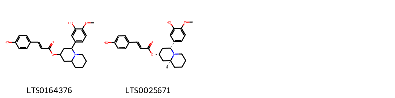{ width=100% }
    <figcaption>Hình ảnh cấu trúc hóa học của 2 hoạt chất thuộc nhóm Cinnamic acids and derivatives gồm ['4-(3-hydroxy-4-methoxyphenyl)-octahydro-1h-quinolizin-2-yl 3-(4-hydroxyphenyl)prop-2-enoate (LTS0164376)', '(2s,4r,9as)-4-(3-hydroxy-4-methoxyphenyl)-octahydro-1h-quinolizin-2-yl (2e)-3-(4-hydroxyphenyl)prop-2-enoate (LTS0025671)'].</figcaption>
</figure>
#### Nhóm Macrolides and analogues
<figure markdown="span">
    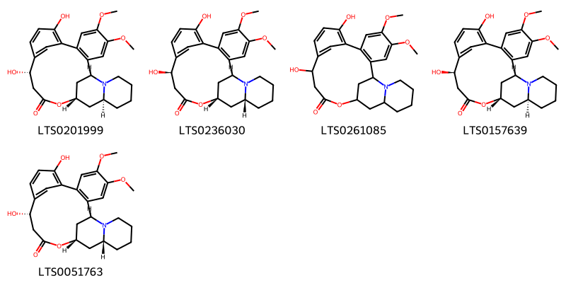{ width=100% }
    <figcaption>Hình ảnh cấu trúc hóa học của 5 hoạt chất thuộc nhóm Macrolides and analogues gồm ['(1s,13s,17s,19s)-9,13-dihydroxy-4,5-dimethoxy-16-oxa-24-azapentacyclo[15.7.1.1⁸,¹².0²,⁷.0¹⁹,²⁴]hexacosa-2(7),3,5,8(26),9,11-hexaen-15-one (LTS0201999)', '(1s,13r,17s,19r)-9,13-dihydroxy-4,5-dimethoxy-16-oxa-24-azapentacyclo[15.7.1.1⁸,¹².0²,⁷.0¹⁹,²⁴]hexacosa-2(7),3,5,8(26),9,11-hexaen-15-one (LTS0236030)', '9,13-dihydroxy-4,5-dimethoxy-16-oxa-24-azapentacyclo[15.7.1.1⁸,¹².0²,⁷.0¹⁹,²⁴]hexacosa-2(7),3,5,8(26),9,11-hexaen-15-one (LTS0261085)', '(1s,13r,17s,19s)-9,13-dihydroxy-4,5-dimethoxy-16-oxa-24-azapentacyclo[15.7.1.1⁸,¹².0²,⁷.0¹⁹,²⁴]hexacosa-2(7),3,5,8(26),9,11-hexaen-15-one (LTS0157639)', '(1s,13s,17s,19r)-9,13-dihydroxy-4,5-dimethoxy-16-oxa-24-azapentacyclo[15.7.1.1⁸,¹².0²,⁷.0¹⁹,²⁴]hexacosa-2(7),3,5,8(26),9,11-hexaen-15-one (LTS0051763)'].</figcaption>
</figure>
#### Nhóm Phenol ethers
<figure markdown="span">
    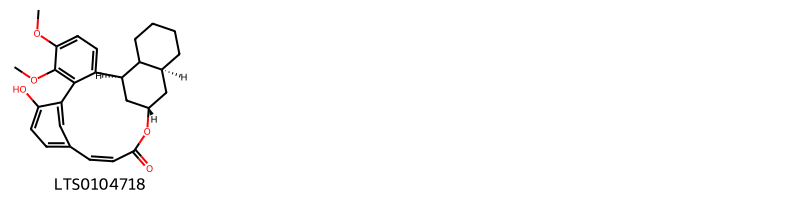{ width=100% }
    <figcaption>Hình ảnh cấu trúc hóa học của 1 hoạt chất thuộc nhóm Phenol ethers gồm ['(1r,13z,17s,19s)-9-hydroxy-5,6-dimethoxy-16-oxapentacyclo[15.7.1.1⁸,¹².0²,⁷.0¹⁹,²⁴]hexacosa-2,4,6,8(26),9,11,13-heptaen-15-one (LTS0104718)'].</figcaption>
</figure>
#### Nhóm Piperidines
<figure markdown="span">
    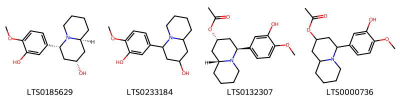{ width=100% }
    <figcaption>Hình ảnh cấu trúc hóa học của 4 hoạt chất thuộc nhóm Piperidines gồm ['(2s,4r,9as)-4-(3-hydroxy-4-methoxyphenyl)-octahydro-1h-quinolizin-2-ol (LTS0185629)', '4-(3-hydroxy-4-methoxyphenyl)-octahydro-1h-quinolizin-2-ol (LTS0233184)', '(2s,4s,9ar)-4-(3-hydroxy-4-methoxyphenyl)-octahydro-1h-quinolizin-2-yl acetate (LTS0132307)', '4-(3-hydroxy-4-methoxyphenyl)-octahydro-1h-quinolizin-2-yl acetate (LTS0000736)'].</figcaption>
</figure>
#### Nhóm Quinolizidines
<figure markdown="span">
    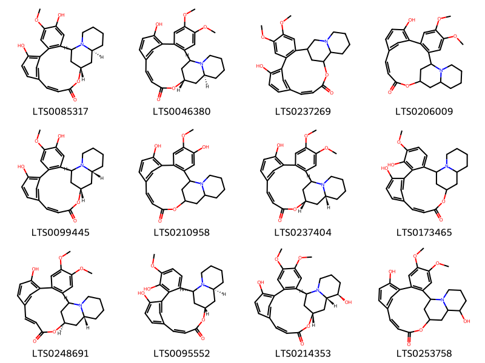{ width=100% }
    <figcaption>Hình ảnh cấu trúc hóa học của 12 hoạt chất thuộc nhóm Quinolizidines gồm ['(1s,13z,17s,19s)-4,9-dihydroxy-5-methoxy-16-oxa-24-azapentacyclo[15.7.1.1⁸,¹².0²,⁷.0¹⁹,²⁴]hexacosa-2(7),3,5,8(26),9,11,13-heptaen-15-one (LTS0085317)', 'lythrine (LTS0046380)', '9-hydroxy-4,5-dimethoxy-16-oxa-23-azapentacyclo[15.7.1.1⁸,¹².0²,⁷.0¹⁸,²³]hexacosa-2(7),3,5,8(26),9,11,13-heptaen-15-one (LTS0237269)', '9-hydroxy-4,5-dimethoxy-16-oxa-24-azapentacyclo[15.7.1.1⁸,¹².0²,⁷.0¹⁹,²⁴]hexacosa-2(7),3,5,8(26),9,11,13-heptaen-15-one (LTS0206009)', '(1s,13z,17s,19r)-4,9-dihydroxy-5-methoxy-16-oxa-24-azapentacyclo[15.7.1.1⁸,¹².0²,⁷.0¹⁹,²⁴]hexacosa-2(7),3,5,8(26),9,11,13-heptaen-15-one (LTS0099445)', '4,9-dihydroxy-5-methoxy-16-oxa-24-azapentacyclo[15.7.1.1⁸,¹².0²,⁷.0¹⁹,²⁴]hexacosa-2(7),3,5,8(26),9,11,13-heptaen-15-one (LTS0210958)', 'cryogenine (LTS0237404)', '6,9-dihydroxy-5-methoxy-16-oxa-24-azapentacyclo[15.7.1.1⁸,¹².0²,⁷.0¹⁹,²⁴]hexacosa-2,4,6,8(26),9,11,13-heptaen-15-one (LTS0173465)', '(1s,13e,17r,19r)-9-hydroxy-4,5-dimethoxy-16-oxa-24-azapentacyclo[15.7.1.1⁸,¹².0²,⁷.0¹⁹,²⁴]hexacosa-2(7),3,5,8(26),9,11,13-heptaen-15-one (LTS0248691)', '(1s,13z,17s,19s)-6,9-dihydroxy-5-methoxy-16-oxa-24-azapentacyclo[15.7.1.1⁸,¹².0²,⁷.0¹⁹,²⁴]hexacosa-2,4,6,8(26),9,11,13-heptaen-15-one (LTS0095552)', '(1s,13z,17r,19s,20r)-9,20-dihydroxy-4,5-dimethoxy-16-oxa-24-azapentacyclo[15.7.1.1⁸,¹².0²,⁷.0¹⁹,²⁴]hexacosa-2(7),3,5,8(26),9,11,13-heptaen-15-one (LTS0214353)', '9,20-dihydroxy-4,5-dimethoxy-16-oxa-24-azapentacyclo[15.7.1.1⁸,¹².0²,⁷.0¹⁹,²⁴]hexacosa-2(7),3,5,8(26),9,11,13-heptaen-15-one (LTS0253758)'].</figcaption>
</figure>

---

### Dược dân tộc học

Danh sách các quốc gia có sử dụng *Heimia salicifolia* trong điều trị các bệnh. 

| Country   | Disease                                                                                                                         | Bệnh                                                                                                                                                                                                |
|:----------|:--------------------------------------------------------------------------------------------------------------------------------|:----------------------------------------------------------------------------------------------------------------------------------------------------------------------------------------------------|
| Argentina | Diuretic, Purgative, Vulnerary                                                                                                  | MYMEMORY WARNING: YOU USED ALL AVAILABLE FREE TRANSLATIONS FOR TODAY. NEXT AVAILABLE IN  13 HOURS 11 MINUTES 10 SECONDS VISIT HTTPS://MYMEMORY.TRANSLATED.NET/DOC/USAGELIMITS.PHP TO TRANSLATE MORE |
| Elsewhere | Astringent, Diaphoretic, Diuretic, Emetic, Laxative, Tonic, Vulnerary                                                           | MYMEMORY WARNING: YOU USED ALL AVAILABLE FREE TRANSLATIONS FOR TODAY. NEXT AVAILABLE IN  13 HOURS 11 MINUTES 06 SECONDS VISIT HTTPS://MYMEMORY.TRANSLATED.NET/DOC/USAGELIMITS.PHP TO TRANSLATE MORE |
| India     | Intoxicant                                                                                                                      | MYMEMORY WARNING: YOU USED ALL AVAILABLE FREE TRANSLATIONS FOR TODAY. NEXT AVAILABLE IN  13 HOURS 11 MINUTES 03 SECONDS VISIT HTTPS://MYMEMORY.TRANSLATED.NET/DOC/USAGELIMITS.PHP TO TRANSLATE MORE |
| Mexico    | Antidote, Astringent, Hallucinogen, Sudorific, Tonic, Vulnerary, Hemostat, Intoxicant, Diuretic, Emetic, Hallucinogen, Laxative | MYMEMORY WARNING: YOU USED ALL AVAILABLE FREE TRANSLATIONS FOR TODAY. NEXT AVAILABLE IN  13 HOURS 11 MINUTES 00 SECONDS VISIT HTTPS://MYMEMORY.TRANSLATED.NET/DOC/USAGELIMITS.PHP TO TRANSLATE MORE |

---

# Chi Lythrum

??? note "Danh sách các dược liệu thuộc chi"
    
	 - *Lythrum anceps*
	 - *Lythrum salicaria*

---
## Lythrum anceps
### Thông tin về thực vật

!!! info "Phân loại thực vật của *Lythrum salicaria* từ GIBF:"
    - **Kingdom:** Plantae
    - **Phylum:** Tracheophyta
    - **Order:** Myrtales
    - **Family:** Lythraceae
    - **Genus:** Lythrum
    - **Species:** *Lythrum salicaria*

 

| Label (VI)   | Label (EN)   | Scientific Name   | Descriptions (VI)   | Descriptions (EN)   | Also Known As (VI)   | Also Known As (EN)   |
|:-------------|:-------------|:------------------|:--------------------|:--------------------|:---------------------|:---------------------|
| N/A          | N/A          | Lythrum anceps    | loài thực vật       | species of plant    | ['']                 | ['']                 |

#### Phân bố trên thế giới

**Từ CSDL GIBF** nan, Japan, Korea, Republic of

#### Phân bố tại Việt Nam

**Từ CSDL GIBF**: Không có ghi nhận ở Việt Nam

---
### Thành phần hóa học
        
- Theo cơ sở dữ liệu lotus: Từ loài *Lythrum salicaria* đã phân lập và xác định được 29 hoạt chất thuộc về các nhóm Phenol ethers, Quinolizidines. 

|    | chemicalTaxonomyClassyfireClass   |   smiles_count |
|---:|:----------------------------------|---------------:|
|  0 | Phenol ethers                     |              5 |
|  1 | Quinolizidines                    |             24 |

#### Nhóm Phenol ethers
<figure markdown="span">
    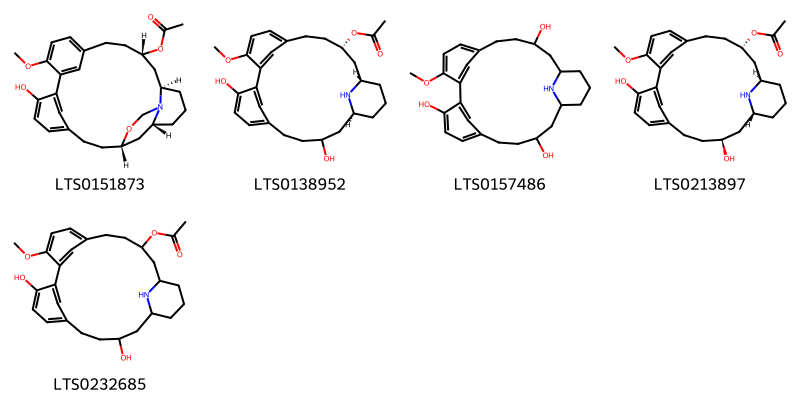{ width=100% }
    <figcaption>Hình ảnh cấu trúc hóa học của 5 hoạt chất thuộc nhóm Phenol ethers gồm ['lythramine (LTS0151873)', '(9s,11s,15s)-17,23-dihydroxy-3-methoxy-25-azatetracyclo[18.3.1.1²,⁶.1¹¹,¹⁵]hexacosa-1(24),2(26),3,5,20,22-hexaen-9-yl acetate (LTS0138952)', 'lythranidine (LTS0157486)', '(9s,11r,15r,17s)-17,23-dihydroxy-3-methoxy-25-azatetracyclo[18.3.1.1²,⁶.1¹¹,¹⁵]hexacosa-1(24),2(26),3,5,20,22-hexaen-9-yl acetate (LTS0213897)', '17,23-dihydroxy-3-methoxy-25-azatetracyclo[18.3.1.1²,⁶.1¹¹,¹⁵]hexacosa-1(24),2(26),3,5,20,22-hexaen-9-yl acetate (LTS0232685)'].</figcaption>
</figure>
#### Nhóm Quinolizidines
<figure markdown="span">
    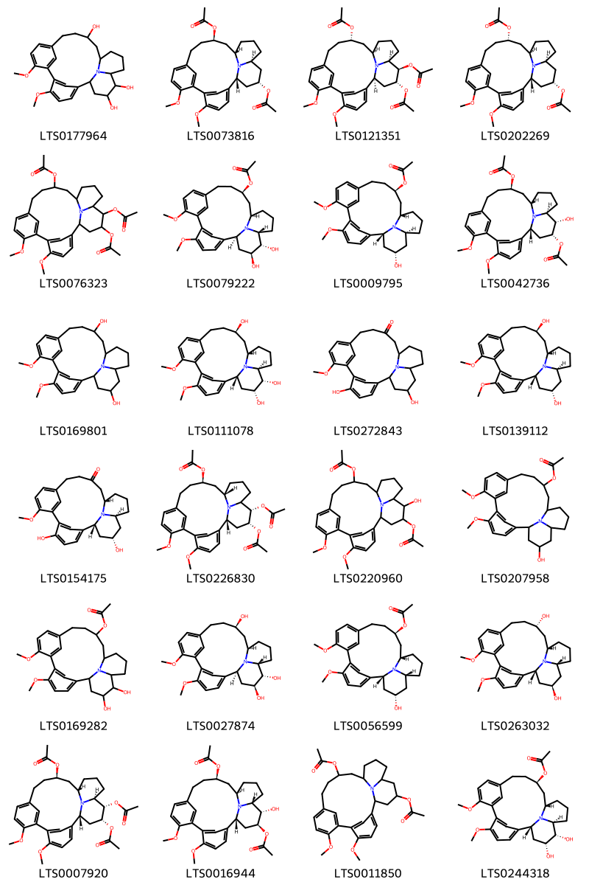{ width=100% }
    <figcaption>Hình ảnh cấu trúc hóa học của 24 hoạt chất thuộc nhóm Quinolizidines gồm ['5,8-dimethoxy-24-azapentacyclo[14.7.1.1²,⁶.1⁷,¹¹.0²⁰,²⁴]hexacosa-2,4,6(26),7(25),8,10-hexaene-14,21,22-triol (LTS0177964)', '(1r,14r,16s,20s,22s)-22-(acetyloxy)-5,8-dimethoxy-24-azapentacyclo[14.7.1.1²,⁶.1⁷,¹¹.0²⁰,²⁴]hexacosa-2,4,6(26),7(25),8,10-hexaen-14-yl acetate (LTS0073816)', '(1s,14s,16r,20s,21r,22r)-21,22-bis(acetyloxy)-5,8-dimethoxy-24-azapentacyclo[14.7.1.1²,⁶.1⁷,¹¹.0²⁰,²⁴]hexacosa-2,4,6(26),7(25),8,10-hexaen-14-yl acetate (LTS0121351)', '(1r,14s,16r,20s,22s)-22-(acetyloxy)-5,8-dimethoxy-24-azapentacyclo[14.7.1.1²,⁶.1⁷,¹¹.0²⁰,²⁴]hexacosa-2,4,6(26),7(25),8,10-hexaen-14-yl acetate (LTS0202269)', '21,22-bis(acetyloxy)-5,8-dimethoxy-24-azapentacyclo[14.7.1.1²,⁶.1⁷,¹¹.0²⁰,²⁴]hexacosa-2,4,6(26),7(25),8,10-hexaen-14-yl acetate (LTS0076323)', '(1s,14r,16r,20r,21s,22s)-21,22-dihydroxy-5,8-dimethoxy-24-azapentacyclo[14.7.1.1²,⁶.1⁷,¹¹.0²⁰,²⁴]hexacosa-2,4,6(26),7(25),8,10-hexaen-14-yl acetate (LTS0079222)', '(1r,14r,16s,20s,22s)-22-hydroxy-5,8-dimethoxy-24-azapentacyclo[14.7.1.1²,⁶.1⁷,¹¹.0²⁰,²⁴]hexacosa-2,4,6(26),7(25),8,10-hexaen-14-yl acetate (LTS0009795)', '(1r,14r,16s,20s,21s,22r)-22-(acetyloxy)-21-hydroxy-5,8-dimethoxy-24-azapentacyclo[14.7.1.1²,⁶.1⁷,¹¹.0²⁰,²⁴]hexacosa-2,4,6(26),7(25),8,10-hexaen-14-yl acetate (LTS0042736)', '5,8-dimethoxy-24-azapentacyclo[14.7.1.1²,⁶.1⁷,¹¹.0²⁰,²⁴]hexacosa-2,4,6(26),7(25),8,10-hexaene-14,22-diol (LTS0169801)', '(1r,14r,16s,20s,21s,22r)-5,8-dimethoxy-24-azapentacyclo[14.7.1.1²,⁶.1⁷,¹¹.0²⁰,²⁴]hexacosa-2,4,6(26),7(25),8,10-hexaene-14,21,22-triol (LTS0111078)', '5,22-dihydroxy-8-methoxy-24-azapentacyclo[14.7.1.1²,⁶.1⁷,¹¹.0²⁰,²⁴]hexacosa-2,4,6(26),7(25),8,10-hexaen-14-one (LTS0272843)', '(1r,14r,16s,20s,22s)-5,8-dimethoxy-24-azapentacyclo[14.7.1.1²,⁶.1⁷,¹¹.0²⁰,²⁴]hexacosa-2,4,6(26),7(25),8,10-hexaene-14,22-diol (LTS0139112)', '(1r,16s,20s,22s)-5,22-dihydroxy-8-methoxy-24-azapentacyclo[14.7.1.1²,⁶.1⁷,¹¹.0²⁰,²⁴]hexacosa-2,4,6(26),7(25),8,10-hexaen-14-one (LTS0154175)', '(1r,14r,16s,21s,22r)-21,22-bis(acetyloxy)-5,8-dimethoxy-24-azapentacyclo[14.7.1.1²,⁶.1⁷,¹¹.0²⁰,²⁴]hexacosa-2,4,6(26),7(25),8,10-hexaen-14-yl acetate (LTS0226830)', '22-(acetyloxy)-21-hydroxy-5,8-dimethoxy-24-azapentacyclo[14.7.1.1²,⁶.1⁷,¹¹.0²⁰,²⁴]hexacosa-2,4,6(26),7(25),8,10-hexaen-14-yl acetate (LTS0220960)', '22-hydroxy-5,8-dimethoxy-24-azapentacyclo[14.7.1.1²,⁶.1⁷,¹¹.0²⁰,²⁴]hexacosa-2,4,6(26),7(25),8,10-hexaen-14-yl acetate (LTS0207958)', '21,22-dihydroxy-5,8-dimethoxy-24-azapentacyclo[14.7.1.1²,⁶.1⁷,¹¹.0²⁰,²⁴]hexacosa-2,4,6(26),7(25),8,10-hexaen-14-yl acetate (LTS0169282)', '(1s,14r,16r,20r,21s,22s)-5,8-dimethoxy-24-azapentacyclo[14.7.1.1²,⁶.1⁷,¹¹.0²⁰,²⁴]hexacosa-2,4,6(26),7(25),8,10-hexaene-14,21,22-triol (LTS0027874)', '(1r,14r,16s,20r,22s)-22-hydroxy-5,8-dimethoxy-24-azapentacyclo[14.7.1.1²,⁶.1⁷,¹¹.0²⁰,²⁴]hexacosa-2,4,6(26),7(25),8,10-hexaen-14-yl acetate (LTS0056599)', '(1r,14s,16s,20r,22r)-5,8-dimethoxy-24-azapentacyclo[14.7.1.1²,⁶.1⁷,¹¹.0²⁰,²⁴]hexacosa-2,4,6(26),7(25),8,10-hexaene-14,22-diol (LTS0263032)', '(1r,14r,16s,20s,21s,22r)-21,22-bis(acetyloxy)-5,8-dimethoxy-24-azapentacyclo[14.7.1.1²,⁶.1⁷,¹¹.0²⁰,²⁴]hexacosa-2,4,6(26),7(25),8,10-hexaen-14-yl acetate (LTS0007920)', '(1r,14r,16r,20r,21s,22s)-22-(acetyloxy)-21-hydroxy-5,8-dimethoxy-24-azapentacyclo[14.7.1.1²,⁶.1⁷,¹¹.0²⁰,²⁴]hexacosa-2,4,6(26),7(25),8,10-hexaen-14-yl acetate (LTS0016944)', '22-(acetyloxy)-5,8-dimethoxy-24-azapentacyclo[14.7.1.1²,⁶.1⁷,¹¹.0²⁰,²⁴]hexacosa-2,4,6(26),7(25),8,10-hexaen-14-yl acetate (LTS0011850)', '(1r,14r,16s,20s,21s,22r)-21,22-dihydroxy-5,8-dimethoxy-24-azapentacyclo[14.7.1.1²,⁶.1⁷,¹¹.0²⁰,²⁴]hexacosa-2,4,6(26),7(25),8,10-hexaen-14-yl acetate (LTS0244318)'].</figcaption>
</figure>

---

### Dược dân tộc học

Danh sách các quốc gia có sử dụng *Lythrum salicaria* trong điều trị các bệnh. 

| Country   | Disease       | Bệnh                                                                                                                                                                                                |
|:----------|:--------------|:----------------------------------------------------------------------------------------------------------------------------------------------------------------------------------------------------|
| Elsewhere | Antidiarrheic | MYMEMORY WARNING: YOU USED ALL AVAILABLE FREE TRANSLATIONS FOR TODAY. NEXT AVAILABLE IN  13 HOURS 10 MINUTES 28 SECONDS VISIT HTTPS://MYMEMORY.TRANSLATED.NET/DOC/USAGELIMITS.PHP TO TRANSLATE MORE |

---

---
## Lythrum salicaria
### Thông tin về thực vật

!!! info "Phân loại thực vật của *Lythrum salicaria* từ GIBF:"
    - **Kingdom:** Plantae
    - **Phylum:** Tracheophyta
    - **Order:** Myrtales
    - **Family:** Lythraceae
    - **Genus:** Lythrum
    - **Species:** *Lythrum salicaria*

 

| Label (VI)   | Label (EN)   | Scientific Name   | Descriptions (VI)   | Descriptions (EN)   | Also Known As (VI)   | Also Known As (EN)                    |
|:-------------|:-------------|:------------------|:--------------------|:--------------------|:---------------------|:--------------------------------------|
| N/A          | N/A          | Lythrum salicaria | loài thực vật       | species of plant    | ['']                 | ['loosestrife', 'purple-loosestrife'] |

#### Phân bố trên thế giới

**Từ CSDL GIBF** Denmark, Germany, Chile, Austria, Australia, Sweden, Poland, Canada, Belgium, Finland, Netherlands, Norway, Switzerland, United Kingdom of Great Britain and Northern Ireland, France, Czechia, New Zealand, Russian Federation, United States of America

#### Phân bố tại Việt Nam

**Từ CSDL GIBF**: Không có ghi nhận ở Việt Nam

---
### Thành phần hóa học
        
- Theo cơ sở dữ liệu lotus: Từ loài *Lythrum salicaria* đã phân lập và xác định được 69 hoạt chất thuộc về các nhóm Organooxygen compounds, Benzofurans, Flavonoids, Coumarins and derivatives, Tannins, Carboxylic acids and derivatives, Prenol lipids, Quinolizidines, Cinnamic acids and derivatives, Phenol ethers, Steroids and steroid derivatives, Benzene and substituted derivatives. 

|    | chemicalTaxonomyClassyfireClass     |   smiles_count |
|---:|:------------------------------------|---------------:|
|  0 | Benzene and substituted derivatives |              7 |
|  1 | Benzofurans                         |              1 |
|  2 | Carboxylic acids and derivatives    |              1 |
|  3 | Cinnamic acids and derivatives      |              2 |
|  4 | Coumarins and derivatives           |              1 |
|  5 | Flavonoids                          |             13 |
|  6 | Organooxygen compounds              |              2 |
|  7 | Phenol ethers                       |              5 |
|  8 | Prenol lipids                       |              4 |
|  9 | Quinolizidines                      |             24 |
| 10 | Steroids and steroid derivatives    |              2 |
| 11 | Tannins                             |              7 |

#### Nhóm Benzene and substituted derivatives
<figure markdown="span">
    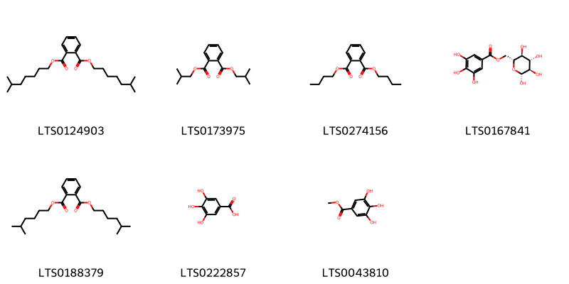{ width=100% }
    <figcaption>Hình ảnh cấu trúc hóa học của 7 hoạt chất thuộc nhóm Benzene and substituted derivatives gồm ['diop (LTS0124903)', 'diisobutyl phthalate (LTS0173975)', 'dibutyl-phthalate (LTS0274156)', '6-o-galloyl-β-d-glucose (LTS0167841)', 'diisoheptyl phthalate (LTS0188379)', 'galop (LTS0222857)', 'methyl gallate (LTS0043810)'].</figcaption>
</figure>
#### Nhóm Benzofurans
<figure markdown="span">
    { width=100% }
    <figcaption>Hình ảnh cấu trúc hóa học của 1 hoạt chất thuộc nhóm Benzofurans gồm ['loliolide (LTS0254454)'].</figcaption>
</figure>
#### Nhóm Carboxylic acids and derivatives
<figure markdown="span">
    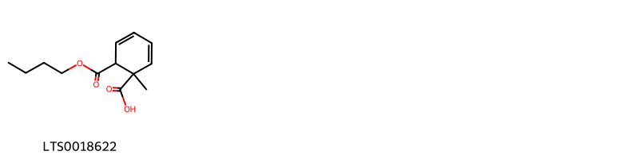{ width=100% }
    <figcaption>Hình ảnh cấu trúc hóa học của 1 hoạt chất thuộc nhóm Carboxylic acids and derivatives gồm ['6-(butoxycarbonyl)-1-methylcyclohexa-2,4-diene-1-carboxylic acid (LTS0018622)'].</figcaption>
</figure>
#### Nhóm Cinnamic acids and derivatives
<figure markdown="span">
    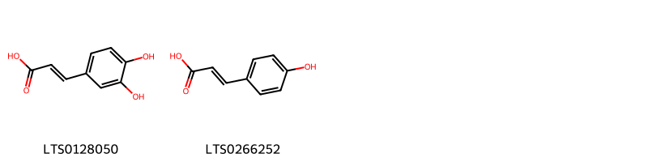{ width=100% }
    <figcaption>Hình ảnh cấu trúc hóa học của 2 hoạt chất thuộc nhóm Cinnamic acids and derivatives gồm ['3,4-dihydroxycinnamic acid (LTS0128050)', 'para-coumaric acid (LTS0266252)'].</figcaption>
</figure>
#### Nhóm Coumarins and derivatives
<figure markdown="span">
    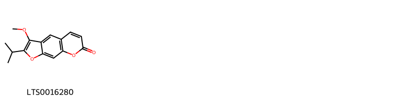{ width=100% }
    <figcaption>Hình ảnh cấu trúc hóa học của 1 hoạt chất thuộc nhóm Coumarins and derivatives gồm ['peucedanin (LTS0016280)'].</figcaption>
</figure>
#### Nhóm Flavonoids
<figure markdown="span">
    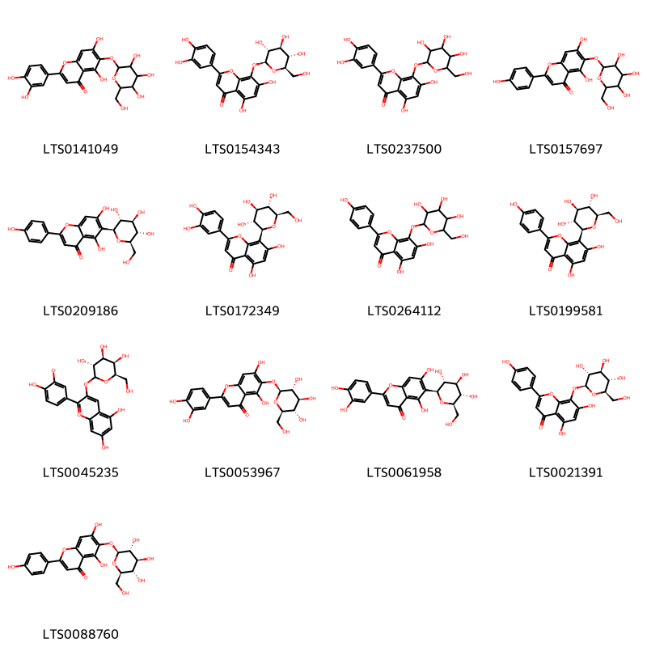{ width=100% }
    <figcaption>Hình ảnh cấu trúc hóa học của 13 hoạt chất thuộc nhóm Flavonoids gồm ['2-(3,4-dihydroxyphenyl)-5,7-dihydroxy-6-{[3,4,5-trihydroxy-6-(hydroxymethyl)oxan-2-yl]oxy}chromen-4-one (LTS0141049)', 'hypolaetin-8-glucoside (LTS0154343)', '2-(3,4-dihydroxyphenyl)-5,7-dihydroxy-8-{[3,4,5-trihydroxy-6-(hydroxymethyl)oxan-2-yl]oxy}chromen-4-one (LTS0237500)', '5,7-dihydroxy-2-(4-hydroxyphenyl)-6-{[3,4,5-trihydroxy-6-(hydroxymethyl)oxan-2-yl]oxy}chromen-4-one (LTS0157697)', 'isovitexin (LTS0209186)', 'orientin (LTS0172349)', '5,7-dihydroxy-2-(4-hydroxyphenyl)-8-{[3,4,5-trihydroxy-6-(hydroxymethyl)oxan-2-yl]oxy}chromen-4-one (LTS0264112)', 'vitexin (LTS0199581)', '5,7-dihydroxy-2-(4-hydroxy-3-oxidophenyl)-3-{[(3r,4s,5r,6r)-3,4,5-trihydroxy-6-(hydroxymethyl)oxan-2-yl]oxy}-1λ⁴-chromen-1-ylium (LTS0045235)', '2-(3,4-dihydroxyphenyl)-5,7-dihydroxy-6-{[(2s,3r,4s,5s,6r)-3,4,5-trihydroxy-6-(hydroxymethyl)oxan-2-yl]oxy}chromen-4-one (LTS0053967)', 'isoorientin (LTS0061958)', '5,7-dihydroxy-2-(4-hydroxyphenyl)-8-{[(2s,3r,4s,5s,6r)-3,4,5-trihydroxy-6-(hydroxymethyl)oxan-2-yl]oxy}chromen-4-one (LTS0021391)', '5,7-dihydroxy-2-(4-hydroxyphenyl)-6-{[(2s,3r,4s,5s,6r)-3,4,5-trihydroxy-6-(hydroxymethyl)oxan-2-yl]oxy}chromen-4-one (LTS0088760)'].</figcaption>
</figure>
#### Nhóm Organooxygen compounds
<figure markdown="span">
    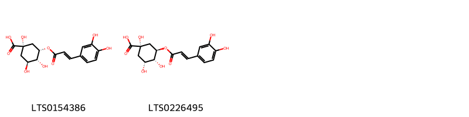{ width=100% }
    <figcaption>Hình ảnh cấu trúc hóa học của 2 hoạt chất thuộc nhóm Organooxygen compounds gồm ['(1s,3s,4r,5s)-3-{[(2e)-3-(3,4-dihydroxyphenyl)prop-2-enoyl]oxy}-1,4,5-trihydroxycyclohexane-1-carboxylic acid (LTS0154386)', 'chlorogenic acid (LTS0226495)'].</figcaption>
</figure>
#### Nhóm Phenol ethers
<figure markdown="span">
    { width=100% }
    <figcaption>Hình ảnh cấu trúc hóa học của 5 hoạt chất thuộc nhóm Phenol ethers gồm ['lythramine (LTS0151873)', '(9s,11s,15s)-17,23-dihydroxy-3-methoxy-25-azatetracyclo[18.3.1.1²,⁶.1¹¹,¹⁵]hexacosa-1(24),2(26),3,5,20,22-hexaen-9-yl acetate (LTS0138952)', 'lythranidine (LTS0157486)', '(9s,11r,15r,17s)-17,23-dihydroxy-3-methoxy-25-azatetracyclo[18.3.1.1²,⁶.1¹¹,¹⁵]hexacosa-1(24),2(26),3,5,20,22-hexaen-9-yl acetate (LTS0213897)', '17,23-dihydroxy-3-methoxy-25-azatetracyclo[18.3.1.1²,⁶.1¹¹,¹⁵]hexacosa-1(24),2(26),3,5,20,22-hexaen-9-yl acetate (LTS0232685)'].</figcaption>
</figure>
#### Nhóm Prenol lipids
<figure markdown="span">
    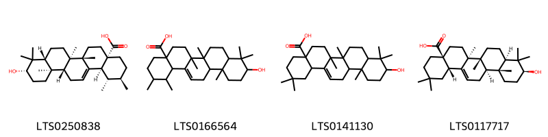{ width=100% }
    <figcaption>Hình ảnh cấu trúc hóa học của 4 hoạt chất thuộc nhóm Prenol lipids gồm ['ursolic acid (LTS0250838)', '10-hydroxy-1,2,6a,6b,9,9,12a-heptamethyl-2,3,4,5,6,7,8,8a,10,11,12,12b,13,14b-tetradecahydro-1h-picene-4a-carboxylic acid (LTS0166564)', 'oleanolic acid (LTS0141130)', 'oleanolic acid (LTS0117717)'].</figcaption>
</figure>
#### Nhóm Quinolizidines
<figure markdown="span">
    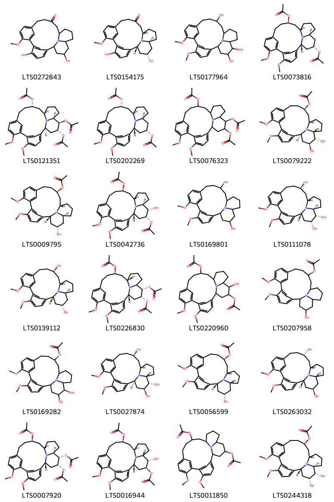{ width=100% }
    <figcaption>Hình ảnh cấu trúc hóa học của 24 hoạt chất thuộc nhóm Quinolizidines gồm ['5,22-dihydroxy-8-methoxy-24-azapentacyclo[14.7.1.1²,⁶.1⁷,¹¹.0²⁰,²⁴]hexacosa-2,4,6(26),7(25),8,10-hexaen-14-one (LTS0272843)', '(1r,16s,20s,22s)-5,22-dihydroxy-8-methoxy-24-azapentacyclo[14.7.1.1²,⁶.1⁷,¹¹.0²⁰,²⁴]hexacosa-2,4,6(26),7(25),8,10-hexaen-14-one (LTS0154175)', '5,8-dimethoxy-24-azapentacyclo[14.7.1.1²,⁶.1⁷,¹¹.0²⁰,²⁴]hexacosa-2,4,6(26),7(25),8,10-hexaene-14,21,22-triol (LTS0177964)', '(1r,14r,16s,20s,22s)-22-(acetyloxy)-5,8-dimethoxy-24-azapentacyclo[14.7.1.1²,⁶.1⁷,¹¹.0²⁰,²⁴]hexacosa-2,4,6(26),7(25),8,10-hexaen-14-yl acetate (LTS0073816)', '(1s,14s,16r,20s,21r,22r)-21,22-bis(acetyloxy)-5,8-dimethoxy-24-azapentacyclo[14.7.1.1²,⁶.1⁷,¹¹.0²⁰,²⁴]hexacosa-2,4,6(26),7(25),8,10-hexaen-14-yl acetate (LTS0121351)', '(1r,14s,16r,20s,22s)-22-(acetyloxy)-5,8-dimethoxy-24-azapentacyclo[14.7.1.1²,⁶.1⁷,¹¹.0²⁰,²⁴]hexacosa-2,4,6(26),7(25),8,10-hexaen-14-yl acetate (LTS0202269)', '21,22-bis(acetyloxy)-5,8-dimethoxy-24-azapentacyclo[14.7.1.1²,⁶.1⁷,¹¹.0²⁰,²⁴]hexacosa-2,4,6(26),7(25),8,10-hexaen-14-yl acetate (LTS0076323)', '(1s,14r,16r,20r,21s,22s)-21,22-dihydroxy-5,8-dimethoxy-24-azapentacyclo[14.7.1.1²,⁶.1⁷,¹¹.0²⁰,²⁴]hexacosa-2,4,6(26),7(25),8,10-hexaen-14-yl acetate (LTS0079222)', '(1r,14r,16s,20s,22s)-22-hydroxy-5,8-dimethoxy-24-azapentacyclo[14.7.1.1²,⁶.1⁷,¹¹.0²⁰,²⁴]hexacosa-2,4,6(26),7(25),8,10-hexaen-14-yl acetate (LTS0009795)', '(1r,14r,16s,20s,21s,22r)-22-(acetyloxy)-21-hydroxy-5,8-dimethoxy-24-azapentacyclo[14.7.1.1²,⁶.1⁷,¹¹.0²⁰,²⁴]hexacosa-2,4,6(26),7(25),8,10-hexaen-14-yl acetate (LTS0042736)', '5,8-dimethoxy-24-azapentacyclo[14.7.1.1²,⁶.1⁷,¹¹.0²⁰,²⁴]hexacosa-2,4,6(26),7(25),8,10-hexaene-14,22-diol (LTS0169801)', '(1r,14r,16s,20s,21s,22r)-5,8-dimethoxy-24-azapentacyclo[14.7.1.1²,⁶.1⁷,¹¹.0²⁰,²⁴]hexacosa-2,4,6(26),7(25),8,10-hexaene-14,21,22-triol (LTS0111078)', '(1r,14r,16s,20s,22s)-5,8-dimethoxy-24-azapentacyclo[14.7.1.1²,⁶.1⁷,¹¹.0²⁰,²⁴]hexacosa-2,4,6(26),7(25),8,10-hexaene-14,22-diol (LTS0139112)', '(1r,14r,16s,21s,22r)-21,22-bis(acetyloxy)-5,8-dimethoxy-24-azapentacyclo[14.7.1.1²,⁶.1⁷,¹¹.0²⁰,²⁴]hexacosa-2,4,6(26),7(25),8,10-hexaen-14-yl acetate (LTS0226830)', '22-(acetyloxy)-21-hydroxy-5,8-dimethoxy-24-azapentacyclo[14.7.1.1²,⁶.1⁷,¹¹.0²⁰,²⁴]hexacosa-2,4,6(26),7(25),8,10-hexaen-14-yl acetate (LTS0220960)', '22-hydroxy-5,8-dimethoxy-24-azapentacyclo[14.7.1.1²,⁶.1⁷,¹¹.0²⁰,²⁴]hexacosa-2,4,6(26),7(25),8,10-hexaen-14-yl acetate (LTS0207958)', '21,22-dihydroxy-5,8-dimethoxy-24-azapentacyclo[14.7.1.1²,⁶.1⁷,¹¹.0²⁰,²⁴]hexacosa-2,4,6(26),7(25),8,10-hexaen-14-yl acetate (LTS0169282)', '(1s,14r,16r,20r,21s,22s)-5,8-dimethoxy-24-azapentacyclo[14.7.1.1²,⁶.1⁷,¹¹.0²⁰,²⁴]hexacosa-2,4,6(26),7(25),8,10-hexaene-14,21,22-triol (LTS0027874)', '(1r,14r,16s,20r,22s)-22-hydroxy-5,8-dimethoxy-24-azapentacyclo[14.7.1.1²,⁶.1⁷,¹¹.0²⁰,²⁴]hexacosa-2,4,6(26),7(25),8,10-hexaen-14-yl acetate (LTS0056599)', '(1r,14s,16s,20r,22r)-5,8-dimethoxy-24-azapentacyclo[14.7.1.1²,⁶.1⁷,¹¹.0²⁰,²⁴]hexacosa-2,4,6(26),7(25),8,10-hexaene-14,22-diol (LTS0263032)', '(1r,14r,16s,20s,21s,22r)-21,22-bis(acetyloxy)-5,8-dimethoxy-24-azapentacyclo[14.7.1.1²,⁶.1⁷,¹¹.0²⁰,²⁴]hexacosa-2,4,6(26),7(25),8,10-hexaen-14-yl acetate (LTS0007920)', '(1r,14r,16r,20r,21s,22s)-22-(acetyloxy)-21-hydroxy-5,8-dimethoxy-24-azapentacyclo[14.7.1.1²,⁶.1⁷,¹¹.0²⁰,²⁴]hexacosa-2,4,6(26),7(25),8,10-hexaen-14-yl acetate (LTS0016944)', '22-(acetyloxy)-5,8-dimethoxy-24-azapentacyclo[14.7.1.1²,⁶.1⁷,¹¹.0²⁰,²⁴]hexacosa-2,4,6(26),7(25),8,10-hexaen-14-yl acetate (LTS0011850)', '(1r,14r,16s,20s,21s,22r)-21,22-dihydroxy-5,8-dimethoxy-24-azapentacyclo[14.7.1.1²,⁶.1⁷,¹¹.0²⁰,²⁴]hexacosa-2,4,6(26),7(25),8,10-hexaen-14-yl acetate (LTS0244318)'].</figcaption>
</figure>
#### Nhóm Steroids and steroid derivatives
<figure markdown="span">
    { width=100% }
    <figcaption>Hình ảnh cấu trúc hóa học của 2 hoạt chất thuộc nhóm Steroids and steroid derivatives gồm ['stigmast-5-en-3-ol (LTS0071224)', 'stigmast-5-en-3-ol, (3β)- (LTS0204616)'].</figcaption>
</figure>
#### Nhóm Tannins
<figure markdown="span">
    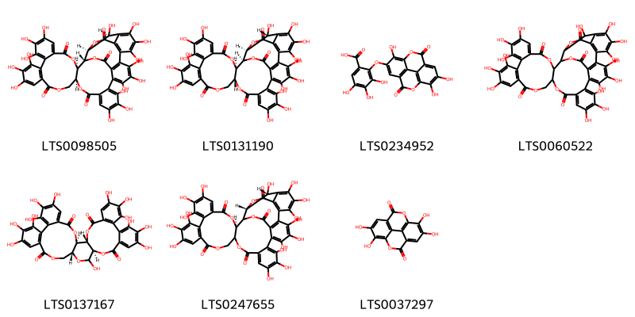{ width=100% }
    <figcaption>Hình ảnh cấu trúc hóa học của 7 hoạt chất thuộc nhóm Tannins gồm ['(1s,2r,20s,42s,46s)-7,8,9,12,13,14,25,26,27,30,31,32,35,36,37,46-hexadecahydroxy-3,18,21,41,43-pentaoxanonacyclo[27.13.3.1³⁸,⁴².0²,²⁰.0⁵,¹⁰.0¹¹,¹⁶.0²³,²⁸.0³³,⁴⁵.0³⁴,³⁹]hexatetraconta-5,7,9,11(16),12,14,23,25,27,29,31,33(45),34(39),35,37-pentadecaene-4,17,22,40,44-pentone (LTS0098505)', '(1r,2r,20r,42s,46r)-7,8,9,12,13,14,25,26,27,30,31,32,35,36,37,46-hexadecahydroxy-3,18,21,41,43-pentaoxanonacyclo[27.13.3.1³⁸,⁴².0²,²⁰.0⁵,¹⁰.0¹¹,¹⁶.0²³,²⁸.0³³,⁴⁵.0³⁴,³⁹]hexatetraconta-5,7,9,11(16),12,14,23,25,27,29,31,33(45),34(39),35,37-pentadecaene-4,17,22,40,44-pentone (LTS0131190)', '3,4,5-trihydroxy-2-({7,13,14-trihydroxy-3,10-dioxo-2,9-dioxatetracyclo[6.6.2.0⁴,¹⁶.0¹¹,¹⁵]hexadeca-1(15),4(16),5,7,11,13-hexaen-6-yl}oxy)benzoic acid (LTS0234952)', '7,8,9,12,13,14,25,26,27,30,31,32,35,36,37,46-hexadecahydroxy-3,18,21,41,43-pentaoxanonacyclo[27.13.3.1³⁸,⁴².0²,²⁰.0⁵,¹⁰.0¹¹,¹⁶.0²³,²⁸.0³³,⁴⁵.0³⁴,³⁹]hexatetraconta-5,7,9,11(16),12,14,23,25,27,29,31,33(45),34(39),35,37-pentadecaene-4,17,22,40,44-pentone (LTS0060522)', '(1r,2s,19r,22r)-7,8,9,12,13,14,20,28,29,30,33,34,35-tridecahydroxy-3,18,21,24,39-pentaoxaheptacyclo[20.17.0.0²,¹⁹.0⁵,¹⁰.0¹¹,¹⁶.0²⁶,³¹.0³²,³⁷]nonatriaconta-5(10),6,8,11,13,15,26(31),27,29,32,34,36-dodecaene-4,17,25,38-tetrone (LTS0137167)', '(2r,42r,46r)-7,8,9,12,13,14,25,26,27,30,31,32,35,36,37,46-hexadecahydroxy-3,18,21,41,43-pentaoxanonacyclo[27.13.3.1³⁸,⁴².0²,²⁰.0⁵,¹⁰.0¹¹,¹⁶.0²³,²⁸.0³³,⁴⁵.0³⁴,³⁹]hexatetraconta-5,7,9,11(16),12,14,23,25,27,29,31,33(45),34(39),35,37-pentadecaene-4,17,22,40,44-pentone (LTS0247655)', 'ellagic acid (LTS0037297)'].</figcaption>
</figure>

---

### Dược dân tộc học

Danh sách các quốc gia có sử dụng *Lythrum salicaria* trong điều trị các bệnh. 

| Country   | Disease           | Bệnh                                                                                                                                                                                                |
|:----------|:------------------|:----------------------------------------------------------------------------------------------------------------------------------------------------------------------------------------------------|
| Elsewhere | Antidiarrheic     | MYMEMORY WARNING: YOU USED ALL AVAILABLE FREE TRANSLATIONS FOR TODAY. NEXT AVAILABLE IN  13 HOURS 09 MINUTES 55 SECONDS VISIT HTTPS://MYMEMORY.TRANSLATED.NET/DOC/USAGELIMITS.PHP TO TRANSLATE MORE |
| Turkey    | Astringent, Tonic | MYMEMORY WARNING: YOU USED ALL AVAILABLE FREE TRANSLATIONS FOR TODAY. NEXT AVAILABLE IN  13 HOURS 09 MINUTES 52 SECONDS VISIT HTTPS://MYMEMORY.TRANSLATED.NET/DOC/USAGELIMITS.PHP TO TRANSLATE MORE |

---

# Chi Woodfordia

??? note "Danh sách các dược liệu thuộc chi"
    
	 - *Woodfordia floribunda*
	 - *Woodfordia fruticosa*

---
## Woodfordia floribunda
### Thông tin về thực vật

!!! info "Phân loại thực vật của *Woodfordia fruticosa* từ GIBF:"
    - **Kingdom:** Plantae
    - **Phylum:** Tracheophyta
    - **Order:** Myrtales
    - **Family:** Lythraceae
    - **Genus:** Woodfordia
    - **Species:** *Woodfordia fruticosa*

 

| Label (VI)   | Label (EN)   | Scientific Name       | Descriptions (VI)   | Descriptions (EN)   | Also Known As (VI)   | Also Known As (EN)   |
|:-------------|:-------------|:----------------------|:--------------------|:--------------------|:---------------------|:---------------------|
| N/A          | N/A          | Woodfordia floribunda |                     | species of plant    | ['']                 | ['']                 |

#### Phân bố trên thế giới

**Từ CSDL GIBF** nan, unknown or invalid, Sri Lanka, Vanuatu, Bhutan, Brazil, India, Trinidad and Tobago, Ethiopia, Bangladesh, United States of America, China, Madagascar, Nepal, Timor-Leste, Indonesia

#### Phân bố tại Việt Nam

**Từ CSDL GIBF**: Không có ghi nhận ở Việt Nam

---
### Thành phần hóa học
        
- Theo cơ sở dữ liệu lotus: Từ loài *Woodfordia fruticosa* đã phân lập và xác định được Chưa có hoạt chất nào được phân lập. hoạt chất thuộc về các nhóm Không có hoạt chất nào được phân lập. 

Không có hình ảnh nào được tạo ra

---

### Dược dân tộc học

Danh sách các quốc gia có sử dụng *Woodfordia fruticosa* trong điều trị các bệnh. 

| Country   | Disease    | Bệnh                                                                                                                                                                                                |
|:----------|:-----------|:----------------------------------------------------------------------------------------------------------------------------------------------------------------------------------------------------|
| English   | Astringent | MYMEMORY WARNING: YOU USED ALL AVAILABLE FREE TRANSLATIONS FOR TODAY. NEXT AVAILABLE IN  13 HOURS 09 MINUTES 10 SECONDS VISIT HTTPS://MYMEMORY.TRANSLATED.NET/DOC/USAGELIMITS.PHP TO TRANSLATE MORE |
| India     | Hemostat   | MYMEMORY WARNING: YOU USED ALL AVAILABLE FREE TRANSLATIONS FOR TODAY. NEXT AVAILABLE IN  13 HOURS 09 MINUTES 06 SECONDS VISIT HTTPS://MYMEMORY.TRANSLATED.NET/DOC/USAGELIMITS.PHP TO TRANSLATE MORE |
| Sanscrit  | Stimulant  | MYMEMORY WARNING: YOU USED ALL AVAILABLE FREE TRANSLATIONS FOR TODAY. NEXT AVAILABLE IN  13 HOURS 09 MINUTES 02 SECONDS VISIT HTTPS://MYMEMORY.TRANSLATED.NET/DOC/USAGELIMITS.PHP TO TRANSLATE MORE |

---

---
## Woodfordia fruticosa
### Thông tin về thực vật

!!! info "Phân loại thực vật của *Woodfordia fruticosa* từ GIBF:"
    - **Kingdom:** Plantae
    - **Phylum:** Tracheophyta
    - **Order:** Myrtales
    - **Family:** Lythraceae
    - **Genus:** Woodfordia
    - **Species:** *Woodfordia fruticosa*

 

| Label (VI)   | Label (EN)   | Scientific Name      | Descriptions (VI)   | Descriptions (EN)   | Also Known As (VI)   | Also Known As (EN)   |
|:-------------|:-------------|:---------------------|:--------------------|:--------------------|:---------------------|:---------------------|
| N/A          | N/A          | Woodfordia fruticosa | loài thực vật       | species of plant    | ['']                 | ['']                 |

#### Phân bố trên thế giới

**Từ CSDL GIBF** Viet Nam, nan, Sri Lanka, Thailand, Bhutan, Myanmar, Pakistan, India, Mayotte, Indonesia, Lao People’s Democratic Republic, Comoros, Bangladesh, China, Madagascar, Nepal, Hong Kong

#### Phân bố tại Việt Nam

**Từ CSDL GIBF**: Không có ghi nhận ở Việt Nam

---
### Thành phần hóa học
        
- Theo cơ sở dữ liệu lotus: Từ loài *Woodfordia fruticosa* đã phân lập và xác định được 50 hoạt chất thuộc về các nhóm Organooxygen compounds, Flavonoids, Tannins, Prenol lipids, Fatty Acyls, Steroids and steroid derivatives, Benzene and substituted derivatives. 

|    | chemicalTaxonomyClassyfireClass     |   smiles_count |
|---:|:------------------------------------|---------------:|
|  0 | Benzene and substituted derivatives |              1 |
|  1 | Fatty Acyls                         |              1 |
|  2 | Flavonoids                          |              2 |
|  3 | Organooxygen compounds              |              1 |
|  4 | Prenol lipids                       |              5 |
|  5 | Steroids and steroid derivatives    |              2 |
|  6 | Tannins                             |             38 |

#### Nhóm Benzene and substituted derivatives
<figure markdown="span">
    { width=100% }
    <figcaption>Hình ảnh cấu trúc hóa học của 1 hoạt chất thuộc nhóm Benzene and substituted derivatives gồm ['galop (LTS0222857)'].</figcaption>
</figure>
#### Nhóm Fatty Acyls
<figure markdown="span">
    { width=100% }
    <figcaption>Hình ảnh cấu trúc hóa học của 1 hoạt chất thuộc nhóm Fatty Acyls gồm ['octacosanol (LTS0049071)'].</figcaption>
</figure>
#### Nhóm Flavonoids
<figure markdown="span">
    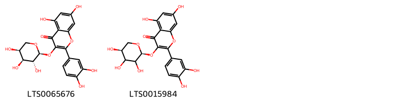{ width=100% }
    <figcaption>Hình ảnh cấu trúc hóa học của 2 hoạt chất thuộc nhóm Flavonoids gồm ['guaijaverin (LTS0065676)', 'guaijaverin (LTS0015984)'].</figcaption>
</figure>
#### Nhóm Organooxygen compounds
<figure markdown="span">
    { width=100% }
    <figcaption>Hình ảnh cấu trúc hóa học của 1 hoạt chất thuộc nhóm Organooxygen compounds gồm ['sucrose (LTS0272557)'].</figcaption>
</figure>
#### Nhóm Prenol lipids
<figure markdown="span">
    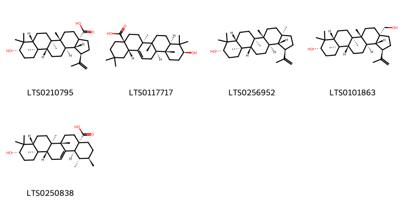{ width=100% }
    <figcaption>Hình ảnh cấu trúc hóa học của 5 hoạt chất thuộc nhóm Prenol lipids gồm ['betulinic acid (LTS0210795)', 'oleanolic acid (LTS0117717)', 'lupeol (LTS0256952)', 'betulin (LTS0101863)', 'ursolic acid (LTS0250838)'].</figcaption>
</figure>
#### Nhóm Steroids and steroid derivatives
<figure markdown="span">
    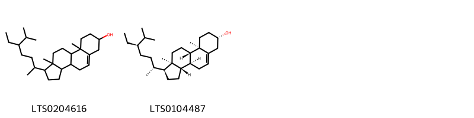{ width=100% }
    <figcaption>Hình ảnh cấu trúc hóa học của 2 hoạt chất thuộc nhóm Steroids and steroid derivatives gồm ['stigmast-5-en-3-ol, (3β)- (LTS0204616)', '(1s,3as,3bs,7s,9ar,9bs,11ar)-1-[(2r,5r)-5-ethyl-6-methylheptan-2-yl]-9a,11a-dimethyl-1h,2h,3h,3ah,3bh,4h,6h,7h,8h,9h,9bh,10h,11h-cyclopenta[a]phenanthren-7-ol (LTS0104487)'].</figcaption>
</figure>
#### Nhóm Tannins
<figure markdown="span">
    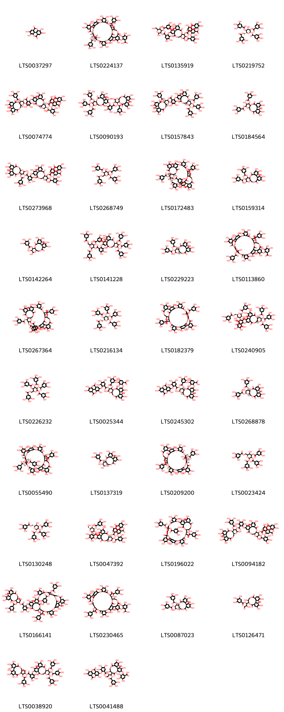{ width=100% }
    <figcaption>Hình ảnh cấu trúc hóa học của 38 hoạt chất thuộc nhóm Tannins gồm ['ellagic acid (LTS0037297)', '2-{[(11r,12s,14r,15r,37r,38r,40r,57r,58s,64s)-4,5,6,12,20,21,22,30,31,32,38,47,48,51,52,59,60-heptadecahydroxy-9,17,35,43,55,61-hexaoxo-58,64-bis(3,4,5-trihydroxybenzoyloxy)-2,10,13,16,28,36,39,42,56,62-decaoxaundecacyclo[35.15.6.3¹⁴,²⁵.2²⁴,²⁷.1¹¹,¹⁵.0³,⁸.0¹⁸,²³.0²⁹,³⁴.0⁴⁰,⁵⁷.0⁴⁴,⁴⁹.0⁵⁰,⁵⁴]tetrahexaconta-1(53),3,5,7,18(23),19,21,24,26,29,31,33,44(49),45,47,50(54),51,59-octadecaen-46-yl]oxy}-3,4,5-trihydroxybenzoic acid (LTS0224137)', '2,5-dihydroxy-6-(hydroxymethyl)-4-(3,4,5-trihydroxybenzoyloxy)oxan-3-yl 2-({3,4,5,13,22,23-hexahydroxy-8,18-dioxo-12-[3,4,5-trihydroxy-2-({7,13,14-trihydroxy-3,10-dioxo-2,9-dioxatetracyclo[6.6.2.0⁴,¹⁶.0¹¹,¹⁵]hexadeca-1(15),4(16),5,7,11,13-hexaen-6-yl}oxy)benzoyloxy]-11-(3,4,5-trihydroxybenzoyloxy)-9,14,17-trioxatetracyclo[17.4.0.0²,⁷.0¹⁰,¹⁵]tricosa-1(19),2(7),3,5,20,22-hexaen-21-yl}oxy)-3,4,5-trihydroxybenzoate (LTS0135919)', '(2s,3r,4s,5s,6r)-4-hydroxy-3,5-bis(3,4,5-trihydroxybenzoyloxy)-6-[(3,4,5-trihydroxybenzoyloxy)methyl]oxan-2-yl 3,4,5-trihydroxybenzoate (LTS0219752)', '(10r,11s,12r,13r,15r)-3,4,5,13,21,22,23-heptahydroxy-8,18-dioxo-11-(3,4,5-trihydroxybenzoyloxy)-9,14,17-trioxatetracyclo[17.4.0.0²,⁷.0¹⁰,¹⁵]tricosa-1(23),2(7),3,5,19,21-hexaen-12-yl 2-{[(10r,11s,12r,13r,15r)-3,4,5,13,22,23-hexahydroxy-8,18-dioxo-12-[3,4,5-trihydroxy-2-({7,13,14-trihydroxy-3,10-dioxo-2,9-dioxatetracyclo[6.6.2.0⁴,¹⁶.0¹¹,¹⁵]hexadeca-1(15),4(16),5,7,11,13-hexaen-6-yl}oxy)benzoyloxy]-11-(3,4,5-trihydroxybenzoyloxy)-9,14,17-trioxatetracyclo[17.4.0.0²,⁷.0¹⁰,¹⁵]tricosa-1(19),2(7),3,5,20,22-hexaen-21-yl]oxy}-3,4,5-trihydroxybenzoate (LTS0074774)', '3,4,5,13,21,22,23-heptahydroxy-8,18-dioxo-11-(3,4,5-trihydroxybenzoyloxy)-9,14,17-trioxatetracyclo[17.4.0.0²,⁷.0¹⁰,¹⁵]tricosa-1(23),2(7),3,5,19,21-hexaen-12-yl 3,4,5-trihydroxy-2-{[3,4,5,22,23-pentahydroxy-8,18-dioxo-11,12,13-tris(3,4,5-trihydroxybenzoyloxy)-9,14,17-trioxatetracyclo[17.4.0.0²,⁷.0¹⁰,¹⁵]tricosa-1(23),2(7),3,5,19,21-hexaen-21-yl]oxy}benzoate (LTS0090193)', '(10r,11s,12r,13r,15r)-3,4,5,13,21,22,23-heptahydroxy-8,18-dioxo-11-(3,4,5-trihydroxybenzoyloxy)-9,14,17-trioxatetracyclo[17.4.0.0²,⁷.0¹⁰,¹⁵]tricosa-1(23),2(7),3,5,19,21-hexaen-12-yl 3,4,5-trihydroxy-2-{[(10r,11s,12r,13r,15r)-3,4,5,22,23-pentahydroxy-8,18-dioxo-11,12,13-tris(3,4,5-trihydroxybenzoyloxy)-9,14,17-trioxatetracyclo[17.4.0.0²,⁷.0¹⁰,¹⁵]tricosa-1(19),2(7),3,5,20,22-hexaen-21-yl]oxy}benzoate (LTS0157843)', '3,4,5,12,21,22,23-heptahydroxy-8,18-dioxo-13-(3,4,5-trihydroxybenzoyloxy)-9,14,17-trioxatetracyclo[17.4.0.0²,⁷.0¹⁰,¹⁵]tricosa-1(23),2(7),3,5,19,21-hexaen-11-yl 3,4,5-trihydroxybenzoate (LTS0184564)', '3,4,5,13,21,22,23-heptahydroxy-8,18-dioxo-11-(3,4,5-trihydroxybenzoyloxy)-9,14,17-trioxatetracyclo[17.4.0.0²,⁷.0¹⁰,¹⁵]tricosa-1(23),2(7),3,5,19,21-hexaen-12-yl 2-({3,4,5,13,22,23-hexahydroxy-8,18-dioxo-12-[3,4,5-trihydroxy-2-({7,13,14-trihydroxy-3,10-dioxo-2,9-dioxatetracyclo[6.6.2.0⁴,¹⁶.0¹¹,¹⁵]hexadeca-1(15),4(16),5,7,11,13-hexaen-6-yl}oxy)benzoyloxy]-11-(3,4,5-trihydroxybenzoyloxy)-9,14,17-trioxatetracyclo[17.4.0.0²,⁷.0¹⁰,¹⁵]tricosa-1(19),2(7),3,5,20,22-hexaen-21-yl}oxy)-3,4,5-trihydroxybenzoate (LTS0273968)', '4-hydroxy-3,5-bis(3,4,5-trihydroxybenzoyloxy)-6-[(3,4,5-trihydroxybenzoyloxy)methyl]oxan-2-yl 3,4,5-trihydroxybenzoate (LTS0268749)', '(11r,12s,14r,15r,37r,38r,40r,57r,58s,64s)-4,5,6,20,21,22,30,31,32,38,46,47,48,51,52,59,60-heptadecahydroxy-9,17,35,43,55,61-hexaoxo-12,58-bis(3,4,5-trihydroxybenzoyloxy)-2,10,13,16,28,36,39,42,56,62-decaoxaundecacyclo[35.15.6.3¹⁴,²⁵.2²⁴,²⁷.1¹¹,¹⁵.0³,⁸.0¹⁸,²³.0²⁹,³⁴.0⁴⁰,⁵⁷.0⁴⁴,⁴⁹.0⁵⁰,⁵⁴]tetrahexaconta-1(53),3,5,7,18(23),19,21,24(60),25,27(59),29,31,33,44(49),45,47,50(54),51-octadecaen-64-yl 3,4,5-trihydroxybenzoate (LTS0172483)', '3,4,5,13,21,22,23-heptahydroxy-8,18-dioxo-12-(3,4,5-trihydroxybenzoyloxy)-9,14,17-trioxatetracyclo[17.4.0.0²,⁷.0¹⁰,¹⁵]tricosa-1(23),2(7),3,5,19,21-hexaen-11-yl 3,4,5-trihydroxybenzoate (LTS0159314)', '3,4,5,12,13,21,22,23-octahydroxy-8,18-dioxo-9,14,17-trioxatetracyclo[17.4.0.0²,⁷.0¹⁰,¹⁵]tricosa-1(23),2(7),3,5,19,21-hexaen-11-yl 3,4,5-trihydroxybenzoate (LTS0142264)', '5-hydroxy-2,4-bis(3,4,5-trihydroxybenzoyloxy)-6-[(3,4,5-trihydroxybenzoyloxy)methyl]oxan-3-yl 3,4,5-trihydroxy-2-{[3,4,5,22,23-pentahydroxy-8,18-dioxo-11,12,13-tris(3,4,5-trihydroxybenzoyloxy)-9,14,17-trioxatetracyclo[17.4.0.0²,⁷.0¹⁰,¹⁵]tricosa-1(19),2(7),3,5,20,22-hexaen-21-yl]oxy}benzoate (LTS0141228)', '(10r,11s,12r,13r,15r)-3,4,5,13,21,22,23-heptahydroxy-8,18-dioxo-11-(3,4,5-trihydroxybenzoyloxy)-9,14,17-trioxatetracyclo[17.4.0.0²,⁷.0¹⁰,¹⁵]tricosa-1(23),2(7),3,5,19,21-hexaen-12-yl 3,4,5-trihydroxybenzoate (LTS0229223)', '2-{[4,5,6,12,20,21,22,30,31,32,38,47,48,51,52,59,60-heptadecahydroxy-9,17,35,43,55,61-hexaoxo-58,64-bis(3,4,5-trihydroxybenzoyloxy)-2,10,13,16,28,36,39,42,56,62-decaoxaundecacyclo[35.15.6.3¹⁴,²⁵.2²⁴,²⁷.1¹¹,¹⁵.0³,⁸.0¹⁸,²³.0²⁹,³⁴.0⁴⁰,⁵⁷.0⁴⁴,⁴⁹.0⁵⁰,⁵⁴]tetrahexaconta-1(53),3,5,7,18(23),19,21,24,26,29,31,33,44(49),45,47,50(54),51,59-octadecaen-46-yl]oxy}-3,4,5-trihydroxybenzoic acid (LTS0113860)', '4,5,6,20,21,22,30,31,32,38,46,47,48,51,52,59,60-heptadecahydroxy-9,17,35,43,55,61-hexaoxo-12,58-bis(3,4,5-trihydroxybenzoyloxy)-2,10,13,16,28,36,39,42,56,62-decaoxaundecacyclo[35.15.6.3¹⁴,²⁵.2²⁴,²⁷.1¹¹,¹⁵.0³,⁸.0¹⁸,²³.0²⁹,³⁴.0⁴⁰,⁵⁷.0⁴⁴,⁴⁹.0⁵⁰,⁵⁴]tetrahexaconta-1(53),3,5,7,18(23),19,21,24(60),25,27(59),29,31,33,44(49),45,47,50(54),51-octadecaen-64-yl 3,4,5-trihydroxybenzoate (LTS0267364)', '(2s,3r,4s,5r,6r)-3,4,5-tris(3,4,5-trihydroxybenzoyloxy)-6-[(3,4,5-trihydroxybenzoyloxy)methyl]oxan-2-yl 3,4,5-trihydroxybenzoate (LTS0216134)', '4,5,6,12,20,21,22,30,31,32,38,46,47,48,51,52,59,60-octadecahydroxy-9,17,35,43,55,61-hexaoxo-64-(3,4,5-trihydroxybenzoyloxy)-2,10,13,16,28,36,39,42,56,62-decaoxaundecacyclo[35.15.6.3¹⁴,²⁵.2²⁴,²⁷.1¹¹,¹⁵.0³,⁸.0¹⁸,²³.0²⁹,³⁴.0⁴⁰,⁵⁷.0⁴⁴,⁴⁹.0⁵⁰,⁵⁴]tetrahexaconta-1(53),3,5,7,18(23),19,21,24,26,29,31,33,44(49),45,47,50(54),51,59-octadecaen-58-yl 3,4,5-trihydroxybenzoate (LTS0182379)', '(2s,3r,4s,5r,6r)-5-hydroxy-2,4-bis(3,4,5-trihydroxybenzoyloxy)-6-[(3,4,5-trihydroxybenzoyloxy)methyl]oxan-3-yl 3,4,5-trihydroxy-2-{[(10r,11s,12r,13s,15r)-3,4,5,22,23-pentahydroxy-8,18-dioxo-11,12,13-tris(3,4,5-trihydroxybenzoyloxy)-9,14,17-trioxatetracyclo[17.4.0.0²,⁷.0¹⁰,¹⁵]tricosa-1(19),2(7),3,5,20,22-hexaen-21-yl]oxy}benzoate (LTS0240905)', '3,4,5-tris(3,4,5-trihydroxybenzoyloxy)-6-[(3,4,5-trihydroxybenzoyloxy)methyl]oxan-2-yl 3,4,5-trihydroxybenzoate (LTS0226232)', '2-({3,4,13,21,22,23-hexahydroxy-8,18-dioxo-12-[3,4,5-trihydroxy-2-({7,13,14-trihydroxy-3,10-dioxo-2,9-dioxatetracyclo[6.6.2.0⁴,¹⁶.0¹¹,¹⁵]hexadeca-1(15),4(16),5,7,11,13-hexaen-6-yl}oxy)benzoyloxy]-11-(3,4,5-trihydroxybenzoyloxy)-9,14,17-trioxatetracyclo[17.4.0.0²,⁷.0¹⁰,¹⁵]tricosa-1(23),2(7),3,5,19,21-hexaen-5-yl}oxy)-3,4,5-trihydroxybenzoic acid (LTS0025344)', '2-{[(10r,11s,12r,13r,15r)-3,4,13,21,22,23-hexahydroxy-8,18-dioxo-12-[3,4,5-trihydroxy-2-({7,13,14-trihydroxy-3,10-dioxo-2,9-dioxatetracyclo[6.6.2.0⁴,¹⁶.0¹¹,¹⁵]hexadeca-1(15),4(16),5,7,11,13-hexaen-6-yl}oxy)benzoyloxy]-11-(3,4,5-trihydroxybenzoyloxy)-9,14,17-trioxatetracyclo[17.4.0.0²,⁷.0¹⁰,¹⁵]tricosa-1(23),2(7),3,5,19,21-hexaen-5-yl]oxy}-3,4,5-trihydroxybenzoic acid (LTS0245302)', '(10r,11r,12r,13r,15r)-3,4,5,12,21,22,23-heptahydroxy-8,18-dioxo-13-(3,4,5-trihydroxybenzoyloxy)-9,14,17-trioxatetracyclo[17.4.0.0²,⁷.0¹⁰,¹⁵]tricosa-1(23),2(7),3,5,19,21-hexaen-11-yl 3,4,5-trihydroxybenzoate (LTS0268878)', '(11r,12r,14r,15r,37r,38r,40r,57r,58s,64s)-4,5,6,20,21,22,30,31,32,38,46,47,48,51,52,59,60-heptadecahydroxy-9,17,35,43,55,61-hexaoxo-12,58-bis(3,4,5-trihydroxybenzoyloxy)-2,10,13,16,28,36,39,42,56,62-decaoxaundecacyclo[35.15.6.3¹⁴,²⁵.2²⁴,²⁷.1¹¹,¹⁵.0³,⁸.0¹⁸,²³.0²⁹,³⁴.0⁴⁰,⁵⁷.0⁴⁴,⁴⁹.0⁵⁰,⁵⁴]tetrahexaconta-1(53),3,5,7,18(23),19,21,24,26,29,31,33,44(49),45,47,50(54),51,59-octadecaen-64-yl 3,4,5-trihydroxybenzoate (LTS0055490)', '(10r,11r,12r,13s,15r)-3,4,5,12,13,21,22,23-octahydroxy-8,18-dioxo-9,14,17-trioxatetracyclo[17.4.0.0²,⁷.0¹⁰,¹⁵]tricosa-1(23),2(7),3,5,19,21-hexaen-11-yl 3,4,5-trihydroxybenzoate (LTS0137319)', '(11r,12s,14r,15r,37r,38r,40r,57r,58s,64s)-4,5,6,12,20,21,22,30,31,32,38,46,47,48,51,52,59,60-octadecahydroxy-9,17,35,43,55,61-hexaoxo-64-(3,4,5-trihydroxybenzoyloxy)-2,10,13,16,28,36,39,42,56,62-decaoxaundecacyclo[35.15.6.3¹⁴,²⁵.2²⁴,²⁷.1¹¹,¹⁵.0³,⁸.0¹⁸,²³.0²⁹,³⁴.0⁴⁰,⁵⁷.0⁴⁴,⁴⁹.0⁵⁰,⁵⁴]tetrahexaconta-1(53),3,5,7,18(23),19,21,24,26,29,31,33,44(49),45,47,50(54),51,59-octadecaen-58-yl 3,4,5-trihydroxybenzoate (LTS0209200)', '5-hydroxy-3,4-bis(3,4,5-trihydroxybenzoyloxy)-6-[(3,4,5-trihydroxybenzoyloxy)methyl]oxan-2-yl 3,4,5-trihydroxybenzoate (LTS0023424)', '(2s,3r,4s,5r,6r)-5-hydroxy-3,4-bis(3,4,5-trihydroxybenzoyloxy)-6-[(3,4,5-trihydroxybenzoyloxy)methyl]oxan-2-yl 3,4,5-trihydroxybenzoate (LTS0130248)', '(2r,3r,4s,5r,6r)-2,5-dihydroxy-6-(hydroxymethyl)-4-(3,4,5-trihydroxybenzoyloxy)oxan-3-yl 2-{[(10r,11s,12r,13r,15r)-3,4,5,13,22,23-hexahydroxy-8,18-dioxo-12-[3,4,5-trihydroxy-2-({7,13,14-trihydroxy-3,10-dioxo-2,9-dioxatetracyclo[6.6.2.0⁴,¹⁶.0¹¹,¹⁵]hexadeca-1(15),4(16),5,7,11,13-hexaen-6-yl}oxy)benzoyloxy]-11-(3,4,5-trihydroxybenzoyloxy)-9,14,17-trioxatetracyclo[17.4.0.0²,⁷.0¹⁰,¹⁵]tricosa-1(19),2(7),3,5,20,22-hexaen-21-yl]oxy}-3,4,5-trihydroxybenzoate (LTS0047392)', '37-formyl-4,5,6,20,21,22,30,31,32,40,47,48,51,52,57,58-hexadecahydroxy-9,17,35,43,55,59-hexaoxo-38,62-bis(3,4,5-trihydroxybenzoyloxy)-2,10,13,16,28,36,42,56,60-nonaoxadecacyclo[37.13.4.3¹⁴,²⁵.2²⁴,²⁷.1¹¹,¹⁵.0³,⁸.0¹⁸,²³.0²⁹,³⁴.0⁴⁴,⁴⁹.0⁵⁰,⁵⁴]dohexaconta-1(53),3,5,7,18(23),19,21,24,26,29,31,33,44(49),45,47,50(54),51,57-octadecaen-12-yl 3,4,5-trihydroxybenzoate (LTS0196022)', '3,4,5,13,21,22,23-heptahydroxy-8,18-dioxo-11-(3,4,5-trihydroxybenzoyloxy)-9,14,17-trioxatetracyclo[17.4.0.0²,⁷.0¹⁰,¹⁵]tricosa-1(23),2(7),3,5,19,21-hexaen-12-yl 6-({3,4,5,13,22,23-hexahydroxy-8,18-dioxo-12-[3,4,5-trihydroxy-2-({7,13,14-trihydroxy-3,10-dioxo-2,9-dioxatetracyclo[6.6.2.0⁴,¹⁶.0¹¹,¹⁵]hexadeca-1(15),4(16),5,7,11,13-hexaen-6-yl}oxy)benzoyloxy]-11-(3,4,5-trihydroxybenzoyloxy)-9,14,17-trioxatetracyclo[17.4.0.0²,⁷.0¹⁰,¹⁵]tricosa-1(19),2(7),3,5,20,22-hexaen-21-yl}oxy)-2,3,4-trihydroxybenzoate (LTS0094182)', '1-{3,4,5,11,17,18,19-heptahydroxy-8,14-dioxo-9,13-dioxatricyclo[13.4.0.0²,⁷]nonadeca-1(15),2,4,6,16,18-hexaen-10-yl}-3-oxo-1-(3,4,5-trihydroxybenzoyloxy)propan-2-yl 2-{[37-formyl-4,5,6,20,21,22,30,31,32,40,47,48,51,52,57,58-hexadecahydroxy-9,17,35,43,55,59-hexaoxo-12,38,62-tris(3,4,5-trihydroxybenzoyloxy)-2,10,13,16,28,36,42,56,60-nonaoxadecacyclo[37.13.4.3¹⁴,²⁵.2²⁴,²⁷.1¹¹,¹⁵.0³,⁸.0¹⁸,²³.0²⁹,³⁴.0⁴⁴,⁴⁹.0⁵⁰,⁵⁴]dohexaconta-1(53),3(8),4,6,18(23),19,21,24(58),25,27(57),29(34),30,32,44(49),45,47,50(54),51-octadecaen-46-yl]oxy}-3,4,5-trihydroxybenzoate (LTS0166141)', '2-{[11,35-diformyl-4,5,6,18,19,20,28,29,30,38,45,46,49,50,55,56,60-heptadecahydroxy-9,15,33,41,53,57-hexaoxo-12,36-bis(3,4,5-trihydroxybenzoyloxy)-2,10,14,26,34,40,54,58-octaoxanonacyclo[35.13.4.4¹³,²³.2²²,²⁵.0³,⁸.0¹⁶,²¹.0²⁷,³².0⁴²,⁴⁷.0⁴⁸,⁵²]hexaconta-1(51),3,5,7,16(21),17,19,22,24,27,29,31,42(47),43,45,48(52),49,55-octadecaen-44-yl]oxy}-3,4,5-trihydroxybenzoic acid (LTS0230465)', '(10r,11s,12r,15r)-3,4,5,13,21,22,23-heptahydroxy-8,18-dioxo-11-(3,4,5-trihydroxybenzoyloxy)-9,14,17-trioxatetracyclo[17.4.0.0²,⁷.0¹⁰,¹⁵]tricosa-1(23),2(7),3,5,19,21-hexaen-12-yl 3,4,5-trihydroxybenzoate (LTS0087023)', '1-{3,4,5,11,17,18,19-heptahydroxy-8,14-dioxo-9,13-dioxatricyclo[13.4.0.0²,⁷]nonadeca-1(15),2,4,6,16,18-hexaen-10-yl}-2-hydroxy-3-oxopropyl 3,4,5-trihydroxybenzoate (LTS0126471)', '1-{3,4,5,11,16,17,18-heptahydroxy-8,14-dioxo-9,13-dioxatricyclo[13.3.1.0²,⁷]nonadeca-1(18),2(7),3,5,15(19),16-hexaen-12-yl}-3-oxo-1-(3,4,5-trihydroxybenzoyloxy)propan-2-yl 3,4,5-trihydroxy-2-{[3,4,5,22,23-pentahydroxy-8,18-dioxo-11,12,13-tris(3,4,5-trihydroxybenzoyloxy)-9,14,17-trioxatetracyclo[17.4.0.0²,⁷.0¹⁰,¹⁵]tricosa-1(19),2(7),3,5,20,22-hexaen-21-yl]oxy}benzoate (LTS0038920)', '2-[(3,4,11,17,18,19-hexahydroxy-9,14-dioxo-10-{3-oxo-2-[3,4,5-trihydroxy-2-({7,13,14-trihydroxy-3,10-dioxo-2,9-dioxatetracyclo[6.6.2.0⁴,¹⁶.0¹¹,¹⁵]hexadeca-1(15),4(16),5,7,11,13-hexaen-6-yl}oxy)benzoyloxy]-1-(3,4,5-trihydroxybenzoyloxy)propyl}-8,13-dioxatricyclo[13.4.0.0²,⁷]nonadeca-1(15),2,4,6,16,18-hexaen-5-yl)oxy]-3,4,5-trihydroxybenzoic acid (LTS0041488)'].</figcaption>
</figure>

---

### Dược dân tộc học

Danh sách các quốc gia có sử dụng *Woodfordia fruticosa* trong điều trị các bệnh. 

| Country   | Disease                     | Bệnh                                                                                                                                                                                                |
|:----------|:----------------------------|:----------------------------------------------------------------------------------------------------------------------------------------------------------------------------------------------------|
| Elsewhere | nan, Emetic, nan, Fungicide | MYMEMORY WARNING: YOU USED ALL AVAILABLE FREE TRANSLATIONS FOR TODAY. NEXT AVAILABLE IN  13 HOURS 08 MINUTES 40 SECONDS VISIT HTTPS://MYMEMORY.TRANSLATED.NET/DOC/USAGELIMITS.PHP TO TRANSLATE MORE |
| India     | Refrigerant                 | MYMEMORY WARNING: YOU USED ALL AVAILABLE FREE TRANSLATIONS FOR TODAY. NEXT AVAILABLE IN  13 HOURS 08 MINUTES 37 SECONDS VISIT HTTPS://MYMEMORY.TRANSLATED.NET/DOC/USAGELIMITS.PHP TO TRANSLATE MORE |

---

