!!! abstract "Tóm tắt"

    Họ Magnoliaceae gồm khoảng 4 chi và 20 loài được một số cộng đồng tại các quốc gia như Elsewhere, Thailand, German, French, US, Japan*, Chinese, Cuba, Turkey, China, Mexico, anish sử dụng trong một số trường hợp Thuốc lợi tiểu, Thuốc bổ, Thuốc bổ, Thuốc bổ, Chất làm se, Chất làm se, Dạ dày, Thuốc lợi tiểu, Emmenagogue, Phương pháp thanh lọc, Dạ dày, Chất kích thích, Khử trùng, nan, Thuốc nhuận tràng, Dạ dày, Thuốc bổ, Thuốc kích thích tình dục, Dạ dày, Thuốc bổ, Thuốc tràn dịch màng phổi, Chất kích thích, Thuốc bổ, Nước hoa, Emmenagogue, Thuốc đắp, Chất kích thích, Thuốc tràn dịch màng phổi, Chất kích thích, Demulcent, Hạ huyết áp, Chất kích thích, Thuốc chống trầm cảm tim mạch, Dạ dày, Cardiotonic, Gây ngạt thở, Thuốc bổ, Thuốc nhuận tràng, Thuốc bổ, Thuốc giảm đau, Thuốc long đờm, Thuốc bổ, Mỹ phẩm, Thuốc an thần.

!!! info "DrDuke"

    James A. Duke sinh năm 1929-2017 là một nhà thực vật học người Mỹ. Đây là một trong những tác giả hàng đầu trong lĩnh vực dược dân tộc học với cuốn *CRC Handbook of Medicinal Herbs* và chính là người xây dựng lên cơ sở dữ liệu về hợp chất tự nhiên và dược dân tộc học tại Bộ nông nghiệp Hoa Kỳ. Các thông tin được đăng tải tại website [Dr. Duke's Phytochemical and Ethnobotanical Databases](https://phytochem.nal.usda.gov/). 
    Trong suốt thập niên 1970, ông lãnh đạo the Plant Taxonomy Laboratory, Plant Genetics and Germplasm Institute of the Agricultural Research Service, U.S. Department of Agriculture.
    Trong tài liệu này, các thông tin về dược dân tộc của các dược liệu được trích dẫn từ tài liệu của James A. Ducke với sự trợ giúp của phần mềm dịch thuật từ tiếng Anh sang tiếng Việt.
   

# Chi Talauma

??? note "Danh sách các dược liệu thuộc chi"
    
	 - *Talauma mexicana*
	 - *Talauma plumieri*

---
## Talauma mexicana
### Thông tin về thực vật

!!! info "Phân loại thực vật của *Magnolia mexicana* từ GIBF:"
    - **Kingdom:** Plantae
    - **Phylum:** Tracheophyta
    - **Order:** Magnoliales
    - **Family:** Magnoliaceae
    - **Genus:** Magnolia
    - **Species:** *Magnolia mexicana*

 

| Label (VI)   | Label (EN)   | Scientific Name   | Descriptions (VI)   | Descriptions (EN)                       | Also Known As (VI)   | Also Known As (EN)   |
|:-------------|:-------------|:------------------|:--------------------|:----------------------------------------|:---------------------|:---------------------|
| N/A          | N/A          | Talauma mexicana  |                     | species of plant in the magnolia family | ['']                 | ['']                 |

#### Phân bố trên thế giới

**Từ CSDL GIBF** nan, Mexico, Guatemala

#### Phân bố tại Việt Nam

**Từ CSDL GIBF**: Không có ghi nhận ở Việt Nam

---
### Thành phần hóa học
        
- Theo cơ sở dữ liệu lotus: Từ loài *Magnolia mexicana* đã phân lập và xác định được Chưa có hoạt chất nào được phân lập. hoạt chất thuộc về các nhóm Không có hoạt chất nào được phân lập. 

Không có hình ảnh nào được tạo ra

---

### Dược dân tộc học

Danh sách các quốc gia có sử dụng *Magnolia mexicana* trong điều trị các bệnh. 

| Country   | Disease                  | Bệnh                            |
|:----------|:-------------------------|:--------------------------------|
| Mexico    | Tonic, Tonic, Astringent | Thuốc bổ, Thuốc bổ, Chất làm se |

---

---
## Talauma plumieri
### Thông tin về thực vật

!!! info "Phân loại thực vật của *Magnolia dodecapetala* từ GIBF:"
    - **Kingdom:** Plantae
    - **Phylum:** Tracheophyta
    - **Order:** Magnoliales
    - **Family:** Magnoliaceae
    - **Genus:** Magnolia
    - **Species:** *Magnolia dodecapetala*

 

| Label (VI)   | Label (EN)   | Scientific Name   | Descriptions (VI)   | Descriptions (EN)   | Also Known As (VI)   | Also Known As (EN)   |
|:-------------|:-------------|:------------------|:--------------------|:--------------------|:---------------------|:---------------------|
| N/A          | N/A          | Talauma plumieri  |                     |                     | ['']                 | ['']                 |

#### Phân bố trên thế giới

**Từ CSDL GIBF** nan, Mexico, Guatemala

#### Phân bố tại Việt Nam

**Từ CSDL GIBF**: Không có ghi nhận ở Việt Nam

---
### Thành phần hóa học
        
- Theo cơ sở dữ liệu lotus: Từ loài *Magnolia dodecapetala* đã phân lập và xác định được Chưa có hoạt chất nào được phân lập. hoạt chất thuộc về các nhóm Không có hoạt chất nào được phân lập. 

Không có hình ảnh nào được tạo ra

---

### Dược dân tộc học

Danh sách các quốc gia có sử dụng *Magnolia dodecapetala* trong điều trị các bệnh. 

| Country   | Disease               | Bệnh                |
|:----------|:----------------------|:--------------------|
| Cuba      | Astringent, Stomachic | Chất làm se, Dạ dày |

---

# Chi Liriodendron

??? note "Danh sách các dược liệu thuộc chi"
    
	 - *Liriodendron chinensis*
	 - *Liriodendron tulipifera*
	 - *Liriodendron tulipiferum*

---
## Liriodendron chinensis
### Thông tin về thực vật

!!! info "Phân loại thực vật của *Liriodendron chinense* từ GIBF:"
    - **Kingdom:** Plantae
    - **Phylum:** Tracheophyta
    - **Order:** Magnoliales
    - **Family:** Magnoliaceae
    - **Genus:** Liriodendron
    - **Species:** *Liriodendron chinense*

 

| Label (VI)   | Label (EN)   | Scientific Name   | Descriptions (VI)   | Descriptions (EN)   | Also Known As (VI)   | Also Known As (EN)   |
|:-------------|:-------------|:------------------|:--------------------|:--------------------|:---------------------|:---------------------|
| N/A          | N/A          | Talauma plumieri  |                     |                     | ['']                 | ['']                 |

#### Phân bố trên thế giới

**Từ CSDL GIBF** Viet Nam, Georgia, nan, Japan, France, Spain, Czechia, Poland, Germany, Russian Federation, Canada, United States of America, Italy, China, Belgium, Korea, Republic of, Tajikistan, Chinese Taipei

#### Phân bố tại Việt Nam

**Từ CSDL GIBF**: Lai Chau, Lao Cai

---
### Thành phần hóa học
        
- Theo cơ sở dữ liệu lotus: Từ loài *Liriodendron chinense* đã phân lập và xác định được Chưa có hoạt chất nào được phân lập. hoạt chất thuộc về các nhóm Không có hoạt chất nào được phân lập. 

Không có hình ảnh nào được tạo ra

---

### Dược dân tộc học

Danh sách các quốc gia có sử dụng *Liriodendron chinense* trong điều trị các bệnh. 

| Country   | Disease   | Bệnh            |
|:----------|:----------|:----------------|
| China     | Stimulant | Chất kích thích |

---

---
## Liriodendron tulipifera
### Thông tin về thực vật

!!! info "Phân loại thực vật của *Liriodendron tulipifera* từ GIBF:"
    - **Kingdom:** Plantae
    - **Phylum:** Tracheophyta
    - **Order:** Magnoliales
    - **Family:** Magnoliaceae
    - **Genus:** Liriodendron
    - **Species:** *Liriodendron tulipifera*

 

| Label (VI)   | Label (EN)   | Scientific Name         | Descriptions (VI)   | Descriptions (EN)   | Also Known As (VI)   | Also Known As (EN)                                                                  |
|:-------------|:-------------|:------------------------|:--------------------|:--------------------|:---------------------|:------------------------------------------------------------------------------------|
| N/A          | N/A          | Liriodendron tulipifera | loài thực vật       | species of plant    | ['']                 | ['American tulip tree', 'tulip poplar', 'tulip tree', 'tuliptree', 'yellow poplar'] |

#### Phân bố trên thế giới

**Từ CSDL GIBF** nan, Denmark, South Africa, France, Germany, Canada, United States of America

#### Phân bố tại Việt Nam

**Từ CSDL GIBF**: Không có ghi nhận ở Việt Nam

---
### Thành phần hóa học
        
- Theo cơ sở dữ liệu lotus: Từ loài *Liriodendron tulipifera* đã phân lập và xác định được 149 hoạt chất thuộc về các nhóm Furanoid lignans, Aporphines, Flavonoids, Organooxygen compounds, Unsaturated hydrocarbons, Proaporphines, Prenol lipids, Lignan glycosides, Fatty Acyls, Protoberberine alkaloids and derivatives, Aryltetralin lignans, Phenols, Tetrahydroisoquinolines, Steroids and steroid derivatives, Benzene and substituted derivatives. 

|    | chemicalTaxonomyClassyfireClass          |   smiles_count |
|---:|:-----------------------------------------|---------------:|
|  0 | Aporphines                               |             60 |
|  1 | Aryltetralin lignans                     |              2 |
|  2 | Benzene and substituted derivatives      |              6 |
|  3 | Fatty Acyls                              |              1 |
|  4 | Flavonoids                               |              6 |
|  5 | Furanoid lignans                         |              9 |
|  6 | Lignan glycosides                        |              2 |
|  7 | Organooxygen compounds                   |              6 |
|  8 | Phenols                                  |              2 |
|  9 | Prenol lipids                            |             41 |
| 10 | Proaporphines                            |              1 |
| 11 | Protoberberine alkaloids and derivatives |              5 |
| 12 | Steroids and steroid derivatives         |              5 |
| 13 | Tetrahydroisoquinolines                  |              2 |
| 14 | Unsaturated hydrocarbons                 |              1 |

#### Nhóm Aporphines
<figure markdown="span">
    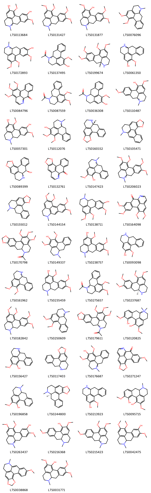{ width=100% }
    <figcaption>Hình ảnh cấu trúc hóa học của 60 hoạt chất thuộc nhóm Aporphines gồm ['(9s)-5,16-dimethoxy-10-methyl-10-azatetracyclo[7.7.1.0²,⁷.0¹³,¹⁷]heptadeca-1(16),2(7),3,5,13(17),14-hexaene-4,15-diol (LTS0113684)', '(9r)-4,5,15,16-tetramethoxy-10-methyl-10-azatetracyclo[7.7.1.0²,⁷.0¹³,¹⁷]heptadeca-1(16),2(7),3,5,13(17),14-hexaene (LTS0131427)', '(9s)-4,5,15-trimethoxy-10-methyl-10-azatetracyclo[7.7.1.0²,⁷.0¹³,¹⁷]heptadeca-1(16),2(7),3,5,13(17),14-hexaen-16-ol (LTS0131877)', 'nuciferine (LTS0076096)', '(9s)-4,15,16-trimethoxy-10-methyl-10-azatetracyclo[7.7.1.0²,⁷.0¹³,¹⁷]heptadeca-1(16),2(7),3,5,13(17),14-hexaen-5-ol (LTS0172893)', '1-[(9s)-15-hydroxy-16-methoxy-10-azatetracyclo[7.7.1.0²,⁷.0¹³,¹⁷]heptadeca-1(17),2,4,6,13,15-hexaen-10-yl]ethanone (LTS0137495)', '(9r)-4,5,15,16-tetramethoxy-10-azatetracyclo[7.7.1.0²,⁷.0¹³,¹⁷]heptadeca-1(16),2(7),3,5,13(17),14-hexaene (LTS0199674)', 'r-(-)-asimilobine (LTS0061350)', 'o-methylmoschatoline (LTS0084796)', '1-{15,16-dimethoxy-10-azatetracyclo[7.7.1.0²,⁷.0¹³,¹⁷]heptadeca-1(16),2,4,6,13(17),14-hexaen-10-yl}ethanone (LTS0087559)', '1-{15-hydroxy-16-methoxy-10-azatetracyclo[7.7.1.0²,⁷.0¹³,¹⁷]heptadeca-1(17),2,4,6,13,15-hexaen-10-yl}ethanone (LTS0036308)', '(9s)-5,15-dimethoxy-10-methyl-10-azatetracyclo[7.7.1.0²,⁷.0¹³,¹⁷]heptadeca-1(16),2,4,6,13(17),14-hexaen-16-ol (LTS0110487)', '5,16-dimethoxy-10-methyl-10-azatetracyclo[7.7.1.0²,⁷.0¹³,¹⁷]heptadeca-1(16),2(7),3,5,13(17),14-hexaene-4,15-diol (LTS0057301)', '(9r)-15,16-dimethoxy-10-methyl-10-azatetracyclo[7.7.1.0²,⁷.0¹³,¹⁷]heptadeca-1(16),2,4,6,13(17),14-hexaen-14-ol (LTS0112076)', 'anonaine (LTS0160152)', '11-methyl-3,5-dioxa-11-azapentacyclo[10.7.1.0²,⁶.0⁸,²⁰.0¹⁴,¹⁹]icosa-1(20),2(6),7,12,14(19),15,17-heptaene (LTS0105471)', '(12s,13r)-3,5-dioxa-11-azapentacyclo[10.7.1.0²,⁶.0⁸,²⁰.0¹⁴,¹⁹]icosa-1,6,8(20),14,16,18-hexaen-13-ol (LTS0089399)', 'liriodenine (LTS0132761)', '(9s)-15-methoxy-10-methyl-10-azatetracyclo[7.7.1.0²,⁷.0¹³,¹⁷]heptadeca-1(16),2,4,6,13(17),14-hexaen-16-ol (LTS0147423)', '(9s)-4,5,15,16-tetramethoxy-10-methyl-10-azatetracyclo[7.7.1.0²,⁷.0¹³,¹⁷]heptadeca-1(16),2(7),3,5,13(17),14-hexaene (LTS0206023)', '11-methyl-3,5-dioxa-11-azapentacyclo[10.7.1.0²,⁶.0⁸,²⁰.0¹⁴,¹⁹]icosa-1(20),2(6),7,14,16,18-hexaene (LTS0155012)', '4,5,15,16-tetramethoxy-10-methyl-10-azatetracyclo[7.7.1.0²,⁷.0¹³,¹⁷]heptadeca-1(17),2(7),3,5,8,13,15-heptaene (LTS0144154)', '4,15,16-trimethoxy-10-methyl-10-azatetracyclo[7.7.1.0²,⁷.0¹³,¹⁷]heptadeca-1(16),2(7),3,5,13(17),14-hexaen-5-ol (LTS0138711)', '4,5,15,16-tetramethoxy-10-azatetracyclo[7.7.1.0²,⁷.0¹³,¹⁷]heptadeca-1(16),2(7),3,5,9(17),10,12,14-octaen-8-one (LTS0164098)', '1-{17,18,19-trimethoxy-5,7-dioxa-13-azapentacyclo[10.7.1.0²,¹⁰.0⁴,⁸.0¹⁶,²⁰]icosa-1(20),2,4(8),9,16,18-hexaen-13-yl}ethanone (LTS0170798)', '14,16-dimethoxy-10-methyl-10-azatetracyclo[7.7.1.0²,⁷.0¹³,¹⁷]heptadeca-1(16),2,4,6,13(17),14-hexaen-15-ol (LTS0149337)', '(9r)-4,5,16-trimethoxy-10-methyl-10-azatetracyclo[7.7.1.0²,⁷.0¹³,¹⁷]heptadeca-1(16),2(7),3,5,13(17),14-hexaen-15-ol (LTS0238757)', '16-methoxy-10-azatetracyclo[7.7.1.0²,⁷.0¹³,¹⁷]heptadeca-1(17),2,4,6,13,15-hexaen-15-ol (LTS0093098)', '(9s)-15,16-dimethoxy-10-azatetracyclo[7.7.1.0²,⁷.0¹³,¹⁷]heptadeca-1(16),2,4,6,13(17),14-hexaene (LTS0161962)', '4,5,16-trimethoxy-10-methyl-10-azatetracyclo[7.7.1.0²,⁷.0¹³,¹⁷]heptadeca-1(16),2(7),3,5,13(17),14-hexaen-15-ol (LTS0235459)', '1-[(9s)-15,16-dimethoxy-10-azatetracyclo[7.7.1.0²,⁷.0¹³,¹⁷]heptadeca-1(16),2,4,6,13(17),14-hexaen-10-yl]ethanone (LTS0275657)', '(9s)-4,5,15,16-tetramethoxy-10-azatetracyclo[7.7.1.0²,⁷.0¹³,¹⁷]heptadeca-1(16),2(7),3,5,13(17),14-hexaene (LTS0237687)', '4,5,15,16-tetramethoxy-10-methyl-10-azatetracyclo[7.7.1.0²,⁷.0¹³,¹⁷]heptadeca-1(16),2(7),3,5,13(17),14-hexaene (LTS0182842)', '(9s)-15,16-dimethoxy-10-methyl-10-azatetracyclo[7.7.1.0²,⁷.0¹³,¹⁷]heptadeca-1(16),2,4,6,13(17),14-hexaene (LTS0250609)', '1-[(12s)-17,18,19-trimethoxy-5,7-dioxa-13-azapentacyclo[10.7.1.0²,¹⁰.0⁴,⁸.0¹⁶,²⁰]icosa-1(20),2,4(8),9,16,18-hexaen-13-yl]ethanone (LTS0179611)', 'magnoflorine (LTS0120825)', '(-)-caaverine (LTS0156427)', '3,5-dioxa-11-azapentacyclo[10.7.1.0²,⁶.0⁸,²⁰.0¹⁴,¹⁹]icosa-1(20),2(6),7,14,16,18-hexaene (LTS0117403)', '(9s)-14,16-dimethoxy-10-methyl-10-azatetracyclo[7.7.1.0²,⁷.0¹³,¹⁷]heptadeca-1(16),2,4,6,13(17),14-hexaen-15-ol (LTS0176687)', 'lanuginosine (LTS0271247)', '15-methoxy-10-methyl-10-azatetracyclo[7.7.1.0²,⁷.0¹³,¹⁷]heptadeca-1(16),2,4,6,13(17),14-hexaen-16-ol (LTS0196858)', '(12r)-11-methyl-3,5-dioxa-11-azapentacyclo[10.7.1.0²,⁶.0⁸,²⁰.0¹⁴,¹⁹]icosa-1(20),2(6),7,14,16,18-hexaene (LTS0244800)', 'asimilobine (LTS0213923)', '4,15-dimethoxy-10-methyl-10-azatetracyclo[7.7.1.0²,⁷.0¹³,¹⁷]heptadeca-1(16),2,4,6,13(17),14-hexaene-3,16-diol (LTS0095715)', '(9s)-5,15,16-trimethoxy-10-methyl-10-azatetracyclo[7.7.1.0²,⁷.0¹³,¹⁷]heptadeca-1(16),2(7),3,5,13(17),14-hexaen-4-ol (LTS0263437)', '5,15-dimethoxy-10-methyl-10-azatetracyclo[7.7.1.0²,⁷.0¹³,¹⁷]heptadeca-1(16),2,4,6,13(17),14-hexaen-16-ol (LTS0216368)', '(9s)-5,15,16-trimethoxy-10-methyl-10-azatetracyclo[7.7.1.0²,⁷.0¹³,¹⁷]heptadeca-1(16),2,4,6,13(17),14-hexaene (LTS0215423)', '5,15,16-trimethoxy-10-methyl-10-azatetracyclo[7.7.1.0²,⁷.0¹³,¹⁷]heptadeca-1(16),2(7),3,5,13(17),14-hexaen-4-ol (LTS0042475)', '16-methoxy-11-methyl-3,5-dioxa-11-azapentacyclo[10.7.1.0²,⁶.0⁸,²⁰.0¹⁴,¹⁹]icosa-1(20),2(6),7,12,14(19),15,17-heptaene (LTS0038868)', '4,5,15-trimethoxy-10-methyl-10-azatetracyclo[7.7.1.0²,⁷.0¹³,¹⁷]heptadeca-1(16),2(7),3,5,13(17),14-hexaen-16-ol (LTS0031771)', '(9s)-4,5,16-trimethoxy-10-methyl-10-azatetracyclo[7.7.1.0²,⁷.0¹³,¹⁷]heptadeca-1(16),2(7),3,5,13(17),14-hexaen-15-ol (LTS0244003)', '15,16-dihydroxy-10-azatetracyclo[7.7.1.0²,⁷.0¹³,¹⁷]heptadeca-1(16),2,4,6,9(17),10,12,14-octaen-8-one (LTS0250211)', '(12s)-16-methoxy-11-methyl-3,5-dioxa-11-azapentacyclo[10.7.1.0²,⁶.0⁸,²⁰.0¹⁴,¹⁹]icosa-1,6,8(20),14,16,18-hexaene (LTS0000607)', 'nornuciferine (LTS0034266)', '5,15,16-trimethoxy-10-methyl-10-azatetracyclo[7.7.1.0²,⁷.0¹³,¹⁷]heptadeca-1(16),2,4,6,13(17),14-hexaene (LTS0006806)', 'lysicamine (LTS0013970)', '3,5-dioxa-11-azapentacyclo[10.7.1.0²,⁶.0⁸,²⁰.0¹⁴,¹⁹]icosa-1,6,8(20),14,16,18-hexaen-13-ol (LTS0016784)', '(9s)-4,15-dimethoxy-10-methyl-10-azatetracyclo[7.7.1.0²,⁷.0¹³,¹⁷]heptadeca-1(16),2,4,6,13(17),14-hexaene-3,16-diol (LTS0022981)', '4,5,15,16-tetramethoxy-10-azatetracyclo[7.7.1.0²,⁷.0¹³,¹⁷]heptadeca-1(16),2(7),3,5,13(17),14-hexaene (LTS0019055)', 'nuciferine (LTS0249488)'].</figcaption>
</figure>
#### Nhóm Aryltetralin lignans
<figure markdown="span">
    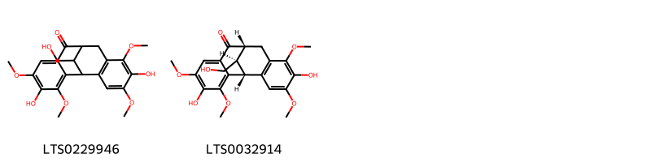{ width=100% }
    <figcaption>Hình ảnh cấu trúc hóa học của 2 hoạt chất thuộc nhóm Aryltetralin lignans gồm ['4,13-dihydroxy-17-(hydroxymethyl)-3,5,12,14-tetramethoxytetracyclo[7.7.1.0²,⁷.0¹¹,¹⁶]heptadeca-2,4,6,11(16),12,14-hexaen-8-one (LTS0229946)', '(1r,9r,17r)-4,13-dihydroxy-17-(hydroxymethyl)-3,5,12,14-tetramethoxytetracyclo[7.7.1.0²,⁷.0¹¹,¹⁶]heptadeca-2,4,6,11(16),12,14-hexaen-8-one (LTS0032914)'].</figcaption>
</figure>
#### Nhóm Benzene and substituted derivatives
<figure markdown="span">
    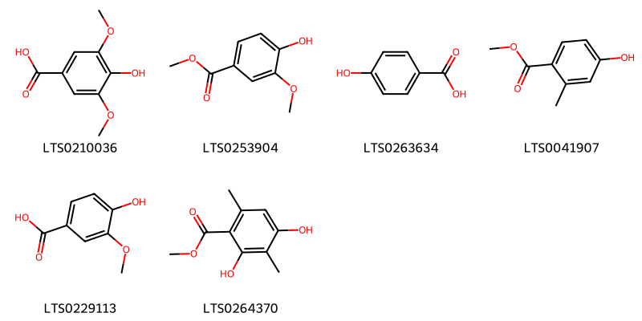{ width=100% }
    <figcaption>Hình ảnh cấu trúc hóa học của 6 hoạt chất thuộc nhóm Benzene and substituted derivatives gồm ['syringic acid (LTS0210036)', 'vanillate (LTS0253904)', 'p-hydroxybenzoic acid (LTS0263634)', 'methyl 4-hydroxy-2-methylbenzoate (LTS0041907)', 'vanillic acid (LTS0229113)', 'atraric acid (LTS0264370)'].</figcaption>
</figure>
#### Nhóm Fatty Acyls
<figure markdown="span">
    { width=100% }
    <figcaption>Hình ảnh cấu trúc hóa học của 1 hoạt chất thuộc nhóm Fatty Acyls gồm ['2-carboxy-d-arabinitol (LTS0056947)'].</figcaption>
</figure>
#### Nhóm Flavonoids
<figure markdown="span">
    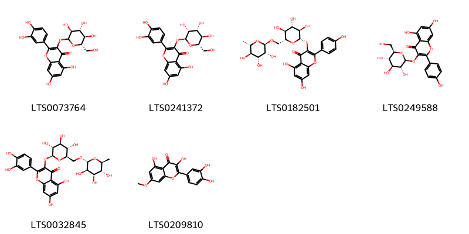{ width=100% }
    <figcaption>Hình ảnh cấu trúc hóa học của 6 hoạt chất thuộc nhóm Flavonoids gồm ['2-(3,4-dihydroxyphenyl)-5,7-dihydroxy-3-{[(3s,4r,5r,6s)-3,4,5-trihydroxy-6-(hydroxymethyl)oxan-2-yl]oxy}chromen-4-one (LTS0073764)', '2-(3,4-dihydroxyphenyl)-5,7-dihydroxy-3-{[(2s,3r,4r,5r,6s)-3,4,5-trihydroxy-6-(hydroxymethyl)oxan-2-yl]oxy}chromen-4-one (LTS0241372)', 'nictoflorin (LTS0182501)', 'astragalin (LTS0249588)', '3-rutinosyl quercetin (LTS0032845)', 'rhamnetin (LTS0209810)'].</figcaption>
</figure>
#### Nhóm Furanoid lignans
<figure markdown="span">
    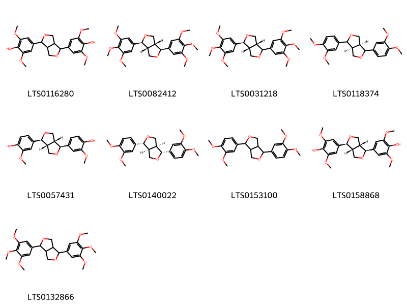{ width=100% }
    <figcaption>Hình ảnh cấu trúc hóa học của 9 hoạt chất thuộc nhóm Furanoid lignans gồm ['syringaresinol (LTS0116280)', '( )-yangabin (LTS0082412)', '(1s,3ar,6ar)-1,4-bis(3,4,5-trimethoxyphenyl)-hexahydrofuro[3,4-c]furan (LTS0031218)', '(3as,6as)-1,4-bis(3,4-dimethoxyphenyl)-hexahydrofuro[3,4-c]furan (LTS0118374)', 'pinoresinol (LTS0057431)', '(1r,3as,4r,6as)-1,4-bis(3,4-dimethoxyphenyl)-hexahydrofuro[3,4-c]furan (LTS0140022)', '1,4-bis(3,4-dimethoxyphenyl)-hexahydrofuro[3,4-c]furan (LTS0153100)', '(+)-syringaresinol (LTS0158868)', '1,4-bis(3,4,5-trimethoxyphenyl)-hexahydrofuro[3,4-c]furan (LTS0132866)'].</figcaption>
</figure>
#### Nhóm Lignan glycosides
<figure markdown="span">
    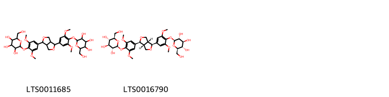{ width=100% }
    <figcaption>Hình ảnh cấu trúc hóa học của 2 hoạt chất thuộc nhóm Lignan glycosides gồm ['2-{4-[4-(3,5-dimethoxy-4-{[3,4,5-trihydroxy-6-(hydroxymethyl)oxan-2-yl]oxy}phenyl)-hexahydrofuro[3,4-c]furan-1-yl]-2,6-dimethoxyphenoxy}-6-(hydroxymethyl)oxane-3,4,5-triol (LTS0011685)', 'liriodendrin (LTS0016790)'].</figcaption>
</figure>
#### Nhóm Organooxygen compounds
<figure markdown="span">
    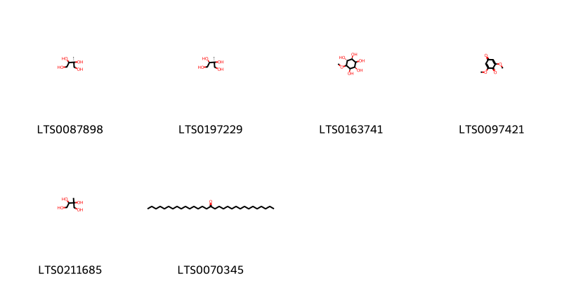{ width=100% }
    <figcaption>Hình ảnh cấu trúc hóa học của 6 hoạt chất thuộc nhóm Organooxygen compounds gồm ['(2s)-2-methylbutane-1,2,3,4-tetrol (LTS0087898)', '(2s,3r)-2-methylbutane-1,2,3,4-tetrol (LTS0197229)', '(1r,2r,4s,5r)-6-methoxycyclohexane-1,2,3,4,5-pentol (LTS0163741)', '2,6-dimethoxy-1,4-benzoquinone (LTS0097421)', '2-methylbutane-1,2,3,4-tetrol (LTS0211685)', 'palmitone (LTS0070345)'].</figcaption>
</figure>
#### Nhóm Phenols
<figure markdown="span">
    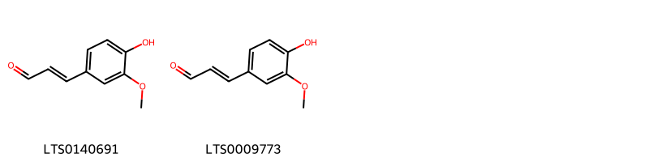{ width=100% }
    <figcaption>Hình ảnh cấu trúc hóa học của 2 hoạt chất thuộc nhóm Phenols gồm ['coniferyl aldehyde (LTS0140691)', 'coniferaldehyde (LTS0009773)'].</figcaption>
</figure>
#### Nhóm Prenol lipids
<figure markdown="span">
    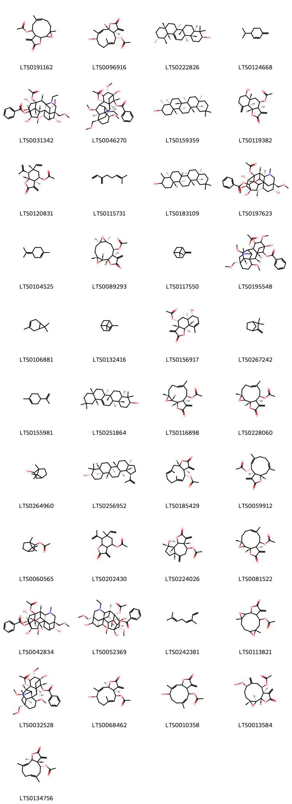{ width=100% }
    <figcaption>Hình ảnh cấu trúc hóa học của 41 hoạt chất thuộc nhóm Prenol lipids gồm ['4,8-dimethyl-12-methylidene-13-oxo-3,14-dioxatricyclo[9.3.0.0²,⁴]tetradec-7-en-10-yl acetate (LTS0191162)', '(3as,4r,9r,11as)-9-hydroxy-6,10-dimethyl-3-methylidene-2-oxo-3ah,4h,7h,8h,9h,11ah-cyclodeca[b]furan-4-yl acetate (LTS0096916)', 'amyrin (LTS0222826)', 'β phellandrene (LTS0124668)', 'aconitine (LTS0031342)', '(2r,3r,4r,5r,6s,7s,8r,13s,16s,17r,18r)-8-(acetyloxy)-11-ethyl-5,7-dihydroxy-6,16,18-trimethoxy-13-(methoxymethyl)-11-azahexacyclo[7.7.2.1²,⁵.0¹,¹⁰.0³,⁸.0¹³,¹⁷]nonadecan-4-yl benzoate (LTS0046270)', '(3r,4r,4as,6as,6br,8ar,12ar,12bs,14as,14bs)-4,4a,6b,8a,11,11,12b,14a-octamethyl-hexadecahydropicen-3-ol (LTS0159359)', '(3ar,4r,5ar,6r,9as,9br)-6-hydroxy-5a-methyl-3,9-dimethylidene-2-oxo-octahydronaphtho[1,2-b]furan-4-yl acetate (LTS0119382)', '(3ar,4r,6s,7s,7ar)-6-ethenyl-6-methyl-3-methylidene-2-oxo-7-(prop-1-en-2-yl)-tetrahydro-3ah-1-benzofuran-4-yl acetate (LTS0120831)', 'α-myrcene (LTS0115731)', '(4as,6as,6br,8ar,12ar,12bs,14as,14bs)-4,4a,6b,8a,11,11,12b,14a-octamethyl-hexadecahydropicen-3-ol (LTS0183109)', '(1s,5r,6s,7s,8r,9r,10r,13r,14r,16s)-8-(acetyloxy)-5,7,14-trihydroxy-6,16,18-trimethoxy-13-(methoxymethyl)-11-methyl-11-azahexacyclo[7.7.2.1²,⁵.0¹,¹⁰.0³,⁸.0¹³,¹⁷]nonadecan-4-yl benzoate (LTS0197623)', 'terpinolene (LTS0104525)', '(1s,2s,4r,7r,9s,11r,12r)-4,9-dimethyl-13-methylidene-14-oxo-3,8,15-trioxatetracyclo[10.3.0.0²,⁴.0⁷,⁹]pentadecan-11-yl acetate (LTS0089293)', 'β-pinene (LTS0117550)', '(2s,3s,5r,8r,13s,17s)-8-(acetyloxy)-5,7-dihydroxy-6,16,18-trimethoxy-13-(methoxymethyl)-11-methyl-11-azahexacyclo[7.7.2.1²,⁵.0¹,¹⁰.0³,⁸.0¹³,¹⁷]nonadecan-4-yl benzoate (LTS0195548)', 'monoterpenes (LTS0106881)', 'α pinene (LTS0132416)', '(3ar,4r,5ar,6r,9as,9br)-6-hydroxy-5a,9-dimethyl-3-methylidene-2-oxo-3ah,4h,5h,6h,7h,9ah,9bh-naphtho[1,2-b]furan-4-yl acetate (LTS0156917)', 'camphene (LTS0267242)', 'limonene,  (LTS0155981)', 'β-amyrin (LTS0251864)', '(1s,2s,4r,7e,10r,11r)-4,8-dimethyl-12-methylidene-13-oxo-3,14-dioxatricyclo[9.3.0.0²,⁴]tetradec-7-en-10-yl acetate (LTS0116898)', 'lipiferolide (LTS0228060)', 'borneol (LTS0264960)', 'lupeol (LTS0256952)', 'laurenobiolide (LTS0185429)', 'laurenobiolide (LTS0059912)', 'bornyl acetate (LTS0060565)', '6-ethenyl-6-methyl-3-methylidene-2-oxo-7-(prop-1-en-2-yl)-tetrahydro-3ah-1-benzofuran-4-yl acetate (LTS0202430)', '(3ar,4s,6ar,9s,9as,9bs)-9-hydroxy-9-methyl-3,6-dimethylidene-2-oxo-octahydroazuleno[4,5-b]furan-4-yl acetate (LTS0224026)', '(1s,4r,11r)-4,8-dimethyl-12-methylidene-13-oxo-3,14-dioxatricyclo[9.3.0.0²,⁴]tetradec-7-en-10-yl acetate (LTS0081522)', 'mesaconitine (LTS0042834)', '(1s,2r,3r,4r,5s,6s,7s,8r,9r,13r,16s,17s,18r)-8-(acetyloxy)-11-ethyl-5,7,14-trihydroxy-6,16,18-trimethoxy-13-(methoxymethyl)-11-azahexacyclo[7.7.2.1²,⁵.0¹,¹⁰.0³,⁸.0¹³,¹⁷]nonadecan-4-yl benzoate (LTS0052369)', 'β-ocimene (LTS0242381)', '4,9-dimethyl-13-methylidene-14-oxo-3,8,15-trioxatetracyclo[10.3.0.0²,⁴.0⁷,⁹]pentadecan-11-yl acetate (LTS0113821)', 'hypaconitine (LTS0032528)', '(3as,4s,9r,11ar)-9-hydroxy-6,10-dimethyl-3-methylidene-2-oxo-3ah,4h,7h,8h,9h,11ah-cyclodeca[b]furan-4-yl acetate (LTS0068462)', '9-hydroxy-6,10-dimethyl-3-methylidene-2-oxo-3ah,4h,7h,8h,9h,11ah-cyclodeca[b]furan-4-yl acetate (LTS0010358)', '1-peroxyferolide (LTS0013584)', 'epi-tulipinolide (LTS0134756)'].</figcaption>
</figure>
#### Nhóm Proaporphines
<figure markdown="span">
    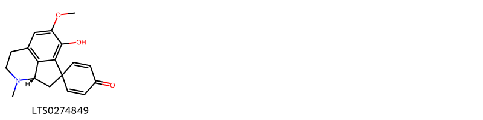{ width=100% }
    <figcaption>Hình ảnh cấu trúc hóa học của 1 hoạt chất thuộc nhóm Proaporphines gồm ["(4's)-11'-hydroxy-10'-methoxy-5'-methyl-5'-azaspiro[cyclohexane-1,2'-tricyclo[6.3.1.0⁴,¹²]dodecane]-1'(11'),2,5,8'(12'),9'-pentaen-4-one (LTS0274849)"].</figcaption>
</figure>
#### Nhóm Protoberberine alkaloids and derivatives
<figure markdown="span">
    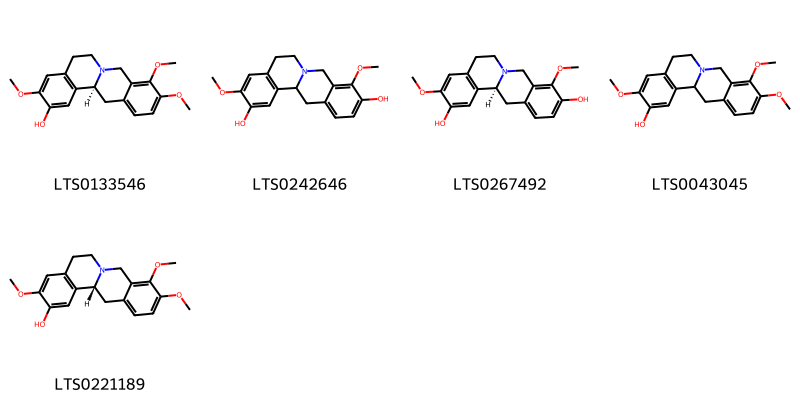{ width=100% }
    <figcaption>Hình ảnh cấu trúc hóa học của 5 hoạt chất thuộc nhóm Protoberberine alkaloids and derivatives gồm ['tetrahydrocolumbamine (LTS0133546)', 'coreximine (LTS0242646)', 'stepholidine (LTS0267492)', '(+/-)-isocorypalmine (LTS0043045)', '(+)-isocorypalmine (LTS0221189)'].</figcaption>
</figure>
#### Nhóm Steroids and steroid derivatives
<figure markdown="span">
    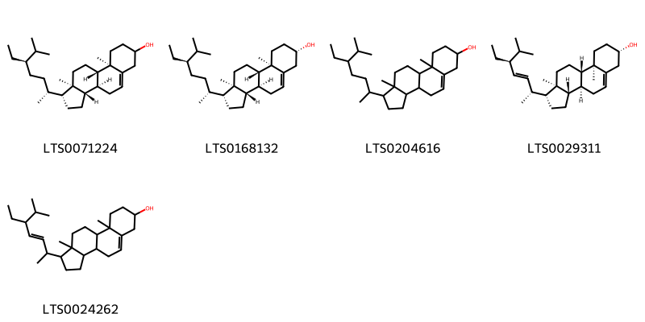{ width=100% }
    <figcaption>Hình ảnh cấu trúc hóa học của 5 hoạt chất thuộc nhóm Steroids and steroid derivatives gồm ['stigmast-5-en-3-ol (LTS0071224)', 'sitosterol (LTS0168132)', 'stigmast-5-en-3-ol, (3β)- (LTS0204616)', 'phytosterol (LTS0029311)', 'stigmasterol (LTS0024262)'].</figcaption>
</figure>
#### Nhóm Tetrahydroisoquinolines
<figure markdown="span">
    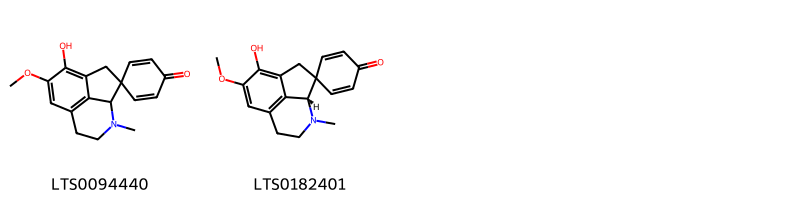{ width=100% }
    <figcaption>Hình ảnh cấu trúc hóa học của 2 hoạt chất thuộc nhóm Tetrahydroisoquinolines gồm ["5'-hydroxy-6'-methoxy-11'-methyl-11'-azaspiro[cyclohexane-1,2'-tricyclo[6.3.1.0⁴,¹²]dodecane]-2,4',5,6',8'(12')-pentaen-4-one (LTS0094440)", "(1's)-5'-hydroxy-6'-methoxy-11'-methyl-11'-azaspiro[cyclohexane-1,2'-tricyclo[6.3.1.0⁴,¹²]dodecane]-2,4',5,6',8'(12')-pentaen-4-one (LTS0182401)"].</figcaption>
</figure>
#### Nhóm Unsaturated hydrocarbons
<figure markdown="span">
    { width=100% }
    <figcaption>Hình ảnh cấu trúc hóa học của 1 hoạt chất thuộc nhóm Unsaturated hydrocarbons gồm ['α terpinene (LTS0232891)'].</figcaption>
</figure>

---

### Dược dân tộc học

Danh sách các quốc gia có sử dụng *Liriodendron tulipifera* trong điều trị các bệnh. 

| Country   | Disease             | Bệnh                       |
|:----------|:--------------------|:---------------------------|
| Elsewhere | Diaphoretic         | Thuốc tràn dịch màng phổi  |
| US        | Poultice, Stimulant | Thuốc đắp, chất kích thích |

---

---
## Liriodendron tulipiferum
### Thông tin về thực vật

!!! info "Phân loại thực vật của *Liriodendron tulipifera* từ GIBF:"
    - **Kingdom:** Plantae
    - **Phylum:** Tracheophyta
    - **Order:** Magnoliales
    - **Family:** Magnoliaceae
    - **Genus:** Liriodendron
    - **Species:** *Liriodendron tulipifera*

 

| Label (VI)   | Label (EN)   | Scientific Name         | Descriptions (VI)   | Descriptions (EN)   | Also Known As (VI)   | Also Known As (EN)                                                                  |
|:-------------|:-------------|:------------------------|:--------------------|:--------------------|:---------------------|:------------------------------------------------------------------------------------|
| N/A          | N/A          | Liriodendron tulipifera | loài thực vật       | species of plant    | ['']                 | ['American tulip tree', 'tulip poplar', 'tulip tree', 'tuliptree', 'yellow poplar'] |

#### Phân bố trên thế giới

**Từ CSDL GIBF** nan, Denmark, South Africa, France, Germany, Canada, United States of America

#### Phân bố tại Việt Nam

**Từ CSDL GIBF**: Không có ghi nhận ở Việt Nam

---
### Thành phần hóa học
        
- Theo cơ sở dữ liệu lotus: Từ loài *Liriodendron tulipifera* đã phân lập và xác định được Chưa có hoạt chất nào được phân lập. hoạt chất thuộc về các nhóm Không có hoạt chất nào được phân lập. 

Không có hình ảnh nào được tạo ra

---

### Dược dân tộc học

Danh sách các quốc gia có sử dụng *Liriodendron tulipifera* trong điều trị các bệnh. 

| Country   | Disease   | Bệnh               |
|:----------|:----------|:-------------------|
| Turkey    | Tonic     | (thuộc) trương lực |

---

# Chi Magnolia

??? note "Danh sách các dược liệu thuộc chi"
    
	 - *Magnolia conicua*
	 - *Magnolia denudata*
	 - *Magnolia grandiflora*
	 - *Magnolia hypoleuca*
	 - *Magnolia kobus*
	 - *Magnolia liliflora*
	 - *Magnolia obovata*
	 - *Magnolia officinalis*
	 - *Magnolia salicifolia*
	 - *Magnolia stellata*
	 - *Magnolia virginiana*

---
## Magnolia conicua
### Thông tin về thực vật

!!! info "Phân loại thực vật của *Magnolia concinna* từ GIBF:"
    - **Kingdom:** Plantae
    - **Phylum:** Tracheophyta
    - **Order:** Magnoliales
    - **Family:** Magnoliaceae
    - **Genus:** Magnolia
    - **Species:** *Magnolia concinna*

 

| Label (VI)   | Label (EN)   | Scientific Name         | Descriptions (VI)   | Descriptions (EN)   | Also Known As (VI)   | Also Known As (EN)                                                                  |
|:-------------|:-------------|:------------------------|:--------------------|:--------------------|:---------------------|:------------------------------------------------------------------------------------|
| N/A          | N/A          | Liriodendron tulipifera | loài thực vật       | species of plant    | ['']                 | ['American tulip tree', 'tulip poplar', 'tulip tree', 'tuliptree', 'yellow poplar'] |

#### Phân bố trên thế giới

**Từ CSDL GIBF** nan, Denmark, South Africa, France, Germany, Canada, United States of America

#### Phân bố tại Việt Nam

**Từ CSDL GIBF**: Không có ghi nhận ở Việt Nam

---
### Thành phần hóa học
        
- Theo cơ sở dữ liệu lotus: Từ loài *Magnolia concinna* đã phân lập và xác định được Chưa có hoạt chất nào được phân lập. hoạt chất thuộc về các nhóm Không có hoạt chất nào được phân lập. 

Không có hình ảnh nào được tạo ra

---

### Dược dân tộc học

Danh sách các quốc gia có sử dụng *Magnolia concinna* trong điều trị các bệnh. 

| Country   | Disease     | Bệnh           |
|:----------|:------------|:---------------|
| China     | Expectorant | Thuốc long đàm |

---

---
## Magnolia denudata
### Thông tin về thực vật

!!! info "Phân loại thực vật của *Magnolia denudata* từ GIBF:"
    - **Kingdom:** Plantae
    - **Phylum:** Tracheophyta
    - **Order:** Magnoliales
    - **Family:** Magnoliaceae
    - **Genus:** Magnolia
    - **Species:** *Magnolia denudata*

 

| Label (VI)   | Label (EN)   | Scientific Name   | Descriptions (VI)   | Descriptions (EN)   | Also Known As (VI)   | Also Known As (EN)                          |
|:-------------|:-------------|:------------------|:--------------------|:--------------------|:---------------------|:--------------------------------------------|
| N/A          | N/A          | Magnolia denudata | loài thực vật       | species of plant    | ['']                 | ['lily tree', 'lilytree', 'Yulan magnolia'] |

#### Phân bố trên thế giới

**Từ CSDL GIBF** Georgia, nan, Thailand, Japan, France, Poland, New Zealand, Germany, Canada, United States of America, Italy, China, Norway, Belgium, Korea, Republic of, Hong Kong

#### Phân bố tại Việt Nam

**Từ CSDL GIBF**: Không có ghi nhận ở Việt Nam

---
### Thành phần hóa học
        
- Theo cơ sở dữ liệu lotus: Từ loài *Magnolia denudata* đã phân lập và xác định được 114 hoạt chất thuộc về các nhóm Organic phosphoric acids and derivatives, Furanoid lignans, Organooxygen compounds, Benzofurans, 2-arylbenzofuran flavonoids, Prenol lipids, Phenols, Benzodioxoles, Phenol ethers, Steroids and steroid derivatives, Benzene and substituted derivatives, Naphthalenes. 

|    | chemicalTaxonomyClassyfireClass          |   smiles_count |
|---:|:-----------------------------------------|---------------:|
|  0 | 2-arylbenzofuran flavonoids              |             28 |
|  1 | Benzene and substituted derivatives      |              8 |
|  2 | Benzodioxoles                            |             19 |
|  3 | Benzofurans                              |              4 |
|  4 | Furanoid lignans                         |             32 |
|  5 | Naphthalenes                             |              1 |
|  6 | Organic phosphoric acids and derivatives |              1 |
|  7 | Organooxygen compounds                   |              3 |
|  8 | Phenol ethers                            |              2 |
|  9 | Phenols                                  |              2 |
| 10 | Prenol lipids                            |             10 |
| 11 | Steroids and steroid derivatives         |              2 |

#### Nhóm 2-arylbenzofuran flavonoids
<figure markdown="span">
    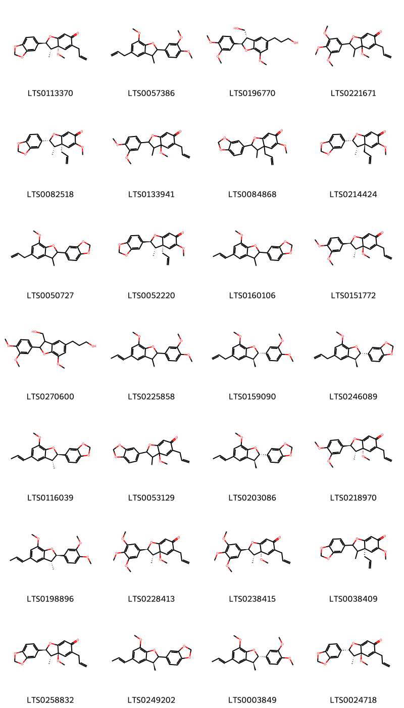{ width=100% }
    <figcaption>Hình ảnh cấu trúc hóa học của 28 hoạt chất thuộc nhóm 2-arylbenzofuran flavonoids gồm ['(2s,3r,3ar)-2-(2h-1,3-benzodioxol-5-yl)-3a-methoxy-3-methyl-5-(prop-2-en-1-yl)-2,3-dihydro-1-benzofuran-6-one (LTS0113370)', '2-(3,4-dimethoxyphenyl)-7-methoxy-3-methyl-5-(prop-2-en-1-yl)-2,3-dihydro-1-benzofuran (LTS0057386)', '3-[(2r,3s)-2-(3,4-dimethoxyphenyl)-3-(hydroxymethyl)-7-methoxy-2,3-dihydro-1-benzofuran-5-yl]propan-1-ol (LTS0196770)', '3a-methoxy-3-methyl-5-(prop-2-en-1-yl)-2-(3,4,5-trimethoxyphenyl)-2,3-dihydro-1-benzofuran-6-one (LTS0221671)', '(2r,3s,3ar)-2-(2h-1,3-benzodioxol-5-yl)-5-methoxy-3-methyl-3a-(prop-2-en-1-yl)-2,3-dihydro-1-benzofuran-6-one (LTS0082518)', '2-(3,4-dimethoxyphenyl)-3a-methoxy-3-methyl-5-(prop-2-en-1-yl)-2,3-dihydro-1-benzofuran-6-one (LTS0133941)', '2-(2h-1,3-benzodioxol-5-yl)-5-methoxy-3-methyl-3a-(prop-2-en-1-yl)-2,3-dihydro-1-benzofuran-6-one (LTS0084868)', '(2r,3s,3as)-2-(2h-1,3-benzodioxol-5-yl)-5-methoxy-3-methyl-3a-(prop-2-en-1-yl)-2,3-dihydro-1-benzofuran-6-one (LTS0214424)', '5-[7-methoxy-3-methyl-5-(prop-2-en-1-yl)-2,3-dihydro-1-benzofuran-2-yl]-2h-1,3-benzodioxole (LTS0050727)', '(2s,3s,3ar)-2-(2h-1,3-benzodioxol-5-yl)-5-methoxy-3-methyl-3a-(prop-2-en-1-yl)-2,3-dihydro-1-benzofuran-6-one (LTS0052220)', '5-[7-methoxy-3-methyl-5-(prop-1-en-1-yl)-2,3-dihydro-1-benzofuran-2-yl]-2h-1,3-benzodioxole (LTS0160106)', 'denudatin b (LTS0151772)', '3-[2-(3,4-dimethoxyphenyl)-3-(hydroxymethyl)-7-methoxy-2,3-dihydro-1-benzofuran-5-yl]propan-1-ol (LTS0270600)', '2-(3,4-dimethoxyphenyl)-7-methoxy-3-methyl-5-(prop-1-en-1-yl)-2,3-dihydro-1-benzofuran (LTS0225858)', '(2s,3s)-2-(3,4-dimethoxyphenyl)-7-methoxy-3-methyl-5-(prop-2-en-1-yl)-2,3-dihydro-1-benzofuran (LTS0159090)', '5-[(2s,3s)-7-methoxy-3-methyl-5-(prop-2-en-1-yl)-2,3-dihydro-1-benzofuran-2-yl]-2h-1,3-benzodioxole (LTS0246089)', '5-[(2r,3r)-7-methoxy-3-methyl-5-[(1e)-prop-1-en-1-yl]-2,3-dihydro-1-benzofuran-2-yl]-2h-1,3-benzodioxole (LTS0116039)', '2-(2h-1,3-benzodioxol-5-yl)-3a-methoxy-3-methyl-5-(prop-2-en-1-yl)-2,3-dihydro-1-benzofuran-6-one (LTS0053129)', '5-[(2s,3s)-7-methoxy-3-methyl-5-[(1e)-prop-1-en-1-yl]-2,3-dihydro-1-benzofuran-2-yl]-2h-1,3-benzodioxole (LTS0203086)', 'denudatin b (LTS0218970)', 'acuminatin (LTS0198896)', '(2s,3r,3as)-3a-methoxy-3-methyl-5-(prop-2-en-1-yl)-2-(3,4,5-trimethoxyphenyl)-2,3-dihydro-1-benzofuran-6-one (LTS0228413)', '(2s,3r,3ar)-3a-methoxy-3-methyl-5-(prop-2-en-1-yl)-2-(3,4,5-trimethoxyphenyl)-2,3-dihydro-1-benzofuran-6-one (LTS0238415)', '(3ar)-2-(2h-1,3-benzodioxol-5-yl)-5-methoxy-3-methyl-3a-(prop-2-en-1-yl)-2,3-dihydro-1-benzofuran-6-one (LTS0038409)', '(2s,3r,3as)-2-(2h-1,3-benzodioxol-5-yl)-3a-methoxy-3-methyl-5-(prop-2-en-1-yl)-2,3-dihydro-1-benzofuran-6-one (LTS0258832)', '5-[(3s)-7-methoxy-3-methyl-5-[(1e)-prop-1-en-1-yl]-2,3-dihydro-1-benzofuran-2-yl]-2h-1,3-benzodioxole (LTS0249202)', '(2s,3s)-2-(3,4-dimethoxyphenyl)-7-methoxy-3-methyl-5-[(1e)-prop-1-en-1-yl]-2,3-dihydro-1-benzofuran (LTS0003849)', '(2r,3r,3as)-2-(2h-1,3-benzodioxol-5-yl)-3a-methoxy-3-methyl-5-(prop-2-en-1-yl)-2,3-dihydro-1-benzofuran-6-one (LTS0024718)'].</figcaption>
</figure>
#### Nhóm Benzene and substituted derivatives
<figure markdown="span">
    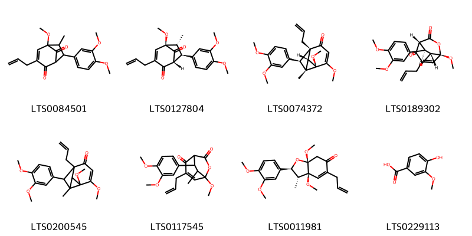{ width=100% }
    <figcaption>Hình ảnh cấu trúc hóa học của 8 hoạt chất thuộc nhóm Benzene and substituted derivatives gồm ['7-(3,4-dimethoxyphenyl)-5-methoxy-6-methyl-3-(prop-2-en-1-yl)bicyclo[3.2.1]oct-3-ene-2,8-dione (LTS0084501)', '(1r,5r,6r,7r)-7-(3,4-dimethoxyphenyl)-5-methoxy-6-methyl-3-(prop-2-en-1-yl)bicyclo[3.2.1]oct-3-ene-2,8-dione (LTS0127804)', '(1r,2r,6s,7r,8r)-7-(3,4-dimethoxyphenyl)-2,3-dimethoxy-8-methyl-6-(prop-2-en-1-yl)tricyclo[4.2.0.0²,⁸]oct-3-en-5-one (LTS0074372)', '(1r,5s,8r,9r)-8-(3,4-dimethoxyphenyl)-5-methoxy-9-methyl-3-(prop-2-en-1-yl)-6-oxabicyclo[3.2.2]non-3-ene-2,7-dione (LTS0189302)', '7-(3,4-dimethoxyphenyl)-2,3-dimethoxy-8-methyl-6-(prop-2-en-1-yl)tricyclo[4.2.0.0²,⁸]oct-3-en-5-one (LTS0200545)', '8-(3,4-dimethoxyphenyl)-5-methoxy-9-methyl-3-(prop-2-en-1-yl)-6-oxabicyclo[3.2.2]non-3-ene-2,7-dione (LTS0117545)', '(2s,3r,3as,7ar)-2-(3,4-dimethoxyphenyl)-3a,7a-dimethoxy-3-methyl-5-(prop-2-en-1-yl)-3,7-dihydro-2h-1-benzofuran-6-one (LTS0011981)', 'vanillic acid (LTS0229113)'].</figcaption>
</figure>
#### Nhóm Benzodioxoles
<figure markdown="span">
    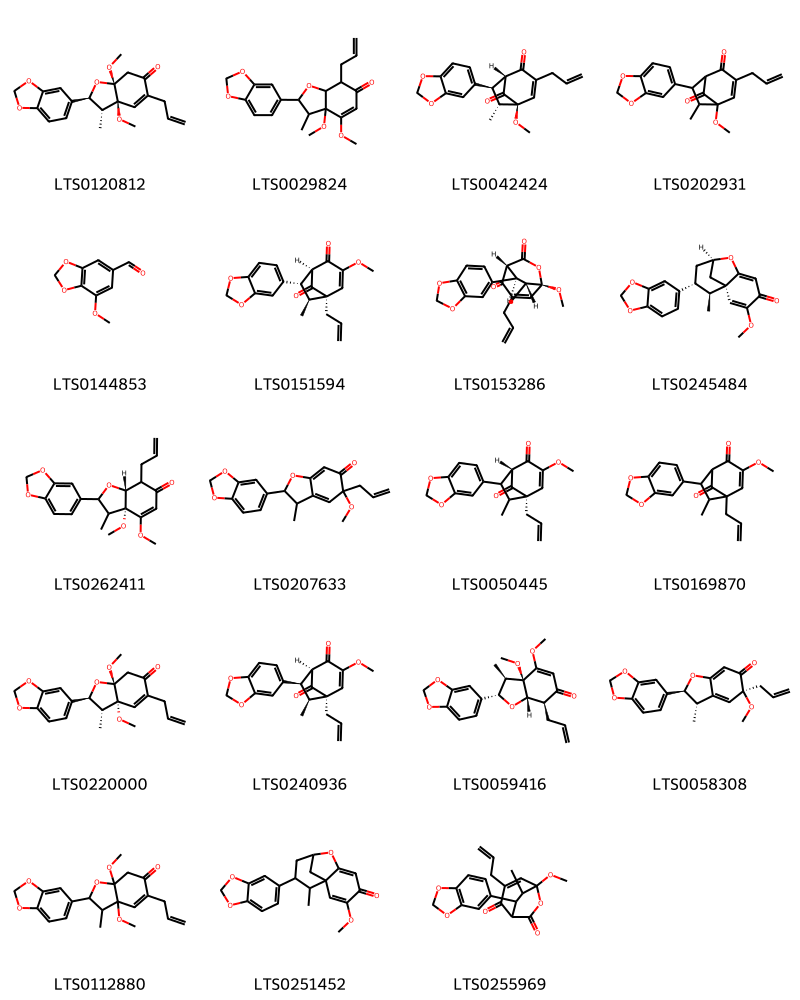{ width=100% }
    <figcaption>Hình ảnh cấu trúc hóa học của 19 hoạt chất thuộc nhóm Benzodioxoles gồm ['kadsurin a (LTS0120812)', '2-(2h-1,3-benzodioxol-5-yl)-3a,4-dimethoxy-3-methyl-7-(prop-2-en-1-yl)-2,3,7,7a-tetrahydro-1-benzofuran-6-one (LTS0029824)', '(1r,5r,6r,7r)-7-(2h-1,3-benzodioxol-5-yl)-5-methoxy-6-methyl-3-(prop-2-en-1-yl)bicyclo[3.2.1]oct-3-ene-2,8-dione (LTS0042424)', '7-(2h-1,3-benzodioxol-5-yl)-5-methoxy-6-methyl-3-(prop-2-en-1-yl)bicyclo[3.2.1]oct-3-ene-2,8-dione (LTS0202931)', '7-methoxy-2h-1,3-benzodioxole-5-carbaldehyde (LTS0144853)', '(1r,5r,6s,7s)-7-(2h-1,3-benzodioxol-5-yl)-3-methoxy-6-methyl-5-(prop-2-en-1-yl)bicyclo[3.2.1]oct-3-ene-2,8-dione (LTS0151594)', '(1r,5s,8r,9r)-8-(2h-1,3-benzodioxol-5-yl)-5-methoxy-9-methyl-3-(prop-2-en-1-yl)-6-oxabicyclo[3.2.2]non-3-ene-2,7-dione (LTS0153286)', '(1r,8r,10r,11s)-10-(2h-1,3-benzodioxol-5-yl)-3-methoxy-11-methyl-7-oxatricyclo[6.3.1.0¹,⁶]dodeca-2,5-dien-4-one (LTS0245484)', '(3ar,7ar)-2-(2h-1,3-benzodioxol-5-yl)-3a,4-dimethoxy-3-methyl-7-(prop-2-en-1-yl)-2,3,7,7a-tetrahydro-1-benzofuran-6-one (LTS0262411)', '2-(2h-1,3-benzodioxol-5-yl)-5-methoxy-3-methyl-5-(prop-2-en-1-yl)-2,3-dihydro-1-benzofuran-6-one (LTS0207633)', '(1s,5r)-7-(2h-1,3-benzodioxol-5-yl)-3-methoxy-6-methyl-5-(prop-2-en-1-yl)bicyclo[3.2.1]oct-3-ene-2,8-dione (LTS0050445)', '7-(2h-1,3-benzodioxol-5-yl)-3-methoxy-6-methyl-5-(prop-2-en-1-yl)bicyclo[3.2.1]oct-3-ene-2,8-dione (LTS0169870)', '(2s,3r,3ar,7ar)-2-(2h-1,3-benzodioxol-5-yl)-3a,7a-dimethoxy-3-methyl-5-(prop-2-en-1-yl)-3,7-dihydro-2h-1-benzofuran-6-one (LTS0220000)', '(1r,5r,6s,7r)-7-(2h-1,3-benzodioxol-5-yl)-3-methoxy-6-methyl-5-(prop-2-en-1-yl)bicyclo[3.2.1]oct-3-ene-2,8-dione (LTS0240936)', 'fargesone a (LTS0059416)', '(2s,3s,5s)-2-(2h-1,3-benzodioxol-5-yl)-5-methoxy-3-methyl-5-(prop-2-en-1-yl)-2,3-dihydro-1-benzofuran-6-one (LTS0058308)', '2-(2h-1,3-benzodioxol-5-yl)-3a,7a-dimethoxy-3-methyl-5-(prop-2-en-1-yl)-3,7-dihydro-2h-1-benzofuran-6-one (LTS0112880)', '10-(2h-1,3-benzodioxol-5-yl)-3-methoxy-11-methyl-7-oxatricyclo[6.3.1.0¹,⁶]dodeca-2,5-dien-4-one (LTS0251452)', '8-(2h-1,3-benzodioxol-5-yl)-5-methoxy-9-methyl-3-(prop-2-en-1-yl)-6-oxabicyclo[3.2.2]non-3-ene-2,7-dione (LTS0255969)'].</figcaption>
</figure>
#### Nhóm Benzofurans
<figure markdown="span">
    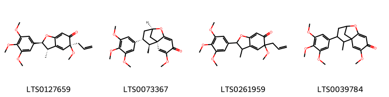{ width=100% }
    <figcaption>Hình ảnh cấu trúc hóa học của 4 hoạt chất thuộc nhóm Benzofurans gồm ['(2s,3s,5s)-5-methoxy-3-methyl-5-(prop-2-en-1-yl)-2-(3,4,5-trimethoxyphenyl)-2,3-dihydro-1-benzofuran-6-one (LTS0127659)', '(1r,8r,10r,11s)-3-methoxy-11-methyl-10-(3,4,5-trimethoxyphenyl)-7-oxatricyclo[6.3.1.0¹,⁶]dodeca-2,5-dien-4-one (LTS0073367)', '5-methoxy-3-methyl-5-(prop-2-en-1-yl)-2-(3,4,5-trimethoxyphenyl)-2,3-dihydro-1-benzofuran-6-one (LTS0261959)', '3-methoxy-11-methyl-10-(3,4,5-trimethoxyphenyl)-7-oxatricyclo[6.3.1.0¹,⁶]dodeca-2,5-dien-4-one (LTS0039784)'].</figcaption>
</figure>
#### Nhóm Furanoid lignans
<figure markdown="span">
    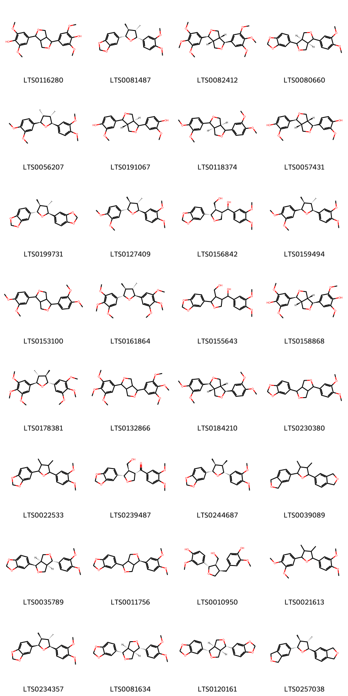{ width=100% }
    <figcaption>Hình ảnh cấu trúc hóa học của 32 hoạt chất thuộc nhóm Furanoid lignans gồm ['syringaresinol (LTS0116280)', '5-[(2s,3s,4s,5r)-5-(3,4-dimethoxyphenyl)-3,4-dimethyloxolan-2-yl]-2h-1,3-benzodioxole (LTS0081487)', '( )-yangabin (LTS0082412)', '5-[(3ar,6ar)-4-(3,4-dimethoxyphenyl)-hexahydrofuro[3,4-c]furan-1-yl]-2h-1,3-benzodioxole (LTS0080660)', '(2r,3r,4s,5s)-2,5-bis(3,4-dimethoxyphenyl)-3,4-dimethyloxolane (LTS0056207)', '4-[(3ar,6as)-4-(4-hydroxy-3-methoxyphenyl)-hexahydrofuro[3,4-c]furan-1-yl]-2-methoxyphenol (LTS0191067)', '(3as,6as)-1,4-bis(3,4-dimethoxyphenyl)-hexahydrofuro[3,4-c]furan (LTS0118374)', 'pinoresinol (LTS0057431)', 'galbacin (LTS0199731)', '(2s,3s,4s,5s)-2,5-bis(3,4-dimethoxyphenyl)-3,4-dimethyloxolane (LTS0127409)', '(r)-[(3r,4r,5s)-5-(2h-1,3-benzodioxol-5-yl)-4-(hydroxymethyl)oxolan-3-yl](3,4-dimethoxyphenyl)methanol (LTS0156842)', '(+)-veraguensin (LTS0159494)', '1,4-bis(3,4-dimethoxyphenyl)-hexahydrofuro[3,4-c]furan (LTS0153100)', 'grandisin (LTS0161864)', '[5-(2h-1,3-benzodioxol-5-yl)-4-(hydroxymethyl)oxolan-3-yl](3,4-dimethoxyphenyl)methanol (LTS0155643)', '(+)-syringaresinol (LTS0158868)', '(2r,3r,4r,5r)-3,4-dimethyl-2,5-bis(3,4,5-trimethoxyphenyl)oxolane (LTS0178381)', '1,4-bis(3,4,5-trimethoxyphenyl)-hexahydrofuro[3,4-c]furan (LTS0132866)', 'eudesmin (LTS0184210)', '5-[4-(3,4-dimethoxyphenyl)-hexahydrofuro[3,4-c]furan-1-yl]-2h-1,3-benzodioxole (LTS0230380)', '5-[5-(3,4-dimethoxyphenyl)-3,4-dimethyloxolan-2-yl]-2h-1,3-benzodioxole (LTS0022533)', '[(2s,3r,4s)-2-(2h-1,3-benzodioxol-5-yl)-4-(3,4-dimethoxybenzoyl)oxolan-3-yl]methanol (LTS0239487)', '5-[(2s,3s,4r,5r)-5-(3,4-dimethoxyphenyl)-3,4-dimethyloxolan-2-yl]-2h-1,3-benzodioxole (LTS0244687)', '5-[5-(1,3-dihydro-2-benzofuran-5-yl)-3,4-dimethyloxolan-2-yl]-1,3-dihydro-2-benzofuran (LTS0039089)', '5-[(1r,3ar,4s,6ar)-4-(3,4-dimethoxyphenyl)-hexahydrofuro[3,4-c]furan-1-yl]-2h-1,3-benzodioxole (LTS0035789)', '5-[(4r)-4-(3,4-dimethoxyphenyl)-hexahydrofuro[3,4-c]furan-1-yl]-2h-1,3-benzodioxole (LTS0011756)', 'lariciresinol (LTS0010950)', '2,5-bis(3,4-dimethoxyphenyl)-3,4-dimethyloxolane (LTS0021613)', '5-[(2r,3s,4s,5s)-5-(3,4-dimethoxyphenyl)-3,4-dimethyloxolan-2-yl]-2h-1,3-benzodioxole (LTS0234357)', '5-[(1s,3ar,4s,6ar)-4-(3,4-dimethoxyphenyl)-hexahydrofuro[3,4-c]furan-1-yl]-2h-1,3-benzodioxole (LTS0081634)', 'sesamin (LTS0120161)', '5-[(2s,3s,4s,5s)-5-(1,3-dihydro-2-benzofuran-5-yl)-3,4-dimethyloxolan-2-yl]-1,3-dihydro-2-benzofuran (LTS0257038)'].</figcaption>
</figure>
#### Nhóm Naphthalenes
<figure markdown="span">
    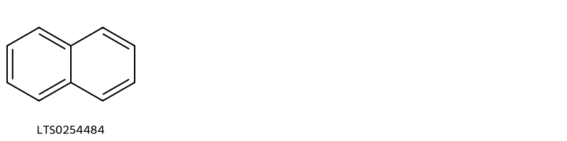{ width=100% }
    <figcaption>Hình ảnh cấu trúc hóa học của 1 hoạt chất thuộc nhóm Naphthalenes gồm ['naphthalene (LTS0254484)'].</figcaption>
</figure>
#### Nhóm Organic phosphoric acids and derivatives
<figure markdown="span">
    { width=100% }
    <figcaption>Hình ảnh cấu trúc hóa học của 1 hoạt chất thuộc nhóm Organic phosphoric acids and derivatives gồm ['o-phosphoethanolamine; bis(nonane) (LTS0249963)'].</figcaption>
</figure>
#### Nhóm Organooxygen compounds
<figure markdown="span">
    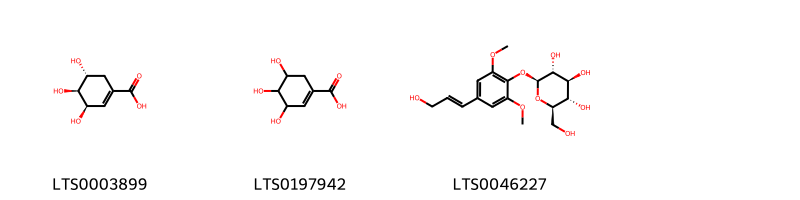{ width=100% }
    <figcaption>Hình ảnh cấu trúc hóa học của 3 hoạt chất thuộc nhóm Organooxygen compounds gồm ['(-)-shikimate (LTS0003899)', 'shikimate (LTS0197942)', 'syringin (LTS0046227)'].</figcaption>
</figure>
#### Nhóm Phenol ethers
<figure markdown="span">
    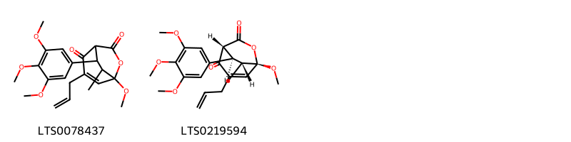{ width=100% }
    <figcaption>Hình ảnh cấu trúc hóa học của 2 hoạt chất thuộc nhóm Phenol ethers gồm ['5-methoxy-9-methyl-3-(prop-2-en-1-yl)-8-(3,4,5-trimethoxyphenyl)-6-oxabicyclo[3.2.2]non-3-ene-2,7-dione (LTS0078437)', '(1r,5s,8r,9r)-5-methoxy-9-methyl-3-(prop-2-en-1-yl)-8-(3,4,5-trimethoxyphenyl)-6-oxabicyclo[3.2.2]non-3-ene-2,7-dione (LTS0219594)'].</figcaption>
</figure>
#### Nhóm Phenols
<figure markdown="span">
    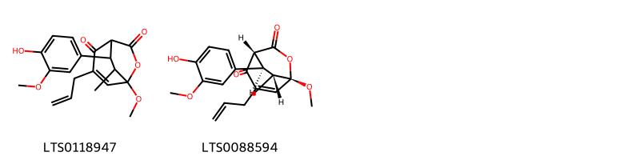{ width=100% }
    <figcaption>Hình ảnh cấu trúc hóa học của 2 hoạt chất thuộc nhóm Phenols gồm ['8-(4-hydroxy-3-methoxyphenyl)-5-methoxy-9-methyl-3-(prop-2-en-1-yl)-6-oxabicyclo[3.2.2]non-3-ene-2,7-dione (LTS0118947)', '(1r,5s,8r,9r)-8-(4-hydroxy-3-methoxyphenyl)-5-methoxy-9-methyl-3-(prop-2-en-1-yl)-6-oxabicyclo[3.2.2]non-3-ene-2,7-dione (LTS0088594)'].</figcaption>
</figure>
#### Nhóm Prenol lipids
<figure markdown="span">
    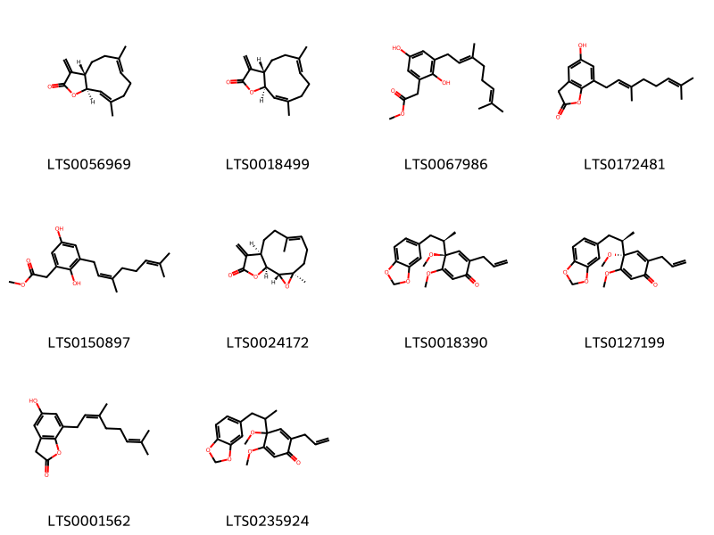{ width=100% }
    <figcaption>Hình ảnh cấu trúc hóa học của 10 hoạt chất thuộc nhóm Prenol lipids gồm ['costunolide (LTS0056969)', 'costunolide (LTS0018499)', 'methyl 2-{3-[(2e)-3,7-dimethylocta-2,6-dien-1-yl]-2,5-dihydroxyphenyl}acetate (LTS0067986)', '7-[(2e)-3,7-dimethylocta-2,6-dien-1-yl]-5-hydroxy-3h-1-benzofuran-2-one (LTS0172481)', 'methyl 2-[3-(3,7-dimethylocta-2,6-dien-1-yl)-2,5-dihydroxyphenyl]acetate (LTS0150897)', '(1s,2r,4r,7e,11r)-4,8-dimethyl-12-methylidene-3,14-dioxatricyclo[9.3.0.0²,⁴]tetradec-7-en-13-one (LTS0024172)', '(4s)-4-[(2r)-1-(2h-1,3-benzodioxol-5-yl)propan-2-yl]-4,5-dimethoxy-2-(prop-2-en-1-yl)cyclohexa-2,5-dien-1-one (LTS0018390)', '(4r)-4-[(2r)-1-(2h-1,3-benzodioxol-5-yl)propan-2-yl]-4,5-dimethoxy-2-(prop-2-en-1-yl)cyclohexa-2,5-dien-1-one (LTS0127199)', '7-(3,7-dimethylocta-2,6-dien-1-yl)-5-hydroxy-3h-1-benzofuran-2-one (LTS0001562)', '4-[1-(2h-1,3-benzodioxol-5-yl)propan-2-yl]-4,5-dimethoxy-2-(prop-2-en-1-yl)cyclohexa-2,5-dien-1-one (LTS0235924)'].</figcaption>
</figure>
#### Nhóm Steroids and steroid derivatives
<figure markdown="span">
    { width=100% }
    <figcaption>Hình ảnh cấu trúc hóa học của 2 hoạt chất thuộc nhóm Steroids and steroid derivatives gồm ['stigmast-5-en-3-ol (LTS0071224)', 'stigmast-5-en-3-ol, (3β)- (LTS0204616)'].</figcaption>
</figure>

---

### Dược dân tộc học

Danh sách các quốc gia có sử dụng *Magnolia denudata* trong điều trị các bệnh. 

| Country   | Disease   | Bệnh          |
|:----------|:----------|:--------------|
| Elsewhere | Sedative  | Thuốc an thần |

---

---
## Magnolia grandiflora
### Thông tin về thực vật

!!! info "Phân loại thực vật của *Magnolia grandiflora* từ GIBF:"
    - **Kingdom:** Plantae
    - **Phylum:** Tracheophyta
    - **Order:** Magnoliales
    - **Family:** Magnoliaceae
    - **Genus:** Magnolia
    - **Species:** *Magnolia grandiflora*

 

| Label (VI)   | Label (EN)   | Scientific Name      | Descriptions (VI)   | Descriptions (EN)   | Also Known As (VI)   | Also Known As (EN)                            |
|:-------------|:-------------|:---------------------|:--------------------|:--------------------|:---------------------|:----------------------------------------------|
| N/A          | N/A          | Magnolia grandiflora | loài thực vật       | species of plant    | ['']                 | ['magnolia', 'bull bay', 'southern magnolia'] |

#### Phân bố trên thế giới

**Từ CSDL GIBF** South Africa, France, Spain, New Zealand, Germany, United States of America, Mexico

#### Phân bố tại Việt Nam

**Từ CSDL GIBF**: Không có ghi nhận ở Việt Nam

---
### Thành phần hóa học
        
- Theo cơ sở dữ liệu lotus: Từ loài *Magnolia grandiflora* đã phân lập và xác định được 75 hoạt chất thuộc về các nhóm Furanoid lignans, Aporphines, Organooxygen compounds, Saturated hydrocarbons, Coumarins and derivatives, Prenol lipids, Glycerolipids, Fatty Acyls, Lignan glycosides, Phenols, Steroids and steroid derivatives, Benzene and substituted derivatives, Naphthalenes. 

|    | chemicalTaxonomyClassyfireClass     |   smiles_count |
|---:|:------------------------------------|---------------:|
|  0 | Aporphines                          |             14 |
|  1 | Benzene and substituted derivatives |              1 |
|  2 | Coumarins and derivatives           |              1 |
|  3 | Fatty Acyls                         |              2 |
|  4 | Furanoid lignans                    |              2 |
|  5 | Glycerolipids                       |              2 |
|  6 | Lignan glycosides                   |              2 |
|  7 | Naphthalenes                        |              1 |
|  8 | Organooxygen compounds              |              5 |
|  9 | Phenols                             |              3 |
| 10 | Prenol lipids                       |             37 |
| 11 | Saturated hydrocarbons              |              2 |
| 12 | Steroids and steroid derivatives    |              2 |

#### Nhóm Aporphines
<figure markdown="span">
    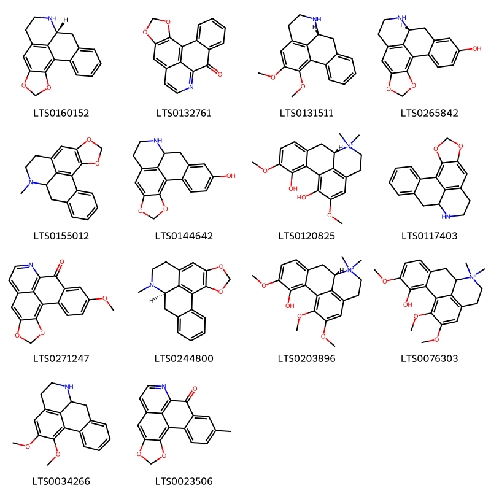{ width=100% }
    <figcaption>Hình ảnh cấu trúc hóa học của 14 hoạt chất thuộc nhóm Aporphines gồm ['anonaine (LTS0160152)', 'liriodenine (LTS0132761)', '(9r)-15,16-dimethoxy-10-azatetracyclo[7.7.1.0²,⁷.0¹³,¹⁷]heptadeca-1(16),2,4,6,13(17),14-hexaene (LTS0131511)', 'anolobine (LTS0265842)', '11-methyl-3,5-dioxa-11-azapentacyclo[10.7.1.0²,⁶.0⁸,²⁰.0¹⁴,¹⁹]icosa-1(20),2(6),7,14,16,18-hexaene (LTS0155012)', '3,5-dioxa-11-azapentacyclo[10.7.1.0²,⁶.0⁸,²⁰.0¹⁴,¹⁹]icosa-1(20),2(6),7,14,16,18-hexaen-16-ol (LTS0144642)', 'magnoflorine (LTS0120825)', '3,5-dioxa-11-azapentacyclo[10.7.1.0²,⁶.0⁸,²⁰.0¹⁴,¹⁹]icosa-1(20),2(6),7,14,16,18-hexaene (LTS0117403)', 'lanuginosine (LTS0271247)', '(12r)-11-methyl-3,5-dioxa-11-azapentacyclo[10.7.1.0²,⁶.0⁸,²⁰.0¹⁴,¹⁹]icosa-1(20),2(6),7,14,16,18-hexaene (LTS0244800)', '(9s)-3-hydroxy-4,15,16-trimethoxy-10,10-dimethyl-10-azatetracyclo[7.7.1.0²,⁷.0¹³,¹⁷]heptadeca-1(16),2,4,6,13(17),14-hexaen-10-ium (LTS0203896)', '3-hydroxy-4,15,16-trimethoxy-10,10-dimethyl-10-azatetracyclo[7.7.1.0²,⁷.0¹³,¹⁷]heptadeca-1(16),2,4,6,13(17),14-hexaen-10-ium (LTS0076303)', 'nornuciferine (LTS0034266)', '16-methyl-3,5-dioxa-11-azapentacyclo[10.7.1.0²,⁶.0⁸,²⁰.0¹⁴,¹⁹]icosa-1(20),2(6),7,9,11,14,16,18-octaen-13-one (LTS0023506)'].</figcaption>
</figure>
#### Nhóm Benzene and substituted derivatives
<figure markdown="span">
    { width=100% }
    <figcaption>Hình ảnh cấu trúc hóa học của 1 hoạt chất thuộc nhóm Benzene and substituted derivatives gồm ['syringic acid (LTS0210036)'].</figcaption>
</figure>
#### Nhóm Coumarins and derivatives
<figure markdown="span">
    { width=100% }
    <figcaption>Hình ảnh cấu trúc hóa học của 1 hoạt chất thuộc nhóm Coumarins and derivatives gồm ['scoparone (LTS0210705)'].</figcaption>
</figure>
#### Nhóm Fatty Acyls
<figure markdown="span">
    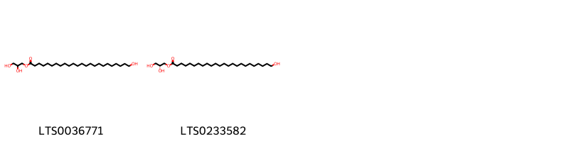{ width=100% }
    <figcaption>Hình ảnh cấu trúc hóa học của 2 hoạt chất thuộc nhóm Fatty Acyls gồm ['2,3-dihydroxypropyl 24-hydroxytetracosanoate (LTS0036771)', '(2r)-2,3-dihydroxypropyl 24-hydroxytetracosanoate (LTS0233582)'].</figcaption>
</figure>
#### Nhóm Furanoid lignans
<figure markdown="span">
    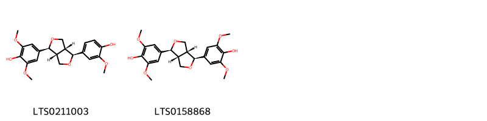{ width=100% }
    <figcaption>Hình ảnh cấu trúc hóa học của 2 hoạt chất thuộc nhóm Furanoid lignans gồm ['(-)-medioresinol (LTS0211003)', '(+)-syringaresinol (LTS0158868)'].</figcaption>
</figure>
#### Nhóm Glycerolipids
<figure markdown="span">
    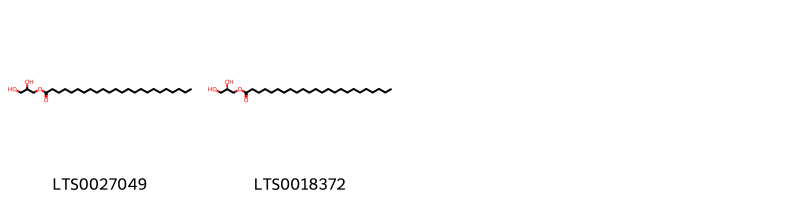{ width=100% }
    <figcaption>Hình ảnh cấu trúc hóa học của 2 hoạt chất thuộc nhóm Glycerolipids gồm ['2,3-dihydroxypropyl tetracosanoate (LTS0027049)', '(2r)-2,3-dihydroxypropyl tetracosanoate (LTS0018372)'].</figcaption>
</figure>
#### Nhóm Lignan glycosides
<figure markdown="span">
    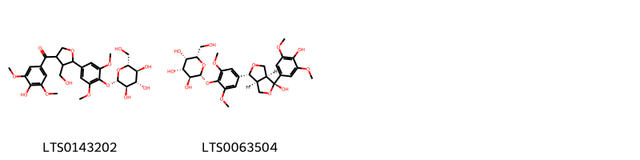{ width=100% }
    <figcaption>Hình ảnh cấu trúc hóa học của 2 hoạt chất thuộc nhóm Lignan glycosides gồm ['(2s,3r,4s,5s,6r)-2-{4-[4-(4-hydroxy-3,5-dimethoxybenzoyl)-3-(hydroxymethyl)oxolan-2-yl]-2,6-dimethoxyphenoxy}-6-(hydroxymethyl)oxane-3,4,5-triol (LTS0143202)', '(2r,3s,4r,5s,6s)-2-{4-[(1r,3as,4r,6as)-4-hydroxy-4-(4-hydroxy-3,5-dimethoxyphenyl)-tetrahydro-1h-furo[3,4-c]furan-1-yl]-2,6-dimethoxyphenoxy}-6-(hydroxymethyl)oxane-3,4,5-triol (LTS0063504)'].</figcaption>
</figure>
#### Nhóm Naphthalenes
<figure markdown="span">
    { width=100% }
    <figcaption>Hình ảnh cấu trúc hóa học của 1 hoạt chất thuộc nhóm Naphthalenes gồm ['naphthalene (LTS0254484)'].</figcaption>
</figure>
#### Nhóm Organooxygen compounds
<figure markdown="span">
    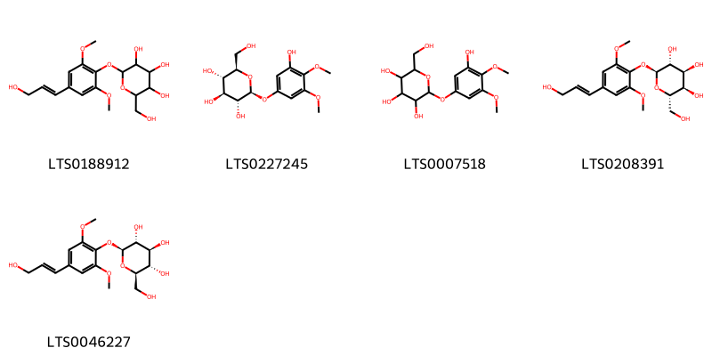{ width=100% }
    <figcaption>Hình ảnh cấu trúc hóa học của 5 hoạt chất thuộc nhóm Organooxygen compounds gồm ['2-(hydroxymethyl)-6-[4-(3-hydroxyprop-1-en-1-yl)-2,6-dimethoxyphenoxy]oxane-3,4,5-triol (LTS0188912)', '(2s,3r,4s,5s,6r)-2-(3-hydroxy-4,5-dimethoxyphenoxy)-6-(hydroxymethyl)oxane-3,4,5-triol (LTS0227245)', '2-(3-hydroxy-4,5-dimethoxyphenoxy)-6-(hydroxymethyl)oxane-3,4,5-triol (LTS0007518)', '(2s,3r,4s,5r,6s)-2-(hydroxymethyl)-6-{4-[(1e)-3-hydroxyprop-1-en-1-yl]-2,6-dimethoxyphenoxy}oxane-3,4,5-triol (LTS0208391)', 'syringin (LTS0046227)'].</figcaption>
</figure>
#### Nhóm Phenols
<figure markdown="span">
    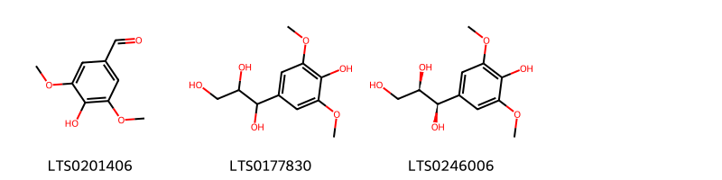{ width=100% }
    <figcaption>Hình ảnh cấu trúc hóa học của 3 hoạt chất thuộc nhóm Phenols gồm ['syringaldehyde (LTS0201406)', '1-(4-hydroxy-3,5-dimethoxyphenyl)propane-1,2,3-triol (LTS0177830)', '(1r,2r)-1-(4-hydroxy-3,5-dimethoxyphenyl)propane-1,2,3-triol (LTS0246006)'].</figcaption>
</figure>
#### Nhóm Prenol lipids
<figure markdown="span">
    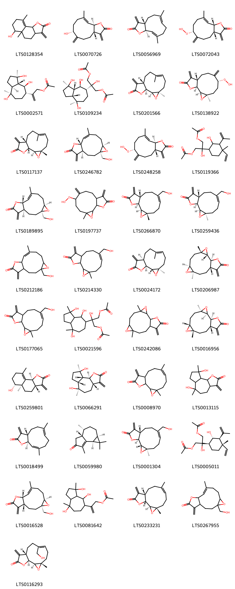{ width=100% }
    <figcaption>Hình ảnh cấu trúc hóa học của 37 hoạt chất thuộc nhóm Prenol lipids gồm ['6-hydroxy-5a,9-dimethyl-3-methylidene-3ah,4h,5h,6h,7h,8h,9bh-naphtho[1,2-b]furan-2-one (LTS0128354)', 'artemorin (LTS0070726)', 'costunolide (LTS0056969)', '(3as,7r,11as)-7-hydroperoxy-10-methyl-3,6-dimethylidene-3ah,4h,5h,7h,8h,9h,11ah-cyclodeca[b]furan-2-one (LTS0072043)', '2-[(3r,3as,4s,5s,8r,8as)-3,4,8-trihydroxy-3,8-dimethyl-octahydroazulen-5-yl]prop-2-en-1-yl acetate (LTS0002571)', '2-[(3r,3as,4s,5r,8r,8ar)-3,4,8-trihydroxy-3,8-dimethyl-octahydroazulen-5-yl]-3-(acetyloxy)-2-hydroxypropyl acetate (LTS0109234)', 'parthenolide (LTS0201566)', '(1s,2s,4r,7r,11s)-7-hydroperoxy-4-methyl-8,12-dimethylidene-3,14-dioxatricyclo[9.3.0.0²,⁴]tetradecan-13-one (LTS0138922)', '(1r,2s,4s,7e,11s)-4,8-dimethyl-12-methylidene-3,14-dioxatricyclo[9.3.0.0²,⁴]tetradec-7-en-13-one (LTS0117137)', '(1s,4r,6r,9z,11r)-4-(hydroxymethyl)-9-methyl-14-methylidene-5,12-dioxatricyclo[9.3.0.0⁴,⁶]tetradec-9-en-13-one (LTS0246782)', 'verlotorin (LTS0248258)', '3-(acetyloxy)-2-[4-ethenyl-2-hydroxy-4-methyl-3-(prop-1-en-2-yl)cyclohexyl]-2-hydroxypropyl acetate (LTS0119366)', '(1s,4r,6r,9e,11r)-4-(hydroxymethyl)-9-methyl-14-methylidene-5,12-dioxatricyclo[9.3.0.0⁴,⁶]tetradec-9-en-13-one (LTS0189895)', '7-hydroperoxy-4-methyl-8,12-dimethylidene-3,14-dioxatricyclo[9.3.0.0²,⁴]tetradecan-13-one (LTS0197737)', '(1s,2s,4s,11s)-8-(hydroxymethyl)-4-methyl-12-methylidene-3,14-dioxatricyclo[9.3.0.0²,⁴]tetradec-7-en-13-one (LTS0266870)', '(1s,2s,4r,7e,11s)-8-(hydroxymethyl)-4-methyl-12-methylidene-3,14-dioxatricyclo[9.3.0.0²,⁴]tetradec-7-en-13-one (LTS0259436)', '4-(hydroxymethyl)-9-methyl-14-methylidene-5,12-dioxatricyclo[9.3.0.0⁴,⁶]tetradec-9-en-13-one (LTS0212186)', '8-(hydroxymethyl)-4-methyl-12-methylidene-3,14-dioxatricyclo[9.3.0.0²,⁴]tetradec-7-en-13-one (LTS0214330)', '(1s,2r,4r,7e,11r)-4,8-dimethyl-12-methylidene-3,14-dioxatricyclo[9.3.0.0²,⁴]tetradec-7-en-13-one (LTS0024172)', '(1s,2r,4s,7s,9r,12s)-4,9-dimethyl-13-methylidene-3,8,15-trioxatetracyclo[10.3.0.0²,⁴.0⁷,⁹]pentadecan-14-one (LTS0206987)', '(7e)-8-(hydroxymethyl)-4-methyl-12-methylidene-3,14-dioxatricyclo[9.3.0.0²,⁴]tetradec-7-en-13-one (LTS0177065)', '3-(acetyloxy)-2-hydroxy-2-(3,4,8-trihydroxy-3,8-dimethyl-octahydroazulen-5-yl)propyl acetate (LTS0021596)', '4,9-dimethyl-13-methylidene-3,8,15-trioxatetracyclo[10.3.0.0²,⁴.0⁷,⁹]pentadecan-14-one (LTS0242086)', '(1s,2s,4r,7r,9s,12s)-4,9-dimethyl-13-methylidene-3,8,15-trioxatetracyclo[10.3.0.0²,⁴.0⁷,⁹]pentadecan-14-one (LTS0016956)', '(3as,5ar,6r,9bs)-6-hydroxy-5a,9-dimethyl-3-methylidene-3ah,4h,5h,6h,7h,8h,9bh-naphtho[1,2-b]furan-2-one (LTS0259801)', '(3as,6r,6ar,9r,9as,9bs)-6,9-dihydroxy-6,9-dimethyl-3-methylidene-octahydroazuleno[4,5-b]furan-2-one (LTS0066291)', '4,8-dimethyl-12-methylidene-3,14-dioxatricyclo[9.3.0.0²,⁴]tetradec-7-en-13-one (LTS0008970)', '6,9-dihydroxy-6,9-dimethyl-3-methylidene-octahydroazuleno[4,5-b]furan-2-one (LTS0013115)', 'costunolide (LTS0018499)', '(1ar,4r,4ar,7bs)-1,1,4,7-tetramethyl-1ah,2h,3h,4h,4ah,5h,7bh-cyclopropa[e]azulen-6-one (LTS0059980)', '(1s,2r,4r,7e,11s)-8-(hydroxymethyl)-4-methyl-12-methylidene-3,14-dioxatricyclo[9.3.0.0²,⁴]tetradec-7-en-13-one (LTS0001304)', '3-(acetyloxy)-2-[(1r,2r,3s,4s)-4-ethenyl-2-hydroxy-4-methyl-3-(prop-1-en-2-yl)cyclohexyl]-2-hydroxypropyl acetate (LTS0005011)', '(1r,4r,6r,9e,11r)-4-(hydroxymethyl)-9-methyl-14-methylidene-5,12-dioxatricyclo[9.3.0.0⁴,⁶]tetradec-9-en-13-one (LTS0016528)', '2-(3,4,8-trihydroxy-3,8-dimethyl-octahydroazulen-5-yl)prop-2-en-1-yl acetate (LTS0081642)', '(1r,2s,4s,11s)-4,8-dimethyl-12-methylidene-3,14-dioxatricyclo[9.3.0.0²,⁴]tetradec-7-en-13-one (LTS0233231)', '(9e)-4-(hydroxymethyl)-9-methyl-14-methylidene-5,12-dioxatricyclo[9.3.0.0⁴,⁶]tetradec-9-en-13-one (LTS0267955)', '(1s,2s,4s,7z,11s)-8-(hydroxymethyl)-4-methyl-12-methylidene-3,14-dioxatricyclo[9.3.0.0²,⁴]tetradec-7-en-13-one (LTS0116293)'].</figcaption>
</figure>
#### Nhóm Saturated hydrocarbons
<figure markdown="span">
    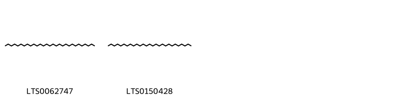{ width=100% }
    <figcaption>Hình ảnh cấu trúc hóa học của 2 hoạt chất thuộc nhóm Saturated hydrocarbons gồm ['nonacosane (LTS0062747)', 'heptacosane (LTS0150428)'].</figcaption>
</figure>
#### Nhóm Steroids and steroid derivatives
<figure markdown="span">
    { width=100% }
    <figcaption>Hình ảnh cấu trúc hóa học của 2 hoạt chất thuộc nhóm Steroids and steroid derivatives gồm ['sitogluside (LTS0201798)', '2-{[1-(5-ethyl-6-methylheptan-2-yl)-9a,11a-dimethyl-1h,2h,3h,3ah,3bh,4h,6h,7h,8h,9h,9bh,10h,11h-cyclopenta[a]phenanthren-7-yl]oxy}-6-(hydroxymethyl)oxane-3,4,5-triol (LTS0158828)'].</figcaption>
</figure>

---

### Dược dân tộc học

Danh sách các quốc gia có sử dụng *Magnolia grandiflora* trong điều trị các bệnh. 

| Country   | Disease                       | Bệnh                                       |
|:----------|:------------------------------|:-------------------------------------------|
| Elsewhere | Hypotensive, Stimulant        | Hạ huyết áp, Kích thích                    |
| US        | Diaphoretic, Stimulant, Tonic | Thuốc lợi tiểu, thuốc kích thích, thuốc bổ |

---

---
## Magnolia hypoleuca
### Thông tin về thực vật

!!! info "Phân loại thực vật của *Magnolia obovata* từ GIBF:"
    - **Kingdom:** Plantae
    - **Phylum:** Tracheophyta
    - **Order:** Magnoliales
    - **Family:** Magnoliaceae
    - **Genus:** Magnolia
    - **Species:** *Magnolia obovata*

 

| Label (VI)   | Label (EN)   | Scientific Name    | Descriptions (VI)   | Descriptions (EN)   | Also Known As (VI)   | Also Known As (EN)   |
|:-------------|:-------------|:-------------------|:--------------------|:--------------------|:---------------------|:---------------------|
| N/A          | N/A          | Magnolia hypoleuca |                     | species of plant    | ['']                 | ['']                 |

#### Phân bố trên thế giới

**Từ CSDL GIBF** nan, unknown or invalid, United Kingdom of Great Britain and Northern Ireland, Japan, United States of America, Italy, China, Netherlands

#### Phân bố tại Việt Nam

**Từ CSDL GIBF**: Không có ghi nhận ở Việt Nam

---
### Thành phần hóa học
        
- Theo cơ sở dữ liệu lotus: Từ loài *Magnolia obovata* đã phân lập và xác định được Chưa có hoạt chất nào được phân lập. hoạt chất thuộc về các nhóm Không có hoạt chất nào được phân lập. 

Không có hình ảnh nào được tạo ra

---

### Dược dân tộc học

Danh sách các quốc gia có sử dụng *Magnolia obovata* trong điều trị các bệnh. 

| Country   | Disease         | Bệnh                                                                                                                                                                                                |
|:----------|:----------------|:----------------------------------------------------------------------------------------------------------------------------------------------------------------------------------------------------|
| China     | Tonic, Laxative | MYMEMORY WARNING: YOU USED ALL AVAILABLE FREE TRANSLATIONS FOR TODAY. NEXT AVAILABLE IN  20 HOURS 07 MINUTES 08 SECONDS VISIT HTTPS://MYMEMORY.TRANSLATED.NET/DOC/USAGELIMITS.PHP TO TRANSLATE MORE |

---

---
## Magnolia kobus
### Thông tin về thực vật

!!! info "Phân loại thực vật của *Magnolia kobus* từ GIBF:"
    - **Kingdom:** Plantae
    - **Phylum:** Tracheophyta
    - **Order:** Magnoliales
    - **Family:** Magnoliaceae
    - **Genus:** Magnolia
    - **Species:** *Magnolia kobus*

 

| Label (VI)   | Label (EN)   | Scientific Name   | Descriptions (VI)   | Descriptions (EN)   | Also Known As (VI)   | Also Known As (EN)   |
|:-------------|:-------------|:------------------|:--------------------|:--------------------|:---------------------|:---------------------|
| N/A          | N/A          | Magnolia kobus    | loài thực vật       | species of plant    | ['']                 | ['']                 |

#### Phân bố trên thế giới

**Từ CSDL GIBF** nan, United Kingdom of Great Britain and Northern Ireland, Japan, Latvia, Germany, Estonia, Canada, Russian Federation, United States of America, Austria, Belgium, Korea, Republic of

#### Phân bố tại Việt Nam

**Từ CSDL GIBF**: Không có ghi nhận ở Việt Nam

---
### Thành phần hóa học
        
- Theo cơ sở dữ liệu lotus: Từ loài *Magnolia kobus* đã phân lập và xác định được 49 hoạt chất thuộc về các nhóm Furanoid lignans, Aporphines, Isoquinolines and derivatives, Oxanes, Prenol lipids, Benzodioxoles, Pyridines and derivatives, Benzene and substituted derivatives. 

|    | chemicalTaxonomyClassyfireClass     |   smiles_count |
|---:|:------------------------------------|---------------:|
|  0 | Aporphines                          |             11 |
|  1 | Benzene and substituted derivatives |              1 |
|  2 | Benzodioxoles                       |              2 |
|  3 | Furanoid lignans                    |             24 |
|  4 | Isoquinolines and derivatives       |              1 |
|  5 | Oxanes                              |              1 |
|  6 | Prenol lipids                       |              8 |
|  7 | Pyridines and derivatives           |              1 |

#### Nhóm Aporphines
<figure markdown="span">
    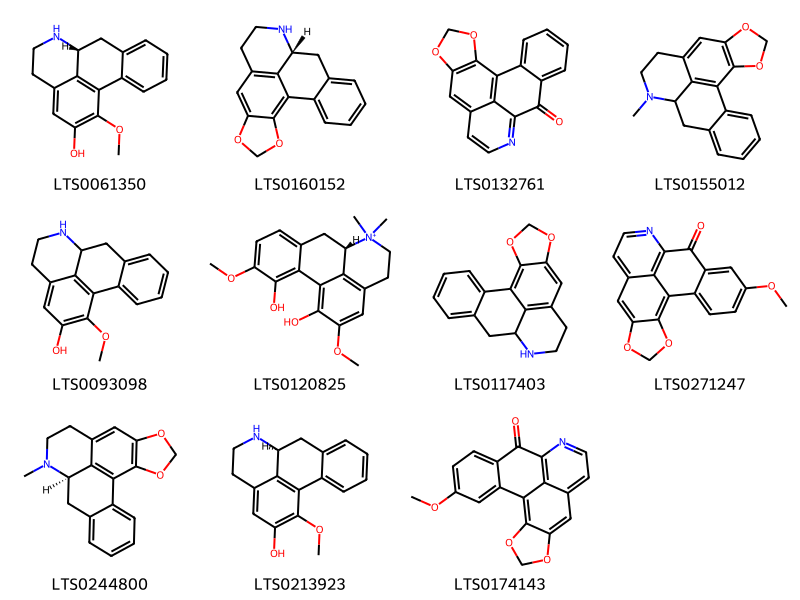{ width=100% }
    <figcaption>Hình ảnh cấu trúc hóa học của 11 hoạt chất thuộc nhóm Aporphines gồm ['r-(-)-asimilobine (LTS0061350)', 'anonaine (LTS0160152)', 'liriodenine (LTS0132761)', '11-methyl-3,5-dioxa-11-azapentacyclo[10.7.1.0²,⁶.0⁸,²⁰.0¹⁴,¹⁹]icosa-1(20),2(6),7,14,16,18-hexaene (LTS0155012)', '16-methoxy-10-azatetracyclo[7.7.1.0²,⁷.0¹³,¹⁷]heptadeca-1(17),2,4,6,13,15-hexaen-15-ol (LTS0093098)', 'magnoflorine (LTS0120825)', '3,5-dioxa-11-azapentacyclo[10.7.1.0²,⁶.0⁸,²⁰.0¹⁴,¹⁹]icosa-1(20),2(6),7,14,16,18-hexaene (LTS0117403)', 'lanuginosine (LTS0271247)', '(12r)-11-methyl-3,5-dioxa-11-azapentacyclo[10.7.1.0²,⁶.0⁸,²⁰.0¹⁴,¹⁹]icosa-1(20),2(6),7,14,16,18-hexaene (LTS0244800)', 'asimilobine (LTS0213923)', '17-methoxy-3,5-dioxa-11-azapentacyclo[10.7.1.0²,⁶.0⁸,²⁰.0¹⁴,¹⁹]icosa-1,6,8,10,12(20),14,16,18-octaen-13-one (LTS0174143)'].</figcaption>
</figure>
#### Nhóm Benzene and substituted derivatives
<figure markdown="span">
    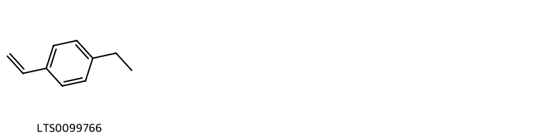{ width=100% }
    <figcaption>Hình ảnh cấu trúc hóa học của 1 hoạt chất thuộc nhóm Benzene and substituted derivatives gồm ['p-ethylstyrene (LTS0099766)'].</figcaption>
</figure>
#### Nhóm Benzodioxoles
<figure markdown="span">
    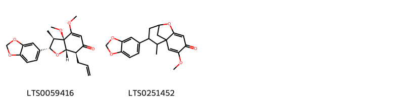{ width=100% }
    <figcaption>Hình ảnh cấu trúc hóa học của 2 hoạt chất thuộc nhóm Benzodioxoles gồm ['fargesone a (LTS0059416)', '10-(2h-1,3-benzodioxol-5-yl)-3-methoxy-11-methyl-7-oxatricyclo[6.3.1.0¹,⁶]dodeca-2,5-dien-4-one (LTS0251452)'].</figcaption>
</figure>
#### Nhóm Furanoid lignans
<figure markdown="span">
    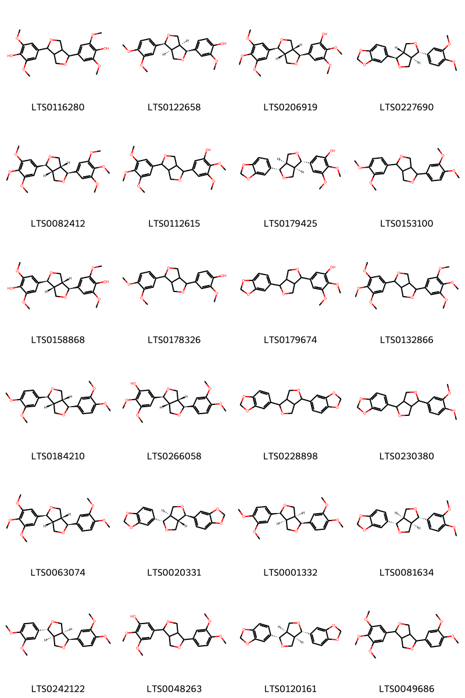{ width=100% }
    <figcaption>Hình ảnh cấu trúc hóa học của 24 hoạt chất thuộc nhóm Furanoid lignans gồm ['syringaresinol (LTS0116280)', '4-[(1s,3as,4s,6as)-4-(3,4-dimethoxyphenyl)-hexahydrofuro[3,4-c]furan-1-yl]-2-methoxyphenol (LTS0122658)', '5-[(1s,3ar,4s,6ar)-4-(3,4,5-trimethoxyphenyl)-hexahydrofuro[3,4-c]furan-1-yl]-2,3-dimethoxyphenol (LTS0206919)', '5-[(1r,3ar,4s,6as)-4-(3,4-dimethoxyphenyl)-hexahydrofuro[3,4-c]furan-1-yl]-2h-1,3-benzodioxole (LTS0227690)', '( )-yangabin (LTS0082412)', '2,3-dimethoxy-5-[4-(3,4,5-trimethoxyphenyl)-hexahydrofuro[3,4-c]furan-1-yl]phenol (LTS0112615)', '5-[(1s,3ar,4s,6ar)-4-(2h-1,3-benzodioxol-5-yl)-hexahydrofuro[3,4-c]furan-1-yl]-2,3-dimethoxyphenol (LTS0179425)', '1,4-bis(3,4-dimethoxyphenyl)-hexahydrofuro[3,4-c]furan (LTS0153100)', '(+)-syringaresinol (LTS0158868)', '4-[4-(3,4-dimethoxyphenyl)-hexahydrofuro[3,4-c]furan-1-yl]-2-methoxyphenol (LTS0178326)', '5-[4-(2h-1,3-benzodioxol-5-yl)-hexahydrofuro[3,4-c]furan-1-yl]-2,3-dimethoxyphenol (LTS0179674)', '1,4-bis(3,4,5-trimethoxyphenyl)-hexahydrofuro[3,4-c]furan (LTS0132866)', 'eudesmin (LTS0184210)', '5-[(1s,3ar,4s,6ar)-4-(3,4-dimethoxyphenyl)-hexahydrofuro[3,4-c]furan-1-yl]-2,3-dimethoxyphenol (LTS0266058)', 'sesamin (LTS0228898)', '5-[4-(3,4-dimethoxyphenyl)-hexahydrofuro[3,4-c]furan-1-yl]-2h-1,3-benzodioxole (LTS0230380)', '(1s,3ar,4s,6ar)-1-(3,4-dimethoxyphenyl)-4-(3,4,5-trimethoxyphenyl)-hexahydrofuro[3,4-c]furan (LTS0063074)', '5-[(1s,3as,4r,6ar)-4-(2h-1,3-benzodioxol-5-yl)-hexahydrofuro[3,4-c]furan-1-yl]-2h-1,3-benzodioxole (LTS0020331)', '(1s,3as,4s,6as)-1,4-bis(3,4-dimethoxyphenyl)-hexahydrofuro[3,4-c]furan (LTS0001332)', '5-[(1s,3ar,4s,6ar)-4-(3,4-dimethoxyphenyl)-hexahydrofuro[3,4-c]furan-1-yl]-2h-1,3-benzodioxole (LTS0081634)', '(1r,3as,4s,6as)-1,4-bis(3,4-dimethoxyphenyl)-hexahydrofuro[3,4-c]furan (LTS0242122)', '5-[4-(3,4-dimethoxyphenyl)-hexahydrofuro[3,4-c]furan-1-yl]-2,3-dimethoxyphenol (LTS0048263)', 'sesamin (LTS0120161)', '1-(3,4-dimethoxyphenyl)-4-(3,4,5-trimethoxyphenyl)-hexahydrofuro[3,4-c]furan (LTS0049686)'].</figcaption>
</figure>
#### Nhóm Isoquinolines and derivatives
<figure markdown="span">
    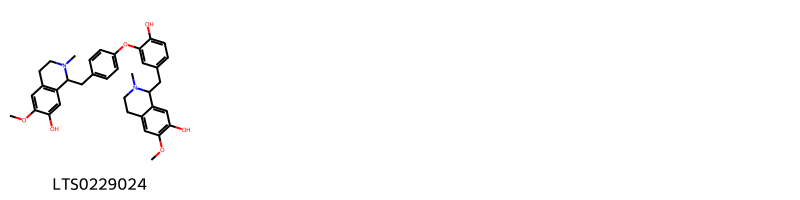{ width=100% }
    <figcaption>Hình ảnh cấu trúc hóa học của 1 hoạt chất thuộc nhóm Isoquinolines and derivatives gồm ['magnoline (LTS0229024)'].</figcaption>
</figure>
#### Nhóm Oxanes
<figure markdown="span">
    { width=100% }
    <figcaption>Hình ảnh cấu trúc hóa học của 1 hoạt chất thuộc nhóm Oxanes gồm ['rose oxide (LTS0036561)'].</figcaption>
</figure>
#### Nhóm Prenol lipids
<figure markdown="span">
    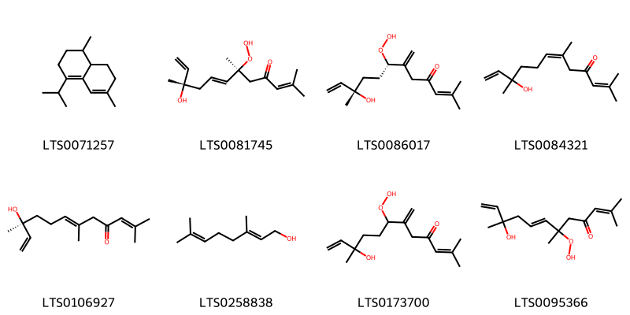{ width=100% }
    <figcaption>Hình ảnh cấu trúc hóa học của 8 hoạt chất thuộc nhóm Prenol lipids gồm ['4-isopropyl-1,6-dimethyl-1,2,3,7,8,8a-hexahydronaphthalene (LTS0071257)', '(6s,7e,10s)-6-hydroperoxy-10-hydroxy-2,6,10-trimethyldodeca-2,7,11-trien-4-one (LTS0081745)', '(7s,10s)-7-hydroperoxy-10-hydroxy-2,10-dimethyl-6-methylidenedodeca-2,11-dien-4-one (LTS0086017)', '10-hydroxy-2,6,10-trimethyldodeca-2,6,11-trien-4-one (LTS0084321)', '(6e,10s)-10-hydroxy-2,6,10-trimethyldodeca-2,6,11-trien-4-one (LTS0106927)', 'geraniol (LTS0258838)', '7-hydroperoxy-10-hydroxy-2,10-dimethyl-6-methylidenedodeca-2,11-dien-4-one (LTS0173700)', '6-hydroperoxy-10-hydroxy-2,6,10-trimethyldodeca-2,7,11-trien-4-one (LTS0095366)'].</figcaption>
</figure>
#### Nhóm Pyridines and derivatives
<figure markdown="span">
    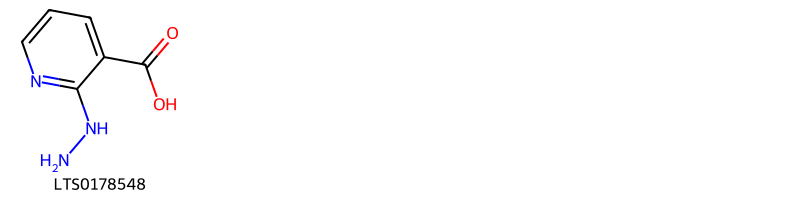{ width=100% }
    <figcaption>Hình ảnh cấu trúc hóa học của 1 hoạt chất thuộc nhóm Pyridines and derivatives gồm ['2-hydrazinylpyridine-3-carboxylic acid (LTS0178548)'].</figcaption>
</figure>

---

### Dược dân tộc học

Danh sách các quốc gia có sử dụng *Magnolia kobus* trong điều trị các bệnh. 

| Country   | Disease   | Bệnh                                                                                                                                                                                                |
|:----------|:----------|:----------------------------------------------------------------------------------------------------------------------------------------------------------------------------------------------------|
| Chinese   | Sedative  | MYMEMORY WARNING: YOU USED ALL AVAILABLE FREE TRANSLATIONS FOR TODAY. NEXT AVAILABLE IN  20 HOURS 06 MINUTES 47 SECONDS VISIT HTTPS://MYMEMORY.TRANSLATED.NET/DOC/USAGELIMITS.PHP TO TRANSLATE MORE |

---

---
## Magnolia liliflora
### Thông tin về thực vật

!!! info "Phân loại thực vật của *Magnolia liliiflora* từ GIBF:"
    - **Kingdom:** Plantae
    - **Phylum:** Tracheophyta
    - **Order:** Magnoliales
    - **Family:** Magnoliaceae
    - **Genus:** Magnolia
    - **Species:** *Magnolia liliiflora*

 

| Label (VI)   | Label (EN)   | Scientific Name    | Descriptions (VI)   | Descriptions (EN)   | Also Known As (VI)   | Also Known As (EN)   |
|:-------------|:-------------|:-------------------|:--------------------|:--------------------|:---------------------|:---------------------|
| N/A          | N/A          | Magnolia liliflora | loài thực vật       | species of plant    | ['']                 | ['']                 |

#### Phân bố trên thế giới

**Từ CSDL GIBF** nan, Viet Nam, unknown or invalid, Spain, Germany, Austria, Australia, Korea, Republic of, Serbia, Bhutan, Poland, India, Canada, Kazakhstan, Belgium, Japan, Brazil, China, Norway, Hong Kong, Chinese Taipei, Switzerland, United Kingdom of Great Britain and Northern Ireland, Argentina, South Africa, France, New Zealand, Papua New Guinea, Russian Federation, United States of America, Ukraine

#### Phân bố tại Việt Nam

**Từ CSDL GIBF**: Quang Binh

---
### Thành phần hóa học
        
- Theo cơ sở dữ liệu lotus: Từ loài *Magnolia liliiflora* đã phân lập và xác định được Chưa có hoạt chất nào được phân lập. hoạt chất thuộc về các nhóm Không có hoạt chất nào được phân lập. 

Không có hình ảnh nào được tạo ra

---

### Dược dân tộc học

Danh sách các quốc gia có sử dụng *Magnolia liliiflora* trong điều trị các bệnh. 

| Country   | Disease          | Bệnh                                                                                                                                                                                                |
|:----------|:-----------------|:----------------------------------------------------------------------------------------------------------------------------------------------------------------------------------------------------|
| China     | Tonic, Analgesic | MYMEMORY WARNING: YOU USED ALL AVAILABLE FREE TRANSLATIONS FOR TODAY. NEXT AVAILABLE IN  20 HOURS 06 MINUTES 14 SECONDS VISIT HTTPS://MYMEMORY.TRANSLATED.NET/DOC/USAGELIMITS.PHP TO TRANSLATE MORE |
| Elsewhere | Sedative         | MYMEMORY WARNING: YOU USED ALL AVAILABLE FREE TRANSLATIONS FOR TODAY. NEXT AVAILABLE IN  20 HOURS 06 MINUTES 11 SECONDS VISIT HTTPS://MYMEMORY.TRANSLATED.NET/DOC/USAGELIMITS.PHP TO TRANSLATE MORE |

---

---
## Magnolia obovata
### Thông tin về thực vật

!!! info "Phân loại thực vật của *Magnolia obovata* từ GIBF:"
    - **Kingdom:** Plantae
    - **Phylum:** Tracheophyta
    - **Order:** Magnoliales
    - **Family:** Magnoliaceae
    - **Genus:** Magnolia
    - **Species:** *Magnolia obovata*

 

| Label (VI)   | Label (EN)   | Scientific Name   | Descriptions (VI)   | Descriptions (EN)   | Also Known As (VI)   | Also Known As (EN)                                                                                              |
|:-------------|:-------------|:------------------|:--------------------|:--------------------|:---------------------|:----------------------------------------------------------------------------------------------------------------|
| N/A          | N/A          | Magnolia obovata  | loài thực vật       | species of plant    | ['']                 | ['Japanese Big Leaf Magnolia', 'Japanese Whitebark Magnolia', 'Whiteleaf Japanese Magnolia', 'Honoki Magnolia'] |

#### Phân bố trên thế giới

**Từ CSDL GIBF** Japan, New Zealand, Germany, Russian Federation, Belgium, Korea, Republic of

#### Phân bố tại Việt Nam

**Từ CSDL GIBF**: Không có ghi nhận ở Việt Nam

---
### Thành phần hóa học
        
- Theo cơ sở dữ liệu lotus: Từ loài *Magnolia obovata* đã phân lập và xác định được 105 hoạt chất thuộc về các nhóm Stilbenes, Organooxygen compounds, Aporphines, Coumarins and derivatives, Isoquinolines and derivatives, Saturated hydrocarbons, Prenol lipids, Lignan glycosides, Phenols, Cinnamic acids and derivatives, Benzodioxanes, Steroids and steroid derivatives, Benzene and substituted derivatives. 

|    | chemicalTaxonomyClassyfireClass     |   smiles_count |
|---:|:------------------------------------|---------------:|
|  0 | Aporphines                          |             19 |
|  1 | Benzene and substituted derivatives |             20 |
|  2 | Benzodioxanes                       |              3 |
|  3 | Cinnamic acids and derivatives      |              4 |
|  4 | Coumarins and derivatives           |              1 |
|  5 | Isoquinolines and derivatives       |              3 |
|  6 | Lignan glycosides                   |              5 |
|  7 | Organooxygen compounds              |             10 |
|  8 | Phenols                             |              1 |
|  9 | Prenol lipids                       |             35 |
| 10 | Saturated hydrocarbons              |              1 |
| 11 | Steroids and steroid derivatives    |              2 |
| 12 | Stilbenes                           |              1 |

#### Nhóm Aporphines
<figure markdown="span">
    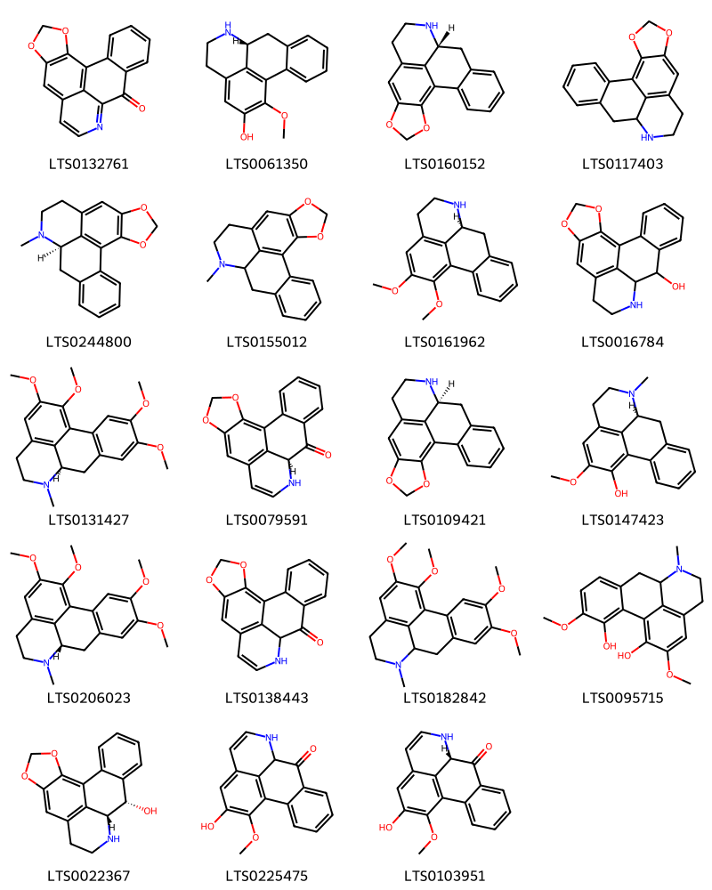{ width=100% }
    <figcaption>Hình ảnh cấu trúc hóa học của 19 hoạt chất thuộc nhóm Aporphines gồm ['liriodenine (LTS0132761)', 'r-(-)-asimilobine (LTS0061350)', 'anonaine (LTS0160152)', '3,5-dioxa-11-azapentacyclo[10.7.1.0²,⁶.0⁸,²⁰.0¹⁴,¹⁹]icosa-1(20),2(6),7,14,16,18-hexaene (LTS0117403)', '(12r)-11-methyl-3,5-dioxa-11-azapentacyclo[10.7.1.0²,⁶.0⁸,²⁰.0¹⁴,¹⁹]icosa-1(20),2(6),7,14,16,18-hexaene (LTS0244800)', '11-methyl-3,5-dioxa-11-azapentacyclo[10.7.1.0²,⁶.0⁸,²⁰.0¹⁴,¹⁹]icosa-1(20),2(6),7,14,16,18-hexaene (LTS0155012)', '(9s)-15,16-dimethoxy-10-azatetracyclo[7.7.1.0²,⁷.0¹³,¹⁷]heptadeca-1(16),2,4,6,13(17),14-hexaene (LTS0161962)', '3,5-dioxa-11-azapentacyclo[10.7.1.0²,⁶.0⁸,²⁰.0¹⁴,¹⁹]icosa-1,6,8(20),14,16,18-hexaen-13-ol (LTS0016784)', '(9r)-4,5,15,16-tetramethoxy-10-methyl-10-azatetracyclo[7.7.1.0²,⁷.0¹³,¹⁷]heptadeca-1(16),2(7),3,5,13(17),14-hexaene (LTS0131427)', '(12s)-3,5-dioxa-11-azapentacyclo[10.7.1.0²,⁶.0⁸,²⁰.0¹⁴,¹⁹]icosa-1,6,8(20),9,14,16,18-heptaen-13-one (LTS0079591)', '(12s)-3,5-dioxa-11-azapentacyclo[10.7.1.0²,⁶.0⁸,²⁰.0¹⁴,¹⁹]icosa-1(20),2(6),7,14,16,18-hexaene (LTS0109421)', '(9s)-15-methoxy-10-methyl-10-azatetracyclo[7.7.1.0²,⁷.0¹³,¹⁷]heptadeca-1(16),2,4,6,13(17),14-hexaen-16-ol (LTS0147423)', '(9s)-4,5,15,16-tetramethoxy-10-methyl-10-azatetracyclo[7.7.1.0²,⁷.0¹³,¹⁷]heptadeca-1(16),2(7),3,5,13(17),14-hexaene (LTS0206023)', '3,5-dioxa-11-azapentacyclo[10.7.1.0²,⁶.0⁸,²⁰.0¹⁴,¹⁹]icosa-1,6,8(20),9,14,16,18-heptaen-13-one (LTS0138443)', '4,5,15,16-tetramethoxy-10-methyl-10-azatetracyclo[7.7.1.0²,⁷.0¹³,¹⁷]heptadeca-1(16),2(7),3,5,13(17),14-hexaene (LTS0182842)', '4,15-dimethoxy-10-methyl-10-azatetracyclo[7.7.1.0²,⁷.0¹³,¹⁷]heptadeca-1(16),2,4,6,13(17),14-hexaene-3,16-diol (LTS0095715)', '(12r,13s)-3,5-dioxa-11-azapentacyclo[10.7.1.0²,⁶.0⁸,²⁰.0¹⁴,¹⁹]icosa-1,6,8(20),14,16,18-hexaen-13-ol (LTS0022367)', '15-hydroxy-16-methoxy-10-azatetracyclo[7.7.1.0²,⁷.0¹³,¹⁷]heptadeca-1(17),2,4,6,11,13,15-heptaen-8-one (LTS0225475)', '(9s)-15-hydroxy-16-methoxy-10-azatetracyclo[7.7.1.0²,⁷.0¹³,¹⁷]heptadeca-1(17),2,4,6,11,13,15-heptaen-8-one (LTS0103951)'].</figcaption>
</figure>
#### Nhóm Benzene and substituted derivatives
<figure markdown="span">
    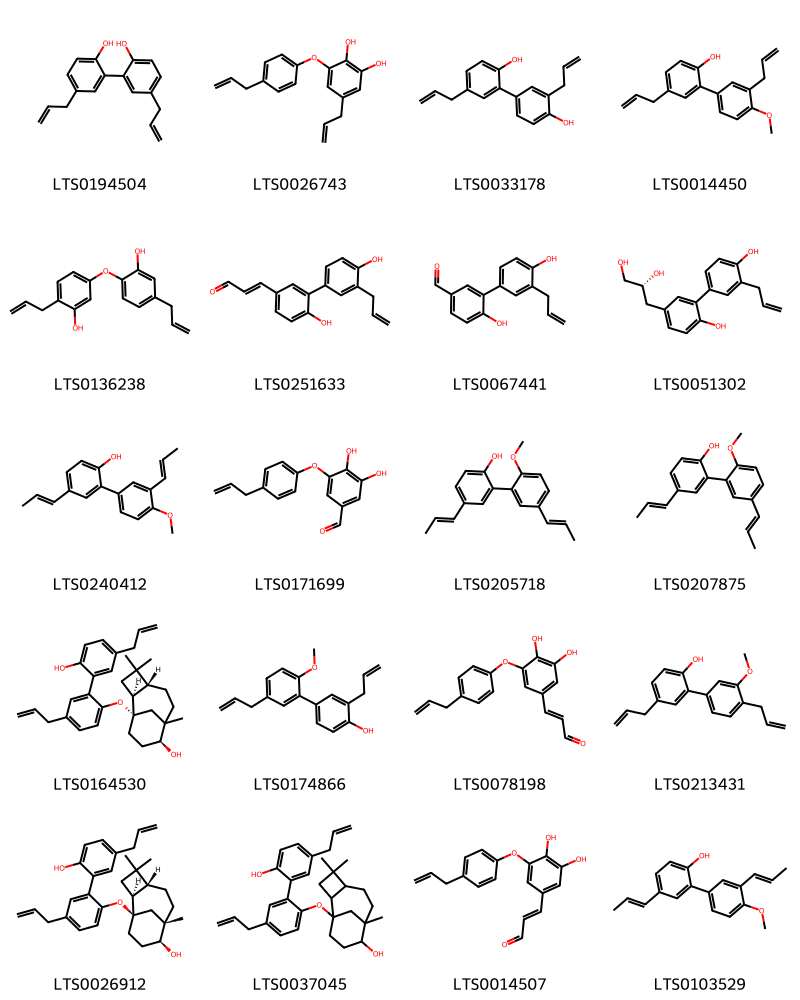{ width=100% }
    <figcaption>Hình ảnh cấu trúc hóa học của 20 hoạt chất thuộc nhóm Benzene and substituted derivatives gồm ['magnolol (LTS0194504)', 'obovatol (LTS0026743)', 'honokiol (LTS0033178)', '4-o-methylhonokiol (LTS0014450)', '2-[3-hydroxy-4-(prop-2-en-1-yl)phenoxy]-5-(prop-2-en-1-yl)phenol (LTS0136238)', "(2e)-3-[4',6-dihydroxy-3'-(prop-2-en-1-yl)-[1,1'-biphenyl]-3-yl]prop-2-enal (LTS0251633)", "4',6-dihydroxy-3'-(prop-2-en-1-yl)-[1,1'-biphenyl]-3-carbaldehyde (LTS0067441)", "5-[(2r)-2,3-dihydroxypropyl]-3'-(prop-2-en-1-yl)-[1,1'-biphenyl]-2,4'-diol (LTS0051302)", "4'-methoxy-3',5-bis(prop-1-en-1-yl)-[1,1'-biphenyl]-2-ol (LTS0240412)", '3,4-dihydroxy-5-[4-(prop-2-en-1-yl)phenoxy]benzaldehyde (LTS0171699)', "2'-methoxy-5,5'-bis[(1e)-prop-1-en-1-yl]-[1,1'-biphenyl]-2-ol (LTS0205718)", "2'-methoxy-5,5'-bis(prop-1-en-1-yl)-[1,1'-biphenyl]-2-ol (LTS0207875)", "(1s,2s,5r,9s)-1-{[5,5'-bis(prop-2-en-1-yl)-[1,1'-biphenyl]-2'-yl]oxy}-4,4,8-trimethyltricyclo[6.3.1.0²,⁵]dodecan-9-ol (LTS0164530)", "2'-methoxy-3,5'-bis(prop-2-en-1-yl)-[1,1'-biphenyl]-4-ol (LTS0174866)", '(2e)-3-{3,4-dihydroxy-5-[4-(prop-2-en-1-yl)phenoxy]phenyl}prop-2-enal (LTS0078198)', "3'-methoxy-4',5-bis(prop-2-en-1-yl)-[1,1'-biphenyl]-2-ol (LTS0213431)", "(1r,2s,5r,8s,9s)-1-{[5,5'-bis(prop-2-en-1-yl)-[1,1'-biphenyl]-2'-yl]oxy}-4,4,8-trimethyltricyclo[6.3.1.0²,⁵]dodecan-9-ol (LTS0026912)", "1-{[5,5'-bis(prop-2-en-1-yl)-[1,1'-biphenyl]-2'-yl]oxy}-4,4,8-trimethyltricyclo[6.3.1.0²,⁵]dodecan-9-ol (LTS0037045)", '3-{3,4-dihydroxy-5-[4-(prop-2-en-1-yl)phenoxy]phenyl}prop-2-enal (LTS0014507)', "4'-methoxy-3',5-bis[(1e)-prop-1-en-1-yl]-[1,1'-biphenyl]-2-ol (LTS0103529)"].</figcaption>
</figure>
#### Nhóm Benzodioxanes
<figure markdown="span">
    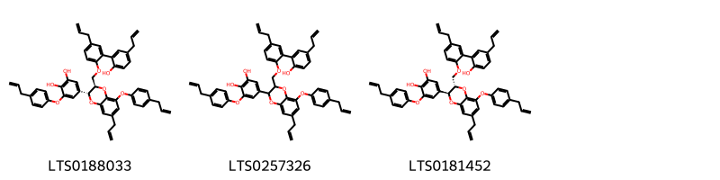{ width=100% }
    <figcaption>Hình ảnh cấu trúc hóa học của 3 hoạt chất thuộc nhóm Benzodioxanes gồm ["5-[(2r,3r)-3-({[2'-hydroxy-5,5'-bis(prop-2-en-1-yl)-[1,1'-biphenyl]-2-yl]oxy}methyl)-7-(prop-2-en-1-yl)-5-[4-(prop-2-en-1-yl)phenoxy]-2,3-dihydro-1,4-benzodioxin-2-yl]-3-[4-(prop-2-en-1-yl)phenoxy]benzene-1,2-diol (LTS0188033)", "5-[3-({[2'-hydroxy-5,5'-bis(prop-2-en-1-yl)-[1,1'-biphenyl]-2-yl]oxy}methyl)-7-(prop-2-en-1-yl)-5-[4-(prop-2-en-1-yl)phenoxy]-2,3-dihydro-1,4-benzodioxin-2-yl]-3-[4-(prop-2-en-1-yl)phenoxy]benzene-1,2-diol (LTS0257326)", "5-[(2s,3s)-3-({[2'-hydroxy-5,5'-bis(prop-2-en-1-yl)-[1,1'-biphenyl]-2-yl]oxy}methyl)-7-(prop-2-en-1-yl)-5-[4-(prop-2-en-1-yl)phenoxy]-2,3-dihydro-1,4-benzodioxin-2-yl]-3-[4-(prop-2-en-1-yl)phenoxy]benzene-1,2-diol (LTS0181452)"].</figcaption>
</figure>
#### Nhóm Cinnamic acids and derivatives
<figure markdown="span">
    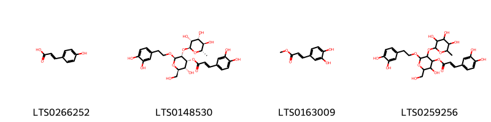{ width=100% }
    <figcaption>Hình ảnh cấu trúc hóa học của 4 hoạt chất thuộc nhóm Cinnamic acids and derivatives gồm ['para-coumaric acid (LTS0266252)', '(2r,3r,4r,5r,6r)-2-[2-(3,4-dihydroxyphenyl)ethoxy]-5-hydroxy-6-(hydroxymethyl)-3-{[(2s,3r,4r,5r,6s)-3,4,5-trihydroxy-6-methyloxan-2-yl]oxy}oxan-4-yl (2e)-3-(3,4-dihydroxyphenyl)prop-2-enoate (LTS0148530)', 'methyl caffeate (LTS0163009)', '2-[2-(3,4-dihydroxyphenyl)ethoxy]-5-hydroxy-6-(hydroxymethyl)-3-[(3,4,5-trihydroxy-6-methyloxan-2-yl)oxy]oxan-4-yl 3-(3,4-dihydroxyphenyl)prop-2-enoate (LTS0259256)'].</figcaption>
</figure>
#### Nhóm Coumarins and derivatives
<figure markdown="span">
    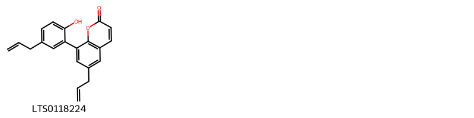{ width=100% }
    <figcaption>Hình ảnh cấu trúc hóa học của 1 hoạt chất thuộc nhóm Coumarins and derivatives gồm ['8-[2-hydroxy-5-(prop-2-en-1-yl)phenyl]-6-(prop-2-en-1-yl)chromen-2-one (LTS0118224)'].</figcaption>
</figure>
#### Nhóm Isoquinolines and derivatives
<figure markdown="span">
    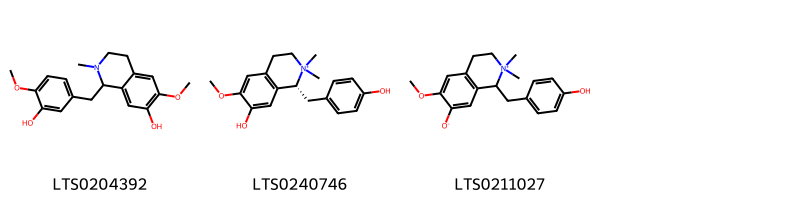{ width=100% }
    <figcaption>Hình ảnh cấu trúc hóa học của 3 hoạt chất thuộc nhóm Isoquinolines and derivatives gồm ['reticuline (LTS0204392)', 'magnocurarine (LTS0240746)', '1-[(4-hydroxyphenyl)methyl]-6-methoxy-2,2-dimethyl-3,4-dihydro-1h-isoquinolin-2-ium-7-olate (LTS0211027)'].</figcaption>
</figure>
#### Nhóm Lignan glycosides
<figure markdown="span">
    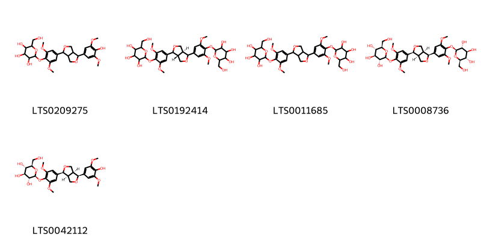{ width=100% }
    <figcaption>Hình ảnh cấu trúc hóa học của 5 hoạt chất thuộc nhóm Lignan glycosides gồm ['2-{4-[4-(4-hydroxy-3,5-dimethoxyphenyl)-hexahydrofuro[3,4-c]furan-1-yl]-2,6-dimethoxyphenoxy}-6-(hydroxymethyl)oxane-3,4,5-triol (LTS0209275)', '2-{4-[(3as,6ar)-4-(3,5-dimethoxy-4-{[3,4,5-trihydroxy-6-(hydroxymethyl)oxan-2-yl]oxy}phenyl)-hexahydrofuro[3,4-c]furan-1-yl]-2,6-dimethoxyphenoxy}-6-(hydroxymethyl)oxane-3,4,5-triol (LTS0192414)', '2-{4-[4-(3,5-dimethoxy-4-{[3,4,5-trihydroxy-6-(hydroxymethyl)oxan-2-yl]oxy}phenyl)-hexahydrofuro[3,4-c]furan-1-yl]-2,6-dimethoxyphenoxy}-6-(hydroxymethyl)oxane-3,4,5-triol (LTS0011685)', '(2s,3r,4s,5s,6r)-2-{4-[(1s,3as,4s,6as)-4-(3,5-dimethoxy-4-{[(2s,3r,4s,5s,6r)-3,4,5-trihydroxy-6-(hydroxymethyl)oxan-2-yl]oxy}phenyl)-hexahydrofuro[3,4-c]furan-1-yl]-2,6-dimethoxyphenoxy}-6-(hydroxymethyl)oxane-3,4,5-triol (LTS0008736)', '(2s,3r,4s,5s,6r)-2-{4-[(1s,3as,4s,6as)-4-(4-hydroxy-3,5-dimethoxyphenyl)-hexahydrofuro[3,4-c]furan-1-yl]-2,6-dimethoxyphenoxy}-6-(hydroxymethyl)oxane-3,4,5-triol (LTS0042112)'].</figcaption>
</figure>
#### Nhóm Organooxygen compounds
<figure markdown="span">
    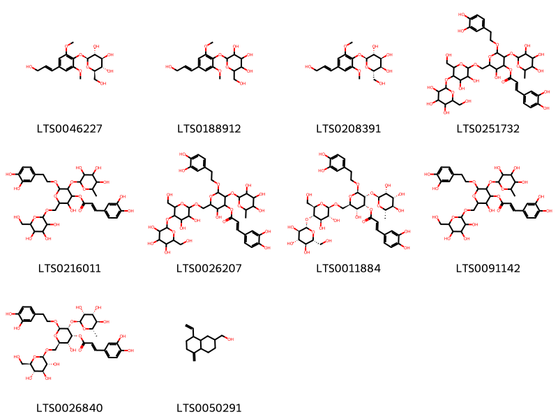{ width=100% }
    <figcaption>Hình ảnh cấu trúc hóa học của 10 hoạt chất thuộc nhóm Organooxygen compounds gồm ['syringin (LTS0046227)', '2-(hydroxymethyl)-6-[4-(3-hydroxyprop-1-en-1-yl)-2,6-dimethoxyphenoxy]oxane-3,4,5-triol (LTS0188912)', '(2s,3r,4s,5r,6s)-2-(hydroxymethyl)-6-{4-[(1e)-3-hydroxyprop-1-en-1-yl]-2,6-dimethoxyphenoxy}oxane-3,4,5-triol (LTS0208391)', '2-({[3,4-dihydroxy-6-(hydroxymethyl)-5-{[3,4,5-trihydroxy-6-(hydroxymethyl)oxan-2-yl]oxy}oxan-2-yl]oxy}methyl)-6-[2-(3,4-dihydroxyphenyl)ethoxy]-3-hydroxy-5-[(3,4,5-trihydroxy-6-methyloxan-2-yl)oxy]oxan-4-yl 3-(3,4-dihydroxyphenyl)prop-2-enoate (LTS0251732)', 'magnoloside b (LTS0216011)', 'magnoloside c (LTS0026207)', '(2r,3r,4r,5r,6r)-2-({[(2r,3r,4r,5s,6r)-3,4-dihydroxy-6-(hydroxymethyl)-5-{[(2s,3r,4s,5s,6r)-3,4,5-trihydroxy-6-(hydroxymethyl)oxan-2-yl]oxy}oxan-2-yl]oxy}methyl)-6-[2-(3,4-dihydroxyphenyl)ethoxy]-3-hydroxy-5-{[(2s,3r,4r,5r,6s)-3,4,5-trihydroxy-6-methyloxan-2-yl]oxy}oxan-4-yl (2e)-3-(3,4-dihydroxyphenyl)prop-2-enoate (LTS0011884)', '2-[2-(3,4-dihydroxyphenyl)ethoxy]-5-hydroxy-6-({[3,4,5-trihydroxy-6-(hydroxymethyl)oxan-2-yl]oxy}methyl)-3-[(3,4,5-trihydroxy-6-methyloxan-2-yl)oxy]oxan-4-yl 3-(3,4-dihydroxyphenyl)prop-2-enoate (LTS0091142)', '(2r,3r,4r,5r,6r)-2-[2-(3,4-dihydroxyphenyl)ethoxy]-5-hydroxy-6-({[(2r,3r,4s,5s,6r)-3,4,5-trihydroxy-6-(hydroxymethyl)oxan-2-yl]oxy}methyl)-3-{[(2s,3r,4r,5r,6s)-3,4,5-trihydroxy-6-methyloxan-2-yl]oxy}oxan-4-yl (2e)-3-(3,4-dihydroxyphenyl)prop-2-enoate (LTS0026840)', '(8-ethenyl-5-methylidene-octahydro-1h-naphthalen-2-yl)methanol (LTS0050291)'].</figcaption>
</figure>
#### Nhóm Phenols
<figure markdown="span">
    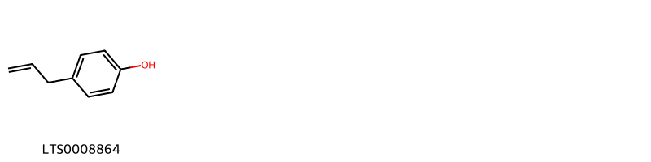{ width=100% }
    <figcaption>Hình ảnh cấu trúc hóa học của 1 hoạt chất thuộc nhóm Phenols gồm ['chavicol (LTS0008864)'].</figcaption>
</figure>
#### Nhóm Prenol lipids
<figure markdown="span">
    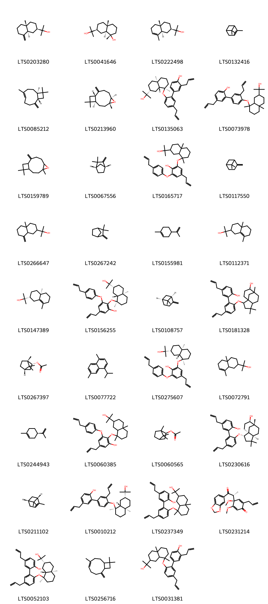{ width=100% }
    <figcaption>Hình ảnh cấu trúc hóa học của 35 hoạt chất thuộc nhóm Prenol lipids gồm ['β-eudesmol (LTS0203280)', '(+)-4-epi-cryptomeridiol (LTS0041646)', 'α-eudesmol (LTS0222498)', 'α pinene (LTS0132416)', 'caryophyllene (LTS0085212)', 'β-caryophyllene oxide (LTS0213960)', "2'-{[(1r,4ar,7r,8ar)-7-(2-hydroxypropan-2-yl)-1,4a-dimethyl-octahydronaphthalen-1-yl]oxy}-3,5'-bis(prop-2-en-1-yl)-[1,1'-biphenyl]-4-ol (LTS0135063)", "4'-{[7-(2-hydroxypropan-2-yl)-1,4a-dimethyl-octahydronaphthalen-1-yl]oxy}-3',5-bis(prop-2-en-1-yl)-[1,1'-biphenyl]-2-ol (LTS0073978)", 'caryophyllene oxide (LTS0159789)', '(-)-camphene (LTS0067556)', '2-{[7-(2-hydroxypropan-2-yl)-1,4a-dimethyl-octahydronaphthalen-1-yl]oxy}-4-(prop-2-en-1-yl)-6-[4-(prop-2-en-1-yl)phenoxy]phenol (LTS0165717)', 'β-pinene (LTS0117550)', 'β-eudesmol (LTS0266647)', 'camphene (LTS0267242)', 'limonene,  (LTS0155981)', '2-(4a,8-dimethyl-2,3,4,5,6,7-hexahydro-1h-naphthalen-2-yl)propan-2-ol (LTS0112371)', 'gamma-eudesmol (LTS0147389)', '2-{[(1r,4ar,7r,8ar)-7-(2-hydroxypropan-2-yl)-1,4a-dimethyl-octahydronaphthalen-1-yl]oxy}-5-(prop-2-en-1-yl)-3-[4-(prop-2-en-1-yl)phenoxy]phenol (LTS0156255)', '(-)-β-pinene (LTS0108757)', "2-{[5,5'-bis(prop-2-en-1-yl)-[1,1'-biphenyl]-2'-yl]oxy}-4,4,8-trimethyltricyclo[6.3.1.0¹,⁵]dodecan-9-ol (LTS0181328)", '(-)-bornyl acetate (LTS0267397)', 'cadalene (LTS0077722)', 'eudesobovatol a (LTS0275607)', '2-(4a,8-dimethyl-2,3,4,5,6,8a-hexahydro-1h-naphthalen-2-yl)propan-2-ol (LTS0072791)', 'α-limonene (LTS0244943)', '2-{[7-(2-hydroxypropan-2-yl)-1,4a-dimethyl-octahydronaphthalen-1-yl]oxy}-5-(prop-2-en-1-yl)-3-[4-(prop-2-en-1-yl)phenoxy]phenol (LTS0060385)', 'bornyl acetate (LTS0060565)', "(1s,2s,5s,8r,9r)-2-{[5,5'-bis(prop-2-en-1-yl)-[1,1'-biphenyl]-2'-yl]oxy}-4,4,8-trimethyltricyclo[6.3.1.0¹,⁵]dodecan-9-ol (LTS0230616)", '(+)-α-pinene (LTS0211102)', "4'-{[(1r,4ar,7r,8ar)-7-(2-hydroxypropan-2-yl)-1,4a-dimethyl-octahydronaphthalen-1-yl]oxy}-3',5-bis(prop-2-en-1-yl)-[1,1'-biphenyl]-2-ol (LTS0010212)", "2'-{[7-(2-hydroxypropan-2-yl)-1,4a-dimethyl-octahydronaphthalen-1-yl]oxy}-5,5'-bis(prop-2-en-1-yl)-[1,1'-biphenyl]-2-ol (LTS0237349)", '(4r)-4-[(2r)-1-(2h-1,3-benzodioxol-5-yl)-1-oxopropan-2-yl]-4,5-dimethoxy-2-(prop-2-en-1-yl)cyclohexa-2,5-dien-1-one (LTS0231214)', "2'-{[(1r,4ar,7r,8ar)-7-(2-hydroxypropan-2-yl)-1,4a-dimethyl-octahydronaphthalen-1-yl]oxy}-5,5'-bis(prop-2-en-1-yl)-[1,1'-biphenyl]-2-ol (LTS0052103)", '4,11,11-trimethyl-8-methylidenebicyclo[7.2.0]undec-4-ene (LTS0256716)', "2'-{[7-(2-hydroxypropan-2-yl)-1,4a-dimethyl-octahydronaphthalen-1-yl]oxy}-3,5'-bis(prop-2-en-1-yl)-[1,1'-biphenyl]-4-ol (LTS0031381)"].</figcaption>
</figure>
#### Nhóm Saturated hydrocarbons
<figure markdown="span">
    { width=100% }
    <figcaption>Hình ảnh cấu trúc hóa học của 1 hoạt chất thuộc nhóm Saturated hydrocarbons gồm ['nonadecane (LTS0146180)'].</figcaption>
</figure>
#### Nhóm Steroids and steroid derivatives
<figure markdown="span">
    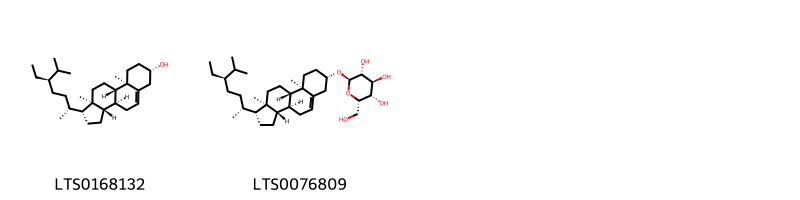{ width=100% }
    <figcaption>Hình ảnh cấu trúc hóa học của 2 hoạt chất thuộc nhóm Steroids and steroid derivatives gồm ['sitosterol (LTS0168132)', '(2r,3r,4s,5s,6s)-2-{[(1r,3as,3bs,7s,9ar,9bs,11ar)-1-[(2r,5r)-5-ethyl-6-methylheptan-2-yl]-9a,11a-dimethyl-1h,2h,3h,3ah,3bh,4h,6h,7h,8h,9h,9bh,10h,11h-cyclopenta[a]phenanthren-7-yl]oxy}-6-(hydroxymethyl)oxane-3,4,5-triol (LTS0076809)'].</figcaption>
</figure>
#### Nhóm Stilbenes
<figure markdown="span">
    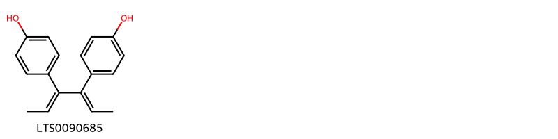{ width=100% }
    <figcaption>Hình ảnh cấu trúc hóa học của 1 hoạt chất thuộc nhóm Stilbenes gồm ['dienestrol (LTS0090685)'].</figcaption>
</figure>

---

### Dược dân tộc học

Danh sách các quốc gia có sử dụng *Magnolia obovata* trong điều trị các bệnh. 

| Country   | Disease         | Bệnh                                                                                                                                                                                                |
|:----------|:----------------|:----------------------------------------------------------------------------------------------------------------------------------------------------------------------------------------------------|
| China     | Diuretic, Tonic | MYMEMORY WARNING: YOU USED ALL AVAILABLE FREE TRANSLATIONS FOR TODAY. NEXT AVAILABLE IN  20 HOURS 05 MINUTES 49 SECONDS VISIT HTTPS://MYMEMORY.TRANSLATED.NET/DOC/USAGELIMITS.PHP TO TRANSLATE MORE |
| Japan*    | Stomachic       | MYMEMORY WARNING: YOU USED ALL AVAILABLE FREE TRANSLATIONS FOR TODAY. NEXT AVAILABLE IN  20 HOURS 05 MINUTES 46 SECONDS VISIT HTTPS://MYMEMORY.TRANSLATED.NET/DOC/USAGELIMITS.PHP TO TRANSLATE MORE |

---

---
## Magnolia officinalis
### Thông tin về thực vật

!!! info "Phân loại thực vật của *Magnolia officinalis* từ GIBF:"
    - **Kingdom:** Plantae
    - **Phylum:** Tracheophyta
    - **Order:** Magnoliales
    - **Family:** Magnoliaceae
    - **Genus:** Magnolia
    - **Species:** *Magnolia officinalis*

 

| Label (VI)   | Label (EN)   | Scientific Name      | Descriptions (VI)   | Descriptions (EN)   | Also Known As (VI)   | Also Known As (EN)   |
|:-------------|:-------------|:---------------------|:--------------------|:--------------------|:---------------------|:---------------------|
| N/A          | N/A          | Magnolia officinalis | loài thực vật       | species of plant    | ['']                 | ['']                 |

#### Phân bố trên thế giới

**Từ CSDL GIBF** nan, New Zealand, Poland, India, Canada, United States of America, China, Belgium, Korea, Republic of, Hong Kong

#### Phân bố tại Việt Nam

**Từ CSDL GIBF**: Không có ghi nhận ở Việt Nam

---
### Thành phần hóa học
        
- Theo cơ sở dữ liệu lotus: Từ loài *Magnolia officinalis* đã phân lập và xác định được 95 hoạt chất thuộc về các nhóm Organooxygen compounds, Aporphines, Furanoid lignans, Isoquinolines and derivatives, Coumarans, Prenol lipids, Lignan glycosides, 2-arylbenzofuran flavonoids, Linear 1,3-diarylpropanoids, Phenols, Cinnamic acids and derivatives, Benzene and substituted derivatives. 

|    | chemicalTaxonomyClassyfireClass     |   smiles_count |
|---:|:------------------------------------|---------------:|
|  0 |                                     |              2 |
|  1 | 2-arylbenzofuran flavonoids         |              2 |
|  2 | Aporphines                          |             11 |
|  3 | Benzene and substituted derivatives |             46 |
|  4 | Cinnamic acids and derivatives      |              3 |
|  5 | Coumarans                           |              5 |
|  6 | Furanoid lignans                    |              3 |
|  7 | Isoquinolines and derivatives       |              2 |
|  8 | Lignan glycosides                   |              2 |
|  9 | Linear 1,3-diarylpropanoids         |              3 |
| 10 | Organooxygen compounds              |              5 |
| 11 | Phenols                             |              9 |
| 12 | Prenol lipids                       |              1 |

#### Nhóm 
<figure markdown="span">
    { width=100% }
    <figcaption>Hình ảnh cấu trúc hóa học của 2 hoạt chất thuộc nhóm  gồm ['(1r,2s)-1-(4-hydroxy-3-methoxyphenyl)-2-[4-(3-hydroxypropyl)-2-methoxyphenoxy]propane-1,3-diol (LTS0176913)', '1-(4-hydroxy-3-methoxyphenyl)-2-[4-(3-hydroxypropyl)-2-methoxyphenoxy]propane-1,3-diol (LTS0212414)'].</figcaption>
</figure>
#### Nhóm 2-arylbenzofuran flavonoids
<figure markdown="span">
    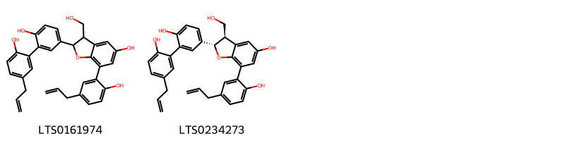{ width=100% }
    <figcaption>Hình ảnh cấu trúc hóa học của 2 hoạt chất thuộc nhóm 2-arylbenzofuran flavonoids gồm ["5-{5-hydroxy-7-[2-hydroxy-5-(prop-2-en-1-yl)phenyl]-3-(hydroxymethyl)-2,3-dihydro-1-benzofuran-2-yl}-5'-(prop-2-en-1-yl)-[1,1'-biphenyl]-2,2'-diol (LTS0161974)", "5-[(2s,3r)-5-hydroxy-7-[2-hydroxy-5-(prop-2-en-1-yl)phenyl]-3-(hydroxymethyl)-2,3-dihydro-1-benzofuran-2-yl]-5'-(prop-2-en-1-yl)-[1,1'-biphenyl]-2,2'-diol (LTS0234273)"].</figcaption>
</figure>
#### Nhóm Aporphines
<figure markdown="span">
    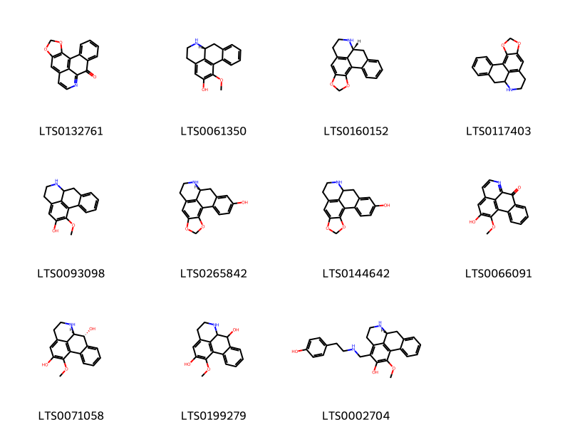{ width=100% }
    <figcaption>Hình ảnh cấu trúc hóa học của 11 hoạt chất thuộc nhóm Aporphines gồm ['liriodenine (LTS0132761)', 'r-(-)-asimilobine (LTS0061350)', 'anonaine (LTS0160152)', '3,5-dioxa-11-azapentacyclo[10.7.1.0²,⁶.0⁸,²⁰.0¹⁴,¹⁹]icosa-1(20),2(6),7,14,16,18-hexaene (LTS0117403)', '16-methoxy-10-azatetracyclo[7.7.1.0²,⁷.0¹³,¹⁷]heptadeca-1(17),2,4,6,13,15-hexaen-15-ol (LTS0093098)', 'anolobine (LTS0265842)', '3,5-dioxa-11-azapentacyclo[10.7.1.0²,⁶.0⁸,²⁰.0¹⁴,¹⁹]icosa-1(20),2(6),7,14,16,18-hexaen-16-ol (LTS0144642)', '15-hydroxy-16-methoxy-10-azatetracyclo[7.7.1.0²,⁷.0¹³,¹⁷]heptadeca-1(16),2,4,6,9(17),10,12,14-octaen-8-one (LTS0066091)', '(8r,9s)-16-methoxy-10-azatetracyclo[7.7.1.0²,⁷.0¹³,¹⁷]heptadeca-1(17),2,4,6,13,15-hexaene-8,15-diol (LTS0071058)', '16-methoxy-10-azatetracyclo[7.7.1.0²,⁷.0¹³,¹⁷]heptadeca-1(17),2,4,6,13,15-hexaene-8,15-diol (LTS0199279)', '(9r)-14-({[2-(4-hydroxyphenyl)ethyl]amino}methyl)-16-methoxy-10-azatetracyclo[7.7.1.0²,⁷.0¹³,¹⁷]heptadeca-1(17),2,4,6,13,15-hexaen-15-ol (LTS0002704)'].</figcaption>
</figure>
#### Nhóm Benzene and substituted derivatives
<figure markdown="span">
    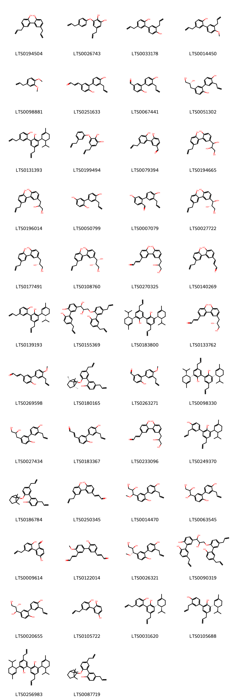{ width=100% }
    <figcaption>Hình ảnh cấu trúc hóa học của 46 hoạt chất thuộc nhóm Benzene and substituted derivatives gồm ['magnolol (LTS0194504)', 'obovatol (LTS0026743)', 'honokiol (LTS0033178)', '4-o-methylhonokiol (LTS0014450)', 'methyl eugenol (LTS0098881)', "(2e)-3-[4',6-dihydroxy-3'-(prop-2-en-1-yl)-[1,1'-biphenyl]-3-yl]prop-2-enal (LTS0251633)", "4',6-dihydroxy-3'-(prop-2-en-1-yl)-[1,1'-biphenyl]-3-carbaldehyde (LTS0067441)", "5-[(2r)-2,3-dihydroxypropyl]-3'-(prop-2-en-1-yl)-[1,1'-biphenyl]-2,4'-diol (LTS0051302)", "3-(6-isopropyl-3-methylcyclohex-2-en-1-yl)-5,5'-bis(prop-2-en-1-yl)-[1,1'-biphenyl]-2,2'-diol (LTS0131393)", '5-(prop-2-en-1-yl)-3-[3-(prop-2-en-1-yl)phenoxy]benzene-1,2-diol (LTS0199494)', "2',6-dihydroxy-5'-(prop-2-en-1-yl)-[1,1'-biphenyl]-3-carbaldehyde (LTS0079394)", "1-[2',6-dihydroxy-5'-(prop-2-en-1-yl)-[1,1'-biphenyl]-3-yl]propane-1,2,3-triol (LTS0194665)", "5-(2,3-dihydroxypropyl)-5'-(prop-2-en-1-yl)-[1,1'-biphenyl]-2,2'-diol (LTS0196014)", "3'-(prop-2-en-1-yl)-[1,1'-biphenyl]-2,4',5-triol (LTS0050799)", "4',5-dihydroxy-3'-(prop-2-en-1-yl)-[1,1'-biphenyl]-2-carbaldehyde (LTS0007079)", "(1r,2s)-1-[2',6-dihydroxy-5'-(prop-2-en-1-yl)-[1,1'-biphenyl]-3-yl]propane-1,2,3-triol (LTS0027722)", "5-[(2r)-2,3-dihydroxypropyl]-5'-(prop-2-en-1-yl)-[1,1'-biphenyl]-2,2'-diol (LTS0177491)", "(1s,2s)-1-[2',6-dihydroxy-5'-(prop-2-en-1-yl)-[1,1'-biphenyl]-3-yl]propane-1,2,3-triol (LTS0108760)", "3-[5'-(2,3-dihydroxypropyl)-2',6-dihydroxy-[1,1'-biphenyl]-3-yl]prop-2-enal (LTS0270325)", "3-[2',6-dihydroxy-5'-(prop-2-en-1-yl)-[1,1'-biphenyl]-3-yl]prop-2-enal (LTS0140269)", "3-[(6r)-6-isopropyl-3-methylcyclohex-2-en-1-yl]-5,5'-bis(prop-2-en-1-yl)-[1,1'-biphenyl]-2,2'-diol (LTS0139193)", "5-[(1r,2r)-1,2-dihydroxy-3-{[2'-hydroxy-5,5'-bis(prop-2-en-1-yl)-[1,1'-biphenyl]-2-yl]oxy}propyl]-5'-(prop-2-en-1-yl)-[1,1'-biphenyl]-2,2'-diol (LTS0155369)", "3,3'-bis[(1r,6s)-6-isopropyl-3-methylcyclohex-2-en-1-yl]-5,5'-bis(prop-2-en-1-yl)-[1,1'-biphenyl]-2,2'-diol (LTS0183800)", "(2e)-3-{5'-[(2r)-2,3-dihydroxypropyl]-2',6-dihydroxy-[1,1'-biphenyl]-3-yl}prop-2-enal (LTS0133762)", "(2e)-3-[6-hydroxy-4'-methoxy-3'-(prop-2-en-1-yl)-[1,1'-biphenyl]-3-yl]prop-2-enal (LTS0269598)", "5,5'-bis(prop-2-en-1-yl)-2'-{[(1s,2r,4s)-1,7,7-trimethylbicyclo[2.2.1]heptan-2-yl]oxy}-[1,1'-biphenyl]-2-ol (LTS0180165)", "6-hydroxy-4'-methoxy-3'-(prop-2-en-1-yl)-[1,1'-biphenyl]-3-carbaldehyde (LTS0263271)", "3,3'-bis[(1s,6s)-6-isopropyl-3-methylcyclohex-2-en-1-yl]-5,5'-bis(prop-2-en-1-yl)-[1,1'-biphenyl]-2,2'-diol (LTS0098330)", "5-(2,3-dihydroxypropyl)-3'-(prop-2-en-1-yl)-[1,1'-biphenyl]-2,4'-diol (LTS0027434)", "3-[4',6-dihydroxy-3'-(prop-2-en-1-yl)-[1,1'-biphenyl]-3-yl]prop-2-enal (LTS0183367)", "(2e)-3-[5'-(2,3-dihydroxypropyl)-2',6-dihydroxy-[1,1'-biphenyl]-3-yl]prop-2-enal (LTS0233096)", "3-(6-isopropyl-3-methylcyclohex-2-en-1-yl)-3',5-bis(prop-2-en-1-yl)-[1,1'-biphenyl]-2,4'-diol (LTS0249370)", "5,5'-bis(prop-2-en-1-yl)-2'-{[(2r)-1,7,7-trimethylbicyclo[2.2.1]heptan-2-yl]oxy}-[1,1'-biphenyl]-2-ol (LTS0186784)", "(2e)-3-[2',6-dihydroxy-5'-(prop-2-en-1-yl)-[1,1'-biphenyl]-3-yl]prop-2-enal (LTS0250345)", "5-(2,3-dihydroxy-1-methoxypropyl)-3'-(prop-2-en-1-yl)-[1,1'-biphenyl]-2,4'-diol (LTS0014470)", "1-[4',6-dihydroxy-3'-(prop-2-en-1-yl)-[1,1'-biphenyl]-3-yl]propane-1,2,3-triol (LTS0063545)", "2',5-dihydroxy-5'-(prop-2-en-1-yl)-[1,1'-biphenyl]-2-carbaldehyde (LTS0009614)", "(2e)-3-{2'-hydroxy-4-methoxy-5'-[(1e)-3-oxoprop-1-en-1-yl]-[1,1'-biphenyl]-3-yl}prop-2-enal (LTS0122014)", "5-[(1s,2r)-2,3-dihydroxy-1-methoxypropyl]-3'-(prop-2-en-1-yl)-[1,1'-biphenyl]-2,4'-diol (LTS0026321)", "5-(1,2-dihydroxy-3-{[2'-hydroxy-5,5'-bis(prop-2-en-1-yl)-[1,1'-biphenyl]-2-yl]oxy}propyl)-5'-(prop-2-en-1-yl)-[1,1'-biphenyl]-2,2'-diol (LTS0090319)", "(1r,2s)-1-[4',6-dihydroxy-3'-(prop-2-en-1-yl)-[1,1'-biphenyl]-3-yl]propane-1,2,3-triol (LTS0020655)", "5'-(prop-2-en-1-yl)-[1,1'-biphenyl]-2,2',5-triol (LTS0105722)", "3-[(1s,6s)-6-isopropyl-3-methylcyclohex-2-en-1-yl]-5,5'-bis(prop-2-en-1-yl)-[1,1'-biphenyl]-2,2'-diol (LTS0031620)", "3-[(1s,6s)-6-isopropyl-3-methylcyclohex-2-en-1-yl]-3',5-bis(prop-2-en-1-yl)-[1,1'-biphenyl]-2,4'-diol (LTS0105688)", "3,3'-bis(6-isopropyl-3-methylcyclohex-2-en-1-yl)-5,5'-bis(prop-2-en-1-yl)-[1,1'-biphenyl]-2,2'-diol (LTS0256983)", "5,5'-bis(prop-2-en-1-yl)-2'-({1,7,7-trimethylbicyclo[2.2.1]heptan-2-yl}oxy)-[1,1'-biphenyl]-2-ol (LTS0087719)"].</figcaption>
</figure>
#### Nhóm Cinnamic acids and derivatives
<figure markdown="span">
    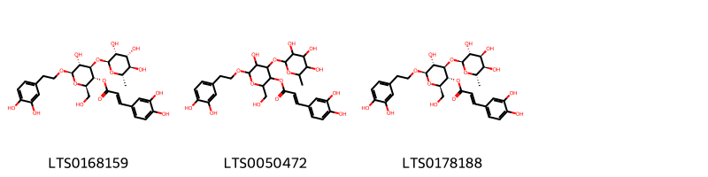{ width=100% }
    <figcaption>Hình ảnh cấu trúc hóa học của 3 hoạt chất thuộc nhóm Cinnamic acids and derivatives gồm ['verbascoside (LTS0168159)', '6-[2-(3,4-dihydroxyphenyl)ethoxy]-5-hydroxy-2-(hydroxymethyl)-4-[(3,4,5-trihydroxy-6-methyloxan-2-yl)oxy]oxan-3-yl 3-(3,4-dihydroxyphenyl)prop-2-enoate (LTS0050472)', '(2r,3r,4r,5r,6r)-6-[2-(3,4-dihydroxyphenyl)ethoxy]-5-hydroxy-2-(hydroxymethyl)-4-{[(2s,3r,4s,5r,6s)-3,4,5-trihydroxy-6-methyloxan-2-yl]oxy}oxan-3-yl (2e)-3-(3,4-dihydroxyphenyl)prop-2-enoate (LTS0178188)'].</figcaption>
</figure>
#### Nhóm Coumarans
<figure markdown="span">
    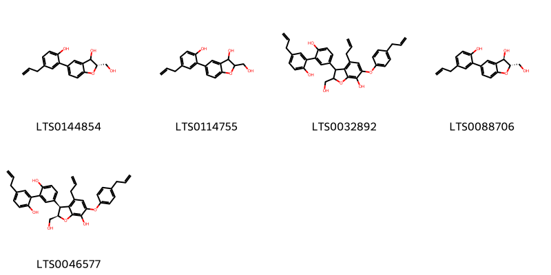{ width=100% }
    <figcaption>Hình ảnh cấu trúc hóa học của 5 hoạt chất thuộc nhóm Coumarans gồm ['(2s)-5-[2-hydroxy-5-(prop-2-en-1-yl)phenyl]-2-(hydroxymethyl)-2,3-dihydro-1-benzofuran-3-ol (LTS0144854)', '5-[2-hydroxy-5-(prop-2-en-1-yl)phenyl]-2-(hydroxymethyl)-2,3-dihydro-1-benzofuran-3-ol (LTS0114755)', "5-[7-hydroxy-2-(hydroxymethyl)-4-(prop-2-en-1-yl)-6-[4-(prop-2-en-1-yl)phenoxy]-2,3-dihydro-1-benzofuran-3-yl]-5'-(prop-2-en-1-yl)-[1,1'-biphenyl]-2,2'-diol (LTS0032892)", '(2s,3r)-5-[2-hydroxy-5-(prop-2-en-1-yl)phenyl]-2-(hydroxymethyl)-2,3-dihydro-1-benzofuran-3-ol (LTS0088706)', "5-[(2r,3s)-7-hydroxy-2-(hydroxymethyl)-4-(prop-2-en-1-yl)-6-[4-(prop-2-en-1-yl)phenoxy]-2,3-dihydro-1-benzofuran-3-yl]-5'-(prop-2-en-1-yl)-[1,1'-biphenyl]-2,2'-diol (LTS0046577)"].</figcaption>
</figure>
#### Nhóm Furanoid lignans
<figure markdown="span">
    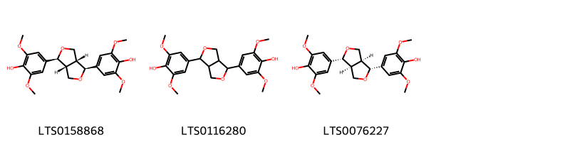{ width=100% }
    <figcaption>Hình ảnh cấu trúc hóa học của 3 hoạt chất thuộc nhóm Furanoid lignans gồm ['(+)-syringaresinol (LTS0158868)', 'syringaresinol (LTS0116280)', '(-)-syringaresinol (LTS0076227)'].</figcaption>
</figure>
#### Nhóm Isoquinolines and derivatives
<figure markdown="span">
    { width=100% }
    <figcaption>Hình ảnh cấu trúc hóa học của 2 hoạt chất thuộc nhóm Isoquinolines and derivatives gồm ['reticuline (LTS0204392)', '(+,-)-reticuline (LTS0181650)'].</figcaption>
</figure>
#### Nhóm Lignan glycosides
<figure markdown="span">
    { width=100% }
    <figcaption>Hình ảnh cấu trúc hóa học của 2 hoạt chất thuộc nhóm Lignan glycosides gồm ['2-{4-[4-(4-hydroxy-3,5-dimethoxyphenyl)-hexahydrofuro[3,4-c]furan-1-yl]-2,6-dimethoxyphenoxy}-6-(hydroxymethyl)oxane-3,4,5-triol (LTS0209275)', '(2s,3r,4s,5s,6r)-2-{4-[(1r,3as,4r,6as)-4-(4-hydroxy-3,5-dimethoxyphenyl)-hexahydrofuro[3,4-c]furan-1-yl]-2,6-dimethoxyphenoxy}-6-(hydroxymethyl)oxane-3,4,5-triol (LTS0010090)'].</figcaption>
</figure>
#### Nhóm Linear 1_3-diarylpropanoids
<figure markdown="span">
    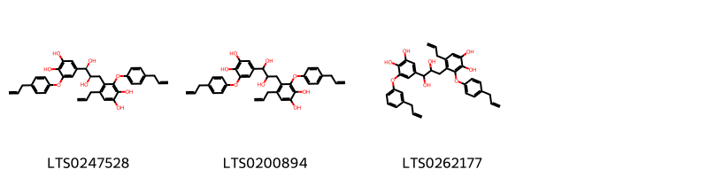{ width=100% }
    <figcaption>Hình ảnh cấu trúc hóa học của Không tìm thấy chú thích hoạt chất thuộc nhóm Linear 1_3-diarylpropanoids gồm Không tìm thấy chú thích.</figcaption>
</figure>
#### Nhóm Organooxygen compounds
<figure markdown="span">
    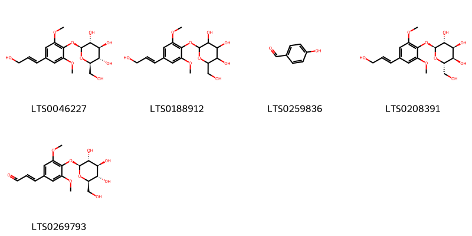{ width=100% }
    <figcaption>Hình ảnh cấu trúc hóa học của 5 hoạt chất thuộc nhóm Organooxygen compounds gồm ['syringin (LTS0046227)', '2-(hydroxymethyl)-6-[4-(3-hydroxyprop-1-en-1-yl)-2,6-dimethoxyphenoxy]oxane-3,4,5-triol (LTS0188912)', 'p-hydroxybenzaldehyde (LTS0259836)', '(2s,3r,4s,5r,6s)-2-(hydroxymethyl)-6-{4-[(1e)-3-hydroxyprop-1-en-1-yl]-2,6-dimethoxyphenoxy}oxane-3,4,5-triol (LTS0208391)', '(2e)-3-(3,5-dimethoxy-4-{[(2s,3r,4s,5s,6r)-3,4,5-trihydroxy-6-(hydroxymethyl)oxan-2-yl]oxy}phenyl)prop-2-enal (LTS0269793)'].</figcaption>
</figure>
#### Nhóm Phenols
<figure markdown="span">
    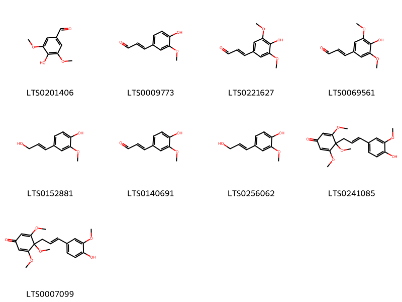{ width=100% }
    <figcaption>Hình ảnh cấu trúc hóa học của 9 hoạt chất thuộc nhóm Phenols gồm ['syringaldehyde (LTS0201406)', 'coniferaldehyde (LTS0009773)', 'sinapyl aldehyde (LTS0221627)', 'sinapaldehyde (LTS0069561)', 'coniferyl alcohol (LTS0152881)', 'coniferyl aldehyde (LTS0140691)', '4-(3-hydroxyprop-1-en-1-yl)-2-methoxyphenol (LTS0256062)', '4-[3-(4-hydroxy-3-methoxyphenyl)prop-2-en-1-yl]-3,4,5-trimethoxycyclohexa-2,5-dien-1-one (LTS0241085)', '4-[(2e)-3-(4-hydroxy-3-methoxyphenyl)prop-2-en-1-yl]-3,4,5-trimethoxycyclohexa-2,5-dien-1-one (LTS0007099)'].</figcaption>
</figure>
#### Nhóm Prenol lipids
<figure markdown="span">
    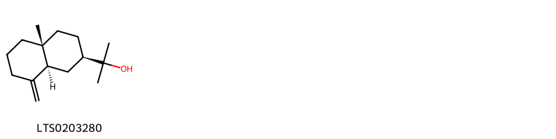{ width=100% }
    <figcaption>Hình ảnh cấu trúc hóa học của 1 hoạt chất thuộc nhóm Prenol lipids gồm ['β-eudesmol (LTS0203280)'].</figcaption>
</figure>

---

### Dược dân tộc học

Danh sách các quốc gia có sử dụng *Magnolia officinalis* trong điều trị các bệnh. 

| Country   | Disease                                                                    | Bệnh                                                                                                                                                                                                |
|:----------|:---------------------------------------------------------------------------|:----------------------------------------------------------------------------------------------------------------------------------------------------------------------------------------------------|
| China     | Antiseptic, nan, Laxative, Stomachic, Tonic, Aphrodisiac, Stomachic, Tonic | MYMEMORY WARNING: YOU USED ALL AVAILABLE FREE TRANSLATIONS FOR TODAY. NEXT AVAILABLE IN  20 HOURS 04 MINUTES 11 SECONDS VISIT HTTPS://MYMEMORY.TRANSLATED.NET/DOC/USAGELIMITS.PHP TO TRANSLATE MORE |
| anish     | Expectorant                                                                | MYMEMORY WARNING: YOU USED ALL AVAILABLE FREE TRANSLATIONS FOR TODAY. NEXT AVAILABLE IN  20 HOURS 04 MINUTES 09 SECONDS VISIT HTTPS://MYMEMORY.TRANSLATED.NET/DOC/USAGELIMITS.PHP TO TRANSLATE MORE |

---

---
## Magnolia salicifolia
### Thông tin về thực vật

!!! info "Phân loại thực vật của *Magnolia salicifolia* từ GIBF:"
    - **Kingdom:** Plantae
    - **Phylum:** Tracheophyta
    - **Order:** Magnoliales
    - **Family:** Magnoliaceae
    - **Genus:** Magnolia
    - **Species:** *Magnolia salicifolia*

 

| Label (VI)   | Label (EN)   | Scientific Name      | Descriptions (VI)   | Descriptions (EN)   | Also Known As (VI)   | Also Known As (EN)   |
|:-------------|:-------------|:---------------------|:--------------------|:--------------------|:---------------------|:---------------------|
| N/A          | N/A          | Magnolia salicifolia | loài thực vật       | species of plant    | ['']                 | ['']                 |

#### Phân bố trên thế giới

**Từ CSDL GIBF** Japan, Germany, Russian Federation, Canada, United States of America, Belgium, Korea, Republic of

#### Phân bố tại Việt Nam

**Từ CSDL GIBF**: Không có ghi nhận ở Việt Nam

---
### Thành phần hóa học
        
- Theo cơ sở dữ liệu lotus: Từ loài *Magnolia salicifolia* đã phân lập và xác định được 41 hoạt chất thuộc về các nhóm Cyclobutane lignans, Aporphines, Flavonoids, Furanoid lignans, Coumarins and derivatives, Isoquinolines and derivatives, Prenol lipids, Aryltetralin lignans, Benzodioxoles, Phenol ethers, Cinnamic acids and derivatives, Benzene and substituted derivatives. 

|    | chemicalTaxonomyClassyfireClass     |   smiles_count |
|---:|:------------------------------------|---------------:|
|  0 | Aporphines                          |              1 |
|  1 | Aryltetralin lignans                |              3 |
|  2 | Benzene and substituted derivatives |              5 |
|  3 | Benzodioxoles                       |              1 |
|  4 | Cinnamic acids and derivatives      |              3 |
|  5 | Coumarins and derivatives           |              1 |
|  6 | Cyclobutane lignans                 |              3 |
|  7 | Flavonoids                          |              6 |
|  8 | Furanoid lignans                    |              1 |
|  9 | Isoquinolines and derivatives       |              6 |
| 10 | Phenol ethers                       |              2 |
| 11 | Prenol lipids                       |              6 |

#### Nhóm Aporphines
<figure markdown="span">
    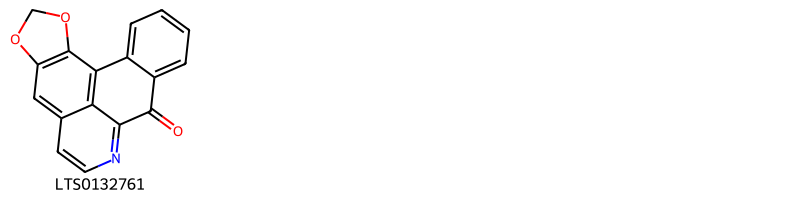{ width=100% }
    <figcaption>Hình ảnh cấu trúc hóa học của 1 hoạt chất thuộc nhóm Aporphines gồm ['liriodenine (LTS0132761)'].</figcaption>
</figure>
#### Nhóm Aryltetralin lignans
<figure markdown="span">
    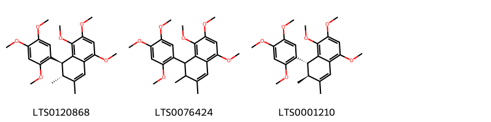{ width=100% }
    <figcaption>Hình ảnh cấu trúc hóa học của 3 hoạt chất thuộc nhóm Aryltetralin lignans gồm ['magnoshinin (LTS0120868)', '5,7,8-trimethoxy-2,3-dimethyl-1-(2,4,5-trimethoxyphenyl)-1,2-dihydronaphthalene (LTS0076424)', '(1r,2s)-5,7,8-trimethoxy-2,3-dimethyl-1-(2,4,5-trimethoxyphenyl)-1,2-dihydronaphthalene (LTS0001210)'].</figcaption>
</figure>
#### Nhóm Benzene and substituted derivatives
<figure markdown="span">
    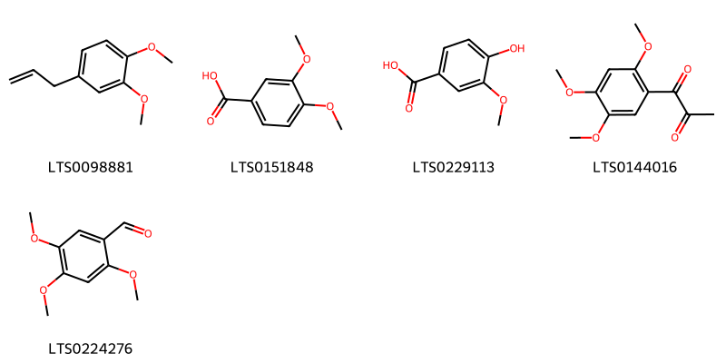{ width=100% }
    <figcaption>Hình ảnh cấu trúc hóa học của 5 hoạt chất thuộc nhóm Benzene and substituted derivatives gồm ['methyl eugenol (LTS0098881)', 'veratric acid (LTS0151848)', 'vanillic acid (LTS0229113)', '1-(2,4,5-trimethoxyphenyl)propane-1,2-dione (LTS0144016)', '2,4,5-trimethoxybenzaldehyde (LTS0224276)'].</figcaption>
</figure>
#### Nhóm Benzodioxoles
<figure markdown="span">
    { width=100% }
    <figcaption>Hình ảnh cấu trúc hóa học của 1 hoạt chất thuộc nhóm Benzodioxoles gồm ['sassafras (LTS0136093)'].</figcaption>
</figure>
#### Nhóm Cinnamic acids and derivatives
<figure markdown="span">
    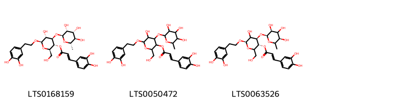{ width=100% }
    <figcaption>Hình ảnh cấu trúc hóa học của 3 hoạt chất thuộc nhóm Cinnamic acids and derivatives gồm ['verbascoside (LTS0168159)', '6-[2-(3,4-dihydroxyphenyl)ethoxy]-5-hydroxy-2-(hydroxymethyl)-4-[(3,4,5-trihydroxy-6-methyloxan-2-yl)oxy]oxan-3-yl 3-(3,4-dihydroxyphenyl)prop-2-enoate (LTS0050472)', '(3r,4r,6r)-6-[2-(3,4-dihydroxyphenyl)ethoxy]-5-hydroxy-2-(hydroxymethyl)-4-{[(2s,3s,5r)-3,4,5-trihydroxy-6-methyloxan-2-yl]oxy}oxan-3-yl (2e)-3-(3,4-dihydroxyphenyl)prop-2-enoate (LTS0063526)'].</figcaption>
</figure>
#### Nhóm Coumarins and derivatives
<figure markdown="span">
    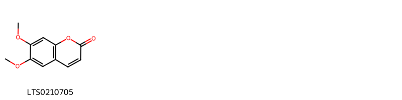{ width=100% }
    <figcaption>Hình ảnh cấu trúc hóa học của 1 hoạt chất thuộc nhóm Coumarins and derivatives gồm ['scoparone (LTS0210705)'].</figcaption>
</figure>
#### Nhóm Cyclobutane lignans
<figure markdown="span">
    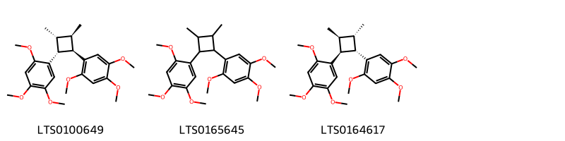{ width=100% }
    <figcaption>Hình ảnh cấu trúc hóa học của 3 hoạt chất thuộc nhóm Cyclobutane lignans gồm ['magnosalin (LTS0100649)', '1-[2,3-dimethyl-4-(2,4,5-trimethoxyphenyl)cyclobutyl]-2,4,5-trimethoxybenzene (LTS0165645)', '1-[(1s,2s,3s,4s)-2,3-dimethyl-4-(2,4,5-trimethoxyphenyl)cyclobutyl]-2,4,5-trimethoxybenzene (LTS0164617)'].</figcaption>
</figure>
#### Nhóm Flavonoids
<figure markdown="span">
    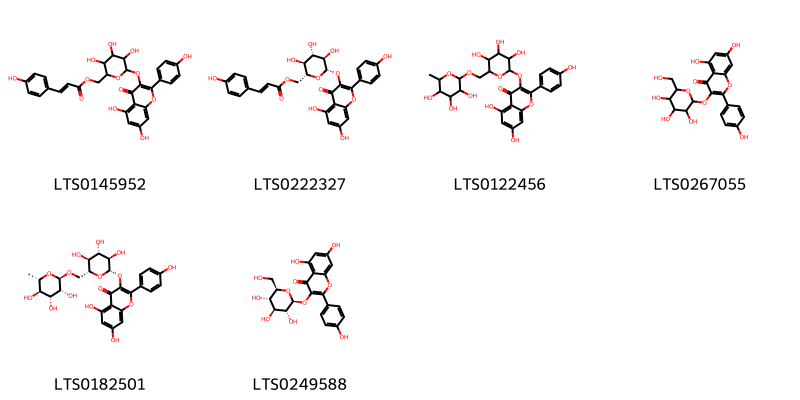{ width=100% }
    <figcaption>Hình ảnh cấu trúc hóa học của 6 hoạt chất thuộc nhóm Flavonoids gồm ['(6-{[5,7-dihydroxy-2-(4-hydroxyphenyl)-4-oxochromen-3-yl]oxy}-3,4,5-trihydroxyoxan-2-yl)methyl 3-(4-hydroxyphenyl)prop-2-enoate (LTS0145952)', 'tiliroside (LTS0222327)', '5,7-dihydroxy-2-(4-hydroxyphenyl)-3-[(3,4,5-trihydroxy-6-{[(3,4,5-trihydroxy-6-methyloxan-2-yl)oxy]methyl}oxan-2-yl)oxy]chromen-4-one (LTS0122456)', 'trifolin (LTS0267055)', 'nictoflorin (LTS0182501)', 'astragalin (LTS0249588)'].</figcaption>
</figure>
#### Nhóm Furanoid lignans
<figure markdown="span">
    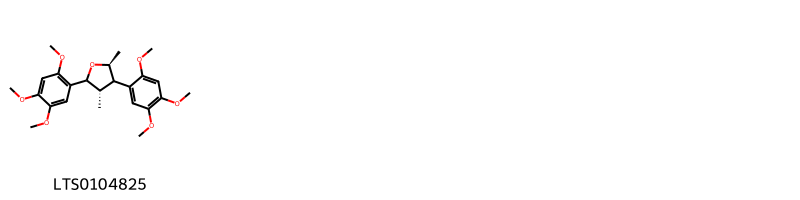{ width=100% }
    <figcaption>Hình ảnh cấu trúc hóa học của 1 hoạt chất thuộc nhóm Furanoid lignans gồm ['(2s,4s)-2,4-dimethyl-3,5-bis(2,4,5-trimethoxyphenyl)oxolane (LTS0104825)'].</figcaption>
</figure>
#### Nhóm Isoquinolines and derivatives
<figure markdown="span">
    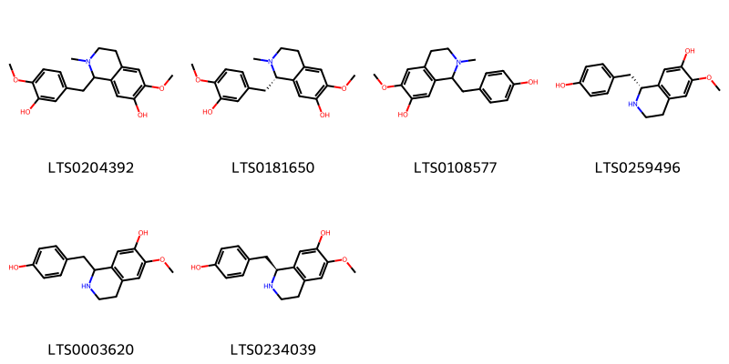{ width=100% }
    <figcaption>Hình ảnh cấu trúc hóa học của 6 hoạt chất thuộc nhóm Isoquinolines and derivatives gồm ['reticuline (LTS0204392)', '(+,-)-reticuline (LTS0181650)', '1-[(4-hydroxyphenyl)methyl]-6-methoxy-2-methyl-3,4-dihydro-1h-isoquinolin-7-ol (LTS0108577)', '(+)-coclaurine (LTS0259496)', '(rs)-coclaurine (LTS0003620)', '(+-)-coclaurine (LTS0234039)'].</figcaption>
</figure>
#### Nhóm Phenol ethers
<figure markdown="span">
    { width=100% }
    <figcaption>Hình ảnh cấu trúc hóa học của 2 hoạt chất thuộc nhóm Phenol ethers gồm ['tarragon (LTS0245226)', 'anethole (LTS0033696)'].</figcaption>
</figure>
#### Nhóm Prenol lipids
<figure markdown="span">
    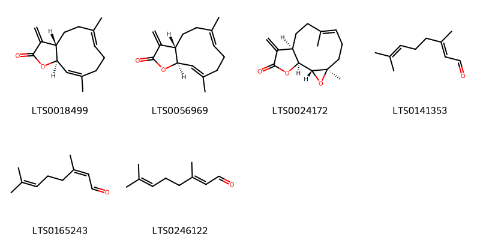{ width=100% }
    <figcaption>Hình ảnh cấu trúc hóa học của 6 hoạt chất thuộc nhóm Prenol lipids gồm ['costunolide (LTS0018499)', 'costunolide (LTS0056969)', '(1s,2r,4r,7e,11r)-4,8-dimethyl-12-methylidene-3,14-dioxatricyclo[9.3.0.0²,⁴]tetradec-7-en-13-one (LTS0024172)', '3,7-dimethyl-2,6-octadienal (LTS0141353)', 'neral (LTS0165243)', 'α-citral (LTS0246122)'].</figcaption>
</figure>

---

### Dược dân tộc học

Danh sách các quốc gia có sử dụng *Magnolia salicifolia* trong điều trị các bệnh. 

| Country   | Disease   | Bệnh                                                                                                                                                                                                |
|:----------|:----------|:----------------------------------------------------------------------------------------------------------------------------------------------------------------------------------------------------|
| Chinese   | Sedative  | MYMEMORY WARNING: YOU USED ALL AVAILABLE FREE TRANSLATIONS FOR TODAY. NEXT AVAILABLE IN  20 HOURS 03 MINUTES 22 SECONDS VISIT HTTPS://MYMEMORY.TRANSLATED.NET/DOC/USAGELIMITS.PHP TO TRANSLATE MORE |
| Japan*    | Sedative  | MYMEMORY WARNING: YOU USED ALL AVAILABLE FREE TRANSLATIONS FOR TODAY. NEXT AVAILABLE IN  20 HOURS 03 MINUTES 19 SECONDS VISIT HTTPS://MYMEMORY.TRANSLATED.NET/DOC/USAGELIMITS.PHP TO TRANSLATE MORE |

---

---
## Magnolia stellata
### Thông tin về thực vật

!!! info "Phân loại thực vật của *Magnolia stellata* từ GIBF:"
    - **Kingdom:** Plantae
    - **Phylum:** Tracheophyta
    - **Order:** Magnoliales
    - **Family:** Magnoliaceae
    - **Genus:** Magnolia
    - **Species:** *Magnolia stellata*

 

| Label (VI)   | Label (EN)   | Scientific Name   | Descriptions (VI)   | Descriptions (EN)   | Also Known As (VI)   | Also Known As (EN)   |
|:-------------|:-------------|:------------------|:--------------------|:--------------------|:---------------------|:---------------------|
| N/A          | N/A          | Magnolia stellata | loài thực vật       | species of plant    | ['']                 | ['Star magnolia']    |

#### Phân bố trên thế giới

**Từ CSDL GIBF** Switzerland, Slovenia, Türkiye, United Kingdom of Great Britain and Northern Ireland, Denmark, Japan, Sweden, Latvia, Poland, Germany, Canada, Kazakhstan, United States of America, Austria, Ukraine

#### Phân bố tại Việt Nam

**Từ CSDL GIBF**: Không có ghi nhận ở Việt Nam

---
### Thành phần hóa học
        
- Theo cơ sở dữ liệu lotus: Từ loài *Magnolia stellata* đã phân lập và xác định được 19 hoạt chất thuộc về các nhóm Furanoid lignans, Prenol lipids, Benzene and substituted derivatives. 

|    | chemicalTaxonomyClassyfireClass     |   smiles_count |
|---:|:------------------------------------|---------------:|
|  0 | Benzene and substituted derivatives |              2 |
|  1 | Furanoid lignans                    |             14 |
|  2 | Prenol lipids                       |              3 |

#### Nhóm Benzene and substituted derivatives
<figure markdown="span">
    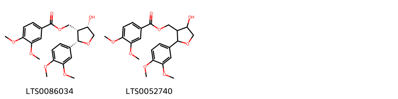{ width=100% }
    <figcaption>Hình ảnh cấu trúc hóa học của 2 hoạt chất thuộc nhóm Benzene and substituted derivatives gồm ['[(2s,3r,4s)-2-(3,4-dimethoxyphenyl)-4-hydroxyoxolan-3-yl]methyl 3,4-dimethoxybenzoate (LTS0086034)', '[2-(3,4-dimethoxyphenyl)-4-hydroxyoxolan-3-yl]methyl 3,4-dimethoxybenzoate (LTS0052740)'].</figcaption>
</figure>
#### Nhóm Furanoid lignans
<figure markdown="span">
    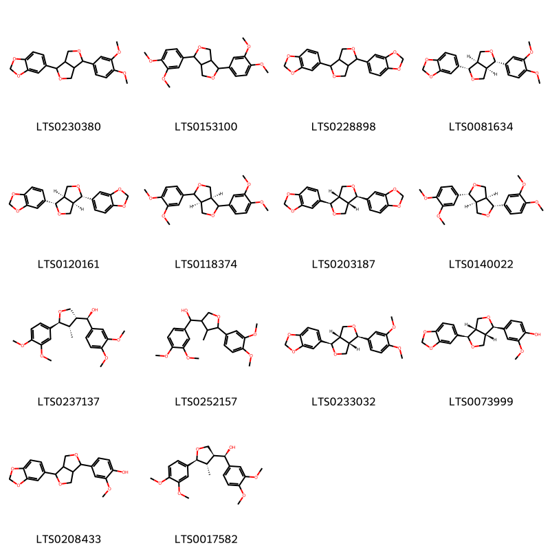{ width=100% }
    <figcaption>Hình ảnh cấu trúc hóa học của 14 hoạt chất thuộc nhóm Furanoid lignans gồm ['5-[4-(3,4-dimethoxyphenyl)-hexahydrofuro[3,4-c]furan-1-yl]-2h-1,3-benzodioxole (LTS0230380)', '1,4-bis(3,4-dimethoxyphenyl)-hexahydrofuro[3,4-c]furan (LTS0153100)', 'sesamin (LTS0228898)', '5-[(1s,3ar,4s,6ar)-4-(3,4-dimethoxyphenyl)-hexahydrofuro[3,4-c]furan-1-yl]-2h-1,3-benzodioxole (LTS0081634)', 'sesamin (LTS0120161)', '(3as,6as)-1,4-bis(3,4-dimethoxyphenyl)-hexahydrofuro[3,4-c]furan (LTS0118374)', '(-)-sesamin (LTS0203187)', '(1r,3as,4r,6as)-1,4-bis(3,4-dimethoxyphenyl)-hexahydrofuro[3,4-c]furan (LTS0140022)', '(r)-(3,4-dimethoxyphenyl)[(3r,4s,5s)-5-(3,4-dimethoxyphenyl)-4-methyloxolan-3-yl]methanol (LTS0237137)', '(3,4-dimethoxyphenyl)[5-(3,4-dimethoxyphenyl)-4-methyloxolan-3-yl]methanol (LTS0252157)', '5-[(1r,3as,4r,6as)-4-(3,4-dimethoxyphenyl)-hexahydrofuro[3,4-c]furan-1-yl]-2h-1,3-benzodioxole (LTS0233032)', '4-[(1r,3as,4r,6as)-4-(2h-1,3-benzodioxol-5-yl)-hexahydrofuro[3,4-c]furan-1-yl]-2-methoxyphenol (LTS0073999)', '4-[4-(2h-1,3-benzodioxol-5-yl)-hexahydrofuro[3,4-c]furan-1-yl]-2-methoxyphenol (LTS0208433)', '(r)-(3,4-dimethoxyphenyl)[(3s,4s,5s)-5-(3,4-dimethoxyphenyl)-4-methyloxolan-3-yl]methanol (LTS0017582)'].</figcaption>
</figure>
#### Nhóm Prenol lipids
<figure markdown="span">
    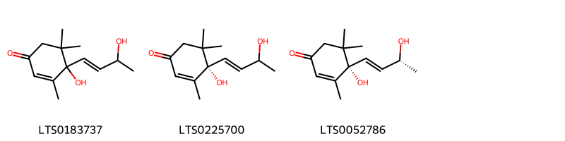{ width=100% }
    <figcaption>Hình ảnh cấu trúc hóa học của 3 hoạt chất thuộc nhóm Prenol lipids gồm ['4-hydroxy-4-(3-hydroxybut-1-en-1-yl)-3,5,5-trimethylcyclohex-2-en-1-one (LTS0183737)', '(4s)-4-hydroxy-4-(3-hydroxybut-1-en-1-yl)-3,5,5-trimethylcyclohex-2-en-1-one (LTS0225700)', '(6s,9r)-vomifoliol (LTS0052786)'].</figcaption>
</figure>

---

### Dược dân tộc học

Danh sách các quốc gia có sử dụng *Magnolia stellata* trong điều trị các bệnh. 

| Country   | Disease   | Bệnh                                                                                                                                                                                                |
|:----------|:----------|:----------------------------------------------------------------------------------------------------------------------------------------------------------------------------------------------------|
| Elsewhere | Sedative  | MYMEMORY WARNING: YOU USED ALL AVAILABLE FREE TRANSLATIONS FOR TODAY. NEXT AVAILABLE IN  20 HOURS 02 MINUTES 41 SECONDS VISIT HTTPS://MYMEMORY.TRANSLATED.NET/DOC/USAGELIMITS.PHP TO TRANSLATE MORE |

---

---
## Magnolia virginiana
### Thông tin về thực vật

!!! info "Phân loại thực vật của *Magnolia virginiana* từ GIBF:"
    - **Kingdom:** Plantae
    - **Phylum:** Tracheophyta
    - **Order:** Magnoliales
    - **Family:** Magnoliaceae
    - **Genus:** Magnolia
    - **Species:** *Magnolia virginiana*

 

| Label (VI)   | Label (EN)   | Scientific Name     | Descriptions (VI)   | Descriptions (EN)   | Also Known As (VI)   | Also Known As (EN)                                                                                                                                           |
|:-------------|:-------------|:--------------------|:--------------------|:--------------------|:---------------------|:-------------------------------------------------------------------------------------------------------------------------------------------------------------|
| N/A          | N/A          | Magnolia virginiana | loài thực vật       | species of plant    | ['']                 | ['sweet bay', 'laurel magnolia', 'Magnolia glauca', 'beavertail', 'sweetbay', 'white bay', 'beaver tree', 'swamp magnolia', 'swampbay', 'sweetbay magnolia'] |

#### Phân bố trên thế giới

**Từ CSDL GIBF** nan, United States of America

#### Phân bố tại Việt Nam

**Từ CSDL GIBF**: Không có ghi nhận ở Việt Nam

---
### Thành phần hóa học
        
- Theo cơ sở dữ liệu lotus: Từ loài *Magnolia virginiana* đã phân lập và xác định được 21 hoạt chất thuộc về các nhóm Prenol lipids, Benzene and substituted derivatives. 

|    | chemicalTaxonomyClassyfireClass     |   smiles_count |
|---:|:------------------------------------|---------------:|
|  0 | Benzene and substituted derivatives |              4 |
|  1 | Prenol lipids                       |             16 |

#### Nhóm Benzene and substituted derivatives
<figure markdown="span">
    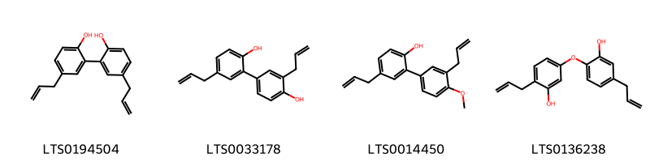{ width=100% }
    <figcaption>Hình ảnh cấu trúc hóa học của 4 hoạt chất thuộc nhóm Benzene and substituted derivatives gồm ['magnolol (LTS0194504)', 'honokiol (LTS0033178)', '4-o-methylhonokiol (LTS0014450)', '2-[3-hydroxy-4-(prop-2-en-1-yl)phenoxy]-5-(prop-2-en-1-yl)phenol (LTS0136238)'].</figcaption>
</figure>
#### Nhóm Prenol lipids
<figure markdown="span">
    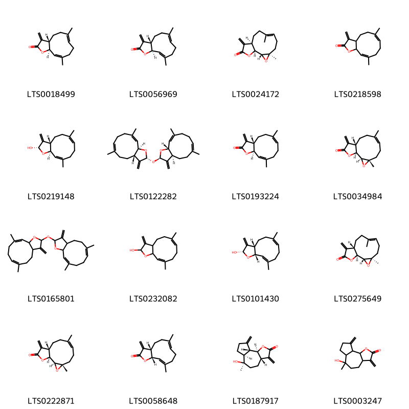{ width=100% }
    <figcaption>Hình ảnh cấu trúc hóa học của 16 hoạt chất thuộc nhóm Prenol lipids gồm ['costunolide (LTS0018499)', 'costunolide (LTS0056969)', '(1s,2r,4r,7e,11r)-4,8-dimethyl-12-methylidene-3,14-dioxatricyclo[9.3.0.0²,⁴]tetradec-7-en-13-one (LTS0024172)', '6,10-dimethyl-3-methylidene-3ah,4h,5h,8h,9h,11ah-cyclodeca[b]furan-2-one (LTS0218598)', '(2s,3as,11ar)-6,10-dimethyl-3-methylidene-2h,3ah,4h,5h,8h,9h,11ah-cyclodeca[b]furan-2-ol (LTS0219148)', '(2r,3as,11ar)-2-{[(2r,3as,11ar)-6,10-dimethyl-3-methylidene-2h,3ah,4h,5h,8h,9h,11ah-cyclodeca[b]furan-2-yl]oxy}-6,10-dimethyl-3-methylidene-2h,3ah,4h,5h,8h,9h,11ah-cyclodeca[b]furan (LTS0122282)', 'costunolide (LTS0193224)', 'parthenolide (LTS0034984)', '2-({6,10-dimethyl-3-methylidene-2h,3ah,4h,5h,8h,9h,11ah-cyclodeca[b]furan-2-yl}oxy)-6,10-dimethyl-3-methylidene-2h,3ah,4h,5h,8h,9h,11ah-cyclodeca[b]furan (LTS0165801)', '6,10-dimethyl-3-methylidene-2h,3ah,4h,5h,8h,9h,11ah-cyclodeca[b]furan-2-ol (LTS0232082)', '(2s,3as,11as)-6,10-dimethyl-3-methylidene-2h,3ah,4h,5h,8h,9h,11ah-cyclodeca[b]furan-2-ol (LTS0101430)', '(-)-parthenolide (LTS0275649)', '(1s,2s,4s,11s)-4,8-dimethyl-12-methylidene-3,14-dioxatricyclo[9.3.0.0²,⁴]tetradec-7-en-13-one (LTS0222871)', '(3as,11as)-6,10-dimethyl-3-methylidene-3ah,4h,5h,8h,9h,11ah-cyclodeca[b]furan-2-one (LTS0058648)', '(3as,6r,6as,9ar,9bs)-6-hydroxy-6-methyl-3,9-dimethylidene-octahydroazuleno[4,5-b]furan-2-one (LTS0187917)', '6-hydroxy-6-methyl-3,9-dimethylidene-octahydroazuleno[4,5-b]furan-2-one (LTS0003247)'].</figcaption>
</figure>

---

### Dược dân tộc học

Danh sách các quốc gia có sử dụng *Magnolia virginiana* trong điều trị các bệnh. 

| Country   | Disease                | Bệnh                                                                                                                                                                                                |
|:----------|:-----------------------|:----------------------------------------------------------------------------------------------------------------------------------------------------------------------------------------------------|
| Turkey    | Cardiotonic, Sudorific | MYMEMORY WARNING: YOU USED ALL AVAILABLE FREE TRANSLATIONS FOR TODAY. NEXT AVAILABLE IN  20 HOURS 02 MINUTES 15 SECONDS VISIT HTTPS://MYMEMORY.TRANSLATED.NET/DOC/USAGELIMITS.PHP TO TRANSLATE MORE |
| US        | Tonic, Laxative        | MYMEMORY WARNING: YOU USED ALL AVAILABLE FREE TRANSLATIONS FOR TODAY. NEXT AVAILABLE IN  20 HOURS 02 MINUTES 13 SECONDS VISIT HTTPS://MYMEMORY.TRANSLATED.NET/DOC/USAGELIMITS.PHP TO TRANSLATE MORE |

---

# Chi Michelia

??? note "Danh sách các dược liệu thuộc chi"
    
	 - *Michelia champaca*
	 - *Michelia champaka*
	 - *Michelia figo*
	 - *Michelia montana*

---
## Michelia champaca
### Thông tin về thực vật

!!! info "Phân loại thực vật của *Magnolia champaca* từ GIBF:"
    - **Kingdom:** Plantae
    - **Phylum:** Tracheophyta
    - **Order:** Magnoliales
    - **Family:** Magnoliaceae
    - **Genus:** Magnolia
    - **Species:** *Magnolia champaca*

 

| Label (VI)   | Label (EN)   | Scientific Name   | Descriptions (VI)   | Descriptions (EN)   | Also Known As (VI)   | Also Known As (EN)   |
|:-------------|:-------------|:------------------|:--------------------|:--------------------|:---------------------|:---------------------|
| N/A          | N/A          | Michelia champaca | loài thực vật       | species of plant    | ['']                 | ['']                 |

#### Phân bố trên thế giới

**Từ CSDL GIBF** nan, United States of America

#### Phân bố tại Việt Nam

**Từ CSDL GIBF**: Không có ghi nhận ở Việt Nam

---
### Thành phần hóa học
        
- Theo cơ sở dữ liệu lotus: Từ loài *Magnolia champaca* đã phân lập và xác định được Chưa có hoạt chất nào được phân lập. hoạt chất thuộc về các nhóm Không có hoạt chất nào được phân lập. 

Không có hình ảnh nào được tạo ra

---

### Dược dân tộc học

Danh sách các quốc gia có sử dụng *Magnolia champaca* trong điều trị các bệnh. 

| Country   | Disease                                                | Bệnh                                                                                                                                                                                                |
|:----------|:-------------------------------------------------------|:----------------------------------------------------------------------------------------------------------------------------------------------------------------------------------------------------|
| Elsewhere | Diuretic, Emmenagogue, Purgative, Stomachic, Stimulant | MYMEMORY WARNING: YOU USED ALL AVAILABLE FREE TRANSLATIONS FOR TODAY. NEXT AVAILABLE IN  20 HOURS 01 MINUTES 44 SECONDS VISIT HTTPS://MYMEMORY.TRANSLATED.NET/DOC/USAGELIMITS.PHP TO TRANSLATE MORE |
| French    | Stomachic                                              | MYMEMORY WARNING: YOU USED ALL AVAILABLE FREE TRANSLATIONS FOR TODAY. NEXT AVAILABLE IN  20 HOURS 01 MINUTES 41 SECONDS VISIT HTTPS://MYMEMORY.TRANSLATED.NET/DOC/USAGELIMITS.PHP TO TRANSLATE MORE |
| German    | Perfume                                                | MYMEMORY WARNING: YOU USED ALL AVAILABLE FREE TRANSLATIONS FOR TODAY. NEXT AVAILABLE IN  20 HOURS 01 MINUTES 38 SECONDS VISIT HTTPS://MYMEMORY.TRANSLATED.NET/DOC/USAGELIMITS.PHP TO TRANSLATE MORE |
| Thailand  | Cosmetic                                               | MYMEMORY WARNING: YOU USED ALL AVAILABLE FREE TRANSLATIONS FOR TODAY. NEXT AVAILABLE IN  20 HOURS 01 MINUTES 36 SECONDS VISIT HTTPS://MYMEMORY.TRANSLATED.NET/DOC/USAGELIMITS.PHP TO TRANSLATE MORE |
| anish     | Demulcent                                              | MYMEMORY WARNING: YOU USED ALL AVAILABLE FREE TRANSLATIONS FOR TODAY. NEXT AVAILABLE IN  20 HOURS 01 MINUTES 33 SECONDS VISIT HTTPS://MYMEMORY.TRANSLATED.NET/DOC/USAGELIMITS.PHP TO TRANSLATE MORE |

---

---
## Michelia champaka
### Thông tin về thực vật

!!! info "Phân loại thực vật của *N/A* từ GIBF:"
    - **Kingdom:** Plantae
    - **Phylum:** Tracheophyta
    - **Order:** Magnoliales
    - **Family:** Magnoliaceae
    - **Genus:** N/A
    - **Species:** *N/A*

 

| Label (VI)   | Label (EN)   | Scientific Name   | Descriptions (VI)   | Descriptions (EN)   | Also Known As (VI)   | Also Known As (EN)   |
|:-------------|:-------------|:------------------|:--------------------|:--------------------|:---------------------|:---------------------|
| N/A          | N/A          | Michelia champaca | loài thực vật       | species of plant    | ['']                 | ['']                 |

#### Phân bố trên thế giới

**Từ CSDL GIBF** nan, South Africa, Bhutan, Brazil, India, United States of America, Mexico, China, Chinese Taipei

#### Phân bố tại Việt Nam

**Từ CSDL GIBF**: Không có ghi nhận ở Việt Nam

---
### Thành phần hóa học
        
- Theo cơ sở dữ liệu lotus: Từ loài *N/A* đã phân lập và xác định được Chưa có hoạt chất nào được phân lập. hoạt chất thuộc về các nhóm Không có hoạt chất nào được phân lập. 

Không có hình ảnh nào được tạo ra

---

### Dược dân tộc học

Danh sách các quốc gia có sử dụng *N/A* trong điều trị các bệnh. 

| Country   | Disease     | Bệnh                                                                                                                                                                                                |
|:----------|:------------|:----------------------------------------------------------------------------------------------------------------------------------------------------------------------------------------------------|
| Chinese   | Emmenagogue | MYMEMORY WARNING: YOU USED ALL AVAILABLE FREE TRANSLATIONS FOR TODAY. NEXT AVAILABLE IN  20 HOURS 01 MINUTES 10 SECONDS VISIT HTTPS://MYMEMORY.TRANSLATED.NET/DOC/USAGELIMITS.PHP TO TRANSLATE MORE |

---

---
## Michelia figo
### Thông tin về thực vật

!!! info "Phân loại thực vật của *Magnolia figo* từ GIBF:"
    - **Kingdom:** Plantae
    - **Phylum:** Tracheophyta
    - **Order:** Magnoliales
    - **Family:** Magnoliaceae
    - **Genus:** Magnolia
    - **Species:** *Magnolia figo*

 

| Label (VI)   | Label (EN)   | Scientific Name   | Descriptions (VI)   | Descriptions (EN)   | Also Known As (VI)   | Also Known As (EN)   |
|:-------------|:-------------|:------------------|:--------------------|:--------------------|:---------------------|:---------------------|
| N/A          | N/A          | Michelia figo     | loài thực vật       | species of plant    | ['']                 | ['']                 |

#### Phân bố trên thế giới

**Từ CSDL GIBF** Viet Nam, Georgia, unknown or invalid, Japan, South Africa, Brazil, Spain, New Zealand, Malaysia, Russian Federation, Canada, United States of America, China, Korea, Republic of, Chinese Taipei

#### Phân bố tại Việt Nam

**Từ CSDL GIBF**: Không có ghi nhận ở Việt Nam

---
### Thành phần hóa học
        
- Theo cơ sở dữ liệu lotus: Từ loài *Magnolia figo* đã phân lập và xác định được Chưa có hoạt chất nào được phân lập. hoạt chất thuộc về các nhóm Không có hoạt chất nào được phân lập. 

Không có hình ảnh nào được tạo ra

---

### Dược dân tộc học

Danh sách các quốc gia có sử dụng *Magnolia figo* trong điều trị các bệnh. 

| Country   | Disease          | Bệnh                                                                                                                                                                                                |
|:----------|:-----------------|:----------------------------------------------------------------------------------------------------------------------------------------------------------------------------------------------------|
| Elsewhere | Cardiodepressant | MYMEMORY WARNING: YOU USED ALL AVAILABLE FREE TRANSLATIONS FOR TODAY. NEXT AVAILABLE IN  20 HOURS 00 MINUTES 44 SECONDS VISIT HTTPS://MYMEMORY.TRANSLATED.NET/DOC/USAGELIMITS.PHP TO TRANSLATE MORE |

---

---
## Michelia montana
### Thông tin về thực vật

!!! info "Phân loại thực vật của *Magnolia montana* từ GIBF:"
    - **Kingdom:** Plantae
    - **Phylum:** Tracheophyta
    - **Order:** Magnoliales
    - **Family:** Magnoliaceae
    - **Genus:** Magnolia
    - **Species:** *Magnolia montana*

 

| Label (VI)   | Label (EN)   | Scientific Name   | Descriptions (VI)   | Descriptions (EN)   | Also Known As (VI)   | Also Known As (EN)   |
|:-------------|:-------------|:------------------|:--------------------|:--------------------|:---------------------|:---------------------|
| N/A          | N/A          | Michelia montana  | loài thực vật       | species of plant    | ['']                 | ['']                 |

#### Phân bố trên thế giới

**Từ CSDL GIBF** nan, unknown or invalid, United States of America, Netherlands, Indonesia

#### Phân bố tại Việt Nam

**Từ CSDL GIBF**: Không có ghi nhận ở Việt Nam

---
### Thành phần hóa học
        
- Theo cơ sở dữ liệu lotus: Từ loài *Magnolia montana* đã phân lập và xác định được Chưa có hoạt chất nào được phân lập. hoạt chất thuộc về các nhóm Không có hoạt chất nào được phân lập. 

Không có hình ảnh nào được tạo ra

---

### Dược dân tộc học

Danh sách các quốc gia có sử dụng *Magnolia montana* trong điều trị các bệnh. 

| Country   | Disease   | Bệnh                                                                                                                                                                                                |
|:----------|:----------|:----------------------------------------------------------------------------------------------------------------------------------------------------------------------------------------------------|
| Elsewhere | Tonic     | MYMEMORY WARNING: YOU USED ALL AVAILABLE FREE TRANSLATIONS FOR TODAY. NEXT AVAILABLE IN  20 HOURS 00 MINUTES 20 SECONDS VISIT HTTPS://MYMEMORY.TRANSLATED.NET/DOC/USAGELIMITS.PHP TO TRANSLATE MORE |

---

