!!! abstract "Tóm tắt"

    Họ Malpighiaceae gồm khoảng 7 chi và 12 loài được một số cộng đồng tại các quốc gia như Mexico, Brazil, Venezuela, Elsewhere, Bahamas, Haiti, Colombia, Peru(Quechua), Colombia(Choco), Sa(Amazon), Peru, India, Java, Panama sử dụng trong một số trường hợp MYMEMORY WARNING: YOU USED ALL AVAILABLE FREE TRANSLATIONS FOR TODAY. NEXT AVAILABLE IN  12 HOURS 51 MINUTES 07 SECONDS VISIT HTTPS://MYMEMORY.TRANSLATED.NET/DOC/USAGELIMITS.PHP TO TRANSLATE MORE.

!!! info "DrDuke"

    James A. Duke sinh năm 1929-2017 là một nhà thực vật học người Mỹ. Đây là một trong những tác giả hàng đầu trong lĩnh vực dược dân tộc học với cuốn *CRC Handbook of Medicinal Herbs* và chính là người xây dựng lên cơ sở dữ liệu về hợp chất tự nhiên và dược dân tộc học tại Bộ nông nghiệp Hoa Kỳ. Các thông tin được đăng tải tại website [Dr. Duke's Phytochemical and Ethnobotanical Databases](https://phytochem.nal.usda.gov/). 
    Trong suốt thập niên 1970, ông lãnh đạo the Plant Taxonomy Laboratory, Plant Genetics and Germplasm Institute of the Agricultural Research Service, U.S. Department of Agriculture.
    Trong tài liệu này, các thông tin về dược dân tộc của các dược liệu được trích dẫn từ tài liệu của James A. Ducke với sự trợ giúp của phần mềm dịch thuật từ tiếng Anh sang tiếng Việt.
   

# Chi Mascagnia

??? note "Danh sách các dược liệu thuộc chi"
    
	 - *Mascagnia macroptera*

---
## Mascagnia macroptera
### Thông tin về thực vật

!!! info "Phân loại thực vật của *Callaeum macropterum* từ GIBF:"
    - **Kingdom:** Plantae
    - **Phylum:** Tracheophyta
    - **Order:** Malpighiales
    - **Family:** Malpighiaceae
    - **Genus:** Callaeum
    - **Species:** *Callaeum macropterum*

 

| Label (VI)   | Label (EN)   | Scientific Name      | Descriptions (VI)   | Descriptions (EN)   | Also Known As (VI)   | Also Known As (EN)   |
|:-------------|:-------------|:---------------------|:--------------------|:--------------------|:---------------------|:---------------------|
| N/A          | N/A          | Mascagnia macroptera | loài thực vật       | species of plant    | ['']                 | ['']                 |

#### Phân bố trên thế giới

**Từ CSDL GIBF** nan, Mexico, Honduras, United States of America

#### Phân bố tại Việt Nam

**Từ CSDL GIBF**: Không có ghi nhận ở Việt Nam

---
### Thành phần hóa học
        
- Theo cơ sở dữ liệu lotus: Từ loài *Callaeum macropterum* đã phân lập và xác định được Chưa có hoạt chất nào được phân lập. hoạt chất thuộc về các nhóm Không có hoạt chất nào được phân lập. 

Không có hình ảnh nào được tạo ra

---

### Dược dân tộc học

Danh sách các quốc gia có sử dụng *Callaeum macropterum* trong điều trị các bệnh. 

| Country   | Disease   | Bệnh                                                                                                                                                                                                |
|:----------|:----------|:----------------------------------------------------------------------------------------------------------------------------------------------------------------------------------------------------|
| Mexico    | Purgative | MYMEMORY WARNING: YOU USED ALL AVAILABLE FREE TRANSLATIONS FOR TODAY. NEXT AVAILABLE IN  12 HOURS 51 MINUTES 04 SECONDS VISIT HTTPS://MYMEMORY.TRANSLATED.NET/DOC/USAGELIMITS.PHP TO TRANSLATE MORE |

---

# Chi Byrsonima

??? note "Danh sách các dược liệu thuộc chi"
    
	 - *Byrsonima crassifolia*

---
## Byrsonima crassifolia
### Thông tin về thực vật

!!! info "Phân loại thực vật của *Byrsonima crassifolia* từ GIBF:"
    - **Kingdom:** Plantae
    - **Phylum:** Tracheophyta
    - **Order:** Malpighiales
    - **Family:** Malpighiaceae
    - **Genus:** Byrsonima
    - **Species:** *Byrsonima crassifolia*

 

| Label (VI)   | Label (EN)   | Scientific Name       | Descriptions (VI)   | Descriptions (EN)   | Also Known As (VI)   | Also Known As (EN)                                                                                                               |
|:-------------|:-------------|:----------------------|:--------------------|:--------------------|:---------------------|:---------------------------------------------------------------------------------------------------------------------------------|
| N/A          | N/A          | Byrsonima crassifolia | loài thực vật       | species of plant    | ['']                 | ['chacunga', 'changunga', 'craboo', 'golden spoon', 'kraabu', 'muruçi', 'nance', 'nanche', 'savanna serret', 'savanna serrette'] |

#### Phân bố trên thế giới

**Từ CSDL GIBF** Brazil, Mexico, Guatemala, Nicaragua, El Salvador, Puerto Rico, Costa Rica, Suriname, Colombia, Honduras, French Guiana, Panama, Belize, Venezuela (Bolivarian Republic of)

#### Phân bố tại Việt Nam

**Từ CSDL GIBF**: Không có ghi nhận ở Việt Nam

---
### Thành phần hóa học
        
- Theo cơ sở dữ liệu lotus: Từ loài *Byrsonima crassifolia* đã phân lập và xác định được 54 hoạt chất thuộc về các nhóm Benzene and substituted derivatives, Flavonoids, Carboxylic acids and derivatives, Glycerolipids, Steroids and steroid derivatives, Prenol lipids. 

|    | chemicalTaxonomyClassyfireClass     |   smiles_count |
|---:|:------------------------------------|---------------:|
|  0 | Benzene and substituted derivatives |              2 |
|  1 | Carboxylic acids and derivatives    |              7 |
|  2 | Flavonoids                          |             24 |
|  3 | Glycerolipids                       |              6 |
|  4 | Prenol lipids                       |             11 |
|  5 | Steroids and steroid derivatives    |              4 |

#### Nhóm Benzene and substituted derivatives
<figure markdown="span">
    { width=100% }
    <figcaption>Hình ảnh cấu trúc hóa học của 2 hoạt chất thuộc nhóm Benzene and substituted derivatives gồm ['galop (LTS0222857)', 'methyl gallate (LTS0043810)'].</figcaption>
</figure>
#### Nhóm Carboxylic acids and derivatives
<figure markdown="span">
    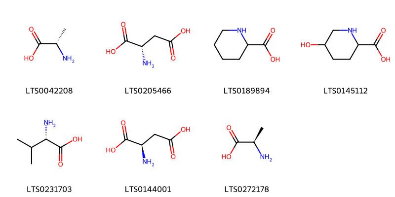{ width=100% }
    <figcaption>Hình ảnh cấu trúc hóa học của 7 hoạt chất thuộc nhóm Carboxylic acids and derivatives gồm ['l-alanine (LTS0042208)', 'l-aspartic acid (LTS0205466)', '(+,-)-pipecolic acid (LTS0189894)', '5-hydroxypipecolic acid (LTS0145112)', 'l-valine (LTS0231703)', 'd-aspartic acid (LTS0144001)', 'd-alanine (LTS0272178)'].</figcaption>
</figure>
#### Nhóm Flavonoids
<figure markdown="span">
    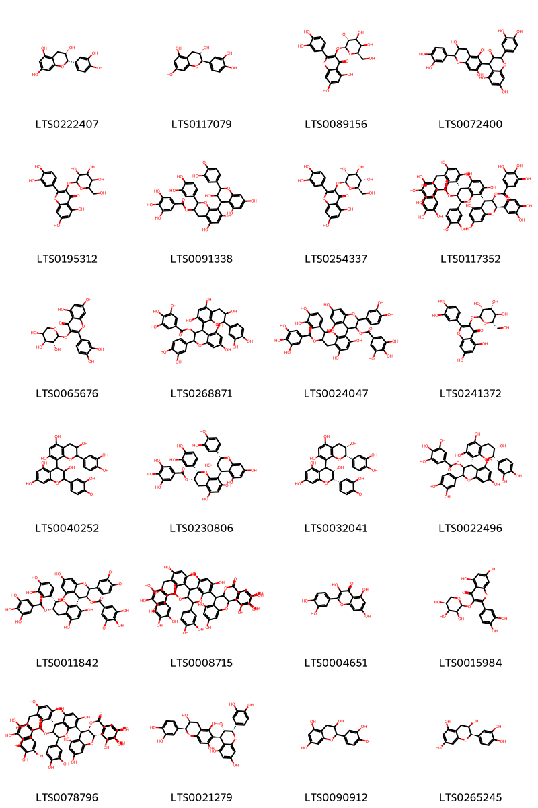{ width=100% }
    <figcaption>Hình ảnh cấu trúc hóa học của 24 hoạt chất thuộc nhóm Flavonoids gồm ['(+)-epicatechin (LTS0222407)', '(+)-catechol (LTS0117079)', 'hyperoside (LTS0089156)', '2-(3,4-dihydroxyphenyl)-4-[2-(3,4-dihydroxyphenyl)-3,5,7-trihydroxy-3,4-dihydro-2h-1-benzopyran-6-yl]-3,4-dihydro-2h-1-benzopyran-3,5,7-triol (LTS0072400)', '2-(3,4-dihydroxyphenyl)-5,7-dihydroxy-3-{[3,4,5-trihydroxy-6-(hydroxymethyl)oxan-2-yl]oxy}chromen-4-one (LTS0195312)', '2-(3,4-dihydroxyphenyl)-8-[2-(3,4-dihydroxyphenyl)-3,5,7-trihydroxy-3,4-dihydro-2h-1-benzopyran-4-yl]-5,7-dihydroxy-3,4-dihydro-2h-1-benzopyran-3-yl 3,4,5-trihydroxybenzoate (LTS0091338)', 'isoquercetin (LTS0254337)', '(2r,3r,4r)-2-(3,4-dihydroxyphenyl)-4-[(2s,3s,4r)-2-(3,4-dihydroxyphenyl)-4-[(2s,3s)-2-(3,4-dihydroxyphenyl)-3,5,7-trihydroxy-3,4-dihydro-2h-1-benzopyran-8-yl]-5,7-dihydroxy-3-(3,4,5-trihydroxybenzoyloxy)-3,4-dihydro-2h-1-benzopyran-8-yl]-5,7-dihydroxy-3,4-dihydro-2h-1-benzopyran-3-yl 3,4,5-trihydroxybenzoate (LTS0117352)', 'guaijaverin (LTS0065676)', '2-(3,4-dihydroxyphenyl)-4-[2-(3,4-dihydroxyphenyl)-3,5,7-trihydroxy-3,4-dihydro-2h-1-benzopyran-8-yl]-5,7-dihydroxy-3,4-dihydro-2h-1-benzopyran-3-yl 3,4,5-trihydroxybenzoate (LTS0268871)', '2-(3,4-dihydroxyphenyl)-4-[2-(3,4-dihydroxyphenyl)-5,7-dihydroxy-3-(3,4,5-trihydroxybenzoyloxy)-3,4-dihydro-2h-1-benzopyran-8-yl]-5,7-dihydroxy-3,4-dihydro-2h-1-benzopyran-3-yl 3,4,5-trihydroxybenzoate (LTS0024047)', '2-(3,4-dihydroxyphenyl)-5,7-dihydroxy-3-{[(2s,3r,4r,5r,6s)-3,4,5-trihydroxy-6-(hydroxymethyl)oxan-2-yl]oxy}chromen-4-one (LTS0241372)', '2-(3,4-dihydroxyphenyl)-4-[2-(3,4-dihydroxyphenyl)-3,5,7-trihydroxy-3,4-dihydro-2h-1-benzopyran-8-yl]-3,4-dihydro-2h-1-benzopyran-3,5,7-triol (LTS0040252)', '(2s,3s)-2-(3,4-dihydroxyphenyl)-8-[(2s,3s,4s)-2-(3,4-dihydroxyphenyl)-3,5,7-trihydroxy-3,4-dihydro-2h-1-benzopyran-4-yl]-5,7-dihydroxy-3,4-dihydro-2h-1-benzopyran-3-yl 3,4,5-trihydroxybenzoate (LTS0230806)', '(2s,3s,4s)-2-(3,4-dihydroxyphenyl)-4-[(2s,3s)-2-(3,4-dihydroxyphenyl)-3,5,7-trihydroxy-3,4-dihydro-2h-1-benzopyran-8-yl]-3,4-dihydro-2h-1-benzopyran-3,5,7-triol (LTS0032041)', '(2s,3s,4s)-2-(3,4-dihydroxyphenyl)-4-[(2s,3s)-2-(3,4-dihydroxyphenyl)-3,5,7-trihydroxy-3,4-dihydro-2h-1-benzopyran-8-yl]-5,7-dihydroxy-3,4-dihydro-2h-1-benzopyran-3-yl 3,4,5-trihydroxybenzoate (LTS0022496)', '(2s,3s,4s)-2-(3,4-dihydroxyphenyl)-4-[(2s,3s)-2-(3,4-dihydroxyphenyl)-5,7-dihydroxy-3-(3,4,5-trihydroxybenzoyloxy)-3,4-dihydro-2h-1-benzopyran-8-yl]-5,7-dihydroxy-3,4-dihydro-2h-1-benzopyran-3-yl 3,4,5-trihydroxybenzoate (LTS0011842)', '2-(3,4-dihydroxyphenyl)-4-[2-(3,4-dihydroxyphenyl)-3,5,7-trihydroxy-3,4-dihydro-2h-1-benzopyran-8-yl]-8-[2-(3,4-dihydroxyphenyl)-5,7-dihydroxy-3-(3,4,5-trihydroxybenzoyloxy)-3,4-dihydro-2h-1-benzopyran-4-yl]-5,7-dihydroxy-3,4-dihydro-2h-1-benzopyran-3-yl 3,4,5-trihydroxybenzoate (LTS0008715)', 'quercetin (LTS0004651)', 'guaijaverin (LTS0015984)', '(2s,3s,4r)-2-(3,4-dihydroxyphenyl)-4-[(2s,3s)-2-(3,4-dihydroxyphenyl)-3,5,7-trihydroxy-3,4-dihydro-2h-1-benzopyran-8-yl]-8-[(2s,3s,4s)-2-(3,4-dihydroxyphenyl)-5,7-dihydroxy-3-(3,4,5-trihydroxybenzoyloxy)-3,4-dihydro-2h-1-benzopyran-4-yl]-5,7-dihydroxy-3,4-dihydro-2h-1-benzopyran-3-yl 3,4,5-trihydroxybenzoate (LTS0078796)', '(2s,3s,4r)-2-(3,4-dihydroxyphenyl)-4-[(2s,3s)-2-(3,4-dihydroxyphenyl)-3,5,7-trihydroxy-3,4-dihydro-2h-1-benzopyran-6-yl]-3,4-dihydro-2h-1-benzopyran-3,5,7-triol (LTS0021279)', 'catechol (LTS0090912)', 'ent-epicatechin (LTS0265245)'].</figcaption>
</figure>
#### Nhóm Glycerolipids
<figure markdown="span">
    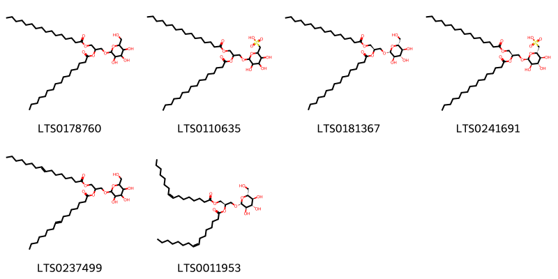{ width=100% }
    <figcaption>Hình ảnh cấu trúc hóa học của 6 hoạt chất thuộc nhóm Glycerolipids gồm ['1-(hexadecanoyloxy)-3-{[3,4,5-trihydroxy-6-(hydroxymethyl)oxan-2-yl]oxy}propan-2-yl hexadecanoate (LTS0178760)', '{6-[2,3-bis(hexadecanoyloxy)propoxy]-3,4,5-trihydroxyoxan-2-yl}methanesulfonic acid (LTS0110635)', '(2r)-1-(hexadecanoyloxy)-3-{[(2r,3r,4s,5s,6r)-3,4,5-trihydroxy-6-(hydroxymethyl)oxan-2-yl]oxy}propan-2-yl hexadecanoate (LTS0181367)', '[(2s,3s,4s,5r,6s)-6-[(2r)-2,3-bis(hexadecanoyloxy)propoxy]-3,4,5-trihydroxyoxan-2-yl]methanesulfonic acid (LTS0241691)', '1-(hexadec-8-enoyloxy)-3-{[3,4,5-trihydroxy-6-(hydroxymethyl)oxan-2-yl]oxy}propan-2-yl hexadec-8-enoate (LTS0237499)', '(2r)-1-[(8z)-hexadec-8-enoyloxy]-3-{[(2r,3r,4s,5s,6r)-3,4,5-trihydroxy-6-(hydroxymethyl)oxan-2-yl]oxy}propan-2-yl (8z)-hexadec-8-enoate (LTS0011953)'].</figcaption>
</figure>
#### Nhóm Prenol lipids
<figure markdown="span">
    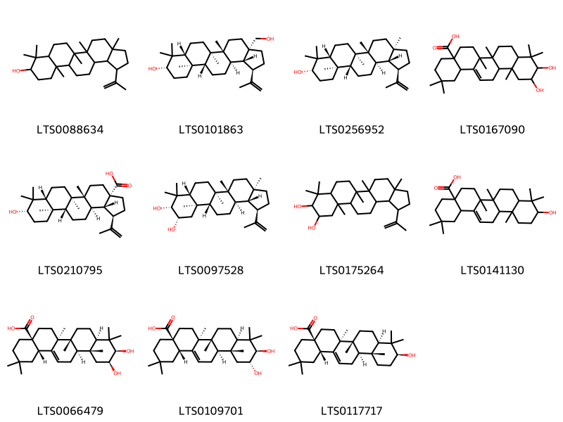{ width=100% }
    <figcaption>Hình ảnh cấu trúc hóa học của 11 hoạt chất thuộc nhóm Prenol lipids gồm ['lupeol (LTS0088634)', 'betulin (LTS0101863)', 'lupeol (LTS0256952)', '10,11-dihydroxy-2,2,6a,6b,9,9,12a-heptamethyl-1,3,4,5,6,7,8,8a,10,11,12,12b,13,14b-tetradecahydropicene-4a-carboxylic acid (LTS0167090)', 'betulinic acid (LTS0210795)', '(1r,3ar,5ar,5br,7ar,9r,10s,11ar,11br,13ar,13br)-3a,5a,5b,8,8,11a-hexamethyl-1-(prop-1-en-2-yl)-hexadecahydrocyclopenta[a]chrysene-9,10-diol (LTS0097528)', '3a,5a,5b,8,8,11a-hexamethyl-1-(prop-1-en-2-yl)-hexadecahydrocyclopenta[a]chrysene-9,10-diol (LTS0175264)', 'oleanolic acid (LTS0141130)', '(4as,6as,6br,8ar,10r,11s,12ar,12br,14bs)-10,11-dihydroxy-2,2,6a,6b,9,9,12a-heptamethyl-1,3,4,5,6,7,8,8a,10,11,12,12b,13,14b-tetradecahydropicene-4a-carboxylic acid (LTS0066479)', 'maslinic acid (LTS0109701)', 'oleanolic acid (LTS0117717)'].</figcaption>
</figure>
#### Nhóm Steroids and steroid derivatives
<figure markdown="span">
    { width=100% }
    <figcaption>Hình ảnh cấu trúc hóa học của 4 hoạt chất thuộc nhóm Steroids and steroid derivatives gồm ['stigmast-5-en-3-ol (LTS0071224)', 'stigmast-5-en-3-ol, (3β)- (LTS0204616)', 'sitogluside (LTS0201798)', '2-{[1-(5-ethyl-6-methylheptan-2-yl)-9a,11a-dimethyl-1h,2h,3h,3ah,3bh,4h,6h,7h,8h,9h,9bh,10h,11h-cyclopenta[a]phenanthren-7-yl]oxy}-6-(hydroxymethyl)oxane-3,4,5-triol (LTS0158828)'].</figcaption>
</figure>

---

### Dược dân tộc học

Danh sách các quốc gia có sử dụng *Byrsonima crassifolia* trong điều trị các bệnh. 

| Country   | Disease                | Bệnh                                                                                                                                                                                                |
|:----------|:-----------------------|:----------------------------------------------------------------------------------------------------------------------------------------------------------------------------------------------------|
| Elsewhere | Piscicide              | MYMEMORY WARNING: YOU USED ALL AVAILABLE FREE TRANSLATIONS FOR TODAY. NEXT AVAILABLE IN  12 HOURS 50 MINUTES 36 SECONDS VISIT HTTPS://MYMEMORY.TRANSLATED.NET/DOC/USAGELIMITS.PHP TO TRANSLATE MORE |
| Mexico    | Astringent, Astringent | MYMEMORY WARNING: YOU USED ALL AVAILABLE FREE TRANSLATIONS FOR TODAY. NEXT AVAILABLE IN  12 HOURS 50 MINUTES 28 SECONDS VISIT HTTPS://MYMEMORY.TRANSLATED.NET/DOC/USAGELIMITS.PHP TO TRANSLATE MORE |
| Panama    | Diuretic               | MYMEMORY WARNING: YOU USED ALL AVAILABLE FREE TRANSLATIONS FOR TODAY. NEXT AVAILABLE IN  12 HOURS 50 MINUTES 25 SECONDS VISIT HTTPS://MYMEMORY.TRANSLATED.NET/DOC/USAGELIMITS.PHP TO TRANSLATE MORE |
| Venezuela | Alexiteric, Piscicide  | MYMEMORY WARNING: YOU USED ALL AVAILABLE FREE TRANSLATIONS FOR TODAY. NEXT AVAILABLE IN  12 HOURS 50 MINUTES 20 SECONDS VISIT HTTPS://MYMEMORY.TRANSLATED.NET/DOC/USAGELIMITS.PHP TO TRANSLATE MORE |

---

# Chi Tetrapterys

??? note "Danh sách các dược liệu thuộc chi"
    
	 - *Tetrapterys methystica*

---
## Tetrapterys methystica
### Thông tin về thực vật

!!! info "Phân loại thực vật của *Glicophyllum stylopterum* từ GIBF:"
    - **Kingdom:** Plantae
    - **Phylum:** Tracheophyta
    - **Order:** Malpighiales
    - **Family:** Malpighiaceae
    - **Genus:** Glicophyllum
    - **Species:** *Glicophyllum stylopterum*

 

| Label (VI)   | Label (EN)   | Scientific Name        | Descriptions (VI)   | Descriptions (EN)   | Also Known As (VI)   | Also Known As (EN)   |
|:-------------|:-------------|:-----------------------|:--------------------|:--------------------|:---------------------|:---------------------|
| N/A          | N/A          | Tetrapterys methystica |                     | species of plant    | ['']                 | ['']                 |

#### Phân bố trên thế giới

**Từ CSDL GIBF** Brazil

#### Phân bố tại Việt Nam

**Từ CSDL GIBF**: Không có ghi nhận ở Việt Nam

---
### Thành phần hóa học
        
- Theo cơ sở dữ liệu lotus: Từ loài *Glicophyllum stylopterum* đã phân lập và xác định được Chưa có hoạt chất nào được phân lập. hoạt chất thuộc về các nhóm Không có hoạt chất nào được phân lập. 

Không có hình ảnh nào được tạo ra

---

### Dược dân tộc học

Danh sách các quốc gia có sử dụng *Glicophyllum stylopterum* trong điều trị các bệnh. 

| Country   | Disease    | Bệnh                                                                                                                                                                                                |
|:----------|:-----------|:----------------------------------------------------------------------------------------------------------------------------------------------------------------------------------------------------|
| Brazil    | Intoxicant | MYMEMORY WARNING: YOU USED ALL AVAILABLE FREE TRANSLATIONS FOR TODAY. NEXT AVAILABLE IN  12 HOURS 49 MINUTES 30 SECONDS VISIT HTTPS://MYMEMORY.TRANSLATED.NET/DOC/USAGELIMITS.PHP TO TRANSLATE MORE |

---

# Chi Banisteriopsis

??? note "Danh sách các dược liệu thuộc chi"
    
	 - *Banisteriopsis caapi*
	 - *Banisteriopsis inebrians*
	 - *Banisteriopsis rusbyana*

---
## Banisteriopsis caapi
### Thông tin về thực vật

!!! info "Phân loại thực vật của *Banisteriopsis caapi* từ GIBF:"
    - **Kingdom:** Plantae
    - **Phylum:** Tracheophyta
    - **Order:** Malpighiales
    - **Family:** Malpighiaceae
    - **Genus:** Banisteriopsis
    - **Species:** *Banisteriopsis caapi*

 

| Label (VI)   | Label (EN)   | Scientific Name      | Descriptions (VI)   | Descriptions (EN)   | Also Known As (VI)   | Also Known As (EN)   |
|:-------------|:-------------|:---------------------|:--------------------|:--------------------|:---------------------|:---------------------|
| N/A          | N/A          | Banisteriopsis caapi | loài thực vật       | species of plant    | ['']                 | ['']                 |

#### Phân bố trên thế giới

**Từ CSDL GIBF** nan, Brazil, United States of America, Belgium, Costa Rica, Colombia, Ecuador, Peru, Bolivia (Plurinational State of), Puerto Rico

#### Phân bố tại Việt Nam

**Từ CSDL GIBF**: Không có ghi nhận ở Việt Nam

---
### Thành phần hóa học
        
- Theo cơ sở dữ liệu lotus: Từ loài *Banisteriopsis caapi* đã phân lập và xác định được 28 hoạt chất thuộc về các nhóm Benzofurans, Flavonoids, Pyrrolidines, Steroids and steroid derivatives, Organooxygen compounds, Prenol lipids, Harmala alkaloids, Indoles and derivatives. 

|    | chemicalTaxonomyClassyfireClass   |   smiles_count |
|---:|:----------------------------------|---------------:|
|  0 | Benzofurans                       |              1 |
|  1 | Flavonoids                        |              4 |
|  2 | Harmala alkaloids                 |             11 |
|  3 | Indoles and derivatives           |              4 |
|  4 | Organooxygen compounds            |              2 |
|  5 | Prenol lipids                     |              3 |
|  6 | Pyrrolidines                      |              1 |
|  7 | Steroids and steroid derivatives  |              2 |

#### Nhóm Benzofurans
<figure markdown="span">
    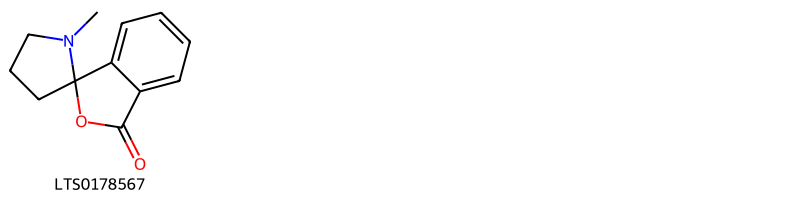{ width=100% }
    <figcaption>Hình ảnh cấu trúc hóa học của 1 hoạt chất thuộc nhóm Benzofurans gồm ['shihunine (LTS0178567)'].</figcaption>
</figure>
#### Nhóm Flavonoids
<figure markdown="span">
    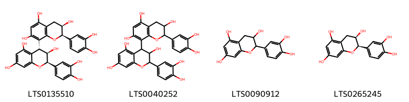{ width=100% }
    <figcaption>Hình ảnh cấu trúc hóa học của 4 hoạt chất thuộc nhóm Flavonoids gồm ['(2r,3r,4r)-2-(3,4-dihydroxyphenyl)-4-[(2r,3r)-2-(3,4-dihydroxyphenyl)-3,5,7-trihydroxy-3,4-dihydro-2h-1-benzopyran-8-yl]-3,4-dihydro-2h-1-benzopyran-3,5,7-triol (LTS0135510)', '2-(3,4-dihydroxyphenyl)-4-[2-(3,4-dihydroxyphenyl)-3,5,7-trihydroxy-3,4-dihydro-2h-1-benzopyran-8-yl]-3,4-dihydro-2h-1-benzopyran-3,5,7-triol (LTS0040252)', 'catechol (LTS0090912)', 'ent-epicatechin (LTS0265245)'].</figcaption>
</figure>
#### Nhóm Harmala alkaloids
<figure markdown="span">
    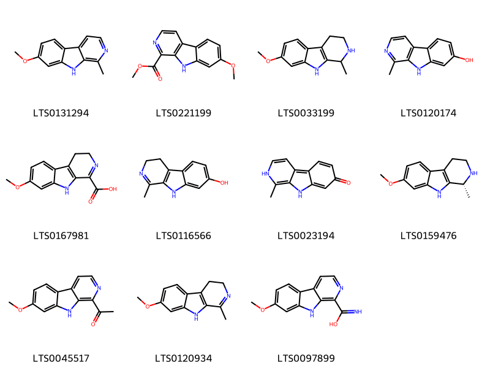{ width=100% }
    <figcaption>Hình ảnh cấu trúc hóa học của 11 hoạt chất thuộc nhóm Harmala alkaloids gồm ['harmine (LTS0131294)', 'methyl 7-methoxy-9h-pyrido[3,4-b]indole-1-carboxylate (LTS0221199)', '(+/-)-tetrahydroharmine (LTS0033199)', 'harmol (LTS0120174)', '7-methoxy-3h,4h,9h-pyrido[3,4-b]indole-1-carboxylic acid (LTS0167981)', 'harmalol (LTS0116566)', 'harmol (LTS0023194)', 'tetrahydroharmine (LTS0159476)', '1-{7-methoxy-9h-pyrido[3,4-b]indol-1-yl}ethanone (LTS0045517)', 'harmaline (LTS0120934)', '7-methoxy-9h-pyrido[3,4-b]indole-1-carboximidic acid (LTS0097899)'].</figcaption>
</figure>
#### Nhóm Indoles and derivatives
<figure markdown="span">
    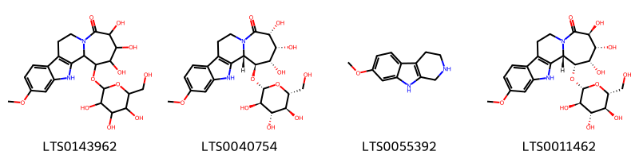{ width=100% }
    <figcaption>Hình ảnh cấu trúc hóa học của 4 hoạt chất thuộc nhóm Indoles and derivatives gồm ['4,5,6-trihydroxy-15-methoxy-3-{[3,4,5-trihydroxy-6-(hydroxymethyl)oxan-2-yl]oxy}-8,18-diazatetracyclo[9.7.0.0²,⁸.0¹²,¹⁷]octadeca-1(11),12,14,16-tetraen-7-one (LTS0143962)', '(2s,3s,4s,5r,6r)-4,5,6-trihydroxy-15-methoxy-3-{[(2r,3r,4s,5s,6r)-3,4,5-trihydroxy-6-(hydroxymethyl)oxan-2-yl]oxy}-8,18-diazatetracyclo[9.7.0.0²,⁸.0¹²,¹⁷]octadeca-1(11),12,14,16-tetraen-7-one (LTS0040754)', '7-methoxy-1h,2h,3h,4h,9h-pyrido[3,4-b]indole (LTS0055392)', '(2s,3r,4s,5r,6s)-4,5,6-trihydroxy-15-methoxy-3-{[(2r,3r,4s,5s,6r)-3,4,5-trihydroxy-6-(hydroxymethyl)oxan-2-yl]oxy}-8,18-diazatetracyclo[9.7.0.0²,⁸.0¹²,¹⁷]octadeca-1(11),12,14,16-tetraen-7-one (LTS0011462)'].</figcaption>
</figure>
#### Nhóm Organooxygen compounds
<figure markdown="span">
    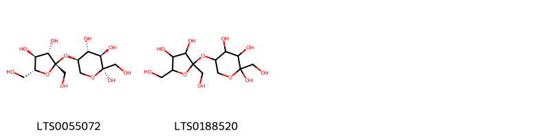{ width=100% }
    <figcaption>Hình ảnh cấu trúc hóa học của 2 hoạt chất thuộc nhóm Organooxygen compounds gồm ['(2r,3r,4r,5r)-5-{[(2s,3s,4s,5r)-3,4-dihydroxy-2,5-bis(hydroxymethyl)oxolan-2-yl]oxy}-2-(hydroxymethyl)oxane-2,3,4-triol (LTS0055072)', '5-{[3,4-dihydroxy-2,5-bis(hydroxymethyl)oxolan-2-yl]oxy}-2-(hydroxymethyl)oxane-2,3,4-triol (LTS0188520)'].</figcaption>
</figure>
#### Nhóm Prenol lipids
<figure markdown="span">
    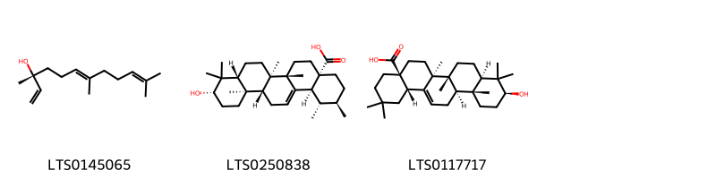{ width=100% }
    <figcaption>Hình ảnh cấu trúc hóa học của 3 hoạt chất thuộc nhóm Prenol lipids gồm ['(3r,6e)-nerolidol (LTS0145065)', 'ursolic acid (LTS0250838)', 'oleanolic acid (LTS0117717)'].</figcaption>
</figure>
#### Nhóm Pyrrolidines
<figure markdown="span">
    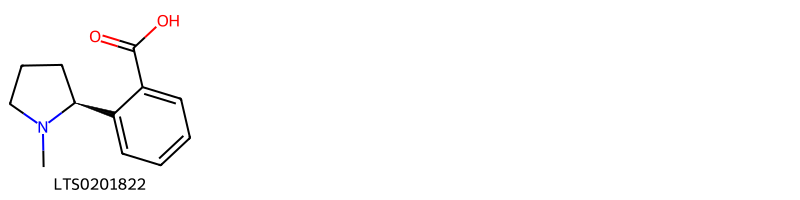{ width=100% }
    <figcaption>Hình ảnh cấu trúc hóa học của 1 hoạt chất thuộc nhóm Pyrrolidines gồm ['2-[(2s)-1-methylpyrrolidin-2-yl]benzoic acid (LTS0201822)'].</figcaption>
</figure>
#### Nhóm Steroids and steroid derivatives
<figure markdown="span">
    { width=100% }
    <figcaption>Hình ảnh cấu trúc hóa học của 2 hoạt chất thuộc nhóm Steroids and steroid derivatives gồm ['stigmast-5-en-3-ol, (3β)- (LTS0204616)', 'phytosterol (LTS0029311)'].</figcaption>
</figure>

---

### Dược dân tộc học

Danh sách các quốc gia có sử dụng *Banisteriopsis caapi* trong điều trị các bệnh. 

| Country         | Disease      | Bệnh                                                                                                                                                                                                |
|:----------------|:-------------|:----------------------------------------------------------------------------------------------------------------------------------------------------------------------------------------------------|
| Colombia        | Hallucinogen | MYMEMORY WARNING: YOU USED ALL AVAILABLE FREE TRANSLATIONS FOR TODAY. NEXT AVAILABLE IN  12 HOURS 49 MINUTES 11 SECONDS VISIT HTTPS://MYMEMORY.TRANSLATED.NET/DOC/USAGELIMITS.PHP TO TRANSLATE MORE |
| Colombia(Choco) | Hallucinogen | MYMEMORY WARNING: YOU USED ALL AVAILABLE FREE TRANSLATIONS FOR TODAY. NEXT AVAILABLE IN  12 HOURS 49 MINUTES 08 SECONDS VISIT HTTPS://MYMEMORY.TRANSLATED.NET/DOC/USAGELIMITS.PHP TO TRANSLATE MORE |
| Elsewhere       | Hallucinogen | MYMEMORY WARNING: YOU USED ALL AVAILABLE FREE TRANSLATIONS FOR TODAY. NEXT AVAILABLE IN  12 HOURS 49 MINUTES 05 SECONDS VISIT HTTPS://MYMEMORY.TRANSLATED.NET/DOC/USAGELIMITS.PHP TO TRANSLATE MORE |
| Peru            | Hallucinogen | MYMEMORY WARNING: YOU USED ALL AVAILABLE FREE TRANSLATIONS FOR TODAY. NEXT AVAILABLE IN  12 HOURS 49 MINUTES 02 SECONDS VISIT HTTPS://MYMEMORY.TRANSLATED.NET/DOC/USAGELIMITS.PHP TO TRANSLATE MORE |
| Peru(Quechua)   | Hallucinogen | MYMEMORY WARNING: YOU USED ALL AVAILABLE FREE TRANSLATIONS FOR TODAY. NEXT AVAILABLE IN  12 HOURS 48 MINUTES 59 SECONDS VISIT HTTPS://MYMEMORY.TRANSLATED.NET/DOC/USAGELIMITS.PHP TO TRANSLATE MORE |
| Sa(Amazon)      | Narcotic     | MYMEMORY WARNING: YOU USED ALL AVAILABLE FREE TRANSLATIONS FOR TODAY. NEXT AVAILABLE IN  12 HOURS 48 MINUTES 56 SECONDS VISIT HTTPS://MYMEMORY.TRANSLATED.NET/DOC/USAGELIMITS.PHP TO TRANSLATE MORE |

---

---
## Banisteriopsis inebrians
### Thông tin về thực vật

!!! info "Phân loại thực vật của *Banisteriopsis caapi* từ GIBF:"
    - **Kingdom:** Plantae
    - **Phylum:** Tracheophyta
    - **Order:** Malpighiales
    - **Family:** Malpighiaceae
    - **Genus:** Banisteriopsis
    - **Species:** *Banisteriopsis caapi*

 

| Label (VI)   | Label (EN)   | Scientific Name          | Descriptions (VI)   | Descriptions (EN)   | Also Known As (VI)   | Also Known As (EN)   |
|:-------------|:-------------|:-------------------------|:--------------------|:--------------------|:---------------------|:---------------------|
| N/A          | N/A          | Banisteriopsis inebrians | loài thực vật       | species of plant    | ['']                 | ['']                 |

#### Phân bố trên thế giới

**Từ CSDL GIBF** nan, Colombia, Brazil

#### Phân bố tại Việt Nam

**Từ CSDL GIBF**: Không có ghi nhận ở Việt Nam

---
### Thành phần hóa học
        
- Theo cơ sở dữ liệu lotus: Từ loài *Banisteriopsis caapi* đã phân lập và xác định được Chưa có hoạt chất nào được phân lập. hoạt chất thuộc về các nhóm Không có hoạt chất nào được phân lập. 

Không có hình ảnh nào được tạo ra

---

### Dược dân tộc học

Danh sách các quốc gia có sử dụng *Banisteriopsis caapi* trong điều trị các bệnh. 

| Country   | Disease      | Bệnh                                                                                                                                                                                                |
|:----------|:-------------|:----------------------------------------------------------------------------------------------------------------------------------------------------------------------------------------------------|
| Peru      | Hallucinogen | MYMEMORY WARNING: YOU USED ALL AVAILABLE FREE TRANSLATIONS FOR TODAY. NEXT AVAILABLE IN  12 HOURS 48 MINUTES 15 SECONDS VISIT HTTPS://MYMEMORY.TRANSLATED.NET/DOC/USAGELIMITS.PHP TO TRANSLATE MORE |

---

---
## Banisteriopsis rusbyana
### Thông tin về thực vật

!!! info "Phân loại thực vật của *Diplopterys longialata* từ GIBF:"
    - **Kingdom:** Plantae
    - **Phylum:** Tracheophyta
    - **Order:** Malpighiales
    - **Family:** Malpighiaceae
    - **Genus:** Diplopterys
    - **Species:** *Diplopterys longialata*

 

| Label (VI)   | Label (EN)   | Scientific Name         | Descriptions (VI)   | Descriptions (EN)   | Also Known As (VI)   | Also Known As (EN)   |
|:-------------|:-------------|:------------------------|:--------------------|:--------------------|:---------------------|:---------------------|
| N/A          | N/A          | Banisteriopsis rusbyana | loài thực vật       | species of plant    | ['']                 | ['']                 |

#### Phân bố trên thế giới

**Từ CSDL GIBF** nan, Colombia, Bolivia (Plurinational State of)

#### Phân bố tại Việt Nam

**Từ CSDL GIBF**: Không có ghi nhận ở Việt Nam

---
### Thành phần hóa học
        
- Theo cơ sở dữ liệu lotus: Từ loài *Diplopterys longialata* đã phân lập và xác định được Chưa có hoạt chất nào được phân lập. hoạt chất thuộc về các nhóm Không có hoạt chất nào được phân lập. 

Không có hình ảnh nào được tạo ra

---

### Dược dân tộc học

Danh sách các quốc gia có sử dụng *Diplopterys longialata* trong điều trị các bệnh. 

| Country   | Disease      | Bệnh                                                                                                                                                                                                |
|:----------|:-------------|:----------------------------------------------------------------------------------------------------------------------------------------------------------------------------------------------------|
| Peru      | Hallucinogen | MYMEMORY WARNING: YOU USED ALL AVAILABLE FREE TRANSLATIONS FOR TODAY. NEXT AVAILABLE IN  12 HOURS 47 MINUTES 48 SECONDS VISIT HTTPS://MYMEMORY.TRANSLATED.NET/DOC/USAGELIMITS.PHP TO TRANSLATE MORE |

---

# Chi Galphimia

??? note "Danh sách các dược liệu thuộc chi"
    
	 - *Galphimia glauca*

---
## Galphimia glauca
### Thông tin về thực vật

!!! info "Phân loại thực vật của *Galphimia glauca* từ GIBF:"
    - **Kingdom:** Plantae
    - **Phylum:** Tracheophyta
    - **Order:** Malpighiales
    - **Family:** Malpighiaceae
    - **Genus:** Galphimia
    - **Species:** *Galphimia glauca*

 

| Label (VI)   | Label (EN)   | Scientific Name   | Descriptions (VI)   | Descriptions (EN)   | Also Known As (VI)   | Also Known As (EN)   |
|:-------------|:-------------|:------------------|:--------------------|:--------------------|:---------------------|:---------------------|
| N/A          | N/A          | Galphimia glauca  | loài thực vật       | species of plant    | ['']                 | ['']                 |

#### Phân bố trên thế giới

**Từ CSDL GIBF** nan, Brazil, Viet Nam, Ecuador, Thailand, Turks and Caicos Islands, Puerto Rico, Réunion, United States of America, Jamaica, Indonesia, Colombia, Cuba, Hong Kong, Mexico, El Salvador, Malaysia, Philippines, Panama, Nicaragua, Singapore, Austria, Australia, India

#### Phân bố tại Việt Nam

**Từ CSDL GIBF**: Không có ghi nhận ở Việt Nam

---
### Thành phần hóa học
        
- Theo cơ sở dữ liệu lotus: Từ loài *Galphimia glauca* đã phân lập và xác định được 62 hoạt chất thuộc về các nhóm Benzene and substituted derivatives, Flavonoids, Tannins, Carboxylic acids and derivatives, Steroids and steroid derivatives, Oxanes, Prenol lipids. 

|    | chemicalTaxonomyClassyfireClass     |   smiles_count |
|---:|:------------------------------------|---------------:|
|  0 | Benzene and substituted derivatives |              2 |
|  1 | Carboxylic acids and derivatives    |              4 |
|  2 | Flavonoids                          |              4 |
|  3 | Oxanes                              |              4 |
|  4 | Prenol lipids                       |              5 |
|  5 | Steroids and steroid derivatives    |             42 |
|  6 | Tannins                             |              1 |

#### Nhóm Benzene and substituted derivatives
<figure markdown="span">
    { width=100% }
    <figcaption>Hình ảnh cấu trúc hóa học của 2 hoạt chất thuộc nhóm Benzene and substituted derivatives gồm ['galop (LTS0222857)', 'methyl gallate (LTS0043810)'].</figcaption>
</figure>
#### Nhóm Carboxylic acids and derivatives
<figure markdown="span">
    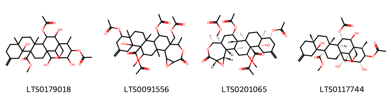{ width=100% }
    <figcaption>Hình ảnh cấu trúc hóa học của 4 hoạt chất thuộc nhóm Carboxylic acids and derivatives gồm ['methyl 3,21-bis(acetyloxy)-2,13,20,25-tetrahydroxy-5,8,22-trimethyl-11-methylidene-24-oxahexacyclo[15.5.3.0¹,¹⁸.0⁴,¹⁷.0⁵,¹⁴.0⁸,¹³]pentacosane-14-carboxylate (LTS0179018)', 'methyl 6,12,24-tris(acetyloxy)-22-[(acetyloxy)methyl]-10-hydroxy-2,5,14,21-tetramethyl-8-methylidene-19-oxo-17,20-dioxahexacyclo[12.10.0.0²,¹¹.0⁵,¹⁰.0¹⁵,²².0¹⁶,¹⁸]tetracosane-11-carboxylate (LTS0091556)', 'methyl (1s,2r,5s,6r,10s,11r,12s,14r,15s,16s,18s,21r,22s,24r)-6,12,24-tris(acetyloxy)-22-[(acetyloxy)methyl]-10-hydroxy-2,5,14,21-tetramethyl-8-methylidene-19-oxo-17,20-dioxahexacyclo[12.10.0.0²,¹¹.0⁵,¹⁰.0¹⁵,²².0¹⁶,¹⁸]tetracosane-11-carboxylate (LTS0201065)', 'methyl (1s,2s,3s,4r,5r,8r,13s,14s,17s,18r,20r,21r,22r,25s)-3,21-bis(acetyloxy)-2,13,20,25-tetrahydroxy-5,8,22-trimethyl-11-methylidene-24-oxahexacyclo[15.5.3.0¹,¹⁸.0⁴,¹⁷.0⁵,¹⁴.0⁸,¹³]pentacosane-14-carboxylate (LTS0117744)'].</figcaption>
</figure>
#### Nhóm Flavonoids
<figure markdown="span">
    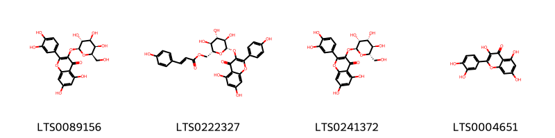{ width=100% }
    <figcaption>Hình ảnh cấu trúc hóa học của 4 hoạt chất thuộc nhóm Flavonoids gồm ['hyperoside (LTS0089156)', 'tiliroside (LTS0222327)', '2-(3,4-dihydroxyphenyl)-5,7-dihydroxy-3-{[(2s,3r,4r,5r,6s)-3,4,5-trihydroxy-6-(hydroxymethyl)oxan-2-yl]oxy}chromen-4-one (LTS0241372)', 'quercetin (LTS0004651)'].</figcaption>
</figure>
#### Nhóm Oxanes
<figure markdown="span">
    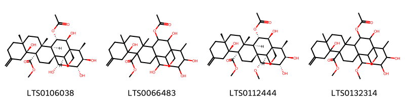{ width=100% }
    <figcaption>Hình ảnh cấu trúc hóa học của 4 hoạt chất thuộc nhóm Oxanes gồm ['methyl (1s,2s,3s,4r,5r,8r,13s,14s,17s,18r,20r,21r,22r,25s)-3-(acetyloxy)-2,13,20,21,25-pentahydroxy-5,8,22-trimethyl-11-methylidene-24-oxahexacyclo[15.5.3.0¹,¹⁸.0⁴,¹⁷.0⁵,¹⁴.0⁸,¹³]pentacosane-14-carboxylate (LTS0106038)', 'methyl 3-(acetyloxy)-2,13,20,21,25-pentahydroxy-5,8,22-trimethyl-11-methylidene-24-oxahexacyclo[15.5.3.0¹,¹⁸.0⁴,¹⁷.0⁵,¹⁴.0⁸,¹³]pentacosane-14-carboxylate (LTS0066483)', 'methyl (1s,2s,3s,4r,5r,8r,13s,14s,17s,18r,20r,21r,22r,25s)-3-(acetyloxy)-2,13,20,21-tetrahydroxy-25-methoxy-5,8,22-trimethyl-11-methylidene-24-oxahexacyclo[15.5.3.0¹,¹⁸.0⁴,¹⁷.0⁵,¹⁴.0⁸,¹³]pentacosane-14-carboxylate (LTS0112444)', 'methyl 3-(acetyloxy)-2,13,20,21-tetrahydroxy-25-methoxy-5,8,22-trimethyl-11-methylidene-24-oxahexacyclo[15.5.3.0¹,¹⁸.0⁴,¹⁷.0⁵,¹⁴.0⁸,¹³]pentacosane-14-carboxylate (LTS0132314)'].</figcaption>
</figure>
#### Nhóm Prenol lipids
<figure markdown="span">
    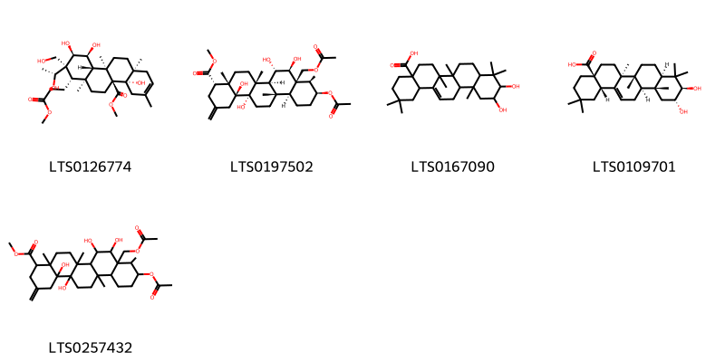{ width=100% }
    <figcaption>Hình ảnh cấu trúc hóa học của 5 hoạt chất thuộc nhóm Prenol lipids gồm ['methyl (4as,4bs,6as,7s,8r,9r,10s,10as,10br,12as)-4a,9,10-trihydroxy-8-[(1r)-1-hydroxyethyl]-8-(hydroxymethyl)-7-(3-methoxy-3-oxopropyl)-3,6a,10b,12a-tetramethyl-1,4,5,6,7,9,10,10a,11,12-decahydrochrysene-4b-carboxylate (LTS0126774)', 'methyl (4s,4as,6ar,6bs,7s,8s,8as,9r,10s,12as,12bs,14as,14bs)-10-(acetyloxy)-8a-[(acetyloxy)methyl]-7,8,14a,14b-tetrahydroxy-4a,6a,9,12b-tetramethyl-2-methylidene-tetradecahydro-1h-picene-4-carboxylate (LTS0197502)', '10,11-dihydroxy-2,2,6a,6b,9,9,12a-heptamethyl-1,3,4,5,6,7,8,8a,10,11,12,12b,13,14b-tetradecahydropicene-4a-carboxylic acid (LTS0167090)', 'maslinic acid (LTS0109701)', 'methyl 10-(acetyloxy)-8a-[(acetyloxy)methyl]-7,8,14a,14b-tetrahydroxy-4a,6a,9,12b-tetramethyl-2-methylidene-tetradecahydro-1h-picene-4-carboxylate (LTS0257432)'].</figcaption>
</figure>
#### Nhóm Steroids and steroid derivatives
<figure markdown="span">
    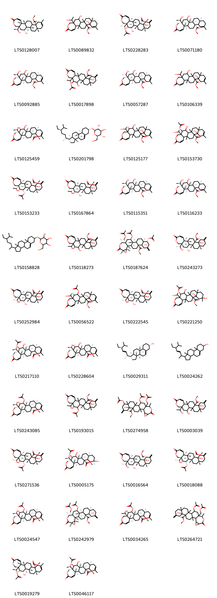{ width=100% }
    <figcaption>Hình ảnh cấu trúc hóa học của 42 hoạt chất thuộc nhóm Steroids and steroid derivatives gồm ['methyl (5as,7r,7as,7br,9as,13as,13bs,15as,15br)-7,13a-dihydroxy-5a-[(1s)-1-hydroxyethyl]-7b,9a,12,15a-tetramethyl-3-oxo-5h,6h,7h,7ah,8h,9h,10h,13h,14h,15h,15bh-chryseno[2,1-c]oxepine-13b-carboxylate (LTS0128007)', 'methyl 7,13a-dihydroxy-5a-(1-hydroxyethyl)-7b,9a,12,15a-tetramethyl-3-oxo-5h,6h,7h,7ah,8h,9h,10h,11h,14h,15h,15bh-chryseno[2,1-c]oxepine-13b-carboxylate (LTS0089832)', 'methyl (5ar,6r,7s,7as,7br,9ar,13as,13bs,15as,15bs)-6-(acetyloxy)-7,13a-dihydroxy-5a-[(1r)-1-hydroxyethyl]-7b,9a,15a-trimethyl-12-methylidene-3-oxo-5h,6h,7h,7ah,8h,9h,10h,11h,13h,14h,15h,15bh-chryseno[2,1-c]oxepine-13b-carboxylate (LTS0228283)', 'methyl (5as,7r,7as,7br,9ar,13as,13br,15as,15bs)-7,13a-dihydroxy-5a-[(1r)-1-hydroxyethyl]-7b,9a,12,15a-tetramethyl-3-oxo-5h,6h,7h,7ah,8h,9h,10h,11h,14h,15h,15bh-chryseno[2,1-c]oxepine-13b-carboxylate (LTS0071180)', 'methyl (5as,7r,7as,7br,9as,13as,13br,15as,15bs)-7,13a-dihydroxy-5a-[(1r)-1-hydroxyethyl]-7b,9a,12,15a-tetramethyl-3-oxo-5h,6h,7h,7ah,8h,9h,10h,13h,14h,15h,15bh-chryseno[2,1-c]oxepine-13b-carboxylate (LTS0092885)', 'methyl 6-(acetyloxy)-7,13a-dihydroxy-5a-(1-hydroxyethyl)-7b,9a,15a-trimethyl-12-methylidene-3-oxo-5h,6h,7h,7ah,8h,9h,10h,11h,13h,14h,15h,15bh-chryseno[2,1-c]oxepine-13b-carboxylate (LTS0017898)', 'methyl (5as,7r,7ar,7br,9as,13as,13bs,15as,15br)-7,13a-dihydroxy-5a-[(1s)-1-hydroxyethyl]-7b,9a,12,15a-tetramethyl-3-oxo-5h,6h,7h,7ah,8h,9h,10h,13h,14h,15h,15bh-chryseno[2,1-c]oxepine-13b-carboxylate (LTS0057287)', 'methyl 7,13a-dihydroxy-5a-(1-hydroxyethyl)-7b,9a,12,15a-tetramethyl-3-oxo-5h,6h,7h,7ah,8h,9h,10h,13h,14h,15h,15bh-chryseno[2,1-c]oxepine-13b-carboxylate (LTS0106339)', 'methyl (5ar,6r,7s,7as,7br,9as,13as,13br,15as,15bs)-6,7,13a-trihydroxy-5a-[(1r)-1-hydroxyethyl]-7b,9a,12,15a-tetramethyl-3-oxo-5h,6h,7h,7ah,8h,9h,10h,13h,14h,15h,15bh-chryseno[2,1-c]oxepine-13b-carboxylate (LTS0125459)', 'sitogluside (LTS0201798)', 'methyl 6,7,13a-trihydroxy-5a-(1-hydroxyethyl)-7b,9a,12,15a-tetramethyl-3-oxo-5h,6h,7h,7ah,8h,9h,10h,13h,14h,15h,15bh-chryseno[2,1-c]oxepine-13b-carboxylate (LTS0125177)', 'methyl 6-(acetyloxy)-7,13a-dihydroxy-5a-(1-hydroxyethyl)-7b,9a,12,15a-tetramethyl-3-oxo-5h,6h,7h,7ah,8h,9h,10h,13h,14h,15h,15bh-chryseno[2,1-c]oxepine-13b-carboxylate (LTS0153730)', 'methyl (5ar,6r,7s,7as,7br,9ar,13as,13bs,15as,15bs)-7-(acetyloxy)-6,13a-dihydroxy-5a-(1-hydroxyethyl)-7b,9a,15a-trimethyl-12-methylidene-3-oxo-5h,6h,7h,7ah,8h,9h,10h,11h,13h,14h,15h,15bh-chryseno[2,1-c]oxepine-13b-carboxylate (LTS0153233)', 'methyl (5ar,6r,7s,7as,7br,9ar,13as,13bs,15as,15bs)-6,7,13a-trihydroxy-5a-(1-hydroxyethyl)-7b,9a,15a-trimethyl-12-methylidene-3-oxo-5h,6h,7h,7ah,8h,9h,10h,11h,13h,14h,15h,15bh-chryseno[2,1-c]oxepine-13b-carboxylate (LTS0167864)', 'methyl (5as,7r,7as,7br,9as,13as,13bs,15as,15bs)-7,13a-dihydroxy-5a-[(1r)-1-hydroxyethyl]-7b,9a,12,15a-tetramethyl-3-oxo-5h,6h,7h,7ah,8h,9h,10h,13h,14h,15h,15bh-chryseno[2,1-c]oxepine-13b-carboxylate (LTS0115351)', 'methyl (5as,7r,7as,7br,9ar,13as,13bs,15as,15bs)-7,13a-dihydroxy-5a-[(1r)-1-hydroxyethyl]-7b,9a,12,15a-tetramethyl-3-oxo-5h,6h,7h,7ah,8h,9h,10h,11h,14h,15h,15bh-chryseno[2,1-c]oxepine-13b-carboxylate (LTS0116233)', '2-{[1-(5-ethyl-6-methylheptan-2-yl)-9a,11a-dimethyl-1h,2h,3h,3ah,3bh,4h,6h,7h,8h,9h,9bh,10h,11h-cyclopenta[a]phenanthren-7-yl]oxy}-6-(hydroxymethyl)oxane-3,4,5-triol (LTS0158828)', 'methyl 6,7,13a-trihydroxy-5a-(1-hydroxyethyl)-7b,9a,15a-trimethyl-12-methylidene-3-oxo-5h,6h,7h,7ah,8h,9h,10h,11h,13h,14h,15h,15bh-chryseno[2,1-c]oxepine-13b-carboxylate (LTS0118273)', 'methyl (1s,2r,5s,6r,10s,11s,14r,15s,16s,18s,21r,22s,24r)-6,24-bis(acetyloxy)-22-[(acetyloxy)methyl]-10-hydroxy-2,5,14,21-tetramethyl-8-methylidene-19-oxo-17,20-dioxahexacyclo[12.10.0.0²,¹¹.0⁵,¹⁰.0¹⁵,²².0¹⁶,¹⁸]tetracosane-11-carboxylate (LTS0187624)', 'methyl (5as,7r,7as,7br,9ar,13as,13br,15as,15bs)-7,13a-dihydroxy-5a-[(1r)-1-hydroxyethyl]-7b,9a,15a-trimethyl-12-methylidene-3-oxo-5h,6h,7h,7ah,8h,9h,10h,11h,13h,14h,15h,15bh-chryseno[2,1-c]oxepine-13b-carboxylate (LTS0243273)', 'methyl (5ar,6r,7s,7as,7br,9ar,13as,13br,15as,15bs)-6,7,13a-trihydroxy-5a-[(1r)-1-hydroxyethyl]-7b,9a,15a-trimethyl-12-methylidene-3-oxo-5h,6h,7h,7ah,8h,9h,10h,11h,13h,14h,15h,15bh-chryseno[2,1-c]oxepine-13b-carboxylate (LTS0252984)', 'methyl 7-(acetyloxy)-6,13a-dihydroxy-5a-(1-hydroxyethyl)-7b,9a,12,15a-tetramethyl-3-oxo-5h,6h,7h,7ah,8h,9h,10h,13h,14h,15h,15bh-chryseno[2,1-c]oxepine-13b-carboxylate (LTS0056522)', 'methyl (5ar,6r,7s,7as,7br,9ar,13as,13bs,15as,15bs)-6,7,13a-trihydroxy-5a-[(1r)-1-hydroxyethyl]-7b,9a,15a-trimethyl-12-methylidene-3-oxo-5h,6h,7h,7ah,8h,9h,10h,11h,13h,14h,15h,15bh-chryseno[2,1-c]oxepine-13b-carboxylate (LTS0222545)', 'methyl 6-(acetyloxy)-7,12,13a-trihydroxy-5a-(1-hydroxyethyl)-7b,9a,12,15a-tetramethyl-3-oxo-5h,6h,7h,7ah,8h,9h,10h,11h,13h,14h,15h,15bh-chryseno[2,1-c]oxepine-13b-carboxylate (LTS0221250)', 'methyl (5ar,6r,7s,7as,7br,9as,13as,13br,15as,15bs)-6-(acetyloxy)-7,13a-dihydroxy-5a-[(1r)-1-hydroxyethyl]-7b,9a,12,15a-tetramethyl-3-oxo-5h,6h,7h,7ah,8h,9h,10h,13h,14h,15h,15bh-chryseno[2,1-c]oxepine-13b-carboxylate (LTS0217110)', 'methyl (5ar,6r,7s,7as,7br,9as,13as,13bs,15as,15bs)-6,7,13a-trihydroxy-5a-[(1r)-1-hydroxyethyl]-7b,9a,12,15a-tetramethyl-3-oxo-5h,6h,7h,7ah,8h,9h,10h,13h,14h,15h,15bh-chryseno[2,1-c]oxepine-13b-carboxylate (LTS0228604)', 'phytosterol (LTS0029311)', 'stigmasterol (LTS0024262)', 'methyl (5ar,6r,7s,7as,7br,9as,13as,13br,15as,15bs)-7-(acetyloxy)-6,13a-dihydroxy-5a-[(1r)-1-hydroxyethyl]-7b,9a,12,15a-tetramethyl-3-oxo-5h,6h,7h,7ah,8h,9h,10h,13h,14h,15h,15bh-chryseno[2,1-c]oxepine-13b-carboxylate (LTS0243085)', 'methyl 7-(acetyloxy)-6,13a-dihydroxy-5a-(1-hydroxyethyl)-7b,9a,15a-trimethyl-12-methylidene-3-oxo-5h,6h,7h,7ah,8h,9h,10h,11h,13h,14h,15h,15bh-chryseno[2,1-c]oxepine-13b-carboxylate (LTS0193015)', 'methyl 6,24-bis(acetyloxy)-22-[(acetyloxy)methyl]-10-hydroxy-2,5,14,21-tetramethyl-8-methylidene-19-oxo-17,20-dioxahexacyclo[12.10.0.0²,¹¹.0⁵,¹⁰.0¹⁵,²².0¹⁶,¹⁸]tetracosane-11-carboxylate (LTS0274958)', 'methyl 7,13a-dihydroxy-5a-(1-hydroxyethyl)-7b,9a,15a-trimethyl-12-methylidene-3-oxo-5h,6h,7h,7ah,8h,9h,10h,11h,13h,14h,15h,15bh-chryseno[2,1-c]oxepine-13b-carboxylate (LTS0003039)', 'methyl (5ar,6r,7s,7as,7br,9ar,13as,13br,15as,15bs)-7-(acetyloxy)-6,13a-dihydroxy-5a-[(1r)-1-hydroxyethyl]-7b,9a,15a-trimethyl-12-methylidene-3-oxo-5h,6h,7h,7ah,8h,9h,10h,11h,13h,14h,15h,15bh-chryseno[2,1-c]oxepine-13b-carboxylate (LTS0271536)', 'methyl (5ar,6r,7s,7as,7br,9as,12r,13as,13bs,15as,15bs)-6-(acetyloxy)-7,12,13a-trihydroxy-5a-[(1r)-1-hydroxyethyl]-7b,9a,12,15a-tetramethyl-3-oxo-5h,6h,7h,7ah,8h,9h,10h,11h,13h,14h,15h,15bh-chryseno[2,1-c]oxepine-13b-carboxylate (LTS0005175)', 'methyl (5as,7r,7as,7br,9ar,13as,13bs,15as,15bs)-7,13a-dihydroxy-5a-[(1r)-1-hydroxyethyl]-7b,9a,15a-trimethyl-12-methylidene-3-oxo-5h,6h,7h,7ah,8h,9h,10h,11h,13h,14h,15h,15bh-chryseno[2,1-c]oxepine-13b-carboxylate (LTS0016564)', 'methyl (5ar,6r,7s,7as,7br,9ar,13as,13bs,15as,15bs)-7-(acetyloxy)-6,13a-dihydroxy-5a-[(1r)-1-hydroxyethyl]-7b,9a,15a-trimethyl-12-methylidene-3-oxo-5h,6h,7h,7ah,8h,9h,10h,11h,13h,14h,15h,15bh-chryseno[2,1-c]oxepine-13b-carboxylate (LTS0018088)', 'methyl (5ar,6r,7s,7as,7br,9as,13as,13bs,15as,15bs)-7-(acetyloxy)-6,13a-dihydroxy-5a-[(1r)-1-hydroxyethyl]-7b,9a,12,15a-tetramethyl-3-oxo-5h,6h,7h,7ah,8h,9h,10h,13h,14h,15h,15bh-chryseno[2,1-c]oxepine-13b-carboxylate (LTS0024547)', 'methyl (1s,2r,5r,10s,11s,14r,15s,16s,18s,21r,22s,24r)-24-(acetyloxy)-22-[(acetyloxy)methyl]-10-hydroxy-2,5,14,21-tetramethyl-8-methylidene-19-oxo-17,20-dioxahexacyclo[12.10.0.0²,¹¹.0⁵,¹⁰.0¹⁵,²².0¹⁶,¹⁸]tetracosane-11-carboxylate (LTS0242979)', 'methyl (5ar,6r,7s,7as,7br,9as,13as,13bs,15as,15bs)-7-(acetyloxy)-6,13a-dihydroxy-5a-(1-hydroxyethyl)-7b,9a,12,15a-tetramethyl-3-oxo-5h,6h,7h,7ah,8h,9h,10h,13h,14h,15h,15bh-chryseno[2,1-c]oxepine-13b-carboxylate (LTS0034265)', 'methyl 24-(acetyloxy)-22-[(acetyloxy)methyl]-10-hydroxy-2,5,14,21-tetramethyl-8-methylidene-19-oxo-17,20-dioxahexacyclo[12.10.0.0²,¹¹.0⁵,¹⁰.0¹⁵,²².0¹⁶,¹⁸]tetracosane-11-carboxylate (LTS0264721)', 'methyl (5ar,6r,7s,7as,7br,9as,13as,13bs,15as,15br)-6-(acetyloxy)-7,13a-dihydroxy-5a-[(1s)-1-hydroxyethyl]-7b,9a,12,15a-tetramethyl-3-oxo-5h,6h,7h,7ah,8h,9h,10h,13h,14h,15h,15bh-chryseno[2,1-c]oxepine-13b-carboxylate (LTS0019279)', 'methyl (5ar,6r,7s,7as,7br,9as,13as,13bs,15as,15bs)-6-(acetyloxy)-7,13a-dihydroxy-5a-[(1r)-1-hydroxyethyl]-7b,9a,12,15a-tetramethyl-3-oxo-5h,6h,7h,7ah,8h,9h,10h,13h,14h,15h,15bh-chryseno[2,1-c]oxepine-13b-carboxylate (LTS0046117)'].</figcaption>
</figure>
#### Nhóm Tannins
<figure markdown="span">
    { width=100% }
    <figcaption>Hình ảnh cấu trúc hóa học của 1 hoạt chất thuộc nhóm Tannins gồm ['ellagic acid (LTS0037297)'].</figcaption>
</figure>

---

### Dược dân tộc học

Danh sách các quốc gia có sử dụng *Galphimia glauca* trong điều trị các bệnh. 

| Country   | Disease   | Bệnh                                                                                                                                                                                                |
|:----------|:----------|:----------------------------------------------------------------------------------------------------------------------------------------------------------------------------------------------------|
| Mexico    | Emollient | MYMEMORY WARNING: YOU USED ALL AVAILABLE FREE TRANSLATIONS FOR TODAY. NEXT AVAILABLE IN  12 HOURS 47 MINUTES 30 SECONDS VISIT HTTPS://MYMEMORY.TRANSLATED.NET/DOC/USAGELIMITS.PHP TO TRANSLATE MORE |

---

# Chi Malpighia

??? note "Danh sách các dược liệu thuộc chi"
    
	 - *Malpighia glabra*
	 - *Malpighia polytricha*
	 - *Malpighia punicifolia*
	 - *Malpighia urens*

---
## Malpighia glabra
### Thông tin về thực vật

!!! info "Phân loại thực vật của *Malpighia glabra* từ GIBF:"
    - **Kingdom:** Plantae
    - **Phylum:** Tracheophyta
    - **Order:** Malpighiales
    - **Family:** Malpighiaceae
    - **Genus:** Malpighia
    - **Species:** *Malpighia glabra*

 

| Label (VI)   | Label (EN)   | Scientific Name   | Descriptions (VI)   | Descriptions (EN)   | Also Known As (VI)   | Also Known As (EN)   |
|:-------------|:-------------|:------------------|:--------------------|:--------------------|:---------------------|:---------------------|
| N/A          | N/A          | Malpighia glabra  | loài thực vật       | species of plant    | ['']                 | ['Barbados cherry']  |

#### Phân bố trên thế giới

**Từ CSDL GIBF** Mexico, Brazil, Guatemala, United States of America, Viet Nam, El Salvador, Philippines, Costa Rica, Colombia, Myanmar, Honduras, Bolivia (Plurinational State of), Belize, Puerto Rico

#### Phân bố tại Việt Nam

**Từ CSDL GIBF**: Hồ Chí Minh city

---
### Thành phần hóa học
        
- Theo cơ sở dữ liệu lotus: Từ loài *Malpighia glabra* đã phân lập và xác định được 9 hoạt chất thuộc về các nhóm Fatty Acyls, Dihydrofurans, Steroids and steroid derivatives, Organooxygen compounds, Prenol lipids. 

|    | chemicalTaxonomyClassyfireClass   |   smiles_count |
|---:|:----------------------------------|---------------:|
|  0 | Dihydrofurans                     |              1 |
|  1 | Fatty Acyls                       |              4 |
|  2 | Organooxygen compounds            |              1 |
|  3 | Prenol lipids                     |              1 |
|  4 | Steroids and steroid derivatives  |              2 |

#### Nhóm Dihydrofurans
<figure markdown="span">
    { width=100% }
    <figcaption>Hình ảnh cấu trúc hóa học của 1 hoạt chất thuộc nhóm Dihydrofurans gồm ['vitamin c (LTS0022555)'].</figcaption>
</figure>
#### Nhóm Fatty Acyls
<figure markdown="span">
    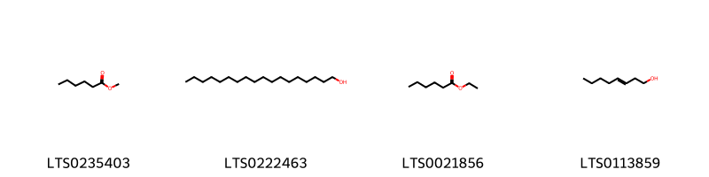{ width=100% }
    <figcaption>Hình ảnh cấu trúc hóa học của 4 hoạt chất thuộc nhóm Fatty Acyls gồm ['methyl caproate (LTS0235403)', 'stearyl alcohol (LTS0222463)', 'ethyl hexanoate (LTS0021856)', '(3e)-oct-3-en-1-ol (LTS0113859)'].</figcaption>
</figure>
#### Nhóm Organooxygen compounds
<figure markdown="span">
    { width=100% }
    <figcaption>Hình ảnh cấu trúc hóa học của 1 hoạt chất thuộc nhóm Organooxygen compounds gồm ['acetophenone (LTS0155971)'].</figcaption>
</figure>
#### Nhóm Prenol lipids
<figure markdown="span">
    { width=100% }
    <figcaption>Hình ảnh cấu trúc hóa học của 1 hoạt chất thuộc nhóm Prenol lipids gồm ['limonene,  (LTS0155981)'].</figcaption>
</figure>
#### Nhóm Steroids and steroid derivatives
<figure markdown="span">
    { width=100% }
    <figcaption>Hình ảnh cấu trúc hóa học của 2 hoạt chất thuộc nhóm Steroids and steroid derivatives gồm ['stigmast-5-en-3-ol, (3β)- (LTS0204616)', 'stigmast-5-en-3-ol (LTS0071224)'].</figcaption>
</figure>

---

### Dược dân tộc học

Danh sách các quốc gia có sử dụng *Malpighia glabra* trong điều trị các bệnh. 

| Country   | Disease                | Bệnh                                                                                                                                                                                                |
|:----------|:-----------------------|:----------------------------------------------------------------------------------------------------------------------------------------------------------------------------------------------------|
| Elsewhere | Astringent             | MYMEMORY WARNING: YOU USED ALL AVAILABLE FREE TRANSLATIONS FOR TODAY. NEXT AVAILABLE IN  12 HOURS 46 MINUTES 38 SECONDS VISIT HTTPS://MYMEMORY.TRANSLATED.NET/DOC/USAGELIMITS.PHP TO TRANSLATE MORE |
| Mexico    | Astringent, Astringent | MYMEMORY WARNING: YOU USED ALL AVAILABLE FREE TRANSLATIONS FOR TODAY. NEXT AVAILABLE IN  12 HOURS 46 MINUTES 34 SECONDS VISIT HTTPS://MYMEMORY.TRANSLATED.NET/DOC/USAGELIMITS.PHP TO TRANSLATE MORE |

---

---
## Malpighia polytricha
### Thông tin về thực vật

!!! info "Phân loại thực vật của *Malpighia polytricha* từ GIBF:"
    - **Kingdom:** Plantae
    - **Phylum:** Tracheophyta
    - **Order:** Malpighiales
    - **Family:** Malpighiaceae
    - **Genus:** Malpighia
    - **Species:** *Malpighia polytricha*

 

| Label (VI)   | Label (EN)   | Scientific Name      | Descriptions (VI)   | Descriptions (EN)   | Also Known As (VI)   | Also Known As (EN)   |
|:-------------|:-------------|:---------------------|:--------------------|:--------------------|:---------------------|:---------------------|
| N/A          | N/A          | Malpighia polytricha | loài thực vật       | species of plant    | ['']                 | ['']                 |

#### Phân bố trên thế giới

**Từ CSDL GIBF** nan, Haiti, Bahamas, Dominican Republic, Cuba, Turks and Caicos Islands

#### Phân bố tại Việt Nam

**Từ CSDL GIBF**: Không có ghi nhận ở Việt Nam

---
### Thành phần hóa học
        
- Theo cơ sở dữ liệu lotus: Từ loài *Malpighia polytricha* đã phân lập và xác định được Chưa có hoạt chất nào được phân lập. hoạt chất thuộc về các nhóm Không có hoạt chất nào được phân lập. 

Không có hình ảnh nào được tạo ra

---

### Dược dân tộc học

Danh sách các quốc gia có sử dụng *Malpighia polytricha* trong điều trị các bệnh. 

| Country   | Disease   | Bệnh                                                                                                                                                                                                |
|:----------|:----------|:----------------------------------------------------------------------------------------------------------------------------------------------------------------------------------------------------|
| Bahamas   | Diuretic  | MYMEMORY WARNING: YOU USED ALL AVAILABLE FREE TRANSLATIONS FOR TODAY. NEXT AVAILABLE IN  12 HOURS 46 MINUTES 02 SECONDS VISIT HTTPS://MYMEMORY.TRANSLATED.NET/DOC/USAGELIMITS.PHP TO TRANSLATE MORE |

---

---
## Malpighia punicifolia
### Thông tin về thực vật

!!! info "Phân loại thực vật của *Malpighia glabra* từ GIBF:"
    - **Kingdom:** Plantae
    - **Phylum:** Tracheophyta
    - **Order:** Malpighiales
    - **Family:** Malpighiaceae
    - **Genus:** Malpighia
    - **Species:** *Malpighia glabra*

 

| Label (VI)   | Label (EN)   | Scientific Name       | Descriptions (VI)   | Descriptions (EN)   | Also Known As (VI)   | Also Known As (EN)   |
|:-------------|:-------------|:----------------------|:--------------------|:--------------------|:---------------------|:---------------------|
| N/A          | N/A          | Malpighia punicifolia |                     |                     | ['']                 | ['']                 |

#### Phân bố trên thế giới

**Từ CSDL GIBF** nan, Brazil, Guatemala, Senegal, Antigua and Barbuda, Honduras, Ecuador, Trinidad and Tobago, Puerto Rico, United States of America, Jamaica, Dominican Republic, Colombia, Cuba, unknown or invalid, French Guiana, Mexico, Angola, Venezuela (Bolivarian Republic of)

#### Phân bố tại Việt Nam

**Từ CSDL GIBF**: Không có ghi nhận ở Việt Nam

---
### Thành phần hóa học
        
- Theo cơ sở dữ liệu lotus: Từ loài *Malpighia glabra* đã phân lập và xác định được 11 hoạt chất thuộc về các nhóm Fatty Acyls, Prenol lipids, Organooxygen compounds, Dihydrofurans. 

|    | chemicalTaxonomyClassyfireClass   |   smiles_count |
|---:|:----------------------------------|---------------:|
|  0 | Dihydrofurans                     |              1 |
|  1 | Fatty Acyls                       |              6 |
|  2 | Organooxygen compounds            |              3 |
|  3 | Prenol lipids                     |              1 |

#### Nhóm Dihydrofurans
<figure markdown="span">
    { width=100% }
    <figcaption>Hình ảnh cấu trúc hóa học của 1 hoạt chất thuộc nhóm Dihydrofurans gồm ['vitamin c (LTS0022555)'].</figcaption>
</figure>
#### Nhóm Fatty Acyls
<figure markdown="span">
    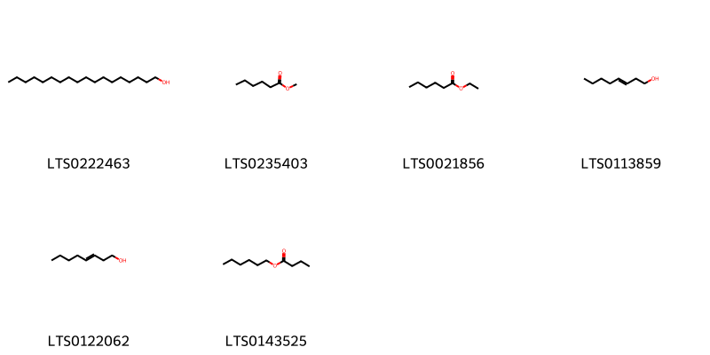{ width=100% }
    <figcaption>Hình ảnh cấu trúc hóa học của 6 hoạt chất thuộc nhóm Fatty Acyls gồm ['stearyl alcohol (LTS0222463)', 'methyl caproate (LTS0235403)', 'ethyl hexanoate (LTS0021856)', '(3e)-oct-3-en-1-ol (LTS0113859)', '3-octenol (LTS0122062)', 'hexyl butyrate (LTS0143525)'].</figcaption>
</figure>
#### Nhóm Organooxygen compounds
<figure markdown="span">
    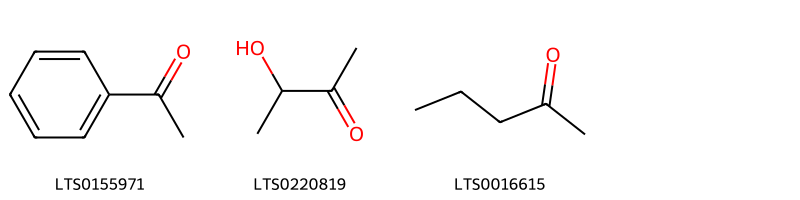{ width=100% }
    <figcaption>Hình ảnh cấu trúc hóa học của 3 hoạt chất thuộc nhóm Organooxygen compounds gồm ['acetophenone (LTS0155971)', 'acetoin (LTS0220819)', '2-pentanone (LTS0016615)'].</figcaption>
</figure>
#### Nhóm Prenol lipids
<figure markdown="span">
    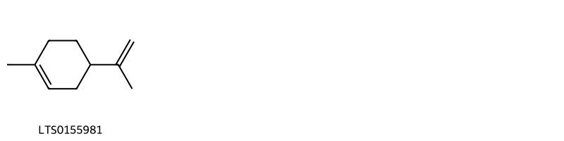{ width=100% }
    <figcaption>Hình ảnh cấu trúc hóa học của 1 hoạt chất thuộc nhóm Prenol lipids gồm ['limonene,  (LTS0155981)'].</figcaption>
</figure>

---

### Dược dân tộc học

Danh sách các quốc gia có sử dụng *Malpighia glabra* trong điều trị các bệnh. 

| Country   | Disease    | Bệnh                                                                                                                                                                                                |
|:----------|:-----------|:----------------------------------------------------------------------------------------------------------------------------------------------------------------------------------------------------|
| Venezuela | Astringent | MYMEMORY WARNING: YOU USED ALL AVAILABLE FREE TRANSLATIONS FOR TODAY. NEXT AVAILABLE IN  12 HOURS 45 MINUTES 34 SECONDS VISIT HTTPS://MYMEMORY.TRANSLATED.NET/DOC/USAGELIMITS.PHP TO TRANSLATE MORE |

---

---
## Malpighia urens
### Thông tin về thực vật

!!! info "Phân loại thực vật của *Malpighia urens* từ GIBF:"
    - **Kingdom:** Plantae
    - **Phylum:** Tracheophyta
    - **Order:** Malpighiales
    - **Family:** Malpighiaceae
    - **Genus:** Malpighia
    - **Species:** *Malpighia urens*

 

| Label (VI)   | Label (EN)   | Scientific Name   | Descriptions (VI)   | Descriptions (EN)   | Also Known As (VI)   | Also Known As (EN)   |
|:-------------|:-------------|:------------------|:--------------------|:--------------------|:---------------------|:---------------------|
| N/A          | N/A          | Malpighia urens   | loài thực vật       | species of plant    | ['']                 | ['']                 |

#### Phân bố trên thế giới

**Từ CSDL GIBF** nan, Singapore, Saint Kitts and Nevis, Jamaica, Guadeloupe, Belgium, Haiti, Barbados, Dominican Republic, Cuba, unknown or invalid, France, Netherlands

#### Phân bố tại Việt Nam

**Từ CSDL GIBF**: Không có ghi nhận ở Việt Nam

---
### Thành phần hóa học
        
- Theo cơ sở dữ liệu lotus: Từ loài *Malpighia urens* đã phân lập và xác định được Chưa có hoạt chất nào được phân lập. hoạt chất thuộc về các nhóm Không có hoạt chất nào được phân lập. 

Không có hình ảnh nào được tạo ra

---

### Dược dân tộc học

Danh sách các quốc gia có sử dụng *Malpighia urens* trong điều trị các bệnh. 

| Country   | Disease    | Bệnh                                                                                                                                                                                                |
|:----------|:-----------|:----------------------------------------------------------------------------------------------------------------------------------------------------------------------------------------------------|
| Haiti     | Astringent | MYMEMORY WARNING: YOU USED ALL AVAILABLE FREE TRANSLATIONS FOR TODAY. NEXT AVAILABLE IN  12 HOURS 44 MINUTES 55 SECONDS VISIT HTTPS://MYMEMORY.TRANSLATED.NET/DOC/USAGELIMITS.PHP TO TRANSLATE MORE |

---

# Chi Hiptage

??? note "Danh sách các dược liệu thuộc chi"
    
	 - *Hiptage benghalensis*

---
## Hiptage benghalensis
### Thông tin về thực vật

!!! info "Phân loại thực vật của *Hiptage benghalensis* từ GIBF:"
    - **Kingdom:** Plantae
    - **Phylum:** Tracheophyta
    - **Order:** Malpighiales
    - **Family:** Malpighiaceae
    - **Genus:** Hiptage
    - **Species:** *Hiptage benghalensis*

 

| Label (VI)   | Label (EN)   | Scientific Name      | Descriptions (VI)   | Descriptions (EN)   | Also Known As (VI)   | Also Known As (EN)   |
|:-------------|:-------------|:---------------------|:--------------------|:--------------------|:---------------------|:---------------------|
| N/A          | N/A          | Hiptage benghalensis | loài thực vật       | species of plant    | ['']                 | ['']                 |

#### Phân bố trên thế giới

**Từ CSDL GIBF** Hong Kong, Réunion, United States of America, Indonesia, Chinese Taipei, China, Australia, Mauritius, India, Thailand

#### Phân bố tại Việt Nam

**Từ CSDL GIBF**: Không có ghi nhận ở Việt Nam

---
### Thành phần hóa học
        
- Theo cơ sở dữ liệu lotus: Từ loài *Hiptage benghalensis* đã phân lập và xác định được 1 hoạt chất thuộc về các nhóm Benzopyrans. 

|    | chemicalTaxonomyClassyfireClass   |   smiles_count |
|---:|:----------------------------------|---------------:|
|  0 | Benzopyrans                       |              1 |

#### Nhóm Benzopyrans
<figure markdown="span">
    { width=100% }
    <figcaption>Hình ảnh cấu trúc hóa học của 1 hoạt chất thuộc nhóm Benzopyrans gồm ['mangiferin (LTS0009443)'].</figcaption>
</figure>

---

### Dược dân tộc học

Danh sách các quốc gia có sử dụng *Hiptage benghalensis* trong điều trị các bệnh. 

| Country   | Disease                  | Bệnh                                                                                                                                                                                                |
|:----------|:-------------------------|:----------------------------------------------------------------------------------------------------------------------------------------------------------------------------------------------------|
| India     | Insecticide, Insecticide | MYMEMORY WARNING: YOU USED ALL AVAILABLE FREE TRANSLATIONS FOR TODAY. NEXT AVAILABLE IN  12 HOURS 44 MINUTES 32 SECONDS VISIT HTTPS://MYMEMORY.TRANSLATED.NET/DOC/USAGELIMITS.PHP TO TRANSLATE MORE |
| Java      | Aphrodisiac              | MYMEMORY WARNING: YOU USED ALL AVAILABLE FREE TRANSLATIONS FOR TODAY. NEXT AVAILABLE IN  12 HOURS 44 MINUTES 29 SECONDS VISIT HTTPS://MYMEMORY.TRANSLATED.NET/DOC/USAGELIMITS.PHP TO TRANSLATE MORE |

---

