!!! abstract "Tóm tắt"

    Họ Malvaceae gồm khoảng 22 chi và 61 loài được một số cộng đồng tại các quốc gia như Trinidad, Italian, Japan*, Brazil, Guatemala, Japan, French, China, New Zealand, Honduras, Ecuador, Dutch, Java, Turkey, Ghana, German, English, anish, Kelantan, Dominican Republic, Africa, Argentina, Europe, Panama(Choco), Chinese, Mexico, Mexico(Seri), Reunion, New Zealand(Niue), Iran, Haiti, Danish, Malaysia, Philippines, Hawaii, Curacao, Iraq, Upper Volta, Panama, Egypt, Salvador, Sudan, Kurdistan, ain, India(Hindu), Venezuela, Elsewhere, Paraguay, Tahiti, Annamese, South Africa, Australia, Malaya, India, US, France, Samoa sử dụng trong một số trường hợp QUERY LENGTH LIMIT EXCEEDED. MAX ALLOWED QUERY : 500 CHARS QUERY LENGTH LIMIT EXCEEDED. MAX ALLOWED QUERY : 500 CHARS QUERY LENGTH LIMIT EXCEEDED. MAX ALLOWED QUERY : 500 CHARS QUERY LENGTH LIMIT EXCEEDED. MAX ALLOWED QUERY : 500 CHARS.

!!! info "DrDuke"

    James A. Duke sinh năm 1929-2017 là một nhà thực vật học người Mỹ. Đây là một trong những tác giả hàng đầu trong lĩnh vực dược dân tộc học với cuốn *CRC Handbook of Medicinal Herbs* và chính là người xây dựng lên cơ sở dữ liệu về hợp chất tự nhiên và dược dân tộc học tại Bộ nông nghiệp Hoa Kỳ. Các thông tin được đăng tải tại website [Dr. Duke's Phytochemical and Ethnobotanical Databases](https://phytochem.nal.usda.gov/). 
    Trong suốt thập niên 1970, ông lãnh đạo the Plant Taxonomy Laboratory, Plant Genetics and Germplasm Institute of the Agricultural Research Service, U.S. Department of Agriculture.
    Trong tài liệu này, các thông tin về dược dân tộc của các dược liệu được trích dẫn từ tài liệu của James A. Ducke với sự trợ giúp của phần mềm dịch thuật từ tiếng Anh sang tiếng Việt.
   

# Chi Pavonia

??? note "Danh sách các dược liệu thuộc chi"
    
	 - *Pavonia inifex*
	 - *Pavonia odorata*
	 - *Pavonia zeylanica*

---
## Pavonia inifex
### Thông tin về thực vật

!!! info "Phân loại thực vật của *N/A* từ GIBF:"
    - **Kingdom:** N/A
    - **Phylum:** N/A
    - **Order:** N/A
    - **Family:** N/A
    - **Genus:** N/A
    - **Species:** *N/A*

 

| Label (VI)   | Label (EN)   | Scientific Name    | Descriptions (VI)   | Descriptions (EN)   | Also Known As (VI)   | Also Known As (EN)   |
|:-------------|:-------------|:-------------------|:--------------------|:--------------------|:---------------------|:---------------------|
| N/A          | N/A          | Quassia versicolor |                     | species of plant    | ['']                 | ['']                 |

#### Phân bố trên thế giới

**Từ CSDL GIBF** Không có kết quả phù hợp

#### Phân bố tại Việt Nam

**Từ CSDL GIBF**: Không có ghi nhận ở Việt Nam

---
### Thành phần hóa học
        
- Theo cơ sở dữ liệu lotus: Từ loài *N/A* đã phân lập và xác định được Chưa có hoạt chất nào được phân lập. hoạt chất thuộc về các nhóm Không có hoạt chất nào được phân lập. 

Không có hình ảnh nào được tạo ra

---

### Dược dân tộc học

Danh sách các quốc gia có sử dụng *N/A* trong điều trị các bệnh. 

| Country   | Disease    | Bệnh                                                                                                                                                                                                |
|:----------|:-----------|:----------------------------------------------------------------------------------------------------------------------------------------------------------------------------------------------------|
| Haiti     | Alexiteric | MYMEMORY WARNING: YOU USED ALL AVAILABLE FREE TRANSLATIONS FOR TODAY. NEXT AVAILABLE IN  07 HOURS 26 MINUTES 36 SECONDS VISIT HTTPS://MYMEMORY.TRANSLATED.NET/DOC/USAGELIMITS.PHP TO TRANSLATE MORE |

---

---
## Pavonia odorata
### Thông tin về thực vật

!!! info "Phân loại thực vật của *Pavonia zeylonica* từ GIBF:"
    - **Kingdom:** Plantae
    - **Phylum:** Tracheophyta
    - **Order:** Malvales
    - **Family:** Malvaceae
    - **Genus:** Pavonia
    - **Species:** *Pavonia zeylonica*

 

| Label (VI)   | Label (EN)   | Scientific Name   | Descriptions (VI)   | Descriptions (EN)   | Also Known As (VI)   | Also Known As (EN)   |
|:-------------|:-------------|:------------------|:--------------------|:--------------------|:---------------------|:---------------------|
| N/A          | N/A          | Pavonia odorata   | loài thực vật       | species of plant    | ['']                 | ['']                 |

#### Phân bố trên thế giới

**Từ CSDL GIBF** Sri Lanka, nan, Myanmar, India, unknown or invalid, Eritrea

#### Phân bố tại Việt Nam

**Từ CSDL GIBF**: Không có ghi nhận ở Việt Nam

---
### Thành phần hóa học
        
- Theo cơ sở dữ liệu lotus: Từ loài *Pavonia zeylonica* đã phân lập và xác định được 1 hoạt chất thuộc về các nhóm Prenol lipids. 

|    | chemicalTaxonomyClassyfireClass   |   smiles_count |
|---:|:----------------------------------|---------------:|
|  0 | Prenol lipids                     |              1 |

#### Nhóm Prenol lipids
<figure markdown="span">
    { width=100% }
    <figcaption>Hình ảnh cấu trúc hóa học của 1 hoạt chất thuộc nhóm Prenol lipids gồm ['(-)-gossypol (LTS0163589)'].</figcaption>
</figure>

---

### Dược dân tộc học

Danh sách các quốc gia có sử dụng *Pavonia zeylonica* trong điều trị các bệnh. 

| Country   | Disease                            | Bệnh                                                                                                                                                                                                |
|:----------|:-----------------------------------|:----------------------------------------------------------------------------------------------------------------------------------------------------------------------------------------------------|
| Elsewhere | Astringent, Refrigerant, Stomachic | MYMEMORY WARNING: YOU USED ALL AVAILABLE FREE TRANSLATIONS FOR TODAY. NEXT AVAILABLE IN  07 HOURS 26 MINUTES 25 SECONDS VISIT HTTPS://MYMEMORY.TRANSLATED.NET/DOC/USAGELIMITS.PHP TO TRANSLATE MORE |

---

---
## Pavonia zeylanica
### Thông tin về thực vật

!!! info "Phân loại thực vật của *Pavonia zeylanica* từ GIBF:"
    - **Kingdom:** Plantae
    - **Phylum:** Tracheophyta
    - **Order:** Malvales
    - **Family:** Malvaceae
    - **Genus:** Pavonia
    - **Species:** *Pavonia zeylanica*

 

| Label (VI)   | Label (EN)   | Scientific Name   | Descriptions (VI)   | Descriptions (EN)   | Also Known As (VI)   | Also Known As (EN)   |
|:-------------|:-------------|:------------------|:--------------------|:--------------------|:---------------------|:---------------------|
| N/A          | N/A          | Pavonia zeylanica | loài thực vật       | species of plant    | ['']                 | ['']                 |

#### Phân bố trên thế giới

**Từ CSDL GIBF** Sri Lanka, nan, Kenya, Niger, Senegal, France, Mauritania, Somalia, India, Tanzania, United Republic of, unknown or invalid, Ethiopia, Thailand, Spain, Sudan

#### Phân bố tại Việt Nam

**Từ CSDL GIBF**: Không có ghi nhận ở Việt Nam

---
### Thành phần hóa học
        
- Theo cơ sở dữ liệu lotus: Từ loài *Pavonia zeylanica* đã phân lập và xác định được 2 hoạt chất thuộc về các nhóm Prenol lipids. 

|    | chemicalTaxonomyClassyfireClass   |   smiles_count |
|---:|:----------------------------------|---------------:|
|  0 | Prenol lipids                     |              2 |

#### Nhóm Prenol lipids
<figure markdown="span">
    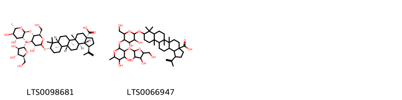{ width=100% }
    <figcaption>Hình ảnh cấu trúc hóa học của 2 hoạt chất thuộc nhóm Prenol lipids gồm ['(1r,3as,5ar,5br,7ar,9s,11ar,11br,13ar,13br)-9-{[(2r,3r,4r,5s,6r)-5-{[(2s,3r,4r,5r,6s)-3-{[(2s,3r,4r,5s)-3,4-dihydroxy-5-(hydroxymethyl)oxolan-2-yl]oxy}-4,5-dihydroxy-6-methyloxan-2-yl]oxy}-3,4-dihydroxy-6-(hydroxymethyl)oxan-2-yl]oxy}-5a,5b,8,8,11a-pentamethyl-1-(prop-1-en-2-yl)-hexadecahydrocyclopenta[a]chrysene-3a-carboxylic acid (LTS0098681)', '9-({5-[(3-{[3,4-dihydroxy-5-(hydroxymethyl)oxolan-2-yl]oxy}-4,5-dihydroxy-6-methyloxan-2-yl)oxy]-3,4-dihydroxy-6-(hydroxymethyl)oxan-2-yl}oxy)-5a,5b,8,8,11a-pentamethyl-1-(prop-1-en-2-yl)-hexadecahydrocyclopenta[a]chrysene-3a-carboxylic acid (LTS0066947)'].</figcaption>
</figure>

---

### Dược dân tộc học

Danh sách các quốc gia có sử dụng *Pavonia zeylanica* trong điều trị các bệnh. 

| Country   | Disease   | Bệnh                                                                                                                                                                                                |
|:----------|:----------|:----------------------------------------------------------------------------------------------------------------------------------------------------------------------------------------------------|
| India     | Vermifuge | MYMEMORY WARNING: YOU USED ALL AVAILABLE FREE TRANSLATIONS FOR TODAY. NEXT AVAILABLE IN  07 HOURS 26 MINUTES 03 SECONDS VISIT HTTPS://MYMEMORY.TRANSLATED.NET/DOC/USAGELIMITS.PHP TO TRANSLATE MORE |

---

# Chi Malvastrum

??? note "Danh sách các dược liệu thuộc chi"
    
	 - *Malvastrum americanum*
	 - *Malvastrum coromandelianum*
	 - *Malvastrum icatum*
	 - *Malvastrum peruvianum*

---
## Malvastrum americanum
### Thông tin về thực vật

!!! info "Phân loại thực vật của *Malvastrum americanum* từ GIBF:"
    - **Kingdom:** Plantae
    - **Phylum:** Tracheophyta
    - **Order:** Malvales
    - **Family:** Malvaceae
    - **Genus:** Malvastrum
    - **Species:** *Malvastrum americanum*

 

| Label (VI)   | Label (EN)   | Scientific Name       | Descriptions (VI)   | Descriptions (EN)   | Also Known As (VI)   | Also Known As (EN)   |
|:-------------|:-------------|:----------------------|:--------------------|:--------------------|:---------------------|:---------------------|
| N/A          | N/A          | Malvastrum americanum | loài thực vật       | species of plant    | ['']                 | ['']                 |

#### Phân bố trên thế giới

**Từ CSDL GIBF** Mexico, United States of America, Bonaire, Sint Eustatius and Saba, Antigua and Barbuda, Australia, Colombia, Puerto Rico

#### Phân bố tại Việt Nam

**Từ CSDL GIBF**: Không có ghi nhận ở Việt Nam

---
### Thành phần hóa học
        
- Theo cơ sở dữ liệu lotus: Từ loài *Malvastrum americanum* đã phân lập và xác định được Chưa có hoạt chất nào được phân lập. hoạt chất thuộc về các nhóm Không có hoạt chất nào được phân lập. 

Không có hình ảnh nào được tạo ra

---

### Dược dân tộc học

Danh sách các quốc gia có sử dụng *Malvastrum americanum* trong điều trị các bệnh. 

| Country   | Disease   | Bệnh                                                                                                                                                                                                |
|:----------|:----------|:----------------------------------------------------------------------------------------------------------------------------------------------------------------------------------------------------|
| Elsewhere | Poison    | MYMEMORY WARNING: YOU USED ALL AVAILABLE FREE TRANSLATIONS FOR TODAY. NEXT AVAILABLE IN  07 HOURS 25 MINUTES 43 SECONDS VISIT HTTPS://MYMEMORY.TRANSLATED.NET/DOC/USAGELIMITS.PHP TO TRANSLATE MORE |

---

---
## Malvastrum coromandelianum
### Thông tin về thực vật

!!! info "Phân loại thực vật của *Malvastrum coromandelianum* từ GIBF:"
    - **Kingdom:** Plantae
    - **Phylum:** Tracheophyta
    - **Order:** Malvales
    - **Family:** Malvaceae
    - **Genus:** Malvastrum
    - **Species:** *Malvastrum coromandelianum*

 

| Label (VI)   | Label (EN)   | Scientific Name            | Descriptions (VI)   | Descriptions (EN)   | Also Known As (VI)   | Also Known As (EN)   |
|:-------------|:-------------|:---------------------------|:--------------------|:--------------------|:---------------------|:---------------------|
| N/A          | N/A          | Malvastrum coromandelianum | loài thực vật       | species of plant    | ['']                 | ['']                 |

#### Phân bố trên thế giới

**Từ CSDL GIBF** Brazil, Saint Kitts and Nevis, Botswana, China, Antigua and Barbuda, Tanzania, United Republic of, Puerto Rico, Sri Lanka, United States of America, Virgin Islands (U.S.), Dominican Republic, Colombia, Argentina, Hong Kong, Mexico, Kenya, Eswatini, Chinese Taipei, Panama, South Africa, Australia, India, Peru, Montserrat

#### Phân bố tại Việt Nam

**Từ CSDL GIBF**: Không có ghi nhận ở Việt Nam

---
### Thành phần hóa học
        
- Theo cơ sở dữ liệu lotus: Từ loài *Malvastrum coromandelianum* đã phân lập và xác định được Chưa có hoạt chất nào được phân lập. hoạt chất thuộc về các nhóm Không có hoạt chất nào được phân lập. 

Không có hình ảnh nào được tạo ra

---

### Dược dân tộc học

Danh sách các quốc gia có sử dụng *Malvastrum coromandelianum* trong điều trị các bệnh. 

| Country   | Disease                             | Bệnh                                                                                                                                                                                                |
|:----------|:------------------------------------|:----------------------------------------------------------------------------------------------------------------------------------------------------------------------------------------------------|
| Elsewhere | Diaphoretic, Emollient, Refrigerant | MYMEMORY WARNING: YOU USED ALL AVAILABLE FREE TRANSLATIONS FOR TODAY. NEXT AVAILABLE IN  07 HOURS 25 MINUTES 20 SECONDS VISIT HTTPS://MYMEMORY.TRANSLATED.NET/DOC/USAGELIMITS.PHP TO TRANSLATE MORE |

---

---
## Malvastrum icatum
### Thông tin về thực vật

!!! info "Phân loại thực vật của *N/A* từ GIBF:"
    - **Kingdom:** Plantae
    - **Phylum:** Tracheophyta
    - **Order:** Malvales
    - **Family:** Malvaceae
    - **Genus:** Malvastrum
    - **Species:** *N/A*

 

| Label (VI)   | Label (EN)   | Scientific Name            | Descriptions (VI)   | Descriptions (EN)   | Also Known As (VI)   | Also Known As (EN)   |
|:-------------|:-------------|:---------------------------|:--------------------|:--------------------|:---------------------|:---------------------|
| N/A          | N/A          | Malvastrum coromandelianum | loài thực vật       | species of plant    | ['']                 | ['']                 |

#### Phân bố trên thế giới

**Từ CSDL GIBF** Brazil, Saint Kitts and Nevis, Botswana, China, Antigua and Barbuda, Tanzania, United Republic of, Puerto Rico, Sri Lanka, United States of America, Virgin Islands (U.S.), Dominican Republic, Colombia, Argentina, Hong Kong, Mexico, Kenya, Eswatini, Chinese Taipei, Panama, South Africa, Australia, India, Peru, Montserrat

#### Phân bố tại Việt Nam

**Từ CSDL GIBF**: Không có ghi nhận ở Việt Nam

---
### Thành phần hóa học
        
- Theo cơ sở dữ liệu lotus: Từ loài *N/A* đã phân lập và xác định được Chưa có hoạt chất nào được phân lập. hoạt chất thuộc về các nhóm Không có hoạt chất nào được phân lập. 

Không có hình ảnh nào được tạo ra

---

### Dược dân tộc học

Danh sách các quốc gia có sử dụng *N/A* trong điều trị các bệnh. 

| Country   | Disease                  | Bệnh                                                                                                                                                                                                |
|:----------|:-------------------------|:----------------------------------------------------------------------------------------------------------------------------------------------------------------------------------------------------|
| Curacao   | Emmenagogue, Emmenagogue | MYMEMORY WARNING: YOU USED ALL AVAILABLE FREE TRANSLATIONS FOR TODAY. NEXT AVAILABLE IN  07 HOURS 24 MINUTES 59 SECONDS VISIT HTTPS://MYMEMORY.TRANSLATED.NET/DOC/USAGELIMITS.PHP TO TRANSLATE MORE |

---

---
## Malvastrum peruvianum
### Thông tin về thực vật

!!! info "Phân loại thực vật của *Fuertesimalva peruviana* từ GIBF:"
    - **Kingdom:** Plantae
    - **Phylum:** Tracheophyta
    - **Order:** Malvales
    - **Family:** Malvaceae
    - **Genus:** Fuertesimalva
    - **Species:** *Fuertesimalva peruviana*

 

| Label (VI)   | Label (EN)   | Scientific Name       | Descriptions (VI)   | Descriptions (EN)   | Also Known As (VI)   | Also Known As (EN)   |
|:-------------|:-------------|:----------------------|:--------------------|:--------------------|:---------------------|:---------------------|
| N/A          | N/A          | Malvastrum peruvianum | loài thực vật       | species of plant    | ['']                 | ['']                 |

#### Phân bố trên thế giới

**Từ CSDL GIBF** nan, Mexico, Portugal, Peru, Chile, Colombia, Ecuador, unknown or invalid, Bolivia (Plurinational State of), Netherlands

#### Phân bố tại Việt Nam

**Từ CSDL GIBF**: Không có ghi nhận ở Việt Nam

---
### Thành phần hóa học
        
- Theo cơ sở dữ liệu lotus: Từ loài *Fuertesimalva peruviana* đã phân lập và xác định được Chưa có hoạt chất nào được phân lập. hoạt chất thuộc về các nhóm Không có hoạt chất nào được phân lập. 

Không có hình ảnh nào được tạo ra

---

### Dược dân tộc học

Danh sách các quốc gia có sử dụng *Fuertesimalva peruviana* trong điều trị các bệnh. 

| Country   | Disease   | Bệnh                                                                                                                                                                                                |
|:----------|:----------|:----------------------------------------------------------------------------------------------------------------------------------------------------------------------------------------------------|
| Ecuador   | Purgative | MYMEMORY WARNING: YOU USED ALL AVAILABLE FREE TRANSLATIONS FOR TODAY. NEXT AVAILABLE IN  07 HOURS 24 MINUTES 36 SECONDS VISIT HTTPS://MYMEMORY.TRANSLATED.NET/DOC/USAGELIMITS.PHP TO TRANSLATE MORE |

---

# Chi Althaea

??? note "Danh sách các dược liệu thuộc chi"
    
	 - *Althaea officinalis*
	 - *Althaea rosea*

---
## Althaea officinalis
### Thông tin về thực vật

!!! info "Phân loại thực vật của *Althaea officinalis* từ GIBF:"
    - **Kingdom:** Plantae
    - **Phylum:** Tracheophyta
    - **Order:** Malvales
    - **Family:** Malvaceae
    - **Genus:** Althaea
    - **Species:** *Althaea officinalis*

 

| Label (VI)   | Label (EN)   | Scientific Name     | Descriptions (VI)   | Descriptions (EN)   | Also Known As (VI)   | Also Known As (EN)   |
|:-------------|:-------------|:--------------------|:--------------------|:--------------------|:---------------------|:---------------------|
| N/A          | N/A          | Althaea officinalis | loài thực vật       | species of plant    | ['']                 | ['marsh mallow']     |

#### Phân bố trên thế giới

**Từ CSDL GIBF** Sweden, Kazakhstan, Slovenia, Spain, Denmark, Netherlands, United States of America, Romania, Russian Federation, Croatia, France, Belgium, Luxembourg, Germany, Austria, Hungary, Portugal, Ukraine, Slovakia, Italy, Switzerland, United Kingdom of Great Britain and Northern Ireland

#### Phân bố tại Việt Nam

**Từ CSDL GIBF**: Không có ghi nhận ở Việt Nam

---
### Thành phần hóa học
        
- Theo cơ sở dữ liệu lotus: Từ loài *Althaea officinalis* đã phân lập và xác định được 50 hoạt chất thuộc về các nhóm Fatty Acyls, Benzene and substituted derivatives, Flavonoids, Coumarins and derivatives, Cinnamic acids and derivatives, Phenols, Isoindoles and derivatives, Organooxygen compounds, Prenol lipids. 

|    | chemicalTaxonomyClassyfireClass     |   smiles_count |
|---:|:------------------------------------|---------------:|
|  0 | Benzene and substituted derivatives |              5 |
|  1 | Cinnamic acids and derivatives      |              4 |
|  2 | Coumarins and derivatives           |             12 |
|  3 | Fatty Acyls                         |             13 |
|  4 | Flavonoids                          |              8 |
|  5 | Isoindoles and derivatives          |              1 |
|  6 | Organooxygen compounds              |              4 |
|  7 | Phenols                             |              1 |
|  8 | Prenol lipids                       |              1 |

#### Nhóm Benzene and substituted derivatives
<figure markdown="span">
    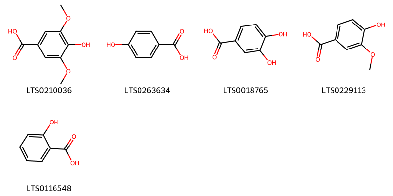{ width=100% }
    <figcaption>Hình ảnh cấu trúc hóa học của 5 hoạt chất thuộc nhóm Benzene and substituted derivatives gồm ['syringic acid (LTS0210036)', 'p-hydroxybenzoic acid (LTS0263634)', '3,4-dihydroxybenzoic acid (LTS0018765)', 'vanillic acid (LTS0229113)', 'salicyclic acid (LTS0116548)'].</figcaption>
</figure>
#### Nhóm Cinnamic acids and derivatives
<figure markdown="span">
    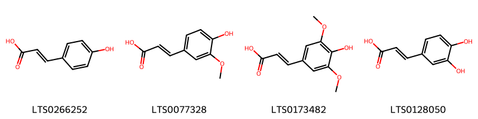{ width=100% }
    <figcaption>Hình ảnh cấu trúc hóa học của 4 hoạt chất thuộc nhóm Cinnamic acids and derivatives gồm ['para-coumaric acid (LTS0266252)', 'ferulic acid (LTS0077328)', 'sinapinate (LTS0173482)', '3,4-dihydroxycinnamic acid (LTS0128050)'].</figcaption>
</figure>
#### Nhóm Coumarins and derivatives
<figure markdown="span">
    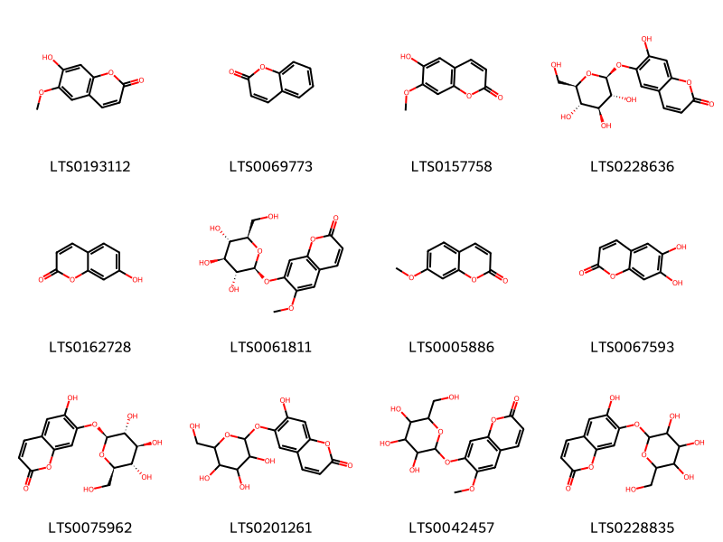{ width=100% }
    <figcaption>Hình ảnh cấu trúc hóa học của 12 hoạt chất thuộc nhóm Coumarins and derivatives gồm ['scopoletin (LTS0193112)', '2h-1-benzopyran-2-one (LTS0069773)', 'isoscopoletin (LTS0157758)', 'esculin (LTS0228636)', 'umbelliferone (LTS0162728)', 'scopolin (LTS0061811)', 'methylumbelliferone (LTS0005886)', 'esculetin (LTS0067593)', 'cichoriin (LTS0075962)', 'esculin (LTS0201261)', '6-methoxy-7-{[3,4,5-trihydroxy-6-(hydroxymethyl)oxan-2-yl]oxy}chromen-2-one (LTS0042457)', '6-hydroxy-7-{[3,4,5-trihydroxy-6-(hydroxymethyl)oxan-2-yl]oxy}chromen-2-one (LTS0228835)'].</figcaption>
</figure>
#### Nhóm Fatty Acyls
<figure markdown="span">
    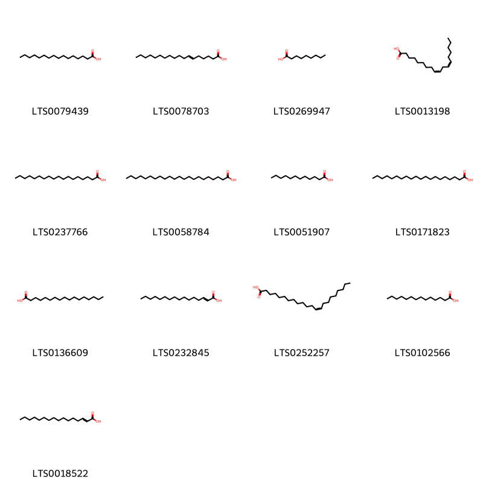{ width=100% }
    <figcaption>Hình ảnh cấu trúc hóa học của 13 hoạt chất thuộc nhóm Fatty Acyls gồm ['palmitic acid (LTS0079439)', 'petroselaidic acid (LTS0078703)', 'nonanoic acid (LTS0269947)', 'linoleic (LTS0013198)', 'stearic acid (LTS0237766)', 'behenic acid (LTS0058784)', 'lauric acid (LTS0051907)', 'arachidic acid (LTS0171823)', 'heptadecanoic acid (LTS0136609)', 'hexadecenoic acid (LTS0232845)', 'erucic acid (LTS0252257)', 'myristic acid (LTS0102566)', 't-2-hexadecenoic acid (LTS0018522)'].</figcaption>
</figure>
#### Nhóm Flavonoids
<figure markdown="span">
    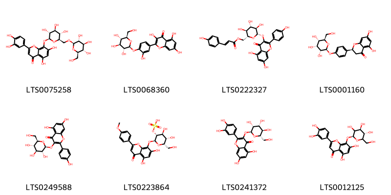{ width=100% }
    <figcaption>Hình ảnh cấu trúc hóa học của 8 hoạt chất thuộc nhóm Flavonoids gồm ['2-(3,4-dihydroxyphenyl)-5,7-dihydroxy-8-{[(2s,3r,4s,5s,6r)-3,4,5-trihydroxy-6-({[(2r,3r,4s,5s,6r)-3,4,5-trihydroxy-6-(hydroxymethyl)oxan-2-yl]oxy}methyl)oxan-2-yl]oxy}chromen-4-one (LTS0075258)', 'spiraeoside (LTS0068360)', 'tiliroside (LTS0222327)', "naringenin 4'-o-glucoside (LTS0001160)", 'astragalin (LTS0249588)', '[(2s,3r,4s,5s,6s)-2-{[5,7-dihydroxy-2-(4-methoxyphenyl)-4-oxochromen-8-yl]oxy}-4,5-dihydroxy-6-(hydroxymethyl)oxan-3-yl]oxidanesulfonic acid (LTS0223864)', '2-(3,4-dihydroxyphenyl)-5,7-dihydroxy-3-{[(2s,3r,4r,5r,6s)-3,4,5-trihydroxy-6-(hydroxymethyl)oxan-2-yl]oxy}chromen-4-one (LTS0241372)', 'hypolaetin 8-o-β-d-glucoside (LTS0012125)'].</figcaption>
</figure>
#### Nhóm Isoindoles and derivatives
<figure markdown="span">
    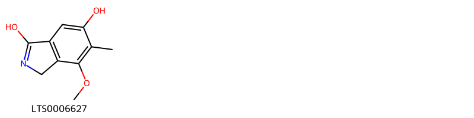{ width=100% }
    <figcaption>Hình ảnh cấu trúc hóa học của 1 hoạt chất thuộc nhóm Isoindoles and derivatives gồm ['cichorine (LTS0006627)'].</figcaption>
</figure>
#### Nhóm Organooxygen compounds
<figure markdown="span">
    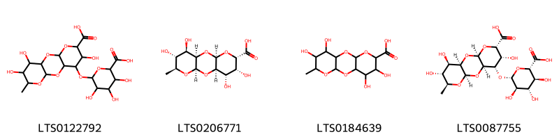{ width=100% }
    <figcaption>Hình ảnh cấu trúc hóa học của 4 hoạt chất thuộc nhóm Organooxygen compounds gồm ['7-[(6-carboxy-3,4,5-trihydroxyoxan-2-yl)oxy]-6,13,14-trihydroxy-12-methyl-2,4,9,11-tetraoxatricyclo[8.4.0.0³,⁸]tetradecane-5-carboxylic acid (LTS0122792)', '(1r,3s,5s,6r,7s,8r,10r,12s,13r,14r)-6,7,13,14-tetrahydroxy-12-methyl-2,4,9,11-tetraoxatricyclo[8.4.0.0³,⁸]tetradecane-5-carboxylic acid (LTS0206771)', '6,7,13,14-tetrahydroxy-12-methyl-2,4,9,11-tetraoxatricyclo[8.4.0.0³,⁸]tetradecane-5-carboxylic acid (LTS0184639)', '(1r,3s,5s,6r,7s,8r,10r,12s,13r,14r)-7-{[(2r,3r,4s,5s,6s)-6-carboxy-3,4,5-trihydroxyoxan-2-yl]oxy}-6,13,14-trihydroxy-12-methyl-2,4,9,11-tetraoxatricyclo[8.4.0.0³,⁸]tetradecane-5-carboxylic acid (LTS0087755)'].</figcaption>
</figure>
#### Nhóm Phenols
<figure markdown="span">
    { width=100% }
    <figcaption>Hình ảnh cấu trúc hóa học của 1 hoạt chất thuộc nhóm Phenols gồm ['4-hydroxyphenylacetic acid (LTS0272177)'].</figcaption>
</figure>
#### Nhóm Prenol lipids
<figure markdown="span">
    { width=100% }
    <figcaption>Hình ảnh cấu trúc hóa học của 1 hoạt chất thuộc nhóm Prenol lipids gồm ['(-)-gossypol (LTS0163589)'].</figcaption>
</figure>

---

### Dược dân tộc học

Danh sách các quốc gia có sử dụng *Althaea officinalis* trong điều trị các bệnh. 

| Country   | Disease                        | Bệnh                                                                                                                                                                                                |
|:----------|:-------------------------------|:----------------------------------------------------------------------------------------------------------------------------------------------------------------------------------------------------|
| Elsewhere | Emollient                      | MYMEMORY WARNING: YOU USED ALL AVAILABLE FREE TRANSLATIONS FOR TODAY. NEXT AVAILABLE IN  07 HOURS 24 MINUTES 18 SECONDS VISIT HTTPS://MYMEMORY.TRANSLATED.NET/DOC/USAGELIMITS.PHP TO TRANSLATE MORE |
| France    | Emollient, Expectorant         | MYMEMORY WARNING: YOU USED ALL AVAILABLE FREE TRANSLATIONS FOR TODAY. NEXT AVAILABLE IN  07 HOURS 24 MINUTES 15 SECONDS VISIT HTTPS://MYMEMORY.TRANSLATED.NET/DOC/USAGELIMITS.PHP TO TRANSLATE MORE |
| Iraq      | Emollient                      | MYMEMORY WARNING: YOU USED ALL AVAILABLE FREE TRANSLATIONS FOR TODAY. NEXT AVAILABLE IN  07 HOURS 24 MINUTES 13 SECONDS VISIT HTTPS://MYMEMORY.TRANSLATED.NET/DOC/USAGELIMITS.PHP TO TRANSLATE MORE |
| Turkey    | Demulcent, Emollient, Poultice | MYMEMORY WARNING: YOU USED ALL AVAILABLE FREE TRANSLATIONS FOR TODAY. NEXT AVAILABLE IN  07 HOURS 24 MINUTES 11 SECONDS VISIT HTTPS://MYMEMORY.TRANSLATED.NET/DOC/USAGELIMITS.PHP TO TRANSLATE MORE |

---

---
## Althaea rosea
### Thông tin về thực vật

!!! info "Phân loại thực vật của *Althaea rosea* từ GIBF:"
    - **Kingdom:** Plantae
    - **Phylum:** Tracheophyta
    - **Order:** Malvales
    - **Family:** Malvaceae
    - **Genus:** Althaea
    - **Species:** *Althaea rosea*

 

| Label (VI)   | Label (EN)   | Scientific Name   | Descriptions (VI)   | Descriptions (EN)   | Also Known As (VI)   | Also Known As (EN)   |
|:-------------|:-------------|:------------------|:--------------------|:--------------------|:---------------------|:---------------------|
| N/A          | N/A          | Althaea rosea     | loài thực vật       | species of plant    | ['']                 | ['']                 |

#### Phân bố trên thế giới

**Từ CSDL GIBF** Greece, China, Italy, Serbia, Switzerland, Jordan, Germany, France, Denmark

#### Phân bố tại Việt Nam

**Từ CSDL GIBF**: Không có ghi nhận ở Việt Nam

---
### Thành phần hóa học
        
- Theo cơ sở dữ liệu lotus: Từ loài *Althaea rosea* đã phân lập và xác định được 13 hoạt chất thuộc về các nhóm Benzene and substituted derivatives, Flavonoids, Cinnamic acids and derivatives, Prenol lipids. 

|    | chemicalTaxonomyClassyfireClass     |   smiles_count |
|---:|:------------------------------------|---------------:|
|  0 | Benzene and substituted derivatives |              1 |
|  1 | Cinnamic acids and derivatives      |              1 |
|  2 | Flavonoids                          |              5 |
|  3 | Prenol lipids                       |              5 |

#### Nhóm Benzene and substituted derivatives
<figure markdown="span">
    { width=100% }
    <figcaption>Hình ảnh cấu trúc hóa học của 1 hoạt chất thuộc nhóm Benzene and substituted derivatives gồm ['syringic acid (LTS0210036)'].</figcaption>
</figure>
#### Nhóm Cinnamic acids and derivatives
<figure markdown="span">
    { width=100% }
    <figcaption>Hình ảnh cấu trúc hóa học của 1 hoạt chất thuộc nhóm Cinnamic acids and derivatives gồm ['para-coumaric acid (LTS0266252)'].</figcaption>
</figure>
#### Nhóm Flavonoids
<figure markdown="span">
    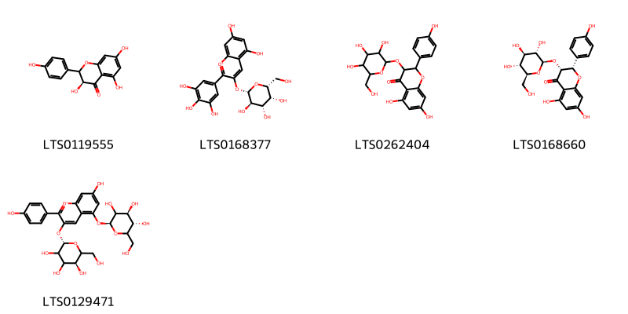{ width=100% }
    <figcaption>Hình ảnh cấu trúc hóa học của 5 hoạt chất thuộc nhóm Flavonoids gồm ['(3s)-3,5,7-trihydroxy-2-(4-hydroxyphenyl)-2,3-dihydro-1-benzopyran-4-one (LTS0119555)', '5,7-dihydroxy-3-{[(2s,3r,4s,5r,6r)-3,4,5-trihydroxy-6-(hydroxymethyl)oxan-2-yl]oxy}-2-(3,4,5-trihydroxyphenyl)-1λ⁴-chromen-1-ylium (LTS0168377)', '5,7-dihydroxy-2-(4-hydroxyphenyl)-3-{[3,4,5-trihydroxy-6-(hydroxymethyl)oxan-2-yl]oxy}-2,3-dihydro-1-benzopyran-4-one (LTS0262404)', '(2s,3r)-5,7-dihydroxy-2-(4-hydroxyphenyl)-3-{[(2r,3s,4r,5r,6s)-3,4,5-trihydroxy-6-(hydroxymethyl)oxan-2-yl]oxy}-2,3-dihydro-1-benzopyran-4-one (LTS0168660)', 'pelargonin (LTS0129471)'].</figcaption>
</figure>
#### Nhóm Prenol lipids
<figure markdown="span">
    { width=100% }
    <figcaption>Hình ảnh cấu trúc hóa học của 5 hoạt chất thuộc nhóm Prenol lipids gồm ['(-)-gossypol (LTS0163589)', 'gibberellin a3 (LTS0185015)', 'gibberellin a8 (LTS0126599)', 'gibberellin a9 (LTS0243888)', 'gibberellin a1 (LTS0013777)'].</figcaption>
</figure>

---

### Dược dân tộc học

Danh sách các quốc gia có sử dụng *Althaea rosea* trong điều trị các bệnh. 

| Country   | Disease                                                 | Bệnh                                                                                                                                                                                                |
|:----------|:--------------------------------------------------------|:----------------------------------------------------------------------------------------------------------------------------------------------------------------------------------------------------|
| China     | Cardiotonic, Stomachic, Tonic, Diuretic                 | MYMEMORY WARNING: YOU USED ALL AVAILABLE FREE TRANSLATIONS FOR TODAY. NEXT AVAILABLE IN  07 HOURS 23 MINUTES 41 SECONDS VISIT HTTPS://MYMEMORY.TRANSLATED.NET/DOC/USAGELIMITS.PHP TO TRANSLATE MORE |
| Turkey    | Diuretic, Emollient, Expectorant, Astringent, Demulcent | MYMEMORY WARNING: YOU USED ALL AVAILABLE FREE TRANSLATIONS FOR TODAY. NEXT AVAILABLE IN  07 HOURS 23 MINUTES 39 SECONDS VISIT HTTPS://MYMEMORY.TRANSLATED.NET/DOC/USAGELIMITS.PHP TO TRANSLATE MORE |

---

# Chi Urena

??? note "Danh sách các dược liệu thuộc chi"
    
	 - *Urena lobata*

---
## Urena lobata
### Thông tin về thực vật

!!! info "Phân loại thực vật của *Urena lobata* từ GIBF:"
    - **Kingdom:** Plantae
    - **Phylum:** Tracheophyta
    - **Order:** Malvales
    - **Family:** Malvaceae
    - **Genus:** Urena
    - **Species:** *Urena lobata*

 

| Label (VI)   | Label (EN)   | Scientific Name   | Descriptions (VI)   | Descriptions (EN)   | Also Known As (VI)   | Also Known As (EN)       |
|:-------------|:-------------|:------------------|:--------------------|:--------------------|:---------------------|:-------------------------|
| N/A          | N/A          | Urena lobata      | loài thực vật       | species of plant    | ['']                 | ['Common Purple Mallow'] |

#### Phân bố trên thế giới

**Từ CSDL GIBF** Brazil, Uganda, Viet Nam, Senegal, China, Gambia, Saint Lucia, Ecuador, Thailand, Madagascar, Puerto Rico, Sri Lanka, Ghana, United States of America, Jamaica, Indonesia, Costa Rica, Dominican Republic, French Guiana, Hong Kong, Mexico, Benin, Kenya, Guam, Chinese Taipei, Philippines, Malaysia, Gabon, Mauritius, Nicaragua, Singapore, South Africa, Australia, India, Peru, Cameroon

#### Phân bố tại Việt Nam

**Từ CSDL GIBF**: Hải Phòng, Đà Nẵng

---
### Thành phần hóa học
        
- Theo cơ sở dữ liệu lotus: Từ loài *Urena lobata* đã phân lập và xác định được 6 hoạt chất thuộc về các nhóm Fatty Acyls, Tannins, Prenol lipids, Organooxygen compounds. 

|    | chemicalTaxonomyClassyfireClass   |   smiles_count |
|---:|:----------------------------------|---------------:|
|  0 | Fatty Acyls                       |              1 |
|  1 | Organooxygen compounds            |              2 |
|  2 | Prenol lipids                     |              1 |
|  3 | Tannins                           |              2 |

#### Nhóm Fatty Acyls
<figure markdown="span">
    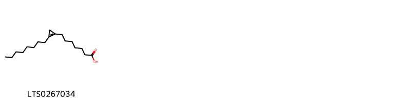{ width=100% }
    <figcaption>Hình ảnh cấu trúc hóa học của 1 hoạt chất thuộc nhóm Fatty Acyls gồm ['malvalic acid (LTS0267034)'].</figcaption>
</figure>
#### Nhóm Organooxygen compounds
<figure markdown="span">
    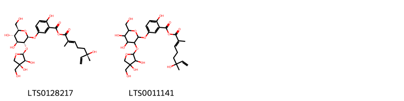{ width=100% }
    <figcaption>Hình ảnh cấu trúc hóa học của 2 hoạt chất thuộc nhóm Organooxygen compounds gồm ['(2e,6s)-6-hydroxy-2,6-dimethylocta-2,7-dienoyl 5-{[(2s,3r,4s,5s,6r)-3-{[(2s,3s,4s)-3,4-dihydroxy-4-(hydroxymethyl)oxolan-2-yl]oxy}-4,5-dihydroxy-6-(hydroxymethyl)oxan-2-yl]oxy}-2-hydroxybenzoate (LTS0128217)', '6-hydroxy-2,6-dimethylocta-2,7-dienoyl 5-[(3-{[3,4-dihydroxy-4-(hydroxymethyl)oxolan-2-yl]oxy}-4,5-dihydroxy-6-(hydroxymethyl)oxan-2-yl)oxy]-2-hydroxybenzoate (LTS0011141)'].</figcaption>
</figure>
#### Nhóm Prenol lipids
<figure markdown="span">
    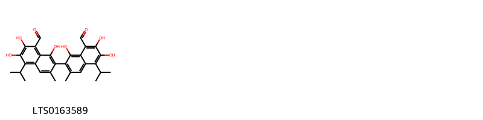{ width=100% }
    <figcaption>Hình ảnh cấu trúc hóa học của 1 hoạt chất thuộc nhóm Prenol lipids gồm ['(-)-gossypol (LTS0163589)'].</figcaption>
</figure>
#### Nhóm Tannins
<figure markdown="span">
    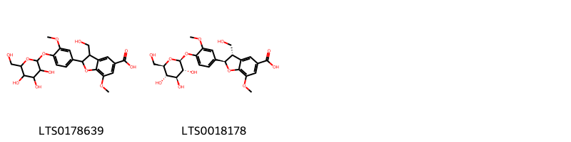{ width=100% }
    <figcaption>Hình ảnh cấu trúc hóa học của 2 hoạt chất thuộc nhóm Tannins gồm ['3-(hydroxymethyl)-7-methoxy-2-(3-methoxy-4-{[3,4,5-trihydroxy-6-(hydroxymethyl)oxan-2-yl]oxy}phenyl)-2,3-dihydro-1-benzofuran-5-carboxylic acid (LTS0178639)', '(2r,3s)-3-(hydroxymethyl)-7-methoxy-2-(3-methoxy-4-{[(2s,3r,4s,5s,6r)-3,4,5-trihydroxy-6-(hydroxymethyl)oxan-2-yl]oxy}phenyl)-2,3-dihydro-1-benzofuran-5-carboxylic acid (LTS0018178)'].</figcaption>
</figure>

---

### Dược dân tộc học

Danh sách các quốc gia có sử dụng *Urena lobata* trong điều trị các bệnh. 

| Country            | Disease                             | Bệnh                                                                                                                                                                                                |
|:-------------------|:------------------------------------|:----------------------------------------------------------------------------------------------------------------------------------------------------------------------------------------------------|
| Dominican Republic | Emollient                           | MYMEMORY WARNING: YOU USED ALL AVAILABLE FREE TRANSLATIONS FOR TODAY. NEXT AVAILABLE IN  07 HOURS 23 MINUTES 16 SECONDS VISIT HTTPS://MYMEMORY.TRANSLATED.NET/DOC/USAGELIMITS.PHP TO TRANSLATE MORE |
| Elsewhere          | Emollient, Expectorant, Refrigerant | MYMEMORY WARNING: YOU USED ALL AVAILABLE FREE TRANSLATIONS FOR TODAY. NEXT AVAILABLE IN  07 HOURS 23 MINUTES 14 SECONDS VISIT HTTPS://MYMEMORY.TRANSLATED.NET/DOC/USAGELIMITS.PHP TO TRANSLATE MORE |
| Haiti              | Alexiteric, Refrigerant             | MYMEMORY WARNING: YOU USED ALL AVAILABLE FREE TRANSLATIONS FOR TODAY. NEXT AVAILABLE IN  07 HOURS 23 MINUTES 11 SECONDS VISIT HTTPS://MYMEMORY.TRANSLATED.NET/DOC/USAGELIMITS.PHP TO TRANSLATE MORE |
| India              | Diuretic                            | MYMEMORY WARNING: YOU USED ALL AVAILABLE FREE TRANSLATIONS FOR TODAY. NEXT AVAILABLE IN  07 HOURS 23 MINUTES 09 SECONDS VISIT HTTPS://MYMEMORY.TRANSLATED.NET/DOC/USAGELIMITS.PHP TO TRANSLATE MORE |
| Java               | Hemostat                            | MYMEMORY WARNING: YOU USED ALL AVAILABLE FREE TRANSLATIONS FOR TODAY. NEXT AVAILABLE IN  07 HOURS 23 MINUTES 07 SECONDS VISIT HTTPS://MYMEMORY.TRANSLATED.NET/DOC/USAGELIMITS.PHP TO TRANSLATE MORE |
| Philippines        | Emollient                           | MYMEMORY WARNING: YOU USED ALL AVAILABLE FREE TRANSLATIONS FOR TODAY. NEXT AVAILABLE IN  07 HOURS 23 MINUTES 04 SECONDS VISIT HTTPS://MYMEMORY.TRANSLATED.NET/DOC/USAGELIMITS.PHP TO TRANSLATE MORE |
| Tahiti             | Emmenagogue                         | MYMEMORY WARNING: YOU USED ALL AVAILABLE FREE TRANSLATIONS FOR TODAY. NEXT AVAILABLE IN  07 HOURS 23 MINUTES 02 SECONDS VISIT HTTPS://MYMEMORY.TRANSLATED.NET/DOC/USAGELIMITS.PHP TO TRANSLATE MORE |

---

# Chi Abutilon

??? note "Danh sách các dược liệu thuộc chi"
    
	 - *Abutilon avicennae*
	 - *Abutilon indicum*

---
## Abutilon avicennae
### Thông tin về thực vật

!!! info "Phân loại thực vật của *Abutilon theophrasti* từ GIBF:"
    - **Kingdom:** Plantae
    - **Phylum:** Tracheophyta
    - **Order:** Malvales
    - **Family:** Malvaceae
    - **Genus:** Abutilon
    - **Species:** *Abutilon theophrasti*

 

| Label (VI)   | Label (EN)   | Scientific Name    | Descriptions (VI)   | Descriptions (EN)   | Also Known As (VI)   | Also Known As (EN)   |
|:-------------|:-------------|:-------------------|:--------------------|:--------------------|:---------------------|:---------------------|
| N/A          | N/A          | Abutilon avicennae | loài thực vật       | species of plant    | ['']                 | ['']                 |

#### Phân bố trên thế giới

**Từ CSDL GIBF** nan, Japan, Sweden, Bangladesh, Finland, China, Türkiye, Spain, Netherlands, Poland, Denmark, United States of America, Romania, Korea, Republic of, Greece, Iran (Islamic Republic of), Indonesia, Russian Federation, Albania, Croatia, Cuba, unknown or invalid, Lithuania, Morocco, Algeria, United Kingdom of Great Britain and Northern Ireland, Belgium, Chinese Taipei, Serbia, Iraq, Georgia, Germany, Egypt, Austria, Hungary, Portugal, Australia, Italy, Switzerland, India, Bulgaria, France

#### Phân bố tại Việt Nam

**Từ CSDL GIBF**: Không có ghi nhận ở Việt Nam

---
### Thành phần hóa học
        
- Theo cơ sở dữ liệu lotus: Từ loài *Abutilon theophrasti* đã phân lập và xác định được Chưa có hoạt chất nào được phân lập. hoạt chất thuộc về các nhóm Không có hoạt chất nào được phân lập. 

Không có hình ảnh nào được tạo ra

---

### Dược dân tộc học

Danh sách các quốc gia có sử dụng *Abutilon theophrasti* trong điều trị các bệnh. 

| Country   | Disease            | Bệnh                                                                                                                                                                                                |
|:----------|:-------------------|:----------------------------------------------------------------------------------------------------------------------------------------------------------------------------------------------------|
| Elsewhere | Aperient, Diuretic | MYMEMORY WARNING: YOU USED ALL AVAILABLE FREE TRANSLATIONS FOR TODAY. NEXT AVAILABLE IN  07 HOURS 22 MINUTES 37 SECONDS VISIT HTTPS://MYMEMORY.TRANSLATED.NET/DOC/USAGELIMITS.PHP TO TRANSLATE MORE |

---

---
## Abutilon indicum
### Thông tin về thực vật

!!! info "Phân loại thực vật của *Abutilon indicum* từ GIBF:"
    - **Kingdom:** Plantae
    - **Phylum:** Tracheophyta
    - **Order:** Malvales
    - **Family:** Malvaceae
    - **Genus:** Abutilon
    - **Species:** *Abutilon indicum*

 

| Label (VI)   | Label (EN)   | Scientific Name   | Descriptions (VI)   | Descriptions (EN)   | Also Known As (VI)                             | Also Known As (EN)               |
|:-------------|:-------------|:------------------|:--------------------|:--------------------|:-----------------------------------------------|:---------------------------------|
| N/A          | N/A          | Abutilon indicum  | loài thực vật       | species of plant    | ['cối xay', 'Abutilon indicum', 'Sida indica'] | ['Indian Mallow/Country Mallow'] |

#### Phân bố trên thế giới

**Từ CSDL GIBF** Sri Lanka, Hong Kong, Réunion, Viet Nam, United States of America, Panama, Saint Kitts and Nevis, Virgin Islands (British), Cabo Verde, Guadeloupe, Indonesia, Chinese Taipei, Philippines, China, Australia, New Caledonia, India, Thailand

#### Phân bố tại Việt Nam

**Từ CSDL GIBF**: Khánh Hòa, Nam Định

---
### Thành phần hóa học
        
- Theo cơ sở dữ liệu lotus: Từ loài *Abutilon indicum* đã phân lập và xác định được 40 hoạt chất thuộc về các nhóm Fatty Acyls, Benzene and substituted derivatives, Carboxylic acids and derivatives, Cinnamic acids and derivatives, Organooxygen compounds, Prenol lipids, Saturated hydrocarbons. 

|    | chemicalTaxonomyClassyfireClass     |   smiles_count |
|---:|:------------------------------------|---------------:|
|  0 | Benzene and substituted derivatives |              3 |
|  1 | Carboxylic acids and derivatives    |             12 |
|  2 | Cinnamic acids and derivatives      |              4 |
|  3 | Fatty Acyls                         |              1 |
|  4 | Organooxygen compounds              |              2 |
|  5 | Prenol lipids                       |              9 |
|  6 | Saturated hydrocarbons              |              9 |

#### Nhóm Benzene and substituted derivatives
<figure markdown="span">
    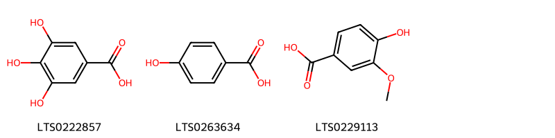{ width=100% }
    <figcaption>Hình ảnh cấu trúc hóa học của 3 hoạt chất thuộc nhóm Benzene and substituted derivatives gồm ['galop (LTS0222857)', 'p-hydroxybenzoic acid (LTS0263634)', 'vanillic acid (LTS0229113)'].</figcaption>
</figure>
#### Nhóm Carboxylic acids and derivatives
<figure markdown="span">
    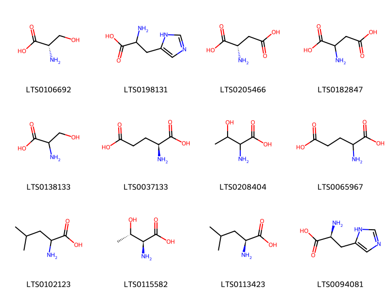{ width=100% }
    <figcaption>Hình ảnh cấu trúc hóa học của 12 hoạt chất thuộc nhóm Carboxylic acids and derivatives gồm ['l-serine (LTS0106692)', 'histidine (LTS0198131)', 'l-aspartic acid (LTS0205466)', 'aspartic acid (LTS0182847)', 'serin (LTS0138133)', 'l-glutamic acid (LTS0037133)', 'threonine(l) (LTS0208404)', 'glutaminsaeure (LTS0065967)', 'leucine (LTS0102123)', 'l-allothreonine (LTS0115582)', 'l-leucine (LTS0113423)', 'l-histidine (LTS0094081)'].</figcaption>
</figure>
#### Nhóm Cinnamic acids and derivatives
<figure markdown="span">
    { width=100% }
    <figcaption>Hình ảnh cấu trúc hóa học của 4 hoạt chất thuộc nhóm Cinnamic acids and derivatives gồm ['3,4-dihydroxycinnamic acid (LTS0128050)', 'para-coumaric acid (LTS0266252)', 'caffeic acid (LTS0027481)', 'hydroxycinnamic acid (LTS0233023)'].</figcaption>
</figure>
#### Nhóm Fatty Acyls
<figure markdown="span">
    { width=100% }
    <figcaption>Hình ảnh cấu trúc hóa học của 1 hoạt chất thuộc nhóm Fatty Acyls gồm ['geranyl acetate (LTS0093224)'].</figcaption>
</figure>
#### Nhóm Organooxygen compounds
<figure markdown="span">
    { width=100% }
    <figcaption>Hình ảnh cấu trúc hóa học của 2 hoạt chất thuộc nhóm Organooxygen compounds gồm ['glucuronic acid (LTS0028036)', '(2r,3s,4r,5r)-2,3,4,5-tetrahydroxy-6-oxohexanoic acid (LTS0110351)'].</figcaption>
</figure>
#### Nhóm Prenol lipids
<figure markdown="span">
    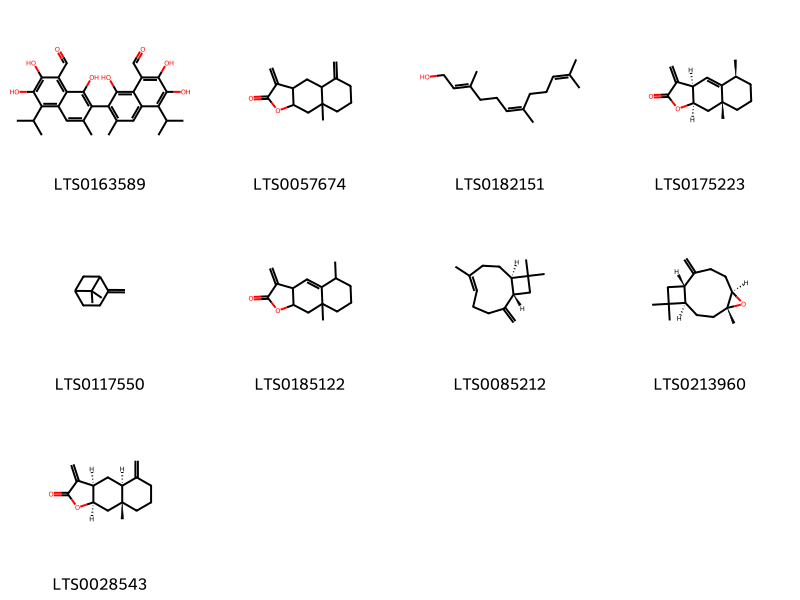{ width=100% }
    <figcaption>Hình ảnh cấu trúc hóa học của 9 hoạt chất thuộc nhóm Prenol lipids gồm ['(-)-gossypol (LTS0163589)', '8a-methyl-3,5-dimethylidene-octahydronaphtho[2,3-b]furan-2-one (LTS0057674)', '(e,z)-farnesol (LTS0182151)', 'alantolactone (LTS0175223)', 'β-pinene (LTS0117550)', 'alantolactone (LTS0185122)', 'caryophyllene (LTS0085212)', 'β-caryophyllene oxide (LTS0213960)', 'isoalantolactone (LTS0028543)'].</figcaption>
</figure>
#### Nhóm Saturated hydrocarbons
<figure markdown="span">
    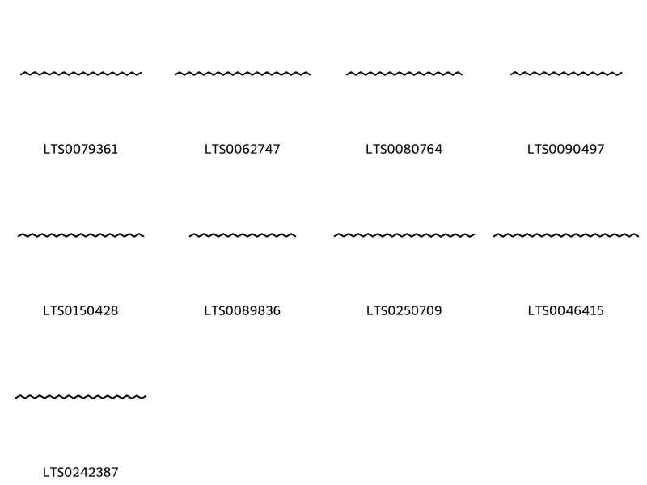{ width=100% }
    <figcaption>Hình ảnh cấu trúc hóa học của 9 hoạt chất thuộc nhóm Saturated hydrocarbons gồm ['hexacosane (LTS0079361)', 'nonacosane (LTS0062747)', 'pentacosane (LTS0080764)', 'tetracosane (LTS0090497)', 'heptacosane (LTS0150428)', 'tricosane (LTS0089836)', 'triacontane (LTS0250709)', 'hentriacontane (LTS0046415)', 'octacosane (LTS0242387)'].</figcaption>
</figure>

---

### Dược dân tộc học

Danh sách các quốc gia có sử dụng *Abutilon indicum* trong điều trị các bệnh. 

| Country   | Disease                                           | Bệnh                                                                                                                                                                                                |
|:----------|:--------------------------------------------------|:----------------------------------------------------------------------------------------------------------------------------------------------------------------------------------------------------|
| India     | Demulcent, Diuretic, Refrigerant, Tonic, Laxative | MYMEMORY WARNING: YOU USED ALL AVAILABLE FREE TRANSLATIONS FOR TODAY. NEXT AVAILABLE IN  07 HOURS 22 MINUTES 17 SECONDS VISIT HTTPS://MYMEMORY.TRANSLATED.NET/DOC/USAGELIMITS.PHP TO TRANSLATE MORE |
| Malaya    | Demulcent                                         | MYMEMORY WARNING: YOU USED ALL AVAILABLE FREE TRANSLATIONS FOR TODAY. NEXT AVAILABLE IN  07 HOURS 22 MINUTES 15 SECONDS VISIT HTTPS://MYMEMORY.TRANSLATED.NET/DOC/USAGELIMITS.PHP TO TRANSLATE MORE |

---

# Chi Lavatera

??? note "Danh sách các dược liệu thuộc chi"
    
	 - *Lavatera kashmiriana*

---
## Lavatera kashmiriana
### Thông tin về thực vật

!!! info "Phân loại thực vật của *N/A* từ GIBF:"
    - **Kingdom:** Plantae
    - **Phylum:** Tracheophyta
    - **Order:** Malvales
    - **Family:** Malvaceae
    - **Genus:** Malva
    - **Species:** *N/A*

 

| Label (VI)   | Label (EN)   | Scientific Name   | Descriptions (VI)   | Descriptions (EN)   | Also Known As (VI)                             | Also Known As (EN)               |
|:-------------|:-------------|:------------------|:--------------------|:--------------------|:-----------------------------------------------|:---------------------------------|
| N/A          | N/A          | Abutilon indicum  | loài thực vật       | species of plant    | ['cối xay', 'Abutilon indicum', 'Sida indica'] | ['Indian Mallow/Country Mallow'] |

#### Phân bố trên thế giới

**Từ CSDL GIBF** nan, Malta, China, Chile, New Zealand, Spain, Bolivia (Plurinational State of), United States of America, Greece, Russian Federation, Argentina, Mexico, United Kingdom of Great Britain and Northern Ireland, Canada, Austria, Portugal, Ukraine, South Africa, Australia, Italy, France

#### Phân bố tại Việt Nam

**Từ CSDL GIBF**: Không có ghi nhận ở Việt Nam

---
### Thành phần hóa học
        
- Theo cơ sở dữ liệu lotus: Từ loài *N/A* đã phân lập và xác định được Chưa có hoạt chất nào được phân lập. hoạt chất thuộc về các nhóm Không có hoạt chất nào được phân lập. 

Không có hình ảnh nào được tạo ra

---

### Dược dân tộc học

Danh sách các quốc gia có sử dụng *N/A* trong điều trị các bệnh. 

| Country   | Disease              | Bệnh                                                                                                                                                                                                |
|:----------|:---------------------|:----------------------------------------------------------------------------------------------------------------------------------------------------------------------------------------------------|
| Iran      | Emollient, Cathartic | MYMEMORY WARNING: YOU USED ALL AVAILABLE FREE TRANSLATIONS FOR TODAY. NEXT AVAILABLE IN  07 HOURS 21 MINUTES 46 SECONDS VISIT HTTPS://MYMEMORY.TRANSLATED.NET/DOC/USAGELIMITS.PHP TO TRANSLATE MORE |

---

# Chi Gossypium

??? note "Danh sách các dược liệu thuộc chi"
    
	 - *Gossypium arboreum*
	 - *Gossypium barbadense*
	 - *Gossypium herbaceum*
	 - *Gossypium hirsutum*

---
## Gossypium arboreum
### Thông tin về thực vật

!!! info "Phân loại thực vật của *Gossypium arboreum* từ GIBF:"
    - **Kingdom:** Plantae
    - **Phylum:** Tracheophyta
    - **Order:** Malvales
    - **Family:** Malvaceae
    - **Genus:** Gossypium
    - **Species:** *Gossypium arboreum*

 

| Label (VI)   | Label (EN)   | Scientific Name    | Descriptions (VI)   | Descriptions (EN)   | Also Known As (VI)   | Also Known As (EN)   |
|:-------------|:-------------|:-------------------|:--------------------|:--------------------|:---------------------|:---------------------|
| N/A          | N/A          | Gossypium arboreum | loài thực vật       | species of plant    | ['']                 | ['']                 |

#### Phân bố trên thế giới

**Từ CSDL GIBF** nan, Brazil, Viet Nam, Japan, Guadeloupe, China, New Zealand, Korea (Democratic People’s Republic of), Türkiye, Yemen, Madagascar, Spain, Ghana, Sri Lanka, United States of America, Korea, Republic of, Jamaica, Indonesia, Seychelles, Pakistan, Costa Rica, Colombia, Nigeria, Antarctica, Saint Helena, Ascension and Tristan da Cunha, Burkina Faso, Equatorial Guinea, Azerbaijan, Mexico, Benin, Maldives, Chinese Taipei, Germany, Egypt, Namibia, Portugal, Niger, Timor-Leste, Australia, Oman, India, Bulgaria, Angola, France, Venezuela (Bolivarian Republic of)

#### Phân bố tại Việt Nam

**Từ CSDL GIBF**: Bac Lieu

---
### Thành phần hóa học
        
- Theo cơ sở dữ liệu lotus: Từ loài *Gossypium arboreum* đã phân lập và xác định được 13 hoạt chất thuộc về các nhóm Prenol lipids, Flavonoids. 

|    | chemicalTaxonomyClassyfireClass   |   smiles_count |
|---:|:----------------------------------|---------------:|
|  0 | Flavonoids                        |             10 |
|  1 | Prenol lipids                     |              3 |

#### Nhóm Flavonoids
<figure markdown="span">
    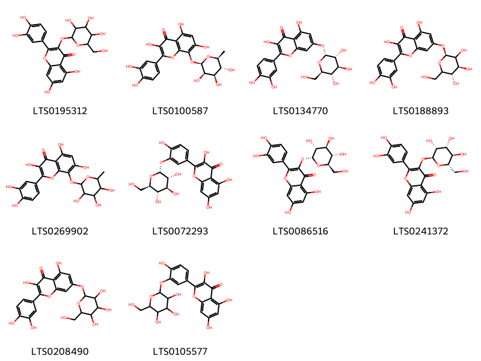{ width=100% }
    <figcaption>Hình ảnh cấu trúc hóa học của 10 hoạt chất thuộc nhóm Flavonoids gồm ['2-(3,4-dihydroxyphenyl)-5,7-dihydroxy-3-{[3,4,5-trihydroxy-6-(hydroxymethyl)oxan-2-yl]oxy}chromen-4-one (LTS0195312)', '2-(3,4-dihydroxyphenyl)-3,5,7-trihydroxy-8-{[(2r,3r,4r,5r,6s)-3,4,5-trihydroxy-6-methyloxan-2-yl]oxy}chromen-4-one (LTS0100587)', '2-(3,4-dihydroxyphenyl)-3,5-dihydroxy-7-{[(2r,3r,4s,5s,6r)-3,4,5-trihydroxy-6-(hydroxymethyl)oxan-2-yl]oxy}chromen-4-one (LTS0134770)', 'quercimeritrin (LTS0188893)', '2-(3,4-dihydroxyphenyl)-3,5,7-trihydroxy-8-[(3,4,5-trihydroxy-6-methyloxan-2-yl)oxy]chromen-4-one (LTS0269902)', '3,5,7-trihydroxy-2-(4-hydroxy-3-{[(2r,3r,4s,5s,6r)-3,4,5-trihydroxy-6-(hydroxymethyl)oxan-2-yl]oxy}phenyl)chromen-4-one (LTS0072293)', '2-(3,4-dihydroxyphenyl)-5,7-dihydroxy-3-{[(2r,3r,4s,5s,6r)-3,4,5-trihydroxy-6-(hydroxymethyl)oxan-2-yl]oxy}chromen-4-one (LTS0086516)', '2-(3,4-dihydroxyphenyl)-5,7-dihydroxy-3-{[(2s,3r,4r,5r,6s)-3,4,5-trihydroxy-6-(hydroxymethyl)oxan-2-yl]oxy}chromen-4-one (LTS0241372)', 'quercimeritrin (LTS0208490)', '3,5,7-trihydroxy-2-(4-hydroxy-3-{[3,4,5-trihydroxy-6-(hydroxymethyl)oxan-2-yl]oxy}phenyl)chromen-4-one (LTS0105577)'].</figcaption>
</figure>
#### Nhóm Prenol lipids
<figure markdown="span">
    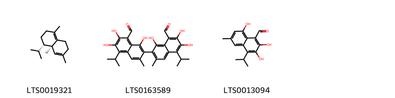{ width=100% }
    <figcaption>Hình ảnh cấu trúc hóa học của 3 hoạt chất thuộc nhóm Prenol lipids gồm ['delta-cadinene (LTS0019321)', '(-)-gossypol (LTS0163589)', 'hemigossypol (LTS0013094)'].</figcaption>
</figure>

---

### Dược dân tộc học

Danh sách các quốc gia có sử dụng *Gossypium arboreum* trong điều trị các bệnh. 

| Country   | Disease                                                          | Bệnh                                                                                                                                                                                                |
|:----------|:-----------------------------------------------------------------|:----------------------------------------------------------------------------------------------------------------------------------------------------------------------------------------------------|
| Africa    | Abortifacient, Emmenagogue                                       | MYMEMORY WARNING: YOU USED ALL AVAILABLE FREE TRANSLATIONS FOR TODAY. NEXT AVAILABLE IN  07 HOURS 21 MINUTES 24 SECONDS VISIT HTTPS://MYMEMORY.TRANSLATED.NET/DOC/USAGELIMITS.PHP TO TRANSLATE MORE |
| Elsewhere | Demulcent, Expectorant, Lactagogue, Laxative, Nervine, Emollient | MYMEMORY WARNING: YOU USED ALL AVAILABLE FREE TRANSLATIONS FOR TODAY. NEXT AVAILABLE IN  07 HOURS 21 MINUTES 21 SECONDS VISIT HTTPS://MYMEMORY.TRANSLATED.NET/DOC/USAGELIMITS.PHP TO TRANSLATE MORE |
| Mexico    | Vasoconstrictor, Emmenagogue, Hemostat                           | MYMEMORY WARNING: YOU USED ALL AVAILABLE FREE TRANSLATIONS FOR TODAY. NEXT AVAILABLE IN  07 HOURS 21 MINUTES 19 SECONDS VISIT HTTPS://MYMEMORY.TRANSLATED.NET/DOC/USAGELIMITS.PHP TO TRANSLATE MORE |

---

---
## Gossypium barbadense
### Thông tin về thực vật

!!! info "Phân loại thực vật của *Gossypium barbadense* từ GIBF:"
    - **Kingdom:** Plantae
    - **Phylum:** Tracheophyta
    - **Order:** Malvales
    - **Family:** Malvaceae
    - **Genus:** Gossypium
    - **Species:** *Gossypium barbadense*

 

| Label (VI)   | Label (EN)   | Scientific Name      | Descriptions (VI)   | Descriptions (EN)   | Also Known As (VI)   | Also Known As (EN)   |
|:-------------|:-------------|:---------------------|:--------------------|:--------------------|:---------------------|:---------------------|
| N/A          | N/A          | Gossypium barbadense | loài thực vật       | species of plant    | ['']                 | ['']                 |

#### Phân bố trên thế giới

**Từ CSDL GIBF** Brazil, Senegal, China, Suriname, Chile, Ecuador, French Polynesia, Papua New Guinea, Madagascar, Spain, Netherlands, Puerto Rico, United States of America, Jamaica, Saint Martin (French part), Colombia, Nigeria, Dominican Republic, Cuba, Argentina, French Guiana, Morocco, Mexico, Benin, El Salvador, Saudi Arabia, Belgium, Nicaragua, Angola, Cook Islands, Timor-Leste, Australia, Côte d’Ivoire, Peru, Bolivia (Plurinational State of), Venezuela (Bolivarian Republic of)

#### Phân bố tại Việt Nam

**Từ CSDL GIBF**: Không có ghi nhận ở Việt Nam

---
### Thành phần hóa học
        
- Theo cơ sở dữ liệu lotus: Từ loài *Gossypium barbadense* đã phân lập và xác định được 19 hoạt chất thuộc về các nhóm Fatty Acyls, Flavonoids, Anthracenes, Cinnamic acids and derivatives, Naphthalenes, Carboxylic acids and derivatives, Organooxygen compounds, Prenol lipids. 

|    | chemicalTaxonomyClassyfireClass   |   smiles_count |
|---:|:----------------------------------|---------------:|
|  0 | Anthracenes                       |              4 |
|  1 | Carboxylic acids and derivatives  |              1 |
|  2 | Cinnamic acids and derivatives    |              1 |
|  3 | Fatty Acyls                       |              1 |
|  4 | Flavonoids                        |              2 |
|  5 | Naphthalenes                      |              2 |
|  6 | Organooxygen compounds            |              1 |
|  7 | Prenol lipids                     |              7 |

#### Nhóm Anthracenes
<figure markdown="span">
    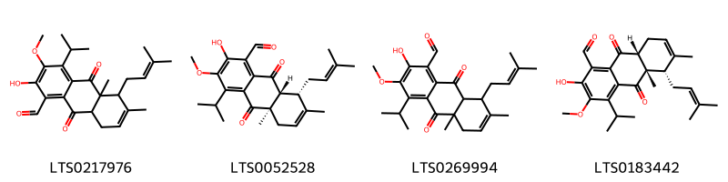{ width=100% }
    <figcaption>Hình ảnh cấu trúc hóa học của 4 hoạt chất thuộc nhóm Anthracenes gồm ['2-hydroxy-4-isopropyl-3-methoxy-6,10a-dimethyl-5-(3-methylbut-2-en-1-yl)-9,10-dioxo-8,8a-dihydro-5h-anthracene-1-carbaldehyde (LTS0217976)', '(8s,8ar,10ar)-2-hydroxy-4-isopropyl-3-methoxy-7,10a-dimethyl-8-(3-methylbut-2-en-1-yl)-9,10-dioxo-8,8a-dihydro-5h-anthracene-1-carbaldehyde (LTS0052528)', '2-hydroxy-4-isopropyl-3-methoxy-7,10a-dimethyl-8-(3-methylbut-2-en-1-yl)-9,10-dioxo-8,8a-dihydro-5h-anthracene-1-carbaldehyde (LTS0269994)', '(5s,8ar,10as)-2-hydroxy-4-isopropyl-3-methoxy-6,10a-dimethyl-5-(3-methylbut-2-en-1-yl)-9,10-dioxo-8,8a-dihydro-5h-anthracene-1-carbaldehyde (LTS0183442)'].</figcaption>
</figure>
#### Nhóm Carboxylic acids and derivatives
<figure markdown="span">
    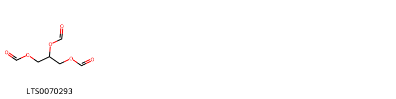{ width=100% }
    <figcaption>Hình ảnh cấu trúc hóa học của 1 hoạt chất thuộc nhóm Carboxylic acids and derivatives gồm ['triformin (LTS0070293)'].</figcaption>
</figure>
#### Nhóm Cinnamic acids and derivatives
<figure markdown="span">
    { width=100% }
    <figcaption>Hình ảnh cấu trúc hóa học của 1 hoạt chất thuộc nhóm Cinnamic acids and derivatives gồm ['3,4-dihydroxycinnamic acid (LTS0128050)'].</figcaption>
</figure>
#### Nhóm Fatty Acyls
<figure markdown="span">
    { width=100% }
    <figcaption>Hình ảnh cấu trúc hóa học của 1 hoạt chất thuộc nhóm Fatty Acyls gồm ['malvalic acid (LTS0267034)'].</figcaption>
</figure>
#### Nhóm Flavonoids
<figure markdown="span">
    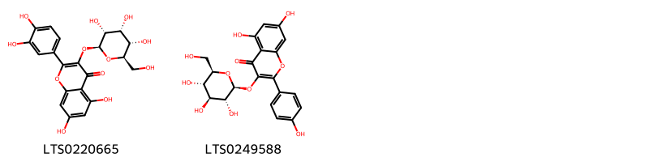{ width=100% }
    <figcaption>Hình ảnh cấu trúc hóa học của 2 hoạt chất thuộc nhóm Flavonoids gồm ['2-(3,4-dihydroxyphenyl)-5,7-dihydroxy-3-{[(2s,3r,4r,5s,6r)-3,4,5-trihydroxy-6-(hydroxymethyl)oxan-2-yl]oxy}chromen-4-one (LTS0220665)', 'astragalin (LTS0249588)'].</figcaption>
</figure>
#### Nhóm Naphthalenes
<figure markdown="span">
    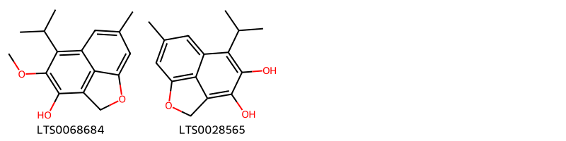{ width=100% }
    <figcaption>Hình ảnh cấu trúc hóa học của 2 hoạt chất thuộc nhóm Naphthalenes gồm ['7-isopropyl-6-methoxy-10-methyl-2-oxatricyclo[6.3.1.0⁴,¹²]dodeca-1(12),4,6,8,10-pentaen-5-ol (LTS0068684)', '7-isopropyl-10-methyl-2-oxatricyclo[6.3.1.0⁴,¹²]dodeca-1(11),4(12),5,7,9-pentaene-5,6-diol (LTS0028565)'].</figcaption>
</figure>
#### Nhóm Organooxygen compounds
<figure markdown="span">
    { width=100% }
    <figcaption>Hình ảnh cấu trúc hóa học của 1 hoạt chất thuộc nhóm Organooxygen compounds gồm ['chlorogenic acid (LTS0226495)'].</figcaption>
</figure>
#### Nhóm Prenol lipids
<figure markdown="span">
    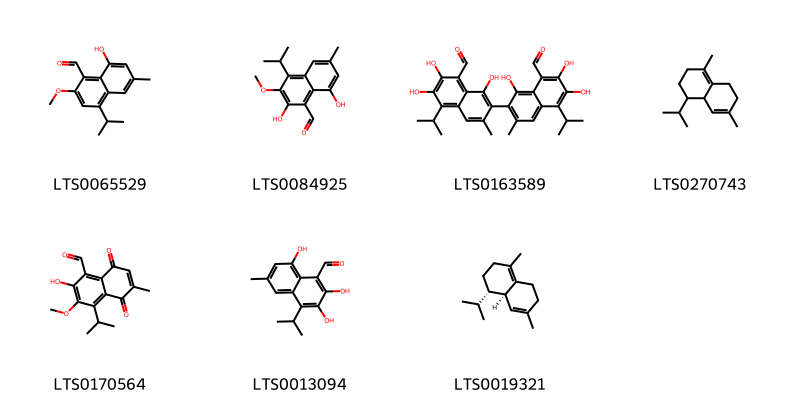{ width=100% }
    <figcaption>Hình ảnh cấu trúc hóa học của 7 hoạt chất thuộc nhóm Prenol lipids gồm ['8-hydroxy-4-isopropyl-2-methoxy-6-methylnaphthalene-1-carbaldehyde (LTS0065529)', '2,8-dihydroxy-4-isopropyl-3-methoxy-6-methylnaphthalene-1-carbaldehyde (LTS0084925)', '(-)-gossypol (LTS0163589)', '4-isopropyl-1,6-dimethyl-2,3,4,4a,7,8-hexahydronaphthalene (LTS0270743)', '2-hydroxy-4-isopropyl-3-methoxy-6-methyl-5,8-dioxonaphthalene-1-carbaldehyde (LTS0170564)', 'hemigossypol (LTS0013094)', 'delta-cadinene (LTS0019321)'].</figcaption>
</figure>

---

### Dược dân tộc học

Danh sách các quốc gia có sử dụng *Gossypium barbadense* trong điều trị các bệnh. 

| Country            | Disease                                                          | Bệnh                                                                                                                                                                                                |
|:-------------------|:-----------------------------------------------------------------|:----------------------------------------------------------------------------------------------------------------------------------------------------------------------------------------------------|
| Dominican Republic | Abortifacient, Soap                                              | MYMEMORY WARNING: YOU USED ALL AVAILABLE FREE TRANSLATIONS FOR TODAY. NEXT AVAILABLE IN  07 HOURS 20 MINUTES 54 SECONDS VISIT HTTPS://MYMEMORY.TRANSLATED.NET/DOC/USAGELIMITS.PHP TO TRANSLATE MORE |
| Elsewhere          | Emollient, Lactagogue, Demulcent, Expectorant, Laxative, Nervine | MYMEMORY WARNING: YOU USED ALL AVAILABLE FREE TRANSLATIONS FOR TODAY. NEXT AVAILABLE IN  07 HOURS 20 MINUTES 52 SECONDS VISIT HTTPS://MYMEMORY.TRANSLATED.NET/DOC/USAGELIMITS.PHP TO TRANSLATE MORE |
| Haiti              | Emmenagogue, Vulnerary                                           | MYMEMORY WARNING: YOU USED ALL AVAILABLE FREE TRANSLATIONS FOR TODAY. NEXT AVAILABLE IN  07 HOURS 20 MINUTES 50 SECONDS VISIT HTTPS://MYMEMORY.TRANSLATED.NET/DOC/USAGELIMITS.PHP TO TRANSLATE MORE |

---

---
## Gossypium herbaceum
### Thông tin về thực vật

!!! info "Phân loại thực vật của *Gossypium herbaceum* từ GIBF:"
    - **Kingdom:** Plantae
    - **Phylum:** Tracheophyta
    - **Order:** Malvales
    - **Family:** Malvaceae
    - **Genus:** Gossypium
    - **Species:** *Gossypium herbaceum*

 

| Label (VI)   | Label (EN)   | Scientific Name     | Descriptions (VI)   | Descriptions (EN)   | Also Known As (VI)   | Also Known As (EN)   |
|:-------------|:-------------|:--------------------|:--------------------|:--------------------|:---------------------|:---------------------|
| N/A          | N/A          | Gossypium herbaceum | loài thực vật       | species of plant    | ['']                 | ['Levant cotton']    |

#### Phân bố trên thế giới

**Từ CSDL GIBF** Brazil, Japan, Senegal, Botswana, Uzbekistan, China, Zimbabwe, Mozambique, Türkiye, Spain, Réunion, United States of America, Korea, Republic of, Greece, Iran (Islamic Republic of), Costa Rica, Pakistan, Colombia, Saint Helena, Ascension and Tristan da Cunha, Ethiopia, Mexico, Eswatini, Chinese Taipei, Mayotte, Egypt, Namibia, South Africa, Italy, India, Angola

#### Phân bố tại Việt Nam

**Từ CSDL GIBF**: Không có ghi nhận ở Việt Nam

---
### Thành phần hóa học
        
- Theo cơ sở dữ liệu lotus: Từ loài *Gossypium herbaceum* đã phân lập và xác định được 5 hoạt chất thuộc về các nhóm Prenol lipids, Organooxygen compounds, Tetrapyrroles and derivatives. 

|    | chemicalTaxonomyClassyfireClass   |   smiles_count |
|---:|:----------------------------------|---------------:|
|  0 | Organooxygen compounds            |              1 |
|  1 | Prenol lipids                     |              2 |
|  2 | Tetrapyrroles and derivatives     |              2 |

#### Nhóm Organooxygen compounds
<figure markdown="span">
    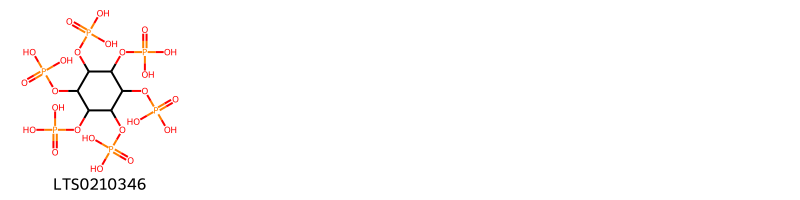{ width=100% }
    <figcaption>Hình ảnh cấu trúc hóa học của 1 hoạt chất thuộc nhóm Organooxygen compounds gồm ['phytic acid (LTS0210346)'].</figcaption>
</figure>
#### Nhóm Prenol lipids
<figure markdown="span">
    { width=100% }
    <figcaption>Hình ảnh cấu trúc hóa học của 2 hoạt chất thuộc nhóm Prenol lipids gồm ['(-)-gossypol (LTS0163589)', 'hemigossypol (LTS0013094)'].</figcaption>
</figure>
#### Nhóm Tetrapyrroles and derivatives
<figure markdown="span">
    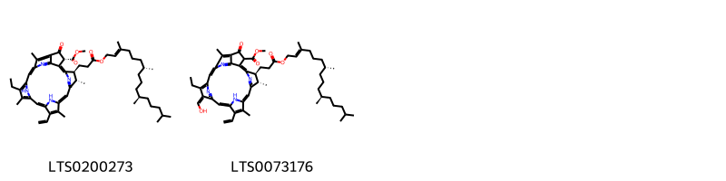{ width=100% }
    <figcaption>Hình ảnh cấu trúc hóa học của 2 hoạt chất thuộc nhóm Tetrapyrroles and derivatives gồm ['methyl (3r,21s,22s)-16-ethenyl-11-ethyl-12,17,21,26-tetramethyl-4-oxo-22-(3-oxo-3-{[(2e,7r,11r)-3,7,11,15-tetramethylhexadec-2-en-1-yl]oxy}propyl)-7,23,24,25-tetraazahexacyclo[18.2.1.1⁵,⁸.1¹⁰,¹³.1¹⁵,¹⁸.0²,⁶]hexacosa-1(23),2(6),5(26),7,9,11,13,15,17,19-decaene-3-carboxylate (LTS0200273)', 'methyl (21s,22s)-16-ethenyl-11-ethyl-12-(hydroxymethylidene)-17,21,26-trimethyl-4-oxo-22-(3-oxo-3-{[(2e,7r,11r)-3,7,11,15-tetramethylhexadec-2-en-1-yl]oxy}propyl)-7,23,24,25-tetraazahexacyclo[18.2.1.1⁵,⁸.1¹⁰,¹³.1¹⁵,¹⁸.0²,⁶]hexacosa-1,5(26),6,8,10,13(25),14,16,18,20(23)-decaene-3-carboxylate (LTS0073176)'].</figcaption>
</figure>

---

### Dược dân tộc học

Danh sách các quốc gia có sử dụng *Gossypium herbaceum* trong điều trị các bệnh. 

| Country   | Disease                                                                                       | Bệnh                                                                                                                                                                                                |
|:----------|:----------------------------------------------------------------------------------------------|:----------------------------------------------------------------------------------------------------------------------------------------------------------------------------------------------------|
| China     | Demulcent                                                                                     | MYMEMORY WARNING: YOU USED ALL AVAILABLE FREE TRANSLATIONS FOR TODAY. NEXT AVAILABLE IN  07 HOURS 20 MINUTES 25 SECONDS VISIT HTTPS://MYMEMORY.TRANSLATED.NET/DOC/USAGELIMITS.PHP TO TRANSLATE MORE |
| Elsewhere | Demulcent, Emmenagogue, Expectorant, Laxative, Nervine, Oxytoxic, Soap, Emollient, Lactagogue | MYMEMORY WARNING: YOU USED ALL AVAILABLE FREE TRANSLATIONS FOR TODAY. NEXT AVAILABLE IN  07 HOURS 20 MINUTES 23 SECONDS VISIT HTTPS://MYMEMORY.TRANSLATED.NET/DOC/USAGELIMITS.PHP TO TRANSLATE MORE |
| Haiti     | Expectorant, Vulnerary, Antiseptic                                                            | MYMEMORY WARNING: YOU USED ALL AVAILABLE FREE TRANSLATIONS FOR TODAY. NEXT AVAILABLE IN  07 HOURS 20 MINUTES 20 SECONDS VISIT HTTPS://MYMEMORY.TRANSLATED.NET/DOC/USAGELIMITS.PHP TO TRANSLATE MORE |
| Japan*    | Absorbent                                                                                     | MYMEMORY WARNING: YOU USED ALL AVAILABLE FREE TRANSLATIONS FOR TODAY. NEXT AVAILABLE IN  07 HOURS 20 MINUTES 18 SECONDS VISIT HTTPS://MYMEMORY.TRANSLATED.NET/DOC/USAGELIMITS.PHP TO TRANSLATE MORE |
| Kurdistan | Emmenagogue, Oxytoxic                                                                         | MYMEMORY WARNING: YOU USED ALL AVAILABLE FREE TRANSLATIONS FOR TODAY. NEXT AVAILABLE IN  07 HOURS 20 MINUTES 15 SECONDS VISIT HTTPS://MYMEMORY.TRANSLATED.NET/DOC/USAGELIMITS.PHP TO TRANSLATE MORE |
| Mexico    | Emmenagogue, Hemostat, Vasoconstrictor                                                        | MYMEMORY WARNING: YOU USED ALL AVAILABLE FREE TRANSLATIONS FOR TODAY. NEXT AVAILABLE IN  07 HOURS 20 MINUTES 13 SECONDS VISIT HTTPS://MYMEMORY.TRANSLATED.NET/DOC/USAGELIMITS.PHP TO TRANSLATE MORE |
| Turkey    | Abortifacient, Oxytoxic, Soap, Aphrodisiac, Emmenagogue                                       | MYMEMORY WARNING: YOU USED ALL AVAILABLE FREE TRANSLATIONS FOR TODAY. NEXT AVAILABLE IN  07 HOURS 20 MINUTES 10 SECONDS VISIT HTTPS://MYMEMORY.TRANSLATED.NET/DOC/USAGELIMITS.PHP TO TRANSLATE MORE |

---

---
## Gossypium hirsutum
### Thông tin về thực vật

!!! info "Phân loại thực vật của *Gossypium hirsutum* từ GIBF:"
    - **Kingdom:** Plantae
    - **Phylum:** Tracheophyta
    - **Order:** Malvales
    - **Family:** Malvaceae
    - **Genus:** Gossypium
    - **Species:** *Gossypium hirsutum*

 

| Label (VI)   | Label (EN)   | Scientific Name    | Descriptions (VI)   | Descriptions (EN)   | Also Known As (VI)   | Also Known As (EN)                            |
|:-------------|:-------------|:-------------------|:--------------------|:--------------------|:---------------------|:----------------------------------------------|
| N/A          | N/A          | Gossypium hirsutum | loài thực vật       | species of plant    | ['']                 | ['cotton', 'Mexican cotton', 'upland cotton'] |

#### Phân bố trên thế giới

**Từ CSDL GIBF** Brazil, Virgin Islands (British), Saint Kitts and Nevis, Guadeloupe, Antigua and Barbuda, Saint Lucia, French Polynesia, Trinidad and Tobago, Turks and Caicos Islands, Cayman Islands, Puerto Rico, United States of America, Saint Barthélemy, Jamaica, Virgin Islands (U.S.), Costa Rica, Dominican Republic, Saint Martin (French part), Colombia, Aruba, Cabo Verde, Mexico, El Salvador, Panama, Egypt, Bonaire, Sint Eustatius and Saba, Bahamas, Australia

#### Phân bố tại Việt Nam

**Từ CSDL GIBF**: Không có ghi nhận ở Việt Nam

---
### Thành phần hóa học
        
- Theo cơ sở dữ liệu lotus: Từ loài *Gossypium hirsutum* đã phân lập và xác định được 282 hoạt chất thuộc về các nhóm Fatty Acyls, Unsaturated hydrocarbons, Organic oxides, Carboxylic acids and derivatives, Naphthalenes, Coumarins and derivatives, Phenols, Organooxygen compounds, Tetrahydrofurans, Benzothiazoles, Diazines, Oxacyclic compounds, Dihydrofurans, Lactones, Benzene and substituted derivatives, Cinnamic acids and derivatives, Steroids and steroid derivatives, Hydroxy acids and derivatives, Phenol esters, Saturated hydrocarbons, Organonitrogen compounds, Vinyl halides, Heteroaromatic compounds, Flavonoids, Anthracenes, Prenol lipids, Indoles and derivatives. 

|    | chemicalTaxonomyClassyfireClass     |   smiles_count |
|---:|:------------------------------------|---------------:|
|  0 | Anthracenes                         |              2 |
|  1 | Benzene and substituted derivatives |             25 |
|  2 | Benzothiazoles                      |              1 |
|  3 | Carboxylic acids and derivatives    |              8 |
|  4 | Cinnamic acids and derivatives      |              1 |
|  5 | Coumarins and derivatives           |              1 |
|  6 | Diazines                            |              1 |
|  7 | Dihydrofurans                       |              1 |
|  8 | Fatty Acyls                         |             27 |
|  9 | Flavonoids                          |             37 |
| 10 | Heteroaromatic compounds            |              2 |
| 11 | Hydroxy acids and derivatives       |              1 |
| 12 | Indoles and derivatives             |              3 |
| 13 | Lactones                            |              7 |
| 14 | Naphthalenes                        |              9 |
| 15 | Organic oxides                      |              1 |
| 16 | Organonitrogen compounds            |              1 |
| 17 | Organooxygen compounds              |             36 |
| 18 | Oxacyclic compounds                 |              1 |
| 19 | Phenol esters                       |              1 |
| 20 | Phenols                             |              9 |
| 21 | Prenol lipids                       |             86 |
| 22 | Saturated hydrocarbons              |              4 |
| 23 | Steroids and steroid derivatives    |             11 |
| 24 | Tetrahydrofurans                    |              1 |
| 25 | Unsaturated hydrocarbons            |              3 |
| 26 | Vinyl halides                       |              1 |

#### Nhóm Anthracenes
<figure markdown="span">
    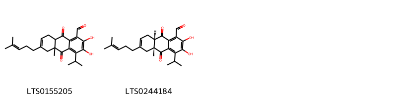{ width=100% }
    <figcaption>Hình ảnh cấu trúc hóa học của 2 hoạt chất thuộc nhóm Anthracenes gồm ['2,3-dihydroxy-4-isopropyl-10a-methyl-6-(4-methylpent-3-en-1-yl)-9,10-dioxo-8,8a-dihydro-5h-anthracene-1-carbaldehyde (LTS0155205)', '(8as,10ar)-2,3-dihydroxy-4-isopropyl-10a-methyl-6-(4-methylpent-3-en-1-yl)-9,10-dioxo-8,8a-dihydro-5h-anthracene-1-carbaldehyde (LTS0244184)'].</figcaption>
</figure>
#### Nhóm Benzene and substituted derivatives
<figure markdown="span">
    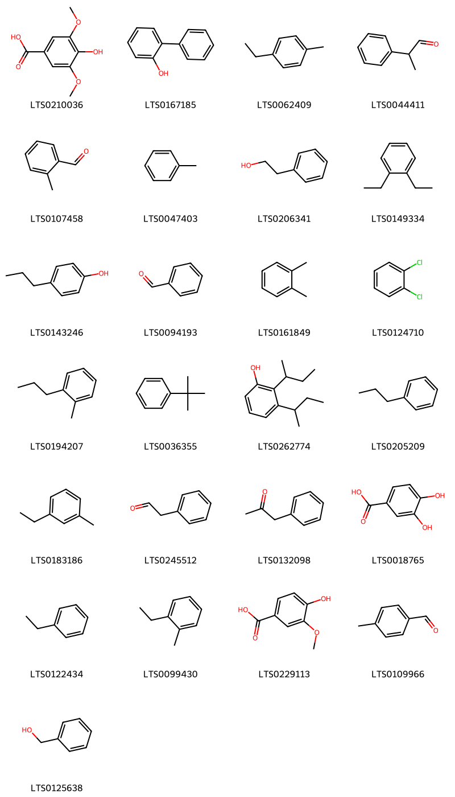{ width=100% }
    <figcaption>Hình ảnh cấu trúc hóa học của 25 hoạt chất thuộc nhóm Benzene and substituted derivatives gồm ['syringic acid (LTS0210036)', 'o-phenylphenol (LTS0167185)', '4-ethyltoluene (LTS0062409)', '2-phenylpropanal (LTS0044411)', '2-methylbenzaldehyde (LTS0107458)', 'toluene (LTS0047403)', '2-phenyl-ethanol (LTS0206341)', 'diethylbenzenes (LTS0149334)', '4-propylphenol (LTS0143246)', 'benzaldehyde (LTS0094193)', 'ortho-xylene (LTS0161849)', 'o-dichlorobenzene (LTS0124710)', '1-methyl-2-propylbenzene (LTS0194207)', 't-butylbenzene (LTS0036355)', '2,3-di-sec-butylphenol (LTS0262774)', 'propylbenzene (LTS0205209)', 'm-ethyltoluene (LTS0183186)', 'phenylacetaldehyde (LTS0245512)', 'phenylacetone (LTS0132098)', '3,4-dihydroxybenzoic acid (LTS0018765)', 'ethylbenzene (LTS0122434)', 'o-ethyltoluene (LTS0099430)', 'vanillic acid (LTS0229113)', 'p-tolualdehyde (LTS0109966)', 'benzyl alcohol (LTS0125638)'].</figcaption>
</figure>
#### Nhóm Benzothiazoles
<figure markdown="span">
    { width=100% }
    <figcaption>Hình ảnh cấu trúc hóa học của 1 hoạt chất thuộc nhóm Benzothiazoles gồm ['benzothiazole (LTS0073984)'].</figcaption>
</figure>
#### Nhóm Carboxylic acids and derivatives
<figure markdown="span">
    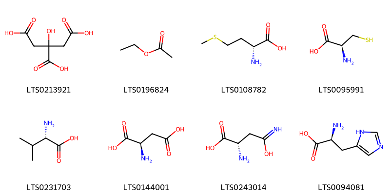{ width=100% }
    <figcaption>Hình ảnh cấu trúc hóa học của 8 hoạt chất thuộc nhóm Carboxylic acids and derivatives gồm ['citric acid (LTS0213921)', 'ethyl acetate (LTS0196824)', 'd-methionine (LTS0108782)', 'd-cysteine (LTS0095991)', 'l-valine (LTS0231703)', 'd-aspartic acid (LTS0144001)', 'aspartamate (LTS0243014)', 'l-histidine (LTS0094081)'].</figcaption>
</figure>
#### Nhóm Cinnamic acids and derivatives
<figure markdown="span">
    { width=100% }
    <figcaption>Hình ảnh cấu trúc hóa học của 1 hoạt chất thuộc nhóm Cinnamic acids and derivatives gồm ['ferulic acid (LTS0077328)'].</figcaption>
</figure>
#### Nhóm Coumarins and derivatives
<figure markdown="span">
    { width=100% }
    <figcaption>Hình ảnh cấu trúc hóa học của 1 hoạt chất thuộc nhóm Coumarins and derivatives gồm ['scopoletin (LTS0193112)'].</figcaption>
</figure>
#### Nhóm Diazines
<figure markdown="span">
    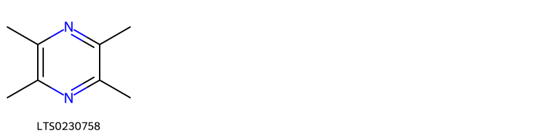{ width=100% }
    <figcaption>Hình ảnh cấu trúc hóa học của 1 hoạt chất thuộc nhóm Diazines gồm ['ligustrazine (LTS0230758)'].</figcaption>
</figure>
#### Nhóm Dihydrofurans
<figure markdown="span">
    { width=100% }
    <figcaption>Hình ảnh cấu trúc hóa học của 1 hoạt chất thuộc nhóm Dihydrofurans gồm ['2,5-dimethyl-3h-furan-2-carbaldehyde (LTS0206813)'].</figcaption>
</figure>
#### Nhóm Fatty Acyls
<figure markdown="span">
    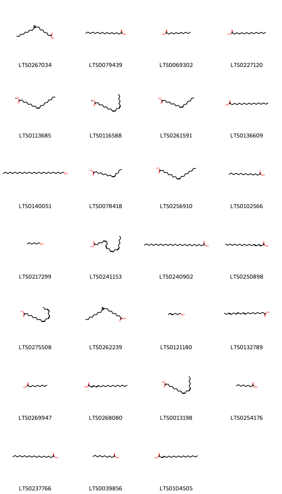{ width=100% }
    <figcaption>Hình ảnh cấu trúc hóa học của 27 hoạt chất thuộc nhóm Fatty Acyls gồm ['malvalic acid (LTS0267034)', 'palmitic acid (LTS0079439)', 'undecanoic acid (LTS0069302)', 'pentadecanoic acid (LTS0227120)', 'methyl oleate (LTS0113685)', 'methyl linoleate (LTS0116588)', 'palmitoleic acid (LTS0261591)', 'heptadecanoic acid (LTS0136609)', 'ceryl alcohol (LTS0140051)', 'myristoleic acid (LTS0078418)', 'oleic acid (LTS0256910)', 'myristic acid (LTS0102566)', 'hexanol (LTS0217299)', 'arachidonic acid (LTS0241153)', 'hexacosanoic acid (LTS0240902)', '(2e,4e)-heptadeca-2,4-dienoic acid (LTS0250898)', 'α-linolenic acid (LTS0275508)', 'sterculic acid (LTS0262239)', 'hex-4-en-1-ol (LTS0121180)', 'α linolenic acid (LTS0132789)', 'nonanoic acid (LTS0269947)', 'heptadeca-2,4-dienoic acid (LTS0268080)', 'linoleic (LTS0013198)', 'caprylic acid (LTS0254176)', 'stearic acid (LTS0237766)', 'capric acid (LTS0039856)', 'heptadec-2-enoic acid (LTS0104505)'].</figcaption>
</figure>
#### Nhóm Flavonoids
<figure markdown="span">
    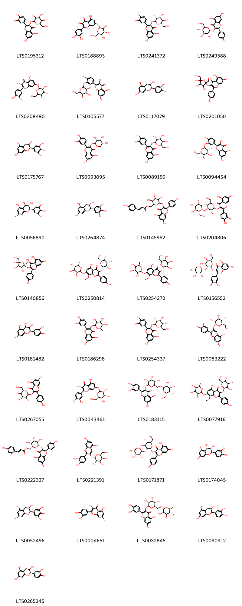{ width=100% }
    <figcaption>Hình ảnh cấu trúc hóa học của 37 hoạt chất thuộc nhóm Flavonoids gồm ['2-(3,4-dihydroxyphenyl)-5,7-dihydroxy-3-{[3,4,5-trihydroxy-6-(hydroxymethyl)oxan-2-yl]oxy}chromen-4-one (LTS0195312)', 'quercimeritrin (LTS0188893)', '2-(3,4-dihydroxyphenyl)-5,7-dihydroxy-3-{[(2s,3r,4r,5r,6s)-3,4,5-trihydroxy-6-(hydroxymethyl)oxan-2-yl]oxy}chromen-4-one (LTS0241372)', 'astragalin (LTS0249588)', 'quercimeritrin (LTS0208490)', '3,5,7-trihydroxy-2-(4-hydroxy-3-{[3,4,5-trihydroxy-6-(hydroxymethyl)oxan-2-yl]oxy}phenyl)chromen-4-one (LTS0105577)', '(+)-catechol (LTS0117079)', '5,7-dihydroxy-2-(4-hydroxyphenyl)-3-{[3,4,5-trihydroxy-2,5-bis(hydroxymethyl)oxolan-2-yl]oxy}chromen-4-one (LTS0201050)', 'epigallocatechin (LTS0175767)', 'quercitrin (LTS0093095)', 'hyperoside (LTS0089156)', '3,5,7-trihydroxy-2-(4-hydroxy-3-{[(2s,3r,4s,5s,6r)-3,4,5-trihydroxy-6-(hydroxymethyl)oxan-2-yl]oxy}phenyl)chromen-4-one (LTS0094454)', '(2s,3s,4r)-2-(3,4,5-trihydroxyphenyl)-3,4-dihydro-2h-1-benzopyran-3,4,5,7-tetrol (LTS0056890)', '(-)-gallocatechin (LTS0264874)', '(6-{[5,7-dihydroxy-2-(4-hydroxyphenyl)-4-oxochromen-3-yl]oxy}-3,4,5-trihydroxyoxan-2-yl)methyl 3-(4-hydroxyphenyl)prop-2-enoate (LTS0145952)', '3-{[(2s,3r,4r,5s,6r)-3,4-dihydroxy-6-(hydroxymethyl)-5-{[(2s,3r,4s,5s,6r)-3,4,5-trihydroxy-6-(hydroxymethyl)oxan-2-yl]oxy}oxan-2-yl]oxy}-2-(3,4-dihydroxyphenyl)-5,7-dihydroxychromen-4-one (LTS0204806)', '5,7-dihydroxy-2-(4-hydroxyphenyl)-3-{[(2r,3r,4r,5s)-3,4,5-trihydroxy-2,5-bis(hydroxymethyl)oxolan-2-yl]oxy}chromen-4-one (LTS0140856)', '5-hydroxy-2-(4-hydroxyphenyl)-8-methoxy-3-{[(2s,3r,4s,5s,6r)-3,4,5-trihydroxy-6-(hydroxymethyl)oxan-2-yl]oxy}-7-{[(2s,3s,4s,5s,6r)-3,4,5-trihydroxy-6-methyloxan-2-yl]oxy}chromen-4-one (LTS0250814)', '5-hydroxy-2-(4-hydroxyphenyl)-8-methoxy-3-{[(2s,5s)-3,4,5-trihydroxy-6-(hydroxymethyl)oxan-2-yl]oxy}-7-{[(2s,4s,5r)-3,4,5-trihydroxy-6-methyloxan-2-yl]oxy}chromen-4-one (LTS0254272)', '3-{[(2s,3r,4s,5r,6r)-4,5-dihydroxy-6-(hydroxymethyl)-3-{[(2s,3r,4r,5r,6s)-3,4,5-trihydroxy-6-methyloxan-2-yl]oxy}oxan-2-yl]oxy}-2-(3,4-dihydroxyphenyl)-5,7-dihydroxychromen-4-one (LTS0156552)', 'leucocyanidin (LTS0181482)', 'quercitrin (LTS0186298)', 'isoquercetin (LTS0254337)', '5,7-dihydroxy-2-(4-hydroxy-3-oxidophenyl)-3-{[(2s,3r,4s,5s,6r)-3,4,5-trihydroxy-6-(hydroxymethyl)oxan-2-yl]oxy}-1λ⁴-chromen-1-ylium (LTS0083222)', 'trifolin (LTS0267055)', 'quercimeritrin (LTS0043461)', '2-(3,4-dihydroxyphenyl)-5,7-dihydroxy-3-{[(2s,3r,4s,5s,6r)-3,4,5-trihydroxy-6-({[(2r,3r,4s,5s,6r)-3,4,5-trihydroxy-6-(hydroxymethyl)oxan-2-yl]oxy}methyl)oxan-2-yl]oxy}chromen-4-one (LTS0183115)', '5-hydroxy-2-(4-hydroxyphenyl)-8-methoxy-3-{[3,4,5-trihydroxy-6-(hydroxymethyl)oxan-2-yl]oxy}-7-[(3,4,5-trihydroxy-6-methyloxan-2-yl)oxy]chromen-4-one (LTS0077916)', 'tiliroside (LTS0222327)', 'chrysanthemin (LTS0221391)', '3-{[(2s,3r,4s,5s,6r)-4,5-dihydroxy-6-(hydroxymethyl)-3-{[(2s,3r,4r,5r,6s)-3,4,5-trihydroxy-6-methyloxan-2-yl]oxy}oxan-2-yl]oxy}-5,7-dihydroxy-2-(4-hydroxyphenyl)chromen-4-one (LTS0171871)', 'procyanidol (LTS0174045)', 'epigallocatechin (LTS0052496)', 'quercetin (LTS0004651)', '3-rutinosyl quercetin (LTS0032845)', 'catechol (LTS0090912)', 'ent-epicatechin (LTS0265245)'].</figcaption>
</figure>
#### Nhóm Heteroaromatic compounds
<figure markdown="span">
    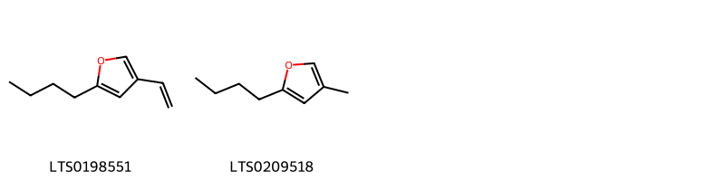{ width=100% }
    <figcaption>Hình ảnh cấu trúc hóa học của 2 hoạt chất thuộc nhóm Heteroaromatic compounds gồm ['2-butyl-4-ethenylfuran (LTS0198551)', '2-butyl-4-methylfuran (LTS0209518)'].</figcaption>
</figure>
#### Nhóm Hydroxy acids and derivatives
<figure markdown="span">
    { width=100% }
    <figcaption>Hình ảnh cấu trúc hóa học của 1 hoạt chất thuộc nhóm Hydroxy acids and derivatives gồm ['malic acid (LTS0216520)'].</figcaption>
</figure>
#### Nhóm Indoles and derivatives
<figure markdown="span">
    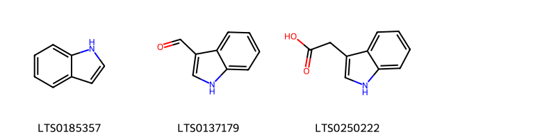{ width=100% }
    <figcaption>Hình ảnh cấu trúc hóa học của 3 hoạt chất thuộc nhóm Indoles and derivatives gồm ['indole (LTS0185357)', 'indole-3-carboxaldehyde (LTS0137179)', 'β-indole-3-acetic acid (LTS0250222)'].</figcaption>
</figure>
#### Nhóm Lactones
<figure markdown="span">
    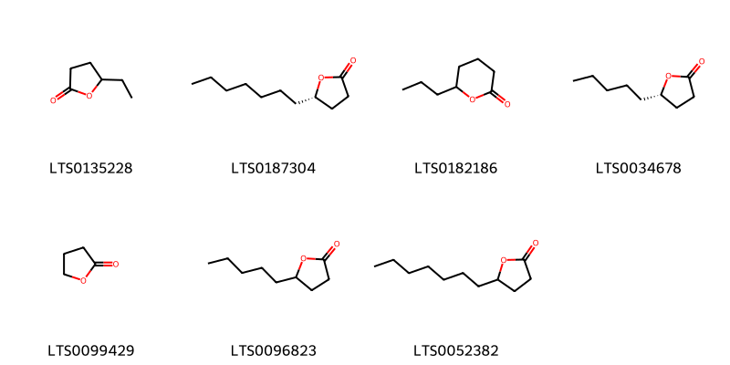{ width=100% }
    <figcaption>Hình ảnh cấu trúc hóa học của 7 hoạt chất thuộc nhóm Lactones gồm ['gamma-hexalactone (LTS0135228)', 'gamma-undecalactone (LTS0187304)', 'δ-octalactone (LTS0182186)', 'aldehyde c-18 (LTS0034678)', '4-butyrolactone (LTS0099429)', 'gamma-nonalactone (LTS0096823)', '5-heptyldihydro-2(3h)-furanone (LTS0052382)'].</figcaption>
</figure>
#### Nhóm Naphthalenes
<figure markdown="span">
    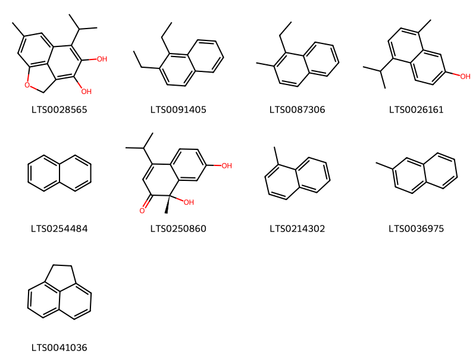{ width=100% }
    <figcaption>Hình ảnh cấu trúc hóa học của 9 hoạt chất thuộc nhóm Naphthalenes gồm ['7-isopropyl-10-methyl-2-oxatricyclo[6.3.1.0⁴,¹²]dodeca-1(11),4(12),5,7,9-pentaene-5,6-diol (LTS0028565)', '1,2-diethylnaphthalene (LTS0091405)', '1-ethyl-2-methylnaphthalene (LTS0087306)', '5-isopropyl-8-methylnaphthalen-2-ol (LTS0026161)', 'naphthalene (LTS0254484)', '(1s)-1,7-dihydroxy-4-isopropyl-1-methylnaphthalen-2-one (LTS0250860)', '1-methylnaphthalene (LTS0214302)', '2-methylnaphthalene (LTS0036975)', 'acenaphthene (LTS0041036)'].</figcaption>
</figure>
#### Nhóm Organic oxides
<figure markdown="span">
    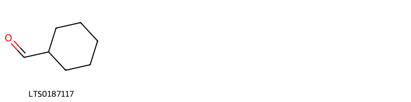{ width=100% }
    <figcaption>Hình ảnh cấu trúc hóa học của 1 hoạt chất thuộc nhóm Organic oxides gồm ['cyclohexanecarboxaldehyde (LTS0187117)'].</figcaption>
</figure>
#### Nhóm Organonitrogen compounds
<figure markdown="span">
    { width=100% }
    <figcaption>Hình ảnh cấu trúc hóa học của 1 hoạt chất thuộc nhóm Organonitrogen compounds gồm ['(9z,12z)-n-(2-hydroxyethyl)octadeca-9,12-dienimidic acid (LTS0115325)'].</figcaption>
</figure>
#### Nhóm Organooxygen compounds
<figure markdown="span">
    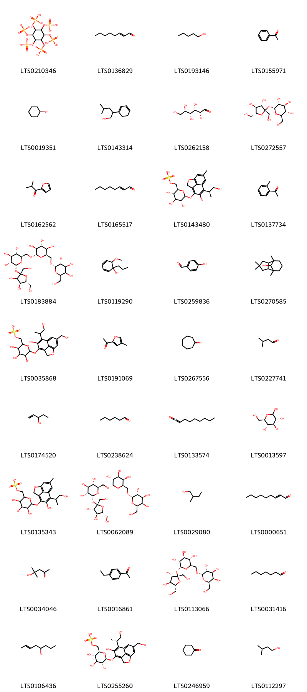{ width=100% }
    <figcaption>Hình ảnh cấu trúc hóa học của 36 hoạt chất thuộc nhóm Organooxygen compounds gồm ['phytic acid (LTS0210346)', '(e)-2-octenal (LTS0136829)', 'amyl alcohol (LTS0193146)', 'acetophenone (LTS0155971)', 'cyclohexanol (LTS0019351)', '2-(cyclohexa-1,3-dien-1-yl)-4-methylpentan-1-ol (LTS0143314)', '(+)-glucose (LTS0262158)', 'sucrose (LTS0272557)', '1-(furan-2-yl)-2-methylpropan-1-one (LTS0162562)', '2-octenal (LTS0165517)', '[(2r,3s,4s,5r,6s)-3,4,5-trihydroxy-6-({6-hydroxy-7-[(2s)-1-hydroxypropan-2-yl]-10-methyl-2-oxatricyclo[6.3.1.0⁴,¹²]dodeca-1(11),4(12),5,7,9-pentaen-5-yl}oxy)oxan-2-yl]methoxysulfonic acid (LTS0143480)', 'ethanone, 1-(2-methylphenyl)- (LTS0137734)', '(2r,3r,4s,5s,6r)-2-{[(2s,3r,4s,5r)-3,4-dihydroxy-2,5-bis(hydroxymethyl)oxolan-2-yl]oxy}-6-({[(2s,3s,4r,5r,6r)-3,4,5-trihydroxy-6-({[(2s,3r,4s,5r,6r)-3,4,5-trihydroxy-6-(hydroxymethyl)oxan-2-yl]oxy}methyl)oxan-2-yl]oxy}methyl)oxane-3,4,5-triol (LTS0183884)', '6-methoxy-1-propylcyclohexa-2,4-dien-1-ol (LTS0119290)', 'p-hydroxybenzaldehyde (LTS0259836)', '1,4,4,7-tetramethyltricyclo[5.3.1.0²,⁶]undecan-11-ol (LTS0270585)', '(3,4,5-trihydroxy-6-{[6-hydroxy-10-(hydroxymethyl)-7-(1-hydroxypropan-2-yl)-2-oxatricyclo[6.3.1.0⁴,¹²]dodeca-1(12),4,6,8,10-pentaen-5-yl]oxy}oxan-2-yl)methoxysulfonic acid (LTS0035868)', '1-(4-methylfuran-2-yl)ethanone (LTS0191069)', 'cycloheptanone (LTS0267556)', 'isovaleraldehyde (LTS0227741)', '1-penten-3-ol (LTS0174520)', 'hexanal (LTS0238624)', 'non-1-en-1-one (LTS0133574)', 'glucose (LTS0013597)', '(3,4,5-trihydroxy-6-{[6-hydroxy-7-(1-hydroxypropan-2-yl)-10-methyl-2-oxatricyclo[6.3.1.0⁴,¹²]dodeca-1(11),4(12),5,7,9-pentaen-5-yl]oxy}oxan-2-yl)methoxysulfonic acid (LTS0135343)', 'stachyose (LTS0062089)', '2-methyl-1-butanol (LTS0029080)', '2-nonenal (LTS0000651)', 'diacetone alcohol (LTS0034046)', '4-ethylacetophenone (LTS0016861)', 'raffinose (LTS0113066)', 'heptanal (LTS0031416)', 'oct-6-en-4-ol (LTS0106436)', '[(2r,3s,4s,5r,6s)-3,4,5-trihydroxy-6-{[6-hydroxy-10-(hydroxymethyl)-7-[(2s)-1-hydroxypropan-2-yl]-2-oxatricyclo[6.3.1.0⁴,¹²]dodeca-1(12),4,6,8,10-pentaen-5-yl]oxy}oxan-2-yl]methoxysulfonic acid (LTS0255260)', 'cyclohexanone (LTS0246959)', 'isoamyl alcohol (LTS0112297)'].</figcaption>
</figure>
#### Nhóm Oxacyclic compounds
<figure markdown="span">
    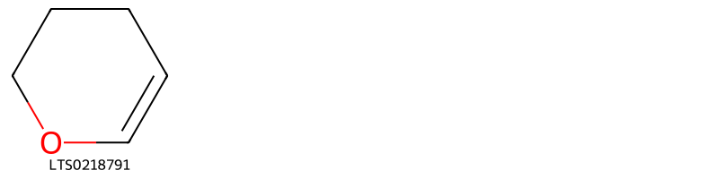{ width=100% }
    <figcaption>Hình ảnh cấu trúc hóa học của 1 hoạt chất thuộc nhóm Oxacyclic compounds gồm ['2h-pyran, 3,4-dihydro- (LTS0218791)'].</figcaption>
</figure>
#### Nhóm Phenol esters
<figure markdown="span">
    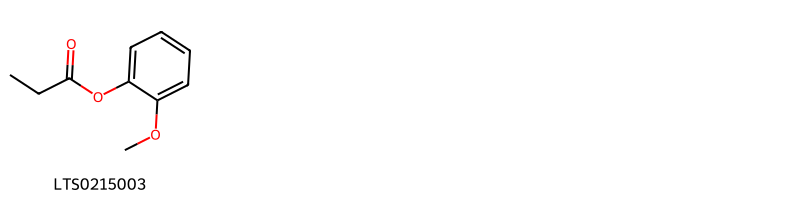{ width=100% }
    <figcaption>Hình ảnh cấu trúc hóa học của 1 hoạt chất thuộc nhóm Phenol esters gồm ['guaiacol propionate (LTS0215003)'].</figcaption>
</figure>
#### Nhóm Phenols
<figure markdown="span">
    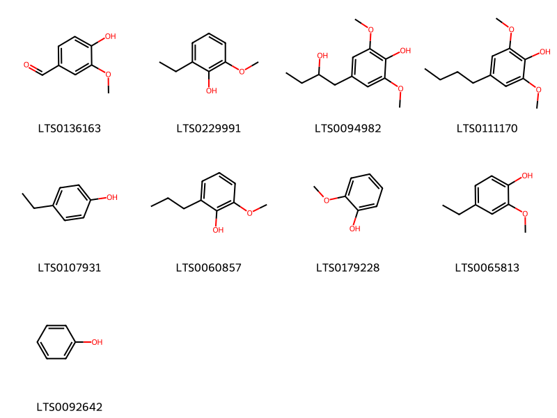{ width=100% }
    <figcaption>Hình ảnh cấu trúc hóa học của 9 hoạt chất thuộc nhóm Phenols gồm ['vanillin (LTS0136163)', '2-ethyl-6-methoxyphenol (LTS0229991)', '4-(2-hydroxybutyl)-2,6-dimethoxyphenol (LTS0094982)', '4-butyl-2,6-dimethoxyphenol (LTS0111170)', 'ethylphenol (LTS0107931)', '2-methoxy-6-propylphenol (LTS0060857)', 'guaiacol (LTS0179228)', '4-ethylguaiacol (LTS0065813)', 'phenol (LTS0092642)'].</figcaption>
</figure>
#### Nhóm Prenol lipids
<figure markdown="span">
    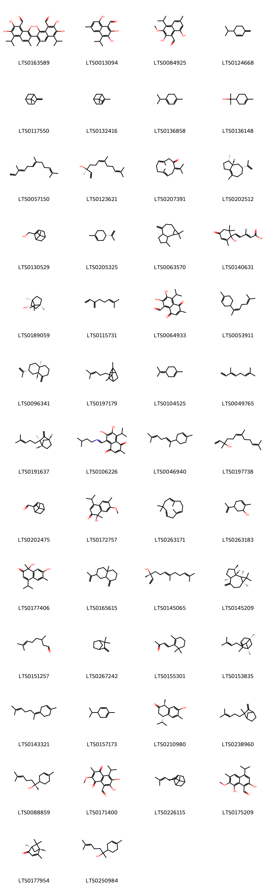{ width=100% }
    <figcaption>Hình ảnh cấu trúc hóa học của 86 hoạt chất thuộc nhóm Prenol lipids gồm ['(-)-gossypol (LTS0163589)', 'hemigossypol (LTS0013094)', '2,8-dihydroxy-4-isopropyl-3-methoxy-6-methylnaphthalene-1-carbaldehyde (LTS0084925)', 'β phellandrene (LTS0124668)', 'β-pinene (LTS0117550)', 'α pinene (LTS0132416)', 'terpinene (LTS0136858)', 'terpineol (LTS0136148)', 'farnesene (LTS0057150)', '(6z)-(+)-nerolidol (LTS0123621)', 'germacrone (LTS0207391)', 'α-bulnesene (LTS0202512)', 'myrtenol (LTS0130529)', '(-)-limonene (LTS0205325)', '1,1,7-trimethyl-4-methylidene-octahydro-1ah-cyclopropa[e]azulene (LTS0063570)', 'abscisic acid,  (LTS0140631)', '(+)-borneol (LTS0189059)', 'α-myrcene (LTS0115731)', '2,3-dihydroxy-4-isopropyl-6-methyl-5,8-dioxonaphthalene-1-carbaldehyde (LTS0064933)', '(z)-α-bisabolene (LTS0053911)', 'β-selinene (LTS0096341)', '1,7-dimethyl-7-(4-methylpent-3-en-1-yl)tricyclo[2.2.1.0²,⁶]heptane (LTS0197179)', 'terpinolene (LTS0104525)', 'trans-β-ocimene (LTS0049765)', 'β-santalene (LTS0191637)', '6,7-dihydroxy-8-isopropyl-2-methyl-5-{[(3-methylbutyl)imino]methyl}naphthalene-1,4-dione (LTS0106226)', '(e)-α-bisabolene (LTS0046940)', 'nerolidol (LTS0197738)', 'myrtenal (LTS0202475)', '1-hydroxy-4-isopropyl-7-methoxy-1,6-dimethylnaphthalen-2-one (LTS0172757)', 'humulene (LTS0263171)', 'carveol (LTS0263183)', '1,7-dihydroxy-4-isopropyl-1,6-dimethylnaphthalen-2-one (LTS0177406)', '4a-methyl-1-methylidene-7-(prop-1-en-2-yl)-octahydronaphthalene (LTS0165615)', '(3r,6e)-nerolidol (LTS0145065)', 'β-aromadendrene (LTS0145209)', 'citronella (LTS0151257)', 'camphene (LTS0267242)', 'β-ionone (LTS0155301)', '(-)-endo-α-bergamotene (LTS0153835)', '(z)-γ-bisabolene (LTS0143321)', 'phellandrene (LTS0157173)', '(1s,4s)-7-hydroxy-4-isopropyl-1,6-dimethyl-3,4-dihydro-1h-naphthalen-2-one (LTS0210980)', 'β-santalene (LTS0238960)', '(2r)-6-methyl-2-(4-methylcyclohex-3-en-1-yl)hept-5-en-2-ol (LTS0088859)', '2,3-dihydroxy-4-isopropyl-7-methoxy-6-methyl-5,8-dioxonaphthalene-1-carbaldehyde (LTS0171400)', 'α-bergamotene (LTS0226115)', '2,8-dihydroxy-4-isopropyl-7-methoxy-6-methylnaphthalene-1-carbaldehyde (LTS0175209)', '(1r,5s)-4,6,6-trimethylbicyclo[3.1.1]hept-3-en-2-one (LTS0177954)', 'α-bisabolol (LTS0250984)', 'caryophyllene (LTS0085212)', '(-)-α-curcumene (LTS0216936)', 'verbenone (LTS0264577)', 'β-farnesene (LTS0067925)', '1-methyl-4-(6-methylhepta-1,5-dien-2-yl)-7-oxabicyclo[4.1.0]heptane (LTS0276236)', 'selinene (LTS0197809)', 'α-copaene (LTS0207598)', 'thymol (LTS0168527)', '(1as,4as,7as,7br)-1,1,7-trimethyl-4-methylidene-octahydro-1ah-cyclopropa[e]azulene (LTS0160636)', 'isopulegone (LTS0226394)', 'cuminaldehyde (LTS0037806)', 'lacinilene c 7-methyl ether (LTS0189971)', 'geraniol (LTS0258838)', '7-hydroxy-4-isopropyl-1,6-dimethyl-3,4-dihydro-1h-naphthalen-2-one (LTS0197485)', '6,7-dihydroxy-8-isopropyl-2-methyl-5-[(e)-[(3-methylbutyl)imino]methyl]naphthalene-1,4-dione (LTS0250188)', 'curcumene (LTS0190074)', '(1r,2s,7s,8s)-8-isopropyl-1,3-dimethyltricyclo[4.4.0.0²,⁷]dec-3-ene (LTS0190031)', '2,7-dihydroxycadalene (LTS0261588)', '(1r)-1,7-dihydroxy-4-isopropyl-1,6-dimethylnaphthalen-2-one (LTS0014141)', '(1s,2s,4r)-2-methyl-3-methylidene-2-(4-methylpent-3-en-1-yl)bicyclo[2.2.1]heptane (LTS0259563)', 'caryophyllene (LTS0131870)', '(-)-delta-cadinene (LTS0052680)', '4-methyl-1-(6-methylhept-5-en-2-yl)cyclohex-3-en-1-ol (LTS0000924)', '5-isopropyl-3,8-dimethyl-5,6,7,8-tetrahydronaphthalen-2-ol (LTS0017205)', 'carvacrol (LTS0012882)', '(5r,8s)-5-isopropyl-3,8-dimethyl-5,6,7,8-tetrahydronaphthalen-2-ol (LTS0024549)', '(1r,4s)-7-hydroxy-4-isopropyl-1,6-dimethyl-3,4-dihydro-1h-naphthalen-2-one (LTS0026677)', '2-hydroxy-7-methoxycadalene (LTS0075330)', 'nerol (LTS0244289)', 'perillaldehyde,  (LTS0028488)', 'cuminol (LTS0021403)', 'lacinilene c 7-methyl ether (LTS0001099)', 'α-selinene (LTS0024564)', 'citronellol, (+-)- (LTS0090925)', 'β-bisabolol (LTS0115229)', '(4e)-5-[(1s)-1-hydroxy-2,6,6-trimethyl-4-oxocyclohex-2-en-1-yl]-3-methylpenta-2,4-dienoic acid (LTS0268716)'].</figcaption>
</figure>
#### Nhóm Saturated hydrocarbons
<figure markdown="span">
    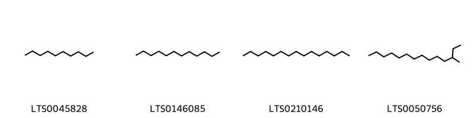{ width=100% }
    <figcaption>Hình ảnh cấu trúc hóa học của 4 hoạt chất thuộc nhóm Saturated hydrocarbons gồm ['decane (LTS0045828)', 'dodecane (LTS0146085)', 'pentadecane (LTS0210146)', '3-methyltetradecane (LTS0050756)'].</figcaption>
</figure>
#### Nhóm Steroids and steroid derivatives
<figure markdown="span">
    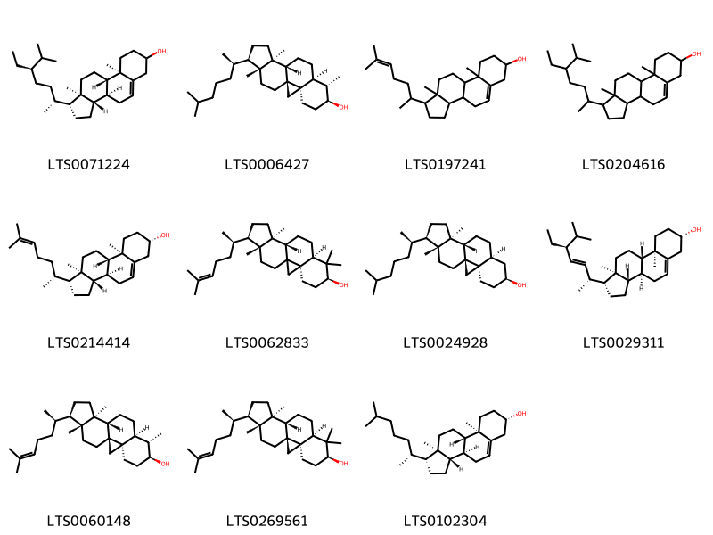{ width=100% }
    <figcaption>Hình ảnh cấu trúc hóa học của 11 hoạt chất thuộc nhóm Steroids and steroid derivatives gồm ['stigmast-5-en-3-ol (LTS0071224)', '(1s,3r,6s,7s,8s,11s,12s,15r,16r)-7,12,16-trimethyl-15-[(2r)-6-methylheptan-2-yl]pentacyclo[9.7.0.0¹,³.0³,⁸.0¹²,¹⁶]octadecan-6-ol (LTS0006427)', 'desmosterol (LTS0197241)', 'stigmast-5-en-3-ol, (3β)- (LTS0204616)', 'desmosterol (LTS0214414)', '(3r,6s,8r,11s,12s,15r,16r)-7,7,12,16-tetramethyl-15-[(2r)-6-methylhept-5-en-2-yl]pentacyclo[9.7.0.0¹,³.0³,⁸.0¹²,¹⁶]octadecan-6-ol (LTS0062833)', 'pollinastanol (LTS0024928)', 'phytosterol (LTS0029311)', '(1s,3r,6s,7s,8s,11s,12s,15r,16r)-7,12,16-trimethyl-15-[(2r)-6-methylhept-5-en-2-yl]pentacyclo[9.7.0.0¹,³.0³,⁸.0¹²,¹⁶]octadecan-6-ol (LTS0060148)', 'cycloartenol (LTS0269561)', 'cholesterol (LTS0102304)'].</figcaption>
</figure>
#### Nhóm Tetrahydrofurans
<figure markdown="span">
    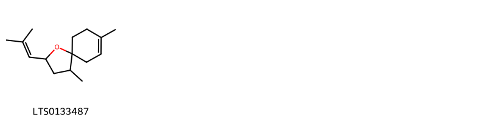{ width=100% }
    <figcaption>Hình ảnh cấu trúc hóa học của 1 hoạt chất thuộc nhóm Tetrahydrofurans gồm ['4,8-dimethyl-2-(2-methylprop-1-en-1-yl)-1-oxaspiro[4.5]dec-7-ene (LTS0133487)'].</figcaption>
</figure>
#### Nhóm Unsaturated hydrocarbons
<figure markdown="span">
    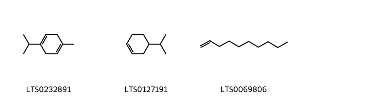{ width=100% }
    <figcaption>Hình ảnh cấu trúc hóa học của 3 hoạt chất thuộc nhóm Unsaturated hydrocarbons gồm ['α terpinene (LTS0232891)', '4-isopropylcyclohex-1-ene (LTS0127191)', 'decene (LTS0069806)'].</figcaption>
</figure>
#### Nhóm Vinyl halides
<figure markdown="span">
    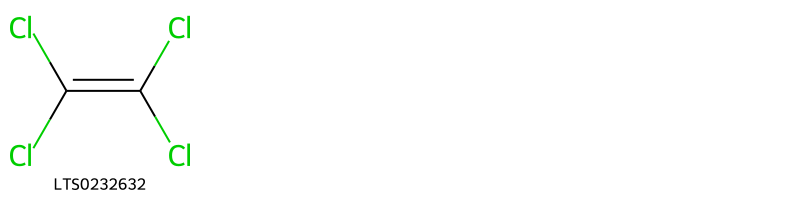{ width=100% }
    <figcaption>Hình ảnh cấu trúc hóa học của 1 hoạt chất thuộc nhóm Vinyl halides gồm ['perchloroethylene (LTS0232632)'].</figcaption>
</figure>

---

### Dược dân tộc học

Danh sách các quốc gia có sử dụng *Gossypium hirsutum* trong điều trị các bệnh. 

| Country   | Disease     | Bệnh                                                                                                                                                                                                |
|:----------|:------------|:----------------------------------------------------------------------------------------------------------------------------------------------------------------------------------------------------|
| Elsewhere | Analgesic   | MYMEMORY WARNING: YOU USED ALL AVAILABLE FREE TRANSLATIONS FOR TODAY. NEXT AVAILABLE IN  07 HOURS 19 MINUTES 45 SECONDS VISIT HTTPS://MYMEMORY.TRANSLATED.NET/DOC/USAGELIMITS.PHP TO TRANSLATE MORE |
| Iraq      | Emmenagogue | MYMEMORY WARNING: YOU USED ALL AVAILABLE FREE TRANSLATIONS FOR TODAY. NEXT AVAILABLE IN  07 HOURS 19 MINUTES 42 SECONDS VISIT HTTPS://MYMEMORY.TRANSLATED.NET/DOC/USAGELIMITS.PHP TO TRANSLATE MORE |
| Kurdistan | Soap        | MYMEMORY WARNING: YOU USED ALL AVAILABLE FREE TRANSLATIONS FOR TODAY. NEXT AVAILABLE IN  07 HOURS 19 MINUTES 39 SECONDS VISIT HTTPS://MYMEMORY.TRANSLATED.NET/DOC/USAGELIMITS.PHP TO TRANSLATE MORE |
| Trinidad  | Analgesic   | MYMEMORY WARNING: YOU USED ALL AVAILABLE FREE TRANSLATIONS FOR TODAY. NEXT AVAILABLE IN  07 HOURS 19 MINUTES 37 SECONDS VISIT HTTPS://MYMEMORY.TRANSLATED.NET/DOC/USAGELIMITS.PHP TO TRANSLATE MORE |
| Turkey    | Oxytoxic    | MYMEMORY WARNING: YOU USED ALL AVAILABLE FREE TRANSLATIONS FOR TODAY. NEXT AVAILABLE IN  07 HOURS 19 MINUTES 34 SECONDS VISIT HTTPS://MYMEMORY.TRANSLATED.NET/DOC/USAGELIMITS.PHP TO TRANSLATE MORE |

---

# Chi Cienfuegosia

??? note "Danh sách các dược liệu thuộc chi"
    
	 - *Cienfuegosia drummondii*

---
## Cienfuegosia drummondii
### Thông tin về thực vật

!!! info "Phân loại thực vật của *Cienfuegosia drummondii* từ GIBF:"
    - **Kingdom:** Plantae
    - **Phylum:** Tracheophyta
    - **Order:** Malvales
    - **Family:** Malvaceae
    - **Genus:** Cienfuegosia
    - **Species:** *Cienfuegosia drummondii*

 

| Label (VI)   | Label (EN)   | Scientific Name         | Descriptions (VI)   | Descriptions (EN)   | Also Known As (VI)   | Also Known As (EN)   |
|:-------------|:-------------|:------------------------|:--------------------|:--------------------|:---------------------|:---------------------|
| N/A          | N/A          | Cienfuegosia drummondii | loài thực vật       | species of plant    | ['']                 | ['']                 |

#### Phân bố trên thế giới

**Từ CSDL GIBF** Brazil, United States of America, Paraguay, Colombia, Argentina, Ecuador, Uruguay, Bolivia (Plurinational State of)

#### Phân bố tại Việt Nam

**Từ CSDL GIBF**: Không có ghi nhận ở Việt Nam

---
### Thành phần hóa học
        
- Theo cơ sở dữ liệu lotus: Từ loài *Cienfuegosia drummondii* đã phân lập và xác định được 1 hoạt chất thuộc về các nhóm Prenol lipids. 

|    | chemicalTaxonomyClassyfireClass   |   smiles_count |
|---:|:----------------------------------|---------------:|
|  0 | Prenol lipids                     |              1 |

#### Nhóm Prenol lipids
<figure markdown="span">
    { width=100% }
    <figcaption>Hình ảnh cấu trúc hóa học của 1 hoạt chất thuộc nhóm Prenol lipids gồm ['(-)-gossypol (LTS0163589)'].</figcaption>
</figure>

---

### Dược dân tộc học

Danh sách các quốc gia có sử dụng *Cienfuegosia drummondii* trong điều trị các bệnh. 

| Country   | Disease       | Bệnh                                                                                                                                                                                                |
|:----------|:--------------|:----------------------------------------------------------------------------------------------------------------------------------------------------------------------------------------------------|
| Paraguay  | Contraceptive | MYMEMORY WARNING: YOU USED ALL AVAILABLE FREE TRANSLATIONS FOR TODAY. NEXT AVAILABLE IN  07 HOURS 18 MINUTES 51 SECONDS VISIT HTTPS://MYMEMORY.TRANSLATED.NET/DOC/USAGELIMITS.PHP TO TRANSLATE MORE |

---

# Chi Malva

??? note "Danh sách các dược liệu thuộc chi"
    
	 - *Malva neglecta*
	 - *Malva parviflora*
	 - *Malva rotundifolia*
	 - *Malva sylvestris*
	 - *Malva verticillata*

---
## Malva neglecta
### Thông tin về thực vật

!!! info "Phân loại thực vật của *Malva neglecta* từ GIBF:"
    - **Kingdom:** Plantae
    - **Phylum:** Tracheophyta
    - **Order:** Malvales
    - **Family:** Malvaceae
    - **Genus:** Malva
    - **Species:** *Malva neglecta*

 

| Label (VI)   | Label (EN)   | Scientific Name   | Descriptions (VI)   | Descriptions (EN)   | Also Known As (VI)   | Also Known As (EN)              |
|:-------------|:-------------|:------------------|:--------------------|:--------------------|:---------------------|:--------------------------------|
| N/A          | N/A          | Malva neglecta    | loài thực vật       | species of plant    | ['']                 | ['common mallow', 'cheeseweed'] |

#### Phân bố trên thế giới

**Từ CSDL GIBF** Austria, United States of America, Korea, Republic of, Poland, Chinese Taipei, Ukraine, Australia, Kazakhstan, New Zealand, Russian Federation, Switzerland, Türkiye, Argentina, Canada, Germany, France, Spain, Netherlands

#### Phân bố tại Việt Nam

**Từ CSDL GIBF**: Không có ghi nhận ở Việt Nam

---
### Thành phần hóa học
        
- Theo cơ sở dữ liệu lotus: Từ loài *Malva neglecta* đã phân lập và xác định được 2 hoạt chất thuộc về các nhóm Fatty Acyls, Saturated hydrocarbons. 

|    | chemicalTaxonomyClassyfireClass   |   smiles_count |
|---:|:----------------------------------|---------------:|
|  0 | Fatty Acyls                       |              1 |
|  1 | Saturated hydrocarbons            |              1 |

#### Nhóm Fatty Acyls
<figure markdown="span">
    { width=100% }
    <figcaption>Hình ảnh cấu trúc hóa học của 1 hoạt chất thuộc nhóm Fatty Acyls gồm ['2-carboxy-d-arabinitol (LTS0056947)'].</figcaption>
</figure>
#### Nhóm Saturated hydrocarbons
<figure markdown="span">
    { width=100% }
    <figcaption>Hình ảnh cấu trúc hóa học của 1 hoạt chất thuộc nhóm Saturated hydrocarbons gồm ['octacosane (LTS0242387)'].</figcaption>
</figure>

---

### Dược dân tộc học

Danh sách các quốc gia có sử dụng *Malva neglecta* trong điều trị các bệnh. 

| Country   | Disease     | Bệnh                                                                                                                                                                                                |
|:----------|:------------|:----------------------------------------------------------------------------------------------------------------------------------------------------------------------------------------------------|
| France    | Expectorant | MYMEMORY WARNING: YOU USED ALL AVAILABLE FREE TRANSLATIONS FOR TODAY. NEXT AVAILABLE IN  07 HOURS 18 MINUTES 27 SECONDS VISIT HTTPS://MYMEMORY.TRANSLATED.NET/DOC/USAGELIMITS.PHP TO TRANSLATE MORE |
| Haiti     | Sedative    | MYMEMORY WARNING: YOU USED ALL AVAILABLE FREE TRANSLATIONS FOR TODAY. NEXT AVAILABLE IN  07 HOURS 18 MINUTES 24 SECONDS VISIT HTTPS://MYMEMORY.TRANSLATED.NET/DOC/USAGELIMITS.PHP TO TRANSLATE MORE |

---

---
## Malva parviflora
### Thông tin về thực vật

!!! info "Phân loại thực vật của *Malva parviflora* từ GIBF:"
    - **Kingdom:** Plantae
    - **Phylum:** Tracheophyta
    - **Order:** Malvales
    - **Family:** Malvaceae
    - **Genus:** Malva
    - **Species:** *Malva parviflora*

 

| Label (VI)   | Label (EN)   | Scientific Name   | Descriptions (VI)   | Descriptions (EN)   | Also Known As (VI)   | Also Known As (EN)   |
|:-------------|:-------------|:------------------|:--------------------|:--------------------|:---------------------|:---------------------|
| N/A          | N/A          | Malva parviflora  | loài thực vật       | species of plant    | ['']                 | ['Least Mallow']     |

#### Phân bố trên thế giới

**Từ CSDL GIBF** Mexico, United Arab Emirates, United States of America, Portugal, Malta, Greece, Kuwait, Australia, Israel, New Zealand, Argentina, Yemen, United Kingdom of Great Britain and Northern Ireland, Spain

#### Phân bố tại Việt Nam

**Từ CSDL GIBF**: Không có ghi nhận ở Việt Nam

---
### Thành phần hóa học
        
- Theo cơ sở dữ liệu lotus: Từ loài *Malva parviflora* đã phân lập và xác định được 1 hoạt chất thuộc về các nhóm Prenol lipids. 

|    | chemicalTaxonomyClassyfireClass   |   smiles_count |
|---:|:----------------------------------|---------------:|
|  0 | Prenol lipids                     |              1 |

#### Nhóm Prenol lipids
<figure markdown="span">
    { width=100% }
    <figcaption>Hình ảnh cấu trúc hóa học của 1 hoạt chất thuộc nhóm Prenol lipids gồm ['(-)-gossypol (LTS0163589)'].</figcaption>
</figure>

---

### Dược dân tộc học

Danh sách các quốc gia có sử dụng *Malva parviflora* trong điều trị các bệnh. 

| Country      | Disease                                 | Bệnh                                                                                                                                                                                                |
|:-------------|:----------------------------------------|:----------------------------------------------------------------------------------------------------------------------------------------------------------------------------------------------------|
| Egypt        | Poultice                                | MYMEMORY WARNING: YOU USED ALL AVAILABLE FREE TRANSLATIONS FOR TODAY. NEXT AVAILABLE IN  07 HOURS 18 MINUTES 02 SECONDS VISIT HTTPS://MYMEMORY.TRANSLATED.NET/DOC/USAGELIMITS.PHP TO TRANSLATE MORE |
| Elsewhere    | Poison, Taenicide, Demulcent, Emollient | MYMEMORY WARNING: YOU USED ALL AVAILABLE FREE TRANSLATIONS FOR TODAY. NEXT AVAILABLE IN  07 HOURS 17 MINUTES 59 SECONDS VISIT HTTPS://MYMEMORY.TRANSLATED.NET/DOC/USAGELIMITS.PHP TO TRANSLATE MORE |
| South Africa | Nervine, Tonic                          | MYMEMORY WARNING: YOU USED ALL AVAILABLE FREE TRANSLATIONS FOR TODAY. NEXT AVAILABLE IN  07 HOURS 17 MINUTES 57 SECONDS VISIT HTTPS://MYMEMORY.TRANSLATED.NET/DOC/USAGELIMITS.PHP TO TRANSLATE MORE |
| Sudan        | Emollient                               | MYMEMORY WARNING: YOU USED ALL AVAILABLE FREE TRANSLATIONS FOR TODAY. NEXT AVAILABLE IN  07 HOURS 17 MINUTES 54 SECONDS VISIT HTTPS://MYMEMORY.TRANSLATED.NET/DOC/USAGELIMITS.PHP TO TRANSLATE MORE |
| US           | Sudorific                               | MYMEMORY WARNING: YOU USED ALL AVAILABLE FREE TRANSLATIONS FOR TODAY. NEXT AVAILABLE IN  07 HOURS 17 MINUTES 51 SECONDS VISIT HTTPS://MYMEMORY.TRANSLATED.NET/DOC/USAGELIMITS.PHP TO TRANSLATE MORE |

---

---
## Malva rotundifolia
### Thông tin về thực vật

!!! info "Phân loại thực vật của *N/A* từ GIBF:"
    - **Kingdom:** Plantae
    - **Phylum:** Tracheophyta
    - **Order:** Malvales
    - **Family:** Malvaceae
    - **Genus:** Malva
    - **Species:** *N/A*

 

| Label (VI)   | Label (EN)   | Scientific Name    | Descriptions (VI)   | Descriptions (EN)   | Also Known As (VI)   | Also Known As (EN)   |
|:-------------|:-------------|:-------------------|:--------------------|:--------------------|:---------------------|:---------------------|
| N/A          | N/A          | Malva rotundifolia |                     | species of plant    | ['']                 | ['']                 |

#### Phân bố trên thế giới

**Từ CSDL GIBF** nan, Malta, China, Chile, New Zealand, Spain, Bolivia (Plurinational State of), United States of America, Greece, Russian Federation, Argentina, Mexico, United Kingdom of Great Britain and Northern Ireland, Canada, Austria, Portugal, Ukraine, South Africa, Australia, Italy, France

#### Phân bố tại Việt Nam

**Từ CSDL GIBF**: Không có ghi nhận ở Việt Nam

---
### Thành phần hóa học
        
- Theo cơ sở dữ liệu lotus: Từ loài *N/A* đã phân lập và xác định được 1 hoạt chất thuộc về các nhóm Saturated hydrocarbons. 

|    | chemicalTaxonomyClassyfireClass   |   smiles_count |
|---:|:----------------------------------|---------------:|
|  0 | Saturated hydrocarbons            |              1 |

#### Nhóm Saturated hydrocarbons
<figure markdown="span">
    { width=100% }
    <figcaption>Hình ảnh cấu trúc hóa học của 1 hoạt chất thuộc nhóm Saturated hydrocarbons gồm ['octacosane (LTS0242387)'].</figcaption>
</figure>

---

### Dược dân tộc học

Danh sách các quốc gia có sử dụng *N/A* trong điều trị các bệnh. 

| Country   | Disease                           | Bệnh                                                                                                                                                                                                |
|:----------|:----------------------------------|:----------------------------------------------------------------------------------------------------------------------------------------------------------------------------------------------------|
| Elsewhere | Demulcent, Emmenagogue, Emollient | MYMEMORY WARNING: YOU USED ALL AVAILABLE FREE TRANSLATIONS FOR TODAY. NEXT AVAILABLE IN  07 HOURS 17 MINUTES 28 SECONDS VISIT HTTPS://MYMEMORY.TRANSLATED.NET/DOC/USAGELIMITS.PHP TO TRANSLATE MORE |
| Europe    | Demulcent                         | MYMEMORY WARNING: YOU USED ALL AVAILABLE FREE TRANSLATIONS FOR TODAY. NEXT AVAILABLE IN  07 HOURS 17 MINUTES 25 SECONDS VISIT HTTPS://MYMEMORY.TRANSLATED.NET/DOC/USAGELIMITS.PHP TO TRANSLATE MORE |
| US        | Emollient                         | MYMEMORY WARNING: YOU USED ALL AVAILABLE FREE TRANSLATIONS FOR TODAY. NEXT AVAILABLE IN  07 HOURS 17 MINUTES 22 SECONDS VISIT HTTPS://MYMEMORY.TRANSLATED.NET/DOC/USAGELIMITS.PHP TO TRANSLATE MORE |

---

---
## Malva sylvestris
### Thông tin về thực vật

!!! info "Phân loại thực vật của *Malva sylvestris* từ GIBF:"
    - **Kingdom:** Plantae
    - **Phylum:** Tracheophyta
    - **Order:** Malvales
    - **Family:** Malvaceae
    - **Genus:** Malva
    - **Species:** *Malva sylvestris*

 

| Label (VI)   | Label (EN)   | Scientific Name   | Descriptions (VI)   | Descriptions (EN)   | Also Known As (VI)   | Also Known As (EN)   |
|:-------------|:-------------|:------------------|:--------------------|:--------------------|:---------------------|:---------------------|
| N/A          | N/A          | Malva sylvestris  | loài thực vật       | species of plant    | ['']                 | ['mallow']           |

#### Phân bố trên thế giới

**Từ CSDL GIBF** Malta, Sweden, Uzbekistan, Israel, New Zealand, Spain, Netherlands, Greece, Russian Federation, Croatia, Argentina, Mexico, Algeria, France, Palestine, State of, Germany, Austria, Portugal, Ukraine, Australia, Italy, Switzerland, United Kingdom of Great Britain and Northern Ireland, Ireland

#### Phân bố tại Việt Nam

**Từ CSDL GIBF**: Không có ghi nhận ở Việt Nam

---
### Thành phần hóa học
        
- Theo cơ sở dữ liệu lotus: Từ loài *Malva sylvestris* đã phân lập và xác định được 47 hoạt chất thuộc về các nhóm Fatty Acyls, Flavonoids, Naphthalenes, Coumarins and derivatives, Oxanes, Prenol lipids. 

|    | chemicalTaxonomyClassyfireClass   |   smiles_count |
|---:|:----------------------------------|---------------:|
|  0 | Coumarins and derivatives         |              1 |
|  1 | Fatty Acyls                       |             23 |
|  2 | Flavonoids                        |             13 |
|  3 | Naphthalenes                      |              1 |
|  4 | Oxanes                            |              2 |
|  5 | Prenol lipids                     |              6 |

#### Nhóm Coumarins and derivatives
<figure markdown="span">
    { width=100% }
    <figcaption>Hình ảnh cấu trúc hóa học của 1 hoạt chất thuộc nhóm Coumarins and derivatives gồm ['scopoletin (LTS0193112)'].</figcaption>
</figure>
#### Nhóm Fatty Acyls
<figure markdown="span">
    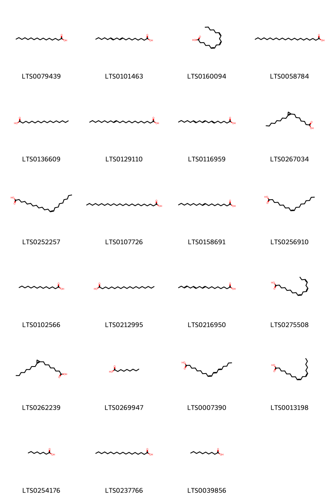{ width=100% }
    <figcaption>Hình ảnh cấu trúc hóa học của 23 hoạt chất thuộc nhóm Fatty Acyls gồm ['palmitic acid (LTS0079439)', '9,12-octadecadienoic acid (LTS0101463)', 'gamma-linolenic acid (LTS0160094)', 'behenic acid (LTS0058784)', 'heptadecanoic acid (LTS0136609)', '13-docosenoic acid (LTS0129110)', '6,9,12-octadecatrienoic acid (LTS0116959)', 'malvalic acid (LTS0267034)', 'erucic acid (LTS0252257)', 'lignoceric acid (LTS0107726)', '9 octadecenoic acid (LTS0158691)', 'oleic acid (LTS0256910)', 'myristic acid (LTS0102566)', 'nonadecanoic acid (LTS0212995)', 'octadeca-9,12,15-trienoic acid (LTS0216950)', 'α-linolenic acid (LTS0275508)', 'sterculic acid (LTS0262239)', 'nonanoic acid (LTS0269947)', 'elaeostearic acid (LTS0007390)', 'linoleic (LTS0013198)', 'caprylic acid (LTS0254176)', 'stearic acid (LTS0237766)', 'capric acid (LTS0039856)'].</figcaption>
</figure>
#### Nhóm Flavonoids
<figure markdown="span">
    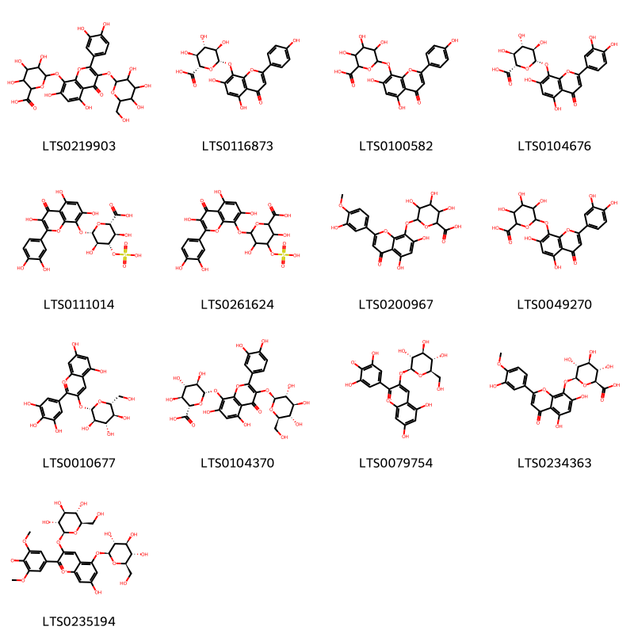{ width=100% }
    <figcaption>Hình ảnh cấu trúc hóa học của 13 hoạt chất thuộc nhóm Flavonoids gồm ['6-{[2-(3,4-dihydroxyphenyl)-5,7-dihydroxy-4-oxo-3-{[3,4,5-trihydroxy-6-(hydroxymethyl)oxan-2-yl]oxy}chromen-8-yl]oxy}-3,4,5-trihydroxyoxane-2-carboxylic acid (LTS0219903)', '(2s,3s,4s,5r,6s)-6-{[5,7-dihydroxy-2-(4-hydroxyphenyl)-4-oxochromen-8-yl]oxy}-3,4,5-trihydroxyoxane-2-carboxylic acid (LTS0116873)', '6-{[5,7-dihydroxy-2-(4-hydroxyphenyl)-4-oxochromen-8-yl]oxy}-3,4,5-trihydroxyoxane-2-carboxylic acid (LTS0100582)', '(2s,3s,4s,5r,6s)-6-{[2-(3,4-dihydroxyphenyl)-5,7-dihydroxy-4-oxochromen-8-yl]oxy}-3,4,5-trihydroxyoxane-2-carboxylic acid (LTS0104676)', '(2s,3r,4s,5r,6s)-6-{[2-(3,4-dihydroxyphenyl)-3,5,7-trihydroxy-4-oxochromen-8-yl]oxy}-3,5-dihydroxy-4-(sulfooxy)oxane-2-carboxylic acid (LTS0111014)', '6-{[2-(3,4-dihydroxyphenyl)-3,5,7-trihydroxy-4-oxochromen-8-yl]oxy}-3,5-dihydroxy-4-(sulfooxy)oxane-2-carboxylic acid (LTS0261624)', '6-{[5,7-dihydroxy-2-(3-hydroxy-4-methoxyphenyl)-4-oxochromen-8-yl]oxy}-3,4,5-trihydroxyoxane-2-carboxylic acid (LTS0200967)', '6-{[2-(3,4-dihydroxyphenyl)-5,7-dihydroxy-4-oxochromen-8-yl]oxy}-3,4,5-trihydroxyoxane-2-carboxylic acid (LTS0049270)', 'delphinidin 3-glucoside (LTS0010677)', '(2s,3s,4s,5r,6s)-6-{[2-(3,4-dihydroxyphenyl)-5,7-dihydroxy-4-oxo-3-{[(2s,3r,4s,5s,6r)-3,4,5-trihydroxy-6-(hydroxymethyl)oxan-2-yl]oxy}chromen-8-yl]oxy}-3,4,5-trihydroxyoxane-2-carboxylic acid (LTS0104370)', '2-(3,5-dihydroxy-4-oxidophenyl)-5,7-dihydroxy-3-{[(2s,3r,4s,5s,6r)-3,4,5-trihydroxy-6-(hydroxymethyl)oxan-2-yl]oxy}-1λ⁴-chromen-1-ylium (LTS0079754)', '(2s,3s,4s,5r,6s)-6-{[5,7-dihydroxy-2-(3-hydroxy-4-methoxyphenyl)-4-oxochromen-8-yl]oxy}-3,4,5-trihydroxyoxane-2-carboxylic acid (LTS0234363)', '2-(3,5-dimethoxy-4-oxidophenyl)-7-hydroxy-3,5-bis({[(2s,3r,4s,5s,6r)-3,4,5-trihydroxy-6-(hydroxymethyl)oxan-2-yl]oxy})-1λ⁴-chromen-1-ylium (LTS0235194)'].</figcaption>
</figure>
#### Nhóm Naphthalenes
<figure markdown="span">
    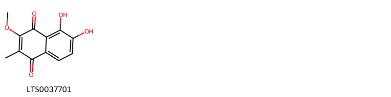{ width=100% }
    <figcaption>Hình ảnh cấu trúc hóa học của 1 hoạt chất thuộc nhóm Naphthalenes gồm ['5,6-dihydroxy-3-methoxy-2-methylnaphthalene-1,4-dione (LTS0037701)'].</figcaption>
</figure>
#### Nhóm Oxanes
<figure markdown="span">
    { width=100% }
    <figcaption>Hình ảnh cấu trúc hóa học của 2 hoạt chất thuộc nhóm Oxanes gồm ['1,8-cineole (LTS0166505)', 'eucalyptol (LTS0051374)'].</figcaption>
</figure>
#### Nhóm Prenol lipids
<figure markdown="span">
    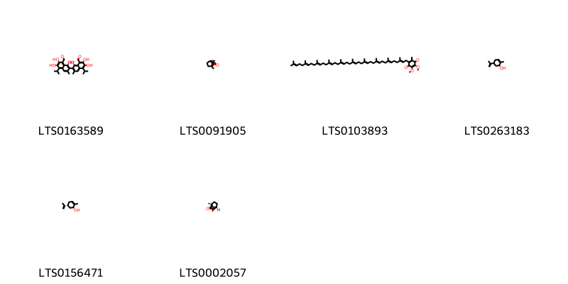{ width=100% }
    <figcaption>Hình ảnh cấu trúc hóa học của 6 hoạt chất thuộc nhóm Prenol lipids gồm ['(-)-gossypol (LTS0163589)', 'camphor (LTS0091905)', 'coenzyme q10 (LTS0103893)', 'carveol (LTS0263183)', '(-)-trans-carveol (LTS0156471)', 'd-camphor (LTS0002057)'].</figcaption>
</figure>

---

### Dược dân tộc học

Danh sách các quốc gia có sử dụng *Malva sylvestris* trong điều trị các bệnh. 

| Country   | Disease                                       | Bệnh                                                                                                                                                                                                |
|:----------|:----------------------------------------------|:----------------------------------------------------------------------------------------------------------------------------------------------------------------------------------------------------|
| Elsewhere | Antiseptic, Demulcent, Emollient, Refrigerant | MYMEMORY WARNING: YOU USED ALL AVAILABLE FREE TRANSLATIONS FOR TODAY. NEXT AVAILABLE IN  07 HOURS 17 MINUTES 00 SECONDS VISIT HTTPS://MYMEMORY.TRANSLATED.NET/DOC/USAGELIMITS.PHP TO TRANSLATE MORE |
| Turkey    | Emollient, Expectorant, Laxative, Refrigerant | MYMEMORY WARNING: YOU USED ALL AVAILABLE FREE TRANSLATIONS FOR TODAY. NEXT AVAILABLE IN  07 HOURS 16 MINUTES 57 SECONDS VISIT HTTPS://MYMEMORY.TRANSLATED.NET/DOC/USAGELIMITS.PHP TO TRANSLATE MORE |
| Venezuela | Emollient                                     | MYMEMORY WARNING: YOU USED ALL AVAILABLE FREE TRANSLATIONS FOR TODAY. NEXT AVAILABLE IN  07 HOURS 16 MINUTES 55 SECONDS VISIT HTTPS://MYMEMORY.TRANSLATED.NET/DOC/USAGELIMITS.PHP TO TRANSLATE MORE |
| ain       | Emollient                                     | MYMEMORY WARNING: YOU USED ALL AVAILABLE FREE TRANSLATIONS FOR TODAY. NEXT AVAILABLE IN  07 HOURS 16 MINUTES 52 SECONDS VISIT HTTPS://MYMEMORY.TRANSLATED.NET/DOC/USAGELIMITS.PHP TO TRANSLATE MORE |

---

---
## Malva verticillata
### Thông tin về thực vật

!!! info "Phân loại thực vật của *Malva verticillata* từ GIBF:"
    - **Kingdom:** Plantae
    - **Phylum:** Tracheophyta
    - **Order:** Malvales
    - **Family:** Malvaceae
    - **Genus:** Malva
    - **Species:** *Malva verticillata*

 

| Label (VI)   | Label (EN)   | Scientific Name    | Descriptions (VI)   | Descriptions (EN)   | Also Known As (VI)   | Also Known As (EN)   |
|:-------------|:-------------|:-------------------|:--------------------|:--------------------|:---------------------|:---------------------|
| N/A          | N/A          | Malva verticillata |                     | species of plant    | ['']                 | ['Chinese mallow']   |

#### Phân bố trên thế giới

**Từ CSDL GIBF** Austria, United States of America, Korea, Republic of, Mongolia, Sweden, Belgium, Ukraine, China, Russian Federation, Kazakhstan, New Zealand, Australia, Luxembourg, Germany, United Kingdom of Great Britain and Northern Ireland, Netherlands

#### Phân bố tại Việt Nam

**Từ CSDL GIBF**: Không có ghi nhận ở Việt Nam

---
### Thành phần hóa học
        
- Theo cơ sở dữ liệu lotus: Từ loài *Malva verticillata* đã phân lập và xác định được 1 hoạt chất thuộc về các nhóm Prenol lipids. 

|    | chemicalTaxonomyClassyfireClass   |   smiles_count |
|---:|:----------------------------------|---------------:|
|  0 | Prenol lipids                     |              1 |

#### Nhóm Prenol lipids
<figure markdown="span">
    { width=100% }
    <figcaption>Hình ảnh cấu trúc hóa học của 1 hoạt chất thuộc nhóm Prenol lipids gồm ['(-)-gossypol (LTS0163589)'].</figcaption>
</figure>

---

### Dược dân tộc học

Danh sách các quốc gia có sử dụng *Malva verticillata* trong điều trị các bệnh. 

| Country   | Disease                       | Bệnh                                                                                                                                                                                                |
|:----------|:------------------------------|:----------------------------------------------------------------------------------------------------------------------------------------------------------------------------------------------------|
| China     | Laxative, Demulcent, Diuretic | MYMEMORY WARNING: YOU USED ALL AVAILABLE FREE TRANSLATIONS FOR TODAY. NEXT AVAILABLE IN  07 HOURS 16 MINUTES 25 SECONDS VISIT HTTPS://MYMEMORY.TRANSLATED.NET/DOC/USAGELIMITS.PHP TO TRANSLATE MORE |
| Elsewhere | Aperient, Diuretic            | MYMEMORY WARNING: YOU USED ALL AVAILABLE FREE TRANSLATIONS FOR TODAY. NEXT AVAILABLE IN  07 HOURS 16 MINUTES 23 SECONDS VISIT HTTPS://MYMEMORY.TRANSLATED.NET/DOC/USAGELIMITS.PHP TO TRANSLATE MORE |

---

# Chi haeralcea

??? note "Danh sách các dược liệu thuộc chi"
    
	 - *haeralcea ambigua*
	 - *haeralcea angustifolia*
	 - *haeralcea bonariensis*
	 - *haeralcea coulteri*

---
## haeralcea ambigua
### Thông tin về thực vật

!!! info "Phân loại thực vật của *N/A* từ GIBF:"
    - **Kingdom:** N/A
    - **Phylum:** N/A
    - **Order:** N/A
    - **Family:** N/A
    - **Genus:** N/A
    - **Species:** *N/A*

 

| Label (VI)   | Label (EN)   | Scientific Name    | Descriptions (VI)   | Descriptions (EN)   | Also Known As (VI)   | Also Known As (EN)   |
|:-------------|:-------------|:-------------------|:--------------------|:--------------------|:---------------------|:---------------------|
| N/A          | N/A          | Malva verticillata |                     | species of plant    | ['']                 | ['Chinese mallow']   |

#### Phân bố trên thế giới

**Từ CSDL GIBF** Không có kết quả phù hợp

#### Phân bố tại Việt Nam

**Từ CSDL GIBF**: Không có ghi nhận ở Việt Nam

---
### Thành phần hóa học
        
- Theo cơ sở dữ liệu lotus: Từ loài *N/A* đã phân lập và xác định được Chưa có hoạt chất nào được phân lập. hoạt chất thuộc về các nhóm Không có hoạt chất nào được phân lập. 

Không có hình ảnh nào được tạo ra

---

### Dược dân tộc học

Danh sách các quốc gia có sử dụng *N/A* trong điều trị các bệnh. 

| Country      | Disease   | Bệnh                                                                                                                                                                                                |
|:-------------|:----------|:----------------------------------------------------------------------------------------------------------------------------------------------------------------------------------------------------|
| Mexico(Seri) | Collyrium | MYMEMORY WARNING: YOU USED ALL AVAILABLE FREE TRANSLATIONS FOR TODAY. NEXT AVAILABLE IN  07 HOURS 16 MINUTES 00 SECONDS VISIT HTTPS://MYMEMORY.TRANSLATED.NET/DOC/USAGELIMITS.PHP TO TRANSLATE MORE |

---

---
## haeralcea angustifolia
### Thông tin về thực vật

!!! info "Phân loại thực vật của *N/A* từ GIBF:"
    - **Kingdom:** N/A
    - **Phylum:** N/A
    - **Order:** N/A
    - **Family:** N/A
    - **Genus:** N/A
    - **Species:** *N/A*

 

| Label (VI)   | Label (EN)   | Scientific Name    | Descriptions (VI)   | Descriptions (EN)   | Also Known As (VI)   | Also Known As (EN)   |
|:-------------|:-------------|:-------------------|:--------------------|:--------------------|:---------------------|:---------------------|
| N/A          | N/A          | Malva verticillata |                     | species of plant    | ['']                 | ['Chinese mallow']   |

#### Phân bố trên thế giới

**Từ CSDL GIBF** Không có kết quả phù hợp

#### Phân bố tại Việt Nam

**Từ CSDL GIBF**: Không có ghi nhận ở Việt Nam

---
### Thành phần hóa học
        
- Theo cơ sở dữ liệu lotus: Từ loài *N/A* đã phân lập và xác định được Chưa có hoạt chất nào được phân lập. hoạt chất thuộc về các nhóm Không có hoạt chất nào được phân lập. 

Không có hình ảnh nào được tạo ra

---

### Dược dân tộc học

Danh sách các quốc gia có sử dụng *N/A* trong điều trị các bệnh. 

| Country   | Disease   | Bệnh                                                                                                                                                                                                |
|:----------|:----------|:----------------------------------------------------------------------------------------------------------------------------------------------------------------------------------------------------|
| Mexico    | Emollient | MYMEMORY WARNING: YOU USED ALL AVAILABLE FREE TRANSLATIONS FOR TODAY. NEXT AVAILABLE IN  07 HOURS 15 MINUTES 49 SECONDS VISIT HTTPS://MYMEMORY.TRANSLATED.NET/DOC/USAGELIMITS.PHP TO TRANSLATE MORE |

---

---
## haeralcea bonariensis
### Thông tin về thực vật

!!! info "Phân loại thực vật của *N/A* từ GIBF:"
    - **Kingdom:** N/A
    - **Phylum:** N/A
    - **Order:** N/A
    - **Family:** N/A
    - **Genus:** N/A
    - **Species:** *N/A*

 

| Label (VI)   | Label (EN)   | Scientific Name    | Descriptions (VI)   | Descriptions (EN)   | Also Known As (VI)   | Also Known As (EN)   |
|:-------------|:-------------|:-------------------|:--------------------|:--------------------|:---------------------|:---------------------|
| N/A          | N/A          | Malva verticillata |                     | species of plant    | ['']                 | ['Chinese mallow']   |

#### Phân bố trên thế giới

**Từ CSDL GIBF** Không có kết quả phù hợp

#### Phân bố tại Việt Nam

**Từ CSDL GIBF**: Không có ghi nhận ở Việt Nam

---
### Thành phần hóa học
        
- Theo cơ sở dữ liệu lotus: Từ loài *N/A* đã phân lập và xác định được Chưa có hoạt chất nào được phân lập. hoạt chất thuộc về các nhóm Không có hoạt chất nào được phân lập. 

Không có hình ảnh nào được tạo ra

---

### Dược dân tộc học

Danh sách các quốc gia có sử dụng *N/A* trong điều trị các bệnh. 

| Country   | Disease                                           | Bệnh                                                                                                                                                                                                |
|:----------|:--------------------------------------------------|:----------------------------------------------------------------------------------------------------------------------------------------------------------------------------------------------------|
| Argentina | Antiphlogistic, Emollient, Expectorant, Digestive | MYMEMORY WARNING: YOU USED ALL AVAILABLE FREE TRANSLATIONS FOR TODAY. NEXT AVAILABLE IN  07 HOURS 15 MINUTES 38 SECONDS VISIT HTTPS://MYMEMORY.TRANSLATED.NET/DOC/USAGELIMITS.PHP TO TRANSLATE MORE |

---

---
## haeralcea coulteri
### Thông tin về thực vật

!!! info "Phân loại thực vật của *N/A* từ GIBF:"
    - **Kingdom:** N/A
    - **Phylum:** N/A
    - **Order:** N/A
    - **Family:** N/A
    - **Genus:** N/A
    - **Species:** *N/A*

 

| Label (VI)   | Label (EN)   | Scientific Name    | Descriptions (VI)   | Descriptions (EN)   | Also Known As (VI)   | Also Known As (EN)   |
|:-------------|:-------------|:-------------------|:--------------------|:--------------------|:---------------------|:---------------------|
| N/A          | N/A          | Malva verticillata |                     | species of plant    | ['']                 | ['Chinese mallow']   |

#### Phân bố trên thế giới

**Từ CSDL GIBF** Không có kết quả phù hợp

#### Phân bố tại Việt Nam

**Từ CSDL GIBF**: Không có ghi nhận ở Việt Nam

---
### Thành phần hóa học
        
- Theo cơ sở dữ liệu lotus: Từ loài *N/A* đã phân lập và xác định được Chưa có hoạt chất nào được phân lập. hoạt chất thuộc về các nhóm Không có hoạt chất nào được phân lập. 

Không có hình ảnh nào được tạo ra

---

### Dược dân tộc học

Danh sách các quốc gia có sử dụng *N/A* trong điều trị các bệnh. 

| Country      | Disease   | Bệnh                                                                                                                                                                                                |
|:-------------|:----------|:----------------------------------------------------------------------------------------------------------------------------------------------------------------------------------------------------|
| Mexico(Seri) | Collyrium | MYMEMORY WARNING: YOU USED ALL AVAILABLE FREE TRANSLATIONS FOR TODAY. NEXT AVAILABLE IN  07 HOURS 15 MINUTES 27 SECONDS VISIT HTTPS://MYMEMORY.TRANSLATED.NET/DOC/USAGELIMITS.PHP TO TRANSLATE MORE |

---

# Chi Kydia

??? note "Danh sách các dược liệu thuộc chi"
    
	 - *Kydia calycina*

---
## Kydia calycina
### Thông tin về thực vật

!!! info "Phân loại thực vật của *Kydia calycina* từ GIBF:"
    - **Kingdom:** Plantae
    - **Phylum:** Tracheophyta
    - **Order:** Malvales
    - **Family:** Malvaceae
    - **Genus:** Kydia
    - **Species:** *Kydia calycina*

 

| Label (VI)   | Label (EN)   | Scientific Name   | Descriptions (VI)   | Descriptions (EN)   | Also Known As (VI)   | Also Known As (EN)   |
|:-------------|:-------------|:------------------|:--------------------|:--------------------|:---------------------|:---------------------|
| N/A          | N/A          | Kydia calycina    | loài thực vật       | species of plant    | ['']                 | ['']                 |

#### Phân bố trên thế giới

**Từ CSDL GIBF** nan, Brazil, Viet Nam, United States of America, Nepal, Pakistan, China, Myanmar, India, unknown or invalid, Thailand, Lao People’s Democratic Republic

#### Phân bố tại Việt Nam

**Từ CSDL GIBF**: Không có ghi nhận ở Việt Nam

---
### Thành phần hóa học
        
- Theo cơ sở dữ liệu lotus: Từ loài *Kydia calycina* đã phân lập và xác định được 3 hoạt chất thuộc về các nhóm Benzofurans, Prenol lipids, Naphthalenes. 

|    | chemicalTaxonomyClassyfireClass   |   smiles_count |
|---:|:----------------------------------|---------------:|
|  0 | Benzofurans                       |              1 |
|  1 | Naphthalenes                      |              1 |
|  2 | Prenol lipids                     |              1 |

#### Nhóm Benzofurans
<figure markdown="span">
    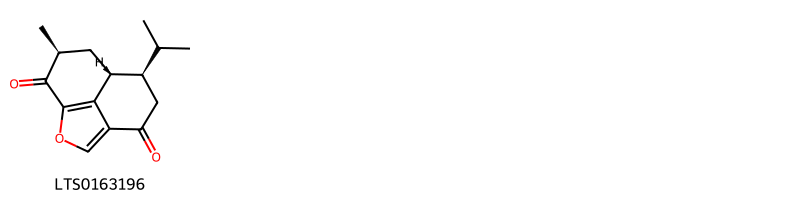{ width=100% }
    <figcaption>Hình ảnh cấu trúc hóa học của 1 hoạt chất thuộc nhóm Benzofurans gồm ['(7r,8r,10s)-7-isopropyl-10-methyl-2-oxatricyclo[6.3.1.0⁴,¹²]dodeca-1(12),3-diene-5,11-dione (LTS0163196)'].</figcaption>
</figure>
#### Nhóm Naphthalenes
<figure markdown="span">
    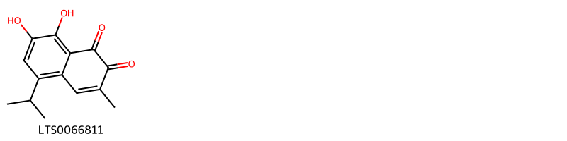{ width=100% }
    <figcaption>Hình ảnh cấu trúc hóa học của 1 hoạt chất thuộc nhóm Naphthalenes gồm ['7,8-dihydroxy-5-isopropyl-3-methylnaphthalene-1,2-dione (LTS0066811)'].</figcaption>
</figure>
#### Nhóm Prenol lipids
<figure markdown="span">
    { width=100% }
    <figcaption>Hình ảnh cấu trúc hóa học của 1 hoạt chất thuộc nhóm Prenol lipids gồm ['(-)-gossypol (LTS0163589)'].</figcaption>
</figure>

---

### Dược dân tộc học

Danh sách các quốc gia có sử dụng *Kydia calycina* trong điều trị các bệnh. 

| Country   | Disease    | Bệnh                                                                                                                                                                                                |
|:----------|:-----------|:----------------------------------------------------------------------------------------------------------------------------------------------------------------------------------------------------|
| Elsewhere | Sialogogue | MYMEMORY WARNING: YOU USED ALL AVAILABLE FREE TRANSLATIONS FOR TODAY. NEXT AVAILABLE IN  07 HOURS 15 MINUTES 15 SECONDS VISIT HTTPS://MYMEMORY.TRANSLATED.NET/DOC/USAGELIMITS.PHP TO TRANSLATE MORE |

---

# Chi Malachra

??? note "Danh sách các dược liệu thuộc chi"
    
	 - *Malachra alceifolia*
	 - *Malachra capitata*

---
## Malachra alceifolia
### Thông tin về thực vật

!!! info "Phân loại thực vật của *Malachra alceifolia* từ GIBF:"
    - **Kingdom:** Plantae
    - **Phylum:** Tracheophyta
    - **Order:** Malvales
    - **Family:** Malvaceae
    - **Genus:** Malachra
    - **Species:** *Malachra alceifolia*

 

| Label (VI)   | Label (EN)   | Scientific Name     | Descriptions (VI)   | Descriptions (EN)   | Also Known As (VI)   | Also Known As (EN)   |
|:-------------|:-------------|:--------------------|:--------------------|:--------------------|:---------------------|:---------------------|
| N/A          | N/A          | Malachra alceifolia | loài thực vật       | species of plant    | ['']                 | ['']                 |

#### Phân bố trên thế giới

**Từ CSDL GIBF** Brazil, Guadeloupe, Ecuador, Trinidad and Tobago, Cayman Islands, Puerto Rico, United States of America, Costa Rica, Dominican Republic, Colombia, Cuba, French Guiana, Mexico, Benin, El Salvador, Curaçao, Panama, Nicaragua, Martinique, India, Peru, Venezuela (Bolivarian Republic of)

#### Phân bố tại Việt Nam

**Từ CSDL GIBF**: Không có ghi nhận ở Việt Nam

---
### Thành phần hóa học
        
- Theo cơ sở dữ liệu lotus: Từ loài *Malachra alceifolia* đã phân lập và xác định được Chưa có hoạt chất nào được phân lập. hoạt chất thuộc về các nhóm Không có hoạt chất nào được phân lập. 

Không có hình ảnh nào được tạo ra

---

### Dược dân tộc học

Danh sách các quốc gia có sử dụng *Malachra alceifolia* trong điều trị các bệnh. 

| Country   | Disease   | Bệnh                                                                                                                                                                                                |
|:----------|:----------|:----------------------------------------------------------------------------------------------------------------------------------------------------------------------------------------------------|
| Elsewhere | Demulcent | MYMEMORY WARNING: YOU USED ALL AVAILABLE FREE TRANSLATIONS FOR TODAY. NEXT AVAILABLE IN  07 HOURS 14 MINUTES 53 SECONDS VISIT HTTPS://MYMEMORY.TRANSLATED.NET/DOC/USAGELIMITS.PHP TO TRANSLATE MORE |
| Trinidad  | Demulcent | MYMEMORY WARNING: YOU USED ALL AVAILABLE FREE TRANSLATIONS FOR TODAY. NEXT AVAILABLE IN  07 HOURS 14 MINUTES 50 SECONDS VISIT HTTPS://MYMEMORY.TRANSLATED.NET/DOC/USAGELIMITS.PHP TO TRANSLATE MORE |
| Venezuela | Emollient | MYMEMORY WARNING: YOU USED ALL AVAILABLE FREE TRANSLATIONS FOR TODAY. NEXT AVAILABLE IN  07 HOURS 14 MINUTES 48 SECONDS VISIT HTTPS://MYMEMORY.TRANSLATED.NET/DOC/USAGELIMITS.PHP TO TRANSLATE MORE |

---

---
## Malachra capitata
### Thông tin về thực vật

!!! info "Phân loại thực vật của *Malachra capitata* từ GIBF:"
    - **Kingdom:** Plantae
    - **Phylum:** Tracheophyta
    - **Order:** Malvales
    - **Family:** Malvaceae
    - **Genus:** Malachra
    - **Species:** *Malachra capitata*

 

| Label (VI)   | Label (EN)   | Scientific Name   | Descriptions (VI)   | Descriptions (EN)   | Also Known As (VI)   | Also Known As (EN)   |
|:-------------|:-------------|:------------------|:--------------------|:--------------------|:---------------------|:---------------------|
| N/A          | N/A          | Malachra capitata | loài thực vật       | species of plant    | ['']                 | ['Brazil Jute']      |

#### Phân bố trên thế giới

**Từ CSDL GIBF** nan, Guatemala, Guadeloupe, Suriname, Ecuador, Papua New Guinea, Thailand, Puerto Rico, United States of America, Costa Rica, Colombia, Cuba, Mexico, El Salvador, Chinese Taipei, Nicaragua, Timor-Leste, Myanmar, India, Peru, Belize, Venezuela (Bolivarian Republic of)

#### Phân bố tại Việt Nam

**Từ CSDL GIBF**: Không có ghi nhận ở Việt Nam

---
### Thành phần hóa học
        
- Theo cơ sở dữ liệu lotus: Từ loài *Malachra capitata* đã phân lập và xác định được 1 hoạt chất thuộc về các nhóm Prenol lipids. 

|    | chemicalTaxonomyClassyfireClass   |   smiles_count |
|---:|:----------------------------------|---------------:|
|  0 | Prenol lipids                     |              1 |

#### Nhóm Prenol lipids
<figure markdown="span">
    { width=100% }
    <figcaption>Hình ảnh cấu trúc hóa học của 1 hoạt chất thuộc nhóm Prenol lipids gồm ['(-)-gossypol (LTS0163589)'].</figcaption>
</figure>

---

### Dược dân tộc học

Danh sách các quốc gia có sử dụng *Malachra capitata* trong điều trị các bệnh. 

| Country   | Disease   | Bệnh                                                                                                                                                                                                |
|:----------|:----------|:----------------------------------------------------------------------------------------------------------------------------------------------------------------------------------------------------|
| Panama    | Vermifuge | MYMEMORY WARNING: YOU USED ALL AVAILABLE FREE TRANSLATIONS FOR TODAY. NEXT AVAILABLE IN  07 HOURS 14 MINUTES 27 SECONDS VISIT HTTPS://MYMEMORY.TRANSLATED.NET/DOC/USAGELIMITS.PHP TO TRANSLATE MORE |

---

# Chi Hibiscus

??? note "Danh sách các dược liệu thuộc chi"
    
	 - *Hibiscus abelmoschus*
	 - *Hibiscus cannabinus*
	 - *Hibiscus elatus*
	 - *Hibiscus furcatus*
	 - *Hibiscus moscheutos*
	 - *Hibiscus mutabilis*
	 - *Hibiscus rosa-sinensis*
	 - *Hibiscus sabdariffa*
	 - *Hibiscus surattensis*
	 - *Hibiscus syriacus*
	 - *Hibiscus tilaceus*
	 - *Hibiscus tiliaceus*
	 - *Hibiscus trionum*
	 - *Hibiscus youngianus*

---
## Hibiscus abelmoschus
### Thông tin về thực vật

!!! info "Phân loại thực vật của *Abelmoschus moschatus* từ GIBF:"
    - **Kingdom:** Plantae
    - **Phylum:** Tracheophyta
    - **Order:** Malvales
    - **Family:** Malvaceae
    - **Genus:** Abelmoschus
    - **Species:** *Abelmoschus moschatus*

 

| Label (VI)   | Label (EN)   | Scientific Name      | Descriptions (VI)   | Descriptions (EN)   | Also Known As (VI)   | Also Known As (EN)   |
|:-------------|:-------------|:---------------------|:--------------------|:--------------------|:---------------------|:---------------------|
| N/A          | N/A          | Hibiscus abelmoschus | loài thực vật       | species of plant    | ['']                 | ['']                 |

#### Phân bố trên thế giới

**Từ CSDL GIBF** nan, Brazil, Guatemala, Senegal, New Caledonia, China, Saint Lucia, French Polynesia, Papua New Guinea, Thailand, Netherlands, Ghana, Samoa, Sri Lanka, United States of America, Tonga, Greece, Indonesia, Mauritania, Seychelles, Colombia, unknown or invalid, Argentina, French Guiana, Sierra Leone, Grenada, Fiji, Dominica, Mexico, Congo, Democratic Republic of the, Vanuatu, El Salvador, Niue, Guam, American Samoa, Philippines, Haiti, Chinese Taipei, Montserrat, Canada, Panama, Lebanon, Martinique, Cook Islands, Côte d’Ivoire, Myanmar, Micronesia (Federated States of), India, Peru, Cameroon, Venezuela (Bolivarian Republic of)

#### Phân bố tại Việt Nam

**Từ CSDL GIBF**: Không có ghi nhận ở Việt Nam

---
### Thành phần hóa học
        
- Theo cơ sở dữ liệu lotus: Từ loài *Abelmoschus moschatus* đã phân lập và xác định được Chưa có hoạt chất nào được phân lập. hoạt chất thuộc về các nhóm Không có hoạt chất nào được phân lập. 

Không có hình ảnh nào được tạo ra

---

### Dược dân tộc học

Danh sách các quốc gia có sử dụng *Abelmoschus moschatus* trong điều trị các bệnh. 

| Country   | Disease   | Bệnh                                                                                                                                                                                                |
|:----------|:----------|:----------------------------------------------------------------------------------------------------------------------------------------------------------------------------------------------------|
| Java      | Diuretic  | MYMEMORY WARNING: YOU USED ALL AVAILABLE FREE TRANSLATIONS FOR TODAY. NEXT AVAILABLE IN  07 HOURS 14 MINUTES 03 SECONDS VISIT HTTPS://MYMEMORY.TRANSLATED.NET/DOC/USAGELIMITS.PHP TO TRANSLATE MORE |
| Malaya    | Cosmetic  | MYMEMORY WARNING: YOU USED ALL AVAILABLE FREE TRANSLATIONS FOR TODAY. NEXT AVAILABLE IN  07 HOURS 14 MINUTES 00 SECONDS VISIT HTTPS://MYMEMORY.TRANSLATED.NET/DOC/USAGELIMITS.PHP TO TRANSLATE MORE |

---

---
## Hibiscus cannabinus
### Thông tin về thực vật

!!! info "Phân loại thực vật của *Hibiscus cannabinus* từ GIBF:"
    - **Kingdom:** Plantae
    - **Phylum:** Tracheophyta
    - **Order:** Malvales
    - **Family:** Malvaceae
    - **Genus:** Hibiscus
    - **Species:** *Hibiscus cannabinus*

 

| Label (VI)   | Label (EN)   | Scientific Name     | Descriptions (VI)   | Descriptions (EN)                 | Also Known As (VI)   | Also Known As (EN)                      |
|:-------------|:-------------|:--------------------|:--------------------|:----------------------------------|:---------------------|:----------------------------------------|
| N/A          | N/A          | Hibiscus cannabinus |                     | fibrous plant used for paper pulp | ['']                 | ['ibišek konopovitý', 'kenaf', 'Kenaf'] |

#### Phân bố trên thế giới

**Từ CSDL GIBF** Brazil, Uganda, Senegal, Botswana, Uzbekistan, Gambia, Zimbabwe, Mozambique, Tanzania, United Republic of, Madagascar, Guinea-Bissau, Guinea, United States of America, Nigeria, Burkina Faso, Malawi, Benin, Kenya, Rwanda, Eswatini, Belgium, Chinese Taipei, Namibia, Hungary, South Africa, India

#### Phân bố tại Việt Nam

**Từ CSDL GIBF**: Không có ghi nhận ở Việt Nam

---
### Thành phần hóa học
        
- Theo cơ sở dữ liệu lotus: Từ loài *Hibiscus cannabinus* đã phân lập và xác định được 97 hoạt chất thuộc về các nhóm Fatty Acyls, Organic phosphoric acids and derivatives, Flavonoids, Naphthalenes, Steroids and steroid derivatives, Cinnamic acids and derivatives, Phenols, Organooxygen compounds, Lignan lactones, Furanoid lignans, Prenol lipids, Saturated hydrocarbons, 2-arylbenzofuran flavonoids. 

|    | chemicalTaxonomyClassyfireClass          |   smiles_count |
|---:|:-----------------------------------------|---------------:|
|  0 |                                          |              9 |
|  1 | 2-arylbenzofuran flavonoids              |             13 |
|  2 | Cinnamic acids and derivatives           |              1 |
|  3 | Fatty Acyls                              |             21 |
|  4 | Flavonoids                               |             25 |
|  5 | Furanoid lignans                         |              7 |
|  6 | Lignan lactones                          |              1 |
|  7 | Naphthalenes                             |              2 |
|  8 | Organic phosphoric acids and derivatives |              1 |
|  9 | Organooxygen compounds                   |              3 |
| 10 | Phenols                                  |              3 |
| 11 | Prenol lipids                            |              4 |
| 12 | Saturated hydrocarbons                   |              1 |
| 13 | Steroids and steroid derivatives         |              6 |

#### Nhóm 
<figure markdown="span">
    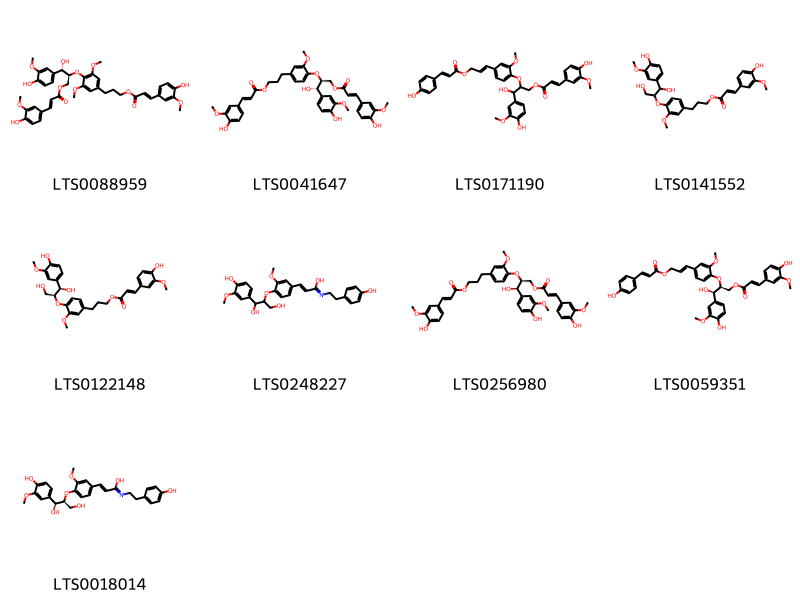{ width=100% }
    <figcaption>Hình ảnh cấu trúc hóa học của 9 hoạt chất thuộc nhóm  gồm ['(2s,3s)-3-hydroxy-3-(4-hydroxy-3-methoxyphenyl)-2-[4-(3-{[(2e)-3-(4-hydroxy-3-methoxyphenyl)prop-2-enoyl]oxy}propyl)-2,6-dimethoxyphenoxy]propyl (2e)-3-(4-hydroxy-3-methoxyphenyl)prop-2-enoate (LTS0088959)', 'threo-carolignan e (LTS0041647)', '3-hydroxy-3-(4-hydroxy-3-methoxyphenyl)-2-[4-(3-{[3-(4-hydroxyphenyl)prop-2-enoyl]oxy}prop-1-en-1-yl)-2-methoxyphenoxy]propyl 3-(4-hydroxy-3-methoxyphenyl)prop-2-enoate (LTS0171190)', '3-(4-{[1,3-dihydroxy-1-(4-hydroxy-3-methoxyphenyl)propan-2-yl]oxy}-3-methoxyphenyl)propyl 3-(4-hydroxy-3-methoxyphenyl)prop-2-enoate (LTS0141552)', '3-(4-{[(1r,2s)-1,3-dihydroxy-1-(4-hydroxy-3-methoxyphenyl)propan-2-yl]oxy}-3-methoxyphenyl)propyl (2e)-3-(4-hydroxy-3-methoxyphenyl)prop-2-enoate (LTS0122148)', '3-(4-{[1,3-dihydroxy-1-(4-hydroxy-3-methoxyphenyl)propan-2-yl]oxy}-3-methoxyphenyl)-n-[2-(4-hydroxyphenyl)ethyl]prop-2-enimidic acid (LTS0248227)', 'erythro-carolignan e (LTS0256980)', '(2e)-3-(4-{[(1r,2s)-1-hydroxy-1-(4-hydroxy-3-methoxyphenyl)-3-{[(2e)-3-(4-hydroxy-3-methoxyphenyl)prop-2-enoyl]oxy}propan-2-yl]oxy}-3-methoxyphenyl)prop-2-en-1-yl (2e)-3-(4-hydroxyphenyl)prop-2-enoate (LTS0059351)', '(2e)-3-(4-{[(1s,2s)-1,3-dihydroxy-1-(4-hydroxy-3-methoxyphenyl)propan-2-yl]oxy}-3-methoxyphenyl)-n-[2-(4-hydroxyphenyl)ethyl]prop-2-enimidic acid (LTS0018014)'].</figcaption>
</figure>
#### Nhóm 2-arylbenzofuran flavonoids
<figure markdown="span">
    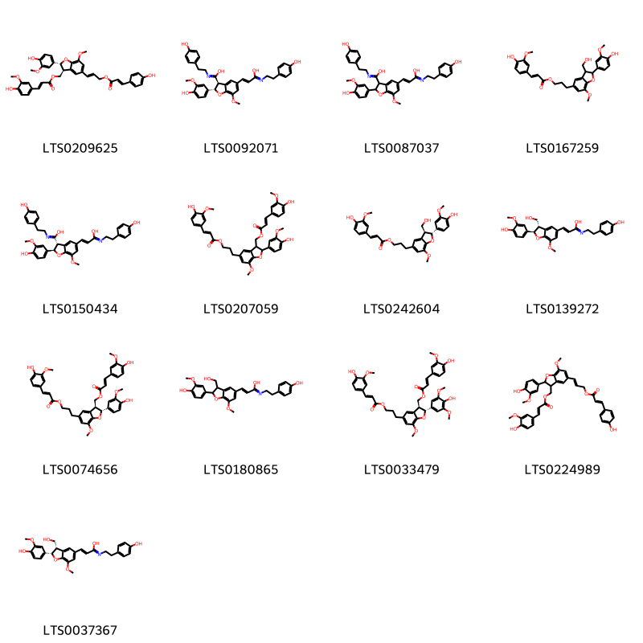{ width=100% }
    <figcaption>Hình ảnh cấu trúc hóa học của 13 hoạt chất thuộc nhóm 2-arylbenzofuran flavonoids gồm ['(2e)-3-[(2r,3s)-2-(4-hydroxy-3-methoxyphenyl)-3-({[(2e)-3-(4-hydroxy-3-methoxyphenyl)prop-2-enoyl]oxy}methyl)-7-methoxy-2,3-dihydro-1-benzofuran-5-yl]prop-2-en-1-yl (2e)-3-(4-hydroxyphenyl)prop-2-enoate (LTS0209625)', '(2s,3s)-2-(4-hydroxy-3-methoxyphenyl)-n-[2-(4-hydroxyphenyl)ethyl]-5-[(1e)-2-{[2-(4-hydroxyphenyl)ethyl]-c-hydroxycarbonimidoyl}eth-1-en-1-yl]-7-methoxy-2,3-dihydro-1-benzofuran-3-carboximidic acid (LTS0092071)', '2-(4-hydroxy-3-methoxyphenyl)-n-[2-(4-hydroxyphenyl)ethyl]-5-(2-{[2-(4-hydroxyphenyl)ethyl]-c-hydroxycarbonimidoyl}eth-1-en-1-yl)-7-methoxy-2,3-dihydro-1-benzofuran-3-carboximidic acid (LTS0087037)', '3-[2-(4-hydroxy-3-methoxyphenyl)-3-(hydroxymethyl)-7-methoxy-2,3-dihydro-1-benzofuran-5-yl]propyl 3-(4-hydroxy-3-methoxyphenyl)prop-2-enoate (LTS0167259)', '(2r,3r)-2-(4-hydroxy-3-methoxyphenyl)-n-[2-(4-hydroxyphenyl)ethyl]-5-[(1e)-2-{[2-(4-hydroxyphenyl)ethyl]-c-hydroxycarbonimidoyl}eth-1-en-1-yl]-7-methoxy-2,3-dihydro-1-benzofuran-3-carboximidic acid (LTS0150434)', 'boehmenan (LTS0207059)', '3-[(2r,3s)-2-(4-hydroxy-3-methoxyphenyl)-3-(hydroxymethyl)-7-methoxy-2,3-dihydro-1-benzofuran-5-yl]propyl (2e)-3-(4-hydroxy-3-methoxyphenyl)prop-2-enoate (LTS0242604)', '(2e)-3-[(2r,3s)-2-(4-hydroxy-3-methoxyphenyl)-3-(hydroxymethyl)-7-methoxy-2,3-dihydro-1-benzofuran-5-yl]-n-[2-(4-hydroxyphenyl)ethyl]prop-2-enimidic acid (LTS0139272)', '[(2r,3s)-2-(4-hydroxy-3-methoxyphenyl)-5-(3-{[(2e)-3-(4-hydroxy-3-methoxyphenyl)prop-2-enoyl]oxy}propyl)-7-methoxy-2,3-dihydro-1-benzofuran-3-yl]methyl (2e)-3-(4-hydroxy-3-methoxyphenyl)prop-2-enoate (LTS0074656)', '3-[2-(4-hydroxy-3-methoxyphenyl)-3-(hydroxymethyl)-7-methoxy-2,3-dihydro-1-benzofuran-5-yl]-n-[2-(4-hydroxyphenyl)ethyl]prop-2-enimidic acid (LTS0180865)', '[(2r,3s)-2-(4-hydroxy-3,5-dimethoxyphenyl)-5-(3-{[(2e)-3-(4-hydroxy-3-methoxyphenyl)prop-2-enoyl]oxy}propyl)-7-methoxy-2,3-dihydro-1-benzofuran-3-yl]methyl (2e)-3-(4-hydroxy-3-methoxyphenyl)prop-2-enoate (LTS0033479)', '[2-(4-hydroxy-3-methoxyphenyl)-5-(3-{[3-(4-hydroxyphenyl)prop-2-enoyl]oxy}prop-1-en-1-yl)-7-methoxy-2,3-dihydro-1-benzofuran-3-yl]methyl 3-(4-hydroxy-3-methoxyphenyl)prop-2-enoate (LTS0224989)', '(2e)-3-[(2s,3s)-2-(4-hydroxy-3-methoxyphenyl)-3-(hydroxymethyl)-7-methoxy-2,3-dihydro-1-benzofuran-5-yl]-n-[2-(4-hydroxyphenyl)ethyl]prop-2-enimidic acid (LTS0037367)'].</figcaption>
</figure>
#### Nhóm Cinnamic acids and derivatives
<figure markdown="span">
    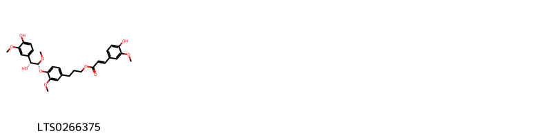{ width=100% }
    <figcaption>Hình ảnh cấu trúc hóa học của 1 hoạt chất thuộc nhóm Cinnamic acids and derivatives gồm ['3-{4-[(1r,2r)-2-hydroxy-2-(4-hydroxy-3-methoxyphenyl)-1-methoxyethoxy]-3-methoxyphenyl}propyl (2e)-3-(4-hydroxy-3-methoxyphenyl)prop-2-enoate (LTS0266375)'].</figcaption>
</figure>
#### Nhóm Fatty Acyls
<figure markdown="span">
    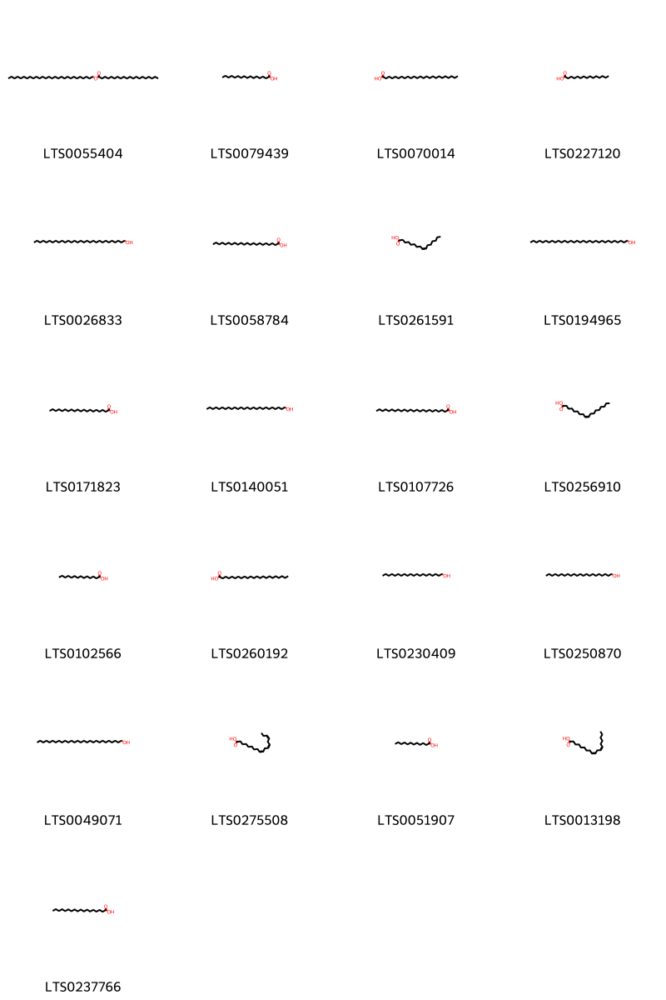{ width=100% }
    <figcaption>Hình ảnh cấu trúc hóa học của 21 hoạt chất thuộc nhóm Fatty Acyls gồm ['octacosyl icosanoate (LTS0055404)', 'palmitic acid (LTS0079439)', 'pentacosanoic acid (LTS0070014)', 'pentadecanoic acid (LTS0227120)', 'triacontanol (LTS0026833)', 'behenic acid (LTS0058784)', 'palmitoleic acid (LTS0261591)', 'dotriacontanol (LTS0194965)', 'arachidic acid (LTS0171823)', 'ceryl alcohol (LTS0140051)', 'lignoceric acid (LTS0107726)', 'oleic acid (LTS0256910)', 'myristic acid (LTS0102566)', 'tricosanoic acid (LTS0260192)', 'arachidyl alcohol (LTS0230409)', 'docosanol (LTS0250870)', 'octacosanol (LTS0049071)', 'α-linolenic acid (LTS0275508)', 'lauric acid (LTS0051907)', 'linoleic (LTS0013198)', 'stearic acid (LTS0237766)'].</figcaption>
</figure>
#### Nhóm Flavonoids
<figure markdown="span">
    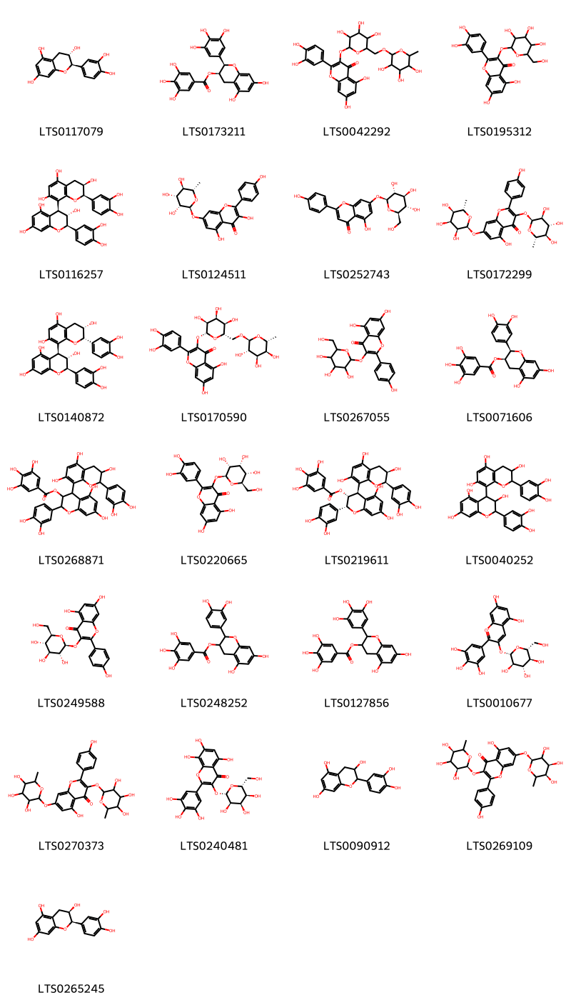{ width=100% }
    <figcaption>Hình ảnh cấu trúc hóa học của 25 hoạt chất thuộc nhóm Flavonoids gồm ['(+)-catechol (LTS0117079)', '(-)-epigallocatechin gallate (LTS0173211)', 'rutin (LTS0042292)', '2-(3,4-dihydroxyphenyl)-5,7-dihydroxy-3-{[3,4,5-trihydroxy-6-(hydroxymethyl)oxan-2-yl]oxy}chromen-4-one (LTS0195312)', '(2r,3s,4s)-2-(3,4-dihydroxyphenyl)-4-[(2r,3r)-2-(3,4-dihydroxyphenyl)-3,5,7-trihydroxy-3,4-dihydro-2h-1-benzopyran-8-yl]-3,4-dihydro-2h-1-benzopyran-3,5,7-triol (LTS0116257)', 'kaempferol-7-rhamnoside (LTS0124511)', 'apigenin 7-o-β-glucoside (LTS0252743)', '5-hydroxy-2-(4-hydroxyphenyl)-3-{[(2s,3s,4r,5r,6s)-3,4,5-trihydroxy-6-methyloxan-2-yl]oxy}-7-{[(2s,3s,4s,5r,6s)-3,4,5-trihydroxy-6-methyloxan-2-yl]oxy}chromen-4-one (LTS0172299)', '(2r,3s,4s)-2-(3,4-dihydroxyphenyl)-4-[(2s,3s)-2-(3,4-dihydroxyphenyl)-3,5,7-trihydroxy-3,4-dihydro-2h-1-benzopyran-8-yl]-3,4-dihydro-2h-1-benzopyran-3,5,7-triol (LTS0140872)', '2-(3,4-dihydroxyphenyl)-5,7-dihydroxy-3-{[(2r,3s,4s,5r,6s)-3,4,5-trihydroxy-6-({[(2s,3s,4r,5s,6r)-3,4,5-trihydroxy-6-methyloxan-2-yl]oxy}methyl)oxan-2-yl]oxy}chromen-4-one (LTS0170590)', 'trifolin (LTS0267055)', 'epicatechin gallate (LTS0071606)', '2-(3,4-dihydroxyphenyl)-4-[2-(3,4-dihydroxyphenyl)-3,5,7-trihydroxy-3,4-dihydro-2h-1-benzopyran-8-yl]-5,7-dihydroxy-3,4-dihydro-2h-1-benzopyran-3-yl 3,4,5-trihydroxybenzoate (LTS0268871)', '2-(3,4-dihydroxyphenyl)-5,7-dihydroxy-3-{[(2s,3r,4r,5s,6r)-3,4,5-trihydroxy-6-(hydroxymethyl)oxan-2-yl]oxy}chromen-4-one (LTS0220665)', 'procyanidin b2 3-o-gallate (LTS0219611)', '2-(3,4-dihydroxyphenyl)-4-[2-(3,4-dihydroxyphenyl)-3,5,7-trihydroxy-3,4-dihydro-2h-1-benzopyran-8-yl]-3,4-dihydro-2h-1-benzopyran-3,5,7-triol (LTS0040252)', 'astragalin (LTS0249588)', '2-(3,4-dihydroxyphenyl)-5,7-dihydroxy-3,4-dihydro-2h-1-benzopyran-3-yl 3,4,5-trihydroxybenzoate (LTS0248252)', '5,7-dihydroxy-2-(3,4,5-trihydroxyphenyl)-3,4-dihydro-2h-1-benzopyran-3-yl 3,4,5-trihydroxybenzoate (LTS0127856)', 'delphinidin 3-glucoside (LTS0010677)', 'kaempferitrin (LTS0270373)', '5,7,8-trihydroxy-3-{[(2s,3r,4r,5s,6r)-3,4,5-trihydroxy-6-(hydroxymethyl)oxan-2-yl]oxy}-2-(3,4,5-trihydroxyphenyl)chromen-4-one (LTS0240481)', 'catechol (LTS0090912)', 'kaempferitrin (LTS0269109)', 'ent-epicatechin (LTS0265245)'].</figcaption>
</figure>
#### Nhóm Furanoid lignans
<figure markdown="span">
    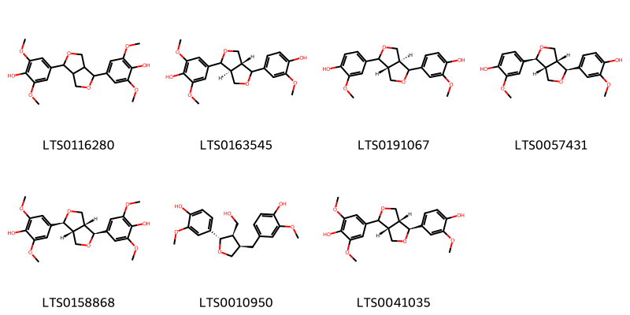{ width=100% }
    <figcaption>Hình ảnh cấu trúc hóa học của 7 hoạt chất thuộc nhóm Furanoid lignans gồm ['syringaresinol (LTS0116280)', '4-[(3ar,6as)-4-(4-hydroxy-3-methoxyphenyl)-hexahydrofuro[3,4-c]furan-1-yl]-2,6-dimethoxyphenol (LTS0163545)', '4-[(3ar,6as)-4-(4-hydroxy-3-methoxyphenyl)-hexahydrofuro[3,4-c]furan-1-yl]-2-methoxyphenol (LTS0191067)', 'pinoresinol (LTS0057431)', '(+)-syringaresinol (LTS0158868)', 'lariciresinol (LTS0010950)', '4-[(3ar,4s,6ar)-4-(4-hydroxy-3-methoxyphenyl)-hexahydrofuro[3,4-c]furan-1-yl]-2,6-dimethoxyphenol (LTS0041035)'].</figcaption>
</figure>
#### Nhóm Lignan lactones
<figure markdown="span">
    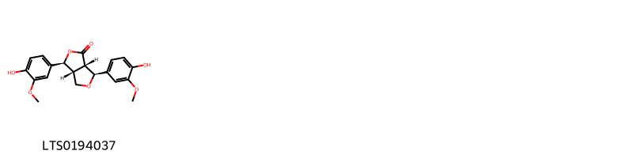{ width=100% }
    <figcaption>Hình ảnh cấu trúc hóa học của 1 hoạt chất thuộc nhóm Lignan lactones gồm ['(3s,3ar,6s,6as)-3,6-bis(4-hydroxy-3-methoxyphenyl)-tetrahydro-3h-furo[3,4-c]furan-1-one (LTS0194037)'].</figcaption>
</figure>
#### Nhóm Naphthalenes
<figure markdown="span">
    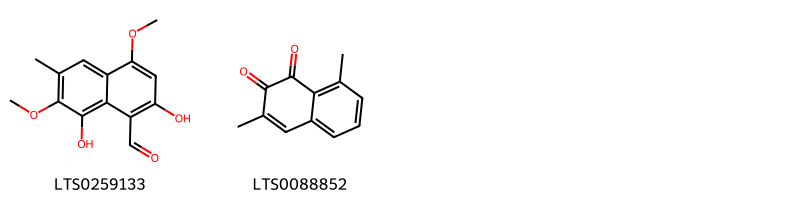{ width=100% }
    <figcaption>Hình ảnh cấu trúc hóa học của 2 hoạt chất thuộc nhóm Naphthalenes gồm ['2,8-dihydroxy-4,7-dimethoxy-6-methylnaphthalene-1-carbaldehyde (LTS0259133)', '3,8-dimethylnaphthalene-1,2-dione (LTS0088852)'].</figcaption>
</figure>
#### Nhóm Organic phosphoric acids and derivatives
<figure markdown="span">
    { width=100% }
    <figcaption>Hình ảnh cấu trúc hóa học của 1 hoạt chất thuộc nhóm Organic phosphoric acids and derivatives gồm ['o-phosphoethanolamine; bis(nonane) (LTS0249963)'].</figcaption>
</figure>
#### Nhóm Organooxygen compounds
<figure markdown="span">
    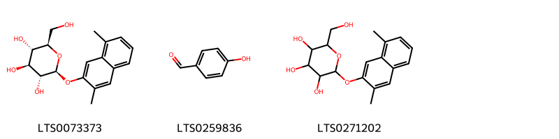{ width=100% }
    <figcaption>Hình ảnh cấu trúc hóa học của 3 hoạt chất thuộc nhóm Organooxygen compounds gồm ['(2s,3r,4s,5s,6r)-2-[(3,8-dimethylnaphthalen-2-yl)oxy]-6-(hydroxymethyl)oxane-3,4,5-triol (LTS0073373)', 'p-hydroxybenzaldehyde (LTS0259836)', '2-[(3,8-dimethylnaphthalen-2-yl)oxy]-6-(hydroxymethyl)oxane-3,4,5-triol (LTS0271202)'].</figcaption>
</figure>
#### Nhóm Phenols
<figure markdown="span">
    { width=100% }
    <figcaption>Hình ảnh cấu trúc hóa học của 3 hoạt chất thuộc nhóm Phenols gồm ['vanillin (LTS0136163)', 'syringaldehyde (LTS0201406)', '(2e)-3-(4-hydroxy-3-methoxyphenyl)-n-[2-(4-hydroxyphenyl)ethyl]prop-2-enimidic acid (LTS0187051)'].</figcaption>
</figure>
#### Nhóm Prenol lipids
<figure markdown="span">
    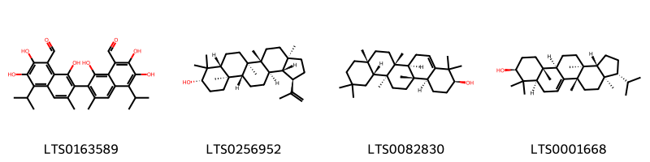{ width=100% }
    <figcaption>Hình ảnh cấu trúc hóa học của 4 hoạt chất thuộc nhóm Prenol lipids gồm ['(-)-gossypol (LTS0163589)', 'lupeol (LTS0256952)', 'glutinol (LTS0082830)', '(3r,3ar,5as,7ar,9s,11ar,11br,13as,13br)-3-isopropyl-3a,5a,8,8,11a,13a-hexamethyl-1h,2h,3h,4h,5h,7h,7ah,9h,10h,11h,11bh,12h,13h,13bh-cyclopenta[a]chrysen-9-ol (LTS0001668)'].</figcaption>
</figure>
#### Nhóm Saturated hydrocarbons
<figure markdown="span">
    { width=100% }
    <figcaption>Hình ảnh cấu trúc hóa học của 1 hoạt chất thuộc nhóm Saturated hydrocarbons gồm ['nonacosane (LTS0062747)'].</figcaption>
</figure>
#### Nhóm Steroids and steroid derivatives
<figure markdown="span">
    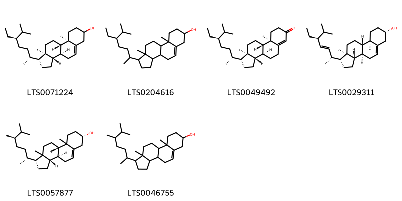{ width=100% }
    <figcaption>Hình ảnh cấu trúc hóa học của 6 hoạt chất thuộc nhóm Steroids and steroid derivatives gồm ['stigmast-5-en-3-ol (LTS0071224)', 'stigmast-5-en-3-ol, (3β)- (LTS0204616)', 'β-sitostenone (LTS0049492)', 'phytosterol (LTS0029311)', '(1r,3as,3bs,7s,9bs)-1-[(2r,5r)-5,6-dimethylheptan-2-yl]-9a,11a-dimethyl-1h,2h,3h,3ah,3bh,4h,6h,7h,8h,9h,9bh,10h,11h-cyclopenta[a]phenanthren-7-ol (LTS0057877)', 'campesterol (LTS0046755)'].</figcaption>
</figure>

---

### Dược dân tộc học

Danh sách các quốc gia có sử dụng *Hibiscus cannabinus* trong điều trị các bệnh. 

| Country   | Disease                                                                     | Bệnh                                                                                                                                                                                                |
|:----------|:----------------------------------------------------------------------------|:----------------------------------------------------------------------------------------------------------------------------------------------------------------------------------------------------|
| Elsewhere | Aperient, Aperient, Aphrodisiac, Aphrodisiac, Purgative, Stomachic, Apertif | MYMEMORY WARNING: YOU USED ALL AVAILABLE FREE TRANSLATIONS FOR TODAY. NEXT AVAILABLE IN  07 HOURS 13 MINUTES 38 SECONDS VISIT HTTPS://MYMEMORY.TRANSLATED.NET/DOC/USAGELIMITS.PHP TO TRANSLATE MORE |
| Iraq      | Aphrodisiac, Purgative                                                      | MYMEMORY WARNING: YOU USED ALL AVAILABLE FREE TRANSLATIONS FOR TODAY. NEXT AVAILABLE IN  07 HOURS 13 MINUTES 36 SECONDS VISIT HTTPS://MYMEMORY.TRANSLATED.NET/DOC/USAGELIMITS.PHP TO TRANSLATE MORE |
| Sudan     | Aperient                                                                    | MYMEMORY WARNING: YOU USED ALL AVAILABLE FREE TRANSLATIONS FOR TODAY. NEXT AVAILABLE IN  07 HOURS 13 MINUTES 33 SECONDS VISIT HTTPS://MYMEMORY.TRANSLATED.NET/DOC/USAGELIMITS.PHP TO TRANSLATE MORE |

---

---
## Hibiscus elatus
### Thông tin về thực vật

!!! info "Phân loại thực vật của *N/A* từ GIBF:"
    - **Kingdom:** Plantae
    - **Phylum:** Tracheophyta
    - **Order:** Malvales
    - **Family:** Malvaceae
    - **Genus:** Talipariti
    - **Species:** *N/A*

 

| Label (VI)   | Label (EN)   | Scientific Name   | Descriptions (VI)   | Descriptions (EN)   | Also Known As (VI)   | Also Known As (EN)   |
|:-------------|:-------------|:------------------|:--------------------|:--------------------|:---------------------|:---------------------|
| N/A          | N/A          | Hibiscus elatus   | loài thực vật       | species of plant    | ['']                 | ['']                 |

#### Phân bố trên thế giới

**Từ CSDL GIBF** Brazil, Viet Nam, Japan, Bahrain, New Caledonia, China, Antigua and Barbuda, Saint Lucia, Honduras, Qatar, French Polynesia, Anguilla, Thailand, Cayman Islands, Puerto Rico, Sri Lanka, United States of America, Jamaica, Virgin Islands (U.S.), Indonesia, Costa Rica, Nigeria, Colombia, Cuba, French Guiana, Fiji, Hong Kong, Dominica, Mexico, Macao, Niue, Maldives, Guam, American Samoa, Chinese Taipei, Philippines, Panama, Singapore, Martinique, Cook Islands, Bahamas, South Africa, Australia, Liberia, India, Northern Mariana Islands, Peru

#### Phân bố tại Việt Nam

**Từ CSDL GIBF**: Hồ Chí Minh city, Kiên Giang

---
### Thành phần hóa học
        
- Theo cơ sở dữ liệu lotus: Từ loài *N/A* đã phân lập và xác định được 15 hoạt chất thuộc về các nhóm Benzofurans, Prenol lipids, Naphthalenes. 

|    | chemicalTaxonomyClassyfireClass   |   smiles_count |
|---:|:----------------------------------|---------------:|
|  0 | Benzofurans                       |             10 |
|  1 | Naphthalenes                      |              4 |
|  2 | Prenol lipids                     |              1 |

#### Nhóm Benzofurans
<figure markdown="span">
    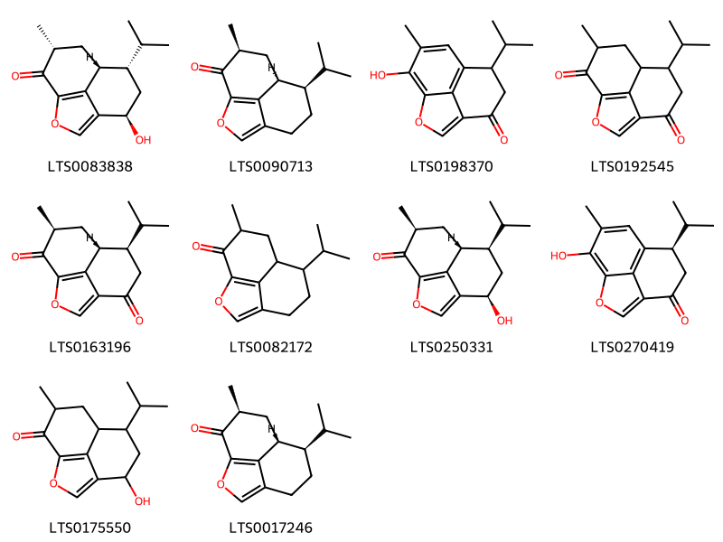{ width=100% }
    <figcaption>Hình ảnh cấu trúc hóa học của 10 hoạt chất thuộc nhóm Benzofurans gồm ['(5r,7s,8r,10r)-5-hydroxy-7-isopropyl-10-methyl-2-oxatricyclo[6.3.1.0⁴,¹²]dodeca-1(12),3-dien-11-one (LTS0083838)', '(7r,8s,10s)-7-isopropyl-10-methyl-2-oxatricyclo[6.3.1.0⁴,¹²]dodeca-1(12),3-dien-11-one (LTS0090713)', '11-hydroxy-7-isopropyl-10-methyl-2-oxatricyclo[6.3.1.0⁴,¹²]dodeca-1(11),3,8(12),9-tetraen-5-one (LTS0198370)', '7-isopropyl-10-methyl-2-oxatricyclo[6.3.1.0⁴,¹²]dodeca-1(12),3-diene-5,11-dione (LTS0192545)', '(7r,8r,10s)-7-isopropyl-10-methyl-2-oxatricyclo[6.3.1.0⁴,¹²]dodeca-1(12),3-diene-5,11-dione (LTS0163196)', '7-isopropyl-10-methyl-2-oxatricyclo[6.3.1.0⁴,¹²]dodeca-1(12),3-dien-11-one (LTS0082172)', '(5r,7r,8r,10s)-5-hydroxy-7-isopropyl-10-methyl-2-oxatricyclo[6.3.1.0⁴,¹²]dodeca-1(12),3-dien-11-one (LTS0250331)', '(7r)-11-hydroxy-7-isopropyl-10-methyl-2-oxatricyclo[6.3.1.0⁴,¹²]dodeca-1(11),3,8(12),9-tetraen-5-one (LTS0270419)', '5-hydroxy-7-isopropyl-10-methyl-2-oxatricyclo[6.3.1.0⁴,¹²]dodeca-1(12),3-dien-11-one (LTS0175550)', '(7r,8r,10s)-7-isopropyl-10-methyl-2-oxatricyclo[6.3.1.0⁴,¹²]dodeca-1(12),3-dien-11-one (LTS0017246)'].</figcaption>
</figure>
#### Nhóm Naphthalenes
<figure markdown="span">
    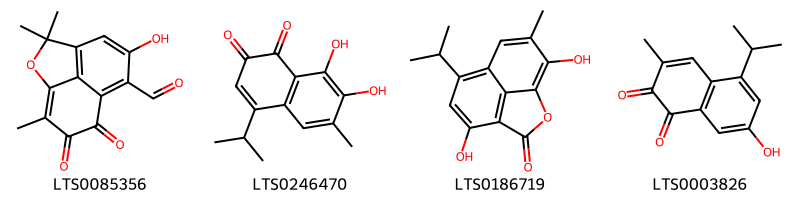{ width=100% }
    <figcaption>Hình ảnh cấu trúc hóa học của 4 hoạt chất thuộc nhóm Naphthalenes gồm ['6-hydroxy-3,3,11-trimethyl-9,10-dioxo-2-oxatricyclo[6.3.1.0⁴,¹²]dodeca-1(11),4,6,8(12)-tetraene-7-carbaldehyde (LTS0085356)', '7,8-dihydroxy-4-isopropyl-6-methylnaphthalene-1,2-dione (LTS0246470)', '5,11-dihydroxy-7-isopropyl-10-methyl-2-oxatricyclo[6.3.1.0⁴,¹²]dodeca-1(11),4(12),5,7,9-pentaen-3-one (LTS0186719)', '7-hydroxy-5-isopropyl-3-methylnaphthalene-1,2-dione (LTS0003826)'].</figcaption>
</figure>
#### Nhóm Prenol lipids
<figure markdown="span">
    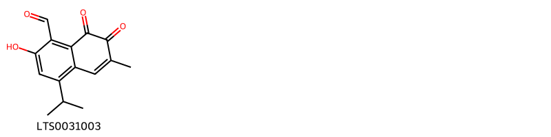{ width=100% }
    <figcaption>Hình ảnh cấu trúc hóa học của 1 hoạt chất thuộc nhóm Prenol lipids gồm ['hibiscoquinone a (LTS0031003)'].</figcaption>
</figure>

---

### Dược dân tộc học

Danh sách các quốc gia có sử dụng *N/A* trong điều trị các bệnh. 

| Country   | Disease                                              | Bệnh                                                                                                                                                                                                |
|:----------|:-----------------------------------------------------|:----------------------------------------------------------------------------------------------------------------------------------------------------------------------------------------------------|
| Haiti     | Apertif, Cicatrizant, Laxative, Sudorific, Emollient | MYMEMORY WARNING: YOU USED ALL AVAILABLE FREE TRANSLATIONS FOR TODAY. NEXT AVAILABLE IN  07 HOURS 13 MINUTES 01 SECONDS VISIT HTTPS://MYMEMORY.TRANSLATED.NET/DOC/USAGELIMITS.PHP TO TRANSLATE MORE |

---

---
## Hibiscus furcatus
### Thông tin về thực vật

!!! info "Phân loại thực vật của *N/A* từ GIBF:"
    - **Kingdom:** Plantae
    - **Phylum:** Tracheophyta
    - **Order:** Malvales
    - **Family:** Malvaceae
    - **Genus:** Hibiscus
    - **Species:** *N/A*

 

| Label (VI)   | Label (EN)   | Scientific Name   | Descriptions (VI)   | Descriptions (EN)   | Also Known As (VI)   | Also Known As (EN)   |
|:-------------|:-------------|:------------------|:--------------------|:--------------------|:---------------------|:---------------------|
| N/A          | N/A          | Hibiscus furcatus | loài thực vật       | species of plant    | ['']                 | ['']                 |

#### Phân bố trên thế giới

**Từ CSDL GIBF** Brazil, United Arab Emirates, Viet Nam, Guadeloupe, China, Antigua and Barbuda, Chile, New Zealand, Uruguay, Madagascar, Thailand, Puerto Rico, Sri Lanka, United States of America, Korea, Republic of, Virgin Islands (U.S.), Indonesia, Costa Rica, Dominican Republic, Colombia, Argentina, Ethiopia, Lao People’s Democratic Republic, Hong Kong, Mexico, Dominica, Kenya, Vanuatu, Guam, Chinese Taipei, Curaçao, Canada, Panama, Namibia, Cambodia, Portugal, Peru, Bahamas, South Africa, Australia, India, Comoros, Belize

#### Phân bố tại Việt Nam

**Từ CSDL GIBF**: Hồ Chí Minh city, Ninh Bình

---
### Thành phần hóa học
        
- Theo cơ sở dữ liệu lotus: Từ loài *N/A* đã phân lập và xác định được 4 hoạt chất thuộc về các nhóm Prenol lipids, Steroids and steroid derivatives. 

|    | chemicalTaxonomyClassyfireClass   |   smiles_count |
|---:|:----------------------------------|---------------:|
|  0 | Prenol lipids                     |              3 |
|  1 | Steroids and steroid derivatives  |              1 |

#### Nhóm Prenol lipids
<figure markdown="span">
    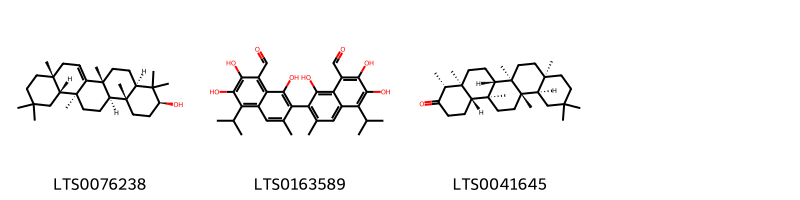{ width=100% }
    <figcaption>Hình ảnh cấu trúc hóa học của 3 hoạt chất thuộc nhóm Prenol lipids gồm ['alnulin (LTS0076238)', '(-)-gossypol (LTS0163589)', '(-)-friedelin (LTS0041645)'].</figcaption>
</figure>
#### Nhóm Steroids and steroid derivatives
<figure markdown="span">
    { width=100% }
    <figcaption>Hình ảnh cấu trúc hóa học của 1 hoạt chất thuộc nhóm Steroids and steroid derivatives gồm ['stigmast-5-en-3-ol, (3β)- (LTS0204616)'].</figcaption>
</figure>

---

### Dược dân tộc học

Danh sách các quốc gia có sử dụng *N/A* trong điều trị các bệnh. 

| Country   | Disease             | Bệnh                                                                                                                                                                                                |
|:----------|:--------------------|:----------------------------------------------------------------------------------------------------------------------------------------------------------------------------------------------------|
| India     | Antidote, Vermifuge | MYMEMORY WARNING: YOU USED ALL AVAILABLE FREE TRANSLATIONS FOR TODAY. NEXT AVAILABLE IN  07 HOURS 12 MINUTES 38 SECONDS VISIT HTTPS://MYMEMORY.TRANSLATED.NET/DOC/USAGELIMITS.PHP TO TRANSLATE MORE |

---

---
## Hibiscus moscheutos
### Thông tin về thực vật

!!! info "Phân loại thực vật của *Hibiscus moscheutos* từ GIBF:"
    - **Kingdom:** Plantae
    - **Phylum:** Tracheophyta
    - **Order:** Malvales
    - **Family:** Malvaceae
    - **Genus:** Hibiscus
    - **Species:** *Hibiscus moscheutos*

 

| Label (VI)   | Label (EN)   | Scientific Name     | Descriptions (VI)   | Descriptions (EN)   | Also Known As (VI)   | Also Known As (EN)                        |
|:-------------|:-------------|:--------------------|:--------------------|:--------------------|:---------------------|:------------------------------------------|
| N/A          | N/A          | Hibiscus moscheutos |                     | species of plant    | ['']                 | ['rose mallow', 'crimsoneyed rosemallow'] |

#### Phân bố trên thế giới

**Từ CSDL GIBF** United States of America, Canada

#### Phân bố tại Việt Nam

**Từ CSDL GIBF**: Không có ghi nhận ở Việt Nam

---
### Thành phần hóa học
        
- Theo cơ sở dữ liệu lotus: Từ loài *Hibiscus moscheutos* đã phân lập và xác định được 10 hoạt chất thuộc về các nhóm Indoles and derivatives, Carboxylic acids and derivatives, Steroids and steroid derivatives, Flavonoids. 

|    | chemicalTaxonomyClassyfireClass   |   smiles_count |
|---:|:----------------------------------|---------------:|
|  0 | Carboxylic acids and derivatives  |              2 |
|  1 | Flavonoids                        |              5 |
|  2 | Indoles and derivatives           |              1 |
|  3 | Steroids and steroid derivatives  |              2 |

#### Nhóm Carboxylic acids and derivatives
<figure markdown="span">
    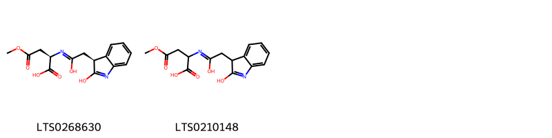{ width=100% }
    <figcaption>Hình ảnh cấu trúc hóa học của 2 hoạt chất thuộc nhóm Carboxylic acids and derivatives gồm ['(2r)-2-({1-hydroxy-2-[(3s)-2-hydroxy-3h-indol-3-yl]ethylidene}amino)-4-methoxy-4-oxobutanoic acid (LTS0268630)', '2-{[1-hydroxy-2-(2-hydroxy-3h-indol-3-yl)ethylidene]amino}-4-methoxy-4-oxobutanoic acid (LTS0210148)'].</figcaption>
</figure>
#### Nhóm Flavonoids
<figure markdown="span">
    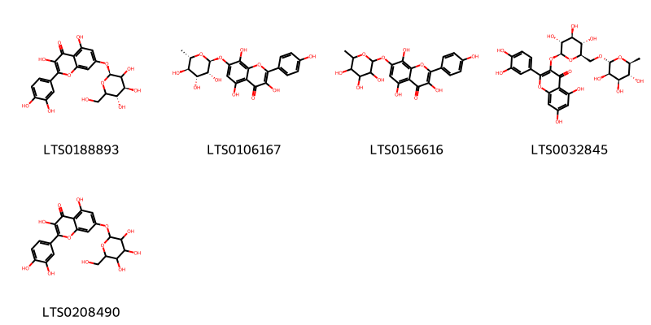{ width=100% }
    <figcaption>Hình ảnh cấu trúc hóa học của 5 hoạt chất thuộc nhóm Flavonoids gồm ['quercimeritrin (LTS0188893)', 'rhodionin (LTS0106167)', '3,5,8-trihydroxy-2-(4-hydroxyphenyl)-7-[(3,4,5-trihydroxy-6-methyloxan-2-yl)oxy]chromen-4-one (LTS0156616)', '3-rutinosyl quercetin (LTS0032845)', 'quercimeritrin (LTS0208490)'].</figcaption>
</figure>
#### Nhóm Indoles and derivatives
<figure markdown="span">
    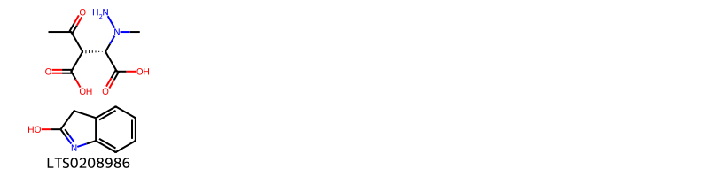{ width=100% }
    <figcaption>Hình ảnh cấu trúc hóa học của 1 hoạt chất thuộc nhóm Indoles and derivatives gồm ['(3s)-2-acetyl-3-(1-methylhydrazin-1-yl)butanedioic acid; oxindole (LTS0208986)'].</figcaption>
</figure>
#### Nhóm Steroids and steroid derivatives
<figure markdown="span">
    { width=100% }
    <figcaption>Hình ảnh cấu trúc hóa học của 2 hoạt chất thuộc nhóm Steroids and steroid derivatives gồm ['sitogluside (LTS0201798)', '2-{[1-(5-ethyl-6-methylheptan-2-yl)-9a,11a-dimethyl-1h,2h,3h,3ah,3bh,4h,6h,7h,8h,9h,9bh,10h,11h-cyclopenta[a]phenanthren-7-yl]oxy}-6-(hydroxymethyl)oxane-3,4,5-triol (LTS0158828)'].</figcaption>
</figure>

---

### Dược dân tộc học

Danh sách các quốc gia có sử dụng *Hibiscus moscheutos* trong điều trị các bệnh. 

| Country   | Disease                                  | Bệnh                                                                                                                                                                                                |
|:----------|:-----------------------------------------|:----------------------------------------------------------------------------------------------------------------------------------------------------------------------------------------------------|
| Elsewhere | Demulcent, Emollient, Nervine, Stomachic | MYMEMORY WARNING: YOU USED ALL AVAILABLE FREE TRANSLATIONS FOR TODAY. NEXT AVAILABLE IN  07 HOURS 12 MINUTES 12 SECONDS VISIT HTTPS://MYMEMORY.TRANSLATED.NET/DOC/USAGELIMITS.PHP TO TRANSLATE MORE |

---

---
## Hibiscus mutabilis
### Thông tin về thực vật

!!! info "Phân loại thực vật của *Hibiscus mutabilis* từ GIBF:"
    - **Kingdom:** Plantae
    - **Phylum:** Tracheophyta
    - **Order:** Malvales
    - **Family:** Malvaceae
    - **Genus:** Hibiscus
    - **Species:** *Hibiscus mutabilis*

 

| Label (VI)   | Label (EN)   | Scientific Name    | Descriptions (VI)   | Descriptions (EN)                                                | Also Known As (VI)   | Also Known As (EN)                                                           |
|:-------------|:-------------|:-------------------|:--------------------|:-----------------------------------------------------------------|:---------------------|:-----------------------------------------------------------------------------|
| N/A          | N/A          | Hibiscus mutabilis |                     | species of flower plant with 3 colours found by Carolus Linnaeus | ['']                 | ['Confederate rose', 'cotton rose', 'cotton rosemallow', 'dixie rosemallow'] |

#### Phân bố trên thế giới

**Từ CSDL GIBF** nan, Brazil, Viet Nam, Japan, Guadeloupe, China, New Zealand, Honduras, Ecuador, Trinidad and Tobago, Thailand, Spain, Réunion, United States of America, Korea, Republic of, Costa Rica, Colombia, Cuba, Hong Kong, Macao, Chinese Taipei, Malaysia, Iraq, Panama, Nicaragua, Singapore, Martinique, Australia, India, Peru, Venezuela (Bolivarian Republic of)

#### Phân bố tại Việt Nam

**Từ CSDL GIBF**: Thanh Hóa

---
### Thành phần hóa học
        
- Theo cơ sở dữ liệu lotus: Từ loài *Hibiscus mutabilis* đã phân lập và xác định được 11 hoạt chất thuộc về các nhóm Prenol lipids, 2-arylbenzofuran flavonoids, Flavonoids. 

|    | chemicalTaxonomyClassyfireClass   |   smiles_count |
|---:|:----------------------------------|---------------:|
|  0 |                                   |              2 |
|  1 | 2-arylbenzofuran flavonoids       |              2 |
|  2 | Flavonoids                        |              6 |
|  3 | Prenol lipids                     |              1 |

#### Nhóm 
<figure markdown="span">
    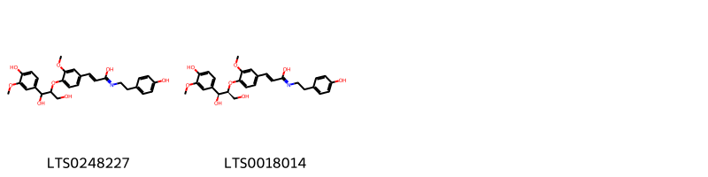{ width=100% }
    <figcaption>Hình ảnh cấu trúc hóa học của 2 hoạt chất thuộc nhóm  gồm ['3-(4-{[1,3-dihydroxy-1-(4-hydroxy-3-methoxyphenyl)propan-2-yl]oxy}-3-methoxyphenyl)-n-[2-(4-hydroxyphenyl)ethyl]prop-2-enimidic acid (LTS0248227)', '(2e)-3-(4-{[(1s,2s)-1,3-dihydroxy-1-(4-hydroxy-3-methoxyphenyl)propan-2-yl]oxy}-3-methoxyphenyl)-n-[2-(4-hydroxyphenyl)ethyl]prop-2-enimidic acid (LTS0018014)'].</figcaption>
</figure>
#### Nhóm 2-arylbenzofuran flavonoids
<figure markdown="span">
    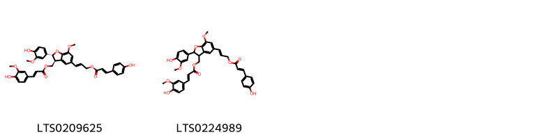{ width=100% }
    <figcaption>Hình ảnh cấu trúc hóa học của 2 hoạt chất thuộc nhóm 2-arylbenzofuran flavonoids gồm ['(2e)-3-[(2r,3s)-2-(4-hydroxy-3-methoxyphenyl)-3-({[(2e)-3-(4-hydroxy-3-methoxyphenyl)prop-2-enoyl]oxy}methyl)-7-methoxy-2,3-dihydro-1-benzofuran-5-yl]prop-2-en-1-yl (2e)-3-(4-hydroxyphenyl)prop-2-enoate (LTS0209625)', '[2-(4-hydroxy-3-methoxyphenyl)-5-(3-{[3-(4-hydroxyphenyl)prop-2-enoyl]oxy}prop-1-en-1-yl)-7-methoxy-2,3-dihydro-1-benzofuran-3-yl]methyl 3-(4-hydroxy-3-methoxyphenyl)prop-2-enoate (LTS0224989)'].</figcaption>
</figure>
#### Nhóm Flavonoids
<figure markdown="span">
    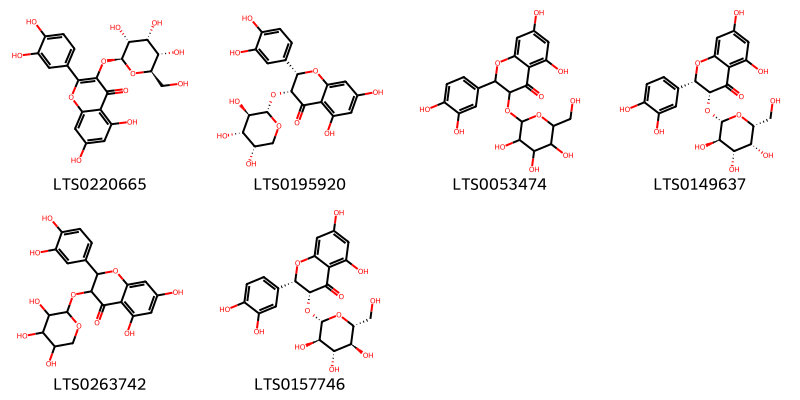{ width=100% }
    <figcaption>Hình ảnh cấu trúc hóa học của 6 hoạt chất thuộc nhóm Flavonoids gồm ['2-(3,4-dihydroxyphenyl)-5,7-dihydroxy-3-{[(2s,3r,4r,5s,6r)-3,4,5-trihydroxy-6-(hydroxymethyl)oxan-2-yl]oxy}chromen-4-one (LTS0220665)', '(2s,3r)-2-(3,4-dihydroxyphenyl)-5,7-dihydroxy-3-{[(2s,3r,4s,5s)-3,4,5-trihydroxyoxan-2-yl]oxy}-2,3-dihydro-1-benzopyran-4-one (LTS0195920)', '2-(3,4-dihydroxyphenyl)-5,7-dihydroxy-3-{[3,4,5-trihydroxy-6-(hydroxymethyl)oxan-2-yl]oxy}-2,3-dihydro-1-benzopyran-4-one (LTS0053474)', '(2s,3r)-2-(3,4-dihydroxyphenyl)-5,7-dihydroxy-3-{[(2s,3r,4s,5r,6r)-3,4,5-trihydroxy-6-(hydroxymethyl)oxan-2-yl]oxy}-2,3-dihydro-1-benzopyran-4-one (LTS0149637)', '2-(3,4-dihydroxyphenyl)-5,7-dihydroxy-3-[(3,4,5-trihydroxyoxan-2-yl)oxy]-2,3-dihydro-1-benzopyran-4-one (LTS0263742)', '(2s,3r)-2-(3,4-dihydroxyphenyl)-5,7-dihydroxy-3-{[(2s,3r,4s,5s,6r)-3,4,5-trihydroxy-6-(hydroxymethyl)oxan-2-yl]oxy}-2,3-dihydro-1-benzopyran-4-one (LTS0157746)'].</figcaption>
</figure>
#### Nhóm Prenol lipids
<figure markdown="span">
    { width=100% }
    <figcaption>Hình ảnh cấu trúc hóa học của 1 hoạt chất thuộc nhóm Prenol lipids gồm ['(-)-gossypol (LTS0163589)'].</figcaption>
</figure>

---

### Dược dân tộc học

Danh sách các quốc gia có sử dụng *Hibiscus mutabilis* trong điều trị các bệnh. 

| Country   | Disease                                                                                       | Bệnh                                                                                                                                                                                                |
|:----------|:----------------------------------------------------------------------------------------------|:----------------------------------------------------------------------------------------------------------------------------------------------------------------------------------------------------|
| China     | Antidote, Antidote, Demulcent, Expectorant, Refrigerant, Refrigerant, Expectorant, Alexiteric | MYMEMORY WARNING: YOU USED ALL AVAILABLE FREE TRANSLATIONS FOR TODAY. NEXT AVAILABLE IN  07 HOURS 11 MINUTES 47 SECONDS VISIT HTTPS://MYMEMORY.TRANSLATED.NET/DOC/USAGELIMITS.PHP TO TRANSLATE MORE |
| Elsewhere | Emollient                                                                                     | MYMEMORY WARNING: YOU USED ALL AVAILABLE FREE TRANSLATIONS FOR TODAY. NEXT AVAILABLE IN  07 HOURS 11 MINUTES 44 SECONDS VISIT HTTPS://MYMEMORY.TRANSLATED.NET/DOC/USAGELIMITS.PHP TO TRANSLATE MORE |

---

---
## Hibiscus rosasinensis
### Thông tin về thực vật

!!! info "Phân loại thực vật của *Hibiscus rosa-sinensis* từ GIBF:"
    - **Kingdom:** Plantae
    - **Phylum:** Tracheophyta
    - **Order:** Malvales
    - **Family:** Malvaceae
    - **Genus:** Hibiscus
    - **Species:** *Hibiscus rosa-sinensis*

 

| Label (VI)   | Label (EN)   | Scientific Name    | Descriptions (VI)   | Descriptions (EN)                                                | Also Known As (VI)   | Also Known As (EN)                                                           |
|:-------------|:-------------|:-------------------|:--------------------|:-----------------------------------------------------------------|:---------------------|:-----------------------------------------------------------------------------|
| N/A          | N/A          | Hibiscus mutabilis |                     | species of flower plant with 3 colours found by Carolus Linnaeus | ['']                 | ['Confederate rose', 'cotton rose', 'cotton rosemallow', 'dixie rosemallow'] |

#### Phân bố trên thế giới

**Từ CSDL GIBF** nan, Brazil, Guatemala, Viet Nam, Japan, Saint Kitts and Nevis, Uganda, Sweden, Guadeloupe, Barbados, China, New Caledonia, Chile, New Zealand, Saint Lucia, Türkiye, Ecuador, Madagascar, Spain, Thailand, Turks and Caicos Islands, Puerto Rico, Sri Lanka, United States of America, Jamaica, Greece, Indonesia, Seychelles, Costa Rica, Dominican Republic, Colombia, Argentina, Lao People’s Democratic Republic, Morocco, Hong Kong, Dominica, Algeria, Kenya, Macao, Rwanda, Philippines, Haiti, Malaysia, Palau, Solomon Islands, Germany, Panama, Egypt, Cambodia, Portugal, Bermuda, Bonaire, Sint Eustatius and Saba, Bahamas, South Africa, Australia, Saint Vincent and the Grenadines, Italy, India, Peru, Bolivia (Plurinational State of)

#### Phân bố tại Việt Nam

**Từ CSDL GIBF**: Phú Thọ

---
### Thành phần hóa học
        
- Theo cơ sở dữ liệu lotus: Từ loài *Hibiscus rosa-sinensis* đã phân lập và xác định được Chưa có hoạt chất nào được phân lập. hoạt chất thuộc về các nhóm Không có hoạt chất nào được phân lập. 

Không có hình ảnh nào được tạo ra

---

### Dược dân tộc học

Danh sách các quốc gia có sử dụng *Hibiscus rosa-sinensis* trong điều trị các bệnh. 

| Country   | Disease                                                                    | Bệnh                                                                                                                                                                                                |
|:----------|:---------------------------------------------------------------------------|:----------------------------------------------------------------------------------------------------------------------------------------------------------------------------------------------------|
| Annamese  | Emmenagogue                                                                | MYMEMORY WARNING: YOU USED ALL AVAILABLE FREE TRANSLATIONS FOR TODAY. NEXT AVAILABLE IN  07 HOURS 11 MINUTES 21 SECONDS VISIT HTTPS://MYMEMORY.TRANSLATED.NET/DOC/USAGELIMITS.PHP TO TRANSLATE MORE |
| China     | Emmenagogue, Poultice                                                      | MYMEMORY WARNING: YOU USED ALL AVAILABLE FREE TRANSLATIONS FOR TODAY. NEXT AVAILABLE IN  07 HOURS 11 MINUTES 19 SECONDS VISIT HTTPS://MYMEMORY.TRANSLATED.NET/DOC/USAGELIMITS.PHP TO TRANSLATE MORE |
| Chinese   | Emmenagogue                                                                | MYMEMORY WARNING: YOU USED ALL AVAILABLE FREE TRANSLATIONS FOR TODAY. NEXT AVAILABLE IN  07 HOURS 11 MINUTES 16 SECONDS VISIT HTTPS://MYMEMORY.TRANSLATED.NET/DOC/USAGELIMITS.PHP TO TRANSLATE MORE |
| Elsewhere | Antidiarrheic, Aphrodisiac, Emmenagogue, Refrigerant, Emollient, Demulcent | MYMEMORY WARNING: YOU USED ALL AVAILABLE FREE TRANSLATIONS FOR TODAY. NEXT AVAILABLE IN  07 HOURS 11 MINUTES 14 SECONDS VISIT HTTPS://MYMEMORY.TRANSLATED.NET/DOC/USAGELIMITS.PHP TO TRANSLATE MORE |
| Ghana     | Dentifrice                                                                 | MYMEMORY WARNING: YOU USED ALL AVAILABLE FREE TRANSLATIONS FOR TODAY. NEXT AVAILABLE IN  07 HOURS 11 MINUTES 11 SECONDS VISIT HTTPS://MYMEMORY.TRANSLATED.NET/DOC/USAGELIMITS.PHP TO TRANSLATE MORE |
| Haiti     | Astringent, Sudorific                                                      | MYMEMORY WARNING: YOU USED ALL AVAILABLE FREE TRANSLATIONS FOR TODAY. NEXT AVAILABLE IN  07 HOURS 11 MINUTES 09 SECONDS VISIT HTTPS://MYMEMORY.TRANSLATED.NET/DOC/USAGELIMITS.PHP TO TRANSLATE MORE |
| Iraq      | Aperient, Aphrodisiac, Laxative                                            | MYMEMORY WARNING: YOU USED ALL AVAILABLE FREE TRANSLATIONS FOR TODAY. NEXT AVAILABLE IN  07 HOURS 11 MINUTES 06 SECONDS VISIT HTTPS://MYMEMORY.TRANSLATED.NET/DOC/USAGELIMITS.PHP TO TRANSLATE MORE |
| Java      | Abortifacient, Purgative                                                   | MYMEMORY WARNING: YOU USED ALL AVAILABLE FREE TRANSLATIONS FOR TODAY. NEXT AVAILABLE IN  07 HOURS 11 MINUTES 04 SECONDS VISIT HTTPS://MYMEMORY.TRANSLATED.NET/DOC/USAGELIMITS.PHP TO TRANSLATE MORE |
| Kelantan  | Antidote                                                                   | MYMEMORY WARNING: YOU USED ALL AVAILABLE FREE TRANSLATIONS FOR TODAY. NEXT AVAILABLE IN  07 HOURS 11 MINUTES 01 SECONDS VISIT HTTPS://MYMEMORY.TRANSLATED.NET/DOC/USAGELIMITS.PHP TO TRANSLATE MORE |
| Malaya    | Expectorant                                                                | MYMEMORY WARNING: YOU USED ALL AVAILABLE FREE TRANSLATIONS FOR TODAY. NEXT AVAILABLE IN  07 HOURS 10 MINUTES 59 SECONDS VISIT HTTPS://MYMEMORY.TRANSLATED.NET/DOC/USAGELIMITS.PHP TO TRANSLATE MORE |
| Samoa     | Abortifacient, Hemostat                                                    | MYMEMORY WARNING: YOU USED ALL AVAILABLE FREE TRANSLATIONS FOR TODAY. NEXT AVAILABLE IN  07 HOURS 10 MINUTES 57 SECONDS VISIT HTTPS://MYMEMORY.TRANSLATED.NET/DOC/USAGELIMITS.PHP TO TRANSLATE MORE |
| Turkey    | Emollient, Expectorant, Refrigerant, Demulcent, Emmenagogue, Abortifacient | MYMEMORY WARNING: YOU USED ALL AVAILABLE FREE TRANSLATIONS FOR TODAY. NEXT AVAILABLE IN  07 HOURS 10 MINUTES 54 SECONDS VISIT HTTPS://MYMEMORY.TRANSLATED.NET/DOC/USAGELIMITS.PHP TO TRANSLATE MORE |

---

---
## Hibiscus sabdariffa
### Thông tin về thực vật

!!! info "Phân loại thực vật của *Hibiscus sabdariffa* từ GIBF:"
    - **Kingdom:** Plantae
    - **Phylum:** Tracheophyta
    - **Order:** Malvales
    - **Family:** Malvaceae
    - **Genus:** Hibiscus
    - **Species:** *Hibiscus sabdariffa*

 

| Label (VI)   | Label (EN)   | Scientific Name     | Descriptions (VI)   | Descriptions (EN)         | Also Known As (VI)   | Also Known As (EN)   |
|:-------------|:-------------|:--------------------|:--------------------|:--------------------------|:---------------------|:---------------------|
| N/A          | N/A          | Hibiscus sabdariffa |                     | species of plant, Roselle | ['']                 | ['roselle']          |

#### Phân bố trên thế giới

**Từ CSDL GIBF** United Arab Emirates, Brazil, Viet Nam, Guatemala, Senegal, Guadeloupe, Nepal, China, Gambia, Mozambique, Tanzania, United Republic of, Ecuador, Trinidad and Tobago, Thailand, Spain, Madagascar, Cameroon, Ghana, Guinea-Bissau, United States of America, Jamaica, Indonesia, Mauritania, Costa Rica, Nigeria, Colombia, French Guiana, Sierra Leone, Grenada, Lao People’s Democratic Republic, Malawi, Dominica, Hong Kong, Benin, Mexico, Algeria, Rwanda, Saudi Arabia, Montserrat, Malaysia, Philippines, Mayotte, Canada, Panama, Egypt, Namibia, Singapore, Cambodia, Niger, Australia, Côte d’Ivoire, India, Bolivia (Plurinational State of), Belize

#### Phân bố tại Việt Nam

**Từ CSDL GIBF**: Hồ Chí Minh city, Quảng Nam, Hà Nội

---
### Thành phần hóa học
        
- Theo cơ sở dữ liệu lotus: Từ loài *Hibiscus sabdariffa* đã phân lập và xác định được 32 hoạt chất thuộc về các nhóm Fatty Acyls, Benzene and substituted derivatives, Flavonoids, Carboxylic acids and derivatives, Steroids and steroid derivatives, Organooxygen compounds, Prenol lipids. 

|    | chemicalTaxonomyClassyfireClass     |   smiles_count |
|---:|:------------------------------------|---------------:|
|  0 | Benzene and substituted derivatives |              1 |
|  1 | Carboxylic acids and derivatives    |              4 |
|  2 | Fatty Acyls                         |              7 |
|  3 | Flavonoids                          |              6 |
|  4 | Organooxygen compounds              |              1 |
|  5 | Prenol lipids                       |              1 |
|  6 | Steroids and steroid derivatives    |             12 |

#### Nhóm Benzene and substituted derivatives
<figure markdown="span">
    { width=100% }
    <figcaption>Hình ảnh cấu trúc hóa học của 1 hoạt chất thuộc nhóm Benzene and substituted derivatives gồm ['3,4-dihydroxybenzoic acid (LTS0018765)'].</figcaption>
</figure>
#### Nhóm Carboxylic acids and derivatives
<figure markdown="span">
    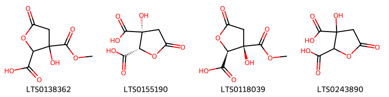{ width=100% }
    <figcaption>Hình ảnh cấu trúc hóa học của 4 hoạt chất thuộc nhóm Carboxylic acids and derivatives gồm ['3-hydroxy-3-(methoxycarbonyl)-5-oxooxolane-2-carboxylic acid (LTS0138362)', '(2s,3r)-3-hydroxy-5-oxooxolane-2,3-dicarboxylic acid (LTS0155190)', '(2s,3r)-3-hydroxy-3-(methoxycarbonyl)-5-oxooxolane-2-carboxylic acid (LTS0118039)', '3-hydroxy-5-oxooxolane-2,3-dicarboxylic acid (LTS0243890)'].</figcaption>
</figure>
#### Nhóm Fatty Acyls
<figure markdown="span">
    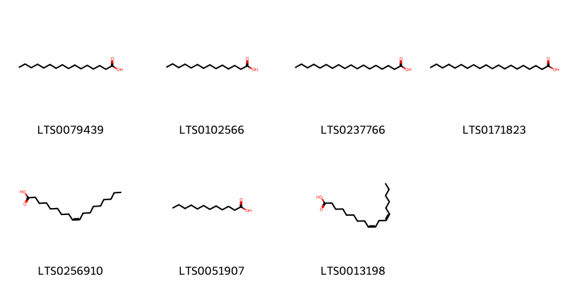{ width=100% }
    <figcaption>Hình ảnh cấu trúc hóa học của 7 hoạt chất thuộc nhóm Fatty Acyls gồm ['palmitic acid (LTS0079439)', 'myristic acid (LTS0102566)', 'stearic acid (LTS0237766)', 'arachidic acid (LTS0171823)', 'oleic acid (LTS0256910)', 'lauric acid (LTS0051907)', 'linoleic (LTS0013198)'].</figcaption>
</figure>
#### Nhóm Flavonoids
<figure markdown="span">
    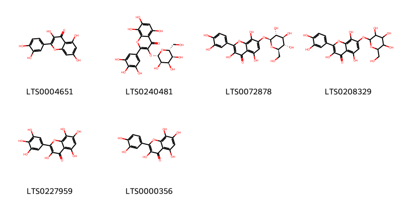{ width=100% }
    <figcaption>Hình ảnh cấu trúc hóa học của 6 hoạt chất thuộc nhóm Flavonoids gồm ['quercetin (LTS0004651)', '5,7,8-trihydroxy-3-{[(2s,3r,4r,5s,6r)-3,4,5-trihydroxy-6-(hydroxymethyl)oxan-2-yl]oxy}-2-(3,4,5-trihydroxyphenyl)chromen-4-one (LTS0240481)', 'gossypitrin (LTS0072878)', '2-(3,4-dihydroxyphenyl)-3,5,8-trihydroxy-7-{[3,4,5-trihydroxy-6-(hydroxymethyl)oxan-2-yl]oxy}chromen-4-one (LTS0208329)', 'hibiscetin (LTS0227959)', 'gossypetin (LTS0000356)'].</figcaption>
</figure>
#### Nhóm Organooxygen compounds
<figure markdown="span">
    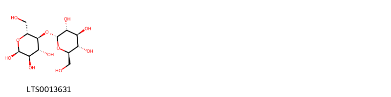{ width=100% }
    <figcaption>Hình ảnh cấu trúc hóa học của 1 hoạt chất thuộc nhóm Organooxygen compounds gồm ['α-maltose (LTS0013631)'].</figcaption>
</figure>
#### Nhóm Prenol lipids
<figure markdown="span">
    { width=100% }
    <figcaption>Hình ảnh cấu trúc hóa học của 1 hoạt chất thuộc nhóm Prenol lipids gồm ['(-)-gossypol (LTS0163589)'].</figcaption>
</figure>
#### Nhóm Steroids and steroid derivatives
<figure markdown="span">
    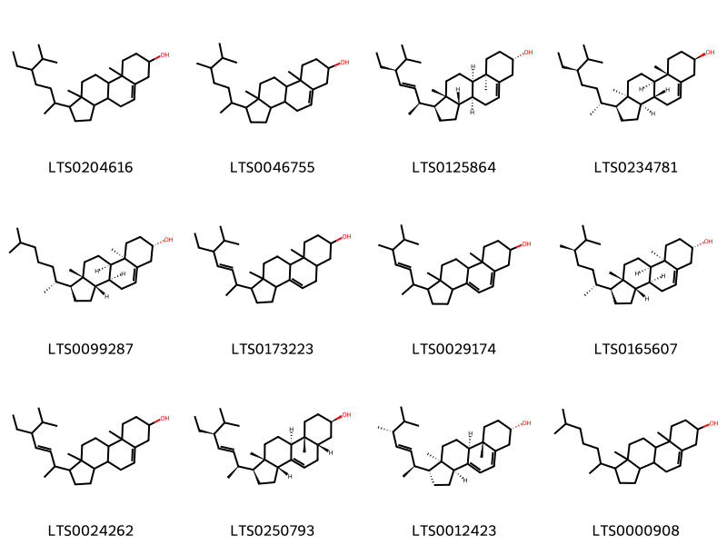{ width=100% }
    <figcaption>Hình ảnh cấu trúc hóa học của 12 hoạt chất thuộc nhóm Steroids and steroid derivatives gồm ['stigmast-5-en-3-ol, (3β)- (LTS0204616)', 'campesterol (LTS0046755)', '(1s,3as,3bs,7s,9ar,9br,11as)-1-[(2s,3e,5s)-5-ethyl-6-methylhept-3-en-2-yl]-9a,11a-dimethyl-1h,2h,3h,3ah,3bh,4h,6h,7h,8h,9h,9bh,10h,11h-cyclopenta[a]phenanthren-7-ol (LTS0125864)', '(1s,3ar,3br,7r,9as,9br,11ar)-1-[(2r,5r)-5-ethyl-6-methylheptan-2-yl]-9a,11a-dimethyl-1h,2h,3h,3ah,3bh,4h,6h,7h,8h,9h,9bh,10h,11h-cyclopenta[a]phenanthren-7-ol (LTS0234781)', '(1s,3as,3bs,7s,9ar,9br,11as)-9a,11a-dimethyl-1-[(2r)-6-methylheptan-2-yl]-1h,2h,3h,3ah,3bh,4h,6h,7h,8h,9h,9bh,10h,11h-cyclopenta[a]phenanthren-7-ol (LTS0099287)', '1-(5-ethyl-6-methylhept-3-en-2-yl)-9a,11a-dimethyl-1h,2h,3h,3ah,5h,5ah,6h,7h,8h,9h,9bh,10h,11h-cyclopenta[a]phenanthren-7-ol (LTS0173223)', '1-(5,6-dimethylhept-3-en-2-yl)-9a,11a-dimethyl-1h,2h,3h,3ah,6h,7h,8h,9h,9bh,10h,11h-cyclopenta[a]phenanthren-7-ol (LTS0029174)', '(1s,3as,3bs,7s,9ar,9br,11as)-1-[(2r,5r)-5,6-dimethylheptan-2-yl]-9a,11a-dimethyl-1h,2h,3h,3ah,3bh,4h,6h,7h,8h,9h,9bh,10h,11h-cyclopenta[a]phenanthren-7-ol (LTS0165607)', 'stigmasterol (LTS0024262)', '(1s,3ar,5as,7r,9ar,9bs,11as)-1-[(2s,3e,5s)-5-ethyl-6-methylhept-3-en-2-yl]-9a,11a-dimethyl-1h,2h,3h,3ah,5h,5ah,6h,7h,8h,9h,9bh,10h,11h-cyclopenta[a]phenanthren-7-ol (LTS0250793)', '(1r,3as,7s,9as,9br,11ar)-1-[(2s,3e,5r)-5,6-dimethylhept-3-en-2-yl]-9a,11a-dimethyl-1h,2h,3h,3ah,6h,7h,8h,9h,9bh,10h,11h-cyclopenta[a]phenanthren-7-ol (LTS0012423)', 'epicholestrol (LTS0000908)'].</figcaption>
</figure>

---

### Dược dân tộc học

Danh sách các quốc gia có sử dụng *Hibiscus sabdariffa* trong điều trị các bệnh. 

| Country            | Disease                                                                                 | Bệnh                                                                                                                                                                                                |
|:-------------------|:----------------------------------------------------------------------------------------|:----------------------------------------------------------------------------------------------------------------------------------------------------------------------------------------------------|
| Dominican Republic | Diuretic                                                                                | MYMEMORY WARNING: YOU USED ALL AVAILABLE FREE TRANSLATIONS FOR TODAY. NEXT AVAILABLE IN  07 HOURS 10 MINUTES 32 SECONDS VISIT HTTPS://MYMEMORY.TRANSLATED.NET/DOC/USAGELIMITS.PHP TO TRANSLATE MORE |
| Elsewhere          | Demulcent, Diuretic, Tonic                                                              | MYMEMORY WARNING: YOU USED ALL AVAILABLE FREE TRANSLATIONS FOR TODAY. NEXT AVAILABLE IN  07 HOURS 10 MINUTES 30 SECONDS VISIT HTTPS://MYMEMORY.TRANSLATED.NET/DOC/USAGELIMITS.PHP TO TRANSLATE MORE |
| Haiti              | Tonic, Emollient                                                                        | MYMEMORY WARNING: YOU USED ALL AVAILABLE FREE TRANSLATIONS FOR TODAY. NEXT AVAILABLE IN  07 HOURS 10 MINUTES 27 SECONDS VISIT HTTPS://MYMEMORY.TRANSLATED.NET/DOC/USAGELIMITS.PHP TO TRANSLATE MORE |
| India              | Antiseptic, Choleretic, Diuretic, Emollient, Laxative, Refrigerant, Sedative, Digestive | MYMEMORY WARNING: YOU USED ALL AVAILABLE FREE TRANSLATIONS FOR TODAY. NEXT AVAILABLE IN  07 HOURS 10 MINUTES 25 SECONDS VISIT HTTPS://MYMEMORY.TRANSLATED.NET/DOC/USAGELIMITS.PHP TO TRANSLATE MORE |
| Iraq               | Antiseptic, Digestive                                                                   | MYMEMORY WARNING: YOU USED ALL AVAILABLE FREE TRANSLATIONS FOR TODAY. NEXT AVAILABLE IN  07 HOURS 10 MINUTES 23 SECONDS VISIT HTTPS://MYMEMORY.TRANSLATED.NET/DOC/USAGELIMITS.PHP TO TRANSLATE MORE |
| Mexico             | Diuretic, Refrigerant, Demulcent, Tonic                                                 | MYMEMORY WARNING: YOU USED ALL AVAILABLE FREE TRANSLATIONS FOR TODAY. NEXT AVAILABLE IN  07 HOURS 10 MINUTES 20 SECONDS VISIT HTTPS://MYMEMORY.TRANSLATED.NET/DOC/USAGELIMITS.PHP TO TRANSLATE MORE |
| Turkey             | Aphrodisiac, Astringent, Demulcent, Emollient, Refrigerant, Tonic, Cholagogue           | MYMEMORY WARNING: YOU USED ALL AVAILABLE FREE TRANSLATIONS FOR TODAY. NEXT AVAILABLE IN  07 HOURS 10 MINUTES 18 SECONDS VISIT HTTPS://MYMEMORY.TRANSLATED.NET/DOC/USAGELIMITS.PHP TO TRANSLATE MORE |

---

---
## Hibiscus surattensis
### Thông tin về thực vật

!!! info "Phân loại thực vật của *Hibiscus surattensis* từ GIBF:"
    - **Kingdom:** Plantae
    - **Phylum:** Tracheophyta
    - **Order:** Malvales
    - **Family:** Malvaceae
    - **Genus:** Hibiscus
    - **Species:** *Hibiscus surattensis*

 

| Label (VI)   | Label (EN)   | Scientific Name      | Descriptions (VI)   | Descriptions (EN)   | Also Known As (VI)   | Also Known As (EN)   |
|:-------------|:-------------|:---------------------|:--------------------|:--------------------|:---------------------|:---------------------|
| N/A          | N/A          | Hibiscus surattensis |                     | species of plant    | ['']                 | ['']                 |

#### Phân bố trên thế giới

**Từ CSDL GIBF** Viet Nam, Uganda, China, Gambia, Mozambique, Tanzania, United Republic of, Thailand, Madagascar, Sri Lanka, Réunion, Indonesia, Lao People’s Democratic Republic, Kenya, Eswatini, Chinese Taipei, Malaysia, Mauritius, Mayotte, Cambodia, Timor-Leste, South Africa, India, Congo, Angola, Cameroon

#### Phân bố tại Việt Nam

**Từ CSDL GIBF**: Đồng Nai, Ninh Thuận

---
### Thành phần hóa học
        
- Theo cơ sở dữ liệu lotus: Từ loài *Hibiscus surattensis* đã phân lập và xác định được Chưa có hoạt chất nào được phân lập. hoạt chất thuộc về các nhóm Không có hoạt chất nào được phân lập. 

Không có hình ảnh nào được tạo ra

---

### Dược dân tộc học

Danh sách các quốc gia có sử dụng *Hibiscus surattensis* trong điều trị các bệnh. 

| Country   | Disease   | Bệnh                                                                                                                                                                                                |
|:----------|:----------|:----------------------------------------------------------------------------------------------------------------------------------------------------------------------------------------------------|
| Elsewhere | Emollient | MYMEMORY WARNING: YOU USED ALL AVAILABLE FREE TRANSLATIONS FOR TODAY. NEXT AVAILABLE IN  07 HOURS 09 MINUTES 50 SECONDS VISIT HTTPS://MYMEMORY.TRANSLATED.NET/DOC/USAGELIMITS.PHP TO TRANSLATE MORE |
| India     | Laxative  | MYMEMORY WARNING: YOU USED ALL AVAILABLE FREE TRANSLATIONS FOR TODAY. NEXT AVAILABLE IN  07 HOURS 09 MINUTES 48 SECONDS VISIT HTTPS://MYMEMORY.TRANSLATED.NET/DOC/USAGELIMITS.PHP TO TRANSLATE MORE |
| Reunion   | Emollient | MYMEMORY WARNING: YOU USED ALL AVAILABLE FREE TRANSLATIONS FOR TODAY. NEXT AVAILABLE IN  07 HOURS 09 MINUTES 45 SECONDS VISIT HTTPS://MYMEMORY.TRANSLATED.NET/DOC/USAGELIMITS.PHP TO TRANSLATE MORE |

---

---
## Hibiscus syriacus
### Thông tin về thực vật

!!! info "Phân loại thực vật của *Hibiscus syriacus* từ GIBF:"
    - **Kingdom:** Plantae
    - **Phylum:** Tracheophyta
    - **Order:** Malvales
    - **Family:** Malvaceae
    - **Genus:** Hibiscus
    - **Species:** *Hibiscus syriacus*

 

| Label (VI)   | Label (EN)   | Scientific Name   | Descriptions (VI)   | Descriptions (EN)   | Also Known As (VI)   | Also Known As (EN)   |
|:-------------|:-------------|:------------------|:--------------------|:--------------------|:---------------------|:---------------------|
| N/A          | N/A          | Hibiscus syriacus | loài thực vật       | species of plant    | ['']                 | ['']                 |

#### Phân bố trên thế giới

**Từ CSDL GIBF** Brazil, China, New Zealand, Spain, Netherlands, United States of America, Korea, Republic of, Colombia, Croatia, Argentina, Belarus, United Kingdom of Great Britain and Northern Ireland, Belgium, Chinese Taipei, Canada, Germany, Austria, Hungary, Portugal, Ukraine, South Africa, Australia, Switzerland, Peru, Bolivia (Plurinational State of)

#### Phân bố tại Việt Nam

**Từ CSDL GIBF**: Không có ghi nhận ở Việt Nam

---
### Thành phần hóa học
        
- Theo cơ sở dữ liệu lotus: Từ loài *Hibiscus syriacus* đã phân lập và xác định được 87 hoạt chất thuộc về các nhóm Fatty Acyls, Coumarinolignans, Flavonoids, Carboxylic acids and derivatives, Cinnamic acids and derivatives, Coumarins and derivatives, Naphthalenes, Phenols, Indolonaphthyridine alkaloids, Isoflavonoids, Furanoid lignans, Prenol lipids, Lignan glycosides. 

|    | chemicalTaxonomyClassyfireClass   |   smiles_count |
|---:|:----------------------------------|---------------:|
|  0 | Carboxylic acids and derivatives  |              4 |
|  1 | Cinnamic acids and derivatives    |              2 |
|  2 | Coumarinolignans                  |             11 |
|  3 | Coumarins and derivatives         |              2 |
|  4 | Fatty Acyls                       |             15 |
|  5 | Flavonoids                        |             17 |
|  6 | Furanoid lignans                  |              2 |
|  7 | Indolonaphthyridine alkaloids     |              1 |
|  8 | Isoflavonoids                     |              6 |
|  9 | Lignan glycosides                 |              2 |
| 10 | Naphthalenes                      |              3 |
| 11 | Phenols                           |              1 |
| 12 | Prenol lipids                     |             18 |

#### Nhóm Carboxylic acids and derivatives
<figure markdown="span">
    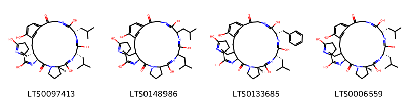{ width=100% }
    <figcaption>Hình ảnh cấu trúc hóa học của 4 hoạt chất thuộc nhóm Carboxylic acids and derivatives gồm ['(2s)-n-[(3r,4s,10s,13s,16s)-3-ethyl-11,14,17,24-tetrahydroxy-13,16-bis(2-methylpropyl)-5,20-dioxo-6,12,15,18-tetraazatricyclo[19.3.1.0⁶,¹⁰]pentacosa-1(25),11,14,17,21,23-hexaen-4-yl]-5-hydroxy-3,4-dihydro-2h-pyrrole-2-carboximidic acid (LTS0097413)', 'n-[3-ethyl-11,14,17,24-tetrahydroxy-13,16-bis(2-methylpropyl)-5,20-dioxo-6,12,15,18-tetraazatricyclo[19.3.1.0⁶,¹⁰]pentacosa-1(25),11,14,17,21,23-hexaen-4-yl]-5-hydroxy-3,4-dihydro-2h-pyrrole-2-carboximidic acid (LTS0148986)', '(2s)-n-[(10s,13s,16s)-16-benzyl-3-ethyl-11,14,17,24-tetrahydroxy-13-(2-methylpropyl)-5,20-dioxo-6,12,15,18-tetraazatricyclo[19.3.1.0⁶,¹⁰]pentacosa-1(25),11,14,17,21,23-hexaen-4-yl]-5-hydroxy-3,4-dihydro-2h-pyrrole-2-carboximidic acid (LTS0133685)', '(2s)-n-[(4s,10s,13s,16s)-3-ethyl-11,14,17,24-tetrahydroxy-13,16-bis(2-methylpropyl)-5,20-dioxo-6,12,15,18-tetraazatricyclo[19.3.1.0⁶,¹⁰]pentacosa-1(25),11,14,17,21,23-hexaen-4-yl]-5-hydroxy-3,4-dihydro-2h-pyrrole-2-carboximidic acid (LTS0006559)'].</figcaption>
</figure>
#### Nhóm Cinnamic acids and derivatives
<figure markdown="span">
    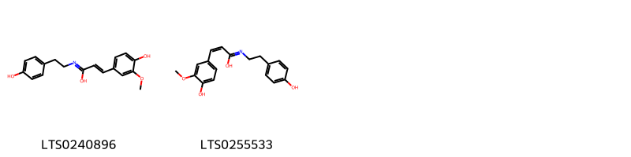{ width=100% }
    <figcaption>Hình ảnh cấu trúc hóa học của 2 hoạt chất thuộc nhóm Cinnamic acids and derivatives gồm ['3-(4-hydroxy-3-methoxyphenyl)-n-[2-(4-hydroxyphenyl)ethyl]prop-2-enimidic acid (LTS0240896)', '(2z)-3-(4-hydroxy-3-methoxyphenyl)-n-[2-(4-hydroxyphenyl)ethyl]prop-2-enimidic acid (LTS0255533)'].</figcaption>
</figure>
#### Nhóm Coumarinolignans
<figure markdown="span">
    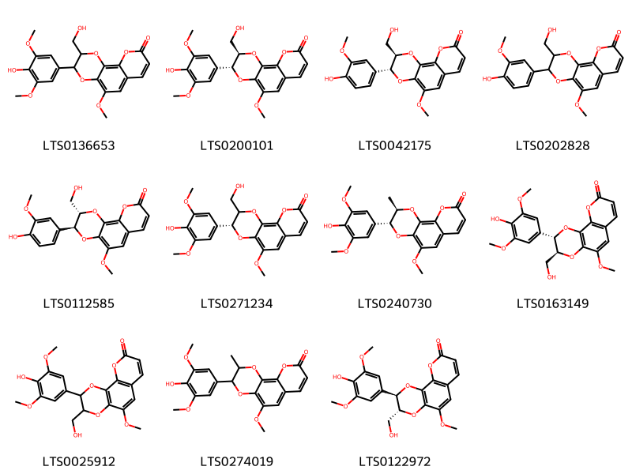{ width=100% }
    <figcaption>Hình ảnh cấu trúc hóa học của 11 hoạt chất thuộc nhóm Coumarinolignans gồm ['3-(4-hydroxy-3,5-dimethoxyphenyl)-2-(hydroxymethyl)-5-methoxy-2h,3h-[1,4]dioxino[2,3-h]chromen-9-one (LTS0136653)', '(2r,3r)-3-(4-hydroxy-3,5-dimethoxyphenyl)-2-(hydroxymethyl)-5-methoxy-2h,3h-[1,4]dioxino[2,3-h]chromen-9-one (LTS0200101)', 'cleomiscosin a (LTS0042175)', '3-(4-hydroxy-3-methoxyphenyl)-2-(hydroxymethyl)-5-methoxy-2h,3h-[1,4]dioxino[2,3-h]chromen-9-one (LTS0202828)', '(2s,3s)-3-(4-hydroxy-3-methoxyphenyl)-2-(hydroxymethyl)-5-methoxy-2h,3h-[1,4]dioxino[2,3-h]chromen-9-one (LTS0112585)', '(3r)-3-(4-hydroxy-3,5-dimethoxyphenyl)-2-(hydroxymethyl)-5-methoxy-2h,3h-[1,4]dioxino[2,3-h]chromen-9-one (LTS0271234)', '(2r,3r)-3-(4-hydroxy-3,5-dimethoxyphenyl)-5-methoxy-2-methyl-2h,3h-[1,4]dioxino[2,3-h]chromen-9-one (LTS0240730)', 'cleomiscosin d (LTS0163149)', '2-(4-hydroxy-3,5-dimethoxyphenyl)-3-(hydroxymethyl)-5-methoxy-2h,3h-[1,4]dioxino[2,3-h]chromen-9-one (LTS0025912)', '3-(4-hydroxy-3,5-dimethoxyphenyl)-5-methoxy-2-methyl-2h,3h-[1,4]dioxino[2,3-h]chromen-9-one (LTS0274019)', '(2r,3r)-2-(4-hydroxy-3,5-dimethoxyphenyl)-3-(hydroxymethyl)-5-methoxy-2h,3h-[1,4]dioxino[2,3-h]chromen-9-one (LTS0122972)'].</figcaption>
</figure>
#### Nhóm Coumarins and derivatives
<figure markdown="span">
    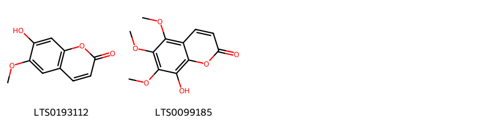{ width=100% }
    <figcaption>Hình ảnh cấu trúc hóa học của 2 hoạt chất thuộc nhóm Coumarins and derivatives gồm ['scopoletin (LTS0193112)', '8-hydroxy-5,6,7-trimethoxychromen-2-one (LTS0099185)'].</figcaption>
</figure>
#### Nhóm Fatty Acyls
<figure markdown="span">
    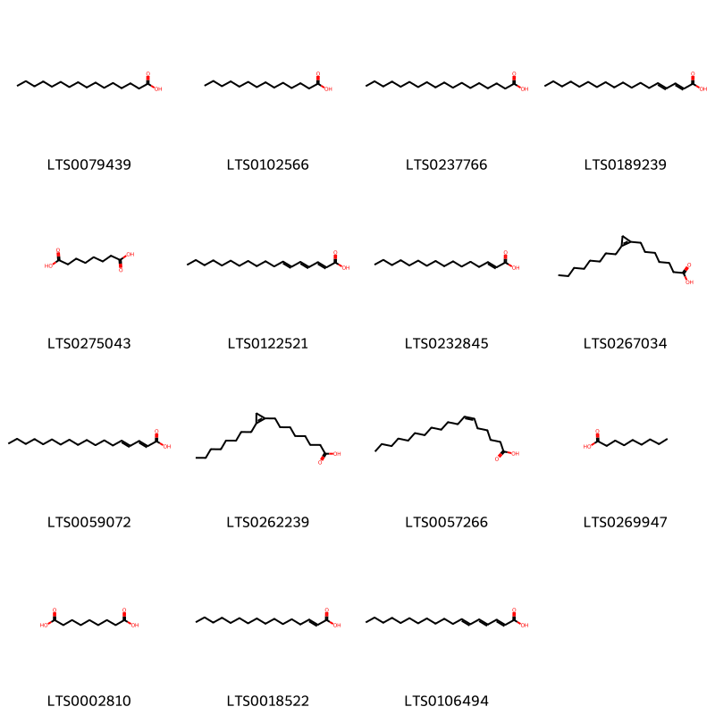{ width=100% }
    <figcaption>Hình ảnh cấu trúc hóa học của 15 hoạt chất thuộc nhóm Fatty Acyls gồm ['palmitic acid (LTS0079439)', 'myristic acid (LTS0102566)', 'stearic acid (LTS0237766)', 'isomerized safflower acid (LTS0189239)', 'suberic acid (LTS0275043)', '(2e,4e,6e)-octadeca-2,4,6-trienoic acid (LTS0122521)', 'hexadecenoic acid (LTS0232845)', 'malvalic acid (LTS0267034)', 'octadeca-2,4-dienoic acid (LTS0059072)', 'sterculic acid (LTS0262239)', 'petroselinic acid (LTS0057266)', 'nonanoic acid (LTS0269947)', 'azelaic acid (LTS0002810)', 't-2-hexadecenoic acid (LTS0018522)', 'octadeca-2,4,6-trienoic acid (LTS0106494)'].</figcaption>
</figure>
#### Nhóm Flavonoids
<figure markdown="span">
    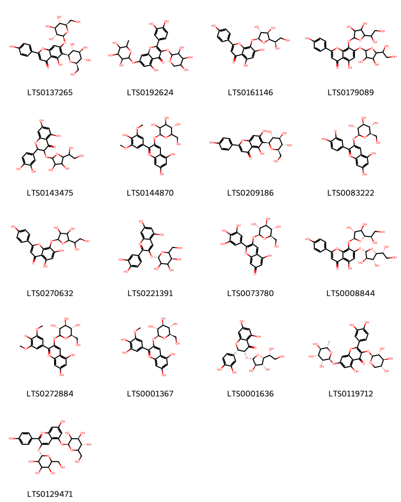{ width=100% }
    <figcaption>Hình ảnh cấu trúc hóa học của 17 hoạt chất thuộc nhóm Flavonoids gồm ['saponarin (LTS0137265)', '2-(3,4-dihydroxyphenyl)-5-hydroxy-7-[(3,4,5-trihydroxy-6-methyloxan-2-yl)oxy]-3-[(3,4,5-trihydroxyoxan-2-yl)oxy]chromen-4-one (LTS0192624)', '8-{[(2s,3r,4r,5r)-5-[(1r)-1,2-dihydroxyethyl]-3,4-dihydroxyoxolan-2-yl]oxy}-5,7-dihydroxy-2-(4-hydroxyphenyl)chromen-4-one (LTS0161146)', '7,8-bis({[5-(1,2-dihydroxyethyl)-3,4-dihydroxyoxolan-2-yl]oxy})-5-hydroxy-2-(4-hydroxyphenyl)chromen-4-one (LTS0179089)', '3-{[5-(1,2-dihydroxyethyl)-3,4-dihydroxyoxolan-2-yl]oxy}-2-(3,4-dihydroxyphenyl)-5,7-dihydroxy-2,3-dihydro-1-benzopyran-4-one (LTS0143475)', 'oenin (LTS0144870)', 'isovitexin (LTS0209186)', '5,7-dihydroxy-2-(4-hydroxy-3-oxidophenyl)-3-{[(2s,3r,4s,5s,6r)-3,4,5-trihydroxy-6-(hydroxymethyl)oxan-2-yl]oxy}-1λ⁴-chromen-1-ylium (LTS0083222)', '8-{[5-(1,2-dihydroxyethyl)-3,4-dihydroxyoxolan-2-yl]oxy}-5,7-dihydroxy-2-(4-hydroxyphenyl)chromen-4-one (LTS0270632)', 'chrysanthemin (LTS0221391)', '5-hydroxy-3-{[(2s,3r,4s,5s,6r)-3,4,5-trihydroxy-6-(hydroxymethyl)oxan-2-yl]oxy}-2-(3,4,5-trihydroxyphenyl)chromen-7-one (LTS0073780)', '7-{[(2s,3r,4r,5r)-5-[(1r)-1,2-dihydroxyethyl]-3,4-dihydroxyoxolan-2-yl]oxy}-8-{[(2s,3r,4r,5s)-5-[(1r)-1,2-dihydroxyethyl]-3,4-dihydroxyoxolan-2-yl]oxy}-5-hydroxy-2-(4-hydroxyphenyl)chromen-4-one (LTS0008844)', '2-(3,5-dimethoxy-4-oxidophenyl)-5,7-dihydroxy-3-{[(3r,4s,5s,6r)-3,4,5-trihydroxy-6-(hydroxymethyl)oxan-2-yl]oxy}-1λ⁴-chromen-1-ylium (LTS0272884)', 'petunidin 3-glucoside (LTS0001367)', '(2s,3r)-3-{[(2s,3r,4r,5r)-5-[(1r)-1,2-dihydroxyethyl]-3,4-dihydroxyoxolan-2-yl]oxy}-2-(3,4-dihydroxyphenyl)-5,7-dihydroxy-2,3-dihydro-1-benzopyran-4-one (LTS0001636)', '2-(3,4-dihydroxyphenyl)-5-hydroxy-7-{[(2s,3r,4r,5r,6s)-3,4,5-trihydroxy-6-methyloxan-2-yl]oxy}-3-{[(2s,3r,4s,5r)-3,4,5-trihydroxyoxan-2-yl]oxy}chromen-4-one (LTS0119712)', 'pelargonin (LTS0129471)'].</figcaption>
</figure>
#### Nhóm Furanoid lignans
<figure markdown="span">
    { width=100% }
    <figcaption>Hình ảnh cấu trúc hóa học của 2 hoạt chất thuộc nhóm Furanoid lignans gồm ['syringaresinol (LTS0116280)', '(+)-syringaresinol (LTS0158868)'].</figcaption>
</figure>
#### Nhóm Indolonaphthyridine alkaloids
<figure markdown="span">
    { width=100% }
    <figcaption>Hình ảnh cấu trúc hóa học của 1 hoạt chất thuộc nhóm Indolonaphthyridine alkaloids gồm ['canthin-6-one (LTS0216343)'].</figcaption>
</figure>
#### Nhóm Isoflavonoids
<figure markdown="span">
    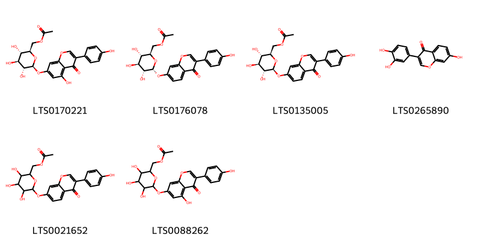{ width=100% }
    <figcaption>Hình ảnh cấu trúc hóa học của 6 hoạt chất thuộc nhóm Isoflavonoids gồm ["6''-o-acetylgenistin (LTS0170221)", '[(2r,3s,4s,5r,6r)-3,4,5-trihydroxy-6-{[3-(4-hydroxyphenyl)-4-oxochromen-7-yl]oxy}oxan-2-yl]methyl acetate (LTS0176078)', "6''-o-acetyldaidzin (LTS0135005)", "3',4',7-trihydroxyisoflavone (LTS0265890)", '(3,4,5-trihydroxy-6-{[3-(4-hydroxyphenyl)-4-oxochromen-7-yl]oxy}oxan-2-yl)methyl acetate (LTS0021652)', '(3,4,5-trihydroxy-6-{[5-hydroxy-3-(4-hydroxyphenyl)-4-oxochromen-7-yl]oxy}oxan-2-yl)methyl acetate (LTS0088262)'].</figcaption>
</figure>
#### Nhóm Lignan glycosides
<figure markdown="span">
    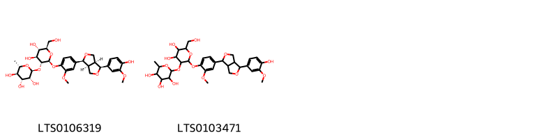{ width=100% }
    <figcaption>Hình ảnh cấu trúc hóa học của 2 hoạt chất thuộc nhóm Lignan glycosides gồm ['(2s,3r,4r,5r,6s)-2-{[(2s,3r,4s,5s,6r)-2-{4-[(1s,3as,4s,6as)-4-(4-hydroxy-3-methoxyphenyl)-hexahydrofuro[3,4-c]furan-1-yl]-2-methoxyphenoxy}-4,5-dihydroxy-6-(hydroxymethyl)oxan-3-yl]oxy}-6-methyloxane-3,4,5-triol (LTS0106319)', '2-[(4,5-dihydroxy-2-{4-[4-(4-hydroxy-3-methoxyphenyl)-hexahydrofuro[3,4-c]furan-1-yl]-2-methoxyphenoxy}-6-(hydroxymethyl)oxan-3-yl)oxy]-6-methyloxane-3,4,5-triol (LTS0103471)'].</figcaption>
</figure>
#### Nhóm Naphthalenes
<figure markdown="span">
    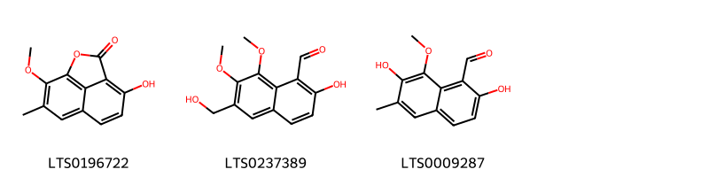{ width=100% }
    <figcaption>Hình ảnh cấu trúc hóa học của 3 hoạt chất thuộc nhóm Naphthalenes gồm ['5-hydroxy-11-methoxy-10-methyl-2-oxatricyclo[6.3.1.0⁴,¹²]dodeca-1(11),4(12),5,7,9-pentaen-3-one (LTS0196722)', '2-hydroxy-6-(hydroxymethyl)-7,8-dimethoxynaphthalene-1-carbaldehyde (LTS0237389)', '2,7-dihydroxy-8-methoxy-6-methylnaphthalene-1-carbaldehyde (LTS0009287)'].</figcaption>
</figure>
#### Nhóm Phenols
<figure markdown="span">
    { width=100% }
    <figcaption>Hình ảnh cấu trúc hóa học của 1 hoạt chất thuộc nhóm Phenols gồm ['(2e)-3-(4-hydroxy-3-methoxyphenyl)-n-[2-(4-hydroxyphenyl)ethyl]prop-2-enimidic acid (LTS0187051)'].</figcaption>
</figure>
#### Nhóm Prenol lipids
<figure markdown="span">
    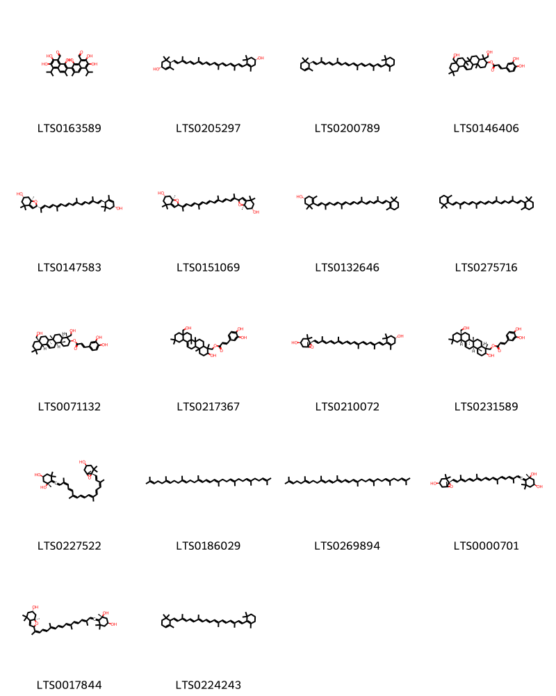{ width=100% }
    <figcaption>Hình ảnh cấu trúc hóa học của 18 hoạt chất thuộc nhóm Prenol lipids gồm ['(-)-gossypol (LTS0163589)', 'carotenoid (LTS0205297)', '(+)-α-carotene (LTS0200789)', '4,8a-bis(hydroxymethyl)-4,6a,6b,11,11,14b-hexamethyl-1,2,3,4a,5,6,7,8,9,10,12,12a,14,14a-tetradecahydropicen-3-yl 3-(3,4-dihydroxyphenyl)prop-2-enoate (LTS0146406)', 'chrysanthemaxanthin (LTS0147583)', '(6s,7ar)-2-[(2e,4e,6e,8e,10e,12e,14e)-15-[(6s,7ar)-6-hydroxy-4,4,7a-trimethyl-2,5,6,7-tetrahydro-1-benzofuran-2-yl]-6,11-dimethylhexadeca-2,4,6,8,10,12,14-heptaen-2-yl]-4,4,7a-trimethyl-2,5,6,7-tetrahydro-1-benzofuran-6-ol (LTS0151069)', 'cryptoxanthin (LTS0132646)', 'β-carotene (LTS0275716)', '(3s,4r,4ar,6ar,6bs,8as,12as,14ar,14br)-4,8a-bis(hydroxymethyl)-4,6a,6b,11,11,14b-hexamethyl-1,2,3,4a,5,6,7,8,9,10,12,12a,14,14a-tetradecahydropicen-3-yl (2e)-3-(3,4-dihydroxyphenyl)prop-2-enoate (LTS0071132)', '[3-hydroxy-8a-(hydroxymethyl)-4,6a,6b,11,11,14b-hexamethyl-1,2,3,4a,5,6,7,8,9,10,12,12a,14,14a-tetradecahydropicen-4-yl]methyl 3-(3,4-dihydroxyphenyl)prop-2-enoate (LTS0217367)', 'antheraxanthin (LTS0210072)', '[(3s,4r,4ar,6ar,6bs,8as,12as,14ar,14br)-3-hydroxy-8a-(hydroxymethyl)-4,6a,6b,11,11,14b-hexamethyl-1,2,3,4a,5,6,7,8,9,10,12,12a,14,14a-tetradecahydropicen-4-yl]methyl (2e)-3-(3,4-dihydroxyphenyl)prop-2-enoate (LTS0231589)', 'neoxanthin (LTS0227522)', 'phytoene (LTS0186029)', 'all-trans-phytofluene (LTS0269894)', 'neoxanthin (LTS0000701)', '(1r,3s)-6-[(3e,5e,7e,9e,11e,13e,15z)-16-[(6s,7ar)-6-hydroxy-4,4,7a-trimethyl-2,5,6,7-tetrahydro-1-benzofuran-2-yl]-3,7,12-trimethylheptadeca-1,3,5,7,9,11,13,15-octaen-1-ylidene]-1,5,5-trimethylcyclohexane-1,3-diol (LTS0017844)', 'α-carotene (LTS0224243)'].</figcaption>
</figure>

---

### Dược dân tộc học

Danh sách các quốc gia có sử dụng *Hibiscus syriacus* trong điều trị các bệnh. 

| Country   | Disease                        | Bệnh                                                                                                                                                                                                |
|:----------|:-------------------------------|:----------------------------------------------------------------------------------------------------------------------------------------------------------------------------------------------------|
| China     | Hemostat, Vermifuge, Demulcent | MYMEMORY WARNING: YOU USED ALL AVAILABLE FREE TRANSLATIONS FOR TODAY. NEXT AVAILABLE IN  07 HOURS 09 MINUTES 22 SECONDS VISIT HTTPS://MYMEMORY.TRANSLATED.NET/DOC/USAGELIMITS.PHP TO TRANSLATE MORE |
| Elsewhere | Antidiarrheic                  | MYMEMORY WARNING: YOU USED ALL AVAILABLE FREE TRANSLATIONS FOR TODAY. NEXT AVAILABLE IN  07 HOURS 09 MINUTES 20 SECONDS VISIT HTTPS://MYMEMORY.TRANSLATED.NET/DOC/USAGELIMITS.PHP TO TRANSLATE MORE |
| India     | Diuretic, Stomachic            | MYMEMORY WARNING: YOU USED ALL AVAILABLE FREE TRANSLATIONS FOR TODAY. NEXT AVAILABLE IN  07 HOURS 09 MINUTES 18 SECONDS VISIT HTTPS://MYMEMORY.TRANSLATED.NET/DOC/USAGELIMITS.PHP TO TRANSLATE MORE |
| Malaya    | Diuretic                       | MYMEMORY WARNING: YOU USED ALL AVAILABLE FREE TRANSLATIONS FOR TODAY. NEXT AVAILABLE IN  07 HOURS 09 MINUTES 16 SECONDS VISIT HTTPS://MYMEMORY.TRANSLATED.NET/DOC/USAGELIMITS.PHP TO TRANSLATE MORE |

---

---
## Hibiscus tilaceus
### Thông tin về thực vật

!!! info "Phân loại thực vật của *Talipariti tiliaceum* từ GIBF:"
    - **Kingdom:** Plantae
    - **Phylum:** Tracheophyta
    - **Order:** Malvales
    - **Family:** Malvaceae
    - **Genus:** Talipariti
    - **Species:** *Talipariti tiliaceum*

 

| Label (VI)   | Label (EN)   | Scientific Name   | Descriptions (VI)   | Descriptions (EN)   | Also Known As (VI)   | Also Known As (EN)   |
|:-------------|:-------------|:------------------|:--------------------|:--------------------|:---------------------|:---------------------|
| N/A          | N/A          | Hibiscus syriacus | loài thực vật       | species of plant    | ['']                 | ['']                 |

#### Phân bố trên thế giới

**Từ CSDL GIBF** Brazil, United Arab Emirates, Viet Nam, Japan, Bahrain, New Caledonia, China, Antigua and Barbuda, Chile, Qatar, Honduras, French Polynesia, Anguilla, Thailand, Cayman Islands, Sri Lanka, United States of America, Virgin Islands (U.S.), Indonesia, Costa Rica, Nigeria, Colombia, Fiji, Hong Kong, Dominica, Mexico, Macao, Niue, Maldives, Guam, American Samoa, Chinese Taipei, Philippines, Panama, Singapore, Cook Islands, Bahamas, South Africa, Australia, Liberia, India, Northern Mariana Islands, Peru

#### Phân bố tại Việt Nam

**Từ CSDL GIBF**: Hồ Chí Minh city, Kiên Giang

---
### Thành phần hóa học
        
- Theo cơ sở dữ liệu lotus: Từ loài *Talipariti tiliaceum* đã phân lập và xác định được Chưa có hoạt chất nào được phân lập. hoạt chất thuộc về các nhóm Không có hoạt chất nào được phân lập. 

Không có hình ảnh nào được tạo ra

---

### Dược dân tộc học

Danh sách các quốc gia có sử dụng *Talipariti tiliaceum* trong điều trị các bệnh. 

| Country   | Disease     | Bệnh                                                                                                                                                                                                |
|:----------|:------------|:----------------------------------------------------------------------------------------------------------------------------------------------------------------------------------------------------|
| Tahiti    | Emmenagogue | MYMEMORY WARNING: YOU USED ALL AVAILABLE FREE TRANSLATIONS FOR TODAY. NEXT AVAILABLE IN  07 HOURS 08 MINUTES 48 SECONDS VISIT HTTPS://MYMEMORY.TRANSLATED.NET/DOC/USAGELIMITS.PHP TO TRANSLATE MORE |

---

---
## Hibiscus tiliaceus
### Thông tin về thực vật

!!! info "Phân loại thực vật của *Talipariti tiliaceum* từ GIBF:"
    - **Kingdom:** Plantae
    - **Phylum:** Tracheophyta
    - **Order:** Malvales
    - **Family:** Malvaceae
    - **Genus:** Talipariti
    - **Species:** *Talipariti tiliaceum*

 

| Label (VI)   | Label (EN)   | Scientific Name    | Descriptions (VI)   | Descriptions (EN)         | Also Known As (VI)   | Also Known As (EN)                                                                                                                                                                                                                            |
|:-------------|:-------------|:-------------------|:--------------------|:--------------------------|:---------------------|:----------------------------------------------------------------------------------------------------------------------------------------------------------------------------------------------------------------------------------------------|
| N/A          | N/A          | Hibiscus tiliaceus |                     | species of flowering tree | ['']                 | ['kurrajong', 'beach hibiscus', 'coast cottonwood', 'coast hibiscus', 'coastal cottonwood', 'coastal hibiscus', 'cottonwood hibiscus', 'green cottonwood', 'native hibiscus', 'native rosella', 'sea hibiscus', 'sea rosemallow', 'vau tree'] |

#### Phân bố trên thế giới

**Từ CSDL GIBF** Brazil, United Arab Emirates, Viet Nam, Japan, Bahrain, New Caledonia, China, Antigua and Barbuda, Chile, Qatar, Honduras, French Polynesia, Anguilla, Thailand, Cayman Islands, Sri Lanka, United States of America, Virgin Islands (U.S.), Indonesia, Costa Rica, Nigeria, Colombia, Fiji, Hong Kong, Dominica, Mexico, Macao, Niue, Maldives, Guam, American Samoa, Chinese Taipei, Philippines, Panama, Singapore, Cook Islands, Bahamas, South Africa, Australia, Liberia, India, Northern Mariana Islands, Peru

#### Phân bố tại Việt Nam

**Từ CSDL GIBF**: Hồ Chí Minh city, Kiên Giang

---
### Thành phần hóa học
        
- Theo cơ sở dữ liệu lotus: Từ loài *Talipariti tiliaceum* đã phân lập và xác định được 75 hoạt chất thuộc về các nhóm Benzofurans, Benzene and substituted derivatives, Coumarins and derivatives, Cinnamic acids and derivatives, Naphthalenes, Phenols, Steroids and steroid derivatives, Organooxygen compounds, Prenol lipids, Benzopyrans. 

|    | chemicalTaxonomyClassyfireClass     |   smiles_count |
|---:|:------------------------------------|---------------:|
|  0 | Benzene and substituted derivatives |              3 |
|  1 | Benzofurans                         |             15 |
|  2 | Benzopyrans                         |              6 |
|  3 | Cinnamic acids and derivatives      |              4 |
|  4 | Coumarins and derivatives           |              3 |
|  5 | Naphthalenes                        |              6 |
|  6 | Organooxygen compounds              |              1 |
|  7 | Phenols                             |              1 |
|  8 | Prenol lipids                       |             22 |
|  9 | Steroids and steroid derivatives    |             14 |

#### Nhóm Benzene and substituted derivatives
<figure markdown="span">
    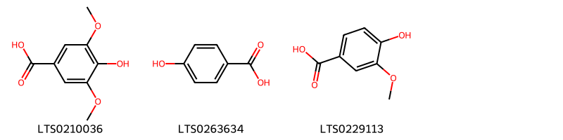{ width=100% }
    <figcaption>Hình ảnh cấu trúc hóa học của 3 hoạt chất thuộc nhóm Benzene and substituted derivatives gồm ['syringic acid (LTS0210036)', 'p-hydroxybenzoic acid (LTS0263634)', 'vanillic acid (LTS0229113)'].</figcaption>
</figure>
#### Nhóm Benzofurans
<figure markdown="span">
    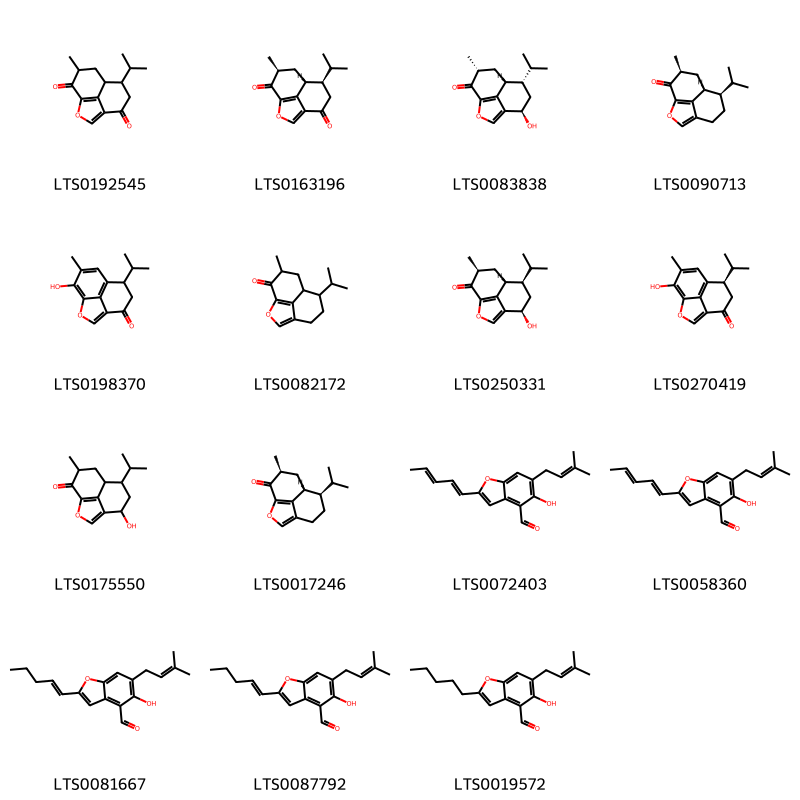{ width=100% }
    <figcaption>Hình ảnh cấu trúc hóa học của 15 hoạt chất thuộc nhóm Benzofurans gồm ['7-isopropyl-10-methyl-2-oxatricyclo[6.3.1.0⁴,¹²]dodeca-1(12),3-diene-5,11-dione (LTS0192545)', '(7r,8r,10s)-7-isopropyl-10-methyl-2-oxatricyclo[6.3.1.0⁴,¹²]dodeca-1(12),3-diene-5,11-dione (LTS0163196)', '(5r,7s,8r,10r)-5-hydroxy-7-isopropyl-10-methyl-2-oxatricyclo[6.3.1.0⁴,¹²]dodeca-1(12),3-dien-11-one (LTS0083838)', '(7r,8s,10s)-7-isopropyl-10-methyl-2-oxatricyclo[6.3.1.0⁴,¹²]dodeca-1(12),3-dien-11-one (LTS0090713)', '11-hydroxy-7-isopropyl-10-methyl-2-oxatricyclo[6.3.1.0⁴,¹²]dodeca-1(11),3,8(12),9-tetraen-5-one (LTS0198370)', '7-isopropyl-10-methyl-2-oxatricyclo[6.3.1.0⁴,¹²]dodeca-1(12),3-dien-11-one (LTS0082172)', '(5r,7r,8r,10s)-5-hydroxy-7-isopropyl-10-methyl-2-oxatricyclo[6.3.1.0⁴,¹²]dodeca-1(12),3-dien-11-one (LTS0250331)', '(7r)-11-hydroxy-7-isopropyl-10-methyl-2-oxatricyclo[6.3.1.0⁴,¹²]dodeca-1(11),3,8(12),9-tetraen-5-one (LTS0270419)', '5-hydroxy-7-isopropyl-10-methyl-2-oxatricyclo[6.3.1.0⁴,¹²]dodeca-1(12),3-dien-11-one (LTS0175550)', '(7r,8r,10s)-7-isopropyl-10-methyl-2-oxatricyclo[6.3.1.0⁴,¹²]dodeca-1(12),3-dien-11-one (LTS0017246)', '5-hydroxy-6-(3-methylbut-2-en-1-yl)-2-(penta-1,3-dien-1-yl)-1-benzofuran-4-carbaldehyde (LTS0072403)', '5-hydroxy-6-(3-methylbut-2-en-1-yl)-2-[(1e,3e)-penta-1,3-dien-1-yl]-1-benzofuran-4-carbaldehyde (LTS0058360)', '5-hydroxy-6-(3-methylbut-2-en-1-yl)-2-(pent-1-en-1-yl)-1-benzofuran-4-carbaldehyde (LTS0081667)', '5-hydroxy-6-(3-methylbut-2-en-1-yl)-2-[(1e)-pent-1-en-1-yl]-1-benzofuran-4-carbaldehyde (LTS0087792)', '5-hydroxy-6-(3-methylbut-2-en-1-yl)-2-pentyl-1-benzofuran-4-carbaldehyde (LTS0019572)'].</figcaption>
</figure>
#### Nhóm Benzopyrans
<figure markdown="span">
    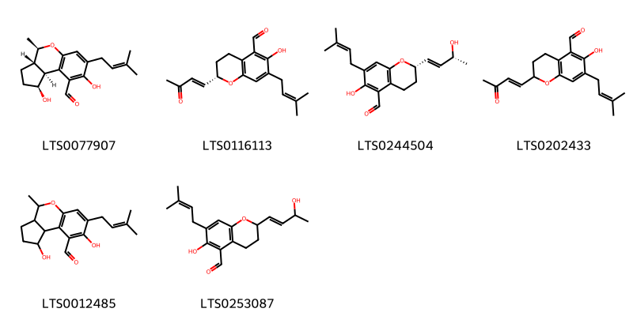{ width=100% }
    <figcaption>Hình ảnh cấu trúc hóa học của 6 hoạt chất thuộc nhóm Benzopyrans gồm ['(2s,3s,6s,7r)-3,12-dihydroxy-7-methyl-11-(3-methylbut-2-en-1-yl)-8-oxatricyclo[7.4.0.0²,⁶]trideca-1(9),10,12-triene-13-carbaldehyde (LTS0077907)', '(2s)-6-hydroxy-7-(3-methylbut-2-en-1-yl)-2-[(1e)-3-oxobut-1-en-1-yl]-3,4-dihydro-2h-1-benzopyran-5-carbaldehyde (LTS0116113)', '(2s)-6-hydroxy-2-[(1e,3r)-3-hydroxybut-1-en-1-yl]-7-(3-methylbut-2-en-1-yl)-3,4-dihydro-2h-1-benzopyran-5-carbaldehyde (LTS0244504)', '6-hydroxy-7-(3-methylbut-2-en-1-yl)-2-(3-oxobut-1-en-1-yl)-3,4-dihydro-2h-1-benzopyran-5-carbaldehyde (LTS0202433)', '3,12-dihydroxy-7-methyl-11-(3-methylbut-2-en-1-yl)-8-oxatricyclo[7.4.0.0²,⁶]trideca-1(9),10,12-triene-13-carbaldehyde (LTS0012485)', '6-hydroxy-2-(3-hydroxybut-1-en-1-yl)-7-(3-methylbut-2-en-1-yl)-3,4-dihydro-2h-1-benzopyran-5-carbaldehyde (LTS0253087)'].</figcaption>
</figure>
#### Nhóm Cinnamic acids and derivatives
<figure markdown="span">
    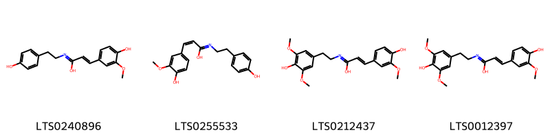{ width=100% }
    <figcaption>Hình ảnh cấu trúc hóa học của 4 hoạt chất thuộc nhóm Cinnamic acids and derivatives gồm ['3-(4-hydroxy-3-methoxyphenyl)-n-[2-(4-hydroxyphenyl)ethyl]prop-2-enimidic acid (LTS0240896)', '(2z)-3-(4-hydroxy-3-methoxyphenyl)-n-[2-(4-hydroxyphenyl)ethyl]prop-2-enimidic acid (LTS0255533)', '(2e)-n-[2-(4-hydroxy-3,5-dimethoxyphenyl)ethyl]-3-(4-hydroxy-3-methoxyphenyl)prop-2-enimidic acid (LTS0212437)', 'n-[2-(4-hydroxy-3,5-dimethoxyphenyl)ethyl]-3-(4-hydroxy-3-methoxyphenyl)prop-2-enimidic acid (LTS0012397)'].</figcaption>
</figure>
#### Nhóm Coumarins and derivatives
<figure markdown="span">
    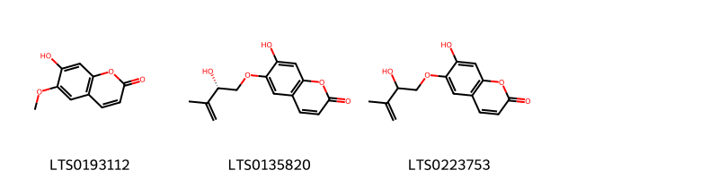{ width=100% }
    <figcaption>Hình ảnh cấu trúc hóa học của 3 hoạt chất thuộc nhóm Coumarins and derivatives gồm ['scopoletin (LTS0193112)', '7-hydroxy-6-{[(2s)-2-hydroxy-3-methylbut-3-en-1-yl]oxy}chromen-2-one (LTS0135820)', '7-hydroxy-6-[(2-hydroxy-3-methylbut-3-en-1-yl)oxy]chromen-2-one (LTS0223753)'].</figcaption>
</figure>
#### Nhóm Naphthalenes
<figure markdown="span">
    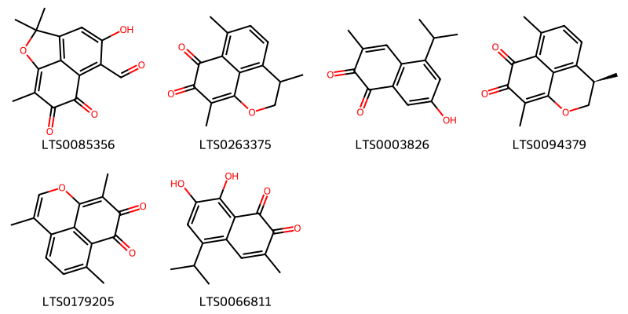{ width=100% }
    <figcaption>Hình ảnh cấu trúc hóa học của 6 hoạt chất thuộc nhóm Naphthalenes gồm ['6-hydroxy-3,3,11-trimethyl-9,10-dioxo-2-oxatricyclo[6.3.1.0⁴,¹²]dodeca-1(11),4,6,8(12)-tetraene-7-carbaldehyde (LTS0085356)', 'mansonone e (LTS0263375)', '7-hydroxy-5-isopropyl-3-methylnaphthalene-1,2-dione (LTS0003826)', '(4r)-4,8,12-trimethyl-2-oxatricyclo[7.3.1.0⁵,¹³]trideca-1(12),5,7,9(13)-tetraene-10,11-dione (LTS0094379)', '4,8,12-trimethyl-2-oxatricyclo[7.3.1.0⁵,¹³]trideca-1(12),3,5(13),6,8-pentaene-10,11-dione (LTS0179205)', '7,8-dihydroxy-5-isopropyl-3-methylnaphthalene-1,2-dione (LTS0066811)'].</figcaption>
</figure>
#### Nhóm Organooxygen compounds
<figure markdown="span">
    { width=100% }
    <figcaption>Hình ảnh cấu trúc hóa học của 1 hoạt chất thuộc nhóm Organooxygen compounds gồm ['p-hydroxybenzaldehyde (LTS0259836)'].</figcaption>
</figure>
#### Nhóm Phenols
<figure markdown="span">
    { width=100% }
    <figcaption>Hình ảnh cấu trúc hóa học của 1 hoạt chất thuộc nhóm Phenols gồm ['(2e)-3-(4-hydroxy-3-methoxyphenyl)-n-[2-(4-hydroxyphenyl)ethyl]prop-2-enimidic acid (LTS0187051)'].</figcaption>
</figure>
#### Nhóm Prenol lipids
<figure markdown="span">
    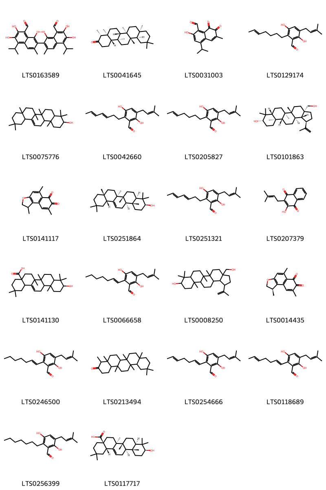{ width=100% }
    <figcaption>Hình ảnh cấu trúc hóa học của 22 hoạt chất thuộc nhóm Prenol lipids gồm ['(-)-gossypol (LTS0163589)', '(-)-friedelin (LTS0041645)', 'hibiscoquinone a (LTS0031003)', '2-(hept-5-en-1-yl)-3,6-dihydroxy-5-(3-methylbut-2-en-1-yl)benzaldehyde (LTS0129174)', 'β-amyrin (LTS0075776)', '2-(hepta-3,5-dien-1-yl)-3,6-dihydroxy-5-(3-methylbut-2-en-1-yl)benzaldehyde (LTS0042660)', 'isotetrahydroauroglaucin (LTS0205827)', 'betulin (LTS0101863)', '1,5,8-trimethyl-1h,2h-naphtho[2,1-b]furan-6,7-dione (LTS0141117)', 'β-amyrin (LTS0251864)', '2-[(3e,5e)-hepta-3,5-dien-1-yl]-3,6-dihydroxy-5-(3-methylbut-2-en-1-yl)benzaldehyde (LTS0251321)', 'tecomin (LTS0207379)', 'oleanolic acid (LTS0141130)', 'tetrahydroauroglaucin (LTS0066658)', '3a-(hydroxymethyl)-5a,5b,8,8,11a-pentamethyl-1-(prop-1-en-2-yl)-hexadecahydrocyclopenta[a]chrysen-9-ol (LTS0008250)', '(1r)-1,5,8-trimethyl-1h,2h-naphtho[2,1-b]furan-6,7-dione (LTS0014435)', '2-(hept-1-en-1-yl)-3,6-dihydroxy-5-(3-methylbut-2-en-1-yl)benzaldehyde (LTS0246500)', 'friedelin (LTS0213494)', '2-[(1e,5e)-hepta-1,5-dien-1-yl]-3,6-dihydroxy-5-(3-methylbut-2-en-1-yl)benzaldehyde (LTS0254666)', '2-(hepta-1,5-dien-1-yl)-3,6-dihydroxy-5-(3-methylbut-2-en-1-yl)benzaldehyde (LTS0118689)', 'flavoglaucin (LTS0256399)', 'oleanolic acid (LTS0117717)'].</figcaption>
</figure>
#### Nhóm Steroids and steroid derivatives
<figure markdown="span">
    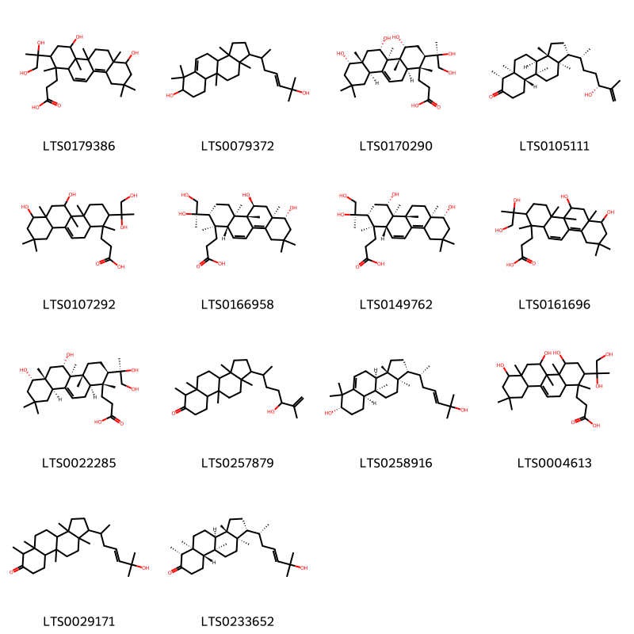{ width=100% }
    <figcaption>Hình ảnh cấu trúc hóa học của 14 hoạt chất thuộc nhóm Steroids and steroid derivatives gồm ['3-[2-(1,2-dihydroxypropan-2-yl)-4,7-dihydroxy-1,4a,4b,6a,9,9-hexamethyl-3,4,5,6,7,8,10,12a-octahydro-2h-chrysen-1-yl]propanoic acid (LTS0179386)', '1-(6-hydroxy-6-methylhept-4-en-2-yl)-3a,6,6,9b,11a-pentamethyl-1h,2h,3h,3bh,4h,7h,8h,9h,9ah,10h,11h-cyclopenta[a]phenanthren-7-ol (LTS0079372)', '3-[(1r,2r,4r,4ar,4br,5s,6ar,7s,10ar,12ar)-2-[(2r)-1,2-dihydroxypropan-2-yl]-4,5,7-trihydroxy-1,4a,4b,6a,9,9-hexamethyl-3,4,5,6,7,8,10,10a,12,12a-decahydro-2h-chrysen-1-yl]propanoic acid (LTS0170290)', '(1r,3as,3br,5as,6r,9as,9bs,11ar)-1-[(2r,5r)-5-hydroxy-6-methylhept-6-en-2-yl]-3a,5a,6,9b,11a-pentamethyl-dodecahydrocyclopenta[a]phenanthren-7-one (LTS0105111)', '3-[2-(1,2-dihydroxypropan-2-yl)-5,7-dihydroxy-1,4a,4b,6a,9,9-hexamethyl-3,4,5,6,7,8,10,10a,12,12a-decahydro-2h-chrysen-1-yl]propanoic acid (LTS0107292)', '3-[(1r,2r,4ar,4bs,5s,6ar,7r,12ar)-2-[(2r)-1,2-dihydroxypropan-2-yl]-5,7-dihydroxy-1,4a,4b,6a,9,9-hexamethyl-3,4,5,6,7,8,10,12a-octahydro-2h-chrysen-1-yl]propanoic acid (LTS0166958)', '3-[(1r,2r,4s,4ar,4br,6ar,7r,12ar)-2-[(2r)-1,2-dihydroxypropan-2-yl]-4,7-dihydroxy-1,4a,4b,6a,9,9-hexamethyl-3,4,5,6,7,8,10,12a-octahydro-2h-chrysen-1-yl]propanoic acid (LTS0149762)', '3-[2-(1,2-dihydroxypropan-2-yl)-5,7-dihydroxy-1,4a,4b,6a,9,9-hexamethyl-3,4,5,6,7,8,10,12a-octahydro-2h-chrysen-1-yl]propanoic acid (LTS0161696)', '3-[(1r,2r,4ar,4bs,5s,6ar,7s,10ar,12ar)-2-[(2r)-1,2-dihydroxypropan-2-yl]-5,7-dihydroxy-1,4a,4b,6a,9,9-hexamethyl-3,4,5,6,7,8,10,10a,12,12a-decahydro-2h-chrysen-1-yl]propanoic acid (LTS0022285)', '1-(5-hydroxy-6-methylhept-6-en-2-yl)-3a,5a,6,9b,11a-pentamethyl-dodecahydrocyclopenta[a]phenanthren-7-one (LTS0257879)', '(1r,3as,3br,7s,9ar,9br,11ar)-1-[(2r,4e)-6-hydroxy-6-methylhept-4-en-2-yl]-3a,6,6,9b,11a-pentamethyl-1h,2h,3h,3bh,4h,7h,8h,9h,9ah,10h,11h-cyclopenta[a]phenanthren-7-ol (LTS0258916)', '3-[2-(1,2-dihydroxypropan-2-yl)-4,5,7-trihydroxy-1,4a,4b,6a,9,9-hexamethyl-3,4,5,6,7,8,10,10a,12,12a-decahydro-2h-chrysen-1-yl]propanoic acid (LTS0004613)', '1-(6-hydroxy-6-methylhept-4-en-2-yl)-3a,5a,6,9b,11a-pentamethyl-dodecahydrocyclopenta[a]phenanthren-7-one (LTS0029171)', '(1r,3as,3br,5as,6r,9as,9bs,11ar)-1-[(2r,4e)-6-hydroxy-6-methylhept-4-en-2-yl]-3a,5a,6,9b,11a-pentamethyl-dodecahydrocyclopenta[a]phenanthren-7-one (LTS0233652)'].</figcaption>
</figure>

---

### Dược dân tộc học

Danh sách các quốc gia có sử dụng *Talipariti tiliaceum* trong điều trị các bệnh. 

| Country            | Disease                                                                          | Bệnh                                                                                                                                                                                                |
|:-------------------|:---------------------------------------------------------------------------------|:----------------------------------------------------------------------------------------------------------------------------------------------------------------------------------------------------|
| Brazil             | Emetic                                                                           | MYMEMORY WARNING: YOU USED ALL AVAILABLE FREE TRANSLATIONS FOR TODAY. NEXT AVAILABLE IN  07 HOURS 08 MINUTES 27 SECONDS VISIT HTTPS://MYMEMORY.TRANSLATED.NET/DOC/USAGELIMITS.PHP TO TRANSLATE MORE |
| Dominican Republic | Emollient, Laxative                                                              | MYMEMORY WARNING: YOU USED ALL AVAILABLE FREE TRANSLATIONS FOR TODAY. NEXT AVAILABLE IN  07 HOURS 08 MINUTES 24 SECONDS VISIT HTTPS://MYMEMORY.TRANSLATED.NET/DOC/USAGELIMITS.PHP TO TRANSLATE MORE |
| Haiti              | Apertif, Cicatrizant, Sudorific                                                  | MYMEMORY WARNING: YOU USED ALL AVAILABLE FREE TRANSLATIONS FOR TODAY. NEXT AVAILABLE IN  07 HOURS 08 MINUTES 21 SECONDS VISIT HTTPS://MYMEMORY.TRANSLATED.NET/DOC/USAGELIMITS.PHP TO TRANSLATE MORE |
| Hawaii             | Laxative                                                                         | MYMEMORY WARNING: YOU USED ALL AVAILABLE FREE TRANSLATIONS FOR TODAY. NEXT AVAILABLE IN  07 HOURS 08 MINUTES 19 SECONDS VISIT HTTPS://MYMEMORY.TRANSLATED.NET/DOC/USAGELIMITS.PHP TO TRANSLATE MORE |
| India              | Apertif, Diuretic, Emollient, Laxative, Sudorific                                | MYMEMORY WARNING: YOU USED ALL AVAILABLE FREE TRANSLATIONS FOR TODAY. NEXT AVAILABLE IN  07 HOURS 08 MINUTES 16 SECONDS VISIT HTTPS://MYMEMORY.TRANSLATED.NET/DOC/USAGELIMITS.PHP TO TRANSLATE MORE |
| Mexico             | Apertif, Apertif, Emollient, Laxative, Sudorific, Sudorific, Emollient, Laxative | MYMEMORY WARNING: YOU USED ALL AVAILABLE FREE TRANSLATIONS FOR TODAY. NEXT AVAILABLE IN  07 HOURS 08 MINUTES 14 SECONDS VISIT HTTPS://MYMEMORY.TRANSLATED.NET/DOC/USAGELIMITS.PHP TO TRANSLATE MORE |
| Samoa              | Collyrium, Hemostat                                                              | MYMEMORY WARNING: YOU USED ALL AVAILABLE FREE TRANSLATIONS FOR TODAY. NEXT AVAILABLE IN  07 HOURS 08 MINUTES 11 SECONDS VISIT HTTPS://MYMEMORY.TRANSLATED.NET/DOC/USAGELIMITS.PHP TO TRANSLATE MORE |

---

---
## Hibiscus trionum
### Thông tin về thực vật

!!! info "Phân loại thực vật của *Hibiscus trionum* từ GIBF:"
    - **Kingdom:** Plantae
    - **Phylum:** Tracheophyta
    - **Order:** Malvales
    - **Family:** Malvaceae
    - **Genus:** Hibiscus
    - **Species:** *Hibiscus trionum*

 

| Label (VI)   | Label (EN)   | Scientific Name   | Descriptions (VI)   | Descriptions (EN)   | Also Known As (VI)   | Also Known As (EN)                                                                                                                                   |
|:-------------|:-------------|:------------------|:--------------------|:--------------------|:---------------------|:-----------------------------------------------------------------------------------------------------------------------------------------------------|
| N/A          | N/A          | Hibiscus trionum  |                     | species of plant    | ['']                 | ['bladder hibiscus', 'bladder ketmia', 'bladder weed', 'flower-of-an-hour', 'flower-of-the-hour', 'modesty', 'puarangi', 'shoofly', 'Venice mallow'] |

#### Phân bố trên thế giới

**Từ CSDL GIBF** nan, Botswana, Uzbekistan, Israel, New Zealand, United States of America, Romania, Russian Federation, Croatia, Malawi, Kenya, Belgium, Canada, Hungary, Ukraine, South Africa, Slovakia, Kyrgyzstan, Italy, Serbia

#### Phân bố tại Việt Nam

**Từ CSDL GIBF**: Không có ghi nhận ở Việt Nam

---
### Thành phần hóa học
        
- Theo cơ sở dữ liệu lotus: Từ loài *Hibiscus trionum* đã phân lập và xác định được 3 hoạt chất thuộc về các nhóm Fatty Acyls, Prenol lipids. 

|    | chemicalTaxonomyClassyfireClass   |   smiles_count |
|---:|:----------------------------------|---------------:|
|  0 | Fatty Acyls                       |              1 |
|  1 | Prenol lipids                     |              2 |

#### Nhóm Fatty Acyls
<figure markdown="span">
    { width=100% }
    <figcaption>Hình ảnh cấu trúc hóa học của 1 hoạt chất thuộc nhóm Fatty Acyls gồm ['7-(2-octylcyclopropyl)heptanoic acid (LTS0188439)'].</figcaption>
</figure>
#### Nhóm Prenol lipids
<figure markdown="span">
    { width=100% }
    <figcaption>Hình ảnh cấu trúc hóa học của 2 hoạt chất thuộc nhóm Prenol lipids gồm ['(-)-gossypol (LTS0163589)', 'hemigossypol (LTS0013094)'].</figcaption>
</figure>

---

### Dược dân tộc học

Danh sách các quốc gia có sử dụng *Hibiscus trionum* trong điều trị các bệnh. 

| Country      | Disease          | Bệnh                                                                                                                                                                                                |
|:-------------|:-----------------|:----------------------------------------------------------------------------------------------------------------------------------------------------------------------------------------------------|
| China        | Stomachic        | MYMEMORY WARNING: YOU USED ALL AVAILABLE FREE TRANSLATIONS FOR TODAY. NEXT AVAILABLE IN  07 HOURS 07 MINUTES 43 SECONDS VISIT HTTPS://MYMEMORY.TRANSLATED.NET/DOC/USAGELIMITS.PHP TO TRANSLATE MORE |
| Elsewhere    | Diuretic, Poison | MYMEMORY WARNING: YOU USED ALL AVAILABLE FREE TRANSLATIONS FOR TODAY. NEXT AVAILABLE IN  07 HOURS 07 MINUTES 39 SECONDS VISIT HTTPS://MYMEMORY.TRANSLATED.NET/DOC/USAGELIMITS.PHP TO TRANSLATE MORE |
| Malaysia     | Stomachic        | MYMEMORY WARNING: YOU USED ALL AVAILABLE FREE TRANSLATIONS FOR TODAY. NEXT AVAILABLE IN  07 HOURS 07 MINUTES 36 SECONDS VISIT HTTPS://MYMEMORY.TRANSLATED.NET/DOC/USAGELIMITS.PHP TO TRANSLATE MORE |
| South Africa | Vermifuge        | MYMEMORY WARNING: YOU USED ALL AVAILABLE FREE TRANSLATIONS FOR TODAY. NEXT AVAILABLE IN  07 HOURS 07 MINUTES 33 SECONDS VISIT HTTPS://MYMEMORY.TRANSLATED.NET/DOC/USAGELIMITS.PHP TO TRANSLATE MORE |

---

---
## Hibiscus youngianus
### Thông tin về thực vật

!!! info "Phân loại thực vật của *Hibiscus furcellatus* từ GIBF:"
    - **Kingdom:** Plantae
    - **Phylum:** Tracheophyta
    - **Order:** Malvales
    - **Family:** Malvaceae
    - **Genus:** Hibiscus
    - **Species:** *Hibiscus furcellatus*

 

| Label (VI)   | Label (EN)   | Scientific Name   | Descriptions (VI)   | Descriptions (EN)   | Also Known As (VI)   | Also Known As (EN)                                                                                                                                   |
|:-------------|:-------------|:------------------|:--------------------|:--------------------|:---------------------|:-----------------------------------------------------------------------------------------------------------------------------------------------------|
| N/A          | N/A          | Hibiscus trionum  |                     | species of plant    | ['']                 | ['bladder hibiscus', 'bladder ketmia', 'bladder weed', 'flower-of-an-hour', 'flower-of-the-hour', 'modesty', 'puarangi', 'shoofly', 'Venice mallow'] |

#### Phân bố trên thế giới

**Từ CSDL GIBF** nan, United States of America

#### Phân bố tại Việt Nam

**Từ CSDL GIBF**: Không có ghi nhận ở Việt Nam

---
### Thành phần hóa học
        
- Theo cơ sở dữ liệu lotus: Từ loài *Hibiscus furcellatus* đã phân lập và xác định được Chưa có hoạt chất nào được phân lập. hoạt chất thuộc về các nhóm Không có hoạt chất nào được phân lập. 

Không có hình ảnh nào được tạo ra

---

### Dược dân tộc học

Danh sách các quốc gia có sử dụng *Hibiscus furcellatus* trong điều trị các bệnh. 

| Country   | Disease   | Bệnh                                                                                                                                                                                                |
|:----------|:----------|:----------------------------------------------------------------------------------------------------------------------------------------------------------------------------------------------------|
| Hawaii    | Laxative  | MYMEMORY WARNING: YOU USED ALL AVAILABLE FREE TRANSLATIONS FOR TODAY. NEXT AVAILABLE IN  07 HOURS 07 MINUTES 08 SECONDS VISIT HTTPS://MYMEMORY.TRANSLATED.NET/DOC/USAGELIMITS.PHP TO TRANSLATE MORE |

---

# Chi Alcea

??? note "Danh sách các dược liệu thuộc chi"
    
	 - *Alcea rosea*

---
## Alcea rosea
### Thông tin về thực vật

!!! info "Phân loại thực vật của *Alcea rosea* từ GIBF:"
    - **Kingdom:** Plantae
    - **Phylum:** Tracheophyta
    - **Order:** Malvales
    - **Family:** Malvaceae
    - **Genus:** Alcea
    - **Species:** *Alcea rosea*

 

| Label (VI)   | Label (EN)   | Scientific Name   | Descriptions (VI)   | Descriptions (EN)   | Also Known As (VI)   | Also Known As (EN)                |
|:-------------|:-------------|:------------------|:--------------------|:--------------------|:---------------------|:----------------------------------|
| N/A          | N/A          | Alcea rosea       | loài thực vật       | species of plant    | ['Mãn đình hồng']    | ['hollyhock', 'common hollyhock'] |

#### Phân bố trên thế giới

**Từ CSDL GIBF** United Arab Emirates, Sweden, Israel, Chile, New Zealand, Ecuador, Spain, Netherlands, Denmark, Montenegro, Poland, Bolivia (Plurinational State of), United States of America, Greece, Costa Rica, Russian Federation, Argentina, Mexico, France, Belgium, Palestine, State of, Canada, Germany, Austria, Portugal, Ukraine, South Africa, Australia, Italy, India, Switzerland, Peru, United Kingdom of Great Britain and Northern Ireland

#### Phân bố tại Việt Nam

**Từ CSDL GIBF**: Không có ghi nhận ở Việt Nam

---
### Thành phần hóa học
        
- Theo cơ sở dữ liệu lotus: Từ loài *Alcea rosea* đã phân lập và xác định được 13 hoạt chất thuộc về các nhóm Benzene and substituted derivatives, Flavonoids, Cinnamic acids and derivatives, Prenol lipids. 

|    | chemicalTaxonomyClassyfireClass     |   smiles_count |
|---:|:------------------------------------|---------------:|
|  0 | Benzene and substituted derivatives |              1 |
|  1 | Cinnamic acids and derivatives      |              1 |
|  2 | Flavonoids                          |              5 |
|  3 | Prenol lipids                       |              5 |

#### Nhóm Benzene and substituted derivatives
<figure markdown="span">
    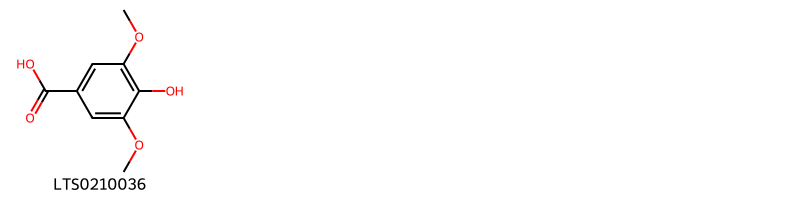{ width=100% }
    <figcaption>Hình ảnh cấu trúc hóa học của 1 hoạt chất thuộc nhóm Benzene and substituted derivatives gồm ['syringic acid (LTS0210036)'].</figcaption>
</figure>
#### Nhóm Cinnamic acids and derivatives
<figure markdown="span">
    { width=100% }
    <figcaption>Hình ảnh cấu trúc hóa học của 1 hoạt chất thuộc nhóm Cinnamic acids and derivatives gồm ['para-coumaric acid (LTS0266252)'].</figcaption>
</figure>
#### Nhóm Flavonoids
<figure markdown="span">
    { width=100% }
    <figcaption>Hình ảnh cấu trúc hóa học của 5 hoạt chất thuộc nhóm Flavonoids gồm ['(3s)-3,5,7-trihydroxy-2-(4-hydroxyphenyl)-2,3-dihydro-1-benzopyran-4-one (LTS0119555)', '5,7-dihydroxy-3-{[(2s,3r,4s,5r,6r)-3,4,5-trihydroxy-6-(hydroxymethyl)oxan-2-yl]oxy}-2-(3,4,5-trihydroxyphenyl)-1λ⁴-chromen-1-ylium (LTS0168377)', '5,7-dihydroxy-2-(4-hydroxyphenyl)-3-{[3,4,5-trihydroxy-6-(hydroxymethyl)oxan-2-yl]oxy}-2,3-dihydro-1-benzopyran-4-one (LTS0262404)', '(2s,3r)-5,7-dihydroxy-2-(4-hydroxyphenyl)-3-{[(2r,3s,4r,5r,6s)-3,4,5-trihydroxy-6-(hydroxymethyl)oxan-2-yl]oxy}-2,3-dihydro-1-benzopyran-4-one (LTS0168660)', 'pelargonin (LTS0129471)'].</figcaption>
</figure>
#### Nhóm Prenol lipids
<figure markdown="span">
    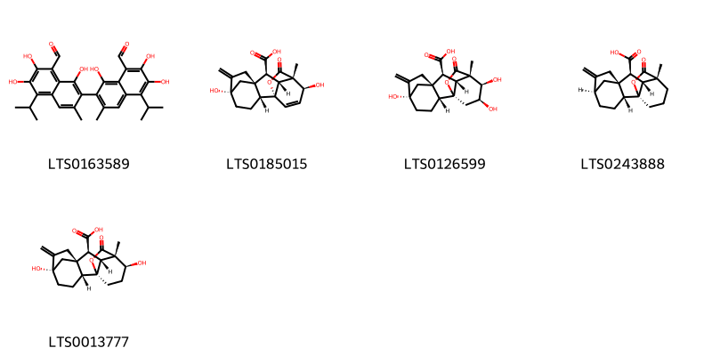{ width=100% }
    <figcaption>Hình ảnh cấu trúc hóa học của 5 hoạt chất thuộc nhóm Prenol lipids gồm ['(-)-gossypol (LTS0163589)', 'gibberellin a3 (LTS0185015)', 'gibberellin a8 (LTS0126599)', 'gibberellin a9 (LTS0243888)', 'gibberellin a1 (LTS0013777)'].</figcaption>
</figure>

---

### Dược dân tộc học

Danh sách các quốc gia có sử dụng *Alcea rosea* trong điều trị các bệnh. 

| Country   | Disease                                     | Bệnh                                                                                                                                                                                                |
|:----------|:--------------------------------------------|:----------------------------------------------------------------------------------------------------------------------------------------------------------------------------------------------------|
| Iraq      | Diuretic, Emollient, Expectorant, Demulcent | MYMEMORY WARNING: YOU USED ALL AVAILABLE FREE TRANSLATIONS FOR TODAY. NEXT AVAILABLE IN  07 HOURS 06 MINUTES 50 SECONDS VISIT HTTPS://MYMEMORY.TRANSLATED.NET/DOC/USAGELIMITS.PHP TO TRANSLATE MORE |
| Kurdistan | Astringent                                  | MYMEMORY WARNING: YOU USED ALL AVAILABLE FREE TRANSLATIONS FOR TODAY. NEXT AVAILABLE IN  07 HOURS 06 MINUTES 47 SECONDS VISIT HTTPS://MYMEMORY.TRANSLATED.NET/DOC/USAGELIMITS.PHP TO TRANSLATE MORE |

---

# Chi Hoheria

??? note "Danh sách các dược liệu thuộc chi"
    
	 - *Hoheria populnea*

---
## Hoheria populnea
### Thông tin về thực vật

!!! info "Phân loại thực vật của *Hoheria populnea* từ GIBF:"
    - **Kingdom:** Plantae
    - **Phylum:** Tracheophyta
    - **Order:** Malvales
    - **Family:** Malvaceae
    - **Genus:** Hoheria
    - **Species:** *Hoheria populnea*

 

| Label (VI)   | Label (EN)   | Scientific Name   | Descriptions (VI)   | Descriptions (EN)   | Also Known As (VI)   | Also Known As (EN)   |
|:-------------|:-------------|:------------------|:--------------------|:--------------------|:---------------------|:---------------------|
| N/A          | N/A          | Hoheria populnea  | loài thực vật       | species of plant    | ['']                 | ['']                 |

#### Phân bố trên thế giới

**Từ CSDL GIBF** nan, New Zealand

#### Phân bố tại Việt Nam

**Từ CSDL GIBF**: Không có ghi nhận ở Việt Nam

---
### Thành phần hóa học
        
- Theo cơ sở dữ liệu lotus: Từ loài *Hoheria populnea* đã phân lập và xác định được Chưa có hoạt chất nào được phân lập. hoạt chất thuộc về các nhóm Không có hoạt chất nào được phân lập. 

Không có hình ảnh nào được tạo ra

---

### Dược dân tộc học

Danh sách các quốc gia có sử dụng *Hoheria populnea* trong điều trị các bệnh. 

| Country     | Disease   | Bệnh                                                                                                                                                                                                |
|:------------|:----------|:----------------------------------------------------------------------------------------------------------------------------------------------------------------------------------------------------|
| New Zealand | Demulcent | MYMEMORY WARNING: YOU USED ALL AVAILABLE FREE TRANSLATIONS FOR TODAY. NEXT AVAILABLE IN  07 HOURS 06 MINUTES 23 SECONDS VISIT HTTPS://MYMEMORY.TRANSLATED.NET/DOC/USAGELIMITS.PHP TO TRANSLATE MORE |

---

# Chi Malvaviscus

??? note "Danh sách các dược liệu thuộc chi"
    
	 - *Malvaviscus arboreus*

---
## Malvaviscus arboreus
### Thông tin về thực vật

!!! info "Phân loại thực vật của *Malvaviscus arboreus* từ GIBF:"
    - **Kingdom:** Plantae
    - **Phylum:** Tracheophyta
    - **Order:** Malvales
    - **Family:** Malvaceae
    - **Genus:** Malvaviscus
    - **Species:** *Malvaviscus arboreus*

 

| Label (VI)   | Label (EN)   | Scientific Name      | Descriptions (VI)   | Descriptions (EN)   | Also Known As (VI)   | Also Known As (EN)                                                                 |
|:-------------|:-------------|:---------------------|:--------------------|:--------------------|:---------------------|:-----------------------------------------------------------------------------------|
| N/A          | N/A          | Malvaviscus arboreus | loài thực vật       | species of plant    | ['']                 | ["Turk's turban", 'ladies teardrop', "Scotchman's purse", 'Turkcap', 'wax mallow'] |

#### Phân bố trên thế giới

**Từ CSDL GIBF** Mexico, United States of America, Costa Rica, South Africa, New Zealand, Belize

#### Phân bố tại Việt Nam

**Từ CSDL GIBF**: Không có ghi nhận ở Việt Nam

---
### Thành phần hóa học
        
- Theo cơ sở dữ liệu lotus: Từ loài *Malvaviscus arboreus* đã phân lập và xác định được 38 hoạt chất thuộc về các nhóm Fatty Acyls, Prenol lipids, Steroids and steroid derivatives, Flavonoids. 

|    | chemicalTaxonomyClassyfireClass   |   smiles_count |
|---:|:----------------------------------|---------------:|
|  0 | Fatty Acyls                       |             29 |
|  1 | Flavonoids                        |              6 |
|  2 | Prenol lipids                     |              1 |
|  3 | Steroids and steroid derivatives  |              2 |

#### Nhóm Fatty Acyls
<figure markdown="span">
    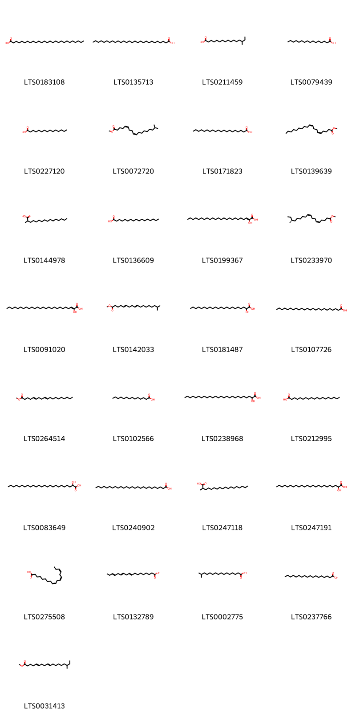{ width=100% }
    <figcaption>Hình ảnh cấu trúc hóa học của 29 hoạt chất thuộc nhóm Fatty Acyls gồm ['heptacosanoic acid (LTS0183108)', 'octacosanoic acid (LTS0135713)', '14-methyl palmitic acid (LTS0211459)', 'palmitic acid (LTS0079439)', 'pentadecanoic acid (LTS0227120)', 'methyl (5z,9z)-17-methyloctadeca-5,9-dienoate (LTS0072720)', 'arachidic acid (LTS0171823)', 'methyl (5z,9z)-nonadeca-5,9-dienoate (LTS0139639)', '2-methylhexadecanoic acid (LTS0144978)', 'heptadecanoic acid (LTS0136609)', '2-hydroxytetracos-2-enoic acid (LTS0199367)', 'methyl (5z,9z,16s)-16-methyloctadeca-5,9-dienoate (LTS0233970)', '2-hydroxyhexacos-2-enoic acid (LTS0091020)', 'methyl 17-methyloctadeca-5,9-dienoate (LTS0142033)', '2-hydroxy behenic (LTS0181487)', 'lignoceric acid (LTS0107726)', 'methyl nonadeca-5,9-dienoate (LTS0264514)', 'myristic acid (LTS0102566)', '2-hydroxycerotic acid (LTS0238968)', 'nonadecanoic acid (LTS0212995)', '2-hydroxypentacosanoic acid (LTS0083649)', 'hexacosanoic acid (LTS0240902)', 'methyloctadecanoic acid (LTS0247118)', 'cerebronic acid (LTS0247191)', 'α-linolenic acid (LTS0275508)', 'α linolenic acid (LTS0132789)', '15-methyl palmitic acid (LTS0002775)', 'stearic acid (LTS0237766)', 'methyl 16-methyloctadeca-5,9-dienoate (LTS0031413)'].</figcaption>
</figure>
#### Nhóm Flavonoids
<figure markdown="span">
    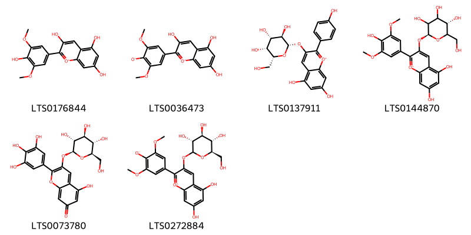{ width=100% }
    <figcaption>Hình ảnh cấu trúc hóa học của 6 hoạt chất thuộc nhóm Flavonoids gồm ['malvidin (LTS0176844)', '2-(3,5-dimethoxy-4-oxidophenyl)-3,5,7-trihydroxy-1λ⁴-chromen-1-ylium (LTS0036473)', 'pelargonidin 3-galactoside ion (LTS0137911)', 'oenin (LTS0144870)', '5-hydroxy-3-{[(2s,3r,4s,5s,6r)-3,4,5-trihydroxy-6-(hydroxymethyl)oxan-2-yl]oxy}-2-(3,4,5-trihydroxyphenyl)chromen-7-one (LTS0073780)', '2-(3,5-dimethoxy-4-oxidophenyl)-5,7-dihydroxy-3-{[(3r,4s,5s,6r)-3,4,5-trihydroxy-6-(hydroxymethyl)oxan-2-yl]oxy}-1λ⁴-chromen-1-ylium (LTS0272884)'].</figcaption>
</figure>
#### Nhóm Prenol lipids
<figure markdown="span">
    { width=100% }
    <figcaption>Hình ảnh cấu trúc hóa học của 1 hoạt chất thuộc nhóm Prenol lipids gồm ['(-)-gossypol (LTS0163589)'].</figcaption>
</figure>
#### Nhóm Steroids and steroid derivatives
<figure markdown="span">
    { width=100% }
    <figcaption>Hình ảnh cấu trúc hóa học của 2 hoạt chất thuộc nhóm Steroids and steroid derivatives gồm ['stigmast-5-en-3-ol (LTS0071224)', 'stigmast-5-en-3-ol, (3β)- (LTS0204616)'].</figcaption>
</figure>

---

### Dược dân tộc học

Danh sách các quốc gia có sử dụng *Malvaviscus arboreus* trong điều trị các bệnh. 

| Country   | Disease   | Bệnh                                                                                                                                                                                                |
|:----------|:----------|:----------------------------------------------------------------------------------------------------------------------------------------------------------------------------------------------------|
| Mexico    | Emollient | MYMEMORY WARNING: YOU USED ALL AVAILABLE FREE TRANSLATIONS FOR TODAY. NEXT AVAILABLE IN  07 HOURS 05 MINUTES 59 SECONDS VISIT HTTPS://MYMEMORY.TRANSLATED.NET/DOC/USAGELIMITS.PHP TO TRANSLATE MORE |
| Salvador  | Cosmetic  | MYMEMORY WARNING: YOU USED ALL AVAILABLE FREE TRANSLATIONS FOR TODAY. NEXT AVAILABLE IN  07 HOURS 05 MINUTES 57 SECONDS VISIT HTTPS://MYMEMORY.TRANSLATED.NET/DOC/USAGELIMITS.PHP TO TRANSLATE MORE |
| Venezuela | Emollient | MYMEMORY WARNING: YOU USED ALL AVAILABLE FREE TRANSLATIONS FOR TODAY. NEXT AVAILABLE IN  07 HOURS 05 MINUTES 54 SECONDS VISIT HTTPS://MYMEMORY.TRANSLATED.NET/DOC/USAGELIMITS.PHP TO TRANSLATE MORE |

---

# Chi Anoda

??? note "Danh sách các dược liệu thuộc chi"
    
	 - *Anoda cristata*

---
## Anoda cristata
### Thông tin về thực vật

!!! info "Phân loại thực vật của *Anoda cristata* từ GIBF:"
    - **Kingdom:** Plantae
    - **Phylum:** Tracheophyta
    - **Order:** Malvales
    - **Family:** Malvaceae
    - **Genus:** Anoda
    - **Species:** *Anoda cristata*

 

| Label (VI)   | Label (EN)   | Scientific Name   | Descriptions (VI)   | Descriptions (EN)   | Also Known As (VI)   | Also Known As (EN)   |
|:-------------|:-------------|:------------------|:--------------------|:--------------------|:---------------------|:---------------------|
| N/A          | N/A          | Anoda cristata    | loài thực vật       | species of plant    | ['']                 | ['']                 |

#### Phân bố trên thế giới

**Từ CSDL GIBF** Mexico, Guatemala, Nicaragua, United States of America, Argentina, Bolivia (Plurinational State of), Uruguay

#### Phân bố tại Việt Nam

**Từ CSDL GIBF**: Không có ghi nhận ở Việt Nam

---
### Thành phần hóa học
        
- Theo cơ sở dữ liệu lotus: Từ loài *Anoda cristata* đã phân lập và xác định được 2 hoạt chất thuộc về các nhóm Flavonoids. 

|    | chemicalTaxonomyClassyfireClass   |   smiles_count |
|---:|:----------------------------------|---------------:|
|  0 | Flavonoids                        |              2 |

#### Nhóm Flavonoids
<figure markdown="span">
    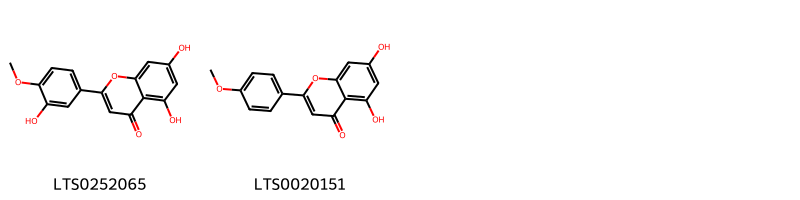{ width=100% }
    <figcaption>Hình ảnh cấu trúc hóa học của 2 hoạt chất thuộc nhóm Flavonoids gồm ['diosmetin (LTS0252065)', 'acacetin (LTS0020151)'].</figcaption>
</figure>

---

### Dược dân tộc học

Danh sách các quốc gia có sử dụng *Anoda cristata* trong điều trị các bệnh. 

| Country   | Disease   | Bệnh                                                                                                                                                                                                |
|:----------|:----------|:----------------------------------------------------------------------------------------------------------------------------------------------------------------------------------------------------|
| Mexico    | Emollient | MYMEMORY WARNING: YOU USED ALL AVAILABLE FREE TRANSLATIONS FOR TODAY. NEXT AVAILABLE IN  07 HOURS 05 MINUTES 26 SECONDS VISIT HTTPS://MYMEMORY.TRANSLATED.NET/DOC/USAGELIMITS.PHP TO TRANSLATE MORE |

---

# Chi Sida

??? note "Danh sách các dược liệu thuộc chi"
    
	 - *Sida acuta*
	 - *Sida cordifolia*
	 - *Sida inosa*
	 - *Sida retusa*
	 - *Sida rhmoboidea*
	 - *Sida rhombifolia*
	 - *Sida rhomboidea*
	 - *Sida veronicaefolia*
	 - *Sida veronicifolia*

---
## Sida acuta
### Thông tin về thực vật

!!! info "Phân loại thực vật của *Sida acuta* từ GIBF:"
    - **Kingdom:** Plantae
    - **Phylum:** Tracheophyta
    - **Order:** Malvales
    - **Family:** Malvaceae
    - **Genus:** Sida
    - **Species:** *Sida acuta*

 

| Label (VI)   | Label (EN)   | Scientific Name   | Descriptions (VI)   | Descriptions (EN)   | Also Known As (VI)   | Also Known As (EN)                                   |
|:-------------|:-------------|:------------------|:--------------------|:--------------------|:---------------------|:-----------------------------------------------------|
| N/A          | N/A          | Sida acuta        |                     | species of plant    | ['']                 | ['Broom Weed', 'Common Wire Weed', 'Morning Mallow'] |

#### Phân bố trên thế giới

**Từ CSDL GIBF** Brazil, Guadeloupe, Gambia, Mozambique, Ecuador, Thailand, Cameroon, Puerto Rico, Ghana, Sri Lanka, United States of America, Virgin Islands (U.S.), Indonesia, Costa Rica, Saint Martin (French part), Nigeria, Colombia, French Guiana, Hong Kong, Mexico, Benin, Niue, Belgium, Chinese Taipei, Malaysia, Panama, Singapore, Bonaire, Sint Eustatius and Saba, Martinique, South Africa, Australia, Myanmar, India, Bolivia (Plurinational State of), Samoa

#### Phân bố tại Việt Nam

**Từ CSDL GIBF**: Không có ghi nhận ở Việt Nam

---
### Thành phần hóa học
        
- Theo cơ sở dữ liệu lotus: Từ loài *Sida acuta* đã phân lập và xác định được 17 hoạt chất thuộc về các nhóm Benzofurans, Indoles and derivatives, Benzene and substituted derivatives, Quinolines and derivatives, Cinnamic acids and derivatives, Coumarins and derivatives, Phenols, Lignan lactones, Prenol lipids, Stilbenes. 

|    | chemicalTaxonomyClassyfireClass     |   smiles_count |
|---:|:------------------------------------|---------------:|
|  0 | Benzene and substituted derivatives |              2 |
|  1 | Benzofurans                         |              1 |
|  2 | Cinnamic acids and derivatives      |              2 |
|  3 | Coumarins and derivatives           |              1 |
|  4 | Indoles and derivatives             |              1 |
|  5 | Lignan lactones                     |              1 |
|  6 | Phenols                             |              1 |
|  7 | Prenol lipids                       |              3 |
|  8 | Quinolines and derivatives          |              4 |
|  9 | Stilbenes                           |              1 |

#### Nhóm Benzene and substituted derivatives
<figure markdown="span">
    { width=100% }
    <figcaption>Hình ảnh cấu trúc hóa học của 2 hoạt chất thuộc nhóm Benzene and substituted derivatives gồm ['syringic acid (LTS0210036)', 'vanillic acid (LTS0229113)'].</figcaption>
</figure>
#### Nhóm Benzofurans
<figure markdown="span">
    { width=100% }
    <figcaption>Hình ảnh cấu trúc hóa học của 1 hoạt chất thuộc nhóm Benzofurans gồm ['loliolide (LTS0254454)'].</figcaption>
</figure>
#### Nhóm Cinnamic acids and derivatives
<figure markdown="span">
    { width=100% }
    <figcaption>Hình ảnh cấu trúc hóa học của 2 hoạt chất thuộc nhóm Cinnamic acids and derivatives gồm ['ferulic acid (LTS0077328)', 'sinapinate (LTS0173482)'].</figcaption>
</figure>
#### Nhóm Coumarins and derivatives
<figure markdown="span">
    { width=100% }
    <figcaption>Hình ảnh cấu trúc hóa học của 1 hoạt chất thuộc nhóm Coumarins and derivatives gồm ['scopoletin (LTS0193112)'].</figcaption>
</figure>
#### Nhóm Indoles and derivatives
<figure markdown="span">
    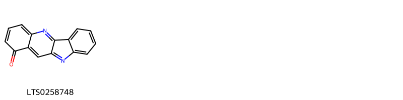{ width=100% }
    <figcaption>Hình ảnh cấu trúc hóa học của 1 hoạt chất thuộc nhóm Indoles and derivatives gồm ['indolo[3,2-b]quinolin-1-one (LTS0258748)'].</figcaption>
</figure>
#### Nhóm Lignan lactones
<figure markdown="span">
    { width=100% }
    <figcaption>Hình ảnh cấu trúc hóa học của 1 hoạt chất thuộc nhóm Lignan lactones gồm ['(3s,3ar,6s,6as)-3,6-bis(4-hydroxy-3-methoxyphenyl)-tetrahydro-3h-furo[3,4-c]furan-1-one (LTS0194037)'].</figcaption>
</figure>
#### Nhóm Phenols
<figure markdown="span">
    { width=100% }
    <figcaption>Hình ảnh cấu trúc hóa học của 1 hoạt chất thuộc nhóm Phenols gồm ['(2e)-3-(4-hydroxy-3-methoxyphenyl)-n-[2-(4-hydroxyphenyl)ethyl]prop-2-enimidic acid (LTS0187051)'].</figcaption>
</figure>
#### Nhóm Prenol lipids
<figure markdown="span">
    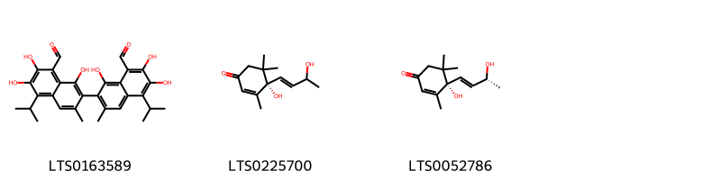{ width=100% }
    <figcaption>Hình ảnh cấu trúc hóa học của 3 hoạt chất thuộc nhóm Prenol lipids gồm ['(-)-gossypol (LTS0163589)', '(4s)-4-hydroxy-4-(3-hydroxybut-1-en-1-yl)-3,5,5-trimethylcyclohex-2-en-1-one (LTS0225700)', '(6s,9r)-vomifoliol (LTS0052786)'].</figcaption>
</figure>
#### Nhóm Quinolines and derivatives
<figure markdown="span">
    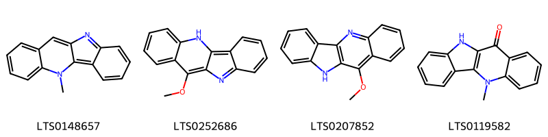{ width=100% }
    <figcaption>Hình ảnh cấu trúc hóa học của 4 hoạt chất thuộc nhóm Quinolines and derivatives gồm ['cryptolepine (LTS0148657)', '11-methoxy-5h-indolo[3,2-b]quinoline (LTS0252686)', '11-methoxy-10h-indolo[3,2-b]quinoline (LTS0207852)', '5-methyl-10h-indolo[3,2-b]quinolin-11-one (LTS0119582)'].</figcaption>
</figure>
#### Nhóm Stilbenes
<figure markdown="span">
    { width=100% }
    <figcaption>Hình ảnh cấu trúc hóa học của 1 hoạt chất thuộc nhóm Stilbenes gồm ['evofolin b (LTS0107561)'].</figcaption>
</figure>

---

### Dược dân tộc học

Danh sách các quốc gia có sử dụng *Sida acuta* trong điều trị các bệnh. 

| Country            | Disease                                                                              | Bệnh                                                                                                                                                                                                |
|:-------------------|:-------------------------------------------------------------------------------------|:----------------------------------------------------------------------------------------------------------------------------------------------------------------------------------------------------|
| Africa             | Abortifacient, Abortifacient                                                         | MYMEMORY WARNING: YOU USED ALL AVAILABLE FREE TRANSLATIONS FOR TODAY. NEXT AVAILABLE IN  07 HOURS 05 MINUTES 02 SECONDS VISIT HTTPS://MYMEMORY.TRANSLATED.NET/DOC/USAGELIMITS.PHP TO TRANSLATE MORE |
| Dominican Republic | Emollient                                                                            | MYMEMORY WARNING: YOU USED ALL AVAILABLE FREE TRANSLATIONS FOR TODAY. NEXT AVAILABLE IN  07 HOURS 05 MINUTES 00 SECONDS VISIT HTTPS://MYMEMORY.TRANSLATED.NET/DOC/USAGELIMITS.PHP TO TRANSLATE MORE |
| Elsewhere          | Demulcent, Diuretic, Refrigerant, Stomachic, Tonic, Vermifuge, Emollient, Astringent | MYMEMORY WARNING: YOU USED ALL AVAILABLE FREE TRANSLATIONS FOR TODAY. NEXT AVAILABLE IN  07 HOURS 04 MINUTES 57 SECONDS VISIT HTTPS://MYMEMORY.TRANSLATED.NET/DOC/USAGELIMITS.PHP TO TRANSLATE MORE |
| Ghana              | Dentifrice                                                                           | MYMEMORY WARNING: YOU USED ALL AVAILABLE FREE TRANSLATIONS FOR TODAY. NEXT AVAILABLE IN  07 HOURS 04 MINUTES 55 SECONDS VISIT HTTPS://MYMEMORY.TRANSLATED.NET/DOC/USAGELIMITS.PHP TO TRANSLATE MORE |
| India              | Astringent, Tonic, Refrigerant, Stomachic                                            | MYMEMORY WARNING: YOU USED ALL AVAILABLE FREE TRANSLATIONS FOR TODAY. NEXT AVAILABLE IN  07 HOURS 04 MINUTES 52 SECONDS VISIT HTTPS://MYMEMORY.TRANSLATED.NET/DOC/USAGELIMITS.PHP TO TRANSLATE MORE |
| Mexico             | Soap                                                                                 | MYMEMORY WARNING: YOU USED ALL AVAILABLE FREE TRANSLATIONS FOR TODAY. NEXT AVAILABLE IN  07 HOURS 04 MINUTES 49 SECONDS VISIT HTTPS://MYMEMORY.TRANSLATED.NET/DOC/USAGELIMITS.PHP TO TRANSLATE MORE |
| Philippines        | Poultice                                                                             | MYMEMORY WARNING: YOU USED ALL AVAILABLE FREE TRANSLATIONS FOR TODAY. NEXT AVAILABLE IN  07 HOURS 04 MINUTES 46 SECONDS VISIT HTTPS://MYMEMORY.TRANSLATED.NET/DOC/USAGELIMITS.PHP TO TRANSLATE MORE |

---

---
## Sida cordifolia
### Thông tin về thực vật

!!! info "Phân loại thực vật của *Sida cordifolia* từ GIBF:"
    - **Kingdom:** Plantae
    - **Phylum:** Tracheophyta
    - **Order:** Malvales
    - **Family:** Malvaceae
    - **Genus:** Sida
    - **Species:** *Sida cordifolia*

 

| Label (VI)   | Label (EN)   | Scientific Name   | Descriptions (VI)   | Descriptions (EN)   | Also Known As (VI)   | Also Known As (EN)   |
|:-------------|:-------------|:------------------|:--------------------|:--------------------|:---------------------|:---------------------|
| N/A          | N/A          | Sida cordifolia   | loài thực vật       | species of plant    | ['']                 | ['']                 |

#### Phân bố trên thế giới

**Từ CSDL GIBF** Brazil, Saint Kitts and Nevis, Thailand, Puerto Rico, Sri Lanka, United States of America, Virgin Islands (U.S.), Cuba, Argentina, French Guiana, Mexico, Eswatini, Chinese Taipei, Namibia, Martinique, South Africa, Australia, India, Montserrat

#### Phân bố tại Việt Nam

**Từ CSDL GIBF**: Không có ghi nhận ở Việt Nam

---
### Thành phần hóa học
        
- Theo cơ sở dữ liệu lotus: Từ loài *Sida cordifolia* đã phân lập và xác định được 7 hoạt chất thuộc về các nhóm Prenol lipids, Benzene and substituted derivatives, Diazanaphthalenes. 

|    | chemicalTaxonomyClassyfireClass     |   smiles_count |
|---:|:------------------------------------|---------------:|
|  0 | Benzene and substituted derivatives |              2 |
|  1 | Diazanaphthalenes                   |              4 |
|  2 | Prenol lipids                       |              1 |

#### Nhóm Benzene and substituted derivatives
<figure markdown="span">
    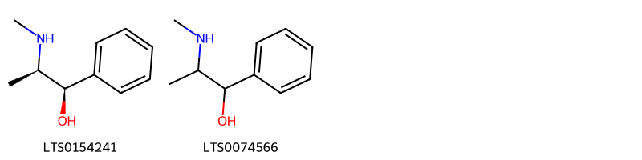{ width=100% }
    <figcaption>Hình ảnh cấu trúc hóa học của 2 hoạt chất thuộc nhóm Benzene and substituted derivatives gồm ['(-)-pseudoephedrine (LTS0154241)', 'pseudoephedrine,  (LTS0074566)'].</figcaption>
</figure>
#### Nhóm Diazanaphthalenes
<figure markdown="span">
    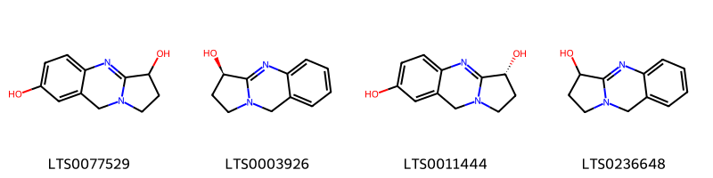{ width=100% }
    <figcaption>Hình ảnh cấu trúc hóa học của 4 hoạt chất thuộc nhóm Diazanaphthalenes gồm ['1h,2h,3h,9h-pyrrolo[2,1-b]quinazoline-3,7-diol (LTS0077529)', '(+-)-vasicine (LTS0003926)', '(3r)-1h,2h,3h,9h-pyrrolo[2,1-b]quinazoline-3,7-diol (LTS0011444)', 'vasicine (LTS0236648)'].</figcaption>
</figure>
#### Nhóm Prenol lipids
<figure markdown="span">
    { width=100% }
    <figcaption>Hình ảnh cấu trúc hóa học của 1 hoạt chất thuộc nhóm Prenol lipids gồm ['(-)-gossypol (LTS0163589)'].</figcaption>
</figure>

---

### Dược dân tộc học

Danh sách các quốc gia có sử dụng *Sida cordifolia* trong điều trị các bệnh. 

| Country      | Disease                                                | Bệnh                                                                                                                                                                                                |
|:-------------|:-------------------------------------------------------|:----------------------------------------------------------------------------------------------------------------------------------------------------------------------------------------------------|
| Africa       | Diuretic                                               | MYMEMORY WARNING: YOU USED ALL AVAILABLE FREE TRANSLATIONS FOR TODAY. NEXT AVAILABLE IN  07 HOURS 04 MINUTES 21 SECONDS VISIT HTTPS://MYMEMORY.TRANSLATED.NET/DOC/USAGELIMITS.PHP TO TRANSLATE MORE |
| China        | Astringent, Diuretic, Tonic                            | MYMEMORY WARNING: YOU USED ALL AVAILABLE FREE TRANSLATIONS FOR TODAY. NEXT AVAILABLE IN  07 HOURS 04 MINUTES 19 SECONDS VISIT HTTPS://MYMEMORY.TRANSLATED.NET/DOC/USAGELIMITS.PHP TO TRANSLATE MORE |
| Elsewhere    | Demulcent, Protisticide, Refrigerant, Laxative         | MYMEMORY WARNING: YOU USED ALL AVAILABLE FREE TRANSLATIONS FOR TODAY. NEXT AVAILABLE IN  07 HOURS 04 MINUTES 16 SECONDS VISIT HTTPS://MYMEMORY.TRANSLATED.NET/DOC/USAGELIMITS.PHP TO TRANSLATE MORE |
| India        | Aphrodisiac, Astringent, Tonic                         | MYMEMORY WARNING: YOU USED ALL AVAILABLE FREE TRANSLATIONS FOR TODAY. NEXT AVAILABLE IN  07 HOURS 04 MINUTES 14 SECONDS VISIT HTTPS://MYMEMORY.TRANSLATED.NET/DOC/USAGELIMITS.PHP TO TRANSLATE MORE |
| India(Hindu) | Tonic, Astringent, Refrigerant, Stomachic, Cardiotonic | MYMEMORY WARNING: YOU USED ALL AVAILABLE FREE TRANSLATIONS FOR TODAY. NEXT AVAILABLE IN  07 HOURS 04 MINUTES 12 SECONDS VISIT HTTPS://MYMEMORY.TRANSLATED.NET/DOC/USAGELIMITS.PHP TO TRANSLATE MORE |

---

---
## Sida inosa
### Thông tin về thực vật

!!! info "Phân loại thực vật của *N/A* từ GIBF:"
    - **Kingdom:** N/A
    - **Phylum:** N/A
    - **Order:** N/A
    - **Family:** N/A
    - **Genus:** N/A
    - **Species:** *N/A*

 

| Label (VI)   | Label (EN)   | Scientific Name   | Descriptions (VI)   | Descriptions (EN)   | Also Known As (VI)   | Also Known As (EN)   |
|:-------------|:-------------|:------------------|:--------------------|:--------------------|:---------------------|:---------------------|
| N/A          | N/A          | Sida cordifolia   | loài thực vật       | species of plant    | ['']                 | ['']                 |

#### Phân bố trên thế giới

**Từ CSDL GIBF** Không có kết quả phù hợp

#### Phân bố tại Việt Nam

**Từ CSDL GIBF**: Không có ghi nhận ở Việt Nam

---
### Thành phần hóa học
        
- Theo cơ sở dữ liệu lotus: Từ loài *N/A* đã phân lập và xác định được Chưa có hoạt chất nào được phân lập. hoạt chất thuộc về các nhóm Không có hoạt chất nào được phân lập. 

Không có hình ảnh nào được tạo ra

---

### Dược dân tộc học

Danh sách các quốc gia có sử dụng *N/A* trong điều trị các bệnh. 

| Country   | Disease                                                | Bệnh                                                                                                                                                                                                |
|:----------|:-------------------------------------------------------|:----------------------------------------------------------------------------------------------------------------------------------------------------------------------------------------------------|
| Elsewhere | Astringent, Demulcent, Refrigerant, Tonic, Diaphoretic | MYMEMORY WARNING: YOU USED ALL AVAILABLE FREE TRANSLATIONS FOR TODAY. NEXT AVAILABLE IN  07 HOURS 03 MINUTES 50 SECONDS VISIT HTTPS://MYMEMORY.TRANSLATED.NET/DOC/USAGELIMITS.PHP TO TRANSLATE MORE |
| Sudan     | Demulcent, Tonic                                       | MYMEMORY WARNING: YOU USED ALL AVAILABLE FREE TRANSLATIONS FOR TODAY. NEXT AVAILABLE IN  07 HOURS 03 MINUTES 48 SECONDS VISIT HTTPS://MYMEMORY.TRANSLATED.NET/DOC/USAGELIMITS.PHP TO TRANSLATE MORE |

---

---
## Sida retusa
### Thông tin về thực vật

!!! info "Phân loại thực vật của *N/A* từ GIBF:"
    - **Kingdom:** Plantae
    - **Phylum:** Tracheophyta
    - **Order:** Malvales
    - **Family:** Malvaceae
    - **Genus:** Sida
    - **Species:** *N/A*

 

| Label (VI)   | Label (EN)   | Scientific Name   | Descriptions (VI)   | Descriptions (EN)   | Also Known As (VI)   | Also Known As (EN)   |
|:-------------|:-------------|:------------------|:--------------------|:--------------------|:---------------------|:---------------------|
| N/A          | N/A          | Sida cordifolia   | loài thực vật       | species of plant    | ['']                 | ['']                 |

#### Phân bố trên thế giới

**Từ CSDL GIBF** Brazil, Saint Kitts and Nevis, Antigua and Barbuda, Gambia, Ecuador, Uruguay, Ghana, Sri Lanka, Puerto Rico, United States of America, Costa Rica, Dominican Republic, Argentina, French Guiana, Hong Kong, Mexico, Niue, Chinese Taipei, Namibia, Singapore, Portugal, South Africa, Australia, India, Peru

#### Phân bố tại Việt Nam

**Từ CSDL GIBF**: Không có ghi nhận ở Việt Nam

---
### Thành phần hóa học
        
- Theo cơ sở dữ liệu lotus: Từ loài *N/A* đã phân lập và xác định được Chưa có hoạt chất nào được phân lập. hoạt chất thuộc về các nhóm Không có hoạt chất nào được phân lập. 

Không có hình ảnh nào được tạo ra

---

### Dược dân tộc học

Danh sách các quốc gia có sử dụng *N/A* trong điều trị các bệnh. 

| Country      | Disease              | Bệnh                                                                                                                                                                                                |
|:-------------|:---------------------|:----------------------------------------------------------------------------------------------------------------------------------------------------------------------------------------------------|
| India(Hindu) | Emollient, Demulcent | MYMEMORY WARNING: YOU USED ALL AVAILABLE FREE TRANSLATIONS FOR TODAY. NEXT AVAILABLE IN  07 HOURS 03 MINUTES 39 SECONDS VISIT HTTPS://MYMEMORY.TRANSLATED.NET/DOC/USAGELIMITS.PHP TO TRANSLATE MORE |

---

---
## Sida rhmoboidea
### Thông tin về thực vật

!!! info "Phân loại thực vật của *N/A* từ GIBF:"
    - **Kingdom:** Plantae
    - **Phylum:** Tracheophyta
    - **Order:** Malvales
    - **Family:** Malvaceae
    - **Genus:** Sida
    - **Species:** *N/A*

 

| Label (VI)   | Label (EN)   | Scientific Name   | Descriptions (VI)   | Descriptions (EN)   | Also Known As (VI)   | Also Known As (EN)   |
|:-------------|:-------------|:------------------|:--------------------|:--------------------|:---------------------|:---------------------|
| N/A          | N/A          | Sida cordifolia   | loài thực vật       | species of plant    | ['']                 | ['']                 |

#### Phân bố trên thế giới

**Từ CSDL GIBF** Brazil, Saint Kitts and Nevis, Antigua and Barbuda, Gambia, Ecuador, Uruguay, Ghana, Sri Lanka, Puerto Rico, United States of America, Costa Rica, Dominican Republic, Argentina, French Guiana, Hong Kong, Mexico, Niue, Chinese Taipei, Namibia, Singapore, Portugal, South Africa, Australia, India, Peru

#### Phân bố tại Việt Nam

**Từ CSDL GIBF**: Không có ghi nhận ở Việt Nam

---
### Thành phần hóa học
        
- Theo cơ sở dữ liệu lotus: Từ loài *N/A* đã phân lập và xác định được Chưa có hoạt chất nào được phân lập. hoạt chất thuộc về các nhóm Không có hoạt chất nào được phân lập. 

Không có hình ảnh nào được tạo ra

---

### Dược dân tộc học

Danh sách các quốc gia có sử dụng *N/A* trong điều trị các bệnh. 

| Country   | Disease   | Bệnh                                                                                                                                                                                                |
|:----------|:----------|:----------------------------------------------------------------------------------------------------------------------------------------------------------------------------------------------------|
| India     | Demulcent | MYMEMORY WARNING: YOU USED ALL AVAILABLE FREE TRANSLATIONS FOR TODAY. NEXT AVAILABLE IN  07 HOURS 03 MINUTES 17 SECONDS VISIT HTTPS://MYMEMORY.TRANSLATED.NET/DOC/USAGELIMITS.PHP TO TRANSLATE MORE |

---

---
## Sida rhombifolia
### Thông tin về thực vật

!!! info "Phân loại thực vật của *Sida rhombifolia* từ GIBF:"
    - **Kingdom:** Plantae
    - **Phylum:** Tracheophyta
    - **Order:** Malvales
    - **Family:** Malvaceae
    - **Genus:** Sida
    - **Species:** *Sida rhombifolia*

 

| Label (VI)   | Label (EN)   | Scientific Name   | Descriptions (VI)   | Descriptions (EN)   | Also Known As (VI)   | Also Known As (EN)   |
|:-------------|:-------------|:------------------|:--------------------|:--------------------|:---------------------|:---------------------|
| N/A          | N/A          | Sida rhombifolia  | loài thực vật       | species of plant    | ['']                 | ['Angled Sida']      |

#### Phân bố trên thế giới

**Từ CSDL GIBF** Brazil, Japan, Guadeloupe, Ecuador, Madagascar, Uruguay, Puerto Rico, United States of America, Costa Rica, Dominican Republic, Argentina, French Guiana, Dominica, Mexico, Eswatini, Chinese Taipei, Portugal, South Africa, Australia

#### Phân bố tại Việt Nam

**Từ CSDL GIBF**: Không có ghi nhận ở Việt Nam

---
### Thành phần hóa học
        
- Theo cơ sở dữ liệu lotus: Từ loài *Sida rhombifolia* đã phân lập và xác định được 2 hoạt chất thuộc về các nhóm Prenol lipids. 

|    | chemicalTaxonomyClassyfireClass   |   smiles_count |
|---:|:----------------------------------|---------------:|
|  0 | Prenol lipids                     |              2 |

#### Nhóm Prenol lipids
<figure markdown="span">
    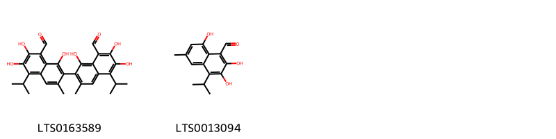{ width=100% }
    <figcaption>Hình ảnh cấu trúc hóa học của 2 hoạt chất thuộc nhóm Prenol lipids gồm ['(-)-gossypol (LTS0163589)', 'hemigossypol (LTS0013094)'].</figcaption>
</figure>

---

### Dược dân tộc học

Danh sách các quốc gia có sử dụng *Sida rhombifolia* trong điều trị các bệnh. 

| Country   | Disease                                                                  | Bệnh                                                                                                                                                                                                |
|:----------|:-------------------------------------------------------------------------|:----------------------------------------------------------------------------------------------------------------------------------------------------------------------------------------------------|
| Elsewhere | Demulcent, Diuretic, Emollient, Sedative, Emollient, Demulcent, Diuretic | MYMEMORY WARNING: YOU USED ALL AVAILABLE FREE TRANSLATIONS FOR TODAY. NEXT AVAILABLE IN  07 HOURS 02 MINUTES 58 SECONDS VISIT HTTPS://MYMEMORY.TRANSLATED.NET/DOC/USAGELIMITS.PHP TO TRANSLATE MORE |
| Guatemala | Soap                                                                     | MYMEMORY WARNING: YOU USED ALL AVAILABLE FREE TRANSLATIONS FOR TODAY. NEXT AVAILABLE IN  07 HOURS 02 MINUTES 56 SECONDS VISIT HTTPS://MYMEMORY.TRANSLATED.NET/DOC/USAGELIMITS.PHP TO TRANSLATE MORE |
| Malaya    | Aphrodisiac                                                              | MYMEMORY WARNING: YOU USED ALL AVAILABLE FREE TRANSLATIONS FOR TODAY. NEXT AVAILABLE IN  07 HOURS 02 MINUTES 54 SECONDS VISIT HTTPS://MYMEMORY.TRANSLATED.NET/DOC/USAGELIMITS.PHP TO TRANSLATE MORE |
| Venezuela | Diuretic                                                                 | MYMEMORY WARNING: YOU USED ALL AVAILABLE FREE TRANSLATIONS FOR TODAY. NEXT AVAILABLE IN  07 HOURS 02 MINUTES 52 SECONDS VISIT HTTPS://MYMEMORY.TRANSLATED.NET/DOC/USAGELIMITS.PHP TO TRANSLATE MORE |

---

---
## Sida rhomboidea
### Thông tin về thực vật

!!! info "Phân loại thực vật của *N/A* từ GIBF:"
    - **Kingdom:** Plantae
    - **Phylum:** Tracheophyta
    - **Order:** Malvales
    - **Family:** Malvaceae
    - **Genus:** Sida
    - **Species:** *N/A*

 

| Label (VI)   | Label (EN)   | Scientific Name   | Descriptions (VI)   | Descriptions (EN)   | Also Known As (VI)   | Also Known As (EN)   |
|:-------------|:-------------|:------------------|:--------------------|:--------------------|:---------------------|:---------------------|
| N/A          | N/A          | Sida rhomboidea   | loài thực vật       | species of plant    | ['']                 | ['']                 |

#### Phân bố trên thế giới

**Từ CSDL GIBF** Brazil, Saint Kitts and Nevis, Antigua and Barbuda, Gambia, Ecuador, Uruguay, Ghana, Sri Lanka, Puerto Rico, United States of America, Costa Rica, Dominican Republic, Argentina, French Guiana, Hong Kong, Mexico, Niue, Chinese Taipei, Namibia, Singapore, Portugal, South Africa, Australia, India, Peru

#### Phân bố tại Việt Nam

**Từ CSDL GIBF**: Không có ghi nhận ở Việt Nam

---
### Thành phần hóa học
        
- Theo cơ sở dữ liệu lotus: Từ loài *N/A* đã phân lập và xác định được Chưa có hoạt chất nào được phân lập. hoạt chất thuộc về các nhóm Không có hoạt chất nào được phân lập. 

Không có hình ảnh nào được tạo ra

---

### Dược dân tộc học

Danh sách các quốc gia có sử dụng *N/A* trong điều trị các bệnh. 

| Country   | Disease   | Bệnh                                                                                                                                                                                                |
|:----------|:----------|:----------------------------------------------------------------------------------------------------------------------------------------------------------------------------------------------------|
| India     | Emollient | MYMEMORY WARNING: YOU USED ALL AVAILABLE FREE TRANSLATIONS FOR TODAY. NEXT AVAILABLE IN  07 HOURS 02 MINUTES 30 SECONDS VISIT HTTPS://MYMEMORY.TRANSLATED.NET/DOC/USAGELIMITS.PHP TO TRANSLATE MORE |

---

---
## Sida veronicaefolia
### Thông tin về thực vật

!!! info "Phân loại thực vật của *Sida cordata* từ GIBF:"
    - **Kingdom:** Plantae
    - **Phylum:** Tracheophyta
    - **Order:** Malvales
    - **Family:** Malvaceae
    - **Genus:** Sida
    - **Species:** *Sida cordata*

 

| Label (VI)   | Label (EN)   | Scientific Name     | Descriptions (VI)   | Descriptions (EN)   | Also Known As (VI)   | Also Known As (EN)   |
|:-------------|:-------------|:--------------------|:--------------------|:--------------------|:---------------------|:---------------------|
| N/A          | N/A          | Sida veronicaefolia | loài thực vật       | species of plant    | ['']                 | ['']                 |

#### Phân bố trên thế giới

**Từ CSDL GIBF** nan, Sri Lanka, Philippines, Haiti, Chinese Taipei, Cuba, Spain

#### Phân bố tại Việt Nam

**Từ CSDL GIBF**: Không có ghi nhận ở Việt Nam

---
### Thành phần hóa học
        
- Theo cơ sở dữ liệu lotus: Từ loài *Sida cordata* đã phân lập và xác định được 6 hoạt chất thuộc về các nhóm Carboxylic acids and derivatives, Organooxygen compounds, Organonitrogen compounds. 

|    | chemicalTaxonomyClassyfireClass   |   smiles_count |
|---:|:----------------------------------|---------------:|
|  0 | Carboxylic acids and derivatives  |              3 |
|  1 | Organonitrogen compounds          |              1 |
|  2 | Organooxygen compounds            |              2 |

#### Nhóm Carboxylic acids and derivatives
<figure markdown="span">
    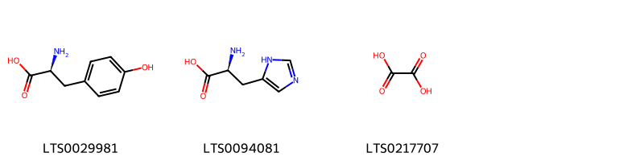{ width=100% }
    <figcaption>Hình ảnh cấu trúc hóa học của 3 hoạt chất thuộc nhóm Carboxylic acids and derivatives gồm ['l-tyrosine (LTS0029981)', 'l-histidine (LTS0094081)', 'oxalic acid (LTS0217707)'].</figcaption>
</figure>
#### Nhóm Organonitrogen compounds
<figure markdown="span">
    { width=100% }
    <figcaption>Hình ảnh cấu trúc hóa học của 1 hoạt chất thuộc nhóm Organonitrogen compounds gồm ['choline (LTS0170307)'].</figcaption>
</figure>
#### Nhóm Organooxygen compounds
<figure markdown="span">
    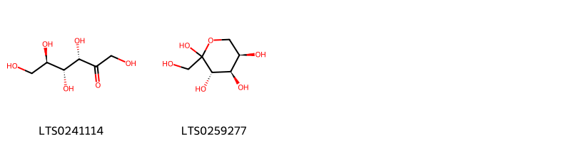{ width=100% }
    <figcaption>Hình ảnh cấu trúc hóa học của 2 hoạt chất thuộc nhóm Organooxygen compounds gồm ['keto-d-fructose (LTS0241114)', 'd-fructopyranose (LTS0259277)'].</figcaption>
</figure>

---

### Dược dân tộc học

Danh sách các quốc gia có sử dụng *Sida cordata* trong điều trị các bệnh. 

| Country   | Disease                        | Bệnh                                                                                                                                                                                                |
|:----------|:-------------------------------|:----------------------------------------------------------------------------------------------------------------------------------------------------------------------------------------------------|
| Elsewhere | Astringent, Tonic, Refrigerant | MYMEMORY WARNING: YOU USED ALL AVAILABLE FREE TRANSLATIONS FOR TODAY. NEXT AVAILABLE IN  07 HOURS 02 MINUTES 12 SECONDS VISIT HTTPS://MYMEMORY.TRANSLATED.NET/DOC/USAGELIMITS.PHP TO TRANSLATE MORE |

---

---
## Sida veronicifolia
### Thông tin về thực vật

!!! info "Phân loại thực vật của *Sida cordata* từ GIBF:"
    - **Kingdom:** Plantae
    - **Phylum:** Tracheophyta
    - **Order:** Malvales
    - **Family:** Malvaceae
    - **Genus:** Sida
    - **Species:** *Sida cordata*

 

| Label (VI)   | Label (EN)   | Scientific Name    | Descriptions (VI)   | Descriptions (EN)   | Also Known As (VI)   | Also Known As (EN)   |
|:-------------|:-------------|:-------------------|:--------------------|:--------------------|:---------------------|:---------------------|
| N/A          | N/A          | Sida veronicifolia |                     |                     | ['']                 | ['']                 |

#### Phân bố trên thế giới

**Từ CSDL GIBF** nan, Brazil, Viet Nam, Uganda, Central African Republic, Burundi, China, Thailand, Ghana, Sri Lanka, Puerto Rico, Jamaica, Indonesia, Pakistan, Nigeria, Cuba, Burkina Faso, unknown or invalid, Hong Kong, Benin, Congo, Democratic Republic of the, Rwanda, Philippines, Haiti, Chinese Taipei, Paraguay, Liberia, Côte d’Ivoire, India, Angola, Bolivia (Plurinational State of), Cameroon

#### Phân bố tại Việt Nam

**Từ CSDL GIBF**: Không có ghi nhận ở Việt Nam

---
### Thành phần hóa học
        
- Theo cơ sở dữ liệu lotus: Từ loài *Sida cordata* đã phân lập và xác định được Chưa có hoạt chất nào được phân lập. hoạt chất thuộc về các nhóm Không có hoạt chất nào được phân lập. 

Không có hình ảnh nào được tạo ra

---

### Dược dân tộc học

Danh sách các quốc gia có sử dụng *Sida cordata* trong điều trị các bệnh. 

| Country     | Disease     | Bệnh                                                                                                                                                                                                |
|:------------|:------------|:----------------------------------------------------------------------------------------------------------------------------------------------------------------------------------------------------|
| Upper Volta | Aphrodisiac | MYMEMORY WARNING: YOU USED ALL AVAILABLE FREE TRANSLATIONS FOR TODAY. NEXT AVAILABLE IN  07 HOURS 01 MINUTES 54 SECONDS VISIT HTTPS://MYMEMORY.TRANSLATED.NET/DOC/USAGELIMITS.PHP TO TRANSLATE MORE |

---

# Chi Theesia

??? note "Danh sách các dược liệu thuộc chi"
    
	 - *Theesia populnea*

---
## Theesia populnea
### Thông tin về thực vật

!!! info "Phân loại thực vật của *N/A* từ GIBF:"
    - **Kingdom:** N/A
    - **Phylum:** N/A
    - **Order:** N/A
    - **Family:** N/A
    - **Genus:** N/A
    - **Species:** *N/A*

 

| Label (VI)   | Label (EN)   | Scientific Name    | Descriptions (VI)   | Descriptions (EN)   | Also Known As (VI)   | Also Known As (EN)   |
|:-------------|:-------------|:-------------------|:--------------------|:--------------------|:---------------------|:---------------------|
| N/A          | N/A          | Sida veronicifolia |                     |                     | ['']                 | ['']                 |

#### Phân bố trên thế giới

**Từ CSDL GIBF** Không có kết quả phù hợp

#### Phân bố tại Việt Nam

**Từ CSDL GIBF**: Không có ghi nhận ở Việt Nam

---
### Thành phần hóa học
        
- Theo cơ sở dữ liệu lotus: Từ loài *N/A* đã phân lập và xác định được Chưa có hoạt chất nào được phân lập. hoạt chất thuộc về các nhóm Không có hoạt chất nào được phân lập. 

Không có hình ảnh nào được tạo ra

---

### Dược dân tộc học

Danh sách các quốc gia có sử dụng *N/A* trong điều trị các bệnh. 

| Country            | Disease                          | Bệnh                                                                                                                                                                                                |
|:-------------------|:---------------------------------|:----------------------------------------------------------------------------------------------------------------------------------------------------------------------------------------------------|
| Dominican Republic | Purgative                        | MYMEMORY WARNING: YOU USED ALL AVAILABLE FREE TRANSLATIONS FOR TODAY. NEXT AVAILABLE IN  07 HOURS 01 MINUTES 37 SECONDS VISIT HTTPS://MYMEMORY.TRANSLATED.NET/DOC/USAGELIMITS.PHP TO TRANSLATE MORE |
| Elsewhere          | nan, Poison, Purgative, nan      | MYMEMORY WARNING: YOU USED ALL AVAILABLE FREE TRANSLATIONS FOR TODAY. NEXT AVAILABLE IN  07 HOURS 01 MINUTES 34 SECONDS VISIT HTTPS://MYMEMORY.TRANSLATED.NET/DOC/USAGELIMITS.PHP TO TRANSLATE MORE |
| Haiti              | Cardiotonic, Sedative, Sudorific | MYMEMORY WARNING: YOU USED ALL AVAILABLE FREE TRANSLATIONS FOR TODAY. NEXT AVAILABLE IN  07 HOURS 01 MINUTES 32 SECONDS VISIT HTTPS://MYMEMORY.TRANSLATED.NET/DOC/USAGELIMITS.PHP TO TRANSLATE MORE |
| New Zealand(Niue)  | Purgative                        | MYMEMORY WARNING: YOU USED ALL AVAILABLE FREE TRANSLATIONS FOR TODAY. NEXT AVAILABLE IN  07 HOURS 01 MINUTES 30 SECONDS VISIT HTTPS://MYMEMORY.TRANSLATED.NET/DOC/USAGELIMITS.PHP TO TRANSLATE MORE |
| Samoa              | Diuretic                         | MYMEMORY WARNING: YOU USED ALL AVAILABLE FREE TRANSLATIONS FOR TODAY. NEXT AVAILABLE IN  07 HOURS 01 MINUTES 28 SECONDS VISIT HTTPS://MYMEMORY.TRANSLATED.NET/DOC/USAGELIMITS.PHP TO TRANSLATE MORE |
| Venezuela          | Emollient                        | MYMEMORY WARNING: YOU USED ALL AVAILABLE FREE TRANSLATIONS FOR TODAY. NEXT AVAILABLE IN  07 HOURS 01 MINUTES 26 SECONDS VISIT HTTPS://MYMEMORY.TRANSLATED.NET/DOC/USAGELIMITS.PHP TO TRANSLATE MORE |

---

# Chi Modiola

??? note "Danh sách các dược liệu thuộc chi"
    
	 - *Modiola caroliniana*

---
## Modiola caroliniana
### Thông tin về thực vật

!!! info "Phân loại thực vật của *Modiola caroliniana* từ GIBF:"
    - **Kingdom:** Plantae
    - **Phylum:** Tracheophyta
    - **Order:** Malvales
    - **Family:** Malvaceae
    - **Genus:** Modiola
    - **Species:** *Modiola caroliniana*

 

| Label (VI)   | Label (EN)   | Scientific Name     | Descriptions (VI)   | Descriptions (EN)   | Also Known As (VI)   | Also Known As (EN)                                   |
|:-------------|:-------------|:--------------------|:--------------------|:--------------------|:---------------------|:-----------------------------------------------------|
| N/A          | N/A          | Modiola caroliniana | loài thực vật       | species of plant    | ['']                 | ['Carolina bristlemallow', 'bristly-fruited mallow'] |

#### Phân bố trên thế giới

**Từ CSDL GIBF** Mexico, United States of America, Portugal, Australia, Chile, New Zealand, Uruguay

#### Phân bố tại Việt Nam

**Từ CSDL GIBF**: Không có ghi nhận ở Việt Nam

---
### Thành phần hóa học
        
- Theo cơ sở dữ liệu lotus: Từ loài *Modiola caroliniana* đã phân lập và xác định được 1 hoạt chất thuộc về các nhóm Prenol lipids. 

|    | chemicalTaxonomyClassyfireClass   |   smiles_count |
|---:|:----------------------------------|---------------:|
|  0 | Prenol lipids                     |              1 |

#### Nhóm Prenol lipids
<figure markdown="span">
    { width=100% }
    <figcaption>Hình ảnh cấu trúc hóa học của 1 hoạt chất thuộc nhóm Prenol lipids gồm ['(-)-gossypol (LTS0163589)'].</figcaption>
</figure>

---

### Dược dân tộc học

Danh sách các quốc gia có sử dụng *Modiola caroliniana* trong điều trị các bệnh. 

| Country   | Disease   | Bệnh                                                                                                                                                                                                |
|:----------|:----------|:----------------------------------------------------------------------------------------------------------------------------------------------------------------------------------------------------|
| Australia | Poison    | MYMEMORY WARNING: YOU USED ALL AVAILABLE FREE TRANSLATIONS FOR TODAY. NEXT AVAILABLE IN  07 HOURS 01 MINUTES 16 SECONDS VISIT HTTPS://MYMEMORY.TRANSLATED.NET/DOC/USAGELIMITS.PHP TO TRANSLATE MORE |

---

# Chi Hampea

??? note "Danh sách các dược liệu thuộc chi"
    
	 - *Hampea stipitata*

---
## Hampea stipitata
### Thông tin về thực vật

!!! info "Phân loại thực vật của *Hampea stipitata* từ GIBF:"
    - **Kingdom:** Plantae
    - **Phylum:** Tracheophyta
    - **Order:** Malvales
    - **Family:** Malvaceae
    - **Genus:** Hampea
    - **Species:** *Hampea stipitata*

 

| Label (VI)   | Label (EN)   | Scientific Name   | Descriptions (VI)   | Descriptions (EN)   | Also Known As (VI)   | Also Known As (EN)   |
|:-------------|:-------------|:------------------|:--------------------|:--------------------|:---------------------|:---------------------|
| N/A          | N/A          | Hampea stipitata  | loài thực vật       | species of plant    | ['']                 | ['']                 |

#### Phân bố trên thế giới

**Từ CSDL GIBF** nan, Mexico, Guatemala, El Salvador, Belize

#### Phân bố tại Việt Nam

**Từ CSDL GIBF**: Không có ghi nhận ở Việt Nam

---
### Thành phần hóa học
        
- Theo cơ sở dữ liệu lotus: Từ loài *Hampea stipitata* đã phân lập và xác định được Chưa có hoạt chất nào được phân lập. hoạt chất thuộc về các nhóm Không có hoạt chất nào được phân lập. 

Không có hình ảnh nào được tạo ra

---

### Dược dân tộc học

Danh sách các quốc gia có sử dụng *Hampea stipitata* trong điều trị các bệnh. 

| Country   | Disease   | Bệnh                                                                                                                                                                                                |
|:----------|:----------|:----------------------------------------------------------------------------------------------------------------------------------------------------------------------------------------------------|
| Honduras  | Soap      | MYMEMORY WARNING: YOU USED ALL AVAILABLE FREE TRANSLATIONS FOR TODAY. NEXT AVAILABLE IN  07 HOURS 00 MINUTES 55 SECONDS VISIT HTTPS://MYMEMORY.TRANSLATED.NET/DOC/USAGELIMITS.PHP TO TRANSLATE MORE |

---

# Chi Abelmoschus

??? note "Danh sách các dược liệu thuộc chi"
    
	 - *Abelmoschus esculentus*
	 - *Abelmoschus manihot*
	 - *Abelmoschus moschatus*

---
## Abelmoschus esculentus
### Thông tin về thực vật

!!! info "Phân loại thực vật của *Abelmoschus esculentus* từ GIBF:"
    - **Kingdom:** Plantae
    - **Phylum:** Tracheophyta
    - **Order:** Malvales
    - **Family:** Malvaceae
    - **Genus:** Abelmoschus
    - **Species:** *Abelmoschus esculentus*

 

| Label (VI)   | Label (EN)   | Scientific Name        | Descriptions (VI)   | Descriptions (EN)       | Also Known As (VI)                     | Also Known As (EN)                                                                       |
|:-------------|:-------------|:-----------------------|:--------------------|:------------------------|:---------------------------------------|:-----------------------------------------------------------------------------------------|
| N/A          | N/A          | Abelmoschus esculentus |                     | species of edible plant | ['Mướp tây', 'Abelmoschus esculentus'] | ["ladies' finger", "lady's finger", 'ocra', 'okra', 'ladyfinger', 'gumbo', 'okra plant'] |

#### Phân bố trên thế giới

**Từ CSDL GIBF** Brazil, Viet Nam, Japan, Saint Kitts and Nevis, Uganda, Guadeloupe, Nepal, China, Mozambique, Türkiye, Ecuador, Honduras, Tanzania, United Republic of, Trinidad and Tobago, Thailand, Spain, Puerto Rico, Sri Lanka, United States of America, Jamaica, Zambia, Greece, Indonesia, Pakistan, Albania, Nigeria, Estonia, French Guiana, Lao People’s Democratic Republic, Malawi, Hong Kong, Mexico, Benin, Philippines, Gabon, Malaysia, Mayotte, Chinese Taipei, Canada, Germany, Panama, Egypt, Singapore, Portugal, Bahamas, South Africa, Saint Vincent and the Grenadines, India, Angola

#### Phân bố tại Việt Nam

**Từ CSDL GIBF**: Cà Mau, Đồng Nai

---
### Thành phần hóa học
        
- Theo cơ sở dữ liệu lotus: Từ loài *Abelmoschus esculentus* đã phân lập và xác định được 36 hoạt chất thuộc về các nhóm Fatty Acyls, Flavonoids, Coumarins and derivatives, Prenol lipids, Organonitrogen compounds. 

|    | chemicalTaxonomyClassyfireClass   |   smiles_count |
|---:|:----------------------------------|---------------:|
|  0 | Coumarins and derivatives         |              1 |
|  1 | Fatty Acyls                       |             15 |
|  2 | Flavonoids                        |              4 |
|  3 | Organonitrogen compounds          |              1 |
|  4 | Prenol lipids                     |             15 |

#### Nhóm Coumarins and derivatives
<figure markdown="span">
    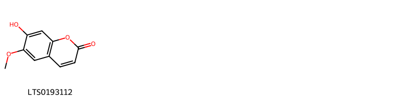{ width=100% }
    <figcaption>Hình ảnh cấu trúc hóa học của 1 hoạt chất thuộc nhóm Coumarins and derivatives gồm ['scopoletin (LTS0193112)'].</figcaption>
</figure>
#### Nhóm Fatty Acyls
<figure markdown="span">
    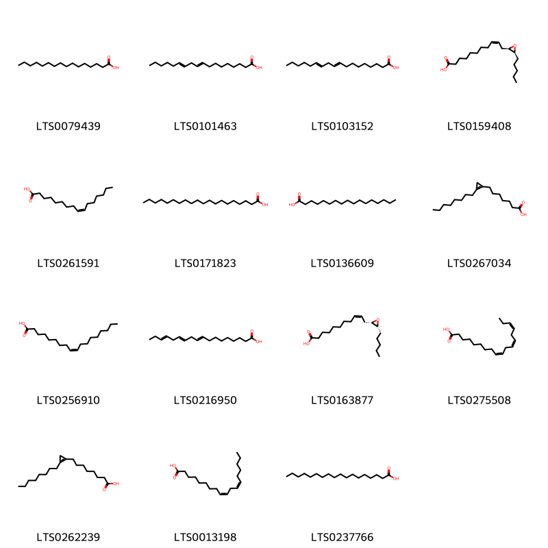{ width=100% }
    <figcaption>Hình ảnh cấu trúc hóa học của 15 hoạt chất thuộc nhóm Fatty Acyls gồm ['palmitic acid (LTS0079439)', '9,12-octadecadienoic acid (LTS0101463)', 'grape seed oils (LTS0103152)', '(-)-vernolic acid (LTS0159408)', 'palmitoleic acid (LTS0261591)', 'arachidic acid (LTS0171823)', 'heptadecanoic acid (LTS0136609)', 'malvalic acid (LTS0267034)', 'oleic acid (LTS0256910)', 'octadeca-9,12,15-trienoic acid (LTS0216950)', '(+)-vernolic acid (LTS0163877)', 'α-linolenic acid (LTS0275508)', 'sterculic acid (LTS0262239)', 'linoleic (LTS0013198)', 'stearic acid (LTS0237766)'].</figcaption>
</figure>
#### Nhóm Flavonoids
<figure markdown="span">
    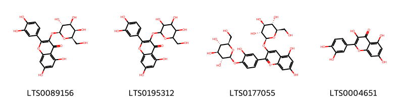{ width=100% }
    <figcaption>Hình ảnh cấu trúc hóa học của 4 hoạt chất thuộc nhóm Flavonoids gồm ['hyperoside (LTS0089156)', '2-(3,4-dihydroxyphenyl)-5,7-dihydroxy-3-{[3,4,5-trihydroxy-6-(hydroxymethyl)oxan-2-yl]oxy}chromen-4-one (LTS0195312)', '5,7-dihydroxy-2-(3-hydroxy-4-{[(2s,3r,4s,5s,6r)-3,4,5-trihydroxy-6-(hydroxymethyl)oxan-2-yl]oxy}phenyl)-3-{[(2s,3r,4s,5s,6r)-3,4,5-trihydroxy-6-(hydroxymethyl)oxan-2-yl]oxy}-1λ⁴-chromen-1-ylium (LTS0177055)', 'quercetin (LTS0004651)'].</figcaption>
</figure>
#### Nhóm Organonitrogen compounds
<figure markdown="span">
    { width=100% }
    <figcaption>Hình ảnh cấu trúc hóa học của 1 hoạt chất thuộc nhóm Organonitrogen compounds gồm ['(9z,12z)-n-(2-hydroxyethyl)octadeca-9,12-dienimidic acid (LTS0115325)'].</figcaption>
</figure>
#### Nhóm Prenol lipids
<figure markdown="span">
    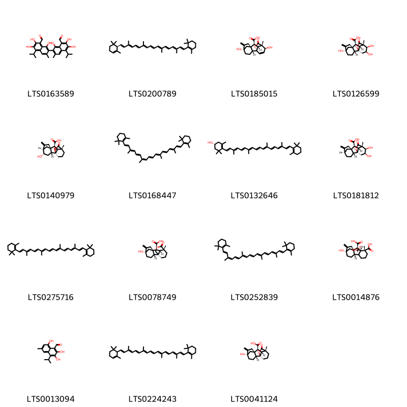{ width=100% }
    <figcaption>Hình ảnh cấu trúc hóa học của 15 hoạt chất thuộc nhóm Prenol lipids gồm ['(-)-gossypol (LTS0163589)', '(+)-α-carotene (LTS0200789)', 'gibberellin a3 (LTS0185015)', 'gibberellin a8 (LTS0126599)', '(1r,2r,4s,5r,8r,9s,10r,11r)-4-hydroxy-11-methyl-6-methylidene-16-oxo-15-oxapentacyclo[9.3.2.1⁵,⁸.0¹,¹⁰.0²,⁸]heptadecane-9-carboxylic acid (LTS0140979)', 'β,β-carotene (LTS0168447)', 'cryptoxanthin (LTS0132646)', 'gibberellin a34 (LTS0181812)', 'β-carotene (LTS0275716)', 'gibberellin a44 (LTS0078749)', '(9z)-β-carotene (LTS0252839)', 'gibberellin a17 (LTS0014876)', 'hemigossypol (LTS0013094)', 'α-carotene (LTS0224243)', 'gibberellin a20 (LTS0041124)'].</figcaption>
</figure>

---

### Dược dân tộc học

Danh sách các quốc gia có sử dụng *Abelmoschus esculentus* trong điều trị các bệnh. 

| Country       | Disease                                                                   | Bệnh                                                                                                                                                                                                |
|:--------------|:--------------------------------------------------------------------------|:----------------------------------------------------------------------------------------------------------------------------------------------------------------------------------------------------|
| China         | Demulcent, Demulcent, Diuretic                                            | MYMEMORY WARNING: YOU USED ALL AVAILABLE FREE TRANSLATIONS FOR TODAY. NEXT AVAILABLE IN  07 HOURS 00 MINUTES 36 SECONDS VISIT HTTPS://MYMEMORY.TRANSLATED.NET/DOC/USAGELIMITS.PHP TO TRANSLATE MORE |
| Elsewhere     | Antidote, Demulcent, Demulcent, Emollient, Stimulant, Sudorific, Diuretic | MYMEMORY WARNING: YOU USED ALL AVAILABLE FREE TRANSLATIONS FOR TODAY. NEXT AVAILABLE IN  07 HOURS 00 MINUTES 34 SECONDS VISIT HTTPS://MYMEMORY.TRANSLATED.NET/DOC/USAGELIMITS.PHP TO TRANSLATE MORE |
| Haiti         | Aphrodisiac                                                               | MYMEMORY WARNING: YOU USED ALL AVAILABLE FREE TRANSLATIONS FOR TODAY. NEXT AVAILABLE IN  07 HOURS 00 MINUTES 31 SECONDS VISIT HTTPS://MYMEMORY.TRANSLATED.NET/DOC/USAGELIMITS.PHP TO TRANSLATE MORE |
| Iraq          | Diuretic, Emollient, Sudorific, Stimulant                                 | MYMEMORY WARNING: YOU USED ALL AVAILABLE FREE TRANSLATIONS FOR TODAY. NEXT AVAILABLE IN  07 HOURS 00 MINUTES 29 SECONDS VISIT HTTPS://MYMEMORY.TRANSLATED.NET/DOC/USAGELIMITS.PHP TO TRANSLATE MORE |
| Mexico        | Sudorific                                                                 | MYMEMORY WARNING: YOU USED ALL AVAILABLE FREE TRANSLATIONS FOR TODAY. NEXT AVAILABLE IN  07 HOURS 00 MINUTES 27 SECONDS VISIT HTTPS://MYMEMORY.TRANSLATED.NET/DOC/USAGELIMITS.PHP TO TRANSLATE MORE |
| Panama(Choco) | Antidote                                                                  | MYMEMORY WARNING: YOU USED ALL AVAILABLE FREE TRANSLATIONS FOR TODAY. NEXT AVAILABLE IN  07 HOURS 00 MINUTES 25 SECONDS VISIT HTTPS://MYMEMORY.TRANSLATED.NET/DOC/USAGELIMITS.PHP TO TRANSLATE MORE |
| Trinidad      | Abortifacient, Emollient, Abortifacient, Demulcent                        | MYMEMORY WARNING: YOU USED ALL AVAILABLE FREE TRANSLATIONS FOR TODAY. NEXT AVAILABLE IN  07 HOURS 00 MINUTES 23 SECONDS VISIT HTTPS://MYMEMORY.TRANSLATED.NET/DOC/USAGELIMITS.PHP TO TRANSLATE MORE |
| Venezuela     | Emollient                                                                 | MYMEMORY WARNING: YOU USED ALL AVAILABLE FREE TRANSLATIONS FOR TODAY. NEXT AVAILABLE IN  07 HOURS 00 MINUTES 20 SECONDS VISIT HTTPS://MYMEMORY.TRANSLATED.NET/DOC/USAGELIMITS.PHP TO TRANSLATE MORE |

---

---
## Abelmoschus manihot
### Thông tin về thực vật

!!! info "Phân loại thực vật của *Abelmoschus manihot* từ GIBF:"
    - **Kingdom:** Plantae
    - **Phylum:** Tracheophyta
    - **Order:** Malvales
    - **Family:** Malvaceae
    - **Genus:** Abelmoschus
    - **Species:** *Abelmoschus manihot*

 

| Label (VI)   | Label (EN)   | Scientific Name     | Descriptions (VI)   | Descriptions (EN)   | Also Known As (VI)   | Also Known As (EN)                                                    |
|:-------------|:-------------|:--------------------|:--------------------|:--------------------|:---------------------|:----------------------------------------------------------------------|
| N/A          | N/A          | Abelmoschus manihot | loài thực vật       | species of plant    | ['thục quỳ vàng']    | ['abika', 'hibiscus manihot', 'sunset hibiscus', 'sunset muskmallow'] |

#### Phân bố trên thế giới

**Từ CSDL GIBF** Brazil, Guatemala, Japan, Nepal, New Caledonia, China, New Zealand, French Polynesia, Papua New Guinea, Thailand, Spain, Guinea, Réunion, United States of America, Korea, Republic of, Tonga, Bhutan, Indonesia, Colombia, unknown or invalid, Lao People’s Democratic Republic, Mexico, Vanuatu, El Salvador, Norway, Belgium, Chinese Taipei, Namibia, Austria, Cook Islands, Timor-Leste, Australia, Myanmar, India, Cameroon, Christmas Island

#### Phân bố tại Việt Nam

**Từ CSDL GIBF**: Không có ghi nhận ở Việt Nam

---
### Thành phần hóa học
        
- Theo cơ sở dữ liệu lotus: Từ loài *Abelmoschus manihot* đã phân lập và xác định được 8 hoạt chất thuộc về các nhóm Flavonoids, Carboxylic acids and derivatives, Prenol lipids, Saturated hydrocarbons. 

|    | chemicalTaxonomyClassyfireClass   |   smiles_count |
|---:|:----------------------------------|---------------:|
|  0 | Carboxylic acids and derivatives  |              1 |
|  1 | Flavonoids                        |              3 |
|  2 | Prenol lipids                     |              1 |
|  3 | Saturated hydrocarbons            |              1 |

#### Nhóm Carboxylic acids and derivatives
<figure markdown="span">
    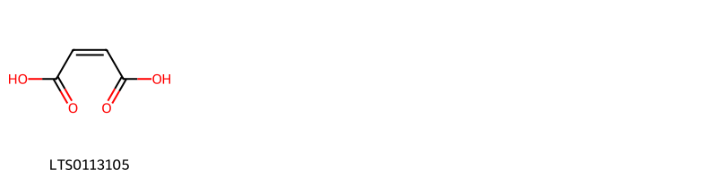{ width=100% }
    <figcaption>Hình ảnh cấu trúc hóa học của 1 hoạt chất thuộc nhóm Carboxylic acids and derivatives gồm ['maleic acid (LTS0113105)'].</figcaption>
</figure>
#### Nhóm Flavonoids
<figure markdown="span">
    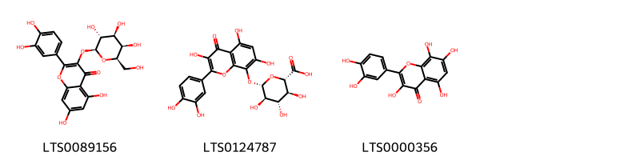{ width=100% }
    <figcaption>Hình ảnh cấu trúc hóa học của 3 hoạt chất thuộc nhóm Flavonoids gồm ['hyperoside (LTS0089156)', 'hibifolin (LTS0124787)', 'gossypetin (LTS0000356)'].</figcaption>
</figure>
#### Nhóm Prenol lipids
<figure markdown="span">
    { width=100% }
    <figcaption>Hình ảnh cấu trúc hóa học của 1 hoạt chất thuộc nhóm Prenol lipids gồm ['(-)-gossypol (LTS0163589)'].</figcaption>
</figure>
#### Nhóm Saturated hydrocarbons
<figure markdown="span">
    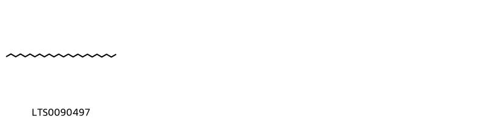{ width=100% }
    <figcaption>Hình ảnh cấu trúc hóa học của 1 hoạt chất thuộc nhóm Saturated hydrocarbons gồm ['tetracosane (LTS0090497)'].</figcaption>
</figure>

---

### Dược dân tộc học

Danh sách các quốc gia có sử dụng *Abelmoschus manihot* trong điều trị các bệnh. 

| Country   | Disease     | Bệnh                                                                                                                                                                                                |
|:----------|:------------|:----------------------------------------------------------------------------------------------------------------------------------------------------------------------------------------------------|
| Elsewhere | Antitussive | MYMEMORY WARNING: YOU USED ALL AVAILABLE FREE TRANSLATIONS FOR TODAY. NEXT AVAILABLE IN  06 HOURS 59 MINUTES 55 SECONDS VISIT HTTPS://MYMEMORY.TRANSLATED.NET/DOC/USAGELIMITS.PHP TO TRANSLATE MORE |
| India     | Emmenagogue | MYMEMORY WARNING: YOU USED ALL AVAILABLE FREE TRANSLATIONS FOR TODAY. NEXT AVAILABLE IN  06 HOURS 59 MINUTES 52 SECONDS VISIT HTTPS://MYMEMORY.TRANSLATED.NET/DOC/USAGELIMITS.PHP TO TRANSLATE MORE |
| Japan     | Antitussive | MYMEMORY WARNING: YOU USED ALL AVAILABLE FREE TRANSLATIONS FOR TODAY. NEXT AVAILABLE IN  06 HOURS 59 MINUTES 50 SECONDS VISIT HTTPS://MYMEMORY.TRANSLATED.NET/DOC/USAGELIMITS.PHP TO TRANSLATE MORE |

---

---
## Abelmoschus moschatus
### Thông tin về thực vật

!!! info "Phân loại thực vật của *Abelmoschus moschatus* từ GIBF:"
    - **Kingdom:** Plantae
    - **Phylum:** Tracheophyta
    - **Order:** Malvales
    - **Family:** Malvaceae
    - **Genus:** Abelmoschus
    - **Species:** *Abelmoschus moschatus*

 

| Label (VI)   | Label (EN)   | Scientific Name       | Descriptions (VI)   | Descriptions (EN)   | Also Known As (VI)        | Also Known As (EN)   |
|:-------------|:-------------|:----------------------|:--------------------|:--------------------|:--------------------------|:---------------------|
| N/A          | N/A          | Abelmoschus moschatus |                     | species of plant    | ['Abelmoschus moschatus'] | ['']                 |

#### Phân bố trên thế giới

**Từ CSDL GIBF** Viet Nam, Bangladesh, China, Honduras, Ecuador, Thailand, Madagascar, Puerto Rico, Sri Lanka, United States of America, Indonesia, Seychelles, Costa Rica, Wallis and Futuna, Colombia, Lao People’s Democratic Republic, Hong Kong, Mexico, Dominica, Benin, Macao, Vanuatu, Maldives, Guam, Chinese Taipei, Mayotte, Panama, Nicaragua, Singapore, Cambodia, Martinique, Australia, Myanmar, Micronesia (Federated States of), India, Peru

#### Phân bố tại Việt Nam

**Từ CSDL GIBF**: Thừa Thiên - Huế, Bắc Kạn, Nam Định, Tiền Giang, Hồ Chí Minh city, Ninh Bình

---
### Thành phần hóa học
        
- Theo cơ sở dữ liệu lotus: Từ loài *Abelmoschus moschatus* đã phân lập và xác định được 18 hoạt chất thuộc về các nhóm Fatty Acyls, Flavonoids, Macrolides and analogues, Prenol lipids. 

|    | chemicalTaxonomyClassyfireClass   |   smiles_count |
|---:|:----------------------------------|---------------:|
|  0 | Fatty Acyls                       |              2 |
|  1 | Flavonoids                        |              1 |
|  2 | Macrolides and analogues          |              1 |
|  3 | Prenol lipids                     |              4 |

#### Nhóm Fatty Acyls
<figure markdown="span">
    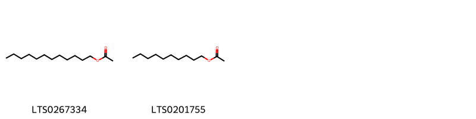{ width=100% }
    <figcaption>Hình ảnh cấu trúc hóa học của 2 hoạt chất thuộc nhóm Fatty Acyls gồm ['lauryl acetate (LTS0267334)', 'decyl acetate (LTS0201755)'].</figcaption>
</figure>
#### Nhóm Flavonoids
<figure markdown="span">
    { width=100% }
    <figcaption>Hình ảnh cấu trúc hóa học của 1 hoạt chất thuộc nhóm Flavonoids gồm ['myricetin (LTS0139858)'].</figcaption>
</figure>
#### Nhóm Macrolides and analogues
<figure markdown="span">
    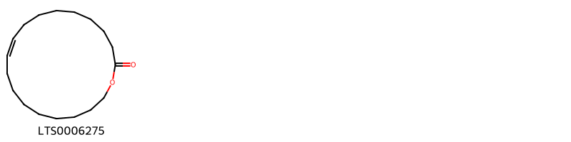{ width=100% }
    <figcaption>Hình ảnh cấu trúc hóa học của 1 hoạt chất thuộc nhóm Macrolides and analogues gồm ['oxacyclononadec-10-en-2-one (LTS0006275)'].</figcaption>
</figure>
#### Nhóm Prenol lipids
<figure markdown="span">
    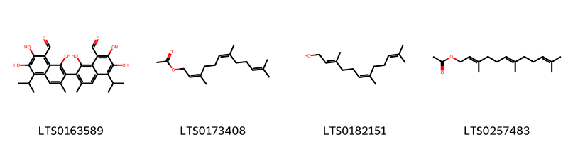{ width=100% }
    <figcaption>Hình ảnh cấu trúc hóa học của 4 hoạt chất thuộc nhóm Prenol lipids gồm ['(-)-gossypol (LTS0163589)', 'farnesyl acetate (LTS0173408)', '(e,z)-farnesol (LTS0182151)', '(2e,6e)-farnesyl acetate (LTS0257483)'].</figcaption>
</figure>

---

### Dược dân tộc học

Danh sách các quốc gia có sử dụng *Abelmoschus moschatus* trong điều trị các bệnh. 

| Country   | Disease                                  | Bệnh                                                                                                                                                                                                |
|:----------|:-----------------------------------------|:----------------------------------------------------------------------------------------------------------------------------------------------------------------------------------------------------|
| Danish    | Demulcent                                | MYMEMORY WARNING: YOU USED ALL AVAILABLE FREE TRANSLATIONS FOR TODAY. NEXT AVAILABLE IN  06 HOURS 59 MINUTES 25 SECONDS VISIT HTTPS://MYMEMORY.TRANSLATED.NET/DOC/USAGELIMITS.PHP TO TRANSLATE MORE |
| Dutch     | Diuretic                                 | MYMEMORY WARNING: YOU USED ALL AVAILABLE FREE TRANSLATIONS FOR TODAY. NEXT AVAILABLE IN  06 HOURS 59 MINUTES 23 SECONDS VISIT HTTPS://MYMEMORY.TRANSLATED.NET/DOC/USAGELIMITS.PHP TO TRANSLATE MORE |
| Elsewhere | Insecticide                              | MYMEMORY WARNING: YOU USED ALL AVAILABLE FREE TRANSLATIONS FOR TODAY. NEXT AVAILABLE IN  06 HOURS 59 MINUTES 20 SECONDS VISIT HTTPS://MYMEMORY.TRANSLATED.NET/DOC/USAGELIMITS.PHP TO TRANSLATE MORE |
| English   | Aphrodisiac                              | MYMEMORY WARNING: YOU USED ALL AVAILABLE FREE TRANSLATIONS FOR TODAY. NEXT AVAILABLE IN  06 HOURS 59 MINUTES 18 SECONDS VISIT HTTPS://MYMEMORY.TRANSLATED.NET/DOC/USAGELIMITS.PHP TO TRANSLATE MORE |
| French    | Carminative                              | MYMEMORY WARNING: YOU USED ALL AVAILABLE FREE TRANSLATIONS FOR TODAY. NEXT AVAILABLE IN  06 HOURS 59 MINUTES 16 SECONDS VISIT HTTPS://MYMEMORY.TRANSLATED.NET/DOC/USAGELIMITS.PHP TO TRANSLATE MORE |
| German    | Perfume                                  | MYMEMORY WARNING: YOU USED ALL AVAILABLE FREE TRANSLATIONS FOR TODAY. NEXT AVAILABLE IN  06 HOURS 59 MINUTES 13 SECONDS VISIT HTTPS://MYMEMORY.TRANSLATED.NET/DOC/USAGELIMITS.PHP TO TRANSLATE MORE |
| India     | Carminative, Stimulant, Stomachic, Tonic | MYMEMORY WARNING: YOU USED ALL AVAILABLE FREE TRANSLATIONS FOR TODAY. NEXT AVAILABLE IN  06 HOURS 59 MINUTES 11 SECONDS VISIT HTTPS://MYMEMORY.TRANSLATED.NET/DOC/USAGELIMITS.PHP TO TRANSLATE MORE |
| Italian   | Refrigerant                              | MYMEMORY WARNING: YOU USED ALL AVAILABLE FREE TRANSLATIONS FOR TODAY. NEXT AVAILABLE IN  06 HOURS 59 MINUTES 08 SECONDS VISIT HTTPS://MYMEMORY.TRANSLATED.NET/DOC/USAGELIMITS.PHP TO TRANSLATE MORE |
| Mexico    | Stimulant                                | MYMEMORY WARNING: YOU USED ALL AVAILABLE FREE TRANSLATIONS FOR TODAY. NEXT AVAILABLE IN  06 HOURS 59 MINUTES 06 SECONDS VISIT HTTPS://MYMEMORY.TRANSLATED.NET/DOC/USAGELIMITS.PHP TO TRANSLATE MORE |
| Trinidad  | Vermifuge, Vermifuge                     | MYMEMORY WARNING: YOU USED ALL AVAILABLE FREE TRANSLATIONS FOR TODAY. NEXT AVAILABLE IN  06 HOURS 59 MINUTES 04 SECONDS VISIT HTTPS://MYMEMORY.TRANSLATED.NET/DOC/USAGELIMITS.PHP TO TRANSLATE MORE |
| Turkey    | Insecticide                              | MYMEMORY WARNING: YOU USED ALL AVAILABLE FREE TRANSLATIONS FOR TODAY. NEXT AVAILABLE IN  06 HOURS 59 MINUTES 01 SECONDS VISIT HTTPS://MYMEMORY.TRANSLATED.NET/DOC/USAGELIMITS.PHP TO TRANSLATE MORE |
| anish     | Stimulant                                | MYMEMORY WARNING: YOU USED ALL AVAILABLE FREE TRANSLATIONS FOR TODAY. NEXT AVAILABLE IN  06 HOURS 58 MINUTES 59 SECONDS VISIT HTTPS://MYMEMORY.TRANSLATED.NET/DOC/USAGELIMITS.PHP TO TRANSLATE MORE |

---

