!!! abstract "Tóm tắt"

    Họ Melastomataceae gồm khoảng 8 chi và 9 loài được một số cộng đồng tại các quốc gia như Colombia, Elsewhere, Ghana, Malaysia, Fiji, Nigeria, Sarawak, China, Tanzania sử dụng trong một số trường hợp MYMEMORY WARNING: YOU USED ALL AVAILABLE FREE TRANSLATIONS FOR TODAY. NEXT AVAILABLE IN  18 HOURS 30 MINUTES 06 SECONDS VISIT HTTPS://MYMEMORY.TRANSLATED.NET/DOC/USAGELIMITS.PHP TO TRANSLATE MORE.

!!! info "DrDuke"

    James A. Duke sinh năm 1929-2017 là một nhà thực vật học người Mỹ. Đây là một trong những tác giả hàng đầu trong lĩnh vực dược dân tộc học với cuốn *CRC Handbook of Medicinal Herbs* và chính là người xây dựng lên cơ sở dữ liệu về hợp chất tự nhiên và dược dân tộc học tại Bộ nông nghiệp Hoa Kỳ. Các thông tin được đăng tải tại website [Dr. Duke's Phytochemical and Ethnobotanical Databases](https://phytochem.nal.usda.gov/). 
    Trong suốt thập niên 1970, ông lãnh đạo the Plant Taxonomy Laboratory, Plant Genetics and Germplasm Institute of the Agricultural Research Service, U.S. Department of Agriculture.
    Trong tài liệu này, các thông tin về dược dân tộc của các dược liệu được trích dẫn từ tài liệu của James A. Ducke với sự trợ giúp của phần mềm dịch thuật từ tiếng Anh sang tiếng Việt.
   

# Chi Phyllagathis

??? note "Danh sách các dược liệu thuộc chi"
    
	 - *Phyllagathis rotundifolia*

---
## Phyllagathis rotundifolia
### Thông tin về thực vật

!!! info "Phân loại thực vật của *Phyllagathis rotundifolia* từ GIBF:"
    - **Kingdom:** Plantae
    - **Phylum:** Tracheophyta
    - **Order:** Myrtales
    - **Family:** Melastomataceae
    - **Genus:** Phyllagathis
    - **Species:** *Phyllagathis rotundifolia*

 

| Label (VI)   | Label (EN)   | Scientific Name           | Descriptions (VI)   | Descriptions (EN)   | Also Known As (VI)   | Also Known As (EN)   |
|:-------------|:-------------|:--------------------------|:--------------------|:--------------------|:---------------------|:---------------------|
| N/A          | N/A          | Phyllagathis rotundifolia | loài thực vật       | species of plant    | ['']                 | ['']                 |

#### Phân bố trên thế giới

**Từ CSDL GIBF** Viet Nam, nan, unknown or invalid, Thailand, Malaysia, Singapore, Indonesia

#### Phân bố tại Việt Nam

**Từ CSDL GIBF**: Thua Thien-Hue

---
### Thành phần hóa học
        
- Theo cơ sở dữ liệu lotus: Từ loài *Phyllagathis rotundifolia* đã phân lập và xác định được 53 hoạt chất thuộc về các nhóm Tannins, Organooxygen compounds, Benzene and substituted derivatives, Fatty Acyls. 

|    | chemicalTaxonomyClassyfireClass     |   smiles_count |
|---:|:------------------------------------|---------------:|
|  0 | Benzene and substituted derivatives |              7 |
|  1 | Fatty Acyls                         |              2 |
|  2 | Organooxygen compounds              |             11 |
|  3 | Tannins                             |             33 |

#### Nhóm Benzene and substituted derivatives
<figure markdown="span">
    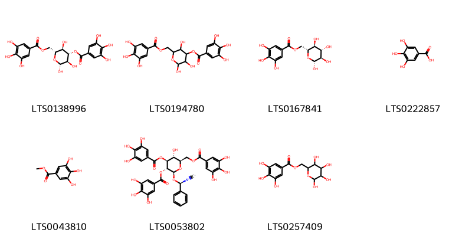{ width=100% }
    <figcaption>Hình ảnh cấu trúc hóa học của 7 hoạt chất thuộc nhóm Benzene and substituted derivatives gồm ['(2r,3r,4s,5r,6r)-2,3,5-trihydroxy-6-[(3,4,5-trihydroxybenzoyloxy)methyl]oxan-4-yl 3,4,5-trihydroxybenzoate (LTS0138996)', '2,3,5-trihydroxy-6-[(3,4,5-trihydroxybenzoyloxy)methyl]oxan-4-yl 3,4,5-trihydroxybenzoate (LTS0194780)', '6-o-galloyl-β-d-glucose (LTS0167841)', 'galop (LTS0222857)', 'methyl gallate (LTS0043810)', '[(2r,3r,4s,5r,6s)-3-hydroxy-6-[(r)-isocyano(phenyl)methoxy]-4,5-bis(3,4,5-trihydroxybenzoyloxy)oxan-2-yl]methyl 3,4,5-trihydroxybenzoate (LTS0053802)', '(3,4,5,6-tetrahydroxyoxan-2-yl)methyl 3,4,5-trihydroxybenzoate (LTS0257409)'].</figcaption>
</figure>
#### Nhóm Fatty Acyls
<figure markdown="span">
    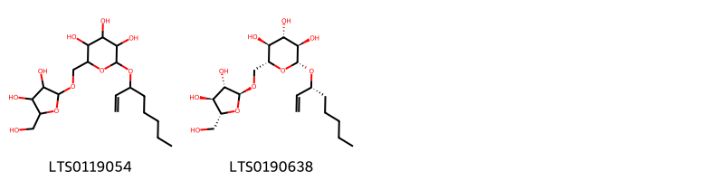{ width=100% }
    <figcaption>Hình ảnh cấu trúc hóa học của 2 hoạt chất thuộc nhóm Fatty Acyls gồm ['2-({[3,4-dihydroxy-5-(hydroxymethyl)oxolan-2-yl]oxy}methyl)-6-(oct-1-en-3-yloxy)oxane-3,4,5-triol (LTS0119054)', '(2r,3s,4s,5r,6r)-2-({[(2s,3s,4s,5r)-3,4-dihydroxy-5-(hydroxymethyl)oxolan-2-yl]oxy}methyl)-6-[(3r)-oct-1-en-3-yloxy]oxane-3,4,5-triol (LTS0190638)'].</figcaption>
</figure>
#### Nhóm Organooxygen compounds
<figure markdown="span">
    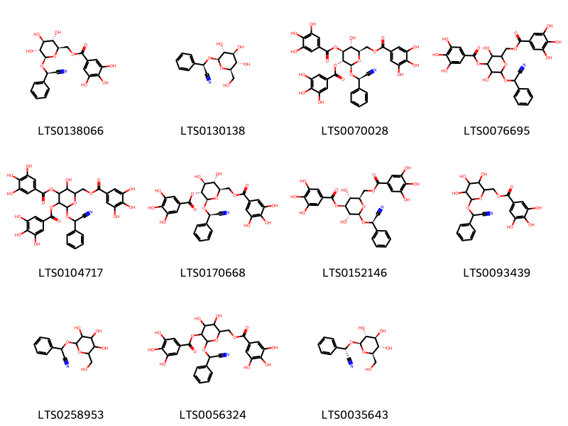{ width=100% }
    <figcaption>Hình ảnh cấu trúc hóa học của 11 hoạt chất thuộc nhóm Organooxygen compounds gồm ['[(2r,3s,4s,5r,6r)-6-[(r)-cyano(phenyl)methoxy]-3,4,5-trihydroxyoxan-2-yl]methyl 3,4,5-trihydroxybenzoate (LTS0138066)', 'prunasin (LTS0130138)', '[(2r,3r,4s,5r,6r)-6-[(r)-cyano(phenyl)methoxy]-3-hydroxy-4,5-bis(3,4,5-trihydroxybenzoyloxy)oxan-2-yl]methyl 3,4,5-trihydroxybenzoate (LTS0070028)', '{6-[cyano(phenyl)methoxy]-3,5-dihydroxy-4-(3,4,5-trihydroxybenzoyloxy)oxan-2-yl}methyl 3,4,5-trihydroxybenzoate (LTS0076695)', '{6-[cyano(phenyl)methoxy]-3-hydroxy-4,5-bis(3,4,5-trihydroxybenzoyloxy)oxan-2-yl}methyl 3,4,5-trihydroxybenzoate (LTS0104717)', '[(2r,3s,4s,5r,6r)-6-[(r)-cyano(phenyl)methoxy]-3,4-dihydroxy-5-(3,4,5-trihydroxybenzoyloxy)oxan-2-yl]methyl 3,4,5-trihydroxybenzoate (LTS0170668)', '[(2r,3r,4s,5r,6r)-6-[(r)-cyano(phenyl)methoxy]-3,5-dihydroxy-4-(3,4,5-trihydroxybenzoyloxy)oxan-2-yl]methyl 3,4,5-trihydroxybenzoate (LTS0152146)', '{6-[cyano(phenyl)methoxy]-3,4,5-trihydroxyoxan-2-yl}methyl 3,4,5-trihydroxybenzoate (LTS0093439)', '2-phenyl-2-{[3,4,5-trihydroxy-6-(hydroxymethyl)oxan-2-yl]oxy}acetonitrile (LTS0258953)', '{6-[cyano(phenyl)methoxy]-3,4-dihydroxy-5-(3,4,5-trihydroxybenzoyloxy)oxan-2-yl}methyl 3,4,5-trihydroxybenzoate (LTS0056324)', '(s)-prunasin (LTS0035643)'].</figcaption>
</figure>
#### Nhóm Tannins
<figure markdown="span">
    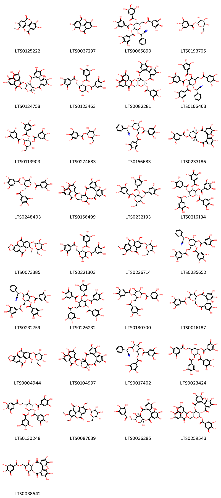{ width=100% }
    <figcaption>Hình ảnh cấu trúc hóa học của 33 hoạt chất thuộc nhóm Tannins gồm ['6,7,13-trihydroxy-14-methoxy-2,9-dioxatetracyclo[6.6.2.0⁴,¹⁶.0¹¹,¹⁵]hexadeca-1(15),4,6,8(16),11,13-hexaene-3,10-dione (LTS0125222)', 'ellagic acid (LTS0037297)', '[(2r,3r,4s,5r,6r)-6-[(r)-cyano(phenyl)methoxy]-3,4,5-tris(3,4,5-trihydroxybenzoyloxy)oxan-2-yl]methyl 3,4,5-trihydroxybenzoate (LTS0065890)', 'β-glucogallin (LTS0193705)', '(10r,13r,14r,15s)-3,4,5,11,20,21,22-heptahydroxy-8,17-dioxo-13-[(3,4,5-trihydroxybenzoyloxy)methyl]-9,12,16-trioxatetracyclo[16.4.0.0²,⁷.0¹⁰,¹⁵]docosa-1(18),2,4,6,19,21-hexaen-14-yl 3,4,5-trihydroxybenzoate (LTS0124758)', '(2r,3r,4r,5r,6r)-2,3-dihydroxy-5-(3,4,5-trihydroxybenzoyloxy)-6-[(3,4,5-trihydroxybenzoyloxy)methyl]oxan-4-yl 3,4,5-trihydroxybenzoate (LTS0123463)', '(10r,11s,13r,14r,15s)-3,4,5,20,21,22-hexahydroxy-8,17-dioxo-14-(3,4,5-trihydroxybenzoyloxy)-13-[(3,4,5-trihydroxybenzoyloxy)methyl]-9,12,16-trioxatetracyclo[16.4.0.0²,⁷.0¹⁰,¹⁵]docosa-1(18),2,4,6,19,21-hexaen-11-yl 3,4,5-trihydroxybenzoate (LTS0082281)', '{6-[cyano(phenyl)methoxy]-3,4,5-tris(3,4,5-trihydroxybenzoyloxy)oxan-2-yl}methyl 3,4,5-trihydroxybenzoate (LTS0166463)', '(2r,3r,4s,5r,6s)-3-hydroxy-2-(hydroxymethyl)-5,6-bis(3,4,5-trihydroxybenzoyloxy)oxan-4-yl 3,4,5-trihydroxybenzoate (LTS0113903)', '3,4,5-trihydroxy-6-(hydroxymethyl)oxan-2-yl 3,4,5-trihydroxybenzoate (LTS0274683)', '[(2r,3s,4r,5r,6r)-6-[(r)-cyano(phenyl)methoxy]-4,5-dihydroxy-3-(3,4,5-trihydroxybenzoyloxy)oxan-2-yl]methyl 3,4,5-trihydroxybenzoate (LTS0156683)', '(10s,11r,12r,13s,15r)-3,4,5,11,12,21,22,23-octahydroxy-8,18-dioxo-9,14,17-trioxatetracyclo[17.4.0.0²,⁷.0¹⁰,¹⁵]tricosa-1(23),2(7),3,5,19,21-hexaen-13-yl 3,4,5-trihydroxybenzoate (LTS0233186)', '(2s,3r,4r,5s,6r)-3,4-dihydroxy-5-(3,4,5-trihydroxybenzoyloxy)-6-[(3,4,5-trihydroxybenzoyloxy)methyl]oxan-2-yl 3,4,5-trihydroxybenzoate (LTS0248403)', '3,4,5,11,20,21,22-heptahydroxy-8,17-dioxo-13-[(3,4,5-trihydroxybenzoyloxy)methyl]-9,12,16-trioxatetracyclo[16.4.0.0²,⁷.0¹⁰,¹⁵]docosa-1(18),2,4,6,19,21-hexaen-14-yl 3,4,5-trihydroxybenzoate (LTS0156499)', '3-hydroxy-2-(hydroxymethyl)-5,6-bis(3,4,5-trihydroxybenzoyloxy)oxan-4-yl 3,4,5-trihydroxybenzoate (LTS0232193)', '(2s,3r,4s,5r,6r)-3,4,5-tris(3,4,5-trihydroxybenzoyloxy)-6-[(3,4,5-trihydroxybenzoyloxy)methyl]oxan-2-yl 3,4,5-trihydroxybenzoate (LTS0216134)', '12-methoxy-13-{[3,4,5-trihydroxy-6-(hydroxymethyl)oxan-2-yl]oxy}-3,5,10,17-tetraoxapentacyclo[9.6.2.0²,⁶.0⁸,¹⁸.0¹⁵,¹⁹]nonadeca-1(18),2(6),7,11(19),12,14-hexaene-9,16-dione (LTS0073385)', '2,3-dihydroxy-5-(3,4,5-trihydroxybenzoyloxy)-6-[(3,4,5-trihydroxybenzoyloxy)methyl]oxan-4-yl 3,4,5-trihydroxybenzoate (LTS0221303)', '6,7,14-trimethoxy-13-{[3,4,5-trihydroxy-6-(hydroxymethyl)oxan-2-yl]oxy}-2,9-dioxatetracyclo[6.6.2.0⁴,¹⁶.0¹¹,¹⁵]hexadeca-1(15),4(16),5,7,11,13-hexaene-3,10-dione (LTS0226714)', '[(2r,3r,4r,5r,6r)-6-[(r)-cyano(phenyl)methoxy]-5-hydroxy-3,4-bis(3,4,5-trihydroxybenzoyloxy)oxan-2-yl]methyl 3,4,5-trihydroxybenzoate (LTS0235652)', '{6-[cyano(phenyl)methoxy]-5-hydroxy-3,4-bis(3,4,5-trihydroxybenzoyloxy)oxan-2-yl}methyl 3,4,5-trihydroxybenzoate (LTS0232759)', '3,4,5-tris(3,4,5-trihydroxybenzoyloxy)-6-[(3,4,5-trihydroxybenzoyloxy)methyl]oxan-2-yl 3,4,5-trihydroxybenzoate (LTS0226232)', '3,4-dihydroxy-5-(3,4,5-trihydroxybenzoyloxy)-6-[(3,4,5-trihydroxybenzoyloxy)methyl]oxan-2-yl 3,4,5-trihydroxybenzoate (LTS0180700)', '3,4,5,11,12,21,22,23-octahydroxy-8,18-dioxo-9,14,17-trioxatetracyclo[17.4.0.0²,⁷.0¹⁰,¹⁵]tricosa-1(23),2(7),3,5,19,21-hexaen-13-yl 3,4,5-trihydroxybenzoate (LTS0016187)', '12-methoxy-13-{[(2s,3r,4s,5s,6r)-3,4,5-trihydroxy-6-(hydroxymethyl)oxan-2-yl]oxy}-3,5,10,17-tetraoxapentacyclo[9.6.2.0²,⁶.0⁸,¹⁸.0¹⁵,¹⁹]nonadeca-1(18),2(6),7,11(19),12,14-hexaene-9,16-dione (LTS0004944)', '(10r,11r,13r,14r,15s)-3,4,5,11,20,21,22-heptahydroxy-8,17-dioxo-13-[(3,4,5-trihydroxybenzoyloxy)methyl]-9,12,16-trioxatetracyclo[16.4.0.0²,⁷.0¹⁰,¹⁵]docosa-1(18),2,4,6,19,21-hexaen-14-yl 3,4,5-trihydroxybenzoate (LTS0104997)', '{6-[cyano(phenyl)methoxy]-4,5-dihydroxy-3-(3,4,5-trihydroxybenzoyloxy)oxan-2-yl}methyl 3,4,5-trihydroxybenzoate (LTS0017402)', '5-hydroxy-3,4-bis(3,4,5-trihydroxybenzoyloxy)-6-[(3,4,5-trihydroxybenzoyloxy)methyl]oxan-2-yl 3,4,5-trihydroxybenzoate (LTS0023424)', '(2s,3r,4s,5r,6r)-5-hydroxy-3,4-bis(3,4,5-trihydroxybenzoyloxy)-6-[(3,4,5-trihydroxybenzoyloxy)methyl]oxan-2-yl 3,4,5-trihydroxybenzoate (LTS0130248)', '6,7,14-trimethoxy-13-{[(2s,3r,4s,5s,6r)-3,4,5-trihydroxy-6-(hydroxymethyl)oxan-2-yl]oxy}-2,9-dioxatetracyclo[6.6.2.0⁴,¹⁶.0¹¹,¹⁵]hexadeca-1(15),4(16),5,7,11,13-hexaene-3,10-dione (LTS0087639)', '[(10r,11r,13r,14r,15s)-3,4,5,11,14,20,21,22-octahydroxy-8,17-dioxo-9,12,16-trioxatetracyclo[16.4.0.0²,⁷.0¹⁰,¹⁵]docosa-1(18),2,4,6,19,21-hexaen-13-yl]methyl 3,4,5-trihydroxybenzoate (LTS0036285)', '3,4,5,20,21,22-hexahydroxy-8,17-dioxo-14-(3,4,5-trihydroxybenzoyloxy)-13-[(3,4,5-trihydroxybenzoyloxy)methyl]-9,12,16-trioxatetracyclo[16.4.0.0²,⁷.0¹⁰,¹⁵]docosa-1(18),2,4,6,19,21-hexaen-11-yl 3,4,5-trihydroxybenzoate (LTS0259543)', '{3,4,5,11,14,20,21,22-octahydroxy-8,17-dioxo-9,12,16-trioxatetracyclo[16.4.0.0²,⁷.0¹⁰,¹⁵]docosa-1(18),2,4,6,19,21-hexaen-13-yl}methyl 3,4,5-trihydroxybenzoate (LTS0038542)'].</figcaption>
</figure>

---

### Dược dân tộc học

Danh sách các quốc gia có sử dụng *Phyllagathis rotundifolia* trong điều trị các bệnh. 

| Country   | Disease   | Bệnh                                                                                                                                                                                                |
|:----------|:----------|:----------------------------------------------------------------------------------------------------------------------------------------------------------------------------------------------------|
| Malaysia  | Tonic     | MYMEMORY WARNING: YOU USED ALL AVAILABLE FREE TRANSLATIONS FOR TODAY. NEXT AVAILABLE IN  18 HOURS 30 MINUTES 02 SECONDS VISIT HTTPS://MYMEMORY.TRANSLATED.NET/DOC/USAGELIMITS.PHP TO TRANSLATE MORE |

---

# Chi Arthrostemma

??? note "Danh sách các dược liệu thuộc chi"
    
	 - *Arthrostemma grandiflorum*

---
## Arthrostemma grandiflorum
### Thông tin về thực vật

!!! info "Phân loại thực vật của *Arthrostemma ciliatum* từ GIBF:"
    - **Kingdom:** Plantae
    - **Phylum:** Tracheophyta
    - **Order:** Myrtales
    - **Family:** Melastomataceae
    - **Genus:** Arthrostemma
    - **Species:** *Arthrostemma ciliatum*

 

| Label (VI)   | Label (EN)   | Scientific Name           | Descriptions (VI)   | Descriptions (EN)   | Also Known As (VI)   | Also Known As (EN)   |
|:-------------|:-------------|:--------------------------|:--------------------|:--------------------|:---------------------|:---------------------|
| N/A          | N/A          | Arthrostemma grandiflorum | loài thực vật       | species of plant    | ['']                 | ['']                 |

#### Phân bố trên thế giới

**Từ CSDL GIBF** nan, Ecuador, Peru

#### Phân bố tại Việt Nam

**Từ CSDL GIBF**: Không có ghi nhận ở Việt Nam

---
### Thành phần hóa học
        
- Theo cơ sở dữ liệu lotus: Từ loài *Arthrostemma ciliatum* đã phân lập và xác định được Chưa có hoạt chất nào được phân lập. hoạt chất thuộc về các nhóm Không có hoạt chất nào được phân lập. 

Không có hình ảnh nào được tạo ra

---

### Dược dân tộc học

Danh sách các quốc gia có sử dụng *Arthrostemma ciliatum* trong điều trị các bệnh. 

| Country   | Disease   | Bệnh                                                                                                                                                                                                |
|:----------|:----------|:----------------------------------------------------------------------------------------------------------------------------------------------------------------------------------------------------|
| Colombia  | Diuretic  | MYMEMORY WARNING: YOU USED ALL AVAILABLE FREE TRANSLATIONS FOR TODAY. NEXT AVAILABLE IN  18 HOURS 29 MINUTES 26 SECONDS VISIT HTTPS://MYMEMORY.TRANSLATED.NET/DOC/USAGELIMITS.PHP TO TRANSLATE MORE |

---

# Chi Dissotis

??? note "Danh sách các dược liệu thuộc chi"
    
	 - *Dissotis rotundifolia*

---
## Dissotis rotundifolia
### Thông tin về thực vật

!!! info "Phân loại thực vật của *Heterotis rotundifolia* từ GIBF:"
    - **Kingdom:** Plantae
    - **Phylum:** Tracheophyta
    - **Order:** Myrtales
    - **Family:** Melastomataceae
    - **Genus:** Heterotis
    - **Species:** *Heterotis rotundifolia*

 

| Label (VI)   | Label (EN)   | Scientific Name       | Descriptions (VI)   | Descriptions (EN)   | Also Known As (VI)   | Also Known As (EN)   |
|:-------------|:-------------|:----------------------|:--------------------|:--------------------|:---------------------|:---------------------|
| N/A          | N/A          | Dissotis rotundifolia | loài thực vật       | species of plant    | ['']                 | ['']                 |

#### Phân bố trên thế giới

**Từ CSDL GIBF** nan, Malawi, unknown or invalid, Guadeloupe, Ghana, Dominica, French Polynesia, French Guiana, Cameroon, Kenya, Gabon, Australia, Colombia, Togo, Dominican Republic, Côte d’Ivoire, Puerto Rico, Guinea-Bissau, Malaysia, Samoa, Nigeria, Belgium, Uganda, Brazil, Peru, Palau, Ethiopia, Equatorial Guinea, Benin, Chinese Taipei, Niue, Micronesia (Federated States of), Tanzania, United Republic of, Cook Islands, Papua New Guinea, Costa Rica, Fiji, New Caledonia, Congo, Democratic Republic of the, United States of America, Congo, Guinea, Solomon Islands

#### Phân bố tại Việt Nam

**Từ CSDL GIBF**: Không có ghi nhận ở Việt Nam

---
### Thành phần hóa học
        
- Theo cơ sở dữ liệu lotus: Từ loài *Heterotis rotundifolia* đã phân lập và xác định được 6 hoạt chất thuộc về các nhóm Tannins, Flavonoids. 

|    | chemicalTaxonomyClassyfireClass   |   smiles_count |
|---:|:----------------------------------|---------------:|
|  0 | Flavonoids                        |              4 |
|  1 | Tannins                           |              2 |

#### Nhóm Flavonoids
<figure markdown="span">
    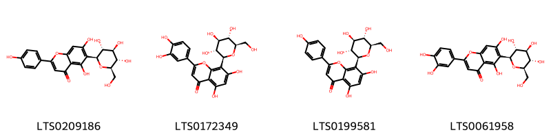{ width=100% }
    <figcaption>Hình ảnh cấu trúc hóa học của 4 hoạt chất thuộc nhóm Flavonoids gồm ['isovitexin (LTS0209186)', 'orientin (LTS0172349)', 'vitexin (LTS0199581)', 'isoorientin (LTS0061958)'].</figcaption>
</figure>
#### Nhóm Tannins
<figure markdown="span">
    { width=100% }
    <figcaption>Hình ảnh cấu trúc hóa học của 2 hoạt chất thuộc nhóm Tannins gồm ['6,7,13-trihydroxy-14-methoxy-2,9-dioxatetracyclo[6.6.2.0⁴,¹⁶.0¹¹,¹⁵]hexadeca-1(15),4,6,8(16),11,13-hexaene-3,10-dione (LTS0125222)', 'ellagic acid (LTS0037297)'].</figcaption>
</figure>

---

### Dược dân tộc học

Danh sách các quốc gia có sử dụng *Heterotis rotundifolia* trong điều trị các bệnh. 

| Country   | Disease   | Bệnh                                                                                                                                                                                                |
|:----------|:----------|:----------------------------------------------------------------------------------------------------------------------------------------------------------------------------------------------------|
| Ghana     | Purgative | MYMEMORY WARNING: YOU USED ALL AVAILABLE FREE TRANSLATIONS FOR TODAY. NEXT AVAILABLE IN  18 HOURS 29 MINUTES 06 SECONDS VISIT HTTPS://MYMEMORY.TRANSLATED.NET/DOC/USAGELIMITS.PHP TO TRANSLATE MORE |
| Nigeria   | Collyrium | MYMEMORY WARNING: YOU USED ALL AVAILABLE FREE TRANSLATIONS FOR TODAY. NEXT AVAILABLE IN  18 HOURS 29 MINUTES 03 SECONDS VISIT HTTPS://MYMEMORY.TRANSLATED.NET/DOC/USAGELIMITS.PHP TO TRANSLATE MORE |
| Tanzania  | Vermifuge | MYMEMORY WARNING: YOU USED ALL AVAILABLE FREE TRANSLATIONS FOR TODAY. NEXT AVAILABLE IN  18 HOURS 29 MINUTES 00 SECONDS VISIT HTTPS://MYMEMORY.TRANSLATED.NET/DOC/USAGELIMITS.PHP TO TRANSLATE MORE |

---

# Chi Melastoma

??? note "Danh sách các dược liệu thuộc chi"
    
	 - *Melastoma malabathricum*

---
## Melastoma malabathricum
### Thông tin về thực vật

!!! info "Phân loại thực vật của *Melastoma malabathricum* từ GIBF:"
    - **Kingdom:** Plantae
    - **Phylum:** Tracheophyta
    - **Order:** Myrtales
    - **Family:** Melastomataceae
    - **Genus:** Melastoma
    - **Species:** *Melastoma malabathricum*

 

| Label (VI)   | Label (EN)   | Scientific Name         | Descriptions (VI)   | Descriptions (EN)   | Also Known As (VI)   | Also Known As (EN)                             |
|:-------------|:-------------|:------------------------|:--------------------|:--------------------|:---------------------|:-----------------------------------------------|
| N/A          | N/A          | Melastoma malabathricum | loài thực vật       | species of plant    | ['']                 | ['Indian Rhododendron', 'Malabar Black Mouth'] |

#### Phân bố trên thế giới

**Từ CSDL GIBF** Thailand, Sri Lanka, Japan, Malaysia, India, Indonesia, United States of America, Singapore, China, Guam, Australia, Hong Kong, Chinese Taipei

#### Phân bố tại Việt Nam

**Từ CSDL GIBF**: Không có ghi nhận ở Việt Nam

---
### Thành phần hóa học
        
- Theo cơ sở dữ liệu lotus: Từ loài *Melastoma malabathricum* đã phân lập và xác định được 65 hoạt chất thuộc về các nhóm Flavonoids, Tannins, Prenol lipids, Carboxylic acids and derivatives. 

|    | chemicalTaxonomyClassyfireClass   |   smiles_count |
|---:|:----------------------------------|---------------:|
|  0 | Carboxylic acids and derivatives  |              2 |
|  1 | Flavonoids                        |              8 |
|  2 | Prenol lipids                     |              2 |
|  3 | Tannins                           |             52 |

#### Nhóm Carboxylic acids and derivatives
<figure markdown="span">
    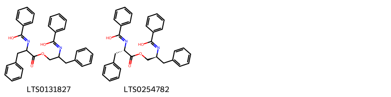{ width=100% }
    <figcaption>Hình ảnh cấu trúc hóa học của 2 hoạt chất thuộc nhóm Carboxylic acids and derivatives gồm ['n-[1-(2-{[hydroxy(phenyl)methylidene]amino}-3-phenylpropoxy)-1-oxo-3-phenylpropan-2-yl]benzenecarboximidic acid (LTS0131827)', 'n-[(2s)-1-[(2s)-2-{[hydroxy(phenyl)methylidene]amino}-3-phenylpropoxy]-1-oxo-3-phenylpropan-2-yl]benzenecarboximidic acid (LTS0254782)'].</figcaption>
</figure>
#### Nhóm Flavonoids
<figure markdown="span">
    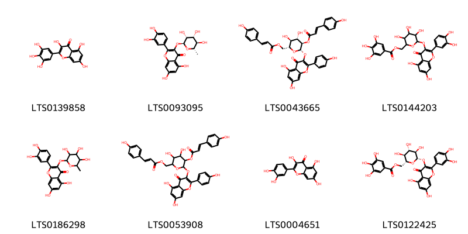{ width=100% }
    <figcaption>Hình ảnh cấu trúc hóa học của 8 hoạt chất thuộc nhóm Flavonoids gồm ['myricetin (LTS0139858)', 'quercitrin (LTS0093095)', '[(2r,3s,4s,5r,6s)-6-{[5,7-dihydroxy-2-(4-hydroxyphenyl)-4-oxochromen-3-yl]oxy}-3,4-dihydroxy-5-{[(2e)-3-(4-hydroxyphenyl)prop-2-enoyl]oxy}oxan-2-yl]methyl (2e)-3-(4-hydroxyphenyl)prop-2-enoate (LTS0043665)', '(6-{[2-(3,4-dihydroxyphenyl)-5,7-dihydroxy-4-oxochromen-3-yl]oxy}-3,4,5-trihydroxyoxan-2-yl)methyl 3,4,5-trihydroxybenzoate (LTS0144203)', 'quercitrin (LTS0186298)', '(6-{[5,7-dihydroxy-2-(4-hydroxyphenyl)-4-oxochromen-3-yl]oxy}-3,4-dihydroxy-5-{[3-(4-hydroxyphenyl)prop-2-enoyl]oxy}oxan-2-yl)methyl 3-(4-hydroxyphenyl)prop-2-enoate (LTS0053908)', 'quercetin (LTS0004651)', '[(2r,3s,4s,5r,6s)-6-{[2-(3,4-dihydroxyphenyl)-5,7-dihydroxy-4-oxochromen-3-yl]oxy}-3,4,5-trihydroxyoxan-2-yl]methyl 3,4,5-trihydroxybenzoate (LTS0122425)'].</figcaption>
</figure>
#### Nhóm Prenol lipids
<figure markdown="span">
    { width=100% }
    <figcaption>Hình ảnh cấu trúc hóa học của 2 hoạt chất thuộc nhóm Prenol lipids gồm ['amyrin (LTS0222826)', 'α-amyrin (LTS0088267)'].</figcaption>
</figure>
#### Nhóm Tannins
<figure markdown="span">
    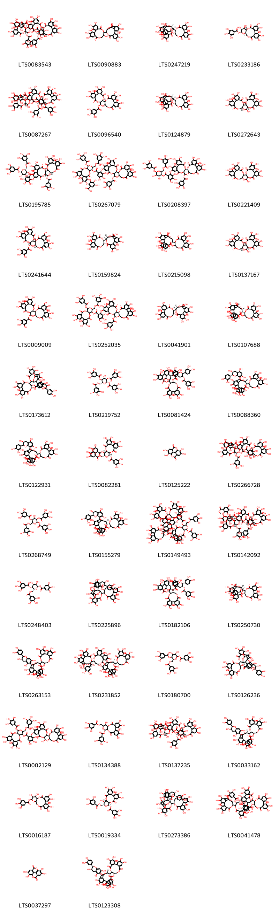{ width=100% }
    <figcaption>Hình ảnh cấu trúc hóa học của 52 hoạt chất thuộc nhóm Tannins gồm ['(10r,11s,13r,14r,15s)-3,4,5,20,21,22-hexahydroxy-8,17-dioxo-11-(3,4,5-trihydroxybenzoyloxy)-13-[(3,4,5-trihydroxybenzoyloxy)methyl]-9,12,16-trioxatetracyclo[16.4.0.0²,⁷.0¹⁰,¹⁵]docosa-1(18),2,4,6,19,21-hexaen-14-yl 3,4,5-trihydroxy-2-{[(1r,2s,19r,20s,22r)-7,8,9,12,13,28,29,30,33,34,35-undecahydroxy-4,17,25,38-tetraoxo-20-(3,4,5-trihydroxybenzoyloxy)-3,18,21,24,39-pentaoxaheptacyclo[20.17.0.0²,¹⁹.0⁵,¹⁰.0¹¹,¹⁶.0²⁶,³¹.0³²,³⁷]nonatriaconta-5(10),6,8,11(16),12,14,26,28,30,32(37),33,35-dodecaen-14-yl]oxy}benzoate (LTS0083543)', '14-{3,4,5,11,17,18,19-heptahydroxy-8,14-dioxo-9,13-dioxatricyclo[13.4.0.0²,⁷]nonadeca-1(15),2,4,6,16,18-hexaen-10-yl}-2,3,4,7,8,9,19-heptahydroxy-13,16-dioxatetracyclo[13.3.1.0⁵,¹⁸.0⁶,¹¹]nonadeca-1(18),2,4,6,8,10-hexaene-12,17-dione (LTS0090883)', '(11r,12r)-12-[(14r,15r,19r)-2,3,4,7,8,9,19-heptahydroxy-12,17-dioxo-13,16-dioxatetracyclo[13.3.1.0⁵,¹⁸.0⁶,¹¹]nonadeca-1(18),2,4,6,8,10-hexaen-14-yl]-3,4,5,17,18,19-hexahydroxy-8,14-dioxo-9,13-dioxatricyclo[13.4.0.0²,⁷]nonadeca-1(15),2,4,6,16,18-hexaen-11-yl 3,4,5-trihydroxybenzoate (LTS0247219)', '(10s,11r,12r,13s,15r)-3,4,5,11,12,21,22,23-octahydroxy-8,18-dioxo-9,14,17-trioxatetracyclo[17.4.0.0²,⁷.0¹⁰,¹⁵]tricosa-1(23),2(7),3,5,19,21-hexaen-13-yl 3,4,5-trihydroxybenzoate (LTS0233186)', '(10r,11r,13r,14r,15s)-13-{[3,5-dihydroxy-4-(3,4,5-trihydroxybenzoyloxy)benzoyloxy]methyl}-3,4,5,11,20,21,22-heptahydroxy-8,17-dioxo-9,12,16-trioxatetracyclo[16.4.0.0²,⁷.0¹⁰,¹⁵]docosa-1(18),2,4,6,19,21-hexaen-14-yl 3,4,5-trihydroxy-2-{[(1r,2s,19r,20s,22r)-7,8,9,12,13,28,29,30,33,34,35-undecahydroxy-4,17,25,38-tetraoxo-20-(3,4,5-trihydroxybenzoyloxy)-3,18,21,24,39-pentaoxaheptacyclo[20.17.0.0²,¹⁹.0⁵,¹⁰.0¹¹,¹⁶.0²⁶,³¹.0³²,³⁷]nonatriaconta-5(10),6,8,11(16),12,14,26,28,30,32(37),33,35-dodecaen-14-yl]oxy}benzoate (LTS0087267)', '(2s,20s,22r)-7,8,9,12,13,14,28,29,30,33,34,35-dodecahydroxy-4,17,25,38-tetraoxo-3,18,21,24,39-pentaoxaheptacyclo[20.17.0.0²,¹⁹.0⁵,¹⁰.0¹¹,¹⁶.0²⁶,³¹.0³²,³⁷]nonatriaconta-5,7,9,11(16),12,14,26,28,30,32(37),33,35-dodecaen-20-yl 3,4,5-trihydroxybenzoate (LTS0096540)', '(11r,12r)-12-[(14r,15s,19s)-2,3,4,7,8,9,19-heptahydroxy-12,17-dioxo-13,16-dioxatetracyclo[13.3.1.0⁵,¹⁸.0⁶,¹¹]nonadeca-1(18),2,4,6,8,10-hexaen-14-yl]-3,4,5,17,18,19-hexahydroxy-8,14-dioxo-9,13-dioxatricyclo[13.4.0.0²,⁷]nonadeca-1(15),2,4,6,16,18-hexaen-11-yl 3,4,5-trihydroxybenzoate (LTS0124879)', '(1r,2s,19r,20s,22r)-7,8,9,12,13,14,20,28,29,30,33,34,35-tridecahydroxy-3,18,21,24,39-pentaoxaheptacyclo[20.17.0.0²,¹⁹.0⁵,¹⁰.0¹¹,¹⁶.0²⁶,³¹.0³²,³⁷]nonatriaconta-5(10),6,8,11,13,15,26(31),27,29,32,34,36-dodecaene-4,17,25,38-tetrone (LTS0272643)', '(2r,3s,4r,5r,6s)-4,5-dihydroxy-6-(3,4,5-trihydroxybenzoyloxy)-2-[(3,4,5-trihydroxybenzoyloxy)methyl]oxan-3-yl 3,4,5-trihydroxy-2-{[(1r,2s,19r,20s,22r)-7,8,9,12,13,28,29,30,33,34,35-undecahydroxy-4,17,25,38-tetraoxo-20-(3,4,5-trihydroxybenzoyloxy)-3,18,21,24,39-pentaoxaheptacyclo[20.17.0.0²,¹⁹.0⁵,¹⁰.0¹¹,¹⁶.0²⁶,³¹.0³²,³⁷]nonatriaconta-5(10),6,8,11(16),12,14,26,28,30,32(37),33,35-dodecaen-14-yl]oxy}benzoate (LTS0195785)', '3,4,5-trihydroxy-2-{[3,4,5,21,22-pentahydroxy-8,17-dioxo-14-(3,4,5-trihydroxy-2-{[7,8,9,12,13,28,29,30,33,34,35-undecahydroxy-4,17,25,38-tetraoxo-20-(3,4,5-trihydroxybenzoyloxy)-3,18,21,24,39-pentaoxaheptacyclo[20.17.0.0²,¹⁹.0⁵,¹⁰.0¹¹,¹⁶.0²⁶,³¹.0³²,³⁷]nonatriaconta-5(10),6,8,11(16),12,14,26(31),27,29,32,34,36-dodecaen-14-yl]oxy}benzoyloxy)-11-(3,4,5-trihydroxybenzoyloxy)-13-[(3,4,5-trihydroxybenzoyloxy)methyl]-9,12,16-trioxatetracyclo[16.4.0.0²,⁷.0¹⁰,¹⁵]docosa-1(18),2,4,6,19,21-hexaen-20-yl]oxy}benzoic acid (LTS0267079)', '4,5-dihydroxy-6-(3,4,5-trihydroxybenzoyloxy)-2-[(3,4,5-trihydroxybenzoyloxy)methyl]oxan-3-yl 3,4,5-trihydroxy-2-{[7,8,9,12,13,28,29,30,33,34,35-undecahydroxy-4,17,25,38-tetraoxo-20-(3,4,5-trihydroxybenzoyloxy)-3,18,21,24,39-pentaoxaheptacyclo[20.17.0.0²,¹⁹.0⁵,¹⁰.0¹¹,¹⁶.0²⁶,³¹.0³²,³⁷]nonatriaconta-5(10),6,8,11(16),12,14,26(31),27,29,32,34,36-dodecaen-14-yl]oxy}benzoate (LTS0208397)', '7,8,9,12,13,14,20,28,29,30,33,34,35-tridecahydroxy-3,18,21,24,39-pentaoxaheptacyclo[20.17.0.0²,¹⁹.0⁵,¹⁰.0¹¹,¹⁶.0²⁶,³¹.0³²,³⁷]nonatriaconta-5(10),6,8,11,13,15,26(31),27,29,32,34,36-dodecaene-4,17,25,38-tetrone (LTS0221409)', 'casuarictin (LTS0241644)', '(14r,15r,19r)-14-[(10r,11r)-3,4,5,11,17,18,19-heptahydroxy-8,14-dioxo-9,13-dioxatricyclo[13.4.0.0²,⁷]nonadeca-1(15),2,4,6,16,18-hexaen-10-yl]-2,3,4,7,8,9,19-heptahydroxy-13,16-dioxatetracyclo[13.3.1.0⁵,¹⁸.0⁶,¹¹]nonadeca-1(18),2,4,6,8,10-hexaene-12,17-dione (LTS0159824)', '12-{2,3,4,7,8,9,19-heptahydroxy-12,17-dioxo-13,16-dioxatetracyclo[13.3.1.0⁵,¹⁸.0⁶,¹¹]nonadeca-1(18),2,4,6,8,10-hexaen-14-yl}-3,4,5,17,18,19-hexahydroxy-8,14-dioxo-9,13-dioxatricyclo[13.4.0.0²,⁷]nonadeca-1(15),2,4,6,16,18-hexaen-11-yl 3,4,5-trihydroxybenzoate (LTS0215098)', '(1r,2s,19r,22r)-7,8,9,12,13,14,20,28,29,30,33,34,35-tridecahydroxy-3,18,21,24,39-pentaoxaheptacyclo[20.17.0.0²,¹⁹.0⁵,¹⁰.0¹¹,¹⁶.0²⁶,³¹.0³²,³⁷]nonatriaconta-5(10),6,8,11,13,15,26(31),27,29,32,34,36-dodecaene-4,17,25,38-tetrone (LTS0137167)', '7,8,9,12,13,14,28,29,30,33,34,35-dodecahydroxy-4,17,25,38-tetraoxo-3,18,21,24,39-pentaoxaheptacyclo[20.17.0.0²,¹⁹.0⁵,¹⁰.0¹¹,¹⁶.0²⁶,³¹.0³²,³⁷]nonatriaconta-5,7,9,11(16),12,14,26,28,30,32(37),33,35-dodecaen-20-yl 3,4,5-trihydroxybenzoate (LTS0009009)', '3,4,5,20,21,22-hexahydroxy-8,17-dioxo-11-(3,4,5-trihydroxybenzoyloxy)-13-[(3,4,5-trihydroxybenzoyloxy)methyl]-9,12,16-trioxatetracyclo[16.4.0.0²,⁷.0¹⁰,¹⁵]docosa-1(18),2,4,6,19,21-hexaen-14-yl 3,4,5-trihydroxy-2-{[7,8,9,12,13,28,29,30,33,34,35-undecahydroxy-4,17,25,38-tetraoxo-20-(3,4,5-trihydroxybenzoyloxy)-3,18,21,24,39-pentaoxaheptacyclo[20.17.0.0²,¹⁹.0⁵,¹⁰.0¹¹,¹⁶.0²⁶,³¹.0³²,³⁷]nonatriaconta-5(10),6,8,11(16),12,14,26(31),27,29,32,34,36-dodecaen-14-yl]oxy}benzoate (LTS0252035)', '(14r,15s,19r)-14-[(10r,11r)-3,4,5,11,17,18,19-heptahydroxy-8,14-dioxo-9,13-dioxatricyclo[13.4.0.0²,⁷]nonadeca-1(15),2,4,6,16,18-hexaen-10-yl]-2,3,4,7,8,9,19-heptahydroxy-13,16-dioxatetracyclo[13.3.1.0⁵,¹⁸.0⁶,¹¹]nonadeca-1(18),2,4,6,8,10-hexaene-12,17-dione (LTS0041901)', '(11r,12r)-12-[(15s,19s)-2,3,4,7,8,9,19-heptahydroxy-12,17-dioxo-13,16-dioxatetracyclo[13.3.1.0⁵,¹⁸.0⁶,¹¹]nonadeca-1(18),2,4,6,8,10-hexaen-14-yl]-3,4,5,17,18,19-hexahydroxy-8,14-dioxo-9,13-dioxatricyclo[13.4.0.0²,⁷]nonadeca-1(15),2,4,6,16,18-hexaen-11-yl 3,4,5-trihydroxybenzoate (LTS0107688)', '12-[7-(3,4-dihydroxyphenyl)-6,11,20,21,22,25-hexahydroxy-17,26,28-trioxo-2,8,16,29-tetraoxaheptacyclo[12.12.3.0¹,¹³.0³,¹².0⁴,⁹.0¹⁸,²³.0²⁴,²⁷]nonacosa-3,9,11,18,20,22,24-heptaen-15-yl]-3,4,5,17,18,19-hexahydroxy-8,14-dioxo-9,13-dioxatricyclo[13.4.0.0²,⁷]nonadeca-1(15),2,4,6,16,18-hexaen-11-yl 3,4,5-trihydroxybenzoate (LTS0173612)', '(2s,3r,4s,5s,6r)-4-hydroxy-3,5-bis(3,4,5-trihydroxybenzoyloxy)-6-[(3,4,5-trihydroxybenzoyloxy)methyl]oxan-2-yl 3,4,5-trihydroxybenzoate (LTS0219752)', '10-{19-[2-(3,4-dihydroxyphenyl)-5,7-dihydroxy-3-(3,4,5-trihydroxybenzoyloxy)-3,4-dihydro-2h-1-benzopyran-6-yl]-2,3,4,7,8,9-hexahydroxy-12,17-dioxo-13,16-dioxatetracyclo[13.3.1.0⁵,¹⁸.0⁶,¹¹]nonadeca-1,3,5(18),6,8,10-hexaen-14-yl}-3,4,5,17,18,19-hexahydroxy-8,14-dioxo-9,13-dioxatricyclo[13.4.0.0²,⁷]nonadeca-1(15),2,4,6,16,18-hexaen-11-yl 3,4,5-trihydroxybenzoate (LTS0081424)', '(11s,12r)-12-[(14r,15s,19r)-19-[(2r,3s)-2-(3,4-dihydroxyphenyl)-3,5,7-trihydroxy-3,4-dihydro-2h-1-benzopyran-8-yl]-2,3,4,7,8,9-hexahydroxy-12,17-dioxo-13,16-dioxatetracyclo[13.3.1.0⁵,¹⁸.0⁶,¹¹]nonadeca-1(18),2,4,6,8,10-hexaen-14-yl]-3,4,5,17,18,19-hexahydroxy-8,14-dioxo-9,13-dioxatricyclo[13.4.0.0²,⁷]nonadeca-1(15),2,4,6,16,18-hexaen-11-yl 3,4,5-trihydroxybenzoate (LTS0088360)', '12-{19-[2-(3,4-dihydroxyphenyl)-3,5,7-trihydroxy-3,4-dihydro-2h-1-benzopyran-8-yl]-2,3,4,7,8,9-hexahydroxy-12,17-dioxo-13,16-dioxatetracyclo[13.3.1.0⁵,¹⁸.0⁶,¹¹]nonadeca-1(18),2,4,6,8,10-hexaen-14-yl}-3,4,5,17,18,19-hexahydroxy-8,14-dioxo-9,13-dioxatricyclo[13.4.0.0²,⁷]nonadeca-1(15),2,4,6,16,18-hexaen-11-yl 3,4,5-trihydroxybenzoate (LTS0122931)', '(10r,11s,13r,14r,15s)-3,4,5,20,21,22-hexahydroxy-8,17-dioxo-14-(3,4,5-trihydroxybenzoyloxy)-13-[(3,4,5-trihydroxybenzoyloxy)methyl]-9,12,16-trioxatetracyclo[16.4.0.0²,⁷.0¹⁰,¹⁵]docosa-1(18),2,4,6,19,21-hexaen-11-yl 3,4,5-trihydroxybenzoate (LTS0082281)', '6,7,13-trihydroxy-14-methoxy-2,9-dioxatetracyclo[6.6.2.0⁴,¹⁶.0¹¹,¹⁵]hexadeca-1(15),4,6,8(16),11,13-hexaene-3,10-dione (LTS0125222)', '(10r,11s,13r,14r,15s)-3,4,5,20,21,22-hexahydroxy-8,17-dioxo-11-(3,4,5-trihydroxybenzoyloxy)-13-[(3,4,5-trihydroxybenzoyloxy)methyl]-9,12,16-trioxatetracyclo[16.4.0.0²,⁷.0¹⁰,¹⁵]docosa-1(18),2,4,6,19,21-hexaen-14-yl 2-{[(1r,2s,19r,20r,22r)-7,8,9,12,13,20,28,29,30,33,34,35-dodecahydroxy-4,17,25,38-tetraoxo-3,18,21,24,39-pentaoxaheptacyclo[20.17.0.0²,¹⁹.0⁵,¹⁰.0¹¹,¹⁶.0²⁶,³¹.0³²,³⁷]nonatriaconta-5(10),6,8,11(16),12,14,26,28,30,32(37),33,35-dodecaen-14-yl]oxy}-3,4,5-trihydroxybenzoate (LTS0266728)', '4-hydroxy-3,5-bis(3,4,5-trihydroxybenzoyloxy)-6-[(3,4,5-trihydroxybenzoyloxy)methyl]oxan-2-yl 3,4,5-trihydroxybenzoate (LTS0268749)', '(11r,12r)-12-[(15s,19s)-19-[2-(3,4-dihydroxyphenyl)-3,5,7-trihydroxy-3,4-dihydro-2h-1-benzopyran-8-yl]-2,3,4,7,8,9-hexahydroxy-12,17-dioxo-13,16-dioxatetracyclo[13.3.1.0⁵,¹⁸.0⁶,¹¹]nonadeca-1(18),2,4,6,8,10-hexaen-14-yl]-3,4,5,17,18,19-hexahydroxy-8,14-dioxo-9,13-dioxatricyclo[13.4.0.0²,⁷]nonadeca-1(15),2,4,6,16,18-hexaen-11-yl 3,4,5-trihydroxybenzoate (LTS0155279)', '7,8,9,12,13,14,28,29,30,33,34,35-dodecahydroxy-4,17,25,38-tetraoxo-3,18,21,24,39-pentaoxaheptacyclo[20.17.0.0²,¹⁹.0⁵,¹⁰.0¹¹,¹⁶.0²⁶,³¹.0³²,³⁷]nonatriaconta-5,7,9,11(16),12,14,26,28,30,32(37),33,35-dodecaen-20-yl 3,4,5-trihydroxy-2-{[3,4,5,20,21-pentahydroxy-8,17-dioxo-14-(3,4,5-trihydroxy-2-{[7,8,9,12,13,28,29,30,33,34,35-undecahydroxy-4,17,25,38-tetraoxo-20-(3,4,5-trihydroxybenzoyloxy)-3,18,21,24,39-pentaoxaheptacyclo[20.17.0.0²,¹⁹.0⁵,¹⁰.0¹¹,¹⁶.0²⁶,³¹.0³²,³⁷]nonatriaconta-5(10),6,8,11(16),12,14,26(31),27,29,32,34,36-dodecaen-14-yl]oxy}benzoyloxy)-11-(3,4,5-trihydroxybenzoyloxy)-13-[(3,4,5-trihydroxybenzoyloxy)methyl]-9,12,16-trioxatetracyclo[16.3.1.0²,⁷.0¹⁰,¹⁵]docosa-1(22),2,4,6,18,20-hexaen-19-yl]oxy}benzoate (LTS0149493)', 'methyl 3,4,5-trihydroxy-2-{[(10r,11s,13r,14r,15s)-3,4,5,21,22-pentahydroxy-8,17-dioxo-14-(3,4,5-trihydroxy-2-{[(1r,2s,19r,20s,22r)-7,8,9,12,13,28,29,30,33,34,35-undecahydroxy-4,17,25,38-tetraoxo-20-(3,4,5-trihydroxybenzoyloxy)-3,18,21,24,39-pentaoxaheptacyclo[20.17.0.0²,¹⁹.0⁵,¹⁰.0¹¹,¹⁶.0²⁶,³¹.0³²,³⁷]nonatriaconta-5(10),6,8,11(16),12,14,26,28,30,32(37),33,35-dodecaen-14-yl]oxy}benzoyloxy)-11-(3,4,5-trihydroxybenzoyloxy)-13-[(3,4,5-trihydroxybenzoyloxy)methyl]-9,12,16-trioxatetracyclo[16.4.0.0²,⁷.0¹⁰,¹⁵]docosa-1(18),2(7),3,5,19,21-hexaen-20-yl]oxy}benzoate (LTS0142092)', '(2s,3r,4r,5s,6r)-3,4-dihydroxy-5-(3,4,5-trihydroxybenzoyloxy)-6-[(3,4,5-trihydroxybenzoyloxy)methyl]oxan-2-yl 3,4,5-trihydroxybenzoate (LTS0248403)', '12-[9-(3,4-dihydroxyphenyl)-5,8,20,21,22,25-hexahydroxy-17,26,28-trioxo-2,10,16,29-tetraoxaheptacyclo[12.12.3.0¹,¹³.0³,¹².0⁶,¹¹.0¹⁸,²³.0²⁴,²⁷]nonacosa-3,5,11,18,20,22,24-heptaen-15-yl]-3,4,5,17,18,19-hexahydroxy-8,14-dioxo-9,13-dioxatricyclo[13.4.0.0²,⁷]nonadeca-1(15),2,4,6,16,18-hexaen-11-yl 3,4,5-trihydroxybenzoate (LTS0225896)', '(10r,11r)-10-[(14r,15s,19r)-19-[(2r,3r)-2-(3,4-dihydroxyphenyl)-5,7-dihydroxy-3-(3,4,5-trihydroxybenzoyloxy)-3,4-dihydro-2h-1-benzopyran-6-yl]-2,3,4,7,8,9-hexahydroxy-12,17-dioxo-13,16-dioxatetracyclo[13.3.1.0⁵,¹⁸.0⁶,¹¹]nonadeca-1,3,5(18),6,8,10-hexaen-14-yl]-3,4,5,17,18,19-hexahydroxy-8,14-dioxo-9,13-dioxatricyclo[13.4.0.0²,⁷]nonadeca-1(15),2,4,6,16,18-hexaen-11-yl 3,4,5-trihydroxybenzoate (LTS0182106)', '(11s,12r)-12-[(14r,15s,19r)-2,3,4,7,8,9,19-heptahydroxy-12,17-dioxo-13,16-dioxatetracyclo[13.3.1.0⁵,¹⁸.0⁶,¹¹]nonadeca-1(18),2,4,6,8,10-hexaen-14-yl]-3,4,5,17,18,19-hexahydroxy-8,14-dioxo-9,13-dioxatricyclo[13.4.0.0²,⁷]nonadeca-1(15),2,4,6,16,18-hexaen-11-yl 3,4,5-trihydroxybenzoate (LTS0250730)', '12-{19-[2-(3,4-dihydroxyphenyl)-3,5,7-trihydroxy-3,4-dihydro-2h-1-benzopyran-6-yl]-2,3,4,7,8,9-hexahydroxy-12,17-dioxo-13,16-dioxatetracyclo[13.3.1.0⁵,¹⁸.0⁶,¹¹]nonadeca-1(18),2,4,6,8,10-hexaen-14-yl}-3,4,5,17,18,19-hexahydroxy-8,14-dioxo-9,13-dioxatricyclo[13.4.0.0²,⁷]nonadeca-1(15),2,4,6,16,18-hexaen-11-yl 3,4,5-trihydroxybenzoate (LTS0263153)', '(10r,11s)-10-[(14r,15r,19r)-2,3,4,7,8,9,19-heptahydroxy-12,17-dioxo-13,16-dioxatetracyclo[13.3.1.0⁵,¹⁸.0⁶,¹¹]nonadeca-1(18),2,4,6,8,10-hexaen-14-yl]-16-[(14r,15r,19s)-14-[(10r,11s)-3,4,5,17,18,19-hexahydroxy-8,14-dioxo-11-(3,4,5-trihydroxybenzoyloxy)-9,13-dioxatricyclo[13.4.0.0²,⁷]nonadeca-1(19),2(7),3,5,15,17-hexaen-10-yl]-2,3,4,7,8,9-hexahydroxy-12,17-dioxo-13,16-dioxatetracyclo[13.3.1.0⁵,¹⁸.0⁶,¹¹]nonadeca-1(18),2,4,6,8,10-hexaen-19-yl]-3,4,5,17,18,19-hexahydroxy-8,14-dioxo-9,13-dioxatricyclo[13.4.0.0²,⁷]nonadeca-1(15),2,4,6,16,18-hexaen-11-yl 3,4,5-trihydroxybenzoate (LTS0231852)', '3,4-dihydroxy-5-(3,4,5-trihydroxybenzoyloxy)-6-[(3,4,5-trihydroxybenzoyloxy)methyl]oxan-2-yl 3,4,5-trihydroxybenzoate (LTS0180700)', '(11r,12r)-12-[(1s,6r,7r,13s,14s,15r,27r)-7-(3,4-dihydroxyphenyl)-6,11,20,21,22,25-hexahydroxy-17,26,28-trioxo-2,8,16,29-tetraoxaheptacyclo[12.12.3.0¹,¹³.0³,¹².0⁴,⁹.0¹⁸,²³.0²⁴,²⁷]nonacosa-3,9,11,18,20,22,24-heptaen-15-yl]-3,4,5,17,18,19-hexahydroxy-8,14-dioxo-9,13-dioxatricyclo[13.4.0.0²,⁷]nonadeca-1(15),2,4,6,16,18-hexaen-11-yl 3,4,5-trihydroxybenzoate (LTS0126236)', '3,4,5,20,21,22-hexahydroxy-8,17-dioxo-11-(3,4,5-trihydroxybenzoyloxy)-13-[(3,4,5-trihydroxybenzoyloxy)methyl]-9,12,16-trioxatetracyclo[16.4.0.0²,⁷.0¹⁰,¹⁵]docosa-1(18),2,4,6,19,21-hexaen-14-yl 2-({7,8,9,12,13,20,28,29,30,33,34,35-dodecahydroxy-4,17,25,38-tetraoxo-3,18,21,24,39-pentaoxaheptacyclo[20.17.0.0²,¹⁹.0⁵,¹⁰.0¹¹,¹⁶.0²⁶,³¹.0³²,³⁷]nonatriaconta-5(10),6,8,11(16),12,14,26,28,30,32(37),33,35-dodecaen-14-yl}oxy)-3,4,5-trihydroxybenzoate (LTS0002129)', '3,4,5,14,20,21,22-heptahydroxy-8,17-dioxo-13-[(3,4,5-trihydroxybenzoyloxy)methyl]-9,12,16-trioxatetracyclo[16.4.0.0²,⁷.0¹⁰,¹⁵]docosa-1(18),2,4,6,19,21-hexaen-11-yl 3,4,5-trihydroxybenzoate (LTS0134388)', '(10r,11r,13r,14r,15s)-3,4,5,11,20,21,22-heptahydroxy-8,17-dioxo-13-[(3,4,5-trihydroxybenzoyloxy)methyl]-9,12,16-trioxatetracyclo[16.4.0.0²,⁷.0¹⁰,¹⁵]docosa-1(18),2,4,6,19,21-hexaen-14-yl 3,4,5-trihydroxy-2-{[(1r,2s,19r,20s,22r)-7,8,9,12,13,28,29,30,33,34,35-undecahydroxy-4,17,25,38-tetraoxo-20-(3,4,5-trihydroxybenzoyloxy)-3,18,21,24,39-pentaoxaheptacyclo[20.17.0.0²,¹⁹.0⁵,¹⁰.0¹¹,¹⁶.0²⁶,³¹.0³²,³⁷]nonatriaconta-5(10),6,8,11(16),12,14,26,28,30,32(37),33,35-dodecaen-14-yl]oxy}benzoate (LTS0137235)', '(11r,12r)-12-[(14r,15s,19s)-19-[2-(3,4-dihydroxyphenyl)-3,5,7-trihydroxy-3,4-dihydro-2h-1-benzopyran-6-yl]-2,3,4,7,8,9-hexahydroxy-12,17-dioxo-13,16-dioxatetracyclo[13.3.1.0⁵,¹⁸.0⁶,¹¹]nonadeca-1(18),2,4,6,8,10-hexaen-14-yl]-3,4,5,17,18,19-hexahydroxy-8,14-dioxo-9,13-dioxatricyclo[13.4.0.0²,⁷]nonadeca-1(15),2,4,6,16,18-hexaen-11-yl 3,4,5-trihydroxybenzoate (LTS0033162)', '3,4,5,11,12,21,22,23-octahydroxy-8,18-dioxo-9,14,17-trioxatetracyclo[17.4.0.0²,⁷.0¹⁰,¹⁵]tricosa-1(23),2(7),3,5,19,21-hexaen-13-yl 3,4,5-trihydroxybenzoate (LTS0016187)', '(10r,11s,13r,14r,15s)-3,4,5,14,20,21,22-heptahydroxy-8,17-dioxo-13-[(3,4,5-trihydroxybenzoyloxy)methyl]-9,12,16-trioxatetracyclo[16.4.0.0²,⁷.0¹⁰,¹⁵]docosa-1(18),2,4,6,19,21-hexaen-11-yl 3,4,5-trihydroxybenzoate (LTS0019334)', '(11r,12r)-12-[(1s,8r,9r,13s,14s,15r,27r)-9-(3,4-dihydroxyphenyl)-5,8,20,21,22,25-hexahydroxy-17,26,28-trioxo-2,10,16,29-tetraoxaheptacyclo[12.12.3.0¹,¹³.0³,¹².0⁶,¹¹.0¹⁸,²³.0²⁴,²⁷]nonacosa-3,5,11,18,20,22,24-heptaen-15-yl]-3,4,5,17,18,19-hexahydroxy-8,14-dioxo-9,13-dioxatricyclo[13.4.0.0²,⁷]nonadeca-1(15),2,4,6,16,18-hexaen-11-yl 3,4,5-trihydroxybenzoate (LTS0273386)', '10-[19-(12-{2,3,4,7,8,9,19-heptahydroxy-12,17-dioxo-13,16-dioxatetracyclo[13.3.1.0⁵,¹⁸.0⁶,¹¹]nonadeca-1(18),2,4,6,8,10-hexaen-14-yl}-3,4,5,17,18,19-hexahydroxy-8,14-dioxo-11-(3,4,5-trihydroxybenzoyloxy)-9,13-dioxatricyclo[13.4.0.0²,⁷]nonadeca-1(15),2(7),3,5,16,18-hexaen-6-yl)-2,3,4,7,8,9-hexahydroxy-12,17-dioxo-13,16-dioxatetracyclo[13.3.1.0⁵,¹⁸.0⁶,¹¹]nonadeca-1,3,5(18),6,8,10-hexaen-14-yl]-3,4,5,17,18,19-hexahydroxy-8,14-dioxo-9,13-dioxatricyclo[13.4.0.0²,⁷]nonadeca-1(15),2,4,6,16,18-hexaen-11-yl 3,4,5-trihydroxybenzoate (LTS0041478)', 'ellagic acid (LTS0037297)', '(11r,12r)-12-[(14r,15s,19r)-19-[(2r,3s)-2-(3,4-dihydroxyphenyl)-3,5,7-trihydroxy-3,4-dihydro-2h-1-benzopyran-6-yl]-2,3,4,7,8,9-hexahydroxy-12,17-dioxo-13,16-dioxatetracyclo[13.3.1.0⁵,¹⁸.0⁶,¹¹]nonadeca-1(18),2,4,6,8,10-hexaen-14-yl]-3,4,5,17,18,19-hexahydroxy-8,14-dioxo-9,13-dioxatricyclo[13.4.0.0²,⁷]nonadeca-1(15),2,4,6,16,18-hexaen-11-yl 3,4,5-trihydroxybenzoate (LTS0123308)', '3,4,5,20,21,22-hexahydroxy-8,17-dioxo-14-(3,4,5-trihydroxybenzoyloxy)-13-[(3,4,5-trihydroxybenzoyloxy)methyl]-9,12,16-trioxatetracyclo[16.4.0.0²,⁷.0¹⁰,¹⁵]docosa-1(18),2,4,6,19,21-hexaen-11-yl 3,4,5-trihydroxybenzoate (LTS0259543)', '3,4,5,11,20,21,22-heptahydroxy-8,17-dioxo-13-[(3,4,5-trihydroxybenzoyloxy)methyl]-9,12,16-trioxatetracyclo[16.4.0.0²,⁷.0¹⁰,¹⁵]docosa-1(18),2,4,6,19,21-hexaen-14-yl 3,4,5-trihydroxy-2-{[7,8,9,12,13,28,29,30,33,34,35-undecahydroxy-4,17,25,38-tetraoxo-20-(3,4,5-trihydroxybenzoyloxy)-3,18,21,24,39-pentaoxaheptacyclo[20.17.0.0²,¹⁹.0⁵,¹⁰.0¹¹,¹⁶.0²⁶,³¹.0³²,³⁷]nonatriaconta-5(10),6,8,11(16),12,14,26(31),27,29,32,34,36-dodecaen-14-yl]oxy}benzoate (LTS0088997)'].</figcaption>
</figure>

---

### Dược dân tộc học

Danh sách các quốc gia có sử dụng *Melastoma malabathricum* trong điều trị các bệnh. 

| Country   | Disease    | Bệnh                                                                                                                                                                                                |
|:----------|:-----------|:----------------------------------------------------------------------------------------------------------------------------------------------------------------------------------------------------|
| Elsewhere | Astringent | MYMEMORY WARNING: YOU USED ALL AVAILABLE FREE TRANSLATIONS FOR TODAY. NEXT AVAILABLE IN  18 HOURS 28 MINUTES 32 SECONDS VISIT HTTPS://MYMEMORY.TRANSLATED.NET/DOC/USAGELIMITS.PHP TO TRANSLATE MORE |

---

# Chi Osbeckia

??? note "Danh sách các dược liệu thuộc chi"
    
	 - *Osbeckia chinensis*

---
## Osbeckia chinensis
### Thông tin về thực vật

!!! info "Phân loại thực vật của *Osbeckia chinensis* từ GIBF:"
    - **Kingdom:** Plantae
    - **Phylum:** Tracheophyta
    - **Order:** Myrtales
    - **Family:** Melastomataceae
    - **Genus:** Osbeckia
    - **Species:** *Osbeckia chinensis*

 

| Label (VI)   | Label (EN)   | Scientific Name    | Descriptions (VI)   | Descriptions (EN)   | Also Known As (VI)   | Also Known As (EN)   |
|:-------------|:-------------|:-------------------|:--------------------|:--------------------|:---------------------|:---------------------|
| N/A          | N/A          | Osbeckia chinensis | loài thực vật       | species of plant    | ['']                 | ['']                 |

#### Phân bố trên thế giới

**Từ CSDL GIBF** Viet Nam, nan, Chinese Taipei, Thailand, Japan, Myanmar, Philippines, Papua New Guinea, Lao People’s Democratic Republic, United States of America, China, Nepal, Australia, Cambodia, Hong Kong

#### Phân bố tại Việt Nam

**Từ CSDL GIBF**: Lao Cai

---
### Thành phần hóa học
        
- Theo cơ sở dữ liệu lotus: Từ loài *Osbeckia chinensis* đã phân lập và xác định được 37 hoạt chất thuộc về các nhóm Flavonoids, Tannins, Furans, Prenol lipids, Carboxylic acids and derivatives, Steroids and steroid derivatives, Benzene and substituted derivatives. 

|    | chemicalTaxonomyClassyfireClass     |   smiles_count |
|---:|:------------------------------------|---------------:|
|  0 | Benzene and substituted derivatives |              2 |
|  1 | Carboxylic acids and derivatives    |              1 |
|  2 | Flavonoids                          |             10 |
|  3 | Furans                              |              3 |
|  4 | Prenol lipids                       |              1 |
|  5 | Steroids and steroid derivatives    |              2 |
|  6 | Tannins                             |             17 |

#### Nhóm Benzene and substituted derivatives
<figure markdown="span">
    { width=100% }
    <figcaption>Hình ảnh cấu trúc hóa học của 2 hoạt chất thuộc nhóm Benzene and substituted derivatives gồm ['galop (LTS0222857)', 'methyl gallate (LTS0043810)'].</figcaption>
</figure>
#### Nhóm Carboxylic acids and derivatives
<figure markdown="span">
    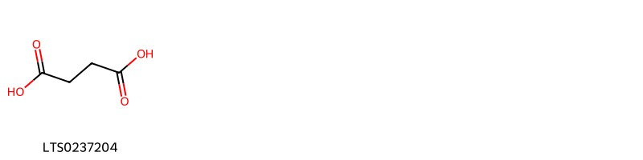{ width=100% }
    <figcaption>Hình ảnh cấu trúc hóa học của 1 hoạt chất thuộc nhóm Carboxylic acids and derivatives gồm ['succinic acid (LTS0237204)'].</figcaption>
</figure>
#### Nhóm Flavonoids
<figure markdown="span">
    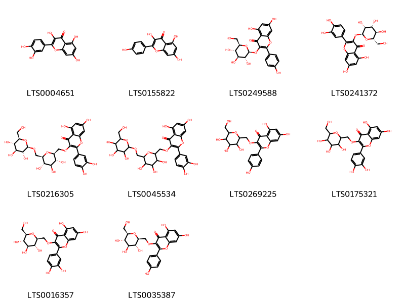{ width=100% }
    <figcaption>Hình ảnh cấu trúc hóa học của 10 hoạt chất thuộc nhóm Flavonoids gồm ['quercetin (LTS0004651)', 'kaempherol (LTS0155822)', 'astragalin (LTS0249588)', '2-(3,4-dihydroxyphenyl)-5,7-dihydroxy-3-{[(2s,3r,4r,5r,6s)-3,4,5-trihydroxy-6-(hydroxymethyl)oxan-2-yl]oxy}chromen-4-one (LTS0241372)', '2-(3,4-dihydroxyphenyl)-5,7-dihydroxy-3-{[(2s,3r,4r,5s,6r)-3,4,5-trihydroxy-6-({[(2r,3r,4s,5s,6r)-3,4,5-trihydroxy-6-(hydroxymethyl)oxan-2-yl]oxy}methyl)oxan-2-yl]methoxy}chromen-4-one (LTS0216305)', '2-(3,4-dihydroxyphenyl)-5,7-dihydroxy-3-{[3,4,5-trihydroxy-6-({[3,4,5-trihydroxy-6-(hydroxymethyl)oxan-2-yl]oxy}methyl)oxan-2-yl]methoxy}chromen-4-one (LTS0045534)', '5,7-dihydroxy-2-(4-hydroxyphenyl)-3-{[3,4,5-trihydroxy-6-(hydroxymethyl)oxan-2-yl]methoxy}chromen-4-one (LTS0269225)', '2-(3,4-dihydroxyphenyl)-5,7-dihydroxy-3-{[3,4,5-trihydroxy-6-(hydroxymethyl)oxan-2-yl]methoxy}chromen-4-one (LTS0175321)', '2-(3,4-dihydroxyphenyl)-5,7-dihydroxy-3-{[(2s,3r,4s,5s,6r)-3,4,5-trihydroxy-6-(hydroxymethyl)oxan-2-yl]methoxy}chromen-4-one (LTS0016357)', '5,7-dihydroxy-2-(4-hydroxyphenyl)-3-{[(2s,3r,4s,5s,6r)-3,4,5-trihydroxy-6-(hydroxymethyl)oxan-2-yl]methoxy}chromen-4-one (LTS0035387)'].</figcaption>
</figure>
#### Nhóm Furans
<figure markdown="span">
    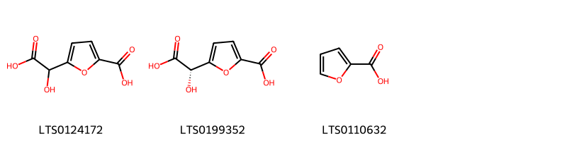{ width=100% }
    <figcaption>Hình ảnh cấu trúc hóa học của 3 hoạt chất thuộc nhóm Furans gồm ['5-[carboxy(hydroxy)methyl]furan-2-carboxylic acid (LTS0124172)', '5-[(s)-carboxy(hydroxy)methyl]furan-2-carboxylic acid (LTS0199352)', 'furoic acid (LTS0110632)'].</figcaption>
</figure>
#### Nhóm Prenol lipids
<figure markdown="span">
    { width=100% }
    <figcaption>Hình ảnh cấu trúc hóa học của 1 hoạt chất thuộc nhóm Prenol lipids gồm ['ursolic acid (LTS0250838)'].</figcaption>
</figure>
#### Nhóm Steroids and steroid derivatives
<figure markdown="span">
    { width=100% }
    <figcaption>Hình ảnh cấu trúc hóa học của 2 hoạt chất thuộc nhóm Steroids and steroid derivatives gồm ['sitogluside (LTS0201798)', '2-{[1-(5-ethyl-6-methylheptan-2-yl)-9a,11a-dimethyl-1h,2h,3h,3ah,3bh,4h,6h,7h,8h,9h,9bh,10h,11h-cyclopenta[a]phenanthren-7-yl]oxy}-6-(hydroxymethyl)oxane-3,4,5-triol (LTS0158828)'].</figcaption>
</figure>
#### Nhóm Tannins
<figure markdown="span">
    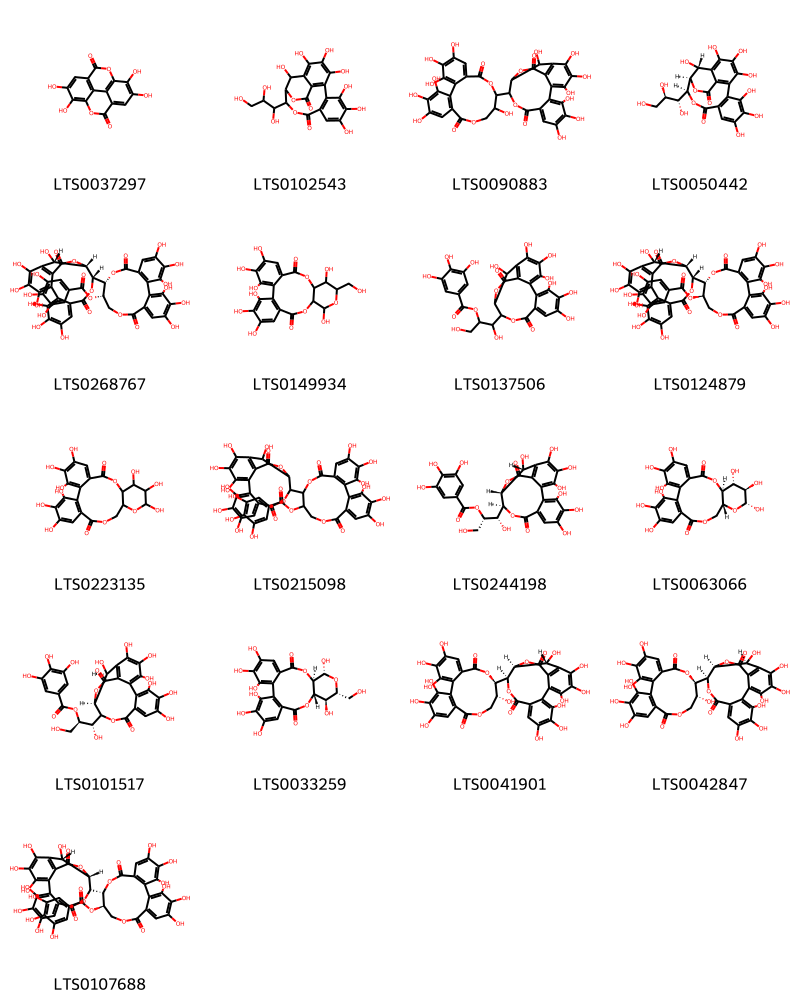{ width=100% }
    <figcaption>Hình ảnh cấu trúc hóa học của 17 hoạt chất thuộc nhóm Tannins gồm ['ellagic acid (LTS0037297)', '2,3,4,7,8,9,19-heptahydroxy-14-(1,2,3-trihydroxypropyl)-13,16-dioxatetracyclo[13.3.1.0⁵,¹⁸.0⁶,¹¹]nonadeca-1,3,5(18),6(11),7,9-hexaene-12,17-dione (LTS0102543)', '14-{3,4,5,11,17,18,19-heptahydroxy-8,14-dioxo-9,13-dioxatricyclo[13.4.0.0²,⁷]nonadeca-1(15),2,4,6,16,18-hexaen-10-yl}-2,3,4,7,8,9,19-heptahydroxy-13,16-dioxatetracyclo[13.3.1.0⁵,¹⁸.0⁶,¹¹]nonadeca-1(18),2,4,6,8,10-hexaene-12,17-dione (LTS0090883)', '(14s,15r,19r)-2,3,4,7,8,9,19-heptahydroxy-14-[(1r,2r)-1,2,3-trihydroxypropyl]-13,16-dioxatetracyclo[13.3.1.0⁵,¹⁸.0⁶,¹¹]nonadeca-1,3,5(18),6(11),7,9-hexaene-12,17-dione (LTS0050442)', '(11s,12r)-12-[(14r,15s,19s)-2,3,4,7,8,9,19-heptahydroxy-12,17-dioxo-13,16-dioxatetracyclo[13.3.1.0⁵,¹⁸.0⁶,¹¹]nonadeca-1(18),2,4,6,8,10-hexaen-14-yl]-3,4,5,17,18,19-hexahydroxy-8,14-dioxo-9,13-dioxatricyclo[13.4.0.0²,⁷]nonadeca-1(15),2,4,6,16,18-hexaen-11-yl 3,4,5-trihydroxybenzoate (LTS0268767)', '3,4,5,11,14,20,21,22-octahydroxy-13-(hydroxymethyl)-9,12,16-trioxatetracyclo[16.4.0.0²,⁷.0¹⁰,¹⁵]docosa-1(22),2(7),3,5,18,20-hexaene-8,17-dione (LTS0149934)', '1-{2,3,4,7,8,9,19-heptahydroxy-12,17-dioxo-13,16-dioxatetracyclo[13.3.1.0⁵,¹⁸.0⁶,¹¹]nonadeca-1(18),2,4,6,8,10-hexaen-14-yl}-1,3-dihydroxypropan-2-yl 3,4,5-trihydroxybenzoate (LTS0137506)', '(11r,12r)-12-[(14r,15s,19s)-2,3,4,7,8,9,19-heptahydroxy-12,17-dioxo-13,16-dioxatetracyclo[13.3.1.0⁵,¹⁸.0⁶,¹¹]nonadeca-1(18),2,4,6,8,10-hexaen-14-yl]-3,4,5,17,18,19-hexahydroxy-8,14-dioxo-9,13-dioxatricyclo[13.4.0.0²,⁷]nonadeca-1(15),2,4,6,16,18-hexaen-11-yl 3,4,5-trihydroxybenzoate (LTS0124879)', '3,4,5,11,12,13,21,22,23-nonahydroxy-9,14,17-trioxatetracyclo[17.4.0.0²,⁷.0¹⁰,¹⁵]tricosa-1(19),2,4,6,20,22-hexaene-8,18-dione (LTS0223135)', '12-{2,3,4,7,8,9,19-heptahydroxy-12,17-dioxo-13,16-dioxatetracyclo[13.3.1.0⁵,¹⁸.0⁶,¹¹]nonadeca-1(18),2,4,6,8,10-hexaen-14-yl}-3,4,5,17,18,19-hexahydroxy-8,14-dioxo-9,13-dioxatricyclo[13.4.0.0²,⁷]nonadeca-1(15),2,4,6,16,18-hexaen-11-yl 3,4,5-trihydroxybenzoate (LTS0215098)', '(1r,2s)-1-[(14s,15r,19r)-2,3,4,7,8,9,19-heptahydroxy-12,17-dioxo-13,16-dioxatetracyclo[13.3.1.0⁵,¹⁸.0⁶,¹¹]nonadeca-1(18),2,4,6,8,10-hexaen-14-yl]-1,3-dihydroxypropan-2-yl 3,4,5-trihydroxybenzoate (LTS0244198)', '(10s,11r,12r,13r,15r)-3,4,5,11,12,13,21,22,23-nonahydroxy-9,14,17-trioxatetracyclo[17.4.0.0²,⁷.0¹⁰,¹⁵]tricosa-1(19),2,4,6,20,22-hexaene-8,18-dione (LTS0063066)', '(1r,2r)-1-[(15s,19s)-2,3,4,7,8,9,19-heptahydroxy-12,17-dioxo-13,16-dioxatetracyclo[13.3.1.0⁵,¹⁸.0⁶,¹¹]nonadeca-1(18),2,4,6,8,10-hexaen-14-yl]-1,3-dihydroxypropan-2-yl 3,4,5-trihydroxybenzoate (LTS0101517)', '(10r,11r,13r,14r,15s)-3,4,5,11,14,20,21,22-octahydroxy-13-(hydroxymethyl)-9,12,16-trioxatetracyclo[16.4.0.0²,⁷.0¹⁰,¹⁵]docosa-1(18),2,4,6,19,21-hexaene-8,17-dione (LTS0033259)', '(14r,15s,19r)-14-[(10r,11r)-3,4,5,11,17,18,19-heptahydroxy-8,14-dioxo-9,13-dioxatricyclo[13.4.0.0²,⁷]nonadeca-1(15),2,4,6,16,18-hexaen-10-yl]-2,3,4,7,8,9,19-heptahydroxy-13,16-dioxatetracyclo[13.3.1.0⁵,¹⁸.0⁶,¹¹]nonadeca-1(18),2,4,6,8,10-hexaene-12,17-dione (LTS0041901)', '(14r,15s,19s)-14-[(10r,11r)-3,4,5,11,17,18,19-heptahydroxy-8,14-dioxo-9,13-dioxatricyclo[13.4.0.0²,⁷]nonadeca-1(15),2,4,6,16,18-hexaen-10-yl]-2,3,4,7,8,9,19-heptahydroxy-13,16-dioxatetracyclo[13.3.1.0⁵,¹⁸.0⁶,¹¹]nonadeca-1(18),2,4,6,8,10-hexaene-12,17-dione (LTS0042847)', '(11r,12r)-12-[(15s,19s)-2,3,4,7,8,9,19-heptahydroxy-12,17-dioxo-13,16-dioxatetracyclo[13.3.1.0⁵,¹⁸.0⁶,¹¹]nonadeca-1(18),2,4,6,8,10-hexaen-14-yl]-3,4,5,17,18,19-hexahydroxy-8,14-dioxo-9,13-dioxatricyclo[13.4.0.0²,⁷]nonadeca-1(15),2,4,6,16,18-hexaen-11-yl 3,4,5-trihydroxybenzoate (LTS0107688)'].</figcaption>
</figure>

---

### Dược dân tộc học

Danh sách các quốc gia có sử dụng *Osbeckia chinensis* trong điều trị các bệnh. 

| Country   | Disease     | Bệnh                                                                                                                                                                                                |
|:----------|:------------|:----------------------------------------------------------------------------------------------------------------------------------------------------------------------------------------------------|
| China     | Expectorant | MYMEMORY WARNING: YOU USED ALL AVAILABLE FREE TRANSLATIONS FOR TODAY. NEXT AVAILABLE IN  18 HOURS 27 MINUTES 38 SECONDS VISIT HTTPS://MYMEMORY.TRANSLATED.NET/DOC/USAGELIMITS.PHP TO TRANSLATE MORE |

---

# Chi Medinilla

??? note "Danh sách các dược liệu thuộc chi"
    
	 - *Medinilla heterophylla*

---
## Medinilla heterophylla
### Thông tin về thực vật

!!! info "Phân loại thực vật của *Medinilla heterophylla* từ GIBF:"
    - **Kingdom:** Plantae
    - **Phylum:** Tracheophyta
    - **Order:** Myrtales
    - **Family:** Melastomataceae
    - **Genus:** Medinilla
    - **Species:** *Medinilla heterophylla*

 

| Label (VI)   | Label (EN)   | Scientific Name        | Descriptions (VI)   | Descriptions (EN)   | Also Known As (VI)   | Also Known As (EN)   |
|:-------------|:-------------|:-----------------------|:--------------------|:--------------------|:---------------------|:---------------------|
| N/A          | N/A          | Medinilla heterophylla | loài thực vật       | species of plant    | ['']                 | ['']                 |

#### Phân bố trên thế giới

**Từ CSDL GIBF** nan, unknown or invalid, Vanuatu, Fiji, United States of America, Solomon Islands

#### Phân bố tại Việt Nam

**Từ CSDL GIBF**: Không có ghi nhận ở Việt Nam

---
### Thành phần hóa học
        
- Theo cơ sở dữ liệu lotus: Từ loài *Medinilla heterophylla* đã phân lập và xác định được Chưa có hoạt chất nào được phân lập. hoạt chất thuộc về các nhóm Không có hoạt chất nào được phân lập. 

Không có hình ảnh nào được tạo ra

---

### Dược dân tộc học

Danh sách các quốc gia có sử dụng *Medinilla heterophylla* trong điều trị các bệnh. 

| Country   | Disease   | Bệnh                                                                                                                                                                                                |
|:----------|:----------|:----------------------------------------------------------------------------------------------------------------------------------------------------------------------------------------------------|
| Fiji      | Aperient  | MYMEMORY WARNING: YOU USED ALL AVAILABLE FREE TRANSLATIONS FOR TODAY. NEXT AVAILABLE IN  18 HOURS 26 MINUTES 18 SECONDS VISIT HTTPS://MYMEMORY.TRANSLATED.NET/DOC/USAGELIMITS.PHP TO TRANSLATE MORE |

---

# Chi Pternandra

??? note "Danh sách các dược liệu thuộc chi"
    
	 - *Pternandra coerulescens*

---
## Pternandra coerulescens
### Thông tin về thực vật

!!! info "Phân loại thực vật của *Pternandra coerulescens* từ GIBF:"
    - **Kingdom:** Plantae
    - **Phylum:** Tracheophyta
    - **Order:** Myrtales
    - **Family:** Melastomataceae
    - **Genus:** Pternandra
    - **Species:** *Pternandra coerulescens*

 

| Label (VI)   | Label (EN)   | Scientific Name         | Descriptions (VI)   | Descriptions (EN)   | Also Known As (VI)   | Also Known As (EN)   |
|:-------------|:-------------|:------------------------|:--------------------|:--------------------|:---------------------|:---------------------|
| N/A          | N/A          | Pternandra coerulescens | loài thực vật       | species of plant    | ['']                 | ['']                 |

#### Phân bố trên thế giới

**Từ CSDL GIBF** nan, unknown or invalid, Thailand, Brunei Darussalam, Malaysia, Papua New Guinea, Singapore, Australia, Cambodia, Indonesia

#### Phân bố tại Việt Nam

**Từ CSDL GIBF**: Không có ghi nhận ở Việt Nam

---
### Thành phần hóa học
        
- Theo cơ sở dữ liệu lotus: Từ loài *Pternandra coerulescens* đã phân lập và xác định được Chưa có hoạt chất nào được phân lập. hoạt chất thuộc về các nhóm Không có hoạt chất nào được phân lập. 

Không có hình ảnh nào được tạo ra

---

### Dược dân tộc học

Danh sách các quốc gia có sử dụng *Pternandra coerulescens* trong điều trị các bệnh. 

| Country   | Disease   | Bệnh                                                                                                                                                                                                |
|:----------|:----------|:----------------------------------------------------------------------------------------------------------------------------------------------------------------------------------------------------|
| Sarawak   | Emetic    | MYMEMORY WARNING: YOU USED ALL AVAILABLE FREE TRANSLATIONS FOR TODAY. NEXT AVAILABLE IN  18 HOURS 25 MINUTES 57 SECONDS VISIT HTTPS://MYMEMORY.TRANSLATED.NET/DOC/USAGELIMITS.PHP TO TRANSLATE MORE |

---

# Chi Memecylon

??? note "Danh sách các dược liệu thuộc chi"
    
	 - *Memecylon angustifolium*
	 - *Memecylon malabaricum*
	 - *Memecylon umbellatum*

---
## Memecylon angustifolium
### Thông tin về thực vật

!!! info "Phân loại thực vật của *Memecylon angustifolium* từ GIBF:"
    - **Kingdom:** Plantae
    - **Phylum:** Tracheophyta
    - **Order:** Myrtales
    - **Family:** Melastomataceae
    - **Genus:** Memecylon
    - **Species:** *Memecylon angustifolium*

 

| Label (VI)   | Label (EN)   | Scientific Name         | Descriptions (VI)   | Descriptions (EN)   | Also Known As (VI)   | Also Known As (EN)   |
|:-------------|:-------------|:------------------------|:--------------------|:--------------------|:---------------------|:---------------------|
| N/A          | N/A          | Memecylon angustifolium |                     | species of plant    | ['']                 | ['']                 |

#### Phân bố trên thế giới

**Từ CSDL GIBF** Viet Nam, nan, unknown or invalid, Sri Lanka, Thailand, India, Lao People’s Democratic Republic

#### Phân bố tại Việt Nam

**Từ CSDL GIBF**: Không có ghi nhận ở Việt Nam

---
### Thành phần hóa học
        
- Theo cơ sở dữ liệu lotus: Từ loài *Memecylon angustifolium* đã phân lập và xác định được Chưa có hoạt chất nào được phân lập. hoạt chất thuộc về các nhóm Không có hoạt chất nào được phân lập. 

Không có hình ảnh nào được tạo ra

---

### Dược dân tộc học

Danh sách các quốc gia có sử dụng *Memecylon angustifolium* trong điều trị các bệnh. 

| Country   | Disease            | Bệnh                                                                                                                                                                                                |
|:----------|:-------------------|:----------------------------------------------------------------------------------------------------------------------------------------------------------------------------------------------------|
| Elsewhere | Refrigerant, Tonic | MYMEMORY WARNING: YOU USED ALL AVAILABLE FREE TRANSLATIONS FOR TODAY. NEXT AVAILABLE IN  18 HOURS 25 MINUTES 34 SECONDS VISIT HTTPS://MYMEMORY.TRANSLATED.NET/DOC/USAGELIMITS.PHP TO TRANSLATE MORE |

---

---
## Memecylon malabaricum
### Thông tin về thực vật

!!! info "Phân loại thực vật của *N/A* từ GIBF:"
    - **Kingdom:** Plantae
    - **Phylum:** Tracheophyta
    - **Order:** Myrtales
    - **Family:** Melastomataceae
    - **Genus:** Memecylon
    - **Species:** *N/A*

 

| Label (VI)   | Label (EN)   | Scientific Name         | Descriptions (VI)   | Descriptions (EN)   | Also Known As (VI)   | Also Known As (EN)   |
|:-------------|:-------------|:------------------------|:--------------------|:--------------------|:---------------------|:---------------------|
| N/A          | N/A          | Memecylon angustifolium |                     | species of plant    | ['']                 | ['']                 |

#### Phân bố trên thế giới

**Từ CSDL GIBF** Thailand, South Africa, Guinea, Philippines, Côte d’Ivoire, India, Cameroon, Seychelles, Gabon, Singapore, Madagascar, Australia, Hong Kong, Chinese Taipei

#### Phân bố tại Việt Nam

**Từ CSDL GIBF**: Không có ghi nhận ở Việt Nam

---
### Thành phần hóa học
        
- Theo cơ sở dữ liệu lotus: Từ loài *N/A* đã phân lập và xác định được Chưa có hoạt chất nào được phân lập. hoạt chất thuộc về các nhóm Không có hoạt chất nào được phân lập. 

Không có hình ảnh nào được tạo ra

---

### Dược dân tộc học

Danh sách các quốc gia có sử dụng *N/A* trong điều trị các bệnh. 

| Country   | Disease   | Bệnh                                                                                                                                                                                                |
|:----------|:----------|:----------------------------------------------------------------------------------------------------------------------------------------------------------------------------------------------------|
| Elsewhere | Ecbolic   | MYMEMORY WARNING: YOU USED ALL AVAILABLE FREE TRANSLATIONS FOR TODAY. NEXT AVAILABLE IN  18 HOURS 25 MINUTES 13 SECONDS VISIT HTTPS://MYMEMORY.TRANSLATED.NET/DOC/USAGELIMITS.PHP TO TRANSLATE MORE |

---

---
## Memecylon umbellatum
### Thông tin về thực vật

!!! info "Phân loại thực vật của *Memecylon umbellatum* từ GIBF:"
    - **Kingdom:** Plantae
    - **Phylum:** Tracheophyta
    - **Order:** Myrtales
    - **Family:** Melastomataceae
    - **Genus:** Memecylon
    - **Species:** *Memecylon umbellatum*

 

| Label (VI)   | Label (EN)   | Scientific Name      | Descriptions (VI)   | Descriptions (EN)   | Also Known As (VI)   | Also Known As (EN)   |
|:-------------|:-------------|:---------------------|:--------------------|:--------------------|:---------------------|:---------------------|
| N/A          | N/A          | Memecylon umbellatum | loài thực vật       | species of plant    | ['']                 | ['']                 |

#### Phân bố trên thế giới

**Từ CSDL GIBF** nan, Sri Lanka, Thailand, French Polynesia, India, Seychelles, Bangladesh, Cambodia

#### Phân bố tại Việt Nam

**Từ CSDL GIBF**: Không có ghi nhận ở Việt Nam

---
### Thành phần hóa học
        
- Theo cơ sở dữ liệu lotus: Từ loài *Memecylon umbellatum* đã phân lập và xác định được Chưa có hoạt chất nào được phân lập. hoạt chất thuộc về các nhóm Không có hoạt chất nào được phân lập. 

Không có hình ảnh nào được tạo ra

---

### Dược dân tộc học

Danh sách các quốc gia có sử dụng *Memecylon umbellatum* trong điều trị các bệnh. 

| Country   | Disease                 | Bệnh                                                                                                                                                                                                |
|:----------|:------------------------|:----------------------------------------------------------------------------------------------------------------------------------------------------------------------------------------------------|
| Elsewhere | Refrigerant, Astringent | MYMEMORY WARNING: YOU USED ALL AVAILABLE FREE TRANSLATIONS FOR TODAY. NEXT AVAILABLE IN  18 HOURS 24 MINUTES 45 SECONDS VISIT HTTPS://MYMEMORY.TRANSLATED.NET/DOC/USAGELIMITS.PHP TO TRANSLATE MORE |

---

