!!! abstract "Tóm tắt"

    Họ Meliaceae gồm khoảng 21 chi và 52 loài được một số cộng đồng tại các quốc gia như Africa, South America, Ghana, Guatemala, Arab, English, Sudan, Sumatra, Bolivia, Paraguay, Africa(Swahili), Turkey, Portuguese, Fiji, Sanscrit, Bahamas, French, America, New Guinea, US, Cuba, Dominican Republic, Mexico, Malaya, Iran, China, Trinidad, Haiti, Iraq, German, India, Elsewhere, Java, Venezuela, Philippines, Cameroon, Malaysia, New Zealand sử dụng trong một số trường hợp QUERY LENGTH LIMIT EXCEEDED. MAX ALLOWED QUERY : 500 CHARS QUERY LENGTH LIMIT EXCEEDED. MAX ALLOWED QUERY : 500 CHARS MYMEMORY WARNING: YOU USED ALL AVAILABLE FREE TRANSLATIONS FOR TODAY. NEXT AVAILABLE IN  06 HOURS 50 MINUTES 05 SECONDS VISIT HTTPS://MYMEMORY.TRANSLATED.NET/DOC/USAGELIMITS.PHP TO TRANSLATE MORE.

!!! info "DrDuke"

    James A. Duke sinh năm 1929-2017 là một nhà thực vật học người Mỹ. Đây là một trong những tác giả hàng đầu trong lĩnh vực dược dân tộc học với cuốn *CRC Handbook of Medicinal Herbs* và chính là người xây dựng lên cơ sở dữ liệu về hợp chất tự nhiên và dược dân tộc học tại Bộ nông nghiệp Hoa Kỳ. Các thông tin được đăng tải tại website [Dr. Duke's Phytochemical and Ethnobotanical Databases](https://phytochem.nal.usda.gov/). 
    Trong suốt thập niên 1970, ông lãnh đạo the Plant Taxonomy Laboratory, Plant Genetics and Germplasm Institute of the Agricultural Research Service, U.S. Department of Agriculture.
    Trong tài liệu này, các thông tin về dược dân tộc của các dược liệu được trích dẫn từ tài liệu của James A. Ducke với sự trợ giúp của phần mềm dịch thuật từ tiếng Anh sang tiếng Việt.
   

# Chi Aglaia

??? note "Danh sách các dược liệu thuộc chi"
    
	 - *Aglaia odorata*
	 - *Aglaia odoratissima*
	 - *Aglaia odoratissimaa*
	 - *Aglaia roxburghiana*

---
## Aglaia odorata
### Thông tin về thực vật

!!! info "Phân loại thực vật của *Aglaia odorata* từ GIBF:"
    - **Kingdom:** Plantae
    - **Phylum:** Tracheophyta
    - **Order:** Sapindales
    - **Family:** Meliaceae
    - **Genus:** Aglaia
    - **Species:** *Aglaia odorata*

 

| Label (VI)   | Label (EN)   | Scientific Name   | Descriptions (VI)   | Descriptions (EN)   | Also Known As (VI)   | Also Known As (EN)       |
|:-------------|:-------------|:------------------|:--------------------|:--------------------|:---------------------|:-------------------------|
| N/A          | N/A          | Aglaia odorata    | loài thực vật       | species of plant    | ['']                 | ['Chinese perfume tree'] |

#### Phân bố trên thế giới

**Từ CSDL GIBF** nan, Japan, Belgium, Cambodia, Lao People’s Democratic Republic, Myanmar, unknown or invalid, Tanzania, United Republic of, Canada, Chinese Taipei, United States of America, Hong Kong, Czechia, Thailand, Brazil, Singapore, Viet Nam, China, French Polynesia, Macao, India, Indonesia, Philippines, Malaysia

#### Phân bố tại Việt Nam

**Từ CSDL GIBF**: Hoa Binh, Ninh Thuan

---
### Thành phần hóa học
        
- Theo cơ sở dữ liệu lotus: Từ loài *Aglaia odorata* đã phân lập và xác định được 135 hoạt chất thuộc về các nhóm Fatty Acyls, Flavonoids, Prenol lipids, Steroids and steroid derivatives, Cinnamic acids and derivatives, Benzofurans, Benzene and substituted derivatives, Stilbenes, Organooxygen compounds, Phenols, Coumarins and derivatives, Furanoid lignans. 

|    | chemicalTaxonomyClassyfireClass     |   smiles_count |
|---:|:------------------------------------|---------------:|
|  0 | Benzene and substituted derivatives |              1 |
|  1 | Benzofurans                         |             57 |
|  2 | Cinnamic acids and derivatives      |              5 |
|  3 | Coumarins and derivatives           |              1 |
|  4 | Fatty Acyls                         |              2 |
|  5 | Flavonoids                          |             14 |
|  6 | Furanoid lignans                    |              2 |
|  7 | Organooxygen compounds              |              2 |
|  8 | Phenols                             |              2 |
|  9 | Prenol lipids                       |             19 |
| 10 | Steroids and steroid derivatives    |              9 |
| 11 | Stilbenes                           |             21 |

#### Nhóm Benzene and substituted derivatives
<figure markdown="span">
    { width=100% }
    <figcaption>Hình ảnh cấu trúc hóa học của 1 hoạt chất thuộc nhóm Benzene and substituted derivatives gồm ['vanillic acid (LTS0229113)'].</figcaption>
</figure>
#### Nhóm Benzofurans
<figure markdown="span">
    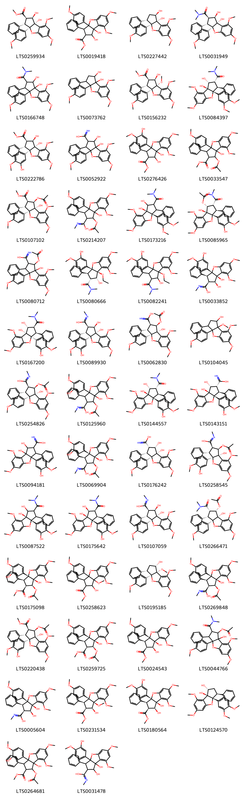{ width=100% }
    <figcaption>Hình ảnh cấu trúc hóa học của 57 hoạt chất thuộc nhóm Benzofurans gồm ['aglafolin (LTS0259934)', 'methyl 2,3-dihydroxy-10,12-dimethoxy-6-(4-methoxyphenyl)-5-phenyl-7-oxatricyclo[6.4.0.0²,⁶]dodeca-1(12),8,10-triene-4-carboxylate (LTS0019418)', '(2s,3r,5s,6r)-10,12-dimethoxy-6-(4-methoxyphenyl)-5-phenyl-7-oxatricyclo[6.4.0.0²,⁶]dodeca-1(12),8,10-triene-2,3-diol (LTS0227442)', 'rocaglamide (LTS0031949)', '2,3-dihydroxy-10,12-dimethoxy-6-(4-methoxyphenyl)-n,n-dimethyl-5-phenyl-7-oxatricyclo[6.4.0.0²,⁶]dodeca-1(12),8,10-triene-4-carboxamide (LTS0166748)', '10,12-dimethoxy-6-(4-methoxyphenyl)-5-phenyl-7-oxatricyclo[6.4.0.0²,⁶]dodeca-1(12),8,10-triene-2,3-diol (LTS0073762)', 'methyl (2s,3r,4r,5s,6r)-3-hydroxy-2,10,12-trimethoxy-6-(4-methoxyphenyl)-5-phenyl-7-oxatricyclo[6.4.0.0²,⁶]dodeca-1(12),8,10-triene-4-carboxylate (LTS0156232)', '(2s,3r,4r,5s,6r)-6-(3,4-dimethoxyphenyl)-2,3-dihydroxy-10,12-dimethoxy-n,n-dimethyl-5-phenyl-7-oxatricyclo[6.4.0.0²,⁶]dodeca-1(12),8,10-triene-4-carboxamide (LTS0084397)', 'methyl (2s,3r,4r,5s,6r)-2,3-dihydroxy-6-(3-hydroxy-4-methoxyphenyl)-10,12-dimethoxy-5-phenyl-7-oxatricyclo[6.4.0.0²,⁶]dodeca-1(12),8,10-triene-4-carboxylate (LTS0222786)', '2,3-dihydroxy-10,12-dimethoxy-6-(4-methoxyphenyl)-5-phenyl-7-oxatricyclo[6.4.0.0²,⁶]dodeca-1(12),8,10-triene-4-carboximidic acid (LTS0052922)', 'methyl 2,3-dihydroxy-6-(3-hydroxy-4-methoxyphenyl)-10,12-dimethoxy-5-phenyl-7-oxatricyclo[6.4.0.0²,⁶]dodeca-1(12),8,10-triene-4-carboxylate (LTS0276426)', 'methyl 3-(acetyloxy)-2-hydroxy-10,12-dimethoxy-6-(4-methoxyphenyl)-5-phenyl-7-oxatricyclo[6.4.0.0²,⁶]dodeca-1(12),8,10-triene-4-carboxylate (LTS0033547)', 'methyl (2s,3r,4r,5s,6r)-3-(acetyloxy)-2-hydroxy-10,12-dimethoxy-6-(4-methoxyphenyl)-5-phenyl-7-oxatricyclo[6.4.0.0²,⁶]dodeca-1(12),8,10-triene-4-carboxylate (LTS0107102)', '3-(acetyloxy)-2-hydroxy-10,12-dimethoxy-6-(4-methoxyphenyl)-n-methyl-5-phenyl-7-oxatricyclo[6.4.0.0²,⁶]dodeca-1(12),8,10-triene-4-carboximidic acid (LTS0214207)', '(2s,6r)-6-(3,4-dimethoxyphenyl)-2,3-dihydroxy-10,12-dimethoxy-n,n-dimethyl-5-phenyl-7-oxatricyclo[6.4.0.0²,⁶]dodeca-1(12),8,10-triene-4-carboxamide (LTS0173216)', '(2s,3r,4r,5s,6r)-4-(dimethylcarbamoyl)-2-hydroxy-6-(3-hydroxy-4-methoxyphenyl)-10,12-dimethoxy-5-phenyl-7-oxatricyclo[6.4.0.0²,⁶]dodeca-1(12),8,10-trien-3-yl acetate (LTS0085965)', '3-(acetyloxy)-2-hydroxy-10,12-dimethoxy-6-(4-methoxyphenyl)-5-phenyl-7-oxatricyclo[6.4.0.0²,⁶]dodeca-1(12),8,10-triene-4-carboximidic acid (LTS0080712)', '(2s,3r,4r,5s,6r)-2-ethoxy-3-hydroxy-6-(3-hydroxy-4-methoxyphenyl)-10,12-dimethoxy-n,n-dimethyl-5-phenyl-7-oxatricyclo[6.4.0.0²,⁶]dodeca-1(12),8,10-triene-4-carboxamide (LTS0080666)', '2-ethoxy-3-hydroxy-6-(3-hydroxy-4-methoxyphenyl)-10,12-dimethoxy-n,n-dimethyl-5-phenyl-7-oxatricyclo[6.4.0.0²,⁶]dodeca-1(12),8,10-triene-4-carboxamide (LTS0082241)', '(2s,3s,4s,5s,6r)-2,3-dihydroxy-6-(3-hydroxy-4-methoxyphenyl)-10,12-dimethoxy-n-methyl-5-phenyl-7-oxatricyclo[6.4.0.0²,⁶]dodeca-1(12),8,10-triene-4-carboximidic acid (LTS0033852)', '(2r,3r,4s,5s,6s)-2,3-dihydroxy-6-(3-hydroxy-4-methoxyphenyl)-10,12-dimethoxy-n,n-dimethyl-5-phenyl-7-oxatricyclo[6.4.0.0²,⁶]dodeca-1(12),8,10-triene-4-carboxamide (LTS0167200)', '(2s,3r,4r,5s,6r)-2,3-dihydroxy-6-(3-hydroxy-4-methoxyphenyl)-10,12-dimethoxy-n-methyl-5-phenyl-7-oxatricyclo[6.4.0.0²,⁶]dodeca-1(12),8,10-triene-4-carboximidic acid (LTS0089930)', '(2s,3r,4r,5s,6r)-3-(acetyloxy)-2-hydroxy-10,12-dimethoxy-6-(4-methoxyphenyl)-5-phenyl-7-oxatricyclo[6.4.0.0²,⁶]dodeca-1(12),8,10-triene-4-carboximidic acid (LTS0062830)', '2,10,12-trimethoxy-6-(4-methoxyphenyl)-5-phenyl-7-oxatricyclo[6.4.0.0²,⁶]dodeca-1(12),8,10-trien-3-ol (LTS0104045)', '(2s,3r,4r,5s,6r)-3-(acetyloxy)-2-hydroxy-10,12-dimethoxy-6-(4-methoxyphenyl)-n-methyl-5-phenyl-7-oxatricyclo[6.4.0.0²,⁶]dodeca-1(12),8,10-triene-4-carboximidic acid (LTS0254826)', '3-(acetyloxy)-2-hydroxy-6-(3-hydroxy-4-methoxyphenyl)-10,12-dimethoxy-n-methyl-5-phenyl-7-oxatricyclo[6.4.0.0²,⁶]dodeca-1(12),8,10-triene-4-carboximidic acid (LTS0125960)', '(2s,3r,4r,5s,6r)-2,3-dihydroxy-6-(3-hydroxy-4-methoxyphenyl)-10,12-dimethoxy-n,n-dimethyl-5-phenyl-7-oxatricyclo[6.4.0.0²,⁶]dodeca-1(12),8,10-triene-4-carboxamide (LTS0144557)', '(2s,3r,4r,5s,6r)-2,3-dihydroxy-6-(3-hydroxy-4-methoxyphenyl)-10,12-dimethoxy-5-phenyl-7-oxatricyclo[6.4.0.0²,⁶]dodeca-1(12),8,10-triene-4-carboximidic acid (LTS0143151)', '2,3-dihydroxy-6-(3-hydroxy-4-methoxyphenyl)-10,12-dimethoxy-5-phenyl-7-oxatricyclo[6.4.0.0²,⁶]dodeca-1(12),8,10-triene-4-carboximidic acid (LTS0094181)', '(2s,3s,4s,5s,6r)-3-(acetyloxy)-2-hydroxy-6-(3-hydroxy-4-methoxyphenyl)-10,12-dimethoxy-n-methyl-5-phenyl-7-oxatricyclo[6.4.0.0²,⁶]dodeca-1(12),8,10-triene-4-carboximidic acid (LTS0069904)', '(2s,3s,4s,5s,6r)-2,3-dihydroxy-10,12-dimethoxy-6-(4-methoxyphenyl)-5-phenyl-7-oxatricyclo[6.4.0.0²,⁶]dodeca-1(12),8,10-triene-4-carboximidic acid (LTS0176242)', '(2s,3r,4r,5s,6r)-3-(acetyloxy)-2-hydroxy-6-(3-hydroxy-4-methoxyphenyl)-10,12-dimethoxy-n-methyl-5-phenyl-7-oxatricyclo[6.4.0.0²,⁶]dodeca-1(12),8,10-triene-4-carboximidic acid (LTS0258545)', '(2s,6r)-2,3-dihydroxy-6-(3-hydroxy-4-methoxyphenyl)-10,12-dimethoxy-n,n-dimethyl-5-phenyl-7-oxatricyclo[6.4.0.0²,⁶]dodeca-1(12),8,10-triene-4-carboxamide (LTS0087522)', '(2s,3s,4s,5s,6r)-2,3-dihydroxy-6-(3-hydroxy-4-methoxyphenyl)-10,12-dimethoxy-n,n-dimethyl-5-phenyl-7-oxatricyclo[6.4.0.0²,⁶]dodeca-1(12),8,10-triene-4-carboxamide (LTS0175642)', '(2s,3r,4r,5s,6r)-2,3-dihydroxy-10,12-dimethoxy-6-(4-methoxyphenyl)-n-methyl-5-phenyl-7-oxatricyclo[6.4.0.0²,⁶]dodeca-1(12),8,10-triene-4-carboximidic acid (LTS0107059)', '(2s,3s,4s,5s,6r)-4-(dimethylcarbamoyl)-2-hydroxy-10,12-dimethoxy-6-(4-methoxyphenyl)-5-phenyl-7-oxatricyclo[6.4.0.0²,⁶]dodeca-1(12),8,10-trien-3-yl acetate (LTS0266471)', 'methyl (2s,3s,4s,5s,6r)-3-(acetyloxy)-2-hydroxy-6-(3-hydroxy-4-methoxyphenyl)-10,12-dimethoxy-5-phenyl-7-oxatricyclo[6.4.0.0²,⁶]dodeca-1(12),8,10-triene-4-carboxylate (LTS0175098)', 'methyl 3-hydroxy-2,10,12-trimethoxy-6-(4-methoxyphenyl)-5-phenyl-7-oxatricyclo[6.4.0.0²,⁶]dodeca-1(12),8,10-triene-4-carboxylate (LTS0258623)', '(2s,3s,5s,6r)-2,10,12-trimethoxy-6-(4-methoxyphenyl)-5-phenyl-7-oxatricyclo[6.4.0.0²,⁶]dodeca-1(12),8,10-trien-3-ol (LTS0195185)', '(2s,3s,4s,5s,6r)-3-(acetyloxy)-2-hydroxy-10,12-dimethoxy-6-(4-methoxyphenyl)-n-methyl-5-phenyl-7-oxatricyclo[6.4.0.0²,⁶]dodeca-1(12),8,10-triene-4-carboximidic acid (LTS0269848)', 'methyl (2s,3r,4r,5s,6r)-3-(acetyloxy)-2-hydroxy-6-(3-hydroxy-4-methoxyphenyl)-10,12-dimethoxy-5-phenyl-7-oxatricyclo[6.4.0.0²,⁶]dodeca-1(12),8,10-triene-4-carboxylate (LTS0220438)', 'methyl (2s,3s,4s,5s,6r)-3-(acetyloxy)-2-hydroxy-10,12-dimethoxy-6-(4-methoxyphenyl)-5-phenyl-7-oxatricyclo[6.4.0.0²,⁶]dodeca-1(12),8,10-triene-4-carboxylate (LTS0259725)', 'methyl (2s,3s,4s,5s,6r)-2,3-dihydroxy-10,12-dimethoxy-6-(4-methoxyphenyl)-5-phenyl-7-oxatricyclo[6.4.0.0²,⁶]dodeca-1(12),8,10-triene-4-carboxylate (LTS0024543)', '4-(dimethylcarbamoyl)-2-hydroxy-10,12-dimethoxy-6-(4-methoxyphenyl)-5-phenyl-7-oxatricyclo[6.4.0.0²,⁶]dodeca-1(12),8,10-trien-3-yl acetate (LTS0044766)', '(2s,3s,4s,5s,6r)-2,3-dihydroxy-10,12-dimethoxy-6-(4-methoxyphenyl)-n-methyl-5-phenyl-7-oxatricyclo[6.4.0.0²,⁶]dodeca-1(12),8,10-triene-4-carboximidic acid (LTS0005604)', 'methyl (2s,3s,4s,5s,6r)-3-hydroxy-2,10,12-trimethoxy-6-(4-methoxyphenyl)-5-phenyl-7-oxatricyclo[6.4.0.0²,⁶]dodeca-1(12),8,10-triene-4-carboxylate (LTS0231534)', 'methyl (2s,3s,4s,5s,6r)-2,3-dihydroxy-6-(3-hydroxy-4-methoxyphenyl)-10,12-dimethoxy-5-phenyl-7-oxatricyclo[6.4.0.0²,⁶]dodeca-1(12),8,10-triene-4-carboxylate (LTS0180564)', '(2s,3r,5s,6r)-6-(3,4-dimethoxyphenyl)-10,12-dimethoxy-5-phenyl-7-oxatricyclo[6.4.0.0²,⁶]dodeca-1(12),8,10-triene-2,3-diol (LTS0124570)', 'methyl 3-(acetyloxy)-2-hydroxy-6-(3-hydroxy-4-methoxyphenyl)-10,12-dimethoxy-5-phenyl-7-oxatricyclo[6.4.0.0²,⁶]dodeca-1(12),8,10-triene-4-carboxylate (LTS0264681)', '2,3-dihydroxy-6-(3-hydroxy-4-methoxyphenyl)-10,12-dimethoxy-n-methyl-5-phenyl-7-oxatricyclo[6.4.0.0²,⁶]dodeca-1(12),8,10-triene-4-carboximidic acid (LTS0031478)', '2,3-dihydroxy-10,12-dimethoxy-6-(4-methoxyphenyl)-n-methyl-5-phenyl-7-oxatricyclo[6.4.0.0²,⁶]dodeca-1(12),8,10-triene-4-carboximidic acid (LTS0136494)', '2,3-dihydroxy-6-(3-hydroxy-4-methoxyphenyl)-10,12-dimethoxy-n,n-dimethyl-5-phenyl-7-oxatricyclo[6.4.0.0²,⁶]dodeca-1(12),8,10-triene-4-carboxamide (LTS0011826)', '2-ethoxy-3-hydroxy-6-(3-hydroxy-4-methoxyphenyl)-10,12-dimethoxy-n-methyl-5-phenyl-7-oxatricyclo[6.4.0.0²,⁶]dodeca-1(12),8,10-triene-4-carboximidic acid (LTS0016611)', '(2s,3s,4s,5s,6r)-2,3-dihydroxy-10,12-dimethoxy-6-(4-methoxyphenyl)-n,n-dimethyl-5-phenyl-7-oxatricyclo[6.4.0.0²,⁶]dodeca-1(12),8,10-triene-4-carboxamide (LTS0124573)', '(2s,3r,4r,5s,6r)-2-ethoxy-3-hydroxy-6-(3-hydroxy-4-methoxyphenyl)-10,12-dimethoxy-n-methyl-5-phenyl-7-oxatricyclo[6.4.0.0²,⁶]dodeca-1(12),8,10-triene-4-carboximidic acid (LTS0228292)', '4-(dimethylcarbamoyl)-2-hydroxy-6-(3-hydroxy-4-methoxyphenyl)-10,12-dimethoxy-5-phenyl-7-oxatricyclo[6.4.0.0²,⁶]dodeca-1(12),8,10-trien-3-yl acetate (LTS0107249)', '(2s,3s,4s,5s,6r)-4-(dimethylcarbamoyl)-2-hydroxy-6-(3-hydroxy-4-methoxyphenyl)-10,12-dimethoxy-5-phenyl-7-oxatricyclo[6.4.0.0²,⁶]dodeca-1(12),8,10-trien-3-yl acetate (LTS0106668)'].</figcaption>
</figure>
#### Nhóm Cinnamic acids and derivatives
<figure markdown="span">
    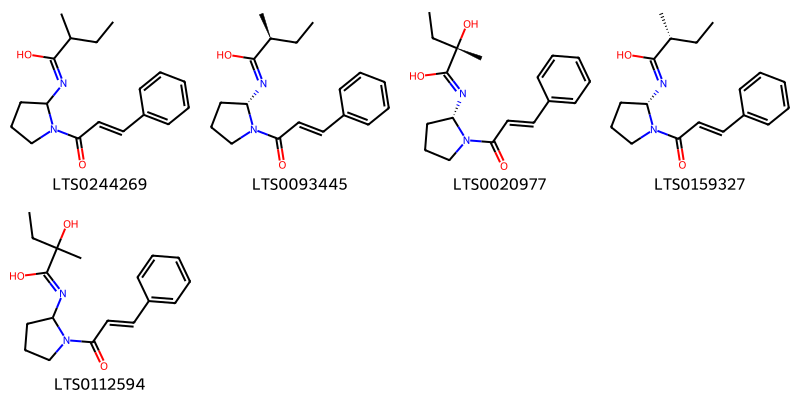{ width=100% }
    <figcaption>Hình ảnh cấu trúc hóa học của 5 hoạt chất thuộc nhóm Cinnamic acids and derivatives gồm ['2-methyl-n-[1-(3-phenylprop-2-enoyl)pyrrolidin-2-yl]butanimidic acid (LTS0244269)', '(2s)-2-methyl-n-[(2r)-1-[(2e)-3-phenylprop-2-enoyl]pyrrolidin-2-yl]butanimidic acid (LTS0093445)', '(2s)-2-hydroxy-2-methyl-n-[(2r)-1-[(2e)-3-phenylprop-2-enoyl]pyrrolidin-2-yl]butanimidic acid (LTS0020977)', '(2r)-2-methyl-n-[(2r)-1-[(2e)-3-phenylprop-2-enoyl]pyrrolidin-2-yl]butanimidic acid (LTS0159327)', '2-hydroxy-2-methyl-n-[1-(3-phenylprop-2-enoyl)pyrrolidin-2-yl]butanimidic acid (LTS0112594)'].</figcaption>
</figure>
#### Nhóm Coumarins and derivatives
<figure markdown="span">
    { width=100% }
    <figcaption>Hình ảnh cấu trúc hóa học của 1 hoạt chất thuộc nhóm Coumarins and derivatives gồm ['scopoletin (LTS0193112)'].</figcaption>
</figure>
#### Nhóm Fatty Acyls
<figure markdown="span">
    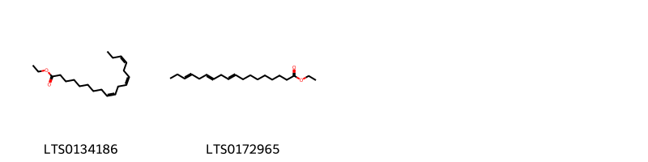{ width=100% }
    <figcaption>Hình ảnh cấu trúc hóa học của 2 hoạt chất thuộc nhóm Fatty Acyls gồm ['ethyl linolenate (LTS0134186)', 'ethyl octadeca-9,12,15-trienoate (LTS0172965)'].</figcaption>
</figure>
#### Nhóm Flavonoids
<figure markdown="span">
    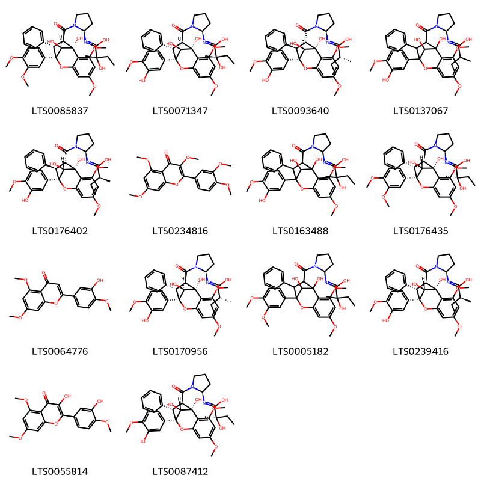{ width=100% }
    <figcaption>Hình ảnh cấu trúc hóa học của 14 hoạt chất thuộc nhóm Flavonoids gồm ['(2s)-n-[(2s)-1-[(1r,9r,10s,11r,12s)-9-(3,4-dimethoxyphenyl)-1,12-dihydroxy-3,5-dimethoxy-10-phenyl-8-oxatricyclo[7.2.1.0²,⁷]dodeca-2,4,6-triene-11-carbonyl]pyrrolidin-2-yl]-2-hydroxy-2-methylbutanimidic acid (LTS0085837)', '(2s)-n-[(2s)-1-[(1r,9r,10s,11r,12s)-1,12-dihydroxy-9-(3-hydroxy-4-methoxyphenyl)-3,5-dimethoxy-10-phenyl-8-oxatricyclo[7.2.1.0²,⁷]dodeca-2,4,6-triene-11-carbonyl]pyrrolidin-2-yl]-2-hydroxy-2-methylbutanimidic acid (LTS0071347)', '(2r)-n-[(2s)-1-[(1r,9r,10r,11s,12s)-1,12-dihydroxy-9-(3-hydroxy-4-methoxyphenyl)-3,5-dimethoxy-10-phenyl-8-oxatricyclo[7.2.1.0²,⁷]dodeca-2,4,6-triene-11-carbonyl]pyrrolidin-2-yl]-2-methylbutanimidic acid (LTS0093640)', 'n-{1-[1,12-dihydroxy-9-(3-hydroxy-4-methoxyphenyl)-3,5-dimethoxy-10-phenyl-8-oxatricyclo[7.2.1.0²,⁷]dodeca-2,4,6-triene-11-carbonyl]pyrrolidin-2-yl}-2-methylbutanimidic acid (LTS0137067)', '(2s)-n-[(2s)-1-[(1r,9r,10r,11s,12r)-1,12-dihydroxy-9-(3-hydroxy-4-methoxyphenyl)-3,5-dimethoxy-10-phenyl-8-oxatricyclo[7.2.1.0²,⁷]dodeca-2,4,6-triene-11-carbonyl]pyrrolidin-2-yl]-2-methylbutanimidic acid (LTS0176402)', 'quercetin pentamethyl ether (LTS0234816)', 'n-{1-[1,12-dihydroxy-9-(3-hydroxy-4-methoxyphenyl)-3,5-dimethoxy-10-phenyl-8-oxatricyclo[7.2.1.0²,⁷]dodeca-2,4,6-triene-11-carbonyl]pyrrolidin-2-yl}-2-hydroxy-2-methylbutanimidic acid (LTS0163488)', '(2r)-n-[(2s)-1-[(1r,9r,10s,11r,12r)-9-(3,4-dimethoxyphenyl)-1,12-dihydroxy-3,5-dimethoxy-10-phenyl-8-oxatricyclo[7.2.1.0²,⁷]dodeca-2,4,6-triene-11-carbonyl]pyrrolidin-2-yl]-2-hydroxy-2-methylbutanimidic acid (LTS0176435)', '2-(3-hydroxy-4-methoxyphenyl)-5,7-dimethoxychromen-4-one (LTS0064776)', '(2r)-n-[(2s)-1-[(1r,9r,10s,11r,12s)-1,12-dihydroxy-9-(3-hydroxy-4-methoxyphenyl)-3,5-dimethoxy-10-phenyl-8-oxatricyclo[7.2.1.0²,⁷]dodeca-2,4,6-triene-11-carbonyl]pyrrolidin-2-yl]-2-methylbutanimidic acid (LTS0170956)', 'n-{1-[9-(3,4-dimethoxyphenyl)-1,12-dihydroxy-3,5-dimethoxy-10-phenyl-8-oxatricyclo[7.2.1.0²,⁷]dodeca-2,4,6-triene-11-carbonyl]pyrrolidin-2-yl}-2-hydroxy-2-methylbutanimidic acid (LTS0005182)', '(2s)-n-[(2s)-1-[(1r,9r,10s,11r,12r)-1,12-dihydroxy-9-(3-hydroxy-4-methoxyphenyl)-3,5-dimethoxy-10-phenyl-8-oxatricyclo[7.2.1.0²,⁷]dodeca-2,4,6-triene-11-carbonyl]pyrrolidin-2-yl]-2-methylbutanimidic acid (LTS0239416)', '3-hydroxy-2-(3-hydroxy-4-methoxyphenyl)-5,7-dimethoxychromen-4-one (LTS0055814)', '(2r)-n-[(2s)-1-[(1r,9r,10s,11r,12r)-1,12-dihydroxy-9-(3-hydroxy-4-methoxyphenyl)-3,5-dimethoxy-10-phenyl-8-oxatricyclo[7.2.1.0²,⁷]dodeca-2,4,6-triene-11-carbonyl]pyrrolidin-2-yl]-2-hydroxy-2-methylbutanimidic acid (LTS0087412)'].</figcaption>
</figure>
#### Nhóm Furanoid lignans
<figure markdown="span">
    { width=100% }
    <figcaption>Hình ảnh cấu trúc hóa học của 2 hoạt chất thuộc nhóm Furanoid lignans gồm ['syringaresinol (LTS0116280)', '(+)-syringaresinol (LTS0158868)'].</figcaption>
</figure>
#### Nhóm Organooxygen compounds
<figure markdown="span">
    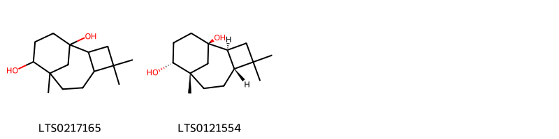{ width=100% }
    <figcaption>Hình ảnh cấu trúc hóa học của 2 hoạt chất thuộc nhóm Organooxygen compounds gồm ['4,4,8-trimethyltricyclo[6.3.1.0²,⁵]dodecane-1,9-diol (LTS0217165)', '(1r,2s,5r,8s,9r)-4,4,8-trimethyltricyclo[6.3.1.0²,⁵]dodecane-1,9-diol (LTS0121554)'].</figcaption>
</figure>
#### Nhóm Phenols
<figure markdown="span">
    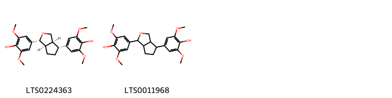{ width=100% }
    <figcaption>Hình ảnh cấu trúc hóa học của 2 hoạt chất thuộc nhóm Phenols gồm ['4-[(1r,3as,4r,6ar)-1-(4-hydroxy-3,5-dimethoxyphenyl)-hexahydro-1h-cyclopenta[c]furan-4-yl]-2,6-dimethoxyphenol (LTS0224363)', '4-[1-(4-hydroxy-3,5-dimethoxyphenyl)-hexahydro-1h-cyclopenta[c]furan-4-yl]-2,6-dimethoxyphenol (LTS0011968)'].</figcaption>
</figure>
#### Nhóm Prenol lipids
<figure markdown="span">
    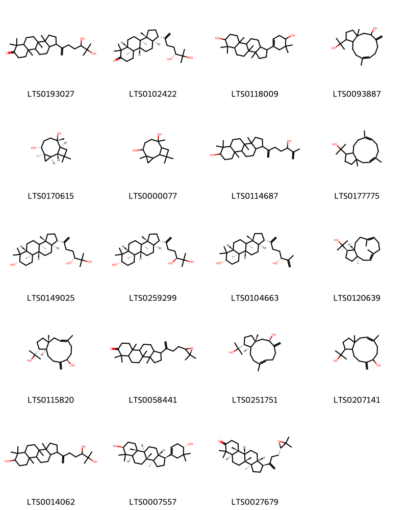{ width=100% }
    <figcaption>Hình ảnh cấu trúc hóa học của 19 hoạt chất thuộc nhóm Prenol lipids gồm ['1-(5,6-dihydroxy-6-methylhept-1-en-2-yl)-3a,3b,6,6,9a-pentamethyl-dodecahydrocyclopenta[a]phenanthren-7-one (LTS0193027)', '(1s,3ar,3br,5ar,9ar,9br,11ar)-1-[(5r)-5,6-dihydroxy-6-methylhept-1-en-2-yl]-3a,3b,6,6,9a-pentamethyl-dodecahydrocyclopenta[a]phenanthren-7-one (LTS0102422)', '4-{7-hydroxy-3a,3b,6,6,9a-pentamethyl-dodecahydro-1h-cyclopenta[a]phenanthren-1-yl}-6,6-dimethylcyclohex-3-en-1-ol (LTS0118009)', '1-(2-hydroxypropan-2-yl)-3a,10-dimethyl-6-methylidene-1h,2h,3h,4h,5h,7h,8h,11h,12h,12ah-cyclopenta[11]annulen-5-ol (LTS0093887)', '(1r,2r,4r,5r,8s,9s)-4,8,11,11-tetramethyltricyclo[7.2.0.0²,⁴]undecane-5,8-diol (LTS0170615)', '4,8,11,11-tetramethyltricyclo[7.2.0.0²,⁴]undecane-5,8-diol (LTS0000077)', '1-(5-hydroxy-6-methylhepta-1,6-dien-2-yl)-3a,3b,6,6,9a-pentamethyl-dodecahydro-1h-cyclopenta[a]phenanthren-7-ol (LTS0114687)', '2-{3a,6,10-trimethyl-1h,2h,3h,4h,7h,8h,11h,12h,12ah-cyclopenta[11]annulen-1-yl}propan-2-ol (LTS0177775)', '(3r)-6-[(1s,3ar,3br,5ar,7s,9ar,9br,11ar)-7-hydroxy-3a,3b,6,6,9a-pentamethyl-dodecahydro-1h-cyclopenta[a]phenanthren-1-yl]-2-methylhept-6-ene-2,3-diol (LTS0149025)', '(3s)-6-[(1s,3ar,3br,5ar,7s,9ar,9br,11ar)-7-hydroxy-3a,3b,6,6,9a-pentamethyl-dodecahydro-1h-cyclopenta[a]phenanthren-1-yl]-2-methylhept-6-ene-2,3-diol (LTS0259299)', '(1s,3ar,3br,5ar,7s,9ar,9br,11ar)-1-[(5r)-5-hydroxy-6-methylhepta-1,6-dien-2-yl]-3a,3b,6,6,9a-pentamethyl-dodecahydro-1h-cyclopenta[a]phenanthren-7-ol (LTS0104663)', '2-[(1r,3ar,12as)-3a,6,10-trimethyl-1h,2h,3h,4h,7h,8h,11h,12h,12ah-cyclopenta[11]annulen-1-yl]propan-2-ol (LTS0120639)', '(3r,3as,7r,12ar)-3-(2-hydroxypropan-2-yl)-10,12a-dimethyl-6-methylidene-1h,2h,3h,3ah,4h,5h,7h,8h,9h,12h-cyclopenta[11]annulen-7-ol (LTS0115820)', '1-[4-(3,3-dimethyloxiran-2-yl)but-1-en-2-yl]-3a,3b,6,6,9a-pentamethyl-dodecahydrocyclopenta[a]phenanthren-7-one (LTS0058441)', '(1r,3ar,5r,12as)-1-(2-hydroxypropan-2-yl)-3a,10-dimethyl-6-methylidene-1h,2h,3h,4h,5h,7h,8h,11h,12h,12ah-cyclopenta[11]annulen-5-ol (LTS0251751)', '3-(2-hydroxypropan-2-yl)-10,12a-dimethyl-6-methylidene-1h,2h,3h,3ah,4h,5h,7h,8h,9h,12h-cyclopenta[11]annulen-7-ol (LTS0207141)', '6-{7-hydroxy-3a,3b,6,6,9a-pentamethyl-dodecahydro-1h-cyclopenta[a]phenanthren-1-yl}-2-methylhept-6-ene-2,3-diol (LTS0014062)', '(1s)-4-[(1s,3ar,3br,5ar,7s,9ar,9br,11ar)-7-hydroxy-3a,3b,6,6,9a-pentamethyl-dodecahydro-1h-cyclopenta[a]phenanthren-1-yl]-6,6-dimethylcyclohex-3-en-1-ol (LTS0007557)', '(1s,3ar,3br,5ar,9ar,9bs,11ar)-1-{4-[(2s)-3,3-dimethyloxiran-2-yl]but-1-en-2-yl}-3a,3b,6,6,9a-pentamethyl-dodecahydrocyclopenta[a]phenanthren-7-one (LTS0027679)'].</figcaption>
</figure>
#### Nhóm Steroids and steroid derivatives
<figure markdown="span">
    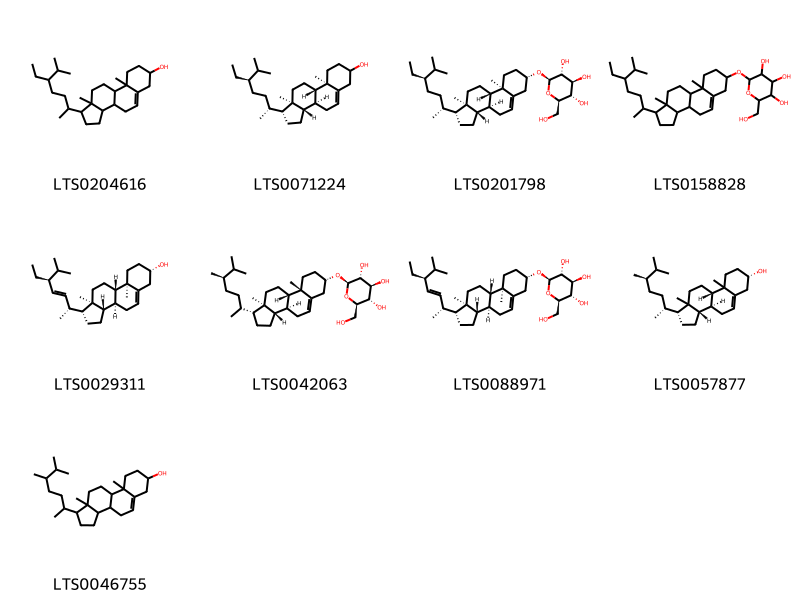{ width=100% }
    <figcaption>Hình ảnh cấu trúc hóa học của 9 hoạt chất thuộc nhóm Steroids and steroid derivatives gồm ['stigmast-5-en-3-ol, (3β)- (LTS0204616)', 'stigmast-5-en-3-ol (LTS0071224)', 'sitogluside (LTS0201798)', '2-{[1-(5-ethyl-6-methylheptan-2-yl)-9a,11a-dimethyl-1h,2h,3h,3ah,3bh,4h,6h,7h,8h,9h,9bh,10h,11h-cyclopenta[a]phenanthren-7-yl]oxy}-6-(hydroxymethyl)oxane-3,4,5-triol (LTS0158828)', 'phytosterol (LTS0029311)', '(2r,3r,4s,5s,6r)-2-{[(1r,3as,3bs,7s,9as,9bs,11ar)-1-[(5r)-5,6-dimethylheptan-2-yl]-9a,11a-dimethyl-1h,2h,3h,3ah,3bh,4h,6h,7h,8h,9h,9bh,10h,11h-cyclopenta[a]phenanthren-7-yl]oxy}-6-(hydroxymethyl)oxane-3,4,5-triol (LTS0042063)', '(2r,3r,4s,5s,6r)-2-{[(1r,3as,3bs,7s,9ar,9bs,11ar)-1-[(2r,3e,5s)-5-ethyl-6-methylhept-3-en-2-yl]-9a,11a-dimethyl-1h,2h,3h,3ah,3bh,4h,6h,7h,8h,9h,9bh,10h,11h-cyclopenta[a]phenanthren-7-yl]oxy}-6-(hydroxymethyl)oxane-3,4,5-triol (LTS0088971)', '(1r,3as,3bs,7s,9bs)-1-[(2r,5r)-5,6-dimethylheptan-2-yl]-9a,11a-dimethyl-1h,2h,3h,3ah,3bh,4h,6h,7h,8h,9h,9bh,10h,11h-cyclopenta[a]phenanthren-7-ol (LTS0057877)', 'campesterol (LTS0046755)'].</figcaption>
</figure>
#### Nhóm Stilbenes
<figure markdown="span">
    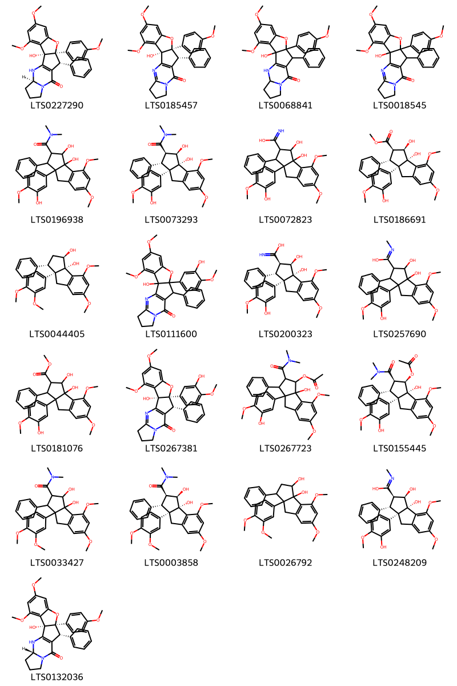{ width=100% }
    <figcaption>Hình ảnh cấu trúc hóa học của 21 hoạt chất thuộc nhóm Stilbenes gồm ['(2s,10r,11r,18s)-2-hydroxy-4,6-dimethoxy-10-(4-methoxyphenyl)-11-phenyl-9-oxa-14,19-diazapentacyclo[10.7.0.0²,¹⁰.0³,⁸.0¹⁴,¹⁸]nonadeca-1(12),3,5,7-tetraen-13-one (LTS0227290)', '(2s,10r,11r)-2-hydroxy-4,6-dimethoxy-10-(4-methoxyphenyl)-11-phenyl-9-oxa-14,19-diazapentacyclo[10.7.0.0²,¹⁰.0³,⁸.0¹⁴,¹⁸]nonadeca-1(12),3,5,7,18-pentaen-13-one (LTS0185457)', '2-hydroxy-4,6-dimethoxy-10-(4-methoxyphenyl)-11-phenyl-9-oxa-14,19-diazapentacyclo[10.7.0.0²,¹⁰.0³,⁸.0¹⁴,¹⁸]nonadeca-1(12),3,5,7-tetraen-13-one (LTS0068841)', '2-hydroxy-4,6-dimethoxy-10-(4-methoxyphenyl)-11-phenyl-9-oxa-14,19-diazapentacyclo[10.7.0.0²,¹⁰.0³,⁸.0¹⁴,¹⁸]nonadeca-1(12),3,5,7,18-pentaen-13-one (LTS0018545)', '3,3a-dihydroxy-8a-(3-hydroxy-4-methoxyphenyl)-4,6-dimethoxy-n,n-dimethyl-1-phenyl-1h,2h,3h,8h-cyclopenta[a]indene-2-carboxamide (LTS0196938)', '(1s,2r,3r,3as,8as)-3,3a-dihydroxy-8a-(3-hydroxy-4-methoxyphenyl)-4,6-dimethoxy-n,n-dimethyl-1-phenyl-1h,2h,3h,8h-cyclopenta[a]indene-2-carboxamide (LTS0073293)', '3,3a-dihydroxy-8a-(3-hydroxy-4-methoxyphenyl)-4,6-dimethoxy-1-phenyl-1h,2h,3h,8h-cyclopenta[a]indene-2-carboximidic acid (LTS0072823)', 'methyl (1s,2r,3r,3as,8as)-3,3a-dihydroxy-8a-(3-hydroxy-4-methoxyphenyl)-4,6-dimethoxy-1-phenyl-1h,2h,3h,8h-cyclopenta[a]indene-2-carboxylate (LTS0186691)', '(1s,3r,3as,8as)-8a-(3,4-dimethoxyphenyl)-4,6-dimethoxy-1-phenyl-1h,2h,3h,8h-cyclopenta[a]indene-3,3a-diol (LTS0044405)', '2-hydroxy-10-(3-hydroxy-4-methoxyphenyl)-4,6-dimethoxy-11-phenyl-9-oxa-14,19-diazapentacyclo[10.7.0.0²,¹⁰.0³,⁸.0¹⁴,¹⁸]nonadeca-1(12),3,5,7,18-pentaen-13-one (LTS0111600)', '(1s,2r,3r,3as,8as)-3,3a-dihydroxy-8a-(3-hydroxy-4-methoxyphenyl)-4,6-dimethoxy-1-phenyl-1h,2h,3h,8h-cyclopenta[a]indene-2-carboximidic acid (LTS0200323)', '3,3a-dihydroxy-8a-(3-hydroxy-4-methoxyphenyl)-4,6-dimethoxy-n-methyl-1-phenyl-1h,2h,3h,8h-cyclopenta[a]indene-2-carboximidic acid (LTS0257690)', 'methyl 3,3a-dihydroxy-8a-(3-hydroxy-4-methoxyphenyl)-4,6-dimethoxy-1-phenyl-1h,2h,3h,8h-cyclopenta[a]indene-2-carboxylate (LTS0181076)', '(2s,10r,11r)-2-hydroxy-10-(3-hydroxy-4-methoxyphenyl)-4,6-dimethoxy-11-phenyl-9-oxa-14,19-diazapentacyclo[10.7.0.0²,¹⁰.0³,⁸.0¹⁴,¹⁸]nonadeca-1(12),3,5,7,18-pentaen-13-one (LTS0267381)', '2-(dimethylcarbamoyl)-3a-hydroxy-8a-(3-hydroxy-4-methoxyphenyl)-4,6-dimethoxy-1-phenyl-1h,2h,3h,8h-cyclopenta[a]inden-3-yl acetate (LTS0267723)', '(1s,2r,3r,3as,8as)-2-(dimethylcarbamoyl)-3a-hydroxy-8a-(3-hydroxy-4-methoxyphenyl)-4,6-dimethoxy-1-phenyl-1h,2h,3h,8h-cyclopenta[a]inden-3-yl acetate (LTS0155445)', '8a-(3,4-dimethoxyphenyl)-3,3a-dihydroxy-4,6-dimethoxy-n,n-dimethyl-1-phenyl-1h,2h,3h,8h-cyclopenta[a]indene-2-carboxamide (LTS0033427)', '(1s,2r,3r,3as,8as)-8a-(3,4-dimethoxyphenyl)-3,3a-dihydroxy-4,6-dimethoxy-n,n-dimethyl-1-phenyl-1h,2h,3h,8h-cyclopenta[a]indene-2-carboxamide (LTS0003858)', '8a-(3,4-dimethoxyphenyl)-4,6-dimethoxy-1-phenyl-1h,2h,3h,8h-cyclopenta[a]indene-3,3a-diol (LTS0026792)', '(1s,2r,3r,3as,8as)-3,3a-dihydroxy-8a-(3-hydroxy-4-methoxyphenyl)-4,6-dimethoxy-n-methyl-1-phenyl-1h,2h,3h,8h-cyclopenta[a]indene-2-carboximidic acid (LTS0248209)', '(2s,10r,11r,18r)-2-hydroxy-4,6-dimethoxy-10-(4-methoxyphenyl)-11-phenyl-9-oxa-14,19-diazapentacyclo[10.7.0.0²,¹⁰.0³,⁸.0¹⁴,¹⁸]nonadeca-1(12),3,5,7-tetraen-13-one (LTS0132036)'].</figcaption>
</figure>

---

### Dược dân tộc học

Danh sách các quốc gia có sử dụng *Aglaia odorata* trong điều trị các bệnh. 

| Country     | Disease   | Bệnh                                                                                                                                                                                                |
|:------------|:----------|:----------------------------------------------------------------------------------------------------------------------------------------------------------------------------------------------------|
| China       | Tonic     | MYMEMORY WARNING: YOU USED ALL AVAILABLE FREE TRANSLATIONS FOR TODAY. NEXT AVAILABLE IN  06 HOURS 50 MINUTES 02 SECONDS VISIT HTTPS://MYMEMORY.TRANSLATED.NET/DOC/USAGELIMITS.PHP TO TRANSLATE MORE |
| Philippines | Tonic     | MYMEMORY WARNING: YOU USED ALL AVAILABLE FREE TRANSLATIONS FOR TODAY. NEXT AVAILABLE IN  06 HOURS 49 MINUTES 57 SECONDS VISIT HTTPS://MYMEMORY.TRANSLATED.NET/DOC/USAGELIMITS.PHP TO TRANSLATE MORE |

---

---
## Aglaia odoratissima
### Thông tin về thực vật

!!! info "Phân loại thực vật của *Aglaia odoratissima* từ GIBF:"
    - **Kingdom:** Plantae
    - **Phylum:** Tracheophyta
    - **Order:** Sapindales
    - **Family:** Meliaceae
    - **Genus:** Aglaia
    - **Species:** *Aglaia odoratissima*

 

| Label (VI)   | Label (EN)   | Scientific Name     | Descriptions (VI)   | Descriptions (EN)   | Also Known As (VI)      | Also Known As (EN)   |
|:-------------|:-------------|:--------------------|:--------------------|:--------------------|:------------------------|:---------------------|
| N/A          | N/A          | Aglaia odoratissima |                     | species of plant    | ['Aglaia odoratissima'] | ['']                 |

#### Phân bố trên thế giới

**Từ CSDL GIBF** Malaysia, Thailand, India, Indonesia, unknown or invalid, Philippines, Singapore, Viet Nam, Brunei Darussalam

#### Phân bố tại Việt Nam

**Từ CSDL GIBF**: Không có ghi nhận ở Việt Nam

---
### Thành phần hóa học
        
- Theo cơ sở dữ liệu lotus: Từ loài *Aglaia odoratissima* đã phân lập và xác định được 6 hoạt chất thuộc về các nhóm Prenol lipids, Saturated hydrocarbons, Organooxygen compounds. 

|    | chemicalTaxonomyClassyfireClass   |   smiles_count |
|---:|:----------------------------------|---------------:|
|  0 | Organooxygen compounds            |              1 |
|  1 | Prenol lipids                     |              4 |
|  2 | Saturated hydrocarbons            |              1 |

#### Nhóm Organooxygen compounds
<figure markdown="span">
    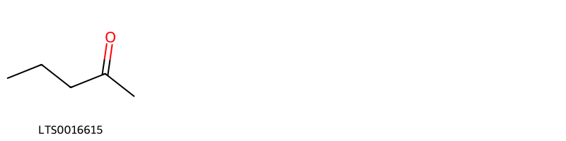{ width=100% }
    <figcaption>Hình ảnh cấu trúc hóa học của 1 hoạt chất thuộc nhóm Organooxygen compounds gồm ['2-pentanone (LTS0016615)'].</figcaption>
</figure>
#### Nhóm Prenol lipids
<figure markdown="span">
    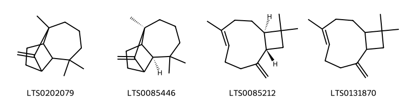{ width=100% }
    <figcaption>Hình ảnh cấu trúc hóa học của 4 hoạt chất thuộc nhóm Prenol lipids gồm ['longifolene (LTS0202079)', '(2s,7s)-3,3,7-trimethyl-8-methylidenetricyclo[5.4.0.0²,⁹]undecane (LTS0085446)', 'caryophyllene (LTS0085212)', 'caryophyllene (LTS0131870)'].</figcaption>
</figure>
#### Nhóm Saturated hydrocarbons
<figure markdown="span">
    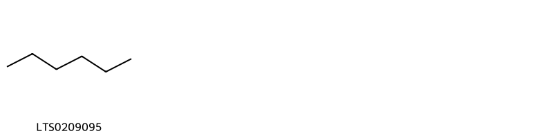{ width=100% }
    <figcaption>Hình ảnh cấu trúc hóa học của 1 hoạt chất thuộc nhóm Saturated hydrocarbons gồm ['hexane (LTS0209095)'].</figcaption>
</figure>

---

### Dược dân tộc học

Danh sách các quốc gia có sử dụng *Aglaia odoratissima* trong điều trị các bệnh. 

| Country   |   Disease | Bệnh                                                                                                                                                                                                |
|:----------|----------:|:----------------------------------------------------------------------------------------------------------------------------------------------------------------------------------------------------|
| India     |       nan | MYMEMORY WARNING: YOU USED ALL AVAILABLE FREE TRANSLATIONS FOR TODAY. NEXT AVAILABLE IN  06 HOURS 49 MINUTES 15 SECONDS VISIT HTTPS://MYMEMORY.TRANSLATED.NET/DOC/USAGELIMITS.PHP TO TRANSLATE MORE |

---

---
## Aglaia odoratissimaa
### Thông tin về thực vật

!!! info "Phân loại thực vật của *Aglaia odoratissima* từ GIBF:"
    - **Kingdom:** Plantae
    - **Phylum:** Tracheophyta
    - **Order:** Sapindales
    - **Family:** Meliaceae
    - **Genus:** Aglaia
    - **Species:** *Aglaia odoratissima*

 

| Label (VI)   | Label (EN)   | Scientific Name     | Descriptions (VI)   | Descriptions (EN)   | Also Known As (VI)      | Also Known As (EN)   |
|:-------------|:-------------|:--------------------|:--------------------|:--------------------|:------------------------|:---------------------|
| N/A          | N/A          | Aglaia odoratissima |                     | species of plant    | ['Aglaia odoratissima'] | ['']                 |

#### Phân bố trên thế giới

**Từ CSDL GIBF** Malaysia, Thailand, India, Indonesia, unknown or invalid, Philippines, Singapore, Viet Nam, Brunei Darussalam

#### Phân bố tại Việt Nam

**Từ CSDL GIBF**: Không có ghi nhận ở Việt Nam

---
### Thành phần hóa học
        
- Theo cơ sở dữ liệu lotus: Từ loài *Aglaia odoratissima* đã phân lập và xác định được Chưa có hoạt chất nào được phân lập. hoạt chất thuộc về các nhóm Không có hoạt chất nào được phân lập. 

Không có hình ảnh nào được tạo ra

---

### Dược dân tộc học

Danh sách các quốc gia có sử dụng *Aglaia odoratissima* trong điều trị các bệnh. 

| Country   | Disease   | Bệnh                                                                                                                                                                                                |
|:----------|:----------|:----------------------------------------------------------------------------------------------------------------------------------------------------------------------------------------------------|
| Java      | Perfumery | MYMEMORY WARNING: YOU USED ALL AVAILABLE FREE TRANSLATIONS FOR TODAY. NEXT AVAILABLE IN  06 HOURS 48 MINUTES 44 SECONDS VISIT HTTPS://MYMEMORY.TRANSLATED.NET/DOC/USAGELIMITS.PHP TO TRANSLATE MORE |

---

---
## Aglaia roxburghiana
### Thông tin về thực vật

!!! info "Phân loại thực vật của *Aglaia roxburghiana* từ GIBF:"
    - **Kingdom:** Plantae
    - **Phylum:** Tracheophyta
    - **Order:** Sapindales
    - **Family:** Meliaceae
    - **Genus:** Aglaia
    - **Species:** *Aglaia roxburghiana*

 

| Label (VI)   | Label (EN)   | Scientific Name     | Descriptions (VI)   | Descriptions (EN)   | Also Known As (VI)   | Also Known As (EN)   |
|:-------------|:-------------|:--------------------|:--------------------|:--------------------|:---------------------|:---------------------|
| N/A          | N/A          | Aglaia roxburghiana | loài thực vật       | species of plant    | ['']                 | ['']                 |

#### Phân bố trên thế giới

**Từ CSDL GIBF** nan, Sri Lanka, Viet Nam, China

#### Phân bố tại Việt Nam

**Từ CSDL GIBF**: Không có ghi nhận ở Việt Nam

---
### Thành phần hóa học
        
- Theo cơ sở dữ liệu lotus: Từ loài *Aglaia roxburghiana* đã phân lập và xác định được 41 hoạt chất thuộc về các nhóm Flavonoids, Steroids and steroid derivatives, Cinnamic acids and derivatives, Benzofurans, Stilbenes. 

|    | chemicalTaxonomyClassyfireClass   |   smiles_count |
|---:|:----------------------------------|---------------:|
|  0 | Benzofurans                       |             10 |
|  1 | Cinnamic acids and derivatives    |              4 |
|  2 | Flavonoids                        |             11 |
|  3 | Steroids and steroid derivatives  |              6 |
|  4 | Stilbenes                         |             10 |

#### Nhóm Benzofurans
<figure markdown="span">
    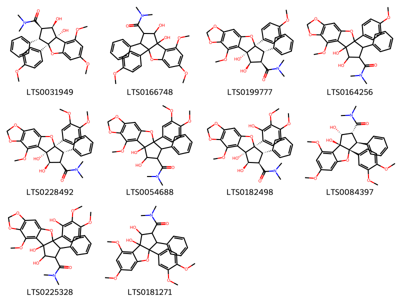{ width=100% }
    <figcaption>Hình ảnh cấu trúc hóa học của 10 hoạt chất thuộc nhóm Benzofurans gồm ['rocaglamide (LTS0031949)', '2,3-dihydroxy-10,12-dimethoxy-6-(4-methoxyphenyl)-n,n-dimethyl-5-phenyl-7-oxatricyclo[6.4.0.0²,⁶]dodeca-1(12),8,10-triene-4-carboxamide (LTS0166748)', '(10s,11r,12r,13s,14r)-10,11-dihydroxy-8-methoxy-14-(4-methoxyphenyl)-n,n-dimethyl-13-phenyl-4,6,15-trioxatetracyclo[7.6.0.0³,⁷.0¹⁰,¹⁴]pentadeca-1,3(7),8-triene-12-carboxamide (LTS0199777)', '10,11-dihydroxy-8-methoxy-14-(4-methoxyphenyl)-n,n-dimethyl-13-phenyl-4,6,15-trioxatetracyclo[7.6.0.0³,⁷.0¹⁰,¹⁴]pentadeca-1,3(7),8-triene-12-carboxamide (LTS0164256)', '(10s,11r,12r,13s,14r)-14-(3,4-dimethoxyphenyl)-10,11-dihydroxy-8-methoxy-n,n-dimethyl-13-phenyl-4,6,15-trioxatetracyclo[7.6.0.0³,⁷.0¹⁰,¹⁴]pentadeca-1,3(7),8-triene-12-carboxamide (LTS0228492)', '14-(3,4-dimethoxyphenyl)-10,11-dihydroxy-8-methoxy-n,n-dimethyl-13-phenyl-4,6,15-trioxatetracyclo[7.6.0.0³,⁷.0¹⁰,¹⁴]pentadeca-1,3(7),8-triene-12-carboxamide (LTS0054688)', '(10s,11r,12r,13s,14r)-10,11-dihydroxy-14-(2-hydroxy-3,4-dimethoxyphenyl)-8-methoxy-n,n-dimethyl-13-phenyl-4,6,15-trioxatetracyclo[7.6.0.0³,⁷.0¹⁰,¹⁴]pentadeca-1,3(7),8-triene-12-carboxamide (LTS0182498)', '(2s,3r,4r,5s,6r)-6-(3,4-dimethoxyphenyl)-2,3-dihydroxy-10,12-dimethoxy-n,n-dimethyl-5-phenyl-7-oxatricyclo[6.4.0.0²,⁶]dodeca-1(12),8,10-triene-4-carboxamide (LTS0084397)', '10,11-dihydroxy-14-(2-hydroxy-3,4-dimethoxyphenyl)-8-methoxy-n,n-dimethyl-13-phenyl-4,6,15-trioxatetracyclo[7.6.0.0³,⁷.0¹⁰,¹⁴]pentadeca-1,3(7),8-triene-12-carboxamide (LTS0225328)', '6-(3,4-dimethoxyphenyl)-2,3-dihydroxy-10,12-dimethoxy-n,n-dimethyl-5-phenyl-7-oxatricyclo[6.4.0.0²,⁶]dodeca-1(12),8,10-triene-4-carboxamide (LTS0181271)'].</figcaption>
</figure>
#### Nhóm Cinnamic acids and derivatives
<figure markdown="span">
    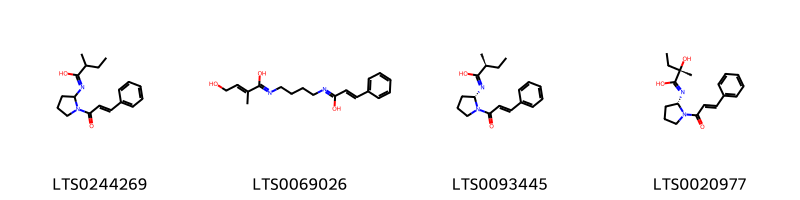{ width=100% }
    <figcaption>Hình ảnh cấu trúc hóa học của 4 hoạt chất thuộc nhóm Cinnamic acids and derivatives gồm ['2-methyl-n-[1-(3-phenylprop-2-enoyl)pyrrolidin-2-yl]butanimidic acid (LTS0244269)', '(2e)-4-hydroxy-n-(4-{[(2e)-1-hydroxy-3-phenylprop-2-en-1-ylidene]amino}butyl)-2-methylbut-2-enimidic acid (LTS0069026)', '(2s)-2-methyl-n-[(2r)-1-[(2e)-3-phenylprop-2-enoyl]pyrrolidin-2-yl]butanimidic acid (LTS0093445)', '(2s)-2-hydroxy-2-methyl-n-[(2r)-1-[(2e)-3-phenylprop-2-enoyl]pyrrolidin-2-yl]butanimidic acid (LTS0020977)'].</figcaption>
</figure>
#### Nhóm Flavonoids
<figure markdown="span">
    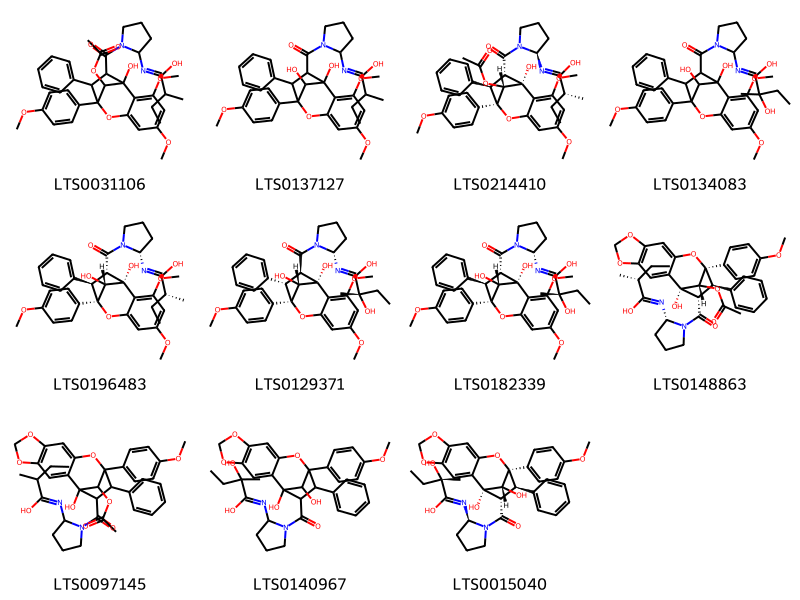{ width=100% }
    <figcaption>Hình ảnh cấu trúc hóa học của 11 hoạt chất thuộc nhóm Flavonoids gồm ['n-{1-[12-(acetyloxy)-1-hydroxy-3,5-dimethoxy-9-(4-methoxyphenyl)-10-phenyl-8-oxatricyclo[7.2.1.0²,⁷]dodeca-2,4,6-triene-11-carbonyl]pyrrolidin-2-yl}-2-methylbutanimidic acid (LTS0031106)', 'n-{1-[1,12-dihydroxy-3,5-dimethoxy-9-(4-methoxyphenyl)-10-phenyl-8-oxatricyclo[7.2.1.0²,⁷]dodeca-2,4,6-triene-11-carbonyl]pyrrolidin-2-yl}-2-methylbutanimidic acid (LTS0137127)', '(2r)-n-[(2s)-1-[(1r,9r,10r,11s,12r)-12-(acetyloxy)-1-hydroxy-3,5-dimethoxy-9-(4-methoxyphenyl)-10-phenyl-8-oxatricyclo[7.2.1.0²,⁷]dodeca-2,4,6-triene-11-carbonyl]pyrrolidin-2-yl]-2-methylbutanimidic acid (LTS0214410)', 'n-{1-[1,12-dihydroxy-3,5-dimethoxy-9-(4-methoxyphenyl)-10-phenyl-8-oxatricyclo[7.2.1.0²,⁷]dodeca-2,4,6-triene-11-carbonyl]pyrrolidin-2-yl}-2-hydroxy-2-methylbutanimidic acid (LTS0134083)', '(2r)-n-[(2r)-1-[(1r,9r,10r,11s,12r)-1,12-dihydroxy-3,5-dimethoxy-9-(4-methoxyphenyl)-10-phenyl-8-oxatricyclo[7.2.1.0²,⁷]dodeca-2,4,6-triene-11-carbonyl]pyrrolidin-2-yl]-2-methylbutanimidic acid (LTS0196483)', '(2s)-n-[(2r)-1-[(1r,9r,10s,11r,12r)-1,12-dihydroxy-3,5-dimethoxy-9-(4-methoxyphenyl)-10-phenyl-8-oxatricyclo[7.2.1.0²,⁷]dodeca-2,4,6-triene-11-carbonyl]pyrrolidin-2-yl]-2-hydroxy-2-methylbutanimidic acid (LTS0129371)', '(2s)-n-[(2r)-1-[(1r,9r,10r,11s,12r)-1,12-dihydroxy-3,5-dimethoxy-9-(4-methoxyphenyl)-10-phenyl-8-oxatricyclo[7.2.1.0²,⁷]dodeca-2,4,6-triene-11-carbonyl]pyrrolidin-2-yl]-2-hydroxy-2-methylbutanimidic acid (LTS0182339)', '(2r)-n-[(2r)-1-[(1r,12r,13r,14s,15r)-15-(acetyloxy)-1-hydroxy-12-(4-methoxyphenyl)-13-phenyl-5,7,11-trioxatetracyclo[10.2.1.0²,¹⁰.0⁴,⁸]pentadeca-2,4(8),9-triene-14-carbonyl]pyrrolidin-2-yl]-2-methylbutanimidic acid (LTS0148863)', 'n-{1-[15-(acetyloxy)-1-hydroxy-12-(4-methoxyphenyl)-13-phenyl-5,7,11-trioxatetracyclo[10.2.1.0²,¹⁰.0⁴,⁸]pentadeca-2,4(8),9-triene-14-carbonyl]pyrrolidin-2-yl}-2-methylbutanimidic acid (LTS0097145)', 'n-{1-[1,15-dihydroxy-12-(4-methoxyphenyl)-13-phenyl-5,7,11-trioxatetracyclo[10.2.1.0²,¹⁰.0⁴,⁸]pentadeca-2,4(8),9-triene-14-carbonyl]pyrrolidin-2-yl}-2-hydroxy-2-methylbutanimidic acid (LTS0140967)', '(2s)-n-[(2s)-1-[(1r,12r,13r,14s,15r)-1,15-dihydroxy-12-(4-methoxyphenyl)-13-phenyl-5,7,11-trioxatetracyclo[10.2.1.0²,¹⁰.0⁴,⁸]pentadeca-2,4(8),9-triene-14-carbonyl]pyrrolidin-2-yl]-2-hydroxy-2-methylbutanimidic acid (LTS0015040)'].</figcaption>
</figure>
#### Nhóm Steroids and steroid derivatives
<figure markdown="span">
    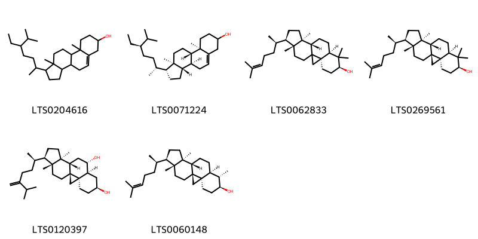{ width=100% }
    <figcaption>Hình ảnh cấu trúc hóa học của 6 hoạt chất thuộc nhóm Steroids and steroid derivatives gồm ['stigmast-5-en-3-ol, (3β)- (LTS0204616)', 'stigmast-5-en-3-ol (LTS0071224)', '(3r,6s,8r,11s,12s,15r,16r)-7,7,12,16-tetramethyl-15-[(2r)-6-methylhept-5-en-2-yl]pentacyclo[9.7.0.0¹,³.0³,⁸.0¹²,¹⁶]octadecan-6-ol (LTS0062833)', 'cycloartenol (LTS0269561)', '(1s,3r,6s,8s,9s,11s,12s,15r,16r)-12,16-dimethyl-15-[(2r)-6-methyl-5-methylideneheptan-2-yl]pentacyclo[9.7.0.0¹,³.0³,⁸.0¹²,¹⁶]octadecane-6,9-diol (LTS0120397)', '(1s,3r,6s,7s,8s,11s,12s,15r,16r)-7,12,16-trimethyl-15-[(2r)-6-methylhept-5-en-2-yl]pentacyclo[9.7.0.0¹,³.0³,⁸.0¹²,¹⁶]octadecan-6-ol (LTS0060148)'].</figcaption>
</figure>
#### Nhóm Stilbenes
<figure markdown="span">
    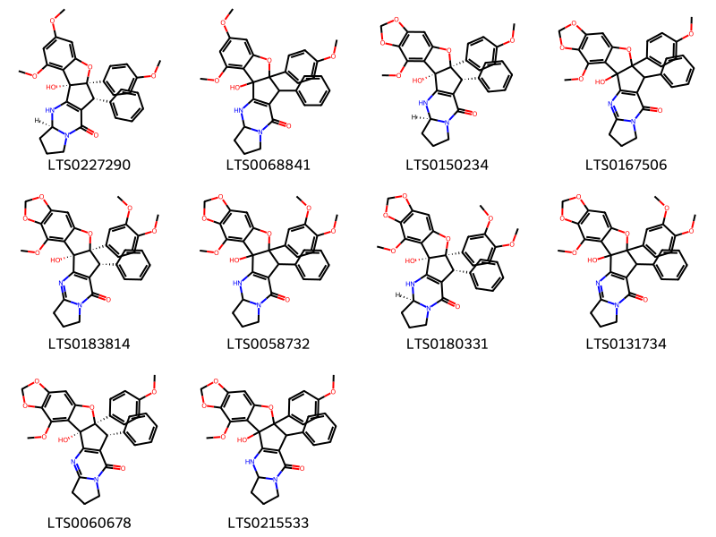{ width=100% }
    <figcaption>Hình ảnh cấu trúc hóa học của 10 hoạt chất thuộc nhóm Stilbenes gồm ['(2s,10r,11r,18s)-2-hydroxy-4,6-dimethoxy-10-(4-methoxyphenyl)-11-phenyl-9-oxa-14,19-diazapentacyclo[10.7.0.0²,¹⁰.0³,⁸.0¹⁴,¹⁸]nonadeca-1(12),3,5,7-tetraen-13-one (LTS0227290)', '2-hydroxy-4,6-dimethoxy-10-(4-methoxyphenyl)-11-phenyl-9-oxa-14,19-diazapentacyclo[10.7.0.0²,¹⁰.0³,⁸.0¹⁴,¹⁸]nonadeca-1(12),3,5,7-tetraen-13-one (LTS0068841)', '(1s,4s,11r,12r)-1-hydroxy-21-methoxy-12-(4-methoxyphenyl)-11-phenyl-13,17,19-trioxa-3,8-diazahexacyclo[10.10.0.0²,¹⁰.0⁴,⁸.0¹⁴,²².0¹⁶,²⁰]docosa-2(10),14,16(20),21-tetraen-9-one (LTS0150234)', '1-hydroxy-21-methoxy-12-(4-methoxyphenyl)-11-phenyl-13,17,19-trioxa-3,8-diazahexacyclo[10.10.0.0²,¹⁰.0⁴,⁸.0¹⁴,²².0¹⁶,²⁰]docosa-2(10),3,14,16(20),21-pentaen-9-one (LTS0167506)', '(1s,11r,12r)-12-(3,4-dimethoxyphenyl)-1-hydroxy-21-methoxy-11-phenyl-13,17,19-trioxa-3,8-diazahexacyclo[10.10.0.0²,¹⁰.0⁴,⁸.0¹⁴,²².0¹⁶,²⁰]docosa-2(10),3,14,16(20),21-pentaen-9-one (LTS0183814)', '12-(3,4-dimethoxyphenyl)-1-hydroxy-21-methoxy-11-phenyl-13,17,19-trioxa-3,8-diazahexacyclo[10.10.0.0²,¹⁰.0⁴,⁸.0¹⁴,²².0¹⁶,²⁰]docosa-2(10),14,16(20),21-tetraen-9-one (LTS0058732)', '(1s,4s,11r,12r)-12-(3,4-dimethoxyphenyl)-1-hydroxy-21-methoxy-11-phenyl-13,17,19-trioxa-3,8-diazahexacyclo[10.10.0.0²,¹⁰.0⁴,⁸.0¹⁴,²².0¹⁶,²⁰]docosa-2(10),14,16(20),21-tetraen-9-one (LTS0180331)', '12-(3,4-dimethoxyphenyl)-1-hydroxy-21-methoxy-11-phenyl-13,17,19-trioxa-3,8-diazahexacyclo[10.10.0.0²,¹⁰.0⁴,⁸.0¹⁴,²².0¹⁶,²⁰]docosa-2(10),3,14,16(20),21-pentaen-9-one (LTS0131734)', '(1s,11r,12r)-1-hydroxy-21-methoxy-12-(4-methoxyphenyl)-11-phenyl-13,17,19-trioxa-3,8-diazahexacyclo[10.10.0.0²,¹⁰.0⁴,⁸.0¹⁴,²².0¹⁶,²⁰]docosa-2(10),3,14,16(20),21-pentaen-9-one (LTS0060678)', '1-hydroxy-21-methoxy-12-(4-methoxyphenyl)-11-phenyl-13,17,19-trioxa-3,8-diazahexacyclo[10.10.0.0²,¹⁰.0⁴,⁸.0¹⁴,²².0¹⁶,²⁰]docosa-2(10),14,16(20),21-tetraen-9-one (LTS0215533)'].</figcaption>
</figure>

---

### Dược dân tộc học

Danh sách các quốc gia có sử dụng *Aglaia roxburghiana* trong điều trị các bệnh. 

| Country   | Disease                 | Bệnh                                                                                                                                                                                                |
|:----------|:------------------------|:----------------------------------------------------------------------------------------------------------------------------------------------------------------------------------------------------|
| Elsewhere | Astringent, Refrigerant | MYMEMORY WARNING: YOU USED ALL AVAILABLE FREE TRANSLATIONS FOR TODAY. NEXT AVAILABLE IN  06 HOURS 48 MINUTES 19 SECONDS VISIT HTTPS://MYMEMORY.TRANSLATED.NET/DOC/USAGELIMITS.PHP TO TRANSLATE MORE |

---

# Chi Sandoricum

??? note "Danh sách các dược liệu thuộc chi"
    
	 - *Sandoricum koetjape*

---
## Sandoricum koetjape
### Thông tin về thực vật

!!! info "Phân loại thực vật của *Sandoricum koetjape* từ GIBF:"
    - **Kingdom:** Plantae
    - **Phylum:** Tracheophyta
    - **Order:** Sapindales
    - **Family:** Meliaceae
    - **Genus:** Sandoricum
    - **Species:** *Sandoricum koetjape*

 

| Label (VI)   | Label (EN)   | Scientific Name     | Descriptions (VI)   | Descriptions (EN)   | Also Known As (VI)   | Also Known As (EN)   |
|:-------------|:-------------|:--------------------|:--------------------|:--------------------|:---------------------|:---------------------|
| N/A          | N/A          | Sandoricum koetjape | loài thực vật       | species of plant    | ['']                 | ['']                 |

#### Phân bố trên thế giới

**Từ CSDL GIBF** Sri Lanka, Hong Kong, Thailand, Seychelles, Cambodia, Chinese Taipei, India, Indonesia, United States of America, Philippines, Singapore, Malaysia

#### Phân bố tại Việt Nam

**Từ CSDL GIBF**: Không có ghi nhận ở Việt Nam

---
### Thành phần hóa học
        
- Theo cơ sở dữ liệu lotus: Từ loài *Sandoricum koetjape* đã phân lập và xác định được 47 hoạt chất thuộc về các nhóm Prenol lipids, Steroids and steroid derivatives, Organooxygen compounds, Carboxylic acids and derivatives. 

|    | chemicalTaxonomyClassyfireClass   |   smiles_count |
|---:|:----------------------------------|---------------:|
|  0 | Carboxylic acids and derivatives  |              9 |
|  1 | Organooxygen compounds            |             11 |
|  2 | Prenol lipids                     |             15 |
|  3 | Steroids and steroid derivatives  |             11 |

#### Nhóm Carboxylic acids and derivatives
<figure markdown="span">
    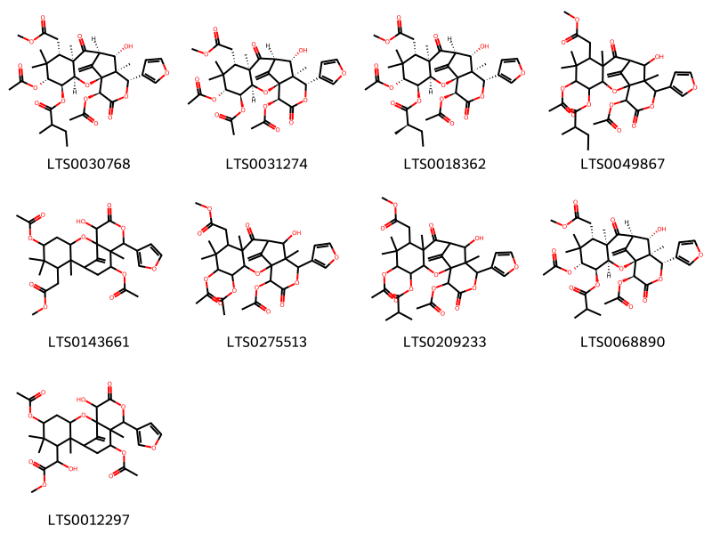{ width=100% }
    <figcaption>Hình ảnh cấu trúc hóa học của 9 hoạt chất thuộc nhóm Carboxylic acids and derivatives gồm ['(1s,3r,4r,5r,7s,8r,10r,11s,12s,13s,16s)-5,16-bis(acetyloxy)-13-(furan-3-yl)-11-hydroxy-7-(2-methoxy-2-oxoethyl)-6,6,8,12-tetramethyl-17-methylidene-9,15-dioxo-2,14-dioxatetracyclo[8.6.1.0¹,¹².0³,⁸]heptadecan-4-yl 2-methylbutanoate (LTS0030768)', 'methyl 2-[(1s,3r,4r,5r,7s,8r,10r,11s,12s,13s,16s)-4,5,16-tris(acetyloxy)-13-(furan-3-yl)-11-hydroxy-6,6,8,12-tetramethyl-17-methylidene-9,15-dioxo-2,14-dioxatetracyclo[8.6.1.0¹,¹².0³,⁸]heptadecan-7-yl]acetate (LTS0031274)', '(1s,3r,4r,5r,7s,8r,10r,11s,12s,13s,16s)-5,16-bis(acetyloxy)-13-(furan-3-yl)-11-hydroxy-7-(2-methoxy-2-oxoethyl)-6,6,8,12-tetramethyl-17-methylidene-9,15-dioxo-2,14-dioxatetracyclo[8.6.1.0¹,¹².0³,⁸]heptadecan-4-yl (2r)-2-methylbutanoate (LTS0018362)', '5,16-bis(acetyloxy)-13-(furan-3-yl)-11-hydroxy-7-(2-methoxy-2-oxoethyl)-6,6,8,12-tetramethyl-17-methylidene-9,15-dioxo-2,14-dioxatetracyclo[8.6.1.0¹,¹².0³,⁸]heptadecan-4-yl 2-methylbutanoate (LTS0049867)', 'methyl 2-[5,11-bis(acetyloxy)-13-(furan-3-yl)-16-hydroxy-6,6,8,12-tetramethyl-17-methylidene-15-oxo-2,14-dioxatetracyclo[7.7.1.0¹,¹².0³,⁸]heptadecan-7-yl]acetate (LTS0143661)', 'methyl 2-[4,5,16-tris(acetyloxy)-13-(furan-3-yl)-11-hydroxy-6,6,8,12-tetramethyl-17-methylidene-9,15-dioxo-2,14-dioxatetracyclo[8.6.1.0¹,¹².0³,⁸]heptadecan-7-yl]acetate (LTS0275513)', '5,16-bis(acetyloxy)-13-(furan-3-yl)-11-hydroxy-7-(2-methoxy-2-oxoethyl)-6,6,8,12-tetramethyl-17-methylidene-9,15-dioxo-2,14-dioxatetracyclo[8.6.1.0¹,¹².0³,⁸]heptadecan-4-yl 2-methylpropanoate (LTS0209233)', '(1s,3r,4r,5r,7s,8r,10r,11s,12s,13s,16s)-5,16-bis(acetyloxy)-13-(furan-3-yl)-11-hydroxy-7-(2-methoxy-2-oxoethyl)-6,6,8,12-tetramethyl-17-methylidene-9,15-dioxo-2,14-dioxatetracyclo[8.6.1.0¹,¹².0³,⁸]heptadecan-4-yl 2-methylpropanoate (LTS0068890)', 'methyl 2-[5,11-bis(acetyloxy)-13-(furan-3-yl)-16-hydroxy-6,6,8,12-tetramethyl-17-methylidene-15-oxo-2,14-dioxatetracyclo[7.7.1.0¹,¹².0³,⁸]heptadecan-7-yl]-2-hydroxyacetate (LTS0012297)'].</figcaption>
</figure>
#### Nhóm Organooxygen compounds
<figure markdown="span">
    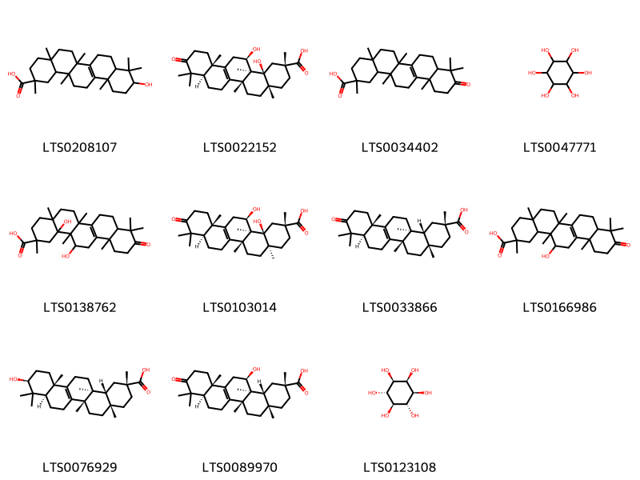{ width=100% }
    <figcaption>Hình ảnh cấu trúc hóa học của 11 hoạt chất thuộc nhóm Organooxygen compounds gồm ['10-hydroxy-2,4a,6a,9,9,12a,14a-heptamethyl-1,3,4,5,6,7,8,8a,10,11,12,13,14,14b-tetradecahydropicene-2-carboxylic acid (LTS0208107)', '(2r,4as,6ar,8ar,12as,14r,14as,14bs)-14,14b-dihydroxy-2,4a,6a,9,9,12a,14a-heptamethyl-10-oxo-1,3,4,5,6,7,8,8a,11,12,13,14-dodecahydropicene-2-carboxylic acid (LTS0022152)', '2,4a,6a,9,9,12a,14a-heptamethyl-10-oxo-3,4,5,6,7,8,8a,11,12,13,14,14b-dodecahydro-1h-picene-2-carboxylic acid (LTS0034402)', '(-)-inositol (LTS0047771)', '14,14b-dihydroxy-2,4a,6a,9,9,12a,14a-heptamethyl-10-oxo-1,3,4,5,6,7,8,8a,11,12,13,14-dodecahydropicene-2-carboxylic acid (LTS0138762)', '(2r,4ar,6ar,8ar,12as,14r,14as,14bs)-14,14b-dihydroxy-2,4a,6a,9,9,12a,14a-heptamethyl-10-oxo-1,3,4,5,6,7,8,8a,11,12,13,14-dodecahydropicene-2-carboxylic acid (LTS0103014)', '(2r,4as,6as,8ar,12as,14as,14br)-2,4a,6a,9,9,12a,14a-heptamethyl-10-oxo-3,4,5,6,7,8,8a,11,12,13,14,14b-dodecahydro-1h-picene-2-carboxylic acid (LTS0033866)', '14-hydroxy-2,4a,6a,9,9,12a,14a-heptamethyl-10-oxo-3,4,5,6,7,8,8a,11,12,13,14,14b-dodecahydro-1h-picene-2-carboxylic acid (LTS0166986)', '(2r,4as,6as,8ar,10s,12as,14as,14br)-10-hydroxy-2,4a,6a,9,9,12a,14a-heptamethyl-1,3,4,5,6,7,8,8a,10,11,12,13,14,14b-tetradecahydropicene-2-carboxylic acid (LTS0076929)', '(2r,4as,6ar,8ar,12as,14r,14as,14br)-14-hydroxy-2,4a,6a,9,9,12a,14a-heptamethyl-10-oxo-3,4,5,6,7,8,8a,11,12,13,14,14b-dodecahydro-1h-picene-2-carboxylic acid (LTS0089970)', '(1r,2r,3s,4r,5s,6s)-cyclohexane-1,2,3,4,5,6-hexol (LTS0123108)'].</figcaption>
</figure>
#### Nhóm Prenol lipids
<figure markdown="span">
    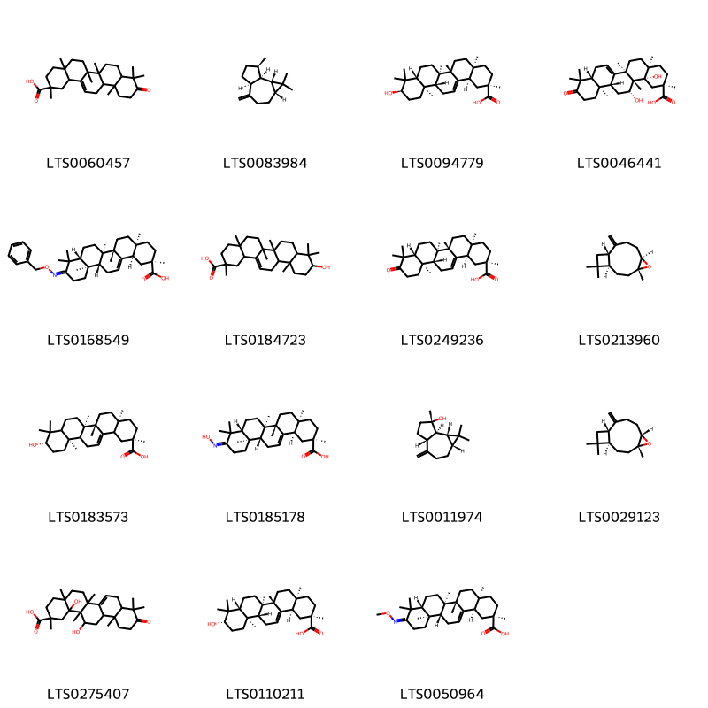{ width=100% }
    <figcaption>Hình ảnh cấu trúc hóa học của 15 hoạt chất thuộc nhóm Prenol lipids gồm ['2,4a,6a,6b,9,9,12a-heptamethyl-10-oxo-3,4,5,6,7,8,8a,11,12,12b,13,14b-dodecahydro-1h-picene-2-carboxylic acid (LTS0060457)', '(1ar,4as,7r,7ar,7bs)-1,1,7-trimethyl-4-methylidene-octahydro-1ah-cyclopropa[e]azulene (LTS0083984)', '(2r,4as,6as,6br,8ar,10r,12ar,12br,14br)-10-hydroxy-2,4a,6a,6b,9,9,12a-heptamethyl-1,3,4,5,6,7,8,8a,10,11,12,12b,13,14b-tetradecahydropicene-2-carboxylic acid (LTS0094779)', '(2r,4as,6ar,8ar,12ar,12br,14r,14as,14bs)-14,14b-dihydroxy-2,4a,6a,9,9,12a,14a-heptamethyl-10-oxo-1,3,4,5,6,8,8a,11,12,12b,13,14-dodecahydropicene-2-carboxylic acid (LTS0046441)', '(2r,4as,6as,6br,8ar,10z,12ar,12br,14br)-10-[(benzyloxy)imino]-2,4a,6a,6b,9,9,12a-heptamethyl-3,4,5,6,7,8,8a,11,12,12b,13,14b-dodecahydro-1h-picene-2-carboxylic acid (LTS0168549)', '10-hydroxy-2,4a,6a,6b,9,9,12a-heptamethyl-1,3,4,5,6,7,8,8a,10,11,12,12b,13,14b-tetradecahydropicene-2-carboxylic acid (LTS0184723)', '(2r,4as,6as,6br,8ar,12ar,12br,14br)-2,4a,6a,6b,9,9,12a-heptamethyl-10-oxo-3,4,5,6,7,8,8a,11,12,12b,13,14b-dodecahydro-1h-picene-2-carboxylic acid (LTS0249236)', 'β-caryophyllene oxide (LTS0213960)', '(2r,4as,6as,6br,10s,12ar)-10-hydroxy-2,4a,6a,6b,9,9,12a-heptamethyl-1,3,4,5,6,7,8,8a,10,11,12,12b,13,14b-tetradecahydropicene-2-carboxylic acid (LTS0183573)', '(2r,4as,6as,6br,8ar,10z,12ar,12br,14br)-10-(hydroxyimino)-2,4a,6a,6b,9,9,12a-heptamethyl-3,4,5,6,7,8,8a,11,12,12b,13,14b-dodecahydro-1h-picene-2-carboxylic acid (LTS0185178)', 'spathulenol (LTS0011974)', '(1r,4r,6s,10s)-4,12,12-trimethyl-9-methylidene-5-oxatricyclo[8.2.0.0⁴,⁶]dodecane (LTS0029123)', '14,14b-dihydroxy-2,4a,6a,9,9,12a,14a-heptamethyl-10-oxo-1,3,4,5,6,8,8a,11,12,12b,13,14-dodecahydropicene-2-carboxylic acid (LTS0275407)', '(2r,4as,6as,6br,8ar,10s,12ar,12br,14br)-10-hydroxy-2,4a,6a,6b,9,9,12a-heptamethyl-1,3,4,5,6,7,8,8a,10,11,12,12b,13,14b-tetradecahydropicene-2-carboxylic acid (LTS0110211)', '(2r,4as,6as,6br,8ar,10z,12ar,12br,14br)-10-(methoxyimino)-2,4a,6a,6b,9,9,12a-heptamethyl-3,4,5,6,7,8,8a,11,12,12b,13,14b-dodecahydro-1h-picene-2-carboxylic acid (LTS0050964)'].</figcaption>
</figure>
#### Nhóm Steroids and steroid derivatives
<figure markdown="span">
    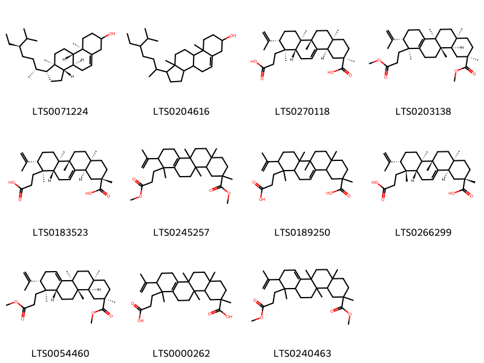{ width=100% }
    <figcaption>Hình ảnh cấu trúc hóa học của 11 hoạt chất thuộc nhóm Steroids and steroid derivatives gồm ['stigmast-5-en-3-ol (LTS0071224)', 'stigmast-5-en-3-ol, (3β)- (LTS0204616)', '(3r,4ar,6ar,7s,8s,10ar,10bs,12as)-7-(2-carboxyethyl)-3,7,10a,10b,12a-pentamethyl-8-(prop-1-en-2-yl)-2,4,4a,6,6a,8,9,10,11,12-decahydro-1h-chrysene-3-carboxylic acid (LTS0270118)', 'methyl (3r,4ar,4bs,7s,8s,10bs,12as)-7-(3-methoxy-3-oxopropyl)-3,4b,7,10b,12a-pentamethyl-8-(prop-1-en-2-yl)-2,4,4a,5,6,8,9,10,11,12-decahydro-1h-chrysene-3-carboxylate (LTS0203138)', '(3s,4ar,6ar,7s,8s,10ar,10bs,12as)-7-(2-carboxyethyl)-3,7,10a,10b,12a-pentamethyl-8-(prop-1-en-2-yl)-2,4,4a,6,6a,8,9,10,11,12-decahydro-1h-chrysene-3-carboxylic acid (LTS0183523)', 'methyl 7-(3-methoxy-3-oxopropyl)-3,4b,7,10b,12a-pentamethyl-8-(prop-1-en-2-yl)-2,4,4a,5,6,8,9,10,11,12-decahydro-1h-chrysene-3-carboxylate (LTS0245257)', '7-(2-carboxyethyl)-3,7,10a,10b,12a-pentamethyl-8-(prop-1-en-2-yl)-2,4,4a,6,6a,8,9,10,11,12-decahydro-1h-chrysene-3-carboxylic acid (LTS0189250)', '(3s,4ar,6ar,7r,8s,10ar,10bs,12as)-7-(2-carboxyethyl)-3,7,10a,10b,12a-pentamethyl-8-(prop-1-en-2-yl)-2,4,4a,6,6a,8,9,10,11,12-decahydro-1h-chrysene-3-carboxylic acid (LTS0266299)', 'methyl (3r,4ar,4bs,6ar,7s,8s,10bs,12as)-7-(3-methoxy-3-oxopropyl)-3,4b,7,10b,12a-pentamethyl-8-(prop-1-en-2-yl)-2,4,4a,5,6,6a,8,9,11,12-decahydro-1h-chrysene-3-carboxylate (LTS0054460)', '7-(2-carboxyethyl)-3,4b,7,10b,12a-pentamethyl-8-(prop-1-en-2-yl)-2,4,4a,5,6,8,9,10,11,12-decahydro-1h-chrysene-3-carboxylic acid (LTS0000262)', 'methyl 7-(3-methoxy-3-oxopropyl)-3,4b,7,10b,12a-pentamethyl-8-(prop-1-en-2-yl)-2,4,4a,5,6,6a,8,9,11,12-decahydro-1h-chrysene-3-carboxylate (LTS0240463)'].</figcaption>
</figure>

---

### Dược dân tộc học

Danh sách các quốc gia có sử dụng *Sandoricum koetjape* trong điều trị các bệnh. 

| Country   | Disease                                   | Bệnh                                                                                                                                                                                                |
|:----------|:------------------------------------------|:----------------------------------------------------------------------------------------------------------------------------------------------------------------------------------------------------|
| Elsewhere | Astringent, Stomachic, Carminative, Tonic | MYMEMORY WARNING: YOU USED ALL AVAILABLE FREE TRANSLATIONS FOR TODAY. NEXT AVAILABLE IN  06 HOURS 47 MINUTES 47 SECONDS VISIT HTTPS://MYMEMORY.TRANSLATED.NET/DOC/USAGELIMITS.PHP TO TRANSLATE MORE |
| Malaysia  | Intoxicant                                | MYMEMORY WARNING: YOU USED ALL AVAILABLE FREE TRANSLATIONS FOR TODAY. NEXT AVAILABLE IN  06 HOURS 47 MINUTES 43 SECONDS VISIT HTTPS://MYMEMORY.TRANSLATED.NET/DOC/USAGELIMITS.PHP TO TRANSLATE MORE |

---

# Chi Dysoxylum

??? note "Danh sách các dược liệu thuộc chi"
    
	 - *Dysoxylum cauliflorum*
	 - *Dysoxylum decandrum*
	 - *Dysoxylum ectabile*
	 - *Dysoxylum lenticellare*

---
## Dysoxylum cauliflorum
### Thông tin về thực vật

!!! info "Phân loại thực vật của *N/A* từ GIBF:"
    - **Kingdom:** Plantae
    - **Phylum:** Tracheophyta
    - **Order:** Sapindales
    - **Family:** Meliaceae
    - **Genus:** Epicharis
    - **Species:** *N/A*

 

| Label (VI)   | Label (EN)   | Scientific Name       | Descriptions (VI)   | Descriptions (EN)   | Also Known As (VI)   | Also Known As (EN)   |
|:-------------|:-------------|:----------------------|:--------------------|:--------------------|:---------------------|:---------------------|
| N/A          | N/A          | Dysoxylum cauliflorum | loài thực vật       | species of plant    | ['']                 | ['']                 |

#### Phân bố trên thế giới

**Từ CSDL GIBF** nan, Fiji, Australia, Cambodia, Chinese Taipei, Papua New Guinea, Indonesia, Viet Nam, Philippines, Singapore, Malaysia

#### Phân bố tại Việt Nam

**Từ CSDL GIBF**: Ninh Binh

---
### Thành phần hóa học
        
- Theo cơ sở dữ liệu lotus: Từ loài *N/A* đã phân lập và xác định được 8 hoạt chất thuộc về các nhóm Prenol lipids. 

|    | chemicalTaxonomyClassyfireClass   |   smiles_count |
|---:|:----------------------------------|---------------:|
|  0 | Prenol lipids                     |              8 |

#### Nhóm Prenol lipids
<figure markdown="span">
    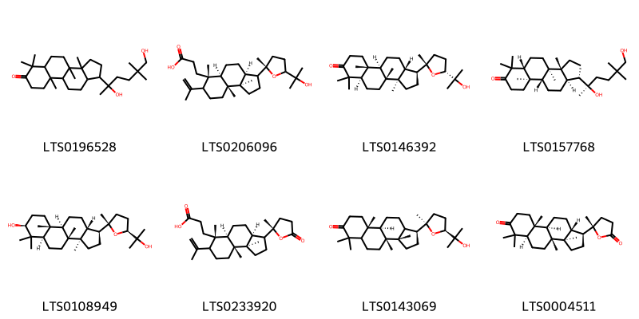{ width=100% }
    <figcaption>Hình ảnh cấu trúc hóa học của 8 hoạt chất thuộc nhóm Prenol lipids gồm ['1-(2,6-dihydroxy-5,5-dimethylhexan-2-yl)-3a,3b,6,6,9a-pentamethyl-dodecahydrocyclopenta[a]phenanthren-7-one (LTS0196528)', '3-[(3as,5ar,6s,9ar,9br)-3-[(2s)-5-(2-hydroxypropan-2-yl)-2-methyloxolan-2-yl]-6,9a,9b-trimethyl-7-(prop-1-en-2-yl)-decahydrocyclopenta[a]naphthalen-6-yl]propanoic acid (LTS0206096)', 'ocotillone (LTS0146392)', '(1s,3ar,3br,5ar,9ar,9br,11ar)-1-[(2r)-2,6-dihydroxy-5,5-dimethylhexan-2-yl]-3a,3b,6,6,9a-pentamethyl-dodecahydrocyclopenta[a]phenanthren-7-one (LTS0157768)', '(1s,3ar,3br,5ar,7s,9ar,9br,11ar)-1-[(2s,5s)-5-(2-hydroxypropan-2-yl)-2-methyloxolan-2-yl]-3a,3b,6,6,9a-pentamethyl-dodecahydro-1h-cyclopenta[a]phenanthren-7-ol (LTS0108949)', '3-[(3as,5ar,6s,9ar,9br)-6,9a,9b-trimethyl-3-[(2s)-2-methyl-5-oxooxolan-2-yl]-7-(prop-1-en-2-yl)-decahydrocyclopenta[a]naphthalen-6-yl]propanoic acid (LTS0233920)', '(1s,3as,3br,9ar,9br)-1-[(2r,5s)-5-(2-hydroxypropan-2-yl)-2-methyloxolan-2-yl]-3a,3b,6,6,9a-pentamethyl-dodecahydrocyclopenta[a]phenanthren-7-one (LTS0143069)', 'cabralealactone (LTS0004511)'].</figcaption>
</figure>

---

### Dược dân tộc học

Danh sách các quốc gia có sử dụng *N/A* trong điều trị các bệnh. 

| Country   | Disease   | Bệnh                                                                                                                                                                                                |
|:----------|:----------|:----------------------------------------------------------------------------------------------------------------------------------------------------------------------------------------------------|
| Malaya    | Poison    | MYMEMORY WARNING: YOU USED ALL AVAILABLE FREE TRANSLATIONS FOR TODAY. NEXT AVAILABLE IN  06 HOURS 47 MINUTES 08 SECONDS VISIT HTTPS://MYMEMORY.TRANSLATED.NET/DOC/USAGELIMITS.PHP TO TRANSLATE MORE |

---

---
## Dysoxylum decandrum
### Thông tin về thực vật

!!! info "Phân loại thực vật của *Didymocheton gaudichaudianus* từ GIBF:"
    - **Kingdom:** Plantae
    - **Phylum:** Tracheophyta
    - **Order:** Sapindales
    - **Family:** Meliaceae
    - **Genus:** Didymocheton
    - **Species:** *Didymocheton gaudichaudianus*

 

| Label (VI)   | Label (EN)   | Scientific Name       | Descriptions (VI)   | Descriptions (EN)   | Also Known As (VI)   | Also Known As (EN)   |
|:-------------|:-------------|:----------------------|:--------------------|:--------------------|:---------------------|:---------------------|
| N/A          | N/A          | Dysoxylum cauliflorum | loài thực vật       | species of plant    | ['']                 | ['']                 |

#### Phân bố trên thế giới

**Từ CSDL GIBF** Papua New Guinea, Philippines, Australia, nan

#### Phân bố tại Việt Nam

**Từ CSDL GIBF**: Không có ghi nhận ở Việt Nam

---
### Thành phần hóa học
        
- Theo cơ sở dữ liệu lotus: Từ loài *Didymocheton gaudichaudianus* đã phân lập và xác định được Chưa có hoạt chất nào được phân lập. hoạt chất thuộc về các nhóm Không có hoạt chất nào được phân lập. 

Không có hình ảnh nào được tạo ra

---

### Dược dân tộc học

Danh sách các quốc gia có sử dụng *Didymocheton gaudichaudianus* trong điều trị các bệnh. 

| Country     | Disease               | Bệnh                                                                                                                                                                                                |
|:------------|:----------------------|:----------------------------------------------------------------------------------------------------------------------------------------------------------------------------------------------------|
| Java        | Astringent            | MYMEMORY WARNING: YOU USED ALL AVAILABLE FREE TRANSLATIONS FOR TODAY. NEXT AVAILABLE IN  06 HOURS 46 MINUTES 33 SECONDS VISIT HTTPS://MYMEMORY.TRANSLATED.NET/DOC/USAGELIMITS.PHP TO TRANSLATE MORE |
| New Guinea  | Contraceptive, Emetic | MYMEMORY WARNING: YOU USED ALL AVAILABLE FREE TRANSLATIONS FOR TODAY. NEXT AVAILABLE IN  06 HOURS 46 MINUTES 29 SECONDS VISIT HTTPS://MYMEMORY.TRANSLATED.NET/DOC/USAGELIMITS.PHP TO TRANSLATE MORE |
| Philippines | Emetic                | MYMEMORY WARNING: YOU USED ALL AVAILABLE FREE TRANSLATIONS FOR TODAY. NEXT AVAILABLE IN  06 HOURS 46 MINUTES 25 SECONDS VISIT HTTPS://MYMEMORY.TRANSLATED.NET/DOC/USAGELIMITS.PHP TO TRANSLATE MORE |

---

---
## Dysoxylum ectabile
### Thông tin về thực vật

!!! info "Phân loại thực vật của *N/A* từ GIBF:"
    - **Kingdom:** Plantae
    - **Phylum:** Tracheophyta
    - **Order:** Sapindales
    - **Family:** Meliaceae
    - **Genus:** Dysoxylum
    - **Species:** *N/A*

 

| Label (VI)   | Label (EN)   | Scientific Name       | Descriptions (VI)   | Descriptions (EN)   | Also Known As (VI)   | Also Known As (EN)   |
|:-------------|:-------------|:----------------------|:--------------------|:--------------------|:---------------------|:---------------------|
| N/A          | N/A          | Dysoxylum cauliflorum | loài thực vật       | species of plant    | ['']                 | ['']                 |

#### Phân bố trên thế giới

**Từ CSDL GIBF** Australia, Thailand, Lao People’s Democratic Republic, Chinese Taipei, Brazil, Myanmar, Papua New Guinea, Vanuatu, India, Tonga, Indonesia, New Caledonia, Viet Nam, Philippines, Solomon Islands, Malaysia, Brunei Darussalam

#### Phân bố tại Việt Nam

**Từ CSDL GIBF**: Quang Ninh

---
### Thành phần hóa học
        
- Theo cơ sở dữ liệu lotus: Từ loài *N/A* đã phân lập và xác định được Chưa có hoạt chất nào được phân lập. hoạt chất thuộc về các nhóm Không có hoạt chất nào được phân lập. 

Không có hình ảnh nào được tạo ra

---

### Dược dân tộc học

Danh sách các quốc gia có sử dụng *N/A* trong điều trị các bệnh. 

| Country     | Disease   | Bệnh                                                                                                                                                                                                |
|:------------|:----------|:----------------------------------------------------------------------------------------------------------------------------------------------------------------------------------------------------|
| New Zealand | Tonic     | MYMEMORY WARNING: YOU USED ALL AVAILABLE FREE TRANSLATIONS FOR TODAY. NEXT AVAILABLE IN  06 HOURS 46 MINUTES 03 SECONDS VISIT HTTPS://MYMEMORY.TRANSLATED.NET/DOC/USAGELIMITS.PHP TO TRANSLATE MORE |

---

---
## Dysoxylum lenticellare
### Thông tin về thực vật

!!! info "Phân loại thực vật của *Didymocheton lenticellaris* từ GIBF:"
    - **Kingdom:** Plantae
    - **Phylum:** Tracheophyta
    - **Order:** Sapindales
    - **Family:** Meliaceae
    - **Genus:** Didymocheton
    - **Species:** *Didymocheton lenticellaris*

 

| Label (VI)   | Label (EN)   | Scientific Name        | Descriptions (VI)   | Descriptions (EN)   | Also Known As (VI)   | Also Known As (EN)   |
|:-------------|:-------------|:-----------------------|:--------------------|:--------------------|:---------------------|:---------------------|
| N/A          | N/A          | Dysoxylum lenticellare | loài thực vật       | species of plant    | ['']                 | ['']                 |

#### Phân bố trên thế giới

**Từ CSDL GIBF** nan, Fiji

#### Phân bố tại Việt Nam

**Từ CSDL GIBF**: Không có ghi nhận ở Việt Nam

---
### Thành phần hóa học
        
- Theo cơ sở dữ liệu lotus: Từ loài *Didymocheton lenticellaris* đã phân lập và xác định được 28 hoạt chất thuộc về các nhóm Fatty Acyls, Flavonoids, Prenol lipids, Phenethylisoquinoline alkaloids, Erythrina alkaloids, Azaspirodecane derivatives, Organooxygen compounds, Dibenzazecins, Tetrahydroisoquinolines. 

|    | chemicalTaxonomyClassyfireClass   |   smiles_count |
|---:|:----------------------------------|---------------:|
|  0 | Azaspirodecane derivatives        |              5 |
|  1 | Dibenzazecins                     |              1 |
|  2 | Erythrina alkaloids               |              6 |
|  3 | Fatty Acyls                       |              2 |
|  4 | Flavonoids                        |              3 |
|  5 | Organooxygen compounds            |              1 |
|  6 | Phenethylisoquinoline alkaloids   |              1 |
|  7 | Prenol lipids                     |              7 |
|  8 | Tetrahydroisoquinolines           |              1 |

#### Nhóm Azaspirodecane derivatives
<figure markdown="span">
    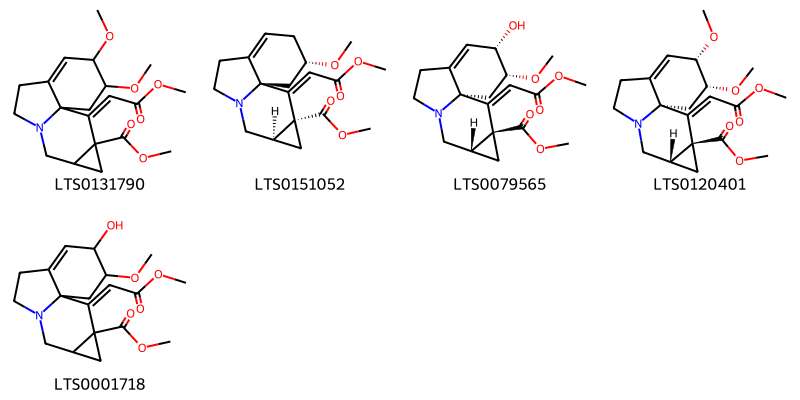{ width=100% }
    <figcaption>Hình ảnh cấu trúc hóa học của 5 hoạt chất thuộc nhóm Azaspirodecane derivatives gồm ['methyl 3,4-dimethoxy-14-(2-methoxy-2-oxoethylidene)-9-azatetracyclo[7.5.0.0¹,⁶.0¹¹,¹³]tetradec-5-ene-13-carboxylate (LTS0131790)', 'methyl (1r,3s,11r,13r,14e)-3-methoxy-14-(2-methoxy-2-oxoethylidene)-9-azatetracyclo[7.5.0.0¹,⁶.0¹¹,¹³]tetradec-5-ene-13-carboxylate (LTS0151052)', 'methyl (1s,3r,4s,11s,13s,14e)-4-hydroxy-3-methoxy-14-(2-methoxy-2-oxoethylidene)-9-azatetracyclo[7.5.0.0¹,⁶.0¹¹,¹³]tetradec-5-ene-13-carboxylate (LTS0079565)', 'methyl (1s,3r,4s,11s,13s,14e)-3,4-dimethoxy-14-(2-methoxy-2-oxoethylidene)-9-azatetracyclo[7.5.0.0¹,⁶.0¹¹,¹³]tetradec-5-ene-13-carboxylate (LTS0120401)', 'methyl 4-hydroxy-3-methoxy-14-(2-methoxy-2-oxoethylidene)-9-azatetracyclo[7.5.0.0¹,⁶.0¹¹,¹³]tetradec-5-ene-13-carboxylate (LTS0001718)'].</figcaption>
</figure>
#### Nhóm Dibenzazecins
<figure markdown="span">
    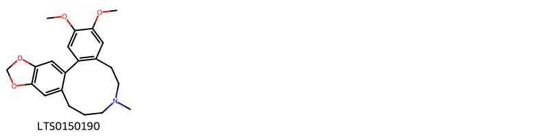{ width=100% }
    <figcaption>Hình ảnh cấu trúc hóa học của 1 hoạt chất thuộc nhóm Dibenzazecins gồm ['4,5-dimethoxy-10-methyl-17,19-dioxa-10-azatetracyclo[12.7.0.0²,⁷.0¹⁶,²⁰]henicosa-1(21),2(7),3,5,14,16(20)-hexaene (LTS0150190)'].</figcaption>
</figure>
#### Nhóm Erythrina alkaloids
<figure markdown="span">
    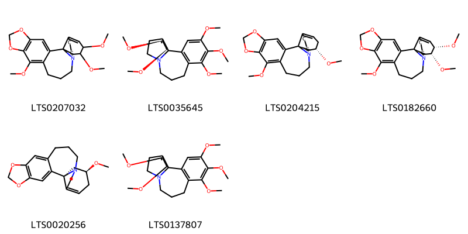{ width=100% }
    <figcaption>Hình ảnh cấu trúc hóa học của 6 hoạt chất thuộc nhóm Erythrina alkaloids gồm ['9,19,20-trimethoxy-5,7-dioxa-14-azapentacyclo[12.7.0.0¹,¹⁷.0²,¹⁰.0⁴,⁸]henicosa-2,4(8),9,17-tetraene (LTS0207032)', '(1s,16s,17r)-4,5,6,16,17-pentamethoxy-11-azatetracyclo[9.7.0.0¹,¹⁴.0²,⁷]octadeca-2(7),3,5,14-tetraene (LTS0035645)', '(1s,20s)-9,20-dimethoxy-5,7-dioxa-14-azapentacyclo[12.7.0.0¹,¹⁷.0²,¹⁰.0⁴,⁸]henicosa-2,4(8),9,17-tetraene (LTS0204215)', '(1s,19s,20r)-9,19,20-trimethoxy-5,7-dioxa-14-azapentacyclo[12.7.0.0¹,¹⁷.0²,¹⁰.0⁴,⁸]henicosa-2,4(8),9,17-tetraene (LTS0182660)', '(1s,20s)-20-methoxy-5,7-dioxa-14-azapentacyclo[12.7.0.0¹,¹⁷.0²,¹⁰.0⁴,⁸]henicosa-2,4(8),9,17-tetraene (LTS0020256)', '4,5,6,16,17-pentamethoxy-11-azatetracyclo[9.7.0.0¹,¹⁴.0²,⁷]octadeca-2(7),3,5,14-tetraene (LTS0137807)'].</figcaption>
</figure>
#### Nhóm Fatty Acyls
<figure markdown="span">
    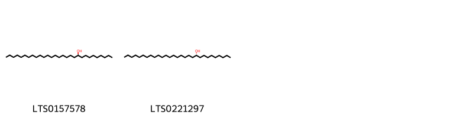{ width=100% }
    <figcaption>Hình ảnh cấu trúc hóa học của 2 hoạt chất thuộc nhóm Fatty Acyls gồm ['(s)-nonacosan-10-ol (LTS0157578)', '(r)-nonacosan-10-ol (LTS0221297)'].</figcaption>
</figure>
#### Nhóm Flavonoids
<figure markdown="span">
    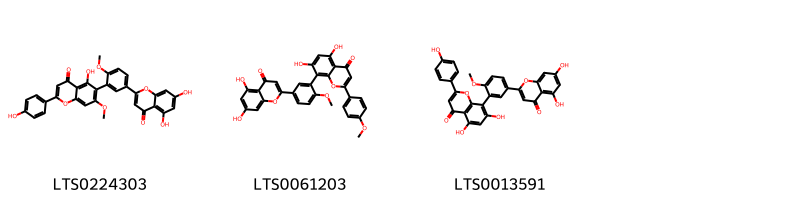{ width=100% }
    <figcaption>Hình ảnh cấu trúc hóa học của 3 hoạt chất thuộc nhóm Flavonoids gồm ['6-[5-(5,7-dihydroxy-4-oxochromen-2-yl)-2-methoxyphenyl]-5-hydroxy-2-(4-hydroxyphenyl)-7-methoxychromen-4-one (LTS0224303)', 'isoginkgetin (LTS0061203)', '8-[5-(5,7-dihydroxy-4-oxochromen-2-yl)-2-methoxyphenyl]-5,7-dihydroxy-2-(4-hydroxyphenyl)chromen-4-one (LTS0013591)'].</figcaption>
</figure>
#### Nhóm Organooxygen compounds
<figure markdown="span">
    { width=100% }
    <figcaption>Hình ảnh cấu trúc hóa học của 1 hoạt chất thuộc nhóm Organooxygen compounds gồm ['hydroxyacetophenone (LTS0214036)'].</figcaption>
</figure>
#### Nhóm Phenethylisoquinoline alkaloids
<figure markdown="span">
    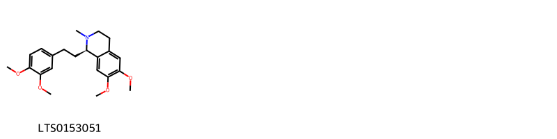{ width=100% }
    <figcaption>Hình ảnh cấu trúc hóa học của 1 hoạt chất thuộc nhóm Phenethylisoquinoline alkaloids gồm ['(1r)-1-[2-(3,4-dimethoxyphenyl)ethyl]-6,7-dimethoxy-2-methyl-3,4-dihydro-1h-isoquinoline (LTS0153051)'].</figcaption>
</figure>
#### Nhóm Prenol lipids
<figure markdown="span">
    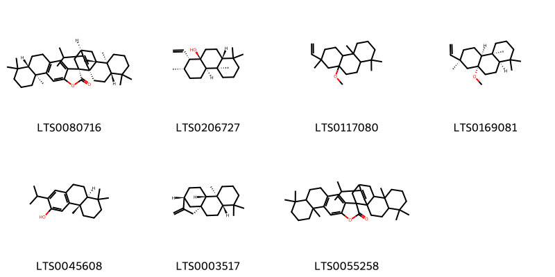{ width=100% }
    <figcaption>Hình ảnh cấu trúc hóa học của 7 hoạt chất thuộc nhóm Prenol lipids gồm ["(1's,4's,4as,8r,9's,10'r,11bs,12'r)-16'-isopropyl-4,4,5',5',9',11b-hexamethyl-1,2,3,4a,5,6-hexahydrospiro[phenanthro[3,2-b]furan-8,14'-tetracyclo[10.2.2.0¹,¹⁰.0⁴,⁹]hexadecan]-15'-en-9-one (LTS0080716)", '(4ar,4br,7s,8s,8ar,10ar)-8-ethenyl-1,1,4a,7-tetramethyl-decahydro-2h-phenanthren-8a-ol (LTS0206727)', '7-ethenyl-8a-methoxy-1,1,4a,7-tetramethyl-decahydrophenanthrene (LTS0117080)', '(4as,4bs,7s,8ar,10ar)-7-ethenyl-8a-methoxy-1,1,4a,7-tetramethyl-decahydrophenanthrene (LTS0169081)', 'ferruginol (LTS0045608)', '(1s,4s,9s,10s,13r)-5,5,9-trimethyl-14-methylidenetetracyclo[11.2.1.0¹,¹⁰.0⁴,⁹]hexadecane (LTS0003517)', "16'-isopropyl-4,4,5',5',9',11b-hexamethyl-1,2,3,4a,5,6-hexahydrospiro[phenanthro[3,2-b]furan-8,14'-tetracyclo[10.2.2.0¹,¹⁰.0⁴,⁹]hexadecan]-15'-en-9-one (LTS0055258)"].</figcaption>
</figure>
#### Nhóm Tetrahydroisoquinolines
<figure markdown="span">
    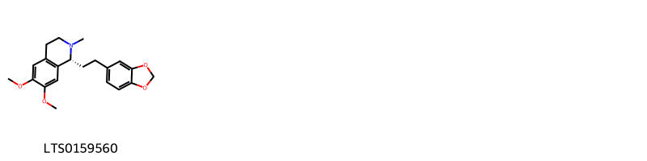{ width=100% }
    <figcaption>Hình ảnh cấu trúc hóa học của 1 hoạt chất thuộc nhóm Tetrahydroisoquinolines gồm ['(1r)-1-[2-(2h-1,3-benzodioxol-5-yl)ethyl]-6,7-dimethoxy-2-methyl-3,4-dihydro-1h-isoquinoline (LTS0159560)'].</figcaption>
</figure>

---

### Dược dân tộc học

Danh sách các quốc gia có sử dụng *Didymocheton lenticellaris* trong điều trị các bệnh. 

| Country   | Disease   | Bệnh                                                                                                                                                                                                |
|:----------|:----------|:----------------------------------------------------------------------------------------------------------------------------------------------------------------------------------------------------|
| Fiji      | Poison    | MYMEMORY WARNING: YOU USED ALL AVAILABLE FREE TRANSLATIONS FOR TODAY. NEXT AVAILABLE IN  06 HOURS 45 MINUTES 30 SECONDS VISIT HTTPS://MYMEMORY.TRANSLATED.NET/DOC/USAGELIMITS.PHP TO TRANSLATE MORE |

---

# Chi Chukrasia

??? note "Danh sách các dược liệu thuộc chi"
    
	 - *Chukrasia tabularis*

---
## Chukrasia tabularis
### Thông tin về thực vật

!!! info "Phân loại thực vật của *Chukrasia tabularis* từ GIBF:"
    - **Kingdom:** Plantae
    - **Phylum:** Tracheophyta
    - **Order:** Sapindales
    - **Family:** Meliaceae
    - **Genus:** Chukrasia
    - **Species:** *Chukrasia tabularis*

 

| Label (VI)   | Label (EN)   | Scientific Name     | Descriptions (VI)   | Descriptions (EN)   | Also Known As (VI)      | Also Known As (EN)   |
|:-------------|:-------------|:--------------------|:--------------------|:--------------------|:------------------------|:---------------------|
| N/A          | N/A          | Chukrasia tabularis | loài thực vật       | species of plant    | ['Chukrasia tabularis'] | ['Indian mahogany']  |

#### Phân bố trên thế giới

**Từ CSDL GIBF** nan, Sri Lanka, Australia, Lao People’s Democratic Republic, Cambodia, Myanmar, unknown or invalid, Pakistan, Nigeria, Chinese Taipei, United States of America, Hong Kong, Thailand, Bhutan, Mexico, Singapore, Viet Nam, China, India, Malaysia

#### Phân bố tại Việt Nam

**Từ CSDL GIBF**: Tay Ninh

---
### Thành phần hóa học
        
- Theo cơ sở dữ liệu lotus: Từ loài *Chukrasia tabularis* đã phân lập và xác định được 117 hoạt chất thuộc về các nhóm Fatty Acyls, Flavonoids, Prenol lipids, Steroids and steroid derivatives. 

|    | chemicalTaxonomyClassyfireClass   |   smiles_count |
|---:|:----------------------------------|---------------:|
|  0 | Fatty Acyls                       |             50 |
|  1 | Flavonoids                        |              1 |
|  2 | Prenol lipids                     |             53 |
|  3 | Steroids and steroid derivatives  |              4 |

#### Nhóm Fatty Acyls
<figure markdown="span">
    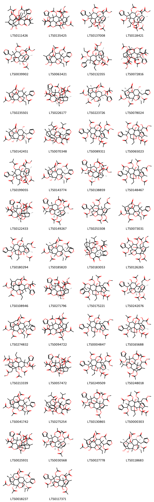{ width=100% }
    <figcaption>Hình ảnh cấu trúc hóa học của 50 hoạt chất thuộc nhóm Fatty Acyls gồm ['[9,10-dihydroxy-19-(1-hydroxy-2-methylpropylidene)-8,13,21-trimethyl-22,23-bis[(2-methylpropanoyl)oxy]-5,18-dioxo-4,12,14,17,24-pentaoxaoctacyclo[11.10.1.1⁸,¹¹.0¹,¹⁵.0²,⁷.0²,¹¹.0¹⁰,¹⁶.0¹⁵,²⁰]pentacosan-21-yl](furan-3-yl)methyl 2-methylpropanoate (LTS0111426)', 'furan-3-yl[2,3,16-tris(acetyloxy)-19-[(acetyloxy)methyl]-15-hydroxy-6-(1-hydroxy-2-methylpropylidene)-18-(2-methoxy-2-oxoethyl)-4,12,17-trimethyl-7-oxo-8,11,13,20-tetraoxaheptacyclo[10.7.1.1¹⁴,¹⁷.0¹,¹⁰.0⁵,¹⁰.0⁹,¹⁵.0¹⁴,¹⁹]henicosan-4-yl]methyl acetate (LTS0135425)', '(s)-furan-3-yl[(1s,2r,3r,5s,7r,8r,9r,10r,11r,12s,13s,14r,16r,17s)-9,10,17-tris(acetyloxy)-12-[(acetyloxy)methyl]-5-ethyl-1,11,16-trihydroxy-13-(2-methoxy-2-oxoethyl)-8,14-dimethyl-4,18-dioxahexacyclo[12.2.1.1²,⁵.0³,⁷.0³,¹¹.0¹²,¹⁶]octadecan-8-yl]methyl acetate (LTS0137008)', '(s)-furan-3-yl[(1s,2s,3r,5s,7r,8r,9r,10r,11r,12s,13s,14r,16r,17s)-1,9,10,17-tetrakis(acetyloxy)-12-[(acetyloxy)methyl]-5-ethyl-11,16-dihydroxy-13-(2-methoxy-2-oxoethyl)-8,14-dimethyl-4,18-dioxahexacyclo[12.2.1.1²,⁵.0³,⁷.0³,¹¹.0¹²,¹⁶]octadecan-8-yl]methyl acetate (LTS0118421)', '(s)-furan-3-yl[(1s,2r,3r,5s,7r,8r,9r,10r,11r,12r,13s,14r,16r,17s)-9,10,17-tris(acetyloxy)-1,11,16-trihydroxy-13-(2-methoxy-2-oxoethyl)-5,8,12,14-tetramethyl-4,18-dioxahexacyclo[12.2.1.1²,⁵.0³,⁷.0³,¹¹.0¹²,¹⁶]octadecan-8-yl]methyl acetate (LTS0039902)', '[9,10-bis(acetyloxy)-5-ethyl-1,11,20,21-tetrahydroxy-8,18-dimethyl-15-oxo-4,14,22-trioxaheptacyclo[16.2.1.1²,⁵.0³,⁷.0³,¹¹.0¹²,¹⁷.0¹²,²⁰]docosan-8-yl](furan-3-yl)methyl acetate (LTS0063421)', '(1s,2s,3r,5s,7r,8r,9r,10r,11r,12s,13s,14r,16r,17s)-1,10,17-tris(acetyloxy)-8-[(s)-(acetyloxy)(furan-3-yl)methyl]-12-[(acetyloxy)methyl]-5-ethyl-11,16-dihydroxy-13-(2-methoxy-2-oxoethyl)-8,14-dimethyl-4,18-dioxahexacyclo[12.2.1.1²,⁵.0³,⁷.0³,¹¹.0¹²,¹⁶]octadecan-9-yl propanoate (LTS0132355)', '(s)-furan-3-yl[(1r,2r,3r,4r,5s,6e,9s,10r,12r,14r,15s,16s,17r,18s,19s)-2,3,15,16-tetrakis(acetyloxy)-19-[(acetyloxy)methyl]-6-(1-hydroxy-2-methylpropylidene)-18-(2-methoxy-2-oxoethyl)-4,12,17-trimethyl-7-oxo-8,11,13,20-tetraoxaheptacyclo[10.7.1.1¹⁴,¹⁷.0¹,¹⁰.0⁵,¹⁰.0⁹,¹⁵.0¹⁴,¹⁹]henicosan-4-yl]methyl acetate (LTS0072816)', '[21-(acetyloxy)-5-ethyl-1,9,10,11,20-pentahydroxy-8,18-dimethyl-15-oxo-4,14,22-trioxaheptacyclo[16.2.1.1²,⁵.0³,⁷.0³,¹¹.0¹²,¹⁷.0¹²,²⁰]docosan-8-yl](furan-3-yl)methyl acetate (LTS0235501)', '(s)-furan-3-yl[(1r,2r,3r,4r,5s,6z,9s,10r,12r,14r,15s,16s,17r,18s,19s)-2,3,15,16-tetrakis(acetyloxy)-19-[(acetyloxy)methyl]-6-(1-hydroxypropylidene)-18-(2-methoxy-2-oxoethyl)-4,12,17-trimethyl-7-oxo-8,11,13,20-tetraoxaheptacyclo[10.7.1.1¹⁴,¹⁷.0¹,¹⁰.0⁵,¹⁰.0⁹,¹⁵.0¹⁴,¹⁹]henicosan-4-yl]methyl acetate (LTS0226177)', '(1s,2s,3r,5s,7r,8r,9r,10r,11r,12s,17r,18r,20r,21s)-1,10,21-tris(acetyloxy)-8-[(s)-(acetyloxy)(furan-3-yl)methyl]-5-ethyl-11,20-dihydroxy-8,18-dimethyl-15-oxo-4,14,22-trioxaheptacyclo[16.2.1.1²,⁵.0³,⁷.0³,¹¹.0¹²,¹⁷.0¹²,²⁰]docosan-9-yl propanoate (LTS0223726)', '(s)-[(1s,2s,3r,5s,7r,8s,9r,10r,11r,12s,17r,18r,20r,21s)-1,21-bis(acetyloxy)-5-ethyl-9,10,11,20-tetrahydroxy-8,18-dimethyl-15-oxo-4,14,22-trioxaheptacyclo[16.2.1.1²,⁵.0³,⁷.0³,¹¹.0¹²,¹⁷.0¹²,²⁰]docosan-8-yl](furan-3-yl)methyl acetate (LTS0078024)', '(s)-[(1s,2r,3r,5s,7r,8s,9r,10r,11r,12s,17s,18r,20r,21s)-21-(acetyloxy)-5-ethyl-1,9,10,11,20-pentahydroxy-8,18-dimethyl-15-oxo-4,14,22-trioxaheptacyclo[16.2.1.1²,⁵.0³,⁷.0³,¹¹.0¹²,¹⁷.0¹²,²⁰]docosan-8-yl](furan-3-yl)methyl acetate (LTS0142451)', '(1r,2s,7s,8r,9s,10s,11r,13r,15r,16s,19z,20s,21r,22r,23r)-9,10-bis(acetyloxy)-21-[(s)-(acetyloxy)(furan-3-yl)methyl]-19-(1-hydroxypropylidene)-8,13,21-trimethyl-23-[(2-methylpropanoyl)oxy]-5,18-dioxo-4,12,14,17,24-pentaoxaoctacyclo[11.10.1.1⁸,¹¹.0¹,¹⁵.0²,⁷.0²,¹¹.0¹⁰,¹⁶.0¹⁵,²⁰]pentacosan-22-yl 2-methylpropanoate (LTS0070348)', 'methyl 2-(acetyloxy)-2-[1,9,10,17-tetrakis(acetyloxy)-8-[(acetyloxy)(furan-3-yl)methyl]-5-ethyl-11,16-dihydroxy-8,12,14-trimethyl-4,18-dioxahexacyclo[12.2.1.1²,⁵.0³,⁷.0³,¹¹.0¹²,¹⁶]octadecan-13-yl]acetate (LTS0089311)', 'methyl 2-hydroxy-2-[1,9,10,17-tetrakis(acetyloxy)-8-[(acetyloxy)(furan-3-yl)methyl]-5-ethyl-11,16-dihydroxy-8,12,14-trimethyl-4,18-dioxahexacyclo[12.2.1.1²,⁵.0³,⁷.0³,¹¹.0¹²,¹⁶]octadecan-13-yl]acetate (LTS0065023)', '(1s,2s,3r,5s,7r,8r,9r,10r,11r,12s,13s,14r,16r,17s)-1,10,17-tris(acetyloxy)-8-[(s)-(acetyloxy)(furan-3-yl)methyl]-12-[(acetyloxy)methyl]-5-ethyl-11,16-dihydroxy-13-(2-methoxy-2-oxoethyl)-8,14-dimethyl-4,18-dioxahexacyclo[12.2.1.1²,⁵.0³,⁷.0³,¹¹.0¹²,¹⁶]octadecan-9-yl 2-methylpropanoate (LTS0199055)', '(s)-furan-3-yl[(1s,2r,3r,5s,7r,8r,9r,10r,11r,12s,17s,18r,20r,21s)-9,10,21-tris(acetyloxy)-5-ethyl-1,11,20-trihydroxy-8,18-dimethyl-15-oxo-4,14,22-trioxaheptacyclo[16.2.1.1²,⁵.0³,⁷.0³,¹¹.0¹²,¹⁷.0¹²,²⁰]docosan-8-yl]methyl acetate (LTS0143774)', '(s)-furan-3-yl[(1s,2s,3r,5s,7r,8r,9r,10r,11r,12s,13s,14r,16r,17s)-1,9,10,17-tetrakis(acetyloxy)-12-[(acetyloxy)methyl]-11,16-dihydroxy-13-(2-methoxy-2-oxoethyl)-5,8,14-trimethyl-4,18-dioxahexacyclo[12.2.1.1²,⁵.0³,⁷.0³,¹¹.0¹²,¹⁶]octadecan-8-yl]methyl acetate (LTS0138859)', 'furan-3-yl[9,10,17-tris(acetyloxy)-12-[(acetyloxy)methyl]-5-ethyl-1,11,16-trihydroxy-13-(2-methoxy-2-oxoethyl)-8,14-dimethyl-4,18-dioxahexacyclo[12.2.1.1²,⁵.0³,⁷.0³,¹¹.0¹²,¹⁶]octadecan-8-yl]methyl acetate (LTS0148467)', '(s)-furan-3-yl[(1r,2r,3r,4r,5s,6e,9r,10r,12r,14r,15s,16s,17r,18s,19s)-2,3,16-tris(acetyloxy)-19-[(acetyloxy)methyl]-15-hydroxy-6-(1-hydroxypropylidene)-18-(2-methoxy-2-oxoethyl)-4,12,17-trimethyl-7-oxo-8,11,13,20-tetraoxaheptacyclo[10.7.1.1¹⁴,¹⁷.0¹,¹⁰.0⁵,¹⁰.0⁹,¹⁵.0¹⁴,¹⁹]henicosan-4-yl]methyl acetate (LTS0122433)', 'methyl (2r)-2-(acetyloxy)-2-[(1s,2s,3r,5r,7r,8r,9r,10r,11r,12r,13s,14r,16r,17s)-1,9,10,17-tetrakis(acetyloxy)-8-[(s)-(acetyloxy)(furan-3-yl)methyl]-11,16-dihydroxy-5-isopropyl-8,12,14-trimethyl-4,18-dioxahexacyclo[12.2.1.1²,⁵.0³,⁷.0³,¹¹.0¹²,¹⁶]octadecan-13-yl]acetate (LTS0149267)', 'furan-3-yl[1,10,17-tris(acetyloxy)-9,11,16-trihydroxy-13-(2-methoxy-2-oxoethyl)-5,8,12,14-tetramethyl-4,18-dioxahexacyclo[12.2.1.1²,⁵.0³,⁷.0³,¹¹.0¹²,¹⁶]octadecan-8-yl]methyl acetate (LTS0251508)', '[1,21-bis(acetyloxy)-5-ethyl-9,10,11,20-tetrahydroxy-8,18-dimethyl-15-oxo-4,14,22-trioxaheptacyclo[16.2.1.1²,⁵.0³,⁷.0³,¹¹.0¹²,¹⁷.0¹²,²⁰]docosan-8-yl](furan-3-yl)methyl acetate (LTS0073031)', '(s)-furan-3-yl[(1s,2r,3r,5s,7r,8r,9r,10r,11r,12r,13s,14r,16r,17s)-9,10,17-tris(acetyloxy)-5-ethyl-1,11,16-trihydroxy-13-(2-methoxy-2-oxoethyl)-8,12,14-trimethyl-4,18-dioxahexacyclo[12.2.1.1²,⁵.0³,⁷.0³,¹¹.0¹²,¹⁶]octadecan-8-yl]methyl acetate (LTS0180294)', '(1s,2s,3r,5s,7r,8r,9r,10r,11r,12s,17r,18r,20r,21s)-1,10,21-tris(acetyloxy)-8-[(s)-(acetyloxy)(furan-3-yl)methyl]-5-ethyl-11,20-dihydroxy-8,18-dimethyl-15-oxo-4,14,22-trioxaheptacyclo[16.2.1.1²,⁵.0³,⁷.0³,¹¹.0¹²,¹⁷.0¹²,²⁰]docosan-9-yl 2-methylpropanoate (LTS0185820)', '(s)-[(1r,2s,7s,8r,9s,10s,11r,13r,15r,16r,19z,20s,21r,22r,23r)-9,10-dihydroxy-19-(1-hydroxy-2-methylpropylidene)-8,13,21-trimethyl-22,23-bis[(2-methylpropanoyl)oxy]-5,18-dioxo-4,12,14,17,24-pentaoxaoctacyclo[11.10.1.1⁸,¹¹.0¹,¹⁵.0²,⁷.0²,¹¹.0¹⁰,¹⁶.0¹⁵,²⁰]pentacosan-21-yl](furan-3-yl)methyl 2-methylpropanoate (LTS0183053)', 'furan-3-yl[1,9,10,17-tetrakis(acetyloxy)-12-[(acetyloxy)methyl]-11,16-dihydroxy-13-(2-methoxy-2-oxoethyl)-5,8,14-trimethyl-4,18-dioxahexacyclo[12.2.1.1²,⁵.0³,⁷.0³,¹¹.0¹²,¹⁶]octadecan-8-yl]methyl acetate (LTS0126265)', '1,10,21-tris(acetyloxy)-8-[(acetyloxy)(furan-3-yl)methyl]-5-ethyl-11,20-dihydroxy-8,18-dimethyl-15-oxo-4,14,22-trioxaheptacyclo[16.2.1.1²,⁵.0³,⁷.0³,¹¹.0¹²,¹⁷.0¹²,²⁰]docosan-9-yl propanoate (LTS0108946)', '(s)-furan-3-yl[(1r,2r,3r,4r,5s,6e,9r,10r,12r,14r,15s,16s,17r,18s,19s)-2,3,16-tris(acetyloxy)-19-[(acetyloxy)methyl]-15-hydroxy-6-(1-hydroxy-2-methylpropylidene)-18-(2-methoxy-2-oxoethyl)-4,12,17-trimethyl-7-oxo-8,11,13,20-tetraoxaheptacyclo[10.7.1.1¹⁴,¹⁷.0¹,¹⁰.0⁵,¹⁰.0⁹,¹⁵.0¹⁴,¹⁹]henicosan-4-yl]methyl acetate (LTS0271796)', '1,10,17-tris(acetyloxy)-8-[(acetyloxy)(furan-3-yl)methyl]-12-[(acetyloxy)methyl]-5-ethyl-11,16-dihydroxy-13-(2-methoxy-2-oxoethyl)-8,14-dimethyl-4,18-dioxahexacyclo[12.2.1.1²,⁵.0³,⁷.0³,¹¹.0¹²,¹⁶]octadecan-9-yl 2-methylpropanoate (LTS0175221)', '(s)-furan-3-yl[(1s,2s,3r,5s,7r,8s,9r,10r,11r,12r,13s,14r,16r,17s)-1,10,17-tris(acetyloxy)-9,11,16-trihydroxy-13-(2-methoxy-2-oxoethyl)-5,8,12,14-tetramethyl-4,18-dioxahexacyclo[12.2.1.1²,⁵.0³,⁷.0³,¹¹.0¹²,¹⁶]octadecan-8-yl]methyl acetate (LTS0242076)', '1,10,21-tris(acetyloxy)-8-[(acetyloxy)(furan-3-yl)methyl]-5-ethyl-11,20-dihydroxy-8,18-dimethyl-15-oxo-4,14,22-trioxaheptacyclo[16.2.1.1²,⁵.0³,⁷.0³,¹¹.0¹²,¹⁷.0¹²,²⁰]docosan-9-yl 2-methylpropanoate (LTS0274832)', 'furan-3-yl[2,3,15,16-tetrakis(acetyloxy)-19-[(acetyloxy)methyl]-6-(1-hydroxy-2-methylpropylidene)-18-(2-methoxy-2-oxoethyl)-4,12,17-trimethyl-7-oxo-8,11,13,20-tetraoxaheptacyclo[10.7.1.1¹⁴,¹⁷.0¹,¹⁰.0⁵,¹⁰.0⁹,¹⁵.0¹⁴,¹⁹]henicosan-4-yl]methyl acetate (LTS0094722)', 'furan-3-yl[9,10,17-tris(acetyloxy)-5-ethyl-1,11,16-trihydroxy-13-(2-methoxy-2-oxoethyl)-8,12,14-trimethyl-4,18-dioxahexacyclo[12.2.1.1²,⁵.0³,⁷.0³,¹¹.0¹²,¹⁶]octadecan-8-yl]methyl acetate (LTS0004847)', 'methyl (2r)-2-hydroxy-2-[(1s,2s,3r,5s,7r,8r,9r,10r,11r,12r,13s,14r,16r,17s)-1,9,10,17-tetrakis(acetyloxy)-8-[(s)-(acetyloxy)(furan-3-yl)methyl]-5-ethyl-11,16-dihydroxy-8,12,14-trimethyl-4,18-dioxahexacyclo[12.2.1.1²,⁵.0³,⁷.0³,¹¹.0¹²,¹⁶]octadecan-13-yl]acetate (LTS0165688)', '1,10,17-tris(acetyloxy)-8-[(acetyloxy)(furan-3-yl)methyl]-12-[(acetyloxy)methyl]-5-ethyl-11,16-dihydroxy-13-(2-methoxy-2-oxoethyl)-8,14-dimethyl-4,18-dioxahexacyclo[12.2.1.1²,⁵.0³,⁷.0³,¹¹.0¹²,¹⁶]octadecan-9-yl propanoate (LTS0213339)', 'furan-3-yl[2,3,15,16-tetrakis(acetyloxy)-19-[(acetyloxy)methyl]-6-(1-hydroxypropylidene)-18-(2-methoxy-2-oxoethyl)-4,12,17-trimethyl-7-oxo-8,11,13,20-tetraoxaheptacyclo[10.7.1.1¹⁴,¹⁷.0¹,¹⁰.0⁵,¹⁰.0⁹,¹⁵.0¹⁴,¹⁹]henicosan-4-yl]methyl acetate (LTS0057472)', 'methyl (2r)-2-(acetyloxy)-2-[(1s,2s,3r,5s,7r,8r,9r,10r,11r,12r,13s,14r,16r,17s)-1,9,10,17-tetrakis(acetyloxy)-8-[(s)-(acetyloxy)(furan-3-yl)methyl]-5-ethyl-11,16-dihydroxy-8,12,14-trimethyl-4,18-dioxahexacyclo[12.2.1.1²,⁵.0³,⁷.0³,¹¹.0¹²,¹⁶]octadecan-13-yl]acetate (LTS0249509)', 'methyl 2-(acetyloxy)-2-[1,9,10,17-tetrakis(acetyloxy)-8-[(acetyloxy)(furan-3-yl)methyl]-11,16-dihydroxy-5-isopropyl-8,12,14-trimethyl-4,18-dioxahexacyclo[12.2.1.1²,⁵.0³,⁷.0³,¹¹.0¹²,¹⁶]octadecan-13-yl]acetate (LTS0248018)', 'furan-3-yl[1,9,10,21-tetrakis(acetyloxy)-11,20-dihydroxy-5-isopropyl-8,18-dimethyl-15-oxo-4,14,22-trioxaheptacyclo[16.2.1.1²,⁵.0³,⁷.0³,¹¹.0¹²,¹⁷.0¹²,²⁰]docosan-8-yl]methyl acetate (LTS0041742)', '9,10-bis(acetyloxy)-21-[(acetyloxy)(furan-3-yl)methyl]-19-(1-hydroxypropylidene)-8,13,21-trimethyl-23-[(2-methylpropanoyl)oxy]-5,18-dioxo-4,12,14,17,24-pentaoxaoctacyclo[11.10.1.1⁸,¹¹.0¹,¹⁵.0²,⁷.0²,¹¹.0¹⁰,¹⁶.0¹⁵,²⁰]pentacosan-22-yl 2-methylpropanoate (LTS0275254)', 'methyl 2-(acetyloxy)-2-[9,10,17-tris(acetyloxy)-8-[(acetyloxy)(furan-3-yl)methyl]-1,11,16-trihydroxy-5-isopropyl-8,12,14-trimethyl-4,18-dioxahexacyclo[12.2.1.1²,⁵.0³,⁷.0³,¹¹.0¹²,¹⁶]octadecan-13-yl]acetate (LTS0130865)', 'furan-3-yl[1,9,10,17-tetrakis(acetyloxy)-12-[(acetyloxy)methyl]-5-ethyl-11,16-dihydroxy-13-(2-methoxy-2-oxoethyl)-8,14-dimethyl-4,18-dioxahexacyclo[12.2.1.1²,⁵.0³,⁷.0³,¹¹.0¹²,¹⁶]octadecan-8-yl]methyl acetate (LTS0000303)', 'furan-3-yl[2,3,16-tris(acetyloxy)-19-[(acetyloxy)methyl]-15-hydroxy-6-(1-hydroxypropylidene)-18-(2-methoxy-2-oxoethyl)-4,12,17-trimethyl-7-oxo-8,11,13,20-tetraoxaheptacyclo[10.7.1.1¹⁴,¹⁷.0¹,¹⁰.0⁵,¹⁰.0⁹,¹⁵.0¹⁴,¹⁹]henicosan-4-yl]methyl acetate (LTS0025931)', 'methyl (2r)-2-(acetyloxy)-2-[(1s,2r,3r,5r,7r,8r,9r,10r,11r,12r,13s,14r,16r,17s)-9,10,17-tris(acetyloxy)-8-[(s)-(acetyloxy)(furan-3-yl)methyl]-1,11,16-trihydroxy-5-isopropyl-8,12,14-trimethyl-4,18-dioxahexacyclo[12.2.1.1²,⁵.0³,⁷.0³,¹¹.0¹²,¹⁶]octadecan-13-yl]acetate (LTS0030568)', 'furan-3-yl[9,10,21-tris(acetyloxy)-5-ethyl-1,11,20-trihydroxy-8,18-dimethyl-15-oxo-4,14,22-trioxaheptacyclo[16.2.1.1²,⁵.0³,⁷.0³,¹¹.0¹²,¹⁷.0¹²,²⁰]docosan-8-yl]methyl acetate (LTS0027778)', '(s)-[(1s,2r,3r,5s,7r,8r,9r,10r,11r,12s,17r,18r,20r,21s)-9,10-bis(acetyloxy)-5-ethyl-1,11,20,21-tetrahydroxy-8,18-dimethyl-15-oxo-4,14,22-trioxaheptacyclo[16.2.1.1²,⁵.0³,⁷.0³,¹¹.0¹²,¹⁷.0¹²,²⁰]docosan-8-yl](furan-3-yl)methyl acetate (LTS0118683)', '(s)-furan-3-yl[(1s,2s,3r,5r,7r,8r,9r,10r,11r,12s,17r,18r,20r,21s)-1,9,10,21-tetrakis(acetyloxy)-11,20-dihydroxy-5-isopropyl-8,18-dimethyl-15-oxo-4,14,22-trioxaheptacyclo[16.2.1.1²,⁵.0³,⁷.0³,¹¹.0¹²,¹⁷.0¹²,²⁰]docosan-8-yl]methyl acetate (LTS0018237)', 'furan-3-yl[9,10,17-tris(acetyloxy)-1,11,16-trihydroxy-13-(2-methoxy-2-oxoethyl)-5,8,12,14-tetramethyl-4,18-dioxahexacyclo[12.2.1.1²,⁵.0³,⁷.0³,¹¹.0¹²,¹⁶]octadecan-8-yl]methyl acetate (LTS0117371)'].</figcaption>
</figure>
#### Nhóm Flavonoids
<figure markdown="span">
    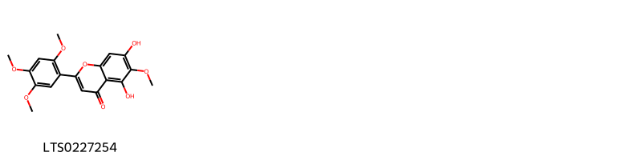{ width=100% }
    <figcaption>Hình ảnh cấu trúc hóa học của 1 hoạt chất thuộc nhóm Flavonoids gồm ['tabularin (LTS0227254)'].</figcaption>
</figure>
#### Nhóm Prenol lipids
<figure markdown="span">
    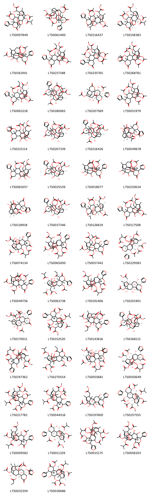{ width=100% }
    <figcaption>Hình ảnh cấu trúc hóa học của 53 hoạt chất thuộc nhóm Prenol lipids gồm ['2,3,22-tris(acetyloxy)-5-(furan-3-yl)-16-hydroxy-19-(1-hydroxy-2-methoxy-2-oxoethyl)-4,12,18,20-tetramethyl-7-oxo-6,11,13,21-tetraoxaheptacyclo[10.8.1.1¹⁵,¹⁸.0¹,¹⁰.0⁴,⁹.0¹⁰,¹⁴.0¹⁶,²⁰]docos-8-en-15-yl 2-methylpropanoate (LTS0097849)', '[(1r,2r,6s,7r,8r,9r,10r,12r,14r,15s,16s,17r,18s,19s,20s)-8,18,19,20-tetrakis(acetyloxy)-6-(furan-3-yl)-9-hydroxy-16-(2-methoxy-2-oxoethyl)-7,12,17-trimethyl-4-oxo-5,11,13,21-tetraoxaheptacyclo[10.8.1.1¹⁴,¹⁷.0¹,¹⁰.0²,⁷.0¹⁰,¹⁵.0¹⁴,¹⁹]docosan-15-yl]methyl acetate (LTS0061400)', 'methyl 2-hydroxy-2-[2,3,22-tris(acetyloxy)-5-(furan-3-yl)-15,16-dihydroxy-12-isopropyl-4,18,20-trimethyl-7-oxo-6,11,13,21-tetraoxaheptacyclo[10.8.1.1¹⁵,¹⁸.0¹,¹⁰.0⁴,⁹.0¹⁰,¹⁴.0¹⁶,²⁰]docos-8-en-19-yl]acetate (LTS0116437)', '(1r,2r,3r,4r,5s,10r,12s,14s,15s,16r,18r,19s,20r,22s)-2,3,22-tris(acetyloxy)-5-(furan-3-yl)-16-hydroxy-19-[(1s)-1-hydroxy-2-methoxy-2-oxoethyl]-4,12,18,20-tetramethyl-7-oxo-6,11,13,21-tetraoxaheptacyclo[10.8.1.1¹⁵,¹⁸.0¹,¹⁰.0⁴,⁹.0¹⁰,¹⁴.0¹⁶,²⁰]docos-8-en-15-yl 2-methylpropanoate (LTS0158383)', '4-(acetyloxy)-20-(furan-3-yl)-2,3,17-trihydroxy-5,14,19-trimethyl-8,22-dioxo-9,13,15,21,25-pentaoxaoctacyclo[12.10.1.1⁵,¹².0¹,¹⁶.0³,¹².0⁶,¹¹.0¹¹,¹⁶.0¹⁹,²⁴]hexacosan-18-yl acetate (LTS0161941)', '[8,18-bis(acetyloxy)-6-(furan-3-yl)-9,19,20-trihydroxy-16-(2-methoxy-2-oxoethyl)-7,12,17-trimethyl-4-oxo-5,11,13,21-tetraoxaheptacyclo[10.8.1.1¹⁴,¹⁷.0¹,¹⁰.0²,⁷.0¹⁰,¹⁵.0¹⁴,¹⁹]docosan-15-yl]methyl propanoate (LTS0237188)', '[8,18,19,20-tetrakis(acetyloxy)-6-(furan-3-yl)-9-hydroxy-16-(2-methoxy-2-oxoethyl)-7,12,17-trimethyl-4-oxo-5,11,13,21-tetraoxaheptacyclo[10.8.1.1¹⁴,¹⁷.0¹,¹⁰.0²,⁷.0¹⁰,¹⁵.0¹⁴,¹⁹]docosan-15-yl]methyl acetate (LTS0235765)', '[8,9,18,20-tetrakis(acetyloxy)-6-(furan-3-yl)-19-hydroxy-16-(2-methoxy-2-oxoethyl)-7,12,17-trimethyl-4-oxo-5,11,13,21-tetraoxaheptacyclo[10.8.1.1¹⁴,¹⁷.0¹,¹⁰.0²,⁷.0¹⁰,¹⁵.0¹⁴,¹⁹]docosan-15-yl]methyl acetate (LTS0268761)', '[(1r,2r,6s,7r,8r,9r,10r,12r,14r,15s,16s,17r,18s,19r,20r)-8,18-bis(acetyloxy)-6-(furan-3-yl)-9,19,20-trihydroxy-16-(2-methoxy-2-oxoethyl)-7,12,17-trimethyl-4-oxo-5,11,13,21-tetraoxaheptacyclo[10.8.1.1¹⁴,¹⁷.0¹,¹⁰.0²,⁷.0¹⁰,¹⁵.0¹⁴,¹⁹]docosan-15-yl]methyl propanoate (LTS0063218)', '[(1r,2r,6s,7r,8r,9r,10r,12r,14r,15s,16s,17r,18s,19s,20r)-8,9,18,20-tetrakis(acetyloxy)-6-(furan-3-yl)-19-hydroxy-16-(2-methoxy-2-oxoethyl)-7,12,17-trimethyl-4-oxo-5,11,13,21-tetraoxaheptacyclo[10.8.1.1¹⁴,¹⁷.0¹,¹⁰.0²,⁷.0¹⁰,¹⁵.0¹⁴,¹⁹]docosan-15-yl]methyl acetate (LTS0180065)', '(1r,2r,3r,4s,5r,6s,11s,12r,14r,16r,17r,18r,19r,20s,24r)-18-(acetyloxy)-20-(furan-3-yl)-2,3,17-trihydroxy-5,14,19-trimethyl-8,22-dioxo-9,13,15,21,25-pentaoxaoctacyclo[12.10.1.1⁵,¹².0¹,¹⁶.0³,¹².0⁶,¹¹.0¹¹,¹⁶.0¹⁹,²⁴]hexacosan-4-yl acetate (LTS0207569)', '[8,18,20-tris(acetyloxy)-6-(furan-3-yl)-9,19-dihydroxy-16-(2-methoxy-2-oxoethyl)-7,12,17-trimethyl-4-oxo-5,11,13,21-tetraoxaheptacyclo[10.8.1.1¹⁴,¹⁷.0¹,¹⁰.0²,⁷.0¹⁰,¹⁵.0¹⁴,¹⁹]docosan-15-yl]methyl acetate (LTS0051979)', '[8,9-bis(acetyloxy)-6-(furan-3-yl)-18,19,20-trihydroxy-16-(2-methoxy-2-oxoethyl)-7,12,17-trimethyl-4-oxo-5,11,13,21-tetraoxaheptacyclo[10.8.1.1¹⁴,¹⁷.0¹,¹⁰.0²,⁷.0¹⁰,¹⁵.0¹⁴,¹⁹]docosan-15-yl]methyl acetate (LTS0215114)', '[(1r,2r,6s,7r,8r,9r,10r,12r,14r,15s,16s,17r,18s,19r,20r)-8,18-bis(acetyloxy)-6-(furan-3-yl)-9,19,20-trihydroxy-16-(2-methoxy-2-oxoethyl)-7,12,17-trimethyl-4-oxo-5,11,13,21-tetraoxaheptacyclo[10.8.1.1¹⁴,¹⁷.0¹,¹⁰.0²,⁷.0¹⁰,¹⁵.0¹⁴,¹⁹]docosan-15-yl]methyl acetate (LTS0207339)', '[(1r,2r,6s,7r,8r,9r,10r,12r,14r,15s,16s,17r,18s,19s,20r)-8,18,20-tris(acetyloxy)-6-(furan-3-yl)-9,19-dihydroxy-16-(2-methoxy-2-oxoethyl)-7,12,17-trimethyl-4-oxo-5,11,13,21-tetraoxaheptacyclo[10.8.1.1¹⁴,¹⁷.0¹,¹⁰.0²,⁷.0¹⁰,¹⁵.0¹⁴,¹⁹]docosan-15-yl]methyl acetate (LTS0216426)', '(1r,2r,3s,4s,5r,6s,11s,12r,14r,16r,17r,18r,19r,20s,24r)-18-(acetyloxy)-20-(furan-3-yl)-2,3,4-trihydroxy-5,14,19-trimethyl-8,22-dioxo-9,13,15,21,25-pentaoxaoctacyclo[12.10.1.1⁵,¹².0¹,¹⁶.0³,¹².0⁶,¹¹.0¹¹,¹⁶.0¹⁹,²⁴]hexacosan-17-yl acetate (LTS0049678)', '[8-(acetyloxy)-6-(furan-3-yl)-9,18,19,20-tetrahydroxy-16-(2-methoxy-2-oxoethyl)-7,12,17-trimethyl-4-oxo-5,11,13,21-tetraoxaheptacyclo[10.8.1.1¹⁴,¹⁷.0¹,¹⁰.0²,⁷.0¹⁰,¹⁵.0¹⁴,¹⁹]docosan-15-yl]methyl acetate (LTS0065057)', '[(1r,2r,6s,7r,8r,9r,10r,12r,14r,15s,16s,17r,18s,19s,20r)-8-(acetyloxy)-6-(furan-3-yl)-9,18,19,20-tetrahydroxy-16-(2-methoxy-2-oxoethyl)-7,12,17-trimethyl-4-oxo-5,11,13,21-tetraoxaheptacyclo[10.8.1.1¹⁴,¹⁷.0¹,¹⁰.0²,⁷.0¹⁰,¹⁵.0¹⁴,¹⁹]docosan-15-yl]methyl acetate (LTS0025539)', '18-(acetyloxy)-20-(furan-3-yl)-2,3,4-trihydroxy-5,14,19-trimethyl-8,22-dioxo-9,13,15,21,25-pentaoxaoctacyclo[12.10.1.1⁵,¹².0¹,¹⁶.0³,¹².0⁶,¹¹.0¹¹,¹⁶.0¹⁹,²⁴]hexacosan-17-yl acetate (LTS0018077)', '20-(furan-3-yl)-2,3,4,17-tetrahydroxy-5,14,19-trimethyl-8,22-dioxo-9,13,15,21,25-pentaoxaoctacyclo[12.10.1.1⁵,¹².0¹,¹⁶.0³,¹².0⁶,¹¹.0¹¹,¹⁶.0¹⁹,²⁴]hexacosan-18-yl acetate (LTS0210634)', '(1r,2r,3s,4s,5r,6s,11s,12r,14r,16r,17r,18r,19r,20s,24r)-20-(furan-3-yl)-2,3,4,17-tetrahydroxy-5,14,19-trimethyl-8,22-dioxo-9,13,15,21,25-pentaoxaoctacyclo[12.10.1.1⁵,¹².0¹,¹⁶.0³,¹².0⁶,¹¹.0¹¹,¹⁶.0¹⁹,²⁴]hexacosan-18-yl acetate (LTS0118918)', '[(1r,2r,6s,7r,8r,9r,10r,12r,14r,15s,16s,17r,18s,19s,20r)-8,9-bis(acetyloxy)-6-(furan-3-yl)-18,19,20-trihydroxy-16-(2-methoxy-2-oxoethyl)-7,12,17-trimethyl-4-oxo-5,11,13,21-tetraoxaheptacyclo[10.8.1.1¹⁴,¹⁷.0¹,¹⁰.0²,⁷.0¹⁰,¹⁵.0¹⁴,¹⁹]docosan-15-yl]methyl acetate (LTS0037346)', 'methyl (2s)-2-hydroxy-2-[(1r,2r,3r,4r,5s,10r,12s,14r,15s,16r,18r,19s,20r,22s)-2,3,22-tris(acetyloxy)-5-(furan-3-yl)-15,16-dihydroxy-12-isopropyl-4,18,20-trimethyl-7-oxo-6,11,13,21-tetraoxaheptacyclo[10.8.1.1¹⁵,¹⁸.0¹,¹⁰.0⁴,⁹.0¹⁰,¹⁴.0¹⁶,²⁰]docos-8-en-19-yl]acetate (LTS0126619)', '[8,18-bis(acetyloxy)-6-(furan-3-yl)-9,19,20-trihydroxy-16-(2-methoxy-2-oxoethyl)-7,12,17-trimethyl-4-oxo-5,11,13,21-tetraoxaheptacyclo[10.8.1.1¹⁴,¹⁷.0¹,¹⁰.0²,⁷.0¹⁰,¹⁵.0¹⁴,¹⁹]docosan-15-yl]methyl acetate (LTS0117508)', '(1s,2r,3s,6r,7r,8s,9s,11s,13s,14s,15s,17s,18r,19r,20s,22r)-3,18-bis(acetyloxy)-6-(furan-3-yl)-8,15,19-trihydroxy-22-[(1s)-1-hydroxy-2-methoxy-2-oxoethyl]-11,14,17-trimethyl-4-oxo-5,10,12,21-tetraoxaoctacyclo[9.9.1.1²,⁷.1¹⁴,¹⁷.0¹,¹³.0²,⁷.0⁹,¹³.0¹⁵,¹⁹]tricosan-20-yl 2-methylpropanoate (LTS0074134)', '3,8,18-tris(acetyloxy)-6-(furan-3-yl)-15,19-dihydroxy-22-(1-hydroxy-2-methoxy-2-oxoethyl)-11,14,17-trimethyl-4-oxo-5,10,12,21-tetraoxaoctacyclo[9.9.1.1²,⁷.1¹⁴,¹⁷.0¹,¹³.0²,⁷.0⁹,¹³.0¹⁵,¹⁹]tricosan-20-yl 2-methylpropanoate (LTS0065000)', '[3,12,14-tris(acetyloxy)-6-(furan-3-yl)-2,4,11,13,17-pentahydroxy-18-(2-methoxy-2-oxoethyl)-5,15-dimethyl-8-oxo-7-oxapentacyclo[13.2.1.0²,¹¹.0⁵,¹⁰.0¹³,¹⁷]octadecan-1-yl]methyl acetate (LTS0057441)', '(1r,2s,3r,6s,7r,8r,9r,11r,13r,14r,15r,17r,18s,19s,20r,22s)-3,8,18-tris(acetyloxy)-22-[(1r)-1-(acetyloxy)-2-methoxy-2-oxoethyl]-6-(furan-3-yl)-15,19-dihydroxy-11,14,17-trimethyl-4-oxo-5,10,12,21-tetraoxaoctacyclo[9.9.1.1²,⁷.1¹⁴,¹⁷.0¹,¹³.0²,⁷.0⁹,¹³.0¹⁵,¹⁹]tricosan-20-yl 2-methylpropanoate (LTS0229583)', '9,10,18-tris(acetyloxy)-12-(furan-3-yl)-8,17,19,20-tetrahydroxy-1,11-dimethyl-4,14-dioxo-5,13-dioxahexacyclo[17.2.1.0²,⁷.0⁷,²⁰.0⁸,¹⁷.0¹¹,¹⁶]docosan-22-yl acetate (LTS0049756)', '(1r,2r,3s,6s,7s,8s,10s,12s,14r,15r,16s,17r,18s,19r,20r)-8-(acetyloxy)-16-[(1r)-1-(acetyloxy)-2-methoxy-2-oxoethyl]-6-(furan-3-yl)-19,20-dihydroxy-7,12,15,17-tetramethyl-4-oxo-3-propanoyl-5,11,13,21-tetraoxaheptacyclo[10.8.1.1¹⁴,¹⁷.0¹,¹⁰.0²,⁷.0¹⁰,¹⁵.0¹⁴,¹⁹]docosan-18-yl 2-methylpropanoate (LTS0063738)', '3,18-bis(acetyloxy)-6-(furan-3-yl)-8,15,19-trihydroxy-22-(1-hydroxy-2-methoxy-2-oxoethyl)-11,14,17-trimethyl-4-oxo-5,10,12,21-tetraoxaoctacyclo[9.9.1.1²,⁷.1¹⁴,¹⁷.0¹,¹³.0²,⁷.0⁹,¹³.0¹⁵,¹⁹]tricosan-20-yl 2-methylpropanoate (LTS0191406)', 'methyl 2-[(1s,2s,4s,5s,6s,11r,12s,13r,14s,15r,17r,18s)-14-(acetyloxy)-6-(furan-3-yl)-2,4,11,12,13,17-hexahydroxy-1,5,15-trimethyl-8-oxo-7-oxapentacyclo[13.2.1.0²,¹¹.0⁵,¹⁰.0¹³,¹⁷]octadec-9-en-18-yl]acetate (LTS0201901)', '[(1s,2r,3r,4r,5s,6s,10r,11r,12s,13s,14s,15r,17r,18s)-3,12,14-tris(acetyloxy)-6-(furan-3-yl)-2,4,11,13,17-pentahydroxy-18-(2-methoxy-2-oxoethyl)-5,15-dimethyl-8-oxo-7-oxapentacyclo[13.2.1.0²,¹¹.0⁵,¹⁰.0¹³,¹⁷]octadecan-1-yl]methyl acetate (LTS0170011)', '(1s,2s,3s,4r,5r,8s,9r,10s,12r,14r,15r,16s,18s,19r,20s,22r)-2,8,22-tris(acetyloxy)-19-[(1s)-1-(acetyloxy)-2-methoxy-2-oxoethyl]-5-(furan-3-yl)-3,16-dihydroxy-12,18,20-trimethyl-7-oxo-6,11,13,21-tetraoxaoctacyclo[10.8.1.1⁴,⁹.1¹⁵,¹⁸.0¹,¹⁰.0⁴,⁹.0¹⁰,¹⁴.0¹⁶,²⁰]tricosan-15-yl 2-methylpropanoate (LTS0152520)', '9,10,22-tris(acetyloxy)-12-(furan-3-yl)-8,17,19,20-tetrahydroxy-1,11-dimethyl-4,14-dioxo-5,13-dioxahexacyclo[17.2.1.0²,⁷.0⁷,²⁰.0⁸,¹⁷.0¹¹,¹⁶]docosan-18-yl propanoate (LTS0143616)', '[(1r,2r,6s,7r,8r,9r,10r,12s,14r,15s,16s,17r,18s,19r,20r)-8,18-bis(acetyloxy)-6-(furan-3-yl)-9,19,20-trihydroxy-16-(2-methoxy-2-oxoethyl)-7,12,17-trimethyl-4-oxo-5,11,13,21-tetraoxaheptacyclo[10.8.1.1¹⁴,¹⁷.0¹,¹⁰.0²,⁷.0¹⁰,¹⁵.0¹⁴,¹⁹]docosan-15-yl]methyl acetate (LTS0168115)', '3,18-bis(acetyloxy)-22-[1-(acetyloxy)-2-methoxy-2-oxoethyl]-6-(furan-3-yl)-8,15,19-trihydroxy-11,14,17-trimethyl-4-oxo-5,10,12,21-tetraoxaoctacyclo[9.9.1.1²,⁷.1¹⁴,¹⁷.0¹,¹³.0²,⁷.0⁹,¹³.0¹⁵,¹⁹]tricosan-20-yl 2-methylpropanoate (LTS0197362)', '8-(acetyloxy)-16-[1-(acetyloxy)-2-methoxy-2-oxoethyl]-6-(furan-3-yl)-19,20-dihydroxy-7,12,15,17-tetramethyl-4-oxo-3-propanoyl-5,11,13,21-tetraoxaheptacyclo[10.8.1.1¹⁴,¹⁷.0¹,¹⁰.0²,⁷.0¹⁰,¹⁵.0¹⁴,¹⁹]docosan-18-yl 2-methylpropanoate (LTS0270554)', '(1s,2r,3s,6r,7s,8s,9s,11s,13s,14s,15s,17s,18r,19r,20s,22r)-3,8,18-tris(acetyloxy)-6-(furan-3-yl)-15,19-dihydroxy-22-[(1s)-1-hydroxy-2-methoxy-2-oxoethyl]-11,14,17-trimethyl-4-oxo-5,10,12,21-tetraoxaoctacyclo[9.9.1.1²,⁷.1¹⁴,¹⁷.0¹,¹³.0²,⁷.0⁹,¹³.0¹⁵,¹⁹]tricosan-20-yl 2-methylpropanoate (LTS0055681)', '(1r,2s,3r,6s,7s,8r,9r,11r,13r,14r,15r,17r,18s,19s,20r,22s)-3,18-bis(acetyloxy)-22-[(1r)-1-(acetyloxy)-2-methoxy-2-oxoethyl]-6-(furan-3-yl)-8,15,19-trihydroxy-11,14,17-trimethyl-4-oxo-5,10,12,21-tetraoxaoctacyclo[9.9.1.1²,⁷.1¹⁴,¹⁷.0¹,¹³.0²,⁷.0⁹,¹³.0¹⁵,¹⁹]tricosan-20-yl 2-methylpropanoate (LTS0050649)', '3,8,22-tris(acetyloxy)-19-[1-(acetyloxy)-2-methoxy-2-oxoethyl]-5-(furan-3-yl)-2,16-dihydroxy-12,18,20-trimethyl-7-oxo-6,11,13,21-tetraoxaoctacyclo[10.8.1.1⁴,⁹.1¹⁵,¹⁸.0¹,¹⁰.0⁴,⁹.0¹⁰,¹⁴.0¹⁶,²⁰]tricosan-15-yl 2-methylpropanoate (LTS0217782)', '2,8,22-tris(acetyloxy)-19-[1-(acetyloxy)-2-methoxy-2-oxoethyl]-5-(furan-3-yl)-3,16-dihydroxy-12,18,20-trimethyl-7-oxo-6,11,13,21-tetraoxaoctacyclo[10.8.1.1⁴,⁹.1¹⁵,¹⁸.0¹,¹⁰.0⁴,⁹.0¹⁰,¹⁴.0¹⁶,²⁰]tricosan-15-yl 2-methylpropanoate (LTS0044516)', 'methyl 2-[14-(acetyloxy)-6-(furan-3-yl)-2,4,11,12,13,17-hexahydroxy-1,5,15-trimethyl-8-oxo-7-oxapentacyclo[13.2.1.0²,¹¹.0⁵,¹⁰.0¹³,¹⁷]octadec-9-en-18-yl]acetate (LTS0197600)', '(1r,2r,3r,4r,5s,8r,9s,10r,12r,14s,15s,16r,18r,19s,20r,22s)-3,8,22-tris(acetyloxy)-19-[(1r)-1-(acetyloxy)-2-methoxy-2-oxoethyl]-5-(furan-3-yl)-2,16-dihydroxy-12,18,20-trimethyl-7-oxo-6,11,13,21-tetraoxaoctacyclo[10.8.1.1⁴,⁹.1¹⁵,¹⁸.0¹,¹⁰.0⁴,⁹.0¹⁰,¹⁴.0¹⁶,²⁰]tricosan-15-yl 2-methylpropanoate (LTS0257555)', '3,22-bis(acetyloxy)-5-(furan-3-yl)-2,8,16-trihydroxy-19-(2-methoxy-2-oxoethyl)-12,18,20-trimethyl-7-oxo-6,11,13,21-tetraoxaoctacyclo[10.8.1.1⁴,⁹.1¹⁵,¹⁸.0¹,¹⁰.0⁴,⁹.0¹⁰,¹⁴.0¹⁶,²⁰]tricosan-15-yl 2-methylpropanoate (LTS0009582)', '(1r,2r,3r,4r,5s,8r,9s,10r,12r,14s,15s,16r,18r,19s,20r,22s)-3,22-bis(acetyloxy)-5-(furan-3-yl)-2,8,16-trihydroxy-19-(2-methoxy-2-oxoethyl)-12,18,20-trimethyl-7-oxo-6,11,13,21-tetraoxaoctacyclo[10.8.1.1⁴,⁹.1¹⁵,¹⁸.0¹,¹⁰.0⁴,⁹.0¹⁰,¹⁴.0¹⁶,²⁰]tricosan-15-yl 2-methylpropanoate (LTS0011329)', '3,8,18-tris(acetyloxy)-22-[1-(acetyloxy)-2-methoxy-2-oxoethyl]-6-(furan-3-yl)-15,19-dihydroxy-11,14,17-trimethyl-4-oxo-5,10,12,21-tetraoxaoctacyclo[9.9.1.1²,⁷.1¹⁴,¹⁷.0¹,¹³.0²,⁷.0⁹,¹³.0¹⁵,¹⁹]tricosan-20-yl 2-methylpropanoate (LTS0015175)', '8,22-bis(acetyloxy)-19-[1-(acetyloxy)-2-methoxy-2-oxoethyl]-5-(furan-3-yl)-2,3,16-trihydroxy-12,18,20-trimethyl-7-oxo-6,11,13,21-tetraoxaoctacyclo[10.8.1.1⁴,⁹.1¹⁵,¹⁸.0¹,¹⁰.0⁴,⁹.0¹⁰,¹⁴.0¹⁶,²⁰]tricosan-15-yl 2-methylpropanoate (LTS0056103)', '(1r,2s,7s,8r,9r,10r,11r,12s,16r,17r,18s,19s,20r,22s)-9,10,22-tris(acetyloxy)-12-(furan-3-yl)-8,17,19,20-tetrahydroxy-1,11-dimethyl-4,14-dioxo-5,13-dioxahexacyclo[17.2.1.0²,⁷.0⁷,²⁰.0⁸,¹⁷.0¹¹,¹⁶]docosan-18-yl propanoate (LTS0032359)', '(1s,2s,3s,4r,5r,8s,9r,10s,12r,14r,15r,16s,18s,19r,20s,22r)-8,22-bis(acetyloxy)-19-[(1s)-1-(acetyloxy)-2-methoxy-2-oxoethyl]-5-(furan-3-yl)-2,3,16-trihydroxy-12,18,20-trimethyl-7-oxo-6,11,13,21-tetraoxaoctacyclo[10.8.1.1⁴,⁹.1¹⁵,¹⁸.0¹,¹⁰.0⁴,⁹.0¹⁰,¹⁴.0¹⁶,²⁰]tricosan-15-yl 2-methylpropanoate (LTS0030686)', '(1r,2s,7s,8r,9r,10r,11r,12s,16r,17r,18s,19s,20r,22s)-9,10,18-tris(acetyloxy)-12-(furan-3-yl)-8,17,19,20-tetrahydroxy-1,11-dimethyl-4,14-dioxo-5,13-dioxahexacyclo[17.2.1.0²,⁷.0⁷,²⁰.0⁸,¹⁷.0¹¹,¹⁶]docosan-22-yl acetate (LTS0044560)', '(1r,2s,7s,8r,9r,10r,11r,12s,16r,17r,18s,19r,20r,22s)-9,10,18-tris(acetyloxy)-12-(furan-3-yl)-8,17,19,20-tetrahydroxy-1,11-dimethyl-4,14-dioxo-5,13-dioxahexacyclo[17.2.1.0²,⁷.0⁷,²⁰.0⁸,¹⁷.0¹¹,¹⁶]docosan-22-yl acetate (LTS0104775)', '[(1s,2s,6r,7s,8s,9s,10s,12s,14s,15r,16r,17s,18r,19r,20s)-8,18,20-tris(acetyloxy)-6-(furan-3-yl)-9,19-dihydroxy-16-(2-methoxy-2-oxoethyl)-7,12,17-trimethyl-4-oxo-5,11,13,21-tetraoxaheptacyclo[10.8.1.1¹⁴,¹⁷.0¹,¹⁰.0²,⁷.0¹⁰,¹⁵.0¹⁴,¹⁹]docosan-15-yl]methyl acetate (LTS0241905)'].</figcaption>
</figure>
#### Nhóm Steroids and steroid derivatives
<figure markdown="span">
    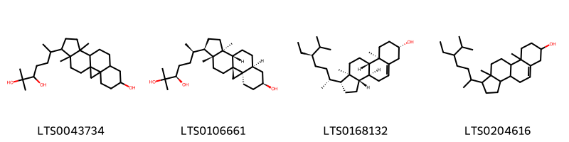{ width=100% }
    <figcaption>Hình ảnh cấu trúc hóa học của 4 hoạt chất thuộc nhóm Steroids and steroid derivatives gồm ['6-{6-hydroxy-12,16-dimethylpentacyclo[9.7.0.0¹,³.0³,⁸.0¹²,¹⁶]octadecan-15-yl}-2-methylheptane-2,3-diol (LTS0043734)', '(3r,6r)-6-[(1s,3r,6s,8s,11s,12s,15r,16r)-6-hydroxy-12,16-dimethylpentacyclo[9.7.0.0¹,³.0³,⁸.0¹²,¹⁶]octadecan-15-yl]-2-methylheptane-2,3-diol (LTS0106661)', 'sitosterol (LTS0168132)', 'stigmast-5-en-3-ol, (3β)- (LTS0204616)'].</figcaption>
</figure>

---

### Dược dân tộc học

Danh sách các quốc gia có sử dụng *Chukrasia tabularis* trong điều trị các bệnh. 

| Country   | Disease    | Bệnh                                                                                                                                                                                                |
|:----------|:-----------|:----------------------------------------------------------------------------------------------------------------------------------------------------------------------------------------------------|
| Elsewhere | Astringent | MYMEMORY WARNING: YOU USED ALL AVAILABLE FREE TRANSLATIONS FOR TODAY. NEXT AVAILABLE IN  06 HOURS 45 MINUTES 05 SECONDS VISIT HTTPS://MYMEMORY.TRANSLATED.NET/DOC/USAGELIMITS.PHP TO TRANSLATE MORE |

---

# Chi Swietenia

??? note "Danh sách các dược liệu thuộc chi"
    
	 - *Swietenia humilis*
	 - *Swietenia macrophylla*
	 - *Swietenia mahagoni*
	 - *Swietenia mahogani*

---
## Swietenia humilis
### Thông tin về thực vật

!!! info "Phân loại thực vật của *Swietenia humilis* từ GIBF:"
    - **Kingdom:** Plantae
    - **Phylum:** Tracheophyta
    - **Order:** Sapindales
    - **Family:** Meliaceae
    - **Genus:** Swietenia
    - **Species:** *Swietenia humilis*

 

| Label (VI)   | Label (EN)   | Scientific Name   | Descriptions (VI)   | Descriptions (EN)   | Also Known As (VI)   | Also Known As (EN)         |
|:-------------|:-------------|:------------------|:--------------------|:--------------------|:---------------------|:---------------------------|
| N/A          | N/A          | Swietenia humilis | loài thực vật       | species of plant    | ['']                 | ['Pacific Coast mahogany'] |

#### Phân bố trên thế giới

**Từ CSDL GIBF** Guatemala, Honduras, Nicaragua, Mexico, El Salvador

#### Phân bố tại Việt Nam

**Từ CSDL GIBF**: Không có ghi nhận ở Việt Nam

---
### Thành phần hóa học
        
- Theo cơ sở dữ liệu lotus: Từ loài *Swietenia humilis* đã phân lập và xác định được 27 hoạt chất thuộc về các nhóm Naphthopyrans, Prenol lipids, Steroids and steroid derivatives. 

|    | chemicalTaxonomyClassyfireClass   |   smiles_count |
|---:|:----------------------------------|---------------:|
|  0 | Naphthopyrans                     |              6 |
|  1 | Prenol lipids                     |             14 |
|  2 | Steroids and steroid derivatives  |              7 |

#### Nhóm Naphthopyrans
<figure markdown="span">
    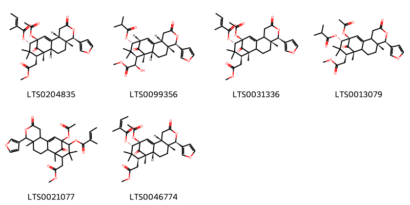{ width=100% }
    <figcaption>Hình ảnh cấu trúc hóa học của 6 hoạt chất thuộc nhóm Naphthopyrans gồm ['(1r,2s,5r,6r,10s,13r,14s,16s)-13-(acetyloxy)-6-(furan-3-yl)-16-(2-methoxy-2-oxoethyl)-1,5,15,15-tetramethyl-8,17-dioxo-7-oxatetracyclo[11.3.1.0²,¹¹.0⁵,¹⁰]heptadec-11-en-14-yl (2e)-2-methylbut-2-enoate (LTS0204835)', '(1r,2s,5r,6r,10s,13s,14r,16s)-6-(furan-3-yl)-16-[(1r)-1-hydroxy-2-methoxy-2-oxoethyl]-1,5,15,15-tetramethyl-8,17-dioxo-7-oxatetracyclo[11.3.1.0²,¹¹.0⁵,¹⁰]heptadec-11-en-14-yl 2-methylpropanoate (LTS0099356)', '(1r,5r,6r,13r,14s,16s)-13-(acetyloxy)-6-(furan-3-yl)-16-(2-methoxy-2-oxoethyl)-1,5,15,15-tetramethyl-8,17-dioxo-7-oxatetracyclo[11.3.1.0²,¹¹.0⁵,¹⁰]heptadec-11-en-14-yl (2e)-2-methylbut-2-enoate (LTS0031336)', '(1r,5r,6r,13r,14s,16s)-13-(acetyloxy)-6-(furan-3-yl)-16-(2-methoxy-2-oxoethyl)-1,5,15,15-tetramethyl-8,17-dioxo-7-oxatetracyclo[11.3.1.0²,¹¹.0⁵,¹⁰]heptadec-11-en-14-yl 2-methylpropanoate (LTS0013079)', '13-(acetyloxy)-6-(furan-3-yl)-16-(2-methoxy-2-oxoethyl)-1,5,15,15-tetramethyl-8,17-dioxo-7-oxatetracyclo[11.3.1.0²,¹¹.0⁵,¹⁰]heptadec-11-en-14-yl 2-methylbut-2-enoate (LTS0021077)', '(1r,2s,5r,6r,10s,13r,14s,16s)-13-(acetyloxy)-6-(furan-3-yl)-16-(2-methoxy-2-oxoethyl)-1,5,15,15-tetramethyl-8,17-dioxo-7-oxatetracyclo[11.3.1.0²,¹¹.0⁵,¹⁰]heptadec-11-en-14-yl (2z)-2-methylbut-2-enoate (LTS0046774)'].</figcaption>
</figure>
#### Nhóm Prenol lipids
<figure markdown="span">
    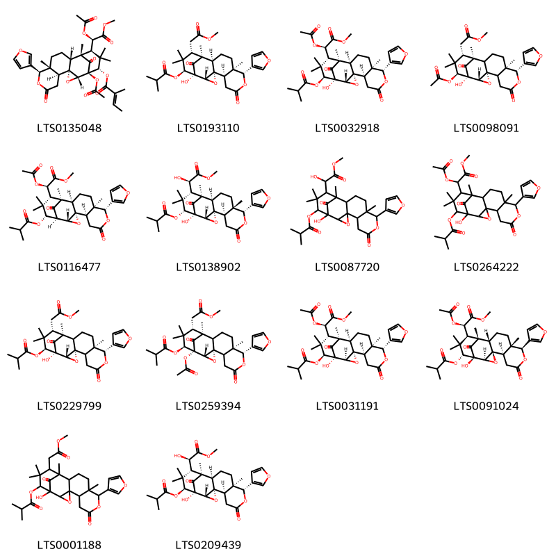{ width=100% }
    <figcaption>Hình ảnh cấu trúc hóa học của 14 hoạt chất thuộc nhóm Prenol lipids gồm ['(1s,2r,4r,5s,9r,10r,13r,14s,15s,17s)-1-(acetyloxy)-15-[(1r)-1-(acetyloxy)-2-methoxy-2-oxoethyl]-9-(furan-3-yl)-10,14,16,16-tetramethyl-7,18-dioxo-3,8-dioxapentacyclo[12.3.1.0²,⁴.0⁴,¹³.0⁵,¹⁰]octadecan-17-yl (2e)-2-methylbut-2-enoate (LTS0135048)', '(1s,2r,4s,5r,9r,10r,13r,14s,15s,17s)-9-(furan-3-yl)-1-hydroxy-15-(2-methoxy-2-oxoethyl)-10,14,16,16-tetramethyl-7,18-dioxo-3,8-dioxapentacyclo[12.3.1.0²,⁴.0⁴,¹³.0⁵,¹⁰]octadecan-17-yl 2-methylpropanoate (LTS0193110)', '(1s,2r,4s,5r,9r,10r,13r,14s,15s,17s)-15-[(1r)-1-(acetyloxy)-2-methoxy-2-oxoethyl]-9-(furan-3-yl)-1-hydroxy-10,14,16,16-tetramethyl-7,18-dioxo-3,8-dioxapentacyclo[12.3.1.0²,⁴.0⁴,¹³.0⁵,¹⁰]octadecan-17-yl 2-methylpropanoate (LTS0032918)', 'methyl 2-[(1s,2r,4s,9r,10r,14s,15s,17s)-17-(acetyloxy)-9-(furan-3-yl)-1-hydroxy-10,14,16,16-tetramethyl-7,18-dioxo-3,8-dioxapentacyclo[12.3.1.0²,⁴.0⁴,¹³.0⁵,¹⁰]octadecan-15-yl]acetate (LTS0098091)', '(1r,2r,4s,5r,9r,10r,13r,14s,15s,17s)-15-[(1r)-1-(acetyloxy)-2-methoxy-2-oxoethyl]-9-(furan-3-yl)-10,14,16,16-tetramethyl-7,18-dioxo-3,8-dioxapentacyclo[12.3.1.0²,⁴.0⁴,¹³.0⁵,¹⁰]octadecan-17-yl 2-methylpropanoate (LTS0116477)', '(1s,2r,4s,5r,9r,10s,13r,14s,15s,17r)-9-(furan-3-yl)-1-hydroxy-15-[(1r)-1-hydroxy-2-methoxy-2-oxoethyl]-10,14,16,16-tetramethyl-7,18-dioxo-3,8-dioxapentacyclo[12.3.1.0²,⁴.0⁴,¹³.0⁵,¹⁰]octadecan-17-yl 2-methylpropanoate (LTS0138902)', '9-(furan-3-yl)-1-hydroxy-15-(1-hydroxy-2-methoxy-2-oxoethyl)-10,14,16,16-tetramethyl-7,18-dioxo-3,8-dioxapentacyclo[12.3.1.0²,⁴.0⁴,¹³.0⁵,¹⁰]octadecan-17-yl 2-methylpropanoate (LTS0087720)', '15-[1-(acetyloxy)-2-methoxy-2-oxoethyl]-9-(furan-3-yl)-1-hydroxy-10,14,16,16-tetramethyl-7,18-dioxo-3,8-dioxapentacyclo[12.3.1.0²,⁴.0⁴,¹³.0⁵,¹⁰]octadecan-17-yl 2-methylpropanoate (LTS0264222)', '(1s,2r,4s,9r,10r,14s,15s,17s)-9-(furan-3-yl)-1-hydroxy-15-(2-methoxy-2-oxoethyl)-10,14,16,16-tetramethyl-7,18-dioxo-3,8-dioxapentacyclo[12.3.1.0²,⁴.0⁴,¹³.0⁵,¹⁰]octadecan-17-yl 2-methylpropanoate (LTS0229799)', '(1s,2s,4s,9r,10r,14s,15s,17s)-1-(acetyloxy)-9-(furan-3-yl)-15-(2-methoxy-2-oxoethyl)-10,14,16,16-tetramethyl-7,18-dioxo-3,8-dioxapentacyclo[12.3.1.0²,⁴.0⁴,¹³.0⁵,¹⁰]octadecan-17-yl 2-methylpropanoate (LTS0259394)', '(1s,2s,4s,5r,9r,10r,13r,14s,15s,17s)-15-[(1r)-1-(acetyloxy)-2-methoxy-2-oxoethyl]-9-(furan-3-yl)-1-hydroxy-10,14,16,16-tetramethyl-7,18-dioxo-3,8-dioxapentacyclo[12.3.1.0²,⁴.0⁴,¹³.0⁵,¹⁰]octadecan-17-yl 2-methylpropanoate (LTS0031191)', '(1r,2s,4r,5r,9s,10s,13s,14r,15r,17r)-15-[(1r)-1-(acetyloxy)-2-methoxy-2-oxoethyl]-9-(furan-3-yl)-1-hydroxy-10,14,16,16-tetramethyl-7,18-dioxo-3,8-dioxapentacyclo[12.3.1.0²,⁴.0⁴,¹³.0⁵,¹⁰]octadecan-17-yl 2-methylpropanoate (LTS0091024)', '9-(furan-3-yl)-1-hydroxy-15-(2-methoxy-2-oxoethyl)-10,14,16,16-tetramethyl-7,18-dioxo-3,8-dioxapentacyclo[12.3.1.0²,⁴.0⁴,¹³.0⁵,¹⁰]octadecan-17-yl 2-methylpropanoate (LTS0001188)', '(1s,2r,4s,5r,9r,10r,13r,14s,15s,17s)-9-(furan-3-yl)-1-hydroxy-15-[(1r)-1-hydroxy-2-methoxy-2-oxoethyl]-10,14,16,16-tetramethyl-7,18-dioxo-3,8-dioxapentacyclo[12.3.1.0²,⁴.0⁴,¹³.0⁵,¹⁰]octadecan-17-yl 2-methylpropanoate (LTS0209439)'].</figcaption>
</figure>
#### Nhóm Steroids and steroid derivatives
<figure markdown="span">
    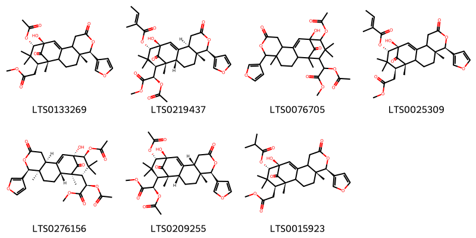{ width=100% }
    <figcaption>Hình ảnh cấu trúc hóa học của 7 hoạt chất thuộc nhóm Steroids and steroid derivatives gồm ['methyl 2-[(1r,5r,6r,13r,14s,16s)-14-(acetyloxy)-6-(furan-3-yl)-13-hydroxy-1,5,15,15-tetramethyl-8,17-dioxo-7-oxatetracyclo[11.3.1.0²,¹¹.0⁵,¹⁰]heptadec-11-en-16-yl]acetate (LTS0133269)', '(1r,2s,5r,6r,10r,13r,14s,16s)-16-[(1r)-1-(acetyloxy)-2-methoxy-2-oxoethyl]-6-(furan-3-yl)-13-hydroxy-1,5,15,15-tetramethyl-8,17-dioxo-7-oxatetracyclo[11.3.1.0²,¹¹.0⁵,¹⁰]heptadec-11-en-14-yl (2e)-2-methylbut-2-enoate (LTS0219437)', 'methyl 2-(acetyloxy)-2-[14-(acetyloxy)-6-(furan-3-yl)-13-hydroxy-1,5,15,15-tetramethyl-8,17-dioxo-7-oxatetracyclo[11.3.1.0²,¹¹.0⁵,¹⁰]heptadec-11-en-16-yl]acetate (LTS0076705)', '(1r,5r,6r,13r,14s,16s)-6-(furan-3-yl)-13-hydroxy-16-(2-methoxy-2-oxoethyl)-1,5,15,15-tetramethyl-8,17-dioxo-7-oxatetracyclo[11.3.1.0²,¹¹.0⁵,¹⁰]heptadec-11-en-14-yl (2e)-2-methylbut-2-enoate (LTS0025309)', 'methyl (2r)-2-(acetyloxy)-2-[(1r,2r,5r,6s,10s,13r,14s,16s)-14-(acetyloxy)-6-(furan-3-yl)-13-hydroxy-1,5,15,15-tetramethyl-8,17-dioxo-7-oxatetracyclo[11.3.1.0²,¹¹.0⁵,¹⁰]heptadec-11-en-16-yl]acetate (LTS0276156)', 'methyl (2r)-2-(acetyloxy)-2-[(1r,2s,5r,6r,10s,13r,14s,16s)-14-(acetyloxy)-6-(furan-3-yl)-13-hydroxy-1,5,15,15-tetramethyl-8,17-dioxo-7-oxatetracyclo[11.3.1.0²,¹¹.0⁵,¹⁰]heptadec-11-en-16-yl]acetate (LTS0209255)', '(1r,5r,6r,13r,14s,16s)-6-(furan-3-yl)-13-hydroxy-16-(2-methoxy-2-oxoethyl)-1,5,15,15-tetramethyl-8,17-dioxo-7-oxatetracyclo[11.3.1.0²,¹¹.0⁵,¹⁰]heptadec-11-en-14-yl 2-methylpropanoate (LTS0015923)'].</figcaption>
</figure>

---

### Dược dân tộc học

Danh sách các quốc gia có sử dụng *Swietenia humilis* trong điều trị các bệnh. 

| Country   | Disease        | Bệnh                                                                                                                                                                                                |
|:----------|:---------------|:----------------------------------------------------------------------------------------------------------------------------------------------------------------------------------------------------|
| Mexico    | Cosmetic, Soap | MYMEMORY WARNING: YOU USED ALL AVAILABLE FREE TRANSLATIONS FOR TODAY. NEXT AVAILABLE IN  06 HOURS 44 MINUTES 32 SECONDS VISIT HTTPS://MYMEMORY.TRANSLATED.NET/DOC/USAGELIMITS.PHP TO TRANSLATE MORE |

---

---
## Swietenia macrophylla
### Thông tin về thực vật

!!! info "Phân loại thực vật của *Swietenia macrophylla* từ GIBF:"
    - **Kingdom:** Plantae
    - **Phylum:** Tracheophyta
    - **Order:** Sapindales
    - **Family:** Meliaceae
    - **Genus:** Swietenia
    - **Species:** *Swietenia macrophylla*

 

| Label (VI)   | Label (EN)   | Scientific Name       | Descriptions (VI)   | Descriptions (EN)   | Also Known As (VI)   | Also Known As (EN)    |
|:-------------|:-------------|:----------------------|:--------------------|:--------------------|:---------------------|:----------------------|
| N/A          | N/A          | Swietenia macrophylla |                     | species of plant    | ['']                 | ['Big-leaf mahogany'] |

#### Phân bố trên thế giới

**Từ CSDL GIBF** Palau, Micronesia (Federated States of), Guadeloupe, Guatemala, Panama, Puerto Rico, Chinese Taipei, Bolivia (Plurinational State of), United States of America, El Salvador, Belize, Thailand, Martinique, Brazil, Guam, Mexico, Dominican Republic, Singapore, Viet Nam, China, Ecuador, Colombia, India, Indonesia, Philippines, Malaysia

#### Phân bố tại Việt Nam

**Từ CSDL GIBF**: Hồ Chí Minh city

---
### Thành phần hóa học
        
- Theo cơ sở dữ liệu lotus: Từ loài *Swietenia macrophylla* đã phân lập và xác định được 85 hoạt chất thuộc về các nhóm Fatty Acyls, Prenol lipids, Steroids and steroid derivatives, Coumarins and derivatives, Naphthopyrans, Dioxepanes, Carboxylic acids and derivatives. 

|    | chemicalTaxonomyClassyfireClass   |   smiles_count |
|---:|:----------------------------------|---------------:|
|  0 | Carboxylic acids and derivatives  |              3 |
|  1 | Coumarins and derivatives         |              1 |
|  2 | Dioxepanes                        |              2 |
|  3 | Fatty Acyls                       |             28 |
|  4 | Naphthopyrans                     |             14 |
|  5 | Prenol lipids                     |             29 |
|  6 | Steroids and steroid derivatives  |              8 |

#### Nhóm Carboxylic acids and derivatives
<figure markdown="span">
    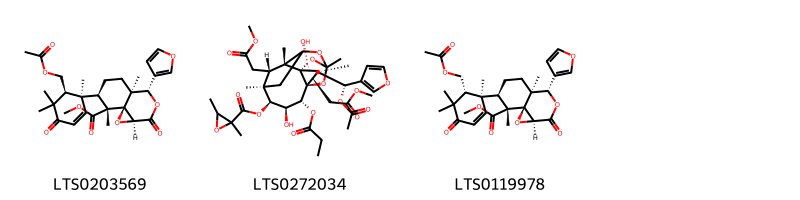{ width=100% }
    <figcaption>Hình ảnh cấu trúc hóa học của 3 hoạt chất thuộc nhóm Carboxylic acids and derivatives gồm ['methyl (1r,3s,6s,7s,10r,11r)-10-[(1r,6s)-6-[(acetyloxy)methyl]-1,5,5-trimethyl-4-oxocyclohex-2-en-1-yl]-6-(furan-3-yl)-7,11-dimethyl-4-oxo-2,5-dioxatricyclo[5.4.0.0¹,³]undecane-11-carboxylate (LTS0203569)', '(1s,2r,3s,4s,5r,6s,7r,12r,13r,15r,16r)-15-[(r)-(acetyloxy)(furan-3-yl)methyl]-3,13-dihydroxy-6,16-bis(2-methoxy-2-oxoethyl)-5,7,10,15-tetramethyl-2-(propanoyloxy)-9,11,17-trioxapentacyclo[8.6.1.1⁵,⁸.0¹,¹².0⁷,¹²]octadecan-4-yl 2,3-dimethyloxirane-2-carboxylate (LTS0272034)', 'methyl (1r,3s,6s,7s,10r,11r)-10-[(1r,6r)-6-[(acetyloxy)methyl]-1,5,5-trimethyl-4-oxocyclohex-2-en-1-yl]-6-(furan-3-yl)-7,11-dimethyl-4-oxo-2,5-dioxatricyclo[5.4.0.0¹,³]undecane-11-carboxylate (LTS0119978)'].</figcaption>
</figure>
#### Nhóm Coumarins and derivatives
<figure markdown="span">
    { width=100% }
    <figcaption>Hình ảnh cấu trúc hóa học của 1 hoạt chất thuộc nhóm Coumarins and derivatives gồm ['scopoletin (LTS0193112)'].</figcaption>
</figure>
#### Nhóm Dioxepanes
<figure markdown="span">
    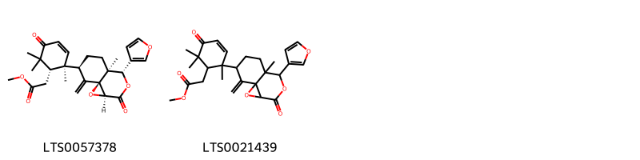{ width=100% }
    <figcaption>Hình ảnh cấu trúc hóa học của 2 hoạt chất thuộc nhóm Dioxepanes gồm ['methyl 2-[(1s,2s)-2-[(1s,3s,6s,7s,10r)-6-(furan-3-yl)-7-methyl-11-methylidene-4-oxo-2,5-dioxatricyclo[5.4.0.0¹,³]undecan-10-yl]-2,6,6-trimethyl-5-oxocyclohex-3-en-1-yl]acetate (LTS0057378)', 'methyl 2-{2-[6-(furan-3-yl)-7-methyl-11-methylidene-4-oxo-2,5-dioxatricyclo[5.4.0.0¹,³]undecan-10-yl]-2,6,6-trimethyl-5-oxocyclohex-3-en-1-yl}acetate (LTS0021439)'].</figcaption>
</figure>
#### Nhóm Fatty Acyls
<figure markdown="span">
    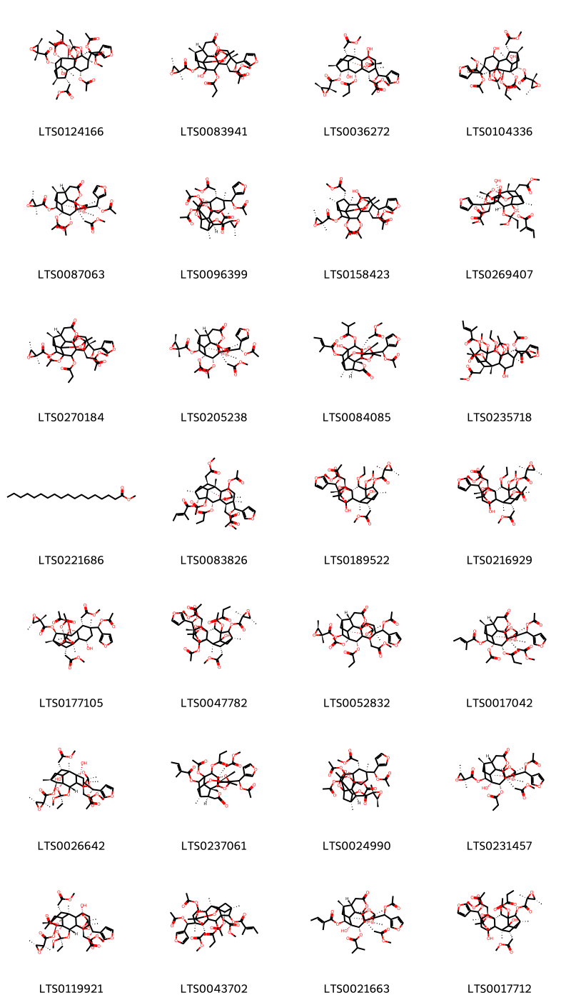{ width=100% }
    <figcaption>Hình ảnh cấu trúc hóa học của 28 hoạt chất thuộc nhóm Fatty Acyls gồm ['(1r,2s,3s,5s,6s,7r,8r,9s,11r,13s,14r,16s,18r)-7,16-bis(acetyloxy)-14-[(s)-(acetyloxy)(furan-3-yl)methyl]-3-hydroxy-13,18-bis(2-methoxy-2-oxoethyl)-2,5,11,14-tetramethyl-8-(propanoyloxy)-10,12,17-trioxahexacyclo[9.5.1.1²,⁵.0¹,⁹.0³,⁷.0⁹,¹³]octadecan-6-yl (2r,3s)-2,3-dimethyloxirane-2-carboxylate (LTS0124166)', '(5s,8s,9r,10s,14r,15s,20s)-8-[(s)-(acetyloxy)(furan-3-yl)methyl]-12-hydroxy-9-(2-methoxy-2-oxoethyl)-3,8,14-trimethyl-17-oxo-11-(propanoyloxy)-2,4,18,22-tetraoxaheptacyclo[12.6.1.1³,¹⁰.0¹,¹².0⁵,¹⁰.0⁵,²⁰.0¹⁵,²⁰]docosan-13-yl (2s,3r)-2,3-dimethyloxirane-2-carboxylate (LTS0083941)', '(1r,2r,3s,4r,5r,6s,7r,8r,10r,12r,13s,15r,16s)-15-[(s)-(acetyloxy)(furan-3-yl)methyl]-3,13-dihydroxy-6,16-bis(2-methoxy-2-oxoethyl)-5,7,10,15-tetramethyl-2-(propanoyloxy)-9,11,17-trioxahexacyclo[8.6.1.1⁵,⁸.0¹,¹².0³,⁸.0⁷,¹²]octadecan-4-yl (2r,3s)-2,3-dimethyloxirane-2-carboxylate (LTS0036272)', '(1r,2s,3s,5s,6s,7r,8r,9s,11r,13s,14r,16r,18r)-7-(acetyloxy)-14-[(s)-(acetyloxy)(furan-3-yl)methyl]-3,16-dihydroxy-13,18-bis(2-methoxy-2-oxoethyl)-2,5,11,14-tetramethyl-8-(propanoyloxy)-10,12,17-trioxahexacyclo[9.5.1.1²,⁵.0¹,⁹.0³,⁷.0⁹,¹³]octadecan-6-yl (2r,3r)-2,3-dimethyloxirane-2-carboxylate (LTS0104336)', '(1r,3r,5s,8r,9r,10r,11s,12s,13s,14r,15s,20r)-11,12-bis(acetyloxy)-8-[(r)-(acetyloxy)(furan-3-yl)methyl]-9-(2-methoxy-2-oxoethyl)-3,8,14-trimethyl-17-oxo-2,4,18,22-tetraoxaheptacyclo[12.6.1.1³,¹⁰.0¹,¹².0⁵,¹⁰.0⁵,²⁰.0¹⁵,²⁰]docosan-13-yl (2s,3r)-2,3-dimethyloxirane-2-carboxylate (LTS0087063)', '(5s,8s,9r,10s,14r,15s,20r)-11,12-bis(acetyloxy)-8-[(s)-(acetyloxy)(furan-3-yl)methyl]-9-(2-methoxy-2-oxoethyl)-3,8,14-trimethyl-17-oxo-2,4,18,22-tetraoxaheptacyclo[12.6.1.1³,¹⁰.0¹,¹².0⁵,¹⁰.0⁵,²⁰.0¹⁵,²⁰]docosan-13-yl (2s,3r)-2,3-dimethyloxirane-2-carboxylate (LTS0096399)', '(1s,5s,6s,7r,12r,15s,16r)-2,3-bis(acetyloxy)-15-[(s)-(acetyloxy)(furan-3-yl)methyl]-13-hydroxy-6,16-bis(2-methoxy-2-oxoethyl)-5,7,10,15-tetramethyl-9,11,17-trioxahexacyclo[8.6.1.1⁵,⁸.0¹,¹².0³,⁸.0⁷,¹²]octadecan-4-yl (2s,3r)-2,3-dimethyloxirane-2-carboxylate (LTS0158423)', '(1r,2r,3r,5r,6s,7s,9r,11r,12s,14r,16s,17s,19r,21s)-3-(acetyloxy)-17-[(s)-(acetyloxy)(furan-3-yl)methyl]-9-ethyl-19-hydroxy-9-methoxy-16,21-bis(2-methoxy-2-oxoethyl)-2,5,14,17-tetramethyl-8,10,13,15,20-pentaoxaheptacyclo[12.5.1.1²,⁵.0¹,¹².0³,⁷.0⁷,¹¹.0¹²,¹⁶]henicosan-6-yl (2e)-2-methylbut-2-enoate (LTS0269407)', '(5s,8s,9r,10s,14r,15s,20r)-12-(acetyloxy)-8-[(s)-(acetyloxy)(furan-3-yl)methyl]-9-(2-methoxy-2-oxoethyl)-3,8,14-trimethyl-17-oxo-11-(propanoyloxy)-2,4,18,22-tetraoxaheptacyclo[12.6.1.1³,¹⁰.0¹,¹².0⁵,¹⁰.0⁵,²⁰.0¹⁵,²⁰]docosan-13-yl (2s,3r)-2,3-dimethyloxirane-2-carboxylate (LTS0270184)', '(1r,3r,5s,8r,9r,10r,11s,12s,13s,14r,15s,20r)-11,12-bis(acetyloxy)-8-[(r)-(acetyloxy)(furan-3-yl)methyl]-9-(2-methoxy-2-oxoethyl)-3,8,14-trimethyl-17-oxo-2,4,18,22-tetraoxaheptacyclo[12.6.1.1³,¹⁰.0¹,¹².0⁵,¹⁰.0⁵,²⁰.0¹⁵,²⁰]docosan-13-yl (2r,3s)-2,3-dimethyloxirane-2-carboxylate (LTS0205238)', '(5s,8s,9r,10s,14r,15s,20s)-8-[(s)-(acetyloxy)(furan-3-yl)methyl]-12-hydroxy-9-(2-methoxy-2-oxoethyl)-3,8,14-trimethyl-11-[(2-methylpropanoyl)oxy]-17-oxo-2,4,18,22-tetraoxaheptacyclo[12.6.1.1³,¹⁰.0¹,¹².0⁵,¹⁰.0⁵,²⁰.0¹⁵,²⁰]docosan-13-yl (2e)-2-methylbut-2-enoate (LTS0084085)', '(1r,2r,5s,9s,13s,14r,18s)-3-(acetyloxy)-14-[(r)-(acetyloxy)(furan-3-yl)methyl]-8-ethoxy-16-hydroxy-13,18-bis(2-methoxy-2-oxoethyl)-2,5,11,14-tetramethyl-7-(methylperoxy)-10,12,17-trioxahexacyclo[9.5.1.1²,⁵.0¹,⁹.0³,⁷.0⁹,¹³]octadecan-6-yl (2e)-2-methylbut-2-enoate (LTS0235718)', 'methyl stearate (LTS0221686)', '(1r,2s,3r,4r,5s,6r,7s,8r,10r,12r,13s,15r,16r)-3,13-bis(acetyloxy)-15-[(s)-(acetyloxy)(furan-3-yl)methyl]-6,16-bis(2-methoxy-2-oxoethyl)-5,7,10,15-tetramethyl-2-(propanoyloxy)-9,11,17-trioxahexacyclo[8.6.1.1⁵,⁸.0¹,¹².0³,⁸.0⁷,¹²]octadecan-4-yl (2e)-2-methylbut-2-enoate (LTS0083826)', '(1r,2r,5s,9s,13s,14r,18s)-14-[(r)-(acetyloxy)(furan-3-yl)methyl]-8-ethoxy-3,16-dihydroxy-13,18-bis(2-methoxy-2-oxoethyl)-2,5,11,14-tetramethyl-7-(methylperoxy)-10,12,17-trioxahexacyclo[9.5.1.1²,⁵.0¹,⁹.0³,⁷.0⁹,¹³]octadecan-6-yl (2s,3r)-2,3-dimethyloxirane-2-carboxylate (LTS0189522)', '(1r,2r,5s,9s,13s,14r,18s)-3-(acetyloxy)-14-[(r)-(acetyloxy)(furan-3-yl)methyl]-8-ethoxy-16-hydroxy-13,18-bis(2-methoxy-2-oxoethyl)-2,5,11,14-tetramethyl-7-(methylperoxy)-10,12,17-trioxahexacyclo[9.5.1.1²,⁵.0¹,⁹.0³,⁷.0⁹,¹³]octadecan-6-yl (2s,3r)-2,3-dimethyloxirane-2-carboxylate (LTS0216929)', '(1s,2r,3r,4r,5s,6r,7s,8s,10s,12s,13s,15s,16r)-2,3-bis(acetyloxy)-15-[(r)-(acetyloxy)(furan-3-yl)methyl]-13-hydroxy-6,16-bis(2-methoxy-2-oxoethyl)-5,7,10,15-tetramethyl-9,11,17-trioxahexacyclo[8.6.1.1⁵,⁸.0¹,¹².0³,⁸.0⁷,¹²]octadecan-4-yl (2s,3s)-2,3-dimethyloxirane-2-carboxylate (LTS0177105)', '(1r,2r,5s,9s,13s,14r,18s)-7,16-bis(acetyloxy)-14-[(r)-(acetyloxy)(furan-3-yl)methyl]-3-hydroxy-13,18-bis(2-methoxy-2-oxoethyl)-2,5,11,14-tetramethyl-8-(propanoyloxy)-10,12,17-trioxahexacyclo[9.5.1.1²,⁵.0¹,⁹.0³,⁷.0⁹,¹³]octadecan-6-yl (2s,3r)-2,3-dimethyloxirane-2-carboxylate (LTS0047782)', '(1r,3r,5s,8r,9r,10r,11s,12s,13s,14r,15s,20r)-12-(acetyloxy)-8-[(r)-(acetyloxy)(furan-3-yl)methyl]-9-(2-methoxy-2-oxoethyl)-3,8,14-trimethyl-17-oxo-11-(propanoyloxy)-2,4,18,22-tetraoxaheptacyclo[12.6.1.1³,¹⁰.0¹,¹².0⁵,¹⁰.0⁵,²⁰.0¹⁵,²⁰]docosan-13-yl (2r,3s)-2,3-dimethyloxirane-2-carboxylate (LTS0052832)', '(1r,3r,5s,8r,9r,10r,11s,12s,13s,14r,15s,20r)-12-(acetyloxy)-8-[(r)-(acetyloxy)(furan-3-yl)methyl]-9-(2-methoxy-2-oxoethyl)-3,8,14-trimethyl-17-oxo-11-(propanoyloxy)-2,4,18,22-tetraoxaheptacyclo[12.6.1.1³,¹⁰.0¹,¹².0⁵,¹⁰.0⁵,²⁰.0¹⁵,²⁰]docosan-13-yl (2e)-2-methylbut-2-enoate (LTS0017042)', '(1r,2r,3r,5r,6s,7s,9r,11r,12s,14r,16s,17s,19r,21s)-17-[(s)-(acetyloxy)(furan-3-yl)methyl]-9-ethyl-3,19-dihydroxy-9-methoxy-16,21-bis(2-methoxy-2-oxoethyl)-2,5,14,17-tetramethyl-8,10,13,15,20-pentaoxaheptacyclo[12.5.1.1²,⁵.0¹,¹².0³,⁷.0⁷,¹¹.0¹²,¹⁶]henicosan-6-yl (2s,3r)-2,3-dimethyloxirane-2-carboxylate (LTS0026642)', '(5s,8s,9r,10s,14r,15s,20r)-12-(acetyloxy)-8-[(s)-(acetyloxy)(furan-3-yl)methyl]-9-(2-methoxy-2-oxoethyl)-3,8,14-trimethyl-17-oxo-11-(propanoyloxy)-2,4,18,22-tetraoxaheptacyclo[12.6.1.1³,¹⁰.0¹,¹².0⁵,¹⁰.0⁵,²⁰.0¹⁵,²⁰]docosan-13-yl (2e)-2-methylbut-2-enoate (LTS0237061)', '(5s,8s,9r,10s,14r,15s,20r)-11,12-bis(acetyloxy)-8-[(s)-(acetyloxy)(furan-3-yl)methyl]-9-(2-methoxy-2-oxoethyl)-3,8,14-trimethyl-17-oxo-2,4,18,22-tetraoxaheptacyclo[12.6.1.1³,¹⁰.0¹,¹².0⁵,¹⁰.0⁵,²⁰.0¹⁵,²⁰]docosan-13-yl (2r,3s)-2,3-dimethyloxirane-2-carboxylate (LTS0024990)', '(1r,3s,5s,8r,9r,10r,11r,12s,13s,14r,15s,20s)-8-[(r)-(acetyloxy)(furan-3-yl)methyl]-12-hydroxy-9-(2-methoxy-2-oxoethyl)-3,8,14-trimethyl-17-oxo-11-(propanoyloxy)-2,4,18,22-tetraoxaheptacyclo[12.6.1.1³,¹⁰.0¹,¹².0⁵,¹⁰.0⁵,²⁰.0¹⁵,²⁰]docosan-13-yl (2s,3r)-2,3-dimethyloxirane-2-carboxylate (LTS0231457)', '(1r,2r,3r,5r,6s,7s,9r,11r,12s,14r,16s,17s,19r,21s)-3-(acetyloxy)-17-[(s)-(acetyloxy)(furan-3-yl)methyl]-9-ethyl-19-hydroxy-9-methoxy-16,21-bis(2-methoxy-2-oxoethyl)-2,5,14,17-tetramethyl-8,10,13,15,20-pentaoxaheptacyclo[12.5.1.1²,⁵.0¹,¹².0³,⁷.0⁷,¹¹.0¹²,¹⁶]henicosan-6-yl (2s,3r)-2,3-dimethyloxirane-2-carboxylate (LTS0119921)', '(1s,5r,6s,7r,12r,15s,16r)-3,13-bis(acetyloxy)-15-[(s)-(acetyloxy)(furan-3-yl)methyl]-6,16-bis(2-methoxy-2-oxoethyl)-5,7,10,15-tetramethyl-2-(propanoyloxy)-9,11,17-trioxahexacyclo[8.6.1.1⁵,⁸.0¹,¹².0³,⁸.0⁷,¹²]octadecan-4-yl (2e)-2-methylbut-2-enoate (LTS0043702)', '(1r,3s,5s,8r,9r,10r,11r,12s,13s,14r,15s,20s)-8-[(r)-(acetyloxy)(furan-3-yl)methyl]-12-hydroxy-9-(2-methoxy-2-oxoethyl)-3,8,14-trimethyl-11-[(2-methylpropanoyl)oxy]-17-oxo-2,4,18,22-tetraoxaheptacyclo[12.6.1.1³,¹⁰.0¹,¹².0⁵,¹⁰.0⁵,²⁰.0¹⁵,²⁰]docosan-13-yl (2e)-2-methylbut-2-enoate (LTS0021663)', '(1r,2r,5s,9s,13s,14s,18s)-7-(acetyloxy)-14-[(r)-(acetyloxy)(furan-3-yl)methyl]-3,16-dihydroxy-13,18-bis(2-methoxy-2-oxoethyl)-2,5,11,14-tetramethyl-8-(propanoyloxy)-10,12,17-trioxahexacyclo[9.5.1.1²,⁵.0¹,⁹.0³,⁷.0⁹,¹³]octadecan-6-yl (2s,3r)-2,3-dimethyloxirane-2-carboxylate (LTS0017712)'].</figcaption>
</figure>
#### Nhóm Naphthopyrans
<figure markdown="span">
    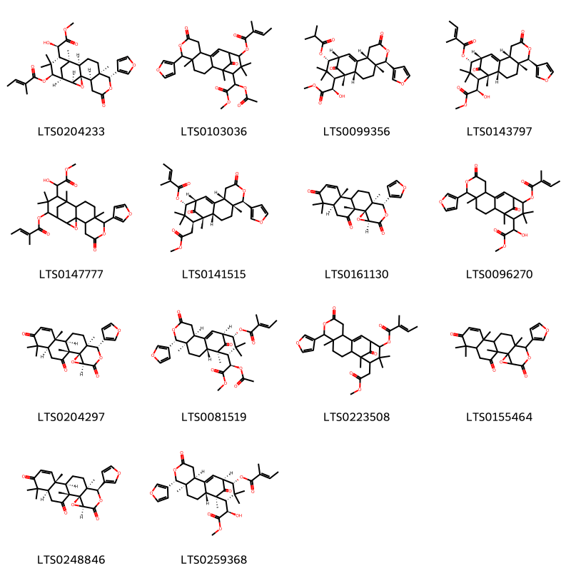{ width=100% }
    <figcaption>Hình ảnh cấu trúc hóa học của 14 hoạt chất thuộc nhóm Naphthopyrans gồm ['(1r,2s,4s,5r,9r,10r,13r,14s,15r,17r)-9-(furan-3-yl)-15-[(1r)-1-hydroxy-2-methoxy-2-oxoethyl]-10,14,16,16-tetramethyl-7-oxo-3,8-dioxapentacyclo[12.3.1.0²,⁴.0⁴,¹³.0⁵,¹⁰]octadecan-17-yl (2e)-2-methylbut-2-enoate (LTS0204233)', '16-[1-(acetyloxy)-2-methoxy-2-oxoethyl]-6-(furan-3-yl)-1,5,15,15-tetramethyl-8,17-dioxo-7-oxatetracyclo[11.3.1.0²,¹¹.0⁵,¹⁰]heptadec-11-en-14-yl 2-methylbut-2-enoate (LTS0103036)', '(1r,2s,5r,6r,10s,13s,14r,16s)-6-(furan-3-yl)-16-[(1r)-1-hydroxy-2-methoxy-2-oxoethyl]-1,5,15,15-tetramethyl-8,17-dioxo-7-oxatetracyclo[11.3.1.0²,¹¹.0⁵,¹⁰]heptadec-11-en-14-yl 2-methylpropanoate (LTS0099356)', '(1r,2s,5r,6r,10s,13s,14r,16s)-6-(furan-3-yl)-16-[(1r)-1-hydroxy-2-methoxy-2-oxoethyl]-1,5,15,15-tetramethyl-8,17-dioxo-7-oxatetracyclo[11.3.1.0²,¹¹.0⁵,¹⁰]heptadec-11-en-14-yl (2e)-2-methylbut-2-enoate (LTS0143797)', '9-(furan-3-yl)-15-(1-hydroxy-2-methoxy-2-oxoethyl)-10,14,16,16-tetramethyl-7-oxo-3,8-dioxapentacyclo[12.3.1.0²,⁴.0⁴,¹³.0⁵,¹⁰]octadecan-17-yl 2-methylbut-2-enoate (LTS0147777)', '(1r,2s,5r,6r,10s,13s,14r,16s)-6-(furan-3-yl)-16-(2-methoxy-2-oxoethyl)-1,5,15,15-tetramethyl-8,17-dioxo-7-oxatetracyclo[11.3.1.0²,¹¹.0⁵,¹⁰]heptadec-11-en-14-yl (2e)-2-methylbut-2-enoate (LTS0141515)', '(1r,2r,4s,7s,8s,12s,17r)-7-(furan-3-yl)-1,8,12,16,16-pentamethyl-3,6-dioxapentacyclo[9.8.0.0²,⁴.0²,⁸.0¹²,¹⁷]nonadec-13-ene-5,15,19-trione (LTS0161130)', '6-(furan-3-yl)-16-(1-hydroxy-2-methoxy-2-oxoethyl)-1,5,15,15-tetramethyl-8,17-dioxo-7-oxatetracyclo[11.3.1.0²,¹¹.0⁵,¹⁰]heptadec-11-en-14-yl 2-methylbut-2-enoate (LTS0096270)', '(1r,2r,4s,7s,8s,11r,12s,17r)-7-(furan-3-yl)-1,8,12,16,16-pentamethyl-3,6-dioxapentacyclo[9.8.0.0²,⁴.0²,⁸.0¹²,¹⁷]nonadec-13-ene-5,15,19-trione (LTS0204297)', '(1r,2r,5r,6r,10s,13s,14s,16s)-16-[(1r)-1-(acetyloxy)-2-methoxy-2-oxoethyl]-6-(furan-3-yl)-1,5,15,15-tetramethyl-8,17-dioxo-7-oxatetracyclo[11.3.1.0²,¹¹.0⁵,¹⁰]heptadec-11-en-14-yl (2e)-2-methylbut-2-enoate (LTS0081519)', '6-(furan-3-yl)-16-(2-methoxy-2-oxoethyl)-1,5,15,15-tetramethyl-8,17-dioxo-7-oxatetracyclo[11.3.1.0²,¹¹.0⁵,¹⁰]heptadec-11-en-14-yl 2-methylbut-2-enoate (LTS0223508)', '7-(furan-3-yl)-1,8,12,16,16-pentamethyl-3,6-dioxapentacyclo[9.8.0.0²,⁴.0²,⁸.0¹²,¹⁷]nonadec-13-ene-5,15,19-trione (LTS0155464)', '(1r,2r,4s,7r,8s,11r,12s,17r)-7-(furan-3-yl)-1,8,12,16,16-pentamethyl-3,6-dioxapentacyclo[9.8.0.0²,⁴.0²,⁸.0¹²,¹⁷]nonadec-13-ene-5,15,19-trione (LTS0248846)', '(1r,2r,5r,6r,10s,13s,14s,16s)-6-(furan-3-yl)-16-[(1r)-1-hydroxy-2-methoxy-2-oxoethyl]-1,5,15,15-tetramethyl-8,17-dioxo-7-oxatetracyclo[11.3.1.0²,¹¹.0⁵,¹⁰]heptadec-11-en-14-yl (2e)-2-methylbut-2-enoate (LTS0259368)'].</figcaption>
</figure>
#### Nhóm Prenol lipids
<figure markdown="span">
    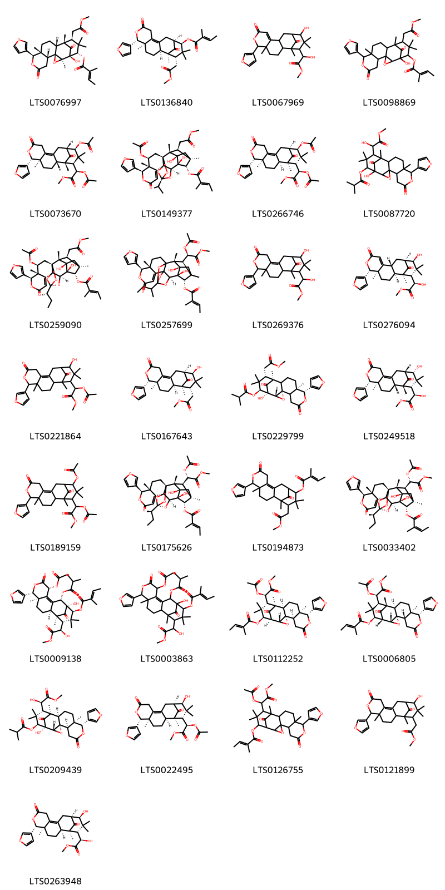{ width=100% }
    <figcaption>Hình ảnh cấu trúc hóa học của 29 hoạt chất thuộc nhóm Prenol lipids gồm ['ruageanin b (LTS0076997)', '(1r,2s,5r,6r,13s,14r,16s)-6-(furan-3-yl)-16-(2-methoxy-2-oxoethyl)-1,5,15,15-tetramethyl-8,17-dioxo-7-oxatetracyclo[11.3.1.0²,¹¹.0⁵,¹⁰]heptadec-10-en-14-yl (2e)-2-methylbut-2-enoate (LTS0136840)', 'methyl 2-[6-(furan-3-yl)-14-hydroxy-1,5,15,15-tetramethyl-8,17-dioxo-7-oxatetracyclo[11.3.1.0²,¹¹.0⁵,¹⁰]heptadec-9-en-16-yl]-2-hydroxyacetate (LTS0067969)', '9-(furan-3-yl)-1-hydroxy-15-(2-methoxy-2-oxoethyl)-10,14,16,16-tetramethyl-7,18-dioxo-3,8-dioxapentacyclo[12.3.1.0²,⁴.0⁴,¹³.0⁵,¹⁰]octadecan-17-yl 2-methylbut-2-enoate (LTS0098869)', 'methyl (2r)-2-(acetyloxy)-2-[(1s,2r,5r,6r,13r,14r,16r)-14-(acetyloxy)-6-(furan-3-yl)-1,5,15,15-tetramethyl-8,17-dioxo-7-oxatetracyclo[11.3.1.0²,¹¹.0⁵,¹⁰]heptadec-10-en-16-yl]acetate (LTS0073670)', '(1s,3s,4s,5s,10r,12s,14r,15s,16r,18r,19s,20r,22s)-3-(acetyloxy)-5-(furan-3-yl)-15,16-dihydroxy-12-isopropyl-19-(2-methoxy-2-oxoethyl)-4,18,20-trimethyl-7-oxo-6,11,13,21-tetraoxaheptacyclo[10.8.1.1¹⁵,¹⁸.0¹,¹⁰.0⁴,⁹.0¹⁰,¹⁴.0¹⁶,²⁰]docos-8-en-22-yl (2e)-2-methylbut-2-enoate (LTS0149377)', 'methyl (2r)-2-(acetyloxy)-2-[(1r,2s,5r,6r,13s,14r,16s)-14-(acetyloxy)-6-(furan-3-yl)-1,5,15,15-tetramethyl-8,17-dioxo-7-oxatetracyclo[11.3.1.0²,¹¹.0⁵,¹⁰]heptadec-10-en-16-yl]acetate (LTS0266746)', '9-(furan-3-yl)-1-hydroxy-15-(1-hydroxy-2-methoxy-2-oxoethyl)-10,14,16,16-tetramethyl-7,18-dioxo-3,8-dioxapentacyclo[12.3.1.0²,⁴.0⁴,¹³.0⁵,¹⁰]octadecan-17-yl 2-methylpropanoate (LTS0087720)', '(1s,3s,4s,5s,10r,12s,14r,15s,16r,18r,19s,20r,22s)-3-(acetyloxy)-12-[(2s)-butan-2-yl]-5-(furan-3-yl)-15,16-dihydroxy-19-(2-methoxy-2-oxoethyl)-4,18,20-trimethyl-7-oxo-6,11,13,21-tetraoxaheptacyclo[10.8.1.1¹⁵,¹⁸.0¹,¹⁰.0⁴,⁹.0¹⁰,¹⁴.0¹⁶,²⁰]docos-8-en-22-yl (2e)-2-methylbut-2-enoate (LTS0259090)', '(4r,5r,14r,15s,16r,19s,20r,22s)-19-[(1r)-1-(acetyloxy)-2-methoxy-2-oxoethyl]-5-(furan-3-yl)-15,16-dihydroxy-4,18,20-trimethyl-7-oxo-12-(sec-butyl)-6,11,13,21-tetraoxaheptacyclo[10.8.1.1¹⁵,¹⁸.0¹,¹⁰.0⁴,⁹.0¹⁰,¹⁴.0¹⁶,²⁰]docos-8-en-22-yl (2e)-2-methylbut-2-enoate (LTS0257699)', 'methyl 2-[6-(furan-3-yl)-14-hydroxy-1,5,15,15-tetramethyl-8,17-dioxo-7-oxatetracyclo[11.3.1.0²,¹¹.0⁵,¹⁰]heptadec-10-en-16-yl]-2-hydroxyacetate (LTS0269376)', 'methyl (2r)-2-[(1r,2s,5r,6r,11r,13s,14r,16s)-6-(furan-3-yl)-14-hydroxy-1,5,15,15-tetramethyl-8,17-dioxo-7-oxatetracyclo[11.3.1.0²,¹¹.0⁵,¹⁰]heptadec-9-en-16-yl]-2-hydroxyacetate (LTS0276094)', 'methyl 2-(acetyloxy)-2-[6-(furan-3-yl)-14-hydroxy-1,5,15,15-tetramethyl-8,17-dioxo-7-oxatetracyclo[11.3.1.0²,¹¹.0⁵,¹⁰]heptadec-10-en-16-yl]acetate (LTS0221864)', 'proceranolide (LTS0167643)', '(1s,2r,4s,9r,10r,14s,15s,17s)-9-(furan-3-yl)-1-hydroxy-15-(2-methoxy-2-oxoethyl)-10,14,16,16-tetramethyl-7,18-dioxo-3,8-dioxapentacyclo[12.3.1.0²,⁴.0⁴,¹³.0⁵,¹⁰]octadecan-17-yl 2-methylpropanoate (LTS0229799)', 'methyl (2r)-2-[(1s,2r,5r,6r,13r,14s,16s)-6-(furan-3-yl)-14-hydroxy-1,5,15,15-tetramethyl-8,17-dioxo-7-oxatetracyclo[11.3.1.0²,¹¹.0⁵,¹⁰]heptadec-10-en-16-yl]-2-hydroxyacetate (LTS0249518)', 'methyl 2-(acetyloxy)-2-[14-(acetyloxy)-6-(furan-3-yl)-1,5,15,15-tetramethyl-8,17-dioxo-7-oxatetracyclo[11.3.1.0²,¹¹.0⁵,¹⁰]heptadec-10-en-16-yl]acetate (LTS0189159)', '(1s,4r,5r,10r,12s,14r,15s,16r,18r,19s,20r,22s)-19-[(1s)-1-(acetyloxy)-2-methoxy-2-oxoethyl]-12-[(2r)-butan-2-yl]-5-(furan-3-yl)-15,16-dihydroxy-4,18,20-trimethyl-7-oxo-6,11,13,21-tetraoxaheptacyclo[10.8.1.1¹⁵,¹⁸.0¹,¹⁰.0⁴,⁹.0¹⁰,¹⁴.0¹⁶,²⁰]docos-8-en-22-yl (2e)-2-methylbut-2-enoate (LTS0175626)', '6-(furan-3-yl)-16-(2-methoxy-2-oxoethyl)-1,5,15,15-tetramethyl-8,17-dioxo-7-oxatetracyclo[11.3.1.0²,¹¹.0⁵,¹⁰]heptadec-10-en-14-yl 2-methylbut-2-enoate (LTS0194873)', '(1s,4r,5r,10r,12s,14r,15s,16r,18r,19s,20r,22s)-19-[(1s)-1-(acetyloxy)-2-methoxy-2-oxoethyl]-12-[(2r)-butan-2-yl]-5-(furan-3-yl)-15,16-dihydroxy-4,18,20-trimethyl-7-oxo-6,11,13,21-tetraoxaheptacyclo[10.8.1.1¹⁵,¹⁸.0¹,¹⁰.0⁴,⁹.0¹⁰,¹⁴.0¹⁶,²⁰]docos-8-en-22-yl (2z)-2-methylbut-2-enoate (LTS0033402)', '(1r,2s,5r,6r,9r,12s,13s,14s,16s)-9-(acetyloxy)-6-(furan-3-yl)-13-hydroxy-16-[(1r)-1-hydroxy-2-methoxy-2-oxoethyl]-1,5,15,15-tetramethyl-12-[(2-methylpropanoyl)oxy]-8,17-dioxo-7-oxatetracyclo[11.3.1.0²,¹¹.0⁵,¹⁰]heptadec-10-en-14-yl (2e)-2-methylbut-2-enoate (LTS0009138)', '9-(acetyloxy)-6-(furan-3-yl)-13-hydroxy-16-(1-hydroxy-2-methoxy-2-oxoethyl)-1,5,15,15-tetramethyl-12-[(2-methylpropanoyl)oxy]-8,17-dioxo-7-oxatetracyclo[11.3.1.0²,¹¹.0⁵,¹⁰]heptadec-10-en-14-yl 2-methylbut-2-enoate (LTS0003863)', '(1r,2r,4s,5r,9r,10r,13r,14s,15s,17r)-15-[(1r)-1-(acetyloxy)-2-methoxy-2-oxoethyl]-9-(furan-3-yl)-10,14,16,16-tetramethyl-7,18-dioxo-3,8-dioxapentacyclo[12.3.1.0²,⁴.0⁴,¹³.0⁵,¹⁰]octadecan-17-yl (2e)-2-methylbut-2-enoate (LTS0112252)', '(1s,2r,4s,5s,9r,10r,13r,14r,15r,17r)-15-[(1r)-1-(acetyloxy)-2-methoxy-2-oxoethyl]-9-(furan-3-yl)-10,14,16,16-tetramethyl-7,18-dioxo-3,8-dioxapentacyclo[12.3.1.0²,⁴.0⁴,¹³.0⁵,¹⁰]octadecan-17-yl (2e)-2-methylbut-2-enoate (LTS0006805)', '(1s,2r,4s,5r,9r,10r,13r,14s,15s,17s)-9-(furan-3-yl)-1-hydroxy-15-[(1r)-1-hydroxy-2-methoxy-2-oxoethyl]-10,14,16,16-tetramethyl-7,18-dioxo-3,8-dioxapentacyclo[12.3.1.0²,⁴.0⁴,¹³.0⁵,¹⁰]octadecan-17-yl 2-methylpropanoate (LTS0209439)', 'methyl (2r)-2-(acetyloxy)-2-[(1r,2s,5r,6r,13s,14r,16s)-6-(furan-3-yl)-14-hydroxy-1,5,15,15-tetramethyl-8,17-dioxo-7-oxatetracyclo[11.3.1.0²,¹¹.0⁵,¹⁰]heptadec-10-en-16-yl]acetate (LTS0022495)', '15-[1-(acetyloxy)-2-methoxy-2-oxoethyl]-9-(furan-3-yl)-10,14,16,16-tetramethyl-7,18-dioxo-3,8-dioxapentacyclo[12.3.1.0²,⁴.0⁴,¹³.0⁵,¹⁰]octadecan-17-yl 2-methylbut-2-enoate (LTS0126755)', 'methyl 2-[6-(furan-3-yl)-14-hydroxy-1,5,15,15-tetramethyl-8,17-dioxo-7-oxatetracyclo[11.3.1.0²,¹¹.0⁵,¹⁰]heptadec-10-en-16-yl]acetate (LTS0121899)', 'methyl (2r)-2-[(1r,2s,5r,6r,13s,14r,16s)-6-(furan-3-yl)-14-hydroxy-1,5,15,15-tetramethyl-8,17-dioxo-7-oxatetracyclo[11.3.1.0²,¹¹.0⁵,¹⁰]heptadec-10-en-16-yl]-2-hydroxyacetate (LTS0263948)'].</figcaption>
</figure>
#### Nhóm Steroids and steroid derivatives
<figure markdown="span">
    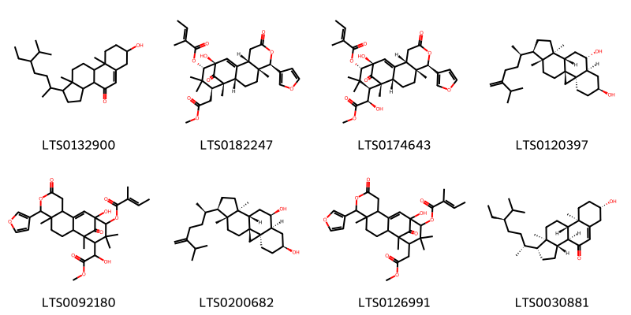{ width=100% }
    <figcaption>Hình ảnh cấu trúc hóa học của 8 hoạt chất thuộc nhóm Steroids and steroid derivatives gồm ['1-(5-ethyl-6-methylheptan-2-yl)-7-hydroxy-9a,11a-dimethyl-1h,2h,3h,3ah,3bh,6h,7h,8h,9h,9bh,10h,11h-cyclopenta[a]phenanthren-4-one (LTS0132900)', '(1r,2s,5r,6r,10s,13r,14s,16s)-6-(furan-3-yl)-13-hydroxy-16-(2-methoxy-2-oxoethyl)-1,5,15,15-tetramethyl-8,17-dioxo-7-oxatetracyclo[11.3.1.0²,¹¹.0⁵,¹⁰]heptadec-11-en-14-yl (2e)-2-methylbut-2-enoate (LTS0182247)', '(1r,2s,5r,6r,10s,13r,14s,16s)-6-(furan-3-yl)-13-hydroxy-16-[(1r)-1-hydroxy-2-methoxy-2-oxoethyl]-1,5,15,15-tetramethyl-8,17-dioxo-7-oxatetracyclo[11.3.1.0²,¹¹.0⁵,¹⁰]heptadec-11-en-14-yl (2e)-2-methylbut-2-enoate (LTS0174643)', '(1s,3r,6s,8s,9s,11s,12s,15r,16r)-12,16-dimethyl-15-[(2r)-6-methyl-5-methylideneheptan-2-yl]pentacyclo[9.7.0.0¹,³.0³,⁸.0¹²,¹⁶]octadecane-6,9-diol (LTS0120397)', '6-(furan-3-yl)-13-hydroxy-16-(1-hydroxy-2-methoxy-2-oxoethyl)-1,5,15,15-tetramethyl-8,17-dioxo-7-oxatetracyclo[11.3.1.0²,¹¹.0⁵,¹⁰]heptadec-11-en-14-yl 2-methylbut-2-enoate (LTS0092180)', '(1s,3r,6s,8s,9r,11s,12s,15r,16r)-12,16-dimethyl-15-[(2r)-6-methyl-5-methylideneheptan-2-yl]pentacyclo[9.7.0.0¹,³.0³,⁸.0¹²,¹⁶]octadecane-6,9-diol (LTS0200682)', '6-(furan-3-yl)-13-hydroxy-16-(2-methoxy-2-oxoethyl)-1,5,15,15-tetramethyl-8,17-dioxo-7-oxatetracyclo[11.3.1.0²,¹¹.0⁵,¹⁰]heptadec-11-en-14-yl 2-methylbut-2-enoate (LTS0126991)', '(1r,3as,3bs,7s,9ar,9bs,11ar)-1-[(2r,5r)-5-ethyl-6-methylheptan-2-yl]-7-hydroxy-9a,11a-dimethyl-1h,2h,3h,3ah,3bh,6h,7h,8h,9h,9bh,10h,11h-cyclopenta[a]phenanthren-4-one (LTS0030881)'].</figcaption>
</figure>

---

### Dược dân tộc học

Danh sách các quốc gia có sử dụng *Swietenia macrophylla* trong điều trị các bệnh. 

| Country   | Disease                                             | Bệnh                                                                                                                                                                                                |
|:----------|:----------------------------------------------------|:----------------------------------------------------------------------------------------------------------------------------------------------------------------------------------------------------|
| Elsewhere | nan, Tonic, Soap                                    | MYMEMORY WARNING: YOU USED ALL AVAILABLE FREE TRANSLATIONS FOR TODAY. NEXT AVAILABLE IN  06 HOURS 43 MINUTES 54 SECONDS VISIT HTTPS://MYMEMORY.TRANSLATED.NET/DOC/USAGELIMITS.PHP TO TRANSLATE MORE |
| Mexico    | Astringent, Astringent, Soap, Styptic, Tonic, Tonic | MYMEMORY WARNING: YOU USED ALL AVAILABLE FREE TRANSLATIONS FOR TODAY. NEXT AVAILABLE IN  06 HOURS 43 MINUTES 51 SECONDS VISIT HTTPS://MYMEMORY.TRANSLATED.NET/DOC/USAGELIMITS.PHP TO TRANSLATE MORE |

---

---
## Swietenia mahagoni
### Thông tin về thực vật

!!! info "Phân loại thực vật của *Swietenia mahagoni* từ GIBF:"
    - **Kingdom:** Plantae
    - **Phylum:** Tracheophyta
    - **Order:** Sapindales
    - **Family:** Meliaceae
    - **Genus:** Swietenia
    - **Species:** *Swietenia mahagoni*

 

| Label (VI)   | Label (EN)   | Scientific Name    | Descriptions (VI)   | Descriptions (EN)   | Also Known As (VI)                                                              | Also Known As (EN)                              |
|:-------------|:-------------|:-------------------|:--------------------|:--------------------|:--------------------------------------------------------------------------------|:------------------------------------------------|
| N/A          | N/A          | Swietenia mahagoni | loài thực vật       | species of plant    | ['Xà cừ Tây Ấn', 'Swietenia mahagoni', 'Dái ngựa Tây Ấn', 'Swietenia mahogani'] | ['Swietenia mahogani', 'Small-leaved mahogany'] |

#### Phân bố trên thế giới

**Từ CSDL GIBF** Virgin Islands (U.S.), Puerto Rico, Barbados, Turks and Caicos Islands, Martinique, Haiti, Bahamas, Montserrat, Saint Lucia, India, Jamaica, Indonesia, United States of America, Cuba, Dominican Republic, Antigua and Barbuda, Cayman Islands

#### Phân bố tại Việt Nam

**Từ CSDL GIBF**: Không có ghi nhận ở Việt Nam

---
### Thành phần hóa học
        
- Theo cơ sở dữ liệu lotus: Từ loài *Swietenia mahagoni* đã phân lập và xác định được 225 hoạt chất thuộc về các nhóm Fatty Acyls, Flavonoids, Prenol lipids, Steroids and steroid derivatives, Pyrans, Organooxygen compounds, Naphthopyrans, Dioxepanes, Carboxylic acids and derivatives. 

|    | chemicalTaxonomyClassyfireClass   |   smiles_count |
|---:|:----------------------------------|---------------:|
|  0 | Carboxylic acids and derivatives  |              9 |
|  1 | Dioxepanes                        |              2 |
|  2 | Fatty Acyls                       |             13 |
|  3 | Flavonoids                        |              2 |
|  4 | Naphthopyrans                     |             36 |
|  5 | Organooxygen compounds            |              1 |
|  6 | Prenol lipids                     |            144 |
|  7 | Pyrans                            |              2 |
|  8 | Steroids and steroid derivatives  |             16 |

#### Nhóm Carboxylic acids and derivatives
<figure markdown="span">
    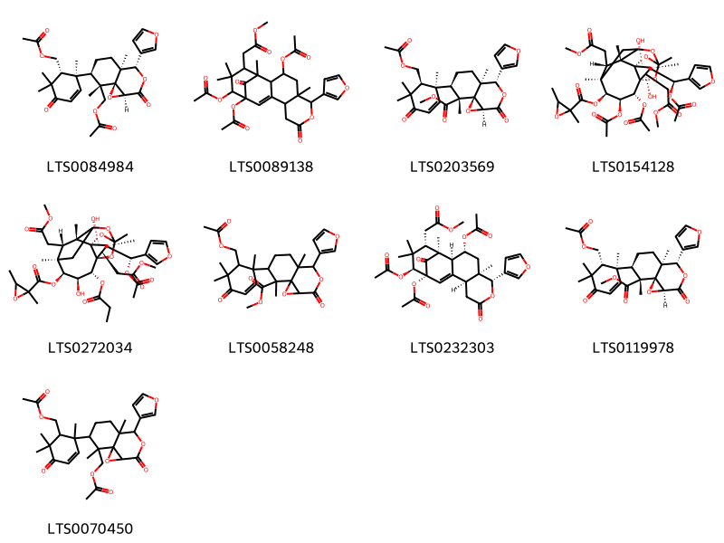{ width=100% }
    <figcaption>Hình ảnh cấu trúc hóa học của 9 hoạt chất thuộc nhóm Carboxylic acids and derivatives gồm ['[(1s,3s,6s,7s,10r,11s)-10-[(1r,6r)-6-[(acetyloxy)methyl]-1,5,5-trimethyl-4-oxocyclohex-2-en-1-yl]-6-(furan-3-yl)-7,11-dimethyl-4-oxo-2,5-dioxatricyclo[5.4.0.0¹,³]undecan-11-yl]methyl acetate (LTS0084984)', 'methyl 2-[3,13,14-tris(acetyloxy)-6-(furan-3-yl)-1,5,15,15-tetramethyl-8,17-dioxo-7-oxatetracyclo[11.3.1.0²,¹¹.0⁵,¹⁰]heptadec-11-en-16-yl]acetate (LTS0089138)', 'methyl (1r,3s,6s,7s,10r,11r)-10-[(1r,6s)-6-[(acetyloxy)methyl]-1,5,5-trimethyl-4-oxocyclohex-2-en-1-yl]-6-(furan-3-yl)-7,11-dimethyl-4-oxo-2,5-dioxatricyclo[5.4.0.0¹,³]undecane-11-carboxylate (LTS0203569)', '(1s,2r,3s,4s,5r,6s,7r,12r,13r,15s,16s)-2,3-bis(acetyloxy)-15-[(r)-(acetyloxy)(furan-3-yl)methyl]-13,16-dihydroxy-6,16-bis(2-methoxy-2-oxoethyl)-5,7,10,15-tetramethyl-9,11,17-trioxapentacyclo[8.6.1.1⁵,⁸.0¹,¹².0⁷,¹²]octadecan-4-yl 2,3-dimethyloxirane-2-carboxylate (LTS0154128)', '(1s,2r,3s,4s,5r,6s,7r,12r,13r,15r,16r)-15-[(r)-(acetyloxy)(furan-3-yl)methyl]-3,13-dihydroxy-6,16-bis(2-methoxy-2-oxoethyl)-5,7,10,15-tetramethyl-2-(propanoyloxy)-9,11,17-trioxapentacyclo[8.6.1.1⁵,⁸.0¹,¹².0⁷,¹²]octadecan-4-yl 2,3-dimethyloxirane-2-carboxylate (LTS0272034)', 'methyl 10-{6-[(acetyloxy)methyl]-1,5,5-trimethyl-4-oxocyclohex-2-en-1-yl}-6-(furan-3-yl)-7,11-dimethyl-4-oxo-2,5-dioxatricyclo[5.4.0.0¹,³]undecane-11-carboxylate (LTS0058248)', 'methyl 2-[(1s,2s,3r,5r,6r,10s,13r,14s,16s)-3,13,14-tris(acetyloxy)-6-(furan-3-yl)-1,5,15,15-tetramethyl-8,17-dioxo-7-oxatetracyclo[11.3.1.0²,¹¹.0⁵,¹⁰]heptadec-11-en-16-yl]acetate (LTS0232303)', 'methyl (1r,3s,6s,7s,10r,11r)-10-[(1r,6r)-6-[(acetyloxy)methyl]-1,5,5-trimethyl-4-oxocyclohex-2-en-1-yl]-6-(furan-3-yl)-7,11-dimethyl-4-oxo-2,5-dioxatricyclo[5.4.0.0¹,³]undecane-11-carboxylate (LTS0119978)', '(10-{6-[(acetyloxy)methyl]-1,5,5-trimethyl-4-oxocyclohex-2-en-1-yl}-6-(furan-3-yl)-7,11-dimethyl-4-oxo-2,5-dioxatricyclo[5.4.0.0¹,³]undecan-11-yl)methyl acetate (LTS0070450)'].</figcaption>
</figure>
#### Nhóm Dioxepanes
<figure markdown="span">
    { width=100% }
    <figcaption>Hình ảnh cấu trúc hóa học của 2 hoạt chất thuộc nhóm Dioxepanes gồm ['methyl (1r,3s,6s,7s,10r,11r)-6-(furan-3-yl)-10-[(1r,6r)-6-(hydroxymethyl)-1,5,5-trimethyl-4-oxocyclohex-2-en-1-yl]-7,11-dimethyl-4-oxo-2,5-dioxatricyclo[5.4.0.0¹,³]undecane-11-carboxylate (LTS0122692)', 'methyl 6-(furan-3-yl)-10-[6-(hydroxymethyl)-1,5,5-trimethyl-4-oxocyclohex-2-en-1-yl]-7,11-dimethyl-4-oxo-2,5-dioxatricyclo[5.4.0.0¹,³]undecane-11-carboxylate (LTS0149345)'].</figcaption>
</figure>
#### Nhóm Fatty Acyls
<figure markdown="span">
    { width=100% }
    <figcaption>Hình ảnh cấu trúc hóa học của 13 hoạt chất thuộc nhóm Fatty Acyls gồm ['(5r,6s,9r,17s)-17-[(s)-(acetyloxy)(furan-3-yl)methyl]-9-ethyl-3,19-dihydroxy-9-methoxy-16,21-bis(2-methoxy-2-oxoethyl)-2,5,14,17-tetramethyl-8,10,13,15,20-pentaoxaheptacyclo[12.5.1.1²,⁵.0¹,¹².0³,⁷.0⁷,¹¹.0¹²,¹⁶]henicosan-6-yl (2z)-2-methylbut-2-enoate (LTS0130463)', '17-[(acetyloxy)(furan-3-yl)methyl]-3,19-dihydroxy-9-methoxy-16,21-bis(2-methoxy-2-oxoethyl)-2,5,9,14,17-pentamethyl-8,10,13,15,20-pentaoxaheptacyclo[12.5.1.1²,⁵.0¹,¹².0³,⁷.0⁷,¹¹.0¹²,¹⁶]henicosan-6-yl 2-methylbut-2-enoate (LTS0195126)', '17-[(acetyloxy)(furan-3-yl)methyl]-9-ethyl-3,19-dihydroxy-9-methoxy-16,21-bis(2-methoxy-2-oxoethyl)-2,5,14,17-tetramethyl-8,10,13,15,20-pentaoxaheptacyclo[12.5.1.1²,⁵.0¹,¹².0³,⁷.0⁷,¹¹.0¹²,¹⁶]henicosan-6-yl 2-methylbut-2-enoate (LTS0222921)', '(1r,2r,3r,5r,6s,7s,9r,11r,12s,14r,16s,17s,19r,21s)-17-[(s)-(acetyloxy)(furan-3-yl)methyl]-3,19-dihydroxy-9-methoxy-16,21-bis(2-methoxy-2-oxoethyl)-2,5,9,14,17-pentamethyl-8,10,13,15,20-pentaoxaheptacyclo[12.5.1.1²,⁵.0¹,¹².0³,⁷.0⁷,¹¹.0¹²,¹⁶]henicosan-6-yl (2s,3r)-2,3-dimethyloxirane-2-carboxylate (LTS0259432)', '2,3-bis(acetyloxy)-15-[(acetyloxy)(furan-3-yl)methyl]-13,16-dihydroxy-6,16-bis(2-methoxy-2-oxoethyl)-5,7,10,15-tetramethyl-9,11,17-trioxahexacyclo[8.6.1.1⁵,⁸.0¹,¹².0³,⁸.0⁷,¹²]octadecan-4-yl 2,3-dimethyloxirane-2-carboxylate (LTS0231911)', '(1r,2r,3r,6s,7s,9r,11r,12s,16s,17s,19r,21s)-17-[(s)-(acetyloxy)(furan-3-yl)methyl]-3,19-dihydroxy-9-methoxy-16,21-bis(2-methoxy-2-oxoethyl)-2,5,9,14,17-pentamethyl-8,10,13,15,20-pentaoxaheptacyclo[12.5.1.1²,⁵.0¹,¹².0³,⁷.0⁷,¹¹.0¹²,¹⁶]henicosan-6-yl 2,3-dimethyloxirane-2-carboxylate (LTS0228356)', '(1s,2r,3s,4s,5r,6s,7r,8r,10s,12r,13r,15s,16s)-2,3-bis(acetyloxy)-15-[(s)-(acetyloxy)(furan-3-yl)methyl]-13,16-dihydroxy-6,16-bis(2-methoxy-2-oxoethyl)-5,7,10,15-tetramethyl-9,11,17-trioxahexacyclo[8.6.1.1⁵,⁸.0¹,¹².0³,⁸.0⁷,¹²]octadecan-4-yl (2s,3r)-2,3-dimethyloxirane-2-carboxylate (LTS0241636)', '(1r,2r,3r,5r,6s,7s,9r,11r,12s,14r,16s,17s,19r,21s)-17-[(s)-(acetyloxy)(furan-3-yl)methyl]-9-ethyl-3,19-dihydroxy-9-methoxy-16,21-bis(2-methoxy-2-oxoethyl)-2,5,14,17-tetramethyl-8,10,13,15,20-pentaoxaheptacyclo[12.5.1.1²,⁵.0¹,¹².0³,⁷.0⁷,¹¹.0¹²,¹⁶]henicosan-6-yl (2e)-2-methylbut-2-enoate (LTS0203558)', '(1r,2r,3s,4s,5r,6s,7r,8r,10r,12r,13r,15r,16r)-15-[(r)-(acetyloxy)(furan-3-yl)methyl]-3,13-dihydroxy-6,16-bis(2-methoxy-2-oxoethyl)-5,7,10,15-tetramethyl-2-(propanoyloxy)-9,11,17-trioxahexacyclo[8.6.1.1⁵,⁸.0¹,¹².0³,⁸.0⁷,¹²]octadecan-4-yl (2s,3r)-2,3-dimethyloxirane-2-carboxylate (LTS0067286)', '(1r,2r,3r,5r,6s,7s,9r,11r,12s,14r,16s,17s,19r,21s)-17-[(s)-(acetyloxy)(furan-3-yl)methyl]-3,19-dihydroxy-9-methoxy-16,21-bis(2-methoxy-2-oxoethyl)-2,5,9,14,17-pentamethyl-8,10,13,15,20-pentaoxaheptacyclo[12.5.1.1²,⁵.0¹,¹².0³,⁷.0⁷,¹¹.0¹²,¹⁶]henicosan-6-yl (2e)-2-methylbut-2-enoate (LTS0062603)', '17-[(acetyloxy)(furan-3-yl)methyl]-3,19-dihydroxy-9-methoxy-16,21-bis(2-methoxy-2-oxoethyl)-2,5,9,14,17-pentamethyl-8,10,13,15,20-pentaoxaheptacyclo[12.5.1.1²,⁵.0¹,¹².0³,⁷.0⁷,¹¹.0¹²,¹⁶]henicosan-6-yl 2,3-dimethyloxirane-2-carboxylate (LTS0058478)', '(5r,6s,9r,17s)-17-[(s)-(acetyloxy)(furan-3-yl)methyl]-3,19-dihydroxy-9-methoxy-16,21-bis(2-methoxy-2-oxoethyl)-2,5,9,14,17-pentamethyl-8,10,13,15,20-pentaoxaheptacyclo[12.5.1.1²,⁵.0¹,¹².0³,⁷.0⁷,¹¹.0¹²,¹⁶]henicosan-6-yl (2z)-2-methylbut-2-enoate (LTS0245242)', '15-[(acetyloxy)(furan-3-yl)methyl]-3,13-dihydroxy-6,16-bis(2-methoxy-2-oxoethyl)-5,7,10,15-tetramethyl-2-(propanoyloxy)-9,11,17-trioxahexacyclo[8.6.1.1⁵,⁸.0¹,¹².0³,⁸.0⁷,¹²]octadecan-4-yl 2,3-dimethyloxirane-2-carboxylate (LTS0002944)'].</figcaption>
</figure>
#### Nhóm Flavonoids
<figure markdown="span">
    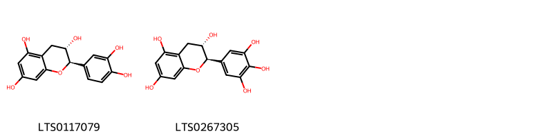{ width=100% }
    <figcaption>Hình ảnh cấu trúc hóa học của 2 hoạt chất thuộc nhóm Flavonoids gồm ['(+)-catechol (LTS0117079)', 'gallocatechol (LTS0267305)'].</figcaption>
</figure>
#### Nhóm Naphthopyrans
<figure markdown="span">
    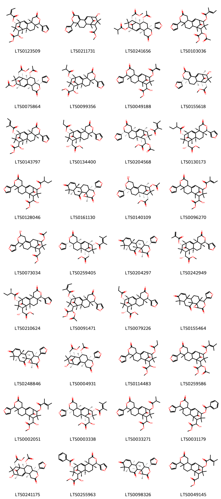{ width=100% }
    <figcaption>Hình ảnh cấu trúc hóa học của 36 hoạt chất thuộc nhóm Naphthopyrans gồm ['(1r,2s,5r,6r,10s,13s,14r,16s)-6-(furan-3-yl)-16-[(1r)-1-hydroxy-2-methoxy-2-oxoethyl]-1,5,15,15-tetramethyl-8,17-dioxo-7-oxatetracyclo[11.3.1.0²,¹¹.0⁵,¹⁰]heptadec-11-en-14-yl (2z)-2-methylbut-2-enoate (LTS0123509)', 'methyl 2-[6-(furan-3-yl)-14-hydroxy-1,5,15,15-tetramethyl-8,17-dioxo-7-oxatetracyclo[11.3.1.0²,¹¹.0⁵,¹⁰]heptadeca-9,11-dien-16-yl]acetate (LTS0211731)', '(1s,2s,3r,5r,6r,10s,13s,14r,16s)-3-(acetyloxy)-6-(furan-3-yl)-16-(2-methoxy-2-oxoethyl)-1,5,15,15-tetramethyl-8,17-dioxo-7-oxatetracyclo[11.3.1.0²,¹¹.0⁵,¹⁰]heptadec-11-en-14-yl 2-methylpropanoate (LTS0241656)', '16-[1-(acetyloxy)-2-methoxy-2-oxoethyl]-6-(furan-3-yl)-1,5,15,15-tetramethyl-8,17-dioxo-7-oxatetracyclo[11.3.1.0²,¹¹.0⁵,¹⁰]heptadec-11-en-14-yl 2-methylbut-2-enoate (LTS0103036)', 'methyl 2-[(1s,2s,3r,5r,6r,10s,13s,14r,16s)-3,14-bis(acetyloxy)-6-(furan-3-yl)-1,5,15,15-tetramethyl-8,17-dioxo-7-oxatetracyclo[11.3.1.0²,¹¹.0⁵,¹⁰]heptadec-11-en-16-yl]acetate (LTS0075864)', '(1r,2s,5r,6r,10s,13s,14r,16s)-6-(furan-3-yl)-16-[(1r)-1-hydroxy-2-methoxy-2-oxoethyl]-1,5,15,15-tetramethyl-8,17-dioxo-7-oxatetracyclo[11.3.1.0²,¹¹.0⁵,¹⁰]heptadec-11-en-14-yl 2-methylpropanoate (LTS0099356)', '6-(furan-3-yl)-16-(1-hydroxy-2-methoxy-2-oxoethyl)-1,5,15,15-tetramethyl-8,17-dioxo-7-oxatetracyclo[11.3.1.0²,¹¹.0⁵,¹⁰]heptadec-11-en-14-yl 2-methylprop-2-enoate (LTS0049188)', 'methyl 2-[(1r,2s,5r,6r,13s,14r,16s)-6-(furan-3-yl)-14-hydroxy-1,5,15,15-tetramethyl-8,17-dioxo-7-oxatetracyclo[11.3.1.0²,¹¹.0⁵,¹⁰]heptadeca-9,11-dien-16-yl]acetate (LTS0155618)', '(1r,2s,5r,6r,10s,13s,14r,16s)-6-(furan-3-yl)-16-[(1r)-1-hydroxy-2-methoxy-2-oxoethyl]-1,5,15,15-tetramethyl-8,17-dioxo-7-oxatetracyclo[11.3.1.0²,¹¹.0⁵,¹⁰]heptadec-11-en-14-yl (2e)-2-methylbut-2-enoate (LTS0143797)', '(1r,2s,5r,6r,10s,13s,14r,16s)-6-(furan-3-yl)-16-[(1r)-1-hydroxy-2-methoxy-2-oxoethyl]-1,5,15,15-tetramethyl-8,17-dioxo-7-oxatetracyclo[11.3.1.0²,¹¹.0⁵,¹⁰]heptadec-11-en-14-yl propanoate (LTS0134400)', '(1r,2r,5r,6r,10s,13s,14s,16s)-16-[(1r)-1-(acetyloxy)-2-methoxy-2-oxoethyl]-6-(furan-3-yl)-1,5,15,15-tetramethyl-8,17-dioxo-7-oxatetracyclo[11.3.1.0²,¹¹.0⁵,¹⁰]heptadec-11-en-14-yl 2,3-dimethylbut-2-enoate (LTS0204568)', '(1r,2s,5r,6r,10s,13s,14r,16s)-6-(furan-3-yl)-16-[(1r)-1-hydroxy-2-methoxy-2-oxoethyl]-1,5,15,15-tetramethyl-8,17-dioxo-7-oxatetracyclo[11.3.1.0²,¹¹.0⁵,¹⁰]heptadec-11-en-14-yl 2-methylbutanoate (LTS0130173)', '6-(furan-3-yl)-16-(1-hydroxy-2-methoxy-2-oxoethyl)-1,5,15,15-tetramethyl-8,17-dioxo-7-oxatetracyclo[11.3.1.0²,¹¹.0⁵,¹⁰]heptadec-11-en-14-yl 2-methylbutanoate (LTS0128046)', '(1r,2r,4s,7s,8s,12s,17r)-7-(furan-3-yl)-1,8,12,16,16-pentamethyl-3,6-dioxapentacyclo[9.8.0.0²,⁴.0²,⁸.0¹²,¹⁷]nonadec-13-ene-5,15,19-trione (LTS0161130)', 'methyl 2-[(1r,2s,5r,6r,8r,13s,14r,16s)-14-(acetyloxy)-6-(furan-3-yl)-8-hydroxy-1,5,15,15-tetramethyl-17-oxo-7-oxatetracyclo[11.3.1.0²,¹¹.0⁵,¹⁰]heptadec-10-en-16-yl]acetate (LTS0140109)', '6-(furan-3-yl)-16-(1-hydroxy-2-methoxy-2-oxoethyl)-1,5,15,15-tetramethyl-8,17-dioxo-7-oxatetracyclo[11.3.1.0²,¹¹.0⁵,¹⁰]heptadec-11-en-14-yl 2-methylbut-2-enoate (LTS0096270)', 'methyl 2-[14-(acetyloxy)-6-(furan-3-yl)-8-hydroxy-1,5,15,15-tetramethyl-17-oxo-7-oxatetracyclo[11.3.1.0²,¹¹.0⁵,¹⁰]heptadec-10-en-16-yl]acetate (LTS0073034)', '(1r,2r,5r,6r,10s,13s,14s,16s)-6-(furan-3-yl)-16-(2-methoxy-2-oxoethyl)-1,5,15,15-tetramethyl-8,17-dioxo-7-oxatetracyclo[11.3.1.0²,¹¹.0⁵,¹⁰]heptadec-11-en-14-yl 2,3-dimethylbut-2-enoate (LTS0259405)', '(1r,2r,4s,7s,8s,11r,12s,17r)-7-(furan-3-yl)-1,8,12,16,16-pentamethyl-3,6-dioxapentacyclo[9.8.0.0²,⁴.0²,⁸.0¹²,¹⁷]nonadec-13-ene-5,15,19-trione (LTS0204297)', '(1r,2s,5r,6r,10s,13s,14r,16s)-6-(furan-3-yl)-16-[(1r)-1-hydroxy-2-methoxy-2-oxoethyl]-1,5,15,15-tetramethyl-8,17-dioxo-7-oxatetracyclo[11.3.1.0²,¹¹.0⁵,¹⁰]heptadec-11-en-14-yl 2-methylprop-2-enoate (LTS0242949)', '(1r,2s,5r,6r,10s,13s,14r,16s)-6-(furan-3-yl)-16-[(1r)-1-hydroxy-2-methoxy-2-oxoethyl]-1,5,15,15-tetramethyl-8,17-dioxo-7-oxatetracyclo[11.3.1.0²,¹¹.0⁵,¹⁰]heptadec-11-en-14-yl (2r)-2-methylbutanoate (LTS0210624)', '(1r,2s,5r,6r,10s,13s,14r,16s)-16-[(1r)-1-(acetyloxy)-2-methoxy-2-oxoethyl]-6-(furan-3-yl)-1,5,15,15-tetramethyl-8,17-dioxo-7-oxatetracyclo[11.3.1.0²,¹¹.0⁵,¹⁰]heptadec-11-en-14-yl (2z)-2-methylbut-2-enoate (LTS0091471)', '(1r,5r,6r,10s,13s,14r,16s)-6-(furan-3-yl)-16-[(1r)-1-hydroxy-2-methoxy-2-oxoethyl]-1,5,15,15-tetramethyl-8,17-dioxo-7-oxatetracyclo[11.3.1.0²,¹¹.0⁵,¹⁰]heptadec-11-en-14-yl propanoate (LTS0079226)', '7-(furan-3-yl)-1,8,12,16,16-pentamethyl-3,6-dioxapentacyclo[9.8.0.0²,⁴.0²,⁸.0¹²,¹⁷]nonadec-13-ene-5,15,19-trione (LTS0155464)', '(1r,2r,4s,7r,8s,11r,12s,17r)-7-(furan-3-yl)-1,8,12,16,16-pentamethyl-3,6-dioxapentacyclo[9.8.0.0²,⁴.0²,⁸.0¹²,¹⁷]nonadec-13-ene-5,15,19-trione (LTS0248846)', 'methyl 2-[(1s,2s,3r,5r,6r,10s,13s,14r,16s)-3-(acetyloxy)-6-(furan-3-yl)-14-hydroxy-1,5,15,15-tetramethyl-8,17-dioxo-7-oxatetracyclo[11.3.1.0²,¹¹.0⁵,¹⁰]heptadec-11-en-16-yl]acetate (LTS0004931)', '6-(furan-3-yl)-16-(1-hydroxy-2-methoxy-2-oxoethyl)-1,5,15,15-tetramethyl-8,17-dioxo-7-oxatetracyclo[11.3.1.0²,¹¹.0⁵,¹⁰]heptadec-11-en-14-yl propanoate (LTS0114483)', '16-[1-(acetyloxy)-2-methoxy-2-oxoethyl]-6-(furan-3-yl)-1,5,15,15-tetramethyl-8,17-dioxo-7-oxatetracyclo[11.3.1.0²,¹¹.0⁵,¹⁰]heptadec-11-en-14-yl 2,3-dimethylbut-2-enoate (LTS0259586)', '6-(furan-3-yl)-16-(1-hydroxy-2-methoxy-2-oxoethyl)-1,5,15,15-tetramethyl-8,17-dioxo-7-oxatetracyclo[11.3.1.0²,¹¹.0⁵,¹⁰]heptadec-11-en-14-yl 2,3-dimethylbut-2-enoate (LTS0002051)', '(1r,2r,5r,6r,10s,13s,14s,16s)-6-(furan-3-yl)-16-[(1r)-1-hydroxy-2-methoxy-2-oxoethyl]-1,5,15,15-tetramethyl-8,17-dioxo-7-oxatetracyclo[11.3.1.0²,¹¹.0⁵,¹⁰]heptadec-11-en-14-yl 2,3-dimethylbut-2-enoate (LTS0003338)', '6-(furan-3-yl)-16-(1-hydroxy-2-methoxy-2-oxoethyl)-1,5,15,15-tetramethyl-8,17-dioxo-7-oxatetracyclo[11.3.1.0²,¹¹.0⁵,¹⁰]heptadec-11-en-14-yl 2-methylpropanoate (LTS0033271)', '6-(furan-3-yl)-16-(1-hydroxy-2-methoxy-2-oxoethyl)-1,5,15,15-tetramethyl-8,17-dioxo-7-oxatetracyclo[11.3.1.0²,¹¹.0⁵,¹⁰]heptadec-11-en-14-yl benzoate (LTS0031179)', 'methyl 2-[(2s,3r,5r,6r,10s,13s,14r,16s)-3-(acetyloxy)-6-(furan-3-yl)-14-hydroxy-1,5,15,15-tetramethyl-8,17-dioxo-7-oxatetracyclo[11.3.1.0²,¹¹.0⁵,¹⁰]heptadec-11-en-16-yl]acetate (LTS0241175)', '(1r,2s,5r,6r,10s,13s,14r,16s)-6-(furan-3-yl)-16-[(1r)-1-hydroxy-2-methoxy-2-oxoethyl]-1,5,15,15-tetramethyl-8,17-dioxo-7-oxatetracyclo[11.3.1.0²,¹¹.0⁵,¹⁰]heptadec-11-en-14-yl benzoate (LTS0255963)', '(1s,2r,4s,7s,8s,11r,12r,17r)-7-(furan-3-yl)-1,8,12,16,16-pentamethyl-3,6-dioxapentacyclo[9.8.0.0²,⁴.0²,⁸.0¹²,¹⁷]nonadec-13-ene-5,15,19-trione (LTS0098326)', '6-(furan-3-yl)-16-(2-methoxy-2-oxoethyl)-1,5,15,15-tetramethyl-8,17-dioxo-7-oxatetracyclo[11.3.1.0²,¹¹.0⁵,¹⁰]heptadec-11-en-14-yl 2,3-dimethylbut-2-enoate (LTS0049145)'].</figcaption>
</figure>
#### Nhóm Organooxygen compounds
<figure markdown="span">
    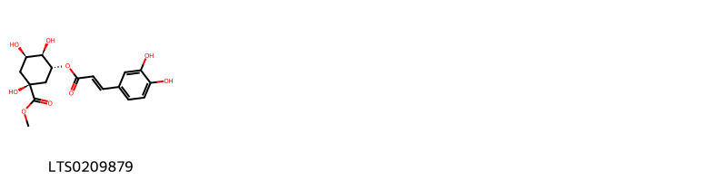{ width=100% }
    <figcaption>Hình ảnh cấu trúc hóa học của 1 hoạt chất thuộc nhóm Organooxygen compounds gồm ['methyl chlorogenate (LTS0209879)'].</figcaption>
</figure>
#### Nhóm Prenol lipids
<figure markdown="span">
    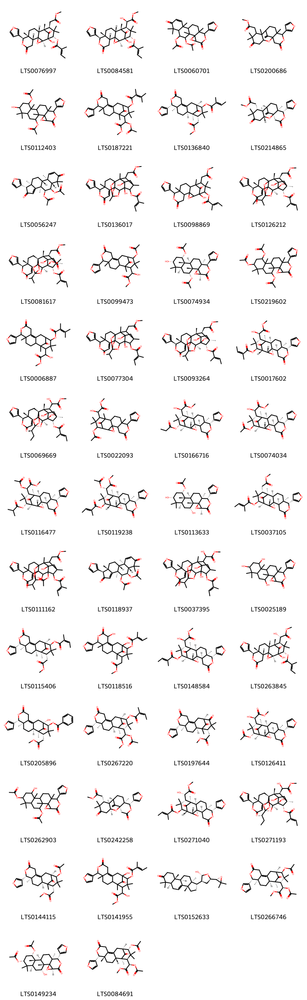{ width=100% }
    <figcaption>Hình ảnh cấu trúc hóa học của 144 hoạt chất thuộc nhóm Prenol lipids gồm ['ruageanin b (LTS0076997)', '(1s,2r,4s,5r,9r,10r,13r,14s,15s,17s)-9-(furan-3-yl)-1-hydroxy-15-[(1r)-1-hydroxy-2-methoxy-2-oxoethyl]-10,14,16,16-tetramethyl-7,18-dioxo-3,8-dioxapentacyclo[12.3.1.0²,⁴.0⁴,¹³.0⁵,¹⁰]octadecan-17-yl (2e)-2-methylbut-2-enoate (LTS0084581)', '18-(acetyloxy)-7-(furan-3-yl)-1,8,12,16,16-pentamethyl-5,15-dioxo-3,6-dioxapentacyclo[9.8.0.0²,⁴.0²,⁸.0¹²,¹⁷]nonadec-13-en-19-yl acetate (LTS0060701)', 'methyl 2-[13-(furan-3-yl)-6,6,8,12-tetramethyl-17-methylidene-5,15-dioxo-2,14-dioxatetracyclo[7.7.1.0¹,¹².0³,⁸]heptadecan-7-yl]acetate (LTS0200686)', '13-(acetyloxy)-7-(furan-3-yl)-15-hydroxy-1,8,12,16,16-pentamethyl-5-oxo-3,6-dioxapentacyclo[9.8.0.0²,⁴.0²,⁸.0¹²,¹⁷]nonadecan-19-yl acetate (LTS0112403)', '16-[1-(acetyloxy)-2-methoxy-2-oxoethyl]-6-(furan-3-yl)-1,5,15,15-tetramethyl-8,17-dioxo-7-oxatetracyclo[11.3.1.0²,¹¹.0⁵,¹⁰]heptadec-10-en-14-yl 2,3-dimethylbut-2-enoate (LTS0187221)', '(1r,2s,5r,6r,13s,14r,16s)-6-(furan-3-yl)-16-(2-methoxy-2-oxoethyl)-1,5,15,15-tetramethyl-8,17-dioxo-7-oxatetracyclo[11.3.1.0²,¹¹.0⁵,¹⁰]heptadec-10-en-14-yl (2e)-2-methylbut-2-enoate (LTS0136840)', 'methyl 2-[(1s,3r,7r,8r,9r,12s,13s)-13-(furan-3-yl)-6,6,8,12-tetramethyl-17-methylidene-5,15-dioxo-2,14-dioxatetracyclo[7.7.1.0¹,¹².0³,⁸]heptadecan-7-yl]acetate (LTS0214865)', '(1s,3br,4s,5r,5ar,9ar,9br,11ar)-4-(acetyloxy)-1-(furan-3-yl)-3b,6,6,9a,11a-pentamethyl-2,7-dioxo-1h,4h,5h,5ah,9bh,10h,11h-cyclopenta[a]phenanthren-5-yl acetate (LTS0056247)', '5-(furan-3-yl)-15,16-dihydroxy-19-(2-methoxy-2-oxoethyl)-4,12,18,20-tetramethyl-7-oxo-6,11,13,21-tetraoxaheptacyclo[10.8.1.1¹⁵,¹⁸.0¹,¹⁰.0⁴,⁹.0¹⁰,¹⁴.0¹⁶,²⁰]docos-8-en-22-yl 2-methylbut-2-enoate (LTS0136017)', '9-(furan-3-yl)-1-hydroxy-15-(2-methoxy-2-oxoethyl)-10,14,16,16-tetramethyl-7,18-dioxo-3,8-dioxapentacyclo[12.3.1.0²,⁴.0⁴,¹³.0⁵,¹⁰]octadecan-17-yl 2-methylbut-2-enoate (LTS0098869)', '(4r,5r,14r,16r,18r,19s,20r,22s)-5-(furan-3-yl)-15,16-dihydroxy-19-(2-methoxy-2-oxoethyl)-4,18,20-trimethyl-7-oxo-12-(sec-butyl)-6,11,13,21-tetraoxaheptacyclo[10.8.1.1¹⁵,¹⁸.0¹,¹⁰.0⁴,⁹.0¹⁰,¹⁴.0¹⁶,²⁰]docos-8-en-22-yl (2e)-2-methylbut-2-enoate (LTS0126212)', '(1s,4r,5r,10r,12s,14s,15s,16r,18r,19s,20r,22s)-15-(acetyloxy)-5-(furan-3-yl)-16-hydroxy-12-isopropyl-19-(2-methoxy-2-oxoethyl)-4,18,20-trimethyl-7-oxo-6,11,13,21-tetraoxaheptacyclo[10.8.1.1¹⁵,¹⁸.0¹,¹⁰.0⁴,⁹.0¹⁰,¹⁴.0¹⁶,²⁰]docos-8-en-22-yl (2e)-2-methylbut-2-enoate (LTS0081617)', 'methyl 2-[14-(acetyloxy)-6-(furan-3-yl)-1,5,15,15-tetramethyl-8,17-dioxo-7-oxatetracyclo[11.3.1.0²,¹¹.0⁵,¹⁰]heptadec-10-en-16-yl]-2-hydroxyacetate (LTS0099473)', '(1s,2r,4s,7r,8s,11r,12s,13s,15r,17s,19r)-13-(acetyloxy)-7-(furan-3-yl)-15-hydroxy-1,8,12,16,16-pentamethyl-5-oxo-3,6-dioxapentacyclo[9.8.0.0²,⁴.0²,⁸.0¹²,¹⁷]nonadecan-19-yl acetate (LTS0074934)', '13,15-bis(acetyloxy)-7-(furan-3-yl)-1,8,12,16,16-pentamethyl-5-oxo-3,6-dioxapentacyclo[9.8.0.0²,⁴.0²,⁸.0¹²,¹⁷]nonadecan-19-yl acetate (LTS0219602)', '6-(furan-3-yl)-16-(1-hydroxy-2-methoxy-2-oxoethyl)-1,5,15,15-tetramethyl-8,17-dioxo-7-oxatetracyclo[11.3.1.0²,¹¹.0⁵,¹⁰]heptadec-10-en-14-yl 2,3-dimethylbut-2-enoate (LTS0006887)', '5-(furan-3-yl)-15,16-dihydroxy-12-isopropyl-19-(2-methoxy-2-oxoethyl)-4,18,20-trimethyl-7-oxo-6,11,13,21-tetraoxaheptacyclo[10.8.1.1¹⁵,¹⁸.0¹,¹⁰.0⁴,⁹.0¹⁰,¹⁴.0¹⁶,²⁰]docos-8-en-22-yl 2-methylbut-2-enoate (LTS0077304)', '(4r,5r,14r,16r,18r,19s,20r,22s)-5-(furan-3-yl)-15,16-dihydroxy-12-isopropyl-19-(2-methoxy-2-oxoethyl)-4,18,20-trimethyl-7-oxo-6,11,13,21-tetraoxaheptacyclo[10.8.1.1¹⁵,¹⁸.0¹,¹⁰.0⁴,⁹.0¹⁰,¹⁴.0¹⁶,²⁰]docos-8-en-22-yl (2e)-2-methylbut-2-enoate (LTS0093264)', '(1s,2r,4s,5r,9r,10r,13r,14s,15s,17r)-9-(furan-3-yl)-15-[(1r)-1-hydroxy-2-methoxy-2-oxoethyl]-10,14,16,16-tetramethyl-7,18-dioxo-3,8-dioxapentacyclo[12.3.1.0²,⁴.0⁴,¹³.0⁵,¹⁰]octadecan-17-yl (2z)-2-methylbut-2-enoate (LTS0017602)', '(1s,4r,5r,10r,12s,14r,15s,16r,18r,19s,20r,22s)-12-[(2r)-butan-2-yl]-5-(furan-3-yl)-15,16-dihydroxy-19-[(1r)-1-hydroxy-2-methoxy-2-oxoethyl]-4,18,20-trimethyl-7-oxo-6,11,13,21-tetraoxaheptacyclo[10.8.1.1¹⁵,¹⁸.0¹,¹⁰.0⁴,⁹.0¹⁰,¹⁴.0¹⁶,²⁰]docos-8-en-22-yl (2e)-2-methylbut-2-enoate (LTS0069669)', 'methyl 2-[17-(acetyloxy)-9-(furan-3-yl)-10,14,16,16-tetramethyl-7,18-dioxo-3,8-dioxapentacyclo[12.3.1.0²,⁴.0⁴,¹³.0⁵,¹⁰]octadecan-15-yl]-2-hydroxyacetate (LTS0022093)', '(1r,2r,4s,5r,9r,10r,13r,14s,15s,17s)-9-(furan-3-yl)-15-[(1r)-1-hydroxy-2-methoxy-2-oxoethyl]-10,14,16,16-tetramethyl-7,18-dioxo-3,8-dioxapentacyclo[12.3.1.0²,⁴.0⁴,¹³.0⁵,¹⁰]octadecan-17-yl propanoate (LTS0166716)', 'methyl (2r)-2-[(1r,2r,4s,5r,9r,10r,13r,14s,15s,17r)-17-(acetyloxy)-9-(furan-3-yl)-10,14,16,16-tetramethyl-7,18-dioxo-3,8-dioxapentacyclo[12.3.1.0²,⁴.0⁴,¹³.0⁵,¹⁰]octadecan-15-yl]-2-hydroxyacetate (LTS0074034)', '(1r,2r,4s,5r,9r,10r,13r,14s,15s,17s)-15-[(1r)-1-(acetyloxy)-2-methoxy-2-oxoethyl]-9-(furan-3-yl)-10,14,16,16-tetramethyl-7,18-dioxo-3,8-dioxapentacyclo[12.3.1.0²,⁴.0⁴,¹³.0⁵,¹⁰]octadecan-17-yl 2-methylpropanoate (LTS0116477)', '(1s,2r,4s,5r,9r,10r,13r,14s,15s,17r)-15-[(1s)-1-(acetyloxy)-2-methoxy-2-oxoethyl]-9-(furan-3-yl)-10,14,16,16-tetramethyl-7,18-dioxo-3,8-dioxapentacyclo[12.3.1.0²,⁴.0⁴,¹³.0⁵,¹⁰]octadecan-17-yl (2e)-2-methylbut-2-enoate (LTS0119238)', '(1s,2r,4s,7s,8s,11r,12s,13s,15r,17s,19r)-7-(furan-3-yl)-15,19-dihydroxy-1,8,12,16,16-pentamethyl-5-oxo-3,6-dioxapentacyclo[9.8.0.0²,⁴.0²,⁸.0¹²,¹⁷]nonadecan-13-yl acetate (LTS0113633)', '(1r,2r,4s,5r,9r,10r,13r,14s,15s,17r)-9-(furan-3-yl)-15-(2-methoxy-2-oxoethyl)-10,14,16,16-tetramethyl-7,18-dioxo-3,8-dioxapentacyclo[12.3.1.0²,⁴.0⁴,¹³.0⁵,¹⁰]octadecan-17-yl (2e)-2-methylbut-2-enoate (LTS0037105)', '15-(acetyloxy)-5-(furan-3-yl)-16-hydroxy-12-isopropyl-19-(2-methoxy-2-oxoethyl)-4,18,20-trimethyl-7-oxo-6,11,13,21-tetraoxaheptacyclo[10.8.1.1¹⁵,¹⁸.0¹,¹⁰.0⁴,⁹.0¹⁰,¹⁴.0¹⁶,²⁰]docos-8-en-22-yl 2-methylbut-2-enoate (LTS0111162)', '(1r,3br,4s,5r,5ar,9ar,9br,11as)-4-(acetyloxy)-1-(furan-3-yl)-3b,6,6,9a,11a-pentamethyl-2,7-dioxo-1h,4h,5h,5ah,9bh,10h,11h-cyclopenta[a]phenanthren-5-yl acetate (LTS0118937)', '5-(furan-3-yl)-15,16-dihydroxy-19-(1-hydroxy-2-methoxy-2-oxoethyl)-4,18,20-trimethyl-7-oxo-12-(sec-butyl)-6,11,13,21-tetraoxaheptacyclo[10.8.1.1¹⁵,¹⁸.0¹,¹⁰.0⁴,⁹.0¹⁰,¹⁴.0¹⁶,²⁰]docos-8-en-22-yl 2-methylbut-2-enoate (LTS0037395)', '7-(furan-3-yl)-13,15,19-trihydroxy-1,8,12,16,16-pentamethyl-3,6-dioxapentacyclo[9.8.0.0²,⁴.0²,⁸.0¹²,¹⁷]nonadecan-5-one (LTS0025189)', '(1r,2s,5r,6r,13s,14r,16s)-6-(furan-3-yl)-16-(2-methoxy-2-oxoethyl)-1,5,15,15-tetramethyl-8,17-dioxo-7-oxatetracyclo[11.3.1.0²,¹¹.0⁵,¹⁰]heptadec-10-en-14-yl (2z)-2-methylbut-2-enoate (LTS0115406)', '6-(furan-3-yl)-9,13-dihydroxy-16-(2-methoxy-2-oxoethyl)-1,5,15,15-tetramethyl-8,17-dioxo-7-oxatetracyclo[11.3.1.0²,¹¹.0⁵,¹⁰]heptadec-10-en-14-yl 2-methylbut-2-enoate (LTS0118516)', '(1r,2r,4s,5r,9r,10r,13r,14s,15s,17r)-9-(furan-3-yl)-15-[(1r)-1-hydroxy-2-methoxy-2-oxoethyl]-10,14,16,16-tetramethyl-7,18-dioxo-3,8-dioxapentacyclo[12.3.1.0²,⁴.0⁴,¹³.0⁵,¹⁰]octadecan-17-yl (2e)-2-methylbut-2-enoate (LTS0148584)', '(1s,2r,4s,5r,9r,10r,13r,14s,15s,17s)-9-(furan-3-yl)-1-hydroxy-15-[(1s)-1-hydroxy-2-methoxy-2-oxoethyl]-10,14,16,16-tetramethyl-7,18-dioxo-3,8-dioxapentacyclo[12.3.1.0²,⁴.0⁴,¹³.0⁵,¹⁰]octadecan-17-yl (2e)-2-methylbut-2-enoate (LTS0263845)', '(1r,2s,5r,6r,13r,14s,16s)-6-(furan-3-yl)-13-hydroxy-16-(2-methoxy-2-oxoethyl)-1,5,15,15-tetramethyl-8,17-dioxo-7-oxatetracyclo[11.3.1.0²,¹¹.0⁵,¹⁰]heptadec-10-en-14-yl benzoate (LTS0205896)', '(1r,2s,5r,6r,13s,14r,16s)-16-[(1r)-1-(acetyloxy)-2-methoxy-2-oxoethyl]-6-(furan-3-yl)-1,5,15,15-tetramethyl-8,17-dioxo-7-oxatetracyclo[11.3.1.0²,¹¹.0⁵,¹⁰]heptadec-10-en-14-yl (2z)-2-methylbut-2-enoate (LTS0267220)', 'methyl 2-[(2s,5r,6r,13s,16s)-6-(furan-3-yl)-1,5,15,15-tetramethyl-8,14,17-trioxo-7-oxatetracyclo[11.3.1.0²,¹¹.0⁵,¹⁰]heptadec-10-en-16-yl]acetate (LTS0197644)', 'methyl (2r)-2-[(1r,2r,4s,5r,9r,10r,13r,14s,15s,17s)-17-(acetyloxy)-9-(furan-3-yl)-10,14,16,16-tetramethyl-7,18-dioxo-3,8-dioxapentacyclo[12.3.1.0²,⁴.0⁴,¹³.0⁵,¹⁰]octadecan-15-yl]-2-hydroxyacetate (LTS0126411)', '15-(acetyloxy)-7-(furan-3-yl)-13-hydroxy-1,8,12,16,16-pentamethyl-5-oxo-3,6-dioxapentacyclo[9.8.0.0²,⁴.0²,⁸.0¹²,¹⁷]nonadecan-19-yl acetate (LTS0262903)', 'methyl 2-[(1s,3s,7r,8r,9r,12s,13s)-13-(furan-3-yl)-6,6,8,12-tetramethyl-17-methylidene-5,15-dioxo-2,14-dioxatetracyclo[7.7.1.0¹,¹².0³,⁸]heptadecan-7-yl]acetate (LTS0242258)', '(1s,2r,4s,5r,9r,10r,13r,14s,15s,17r)-9-(furan-3-yl)-15-[(1s)-1-hydroxy-2-methoxy-2-oxoethyl]-10,14,16,16-tetramethyl-7,18-dioxo-3,8-dioxapentacyclo[12.3.1.0²,⁴.0⁴,¹³.0⁵,¹⁰]octadecan-17-yl (2e)-2-methylbut-2-enoate (LTS0271040)', '(1s,4r,5r,10r,12s,14r,15s,16r,18r,19s,20r,22s)-12-[(2s)-butan-2-yl]-5-(furan-3-yl)-15,16-dihydroxy-19-[(1r)-1-hydroxy-2-methoxy-2-oxoethyl]-4,18,20-trimethyl-7-oxo-6,11,13,21-tetraoxaheptacyclo[10.8.1.1¹⁵,¹⁸.0¹,¹⁰.0⁴,⁹.0¹⁰,¹⁴.0¹⁶,²⁰]docos-8-en-22-yl (2e)-2-methylbut-2-enoate (LTS0271193)', 'methyl 2-[(2s,5r,6r,13s,14r,16s)-14-(acetyloxy)-6-(furan-3-yl)-1,5,15,15-tetramethyl-8,17-dioxo-7-oxatetracyclo[11.3.1.0²,¹¹.0⁵,¹⁰]heptadec-10-en-16-yl]acetate (LTS0144115)', '6-(furan-3-yl)-13-hydroxy-16-(1-hydroxy-2-methoxy-2-oxoethyl)-1,5,15,15-tetramethyl-8,17-dioxo-7-oxatetracyclo[11.3.1.0²,¹¹.0⁵,¹⁰]heptadec-10-en-14-yl 2-methylbut-2-enoate (LTS0141955)', '(1s,3as,5ar,9ar,9br,11as)-1-[(2r,3s,5r)-5-[(2s)-3,3-dimethyloxiran-2-yl]-2-hydroxyoxolan-3-yl]-3a,6,6,9a,11a-pentamethyl-1h,2h,3h,5h,5ah,8h,9h,9bh,10h,11h-cyclopenta[a]phenanthren-7-one (LTS0152633)', 'methyl (2r)-2-(acetyloxy)-2-[(1r,2s,5r,6r,13s,14r,16s)-14-(acetyloxy)-6-(furan-3-yl)-1,5,15,15-tetramethyl-8,17-dioxo-7-oxatetracyclo[11.3.1.0²,¹¹.0⁵,¹⁰]heptadec-10-en-16-yl]acetate (LTS0266746)', '(1s,2r,4s,7s,8s,11r,12s,13s,15r,17s,19r)-13-(acetyloxy)-7-(furan-3-yl)-19-hydroxy-1,8,12,16,16-pentamethyl-5-oxo-3,6-dioxapentacyclo[9.8.0.0²,⁴.0²,⁸.0¹²,¹⁷]nonadecan-15-yl acetate (LTS0149234)', 'methyl (2r)-2-(acetyloxy)-2-[(1r,2r,5s,6r,13s,14s,16r)-14-(acetyloxy)-6-(furan-3-yl)-1,5,15,15-tetramethyl-8,17-dioxo-7-oxatetracyclo[11.3.1.0²,¹¹.0⁵,¹⁰]heptadec-10-en-16-yl]acetate (LTS0084691)', '6-(furan-3-yl)-13-hydroxy-16-(2-methoxy-2-oxoethyl)-1,5,15,15-tetramethyl-8,17-dioxo-7-oxatetracyclo[11.3.1.0²,¹¹.0⁵,¹⁰]heptadec-10-en-14-yl 2-methylpropanoate (LTS0147628)', '(1s,2r,4s,7r,8s,11r,12s,13s,15r,17s,19r)-15-(acetyloxy)-7-(furan-3-yl)-13-hydroxy-1,8,12,16,16-pentamethyl-5-oxo-3,6-dioxapentacyclo[9.8.0.0²,⁴.0²,⁸.0¹²,¹⁷]nonadecan-19-yl acetate (LTS0098381)', '(1r,2r,5s,6r,13s,14s,16s)-6-(furan-3-yl)-16-[(1r)-1-hydroxy-2-methoxy-2-oxoethyl]-1,5,15,15-tetramethyl-8,17-dioxo-7-oxatetracyclo[11.3.1.0²,¹¹.0⁵,¹⁰]heptadec-10-en-14-yl 2,3-dimethylbut-2-enoate (LTS0137070)', '(1s,2r,4s,7s,8s,11r,12s,13s,15r,17s,19r)-13-(acetyloxy)-7-(furan-3-yl)-15-hydroxy-1,8,12,16,16-pentamethyl-5-oxo-3,6-dioxapentacyclo[9.8.0.0²,⁴.0²,⁸.0¹²,¹⁷]nonadecan-19-yl acetate (LTS0231267)', '9-(furan-3-yl)-1-hydroxy-15-(1-hydroxy-2-methoxy-2-oxoethyl)-10,14,16,16-tetramethyl-7,18-dioxo-3,8-dioxapentacyclo[12.3.1.0²,⁴.0⁴,¹³.0⁵,¹⁰]octadecan-17-yl 2-methylbut-2-enoate (LTS0156622)', '15-[1-(acetyloxy)-2-methoxy-2-oxoethyl]-9-(furan-3-yl)-10,14,16,16-tetramethyl-7,18-dioxo-3,8-dioxapentacyclo[12.3.1.0²,⁴.0⁴,¹³.0⁵,¹⁰]octadecan-17-yl 2-methylpropanoate (LTS0270618)', 'methyl (2r)-2-[(1s,2r,4s,5r,9r,10r,13r,14s,15s,17r)-17-(acetyloxy)-9-(furan-3-yl)-10,14,16,16-tetramethyl-7,18-dioxo-3,8-dioxapentacyclo[12.3.1.0²,⁴.0⁴,¹³.0⁵,¹⁰]octadecan-15-yl]-2-hydroxyacetate (LTS0140516)', '(1s,2r,4s,7s,8s,11r,12s,13s,15r,17s,19r)-13,15-bis(acetyloxy)-7-(furan-3-yl)-1,8,12,16,16-pentamethyl-5-oxo-3,6-dioxapentacyclo[9.8.0.0²,⁴.0²,⁸.0¹²,¹⁷]nonadecan-19-yl acetate (LTS0188408)', 'methyl (2s)-2-[(1s,3s,7r,8r,9r,12s,13s)-13-(furan-3-yl)-6,6,8,12-tetramethyl-17-methylidene-5,15-dioxo-2,14-dioxatetracyclo[7.7.1.0¹,¹².0³,⁸]heptadecan-7-yl]-2-hydroxyacetate (LTS0111393)', '(1s,2r,4s,7r,8s,11r,12s,13s,15r,17s,19r)-13,15-bis(acetyloxy)-7-(furan-3-yl)-1,8,12,16,16-pentamethyl-5-oxo-3,6-dioxapentacyclo[9.8.0.0²,⁴.0²,⁸.0¹²,¹⁷]nonadecan-19-yl acetate (LTS0180595)', '(1s,2r,5s,6s,13s,14r,16r)-6-(furan-3-yl)-13-hydroxy-16-(2-methoxy-2-oxoethyl)-1,5,15,15-tetramethyl-8,17-dioxo-7-oxatetracyclo[11.3.1.0²,¹¹.0⁵,¹⁰]heptadec-10-en-14-yl 2-methylpropanoate (LTS0131616)', '(1s,2r,4s,7r,8s,11r,12s,13s,15r,17s,19r)-7-(furan-3-yl)-13,15,19-trihydroxy-1,8,12,16,16-pentamethyl-3,6-dioxapentacyclo[9.8.0.0²,⁴.0²,⁸.0¹²,¹⁷]nonadecan-5-one (LTS0180960)', '(1s,2r,4s,5r,9r,10r,13r,14s,15s,17r)-15-[(1s)-1-(acetyloxy)-2-methoxy-2-oxoethyl]-9-(furan-3-yl)-10,14,16,16-tetramethyl-7,18-dioxo-3,8-dioxapentacyclo[12.3.1.0²,⁴.0⁴,¹³.0⁵,¹⁰]octadecan-17-yl 2-methylpropanoate (LTS0271329)', '(1r,3br,4s,5r,5ar,9br,11as)-4-(acetyloxy)-1-(furan-3-yl)-3b,6,6,9a,11a-pentamethyl-2,7-dioxo-1h,4h,5h,5ah,9bh,10h,11h-cyclopenta[a]phenanthren-5-yl acetate (LTS0183998)', '(1s,2r,4s,7s,8s,11r,12s,13s,15r,17s,19r)-19-(acetyloxy)-7-(furan-3-yl)-13-hydroxy-1,8,12,16,16-pentamethyl-5-oxo-3,6-dioxapentacyclo[9.8.0.0²,⁴.0²,⁸.0¹²,¹⁷]nonadecan-15-yl benzoate (LTS0258676)', '(1r,2s,5r,6r,9r,13r,14s,16s)-6-(furan-3-yl)-9,13-dihydroxy-16-(2-methoxy-2-oxoethyl)-1,5,15,15-tetramethyl-8,17-dioxo-7-oxatetracyclo[11.3.1.0²,¹¹.0⁵,¹⁰]heptadec-10-en-14-yl (2e)-2-methylbut-2-enoate (LTS0124040)', '(1s,2r,4s,5r,9r,10r,13r,14s,15s,17r)-15-[(1s)-1-(acetyloxy)-2-methoxy-2-oxoethyl]-9-(furan-3-yl)-10,14,16,16-tetramethyl-7,18-dioxo-3,8-dioxapentacyclo[12.3.1.0²,⁴.0⁴,¹³.0⁵,¹⁰]octadecan-17-yl propanoate (LTS0160729)', '(1r,2r,4s,5s,9r,10r,13s,14s,15s,17r)-15-[(1r)-1-(acetyloxy)-2-methoxy-2-oxoethyl]-9-(furan-3-yl)-10,14,16,16-tetramethyl-7,18-dioxo-3,8-dioxapentacyclo[12.3.1.0²,⁴.0⁴,¹³.0⁵,¹⁰]octadecan-17-yl (2e)-2-methylbut-2-enoate (LTS0107425)', 'methyl 2-[6-(furan-3-yl)-14-hydroxy-1,5,15,15-tetramethyl-8,17-dioxo-7-oxatetracyclo[11.3.1.0²,¹¹.0⁵,¹⁰]heptadec-10-en-16-yl]-2-hydroxyacetate (LTS0269376)', 'methyl (2r)-2-[(1s,3r,7r,8r,9r,12s,13s)-13-(furan-3-yl)-6,6,8,12-tetramethyl-17-methylidene-5,15-dioxo-2,14-dioxatetracyclo[7.7.1.0¹,¹².0³,⁸]heptadecan-7-yl]-2-hydroxyacetate (LTS0257379)', '(1r,2r,5s,6r,13s,14r,16s)-16-[(1r)-1-(acetyloxy)-2-methoxy-2-oxoethyl]-6-(furan-3-yl)-1,5,15,15-tetramethyl-8,17-dioxo-7-oxatetracyclo[11.3.1.0²,¹¹.0⁵,¹⁰]heptadec-10-en-14-yl 2,3-dimethylbut-2-enoate (LTS0216245)', '6-(furan-3-yl)-16-(1-hydroxy-2-methoxy-2-oxoethyl)-1,5,15,15-tetramethyl-8,17-dioxo-7-oxatetracyclo[11.3.1.0²,¹¹.0⁵,¹⁰]heptadec-10-en-14-yl 2-methylbut-2-enoate (LTS0207283)', 'methyl 2-[6-(furan-3-yl)-17-{1-[6-(furan-3-yl)-14-hydroxy-1,5,15,15-tetramethyl-8,17-dioxo-7-oxatetracyclo[11.3.1.0²,¹¹.0⁵,¹⁰]heptadeca-2(11),9-dien-16-yl]-2-methoxy-2-oxoethoxy}-14,17-dihydroxy-1,5,15,15-tetramethyl-8-oxo-7-oxatetracyclo[11.3.1.0²,¹¹.0⁵,¹⁰]heptadeca-2(11),9-dien-16-yl]-2-hydroxyacetate (LTS0262795)', '9-(furan-3-yl)-15-(1-hydroxy-2-methoxy-2-oxoethyl)-10,14,16,16-tetramethyl-7,18-dioxo-3,8-dioxapentacyclo[12.3.1.0²,⁴.0⁴,¹³.0⁵,¹⁰]octadecan-17-yl 2-methylbut-2-enoate (LTS0260326)', '(1r,2r,4r,5r,10r,14s,15s,16r,18r,19s,20r)-15-(acetyloxy)-5-(furan-3-yl)-2,16-dihydroxy-19-(2-methoxy-2-oxoethyl)-4,18,20-trimethyl-7-oxo-12-(sec-butyl)-6,11,13,21-tetraoxaheptacyclo[10.8.1.1¹⁵,¹⁸.0¹,¹⁰.0⁴,⁹.0¹⁰,¹⁴.0¹⁶,²⁰]docos-8-en-22-yl (2e)-2-methylbut-2-enoate (LTS0102604)', '6-(furan-3-yl)-13-hydroxy-16-(2-methoxy-2-oxoethyl)-1,5,15,15-tetramethyl-8,17-dioxo-7-oxatetracyclo[11.3.1.0²,¹¹.0⁵,¹⁰]heptadec-10-en-14-yl benzoate (LTS0068373)', 'methyl 2-[(1r,3s,7r,8r,9r,12s,13s)-13-(furan-3-yl)-6,6,8,12-tetramethyl-17-methylidene-5,15-dioxo-2,14-dioxatetracyclo[7.7.1.0¹,¹².0³,⁸]heptadecan-7-yl]acetate (LTS0243316)', '(1s,4r,5r,10r,12s,14s,15s,16r,18r,19s,20r,22s)-15-(acetyloxy)-12-[(2r)-butan-2-yl]-5-(furan-3-yl)-16-hydroxy-19-(2-methoxy-2-oxoethyl)-4,18,20-trimethyl-7-oxo-6,11,13,21-tetraoxaheptacyclo[10.8.1.1¹⁵,¹⁸.0¹,¹⁰.0⁴,⁹.0¹⁰,¹⁴.0¹⁶,²⁰]docos-8-en-22-yl (2e)-2-methylbut-2-enoate (LTS0272539)', '(1s,2r,5s,6s,9s,13s,14r,16r)-6-(furan-3-yl)-9,13-dihydroxy-16-(2-methoxy-2-oxoethyl)-1,5,15,15-tetramethyl-8,17-dioxo-7-oxatetracyclo[11.3.1.0²,¹¹.0⁵,¹⁰]heptadec-10-en-14-yl (2e)-2-methylbut-2-enoate (LTS0263571)', '7-(furan-3-yl)-15,19-dihydroxy-1,8,12,16,16-pentamethyl-5-oxo-3,6-dioxapentacyclo[9.8.0.0²,⁴.0²,⁸.0¹²,¹⁷]nonadecan-13-yl acetate (LTS0222611)', '(1s,2r,4s,5r,9r,10r,13r,14s,15s,17r)-9-(furan-3-yl)-15-(2-methoxy-2-oxoethyl)-10,14,16,16-tetramethyl-7,18-dioxo-3,8-dioxapentacyclo[12.3.1.0²,⁴.0⁴,¹³.0⁵,¹⁰]octadecan-17-yl (2e)-2-methylbut-2-enoate (LTS0076133)', 'methyl 2-[13-(furan-3-yl)-6,6,8,12-tetramethyl-17-methylidene-5,15-dioxo-2,14-dioxatetracyclo[7.7.1.0¹,¹².0³,⁸]heptadecan-7-yl]-2-hydroxyacetate (LTS0099155)', '(1s,2r,4s,7s,8s,11r,12s,13s,15r,17s,19r)-7-(furan-3-yl)-13,15,19-trihydroxy-1,8,12,16,16-pentamethyl-3,6-dioxapentacyclo[9.8.0.0²,⁴.0²,⁸.0¹²,¹⁷]nonadecan-5-one (LTS0211390)', '(1s,2r,4s,7s,8s,11r,12r,17r,18r,19s)-19-(acetyloxy)-7-(furan-3-yl)-1,8,12,16,16-pentamethyl-5,15-dioxo-3,6-dioxapentacyclo[9.8.0.0²,⁴.0²,⁸.0¹²,¹⁷]nonadec-13-en-18-yl acetate (LTS0208149)', 'methyl (2r)-2-[(1r,2s,5r,6r,13s,14r,16s)-14-(acetyloxy)-6-(furan-3-yl)-1,5,15,15-tetramethyl-8,17-dioxo-7-oxatetracyclo[11.3.1.0²,¹¹.0⁵,¹⁰]heptadec-10-en-16-yl]-2-hydroxyacetate (LTS0059890)', '(1s,2r,4s,5s,9r,10r,13r,14s,15s,17s)-9-(furan-3-yl)-1-hydroxy-15-[(1r)-1-hydroxy-2-methoxy-2-oxoethyl]-10,14,16,16-tetramethyl-7,18-dioxo-3,8-dioxapentacyclo[12.3.1.0²,⁴.0⁴,¹³.0⁵,¹⁰]octadecan-17-yl (2z)-2-methylbut-2-enoate (LTS0070675)', 'methyl 2-(acetyloxy)-2-[6-(furan-3-yl)-14-hydroxy-1,5,15,15-tetramethyl-8,17-dioxo-7-oxatetracyclo[11.3.1.0²,¹¹.0⁵,¹⁰]heptadec-10-en-16-yl]acetate (LTS0221864)', 'methyl 2-[(1r,2s,5r,6r,13r,14s,16s)-14-(acetyloxy)-6-(furan-3-yl)-13-hydroxy-1,5,15,15-tetramethyl-8,17-dioxo-7-oxatetracyclo[11.3.1.0²,¹¹.0⁵,¹⁰]heptadec-10-en-16-yl]acetate (LTS0161532)', '(1s,2r,4s,5r,9r,10r,13r,14s,15s,17r)-15-[(1r)-1-(acetyloxy)-2-methoxy-2-oxoethyl]-9-(furan-3-yl)-10,14,16,16-tetramethyl-7,18-dioxo-3,8-dioxapentacyclo[12.3.1.0²,⁴.0⁴,¹³.0⁵,¹⁰]octadecan-17-yl 2-methylpropanoate (LTS0229907)', 'methyl 2-[6-(furan-3-yl)-1,5,15,15-tetramethyl-8,14,17-trioxo-7-oxatetracyclo[11.3.1.0²,¹¹.0⁵,¹⁰]heptadec-10-en-16-yl]acetate (LTS0228961)', '15-(acetyloxy)-7-(furan-3-yl)-19-hydroxy-1,8,12,16,16-pentamethyl-5-oxo-3,6-dioxapentacyclo[9.8.0.0²,⁴.0²,⁸.0¹²,¹⁷]nonadecan-13-yl acetate (LTS0186919)', 'methyl 2-[(1r,2s,5r,6r,13s,16s)-6-(furan-3-yl)-1,5,15,15-tetramethyl-8,14,17-trioxo-7-oxatetracyclo[11.3.1.0²,¹¹.0⁵,¹⁰]heptadec-10-en-16-yl]acetate (LTS0045358)', 'proceranolide (LTS0167643)', '(1s,4r,5r,10r,12s,14r,15s,16r,18r,19s,20r,22s)-5-(furan-3-yl)-15,16-dihydroxy-12-isopropyl-19-(2-methoxy-2-oxoethyl)-4,18,20-trimethyl-7-oxo-6,11,13,21-tetraoxaheptacyclo[10.8.1.1¹⁵,¹⁸.0¹,¹⁰.0⁴,⁹.0¹⁰,¹⁴.0¹⁶,²⁰]docos-8-en-22-yl (2e)-2-methylbut-2-enoate (LTS0004823)', '(1s,2r,4s,7s,8s,11r,13s,15r,17s,19r)-13-(acetyloxy)-7-(furan-3-yl)-15-hydroxy-1,8,12,16,16-pentamethyl-5-oxo-3,6-dioxapentacyclo[9.8.0.0²,⁴.0²,⁸.0¹²,¹⁷]nonadecan-19-yl acetate (LTS0017218)', '(1s,2r,4s,5r,9r,10r,13r,14s,15s,17s)-15-[(1s)-1-(acetyloxy)-2-methoxy-2-oxoethyl]-9-(furan-3-yl)-1-hydroxy-10,14,16,16-tetramethyl-7,18-dioxo-3,8-dioxapentacyclo[12.3.1.0²,⁴.0⁴,¹³.0⁵,¹⁰]octadecan-17-yl (2e)-2-methylbut-2-enoate (LTS0167840)', '(1s,2r,4s,5r,9r,10r,13r,14s,15s,17r)-15-[(1r)-1-(acetyloxy)-2-methoxy-2-oxoethyl]-9-(furan-3-yl)-10,14,16,16-tetramethyl-7,18-dioxo-3,8-dioxapentacyclo[12.3.1.0²,⁴.0⁴,¹³.0⁵,¹⁰]octadecan-17-yl (2z)-2-methylbut-2-enoate (LTS0209678)', '6-(furan-3-yl)-16-(2-methoxy-2-oxoethyl)-1,5,15,15-tetramethyl-8,17-dioxo-7-oxatetracyclo[11.3.1.0²,¹¹.0⁵,¹⁰]heptadecan-14-yl 2-methylbut-2-enoate (LTS0212435)', '9-(furan-3-yl)-15-(2-methoxy-2-oxoethyl)-10,14,16,16-tetramethyl-7,18-dioxo-3,8-dioxapentacyclo[12.3.1.0²,⁴.0⁴,¹³.0⁵,¹⁰]octadecan-17-yl 2-methylbut-2-enoate (LTS0239448)', '(1r,2s,5r,6r,10s,11r,13s,14r,16s)-6-(furan-3-yl)-16-(2-methoxy-2-oxoethyl)-1,5,15,15-tetramethyl-8,17-dioxo-7-oxatetracyclo[11.3.1.0²,¹¹.0⁵,¹⁰]heptadecan-14-yl (2e)-2-methylbut-2-enoate (LTS0258533)', '(1s,2r,4s,7s,8s,12s,13s,15r,19r)-13-(acetyloxy)-7-(furan-3-yl)-19-hydroxy-1,8,12,16,16-pentamethyl-5-oxo-3,6-dioxapentacyclo[9.8.0.0²,⁴.0²,⁸.0¹²,¹⁷]nonadecan-15-yl acetate (LTS0253946)', 'methyl 2-[(1r,2s,5r,6r,13s,14r,16s)-14-(acetyloxy)-6-(furan-3-yl)-1,5,15,15-tetramethyl-8,17-dioxo-7-oxatetracyclo[11.3.1.0²,¹¹.0⁵,¹⁰]heptadec-10-en-16-yl]acetate (LTS0045945)', '(1s,2r,4s,7r,8s,11r,12s,13s,15r,17s,19r)-13-(acetyloxy)-7-(furan-3-yl)-19-hydroxy-1,8,12,16,16-pentamethyl-5-oxo-3,6-dioxapentacyclo[9.8.0.0²,⁴.0²,⁸.0¹²,¹⁷]nonadecan-15-yl acetate (LTS0248204)', 'methyl 2-(acetyloxy)-2-[14-(acetyloxy)-6-(furan-3-yl)-1,5,15,15-tetramethyl-8,17-dioxo-7-oxatetracyclo[11.3.1.0²,¹¹.0⁵,¹⁰]heptadec-10-en-16-yl]acetate (LTS0189159)', '12-ethyl-5-(furan-3-yl)-15,16-dihydroxy-19-(2-methoxy-2-oxoethyl)-4,18,20-trimethyl-7-oxo-6,11,13,21-tetraoxaheptacyclo[10.8.1.1¹⁵,¹⁸.0¹,¹⁰.0⁴,⁹.0¹⁰,¹⁴.0¹⁶,²⁰]docos-8-en-22-yl 2-methylbut-2-enoate (LTS0245741)', '(4r,5r,14r,16r,18r,19s,20r,22s)-5-(furan-3-yl)-15,16-dihydroxy-19-[(1r)-1-hydroxy-2-methoxy-2-oxoethyl]-4,18,20-trimethyl-7-oxo-12-(sec-butyl)-6,11,13,21-tetraoxaheptacyclo[10.8.1.1¹⁵,¹⁸.0¹,¹⁰.0⁴,⁹.0¹⁰,¹⁴.0¹⁶,²⁰]docos-8-en-22-yl (2e)-2-methylbut-2-enoate (LTS0047490)', '15-(acetyloxy)-5-(furan-3-yl)-16-hydroxy-19-(2-methoxy-2-oxoethyl)-4,18,20-trimethyl-7-oxo-12-(sec-butyl)-6,11,13,21-tetraoxaheptacyclo[10.8.1.1¹⁵,¹⁸.0¹,¹⁰.0⁴,⁹.0¹⁰,¹⁴.0¹⁶,²⁰]docos-8-en-22-yl 2-methylbut-2-enoate (LTS0254849)', 'methyl (2r)-2-[(1s,3s,7r,8r,9r,12s,13s)-13-(furan-3-yl)-6,6,8,12-tetramethyl-17-methylidene-5,15-dioxo-2,14-dioxatetracyclo[7.7.1.0¹,¹².0³,⁸]heptadecan-7-yl]-2-hydroxyacetate (LTS0255377)', '6-(furan-3-yl)-16-(2-methoxy-2-oxoethyl)-1,5,15,15-tetramethyl-8,17-dioxo-7-oxatetracyclo[11.3.1.0²,¹¹.0⁵,¹⁰]heptadec-10-en-14-yl 2-methylbut-2-enoate (LTS0194873)', 'methyl 2-[14-(acetyloxy)-6-(furan-3-yl)-9,13-dihydroxy-1,5,15,15-tetramethyl-8,17-dioxo-7-oxatetracyclo[11.3.1.0²,¹¹.0⁵,¹⁰]heptadec-10-en-16-yl]acetate (LTS0016090)', '(1r,2r,4s,9r,10r,13r,14s,15s,17r)-15-[(1r)-1-(acetyloxy)-2-methoxy-2-oxoethyl]-9-(furan-3-yl)-10,14,16,16-tetramethyl-7,18-dioxo-3,8-dioxapentacyclo[12.3.1.0²,⁴.0⁴,¹³.0⁵,¹⁰]octadecan-17-yl propanoate (LTS0013352)', 'methyl 2-[14-(acetyloxy)-6-(furan-3-yl)-1,5,15,15-tetramethyl-8,17-dioxo-7-oxatetracyclo[11.3.1.0²,¹¹.0⁵,¹⁰]heptadec-10-en-16-yl]acetate (LTS0064650)', '(1r,2r,4s,5r,9r,10r,13r,14s,15s,17r)-15-[(1r)-1-(acetyloxy)-2-methoxy-2-oxoethyl]-9-(furan-3-yl)-10,14,16,16-tetramethyl-7,18-dioxo-3,8-dioxapentacyclo[12.3.1.0²,⁴.0⁴,¹³.0⁵,¹⁰]octadecan-17-yl propanoate (LTS0137452)', '(1r,2s,5r,6r,13r,14s,16s)-6-(furan-3-yl)-13-hydroxy-16-[(1r)-1-hydroxy-2-methoxy-2-oxoethyl]-1,5,15,15-tetramethyl-8,17-dioxo-7-oxatetracyclo[11.3.1.0²,¹¹.0⁵,¹⁰]heptadec-10-en-14-yl (2e)-2-methylbut-2-enoate (LTS0054289)', '(1s,4r,5r,10r,12s,14r,15s,16r,18r,19s,20r,22s)-12-[(2s)-butan-2-yl]-5-(furan-3-yl)-15,16-dihydroxy-19-(2-methoxy-2-oxoethyl)-4,18,20-trimethyl-7-oxo-6,11,13,21-tetraoxaheptacyclo[10.8.1.1¹⁵,¹⁸.0¹,¹⁰.0⁴,⁹.0¹⁰,¹⁴.0¹⁶,²⁰]docos-8-en-22-yl (2e)-2-methylbut-2-enoate (LTS0261055)', 'methyl 2-[(1r,2s,5r,6r,9r,13r,14s,16s)-14-(acetyloxy)-6-(furan-3-yl)-9,13-dihydroxy-1,5,15,15-tetramethyl-8,17-dioxo-7-oxatetracyclo[11.3.1.0²,¹¹.0⁵,¹⁰]heptadec-10-en-16-yl]acetate (LTS0055857)', '16-[1-(acetyloxy)-2-methoxy-2-oxoethyl]-6-(furan-3-yl)-1,5,15,15-tetramethyl-8,17-dioxo-7-oxatetracyclo[11.3.1.0²,¹¹.0⁵,¹⁰]heptadec-10-en-14-yl 2-methylbut-2-enoate (LTS0065869)', '(4r,5r,14r,16r,18r,19s,20r,22s)-12-ethyl-5-(furan-3-yl)-15,16-dihydroxy-19-(2-methoxy-2-oxoethyl)-4,18,20-trimethyl-7-oxo-6,11,13,21-tetraoxaheptacyclo[10.8.1.1¹⁵,¹⁸.0¹,¹⁰.0⁴,⁹.0¹⁰,¹⁴.0¹⁶,²⁰]docos-8-en-22-yl (2e)-2-methylbut-2-enoate (LTS0006565)', 'methyl (2r)-2-[(1r,2r,5s,6r,13s,14s,16s)-6-(furan-3-yl)-14-hydroxy-1,5,15,15-tetramethyl-8,17-dioxo-7-oxatetracyclo[11.3.1.0²,¹¹.0⁵,¹⁰]heptadec-10-en-16-yl]-2-hydroxyacetate (LTS0031729)', '(1s,4r,5r,10r,12s,14r,15s,16r,18r,19s,20r,22s)-12-ethyl-5-(furan-3-yl)-15,16-dihydroxy-19-(2-methoxy-2-oxoethyl)-4,18,20-trimethyl-7-oxo-6,11,13,21-tetraoxaheptacyclo[10.8.1.1¹⁵,¹⁸.0¹,¹⁰.0⁴,⁹.0¹⁰,¹⁴.0¹⁶,²⁰]docos-8-en-22-yl (2e)-2-methylbut-2-enoate (LTS0016194)', '(1s,4r,5r,10r,12s,14r,15s,16r,18r,19s,20r,22s)-12-[(2r)-butan-2-yl]-5-(furan-3-yl)-15,16-dihydroxy-19-(2-methoxy-2-oxoethyl)-4,18,20-trimethyl-7-oxo-6,11,13,21-tetraoxaheptacyclo[10.8.1.1¹⁵,¹⁸.0¹,¹⁰.0⁴,⁹.0¹⁰,¹⁴.0¹⁶,²⁰]docos-8-en-22-yl (2e)-2-methylbut-2-enoate (LTS0023932)', 'methyl (2s)-2-[(1s,2r,4s,5r,9r,10r,13r,14s,15s,17r)-17-(acetyloxy)-9-(furan-3-yl)-10,14,16,16-tetramethyl-7,18-dioxo-3,8-dioxapentacyclo[12.3.1.0²,⁴.0⁴,¹³.0⁵,¹⁰]octadecan-15-yl]-2-hydroxyacetate (LTS0260536)', '(4r,5r,14s,16r,18r,19s,20r,22s)-15-(acetyloxy)-5-(furan-3-yl)-16-hydroxy-19-(2-methoxy-2-oxoethyl)-4,18,20-trimethyl-7-oxo-12-(sec-butyl)-6,11,13,21-tetraoxaheptacyclo[10.8.1.1¹⁵,¹⁸.0¹,¹⁰.0⁴,⁹.0¹⁰,¹⁴.0¹⁶,²⁰]docos-8-en-22-yl (2e)-2-methylbut-2-enoate (LTS0015021)', '(4r,5r,14r,16r,18r,19s,20r,22s)-5-(furan-3-yl)-15,16-dihydroxy-19-(2-methoxy-2-oxoethyl)-4,12,18,20-tetramethyl-7-oxo-6,11,13,21-tetraoxaheptacyclo[10.8.1.1¹⁵,¹⁸.0¹,¹⁰.0⁴,⁹.0¹⁰,¹⁴.0¹⁶,²⁰]docos-8-en-22-yl (2e)-2-methylbut-2-enoate (LTS0012546)', '(1r,2s,5r,6r,13s,14r,16s)-6-(furan-3-yl)-16-[(1r)-1-hydroxy-2-methoxy-2-oxoethyl]-1,5,15,15-tetramethyl-8,17-dioxo-7-oxatetracyclo[11.3.1.0²,¹¹.0⁵,¹⁰]heptadec-10-en-14-yl (2z)-2-methylbut-2-enoate (LTS0005024)', '9-(furan-3-yl)-15-(1-hydroxy-2-methoxy-2-oxoethyl)-10,14,16,16-tetramethyl-7,18-dioxo-3,8-dioxapentacyclo[12.3.1.0²,⁴.0⁴,¹³.0⁵,¹⁰]octadecan-17-yl propanoate (LTS0022010)', '(1r,2r,4s,5r,9r,10r,13r,14s,15s,17r)-9-(furan-3-yl)-15-[(1r)-1-hydroxy-2-methoxy-2-oxoethyl]-10,14,16,16-tetramethyl-7,18-dioxo-3,8-dioxapentacyclo[12.3.1.0²,⁴.0⁴,¹³.0⁵,¹⁰]octadecan-17-yl propanoate (LTS0099453)', '(1s,2r,4s,5r,9r,10r,13r,14s,15s,17r)-9-(furan-3-yl)-15-[(1s)-1-hydroxy-2-methoxy-2-oxoethyl]-10,14,16,16-tetramethyl-7,18-dioxo-3,8-dioxapentacyclo[12.3.1.0²,⁴.0⁴,¹³.0⁵,¹⁰]octadecan-17-yl propanoate (LTS0028118)', '15-[1-(acetyloxy)-2-methoxy-2-oxoethyl]-9-(furan-3-yl)-10,14,16,16-tetramethyl-7,18-dioxo-3,8-dioxapentacyclo[12.3.1.0²,⁴.0⁴,¹³.0⁵,¹⁰]octadecan-17-yl propanoate (LTS0034329)', '(1s,4r,5r,10r,12s,14r,15s,16r,18r,19s,20r,22s)-5-(furan-3-yl)-15,16-dihydroxy-19-(2-methoxy-2-oxoethyl)-4,12,18,20-tetramethyl-7-oxo-6,11,13,21-tetraoxaheptacyclo[10.8.1.1¹⁵,¹⁸.0¹,¹⁰.0⁴,⁹.0¹⁰,¹⁴.0¹⁶,²⁰]docos-8-en-22-yl (2e)-2-methylbut-2-enoate (LTS0107709)', '(1s,2r,4s,5r,9r,10r,13r,14s,15s,17s)-9-(furan-3-yl)-1-hydroxy-15-[(1r)-1-hydroxy-2-methoxy-2-oxoethyl]-10,14,16,16-tetramethyl-7,18-dioxo-3,8-dioxapentacyclo[12.3.1.0²,⁴.0⁴,¹³.0⁵,¹⁰]octadecan-17-yl (2z)-2-methylbut-2-enoate (LTS0028837)', '(1s,2r,4s,5r,9r,10r,13r,14s,15s,17r)-15-[(1r)-1-(acetyloxy)-2-methoxy-2-oxoethyl]-9-(furan-3-yl)-10,14,16,16-tetramethyl-7,18-dioxo-3,8-dioxapentacyclo[12.3.1.0²,⁴.0⁴,¹³.0⁵,¹⁰]octadecan-17-yl propanoate (LTS0086707)', 'methyl 2-[(1r,2s,5r,6r,13s,16r)-6-(furan-3-yl)-1,5,15,15-tetramethyl-8,14,17-trioxo-7-oxatetracyclo[11.3.1.0²,¹¹.0⁵,¹⁰]heptadec-10-en-16-yl]acetate (LTS0251073)', 'methyl (2r)-2-(acetyloxy)-2-[(1r,2s,5r,6r,13s,14r,16s)-6-(furan-3-yl)-14-hydroxy-1,5,15,15-tetramethyl-8,17-dioxo-7-oxatetracyclo[11.3.1.0²,¹¹.0⁵,¹⁰]heptadec-10-en-16-yl]acetate (LTS0022495)', '5-(furan-3-yl)-15,16-dihydroxy-19-(2-methoxy-2-oxoethyl)-4,18,20-trimethyl-7-oxo-12-(sec-butyl)-6,11,13,21-tetraoxaheptacyclo[10.8.1.1¹⁵,¹⁸.0¹,¹⁰.0⁴,⁹.0¹⁰,¹⁴.0¹⁶,²⁰]docos-8-en-22-yl 2-methylbut-2-enoate (LTS0130698)', '(1s,2r,4s,5r,9r,10r,13r,14s,15s,17r)-9-(furan-3-yl)-15-[(1r)-1-hydroxy-2-methoxy-2-oxoethyl]-10,14,16,16-tetramethyl-7,18-dioxo-3,8-dioxapentacyclo[12.3.1.0²,⁴.0⁴,¹³.0⁵,¹⁰]octadecan-17-yl propanoate (LTS0038089)', '15-[1-(acetyloxy)-2-methoxy-2-oxoethyl]-9-(furan-3-yl)-1-hydroxy-10,14,16,16-tetramethyl-7,18-dioxo-3,8-dioxapentacyclo[12.3.1.0²,⁴.0⁴,¹³.0⁵,¹⁰]octadecan-17-yl 2-methylbut-2-enoate (LTS0133974)', '(4r,5r,14s,16r,18r,19s,20r,22s)-15-(acetyloxy)-5-(furan-3-yl)-16-hydroxy-12-isopropyl-19-(2-methoxy-2-oxoethyl)-4,18,20-trimethyl-7-oxo-6,11,13,21-tetraoxaheptacyclo[10.8.1.1¹⁵,¹⁸.0¹,¹⁰.0⁴,⁹.0¹⁰,¹⁴.0¹⁶,²⁰]docos-8-en-22-yl (2e)-2-methylbut-2-enoate (LTS0043444)', '(1s,2r,4s,7r,8s,11r,12s,13s,15r,17s,19r)-7-(furan-3-yl)-15,19-dihydroxy-1,8,12,16,16-pentamethyl-5-oxo-3,6-dioxapentacyclo[9.8.0.0²,⁴.0²,⁸.0¹²,¹⁷]nonadecan-13-yl acetate (LTS0128849)', '(1r,3br,4s,5r,5ar,9as,9br,11as)-4-(acetyloxy)-1-(furan-3-yl)-3b,6,6,9a,11a-pentamethyl-2,7-dioxo-1h,4h,5h,5ah,9bh,10h,11h-cyclopenta[a]phenanthren-5-yl acetate (LTS0024051)', '5-(acetyloxy)-1-(furan-3-yl)-3b,6,6,9a,11a-pentamethyl-2,7-dioxo-1h,4h,5h,5ah,9bh,10h,11h-cyclopenta[a]phenanthren-4-yl acetate (LTS0225906)', '15-[1-(acetyloxy)-2-methoxy-2-oxoethyl]-9-(furan-3-yl)-10,14,16,16-tetramethyl-7,18-dioxo-3,8-dioxapentacyclo[12.3.1.0²,⁴.0⁴,¹³.0⁵,¹⁰]octadecan-17-yl 2-methylbut-2-enoate (LTS0126755)', 'methyl 2-[6-(furan-3-yl)-14-hydroxy-1,5,15,15-tetramethyl-8,17-dioxo-7-oxatetracyclo[11.3.1.0²,¹¹.0⁵,¹⁰]heptadec-10-en-16-yl]acetate (LTS0121899)', 'methyl (2r)-2-[(1r,2s,5r,6r,13s,14r,16s)-6-(furan-3-yl)-14-hydroxy-1,5,15,15-tetramethyl-8,17-dioxo-7-oxatetracyclo[11.3.1.0²,¹¹.0⁵,¹⁰]heptadec-10-en-16-yl]-2-hydroxyacetate (LTS0263948)'].</figcaption>
</figure>
#### Nhóm Pyrans
<figure markdown="span">
    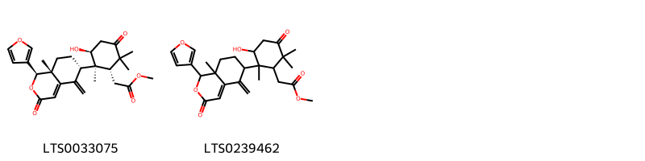{ width=100% }
    <figcaption>Hình ảnh cấu trúc hóa học của 2 hoạt chất thuộc nhóm Pyrans gồm ['swietmanin j (LTS0033075)', 'methyl 2-{2-[1-(furan-3-yl)-8a-methyl-5-methylidene-3-oxo-1,6,7,8-tetrahydroisochromen-6-yl]-3-hydroxy-2,6,6-trimethyl-5-oxocyclohexyl}acetate (LTS0239462)'].</figcaption>
</figure>
#### Nhóm Steroids and steroid derivatives
<figure markdown="span">
    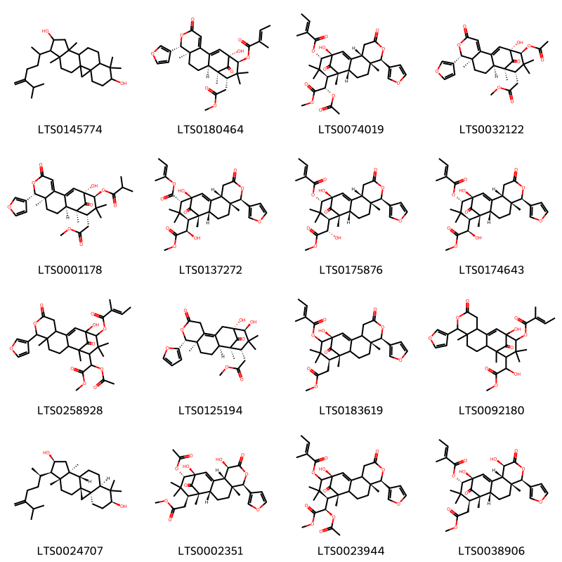{ width=100% }
    <figcaption>Hình ảnh cấu trúc hóa học của 16 hoạt chất thuộc nhóm Steroids and steroid derivatives gồm ['7,7,12,16-tetramethyl-15-(6-methyl-5-methylideneheptan-2-yl)pentacyclo[9.7.0.0¹,³.0³,⁸.0¹²,¹⁶]octadecane-6,14-diol (LTS0145774)', 'swietmanin i (LTS0180464)', '(1r,2s,5r,6r,10s,13r,14s,16s)-16-[(1s)-1-(acetyloxy)-2-methoxy-2-oxoethyl]-6-(furan-3-yl)-13-hydroxy-1,5,15,15-tetramethyl-8,17-dioxo-7-oxatetracyclo[11.3.1.0²,¹¹.0⁵,¹⁰]heptadec-11-en-14-yl (2e)-2-methylbut-2-enoate (LTS0074019)', 'swietmanin h (LTS0032122)', 'swietmanin g (LTS0001178)', '(2e)-but-2-en-2-yl (1r,2s,5r,6r,10s,13r,14s,16s)-6-(furan-3-yl)-13-hydroxy-16-[(1r)-1-hydroxy-2-methoxy-2-oxoethyl]-1,5,15,15-tetramethyl-8,17-dioxo-7-oxatetracyclo[11.3.1.0²,¹¹.0⁵,¹⁰]heptadec-11-ene-14-carboxylate (LTS0137272)', '(1r,2s,5r,6r,10s,13r,14s,16s)-6-(furan-3-yl)-13-hydroxy-16-[(1s)-1-hydroxy-2-methoxy-2-oxoethyl]-1,5,15,15-tetramethyl-8,17-dioxo-7-oxatetracyclo[11.3.1.0²,¹¹.0⁵,¹⁰]heptadec-11-en-14-yl (2e)-2-methylbut-2-enoate (LTS0175876)', '(1r,2s,5r,6r,10s,13r,14s,16s)-6-(furan-3-yl)-13-hydroxy-16-[(1r)-1-hydroxy-2-methoxy-2-oxoethyl]-1,5,15,15-tetramethyl-8,17-dioxo-7-oxatetracyclo[11.3.1.0²,¹¹.0⁵,¹⁰]heptadec-11-en-14-yl (2e)-2-methylbut-2-enoate (LTS0174643)', '16-[1-(acetyloxy)-2-methoxy-2-oxoethyl]-6-(furan-3-yl)-13-hydroxy-1,5,15,15-tetramethyl-8,17-dioxo-7-oxatetracyclo[11.3.1.0²,¹¹.0⁵,¹⁰]heptadec-11-en-14-yl 2-methylbut-2-enoate (LTS0258928)', 'methyl 2-[(1r,2s,5r,6r,13r,14s,16s)-6-(furan-2-yl)-13,14-dihydroxy-1,5,15,15-tetramethyl-8,17-dioxo-7-oxatetracyclo[11.3.1.0²,¹¹.0⁵,¹⁰]heptadec-10-en-16-yl]acetate (LTS0125194)', '(1r,5r,6r,13r,16s)-6-(furan-3-yl)-13-hydroxy-16-(2-methoxy-2-oxoethyl)-1,5,15,15-tetramethyl-8,17-dioxo-7-oxatetracyclo[11.3.1.0²,¹¹.0⁵,¹⁰]heptadec-11-en-14-yl (2e)-2-methylbut-2-enoate (LTS0183619)', '6-(furan-3-yl)-13-hydroxy-16-(1-hydroxy-2-methoxy-2-oxoethyl)-1,5,15,15-tetramethyl-8,17-dioxo-7-oxatetracyclo[11.3.1.0²,¹¹.0⁵,¹⁰]heptadec-11-en-14-yl 2-methylbut-2-enoate (LTS0092180)', '(1s,3r,6s,8r,11s,12s,14s,15r,16r)-7,7,12,16-tetramethyl-15-[(2r)-6-methyl-5-methylideneheptan-2-yl]pentacyclo[9.7.0.0¹,³.0³,⁸.0¹²,¹⁶]octadecane-6,14-diol (LTS0024707)', 'methyl 2-[(1r,2s,5r,6r,9r,10s,13r,14s,16s)-14-(acetyloxy)-6-(furan-3-yl)-9,13-dihydroxy-1,5,15,15-tetramethyl-8,17-dioxo-7-oxatetracyclo[11.3.1.0²,¹¹.0⁵,¹⁰]heptadec-11-en-16-yl]acetate (LTS0002351)', '(1r,5r,6r,13r,16s)-16-[(1r)-1-(acetyloxy)-2-methoxy-2-oxoethyl]-6-(furan-3-yl)-13-hydroxy-1,5,15,15-tetramethyl-8,17-dioxo-7-oxatetracyclo[11.3.1.0²,¹¹.0⁵,¹⁰]heptadec-11-en-14-yl (2e)-2-methylbut-2-enoate (LTS0023944)', '(1r,2s,5r,6r,9r,10s,13r,14s,16s)-6-(furan-3-yl)-9,13-dihydroxy-16-(2-methoxy-2-oxoethyl)-1,5,15,15-tetramethyl-8,17-dioxo-7-oxatetracyclo[11.3.1.0²,¹¹.0⁵,¹⁰]heptadec-11-en-14-yl (2e)-2-methylbut-2-enoate (LTS0038906)'].</figcaption>
</figure>

---

### Dược dân tộc học

Danh sách các quốc gia có sử dụng *Swietenia mahagoni* trong điều trị các bệnh. 

| Country            | Disease                | Bệnh                                                                                                                                                                                                |
|:-------------------|:-----------------------|:----------------------------------------------------------------------------------------------------------------------------------------------------------------------------------------------------|
| Bahamas            | Abortifacient, Apertif | MYMEMORY WARNING: YOU USED ALL AVAILABLE FREE TRANSLATIONS FOR TODAY. NEXT AVAILABLE IN  06 HOURS 43 MINUTES 14 SECONDS VISIT HTTPS://MYMEMORY.TRANSLATED.NET/DOC/USAGELIMITS.PHP TO TRANSLATE MORE |
| Dominican Republic | Purgative, Astringent  | MYMEMORY WARNING: YOU USED ALL AVAILABLE FREE TRANSLATIONS FOR TODAY. NEXT AVAILABLE IN  06 HOURS 43 MINUTES 11 SECONDS VISIT HTTPS://MYMEMORY.TRANSLATED.NET/DOC/USAGELIMITS.PHP TO TRANSLATE MORE |
| Elsewhere          | Astringent, Tonic      | MYMEMORY WARNING: YOU USED ALL AVAILABLE FREE TRANSLATIONS FOR TODAY. NEXT AVAILABLE IN  06 HOURS 43 MINUTES 06 SECONDS VISIT HTTPS://MYMEMORY.TRANSLATED.NET/DOC/USAGELIMITS.PHP TO TRANSLATE MORE |
| Haiti              | Tonic, Antiseptic      | MYMEMORY WARNING: YOU USED ALL AVAILABLE FREE TRANSLATIONS FOR TODAY. NEXT AVAILABLE IN  06 HOURS 43 MINUTES 02 SECONDS VISIT HTTPS://MYMEMORY.TRANSLATED.NET/DOC/USAGELIMITS.PHP TO TRANSLATE MORE |

---

---
## Swietenia mahogani
### Thông tin về thực vật

!!! info "Phân loại thực vật của *Swietenia mahagoni* từ GIBF:"
    - **Kingdom:** Plantae
    - **Phylum:** Tracheophyta
    - **Order:** Sapindales
    - **Family:** Meliaceae
    - **Genus:** Swietenia
    - **Species:** *Swietenia mahagoni*

 

| Label (VI)   | Label (EN)   | Scientific Name    | Descriptions (VI)   | Descriptions (EN)   | Also Known As (VI)                                                              | Also Known As (EN)                              |
|:-------------|:-------------|:-------------------|:--------------------|:--------------------|:--------------------------------------------------------------------------------|:------------------------------------------------|
| N/A          | N/A          | Swietenia mahagoni | loài thực vật       | species of plant    | ['Xà cừ Tây Ấn', 'Swietenia mahagoni', 'Dái ngựa Tây Ấn', 'Swietenia mahogani'] | ['Swietenia mahogani', 'Small-leaved mahogany'] |

#### Phân bố trên thế giới

**Từ CSDL GIBF** nan, Angola, Brazil, India, United States of America, Cuba, Mexico, Venezuela (Bolivarian Republic of)

#### Phân bố tại Việt Nam

**Từ CSDL GIBF**: Không có ghi nhận ở Việt Nam

---
### Thành phần hóa học
        
- Theo cơ sở dữ liệu lotus: Từ loài *Swietenia mahagoni* đã phân lập và xác định được 82 hoạt chất thuộc về các nhóm Fatty Acyls, Prenol lipids, Steroids and steroid derivatives, Naphthopyrans, Dioxepanes, Carboxylic acids and derivatives. 

|    | chemicalTaxonomyClassyfireClass   |   smiles_count |
|---:|:----------------------------------|---------------:|
|  0 | Carboxylic acids and derivatives  |              2 |
|  1 | Dioxepanes                        |              2 |
|  2 | Fatty Acyls                       |             13 |
|  3 | Naphthopyrans                     |             10 |
|  4 | Prenol lipids                     |             47 |
|  5 | Steroids and steroid derivatives  |              8 |

#### Nhóm Carboxylic acids and derivatives
<figure markdown="span">
    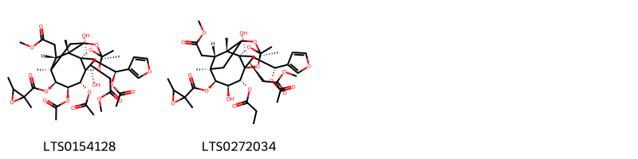{ width=100% }
    <figcaption>Hình ảnh cấu trúc hóa học của 2 hoạt chất thuộc nhóm Carboxylic acids and derivatives gồm ['(1s,2r,3s,4s,5r,6s,7r,12r,13r,15s,16s)-2,3-bis(acetyloxy)-15-[(r)-(acetyloxy)(furan-3-yl)methyl]-13,16-dihydroxy-6,16-bis(2-methoxy-2-oxoethyl)-5,7,10,15-tetramethyl-9,11,17-trioxapentacyclo[8.6.1.1⁵,⁸.0¹,¹².0⁷,¹²]octadecan-4-yl 2,3-dimethyloxirane-2-carboxylate (LTS0154128)', '(1s,2r,3s,4s,5r,6s,7r,12r,13r,15r,16r)-15-[(r)-(acetyloxy)(furan-3-yl)methyl]-3,13-dihydroxy-6,16-bis(2-methoxy-2-oxoethyl)-5,7,10,15-tetramethyl-2-(propanoyloxy)-9,11,17-trioxapentacyclo[8.6.1.1⁵,⁸.0¹,¹².0⁷,¹²]octadecan-4-yl 2,3-dimethyloxirane-2-carboxylate (LTS0272034)'].</figcaption>
</figure>
#### Nhóm Dioxepanes
<figure markdown="span">
    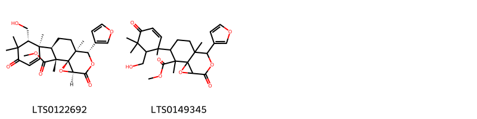{ width=100% }
    <figcaption>Hình ảnh cấu trúc hóa học của 2 hoạt chất thuộc nhóm Dioxepanes gồm ['methyl (1r,3s,6s,7s,10r,11r)-6-(furan-3-yl)-10-[(1r,6r)-6-(hydroxymethyl)-1,5,5-trimethyl-4-oxocyclohex-2-en-1-yl]-7,11-dimethyl-4-oxo-2,5-dioxatricyclo[5.4.0.0¹,³]undecane-11-carboxylate (LTS0122692)', 'methyl 6-(furan-3-yl)-10-[6-(hydroxymethyl)-1,5,5-trimethyl-4-oxocyclohex-2-en-1-yl]-7,11-dimethyl-4-oxo-2,5-dioxatricyclo[5.4.0.0¹,³]undecane-11-carboxylate (LTS0149345)'].</figcaption>
</figure>
#### Nhóm Fatty Acyls
<figure markdown="span">
    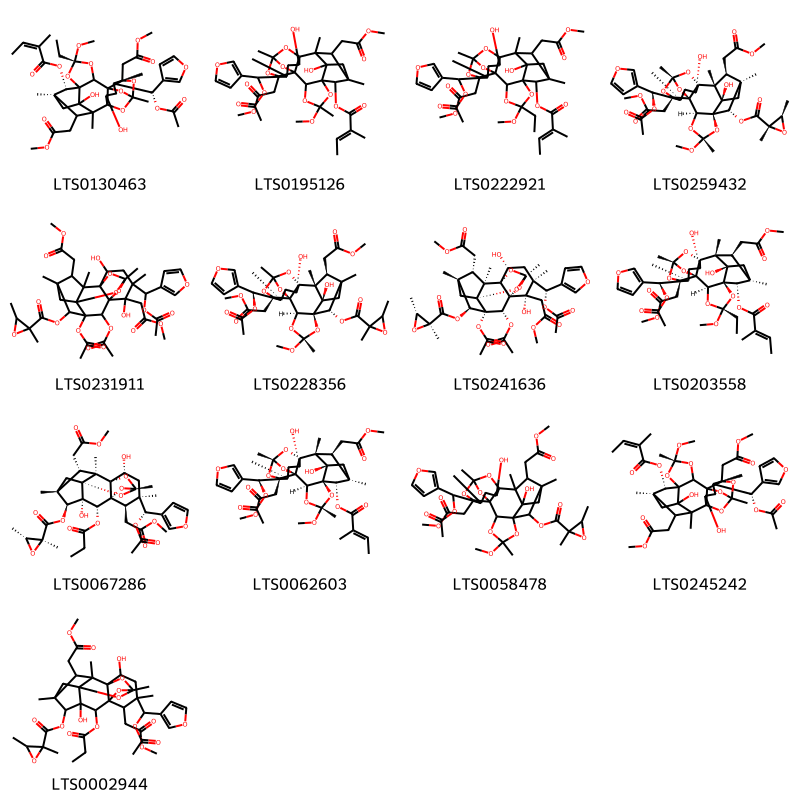{ width=100% }
    <figcaption>Hình ảnh cấu trúc hóa học của 13 hoạt chất thuộc nhóm Fatty Acyls gồm ['(5r,6s,9r,17s)-17-[(s)-(acetyloxy)(furan-3-yl)methyl]-9-ethyl-3,19-dihydroxy-9-methoxy-16,21-bis(2-methoxy-2-oxoethyl)-2,5,14,17-tetramethyl-8,10,13,15,20-pentaoxaheptacyclo[12.5.1.1²,⁵.0¹,¹².0³,⁷.0⁷,¹¹.0¹²,¹⁶]henicosan-6-yl (2z)-2-methylbut-2-enoate (LTS0130463)', '17-[(acetyloxy)(furan-3-yl)methyl]-3,19-dihydroxy-9-methoxy-16,21-bis(2-methoxy-2-oxoethyl)-2,5,9,14,17-pentamethyl-8,10,13,15,20-pentaoxaheptacyclo[12.5.1.1²,⁵.0¹,¹².0³,⁷.0⁷,¹¹.0¹²,¹⁶]henicosan-6-yl 2-methylbut-2-enoate (LTS0195126)', '17-[(acetyloxy)(furan-3-yl)methyl]-9-ethyl-3,19-dihydroxy-9-methoxy-16,21-bis(2-methoxy-2-oxoethyl)-2,5,14,17-tetramethyl-8,10,13,15,20-pentaoxaheptacyclo[12.5.1.1²,⁵.0¹,¹².0³,⁷.0⁷,¹¹.0¹²,¹⁶]henicosan-6-yl 2-methylbut-2-enoate (LTS0222921)', '(1r,2r,3r,5r,6s,7s,9r,11r,12s,14r,16s,17s,19r,21s)-17-[(s)-(acetyloxy)(furan-3-yl)methyl]-3,19-dihydroxy-9-methoxy-16,21-bis(2-methoxy-2-oxoethyl)-2,5,9,14,17-pentamethyl-8,10,13,15,20-pentaoxaheptacyclo[12.5.1.1²,⁵.0¹,¹².0³,⁷.0⁷,¹¹.0¹²,¹⁶]henicosan-6-yl (2s,3r)-2,3-dimethyloxirane-2-carboxylate (LTS0259432)', '2,3-bis(acetyloxy)-15-[(acetyloxy)(furan-3-yl)methyl]-13,16-dihydroxy-6,16-bis(2-methoxy-2-oxoethyl)-5,7,10,15-tetramethyl-9,11,17-trioxahexacyclo[8.6.1.1⁵,⁸.0¹,¹².0³,⁸.0⁷,¹²]octadecan-4-yl 2,3-dimethyloxirane-2-carboxylate (LTS0231911)', '(1r,2r,3r,6s,7s,9r,11r,12s,16s,17s,19r,21s)-17-[(s)-(acetyloxy)(furan-3-yl)methyl]-3,19-dihydroxy-9-methoxy-16,21-bis(2-methoxy-2-oxoethyl)-2,5,9,14,17-pentamethyl-8,10,13,15,20-pentaoxaheptacyclo[12.5.1.1²,⁵.0¹,¹².0³,⁷.0⁷,¹¹.0¹²,¹⁶]henicosan-6-yl 2,3-dimethyloxirane-2-carboxylate (LTS0228356)', '(1s,2r,3s,4s,5r,6s,7r,8r,10s,12r,13r,15s,16s)-2,3-bis(acetyloxy)-15-[(s)-(acetyloxy)(furan-3-yl)methyl]-13,16-dihydroxy-6,16-bis(2-methoxy-2-oxoethyl)-5,7,10,15-tetramethyl-9,11,17-trioxahexacyclo[8.6.1.1⁵,⁸.0¹,¹².0³,⁸.0⁷,¹²]octadecan-4-yl (2s,3r)-2,3-dimethyloxirane-2-carboxylate (LTS0241636)', '(1r,2r,3r,5r,6s,7s,9r,11r,12s,14r,16s,17s,19r,21s)-17-[(s)-(acetyloxy)(furan-3-yl)methyl]-9-ethyl-3,19-dihydroxy-9-methoxy-16,21-bis(2-methoxy-2-oxoethyl)-2,5,14,17-tetramethyl-8,10,13,15,20-pentaoxaheptacyclo[12.5.1.1²,⁵.0¹,¹².0³,⁷.0⁷,¹¹.0¹²,¹⁶]henicosan-6-yl (2e)-2-methylbut-2-enoate (LTS0203558)', '(1r,2r,3s,4s,5r,6s,7r,8r,10r,12r,13r,15r,16r)-15-[(r)-(acetyloxy)(furan-3-yl)methyl]-3,13-dihydroxy-6,16-bis(2-methoxy-2-oxoethyl)-5,7,10,15-tetramethyl-2-(propanoyloxy)-9,11,17-trioxahexacyclo[8.6.1.1⁵,⁸.0¹,¹².0³,⁸.0⁷,¹²]octadecan-4-yl (2s,3r)-2,3-dimethyloxirane-2-carboxylate (LTS0067286)', '(1r,2r,3r,5r,6s,7s,9r,11r,12s,14r,16s,17s,19r,21s)-17-[(s)-(acetyloxy)(furan-3-yl)methyl]-3,19-dihydroxy-9-methoxy-16,21-bis(2-methoxy-2-oxoethyl)-2,5,9,14,17-pentamethyl-8,10,13,15,20-pentaoxaheptacyclo[12.5.1.1²,⁵.0¹,¹².0³,⁷.0⁷,¹¹.0¹²,¹⁶]henicosan-6-yl (2e)-2-methylbut-2-enoate (LTS0062603)', '17-[(acetyloxy)(furan-3-yl)methyl]-3,19-dihydroxy-9-methoxy-16,21-bis(2-methoxy-2-oxoethyl)-2,5,9,14,17-pentamethyl-8,10,13,15,20-pentaoxaheptacyclo[12.5.1.1²,⁵.0¹,¹².0³,⁷.0⁷,¹¹.0¹²,¹⁶]henicosan-6-yl 2,3-dimethyloxirane-2-carboxylate (LTS0058478)', '(5r,6s,9r,17s)-17-[(s)-(acetyloxy)(furan-3-yl)methyl]-3,19-dihydroxy-9-methoxy-16,21-bis(2-methoxy-2-oxoethyl)-2,5,9,14,17-pentamethyl-8,10,13,15,20-pentaoxaheptacyclo[12.5.1.1²,⁵.0¹,¹².0³,⁷.0⁷,¹¹.0¹²,¹⁶]henicosan-6-yl (2z)-2-methylbut-2-enoate (LTS0245242)', '15-[(acetyloxy)(furan-3-yl)methyl]-3,13-dihydroxy-6,16-bis(2-methoxy-2-oxoethyl)-5,7,10,15-tetramethyl-2-(propanoyloxy)-9,11,17-trioxahexacyclo[8.6.1.1⁵,⁸.0¹,¹².0³,⁸.0⁷,¹²]octadecan-4-yl 2,3-dimethyloxirane-2-carboxylate (LTS0002944)'].</figcaption>
</figure>
#### Nhóm Naphthopyrans
<figure markdown="span">
    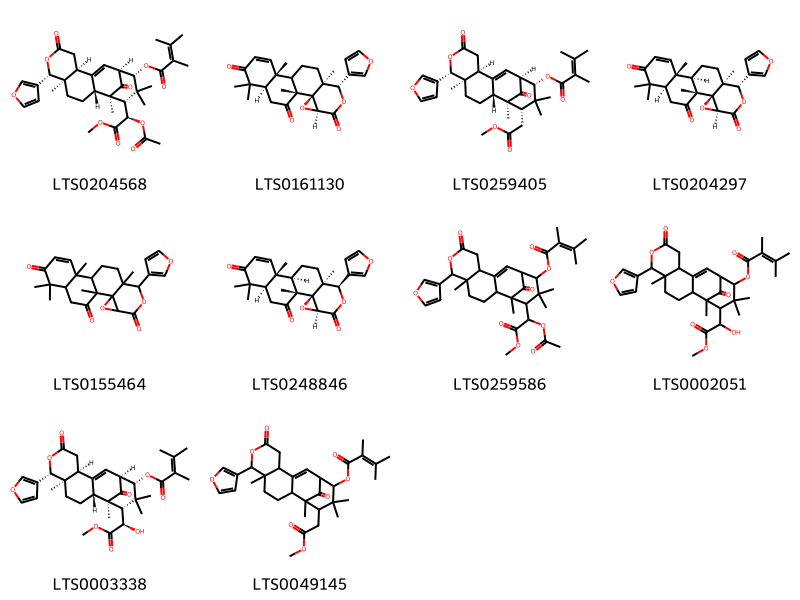{ width=100% }
    <figcaption>Hình ảnh cấu trúc hóa học của 10 hoạt chất thuộc nhóm Naphthopyrans gồm ['(1r,2r,5r,6r,10s,13s,14s,16s)-16-[(1r)-1-(acetyloxy)-2-methoxy-2-oxoethyl]-6-(furan-3-yl)-1,5,15,15-tetramethyl-8,17-dioxo-7-oxatetracyclo[11.3.1.0²,¹¹.0⁵,¹⁰]heptadec-11-en-14-yl 2,3-dimethylbut-2-enoate (LTS0204568)', '(1r,2r,4s,7s,8s,12s,17r)-7-(furan-3-yl)-1,8,12,16,16-pentamethyl-3,6-dioxapentacyclo[9.8.0.0²,⁴.0²,⁸.0¹²,¹⁷]nonadec-13-ene-5,15,19-trione (LTS0161130)', '(1r,2r,5r,6r,10s,13s,14s,16s)-6-(furan-3-yl)-16-(2-methoxy-2-oxoethyl)-1,5,15,15-tetramethyl-8,17-dioxo-7-oxatetracyclo[11.3.1.0²,¹¹.0⁵,¹⁰]heptadec-11-en-14-yl 2,3-dimethylbut-2-enoate (LTS0259405)', '(1r,2r,4s,7s,8s,11r,12s,17r)-7-(furan-3-yl)-1,8,12,16,16-pentamethyl-3,6-dioxapentacyclo[9.8.0.0²,⁴.0²,⁸.0¹²,¹⁷]nonadec-13-ene-5,15,19-trione (LTS0204297)', '7-(furan-3-yl)-1,8,12,16,16-pentamethyl-3,6-dioxapentacyclo[9.8.0.0²,⁴.0²,⁸.0¹²,¹⁷]nonadec-13-ene-5,15,19-trione (LTS0155464)', '(1r,2r,4s,7r,8s,11r,12s,17r)-7-(furan-3-yl)-1,8,12,16,16-pentamethyl-3,6-dioxapentacyclo[9.8.0.0²,⁴.0²,⁸.0¹²,¹⁷]nonadec-13-ene-5,15,19-trione (LTS0248846)', '16-[1-(acetyloxy)-2-methoxy-2-oxoethyl]-6-(furan-3-yl)-1,5,15,15-tetramethyl-8,17-dioxo-7-oxatetracyclo[11.3.1.0²,¹¹.0⁵,¹⁰]heptadec-11-en-14-yl 2,3-dimethylbut-2-enoate (LTS0259586)', '6-(furan-3-yl)-16-(1-hydroxy-2-methoxy-2-oxoethyl)-1,5,15,15-tetramethyl-8,17-dioxo-7-oxatetracyclo[11.3.1.0²,¹¹.0⁵,¹⁰]heptadec-11-en-14-yl 2,3-dimethylbut-2-enoate (LTS0002051)', '(1r,2r,5r,6r,10s,13s,14s,16s)-6-(furan-3-yl)-16-[(1r)-1-hydroxy-2-methoxy-2-oxoethyl]-1,5,15,15-tetramethyl-8,17-dioxo-7-oxatetracyclo[11.3.1.0²,¹¹.0⁵,¹⁰]heptadec-11-en-14-yl 2,3-dimethylbut-2-enoate (LTS0003338)', '6-(furan-3-yl)-16-(2-methoxy-2-oxoethyl)-1,5,15,15-tetramethyl-8,17-dioxo-7-oxatetracyclo[11.3.1.0²,¹¹.0⁵,¹⁰]heptadec-11-en-14-yl 2,3-dimethylbut-2-enoate (LTS0049145)'].</figcaption>
</figure>
#### Nhóm Prenol lipids
<figure markdown="span">
    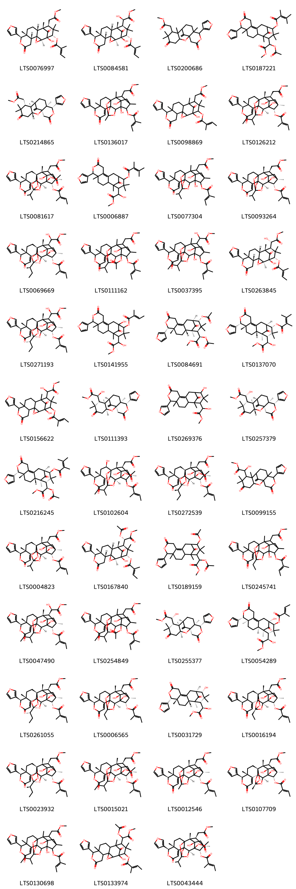{ width=100% }
    <figcaption>Hình ảnh cấu trúc hóa học của 47 hoạt chất thuộc nhóm Prenol lipids gồm ['ruageanin b (LTS0076997)', '(1s,2r,4s,5r,9r,10r,13r,14s,15s,17s)-9-(furan-3-yl)-1-hydroxy-15-[(1r)-1-hydroxy-2-methoxy-2-oxoethyl]-10,14,16,16-tetramethyl-7,18-dioxo-3,8-dioxapentacyclo[12.3.1.0²,⁴.0⁴,¹³.0⁵,¹⁰]octadecan-17-yl (2e)-2-methylbut-2-enoate (LTS0084581)', 'methyl 2-[13-(furan-3-yl)-6,6,8,12-tetramethyl-17-methylidene-5,15-dioxo-2,14-dioxatetracyclo[7.7.1.0¹,¹².0³,⁸]heptadecan-7-yl]acetate (LTS0200686)', '16-[1-(acetyloxy)-2-methoxy-2-oxoethyl]-6-(furan-3-yl)-1,5,15,15-tetramethyl-8,17-dioxo-7-oxatetracyclo[11.3.1.0²,¹¹.0⁵,¹⁰]heptadec-10-en-14-yl 2,3-dimethylbut-2-enoate (LTS0187221)', 'methyl 2-[(1s,3r,7r,8r,9r,12s,13s)-13-(furan-3-yl)-6,6,8,12-tetramethyl-17-methylidene-5,15-dioxo-2,14-dioxatetracyclo[7.7.1.0¹,¹².0³,⁸]heptadecan-7-yl]acetate (LTS0214865)', '5-(furan-3-yl)-15,16-dihydroxy-19-(2-methoxy-2-oxoethyl)-4,12,18,20-tetramethyl-7-oxo-6,11,13,21-tetraoxaheptacyclo[10.8.1.1¹⁵,¹⁸.0¹,¹⁰.0⁴,⁹.0¹⁰,¹⁴.0¹⁶,²⁰]docos-8-en-22-yl 2-methylbut-2-enoate (LTS0136017)', '9-(furan-3-yl)-1-hydroxy-15-(2-methoxy-2-oxoethyl)-10,14,16,16-tetramethyl-7,18-dioxo-3,8-dioxapentacyclo[12.3.1.0²,⁴.0⁴,¹³.0⁵,¹⁰]octadecan-17-yl 2-methylbut-2-enoate (LTS0098869)', '(4r,5r,14r,16r,18r,19s,20r,22s)-5-(furan-3-yl)-15,16-dihydroxy-19-(2-methoxy-2-oxoethyl)-4,18,20-trimethyl-7-oxo-12-(sec-butyl)-6,11,13,21-tetraoxaheptacyclo[10.8.1.1¹⁵,¹⁸.0¹,¹⁰.0⁴,⁹.0¹⁰,¹⁴.0¹⁶,²⁰]docos-8-en-22-yl (2e)-2-methylbut-2-enoate (LTS0126212)', '(1s,4r,5r,10r,12s,14s,15s,16r,18r,19s,20r,22s)-15-(acetyloxy)-5-(furan-3-yl)-16-hydroxy-12-isopropyl-19-(2-methoxy-2-oxoethyl)-4,18,20-trimethyl-7-oxo-6,11,13,21-tetraoxaheptacyclo[10.8.1.1¹⁵,¹⁸.0¹,¹⁰.0⁴,⁹.0¹⁰,¹⁴.0¹⁶,²⁰]docos-8-en-22-yl (2e)-2-methylbut-2-enoate (LTS0081617)', '6-(furan-3-yl)-16-(1-hydroxy-2-methoxy-2-oxoethyl)-1,5,15,15-tetramethyl-8,17-dioxo-7-oxatetracyclo[11.3.1.0²,¹¹.0⁵,¹⁰]heptadec-10-en-14-yl 2,3-dimethylbut-2-enoate (LTS0006887)', '5-(furan-3-yl)-15,16-dihydroxy-12-isopropyl-19-(2-methoxy-2-oxoethyl)-4,18,20-trimethyl-7-oxo-6,11,13,21-tetraoxaheptacyclo[10.8.1.1¹⁵,¹⁸.0¹,¹⁰.0⁴,⁹.0¹⁰,¹⁴.0¹⁶,²⁰]docos-8-en-22-yl 2-methylbut-2-enoate (LTS0077304)', '(4r,5r,14r,16r,18r,19s,20r,22s)-5-(furan-3-yl)-15,16-dihydroxy-12-isopropyl-19-(2-methoxy-2-oxoethyl)-4,18,20-trimethyl-7-oxo-6,11,13,21-tetraoxaheptacyclo[10.8.1.1¹⁵,¹⁸.0¹,¹⁰.0⁴,⁹.0¹⁰,¹⁴.0¹⁶,²⁰]docos-8-en-22-yl (2e)-2-methylbut-2-enoate (LTS0093264)', '(1s,4r,5r,10r,12s,14r,15s,16r,18r,19s,20r,22s)-12-[(2r)-butan-2-yl]-5-(furan-3-yl)-15,16-dihydroxy-19-[(1r)-1-hydroxy-2-methoxy-2-oxoethyl]-4,18,20-trimethyl-7-oxo-6,11,13,21-tetraoxaheptacyclo[10.8.1.1¹⁵,¹⁸.0¹,¹⁰.0⁴,⁹.0¹⁰,¹⁴.0¹⁶,²⁰]docos-8-en-22-yl (2e)-2-methylbut-2-enoate (LTS0069669)', '15-(acetyloxy)-5-(furan-3-yl)-16-hydroxy-12-isopropyl-19-(2-methoxy-2-oxoethyl)-4,18,20-trimethyl-7-oxo-6,11,13,21-tetraoxaheptacyclo[10.8.1.1¹⁵,¹⁸.0¹,¹⁰.0⁴,⁹.0¹⁰,¹⁴.0¹⁶,²⁰]docos-8-en-22-yl 2-methylbut-2-enoate (LTS0111162)', '5-(furan-3-yl)-15,16-dihydroxy-19-(1-hydroxy-2-methoxy-2-oxoethyl)-4,18,20-trimethyl-7-oxo-12-(sec-butyl)-6,11,13,21-tetraoxaheptacyclo[10.8.1.1¹⁵,¹⁸.0¹,¹⁰.0⁴,⁹.0¹⁰,¹⁴.0¹⁶,²⁰]docos-8-en-22-yl 2-methylbut-2-enoate (LTS0037395)', '(1s,2r,4s,5r,9r,10r,13r,14s,15s,17s)-9-(furan-3-yl)-1-hydroxy-15-[(1s)-1-hydroxy-2-methoxy-2-oxoethyl]-10,14,16,16-tetramethyl-7,18-dioxo-3,8-dioxapentacyclo[12.3.1.0²,⁴.0⁴,¹³.0⁵,¹⁰]octadecan-17-yl (2e)-2-methylbut-2-enoate (LTS0263845)', '(1s,4r,5r,10r,12s,14r,15s,16r,18r,19s,20r,22s)-12-[(2s)-butan-2-yl]-5-(furan-3-yl)-15,16-dihydroxy-19-[(1r)-1-hydroxy-2-methoxy-2-oxoethyl]-4,18,20-trimethyl-7-oxo-6,11,13,21-tetraoxaheptacyclo[10.8.1.1¹⁵,¹⁸.0¹,¹⁰.0⁴,⁹.0¹⁰,¹⁴.0¹⁶,²⁰]docos-8-en-22-yl (2e)-2-methylbut-2-enoate (LTS0271193)', '6-(furan-3-yl)-13-hydroxy-16-(1-hydroxy-2-methoxy-2-oxoethyl)-1,5,15,15-tetramethyl-8,17-dioxo-7-oxatetracyclo[11.3.1.0²,¹¹.0⁵,¹⁰]heptadec-10-en-14-yl 2-methylbut-2-enoate (LTS0141955)', 'methyl (2r)-2-(acetyloxy)-2-[(1r,2r,5s,6r,13s,14s,16r)-14-(acetyloxy)-6-(furan-3-yl)-1,5,15,15-tetramethyl-8,17-dioxo-7-oxatetracyclo[11.3.1.0²,¹¹.0⁵,¹⁰]heptadec-10-en-16-yl]acetate (LTS0084691)', '(1r,2r,5s,6r,13s,14s,16s)-6-(furan-3-yl)-16-[(1r)-1-hydroxy-2-methoxy-2-oxoethyl]-1,5,15,15-tetramethyl-8,17-dioxo-7-oxatetracyclo[11.3.1.0²,¹¹.0⁵,¹⁰]heptadec-10-en-14-yl 2,3-dimethylbut-2-enoate (LTS0137070)', '9-(furan-3-yl)-1-hydroxy-15-(1-hydroxy-2-methoxy-2-oxoethyl)-10,14,16,16-tetramethyl-7,18-dioxo-3,8-dioxapentacyclo[12.3.1.0²,⁴.0⁴,¹³.0⁵,¹⁰]octadecan-17-yl 2-methylbut-2-enoate (LTS0156622)', 'methyl (2s)-2-[(1s,3s,7r,8r,9r,12s,13s)-13-(furan-3-yl)-6,6,8,12-tetramethyl-17-methylidene-5,15-dioxo-2,14-dioxatetracyclo[7.7.1.0¹,¹².0³,⁸]heptadecan-7-yl]-2-hydroxyacetate (LTS0111393)', 'methyl 2-[6-(furan-3-yl)-14-hydroxy-1,5,15,15-tetramethyl-8,17-dioxo-7-oxatetracyclo[11.3.1.0²,¹¹.0⁵,¹⁰]heptadec-10-en-16-yl]-2-hydroxyacetate (LTS0269376)', 'methyl (2r)-2-[(1s,3r,7r,8r,9r,12s,13s)-13-(furan-3-yl)-6,6,8,12-tetramethyl-17-methylidene-5,15-dioxo-2,14-dioxatetracyclo[7.7.1.0¹,¹².0³,⁸]heptadecan-7-yl]-2-hydroxyacetate (LTS0257379)', '(1r,2r,5s,6r,13s,14r,16s)-16-[(1r)-1-(acetyloxy)-2-methoxy-2-oxoethyl]-6-(furan-3-yl)-1,5,15,15-tetramethyl-8,17-dioxo-7-oxatetracyclo[11.3.1.0²,¹¹.0⁵,¹⁰]heptadec-10-en-14-yl 2,3-dimethylbut-2-enoate (LTS0216245)', '(1r,2r,4r,5r,10r,14s,15s,16r,18r,19s,20r)-15-(acetyloxy)-5-(furan-3-yl)-2,16-dihydroxy-19-(2-methoxy-2-oxoethyl)-4,18,20-trimethyl-7-oxo-12-(sec-butyl)-6,11,13,21-tetraoxaheptacyclo[10.8.1.1¹⁵,¹⁸.0¹,¹⁰.0⁴,⁹.0¹⁰,¹⁴.0¹⁶,²⁰]docos-8-en-22-yl (2e)-2-methylbut-2-enoate (LTS0102604)', '(1s,4r,5r,10r,12s,14s,15s,16r,18r,19s,20r,22s)-15-(acetyloxy)-12-[(2r)-butan-2-yl]-5-(furan-3-yl)-16-hydroxy-19-(2-methoxy-2-oxoethyl)-4,18,20-trimethyl-7-oxo-6,11,13,21-tetraoxaheptacyclo[10.8.1.1¹⁵,¹⁸.0¹,¹⁰.0⁴,⁹.0¹⁰,¹⁴.0¹⁶,²⁰]docos-8-en-22-yl (2e)-2-methylbut-2-enoate (LTS0272539)', 'methyl 2-[13-(furan-3-yl)-6,6,8,12-tetramethyl-17-methylidene-5,15-dioxo-2,14-dioxatetracyclo[7.7.1.0¹,¹².0³,⁸]heptadecan-7-yl]-2-hydroxyacetate (LTS0099155)', '(1s,4r,5r,10r,12s,14r,15s,16r,18r,19s,20r,22s)-5-(furan-3-yl)-15,16-dihydroxy-12-isopropyl-19-(2-methoxy-2-oxoethyl)-4,18,20-trimethyl-7-oxo-6,11,13,21-tetraoxaheptacyclo[10.8.1.1¹⁵,¹⁸.0¹,¹⁰.0⁴,⁹.0¹⁰,¹⁴.0¹⁶,²⁰]docos-8-en-22-yl (2e)-2-methylbut-2-enoate (LTS0004823)', '(1s,2r,4s,5r,9r,10r,13r,14s,15s,17s)-15-[(1s)-1-(acetyloxy)-2-methoxy-2-oxoethyl]-9-(furan-3-yl)-1-hydroxy-10,14,16,16-tetramethyl-7,18-dioxo-3,8-dioxapentacyclo[12.3.1.0²,⁴.0⁴,¹³.0⁵,¹⁰]octadecan-17-yl (2e)-2-methylbut-2-enoate (LTS0167840)', 'methyl 2-(acetyloxy)-2-[14-(acetyloxy)-6-(furan-3-yl)-1,5,15,15-tetramethyl-8,17-dioxo-7-oxatetracyclo[11.3.1.0²,¹¹.0⁵,¹⁰]heptadec-10-en-16-yl]acetate (LTS0189159)', '12-ethyl-5-(furan-3-yl)-15,16-dihydroxy-19-(2-methoxy-2-oxoethyl)-4,18,20-trimethyl-7-oxo-6,11,13,21-tetraoxaheptacyclo[10.8.1.1¹⁵,¹⁸.0¹,¹⁰.0⁴,⁹.0¹⁰,¹⁴.0¹⁶,²⁰]docos-8-en-22-yl 2-methylbut-2-enoate (LTS0245741)', '(4r,5r,14r,16r,18r,19s,20r,22s)-5-(furan-3-yl)-15,16-dihydroxy-19-[(1r)-1-hydroxy-2-methoxy-2-oxoethyl]-4,18,20-trimethyl-7-oxo-12-(sec-butyl)-6,11,13,21-tetraoxaheptacyclo[10.8.1.1¹⁵,¹⁸.0¹,¹⁰.0⁴,⁹.0¹⁰,¹⁴.0¹⁶,²⁰]docos-8-en-22-yl (2e)-2-methylbut-2-enoate (LTS0047490)', '15-(acetyloxy)-5-(furan-3-yl)-16-hydroxy-19-(2-methoxy-2-oxoethyl)-4,18,20-trimethyl-7-oxo-12-(sec-butyl)-6,11,13,21-tetraoxaheptacyclo[10.8.1.1¹⁵,¹⁸.0¹,¹⁰.0⁴,⁹.0¹⁰,¹⁴.0¹⁶,²⁰]docos-8-en-22-yl 2-methylbut-2-enoate (LTS0254849)', 'methyl (2r)-2-[(1s,3s,7r,8r,9r,12s,13s)-13-(furan-3-yl)-6,6,8,12-tetramethyl-17-methylidene-5,15-dioxo-2,14-dioxatetracyclo[7.7.1.0¹,¹².0³,⁸]heptadecan-7-yl]-2-hydroxyacetate (LTS0255377)', '(1r,2s,5r,6r,13r,14s,16s)-6-(furan-3-yl)-13-hydroxy-16-[(1r)-1-hydroxy-2-methoxy-2-oxoethyl]-1,5,15,15-tetramethyl-8,17-dioxo-7-oxatetracyclo[11.3.1.0²,¹¹.0⁵,¹⁰]heptadec-10-en-14-yl (2e)-2-methylbut-2-enoate (LTS0054289)', '(1s,4r,5r,10r,12s,14r,15s,16r,18r,19s,20r,22s)-12-[(2s)-butan-2-yl]-5-(furan-3-yl)-15,16-dihydroxy-19-(2-methoxy-2-oxoethyl)-4,18,20-trimethyl-7-oxo-6,11,13,21-tetraoxaheptacyclo[10.8.1.1¹⁵,¹⁸.0¹,¹⁰.0⁴,⁹.0¹⁰,¹⁴.0¹⁶,²⁰]docos-8-en-22-yl (2e)-2-methylbut-2-enoate (LTS0261055)', '(4r,5r,14r,16r,18r,19s,20r,22s)-12-ethyl-5-(furan-3-yl)-15,16-dihydroxy-19-(2-methoxy-2-oxoethyl)-4,18,20-trimethyl-7-oxo-6,11,13,21-tetraoxaheptacyclo[10.8.1.1¹⁵,¹⁸.0¹,¹⁰.0⁴,⁹.0¹⁰,¹⁴.0¹⁶,²⁰]docos-8-en-22-yl (2e)-2-methylbut-2-enoate (LTS0006565)', 'methyl (2r)-2-[(1r,2r,5s,6r,13s,14s,16s)-6-(furan-3-yl)-14-hydroxy-1,5,15,15-tetramethyl-8,17-dioxo-7-oxatetracyclo[11.3.1.0²,¹¹.0⁵,¹⁰]heptadec-10-en-16-yl]-2-hydroxyacetate (LTS0031729)', '(1s,4r,5r,10r,12s,14r,15s,16r,18r,19s,20r,22s)-12-ethyl-5-(furan-3-yl)-15,16-dihydroxy-19-(2-methoxy-2-oxoethyl)-4,18,20-trimethyl-7-oxo-6,11,13,21-tetraoxaheptacyclo[10.8.1.1¹⁵,¹⁸.0¹,¹⁰.0⁴,⁹.0¹⁰,¹⁴.0¹⁶,²⁰]docos-8-en-22-yl (2e)-2-methylbut-2-enoate (LTS0016194)', '(1s,4r,5r,10r,12s,14r,15s,16r,18r,19s,20r,22s)-12-[(2r)-butan-2-yl]-5-(furan-3-yl)-15,16-dihydroxy-19-(2-methoxy-2-oxoethyl)-4,18,20-trimethyl-7-oxo-6,11,13,21-tetraoxaheptacyclo[10.8.1.1¹⁵,¹⁸.0¹,¹⁰.0⁴,⁹.0¹⁰,¹⁴.0¹⁶,²⁰]docos-8-en-22-yl (2e)-2-methylbut-2-enoate (LTS0023932)', '(4r,5r,14s,16r,18r,19s,20r,22s)-15-(acetyloxy)-5-(furan-3-yl)-16-hydroxy-19-(2-methoxy-2-oxoethyl)-4,18,20-trimethyl-7-oxo-12-(sec-butyl)-6,11,13,21-tetraoxaheptacyclo[10.8.1.1¹⁵,¹⁸.0¹,¹⁰.0⁴,⁹.0¹⁰,¹⁴.0¹⁶,²⁰]docos-8-en-22-yl (2e)-2-methylbut-2-enoate (LTS0015021)', '(4r,5r,14r,16r,18r,19s,20r,22s)-5-(furan-3-yl)-15,16-dihydroxy-19-(2-methoxy-2-oxoethyl)-4,12,18,20-tetramethyl-7-oxo-6,11,13,21-tetraoxaheptacyclo[10.8.1.1¹⁵,¹⁸.0¹,¹⁰.0⁴,⁹.0¹⁰,¹⁴.0¹⁶,²⁰]docos-8-en-22-yl (2e)-2-methylbut-2-enoate (LTS0012546)', '(1s,4r,5r,10r,12s,14r,15s,16r,18r,19s,20r,22s)-5-(furan-3-yl)-15,16-dihydroxy-19-(2-methoxy-2-oxoethyl)-4,12,18,20-tetramethyl-7-oxo-6,11,13,21-tetraoxaheptacyclo[10.8.1.1¹⁵,¹⁸.0¹,¹⁰.0⁴,⁹.0¹⁰,¹⁴.0¹⁶,²⁰]docos-8-en-22-yl (2e)-2-methylbut-2-enoate (LTS0107709)', '5-(furan-3-yl)-15,16-dihydroxy-19-(2-methoxy-2-oxoethyl)-4,18,20-trimethyl-7-oxo-12-(sec-butyl)-6,11,13,21-tetraoxaheptacyclo[10.8.1.1¹⁵,¹⁸.0¹,¹⁰.0⁴,⁹.0¹⁰,¹⁴.0¹⁶,²⁰]docos-8-en-22-yl 2-methylbut-2-enoate (LTS0130698)', '15-[1-(acetyloxy)-2-methoxy-2-oxoethyl]-9-(furan-3-yl)-1-hydroxy-10,14,16,16-tetramethyl-7,18-dioxo-3,8-dioxapentacyclo[12.3.1.0²,⁴.0⁴,¹³.0⁵,¹⁰]octadecan-17-yl 2-methylbut-2-enoate (LTS0133974)', '(4r,5r,14s,16r,18r,19s,20r,22s)-15-(acetyloxy)-5-(furan-3-yl)-16-hydroxy-12-isopropyl-19-(2-methoxy-2-oxoethyl)-4,18,20-trimethyl-7-oxo-6,11,13,21-tetraoxaheptacyclo[10.8.1.1¹⁵,¹⁸.0¹,¹⁰.0⁴,⁹.0¹⁰,¹⁴.0¹⁶,²⁰]docos-8-en-22-yl (2e)-2-methylbut-2-enoate (LTS0043444)'].</figcaption>
</figure>
#### Nhóm Steroids and steroid derivatives
<figure markdown="span">
    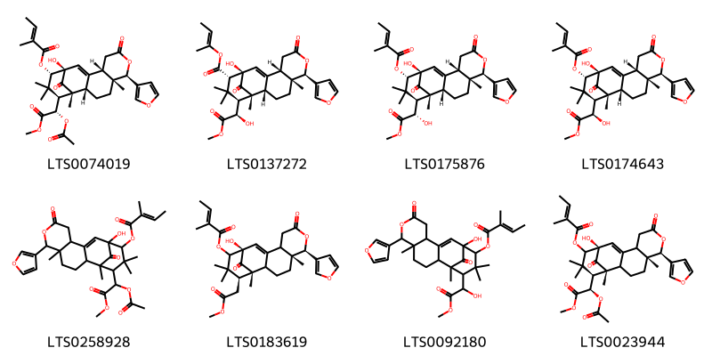{ width=100% }
    <figcaption>Hình ảnh cấu trúc hóa học của 8 hoạt chất thuộc nhóm Steroids and steroid derivatives gồm ['(1r,2s,5r,6r,10s,13r,14s,16s)-16-[(1s)-1-(acetyloxy)-2-methoxy-2-oxoethyl]-6-(furan-3-yl)-13-hydroxy-1,5,15,15-tetramethyl-8,17-dioxo-7-oxatetracyclo[11.3.1.0²,¹¹.0⁵,¹⁰]heptadec-11-en-14-yl (2e)-2-methylbut-2-enoate (LTS0074019)', '(2e)-but-2-en-2-yl (1r,2s,5r,6r,10s,13r,14s,16s)-6-(furan-3-yl)-13-hydroxy-16-[(1r)-1-hydroxy-2-methoxy-2-oxoethyl]-1,5,15,15-tetramethyl-8,17-dioxo-7-oxatetracyclo[11.3.1.0²,¹¹.0⁵,¹⁰]heptadec-11-ene-14-carboxylate (LTS0137272)', '(1r,2s,5r,6r,10s,13r,14s,16s)-6-(furan-3-yl)-13-hydroxy-16-[(1s)-1-hydroxy-2-methoxy-2-oxoethyl]-1,5,15,15-tetramethyl-8,17-dioxo-7-oxatetracyclo[11.3.1.0²,¹¹.0⁵,¹⁰]heptadec-11-en-14-yl (2e)-2-methylbut-2-enoate (LTS0175876)', '(1r,2s,5r,6r,10s,13r,14s,16s)-6-(furan-3-yl)-13-hydroxy-16-[(1r)-1-hydroxy-2-methoxy-2-oxoethyl]-1,5,15,15-tetramethyl-8,17-dioxo-7-oxatetracyclo[11.3.1.0²,¹¹.0⁵,¹⁰]heptadec-11-en-14-yl (2e)-2-methylbut-2-enoate (LTS0174643)', '16-[1-(acetyloxy)-2-methoxy-2-oxoethyl]-6-(furan-3-yl)-13-hydroxy-1,5,15,15-tetramethyl-8,17-dioxo-7-oxatetracyclo[11.3.1.0²,¹¹.0⁵,¹⁰]heptadec-11-en-14-yl 2-methylbut-2-enoate (LTS0258928)', '(1r,5r,6r,13r,16s)-6-(furan-3-yl)-13-hydroxy-16-(2-methoxy-2-oxoethyl)-1,5,15,15-tetramethyl-8,17-dioxo-7-oxatetracyclo[11.3.1.0²,¹¹.0⁵,¹⁰]heptadec-11-en-14-yl (2e)-2-methylbut-2-enoate (LTS0183619)', '6-(furan-3-yl)-13-hydroxy-16-(1-hydroxy-2-methoxy-2-oxoethyl)-1,5,15,15-tetramethyl-8,17-dioxo-7-oxatetracyclo[11.3.1.0²,¹¹.0⁵,¹⁰]heptadec-11-en-14-yl 2-methylbut-2-enoate (LTS0092180)', '(1r,5r,6r,13r,16s)-16-[(1r)-1-(acetyloxy)-2-methoxy-2-oxoethyl]-6-(furan-3-yl)-13-hydroxy-1,5,15,15-tetramethyl-8,17-dioxo-7-oxatetracyclo[11.3.1.0²,¹¹.0⁵,¹⁰]heptadec-11-en-14-yl (2e)-2-methylbut-2-enoate (LTS0023944)'].</figcaption>
</figure>

---

### Dược dân tộc học

Danh sách các quốc gia có sử dụng *Swietenia mahagoni* trong điều trị các bệnh. 

| Country   | Disease     | Bệnh                                                                                                                                                                                                |
|:----------|:------------|:----------------------------------------------------------------------------------------------------------------------------------------------------------------------------------------------------|
| Bahamas   | Aphrodisiac | MYMEMORY WARNING: YOU USED ALL AVAILABLE FREE TRANSLATIONS FOR TODAY. NEXT AVAILABLE IN  06 HOURS 42 MINUTES 20 SECONDS VISIT HTTPS://MYMEMORY.TRANSLATED.NET/DOC/USAGELIMITS.PHP TO TRANSLATE MORE |
| Haiti     | Apertif     | MYMEMORY WARNING: YOU USED ALL AVAILABLE FREE TRANSLATIONS FOR TODAY. NEXT AVAILABLE IN  06 HOURS 42 MINUTES 17 SECONDS VISIT HTTPS://MYMEMORY.TRANSLATED.NET/DOC/USAGELIMITS.PHP TO TRANSLATE MORE |

---

# Chi Lansium

??? note "Danh sách các dược liệu thuộc chi"
    
	 - *Lansium domesticum*

---
## Lansium domesticum
### Thông tin về thực vật

!!! info "Phân loại thực vật của *Lansium domesticum* từ GIBF:"
    - **Kingdom:** Plantae
    - **Phylum:** Tracheophyta
    - **Order:** Sapindales
    - **Family:** Meliaceae
    - **Genus:** Lansium
    - **Species:** *Lansium domesticum*

 

| Label (VI)   | Label (EN)   | Scientific Name    | Descriptions (VI)   | Descriptions (EN)   | Also Known As (VI)                              | Also Known As (EN)      |
|:-------------|:-------------|:-------------------|:--------------------|:--------------------|:------------------------------------------------|:------------------------|
| N/A          | N/A          | Lansium domesticum | loài thực vật       | species of plant    | ['Lòn bon', 'Lansium domesticum', 'Dâu da đất'] | ['Langsat', 'Lanzones'] |

#### Phân bố trên thế giới

**Từ CSDL GIBF** nan, Ecuador, Sri Lanka, Nigeria, Thailand, Belgium, Brazil, Papua New Guinea, unknown or invalid, Indonesia, United States of America, Viet Nam, Philippines, Singapore, Malaysia, Brunei Darussalam

#### Phân bố tại Việt Nam

**Từ CSDL GIBF**: Quangnam-Danang

---
### Thành phần hóa học
        
- Theo cơ sở dữ liệu lotus: Từ loài *Lansium domesticum* đã phân lập và xác định được 84 hoạt chất thuộc về các nhóm Prenol lipids, Steroids and steroid derivatives, Organooxygen compounds, Naphthopyrans, Carboxylic acids and derivatives, Benzopyrans. 

|    | chemicalTaxonomyClassyfireClass   |   smiles_count |
|---:|:----------------------------------|---------------:|
|  0 | Benzopyrans                       |              6 |
|  1 | Carboxylic acids and derivatives  |              6 |
|  2 | Naphthopyrans                     |              8 |
|  3 | Organooxygen compounds            |              2 |
|  4 | Prenol lipids                     |             59 |
|  5 | Steroids and steroid derivatives  |              2 |

#### Nhóm Benzopyrans
<figure markdown="span">
    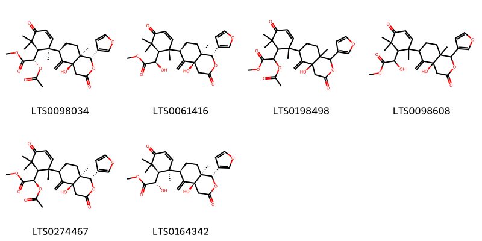{ width=100% }
    <figcaption>Hình ảnh cấu trúc hóa học của 6 hoạt chất thuộc nhóm Benzopyrans gồm ['methyl (2s)-2-[(1r,2s)-2-[(1s,4as,6r,8as)-1-(furan-3-yl)-4a-hydroxy-8a-methyl-5-methylidene-3-oxo-tetrahydro-1h-2-benzopyran-6-yl]-2,6,6-trimethyl-5-oxocyclohex-3-en-1-yl]-2-(acetyloxy)acetate (LTS0098034)', 'methyl (2r)-2-[(1r,2r)-2-[(1s,4as,6r,8as)-1-(furan-3-yl)-4a-hydroxy-8a-methyl-5-methylidene-3-oxo-tetrahydro-1h-2-benzopyran-6-yl]-2,6,6-trimethyl-5-oxocyclohex-3-en-1-yl]-2-hydroxyacetate (LTS0061416)', 'methyl 2-(acetyloxy)-2-{2-[1-(furan-3-yl)-4a-hydroxy-8a-methyl-5-methylidene-3-oxo-tetrahydro-1h-2-benzopyran-6-yl]-2,6,6-trimethyl-5-oxocyclohex-3-en-1-yl}acetate (LTS0198498)', 'methyl 2-{2-[1-(furan-3-yl)-4a-hydroxy-8a-methyl-5-methylidene-3-oxo-tetrahydro-1h-2-benzopyran-6-yl]-2,6,6-trimethyl-5-oxocyclohex-3-en-1-yl}-2-hydroxyacetate (LTS0098608)', 'methyl (2r)-2-[(1r,2r)-2-[(1s,4as,6r,8as)-1-(furan-3-yl)-4a-hydroxy-8a-methyl-5-methylidene-3-oxo-tetrahydro-1h-2-benzopyran-6-yl]-2,6,6-trimethyl-5-oxocyclohex-3-en-1-yl]-2-(acetyloxy)acetate (LTS0274467)', 'methyl (2s)-2-[(1r,2s)-2-[(1s,4as,6r,8as)-1-(furan-3-yl)-4a-hydroxy-8a-methyl-5-methylidene-3-oxo-tetrahydro-1h-2-benzopyran-6-yl]-2,6,6-trimethyl-5-oxocyclohex-3-en-1-yl]-2-hydroxyacetate (LTS0164342)'].</figcaption>
</figure>
#### Nhóm Carboxylic acids and derivatives
<figure markdown="span">
    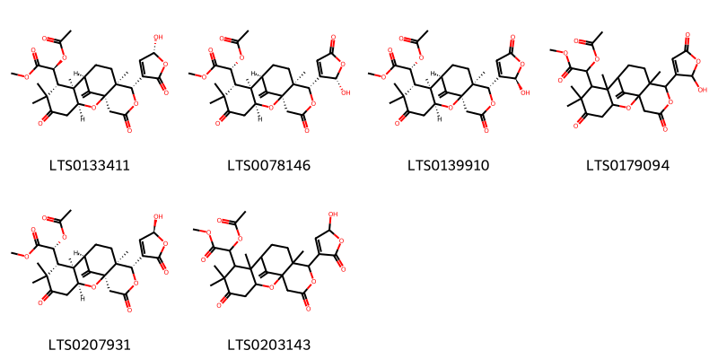{ width=100% }
    <figcaption>Hình ảnh cấu trúc hóa học của 6 hoạt chất thuộc nhóm Carboxylic acids and derivatives gồm ['methyl (2s)-2-(acetyloxy)-2-[(1s,3s,7r,8r,9r,12s,13r)-13-[(5r)-5-hydroxy-2-oxo-5h-furan-3-yl]-6,6,8,12-tetramethyl-17-methylidene-5,15-dioxo-2,14-dioxatetracyclo[7.7.1.0¹,¹².0³,⁸]heptadecan-7-yl]acetate (LTS0133411)', 'methyl (2r)-2-(acetyloxy)-2-[(1s,3s,7r,8r,9r,12s,13r)-13-[(2s)-2-hydroxy-5-oxo-2h-furan-3-yl]-6,6,8,12-tetramethyl-17-methylidene-5,15-dioxo-2,14-dioxatetracyclo[7.7.1.0¹,¹².0³,⁸]heptadecan-7-yl]acetate (LTS0078146)', 'methyl (2r)-2-(acetyloxy)-2-[(1s,3s,7r,8r,9r,12s,13r)-13-[(2r)-2-hydroxy-5-oxo-2h-furan-3-yl]-6,6,8,12-tetramethyl-17-methylidene-5,15-dioxo-2,14-dioxatetracyclo[7.7.1.0¹,¹².0³,⁸]heptadecan-7-yl]acetate (LTS0139910)', 'methyl 2-(acetyloxy)-2-[13-(2-hydroxy-5-oxo-2h-furan-3-yl)-6,6,8,12-tetramethyl-17-methylidene-5,15-dioxo-2,14-dioxatetracyclo[7.7.1.0¹,¹².0³,⁸]heptadecan-7-yl]acetate (LTS0179094)', 'methyl (2r)-2-(acetyloxy)-2-[(1s,3s,7r,8r,9r,12s,13r)-13-[(5s)-5-hydroxy-2-oxo-5h-furan-3-yl]-6,6,8,12-tetramethyl-17-methylidene-5,15-dioxo-2,14-dioxatetracyclo[7.7.1.0¹,¹².0³,⁸]heptadecan-7-yl]acetate (LTS0207931)', 'methyl 2-(acetyloxy)-2-[13-(5-hydroxy-2-oxo-5h-furan-3-yl)-6,6,8,12-tetramethyl-17-methylidene-5,15-dioxo-2,14-dioxatetracyclo[7.7.1.0¹,¹².0³,⁸]heptadecan-7-yl]acetate (LTS0203143)'].</figcaption>
</figure>
#### Nhóm Naphthopyrans
<figure markdown="span">
    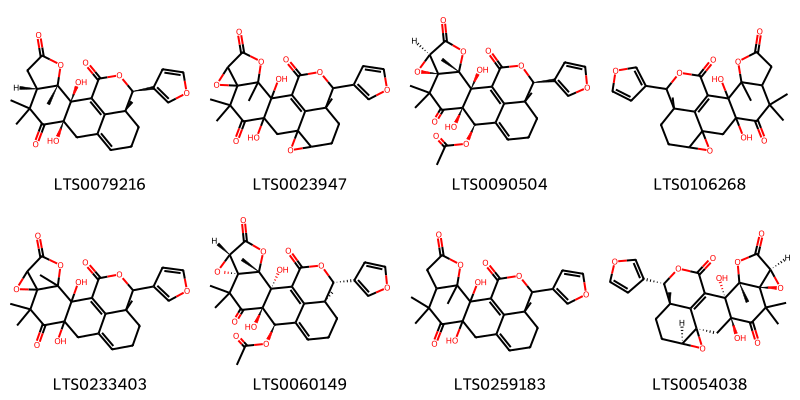{ width=100% }
    <figcaption>Hình ảnh cấu trúc hóa học của 8 hoạt chất thuộc nhóm Naphthopyrans gồm ['(2s,3s,7s,10r,16r,17r)-17-(furan-3-yl)-2,10-dihydroxy-3,8,8,16-tetramethyl-4,18-dioxapentacyclo[10.7.1.0²,¹⁰.0³,⁷.0¹⁶,²⁰]icosa-1(20),12-diene-5,9,19-trione (LTS0079216)', '16-(furan-3-yl)-3,12-dihydroxy-5,5,11,17-tetramethyl-7,10,15,21-tetraoxaheptacyclo[11.8.1.0¹,²⁰.0³,¹².0⁶,⁸.0⁶,¹¹.0¹⁷,²²]docos-13(22)-ene-4,9,14-trione (LTS0023947)', '(2s,3r,6r,8s,11r,12r,18r)-18-(furan-3-yl)-2,11-dihydroxy-3,9,9,17-tetramethyl-5,10,20-trioxo-4,7,19-trioxahexacyclo[11.7.1.0²,¹¹.0³,⁸.0⁶,⁸.0¹⁷,²¹]henicosa-1(21),13-dien-12-yl acetate (LTS0090504)', '15-(furan-3-yl)-3,11-dihydroxy-5,5,10,16-tetramethyl-9,14,20-trioxahexacyclo[10.8.1.0¹,¹⁹.0³,¹¹.0⁶,¹⁰.0¹⁶,²¹]henicos-12(21)-ene-4,8,13-trione (LTS0106268)', '18-(furan-3-yl)-2,11-dihydroxy-3,9,9,17-tetramethyl-4,7,19-trioxahexacyclo[11.7.1.0²,¹¹.0³,⁸.0⁶,⁸.0¹⁷,²¹]henicosa-1(21),13-diene-5,10,20-trione (LTS0233403)', '(2r,3r,6s,8r,11r,12r,17s,18s)-18-(furan-3-yl)-2,11-dihydroxy-3,9,9,17-tetramethyl-5,10,20-trioxo-4,7,19-trioxahexacyclo[11.7.1.0²,¹¹.0³,⁸.0⁶,⁸.0¹⁷,²¹]henicosa-1(21),13-dien-12-yl acetate (LTS0060149)', '17-(furan-3-yl)-2,10-dihydroxy-3,8,8,16-tetramethyl-4,18-dioxapentacyclo[10.7.1.0²,¹⁰.0³,⁷.0¹⁶,²⁰]icosa-1(20),12-diene-5,9,19-trione (LTS0259183)', '(1r,3s,6r,8s,11s,12s,16r,17s,20s)-16-(furan-3-yl)-3,12-dihydroxy-5,5,11,17-tetramethyl-7,10,15,21-tetraoxaheptacyclo[11.8.1.0¹,²⁰.0³,¹².0⁶,⁸.0⁶,¹¹.0¹⁷,²²]docos-13(22)-ene-4,9,14-trione (LTS0054038)'].</figcaption>
</figure>
#### Nhóm Organooxygen compounds
<figure markdown="span">
    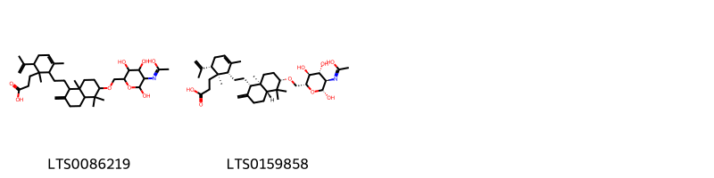{ width=100% }
    <figcaption>Hình ảnh cấu trúc hóa học của 2 hoạt chất thuộc nhóm Organooxygen compounds gồm ['3-(2-{2-[5,5,8a-trimethyl-2-methylidene-6-({3,4,6-trihydroxy-5-[(1-hydroxyethylidene)amino]oxan-2-yl}methoxy)-hexahydro-1h-naphthalen-1-yl]ethyl}-1,3-dimethyl-6-(prop-1-en-2-yl)cyclohex-3-en-1-yl)propanoic acid (LTS0086219)', '3-[(1s,2s,6s)-2-{2-[(1s,4ar,6s,8ar)-5,5,8a-trimethyl-2-methylidene-6-{[(2r,3s,4r,5r,6r)-3,4,6-trihydroxy-5-[(1-hydroxyethylidene)amino]oxan-2-yl]methoxy}-hexahydro-1h-naphthalen-1-yl]ethyl}-1,3-dimethyl-6-(prop-1-en-2-yl)cyclohex-3-en-1-yl]propanoic acid (LTS0159858)'].</figcaption>
</figure>
#### Nhóm Prenol lipids
<figure markdown="span">
    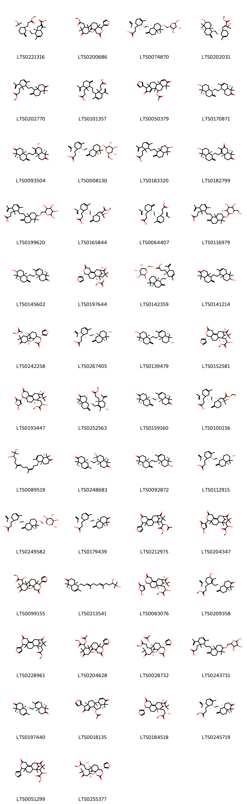{ width=100% }
    <figcaption>Hình ảnh cấu trúc hóa học của 59 hoạt chất thuộc nhóm Prenol lipids gồm ['3-[(1r,2r,6r)-2-{2-[(1r,2s,3s)-3-(2-hydroxypropan-2-yl)-2-(3-methoxy-3-oxopropyl)-2-methyl-6-methylidenecyclohexyl]ethyl}-1,3-dimethyl-6-(prop-1-en-2-yl)cyclohex-3-en-1-yl]propanoic acid (LTS0221316)', 'methyl 2-[13-(furan-3-yl)-6,6,8,12-tetramethyl-17-methylidene-5,15-dioxo-2,14-dioxatetracyclo[7.7.1.0¹,¹².0³,⁸]heptadecan-7-yl]acetate (LTS0200686)', '3-[(1s,2s,6s)-2-{2-[(1s,4ar,6s,8ar)-5,5,8a-trimethyl-2-methylidene-6-{[(2r,3r,4r,5r)-3,4,5-trihydroxyoxolan-2-yl]methoxy}-hexahydro-1h-naphthalen-1-yl]ethyl}-1,3-dimethyl-6-(prop-1-en-2-yl)cyclohex-3-en-1-yl]propanoic acid (LTS0074870)', 'lamesticumin b (LTS0202031)', 'methyl 3-{2-[2-(5,5,8a-trimethyl-2-methylidene-6-oxo-hexahydronaphthalen-1-yl)ethyl]-1,3-dimethyl-6-(prop-1-en-2-yl)cyclohex-3-en-1-yl}propanoate (LTS0202770)', '3-(2-{2-[6-(2-carboxyethyl)-2,6-dimethyl-5-(prop-1-en-2-yl)cyclohex-2-en-1-yl]ethyl}-1-methyl-3-methylidene-6-(prop-1-en-2-yl)cyclohexyl)propanoic acid (LTS0101357)', '1-(furan-3-yl)-3b,6,6,9a,11a-pentamethyl-2,7-dioxo-1h,4h,5h,5ah,9bh,10h,11h-cyclopenta[a]phenanthren-4-yl acetate (LTS0050379)', '(4as,5s,8ar)-5-{2-[(1s,4ar,6s,8as)-6-hydroxy-5,5,8a-trimethyl-2-methylidene-hexahydro-1h-naphthalen-1-yl]ethyl}-1,1,4a,6-tetramethyl-4,5,8,8a-tetrahydro-3h-naphthalen-2-one (LTS0170871)', 'lamesticumin d (LTS0093504)', '3-[(1s,2s,6s)-2-{2-[(1s,4ar,6s,8ar)-5,5,8a-trimethyl-2-methylidene-6-{[(2r,3r,4s,5s,6r)-3,4,5-trihydroxy-6-(hydroxymethyl)oxan-2-yl]oxy}-hexahydro-1h-naphthalen-1-yl]ethyl}-1,3-dimethyl-6-(prop-1-en-2-yl)cyclohex-3-en-1-yl]propanoic acid (LTS0008130)', '3-{2-[2-(6-hydroxy-5,5,8a-trimethyl-2-methylidene-hexahydro-1h-naphthalen-1-yl)ethyl]-1,3-dimethyl-6-(prop-1-en-2-yl)cyclohex-3-en-1-yl}propanoic acid (LTS0183320)', 'lamesticumin c (LTS0182799)', '3-[2-(2-{5,5,8a-trimethyl-2-methylidene-6-[(3,4,5,6-tetrahydroxyoxan-2-yl)methoxy]-hexahydro-1h-naphthalen-1-yl}ethyl)-1,3-dimethyl-6-(prop-1-en-2-yl)cyclohex-3-en-1-yl]propanoic acid (LTS0199620)', 'lamesticumin a (LTS0165844)', 'lansic acid (LTS0064407)', '3-{2-[2-(5,5,8a-trimethyl-2-methylidene-6-{[3,4,5-trihydroxy-6-(hydroxymethyl)oxan-2-yl]oxy}-hexahydro-1h-naphthalen-1-yl)ethyl]-1,3-dimethyl-6-(prop-1-en-2-yl)cyclohex-3-en-1-yl}propanoic acid (LTS0116979)', '(4ar,5s,8ar)-5-{2-[(1s,4ar,6s,8ar)-6-hydroxy-5,5,8a-trimethyl-2-methylidene-hexahydro-1h-naphthalen-1-yl]ethyl}-1,1,4a,6-tetramethyl-4,5,8,8a-tetrahydro-3h-naphthalen-2-one (LTS0145602)', 'methyl 2-[(2s,5r,6r,13s,16s)-6-(furan-3-yl)-1,5,15,15-tetramethyl-8,14,17-trioxo-7-oxatetracyclo[11.3.1.0²,¹¹.0⁵,¹⁰]heptadec-10-en-16-yl]acetate (LTS0197644)', '3-[(1r,2s,6r)-2-{2-[(1s,4as,6r,8ar)-5,5,8a-trimethyl-2-methylidene-6-{[(2r,3s,4r,5s,6s)-3,4,5-trihydroxy-6-(hydroxymethyl)oxan-2-yl]oxy}-hexahydro-1h-naphthalen-1-yl]ethyl}-1,3-dimethyl-6-(prop-1-en-2-yl)cyclohex-3-en-1-yl]propanoic acid (LTS0142359)', '5-[2-(6-hydroxy-2,5,5,8a-tetramethyl-1,4,4a,6,7,8-hexahydronaphthalen-1-yl)ethyl]-1,1,4a-trimethyl-6-methylidene-hexahydronaphthalen-2-one (LTS0141214)', 'methyl 2-[(1s,3s,7r,8r,9r,12s,13s)-13-(furan-3-yl)-6,6,8,12-tetramethyl-17-methylidene-5,15-dioxo-2,14-dioxatetracyclo[7.7.1.0¹,¹².0³,⁸]heptadecan-7-yl]acetate (LTS0242258)', '3-[(1s,2s,6s)-2-{2-[(1s,4ar,6s,8as)-6-hydroxy-5,5,8a-trimethyl-2-methylidene-hexahydro-1h-naphthalen-1-yl]ethyl}-1,3-dimethyl-6-(prop-1-en-2-yl)cyclohex-3-en-1-yl]propanoic acid (LTS0267405)', '(2r,4ar,5s,8ar)-5-{2-[(1s,4ar,6s,8ar)-6-hydroxy-5,5,8a-trimethyl-2-methylidene-hexahydro-1h-naphthalen-1-yl]ethyl}-1,1,4a,6-tetramethyl-2,3,4,5,8,8a-hexahydronaphthalen-2-ol (LTS0139479)', 'methyl (2r)-2-[(1r,2s,5r,6r,13s,16s)-6-(furan-3-yl)-1,5,15,15-tetramethyl-8,14,17-trioxo-7-oxatetracyclo[11.3.1.0²,¹¹.0⁵,¹⁰]heptadec-10-en-16-yl]-2-hydroxyacetate (LTS0152581)', 'methyl (2r)-2-hydroxy-2-[(1r,2s,5r,6r,13s,16s)-6-[(5s)-5-hydroxy-2-oxo-5h-furan-3-yl]-1,5,15,15-tetramethyl-8,14,17-trioxo-7-oxatetracyclo[11.3.1.0²,¹¹.0⁵,¹⁰]heptadec-10-en-16-yl]acetate (LTS0193447)', 'methyl 3-[(1r,4s,6r)-2-{2-[(1r,4as,8as)-5,5,8a-trimethyl-2-methylidene-6-oxo-hexahydronaphthalen-1-yl]ethyl}-4-hydroxy-1,3-dimethyl-6-(prop-1-en-2-yl)cyclohex-2-en-1-yl]propanoate (LTS0252563)', '(4ar,5r,8ar)-5-{2-[(1r,4ar,8ar)-5,5,8a-trimethyl-2-methylidene-6-oxo-hexahydronaphthalen-1-yl]ethyl}-1,1,4a,6-tetramethyl-4,5,8,8a-tetrahydro-3h-naphthalen-2-one (LTS0159160)', '3-[(1s,2s,6s)-2-{2-[(1s,2r,3r)-2-(3-ethoxy-3-oxopropyl)-3-(2-hydroxypropan-2-yl)-2-methyl-6-methylidenecyclohexyl]ethyl}-1,3-dimethyl-6-(prop-1-en-2-yl)cyclohex-3-en-1-yl]propanoic acid (LTS0100156)', '(4ar,5s,8ar)-5-[(7e,11r)-11,12-dihydroxy-4,8,12-trimethyltrideca-3,7-dien-1-yl]-1,1,4a,6-tetramethyl-4,5,8,8a-tetrahydro-3h-naphthalen-2-one (LTS0089519)', '(4ar,5r,8ar)-5-{2-[(1r,2r,4as,8as)-2-hydroxy-2,5,5,8a-tetramethyl-6-oxo-hexahydronaphthalen-1-yl]ethyl}-1,1,4a,6-tetramethyl-4,5,8,8a-tetrahydro-3h-naphthalen-2-one (LTS0248683)', '(4ar,5s,8ar)-5-{2-[(1s,4ar,6s,8ar)-6-hydroxy-2,5,5,8a-tetramethyl-1,4,4a,6,7,8-hexahydronaphthalen-1-yl]ethyl}-1,1,4a-trimethyl-6-methylidene-hexahydronaphthalen-2-one (LTS0092872)', 'lansiolic acid (LTS0112915)', '3-[(1s,2s,6s)-2-{2-[(1s,4ar,6s,8ar)-5,5,8a-trimethyl-2-methylidene-6-{[(2r,3s,4s,5r,6r)-3,4,5,6-tetrahydroxyoxan-2-yl]methoxy}-hexahydro-1h-naphthalen-1-yl]ethyl}-1,3-dimethyl-6-(prop-1-en-2-yl)cyclohex-3-en-1-yl]propanoic acid (LTS0249582)', '3-[(1s,2s,6s)-2-{2-[(1s,4ar,8as)-5,5,8a-trimethyl-2-methylidene-6-oxo-hexahydronaphthalen-1-yl]ethyl}-1,3-dimethyl-6-(prop-1-en-2-yl)cyclohex-3-en-1-yl]propanoic acid (LTS0179439)', 'methyl 2-(acetyloxy)-2-[6-(furan-3-yl)-1,5,15,15-tetramethyl-8,14,17-trioxo-7-oxatetracyclo[11.3.1.0²,¹¹.0⁵,¹⁰]heptadec-10-en-16-yl]acetate (LTS0212975)', 'methyl 2-hydroxy-2-[6-(5-hydroxy-2-oxo-5h-furan-3-yl)-1,5,15,15-tetramethyl-8,14,17-trioxo-7-oxatetracyclo[11.3.1.0²,¹¹.0⁵,¹⁰]heptadec-10-en-16-yl]acetate (LTS0204347)', 'methyl 2-[13-(furan-3-yl)-6,6,8,12-tetramethyl-17-methylidene-5,15-dioxo-2,14-dioxatetracyclo[7.7.1.0¹,¹².0³,⁸]heptadecan-7-yl]-2-hydroxyacetate (LTS0099155)', 'lamesticumin f (LTS0213541)', 'methyl (2r)-2-hydroxy-2-[(1r,2r,5r,6r,13s,16s)-6-[(5s)-5-hydroxy-2-oxo-5h-furan-3-yl]-1,5,15,15-tetramethyl-8,14,17-trioxo-7-oxatetracyclo[11.3.1.0²,¹¹.0⁵,¹⁰]heptadec-10-en-16-yl]acetate (LTS0083076)', 'lamesticumin e (LTS0209358)', 'methyl 2-[6-(furan-3-yl)-1,5,15,15-tetramethyl-8,14,17-trioxo-7-oxatetracyclo[11.3.1.0²,¹¹.0⁵,¹⁰]heptadec-10-en-16-yl]acetate (LTS0228961)', 'methyl 2-(acetyloxy)-2-[13-(furan-3-yl)-6,6,8,12-tetramethyl-17-methylidene-5,15-dioxo-2,14-dioxatetracyclo[7.7.1.0¹,¹².0³,⁸]heptadecan-7-yl]acetate (LTS0204628)', 'methyl (2r)-2-(acetyloxy)-2-[(1s,3s,7r,8r,9r,12s,13s)-13-(furan-3-yl)-6,6,8,12-tetramethyl-17-methylidene-5,15-dioxo-2,14-dioxatetracyclo[7.7.1.0¹,¹².0³,⁸]heptadecan-7-yl]acetate (LTS0028732)', '3-[2-(2-{5,5,8a-trimethyl-2-methylidene-6-[(3,4,5-trihydroxyoxolan-2-yl)methoxy]-hexahydro-1h-naphthalen-1-yl}ethyl)-1,3-dimethyl-6-(prop-1-en-2-yl)cyclohex-3-en-1-yl]propanoic acid (LTS0243731)', '(4ar,5r,8ar)-5-{2-[(1s,4ar,8ar)-2,5,5,8a-tetramethyl-6-oxo-4,4a,7,8-tetrahydro-1h-naphthalen-1-yl]ethyl}-1,1,4a,6-tetramethyl-4,5,8,8a-tetrahydro-3h-naphthalen-2-one (LTS0197440)', '(1r,3br,4r,5as,9ar,9br,11as)-1-(furan-3-yl)-3b,6,6,9a,11a-pentamethyl-2,7-dioxo-1h,4h,5h,5ah,9bh,10h,11h-cyclopenta[a]phenanthren-4-yl acetate (LTS0018135)', 'methyl (2s)-2-[(1r,2r,5r,6r,13s,16s)-6-(furan-3-yl)-1,5,15,15-tetramethyl-8,14,17-trioxo-7-oxatetracyclo[11.3.1.0²,¹¹.0⁵,¹⁰]heptadec-10-en-16-yl]-2-hydroxyacetate (LTS0184518)', 'methyl 3-[(1s,2s,6s)-2-{2-[(1s,4ar,8ar)-5,5,8a-trimethyl-2-methylidene-6-oxo-hexahydronaphthalen-1-yl]ethyl}-1,3-dimethyl-6-(prop-1-en-2-yl)cyclohex-3-en-1-yl]propanoate (LTS0245719)', 'methyl 2-[6-(furan-3-yl)-1,5,15,15-tetramethyl-8,14,17-trioxo-7-oxatetracyclo[11.3.1.0²,¹¹.0⁵,¹⁰]heptadec-10-en-16-yl]-2-hydroxyacetate (LTS0051299)', 'methyl (2r)-2-[(1s,3s,7r,8r,9r,12s,13s)-13-(furan-3-yl)-6,6,8,12-tetramethyl-17-methylidene-5,15-dioxo-2,14-dioxatetracyclo[7.7.1.0¹,¹².0³,⁸]heptadecan-7-yl]-2-hydroxyacetate (LTS0255377)', '5-[2-(6-hydroxy-5,5,8a-trimethyl-2-methylidene-hexahydro-1h-naphthalen-1-yl)ethyl]-1,1,4a,6-tetramethyl-4,5,8,8a-tetrahydro-3h-naphthalen-2-one (LTS0273930)', '3-{2-[2-(5,5,8a-trimethyl-2-methylidene-6-oxo-hexahydronaphthalen-1-yl)ethyl]-1,3-dimethyl-6-(prop-1-en-2-yl)cyclohex-3-en-1-yl}propanoic acid (LTS0060744)', 'lansic acid 3-ethyl ester (LTS0026347)', 'methyl (2r)-2-(acetyloxy)-2-[(1r,2s,5r,6r,13s,16s)-6-(furan-3-yl)-1,5,15,15-tetramethyl-8,14,17-trioxo-7-oxatetracyclo[11.3.1.0²,¹¹.0⁵,¹⁰]heptadec-10-en-16-yl]acetate (LTS0109866)', 'azadiradione (LTS0245922)', '(4as,5s,8ar)-5-{2-[(1s,4ar,6s,8as)-6-hydroxy-2,5,5,8a-tetramethyl-1,4,4a,6,7,8-hexahydronaphthalen-1-yl]ethyl}-1,1,4a-trimethyl-6-methylidene-hexahydronaphthalen-2-one (LTS0099729)', '3-[(1s,2s,6s)-2-{2-[(1s,4ar,8ar)-5,5,8a-trimethyl-2-methylidene-6-oxo-hexahydronaphthalen-1-yl]ethyl}-1,3-dimethyl-6-(prop-1-en-2-yl)cyclohex-3-en-1-yl]propanoic acid (LTS0244470)', 'ethyl lansiolate (LTS0043259)', 'methyl lansiolate (LTS0244530)'].</figcaption>
</figure>
#### Nhóm Steroids and steroid derivatives
<figure markdown="span">
    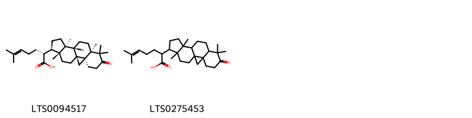{ width=100% }
    <figcaption>Hình ảnh cấu trúc hóa học của 2 hoạt chất thuộc nhóm Steroids and steroid derivatives gồm ['(2r)-6-methyl-2-[(1s,3r,8r,11s,12s,15r,16r)-7,7,12,16-tetramethyl-6-oxopentacyclo[9.7.0.0¹,³.0³,⁸.0¹²,¹⁶]octadecan-15-yl]hept-5-enoic acid (LTS0094517)', '6-methyl-2-{7,7,12,16-tetramethyl-6-oxopentacyclo[9.7.0.0¹,³.0³,⁸.0¹²,¹⁶]octadecan-15-yl}hept-5-enoic acid (LTS0275453)'].</figcaption>
</figure>

---

### Dược dân tộc học

Danh sách các quốc gia có sử dụng *Lansium domesticum* trong điều trị các bệnh. 

| Country   | Disease     | Bệnh                                                                                                                                                                                                |
|:----------|:------------|:----------------------------------------------------------------------------------------------------------------------------------------------------------------------------------------------------|
| Elsewhere | Astringent  | MYMEMORY WARNING: YOU USED ALL AVAILABLE FREE TRANSLATIONS FOR TODAY. NEXT AVAILABLE IN  06 HOURS 41 MINUTES 52 SECONDS VISIT HTTPS://MYMEMORY.TRANSLATED.NET/DOC/USAGELIMITS.PHP TO TRANSLATE MORE |
| Java      | Collyrium   | MYMEMORY WARNING: YOU USED ALL AVAILABLE FREE TRANSLATIONS FOR TODAY. NEXT AVAILABLE IN  06 HOURS 41 MINUTES 49 SECONDS VISIT HTTPS://MYMEMORY.TRANSLATED.NET/DOC/USAGELIMITS.PHP TO TRANSLATE MORE |
| Malaya    | Vermifuge   | MYMEMORY WARNING: YOU USED ALL AVAILABLE FREE TRANSLATIONS FOR TODAY. NEXT AVAILABLE IN  06 HOURS 41 MINUTES 44 SECONDS VISIT HTTPS://MYMEMORY.TRANSLATED.NET/DOC/USAGELIMITS.PHP TO TRANSLATE MORE |
| Sumatra   | Insectifuge | MYMEMORY WARNING: YOU USED ALL AVAILABLE FREE TRANSLATIONS FOR TODAY. NEXT AVAILABLE IN  06 HOURS 41 MINUTES 40 SECONDS VISIT HTTPS://MYMEMORY.TRANSLATED.NET/DOC/USAGELIMITS.PHP TO TRANSLATE MORE |

---

# Chi Azadirachta

??? note "Danh sách các dược liệu thuộc chi"
    
	 - *Azadirachta indica*

---
## Azadirachta indica
### Thông tin về thực vật

!!! info "Phân loại thực vật của *Azadirachta indica* từ GIBF:"
    - **Kingdom:** Plantae
    - **Phylum:** Tracheophyta
    - **Order:** Sapindales
    - **Family:** Meliaceae
    - **Genus:** Azadirachta
    - **Species:** *Azadirachta indica*

 

| Label (VI)   | Label (EN)   | Scientific Name    | Descriptions (VI)   | Descriptions (EN)   | Also Known As (VI)                                                              | Also Known As (EN)    |
|:-------------|:-------------|:-------------------|:--------------------|:--------------------|:--------------------------------------------------------------------------------|:----------------------|
| N/A          | N/A          | Azadirachta indica | loài thực vật       | species of plant    | ['Xoan trắng', 'Xoan chịu hạn', 'Xoan ăn gỏi', 'Xoan Ấn Độ', 'Sầu đông', 'Nim'] | ['neem', 'neem tree'] |

#### Phân bố trên thế giới

**Từ CSDL GIBF** Sri Lanka, Australia, Benin, Panama, Togo, Senegal, Nigeria, Jamaica, Maldives, Thailand, Brazil, Dominican Republic, Mexico, Saint Kitts and Nevis, India, Gambia, Antigua and Barbuda, Philippines, Nepal

#### Phân bố tại Việt Nam

**Từ CSDL GIBF**: Không có ghi nhận ở Việt Nam

---
### Thành phần hóa học
        
- Theo cơ sở dữ liệu lotus: Từ loài *Azadirachta indica* đã phân lập và xác định được 551 hoạt chất thuộc về các nhóm Organic oxides, Polycyclic hydrocarbons, Phenols, Naphthopyrans, Carboxylic acids and derivatives, Fatty Acyls, Cinnamic acids and derivatives, Heteroaromatic compounds, Saturated hydrocarbons, Oxocins, Prenol lipids, Phenanthrenes and derivatives, Sphingolipids, Purine nucleosides, Benzene and substituted derivatives, Organic trisulfides, Naphthofurans, Organooxygen compounds, Flavonoids, Steroids and steroid derivatives, Isoflavonoids, Organic disulfides, Unsaturated hydrocarbons, Lactones, Sulfenyl compounds, Coumarins and derivatives, Benzopyrans. 

|    | chemicalTaxonomyClassyfireClass     |   smiles_count |
|---:|:------------------------------------|---------------:|
|  0 | Benzene and substituted derivatives |              9 |
|  1 | Benzopyrans                         |              3 |
|  2 | Carboxylic acids and derivatives    |              6 |
|  3 | Cinnamic acids and derivatives      |              2 |
|  4 | Coumarins and derivatives           |              2 |
|  5 | Fatty Acyls                         |             15 |
|  6 | Flavonoids                          |             40 |
|  7 | Heteroaromatic compounds            |              5 |
|  8 | Isoflavonoids                       |              2 |
|  9 | Lactones                            |              3 |
| 10 | Naphthofurans                       |             38 |
| 11 | Naphthopyrans                       |             10 |
| 12 | Organic disulfides                  |              8 |
| 13 | Organic oxides                      |              1 |
| 14 | Organic trisulfides                 |              4 |
| 15 | Organooxygen compounds              |              6 |
| 16 | Oxocins                             |              2 |
| 17 | Phenanthrenes and derivatives       |              2 |
| 18 | Phenols                             |              6 |
| 19 | Polycyclic hydrocarbons             |              1 |
| 20 | Prenol lipids                       |            328 |
| 21 | Purine nucleosides                  |              2 |
| 22 | Saturated hydrocarbons              |              4 |
| 23 | Sphingolipids                       |              4 |
| 24 | Steroids and steroid derivatives    |             41 |
| 25 | Sulfenyl compounds                  |              1 |
| 26 | Unsaturated hydrocarbons            |              2 |

#### Nhóm Benzene and substituted derivatives
<figure markdown="span">
    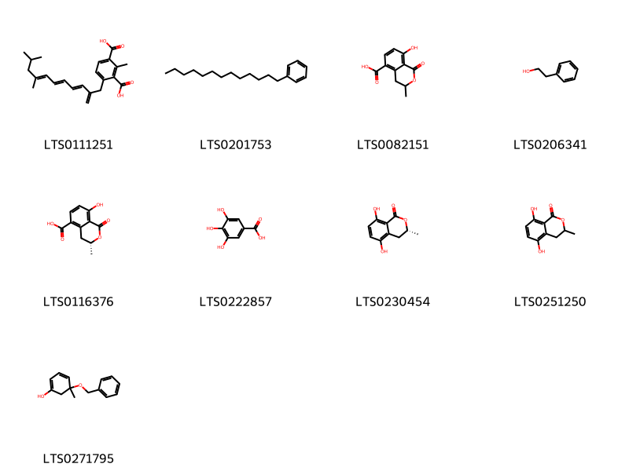{ width=100% }
    <figcaption>Hình ảnh cấu trúc hóa học của 9 hoạt chất thuộc nhóm Benzene and substituted derivatives gồm ['4-[(3e,5e,7e)-8,10-dimethyl-2-methylideneundeca-3,5,7-trien-1-yl]-2-methylbenzene-1,3-dicarboxylic acid (LTS0111251)', 'tridecylbenzene (LTS0201753)', '8-hydroxy-3-methyl-1-oxo-3,4-dihydro-2-benzopyran-5-carboxylic acid (LTS0082151)', '2-phenyl-ethanol (LTS0206341)', '(3r)-8-hydroxy-3-methyl-1-oxo-3,4-dihydro-2-benzopyran-5-carboxylic acid (LTS0116376)', 'galop (LTS0222857)', '(3r)-5,8-dihydroxy-3-methyl-3,4-dihydro-2-benzopyran-1-one (LTS0230454)', '5,8-dihydroxy-3-methyl-3,4-dihydro-2-benzopyran-1-one (LTS0251250)', '5-(benzyloxy)-5-methylcyclohexa-1,3-dien-1-ol (LTS0271795)'].</figcaption>
</figure>
#### Nhóm Benzopyrans
<figure markdown="span">
    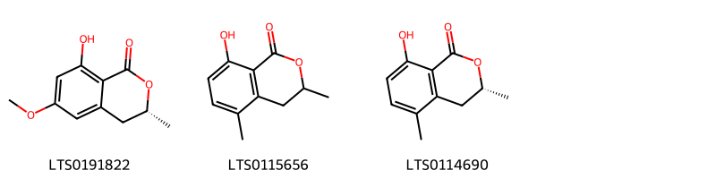{ width=100% }
    <figcaption>Hình ảnh cấu trúc hóa học của 3 hoạt chất thuộc nhóm Benzopyrans gồm ['6-methoxymellein (LTS0191822)', '8-hydroxy-3,5-dimethyl-3,4-dihydro-2-benzopyran-1-one (LTS0115656)', '5-methylmellein (LTS0114690)'].</figcaption>
</figure>
#### Nhóm Carboxylic acids and derivatives
<figure markdown="span">
    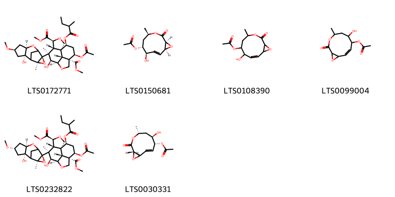{ width=100% }
    <figcaption>Hình ảnh cấu trúc hóa học của 6 hoạt chất thuộc nhóm Carboxylic acids and derivatives gồm ['4,11-dimethyl (1s,4s,5r,6s,7s,8r,11s,12r,14s,15r)-12-(acetyloxy)-7-hydroxy-6-[(2s,4s,6r,9r,11s)-2-hydroxy-4-methoxy-11-methyl-7,10-dioxatetracyclo[6.3.1.0²,⁶.0⁹,¹¹]dodecan-9-yl]-6-methyl-14-[(2-methylbutanoyl)oxy]-3,9-dioxatetracyclo[6.6.1.0¹,⁵.0¹¹,¹⁵]pentadecane-4,11-dicarboxylate (LTS0172771)', '(1s,4r,6r,7r,8e,10s)-7-hydroxy-4-methyl-2-oxo-3,11-dioxabicyclo[8.1.0]undec-8-en-6-yl acetate (LTS0150681)', '7-hydroxy-4-methyl-2-oxo-3,11-dioxabicyclo[8.1.0]undec-8-en-6-yl acetate (LTS0108390)', '6-hydroxy-4-methyl-2-oxo-3,11-dioxabicyclo[8.1.0]undec-8-en-7-yl acetate (LTS0099004)', '4,11-dimethyl (1s,4s,5r,6s,7s,8r,11s,12r,14s,15r)-12-(acetyloxy)-7-hydroxy-6-[(2s,4r,6r,9r,11s)-2-hydroxy-4-methoxy-11-methyl-7,10-dioxatetracyclo[6.3.1.0²,⁶.0⁹,¹¹]dodecan-9-yl]-6-methyl-14-[(2-methylbutanoyl)oxy]-3,9-dioxatetracyclo[6.6.1.0¹,⁵.0¹¹,¹⁵]pentadecane-4,11-dicarboxylate (LTS0232822)', '(1s,4r,6r,7r,8e,10s)-6-hydroxy-4-methyl-2-oxo-3,11-dioxabicyclo[8.1.0]undec-8-en-7-yl acetate (LTS0030331)'].</figcaption>
</figure>
#### Nhóm Cinnamic acids and derivatives
<figure markdown="span">
    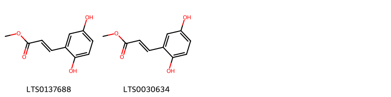{ width=100% }
    <figcaption>Hình ảnh cấu trúc hóa học của 2 hoạt chất thuộc nhóm Cinnamic acids and derivatives gồm ['methyl 3-(2,5-dihydroxyphenyl)prop-2-enoate (LTS0137688)', 'methyl (2e)-3-(2,5-dihydroxyphenyl)prop-2-enoate (LTS0030634)'].</figcaption>
</figure>
#### Nhóm Coumarins and derivatives
<figure markdown="span">
    { width=100% }
    <figcaption>Hình ảnh cấu trúc hóa học của 2 hoạt chất thuộc nhóm Coumarins and derivatives gồm ['isofraxidin (LTS0073081)', 'scopoletin (LTS0193112)'].</figcaption>
</figure>
#### Nhóm Fatty Acyls
<figure markdown="span">
    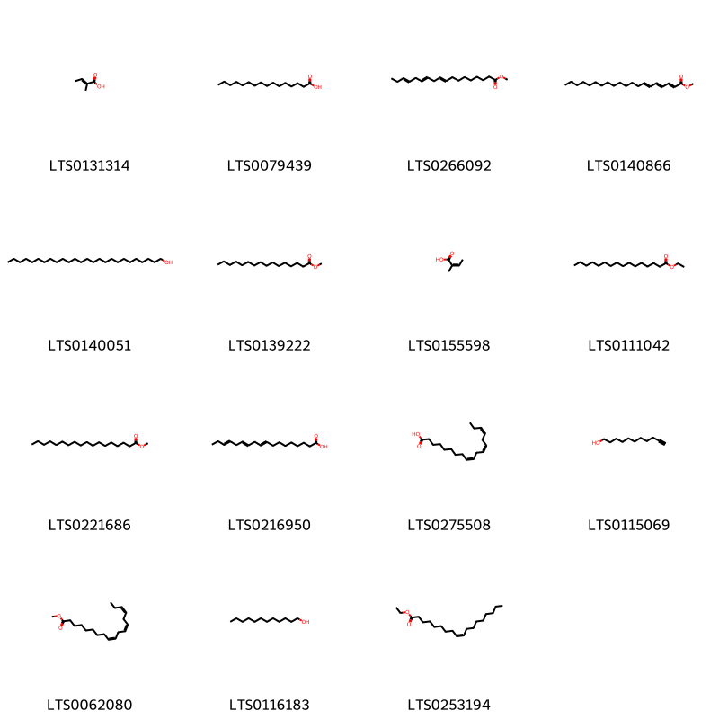{ width=100% }
    <figcaption>Hình ảnh cấu trúc hóa học của 15 hoạt chất thuộc nhóm Fatty Acyls gồm ['tiglic acid (LTS0131314)', 'palmitic acid (LTS0079439)', 'methyl elaidolinolenate (LTS0266092)', 'methyl icosa-2,4,6-trienoate (LTS0140866)', 'ceryl alcohol (LTS0140051)', 'methyl palmitate (LTS0139222)', '2-methyl-2-butenoic acid (LTS0155598)', 'ethyl palmitate (LTS0111042)', 'methyl stearate (LTS0221686)', 'octadeca-9,12,15-trienoic acid (LTS0216950)', 'α-linolenic acid (LTS0275508)', 'undec-10-yn-1-ol (LTS0115069)', 'methyl linolenate (LTS0062080)', '1-dodecanol (LTS0116183)', 'ethyl oleate (LTS0253194)'].</figcaption>
</figure>
#### Nhóm Flavonoids
<figure markdown="span">
    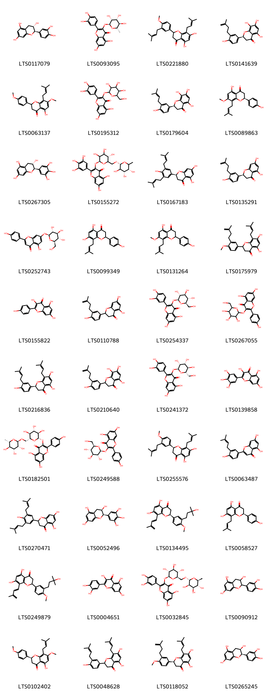{ width=100% }
    <figcaption>Hình ảnh cấu trúc hóa học của 40 hoạt chất thuộc nhóm Flavonoids gồm ['(+)-catechol (LTS0117079)', 'quercitrin (LTS0093095)', 'nimbaflavone (LTS0221880)', '(2s)-5,7,8-trihydroxy-2-[4-hydroxy-3-(3-methylbut-3-en-1-yl)phenyl]-2,3-dihydro-1-benzopyran-4-one (LTS0141639)', '5-hydroxy-7-methoxy-2-(4-methoxyphenyl)-8-(3-methylbut-2-en-1-yl)-2,3-dihydro-1-benzopyran-4-one (LTS0063137)', '2-(3,4-dihydroxyphenyl)-5,7-dihydroxy-3-{[3,4,5-trihydroxy-6-(hydroxymethyl)oxan-2-yl]oxy}chromen-4-one (LTS0195312)', 'flowerone (LTS0179604)', 'mundulea flavanone b (LTS0089863)', 'gallocatechol (LTS0267305)', 'myricetin 3-rutinoside (LTS0155272)', 'abyssinone v (LTS0167183)', '(2s)-5,7-dihydroxy-2-[4-hydroxy-3-(3-methylbut-3-en-1-yl)phenyl]-2,3-dihydro-1-benzopyran-4-one (LTS0135291)', 'apigenin 7-o-β-glucoside (LTS0252743)', 'sophoraflavanone b (LTS0099349)', '5-hydroxy-2-(4-hydroxyphenyl)-7-methoxy-8-(3-methylbut-2-en-1-yl)-2,3-dihydro-1-benzopyran-4-one (LTS0131264)', '5,7-dihydroxy-2-[4-methoxy-3-(3-methylbut-3-en-1-yl)phenyl]-8-(3-methylbut-2-en-1-yl)-2,3-dihydro-1-benzopyran-4-one (LTS0175979)', 'kaempherol (LTS0155822)', '5,7-dihydroxy-2-[4-hydroxy-3-(3-methylbut-3-en-1-yl)phenyl]-2,3-dihydro-1-benzopyran-4-one (LTS0110788)', 'isoquercetin (LTS0254337)', 'trifolin (LTS0267055)', 'lespedezaflavanone b (LTS0216836)', '5,7,8-trihydroxy-2-[4-hydroxy-3-(3-methylbut-3-en-1-yl)phenyl]-2,3-dihydro-1-benzopyran-4-one (LTS0210640)', '2-(3,4-dihydroxyphenyl)-5,7-dihydroxy-3-{[(2s,3r,4r,5r,6s)-3,4,5-trihydroxy-6-(hydroxymethyl)oxan-2-yl]oxy}chromen-4-one (LTS0241372)', 'myricetin (LTS0139858)', 'nictoflorin (LTS0182501)', 'astragalin (LTS0249588)', '(2s)-5,7-dihydroxy-2-[4-methoxy-3-(3-methylbut-2-en-1-yl)phenyl]-8-(3-methylbut-2-en-1-yl)-2,3-dihydro-1-benzopyran-4-one (LTS0255576)', 'yinyanghuo d (LTS0063487)', '5,7-dihydroxy-2-[4-hydroxy-3,5-bis(3-methylbut-2-en-1-yl)phenyl]-2,3-dihydro-1-benzopyran-4-one (LTS0270471)', 'epigallocatechin (LTS0052496)', '(2s)-5,7-dihydroxy-2-[3-(3-hydroxy-3-methylbutyl)-4-methoxyphenyl]-8-[(1e)-3-methylbuta-1,3-dien-1-yl]-2,3-dihydro-1-benzopyran-4-one (LTS0134495)', 'sophoraflavanone b (LTS0058527)', '5,7-dihydroxy-2-[3-(3-hydroxy-3-methylbutyl)-4-methoxyphenyl]-8-(3-methylbuta-1,3-dien-1-yl)-2,3-dihydro-1-benzopyran-4-one (LTS0249879)', 'quercetin (LTS0004651)', '3-rutinosyl quercetin (LTS0032845)', 'catechol (LTS0090912)', 'flowerine (LTS0102402)', 'euchrestaflavanone a (LTS0048628)', '(2s)-5,7-dihydroxy-2-[4-methoxy-3-(3-methylbut-3-en-1-yl)phenyl]-8-(3-methylbut-2-en-1-yl)-2,3-dihydro-1-benzopyran-4-one (LTS0118052)', 'ent-epicatechin (LTS0265245)'].</figcaption>
</figure>
#### Nhóm Heteroaromatic compounds
<figure markdown="span">
    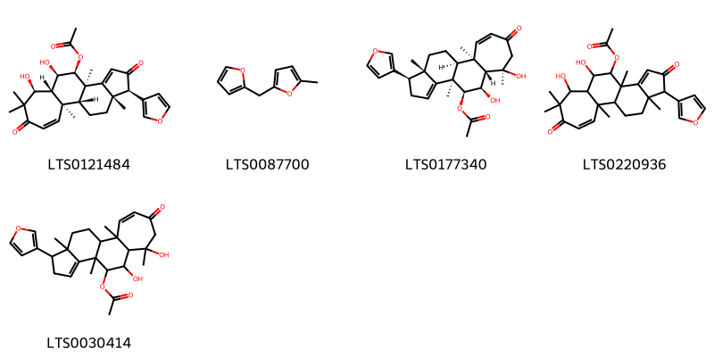{ width=100% }
    <figcaption>Hình ảnh cấu trúc hóa học của 5 hoạt chất thuộc nhóm Heteroaromatic compounds gồm ['(1r,2r,7s,8r,9r,10s,11r,15r,16s)-15-(furan-3-yl)-7,9-dihydroxy-2,6,6,11,16-pentamethyl-5,14-dioxotetracyclo[9.7.0.0²,⁸.0¹²,¹⁶]octadeca-3,12-dien-10-yl acetate (LTS0121484)', '2-(furan-2-ylmethyl)-5-methylfuran (LTS0087700)', '(1s,2r,7r,8s,9r,10s,11r,15r,16s)-15-(furan-3-yl)-7,9-dihydroxy-2,7,11,16-tetramethyl-5-oxotetracyclo[9.7.0.0²,⁸.0¹²,¹⁶]octadeca-3,12-dien-10-yl acetate (LTS0177340)', '15-(furan-3-yl)-7,9-dihydroxy-2,6,6,11,16-pentamethyl-5,14-dioxotetracyclo[9.7.0.0²,⁸.0¹²,¹⁶]octadeca-3,12-dien-10-yl acetate (LTS0220936)', '15-(furan-3-yl)-7,9-dihydroxy-2,7,11,16-tetramethyl-5-oxotetracyclo[9.7.0.0²,⁸.0¹²,¹⁶]octadeca-3,12-dien-10-yl acetate (LTS0030414)'].</figcaption>
</figure>
#### Nhóm Isoflavonoids
<figure markdown="span">
    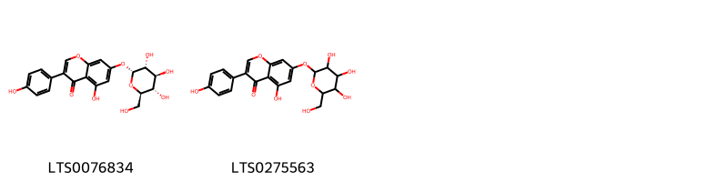{ width=100% }
    <figcaption>Hình ảnh cấu trúc hóa học của 2 hoạt chất thuộc nhóm Isoflavonoids gồm ['5-hydroxy-3-(4-hydroxyphenyl)-7-{[(2r,3r,4s,5s,6r)-3,4,5-trihydroxy-6-(hydroxymethyl)oxan-2-yl]oxy}chromen-4-one (LTS0076834)', '5-hydroxy-3-(4-hydroxyphenyl)-7-{[3,4,5-trihydroxy-6-(hydroxymethyl)oxan-2-yl]oxy}chromen-4-one (LTS0275563)'].</figcaption>
</figure>
#### Nhóm Lactones
<figure markdown="span">
    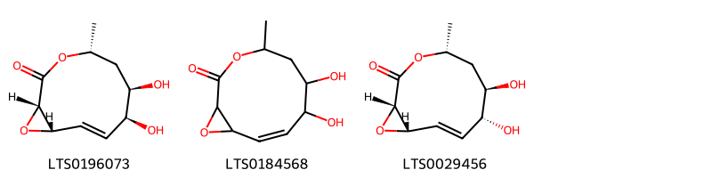{ width=100% }
    <figcaption>Hình ảnh cấu trúc hóa học của 3 hoạt chất thuộc nhóm Lactones gồm ['multiplolide a (LTS0196073)', '6,7-dihydroxy-4-methyl-3,11-dioxabicyclo[8.1.0]undec-8-en-2-one (LTS0184568)', '(1s,4r,6r,7r,8e,10s)-6,7-dihydroxy-4-methyl-3,11-dioxabicyclo[8.1.0]undec-8-en-2-one (LTS0029456)'].</figcaption>
</figure>
#### Nhóm Naphthofurans
<figure markdown="span">
    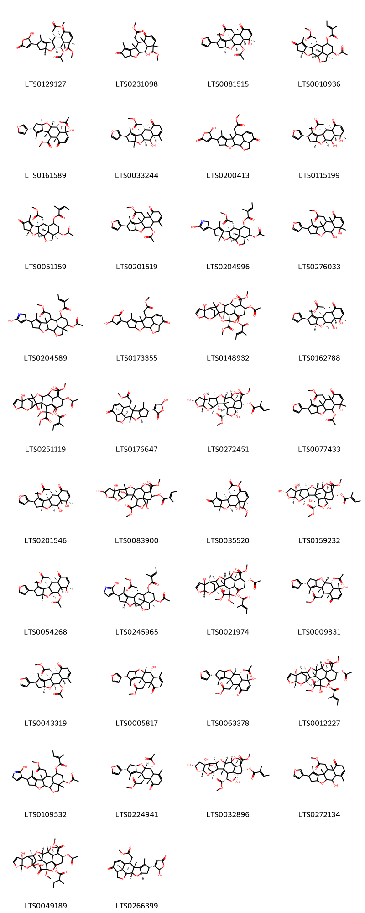{ width=100% }
    <figcaption>Hình ảnh cấu trúc hóa học của 38 hoạt chất thuộc nhóm Naphthofurans gồm ['methyl (1s,2r,3r,4r,8r,9s,10r,13r,15r)-2-(acetyloxy)-13-(2-hydroxy-5-oxo-2h-furan-3-yl)-9-(2-methoxy-2-oxoethyl)-4,8,10,12-tetramethyl-7-oxo-16-oxatetracyclo[8.6.0.0³,⁸.0¹¹,¹⁵]hexadeca-5,11-diene-4-carboxylate (LTS0129127)', 'methyl 2-hydroxy-9-(2-methoxy-2-oxoethyl)-4,8,10,12-tetramethyl-7,13-dioxo-16-oxatetracyclo[8.6.0.0³,⁸.0¹¹,¹⁵]hexadeca-5,11-diene-4-carboxylate (LTS0231098)', 'methyl 2-[(1s,2r,3r,4r,8r,9r,10r,13r,15s)-2-(acetyloxy)-13-(furan-3-yl)-4-hydroxy-4,8,10,12-tetramethyl-7-oxo-16-oxatetracyclo[8.6.0.0³,⁸.0¹¹,¹⁵]hexadeca-5,11-dien-9-yl]acetate (LTS0081515)', '(1r,2s,4r,9r,10r,11r,12s,14r,15r,18r)-14-(acetyloxy)-10-(2-methoxy-2-oxoethyl)-7,9,11,15-tetramethyl-6-oxo-3,17-dioxapentacyclo[9.6.1.0²,⁹.0⁴,⁸.0¹⁵,¹⁸]octadec-7-en-12-yl 2-methylbut-2-enoate (LTS0010936)', 'methyl (1s,2r,3s,4r,8s,9s,10r,13r,15r)-2-(acetyloxy)-13-(furan-3-yl)-4-hydroxy-4,8,10,12-tetramethyl-7-oxo-16-oxatetracyclo[8.6.0.0³,⁸.0¹¹,¹⁵]hexadeca-5,11-diene-9-carboxylate (LTS0161589)', 'methyl 2-[(1s,2r,3r,8r,9s,10r,13r,15r)-13-(furan-3-yl)-2-hydroxy-4,8,10,12-tetramethyl-7-oxo-16-oxatetracyclo[8.6.0.0³,⁸.0¹¹,¹⁵]hexadeca-4,11-dien-9-yl]acetate (LTS0033244)', 'methyl 2-[6-(2-hydroxy-5-oxo-2h-furan-3-yl)-7,9,11,15-tetramethyl-14-oxo-3,17-dioxapentacyclo[9.6.1.0²,⁹.0⁴,⁸.0¹⁵,¹⁸]octadeca-7,12-dien-10-yl]acetate (LTS0200413)', 'methyl 2-[(1s,2r,3r,4r,8r,9s,10r,13r,15s)-13-(furan-3-yl)-2,4-dihydroxy-4,8,10,12-tetramethyl-7-oxo-16-oxatetracyclo[8.6.0.0³,⁸.0¹¹,¹⁵]hexadeca-5,11-dien-9-yl]acetate (LTS0115199)', '(1r,2s,4r,9r,10r,11r,12s,14r,15r,18r)-14-(acetyloxy)-10-(2-methoxy-2-oxoethyl)-7,9,11,15-tetramethyl-6-oxo-3,17-dioxapentacyclo[9.6.1.0²,⁹.0⁴,⁸.0¹⁵,¹⁸]octadec-7-en-12-yl (2z)-2-methylbut-2-enoate (LTS0051159)', 'methyl 2-[2-(acetyloxy)-13-(furan-3-yl)-4,8,10,12-tetramethyl-7-oxo-16-oxatetracyclo[8.6.0.0³,⁸.0¹¹,¹⁵]hexadeca-4,11-dien-9-yl]acetate (LTS0201519)', '(1r,2s,4r,6r,9r,10r,11r,12s,14r,15r,18r)-14-(acetyloxy)-6-(5-hydroxy-2h-pyrrol-3-yl)-10-(2-methoxy-2-oxoethyl)-7,9,11,15-tetramethyl-3,17-dioxapentacyclo[9.6.1.0²,⁹.0⁴,⁸.0¹⁵,¹⁸]octadec-7-en-12-yl (2e)-2-methylbut-2-enoate (LTS0204996)', 'methyl 2-[13-(furan-3-yl)-2,4-dihydroxy-4,8,10,12-tetramethyl-7-oxo-16-oxatetracyclo[8.6.0.0³,⁸.0¹¹,¹⁵]hexadeca-5,11-dien-9-yl]acetate (LTS0276033)', '14-(acetyloxy)-6-(5-hydroxy-2h-pyrrol-3-yl)-10-(2-methoxy-2-oxoethyl)-7,9,11,15-tetramethyl-3,17-dioxapentacyclo[9.6.1.0²,⁹.0⁴,⁸.0¹⁵,¹⁸]octadec-7-en-12-yl 2-methylbut-2-enoate (LTS0204589)', 'methyl 2-[6-(5-hydroxy-2-oxo-5h-furan-3-yl)-7,9,11,15-tetramethyl-14-oxo-3,17-dioxapentacyclo[9.6.1.0²,⁹.0⁴,⁸.0¹⁵,¹⁸]octadeca-7,12-dien-10-yl]acetate (LTS0173355)', '4,22-dimethyl 23-(acetyloxy)-4,7,14-trihydroxy-6,16-dimethyl-25-[(2-methylbut-2-enoyl)oxy]-3,9,11,17,20-pentaoxaoctacyclo[17.6.1.1⁸,¹⁵.0¹,⁵.0⁶,¹⁸.0⁷,¹⁶.0¹⁰,¹⁴.0²²,²⁶]heptacos-12-ene-4,22-dicarboxylate (LTS0148932)', 'methyl 2-[(1s,2r,3s,4r,8r,9s,10r,13r,15s)-13-(furan-3-yl)-2,4-dihydroxy-4,8,10,12-tetramethyl-7-oxo-16-oxatetracyclo[8.6.0.0³,⁸.0¹¹,¹⁵]hexadeca-5,11-dien-9-yl]acetate (LTS0162788)', '4,22-dimethyl 23-(acetyloxy)-7,14-dihydroxy-4-methoxy-6,16-dimethyl-25-[(2-methylbut-2-enoyl)oxy]-3,9,11,17,20-pentaoxaoctacyclo[17.6.1.1⁸,¹⁵.0¹,⁵.0⁶,¹⁸.0⁷,¹⁶.0¹⁰,¹⁴.0²²,²⁶]heptacos-12-ene-4,22-dicarboxylate (LTS0251119)', 'methyl 2-[(1s,2s,4r,6r,9r,10r,11r,15r,18r)-6-[(5s)-5-hydroxy-2-oxo-5h-furan-3-yl]-7,9,11,15-tetramethyl-14-oxo-3,17-dioxapentacyclo[9.6.1.0²,⁹.0⁴,⁸.0¹⁵,¹⁸]octadeca-7,12-dien-10-yl]acetate (LTS0176647)', '4,22-dimethyl (1s,4s,5r,6s,7r,8s,10r,12s,14s,15s,16r,18s,19r,22s,23r,25s,26r)-7,12,14,25-tetrahydroxy-6,16-dimethyl-23-{[(2e)-2-methylbut-2-enoyl]oxy}-3,9,11,17,20-pentaoxaoctacyclo[17.6.1.1⁸,¹⁵.0¹,⁵.0⁶,¹⁸.0⁷,¹⁶.0¹⁰,¹⁴.0²²,²⁶]heptacosane-4,22-dicarboxylate (LTS0272451)', 'methyl 2-[2-(acetyloxy)-13-(furan-3-yl)-4-hydroxy-4,8,10,12-tetramethyl-7-oxo-16-oxatetracyclo[8.6.0.0³,⁸.0¹¹,¹⁵]hexadeca-5,11-dien-9-yl]acetate (LTS0077433)', 'methyl 2-[(1s,2r,3s,4r,8r,9s,10r,13r,15r)-13-(furan-3-yl)-2,4-dihydroxy-4,8,10,12-tetramethyl-7-oxo-16-oxatetracyclo[8.6.0.0³,⁸.0¹¹,¹⁵]hexadeca-5,11-dien-9-yl]acetate (LTS0201546)', '4,22-dimethyl 7,12,14,25-tetrahydroxy-6,16-dimethyl-23-[(2-methylbut-2-enoyl)oxy]-3,9,11,17,20-pentaoxaoctacyclo[17.6.1.1⁸,¹⁵.0¹,⁵.0⁶,¹⁸.0⁷,¹⁶.0¹⁰,¹⁴.0²²,²⁶]heptacosane-4,22-dicarboxylate (LTS0083900)', 'methyl (1s,2r,3r,4r,8r,9s,10r,15r)-2-hydroxy-9-(2-methoxy-2-oxoethyl)-4,8,10,12-tetramethyl-7,13-dioxo-16-oxatetracyclo[8.6.0.0³,⁸.0¹¹,¹⁵]hexadeca-5,11-diene-4-carboxylate (LTS0035520)', '4,22-dimethyl (1s,4s,5r,6s,7r,8s,10s,12s,14s,15s,16r,18s,19r,22s,23r,25s,26r)-7,12,14,25-tetrahydroxy-6,16-dimethyl-23-{[(2e)-2-methylbut-2-enoyl]oxy}-3,9,11,17,20-pentaoxaoctacyclo[17.6.1.1⁸,¹⁵.0¹,⁵.0⁶,¹⁸.0⁷,¹⁶.0¹⁰,¹⁴.0²²,²⁶]heptacosane-4,22-dicarboxylate (LTS0159232)', '6-acetylnimbandiol (LTS0054268)', '(1r,2s,4r,6r,9r,10r,11r,12s,14r,15r,18r)-14-(acetyloxy)-6-(2-hydroxy-5h-pyrrol-3-yl)-10-(2-methoxy-2-oxoethyl)-7,9,11,15-tetramethyl-3,17-dioxapentacyclo[9.6.1.0²,⁹.0⁴,⁸.0¹⁵,¹⁸]octadec-7-en-12-yl (2e)-2-methylbut-2-enoate (LTS0245965)', '4,22-dimethyl (1s,4s,5r,6s,7r,8s,10s,14s,15s,16r,18s,19r,22s,23r,25s,26r)-23-(acetyloxy)-7,14-dihydroxy-4-methoxy-6,16-dimethyl-25-{[(2e)-2-methylbut-2-enoyl]oxy}-3,9,11,17,20-pentaoxaoctacyclo[17.6.1.1⁸,¹⁵.0¹,⁵.0⁶,¹⁸.0⁷,¹⁶.0¹⁰,¹⁴.0²²,²⁶]heptacos-12-ene-4,22-dicarboxylate (LTS0021974)', 'methyl 2-[(1s,2r,8r,9s,10r,13r)-2-(acetyloxy)-13-(furan-3-yl)-4-hydroxy-4,8,10,12-tetramethyl-7-oxo-16-oxatetracyclo[8.6.0.0³,⁸.0¹¹,¹⁵]hexadeca-5,11-dien-9-yl]acetate (LTS0009831)', 'methyl 2-[(1s,2r,3s,8r,9s,10r,13r,15s)-2-(acetyloxy)-13-(furan-3-yl)-4,8,10,12-tetramethyl-7-oxo-16-oxatetracyclo[8.6.0.0³,⁸.0¹¹,¹⁵]hexadeca-4,11-dien-9-yl]acetate (LTS0043319)', 'methyl 2-[(1s,2r,8r,9s,10r,13r)-13-(furan-3-yl)-2-hydroxy-4,8,10,12-tetramethyl-7-oxo-16-oxatetracyclo[8.6.0.0³,⁸.0¹¹,¹⁵]hexadeca-4,11-dien-9-yl]acetate (LTS0005817)', 'methyl 2-[(1s,2r,4r,8r,9s,10r,13r)-2-(acetyloxy)-13-(furan-3-yl)-4-hydroxy-4,8,10,12-tetramethyl-7-oxo-16-oxatetracyclo[8.6.0.0³,⁸.0¹¹,¹⁵]hexadeca-5,11-dien-9-yl]acetate (LTS0063378)', '4,22-dimethyl (1s,4s,5r,6s,7r,8s,10s,14s,15s,16r,18s,19r,22s,23r,25s,26r)-23-(acetyloxy)-4,7,14-trihydroxy-6,16-dimethyl-25-{[(2e)-2-methylbut-2-enoyl]oxy}-3,9,11,17,20-pentaoxaoctacyclo[17.6.1.1⁸,¹⁵.0¹,⁵.0⁶,¹⁸.0⁷,¹⁶.0¹⁰,¹⁴.0²²,²⁶]heptacos-12-ene-4,22-dicarboxylate (LTS0012227)', '14-(acetyloxy)-6-(2-hydroxy-5h-pyrrol-3-yl)-10-(2-methoxy-2-oxoethyl)-7,9,11,15-tetramethyl-3,17-dioxapentacyclo[9.6.1.0²,⁹.0⁴,⁸.0¹⁵,¹⁸]octadec-7-en-12-yl 2-methylbut-2-enoate (LTS0109532)', 'methyl 2-[(1s,2r,8r,9s,10r,13r)-2-(acetyloxy)-13-(furan-3-yl)-4,8,10,12-tetramethyl-7-oxo-16-oxatetracyclo[8.6.0.0³,⁸.0¹¹,¹⁵]hexadeca-4,11-dien-9-yl]acetate (LTS0224941)', '4,22-dimethyl (1r,4s,6s,7r,8s,10r,12s,14r,16r,18s,19r,22s,23r,25s,26r)-7,12,14,25-tetrahydroxy-6,16-dimethyl-23-{[(2e)-2-methylbut-2-enoyl]oxy}-3,9,11,17,20-pentaoxaoctacyclo[17.6.1.1⁸,¹⁵.0¹,⁵.0⁶,¹⁸.0⁷,¹⁶.0¹⁰,¹⁴.0²²,²⁶]heptacosane-4,22-dicarboxylate (LTS0032896)', 'methyl 2-[13-(furan-3-yl)-2-hydroxy-4,8,10,12-tetramethyl-7-oxo-16-oxatetracyclo[8.6.0.0³,⁸.0¹¹,¹⁵]hexadeca-4,11-dien-9-yl]acetate (LTS0272134)', '4,22-dimethyl (1s,4s,5r,6s,7r,8r,10s,14s,16r,18s,19r,22s,23r,25s,26r)-23-(acetyloxy)-7,14-dihydroxy-4-methoxy-6-methyl-25-[(2-methylbutanoyl)oxy]-3,9,11,17,20-pentaoxaoctacyclo[17.6.1.1⁸,¹⁵.0¹,⁵.0⁶,¹⁸.0⁷,¹⁶.0¹⁰,¹⁴.0²²,²⁶]heptacos-12-ene-4,22-dicarboxylate (LTS0049189)', 'methyl 2-[(1s,2s,4r,6r,9r,10r,11r,15r,18r)-6-[(2r)-2-hydroxy-5-oxo-2h-furan-3-yl]-7,9,11,15-tetramethyl-14-oxo-3,17-dioxapentacyclo[9.6.1.0²,⁹.0⁴,⁸.0¹⁵,¹⁸]octadeca-7,12-dien-10-yl]acetate (LTS0266399)'].</figcaption>
</figure>
#### Nhóm Naphthopyrans
<figure markdown="span">
    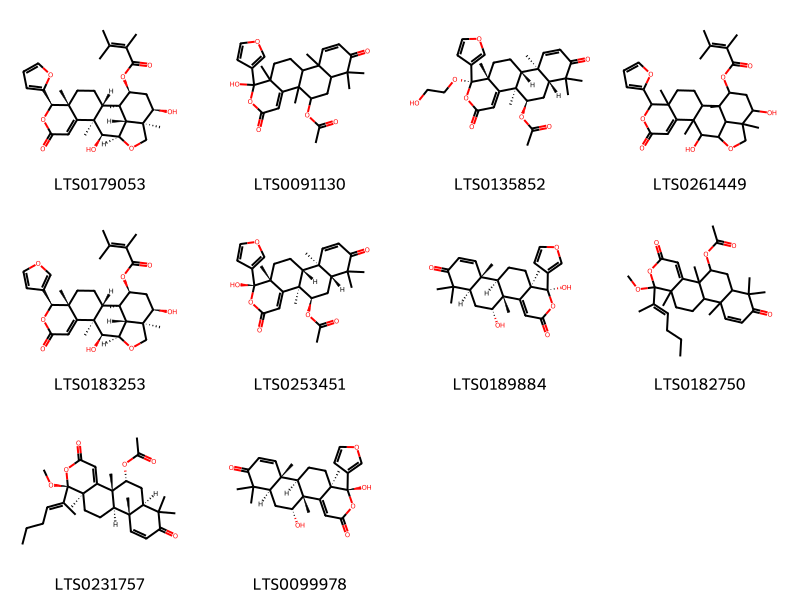{ width=100% }
    <figcaption>Hình ảnh cấu trúc hóa học của 10 hoạt chất thuộc nhóm Naphthopyrans gồm ['(1r,2r,5r,6r,11r,12s,13r,16r,17r,19s,20r)-6-(furan-2-yl)-12,17-dihydroxy-1,5,11,16-tetramethyl-8-oxo-7,14-dioxapentacyclo[11.6.1.0²,¹¹.0⁵,¹⁰.0¹⁶,²⁰]icos-9-en-19-yl 2,3-dimethylbut-2-enoate (LTS0179053)', '1-(furan-3-yl)-1-hydroxy-4b,7,7,10a,12a-pentamethyl-3,8-dioxo-5h,6h,6ah,10bh,11h,12h-naphtho[2,1-f]isochromen-5-yl acetate (LTS0091130)', '(1r,4br,5r,6ar,10ar,10br,12ar)-1-(furan-3-yl)-1-(2-hydroxyethoxy)-4b,7,7,10a,12a-pentamethyl-3,8-dioxo-5h,6h,6ah,10bh,11h,12h-naphtho[2,1-f]isochromen-5-yl acetate (LTS0135852)', '6-(furan-2-yl)-12,17-dihydroxy-1,5,11,16-tetramethyl-8-oxo-7,14-dioxapentacyclo[11.6.1.0²,¹¹.0⁵,¹⁰.0¹⁶,²⁰]icos-9-en-19-yl 2,3-dimethylbut-2-enoate (LTS0261449)', '(1r,2r,5r,6r,11r,12s,13r,16r,17r,19s,20r)-6-(furan-3-yl)-12,17-dihydroxy-1,5,11,16-tetramethyl-8-oxo-7,14-dioxapentacyclo[11.6.1.0²,¹¹.0⁵,¹⁰.0¹⁶,²⁰]icos-9-en-19-yl 2,3-dimethylbut-2-enoate (LTS0183253)', 'nimolicinol (LTS0253451)', '(1s,4br,5r,6ar,10ar,10br,12ar)-1-(furan-3-yl)-1,5-dihydroxy-4b,7,7,10a,12a-pentamethyl-5h,6h,6ah,10bh,11h,12h-naphtho[2,1-f]isochromene-3,8-dione (LTS0189884)', '1-(hex-2-en-2-yl)-1-methoxy-4b,7,7,10a,12a-pentamethyl-3,8-dioxo-5h,6h,6ah,10bh,11h,12h-naphtho[2,1-f]isochromen-5-yl acetate (LTS0182750)', '(1s,4br,5r,6ar,10ar,10br,12ar)-1-[(2e)-hex-2-en-2-yl]-1-methoxy-4b,7,7,10a,12a-pentamethyl-3,8-dioxo-5h,6h,6ah,10bh,11h,12h-naphtho[2,1-f]isochromen-5-yl acetate (LTS0231757)', '7-deacetyl-17-epinimolicinol (LTS0099978)'].</figcaption>
</figure>
#### Nhóm Organic disulfides
<figure markdown="span">
    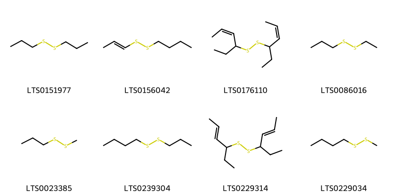{ width=100% }
    <figcaption>Hình ảnh cấu trúc hóa học của 8 hoạt chất thuộc nhóm Organic disulfides gồm ['propyl disulfide (LTS0151977)', '1-(prop-1-en-1-yldisulfanyl)butane (LTS0156042)', '(2z)-4-[(4z)-hex-4-en-3-yldisulfanyl]hex-2-ene (LTS0176110)', 'ethyl propyl disulfide (LTS0086016)', 'methyl propyl disulfide (LTS0023385)', 'butyl propyl disulfide (LTS0239304)', '(2e)-4-[(4e)-hex-4-en-3-yldisulfanyl]hex-2-ene (LTS0229314)', '1-(methyldisulfanyl)butane (LTS0229034)'].</figcaption>
</figure>
#### Nhóm Organic oxides
<figure markdown="span">
    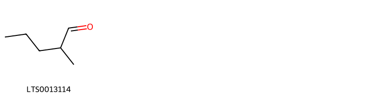{ width=100% }
    <figcaption>Hình ảnh cấu trúc hóa học của 1 hoạt chất thuộc nhóm Organic oxides gồm ['2-methylpentaldehyde (LTS0013114)'].</figcaption>
</figure>
#### Nhóm Organic trisulfides
<figure markdown="span">
    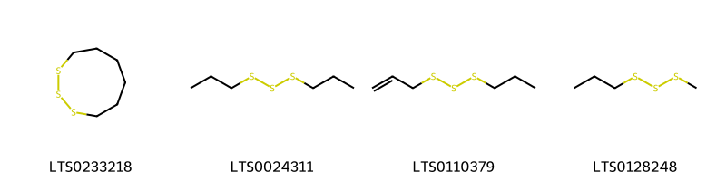{ width=100% }
    <figcaption>Hình ảnh cấu trúc hóa học của 4 hoạt chất thuộc nhóm Organic trisulfides gồm ['1,2,3-trithionane (LTS0233218)', 'dipropyl trisulfide (LTS0024311)', '1-(prop-2-en-1-yl)-3-propyltrisulfane (LTS0110379)', 'methyl propyl trisulfide (LTS0128248)'].</figcaption>
</figure>
#### Nhóm Organooxygen compounds
<figure markdown="span">
    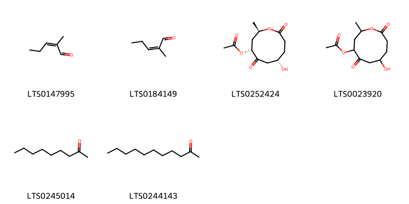{ width=100% }
    <figcaption>Hình ảnh cấu trúc hóa học của 6 hoạt chất thuộc nhóm Organooxygen compounds gồm ['(2z)-2-methyl-2-pentenal (LTS0147995)', '2-pentenal, 2-methyl- (LTS0184149)', '(2r,4r,7s)-7-hydroxy-2-methyl-5,10-dioxooxecan-4-yl acetate (LTS0252424)', '7-hydroxy-2-methyl-5,10-dioxooxecan-4-yl acetate (LTS0023920)', '2-nonanone (LTS0245014)', 'undecan-2-one (LTS0244143)'].</figcaption>
</figure>
#### Nhóm Oxocins
<figure markdown="span">
    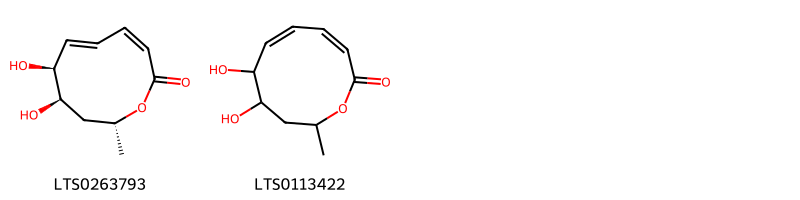{ width=100% }
    <figcaption>Hình ảnh cấu trúc hóa học của 2 hoạt chất thuộc nhóm Oxocins gồm ['(3z,5e,7s,8r,10r)-7,8-dihydroxy-10-methyl-7,8,9,10-tetrahydrooxecin-2-one (LTS0263793)', '7,8-dihydroxy-10-methyl-7,8,9,10-tetrahydrooxecin-2-one (LTS0113422)'].</figcaption>
</figure>
#### Nhóm Phenanthrenes and derivatives
<figure markdown="span">
    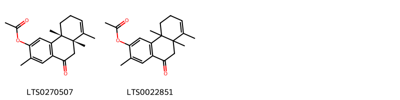{ width=100% }
    <figcaption>Hình ảnh cấu trúc hóa học của 2 hoạt chất thuộc nhóm Phenanthrenes and derivatives gồm ['(4br,8as)-2,4b,8,8a-tetramethyl-10-oxo-6,9-dihydro-5h-phenanthren-3-yl acetate (LTS0270507)', '2,4b,8,8a-tetramethyl-10-oxo-6,9-dihydro-5h-phenanthren-3-yl acetate (LTS0022851)'].</figcaption>
</figure>
#### Nhóm Phenols
<figure markdown="span">
    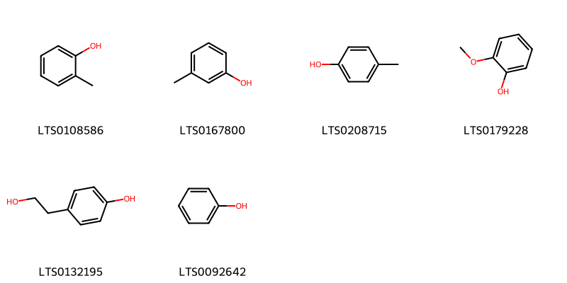{ width=100% }
    <figcaption>Hình ảnh cấu trúc hóa học của 6 hoạt chất thuộc nhóm Phenols gồm ['o-cresol (LTS0108586)', 'm-cresol (LTS0167800)', 'p-cresol (LTS0208715)', 'guaiacol (LTS0179228)', 'tyrosol (LTS0132195)', 'phenol (LTS0092642)'].</figcaption>
</figure>
#### Nhóm Polycyclic hydrocarbons
<figure markdown="span">
    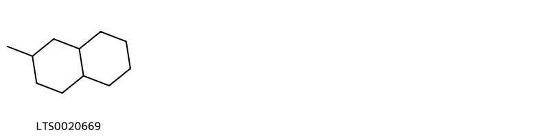{ width=100% }
    <figcaption>Hình ảnh cấu trúc hóa học của 1 hoạt chất thuộc nhóm Polycyclic hydrocarbons gồm ['2-methyl-decahydronaphthalene (LTS0020669)'].</figcaption>
</figure>
#### Nhóm Prenol lipids
<figure markdown="span">
    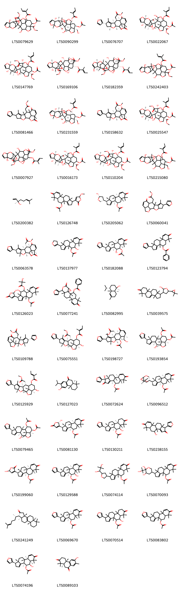{ width=100% }
    <figcaption>Hình ảnh cấu trúc hóa học của 328 hoạt chất thuộc nhóm Prenol lipids gồm ['4,11-dimethyl 12-(acetyloxy)-4,7-dihydroxy-6-{2-hydroxy-11-methyl-5,7,10-trioxatetracyclo[6.3.1.0²,⁶.0⁹,¹¹]dodec-3-en-9-yl}-6-methyl-14-[(2-methylbut-2-enoyl)oxy]-3,9-dioxatetracyclo[6.6.1.0¹,⁵.0¹¹,¹⁵]pentadecane-4,11-dicarboxylate (LTS0079629)', '(4s,5r,6s,7s,8r,11s,12r,14r,15s)-12-(acetyloxy)-4,7-dihydroxy-6-[(1s,2r,6s,8s,9r,11s)-2-hydroxy-11-methyl-5,7,10-trioxatetracyclo[6.3.1.0²,⁶.0⁹,¹¹]dodec-3-en-9-yl]-11-(hydroxymethyl)-6-methyl-3,9-dioxatetracyclo[6.6.1.0¹,⁵.0¹¹,¹⁵]pentadecan-14-yl (2e)-2-methylbut-2-enoate (LTS0090299)', 'methyl 2-[(1s,2s,4s,6s,9r,10r,11r,15s,18r)-6-(furan-3-yl)-7,9,11,15-tetramethyl-12,16-dioxo-3,17-dioxapentacyclo[9.6.1.0²,⁹.0⁴,⁸.0¹⁵,¹⁸]octadeca-7,13-dien-10-yl]acetate (LTS0076707)', 'azadirachtin h (LTS0022067)', 'azadirachtin (LTS0147769)', '4,11-dimethyl (1s,4s,5r,6s,7s,8r,11s,12r,14s,15r)-7,14-dihydroxy-6-[(1s,2s,6s,8s,9r,11s)-2-hydroxy-11-methyl-5,7,10-trioxatetracyclo[6.3.1.0²,⁶.0⁹,¹¹]dodec-3-en-9-yl]-6-methyl-12-{[(2e)-2-methylbut-2-enoyl]oxy}-3,9-dioxatetracyclo[6.6.1.0¹,⁵.0¹¹,¹⁵]pentadecane-4,11-dicarboxylate (LTS0169106)', '4,11-dimethyl (1s,5r,6s,7s,8r,11s,12r,14r,15r)-7,14-dihydroxy-6-[(1s,2s,6s,8s,9r,11s)-3-hydroxy-11-methyl-5,7,10-trioxatetracyclo[6.3.1.0²,⁶.0⁹,¹¹]dodec-3-en-9-yl]-6-methyl-12-{[(2e)-2-methylbut-2-enoyl]oxy}-3,9-dioxatetracyclo[6.6.1.0¹,⁵.0¹¹,¹⁵]pentadecane-4,11-dicarboxylate (LTS0182359)', 'methyl 12-(acetyloxy)-4,7-dihydroxy-6-{2-hydroxy-11-methyl-5,7,10-trioxatetracyclo[6.3.1.0²,⁶.0⁹,¹¹]dodec-3-en-9-yl}-6-methyl-14-[(2-methylbut-2-enoyl)oxy]-3,9-dioxatetracyclo[6.6.1.0¹,⁵.0¹¹,¹⁵]pentadecane-11-carboxylate (LTS0242403)', 'methyl 2-[6-(furan-3-yl)-7,9,11,15-tetramethyl-12,16-dioxo-3,17-dioxapentacyclo[9.6.1.0²,⁹.0⁴,⁸.0¹⁵,¹⁸]octadeca-7,13-dien-10-yl]acetate (LTS0081466)', '(1s,4s,5r,6s,7s,8r,11s,12r,14r,15s)-12-(acetyloxy)-4,7-dihydroxy-6-[(1s,2r,6s,8s,9r,11s)-2-hydroxy-11-methyl-5,7,10-trioxatetracyclo[6.3.1.0²,⁶.0⁹,¹¹]dodec-3-en-9-yl]-11-(hydroxymethyl)-6-methyl-3,9-dioxatetracyclo[6.6.1.0¹,⁵.0¹¹,¹⁵]pentadecan-14-yl (2e)-2-methylbut-2-enoate (LTS0231559)', 'methyl 2-[(1r,2s,4r,9r,11r,15r,18r)-6-(furan-3-yl)-7,9,11,15-tetramethyl-12,16-dioxo-3,17-dioxapentacyclo[9.6.1.0²,⁹.0⁴,⁸.0¹⁵,¹⁸]octadeca-7,13-dien-10-yl]acetate (LTS0158632)', '4,11-dimethyl (1s,4s,5r,6s,7s,11s,12r,14s,15r)-12-(acetyloxy)-4,7-dihydroxy-6-[(1s,2s,6s,9r,11s)-2-hydroxy-11-methyl-5,7,10-trioxatetracyclo[6.3.1.0²,⁶.0⁹,¹¹]dodec-3-en-9-yl]-6-methyl-14-{[(2e)-2-methylbut-2-enoyl]oxy}-3,9-dioxatetracyclo[6.6.1.0¹,⁵.0¹¹,¹⁵]pentadecane-4,11-dicarboxylate (LTS0025547)', '4,11-dimethyl 7,14-dihydroxy-6-{2-hydroxy-11-methyl-5,7,10-trioxatetracyclo[6.3.1.0²,⁶.0⁹,¹¹]dodec-3-en-9-yl}-6-methyl-12-[(2-methylbut-2-enoyl)oxy]-3,9-dioxatetracyclo[6.6.1.0¹,⁵.0¹¹,¹⁵]pentadecane-4,11-dicarboxylate (LTS0007927)', 'methyl (1s,4r,5r,6s,7s,8r,11s,12r,14s,15r)-12-(acetyloxy)-4,7-dihydroxy-6-[(1s,2s,6s,8s,9r,11s)-2-hydroxy-11-methyl-5,7,10-trioxatetracyclo[6.3.1.0²,⁶.0⁹,¹¹]dodec-3-en-9-yl]-6-methyl-14-{[(2e)-2-methylbut-2-enoyl]oxy}-3,9-dioxatetracyclo[6.6.1.0¹,⁵.0¹¹,¹⁵]pentadecane-11-carboxylate (LTS0016173)', 'azadirachtin b (LTS0110204)', '12-(acetyloxy)-4,7-dihydroxy-6-{2-hydroxy-11-methyl-5,7,10-trioxatetracyclo[6.3.1.0²,⁶.0⁹,¹¹]dodec-3-en-9-yl}-11-(hydroxymethyl)-6-methyl-3,9-dioxatetracyclo[6.6.1.0¹,⁵.0¹¹,¹⁵]pentadecan-14-yl (2e)-2-methylbut-2-enoate (LTS0215080)', '(-)-linalool (LTS0200382)', '1-(5-methoxy-2-oxo-5h-furan-3-yl)-3b,6,6,9a,11a-pentamethyl-7-oxo-1h,2h,4h,5h,5ah,9bh,10h,11h-cyclopenta[a]phenanthren-4-yl acetate (LTS0126748)', '(1s,3br,4r,5ar,9ar,9br,11as)-1-[(3r,5s)-5-hydroxyoxolan-3-yl]-3b,6,6,9a,11a-pentamethyl-7-oxo-1h,2h,4h,5h,5ah,9bh,10h,11h-cyclopenta[a]phenanthren-4-yl acetate (LTS0205062)', 'methyl 2-[6-(furan-3-yl)-7,9,11,15-tetramethyl-12-oxo-3,17-dioxapentacyclo[9.6.1.0²,⁹.0⁴,⁸.0¹⁵,¹⁸]octadeca-7,13-dien-10-yl]acetate (LTS0060041)', 'methyl 2-[(1r,2s,4r,6r,9r,10s,11r,15r,18r)-6-(furan-3-yl)-7,9,11,15-tetramethyl-12,16-dioxo-3,17-dioxapentacyclo[9.6.1.0²,⁹.0⁴,⁸.0¹⁵,¹⁸]octadeca-7,13-dien-10-yl]acetate (LTS0063578)', '1-(4,5-dihydrofuran-3-yl)-5-hydroxy-3b,6,6,9a,11a-pentamethyl-7-oxo-1h,2h,4h,5h,5ah,9bh,10h,11h-cyclopenta[a]phenanthren-4-yl acetate (LTS0137977)', '(1r,3br,4s,5r,5as,9ar,9br,11as)-1-(furan-3-yl)-4-hydroxy-3b,6,6,9a,11a-pentamethyl-7-oxo-1h,2h,4h,5h,5ah,9bh,10h,11h-cyclopenta[a]phenanthren-5-yl acetate (LTS0182088)', '1-(furan-3-yl)-3b,6,6,9a,11a-pentamethyl-7-oxo-1h,2h,4h,5h,5ah,9bh,10h,11h-cyclopenta[a]phenanthren-4-yl benzoate (LTS0123794)', '4-(acetyloxy)-11-hydroxy-1-(2-hydroxy-5-oxo-2h-furan-3-yl)-3b,6,6,9a,11a-pentamethyl-7-oxo-1h,2h,4h,5h,5ah,9bh,10h,11h-cyclopenta[a]phenanthren-10-yl 2-hydroxy-2-methylpropanoate (LTS0126023)', '7-(furan-3-yl)-1,8,12,16,16-pentamethyl-5,15-dioxo-3,6-dioxapentacyclo[9.8.0.0²,⁴.0²,⁸.0¹²,¹⁷]nonadec-13-en-19-yl benzoate (LTS0077241)', '(1r,4s,4as,8as)-4-isopropyl-1,6-dimethyl-3,4,4a,7,8,8a-hexahydro-2h-naphthalen-1-ol (LTS0082995)', '1-[5-(3,3-dimethyloxiran-2-yl)-2-hydroxyoxolan-3-yl]-3a,6,6,9a,11a-pentamethyl-1h,2h,3h,5h,5ah,8h,9h,9bh,10h,11h-cyclopenta[a]phenanthren-7-one (LTS0039575)', 'methyl 2-[(1r,2s,4s,6r,9r,10s,11r,15r,18r)-6-(furan-3-yl)-7,9,11,15-tetramethyl-12-oxo-3,17-dioxapentacyclo[9.6.1.0²,⁹.0⁴,⁸.0¹⁵,¹⁸]octadeca-7,13-dien-10-yl]acetate (LTS0109788)', '3-deacetylsalannin (LTS0075551)', 'methyl 2-[(1s,2r,3r,4r,8r,9s,10r,13r,15r)-2-(acetyloxy)-13-(furan-3-yl)-4-(hydroxymethyl)-4,8,10,12-tetramethyl-7-oxo-16-oxatetracyclo[8.6.0.0³,⁸.0¹¹,¹⁵]hexadeca-5,11-dien-9-yl]acetate (LTS0198727)', '(1r,2r,5s,6r,10r,11s,12r,15r,16r,18s,19r)-18-(acetyloxy)-6-(furan-3-yl)-11-hydroxy-1,5,10,15-tetramethyl-13-oxapentacyclo[10.6.1.0²,¹⁰.0⁵,⁹.0¹⁵,¹⁹]nonadec-8-en-16-yl acetate (LTS0193854)', '(1r,2s,4r,6r,9r,10r,11r,12s,14r,15r,18r)-6-(furan-3-yl)-14-hydroxy-10-(2-methoxy-2-oxoethyl)-7,9,11,15-tetramethyl-3,17-dioxapentacyclo[9.6.1.0²,⁹.0⁴,⁸.0¹⁵,¹⁸]octadec-7-en-12-yl 2-methylbut-2-enoate (LTS0125929)', 'sugiol (LTS0127023)', '17-epi-17-hydroxyazadiradione (LTS0072624)', '(1s,3br,4r,5ar,9ar,9br,11as)-1-[(1s,4s,6r)-1-(2-hydroxypropan-2-yl)-2,7-dioxabicyclo[4.1.0]heptan-4-yl]-3b,6,6,9a,11a-pentamethyl-7-oxo-1h,2h,4h,5h,5ah,9bh,10h,11h-cyclopenta[a]phenanthren-4-yl acetate (LTS0096512)', '(1r,2r,5s,6r,10r,11s,12s,15r,16r,18s,19r)-18-(acetyloxy)-6-(furan-3-yl)-11-hydroxy-1,5,10,15-tetramethyl-13-oxapentacyclo[10.6.1.0²,¹⁰.0⁵,⁹.0¹⁵,¹⁹]nonadec-8-en-16-yl acetate (LTS0079465)', '(1r,3br,4r,5ar,9ar,9br,11as)-1-[(2s)-2-hydroxy-5-oxo-2h-furan-3-yl]-3b,6,6,9a,11a-pentamethyl-7-oxo-1h,2h,4h,5h,5ah,9bh,10h,11h-cyclopenta[a]phenanthren-4-yl acetate (LTS0081130)', '(1r,3br,4s,5r,5ar,9ar,9br,11as)-1-(furan-3-yl)-5-hydroxy-3b,6,6,9a,11a-pentamethyl-7-oxo-1h,2h,4h,5h,5ah,8h,9h,9bh,10h,11h-cyclopenta[a]phenanthren-4-yl acetate (LTS0130211)', '1-(furan-3-yl)-4-hydroxy-3b,6,6,9a,11a-pentamethyl-1h,4h,5h,5ah,9bh,10h,11h-cyclopenta[a]phenanthrene-2,7-dione (LTS0238155)', '(1r,3br,4r,5ar,9ar,9br,11as)-1-(5-hydroxy-2-oxo-5h-furan-3-yl)-3b,6,6,9a,11a-pentamethyl-7-oxo-1h,2h,4h,5h,5ah,9bh,10h,11h-cyclopenta[a]phenanthren-4-yl acetate (LTS0199060)', '(1r,3br,4s,5r,5ar,9ar,9br,11as)-1-(furan-3-yl)-5-hydroxy-3b,6,6,9a,11a-pentamethyl-7-oxo-1h,2h,4h,5h,5ah,9bh,10h,11h-cyclopenta[a]phenanthren-4-yl acetate (LTS0129588)', '1-[5-(1,2-dihydroxy-2-methylpropyl)oxolan-3-yl]-3b,6,6,9a,11a-pentamethyl-7-oxo-1h,2h,4h,5h,5ah,9bh,10h,11h-cyclopenta[a]phenanthren-4-yl acetate (LTS0074114)', '1-[5,6-dihydroxy-6-(2-hydroxypropan-2-yl)oxan-3-yl]-3b,6,6,9a,11a-pentamethyl-7-oxo-1h,2h,4h,5h,5ah,9bh,10h,11h-cyclopenta[a]phenanthren-4-yl acetate (LTS0070093)', '(1s,3as,5ar,9as,11as)-3a,6,6,9a,11a-pentamethyl-1-[(2s)-6-methylhept-5-en-2-yl]-1h,3h,4h,5h,5ah,7h,8h,9h,10h,11h-cyclopenta[a]phenanthren-2-one (LTS0241249)', 'azadirone (LTS0069670)', '1-(furan-3-yl)-5-hydroxy-3b,6,6,9a,11a-pentamethyl-7-oxo-1h,2h,4h,5h,5ah,8h,9h,9bh,10h,11h-cyclopenta[a]phenanthren-4-yl acetate (LTS0070514)', '1-(furan-3-yl)-3b,6,6,9a,11a-pentamethyl-7-oxo-1h,2h,4h,5h,5ah,9bh,10h,11h-cyclopenta[a]phenanthren-4-yl acetate (LTS0083802)', '(1r,3br,4s,5r,5as,9ar,9br,11as)-1-(furan-3-yl)-5-hydroxy-3b,6,6,9a,11a-pentamethyl-7-oxo-1h,2h,4h,5h,5ah,9bh,10h,11h-cyclopenta[a]phenanthren-4-yl acetate (LTS0074196)', '(4as,10ar)-6-hydroxy-1,1,4a,7-tetramethyl-3,4,10,10a-tetrahydrophenanthrene-2,9-dione (LTS0089103)', '16-(acetyloxy)-6-(furan-3-yl)-11-hydroxy-1,5,10,15-tetramethyl-13-oxapentacyclo[10.6.1.0²,¹⁰.0⁵,⁹.0¹⁵,¹⁹]nonadec-8-en-18-yl acetate (LTS0078609)', 'methyl (1s,4r,5r,6r,7r,8r,11r,12s,14r,15s)-12-(acetyloxy)-4,7-dihydroxy-6-[(1s,2s,6s,8s,9r,11s)-2-hydroxy-11-methyl-5,7,10-trioxatetracyclo[6.3.1.0²,⁶.0⁹,¹¹]dodec-3-en-9-yl]-6-methyl-14-{[(2e)-2-methylbut-2-enoyl]oxy}-3,9-dioxatetracyclo[6.6.1.0¹,⁵.0¹¹,¹⁵]pentadecane-11-carboxylate (LTS0219267)', '1-(furan-3-yl)-3b,6,6,9a,11a-pentamethyl-2,7-dioxo-1h,4h,5h,5ah,9bh,10h,11h-cyclopenta[a]phenanthren-4-yl acetate (LTS0050379)', '(1s,2r,4s,6s,7s,10r,11r,16s,18r)-6-(furan-3-yl)-1,7,11,15,15-pentamethyl-5,14-dioxo-3-oxapentacyclo[8.8.0.0²,⁴.0²,⁷.0¹¹,¹⁶]octadec-12-en-18-yl acetate (LTS0092954)', '(1s,2s,3as,5as,9as,9br,11as)-3a,6,6,9a,11a-pentamethyl-1-[(2s)-6-methylhept-5-en-2-yl]-1h,2h,3h,5h,5ah,7h,8h,9h,9bh,10h,11h-cyclopenta[a]phenanthren-2-ol (LTS0044193)', '(1r,3br,4s,5r,5as,9ar,9bs,10s,11r,11as)-1-[(2r,5s)-2,5-dihydroxy-2,5-dihydrofuran-3-yl]-10,11-dihydroxy-5-methoxy-3b,6,6,9a,11a-pentamethyl-2,9-dioxo-1h,4h,5h,5ah,9bh,10h,11h-cyclopenta[a]phenanthren-4-yl 3-methylbut-2-enoate (LTS0043082)', '(1s,2r,4r,6s,7s,10r,11r,16r,18r)-6-(furan-3-yl)-1,7,11,15,15-pentamethyl-14-oxo-3-oxapentacyclo[8.8.0.0²,⁴.0²,⁷.0¹¹,¹⁶]octadec-12-en-18-yl acetate (LTS0025640)', 'hexahydrofarnesol (LTS0168404)', '16-(acetyloxy)-11-hydroxy-1,5,10,15-tetramethyl-6-(5-oxooxolan-3-yl)-13-oxapentacyclo[10.6.1.0²,¹⁰.0⁵,⁹.0¹⁵,¹⁹]nonadec-8-en-18-yl 3-methylbut-2-enoate (LTS0005204)', '(4bs,8ar)-3,4b,8,8-tetramethyl-7,10-dioxo-5,6,8a,9-tetrahydrophenanthrene-2-carboxylic acid (LTS0071404)', 'methyl 13-(acetyloxy)-8-hydroxy-7-{2-hydroxy-11-methyl-5,7,10-trioxatetracyclo[6.3.1.0²,⁶.0⁹,¹¹]dodec-3-en-9-yl}-7-methyl-15-[(2-methylbut-2-enoyl)oxy]-4,5-dioxo-3,10-dioxatetracyclo[7.6.1.0¹,⁶.0¹²,¹⁶]hexadecane-12-carboxylate (LTS0152877)', '(1r,11r,16r)-17,19-bis(acetyloxy)-8-(furan-3-yl)-4-hydroxy-1,9,11,16-tetramethyl-5,14-dioxapentacyclo[11.6.1.0²,¹¹.0⁶,¹⁰.0¹⁶,²⁰]icos-9-en-12-yl (2e)-3-phenylprop-2-enoate (LTS0089184)', '(1s,3as,5ar,9ar,9br,11as)-1-[(1r)-1-[(2s,3r,4s)-3,4-dihydroxy-5,5-dimethyloxolan-2-yl]ethyl]-3a,6,6,9a,11a-pentamethyl-1h,2h,3h,5h,5ah,8h,9h,9bh,10h,11h-cyclopenta[a]phenanthren-7-one (LTS0169642)', '(1s,3br,4r,5ar,9ar,9br,11as)-1-[(3r)-5-ethoxyoxolan-3-yl]-3b,6,6,9a,11a-pentamethyl-7-oxo-1h,2h,4h,5h,5ah,9bh,10h,11h-cyclopenta[a]phenanthren-4-yl acetate (LTS0100724)', '(1r,3br,4r,5ar,9ar,9br,11as)-1-(5-methoxy-2-oxo-5h-furan-3-yl)-3b,6,6,9a,11a-pentamethyl-7-oxo-1h,2h,4h,5h,5ah,9bh,10h,11h-cyclopenta[a]phenanthren-4-yl acetate (LTS0072396)', '(1r,2s,4s,6r,9r,10r,11r,12s,14r,15r,18r)-14-(acetyloxy)-6-(furan-3-yl)-10-(2-methoxy-2-oxoethyl)-7,9,11,15-tetramethyl-3,17-dioxapentacyclo[9.6.1.0²,⁹.0⁴,⁸.0¹⁵,¹⁸]octadec-7-en-12-yl 3-methylbutanoate (LTS0072824)', 'farnesyl acetate (LTS0173408)', '16-(furan-3-yl)-2,7,7,11,17-pentamethyl-6,15-dioxo-4,13-dioxahexacyclo[9.8.0.0²,⁸.0³,⁵.0¹²,¹⁴.0¹²,¹⁷]nonadecan-10-yl acetate (LTS0035093)', '14-(acetyloxy)-6-(furan-3-yl)-10-(2-methoxy-2-oxoethyl)-7,9,11,15-tetramethyl-3,17-dioxapentacyclo[9.6.1.0²,⁹.0⁴,⁸.0¹⁵,¹⁸]octadec-7-en-12-yl 2-methylbut-2-enoate (LTS0175012)', '6-ethyl-7-methoxy-1,1,4a-trimethyl-4,9,10,10a-tetrahydro-3h-phenanthren-2-one (LTS0029204)', '(1r,2s,5r,7s,8s,9r,12r,13r,15s,16r)-13-(acetyloxy)-15-hydroxy-1,5,7,12-tetramethyl-5-[(1s)-1-[(3s)-5-oxooxolan-3-yl]ethyl]-10-oxatetracyclo[7.6.1.0²,⁷.0¹²,¹⁶]hexadecan-8-yl 2-methylbutanoate (LTS0203907)', '1-[5-(1,3-dihydroxy-2-methylpropyl)-4,5-dihydrofuran-3-yl]-3a,6,6,9a,11a-pentamethyl-1h,2h,3h,5h,5ah,8h,9h,9bh,10h,11h-cyclopenta[a]phenanthren-7-one (LTS0196732)', 'methyl 2-[(1s,2r,3s,4r,8r,9s,10r,13r,15r)-2-(acetyloxy)-4-formyl-13-(furan-3-yl)-4,8,10,12-tetramethyl-7-oxo-16-oxatetracyclo[8.6.0.0³,⁸.0¹¹,¹⁵]hexadeca-5,11-dien-9-yl]acetate (LTS0109905)', 'methyl 2-[4-formyl-13-(furan-3-yl)-2-hydroxy-4,8,10,12-tetramethyl-7-oxo-16-oxatetracyclo[8.6.0.0³,⁸.0¹¹,¹⁵]hexadeca-5,11-dien-9-yl]acetate (LTS0042555)', '(4as,10ar)-6-hydroxy-7-(1-hydroxypropan-2-yl)-1,1,4a-trimethyl-3,4,10,10a-tetrahydrophenanthrene-2,9-dione (LTS0110529)', '(1r,2s,4r,6r,9r,10s,11r,12s,14r,15r,18r)-14-(acetyloxy)-6-(furan-3-yl)-10-(2-methoxy-2-oxoethyl)-7,9,11,15-tetramethyl-3,17-dioxapentacyclo[9.6.1.0²,⁹.0⁴,⁸.0¹⁵,¹⁸]octadec-7-en-12-yl (2e)-2-methylbut-2-enoate (LTS0111389)', '14-hydroxy-6-(2-hydroxy-5-oxo-2h-furan-3-yl)-10-(2-methoxy-2-oxoethyl)-7,9,11,15-tetramethyl-3,17-dioxapentacyclo[9.6.1.0²,⁹.0⁴,⁸.0¹⁵,¹⁸]octadec-7-en-12-yl 3-methylbut-2-enoate (LTS0108259)', 'longifolene (LTS0202079)', '(1r,3br,4r,5ar,9ar,9br,11as)-1-[(5s)-5-methoxy-2-oxo-5h-furan-3-yl]-3b,6,6,9a,11a-pentamethyl-7-oxo-1h,2h,4h,5h,5ah,9bh,10h,11h-cyclopenta[a]phenanthren-4-yl acetate (LTS0106937)', '(1r,2r,3s,5s,8r,10r,11s,12r,14s,16s,17s)-16-(furan-3-yl)-2,7,7,11,17-pentamethyl-6,15-dioxo-4,13-dioxahexacyclo[9.8.0.0²,⁸.0³,⁵.0¹²,¹⁴.0¹²,¹⁷]nonadecan-10-yl acetate (LTS0182283)', '5-(acetyloxy)-3-[(1r,3br,4r,5ar,9ar,9br,11as)-4-hydroxy-3b,6,6,9a,11a-pentamethyl-7-oxo-1h,2h,4h,5h,5ah,9bh,10h,11h-cyclopenta[a]phenanthren-1-yl]-2,5-dihydrofuran-2-yl acetate (LTS0062106)', '(-)-α-pinene (LTS0032699)', '(+)-camphene (LTS0109845)', 'terpinolene (LTS0104525)', '1-(furan-3-yl)-1,4-dihydroxy-3b,6,6,9a,11a-pentamethyl-4h,5h,5ah,9bh,10h,11h-cyclopenta[a]phenanthrene-2,7-dione (LTS0110965)', 'trans-β-ocimene (LTS0049765)', '(1s,2r,4s,6s,7s,10r,11r,12s,16r,18r)-6-(furan-3-yl)-12-methoxy-1,7,11,15,15-pentamethyl-5,14-dioxo-3-oxapentacyclo[8.8.0.0²,⁴.0²,⁷.0¹¹,¹⁶]octadecan-18-yl acetate (LTS0049999)', '2-isopropyl-4b,8,8-trimethyl-5,6,7,8a,9,10-hexahydrophenanthrene-1,4-diol (LTS0110545)', '(1r,3br,4r,5as,9ar,9br,11ar)-1-[(5r)-5-hydroxy-2-oxo-5h-furan-3-yl]-3b,6,6,9a,11a-pentamethyl-7-oxo-1h,2h,4h,5h,5ah,9bh,10h,11h-cyclopenta[a]phenanthren-4-yl acetate (LTS0156216)', '6-(furan-3-yl)-1,7,11,15,15-pentamethyl-5,14-dioxo-3-oxapentacyclo[8.8.0.0²,⁴.0²,⁷.0¹¹,¹⁶]octadec-12-en-18-yl benzoate (LTS0194161)', '14-(acetyloxy)-6-(furan-3-yl)-10-(2-methoxy-2-oxoethyl)-7,9,11,15-tetramethyl-3,17-dioxapentacyclo[9.6.1.0²,⁹.0⁴,⁸.0¹⁵,¹⁸]octadec-7-en-12-yl 3-methylbutanoate (LTS0104159)', '(1s,3as,5as,9as,11as)-3a,6,6,9a,11a-pentamethyl-1-[(2s)-6-methylhept-5-en-2-yl]-1h,3h,4h,5h,5ah,7h,8h,9h,10h,11h-cyclopenta[a]phenanthren-2-one (LTS0159440)', '(2s,4as,10as)-2,6-dihydroxy-7-isopropyl-1,1,4a-trimethyl-3,4,10,10a-tetrahydro-2h-phenanthren-9-one (LTS0176592)', 'β-pinene (LTS0117550)', 'cymene (LTS0181568)', 'methyl 2-[(1r,4r,5r,7s,8s,9r,10s,11s,12s)-5,7-bis(acetyloxy)-11-hydroxy-10-[(1s,2s,6s,8s,9r,11s)-2-hydroxy-11-methyl-5,7,10-trioxatetracyclo[6.3.1.0²,⁶.0⁹,¹¹]dodec-3-en-9-yl]-4,8,10-trimethyl-2-oxatricyclo[6.3.1.0⁴,¹²]dodecan-9-yl]-2-oxoacetate (LTS0273910)', '(1r,3br,4r,5ar,9as,9br,10s,11r,11as)-4-(acetyloxy)-11-hydroxy-1-(5-hydroxy-2-oxo-5h-furan-3-yl)-3b,6,6,9a,11a-pentamethyl-7-oxo-1h,2h,4h,5h,5ah,9bh,10h,11h-cyclopenta[a]phenanthren-10-yl 2-hydroxy-2-methylpropanoate (LTS0136045)', '(1r,3as,9ar,9br,11as)-1-[(5r)-5-[(1r,2s)-1,3-dihydroxy-2-methylpropyl]-4,5-dihydrofuran-3-yl]-3a,6,6,9a,11a-pentamethyl-1h,2h,3h,5h,5ah,8h,9h,9bh,10h,11h-cyclopenta[a]phenanthren-7-one (LTS0150511)', '4,11-dimethyl (1s,4s,5r,6s,7s,8r,11s,12r,14s,15r)-4,7,14-trihydroxy-6-[(1s,2s,6s,8s,9r,11s)-2-hydroxy-11-methyl-5,7,10-trioxatetracyclo[6.3.1.0²,⁶.0⁹,¹¹]dodec-3-en-9-yl]-6-methyl-12-{[(2e)-2-methylbut-2-enoyl]oxy}-3,9-dioxatetracyclo[6.6.1.0¹,⁵.0¹¹,¹⁵]pentadecane-4,11-dicarboxylate (LTS0251446)', '(1r,3br,4s,5r,5ar,9as,9br,10s,11r,11as)-4-(acetyloxy)-1-(2,5-dioxofuran-3-yl)-5-hydroxy-10-methoxy-3b,6,6,9a,11a-pentamethyl-7-oxo-1h,2h,4h,5h,5ah,9bh,10h,11h-cyclopenta[a]phenanthren-11-yl acetate (LTS0203122)', 'α pinene (LTS0132416)', '(1r,3br,4s,5r,5ar,9ar,9br,11as)-1-(4,5-dihydrofuran-3-yl)-5-hydroxy-3b,6,6,9a,11a-pentamethyl-7-oxo-1h,2h,4h,5h,5ah,9bh,10h,11h-cyclopenta[a]phenanthren-4-yl acetate (LTS0176594)', '(1r,3br,4s,5r,5ar,9ar,9br,11as)-5-hydroxy-1-[(5s)-5-methoxy-2-oxo-5h-furan-3-yl]-3b,6,6,9a,11a-pentamethyl-7-oxo-1h,2h,4h,5h,5ah,9bh,10h,11h-cyclopenta[a]phenanthren-4-yl 3-methylbut-2-enoate (LTS0197971)', '4-(acetyloxy)-1-(2,5-dioxofuran-3-yl)-5-hydroxy-10-methoxy-3b,6,6,9a,11a-pentamethyl-7-oxo-1h,2h,4h,5h,5ah,9bh,10h,11h-cyclopenta[a]phenanthren-11-yl acetate (LTS0121627)', '(1r,2s,4r,6r,9r,10r,11r,12s,14s,15r,18r)-6-(furan-3-yl)-14-hydroxy-10-(2-methoxy-2-oxoethyl)-7,9,11,15-tetramethyl-3,17-dioxapentacyclo[9.6.1.0²,⁹.0⁴,⁸.0¹⁵,¹⁸]octadec-7-en-12-yl (2e)-2-methylbut-2-enoate (LTS0140058)', 'nimbin (chemical) (LTS0179543)', '15,20-bis(acetyloxy)-6-(furan-3-yl)-11,18-dihydroxy-5,10,14-trimethyl-3-oxo-16-oxapentacyclo[12.3.3.0¹,¹³.0²,¹⁰.0⁵,⁹]icos-8-en-4-yl acetate (LTS0176116)', '1-(furan-3-yl)-3b,6,6,9a,11a-pentamethyl-2,7-dioxo-1h,4h,5h,5ah,9bh,10h,11h-cyclopenta[a]phenanthren-4-yl benzoate (LTS0107702)', '1-(2-hydroxy-5-oxo-2h-furan-3-yl)-3b,6,6,9a,11a-pentamethyl-7-oxo-1h,2h,4h,5h,5ah,9bh,10h,11h-cyclopenta[a]phenanthren-4-yl acetate (LTS0137149)', '(1s,2r,4r,6s,7s,10r,11r,16r,17r,18s)-6-(furan-3-yl)-17-hydroxy-1,7,11,15,15-pentamethyl-14-oxo-3-oxapentacyclo[8.8.0.0²,⁴.0²,⁷.0¹¹,¹⁶]octadec-12-en-18-yl acetate (LTS0139134)', '14-(acetyloxy)-6-(5-hydroxy-2-oxo-5h-furan-3-yl)-10-(2-methoxy-2-oxoethyl)-7,9,11,15-tetramethyl-3,17-dioxapentacyclo[9.6.1.0²,⁹.0⁴,⁸.0¹⁵,¹⁸]octadec-7-en-12-yl 2-methylbut-2-enoate (LTS0203375)', '(1r,3br,4r,5as,9ar,9br,11ar)-3b,6,6,9a,11a-pentamethyl-2,7-dioxo-1-(2-oxo-5h-furan-3-yl)-1h,4h,5h,5ah,9bh,10h,11h-cyclopenta[a]phenanthren-4-yl acetate (LTS0264713)', 'carvomethene (LTS0200037)', '(1s,3br,4r,5ar,9ar,9br,11as)-1-[(3s,5r,6s)-5,6-dihydroxy-6-(2-hydroxypropan-2-yl)oxan-3-yl]-3b,6,6,9a,11a-pentamethyl-7-oxo-1h,2h,4h,5h,5ah,9bh,10h,11h-cyclopenta[a]phenanthren-4-yl acetate (LTS0133858)', '4-isopropyl-1,6-dimethyl-2,3,4,4a,7,8-hexahydronaphthalene (LTS0270743)', '1-(furan-3-yl)-5-hydroxy-3b,6,6,9a,11a-pentamethyl-7-oxo-1h,2h,4h,5h,5ah,9bh,10h,11h-cyclopenta[a]phenanthren-4-yl acetate (LTS0196147)', '15-hydroxyazadiradione (LTS0144460)', '4,11-dimethyl 12-(acetyloxy)-4,7-dihydroxy-6-{2-hydroxy-4-methoxy-11-methyl-5,7,10-trioxatetracyclo[6.3.1.0²,⁶.0⁹,¹¹]dodecan-9-yl}-6-methyl-14-[(2-methylbut-2-enoyl)oxy]-3,9-dioxatetracyclo[6.6.1.0¹,⁵.0¹¹,¹⁵]pentadecane-4,11-dicarboxylate (LTS0149607)', '7-deacetyl-7-benzoylgedunin (LTS0158724)', '(4as,10as)-6-ethyl-7-methoxy-1,1,4a-trimethyl-3,4,10,10a-tetrahydro-2h-phenanthren-9-one (LTS0151075)', '5-hydroxy-1-(5-methoxy-2-oxo-5h-furan-3-yl)-3b,6,6,9a,11a-pentamethyl-7-oxo-1h,2h,4h,5h,5ah,9bh,10h,11h-cyclopenta[a]phenanthren-4-yl acetate (LTS0144414)', '(1s,3as,5ar,9ar,9br,11as)-1-[(2r,3s,5r)-5-[(2s)-3,3-dimethyloxiran-2-yl]-2-hydroxyoxolan-3-yl]-3a,6,6,9a,11a-pentamethyl-1h,2h,3h,5h,5ah,8h,9h,9bh,10h,11h-cyclopenta[a]phenanthren-7-one (LTS0152633)', 'delta-cadinol (LTS0272380)', "2',3'-dihydrosalannin (LTS0146649)", '[(1r,2s,4r,6s,9r,10r,11r,12s,14r,15r,18r)-6-(furan-3-yl)-12,14-dihydroxy-7,9,11,15-tetramethyl-3,17-dioxapentacyclo[9.6.1.0²,⁹.0⁴,⁸.0¹⁵,¹⁸]octadec-7-en-10-yl]acetic acid (LTS0155055)', 'camphene (LTS0267242)', '5-hydroxy-1-(5-hydroxy-2-oxo-5h-furan-3-yl)-3b,6,6,9a,11a-pentamethyl-7-oxo-1h,2h,4h,5h,5ah,9bh,10h,11h-cyclopenta[a]phenanthren-4-yl acetate (LTS0163491)', 'limonene,  (LTS0155981)', 'β-caryophyllen (LTS0141501)', '(4bs,8ar)-2,4b,8,8-tetramethyl-7,10-dioxo-5,6,8a,9-tetrahydrophenanthrene-3-carboxylic acid (LTS0140841)', '(1r,2r,6s,8r,11r,12s,13r,16r,17r,19s,20r)-17,19-bis(acetyloxy)-8-(furan-3-yl)-1,9,11,16-tetramethyl-4-oxo-5,14-dioxapentacyclo[11.6.1.0²,¹¹.0⁶,¹⁰.0¹⁶,²⁰]icos-9-en-12-yl (2e)-2-methylbut-2-enoate (LTS0150294)', '1-(5-hydroxy-4-{7-hydroxy-3a,6,6,9a,11a-pentamethyl-1h,2h,3h,5h,5ah,7h,8h,9h,9bh,10h,11h-cyclopenta[a]phenanthren-1-yl}oxolan-2-yl)-2-methylpropane-1,2-diol (LTS0121608)', '6-(furan-3-yl)-17-hydroxy-1,7,11,15,15-pentamethyl-14-oxo-3-oxapentacyclo[8.8.0.0²,⁴.0²,⁷.0¹¹,¹⁶]octadec-12-en-18-yl acetate (LTS0165537)', '17-(acetyloxy)-8-(furan-3-yl)-4-hydroxy-1,9,11,16-tetramethyl-12-{[(2e)-3-phenylprop-2-enoyl]oxy}-5,14-dioxapentacyclo[11.6.1.0²,¹¹.0⁶,¹⁰.0¹⁶,²⁰]icos-9-en-19-yl (2e)-2-methylbut-2-enoate (LTS0170549)', '(1r,3br,4s,5r,5ar,9ar,9br,11as)-1-(furan-3-yl)-4-hydroxy-3b,6,6,9a,11a-pentamethyl-7-oxo-1h,2h,4h,5h,5ah,8h,9h,9bh,10h,11h-cyclopenta[a]phenanthren-5-yl acetate (LTS0116234)', '6-(furan-3-yl)-1,7,11,15,15-pentamethyl-14-oxo-3-oxapentacyclo[8.8.0.0²,⁴.0²,⁷.0¹¹,¹⁶]octadec-12-en-18-yl acetate (LTS0147301)', '3,4b,8,8-tetramethyl-7,10-dioxo-5,6,8a,9-tetrahydrophenanthrene-2-carboxylic acid (LTS0089244)', '(4as,10ar)-6-ethyl-7-methoxy-1,1,4a-trimethyl-4,9,10,10a-tetrahydro-3h-phenanthren-2-one (LTS0160671)', '(2s,7s)-3,3,7-trimethyl-8-methylidenetricyclo[5.4.0.0²,⁹]undecane (LTS0085446)', '28-deoxonimbolide (LTS0238465)', '(1r,3br,4s,5r,5ar,9ar,9br,11as)-1-[(2r)-2-hydroxy-5-oxo-2h-furan-3-yl]-5-methoxy-3b,6,6,9a,11a-pentamethyl-7-oxo-1h,2h,4h,5h,5ah,9bh,10h,11h-cyclopenta[a]phenanthren-4-yl acetate (LTS0258778)', '(1s,3bs,4r,5s,5as,9as,9bs,11ar)-1-(furan-3-yl)-5-hydroxy-3b,6,6,9a,11a-pentamethyl-7-oxo-1h,2h,4h,5h,5ah,9bh,10h,11h-cyclopenta[a]phenanthren-4-yl acetate (LTS0100393)', '(1s,3br,4r,5ar,9ar,9br,11as)-1-(3-hydroxy-5-methoxyoxolan-3-yl)-3b,6,6,9a,11a-pentamethyl-7-oxo-1h,2h,4h,5h,5ah,9bh,10h,11h-cyclopenta[a]phenanthren-4-yl benzoate (LTS0171173)', '4-(acetyloxy)-1-(2-hydroxy-5-oxo-2h-furan-3-yl)-3b,6,6,9a,11a-pentamethyl-2,7-dioxo-4h,5h,5ah,9bh,10h,11h-cyclopenta[a]phenanthren-1-yl acetate (LTS0087624)', '7-hydroxy-1,1,4a,6-tetramethyl-3,4,10,10a-tetrahydrophenanthrene-2,9-dione (LTS0139210)', '2-hydroxy-3a,6,6,9a,11a-pentamethyl-1-(6-methylhept-5-en-2-yl)-1h,2h,3h,5h,5ah,8h,9h,9bh,10h,11h-cyclopenta[a]phenanthren-7-one (LTS0232597)', '(2s,4as,10as)-2,6-dihydroxy-7-methoxy-1,1,4a-trimethyl-3,4,10,10a-tetrahydro-2h-phenanthren-9-one (LTS0097621)', '1-(5-hydroxyoxolan-3-yl)-3b,6,6,9a,11a-pentamethyl-7-oxo-1h,2h,4h,5h,5ah,9bh,10h,11h-cyclopenta[a]phenanthren-4-yl acetate (LTS0157264)', '7-benzoylnimbocinol (LTS0097524)', '(-)-β-pinene (LTS0108757)', '2,6-dihydroxy-7-methoxy-1,1,4a-trimethyl-3,4,10,10a-tetrahydro-2h-phenanthren-9-one (LTS0210354)', '(4as,10ar)-6-hydroxy-7-methoxy-1,1,4a-trimethyl-3,4,10,10a-tetrahydrophenanthrene-2,9-dione (LTS0169972)', '(1s,3br,4r,5ar,9ar,9br,11as)-1-[(2s,3r)-2-ethoxyoxolan-3-yl]-3b,6,6,9a,11a-pentamethyl-7-oxo-1h,2h,4h,5h,5ah,9bh,10h,11h-cyclopenta[a]phenanthren-4-yl acetate (LTS0178761)', 'nimbocinol (LTS0114419)', '1-(2,5-dihydroxy-2,5-dihydrofuran-3-yl)-10,11-dihydroxy-5-methoxy-3b,6,6,9a,11a-pentamethyl-2,9-dioxo-1h,4h,5h,5ah,9bh,10h,11h-cyclopenta[a]phenanthren-4-yl 3-methylbut-2-enoate (LTS0181414)', '(1r,2s,4r,6r,9r,10r,11r,12s,14r,15r,18r)-14-(acetyloxy)-6-[(5s)-5-hydroxy-2-oxo-5h-furan-3-yl]-10-(2-methoxy-2-oxoethyl)-7,9,11,15-tetramethyl-3,17-dioxapentacyclo[9.6.1.0²,⁹.0⁴,⁸.0¹⁵,¹⁸]octadec-7-en-12-yl (2e)-2-methylbut-2-enoate (LTS0131299)', '4,11-dimethyl 4,7,14-trihydroxy-6-{2-hydroxy-11-methyl-5,7,10-trioxatetracyclo[6.3.1.0²,⁶.0⁹,¹¹]dodec-3-en-9-yl}-6-methyl-12-[(2-methylbut-2-enoyl)oxy]-3,9-dioxatetracyclo[6.6.1.0¹,⁵.0¹¹,¹⁵]pentadecane-4,11-dicarboxylate (LTS0184151)', '7-acetyl-6-hydroxy-1,1,4a-trimethyl-3,4,10,10a-tetrahydro-2h-phenanthren-9-one (LTS0175367)', '(1r,3br,4s,5r,5ar,9ar,9br,11as)-5-hydroxy-1-[(2s)-2-hydroxy-5-oxo-2h-furan-3-yl]-3b,6,6,9a,11a-pentamethyl-7-oxo-1h,2h,4h,5h,5ah,9bh,10h,11h-cyclopenta[a]phenanthren-4-yl acetate (LTS0179023)', '(1s,2r,4s,7s,8s,11r,12r,17s,19r)-7-(furan-3-yl)-1,8,12,16,16-pentamethyl-5,15-dioxo-3,6-dioxapentacyclo[9.8.0.0²,⁴.0²,⁸.0¹²,¹⁷]nonadec-13-en-19-yl acetate (LTS0163143)', '(1s,2s,4r,5s,6s,10r,11r,14s,15s,18s,20r)-15,20-bis(acetyloxy)-6-(furan-3-yl)-11,18-dihydroxy-5,10,14-trimethyl-3-oxo-16-oxapentacyclo[12.3.3.0¹,¹³.0²,¹⁰.0⁵,⁹]icos-8-en-4-yl acetate (LTS0187352)', '2,6-dihydroxy-7-isopropyl-1,1,4a-trimethyl-3,4,10,10a-tetrahydro-2h-phenanthren-9-one (LTS0187132)', '(1r,3br,4r,5ar,9as,9bs,10s,11r,11as)-4-(acetyloxy)-11-hydroxy-1-[(2r)-2-hydroxy-5-oxo-2h-furan-3-yl]-3b,6,6,9a,11a-pentamethyl-7-oxo-1h,2h,4h,5h,5ah,9bh,10h,11h-cyclopenta[a]phenanthren-10-yl acetate (LTS0189664)', '(1s,3br,4r,5ar,9ar,9br,11as)-1-[(2s)-5-hydroxyhexan-2-yl]-3b,6,6,9a,11a-pentamethyl-2,7-dioxo-1h,4h,5h,5ah,9bh,10h,11h-cyclopenta[a]phenanthren-4-yl acetate (LTS0115337)', 'methyl (1s,6r,7s,8s,9r,12s,13r,15s,16s)-13-(acetyloxy)-8-hydroxy-7-[(1s,2s,6r,8s,9r,11s)-2-hydroxy-11-methyl-5,7,10-trioxatetracyclo[6.3.1.0²,⁶.0⁹,¹¹]dodec-3-en-9-yl]-7-methyl-15-{[(2e)-2-methylbut-2-enoyl]oxy}-4,5-dioxo-3,10-dioxatetracyclo[7.6.1.0¹,⁶.0¹²,¹⁶]hexadecane-12-carboxylate (LTS0106270)', '(1r,3br,4s,5r,5ar,9ar,9br,11as)-5-hydroxy-1-[(5r)-5-hydroxy-2-oxo-5h-furan-3-yl]-3b,6,6,9a,11a-pentamethyl-7-oxo-1h,2h,4h,5h,5ah,9bh,10h,11h-cyclopenta[a]phenanthren-4-yl acetate (LTS0253765)', '(1s,2r,4s,6s,7s,10r,11r,16r,18r)-6-(furan-3-yl)-1,7,11,15,15-pentamethyl-5,14-dioxo-3-oxapentacyclo[8.8.0.0²,⁴.0²,⁷.0¹¹,¹⁶]octadec-12-en-18-yl benzoate (LTS0106454)', '(1s,3br,4r,5as,7r,9s,9as,9br,11as)-4,9-bis(acetyloxy)-1-[(3s,5r,6s)-5,6-dihydroxy-7,7-dimethyloxepan-3-yl]-3b,6,6,9a,11a-pentamethyl-1h,2h,4h,5h,5ah,7h,8h,9h,9bh,10h,11h-cyclopenta[a]phenanthren-7-yl benzoate (LTS0184218)', '(4as,10ar)-7-hydroxy-1,1,4a,6-tetramethyl-3,4,10,10a-tetrahydrophenanthrene-2,9-dione (LTS0259468)', '(4bs,8as)-3,4b,8,8-tetramethyl-10-oxo-6,7,8a,9-tetrahydro-5h-phenanthrene-2-carboxylic acid (LTS0185471)', '4,11-dimethyl (1s,4s,5s,6r,7s,8r,11s,12r,14s,15r)-12-(acetyloxy)-4,7-dihydroxy-6-[(1r,2r,6s,8s)-2-hydroxy-10-methyl-5,7-dioxatricyclo[6.2.1.0²,⁶]undeca-3,9-dien-9-yl]-6-methyl-14-{[(2e)-2-methylbut-2-enoyl]oxy}-3,9-dioxatetracyclo[6.6.1.0¹,⁵.0¹¹,¹⁵]pentadecane-4,11-dicarboxylate (LTS0077445)', 'methyl 2-[5,7-bis(acetyloxy)-11-hydroxy-10-{2-hydroxy-11-methyl-5,7,10-trioxatetracyclo[6.3.1.0²,⁶.0⁹,¹¹]dodec-3-en-9-yl}-4,8,10-trimethyl-2-oxatricyclo[6.3.1.0⁴,¹²]dodecan-9-yl]-2-oxoacetate (LTS0200421)', 'ohchinin acetate (LTS0269184)', '(4br,8as)-2-isopropyl-4b,8,8-trimethyl-5,6,7,8a,9,10-hexahydrophenanthrene-1,4-diol (LTS0218924)', '(1s,2s,3s,4r,5r,7r,8r,9s,10s,13r,15s)-2-(acetyloxy)-4-formyl-13-(furan-3-yl)-5-hydroxy-9-(2-methoxy-2-oxoethyl)-4,8,10,12-tetramethyl-16-oxatetracyclo[8.6.0.0³,⁸.0¹¹,¹⁵]hexadec-11-en-7-yl (2e)-2-methylbut-2-enoate (LTS0252229)', '(2s,4s,7r,8s,9s,12r,13r,18r)-2,9,13,17,17-pentamethyl-7-(4-methylpent-3-en-1-yl)-5-oxapentacyclo[10.8.0.0²,⁹.0⁴,⁸.0¹³,¹⁸]icos-1(20)-ene-6,16-dione (LTS0255783)', 'nimbin (LTS0066522)', '6-deacetylnimbin (LTS0264966)', 'β-carotene (LTS0275716)', 'methyl 13-(furan-3-yl)-2-hydroxy-9-(2-methoxy-2-oxoethyl)-4,8,10,12-tetramethyl-7-oxo-16-oxatetracyclo[8.6.0.0³,⁸.0¹¹,¹⁵]hexadeca-5,11-diene-4-carboxylate (LTS0076846)', '(1s,3br,4r,5ar,9ar,9br,11as)-1-[(3r,5r)-5-methoxyoxolan-3-yl]-3b,6,6,9a,11a-pentamethyl-7-oxo-1h,2h,4h,5h,5ah,9bh,10h,11h-cyclopenta[a]phenanthren-4-yl benzoate (LTS0075132)', '6-hydroxy-7-methoxy-1,1,4a-trimethyl-3,4,10,10a-tetrahydrophenanthrene-2,9-dione (LTS0268494)', '(1r,2s,6r,9r,10r,11r,12s,14r,15r)-14-(acetyloxy)-6-(furan-3-yl)-10-(2-methoxy-2-oxoethyl)-7,9,11,15-tetramethyl-3,17-dioxapentacyclo[9.6.1.0²,⁹.0⁴,⁸.0¹⁵,¹⁸]octadec-7-en-12-yl (2e)-2-methylbut-2-enoate (LTS0235473)', 'α-limonene (LTS0244943)', '3a,6,6,9a,11a-pentamethyl-1-(6-methylhept-5-en-2-yl)-1h,2h,3h,5h,5ah,7h,8h,9h,9bh,10h,11h-cyclopenta[a]phenanthren-2-ol (LTS0055469)', '(1s,3br,4r,5ar,9ar,9br,11as)-1-[(3s)-5-methoxyoxolan-3-yl]-3b,6,6,9a,11a-pentamethyl-7-oxo-1h,2h,4h,5h,5ah,9bh,10h,11h-cyclopenta[a]phenanthren-4-yl acetate (LTS0062781)', '6-hydroxy-7-isopropyl-1,1,4a-trimethyl-3,4,10,10a-tetrahydro-2h-phenanthren-9-one (LTS0270724)', 'methyl (1s,4r,5r,6s,7s,8s,11r,12r,14s,15s)-12-(acetyloxy)-4,7-dihydroxy-6-[(1s,2r,6s,8s,9r,11s)-2-hydroxy-11-methyl-5,7,10-trioxatetracyclo[6.3.1.0²,⁶.0⁹,¹¹]dodec-3-en-9-yl]-6,11-dimethyl-14-{[(2e)-2-methylbut-2-enoyl]oxy}-3,9-dioxatetracyclo[6.6.1.0¹,⁵.0¹¹,¹⁵]pentadecane-4-carboxylate (LTS0262041)', 'epoxyazadiradione (LTS0200714)', '(1r,2s,4r,6r,9r,10r,11r,12s,14r,15r,18r)-14-(acetyloxy)-6-(furan-3-yl)-10-(2-methoxy-2-oxoethyl)-7,9,11,15-tetramethyl-3,17-dioxapentacyclo[9.6.1.0²,⁹.0⁴,⁸.0¹⁵,¹⁸]octadec-7-en-12-yl 2-methylbut-2-enoate (LTS0214989)', 'β-citronellol (LTS0271008)', 'methyl 2-[(1r,2s,6r,9r,10s,11r,15r)-6-(furan-3-yl)-7,9,11,15-tetramethyl-12,16-dioxo-3,17-dioxapentacyclo[9.6.1.0²,⁹.0⁴,⁸.0¹⁵,¹⁸]octadeca-7,13-dien-10-yl]acetate (LTS0217446)', '1-(2-ethoxyoxolan-3-yl)-3b,6,6,9a,11a-pentamethyl-7-oxo-1h,2h,4h,5h,5ah,9bh,10h,11h-cyclopenta[a]phenanthren-4-yl acetate (LTS0212347)', '(1s,4s,5r,6s,7s,8r,11s,12r,14s,15r)-12-(acetyloxy)-4,7-dihydroxy-6-[(1s,2s,6s,8s,9r,11s)-2-hydroxy-11-methyl-5,7,10-trioxatetracyclo[6.3.1.0²,⁶.0⁹,¹¹]dodec-3-en-9-yl]-11-(hydroxymethyl)-6-methyl-3,9-dioxatetracyclo[6.6.1.0¹,⁵.0¹¹,¹⁵]pentadecan-14-yl (2e)-2-methylbut-2-enoate (LTS0209562)', 'nimbiol (LTS0083466)', '(1r,2r,5s,6s,10r,11s,12r,15r,16r,18s,19r)-16-(acetyloxy)-11-hydroxy-1,5,10,15-tetramethyl-6-[(3s)-oxolan-3-yl]-13-oxapentacyclo[10.6.1.0²,¹⁰.0⁵,⁹.0¹⁵,¹⁹]nonadec-8-en-18-yl 3-methylbut-2-enoate (LTS0212409)', '17-epiazadiradione (LTS0085648)', 'methyl 2-[(1r,2s,4s,6r,9s,10s,11s,15r,18s)-6-(furan-3-yl)-7,9,11,15-tetramethyl-12,16-dioxo-3,17-dioxapentacyclo[9.6.1.0²,⁹.0⁴,⁸.0¹⁵,¹⁸]octadeca-7,13-dien-10-yl]acetate (LTS0210944)', '2,4b,8,8-tetramethyl-7,10-dioxo-5,6,8a,9-tetrahydrophenanthrene-3-carboxylic acid (LTS0220533)', '(1r,3as,5ar,9ar,9br,11as)-1-[(5r)-5-[(1r,2r)-1,3-dihydroxy-2-methylpropyl]-4,5-dihydrofuran-3-yl]-3a,6,6,9a,11a-pentamethyl-1h,2h,3h,5h,5ah,8h,9h,9bh,10h,11h-cyclopenta[a]phenanthren-7-one (LTS0083909)', '(1s,3br,4r,5ar,9ar,9br,11as)-1-[(3r)-2-ethoxyoxolan-3-yl]-3b,6,6,9a,11a-pentamethyl-7-oxo-1h,2h,4h,5h,5ah,9bh,10h,11h-cyclopenta[a]phenanthren-4-yl acetate (LTS0077332)', '(1s,2r,4s,7s,8s,11r,12r,17s,19r)-7-(furan-3-yl)-19-hydroxy-1,8,12,16,16-pentamethyl-3,6-dioxapentacyclo[9.8.0.0²,⁴.0²,⁸.0¹²,¹⁷]nonadec-13-ene-5,15-dione (LTS0230277)', '6-hydroxy-7-(1-hydroxypropan-2-yl)-1,1,4a-trimethyl-3,4,10,10a-tetrahydrophenanthrene-2,9-dione (LTS0208169)', 'α-copaene (LTS0207598)', '17-(acetyloxy)-8-(furan-3-yl)-4-hydroxy-1,9,11,16-tetramethyl-12-{[(2e)-3-phenylprop-2-enoyl]oxy}-5,14-dioxapentacyclo[11.6.1.0²,¹¹.0⁶,¹⁰.0¹⁶,²⁰]icos-9-en-19-yl 2-methylprop-2-enoate (LTS0208135)', '(1s,3bs,4r,5ar,9as,9bs,11ar)-4-(acetyloxy)-1-[(2r)-2-hydroxy-5-oxo-2h-furan-3-yl]-3b,6,6,9a,11a-pentamethyl-2,7-dioxo-4h,5h,5ah,9bh,10h,11h-cyclopenta[a]phenanthren-1-yl acetate (LTS0208111)', '(4as,10ar)-6,7-dimethoxy-1,1,4a-trimethyl-3,4,10,10a-tetrahydrophenanthrene-2,9-dione (LTS0261348)', '(1r,3br,4s,5r,5ar,9ar,9br,11as)-5-hydroxy-1-[(5s)-5-methoxy-2-oxo-5h-furan-3-yl]-3b,6,6,9a,11a-pentamethyl-7-oxo-1h,2h,4h,5h,5ah,9bh,10h,11h-cyclopenta[a]phenanthren-4-yl acetate (LTS0217349)', 'methyl 2-[2-(acetyloxy)-4-formyl-13-(furan-3-yl)-4,8,10,12-tetramethyl-7-oxo-16-oxatetracyclo[8.6.0.0³,⁸.0¹¹,¹⁵]hexadeca-5,11-dien-9-yl]acetate (LTS0054050)', '11-hydroxy-1-[2-hydroxy-5-(hydroxymethyl)oxolan-3-yl]-3b,6,6,9a,11a-pentamethyl-7-oxo-1h,2h,3h,3ah,4h,5h,5ah,9bh,10h,11h-cyclopenta[a]phenanthren-4-yl 3-(4-hydroxy-3-methoxyphenyl)prop-2-enoate (LTS0218486)', '(1r,3br,5r,5ar,9ar,9br,11as)-1-(furan-3-yl)-5-hydroxy-3b,6,6,9a,11a-pentamethyl-7-oxo-1h,2h,4h,5h,5ah,8h,9h,9bh,10h,11h-cyclopenta[a]phenanthren-4-yl acetate (LTS0085235)', '(1r,3br,4s,5r,5ar,9ar,9br,11as)-5-hydroxy-1-(2-hydroxy-5-oxo-2h-furan-3-yl)-3b,6,6,9a,11a-pentamethyl-7-oxo-1h,2h,4h,5h,5ah,9bh,10h,11h-cyclopenta[a]phenanthren-4-yl acetate (LTS0218278)', '(1r,2s,4r,6r,9r,10r,11r,12s,14r,15r,18r)-14-(acetyloxy)-6-(2-hydroxy-5-oxo-2h-furan-3-yl)-10-(2-methoxy-2-oxoethyl)-7,9,11,15-tetramethyl-3,17-dioxapentacyclo[9.6.1.0²,⁹.0⁴,⁸.0¹⁵,¹⁸]octadec-7-en-12-yl (2e)-2-methylbut-2-enoate (LTS0218404)', 'vepaol (LTS0216814)', '(1s,3br,4r,5as,9ar,9br,11as)-1-[(3s,5r)-5-[(1s)-1,2-dihydroxy-2-methylpropyl]oxolan-3-yl]-3b,6,6,9a,11a-pentamethyl-7-oxo-1h,2h,4h,5h,5ah,9bh,10h,11h-cyclopenta[a]phenanthren-4-yl acetate (LTS0016223)', '(1r,4s,5r,5ar,9ar,9br,11as)-1-(furan-3-yl)-5-hydroxy-3b,6,6,9a,11a-pentamethyl-7-oxo-1h,2h,4h,5h,5ah,9bh,10h,11h-cyclopenta[a]phenanthren-4-yl acetate (LTS0165377)', '3b,6,6,9a,11a-pentamethyl-2,7-dioxo-1-(2-oxo-5h-furan-3-yl)-1h,4h,5h,5ah,9bh,10h,11h-cyclopenta[a]phenanthren-4-yl acetate (LTS0231494)', '(4as,10ar)-7-isopropyl-1,1,4a-trimethyl-3,4,10,10a-tetrahydrophenanthrene-2,9-dione (LTS0230731)', '(+) germacrene a (LTS0189746)', '(1r,3br,4r,5ar,9ar,9br,11as)-1-(2-hydroxy-5-oxo-2h-furan-3-yl)-3b,6,6,9a,11a-pentamethyl-7-oxo-1h,2h,4h,5h,5ah,9bh,10h,11h-cyclopenta[a]phenanthren-4-yl acetate (LTS0188244)', '(1s,3br,4r,5ar,9ar,9br,11as)-1-[(2s,3s)-2-methoxyoxolan-3-yl]-3b,6,6,9a,11a-pentamethyl-7-oxo-1h,2h,4h,5h,5ah,9bh,10h,11h-cyclopenta[a]phenanthren-4-yl acetate (LTS0217510)', '(2s,4as,10ar)-2,6-dihydroxy-7-methoxy-1,1,4a-trimethyl-3,4,10,10a-tetrahydro-2h-phenanthren-9-one (LTS0227035)', '(4z)-5-[(1s,3br,4s,5s,5ar,9ar,9br,11as)-5-(acetyloxy)-4-hydroxy-3b,6,6,9a,11a-pentamethyl-7-oxo-1h,2h,4h,5h,5ah,9bh,10h,11h-cyclopenta[a]phenanthren-1-yl]hex-4-enoic acid (LTS0158020)', '(4as,10as)-6,7-dihydroxy-1,1,4a-trimethyl-3,4,10,10a-tetrahydro-2h-phenanthren-9-one (LTS0237367)', 'methyl (1s,4r,5r,6s,7s,8r,12r,14s,15r)-12-(acetyloxy)-4,7-dihydroxy-6-[(1s,2s,6s,8s,9r,11s)-2-hydroxy-11-methyl-5,7,10-trioxatetracyclo[6.3.1.0²,⁶.0⁹,¹¹]dodec-3-en-9-yl]-6-methyl-14-{[(2e)-2-methylbut-2-enoyl]oxy}-3,9-dioxatetracyclo[6.6.1.0¹,⁵.0¹¹,¹⁵]pentadecane-11-carboxylate (LTS0143431)', '(4r)-4-isopropyl-1-methylcyclohex-1-ene (LTS0232623)', '(1r,3br,4s,5r,5ar,9ar,9br,11as)-5-hydroxy-1-(5-methoxy-2-oxo-5h-furan-3-yl)-3b,6,6,9a,11a-pentamethyl-7-oxo-1h,2h,4h,5h,5ah,9bh,10h,11h-cyclopenta[a]phenanthren-4-yl acetate (LTS0035894)', '1-(furan-3-yl)-1-hydroxy-3b,6,6,9a,11a-pentamethyl-2,7-dioxo-4h,5h,5ah,9bh,10h,11h-cyclopenta[a]phenanthren-4-yl acetate (LTS0231565)', '(2r,3s,5r)-3-[(1s,3br,4r,5ar,9ar,9br,11as)-4-hydroxy-3b,6,6,9a,11a-pentamethyl-7-oxo-1h,2h,4h,5h,5ah,9bh,10h,11h-cyclopenta[a]phenanthren-1-yl]-5-[(2s)-3,3-dimethyloxiran-2-yl]oxolan-2-yl acetate (LTS0017737)', '(1s,3br,4r,5ar,9as,9br,10r,11as)-10-hydroxy-1-[(2s,3r,5s)-2-hydroxy-5-(sec-butyl)oxolan-3-yl]-3b,6,6,9a,11a-pentamethyl-7-oxo-1h,2h,4h,5h,5ah,9bh,10h,11h-cyclopenta[a]phenanthren-4-yl acetate (LTS0030551)', '14-(acetyloxy)-6-(5-hydroxy-2-oxo-5h-furan-3-yl)-10-(2-methoxy-2-oxoethyl)-7,9,11,15-tetramethyl-3,17-dioxapentacyclo[9.6.1.0²,⁹.0⁴,⁸.0¹⁵,¹⁸]octadec-7-en-12-yl (2e)-2-methylbut-2-enoate (LTS0236470)', '7-isopropyl-1,1,4a-trimethyl-3,4,10,10a-tetrahydrophenanthrene-2,9-dione (LTS0185244)', '(1s,3as,3br,4r,5ar,9ar,9br,11s,11as)-11-hydroxy-1-[(3r)-2-hydroxy-5-(hydroxymethyl)oxolan-3-yl]-3b,6,6,9a,11a-pentamethyl-7-oxo-1h,2h,3h,3ah,4h,5h,5ah,9bh,10h,11h-cyclopenta[a]phenanthren-4-yl (2e)-3-[4-(acetyloxy)-3-methoxyphenyl]prop-2-enoate (LTS0044280)', 'methyl 2-[(1r,2s,4r,9r,10s,11r,15r,18s)-6-(furan-3-yl)-7,9,11,15-tetramethyl-12-oxo-3,17-dioxapentacyclo[9.6.1.0²,⁹.0⁴,⁸.0¹⁵,¹⁸]octadeca-7,13-dien-10-yl]acetate (LTS0184226)', '17,19-bis(acetyloxy)-8-(furan-3-yl)-4-hydroxy-1,9,11,16-tetramethyl-5,14-dioxapentacyclo[11.6.1.0²,¹¹.0⁶,¹⁰.0¹⁶,²⁰]icos-9-en-12-yl (2e)-3-phenylprop-2-enoate (LTS0253215)', '1-(furan-3-yl)-3b,6,6,9a,11a-pentamethyl-3,7-dioxo-1h,2h,3ah,4h,5h,5ah,9bh,10h,11h-cyclopenta[a]phenanthren-4-yl acetate (LTS0253183)', '(1s,3as,5ar,9ar,9br,11as)-1-[(1r)-1-[(2r,3s,4s)-3,4-dihydroxy-5,5-dimethyloxolan-2-yl]ethyl]-3a,6,6,9a,11a-pentamethyl-1h,2h,3h,5h,5ah,8h,9h,9bh,10h,11h-cyclopenta[a]phenanthren-7-one (LTS0068530)', '(1r,3as,5ar,9ar,9bs,11as)-1-{1-[(2r)-3,4-dihydroxy-5,5-dimethyloxolan-2-yl]ethyl}-3a,6,6,9a,11a-pentamethyl-1h,2h,3h,5h,5ah,8h,9h,9bh,10h,11h-cyclopenta[a]phenanthren-7-one (LTS0255901)', '(1r,2s,4r,6r,9s,10s,11s,12s,14r,15r,18r)-14-hydroxy-6-[(2s)-2-hydroxy-5-oxo-2h-furan-3-yl]-10-(2-methoxy-2-oxoethyl)-7,9,11,15-tetramethyl-3,17-dioxapentacyclo[9.6.1.0²,⁹.0⁴,⁸.0¹⁵,¹⁸]octadec-7-en-12-yl 3-methylbut-2-enoate (LTS0203777)', 'methyl 2-[(1r,2s,6r,10s,11r,15r)-6-(furan-3-yl)-7,9,11,15-tetramethyl-12,16-dioxo-3,17-dioxapentacyclo[9.6.1.0²,⁹.0⁴,⁸.0¹⁵,¹⁸]octadeca-7,13-dien-10-yl]acetate (LTS0043194)', '6-(furan-3-yl)-14-hydroxy-10-(2-methoxy-2-oxoethyl)-7,9,11,15-tetramethyl-3,17-dioxapentacyclo[9.6.1.0²,⁹.0⁴,⁸.0¹⁵,¹⁸]octadec-7-en-12-yl 3-methylbut-2-enoate (LTS0230474)', 'methyl 2-[(1r,2s,4s,6r,9r,10s,11r,15r,18s)-6-(furan-3-yl)-7,9,11,15-tetramethyl-12-oxo-3,17-dioxapentacyclo[9.6.1.0²,⁹.0⁴,⁸.0¹⁵,¹⁸]octadeca-7,13-dien-10-yl]acetate (LTS0242991)', '6,7-dihydroxy-1,1,4a-trimethyl-3,4,10,10a-tetrahydro-2h-phenanthren-9-one (LTS0017768)', '(1s,4ar,4br,7r,10ar)-1,4a,7-trimethyl-7-[2-(sulfooxy)ethyl]-3,4,4b,5,6,10a-hexahydro-2h-phenanthrene-1-carboxylic acid (LTS0255974)', '6-(furan-3-yl)-1,7,11,15,15-pentamethyl-5,14-dioxo-3-oxapentacyclo[8.8.0.0²,⁴.0²,⁷.0¹¹,¹⁶]octadec-12-en-18-yl acetate (LTS0244841)', 'azadiradionolide (LTS0195857)', '17-hydroxyazadiradione (LTS0254020)', '(1r,2s,7s,8s)-8-isopropyl-1,3-dimethyltricyclo[4.4.0.0²,⁷]dec-3-ene (LTS0190031)', '(1s,3ar,3br,4r,5ar,9ar,9br,11s,11as)-11-hydroxy-1-[(2s,3s,5r)-2-hydroxy-5-(hydroxymethyl)oxolan-3-yl]-3b,6,6,9a,11a-pentamethyl-7-oxo-1h,2h,3h,3ah,4h,5h,5ah,9bh,10h,11h-cyclopenta[a]phenanthren-4-yl (2e)-3-(4-hydroxy-3-methoxyphenyl)prop-2-enoate (LTS0016279)', '(1r,2r,5r,6r,11r,12s,13r,16r,17r,19s,20r)-19-(2,3-dimethylbut-2-enoyl)-6-(furan-3-yl)-12,17-dihydroxy-1,5,11,16-tetramethyl-7,14-dioxapentacyclo[11.6.1.0²,¹¹.0⁵,¹⁰.0¹⁶,²⁰]icos-9-en-8-one (LTS0266560)', '(1s,4ar,4bs,7s,10ar)-1,4a,7-trimethyl-7-[2-(sulfooxy)ethyl]-3,4,4b,5,6,8,10,10a-octahydro-2h-phenanthrene-1-carboxylic acid (LTS0010215)', '(1s,3br,4r,5as,9ar,9br,11as)-1-[(3r,5r)-5-hydroxyoxolan-3-yl]-3b,6,6,9a,11a-pentamethyl-7-oxo-1h,2h,4h,5h,5ah,9bh,10h,11h-cyclopenta[a]phenanthren-4-yl acetate (LTS0265224)', '(1r,2r,4s,7r,8s,12r,19s)-7-(furan-3-yl)-1,8,12,16,16-pentamethyl-5,15-dioxo-3,6-dioxapentacyclo[9.8.0.0²,⁴.0²,⁸.0¹²,¹⁷]nonadec-13-en-19-yl acetate (LTS0124580)', 'methyl 2-[(1r,2s,4s,6r,9r,10s,11r,15r,18s)-6-(furan-3-yl)-7,9,11,15-tetramethyl-12,16-dioxo-3,17-dioxapentacyclo[9.6.1.0²,⁹.0⁴,⁸.0¹⁵,¹⁸]octadeca-7,13-dien-10-yl]acetate (LTS0039147)', '1-[1-(2-hydroxypropan-2-yl)-2,7-dioxabicyclo[4.1.0]heptan-4-yl]-3b,6,6,9a,11a-pentamethyl-7-oxo-1h,2h,4h,5h,5ah,9bh,10h,11h-cyclopenta[a]phenanthren-4-yl acetate (LTS0054954)', '(4as)-6,7-dihydroxy-1,1,4a-trimethyl-3,4,10,10a-tetrahydro-2h-phenanthren-9-one (LTS0068247)', '(1r,2s,4r,6r,9r,10r,11r,12s,14r,15r,18r)-14-(acetyloxy)-6-(furan-3-yl)-10-(2-methoxy-2-oxoethyl)-7,9,11,15-tetramethyl-3,17-dioxapentacyclo[9.6.1.0²,⁹.0⁴,⁸.0¹⁵,¹⁸]octadec-7-en-12-yl (2z)-2-methylbut-2-enoate (LTS0121966)', '(1s,3br,4r,5ar,9ar,9br,11ar)-1-(furan-3-yl)-1,4-dihydroxy-3b,6,6,9a,11a-pentamethyl-4h,5h,5ah,9bh,10h,11h-cyclopenta[a]phenanthrene-2,7-dione (LTS0108131)', '3,4b,8,8-tetramethyl-10-oxo-6,7,8a,9-tetrahydro-5h-phenanthrene-2-carboxylic acid (LTS0066973)', 'methyl 2-[(1s,2r,3r,4r,8r,9s,10r,13r,15r)-4-formyl-13-(furan-3-yl)-2-hydroxy-4,8,10,12-tetramethyl-7-oxo-16-oxatetracyclo[8.6.0.0³,⁸.0¹¹,¹⁵]hexadeca-5,11-dien-9-yl]acetate (LTS0057752)', 'methyl 12-(acetyloxy)-4,7-dihydroxy-6-{2-hydroxy-11-methyl-5,7,10-trioxatetracyclo[6.3.1.0²,⁶.0⁹,¹¹]dodec-3-en-9-yl}-6,11-dimethyl-14-[(2-methylbut-2-enoyl)oxy]-3,9-dioxatetracyclo[6.6.1.0¹,⁵.0¹¹,¹⁵]pentadecane-4-carboxylate (LTS0008125)', '(1r,2s,5s,6s,10r,11s,12r,15r,16r,18s,19r)-16-(acetyloxy)-11-hydroxy-1,5,10,15-tetramethyl-6-[(3s)-5-oxooxolan-3-yl]-13-oxapentacyclo[10.6.1.0²,¹⁰.0⁵,⁹.0¹⁵,¹⁹]nonadec-8-en-18-yl 3-methylbut-2-enoate (LTS0120942)', '(2r,5r)-5-(acetyloxy)-3-[(1r,3br,4r,5as,9ar,9br,11as)-4-hydroxy-3b,6,6,9a,11a-pentamethyl-7-oxo-1h,2h,4h,5h,5ah,9bh,10h,11h-cyclopenta[a]phenanthren-1-yl]-2,5-dihydrofuran-2-yl acetate (LTS0108474)', '(1r)-1-[(2r,4r,5r)-4-[(1s,3as,5ar,7s,9ar,9bs,11as)-7-hydroxy-3a,6,6,9a,11a-pentamethyl-1h,2h,3h,5h,5ah,7h,8h,9h,9bh,10h,11h-cyclopenta[a]phenanthren-1-yl]-5-hydroxyoxolan-2-yl]-2-methylpropane-1,2-diol (LTS0005441)', '(1r,3br,4r,5ar,9ar,9br,11as)-1-[(5r)-5-hydroxy-2-oxo-5h-furan-3-yl]-3b,6,6,9a,11a-pentamethyl-7-oxo-1h,2h,4h,5h,5ah,9bh,10h,11h-cyclopenta[a]phenanthren-4-yl acetate (LTS0130009)', '(1r,3br,4r,5as,9ar,9br,11ar)-1-[(2s)-2-hydroxy-5-oxo-2h-furan-3-yl]-3b,6,6,9a,11a-pentamethyl-7-oxo-1h,2h,4h,5h,5ah,9bh,10h,11h-cyclopenta[a]phenanthren-4-yl acetate (LTS0244484)', '4,11-dimethyl (1s,4s,5r,6s,7s,8r,11s,12r,14s,15r)-12-(acetyloxy)-4,7-dihydroxy-6-[(1r,2s,6s,8r,9r,11s)-2-hydroxy-11-methyl-5,7,10-trioxatetracyclo[6.3.1.0²,⁶.0⁹,¹¹]dodec-3-en-9-yl]-6-methyl-14-{[(2e)-2-methylbut-2-enoyl]oxy}-3,9-dioxatetracyclo[6.6.1.0¹,⁵.0¹¹,¹⁵]pentadecane-4,11-dicarboxylate (LTS0063598)', '(1r,2s,4r,6r,9r,10r,11r,12s,14s,15r,18r)-14-(acetyloxy)-6-(furan-3-yl)-10-(2-methoxy-2-oxoethyl)-7,9,11,15-tetramethyl-3,17-dioxapentacyclo[9.6.1.0²,⁹.0⁴,⁸.0¹⁵,¹⁸]octadec-7-en-12-yl (2e)-2-methylbut-2-enoate (LTS0033443)', '(1r,2r,4r,5s,6s,10r,11s,12r,15r,16r,18s,19r)-16,18-bis(acetyloxy)-6-(furan-3-yl)-4-hydroxy-1,5,10,15-tetramethyl-13-oxapentacyclo[10.6.1.0²,¹⁰.0⁵,⁹.0¹⁵,¹⁹]nonadec-8-en-11-yl (2e)-2-methylbut-2-enoate (LTS0250560)', '(1r,3bs,4r,5ar,9ar,9bs,10s,11r,11as)-4-(acetyloxy)-11-hydroxy-1-[(2r)-2-hydroxy-5-oxo-2h-furan-3-yl]-3b,6,6,9a,11a-pentamethyl-7-oxo-1h,2h,4h,5h,5ah,9bh,10h,11h-cyclopenta[a]phenanthren-10-yl 2-hydroxy-2-methylpropanoate (LTS0133343)', '[6-(furan-3-yl)-12,14-dihydroxy-7,9,11,15-tetramethyl-3,17-dioxapentacyclo[9.6.1.0²,⁹.0⁴,⁸.0¹⁵,¹⁸]octadec-7-en-10-yl]acetic acid (LTS0136202)', '(1s,3br,4r,5ar,9ar,9br,11as)-3b,6,6,9a,11a-pentamethyl-7-oxo-1-[(2s,4s)-1,4,6-trihydroxy-6-methyl-5-oxoheptan-2-yl]-1h,2h,4h,5h,5ah,9bh,10h,11h-cyclopenta[a]phenanthren-4-yl acetate (LTS0011353)', '5-hydroxy-1-(5-methoxy-2-oxo-5h-furan-3-yl)-3b,6,6,9a,11a-pentamethyl-7-oxo-1h,2h,4h,5h,5ah,9bh,10h,11h-cyclopenta[a]phenanthren-4-yl 3-methylbut-2-enoate (LTS0030392)', '(1r,3br,4r,5ar,9ar,9br,11as)-3b,6,6,9a,11a-pentamethyl-2,7-dioxo-1-(2-oxo-5h-furan-3-yl)-1h,4h,5h,5ah,9bh,10h,11h-cyclopenta[a]phenanthren-4-yl acetate (LTS0262749)', '(1s,2r,4r,5s,6s,10r,11r,13r,14r,15s,18s,20r)-15,20-bis(acetyloxy)-6-(furan-3-yl)-11,18-dihydroxy-5,10,14-trimethyl-3-oxo-16-oxapentacyclo[12.3.3.0¹,¹³.0²,¹⁰.0⁵,⁹]icos-8-en-4-yl acetate (LTS0003023)', '(1r,2s,4r,6r,9r,10r,11r,12s,14r,15r,18r)-6-(furan-3-yl)-14-hydroxy-10-(2-methoxy-2-oxoethyl)-7,9,11,15-tetramethyl-3,17-dioxapentacyclo[9.6.1.0²,⁹.0⁴,⁸.0¹⁵,¹⁸]octadec-7-en-12-yl (2z)-2-methylbut-2-enoate (LTS0066599)', '(1r,3ar,3br,4r,5ar,9ar,9br,11as)-1-(furan-3-yl)-3b,6,6,9a,11a-pentamethyl-3,7-dioxo-1h,2h,3ah,4h,5h,5ah,9bh,10h,11h-cyclopenta[a]phenanthren-4-yl acetate (LTS0000424)', '(1r,2s,4r,6r,9r,10r,11r,12s,14r,15r,18r)-6-(furan-3-yl)-14-hydroxy-10-(2-methoxy-2-oxoethyl)-7,9,11,15-tetramethyl-3,17-dioxapentacyclo[9.6.1.0²,⁹.0⁴,⁸.0¹⁵,¹⁸]octadec-7-en-12-yl 3-methylbut-2-enoate (LTS0271391)', '1-(5-methoxyoxolan-3-yl)-3b,6,6,9a,11a-pentamethyl-7-oxo-1h,2h,4h,5h,5ah,9bh,10h,11h-cyclopenta[a]phenanthren-4-yl benzoate (LTS0021766)', '6-ethyl-7-methoxy-1,1,4a-trimethyl-3,4,10,10a-tetrahydro-2h-phenanthren-9-one (LTS0060025)', '(4as,10as)-6-hydroxy-1,1,4a,7-tetramethyl-3,4,10,10a-tetrahydro-2h-phenanthren-9-one (LTS0011666)', '6-[5-(2-hydroxypropan-2-yl)-2-oxo-5h-furan-3-yl]-10-(2-methoxy-2-oxoethyl)-7,9,11,15-tetramethyl-3,17-dioxapentacyclo[9.6.1.0²,⁹.0⁴,⁸.0¹⁵,¹⁸]octadec-7-en-14-yl 3-methylbut-2-enoate (LTS0114288)', '(1s,3br,4r,5ar,9ar,9br,11as)-3b,6,6,9a,11a-pentamethyl-7-oxo-1-[(3s)-5-oxooxolan-3-yl]-1h,2h,4h,5h,5ah,9bh,10h,11h-cyclopenta[a]phenanthren-4-yl acetate (LTS0024906)', '6-(furan-3-yl)-14-hydroxy-10-(2-methoxy-2-oxoethyl)-7,9,11,15-tetramethyl-3,17-dioxapentacyclo[9.6.1.0²,⁹.0⁴,⁸.0¹⁵,¹⁸]octadec-7-en-12-yl 2,3-dimethylbut-2-enoate (LTS0093014)', '16-(acetyloxy)-11-hydroxy-1,5,10,15-tetramethyl-6-(oxolan-3-yl)-13-oxapentacyclo[10.6.1.0²,¹⁰.0⁵,⁹.0¹⁵,¹⁹]nonadec-8-en-18-yl 3-methylbut-2-enoate (LTS0022732)', '2,9,13,17,17-pentamethyl-7-(4-methylpent-3-en-1-yl)-5-oxapentacyclo[10.8.0.0²,⁹.0⁴,⁸.0¹³,¹⁸]icos-1(20)-ene-6,16-dione (LTS0026333)', '1-[1-(3,4-dihydroxy-5,5-dimethyloxolan-2-yl)ethyl]-3a,6,6,9a,11a-pentamethyl-1h,2h,3h,5h,5ah,8h,9h,9bh,10h,11h-cyclopenta[a]phenanthren-7-one (LTS0094265)', 'gedunin (LTS0095379)', '6-hydroxy-1,1,4a,7-tetramethyl-3,4,10,10a-tetrahydrophenanthrene-2,9-dione (LTS0030814)', 'delta-cadinene (LTS0019321)', 'methyl (1s,4r,5r,6s,7s,8r,11r,12r,14s,15s)-12-(acetyloxy)-4,7-dihydroxy-6-[(1s,2s,6s,8s,9r,11s)-2-hydroxy-11-methyl-5,7,10-trioxatetracyclo[6.3.1.0²,⁶.0⁹,¹¹]dodec-3-en-9-yl]-6,11-dimethyl-14-{[(2e)-2-methylbut-2-enoyl]oxy}-3,9-dioxatetracyclo[6.6.1.0¹,⁵.0¹¹,¹⁵]pentadecane-4-carboxylate (LTS0108850)', '7-(furan-3-yl)-1,8,12,16,16-pentamethyl-5,15-dioxo-3,6-dioxapentacyclo[9.8.0.0²,⁴.0²,⁸.0¹²,¹⁷]nonadec-13-en-19-yl acetate (LTS0021926)', '(1r,3bs,4r,5ar,9as,9bs,11as)-1-(furan-3-yl)-3b,6,6,9a,11a-pentamethyl-7-oxo-1h,2h,4h,5h,5ah,9bh,10h,11h-cyclopenta[a]phenanthren-4-yl acetate (LTS0232209)', '(1r,2s,4r,6r,9r,10r,11r,14r,15r,18r)-6-[(5s)-5-(2-hydroxypropan-2-yl)-2-oxo-5h-furan-3-yl]-10-(2-methoxy-2-oxoethyl)-7,9,11,15-tetramethyl-3,17-dioxapentacyclo[9.6.1.0²,⁹.0⁴,⁸.0¹⁵,¹⁸]octadec-7-en-14-yl 3-methylbut-2-enoate (LTS0031953)', '(4z)-5-[(1s,3br,4s,5s,5as,9ar,9br,11as)-5-(acetyloxy)-4-hydroxy-3b,6,6,9a,11a-pentamethyl-7-oxo-1h,2h,4h,5h,5ah,9bh,10h,11h-cyclopenta[a]phenanthren-1-yl]hex-4-enoic acid (LTS0101661)', 'azadirachtin i (LTS0092966)', '5-(3,3-dimethyloxiran-2-yl)-3-{4-hydroxy-3b,6,6,9a,11a-pentamethyl-7-oxo-1h,2h,4h,5h,5ah,9bh,10h,11h-cyclopenta[a]phenanthren-1-yl}oxolan-2-yl acetate (LTS0248416)', '(1r,4s,4as,8ar)-4-isopropyl-1,6-dimethyl-3,4,4a,7,8,8a-hexahydro-2h-naphthalen-1-ol (LTS0087313)', '(1s,2r,4r,6s,7s,10r,11r,16s,17r,18s)-6-(furan-3-yl)-17-hydroxy-1,7,11,15,15-pentamethyl-14-oxo-3-oxapentacyclo[8.8.0.0²,⁴.0²,⁷.0¹¹,¹⁶]octadec-12-en-18-yl acetate (LTS0069992)', 'azadiradione (LTS0245922)', '7-deacetylgedunin (LTS0034325)', '(1r,2s,4r,6r,9r,10r,11r,12s,14r,15r,18r)-6-(furan-3-yl)-14-hydroxy-10-(2-methoxy-2-oxoethyl)-7,9,11,15-tetramethyl-3,17-dioxapentacyclo[9.6.1.0²,⁹.0⁴,⁸.0¹⁵,¹⁸]octadec-7-en-12-yl 2,3-dimethylbut-2-enoate (LTS0108980)', 'citronellol, (+-)- (LTS0090925)', 'salannin (LTS0212636)', '5-hydroxy-1-(2-hydroxy-5-oxo-2h-furan-3-yl)-3b,6,6,9a,11a-pentamethyl-7-oxo-1h,2h,4h,5h,5ah,9bh,10h,11h-cyclopenta[a]phenanthren-4-yl acetate (LTS0097301)', '1-(2-hydroxy-5-oxo-2h-furan-3-yl)-5-methoxy-3b,6,6,9a,11a-pentamethyl-7-oxo-1h,2h,4h,5h,5ah,9bh,10h,11h-cyclopenta[a]phenanthren-4-yl acetate (LTS0242270)', '(4as,10ar)-6-hydroxy-7-[(2s)-1-hydroxypropan-2-yl]-1,1,4a-trimethyl-3,4,10,10a-tetrahydrophenanthrene-2,9-dione (LTS0000623)', '3a,6,6,9a,11a-pentamethyl-1-(6-methylhept-5-en-2-yl)-1h,3h,4h,5h,5ah,7h,8h,9h,10h,11h-cyclopenta[a]phenanthren-2-one (LTS0266619)', '(1r,3br,4s,5r,5as,9ar,9bs,11as)-5-hydroxy-1-[(2s)-2-hydroxy-5-oxo-2h-furan-3-yl]-3b,6,6,9a,11a-pentamethyl-7-oxo-1h,2h,4h,5h,5ah,9bh,10h,11h-cyclopenta[a]phenanthren-4-yl acetate (LTS0111065)', '6-(furan-3-yl)-14-hydroxy-10-(2-methoxy-2-oxoethyl)-7,9,11,15-tetramethyl-3,17-dioxapentacyclo[9.6.1.0²,⁹.0⁴,⁸.0¹⁵,¹⁸]octadec-7-en-12-yl 2-methylbut-2-enoate (LTS0024016)', 'bis(4,11-dimethyl (1s,4s,5r,6s,7s,8r,11s,12r,14s,15r)-7,12,14-trihydroxy-6-[(1s,2s,6s,8s,9r,11s)-2-hydroxy-11-methyl-5,7,10-trioxatetracyclo[6.3.1.0²,⁶.0⁹,¹¹]dodec-3-en-9-yl]-6-methyl-3,9-dioxatetracyclo[6.6.1.0¹,⁵.0¹¹,¹⁵]pentadecane-4,11-dicarboxylate) (LTS0112448)', 'kulinone (LTS0252470)', 'methyl 2-[2-(acetyloxy)-13-(furan-3-yl)-4-(hydroxymethyl)-4,8,10,12-tetramethyl-7-oxo-16-oxatetracyclo[8.6.0.0³,⁸.0¹¹,¹⁵]hexadeca-5,11-dien-9-yl]acetate (LTS0237246)', '16,18-bis(acetyloxy)-6-(furan-3-yl)-4-hydroxy-1,5,10,15-tetramethyl-13-oxapentacyclo[10.6.1.0²,¹⁰.0⁵,⁹.0¹⁵,¹⁹]nonadec-8-en-11-yl 2-methylbut-2-enoate (LTS0234584)', '6-(furan-3-yl)-12-methoxy-1,7,11,15,15-pentamethyl-5,14-dioxo-3-oxapentacyclo[8.8.0.0²,⁴.0²,⁷.0¹¹,¹⁶]octadecan-18-yl acetate (LTS0104288)', 'methyl (1s,4s,5r,6s,7s,8r,11r,12r,14s,15s)-12-(acetyloxy)-4,7-dihydroxy-6-[(1s,2s,6s,8s,9r,11s)-2-hydroxy-11-methyl-5,7,10-trioxatetracyclo[6.3.1.0²,⁶.0⁹,¹¹]dodec-3-en-9-yl]-6,11-dimethyl-14-{[(2e)-2-methylbut-2-enoyl]oxy}-3,9-dioxatetracyclo[6.6.1.0¹,⁵.0¹¹,¹⁵]pentadecane-4-carboxylate (LTS0033292)', '4,11-dimethyl 12-(acetyloxy)-4,7-dihydroxy-6-{2-hydroxy-10-methyl-5,7-dioxatricyclo[6.2.1.0²,⁶]undeca-3,9-dien-9-yl}-6-methyl-14-[(2-methylbut-2-enoyl)oxy]-3,9-dioxatetracyclo[6.6.1.0¹,⁵.0¹¹,¹⁵]pentadecane-4,11-dicarboxylate (LTS0035291)', '7-(furan-3-yl)-19-hydroxy-1,8,12,16,16-pentamethyl-3,6-dioxapentacyclo[9.8.0.0²,⁴.0²,⁸.0¹²,¹⁷]nonadec-13-ene-5,15-dione (LTS0249246)', '(2s,4as,10ar)-2,6-dihydroxy-7-isopropyl-1,1,4a-trimethyl-3,4,10,10a-tetrahydro-2h-phenanthren-9-one (LTS0256826)', '(1r,3br,4r,5ar,9ar,9br,11as)-1-(furan-3-yl)-3b,6,6,9a,11a-pentamethyl-7-oxo-1h,2h,4h,5h,5ah,9bh,10h,11h-cyclopenta[a]phenanthren-4-yl benzoate (LTS0129140)', '3b,6,6,9a,11a-pentamethyl-7-oxo-1-(5-oxooxolan-3-yl)-1h,2h,4h,5h,5ah,9bh,10h,11h-cyclopenta[a]phenanthren-4-yl acetate (LTS0034566)', '(4ar,10ar)-6,10a-dihydroxy-7-isopropyl-1,1,4a-trimethyl-2,3,4,10-tetrahydrophenanthren-9-one (LTS0107552)', '12-(acetyloxy)-4,7-dihydroxy-6-{2-hydroxy-11-methyl-5,7,10-trioxatetracyclo[6.3.1.0²,⁶.0⁹,¹¹]dodec-3-en-9-yl}-11-(hydroxymethyl)-6-methyl-3,9-dioxatetracyclo[6.6.1.0¹,⁵.0¹¹,¹⁵]pentadecan-14-yl 2-methylbut-2-enoate (LTS0256791)', '1-[(4bs,8as)-3-methoxy-4b,8,8-trimethyl-5,6,7,8a,9,10-hexahydrophenanthren-2-yl]ethanone (LTS0089077)', '4-(acetyloxy)-11-hydroxy-1-(2-hydroxy-5-oxo-2h-furan-3-yl)-3b,6,6,9a,11a-pentamethyl-7-oxo-1h,2h,4h,5h,5ah,9bh,10h,11h-cyclopenta[a]phenanthren-10-yl acetate (LTS0048481)', '(1r,3br,4s,5r,5as,9ar,9br,11as)-1-(4,5-dihydrofuran-3-yl)-5-hydroxy-3b,6,6,9a,11a-pentamethyl-7-oxo-1h,2h,4h,5h,5ah,9bh,10h,11h-cyclopenta[a]phenanthren-4-yl acetate (LTS0019613)', '1,3,3-trimethyl-2-[(9e,11e,13e,15e,17e)-3,7,12,16-tetramethyl-18-(2,6,6-trimethylcyclohex-1-en-1-yl)octadeca-1,3,5,7,9,11,13,15,17-nonaen-1-yl]cyclohex-1-ene (LTS0110068)', '1-(5-hydroxy-2-oxo-5h-furan-3-yl)-3b,6,6,9a,11a-pentamethyl-7-oxo-1h,2h,4h,5h,5ah,9bh,10h,11h-cyclopenta[a]phenanthren-4-yl acetate (LTS0023254)'].</figcaption>
</figure>
#### Nhóm Purine nucleosides
<figure markdown="span">
    { width=100% }
    <figcaption>Hình ảnh cấu trúc hóa học của 2 hoạt chất thuộc nhóm Purine nucleosides gồm ['adenosine (LTS0052576)', 'adenosine (LTS0014061)'].</figcaption>
</figure>
#### Nhóm Saturated hydrocarbons
<figure markdown="span">
    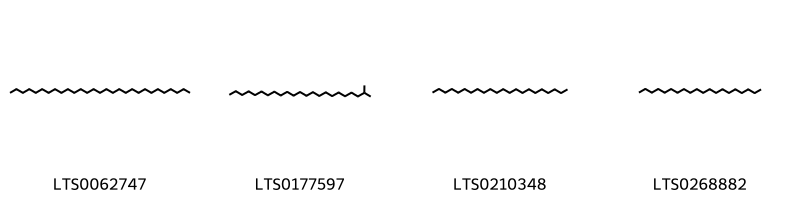{ width=100% }
    <figcaption>Hình ảnh cấu trúc hóa học của 4 hoạt chất thuộc nhóm Saturated hydrocarbons gồm ['nonacosane (LTS0062747)', '2-methyltricosane (LTS0177597)', 'docosane (LTS0210348)', 'eicosane (LTS0268882)'].</figcaption>
</figure>
#### Nhóm Sphingolipids
<figure markdown="span">
    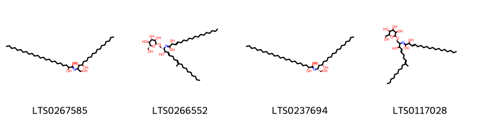{ width=100% }
    <figcaption>Hình ảnh cấu trúc hóa học của 4 hoạt chất thuộc nhóm Sphingolipids gồm ['2-hydroxy-n-(1,3,4-trihydroxyoctadecan-2-yl)tetracosanimidic acid (LTS0267585)', '(2r,3e)-2-hydroxy-n-[(2s,3r,4e,8e)-3-hydroxy-9-methyl-1-{[(2r,3r,4s,5s,6r)-3,4,5-trihydroxy-6-(hydroxymethyl)oxan-2-yl]oxy}octadeca-4,8-dien-2-yl]octadec-3-enimidic acid (LTS0266552)', '(2r)-2-hydroxy-n-[(2s,3s,4r)-1,3,4-trihydroxyoctadecan-2-yl]tetracosanimidic acid (LTS0237694)', '2-hydroxy-n-(3-hydroxy-9-methyl-1-{[3,4,5-trihydroxy-6-(hydroxymethyl)oxan-2-yl]oxy}octadeca-4,8-dien-2-yl)octadec-3-enimidic acid (LTS0117028)'].</figcaption>
</figure>
#### Nhóm Steroids and steroid derivatives
<figure markdown="span">
    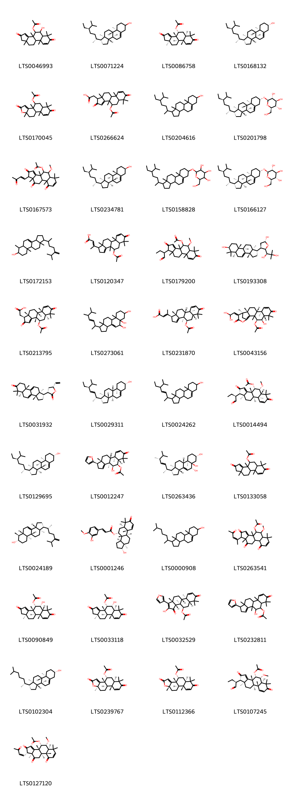{ width=100% }
    <figcaption>Hình ảnh cấu trúc hóa học của 41 hoạt chất thuộc nhóm Steroids and steroid derivatives gồm ['5-hydroxy-3b,6,6,9a,11a-pentamethyl-2,7-dioxo-1h,4h,5h,5ah,9bh,10h,11h-cyclopenta[a]phenanthren-4-yl acetate (LTS0046993)', 'stigmast-5-en-3-ol (LTS0071224)', 'desfuranoazadiradione (LTS0086758)', 'sitosterol (LTS0168132)', '3b,6,6,9a,11a-pentamethyl-2,7-dioxo-4h,5h,5ah,9bh,10h,11h-phenanthro[2,1-b]furan-4-yl acetate (LTS0170045)', '[4-(acetyloxy)-3b,6,6,9a,11a-pentamethyl-2,7-dioxo-1h,4h,5h,5ah,9bh,10h,11h-cyclopenta[a]phenanthren-1-yl]acetic acid (LTS0266624)', 'stigmast-5-en-3-ol, (3β)- (LTS0204616)', 'sitogluside (LTS0201798)', '5-methoxy-3b,6,6,9a,11a-pentamethyl-2,9,11-trioxo-1-(3-oxobut-1-en-1-yl)-1h,4h,5h,5ah,9bh,10h-cyclopenta[a]phenanthren-4-yl acetate (LTS0167573)', '(1s,3ar,3br,7r,9as,9br,11ar)-1-[(2r,5r)-5-ethyl-6-methylheptan-2-yl]-9a,11a-dimethyl-1h,2h,3h,3ah,3bh,4h,6h,7h,8h,9h,9bh,10h,11h-cyclopenta[a]phenanthren-7-ol (LTS0234781)', '2-{[1-(5-ethyl-6-methylheptan-2-yl)-9a,11a-dimethyl-1h,2h,3h,3ah,3bh,4h,6h,7h,8h,9h,9bh,10h,11h-cyclopenta[a]phenanthren-7-yl]oxy}-6-(hydroxymethyl)oxane-3,4,5-triol (LTS0158828)', '(2r,3r,4s,5s,6r)-2-{[(1r,3ar,3br,7s,9ar,9br,11ar)-1-[(2r,5r)-5-ethyl-6-methylheptan-2-yl]-9a,11a-dimethyl-1h,2h,3h,3ah,3bh,4h,6h,7h,8h,9h,9bh,10h,11h-cyclopenta[a]phenanthren-7-yl]oxy}-6-(hydroxymethyl)oxane-3,4,5-triol (LTS0166127)', '6,9a,11a-trimethyl-1-(6-methyl-5-methylideneheptan-2-yl)-1h,2h,3h,3ah,5h,5ah,6h,7h,8h,9h,9bh,10h,11h-cyclopenta[a]phenanthren-7-ol (LTS0172153)', '3-[4-(acetyloxy)-3b,6,6,9a,11a-pentamethyl-7-oxo-1h,2h,4h,5h,5ah,9bh,10h,11h-cyclopenta[a]phenanthren-1-yl]but-2-enoic acid (LTS0120347)', '5-methoxy-3b,6,6,9a,11a-pentamethyl-2,7-dioxo-1-(1-oxobutan-2-yl)-1h,4h,5h,5ah,9bh,10h,11h-cyclopenta[a]phenanthren-4-yl acetate (LTS0179200)', 'meliantriol (LTS0193308)', '[(1s,3bs,4r,5as,9as,9br,11as)-4-(acetyloxy)-3b,6,6,9a,11a-pentamethyl-2,7-dioxo-1h,4h,5h,5ah,9bh,10h,11h-cyclopenta[a]phenanthren-1-yl]acetic acid (LTS0213795)', '1-(5,6-dimethylhept-3-en-2-yl)-9a,11a-dimethyl-1h,2h,3h,3ah,5h,6h,7h,8h,9h,9bh,10h,11h-cyclopenta[a]phenanthrene-5,5a,7-triol (LTS0273061)', '(2e)-3-[(1s,3br,4r,5ar,9ar,9br,11as)-4-(acetyloxy)-3b,6,6,9a,11a-pentamethyl-7-oxo-1h,2h,4h,5h,5ah,9bh,10h,11h-cyclopenta[a]phenanthren-1-yl]but-2-enoic acid (LTS0231870)', '(4s,5r,6r,11r,12r,15s,16r,17z)-17-(2,2-dihydroxyethylidene)-5-hydroxy-3,7,7,11,15-pentamethyl-8,18-dioxo-19-oxapentacyclo[14.3.1.0²,¹⁵.0³,¹².0⁶,¹¹]icosa-1,9-dien-4-yl acetate (LTS0043156)', '(3s,5r)-3-[(1s,3as,5ar,9as,11as)-3a,6,6,9a,11a-pentamethyl-7-oxo-1h,2h,3h,5h,5ah,8h,9h,11h-cyclopenta[a]phenanthren-1-yl]-5-ethenyloxolan-2-one (LTS0031932)', 'phytosterol (LTS0029311)', 'stigmasterol (LTS0024262)', '(1s,3br,4s,5r,5as,9as,9br,11as)-5-methoxy-3b,6,6,9a,11a-pentamethyl-2,7-dioxo-1-[(2s)-1-oxobutan-2-yl]-1h,4h,5h,5ah,9bh,10h,11h-cyclopenta[a]phenanthren-4-yl acetate (LTS0014494)', '(1r,3ar,3br,7s,9ar,9br,11ar)-1-[(2r,5r)-5-ethyl-6-methylheptan-2-yl]-9a,11a-dimethyl-1h,2h,3h,3ah,3bh,4h,6h,7h,8h,9h,9bh,10h,11h-cyclopenta[a]phenanthren-7-ol (LTS0129695)', '(1r,3br,4s,5r,5ar,9ar,9br,11as)-1-(furan-2-yl)-4-hydroxy-3b,6,6,9a,11a-pentamethyl-7-oxo-1h,2h,4h,5h,5ah,9bh,10h,11h-cyclopenta[a]phenanthren-5-yl acetate (LTS0012247)', 'cerevisterol (LTS0263436)', '3b,6,6,9a,11a-pentamethyl-2,7-dioxo-1h,4h,5h,5ah,9bh,10h,11h-cyclopenta[a]phenanthren-4-yl acetate (LTS0133058)', '24-methylidenelophenol (LTS0024189)', '(1r,3ar,3br,4r,5ar,9ar,9br,11ar)-1-hydroxy-3b,6,6,9a,11a-pentamethyl-7-oxo-1h,2h,3h,3ah,4h,5h,5ah,9bh,10h,11h-cyclopenta[a]phenanthren-4-yl (2e)-3-(3-hydroxy-4-methoxyphenyl)prop-2-enoate (LTS0001246)', 'epicholestrol (LTS0000908)', '5-methoxy-3b,6,6,11a-tetramethyl-2,9,11-trioxo-1-[(2z)-4-oxopent-2-en-2-yl]-1h,4h,5h,5ah,9ah,9bh,10h-cyclopenta[a]phenanthren-4-yl acetate (LTS0263541)', '(3br,4s,5r,5as,9ar,9br,11as)-5-hydroxy-3b,6,6,9a,11a-pentamethyl-2,7-dioxo-1h,4h,5h,5ah,9bh,10h,11h-cyclopenta[a]phenanthren-4-yl acetate (LTS0090849)', '(3br,4s,5r,5ar,9ar,9br,11as)-5-hydroxy-3b,6,6,9a,11a-pentamethyl-2,7-dioxo-1h,4h,5h,5ah,9bh,10h,11h-cyclopenta[a]phenanthren-4-yl acetate (LTS0033118)', '(3ar,3br,4r,5ar,9ar,9br,11ar)-1-(furan-3-yl)-2-hydroxy-3b,6,6,9a,11a-pentamethyl-3,7-dioxo-3ah,4h,5h,5ah,9bh,10h,11h-cyclopenta[a]phenanthren-4-yl acetate (LTS0032529)', '1-(furan-2-yl)-4-hydroxy-3b,6,6,9a,11a-pentamethyl-7-oxo-1h,2h,4h,5h,5ah,9bh,10h,11h-cyclopenta[a]phenanthren-5-yl acetate (LTS0232811)', 'cholesterol (LTS0102304)', 'α-nimolactone (LTS0239767)', 'β-nimolactone (LTS0112366)', '(1s,3br,4s,5r,5ar,9ar,9br,11as)-5-methoxy-3b,6,6,9a,11a-pentamethyl-2,7-dioxo-1-[(2s)-1-oxobutan-2-yl]-1h,4h,5h,5ah,9bh,10h,11h-cyclopenta[a]phenanthren-4-yl acetate (LTS0107245)', '(1s,3br,4s,5r,5as,9ar,9bs,11as)-5-methoxy-3b,6,6,9a,11a-pentamethyl-2,9,11-trioxo-1-[(1z)-3-oxobut-1-en-1-yl]-1h,4h,5h,5ah,9bh,10h-cyclopenta[a]phenanthren-4-yl acetate (LTS0127120)'].</figcaption>
</figure>
#### Nhóm Sulfenyl compounds
<figure markdown="span">
    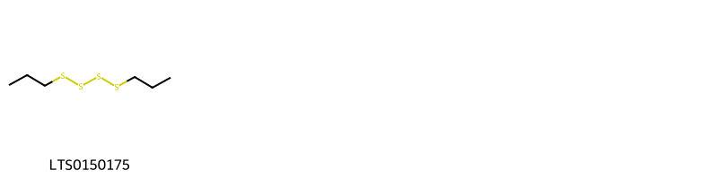{ width=100% }
    <figcaption>Hình ảnh cấu trúc hóa học của 1 hoạt chất thuộc nhóm Sulfenyl compounds gồm ['dipropyltetrasulfane (LTS0150175)'].</figcaption>
</figure>
#### Nhóm Unsaturated hydrocarbons
<figure markdown="span">
    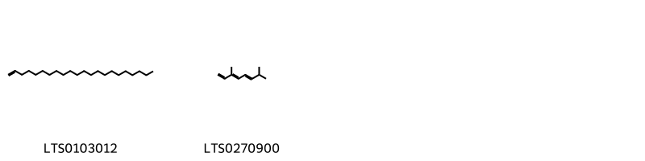{ width=100% }
    <figcaption>Hình ảnh cấu trúc hóa học của 2 hoạt chất thuộc nhóm Unsaturated hydrocarbons gồm ['1-docosene (LTS0103012)', '(3e,5e)-3,7-dimethylocta-1,3,5-triene (LTS0270900)'].</figcaption>
</figure>

---

### Dược dân tộc học

Danh sách các quốc gia có sử dụng *Azadirachta indica* trong điều trị các bệnh. 

| Country   | Disease                                                                                                                        | Bệnh                                                                                                                                                                                                |
|:----------|:-------------------------------------------------------------------------------------------------------------------------------|:----------------------------------------------------------------------------------------------------------------------------------------------------------------------------------------------------|
| Elsewhere | Antiseptic, Dentifrice, Emollient, Insecticide, Laxative, Soap, Soap, Stomachic, Tonic, Astringent, Astringent, nan, Purgative | MYMEMORY WARNING: YOU USED ALL AVAILABLE FREE TRANSLATIONS FOR TODAY. NEXT AVAILABLE IN  06 HOURS 41 MINUTES 07 SECONDS VISIT HTTPS://MYMEMORY.TRANSLATED.NET/DOC/USAGELIMITS.PHP TO TRANSLATE MORE |
| India     | Insecticide, Tonic                                                                                                             | MYMEMORY WARNING: YOU USED ALL AVAILABLE FREE TRANSLATIONS FOR TODAY. NEXT AVAILABLE IN  06 HOURS 41 MINUTES 03 SECONDS VISIT HTTPS://MYMEMORY.TRANSLATED.NET/DOC/USAGELIMITS.PHP TO TRANSLATE MORE |
| Turkey    | Astringent, Discutient, Poison, Purgative, Stimulant, Vermifuge, Tonic                                                         | MYMEMORY WARNING: YOU USED ALL AVAILABLE FREE TRANSLATIONS FOR TODAY. NEXT AVAILABLE IN  06 HOURS 41 MINUTES 00 SECONDS VISIT HTTPS://MYMEMORY.TRANSLATED.NET/DOC/USAGELIMITS.PHP TO TRANSLATE MORE |

---

# Chi Naregamia

??? note "Danh sách các dược liệu thuộc chi"
    
	 - *Naregamia alata*

---
## Naregamia alata
### Thông tin về thực vật

!!! info "Phân loại thực vật của *Naregamia alata* từ GIBF:"
    - **Kingdom:** Plantae
    - **Phylum:** Tracheophyta
    - **Order:** Sapindales
    - **Family:** Meliaceae
    - **Genus:** Naregamia
    - **Species:** *Naregamia alata*

 

| Label (VI)   | Label (EN)   | Scientific Name   | Descriptions (VI)   | Descriptions (EN)   | Also Known As (VI)   | Also Known As (EN)   |
|:-------------|:-------------|:------------------|:--------------------|:--------------------|:---------------------|:---------------------|
| N/A          | N/A          | Naregamia alata   | loài thực vật       | species of plant    | ['']                 | ['']                 |

#### Phân bố trên thế giới

**Từ CSDL GIBF** nan, India, unknown or invalid

#### Phân bố tại Việt Nam

**Từ CSDL GIBF**: Không có ghi nhận ở Việt Nam

---
### Thành phần hóa học
        
- Theo cơ sở dữ liệu lotus: Từ loài *Naregamia alata* đã phân lập và xác định được Chưa có hoạt chất nào được phân lập. hoạt chất thuộc về các nhóm Không có hoạt chất nào được phân lập. 

Không có hình ảnh nào được tạo ra

---

### Dược dân tộc học

Danh sách các quốc gia có sử dụng *Naregamia alata* trong điều trị các bệnh. 

| Country   | Disease                         | Bệnh                                                                                                                                                                                                |
|:----------|:--------------------------------|:----------------------------------------------------------------------------------------------------------------------------------------------------------------------------------------------------|
| Elsewhere | Emetic, Cholagogue, Expectorant | MYMEMORY WARNING: YOU USED ALL AVAILABLE FREE TRANSLATIONS FOR TODAY. NEXT AVAILABLE IN  06 HOURS 39 MINUTES 41 SECONDS VISIT HTTPS://MYMEMORY.TRANSLATED.NET/DOC/USAGELIMITS.PHP TO TRANSLATE MORE |
| English   | Expectorant                     | MYMEMORY WARNING: YOU USED ALL AVAILABLE FREE TRANSLATIONS FOR TODAY. NEXT AVAILABLE IN  06 HOURS 39 MINUTES 38 SECONDS VISIT HTTPS://MYMEMORY.TRANSLATED.NET/DOC/USAGELIMITS.PHP TO TRANSLATE MORE |
| French    | Sudorific                       | MYMEMORY WARNING: YOU USED ALL AVAILABLE FREE TRANSLATIONS FOR TODAY. NEXT AVAILABLE IN  06 HOURS 39 MINUTES 35 SECONDS VISIT HTTPS://MYMEMORY.TRANSLATED.NET/DOC/USAGELIMITS.PHP TO TRANSLATE MORE |
| German    | Diuretic                        | MYMEMORY WARNING: YOU USED ALL AVAILABLE FREE TRANSLATIONS FOR TODAY. NEXT AVAILABLE IN  06 HOURS 39 MINUTES 32 SECONDS VISIT HTTPS://MYMEMORY.TRANSLATED.NET/DOC/USAGELIMITS.PHP TO TRANSLATE MORE |
| India     | Emetic                          | MYMEMORY WARNING: YOU USED ALL AVAILABLE FREE TRANSLATIONS FOR TODAY. NEXT AVAILABLE IN  06 HOURS 39 MINUTES 29 SECONDS VISIT HTTPS://MYMEMORY.TRANSLATED.NET/DOC/USAGELIMITS.PHP TO TRANSLATE MORE |

---

# Chi Aphanamixis

??? note "Danh sách các dược liệu thuộc chi"
    
	 - *Aphanamixis polystachya*

---
## Aphanamixis polystachya
### Thông tin về thực vật

!!! info "Phân loại thực vật của *Aphanamixis polystachya* từ GIBF:"
    - **Kingdom:** Plantae
    - **Phylum:** Tracheophyta
    - **Order:** Sapindales
    - **Family:** Meliaceae
    - **Genus:** Aphanamixis
    - **Species:** *Aphanamixis polystachya*

 

| Label (VI)   | Label (EN)   | Scientific Name         | Descriptions (VI)   | Descriptions (EN)   | Also Known As (VI)   | Also Known As (EN)   |
|:-------------|:-------------|:------------------------|:--------------------|:--------------------|:---------------------|:---------------------|
| N/A          | N/A          | Aphanamixis polystachya | loài thực vật       | species of plant    | ['']                 | ['']                 |

#### Phân bố trên thế giới

**Từ CSDL GIBF** nan, Sri Lanka, Lao People’s Democratic Republic, Mauritius, Chinese Taipei, Papua New Guinea, Bangladesh, United States of America, Congo, Democratic Republic of the, Timor-Leste, South Africa, Thailand, Bhutan, Singapore, Viet Nam, China, India, Indonesia, Philippines, Malaysia, Nepal

#### Phân bố tại Việt Nam

**Từ CSDL GIBF**: Thua Thien-Hue

---
### Thành phần hóa học
        
- Theo cơ sở dữ liệu lotus: Từ loài *Aphanamixis polystachya* đã phân lập và xác định được 95 hoạt chất thuộc về các nhóm Fatty Acyls, Lignan glycosides, Prenol lipids, Steroids and steroid derivatives, Cinnamic acids and derivatives, Pyrans, Benzene and substituted derivatives, Dioxepanes, Carboxylic acids and derivatives. 

|    | chemicalTaxonomyClassyfireClass     |   smiles_count |
|---:|:------------------------------------|---------------:|
|  0 | Benzene and substituted derivatives |              5 |
|  1 | Carboxylic acids and derivatives    |              7 |
|  2 | Cinnamic acids and derivatives      |              2 |
|  3 | Dioxepanes                          |              4 |
|  4 | Fatty Acyls                         |              8 |
|  5 | Lignan glycosides                   |              2 |
|  6 | Prenol lipids                       |             41 |
|  7 | Pyrans                              |              4 |
|  8 | Steroids and steroid derivatives    |             21 |

#### Nhóm Benzene and substituted derivatives
<figure markdown="span">
    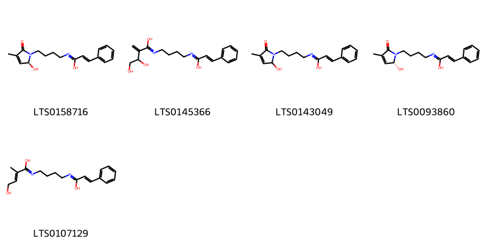{ width=100% }
    <figcaption>Hình ảnh cấu trúc hóa học của 5 hoạt chất thuộc nhóm Benzene and substituted derivatives gồm ['(2e)-n-{4-[(5s)-5-hydroxy-3-methyl-2-oxo-5h-pyrrol-1-yl]butyl}-3-phenylprop-2-enimidic acid (LTS0158716)', '3,4-dihydroxy-n-{4-[(1-hydroxy-3-phenylprop-2-en-1-ylidene)amino]butyl}-2-methylidenebutanimidic acid (LTS0145366)', 'n-[4-(5-hydroxy-3-methyl-2-oxo-5h-pyrrol-1-yl)butyl]-3-phenylprop-2-enimidic acid (LTS0143049)', '(2e)-n-{4-[(5r)-5-hydroxy-3-methyl-2-oxo-5h-pyrrol-1-yl]butyl}-3-phenylprop-2-enimidic acid (LTS0093860)', '4-hydroxy-n-{4-[(1-hydroxy-3-phenylprop-2-en-1-ylidene)amino]butyl}-2-methylbut-2-enimidic acid (LTS0107129)'].</figcaption>
</figure>
#### Nhóm Carboxylic acids and derivatives
<figure markdown="span">
    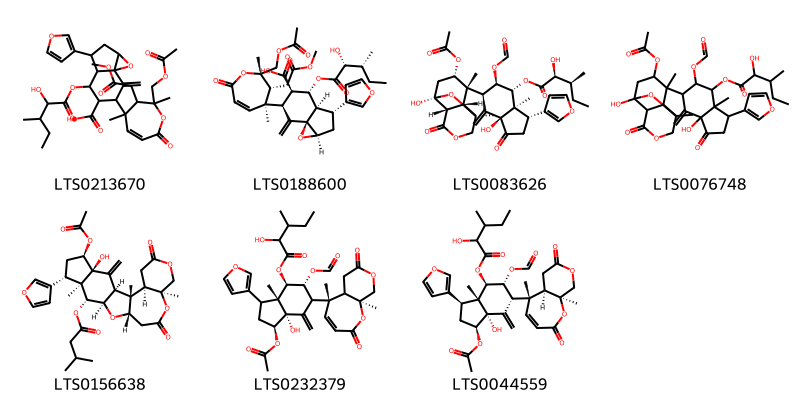{ width=100% }
    <figcaption>Hình ảnh cấu trúc hóa học của 7 hoạt chất thuộc nhóm Carboxylic acids and derivatives gồm ['6-{2-[(acetyloxy)methyl]-3-(2-methoxy-2-oxoethyl)-2,4-dimethyl-7-oxo-3h-oxepin-4-yl}-3-(furan-3-yl)-4-[(2-hydroxy-3-methylpentanoyl)oxy]-7-methylidene-hexahydro-1ah-indeno[1,7a-b]oxirene-5-carboxylic acid (LTS0213670)', '(1ar,3r,3ar,4r,5r,6r,7ar)-6-[(2s,3r,4r)-2-[(acetyloxy)methyl]-3-(2-methoxy-2-oxoethyl)-2,4-dimethyl-7-oxo-3h-oxepin-4-yl]-3-(furan-3-yl)-4-{[(2r,3r)-2-hydroxy-3-methylpentanoyl]oxy}-7-methylidene-hexahydro-1ah-indeno[1,7a-b]oxirene-5-carboxylic acid (LTS0188600)', '(3s,3ar,4r,5r,6r,7as)-6-[(1r,3s,7s,8r,9r,10s)-10-(acetyloxy)-1-hydroxy-3,9-dimethyl-6-oxo-2,5-dioxatricyclo[5.4.0.0³,⁸]undecan-9-yl]-5-(formyloxy)-3-(furan-3-yl)-7a-hydroxy-3a-methyl-7-methylidene-1-oxo-tetrahydro-2h-inden-4-yl (2s,3s)-2-hydroxy-3-methylpentanoate (LTS0083626)', '6-[10-(acetyloxy)-1-hydroxy-3,9-dimethyl-6-oxo-2,5-dioxatricyclo[5.4.0.0³,⁸]undecan-9-yl]-5-(formyloxy)-3-(furan-3-yl)-7a-hydroxy-3a-methyl-7-methylidene-1-oxo-tetrahydro-2h-inden-4-yl 2-hydroxy-3-methylpentanoate (LTS0076748)', '(1r,2r,4s,5r,7s,8r,9r,10r,12s,16s,21r)-5-(acetyloxy)-7-(furan-3-yl)-4-hydroxy-1,8,16-trimethyl-3-methylidene-14,19-dioxo-11,15,18-trioxapentacyclo[10.9.0.0²,¹⁰.0⁴,⁸.0¹⁶,²¹]henicosan-9-yl 3-methylbutanoate (LTS0156638)', '(1s,3ar,4r,5r,7as)-6-[(5r,9as)-5,9a-dimethyl-2,7-dioxo-5ah,6h,9h-pyrano[3,4-b]oxepin-5-yl]-1-(acetyloxy)-5-(formyloxy)-3-(furan-3-yl)-7a-hydroxy-3a-methyl-7-methylidene-hexahydroinden-4-yl 2-hydroxy-3-methylpentanoate (LTS0232379)', '(1s,3s,3ar,4r,5r,6r,7as)-6-[(5r,5ar,9as)-5,9a-dimethyl-2,7-dioxo-5ah,6h,9h-pyrano[3,4-b]oxepin-5-yl]-1-(acetyloxy)-5-(formyloxy)-3-(furan-3-yl)-7a-hydroxy-3a-methyl-7-methylidene-hexahydroinden-4-yl 2-hydroxy-3-methylpentanoate (LTS0044559)'].</figcaption>
</figure>
#### Nhóm Cinnamic acids and derivatives
<figure markdown="span">
    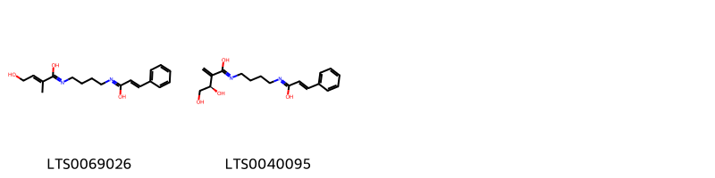{ width=100% }
    <figcaption>Hình ảnh cấu trúc hóa học của 2 hoạt chất thuộc nhóm Cinnamic acids and derivatives gồm ['(2e)-4-hydroxy-n-(4-{[(2e)-1-hydroxy-3-phenylprop-2-en-1-ylidene]amino}butyl)-2-methylbut-2-enimidic acid (LTS0069026)', '(3r)-3,4-dihydroxy-n-(4-{[(2e)-1-hydroxy-3-phenylprop-2-en-1-ylidene]amino}butyl)-2-methylidenebutanimidic acid (LTS0040095)'].</figcaption>
</figure>
#### Nhóm Dioxepanes
<figure markdown="span">
    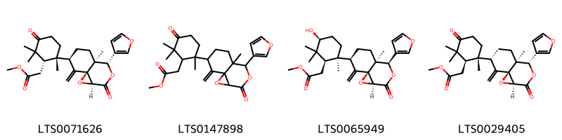{ width=100% }
    <figcaption>Hình ảnh cấu trúc hóa học của 4 hoạt chất thuộc nhóm Dioxepanes gồm ['methyl 2-[(1s,6r)-6-[(1s,3s,6s,7s,10r)-6-(furan-3-yl)-7-methyl-11-methylidene-4-oxo-2,5-dioxatricyclo[5.4.0.0¹,³]undecan-10-yl]-2,2,6-trimethyl-3-oxocyclohexyl]acetate (LTS0071626)', 'methyl 2-{6-[6-(furan-3-yl)-7-methyl-11-methylidene-4-oxo-2,5-dioxatricyclo[5.4.0.0¹,³]undecan-10-yl]-2,2,6-trimethyl-3-oxocyclohexyl}acetate (LTS0147898)', 'methyl 2-[(1r,3s,6r)-6-[(1s,3s,6r,7s,10r)-6-(furan-3-yl)-7-methyl-11-methylidene-4-oxo-2,5-dioxatricyclo[5.4.0.0¹,³]undecan-10-yl]-3-hydroxy-2,2,6-trimethylcyclohexyl]acetate (LTS0065949)', 'methyl 2-[(1r,6r)-6-[(1s,3s,6s,7s,10s)-6-(furan-3-yl)-7-methyl-11-methylidene-4-oxo-2,5-dioxatricyclo[5.4.0.0¹,³]undecan-10-yl]-2,2,6-trimethyl-3-oxocyclohexyl]acetate (LTS0029405)'].</figcaption>
</figure>
#### Nhóm Fatty Acyls
<figure markdown="span">
    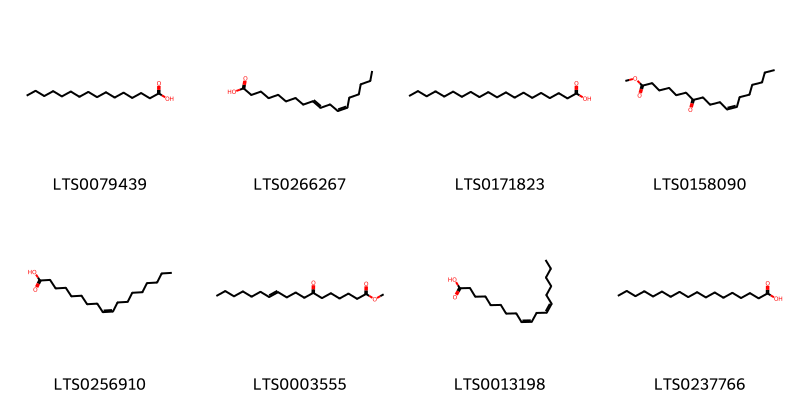{ width=100% }
    <figcaption>Hình ảnh cấu trúc hóa học của 8 hoạt chất thuộc nhóm Fatty Acyls gồm ['palmitic acid (LTS0079439)', '10-trans,12-cis-linoleic acid (LTS0266267)', 'arachidic acid (LTS0171823)', 'methyl (11z)-7-oxooctadec-11-enoate (LTS0158090)', 'oleic acid (LTS0256910)', 'methyl 7-oxooctadec-11-enoate (LTS0003555)', 'linoleic (LTS0013198)', 'stearic acid (LTS0237766)'].</figcaption>
</figure>
#### Nhóm Lignan glycosides
<figure markdown="span">
    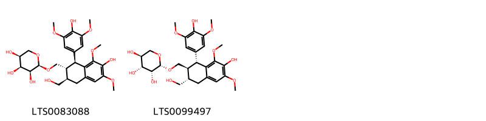{ width=100% }
    <figcaption>Hình ảnh cấu trúc hóa học của 2 hoạt chất thuộc nhóm Lignan glycosides gồm ['(2r,3s,4s,5s)-2-{[(1s,2r,3r)-7-hydroxy-1-(4-hydroxy-3,5-dimethoxyphenyl)-3-(hydroxymethyl)-6,8-dimethoxy-1,2,3,4-tetrahydronaphthalen-2-yl]methoxy}oxane-3,4,5-triol (LTS0083088)', '(2s,3r,4r,5s)-2-{[(1r,2s,3s)-7-hydroxy-1-(4-hydroxy-3,5-dimethoxyphenyl)-3-(hydroxymethyl)-6,8-dimethoxy-1,2,3,4-tetrahydronaphthalen-2-yl]methoxy}oxane-3,4,5-triol (LTS0099497)'].</figcaption>
</figure>
#### Nhóm Prenol lipids
<figure markdown="span">
    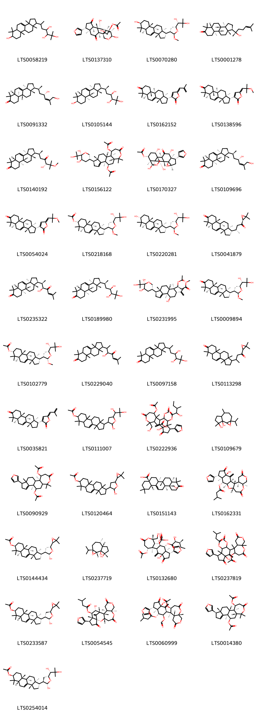{ width=100% }
    <figcaption>Hình ảnh cấu trúc hóa học của 41 hoạt chất thuộc nhóm Prenol lipids gồm ['6-{7-hydroxy-3a,6,6,9a,11a-pentamethyl-1h,2h,3h,5h,5ah,7h,8h,9h,9bh,10h,11h-cyclopenta[a]phenanthren-1-yl}-2-methylheptane-2,3,4-triol (LTS0058219)', '(1s,2s,5s,6r,9r,10s,11r,13r,14r,15s,18s,20r)-6-(furan-3-yl)-11,15,18-trihydroxy-5,10,14-trimethyl-3,8-dioxo-16-oxapentacyclo[12.3.3.0¹,¹³.0²,¹⁰.0⁵,⁹]icosan-20-yl acetate (LTS0137310)', '(1s)-1-[(2r,4s,5r)-4-[(1s,3as,5ar,7s,9ar,9br,11as)-7-hydroxy-3a,6,6,9a,11a-pentamethyl-1h,2h,3h,5h,5ah,7h,8h,9h,9bh,10h,11h-cyclopenta[a]phenanthren-1-yl]-5-methoxyoxolan-2-yl]-2-methylpropane-1,2-diol (LTS0070280)', '(1r,3ar,3bs,5ar,9ar,9bs,11as)-1-[(2s)-2-hydroxy-6-methylhept-5-en-2-yl]-3a,6,6,9a,11a-pentamethyl-dodecahydrocyclopenta[a]phenanthren-7-one (LTS0001278)', '(1s,3as,5ar,9ar,9br,11as)-1-[(2s,4s,5z)-4,7-dihydroxy-6-methylhept-5-en-2-yl]-3a,6,6,9a,11a-pentamethyl-1h,2h,3h,5h,5ah,8h,9h,9bh,10h,11h-cyclopenta[a]phenanthren-7-one (LTS0091332)', '(3s,4r,6s)-6-[(1s,3as,5ar,7r,9ar,9br,11as)-7-hydroxy-3a,6,6,9a,11a-pentamethyl-1h,2h,3h,5h,5ah,7h,8h,9h,9bh,10h,11h-cyclopenta[a]phenanthren-1-yl]-2-methylheptane-2,3,4-triol (LTS0105144)', '(5z)-3-[(1r,3as,5ar,9ar,9br,11as)-3a,6,6,9a,11a-pentamethyl-7-oxo-1h,2h,3h,5h,5ah,8h,9h,9bh,10h,11h-cyclopenta[a]phenanthren-1-yl]-5-(2-methylprop-2-en-1-ylidene)furan-2-one (LTS0162152)', '(5z)-3-[(1r,3as,5ar,9ar,9br,11as)-3a,6,6,9a,11a-pentamethyl-7-oxo-1h,2h,3h,5h,5ah,8h,9h,9bh,10h,11h-cyclopenta[a]phenanthren-1-yl]-5-(2-methoxy-2-methylpropylidene)furan-2-one (LTS0138596)', '(1s,3as,5ar,9ar,9br,11as)-1-[(2s,5s)-5-hydroxy-6-methoxy-6-methyl-4-oxoheptan-2-yl]-3a,6,6,9a,11a-pentamethyl-1h,2h,3h,5h,5ah,8h,9h,9bh,10h,11h-cyclopenta[a]phenanthren-7-one (LTS0140192)', '(1r,2r,3s,8r,10r,11r,15s,16s)-3-(acetyloxy)-15-[(3s,5r,6s)-5,6-dihydroxy-6-(2-hydroxypropan-2-yl)oxan-3-yl]-2,7,7,11,16-pentamethyl-5-oxo-6-oxatetracyclo[9.7.0.0²,⁸.0¹²,¹⁶]octadec-12-en-10-yl acetate (LTS0156122)', '(1s,2r,4r,5r,6s,8r,10s,11s,12r,14r,15r,16r,19s,21r)-6-(furan-3-yl)-4,12,16,19-tetrahydroxy-5,11,15-trimethyl-3-oxo-9,17-dioxahexacyclo[13.3.3.0¹,¹⁴.0²,¹¹.0⁵,¹⁰.0⁸,¹⁰]henicosan-21-yl acetate (LTS0170327)', '(1s,3as,5ar,9ar,9br,11as)-1-[(2s,4s)-4,7-dihydroxy-6-methylhept-5-en-2-yl]-3a,6,6,9a,11a-pentamethyl-1h,2h,3h,5h,5ah,8h,9h,9bh,10h,11h-cyclopenta[a]phenanthren-7-one (LTS0109696)', '3-[(1r,3as,5ar,9ar,9br,11as)-3a,6,6,9a,11a-pentamethyl-7-oxo-1h,2h,3h,5h,5ah,8h,9h,9bh,10h,11h-cyclopenta[a]phenanthren-1-yl]-5-(2-methoxy-2-methylpropylidene)furan-2-one (LTS0054024)', '(1s,3as,5ar,7r,9ar,9br,11as)-1-[(2r,3s,5r)-5-[(1s)-1,2-dihydroxy-2-methylpropyl]-2-methoxyoxolan-3-yl]-3a,6,6,9a,11a-pentamethyl-1h,2h,3h,5h,5ah,7h,8h,9h,9bh,10h,11h-cyclopenta[a]phenanthren-7-yl acetate (LTS0218168)', '(1s)-1-[(2r,4s,5r)-4-[(1s,3as,5ar,7r,9ar,9br,11as)-7-hydroxy-3a,6,6,9a,11a-pentamethyl-1h,2h,3h,5h,5ah,7h,8h,9h,9bh,10h,11h-cyclopenta[a]phenanthren-1-yl]-5-methoxyoxolan-2-yl]-2-methylpropane-1,2-diol (LTS0220281)', '(1s,3as,5ar,9ar,9br,11as)-1-[(2s)-4-[(2s)-3,3-dimethyloxiran-2-yl]-4-oxobutan-2-yl]-3a,6,6,9a,11a-pentamethyl-1h,2h,3h,5h,5ah,8h,9h,9bh,10h,11h-cyclopenta[a]phenanthren-7-one (LTS0041879)', '(1s,3as,5ar,9ar,9br,11as)-1-[(2r,3s)-3-hydroxy-6-methyl-4-oxohept-5-en-2-yl]-3a,6,6,9a,11a-pentamethyl-1h,2h,3h,5h,5ah,8h,9h,9bh,10h,11h-cyclopenta[a]phenanthren-7-one (LTS0235322)', '(1s,3as,5ar,9ar,9br,11as)-3a,6,6,9a,11a-pentamethyl-1-[(2s,4r,5s)-4,5,6-trihydroxy-6-methylheptan-2-yl]-1h,2h,3h,5h,5ah,8h,9h,9bh,10h,11h-cyclopenta[a]phenanthren-7-one (LTS0189980)', 'methyl (3s)-3-[(3s,3as,5ar,6s,7s,9r,9ar)-3-[(3s,5r,6s)-5,6-dihydroxy-6-(2-hydroxypropan-2-yl)oxan-3-yl]-9-hydroxy-3a,6,9a-trimethyl-7-(prop-1-en-2-yl)-2h,3h,4h,5h,5ah,7h,8h,9h-cyclopenta[a]naphthalen-6-yl]-3-(acetyloxy)propanoate (LTS0231995)', '(1s,3as,5ar,9ar,9br,11as)-1-[(2r,3s,5r)-5-[(1s)-1,2-dihydroxy-2-methylpropyl]-2-methoxyoxolan-3-yl]-3a,6,6,9a,11a-pentamethyl-1h,2h,3h,5h,5ah,8h,9h,9bh,10h,11h-cyclopenta[a]phenanthren-7-one (LTS0009894)', '(1s,3as,5ar,7r,9ar,9br,11as)-1-[(2s,3s,5r)-5-[(1s)-1,2-dihydroxy-2-methylpropyl]-2-methoxyoxolan-3-yl]-3a,6,6,9a,11a-pentamethyl-1h,2h,3h,5h,5ah,7h,8h,9h,9bh,10h,11h-cyclopenta[a]phenanthren-7-yl acetate (LTS0102779)', '1-(3-hydroxy-6-methyl-4-oxohept-5-en-2-yl)-3a,6,6,9a,11a-pentamethyl-1h,2h,3h,5h,5ah,8h,9h,9bh,10h,11h-cyclopenta[a]phenanthren-7-one (LTS0229040)', '3a,6,6,9a,11a-pentamethyl-1-(4,5,6-trihydroxy-6-methylheptan-2-yl)-1h,2h,3h,5h,5ah,8h,9h,9bh,10h,11h-cyclopenta[a]phenanthren-7-one (LTS0097158)', '1-[4-(3,3-dimethyloxiran-2-yl)-4-oxobutan-2-yl]-3a,6,6,9a,11a-pentamethyl-1h,2h,3h,5h,5ah,8h,9h,9bh,10h,11h-cyclopenta[a]phenanthren-7-one (LTS0113298)', '3-[(1r,3as,5ar,9ar,9br,11as)-3a,6,6,9a,11a-pentamethyl-7-oxo-1h,2h,3h,5h,5ah,8h,9h,9bh,10h,11h-cyclopenta[a]phenanthren-1-yl]-5-(2-methylprop-2-en-1-ylidene)furan-2-one (LTS0035821)', '1-[5-(1,2-dihydroxy-2-methylpropyl)-2-hydroxyoxolan-3-yl]-3a,6,6,9a,11a-pentamethyl-1h,2h,3h,5h,5ah,7h,8h,9h,9bh,10h,11h-cyclopenta[a]phenanthren-7-yl acetate (LTS0111007)', '[5-(acetyloxy)-4-[6-(formyloxy)-1-(furan-3-yl)-3a-hydroxy-7-[(2-hydroxy-3-methylpentanoyl)oxy]-7a-methyl-4-methylidene-3-oxo-tetrahydro-1h-inden-5-yl]-2-(hydroxymethyl)-2,4-dimethyl-7-oxooxepan-3-yl]acetic acid (LTS0222936)', '1a-isopropyl-4,7-dimethyl-hexahydro-2h-azuleno[4,5-b]oxirene-7,7a-diol (LTS0109679)', '(2r,11r)-3-(acetyloxy)-15-(furan-3-yl)-2,7,7,11,16-pentamethyl-5-oxo-6-oxatetracyclo[9.7.0.0²,⁸.0¹²,¹⁶]octadec-12-en-10-yl acetate (LTS0090929)', '1-[5-(3,3-dimethyloxiran-2-yl)-2-hydroxyoxolan-3-yl]-3a,6,6,9a,11a-pentamethyl-1h,2h,3h,5h,5ah,7h,8h,9h,9bh,10h,11h-cyclopenta[a]phenanthren-7-yl acetate (LTS0120464)', '(4as,6as,6br,8ar,12as,12bs,14bs)-12a-(hydroxymethyl)-2,2,6a,6b,9,9-hexamethyl-10-oxo-3,4,5,6,7,8,8a,11,12,12b,13,14b-dodecahydro-1h-picene-4a-carboxylic acid (LTS0151143)', '(1r,2r,4s,7s,8r,9r,10r,12s,16s,21r)-7-(furan-3-yl)-4-hydroxy-1,8,16-trimethyl-3-methylidene-5,14,19-trioxo-11,15,18-trioxapentacyclo[10.9.0.0²,¹⁰.0⁴,⁸.0¹⁶,²¹]henicosan-9-yl 3-methylbutanoate (LTS0162331)', '(1s,3as,5ar,7s,9ar,9br,11as)-1-[(2s,3s,5r)-5-[(2r)-3,3-dimethyloxiran-2-yl]-2-hydroxyoxolan-3-yl]-3a,6,6,9a,11a-pentamethyl-1h,2h,3h,5h,5ah,7h,8h,9h,9bh,10h,11h-cyclopenta[a]phenanthren-7-yl acetate (LTS0144434)', '(1as,4s,4as,7s,7ar,7bs)-1a-isopropyl-4,7-dimethyl-hexahydro-2h-azuleno[4,5-b]oxirene-7,7a-diol (LTS0237719)', '[(2s,3r,4r,5r)-4-[(1s,3as,5r,6r,7r,7ar)-6-(formyloxy)-1-(furan-3-yl)-3a-hydroxy-7-{[(2s,3s)-2-hydroxy-3-methylpentanoyl]oxy}-7a-methyl-4-methylidene-3-oxo-tetrahydro-1h-inden-5-yl]-5-(acetyloxy)-2-(hydroxymethyl)-2,4-dimethyl-7-oxooxepan-3-yl]acetic acid (LTS0132680)', '6-[4-(acetyloxy)-5,9a-dimethyl-2,7-dioxo-tetrahydro-3h-pyrano[3,4-b]oxepin-5-yl]-5-(formyloxy)-3-(furan-3-yl)-7a-hydroxy-3a-methyl-7-methylidene-1-oxo-tetrahydro-2h-inden-4-yl 3-methylbutanoate (LTS0237819)', '(1s,3as,5as,7s,9ar,9br,11as)-1-[(2s,3s,5s)-5-[(2r)-3,3-dimethyloxiran-2-yl]-2-hydroxyoxolan-3-yl]-3a,6,6,9a,11a-pentamethyl-1h,2h,3h,5h,5ah,7h,8h,9h,9bh,10h,11h-cyclopenta[a]phenanthren-7-yl acetate (LTS0233587)', '(1s,3s,7s,12r,13r,14r,15r,16r,17r,18s)-18-(furan-3-yl)-15-hydroxy-7,13,17-trimethyl-21-methylidene-5,10,20-trioxo-2,6,9-trioxapentacyclo[12.6.1.0¹,¹⁷.0³,¹³.0⁷,¹²]henicosan-16-yl 3-methylbutanoate (LTS0054545)', '(3s,3ar,4r,5r,6r,7as)-6-[(4s,5r,5ar,9as)-4-(acetyloxy)-5,9a-dimethyl-2,7-dioxo-tetrahydro-3h-pyrano[3,4-b]oxepin-5-yl]-5-(formyloxy)-3-(furan-3-yl)-7a-hydroxy-3a-methyl-7-methylidene-1-oxo-tetrahydro-2h-inden-4-yl 3-methylbutanoate (LTS0060999)', '(1r,2r,3s,8r,10r,11r,15r,16s)-3-(acetyloxy)-15-(furan-3-yl)-2,7,7,11,16-pentamethyl-5-oxo-6-oxatetracyclo[9.7.0.0²,⁸.0¹²,¹⁶]octadec-12-en-10-yl acetate (LTS0014380)', '(1s,3as,5as,7s,9ar,9br,11as)-1-[(2s,3r,5r)-5-[(1s)-1,2-dihydroxy-2-methylpropyl]-2-hydroxyoxolan-3-yl]-3a,6,6,9a,11a-pentamethyl-1h,2h,3h,5h,5ah,7h,8h,9h,9bh,10h,11h-cyclopenta[a]phenanthren-7-yl acetate (LTS0254014)'].</figcaption>
</figure>
#### Nhóm Pyrans
<figure markdown="span">
    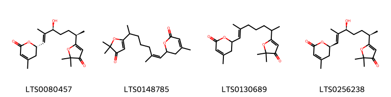{ width=100% }
    <figcaption>Hình ảnh cấu trúc hóa học của 4 hoạt chất thuộc nhóm Pyrans gồm ['(6s)-6-[(1e,3s,6r)-6-(5,5-dimethyl-4-oxofuran-2-yl)-3-hydroxy-2-methylhept-1-en-1-yl]-4-methyl-5,6-dihydropyran-2-one (LTS0080457)', '6-[6-(5,5-dimethyl-4-oxofuran-2-yl)-2-methylhept-1-en-1-yl]-4-methyl-5,6-dihydropyran-2-one (LTS0148785)', '6-[(1e)-6-(5,5-dimethyl-4-oxofuran-2-yl)-2-methylhept-1-en-1-yl]-4-methyl-5,6-dihydropyran-2-one (LTS0130689)', '(6r)-6-[(1e,3s,6r)-6-(5,5-dimethyl-4-oxofuran-2-yl)-3-hydroxy-2-methylhept-1-en-1-yl]-4-methyl-5,6-dihydropyran-2-one (LTS0256238)'].</figcaption>
</figure>
#### Nhóm Steroids and steroid derivatives
<figure markdown="span">
    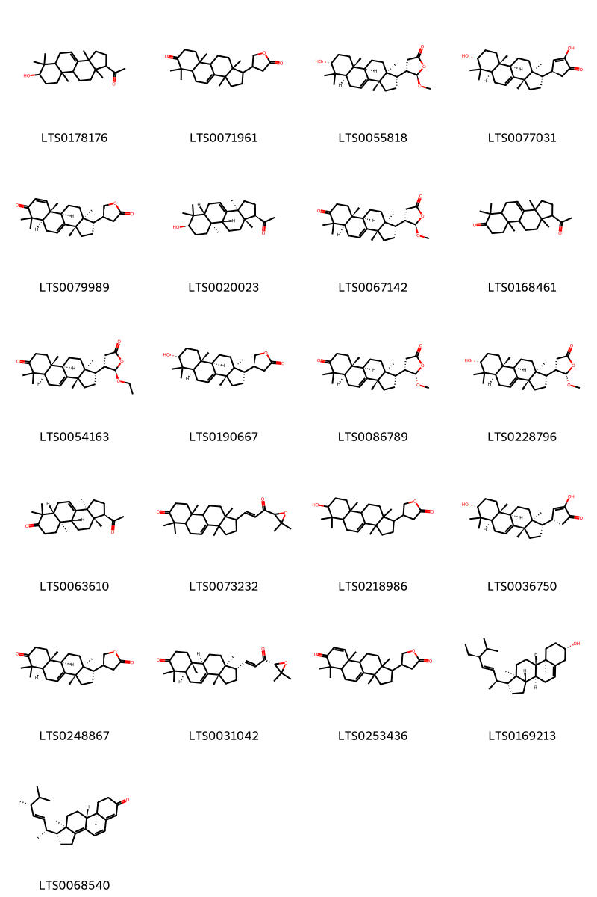{ width=100% }
    <figcaption>Hình ảnh cấu trúc hóa học của 21 hoạt chất thuộc nhóm Steroids and steroid derivatives gồm ['1-{7-hydroxy-3a,6,6,9a,11a-pentamethyl-1h,2h,3h,5h,5ah,7h,8h,9h,9bh,10h,11h-cyclopenta[a]phenanthren-1-yl}ethanone (LTS0178176)', '4-{3a,6,6,9a,11a-pentamethyl-7-oxo-1h,2h,3h,5h,5ah,8h,9h,9bh,10h,11h-cyclopenta[a]phenanthren-1-yl}oxolan-2-one (LTS0071961)', '(4s,5r)-4-[(1s,3as,5ar,7r,9ar,9br,11as)-7-hydroxy-3a,6,6,9a,11a-pentamethyl-1h,2h,3h,5h,5ah,7h,8h,9h,9bh,10h,11h-cyclopenta[a]phenanthren-1-yl]-5-methoxyoxolan-2-one (LTS0055818)', '(4s)-4-[(1s,3as,5ar,7r,9ar,9br,11as)-7-hydroxy-3a,6,6,9a,11a-pentamethyl-1h,2h,3h,5h,5ah,7h,8h,9h,9bh,10h,11h-cyclopenta[a]phenanthren-1-yl]-2-hydroxycyclopent-2-en-1-one (LTS0077031)', '(4s)-4-[(1s,3as,5ar,9ar,9br,11as)-3a,6,6,9a,11a-pentamethyl-7-oxo-1h,2h,3h,5h,5ah,9bh,10h,11h-cyclopenta[a]phenanthren-1-yl]oxolan-2-one (LTS0079989)', '1-[(1r,3as,5ar,7r,9ar,9br,11as)-7-hydroxy-3a,6,6,9a,11a-pentamethyl-1h,2h,3h,5h,5ah,7h,8h,9h,9bh,10h,11h-cyclopenta[a]phenanthren-1-yl]ethanone (LTS0020023)', '(4s,5r)-4-[(1s,3as,5ar,9ar,9br,11as)-3a,6,6,9a,11a-pentamethyl-7-oxo-1h,2h,3h,5h,5ah,8h,9h,9bh,10h,11h-cyclopenta[a]phenanthren-1-yl]-5-methoxyoxolan-2-one (LTS0067142)', '1-acetyl-3a,6,6,9a,11a-pentamethyl-1h,2h,3h,5h,5ah,8h,9h,9bh,10h,11h-cyclopenta[a]phenanthren-7-one (LTS0168461)', '(4s,5r)-4-[(1s,3as,5ar,9ar,9br,11as)-3a,6,6,9a,11a-pentamethyl-7-oxo-1h,2h,3h,5h,5ah,8h,9h,9bh,10h,11h-cyclopenta[a]phenanthren-1-yl]-5-ethoxyoxolan-2-one (LTS0054163)', '(4s)-4-[(1s,3as,5ar,7r,9ar,9br,11as)-7-hydroxy-3a,6,6,9a,11a-pentamethyl-1h,2h,3h,5h,5ah,7h,8h,9h,9bh,10h,11h-cyclopenta[a]phenanthren-1-yl]oxolan-2-one (LTS0190667)', '(4s,5s)-4-[(1s,3as,5ar,9ar,9br,11as)-3a,6,6,9a,11a-pentamethyl-7-oxo-1h,2h,3h,5h,5ah,8h,9h,9bh,10h,11h-cyclopenta[a]phenanthren-1-yl]-5-methoxyoxolan-2-one (LTS0086789)', '(4s,5s)-4-[(1s,3as,5ar,7r,9ar,9br,11as)-7-hydroxy-3a,6,6,9a,11a-pentamethyl-1h,2h,3h,5h,5ah,7h,8h,9h,9bh,10h,11h-cyclopenta[a]phenanthren-1-yl]-5-methoxyoxolan-2-one (LTS0228796)', 'dysolenticin g (LTS0063610)', '1-[3-(3,3-dimethyloxiran-2-yl)-3-oxoprop-1-en-1-yl]-3a,6,6,9a,11a-pentamethyl-1h,2h,3h,5h,5ah,8h,9h,9bh,10h,11h-cyclopenta[a]phenanthren-7-one (LTS0073232)', '4-{7-hydroxy-3a,6,6,9a,11a-pentamethyl-1h,2h,3h,5h,5ah,7h,8h,9h,9bh,10h,11h-cyclopenta[a]phenanthren-1-yl}oxolan-2-one (LTS0218986)', '(4r)-4-[(1s,3as,5ar,7r,9ar,9br,11as)-7-hydroxy-3a,6,6,9a,11a-pentamethyl-1h,2h,3h,5h,5ah,7h,8h,9h,9bh,10h,11h-cyclopenta[a]phenanthren-1-yl]-2-hydroxycyclopent-2-en-1-one (LTS0036750)', '(4s)-4-[(1s,3as,5ar,9ar,9br,11as)-3a,6,6,9a,11a-pentamethyl-7-oxo-1h,2h,3h,5h,5ah,8h,9h,9bh,10h,11h-cyclopenta[a]phenanthren-1-yl]oxolan-2-one (LTS0248867)', '(1s,3as,5ar,9ar,9br,11as)-1-[(1e)-3-[(2r)-3,3-dimethyloxiran-2-yl]-3-oxoprop-1-en-1-yl]-3a,6,6,9a,11a-pentamethyl-1h,2h,3h,5h,5ah,8h,9h,9bh,10h,11h-cyclopenta[a]phenanthren-7-one (LTS0031042)', '4-{3a,6,6,9a,11a-pentamethyl-7-oxo-1h,2h,3h,5h,5ah,9bh,10h,11h-cyclopenta[a]phenanthren-1-yl}oxolan-2-one (LTS0253436)', '(1r,3as,3bs,7s,9ar,9bs,11ar)-1-[(2s,3e,5s)-5-ethyl-6-methylhept-3-en-2-yl]-9a,11a-dimethyl-1h,2h,3h,3ah,3bh,4h,6h,7h,8h,9h,9bh,10h,11h-cyclopenta[a]phenanthren-7-ol (LTS0169213)', '(1r,9ar,9br,11ar)-1-[(2r,3e,5r)-5,6-dimethylhept-3-en-2-yl]-9a,11a-dimethyl-1h,2h,3h,8h,9h,9bh,10h,11h-cyclopenta[a]phenanthren-7-one (LTS0068540)'].</figcaption>
</figure>

---

### Dược dân tộc học

Danh sách các quốc gia có sử dụng *Aphanamixis polystachya* trong điều trị các bệnh. 

| Country   | Disease    | Bệnh                                                                                                                                                                                                |
|:----------|:-----------|:----------------------------------------------------------------------------------------------------------------------------------------------------------------------------------------------------|
| Elsewhere | Astringent | MYMEMORY WARNING: YOU USED ALL AVAILABLE FREE TRANSLATIONS FOR TODAY. NEXT AVAILABLE IN  06 HOURS 39 MINUTES 06 SECONDS VISIT HTTPS://MYMEMORY.TRANSLATED.NET/DOC/USAGELIMITS.PHP TO TRANSLATE MORE |

---

# Chi Walsura

??? note "Danh sách các dược liệu thuộc chi"
    
	 - *Walsura multijuga*
	 - *Walsura piscidia*
	 - *Walsura trifoliata*

---
## Walsura multijuga
### Thông tin về thực vật

!!! info "Phân loại thực vật của *Pseudoclausena chrysogyne* từ GIBF:"
    - **Kingdom:** Plantae
    - **Phylum:** Tracheophyta
    - **Order:** Sapindales
    - **Family:** Meliaceae
    - **Genus:** Pseudoclausena
    - **Species:** *Pseudoclausena chrysogyne*

 

| Label (VI)   | Label (EN)   | Scientific Name   | Descriptions (VI)   | Descriptions (EN)   | Also Known As (VI)   | Also Known As (EN)   |
|:-------------|:-------------|:------------------|:--------------------|:--------------------|:---------------------|:---------------------|
| N/A          | N/A          | Walsura multijuga |                     |                     | ['']                 | ['']                 |

#### Phân bố trên thế giới

**Từ CSDL GIBF** nan, unknown or invalid, Indonesia, Philippines, Malaysia

#### Phân bố tại Việt Nam

**Từ CSDL GIBF**: Không có ghi nhận ở Việt Nam

---
### Thành phần hóa học
        
- Theo cơ sở dữ liệu lotus: Từ loài *Pseudoclausena chrysogyne* đã phân lập và xác định được Chưa có hoạt chất nào được phân lập. hoạt chất thuộc về các nhóm Không có hoạt chất nào được phân lập. 

Không có hình ảnh nào được tạo ra

---

### Dược dân tộc học

Danh sách các quốc gia có sử dụng *Pseudoclausena chrysogyne* trong điều trị các bệnh. 

| Country     | Disease   | Bệnh                                                                                                                                                                                                |
|:------------|:----------|:----------------------------------------------------------------------------------------------------------------------------------------------------------------------------------------------------|
| Philippines | Antidote  | MYMEMORY WARNING: YOU USED ALL AVAILABLE FREE TRANSLATIONS FOR TODAY. NEXT AVAILABLE IN  06 HOURS 38 MINUTES 25 SECONDS VISIT HTTPS://MYMEMORY.TRANSLATED.NET/DOC/USAGELIMITS.PHP TO TRANSLATE MORE |

---

---
## Walsura piscidia
### Thông tin về thực vật

!!! info "Phân loại thực vật của *Walsura trifoliolata* từ GIBF:"
    - **Kingdom:** Plantae
    - **Phylum:** Tracheophyta
    - **Order:** Sapindales
    - **Family:** Meliaceae
    - **Genus:** Walsura
    - **Species:** *Walsura trifoliolata*

 

| Label (VI)   | Label (EN)   | Scientific Name   | Descriptions (VI)   | Descriptions (EN)   | Also Known As (VI)   | Also Known As (EN)   |
|:-------------|:-------------|:------------------|:--------------------|:--------------------|:---------------------|:---------------------|
| N/A          | N/A          | Walsura piscidia  | loài thực vật       | species of plant    | ['']                 | ['']                 |

#### Phân bố trên thế giới

**Từ CSDL GIBF** nan, unknown or invalid, Indonesia, Philippines, Malaysia

#### Phân bố tại Việt Nam

**Từ CSDL GIBF**: Không có ghi nhận ở Việt Nam

---
### Thành phần hóa học
        
- Theo cơ sở dữ liệu lotus: Từ loài *Walsura trifoliolata* đã phân lập và xác định được Chưa có hoạt chất nào được phân lập. hoạt chất thuộc về các nhóm Không có hoạt chất nào được phân lập. 

Không có hình ảnh nào được tạo ra

---

### Dược dân tộc học

Danh sách các quốc gia có sử dụng *Walsura trifoliolata* trong điều trị các bệnh. 

| Country   | Disease                         | Bệnh                                                                                                                                                                                                |
|:----------|:--------------------------------|:----------------------------------------------------------------------------------------------------------------------------------------------------------------------------------------------------|
| India     | Piscicide, Piscicide, Piscicide | MYMEMORY WARNING: YOU USED ALL AVAILABLE FREE TRANSLATIONS FOR TODAY. NEXT AVAILABLE IN  06 HOURS 38 MINUTES 03 SECONDS VISIT HTTPS://MYMEMORY.TRANSLATED.NET/DOC/USAGELIMITS.PHP TO TRANSLATE MORE |

---

---
## Walsura trifoliata
### Thông tin về thực vật

!!! info "Phân loại thực vật của *Walsura trifoliata* từ GIBF:"
    - **Kingdom:** Plantae
    - **Phylum:** Tracheophyta
    - **Order:** Sapindales
    - **Family:** Meliaceae
    - **Genus:** Walsura
    - **Species:** *Walsura trifoliata*

 

| Label (VI)   | Label (EN)   | Scientific Name   | Descriptions (VI)   | Descriptions (EN)   | Also Known As (VI)   | Also Known As (EN)   |
|:-------------|:-------------|:------------------|:--------------------|:--------------------|:---------------------|:---------------------|
| N/A          | N/A          | Walsura piscidia  | loài thực vật       | species of plant    | ['']                 | ['']                 |

#### Phân bố trên thế giới

**Từ CSDL GIBF** nan, unknown or invalid, Indonesia, Philippines, Malaysia

#### Phân bố tại Việt Nam

**Từ CSDL GIBF**: Không có ghi nhận ở Việt Nam

---
### Thành phần hóa học
        
- Theo cơ sở dữ liệu lotus: Từ loài *Walsura trifoliata* đã phân lập và xác định được Chưa có hoạt chất nào được phân lập. hoạt chất thuộc về các nhóm Không có hoạt chất nào được phân lập. 

Không có hình ảnh nào được tạo ra

---

### Dược dân tộc học

Danh sách các quốc gia có sử dụng *Walsura trifoliata* trong điều trị các bệnh. 

| Country   | Disease                                                              | Bệnh                                                                                                                                                                                                |
|:----------|:---------------------------------------------------------------------|:----------------------------------------------------------------------------------------------------------------------------------------------------------------------------------------------------|
| Elsewhere | Emmenagogue, Expectorant, Pediculicide, Piscicide, Stimulant, Emetic | MYMEMORY WARNING: YOU USED ALL AVAILABLE FREE TRANSLATIONS FOR TODAY. NEXT AVAILABLE IN  06 HOURS 37 MINUTES 37 SECONDS VISIT HTTPS://MYMEMORY.TRANSLATED.NET/DOC/USAGELIMITS.PHP TO TRANSLATE MORE |

---

# Chi Entandrophragma

??? note "Danh sách các dược liệu thuộc chi"
    
	 - *Entandrophragma cylindricum*

---
## Entandrophragma cylindricum
### Thông tin về thực vật

!!! info "Phân loại thực vật của *Entandrophragma cylindricum* từ GIBF:"
    - **Kingdom:** Plantae
    - **Phylum:** Tracheophyta
    - **Order:** Sapindales
    - **Family:** Meliaceae
    - **Genus:** Entandrophragma
    - **Species:** *Entandrophragma cylindricum*

 

| Label (VI)   | Label (EN)   | Scientific Name             | Descriptions (VI)   | Descriptions (EN)   | Also Known As (VI)   | Also Known As (EN)   |
|:-------------|:-------------|:----------------------------|:--------------------|:--------------------|:---------------------|:---------------------|
| N/A          | N/A          | Entandrophragma cylindricum | loài thực vật       | species of plant    | ['']                 | ['Sapele']           |

#### Phân bố trên thế giới

**Từ CSDL GIBF** Ghana, Uganda, Liberia, Central African Republic, Nigeria, Gabon, Equatorial Guinea, Angola, Côte d’Ivoire, unknown or invalid, Congo, Congo, Democratic Republic of the, Mexico, Guinea, Cameroon, Sierra Leone, Togo

#### Phân bố tại Việt Nam

**Từ CSDL GIBF**: Không có ghi nhận ở Việt Nam

---
### Thành phần hóa học
        
- Theo cơ sở dữ liệu lotus: Từ loài *Entandrophragma cylindricum* đã phân lập và xác định được 42 hoạt chất thuộc về các nhóm Flavonoids, Prenol lipids. 

|    | chemicalTaxonomyClassyfireClass   |   smiles_count |
|---:|:----------------------------------|---------------:|
|  0 | Flavonoids                        |              2 |
|  1 | Prenol lipids                     |             39 |

#### Nhóm Flavonoids
<figure markdown="span">
    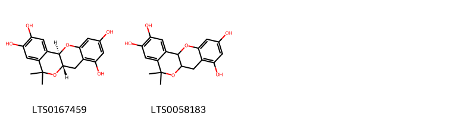{ width=100% }
    <figcaption>Hình ảnh cấu trúc hóa học của 2 hoạt chất thuộc nhóm Flavonoids gồm ['(5ar,11as)-10,10-dimethyl-11a,12-dihydro-5ah-5,11-dioxatetraphene-1,3,7,8-tetrol (LTS0167459)', '10,10-dimethyl-11a,12-dihydro-5ah-5,11-dioxatetraphene-1,3,7,8-tetrol (LTS0058183)'].</figcaption>
</figure>
#### Nhóm Prenol lipids
<figure markdown="span">
    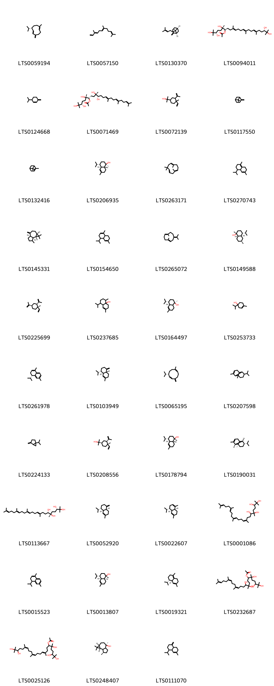{ width=100% }
    <figcaption>Hình ảnh cấu trúc hóa học của 39 hoạt chất thuộc nhóm Prenol lipids gồm ['(-)-germacrene d (LTS0059194)', 'farnesene (LTS0057150)', '(1s,5s,6r)-6-methyl-2-methylidene-6-(4-methylpent-3-en-1-yl)bicyclo[3.1.1]heptane (LTS0130370)', '(3s,6s,7r,10e,14e,18e,22s)-2,3,6,22,23-pentahydroxy-2,6,10,15,19,23-hexamethyltetracosa-10,14,18-trien-7-yl acetate (LTS0094011)', 'β phellandrene (LTS0124668)', '(3s,6s,7s,10s,11s,14e,18e)-2,3,6,10,11-pentahydroxy-2,6,10,15,19,23-hexamethyltetracosa-14,18,22-trien-7-yl acetate (LTS0071469)', '2-[4-ethenyl-4-methyl-3-(prop-1-en-2-yl)cyclohexyl]propan-2-ol (LTS0072139)', 'β-pinene (LTS0117550)', 'α pinene (LTS0132416)', 'α-cadinol (LTS0206935)', 'humulene (LTS0263171)', '4-isopropyl-1,6-dimethyl-2,3,4,4a,7,8-hexahydronaphthalene (LTS0270743)', '(1as,4ar,7as,7br)-1,1,7-trimethyl-4-methylidene-octahydro-1ah-cyclopropa[e]azulene (LTS0145331)', '4-isopropyl-1,6-dimethyl-3,4,4a,7,8,8a-hexahydronaphthalene (LTS0154650)', 'germacrene b (LTS0265072)', '(1r,4r,4ar,6s,8ar)-4-isopropyl-1,6-dimethyl-octahydro-2h-naphthalen-1-ol (LTS0149588)', 'β-elemene (LTS0225699)', '1-isopropyl-4,7-dimethyl-2,3,4,5,6,8a-hexahydro-1h-naphthalen-4a-ol (LTS0237685)', '(1r,4s,4ar)-4-isopropyl-1,6-dimethyl-3,4,4a,7,8,8a-hexahydro-2h-naphthalen-1-ol (LTS0164497)', '4-terpineol (LTS0253733)', '(4s)-4-isopropyl-1,6-dimethyl-3,4-dihydronaphthalene (LTS0261978)', '(+)-gamma-cadinene (LTS0103949)', '(1z,6z,8s)-8-isopropyl-1-methyl-5-methylidenecyclodeca-1,6-diene (LTS0065195)', 'α-copaene (LTS0207598)', 'sabinene (LTS0224133)', 'elemol (LTS0208556)', 'α-cadinol (LTS0178794)', '(1r,2s,7s,8s)-8-isopropyl-1,3-dimethyltricyclo[4.4.0.0²,⁷]dec-3-ene (LTS0190031)', '(3s,6s,7s,10e,14e,18e)-2,6,10,15,19,23-hexamethyltetracosa-10,14,18,22-tetraene-2,3,6,7-tetrol (LTS0113667)', 'gamma-muurolene (LTS0052920)', 'α-muurolene (LTS0022607)', '2,6,10,15,19,23-hexamethyltetracosa-10,14,18,22-tetraene-2,3,6,7-tetrol (LTS0001086)', '3,4-dihydrocadalene (LTS0015523)', 'delta-cadinol (LTS0013807)', 'delta-cadinene (LTS0019321)', '2,3,6,10,11-pentahydroxy-2,6,10,15,19,23-hexamethyltetracosa-14,18,22-trien-7-yl acetate (LTS0232687)', '2,3,6,22,23-pentahydroxy-2,6,10,15,19,23-hexamethyltetracosa-10,14,18-trien-7-yl acetate (LTS0025126)', '(1ar,4r,7r,7bs)-1,1,4,7-tetramethyl-octahydro-1ah-cyclopropa[e]azulen-4-ol (LTS0248407)', '4-isopropyl-6-methyl-1-methylidene-3,4,4a,7,8,8a-hexahydro-2h-naphthalene (LTS0111070)'].</figcaption>
</figure>

---

### Dược dân tộc học

Danh sách các quốc gia có sử dụng *Entandrophragma cylindricum* trong điều trị các bệnh. 

| Country   | Disease    | Bệnh                                                                                                                                                                                                |
|:----------|:-----------|:----------------------------------------------------------------------------------------------------------------------------------------------------------------------------------------------------|
| Ghana     | Dentifrice | MYMEMORY WARNING: YOU USED ALL AVAILABLE FREE TRANSLATIONS FOR TODAY. NEXT AVAILABLE IN  06 HOURS 37 MINUTES 04 SECONDS VISIT HTTPS://MYMEMORY.TRANSLATED.NET/DOC/USAGELIMITS.PHP TO TRANSLATE MORE |

---

# Chi Guarea

??? note "Danh sách các dược liệu thuộc chi"
    
	 - *Guarea guara*
	 - *Guarea guidonia*
	 - *Guarea rusbyi*
	 - *Guarea trichilioides*

---
## Guarea guara
### Thông tin về thực vật

!!! info "Phân loại thực vật của *Guarea guidonia* từ GIBF:"
    - **Kingdom:** Plantae
    - **Phylum:** Tracheophyta
    - **Order:** Sapindales
    - **Family:** Meliaceae
    - **Genus:** Guarea
    - **Species:** *Guarea guidonia*

 

| Label (VI)   | Label (EN)   | Scientific Name   | Descriptions (VI)   | Descriptions (EN)   | Also Known As (VI)   | Also Known As (EN)   |
|:-------------|:-------------|:------------------|:--------------------|:--------------------|:---------------------|:---------------------|
| N/A          | N/A          | Guarea guara      | loài thực vật       | species of plant    | ['']                 | ['']                 |

#### Phân bố trên thế giới

**Từ CSDL GIBF** Belize, Ecuador, Puerto Rico, Panama, nan, Trinidad and Tobago, Suriname, Colombia, Brazil, Costa Rica, Honduras, Guyana, Jamaica, Cuba, Mexico, Dominican Republic, Venezuela (Bolivarian Republic of), French Guiana

#### Phân bố tại Việt Nam

**Từ CSDL GIBF**: Không có ghi nhận ở Việt Nam

---
### Thành phần hóa học
        
- Theo cơ sở dữ liệu lotus: Từ loài *Guarea guidonia* đã phân lập và xác định được Chưa có hoạt chất nào được phân lập. hoạt chất thuộc về các nhóm Không có hoạt chất nào được phân lập. 

Không có hình ảnh nào được tạo ra

---

### Dược dân tộc học

Danh sách các quốc gia có sử dụng *Guarea guidonia* trong điều trị các bệnh. 

| Country   | Disease            | Bệnh                                                                                                                                                                                                |
|:----------|:-------------------|:----------------------------------------------------------------------------------------------------------------------------------------------------------------------------------------------------|
| Cuba      | Emetic, Hemostatic | MYMEMORY WARNING: YOU USED ALL AVAILABLE FREE TRANSLATIONS FOR TODAY. NEXT AVAILABLE IN  06 HOURS 36 MINUTES 27 SECONDS VISIT HTTPS://MYMEMORY.TRANSLATED.NET/DOC/USAGELIMITS.PHP TO TRANSLATE MORE |
| Elsewhere | Emetic, Hemostatic | MYMEMORY WARNING: YOU USED ALL AVAILABLE FREE TRANSLATIONS FOR TODAY. NEXT AVAILABLE IN  06 HOURS 36 MINUTES 22 SECONDS VISIT HTTPS://MYMEMORY.TRANSLATED.NET/DOC/USAGELIMITS.PHP TO TRANSLATE MORE |

---

---
## Guarea guidonia
### Thông tin về thực vật

!!! info "Phân loại thực vật của *Guarea guidonia* từ GIBF:"
    - **Kingdom:** Plantae
    - **Phylum:** Tracheophyta
    - **Order:** Sapindales
    - **Family:** Meliaceae
    - **Genus:** Guarea
    - **Species:** *Guarea guidonia*

 

| Label (VI)   | Label (EN)   | Scientific Name   | Descriptions (VI)   | Descriptions (EN)   | Also Known As (VI)   | Also Known As (EN)   |
|:-------------|:-------------|:------------------|:--------------------|:--------------------|:---------------------|:---------------------|
| N/A          | N/A          | Guarea guidonia   | loài thực vật       | species of plant    | ['']                 | ['']                 |

#### Phân bố trên thế giới

**Từ CSDL GIBF** Ecuador, Puerto Rico, Panama, Haiti, Colombia, Brazil, Argentina, Bolivia (Plurinational State of), Dominican Republic, French Guiana

#### Phân bố tại Việt Nam

**Từ CSDL GIBF**: Không có ghi nhận ở Việt Nam

---
### Thành phần hóa học
        
- Theo cơ sở dữ liệu lotus: Từ loài *Guarea guidonia* đã phân lập và xác định được 71 hoạt chất thuộc về các nhóm Prenol lipids, Steroids and steroid derivatives, Coumarins and derivatives, Naphthopyrans, Carboxylic acids and derivatives. 

|    | chemicalTaxonomyClassyfireClass   |   smiles_count |
|---:|:----------------------------------|---------------:|
|  0 | Carboxylic acids and derivatives  |              1 |
|  1 | Coumarins and derivatives         |              1 |
|  2 | Naphthopyrans                     |              1 |
|  3 | Prenol lipids                     |             42 |
|  4 | Steroids and steroid derivatives  |             26 |

#### Nhóm Carboxylic acids and derivatives
<figure markdown="span">
    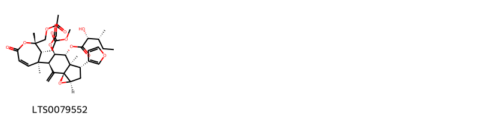{ width=100% }
    <figcaption>Hình ảnh cấu trúc hóa học của 1 hoạt chất thuộc nhóm Carboxylic acids and derivatives gồm ['(1ar,3s,3ar,4r,5r,6r,7as)-6-[(2s,3r,4r)-2-[(acetyloxy)methyl]-3-(2-methoxy-2-oxoethyl)-2,4-dimethyl-7-oxo-3h-oxepin-4-yl]-5-(formyloxy)-3-(furan-3-yl)-3a-methyl-7-methylidene-hexahydroindeno[1,7a-b]oxiren-4-yl (2r,3r)-2-hydroxy-3-methylpentanoate (LTS0079552)'].</figcaption>
</figure>
#### Nhóm Coumarins and derivatives
<figure markdown="span">
    { width=100% }
    <figcaption>Hình ảnh cấu trúc hóa học của 1 hoạt chất thuộc nhóm Coumarins and derivatives gồm ['scopoletin (LTS0193112)'].</figcaption>
</figure>
#### Nhóm Naphthopyrans
<figure markdown="span">
    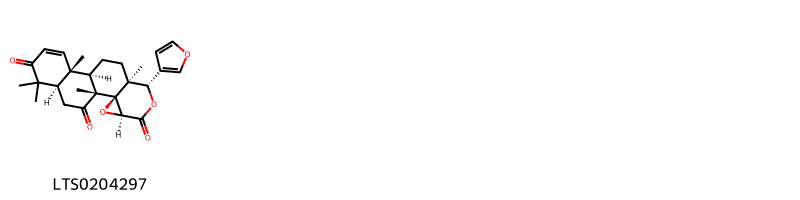{ width=100% }
    <figcaption>Hình ảnh cấu trúc hóa học của 1 hoạt chất thuộc nhóm Naphthopyrans gồm ['(1r,2r,4s,7s,8s,11r,12s,17r)-7-(furan-3-yl)-1,8,12,16,16-pentamethyl-3,6-dioxapentacyclo[9.8.0.0²,⁴.0²,⁸.0¹²,¹⁷]nonadec-13-ene-5,15,19-trione (LTS0204297)'].</figcaption>
</figure>
#### Nhóm Prenol lipids
<figure markdown="span">
    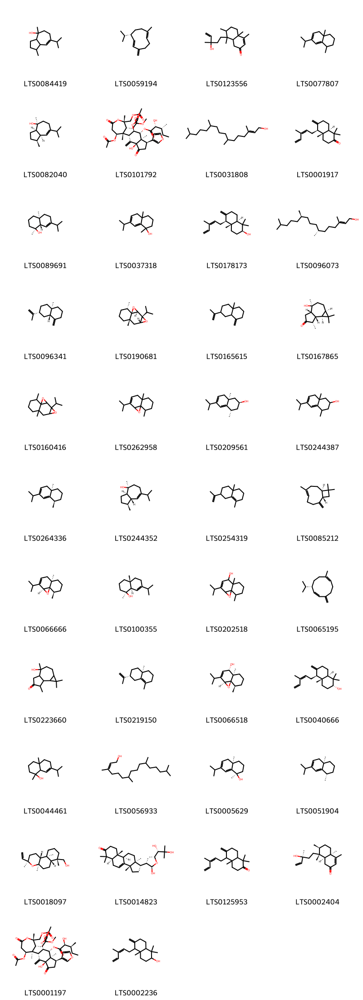{ width=100% }
    <figcaption>Hình ảnh cấu trúc hóa học của 42 hoạt chất thuộc nhóm Prenol lipids gồm ['7-isopropyl-1,4-dimethyl-2,3,3a,5,6,8a-hexahydro-1h-azulen-4-ol (LTS0084419)', '(-)-germacrene d (LTS0059194)', '8-(3-hydroxy-3-methylpent-4-en-1-yl)-4,4a,7,8-tetramethyl-5,6,7,8a-tetrahydro-1h-naphthalen-2-one (LTS0123556)', '7-isopropyl-1,4a-dimethyl-2,3,4,5-tetrahydro-1h-naphthalene (LTS0077807)', '(1s,3ar,4s,8ar)-7-isopropyl-1,4-dimethyl-2,3,3a,5,6,8a-hexahydro-1h-azulen-4-ol (LTS0082040)', '(3r,3ar,4r,5r,6s,7as)-6-[(2s,3r,4s,5s)-5-(acetyloxy)-2-[(acetyloxy)methyl]-3-(2-methoxy-2-oxoethyl)-2,4-dimethyl-7-oxooxepan-4-yl]-5-(formyloxy)-3-(furan-3-yl)-7a-hydroxy-3a-methyl-7-methylidene-1-oxo-tetrahydro-2h-inden-4-yl (2r,3r)-2-hydroxy-3-methylpentanoate (LTS0101792)', 'phytol (LTS0031808)', '(4ar,5s,8ar)-1,1,4a-trimethyl-6-methylidene-5-[(2z)-3-methylpenta-2,4-dien-1-yl]-hexahydronaphthalen-2-one (LTS0001917)', '(1s,4as,8as)-7-isopropyl-1,4a-dimethyl-2,3,4,5,6,8a-hexahydronaphthalen-1-ol (LTS0089691)', '7-isopropyl-1,4a-dimethyl-2,3,4,5-tetrahydronaphthalen-1-ol (LTS0037318)', '(2s,4ar,5s,8ar)-1,1,4a-trimethyl-6-methylidene-5-[(2z)-3-methylpenta-2,4-dien-1-yl]-hexahydro-2h-naphthalen-2-ol (LTS0178173)', 'phytol (LTS0096073)', 'β-selinene (LTS0096341)', '(1r,3r,4r,6r,8s,12s)-4-isopropyl-8,12-dimethyl-2,5-dioxatetracyclo[6.4.0.0¹,³.0⁴,⁶]dodecane (LTS0190681)', '4a-methyl-1-methylidene-7-(prop-1-en-2-yl)-octahydronaphthalene (LTS0165615)', '(1ar,4s,4as,7s,7as,7bs)-4-hydroxy-1,1,4,7-tetramethyl-octahydrocyclopropa[e]azulen-6-one (LTS0167865)', '4-isopropyl-8,12-dimethyl-2,5-dioxatetracyclo[6.4.0.0¹,³.0⁴,⁶]dodecane (LTS0160416)', '2-isopropyl-4a,8-dimethyl-1ah,4h,5h,6h,7h,8h-naphtho[4,4a-b]oxirene (LTS0262958)', '(2s,4s,8as)-6-isopropyl-4,8a-dimethyl-2,3,4,8-tetrahydro-1h-naphthalen-2-ol (LTS0209561)', '6-isopropyl-4,8a-dimethyl-2,3,4,8-tetrahydro-1h-naphthalen-2-ol (LTS0244387)', '(1r,4ar)-7-isopropyl-1,4a-dimethyl-2,3,4,5-tetrahydro-1h-naphthalene (LTS0264336)', '(1s,3ar,4s,8as)-7-isopropyl-1,4-dimethyl-2,3,3a,5,6,8a-hexahydro-1h-azulen-4-ol (LTS0244352)', '1,4a-dimethyl-7-(prop-1-en-2-yl)-3,4,5,6,7,8-hexahydro-2h-naphthalene (LTS0254319)', 'caryophyllene (LTS0085212)', '(1as,4ar,8r,8ar)-2-isopropyl-4a,8-dimethyl-1ah,4h,5h,6h,7h,8h-naphtho[4,4a-b]oxirene (LTS0066666)', '(1s,4ar,8ar)-7-isopropyl-1,4a-dimethyl-2,3,4,5,6,8a-hexahydronaphthalen-1-ol (LTS0100355)', '2-isopropyl-4a,8-dimethyl-1ah,4h,5h,6h,7h,8h-naphtho[4,4a-b]oxiren-4-ol (LTS0202518)', '(1z,6z,8s)-8-isopropyl-1-methyl-5-methylidenecyclodeca-1,6-diene (LTS0065195)', '4-hydroxy-1,1,4,7-tetramethyl-octahydrocyclopropa[e]azulen-6-one (LTS0223660)', '(4ar,7r)-1,4a-dimethyl-7-(prop-1-en-2-yl)-3,4,5,6,7,8-hexahydro-2h-naphthalene (LTS0219150)', '(1as,4s,4ar,8r,8ar)-2-isopropyl-4a,8-dimethyl-1ah,4h,5h,6h,7h,8h-naphtho[4,4a-b]oxiren-4-ol (LTS0066518)', '(2r,4ar,5s,8ar)-1,1,4a-trimethyl-6-methylidene-5-[(2z)-3-methylpenta-2,4-dien-1-yl]-hexahydro-2h-naphthalen-2-ol (LTS0040666)', '7-isopropyl-1,4a-dimethyl-2,3,4,5,6,8a-hexahydronaphthalen-1-ol (LTS0044461)', '3,7,11,15-tetramethylhexadec-2-en-1-ol (LTS0056933)', '(1r,4ar)-7-isopropyl-1,4a-dimethyl-2,3,4,5-tetrahydronaphthalen-1-ol (LTS0005629)', '(1s,4ar)-7-isopropyl-1,4a-dimethyl-2,3,4,5-tetrahydro-1h-naphthalene (LTS0051904)', '[(3r,4ar,6ar,7s,10as,10br)-3-ethenyl-3,4a,7,10a-tetramethyl-octahydro-1h-naphtho[2,1-b]pyran-7-yl]methanol (LTS0018097)', '(1s,3as,5ar,9ar,9br,11as)-1-[(2r,3s,5r)-5-[(1s)-1,2-dihydroxy-2-methylpropyl]-2-hydroxyoxolan-3-yl]-3a,6,6,9a,11a-pentamethyl-1h,2h,3h,5h,5ah,8h,9h,9bh,10h,11h-cyclopenta[a]phenanthren-7-one (LTS0014823)', '1,1,4a-trimethyl-6-methylidene-5-(3-methylpenta-2,4-dien-1-yl)-hexahydronaphthalen-2-one (LTS0125953)', '(4ar,7s,8r,8as)-8-[(3s)-3-hydroxy-3-methylpent-4-en-1-yl]-4,4a,7,8-tetramethyl-5,6,7,8a-tetrahydro-1h-naphthalen-2-one (LTS0002404)', '(3r,3ar,4r,5s,6s,7as)-6-[(2s,3r,4r,5s)-5-(acetyloxy)-2-[(acetyloxy)methyl]-3-(2-methoxy-2-oxoethyl)-2,4-dimethyl-7-oxooxepan-4-yl]-5-(formyloxy)-3-(furan-3-yl)-7a-hydroxy-3a-methyl-7-methylidene-1-oxo-tetrahydro-2h-inden-4-yl (2s,3s)-2-hydroxy-3-methylpentanoate (LTS0001197)', '1,1,4a-trimethyl-6-methylidene-5-(3-methylpenta-2,4-dien-1-yl)-hexahydro-2h-naphthalen-2-ol (LTS0002236)'].</figcaption>
</figure>
#### Nhóm Steroids and steroid derivatives
<figure markdown="span">
    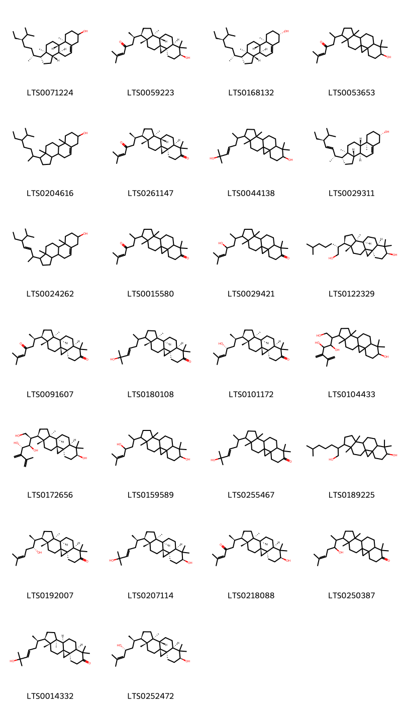{ width=100% }
    <figcaption>Hình ảnh cấu trúc hóa học của 26 hoạt chất thuộc nhóm Steroids and steroid derivatives gồm ['stigmast-5-en-3-ol (LTS0071224)', '(6r)-6-[(1s,3r,6s,8r,11s,12s,15r,16r)-6-hydroxy-7,7,12,16-tetramethylpentacyclo[9.7.0.0¹,³.0³,⁸.0¹²,¹⁶]octadecan-15-yl]-2-methylhept-2-en-4-one (LTS0059223)', 'sitosterol (LTS0168132)', '6-{6-hydroxy-7,7,12,16-tetramethylpentacyclo[9.7.0.0¹,³.0³,⁸.0¹²,¹⁶]octadecan-15-yl}-2-methylhept-2-en-4-one (LTS0053653)', 'stigmast-5-en-3-ol, (3β)- (LTS0204616)', '(1s,3r,8r,11s,12s,15r,16r)-7,7,12,16-tetramethyl-15-[(2r)-6-methyl-4-oxohept-5-en-2-yl]pentacyclo[9.7.0.0¹,³.0³,⁸.0¹²,¹⁶]octadecan-6-one (LTS0261147)', '15-(6-hydroxy-6-methylhept-4-en-2-yl)-7,7,12,16-tetramethylpentacyclo[9.7.0.0¹,³.0³,⁸.0¹²,¹⁶]octadecan-6-ol (LTS0044138)', 'phytosterol (LTS0029311)', 'stigmasterol (LTS0024262)', '7,7,12,16-tetramethyl-15-(6-methyl-4-oxohept-5-en-2-yl)pentacyclo[9.7.0.0¹,³.0³,⁸.0¹²,¹⁶]octadecan-6-one (LTS0015580)', '15-(4-hydroxy-6-methylhept-5-en-2-yl)-7,7,12,16-tetramethylpentacyclo[9.7.0.0¹,³.0³,⁸.0¹²,¹⁶]octadecan-6-one (LTS0029421)', '(1s,3r,6s,8r,11r,12s,15r,16r)-15-[(2r)-1-hydroxy-6-methylheptan-2-yl]-7,7,12,16-tetramethylpentacyclo[9.7.0.0¹,³.0³,⁸.0¹²,¹⁶]octadecan-6-ol (LTS0122329)', '(1s,3r,8r,11r,12s,15r,16r)-7,7,12,16-tetramethyl-15-[(2r)-6-methyl-4-oxohept-5-en-2-yl]pentacyclo[9.7.0.0¹,³.0³,⁸.0¹²,¹⁶]octadecan-6-one (LTS0091607)', '(1s,3r,8r,11r,12s,16r)-15-(6-hydroxy-6-methylhept-4-en-2-yl)-7,7,12,16-tetramethylpentacyclo[9.7.0.0¹,³.0³,⁸.0¹²,¹⁶]octadecan-6-one (LTS0180108)', '(1s,3r,8r,11r,12s,15r,16r)-15-[(2r,4r)-4-hydroxy-6-methylhept-5-en-2-yl]-7,7,12,16-tetramethylpentacyclo[9.7.0.0¹,³.0³,⁸.0¹²,¹⁶]octadecan-6-one (LTS0101172)', '2-{6-hydroxy-7,7,12,16-tetramethylpentacyclo[9.7.0.0¹,³.0³,⁸.0¹²,¹⁶]octadecan-15-yl}-6-methyl-5-methylidenehept-6-ene-1,3,4-triol (LTS0104433)', '(2r,3r,4s)-2-[(1s,3r,6s,8r,11r,12s,15r,16r)-6-hydroxy-7,7,12,16-tetramethylpentacyclo[9.7.0.0¹,³.0³,⁸.0¹²,¹⁶]octadecan-15-yl]-6-methyl-5-methylidenehept-6-ene-1,3,4-triol (LTS0172656)', '15-(4-hydroxy-6-methylhept-5-en-2-yl)-7,7,12,16-tetramethylpentacyclo[9.7.0.0¹,³.0³,⁸.0¹²,¹⁶]octadecan-6-ol (LTS0159589)', '15-(6-hydroxy-6-methylhept-4-en-2-yl)-7,7,12,16-tetramethylpentacyclo[9.7.0.0¹,³.0³,⁸.0¹²,¹⁶]octadecan-6-one (LTS0255467)', '15-(1-hydroxy-6-methylheptan-2-yl)-7,7,12,16-tetramethylpentacyclo[9.7.0.0¹,³.0³,⁸.0¹²,¹⁶]octadecan-6-ol (LTS0189225)', '(1s,3r,8r,11r,12s,15r,16r)-15-[(2s,3r)-3-hydroxy-6-methylhept-5-en-2-yl]-7,7,12,16-tetramethylpentacyclo[9.7.0.0¹,³.0³,⁸.0¹²,¹⁶]octadecan-6-one (LTS0192007)', '(1s,3r,6s,8r,11r,12s,15r,16r)-15-[(2r,4e)-6-hydroxy-6-methylhept-4-en-2-yl]-7,7,12,16-tetramethylpentacyclo[9.7.0.0¹,³.0³,⁸.0¹²,¹⁶]octadecan-6-ol (LTS0207114)', '(6r)-6-[(1s,3r,6s,8r,11r,12s,15r,16r)-6-hydroxy-7,7,12,16-tetramethylpentacyclo[9.7.0.0¹,³.0³,⁸.0¹²,¹⁶]octadecan-15-yl]-2-methylhept-2-en-4-one (LTS0218088)', '15-(3-hydroxy-6-methylhept-5-en-2-yl)-7,7,12,16-tetramethylpentacyclo[9.7.0.0¹,³.0³,⁸.0¹²,¹⁶]octadecan-6-one (LTS0250387)', '(1s,3r,8r,11r,12s,15r,16r)-15-[(2r,4e)-6-hydroxy-6-methylhept-4-en-2-yl]-7,7,12,16-tetramethylpentacyclo[9.7.0.0¹,³.0³,⁸.0¹²,¹⁶]octadecan-6-one (LTS0014332)', '(1s,3r,6s,8r,11s,12s,15r,16r)-15-[(2r,4r)-4-hydroxy-6-methylhept-5-en-2-yl]-7,7,12,16-tetramethylpentacyclo[9.7.0.0¹,³.0³,⁸.0¹²,¹⁶]octadecan-6-ol (LTS0252472)'].</figcaption>
</figure>

---

### Dược dân tộc học

Danh sách các quốc gia có sử dụng *Guarea guidonia* trong điều trị các bệnh. 

| Country            | Disease   | Bệnh                                                                                                                                                                                                |
|:-------------------|:----------|:----------------------------------------------------------------------------------------------------------------------------------------------------------------------------------------------------|
| Dominican Republic | Hemostat  | MYMEMORY WARNING: YOU USED ALL AVAILABLE FREE TRANSLATIONS FOR TODAY. NEXT AVAILABLE IN  06 HOURS 35 MINUTES 51 SECONDS VISIT HTTPS://MYMEMORY.TRANSLATED.NET/DOC/USAGELIMITS.PHP TO TRANSLATE MORE |

---

---
## Guarea rusbyi
### Thông tin về thực vật

!!! info "Phân loại thực vật của *Guarea guidonia* từ GIBF:"
    - **Kingdom:** Plantae
    - **Phylum:** Tracheophyta
    - **Order:** Sapindales
    - **Family:** Meliaceae
    - **Genus:** Guarea
    - **Species:** *Guarea guidonia*

 

| Label (VI)   | Label (EN)   | Scientific Name   | Descriptions (VI)   | Descriptions (EN)   | Also Known As (VI)   | Also Known As (EN)   |
|:-------------|:-------------|:------------------|:--------------------|:--------------------|:---------------------|:---------------------|
| N/A          | N/A          | Guarea rusbyi     |                     | species of plant    | ['']                 | ['']                 |

#### Phân bố trên thế giới

**Từ CSDL GIBF** nan, Brazil, Bolivia (Plurinational State of)

#### Phân bố tại Việt Nam

**Từ CSDL GIBF**: Không có ghi nhận ở Việt Nam

---
### Thành phần hóa học
        
- Theo cơ sở dữ liệu lotus: Từ loài *Guarea guidonia* đã phân lập và xác định được Chưa có hoạt chất nào được phân lập. hoạt chất thuộc về các nhóm Không có hoạt chất nào được phân lập. 

Không có hình ảnh nào được tạo ra

---

### Dược dân tộc học

Danh sách các quốc gia có sử dụng *Guarea guidonia* trong điều trị các bệnh. 

| Country   | Disease             | Bệnh                                                                                                                                                                                                |
|:----------|:--------------------|:----------------------------------------------------------------------------------------------------------------------------------------------------------------------------------------------------|
| Bolivia   | Expectorant, Emetic | MYMEMORY WARNING: YOU USED ALL AVAILABLE FREE TRANSLATIONS FOR TODAY. NEXT AVAILABLE IN  06 HOURS 35 MINUTES 11 SECONDS VISIT HTTPS://MYMEMORY.TRANSLATED.NET/DOC/USAGELIMITS.PHP TO TRANSLATE MORE |

---

---
## Guarea trichilioides
### Thông tin về thực vật

!!! info "Phân loại thực vật của *Guarea guidonia* từ GIBF:"
    - **Kingdom:** Plantae
    - **Phylum:** Tracheophyta
    - **Order:** Sapindales
    - **Family:** Meliaceae
    - **Genus:** Guarea
    - **Species:** *Guarea guidonia*

 

| Label (VI)   | Label (EN)   | Scientific Name   | Descriptions (VI)   | Descriptions (EN)   | Also Known As (VI)   | Also Known As (EN)   |
|:-------------|:-------------|:------------------|:--------------------|:--------------------|:---------------------|:---------------------|
| N/A          | N/A          | Guarea rusbyi     |                     | species of plant    | ['']                 | ['']                 |

#### Phân bố trên thế giới

**Từ CSDL GIBF** nan, Dominican Republic, Puerto Rico, Suriname, Colombia, Brazil, Bolivia (Plurinational State of), Guyana, Argentina, unknown or invalid, Jamaica, Cuba, Peru, Mexico, Venezuela (Bolivarian Republic of)

#### Phân bố tại Việt Nam

**Từ CSDL GIBF**: Không có ghi nhận ở Việt Nam

---
### Thành phần hóa học
        
- Theo cơ sở dữ liệu lotus: Từ loài *Guarea guidonia* đã phân lập và xác định được Chưa có hoạt chất nào được phân lập. hoạt chất thuộc về các nhóm Không có hoạt chất nào được phân lập. 

Không có hình ảnh nào được tạo ra

---

### Dược dân tộc học

Danh sách các quốc gia có sử dụng *Guarea guidonia* trong điều trị các bệnh. 

| Country   | Disease                   | Bệnh                                                                                                                                                                                                |
|:----------|:--------------------------|:----------------------------------------------------------------------------------------------------------------------------------------------------------------------------------------------------|
| Mexico    | Poison, Purgative, Emetic | MYMEMORY WARNING: YOU USED ALL AVAILABLE FREE TRANSLATIONS FOR TODAY. NEXT AVAILABLE IN  06 HOURS 34 MINUTES 47 SECONDS VISIT HTTPS://MYMEMORY.TRANSLATED.NET/DOC/USAGELIMITS.PHP TO TRANSLATE MORE |

---

# Chi Xylocarpus

??? note "Danh sách các dược liệu thuộc chi"
    
	 - *Xylocarpus granatum*

---
## Xylocarpus granatum
### Thông tin về thực vật

!!! info "Phân loại thực vật của *Xylocarpus granatum* từ GIBF:"
    - **Kingdom:** Plantae
    - **Phylum:** Tracheophyta
    - **Order:** Sapindales
    - **Family:** Meliaceae
    - **Genus:** Xylocarpus
    - **Species:** *Xylocarpus granatum*

 

| Label (VI)   | Label (EN)   | Scientific Name     | Descriptions (VI)   | Descriptions (EN)   | Also Known As (VI)      | Also Known As (EN)   |
|:-------------|:-------------|:--------------------|:--------------------|:--------------------|:------------------------|:---------------------|
| N/A          | N/A          | Xylocarpus granatum | loài thực vật       | species of plant    | ['Xylocarpus granatum'] | ['Dhundal tree']     |

#### Phân bố trên thế giới

**Từ CSDL GIBF** Palau, Sri Lanka, Australia, Belgium, Cambodia, Mozambique, Philippines, Chinese Taipei, Papua New Guinea, Bangladesh, Solomon Islands, South Africa, Thailand, New Caledonia, Singapore, China, Madagascar, Seychelles, Vanuatu, India, Indonesia, Kenya, Malaysia

#### Phân bố tại Việt Nam

**Từ CSDL GIBF**: Không có ghi nhận ở Việt Nam

---
### Thành phần hóa học
        
- Theo cơ sở dữ liệu lotus: Từ loài *Xylocarpus granatum* đã phân lập và xác định được 278 hoạt chất thuộc về các nhóm Fatty Acyls, Flavonoids, Prenol lipids, Steroids and steroid derivatives, Cinnamic acids and derivatives, Quinolines and derivatives, Benzofurans, Benzene and substituted derivatives, Organooxygen compounds, Lactones, Naphthopyrans, Glycerolipids, Carboxylic acids and derivatives, Diazines, Benzopyrans. 

|    | chemicalTaxonomyClassyfireClass     |   smiles_count |
|---:|:------------------------------------|---------------:|
|  0 | Benzene and substituted derivatives |              2 |
|  1 | Benzofurans                         |             10 |
|  2 | Benzopyrans                         |              2 |
|  3 | Carboxylic acids and derivatives    |             34 |
|  4 | Cinnamic acids and derivatives      |              3 |
|  5 | Diazines                            |              1 |
|  6 | Fatty Acyls                         |              2 |
|  7 | Flavonoids                          |              6 |
|  8 | Glycerolipids                       |              2 |
|  9 | Lactones                            |              2 |
| 10 | Naphthopyrans                       |             14 |
| 11 | Organooxygen compounds              |              7 |
| 12 | Prenol lipids                       |            177 |
| 13 | Quinolines and derivatives          |              9 |
| 14 | Steroids and steroid derivatives    |              5 |

#### Nhóm Benzene and substituted derivatives
<figure markdown="span">
    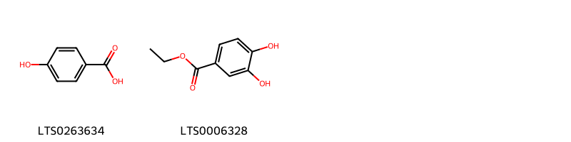{ width=100% }
    <figcaption>Hình ảnh cấu trúc hóa học của 2 hoạt chất thuộc nhóm Benzene and substituted derivatives gồm ['p-hydroxybenzoic acid (LTS0263634)', 'ethyl protocatechuate (LTS0006328)'].</figcaption>
</figure>
#### Nhóm Benzofurans
<figure markdown="span">
    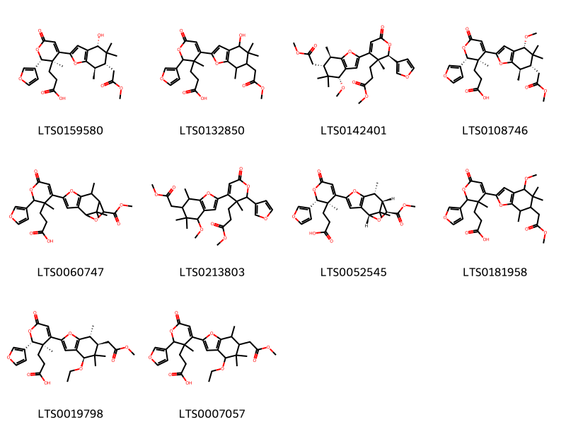{ width=100% }
    <figcaption>Hình ảnh cấu trúc hóa học của 10 hoạt chất thuộc nhóm Benzofurans gồm ['3-[(2r,3r)-2-(furan-3-yl)-4-[(4r,6r,7r)-4-hydroxy-6-(2-methoxy-2-oxoethyl)-5,5,7-trimethyl-6,7-dihydro-4h-1-benzofuran-2-yl]-3-methyl-6-oxo-2h-pyran-3-yl]propanoic acid (LTS0159580)', '3-[2-(furan-3-yl)-4-[4-hydroxy-6-(2-methoxy-2-oxoethyl)-5,5,7-trimethyl-6,7-dihydro-4h-1-benzofuran-2-yl]-3-methyl-6-oxo-2h-pyran-3-yl]propanoic acid (LTS0132850)', 'methyl 3-[(2r,3r)-2-(furan-3-yl)-4-[(4r,6r,7r)-4-methoxy-6-(2-methoxy-2-oxoethyl)-5,5,7-trimethyl-6,7-dihydro-4h-1-benzofuran-2-yl]-3-methyl-6-oxo-2h-pyran-3-yl]propanoate (LTS0142401)', '3-[(2r,3r)-2-(furan-3-yl)-4-[(4r,6r,7r)-4-methoxy-6-(2-methoxy-2-oxoethyl)-5,5,7-trimethyl-6,7-dihydro-4h-1-benzofuran-2-yl]-3-methyl-6-oxo-2h-pyran-3-yl]propanoic acid (LTS0108746)', '3-[2-(furan-3-yl)-4-[9-(methoxycarbonyl)-7,11,11-trimethyl-5,10-dioxatricyclo[6.2.1.0²,⁶]undeca-2(6),3-dien-4-yl]-3-methyl-6-oxo-2h-pyran-3-yl]propanoic acid (LTS0060747)', 'methyl 3-[2-(furan-3-yl)-4-[4-methoxy-6-(2-methoxy-2-oxoethyl)-5,5,7-trimethyl-6,7-dihydro-4h-1-benzofuran-2-yl]-3-methyl-6-oxo-2h-pyran-3-yl]propanoate (LTS0213803)', '3-[(2r,3r)-2-(furan-3-yl)-4-[(1s,7r,8s,9s)-9-(methoxycarbonyl)-7,11,11-trimethyl-5,10-dioxatricyclo[6.2.1.0²,⁶]undeca-2(6),3-dien-4-yl]-3-methyl-6-oxo-2h-pyran-3-yl]propanoic acid (LTS0052545)', '3-[2-(furan-3-yl)-4-[4-methoxy-6-(2-methoxy-2-oxoethyl)-5,5,7-trimethyl-6,7-dihydro-4h-1-benzofuran-2-yl]-3-methyl-6-oxo-2h-pyran-3-yl]propanoic acid (LTS0181958)', '3-[(2r,3r)-4-[(4r,6r,7r)-4-ethoxy-6-(2-methoxy-2-oxoethyl)-5,5,7-trimethyl-6,7-dihydro-4h-1-benzofuran-2-yl]-2-(furan-3-yl)-3-methyl-6-oxo-2h-pyran-3-yl]propanoic acid (LTS0019798)', '3-{4-[4-ethoxy-6-(2-methoxy-2-oxoethyl)-5,5,7-trimethyl-6,7-dihydro-4h-1-benzofuran-2-yl]-2-(furan-3-yl)-3-methyl-6-oxo-2h-pyran-3-yl}propanoic acid (LTS0007057)'].</figcaption>
</figure>
#### Nhóm Benzopyrans
<figure markdown="span">
    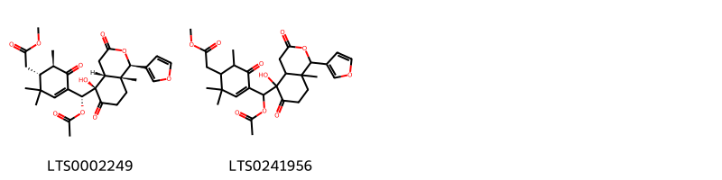{ width=100% }
    <figcaption>Hình ảnh cấu trúc hóa học của 2 hoạt chất thuộc nhóm Benzopyrans gồm ['(r)-[(1r,4ar,5r,8ar)-1-(furan-3-yl)-5-hydroxy-8a-methyl-3,6-dioxo-tetrahydro-1h-2-benzopyran-5-yl][(4r,5r)-4-(2-methoxy-2-oxoethyl)-3,3,5-trimethyl-6-oxocyclohex-1-en-1-yl]methyl acetate (LTS0002249)', '[1-(furan-3-yl)-5-hydroxy-8a-methyl-3,6-dioxo-tetrahydro-1h-2-benzopyran-5-yl][4-(2-methoxy-2-oxoethyl)-3,3,5-trimethyl-6-oxocyclohex-1-en-1-yl]methyl acetate (LTS0241956)'].</figcaption>
</figure>
#### Nhóm Carboxylic acids and derivatives
<figure markdown="span">
    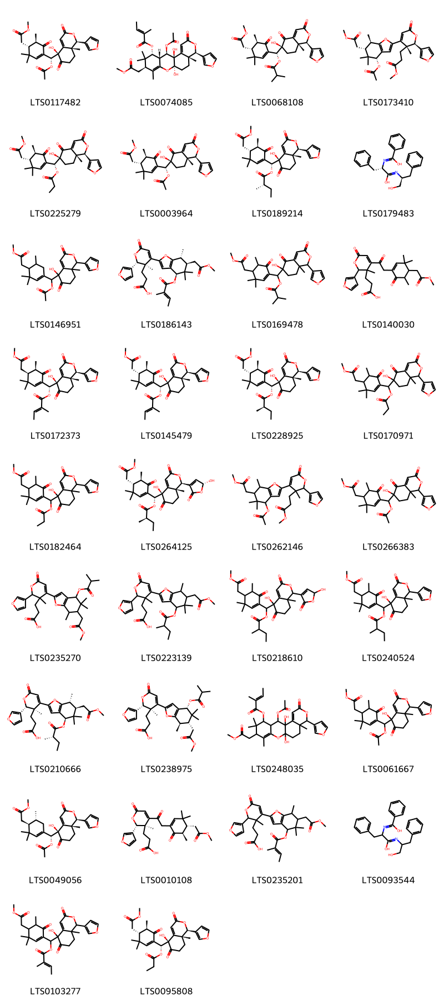{ width=100% }
    <figcaption>Hình ảnh cấu trúc hóa học của 34 hoạt chất thuộc nhóm Carboxylic acids and derivatives gồm ['(r)-[(1r,5r,8ar)-1-(furan-3-yl)-5-hydroxy-8a-methyl-3,6-dioxo-7,8-dihydro-1h-isochromen-5-yl][(4r,5r)-4-(2-methoxy-2-oxoethyl)-3,3,5-trimethyl-6-oxocyclohex-1-en-1-yl]methyl acetate (LTS0117482)', '(1r,4br,5r,5ar,6r,8s,10ar,12ar)-5-(acetyloxy)-1-(furan-3-yl)-4b,10a-dihydroxy-8-(2-methoxy-2-oxoethyl)-7,7,9,12a-tetramethyl-3-oxo-5,5a,6,8,11,12-hexahydro-1h-2,10-dioxatetraphen-6-yl (2e)-2-methylbut-2-enoate (LTS0074085)', '(r)-[(1r,6s,8ar)-1-(furan-3-yl)-6-hydroxy-8a-methyl-3,5-dioxo-7,8-dihydro-1h-isochromen-6-yl][(4r,5r)-4-(2-methoxy-2-oxoethyl)-3,3,5-trimethyl-6-oxocyclohex-1-en-1-yl]methyl 2-methylpropanoate (LTS0068108)', 'methyl 3-[(2r,3r)-4-[(4r,6r,7r)-4-(acetyloxy)-6-(2-methoxy-2-oxoethyl)-5,5,7-trimethyl-6,7-dihydro-4h-1-benzofuran-2-yl]-2-(furan-3-yl)-3-methyl-6-oxo-2h-pyran-3-yl]propanoate (LTS0173410)', '(r)-[(1r,6s,8ar)-1-(furan-3-yl)-6-hydroxy-8a-methyl-3,5-dioxo-7,8-dihydro-1h-isochromen-6-yl][(4r,5r)-4-(2-methoxy-2-oxoethyl)-3,3,5-trimethyl-6-oxocyclohex-1-en-1-yl]methyl propanoate (LTS0225279)', '(r)-[(1r,6s,8ar)-1-(furan-3-yl)-6-hydroxy-8a-methyl-3,5-dioxo-7,8-dihydro-1h-isochromen-6-yl][(4r,5r)-4-(2-methoxy-2-oxoethyl)-3,3,5-trimethyl-6-oxocyclohex-1-en-1-yl]methyl acetate (LTS0003964)', '(r)-[(1r,5r,8ar)-1-(furan-3-yl)-5-hydroxy-8a-methyl-3,6-dioxo-7,8-dihydro-1h-isochromen-5-yl][(4r,5r)-4-(2-methoxy-2-oxoethyl)-3,3,5-trimethyl-6-oxocyclohex-1-en-1-yl]methyl (2s)-2-methylbutanoate (LTS0189214)', '(2s)-2-{[hydroxy(phenyl)methylidene]amino}-n-[(2s)-1-hydroxy-3-phenylpropan-2-yl]-3-phenylpropanimidic acid (LTS0179483)', '[1-(furan-3-yl)-5-hydroxy-8a-methyl-3,6-dioxo-7,8-dihydro-1h-isochromen-5-yl][4-(2-methoxy-2-oxoethyl)-3,3,5-trimethylcyclohex-1-en-1-yl]methyl acetate (LTS0146951)', '3-[(2r,3r)-2-(furan-3-yl)-4-[(4r,6r,7r)-6-(2-methoxy-2-oxoethyl)-5,5,7-trimethyl-4-{[(2e)-2-methylbut-2-enoyl]oxy}-6,7-dihydro-4h-1-benzofuran-2-yl]-3-methyl-6-oxo-2h-pyran-3-yl]propanoic acid (LTS0186143)', '[1-(furan-3-yl)-6-hydroxy-8a-methyl-3,5-dioxo-7,8-dihydro-1h-isochromen-6-yl][4-(2-methoxy-2-oxoethyl)-3,3,5-trimethyl-6-oxocyclohex-1-en-1-yl]methyl 2-methylpropanoate (LTS0169478)', '3-[2-(furan-3-yl)-4-{2-[4-(2-methoxy-2-oxoethyl)-3,3,5-trimethyl-6-oxocyclohex-1-en-1-yl]acetyl}-3-methyl-6-oxo-2h-pyran-3-yl]propanoic acid (LTS0140030)', '(r)-[(1r,5r,8ar)-1-(furan-3-yl)-5-hydroxy-8a-methyl-3,6-dioxo-7,8-dihydro-1h-isochromen-5-yl][(4s,5r)-4-(2-methoxy-2-oxoethyl)-3,3,5-trimethyl-6-oxocyclohex-1-en-1-yl]methyl (2e)-2-methylbut-2-enoate (LTS0172373)', '(r)-[(1r,5r,8ar)-1-(furan-3-yl)-5-hydroxy-8a-methyl-3,6-dioxo-7,8-dihydro-1h-isochromen-5-yl][(4r,5r)-4-(2-methoxy-2-oxoethyl)-3,3,5-trimethyl-6-oxocyclohex-1-en-1-yl]methyl (2e)-2-methylbut-2-enoate (LTS0145479)', '(r)-[(1r,5r,8ar)-1-(furan-3-yl)-5-hydroxy-8a-methyl-3,6-dioxo-7,8-dihydro-1h-isochromen-5-yl][(4r,5r)-4-(2-methoxy-2-oxoethyl)-3,3,5-trimethyl-6-oxocyclohex-1-en-1-yl]methyl (2r)-2-methylbutanoate (LTS0228925)', '[1-(furan-3-yl)-6-hydroxy-8a-methyl-3,5-dioxo-7,8-dihydro-1h-isochromen-6-yl][4-(2-methoxy-2-oxoethyl)-3,3,5-trimethyl-6-oxocyclohex-1-en-1-yl]methyl propanoate (LTS0170971)', '[1-(furan-3-yl)-5-hydroxy-8a-methyl-3,6-dioxo-7,8-dihydro-1h-isochromen-5-yl][4-(2-methoxy-2-oxoethyl)-3,3,5-trimethyl-6-oxocyclohex-1-en-1-yl]methyl propanoate (LTS0182464)', '(r)-[(1r,5r,8ar)-5-hydroxy-1-[(5r)-5-hydroxy-2-oxo-5h-furan-3-yl]-8a-methyl-3,6-dioxo-7,8-dihydro-1h-isochromen-5-yl][(4r,5r)-4-(2-methoxy-2-oxoethyl)-3,3,5-trimethyl-6-oxocyclohex-1-en-1-yl]methyl (2r)-2-methylbutanoate (LTS0264125)', 'methyl 3-{4-[4-(acetyloxy)-6-(2-methoxy-2-oxoethyl)-5,5,7-trimethyl-6,7-dihydro-4h-1-benzofuran-2-yl]-2-(furan-3-yl)-3-methyl-6-oxo-2h-pyran-3-yl}propanoate (LTS0262146)', '[1-(furan-3-yl)-6-hydroxy-8a-methyl-3,5-dioxo-7,8-dihydro-1h-isochromen-6-yl][4-(2-methoxy-2-oxoethyl)-3,3,5-trimethyl-6-oxocyclohex-1-en-1-yl]methyl acetate (LTS0266383)', '3-[2-(furan-3-yl)-4-[6-(2-methoxy-2-oxoethyl)-5,5,7-trimethyl-4-[(2-methylpropanoyl)oxy]-6,7-dihydro-4h-1-benzofuran-2-yl]-3-methyl-6-oxo-2h-pyran-3-yl]propanoic acid (LTS0235270)', '3-[2-(furan-3-yl)-4-[6-(2-methoxy-2-oxoethyl)-5,5,7-trimethyl-4-[(2-methylbutanoyl)oxy]-6,7-dihydro-4h-1-benzofuran-2-yl]-3-methyl-6-oxo-2h-pyran-3-yl]propanoic acid (LTS0223139)', '[5-hydroxy-1-(5-hydroxy-2-oxo-5h-furan-3-yl)-8a-methyl-3,6-dioxo-7,8-dihydro-1h-isochromen-5-yl][4-(2-methoxy-2-oxoethyl)-3,3,5-trimethyl-6-oxocyclohex-1-en-1-yl]methyl 2-methylbutanoate (LTS0218610)', '[1-(furan-3-yl)-5-hydroxy-8a-methyl-3,6-dioxo-7,8-dihydro-1h-isochromen-5-yl][4-(2-methoxy-2-oxoethyl)-3,3,5-trimethyl-6-oxocyclohex-1-en-1-yl]methyl 2-methylbutanoate (LTS0240524)', '3-[(2r,3r)-2-(furan-3-yl)-4-[(4r,6r,7r)-6-(2-methoxy-2-oxoethyl)-5,5,7-trimethyl-4-{[(2s)-2-methylbutanoyl]oxy}-6,7-dihydro-4h-1-benzofuran-2-yl]-3-methyl-6-oxo-2h-pyran-3-yl]propanoic acid (LTS0210666)', '3-[(2r,3r)-2-(furan-3-yl)-4-[(4r,6r,7r)-6-(2-methoxy-2-oxoethyl)-5,5,7-trimethyl-4-[(2-methylpropanoyl)oxy]-6,7-dihydro-4h-1-benzofuran-2-yl]-3-methyl-6-oxo-2h-pyran-3-yl]propanoic acid (LTS0238975)', '5-(acetyloxy)-1-(furan-3-yl)-4b,10a-dihydroxy-8-(2-methoxy-2-oxoethyl)-7,7,9,12a-tetramethyl-3-oxo-5,5a,6,8,11,12-hexahydro-1h-2,10-dioxatetraphen-6-yl 2-methylbut-2-enoate (LTS0248035)', '[1-(furan-3-yl)-5-hydroxy-8a-methyl-3,6-dioxo-7,8-dihydro-1h-isochromen-5-yl][4-(2-methoxy-2-oxoethyl)-3,3,5-trimethyl-6-oxocyclohex-1-en-1-yl]methyl acetate (LTS0061667)', '(r)-[(1r,5r,8ar)-1-(furan-3-yl)-5-hydroxy-8a-methyl-3,6-dioxo-7,8-dihydro-1h-isochromen-5-yl][(4s,5r)-4-(2-methoxy-2-oxoethyl)-3,3,5-trimethylcyclohex-1-en-1-yl]methyl acetate (LTS0049056)', '3-[(2r,3r)-2-(furan-3-yl)-4-{2-[(4r,5r)-4-(2-methoxy-2-oxoethyl)-3,3,5-trimethyl-6-oxocyclohex-1-en-1-yl]acetyl}-3-methyl-6-oxo-2h-pyran-3-yl]propanoic acid (LTS0010108)', '3-[2-(furan-3-yl)-4-[6-(2-methoxy-2-oxoethyl)-5,5,7-trimethyl-4-[(2-methylbut-2-enoyl)oxy]-6,7-dihydro-4h-1-benzofuran-2-yl]-3-methyl-6-oxo-2h-pyran-3-yl]propanoic acid (LTS0235201)', '2-{[hydroxy(phenyl)methylidene]amino}-n-(1-hydroxy-3-phenylpropan-2-yl)-3-phenylpropanimidic acid (LTS0093544)', '[1-(furan-3-yl)-5-hydroxy-8a-methyl-3,6-dioxo-7,8-dihydro-1h-isochromen-5-yl][4-(2-methoxy-2-oxoethyl)-3,3,5-trimethyl-6-oxocyclohex-1-en-1-yl]methyl 2-methylbut-2-enoate (LTS0103277)', '(r)-[(1r,5r,8ar)-1-(furan-3-yl)-5-hydroxy-8a-methyl-3,6-dioxo-7,8-dihydro-1h-isochromen-5-yl][(4r,5r)-4-(2-methoxy-2-oxoethyl)-3,3,5-trimethyl-6-oxocyclohex-1-en-1-yl]methyl propanoate (LTS0095808)'].</figcaption>
</figure>
#### Nhóm Cinnamic acids and derivatives
<figure markdown="span">
    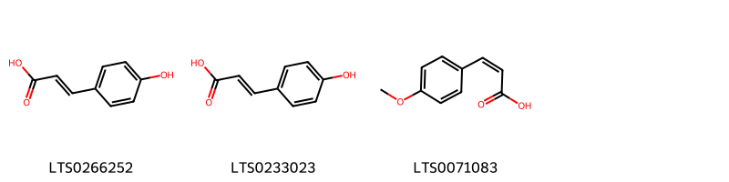{ width=100% }
    <figcaption>Hình ảnh cấu trúc hóa học của 3 hoạt chất thuộc nhóm Cinnamic acids and derivatives gồm ['para-coumaric acid (LTS0266252)', 'hydroxycinnamic acid (LTS0233023)', '(z)-4-methoxycinnamic acid (LTS0071083)'].</figcaption>
</figure>
#### Nhóm Diazines
<figure markdown="span">
    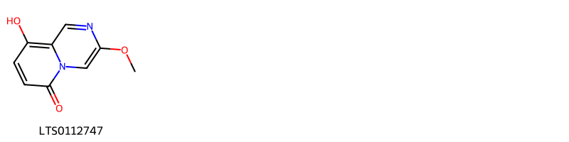{ width=100% }
    <figcaption>Hình ảnh cấu trúc hóa học của 1 hoạt chất thuộc nhóm Diazines gồm ['9-hydroxy-3-methoxypyrido[1,2-a]pyrazin-6-one (LTS0112747)'].</figcaption>
</figure>
#### Nhóm Fatty Acyls
<figure markdown="span">
    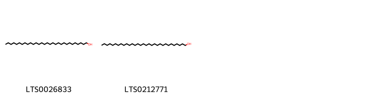{ width=100% }
    <figcaption>Hình ảnh cấu trúc hóa học của 2 hoạt chất thuộc nhóm Fatty Acyls gồm ['triacontanol (LTS0026833)', 'n-hentriacontanol (LTS0212771)'].</figcaption>
</figure>
#### Nhóm Flavonoids
<figure markdown="span">
    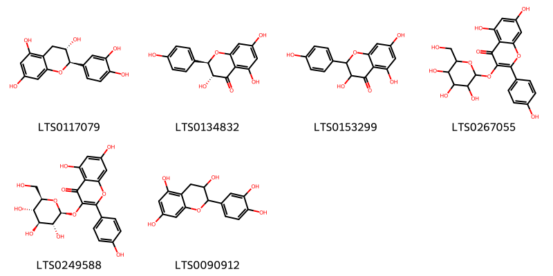{ width=100% }
    <figcaption>Hình ảnh cấu trúc hóa học của 6 hoạt chất thuộc nhóm Flavonoids gồm ['(+)-catechol (LTS0117079)', '(+)-dihydrokaempferol (LTS0134832)', 'aromadendrin (LTS0153299)', 'trifolin (LTS0267055)', 'astragalin (LTS0249588)', 'catechol (LTS0090912)'].</figcaption>
</figure>
#### Nhóm Glycerolipids
<figure markdown="span">
    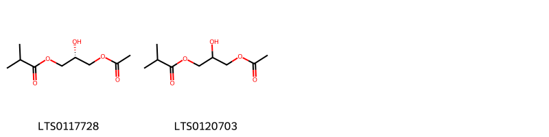{ width=100% }
    <figcaption>Hình ảnh cấu trúc hóa học của 2 hoạt chất thuộc nhóm Glycerolipids gồm ['(2r)-3-(acetyloxy)-2-hydroxypropyl 2-methylpropanoate (LTS0117728)', '3-(acetyloxy)-2-hydroxypropyl 2-methylpropanoate (LTS0120703)'].</figcaption>
</figure>
#### Nhóm Lactones
<figure markdown="span">
    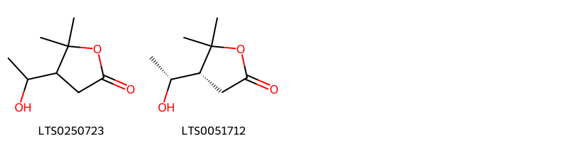{ width=100% }
    <figcaption>Hình ảnh cấu trúc hóa học của 2 hoạt chất thuộc nhóm Lactones gồm ['4-(1-hydroxyethyl)-5,5-dimethyloxolan-2-one (LTS0250723)', '(4r)-4-[(1r)-1-hydroxyethyl]-5,5-dimethyloxolan-2-one (LTS0051712)'].</figcaption>
</figure>
#### Nhóm Naphthopyrans
<figure markdown="span">
    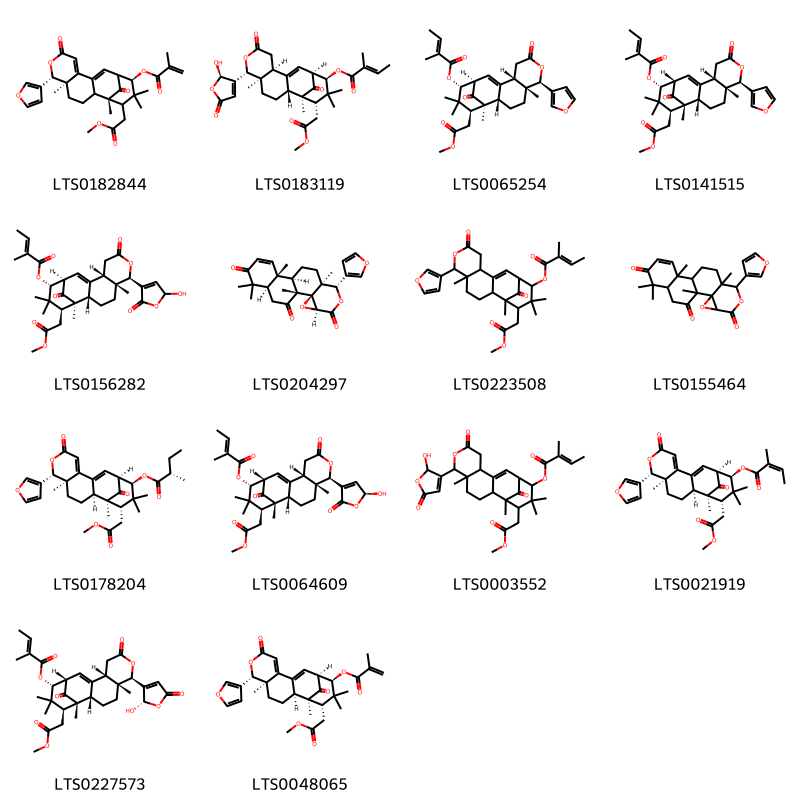{ width=100% }
    <figcaption>Hình ảnh cấu trúc hóa học của 14 hoạt chất thuộc nhóm Naphthopyrans gồm ['(1s,5r,6r,14r)-6-(furan-3-yl)-16-(2-methoxy-2-oxoethyl)-1,5,15,15-tetramethyl-8,17-dioxo-7-oxatetracyclo[11.3.1.0²,¹¹.0⁵,¹⁰]heptadeca-9,11-dien-14-yl 2-methylprop-2-enoate (LTS0182844)', '(1r,2r,5r,6r,10s,13s,14r,16s)-6-[(2r)-2-hydroxy-5-oxo-2h-furan-3-yl]-16-(2-methoxy-2-oxoethyl)-1,5,15,15-tetramethyl-8,17-dioxo-7-oxatetracyclo[11.3.1.0²,¹¹.0⁵,¹⁰]heptadec-11-en-14-yl (2e)-2-methylbut-2-enoate (LTS0183119)', '(1s,2s,5r,6r,10s,13r,14r,16s)-6-(furan-3-yl)-16-(2-methoxy-2-oxoethyl)-1,5,15,15-tetramethyl-8,17-dioxo-7-oxatetracyclo[11.3.1.0²,¹¹.0⁵,¹⁰]heptadec-11-en-14-yl (2e)-2-methylbut-2-enoate (LTS0065254)', '(1r,2s,5r,6r,10s,13s,14r,16s)-6-(furan-3-yl)-16-(2-methoxy-2-oxoethyl)-1,5,15,15-tetramethyl-8,17-dioxo-7-oxatetracyclo[11.3.1.0²,¹¹.0⁵,¹⁰]heptadec-11-en-14-yl (2e)-2-methylbut-2-enoate (LTS0141515)', '(1s,2s,5r,6r,10s,13r,14r,16s)-6-(5-hydroxy-2-oxo-5h-furan-3-yl)-16-(2-methoxy-2-oxoethyl)-1,5,15,15-tetramethyl-8,17-dioxo-7-oxatetracyclo[11.3.1.0²,¹¹.0⁵,¹⁰]heptadec-11-en-14-yl (2e)-2-methylbut-2-enoate (LTS0156282)', '(1r,2r,4s,7s,8s,11r,12s,17r)-7-(furan-3-yl)-1,8,12,16,16-pentamethyl-3,6-dioxapentacyclo[9.8.0.0²,⁴.0²,⁸.0¹²,¹⁷]nonadec-13-ene-5,15,19-trione (LTS0204297)', '6-(furan-3-yl)-16-(2-methoxy-2-oxoethyl)-1,5,15,15-tetramethyl-8,17-dioxo-7-oxatetracyclo[11.3.1.0²,¹¹.0⁵,¹⁰]heptadec-11-en-14-yl 2-methylbut-2-enoate (LTS0223508)', '7-(furan-3-yl)-1,8,12,16,16-pentamethyl-3,6-dioxapentacyclo[9.8.0.0²,⁴.0²,⁸.0¹²,¹⁷]nonadec-13-ene-5,15,19-trione (LTS0155464)', '(1r,2s,5r,6r,13s,14r,16s)-6-(furan-3-yl)-16-(2-methoxy-2-oxoethyl)-1,5,15,15-tetramethyl-8,17-dioxo-7-oxatetracyclo[11.3.1.0²,¹¹.0⁵,¹⁰]heptadeca-9,11-dien-14-yl (2s)-2-methylbutanoate (LTS0178204)', '(1r,2s,5r,6r,10s,13s,14r,16s)-6-[(5s)-5-hydroxy-2-oxo-5h-furan-3-yl]-16-(2-methoxy-2-oxoethyl)-1,5,15,15-tetramethyl-8,17-dioxo-7-oxatetracyclo[11.3.1.0²,¹¹.0⁵,¹⁰]heptadec-11-en-14-yl (2e)-2-methylbut-2-enoate (LTS0064609)', '6-(2-hydroxy-5-oxo-2h-furan-3-yl)-16-(2-methoxy-2-oxoethyl)-1,5,15,15-tetramethyl-8,17-dioxo-7-oxatetracyclo[11.3.1.0²,¹¹.0⁵,¹⁰]heptadec-11-en-14-yl 2-methylbut-2-enoate (LTS0003552)', '(1r,2s,5r,6r,13s,14r,16s)-6-(furan-3-yl)-16-(2-methoxy-2-oxoethyl)-1,5,15,15-tetramethyl-8,17-dioxo-7-oxatetracyclo[11.3.1.0²,¹¹.0⁵,¹⁰]heptadeca-9,11-dien-14-yl (2z)-2-methylbut-2-enoate (LTS0021919)', '(1r,2s,5r,6r,10s,13s,14r,16s)-6-[(2s)-2-hydroxy-5-oxo-2h-furan-3-yl]-16-(2-methoxy-2-oxoethyl)-1,5,15,15-tetramethyl-8,17-dioxo-7-oxatetracyclo[11.3.1.0²,¹¹.0⁵,¹⁰]heptadec-11-en-14-yl (2e)-2-methylbut-2-enoate (LTS0227573)', '(1r,2s,5r,6r,13s,14r,16s)-6-(furan-3-yl)-16-(2-methoxy-2-oxoethyl)-1,5,15,15-tetramethyl-8,17-dioxo-7-oxatetracyclo[11.3.1.0²,¹¹.0⁵,¹⁰]heptadeca-9,11-dien-14-yl 2-methylprop-2-enoate (LTS0048065)'].</figcaption>
</figure>
#### Nhóm Organooxygen compounds
<figure markdown="span">
    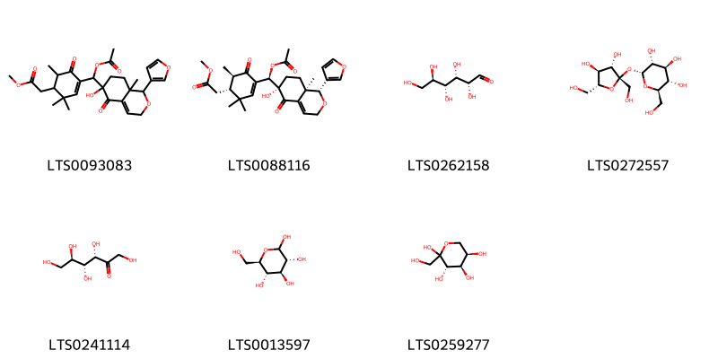{ width=100% }
    <figcaption>Hình ảnh cấu trúc hóa học của 7 hoạt chất thuộc nhóm Organooxygen compounds gồm ['[1-(furan-3-yl)-6-hydroxy-8a-methyl-5-oxo-1,3,7,8-tetrahydroisochromen-6-yl][4-(2-methoxy-2-oxoethyl)-3,3,5-trimethyl-6-oxocyclohex-1-en-1-yl]methyl acetate (LTS0093083)', '(r)-[(1r,6s,8ar)-1-(furan-3-yl)-6-hydroxy-8a-methyl-5-oxo-1,3,7,8-tetrahydroisochromen-6-yl][(4r,5r)-4-(2-methoxy-2-oxoethyl)-3,3,5-trimethyl-6-oxocyclohex-1-en-1-yl]methyl acetate (LTS0088116)', '(+)-glucose (LTS0262158)', 'sucrose (LTS0272557)', 'keto-d-fructose (LTS0241114)', 'glucose (LTS0013597)', 'd-fructopyranose (LTS0259277)'].</figcaption>
</figure>
#### Nhóm Prenol lipids
<figure markdown="span">
    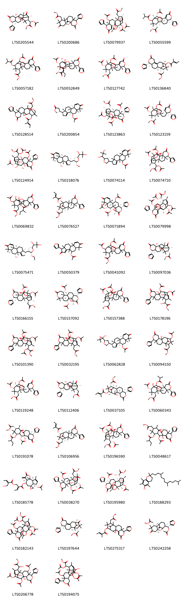{ width=100% }
    <figcaption>Hình ảnh cấu trúc hóa học của 177 hoạt chất thuộc nhóm Prenol lipids gồm ['methyl (2r)-2-(acetyloxy)-2-[(1s,2r,5s,6s,10s,11s,13s,14r,16s)-6-(furan-3-yl)-10-hydroxy-1,5,15,15-tetramethyl-8,17-dioxo-7,18-dioxapentacyclo[11.3.1.1¹¹,¹⁴.0²,¹¹.0⁵,¹⁰]octadecan-16-yl]acetate (LTS0205544)', 'methyl 2-[13-(furan-3-yl)-6,6,8,12-tetramethyl-17-methylidene-5,15-dioxo-2,14-dioxatetracyclo[7.7.1.0¹,¹².0³,⁸]heptadecan-7-yl]acetate (LTS0200686)', 'methyl 2-[(1s,3s,4s,5s,10r,12s,14s,15s,16r,18r,19s,20r,22s)-3,15,22-tris(acetyloxy)-5-(furan-3-yl)-16-hydroxy-4,12,18,20-tetramethyl-7-oxo-6,11,13,21-tetraoxaheptacyclo[10.8.1.1¹⁵,¹⁸.0¹,¹⁰.0⁴,⁹.0¹⁰,¹⁴.0¹⁶,²⁰]docos-8-en-19-yl]acetate (LTS0079937)', '(1s,6s,7s,10s,11r,12r,14s,15s,16r,18s)-18-(acetyloxy)-6-(furan-3-yl)-16-hydroxy-12-(2-methoxy-2-oxoethyl)-7,11,13,13-tetramethyl-4-oxo-5,17-dioxapentacyclo[13.2.1.0¹,¹⁰.0²,⁷.0¹¹,¹⁶]octadec-2-en-14-yl 2-methylpropanoate (LTS0055599)', '18-(acetyloxy)-6-(furan-3-yl)-16-hydroxy-12-(2-methoxy-2-oxoethyl)-7,11,13,13-tetramethyl-4-oxo-5,17-dioxapentacyclo[13.2.1.0¹,¹⁰.0²,⁷.0¹¹,¹⁶]octadec-2-en-14-yl 2-methylpropanoate (LTS0057182)', '(1s,2r,6r,7r,10r,11s,12s,14s,15s,16r,18r)-14-(acetyloxy)-6-(furan-3-yl)-15,16-dihydroxy-12-(2-methoxy-2-oxoethyl)-7,11,13,13-tetramethyl-4-oxo-5,17-dioxapentacyclo[13.2.1.0¹,¹⁰.0²,⁷.0¹¹,¹⁶]octadecan-18-yl (2r)-2-methylbutanoate (LTS0052849)', 'methyl 2-[(6r,7r,10r,11s,12s,14r,15r,18r)-14,18-bis(acetyloxy)-6-(furan-3-yl)-16-hydroxy-7,11,13,13-tetramethyl-4-oxo-5,17-dioxapentacyclo[13.2.1.0¹,¹⁰.0²,⁷.0¹¹,¹⁶]octadec-2-en-12-yl]acetate (LTS0127742)', '(1r,2s,5r,6r,13s,14r,16s)-6-(furan-3-yl)-16-(2-methoxy-2-oxoethyl)-1,5,15,15-tetramethyl-8,17-dioxo-7-oxatetracyclo[11.3.1.0²,¹¹.0⁵,¹⁰]heptadec-10-en-14-yl (2e)-2-methylbut-2-enoate (LTS0136840)', '9-(furan-3-yl)-19-hydroxy-15-(2-methoxy-2-oxoethyl)-10,14,16-trimethyl-7-oxo-3,8,18-trioxahexacyclo[14.3.1.0²,⁴.0⁴,¹³.0⁵,¹⁰.0¹⁴,¹⁹]icosan-20-yl (2e)-2-methylbut-2-enoate (LTS0128514)', '(1s,3br,4r,5ar,9ar,9br,11as)-3b,6,6,9a,11a-pentamethyl-7-oxo-1-[(3r)-5-oxooxolan-3-yl]-1h,2h,4h,5h,5ah,9bh,10h,11h-cyclopenta[a]phenanthren-4-yl acetate (LTS0200854)', 'methyl 2-[(1r,2r,4s,5r,6s,10s,11r,12r,13s,14r,15s,17r,18s)-4,12,14,17-tetrakis(acetyloxy)-6-(furan-3-yl)-11-hydroxy-1,5,15-trimethyl-8-oxo-7-oxapentacyclo[13.2.1.0²,¹¹.0⁵,¹⁰.0¹³,¹⁷]octadecan-18-yl]acetate (LTS0123863)', 'methyl 2-[(1r,6s,7s,10r,11s,12r,14r,15r,16s,18r)-14,18-bis(acetyloxy)-6-(furan-3-yl)-16-hydroxy-7,11,13,13-tetramethyl-4-oxo-5,17-dioxapentacyclo[13.2.1.0¹,¹⁰.0²,⁷.0¹¹,¹⁶]octadec-2-en-12-yl]acetate (LTS0123159)', 'methyl (2s)-2-(acetyloxy)-2-[(1r,2r,4r,5r,6r,11s,12s,13s,14r,15r,17s,18r)-4,14-bis(acetyloxy)-6-(furan-3-yl)-2,11,12,13,17-pentahydroxy-1,5,15-trimethyl-8-oxo-7-oxapentacyclo[13.2.1.0²,¹¹.0⁵,¹⁰.0¹³,¹⁷]octadec-9-en-18-yl]acetate (LTS0124914)', 'protoxylocarpin d (LTS0218076)', '1-[5-(1,2-dihydroxy-2-methylpropyl)oxolan-3-yl]-3b,6,6,9a,11a-pentamethyl-7-oxo-1h,2h,4h,5h,5ah,9bh,10h,11h-cyclopenta[a]phenanthren-4-yl acetate (LTS0074114)', 'methyl (2r)-2-(acetyloxy)-2-[(1s,2r,5r,6r,10r,11s,12r,13r,14r,15s,17s,18s)-12,14,17-tris(acetyloxy)-6-(furan-3-yl)-11-hydroxy-1,5,15-trimethyl-8-oxo-7-oxapentacyclo[13.2.1.0²,¹¹.0⁵,¹⁰.0¹³,¹⁷]octadecan-18-yl]acetate (LTS0074710)', '14-(acetyloxy)-6-(furan-3-yl)-15,16-dihydroxy-12-(2-methoxy-2-oxoethyl)-7,11,13,13-tetramethyl-4-oxo-5,17-dioxapentacyclo[13.2.1.0¹,¹⁰.0²,⁷.0¹¹,¹⁶]octadecan-18-yl 2-methylbutanoate (LTS0069832)', '(1s,2s,5r,6r,10s,11r,13s,14r,16s)-6-(furan-3-yl)-16-(2-methoxy-2-oxoethyl)-1,5,15,15-tetramethyl-8,17-dioxo-7-oxatetracyclo[11.3.1.0²,¹¹.0⁵,¹⁰]heptadecan-14-yl (2e)-2-methylbut-2-enoate (LTS0076527)', '(1s,2r,4s,7s,8s,10s,11r,12r,17s,18r,19s)-18,19-bis(acetyloxy)-7-(furan-3-yl)-1,8,12,16,16-pentamethyl-5,15-dioxo-3,6-dioxapentacyclo[9.8.0.0²,⁴.0²,⁸.0¹²,¹⁷]nonadec-13-en-10-yl acetate (LTS0071894)', 'methyl (2s)-2-(acetyloxy)-2-[(1r,3r,4r,5r,10s,12r,14r,15r,16s,18s,19r,20s,22r)-3,15,22-tris(acetyloxy)-5-(furan-3-yl)-16-hydroxy-4,12,18,20-tetramethyl-7-oxo-6,11,13,21-tetraoxaheptacyclo[10.8.1.1¹⁵,¹⁸.0¹,¹⁰.0⁴,⁹.0¹⁰,¹⁴.0¹⁶,²⁰]docos-8-en-19-yl]acetate (LTS0079998)', 'protoxylocarpin b (LTS0075471)', '1-(furan-3-yl)-3b,6,6,9a,11a-pentamethyl-2,7-dioxo-1h,4h,5h,5ah,9bh,10h,11h-cyclopenta[a]phenanthren-4-yl acetate (LTS0050379)', 'methyl 2-[14,18-bis(acetyloxy)-6-(furan-3-yl)-16-hydroxy-7,11,13,13-tetramethyl-4-oxo-5,17-dioxapentacyclo[13.2.1.0¹,¹⁰.0²,⁷.0¹¹,¹⁶]octadec-2-en-12-yl]acetate (LTS0041092)', 'methyl 2-[(1s,2r,5s,6s,10s,11s,13s,14s,16r)-6-(furan-3-yl)-10-hydroxy-1,5,15,15-tetramethyl-8,17-dioxo-7,18-dioxapentacyclo[11.3.1.1¹¹,¹⁴.0²,¹¹.0⁵,¹⁰]octadecan-16-yl]acetate (LTS0097036)', 'methyl 2-[(1r,2s,5r,6r,10s,11s,12r,13s,14r,15s,17r,18r)-12,14,17-tris(acetyloxy)-6-(furan-3-yl)-11-hydroxy-1,5,15-trimethyl-8-oxo-7-oxapentacyclo[13.2.1.0²,¹¹.0⁵,¹⁰.0¹³,¹⁷]octadecan-18-yl]acetate (LTS0166155)', '(1s,2r,4s,7s,8s,11r,12r,13s,18r,20r)-13-(acetyloxy)-7-(furan-3-yl)-1,8,12,17,17-pentamethyl-5,15-dioxo-3,6,16-trioxapentacyclo[9.9.0.0²,⁴.0²,⁸.0¹²,¹⁸]icosan-20-yl acetate (LTS0157092)', 'methyl 2-[(1s,2r,5r,6r,10r,11s,12r,13r,14r,17s,18s)-12,14,17-tris(acetyloxy)-6-(furan-3-yl)-11-hydroxy-1,5,15-trimethyl-8-oxo-7-oxapentacyclo[13.2.1.0²,¹¹.0⁵,¹⁰.0¹³,¹⁷]octadecan-18-yl]acetate (LTS0157388)', 'methyl 2-[12,14-bis(acetyloxy)-6-(furan-3-yl)-11,17-dihydroxy-1,5,15-trimethyl-8-oxo-7-oxapentacyclo[13.2.1.0²,¹¹.0⁵,¹⁰.0¹³,¹⁷]octadecan-18-yl]-2-hydroxyacetate (LTS0178196)', 'methyl 2-(acetyloxy)-2-[12,14,17-tris(acetyloxy)-6-(furan-3-yl)-11-hydroxy-1,5,15-trimethyl-8-oxo-7-oxapentacyclo[13.2.1.0²,¹¹.0⁵,¹⁰.0¹³,¹⁷]octadecan-18-yl]acetate (LTS0101390)', 'methyl 2-[12,14,17-tris(acetyloxy)-6-(furan-3-yl)-11-hydroxy-1,5,15-trimethyl-8-oxo-7-oxapentacyclo[13.2.1.0²,¹¹.0⁵,¹⁰.0¹³,¹⁷]octadecan-18-yl]acetate (LTS0032195)', '(1s,3br,4r,5ar,9ar,9br,11as)-1-[(3s,5r)-5-[(2r)-2-hydroxy-3,3-dimethyloxiran-2-yl]oxolan-3-yl]-3b,6,6,9a,11a-pentamethyl-7-oxo-1h,2h,4h,5h,5ah,9bh,10h,11h-cyclopenta[a]phenanthren-4-yl acetate (LTS0062828)', 'methyl 2-[14-(acetyloxy)-6-(furan-3-yl)-11-hydroxy-1,5,15,15-tetramethyl-8,17-dioxo-7-oxatetracyclo[11.3.1.0²,¹¹.0⁵,¹⁰]heptadecan-16-yl]acetate (LTS0094150)', 'methyl 2-[(1r,6r,7r,10r,11s,12s,14r,15s,16s,18r)-14,18-bis(acetyloxy)-6-(furan-3-yl)-16-hydroxy-7,11,13,13-tetramethyl-4-oxo-5,17-dioxapentacyclo[13.2.1.0¹,¹⁰.0²,⁷.0¹¹,¹⁶]octadec-2-en-12-yl]acetate (LTS0119248)', 'methyl 2-[(1s,2r,5s,6s,10s,11s,13s,14r,16s)-6-(furan-3-yl)-10-hydroxy-1,5,15,15-tetramethyl-8,17-dioxo-7,18-dioxapentacyclo[11.3.1.1¹¹,¹⁴.0²,¹¹.0⁵,¹⁰]octadecan-16-yl]acetate (LTS0112406)', '(1r,2r,4s,5r,9r,10r,13r,14s,15s,17r)-9-(furan-3-yl)-15-(2-methoxy-2-oxoethyl)-10,14,16,16-tetramethyl-7,18-dioxo-3,8-dioxapentacyclo[12.3.1.0²,⁴.0⁴,¹³.0⁵,¹⁰]octadecan-17-yl (2e)-2-methylbut-2-enoate (LTS0037105)', '(1s,2r,6r,7r,10r,11s,12s,14s,15s,16r,18r)-14-(acetyloxy)-6-(furan-3-yl)-15,16-dihydroxy-12-(2-methoxy-2-oxoethyl)-7,11,13,13-tetramethyl-4-oxo-5,17-dioxapentacyclo[13.2.1.0¹,¹⁰.0²,⁷.0¹¹,¹⁶]octadecan-18-yl 2-methylpropanoate (LTS0060343)', '(1r,3r,4r)-6-[(r)-[(1r,5r,8ar)-1-(furan-3-yl)-5-hydroxy-8a-methyl-3,6-dioxo-7,8-dihydro-1h-isochromen-5-yl](acetyloxy)methyl]-3-(2-methoxy-2-oxoethyl)-2,2,4-trimethyl-5-oxocyclohexyl 2-methylbutanoate (LTS0191078)', '(1s,2s,5r,6r,10s,11r,14r,16s)-6-(furan-3-yl)-16-(2-methoxy-2-oxoethyl)-1,5,15,15-tetramethyl-8,17-dioxo-7-oxatetracyclo[11.3.1.0²,¹¹.0⁵,¹⁰]heptadecan-14-yl (2e)-2-methylbut-2-enoate (LTS0106956)', 'methyl (2s)-2-(acetyloxy)-2-[(1s,2r,5r,6r,10r,11s,12r,13r,14r,17s,18s)-12,14,17-tris(acetyloxy)-6-(furan-3-yl)-11-hydroxy-1,5,15-trimethyl-8-oxo-7-oxapentacyclo[13.2.1.0²,¹¹.0⁵,¹⁰.0¹³,¹⁷]octadecan-18-yl]acetate (LTS0196590)', '6-[(acetyloxy)[1-(furan-3-yl)-5-hydroxy-8a-methyl-3,6-dioxo-7,8-dihydro-1h-isochromen-5-yl]methyl]-3-(2-methoxy-2-oxoethyl)-2,2,4-trimethyl-5-oxocyclohexyl 2-methylbutanoate (LTS0048617)', "(2e)-3-[(3ar,4r,6r,6as,7s,9ar,9br)-7-(acetyloxy)-9-methyl-3-methylidene-2-oxo-4,5,6a,7,9a,9b-hexahydro-3ah-spiro[azuleno[4,5-b]furan-6,2'-oxiran]-4-yloxy]-2-ethylidene-3-oxopropyl (2e)-2-(hydroxymethyl)but-2-enoate (LTS0185778)", 'methyl 2-[(1s,2r,4s,5s,6s,10r,11s,12r,13s,14r,15r,17s,18s)-4,12,14,17-tetrakis(acetyloxy)-6-(furan-3-yl)-11-hydroxy-1,5,15-trimethyl-8-oxo-7-oxapentacyclo[13.2.1.0²,¹¹.0⁵,¹⁰.0¹³,¹⁷]octadecan-18-yl]acetate (LTS0038270)', 'methyl (2s)-2-[(1r,3r,4r,5r,10s,12r,14s,15s,16r,18s,19r,20s,22s)-3,22-bis(acetyloxy)-5-(furan-3-yl)-16-hydroxy-4,12,18,20-tetramethyl-7-oxo-6,11,13,21-tetraoxaheptacyclo[10.8.1.1¹⁵,¹⁸.0¹,¹⁰.0⁴,⁹.0¹⁰,¹⁴.0¹⁶,²⁰]docos-8-en-19-yl]-2-hydroxyacetate (LTS0195980)', 'vita e (LTS0188293)', 'methyl 2-(acetyloxy)-2-[3,15,22-tris(acetyloxy)-5-(furan-3-yl)-16-hydroxy-4,12,18,20-tetramethyl-7-oxo-6,11,13,21-tetraoxaheptacyclo[10.8.1.1¹⁵,¹⁸.0¹,¹⁰.0⁴,⁹.0¹⁰,¹⁴.0¹⁶,²⁰]docos-8-en-19-yl]acetate (LTS0182143)', 'methyl 2-[(2s,5r,6r,13s,16s)-6-(furan-3-yl)-1,5,15,15-tetramethyl-8,14,17-trioxo-7-oxatetracyclo[11.3.1.0²,¹¹.0⁵,¹⁰]heptadec-10-en-16-yl]acetate (LTS0197644)', '9-(furan-3-yl)-15-(2-methoxy-2-oxoethyl)-10,14,16,16-tetramethyl-7,18-dioxo-3,8-dioxapentacyclo[12.3.1.0²,⁴.0⁴,¹³.0⁵,¹⁰]octadec-5-en-17-yl 2-methylbut-2-enoate (LTS0275317)', 'methyl 2-[(1s,3s,7r,8r,9r,12s,13s)-13-(furan-3-yl)-6,6,8,12-tetramethyl-17-methylidene-5,15-dioxo-2,14-dioxatetracyclo[7.7.1.0¹,¹².0³,⁸]heptadecan-7-yl]acetate (LTS0242258)', 'methyl 2-hydroxy-2-[4,12,14-tris(acetyloxy)-6-(furan-3-yl)-11,17-dihydroxy-1,5,15-trimethyl-8-oxo-7-oxapentacyclo[13.2.1.0²,¹¹.0⁵,¹⁰.0¹³,¹⁷]octadecan-18-yl]acetate (LTS0206778)', 'methyl 2-(acetyloxy)-2-[8,19,20-tris(acetyloxy)-6-(furan-3-yl)-18-hydroxy-7,12,15,17-tetramethyl-4-oxo-5,11,13,21-tetraoxaheptacyclo[10.8.1.1¹⁴,¹⁷.0¹,¹⁰.0²,⁷.0¹⁰,¹⁵.0¹⁴,¹⁹]docosan-16-yl]acetate (LTS0194075)', 'methyl 2-[(1s,2r,5s,6s,10s,11s,13r,14r,16s)-6-(furan-3-yl)-10-hydroxy-1,5,15,15-tetramethyl-8,17-dioxo-7,18-dioxapentacyclo[11.3.1.1¹¹,¹⁴.0²,¹¹.0⁵,¹⁰]octadecan-16-yl]acetate (LTS0107661)', 'methyl 2-[6-(furan-3-yl)-10-hydroxy-1,5,15,15-tetramethyl-8,17-dioxo-7,18-dioxapentacyclo[11.3.1.1¹¹,¹⁴.0²,¹¹.0⁵,¹⁰]octadecan-16-yl]acetate (LTS0132529)', '14-(acetyloxy)-6-(furan-3-yl)-16-hydroxy-12-(2-methoxy-2-oxoethyl)-7,11,13,13-tetramethyl-4-oxo-5,17-dioxapentacyclo[13.2.1.0¹,¹⁰.0²,⁷.0¹¹,¹⁶]octadec-2-en-18-yl 2-methylbut-2-enoate (LTS0148259)', '4-(acetyloxy)-1-[5-(1,2-dihydroxy-2-methylpropyl)-2-methoxyoxolan-3-yl]-3b,6,6,9a,11a-pentamethyl-7-oxo-1h,2h,4h,5h,5ah,9bh,10h,11h-cyclopenta[a]phenanthren-10-yl acetate (LTS0162775)', 'methyl (2s)-2-hydroxy-2-[(1s,2r,4s,5s,6s,10r,11s,12r,13s,14r,15r,17s,18s)-4,12,14,17-tetrakis(acetyloxy)-6-(furan-3-yl)-11-hydroxy-1,5,15-trimethyl-8-oxo-7-oxapentacyclo[13.2.1.0²,¹¹.0⁵,¹⁰.0¹³,¹⁷]octadecan-18-yl]acetate (LTS0148739)', '(1r,2s,5s,6s,11s,13r,14s,16r)-6-(furan-3-yl)-11-hydroxy-16-(2-methoxy-2-oxoethyl)-1,5,15,15-tetramethyl-8,17-dioxo-7-oxatetracyclo[11.3.1.0²,¹¹.0⁵,¹⁰]heptadec-9-en-14-yl (2e)-2-methylbut-2-enoate (LTS0153475)', 'methyl 2-(acetyloxy)-2-[4,14-bis(acetyloxy)-6-(furan-3-yl)-2,11,12,17-tetrahydroxy-1,5,15-trimethyl-8-oxo-7-oxapentacyclo[13.2.1.0²,¹¹.0⁵,¹⁰.0¹³,¹⁷]octadec-9-en-18-yl]acetate (LTS0159322)', 'methyl 2-[(1s,2r,4s,5r,9r,10r,13s,15r,17r)-17-(acetyloxy)-9-(furan-3-yl)-10,14,16,16-tetramethyl-7,18-dioxo-3,8-dioxapentacyclo[12.3.1.0²,⁴.0⁴,¹³.0⁵,¹⁰]octadecan-15-yl]acetate (LTS0149362)', 'methyl 2-[12-(acetyloxy)-6-(furan-3-yl)-10-hydroxy-1,5,15,15-tetramethyl-8,17-dioxo-7,18-dioxapentacyclo[11.3.1.1¹¹,¹⁴.0²,¹¹.0⁵,¹⁰]octadecan-16-yl]acetate (LTS0152249)', 'methyl 2-[6-(furan-3-yl)-11,14-dihydroxy-1,5,15,15-tetramethyl-8,17-dioxo-7-oxatetracyclo[11.3.1.0²,¹¹.0⁵,¹⁰]heptadec-9-en-16-yl]acetate (LTS0151463)', 'methyl (2s)-2-hydroxy-2-[(1s,2r,4s,5s,6s,10r,11s,12r,13r,14r,17s,18s)-4,12,14,17-tetrakis(acetyloxy)-6-(furan-3-yl)-11-hydroxy-1,5,15-trimethyl-8-oxo-7-oxapentacyclo[13.2.1.0²,¹¹.0⁵,¹⁰.0¹³,¹⁷]octadecan-18-yl]acetate (LTS0172598)', 'methyl 2-[(1r,3r,4r,5r,10s,14s,15r,18s,19r,20r,22s)-3,22-bis(acetyloxy)-5-(furan-3-yl)-15,16-dihydroxy-4,12,18,20-tetramethyl-7-oxo-6,11,13,21-tetraoxaheptacyclo[10.8.1.1¹⁵,¹⁸.0¹,¹⁰.0⁴,⁹.0¹⁰,¹⁴.0¹⁶,²⁰]docos-8-en-19-yl]acetate (LTS0240140)', 'methyl (2s)-2-(acetyloxy)-2-[(1r,3r,4r,5r,10s,12r,14s,15s,16r,18s,19r,20s,22s)-3,22-bis(acetyloxy)-5-(furan-3-yl)-16-hydroxy-4,12,18,20-tetramethyl-7-oxo-6,11,13,21-tetraoxaheptacyclo[10.8.1.1¹⁵,¹⁸.0¹,¹⁰.0⁴,⁹.0¹⁰,¹⁴.0¹⁶,²⁰]docos-8-en-19-yl]acetate (LTS0254529)', '6-(furan-3-yl)-11,18-dihydroxy-19-(2-methoxy-2-oxoethyl)-1,5,15-trimethyl-8-oxo-7,17-dioxapentacyclo[13.3.1.0²,¹¹.0⁵,¹⁰.0¹³,¹⁸]nonadec-9-en-14-yl 2-methylbut-2-enoate (LTS0113340)', '(1r,2s,5r,6r,10s,11s,13s,14r,16s)-6-(furan-3-yl)-16-(2-methoxy-2-oxoethyl)-1,5,15,15-tetramethyl-8,17-dioxo-7-oxatetracyclo[11.3.1.0²,¹¹.0⁵,¹⁰]heptadecan-14-yl (2e)-2-methylbut-2-enoate (LTS0116132)', 'methyl (2s)-2-hydroxy-2-[(1r,2s,4r,5s,6s,10r,11r,12r,13r,14s,15r,17s,18s)-4,12,14-tris(acetyloxy)-6-(furan-3-yl)-11,17-dihydroxy-1,5,15-trimethyl-8-oxo-7-oxapentacyclo[13.2.1.0²,¹¹.0⁵,¹⁰.0¹³,¹⁷]octadecan-18-yl]acetate (LTS0211622)', 'methyl 2-(acetyloxy)-2-[12,14,17-tris(acetyloxy)-6-(furan-3-yl)-4,11-dihydroxy-1,5,15-trimethyl-8-oxo-7-oxapentacyclo[13.2.1.0²,¹¹.0⁵,¹⁰.0¹³,¹⁷]octadecan-18-yl]acetate (LTS0108383)', 'methyl 2-[(1s,2r,4s,5s,6s,10r,11s,12r,13r,14r,15r,17s,18s)-11,12,14,17-tetrakis(acetyloxy)-6-(furan-3-yl)-4-hydroxy-1,5,15-trimethyl-8-oxo-7-oxapentacyclo[13.2.1.0²,¹¹.0⁵,¹⁰.0¹³,¹⁷]octadecan-18-yl]acetate (LTS0158370)', 'protoxylocarpin a (LTS0099857)', '(1s,2s,5s,6s,11s,13r,14s,15r,18s,19r)-6-(furan-3-yl)-11,18-dihydroxy-19-(2-methoxy-2-oxoethyl)-1,5,15-trimethyl-8-oxo-7,17-dioxapentacyclo[13.3.1.0²,¹¹.0⁵,¹⁰.0¹³,¹⁸]nonadec-9-en-14-yl (2e)-2-methylbut-2-enoate (LTS0156274)', 'methyl 2-(acetyloxy)-2-[8,18,20-tris(acetyloxy)-6-(furan-3-yl)-7,12,15,17-tetramethyl-4-oxo-5,11,13,21-tetraoxaheptacyclo[10.8.1.1¹⁴,¹⁷.0¹,¹⁰.0²,⁷.0¹⁰,¹⁵.0¹⁴,¹⁹]docosan-16-yl]acetate (LTS0169992)', 'methyl 2-[(1s,2r,5r,6r,10r,11s,12r,13s,14r,15r,17s,18s)-12,14,17-tris(acetyloxy)-6-(furan-3-yl)-11-hydroxy-1,5,15-trimethyl-8-oxo-7-oxapentacyclo[13.2.1.0²,¹¹.0⁵,¹⁰.0¹³,¹⁷]octadecan-18-yl]acetate (LTS0127538)', '(1r,6s,7s,10s,11s,12r,14r,15r,16s,18s)-14-(acetyloxy)-6-(furan-3-yl)-16-hydroxy-12-(2-methoxy-2-oxoethyl)-7,11,13,13-tetramethyl-4-oxo-5,17-dioxapentacyclo[13.2.1.0¹,¹⁰.0²,⁷.0¹¹,¹⁶]octadec-2-en-18-yl (2z)-2-methylbut-2-enoate (LTS0119768)', 'methyl 2-[4,12,14,17-tetrakis(acetyloxy)-6-(furan-3-yl)-11-hydroxy-1,5,15-trimethyl-8-oxo-7-oxapentacyclo[13.2.1.0²,¹¹.0⁵,¹⁰.0¹³,¹⁷]octadecan-18-yl]acetate (LTS0114120)', '18-(acetyloxy)-6-(furan-3-yl)-16-hydroxy-12-(2-methoxy-2-oxoethyl)-7,11,13,13-tetramethyl-4-oxo-5,17-dioxapentacyclo[13.2.1.0¹,¹⁰.0²,⁷.0¹¹,¹⁶]octadec-2-en-14-yl 2-methylbut-2-enoate (LTS0183082)', 'phaseic acid (LTS0185710)', '1-[5-(2-hydroxy-3,3-dimethyloxiran-2-yl)oxolan-3-yl]-3b,6,6,9a,11a-pentamethyl-7-oxo-1h,2h,4h,5h,5ah,9bh,10h,11h-cyclopenta[a]phenanthren-4-yl acetate (LTS0168408)', 'methyl 2-[(1r,2r,4r,5r,6r,10s,11s,12r,13s,14r,15s,17r,18r)-4,12,14-tris(acetyloxy)-6-(furan-3-yl)-11,17-dihydroxy-1,5,15-trimethyl-8-oxo-7-oxapentacyclo[13.2.1.0²,¹¹.0⁵,¹⁰.0¹³,¹⁷]octadecan-18-yl]acetate (LTS0268519)', 'methyl 2-hydroxy-2-[4,12,14,17-tetrakis(acetyloxy)-6-(furan-3-yl)-11-hydroxy-1,5,15-trimethyl-8-oxo-7-oxapentacyclo[13.2.1.0²,¹¹.0⁵,¹⁰.0¹³,¹⁷]octadecan-18-yl]acetate (LTS0115422)', '6-(furan-3-yl)-11,12-dihydroxy-16-(2-methoxy-2-oxoethyl)-1,5,15,15-tetramethyl-8,17-dioxo-7-oxatetracyclo[11.3.1.0²,¹¹.0⁵,¹⁰]heptadec-9-en-14-yl 2-methylbut-2-enoate (LTS0190069)', '(1r,3r,4r,6r)-6-[(r)-[(1r,5r,8ar)-1-(furan-3-yl)-5-hydroxy-8a-methyl-3,6-dioxo-7,8-dihydro-1h-isochromen-5-yl](acetyloxy)methyl]-3-(2-methoxy-2-oxoethyl)-2,2,4-trimethyl-5-oxocyclohexyl (2r)-2-methylbutanoate (LTS0161577)', 'methyl (2r)-2-(acetyloxy)-2-[(1r,2s,4s,5s,6s,11r,12s,13s,14r,15r,17s,18s)-4,14-bis(acetyloxy)-6-(furan-3-yl)-2,11,12,17-tetrahydroxy-1,5,15-trimethyl-8-oxo-7-oxapentacyclo[13.2.1.0²,¹¹.0⁵,¹⁰.0¹³,¹⁷]octadec-9-en-18-yl]acetate (LTS0249103)', 'methyl 2-(acetyloxy)-2-[4,12,14,17-tetrakis(acetyloxy)-6-(furan-3-yl)-2,11-dihydroxy-1,5,15-trimethyl-8-oxo-7-oxapentacyclo[13.2.1.0²,¹¹.0⁵,¹⁰.0¹³,¹⁷]octadecan-18-yl]acetate (LTS0127502)', '5-{8-hydroxy-1,5-dimethyl-3-oxo-6-oxabicyclo[3.2.1]octan-8-yl}-3-methylpenta-2,4-dienoic acid (LTS0104572)', 'methyl 2-[(1s,5r,6r,13s,14r,16s)-14-(acetyloxy)-6-(furan-3-yl)-1,5,15,15-tetramethyl-8,17-dioxo-7-oxatetracyclo[11.3.1.0²,¹¹.0⁵,¹⁰]heptadeca-2(11),9-dien-16-yl]acetate (LTS0173964)', '(2r,3r,5r)-3-[(1r,3br,4s,5as,9ar,9br,11ar)-4-hydroxy-3b,6,6,9a,11a-pentamethyl-7-oxo-1h,2h,4h,5h,5ah,8h,9h,9bh,10h,11h-cyclopenta[a]phenanthren-1-yl]-5-[(2s)-3,3-dimethyloxiran-2-yl]oxolan-2-yl acetate (LTS0178033)', '1-[5-(1,2-dihydroxy-2-methylpropyl)-2-methoxyoxolan-3-yl]-4-hydroxy-3b,6,6,9a,11a-pentamethyl-1h,2h,4h,5h,5ah,9bh,10h,11h-cyclopenta[a]phenanthren-7-one (LTS0265215)', 'methyl (2s)-2-[(1r,2r,5s,6r,10s,11s,12s,13s,14r,15s,17s,18r)-12,14-bis(acetyloxy)-6-(furan-3-yl)-11,17-dihydroxy-1,5,15-trimethyl-8-oxo-7-oxapentacyclo[13.2.1.0²,¹¹.0⁵,¹⁰.0¹³,¹⁷]octadecan-18-yl]-2-hydroxyacetate (LTS0274531)', 'methyl 2-[(1s,2r,5r,6r,10r,11s,13s,14r,16s)-14-(acetyloxy)-6-(furan-3-yl)-11-hydroxy-1,5,15,15-tetramethyl-8,17-dioxo-7-oxatetracyclo[11.3.1.0²,¹¹.0⁵,¹⁰]heptadecan-16-yl]acetate (LTS0044555)', 'methyl 2-[(1r,2r,4s,5r,9r,10r,13r,14s,15s,17r)-17-(acetyloxy)-9-(furan-3-yl)-10,14,16,16-tetramethyl-7,18-dioxo-3,8-dioxapentacyclo[12.3.1.0²,⁴.0⁴,¹³.0⁵,¹⁰]octadecan-15-yl]acetate (LTS0244988)', 'methyl 2-[14-(acetyloxy)-6-(furan-3-yl)-1,5,15,15-tetramethyl-8,17-dioxo-7-oxatetracyclo[11.3.1.0²,¹¹.0⁵,¹⁰]heptadeca-2(11),9-dien-16-yl]acetate (LTS0193208)', 'methyl 2-[(1s,2r,5r,6r,11r,13s,14r,16s)-6-(furan-3-yl)-11,14-dihydroxy-1,5,15,15-tetramethyl-8,17-dioxo-7-oxatetracyclo[11.3.1.0²,¹¹.0⁵,¹⁰]heptadec-9-en-16-yl]acetate (LTS0046035)', 'methyl 2-[13-(furan-3-yl)-6,6,9,12-tetramethyl-17-methylidene-5,15-dioxo-2,14-dioxatetracyclo[7.7.1.0¹,¹².0³,⁸]heptadecan-7-yl]acetate (LTS0267296)', '(6r,7r,10r,11s,12s,14r,15r,18r)-14-(acetyloxy)-6-(furan-3-yl)-16-hydroxy-12-(2-methoxy-2-oxoethyl)-7,11,13,13-tetramethyl-4-oxo-5,17-dioxapentacyclo[13.2.1.0¹,¹⁰.0²,⁷.0¹¹,¹⁶]octadec-2-en-18-yl (2e)-2-methylbut-2-enoate (LTS0055872)', 'methyl (2s)-2-(acetyloxy)-2-[(1r,3r,4r,5r,10s,12r,14s,15r,16s,18s,19r,20s,22r)-3,22-bis(acetyloxy)-5-(furan-3-yl)-15,16-dihydroxy-4,12,18,20-tetramethyl-7-oxo-6,11,13,21-tetraoxaheptacyclo[10.8.1.1¹⁵,¹⁸.0¹,¹⁰.0⁴,⁹.0¹⁰,¹⁴.0¹⁶,²⁰]docos-8-en-19-yl]acetate (LTS0266533)', '(1r,3r,4r,6r)-6-[(r)-[(1r,5r,8ar)-1-(furan-3-yl)-5-hydroxy-8a-methyl-3,6-dioxo-7,8-dihydro-1h-isochromen-5-yl](acetyloxy)methyl]-3-(2-methoxy-2-oxoethyl)-2,2,4-trimethyl-5-oxocyclohexyl (2e)-2-methylbut-2-enoate (LTS0068402)', '(1r,2r,4s,5s,9s,10s,13r,14s,15s,16s,19r,20r)-9-(furan-3-yl)-5,19-dihydroxy-15-(2-methoxy-2-oxoethyl)-10,14,16-trimethyl-7-oxo-3,8,18-trioxahexacyclo[14.3.1.0²,⁴.0⁴,¹³.0⁵,¹⁰.0¹⁴,¹⁹]icosan-20-yl (2e)-2-methylbut-2-enoate (LTS0099649)', 'vitamin e (LTS0263269)', 'methyl (2s)-2-hydroxy-2-[(1s,2s,4s,5r,6r,10s,11s,12r,13r,14s,15r,17s,18s)-4,12,14,17-tetrakis(acetyloxy)-6-(furan-3-yl)-11-hydroxy-1,5,15-trimethyl-8-oxo-7-oxapentacyclo[13.2.1.0²,¹¹.0⁵,¹⁰.0¹³,¹⁷]octadecan-18-yl]acetate (LTS0037358)', 'methyl (2r)-2-(acetyloxy)-2-[(1r,2s,4s,5s,6s,11r,12s,13s,14r,15s,17s,18s)-4,14-bis(acetyloxy)-6-(furan-3-yl)-2,11,12,17-tetrahydroxy-1,5,15-trimethyl-8-oxo-7-oxapentacyclo[13.2.1.0²,¹¹.0⁵,¹⁰.0¹³,¹⁷]octadec-9-en-18-yl]acetate (LTS0264277)', 'methyl (2s)-2-(acetyloxy)-2-[(1s,2r,5r,6r,11r,13s,14r,16s)-6-(furan-3-yl)-11,14-dihydroxy-1,5,15,15-tetramethyl-8,17-dioxo-7-oxatetracyclo[11.3.1.0²,¹¹.0⁵,¹⁰]heptadec-9-en-16-yl]acetate (LTS0239662)', '18,19-bis(acetyloxy)-7-(furan-3-yl)-1,8,12,16,16-pentamethyl-5,15-dioxo-3,6-dioxapentacyclo[9.8.0.0²,⁴.0²,⁸.0¹²,¹⁷]nonadec-13-en-10-yl acetate (LTS0074773)', 'methyl (2s)-2-(acetyloxy)-2-[(1s,2r,4r,5r,6s,10r,11r,12r,13r,14s,15r,17s,18s)-12,14,17-tris(acetyloxy)-6-(furan-3-yl)-4,11-dihydroxy-1,5,15-trimethyl-8-oxo-7-oxapentacyclo[13.2.1.0²,¹¹.0⁵,¹⁰.0¹³,¹⁷]octadecan-18-yl]acetate (LTS0078663)', 'abscisic acid (LTS0200774)', 'methyl 2-[(1s,2r,4s,5s,6s,10r,11s,12r,13s,14r,15r,17s,18s)-4,12,14-tris(acetyloxy)-6-(furan-3-yl)-11,17-dihydroxy-1,5,15-trimethyl-8-oxo-7-oxapentacyclo[13.2.1.0²,¹¹.0⁵,¹⁰.0¹³,¹⁷]octadecan-18-yl]acetate (LTS0231963)', '(1r,6r,7r,10r,11s,12s,14r,15s,16s,18r)-18-(acetyloxy)-6-(furan-3-yl)-16-hydroxy-12-(2-methoxy-2-oxoethyl)-7,11,13,13-tetramethyl-4-oxo-5,17-dioxapentacyclo[13.2.1.0¹,¹⁰.0²,⁷.0¹¹,¹⁶]octadec-2-en-14-yl (2e)-2-methylbut-2-enoate (LTS0264226)', '(1s,3br,4r,5ar,9ar,9br,11as)-1-[(3s,5r)-5-[(1s)-1,2-dihydroxy-2-methylpropyl]oxolan-3-yl]-3b,6,6,9a,11a-pentamethyl-7-oxo-1h,2h,4h,5h,5ah,9bh,10h,11h-cyclopenta[a]phenanthren-4-yl acetate (LTS0209926)', '6-[(acetyloxy)[1-(furan-3-yl)-5-hydroxy-8a-methyl-3,6-dioxo-7,8-dihydro-1h-isochromen-5-yl]methyl]-3-(2-methoxy-2-oxoethyl)-2,2,4-trimethyl-5-oxocyclohexyl 2-methylbut-2-enoate (LTS0221496)', 'methyl 2-[4,12,14-tris(acetyloxy)-6-(furan-3-yl)-11,17-dihydroxy-1,5,15-trimethyl-8-oxo-7-oxapentacyclo[13.2.1.0²,¹¹.0⁵,¹⁰.0¹³,¹⁷]octadecan-18-yl]acetate (LTS0233429)', '(1s,2r,5r,6r,11r,13r,14r,16s)-6-(furan-3-yl)-11-hydroxy-16-(2-methoxy-2-oxoethyl)-1,5,15,15-tetramethyl-8,17-dioxo-7-oxatetracyclo[11.3.1.0²,¹¹.0⁵,¹⁰]heptadec-9-en-14-yl (2e)-2-methylbut-2-enoate (LTS0239886)', 'protoxylocarpin e (LTS0016072)', 'methyl 2-[6-(furan-3-yl)-1,5,15,15-tetramethyl-8,14,17-trioxo-7-oxatetracyclo[11.3.1.0²,¹¹.0⁵,¹⁰]heptadec-10-en-16-yl]acetate (LTS0228961)', 'methyl 2-[(1r,2s,5r,6r,13s,16s)-6-(furan-3-yl)-1,5,15,15-tetramethyl-8,14,17-trioxo-7-oxatetracyclo[11.3.1.0²,¹¹.0⁵,¹⁰]heptadec-10-en-16-yl]acetate (LTS0045358)', 'proceranolide (LTS0167643)', '(1r,6r,7r,10r,11s,12s,14r,15s,16s,18r)-14-(acetyloxy)-6-(furan-3-yl)-16-hydroxy-12-(2-methoxy-2-oxoethyl)-7,11,13,13-tetramethyl-4-oxo-5,17-dioxapentacyclo[13.2.1.0¹,¹⁰.0²,⁷.0¹¹,¹⁶]octadec-2-en-18-yl (2e)-2-methylbut-2-enoate (LTS0174953)', '13-(acetyloxy)-7-(furan-3-yl)-1,8,12,17,17-pentamethyl-5,15-dioxo-3,6,16-trioxapentacyclo[9.9.0.0²,⁴.0²,⁸.0¹²,¹⁸]icosan-20-yl acetate (LTS0211565)', '6-(furan-3-yl)-16-(2-methoxy-2-oxoethyl)-1,5,15,15-tetramethyl-8,17-dioxo-7-oxatetracyclo[11.3.1.0²,¹¹.0⁵,¹⁰]heptadecan-14-yl 2-methylbut-2-enoate (LTS0212435)', '9-(furan-3-yl)-15-(2-methoxy-2-oxoethyl)-10,14,16,16-tetramethyl-7,18-dioxo-3,8-dioxapentacyclo[12.3.1.0²,⁴.0⁴,¹³.0⁵,¹⁰]octadecan-17-yl 2-methylbut-2-enoate (LTS0239448)', '5-(3,3-dimethyloxiran-2-yl)-3-{4-hydroxy-3b,6,6,9a,11a-pentamethyl-7-oxo-1h,2h,4h,5h,5ah,8h,9h,9bh,10h,11h-cyclopenta[a]phenanthren-1-yl}oxolan-2-yl acetate (LTS0045077)', 'methyl (2s)-2-[(1r,3r,4r,5r,10s,12r,14s,15r,16s,18s,19r,20s,22r)-3,22-bis(acetyloxy)-5-(furan-3-yl)-15,16-dihydroxy-4,12,18,20-tetramethyl-7-oxo-6,11,13,21-tetraoxaheptacyclo[10.8.1.1¹⁵,¹⁸.0¹,¹⁰.0⁴,⁹.0¹⁰,¹⁴.0¹⁶,²⁰]docos-8-en-19-yl]-2-hydroxyacetate (LTS0233253)', 'methyl 2-[(1s,2r,5r,6r,10r,11s,13s,14r,16s)-6-(furan-3-yl)-11,14-dihydroxy-1,5,15,15-tetramethyl-8,17-dioxo-7-oxatetracyclo[11.3.1.0²,¹¹.0⁵,¹⁰]heptadecan-16-yl]acetate (LTS0038102)', '(1s,6s,7s,10s,11r,12r,14s,15s,16r,18s)-18-(acetyloxy)-6-(furan-3-yl)-16-hydroxy-12-(2-methoxy-2-oxoethyl)-7,11,13,13-tetramethyl-4-oxo-5,17-dioxapentacyclo[13.2.1.0¹,¹⁰.0²,⁷.0¹¹,¹⁶]octadec-2-en-14-yl (2r)-2-methylbutanoate (LTS0028319)', 'methyl (2s)-2-(acetyloxy)-2-[(1r,2r,6s,7s,8s,10s,12s,14s,15r,16s,17r,18r,19s,20r)-8,18,20-tris(acetyloxy)-6-(furan-3-yl)-7,12,15,17-tetramethyl-4-oxo-5,11,13,21-tetraoxaheptacyclo[10.8.1.1¹⁴,¹⁷.0¹,¹⁰.0²,⁷.0¹⁰,¹⁵.0¹⁴,¹⁹]docosan-16-yl]acetate (LTS0177625)', '9-(furan-3-yl)-5,19-dihydroxy-15-(2-methoxy-2-oxoethyl)-10,14,16-trimethyl-7-oxo-3,8,18-trioxahexacyclo[14.3.1.0²,⁴.0⁴,¹³.0⁵,¹⁰.0¹⁴,¹⁹]icosan-20-yl 2-methylbut-2-enoate (LTS0049722)', '18-(acetyloxy)-6-(furan-3-yl)-16-hydroxy-12-(2-methoxy-2-oxoethyl)-7,11,13,13-tetramethyl-4-oxo-5,17-dioxapentacyclo[13.2.1.0¹,¹⁰.0²,⁷.0¹¹,¹⁶]octadec-2-en-14-yl 2-methylbutanoate (LTS0227783)', 'methyl 2-(acetyloxy)-2-[3,22-bis(acetyloxy)-5-(furan-3-yl)-16-hydroxy-4,12,18,20-tetramethyl-7-oxo-6,11,13,21-tetraoxaheptacyclo[10.8.1.1¹⁵,¹⁸.0¹,¹⁰.0⁴,⁹.0¹⁰,¹⁴.0¹⁶,²⁰]docos-8-en-19-yl]acetate (LTS0192185)', 'methyl (2r)-2-(acetyloxy)-2-[(1r,2s,4s,5s,6s,10r,11r,12r,13r,14r,15r,17s,18s)-4,12,14-tris(acetyloxy)-6-(furan-3-yl)-2,11,17-trihydroxy-1,5,15-trimethyl-8-oxo-7-oxapentacyclo[13.2.1.0²,¹¹.0⁵,¹⁰.0¹³,¹⁷]octadecan-18-yl]acetate (LTS0226890)', 'methyl (2r)-2-(acetyloxy)-2-[(1s,2s,4s,5s,6s,10r,11r,12r,13r,14r,15r,17s,18s)-4,12,14,17-tetrakis(acetyloxy)-6-(furan-3-yl)-2,11-dihydroxy-1,5,15-trimethyl-8-oxo-7-oxapentacyclo[13.2.1.0²,¹¹.0⁵,¹⁰.0¹³,¹⁷]octadecan-18-yl]acetate (LTS0252199)', 'methyl (2s)-2-(acetyloxy)-2-[(1r,2r,6s,7s,8s,10s,12s,14s,15r,16s,17r,18r,19r,20r)-8,18,20-tris(acetyloxy)-6-(furan-3-yl)-7,12,15,17-tetramethyl-4-oxo-5,11,13,21-tetraoxaheptacyclo[10.8.1.1¹⁴,¹⁷.0¹,¹⁰.0²,⁷.0¹⁰,¹⁵.0¹⁴,¹⁹]docosan-16-yl]acetate (LTS0256008)', '6-(furan-3-yl)-16-(2-methoxy-2-oxoethyl)-1,5,15,15-tetramethyl-8,17-dioxo-7-oxatetracyclo[11.3.1.0²,¹¹.0⁵,¹⁰]heptadec-10-en-14-yl 2-methylbut-2-enoate (LTS0194873)', 'methyl 2-[(1s,3s,7r,8r,9r,12s,13s)-13-(furan-3-yl)-6,6,9,12-tetramethyl-17-methylidene-5,15-dioxo-2,14-dioxatetracyclo[7.7.1.0¹,¹².0³,⁸]heptadecan-7-yl]acetate (LTS0255263)', 'methyl 2-[(1s,2r,5s,6s,10s,11r,12r,13r,14r,16s)-12-(acetyloxy)-6-(furan-3-yl)-10-hydroxy-1,5,15,15-tetramethyl-8,17-dioxo-7,18-dioxapentacyclo[11.3.1.1¹¹,¹⁴.0²,¹¹.0⁵,¹⁰]octadecan-16-yl]acetate (LTS0246965)', 'methyl (2r)-2-(acetyloxy)-2-[(1s,2s,4s,5s,6s,11r,12r,13r,14s,15r,17r,18s)-4,14-bis(acetyloxy)-6-(furan-3-yl)-2,11,12,13,17-pentahydroxy-1,5,15-trimethyl-8-oxo-7-oxapentacyclo[13.2.1.0²,¹¹.0⁵,¹⁰.0¹³,¹⁷]octadec-9-en-18-yl]acetate (LTS0009731)', '(1s,3br,4r,5ar,9ar,9br,11as)-1-[(3r,5r)-5-[(1r)-1,2-dihydroxy-2-methylpropyl]oxolan-3-yl]-3b,6,6,9a,11a-pentamethyl-7-oxo-1h,2h,4h,5h,5ah,9bh,10h,11h-cyclopenta[a]phenanthren-4-yl acetate (LTS0250703)', 'methyl 2-[11,12,14,17-tetrakis(acetyloxy)-6-(furan-3-yl)-4-hydroxy-1,5,15-trimethyl-8-oxo-7-oxapentacyclo[13.2.1.0²,¹¹.0⁵,¹⁰.0¹³,¹⁷]octadecan-18-yl]acetate (LTS0138090)', 'methyl (2s)-2-(acetyloxy)-2-[(1s,2r,4s,5s,6s,10r,11s,12r,13s,14r,15r,17s,18s)-12,14,17-tris(acetyloxy)-6-(furan-3-yl)-4,11-dihydroxy-1,5,15-trimethyl-8-oxo-7-oxapentacyclo[13.2.1.0²,¹¹.0⁵,¹⁰.0¹³,¹⁷]octadecan-18-yl]acetate (LTS0262427)', '(1s,3br,4r,5ar,9ar,9br,11as)-1-[(3s,5r)-5-[(1r)-1,2-dihydroxy-2-methylpropyl]oxolan-3-yl]-3b,6,6,9a,11a-pentamethyl-7-oxo-1h,2h,4h,5h,5ah,9bh,10h,11h-cyclopenta[a]phenanthren-4-yl acetate (LTS0123477)', '1-[5-(1,2-dihydroxy-2-methylpropyl)-2-ethoxyoxolan-3-yl]-4-hydroxy-3b,6,6,9a,11a-pentamethyl-1h,2h,4h,5h,5ah,9bh,10h,11h-cyclopenta[a]phenanthren-7-one (LTS0068123)', 'methyl 2-[6-(furan-3-yl)-11,14-dihydroxy-1,5,15,15-tetramethyl-8,17-dioxo-7-oxatetracyclo[11.3.1.0²,¹¹.0⁵,¹⁰]heptadecan-16-yl]acetate (LTS0055164)', '(1s,3br,4r,5ar,9ar,9br,11as)-1-[(3r,5r)-5-(2-hydroxy-3,3-dimethyloxiran-2-yl)oxolan-3-yl]-3b,6,6,9a,11a-pentamethyl-7-oxo-1h,2h,4h,5h,5ah,9bh,10h,11h-cyclopenta[a]phenanthren-4-yl acetate (LTS0014921)', 'methyl (2s)-2-[(1r,3r,4r,5r,10s,12r,14s,15r,16s,19r,20s,22r)-3,22-bis(acetyloxy)-5-(furan-3-yl)-15,16-dihydroxy-4,12,18,20-tetramethyl-7-oxo-6,11,13,21-tetraoxaheptacyclo[10.8.1.1¹⁵,¹⁸.0¹,¹⁰.0⁴,⁹.0¹⁰,¹⁴.0¹⁶,²⁰]docos-8-en-19-yl]-2-hydroxyacetate (LTS0060612)', 'methyl (2s)-2-(acetyloxy)-2-[(1s,2r,4s,5s,6s,10r,11s,12r,13r,14r,17s,18s)-12,14,17-tris(acetyloxy)-6-(furan-3-yl)-4,11-dihydroxy-1,5,15-trimethyl-8-oxo-7-oxapentacyclo[13.2.1.0²,¹¹.0⁵,¹⁰.0¹³,¹⁷]octadecan-18-yl]acetate (LTS0010695)', 'methyl 2-[(1s,3s,7r,8r,9r,12s,13r)-13-(furan-3-yl)-6,6,8,12-tetramethyl-17-methylidene-5,15-dioxo-2,14-dioxatetracyclo[7.7.1.0¹,¹².0³,⁸]heptadecan-7-yl]acetate (LTS0013489)', 'methyl 2-[(1s,2r,4s,5r,9r,10r,13r,14s,15s,17s)-17-(acetyloxy)-9-(furan-3-yl)-10,14,16,16-tetramethyl-7,18-dioxo-3,8-dioxapentacyclo[12.3.1.0²,⁴.0⁴,¹³.0⁵,¹⁰]octadecan-15-yl]acetate (LTS0059525)', 'methyl 2-(acetyloxy)-2-[12,14-bis(acetyloxy)-6-(furan-3-yl)-2,4,11,17-tetrahydroxy-1,5,15-trimethyl-8-oxo-7-oxapentacyclo[13.2.1.0²,¹¹.0⁵,¹⁰.0¹³,¹⁷]octadecan-18-yl]acetate (LTS0019139)', 'methyl 2-(acetyloxy)-2-[6-(furan-3-yl)-11,14-dihydroxy-1,5,15,15-tetramethyl-8,17-dioxo-7-oxatetracyclo[11.3.1.0²,¹¹.0⁵,¹⁰]heptadec-9-en-16-yl]acetate (LTS0014039)', 'methyl 2-[17-(acetyloxy)-9-(furan-3-yl)-10,14,16,16-tetramethyl-7,18-dioxo-3,8-dioxapentacyclo[12.3.1.0²,⁴.0⁴,¹³.0⁵,¹⁰]octadecan-15-yl]acetate (LTS0016078)', 'methyl (2s)-2-(acetyloxy)-2-[(1r,2r,6s,7s,8s,10s,12r,14r,15s,16s,17r,18s,19s,20s)-8,19,20-tris(acetyloxy)-6-(furan-3-yl)-18-hydroxy-7,12,15,17-tetramethyl-4-oxo-5,11,13,21-tetraoxaheptacyclo[10.8.1.1¹⁴,¹⁷.0¹,¹⁰.0²,⁷.0¹⁰,¹⁵.0¹⁴,¹⁹]docosan-16-yl]acetate (LTS0265697)', '(1s,3br,4r,5ar,9ar,9br,11as)-3b,6,6,9a,11a-pentamethyl-7-oxo-1-[(3s)-5-oxooxolan-3-yl]-1h,2h,4h,5h,5ah,9bh,10h,11h-cyclopenta[a]phenanthren-4-yl acetate (LTS0024906)', 'methyl (2s)-2-(acetyloxy)-2-[(1s,2r,5r,6r,10r,11s,12r,13s,14r,15r,17s,18s)-12,14,17-tris(acetyloxy)-6-(furan-3-yl)-11-hydroxy-1,5,15-trimethyl-8-oxo-7-oxapentacyclo[13.2.1.0²,¹¹.0⁵,¹⁰.0¹³,¹⁷]octadecan-18-yl]acetate (LTS0231235)', 'methyl (2r)-2-(acetyloxy)-2-[(1r,2r,6s,7s,8s,10s,12s,14s,15s,16r,17r,18r,19r,20r)-8,18,20-tris(acetyloxy)-6-(furan-3-yl)-7,12,17-trimethyl-4-oxo-5,11,13,21-tetraoxaheptacyclo[10.8.1.1¹⁴,¹⁷.0¹,¹⁰.0²,⁷.0¹⁰,¹⁵.0¹⁴,¹⁹]docosan-16-yl]acetate (LTS0007291)', '6-(furan-3-yl)-11-hydroxy-16-(2-methoxy-2-oxoethyl)-1,5,15,15-tetramethyl-8,17-dioxo-7-oxatetracyclo[11.3.1.0²,¹¹.0⁵,¹⁰]heptadec-9-en-14-yl 2-methylbut-2-enoate (LTS0236664)', 'gedunin (LTS0095379)', 'methyl (2s)-2-(acetyloxy)-2-[(1r,2s,5r,6s,10s,11s,12r,13s,14r,15s,17r,18r)-12,14,17-tris(acetyloxy)-6-(furan-3-yl)-11-hydroxy-1,5,15-trimethyl-8-oxo-7-oxapentacyclo[13.2.1.0²,¹¹.0⁵,¹⁰.0¹³,¹⁷]octadecan-18-yl]acetate (LTS0249926)', '7-(furan-3-yl)-1,8,12,16,16-pentamethyl-5,15-dioxo-3,6-dioxapentacyclo[9.8.0.0²,⁴.0²,⁸.0¹²,¹⁷]nonadec-13-en-19-yl acetate (LTS0021926)', '(1r,2r,4r,9r,10r,13r,14s,15s,17r)-9-(furan-3-yl)-15-(2-methoxy-2-oxoethyl)-10,14,16,16-tetramethyl-7,18-dioxo-3,8-dioxapentacyclo[12.3.1.0²,⁴.0⁴,¹³.0⁵,¹⁰]octadec-5-en-17-yl (2e)-2-methylbut-2-enoate (LTS0000794)', 'azadiradione (LTS0245922)', '7-deacetylgedunin (LTS0034325)', 'methyl 2-(acetyloxy)-2-[6-(furan-3-yl)-10-hydroxy-1,5,15,15-tetramethyl-8,17-dioxo-7,18-dioxapentacyclo[11.3.1.1¹¹,¹⁴.0²,¹¹.0⁵,¹⁰]octadecan-16-yl]acetate (LTS0227632)', 'methyl (2r)-2-hydroxy-2-[(1s,2r,4s,5s,6s,10r,11s,12r,13r,14r,15r,17s,18s)-4,12,14-tris(acetyloxy)-6-(furan-3-yl)-11,17-dihydroxy-1,5,15-trimethyl-8-oxo-7-oxapentacyclo[13.2.1.0²,¹¹.0⁵,¹⁰.0¹³,¹⁷]octadecan-18-yl]acetate (LTS0132060)', 'methyl (2s)-2-hydroxy-2-[(1r,3r,4r,5r,10s,12r,14r,15r,16s,18s,19r,20s,22r)-3,15,22-tris(acetyloxy)-5-(furan-3-yl)-16-hydroxy-4,12,18,20-tetramethyl-7-oxo-6,11,13,21-tetraoxaheptacyclo[10.8.1.1¹⁵,¹⁸.0¹,¹⁰.0⁴,⁹.0¹⁰,¹⁴.0¹⁶,²⁰]docos-8-en-19-yl]acetate (LTS0004011)', '1-[2-ethoxy-5-(2-ethoxy-1-hydroxy-2-methylpropyl)oxolan-3-yl]-4-hydroxy-3b,6,6,9a,11a-pentamethyl-1h,2h,4h,5h,5ah,9bh,10h,11h-cyclopenta[a]phenanthren-7-one (LTS0020570)', '(1s,3br,4r,5ar,9ar,9br,11as)-1-[(3r,5r)-5-[(1s)-1,2-dihydroxy-2-methylpropyl]oxolan-3-yl]-3b,6,6,9a,11a-pentamethyl-7-oxo-1h,2h,4h,5h,5ah,9bh,10h,11h-cyclopenta[a]phenanthren-4-yl acetate (LTS0239566)', 'methyl 2-[(1s,2r,4s,5s,6s,10r,11s,12r,13r,14r,17s,18s)-4,12,14-tris(acetyloxy)-6-(furan-3-yl)-11,17-dihydroxy-1,5,15-trimethyl-8-oxo-7-oxapentacyclo[13.2.1.0²,¹¹.0⁵,¹⁰.0¹³,¹⁷]octadecan-18-yl]acetate (LTS0136696)', '(1s,6s,7s,10s,11r,12r,14s,15s,16r,18s)-18-(acetyloxy)-6-(furan-3-yl)-16-hydroxy-12-(2-methoxy-2-oxoethyl)-7,11,13,13-tetramethyl-4-oxo-5,17-dioxapentacyclo[13.2.1.0¹,¹⁰.0²,⁷.0¹¹,¹⁶]octadec-2-en-14-yl (2e)-2-methylbut-2-enoate (LTS0044900)', 'methyl 2-(acetyloxy)-2-[8,18,20-tris(acetyloxy)-6-(furan-3-yl)-7,12,17-trimethyl-4-oxo-5,11,13,21-tetraoxaheptacyclo[10.8.1.1¹⁴,¹⁷.0¹,¹⁰.0²,⁷.0¹⁰,¹⁵.0¹⁴,¹⁹]docosan-16-yl]acetate (LTS0096966)', 'methyl (2r)-2-(acetyloxy)-2-[(1r,2s,4s,5s,6s,10r,11r,12r,13r,14r,15r,17s,18s)-12,14-bis(acetyloxy)-6-(furan-3-yl)-2,4,11,17-tetrahydroxy-1,5,15-trimethyl-8-oxo-7-oxapentacyclo[13.2.1.0²,¹¹.0⁵,¹⁰.0¹³,¹⁷]octadecan-18-yl]acetate (LTS0040637)', '(1s,2r,5r,6r,11r,12r,13s,14r,16s)-6-(furan-3-yl)-11,12-dihydroxy-16-(2-methoxy-2-oxoethyl)-1,5,15,15-tetramethyl-8,17-dioxo-7-oxatetracyclo[11.3.1.0²,¹¹.0⁵,¹⁰]heptadec-9-en-14-yl (2e)-2-methylbut-2-enoate (LTS0105197)', 'methyl 2-(acetyloxy)-2-[4,12,14-tris(acetyloxy)-6-(furan-3-yl)-2,11,17-trihydroxy-1,5,15-trimethyl-8-oxo-7-oxapentacyclo[13.2.1.0²,¹¹.0⁵,¹⁰.0¹³,¹⁷]octadecan-18-yl]acetate (LTS0262163)', 'methyl (2s)-2-[(1r,2s,5s,6s,10s,11r,12s,13s,14s,15s,17r,18r)-12,14-bis(acetyloxy)-6-(furan-3-yl)-11,17-dihydroxy-1,5,15-trimethyl-8-oxo-7-oxapentacyclo[13.2.1.0²,¹¹.0⁵,¹⁰.0¹³,¹⁷]octadecan-18-yl]-2-hydroxyacetate (LTS0111894)', '5-(1-hydroxy-2,6,6-trimethyl-4-oxocyclohex-2-en-1-yl)-3-methylpenta-2,4-dienoic acid (LTS0021517)', 'methyl 2-[3,15,22-tris(acetyloxy)-5-(furan-3-yl)-16-hydroxy-4,12,18,20-tetramethyl-7-oxo-6,11,13,21-tetraoxaheptacyclo[10.8.1.1¹⁵,¹⁸.0¹,¹⁰.0⁴,⁹.0¹⁰,¹⁴.0¹⁶,²⁰]docos-8-en-19-yl]acetate (LTS0261003)', 'methyl (2r)-2-hydroxy-2-[(1s,2r,4r,5r,6r,10r,11r,12s,13r,14s,15r,17s,18s)-4,12,14,17-tetrakis(acetyloxy)-6-(furan-3-yl)-11-hydroxy-1,5,15-trimethyl-8-oxo-7-oxapentacyclo[13.2.1.0²,¹¹.0⁵,¹⁰.0¹³,¹⁷]octadecan-18-yl]acetate (LTS0035788)', '14-(acetyloxy)-6-(furan-3-yl)-15,16-dihydroxy-12-(2-methoxy-2-oxoethyl)-7,11,13,13-tetramethyl-4-oxo-5,17-dioxapentacyclo[13.2.1.0¹,¹⁰.0²,⁷.0¹¹,¹⁶]octadecan-18-yl 2-methylpropanoate (LTS0114858)', 'methyl 2-(acetyloxy)-2-[4,14-bis(acetyloxy)-6-(furan-3-yl)-2,11,12,13,17-pentahydroxy-1,5,15-trimethyl-8-oxo-7-oxapentacyclo[13.2.1.0²,¹¹.0⁵,¹⁰.0¹³,¹⁷]octadec-9-en-18-yl]acetate (LTS0114779)', 'protoxylocarpin c (LTS0118025)', 'methyl 2-[6-(furan-3-yl)-14-hydroxy-1,5,15,15-tetramethyl-8,17-dioxo-7-oxatetracyclo[11.3.1.0²,¹¹.0⁵,¹⁰]heptadec-10-en-16-yl]acetate (LTS0121899)'].</figcaption>
</figure>
#### Nhóm Quinolines and derivatives
<figure markdown="span">
    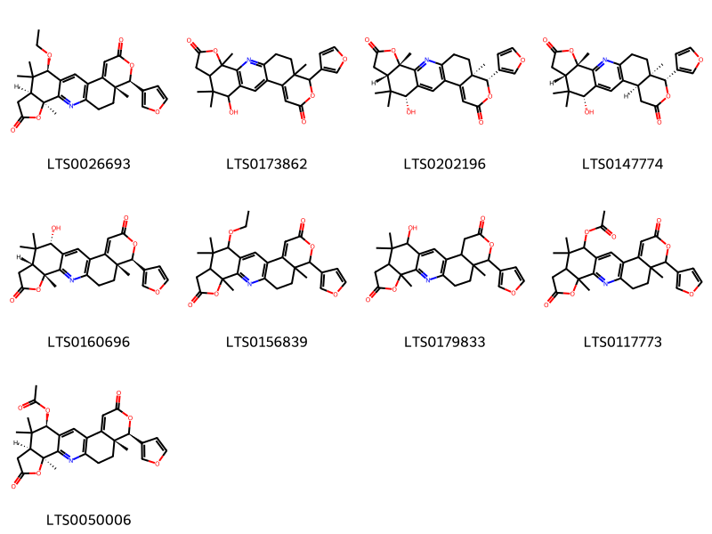{ width=100% }
    <figcaption>Hình ảnh cấu trúc hóa học của 9 hoạt chất thuộc nhóm Quinolines and derivatives gồm ['(4s,8s,10r,18r,19r)-10-ethoxy-18-(furan-3-yl)-4,9,9,19-tetramethyl-5,17-dioxa-2-azapentacyclo[11.8.0.0³,¹¹.0⁴,⁸.0¹⁴,¹⁹]henicosa-1(13),2,11,14-tetraene-6,16-dione (LTS0026693)', '18-(furan-3-yl)-10-hydroxy-4,9,9,19-tetramethyl-5,17-dioxa-2-azapentacyclo[11.8.0.0³,¹¹.0⁴,⁸.0¹⁴,¹⁹]henicosa-1,3(11),12,14-tetraene-6,16-dione (LTS0173862)', '(4s,8s,10r,18r,19r)-18-(furan-3-yl)-10-hydroxy-4,9,9,19-tetramethyl-5,17-dioxa-2-azapentacyclo[11.8.0.0³,¹¹.0⁴,⁸.0¹⁴,¹⁹]henicosa-1(13),2,11,14-tetraene-6,16-dione (LTS0202196)', '(4s,8s,10r,14s,18r,19r)-18-(furan-3-yl)-10-hydroxy-4,9,9,19-tetramethyl-5,17-dioxa-2-azapentacyclo[11.8.0.0³,¹¹.0⁴,⁸.0¹⁴,¹⁹]henicosa-1(13),2,11-triene-6,16-dione (LTS0147774)', '(4r,8r,10s,18r,19r)-18-(furan-3-yl)-10-hydroxy-4,9,9,19-tetramethyl-5,17-dioxa-2-azapentacyclo[11.8.0.0³,¹¹.0⁴,⁸.0¹⁴,¹⁹]henicosa-1(13),2,11,14-tetraene-6,16-dione (LTS0160696)', '10-ethoxy-18-(furan-3-yl)-4,9,9,19-tetramethyl-5,17-dioxa-2-azapentacyclo[11.8.0.0³,¹¹.0⁴,⁸.0¹⁴,¹⁹]henicosa-1(13),2,11,14-tetraene-6,16-dione (LTS0156839)', '18-(furan-3-yl)-10-hydroxy-4,9,9,19-tetramethyl-5,17-dioxa-2-azapentacyclo[11.8.0.0³,¹¹.0⁴,⁸.0¹⁴,¹⁹]henicosa-1(13),2,11-triene-6,16-dione (LTS0179833)', '18-(furan-3-yl)-4,9,9,19-tetramethyl-6,16-dioxo-5,17-dioxa-2-azapentacyclo[11.8.0.0³,¹¹.0⁴,⁸.0¹⁴,¹⁹]henicosa-1(13),2,11,14-tetraen-10-yl acetate (LTS0117773)', '(4s,8s,10r,18r,19r)-18-(furan-3-yl)-4,9,9,19-tetramethyl-6,16-dioxo-5,17-dioxa-2-azapentacyclo[11.8.0.0³,¹¹.0⁴,⁸.0¹⁴,¹⁹]henicosa-1(13),2,11,14-tetraen-10-yl acetate (LTS0050006)'].</figcaption>
</figure>
#### Nhóm Steroids and steroid derivatives
<figure markdown="span">
    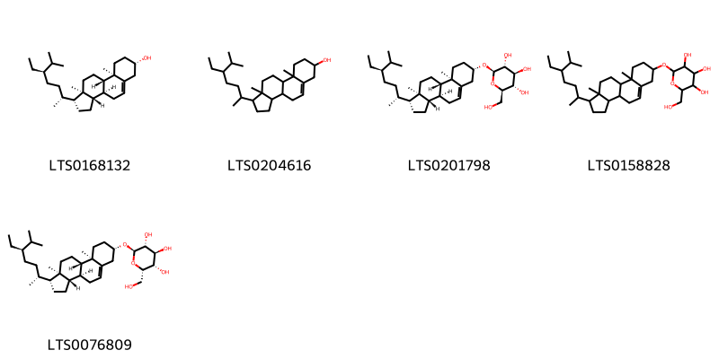{ width=100% }
    <figcaption>Hình ảnh cấu trúc hóa học của 5 hoạt chất thuộc nhóm Steroids and steroid derivatives gồm ['sitosterol (LTS0168132)', 'stigmast-5-en-3-ol, (3β)- (LTS0204616)', 'sitogluside (LTS0201798)', '2-{[1-(5-ethyl-6-methylheptan-2-yl)-9a,11a-dimethyl-1h,2h,3h,3ah,3bh,4h,6h,7h,8h,9h,9bh,10h,11h-cyclopenta[a]phenanthren-7-yl]oxy}-6-(hydroxymethyl)oxane-3,4,5-triol (LTS0158828)', '(2r,3r,4s,5s,6s)-2-{[(1r,3as,3bs,7s,9ar,9bs,11ar)-1-[(2r,5r)-5-ethyl-6-methylheptan-2-yl]-9a,11a-dimethyl-1h,2h,3h,3ah,3bh,4h,6h,7h,8h,9h,9bh,10h,11h-cyclopenta[a]phenanthren-7-yl]oxy}-6-(hydroxymethyl)oxane-3,4,5-triol (LTS0076809)'].</figcaption>
</figure>

---

### Dược dân tộc học

Danh sách các quốc gia có sử dụng *Xylocarpus granatum* trong điều trị các bệnh. 

| Country     | Disease    | Bệnh                                                                                                                                                                                                |
|:------------|:-----------|:----------------------------------------------------------------------------------------------------------------------------------------------------------------------------------------------------|
| Philippines | Astringent | MYMEMORY WARNING: YOU USED ALL AVAILABLE FREE TRANSLATIONS FOR TODAY. NEXT AVAILABLE IN  06 HOURS 34 MINUTES 19 SECONDS VISIT HTTPS://MYMEMORY.TRANSLATED.NET/DOC/USAGELIMITS.PHP TO TRANSLATE MORE |

---

# Chi Melia

??? note "Danh sách các dược liệu thuộc chi"
    
	 - *Melia azedarach*
	 - *Melia azederach*
	 - *Melia dubia*
	 - *Melia indica*
	 - *Melia toosendan*

---
## Melia azedarach
### Thông tin về thực vật

!!! info "Phân loại thực vật của *Melia azedarach* từ GIBF:"
    - **Kingdom:** Plantae
    - **Phylum:** Tracheophyta
    - **Order:** Sapindales
    - **Family:** Meliaceae
    - **Genus:** Melia
    - **Species:** *Melia azedarach*

 

| Label (VI)   | Label (EN)   | Scientific Name   | Descriptions (VI)   | Descriptions (EN)   | Also Known As (VI)   | Also Known As (EN)                                                                                                                                                                                                                                                  |
|:-------------|:-------------|:------------------|:--------------------|:--------------------|:---------------------|:--------------------------------------------------------------------------------------------------------------------------------------------------------------------------------------------------------------------------------------------------------------------|
| N/A          | N/A          | Melia azedarach   | loài thực vật       | species of plant    | ['Melia azedarach']  | ['pride of India', 'Texas umbrella tree', 'lelah', 'paraiso', 'China-berry', 'white cedar', 'Persian lilac', 'bead tree', 'berry tree', 'Cape lilac', 'China berry', 'China tree', 'Chinaberry', 'Chinaberry tree', 'Indian lilac', 'seringa', 'syringa berrytree'] |

#### Phân bố trên thế giới

**Từ CSDL GIBF** Australia, Japan, Argentina, Jordan, Israel, Zambia, Chinese Taipei, Spain, Portugal, Jamaica, United States of America, Chile, Bosnia and Herzegovina, Greece, South Africa, Hong Kong, Brazil, Peru, France, Dominican Republic, Mexico, Viet Nam, China, Botswana, India, Indonesia, Nepal, Kenya, New Zealand, Ethiopia

#### Phân bố tại Việt Nam

**Từ CSDL GIBF**: Quảng Nam

---
### Thành phần hóa học
        
- Theo cơ sở dữ liệu lotus: Từ loài *Melia azedarach* đã phân lập và xác định được 563 hoạt chất thuộc về các nhóm Organic oxides, Benzofurans, Phenols, Naphthopyrans, Carboxylic acids and derivatives, Fatty Acyls, Cinnamic acids and derivatives, Isocoumarins and derivatives, Furopyrans, Isobenzofurans, Glycerolipids, Prenol lipids, Benzene and substituted derivatives, Naphthofurans, Organooxygen compounds, Furanoid lignans, Flavonoids, Steroids and steroid derivatives, Pyrans, Macrolides and analogues, Coumarins and derivatives. 

|    | chemicalTaxonomyClassyfireClass     |   smiles_count |
|---:|:------------------------------------|---------------:|
|  0 | Benzene and substituted derivatives |              2 |
|  1 | Benzofurans                         |             12 |
|  2 | Carboxylic acids and derivatives    |              2 |
|  3 | Cinnamic acids and derivatives      |              4 |
|  4 | Coumarins and derivatives           |              3 |
|  5 | Fatty Acyls                         |             16 |
|  6 | Flavonoids                          |              2 |
|  7 | Furanoid lignans                    |              2 |
|  8 | Furopyrans                          |              2 |
|  9 | Glycerolipids                       |              2 |
| 10 | Isobenzofurans                      |             11 |
| 11 | Isocoumarins and derivatives        |              2 |
| 12 | Macrolides and analogues            |              4 |
| 13 | Naphthofurans                       |             37 |
| 14 | Naphthopyrans                       |              6 |
| 15 | Organic oxides                      |              1 |
| 16 | Organooxygen compounds              |              2 |
| 17 | Phenols                             |              4 |
| 18 | Prenol lipids                       |            379 |
| 19 | Pyrans                              |              8 |
| 20 | Steroids and steroid derivatives    |             52 |

#### Nhóm Benzene and substituted derivatives
<figure markdown="span">
    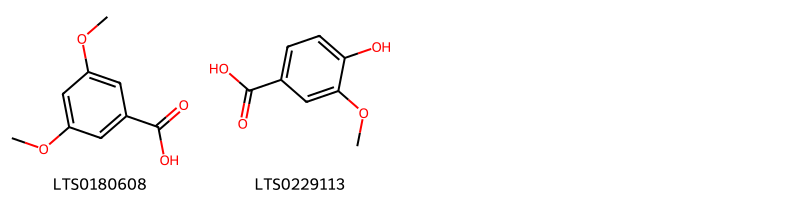{ width=100% }
    <figcaption>Hình ảnh cấu trúc hóa học của 2 hoạt chất thuộc nhóm Benzene and substituted derivatives gồm ['3,5-dimethoxybenzoic acid (LTS0180608)', 'vanillic acid (LTS0229113)'].</figcaption>
</figure>
#### Nhóm Benzofurans
<figure markdown="span">
    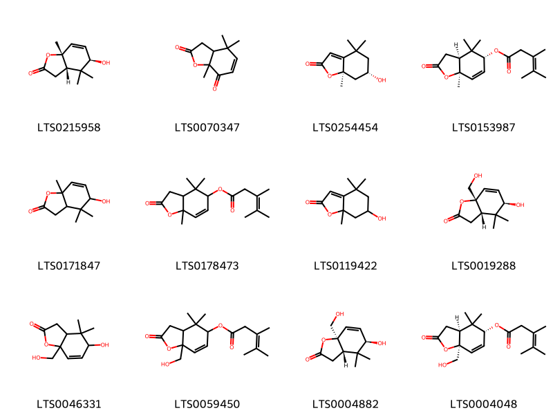{ width=100% }
    <figcaption>Hình ảnh cấu trúc hóa học của 12 hoạt chất thuộc nhóm Benzofurans gồm ['(3as,5r,7ar)-5-hydroxy-4,4,7a-trimethyl-3a,5-dihydro-3h-1-benzofuran-2-one (LTS0215958)', '4,4,7a-trimethyl-3,3a-dihydro-1-benzofuran-2,7-dione (LTS0070347)', 'loliolide (LTS0254454)', '(3as,5r,7ar)-4,4,7a-trimethyl-2-oxo-3a,5-dihydro-3h-1-benzofuran-5-yl 3,4-dimethylpent-3-enoate (LTS0153987)', '5-hydroxy-4,4,7a-trimethyl-3a,5-dihydro-3h-1-benzofuran-2-one (LTS0171847)', '4,4,7a-trimethyl-2-oxo-3a,5-dihydro-3h-1-benzofuran-5-yl 3,4-dimethylpent-3-enoate (LTS0178473)', 'loliolide (LTS0119422)', '(3as,5r,7ar)-5-hydroxy-7a-(hydroxymethyl)-4,4-dimethyl-3a,5-dihydro-3h-1-benzofuran-2-one (LTS0019288)', '5-hydroxy-7a-(hydroxymethyl)-4,4-dimethyl-3a,5-dihydro-3h-1-benzofuran-2-one (LTS0046331)', '7a-(hydroxymethyl)-4,4-dimethyl-2-oxo-3a,5-dihydro-3h-1-benzofuran-5-yl 3,4-dimethylpent-3-enoate (LTS0059450)', '(3as,5r,7as)-5-hydroxy-7a-(hydroxymethyl)-4,4-dimethyl-3a,5-dihydro-3h-1-benzofuran-2-one (LTS0004882)', '(3as,5r,7ar)-7a-(hydroxymethyl)-4,4-dimethyl-2-oxo-3a,5-dihydro-3h-1-benzofuran-5-yl 3,4-dimethylpent-3-enoate (LTS0004048)'].</figcaption>
</figure>
#### Nhóm Carboxylic acids and derivatives
<figure markdown="span">
    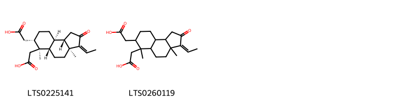{ width=100% }
    <figcaption>Hình ảnh cấu trúc hóa học của 2 hoạt chất thuộc nhóm Carboxylic acids and derivatives gồm ['[(3z,3as,5as,6s,7s,9ar,9bs)-6-(carboxymethyl)-3-ethylidene-3a,6-dimethyl-2-oxo-octahydro-1h-cyclopenta[a]naphthalen-7-yl]acetic acid (LTS0225141)', '[6-(carboxymethyl)-3-ethylidene-3a,6-dimethyl-2-oxo-octahydro-1h-cyclopenta[a]naphthalen-7-yl]acetic acid (LTS0260119)'].</figcaption>
</figure>
#### Nhóm Cinnamic acids and derivatives
<figure markdown="span">
    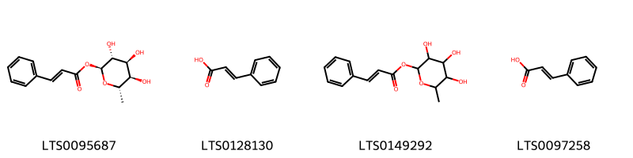{ width=100% }
    <figcaption>Hình ảnh cấu trúc hóa học của 4 hoạt chất thuộc nhóm Cinnamic acids and derivatives gồm ['(2s,3r,4s,5r,6s)-3,4,5-trihydroxy-6-methyloxan-2-yl (2e)-3-phenylprop-2-enoate (LTS0095687)', 'cinnamic acid (LTS0128130)', '3,4,5-trihydroxy-6-methyloxan-2-yl 3-phenylprop-2-enoate (LTS0149292)', 'phenylacrylic acid (LTS0097258)'].</figcaption>
</figure>
#### Nhóm Coumarins and derivatives
<figure markdown="span">
    { width=100% }
    <figcaption>Hình ảnh cấu trúc hóa học của 3 hoạt chất thuộc nhóm Coumarins and derivatives gồm ['scoparone (LTS0210705)', 'isofraxidin (LTS0073081)', 'scopoletin (LTS0193112)'].</figcaption>
</figure>
#### Nhóm Fatty Acyls
<figure markdown="span">
    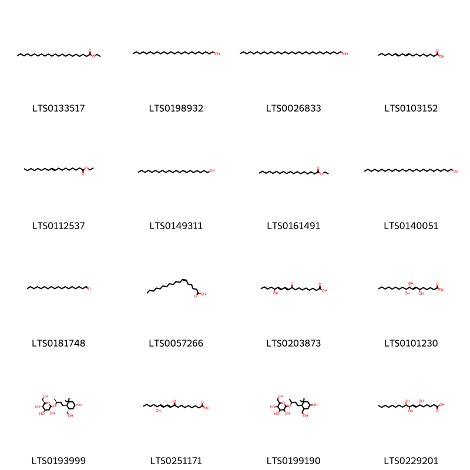{ width=100% }
    <figcaption>Hình ảnh cấu trúc hóa học của 16 hoạt chất thuộc nhóm Fatty Acyls gồm ['ethyl behenate (LTS0133517)', '1-tetracosanol (LTS0198932)', 'triacontanol (LTS0026833)', 'grape seed oils (LTS0103152)', 'ethyl oleate (natural) (LTS0112537)', 'henicosan-1-ol (LTS0149311)', 'ethyl stearate (LTS0161491)', 'ceryl alcohol (LTS0140051)', 'octadecanal (LTS0181748)', 'petroselinic acid (LTS0057266)', '14-hydroxy-9-oxooctadeca-10,12-dienoic acid (LTS0203873)', '(6r,9r,10r)-6,9,10-trihydroxyoctadec-7-enoic acid (LTS0101230)', '(2r,3r,4s,5s,6r)-2-{[(2s)-4-[(1r,4s,6s)-4-hydroxy-6-(hydroxymethyl)-2,2-dimethylcyclohexyl]butan-2-yl]oxy}-6-(hydroxymethyl)oxane-3,4,5-triol (LTS0193999)', '(10e,12e,14r)-14-hydroxy-9-oxooctadeca-10,12-dienoic acid (LTS0251171)', '2-({4-[4-hydroxy-6-(hydroxymethyl)-2,2-dimethylcyclohexyl]butan-2-yl}oxy)-6-(hydroxymethyl)oxane-3,4,5-triol (LTS0199190)', '(6r,7e,9r,10r)-6,9,10-trihydroxyoctadec-7-enoic acid (LTS0229201)'].</figcaption>
</figure>
#### Nhóm Flavonoids
<figure markdown="span">
    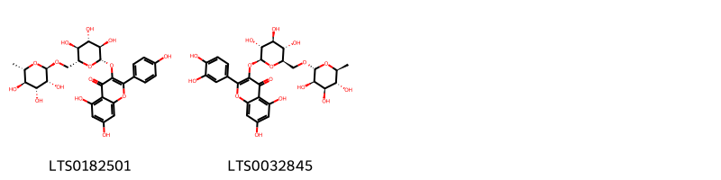{ width=100% }
    <figcaption>Hình ảnh cấu trúc hóa học của 2 hoạt chất thuộc nhóm Flavonoids gồm ['nictoflorin (LTS0182501)', '3-rutinosyl quercetin (LTS0032845)'].</figcaption>
</figure>
#### Nhóm Furanoid lignans
<figure markdown="span">
    { width=100% }
    <figcaption>Hình ảnh cấu trúc hóa học của 2 hoạt chất thuộc nhóm Furanoid lignans gồm ['pinoresinol (LTS0057431)', 'pinoresinol (LTS0011247)'].</figcaption>
</figure>
#### Nhóm Furopyrans
<figure markdown="span">
    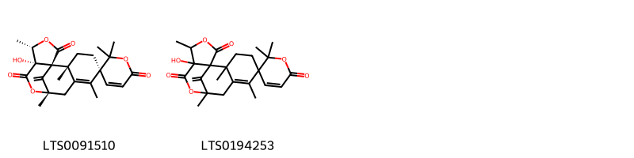{ width=100% }
    <figcaption>Hình ảnh cấu trúc hóa học của 2 hoạt chất thuộc nhóm Furopyrans gồm ["(1's,2'r,3s,9's,12's,13's)-12'-hydroxy-2,2,2',6',9',13'-hexamethyl-16'-methylidene-10',14'-dioxaspiro[pyran-3,5'-tetracyclo[7.6.1.0¹,¹².0²,⁷]hexadecan]-6'-ene-6,11',15'-trione (LTS0091510)", "12'-hydroxy-2,2,2',6',9',13'-hexamethyl-16'-methylidene-10',14'-dioxaspiro[pyran-3,5'-tetracyclo[7.6.1.0¹,¹².0²,⁷]hexadecan]-6'-ene-6,11',15'-trione (LTS0194253)"].</figcaption>
</figure>
#### Nhóm Glycerolipids
<figure markdown="span">
    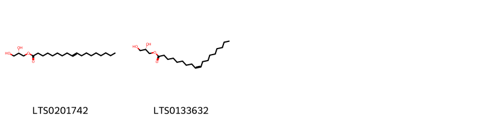{ width=100% }
    <figcaption>Hình ảnh cấu trúc hóa học của 2 hoạt chất thuộc nhóm Glycerolipids gồm ['(2s)-2,3-dihydroxypropyl octadec-9-enoate (LTS0201742)', '1-oleoyl-sn-glycerol (LTS0133632)'].</figcaption>
</figure>
#### Nhóm Isobenzofurans
<figure markdown="span">
    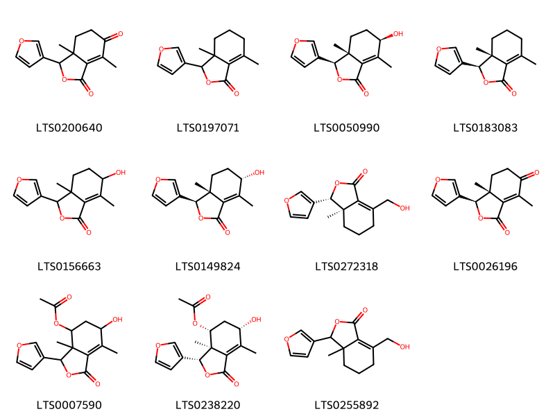{ width=100% }
    <figcaption>Hình ảnh cấu trúc hóa học của 11 hoạt chất thuộc nhóm Isobenzofurans gồm ['3-(furan-3-yl)-3a,7-dimethyl-4,5-dihydro-3h-2-benzofuran-1,6-dione (LTS0200640)', '3-(furan-3-yl)-3a,7-dimethyl-3,4,5,6-tetrahydro-2-benzofuran-1-one (LTS0197071)', '(3r,3ar,6r)-3-(furan-3-yl)-6-hydroxy-3a,7-dimethyl-3,4,5,6-tetrahydro-2-benzofuran-1-one (LTS0050990)', 'fraxinellone (LTS0183083)', '3-(furan-3-yl)-6-hydroxy-3a,7-dimethyl-3,4,5,6-tetrahydro-2-benzofuran-1-one (LTS0156663)', '(3r,3ar,6s)-3-(furan-3-yl)-6-hydroxy-3a,7-dimethyl-3,4,5,6-tetrahydro-2-benzofuran-1-one (LTS0149824)', '(3r,3ar)-3-(furan-3-yl)-7-(hydroxymethyl)-3a-methyl-3,4,5,6-tetrahydro-2-benzofuran-1-one (LTS0272318)', 'fraxinellonone (LTS0026196)', '3-(furan-3-yl)-6-hydroxy-3a,7-dimethyl-1-oxo-3,4,5,6-tetrahydro-2-benzofuran-4-yl acetate (LTS0007590)', '(3r,3ar,4r,6s)-3-(furan-3-yl)-6-hydroxy-3a,7-dimethyl-1-oxo-3,4,5,6-tetrahydro-2-benzofuran-4-yl acetate (LTS0238220)', '3-(furan-3-yl)-7-(hydroxymethyl)-3a-methyl-3,4,5,6-tetrahydro-2-benzofuran-1-one (LTS0255892)'].</figcaption>
</figure>
#### Nhóm Isocoumarins and derivatives
<figure markdown="span">
    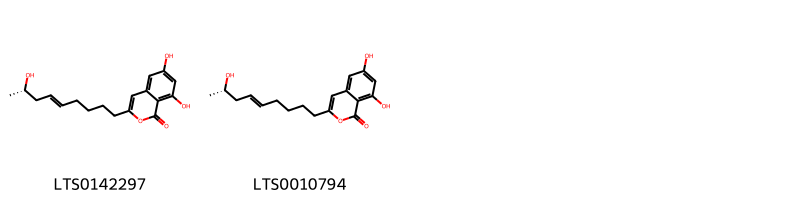{ width=100% }
    <figcaption>Hình ảnh cấu trúc hóa học của 2 hoạt chất thuộc nhóm Isocoumarins and derivatives gồm ['6,8-dihydroxy-3-[(5e,8s)-8-hydroxynon-5-en-1-yl]isochromen-1-one (LTS0142297)', '6,8-dihydroxy-3-[(8s)-8-hydroxynon-5-en-1-yl]isochromen-1-one (LTS0010794)'].</figcaption>
</figure>
#### Nhóm Macrolides and analogues
<figure markdown="span">
    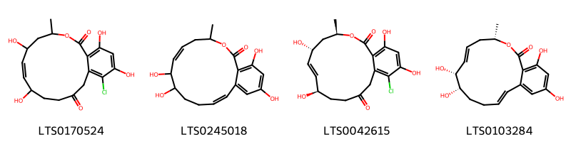{ width=100% }
    <figcaption>Hình ảnh cấu trúc hóa học của 4 hoạt chất thuộc nhóm Macrolides and analogues gồm ['13-chloro-5,8,14,16-tetrahydroxy-3-methyl-4,5,8,9,10,12-hexahydro-3h-2-benzoxacyclotetradecine-1,11-dione (LTS0170524)', '7,8,14,16-tetrahydroxy-3-methyl-3,4,7,8,9,10-hexahydro-2-benzoxacyclotetradecin-1-one (LTS0245018)', '(3r,5r,6e,8r)-13-chloro-5,8,14,16-tetrahydroxy-3-methyl-4,5,8,9,10,12-hexahydro-3h-2-benzoxacyclotetradecine-1,11-dione (LTS0042615)', '(3s,5e,7r,8s,11e)-7,8,14,16-tetrahydroxy-3-methyl-3,4,7,8,9,10-hexahydro-2-benzoxacyclotetradecin-1-one (LTS0103284)'].</figcaption>
</figure>
#### Nhóm Naphthofurans
<figure markdown="span">
    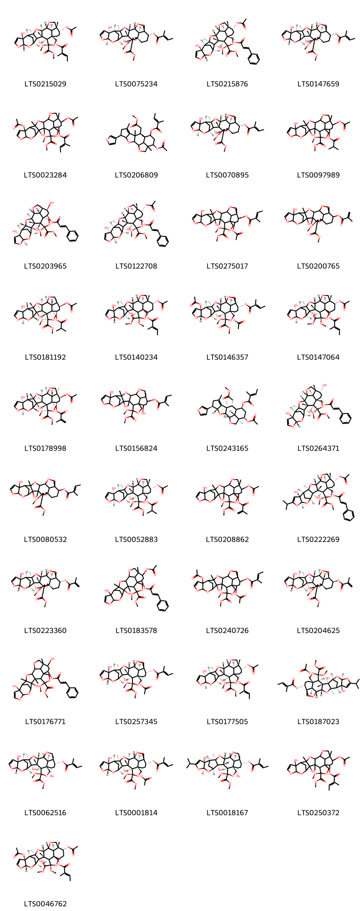{ width=100% }
    <figcaption>Hình ảnh cấu trúc hóa học của 37 hoạt chất thuộc nhóm Naphthofurans gồm ['methyl (1s,4s,5r,6s,7r,8s,10s,14s,15s,16r,18r,19r,22r,23r,25s,26s)-23-(acetyloxy)-7,14-dihydroxy-4-methoxy-6,16,22-trimethyl-25-{[(2e)-2-methylbut-2-enoyl]oxy}-3,9,11,17,20-pentaoxaoctacyclo[17.6.1.1⁸,¹⁵.0¹,⁵.0⁶,¹⁸.0⁷,¹⁶.0¹⁰,¹⁴.0²²,²⁶]heptacos-12-ene-4-carboxylate (LTS0215029)', 'methyl (1r,4s,5r,6s,7r,8s,10r,14r,15s,16r,18s,19r,22r,23r,26r)-7,14-dihydroxy-4-methoxy-6,16,22-trimethyl-23-{[(2e)-2-methylbut-2-enoyl]oxy}-3,9,11,17,20-pentaoxaoctacyclo[17.6.1.1⁸,¹⁵.0¹,⁵.0⁶,¹⁸.0⁷,¹⁶.0¹⁰,¹⁴.0²²,²⁶]heptacos-12-ene-4-carboxylate (LTS0075234)', 'methyl (1s,4s,5r,6s,7r,8s,10s,14s,15s,16r,18s,19r,22r,23r,25s,26s)-23-(acetyloxy)-7,14-dihydroxy-4-methoxy-6,16,22-trimethyl-25-{[(2e)-3-phenylprop-2-enoyl]oxy}-3,9,11,17,20-pentaoxaoctacyclo[17.6.1.1⁸,¹⁵.0¹,⁵.0⁶,¹⁸.0⁷,¹⁶.0¹⁰,¹⁴.0²²,²⁶]heptacos-12-ene-4-carboxylate (LTS0215876)', 'methyl (1r,4s,5r,6s,7r,8s,10s,14s,15s,16r,18s,19r,22r,23r,26r)-7,14-dihydroxy-4-methoxy-6,16,22-trimethyl-23-{[(2e)-2-methylbut-2-enoyl]oxy}-3,9,11,17,20-pentaoxaoctacyclo[17.6.1.1⁸,¹⁵.0¹,⁵.0⁶,¹⁸.0⁷,¹⁶.0¹⁰,¹⁴.0²²,²⁶]heptacos-12-ene-4-carboxylate (LTS0147659)', 'methyl 14,23-bis(acetyloxy)-7-hydroxy-4-methoxy-6,16,22-trimethyl-25-[(2-methylbut-2-enoyl)oxy]-3,9,11,17,20-pentaoxaoctacyclo[17.6.1.1⁸,¹⁵.0¹,⁵.0⁶,¹⁸.0⁷,¹⁶.0¹⁰,¹⁴.0²²,²⁶]heptacos-12-ene-4-carboxylate (LTS0023284)', '14-(acetyloxy)-5-(furan-3-yl)-10-(2-methoxy-2-oxoethyl)-7,9,11,15-tetramethyl-3,17-dioxapentacyclo[9.6.1.0²,⁹.0⁴,⁸.0¹⁵,¹⁸]octadec-7-en-12-yl 2-methylbut-2-enoate (LTS0206809)', 'methyl (1r,4s,5r,6s,7r,8s,10r,15s,16r,18s,19r,22r,23r,26r)-7,14-dihydroxy-4-methoxy-6,16,22-trimethyl-23-{[(2e)-2-methylbut-2-enoyl]oxy}-3,9,11,17,20-pentaoxaoctacyclo[17.6.1.1⁸,¹⁵.0¹,⁵.0⁶,¹⁸.0⁷,¹⁶.0¹⁰,¹⁴.0²²,²⁶]heptacos-12-ene-4-carboxylate (LTS0070895)', 'methyl 23-(acetyloxy)-7,14-dihydroxy-4-methoxy-6,16,22-trimethyl-25-[(2-methylpropanoyl)oxy]-3,9,11,17,20-pentaoxaoctacyclo[17.6.1.1⁸,¹⁵.0¹,⁵.0⁶,¹⁸.0⁷,¹⁶.0¹⁰,¹⁴.0²²,²⁶]heptacos-12-ene-4-carboxylate (LTS0097989)', 'methyl (1r,4s,5s,6s,7s,8s,10r,14r,15s,16s,18r,19r,22s,23s,25r,26r)-7,14,23-trihydroxy-4-methoxy-6,16,22-trimethyl-25-{[(2e)-3-phenylprop-2-enoyl]oxy}-3,9,11,17,20-pentaoxaoctacyclo[17.6.1.1⁸,¹⁵.0¹,⁵.0⁶,¹⁸.0⁷,¹⁶.0¹⁰,¹⁴.0²²,²⁶]heptacos-12-ene-4-carboxylate (LTS0203965)', 'methyl (1s,4s,5r,6s,7r,8s,10r,14r,15s,16r,18s,19r,22r,23r,25s,26s)-23-(acetyloxy)-7,14-dihydroxy-4-methoxy-6,16,22-trimethyl-25-{[(2e)-3-phenylprop-2-enoyl]oxy}-3,9,11,17,20-pentaoxaoctacyclo[17.6.1.1⁸,¹⁵.0¹,⁵.0⁶,¹⁸.0⁷,¹⁶.0¹⁰,¹⁴.0²²,²⁶]heptacos-12-ene-4-carboxylate (LTS0122708)', 'methyl 25-(acetyloxy)-7,14-dihydroxy-4-methoxy-6,16,22-trimethyl-23-[(2-methylbut-2-enoyl)oxy]-3,9,11,17,20-pentaoxaoctacyclo[17.6.1.1⁸,¹⁵.0¹,⁵.0⁶,¹⁸.0⁷,¹⁶.0¹⁰,¹⁴.0²²,²⁶]heptacos-12-ene-4-carboxylate (LTS0275017)', 'methyl 7,14-dihydroxy-4-methoxy-6,16,22-trimethyl-23-[(2-methylprop-2-enoyl)oxy]-3,9,11,17,20-pentaoxaoctacyclo[17.6.1.1⁸,¹⁵.0¹,⁵.0⁶,¹⁸.0⁷,¹⁶.0¹⁰,¹⁴.0²²,²⁶]heptacos-12-ene-4-carboxylate (LTS0200765)', 'methyl (1r,4r,5s,6r,7s,8r,10r,14r,15r,16s,18r,19s,22s,23s,25r,26r)-23-(acetyloxy)-7,14-dihydroxy-4-methoxy-6,16,22-trimethyl-25-[(2-methylpropanoyl)oxy]-3,9,11,17,20-pentaoxaoctacyclo[17.6.1.1⁸,¹⁵.0¹,⁵.0⁶,¹⁸.0⁷,¹⁶.0¹⁰,¹⁴.0²²,²⁶]heptacos-12-ene-4-carboxylate (LTS0181192)', 'methyl (1s,4s,5r,6s,7r,8s,10s,14s,15s,16r,18s,19r,22r,23r,25s,26s)-23-(acetyloxy)-7,14-dihydroxy-4-methoxy-6,16,22-trimethyl-25-{[(2e)-2-methylbut-2-enoyl]oxy}-3,9,11,17,20-pentaoxaoctacyclo[17.6.1.1⁸,¹⁵.0¹,⁵.0⁶,¹⁸.0⁷,¹⁶.0¹⁰,¹⁴.0²²,²⁶]heptacos-12-ene-4-carboxylate (LTS0140234)', 'methyl (1s,4s,5r,6s,7r,8s,10s,14s,15r,16r,18s,19r,22r,23r,25s,26s)-14,25-bis(acetyloxy)-7-hydroxy-4-methoxy-6,16,22-trimethyl-23-{[(2e)-2-methylbut-2-enoyl]oxy}-3,9,11,17,20-pentaoxaoctacyclo[17.6.1.1⁸,¹⁵.0¹,⁵.0⁶,¹⁸.0⁷,¹⁶.0¹⁰,¹⁴.0²²,²⁶]heptacos-12-ene-4-carboxylate (LTS0146357)', 'methyl (1s,4s,5r,6s,7r,8s,10r,14r,15s,16r,18s,19r,22r,23r,25s,26s)-23-(acetyloxy)-7,14-dihydroxy-4-methoxy-6,16,22-trimethyl-25-{[(2e)-2-methylbut-2-enoyl]oxy}-3,9,11,17,20-pentaoxaoctacyclo[17.6.1.1⁸,¹⁵.0¹,⁵.0⁶,¹⁸.0⁷,¹⁶.0¹⁰,¹⁴.0²²,²⁶]heptacos-12-ene-4-carboxylate (LTS0147064)', 'methyl (1r,4r,5s,6r,7s,8r,10r,14r,15r,16s,18r,19s,22s,23s,25r,26r)-23-(acetyloxy)-7,14-dihydroxy-4-methoxy-6,16,22-trimethyl-25-[(2-methylprop-2-enoyl)oxy]-3,9,11,17,20-pentaoxaoctacyclo[17.6.1.1⁸,¹⁵.0¹,⁵.0⁶,¹⁸.0⁷,¹⁶.0¹⁰,¹⁴.0²²,²⁶]heptacos-12-ene-4-carboxylate (LTS0178998)', 'methyl 7,14,25-trihydroxy-4-methoxy-6,16,22-trimethyl-23-[(2-methylbut-2-enoyl)oxy]-3,9,11,17,20-pentaoxaoctacyclo[17.6.1.1⁸,¹⁵.0¹,⁵.0⁶,¹⁸.0⁷,¹⁶.0¹⁰,¹⁴.0²²,²⁶]heptacos-12-ene-4-carboxylate (LTS0156824)', '(1r,2s,4r,5r,9r,10r,11r,12s,14r,15r,18r)-14-(acetyloxy)-5-(furan-3-yl)-10-(2-methoxy-2-oxoethyl)-7,9,11,15-tetramethyl-3,17-dioxapentacyclo[9.6.1.0²,⁹.0⁴,⁸.0¹⁵,¹⁸]octadec-7-en-12-yl (2e)-2-methylbut-2-enoate (LTS0243165)', 'methyl (1s,4s,5r,6s,7r,8s,10s,14s,15s,16r,18s,19r,22r,23r,25s,26s)-7,14,23-trihydroxy-4-methoxy-6,16,22-trimethyl-25-{[(2e)-3-phenylprop-2-enoyl]oxy}-3,9,11,17,20-pentaoxaoctacyclo[17.6.1.1⁸,¹⁵.0¹,⁵.0⁶,¹⁸.0⁷,¹⁶.0¹⁰,¹⁴.0²²,²⁶]heptacos-12-ene-4-carboxylate (LTS0264371)', 'methyl 7,14-dihydroxy-4-methoxy-6,16,22-trimethyl-23-[(2-methylbut-2-enoyl)oxy]-3,9,11,17,20-pentaoxaoctacyclo[17.6.1.1⁸,¹⁵.0¹,⁵.0⁶,¹⁸.0⁷,¹⁶.0¹⁰,¹⁴.0²²,²⁶]heptacos-12-ene-4-carboxylate (LTS0080532)', 'methyl (1s,4s,5r,6s,7r,8s,10r,14r,15s,16r,18s,19r,22r,23r,25s,26s)-23-(acetyloxy)-7,14-dihydroxy-4-methoxy-6,16,22-trimethyl-25-[(2-methylpropanoyl)oxy]-3,9,11,17,20-pentaoxaoctacyclo[17.6.1.1⁸,¹⁵.0¹,⁵.0⁶,¹⁸.0⁷,¹⁶.0¹⁰,¹⁴.0²²,²⁶]heptacos-12-ene-4-carboxylate (LTS0052883)', 'methyl 23-(acetyloxy)-7,14-dihydroxy-4-methoxy-6,16,22-trimethyl-25-[(2-methylprop-2-enoyl)oxy]-3,9,11,17,20-pentaoxaoctacyclo[17.6.1.1⁸,¹⁵.0¹,⁵.0⁶,¹⁸.0⁷,¹⁶.0¹⁰,¹⁴.0²²,²⁶]heptacos-12-ene-4-carboxylate (LTS0208862)', 'methyl (1s,4s,5r,6s,7r,8s,10s,14s,15s,16r,18s,19r,22r,23r,25s,26s)-23-(acetyloxy)-7,14-dihydroxy-12-isopropyl-4-methoxy-6,16,22-trimethyl-25-{[(2e)-3-phenylprop-2-enoyl]oxy}-3,9,11,17,20-pentaoxaoctacyclo[17.6.1.1⁸,¹⁵.0¹,⁵.0⁶,¹⁸.0⁷,¹⁶.0¹⁰,¹⁴.0²²,²⁶]heptacos-12-ene-4-carboxylate (LTS0222269)', 'methyl (1r,4s,5r,6s,7r,8s,10s,14s,15s,16r,18s,19r,22r,23r,26r)-7,14-dihydroxy-4-methoxy-6,16,22-trimethyl-23-[(2-methylprop-2-enoyl)oxy]-3,9,11,17,20-pentaoxaoctacyclo[17.6.1.1⁸,¹⁵.0¹,⁵.0⁶,¹⁸.0⁷,¹⁶.0¹⁰,¹⁴.0²²,²⁶]heptacos-12-ene-4-carboxylate (LTS0223360)', 'methyl 23-(acetyloxy)-7,14-dihydroxy-4-methoxy-6,16,22-trimethyl-25-[(3-phenylprop-2-enoyl)oxy]-3,9,11,17,20-pentaoxaoctacyclo[17.6.1.1⁸,¹⁵.0¹,⁵.0⁶,¹⁸.0⁷,¹⁶.0¹⁰,¹⁴.0²²,²⁶]heptacos-12-ene-4-carboxylate (LTS0183578)', 'methyl 14,25-bis(acetyloxy)-7-hydroxy-4-methoxy-6,16,22-trimethyl-23-[(2-methylbut-2-enoyl)oxy]-3,9,11,17,20-pentaoxaoctacyclo[17.6.1.1⁸,¹⁵.0¹,⁵.0⁶,¹⁸.0⁷,¹⁶.0¹⁰,¹⁴.0²²,²⁶]heptacos-12-ene-4-carboxylate (LTS0240726)', 'methyl (1r,4s,5r,6r,7r,8s,10s,14s,15s,16r,18s,19s,22s,23s,26s)-7,14-dihydroxy-4-methoxy-6,16,22-trimethyl-23-[(2-methylprop-2-enoyl)oxy]-3,9,11,17,20-pentaoxaoctacyclo[17.6.1.1⁸,¹⁵.0¹,⁵.0⁶,¹⁸.0⁷,¹⁶.0¹⁰,¹⁴.0²²,²⁶]heptacos-12-ene-4-carboxylate (LTS0204625)', 'methyl 7,14,23-trihydroxy-4-methoxy-6,16,22-trimethyl-25-[(3-phenylprop-2-enoyl)oxy]-3,9,11,17,20-pentaoxaoctacyclo[17.6.1.1⁸,¹⁵.0¹,⁵.0⁶,¹⁸.0⁷,¹⁶.0¹⁰,¹⁴.0²²,²⁶]heptacos-12-ene-4-carboxylate (LTS0176771)', 'methyl (1s,4s,5r,6s,7r,8s,10s,14s,15s,16r,18s,19r,22r,23r,25s,26s)-25-(acetyloxy)-7,14-dihydroxy-4-methoxy-6,16,22-trimethyl-23-{[(2e)-2-methylbut-2-enoyl]oxy}-3,9,11,17,20-pentaoxaoctacyclo[17.6.1.1⁸,¹⁵.0¹,⁵.0⁶,¹⁸.0⁷,¹⁶.0¹⁰,¹⁴.0²²,²⁶]heptacos-12-ene-4-carboxylate (LTS0257345)', 'methyl (4s,5r,6s,7r,8s,10r,14r,15s,16r,18s,19r,22r,23r,25s,26s)-23-(acetyloxy)-7,14-dihydroxy-4-methoxy-6,16,22-trimethyl-25-{[(2e)-2-methylbut-2-enoyl]oxy}-3,9,11,17,20-pentaoxaoctacyclo[17.6.1.1⁸,¹⁵.0¹,⁵.0⁶,¹⁸.0⁷,¹⁶.0¹⁰,¹⁴.0²²,²⁶]heptacos-12-ene-4-carboxylate (LTS0177505)', 'methyl (1s,4s,5r,6s,7r,8s,10s,14s,15s,16r,18s,19r,22r,23r,25s,26s)-25-(acetyloxy)-7,14-dihydroxy-12-isopropyl-4-methoxy-6,16,22-trimethyl-23-{[(2e)-2-methylbut-2-enoyl]oxy}-3,9,11,17,20-pentaoxaoctacyclo[17.6.1.1⁸,¹⁵.0¹,⁵.0⁶,¹⁸.0⁷,¹⁶.0¹⁰,¹⁴.0²²,²⁶]heptacos-12-ene-4-carboxylate (LTS0187023)', 'methyl (1s,4s,5r,6s,7r,8s,10s,14s,15s,16r,18s,19r,22r,23r,25s,26s)-7,14,25-trihydroxy-4-methoxy-6,16,22-trimethyl-23-{[(2e)-2-methylbut-2-enoyl]oxy}-3,9,11,17,20-pentaoxaoctacyclo[17.6.1.1⁸,¹⁵.0¹,⁵.0⁶,¹⁸.0⁷,¹⁶.0¹⁰,¹⁴.0²²,²⁶]heptacos-12-ene-4-carboxylate (LTS0062516)', 'methyl (1s,4s,5r,6s,7r,8s,10s,14s,15s,16r,18r,19r,22r,23r,25s,26s)-25-(acetyloxy)-7,14-dihydroxy-4-methoxy-6,16,22-trimethyl-23-{[(2e)-2-methylbut-2-enoyl]oxy}-3,9,11,17,20-pentaoxaoctacyclo[17.6.1.1⁸,¹⁵.0¹,⁵.0⁶,¹⁸.0⁷,¹⁶.0¹⁰,¹⁴.0²²,²⁶]heptacos-12-ene-4-carboxylate (LTS0001814)', 'methyl (1s,4s,5r,6s,7r,8s,10s,14s,15s,16r,18s,19r,22r,23r,25s,26s)-7,14,25-trihydroxy-12-isopropyl-4-methoxy-6,16,22-trimethyl-23-{[(2e)-2-methylbut-2-enoyl]oxy}-3,9,11,17,20-pentaoxaoctacyclo[17.6.1.1⁸,¹⁵.0¹,⁵.0⁶,¹⁸.0⁷,¹⁶.0¹⁰,¹⁴.0²²,²⁶]heptacos-12-ene-4-carboxylate (LTS0018167)', 'methyl 23-(acetyloxy)-7,14-dihydroxy-4-methoxy-6,16,22-trimethyl-25-[(2-methylbut-2-enoyl)oxy]-3,9,11,17,20-pentaoxaoctacyclo[17.6.1.1⁸,¹⁵.0¹,⁵.0⁶,¹⁸.0⁷,¹⁶.0¹⁰,¹⁴.0²²,²⁶]heptacos-12-ene-4-carboxylate (LTS0250372)', 'methyl (1s,4s,5r,6s,7r,8s,10s,14s,15r,16r,18s,19r,22r,23r,25s,26s)-14,23-bis(acetyloxy)-7-hydroxy-4-methoxy-6,16,22-trimethyl-25-{[(2e)-2-methylbut-2-enoyl]oxy}-3,9,11,17,20-pentaoxaoctacyclo[17.6.1.1⁸,¹⁵.0¹,⁵.0⁶,¹⁸.0⁷,¹⁶.0¹⁰,¹⁴.0²²,²⁶]heptacos-12-ene-4-carboxylate (LTS0046762)'].</figcaption>
</figure>
#### Nhóm Naphthopyrans
<figure markdown="span">
    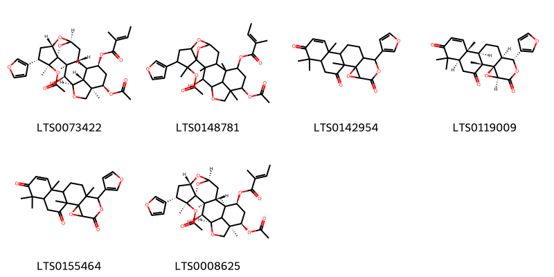{ width=100% }
    <figcaption>Hình ảnh cấu trúc hóa học của 6 hoạt chất thuộc nhóm Naphthopyrans gồm ['(1r,2r,4r,6s,8s,9s,10s,11s,12s,13r,16r,17r,19s,20r)-9,17-bis(acetyloxy)-8-(furan-3-yl)-12-hydroxy-1,9,11,16-tetramethyl-5,14,21-trioxahexacyclo[11.6.1.1⁴,¹⁰.0²,¹¹.0⁶,¹⁰.0¹⁶,²⁰]henicosan-19-yl (2e)-2-methylbut-2-enoate (LTS0073422)', '9,17-bis(acetyloxy)-8-(furan-3-yl)-12-hydroxy-1,9,11,16-tetramethyl-5,14,21-trioxahexacyclo[11.6.1.1⁴,¹⁰.0²,¹¹.0⁶,¹⁰.0¹⁶,²⁰]henicosan-19-yl 2-methylbut-2-enoate (LTS0148781)', '7-(furan-3-yl)-1,12,16,16-tetramethyl-3,6-dioxapentacyclo[9.8.0.0²,⁴.0²,⁸.0¹²,¹⁷]nonadec-13-ene-5,15,19-trione (LTS0142954)', '(1r,2r,4s,7r,8s,11r,12s,17r)-7-(furan-3-yl)-1,12,16,16-tetramethyl-3,6-dioxapentacyclo[9.8.0.0²,⁴.0²,⁸.0¹²,¹⁷]nonadec-13-ene-5,15,19-trione (LTS0119009)', '7-(furan-3-yl)-1,8,12,16,16-pentamethyl-3,6-dioxapentacyclo[9.8.0.0²,⁴.0²,⁸.0¹²,¹⁷]nonadec-13-ene-5,15,19-trione (LTS0155464)', '(1r,2r,4r,6s,8s,9s,10s,11s,12s,13r,16r,17r,19s)-9,17-bis(acetyloxy)-8-(furan-3-yl)-12-hydroxy-1,9,11,16-tetramethyl-5,14,21-trioxahexacyclo[11.6.1.1⁴,¹⁰.0²,¹¹.0⁶,¹⁰.0¹⁶,²⁰]henicosan-19-yl (2e)-2-methylbut-2-enoate (LTS0008625)'].</figcaption>
</figure>
#### Nhóm Organic oxides
<figure markdown="span">
    { width=100% }
    <figcaption>Hình ảnh cấu trúc hóa học của 1 hoạt chất thuộc nhóm Organic oxides gồm ['2-methylpentaldehyde (LTS0013114)'].</figcaption>
</figure>
#### Nhóm Organooxygen compounds
<figure markdown="span">
    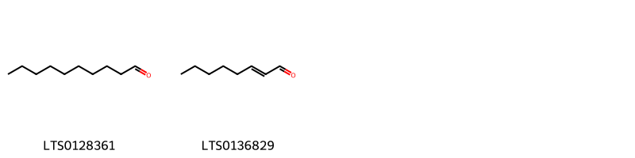{ width=100% }
    <figcaption>Hình ảnh cấu trúc hóa học của 2 hoạt chất thuộc nhóm Organooxygen compounds gồm ['decanal (LTS0128361)', '(e)-2-octenal (LTS0136829)'].</figcaption>
</figure>
#### Nhóm Phenols
<figure markdown="span">
    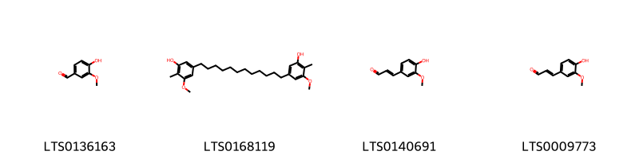{ width=100% }
    <figcaption>Hình ảnh cấu trúc hóa học của 4 hoạt chất thuộc nhóm Phenols gồm ['vanillin (LTS0136163)', '5-[12-(3-hydroxy-5-methoxy-4-methylphenyl)dodecyl]-3-methoxy-2-methylphenol (LTS0168119)', 'coniferyl aldehyde (LTS0140691)', 'coniferaldehyde (LTS0009773)'].</figcaption>
</figure>
#### Nhóm Prenol lipids
<figure markdown="span">
    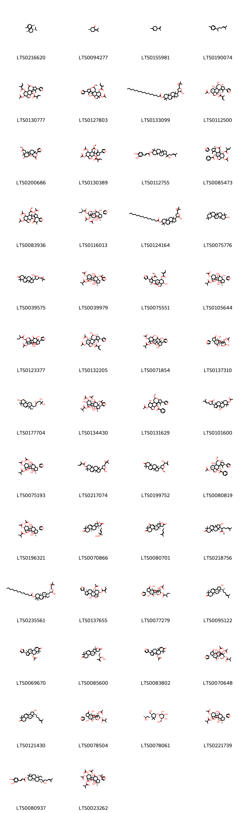{ width=100% }
    <figcaption>Hình ảnh cấu trúc hóa học của 379 hoạt chất thuộc nhóm Prenol lipids gồm ['(1s,6r,8s)-8-isopropyl-1,3-dimethyltricyclo[4.4.0.0²,⁷]dec-3-ene (LTS0216620)', '(+)-pulegone (LTS0094277)', 'limonene,  (LTS0155981)', 'curcumene (LTS0190074)', '17-(acetyloxy)-8-(furan-3-yl)-1,9,11,16-tetramethyl-19-[(2-methylbut-2-enoyl)oxy]-4-oxo-5,14-dioxapentacyclo[11.6.1.0²,¹¹.0⁶,¹⁰.0¹⁶,²⁰]icos-9-en-12-yl 2-methylbut-2-enoate (LTS0130777)', '17-(acetyloxy)-8-(furan-3-yl)-12-hydroxy-4-methoxy-1,9,11,16-tetramethyl-5,14-dioxapentacyclo[11.6.1.0²,¹¹.0⁶,¹⁰.0¹⁶,²⁰]icos-9-en-19-yl 2-methylbut-2-enoate (LTS0127803)', '1-[5-(3,3-dimethyloxiran-2-yl)-2-hydroxyoxolan-3-yl]-3a,6,6,9a,11a-pentamethyl-1h,2h,3h,5h,5ah,7h,8h,9h,9bh,10h,11h-cyclopenta[a]phenanthren-7-yl octadecanoate (LTS0133099)', '(1r,2r,4r,6s,8r,11r,12s,13r,16r,17r,19s,20r)-17-(acetyloxy)-8-(furan-3-yl)-4,19-dihydroxy-1,9,11,16-tetramethyl-5,14-dioxapentacyclo[11.6.1.0²,¹¹.0⁶,¹⁰.0¹⁶,²⁰]icos-9-en-12-yl (2e)-2-methylbut-2-enoate (LTS0112500)', 'methyl 2-[13-(furan-3-yl)-6,6,8,12-tetramethyl-17-methylidene-5,15-dioxo-2,14-dioxatetracyclo[7.7.1.0¹,¹².0³,⁸]heptadecan-7-yl]acetate (LTS0200686)', '5,7-bis(acetyloxy)-10-[3-(furan-3-yl)-5-methoxy-2-methylcyclopent-1-en-1-yl]-9-(2-methoxy-2-oxoethyl)-4,8,10-trimethyl-2-oxatricyclo[6.3.1.0⁴,¹²]dodecan-11-yl 2-methylbut-2-enoate (LTS0130389)', '1-(2-hydroxy-6-methylhept-5-en-2-yl)-3a,3b,6,6,9a-pentamethyl-dodecahydro-1h-cyclopenta[a]phenanthren-7-yl 3-(3,4-dihydroxyphenyl)prop-2-enoate (LTS0112755)', '(1r,2r,6s,8r,11r,12s,13r,16r,17r,19s,20r)-17-(acetyloxy)-8-(furan-3-yl)-1,9,11,16-tetramethyl-19-{[(2e)-2-methylbut-2-enoyl]oxy}-4-oxo-5,14-dioxapentacyclo[11.6.1.0²,¹¹.0⁶,¹⁰.0¹⁶,²⁰]icos-9-en-12-yl benzoate (LTS0085473)', '5,7-bis(acetyloxy)-10-[5-(acetyloxy)-3-(furan-3-yl)-2-methylcyclopent-1-en-1-yl]-9-(2-methoxy-2-oxoethyl)-4,8,10-trimethyl-2-oxatricyclo[6.3.1.0⁴,¹²]dodecan-11-yl 2-methylpropanoate (LTS0083936)', '(1s,2r,4r,5r,6s,8r,10s,11s,12r,14r,15r,16r,19r,20r,21s)-20,21-bis(acetyloxy)-6-(furan-3-yl)-4,12,19-trihydroxy-5,11,15-trimethyl-3-oxo-9,17-dioxahexacyclo[13.3.3.0¹,¹⁴.0²,¹¹.0⁵,¹⁰.0⁸,¹⁰]henicosan-16-yl (2r)-2-methylbutanoate (LTS0116013)', '1-[5-(3,3-dimethyloxiran-2-yl)-2-hydroxyoxolan-3-yl]-3a,6,6,9a,11a-pentamethyl-1h,2h,3h,5h,5ah,7h,8h,9h,9bh,10h,11h-cyclopenta[a]phenanthren-7-yl hexadecanoate (LTS0124164)', 'β-amyrin (LTS0075776)', '1-[5-(3,3-dimethyloxiran-2-yl)-2-hydroxyoxolan-3-yl]-3a,6,6,9a,11a-pentamethyl-1h,2h,3h,5h,5ah,8h,9h,9bh,10h,11h-cyclopenta[a]phenanthren-7-one (LTS0039575)', '(1s,2r,4r,5r,6s,8r,10s,11s,12r,14r,15s,16s,19s,21r)-4,21-bis(acetyloxy)-6-(furan-3-yl)-12,19-dihydroxy-5,11,15-trimethyl-3-oxo-9,17-dioxahexacyclo[13.3.3.0¹,¹⁴.0²,¹¹.0⁵,¹⁰.0⁸,¹⁰]henicosan-16-yl 2-methylpropanoate (LTS0039979)', '3-deacetylsalannin (LTS0075551)', '(1s,2r,4r,5r,6s,8r,10s,11s,12r,14r,15r,16s,19s,21r)-21-(acetyloxy)-6-(furan-3-yl)-4,12,19-trihydroxy-5,11,15-trimethyl-3-oxo-9,17-dioxahexacyclo[13.3.3.0¹,¹⁴.0²,¹¹.0⁵,¹⁰.0⁸,¹⁰]henicosan-16-yl 2-methylpropanoate (LTS0105644)', '21-(acetyloxy)-6-(furan-3-yl)-4,12,19-trihydroxy-5,11,15-trimethyl-3-oxo-9,17-dioxahexacyclo[13.3.3.0¹,¹⁴.0²,¹¹.0⁵,¹⁰.0⁸,¹⁰]henicosan-16-yl 2-methylbutanoate (LTS0123377)', '(1r,2r,4r,6s,8r,11r,12s,13s,16r,17s,19r,20r)-17,19-bis(acetyloxy)-8-(furan-3-yl)-4-hydroxy-1,9,11,16-tetramethyl-5,14-dioxapentacyclo[11.6.1.0²,¹¹.0⁶,¹⁰.0¹⁶,²⁰]icos-9-en-12-yl (2e)-2-methylbut-2-enoate (LTS0132205)', '20-(acetyloxy)-6-(furan-3-yl)-4,8,18-trihydroxy-5,10,14-trimethyl-3-oxo-16,21-dioxahexacyclo[12.3.3.1⁹,¹¹.0¹,¹³.0²,¹⁰.0⁵,⁹]henicosan-15-yl 2-methylpropanoate (LTS0071854)', '(1s,2s,5s,6r,9r,10s,11r,13r,14r,15s,18s,20r)-6-(furan-3-yl)-11,15,18-trihydroxy-5,10,14-trimethyl-3,8-dioxo-16-oxapentacyclo[12.3.3.0¹,¹³.0²,¹⁰.0⁵,⁹]icosan-20-yl acetate (LTS0137310)', '(1s)-1-[(2r,3r)-3-[(1r)-1-[(1s,3as,5ar,7s,9ar,9br,11as)-7-hydroxy-3a,6,6,9a,11a-pentamethyl-1h,2h,3h,5h,5ah,7h,8h,9h,9bh,10h,11h-cyclopenta[a]phenanthren-1-yl]ethyl]oxiran-2-yl]-2-methylpropane-1,2-diol (LTS0177704)', '(1s,2r,4r,5s,6r,8s,10r,11s,12s,14r,15r,16s,19r,20r,21r)-4,19,20-tris(acetyloxy)-6-(furan-3-yl)-12,21-dihydroxy-5,11,15-trimethyl-3-oxo-9,17-dioxahexacyclo[13.3.3.0¹,¹⁴.0²,¹¹.0⁵,¹⁰.0⁸,¹⁰]henicosan-16-yl 2-methylpropanoate (LTS0134430)', '17-(acetyloxy)-8-(furan-3-yl)-19-hydroxy-4-methoxy-1,9,11,16-tetramethyl-5,14-dioxapentacyclo[11.6.1.0²,¹¹.0⁶,¹⁰.0¹⁶,²⁰]icos-9-en-12-yl benzoate (LTS0131629)', '4-hydroxy-3b,6,6,9a,11a-pentamethyl-1-[5-(2-methylprop-1-en-1-yl)-2-oxooxolan-3-yl]-1h,2h,4h,5h,5ah,7h,8h,9h,9bh,10h,11h-cyclopenta[a]phenanthren-7-yl acetate (LTS0101600)', '(1s,2r,5s,6s,8r,10r,11s,12r,14r,15r,16s,19r,20r,21s)-20,21-bis(acetyloxy)-6-(furan-3-yl)-12,19-dihydroxy-5,11,15-trimethyl-3-oxo-9,17-dioxahexacyclo[13.3.3.0¹,¹⁴.0²,¹¹.0⁵,¹⁰.0⁸,¹⁰]henicosan-16-yl 2-methylpropanoate (LTS0075193)', '1-[5-(3,3-dimethyloxiran-2-yl)-2-hydroxyoxolan-3-yl]-3a,6,6,9a,11a-pentamethyl-1h,2h,3h,5h,5ah,7h,8h,9h,9bh,10h,11h-cyclopenta[a]phenanthren-7-yl 2-methylbut-2-enoate (LTS0217074)', '1-[5-(1-hydroxy-2-methylprop-2-en-1-yl)-2-methoxyoxolan-3-yl]-3a,6,6,9a,11a-pentamethyl-1h,2h,3h,5h,5ah,8h,9h,9bh,10h,11h-cyclopenta[a]phenanthren-7-one (LTS0199752)', '(1r,2r,4r,6s,8r,11r,12s,13r,16r,17r,19s,20r)-17-(acetyloxy)-8-(furan-3-yl)-19-hydroxy-4-methoxy-1,9,11,16-tetramethyl-5,14-dioxapentacyclo[11.6.1.0²,¹¹.0⁶,¹⁰.0¹⁶,²⁰]icos-9-en-12-yl benzoate (LTS0080819)', '(1s,2r,5s,6s,8r,10r,11s,12r,14r,15r,16r,19r,20r,21s)-20,21-bis(acetyloxy)-6-(furan-3-yl)-12,19-dihydroxy-5,11,15-trimethyl-3-oxo-9,17-dioxahexacyclo[13.3.3.0¹,¹⁴.0²,¹¹.0⁵,¹⁰.0⁸,¹⁰]henicosan-16-yl 2-methylpropanoate (LTS0196321)', 'meliasenin m, (rel)- (LTS0070866)', '(2s,4s,7r,8s,9s,12r,13r,18r)-2,9,13,17,17-pentamethyl-7-(4-methylpent-3-en-1-yl)-5-oxapentacyclo[10.8.0.0²,⁹.0⁴,⁸.0¹³,¹⁸]icos-1(20)-ene-6,16,19-trione (LTS0080701)', 'methyl 2-{2-hydroxy-3a,6,6,9a,11a-pentamethyl-7-oxo-1h,2h,3h,5h,5ah,8h,9h,9bh,10h,11h-cyclopenta[a]phenanthren-1-yl}-6-methylhept-5-enoate (LTS0218756)', '(1s,3as,5as,7s,9ar,9br,11as)-1-[(2r,3s,5r)-5-[(2s)-3,3-dimethyloxiran-2-yl]-2-hydroxyoxolan-3-yl]-3a,6,6,9a,11a-pentamethyl-1h,2h,3h,5h,5ah,7h,8h,9h,9bh,10h,11h-cyclopenta[a]phenanthren-7-yl tetradecanoate (LTS0235561)', '(1r,2r,5s,6r,10r,11s,12r,15r,16r,18s,19r)-18-(acetyloxy)-6-(furan-3-yl)-11-hydroxy-1,5,10,15-tetramethyl-13-oxapentacyclo[10.6.1.0²,¹⁰.0⁵,⁹.0¹⁵,¹⁹]nonadec-8-en-16-yl (2z)-2-methylbut-2-enoate (LTS0137655)', '(1s,2s,4r,5s,6s,9s,10s,11r,13r,14s,15s,18s,20r)-20-(acetyloxy)-6-(furan-3-yl)-4,11,18-trihydroxy-5,10,14-trimethyl-3,8-dioxo-16-oxapentacyclo[12.3.3.0¹,¹³.0²,¹⁰.0⁵,⁹]icosan-15-yl 2-methylbutanoate (LTS0077279)', '(1s,2s,3as,5as,9as,9bs,11as)-2-hydroxy-3a,6,6,9a,11a-pentamethyl-1-[(2s)-6-methylhept-5-en-2-yl]-1h,2h,3h,5h,5ah,8h,9h,9bh,10h,11h-cyclopenta[a]phenanthren-7-one (LTS0095122)', 'azadirone (LTS0069670)', 'meliasenin o (LTS0085600)', '1-(furan-3-yl)-3b,6,6,9a,11a-pentamethyl-7-oxo-1h,2h,4h,5h,5ah,9bh,10h,11h-cyclopenta[a]phenanthren-4-yl acetate (LTS0083802)', '(1s,2s,5s,6r,9r,10s,11r,13r,14r,15s,18r,19r,20s)-19,20-bis(acetyloxy)-6-(furan-3-yl)-11,18-dihydroxy-5,10,14-trimethyl-3,8-dioxo-16-oxapentacyclo[12.3.3.0¹,¹³.0²,¹⁰.0⁵,⁹]icosan-15-yl 2-methylpropanoate (LTS0070648)', '(1s,2s,3as,5ar,9ar,9bs,11as)-2-hydroxy-3a,6,6,9a,11a-pentamethyl-1-[(2r)-6-methylhept-5-en-2-yl]-1h,2h,3h,5h,5ah,8h,9h,9bh,10h,11h-cyclopenta[a]phenanthren-7-one (LTS0121430)', '(1s,2s,4r,5s,6s,9s,10s,11r,13r,14r,15s,18s,20r)-20-(acetyloxy)-6-(furan-3-yl)-4,11,18-trihydroxy-5,10,14-trimethyl-3,8-dioxo-16-oxapentacyclo[12.3.3.0¹,¹³.0²,¹⁰.0⁵,⁹]icosan-15-yl 2-methylpropanoate (LTS0078504)', '(2r,3r,4s,5s,6r)-2-{[(1s,4r,5s)-4-[(3s)-3-hydroxybutyl]-5-(hydroxymethyl)-3,3-dimethylcyclohexyl]oxy}-6-(hydroxymethyl)oxane-3,4,5-triol (LTS0078061)', '(1s,2r,5s,6s,8r,10r,11s,12r,14r,15r,16r,19s,21r)-21-(acetyloxy)-6-(furan-3-yl)-12,19-dihydroxy-5,11,15-trimethyl-3-oxo-9,17-dioxahexacyclo[13.3.3.0¹,¹⁴.0²,¹¹.0⁵,¹⁰.0⁸,¹⁰]henicosan-16-yl 2-methylpropanoate (LTS0221739)', '(1s,3ar,3br,5ar,7s,9ar,9br,11ar)-1-[(2s)-2-hydroxy-6-methylhept-5-en-2-yl]-3a,3b,6,6,9a-pentamethyl-dodecahydro-1h-cyclopenta[a]phenanthren-7-yl (2e)-3-(3,4-dihydroxyphenyl)prop-2-enoate (LTS0080937)', '(1s,2r,4r,5r,6s,8r,11s,12r,14r,15r,16s,19r,20r,21s)-4,19,20,21-tetrakis(acetyloxy)-6-(furan-3-yl)-12-hydroxy-5,11,15-trimethyl-3-oxo-9,17-dioxahexacyclo[13.3.3.0¹,¹⁴.0²,¹¹.0⁵,¹⁰.0⁸,¹⁰]henicosan-16-yl 2-methylpropanoate (LTS0023262)', '(1s,2s,3r,4s,5r,7s,8r,9r,10r,13r,15r)-2,5-bis(acetyloxy)-4-formyl-13-(furan-3-yl)-9-(2-methoxy-2-oxoethyl)-4,8,10,12-tetramethyl-16-oxatetracyclo[8.6.0.0³,⁸.0¹¹,¹⁵]hexadec-11-en-7-yl (2e)-2-methylbut-2-enoate (LTS0091735)', '(1s,2s,4r,5s,6s,9r,10s,11r,13r,14r,15s,17r,19s)-15-(acetyloxy)-6-(furan-3-yl)-11-hydroxy-5,10,14-trimethyl-3,8-dioxo-18,20-dioxahexacyclo[11.8.0.0¹,¹⁷.0²,¹⁰.0⁵,⁹.0¹⁴,¹⁹]henicosan-4-yl acetate (LTS0160454)', '21-(acetyloxy)-6-(furan-3-yl)-4,12,19,20-tetrahydroxy-5,11,15-trimethyl-3-oxo-9,17-dioxahexacyclo[13.3.3.0¹,¹⁴.0²,¹¹.0⁵,¹⁰.0⁸,¹⁰]henicosan-16-yl 2-methylbutanoate (LTS0095522)', '(1s,2s,3as,5ar,9ar,9br,11as)-2-hydroxy-1-[(2r)-5-hydroxy-6-methylhept-6-en-2-yl]-3a,6,6,9a,11a-pentamethyl-1h,2h,3h,5h,5ah,8h,9h,9bh,10h,11h-cyclopenta[a]phenanthren-7-one (LTS0184857)', '(1s,2r,4r,6s,7s,10r,11r,16r,18r)-6-(furan-3-yl)-1,7,11,15,15-pentamethyl-14-oxo-3-oxapentacyclo[8.8.0.0²,⁴.0²,⁷.0¹¹,¹⁶]octadec-12-en-18-yl acetate (LTS0025640)', '(3r,6s)-3-[(1s,2s,3as,5ar,9ar,9br,11as)-2-hydroxy-3a,6,6,9a,11a-pentamethyl-7-oxo-1h,2h,3h,5h,5ah,8h,9h,9bh,10h,11h-cyclopenta[a]phenanthren-1-yl]-6-(2-hydroxypropan-2-yl)oxan-2-one (LTS0151834)', '(1s,2r,4r,5r,6s,8r,10s,11s,12r,14r,15r,16r,19s,21r)-21-(acetyloxy)-6-(furan-3-yl)-4,12,19-trihydroxy-5,11,15-trimethyl-3-oxo-9,17-dioxahexacyclo[13.3.3.0¹,¹⁴.0²,¹¹.0⁵,¹⁰.0⁸,¹⁰]henicosan-16-yl (2r)-2-methylbutanoate (LTS0079748)', '17-(acetyloxy)-8-(furan-3-yl)-1,9,11,16-tetramethyl-19-[(2-methylbut-2-enoyl)oxy]-4-oxo-5,14-dioxapentacyclo[11.6.1.0²,¹¹.0⁶,¹⁰.0¹⁶,²⁰]icos-9-en-12-yl benzoate (LTS0027957)', '(1s,3ar,5ar,9ar,9br,11r,11as)-11-hydroxy-1-[(2r,3s)-3-hydroxy-6-methyl-4-oxohept-5-en-2-yl]-3a,6,6,9a,11a-pentamethyl-1h,2h,3h,5h,5ah,8h,9h,9bh,10h,11h-cyclopenta[a]phenanthren-7-one (LTS0017156)', '21-(acetyloxy)-6-(furan-3-yl)-12,19,20-trihydroxy-5,11,15-trimethyl-3-oxo-9,17-dioxahexacyclo[13.3.3.0¹,¹⁴.0²,¹¹.0⁵,¹⁰.0⁸,¹⁰]henicosan-16-yl 2-methylpropanoate (LTS0092736)', '(1s,2r,4r,5r,6s,8r,10s,11s,12r,14r,15r,16r,19r,20r,21s)-4,21-bis(acetyloxy)-6-(furan-3-yl)-12,19,20-trihydroxy-5,11,15-trimethyl-3-oxo-9,17-dioxahexacyclo[13.3.3.0¹,¹⁴.0²,¹¹.0⁵,¹⁰.0⁸,¹⁰]henicosan-16-yl (2r)-2-methylbutanoate (LTS0035577)', '5,7-bis(acetyloxy)-10-[3-(furan-3-yl)-5-hydroxy-2-methylcyclopent-1-en-1-yl]-9-(2-methoxy-2-oxoethyl)-4,8,10-trimethyl-2-oxatricyclo[6.3.1.0⁴,¹²]dodecan-11-yl 2-methylbut-2-enoate (LTS0163790)', '3-{3a,6,6,9a,11a-pentamethyl-7-oxo-1h,2h,3h,5h,5ah,8h,9h,9bh,10h,11h-cyclopenta[a]phenanthren-1-yl}-5-(3,3-dimethyloxiran-2-yl)oxolan-2-yl acetate (LTS0103399)', '3-{2-hydroxy-3a,6,6,9a,11a-pentamethyl-7-oxo-1h,2h,3h,5h,5ah,8h,9h,9bh,10h,11h-cyclopenta[a]phenanthren-1-yl}-5-(2-methylprop-1-en-1-yl)oxolan-2-one (LTS0164100)', '21-(acetyloxy)-6-(furan-3-yl)-12,19-dihydroxy-5,11,15-trimethyl-16-(2-methylpropanoyl)-3-oxo-9,17-dioxahexacyclo[13.3.3.0¹,¹⁴.0²,¹¹.0⁵,¹⁰.0⁸,¹⁰]henicosan-4-yl acetate (LTS0170836)', '14-(acetyloxy)-6-(furan-3-yl)-10-(2-methoxy-2-oxoethyl)-7,9,11,15-tetramethyl-3,17-dioxapentacyclo[9.6.1.0²,⁹.0⁴,⁸.0¹⁵,¹⁸]octadec-7-en-12-yl 2-methylbut-2-enoate (LTS0175012)', '(2s,3s,5s)-3-[(1s,3as,5ar,9ar,9br,11as)-3a,6,6,9a,11a-pentamethyl-7-oxo-1h,2h,3h,5h,5ah,8h,9h,9bh,10h,11h-cyclopenta[a]phenanthren-1-yl]-5-[(2s)-3,3-dimethyloxiran-2-yl]oxolan-2-yl acetate (LTS0087614)', '(1s,4r,5r,6s,8r,10s,11s,12r,15r,19r,20r,21s)-20,21-bis(acetyloxy)-6-(furan-3-yl)-4,12,19-trihydroxy-5,11,15-trimethyl-3-oxo-9,17-dioxahexacyclo[13.3.3.0¹,¹⁴.0²,¹¹.0⁵,¹⁰.0⁸,¹⁰]henicosan-16-yl 2-methylbutanoate (LTS0069351)', '6-({[4-(3-hydroxybutyl)-5-(hydroxymethyl)-3,3-dimethylcyclohexyl]oxy}methyl)oxane-2,3,4,5-tetrol (LTS0168919)', '6-[({4-[4-hydroxy-6-(hydroxymethyl)-2,2-dimethylcyclohexyl]butan-2-yl}oxy)methyl]oxane-2,3,4,5-tetrol (LTS0089923)', '4,19,20,21-tetrakis(acetyloxy)-6-(furan-3-yl)-12-hydroxy-5,11,15-trimethyl-3-oxo-9,17-dioxahexacyclo[13.3.3.0¹,¹⁴.0²,¹¹.0⁵,¹⁰.0⁸,¹⁰]henicosan-16-yl 2-methylpropanoate (LTS0027198)', '(1s,2r,4r,5r,6s,8r,10s,11s,12r,14r,15s,19r,20r,21s)-4,19,20,21-tetrakis(acetyloxy)-6-(furan-3-yl)-12-hydroxy-5,11,15-trimethyl-3-oxo-9,17-dioxahexacyclo[13.3.3.0¹,¹⁴.0²,¹¹.0⁵,¹⁰.0⁸,¹⁰]henicosan-16-yl 2-methylpropanoate (LTS0095461)', '5-(acetyloxy)-10-[5-(acetyloxy)-3-(furan-3-yl)-2-methylcyclopent-1-en-1-yl]-9-(2-methoxy-2-oxoethyl)-4,8,10-trimethyl-11-[(2-methylpropanoyl)oxy]-2-oxatricyclo[6.3.1.0⁴,¹²]dodecan-7-yl 2-methylbut-2-enoate (LTS0110792)', '(1r,3as,5as,9as,9bs,11as)-1-[(2r,3s,5r)-5-[(2r)-3,3-dimethyloxiran-2-yl]-2-hydroxyoxolan-3-yl]-3a,6,6,9a,11a-pentamethyl-1h,2h,3h,5h,5ah,8h,9h,9bh,10h,11h-cyclopenta[a]phenanthren-7-one (LTS0097110)', '(1s,2r,3r,4s,5r,7s,8r,9s,10r,13r,15r)-2-(acetyloxy)-4-formyl-13-(furan-3-yl)-5-hydroxy-9-(2-methoxy-2-oxoethyl)-4,8,10,12-tetramethyl-16-oxatetracyclo[8.6.0.0³,⁸.0¹¹,¹⁵]hexadec-11-en-7-yl (2e)-3-phenylprop-2-enoate (LTS0171442)', '(1s,2r,4r,5r,6s,8r,11s,12r,14r,15r,16s,19r,20r,21s)-20,21-bis(acetyloxy)-6-(furan-3-yl)-4,12,19-trihydroxy-5,11,15-trimethyl-3-oxo-9,17-dioxahexacyclo[13.3.3.0¹,¹⁴.0²,¹¹.0⁵,¹⁰.0⁸,¹⁰]henicosan-16-yl 2-methylpropanoate (LTS0182633)', '(1r,2s,4r,6r,9r,10s,11r,12s,14r,15r,18r)-14-(acetyloxy)-6-(furan-3-yl)-10-(2-methoxy-2-oxoethyl)-7,9,11,15-tetramethyl-3,17-dioxapentacyclo[9.6.1.0²,⁹.0⁴,⁸.0¹⁵,¹⁸]octadec-7-en-12-yl (2e)-2-methylbut-2-enoate (LTS0111389)', '20-(acetyloxy)-6-(furan-3-yl)-11,15,18-trihydroxy-5,10,14-trimethyl-3,8-dioxo-16-oxapentacyclo[12.3.3.0¹,¹³.0²,¹⁰.0⁵,⁹]icosan-4-yl acetate (LTS0113820)', '20-(acetyloxy)-6-(furan-3-yl)-11,18,19-trihydroxy-5,10,14-trimethyl-3,8-dioxo-16-oxapentacyclo[12.3.3.0¹,¹³.0²,¹⁰.0⁵,⁹]icosan-15-yl 2-methylpropanoate (LTS0180604)', '(1s,2r,4r,5r,6s,8r,10s,11s,12r,14r,15r,16r,19r,20r,21s)-4,20,21-tris(acetyloxy)-6-(furan-3-yl)-12,19-dihydroxy-5,11,15-trimethyl-3-oxo-9,17-dioxahexacyclo[13.3.3.0¹,¹⁴.0²,¹¹.0⁵,¹⁰.0⁸,¹⁰]henicosan-16-yl 2-methylpropanoate (LTS0060623)', '6-(furan-3-yl)-4,11,18-trihydroxy-15-methoxy-5,10,14-trimethyl-3,8-dioxo-16-oxapentacyclo[12.3.3.0¹,¹³.0²,¹⁰.0⁵,⁹]icosan-20-yl acetate (LTS0046779)', '(1s,2s,4r,5s,6s,9s,10s,11r,13r,14s,15r,18s,20r)-6-(furan-3-yl)-4,11,15,18-tetrahydroxy-5,10,14-trimethyl-3,8-dioxo-16-oxapentacyclo[12.3.3.0¹,¹³.0²,¹⁰.0⁵,⁹]icosan-20-yl acetate (LTS0057229)', 'meliasenin l, (rel)- (LTS0097338)', '(1s,3as,5ar,9ar,9br,11as)-1-[(2s,3s,5r)-5-[(1s)-1,2-dihydroxy-2-methylpropyl]-2-methoxyoxolan-3-yl]-3a,6,6,9a,11a-pentamethyl-1h,2h,3h,5h,5ah,8h,9h,9bh,10h,11h-cyclopenta[a]phenanthren-7-one (LTS0120580)', '(1s,3br,4r,5ar,7r,9as,9bs,11as)-1-[(2r,3s,5r)-5-[(1s)-1,2-dihydroxy-2-methylpropyl]-2-methoxyoxolan-3-yl]-3b,6,6,9a,11a-pentamethyl-1h,2h,4h,5h,5ah,7h,8h,9h,9bh,10h,11h-cyclopenta[a]phenanthrene-4,7-diol (LTS0173889)', '(2s,3r)-2-[(1r,3as,5as,9as,9bs,11s,11ar)-11-hydroxy-3a,6,6,9a,11a-pentamethyl-7-oxo-1h,2h,3h,5h,5ah,8h,9h,9bh,10h,11h-cyclopenta[a]phenanthren-1-yl]-6-methyl-4-oxohept-5-en-3-yl acetate (LTS0106513)', '(1r,4r,5r,7s,8r,9r,10r,11s,12r)-5,7-bis(acetyloxy)-10-[(3r,5s)-3-(furan-3-yl)-5-methoxy-2-methylcyclopent-1-en-1-yl]-9-(2-methoxy-2-oxoethyl)-4,8,10-trimethyl-2-oxatricyclo[6.3.1.0⁴,¹²]dodecan-11-yl benzoate (LTS0034488)', '5,7-bis(acetyloxy)-10-[5-(acetyloxy)-3-(furan-3-yl)-2-methylcyclopent-1-en-1-yl]-9-[(acetyloxy)methyl]-4,8,10-trimethyl-2-oxatricyclo[6.3.1.0⁴,¹²]dodecan-11-yl 2-methylbut-2-enoate (LTS0038459)', '9-acetyl-5,11-dihydroxy-10-{2-hydroxy-11-methyl-5,7,10-trioxatetracyclo[6.3.1.0²,⁶.0⁹,¹¹]dodec-3-en-9-yl}-8-(hydroxymethyl)-4,10-dimethyl-2-oxatricyclo[6.3.1.0⁴,¹²]dodecan-7-yl 3-phenylprop-2-enoate (LTS0183655)', '(1s,2r,4r,5r,8r,10s,11s,12r,14r,15r,19s,21r)-21-(acetyloxy)-6-(furan-3-yl)-12,16,19-trihydroxy-5,11,15-trimethyl-3-oxo-9,17-dioxahexacyclo[13.3.3.0¹,¹⁴.0²,¹¹.0⁵,¹⁰.0⁸,¹⁰]henicosan-4-yl acetate (LTS0089783)', '(1s,3as,5ar,7r,9ar,9br,11as)-1-[(2r,3s,5s)-5-[(2s)-3,3-dimethyloxiran-2-yl]-2-hydroxyoxolan-3-yl]-3a,6,6,9a,11a-pentamethyl-1h,2h,3h,5h,5ah,7h,8h,9h,9bh,10h,11h-cyclopenta[a]phenanthren-7-yl (2e)-2-methylbut-2-enoate (LTS0048681)', '17-(acetyloxy)-8-(furan-3-yl)-19-hydroxy-1,9,11,16-tetramethyl-4-oxo-5,14-dioxapentacyclo[11.6.1.0²,¹¹.0⁶,¹⁰.0¹⁶,²⁰]icos-9-en-12-yl benzoate (LTS0117328)', '(1r,4r,5r,7s,8r,9r,10r,11s)-5-(acetyloxy)-10-[(3r,5s)-5-(acetyloxy)-3-(furan-3-yl)-2-methylcyclopent-1-en-1-yl]-9-(2-methoxy-2-oxoethyl)-4,8,10-trimethyl-7-[(2-methylbutanoyl)oxy]-2-oxatricyclo[6.3.1.0⁴,¹²]dodecan-11-yl (2e)-2-methylbut-2-enoate (LTS0113011)', '(1s,2r,4r,5r,6s,8r,10s,11s,12r,14r,15r,16s,19s,21r)-6-(furan-3-yl)-4,12,16,19-tetrahydroxy-5,11,15-trimethyl-3-oxo-9,17-dioxahexacyclo[13.3.3.0¹,¹⁴.0²,¹¹.0⁵,¹⁰.0⁸,¹⁰]henicosan-21-yl acetate (LTS0200015)', '(1r,3br,4r,5as,7r,9s,9as,9br,11as)-9-(acetyloxy)-1-(furan-3-yl)-7-hydroxy-3b,6,6,9a,11a-pentamethyl-1h,2h,4h,5h,5ah,7h,8h,9h,9bh,10h,11h-cyclopenta[a]phenanthren-4-yl acetate (LTS0120292)', '19-(acetyloxy)-8-(furan-3-yl)-1,9,11,16-tetramethyl-17-[(2-methylpropanoyl)oxy]-4-oxo-5,14-dioxapentacyclo[11.6.1.0²,¹¹.0⁶,¹⁰.0¹⁶,²⁰]icos-9-en-12-yl 2-methylbut-2-enoate (LTS0274594)', '6-(furan-3-yl)-14-hydroxy-10-(2-methoxy-2-oxoethyl)-7,9,11,15-tetramethyl-3,17-dioxapentacyclo[9.6.1.0²,⁹.0⁴,⁸.0¹⁵,¹⁸]octadec-7-en-12-yl 3-phenylprop-2-enoate (LTS0129203)', '(3r,5s)-3-[(1s,3br,4r,5as,7s,9as,9br,11as)-4,7-dihydroxy-3b,6,6,9a,11a-pentamethyl-1h,2h,4h,5h,5ah,7h,8h,9h,9bh,10h,11h-cyclopenta[a]phenanthren-1-yl]-5-(2-methylprop-1-en-1-yl)oxolan-2-one (LTS0113191)', '5-(acetyloxy)-10-[5-(acetyloxy)-3-(furan-3-yl)-2-methylcyclopent-1-en-1-yl]-9-(2-methoxy-2-oxoethyl)-4,8,10-trimethyl-7-[(2-methylbutanoyl)oxy]-2-oxatricyclo[6.3.1.0⁴,¹²]dodecan-11-yl 2-methylbut-2-enoate (LTS0252479)', '(1s,3as,5ar,9ar,9br,11as)-1-[(2r,3s,5r)-5-[(1r)-1-hydroxy-2-methylprop-2-en-1-yl]-2-methoxyoxolan-3-yl]-3a,6,6,9a,11a-pentamethyl-1h,2h,3h,5h,5ah,8h,9h,9bh,10h,11h-cyclopenta[a]phenanthren-7-one (LTS0132206)', '(1r,4r,5r,7s,8r,9r,10r,11s,12r)-5,7-bis(acetyloxy)-10-[(3r,5s)-5-(acetyloxy)-3-(furan-3-yl)-2-methylcyclopent-1-en-1-yl]-9-(2-methoxy-2-oxoethyl)-4,8,10-trimethyl-2-oxatricyclo[6.3.1.0⁴,¹²]dodecan-11-yl (2e)-2-methylbut-2-enoate (LTS0192332)', '(1s,2r,4r,5r,6s,8r,10s,11s,12r,14r,15r,16r,19s,21r)-21-(acetyloxy)-6-(furan-3-yl)-12,16,19-trihydroxy-5,11,15-trimethyl-3-oxo-9,17-dioxahexacyclo[13.3.3.0¹,¹⁴.0²,¹¹.0⁵,¹⁰.0⁸,¹⁰]henicosan-4-yl acetate (LTS0201506)', '2-{11-hydroxy-3a,6,6,9a,11a-pentamethyl-7-oxo-1h,2h,3h,5h,5ah,8h,9h,9bh,10h,11h-cyclopenta[a]phenanthren-1-yl}-6-methyl-4-oxohept-5-en-3-yl acetate (LTS0253507)', '17,19-bis(acetyloxy)-8-(furan-3-yl)-4-hydroxy-1,9,11,16-tetramethyl-5,15-dioxapentacyclo[11.6.1.0²,¹¹.0⁶,¹⁰.0¹⁶,²⁰]icos-9-en-12-yl 2-methylbut-2-enoate (LTS0247504)', '(1s,3br,4r,5ar,7r,9as,9br,11as)-1-[(2r,3r,5r)-5-[(1s)-1,2-dihydroxy-2-methylpropyl]-2-methoxyoxolan-3-yl]-3b,6,6,9a,11a-pentamethyl-1h,2h,4h,5h,5ah,7h,8h,9h,9bh,10h,11h-cyclopenta[a]phenanthrene-4,7-diol (LTS0262920)', '(1s,2r,4r,5r,6s,8r,10s,11s,12r,14r,15r,16r,19r,20r,21s)-4,19,20,21-tetrakis(acetyloxy)-6-(furan-3-yl)-12-hydroxy-5,11,15-trimethyl-3-oxo-9,17-dioxahexacyclo[13.3.3.0¹,¹⁴.0²,¹¹.0⁵,¹⁰.0⁸,¹⁰]henicosan-16-yl (2r)-2-methylbutanoate (LTS0205551)', '(2r,3r,5s)-3-[(1s,3as,5ar,9ar,9br,11as)-3a,6,6,9a,11a-pentamethyl-7-oxo-1h,2h,3h,5h,5ah,8h,9h,9bh,10h,11h-cyclopenta[a]phenanthren-1-yl]-5-[(2r)-3,3-dimethyloxiran-2-yl]oxolan-2-yl acetate (LTS0205088)', '2-(acetyloxy)-4-formyl-13-(furan-3-yl)-5-hydroxy-9-(2-methoxy-2-oxoethyl)-4,8,10,12-tetramethyl-16-oxatetracyclo[8.6.0.0³,⁸.0¹¹,¹⁵]hexadec-11-en-7-yl 2-methylbut-2-enoate (LTS0111242)', '(1r,4r,5r,7s,8r,9r,10r,11s,12r)-5-(acetyloxy)-10-[(3r,5s)-5-(acetyloxy)-3-(furan-3-yl)-2-methylcyclopent-1-en-1-yl]-9-(2-methoxy-2-oxoethyl)-4,8,10-trimethyl-7-{[(2r)-2-methylbutanoyl]oxy}-2-oxatricyclo[6.3.1.0⁴,¹²]dodecan-11-yl (2e)-2-methylbut-2-enoate (LTS0274870)', '(1s,2r,4r,5r,6s,8r,10s,11s,12r,14r,15s,19r,20r,21s)-21-(acetyloxy)-6-(furan-3-yl)-4,12,19,20-tetrahydroxy-5,11,15-trimethyl-3-oxo-9,17-dioxahexacyclo[13.3.3.0¹,¹⁴.0²,¹¹.0⁵,¹⁰.0⁸,¹⁰]henicosan-16-yl 2-methylpropanoate (LTS0206374)', '(1s,2r,4r,5s,6r,8s,10r,11s,12s,14r,15r,16s,19r,20s,21r)-4,19,20,21-tetrakis(acetyloxy)-6-(furan-3-yl)-12-hydroxy-5,11,15-trimethyl-3-oxo-9,17-dioxahexacyclo[13.3.3.0¹,¹⁴.0²,¹¹.0⁵,¹⁰.0⁸,¹⁰]henicosan-16-yl 2-methylpropanoate (LTS0205727)', 'methyl 2-[(1s,3s,7r,8r,9r,12s,13s)-13-(furan-3-yl)-6,6,8,12-tetramethyl-17-methylidene-5,15-dioxo-2,14-dioxatetracyclo[7.7.1.0¹,¹².0³,⁸]heptadecan-7-yl]acetate (LTS0242258)', '(4r,8r,9r,10r)-5-(acetyloxy)-10-[(3r,5s)-5-(acetyloxy)-3-(furan-3-yl)-2-methylcyclopent-1-en-1-yl]-9-[(acetyloxy)methyl]-4,8,10-trimethyl-7-{[(2e)-2-methylbut-2-enoyl]oxy}-2-oxatricyclo[6.3.1.0⁴,¹²]dodecan-11-yl (2e)-2-methylbut-2-enoate (LTS0173067)', '4,16-bis(acetyloxy)-6-(furan-3-yl)-11-hydroxy-1,5,10,15-tetramethyl-13-oxapentacyclo[10.6.1.0²,¹⁰.0⁵,⁹.0¹⁵,¹⁹]nonadec-8-en-18-yl 2-methylbut-2-enoate (LTS0146497)', '(1r,2r,5s,6r,10r,11s,12r,15r,16r,18s,19r)-18-(acetyloxy)-6-(furan-3-yl)-11-hydroxy-1,5,10,15-tetramethyl-13-oxapentacyclo[10.6.1.0²,¹⁰.0⁵,⁹.0¹⁵,¹⁹]nonadec-8-en-16-yl (2e)-2-methylbut-2-enoate (LTS0261628)', '16-hydroxy-2,9,13,17,17-pentamethyl-7-(4-methylpent-3-en-1-yl)-5-oxapentacyclo[10.8.0.0²,⁹.0⁴,⁸.0¹³,¹⁸]icos-1(20)-ene-6,19-dione (LTS0126630)', '(1s,2s,4r,5s,6s,9r,10s,11r,13r,14r,15s,18s,20r)-20-(acetyloxy)-6-(furan-3-yl)-4,11,18-trihydroxy-5,10,14-trimethyl-3,8-dioxo-16-oxapentacyclo[12.3.3.0¹,¹³.0²,¹⁰.0⁵,⁹]icosan-15-yl (2s)-2-methylbutanoate (LTS0180651)', '(1r,4r,5r,7s,8r,9r,10r,11s,12s)-5-(acetyloxy)-10-[(3r,5s)-5-(acetyloxy)-3-(furan-3-yl)-2-methylcyclopent-1-en-1-yl]-9-(2-methoxy-2-oxoethyl)-4,8,10-trimethyl-7-{[(2z)-2-methylbut-2-enoyl]oxy}-2-oxatricyclo[6.3.1.0⁴,¹²]dodecan-11-yl (2z)-2-methylbut-2-enoate (LTS0195024)', '(4r,5r,6s,8r,10r,11s,12r,15r,16r,19s,21r)-21-(acetyloxy)-6-(furan-3-yl)-12,16,19-trihydroxy-5,11,15-trimethyl-3-oxo-9,17-dioxahexacyclo[13.3.3.0¹,¹⁴.0²,¹¹.0⁵,¹⁰.0⁸,¹⁰]henicosan-4-yl acetate (LTS0135247)', '(1s,2r,4r,5r,6s,8r,10s,11s,12r,14r,15r,16s,19s,21r)-4,21-bis(acetyloxy)-6-(furan-3-yl)-12,19-dihydroxy-5,11,15-trimethyl-3-oxo-9,17-dioxahexacyclo[13.3.3.0¹,¹⁴.0²,¹¹.0⁵,¹⁰.0⁸,¹⁰]henicosan-16-yl (2r)-2-methylbutanoate (LTS0144169)', '(1s,2s,5s,6r,9r,10s,11r,13r,14r,15s,18r,19r,20s)-20-(acetyloxy)-6-(furan-3-yl)-11,18,19-trihydroxy-5,10,14-trimethyl-3,8-dioxo-16-oxapentacyclo[12.3.3.0¹,¹³.0²,¹⁰.0⁵,⁹]icosan-15-yl (2r)-2-methylbutanoate (LTS0146976)', '(3r,5s)-3-[(1s,2s,3as,5as,9ar,9br,11as)-2-hydroxy-3a,6,6,9a,11a-pentamethyl-7-oxo-1h,2h,3h,5h,5ah,8h,9h,9bh,10h,11h-cyclopenta[a]phenanthren-1-yl]-5-(2-methylprop-1-en-1-yl)oxolan-2-one (LTS0162346)', '(1r,2r,6s,8r,11r,12s,13r,16r,17r,19s,20r)-19-(acetyloxy)-8-(furan-3-yl)-1,9,11,16-tetramethyl-17-[(2-methylpropanoyl)oxy]-4-oxo-5,14-dioxapentacyclo[11.6.1.0²,¹¹.0⁶,¹⁰.0¹⁶,²⁰]icos-9-en-12-yl (2e)-2-methylbut-2-enoate (LTS0132198)', '(1s,2r,4r,5r,6s,8r,10s,11s,12r,14r,15s,16s,19s,21r)-4,21-bis(acetyloxy)-6-(furan-3-yl)-12,19-dihydroxy-5,11,15-trimethyl-3-oxo-9,17-dioxahexacyclo[13.3.3.0¹,¹⁴.0²,¹¹.0⁵,¹⁰.0⁸,¹⁰]henicosan-16-yl 2-methylbutanoate (LTS0140249)', '(1s,2s,5s,6r,9r,10s,11r,13r,14r,15s,18r,19r,20s)-19,20-bis(acetyloxy)-6-(furan-3-yl)-11,18-dihydroxy-5,10,14-trimethyl-3,8-dioxo-16-oxapentacyclo[12.3.3.0¹,¹³.0²,¹⁰.0⁵,⁹]icosan-15-yl (2r)-2-methylbutanoate (LTS0141841)', '(1s,2s,3as,5ar,9ar,9br,11as)-2-hydroxy-1-[(1r,2r,3r)-2-hydroxy-3-(2-hydroxypropan-2-yl)cyclopentyl]-3a,6,6,9a,11a-pentamethyl-1h,2h,3h,5h,5ah,8h,9h,9bh,10h,11h-cyclopenta[a]phenanthren-7-one (LTS0161574)', '(2r)-2-[(1s,2s,3as,5ar,9ar,9br,11as)-2-hydroxy-3a,6,6,9a,11a-pentamethyl-7-oxo-1h,2h,3h,5h,5ah,8h,9h,9bh,10h,11h-cyclopenta[a]phenanthren-1-yl]-6-methylhept-5-enoic acid (LTS0142345)', '19,20-bis(acetyloxy)-6-(furan-3-yl)-11,18-dihydroxy-5,10,14-trimethyl-3,8-dioxo-16-oxapentacyclo[12.3.3.0¹,¹³.0²,¹⁰.0⁵,⁹]icosan-15-yl 2-methylbutanoate (LTS0168031)', '(1s,3as,5ar,9ar,9br,11as)-1-[(2r,3s,5r)-5-[(2s)-3,3-dimethyloxiran-2-yl]-2-hydroxyoxolan-3-yl]-3a,6,6,9a,11a-pentamethyl-1h,2h,3h,5h,5ah,8h,9h,9bh,10h,11h-cyclopenta[a]phenanthren-7-one (LTS0152633)', '4-{4-hydroxy-3b,6,6,9a,11a-pentamethyl-7-oxo-1h,2h,4h,5h,5ah,9bh,10h,11h-cyclopenta[a]phenanthren-1-yl}oxolan-2-one (LTS0154953)', '(1s,2r,4r,5s,6r,8s,10r,11s,12s,14r,15r,16s,19r,20s,21r)-4,20-bis(acetyloxy)-6-(furan-3-yl)-12,19,21-trihydroxy-5,11,15-trimethyl-3-oxo-9,17-dioxahexacyclo[13.3.3.0¹,¹⁴.0²,¹¹.0⁵,¹⁰.0⁸,¹⁰]henicosan-16-yl 2-methylpropanoate (LTS0162093)', '1-[5-(1,2-dihydroxy-2-methylpropyl)-2-methoxyoxolan-3-yl]-3b,6,6,9a,11a-pentamethyl-1h,2h,4h,5h,5ah,7h,8h,9h,9bh,10h,11h-cyclopenta[a]phenanthrene-4,7-diol (LTS0144380)', '(1s,2r,4r,5r,6s,8r,10s,11s,12r,14r,15r,16r,19r,20r,21s)-19,21-bis(acetyloxy)-6-(furan-3-yl)-4,12,20-trihydroxy-5,11,15-trimethyl-3-oxo-9,17-dioxahexacyclo[13.3.3.0¹,¹⁴.0²,¹¹.0⁵,¹⁰.0⁸,¹⁰]henicosan-16-yl (2r)-2-methylbutanoate (LTS0156036)', '(1r,2r,4r,6s,8r,11r,12s,13r,16r,17r,19s,20r)-17-(acetyloxy)-8-(furan-3-yl)-12-hydroxy-4-methoxy-1,9,11,16-tetramethyl-5,14-dioxapentacyclo[11.6.1.0²,¹¹.0⁶,¹⁰.0¹⁶,²⁰]icos-9-en-19-yl (2e)-3-phenylprop-2-enoate (LTS0151616)', '(1r,4r,5r,7s,8r,9r,10r,11s,12r)-10-[(3r,5s)-5-(acetyloxy)-3-(furan-3-yl)-2-methylcyclopent-1-en-1-yl]-9-(2-methoxy-2-oxoethyl)-4,8,10-trimethyl-5,7-bis({[(2e)-2-methylbut-2-enoyl]oxy})-2-oxatricyclo[6.3.1.0⁴,¹²]dodecan-11-yl (2e)-2-methylbut-2-enoate (LTS0149626)', '16-hydroxy-7-(4-hydroxy-4-methylpent-2-en-1-yl)-2,9,13,17,17-pentamethyl-5-oxapentacyclo[10.8.0.0²,⁹.0⁴,⁸.0¹³,¹⁸]icos-1(20)-ene-6,19-dione (LTS0153016)', '(1r,2r,6s,8r,11r,12s,13r,16r,17s,19s,20r)-17,19-bis(acetyloxy)-8-(furan-3-yl)-1,9,11,16-tetramethyl-4-oxo-5,14-dioxapentacyclo[11.6.1.0²,¹¹.0⁶,¹⁰.0¹⁶,²⁰]icos-9-en-12-yl 3-methylbut-2-enoate (LTS0150452)', '(1r,4r,5r,7s,8r,9r,10r,11s,12r)-5,7-bis(acetyloxy)-10-[(3r,5s)-3-(furan-3-yl)-5-methoxy-2-methylcyclopent-1-en-1-yl]-9-(2-methoxy-2-oxoethyl)-4,8,10-trimethyl-2-oxatricyclo[6.3.1.0⁴,¹²]dodecan-11-yl (2e)-2-methylbut-2-enoate (LTS0152871)', '20-(acetyloxy)-6-(furan-3-yl)-11,18,19-trihydroxy-5,10,14-trimethyl-3,8-dioxo-16-oxapentacyclo[12.3.3.0¹,¹³.0²,¹⁰.0⁵,⁹]icosan-15-yl 2-methylbutanoate (LTS0149213)', '(1r,2r,6s,8r,11r,12s,13r,16r,17r,19s,20r)-17,19-bis(acetyloxy)-8-(furan-3-yl)-1,9,11,16-tetramethyl-4-oxo-5,14-dioxapentacyclo[11.6.1.0²,¹¹.0⁶,¹⁰.0¹⁶,²⁰]icos-9-en-12-yl (2e)-2-methylbut-2-enoate (LTS0150294)', '5-(acetyloxy)-10-[5-(acetyloxy)-3-(furan-3-yl)-2-methylcyclopent-1-en-1-yl]-9-(2-methoxy-2-oxoethyl)-4,8,10-trimethyl-7-[(2-methylbut-2-enoyl)oxy]-2-oxatricyclo[6.3.1.0⁴,¹²]dodecan-11-yl 2-methylbut-2-enoate (LTS0154797)', '1-(5-hydroxy-4-{7-hydroxy-3a,6,6,9a,11a-pentamethyl-1h,2h,3h,5h,5ah,7h,8h,9h,9bh,10h,11h-cyclopenta[a]phenanthren-1-yl}oxolan-2-yl)-2-methylpropane-1,2-diol (LTS0121608)', '(1r,3br,4s,5r,5ar,9ar,9br,11as)-1-(furan-3-yl)-4-hydroxy-3b,6,6,9a,11a-pentamethyl-7-oxo-1h,2h,4h,5h,5ah,8h,9h,9bh,10h,11h-cyclopenta[a]phenanthren-5-yl acetate (LTS0116234)', '(1s,3as,5as,7s,9ar,9br,11as)-1-[(2s,3s,5r)-5-[(2s)-3,3-dimethyloxiran-2-yl]-2-hydroxyoxolan-3-yl]-3a,6,6,9a,11a-pentamethyl-1h,2h,3h,5h,5ah,7h,8h,9h,9bh,10h,11h-cyclopenta[a]phenanthren-7-yl dodecanoate (LTS0120271)', 'β-amyrin (LTS0251864)', '6-(furan-3-yl)-1,7,11,15,15-pentamethyl-14-oxo-3-oxapentacyclo[8.8.0.0²,⁴.0²,⁷.0¹¹,¹⁶]octadec-12-en-18-yl acetate (LTS0147301)', '(1r,2r,4r,6s,8r,11r,12s,13r,16r,17r,19s,20r)-17-(acetyloxy)-8-(furan-3-yl)-4,19-dihydroxy-1,9,11,16-tetramethyl-5,14-dioxapentacyclo[11.6.1.0²,¹¹.0⁶,¹⁰.0¹⁶,²⁰]icos-9-en-12-yl benzoate (LTS0216062)', 'ursolic acid (LTS0250838)', '(1s,2s,5r,6s,9r,10s,11s,13r,14r,15s,18r,19s,20r)-19,20-bis(acetyloxy)-6-(furan-3-yl)-11,18-dihydroxy-5,10,14-trimethyl-3,8-dioxo-16-oxapentacyclo[12.3.3.0¹,¹³.0²,¹⁰.0⁵,⁹]icosan-15-yl (2r)-2-methylbutanoate (LTS0164424)', '(1r,4r,5r,7s,8r,9r,10r,11s,12r)-10-[(3r,5s)-5-(acetyloxy)-3-(furan-3-yl)-2-methylcyclopent-1-en-1-yl]-9-(2-methoxy-2-oxoethyl)-4,8,10-trimethyl-7-{[(2e)-2-methylbut-2-enoyl]oxy}-11-[(2-methylpropanoyl)oxy]-2-oxatricyclo[6.3.1.0⁴,¹²]dodecan-5-yl (2e)-2-methylbut-2-enoate (LTS0114221)', '(1s,2r,4r,5r,6s,8r,10s,11s,12r,14r,15r,16s,19r,20r,21s)-4,20,21-tris(acetyloxy)-6-(furan-3-yl)-12,19-dihydroxy-5,11,15-trimethyl-3-oxo-9,17-dioxahexacyclo[13.3.3.0¹,¹⁴.0²,¹¹.0⁵,¹⁰.0⁸,¹⁰]henicosan-16-yl (2r)-2-methylbutanoate (LTS0227182)', '(1s,2s,4r,5s,6s,9s,10s,11r,13r,14r,15s,18s,20r)-6-(furan-3-yl)-4,11,18-trihydroxy-15-methoxy-5,10,14-trimethyl-3,8-dioxo-16-oxapentacyclo[12.3.3.0¹,¹³.0²,¹⁰.0⁵,⁹]icosan-20-yl acetate (LTS0226874)', '(1s,2r,4r,5r,6s,8r,10s,11s,12r,14r,15r,16s,19s,21r)-21-(acetyloxy)-6-(furan-3-yl)-12,16,19-trihydroxy-5,11,15-trimethyl-3-oxo-9,17-dioxahexacyclo[13.3.3.0¹,¹⁴.0²,¹¹.0⁵,¹⁰.0⁸,¹⁰]henicosan-4-yl acetate (LTS0230923)', '(2s,4s,7r,8s,9s,12s,13r,16r,18r)-16-hydroxy-2,9,13,17,17-pentamethyl-7-(4-methylpent-3-en-1-yl)-5-oxapentacyclo[10.8.0.0²,⁹.0⁴,⁸.0¹³,¹⁸]icos-1(20)-ene-6,19-dione (LTS0227980)', 'meliasenin b (LTS0172501)', '(1r,2r,4r,6s,8r,11r,12s,13r,16r,17r,19s,20r)-17-(acetyloxy)-8-(furan-3-yl)-12-hydroxy-4-methoxy-1,9,11,16-tetramethyl-5,14-dioxapentacyclo[11.6.1.0²,¹¹.0⁶,¹⁰.0¹⁶,²⁰]icos-9-en-19-yl (2e)-2-methylbut-2-enoate (LTS0102533)', '4-(acetyloxy)-6-(furan-3-yl)-11,16-dihydroxy-1,5,10,15-tetramethyl-13-oxapentacyclo[10.6.1.0²,¹⁰.0⁵,⁹.0¹⁵,¹⁹]nonadec-8-en-18-yl benzoate (LTS0086360)', '2-hydroxy-3a,6,6,9a,11a-pentamethyl-1-(6-methylhept-5-en-2-yl)-1h,2h,3h,5h,5ah,8h,9h,9bh,10h,11h-cyclopenta[a]phenanthren-7-one (LTS0232597)', '20-(acetyloxy)-6-(furan-3-yl)-12,19,21-trihydroxy-5,11,15-trimethyl-3-oxo-9,17-dioxahexacyclo[13.3.3.0¹,¹⁴.0²,¹¹.0⁵,¹⁰.0⁸,¹⁰]henicosan-16-yl 2-methylbutanoate (LTS0248133)', '(1s,2r,4r,5r,6s,8r,10s,11s,12r,14r,15r,16r,19s,21r)-6-(furan-3-yl)-4,12,16,19-tetrahydroxy-5,11,15-trimethyl-3-oxo-9,17-dioxahexacyclo[13.3.3.0¹,¹⁴.0²,¹¹.0⁵,¹⁰.0⁸,¹⁰]henicosan-21-yl acetate (LTS0170327)', '(1s,2s,5s,6r,9r,10s,11r,13r,14r,15r,18s,19r,20r)-20-(acetyloxy)-6-(furan-3-yl)-11,18,19-trihydroxy-5,10,14-trimethyl-3,8-dioxo-16-oxapentacyclo[12.3.3.0¹,¹³.0²,¹⁰.0⁵,⁹]icosan-15-yl 2-methylpropanoate (LTS0227670)', '(1s,2r,5s,6s,8r,10r,11s,12r,14r,15r,16s,19r,20r,21s)-20,21-bis(acetyloxy)-6-(furan-3-yl)-12,19-dihydroxy-5,11,15-trimethyl-3-oxo-9,17-dioxahexacyclo[13.3.3.0¹,¹⁴.0²,¹¹.0⁵,¹⁰.0⁸,¹⁰]henicosan-16-yl (2r)-2-methylbutanoate (LTS0097956)', '(1s,2r,4r,5s,6r,8s,10r,11s,12s,14r,15r,16s,19r,20s,21r)-4,20,21-tris(acetyloxy)-6-(furan-3-yl)-12,19-dihydroxy-5,11,15-trimethyl-3-oxo-9,17-dioxahexacyclo[13.3.3.0¹,¹⁴.0²,¹¹.0⁵,¹⁰.0⁸,¹⁰]henicosan-16-yl 2-methylpropanoate (LTS0247732)', '(1r,4r,5r,7s,8r,9r,10r,11s,12r)-5,7-bis(acetyloxy)-10-[(3r,5s)-5-(acetyloxy)-3-(furan-3-yl)-2-methylcyclopent-1-en-1-yl]-9-(2-methoxy-2-oxoethyl)-4,8,10-trimethyl-2-oxatricyclo[6.3.1.0⁴,¹²]dodecan-11-yl 2-methylpropanoate (LTS0109744)', '10-hydroxy-1,2,6a,6b,9,9,12a-heptamethyl-2,3,4,5,6,7,8,8a,10,11,12,12b,13,14b-tetradecahydro-1h-picene-4a-carboxylic acid (LTS0166564)', '4,9-bis(acetyloxy)-1-[5,6-dihydroxy-6-(2-hydroxypropan-2-yl)oxan-3-yl]-3b,6,6,9a,11a-pentamethyl-1h,2h,4h,5h,5ah,7h,8h,9h,9bh,10h,11h-cyclopenta[a]phenanthren-7-yl benzoate (LTS0100363)', '5,7-bis(acetyloxy)-10-[5-(acetyloxy)-3-(furan-3-yl)-2-methylcyclopent-1-en-1-yl]-9-(2-methoxy-2-oxoethyl)-4,8,10-trimethyl-2-oxatricyclo[6.3.1.0⁴,¹²]dodecan-11-yl 2-methylbut-2-enoate (LTS0167552)', '(1s,3as,5as,9ar,9br,11as)-1-[(2r,3s,5s)-5-[(2r)-3,3-dimethyloxiran-2-yl]-2-hydroxyoxolan-3-yl]-3a,6,6,9a,11a-pentamethyl-1h,2h,3h,5h,5ah,8h,9h,9bh,10h,11h-cyclopenta[a]phenanthren-7-one (LTS0160974)', '(1s,2r,4r,5r,6s,8r,10s,11s,12r,14r,15s,19r,20r,21s)-20,21-bis(acetyloxy)-6-(furan-3-yl)-4,12,19-trihydroxy-5,11,15-trimethyl-3-oxo-9,17-dioxahexacyclo[13.3.3.0¹,¹⁴.0²,¹¹.0⁵,¹⁰.0⁸,¹⁰]henicosan-16-yl 2-methylbutanoate (LTS0099049)', '21-(acetyloxy)-6-(furan-3-yl)-12,19-dihydroxy-5,11,15-trimethyl-3-oxo-9,17-dioxahexacyclo[13.3.3.0¹,¹⁴.0²,¹¹.0⁵,¹⁰.0⁸,¹⁰]henicosan-16-yl 2-methylpropanoate (LTS0273612)', '19,20-bis(acetyloxy)-6-(furan-3-yl)-11,18-dihydroxy-5,10,14-trimethyl-3,7-dioxo-16-oxapentacyclo[12.3.3.0¹,¹³.0²,¹⁰.0⁵,⁹]icosan-15-yl 2-methylbutanoate (LTS0135867)', '3-{2-hydroxy-3a,6,6,9a,11a-pentamethyl-7-oxo-1h,2h,3h,5h,5ah,8h,9h,9bh,10h,11h-cyclopenta[a]phenanthren-1-yl}-6-(2-hydroxypropan-2-yl)oxan-2-one (LTS0188350)', '4,19,20-tris(acetyloxy)-6-(furan-3-yl)-12,21-dihydroxy-5,11,15-trimethyl-3-oxo-9,17-dioxahexacyclo[13.3.3.0¹,¹⁴.0²,¹¹.0⁵,¹⁰.0⁸,¹⁰]henicosan-16-yl 2-methylpropanoate (LTS0167855)', '21-(acetyloxy)-6-(furan-3-yl)-12,16,19-trihydroxy-5,11,15-trimethyl-3-oxo-9,17-dioxahexacyclo[13.3.3.0¹,¹⁴.0²,¹¹.0⁵,¹⁰.0⁸,¹⁰]henicosan-4-yl acetate (LTS0167614)', '4,21-bis(acetyloxy)-6-(furan-3-yl)-12,19,20-trihydroxy-5,11,15-trimethyl-3-oxo-9,17-dioxahexacyclo[13.3.3.0¹,¹⁴.0²,¹¹.0⁵,¹⁰.0⁸,¹⁰]henicosan-16-yl 2-methylbutanoate (LTS0184447)', 'methyl (1s,4s,5r,6s,7s,8r,11r,12r,14s,15s)-4,7-dihydroxy-6-[(1s,2r,6s,8r,9r,11s)-2-hydroxy-11-methyl-5,7,10-trioxatetracyclo[6.3.1.0²,⁶.0⁹,¹¹]dodec-3-en-9-yl]-6,11-dimethyl-12-[(2-methylprop-2-enoyl)oxy]-14-{[(2e)-3-phenylprop-2-enoyl]oxy}-3,9-dioxatetracyclo[6.6.1.0¹,⁵.0¹¹,¹⁵]pentadecane-4-carboxylate (LTS0175975)', '(1r,3ar,3br,5ar,9ar,9bs,11as)-1-[(2r)-2,6-dihydroxy-6-methylheptan-2-yl]-3a,6,6,9a,11a-pentamethyl-dodecahydrocyclopenta[a]phenanthren-7-one (LTS0128763)', '(1s,2r,3r,4s,5r,7s,8r,9s,10r,13r,15r)-2-(acetyloxy)-4-formyl-13-(furan-3-yl)-5-hydroxy-9-(2-methoxy-2-oxoethyl)-4,8,10,12-tetramethyl-16-oxatetracyclo[8.6.0.0³,⁸.0¹¹,¹⁵]hexadec-11-en-7-yl (2e)-2-methylbut-2-enoate (LTS0266408)', '(2s,4s,7r,8s,9s,12r,13r,16s,18r)-16-hydroxy-7-[(2e)-4-hydroxy-4-methylpent-2-en-1-yl]-2,9,13,17,17-pentamethyl-5-oxapentacyclo[10.8.0.0²,⁹.0⁴,⁸.0¹³,¹⁸]icos-1(20)-ene-6,19-dione (LTS0188591)', '(1s,2r,5s,6s,8r,10r,11s,12r,14r,15s,19r,20r,21s)-20,21-bis(acetyloxy)-6-(furan-3-yl)-12,19-dihydroxy-5,11,15-trimethyl-3-oxo-9,17-dioxahexacyclo[13.3.3.0¹,¹⁴.0²,¹¹.0⁵,¹⁰.0⁸,¹⁰]henicosan-16-yl 2-methylbutanoate (LTS0092211)', '(1s,2r,4r,5r,6s,8r,10s,11s,12r,14r,15s,16r,19s,21r)-21-(acetyloxy)-6-(furan-3-yl)-12,16,19-trihydroxy-5,11,15-trimethyl-3-oxo-9,17-dioxahexacyclo[13.3.3.0¹,¹⁴.0²,¹¹.0⁵,¹⁰.0⁸,¹⁰]henicosan-4-yl acetate (LTS0119168)', '(1s,3as,5ar,7s,9ar,9br,11as)-1-[(2r,3s,5r)-5-[(2r)-3,3-dimethyloxiran-2-yl]-2-hydroxyoxolan-3-yl]-3a,6,6,9a,11a-pentamethyl-1h,2h,3h,5h,5ah,7h,8h,9h,9bh,10h,11h-cyclopenta[a]phenanthren-7-yl hexadecanoate (LTS0119898)', 'methyl (1r,4s,5r,6s,7s,8r,11r,12r,14s,15s)-4,7-dihydroxy-6-[(1s,2r,6s,8s,9r,11s)-2-hydroxy-11-methyl-5,7,10-trioxatetracyclo[6.3.1.0²,⁶.0⁹,¹¹]dodec-3-en-9-yl]-6,11-dimethyl-14-{[(2e)-3-phenylprop-2-enoyl]oxy}-12-{[(2z)-3-phenylprop-2-enoyl]oxy}-3,9-dioxatetracyclo[6.6.1.0¹,⁵.0¹¹,¹⁵]pentadecane-4-carboxylate (LTS0259566)', '(1s,2r,4r,5r,6s,8r,10s,11s,12r,14r,15s,19r,20r,21s)-21-(acetyloxy)-6-(furan-3-yl)-4,12,19,20-tetrahydroxy-5,11,15-trimethyl-3-oxo-9,17-dioxahexacyclo[13.3.3.0¹,¹⁴.0²,¹¹.0⁵,¹⁰.0⁸,¹⁰]henicosan-16-yl 2-methylbutanoate (LTS0225386)', '(1s,2r,3r,4s,5r,7s,8r,9r,10r,13r,15r)-2-(acetyloxy)-4-formyl-13-(furan-3-yl)-5-hydroxy-9-(2-methoxy-2-oxoethyl)-4,8,10,12-tetramethyl-16-oxatetracyclo[8.6.0.0³,⁸.0¹¹,¹⁵]hexadec-11-en-7-yl benzoate (LTS0175904)', '1-[5-(1-hydroxy-2-methoxy-2-methylpropyl)-2-methoxyoxolan-3-yl]-3a,6,6,9a,11a-pentamethyl-1h,2h,3h,5h,5ah,8h,9h,9bh,10h,11h-cyclopenta[a]phenanthren-7-one (LTS0122337)', '(1s,3br,4r,5as,7r,9s,9as,9br,11as)-4,9-bis(acetyloxy)-1-[(3s,5r,6s)-5,6-dihydroxy-7,7-dimethyloxepan-3-yl]-3b,6,6,9a,11a-pentamethyl-1h,2h,4h,5h,5ah,7h,8h,9h,9bh,10h,11h-cyclopenta[a]phenanthren-7-yl benzoate (LTS0184218)', '(1s,2r,5s,6s,8r,10r,11s,12r,14r,15r,16s,19s,21r)-21-(acetyloxy)-6-(furan-3-yl)-12,19-dihydroxy-5,11,15-trimethyl-3-oxo-9,17-dioxahexacyclo[13.3.3.0¹,¹⁴.0²,¹¹.0⁵,¹⁰.0⁸,¹⁰]henicosan-16-yl 2-methylpropanoate (LTS0256462)', '(1r,2r,6s,8r,11r,12s,13r,16r,17r,19s,20r)-17-(acetyloxy)-8-(furan-3-yl)-1,9,11,16-tetramethyl-12-{[(2e)-2-methylbut-2-enoyl]oxy}-4-oxo-5,14-dioxapentacyclo[11.6.1.0²,¹¹.0⁶,¹⁰.0¹⁶,²⁰]icos-9-en-19-yl benzoate (LTS0222783)', 'methyl 2-[2-hydroxy-6-(hydroxymethyl)-3a,6,9a,11a-tetramethyl-7-oxo-1h,2h,3h,5h,5ah,8h,9h,9bh,10h,11h-cyclopenta[a]phenanthren-1-yl]-6-methylhept-5-enoate (LTS0265304)', '(1s,2r,4r,5r,6s,8r,10s,11s,12r,14r,15r,16r,19r,20r,21s)-4,20,21-tris(acetyloxy)-6-(furan-3-yl)-12,19-dihydroxy-5,11,15-trimethyl-3-oxo-9,17-dioxahexacyclo[13.3.3.0¹,¹⁴.0²,¹¹.0⁵,¹⁰.0⁸,¹⁰]henicosan-16-yl (2r)-2-methylbutanoate (LTS0223037)', '(1s,2r,4r,5r,6s,8r,10s,11s,12r,14r,15s,19r,20r,21s)-19,21-bis(acetyloxy)-6-(furan-3-yl)-4,12,20-trihydroxy-5,11,15-trimethyl-3-oxo-9,17-dioxahexacyclo[13.3.3.0¹,¹⁴.0²,¹¹.0⁵,¹⁰.0⁸,¹⁰]henicosan-16-yl 2-methylbutanoate (LTS0058235)', '(1s,2s,3s,4r,5r,7r,8r,9s,10s,13r,15s)-2-(acetyloxy)-4-formyl-13-(furan-3-yl)-5-hydroxy-9-(2-methoxy-2-oxoethyl)-4,8,10,12-tetramethyl-16-oxatetracyclo[8.6.0.0³,⁸.0¹¹,¹⁵]hexadec-11-en-7-yl (2e)-2-methylbut-2-enoate (LTS0252229)', 'methyl (2r)-2-[(2s,3as,9ar)-2-hydroxy-3a,6,6,9a,11a-pentamethyl-7-oxo-1h,2h,3h,5h,5ah,8h,9h,9bh,10h,11h-cyclopenta[a]phenanthren-1-yl]-6-methylhept-5-enoate (LTS0272529)', '(1s,2r,3r,4s,5r,7s,8r,9s,10r,13r,15r)-2-(acetyloxy)-4-formyl-13-(furan-3-yl)-5-hydroxy-9-(2-methoxy-2-oxoethyl)-4,8,10,12-tetramethyl-16-oxatetracyclo[8.6.0.0³,⁸.0¹¹,¹⁵]hexadec-11-en-7-yl benzoate (LTS0062286)', '(2s,4s,7r,8s,9s,12r,13r,18r)-2,9,13,17,17-pentamethyl-7-(4-methylpent-3-en-1-yl)-5-oxapentacyclo[10.8.0.0²,⁹.0⁴,⁸.0¹³,¹⁸]icos-1(20)-ene-6,16-dione (LTS0255783)', '(1s,3as,5ar,7s,9ar,9br,11as)-1-[(2r,3s,5r)-5-[(2r)-3,3-dimethyloxiran-2-yl]-2-hydroxyoxolan-3-yl]-3a,6,6,9a,11a-pentamethyl-1h,2h,3h,5h,5ah,7h,8h,9h,9bh,10h,11h-cyclopenta[a]phenanthren-7-yl octadecanoate (LTS0057253)', '20,21-bis(acetyloxy)-6-(furan-3-yl)-4,12,19-trihydroxy-5,11,15-trimethyl-3-oxo-9,17-dioxahexacyclo[13.3.3.0¹,¹⁴.0²,¹¹.0⁵,¹⁰.0⁸,¹⁰]henicosan-16-yl 2-methylbutanoate (LTS0218531)', '1-[5-(1,2-dihydroxy-2-methylpropyl)-2-methoxyoxolan-3-yl]-3a,6,6,9a,11a-pentamethyl-1h,2h,3h,5h,5ah,8h,9h,9bh,10h,11h-cyclopenta[a]phenanthren-7-one (LTS0080442)', '4,21-bis(acetyloxy)-6-(furan-3-yl)-12,19-dihydroxy-5,11,15-trimethyl-3-oxo-9,17-dioxahexacyclo[13.3.3.0¹,¹⁴.0²,¹¹.0⁵,¹⁰.0⁸,¹⁰]henicosan-16-yl 2-methylpropanoate (LTS0243266)', '(1s,2r,4r,5r,6s,8r,10s,11s,12r,14r,15r,16s,19s,21r)-4,21-bis(acetyloxy)-6-(furan-3-yl)-12,19-dihydroxy-5,11,15-trimethyl-3-oxo-9,17-dioxahexacyclo[13.3.3.0¹,¹⁴.0²,¹¹.0⁵,¹⁰.0⁸,¹⁰]henicosan-16-yl 2-methylpropanoate (LTS0214108)', '(1r,2r,6s,8r,11r,12s,13r,16r,17r,19s,20r)-17,19-bis(acetyloxy)-8-(furan-3-yl)-1,9,11,16-tetramethyl-4-oxo-5,14-dioxapentacyclo[11.6.1.0²,¹¹.0⁶,¹⁰.0¹⁶,²⁰]icos-9-en-12-yl benzoate (LTS0265879)', '4,20,21-tris(acetyloxy)-6-(furan-3-yl)-12,19-dihydroxy-5,11,15-trimethyl-3-oxo-9,17-dioxahexacyclo[13.3.3.0¹,¹⁴.0²,¹¹.0⁵,¹⁰.0⁸,¹⁰]henicosan-16-yl 2-methylbutanoate (LTS0243514)', '20-(acetyloxy)-6-(furan-3-yl)-4,11,18-trihydroxy-5,10,14-trimethyl-3,8-dioxo-16-oxapentacyclo[12.3.3.0¹,¹³.0²,¹⁰.0⁵,⁹]icosan-15-yl 2-methylbutanoate (LTS0055379)', '(1s,2s,6r,8s,11s,12r,13s,16s,17s,19r,20s)-17-(acetyloxy)-8-(furan-3-yl)-19-hydroxy-1,9,11,16-tetramethyl-4-oxo-5,14-dioxapentacyclo[11.6.1.0²,¹¹.0⁶,¹⁰.0¹⁶,²⁰]icos-9-en-12-yl (2e)-2-methylbut-2-enoate (LTS0190750)', '(1s,2s,4r,5s,6s,9s,10s,11r,13r,14r,15s,18s,20r)-20-(acetyloxy)-6-(furan-3-yl)-4,11,18-trihydroxy-5,10,14-trimethyl-3,8-dioxo-16-oxapentacyclo[12.3.3.0¹,¹³.0²,¹⁰.0⁵,⁹]icosan-15-yl (2r)-2-methylbutanoate (LTS0259377)', '(1s,2r,4r,5r,6s,10r,11s,12r,14r,15r,16s,19s,21r)-21-(acetyloxy)-6-(furan-3-yl)-4,12,19-trihydroxy-5,11,15-trimethyl-3-oxo-9,17-dioxahexacyclo[13.3.3.0¹,¹⁴.0²,¹¹.0⁵,¹⁰.0⁸,¹⁰]henicosan-16-yl 2-methylpropanoate (LTS0207816)', '(1r,4r,5r,7s,8s,9r,10s,11s,12r)-9-acetyl-5,11-dihydroxy-10-[(1s,2s,6r,8s,9r,11s)-2-hydroxy-11-methyl-5,7,10-trioxatetracyclo[6.3.1.0²,⁶.0⁹,¹¹]dodec-3-en-9-yl]-8-(hydroxymethyl)-4,10-dimethyl-2-oxatricyclo[6.3.1.0⁴,¹²]dodecan-7-yl (2e)-3-phenylprop-2-enoate (LTS0036241)', '2,9,13,17,17-pentamethyl-7-(4-methylpent-3-en-1-yl)-5-oxapentacyclo[10.8.0.0²,⁹.0⁴,⁸.0¹³,¹⁸]icos-1(20)-ene-6,16,19-trione (LTS0270707)', '(1r,2s,6r,9r,10r,11r,12s,14r,15r)-14-(acetyloxy)-6-(furan-3-yl)-10-(2-methoxy-2-oxoethyl)-7,9,11,15-tetramethyl-3,17-dioxapentacyclo[9.6.1.0²,⁹.0⁴,⁸.0¹⁵,¹⁸]octadec-7-en-12-yl (2e)-2-methylbut-2-enoate (LTS0235473)', '(1s,3br,4r,5ar,7s,9as,9bs,11as)-4-hydroxy-3b,6,6,9a,11a-pentamethyl-1-[(3s,5r)-5-(2-methylprop-1-en-1-yl)-2-oxooxolan-3-yl]-1h,2h,4h,5h,5ah,7h,8h,9h,9bh,10h,11h-cyclopenta[a]phenanthren-7-yl acetate (LTS0201272)', '6-(furan-3-yl)-4,12,16,19-tetrahydroxy-5,11,15-trimethyl-3-oxo-9,17-dioxahexacyclo[13.3.3.0¹,¹⁴.0²,¹¹.0⁵,¹⁰.0⁸,¹⁰]henicosan-21-yl acetate (LTS0202582)', '(1s,2r,4r,5r,6s,8r,10s,11s,12r,14r,15r,16s,19r,20r,21s)-20,21-bis(acetyloxy)-6-(furan-3-yl)-4,12,19-trihydroxy-5,11,15-trimethyl-3-oxo-9,17-dioxahexacyclo[13.3.3.0¹,¹⁴.0²,¹¹.0⁵,¹⁰.0⁸,¹⁰]henicosan-16-yl (2r)-2-methylbutanoate (LTS0270677)', '(4s)-4-[(1s,3br,4r,5ar,9ar,9br,11as)-4-hydroxy-3b,6,6,9a,11a-pentamethyl-7-oxo-1h,2h,4h,5h,5ah,9bh,10h,11h-cyclopenta[a]phenanthren-1-yl]oxolan-2-one (LTS0192890)', 'meliasenin q (LTS0102973)', '(1s,2r,4r,5r,6s,8r,10s,11s,12r,14r,15r,16s,19s,21r)-21-(acetyloxy)-6-(furan-3-yl)-4,12,19-trihydroxy-5,11,15-trimethyl-3-oxo-9,17-dioxahexacyclo[13.3.3.0¹,¹⁴.0²,¹¹.0⁵,¹⁰.0⁸,¹⁰]henicosan-16-yl (2r)-2-methylbutanoate (LTS0176050)', 'meliasenin n (LTS0074878)', '2-{2,7-dihydroxy-3a,6,6,9a,11a-pentamethyl-1h,2h,3h,5h,5ah,7h,8h,9h,9bh,10h,11h-cyclopenta[a]phenanthren-1-yl}-6-methylhept-5-enoic acid (LTS0062374)', '(1s,2r,5s,6s,8r,10r,11s,12r,14r,15r,16r,19r,20r,21s)-21-(acetyloxy)-6-(furan-3-yl)-12,19,20-trihydroxy-5,11,15-trimethyl-3-oxo-9,17-dioxahexacyclo[13.3.3.0¹,¹⁴.0²,¹¹.0⁵,¹⁰.0⁸,¹⁰]henicosan-16-yl 2-methylpropanoate (LTS0204753)', '4-(acetyloxy)-6-(furan-3-yl)-11,16-dihydroxy-1,5,10,15-tetramethyl-13-oxapentacyclo[10.6.1.0²,¹⁰.0⁵,⁹.0¹⁵,¹⁹]nonadec-8-en-18-yl 3-phenylprop-2-enoate (LTS0206098)', '(1r,2r,4s,5s,6s,10r,11s,12r,15r,16r,18s,19r)-4-(acetyloxy)-6-(furan-3-yl)-11,16-dihydroxy-1,5,10,15-tetramethyl-13-oxapentacyclo[10.6.1.0²,¹⁰.0⁵,⁹.0¹⁵,¹⁹]nonadec-8-en-18-yl benzoate (LTS0271025)', '17,19-bis(acetyloxy)-8-(furan-3-yl)-4-hydroxy-1,9,11,16-tetramethyl-5,14-dioxapentacyclo[11.6.1.0²,¹¹.0⁶,¹⁰.0¹⁶,²⁰]icos-9-en-12-yl benzoate (LTS0268315)', '4,19,20,21-tetrakis(acetyloxy)-6-(furan-3-yl)-12-hydroxy-5,11,15-trimethyl-3-oxo-9,17-dioxahexacyclo[13.3.3.0¹,¹⁴.0²,¹¹.0⁵,¹⁰.0⁸,¹⁰]henicosan-16-yl 2-methylbutanoate (LTS0199330)', '(1r,4r,5r,7s,8r,9r,10r,11s,12s)-5-(acetyloxy)-10-[(3r,5s)-5-(acetyloxy)-3-(furan-3-yl)-2-methylcyclopent-1-en-1-yl]-9-(2-methoxy-2-oxoethyl)-4,8,10-trimethyl-11-[(2-methylpropanoyl)oxy]-2-oxatricyclo[6.3.1.0⁴,¹²]dodecan-7-yl (2z)-2-methylbut-2-enoate (LTS0095421)', '(1r,2s,4s,5s,6r,8s,10r,11r,12s,14s,15s,16r,19s,20s,21r)-20,21-bis(acetyloxy)-6-(furan-3-yl)-4,12,19-trihydroxy-5,11,15-trimethyl-3-oxo-9,17-dioxahexacyclo[13.3.3.0¹,¹⁴.0²,¹¹.0⁵,¹⁰.0⁸,¹⁰]henicosan-16-yl 2-methylpropanoate (LTS0216112)', '(1s,2s,4r,5s,6s,9s,10s,11r,13r,14s,15r,18s,20r)-6-(furan-3-yl)-4,11,18-trihydroxy-15-methoxy-5,10,14-trimethyl-3,8-dioxo-16-oxapentacyclo[12.3.3.0¹,¹³.0²,¹⁰.0⁵,⁹]icosan-20-yl acetate (LTS0218834)', '(1s,2r,4r,5r,6s,8r,9s,10s,11r,13r,14r,15s,18s,20r)-20-(acetyloxy)-6-(furan-3-yl)-4,8,18-trihydroxy-5,10,14-trimethyl-3-oxo-16,21-dioxahexacyclo[12.3.3.1⁹,¹¹.0¹,¹³.0²,¹⁰.0⁵,⁹]henicosan-15-yl 2-methylpropanoate (LTS0263231)', '(1s,2s,4r,5s,6s,9s,10s,11r,13r,14r,15r,18s,20r)-20-(acetyloxy)-6-(furan-3-yl)-11,15,18-trihydroxy-5,10,14-trimethyl-3,8-dioxo-16-oxapentacyclo[12.3.3.0¹,¹³.0²,¹⁰.0⁵,⁹]icosan-4-yl acetate (LTS0211252)', '9-(acetyloxy)-1-(5,6-dihydroxy-7,7-dimethyloxepan-3-yl)-3b,6,6,9a,11a-pentamethyl-1h,2h,4h,5h,5ah,7h,8h,9h,9bh,10h,11h-cyclopenta[a]phenanthren-7-yl benzoate (LTS0093551)', '(1s,2r,4r,5r,6s,8r,10s,11s,12r,14r,15r,19s,21r)-6-(furan-3-yl)-4,12,19,21-tetrahydroxy-5,11,15-trimethyl-9,17-dioxahexacyclo[13.3.3.0¹,¹⁴.0²,¹¹.0⁵,¹⁰.0⁸,¹⁰]henicosane-3,16-dione (LTS0100189)', '(1r,2r,4s,5s,6s,10r,11s,12r,15r,16r,18s,19r)-4,16-bis(acetyloxy)-6-(furan-3-yl)-11-hydroxy-1,5,10,15-tetramethyl-13-oxapentacyclo[10.6.1.0²,¹⁰.0⁵,⁹.0¹⁵,¹⁹]nonadec-8-en-18-yl (2z)-2-methylbut-2-enoate (LTS0211656)', '(1r,4r,5r,7s,8r,9r,10r,11s,12s)-5-(acetyloxy)-10-[(3r,5s)-5-(acetyloxy)-3-(furan-3-yl)-2-methylcyclopent-1-en-1-yl]-9-(2-methoxy-2-oxoethyl)-4,8,10-trimethyl-11-[(2-methylpropanoyl)oxy]-2-oxatricyclo[6.3.1.0⁴,¹²]dodecan-7-yl (2e)-2-methylbut-2-enoate (LTS0237727)', 'methyl (1s,4s,5r,6s,7s,8r,11r,12r,14s,15s)-12-(acetyloxy)-4,7-dihydroxy-6-[(1s,2s,6s,8s,9r,11s)-2-hydroxy-11-methyl-5,7,10-trioxatetracyclo[6.3.1.0²,⁶.0⁹,¹¹]dodec-3-en-9-yl]-6,11-dimethyl-14-{[(2e)-3-phenylprop-2-enoyl]oxy}-3,9-dioxatetracyclo[6.6.1.0¹,⁵.0¹¹,¹⁵]pentadecane-4-carboxylate (LTS0070489)', '(1s,2r,4r,5r,6s,8r,10r,11s,12r,14r,15r,16s,19r,20r,21s)-4,19,20,21-tetrakis(acetyloxy)-6-(furan-3-yl)-12-hydroxy-5,11,15-trimethyl-3-oxo-9,17-dioxahexacyclo[13.3.3.0¹,¹⁴.0²,¹¹.0⁵,¹⁰.0⁸,¹⁰]henicosan-16-yl 2-methylpropanoate (LTS0085065)', '2,9,13,17,17-pentamethyl-7-(4-methyl-3-oxopent-4-en-1-yl)-5-oxapentacyclo[10.8.0.0²,⁹.0⁴,⁸.0¹³,¹⁸]icos-1(20)-ene-6,16-dione (LTS0215894)', '(1r,4r,5r,7s,8r,9r,10r,11s,12s)-5,7-bis(acetyloxy)-10-[(3r,5s)-5-(acetyloxy)-3-(furan-3-yl)-2-methylcyclopent-1-en-1-yl]-9-(2-methoxy-2-oxoethyl)-4,8,10-trimethyl-2-oxatricyclo[6.3.1.0⁴,¹²]dodecan-11-yl (2z)-2-methylbut-2-enoate (LTS0211439)', '2-hydroxy-1-[2-hydroxy-3-(2-hydroxypropan-2-yl)cyclopentyl]-3a,6,6,9a,11a-pentamethyl-1h,2h,3h,5h,5ah,8h,9h,9bh,10h,11h-cyclopenta[a]phenanthren-7-one (LTS0211578)', '(1s,2s,4s,5s,6r,8s,10r,11s,12s,14r,15r,16s,19s,20r,21r)-4,20,21-tris(acetyloxy)-6-(furan-3-yl)-12,19-dihydroxy-5,11,15-trimethyl-3-oxo-9,17-dioxahexacyclo[13.3.3.0¹,¹⁴.0²,¹¹.0⁵,¹⁰.0⁸,¹⁰]henicosan-16-yl 2-methylpropanoate (LTS0209807)', '20,21-bis(acetyloxy)-6-(furan-3-yl)-4,12,19-trihydroxy-5,11,15-trimethyl-3-oxo-9,17-dioxahexacyclo[13.3.3.0¹,¹⁴.0²,¹¹.0⁵,¹⁰.0⁸,¹⁰]henicosan-16-yl 2-methylpropanoate (LTS0088880)', '(2r,3r,4s,5s,6r)-6-({[(2r)-4-[(1r,4s,6s)-4-hydroxy-6-(hydroxymethyl)-2,2-dimethylcyclohexyl]butan-2-yl]oxy}methyl)oxane-2,3,4,5-tetrol (LTS0222235)', '(1s,2r,4r,5r,6s,8r,10s,11s,12r,14r,15s,19r,20r,21s)-4,21-bis(acetyloxy)-6-(furan-3-yl)-12,19,20-trihydroxy-5,11,15-trimethyl-3-oxo-9,17-dioxahexacyclo[13.3.3.0¹,¹⁴.0²,¹¹.0⁵,¹⁰.0⁸,¹⁰]henicosan-16-yl 2-methylbutanoate (LTS0208277)', 'meliastatin 3 (LTS0238725)', '(1s,2r,4r,5r,6s,8r,10s,11s,12r,14r,15r,16r,19s,21r)-4,21-bis(acetyloxy)-6-(furan-3-yl)-12,19-dihydroxy-5,11,15-trimethyl-3-oxo-9,17-dioxahexacyclo[13.3.3.0¹,¹⁴.0²,¹¹.0⁵,¹⁰.0⁸,¹⁰]henicosan-16-yl (2r)-2-methylbutanoate (LTS0231961)', '17-(acetyloxy)-8-(furan-3-yl)-1,9,11,16-tetramethyl-12-[(2-methylbut-2-enoyl)oxy]-4-oxo-5,14-dioxapentacyclo[11.6.1.0²,¹¹.0⁶,¹⁰.0¹⁶,²⁰]icos-9-en-19-yl benzoate (LTS0036818)', '20,21-bis(acetyloxy)-6-(furan-3-yl)-12,19-dihydroxy-5,11,15-trimethyl-3-oxo-9,17-dioxahexacyclo[13.3.3.0¹,¹⁴.0²,¹¹.0⁵,¹⁰.0⁸,¹⁰]henicosan-16-yl 2-methylbutanoate (LTS0226983)', '(1r,2r,4s,6s,8r,11r,12s,13r,16r,17r,19s,20r)-17,19-bis(acetyloxy)-8-(furan-3-yl)-4-hydroxy-1,9,11,16-tetramethyl-5,14-dioxapentacyclo[11.6.1.0²,¹¹.0⁶,¹⁰.0¹⁶,²⁰]icos-9-en-12-yl (2e)-2-methylbut-2-enoate (LTS0028889)', '(1r,4r,5r,7s,8r,9r,10r,11s,12r)-5-(acetyloxy)-10-[(3r,5s)-5-(acetyloxy)-3-(furan-3-yl)-2-methylcyclopent-1-en-1-yl]-9-(2-methoxy-2-oxoethyl)-4,8,10-trimethyl-11-[(2-methylpropanoyl)oxy]-2-oxatricyclo[6.3.1.0⁴,¹²]dodecan-7-yl (2e)-2-methylbut-2-enoate (LTS0143256)', '(1s,2r,5s,6s,8r,10r,11s,12r,14r,15r,16r,19r,20r,21s)-20-(acetyloxy)-6-(furan-3-yl)-12,19,21-trihydroxy-5,11,15-trimethyl-3-oxo-9,17-dioxahexacyclo[13.3.3.0¹,¹⁴.0²,¹¹.0⁵,¹⁰.0⁸,¹⁰]henicosan-16-yl (2r)-2-methylbutanoate (LTS0017326)', 'meliasenin j, rel- (LTS0229243)', 'methyl (4s,5r,6s,7s,8r,11r,12r,14s,15s)-4,7-dihydroxy-6-[(1s,2r,6s,9r,11s)-2-hydroxy-11-methyl-5,7,10-trioxatetracyclo[6.3.1.0²,⁶.0⁹,¹¹]dodec-3-en-9-yl]-6,11-dimethyl-12-[(2-methylprop-2-enoyl)oxy]-14-{[(2e)-3-phenylprop-2-enoyl]oxy}-3,9-dioxatetracyclo[6.6.1.0¹,⁵.0¹¹,¹⁵]pentadecane-4-carboxylate (LTS0239449)', '4,21-bis(acetyloxy)-6-(furan-3-yl)-12,19-dihydroxy-5,11,15-trimethyl-3-oxo-9,17-dioxahexacyclo[13.3.3.0¹,¹⁴.0²,¹¹.0⁵,¹⁰.0⁸,¹⁰]henicosan-16-yl 2-methylbutanoate (LTS0162825)', 'methyl (1r,4s,5r,6s,7s,8r,11r,12r,14s,15s)-4,7-dihydroxy-6-[(1s,2r,6s,8s,9r,11s)-2-hydroxy-11-methyl-5,7,10-trioxatetracyclo[6.3.1.0²,⁶.0⁹,¹¹]dodec-3-en-9-yl]-6,11-dimethyl-12,14-bis({[(2e)-3-phenylprop-2-enoyl]oxy})-3,9-dioxatetracyclo[6.6.1.0¹,⁵.0¹¹,¹⁵]pentadecane-4-carboxylate (LTS0179026)', '2,5-bis(acetyloxy)-4-formyl-13-(furan-3-yl)-9-(2-methoxy-2-oxoethyl)-4,8,10,12-tetramethyl-16-oxatetracyclo[8.6.0.0³,⁸.0¹¹,¹⁵]hexadec-11-en-7-yl 2-methylbut-2-enoate (LTS0211363)', '1-[3-(1-{7-hydroxy-3a,6,6,9a,11a-pentamethyl-1h,2h,3h,5h,5ah,7h,8h,9h,9bh,10h,11h-cyclopenta[a]phenanthren-1-yl}ethyl)oxiran-2-yl]-2-methylpropane-1,2-diol (LTS0238249)', '17-(acetyloxy)-8-(furan-3-yl)-19-hydroxy-1,9,11,16-tetramethyl-4-oxo-5,14-dioxapentacyclo[11.6.1.0²,¹¹.0⁶,¹⁰.0¹⁶,²⁰]icos-9-en-12-yl 2-methylbut-2-enoate (LTS0035648)', '(1r,2r,4s,6s,8r,11r,12s,13r,16r,17r,19s,20r)-17-(acetyloxy)-8-(furan-3-yl)-12-hydroxy-4-methoxy-1,9,11,16-tetramethyl-5,14-dioxapentacyclo[11.6.1.0²,¹¹.0⁶,¹⁰.0¹⁶,²⁰]icos-9-en-19-yl (2e)-2-methylbut-2-enoate (LTS0178426)', '6-(furan-3-yl)-4,11,15,18-tetrahydroxy-5,10,14-trimethyl-3,8-dioxo-16-oxapentacyclo[12.3.3.0¹,¹³.0²,¹⁰.0⁵,⁹]icosan-20-yl acetate (LTS0037909)', '(1s,2r,3r,4s,5r,7s,8r,9r,10r,13r,15r)-2-(acetyloxy)-4-formyl-13-(furan-3-yl)-5-hydroxy-9-(2-methoxy-2-oxoethyl)-4,8,10,12-tetramethyl-16-oxatetracyclo[8.6.0.0³,⁸.0¹¹,¹⁵]hexadec-11-en-7-yl (2e)-2-methylbut-2-enoate (LTS0240166)', '(1s,2s,4r,5s,6s,9s,10s,11r,13r,14s,15s,18s,20r)-20-(acetyloxy)-6-(furan-3-yl)-4,11,18-trihydroxy-5,10,14-trimethyl-3,8-dioxo-16-oxapentacyclo[12.3.3.0¹,¹³.0²,¹⁰.0⁵,⁹]icosan-15-yl 2-methylpropanoate (LTS0167813)', '5,7-bis(acetyloxy)-10-[5-(acetyloxy)-3-(furan-3-yl)-2-methylcyclopent-1-en-1-yl]-9-(2-methoxy-2-oxoethyl)-4,8,10-trimethyl-2-oxatricyclo[6.3.1.0⁴,¹²]dodecan-11-yl benzoate (LTS0233757)', '(1s,2s,5s,6r,9r,10s,11r,13r,14r,15s,18s,19r,20r)-20-(acetyloxy)-6-(furan-3-yl)-11,18,19-trihydroxy-5,10,14-trimethyl-3,8-dioxo-16-oxapentacyclo[12.3.3.0¹,¹³.0²,¹⁰.0⁵,⁹]icosan-15-yl (2r)-2-methylbutanoate (LTS0066417)', '(4r,8r,9r,10r)-5,7-bis(acetyloxy)-10-[(3r,5s)-5-(acetyloxy)-3-(furan-3-yl)-2-methylcyclopent-1-en-1-yl]-9-[(acetyloxy)methyl]-4,8,10-trimethyl-2-oxatricyclo[6.3.1.0⁴,¹²]dodecan-11-yl (2e)-2-methylbut-2-enoate (LTS0050277)', '(1r,2r,6s,8r,11r,12s,13r,16r,17r,19s,20r)-17-(acetyloxy)-8-(furan-3-yl)-19-hydroxy-1,9,11,16-tetramethyl-4-oxo-5,14-dioxapentacyclo[11.6.1.0²,¹¹.0⁶,¹⁰.0¹⁶,²⁰]icos-9-en-12-yl (2e)-2-methylbut-2-enoate (LTS0246796)', '(1s,2r,4r,5s,6r,8s,10r,11s,12s,14r,15r,16s,19r,20s,21r)-4,19,21-tris(acetyloxy)-6-(furan-3-yl)-12,20-dihydroxy-5,11,15-trimethyl-3-oxo-9,17-dioxahexacyclo[13.3.3.0¹,¹⁴.0²,¹¹.0⁵,¹⁰.0⁸,¹⁰]henicosan-16-yl 2-methylpropanoate (LTS0045143)', 'methyl (1s,4s,5r,6s,7s,8r,11r,12r,14s,15s)-12-(acetyloxy)-4,7-dihydroxy-6-[(1s,2r,6s,8r,9r,11s)-2-hydroxy-11-methyl-5,7,10-trioxatetracyclo[6.3.1.0²,⁶.0⁹,¹¹]dodec-3-en-9-yl]-6,11-dimethyl-14-{[(2e)-3-phenylprop-2-enoyl]oxy}-3,9-dioxatetracyclo[6.6.1.0¹,⁵.0¹¹,¹⁵]pentadecane-4-carboxylate (LTS0173563)', '11-hydroxy-1-(3-hydroxy-6-methyl-4-oxohept-5-en-2-yl)-3a,6,6,9a,11a-pentamethyl-1h,2h,3h,5h,5ah,8h,9h,9bh,10h,11h-cyclopenta[a]phenanthren-7-one (LTS0227321)', '(1s,3as,5ar,9ar,9br,11as)-1-[(2r,3s,5r)-5-[(1s)-1-hydroxy-2-methoxy-2-methylpropyl]-2-methoxyoxolan-3-yl]-3a,6,6,9a,11a-pentamethyl-1h,2h,3h,5h,5ah,8h,9h,9bh,10h,11h-cyclopenta[a]phenanthren-7-one (LTS0250489)', '(1s,2r,5s,6s,8r,10r,11s,12r,14r,15r,16r,19r,20r,21s)-20,21-bis(acetyloxy)-6-(furan-3-yl)-12,19-dihydroxy-5,11,15-trimethyl-3-oxo-9,17-dioxahexacyclo[13.3.3.0¹,¹⁴.0²,¹¹.0⁵,¹⁰.0⁸,¹⁰]henicosan-16-yl (2r)-2-methylbutanoate (LTS0238538)', '19,20-bis(acetyloxy)-6-(furan-3-yl)-11,18-dihydroxy-5,10,14-trimethyl-3,8-dioxo-16-oxapentacyclo[12.3.3.0¹,¹³.0²,¹⁰.0⁵,⁹]icosan-15-yl 2-methylpropanoate (LTS0237455)', 'methyl (2r)-2-[(1s,2s,3as,5as,9ar,9br,11as)-2-hydroxy-3a,6,6,9a,11a-pentamethyl-7-oxo-1h,2h,3h,5h,5ah,8h,9h,9bh,10h,11h-cyclopenta[a]phenanthren-1-yl]-6-methylhept-5-enoate (LTS0196637)', '(1r,2r,4s,5s,6r,10r,11s,12r,15r,16r,18s,19r)-4,16-bis(acetyloxy)-6-(furan-3-yl)-11-hydroxy-1,5,10,15-tetramethyl-13-oxapentacyclo[10.6.1.0²,¹⁰.0⁵,⁹.0¹⁵,¹⁹]nonadec-8-en-18-yl (2e)-2-methylbut-2-enoate (LTS0180086)', '2-[(1s,2s,3as,5ar,7s,9ar,9br,11as)-2,7-dihydroxy-3a,6,6,9a,11a-pentamethyl-1h,2h,3h,5h,5ah,7h,8h,9h,9bh,10h,11h-cyclopenta[a]phenanthren-1-yl]-6-methylhept-5-enoic acid (LTS0231987)', '2-{2-hydroxy-3a,6,6,9a,11a-pentamethyl-7-oxo-1h,2h,3h,5h,5ah,8h,9h,9bh,10h,11h-cyclopenta[a]phenanthren-1-yl}-6-methylhept-5-enoic acid (LTS0187972)', '(2r,4s,7r,8s,9s,10r,12r,13r,18r)-10-hydroxy-2,9,13,17,17-pentamethyl-7-(4-methylpent-3-en-1-yl)-5-oxapentacyclo[10.8.0.0²,⁹.0⁴,⁸.0¹³,¹⁸]icos-1(20)-ene-6,16-dione (LTS0180832)', '(2s)-2-[(1s,2s,3as,5ar,7r,9ar,9br,11as)-2,7-dihydroxy-3a,6,6,9a,11a-pentamethyl-1h,2h,3h,5h,5ah,7h,8h,9h,9bh,10h,11h-cyclopenta[a]phenanthren-1-yl]-6-methylhept-5-enoic acid (LTS0162586)', '(1r,4r,5r,7s,8r,9r,10r,11s,12s)-5,7-bis(acetyloxy)-10-[(3r,5s)-5-(acetyloxy)-3-(furan-3-yl)-2-methylcyclopent-1-en-1-yl]-9-(2-methoxy-2-oxoethyl)-4,8,10-trimethyl-2-oxatricyclo[6.3.1.0⁴,¹²]dodecan-11-yl (2e)-2-methylbut-2-enoate (LTS0243602)', '(1s,2s,4r,5s,6s,9s,10s,11r,13r,14r,15s,17r)-15-(acetyloxy)-6-(furan-3-yl)-11-hydroxy-5,10,14-trimethyl-3,8-dioxo-18,20-dioxahexacyclo[11.8.0.0¹,¹⁷.0²,¹⁰.0⁵,⁹.0¹⁴,¹⁹]henicosan-4-yl acetate (LTS0022228)', '7-(4-hydroperoxy-4-methylpent-2-en-1-yl)-16-hydroxy-2,9,13,17,17-pentamethyl-5-oxapentacyclo[10.8.0.0²,⁹.0⁴,⁸.0¹³,¹⁸]icos-1(20)-ene-6,19-dione (LTS0184204)', 'meliasenin p, (rel)- (LTS0254197)', '5,7-bis(acetyloxy)-10-[3-(furan-3-yl)-5-methoxy-2-methylcyclopent-1-en-1-yl]-9-(2-methoxy-2-oxoethyl)-4,8,10-trimethyl-2-oxatricyclo[6.3.1.0⁴,¹²]dodecan-11-yl benzoate (LTS0180953)', '(1s,2r,4r,5s,6r,8s,10r,11s,12s,14r,15r,16s,19r,20s,21r)-4,19,20,21-tetrakis(acetyloxy)-6-(furan-3-yl)-12-hydroxy-5,11,15-trimethyl-3-oxo-9,17-dioxahexacyclo[13.3.3.0¹,¹⁴.0²,¹¹.0⁵,¹⁰.0⁸,¹⁰]henicosan-16-yl (2r)-2-methylbutanoate (LTS0062162)', '(1s,2r,4r,5r,6s,8r,10s,11s,12r,14r,15s,16s,19s,21r)-21-(acetyloxy)-6-(furan-3-yl)-4,12,19-trihydroxy-5,11,15-trimethyl-3-oxo-9,17-dioxahexacyclo[13.3.3.0¹,¹⁴.0²,¹¹.0⁵,¹⁰.0⁸,¹⁰]henicosan-16-yl 2-methylbutanoate (LTS0264548)', '2-(acetyloxy)-4-formyl-13-(furan-3-yl)-5-hydroxy-9-(2-methoxy-2-oxoethyl)-4,8,10,12-tetramethyl-16-oxatetracyclo[8.6.0.0³,⁸.0¹¹,¹⁵]hexadec-11-en-7-yl benzoate (LTS0015169)', '(1s,2r,4r,5r,6s,8r,10s,11s,12r,14r,15r,16s,19r,20r,21s)-4,19,20,21-tetrakis(acetyloxy)-6-(furan-3-yl)-12-hydroxy-5,11,15-trimethyl-3-oxo-9,17-dioxahexacyclo[13.3.3.0¹,¹⁴.0²,¹¹.0⁵,¹⁰.0⁸,¹⁰]henicosan-16-yl (2r)-2-methylbutanoate (LTS0064187)', '(1r,4r,5r,7s,8r,9r,10r,11s,12r)-5-(acetyloxy)-10-[(3r,5s)-5-(acetyloxy)-3-(furan-3-yl)-2-methylcyclopent-1-en-1-yl]-9-(2-methoxy-2-oxoethyl)-4,8,10-trimethyl-7-{[(2e)-2-methylbut-2-enoyl]oxy}-2-oxatricyclo[6.3.1.0⁴,¹²]dodecan-11-yl (2e)-2-methylbut-2-enoate (LTS0047190)', '4,20,21-tris(acetyloxy)-6-(furan-3-yl)-12,19-dihydroxy-5,11,15-trimethyl-3-oxo-9,17-dioxahexacyclo[13.3.3.0¹,¹⁴.0²,¹¹.0⁵,¹⁰.0⁸,¹⁰]henicosan-16-yl 2-methylpropanoate (LTS0056072)', '3-{4,7-dihydroxy-3b,6,6,9a,11a-pentamethyl-1h,2h,4h,5h,5ah,7h,8h,9h,9bh,10h,11h-cyclopenta[a]phenanthren-1-yl}-5-(2-methylprop-1-en-1-yl)oxolan-2-one (LTS0010966)', '(1s,4r,5r,7s,8r,9r,10r,11s,12s)-9-acetyl-5,11-dihydroxy-10-[(1r,2s,6r,8s,9r,11s)-2-hydroxy-11-methyl-5,7,10-trioxatetracyclo[6.3.1.0²,⁶.0⁹,¹¹]dodec-3-en-9-yl]-8-(hydroxymethyl)-4,10-dimethyl-2-oxatricyclo[6.3.1.0⁴,¹²]dodecan-7-yl (2e)-3-phenylprop-2-enoate (LTS0062473)', '(1s,3ar,3br,5ar,9ar,9br,11r,11ar)-11-hydroxy-1-[(2s)-2-hydroxy-6-methylhept-5-en-2-yl]-3a,3b,6,6,9a-pentamethyl-dodecahydrocyclopenta[a]phenanthren-7-one (LTS0045281)', '(1r,2r,4s,7r,8s,12r,19s)-7-(furan-3-yl)-1,8,12,16,16-pentamethyl-5,15-dioxo-3,6-dioxapentacyclo[9.8.0.0²,⁴.0²,⁸.0¹²,¹⁷]nonadec-13-en-19-yl acetate (LTS0124580)', '(4r,8r,9r,10r)-5,7-bis(acetyloxy)-10-[(3r,5s)-5-(acetyloxy)-3-(furan-3-yl)-2-methylcyclopent-1-en-1-yl]-9-[(acetyloxy)methyl]-4,8,10-trimethyl-2-oxatricyclo[6.3.1.0⁴,¹²]dodecan-11-yl 2-methylpropanoate (LTS0128157)', '17,19-bis(acetyloxy)-8-(furan-3-yl)-1,9,11,16-tetramethyl-4-oxo-5,14-dioxapentacyclo[11.6.1.0²,¹¹.0⁶,¹⁰.0¹⁶,²⁰]icos-9-en-12-yl 2-methylbut-2-enoate (LTS0007687)', '(1r,2s,4r,6r,9r,10r,11r,12s,14r,15r,18r)-14-(acetyloxy)-6-(furan-3-yl)-10-(2-methoxy-2-oxoethyl)-7,9,11,15-tetramethyl-3,17-dioxapentacyclo[9.6.1.0²,⁹.0⁴,⁸.0¹⁵,¹⁸]octadec-7-en-12-yl (2z)-2-methylbut-2-enoate (LTS0121966)', '9-(acetyloxy)-1-(furan-3-yl)-7-hydroxy-3b,6,6,9a,11a-pentamethyl-1h,2h,4h,5h,5ah,7h,8h,9h,9bh,10h,11h-cyclopenta[a]phenanthren-4-yl acetate (LTS0008073)', '(1s,2s,5s,6r,9s,10r,11r,13r,14r,15r,18s,19r,20r)-19,20-bis(acetyloxy)-6-(furan-3-yl)-11,18-dihydroxy-5,10,14-trimethyl-3,7-dioxo-16-oxapentacyclo[12.3.3.0¹,¹³.0²,¹⁰.0⁵,⁹]icosan-15-yl (2r)-2-methylbutanoate (LTS0067923)', '(1s,2s,4r,5s,6s,9s,10s,11r,13r,14r,15s,18s,20r)-6-(furan-3-yl)-4,11,15,18-tetrahydroxy-5,10,14-trimethyl-3,8-dioxo-16-oxapentacyclo[12.3.3.0¹,¹³.0²,¹⁰.0⁵,⁹]icosan-20-yl acetate (LTS0054821)', '(1s,2r,4r,5r,6s,8r,10r,11s,12r,14r,15r,16s,19s,21r)-21-(acetyloxy)-6-(furan-3-yl)-4,12,19-trihydroxy-5,11,15-trimethyl-3-oxo-9,17-dioxahexacyclo[13.3.3.0¹,¹⁴.0²,¹¹.0⁵,¹⁰.0⁸,¹⁰]henicosan-16-yl 2-methylpropanoate (LTS0037666)', '(1s,2r,5r,6r,8s,10s,11s,12s,14r,15r,16s,19r,20s,21r)-20,21-bis(acetyloxy)-6-(furan-3-yl)-12,19-dihydroxy-5,11,15-trimethyl-3-oxo-9,17-dioxahexacyclo[13.3.3.0¹,¹⁴.0²,¹¹.0⁵,¹⁰.0⁸,¹⁰]henicosan-16-yl (2r)-2-methylbutanoate (LTS0052057)', '2-{[4-(3-hydroxybutyl)-5-(hydroxymethyl)-3,3-dimethylcyclohexyl]oxy}-6-(hydroxymethyl)oxane-3,4,5-triol (LTS0001779)', '(1r)-1-[(2r,4r,5r)-4-[(1s,3as,5ar,7s,9ar,9bs,11as)-7-hydroxy-3a,6,6,9a,11a-pentamethyl-1h,2h,3h,5h,5ah,7h,8h,9h,9bh,10h,11h-cyclopenta[a]phenanthren-1-yl]-5-hydroxyoxolan-2-yl]-2-methylpropane-1,2-diol (LTS0005441)', '11-hydroxy-1-(2-hydroxy-6-methylhept-5-en-2-yl)-3a,3b,6,6,9a-pentamethyl-dodecahydrocyclopenta[a]phenanthren-7-one (LTS0035726)', '(2r,3r,4s,5s,6r)-6-({[(1s,4r,5s)-4-[(3r)-3-hydroxybutyl]-5-(hydroxymethyl)-3,3-dimethylcyclohexyl]oxy}methyl)oxane-2,3,4,5-tetrol (LTS0244102)', '(1s,2r,4r,5s,6r,8r,10s,11s,12s,14r,15r,16s,19r,20s,21r)-21-(acetyloxy)-6-(furan-3-yl)-4,12,19,20-tetrahydroxy-5,11,15-trimethyl-3-oxo-9,17-dioxahexacyclo[13.3.3.0¹,¹⁴.0²,¹¹.0⁵,¹⁰.0⁸,¹⁰]henicosan-16-yl (2r)-2-methylbutanoate (LTS0109284)', '(1s,2s,3as,5ar,9ar,9br,11as)-2-hydroxy-1-[(1s,2r,3r)-2-hydroxy-3-(2-hydroxypropan-2-yl)cyclopentyl]-3a,6,6,9a,11a-pentamethyl-1h,2h,3h,5h,5ah,8h,9h,9bh,10h,11h-cyclopenta[a]phenanthren-7-one (LTS0262759)', '2-[(1s,2s,3as,5ar,7r,9ar,9br,11as)-2,7-dihydroxy-3a,6,6,9a,11a-pentamethyl-1h,2h,3h,5h,5ah,7h,8h,9h,9bh,10h,11h-cyclopenta[a]phenanthren-1-yl]-6-methylhept-5-enoic acid (LTS0133271)', '17,19-bis(acetyloxy)-8-(furan-3-yl)-1,9,11,16-tetramethyl-4-oxo-5,14-dioxapentacyclo[11.6.1.0²,¹¹.0⁶,¹⁰.0¹⁶,²⁰]icos-9-en-12-yl 3-methylbut-2-enoate (LTS0057933)', '(2s,4s,7r,8s,9s,12r,13r,18r)-2,9,13,17,17-pentamethyl-7-(4-methyl-3-oxopent-4-en-1-yl)-5-oxapentacyclo[10.8.0.0²,⁹.0⁴,⁸.0¹³,¹⁸]icos-1(20)-ene-6,16-dione (LTS0026133)', '(1s,3br,5as,7r,9s,9as,9br,11as)-4,9-bis(acetyloxy)-1-[(3s)-5,6-dihydroxy-7,7-dimethyloxepan-3-yl]-3b,6,6,9a,11a-pentamethyl-1h,2h,4h,5h,5ah,7h,8h,9h,9bh,10h,11h-cyclopenta[a]phenanthren-7-yl benzoate (LTS0130155)', '(1s,2r,4r,5r,6s,8r,10s,11s,12r,14r,15r,16r,19s,21r)-21-(acetyloxy)-6-(furan-3-yl)-12,19-dihydroxy-5,11,15-trimethyl-16-(2-methylpropanoyl)-3-oxo-9,17-dioxahexacyclo[13.3.3.0¹,¹⁴.0²,¹¹.0⁵,¹⁰.0⁸,¹⁰]henicosan-4-yl acetate (LTS0006064)', '1-[5-(3,3-dimethyloxiran-2-yl)-2-hydroxyoxolan-3-yl]-3a,6,6,9a,11a-pentamethyl-1h,2h,3h,5h,5ah,7h,8h,9h,9bh,10h,11h-cyclopenta[a]phenanthren-7-yl dodecanoate (LTS0007262)', '(1r,2r,4r,6s,8r,11r,12r,13s,16s,17r,19s,20r)-17,19-bis(acetyloxy)-8-(furan-3-yl)-4-hydroxy-1,9,11,16-tetramethyl-5,15-dioxapentacyclo[11.6.1.0²,¹¹.0⁶,¹⁰.0¹⁶,²⁰]icos-9-en-12-yl (2e)-2-methylbut-2-enoate (LTS0015748)', '(1s,2r,4r,5r,6s,8r,10s,11s,12r,14r,15s,19r,20r,21s)-4,20,21-tris(acetyloxy)-6-(furan-3-yl)-12,19-dihydroxy-5,11,15-trimethyl-3-oxo-9,17-dioxahexacyclo[13.3.3.0¹,¹⁴.0²,¹¹.0⁵,¹⁰.0⁸,¹⁰]henicosan-16-yl 2-methylpropanoate (LTS0009221)', '19,21-bis(acetyloxy)-6-(furan-3-yl)-4,12,20-trihydroxy-5,11,15-trimethyl-3-oxo-9,17-dioxahexacyclo[13.3.3.0¹,¹⁴.0²,¹¹.0⁵,¹⁰.0⁸,¹⁰]henicosan-16-yl 2-methylbutanoate (LTS0011336)', '(1s,2r,4r,5r,6s,8r,10s,11s,12r,14r,15s,16s,19s,21r)-21-(acetyloxy)-6-(furan-3-yl)-4,12,19-trihydroxy-5,11,15-trimethyl-3-oxo-9,17-dioxahexacyclo[13.3.3.0¹,¹⁴.0²,¹¹.0⁵,¹⁰.0⁸,¹⁰]henicosan-16-yl 2-methylpropanoate (LTS0026580)', '(1s,3br,5ar,7r,9s,9ar,9bs,11as)-9-(acetyloxy)-1-[(3r,5r,6s)-5,6-dihydroxy-7,7-dimethyloxepan-3-yl]-3b,6,6,9a,11a-pentamethyl-1h,2h,4h,5h,5ah,7h,8h,9h,9bh,10h,11h-cyclopenta[a]phenanthren-7-yl benzoate (LTS0008127)', '17-(acetyloxy)-8-(furan-3-yl)-4,19-dihydroxy-1,9,11,16-tetramethyl-5,14-dioxapentacyclo[11.6.1.0²,¹¹.0⁶,¹⁰.0¹⁶,²⁰]icos-9-en-12-yl 2-methylbut-2-enoate (LTS0013078)', 'methyl kulonate (LTS0013933)', '6-(furan-3-yl)-4,12,19,21-tetrahydroxy-5,11,15-trimethyl-9,17-dioxahexacyclo[13.3.3.0¹,¹⁴.0²,¹¹.0⁵,¹⁰.0⁸,¹⁰]henicosane-3,16-dione (LTS0058118)', '21-(acetyloxy)-6-(furan-3-yl)-4,12,19-trihydroxy-5,11,15-trimethyl-3-oxo-9,17-dioxahexacyclo[13.3.3.0¹,¹⁴.0²,¹¹.0⁵,¹⁰.0⁸,¹⁰]henicosan-16-yl 2-methylpropanoate (LTS0023341)', '(1s,3br,4r,5as,7r,9s,9as,9br,11as)-4,9-bis(acetyloxy)-1-[(3s,5r,6s)-5,6-dihydroxy-6-(2-hydroxypropan-2-yl)oxan-3-yl]-3b,6,6,9a,11a-pentamethyl-1h,2h,4h,5h,5ah,7h,8h,9h,9bh,10h,11h-cyclopenta[a]phenanthren-7-yl benzoate (LTS0274017)', "(1r,1'r,2s,2'r,3s,4's,5s,7's,8's,9'r,12'r,13'r,15's,16'r)-13',15'-bis(acetyloxy)-3-(furan-3-yl)-2,8'-dihydroxy-1',2,12'-trimethyl-5',10'-dioxaspiro[cyclopentane-1,6'-pentacyclo[7.6.1.1⁴,⁷.0²,⁷.0¹²,¹⁶]heptadecan]-5-yl (2e)-2-methylbut-2-enoate (LTS0001328)", '(1s,2r,4r,5r,6s,8r,10r,11s,12r,14r,15r,16r,19s,21r)-21-(acetyloxy)-6-(furan-3-yl)-12,16,19-trihydroxy-5,11,15-trimethyl-3-oxo-9,17-dioxahexacyclo[13.3.3.0¹,¹⁴.0²,¹¹.0⁵,¹⁰.0⁸,¹⁰]henicosan-4-yl acetate (LTS0015874)', 'meliasenin i, (rel)- (LTS0015621)', '18-(acetyloxy)-6-(furan-3-yl)-11-hydroxy-1,5,10,15-tetramethyl-13-oxapentacyclo[10.6.1.0²,¹⁰.0⁵,⁹.0¹⁵,¹⁹]nonadec-8-en-16-yl 2-methylbut-2-enoate (LTS0000451)', '17-(acetyloxy)-8-(furan-3-yl)-4,19-dihydroxy-1,9,11,16-tetramethyl-5,14-dioxapentacyclo[11.6.1.0²,¹¹.0⁶,¹⁰.0¹⁶,²⁰]icos-9-en-12-yl benzoate (LTS0009258)', '(2s)-2-[(1s,2s,3as,5ar,7s,9ar,9br,11as)-2,7-dihydroxy-3a,6,6,9a,11a-pentamethyl-1h,2h,3h,5h,5ah,7h,8h,9h,9bh,10h,11h-cyclopenta[a]phenanthren-1-yl]-6-methylhept-5-enoic acid (LTS0015993)', '(1s,3as,5as,9ar,9br,11as)-1-[(2s,3s,5s)-5-[(2s)-3,3-dimethyloxiran-2-yl]-2-hydroxyoxolan-3-yl]-3a,6,6,9a,11a-pentamethyl-1h,2h,3h,5h,5ah,8h,9h,9bh,10h,11h-cyclopenta[a]phenanthren-7-one (LTS0251888)', '(1r,2r,6s,8r,11r,12s,13r,16r,17r,19s,20r)-17-(acetyloxy)-8-(furan-3-yl)-19-hydroxy-1,9,11,16-tetramethyl-4-oxo-5,14-dioxapentacyclo[11.6.1.0²,¹¹.0⁶,¹⁰.0¹⁶,²⁰]icos-9-en-12-yl benzoate (LTS0230150)', 'methyl (2r)-2-[(1s,2s,3as,5ar,6s,9ar,9br,11as)-2-hydroxy-6-(hydroxymethyl)-3a,6,9a,11a-tetramethyl-7-oxo-1h,2h,3h,5h,5ah,8h,9h,9bh,10h,11h-cyclopenta[a]phenanthren-1-yl]-6-methylhept-5-enoate (LTS0113515)', '2-(acetyloxy)-4-formyl-13-(furan-3-yl)-5-hydroxy-9-(2-methoxy-2-oxoethyl)-4,8,10,12-tetramethyl-16-oxatetracyclo[8.6.0.0³,⁸.0¹¹,¹⁵]hexadec-11-en-7-yl 3-phenylprop-2-enoate (LTS0251872)', '2,9,13,17,17-pentamethyl-7-(4-methylpent-3-en-1-yl)-5-oxapentacyclo[10.8.0.0²,⁹.0⁴,⁸.0¹³,¹⁸]icos-1(20)-ene-6,16-dione (LTS0026333)', '(1s,3as,5ar,9ar,9br,11as)-1-[(2r,3s,5r)-5-[(1s)-1,2-dihydroxy-2-methylpropyl]-2-methoxyoxolan-3-yl]-3a,6,6,9a,11a-pentamethyl-1h,2h,3h,5h,5ah,8h,9h,9bh,10h,11h-cyclopenta[a]phenanthren-7-one (LTS0009894)', '(1s,3as,5ar,9ar,9br,11as)-1-[(2r,3s,5s)-5-[(2s)-3,3-dimethyloxiran-2-yl]-2-hydroxyoxolan-3-yl]-3a,6,6,9a,11a-pentamethyl-1h,2h,3h,5h,5ah,8h,9h,9bh,10h,11h-cyclopenta[a]phenanthren-7-one (LTS0231793)', '17,19-bis(acetyloxy)-8-(furan-3-yl)-4-hydroxy-1,9,11,16-tetramethyl-5,14-dioxapentacyclo[11.6.1.0²,¹¹.0⁶,¹⁰.0¹⁶,²⁰]icos-9-en-12-yl 2-methylbut-2-enoate (LTS0094527)', '(1s,2r,4r,5r,6s,8r,10s,11s,12r,14r,15r,16r,19s,21r)-4,21-bis(acetyloxy)-6-(furan-3-yl)-12,19-dihydroxy-5,11,15-trimethyl-3-oxo-9,17-dioxahexacyclo[13.3.3.0¹,¹⁴.0²,¹¹.0⁵,¹⁰.0⁸,¹⁰]henicosan-16-yl 2-methylpropanoate (LTS0230215)', '15-o-deacetylnimbolidin b (LTS0094173)', '10-hydroxy-2,9,13,17,17-pentamethyl-7-(4-methylpent-3-en-1-yl)-5-oxapentacyclo[10.8.0.0²,⁹.0⁴,⁸.0¹³,¹⁸]icos-1(20)-ene-6,16-dione (LTS0105278)', '21-(acetyloxy)-6-(furan-3-yl)-12,19,20-trihydroxy-5,11,15-trimethyl-3-oxo-9,17-dioxahexacyclo[13.3.3.0¹,¹⁴.0²,¹¹.0⁵,¹⁰.0⁸,¹⁰]henicosan-16-yl 2-methylbutanoate (LTS0001475)', '1-[5-(3,3-dimethyloxiran-2-yl)-2-hydroxyoxolan-3-yl]-3a,6,6,9a,11a-pentamethyl-1h,2h,3h,5h,5ah,7h,8h,9h,9bh,10h,11h-cyclopenta[a]phenanthren-7-yl tetradecanoate (LTS0100949)', '(1s,2r,4r,5r,6s,8r,10s,11s,12r,14r,15s,19r,20r,21s)-20-(acetyloxy)-6-(furan-3-yl)-4,12,19,21-tetrahydroxy-5,11,15-trimethyl-3-oxo-9,17-dioxahexacyclo[13.3.3.0¹,¹⁴.0²,¹¹.0⁵,¹⁰.0⁸,¹⁰]henicosan-16-yl 2-methylbutanoate (LTS0032551)', '17-(acetyloxy)-8-(furan-3-yl)-12-hydroxy-4-methoxy-1,9,11,16-tetramethyl-5,14-dioxapentacyclo[11.6.1.0²,¹¹.0⁶,¹⁰.0¹⁶,²⁰]icos-9-en-19-yl 3-phenylprop-2-enoate (LTS0007145)', '(1s,2r,3r,4s,5r,7s,8r,9r,10r,13r,15r)-2-(acetyloxy)-4-formyl-13-(furan-3-yl)-5-hydroxy-9-(2-methoxy-2-oxoethyl)-4,8,10,12-tetramethyl-16-oxatetracyclo[8.6.0.0³,⁸.0¹¹,¹⁵]hexadec-11-en-7-yl (2e)-3-phenylprop-2-enoate (LTS0102879)', '4,19,21-tris(acetyloxy)-6-(furan-3-yl)-12,20-dihydroxy-5,11,15-trimethyl-3-oxo-9,17-dioxahexacyclo[13.3.3.0¹,¹⁴.0²,¹¹.0⁵,¹⁰.0⁸,¹⁰]henicosan-16-yl 2-methylpropanoate (LTS0017637)', '(1s,2r,3r,4s,5r,7s,8r,9r,10r,13r,15r)-2,5-bis(acetyloxy)-4-formyl-13-(furan-3-yl)-9-(2-methoxy-2-oxoethyl)-4,8,10,12-tetramethyl-16-oxatetracyclo[8.6.0.0³,⁸.0¹¹,¹⁵]hexadec-11-en-7-yl (2e)-2-methylbut-2-enoate (LTS0228751)', '(4r,8r,9r,10r)-5-(acetyloxy)-10-[(3r,5s)-5-(acetyloxy)-3-(furan-3-yl)-2-methylcyclopent-1-en-1-yl]-9-[(acetyloxy)methyl]-4,8,10-trimethyl-11-[(2-methylpropanoyl)oxy]-2-oxatricyclo[6.3.1.0⁴,¹²]dodecan-7-yl (2e)-2-methylbut-2-enoate (LTS0017489)', '(1r,2r,4r,6s,8r,11r,12s,13r,16r,17r,19s,20r)-17,19-bis(acetyloxy)-8-(furan-3-yl)-4-hydroxy-1,9,11,16-tetramethyl-5,14-dioxapentacyclo[11.6.1.0²,¹¹.0⁶,¹⁰.0¹⁶,²⁰]icos-9-en-12-yl (2e)-2-methylbut-2-enoate (LTS0207313)', '(1s,3br,4r,5as,7r,9as,9bs,11as)-1-[(2r,3s,5r)-5-[(1s)-1,2-dihydroxy-2-methylpropyl]-2-methoxyoxolan-3-yl]-3b,6,6,9a,11a-pentamethyl-1h,2h,4h,5h,5ah,7h,8h,9h,9bh,10h,11h-cyclopenta[a]phenanthrene-4,7-diol (LTS0245462)', 'salannin (LTS0212636)', '(1s,2r,3s,5s,6s,8r,10s,11s,12r,14r,15s,16r,19s,21r)-6-(furan-3-yl)-3,12,16,19-tetrahydroxy-5,11,15-trimethyl-4-oxo-9,17-dioxahexacyclo[13.3.3.0¹,¹⁴.0²,¹¹.0⁵,¹⁰.0⁸,¹⁰]henicosan-21-yl acetate (LTS0024100)', '(1r,4r,5r,7s,8r,9r,10r,11s,12s)-5-(acetyloxy)-10-[(3r,5s)-5-(acetyloxy)-3-(furan-3-yl)-2-methylcyclopent-1-en-1-yl]-9-(2-methoxy-2-oxoethyl)-4,8,10-trimethyl-7-{[(2e)-2-methylbut-2-enoyl]oxy}-2-oxatricyclo[6.3.1.0⁴,¹²]dodecan-11-yl (2e)-2-methylbut-2-enoate (LTS0111897)', '(1s,2r,4r,5r,6s,8r,10r,11s,12r,14r,15r,16s,19r,20r,21s)-20,21-bis(acetyloxy)-6-(furan-3-yl)-4,12,19-trihydroxy-5,11,15-trimethyl-3-oxo-9,17-dioxahexacyclo[13.3.3.0¹,¹⁴.0²,¹¹.0⁵,¹⁰.0⁸,¹⁰]henicosan-16-yl 2-methylpropanoate (LTS0250659)', "13',15'-bis(acetyloxy)-3-(furan-3-yl)-2,8'-dihydroxy-1',2,12'-trimethyl-5',10'-dioxaspiro[cyclopentane-1,6'-pentacyclo[7.6.1.1⁴,⁷.0²,⁷.0¹²,¹⁶]heptadecan]-5-yl 2-methylbut-2-enoate (LTS0256649)", '(1s,2r,4r,5r,6s,8r,10s,11s,12r,14r,15r,16r,19s,21s)-21-(acetyloxy)-6-(furan-3-yl)-12,16,19-trihydroxy-5,11,15-trimethyl-3-oxo-9,17-dioxahexacyclo[13.3.3.0¹,¹⁴.0²,¹¹.0⁵,¹⁰.0⁸,¹⁰]henicosan-4-yl acetate (LTS0136294)', '6-(furan-3-yl)-14-hydroxy-10-(2-methoxy-2-oxoethyl)-7,9,11,15-tetramethyl-3,17-dioxapentacyclo[9.6.1.0²,⁹.0⁴,⁸.0¹⁵,¹⁸]octadec-7-en-12-yl 2-methylbut-2-enoate (LTS0024016)', '(1s,2r,4r,6r,7s,10r,11r,16r,18r)-6-(furan-3-yl)-1,7,11,15,15-pentamethyl-14-oxo-3-oxapentacyclo[8.8.0.0²,⁴.0²,⁷.0¹¹,¹⁶]octadec-12-en-18-yl acetate (LTS0137193)', '(1r,4r,5r,7s,8r,9r,10r,11s,12s)-5,7-bis(acetyloxy)-10-[(3r,5s)-5-(acetyloxy)-3-(furan-3-yl)-2-methylcyclopent-1-en-1-yl]-9-(2-methoxy-2-oxoethyl)-4,8,10-trimethyl-2-oxatricyclo[6.3.1.0⁴,¹²]dodecan-11-yl 2-methylpropanoate (LTS0119935)', 'kulinone (LTS0252470)', '(2s,4s,7r,8s,9s,12r,13r,16s,18r)-7-[(2e)-4-hydroperoxy-4-methylpent-2-en-1-yl]-16-hydroxy-2,9,13,17,17-pentamethyl-5-oxapentacyclo[10.8.0.0²,⁹.0⁴,⁸.0¹³,¹⁸]icos-1(20)-ene-6,19-dione (LTS0269263)', '(1r,4r,5r,7s,8r,9r,10r,11s,12s)-5,7-bis(acetyloxy)-10-[(3r,5s)-5-(acetyloxy)-3-(furan-3-yl)-2-methylcyclopent-1-en-1-yl]-9-(2-methoxy-2-oxoethyl)-4,8,10-trimethyl-2-oxatricyclo[6.3.1.0⁴,¹²]dodecan-11-yl benzoate (LTS0257165)', '(1s,2s,3as,5ar,9ar,9br,11as)-2-hydroxy-1-[(1r,2s,3r)-2-hydroxy-3-(2-hydroxypropan-2-yl)cyclopentyl]-3a,6,6,9a,11a-pentamethyl-1h,2h,3h,5h,5ah,8h,9h,9bh,10h,11h-cyclopenta[a]phenanthren-7-one (LTS0252968)', '(1s,2r,5s,6s,8r,10r,11s,12r,14r,15r,16r,19r,20r,21s)-21-(acetyloxy)-6-(furan-3-yl)-12,19,20-trihydroxy-5,11,15-trimethyl-3-oxo-9,17-dioxahexacyclo[13.3.3.0¹,¹⁴.0²,¹¹.0⁵,¹⁰.0⁸,¹⁰]henicosan-16-yl (2r)-2-methylbutanoate (LTS0253102)', '(1s,2r,4r,5r,6s,8r,10s,11s,12r,14r,15s,19r,20r,21s)-4,20,21-tris(acetyloxy)-6-(furan-3-yl)-12,19-dihydroxy-5,11,15-trimethyl-3-oxo-9,17-dioxahexacyclo[13.3.3.0¹,¹⁴.0²,¹¹.0⁵,¹⁰.0⁸,¹⁰]henicosan-16-yl 2-methylbutanoate (LTS0135580)', '1-[5-(1,2-dihydroxy-2-methylpropyl)-2-hydroxyoxolan-3-yl]-3a,6,6,9a,11a-pentamethyl-1h,2h,3h,5h,5ah,8h,9h,9bh,10h,11h-cyclopenta[a]phenanthren-7-one (LTS0230171)', '(1s,8r,10r,11s,15r)-21-(acetyloxy)-6-(furan-3-yl)-12,19-dihydroxy-5,11,15-trimethyl-3-oxo-9,17-dioxahexacyclo[13.3.3.0¹,¹⁴.0²,¹¹.0⁵,¹⁰.0⁸,¹⁰]henicosan-16-yl 2-methylpropanoate (LTS0119117)', '(1s,2s,4r,5r,6r,9r,10s,11r,13r,14r,18s,20r)-20-(acetyloxy)-6-(furan-3-yl)-11,15,18-trihydroxy-5,10,14-trimethyl-3,8-dioxo-16-oxapentacyclo[12.3.3.0¹,¹³.0²,¹⁰.0⁵,⁹]icosan-4-yl acetate (LTS0040203)', '17,19-bis(acetyloxy)-8-(furan-3-yl)-1,9,11,16-tetramethyl-4-oxo-5,14-dioxapentacyclo[11.6.1.0²,¹¹.0⁶,¹⁰.0¹⁶,²⁰]icos-9-en-12-yl benzoate (LTS0129489)', '(1r,2r,4s,5s,6s,10r,11s,12r,15r,16r,18s,19r)-4-(acetyloxy)-6-(furan-3-yl)-11,16-dihydroxy-1,5,10,15-tetramethyl-13-oxapentacyclo[10.6.1.0²,¹⁰.0⁵,⁹.0¹⁵,¹⁹]nonadec-8-en-18-yl (2e)-3-phenylprop-2-enoate (LTS0051345)', '(1s,2r,5r,6s,8r,10r,11s,12r,14r,15r,16s,19s,21r)-21-(acetyloxy)-6-(furan-3-yl)-12,19-dihydroxy-5,11,15-trimethyl-3-oxo-9,17-dioxahexacyclo[13.3.3.0¹,¹⁴.0²,¹¹.0⁵,¹⁰.0⁸,¹⁰]henicosan-16-yl 2-methylpropanoate (LTS0107655)', '(1s,3br,4r,5ar,9ar,9br,11as)-1-[(3s,5r)-5-[(2s)-3,3-dimethyloxiran-2-yl]-2-hydroxyoxolan-3-yl]-4-hydroxy-3b,6,6,9a,11a-pentamethyl-1h,2h,4h,5h,5ah,8h,9h,9bh,10h,11h-cyclopenta[a]phenanthren-7-one (LTS0051370)', '(1r,4r,5r,7s,8r,9r,10r,11s,12r)-5,7-bis(acetyloxy)-10-[(3r,5s)-5-(acetyloxy)-3-(furan-3-yl)-2-methylcyclopent-1-en-1-yl]-9-[(acetyloxy)methyl]-4,8,10-trimethyl-2-oxatricyclo[6.3.1.0⁴,¹²]dodecan-11-yl (2e)-2-methylbut-2-enoate (LTS0261321)', '4,20-bis(acetyloxy)-6-(furan-3-yl)-12,19,21-trihydroxy-5,11,15-trimethyl-3-oxo-9,17-dioxahexacyclo[13.3.3.0¹,¹⁴.0²,¹¹.0⁵,¹⁰.0⁸,¹⁰]henicosan-16-yl 2-methylpropanoate (LTS0260455)', '(1r,2r,6s,8r,11r,12s,13r,16r,17r,19s,20r)-17-(acetyloxy)-8-(furan-3-yl)-1,9,11,16-tetramethyl-19-{[(2e)-2-methylbut-2-enoyl]oxy}-4-oxo-5,14-dioxapentacyclo[11.6.1.0²,¹¹.0⁶,¹⁰.0¹⁶,²⁰]icos-9-en-12-yl (2e)-2-methylbut-2-enoate (LTS0103884)', '(1r,2s,4r,6r,9r,10r,11r,12s,14r,15r,18r)-6-(furan-3-yl)-14-hydroxy-10-(2-methoxy-2-oxoethyl)-7,9,11,15-tetramethyl-3,17-dioxapentacyclo[9.6.1.0²,⁹.0⁴,⁸.0¹⁵,¹⁸]octadec-7-en-12-yl (2e)-3-phenylprop-2-enoate (LTS0034920)', '(1s,2s,3as,5as,9as,9br,11as)-1-[(2r)-5-hydroperoxy-6-methylhept-6-en-2-yl]-3a,6,6,9a,11a-pentamethyl-1h,2h,3h,5h,5ah,7h,8h,9h,9bh,10h,11h-cyclopenta[a]phenanthren-2-ol (LTS0045270)', '(1s,3as,5ar,9ar,9br,11as)-1-[(2r,3s,5r)-5-[(1r)-1,2-dihydroxy-2-methylpropyl]-2-hydroxyoxolan-3-yl]-3a,6,6,9a,11a-pentamethyl-1h,2h,3h,5h,5ah,8h,9h,9bh,10h,11h-cyclopenta[a]phenanthren-7-one (LTS0047229)', '20,21-bis(acetyloxy)-6-(furan-3-yl)-12,19-dihydroxy-5,11,15-trimethyl-3-oxo-9,17-dioxahexacyclo[13.3.3.0¹,¹⁴.0²,¹¹.0⁵,¹⁰.0⁸,¹⁰]henicosan-16-yl 2-methylpropanoate (LTS0045870)', '20-(acetyloxy)-6-(furan-3-yl)-4,11,18-trihydroxy-5,10,14-trimethyl-3,8-dioxo-16-oxapentacyclo[12.3.3.0¹,¹³.0²,¹⁰.0⁵,⁹]icosan-15-yl 2-methylpropanoate (LTS0250224)', '(1s,3br,4r,5ar,9ar,9br,11as)-1-(furan-3-yl)-3b,6,6,9a,11a-pentamethyl-7-oxo-1h,2h,4h,5h,5ah,9bh,10h,11h-cyclopenta[a]phenanthren-4-yl acetate (LTS0046265)', '(1r,2r,4r,6s,8r,11r,12s,13r,16r,17r,19s,20r)-17,19-bis(acetyloxy)-8-(furan-3-yl)-4-hydroxy-1,9,11,16-tetramethyl-5,14-dioxapentacyclo[11.6.1.0²,¹¹.0⁶,¹⁰.0¹⁶,²⁰]icos-9-en-12-yl benzoate (LTS0231019)'].</figcaption>
</figure>
#### Nhóm Pyrans
<figure markdown="span">
    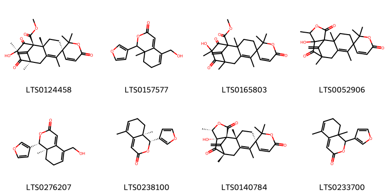{ width=100% }
    <figcaption>Hình ảnh cấu trúc hóa học của 8 hoạt chất thuộc nhóm Pyrans gồm ["methyl (1'r,2'r,3s,9'r,11'r)-11'-hydroxy-2,2,2',6',9',11'-hexamethyl-13'-methylidene-6,10',12'-trioxospiro[pyran-3,5'-tricyclo[7.3.1.0²,⁷]tridecan]-6'-ene-1'-carboxylate (LTS0124458)", '1-(furan-3-yl)-5-(hydroxymethyl)-8a-methyl-7,8-dihydro-1h-isochromen-3-one (LTS0157577)', "methyl 11'-hydroxy-2,2,2',6',9',11'-hexamethyl-13'-methylidene-6,10',12'-trioxospiro[pyran-3,5'-tricyclo[7.3.1.0²,⁷]tridecan]-6'-ene-1'-carboxylate (LTS0165803)", "11'-hydroxy-2,2,2',6',9',12'-hexamethyl-15'-methylidene-13'-oxaspiro[pyran-3,5'-tetracyclo[7.5.1.0¹,¹¹.0²,⁷]pentadecan]-6'-ene-6,10',14'-trione (LTS0052906)", '(1r,8ar)-1-(furan-3-yl)-5-(hydroxymethyl)-8a-methyl-7,8-dihydro-1h-isochromen-3-one (LTS0276207)', '(1r,8ar)-1-(furan-3-yl)-5,8a-dimethyl-7,8-dihydro-1h-isochromen-3-one (LTS0238100)', "(1'r,2'r,3s,9's,11's,12's)-11'-hydroxy-2,2,2',6',9',12'-hexamethyl-15'-methylidene-13'-oxaspiro[pyran-3,5'-tetracyclo[7.5.1.0¹,¹¹.0²,⁷]pentadecan]-6'-ene-6,10',14'-trione (LTS0140784)", '1-(furan-3-yl)-5,8a-dimethyl-7,8-dihydro-1h-isochromen-3-one (LTS0233700)'].</figcaption>
</figure>
#### Nhóm Steroids and steroid derivatives
<figure markdown="span">
    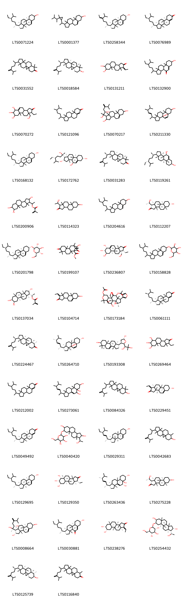{ width=100% }
    <figcaption>Hình ảnh cấu trúc hóa học của 52 hoạt chất thuộc nhóm Steroids and steroid derivatives gồm ['stigmast-5-en-3-ol (LTS0071224)', '9a,11a-dimethyl-1-{1-[2-methyl-2-(3-methylbutan-2-yl)cyclopropyl]ethyl}-1h,2h,3h,3ah,3bh,4h,6h,7h,8h,9h,9bh,10h,11h-cyclopenta[a]phenanthren-7-ol (LTS0001377)', '(1r,3as,3bs,7s,9ar,9bs,11ar)-1-[(2r)-5-isopropylhept-5-en-2-yl]-9a,11a-dimethyl-1h,2h,3h,3ah,3bh,4h,6h,7h,8h,9h,9bh,10h,11h-cyclopenta[a]phenanthren-7-ol (LTS0258344)', '(3as,3bs,9ar,9bs,11ar)-1-[(2r,5r)-5-ethyl-6-methylheptan-2-yl]-9a,11a-dimethyl-1h,2h,3h,3ah,3bh,4h,5h,8h,9h,9bh,10h,11h-cyclopenta[a]phenanthren-7-one (LTS0076989)', '7,7,12,16-tetramethyl-15-(6-methyl-5-methylideneheptan-2-yl)pentacyclo[9.7.0.0¹,³.0³,⁸.0¹²,¹⁶]octadecan-6-one (LTS0031552)', '24-methylenecycloartanol (LTS0018584)', '1-ethylidene-7,8-dihydroxy-9a,11a-dimethyl-dodecahydro-3h-cyclopenta[a]phenanthren-2-one (LTS0131211)', '1-(5-ethyl-6-methylheptan-2-yl)-7-hydroxy-9a,11a-dimethyl-1h,2h,3h,3ah,3bh,6h,7h,8h,9h,9bh,10h,11h-cyclopenta[a]phenanthren-4-one (LTS0132900)', '1-ethyl-6,7,8-trihydroxy-11a-(hydroxymethyl)-9a-methyl-1h,3h,3ah,3bh,4h,6h,7h,8h,9h,9bh,10h,11h-cyclopenta[a]phenanthren-2-one (LTS0070272)', '1-(5,6-dimethylheptan-2-yl)-9a,11a-dimethyl-1h,2h,3h,3ah,3bh,4h,5h,8h,9h,9bh,10h,11h-cyclopenta[a]phenanthren-7-one (LTS0121096)', '2-{2,7-dihydroxy-9a,11a-dimethyl-1h,2h,3h,3ah,3bh,4h,6h,7h,8h,9h,9bh,10h,11h-cyclopenta[a]phenanthren-1-yl}-6-methyl-5-methylideneheptane-2,3-diol (LTS0070217)', '5-(5,6-dimethylhept-3-en-2-yl)-6,10-dimethyl-16,17-dioxapentacyclo[13.2.2.0¹,⁹.0²,⁶.0¹⁰,¹⁵]nonadec-18-en-13-ol (LTS0211330)', 'sitosterol (LTS0168132)', '(1r,2s,3as,3bs,4s,7s,9ar,9bs,11as)-1-[(2s,5r)-5-ethyl-2-hydroxy-6-methylheptan-2-yl]-9a,11a-dimethyl-1h,2h,3h,3ah,3bh,4h,6h,7h,8h,9h,9bh,10h,11h-cyclopenta[a]phenanthrene-2,4,7-triol (LTS0172762)', '(1s,3r,8r,11s,12s,15r,16r)-7,7,12,16-tetramethyl-15-[(2r)-6-methyl-5-methylideneheptan-2-yl]pentacyclo[9.7.0.0¹,³.0³,⁸.0¹²,¹⁶]octadecan-6-one (LTS0031283)', '7β-hydroxysitosterol (LTS0119261)', '1-{2,7,8-trihydroxy-9a,11a-dimethyl-tetradecahydro-1h-cyclopenta[a]phenanthren-1-yl}ethyl 2-methylprop-2-enoate (LTS0200906)', '7-hydroxy-1-(1-hydroxyethyl)-9a,11a-dimethyl-tetradecahydrocyclopenta[a]phenanthren-2-one (LTS0114323)', 'stigmast-5-en-3-ol, (3β)- (LTS0204616)', '(1s,3as,3br,5as,7s,9as,9bs,11as)-7-hydroxy-1-[(1s)-1-hydroxyethyl]-9a,11a-dimethyl-tetradecahydrocyclopenta[a]phenanthren-2-one (LTS0112207)', 'sitogluside (LTS0201798)', 'methyl 14-hydroxy-2,6,6,10,13-pentamethyl-16-methylidene-7,15-dioxotetracyclo[11.2.1.0²,¹¹.0⁵,¹⁰]hexadecane-1-carboxylate (LTS0199107)', '(1r,3as,3br,6r,7s,8r,9ar,9bs,11ar)-1-ethyl-6,7,8-trihydroxy-11a-(hydroxymethyl)-9a-methyl-1h,3h,3ah,3bh,4h,6h,7h,8h,9h,9bh,10h,11h-cyclopenta[a]phenanthren-2-one (LTS0236807)', '2-{[1-(5-ethyl-6-methylheptan-2-yl)-9a,11a-dimethyl-1h,2h,3h,3ah,3bh,4h,6h,7h,8h,9h,9bh,10h,11h-cyclopenta[a]phenanthren-7-yl]oxy}-6-(hydroxymethyl)oxane-3,4,5-triol (LTS0158828)', '(1r)-1-[(1r,2s,3as,3br,5as,7s,8r,9as,9bs,11as)-2,7,8-trihydroxy-9a,11a-dimethyl-tetradecahydro-1h-cyclopenta[a]phenanthren-1-yl]ethyl 2-methylprop-2-enoate (LTS0137034)', '1-ethylidene-7-hydroxy-9a,11a-dimethyl-3h,3ah,3bh,4h,6h,7h,8h,9h,9bh,10h,11h-cyclopenta[a]phenanthren-2-one (LTS0104714)', '(1r,2r,4r,8s,10s)-13-(acetyloxy)-6-(furan-3-yl)-18-hydroxy-1,10-bis(hydroxymethyl)-7,15,15-trimethyl-9-oxo-3,14-dioxapentacyclo[8.8.0.0²,⁴.0²,⁷.0¹¹,¹⁶]octadec-16-en-8-yl acetate (LTS0173184)', '(1r,3as,3br,9as,9bs,11ar)-1-[(2r,5r)-5,6-dimethylheptan-2-yl]-9a,11a-dimethyl-1h,2h,3h,3ah,3bh,4h,5h,8h,9h,9bh,10h,11h-cyclopenta[a]phenanthren-7-one (LTS0061111)', '(1s,3r,7s,8s,11s,12s,15r,16r)-7,12,16-trimethyl-15-[(2r)-6-methyl-5-methylideneheptan-2-yl]pentacyclo[9.7.0.0¹,³.0³,⁸.0¹²,¹⁶]octadecan-6-one (LTS0224467)', 'ergosterol peroxide (LTS0264710)', 'meliantriol (LTS0193308)', '1-ethyl-6,7,8-trihydroxy-9a,11a-dimethyl-tetradecahydrocyclopenta[a]phenanthren-2-one (LTS0269464)', '1-(5-ethyl-6-methylheptan-2-yl)-9a,11a-dimethyl-1h,2h,3h,3ah,3bh,4h,5h,8h,9h,9bh,10h,11h-cyclopenta[a]phenanthren-7-one (LTS0212002)', '1-(5,6-dimethylhept-3-en-2-yl)-9a,11a-dimethyl-1h,2h,3h,3ah,5h,6h,7h,8h,9h,9bh,10h,11h-cyclopenta[a]phenanthrene-5,5a,7-triol (LTS0273061)', '7,7,12,16-tetramethyl-15-(6-methyl-5-methylideneheptan-2-yl)pentacyclo[9.7.0.0¹,³.0³,⁸.0¹²,¹⁶]octadecan-6-ol (LTS0084326)', '(1z,3as,3br,7s,9ar,9bs,11as)-1-ethylidene-7-hydroxy-9a,11a-dimethyl-3h,3ah,3bh,4h,6h,7h,8h,9h,9bh,10h,11h-cyclopenta[a]phenanthren-2-one (LTS0229451)', 'β-sitostenone (LTS0049492)', '2-{[2,7-dihydroxy-1-(1-hydroxyethyl)-9a,11a-dimethyl-tetradecahydro-1h-cyclopenta[a]phenanthren-8-yl]oxy}-6-(hydroxymethyl)oxane-3,4,5-triol (LTS0040420)', 'phytosterol (LTS0029311)', '7,12,16-trimethyl-15-(6-methyl-5-methylideneheptan-2-yl)pentacyclo[9.7.0.0¹,³.0³,⁸.0¹²,¹⁶]octadecan-6-ol (LTS0042683)', '(1r,3ar,3br,7s,9ar,9br,11ar)-1-[(2r,5r)-5-ethyl-6-methylheptan-2-yl]-9a,11a-dimethyl-1h,2h,3h,3ah,3bh,4h,6h,7h,8h,9h,9bh,10h,11h-cyclopenta[a]phenanthren-7-ol (LTS0129695)', '(1r,3as,3br,5as,6r,7s,8s,9ar,9bs,11as)-1-ethyl-6,7,8-trihydroxy-9a,11a-dimethyl-tetradecahydrocyclopenta[a]phenanthren-2-one (LTS0129350)', 'cerevisterol (LTS0263436)', '(1s,3as,3br,5as,7r,9as,9bs,11as)-7-hydroxy-1-[(1s)-1-hydroxyethyl]-9a,11a-dimethyl-tetradecahydrocyclopenta[a]phenanthren-2-one (LTS0275228)', '(2r,3s)-2-[(1r,2s,3as,3bs,7r,9ar,9bs,11as)-2,7-dihydroxy-9a,11a-dimethyl-1h,2h,3h,3ah,3bh,4h,6h,7h,8h,9h,9bh,10h,11h-cyclopenta[a]phenanthren-1-yl]-6-methyl-5-methylideneheptane-2,3-diol (LTS0008664)', '(1r,3as,3bs,7s,9ar,9bs,11ar)-1-[(2r,5r)-5-ethyl-6-methylheptan-2-yl]-7-hydroxy-9a,11a-dimethyl-1h,2h,3h,3ah,3bh,6h,7h,8h,9h,9bh,10h,11h-cyclopenta[a]phenanthren-4-one (LTS0030881)', '(1e,3as,3br,5as,7r,8s,9as,9bs,11as)-1-ethylidene-7,8-dihydroxy-9a,11a-dimethyl-dodecahydro-3h-cyclopenta[a]phenanthren-2-one (LTS0238276)', '(2r,3r,4s,5s,6r)-2-{[(1s,2s,3as,3br,5as,7s,8r,9as,9bs,11as)-2,7-dihydroxy-1-[(1r)-1-hydroxyethyl]-9a,11a-dimethyl-tetradecahydro-1h-cyclopenta[a]phenanthren-8-yl]oxy}-6-(hydroxymethyl)oxane-3,4,5-triol (LTS0254432)', 'cycloeucalenol (LTS0125739)', '7,12,16-trimethyl-15-(6-methyl-5-methylideneheptan-2-yl)pentacyclo[9.7.0.0¹,³.0³,⁸.0¹²,¹⁶]octadecan-6-one (LTS0116840)', '(1r,2s,3as,3bs,4s,7s,9ar,9bs,11as)-1-[(2s,5r)-2-hydroxy-5,6-dimethylheptan-2-yl]-9a,11a-dimethyl-1h,2h,3h,3ah,3bh,4h,6h,7h,8h,9h,9bh,10h,11h-cyclopenta[a]phenanthrene-2,4,7-triol (LTS0042933)', 'methyl (1s,2r,5r,10r,11r,13s,14s)-14-hydroxy-2,6,6,10,13-pentamethyl-16-methylidene-7,15-dioxotetracyclo[11.2.1.0²,¹¹.0⁵,¹⁰]hexadecane-1-carboxylate (LTS0267097)'].</figcaption>
</figure>

---

### Dược dân tộc học

Danh sách các quốc gia có sử dụng *Melia azedarach* trong điều trị các bệnh. 

| Country            | Disease                                                                                                                                                                             | Bệnh                                                                                                                                                                                                |
|:-------------------|:------------------------------------------------------------------------------------------------------------------------------------------------------------------------------------|:----------------------------------------------------------------------------------------------------------------------------------------------------------------------------------------------------|
| Arab               | Diuretic, Vermifuge                                                                                                                                                                 | MYMEMORY WARNING: YOU USED ALL AVAILABLE FREE TRANSLATIONS FOR TODAY. NEXT AVAILABLE IN  06 HOURS 33 MINUTES 37 SECONDS VISIT HTTPS://MYMEMORY.TRANSLATED.NET/DOC/USAGELIMITS.PHP TO TRANSLATE MORE |
| China              | Ascaricide, Astringent, Laxative, Narcotic, Parasiticide, Pediculicide, Poison, Poison, Pulicide, Sedative, Stimulant, Tonic, Vermifuge, Vermifuge, Antiseptic, Diuretic, Vermifuge | MYMEMORY WARNING: YOU USED ALL AVAILABLE FREE TRANSLATIONS FOR TODAY. NEXT AVAILABLE IN  06 HOURS 33 MINUTES 33 SECONDS VISIT HTTPS://MYMEMORY.TRANSLATED.NET/DOC/USAGELIMITS.PHP TO TRANSLATE MORE |
| Dominican Republic | Insecticide, Piscicide, Stomachic, Poison, Vermifuge                                                                                                                                | MYMEMORY WARNING: YOU USED ALL AVAILABLE FREE TRANSLATIONS FOR TODAY. NEXT AVAILABLE IN  06 HOURS 33 MINUTES 30 SECONDS VISIT HTTPS://MYMEMORY.TRANSLATED.NET/DOC/USAGELIMITS.PHP TO TRANSLATE MORE |
| Elsewhere          | Diuretic, Emmenagogue, Pediculicide, Purgative, Stomachic, Vermifuge, Vermifuge, Vermifuge, Poison, Astringent, Vermifuge                                                           | MYMEMORY WARNING: YOU USED ALL AVAILABLE FREE TRANSLATIONS FOR TODAY. NEXT AVAILABLE IN  06 HOURS 33 MINUTES 27 SECONDS VISIT HTTPS://MYMEMORY.TRANSLATED.NET/DOC/USAGELIMITS.PHP TO TRANSLATE MORE |
| French             | Purgative                                                                                                                                                                           | MYMEMORY WARNING: YOU USED ALL AVAILABLE FREE TRANSLATIONS FOR TODAY. NEXT AVAILABLE IN  06 HOURS 33 MINUTES 24 SECONDS VISIT HTTPS://MYMEMORY.TRANSLATED.NET/DOC/USAGELIMITS.PHP TO TRANSLATE MORE |
| German             | Narcotic                                                                                                                                                                            | MYMEMORY WARNING: YOU USED ALL AVAILABLE FREE TRANSLATIONS FOR TODAY. NEXT AVAILABLE IN  06 HOURS 33 MINUTES 22 SECONDS VISIT HTTPS://MYMEMORY.TRANSLATED.NET/DOC/USAGELIMITS.PHP TO TRANSLATE MORE |
| Guatemala          | Insecticide, Piscicide, Poison                                                                                                                                                      | MYMEMORY WARNING: YOU USED ALL AVAILABLE FREE TRANSLATIONS FOR TODAY. NEXT AVAILABLE IN  06 HOURS 33 MINUTES 18 SECONDS VISIT HTTPS://MYMEMORY.TRANSLATED.NET/DOC/USAGELIMITS.PHP TO TRANSLATE MORE |
| Haiti              | Abortifacient, Narcotic, Purgative, Vulnerary, Tonic                                                                                                                                | MYMEMORY WARNING: YOU USED ALL AVAILABLE FREE TRANSLATIONS FOR TODAY. NEXT AVAILABLE IN  06 HOURS 33 MINUTES 14 SECONDS VISIT HTTPS://MYMEMORY.TRANSLATED.NET/DOC/USAGELIMITS.PHP TO TRANSLATE MORE |
| Iran               | Emmenagogue                                                                                                                                                                         | MYMEMORY WARNING: YOU USED ALL AVAILABLE FREE TRANSLATIONS FOR TODAY. NEXT AVAILABLE IN  06 HOURS 33 MINUTES 06 SECONDS VISIT HTTPS://MYMEMORY.TRANSLATED.NET/DOC/USAGELIMITS.PHP TO TRANSLATE MORE |
| Iraq               | Emmenagogue, Diuretic, Vermifuge                                                                                                                                                    | MYMEMORY WARNING: YOU USED ALL AVAILABLE FREE TRANSLATIONS FOR TODAY. NEXT AVAILABLE IN  06 HOURS 33 MINUTES 03 SECONDS VISIT HTTPS://MYMEMORY.TRANSLATED.NET/DOC/USAGELIMITS.PHP TO TRANSLATE MORE |
| Mexico             | Emetic, Emetic, Piscicide, Poison, Vermifuge, Vermifuge                                                                                                                             | MYMEMORY WARNING: YOU USED ALL AVAILABLE FREE TRANSLATIONS FOR TODAY. NEXT AVAILABLE IN  06 HOURS 33 MINUTES 00 SECONDS VISIT HTTPS://MYMEMORY.TRANSLATED.NET/DOC/USAGELIMITS.PHP TO TRANSLATE MORE |
| Paraguay           | Antifertility                                                                                                                                                                       | MYMEMORY WARNING: YOU USED ALL AVAILABLE FREE TRANSLATIONS FOR TODAY. NEXT AVAILABLE IN  06 HOURS 32 MINUTES 56 SECONDS VISIT HTTPS://MYMEMORY.TRANSLATED.NET/DOC/USAGELIMITS.PHP TO TRANSLATE MORE |
| Portuguese         | Emetic                                                                                                                                                                              | MYMEMORY WARNING: YOU USED ALL AVAILABLE FREE TRANSLATIONS FOR TODAY. NEXT AVAILABLE IN  06 HOURS 32 MINUTES 53 SECONDS VISIT HTTPS://MYMEMORY.TRANSLATED.NET/DOC/USAGELIMITS.PHP TO TRANSLATE MORE |
| Turkey             | Antiseptic                                                                                                                                                                          | MYMEMORY WARNING: YOU USED ALL AVAILABLE FREE TRANSLATIONS FOR TODAY. NEXT AVAILABLE IN  06 HOURS 32 MINUTES 49 SECONDS VISIT HTTPS://MYMEMORY.TRANSLATED.NET/DOC/USAGELIMITS.PHP TO TRANSLATE MORE |
| US                 | Poison, Pulicide                                                                                                                                                                    | MYMEMORY WARNING: YOU USED ALL AVAILABLE FREE TRANSLATIONS FOR TODAY. NEXT AVAILABLE IN  06 HOURS 32 MINUTES 46 SECONDS VISIT HTTPS://MYMEMORY.TRANSLATED.NET/DOC/USAGELIMITS.PHP TO TRANSLATE MORE |
| Venezuela          | Poison, Vermifuge, Insecticide, Purgative                                                                                                                                           | MYMEMORY WARNING: YOU USED ALL AVAILABLE FREE TRANSLATIONS FOR TODAY. NEXT AVAILABLE IN  06 HOURS 32 MINUTES 43 SECONDS VISIT HTTPS://MYMEMORY.TRANSLATED.NET/DOC/USAGELIMITS.PHP TO TRANSLATE MORE |

---

---
## Melia azederach
### Thông tin về thực vật

!!! info "Phân loại thực vật của *Melia azedarach* từ GIBF:"
    - **Kingdom:** Plantae
    - **Phylum:** Tracheophyta
    - **Order:** Sapindales
    - **Family:** Meliaceae
    - **Genus:** Melia
    - **Species:** *Melia azedarach*

 

| Label (VI)   | Label (EN)   | Scientific Name   | Descriptions (VI)   | Descriptions (EN)   | Also Known As (VI)   | Also Known As (EN)   |
|:-------------|:-------------|:------------------|:--------------------|:--------------------|:---------------------|:---------------------|
| N/A          | N/A          | Melia azederach   | loài thực vật       | species of plant    | ['']                 | ['']                 |

#### Phân bố trên thế giới

**Từ CSDL GIBF** Australia, Japan, Argentina, Jordan, Israel, Zambia, Chinese Taipei, Spain, Portugal, Jamaica, United States of America, Chile, Bosnia and Herzegovina, Greece, South Africa, Hong Kong, Brazil, Peru, France, Dominican Republic, Mexico, Viet Nam, China, Botswana, India, Indonesia, Nepal, Kenya, New Zealand, Ethiopia

#### Phân bố tại Việt Nam

**Từ CSDL GIBF**: Quảng Nam

---
### Thành phần hóa học
        
- Theo cơ sở dữ liệu lotus: Từ loài *Melia azedarach* đã phân lập và xác định được Chưa có hoạt chất nào được phân lập. hoạt chất thuộc về các nhóm Không có hoạt chất nào được phân lập. 

Không có hình ảnh nào được tạo ra

---

### Dược dân tộc học

Danh sách các quốc gia có sử dụng *Melia azedarach* trong điều trị các bệnh. 

| Country   | Disease   | Bệnh                                                                                                                                                                                                |
|:----------|:----------|:----------------------------------------------------------------------------------------------------------------------------------------------------------------------------------------------------|
| America   | Pulicide  | MYMEMORY WARNING: YOU USED ALL AVAILABLE FREE TRANSLATIONS FOR TODAY. NEXT AVAILABLE IN  06 HOURS 31 MINUTES 59 SECONDS VISIT HTTPS://MYMEMORY.TRANSLATED.NET/DOC/USAGELIMITS.PHP TO TRANSLATE MORE |
| Java      | Vermifuge | MYMEMORY WARNING: YOU USED ALL AVAILABLE FREE TRANSLATIONS FOR TODAY. NEXT AVAILABLE IN  06 HOURS 31 MINUTES 53 SECONDS VISIT HTTPS://MYMEMORY.TRANSLATED.NET/DOC/USAGELIMITS.PHP TO TRANSLATE MORE |
| Malaya    | Piscicide | MYMEMORY WARNING: YOU USED ALL AVAILABLE FREE TRANSLATIONS FOR TODAY. NEXT AVAILABLE IN  06 HOURS 31 MINUTES 50 SECONDS VISIT HTTPS://MYMEMORY.TRANSLATED.NET/DOC/USAGELIMITS.PHP TO TRANSLATE MORE |

---

---
## Melia dubia
### Thông tin về thực vật

!!! info "Phân loại thực vật của *Melia dubia* từ GIBF:"
    - **Kingdom:** Plantae
    - **Phylum:** Tracheophyta
    - **Order:** Sapindales
    - **Family:** Meliaceae
    - **Genus:** Melia
    - **Species:** *Melia dubia*

 

| Label (VI)   | Label (EN)   | Scientific Name   | Descriptions (VI)   | Descriptions (EN)   | Also Known As (VI)   | Also Known As (EN)   |
|:-------------|:-------------|:------------------|:--------------------|:--------------------|:---------------------|:---------------------|
| N/A          | N/A          | Melia dubia       | loài thực vật       | species of plant    | ['']                 | ['']                 |

#### Phân bố trên thế giới

**Từ CSDL GIBF** nan, Japan, India, Indonesia, Philippines, China

#### Phân bố tại Việt Nam

**Từ CSDL GIBF**: Không có ghi nhận ở Việt Nam

---
### Thành phần hóa học
        
- Theo cơ sở dữ liệu lotus: Từ loài *Melia dubia* đã phân lập và xác định được 33 hoạt chất thuộc về các nhóm Prenol lipids. 

|    | chemicalTaxonomyClassyfireClass   |   smiles_count |
|---:|:----------------------------------|---------------:|
|  0 | Prenol lipids                     |             33 |

#### Nhóm Prenol lipids
<figure markdown="span">
    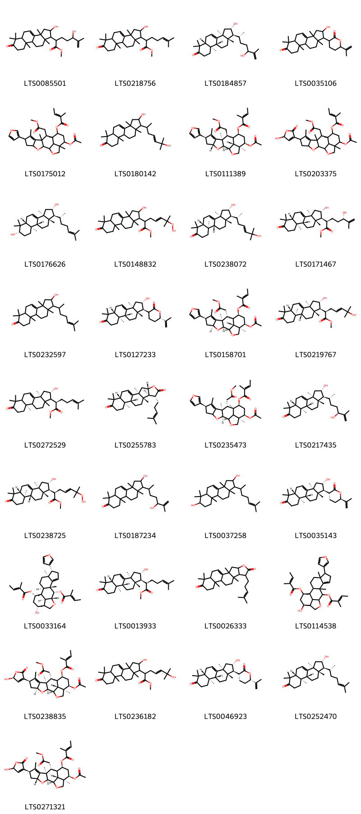{ width=100% }
    <figcaption>Hình ảnh cấu trúc hóa học của 33 hoạt chất thuộc nhóm Prenol lipids gồm ['methyl 5-hydroxy-2-{2-hydroxy-3a,6,6,9a,11a-pentamethyl-7-oxo-1h,2h,3h,5h,5ah,8h,9h,9bh,10h,11h-cyclopenta[a]phenanthren-1-yl}-6-methylhept-6-enoate (LTS0085501)', 'methyl 2-{2-hydroxy-3a,6,6,9a,11a-pentamethyl-7-oxo-1h,2h,3h,5h,5ah,8h,9h,9bh,10h,11h-cyclopenta[a]phenanthren-1-yl}-6-methylhept-5-enoate (LTS0218756)', '(1s,2s,3as,5ar,9ar,9br,11as)-2-hydroxy-1-[(2r)-5-hydroxy-6-methylhept-6-en-2-yl]-3a,6,6,9a,11a-pentamethyl-1h,2h,3h,5h,5ah,8h,9h,9bh,10h,11h-cyclopenta[a]phenanthren-7-one (LTS0184857)', '3-{2-hydroxy-3a,6,6,9a,11a-pentamethyl-7-oxo-1h,2h,3h,5h,5ah,8h,9h,9bh,10h,11h-cyclopenta[a]phenanthren-1-yl}-6-(prop-1-en-2-yl)oxan-2-one (LTS0035106)', '14-(acetyloxy)-6-(furan-3-yl)-10-(2-methoxy-2-oxoethyl)-7,9,11,15-tetramethyl-3,17-dioxapentacyclo[9.6.1.0²,⁹.0⁴,⁸.0¹⁵,¹⁸]octadec-7-en-12-yl 2-methylbut-2-enoate (LTS0175012)', '2-hydroxy-1-(6-hydroxy-6-methylhept-4-en-2-yl)-3a,6,6,9a,11a-pentamethyl-1h,2h,3h,5h,5ah,8h,9h,9bh,10h,11h-cyclopenta[a]phenanthren-7-one (LTS0180142)', '(1r,2s,4r,6r,9r,10s,11r,12s,14r,15r,18r)-14-(acetyloxy)-6-(furan-3-yl)-10-(2-methoxy-2-oxoethyl)-7,9,11,15-tetramethyl-3,17-dioxapentacyclo[9.6.1.0²,⁹.0⁴,⁸.0¹⁵,¹⁸]octadec-7-en-12-yl (2e)-2-methylbut-2-enoate (LTS0111389)', '14-(acetyloxy)-6-(5-hydroxy-2-oxo-5h-furan-3-yl)-10-(2-methoxy-2-oxoethyl)-7,9,11,15-tetramethyl-3,17-dioxapentacyclo[9.6.1.0²,⁹.0⁴,⁸.0¹⁵,¹⁸]octadec-7-en-12-yl 2-methylbut-2-enoate (LTS0203375)', '(1s,2s,3as,5ar,7s,9ar,9br,11as)-3a,6,6,9a,11a-pentamethyl-1-[(2r)-6-methylhept-5-en-2-yl]-1h,2h,3h,5h,5ah,7h,8h,9h,9bh,10h,11h-cyclopenta[a]phenanthrene-2,7-diol (LTS0176626)', 'methyl 6-hydroperoxy-2-{2-hydroxy-3a,6,6,9a,11a-pentamethyl-7-oxo-1h,2h,3h,5h,5ah,8h,9h,9bh,10h,11h-cyclopenta[a]phenanthren-1-yl}-6-methylhept-4-enoate (LTS0148832)', '(1s,2s,3as,5ar,9ar,9br,11as)-2-hydroxy-1-[(2r,4e)-6-hydroxy-6-methylhept-4-en-2-yl]-3a,6,6,9a,11a-pentamethyl-1h,2h,3h,5h,5ah,8h,9h,9bh,10h,11h-cyclopenta[a]phenanthren-7-one (LTS0238072)', 'methyl (2r,5s)-2-[(1s,2s,3as,5ar,9ar,9br,11as)-2-hydroxy-3a,6,6,9a,11a-pentamethyl-7-oxo-1h,2h,3h,5h,5ah,8h,9h,9bh,10h,11h-cyclopenta[a]phenanthren-1-yl]-5-hydroxy-6-methylhept-6-enoate (LTS0171467)', '2-hydroxy-3a,6,6,9a,11a-pentamethyl-1-(6-methylhept-5-en-2-yl)-1h,2h,3h,5h,5ah,8h,9h,9bh,10h,11h-cyclopenta[a]phenanthren-7-one (LTS0232597)', '(6s)-3-[(1s,2s,3as,5ar,9ar,9br,11as)-2-hydroxy-3a,6,6,9a,11a-pentamethyl-7-oxo-1h,2h,3h,5h,5ah,8h,9h,9bh,10h,11h-cyclopenta[a]phenanthren-1-yl]-6-(prop-1-en-2-yl)oxan-2-one (LTS0127233)', '(1r,2s,4s,6r,9r,10r,11r,12s,14r,15r,18r)-14-(acetyloxy)-6-(furan-3-yl)-10-(2-methoxy-2-oxoethyl)-7,9,11,15-tetramethyl-3,17-dioxapentacyclo[9.6.1.0²,⁹.0⁴,⁸.0¹⁵,¹⁸]octadec-7-en-12-yl (2e)-2-methylbut-2-enoate (LTS0158701)', 'methyl (2r,4e)-2-[(1s,2s,3as,5ar,9ar,9br,11as)-2-hydroxy-3a,6,6,9a,11a-pentamethyl-7-oxo-1h,2h,3h,5h,5ah,8h,9h,9bh,10h,11h-cyclopenta[a]phenanthren-1-yl]-6-hydroxy-6-methylhept-4-enoate (LTS0219767)', 'methyl (2r)-2-[(2s,3as,9ar)-2-hydroxy-3a,6,6,9a,11a-pentamethyl-7-oxo-1h,2h,3h,5h,5ah,8h,9h,9bh,10h,11h-cyclopenta[a]phenanthren-1-yl]-6-methylhept-5-enoate (LTS0272529)', '(2s,4s,7r,8s,9s,12r,13r,18r)-2,9,13,17,17-pentamethyl-7-(4-methylpent-3-en-1-yl)-5-oxapentacyclo[10.8.0.0²,⁹.0⁴,⁸.0¹³,¹⁸]icos-1(20)-ene-6,16-dione (LTS0255783)', '(1r,2s,6r,9r,10r,11r,12s,14r,15r)-14-(acetyloxy)-6-(furan-3-yl)-10-(2-methoxy-2-oxoethyl)-7,9,11,15-tetramethyl-3,17-dioxapentacyclo[9.6.1.0²,⁹.0⁴,⁸.0¹⁵,¹⁸]octadec-7-en-12-yl (2e)-2-methylbut-2-enoate (LTS0235473)', 'meliastatin 5 (LTS0217435)', 'meliastatin 3 (LTS0238725)', '2-hydroxy-1-(5-hydroxy-6-methylhept-6-en-2-yl)-3a,6,6,9a,11a-pentamethyl-1h,2h,3h,5h,5ah,8h,9h,9bh,10h,11h-cyclopenta[a]phenanthren-7-one (LTS0187234)', '3a,6,6,9a,11a-pentamethyl-1-(6-methylhept-5-en-2-yl)-1h,2h,3h,5h,5ah,7h,8h,9h,9bh,10h,11h-cyclopenta[a]phenanthrene-2,7-diol (LTS0037258)', '(3r,6r)-3-[(1s,2s,3as,5ar,9ar,9br,11as)-2-hydroxy-3a,6,6,9a,11a-pentamethyl-7-oxo-1h,2h,3h,5h,5ah,8h,9h,9bh,10h,11h-cyclopenta[a]phenanthren-1-yl]-6-(prop-1-en-2-yl)oxan-2-one (LTS0035143)', '(1r,2r,5s,6r,10r,11s,12r,15r,16r,18s,19r)-6-(furan-3-yl)-16-hydroxy-1,5,10,15-tetramethyl-18-{[(2e)-2-methylbut-2-enoyl]oxy}-13-oxapentacyclo[10.6.1.0²,¹⁰.0⁵,⁹.0¹⁵,¹⁹]nonadec-8-en-11-yl (2e)-2-methylbut-2-enoate (LTS0033164)', 'methyl kulonate (LTS0013933)', '2,9,13,17,17-pentamethyl-7-(4-methylpent-3-en-1-yl)-5-oxapentacyclo[10.8.0.0²,⁹.0⁴,⁸.0¹³,¹⁸]icos-1(20)-ene-6,16-dione (LTS0026333)', '6-(furan-3-yl)-16-hydroxy-1,5,10,15-tetramethyl-18-[(2-methylbut-2-enoyl)oxy]-13-oxapentacyclo[10.6.1.0²,¹⁰.0⁵,⁹.0¹⁵,¹⁹]nonadec-8-en-11-yl 2-methylbut-2-enoate (LTS0114538)', '(1r,2s,4s,6r,9r,10r,11r,12s,14r,15r,18r)-14-(acetyloxy)-6-[(5s)-5-hydroxy-2-oxo-5h-furan-3-yl]-10-(2-methoxy-2-oxoethyl)-7,9,11,15-tetramethyl-3,17-dioxapentacyclo[9.6.1.0²,⁹.0⁴,⁸.0¹⁵,¹⁸]octadec-7-en-12-yl (2e)-2-methylbut-2-enoate (LTS0238835)', 'methyl 6-hydroxy-2-{2-hydroxy-3a,6,6,9a,11a-pentamethyl-7-oxo-1h,2h,3h,5h,5ah,8h,9h,9bh,10h,11h-cyclopenta[a]phenanthren-1-yl}-6-methylhept-4-enoate (LTS0236182)', '(3r,6s)-3-[(1s,2s,3as,5ar,9ar,9br,11as)-2-hydroxy-3a,6,6,9a,11a-pentamethyl-7-oxo-1h,2h,3h,5h,5ah,8h,9h,9bh,10h,11h-cyclopenta[a]phenanthren-1-yl]-6-(prop-1-en-2-yl)oxan-2-one (LTS0046923)', 'kulinone (LTS0252470)', '(1r,2s,4r,6r,9r,10r,11r,12s,14r,15r,18r)-14-(acetyloxy)-6-(5-hydroxy-2-oxo-5h-furan-3-yl)-10-(2-methoxy-2-oxoethyl)-7,9,11,15-tetramethyl-3,17-dioxapentacyclo[9.6.1.0²,⁹.0⁴,⁸.0¹⁵,¹⁸]octadec-7-en-12-yl (2e)-2-methylbut-2-enoate (LTS0271321)'].</figcaption>
</figure>

---

### Dược dân tộc học

Danh sách các quốc gia có sử dụng *Melia dubia* trong điều trị các bệnh. 

| Country   | Disease   | Bệnh                                                                                                                                                                                                |
|:----------|:----------|:----------------------------------------------------------------------------------------------------------------------------------------------------------------------------------------------------|
| Sumatra   | Vermifuge | MYMEMORY WARNING: YOU USED ALL AVAILABLE FREE TRANSLATIONS FOR TODAY. NEXT AVAILABLE IN  06 HOURS 31 MINUTES 18 SECONDS VISIT HTTPS://MYMEMORY.TRANSLATED.NET/DOC/USAGELIMITS.PHP TO TRANSLATE MORE |

---

---
## Melia indica
### Thông tin về thực vật

!!! info "Phân loại thực vật của *Azadirachta indica* từ GIBF:"
    - **Kingdom:** Plantae
    - **Phylum:** Tracheophyta
    - **Order:** Sapindales
    - **Family:** Meliaceae
    - **Genus:** Azadirachta
    - **Species:** *Azadirachta indica*

 

| Label (VI)   | Label (EN)   | Scientific Name   | Descriptions (VI)   | Descriptions (EN)   | Also Known As (VI)   | Also Known As (EN)   |
|:-------------|:-------------|:------------------|:--------------------|:--------------------|:---------------------|:---------------------|
| N/A          | N/A          | Melia dubia       | loài thực vật       | species of plant    | ['']                 | ['']                 |

#### Phân bố trên thế giới

**Từ CSDL GIBF** nan, Japan, India, Indonesia, Philippines, China

#### Phân bố tại Việt Nam

**Từ CSDL GIBF**: Không có ghi nhận ở Việt Nam

---
### Thành phần hóa học
        
- Theo cơ sở dữ liệu lotus: Từ loài *Azadirachta indica* đã phân lập và xác định được Chưa có hoạt chất nào được phân lập. hoạt chất thuộc về các nhóm Không có hoạt chất nào được phân lập. 

Không có hình ảnh nào được tạo ra

---

### Dược dân tộc học

Danh sách các quốc gia có sử dụng *Azadirachta indica* trong điều trị các bệnh. 

| Country   | Disease     | Bệnh                                                                                                                                                                                                |
|:----------|:------------|:----------------------------------------------------------------------------------------------------------------------------------------------------------------------------------------------------|
| Malaya    | Insecticide | MYMEMORY WARNING: YOU USED ALL AVAILABLE FREE TRANSLATIONS FOR TODAY. NEXT AVAILABLE IN  06 HOURS 30 MINUTES 49 SECONDS VISIT HTTPS://MYMEMORY.TRANSLATED.NET/DOC/USAGELIMITS.PHP TO TRANSLATE MORE |

---

---
## Melia toosendan
### Thông tin về thực vật

!!! info "Phân loại thực vật của *Melia azedarach* từ GIBF:"
    - **Kingdom:** Plantae
    - **Phylum:** Tracheophyta
    - **Order:** Sapindales
    - **Family:** Meliaceae
    - **Genus:** Melia
    - **Species:** *Melia azedarach*

 

| Label (VI)   | Label (EN)   | Scientific Name   | Descriptions (VI)   | Descriptions (EN)   | Also Known As (VI)   | Also Known As (EN)   |
|:-------------|:-------------|:------------------|:--------------------|:--------------------|:---------------------|:---------------------|
| N/A          | N/A          | Melia toosendan   | loài thực vật       | species of plant    | ['']                 | ['']                 |

#### Phân bố trên thế giới

**Từ CSDL GIBF** Japan, Thailand, Chinese Taipei, Spain, United States of America, China

#### Phân bố tại Việt Nam

**Từ CSDL GIBF**: Không có ghi nhận ở Việt Nam

---
### Thành phần hóa học
        
- Theo cơ sở dữ liệu lotus: Từ loài *Melia azedarach* đã phân lập và xác định được Chưa có hoạt chất nào được phân lập. hoạt chất thuộc về các nhóm Không có hoạt chất nào được phân lập. 

Không có hình ảnh nào được tạo ra

---

### Dược dân tộc học

Danh sách các quốc gia có sử dụng *Melia azedarach* trong điều trị các bệnh. 

| Country   | Disease                   | Bệnh                                                                                                                                                                                                |
|:----------|:--------------------------|:----------------------------------------------------------------------------------------------------------------------------------------------------------------------------------------------------|
| China     | Parasiticide, Insecticide | MYMEMORY WARNING: YOU USED ALL AVAILABLE FREE TRANSLATIONS FOR TODAY. NEXT AVAILABLE IN  06 HOURS 30 MINUTES 17 SECONDS VISIT HTTPS://MYMEMORY.TRANSLATED.NET/DOC/USAGELIMITS.PHP TO TRANSLATE MORE |

---

# Chi Carapa

??? note "Danh sách các dược liệu thuộc chi"
    
	 - *Carapa granatum*
	 - *Carapa guianensis*
	 - *Carapa guienensis*
	 - *Carapa guineensis*
	 - *Carapa moluccensis*
	 - *Carapa procera*

---
## Carapa granatum
### Thông tin về thực vật

!!! info "Phân loại thực vật của *Xylocarpus granatum* từ GIBF:"
    - **Kingdom:** Plantae
    - **Phylum:** Tracheophyta
    - **Order:** Sapindales
    - **Family:** Meliaceae
    - **Genus:** Xylocarpus
    - **Species:** *Xylocarpus granatum*

 

| Label (VI)   | Label (EN)   | Scientific Name   | Descriptions (VI)   | Descriptions (EN)   | Also Known As (VI)   | Also Known As (EN)   |
|:-------------|:-------------|:------------------|:--------------------|:--------------------|:---------------------|:---------------------|
| N/A          | N/A          | Carapa granatum   |                     |                     | ['']                 | ['']                 |

#### Phân bố trên thế giới

**Từ CSDL GIBF** Japan, Thailand, Chinese Taipei, Spain, United States of America, China

#### Phân bố tại Việt Nam

**Từ CSDL GIBF**: Không có ghi nhận ở Việt Nam

---
### Thành phần hóa học
        
- Theo cơ sở dữ liệu lotus: Từ loài *Xylocarpus granatum* đã phân lập và xác định được Chưa có hoạt chất nào được phân lập. hoạt chất thuộc về các nhóm Không có hoạt chất nào được phân lập. 

Không có hình ảnh nào được tạo ra

---

### Dược dân tộc học

Danh sách các quốc gia có sử dụng *Xylocarpus granatum* trong điều trị các bệnh. 

| Country   | Disease    | Bệnh                                                                                                                                                                                                |
|:----------|:-----------|:----------------------------------------------------------------------------------------------------------------------------------------------------------------------------------------------------|
| Elsewhere | Astringent | MYMEMORY WARNING: YOU USED ALL AVAILABLE FREE TRANSLATIONS FOR TODAY. NEXT AVAILABLE IN  06 HOURS 29 MINUTES 48 SECONDS VISIT HTTPS://MYMEMORY.TRANSLATED.NET/DOC/USAGELIMITS.PHP TO TRANSLATE MORE |
| Java      | Tonic      | MYMEMORY WARNING: YOU USED ALL AVAILABLE FREE TRANSLATIONS FOR TODAY. NEXT AVAILABLE IN  06 HOURS 29 MINUTES 45 SECONDS VISIT HTTPS://MYMEMORY.TRANSLATED.NET/DOC/USAGELIMITS.PHP TO TRANSLATE MORE |

---

---
## Carapa guianensis
### Thông tin về thực vật

!!! info "Phân loại thực vật của *Carapa guianensis* từ GIBF:"
    - **Kingdom:** Plantae
    - **Phylum:** Tracheophyta
    - **Order:** Sapindales
    - **Family:** Meliaceae
    - **Genus:** Carapa
    - **Species:** *Carapa guianensis*

 

| Label (VI)   | Label (EN)   | Scientific Name   | Descriptions (VI)   | Descriptions (EN)   | Also Known As (VI)   | Also Known As (EN)   |
|:-------------|:-------------|:------------------|:--------------------|:--------------------|:---------------------|:---------------------|
| N/A          | N/A          | Carapa guianensis | loài thực vật       | species of plant    | ['']                 | ['']                 |

#### Phân bố trên thế giới

**Từ CSDL GIBF** Nicaragua, Ecuador, Trinidad and Tobago, Colombia, Brazil, Costa Rica, United States of America, Dominican Republic, Bermuda, Mexico, French Guiana

#### Phân bố tại Việt Nam

**Từ CSDL GIBF**: Không có ghi nhận ở Việt Nam

---
### Thành phần hóa học
        
- Theo cơ sở dữ liệu lotus: Từ loài *Carapa guianensis* đã phân lập và xác định được 47 hoạt chất thuộc về các nhóm Fatty Acyls, Flavonoids, Prenol lipids, Benzene and substituted derivatives, Coumarins and derivatives, Naphthopyrans, Glycerolipids, Dioxepanes. 

|    | chemicalTaxonomyClassyfireClass     |   smiles_count |
|---:|:------------------------------------|---------------:|
|  0 | Benzene and substituted derivatives |              3 |
|  1 | Coumarins and derivatives           |              1 |
|  2 | Dioxepanes                          |              2 |
|  3 | Fatty Acyls                         |              2 |
|  4 | Flavonoids                          |              3 |
|  5 | Glycerolipids                       |              2 |
|  6 | Naphthopyrans                       |              7 |
|  7 | Prenol lipids                       |             27 |

#### Nhóm Benzene and substituted derivatives
<figure markdown="span">
    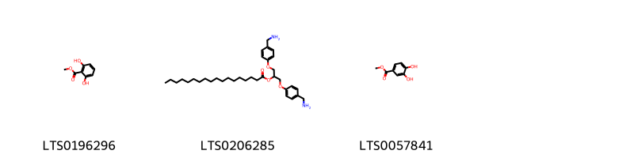{ width=100% }
    <figcaption>Hình ảnh cấu trúc hóa học của 3 hoạt chất thuộc nhóm Benzene and substituted derivatives gồm ['methyl 2,6-dihydroxybenzoate (LTS0196296)', '1,3-bis[4-(aminomethyl)phenoxy]propan-2-yl octadecanoate (LTS0206285)', 'methyl 3,4-dihydroxybenzoate (LTS0057841)'].</figcaption>
</figure>
#### Nhóm Coumarins and derivatives
<figure markdown="span">
    { width=100% }
    <figcaption>Hình ảnh cấu trúc hóa học của 1 hoạt chất thuộc nhóm Coumarins and derivatives gồm ['scopoletin (LTS0193112)'].</figcaption>
</figure>
#### Nhóm Dioxepanes
<figure markdown="span">
    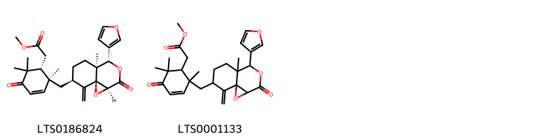{ width=100% }
    <figcaption>Hình ảnh cấu trúc hóa học của 2 hoạt chất thuộc nhóm Dioxepanes gồm ['methyl 2-[(1r,2s)-2-{[(1s,3s,6s,7s,10r)-6-(furan-3-yl)-7-methyl-11-methylidene-4-oxo-2,5-dioxatricyclo[5.4.0.0¹,³]undecan-10-yl]methyl}-2,6,6-trimethyl-5-oxocyclohex-3-en-1-yl]acetate (LTS0186824)', 'methyl 2-(2-{[6-(furan-3-yl)-7-methyl-11-methylidene-4-oxo-2,5-dioxatricyclo[5.4.0.0¹,³]undecan-10-yl]methyl}-2,6,6-trimethyl-5-oxocyclohex-3-en-1-yl)acetate (LTS0001133)'].</figcaption>
</figure>
#### Nhóm Fatty Acyls
<figure markdown="span">
    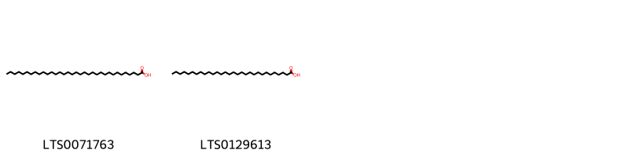{ width=100% }
    <figcaption>Hình ảnh cấu trúc hóa học của 2 hoạt chất thuộc nhóm Fatty Acyls gồm ['tetratriacontanoic acid (LTS0071763)', 'triacontanoic acid (LTS0129613)'].</figcaption>
</figure>
#### Nhóm Flavonoids
<figure markdown="span">
    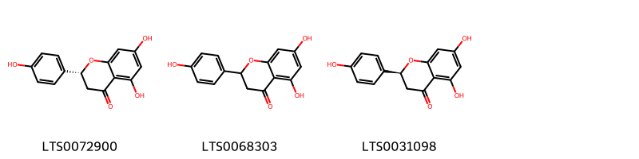{ width=100% }
    <figcaption>Hình ảnh cấu trúc hóa học của 3 hoạt chất thuộc nhóm Flavonoids gồm ['(-)-naringenin (LTS0072900)', 'asahina (LTS0068303)', 'naringenin (LTS0031098)'].</figcaption>
</figure>
#### Nhóm Glycerolipids
<figure markdown="span">
    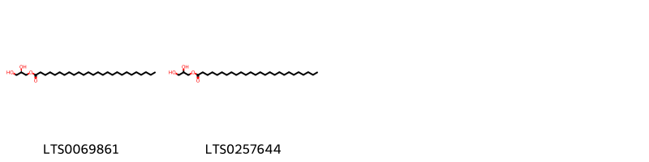{ width=100% }
    <figcaption>Hình ảnh cấu trúc hóa học của 2 hoạt chất thuộc nhóm Glycerolipids gồm ['(2r)-2,3-dihydroxypropyl hexacosanoate (LTS0069861)', '2,3-dihydroxypropyl hexacosanoate (LTS0257644)'].</figcaption>
</figure>
#### Nhóm Naphthopyrans
<figure markdown="span">
    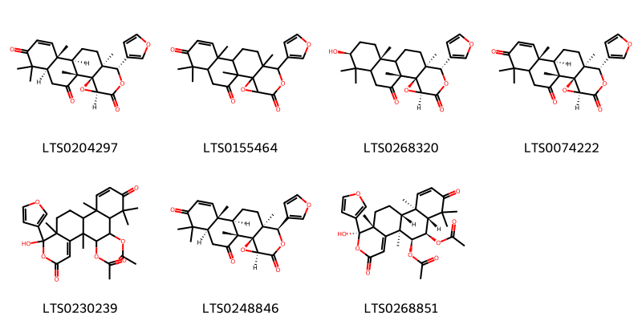{ width=100% }
    <figcaption>Hình ảnh cấu trúc hóa học của 7 hoạt chất thuộc nhóm Naphthopyrans gồm ['(1r,2r,4s,7s,8s,11r,12s,17r)-7-(furan-3-yl)-1,8,12,16,16-pentamethyl-3,6-dioxapentacyclo[9.8.0.0²,⁴.0²,⁸.0¹²,¹⁷]nonadec-13-ene-5,15,19-trione (LTS0204297)', '7-(furan-3-yl)-1,8,12,16,16-pentamethyl-3,6-dioxapentacyclo[9.8.0.0²,⁴.0²,⁸.0¹²,¹⁷]nonadec-13-ene-5,15,19-trione (LTS0155464)', '(1r,2r,4s,7s,8s,12s,15s)-7-(furan-3-yl)-15-hydroxy-1,8,12,16,16-pentamethyl-3,6-dioxapentacyclo[9.8.0.0²,⁴.0²,⁸.0¹²,¹⁷]nonadecane-5,19-dione (LTS0268320)', '(1r,2r,4s,7s,8s,11r,12s)-7-(furan-3-yl)-1,8,12,16,16-pentamethyl-3,6-dioxapentacyclo[9.8.0.0²,⁴.0²,⁸.0¹²,¹⁷]nonadec-13-ene-5,15,19-trione (LTS0074222)', '6-(acetyloxy)-1-(furan-3-yl)-1-hydroxy-4b,7,7,10a,12a-pentamethyl-3,8-dioxo-5h,6h,6ah,10bh,11h,12h-naphtho[2,1-f]isochromen-5-yl acetate (LTS0230239)', '(1r,2r,4s,7r,8s,11r,12s,17r)-7-(furan-3-yl)-1,8,12,16,16-pentamethyl-3,6-dioxapentacyclo[9.8.0.0²,⁴.0²,⁸.0¹²,¹⁷]nonadec-13-ene-5,15,19-trione (LTS0248846)', '(1r,4br,5s,6r,6ar,10ar,10br,12ar)-5-(acetyloxy)-1-(furan-3-yl)-1-hydroxy-4b,7,7,10a,12a-pentamethyl-3,8-dioxo-5h,6h,6ah,10bh,11h,12h-naphtho[2,1-f]isochromen-6-yl acetate (LTS0268851)'].</figcaption>
</figure>
#### Nhóm Prenol lipids
<figure markdown="span">
    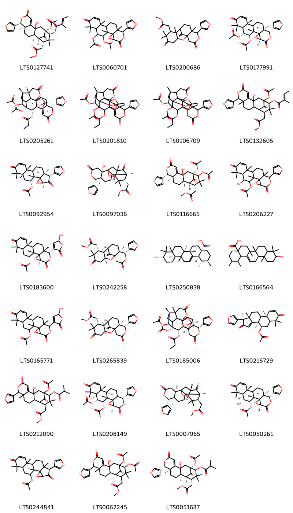{ width=100% }
    <figcaption>Hình ảnh cấu trúc hóa học của 27 hoạt chất thuộc nhóm Prenol lipids gồm ['(1s,2r,5r,6r,11s,13r,14s,16r)-13-(acetyloxy)-6-(furan-3-yl)-11-hydroxy-16-(2-methoxy-2-oxoethyl)-5,15,15-trimethyl-8,17-dioxo-7-oxatetracyclo[11.3.1.0²,¹¹.0⁵,¹⁰]heptadec-9-en-14-yl (2e)-2-methylbut-2-enoate (LTS0127741)', '18-(acetyloxy)-7-(furan-3-yl)-1,8,12,16,16-pentamethyl-5,15-dioxo-3,6-dioxapentacyclo[9.8.0.0²,⁴.0²,⁸.0¹²,¹⁷]nonadec-13-en-19-yl acetate (LTS0060701)', 'methyl 2-[13-(furan-3-yl)-6,6,8,12-tetramethyl-17-methylidene-5,15-dioxo-2,14-dioxatetracyclo[7.7.1.0¹,¹².0³,⁸]heptadecan-7-yl]acetate (LTS0200686)', '(1s,2r,4s,7s,8s,11r,12r,18r,19s)-19-(acetyloxy)-7-(furan-3-yl)-1,8,12,16,16-pentamethyl-5,15-dioxo-3,6-dioxapentacyclo[9.8.0.0²,⁴.0²,⁸.0¹²,¹⁷]nonadec-13-en-18-yl acetate (LTS0177991)', '(1r,2s,3s,4s,5r,6s,11r,12r,14r,16s,19r,20r)-3,4-bis(acetyloxy)-20-(furan-3-yl)-5,14,19-trimethyl-8,22-dioxo-9,13,15,21,25-pentaoxaoctacyclo[12.10.1.1⁵,¹².0¹,¹⁶.0³,¹².0⁶,¹¹.0¹¹,¹⁶.0¹⁹,²⁴]hexacos-23-en-2-yl propanoate (LTS0205261)', '3,4-bis(acetyloxy)-20-(furan-3-yl)-5,14,19-trimethyl-8,22-dioxo-9,13,15,21,25-pentaoxaoctacyclo[12.10.1.1⁵,¹².0¹,¹⁶.0³,¹².0⁶,¹¹.0¹¹,¹⁶.0¹⁹,²⁴]hexacos-23-en-2-yl propanoate (LTS0201810)', '3,4-bis(acetyloxy)-20-(furan-3-yl)-5,14,19-trimethyl-8,22-dioxo-9,13,15,21,25-pentaoxaoctacyclo[12.10.1.1⁵,¹².0¹,¹⁶.0³,¹².0⁶,¹¹.0¹¹,¹⁶.0¹⁹,²⁴]hexacosan-2-yl propanoate (LTS0106709)', '13-(acetyloxy)-6-(furan-3-yl)-11-hydroxy-16-(2-methoxy-2-oxoethyl)-5,15,15-trimethyl-8,17-dioxo-7-oxatetracyclo[11.3.1.0²,¹¹.0⁵,¹⁰]heptadec-9-en-14-yl 2-methylbut-2-enoate (LTS0132605)', '(1s,2r,4s,6s,7s,10r,11r,16s,18r)-6-(furan-3-yl)-1,7,11,15,15-pentamethyl-5,14-dioxo-3-oxapentacyclo[8.8.0.0²,⁴.0²,⁷.0¹¹,¹⁶]octadec-12-en-18-yl acetate (LTS0092954)', 'methyl 2-[(1s,2r,5s,6s,10s,11s,13s,14s,16r)-6-(furan-3-yl)-10-hydroxy-1,5,15,15-tetramethyl-8,17-dioxo-7,18-dioxapentacyclo[11.3.1.1¹¹,¹⁴.0²,¹¹.0⁵,¹⁰]octadecan-16-yl]acetate (LTS0097036)', 'methyl 2-[(1s,2r,5r,6r,11s,13r,14s,16r)-13,14-bis(acetyloxy)-6-(furan-3-yl)-11-hydroxy-5,15,15-trimethyl-8,17-dioxo-7-oxatetracyclo[11.3.1.0²,¹¹.0⁵,¹⁰]heptadec-9-en-16-yl]acetate (LTS0116665)', '7-(furan-3-yl)-18-hydroxy-1,8,12,16,16-pentamethyl-5,15-dioxo-3,6-dioxapentacyclo[9.8.0.0²,⁴.0²,⁸.0¹²,¹⁷]nonadec-13-en-19-yl acetate (LTS0206227)', '(1s,2r,4s,7r,8r,12r,19r)-7-(5-hydroxy-2-oxo-5h-furan-3-yl)-1,8,12,16,16-pentamethyl-5,15-dioxo-3,6-dioxapentacyclo[9.8.0.0²,⁴.0²,⁸.0¹²,¹⁷]nonadec-13-en-19-yl acetate (LTS0183600)', 'methyl 2-[(1s,3s,7r,8r,9r,12s,13s)-13-(furan-3-yl)-6,6,8,12-tetramethyl-17-methylidene-5,15-dioxo-2,14-dioxatetracyclo[7.7.1.0¹,¹².0³,⁸]heptadecan-7-yl]acetate (LTS0242258)', 'ursolic acid (LTS0250838)', '10-hydroxy-1,2,6a,6b,9,9,12a-heptamethyl-2,3,4,5,6,7,8,8a,10,11,12,12b,13,14b-tetradecahydro-1h-picene-4a-carboxylic acid (LTS0166564)', '7-(5-hydroxy-2-oxo-5h-furan-3-yl)-1,8,12,16,16-pentamethyl-5,15-dioxo-3,6-dioxapentacyclo[9.8.0.0²,⁴.0²,⁸.0¹²,¹⁷]nonadec-13-en-19-yl acetate (LTS0165771)', 'methyl 2-[(1r,3s,7r,8r,9s,12s,13s)-13-(furan-3-yl)-6,6,8,12-tetramethyl-17-methylidene-5,15-dioxo-2,14-dioxatetracyclo[7.7.1.0¹,¹².0³,⁸]heptadecan-7-yl]acetate (LTS0265839)', '(1r,2s,3s,4s,5r,6s,11r,12r,14r,16s,19r,20r,24r)-3,4-bis(acetyloxy)-20-(furan-3-yl)-5,14,19-trimethyl-8,22-dioxo-9,13,15,21,25-pentaoxaoctacyclo[12.10.1.1⁵,¹².0¹,¹⁶.0³,¹².0⁶,¹¹.0¹¹,¹⁶.0¹⁹,²⁴]hexacosan-2-yl propanoate (LTS0185006)', '(1s,3br,4r,9ar,11ar)-1-(furan-3-yl)-1-hydroxy-3b,6,6,9a,11a-pentamethyl-2,7-dioxo-4h,5h,5ah,9bh,10h,11h-cyclopenta[a]phenanthren-4-yl acetate (LTS0216729)', '13-(acetyloxy)-6-(furan-3-yl)-11-hydroxy-16-(2-methoxy-2-oxoethyl)-5,15,15-trimethyl-8,17-dioxo-7-oxatetracyclo[11.3.1.0²,¹¹.0⁵,¹⁰]heptadec-9-en-14-yl 2-methylpropanoate (LTS0212090)', '(1s,2r,4s,7s,8s,11r,12r,17r,18r,19s)-19-(acetyloxy)-7-(furan-3-yl)-1,8,12,16,16-pentamethyl-5,15-dioxo-3,6-dioxapentacyclo[9.8.0.0²,⁴.0²,⁸.0¹²,¹⁷]nonadec-13-en-18-yl acetate (LTS0208149)', 'methyl 2-[(1s,2s,5s,6s,10s,11s,13s,14r,16s)-6-(furan-3-yl)-10-hydroxy-1,5,15,15-tetramethyl-8,17-dioxo-7,18-dioxapentacyclo[11.3.1.1¹¹,¹⁴.0²,¹¹.0⁵,¹⁰]octadecan-16-yl]acetate (LTS0007965)', '(1s,2r,4s,7s,8s,11r,12r,17r,18r,19s)-7-(furan-3-yl)-18-hydroxy-1,8,12,16,16-pentamethyl-5,15-dioxo-3,6-dioxapentacyclo[9.8.0.0²,⁴.0²,⁸.0¹²,¹⁷]nonadec-13-en-19-yl acetate (LTS0050261)', '6-(furan-3-yl)-1,7,11,15,15-pentamethyl-5,14-dioxo-3-oxapentacyclo[8.8.0.0²,⁴.0²,⁷.0¹¹,¹⁶]octadec-12-en-18-yl acetate (LTS0244841)', 'methyl 2-[13,14-bis(acetyloxy)-6-(furan-3-yl)-11-hydroxy-5,15,15-trimethyl-8,17-dioxo-7-oxatetracyclo[11.3.1.0²,¹¹.0⁵,¹⁰]heptadec-9-en-16-yl]acetate (LTS0062245)', '(1s,2r,5r,6r,11s,13r,14s,16r)-13-(acetyloxy)-6-(furan-3-yl)-11-hydroxy-16-(2-methoxy-2-oxoethyl)-5,15,15-trimethyl-8,17-dioxo-7-oxatetracyclo[11.3.1.0²,¹¹.0⁵,¹⁰]heptadec-9-en-14-yl 2-methylpropanoate (LTS0051637)'].</figcaption>
</figure>

---

### Dược dân tộc học

Danh sách các quốc gia có sử dụng *Carapa guianensis* trong điều trị các bệnh. 

| Country       | Disease                                 | Bệnh                                                                                                                                                                                                |
|:--------------|:----------------------------------------|:----------------------------------------------------------------------------------------------------------------------------------------------------------------------------------------------------|
| Elsewhere     | Insecticide, Insectifuge, Soap          | MYMEMORY WARNING: YOU USED ALL AVAILABLE FREE TRANSLATIONS FOR TODAY. NEXT AVAILABLE IN  06 HOURS 29 MINUTES 27 SECONDS VISIT HTTPS://MYMEMORY.TRANSLATED.NET/DOC/USAGELIMITS.PHP TO TRANSLATE MORE |
| South America | Soap                                    | MYMEMORY WARNING: YOU USED ALL AVAILABLE FREE TRANSLATIONS FOR TODAY. NEXT AVAILABLE IN  06 HOURS 29 MINUTES 24 SECONDS VISIT HTTPS://MYMEMORY.TRANSLATED.NET/DOC/USAGELIMITS.PHP TO TRANSLATE MORE |
| Trinidad      | Insectifuge, Pediculicide, Pediculicide | MYMEMORY WARNING: YOU USED ALL AVAILABLE FREE TRANSLATIONS FOR TODAY. NEXT AVAILABLE IN  06 HOURS 29 MINUTES 21 SECONDS VISIT HTTPS://MYMEMORY.TRANSLATED.NET/DOC/USAGELIMITS.PHP TO TRANSLATE MORE |
| Venezuela     | Parasiticide                            | MYMEMORY WARNING: YOU USED ALL AVAILABLE FREE TRANSLATIONS FOR TODAY. NEXT AVAILABLE IN  06 HOURS 29 MINUTES 17 SECONDS VISIT HTTPS://MYMEMORY.TRANSLATED.NET/DOC/USAGELIMITS.PHP TO TRANSLATE MORE |

---

---
## Carapa guienensis
### Thông tin về thực vật

!!! info "Phân loại thực vật của *Carapa guianensis* từ GIBF:"
    - **Kingdom:** Plantae
    - **Phylum:** Tracheophyta
    - **Order:** Sapindales
    - **Family:** Meliaceae
    - **Genus:** Carapa
    - **Species:** *Carapa guianensis*

 

| Label (VI)   | Label (EN)   | Scientific Name   | Descriptions (VI)   | Descriptions (EN)   | Also Known As (VI)   | Also Known As (EN)   |
|:-------------|:-------------|:------------------|:--------------------|:--------------------|:---------------------|:---------------------|
| N/A          | N/A          | Carapa guianensis | loài thực vật       | species of plant    | ['']                 | ['']                 |

#### Phân bố trên thế giới

**Từ CSDL GIBF** Nicaragua, Ecuador, Trinidad and Tobago, Colombia, Brazil, Costa Rica, United States of America, Dominican Republic, Bermuda, Mexico, French Guiana

#### Phân bố tại Việt Nam

**Từ CSDL GIBF**: Không có ghi nhận ở Việt Nam

---
### Thành phần hóa học
        
- Theo cơ sở dữ liệu lotus: Từ loài *Carapa guianensis* đã phân lập và xác định được Chưa có hoạt chất nào được phân lập. hoạt chất thuộc về các nhóm Không có hoạt chất nào được phân lập. 

Không có hình ảnh nào được tạo ra

---

### Dược dân tộc học

Danh sách các quốc gia có sử dụng *Carapa guianensis* trong điều trị các bệnh. 

| Country   | Disease   | Bệnh                                                                                                                                                                                                |
|:----------|:----------|:----------------------------------------------------------------------------------------------------------------------------------------------------------------------------------------------------|
| Elsewhere | Soap      | MYMEMORY WARNING: YOU USED ALL AVAILABLE FREE TRANSLATIONS FOR TODAY. NEXT AVAILABLE IN  06 HOURS 28 MINUTES 37 SECONDS VISIT HTTPS://MYMEMORY.TRANSLATED.NET/DOC/USAGELIMITS.PHP TO TRANSLATE MORE |

---

---
## Carapa guineensis
### Thông tin về thực vật

!!! info "Phân loại thực vật của *Carapa procera* từ GIBF:"
    - **Kingdom:** Plantae
    - **Phylum:** Tracheophyta
    - **Order:** Sapindales
    - **Family:** Meliaceae
    - **Genus:** Carapa
    - **Species:** *Carapa procera*

 

| Label (VI)   | Label (EN)   | Scientific Name   | Descriptions (VI)   | Descriptions (EN)   | Also Known As (VI)   | Also Known As (EN)   |
|:-------------|:-------------|:------------------|:--------------------|:--------------------|:---------------------|:---------------------|
| N/A          | N/A          | Carapa guineensis |                     |                     | ['']                 | ['']                 |

#### Phân bố trên thế giới

**Từ CSDL GIBF** Nicaragua, Ecuador, Trinidad and Tobago, Colombia, Brazil, Costa Rica, United States of America, Dominican Republic, Bermuda, Mexico, French Guiana

#### Phân bố tại Việt Nam

**Từ CSDL GIBF**: Không có ghi nhận ở Việt Nam

---
### Thành phần hóa học
        
- Theo cơ sở dữ liệu lotus: Từ loài *Carapa procera* đã phân lập và xác định được Chưa có hoạt chất nào được phân lập. hoạt chất thuộc về các nhóm Không có hoạt chất nào được phân lập. 

Không có hình ảnh nào được tạo ra

---

### Dược dân tộc học

Danh sách các quốc gia có sử dụng *Carapa procera* trong điều trị các bệnh. 

| Country   | Disease             | Bệnh                                                                                                                                                                                                |
|:----------|:--------------------|:----------------------------------------------------------------------------------------------------------------------------------------------------------------------------------------------------|
| Elsewhere | Poison, Insecticide | MYMEMORY WARNING: YOU USED ALL AVAILABLE FREE TRANSLATIONS FOR TODAY. NEXT AVAILABLE IN  06 HOURS 28 MINUTES 13 SECONDS VISIT HTTPS://MYMEMORY.TRANSLATED.NET/DOC/USAGELIMITS.PHP TO TRANSLATE MORE |

---

---
## Carapa moluccensis
### Thông tin về thực vật

!!! info "Phân loại thực vật của *Xylocarpus moluccensis* từ GIBF:"
    - **Kingdom:** Plantae
    - **Phylum:** Tracheophyta
    - **Order:** Sapindales
    - **Family:** Meliaceae
    - **Genus:** Xylocarpus
    - **Species:** *Xylocarpus moluccensis*

 

| Label (VI)   | Label (EN)   | Scientific Name    | Descriptions (VI)   | Descriptions (EN)   | Also Known As (VI)   | Also Known As (EN)   |
|:-------------|:-------------|:-------------------|:--------------------|:--------------------|:---------------------|:---------------------|
| N/A          | N/A          | Carapa moluccensis | loài thực vật       | species of plant    | ['']                 | ['']                 |

#### Phân bố trên thế giới

**Từ CSDL GIBF** nan, Fiji, Australia, Thailand, Seychelles, Myanmar, India, Indonesia, unknown or invalid, New Caledonia, Philippines, Singapore, Malaysia

#### Phân bố tại Việt Nam

**Từ CSDL GIBF**: Không có ghi nhận ở Việt Nam

---
### Thành phần hóa học
        
- Theo cơ sở dữ liệu lotus: Từ loài *Xylocarpus moluccensis* đã phân lập và xác định được Chưa có hoạt chất nào được phân lập. hoạt chất thuộc về các nhóm Không có hoạt chất nào được phân lập. 

Không có hình ảnh nào được tạo ra

---

### Dược dân tộc học

Danh sách các quốc gia có sử dụng *Xylocarpus moluccensis* trong điều trị các bệnh. 

| Country   | Disease   | Bệnh                                                                                                                                                                                                |
|:----------|:----------|:----------------------------------------------------------------------------------------------------------------------------------------------------------------------------------------------------|
| Elsewhere | Apertif   | MYMEMORY WARNING: YOU USED ALL AVAILABLE FREE TRANSLATIONS FOR TODAY. NEXT AVAILABLE IN  06 HOURS 27 MINUTES 50 SECONDS VISIT HTTPS://MYMEMORY.TRANSLATED.NET/DOC/USAGELIMITS.PHP TO TRANSLATE MORE |

---

---
## Carapa procera
### Thông tin về thực vật

!!! info "Phân loại thực vật của *Carapa procera* từ GIBF:"
    - **Kingdom:** Plantae
    - **Phylum:** Tracheophyta
    - **Order:** Sapindales
    - **Family:** Meliaceae
    - **Genus:** Carapa
    - **Species:** *Carapa procera*

 

| Label (VI)   | Label (EN)   | Scientific Name   | Descriptions (VI)   | Descriptions (EN)   | Also Known As (VI)   | Also Known As (EN)   |
|:-------------|:-------------|:------------------|:--------------------|:--------------------|:---------------------|:---------------------|
| N/A          | N/A          | Carapa procera    | loài thực vật       | species of plant    | ['']                 | ['']                 |

#### Phân bố trên thế giới

**Từ CSDL GIBF** Ghana, Nigeria, Gabon, Côte d’Ivoire, Cameroon, Benin, Congo, Democratic Republic of the, Guinea, Liberia, Sierra Leone, French Guiana

#### Phân bố tại Việt Nam

**Từ CSDL GIBF**: Không có ghi nhận ở Việt Nam

---
### Thành phần hóa học
        
- Theo cơ sở dữ liệu lotus: Từ loài *Carapa procera* đã phân lập và xác định được 30 hoạt chất thuộc về các nhóm Naphthopyrans, Dioxepanes, Carboxylic acids and derivatives, Prenol lipids. 

|    | chemicalTaxonomyClassyfireClass   |   smiles_count |
|---:|:----------------------------------|---------------:|
|  0 | Carboxylic acids and derivatives  |              4 |
|  1 | Dioxepanes                        |             10 |
|  2 | Naphthopyrans                     |              6 |
|  3 | Prenol lipids                     |             10 |

#### Nhóm Carboxylic acids and derivatives
<figure markdown="span">
    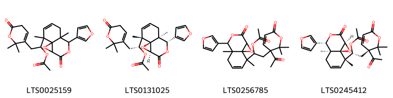{ width=100% }
    <figcaption>Hình ảnh cấu trúc hóa học của 4 hoạt chất thuộc nhóm Carboxylic acids and derivatives gồm ['2-(2,2-dimethyl-6-oxo-5h-pyran-3-yl)-1-[6-(furan-3-yl)-7,11-dimethyl-4-oxo-2,5-dioxatricyclo[5.4.0.0¹,³]undec-9-en-11-yl]ethyl acetate (LTS0025159)', '(1r)-2-(2,2-dimethyl-6-oxo-5h-pyran-3-yl)-1-[(1r,3s,6s,7s,11s)-6-(furan-3-yl)-7,11-dimethyl-4-oxo-2,5-dioxatricyclo[5.4.0.0¹,³]undec-9-en-11-yl]ethyl acetate (LTS0131025)', '2-(3-acetyl-2,2-dimethyl-6-oxopyran-3-yl)-1-[6-(furan-3-yl)-7,11-dimethyl-4-oxo-2,5-dioxatricyclo[5.4.0.0¹,³]undec-9-en-11-yl]ethyl acetate (LTS0256785)', '(1r)-2-[(3r)-3-acetyl-2,2-dimethyl-6-oxopyran-3-yl]-1-[(1r,3s,6s,7s,11s)-6-(furan-3-yl)-7,11-dimethyl-4-oxo-2,5-dioxatricyclo[5.4.0.0¹,³]undec-9-en-11-yl]ethyl acetate (LTS0245412)'].</figcaption>
</figure>
#### Nhóm Dioxepanes
<figure markdown="span">
    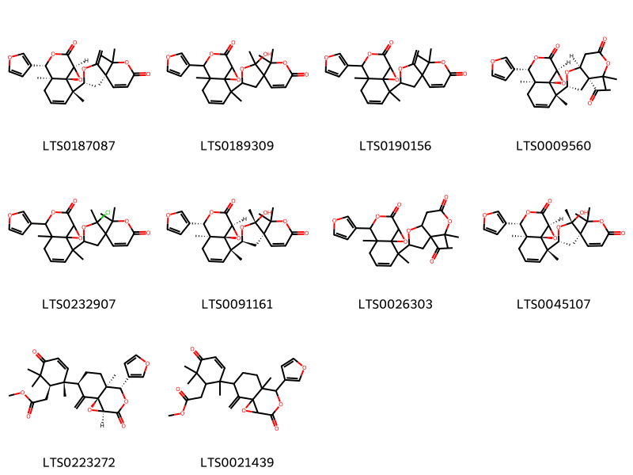{ width=100% }
    <figcaption>Hình ảnh cấu trúc hóa học của 10 hoạt chất thuộc nhóm Dioxepanes gồm ['(1r,3s,6s,7s,11s)-11-[(3r,5r)-6,6-dimethyl-1-methylidene-8-oxo-2,7-dioxaspiro[4.5]dec-9-en-3-yl]-6-(furan-3-yl)-7,11-dimethyl-2,5-dioxatricyclo[5.4.0.0¹,³]undec-9-en-4-one (LTS0187087)', '6-(furan-3-yl)-11-{1-hydroxy-1,6,6-trimethyl-8-oxo-2,7-dioxaspiro[4.5]dec-9-en-3-yl}-7,11-dimethyl-2,5-dioxatricyclo[5.4.0.0¹,³]undec-9-en-4-one (LTS0189309)', '11-{6,6-dimethyl-1-methylidene-8-oxo-2,7-dioxaspiro[4.5]dec-9-en-3-yl}-6-(furan-3-yl)-7,11-dimethyl-2,5-dioxatricyclo[5.4.0.0¹,³]undec-9-en-4-one (LTS0190156)', '(1r,3s,6s,7s,11s)-11-[(2r,3ar,7as)-3a-acetyl-4,4-dimethyl-6-oxo-tetrahydrofuro[3,2-c]pyran-2-yl]-6-(furan-3-yl)-7,11-dimethyl-2,5-dioxatricyclo[5.4.0.0¹,³]undec-9-en-4-one (LTS0009560)', '11-{1-chloro-1,6,6-trimethyl-8-oxo-2,7-dioxaspiro[4.5]dec-9-en-3-yl}-6-(furan-3-yl)-7,11-dimethyl-2,5-dioxatricyclo[5.4.0.0¹,³]undec-9-en-4-one (LTS0232907)', '(1r,3s,6s,7s,11s)-6-(furan-3-yl)-11-[(1s,3s,5r)-1-hydroxy-1,6,6-trimethyl-8-oxo-2,7-dioxaspiro[4.5]dec-9-en-3-yl]-7,11-dimethyl-2,5-dioxatricyclo[5.4.0.0¹,³]undec-9-en-4-one (LTS0091161)', '11-{3a-acetyl-4,4-dimethyl-6-oxo-tetrahydrofuro[3,2-c]pyran-2-yl}-6-(furan-3-yl)-7,11-dimethyl-2,5-dioxatricyclo[5.4.0.0¹,³]undec-9-en-4-one (LTS0026303)', '(1r,3s,6s,7s,11s)-6-(furan-3-yl)-11-[(1s,3r,5r)-1-hydroxy-1,6,6-trimethyl-8-oxo-2,7-dioxaspiro[4.5]dec-9-en-3-yl]-7,11-dimethyl-2,5-dioxatricyclo[5.4.0.0¹,³]undec-9-en-4-one (LTS0045107)', 'methyl 2-[(1r,2r)-2-[(1s,3s,6s,7s,10r)-6-(furan-3-yl)-7-methyl-11-methylidene-4-oxo-2,5-dioxatricyclo[5.4.0.0¹,³]undecan-10-yl]-2,6,6-trimethyl-5-oxocyclohex-3-en-1-yl]acetate (LTS0223272)', 'methyl 2-{2-[6-(furan-3-yl)-7-methyl-11-methylidene-4-oxo-2,5-dioxatricyclo[5.4.0.0¹,³]undecan-10-yl]-2,6,6-trimethyl-5-oxocyclohex-3-en-1-yl}acetate (LTS0021439)'].</figcaption>
</figure>
#### Nhóm Naphthopyrans
<figure markdown="span">
    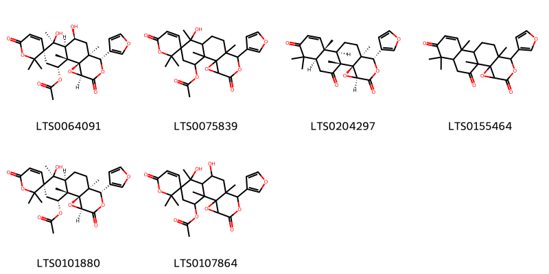{ width=100% }
    <figcaption>Hình ảnh cấu trúc hóa học của 6 hoạt chất thuộc nhóm Naphthopyrans gồm ["(1'r,2's,3s,3'r,6's,7'r,8's,10's,11's,14's)-11'-(furan-3-yl)-6',8'-dihydroxy-2,2,2',6',10'-pentamethyl-6,13'-dioxo-12',15'-dioxaspiro[pyran-3,5'-tetracyclo[8.5.0.0¹,¹⁴.0²,⁷]pentadecan]-3'-yl acetate (LTS0064091)", "11'-(furan-3-yl)-6'-hydroxy-2,2,2',6',10'-pentamethyl-6,13'-dioxo-12',15'-dioxaspiro[pyran-3,5'-tetracyclo[8.5.0.0¹,¹⁴.0²,⁷]pentadecan]-3'-yl acetate (LTS0075839)", '(1r,2r,4s,7s,8s,11r,12s,17r)-7-(furan-3-yl)-1,8,12,16,16-pentamethyl-3,6-dioxapentacyclo[9.8.0.0²,⁴.0²,⁸.0¹²,¹⁷]nonadec-13-ene-5,15,19-trione (LTS0204297)', '7-(furan-3-yl)-1,8,12,16,16-pentamethyl-3,6-dioxapentacyclo[9.8.0.0²,⁴.0²,⁸.0¹²,¹⁷]nonadec-13-ene-5,15,19-trione (LTS0155464)', "(1'r,2's,3s,3'r,6's,7's,10's,11's,14's)-11'-(furan-3-yl)-6'-hydroxy-2,2,2',6',10'-pentamethyl-6,13'-dioxo-12',15'-dioxaspiro[pyran-3,5'-tetracyclo[8.5.0.0¹,¹⁴.0²,⁷]pentadecan]-3'-yl acetate (LTS0101880)", "11'-(furan-3-yl)-6',8'-dihydroxy-2,2,2',6',10'-pentamethyl-6,13'-dioxo-12',15'-dioxaspiro[pyran-3,5'-tetracyclo[8.5.0.0¹,¹⁴.0²,⁷]pentadecan]-3'-yl acetate (LTS0107864)"].</figcaption>
</figure>
#### Nhóm Prenol lipids
<figure markdown="span">
    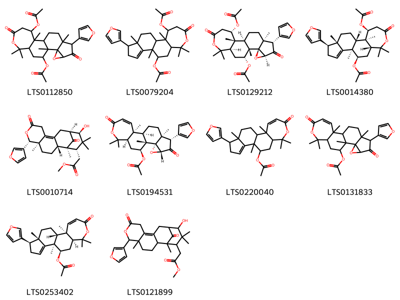{ width=100% }
    <figcaption>Hình ảnh cấu trúc hóa học của 10 hoạt chất thuộc nhóm Prenol lipids gồm ['3-(acetyloxy)-16-(furan-3-yl)-2,7,7,11,17-pentamethyl-5,15-dioxo-6,13-dioxapentacyclo[9.8.0.0²,⁸.0¹²,¹⁴.0¹²,¹⁷]nonadecan-10-yl acetate (LTS0112850)', '3-(acetyloxy)-15-(furan-3-yl)-2,7,7,11,16-pentamethyl-5-oxo-6-oxatetracyclo[9.7.0.0²,⁸.0¹²,¹⁶]octadec-12-en-10-yl acetate (LTS0079204)', '(1r,2r,3s,8r,10r,11s,12r,14s,16s,17s)-3-(acetyloxy)-16-(furan-3-yl)-2,7,7,11,17-pentamethyl-5,15-dioxo-6,13-dioxapentacyclo[9.8.0.0²,⁸.0¹²,¹⁴.0¹²,¹⁷]nonadecan-10-yl acetate (LTS0129212)', '(1r,2r,3s,8r,10r,11r,15r,16s)-3-(acetyloxy)-15-(furan-3-yl)-2,7,7,11,16-pentamethyl-5-oxo-6-oxatetracyclo[9.7.0.0²,⁸.0¹²,¹⁶]octadec-12-en-10-yl acetate (LTS0014380)', 'methyl 2-[(1r,2r,5r,6r,13s,14r,16s)-6-(furan-3-yl)-14-hydroxy-1,5,15,15-tetramethyl-8,17-dioxo-7-oxatetracyclo[11.3.1.0²,¹¹.0⁵,¹⁰]heptadec-10-en-16-yl]acetate (LTS0010714)', '(1r,2s,8r,10s,11s,12s,14r,16s,17s)-16-(furan-3-yl)-2,7,7,11,17-pentamethyl-5,15-dioxo-6,13-dioxapentacyclo[9.8.0.0²,⁸.0¹²,¹⁴.0¹²,¹⁷]nonadec-3-en-10-yl acetate (LTS0194531)', '15-(furan-3-yl)-2,7,7,11,16-pentamethyl-5-oxo-6-oxatetracyclo[9.7.0.0²,⁸.0¹²,¹⁶]octadeca-3,12-dien-10-yl acetate (LTS0220040)', '16-(furan-3-yl)-2,7,7,11,17-pentamethyl-5,15-dioxo-6,13-dioxapentacyclo[9.8.0.0²,⁸.0¹²,¹⁴.0¹²,¹⁷]nonadec-3-en-10-yl acetate (LTS0131833)', '(1r,2r,8s,10r,11r,15r,16s)-15-(furan-3-yl)-2,7,7,11,16-pentamethyl-5-oxo-6-oxatetracyclo[9.7.0.0²,⁸.0¹²,¹⁶]octadeca-3,12-dien-10-yl acetate (LTS0253402)', 'methyl 2-[6-(furan-3-yl)-14-hydroxy-1,5,15,15-tetramethyl-8,17-dioxo-7-oxatetracyclo[11.3.1.0²,¹¹.0⁵,¹⁰]heptadec-10-en-16-yl]acetate (LTS0121899)'].</figcaption>
</figure>

---

### Dược dân tộc học

Danh sách các quốc gia có sử dụng *Carapa procera* trong điều trị các bệnh. 

| Country   | Disease          | Bệnh                                                                                                                                                                                                |
|:----------|:-----------------|:----------------------------------------------------------------------------------------------------------------------------------------------------------------------------------------------------|
| Elsewhere | nan, Tonic, Soap | MYMEMORY WARNING: YOU USED ALL AVAILABLE FREE TRANSLATIONS FOR TODAY. NEXT AVAILABLE IN  06 HOURS 27 MINUTES 16 SECONDS VISIT HTTPS://MYMEMORY.TRANSLATED.NET/DOC/USAGELIMITS.PHP TO TRANSLATE MORE |

---

# Chi Soymida

??? note "Danh sách các dược liệu thuộc chi"
    
	 - *Soymida febrifuga*

---
## Soymida febrifuga
### Thông tin về thực vật

!!! info "Phân loại thực vật của *Soymida febrifuga* từ GIBF:"
    - **Kingdom:** Plantae
    - **Phylum:** Tracheophyta
    - **Order:** Sapindales
    - **Family:** Meliaceae
    - **Genus:** Soymida
    - **Species:** *Soymida febrifuga*

 

| Label (VI)   | Label (EN)   | Scientific Name   | Descriptions (VI)   | Descriptions (EN)   | Also Known As (VI)   | Also Known As (EN)   |
|:-------------|:-------------|:------------------|:--------------------|:--------------------|:---------------------|:---------------------|
| N/A          | N/A          | Soymida febrifuga | loài thực vật       | species of plant    | ['']                 | ['']                 |

#### Phân bố trên thế giới

**Từ CSDL GIBF** nan, Sri Lanka, India, Indonesia, unknown or invalid

#### Phân bố tại Việt Nam

**Từ CSDL GIBF**: Không có ghi nhận ở Việt Nam

---
### Thành phần hóa học
        
- Theo cơ sở dữ liệu lotus: Từ loài *Soymida febrifuga* đã phân lập và xác định được 64 hoạt chất thuộc về các nhóm Fatty Acyls, Flavonoids, Prenol lipids, Steroids and steroid derivatives, Linear 1,3-diarylpropanoids, Pyrans, Benzene and substituted derivatives, Stilbenes, Phenols, Coumarins and derivatives, Naphthopyrans, Dioxepanes, Homoisoflavonoids. 

|    | chemicalTaxonomyClassyfireClass     |   smiles_count |
|---:|:------------------------------------|---------------:|
|  0 | Benzene and substituted derivatives |              2 |
|  1 | Coumarins and derivatives           |              2 |
|  2 | Dioxepanes                          |              2 |
|  3 | Fatty Acyls                         |              1 |
|  4 | Flavonoids                          |             12 |
|  5 | Homoisoflavonoids                   |             14 |
|  6 | Linear 1,3-diarylpropanoids         |             13 |
|  7 | Naphthopyrans                       |              1 |
|  8 | Phenols                             |              3 |
|  9 | Prenol lipids                       |              5 |
| 10 | Pyrans                              |              1 |
| 11 | Steroids and steroid derivatives    |              4 |
| 12 | Stilbenes                           |              4 |

#### Nhóm Benzene and substituted derivatives
<figure markdown="span">
    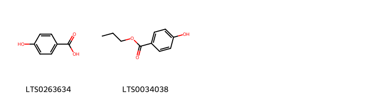{ width=100% }
    <figcaption>Hình ảnh cấu trúc hóa học của 2 hoạt chất thuộc nhóm Benzene and substituted derivatives gồm ['p-hydroxybenzoic acid (LTS0263634)', 'propylparaben (LTS0034038)'].</figcaption>
</figure>
#### Nhóm Coumarins and derivatives
<figure markdown="span">
    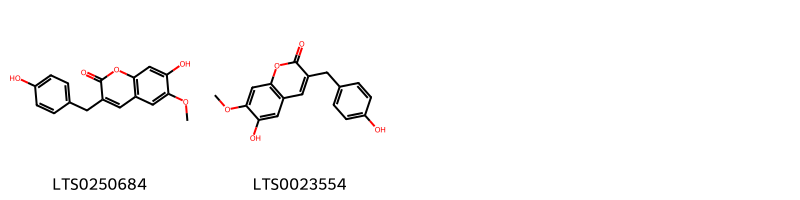{ width=100% }
    <figcaption>Hình ảnh cấu trúc hóa học của 2 hoạt chất thuộc nhóm Coumarins and derivatives gồm ['7-hydroxy-3-[(4-hydroxyphenyl)methyl]-6-methoxychromen-2-one (LTS0250684)', '6-hydroxy-3-[(4-hydroxyphenyl)methyl]-7-methoxychromen-2-one (LTS0023554)'].</figcaption>
</figure>
#### Nhóm Dioxepanes
<figure markdown="span">
    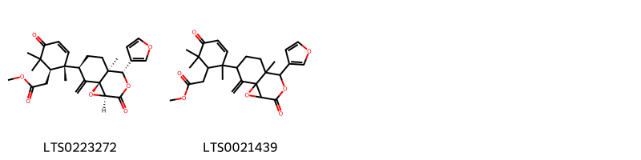{ width=100% }
    <figcaption>Hình ảnh cấu trúc hóa học của 2 hoạt chất thuộc nhóm Dioxepanes gồm ['methyl 2-[(1r,2r)-2-[(1s,3s,6s,7s,10r)-6-(furan-3-yl)-7-methyl-11-methylidene-4-oxo-2,5-dioxatricyclo[5.4.0.0¹,³]undecan-10-yl]-2,6,6-trimethyl-5-oxocyclohex-3-en-1-yl]acetate (LTS0223272)', 'methyl 2-{2-[6-(furan-3-yl)-7-methyl-11-methylidene-4-oxo-2,5-dioxatricyclo[5.4.0.0¹,³]undecan-10-yl]-2,6,6-trimethyl-5-oxocyclohex-3-en-1-yl}acetate (LTS0021439)'].</figcaption>
</figure>
#### Nhóm Fatty Acyls
<figure markdown="span">
    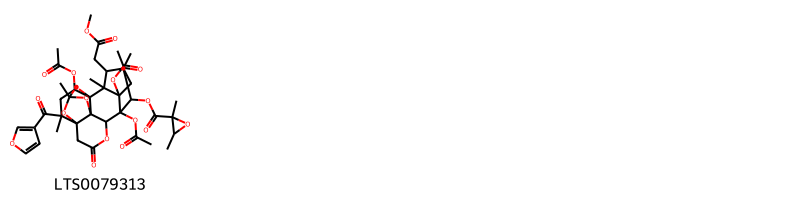{ width=100% }
    <figcaption>Hình ảnh cấu trúc hóa học của 1 hoạt chất thuộc nhóm Fatty Acyls gồm ['3,7,17-tris(acetyloxy)-19-(furan-3-carbonyl)-21-(2-methoxy-2-oxoethyl)-2,5,15,19-tetramethyl-10-oxo-9,14,16,20-tetraoxaheptacyclo[10.4.3.1²,⁵.1¹²,¹⁵.0¹,¹³.0³,⁷.0⁸,¹³]henicosan-6-yl 2,3-dimethyloxirane-2-carboxylate (LTS0079313)'].</figcaption>
</figure>
#### Nhóm Flavonoids
<figure markdown="span">
    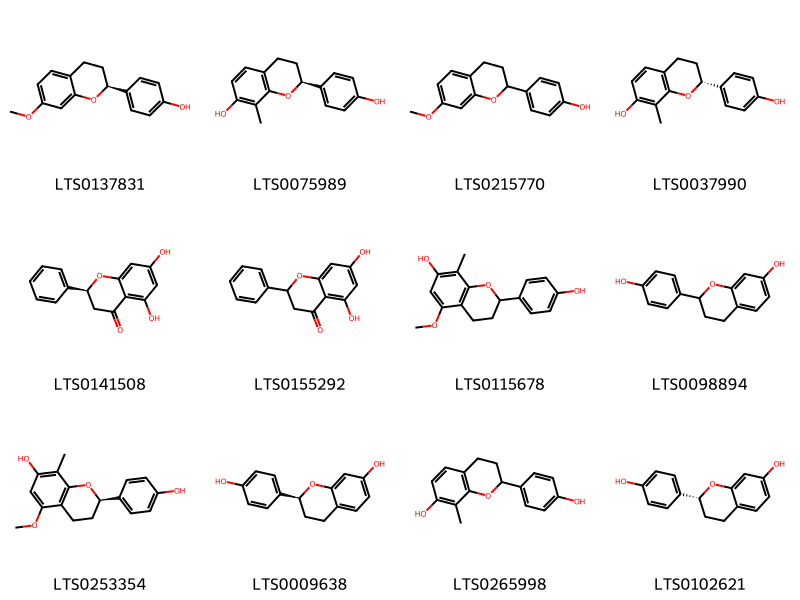{ width=100% }
    <figcaption>Hình ảnh cấu trúc hóa học của 12 hoạt chất thuộc nhóm Flavonoids gồm ['4-[(2s)-7-methoxy-3,4-dihydro-2h-1-benzopyran-2-yl]phenol (LTS0137831)', "7,4'-dihydroxy-8-methylflavan (LTS0075989)", '4-(7-methoxy-3,4-dihydro-2h-1-benzopyran-2-yl)phenol (LTS0215770)', '(2r)-2-(4-hydroxyphenyl)-8-methyl-3,4-dihydro-2h-1-benzopyran-7-ol (LTS0037990)', 'pinocembrine (LTS0141508)', 'pinocembrin (LTS0155292)', '2-(4-hydroxyphenyl)-5-methoxy-8-methyl-3,4-dihydro-2h-1-benzopyran-7-ol (LTS0115678)', "4',7-flavandiol (LTS0098894)", '(2r)-2-(4-hydroxyphenyl)-5-methoxy-8-methyl-3,4-dihydro-2h-1-benzopyran-7-ol (LTS0253354)', "7,4'-dihydroxyflavan (LTS0009638)", "7,4'-dihydroxy-8-methylflavan (LTS0265998)", '(2r)-2-(4-hydroxyphenyl)-3,4-dihydro-2h-1-benzopyran-7-ol (LTS0102621)'].</figcaption>
</figure>
#### Nhóm Homoisoflavonoids
<figure markdown="span">
    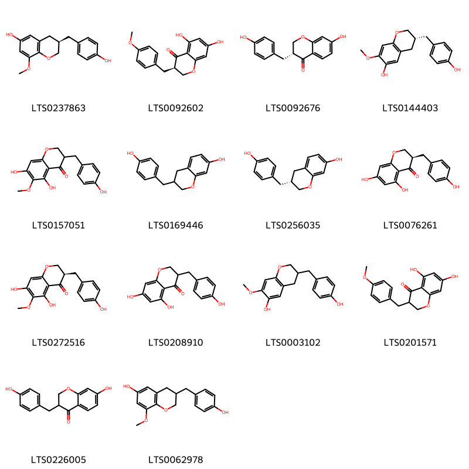{ width=100% }
    <figcaption>Hình ảnh cấu trúc hóa học của 14 hoạt chất thuộc nhóm Homoisoflavonoids gồm ['(3r)-3-[(4-hydroxyphenyl)methyl]-8-methoxy-3,4-dihydro-2h-1-benzopyran-6-ol (LTS0237863)', '(3r)-5,7-dihydroxy-3-[(4-methoxyphenyl)methyl]-2,3-dihydro-1-benzopyran-4-one (LTS0092602)', '(3r)-7-hydroxy-3-[(4-hydroxyphenyl)methyl]-2,3-dihydro-1-benzopyran-4-one (LTS0092676)', '(3r)-3-[(4-hydroxyphenyl)methyl]-7-methoxy-3,4-dihydro-2h-1-benzopyran-6-ol (LTS0144403)', '5,7-dihydroxy-3-[(4-hydroxyphenyl)methyl]-6-methoxy-2,3-dihydro-1-benzopyran-4-one (LTS0157051)', '3-[(4-hydroxyphenyl)methyl]-3,4-dihydro-2h-1-benzopyran-7-ol (LTS0169446)', '(3r)-3-[(4-hydroxyphenyl)methyl]-3,4-dihydro-2h-1-benzopyran-7-ol (LTS0256035)', '(3r)-5,7-dihydroxy-3-[(4-hydroxyphenyl)methyl]-2,3-dihydro-1-benzopyran-4-one (LTS0076261)', '(3r)-5,7-dihydroxy-3-[(4-hydroxyphenyl)methyl]-6-methoxy-2,3-dihydro-1-benzopyran-4-one (LTS0272516)', '5,7-dihydroxy-3-[(4-hydroxyphenyl)methyl]-2,3-dihydro-1-benzopyran-4-one (LTS0208910)', '3-[(4-hydroxyphenyl)methyl]-7-methoxy-3,4-dihydro-2h-1-benzopyran-6-ol (LTS0003102)', '5,7-dihydroxy-3-[(4-methoxyphenyl)methyl]-2,3-dihydro-1-benzopyran-4-one (LTS0201571)', '7-hydroxy-3-[(4-hydroxyphenyl)methyl]-2,3-dihydro-1-benzopyran-4-one (LTS0226005)', '3-[(4-hydroxyphenyl)methyl]-8-methoxy-3,4-dihydro-2h-1-benzopyran-6-ol (LTS0062978)'].</figcaption>
</figure>
#### Nhóm Linear 1_3-diarylpropanoids
<figure markdown="span">
    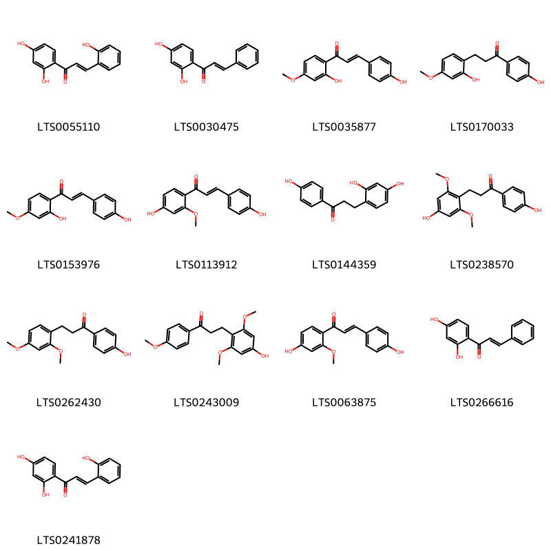{ width=100% }
    <figcaption>Hình ảnh cấu trúc hóa học của Không tìm thấy chú thích hoạt chất thuộc nhóm Linear 1_3-diarylpropanoids gồm Không tìm thấy chú thích.</figcaption>
</figure>
#### Nhóm Naphthopyrans
<figure markdown="span">
    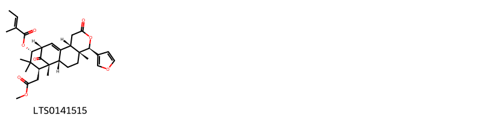{ width=100% }
    <figcaption>Hình ảnh cấu trúc hóa học của 1 hoạt chất thuộc nhóm Naphthopyrans gồm ['(1r,2s,5r,6r,10s,13s,14r,16s)-6-(furan-3-yl)-16-(2-methoxy-2-oxoethyl)-1,5,15,15-tetramethyl-8,17-dioxo-7-oxatetracyclo[11.3.1.0²,¹¹.0⁵,¹⁰]heptadec-11-en-14-yl (2e)-2-methylbut-2-enoate (LTS0141515)'].</figcaption>
</figure>
#### Nhóm Phenols
<figure markdown="span">
    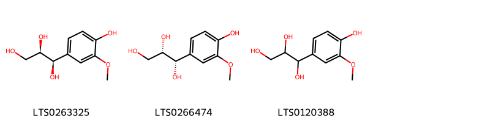{ width=100% }
    <figcaption>Hình ảnh cấu trúc hóa học của 3 hoạt chất thuộc nhóm Phenols gồm ['(1r,2r)-1-(4-hydroxy-3-methoxyphenyl)propane-1,2,3-triol (LTS0263325)', '(+)-(7s,8s)-guaiacylglycerol (LTS0266474)', 'guaiacylglycerol (LTS0120388)'].</figcaption>
</figure>
#### Nhóm Prenol lipids
<figure markdown="span">
    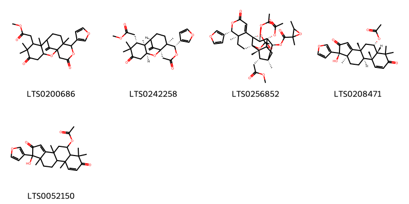{ width=100% }
    <figcaption>Hình ảnh cấu trúc hóa học của 5 hoạt chất thuộc nhóm Prenol lipids gồm ['methyl 2-[13-(furan-3-yl)-6,6,8,12-tetramethyl-17-methylidene-5,15-dioxo-2,14-dioxatetracyclo[7.7.1.0¹,¹².0³,⁸]heptadecan-7-yl]acetate (LTS0200686)', 'methyl 2-[(1s,3s,7r,8r,9r,12s,13s)-13-(furan-3-yl)-6,6,8,12-tetramethyl-17-methylidene-5,15-dioxo-2,14-dioxatetracyclo[7.7.1.0¹,¹².0³,⁸]heptadecan-7-yl]acetate (LTS0242258)', '(1r,6r,7r,10s,15r,16s,17s,18s,19s,20s)-19,20-bis(acetyloxy)-6-(furan-3-yl)-16-(2-methoxy-2-oxoethyl)-7,12,15,17-tetramethyl-4-oxo-5,11,13,21-tetraoxaheptacyclo[10.8.1.1¹⁴,¹⁷.0¹,¹⁰.0²,⁷.0¹⁰,¹⁵.0¹⁴,¹⁹]docos-2-en-18-yl 2,3-dimethyloxirane-2-carboxylate (LTS0256852)', '(1s,3br,5s,5as,9ar,9br,11ar)-1-(furan-3-yl)-1-hydroxy-3b,6,6,9a,11a-pentamethyl-2,7-dioxo-4h,5h,5ah,9bh,10h,11h-cyclopenta[a]phenanthren-5-yl acetate (LTS0208471)', '1-(furan-3-yl)-1-hydroxy-3b,6,6,9a,11a-pentamethyl-2,7-dioxo-4h,5h,5ah,9bh,10h,11h-cyclopenta[a]phenanthren-5-yl acetate (LTS0052150)'].</figcaption>
</figure>
#### Nhóm Pyrans
<figure markdown="span">
    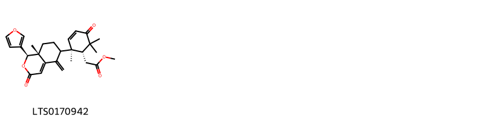{ width=100% }
    <figcaption>Hình ảnh cấu trúc hóa học của 1 hoạt chất thuộc nhóm Pyrans gồm ['methyl 2-[(1r,2r)-2-[(1r,8ar)-1-(furan-3-yl)-8a-methyl-5-methylidene-3-oxo-1,6,7,8-tetrahydroisochromen-6-yl]-2,6,6-trimethyl-5-oxocyclohex-3-en-1-yl]acetate (LTS0170942)'].</figcaption>
</figure>
#### Nhóm Steroids and steroid derivatives
<figure markdown="span">
    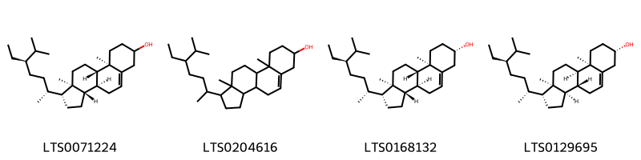{ width=100% }
    <figcaption>Hình ảnh cấu trúc hóa học của 4 hoạt chất thuộc nhóm Steroids and steroid derivatives gồm ['stigmast-5-en-3-ol (LTS0071224)', 'stigmast-5-en-3-ol, (3β)- (LTS0204616)', 'sitosterol (LTS0168132)', '(1r,3ar,3br,7s,9ar,9br,11ar)-1-[(2r,5r)-5-ethyl-6-methylheptan-2-yl]-9a,11a-dimethyl-1h,2h,3h,3ah,3bh,4h,6h,7h,8h,9h,9bh,10h,11h-cyclopenta[a]phenanthren-7-ol (LTS0129695)'].</figcaption>
</figure>
#### Nhóm Stilbenes
<figure markdown="span">
    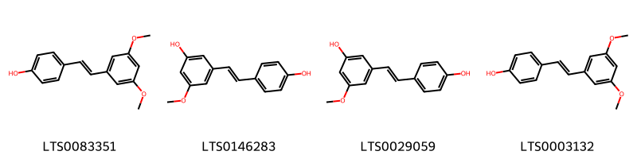{ width=100% }
    <figcaption>Hình ảnh cấu trúc hóa học của 4 hoạt chất thuộc nhóm Stilbenes gồm ["3',5'-dimethoxy-4-stilbenol (LTS0083351)", 'pinostilbene (LTS0146283)', 'pinostilbene (LTS0029059)', 'pterostilbene (LTS0003132)'].</figcaption>
</figure>

---

### Dược dân tộc học

Danh sách các quốc gia có sử dụng *Soymida febrifuga* trong điều trị các bệnh. 

| Country   | Disease           | Bệnh                                                                                                                                                                                                |
|:----------|:------------------|:----------------------------------------------------------------------------------------------------------------------------------------------------------------------------------------------------|
| English   | Astringent        | MYMEMORY WARNING: YOU USED ALL AVAILABLE FREE TRANSLATIONS FOR TODAY. NEXT AVAILABLE IN  06 HOURS 26 MINUTES 46 SECONDS VISIT HTTPS://MYMEMORY.TRANSLATED.NET/DOC/USAGELIMITS.PHP TO TRANSLATE MORE |
| India     | Astringent, Tonic | MYMEMORY WARNING: YOU USED ALL AVAILABLE FREE TRANSLATIONS FOR TODAY. NEXT AVAILABLE IN  06 HOURS 26 MINUTES 42 SECONDS VISIT HTTPS://MYMEMORY.TRANSLATED.NET/DOC/USAGELIMITS.PHP TO TRANSLATE MORE |

---

# Chi Cedrela

??? note "Danh sách các dược liệu thuộc chi"
    
	 - *Cedrela chinense*
	 - *Cedrela chinensis*
	 - *Cedrela fissilis*
	 - *Cedrela mexicana*
	 - *Cedrela odorata*
	 - *Cedrela sinensis*
	 - *Cedrela toona*

---
## Cedrela chinense
### Thông tin về thực vật

!!! info "Phân loại thực vật của *Toona sinensis* từ GIBF:"
    - **Kingdom:** Plantae
    - **Phylum:** Tracheophyta
    - **Order:** Sapindales
    - **Family:** Meliaceae
    - **Genus:** Toona
    - **Species:** *Toona sinensis*

 

| Label (VI)   | Label (EN)   | Scientific Name   | Descriptions (VI)   | Descriptions (EN)   | Also Known As (VI)   | Also Known As (EN)   |
|:-------------|:-------------|:------------------|:--------------------|:--------------------|:---------------------|:---------------------|
| N/A          | N/A          | Soymida febrifuga | loài thực vật       | species of plant    | ['']                 | ['']                 |

#### Phân bố trên thế giới

**Từ CSDL GIBF** nan, Sri Lanka, India, Indonesia, unknown or invalid

#### Phân bố tại Việt Nam

**Từ CSDL GIBF**: Không có ghi nhận ở Việt Nam

---
### Thành phần hóa học
        
- Theo cơ sở dữ liệu lotus: Từ loài *Toona sinensis* đã phân lập và xác định được Chưa có hoạt chất nào được phân lập. hoạt chất thuộc về các nhóm Không có hoạt chất nào được phân lập. 

Không có hình ảnh nào được tạo ra

---

### Dược dân tộc học

Danh sách các quốc gia có sử dụng *Toona sinensis* trong điều trị các bệnh. 

| Country   | Disease               | Bệnh                                                                                                                                                                                                |
|:----------|:----------------------|:----------------------------------------------------------------------------------------------------------------------------------------------------------------------------------------------------|
| China     | Carminative, Hemostat | MYMEMORY WARNING: YOU USED ALL AVAILABLE FREE TRANSLATIONS FOR TODAY. NEXT AVAILABLE IN  06 HOURS 26 MINUTES 01 SECONDS VISIT HTTPS://MYMEMORY.TRANSLATED.NET/DOC/USAGELIMITS.PHP TO TRANSLATE MORE |

---

---
## Cedrela chinensis
### Thông tin về thực vật

!!! info "Phân loại thực vật của *Toona sinensis* từ GIBF:"
    - **Kingdom:** Plantae
    - **Phylum:** Tracheophyta
    - **Order:** Sapindales
    - **Family:** Meliaceae
    - **Genus:** Toona
    - **Species:** *Toona sinensis*

 

| Label (VI)   | Label (EN)   | Scientific Name   | Descriptions (VI)   | Descriptions (EN)   | Also Known As (VI)   | Also Known As (EN)   |
|:-------------|:-------------|:------------------|:--------------------|:--------------------|:---------------------|:---------------------|
| N/A          | N/A          | Soymida febrifuga | loài thực vật       | species of plant    | ['']                 | ['']                 |

#### Phân bố trên thế giới

**Từ CSDL GIBF** nan, Sri Lanka, India, Indonesia, unknown or invalid

#### Phân bố tại Việt Nam

**Từ CSDL GIBF**: Không có ghi nhận ở Việt Nam

---
### Thành phần hóa học
        
- Theo cơ sở dữ liệu lotus: Từ loài *Toona sinensis* đã phân lập và xác định được Chưa có hoạt chất nào được phân lập. hoạt chất thuộc về các nhóm Không có hoạt chất nào được phân lập. 

Không có hình ảnh nào được tạo ra

---

### Dược dân tộc học

Danh sách các quốc gia có sử dụng *Toona sinensis* trong điều trị các bệnh. 

| Country   | Disease     | Bệnh                                                                                                                                                                                                |
|:----------|:------------|:----------------------------------------------------------------------------------------------------------------------------------------------------------------------------------------------------|
| China     | Refrigerant | MYMEMORY WARNING: YOU USED ALL AVAILABLE FREE TRANSLATIONS FOR TODAY. NEXT AVAILABLE IN  06 HOURS 25 MINUTES 39 SECONDS VISIT HTTPS://MYMEMORY.TRANSLATED.NET/DOC/USAGELIMITS.PHP TO TRANSLATE MORE |

---

---
## Cedrela fissilis
### Thông tin về thực vật

!!! info "Phân loại thực vật của *Cedrela fissilis* từ GIBF:"
    - **Kingdom:** Plantae
    - **Phylum:** Tracheophyta
    - **Order:** Sapindales
    - **Family:** Meliaceae
    - **Genus:** Cedrela
    - **Species:** *Cedrela fissilis*

 

| Label (VI)   | Label (EN)   | Scientific Name   | Descriptions (VI)   | Descriptions (EN)   | Also Known As (VI)   | Also Known As (EN)   |
|:-------------|:-------------|:------------------|:--------------------|:--------------------|:---------------------|:---------------------|
| N/A          | N/A          | Cedrela fissilis  |                     | species of plant    | ['']                 | ['Cedar']            |

#### Phân bố trên thế giới

**Từ CSDL GIBF** Colombia, Brazil, Bolivia (Plurinational State of), Argentina, Peru, Uruguay, Paraguay

#### Phân bố tại Việt Nam

**Từ CSDL GIBF**: Không có ghi nhận ở Việt Nam

---
### Thành phần hóa học
        
- Theo cơ sở dữ liệu lotus: Từ loài *Cedrela fissilis* đã phân lập và xác định được 49 hoạt chất thuộc về các nhóm Prenol lipids, Steroids and steroid derivatives, Linear 1,3-diarylpropanoids, Benzene and substituted derivatives, Organooxygen compounds, Naphthopyrans. 

|    | chemicalTaxonomyClassyfireClass     |   smiles_count |
|---:|:------------------------------------|---------------:|
|  0 | Benzene and substituted derivatives |              1 |
|  1 | Linear 1,3-diarylpropanoids         |              2 |
|  2 | Naphthopyrans                       |              1 |
|  3 | Organooxygen compounds              |              1 |
|  4 | Prenol lipids                       |             42 |
|  5 | Steroids and steroid derivatives    |              1 |

#### Nhóm Benzene and substituted derivatives
<figure markdown="span">
    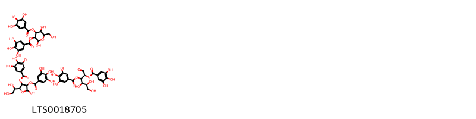{ width=100% }
    <figcaption>Hình ảnh cấu trúc hóa học của 1 hoạt chất thuộc nhóm Benzene and substituted derivatives gồm ['2,5-dihydroxy-6-(hydroxymethyl)-3-(3,4,5-trihydroxybenzoyloxy)oxan-4-yl 3,4,5-trihydroxybenzoate; 2-(1,2-dihydroxyethyl)-5-hydroxy-4-(3,4,5-trihydroxybenzoyloxy)oxolan-3-yl 3,4,5-trihydroxybenzoate; 4,5,6-trihydroxy-1-oxo-2-(3,4,5-trihydroxybenzoyloxy)hexan-3-yl 3,4,5-trihydroxybenzoate (LTS0018705)'].</figcaption>
</figure>
#### Nhóm Linear 1_3-diarylpropanoids
<figure markdown="span">
    { width=100% }
    <figcaption>Hình ảnh cấu trúc hóa học của Không tìm thấy chú thích hoạt chất thuộc nhóm Linear 1_3-diarylpropanoids gồm Không tìm thấy chú thích.</figcaption>
</figure>
#### Nhóm Naphthopyrans
<figure markdown="span">
    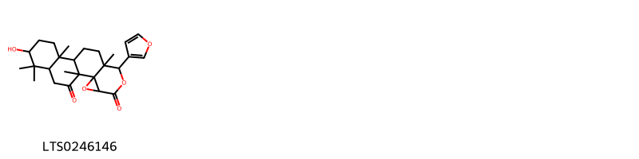{ width=100% }
    <figcaption>Hình ảnh cấu trúc hóa học của 1 hoạt chất thuộc nhóm Naphthopyrans gồm ['7-(furan-3-yl)-15-hydroxy-1,8,12,16,16-pentamethyl-3,6-dioxapentacyclo[9.8.0.0²,⁴.0²,⁸.0¹²,¹⁷]nonadecane-5,19-dione (LTS0246146)'].</figcaption>
</figure>
#### Nhóm Organooxygen compounds
<figure markdown="span">
    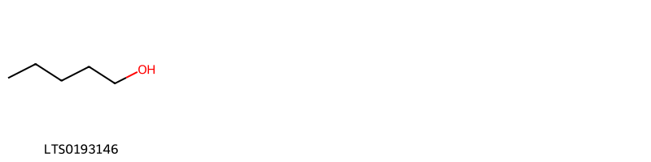{ width=100% }
    <figcaption>Hình ảnh cấu trúc hóa học của 1 hoạt chất thuộc nhóm Organooxygen compounds gồm ['amyl alcohol (LTS0193146)'].</figcaption>
</figure>
#### Nhóm Prenol lipids
<figure markdown="span">
    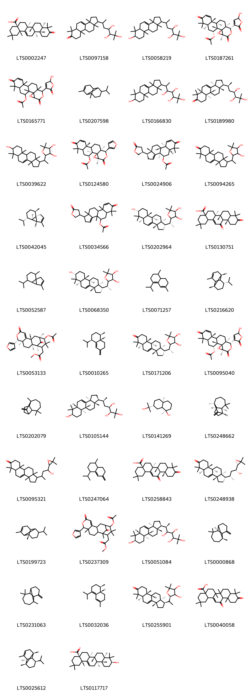{ width=100% }
    <figcaption>Hình ảnh cấu trúc hóa học của 42 hoạt chất thuộc nhóm Prenol lipids gồm ['(4as,6as,6br,8ar,12ar,12br,14bs)-2,2,6a,6b,9,9,12a-heptamethyl-10-oxo-3,4,5,6,7,8,8a,11,12,12b,13,14b-dodecahydro-1h-picene-4a-carboxylic acid (LTS0002247)', '3a,6,6,9a,11a-pentamethyl-1-(4,5,6-trihydroxy-6-methylheptan-2-yl)-1h,2h,3h,5h,5ah,8h,9h,9bh,10h,11h-cyclopenta[a]phenanthren-7-one (LTS0097158)', '6-{7-hydroxy-3a,6,6,9a,11a-pentamethyl-1h,2h,3h,5h,5ah,7h,8h,9h,9bh,10h,11h-cyclopenta[a]phenanthren-1-yl}-2-methylheptane-2,3,4-triol (LTS0058219)', '(1s,2r,4s,7r,8s,11r,12r,17r,19r)-7-(5-hydroxy-2-oxo-5h-furan-3-yl)-1,8,12,16,16-pentamethyl-5,15-dioxo-3,6-dioxapentacyclo[9.8.0.0²,⁴.0²,⁸.0¹²,¹⁷]nonadec-13-en-19-yl acetate (LTS0187261)', '7-(5-hydroxy-2-oxo-5h-furan-3-yl)-1,8,12,16,16-pentamethyl-5,15-dioxo-3,6-dioxapentacyclo[9.8.0.0²,⁴.0²,⁸.0¹²,¹⁷]nonadec-13-en-19-yl acetate (LTS0165771)', 'α-copaene (LTS0207598)', '6-{7-hydroxy-3a,6,6,9a,11a-pentamethyl-1h,2h,3h,5h,5ah,7h,8h,9h,9bh,10h,11h-cyclopenta[a]phenanthren-1-yl}-2-methylheptane-2,3,4,5-tetrol (LTS0166830)', '(1s,3as,5ar,9ar,9br,11as)-3a,6,6,9a,11a-pentamethyl-1-[(2s,4r,5s)-4,5,6-trihydroxy-6-methylheptan-2-yl]-1h,2h,3h,5h,5ah,8h,9h,9bh,10h,11h-cyclopenta[a]phenanthren-7-one (LTS0189980)', '5-(1-{7-hydroxy-3a,6,6,9a,11a-pentamethyl-1h,2h,3h,5h,5ah,7h,8h,9h,9bh,10h,11h-cyclopenta[a]phenanthren-1-yl}ethyl)-2,2-dimethyloxolane-3,4-diol (LTS0039622)', '(1r,2r,4s,7r,8s,12r,19s)-7-(furan-3-yl)-1,8,12,16,16-pentamethyl-5,15-dioxo-3,6-dioxapentacyclo[9.8.0.0²,⁴.0²,⁸.0¹²,¹⁷]nonadec-13-en-19-yl acetate (LTS0124580)', '(1s,3br,4r,5ar,9ar,9br,11as)-3b,6,6,9a,11a-pentamethyl-7-oxo-1-[(3s)-5-oxooxolan-3-yl]-1h,2h,4h,5h,5ah,9bh,10h,11h-cyclopenta[a]phenanthren-4-yl acetate (LTS0024906)', '1-[1-(3,4-dihydroxy-5,5-dimethyloxolan-2-yl)ethyl]-3a,6,6,9a,11a-pentamethyl-1h,2h,3h,5h,5ah,8h,9h,9bh,10h,11h-cyclopenta[a]phenanthren-7-one (LTS0094265)', '(-)-α-cubebene (LTS0042045)', '3b,6,6,9a,11a-pentamethyl-7-oxo-1-(5-oxooxolan-3-yl)-1h,2h,4h,5h,5ah,9bh,10h,11h-cyclopenta[a]phenanthren-4-yl acetate (LTS0034566)', '(3s)-5-[(1r)-1-[(1s,3as,5ar,7r,9ar,9br,11as)-7-hydroxy-3a,6,6,9a,11a-pentamethyl-1h,2h,3h,5h,5ah,7h,8h,9h,9bh,10h,11h-cyclopenta[a]phenanthren-1-yl]ethyl]-2,2-dimethyloxolane-3,4-diol (LTS0202964)', '(6as,6br,12as)-2,2,6a,6b,9,9,12a-heptamethyl-10,13-dioxo-1,3,4,5,6,7,8,8a,11,12,12b,14b-dodecahydropicene-4a-carboxylic acid (LTS0130751)', '7-isopropyl-4,10-dimethyltricyclo[4.4.0.0¹,⁵]dec-3-ene (LTS0052587)', '(3s,4r)-5-[(1r)-1-[(1s,3as,5ar,7r,9ar,9br,11as)-7-hydroxy-3a,6,6,9a,11a-pentamethyl-1h,2h,3h,5h,5ah,7h,8h,9h,9bh,10h,11h-cyclopenta[a]phenanthren-1-yl]ethyl]-2,2-dimethyloxolane-3,4-diol (LTS0068350)', '4-isopropyl-1,6-dimethyl-1,2,3,7,8,8a-hexahydronaphthalene (LTS0071257)', '(1s,6r,8s)-8-isopropyl-1,3-dimethyltricyclo[4.4.0.0²,⁷]dec-3-ene (LTS0216620)', 'methyl 2-[(1r,2s,5r,6r,11r,13s,14r)-14-(acetyloxy)-6-(furan-3-yl)-1,5,15,15-tetramethyl-8,17-dioxo-7-oxatetracyclo[11.3.1.0²,¹¹.0⁵,¹⁰]heptadec-9-en-16-yl]acetate (LTS0053133)', 'cis-muurola-4(14),5-diene (LTS0010265)', '(1s,3as,5ar,9ar,9br,11as)-1-[(1r)-1-[(3r,4s)-3,4-dihydroxy-5,5-dimethyloxolan-2-yl]ethyl]-3a,6,6,9a,11a-pentamethyl-1h,2h,3h,5h,5ah,8h,9h,9bh,10h,11h-cyclopenta[a]phenanthren-7-one (LTS0171206)', '(1s,2r,4s,7r,8s,12r,19r)-7-(5-hydroxy-2-oxo-5h-furan-3-yl)-1,8,12,16,16-pentamethyl-5,15-dioxo-3,6-dioxapentacyclo[9.8.0.0²,⁴.0²,⁸.0¹²,¹⁷]nonadec-13-en-19-yl acetate (LTS0095040)', 'longifolene (LTS0202079)', '(3s,4r,6s)-6-[(1s,3as,5ar,7r,9ar,9br,11as)-7-hydroxy-3a,6,6,9a,11a-pentamethyl-1h,2h,3h,5h,5ah,7h,8h,9h,9bh,10h,11h-cyclopenta[a]phenanthren-1-yl]-2-methylheptane-2,3,4-triol (LTS0105144)', '(1r,4ar,7r)-7-(2-hydroxypropan-2-yl)-1,4a-dimethyl-octahydronaphthalen-1-ol (LTS0141269)', '(+)-longifolene (LTS0248662)', '1-[4-(3,3-dimethyloxiran-2-yl)-4-hydroxybutan-2-yl]-3a,6,6,9a,11a-pentamethyl-1h,2h,3h,5h,5ah,8h,9h,9bh,10h,11h-cyclopenta[a]phenanthren-7-one (LTS0095321)', '4-isopropyl-1-methyl-6-methylidene-2,3,4,7,8,8a-hexahydro-1h-naphthalene (LTS0247064)', '(4as,6as,6br,12as)-2,2,6a,6b,9,9,12a-heptamethyl-10,13-dioxo-1,3,4,5,6,7,8,8a,11,12,12b,14b-dodecahydropicene-4a-carboxylic acid (LTS0258843)', '(1s,3as,5ar,9ar,9br,11as)-1-[(2s,4r)-4-[(2s)-3,3-dimethyloxiran-2-yl]-4-hydroxybutan-2-yl]-3a,6,6,9a,11a-pentamethyl-1h,2h,3h,5h,5ah,8h,9h,9bh,10h,11h-cyclopenta[a]phenanthren-7-one (LTS0248938)', '(1s)-8-isopropyl-1,3-dimethyltricyclo[4.4.0.0²,⁷]dec-3-ene (LTS0199723)', 'methyl 2-[14-(acetyloxy)-6-(furan-3-yl)-1,5,15,15-tetramethyl-8,17-dioxo-7-oxatetracyclo[11.3.1.0²,¹¹.0⁵,¹⁰]heptadec-9-en-16-yl]acetate (LTS0237309)', '(6r)-6-[(1s,3as,5ar,7r,9ar,9br,11as)-7-hydroxy-3a,6,6,9a,11a-pentamethyl-1h,2h,3h,5h,5ah,7h,8h,9h,9bh,10h,11h-cyclopenta[a]phenanthren-1-yl]-2-methylheptane-2,3,4,5-tetrol (LTS0051084)', '(2r,7s)-2,6,6-trimethyl-9-methylidenetricyclo[5.4.0.0²,⁸]undecane (LTS0000868)', '2,6,6-trimethyl-9-methylidenetricyclo[5.4.0.0²,⁸]undecane (LTS0231063)', '(1r,8as)-4-isopropyl-1,6-dimethyl-1,2,3,7,8,8a-hexahydronaphthalene (LTS0032036)', '(1r,3as,5ar,9ar,9bs,11as)-1-{1-[(2r)-3,4-dihydroxy-5,5-dimethyloxolan-2-yl]ethyl}-3a,6,6,9a,11a-pentamethyl-1h,2h,3h,5h,5ah,8h,9h,9bh,10h,11h-cyclopenta[a]phenanthren-7-one (LTS0255901)', '2,2,6a,6b,9,9,12a-heptamethyl-10,13-dioxo-1,3,4,5,6,7,8,8a,11,12,12b,14b-dodecahydropicene-4a-carboxylic acid (LTS0040058)', '(1s,2r,6r,8r)-8-isopropyl-1,3-dimethyltricyclo[4.4.0.0²,⁷]dec-3-ene (LTS0025612)', 'oleanolic acid (LTS0117717)'].</figcaption>
</figure>
#### Nhóm Steroids and steroid derivatives
<figure markdown="span">
    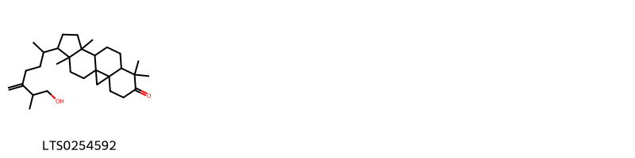{ width=100% }
    <figcaption>Hình ảnh cấu trúc hóa học của 1 hoạt chất thuộc nhóm Steroids and steroid derivatives gồm ['15-(7-hydroxy-6-methyl-5-methylideneheptan-2-yl)-7,7,12,16-tetramethylpentacyclo[9.7.0.0¹,³.0³,⁸.0¹²,¹⁶]octadecan-6-one (LTS0254592)'].</figcaption>
</figure>

---

### Dược dân tộc học

Danh sách các quốc gia có sử dụng *Cedrela fissilis* trong điều trị các bệnh. 

| Country   | Disease            | Bệnh                                                                                                                                                                                                |
|:----------|:-------------------|:----------------------------------------------------------------------------------------------------------------------------------------------------------------------------------------------------|
| Elsewhere | Emetic, Astringent | MYMEMORY WARNING: YOU USED ALL AVAILABLE FREE TRANSLATIONS FOR TODAY. NEXT AVAILABLE IN  06 HOURS 25 MINUTES 15 SECONDS VISIT HTTPS://MYMEMORY.TRANSLATED.NET/DOC/USAGELIMITS.PHP TO TRANSLATE MORE |

---

---
## Cedrela mexicana
### Thông tin về thực vật

!!! info "Phân loại thực vật của *Cedrela odorata* từ GIBF:"
    - **Kingdom:** Plantae
    - **Phylum:** Tracheophyta
    - **Order:** Sapindales
    - **Family:** Meliaceae
    - **Genus:** Cedrela
    - **Species:** *Cedrela odorata*

 

| Label (VI)   | Label (EN)   | Scientific Name   | Descriptions (VI)   | Descriptions (EN)   | Also Known As (VI)   | Also Known As (EN)   |
|:-------------|:-------------|:------------------|:--------------------|:--------------------|:---------------------|:---------------------|
| N/A          | N/A          | Cedrela mexicana  |                     |                     | ['']                 | ['']                 |

#### Phân bố trên thế giới

**Từ CSDL GIBF** nan, Ghana, Guatemala, unknown or invalid, Venezuela (Bolivarian Republic of), Panama, Nigeria, Bolivia (Plurinational State of), Honduras, Jamaica, Belize, Trinidad and Tobago, Brazil, Guyana, Cuba, Mexico, Haiti, Colombia, Costa Rica, Cameroon

#### Phân bố tại Việt Nam

**Từ CSDL GIBF**: Không có ghi nhận ở Việt Nam

---
### Thành phần hóa học
        
- Theo cơ sở dữ liệu lotus: Từ loài *Cedrela odorata* đã phân lập và xác định được 6 hoạt chất thuộc về các nhóm Prenol lipids, Linear 1,3-diarylpropanoids. 

|    | chemicalTaxonomyClassyfireClass   |   smiles_count |
|---:|:----------------------------------|---------------:|
|  0 | Linear 1,3-diarylpropanoids       |              2 |
|  1 | Prenol lipids                     |              4 |

#### Nhóm Linear 1_3-diarylpropanoids
<figure markdown="span">
    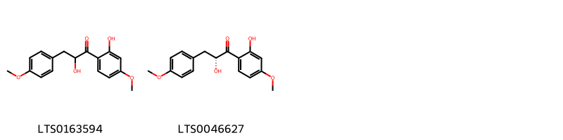{ width=100% }
    <figcaption>Hình ảnh cấu trúc hóa học của Không tìm thấy chú thích hoạt chất thuộc nhóm Linear 1_3-diarylpropanoids gồm Không tìm thấy chú thích.</figcaption>
</figure>
#### Nhóm Prenol lipids
<figure markdown="span">
    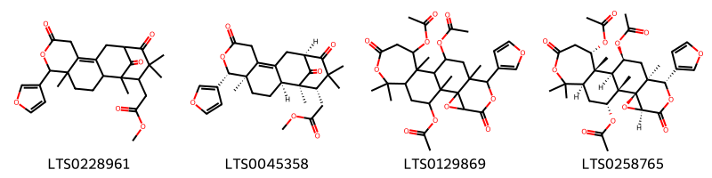{ width=100% }
    <figcaption>Hình ảnh cấu trúc hóa học của 4 hoạt chất thuộc nhóm Prenol lipids gồm ['methyl 2-[6-(furan-3-yl)-1,5,15,15-tetramethyl-8,14,17-trioxo-7-oxatetracyclo[11.3.1.0²,¹¹.0⁵,¹⁰]heptadec-10-en-16-yl]acetate (LTS0228961)', 'methyl 2-[(1r,2s,5r,6r,13s,16s)-6-(furan-3-yl)-1,5,15,15-tetramethyl-8,14,17-trioxo-7-oxatetracyclo[11.3.1.0²,¹¹.0⁵,¹⁰]heptadec-10-en-16-yl]acetate (LTS0045358)', '13,20-bis(acetyloxy)-7-(furan-3-yl)-1,8,12,17,17-pentamethyl-5,15-dioxo-3,6,16-trioxapentacyclo[9.9.0.0²,⁴.0²,⁸.0¹²,¹⁸]icosan-10-yl acetate (LTS0129869)', '(1s,2r,4s,7s,8s,10s,11r,12r,13s,18r,20r)-13,20-bis(acetyloxy)-7-(furan-3-yl)-1,8,12,17,17-pentamethyl-5,15-dioxo-3,6,16-trioxapentacyclo[9.9.0.0²,⁴.0²,⁸.0¹²,¹⁸]icosan-10-yl acetate (LTS0258765)'].</figcaption>
</figure>

---

### Dược dân tộc học

Danh sách các quốc gia có sử dụng *Cedrela odorata* trong điều trị các bệnh. 

| Country   | Disease   | Bệnh                                                                                                                                                                                                |
|:----------|:----------|:----------------------------------------------------------------------------------------------------------------------------------------------------------------------------------------------------|
| Elsewhere | Vermifuge | MYMEMORY WARNING: YOU USED ALL AVAILABLE FREE TRANSLATIONS FOR TODAY. NEXT AVAILABLE IN  06 HOURS 24 MINUTES 39 SECONDS VISIT HTTPS://MYMEMORY.TRANSLATED.NET/DOC/USAGELIMITS.PHP TO TRANSLATE MORE |
| Guatemala | Tonic     | MYMEMORY WARNING: YOU USED ALL AVAILABLE FREE TRANSLATIONS FOR TODAY. NEXT AVAILABLE IN  06 HOURS 24 MINUTES 37 SECONDS VISIT HTTPS://MYMEMORY.TRANSLATED.NET/DOC/USAGELIMITS.PHP TO TRANSLATE MORE |

---

---
## Cedrela odorata
### Thông tin về thực vật

!!! info "Phân loại thực vật của *Cedrela odorata* từ GIBF:"
    - **Kingdom:** Plantae
    - **Phylum:** Tracheophyta
    - **Order:** Sapindales
    - **Family:** Meliaceae
    - **Genus:** Cedrela
    - **Species:** *Cedrela odorata*

 

| Label (VI)   | Label (EN)   | Scientific Name   | Descriptions (VI)   | Descriptions (EN)   | Also Known As (VI)   | Also Known As (EN)                                                             |
|:-------------|:-------------|:------------------|:--------------------|:--------------------|:---------------------|:-------------------------------------------------------------------------------|
| N/A          | N/A          | Cedrela odorata   | loài thực vật       | species of plant    | ['']                 | ['Spanish cedar', 'cedro', 'cigar-box wood', 'Cuban cedar', 'cigar-box cedar'] |

#### Phân bố trên thế giới

**Từ CSDL GIBF** nan, Guatemala, Argentina, Tanzania, United Republic of, Panama, Puerto Rico, Honduras, United States of America, El Salvador, Belize, South Africa, Trinidad and Tobago, Sao Tome and Principe, Martinique, Brazil, Peru, Dominican Republic, Mexico, Ecuador, Haiti, Colombia, Costa Rica

#### Phân bố tại Việt Nam

**Từ CSDL GIBF**: Không có ghi nhận ở Việt Nam

---
### Thành phần hóa học
        
- Theo cơ sở dữ liệu lotus: Từ loài *Cedrela odorata* đã phân lập và xác định được 154 hoạt chất thuộc về các nhóm Fatty Acyls, Flavonoids, Prenol lipids, Steroids and steroid derivatives, Linear 1,3-diarylpropanoids, Diazanaphthalenes, Naphthopyrans, Epoxides. 

|    | chemicalTaxonomyClassyfireClass   |   smiles_count |
|---:|:----------------------------------|---------------:|
|  0 | Diazanaphthalenes                 |              1 |
|  1 | Epoxides                          |              2 |
|  2 | Fatty Acyls                       |              4 |
|  3 | Flavonoids                        |              2 |
|  4 | Linear 1,3-diarylpropanoids       |              2 |
|  5 | Naphthopyrans                     |              7 |
|  6 | Prenol lipids                     |            117 |
|  7 | Steroids and steroid derivatives  |             16 |

#### Nhóm Diazanaphthalenes
<figure markdown="span">
    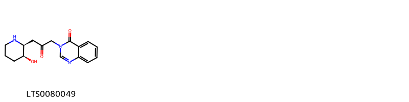{ width=100% }
    <figcaption>Hình ảnh cấu trúc hóa học của 1 hoạt chất thuộc nhóm Diazanaphthalenes gồm ['3-{3-[(2s,3s)-3-hydroxypiperidin-2-yl]-2-oxopropyl}quinazolin-4-one (LTS0080049)'].</figcaption>
</figure>
#### Nhóm Epoxides
<figure markdown="span">
    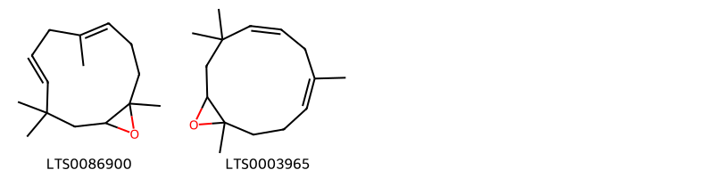{ width=100% }
    <figcaption>Hình ảnh cấu trúc hóa học của 2 hoạt chất thuộc nhóm Epoxides gồm ['(4e,7e)-1,5,9,9-tetramethyl-12-oxabicyclo[9.1.0]dodeca-4,7-diene (LTS0086900)', '1,5,9,9-tetramethyl-12-oxabicyclo[9.1.0]dodeca-4,7-diene (LTS0003965)'].</figcaption>
</figure>
#### Nhóm Fatty Acyls
<figure markdown="span">
    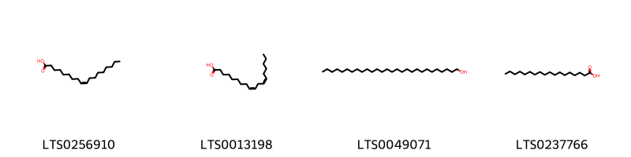{ width=100% }
    <figcaption>Hình ảnh cấu trúc hóa học của 4 hoạt chất thuộc nhóm Fatty Acyls gồm ['oleic acid (LTS0256910)', 'linoleic (LTS0013198)', 'octacosanol (LTS0049071)', 'stearic acid (LTS0237766)'].</figcaption>
</figure>
#### Nhóm Flavonoids
<figure markdown="span">
    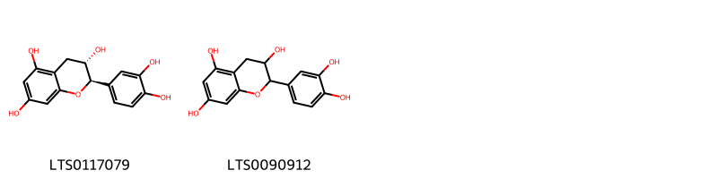{ width=100% }
    <figcaption>Hình ảnh cấu trúc hóa học của 2 hoạt chất thuộc nhóm Flavonoids gồm ['(+)-catechol (LTS0117079)', 'catechol (LTS0090912)'].</figcaption>
</figure>
#### Nhóm Linear 1_3-diarylpropanoids
<figure markdown="span">
    { width=100% }
    <figcaption>Hình ảnh cấu trúc hóa học của Không tìm thấy chú thích hoạt chất thuộc nhóm Linear 1_3-diarylpropanoids gồm Không tìm thấy chú thích.</figcaption>
</figure>
#### Nhóm Naphthopyrans
<figure markdown="span">
    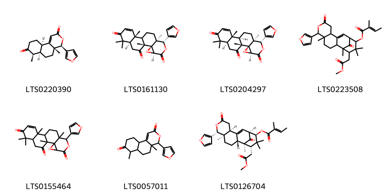{ width=100% }
    <figcaption>Hình ảnh cấu trúc hóa học của 7 hoạt chất thuộc nhóm Naphthopyrans gồm ['(4r,4ar,6ar,7r,10ar)-4-(furan-3-yl)-4a,7-dimethyl-4h,5h,6h,6ah,7h,9h,10h,10ah-cyclohexa[f]isochromene-2,8-dione (LTS0220390)', '(1r,2r,4s,7s,8s,12s,17r)-7-(furan-3-yl)-1,8,12,16,16-pentamethyl-3,6-dioxapentacyclo[9.8.0.0²,⁴.0²,⁸.0¹²,¹⁷]nonadec-13-ene-5,15,19-trione (LTS0161130)', '(1r,2r,4s,7s,8s,11r,12s,17r)-7-(furan-3-yl)-1,8,12,16,16-pentamethyl-3,6-dioxapentacyclo[9.8.0.0²,⁴.0²,⁸.0¹²,¹⁷]nonadec-13-ene-5,15,19-trione (LTS0204297)', '6-(furan-3-yl)-16-(2-methoxy-2-oxoethyl)-1,5,15,15-tetramethyl-8,17-dioxo-7-oxatetracyclo[11.3.1.0²,¹¹.0⁵,¹⁰]heptadec-11-en-14-yl 2-methylbut-2-enoate (LTS0223508)', '7-(furan-3-yl)-1,8,12,16,16-pentamethyl-3,6-dioxapentacyclo[9.8.0.0²,⁴.0²,⁸.0¹²,¹⁷]nonadec-13-ene-5,15,19-trione (LTS0155464)', '4-(furan-3-yl)-4a,7-dimethyl-4h,5h,6h,6ah,7h,9h,10h,10ah-cyclohexa[f]isochromene-2,8-dione (LTS0057011)', '(1r,2r,5r,6r,10s,13s,14r,16s)-6-(furan-3-yl)-16-(2-methoxy-2-oxoethyl)-1,5,15,15-tetramethyl-8,17-dioxo-7-oxatetracyclo[11.3.1.0²,¹¹.0⁵,¹⁰]heptadec-11-en-14-yl (2e)-2-methylbut-2-enoate (LTS0126704)'].</figcaption>
</figure>
#### Nhóm Prenol lipids
<figure markdown="span">
    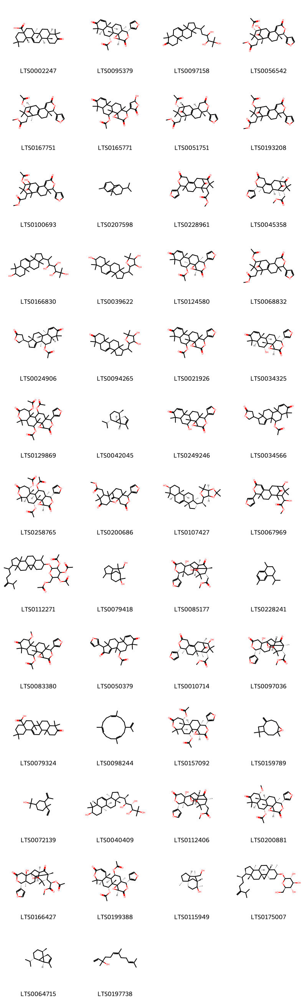{ width=100% }
    <figcaption>Hình ảnh cấu trúc hóa học của 117 hoạt chất thuộc nhóm Prenol lipids gồm ['(4as,6as,6br,8ar,12ar,12br,14bs)-2,2,6a,6b,9,9,12a-heptamethyl-10-oxo-3,4,5,6,7,8,8a,11,12,12b,13,14b-dodecahydro-1h-picene-4a-carboxylic acid (LTS0002247)', 'gedunin (LTS0095379)', '3a,6,6,9a,11a-pentamethyl-1-(4,5,6-trihydroxy-6-methylheptan-2-yl)-1h,2h,3h,5h,5ah,8h,9h,9bh,10h,11h-cyclopenta[a]phenanthren-7-one (LTS0097158)', 'methyl 2-[(1s,5r,6r,13r,14s,16s)-14-(acetyloxy)-6-(furan-3-yl)-13-hydroxy-1,5,15,15-tetramethyl-8,17-dioxo-7-oxatetracyclo[11.3.1.0²,¹¹.0⁵,¹⁰]heptadeca-2(11),9-dien-16-yl]acetate (LTS0056542)', 'methyl 2-[(1r,5r,6r,13r,14r,16s)-14-(acetyloxy)-6-(furan-3-yl)-1,5,15,15-tetramethyl-8,17-dioxo-7-oxatetracyclo[11.3.1.0²,¹¹.0⁵,¹⁰]heptadeca-2(11),9-dien-16-yl]acetate (LTS0167751)', '7-(5-hydroxy-2-oxo-5h-furan-3-yl)-1,8,12,16,16-pentamethyl-5,15-dioxo-3,6-dioxapentacyclo[9.8.0.0²,⁴.0²,⁸.0¹²,¹⁷]nonadec-13-en-19-yl acetate (LTS0165771)', 'methyl 2-[(1s,5r,6r,10r,13s,14r,16s)-14-(acetyloxy)-6-(furan-3-yl)-1,5,15,15-tetramethyl-8,17-dioxo-7-oxatetracyclo[11.3.1.0²,¹¹.0⁵,¹⁰]heptadec-2(11)-en-16-yl]acetate (LTS0051751)', 'methyl 2-[14-(acetyloxy)-6-(furan-3-yl)-1,5,15,15-tetramethyl-8,17-dioxo-7-oxatetracyclo[11.3.1.0²,¹¹.0⁵,¹⁰]heptadeca-2(11),9-dien-16-yl]acetate (LTS0193208)', 'methyl 2-[14-(acetyloxy)-6-(furan-3-yl)-13-hydroxy-1,5,15,15-tetramethyl-8,17-dioxo-7-oxatetracyclo[11.3.1.0²,¹¹.0⁵,¹⁰]heptadeca-2(11),9-dien-16-yl]acetate (LTS0100693)', 'α-copaene (LTS0207598)', 'methyl 2-[6-(furan-3-yl)-1,5,15,15-tetramethyl-8,14,17-trioxo-7-oxatetracyclo[11.3.1.0²,¹¹.0⁵,¹⁰]heptadec-10-en-16-yl]acetate (LTS0228961)', 'methyl 2-[(1r,2s,5r,6r,13s,16s)-6-(furan-3-yl)-1,5,15,15-tetramethyl-8,14,17-trioxo-7-oxatetracyclo[11.3.1.0²,¹¹.0⁵,¹⁰]heptadec-10-en-16-yl]acetate (LTS0045358)', '6-{7-hydroxy-3a,6,6,9a,11a-pentamethyl-1h,2h,3h,5h,5ah,7h,8h,9h,9bh,10h,11h-cyclopenta[a]phenanthren-1-yl}-2-methylheptane-2,3,4,5-tetrol (LTS0166830)', '5-(1-{7-hydroxy-3a,6,6,9a,11a-pentamethyl-1h,2h,3h,5h,5ah,7h,8h,9h,9bh,10h,11h-cyclopenta[a]phenanthren-1-yl}ethyl)-2,2-dimethyloxolane-3,4-diol (LTS0039622)', '(1r,2r,4s,7r,8s,12r,19s)-7-(furan-3-yl)-1,8,12,16,16-pentamethyl-5,15-dioxo-3,6-dioxapentacyclo[9.8.0.0²,⁴.0²,⁸.0¹²,¹⁷]nonadec-13-en-19-yl acetate (LTS0124580)', 'methyl 2-[14-(acetyloxy)-6-(furan-3-yl)-1,5,15,15-tetramethyl-8,17-dioxo-7-oxatetracyclo[11.3.1.0²,¹¹.0⁵,¹⁰]heptadec-2(11)-en-16-yl]acetate (LTS0068832)', '(1s,3br,4r,5ar,9ar,9br,11as)-3b,6,6,9a,11a-pentamethyl-7-oxo-1-[(3s)-5-oxooxolan-3-yl]-1h,2h,4h,5h,5ah,9bh,10h,11h-cyclopenta[a]phenanthren-4-yl acetate (LTS0024906)', '1-[1-(3,4-dihydroxy-5,5-dimethyloxolan-2-yl)ethyl]-3a,6,6,9a,11a-pentamethyl-1h,2h,3h,5h,5ah,8h,9h,9bh,10h,11h-cyclopenta[a]phenanthren-7-one (LTS0094265)', '7-(furan-3-yl)-1,8,12,16,16-pentamethyl-5,15-dioxo-3,6-dioxapentacyclo[9.8.0.0²,⁴.0²,⁸.0¹²,¹⁷]nonadec-13-en-19-yl acetate (LTS0021926)', '7-deacetylgedunin (LTS0034325)', '13,20-bis(acetyloxy)-7-(furan-3-yl)-1,8,12,17,17-pentamethyl-5,15-dioxo-3,6,16-trioxapentacyclo[9.9.0.0²,⁴.0²,⁸.0¹²,¹⁸]icosan-10-yl acetate (LTS0129869)', '(-)-α-cubebene (LTS0042045)', '7-(furan-3-yl)-19-hydroxy-1,8,12,16,16-pentamethyl-3,6-dioxapentacyclo[9.8.0.0²,⁴.0²,⁸.0¹²,¹⁷]nonadec-13-ene-5,15-dione (LTS0249246)', '3b,6,6,9a,11a-pentamethyl-7-oxo-1-(5-oxooxolan-3-yl)-1h,2h,4h,5h,5ah,9bh,10h,11h-cyclopenta[a]phenanthren-4-yl acetate (LTS0034566)', '(1s,2r,4s,7s,8s,10s,11r,12r,13s,18r,20r)-13,20-bis(acetyloxy)-7-(furan-3-yl)-1,8,12,17,17-pentamethyl-5,15-dioxo-3,6,16-trioxapentacyclo[9.9.0.0²,⁴.0²,⁸.0¹²,¹⁸]icosan-10-yl acetate (LTS0258765)', 'methyl 2-[13-(furan-3-yl)-6,6,8,12-tetramethyl-17-methylidene-5,15-dioxo-2,14-dioxatetracyclo[7.7.1.0¹,¹².0³,⁸]heptadecan-7-yl]acetate (LTS0200686)', '(1s,3as,5ar,7s,9ar,9br,11as)-1-[(1s)-1-[(3as,6as)-2,2,6,6-tetramethyl-dihydro-3ah-furo[3,4-d][1,3]dioxol-4-yl]ethyl]-3a,6,6,9a,11a-pentamethyl-1h,2h,3h,5h,5ah,7h,8h,9h,9bh,10h,11h-cyclopenta[a]phenanthren-7-ol (LTS0107427)', 'methyl 2-[6-(furan-3-yl)-14-hydroxy-1,5,15,15-tetramethyl-8,17-dioxo-7-oxatetracyclo[11.3.1.0²,¹¹.0⁵,¹⁰]heptadec-9-en-16-yl]-2-hydroxyacetate (LTS0067969)', '[3,4,5-tris(acetyloxy)-6-{[7,12,16-trimethyl-15-(6-methyl-5-methylideneheptan-2-yl)pentacyclo[9.7.0.0¹,³.0³,⁸.0¹²,¹⁶]octadecan-6-yl]oxy}oxan-2-yl]methyl acetate (LTS0112271)', '6-(hydroxymethyl)-2,6,8-trimethyltricyclo[5.3.1.0¹,⁵]undecan-8-ol (LTS0079418)', 'methyl 2-[(1r,2s,5r,6r,10s,11s,13r,14s,16r)-6-(furan-3-yl)-2,10-dihydroxy-1,5,15,15-tetramethyl-8,17-dioxo-7,18-dioxapentacyclo[11.3.1.1¹¹,¹⁴.0²,¹¹.0⁵,¹⁰]octadecan-16-yl]acetate (LTS0085177)', '(e)-calamene (LTS0228241)', '7-(furan-3-yl)-13-methoxy-1,8,12,16,16-pentamethyl-5,15-dioxo-3,6-dioxapentacyclo[9.8.0.0²,⁴.0²,⁸.0¹²,¹⁷]nonadecan-19-yl acetate (LTS0083380)', '1-(furan-3-yl)-3b,6,6,9a,11a-pentamethyl-2,7-dioxo-1h,4h,5h,5ah,9bh,10h,11h-cyclopenta[a]phenanthren-4-yl acetate (LTS0050379)', 'methyl 2-[(1r,2r,5r,6r,13s,14r,16s)-6-(furan-3-yl)-14-hydroxy-1,5,15,15-tetramethyl-8,17-dioxo-7-oxatetracyclo[11.3.1.0²,¹¹.0⁵,¹⁰]heptadec-10-en-16-yl]acetate (LTS0010714)', 'methyl 2-[(1s,2r,5s,6s,10s,11s,13s,14s,16r)-6-(furan-3-yl)-10-hydroxy-1,5,15,15-tetramethyl-8,17-dioxo-7,18-dioxapentacyclo[11.3.1.1¹¹,¹⁴.0²,¹¹.0⁵,¹⁰]octadecan-16-yl]acetate (LTS0097036)', '2,2,6a,6b,9,9,12a-heptamethyl-10-oxo-3,4,5,6,7,8,8a,11,12,12b,13,14b-dodecahydro-1h-picene-4a-carboxylic acid (LTS0079324)', '1,5,9-trimethyl-12-(prop-1-en-2-yl)cyclotetradeca-1,5,9-triene (LTS0098244)', '(1s,2r,4s,7s,8s,11r,12r,13s,18r,20r)-13-(acetyloxy)-7-(furan-3-yl)-1,8,12,17,17-pentamethyl-5,15-dioxo-3,6,16-trioxapentacyclo[9.9.0.0²,⁴.0²,⁸.0¹²,¹⁸]icosan-20-yl acetate (LTS0157092)', 'caryophyllene oxide (LTS0159789)', '2-[4-ethenyl-4-methyl-3-(prop-1-en-2-yl)cyclohexyl]propan-2-ol (LTS0072139)', '(3s,4s,5s,6r)-6-[(1s,3as,5ar,7r,9ar,9bs,11as)-7-hydroxy-3a,6,6,9a,11a-pentamethyl-1h,2h,3h,5h,5ah,7h,8h,9h,9bh,10h,11h-cyclopenta[a]phenanthren-1-yl]-2-methylheptane-2,3,4,5-tetrol (LTS0040409)', 'methyl 2-[(1s,2r,5s,6s,10s,11s,13s,14r,16s)-6-(furan-3-yl)-10-hydroxy-1,5,15,15-tetramethyl-8,17-dioxo-7,18-dioxapentacyclo[11.3.1.1¹¹,¹⁴.0²,¹¹.0⁵,¹⁰]octadecan-16-yl]acetate (LTS0112406)', '(1s,2r,4s,7s,8s,11r,12r,13s,17r,19r)-7-(furan-3-yl)-13-methoxy-1,8,12,16,16-pentamethyl-5,15-dioxo-3,6-dioxapentacyclo[9.8.0.0²,⁴.0²,⁸.0¹²,¹⁷]nonadecan-19-yl acetate (LTS0200881)', 'methyl (2r)-2-(acetyloxy)-2-[(1r,2s,5s,6s,10r,11r,13r,14s,16r)-6-(furan-3-yl)-10-hydroxy-1,5,15,15-tetramethyl-8,17-dioxo-7,18-dioxapentacyclo[11.3.1.1¹¹,¹⁴.0²,¹¹.0⁵,¹⁰]octadecan-16-yl]acetate (LTS0166427)', '(1s,2r,4s,7s,8s,10s,11r,12r,18r,20r)-20-(acetyloxy)-7-(furan-3-yl)-1,8,12,17,17-pentamethyl-5,15-dioxo-3,6,16-trioxapentacyclo[9.9.0.0²,⁴.0²,⁸.0¹²,¹⁸]icos-13-en-10-yl acetate (LTS0199388)', '(1s,2r,5r,6r,7r,8s)-6-(hydroxymethyl)-2,6,8-trimethyltricyclo[5.3.1.0¹,⁵]undecan-8-ol (LTS0115949)', '(2r,3s,4s,5r,6r)-2-(hydroxymethyl)-6-{[(1s,3r,6s,7s,8r,11r,12s,15r,16r)-7,12,16-trimethyl-15-[(2r)-6-methyl-5-methylideneheptan-2-yl]pentacyclo[9.7.0.0¹,³.0³,⁸.0¹²,¹⁶]octadecan-6-yl]oxy}oxane-3,4,5-triol (LTS0175007)', '(1s,5r,7s,10r)-7-isopropyl-4,10-dimethyltricyclo[4.4.0.0¹,⁵]dec-3-ene (LTS0064715)', 'nerolidol (LTS0197738)', '(1r,4ar,8as)-4-isopropyl-1,6-dimethyl-3,4,4a,7,8,8a-hexahydro-2h-naphthalen-1-ol (LTS0136437)', '8-isopropyl-2,5-dimethyl-3,4,4a,7,8,8a-hexahydro-1h-naphthalen-2-ol (LTS0198911)', '1,5-dimethyl-8-(propan-2-ylidene)cyclodeca-1,5-diene (LTS0204193)', '(1s,4s)-4-isopropyl-1,6-dimethyl-1,2,3,4-tetrahydronaphthalene (LTS0139634)', 'methyl (2r)-2-[(1r,2s,5r,6r,10s,11s,13s,14r,16s)-6-(furan-3-yl)-14-hydroxy-1,5,15,15-tetramethyl-8,17-dioxo-7-oxatetracyclo[11.3.1.0²,¹¹.0⁵,¹⁰]heptadecan-16-yl]-2-hydroxyacetate (LTS0143658)', 'methyl 2-[6-(furan-3-yl)-10-hydroxy-1,5,15,15-tetramethyl-8,17-dioxo-7,18-dioxapentacyclo[11.3.1.1¹¹,¹⁴.0²,¹¹.0⁵,¹⁰]octadecan-16-yl]acetate (LTS0132529)', '4a-methyl-1-methylidene-7-(prop-1-en-2-yl)-octahydronaphthalene (LTS0165615)', '(3r,6e)-nerolidol (LTS0145065)', '4-isopropyl-1,6-dimethyl-3,4,4a,7,8,8a-hexahydronaphthalene (LTS0154650)', 'delta-cadinol (LTS0272380)', 'β-elemene (LTS0225699)', '[10-(acetyloxy)-7-(furan-3-yl)-13,20-dihydroxy-1,8,17,17-tetramethyl-5,15-dioxo-3,6,16-trioxapentacyclo[9.9.0.0²,⁴.0²,⁸.0¹²,¹⁸]icosan-12-yl]methyl acetate (LTS0149689)', '1-isopropyl-4,7-dimethyl-2,3,4,5,6,8a-hexahydro-1h-naphthalen-4a-ol (LTS0237685)', '(1s,2r,4s,7s,8s,11r,12s,13s,18r,20r)-13-(acetyloxy)-7-(furan-3-yl)-1,8,12,17,17-pentamethyl-5,15-dioxo-3,6,16-trioxapentacyclo[9.9.0.0²,⁴.0²,⁸.0¹²,¹⁸]icosan-20-yl acetate (LTS0226342)', '(4as,7s,8as)-1,4a-dimethyl-7-(prop-1-en-2-yl)-4,5,6,7,8,8a-hexahydro-3h-naphthalene (LTS0166458)', '(1s,2r,4r,6s,7s,10r,11r,17r,18s)-18-(acetyloxy)-6-(furan-3-yl)-1,7,11,15,15-pentamethyl-14-oxo-3-oxapentacyclo[8.8.0.0²,⁴.0²,⁷.0¹¹,¹⁶]octadec-12-en-17-yl acetate (LTS0167898)', 'methyl (2s)-2-[(1s,2r,5s,6s,10s,11s,13s,14r,16r)-6-(furan-3-yl)-10-hydroxy-5,14,15,15-tetramethyl-8,17-dioxo-7,18-dioxapentacyclo[11.3.1.1¹¹,¹⁴.0²,¹¹.0⁵,¹⁰]octadecan-16-yl]-2-hydroxyacetate (LTS0091106)', 'neocembrene (LTS0173151)', '2-(hydroxymethyl)-6-{[7,12,16-trimethyl-15-(6-methyl-5-methylideneheptan-2-yl)pentacyclo[9.7.0.0¹,³.0³,⁸.0¹²,¹⁶]octadecan-6-yl]oxy}oxane-3,4,5-triol (LTS0164099)', 'caryophyllene (LTS0085212)', 'methyl 2-[6-(furan-3-yl)-14-hydroxy-1,5,15,15-tetramethyl-8,17-dioxo-7-oxatetracyclo[11.3.1.0²,¹¹.0⁵,¹⁰]heptadec-10-en-16-yl]-2-hydroxyacetate (LTS0269376)', 'methyl 2-[(1r,3s,7r,8r,9s,12s,13s)-13-(furan-3-yl)-6,6,8,12-tetramethyl-17-methylidene-5,15-dioxo-2,14-dioxatetracyclo[7.7.1.0¹,¹².0³,⁸]heptadecan-7-yl]acetate (LTS0265839)', 'methyl (2r)-2-[(1r,2s,5r,6r,11r,13s,14r,16s)-6-(furan-3-yl)-14-hydroxy-1,5,15,15-tetramethyl-8,17-dioxo-7-oxatetracyclo[11.3.1.0²,¹¹.0⁵,¹⁰]heptadec-9-en-16-yl]-2-hydroxyacetate (LTS0276094)', 'azulon (LTS0214586)', '7-(furan-3-yl)-20-hydroxy-1,8,12,17,17-pentamethyl-5,15-dioxo-3,6,16-trioxapentacyclo[9.9.0.0²,⁴.0²,⁸.0¹²,¹⁸]icos-13-en-10-yl acetate (LTS0073005)', '[(2r,3r,4s,5r,6r)-3,4,5-tris(acetyloxy)-6-{[(1s,3r,6s,7s,8s,11s,12s,15r,16r)-7,12,16-trimethyl-15-[(2r)-6-methyl-5-methylideneheptan-2-yl]pentacyclo[9.7.0.0¹,³.0³,⁸.0¹²,¹⁶]octadecan-6-yl]oxy}oxan-2-yl]methyl acetate (LTS0221266)', 'selinene (LTS0197809)', 'gamma-cadinene (LTS0234452)', 'delta-cadinol (LTS0008282)', 'proceranolide (LTS0167643)', '(5s,6r)-6-[(1s,3as,5ar,7r,9ar,9br,11as)-7-hydroxy-3a,6,6,9a,11a-pentamethyl-1h,2h,3h,5h,5ah,7h,8h,9h,9bh,10h,11h-cyclopenta[a]phenanthren-1-yl]-5-hydroxy-2-methylhept-2-en-4-one (LTS0019397)', '(+)-epicubenol (LTS0235160)', '13-(acetyloxy)-7-(furan-3-yl)-1,8,12,17,17-pentamethyl-5,15-dioxo-3,6,16-trioxapentacyclo[9.9.0.0²,⁴.0²,⁸.0¹²,¹⁸]icosan-20-yl acetate (LTS0211565)', '(1s,3as,5ar,9ar,9br,11as)-1-[(2s)-3-hydroxy-6-methyl-4-oxohept-5-en-2-yl]-3a,6,6,9a,11a-pentamethyl-1h,2h,3h,5h,5ah,8h,9h,9bh,10h,11h-cyclopenta[a]phenanthren-7-one (LTS0019998)', '3,7,11,11-tetramethylbicyclo[8.1.0]undeca-2,6-diene (LTS0249608)', 'β-chamigrene (LTS0185874)', 'methyl (2r)-2-[(1s,2r,5s,6s,10s,11s,13s,14r,16s)-6-(furan-3-yl)-10-hydroxy-1,5,15,15-tetramethyl-8,17-dioxo-7,18-dioxapentacyclo[11.3.1.1¹¹,¹⁴.0²,¹¹.0⁵,¹⁰]octadecan-16-yl]-2-hydroxyacetate (LTS0242933)', '(1r,2s,7s,8s)-8-isopropyl-1,3-dimethyltricyclo[4.4.0.0²,⁷]dec-3-ene (LTS0190031)', 'methyl (2s)-2-[(1s,2s,5r,6r,10s,11r,13s,14r,16s)-6-(furan-3-yl)-2,10-dihydroxy-1,5,15,15-tetramethyl-8,17-dioxo-7,18-dioxapentacyclo[11.3.1.1¹¹,¹⁴.0²,¹¹.0⁵,¹⁰]octadecan-16-yl]-2-hydroxyacetate (LTS0257197)', 'ledol (LTS0243935)', '(-)-chamigrene (LTS0274399)', '(2r,3s,4s,5r,6r)-2-(hydroxymethyl)-6-{[(1s,3r,6s,7s,8s,11s,12s,15r,16r)-7,12,16-trimethyl-15-[(2r)-6-methyl-5-methylideneheptan-2-yl]pentacyclo[9.7.0.0¹,³.0³,⁸.0¹²,¹⁶]octadecan-6-yl]oxy}oxane-3,4,5-triol (LTS0059395)', 'gamma-muurolene (LTS0052920)', 'methyl 2-[6-(furan-3-yl)-14-hydroxy-1,5,15,15-tetramethyl-8,17-dioxo-7-oxatetracyclo[11.3.1.0²,¹¹.0⁵,¹⁰]heptadecan-16-yl]-2-hydroxyacetate (LTS0051859)', '(1s,2r,4s,7s,8s,10r,11r,12r,13s,18r,20r)-13,20-bis(acetyloxy)-7-(furan-3-yl)-1,8,12,17,17-pentamethyl-5,15-dioxo-3,6,16-trioxapentacyclo[9.9.0.0²,⁴.0²,⁸.0¹²,¹⁸]icosan-10-yl acetate (LTS0032001)', 'α-muurolene (LTS0022607)', '(1s,3as,5as,9ar,9br,11as)-3a,6,6,9a,11a-pentamethyl-1-[(2s,4r,5s)-4,5,6-trihydroxy-6-methylheptan-2-yl]-1h,2h,3h,5h,5ah,8h,9h,9bh,10h,11h-cyclopenta[a]phenanthren-7-one (LTS0000660)', '1,4a-dimethyl-7-(prop-1-en-2-yl)-octahydronaphthalen-1-ol (LTS0000681)', '(-)-α-himachalene (LTS0021074)', 'delta-cadinol (LTS0013807)', '(1r,4ar,7r,8ar)-1,4a-dimethyl-7-(prop-1-en-2-yl)-octahydronaphthalen-1-ol (LTS0233803)', '[(1s,2r,4s,7s,8s,10s,11r,12r,13r,18r,20r)-10-(acetyloxy)-7-(furan-3-yl)-13,20-dihydroxy-1,8,17,17-tetramethyl-5,15-dioxo-3,6,16-trioxapentacyclo[9.9.0.0²,⁴.0²,⁸.0¹²,¹⁸]icosan-12-yl]methyl acetate (LTS0019524)', '(1s,2r,4s,7r,8s,11r,12r,17s,19r)-7-[(5s)-5-hydroxy-2-oxo-5h-furan-3-yl]-1,8,12,16,16-pentamethyl-5,15-dioxo-3,6-dioxapentacyclo[9.8.0.0²,⁴.0²,⁸.0¹²,¹⁷]nonadec-13-en-19-yl acetate (LTS0106919)', '4,11,11-trimethyl-8-methylidenebicyclo[7.2.0]undec-4-ene (LTS0256716)', '(1s,2r,4s,7s,8s,10s,11r,12r,18r,20r)-7-(furan-3-yl)-20-hydroxy-1,8,12,17,17-pentamethyl-5,15-dioxo-3,6,16-trioxapentacyclo[9.9.0.0²,⁴.0²,⁸.0¹²,¹⁸]icos-13-en-10-yl acetate (LTS0021637)', 'α-himachalene (LTS0208037)', 'azadiradione (LTS0245922)', 'methyl 2-(acetyloxy)-2-[6-(furan-3-yl)-10-hydroxy-1,5,15,15-tetramethyl-8,17-dioxo-7,18-dioxapentacyclo[11.3.1.1¹¹,¹⁴.0²,¹¹.0⁵,¹⁰]octadecan-16-yl]acetate (LTS0227632)', '20-(acetyloxy)-7-(furan-3-yl)-1,8,12,17,17-pentamethyl-5,15-dioxo-3,6,16-trioxapentacyclo[9.9.0.0²,⁴.0²,⁸.0¹²,¹⁸]icos-13-en-10-yl acetate (LTS0236967)', '4-isopropyl-6-methyl-1-methylidene-3,4,4a,7,8,8a-hexahydro-2h-naphthalene (LTS0111070)', '(3r,4r)-5-[(1r)-1-[(1s,3as,5ar,7r,9ar,9br,11as)-7-hydroxy-3a,6,6,9a,11a-pentamethyl-1h,2h,3h,5h,5ah,7h,8h,9h,9bh,10h,11h-cyclopenta[a]phenanthren-1-yl]ethyl]-2,2-dimethyloxolane-3,4-diol (LTS0088711)', '(2r,4ar,8s,8as)-8-isopropyl-2,5-dimethyl-3,4,4a,7,8,8a-hexahydro-1h-naphthalen-2-ol (LTS0019116)', '(2e,6e)-3,7,11,11-tetramethylbicyclo[8.1.0]undeca-2,6-diene (LTS0225278)', 'methyl 2-[6-(furan-3-yl)-10-hydroxy-1,5,15,15-tetramethyl-8,17-dioxo-7,18-dioxapentacyclo[11.3.1.1¹¹,¹⁴.0²,¹¹.0⁵,¹⁰]octadecan-16-yl]-2-hydroxyacetate (LTS0051186)', '(1s,2r,4r,6s,7s,10r,11r,16r,17r,18s)-18-(acetyloxy)-6-(furan-3-yl)-1,7,11,15,15-pentamethyl-14-oxo-3-oxapentacyclo[8.8.0.0²,⁴.0²,⁷.0¹¹,¹⁶]octadec-12-en-17-yl acetate (LTS0021367)', 'methyl 2-[6-(furan-3-yl)-14-hydroxy-1,5,15,15-tetramethyl-8,17-dioxo-7-oxatetracyclo[11.3.1.0²,¹¹.0⁵,¹⁰]heptadec-10-en-16-yl]acetate (LTS0121899)', 'methyl (2r)-2-[(1r,2s,5r,6r,13s,14r,16s)-6-(furan-3-yl)-14-hydroxy-1,5,15,15-tetramethyl-8,17-dioxo-7-oxatetracyclo[11.3.1.0²,¹¹.0⁵,¹⁰]heptadec-10-en-16-yl]-2-hydroxyacetate (LTS0263948)'].</figcaption>
</figure>
#### Nhóm Steroids and steroid derivatives
<figure markdown="span">
    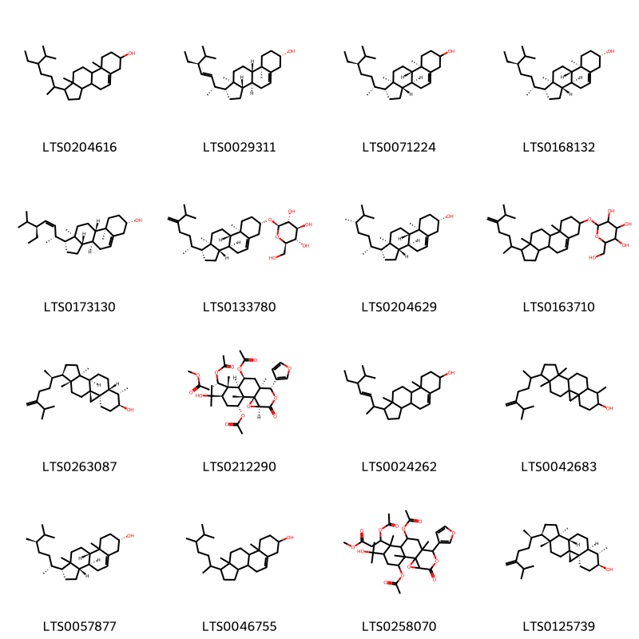{ width=100% }
    <figcaption>Hình ảnh cấu trúc hóa học của 16 hoạt chất thuộc nhóm Steroids and steroid derivatives gồm ['stigmast-5-en-3-ol, (3β)- (LTS0204616)', 'phytosterol (LTS0029311)', 'stigmast-5-en-3-ol (LTS0071224)', 'sitosterol (LTS0168132)', '(1r,3as,3bs,7s,9ar,9bs,11ar)-1-[(2r,3z,5s)-5-ethyl-6-methylhept-3-en-2-yl]-9a,11a-dimethyl-1h,2h,3h,3ah,3bh,4h,6h,7h,8h,9h,9bh,10h,11h-cyclopenta[a]phenanthren-7-ol (LTS0173130)', '(2r,3r,4s,5s,6r)-2-{[(1r,3as,3bs,7s,9ar,9bs,11ar)-9a,11a-dimethyl-1-[(2r)-6-methyl-5-methylideneheptan-2-yl]-1h,2h,3h,3ah,3bh,4h,6h,7h,8h,9h,9bh,10h,11h-cyclopenta[a]phenanthren-7-yl]oxy}-6-(hydroxymethyl)oxane-3,4,5-triol (LTS0133780)', '22,23-dihydrobrassicasterol (LTS0204629)', '2-{[9a,11a-dimethyl-1-(6-methyl-5-methylideneheptan-2-yl)-1h,2h,3h,3ah,3bh,4h,6h,7h,8h,9h,9bh,10h,11h-cyclopenta[a]phenanthren-7-yl]oxy}-6-(hydroxymethyl)oxane-3,4,5-triol (LTS0163710)', '(1s,3r,6s,7s,8r,11r,12s,15r,16r)-7,12,16-trimethyl-15-[(2r)-6-methyl-5-methylideneheptan-2-yl]pentacyclo[9.7.0.0¹,³.0³,⁸.0¹²,¹⁶]octadecan-6-ol (LTS0263087)', 'methyl (3s)-3-(acetyloxy)-3-[(1r,2s,3r,5r,6r,7r,8s,10s,11s,14s)-3,8-bis(acetyloxy)-11-(furan-3-yl)-5-(2-hydroxypropan-2-yl)-2,6,10-trimethyl-13-oxo-12,15-dioxatetracyclo[8.5.0.0¹,¹⁴.0²,⁷]pentadecan-6-yl]propanoate (LTS0212290)', 'stigmasterol (LTS0024262)', '7,12,16-trimethyl-15-(6-methyl-5-methylideneheptan-2-yl)pentacyclo[9.7.0.0¹,³.0³,⁸.0¹²,¹⁶]octadecan-6-ol (LTS0042683)', '(1r,3as,3bs,7s,9bs)-1-[(2r,5r)-5,6-dimethylheptan-2-yl]-9a,11a-dimethyl-1h,2h,3h,3ah,3bh,4h,6h,7h,8h,9h,9bh,10h,11h-cyclopenta[a]phenanthren-7-ol (LTS0057877)', 'campesterol (LTS0046755)', 'methyl 3-(acetyloxy)-3-[3,8-bis(acetyloxy)-11-(furan-3-yl)-5-(2-hydroxypropan-2-yl)-2,6,10-trimethyl-13-oxo-12,15-dioxatetracyclo[8.5.0.0¹,¹⁴.0²,⁷]pentadecan-6-yl]propanoate (LTS0258070)', 'cycloeucalenol (LTS0125739)'].</figcaption>
</figure>

---

### Dược dân tộc học

Danh sách các quốc gia có sử dụng *Cedrela odorata* trong điều trị các bệnh. 

| Country            | Disease                   | Bệnh                                                                                                                                                                                                |
|:-------------------|:--------------------------|:----------------------------------------------------------------------------------------------------------------------------------------------------------------------------------------------------|
| Dominican Republic | Astringent                | MYMEMORY WARNING: YOU USED ALL AVAILABLE FREE TRANSLATIONS FOR TODAY. NEXT AVAILABLE IN  06 HOURS 24 MINUTES 11 SECONDS VISIT HTTPS://MYMEMORY.TRANSLATED.NET/DOC/USAGELIMITS.PHP TO TRANSLATE MORE |
| Elsewhere          | nan, Vermifuge, Vermifuge | MYMEMORY WARNING: YOU USED ALL AVAILABLE FREE TRANSLATIONS FOR TODAY. NEXT AVAILABLE IN  06 HOURS 24 MINUTES 08 SECONDS VISIT HTTPS://MYMEMORY.TRANSLATED.NET/DOC/USAGELIMITS.PHP TO TRANSLATE MORE |

---

---
## Cedrela sinensis
### Thông tin về thực vật

!!! info "Phân loại thực vật của *Toona sinensis* từ GIBF:"
    - **Kingdom:** Plantae
    - **Phylum:** Tracheophyta
    - **Order:** Sapindales
    - **Family:** Meliaceae
    - **Genus:** Toona
    - **Species:** *Toona sinensis*

 

| Label (VI)   | Label (EN)   | Scientific Name   | Descriptions (VI)   | Descriptions (EN)   | Also Known As (VI)   | Also Known As (EN)   |
|:-------------|:-------------|:------------------|:--------------------|:--------------------|:---------------------|:---------------------|
| N/A          | N/A          | Cedrela sinensis  | loài thực vật       | species of plant    | ['']                 | ['']                 |

#### Phân bố trên thế giới

**Từ CSDL GIBF** nan, Japan, Korea, Republic of, unknown or invalid, Korea (Democratic People’s Republic of), Indonesia, United States of America, China, France, New Zealand, Canada

#### Phân bố tại Việt Nam

**Từ CSDL GIBF**: Không có ghi nhận ở Việt Nam

---
### Thành phần hóa học
        
- Theo cơ sở dữ liệu lotus: Từ loài *Toona sinensis* đã phân lập và xác định được 97 hoạt chất thuộc về các nhóm Fatty Acyls, Flavonoids, Prenol lipids, Steroids and steroid derivatives, Benzene and substituted derivatives, 2-arylbenzofuran flavonoids, Tannins. 

|    | chemicalTaxonomyClassyfireClass     |   smiles_count |
|---:|:------------------------------------|---------------:|
|  0 | 2-arylbenzofuran flavonoids         |              2 |
|  1 | Benzene and substituted derivatives |              2 |
|  2 | Fatty Acyls                         |              3 |
|  3 | Flavonoids                          |              6 |
|  4 | Prenol lipids                       |             78 |
|  5 | Steroids and steroid derivatives    |              3 |
|  6 | Tannins                             |              2 |

#### Nhóm 2-arylbenzofuran flavonoids
<figure markdown="span">
    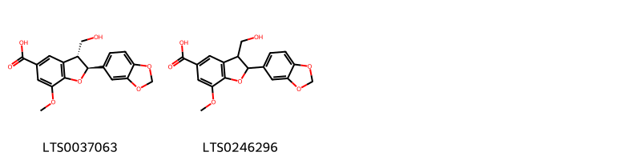{ width=100% }
    <figcaption>Hình ảnh cấu trúc hóa học của 2 hoạt chất thuộc nhóm 2-arylbenzofuran flavonoids gồm ['(2s,3r)-2-(2h-1,3-benzodioxol-5-yl)-3-(hydroxymethyl)-7-methoxy-2,3-dihydro-1-benzofuran-5-carboxylic acid (LTS0037063)', '2-(2h-1,3-benzodioxol-5-yl)-3-(hydroxymethyl)-7-methoxy-2,3-dihydro-1-benzofuran-5-carboxylic acid (LTS0246296)'].</figcaption>
</figure>
#### Nhóm Benzene and substituted derivatives
<figure markdown="span">
    { width=100% }
    <figcaption>Hình ảnh cấu trúc hóa học của 2 hoạt chất thuộc nhóm Benzene and substituted derivatives gồm ['galop (LTS0222857)', 'methyl gallate (LTS0043810)'].</figcaption>
</figure>
#### Nhóm Fatty Acyls
<figure markdown="span">
    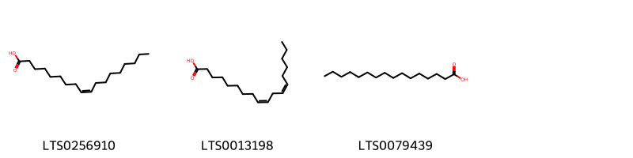{ width=100% }
    <figcaption>Hình ảnh cấu trúc hóa học của 3 hoạt chất thuộc nhóm Fatty Acyls gồm ['oleic acid (LTS0256910)', 'linoleic (LTS0013198)', 'palmitic acid (LTS0079439)'].</figcaption>
</figure>
#### Nhóm Flavonoids
<figure markdown="span">
    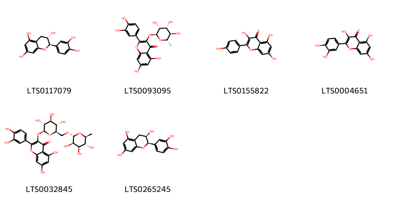{ width=100% }
    <figcaption>Hình ảnh cấu trúc hóa học của 6 hoạt chất thuộc nhóm Flavonoids gồm ['(+)-catechol (LTS0117079)', 'quercitrin (LTS0093095)', 'kaempherol (LTS0155822)', 'quercetin (LTS0004651)', '3-rutinosyl quercetin (LTS0032845)', 'ent-epicatechin (LTS0265245)'].</figcaption>
</figure>
#### Nhóm Prenol lipids
<figure markdown="span">
    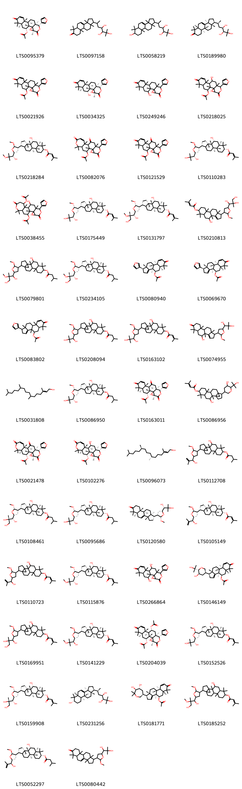{ width=100% }
    <figcaption>Hình ảnh cấu trúc hóa học của 78 hoạt chất thuộc nhóm Prenol lipids gồm ['gedunin (LTS0095379)', '3a,6,6,9a,11a-pentamethyl-1-(4,5,6-trihydroxy-6-methylheptan-2-yl)-1h,2h,3h,5h,5ah,8h,9h,9bh,10h,11h-cyclopenta[a]phenanthren-7-one (LTS0097158)', '6-{7-hydroxy-3a,6,6,9a,11a-pentamethyl-1h,2h,3h,5h,5ah,7h,8h,9h,9bh,10h,11h-cyclopenta[a]phenanthren-1-yl}-2-methylheptane-2,3,4-triol (LTS0058219)', '(1s,3as,5ar,9ar,9br,11as)-3a,6,6,9a,11a-pentamethyl-1-[(2s,4r,5s)-4,5,6-trihydroxy-6-methylheptan-2-yl]-1h,2h,3h,5h,5ah,8h,9h,9bh,10h,11h-cyclopenta[a]phenanthren-7-one (LTS0189980)', '7-(furan-3-yl)-1,8,12,16,16-pentamethyl-5,15-dioxo-3,6-dioxapentacyclo[9.8.0.0²,⁴.0²,⁸.0¹²,¹⁷]nonadec-13-en-19-yl acetate (LTS0021926)', '7-deacetylgedunin (LTS0034325)', '7-(furan-3-yl)-19-hydroxy-1,8,12,16,16-pentamethyl-3,6-dioxapentacyclo[9.8.0.0²,⁴.0²,⁸.0¹²,¹⁷]nonadec-13-ene-5,15-dione (LTS0249246)', '7-(furan-3-yl)-10-hydroxy-1,8,12,16,16-pentamethyl-5,15-dioxo-3,6-dioxapentacyclo[9.8.0.0²,⁴.0²,⁸.0¹²,¹⁷]nonadec-13-en-19-yl acetate (LTS0218025)', '(1s,2r,3r,5r,7s,10s,11r,14r,15s)-3-hydroxy-15-[(2r,3s,5r)-5-[(1s)-1-hydroxy-2-methoxy-2-methylpropyl]-2-methoxyoxolan-3-yl]-2,6,6,10-tetramethylpentacyclo[12.3.1.0¹,¹⁴.0²,¹¹.0⁵,¹⁰]octadecan-7-yl 3-methylbut-2-enoate (LTS0218284)', '7-(furan-3-yl)-1,8,12,17,17-pentamethyl-5,10,15-trioxo-3,6,16-trioxapentacyclo[9.9.0.0²,⁴.0²,⁸.0¹²,¹⁸]icos-13-en-20-yl acetate (LTS0082076)', '7-(furan-3-yl)-1,8,12,16,16-pentamethyl-5,10,15-trioxo-3,6-dioxapentacyclo[9.8.0.0²,⁴.0²,⁸.0¹²,¹⁷]nonadec-13-en-19-yl acetate (LTS0121529)', '(1s,2r,3r,5r,7r,10s,11r,14r,15s)-15-[(2r,3s,5r)-5-[(1s)-1,2-dihydroxy-2-methylpropyl]-2-methoxyoxolan-3-yl]-3-hydroxy-2,6,6,10-tetramethylpentacyclo[12.3.1.0¹,¹⁴.0²,¹¹.0⁵,¹⁰]octadecan-7-yl 3-methylbut-2-enoate (LTS0110283)', '13-(acetyloxy)-7-(furan-3-yl)-10-hydroxy-1,8,12,17,17-pentamethyl-5,15-dioxo-3,6,16-trioxapentacyclo[9.9.0.0²,⁴.0²,⁸.0¹²,¹⁸]icosan-20-yl acetate (LTS0038455)', '(1s,2r,3r,5r,7r,10s,11r,14r,15s)-15-[(2s,3s,5r)-5-[(1s)-1,2-dihydroxy-2-methylpropyl]-2-methoxyoxolan-3-yl]-3-hydroxy-2,6,6,10-tetramethylpentacyclo[12.3.1.0¹,¹⁴.0²,¹¹.0⁵,¹⁰]octadecan-7-yl 3-methylbut-2-enoate (LTS0175449)', '(1s,2r,3r,5r,7r,10s,11r,14r,15s)-15-[(2s,3s,5r)-5-[(1s,2s)-1,3-dihydroxy-2-methoxy-2-methylpropyl]-2-methoxyoxolan-3-yl]-3-hydroxy-2,6,6,10-tetramethylpentacyclo[12.3.1.0¹,¹⁴.0²,¹¹.0⁵,¹⁰]octadecan-7-yl 3-methylbut-2-enoate (LTS0131797)', '4-hydroxy-1-[2-methoxy-5-(1,2,3-trihydroxy-2-methylpropyl)oxolan-3-yl]-3b,6,6,9a,11a-pentamethyl-1h,2h,4h,5h,5ah,7h,8h,9h,9bh,10h,11h-cyclopenta[a]phenanthren-7-yl 3-methylbut-2-enoate (LTS0210813)', '15-[5-(1,3-dihydroxy-2-methoxy-2-methylpropyl)-2-methoxyoxolan-3-yl]-3-hydroxy-2,6,6,10-tetramethylpentacyclo[12.3.1.0¹,¹⁴.0²,¹¹.0⁵,¹⁰]octadecan-7-yl 3-methylbutanoate (LTS0079801)', '(1s,2r,3r,5r,7r,10s,11r,14r,15s)-15-[(2r,3s,5r)-5-[(1s,2s)-1,3-dihydroxy-2-methoxy-2-methylpropyl]-2-methoxyoxolan-3-yl]-3-hydroxy-2,6,6,10-tetramethylpentacyclo[12.3.1.0¹,¹⁴.0²,¹¹.0⁵,¹⁰]octadecan-7-yl 3-methylbutanoate (LTS0234105)', '(1r,3br,4r,5as,9ar,9br,11as)-1-(furan-3-yl)-3b,6,6,9a,11a-pentamethyl-7-oxo-1h,2h,4h,5h,5ah,9bh,10h,11h-cyclopenta[a]phenanthren-4-yl acetate (LTS0080940)', 'azadirone (LTS0069670)', '1-(furan-3-yl)-3b,6,6,9a,11a-pentamethyl-7-oxo-1h,2h,4h,5h,5ah,9bh,10h,11h-cyclopenta[a]phenanthren-4-yl acetate (LTS0083802)', '15-[5-(1,2-dihydroxy-2-methylpropyl)-2-methoxyoxolan-3-yl]-3-hydroxy-2,6,6,10-tetramethylpentacyclo[12.3.1.0¹,¹⁴.0²,¹¹.0⁵,¹⁰]octadecan-7-yl 3-methylbutanoate (LTS0208094)', '15-[5-(1,2-dihydroxy-2-methylpropyl)-2-methoxyoxolan-3-yl]-3-hydroxy-2,6,6,10-tetramethylpentacyclo[12.3.1.0¹,¹⁴.0²,¹¹.0⁵,¹⁰]octadecan-7-yl 3-methylbut-2-enoate (LTS0163102)', '1-[5-(1,2-dihydroxy-2-methylpropyl)-2-methoxyoxolan-3-yl]-4-hydroxy-3b,6,6,9a,11a-pentamethyl-1h,2h,4h,5h,5ah,8h,9h,9bh,10h,11h-cyclopenta[a]phenanthren-7-one (LTS0074955)', 'phytol (LTS0031808)', '(1s,2r,3r,5r,7s,10s,11r,14r,15s)-15-[(2s,3s,5r)-5-[(1s)-1,2-dihydroxy-2-methylpropyl]-2-methoxyoxolan-3-yl]-3-hydroxy-2,6,6,10-tetramethylpentacyclo[12.3.1.0¹,¹⁴.0²,¹¹.0⁵,¹⁰]octadecan-7-yl 3-methylbutanoate (LTS0086950)', '(1s,2r,4s,7s,8s,11r,12s,17r,19r)-7-(furan-3-yl)-1,8,12,16,16-pentamethyl-5,10,15-trioxo-3,6-dioxapentacyclo[9.8.0.0²,⁴.0²,⁸.0¹²,¹⁷]nonadec-13-en-19-yl acetate (LTS0163011)', '3-hydroxy-15-[5-hydroxy-6-(2-hydroxypropan-2-yl)oxan-3-yl]-2,6,6,10-tetramethylpentacyclo[12.3.1.0¹,¹⁴.0²,¹¹.0⁵,¹⁰]octadecan-7-yl 3-methylbut-2-enoate (LTS0086956)', '(1s,2r,4s,7s,8s,11r,12s,18r,20r)-7-(furan-3-yl)-1,8,12,17,17-pentamethyl-5,10,15-trioxo-3,6,16-trioxapentacyclo[9.9.0.0²,⁴.0²,⁸.0¹²,¹⁸]icos-13-en-20-yl acetate (LTS0021478)', '(1s,2r,4s,7s,8s,10s,11r,12r,18r,20r)-7-(furan-3-yl)-10-hydroxy-1,8,12,17,17-pentamethyl-5,15-dioxo-3,6,16-trioxapentacyclo[9.9.0.0²,⁴.0²,⁸.0¹²,¹⁸]icos-13-en-20-yl acetate (LTS0102276)', 'phytol (LTS0096073)', '3-hydroxy-15-[5-(1-hydroxy-2-methylprop-2-en-1-yl)-2-methoxyoxolan-3-yl]-2,6,6,10-tetramethylpentacyclo[12.3.1.0¹,¹⁴.0²,¹¹.0⁵,¹⁰]octadecan-7-yl 3-methylbutanoate (LTS0112708)', '(1s,2r,3r,5r,7s,10s,11r,14r,15s)-3-hydroxy-15-[(2s,3s,5r)-2-methoxy-5-[(1s,2s)-1,2,3-trihydroxy-2-methylpropyl]oxolan-3-yl]-2,6,6,10-tetramethylpentacyclo[12.3.1.0¹,¹⁴.0²,¹¹.0⁵,¹⁰]octadecan-7-yl 3-methylbutanoate (LTS0108461)', '(1s,2r,3r,5r,7r,10s,11r,14r,15s)-15-[(2s,3s,5r)-5-[(1s)-1,2-dihydroxy-2-methylpropyl]-2-methoxyoxolan-3-yl]-3-hydroxy-2,6,6,10-tetramethylpentacyclo[12.3.1.0¹,¹⁴.0²,¹¹.0⁵,¹⁰]octadecan-7-yl 3-methylbutanoate (LTS0095686)', '(1s,3as,5ar,9ar,9br,11as)-1-[(2s,3s,5r)-5-[(1s)-1,2-dihydroxy-2-methylpropyl]-2-methoxyoxolan-3-yl]-3a,6,6,9a,11a-pentamethyl-1h,2h,3h,5h,5ah,8h,9h,9bh,10h,11h-cyclopenta[a]phenanthren-7-one (LTS0120580)', '(1s,2r,3r,5r,7r,10s,11r,14r,15s)-3-hydroxy-15-[(2r,3s,5r)-5-[(1s)-1-hydroxy-2-methylprop-2-en-1-yl]-2-methoxyoxolan-3-yl]-2,6,6,10-tetramethylpentacyclo[12.3.1.0¹,¹⁴.0²,¹¹.0⁵,¹⁰]octadecan-7-yl 3-methylbut-2-enoate (LTS0105149)', '3-hydroxy-15-[5-(1-hydroxy-2-methylprop-2-en-1-yl)-2-methoxyoxolan-3-yl]-2,6,6,10-tetramethylpentacyclo[12.3.1.0¹,¹⁴.0²,¹¹.0⁵,¹⁰]octadecan-7-yl 3-methylbut-2-enoate (LTS0110723)', '(1s,2r,3r,5r,7r,10s,11r,14r,15s)-3-hydroxy-15-[(2s,3s,5r)-5-[(1s)-1-hydroxy-2-methoxy-2-methylpropyl]-2-methoxyoxolan-3-yl]-2,6,6,10-tetramethylpentacyclo[12.3.1.0¹,¹⁴.0²,¹¹.0⁵,¹⁰]octadecan-7-yl 3-methylbut-2-enoate (LTS0115876)', '7-(furan-3-yl)-10,19-dihydroxy-1,8,12,16,16-pentamethyl-3,6-dioxapentacyclo[9.8.0.0²,⁴.0²,⁸.0¹²,¹⁷]nonadec-13-ene-5,15-dione (LTS0266864)', '(1s,3br,4r,5ar,9ar,9br,11as)-1-[(3r,5r,6r)-5-hydroxy-6-(2-hydroxypropan-2-yl)oxan-3-yl]-3b,6,6,9a,11a-pentamethyl-7-oxo-1h,2h,4h,5h,5ah,9bh,10h,11h-cyclopenta[a]phenanthren-4-yl acetate (LTS0146149)', '3-hydroxy-15-[2-methoxy-5-(1,2,3-trihydroxy-2-methylpropyl)oxolan-3-yl]-2,6,6,10-tetramethylpentacyclo[12.3.1.0¹,¹⁴.0²,¹¹.0⁵,¹⁰]octadecan-7-yl 3-methylbut-2-enoate (LTS0169951)', '(1s,2r,3r,5r,7r,10s,11r,14r,15s)-3-hydroxy-15-[(2r,3s,5r)-5-[(1r)-1-hydroxy-2-methoxy-2-methylpropyl]-2-methoxyoxolan-3-yl]-2,6,6,10-tetramethylpentacyclo[12.3.1.0¹,¹⁴.0²,¹¹.0⁵,¹⁰]octadecan-7-yl 3-methylbut-2-enoate (LTS0141229)', '(1s,2r,4s,7s,8s,10r,11r,12s,17r,19r)-19-(acetyloxy)-7-(furan-3-yl)-1,8,12,16,16-pentamethyl-5,15-dioxo-3,6-dioxapentacyclo[9.8.0.0²,⁴.0²,⁸.0¹²,¹⁷]nonadec-13-en-10-yl acetate (LTS0204039)', '(1s,2r,3r,5r,7s,10s,11r,14r,15s)-15-[(2r,3s,5r)-5-[(1s)-1,2-dihydroxy-2-methylpropyl]-2-methoxyoxolan-3-yl]-3-hydroxy-2,6,6,10-tetramethylpentacyclo[12.3.1.0¹,¹⁴.0²,¹¹.0⁵,¹⁰]octadecan-7-yl 3-methylbut-2-enoate (LTS0152526)', '(1s,2r,3r,5r,7r,10s,11r,14r,15s)-3-hydroxy-15-[(2s,3s,5r)-2-methoxy-5-[(1s,2s)-1,2,3-trihydroxy-2-methylpropyl]oxolan-3-yl]-2,6,6,10-tetramethylpentacyclo[12.3.1.0¹,¹⁴.0²,¹¹.0⁵,¹⁰]octadecan-7-yl 3-methylbut-2-enoate (LTS0159908)', '(3s,4r,6s)-6-[(1s,3as,5ar,7s,9ar,9br,11as)-7-hydroxy-3a,6,6,9a,11a-pentamethyl-1h,2h,3h,5h,5ah,7h,8h,9h,9bh,10h,11h-cyclopenta[a]phenanthren-1-yl]-2-methylheptane-2,3,4-triol (LTS0231256)', '(1s,3br,4r,5ar,9ar,9br,11as)-1-[(3s,5r,6s)-5,6-dihydroxy-7,7-dimethyloxepan-3-yl]-3b,6,6,9a,11a-pentamethyl-7-oxo-1h,2h,4h,5h,5ah,9bh,10h,11h-cyclopenta[a]phenanthren-4-yl acetate (LTS0181771)', '15-[5-(1,3-dihydroxy-2-methoxy-2-methylpropyl)-2-methoxyoxolan-3-yl]-3-hydroxy-2,6,6,10-tetramethylpentacyclo[12.3.1.0¹,¹⁴.0²,¹¹.0⁵,¹⁰]octadecan-7-yl 3-methylbut-2-enoate (LTS0185252)', '(1s,2r,3r,5r,7r,10s,11r,14r,15s)-3-hydroxy-15-[(2r,3s,5r)-5-[(1s)-1-hydroxy-2-methylprop-2-en-1-yl]-2-methoxyoxolan-3-yl]-2,6,6,10-tetramethylpentacyclo[12.3.1.0¹,¹⁴.0²,¹¹.0⁵,¹⁰]octadecan-7-yl 3-methylbutanoate (LTS0052297)', '1-[5-(1,2-dihydroxy-2-methylpropyl)-2-methoxyoxolan-3-yl]-3a,6,6,9a,11a-pentamethyl-1h,2h,3h,5h,5ah,8h,9h,9bh,10h,11h-cyclopenta[a]phenanthren-7-one (LTS0080442)', '7-(furan-3-yl)-20-hydroxy-1,8,12,17,17-pentamethyl-3,6,16-trioxapentacyclo[9.9.0.0²,⁴.0²,⁸.0¹²,¹⁸]icos-13-ene-5,10,15-trione (LTS0070615)', '(1s,2r,4s,7s,8s,10s,11r,12s,17r,19r)-7-(furan-3-yl)-10,19-dihydroxy-1,8,12,16,16-pentamethyl-3,6-dioxapentacyclo[9.8.0.0²,⁴.0²,⁸.0¹²,¹⁷]nonadec-13-ene-5,15-dione (LTS0243659)', '(1s,2r,3r,5r,7r,10s,11r,14r,15s)-3-hydroxy-15-[(3s,5r,6r)-5-hydroxy-6-(2-hydroxypropan-2-yl)oxan-3-yl]-2,6,6,10-tetramethylpentacyclo[12.3.1.0¹,¹⁴.0²,¹¹.0⁵,¹⁰]octadecan-7-yl 3-methylbut-2-enoate (LTS0217190)', '(1s,2r,3r,5r,7s,10s,11r,14r,15s)-3-hydroxy-15-[(2r,3s,5r)-5-[(1s)-1-hydroxy-2-methylprop-2-en-1-yl]-2-methoxyoxolan-3-yl]-2,6,6,10-tetramethylpentacyclo[12.3.1.0¹,¹⁴.0²,¹¹.0⁵,¹⁰]octadecan-7-yl 3-methylbut-2-enoate (LTS0209870)', '(1s,3br,4r,5ar,7r,9as,9br,11as)-4-hydroxy-1-[(2r,3s,5r)-2-methoxy-5-[(1s,2s)-1,2,3-trihydroxy-2-methylpropyl]oxolan-3-yl]-3b,6,6,9a,11a-pentamethyl-1h,2h,4h,5h,5ah,7h,8h,9h,9bh,10h,11h-cyclopenta[a]phenanthren-7-yl 3-methylbut-2-enoate (LTS0092514)', '(1s,2r,4s,7s,8s,10r,11r,12s,17r,19r)-7-(furan-3-yl)-10,19-dihydroxy-1,8,12,16,16-pentamethyl-3,6-dioxapentacyclo[9.8.0.0²,⁴.0²,⁸.0¹²,¹⁷]nonadec-13-ene-5,15-dione (LTS0207355)', '13-(acetyloxy)-7-(furan-3-yl)-1,8,12,17,17-pentamethyl-5,10,15-trioxo-3,6,16-trioxapentacyclo[9.9.0.0²,⁴.0²,⁸.0¹²,¹⁸]icosan-20-yl acetate (LTS0164390)', '3-hydroxy-15-[2-methoxy-5-(1,2,3-trihydroxy-2-methylpropyl)oxolan-3-yl]-2,6,6,10-tetramethylpentacyclo[12.3.1.0¹,¹⁴.0²,¹¹.0⁵,¹⁰]octadecan-7-yl 3-methylbutanoate (LTS0029188)', '(1s,3br,4r,5ar,9ar,9br,11as)-1-[(2r,3s,5r)-5-[(1s)-1,2-dihydroxy-2-methylpropyl]-2-methoxyoxolan-3-yl]-4-hydroxy-3b,6,6,9a,11a-pentamethyl-1h,2h,4h,5h,5ah,8h,9h,9bh,10h,11h-cyclopenta[a]phenanthren-7-one (LTS0173007)', '(1s,2r,3r,5r,7r,10s,11r,14r,15s)-15-[(2r,3s,5r)-5-[(1s,2s)-1,3-dihydroxy-2-methoxy-2-methylpropyl]-2-methoxyoxolan-3-yl]-3-hydroxy-2,6,6,10-tetramethylpentacyclo[12.3.1.0¹,¹⁴.0²,¹¹.0⁵,¹⁰]octadecan-7-yl 3-methylbut-2-enoate (LTS0255077)', '(1s,3as,5ar,9ar,9br,11as)-1-[(3s,5r,6s)-5-hydroxy-6-(2-hydroxypropan-2-yl)oxan-3-yl]-3a,6,6,9a,11a-pentamethyl-1h,2h,3h,5h,5ah,8h,9h,9bh,10h,11h-cyclopenta[a]phenanthren-7-one (LTS0241889)', '(1s,2r,4s,7s,8s,10s,11r,12s,17r,19r)-7-(furan-3-yl)-10-hydroxy-1,8,12,16,16-pentamethyl-5,15-dioxo-3,6-dioxapentacyclo[9.8.0.0²,⁴.0²,⁸.0¹²,¹⁷]nonadec-13-en-19-yl acetate (LTS0040223)', '(1s,2r,3r,5r,7s,10s,11r,14r,15s)-3-hydroxy-15-[(2r,3s,5r)-2-methoxy-5-[(1s,2s)-1,2,3-trihydroxy-2-methylpropyl]oxolan-3-yl]-2,6,6,10-tetramethylpentacyclo[12.3.1.0¹,¹⁴.0²,¹¹.0⁵,¹⁰]octadecan-7-yl 3-methylbut-2-enoate (LTS0059961)', '(1s,2r,4s,7s,8s,11r,12s,13s,18r,20r)-13-(acetyloxy)-7-(furan-3-yl)-1,8,12,17,17-pentamethyl-5,10,15-trioxo-3,6,16-trioxapentacyclo[9.9.0.0²,⁴.0²,⁸.0¹²,¹⁸]icosan-20-yl acetate (LTS0137774)', '1-[5-hydroxy-6-(2-hydroxypropan-2-yl)oxan-3-yl]-3b,6,6,9a,11a-pentamethyl-7-oxo-1h,2h,4h,5h,5ah,9bh,10h,11h-cyclopenta[a]phenanthren-4-yl acetate (LTS0006655)', '(1s,2r,4s,7s,8s,10s,11r,12s,17r,19r)-19-(acetyloxy)-7-(furan-3-yl)-1,8,12,16,16-pentamethyl-5,15-dioxo-3,6-dioxapentacyclo[9.8.0.0²,⁴.0²,⁸.0¹²,¹⁷]nonadec-13-en-10-yl acetate (LTS0010221)', '(1s,2r,4s,7s,8s,10r,11r,12s,17r,19r)-7-(furan-3-yl)-10-hydroxy-1,8,12,16,16-pentamethyl-5,15-dioxo-3,6-dioxapentacyclo[9.8.0.0²,⁴.0²,⁸.0¹²,¹⁷]nonadec-13-en-19-yl acetate (LTS0033530)', '(1s,2r,3r,5r,7s,10s,11r,14r,15s)-3-hydroxy-15-[(2s,3s,5r)-2-methoxy-5-[(1s,2r)-1,2,3-trihydroxy-2-methylpropyl]oxolan-3-yl]-2,6,6,10-tetramethylpentacyclo[12.3.1.0¹,¹⁴.0²,¹¹.0⁵,¹⁰]octadecan-7-yl 3-methylbut-2-enoate (LTS0030467)', '7-(furan-3-yl)-10-hydroxy-1,8,12,17,17-pentamethyl-5,15-dioxo-3,6,16-trioxapentacyclo[9.9.0.0²,⁴.0²,⁸.0¹²,¹⁸]icos-13-en-20-yl acetate (LTS0007190)', '(1s,2r,3r,5r,7r,10s,11r,14r,15s)-15-[(2r,3s,5r)-5-[(1s)-1,2-dihydroxy-2-methylpropyl]-2-methoxyoxolan-3-yl]-3-hydroxy-2,6,6,10-tetramethylpentacyclo[12.3.1.0¹,¹⁴.0²,¹¹.0⁵,¹⁰]octadecan-7-yl 3-methylbutanoate (LTS0239916)', '(1s,2r,3r,5r,7s,10s,11r,14r,15s)-15-[(2r,3s,5r)-5-[(1s,2s)-1,3-dihydroxy-2-methoxy-2-methylpropyl]-2-methoxyoxolan-3-yl]-3-hydroxy-2,6,6,10-tetramethylpentacyclo[12.3.1.0¹,¹⁴.0²,¹¹.0⁵,¹⁰]octadecan-7-yl 3-methylbut-2-enoate (LTS0078491)', '(1s,3as,5ar,9ar,9br,11as)-1-[(2r,3s,5r)-5-[(1s)-1,2-dihydroxy-2-methylpropyl]-2-methoxyoxolan-3-yl]-3a,6,6,9a,11a-pentamethyl-1h,2h,3h,5h,5ah,8h,9h,9bh,10h,11h-cyclopenta[a]phenanthren-7-one (LTS0009894)', '(1s,3br,4r,5ar,7s,9as,9br,11as)-4-hydroxy-1-[(2r,3s,5r)-2-methoxy-5-[(1s,2s)-1,2,3-trihydroxy-2-methylpropyl]oxolan-3-yl]-3b,6,6,9a,11a-pentamethyl-1h,2h,4h,5h,5ah,7h,8h,9h,9bh,10h,11h-cyclopenta[a]phenanthren-7-yl 3-methylbut-2-enoate (LTS0110617)', '(1s,3br,4r,5ar,9ar,9br,11as)-1-[(3s,5r,6r)-5-hydroxy-6-(2-hydroxypropan-2-yl)oxan-3-yl]-3b,6,6,9a,11a-pentamethyl-7-oxo-1h,2h,4h,5h,5ah,9bh,10h,11h-cyclopenta[a]phenanthren-4-yl acetate (LTS0119108)', '(1s,2r,4s,7s,8s,10s,11r,12r,13s,18r,20r)-13-(acetyloxy)-7-(furan-3-yl)-10-hydroxy-1,8,12,17,17-pentamethyl-5,15-dioxo-3,6,16-trioxapentacyclo[9.9.0.0²,⁴.0²,⁸.0¹²,¹⁸]icosan-20-yl acetate (LTS0044007)', '13-(acetyloxy)-7-(2,5-dihydroxy-4,5-dihydrofuran-3-yl)-1,8,12,17,17-pentamethyl-5,15-dioxo-3,6,16-trioxapentacyclo[9.9.0.0²,⁴.0²,⁸.0¹²,¹⁸]icosan-20-yl acetate (LTS0128335)', '(1s,2r,4s,7s,8s,11r,12s,18r,20r)-7-(furan-3-yl)-20-hydroxy-1,8,12,17,17-pentamethyl-3,6,16-trioxapentacyclo[9.9.0.0²,⁴.0²,⁸.0¹²,¹⁸]icos-13-ene-5,10,15-trione (LTS0039511)', '3-hydroxy-15-[5-(1-hydroxy-2-methoxy-2-methylpropyl)-2-methoxyoxolan-3-yl]-2,6,6,10-tetramethylpentacyclo[12.3.1.0¹,¹⁴.0²,¹¹.0⁵,¹⁰]octadecan-7-yl 3-methylbut-2-enoate (LTS0114891)'].</figcaption>
</figure>
#### Nhóm Steroids and steroid derivatives
<figure markdown="span">
    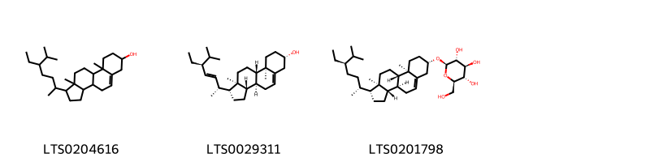{ width=100% }
    <figcaption>Hình ảnh cấu trúc hóa học của 3 hoạt chất thuộc nhóm Steroids and steroid derivatives gồm ['stigmast-5-en-3-ol, (3β)- (LTS0204616)', 'phytosterol (LTS0029311)', 'sitogluside (LTS0201798)'].</figcaption>
</figure>
#### Nhóm Tannins
<figure markdown="span">
    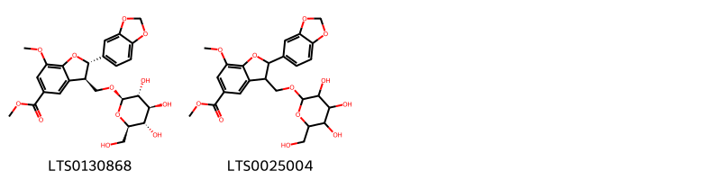{ width=100% }
    <figcaption>Hình ảnh cấu trúc hóa học của 2 hoạt chất thuộc nhóm Tannins gồm ['methyl (2s,3r)-2-(2h-1,3-benzodioxol-5-yl)-7-methoxy-3-({[(2r,3r,4s,5s,6r)-3,4,5-trihydroxy-6-(hydroxymethyl)oxan-2-yl]oxy}methyl)-2,3-dihydro-1-benzofuran-5-carboxylate (LTS0130868)', 'methyl 2-(2h-1,3-benzodioxol-5-yl)-7-methoxy-3-({[3,4,5-trihydroxy-6-(hydroxymethyl)oxan-2-yl]oxy}methyl)-2,3-dihydro-1-benzofuran-5-carboxylate (LTS0025004)'].</figcaption>
</figure>

---

### Dược dân tộc học

Danh sách các quốc gia có sử dụng *Toona sinensis* trong điều trị các bệnh. 

| Country   | Disease             | Bệnh                                                                                                                                                                                                |
|:----------|:--------------------|:----------------------------------------------------------------------------------------------------------------------------------------------------------------------------------------------------|
| China     | Carminative, Poison | MYMEMORY WARNING: YOU USED ALL AVAILABLE FREE TRANSLATIONS FOR TODAY. NEXT AVAILABLE IN  06 HOURS 23 MINUTES 11 SECONDS VISIT HTTPS://MYMEMORY.TRANSLATED.NET/DOC/USAGELIMITS.PHP TO TRANSLATE MORE |

---

---
## Cedrela toona
### Thông tin về thực vật

!!! info "Phân loại thực vật của *Cedrela toona* từ GIBF:"
    - **Kingdom:** Plantae
    - **Phylum:** Tracheophyta
    - **Order:** Sapindales
    - **Family:** Meliaceae
    - **Genus:** Cedrela
    - **Species:** *Cedrela toona*

 

| Label (VI)   | Label (EN)   | Scientific Name   | Descriptions (VI)   | Descriptions (EN)   | Also Known As (VI)   | Also Known As (EN)   |
|:-------------|:-------------|:------------------|:--------------------|:--------------------|:---------------------|:---------------------|
| N/A          | N/A          | Cedrela toona     | loài thực vật       | species of plant    | ['']                 | ['']                 |

#### Phân bố trên thế giới

**Từ CSDL GIBF** nan, Pakistan, Australia, Myanmar, India, Cuba, United States of America, Kenya, China

#### Phân bố tại Việt Nam

**Từ CSDL GIBF**: Không có ghi nhận ở Việt Nam

---
### Thành phần hóa học
        
- Theo cơ sở dữ liệu lotus: Từ loài *Cedrela toona* đã phân lập và xác định được Chưa có hoạt chất nào được phân lập. hoạt chất thuộc về các nhóm Không có hoạt chất nào được phân lập. 

Không có hình ảnh nào được tạo ra

---

### Dược dân tộc học

Danh sách các quốc gia có sử dụng *Cedrela toona* trong điều trị các bệnh. 

| Country    | Disease            | Bệnh                                                                                                                                                                                                |
|:-----------|:-------------------|:----------------------------------------------------------------------------------------------------------------------------------------------------------------------------------------------------|
| Elsewhere  | Astringent         | MYMEMORY WARNING: YOU USED ALL AVAILABLE FREE TRANSLATIONS FOR TODAY. NEXT AVAILABLE IN  06 HOURS 22 MINUTES 36 SECONDS VISIT HTTPS://MYMEMORY.TRANSLATED.NET/DOC/USAGELIMITS.PHP TO TRANSLATE MORE |
| Java       | Astringent         | MYMEMORY WARNING: YOU USED ALL AVAILABLE FREE TRANSLATIONS FOR TODAY. NEXT AVAILABLE IN  06 HOURS 22 MINUTES 33 SECONDS VISIT HTTPS://MYMEMORY.TRANSLATED.NET/DOC/USAGELIMITS.PHP TO TRANSLATE MORE |
| Portuguese | Astringent         | MYMEMORY WARNING: YOU USED ALL AVAILABLE FREE TRANSLATIONS FOR TODAY. NEXT AVAILABLE IN  06 HOURS 22 MINUTES 30 SECONDS VISIT HTTPS://MYMEMORY.TRANSLATED.NET/DOC/USAGELIMITS.PHP TO TRANSLATE MORE |
| Sanscrit   | Emmenagogue, Tonic | MYMEMORY WARNING: YOU USED ALL AVAILABLE FREE TRANSLATIONS FOR TODAY. NEXT AVAILABLE IN  06 HOURS 22 MINUTES 27 SECONDS VISIT HTTPS://MYMEMORY.TRANSLATED.NET/DOC/USAGELIMITS.PHP TO TRANSLATE MORE |

---

# Chi Turraea

??? note "Danh sách các dược liệu thuộc chi"
    
	 - *Turraea obtusifolia*
	 - *Turraea robusta*

---
## Turraea obtusifolia
### Thông tin về thực vật

!!! info "Phân loại thực vật của *Turraea obtusifolia* từ GIBF:"
    - **Kingdom:** Plantae
    - **Phylum:** Tracheophyta
    - **Order:** Sapindales
    - **Family:** Meliaceae
    - **Genus:** Turraea
    - **Species:** *Turraea obtusifolia*

 

| Label (VI)   | Label (EN)   | Scientific Name     | Descriptions (VI)   | Descriptions (EN)   | Also Known As (VI)   | Also Known As (EN)                                                                                                        |
|:-------------|:-------------|:--------------------|:--------------------|:--------------------|:---------------------|:--------------------------------------------------------------------------------------------------------------------------|
| N/A          | N/A          | Turraea obtusifolia | loài thực vật       | species of plant    | ['']                 | ['lesser honeysuckle tree', 'small honeysuckle bush', 'small honeysuckle tree', 'South African honeysuckle', 'star bush'] |

#### Phân bố trên thế giới

**Từ CSDL GIBF** Malawi, nan, South Africa, Madagascar, Mozambique, Botswana, United States of America, Congo, Democratic Republic of the, Zimbabwe, Eswatini

#### Phân bố tại Việt Nam

**Từ CSDL GIBF**: Không có ghi nhận ở Việt Nam

---
### Thành phần hóa học
        
- Theo cơ sở dữ liệu lotus: Từ loài *Turraea obtusifolia* đã phân lập và xác định được 4 hoạt chất thuộc về các nhóm Carboxylic acids and derivatives, Prenol lipids. 

|    | chemicalTaxonomyClassyfireClass   |   smiles_count |
|---:|:----------------------------------|---------------:|
|  0 | Carboxylic acids and derivatives  |              2 |
|  1 | Prenol lipids                     |              2 |

#### Nhóm Carboxylic acids and derivatives
<figure markdown="span">
    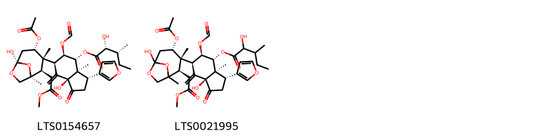{ width=100% }
    <figcaption>Hình ảnh cấu trúc hóa học của 2 hoạt chất thuộc nhóm Carboxylic acids and derivatives gồm ['(3s,3ar,4r,5r,6r,7as)-6-[(1s,2r,3r,4s,6s)-4-(acetyloxy)-6-hydroxy-2-(2-methoxy-2-oxoethyl)-1,3-dimethyl-7,9-dioxabicyclo[4.2.1]nonan-3-yl]-5-(formyloxy)-3-(furan-3-yl)-7a-hydroxy-3a-methyl-7-methylidene-1-oxo-tetrahydro-2h-inden-4-yl (2r,3r)-2-hydroxy-3-methylpentanoate (LTS0154657)', '(3s,3ar,4r,5r,6r,7as)-6-[(2r,3r,4s)-4-(acetyloxy)-6-hydroxy-2-(2-methoxy-2-oxoethyl)-1,3-dimethyl-7,9-dioxabicyclo[4.2.1]nonan-3-yl]-5-(formyloxy)-3-(furan-3-yl)-7a-hydroxy-3a-methyl-7-methylidene-1-oxo-tetrahydro-2h-inden-4-yl 2-hydroxy-3-methylpentanoate (LTS0021995)'].</figcaption>
</figure>
#### Nhóm Prenol lipids
<figure markdown="span">
    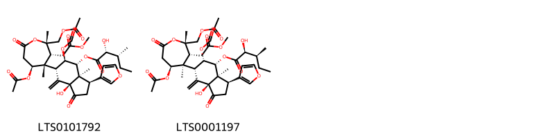{ width=100% }
    <figcaption>Hình ảnh cấu trúc hóa học của 2 hoạt chất thuộc nhóm Prenol lipids gồm ['(3r,3ar,4r,5r,6s,7as)-6-[(2s,3r,4s,5s)-5-(acetyloxy)-2-[(acetyloxy)methyl]-3-(2-methoxy-2-oxoethyl)-2,4-dimethyl-7-oxooxepan-4-yl]-5-(formyloxy)-3-(furan-3-yl)-7a-hydroxy-3a-methyl-7-methylidene-1-oxo-tetrahydro-2h-inden-4-yl (2r,3r)-2-hydroxy-3-methylpentanoate (LTS0101792)', '(3r,3ar,4r,5s,6s,7as)-6-[(2s,3r,4r,5s)-5-(acetyloxy)-2-[(acetyloxy)methyl]-3-(2-methoxy-2-oxoethyl)-2,4-dimethyl-7-oxooxepan-4-yl]-5-(formyloxy)-3-(furan-3-yl)-7a-hydroxy-3a-methyl-7-methylidene-1-oxo-tetrahydro-2h-inden-4-yl (2s,3s)-2-hydroxy-3-methylpentanoate (LTS0001197)'].</figcaption>
</figure>

---

### Dược dân tộc học

Danh sách các quốc gia có sử dụng *Turraea obtusifolia* trong điều trị các bệnh. 

| Country   | Disease   | Bệnh                                                                                                                                                                                                |
|:----------|:----------|:----------------------------------------------------------------------------------------------------------------------------------------------------------------------------------------------------|
| Elsewhere | Purgative | MYMEMORY WARNING: YOU USED ALL AVAILABLE FREE TRANSLATIONS FOR TODAY. NEXT AVAILABLE IN  06 HOURS 21 MINUTES 57 SECONDS VISIT HTTPS://MYMEMORY.TRANSLATED.NET/DOC/USAGELIMITS.PHP TO TRANSLATE MORE |

---

---
## Turraea robusta
### Thông tin về thực vật

!!! info "Phân loại thực vật của *Turraea robusta* từ GIBF:"
    - **Kingdom:** Plantae
    - **Phylum:** Tracheophyta
    - **Order:** Sapindales
    - **Family:** Meliaceae
    - **Genus:** Turraea
    - **Species:** *Turraea robusta*

 

| Label (VI)   | Label (EN)   | Scientific Name   | Descriptions (VI)   | Descriptions (EN)   | Also Known As (VI)   | Also Known As (EN)   |
|:-------------|:-------------|:------------------|:--------------------|:--------------------|:---------------------|:---------------------|
| N/A          | N/A          | Turraea robusta   | loài thực vật       | species of plant    | ['']                 | ['']                 |

#### Phân bố trên thế giới

**Từ CSDL GIBF** nan, Malawi, Uganda, Zambia, Mozambique, Burundi, Congo, Democratic Republic of the, Kenya, Cameroon, Tanzania, United Republic of

#### Phân bố tại Việt Nam

**Từ CSDL GIBF**: Không có ghi nhận ở Việt Nam

---
### Thành phần hóa học
        
- Theo cơ sở dữ liệu lotus: Từ loài *Turraea robusta* đã phân lập và xác định được 6 hoạt chất thuộc về các nhóm Prenol lipids. 

|    | chemicalTaxonomyClassyfireClass   |   smiles_count |
|---:|:----------------------------------|---------------:|
|  0 | Prenol lipids                     |              6 |

#### Nhóm Prenol lipids
<figure markdown="span">
    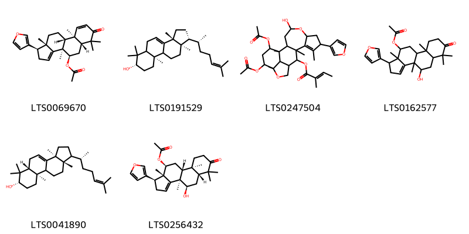{ width=100% }
    <figcaption>Hình ảnh cấu trúc hóa học của 6 hoạt chất thuộc nhóm Prenol lipids gồm ['azadirone (LTS0069670)', '(1r,3ar,7s,9ar,11ar)-3a,6,6,9a,11a-pentamethyl-1-[(2r)-6-methylhept-5-en-2-yl]-1h,2h,3h,5h,5ah,7h,8h,9h,9bh,10h,11h-cyclopenta[a]phenanthren-7-ol (LTS0191529)', '17,19-bis(acetyloxy)-8-(furan-3-yl)-4-hydroxy-1,9,11,16-tetramethyl-5,15-dioxapentacyclo[11.6.1.0²,¹¹.0⁶,¹⁰.0¹⁶,²⁰]icos-9-en-12-yl 2-methylbut-2-enoate (LTS0247504)', '1-(furan-3-yl)-4-hydroxy-3b,6,6,9a,11a-pentamethyl-7-oxo-1h,2h,4h,5h,5ah,8h,9h,9bh,10h,11h-cyclopenta[a]phenanthren-11-yl acetate (LTS0162577)', '(3as,5ar,7s,9ar,11as)-3a,6,6,9a,11a-pentamethyl-1-[(2r)-6-methylhept-5-en-2-yl]-1h,2h,3h,5h,5ah,7h,8h,9h,9bh,10h,11h-cyclopenta[a]phenanthren-7-ol (LTS0041890)', '(1s,3br,4r,5ar,9ar,9br,11s,11as)-1-(furan-3-yl)-4-hydroxy-3b,6,6,9a,11a-pentamethyl-7-oxo-1h,2h,4h,5h,5ah,8h,9h,9bh,10h,11h-cyclopenta[a]phenanthren-11-yl acetate (LTS0256432)'].</figcaption>
</figure>

---

### Dược dân tộc học

Danh sách các quốc gia có sử dụng *Turraea robusta* trong điều trị các bệnh. 

| Country   | Disease   | Bệnh                                                                                                                                                                                                |
|:----------|:----------|:----------------------------------------------------------------------------------------------------------------------------------------------------------------------------------------------------|
| Africa    | Poison    | MYMEMORY WARNING: YOU USED ALL AVAILABLE FREE TRANSLATIONS FOR TODAY. NEXT AVAILABLE IN  06 HOURS 21 MINUTES 25 SECONDS VISIT HTTPS://MYMEMORY.TRANSLATED.NET/DOC/USAGELIMITS.PHP TO TRANSLATE MORE |

---

# Chi Heynea

??? note "Danh sách các dược liệu thuộc chi"
    
	 - *Heynea trijuga*

---
## Heynea trijuga
### Thông tin về thực vật

!!! info "Phân loại thực vật của *Heynea trijuga* từ GIBF:"
    - **Kingdom:** Plantae
    - **Phylum:** Tracheophyta
    - **Order:** Sapindales
    - **Family:** Meliaceae
    - **Genus:** Heynea
    - **Species:** *Heynea trijuga*

 

| Label (VI)   | Label (EN)   | Scientific Name   | Descriptions (VI)   | Descriptions (EN)   | Also Known As (VI)   | Also Known As (EN)   |
|:-------------|:-------------|:------------------|:--------------------|:--------------------|:---------------------|:---------------------|
| N/A          | N/A          | Heynea trijuga    | loài thực vật       | species of plant    | ['']                 | ['']                 |

#### Phân bố trên thế giới

**Từ CSDL GIBF** nan, Malaysia, Brunei Darussalam, Thailand, Lao People’s Democratic Republic, Myanmar, Bhutan, India, Indonesia, Philippines, Viet Nam, China, Nepal

#### Phân bố tại Việt Nam

**Từ CSDL GIBF**: Bac Thai, Lai Chau, Hà Tinh

---
### Thành phần hóa học
        
- Theo cơ sở dữ liệu lotus: Từ loài *Heynea trijuga* đã phân lập và xác định được 40 hoạt chất thuộc về các nhóm Prenol lipids, Steroids and steroid derivatives, Oxepanes, Pyrans, Carboxylic acids and derivatives. 

|    | chemicalTaxonomyClassyfireClass   |   smiles_count |
|---:|:----------------------------------|---------------:|
|  0 | Carboxylic acids and derivatives  |             17 |
|  1 | Oxepanes                          |              2 |
|  2 | Prenol lipids                     |             13 |
|  3 | Pyrans                            |              2 |
|  4 | Steroids and steroid derivatives  |              4 |

#### Nhóm Carboxylic acids and derivatives
<figure markdown="span">
    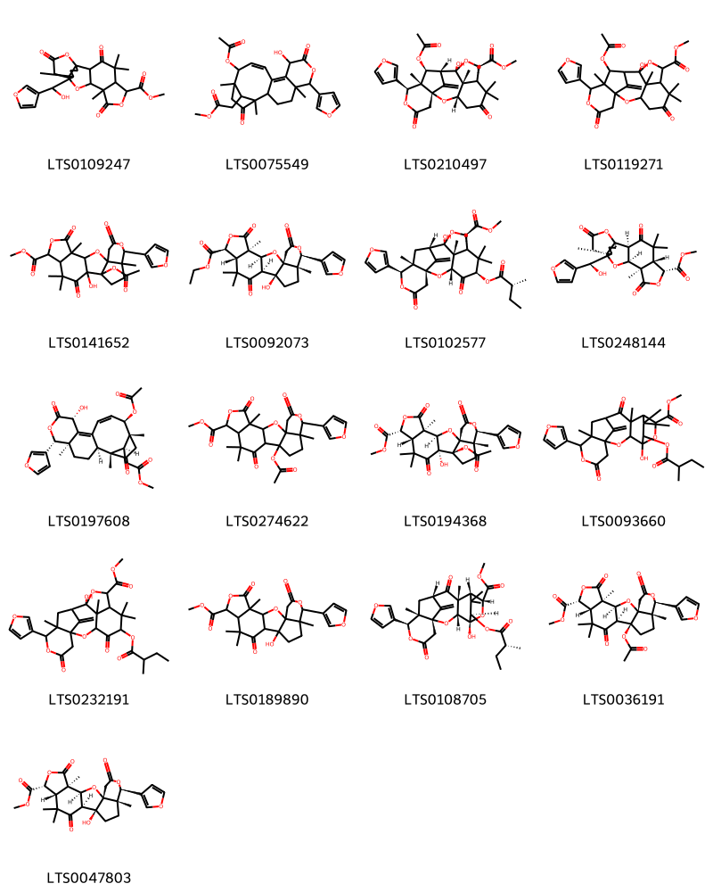{ width=100% }
    <figcaption>Hình ảnh cấu trúc hóa học của 17 hoạt chất thuộc nhóm Carboxylic acids and derivatives gồm ['methyl 18-[furan-3-yl(hydroxy)methyl]-4,4,9,18-tetramethyl-3,8,14-trioxo-7,11,15-trioxapentacyclo[10.3.3.0¹,¹².0²,¹⁰.0⁵,⁹]octadecane-6-carboxylate (LTS0109247)', 'methyl 2-[14-(acetyloxy)-6-(furan-3-yl)-9-hydroxy-1,5,15-trimethyl-8,17-dioxo-7-oxatetracyclo[13.2.1.0²,¹¹.0⁵,¹⁰]octadeca-10,12-dien-18-yl]acetate (LTS0075549)', 'methyl (1s,2r,3s,4s,5s,9s,11s,15s,16r,18r)-3-(acetyloxy)-5-(furan-3-yl)-1-hydroxy-4,14,14,18-tetramethyl-19-methylidene-7,13-dioxo-6,10,17-trioxapentacyclo[9.6.1.1²,⁹.0⁴,⁹.0¹⁵,¹⁸]nonadecane-16-carboxylate (LTS0210497)', 'methyl 3-(acetyloxy)-5-(furan-3-yl)-1-hydroxy-4,14,14,18-tetramethyl-19-methylidene-7,13-dioxo-6,10,17-trioxapentacyclo[9.6.1.1²,⁹.0⁴,⁹.0¹⁵,¹⁸]nonadecane-16-carboxylate (LTS0119271)', 'methyl 12-(acetyloxy)-16-(furan-3-yl)-11-hydroxy-4,9,9,15-tetramethyl-5,10,18-trioxo-2,6,17-trioxapentacyclo[10.7.0.0¹,¹⁵.0³,¹¹.0⁴,⁸]nonadecane-7-carboxylate (LTS0141652)', 'ethyl (1r,3s,4r,7s,8s,11s,12s,15s,16s)-16-(furan-3-yl)-12-hydroxy-4,9,9,15-tetramethyl-5,10,18-trioxo-2,6,17-trioxapentacyclo[10.7.0.0¹,¹⁵.0³,¹¹.0⁴,⁸]nonadecane-7-carboxylate (LTS0092073)', 'methyl (1s,2s,4s,5s,9s,11r,13r,15s,16r,18r)-5-(furan-3-yl)-1-hydroxy-4,14,14,18-tetramethyl-13-{[(2r)-2-methylbutanoyl]oxy}-19-methylidene-7,12-dioxo-6,10,17-trioxapentacyclo[9.6.1.1²,⁹.0⁴,⁹.0¹⁵,¹⁸]nonadecane-16-carboxylate (LTS0102577)', 'methyl (1s,2s,5s,6r,9r,10s,12r,18s)-18-[(s)-furan-3-yl(hydroxy)methyl]-4,4,9,18-tetramethyl-3,8,14-trioxo-7,11,15-trioxapentacyclo[10.3.3.0¹,¹².0²,¹⁰.0⁵,⁹]octadecane-6-carboxylate (LTS0248144)', 'methyl 2-[(1r,2s,5r,6r,9r,12z,14r,15r,18r)-14-(acetyloxy)-6-(furan-3-yl)-9-hydroxy-1,5,15-trimethyl-8,17-dioxo-7-oxatetracyclo[13.2.1.0²,¹¹.0⁵,¹⁰]octadeca-10,12-dien-18-yl]acetate (LTS0197608)', 'methyl 12-(acetyloxy)-16-(furan-3-yl)-4,9,9,15-tetramethyl-5,10,18-trioxo-2,6,17-trioxapentacyclo[10.7.0.0¹,¹⁵.0³,¹¹.0⁴,⁸]nonadecane-7-carboxylate (LTS0274622)', 'methyl (1r,3r,4r,7r,8s,11r,12s,15s,16s)-12-(acetyloxy)-16-(furan-3-yl)-11-hydroxy-4,9,9,15-tetramethyl-5,10,18-trioxo-2,6,17-trioxapentacyclo[10.7.0.0¹,¹⁵.0³,¹¹.0⁴,⁸]nonadecane-7-carboxylate (LTS0194368)', 'methyl 8-(furan-3-yl)-1-hydroxy-9,13,18,18-tetramethyl-17-[(2-methylbutanoyl)oxy]-19-methylidene-6,12-dioxo-3,7,16-trioxapentacyclo[12.2.2.1⁴,¹¹.0²,¹³.0⁴,⁹]nonadecane-15-carboxylate (LTS0093660)', 'methyl 5-(furan-3-yl)-1-hydroxy-4,14,14,18-tetramethyl-13-[(2-methylbutanoyl)oxy]-19-methylidene-7,12-dioxo-6,10,17-trioxapentacyclo[9.6.1.1²,⁹.0⁴,⁹.0¹⁵,¹⁸]nonadecane-16-carboxylate (LTS0232191)', 'methyl 16-(furan-3-yl)-12-hydroxy-4,9,9,15-tetramethyl-5,10,18-trioxo-2,6,17-trioxapentacyclo[10.7.0.0¹,¹⁵.0³,¹¹.0⁴,⁸]nonadecane-7-carboxylate (LTS0189890)', 'methyl (1r,2r,4s,8s,9s,11s,13r,14r,15r,17r)-8-(furan-3-yl)-1-hydroxy-9,13,18,18-tetramethyl-17-{[(2r)-2-methylbutanoyl]oxy}-19-methylidene-6,12-dioxo-3,7,16-trioxapentacyclo[12.2.2.1⁴,¹¹.0²,¹³.0⁴,⁹]nonadecane-15-carboxylate (LTS0108705)', 'methyl (1r,3s,4r,7r,8s,11s,12s,15s,16s)-12-(acetyloxy)-16-(furan-3-yl)-4,9,9,15-tetramethyl-5,10,18-trioxo-2,6,17-trioxapentacyclo[10.7.0.0¹,¹⁵.0³,¹¹.0⁴,⁸]nonadecane-7-carboxylate (LTS0036191)', 'methyl (1r,3s,4r,7r,8s,11s,12s,15s,16s)-16-(furan-3-yl)-12-hydroxy-4,9,9,15-tetramethyl-5,10,18-trioxo-2,6,17-trioxapentacyclo[10.7.0.0¹,¹⁵.0³,¹¹.0⁴,⁸]nonadecane-7-carboxylate (LTS0047803)'].</figcaption>
</figure>
#### Nhóm Oxepanes
<figure markdown="span">
    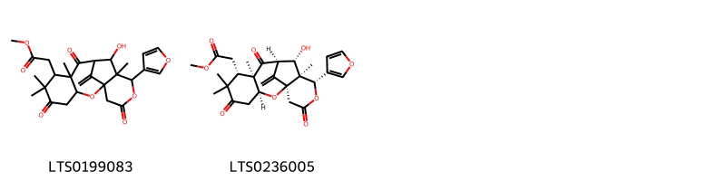{ width=100% }
    <figcaption>Hình ảnh cấu trúc hóa học của 2 hoạt chất thuộc nhóm Oxepanes gồm ['methyl 2-[13-(furan-3-yl)-11-hydroxy-6,6,8,12-tetramethyl-17-methylidene-5,9,15-trioxo-2,14-dioxatetracyclo[8.6.1.0¹,¹².0³,⁸]heptadecan-7-yl]acetate (LTS0199083)', 'methyl 2-[(1s,3s,7s,8r,10r,11s,12s,13s)-13-(furan-3-yl)-11-hydroxy-6,6,8,12-tetramethyl-17-methylidene-5,9,15-trioxo-2,14-dioxatetracyclo[8.6.1.0¹,¹².0³,⁸]heptadecan-7-yl]acetate (LTS0236005)'].</figcaption>
</figure>
#### Nhóm Prenol lipids
<figure markdown="span">
    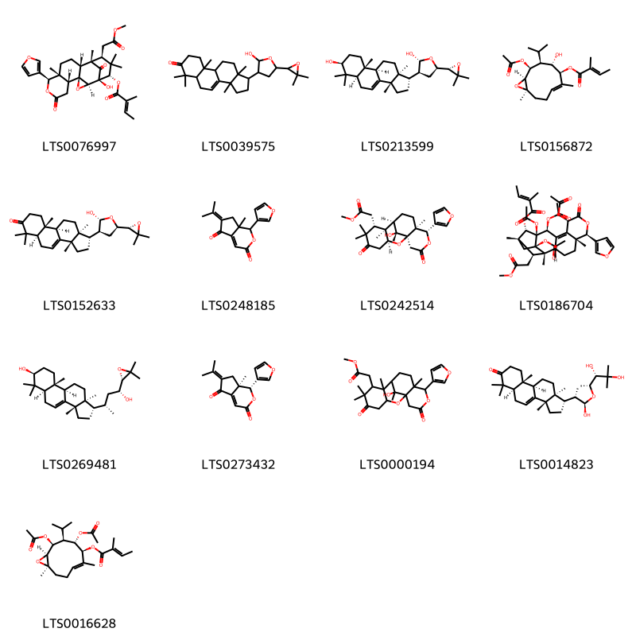{ width=100% }
    <figcaption>Hình ảnh cấu trúc hóa học của 13 hoạt chất thuộc nhóm Prenol lipids gồm ['ruageanin b (LTS0076997)', '1-[5-(3,3-dimethyloxiran-2-yl)-2-hydroxyoxolan-3-yl]-3a,6,6,9a,11a-pentamethyl-1h,2h,3h,5h,5ah,8h,9h,9bh,10h,11h-cyclopenta[a]phenanthren-7-one (LTS0039575)', '(2r,3s,5r)-3-[(1s,3as,5ar,7s,9ar,9br,11as)-7-hydroxy-3a,6,6,9a,11a-pentamethyl-1h,2h,3h,5h,5ah,7h,8h,9h,9bh,10h,11h-cyclopenta[a]phenanthren-1-yl]-5-[(2s)-3,3-dimethyloxiran-2-yl]oxolan-2-ol (LTS0213599)', '(1s,2s,3s,4s,5s,6e,10r)-2-(acetyloxy)-4-hydroxy-3-isopropyl-6,10-dimethyl-11-oxabicyclo[8.1.0]undec-6-en-5-yl (2e)-2-methylbut-2-enoate (LTS0156872)', '(1s,3as,5ar,9ar,9br,11as)-1-[(2r,3s,5r)-5-[(2s)-3,3-dimethyloxiran-2-yl]-2-hydroxyoxolan-3-yl]-3a,6,6,9a,11a-pentamethyl-1h,2h,3h,5h,5ah,8h,9h,9bh,10h,11h-cyclopenta[a]phenanthren-7-one (LTS0152633)', '1-(furan-3-yl)-7a-methyl-6-(propan-2-ylidene)-1h,7h-cyclopenta[c]pyran-3,5-dione (LTS0248185)', 'methyl 2-[(1r,3s,7r,8s,9r,12s,13s,17r)-13-(furan-3-yl)-17-hydroxy-6,6,8,12,17-pentamethyl-5,15-dioxo-2,14-dioxatetracyclo[7.7.1.0¹,¹².0³,⁸]heptadecan-7-yl]acetate (LTS0242514)', '15-acetyltrichagmalin e (LTS0186704)', '(1s,3as,5ar,7s,9ar,9br,11as)-1-[(2s,4r)-4-[(2s)-3,3-dimethyloxiran-2-yl]-4-hydroxybutan-2-yl]-3a,6,6,9a,11a-pentamethyl-1h,2h,3h,5h,5ah,7h,8h,9h,9bh,10h,11h-cyclopenta[a]phenanthren-7-ol (LTS0269481)', '(1r,7ar)-1-(furan-3-yl)-7a-methyl-6-(propan-2-ylidene)-1h,7h-cyclopenta[c]pyran-3,5-dione (LTS0273432)', 'methyl 2-[13-(furan-3-yl)-17-hydroxy-6,6,8,12,17-pentamethyl-5,15-dioxo-2,14-dioxatetracyclo[7.7.1.0¹,¹².0³,⁸]heptadecan-7-yl]acetate (LTS0000194)', '(1s,3as,5ar,9ar,9br,11as)-1-[(2r,3s,5r)-5-[(1s)-1,2-dihydroxy-2-methylpropyl]-2-hydroxyoxolan-3-yl]-3a,6,6,9a,11a-pentamethyl-1h,2h,3h,5h,5ah,8h,9h,9bh,10h,11h-cyclopenta[a]phenanthren-7-one (LTS0014823)', '(1s,2s,3s,4s,5s,6e,10r)-2,4-bis(acetyloxy)-3-isopropyl-6,10-dimethyl-11-oxabicyclo[8.1.0]undec-6-en-5-yl (2e)-2-methylbut-2-enoate (LTS0016628)'].</figcaption>
</figure>
#### Nhóm Pyrans
<figure markdown="span">
    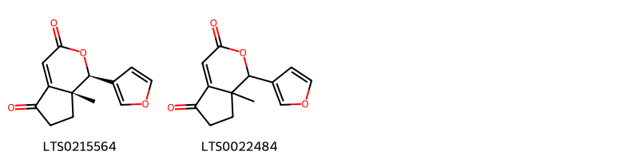{ width=100% }
    <figcaption>Hình ảnh cấu trúc hóa học của 2 hoạt chất thuộc nhóm Pyrans gồm ['(1r,7ar)-1-(furan-3-yl)-7a-methyl-1h,6h,7h-cyclopenta[c]pyran-3,5-dione (LTS0215564)', '1-(furan-3-yl)-7a-methyl-1h,6h,7h-cyclopenta[c]pyran-3,5-dione (LTS0022484)'].</figcaption>
</figure>
#### Nhóm Steroids and steroid derivatives
<figure markdown="span">
    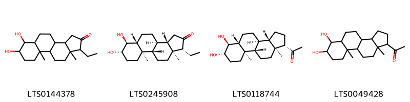{ width=100% }
    <figcaption>Hình ảnh cấu trúc hóa học của 4 hoạt chất thuộc nhóm Steroids and steroid derivatives gồm ['1-ethyl-6,7-dihydroxy-9a,11a-dimethyl-tetradecahydrocyclopenta[a]phenanthren-2-one (LTS0144378)', '(1r,3as,3br,5ar,6s,7s,9ar,9bs,11as)-1-ethyl-6,7-dihydroxy-9a,11a-dimethyl-tetradecahydrocyclopenta[a]phenanthren-2-one (LTS0245908)', '1-[(1s,3as,3br,5ar,6s,7s,9ar,9bs,11as)-6,7-dihydroxy-9a,11a-dimethyl-tetradecahydro-1h-cyclopenta[a]phenanthren-1-yl]ethanone (LTS0118744)', '1-{6,7-dihydroxy-9a,11a-dimethyl-tetradecahydro-1h-cyclopenta[a]phenanthren-1-yl}ethanone (LTS0049428)'].</figcaption>
</figure>

---

### Dược dân tộc học

Danh sách các quốc gia có sử dụng *Heynea trijuga* trong điều trị các bệnh. 

| Country   | Disease       | Bệnh                                                                                                                                                                                                |
|:----------|:--------------|:----------------------------------------------------------------------------------------------------------------------------------------------------------------------------------------------------|
| India     | Poison, Tonic | MYMEMORY WARNING: YOU USED ALL AVAILABLE FREE TRANSLATIONS FOR TODAY. NEXT AVAILABLE IN  06 HOURS 20 MINUTES 54 SECONDS VISIT HTTPS://MYMEMORY.TRANSLATED.NET/DOC/USAGELIMITS.PHP TO TRANSLATE MORE |
| Malaya    | Stupefacient  | MYMEMORY WARNING: YOU USED ALL AVAILABLE FREE TRANSLATIONS FOR TODAY. NEXT AVAILABLE IN  06 HOURS 20 MINUTES 51 SECONDS VISIT HTTPS://MYMEMORY.TRANSLATED.NET/DOC/USAGELIMITS.PHP TO TRANSLATE MORE |

---

# Chi Pterorhachis

??? note "Danh sách các dược liệu thuộc chi"
    
	 - *Pterorhachis zenkeri*

---
## Pterorhachis zenkeri
### Thông tin về thực vật

!!! info "Phân loại thực vật của *Pterorhachis zenkeri* từ GIBF:"
    - **Kingdom:** Plantae
    - **Phylum:** Tracheophyta
    - **Order:** Sapindales
    - **Family:** Meliaceae
    - **Genus:** Pterorhachis
    - **Species:** *Pterorhachis zenkeri*

 

| Label (VI)   | Label (EN)   | Scientific Name      | Descriptions (VI)   | Descriptions (EN)   | Also Known As (VI)   | Also Known As (EN)   |
|:-------------|:-------------|:---------------------|:--------------------|:--------------------|:---------------------|:---------------------|
| N/A          | N/A          | Pterorhachis zenkeri | loài thực vật       | species of plant    | ['']                 | ['']                 |

#### Phân bố trên thế giới

**Từ CSDL GIBF** nan, Gabon, Cameroon

#### Phân bố tại Việt Nam

**Từ CSDL GIBF**: Không có ghi nhận ở Việt Nam

---
### Thành phần hóa học
        
- Theo cơ sở dữ liệu lotus: Từ loài *Pterorhachis zenkeri* đã phân lập và xác định được 9 hoạt chất thuộc về các nhóm Prenol lipids. 

|    | chemicalTaxonomyClassyfireClass   |   smiles_count |
|---:|:----------------------------------|---------------:|
|  0 | Prenol lipids                     |              9 |

#### Nhóm Prenol lipids
<figure markdown="span">
    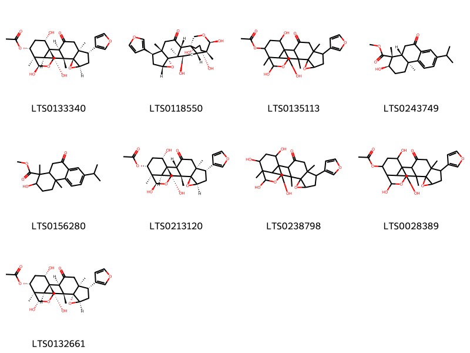{ width=100% }
    <figcaption>Hình ảnh cấu trúc hóa học của 9 hoạt chất thuộc nhóm Prenol lipids gồm ['(1s,2r,5s,6s,8r,10r,11s,12r,14r,15r,16r,19s,21r)-6-(furan-3-yl)-12,16,19-trihydroxy-5,11,15-trimethyl-3-oxo-9,17-dioxahexacyclo[13.3.3.0¹,¹⁴.0²,¹¹.0⁵,¹⁰.0⁸,¹⁰]henicosan-21-yl acetate (LTS0133340)', '(1s,2r,5s,6s,8r,10r,11s,12r,14r,15r,16r,19s,21r)-6-(furan-3-yl)-12,16,19,21-tetrahydroxy-5,11,15-trimethyl-9,17-dioxahexacyclo[13.3.3.0¹,¹⁴.0²,¹¹.0⁵,¹⁰.0⁸,¹⁰]henicosan-3-one (LTS0118550)', '6-(furan-3-yl)-12,16,19-trihydroxy-5,11,15-trimethyl-3-oxo-9,17-dioxahexacyclo[13.3.3.0¹,¹⁴.0²,¹¹.0⁵,¹⁰.0⁸,¹⁰]henicosan-21-yl acetate (LTS0135113)', 'methyl (1r,2r,4as,10ar)-2-hydroxy-7-isopropyl-1,4a-dimethyl-9-oxo-3,4,10,10a-tetrahydro-2h-phenanthrene-1-carboxylate (LTS0243749)', 'methyl 2-hydroxy-7-isopropyl-1,4a-dimethyl-9-oxo-3,4,10,10a-tetrahydro-2h-phenanthrene-1-carboxylate (LTS0156280)', '(1s,2s,5s,6s,8r,10r,11s,12r,14r,15r,16r,19s,21r)-6-(furan-3-yl)-12,16,19-trihydroxy-5,11,15-trimethyl-3-oxo-9,17-dioxahexacyclo[13.3.3.0¹,¹⁴.0²,¹¹.0⁵,¹⁰.0⁸,¹⁰]henicosan-21-yl acetate (LTS0213120)', '6-(furan-3-yl)-12,16,19,21-tetrahydroxy-5,11,15-trimethyl-9,17-dioxahexacyclo[13.3.3.0¹,¹⁴.0²,¹¹.0⁵,¹⁰.0⁸,¹⁰]henicosan-3-one (LTS0238798)', '6-(furan-3-yl)-12,16,19-trihydroxy-5,11-dimethyl-3-oxo-9,17-dioxahexacyclo[13.3.3.0¹,¹⁴.0²,¹¹.0⁵,¹⁰.0⁸,¹⁰]henicosan-21-yl acetate (LTS0028389)', '(1s,2r,5s,6s,8r,10s,11s,12r,14r,15r,16s,19s,21r)-6-(furan-3-yl)-12,16,19-trihydroxy-5,11,15-trimethyl-3-oxo-9,17-dioxahexacyclo[13.3.3.0¹,¹⁴.0²,¹¹.0⁵,¹⁰.0⁸,¹⁰]henicosan-21-yl acetate (LTS0132661)'].</figcaption>
</figure>

---

### Dược dân tộc học

Danh sách các quốc gia có sử dụng *Pterorhachis zenkeri* trong điều trị các bệnh. 

| Country   | Disease     | Bệnh                                                                                                                                                                                                |
|:----------|:------------|:----------------------------------------------------------------------------------------------------------------------------------------------------------------------------------------------------|
| Cameroon  | Aphrodisiac | MYMEMORY WARNING: YOU USED ALL AVAILABLE FREE TRANSLATIONS FOR TODAY. NEXT AVAILABLE IN  06 HOURS 20 MINUTES 20 SECONDS VISIT HTTPS://MYMEMORY.TRANSLATED.NET/DOC/USAGELIMITS.PHP TO TRANSLATE MORE |

---

# Chi Trichilia

??? note "Danh sách các dược liệu thuộc chi"
    
	 - *Trichilia acutanthera*
	 - *Trichilia arborea*
	 - *Trichilia emetica*
	 - *Trichilia havanensis*
	 - *Trichilia hirta*

---
## Trichilia acutanthera
### Thông tin về thực vật

!!! info "Phân loại thực vật của *Trichilia martiana* từ GIBF:"
    - **Kingdom:** Plantae
    - **Phylum:** Tracheophyta
    - **Order:** Sapindales
    - **Family:** Meliaceae
    - **Genus:** Trichilia
    - **Species:** *Trichilia martiana*

 

| Label (VI)   | Label (EN)   | Scientific Name       | Descriptions (VI)   | Descriptions (EN)   | Also Known As (VI)   | Also Known As (EN)   |
|:-------------|:-------------|:----------------------|:--------------------|:--------------------|:---------------------|:---------------------|
| N/A          | N/A          | Trichilia acutanthera |                     |                     | ['']                 | ['']                 |

#### Phân bố trên thế giới

**Từ CSDL GIBF** Belize, nan, Guatemala, Costa Rica, Honduras, Mexico

#### Phân bố tại Việt Nam

**Từ CSDL GIBF**: Không có ghi nhận ở Việt Nam

---
### Thành phần hóa học
        
- Theo cơ sở dữ liệu lotus: Từ loài *Trichilia martiana* đã phân lập và xác định được Chưa có hoạt chất nào được phân lập. hoạt chất thuộc về các nhóm Không có hoạt chất nào được phân lập. 

Không có hình ảnh nào được tạo ra

---

### Dược dân tộc học

Danh sách các quốc gia có sử dụng *Trichilia martiana* trong điều trị các bệnh. 

| Country   | Disease                   | Bệnh                                                                                                                                                                                                |
|:----------|:--------------------------|:----------------------------------------------------------------------------------------------------------------------------------------------------------------------------------------------------|
| Elsewhere | Insecticide, Pediculicide | MYMEMORY WARNING: YOU USED ALL AVAILABLE FREE TRANSLATIONS FOR TODAY. NEXT AVAILABLE IN  06 HOURS 19 MINUTES 45 SECONDS VISIT HTTPS://MYMEMORY.TRANSLATED.NET/DOC/USAGELIMITS.PHP TO TRANSLATE MORE |

---

---
## Trichilia arborea
### Thông tin về thực vật

!!! info "Phân loại thực vật của *Trichilia glabra* từ GIBF:"
    - **Kingdom:** Plantae
    - **Phylum:** Tracheophyta
    - **Order:** Sapindales
    - **Family:** Meliaceae
    - **Genus:** Trichilia
    - **Species:** *Trichilia glabra*

 

| Label (VI)   | Label (EN)   | Scientific Name   | Descriptions (VI)   | Descriptions (EN)   | Also Known As (VI)   | Also Known As (EN)   |
|:-------------|:-------------|:------------------|:--------------------|:--------------------|:---------------------|:---------------------|
| N/A          | N/A          | Trichilia arborea |                     |                     | ['']                 | ['']                 |

#### Phân bố trên thế giới

**Từ CSDL GIBF** Costa Rica, nan, Brazil, Mexico

#### Phân bố tại Việt Nam

**Từ CSDL GIBF**: Không có ghi nhận ở Việt Nam

---
### Thành phần hóa học
        
- Theo cơ sở dữ liệu lotus: Từ loài *Trichilia glabra* đã phân lập và xác định được Chưa có hoạt chất nào được phân lập. hoạt chất thuộc về các nhóm Không có hoạt chất nào được phân lập. 

Không có hình ảnh nào được tạo ra

---

### Dược dân tộc học

Danh sách các quốc gia có sử dụng *Trichilia glabra* trong điều trị các bệnh. 

| Country   | Disease           | Bệnh                                                                                                                                                                                                |
|:----------|:------------------|:----------------------------------------------------------------------------------------------------------------------------------------------------------------------------------------------------|
| Mexico    | Emetic, Purgative | MYMEMORY WARNING: YOU USED ALL AVAILABLE FREE TRANSLATIONS FOR TODAY. NEXT AVAILABLE IN  06 HOURS 19 MINUTES 19 SECONDS VISIT HTTPS://MYMEMORY.TRANSLATED.NET/DOC/USAGELIMITS.PHP TO TRANSLATE MORE |

---

---
## Trichilia emetica
### Thông tin về thực vật

!!! info "Phân loại thực vật của *Trichilia emetica* từ GIBF:"
    - **Kingdom:** Plantae
    - **Phylum:** Tracheophyta
    - **Order:** Sapindales
    - **Family:** Meliaceae
    - **Genus:** Trichilia
    - **Species:** *Trichilia emetica*

 

| Label (VI)   | Label (EN)   | Scientific Name   | Descriptions (VI)   | Descriptions (EN)   | Also Known As (VI)   | Also Known As (EN)   |
|:-------------|:-------------|:------------------|:--------------------|:--------------------|:---------------------|:---------------------|
| N/A          | N/A          | Trichilia emetica | loài thực vật       | species of plant    | ['']                 | ['']                 |

#### Phân bố trên thế giới

**Từ CSDL GIBF** Malawi, Zambia, South Africa, Nigeria, Namibia, Cabo Verde, Mozambique, Botswana, Benin, Kenya, Zimbabwe, Eswatini, Saudi Arabia

#### Phân bố tại Việt Nam

**Từ CSDL GIBF**: Không có ghi nhận ở Việt Nam

---
### Thành phần hóa học
        
- Theo cơ sở dữ liệu lotus: Từ loài *Trichilia emetica* đã phân lập và xác định được 29 hoạt chất thuộc về các nhóm Carboxylic acids and derivatives, Prenol lipids, Steroids and steroid derivatives. 

|    | chemicalTaxonomyClassyfireClass   |   smiles_count |
|---:|:----------------------------------|---------------:|
|  0 | Carboxylic acids and derivatives  |              2 |
|  1 | Prenol lipids                     |             15 |
|  2 | Steroids and steroid derivatives  |              2 |

#### Nhóm Carboxylic acids and derivatives
<figure markdown="span">
    { width=100% }
    <figcaption>Hình ảnh cấu trúc hóa học của 2 hoạt chất thuộc nhóm Carboxylic acids and derivatives gồm ['(3s,3ar,4r,5r,6r,7as)-6-[(1s,2r,3r,4s,6s)-4-(acetyloxy)-6-hydroxy-2-(2-methoxy-2-oxoethyl)-1,3-dimethyl-7,9-dioxabicyclo[4.2.1]nonan-3-yl]-5-(formyloxy)-3-(furan-3-yl)-7a-hydroxy-3a-methyl-7-methylidene-1-oxo-tetrahydro-2h-inden-4-yl (2r,3r)-2-hydroxy-3-methylpentanoate (LTS0154657)', '(3s,3ar,4r,5r,6r,7as)-6-[(2r,3r,4s)-4-(acetyloxy)-6-hydroxy-2-(2-methoxy-2-oxoethyl)-1,3-dimethyl-7,9-dioxabicyclo[4.2.1]nonan-3-yl]-5-(formyloxy)-3-(furan-3-yl)-7a-hydroxy-3a-methyl-7-methylidene-1-oxo-tetrahydro-2h-inden-4-yl 2-hydroxy-3-methylpentanoate (LTS0021995)'].</figcaption>
</figure>
#### Nhóm Prenol lipids
<figure markdown="span">
    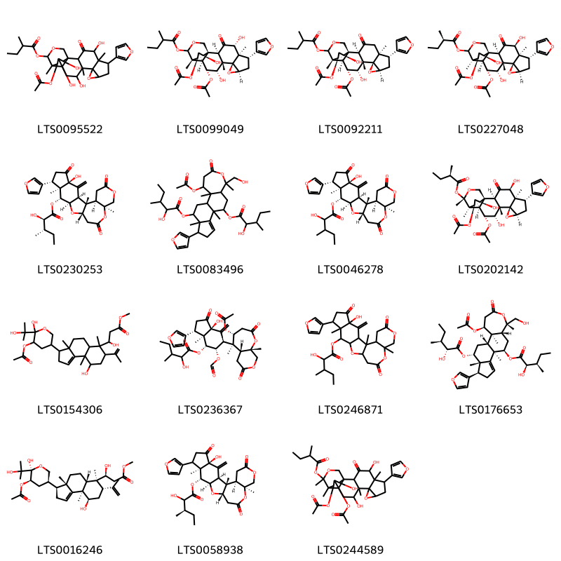{ width=100% }
    <figcaption>Hình ảnh cấu trúc hóa học của 15 hoạt chất thuộc nhóm Prenol lipids gồm ['21-(acetyloxy)-6-(furan-3-yl)-4,12,19,20-tetrahydroxy-5,11,15-trimethyl-3-oxo-9,17-dioxahexacyclo[13.3.3.0¹,¹⁴.0²,¹¹.0⁵,¹⁰.0⁸,¹⁰]henicosan-16-yl 2-methylbutanoate (LTS0095522)', '(1s,2r,4r,5r,6s,8r,10s,11s,12r,14r,15s,19r,20r,21s)-20,21-bis(acetyloxy)-6-(furan-3-yl)-4,12,19-trihydroxy-5,11,15-trimethyl-3-oxo-9,17-dioxahexacyclo[13.3.3.0¹,¹⁴.0²,¹¹.0⁵,¹⁰.0⁸,¹⁰]henicosan-16-yl 2-methylbutanoate (LTS0099049)', '(1s,2r,5s,6s,8r,10r,11s,12r,14r,15s,19r,20r,21s)-20,21-bis(acetyloxy)-6-(furan-3-yl)-12,19-dihydroxy-5,11,15-trimethyl-3-oxo-9,17-dioxahexacyclo[13.3.3.0¹,¹⁴.0²,¹¹.0⁵,¹⁰.0⁸,¹⁰]henicosan-16-yl 2-methylbutanoate (LTS0092211)', '(1s,2r,4s,5r,6s,8r,10s,11s,12r,14r,15r,19r,20r,21s)-20,21-bis(acetyloxy)-6-(furan-3-yl)-4,12,19-trihydroxy-5,11,15-trimethyl-3-oxo-9,17-dioxahexacyclo[13.3.3.0¹,¹⁴.0²,¹¹.0⁵,¹⁰.0⁸,¹⁰]henicosan-16-yl (2r)-2-methylbutanoate (LTS0227048)', '(1r,2r,4s,7s,8r,9r,10r,12s,16s,21r)-7-(furan-3-yl)-4-hydroxy-1,8,16-trimethyl-3-methylidene-5,14,19-trioxo-11,15,18-trioxapentacyclo[10.9.0.0²,¹⁰.0⁴,⁸.0¹⁶,²¹]henicosan-9-yl (2r,3s)-2-hydroxy-3-methylpentanoate (LTS0230253)', '3-(acetyloxy)-15-(furan-3-yl)-10-[(2-hydroxy-3-methylpentanoyl)oxy]-7-(hydroxymethyl)-2,7,11,16-tetramethyl-5-oxo-6-oxatetracyclo[9.7.0.0²,⁸.0¹²,¹⁶]octadec-12-en-17-yl 2-hydroxy-3-methylpentanoate (LTS0083496)', '(1r,2r,4s,7s,8r,9r,10r,12s,16s,21r)-7-(furan-3-yl)-4-hydroxy-1,8,16-trimethyl-3-methylidene-5,14,19-trioxo-11,15,18-trioxapentacyclo[10.9.0.0²,¹⁰.0⁴,⁸.0¹⁶,²¹]henicosan-9-yl 2-hydroxy-3-methylpentanoate (LTS0046278)', '(1s,2r,4s,5r,6s,8r,10s,11s,12r,14r,15r,16s,19r,20r,21s)-20,21-bis(acetyloxy)-6-(furan-3-yl)-4,12,19-trihydroxy-5,11,15,16-tetramethyl-3-oxo-9,17-dioxahexacyclo[13.3.3.0¹,¹⁴.0²,¹¹.0⁵,¹⁰.0⁸,¹⁰]henicosan-16-yl (2r)-2-methylbutanoate (LTS0202142)', 'methyl 3-{3-[5-(acetyloxy)-6-hydroxy-6-(2-hydroxypropan-2-yl)oxan-3-yl]-9-hydroxy-3a,6,9a-trimethyl-7-(prop-1-en-2-yl)-2h,3h,4h,5h,5ah,7h,8h,9h-cyclopenta[a]naphthalen-6-yl}-3-hydroxypropanoate (LTS0154306)', '(3s,3ar,4r,5s,6r,7as)-6-[(4r,5r,5ar,9as)-4-(acetyloxy)-5,9a-dimethyl-2,7-dioxo-tetrahydro-3h-pyrano[3,4-b]oxepin-5-yl]-5-(formyloxy)-3-(furan-3-yl)-7a-hydroxy-3a-methyl-7-methylidene-1-oxo-tetrahydro-2h-inden-4-yl 2-hydroxy-3-methylpentanoate (LTS0236367)', '7-(furan-3-yl)-4-hydroxy-1,8,16-trimethyl-3-methylidene-5,14,19-trioxo-11,15,18-trioxapentacyclo[10.9.0.0²,¹⁰.0⁴,⁸.0¹⁶,²¹]henicosan-9-yl 2-hydroxy-3-methylpentanoate (LTS0246871)', '(1r,2r,3s,7s,8r,10r,11r,15s,16s,17r)-3-(acetyloxy)-15-(furan-3-yl)-10-{[(2r,3r)-2-hydroxy-3-methylpentanoyl]oxy}-7-(hydroxymethyl)-2,7,11,16-tetramethyl-5-oxo-6-oxatetracyclo[9.7.0.0²,⁸.0¹²,¹⁶]octadec-12-en-17-yl (2r,3s)-2-hydroxy-3-methylpentanoate (LTS0176653)', 'methyl (3s)-3-[(3s,3as,5ar,6s,7s,9r,9ar)-3-[(3r,5r,6s)-5-(acetyloxy)-6-hydroxy-6-(2-hydroxypropan-2-yl)oxan-3-yl]-9-hydroxy-3a,6,9a-trimethyl-7-(prop-1-en-2-yl)-2h,3h,4h,5h,5ah,7h,8h,9h-cyclopenta[a]naphthalen-6-yl]-3-hydroxypropanoate (LTS0016246)', '(1r,2r,4s,8r,9r,10r,12s,16s,21r)-7-(furan-3-yl)-4-hydroxy-1,8,16-trimethyl-3-methylidene-5,14,19-trioxo-11,15,18-trioxapentacyclo[10.9.0.0²,¹⁰.0⁴,⁸.0¹⁶,²¹]henicosan-9-yl (3r)-2-hydroxy-3-methylpentanoate (LTS0058938)', '20,21-bis(acetyloxy)-6-(furan-3-yl)-4,12,19-trihydroxy-5,11,15,16-tetramethyl-3-oxo-9,17-dioxahexacyclo[13.3.3.0¹,¹⁴.0²,¹¹.0⁵,¹⁰.0⁸,¹⁰]henicosan-16-yl 2-methylbutanoate (LTS0244589)'].</figcaption>
</figure>
#### Nhóm Steroids and steroid derivatives
<figure markdown="span">
    { width=100% }
    <figcaption>Hình ảnh cấu trúc hóa học của 2 hoạt chất thuộc nhóm Steroids and steroid derivatives gồm ['sitogluside (LTS0201798)', '2-{[1-(5-ethyl-6-methylheptan-2-yl)-9a,11a-dimethyl-1h,2h,3h,3ah,3bh,4h,6h,7h,8h,9h,9bh,10h,11h-cyclopenta[a]phenanthren-7-yl]oxy}-6-(hydroxymethyl)oxane-3,4,5-triol (LTS0158828)'].</figcaption>
</figure>

---

### Dược dân tộc học

Danh sách các quốc gia có sử dụng *Trichilia emetica* trong điều trị các bệnh. 

| Country         | Disease        | Bệnh                                                                                                                                                                                                |
|:----------------|:---------------|:----------------------------------------------------------------------------------------------------------------------------------------------------------------------------------------------------|
| Africa          | Soap, Poison   | MYMEMORY WARNING: YOU USED ALL AVAILABLE FREE TRANSLATIONS FOR TODAY. NEXT AVAILABLE IN  06 HOURS 18 MINUTES 55 SECONDS VISIT HTTPS://MYMEMORY.TRANSLATED.NET/DOC/USAGELIMITS.PHP TO TRANSLATE MORE |
| Africa(Swahili) | Emetic, Poison | MYMEMORY WARNING: YOU USED ALL AVAILABLE FREE TRANSLATIONS FOR TODAY. NEXT AVAILABLE IN  06 HOURS 18 MINUTES 49 SECONDS VISIT HTTPS://MYMEMORY.TRANSLATED.NET/DOC/USAGELIMITS.PHP TO TRANSLATE MORE |
| Sudan           | Emetic         | MYMEMORY WARNING: YOU USED ALL AVAILABLE FREE TRANSLATIONS FOR TODAY. NEXT AVAILABLE IN  06 HOURS 18 MINUTES 42 SECONDS VISIT HTTPS://MYMEMORY.TRANSLATED.NET/DOC/USAGELIMITS.PHP TO TRANSLATE MORE |

---

---
## Trichilia havanensis
### Thông tin về thực vật

!!! info "Phân loại thực vật của *Trichilia havanensis* từ GIBF:"
    - **Kingdom:** Plantae
    - **Phylum:** Tracheophyta
    - **Order:** Sapindales
    - **Family:** Meliaceae
    - **Genus:** Trichilia
    - **Species:** *Trichilia havanensis*

 

| Label (VI)   | Label (EN)   | Scientific Name      | Descriptions (VI)   | Descriptions (EN)   | Also Known As (VI)   | Also Known As (EN)   |
|:-------------|:-------------|:---------------------|:--------------------|:--------------------|:---------------------|:---------------------|
| N/A          | N/A          | Trichilia havanensis | loài thực vật       | species of plant    | ['']                 | ['']                 |

#### Phân bố trên thế giới

**Từ CSDL GIBF** Nicaragua, Belize, Haiti, Guatemala, Colombia, Argentina, Costa Rica, Honduras, Jamaica, Cuba, Cayman Islands, Dominican Republic, Mexico, El Salvador

#### Phân bố tại Việt Nam

**Từ CSDL GIBF**: Không có ghi nhận ở Việt Nam

---
### Thành phần hóa học
        
- Theo cơ sở dữ liệu lotus: Từ loài *Trichilia havanensis* đã phân lập và xác định được 20 hoạt chất thuộc về các nhóm Lactones, Prenol lipids, Steroids and steroid derivatives. 

|    | chemicalTaxonomyClassyfireClass   |   smiles_count |
|---:|:----------------------------------|---------------:|
|  0 | Lactones                          |              3 |
|  1 | Prenol lipids                     |             15 |
|  2 | Steroids and steroid derivatives  |              2 |

#### Nhóm Lactones
<figure markdown="span">
    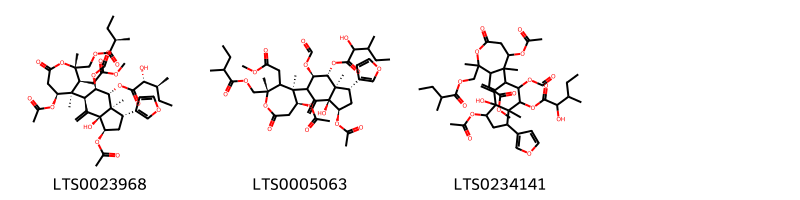{ width=100% }
    <figcaption>Hình ảnh cấu trúc hóa học của 3 hoạt chất thuộc nhóm Lactones gồm ['(1r,3s,3ar,4r,5r,6r,7as)-1-(acetyloxy)-6-[(2s,3s,4r,5s)-5-(acetyloxy)-3-(2-methoxy-2-oxoethyl)-2,4-dimethyl-2-({[(2r)-2-methylbutanoyl]oxy}methyl)-7-oxooxepan-4-yl]-5-(formyloxy)-3-(furan-3-yl)-7a-hydroxy-3a-methyl-7-methylidene-hexahydroinden-4-yl (2r,3s)-2-hydroxy-3-methylpentanoate (LTS0023968)', '(1r,3s,3ar,4r,5r,7as)-1-(acetyloxy)-6-[(2s,4r,5s)-5-(acetyloxy)-3-(2-methoxy-2-oxoethyl)-2,4-dimethyl-2-{[(2-methylbutanoyl)oxy]methyl}-7-oxooxepan-4-yl]-5-(formyloxy)-3-(furan-3-yl)-7a-hydroxy-3a-methyl-7-methylidene-hexahydroinden-4-yl 2-hydroxy-3-methylpentanoate (LTS0005063)', '1-(acetyloxy)-6-[5-(acetyloxy)-3-(2-methoxy-2-oxoethyl)-2,4-dimethyl-2-{[(2-methylbutanoyl)oxy]methyl}-7-oxooxepan-4-yl]-5-(formyloxy)-3-(furan-3-yl)-7a-hydroxy-3a-methyl-7-methylidene-hexahydroinden-4-yl 2-hydroxy-3-methylpentanoate (LTS0234141)'].</figcaption>
</figure>
#### Nhóm Prenol lipids
<figure markdown="span">
    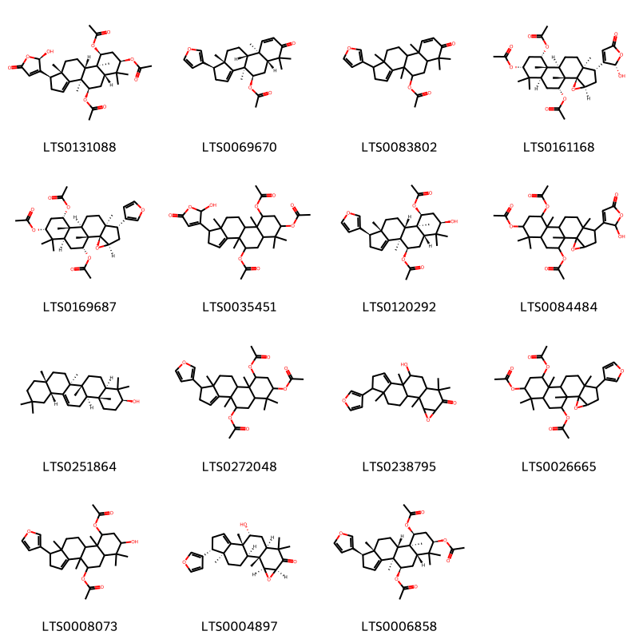{ width=100% }
    <figcaption>Hình ảnh cấu trúc hóa học của 15 hoạt chất thuộc nhóm Prenol lipids gồm ['(1r,3br,4r,5as,7r,9s,9as,9br,11as)-7,9-bis(acetyloxy)-1-[(2r)-2-hydroxy-5-oxo-2h-furan-3-yl]-3b,6,6,9a,11a-pentamethyl-1h,2h,4h,5h,5ah,7h,8h,9h,9bh,10h,11h-cyclopenta[a]phenanthren-4-yl acetate (LTS0131088)', 'azadirone (LTS0069670)', '1-(furan-3-yl)-3b,6,6,9a,11a-pentamethyl-7-oxo-1h,2h,4h,5h,5ah,9bh,10h,11h-cyclopenta[a]phenanthren-4-yl acetate (LTS0083802)', '(1s,2r,4r,6r,7s,10r,11s,12s,14r,16s,18r)-12,14-bis(acetyloxy)-6-[(2s)-2-hydroxy-5-oxo-2h-furan-3-yl]-1,7,11,15,15-pentamethyl-3-oxapentacyclo[8.8.0.0²,⁴.0²,⁷.0¹¹,¹⁶]octadecan-18-yl acetate (LTS0161168)', '(1s,2r,4r,6s,7s,10r,11s,12s,14r,16s,18r)-12,14-bis(acetyloxy)-6-(furan-3-yl)-1,7,11,15,15-pentamethyl-3-oxapentacyclo[8.8.0.0²,⁴.0²,⁷.0¹¹,¹⁶]octadecan-18-yl acetate (LTS0169687)', '7,9-bis(acetyloxy)-1-(2-hydroxy-5-oxo-2h-furan-3-yl)-3b,6,6,9a,11a-pentamethyl-1h,2h,4h,5h,5ah,7h,8h,9h,9bh,10h,11h-cyclopenta[a]phenanthren-4-yl acetate (LTS0035451)', '(1r,3br,4r,5as,7r,9s,9as,9br,11as)-9-(acetyloxy)-1-(furan-3-yl)-7-hydroxy-3b,6,6,9a,11a-pentamethyl-1h,2h,4h,5h,5ah,7h,8h,9h,9bh,10h,11h-cyclopenta[a]phenanthren-4-yl acetate (LTS0120292)', '12,14-bis(acetyloxy)-6-(2-hydroxy-5-oxo-2h-furan-3-yl)-1,7,11,15,15-pentamethyl-3-oxapentacyclo[8.8.0.0²,⁴.0²,⁷.0¹¹,¹⁶]octadecan-18-yl acetate (LTS0084484)', 'β-amyrin (LTS0251864)', '7,9-bis(acetyloxy)-1-(furan-3-yl)-3b,6,6,9a,11a-pentamethyl-1h,2h,4h,5h,5ah,7h,8h,9h,9bh,10h,11h-cyclopenta[a]phenanthren-4-yl acetate (LTS0272048)', '15-(furan-3-yl)-10-hydroxy-2,7,7,11,16-pentamethyl-4-oxapentacyclo[9.7.0.0²,⁸.0³,⁵.0¹²,¹⁶]octadec-12-en-6-one (LTS0238795)', '12,14-bis(acetyloxy)-6-(furan-3-yl)-1,7,11,15,15-pentamethyl-3-oxapentacyclo[8.8.0.0²,⁴.0²,⁷.0¹¹,¹⁶]octadecan-18-yl acetate (LTS0026665)', '9-(acetyloxy)-1-(furan-3-yl)-7-hydroxy-3b,6,6,9a,11a-pentamethyl-1h,2h,4h,5h,5ah,7h,8h,9h,9bh,10h,11h-cyclopenta[a]phenanthren-4-yl acetate (LTS0008073)', '(1r,2r,3s,5s,8r,10r,11r,15r,16s)-15-(furan-3-yl)-10-hydroxy-2,7,7,11,16-pentamethyl-4-oxapentacyclo[9.7.0.0²,⁸.0³,⁵.0¹²,¹⁶]octadec-12-en-6-one (LTS0004897)', '(1r,3br,4r,5as,7r,9s,9as,9br,11as)-7,9-bis(acetyloxy)-1-(furan-3-yl)-3b,6,6,9a,11a-pentamethyl-1h,2h,4h,5h,5ah,7h,8h,9h,9bh,10h,11h-cyclopenta[a]phenanthren-4-yl acetate (LTS0006858)'].</figcaption>
</figure>
#### Nhóm Steroids and steroid derivatives
<figure markdown="span">
    { width=100% }
    <figcaption>Hình ảnh cấu trúc hóa học của 2 hoạt chất thuộc nhóm Steroids and steroid derivatives gồm ['stigmast-5-en-3-ol (LTS0071224)', 'stigmast-5-en-3-ol, (3β)- (LTS0204616)'].</figcaption>
</figure>

---

### Dược dân tộc học

Danh sách các quốc gia có sử dụng *Trichilia havanensis* trong điều trị các bệnh. 

| Country   | Disease   | Bệnh                                                                                                                                                                                                |
|:----------|:----------|:----------------------------------------------------------------------------------------------------------------------------------------------------------------------------------------------------|
| Mexico    | Poison    | MYMEMORY WARNING: YOU USED ALL AVAILABLE FREE TRANSLATIONS FOR TODAY. NEXT AVAILABLE IN  06 HOURS 18 MINUTES 09 SECONDS VISIT HTTPS://MYMEMORY.TRANSLATED.NET/DOC/USAGELIMITS.PHP TO TRANSLATE MORE |
| Venezuela | Poison    | MYMEMORY WARNING: YOU USED ALL AVAILABLE FREE TRANSLATIONS FOR TODAY. NEXT AVAILABLE IN  06 HOURS 18 MINUTES 07 SECONDS VISIT HTTPS://MYMEMORY.TRANSLATED.NET/DOC/USAGELIMITS.PHP TO TRANSLATE MORE |

---

---
## Trichilia hirta
### Thông tin về thực vật

!!! info "Phân loại thực vật của *Trichilia hirta* từ GIBF:"
    - **Kingdom:** Plantae
    - **Phylum:** Tracheophyta
    - **Order:** Sapindales
    - **Family:** Meliaceae
    - **Genus:** Trichilia
    - **Species:** *Trichilia hirta*

 

| Label (VI)   | Label (EN)   | Scientific Name   | Descriptions (VI)   | Descriptions (EN)   | Also Known As (VI)   | Also Known As (EN)   |
|:-------------|:-------------|:------------------|:--------------------|:--------------------|:---------------------|:---------------------|
| N/A          | N/A          | Trichilia hirta   | loài thực vật       | species of plant    | ['']                 | ['']                 |

#### Phân bố trên thế giới

**Từ CSDL GIBF** Belize, Ecuador, Puerto Rico, Virgin Islands (U.S.), Haiti, Colombia, Brazil, Dominican Republic, Mexico, Venezuela (Bolivarian Republic of)

#### Phân bố tại Việt Nam

**Từ CSDL GIBF**: Không có ghi nhận ở Việt Nam

---
### Thành phần hóa học
        
- Theo cơ sở dữ liệu lotus: Từ loài *Trichilia hirta* đã phân lập và xác định được 34 hoạt chất thuộc về các nhóm Prenol lipids, Steroids and steroid derivatives. 

|    | chemicalTaxonomyClassyfireClass   |   smiles_count |
|---:|:----------------------------------|---------------:|
|  0 | Prenol lipids                     |             14 |
|  1 | Steroids and steroid derivatives  |             19 |

#### Nhóm Prenol lipids
<figure markdown="span">
    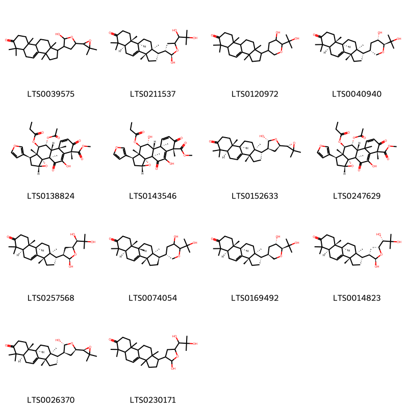{ width=100% }
    <figcaption>Hình ảnh cấu trúc hóa học của 14 hoạt chất thuộc nhóm Prenol lipids gồm ['1-[5-(3,3-dimethyloxiran-2-yl)-2-hydroxyoxolan-3-yl]-3a,6,6,9a,11a-pentamethyl-1h,2h,3h,5h,5ah,8h,9h,9bh,10h,11h-cyclopenta[a]phenanthren-7-one (LTS0039575)', '(1s,3as,5ar,9ar,9br,11as)-1-[(2r,3s)-5-(1,2-dihydroxy-2-methylpropyl)-2-hydroxyoxolan-3-yl]-3a,6,6,9a,11a-pentamethyl-1h,2h,3h,5h,5ah,8h,9h,9bh,10h,11h-cyclopenta[a]phenanthren-7-one (LTS0211537)', '1-[5-hydroxy-6-(2-hydroxypropan-2-yl)oxan-3-yl]-3a,6,6,9a,11a-pentamethyl-1h,2h,3h,5h,5ah,8h,9h,9bh,10h,11h-cyclopenta[a]phenanthren-7-one (LTS0120972)', '(1s,3as,5ar,9ar,9br,11as)-1-[(3s,5s,6s)-5-hydroxy-6-(2-hydroxypropan-2-yl)oxan-3-yl]-3a,6,6,9a,11a-pentamethyl-1h,2h,3h,5h,5ah,8h,9h,9bh,10h,11h-cyclopenta[a]phenanthren-7-one (LTS0040940)', 'methyl (1r,2r,4r,6s,7r,8r,9r,10r,11s,15r)-9-(acetyloxy)-6-(furan-3-yl)-17-hydroxy-1,7,11,15-tetramethyl-14,18-dioxo-8-(propanoyloxy)-3-oxapentacyclo[8.8.0.0²,⁴.0²,⁷.0¹¹,¹⁶]octadeca-12,16-diene-15-carboxylate (LTS0138824)', 'methyl (1r,2r,4r,6s,7r,8r,9r,10r,11r,15r)-6-(furan-3-yl)-9,17-dihydroxy-1,7,11,15-tetramethyl-14,18-dioxo-8-(propanoyloxy)-3-oxapentacyclo[8.8.0.0²,⁴.0²,⁷.0¹¹,¹⁶]octadeca-12,16-diene-15-carboxylate (LTS0143546)', '(1s,3as,5ar,9ar,9br,11as)-1-[(2r,3s,5r)-5-[(2s)-3,3-dimethyloxiran-2-yl]-2-hydroxyoxolan-3-yl]-3a,6,6,9a,11a-pentamethyl-1h,2h,3h,5h,5ah,8h,9h,9bh,10h,11h-cyclopenta[a]phenanthren-7-one (LTS0152633)', 'methyl (1r,2r,4r,6s,7r,8r,9r,10r,15r)-9-(acetyloxy)-6-(furan-3-yl)-17-hydroxy-1,7,11,15-tetramethyl-14,18-dioxo-8-(propanoyloxy)-3-oxapentacyclo[8.8.0.0²,⁴.0²,⁷.0¹¹,¹⁶]octadeca-12,16-diene-15-carboxylate (LTS0247629)', '(1s,3as,5ar,9ar,9br,11as)-1-[(2r,3r,5s)-5-[(1r)-1,2-dihydroxy-2-methylpropyl]-2-hydroxyoxolan-3-yl]-3a,6,6,9a,11a-pentamethyl-1h,2h,3h,5h,5ah,8h,9h,9bh,10h,11h-cyclopenta[a]phenanthren-7-one (LTS0257568)', '(1r,3as,5ar,9ar,9bs,11as)-1-[(3s)-5-hydroxy-6-(2-hydroxypropan-2-yl)oxan-3-yl]-3a,6,6,9a,11a-pentamethyl-1h,2h,3h,5h,5ah,8h,9h,9bh,10h,11h-cyclopenta[a]phenanthren-7-one (LTS0074054)', '(1s,3as,5ar,9ar,9br,11as)-1-[(3r,5s,6s)-5-hydroxy-6-(2-hydroxypropan-2-yl)oxan-3-yl]-3a,6,6,9a,11a-pentamethyl-1h,2h,3h,5h,5ah,8h,9h,9bh,10h,11h-cyclopenta[a]phenanthren-7-one (LTS0169492)', '(1s,3as,5ar,9ar,9br,11as)-1-[(2r,3s,5r)-5-[(1s)-1,2-dihydroxy-2-methylpropyl]-2-hydroxyoxolan-3-yl]-3a,6,6,9a,11a-pentamethyl-1h,2h,3h,5h,5ah,8h,9h,9bh,10h,11h-cyclopenta[a]phenanthren-7-one (LTS0014823)', '(1s,3as,5ar,9ar,9br,11as)-1-[(2r,3s,5r)-5-[(2r)-3,3-dimethyloxiran-2-yl]-2-hydroxyoxolan-3-yl]-3a,6,6,9a,11a-pentamethyl-1h,2h,3h,5h,5ah,8h,9h,9bh,10h,11h-cyclopenta[a]phenanthren-7-one (LTS0026370)', '1-[5-(1,2-dihydroxy-2-methylpropyl)-2-hydroxyoxolan-3-yl]-3a,6,6,9a,11a-pentamethyl-1h,2h,3h,5h,5ah,8h,9h,9bh,10h,11h-cyclopenta[a]phenanthren-7-one (LTS0230171)'].</figcaption>
</figure>
#### Nhóm Steroids and steroid derivatives
<figure markdown="span">
    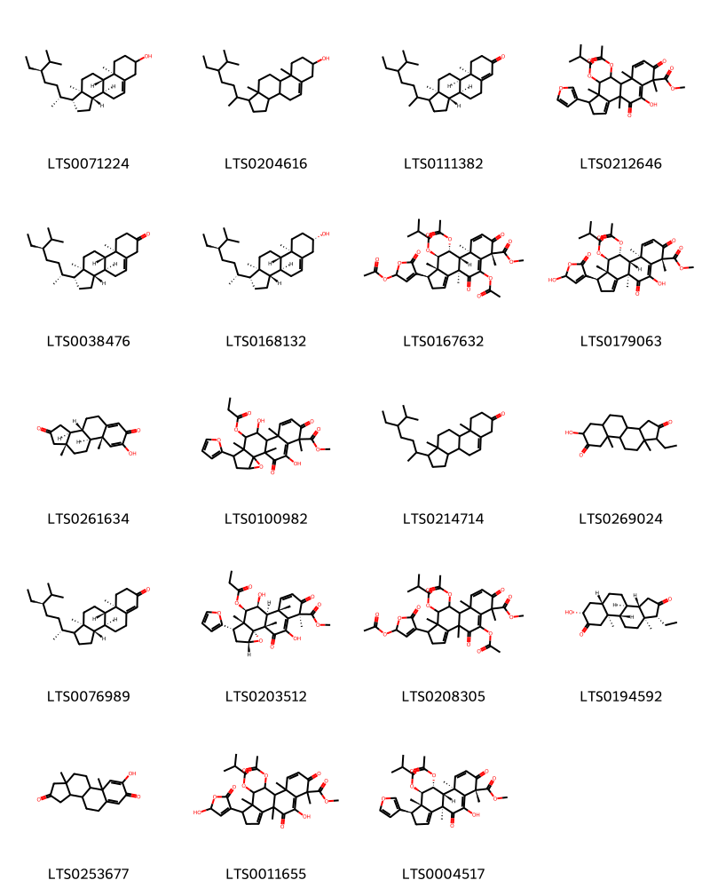{ width=100% }
    <figcaption>Hình ảnh cấu trúc hóa học của 19 hoạt chất thuộc nhóm Steroids and steroid derivatives gồm ['stigmast-5-en-3-ol (LTS0071224)', 'stigmast-5-en-3-ol, (3β)- (LTS0204616)', '(3as,3bs,9ar,9br,11ar)-1-(5-ethyl-6-methylheptan-2-yl)-9a,11a-dimethyl-1h,2h,3h,3ah,3bh,4h,5h,8h,9h,9bh,10h,11h-cyclopenta[a]phenanthren-7-one (LTS0111382)', 'methyl 10-(acetyloxy)-1-(furan-3-yl)-5-hydroxy-3b,6,9a,11a-tetramethyl-11-[(2-methylpropanoyl)oxy]-4,7-dioxo-1h,2h,9bh,10h,11h-cyclopenta[a]phenanthrene-6-carboxylate (LTS0212646)', '(1r,3as,3bs,9ar,9bs,11ar)-1-[(2r,5r)-5-ethyl-6-methylheptan-2-yl]-9a,11a-dimethyl-1h,2h,3h,3ah,3bh,4h,6h,8h,9h,9bh,10h,11h-cyclopenta[a]phenanthren-7-one (LTS0038476)', 'sitosterol (LTS0168132)', 'methyl (1r,3br,6r,9ar,9br,10r,11r,11as)-5,10-bis(acetyloxy)-1-[5-(acetyloxy)-2-oxo-5h-furan-3-yl]-3b,6,9a,11a-tetramethyl-11-[(2-methylpropanoyl)oxy]-4,7-dioxo-1h,2h,9bh,10h,11h-cyclopenta[a]phenanthrene-6-carboxylate (LTS0167632)', 'methyl (1r,3br,6r,9ar,9br,10r,11r,11as)-10-(acetyloxy)-5-hydroxy-1-(5-hydroxy-2-oxo-5h-furan-3-yl)-3b,6,9a,11a-tetramethyl-11-[(2-methylpropanoyl)oxy]-4,7-dioxo-1h,2h,9bh,10h,11h-cyclopenta[a]phenanthrene-6-carboxylate (LTS0179063)', '(3as,3bs,9as,9bs,11ar)-8-hydroxy-9a,11a-dimethyl-1h,3h,3ah,3bh,4h,5h,9bh,10h,11h-cyclopenta[a]phenanthrene-2,7-dione (LTS0261634)', 'methyl 6-(furan-2-yl)-9,17-dihydroxy-1,7,11,15-tetramethyl-14,18-dioxo-8-(propanoyloxy)-3-oxapentacyclo[8.8.0.0²,⁴.0²,⁷.0¹¹,¹⁶]octadeca-12,16-diene-15-carboxylate (LTS0100982)', '1-(5-ethyl-6-methylheptan-2-yl)-9a,11a-dimethyl-1h,2h,3h,3ah,3bh,4h,6h,8h,9h,9bh,10h,11h-cyclopenta[a]phenanthren-7-one (LTS0214714)', '1-ethyl-7-hydroxy-9a,11a-dimethyl-dodecahydro-1h-cyclopenta[a]phenanthrene-2,8-dione (LTS0269024)', '(3as,3bs,9ar,9bs,11ar)-1-[(2r,5r)-5-ethyl-6-methylheptan-2-yl]-9a,11a-dimethyl-1h,2h,3h,3ah,3bh,4h,5h,8h,9h,9bh,10h,11h-cyclopenta[a]phenanthren-7-one (LTS0076989)', 'methyl (1s,2r,4r,6s,7r,8r,9s,10s,11s,15s)-6-(furan-2-yl)-9,17-dihydroxy-1,7,11,15-tetramethyl-14,18-dioxo-8-(propanoyloxy)-3-oxapentacyclo[8.8.0.0²,⁴.0²,⁷.0¹¹,¹⁶]octadeca-12,16-diene-15-carboxylate (LTS0203512)', 'methyl 5,10-bis(acetyloxy)-1-[5-(acetyloxy)-2-oxo-5h-furan-3-yl]-3b,6,9a,11a-tetramethyl-11-[(2-methylpropanoyl)oxy]-4,7-dioxo-1h,2h,9bh,10h,11h-cyclopenta[a]phenanthrene-6-carboxylate (LTS0208305)', '(1r,3as,3br,5as,7r,9as,9bs,11as)-1-ethyl-7-hydroxy-9a,11a-dimethyl-dodecahydro-1h-cyclopenta[a]phenanthrene-2,8-dione (LTS0194592)', '8-hydroxy-9a,11a-dimethyl-1h,3h,3ah,3bh,4h,5h,9bh,10h,11h-cyclopenta[a]phenanthrene-2,7-dione (LTS0253677)', 'methyl 10-(acetyloxy)-5-hydroxy-1-(5-hydroxy-2-oxo-5h-furan-3-yl)-3b,6,9a,11a-tetramethyl-11-[(2-methylpropanoyl)oxy]-4,7-dioxo-1h,2h,9bh,10h,11h-cyclopenta[a]phenanthrene-6-carboxylate (LTS0011655)', 'methyl (1s,3br,6r,9ar,9br,10r,11r,11as)-10-(acetyloxy)-1-(furan-3-yl)-5-hydroxy-3b,6,9a,11a-tetramethyl-11-[(2-methylpropanoyl)oxy]-4,7-dioxo-1h,2h,9bh,10h,11h-cyclopenta[a]phenanthrene-6-carboxylate (LTS0004517)'].</figcaption>
</figure>

---

### Dược dân tộc học

Danh sách các quốc gia có sử dụng *Trichilia hirta* trong điều trị các bệnh. 

| Country            | Disease                                                    | Bệnh                                                                                                                                                                                                |
|:-------------------|:-----------------------------------------------------------|:----------------------------------------------------------------------------------------------------------------------------------------------------------------------------------------------------|
| Dominican Republic | Astringent, Sudorific                                      | MYMEMORY WARNING: YOU USED ALL AVAILABLE FREE TRANSLATIONS FOR TODAY. NEXT AVAILABLE IN  06 HOURS 17 MINUTES 30 SECONDS VISIT HTTPS://MYMEMORY.TRANSLATED.NET/DOC/USAGELIMITS.PHP TO TRANSLATE MORE |
| Guatemala          | Cosmetic                                                   | MYMEMORY WARNING: YOU USED ALL AVAILABLE FREE TRANSLATIONS FOR TODAY. NEXT AVAILABLE IN  06 HOURS 17 MINUTES 25 SECONDS VISIT HTTPS://MYMEMORY.TRANSLATED.NET/DOC/USAGELIMITS.PHP TO TRANSLATE MORE |
| Haiti              | Abortifacient, Emmenagogue, Poison, Stimulant, Insecticide | MYMEMORY WARNING: YOU USED ALL AVAILABLE FREE TRANSLATIONS FOR TODAY. NEXT AVAILABLE IN  06 HOURS 17 MINUTES 21 SECONDS VISIT HTTPS://MYMEMORY.TRANSLATED.NET/DOC/USAGELIMITS.PHP TO TRANSLATE MORE |
| Mexico             | Purgative                                                  | MYMEMORY WARNING: YOU USED ALL AVAILABLE FREE TRANSLATIONS FOR TODAY. NEXT AVAILABLE IN  06 HOURS 17 MINUTES 16 SECONDS VISIT HTTPS://MYMEMORY.TRANSLATED.NET/DOC/USAGELIMITS.PHP TO TRANSLATE MORE |

---

