!!! abstract "Tóm tắt"

    Họ Meniermaceae gồm khoảng 21 chi và 57 loài được một số cộng đồng tại các quốc gia như Turkey, Africa, South America, Indochina, Australia, Guiana, Guatemala, Brazil, French, Philippines, US, India(Gujarat), Dutch, Dominican Republic, Mexico, Malaya, China, Nigeria, Upper Volta, English, German, Mexico(Chinantec), India, Elsewhere, Java, Venezuela, Brazil(Deni), Japan*, Asia, Malaysia, Zaire, Vietnam sử dụng trong một số trường hợp QUERY LENGTH LIMIT EXCEEDED. MAX ALLOWED QUERY : 500 CHARS MYMEMORY WARNING: YOU USED ALL AVAILABLE FREE TRANSLATIONS FOR TODAY. NEXT AVAILABLE IN  19 HOURS 15 MINUTES 23 SECONDS VISIT HTTPS://MYMEMORY.TRANSLATED.NET/DOC/USAGELIMITS.PHP TO TRANSLATE MORE.

!!! info "DrDuke"

    James A. Duke sinh năm 1929-2017 là một nhà thực vật học người Mỹ. Đây là một trong những tác giả hàng đầu trong lĩnh vực dược dân tộc học với cuốn *CRC Handbook of Medicinal Herbs* và chính là người xây dựng lên cơ sở dữ liệu về hợp chất tự nhiên và dược dân tộc học tại Bộ nông nghiệp Hoa Kỳ. Các thông tin được đăng tải tại website [Dr. Duke's Phytochemical and Ethnobotanical Databases](https://phytochem.nal.usda.gov/). 
    Trong suốt thập niên 1970, ông lãnh đạo the Plant Taxonomy Laboratory, Plant Genetics and Germplasm Institute of the Agricultural Research Service, U.S. Department of Agriculture.
    Trong tài liệu này, các thông tin về dược dân tộc của các dược liệu được trích dẫn từ tài liệu của James A. Ducke với sự trợ giúp của phần mềm dịch thuật từ tiếng Anh sang tiếng Việt.
   

# Chi Cocculus

??? note "Danh sách các dược liệu thuộc chi"
    
	 - *Cocculus filipendula*
	 - *Cocculus hirsutus*
	 - *Cocculus japonicus?*
	 - *Cocculus laurifolius*
	 - *Cocculus leaeba*
	 - *Cocculus pendulus*
	 - *Cocculus sarmentosus*
	 - *Cocculus thunbergii?*
	 - *Cocculus trilobus*

---
## Cocculus filipendula
### Thông tin về thực vật

!!! info "Phân loại thực vật của *Ungulipetalum filipendulum* từ GIBF:"
    - **Kingdom:** Plantae
    - **Phylum:** Tracheophyta
    - **Order:** Ranunculales
    - **Family:** Menispermaceae
    - **Genus:** Ungulipetalum
    - **Species:** *Ungulipetalum filipendulum*

 

| Label (VI)   | Label (EN)   | Scientific Name      | Descriptions (VI)   | Descriptions (EN)   | Also Known As (VI)   | Also Known As (EN)   |
|:-------------|:-------------|:---------------------|:--------------------|:--------------------|:---------------------|:---------------------|
| N/A          | N/A          | Cocculus filipendula | loài thực vật       | species of plant    | ['']                 | ['']                 |

#### Phân bố trên thế giới

**Từ CSDL GIBF** nan, Brazil

#### Phân bố tại Việt Nam

**Từ CSDL GIBF**: Không có ghi nhận ở Việt Nam

---
### Thành phần hóa học
        
- Theo cơ sở dữ liệu lotus: Từ loài *Ungulipetalum filipendulum* đã phân lập và xác định được Chưa có hoạt chất nào được phân lập. hoạt chất thuộc về các nhóm Không có hoạt chất nào được phân lập. 

Không có hình ảnh nào được tạo ra

---

### Dược dân tộc học

Danh sách các quốc gia có sử dụng *Ungulipetalum filipendulum* trong điều trị các bệnh. 

| Country   | Disease             | Bệnh                                                                                                                                                                                                |
|:----------|:--------------------|:----------------------------------------------------------------------------------------------------------------------------------------------------------------------------------------------------|
| Elsewhere | Emmenagogue, Poison | MYMEMORY WARNING: YOU USED ALL AVAILABLE FREE TRANSLATIONS FOR TODAY. NEXT AVAILABLE IN  19 HOURS 15 MINUTES 20 SECONDS VISIT HTTPS://MYMEMORY.TRANSLATED.NET/DOC/USAGELIMITS.PHP TO TRANSLATE MORE |

---

---
## Cocculus hirsutus
### Thông tin về thực vật

!!! info "Phân loại thực vật của *Cocculus hirsutus* từ GIBF:"
    - **Kingdom:** Plantae
    - **Phylum:** Tracheophyta
    - **Order:** Ranunculales
    - **Family:** Menispermaceae
    - **Genus:** Cocculus
    - **Species:** *Cocculus hirsutus*

 

| Label (VI)   | Label (EN)   | Scientific Name   | Descriptions (VI)   | Descriptions (EN)   | Also Known As (VI)   | Also Known As (EN)                                               |
|:-------------|:-------------|:------------------|:--------------------|:--------------------|:---------------------|:-----------------------------------------------------------------|
| N/A          | N/A          | Cocculus hirsutus |                     | species of plant    | ['']                 | ['Broom Creeper', 'Bushveld Moonseed Creeper', 'Python Climber'] |

#### Phân bố trên thế giới

**Từ CSDL GIBF** Sri Lanka, Angola, Myanmar, Mozambique, unknown or invalid, Tanzania, United Republic of, Yemen, Malawi, Pakistan, Zambia, Namibia, Bangladesh, Zimbabwe, Saudi Arabia, South Africa, Eswatini, China, Botswana, India

#### Phân bố tại Việt Nam

**Từ CSDL GIBF**: Không có ghi nhận ở Việt Nam

---
### Thành phần hóa học
        
- Theo cơ sở dữ liệu lotus: Từ loài *Cocculus hirsutus* đã phân lập và xác định được 21 hoạt chất thuộc về các nhóm Fatty Acyls, Aporphines, Corynanthean-type alkaloids, Depsides and depsidones, Tetrahydroisoquinolines, Isoquinolines and derivatives. 

|    | chemicalTaxonomyClassyfireClass   |   smiles_count |
|---:|:----------------------------------|---------------:|
|  0 |                                   |              2 |
|  1 | Aporphines                        |              1 |
|  2 | Corynanthean-type alkaloids       |              1 |
|  3 | Depsides and depsidones           |              1 |
|  4 | Fatty Acyls                       |              3 |
|  5 | Isoquinolines and derivatives     |             10 |
|  6 | Tetrahydroisoquinolines           |              3 |

#### Nhóm 
<figure markdown="span">
    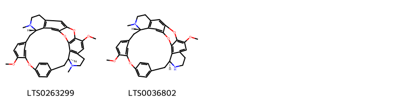{ width=100% }
    <figcaption>Hình ảnh cấu trúc hóa học của 2 hoạt chất thuộc nhóm  gồm ['(8s,21s)-13,27-dimethoxy-7,22-dimethyl-15,29,31-trioxa-7,22-diazaoctacyclo[19.9.3.2¹⁶,¹⁹.1⁴,³⁰.1¹⁰,¹⁴.0³,⁸.0²⁵,³³.0²⁸,³²]heptatriaconta-1,3,10,12,14(37),16,18,25(33),26,28(32),30(34),35-dodecaene (LTS0263299)', '(8s,21s)-13,27-dimethoxy-7-methyl-15,29,31-trioxa-7,22-diazaoctacyclo[19.9.3.2¹⁶,¹⁹.1⁴,³⁰.1¹⁰,¹⁴.0³,⁸.0²⁵,³³.0²⁸,³²]heptatriaconta-1,3,10,12,14(37),16,18,25,27,30(34),32,35-dodecaene (LTS0036802)'].</figcaption>
</figure>
#### Nhóm Aporphines
<figure markdown="span">
    { width=100% }
    <figcaption>Hình ảnh cấu trúc hóa học của 1 hoạt chất thuộc nhóm Aporphines gồm ['magnoflorine (LTS0120825)'].</figcaption>
</figure>
#### Nhóm Corynanthean-type alkaloids
<figure markdown="span">
    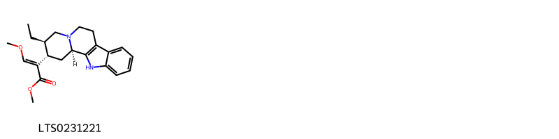{ width=100% }
    <figcaption>Hình ảnh cấu trúc hóa học của 1 hoạt chất thuộc nhóm Corynanthean-type alkaloids gồm ['hirsutine (LTS0231221)'].</figcaption>
</figure>
#### Nhóm Depsides and depsidones
<figure markdown="span">
    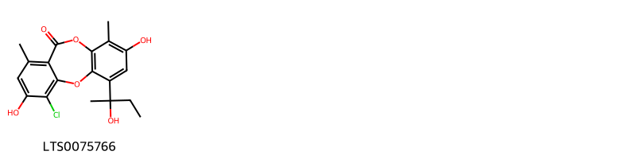{ width=100% }
    <figcaption>Hình ảnh cấu trúc hóa học của 1 hoạt chất thuộc nhóm Depsides and depsidones gồm ['15-chloro-6,14-dihydroxy-4-(2-hydroxybutan-2-yl)-7,12-dimethyl-2,9-dioxatricyclo[9.4.0.0³,⁸]pentadeca-1(15),3(8),4,6,11,13-hexaen-10-one (LTS0075766)'].</figcaption>
</figure>
#### Nhóm Fatty Acyls
<figure markdown="span">
    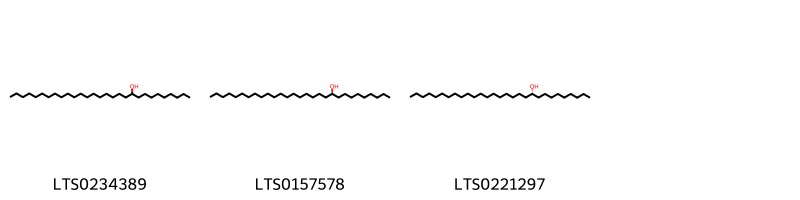{ width=100% }
    <figcaption>Hình ảnh cấu trúc hóa học của 3 hoạt chất thuộc nhóm Fatty Acyls gồm ['nonacosan-10-ol (LTS0234389)', '(s)-nonacosan-10-ol (LTS0157578)', '(r)-nonacosan-10-ol (LTS0221297)'].</figcaption>
</figure>
#### Nhóm Isoquinolines and derivatives
<figure markdown="span">
    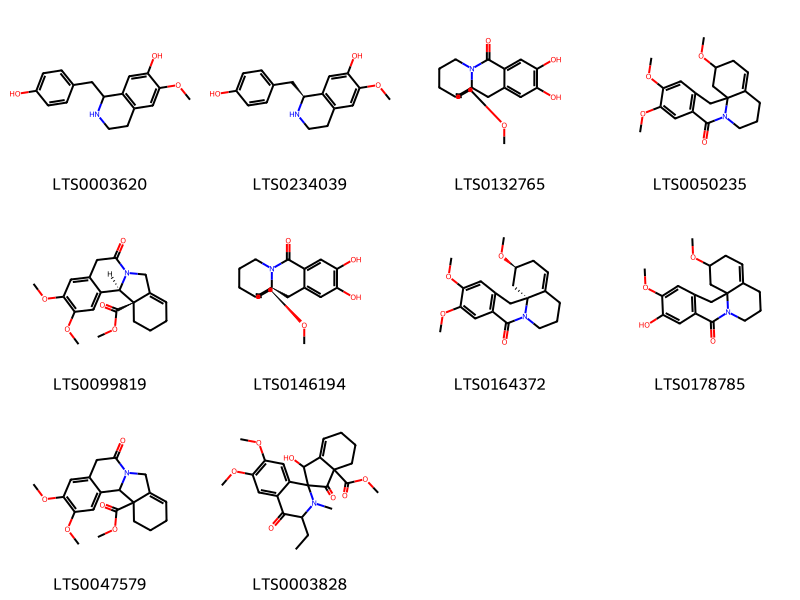{ width=100% }
    <figcaption>Hình ảnh cấu trúc hóa học của 10 hoạt chất thuộc nhóm Isoquinolines and derivatives gồm ['(rs)-coclaurine (LTS0003620)', '(+-)-coclaurine (LTS0234039)', '8,9-dihydroxy-3-methoxy-,,2,3,4,11-hexahydro-h-5a-azatetraphen-6-one (LTS0132765)', '3,8,9-trimethoxy-,,2,3,4,11-hexahydro-h-5a-azatetraphen-6-one (LTS0050235)', 'methyl (12ar,12br)-2,3-dimethoxy-6-oxo-5h,8h,10h,11h,12h,12bh-isoindolo[1,2-a]isoquinoline-12a-carboxylate (LTS0099819)', '(3s,11ar)-8,9-dihydroxy-3-methoxy-,,2,3,4,11-hexahydro-h-5a-azatetraphen-6-one (LTS0146194)', '(3s,11ar)-3,8,9-trimethoxy-,,2,3,4,11-hexahydro-h-5a-azatetraphen-6-one (LTS0164372)', '8-hydroxy-3,9-dimethoxy-,,2,3,4,11-hexahydro-h-5a-azatetraphen-6-one (LTS0178785)', 'methyl 2,3-dimethoxy-6-oxo-5h,8h,10h,11h,12h,12bh-isoindolo[1,2-a]isoquinoline-12a-carboxylate (LTS0047579)', "methyl 3'-ethyl-1-hydroxy-6',7'-dimethoxy-2'-methyl-3,4'-dioxo-1,4,5,6-tetrahydro-3'h-spiro[indene-2,1'-isoquinoline]-3a-carboxylate (LTS0003828)"].</figcaption>
</figure>
#### Nhóm Tetrahydroisoquinolines
<figure markdown="span">
    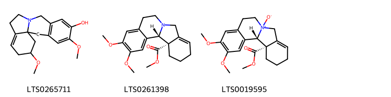{ width=100% }
    <figcaption>Hình ảnh cấu trúc hóa học của 3 hoạt chất thuộc nhóm Tetrahydroisoquinolines gồm ['2,11-dimethoxy-1h,2h,3h,5h,6h,8h,13h-indolo[1,7a-b]isoquinolin-10-ol (LTS0265711)', 'methyl (12as,12bs)-2,3-dimethoxy-5h,6h,8h,10h,11h,12h,12bh-isoindolo[1,2-a]isoquinoline-12a-carboxylate (LTS0261398)', '(12as,12bs)-2,3-dimethoxy-12a-(methoxycarbonyl)-5h,6h,8h,10h,11h,12h,12bh-isoindolo[1,2-a]isoquinolin-7-ium-7-olate (LTS0019595)'].</figcaption>
</figure>

---

### Dược dân tộc học

Danh sách các quốc gia có sử dụng *Cocculus hirsutus* trong điều trị các bệnh. 

| Country   | Disease             | Bệnh                                                                                                                                                                                                |
|:----------|:--------------------|:----------------------------------------------------------------------------------------------------------------------------------------------------------------------------------------------------|
| Elsewhere | Demulcent, Laxative | MYMEMORY WARNING: YOU USED ALL AVAILABLE FREE TRANSLATIONS FOR TODAY. NEXT AVAILABLE IN  19 HOURS 15 MINUTES 03 SECONDS VISIT HTTPS://MYMEMORY.TRANSLATED.NET/DOC/USAGELIMITS.PHP TO TRANSLATE MORE |

---

---
## Cocculus japonicus
### Thông tin về thực vật

!!! info "Phân loại thực vật của *Stephania japonica* từ GIBF:"
    - **Kingdom:** Plantae
    - **Phylum:** Tracheophyta
    - **Order:** Ranunculales
    - **Family:** Menispermaceae
    - **Genus:** Stephania
    - **Species:** *Stephania japonica*

 

| Label (VI)   | Label (EN)   | Scientific Name    | Descriptions (VI)   | Descriptions (EN)   | Also Known As (VI)   | Also Known As (EN)   |
|:-------------|:-------------|:-------------------|:--------------------|:--------------------|:---------------------|:---------------------|
| N/A          | N/A          | Cocculus japonicus |                     |                     | ['']                 | ['']                 |

#### Phân bố trên thế giới

**Từ CSDL GIBF** Sri Lanka, Angola, Myanmar, Mozambique, unknown or invalid, Tanzania, United Republic of, Yemen, Malawi, Pakistan, Zambia, Namibia, Bangladesh, Zimbabwe, Saudi Arabia, South Africa, Eswatini, China, Botswana, India

#### Phân bố tại Việt Nam

**Từ CSDL GIBF**: Không có ghi nhận ở Việt Nam

---
### Thành phần hóa học
        
- Theo cơ sở dữ liệu lotus: Từ loài *Stephania japonica* đã phân lập và xác định được Chưa có hoạt chất nào được phân lập. hoạt chất thuộc về các nhóm Không có hoạt chất nào được phân lập. 

Không có hình ảnh nào được tạo ra

---

### Dược dân tộc học

Danh sách các quốc gia có sử dụng *Stephania japonica* trong điều trị các bệnh. 

| Country   | Disease   | Bệnh                                                                                                                                                                                                |
|:----------|:----------|:----------------------------------------------------------------------------------------------------------------------------------------------------------------------------------------------------|
| China     | Diuretic  | MYMEMORY WARNING: YOU USED ALL AVAILABLE FREE TRANSLATIONS FOR TODAY. NEXT AVAILABLE IN  19 HOURS 14 MINUTES 36 SECONDS VISIT HTTPS://MYMEMORY.TRANSLATED.NET/DOC/USAGELIMITS.PHP TO TRANSLATE MORE |

---

---
## Cocculus laurifolius
### Thông tin về thực vật

!!! info "Phân loại thực vật của *Cocculus laurifolius* từ GIBF:"
    - **Kingdom:** Plantae
    - **Phylum:** Tracheophyta
    - **Order:** Ranunculales
    - **Family:** Menispermaceae
    - **Genus:** Cocculus
    - **Species:** *Cocculus laurifolius*

 

| Label (VI)   | Label (EN)   | Scientific Name      | Descriptions (VI)   | Descriptions (EN)   | Also Known As (VI)   | Also Known As (EN)   |
|:-------------|:-------------|:---------------------|:--------------------|:--------------------|:---------------------|:---------------------|
| N/A          | N/A          | Cocculus laurifolius | loài thực vật       | species of plant    | ['']                 | ['']                 |

#### Phân bố trên thế giới

**Từ CSDL GIBF** nan, Japan, Belgium, Lao People’s Democratic Republic, Cambodia, Argentina, unknown or invalid, Chinese Taipei, Spain, Portugal, Russian Federation, Morocco, United States of America, Thailand, Bhutan, Viet Nam, China, India, Indonesia, Nepal

#### Phân bố tại Việt Nam

**Từ CSDL GIBF**: Quang Binh, Cao Bang, Ninh Binh, Ha Giang

---
### Thành phần hóa học
        
- Theo cơ sở dữ liệu lotus: Từ loài *Cocculus laurifolius* đã phân lập và xác định được 75 hoạt chất thuộc về các nhóm Phenol ethers, Benzazepines, Proaporphines, Prenol lipids, Erythrina alkaloids, Phthalide isoquinolines, Phenanthrenes and derivatives, Aporphines, Benzofurans, Benzene and substituted derivatives, Organooxygen compounds, Isoquinolines and derivatives, Protoberberine alkaloids and derivatives. 

|    | chemicalTaxonomyClassyfireClass          |   smiles_count |
|---:|:-----------------------------------------|---------------:|
|  0 |                                          |              2 |
|  1 | Aporphines                               |              6 |
|  2 | Benzazepines                             |              2 |
|  3 | Benzene and substituted derivatives      |              5 |
|  4 | Benzofurans                              |              2 |
|  5 | Erythrina alkaloids                      |             33 |
|  6 | Isoquinolines and derivatives            |              4 |
|  7 | Organooxygen compounds                   |              2 |
|  8 | Phenanthrenes and derivatives            |              2 |
|  9 | Phenol ethers                            |              4 |
| 10 | Phthalide isoquinolines                  |              2 |
| 11 | Prenol lipids                            |              1 |
| 12 | Proaporphines                            |              3 |
| 13 | Protoberberine alkaloids and derivatives |              7 |

#### Nhóm 
<figure markdown="span">
    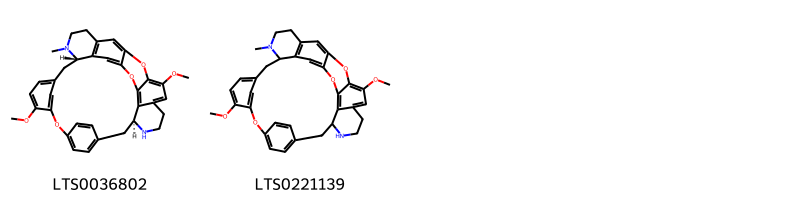{ width=100% }
    <figcaption>Hình ảnh cấu trúc hóa học của 2 hoạt chất thuộc nhóm  gồm ['(8s,21s)-13,27-dimethoxy-7-methyl-15,29,31-trioxa-7,22-diazaoctacyclo[19.9.3.2¹⁶,¹⁹.1⁴,³⁰.1¹⁰,¹⁴.0³,⁸.0²⁵,³³.0²⁸,³²]heptatriaconta-1,3,10,12,14(37),16,18,25,27,30(34),32,35-dodecaene (LTS0036802)', '13,27-dimethoxy-7-methyl-15,29,31-trioxa-7,22-diazaoctacyclo[19.9.3.2¹⁶,¹⁹.1⁴,³⁰.1¹⁰,¹⁴.0³,⁸.0²⁵,³³.0²⁸,³²]heptatriaconta-1,3,10,12,14(37),16,18,25,27,30(34),32,35-dodecaene (LTS0221139)'].</figcaption>
</figure>
#### Nhóm Aporphines
<figure markdown="span">
    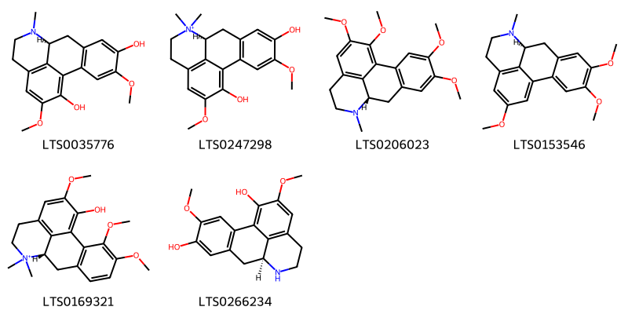{ width=100% }
    <figcaption>Hình ảnh cấu trúc hóa học của 6 hoạt chất thuộc nhóm Aporphines gồm ['(9s)-4,15-dimethoxy-10-methyl-10-azatetracyclo[7.7.1.0²,⁷.0¹³,¹⁷]heptadeca-1(16),2(7),3,5,13(17),14-hexaene-5,16-diol (LTS0035776)', '(9s)-5,16-dihydroxy-4,15-dimethoxy-10,10-dimethyl-10-azatetracyclo[7.7.1.0²,⁷.0¹³,¹⁷]heptadeca-1(16),2(7),3,5,13(17),14-hexaen-10-ium (LTS0247298)', '(9s)-4,5,15,16-tetramethoxy-10-methyl-10-azatetracyclo[7.7.1.0²,⁷.0¹³,¹⁷]heptadeca-1(16),2(7),3,5,13(17),14-hexaene (LTS0206023)', '(9s)-4,5,15-trimethoxy-10-methyl-10-azatetracyclo[7.7.1.0²,⁷.0¹³,¹⁷]heptadeca-1(16),2,4,6,13(17),14-hexaene (LTS0153546)', '(9s)-16-hydroxy-3,4,15-trimethoxy-10,10-dimethyl-10-azatetracyclo[7.7.1.0²,⁷.0¹³,¹⁷]heptadeca-1(16),2(7),3,5,13(17),14-hexaen-10-ium (LTS0169321)', '(9s)-4,15-dimethoxy-10-azatetracyclo[7.7.1.0²,⁷.0¹³,¹⁷]heptadeca-1(17),2(7),3,5,13,15-hexaene-5,16-diol (LTS0266234)'].</figcaption>
</figure>
#### Nhóm Benzazepines
<figure markdown="span">
    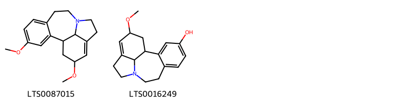{ width=100% }
    <figcaption>Hình ảnh cấu trúc hóa học của 2 hoạt chất thuộc nhóm Benzazepines gồm ['4,15-dimethoxy-10-azatetracyclo[8.6.1.0²,⁷.0¹³,¹⁷]heptadeca-2,4,6,13-tetraene (LTS0087015)', '15-methoxy-10-azatetracyclo[8.6.1.0²,⁷.0¹³,¹⁷]heptadeca-2,4,6,13-tetraen-4-ol (LTS0016249)'].</figcaption>
</figure>
#### Nhóm Benzene and substituted derivatives
<figure markdown="span">
    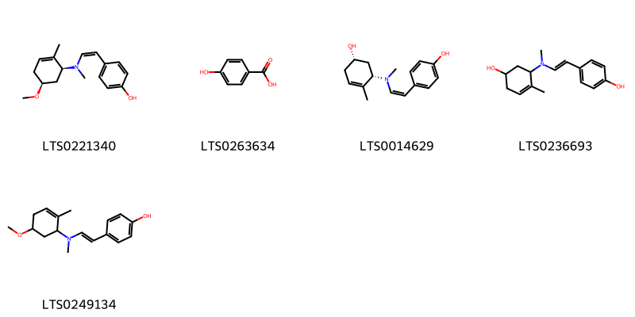{ width=100% }
    <figcaption>Hình ảnh cấu trúc hóa học của 5 hoạt chất thuộc nhóm Benzene and substituted derivatives gồm ['4-[(1z)-2-{[(1s,5s)-5-methoxy-2-methylcyclohex-2-en-1-yl](methyl)amino}ethenyl]phenol (LTS0221340)', 'p-hydroxybenzoic acid (LTS0263634)', '4-[(1z)-2-{[(1s,5s)-5-hydroxy-2-methylcyclohex-2-en-1-yl](methyl)amino}ethenyl]phenol (LTS0014629)', '4-{2-[(5-hydroxy-2-methylcyclohex-2-en-1-yl)(methyl)amino]ethenyl}phenol (LTS0236693)', '4-{2-[(5-methoxy-2-methylcyclohex-2-en-1-yl)(methyl)amino]ethenyl}phenol (LTS0249134)'].</figcaption>
</figure>
#### Nhóm Benzofurans
<figure markdown="span">
    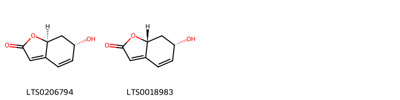{ width=100% }
    <figcaption>Hình ảnh cấu trúc hóa học của 2 hoạt chất thuộc nhóm Benzofurans gồm ['(6s,7as)-6-hydroxy-7,7a-dihydro-6h-1-benzofuran-2-one (LTS0206794)', 'menisdaurilide (LTS0018983)'].</figcaption>
</figure>
#### Nhóm Erythrina alkaloids
<figure markdown="span">
    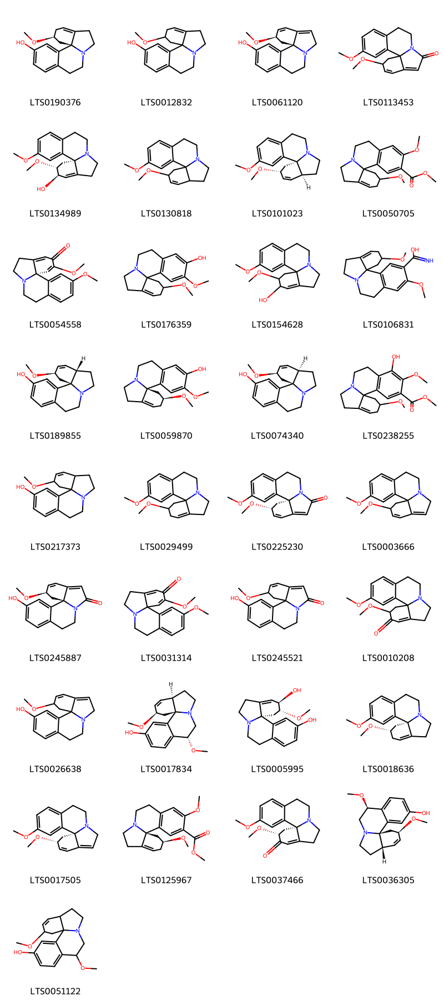{ width=100% }
    <figcaption>Hình ảnh cấu trúc hóa học của 33 hoạt chất thuộc nhóm Erythrina alkaloids gồm ['cocculine (LTS0190376)', '11-methoxy-1h,2h,4h,5h,10h,11h,12h-indolo[7a,1-a]isoquinolin-8-ol (LTS0012832)', '(9bs,11r)-11-methoxy-2h,4h,5h,10h,11h-indolo[7a,1-a]isoquinolin-8-ol (LTS0061120)', '8,11-dimethoxy-4h,5h,10h,11h-indolo[7a,1-a]isoquinolin-2-one (LTS0113453)', '(9bs,11r,12r)-8,11-dimethoxy-1h,2h,4h,5h,10h,11h,12h-indolo[7a,1-a]isoquinolin-12-ol (LTS0134989)', '8,11-dimethoxy-1h,2h,4h,5h,10h,11h,13ah-indolo[7a,1-a]isoquinoline (LTS0130818)', '(9bs,11r,13as)-8,11-dimethoxy-1h,2h,4h,5h,10h,11h,13ah-indolo[7a,1-a]isoquinoline (LTS0101023)', 'methyl 7,11-dimethoxy-1h,2h,4h,5h,10h,11h,12h-indolo[7a,1-a]isoquinoline-8-carboxylate (LTS0050705)', '(9bs)-8,11-dimethoxy-1h,2h,4h,5h-indolo[7a,1-a]isoquinolin-12-one (LTS0054558)', '8,11-dimethoxy-1h,2h,4h,5h,10h,11h,12h-indolo[7a,1-a]isoquinolin-7-ol (LTS0176359)', '8,11-dimethoxy-1h,2h,4h,5h,10h,11h,12h-indolo[7a,1-a]isoquinolin-12-ol (LTS0154628)', '7,11-dimethoxy-1h,2h,4h,5h,10h,11h,12h-indolo[7a,1-a]isoquinoline-8-carboximidic acid (LTS0106831)', '(9bs,11r,13as)-11-methoxy-1h,2h,4h,5h,10h,11h,13ah-indolo[7a,1-a]isoquinolin-8-ol (LTS0189855)', '(9bs,11s)-8,11-dimethoxy-1h,2h,4h,5h,10h,11h,12h-indolo[7a,1-a]isoquinolin-7-ol (LTS0059870)', '(9bs,11r,13ar)-11-methoxy-1h,2h,4h,5h,10h,11h,13ah-indolo[7a,1-a]isoquinolin-8-ol (LTS0074340)', 'methyl 6-hydroxy-7,11-dimethoxy-1h,2h,4h,5h,10h,11h,12h-indolo[7a,1-a]isoquinoline-8-carboxylate (LTS0238255)', '11-methoxy-1h,2h,4h,5h,10h,11h,13ah-indolo[7a,1-a]isoquinolin-8-ol (LTS0217373)', '8,11-dimethoxy-1h,2h,4h,5h,10h,11h,12h-indolo[7a,1-a]isoquinoline (LTS0029499)', '(9bs,11r)-8,11-dimethoxy-4h,5h,10h,11h-indolo[7a,1-a]isoquinolin-2-one (LTS0225230)', '8,11-dimethoxy-2h,4h,5h,10h,11h-indolo[7a,1-a]isoquinoline (LTS0003666)', '(9bs,11r)-8-hydroxy-11-methoxy-4h,5h,10h,11h-indolo[7a,1-a]isoquinolin-2-one (LTS0245887)', '8,11-dimethoxy-1h,2h,4h,5h-indolo[7a,1-a]isoquinolin-12-one (LTS0031314)', '8-hydroxy-11-methoxy-4h,5h,10h,11h-indolo[7a,1-a]isoquinolin-2-one (LTS0245521)', '8,11-dimethoxy-1h,2h,4h,5h,10h,11h-indolo[7a,1-a]isoquinolin-12-one (LTS0010208)', '11-methoxy-2h,4h,5h,10h,11h-indolo[7a,1-a]isoquinolin-8-ol (LTS0026638)', '(5r,9bs,11r,13ar)-5,11-dimethoxy-1h,2h,4h,5h,10h,11h,13ah-indolo[7a,1-a]isoquinolin-8-ol (LTS0017834)', '(9bs,11r,12r)-11-methoxy-1h,2h,4h,5h,10h,11h,12h-indolo[7a,1-a]isoquinoline-8,12-diol (LTS0005995)', '(9bs,11s)-8,11-dimethoxy-1h,2h,4h,5h,10h,11h,12h-indolo[7a,1-a]isoquinoline (LTS0018636)', '(9bs,11r)-8,11-dimethoxy-2h,4h,5h,10h,11h-indolo[7a,1-a]isoquinoline (LTS0017505)', 'methyl (9bs,11s)-7,11-dimethoxy-1h,2h,4h,5h,10h,11h,12h-indolo[7a,1-a]isoquinoline-8-carboxylate (LTS0125967)', '(9bs,11r)-8,11-dimethoxy-1h,2h,4h,5h,10h,11h-indolo[7a,1-a]isoquinolin-12-one (LTS0037466)', '(5s,9bs,11r,13as)-5,11-dimethoxy-1h,2h,4h,5h,10h,11h,13ah-indolo[7a,1-a]isoquinolin-8-ol (LTS0036305)', '5,11-dimethoxy-1h,2h,4h,5h,10h,11h,13ah-indolo[7a,1-a]isoquinolin-8-ol (LTS0051122)'].</figcaption>
</figure>
#### Nhóm Isoquinolines and derivatives
<figure markdown="span">
    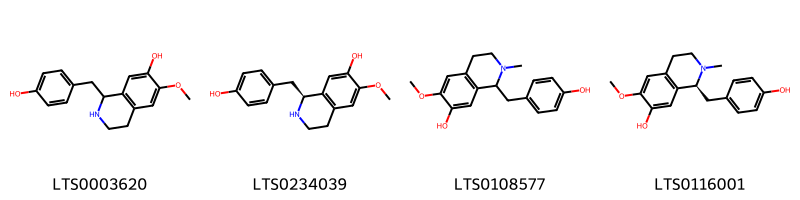{ width=100% }
    <figcaption>Hình ảnh cấu trúc hóa học của 4 hoạt chất thuộc nhóm Isoquinolines and derivatives gồm ['(rs)-coclaurine (LTS0003620)', '(+-)-coclaurine (LTS0234039)', '1-[(4-hydroxyphenyl)methyl]-6-methoxy-2-methyl-3,4-dihydro-1h-isoquinolin-7-ol (LTS0108577)', '(s)-n-methylcoclaurine (LTS0116001)'].</figcaption>
</figure>
#### Nhóm Organooxygen compounds
<figure markdown="span">
    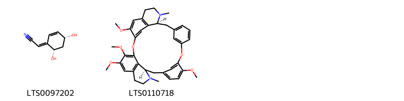{ width=100% }
    <figcaption>Hình ảnh cấu trúc hóa học của 2 hoạt chất thuộc nhóm Organooxygen compounds gồm ['2-[(1e,4r,6s)-4,6-dihydroxycyclohex-2-en-1-ylidene]acetonitrile (LTS0097202)', '(1s,15r)-10,21,22,26-tetramethoxy-16,31-dimethyl-8,24-dioxa-16,31-diazaheptacyclo[23.6.2.1³,⁷.1⁹,¹³.1¹⁵,¹⁹.0²⁸,³².0²³,³⁴]hexatriaconta-3(36),4,6,9(35),10,12,19(34),20,22,25,27,32-dodecaene (LTS0110718)'].</figcaption>
</figure>
#### Nhóm Phenanthrenes and derivatives
<figure markdown="span">
    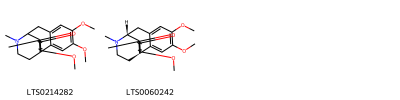{ width=100% }
    <figcaption>Hình ảnh cấu trúc hóa học của 2 hoạt chất thuộc nhóm Phenanthrenes and derivatives gồm ['o-methylpallidine (LTS0214282)', '(1r,9r)-4,5,13-trimethoxy-17-methyl-17-azatetracyclo[7.5.3.0¹,¹⁰.0²,⁷]heptadeca-2,4,6,10,13-pentaen-12-one (LTS0060242)'].</figcaption>
</figure>
#### Nhóm Phenol ethers
<figure markdown="span">
    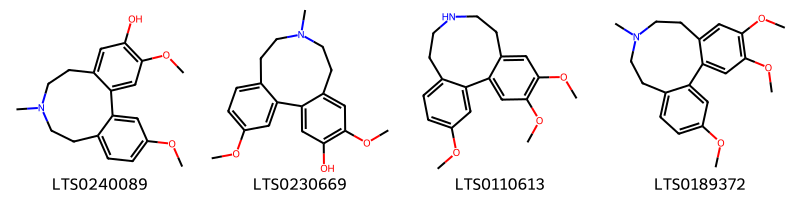{ width=100% }
    <figcaption>Hình ảnh cấu trúc hóa học của 4 hoạt chất thuộc nhóm Phenol ethers gồm ['4,16-dimethoxy-10-methyl-10-azatricyclo[11.4.0.0²,⁷]heptadeca-1(17),2,4,6,13,15-hexaen-5-ol (LTS0240089)', '5,16-dimethoxy-10-methyl-10-azatricyclo[11.4.0.0²,⁷]heptadeca-1(17),2,4,6,13,15-hexaen-4-ol (LTS0230669)', 'laurifine (LTS0110613)', '4,5,16-trimethoxy-10-methyl-10-azatricyclo[11.4.0.0²,⁷]heptadeca-1(17),2,4,6,13,15-hexaene (LTS0189372)'].</figcaption>
</figure>
#### Nhóm Phthalide isoquinolines
<figure markdown="span">
    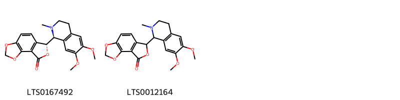{ width=100% }
    <figcaption>Hình ảnh cấu trúc hóa học của 2 hoạt chất thuộc nhóm Phthalide isoquinolines gồm ['(10r)-10-[(1s)-6,7-dimethoxy-2-methyl-3,4-dihydro-1h-isoquinolin-1-yl]-3,5,11-trioxatricyclo[7.3.0.0²,⁶]dodeca-1(9),2(6),7-trien-12-one (LTS0167492)', '10-(6,7-dimethoxy-2-methyl-3,4-dihydro-1h-isoquinolin-1-yl)-3,5,11-trioxatricyclo[7.3.0.0²,⁶]dodeca-1(9),2(6),7-trien-12-one (LTS0012164)'].</figcaption>
</figure>
#### Nhóm Prenol lipids
<figure markdown="span">
    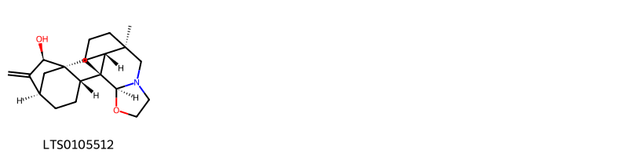{ width=100% }
    <figcaption>Hình ảnh cấu trúc hóa học của 1 hoạt chất thuộc nhóm Prenol lipids gồm ['(1s,2r,5r,7r,8r,11r,12r,18s)-12-methyl-6-methylidene-17-oxa-14-azahexacyclo[10.6.3.1⁵,⁸.0¹,¹¹.0²,⁸.0¹⁴,¹⁸]docosan-7-ol (LTS0105512)'].</figcaption>
</figure>
#### Nhóm Proaporphines
<figure markdown="span">
    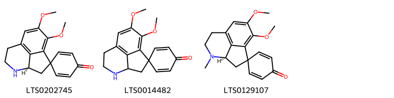{ width=100% }
    <figcaption>Hình ảnh cấu trúc hóa học của 3 hoạt chất thuộc nhóm Proaporphines gồm ["(4'r)-10',11'-dimethoxy-5'-azaspiro[cyclohexane-1,2'-tricyclo[6.3.1.0⁴,¹²]dodecane]-1'(11'),2,5,8'(12'),9'-pentaen-4-one (LTS0202745)", "10',11'-dimethoxy-5'-azaspiro[cyclohexane-1,2'-tricyclo[6.3.1.0⁴,¹²]dodecane]-1'(11'),2,5,8'(12'),9'-pentaen-4-one (LTS0014482)", 'pronuciferine (LTS0129107)'].</figcaption>
</figure>
#### Nhóm Protoberberine alkaloids and derivatives
<figure markdown="span">
    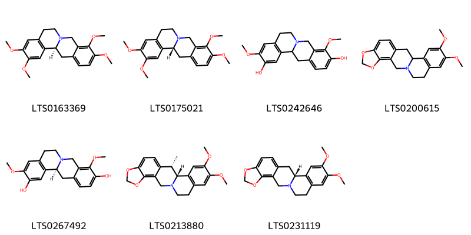{ width=100% }
    <figcaption>Hình ảnh cấu trúc hóa học của 7 hoạt chất thuộc nhóm Protoberberine alkaloids and derivatives gồm ['tetrahydropalmatine (LTS0163369)', '(+)-tetrahydropalmatine (LTS0175021)', 'coreximine (LTS0242646)', 'sinactine (LTS0200615)', 'stepholidine (LTS0267492)', '(12s,13r)-16,17-dimethoxy-12-methyl-5,7-dioxa-1-azapentacyclo[11.8.0.0³,¹¹.0⁴,⁸.0¹⁴,¹⁹]henicosa-3,8,10,14(19),15,17-hexaene (LTS0213880)', '(13r)-16,17-dimethoxy-5,7-dioxa-1-azapentacyclo[11.8.0.0³,¹¹.0⁴,⁸.0¹⁴,¹⁹]henicosa-3,8,10,14(19),15,17-hexaene (LTS0231119)'].</figcaption>
</figure>

---

### Dược dân tộc học

Danh sách các quốc gia có sử dụng *Cocculus laurifolius* trong điều trị các bệnh. 

| Country   | Disease             | Bệnh                                                                                                                                                                                                |
|:----------|:--------------------|:----------------------------------------------------------------------------------------------------------------------------------------------------------------------------------------------------|
| Elsewhere | Diuretic, Vermifuge | MYMEMORY WARNING: YOU USED ALL AVAILABLE FREE TRANSLATIONS FOR TODAY. NEXT AVAILABLE IN  19 HOURS 14 MINUTES 18 SECONDS VISIT HTTPS://MYMEMORY.TRANSLATED.NET/DOC/USAGELIMITS.PHP TO TRANSLATE MORE |

---

---
## Cocculus leaeba
### Thông tin về thực vật

!!! info "Phân loại thực vật của *Cocculus pendulus* từ GIBF:"
    - **Kingdom:** Plantae
    - **Phylum:** Tracheophyta
    - **Order:** Ranunculales
    - **Family:** Menispermaceae
    - **Genus:** Cocculus
    - **Species:** *Cocculus pendulus*

 

| Label (VI)   | Label (EN)   | Scientific Name   | Descriptions (VI)   | Descriptions (EN)   | Also Known As (VI)   | Also Known As (EN)   |
|:-------------|:-------------|:------------------|:--------------------|:--------------------|:---------------------|:---------------------|
| N/A          | N/A          | Cocculus leaeba   |                     |                     | ['']                 | ['']                 |

#### Phân bố trên thế giới

**Từ CSDL GIBF** nan, Pakistan, Mali, Senegal, Chad, Cabo Verde, Afghanistan, Sudan, Egypt, Algeria, unknown or invalid, India, Mauritania, Panama, Saudi Arabia

#### Phân bố tại Việt Nam

**Từ CSDL GIBF**: Không có ghi nhận ở Việt Nam

---
### Thành phần hóa học
        
- Theo cơ sở dữ liệu lotus: Từ loài *Cocculus pendulus* đã phân lập và xác định được Chưa có hoạt chất nào được phân lập. hoạt chất thuộc về các nhóm Không có hoạt chất nào được phân lập. 

Không có hình ảnh nào được tạo ra

---

### Dược dân tộc học

Danh sách các quốc gia có sử dụng *Cocculus pendulus* trong điều trị các bệnh. 

| Country   | Disease         | Bệnh                                                                                                                                                                                                |
|:----------|:----------------|:----------------------------------------------------------------------------------------------------------------------------------------------------------------------------------------------------|
| India     | Diuretic, Tonic | MYMEMORY WARNING: YOU USED ALL AVAILABLE FREE TRANSLATIONS FOR TODAY. NEXT AVAILABLE IN  19 HOURS 13 MINUTES 41 SECONDS VISIT HTTPS://MYMEMORY.TRANSLATED.NET/DOC/USAGELIMITS.PHP TO TRANSLATE MORE |

---

---
## Cocculus pendulus
### Thông tin về thực vật

!!! info "Phân loại thực vật của *Cocculus pendulus* từ GIBF:"
    - **Kingdom:** Plantae
    - **Phylum:** Tracheophyta
    - **Order:** Ranunculales
    - **Family:** Menispermaceae
    - **Genus:** Cocculus
    - **Species:** *Cocculus pendulus*

 

| Label (VI)   | Label (EN)   | Scientific Name   | Descriptions (VI)   | Descriptions (EN)   | Also Known As (VI)   | Also Known As (EN)   |
|:-------------|:-------------|:------------------|:--------------------|:--------------------|:---------------------|:---------------------|
| N/A          | N/A          | Cocculus pendulus | loài thực vật       | species of plant    | ['']                 | ['']                 |

#### Phân bố trên thế giới

**Từ CSDL GIBF** United Arab Emirates, Cabo Verde, Egypt, Somalia, India, Morocco, Israel, Saudi Arabia

#### Phân bố tại Việt Nam

**Từ CSDL GIBF**: Không có ghi nhận ở Việt Nam

---
### Thành phần hóa học
        
- Theo cơ sở dữ liệu lotus: Từ loài *Cocculus pendulus* đã phân lập và xác định được 63 hoạt chất thuộc về các nhóm Flavonoids, Aporphines, Azolidines, Azoles, Benzodioxins, Organooxygen compounds, Tannins, Isoquinolines and derivatives. 

|    | chemicalTaxonomyClassyfireClass   |   smiles_count |
|---:|:----------------------------------|---------------:|
|  0 |                                   |             51 |
|  1 | Aporphines                        |              1 |
|  2 | Azoles                            |              1 |
|  3 | Azolidines                        |              1 |
|  4 | Benzodioxins                      |              4 |
|  5 | Flavonoids                        |              1 |
|  6 | Isoquinolines and derivatives     |              1 |
|  7 | Organooxygen compounds            |              2 |
|  8 | Tannins                           |              1 |

#### Nhóm 
<figure markdown="span">
    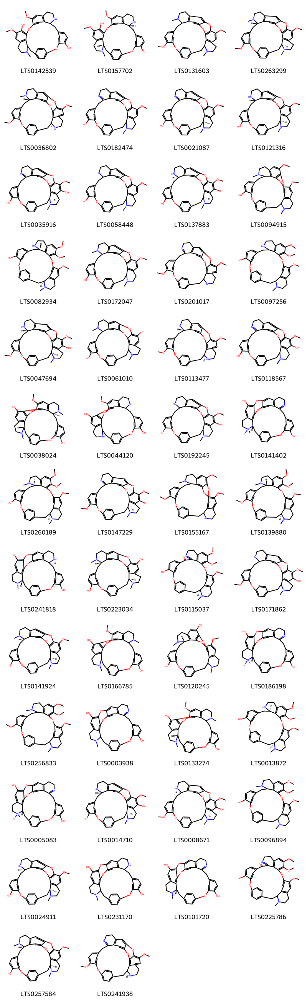{ width=100% }
    <figcaption>Hình ảnh cấu trúc hóa học của 51 hoạt chất thuộc nhóm  gồm ['20,25-dimethoxy-15-methyl-8,23-dioxa-15,30-diazaheptacyclo[22.6.2.2⁹,¹².1³,⁷.1¹⁴,¹⁸.0²⁷,³¹.0²²,³³]hexatriaconta-3,5,7(36),9,11,18(33),19,21,24(32),25,27(31),34-dodecaene-6,21-diol (LTS0142539)', '(1r,14s)-20,25-dimethoxy-15-methyl-8,23-dioxa-15,30-diazaheptacyclo[22.6.2.2⁹,¹².1³,⁷.1¹⁴,¹⁸.0²⁷,³¹.0²²,³³]hexatriaconta-3,5,7(36),9,11,18(33),19,21,24(32),25,27(31),34-dodecaene-6,21-diol (LTS0157702)', '13,27-dimethoxy-7,22-dimethyl-15,29,31-trioxa-7,22-diazaoctacyclo[19.9.3.2¹⁶,¹⁹.1⁴,³⁰.1¹⁰,¹⁴.0³,⁸.0²⁵,³³.0²⁸,³²]heptatriaconta-1,3,10,12,14(37),16,18,25(33),26,28(32),30(34),35-dodecaene (LTS0131603)', '(8s,21s)-13,27-dimethoxy-7,22-dimethyl-15,29,31-trioxa-7,22-diazaoctacyclo[19.9.3.2¹⁶,¹⁹.1⁴,³⁰.1¹⁰,¹⁴.0³,⁸.0²⁵,³³.0²⁸,³²]heptatriaconta-1,3,10,12,14(37),16,18,25(33),26,28(32),30(34),35-dodecaene (LTS0263299)', '(8s,21s)-13,27-dimethoxy-7-methyl-15,29,31-trioxa-7,22-diazaoctacyclo[19.9.3.2¹⁶,¹⁹.1⁴,³⁰.1¹⁰,¹⁴.0³,⁸.0²⁵,³³.0²⁸,³²]heptatriaconta-1,3,10,12,14(37),16,18,25,27,30(34),32,35-dodecaene (LTS0036802)', '27-methoxy-22-methyl-15,29,31-trioxa-7,22-diazaoctacyclo[19.9.3.2¹⁶,¹⁹.1⁴,³⁰.1¹⁰,¹⁴.0³,⁸.0²⁵,³³.0²⁸,³²]heptatriaconta-1,3,7,10,12,14(37),16,18,25(33),26,28(32),30(34),35-tridecaen-13-ol (LTS0182474)', '(21s)-27-methoxy-22-methyl-15,29,31-trioxa-7,22-diazaoctacyclo[19.9.3.2¹⁶,¹⁹.1⁴,³⁰.1¹⁰,¹⁴.0³,⁸.0²⁵,³³.0²⁸,³²]heptatriaconta-1,3,7,10,12,14(37),16,18,25(33),26,28(32),30(34),35-tridecaen-13-ol (LTS0021087)', '(8s,21s)-27-methoxy-22-methyl-15,29,31-trioxa-7,22-diazaoctacyclo[19.9.3.2¹⁶,¹⁹.1⁴,³⁰.1¹⁰,¹⁴.0³,⁸.0²⁵,³³.0²⁸,³²]heptatriaconta-1,3,10,12,14(37),16,18,25(33),26,28(32),30(34),35-dodecaen-13-ol (LTS0121316)', '(21s)-27-methoxy-22-methyl-15,29,31-trioxa-7,22-diazaoctacyclo[19.9.3.2¹⁶,¹⁹.1⁴,³⁰.1¹⁰,¹⁴.0³,⁸.0²⁵,³³.0²⁸,³²]heptatriaconta-1,3,7,10,12,14(37),16,18,25(33),26,28(32),30(34),35-tridecaene-13,26-diol (LTS0035916)', '27-methoxy-22-methyl-15,29,31-trioxa-7,22-diazaoctacyclo[19.9.3.2¹⁶,¹⁹.1⁴,³⁰.1¹⁰,¹⁴.0³,⁸.0²⁵,³³.0²⁸,³²]heptatriaconta-1,3,10,12,14(37),16,18,25(33),26,28(32),30(34),35-dodecaen-13-ol (LTS0058448)', '(8r,21s)-27-methoxy-22-methyl-15,29,31-trioxa-7,22-diazaoctacyclo[19.9.3.2¹⁶,¹⁹.1⁴,³⁰.1¹⁰,¹⁴.0³,⁸.0²⁵,³³.0²⁸,³²]heptatriaconta-1,3,10,12,14(37),16,18,25(33),26,28(32),30(34),35-dodecaene-13,26-diol (LTS0137883)', '20,25-dimethoxy-15,30-dimethyl-7,23,33-trioxa-15,30-diazaoctacyclo[19.9.3.2³,⁶.1⁸,¹².1¹⁴,¹⁸.0²⁴,³².0²⁷,³¹.0²²,³⁴]heptatriaconta-3,5,8(35),9,11,18(34),19,21,24(32),25,27(31),36-dodecaen-9-ol (LTS0094915)', '(1s,14s)-20,21,25-trimethoxy-30-methyl-7,23-dioxa-15,30-diazaheptacyclo[22.6.2.2³,⁶.1⁸,¹².1¹⁴,¹⁸.0²⁷,³¹.0²²,³³]hexatriaconta-3,5,8(34),9,11,18(33),19,21,24(32),25,27(31),35-dodecaen-9-ol (LTS0082934)', '27-methoxy-7,22-dimethyl-15,29,31-trioxa-7,22-diazaoctacyclo[19.9.3.2¹⁶,¹⁹.1⁴,³⁰.1¹⁰,¹⁴.0³,⁸.0²⁵,³³.0²⁸,³²]heptatriaconta-1,3,10,12,14(37),16,18,25(33),26,28(32),30(34),35-dodecaen-13-ol (LTS0172047)', '13,27-dimethoxy-15,29,31-trioxa-7,22-diazaoctacyclo[19.9.3.2¹⁶,¹⁹.1⁴,³⁰.1¹⁰,¹⁴.0³,⁸.0²⁵,³³.0²⁸,³²]heptatriaconta-1,3,7,10,12,14(37),16,18,25,27,30(34),32,35-tridecaene (LTS0201017)', '20,21,25-trimethoxy-30-methyl-7,23-dioxa-15,30-diazaheptacyclo[22.6.2.2³,⁶.1⁸,¹².1¹⁴,¹⁸.0²⁷,³¹.0²²,³³]hexatriaconta-3,5,8(34),9,11,18(33),19,21,24(32),25,27(31),35-dodecaen-9-ol (LTS0097256)', '(8s,21s)-13,27-dimethoxy-22-methyl-15,29,31-trioxa-7,22-diazaoctacyclo[19.9.3.2¹⁶,¹⁹.1⁴,³⁰.1¹⁰,¹⁴.0³,⁸.0²⁵,³³.0²⁸,³²]heptatriaconta-1,3,10,12,14(37),16,18,25(33),26,28(32),30(34),35-dodecaen-26-ol (LTS0047694)', '7,22-dimethyl-15,29,31-trioxa-7,22-diazaoctacyclo[19.9.3.2¹⁶,¹⁹.1⁴,³⁰.1¹⁰,¹⁴.0³,⁸.0²⁵,³³.0²⁸,³²]heptatriaconta-1(30),2,4(34),10,12,14(37),16,18,25(33),26,28(32),35-dodecaene-13,27-diol (LTS0061010)', '(8s,21s)-13,27-dimethoxy-15,29,31-trioxa-7,22-diazaoctacyclo[19.9.3.2¹⁶,¹⁹.1⁴,³⁰.1¹⁰,¹⁴.0³,⁸.0²⁵,³³.0²⁸,³²]heptatriaconta-1,3,10,12,14(37),16,18,25,27,30(34),32,35-dodecaene (LTS0113477)', '27-methoxy-22-methyl-15,29,31-trioxa-7,22-diazaoctacyclo[19.9.3.2¹⁶,¹⁹.1⁴,³⁰.1¹⁰,¹⁴.0³,⁸.0²⁵,³³.0²⁸,³²]heptatriaconta-1,3,7,10,12,14(37),16,18,25(33),26,28(32),30(34),35-tridecaene-13,26-diol (LTS0118567)', '(1s,14s)-20-methoxy-15,30-dimethyl-7,23,33-trioxa-15,30-diazaoctacyclo[19.9.3.2³,⁶.1⁸,¹².1¹⁴,¹⁸.0²⁴,³².0²⁷,³¹.0²²,³⁴]heptatriaconta-3,5,8(35),9,11,18(34),19,21,24(32),25,27(31),36-dodecaene-9,25-diol (LTS0038024)', '20-methoxy-7,23,33-trioxa-15,30-diazaoctacyclo[19.9.3.2³,⁶.1⁸,¹².1¹⁴,¹⁸.0²⁴,³².0²⁷,³¹.0²²,³⁴]heptatriaconta-3,5,8(35),9,11,18(34),19,21,24(32),25,27(31),36-dodecaene-9,25-diol (LTS0044120)', '27-methoxy-22-methyl-15,29,31-trioxa-7,22-diazaoctacyclo[19.9.3.2¹⁶,¹⁹.1⁴,³⁰.1¹⁰,¹⁴.0³,⁸.0²⁵,³³.0²⁸,³²]heptatriaconta-1,3,10,12,14(37),16,18,25(33),26,28(32),30(34),35-dodecaene-13,26-diol (LTS0192245)', '(21s,22r)-13,27-dihydroxy-22-methyl-15,29,31-trioxa-7,22-diazaoctacyclo[19.9.3.2¹⁶,¹⁹.1⁴,³⁰.1¹⁰,¹⁴.0³,⁸.0²⁵,³³.0²⁸,³²]heptatriaconta-1(30),2,4(34),7,10,12,14(37),16,18,25,27,32,35-tridecaen-22-ium-22-olate (LTS0141402)', '(1s,14s)-20,21,25-trimethoxy-15,30-dimethyl-7,23-dioxa-15,30-diazaheptacyclo[22.6.2.2³,⁶.1⁸,¹².1¹⁴,¹⁸.0²⁷,³¹.0²²,³³]hexatriaconta-3,5,8(34),9,11,18(33),19,21,24(32),25,27(31),35-dodecaen-9-ol (LTS0260189)', '(21s)-13,27-dimethoxy-22-methyl-15,29,31-trioxa-7,22-diazaoctacyclo[19.9.3.2¹⁶,¹⁹.1⁴,³⁰.1¹⁰,¹⁴.0³,⁸.0²⁵,³³.0²⁸,³²]heptatriaconta-1,3,7,10,12,14(37),16,18,25(33),26,28(32),30(34),35-tridecaen-26-ol (LTS0147229)', '9,20,25-trimethoxy-15-methyl-7,23,33-trioxa-15,30-diazaoctacyclo[19.9.3.2³,⁶.1⁸,¹².1¹⁴,¹⁸.0²⁴,³².0²⁷,³¹.0²²,³⁴]heptatriaconta-3,5,8(35),9,11,18,20,22(34),24,26,31,36-dodecaene (LTS0155167)', '(1s,14s)-9,20,21,25-tetramethoxy-15,30-dimethyl-7,23-dioxa-15,30-diazaheptacyclo[22.6.2.2³,⁶.1⁸,¹².1¹⁴,¹⁸.0²⁷,³¹.0²²,³³]hexatriaconta-3,5,8(34),9,11,18(33),19,21,24,26,31,35-dodecaene (LTS0139880)', '(8s,21s)-22-methyl-15,29,31-trioxa-7,22-diazaoctacyclo[19.9.3.2¹⁶,¹⁹.1⁴,³⁰.1¹⁰,¹⁴.0³,⁸.0²⁵,³³.0²⁸,³²]heptatriaconta-1(30),2,4(34),10,12,14(37),16,18,25,27,32,35-dodecaene-13,27-diol (LTS0241818)', '(8s,21s)-7,22-dimethyl-15,29,31-trioxa-7,22-diazaoctacyclo[19.9.3.2¹⁶,¹⁹.1⁴,³⁰.1¹⁰,¹⁴.0³,⁸.0²⁵,³³.0²⁸,³²]heptatriaconta-1(30),2,4(34),10,12,14(37),16,18,25(33),26,28(32),35-dodecaene-13,27-diol (LTS0223034)', '(1s)-9-hydroxy-20,21,25-trimethoxy-30-methyl-7,23-dioxa-15,30-diazaheptacyclo[22.6.2.2³,⁶.1⁸,¹².1¹⁴,¹⁸.0²⁷,³¹.0²²,³³]hexatriaconta-3,5,8(34),9,11,14,18(33),19,21,24(32),25,27(31),35-tridecaen-13-one (LTS0115037)', '13,27-dimethoxy-22-methyl-15,29,31-trioxa-7,22-diazaoctacyclo[19.9.3.2¹⁶,¹⁹.1⁴,³⁰.1¹⁰,¹⁴.0³,⁸.0²⁵,³³.0²⁸,³²]heptatriaconta-1,3,10,12,14(37),16,18,25(33),26,28(32),30(34),35-dodecaen-26-ol (LTS0171862)', '(8r,21s)-27-methoxy-7,22-dimethyl-15,29,31-trioxa-7,22-diazaoctacyclo[19.9.3.2¹⁶,¹⁹.1⁴,³⁰.1¹⁰,¹⁴.0³,⁸.0²⁵,³³.0²⁸,³²]heptatriaconta-1,3,10,12,14(37),16,18,25(33),26,28(32),30(34),35-dodecaen-13-ol (LTS0141924)', '20-methoxy-15,30-dimethyl-7,23,33-trioxa-15,30-diazaoctacyclo[19.9.3.2³,⁶.1⁸,¹².1¹⁴,¹⁸.0²⁴,³².0²⁷,³¹.0²²,³⁴]heptatriaconta-3,5,8(35),9,11,18(34),19,21,24(32),25,27(31),36-dodecaene-9,25-diol (LTS0166785)', '(14s)-25-methoxy-15,30-dimethyl-7,23,33-trioxa-15,30-diazaoctacyclo[19.9.3.2³,⁶.1⁸,¹².1¹⁴,¹⁸.0²⁴,³².0²⁷,³¹.0²²,³⁴]heptatriaconta-3,5,8(35),9,11,18(34),19,21,24(32),25,27(31),36-dodecaene-9,20-diol (LTS0120245)', '(21s,22s)-13,27-dihydroxy-22-methyl-15,29,31-trioxa-7,22-diazaoctacyclo[19.9.3.2¹⁶,¹⁹.1⁴,³⁰.1¹⁰,¹⁴.0³,⁸.0²⁵,³³.0²⁸,³²]heptatriaconta-1(30),2,4(34),7,10,12,14(37),16,18,25,27,32,35-tridecaen-22-ium-22-olate (LTS0186198)', 'isotetrandrine (LTS0256833)', '22-methyl-15,29,31-trioxa-7,22-diazaoctacyclo[19.9.3.2¹⁶,¹⁹.1⁴,³⁰.1¹⁰,¹⁴.0³,⁸.0²⁵,³³.0²⁸,³²]heptatriaconta-1(30),2,4(34),7,10,12,14(37),16,18,25,27,32,35-tridecaene-13,27-diol (LTS0003938)', '(1s)-20-methoxy-15,30-dimethyl-7,23,33-trioxa-15,30-diazaoctacyclo[19.9.3.2³,⁶.1⁸,¹².1¹⁴,¹⁸.0²⁴,³².0²⁷,³¹.0²²,³⁴]heptatriaconta-3,5,8(35),9,11,18(34),19,21,24(32),25,27(31),36-dodecaene-9,25-diol (LTS0133274)', '(1s,14r)-20,21,25-trimethoxy-30-methyl-7,23-dioxa-15,30-diazaheptacyclo[22.6.2.2³,⁶.1⁸,¹².1¹⁴,¹⁸.0²⁷,³¹.0²²,³³]hexatriaconta-3,5,8(34),9,11,18(33),19,21,24(32),25,27(31),35-dodecaen-9-ol (LTS0013872)', '(21s)-13,27-dihydroxy-22-methyl-15,29,31-trioxa-7,22-diazaoctacyclo[19.9.3.2¹⁶,¹⁹.1⁴,³⁰.1¹⁰,¹⁴.0³,⁸.0²⁵,³³.0²⁸,³²]heptatriaconta-1(30),2,4(34),7,10,12,14(37),16,18,25,27,32,35-tridecaen-22-ium-22-olate (LTS0005083)', '(8s,21s)-27-methoxy-22-methyl-15,29,31-trioxa-7,22-diazaoctacyclo[19.9.3.2¹⁶,¹⁹.1⁴,³⁰.1¹⁰,¹⁴.0³,⁸.0²⁵,³³.0²⁸,³²]heptatriaconta-1,3,10,12,14(37),16,18,25(33),26,28(32),30(34),35-dodecaene-13,26-diol (LTS0014710)', '(8r,21s)-13,27-dimethoxy-22-methyl-15,29,31-trioxa-7,22-diazaoctacyclo[19.9.3.2¹⁶,¹⁹.1⁴,³⁰.1¹⁰,¹⁴.0³,⁸.0²⁵,³³.0²⁸,³²]heptatriaconta-1,3,10,12,14(37),16,18,25(33),26,28(32),30(34),35-dodecaen-26-ol (LTS0008671)', '20,21,25-trimethoxy-15,30-dimethyl-7,23-dioxa-15,30-diazaheptacyclo[22.6.2.2³,⁶.1⁸,¹².1¹⁴,¹⁸.0²⁷,³¹.0²²,³³]hexatriaconta-3,5,8(34),9,11,18(33),19,21,24(32),25,27(31),35-dodecaen-9-ol (LTS0096894)', '(8r,21s)-27-methoxy-22-methyl-15,29,31-trioxa-7,22-diazaoctacyclo[19.9.3.2¹⁶,¹⁹.1⁴,³⁰.1¹⁰,¹⁴.0³,⁸.0²⁵,³³.0²⁸,³²]heptatriaconta-1,3,10,12,14(37),16,18,25(33),26,28(32),30(34),35-dodecaen-13-ol (LTS0024911)', '22-methyl-15,29,31-trioxa-7,22-diazaoctacyclo[19.9.3.2¹⁶,¹⁹.1⁴,³⁰.1¹⁰,¹⁴.0³,⁸.0²⁵,³³.0²⁸,³²]heptatriaconta-1(30),2,4(34),10,12,14(37),16,18,25,27,32,35-dodecaene-13,27-diol (LTS0231170)', '(21s)-22-methyl-15,29,31-trioxa-7,22-diazaoctacyclo[19.9.3.2¹⁶,¹⁹.1⁴,³⁰.1¹⁰,¹⁴.0³,⁸.0²⁵,³³.0²⁸,³²]heptatriaconta-1(30),2,4(34),7,10,12,14(37),16,18,25,27,32,35-tridecaene-13,27-diol (LTS0101720)', '9-hydroxy-20,21,25-trimethoxy-30-methyl-7,23-dioxa-15,30-diazaheptacyclo[22.6.2.2³,⁶.1⁸,¹².1¹⁴,¹⁸.0²⁷,³¹.0²²,³³]hexatriaconta-3,5,8(34),9,11,14,18(33),19,21,24(32),25,27(31),35-tridecaen-13-one (LTS0225786)', '(8s,21s)-27-methoxy-7,22-dimethyl-15,29,31-trioxa-7,22-diazaoctacyclo[19.9.3.2¹⁶,¹⁹.1⁴,³⁰.1¹⁰,¹⁴.0³,⁸.0²⁵,³³.0²⁸,³²]heptatriaconta-1,3,10,12,14(37),16,18,25(33),26,28(32),30(34),35-dodecaen-13-ol (LTS0257584)', '(21s)-13,27-dimethoxy-15,29,31-trioxa-7,22-diazaoctacyclo[19.9.3.2¹⁶,¹⁹.1⁴,³⁰.1¹⁰,¹⁴.0³,⁸.0²⁵,³³.0²⁸,³²]heptatriaconta-1,3,7,10,12,14(37),16,18,25,27,30(34),32,35-tridecaene (LTS0241938)', '13,27-dimethoxy-22-methyl-15,29,31-trioxa-7,22-diazaoctacyclo[19.9.3.2¹⁶,¹⁹.1⁴,³⁰.1¹⁰,¹⁴.0³,⁸.0²⁵,³³.0²⁸,³²]heptatriaconta-1,3,7,10,12,14(37),16,18,25(33),26,28(32),30(34),35-tridecaen-26-ol (LTS0118417)'].</figcaption>
</figure>
#### Nhóm Aporphines
<figure markdown="span">
    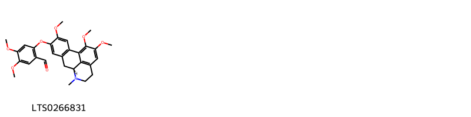{ width=100% }
    <figcaption>Hình ảnh cấu trúc hóa học của 1 hoạt chất thuộc nhóm Aporphines gồm ['4,5-dimethoxy-2-{[(9s)-4,15,16-trimethoxy-10-methyl-10-azatetracyclo[7.7.1.0²,⁷.0¹³,¹⁷]heptadeca-1(16),2(7),3,5,13(17),14-hexaen-5-yl]oxy}benzaldehyde (LTS0266831)'].</figcaption>
</figure>
#### Nhóm Azoles
<figure markdown="span">
    { width=100% }
    <figcaption>Hình ảnh cấu trúc hóa học của 1 hoạt chất thuộc nhóm Azoles gồm ['allantoin (LTS0106609)'].</figcaption>
</figure>
#### Nhóm Azolidines
<figure markdown="span">
    { width=100% }
    <figcaption>Hình ảnh cấu trúc hóa học của 1 hoạt chất thuộc nhóm Azolidines gồm ['n-[(4s)-2,5-dihydroxy-4h-imidazol-4-yl]carbamimidic acid (LTS0174328)'].</figcaption>
</figure>
#### Nhóm Benzodioxins
<figure markdown="span">
    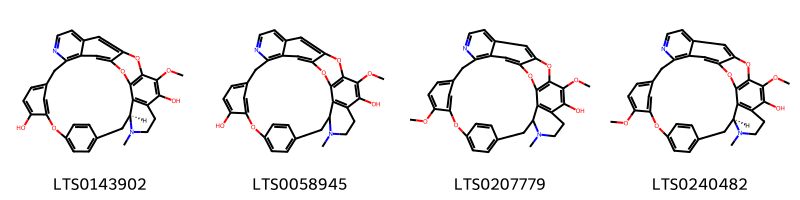{ width=100% }
    <figcaption>Hình ảnh cấu trúc hóa học của 4 hoạt chất thuộc nhóm Benzodioxins gồm ['(21s)-27-methoxy-22-methyl-15,29,31-trioxa-7,22-diazaoctacyclo[19.9.3.2¹⁶,¹⁹.1⁴,³⁰.1¹⁰,¹⁴.0³,⁸.0²⁵,³³.0²⁸,³²]heptatriaconta-1,3(8),4,6,10,12,14(37),16,18,25(33),26,28(32),30(34),35-tetradecaene-13,26-diol (LTS0143902)', '27-methoxy-22-methyl-15,29,31-trioxa-7,22-diazaoctacyclo[19.9.3.2¹⁶,¹⁹.1⁴,³⁰.1¹⁰,¹⁴.0³,⁸.0²⁵,³³.0²⁸,³²]heptatriaconta-1,3(8),4,6,10,12,14(37),16,18,25(33),26,28(32),30(34),35-tetradecaene-13,26-diol (LTS0058945)', '13,27-dimethoxy-22-methyl-15,29,31-trioxa-7,22-diazaoctacyclo[19.9.3.2¹⁶,¹⁹.1⁴,³⁰.1¹⁰,¹⁴.0³,⁸.0²⁵,³³.0²⁸,³²]heptatriaconta-1,3(8),4,6,10,12,14(37),16,18,25(33),26,28(32),30(34),35-tetradecaen-26-ol (LTS0207779)', '(21s)-13,27-dimethoxy-22-methyl-15,29,31-trioxa-7,22-diazaoctacyclo[19.9.3.2¹⁶,¹⁹.1⁴,³⁰.1¹⁰,¹⁴.0³,⁸.0²⁵,³³.0²⁸,³²]heptatriaconta-1,3(8),4,6,10,12,14(37),16,18,25(33),26,28(32),30(34),35-tetradecaen-26-ol (LTS0240482)'].</figcaption>
</figure>
#### Nhóm Flavonoids
<figure markdown="span">
    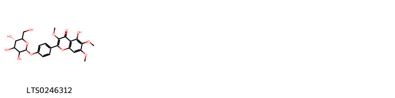{ width=100% }
    <figcaption>Hình ảnh cấu trúc hóa học của 1 hoạt chất thuộc nhóm Flavonoids gồm ['pendulin (LTS0246312)'].</figcaption>
</figure>
#### Nhóm Isoquinolines and derivatives
<figure markdown="span">
    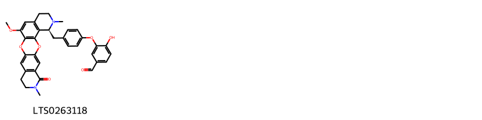{ width=100% }
    <figcaption>Hình ảnh cấu trúc hóa học của 1 hoạt chất thuộc nhóm Isoquinolines and derivatives gồm ['4-hydroxy-3-(4-{[(5s)-11-methoxy-6,19-dimethyl-20-oxo-2,13-dioxa-6,19-diazapentacyclo[12.8.0.0³,¹².0⁴,⁹.0¹⁶,²¹]docosa-1(22),3(12),4(9),10,14,16(21)-hexaen-5-yl]methyl}phenoxy)benzaldehyde (LTS0263118)'].</figcaption>
</figure>
#### Nhóm Organooxygen compounds
<figure markdown="span">
    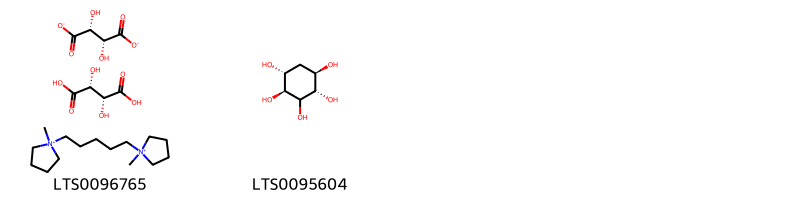{ width=100% }
    <figcaption>Hình ảnh cấu trúc hóa học của 2 hoạt chất thuộc nhóm Organooxygen compounds gồm ['l(+)-tartaric acid pentolinium (+)-tartrate (LTS0096765)', 'quercitol (LTS0095604)'].</figcaption>
</figure>
#### Nhóm Tannins
<figure markdown="span">
    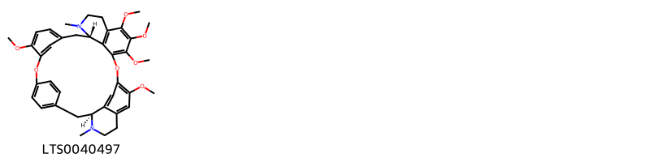{ width=100% }
    <figcaption>Hình ảnh cấu trúc hóa học của 1 hoạt chất thuộc nhóm Tannins gồm ['(+)-hernandezine (LTS0040497)'].</figcaption>
</figure>

---

### Dược dân tộc học

Danh sách các quốc gia có sử dụng *Cocculus pendulus* trong điều trị các bệnh. 

| Country   | Disease    | Bệnh                                                                                                                                                                                                |
|:----------|:-----------|:----------------------------------------------------------------------------------------------------------------------------------------------------------------------------------------------------|
| Elsewhere | Intoxicant | MYMEMORY WARNING: YOU USED ALL AVAILABLE FREE TRANSLATIONS FOR TODAY. NEXT AVAILABLE IN  19 HOURS 13 MINUTES 20 SECONDS VISIT HTTPS://MYMEMORY.TRANSLATED.NET/DOC/USAGELIMITS.PHP TO TRANSLATE MORE |

---

---
## Cocculus sarmentosus
### Thông tin về thực vật

!!! info "Phân loại thực vật của *Cocculus orbiculatus* từ GIBF:"
    - **Kingdom:** Plantae
    - **Phylum:** Tracheophyta
    - **Order:** Ranunculales
    - **Family:** Menispermaceae
    - **Genus:** Cocculus
    - **Species:** *Cocculus orbiculatus*

 

| Label (VI)   | Label (EN)   | Scientific Name   | Descriptions (VI)   | Descriptions (EN)   | Also Known As (VI)   | Also Known As (EN)   |
|:-------------|:-------------|:------------------|:--------------------|:--------------------|:---------------------|:---------------------|
| N/A          | N/A          | Cocculus pendulus | loài thực vật       | species of plant    | ['']                 | ['']                 |

#### Phân bố trên thế giới

**Từ CSDL GIBF** nan, Réunion, Chinese Taipei, Indonesia, Viet Nam, China

#### Phân bố tại Việt Nam

**Từ CSDL GIBF**: Tonkin, Ninh Thuan, 东京

---
### Thành phần hóa học
        
- Theo cơ sở dữ liệu lotus: Từ loài *Cocculus orbiculatus* đã phân lập và xác định được Chưa có hoạt chất nào được phân lập. hoạt chất thuộc về các nhóm Không có hoạt chất nào được phân lập. 

Không có hình ảnh nào được tạo ra

---

### Dược dân tộc học

Danh sách các quốc gia có sử dụng *Cocculus orbiculatus* trong điều trị các bệnh. 

| Country   | Disease   | Bệnh                                                                                                                                                                                                |
|:----------|:----------|:----------------------------------------------------------------------------------------------------------------------------------------------------------------------------------------------------|
| Elsewhere | Poison    | MYMEMORY WARNING: YOU USED ALL AVAILABLE FREE TRANSLATIONS FOR TODAY. NEXT AVAILABLE IN  19 HOURS 12 MINUTES 52 SECONDS VISIT HTTPS://MYMEMORY.TRANSLATED.NET/DOC/USAGELIMITS.PHP TO TRANSLATE MORE |

---

---
## Cocculus thunbergii
### Thông tin về thực vật

!!! info "Phân loại thực vật của *Cocculus orbiculatus* từ GIBF:"
    - **Kingdom:** Plantae
    - **Phylum:** Tracheophyta
    - **Order:** Ranunculales
    - **Family:** Menispermaceae
    - **Genus:** Cocculus
    - **Species:** *Cocculus orbiculatus*

 

| Label (VI)   | Label (EN)   | Scientific Name   | Descriptions (VI)   | Descriptions (EN)   | Also Known As (VI)   | Also Known As (EN)   |
|:-------------|:-------------|:------------------|:--------------------|:--------------------|:---------------------|:---------------------|
| N/A          | N/A          | Cocculus pendulus | loài thực vật       | species of plant    | ['']                 | ['']                 |

#### Phân bố trên thế giới

**Từ CSDL GIBF** nan, Hong Kong, Japan, Korea, Republic of, Chinese Taipei, unknown or invalid, Viet Nam, China

#### Phân bố tại Việt Nam

**Từ CSDL GIBF**: Không có ghi nhận ở Việt Nam

---
### Thành phần hóa học
        
- Theo cơ sở dữ liệu lotus: Từ loài *Cocculus orbiculatus* đã phân lập và xác định được Chưa có hoạt chất nào được phân lập. hoạt chất thuộc về các nhóm Không có hoạt chất nào được phân lập. 

Không có hình ảnh nào được tạo ra

---

### Dược dân tộc học

Danh sách các quốc gia có sử dụng *Cocculus orbiculatus* trong điều trị các bệnh. 

| Country   | Disease   | Bệnh                                                                                                                                                                                                |
|:----------|:----------|:----------------------------------------------------------------------------------------------------------------------------------------------------------------------------------------------------|
| China     | Diuretic  | MYMEMORY WARNING: YOU USED ALL AVAILABLE FREE TRANSLATIONS FOR TODAY. NEXT AVAILABLE IN  19 HOURS 12 MINUTES 14 SECONDS VISIT HTTPS://MYMEMORY.TRANSLATED.NET/DOC/USAGELIMITS.PHP TO TRANSLATE MORE |

---

---
## Cocculus trilobus
### Thông tin về thực vật

!!! info "Phân loại thực vật của *Cocculus orbiculatus* từ GIBF:"
    - **Kingdom:** Plantae
    - **Phylum:** Tracheophyta
    - **Order:** Ranunculales
    - **Family:** Menispermaceae
    - **Genus:** Cocculus
    - **Species:** *Cocculus orbiculatus*

 

| Label (VI)   | Label (EN)   | Scientific Name   | Descriptions (VI)   | Descriptions (EN)   | Also Known As (VI)   | Also Known As (EN)   |
|:-------------|:-------------|:------------------|:--------------------|:--------------------|:---------------------|:---------------------|
| N/A          | N/A          | Cocculus trilobus | loài thực vật       | species of plant    | ['']                 | ['']                 |

#### Phân bố trên thế giới

**Từ CSDL GIBF** Japan, Belgium, Korea, Republic of, Chinese Taipei, United States of America

#### Phân bố tại Việt Nam

**Từ CSDL GIBF**: Không có ghi nhận ở Việt Nam

---
### Thành phần hóa học
        
- Theo cơ sở dữ liệu lotus: Từ loài *Cocculus orbiculatus* đã phân lập và xác định được 25 hoạt chất thuộc về các nhóm Erythrina alkaloids, Phenanthrenes and derivatives, Aporphines, Isoquinolines and derivatives. 

|    | chemicalTaxonomyClassyfireClass   |   smiles_count |
|---:|:----------------------------------|---------------:|
|  0 |                                   |              4 |
|  1 | Aporphines                        |              2 |
|  2 | Erythrina alkaloids               |             11 |
|  3 | Isoquinolines and derivatives     |              2 |
|  4 | Phenanthrenes and derivatives     |              6 |

#### Nhóm 
<figure markdown="span">
    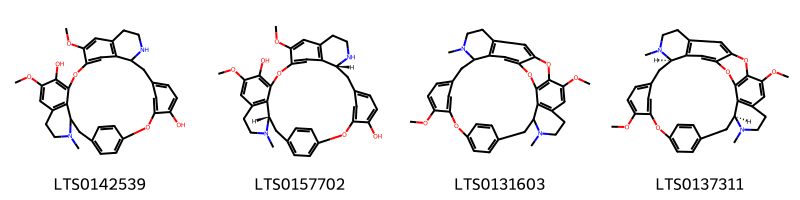{ width=100% }
    <figcaption>Hình ảnh cấu trúc hóa học của 4 hoạt chất thuộc nhóm  gồm ['20,25-dimethoxy-15-methyl-8,23-dioxa-15,30-diazaheptacyclo[22.6.2.2⁹,¹².1³,⁷.1¹⁴,¹⁸.0²⁷,³¹.0²²,³³]hexatriaconta-3,5,7(36),9,11,18(33),19,21,24(32),25,27(31),34-dodecaene-6,21-diol (LTS0142539)', '(1r,14s)-20,25-dimethoxy-15-methyl-8,23-dioxa-15,30-diazaheptacyclo[22.6.2.2⁹,¹².1³,⁷.1¹⁴,¹⁸.0²⁷,³¹.0²²,³³]hexatriaconta-3,5,7(36),9,11,18(33),19,21,24(32),25,27(31),34-dodecaene-6,21-diol (LTS0157702)', '13,27-dimethoxy-7,22-dimethyl-15,29,31-trioxa-7,22-diazaoctacyclo[19.9.3.2¹⁶,¹⁹.1⁴,³⁰.1¹⁰,¹⁴.0³,⁸.0²⁵,³³.0²⁸,³²]heptatriaconta-1,3,10,12,14(37),16,18,25(33),26,28(32),30(34),35-dodecaene (LTS0131603)', '(8r,21s)-13,27-dimethoxy-7,22-dimethyl-15,29,31-trioxa-7,22-diazaoctacyclo[19.9.3.2¹⁶,¹⁹.1⁴,³⁰.1¹⁰,¹⁴.0³,⁸.0²⁵,³³.0²⁸,³²]heptatriaconta-1,3,10,12,14(37),16,18,25(33),26,28(32),30(34),35-dodecaene (LTS0137311)'].</figcaption>
</figure>
#### Nhóm Aporphines
<figure markdown="span">
    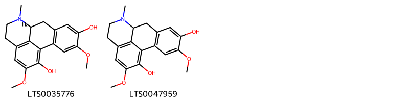{ width=100% }
    <figcaption>Hình ảnh cấu trúc hóa học của 2 hoạt chất thuộc nhóm Aporphines gồm ['(9s)-4,15-dimethoxy-10-methyl-10-azatetracyclo[7.7.1.0²,⁷.0¹³,¹⁷]heptadeca-1(16),2(7),3,5,13(17),14-hexaene-5,16-diol (LTS0035776)', '4,15-dimethoxy-10-methyl-10-azatetracyclo[7.7.1.0²,⁷.0¹³,¹⁷]heptadeca-1(16),2(7),3,5,13(17),14-hexaene-5,16-diol (LTS0047959)'].</figcaption>
</figure>
#### Nhóm Erythrina alkaloids
<figure markdown="span">
    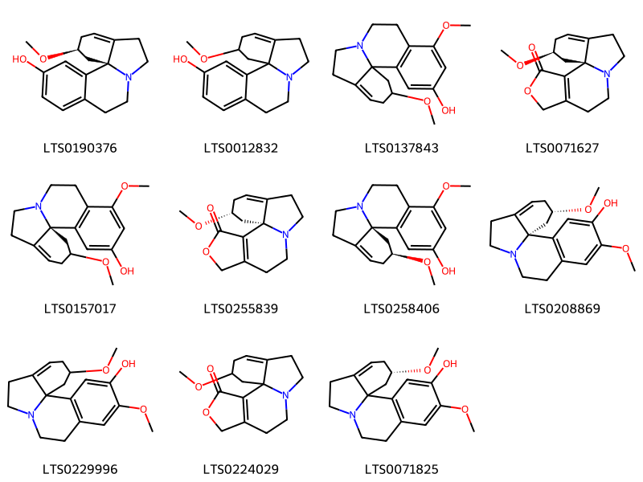{ width=100% }
    <figcaption>Hình ảnh cấu trúc hóa học của 11 hoạt chất thuộc nhóm Erythrina alkaloids gồm ['cocculine (LTS0190376)', '11-methoxy-1h,2h,4h,5h,10h,11h,12h-indolo[7a,1-a]isoquinolin-8-ol (LTS0012832)', '6,11-dimethoxy-1h,2h,4h,5h,10h,11h,12h-indolo[7a,1-a]isoquinolin-8-ol (LTS0137843)', '(1s,15s)-15-methoxy-4-oxa-9-azatetracyclo[7.7.0.0¹,¹².0²,⁶]hexadeca-2(6),12-dien-3-one (LTS0071627)', '(9bs)-6,11-dimethoxy-1h,2h,4h,5h,10h,11h,12h-indolo[7a,1-a]isoquinolin-8-ol (LTS0157017)', '(1r,15r)-15-methoxy-4-oxa-9-azatetracyclo[7.7.0.0¹,¹².0²,⁶]hexadeca-2(6),12-dien-3-one (LTS0255839)', '(9bs,11s)-6,11-dimethoxy-1h,2h,4h,5h,10h,11h,12h-indolo[7a,1-a]isoquinolin-8-ol (LTS0258406)', '(9bs,11s)-7,11-dimethoxy-1h,2h,4h,5h,10h,11h,12h-indolo[7a,1-a]isoquinolin-8-ol (LTS0208869)', '7,11-dimethoxy-1h,2h,4h,5h,10h,11h,12h-indolo[7a,1-a]isoquinolin-8-ol (LTS0229996)', '15-methoxy-4-oxa-9-azatetracyclo[7.7.0.0¹,¹².0²,⁶]hexadeca-2(6),12-dien-3-one (LTS0224029)', '(11s)-7,11-dimethoxy-1h,2h,4h,5h,10h,11h,12h-indolo[7a,1-a]isoquinolin-8-ol (LTS0071825)'].</figcaption>
</figure>
#### Nhóm Isoquinolines and derivatives
<figure markdown="span">
    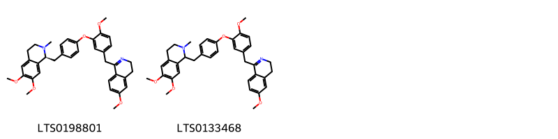{ width=100% }
    <figcaption>Hình ảnh cấu trúc hóa học của 2 hoạt chất thuộc nhóm Isoquinolines and derivatives gồm ['1-{[3-(4-{[(1s)-6,7-dimethoxy-2-methyl-3,4-dihydro-1h-isoquinolin-1-yl]methyl}phenoxy)-4-methoxyphenyl]methyl}-6-methoxy-3,4-dihydroisoquinoline (LTS0198801)', '1-[(3-{4-[(6,7-dimethoxy-2-methyl-3,4-dihydro-1h-isoquinolin-1-yl)methyl]phenoxy}-4-methoxyphenyl)methyl]-6-methoxy-3,4-dihydroisoquinoline (LTS0133468)'].</figcaption>
</figure>
#### Nhóm Phenanthrenes and derivatives
<figure markdown="span">
    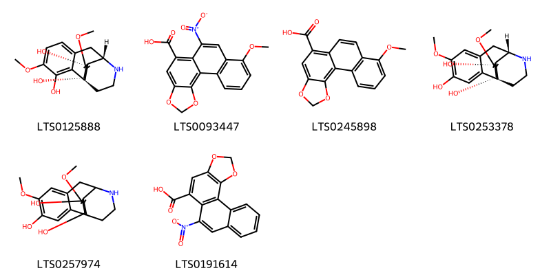{ width=100% }
    <figcaption>Hình ảnh cấu trúc hóa học của 6 hoạt chất thuộc nhóm Phenanthrenes and derivatives gồm ['sinococuline (LTS0125888)', 'birthwort (LTS0093447)', 'aristolic acid (LTS0245898)', '(1s,9s,12s,13s)-5,11-dimethoxy-17-azatetracyclo[7.5.3.0¹,¹⁰.0²,⁷]heptadeca-2,4,6,10-tetraene-4,12,13-triol (LTS0253378)', '5,11-dimethoxy-17-azatetracyclo[7.5.3.0¹,¹⁰.0²,⁷]heptadeca-2,4,6,10-tetraene-4,12,13-triol (LTS0257974)', 'aristolochic acid ii (LTS0191614)'].</figcaption>
</figure>

---

### Dược dân tộc học

Danh sách các quốc gia có sử dụng *Cocculus orbiculatus* trong điều trị các bệnh. 

| Country   | Disease                                        | Bệnh                                                                                                                                                                                                |
|:----------|:-----------------------------------------------|:----------------------------------------------------------------------------------------------------------------------------------------------------------------------------------------------------|
| China     | Alexiteric, Carminative, Diuretic, Refrigerant | MYMEMORY WARNING: YOU USED ALL AVAILABLE FREE TRANSLATIONS FOR TODAY. NEXT AVAILABLE IN  19 HOURS 11 MINUTES 49 SECONDS VISIT HTTPS://MYMEMORY.TRANSLATED.NET/DOC/USAGELIMITS.PHP TO TRANSLATE MORE |
| Elsewhere | Diuretic                                       | MYMEMORY WARNING: YOU USED ALL AVAILABLE FREE TRANSLATIONS FOR TODAY. NEXT AVAILABLE IN  19 HOURS 11 MINUTES 47 SECONDS VISIT HTTPS://MYMEMORY.TRANSLATED.NET/DOC/USAGELIMITS.PHP TO TRANSLATE MORE |

---

# Chi Sinomenium

??? note "Danh sách các dược liệu thuộc chi"
    
	 - *Sinomenium acutum*

---
## Sinomenium acutum
### Thông tin về thực vật

!!! info "Phân loại thực vật của *Sinomenium acutum* từ GIBF:"
    - **Kingdom:** Plantae
    - **Phylum:** Tracheophyta
    - **Order:** Ranunculales
    - **Family:** Menispermaceae
    - **Genus:** Sinomenium
    - **Species:** *Sinomenium acutum*

 

| Label (VI)   | Label (EN)   | Scientific Name   | Descriptions (VI)   | Descriptions (EN)   | Also Known As (VI)   | Also Known As (EN)   |
|:-------------|:-------------|:------------------|:--------------------|:--------------------|:---------------------|:---------------------|
| N/A          | N/A          | Sinomenium acutum | loài thực vật       | species of plant    | ['']                 | ['']                 |

#### Phân bố trên thế giới

**Từ CSDL GIBF** nan, Japan, Belgium, Korea, Republic of, Chinese Taipei, China

#### Phân bố tại Việt Nam

**Từ CSDL GIBF**: Không có ghi nhận ở Việt Nam

---
### Thành phần hóa học
        
- Theo cơ sở dữ liệu lotus: Từ loài *Sinomenium acutum* đã phân lập và xác định được 54 hoạt chất thuộc về các nhóm Isoaporphines, Naphthalenes, Acutumine and related alkaloids, Proaporphines, Cinnamic acids and derivatives, Phenanthrenes and derivatives, Aporphines, Benzofurans, Organooxygen compounds, Phenols, Morphinans, Hasubanan alkaloids, Protoberberine alkaloids and derivatives, Imidazopyrimidines. 

|    | chemicalTaxonomyClassyfireClass          |   smiles_count |
|---:|:-----------------------------------------|---------------:|
|  0 | Acutumine and related alkaloids          |              6 |
|  1 | Aporphines                               |              6 |
|  2 | Benzofurans                              |              6 |
|  3 | Cinnamic acids and derivatives           |              1 |
|  4 | Hasubanan alkaloids                      |              1 |
|  5 | Imidazopyrimidines                       |              1 |
|  6 | Isoaporphines                            |              3 |
|  7 | Morphinans                               |             16 |
|  8 | Naphthalenes                             |              2 |
|  9 | Organooxygen compounds                   |              2 |
| 10 | Phenanthrenes and derivatives            |              4 |
| 11 | Phenols                                  |              1 |
| 12 | Proaporphines                            |              2 |
| 13 | Protoberberine alkaloids and derivatives |              3 |

#### Nhóm Acutumine and related alkaloids
<figure markdown="span">
    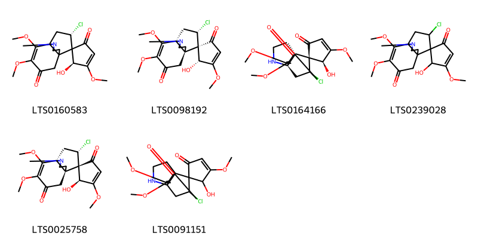{ width=100% }
    <figcaption>Hình ảnh cấu trúc hóa học của 6 hoạt chất thuộc nhóm Acutumine and related alkaloids gồm ["(5s,8's)-8'-chloro-5-hydroxy-2',3',4-trimethoxy-10'-methyl-10'-azaspiro[cyclopentane-1,7'-tricyclo[4.3.3.0¹,⁶]dodecane]-2',3-diene-2,4'-dione (LTS0160583)", "(1r,1's,5r,6's,8's)-8'-chloro-5-hydroxy-2',3',4-trimethoxy-10'-methyl-10'-azaspiro[cyclopentane-1,7'-tricyclo[4.3.3.0¹,⁶]dodecane]-2',3-diene-2,4'-dione (LTS0098192)", 'acutumidine (LTS0164166)', "8'-chloro-5-hydroxy-2',3',4-trimethoxy-10'-methyl-10'-azaspiro[cyclopentane-1,7'-tricyclo[4.3.3.0¹,⁶]dodecane]-2',3-diene-2,4'-dione (LTS0239028)", "(1s,1's,5s,6's,8's)-8'-chloro-5-hydroxy-2',3',4-trimethoxy-10'-methyl-10'-azaspiro[cyclopentane-1,7'-tricyclo[4.3.3.0¹,⁶]dodecane]-2',3-diene-2,4'-dione (LTS0025758)", "8'-chloro-5-hydroxy-2',3',4-trimethoxy-10'-azaspiro[cyclopentane-1,7'-tricyclo[4.3.3.0¹,⁶]dodecane]-2',3-diene-2,4'-dione (LTS0091151)"].</figcaption>
</figure>
#### Nhóm Aporphines
<figure markdown="span">
    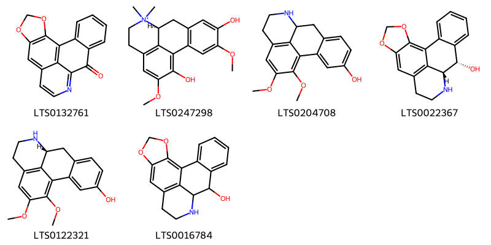{ width=100% }
    <figcaption>Hình ảnh cấu trúc hóa học của 6 hoạt chất thuộc nhóm Aporphines gồm ['liriodenine (LTS0132761)', '(9s)-5,16-dihydroxy-4,15-dimethoxy-10,10-dimethyl-10-azatetracyclo[7.7.1.0²,⁷.0¹³,¹⁷]heptadeca-1(16),2(7),3,5,13(17),14-hexaen-10-ium (LTS0247298)', '15,16-dimethoxy-10-azatetracyclo[7.7.1.0²,⁷.0¹³,¹⁷]heptadeca-1(16),2,4,6,13(17),14-hexaen-4-ol (LTS0204708)', '(12r,13s)-3,5-dioxa-11-azapentacyclo[10.7.1.0²,⁶.0⁸,²⁰.0¹⁴,¹⁹]icosa-1,6,8(20),14,16,18-hexaen-13-ol (LTS0022367)', 'tsuduranine (LTS0122321)', '3,5-dioxa-11-azapentacyclo[10.7.1.0²,⁶.0⁸,²⁰.0¹⁴,¹⁹]icosa-1,6,8(20),14,16,18-hexaen-13-ol (LTS0016784)'].</figcaption>
</figure>
#### Nhóm Benzofurans
<figure markdown="span">
    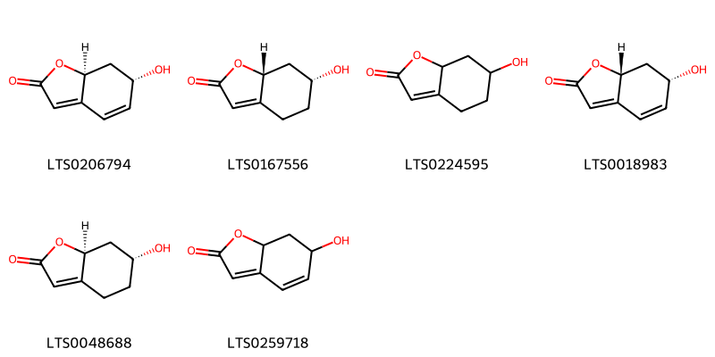{ width=100% }
    <figcaption>Hình ảnh cấu trúc hóa học của 6 hoạt chất thuộc nhóm Benzofurans gồm ['(6s,7as)-6-hydroxy-7,7a-dihydro-6h-1-benzofuran-2-one (LTS0206794)', '(6r,7ar)-6-hydroxy-5,6,7,7a-tetrahydro-4h-1-benzofuran-2-one (LTS0167556)', '6-hydroxy-5,6,7,7a-tetrahydro-4h-1-benzofuran-2-one (LTS0224595)', 'menisdaurilide (LTS0018983)', '(6r,7as)-6-hydroxy-5,6,7,7a-tetrahydro-4h-1-benzofuran-2-one (LTS0048688)', '6-hydroxy-7,7a-dihydro-6h-1-benzofuran-2-one (LTS0259718)'].</figcaption>
</figure>
#### Nhóm Cinnamic acids and derivatives
<figure markdown="span">
    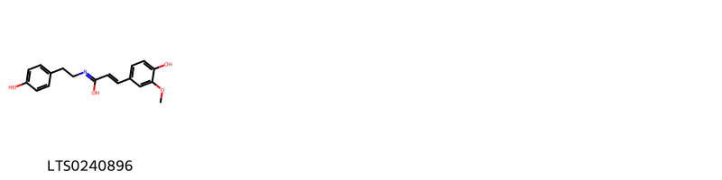{ width=100% }
    <figcaption>Hình ảnh cấu trúc hóa học của 1 hoạt chất thuộc nhóm Cinnamic acids and derivatives gồm ['3-(4-hydroxy-3-methoxyphenyl)-n-[2-(4-hydroxyphenyl)ethyl]prop-2-enimidic acid (LTS0240896)'].</figcaption>
</figure>
#### Nhóm Hasubanan alkaloids
<figure markdown="span">
    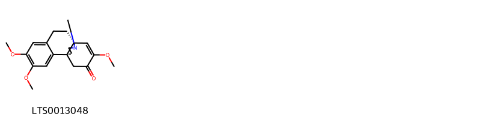{ width=100% }
    <figcaption>Hình ảnh cấu trúc hóa học của 1 hoạt chất thuộc nhóm Hasubanan alkaloids gồm ['(1s,10r)-4,5,12-trimethoxy-17-methyl-17-azatetracyclo[8.4.3.0¹,¹⁰.0²,⁷]heptadeca-2,4,6,11-tetraen-13-one (LTS0013048)'].</figcaption>
</figure>
#### Nhóm Imidazopyrimidines
<figure markdown="span">
    { width=100% }
    <figcaption>Hình ảnh cấu trúc hóa học của 1 hoạt chất thuộc nhóm Imidazopyrimidines gồm ['caffeine (LTS0075508)'].</figcaption>
</figure>
#### Nhóm Isoaporphines
<figure markdown="span">
    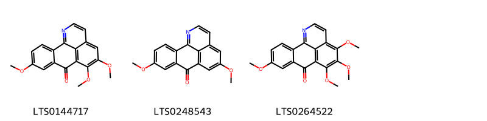{ width=100% }
    <figcaption>Hình ảnh cấu trúc hóa học của 3 hoạt chất thuộc nhóm Isoaporphines gồm ['5,10,11-trimethoxy-16-azatetracyclo[7.7.1.0²,⁷.0¹³,¹⁷]heptadeca-1(17),2,4,6,9,11,13,15-octaen-8-one (LTS0144717)', '5,11-dimethoxy-16-azatetracyclo[7.7.1.0²,⁷.0¹³,¹⁷]heptadeca-1(17),2,4,6,9,11,13,15-octaen-8-one (LTS0248543)', '5,10,11,12-tetramethoxy-16-azatetracyclo[7.7.1.0²,⁷.0¹³,¹⁷]heptadeca-1(17),2,4,6,9,11,13,15-octaen-8-one (LTS0264522)'].</figcaption>
</figure>
#### Nhóm Morphinans
<figure markdown="span">
    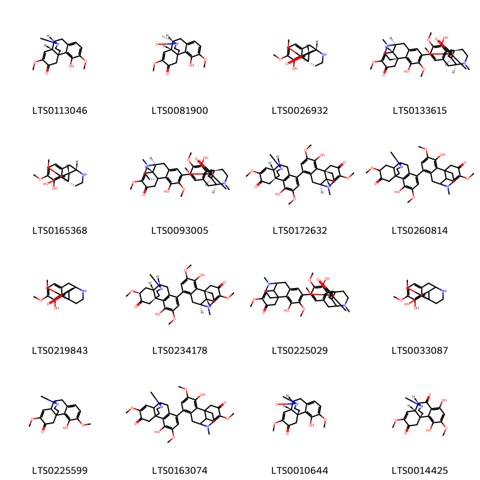{ width=100% }
    <figcaption>Hình ảnh cấu trúc hóa học của 16 hoạt chất thuộc nhóm Morphinans gồm ['sinomenine (LTS0113046)', '(1r,9s,10s,17r)-3-hydroxy-4,12-dimethoxy-17-methyl-13-oxo-17-azatetracyclo[7.5.3.0¹,¹⁰.0²,⁷]heptadeca-2,4,6,11-tetraen-17-ium-17-olate (LTS0081900)', '(1r,9s,10s)-3-hydroxy-4,12-dimethoxy-17-azatetracyclo[7.5.3.0¹,¹⁰.0²,⁷]heptadeca-2,4,6,11-tetraen-13-one (LTS0026932)', '(1r,9s,10s)-3-hydroxy-5-[(1r,9s,10s)-3-hydroxy-4,12-dimethoxy-17-methyl-13-oxo-17-azatetracyclo[7.5.3.0¹,¹⁰.0²,⁷]heptadeca-2(7),3,5,11-tetraen-5-yl]-4,12-dimethoxy-17-methyl-17-azatetracyclo[7.5.3.0¹,¹⁰.0²,⁷]heptadeca-2,4,6,11-tetraen-13-one (LTS0133615)', '(1r,9s,10s,13r)-4,12-dimethoxy-17-azatetracyclo[7.5.3.0¹,¹⁰.0²,⁷]heptadeca-2,4,6,11-tetraene-3,13-diol (LTS0165368)', '(1s,9s,10s)-3-hydroxy-5-[(1r,9s,10s)-3-hydroxy-4,12-dimethoxy-17-methyl-13-oxo-17-azatetracyclo[7.5.3.0¹,¹⁰.0²,⁷]heptadeca-2(7),3,5,11-tetraen-5-yl]-4,12-dimethoxy-17-methyl-17-azatetracyclo[7.5.3.0¹,¹⁰.0²,⁷]heptadeca-2,4,6,11-tetraen-13-one (LTS0093005)', 'disinomenine (LTS0172632)', '3-hydroxy-6-{3-hydroxy-4,12-dimethoxy-17-methyl-13-oxo-17-azatetracyclo[7.5.3.0¹,¹⁰.0²,⁷]heptadeca-2(7),3,5-trien-6-yl}-4,12-dimethoxy-17-methyl-17-azatetracyclo[7.5.3.0¹,¹⁰.0²,⁷]heptadeca-2,4,6,11-tetraen-13-one (LTS0260814)', '3-hydroxy-4,12-dimethoxy-17-azatetracyclo[7.5.3.0¹,¹⁰.0²,⁷]heptadeca-2,4,6,11-tetraen-13-one (LTS0219843)', '(1r,9s,10s)-3-hydroxy-6-[(1r,9s,10s,12s)-3-hydroxy-4,12-dimethoxy-17-methyl-13-oxo-17-azatetracyclo[7.5.3.0¹,¹⁰.0²,⁷]heptadeca-2(7),3,5-trien-6-yl]-4,12-dimethoxy-17-methyl-17-azatetracyclo[7.5.3.0¹,¹⁰.0²,⁷]heptadeca-2,4,6,11-tetraen-13-one (LTS0234178)', '3-hydroxy-5-{3-hydroxy-4,12-dimethoxy-17-methyl-13-oxo-17-azatetracyclo[7.5.3.0¹,¹⁰.0²,⁷]heptadeca-2(7),3,5,11-tetraen-5-yl}-4,12-dimethoxy-17-methyl-17-azatetracyclo[7.5.3.0¹,¹⁰.0²,⁷]heptadeca-2,4,6,11-tetraen-13-one (LTS0225029)', '4,12-dimethoxy-17-azatetracyclo[7.5.3.0¹,¹⁰.0²,⁷]heptadeca-2,4,6,11-tetraene-3,13-diol (LTS0033087)', 'sinomenine (LTS0225599)', '3-hydroxy-6-{3-hydroxy-4,12-dimethoxy-17-methyl-13-oxo-17-azatetracyclo[7.5.3.0¹,¹⁰.0²,⁷]heptadeca-2(7),3,5,11-tetraen-6-yl}-4,12-dimethoxy-17-methyl-17-azatetracyclo[7.5.3.0¹,¹⁰.0²,⁷]heptadeca-2,4,6,11-tetraen-13-one (LTS0163074)', '(1r,9s,10s)-3-hydroxy-4,12-dimethoxy-17-methyl-13-oxo-17-azatetracyclo[7.5.3.0¹,¹⁰.0²,⁷]heptadeca-2,4,6,11-tetraen-17-ium-17-olate (LTS0010644)', '(1r,9r,10s)-3,6-dihydroxy-4,12-dimethoxy-17-methyl-17-azatetracyclo[7.5.3.0¹,¹⁰.0²,⁷]heptadeca-2,4,6,11-tetraene-8,13-dione (LTS0014425)'].</figcaption>
</figure>
#### Nhóm Naphthalenes
<figure markdown="span">
    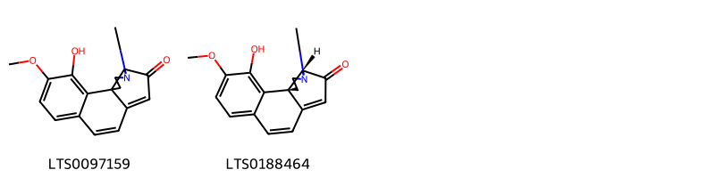{ width=100% }
    <figcaption>Hình ảnh cấu trúc hóa học của 2 hoạt chất thuộc nhóm Naphthalenes gồm ['3-hydroxy-4-methoxy-14-methyl-14-azatetracyclo[8.6.0.0¹,¹³.0²,⁷]hexadeca-2,4,6,8,10-pentaen-12-one (LTS0097159)', '(1r,13r)-3-hydroxy-4-methoxy-14-methyl-14-azatetracyclo[8.6.0.0¹,¹³.0²,⁷]hexadeca-2,4,6,8,10-pentaen-12-one (LTS0188464)'].</figcaption>
</figure>
#### Nhóm Organooxygen compounds
<figure markdown="span">
    { width=100% }
    <figcaption>Hình ảnh cấu trúc hóa học của 2 hoạt chất thuộc nhóm Organooxygen compounds gồm ['2-[(1z,4s,6r)-4-hydroxy-6-{[(2r,3r,4s,5s,6r)-3,4,5-trihydroxy-6-(hydroxymethyl)oxan-2-yl]oxy}cyclohex-2-en-1-ylidene]acetonitrile (LTS0058155)', '2-[(1z)-4-hydroxy-6-{[3,4,5-trihydroxy-6-(hydroxymethyl)oxan-2-yl]oxy}cyclohex-2-en-1-ylidene]acetonitrile (LTS0027822)'].</figcaption>
</figure>
#### Nhóm Phenanthrenes and derivatives
<figure markdown="span">
    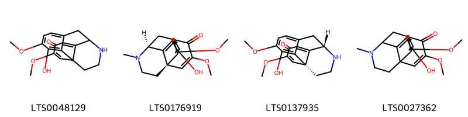{ width=100% }
    <figcaption>Hình ảnh cấu trúc hóa học của 4 hoạt chất thuộc nhóm Phenanthrenes and derivatives gồm ['3-hydroxy-4,13-dimethoxy-17-azatetracyclo[7.5.3.0¹,¹⁰.0²,⁷]heptadeca-2,4,6,10,13-pentaen-12-one (LTS0048129)', '(-)-salutaridine (LTS0176919)', '(1r,9s)-3-hydroxy-4,13-dimethoxy-17-azatetracyclo[7.5.3.0¹,¹⁰.0²,⁷]heptadeca-2,4,6,10,13-pentaen-12-one (LTS0137935)', '3-hydroxy-4,13-dimethoxy-17-methyl-17-azatetracyclo[7.5.3.0¹,¹⁰.0²,⁷]heptadeca-2,4,6,10,13-pentaen-12-one (LTS0027362)'].</figcaption>
</figure>
#### Nhóm Phenols
<figure markdown="span">
    { width=100% }
    <figcaption>Hình ảnh cấu trúc hóa học của 1 hoạt chất thuộc nhóm Phenols gồm ['(2e)-3-(4-hydroxy-3-methoxyphenyl)-n-[2-(4-hydroxyphenyl)ethyl]prop-2-enimidic acid (LTS0187051)'].</figcaption>
</figure>
#### Nhóm Proaporphines
<figure markdown="span">
    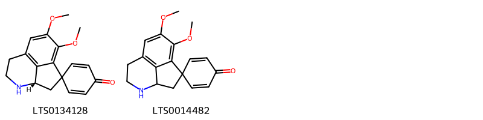{ width=100% }
    <figcaption>Hình ảnh cấu trúc hóa học của 2 hoạt chất thuộc nhóm Proaporphines gồm ["(4's)-10',11'-dimethoxy-5'-azaspiro[cyclohexane-1,2'-tricyclo[6.3.1.0⁴,¹²]dodecane]-1'(11'),2,5,8'(12'),9'-pentaen-4-one (LTS0134128)", "10',11'-dimethoxy-5'-azaspiro[cyclohexane-1,2'-tricyclo[6.3.1.0⁴,¹²]dodecane]-1'(11'),2,5,8'(12'),9'-pentaen-4-one (LTS0014482)"].</figcaption>
</figure>
#### Nhóm Protoberberine alkaloids and derivatives
<figure markdown="span">
    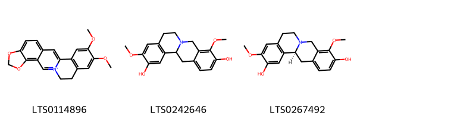{ width=100% }
    <figcaption>Hình ảnh cấu trúc hóa học của 3 hoạt chất thuộc nhóm Protoberberine alkaloids and derivatives gồm ['16,17-dimethoxy-5,7-dioxa-1λ⁵-azapentacyclo[11.8.0.0³,¹¹.0⁴,⁸.0¹⁴,¹⁹]henicosa-1,3,8,10,12,14(19),15,17-octaen-1-ylium (LTS0114896)', 'coreximine (LTS0242646)', 'stepholidine (LTS0267492)'].</figcaption>
</figure>

---

### Dược dân tộc học

Danh sách các quốc gia có sử dụng *Sinomenium acutum* trong điều trị các bệnh. 

| Country   | Disease     | Bệnh                                                                                                                                                                                                |
|:----------|:------------|:----------------------------------------------------------------------------------------------------------------------------------------------------------------------------------------------------|
| China     | Carminative | MYMEMORY WARNING: YOU USED ALL AVAILABLE FREE TRANSLATIONS FOR TODAY. NEXT AVAILABLE IN  19 HOURS 11 MINUTES 22 SECONDS VISIT HTTPS://MYMEMORY.TRANSLATED.NET/DOC/USAGELIMITS.PHP TO TRANSLATE MORE |
| Japan*    | Diuretic    | MYMEMORY WARNING: YOU USED ALL AVAILABLE FREE TRANSLATIONS FOR TODAY. NEXT AVAILABLE IN  19 HOURS 11 MINUTES 19 SECONDS VISIT HTTPS://MYMEMORY.TRANSLATED.NET/DOC/USAGELIMITS.PHP TO TRANSLATE MORE |

---

# Chi Stephania

??? note "Danh sách các dược liệu thuộc chi"
    
	 - *Stephania cephalantha*
	 - *Stephania glabra*
	 - *Stephania hernandifolia*
	 - *Stephania hernandiifolia*
	 - *Stephania japonica*
	 - *Stephania rotunda*
	 - *Stephania sinica*

---
## Stephania cephalantha
### Thông tin về thực vật

!!! info "Phân loại thực vật của *Stephania cephalantha* từ GIBF:"
    - **Kingdom:** Plantae
    - **Phylum:** Tracheophyta
    - **Order:** Ranunculales
    - **Family:** Menispermaceae
    - **Genus:** Stephania
    - **Species:** *Stephania cephalantha*

 

| Label (VI)   | Label (EN)   | Scientific Name       | Descriptions (VI)   | Descriptions (EN)   | Also Known As (VI)   | Also Known As (EN)   |
|:-------------|:-------------|:----------------------|:--------------------|:--------------------|:---------------------|:---------------------|
| N/A          | N/A          | Stephania cephalantha |                     | species of plant    | ['']                 | ['']                 |

#### Phân bố trên thế giới

**Từ CSDL GIBF** nan, Japan, Chinese Taipei, Bangladesh, China

#### Phân bố tại Việt Nam

**Từ CSDL GIBF**: Không có ghi nhận ở Việt Nam

---
### Thành phần hóa học
        
- Theo cơ sở dữ liệu lotus: Từ loài *Stephania cephalantha* đã phân lập và xác định được 109 hoạt chất thuộc về các nhóm Proaporphines, Peptidomimetics, Phenanthrenes and derivatives, Aporphines, Dihydroisoquinolines, Azaphilones, Hasubanan alkaloids, Organooxygen compounds, Morphinans, Phenols, Aristolactams, Isoquinolines and derivatives, Protoberberine alkaloids and derivatives. 

|    | chemicalTaxonomyClassyfireClass          |   smiles_count |
|---:|:-----------------------------------------|---------------:|
|  0 |                                          |             22 |
|  1 | Aporphines                               |             20 |
|  2 | Aristolactams                            |              2 |
|  3 | Azaphilones                              |              1 |
|  4 | Dihydroisoquinolines                     |              2 |
|  5 | Hasubanan alkaloids                      |              6 |
|  6 | Isoquinolines and derivatives            |             15 |
|  7 | Morphinans                               |             13 |
|  8 | Organooxygen compounds                   |              3 |
|  9 | Peptidomimetics                          |              2 |
| 10 | Phenanthrenes and derivatives            |             11 |
| 11 | Phenols                                  |              1 |
| 12 | Proaporphines                            |              4 |
| 13 | Protoberberine alkaloids and derivatives |              7 |

#### Nhóm 
<figure markdown="span">
    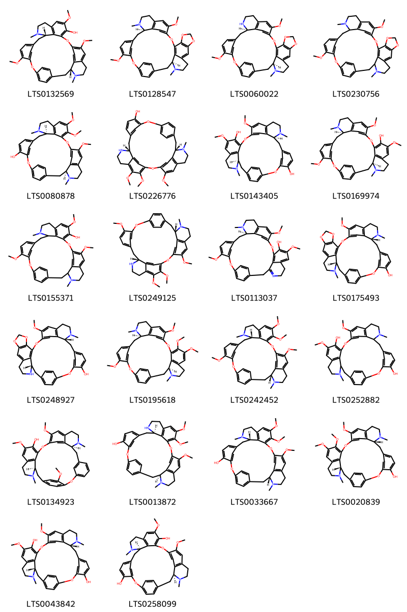{ width=100% }
    <figcaption>Hình ảnh cấu trúc hóa học của 22 hoạt chất thuộc nhóm  gồm ['(1r,14s)-9,20,25-trimethoxy-15,30-dimethyl-7,23-dioxa-15,30-diazaheptacyclo[22.6.2.2³,⁶.1⁸,¹².1¹⁴,¹⁸.0²⁷,³¹.0²²,³³]hexatriaconta-3,5,8(34),9,11,18(33),19,21,24,26,31,35-dodecaen-21-ol (LTS0132569)', '(14s,27r)-22,33-dimethoxy-13,28-dimethyl-2,5,7,20-tetraoxa-13,28-diazaoctacyclo[25.6.2.2¹⁶,¹⁹.1³,¹⁰.1²¹,²⁵.0⁴,⁸.0³¹,³⁵.0¹⁴,³⁹]nonatriaconta-1(34),3,8,10(39),16,18,21(36),22,24,31(35),32,37-dodecaene (LTS0128547)', '(14s,27r)-22,33-dimethoxy-13-methyl-2,5,7,20-tetraoxa-13,28-diazaoctacyclo[25.6.2.2¹⁶,¹⁹.1³,¹⁰.1²¹,²⁵.0⁴,⁸.0³¹,³⁵.0¹⁴,³⁹]nonatriaconta-1(34),3,8,10(39),16,18,21(36),22,24,31(35),32,37-dodecaene (LTS0060022)', '22,33-dimethoxy-13,28-dimethyl-2,5,7,20-tetraoxa-13,28-diazaoctacyclo[25.6.2.2¹⁶,¹⁹.1³,¹⁰.1²¹,²⁵.0⁴,⁸.0³¹,³⁵.0¹⁴,³⁹]nonatriaconta-1(34),3,8,10(39),16,18,21(36),22,24,31(35),32,37-dodecaene (LTS0230756)', '(1s,14r)-20,21,25-trimethoxy-15,30-dimethyl-7,23-dioxa-15,30-diazaheptacyclo[22.6.2.2³,⁶.1⁸,¹².1¹⁴,¹⁸.0²⁷,³¹.0²²,³³]hexatriaconta-3,5,8(34),9,11,18(33),19,21,24(32),25,27(31),35-dodecaen-9-ol (LTS0080878)', '(10s,23r)-28,29,36-trimethoxy-9-methyl-2,16-dioxa-9,24-diazaheptacyclo[21.6.2.2³,⁶.2¹²,¹⁵.1¹⁷,²¹.0⁵,¹⁰.0²⁷,³¹]hexatriaconta-1(30),3,5,12,14,17(32),18,20,27(31),28,33,35-dodecaen-18-ol (LTS0226776)', '(1s,14r)-20,25-dimethoxy-15,30-dimethyl-8,23-dioxa-15,30-diazaheptacyclo[22.6.2.2⁹,¹².1³,⁷.1¹⁴,¹⁸.0²⁷,³¹.0²²,³³]hexatriaconta-3,5,7(36),9,11,18(33),19,21,24(32),25,27(31),34-dodecaene-6,21-diol (LTS0143405)', '(1r,14s)-6,20,25-trimethoxy-15,30-dimethyl-8,23-dioxa-15,30-diazaheptacyclo[22.6.2.2⁹,¹².1³,⁷.1¹⁴,¹⁸.0²⁷,³¹.0²²,³³]hexatriaconta-3,5,7(36),9,11,18(33),19,21,24(32),25,27(31),34-dodecaen-21-ol (LTS0169974)', '9,20,25-trimethoxy-15,30-dimethyl-7,23-dioxa-15,30-diazaheptacyclo[22.6.2.2³,⁶.1⁸,¹².1¹⁴,¹⁸.0²⁷,³¹.0²²,³³]hexatriaconta-3,5,8(34),9,11,18(33),19,21,24,26,31,35-dodecaen-21-ol (LTS0155371)', '(10s,23r)-18,28,29,36-tetramethoxy-9-methyl-2,16-dioxa-9,24-diazaheptacyclo[21.6.2.2³,⁶.2¹²,¹⁵.1¹⁷,²¹.0⁵,¹⁰.0²⁷,³¹]hexatriaconta-1(30),3(36),4,6(35),12,14,17(32),18,20,27(31),28,33-dodecaene (LTS0249125)', '(1r)-6,20,25-trimethoxy-30-methyl-8,23-dioxa-15,30-diazaheptacyclo[22.6.2.2⁹,¹².1³,⁷.1¹⁴,¹⁸.0²⁷,³¹.0²²,³³]hexatriaconta-3,5,7(36),9,11,14,18,20,22(33),24(32),25,27(31),34-tridecaen-21-ol (LTS0113037)', '(14s,27r)-33-methoxy-13,28-dimethyl-2,5,7,20-tetraoxa-13,28-diazaoctacyclo[25.6.2.2¹⁶,¹⁹.1³,¹⁰.1²¹,²⁵.0⁴,⁸.0³¹,³⁵.0¹⁴,³⁹]nonatriaconta-1(34),3,8,10(39),16,18,21(36),22,24,31(35),32,37-dodecaen-22-ol (LTS0175493)', '(14s,27r)-33-methoxy-28-methyl-2,5,7,20-tetraoxa-13,28-diazaoctacyclo[25.6.2.2¹⁶,¹⁹.1³,¹⁰.1²¹,²⁵.0⁴,⁸.0³¹,³⁵.0¹⁴,³⁹]nonatriaconta-1(34),3,8,10(39),16,18,21(36),22,24,31(35),32,37-dodecaen-22-ol (LTS0248927)', '(1r,14s)-6,20,21,25-tetramethoxy-15,30-dimethyl-8,23-dioxa-15,30-diazaheptacyclo[22.6.2.2⁹,¹².1³,⁷.1¹⁴,¹⁸.0²⁷,³¹.0²²,³³]hexatriaconta-3,5,7(36),9,11,18(33),19,21,24(32),25,27(31),34-dodecaene (LTS0195618)', '(1r,14s)-9,20,21,25-tetramethoxy-15,30-dimethyl-7,23-dioxa-15,30-diazaheptacyclo[22.6.2.2³,⁶.1⁸,¹².1¹⁴,¹⁸.0²⁷,³¹.0²²,³³]hexatriaconta-3,5,8(34),9,11,18(33),19,21,24,26,31,35-dodecaene (LTS0242452)', '20,25-dimethoxy-15,30-dimethyl-8,23-dioxa-15,30-diazaheptacyclo[22.6.2.2⁹,¹².1³,⁷.1¹⁴,¹⁸.0²⁷,³¹.0²²,³³]hexatriaconta-3,5,7(36),9,11,18(33),19,21,24(32),25,27(31),34-dodecaene-6,21-diol (LTS0252882)', '(1s,14r)-20,25,35-trimethoxy-15,30-dimethyl-8,23-dioxa-15,30-diazaheptacyclo[22.6.2.2⁹,¹².1³,⁷.1¹⁴,¹⁸.0²⁷,³¹.0²²,³³]hexatriaconta-3(36),4,6,9,11,18(33),19,21,24,26,31,34-dodecaen-21-ol (LTS0134923)', '(1s,14r)-20,21,25-trimethoxy-30-methyl-7,23-dioxa-15,30-diazaheptacyclo[22.6.2.2³,⁶.1⁸,¹².1¹⁴,¹⁸.0²⁷,³¹.0²²,³³]hexatriaconta-3,5,8(34),9,11,18(33),19,21,24(32),25,27(31),35-dodecaen-9-ol (LTS0013872)', '(1r,14s)-20,21,25-trimethoxy-15,30-dimethyl-7,23-dioxa-15,30-diazaheptacyclo[22.6.2.2³,⁶.1⁸,¹².1¹⁴,¹⁸.0²⁷,³¹.0²²,³³]hexatriaconta-3,5,8(34),9,11,18(33),19,21,24(32),25,27(31),35-dodecaen-9-ol (LTS0033667)', '(1r,14s)-20,21,25-trimethoxy-15,30-dimethyl-8,23-dioxa-15,30-diazaheptacyclo[22.6.2.2⁹,¹².1³,⁷.1¹⁴,¹⁸.0²⁷,³¹.0²²,³³]hexatriaconta-3,5,7(36),9,11,18(33),19,21,24(32),25,27(31),34-dodecaen-6-ol (LTS0020839)', '(1r,14s)-20,25-dimethoxy-15,30-dimethyl-8,23-dioxa-15,30-diazaheptacyclo[22.6.2.2⁹,¹².1³,⁷.1¹⁴,¹⁸.0²⁷,³¹.0²²,³³]hexatriaconta-3,5,7(36),9,11,18(33),19,21,24(32),25,27(31),34-dodecaene-6,21-diol (LTS0043842)', '(1s,14r)-20,25-dimethoxy-15,30-dimethyl-7,23-dioxa-15,30-diazaheptacyclo[22.6.2.2³,⁶.1⁸,¹².1¹⁴,¹⁸.0²⁷,³¹.0²²,³³]hexatriaconta-3,5,8(34),9,11,18(33),19,21,24(32),25,27(31),35-dodecaene-9,21-diol (LTS0258099)'].</figcaption>
</figure>
#### Nhóm Aporphines
<figure markdown="span">
    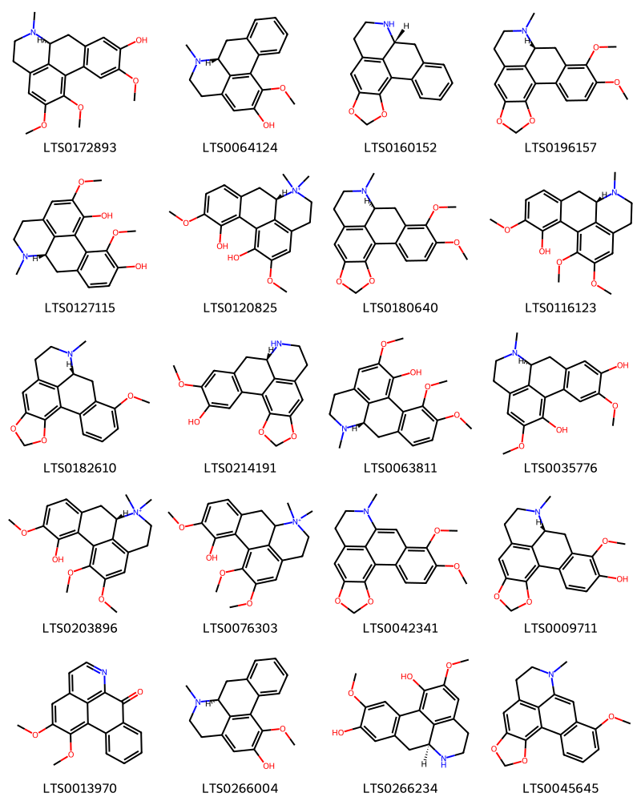{ width=100% }
    <figcaption>Hình ảnh cấu trúc hóa học của 20 hoạt chất thuộc nhóm Aporphines gồm ['(9s)-4,15,16-trimethoxy-10-methyl-10-azatetracyclo[7.7.1.0²,⁷.0¹³,¹⁷]heptadeca-1(16),2(7),3,5,13(17),14-hexaen-5-ol (LTS0172893)', '(9r)-16-methoxy-10-methyl-10-azatetracyclo[7.7.1.0²,⁷.0¹³,¹⁷]heptadeca-1(17),2,4,6,13,15-hexaen-15-ol (LTS0064124)', 'anonaine (LTS0160152)', '(12r)-15,16-dimethoxy-11-methyl-3,5-dioxa-11-azapentacyclo[10.7.1.0²,⁶.0⁸,²⁰.0¹⁴,¹⁹]icosa-1,6,8(20),14,16,18-hexaene (LTS0196157)', '(9s)-3,15-dimethoxy-10-methyl-10-azatetracyclo[7.7.1.0²,⁷.0¹³,¹⁷]heptadeca-1(16),2(7),3,5,13(17),14-hexaene-4,16-diol (LTS0127115)', 'magnoflorine (LTS0120825)', '(12s)-15,16-dimethoxy-11-methyl-3,5-dioxa-11-azapentacyclo[10.7.1.0²,⁶.0⁸,²⁰.0¹⁴,¹⁹]icosa-1,6,8(20),14,16,18-hexaene (LTS0180640)', '(9s)-4,15,16-trimethoxy-10-methyl-10-azatetracyclo[7.7.1.0²,⁷.0¹³,¹⁷]heptadeca-1(16),2,4,6,13(17),14-hexaen-3-ol (LTS0116123)', '(12r)-15-methoxy-11-methyl-3,5-dioxa-11-azapentacyclo[10.7.1.0²,⁶.0⁸,²⁰.0¹⁴,¹⁹]icosa-1,6,8(20),14(19),15,17-hexaene (LTS0182610)', '(12s)-16-methoxy-3,5-dioxa-11-azapentacyclo[10.7.1.0²,⁶.0⁸,²⁰.0¹⁴,¹⁹]icosa-1,6,8(20),14(19),15,17-hexaen-17-ol (LTS0214191)', '(9s)-3,4,15-trimethoxy-10-methyl-10-azatetracyclo[7.7.1.0²,⁷.0¹³,¹⁷]heptadeca-1(16),2(7),3,5,13(17),14-hexaen-16-ol (LTS0063811)', '(9s)-4,15-dimethoxy-10-methyl-10-azatetracyclo[7.7.1.0²,⁷.0¹³,¹⁷]heptadeca-1(16),2(7),3,5,13(17),14-hexaene-5,16-diol (LTS0035776)', '(9s)-3-hydroxy-4,15,16-trimethoxy-10,10-dimethyl-10-azatetracyclo[7.7.1.0²,⁷.0¹³,¹⁷]heptadeca-1(16),2,4,6,13(17),14-hexaen-10-ium (LTS0203896)', '3-hydroxy-4,15,16-trimethoxy-10,10-dimethyl-10-azatetracyclo[7.7.1.0²,⁷.0¹³,¹⁷]heptadeca-1(16),2,4,6,13(17),14-hexaen-10-ium (LTS0076303)', '15,16-dimethoxy-11-methyl-3,5-dioxa-11-azapentacyclo[10.7.1.0²,⁶.0⁸,²⁰.0¹⁴,¹⁹]icosa-1(20),2(6),7,12,14(19),15,17-heptaene (LTS0042341)', '(12r)-15-methoxy-11-methyl-3,5-dioxa-11-azapentacyclo[10.7.1.0²,⁶.0⁸,²⁰.0¹⁴,¹⁹]icosa-1,6,8(20),14(19),15,17-hexaen-16-ol (LTS0009711)', 'lysicamine (LTS0013970)', '(9s)-16-methoxy-10-methyl-10-azatetracyclo[7.7.1.0²,⁷.0¹³,¹⁷]heptadeca-1(17),2,4,6,13,15-hexaen-15-ol (LTS0266004)', '(9s)-4,15-dimethoxy-10-azatetracyclo[7.7.1.0²,⁷.0¹³,¹⁷]heptadeca-1(17),2(7),3,5,13,15-hexaene-5,16-diol (LTS0266234)', '15-methoxy-11-methyl-3,5-dioxa-11-azapentacyclo[10.7.1.0²,⁶.0⁸,²⁰.0¹⁴,¹⁹]icosa-1(20),2(6),7,12,14(19),15,17-heptaene (LTS0045645)'].</figcaption>
</figure>
#### Nhóm Aristolactams
<figure markdown="span">
    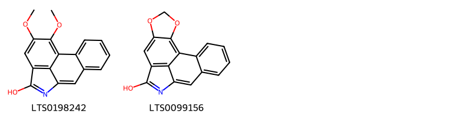{ width=100% }
    <figcaption>Hình ảnh cấu trúc hóa học của 2 hoạt chất thuộc nhóm Aristolactams gồm ['14,15-dimethoxy-10-azatetracyclo[7.6.1.0²,⁷.0¹²,¹⁶]hexadeca-1(16),2(7),3,5,8,10,12,14-octaen-11-ol (LTS0198242)', '3,5-dioxa-10-azapentacyclo[9.7.1.0²,⁶.0⁸,¹⁹.0¹³,¹⁸]nonadeca-1(19),2(6),7,9,11,13(18),14,16-octaen-9-ol (LTS0099156)'].</figcaption>
</figure>
#### Nhóm Azaphilones
<figure markdown="span">
    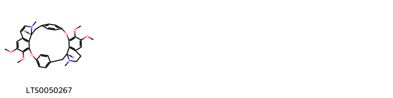{ width=100% }
    <figcaption>Hình ảnh cấu trúc hóa học của 1 hoạt chất thuộc nhóm Azaphilones gồm ['(11r,26r)-4,5,19,20-tetramethoxy-10,25-dimethyl-2,17-dioxa-10,25-diazaheptacyclo[26.2.2.2¹³,¹⁶.1³,⁷.1¹⁸,²².0¹¹,³⁶.0²⁶,³³]hexatriaconta-1(30),3,5,7(36),8,13,15,18,20,22(33),28,31,34-tridecaene (LTS0050267)'].</figcaption>
</figure>
#### Nhóm Dihydroisoquinolines
<figure markdown="span">
    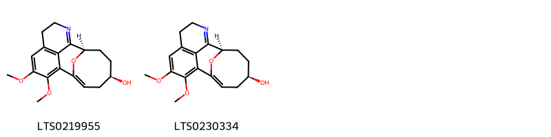{ width=100% }
    <figcaption>Hình ảnh cấu trúc hóa học của 2 hoạt chất thuộc nhóm Dihydroisoquinolines gồm ['(2z,5r,8r)-15,16-dimethoxy-18-oxa-10-azatetracyclo[7.7.1.1²,⁸.0¹³,¹⁷]octadeca-1(16),2,9,13(17),14-pentaen-5-ol (LTS0219955)', '(5r,8r)-15,16-dimethoxy-18-oxa-10-azatetracyclo[7.7.1.1²,⁸.0¹³,¹⁷]octadeca-1(16),2,9,13(17),14-pentaen-5-ol (LTS0230334)'].</figcaption>
</figure>
#### Nhóm Hasubanan alkaloids
<figure markdown="span">
    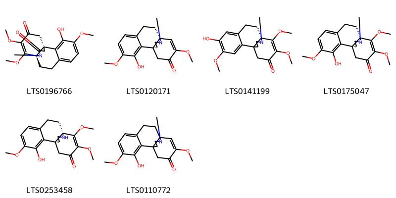{ width=100% }
    <figcaption>Hình ảnh cấu trúc hóa học của 6 hoạt chất thuộc nhóm Hasubanan alkaloids gồm ['(1r,10s)-3-hydroxy-4,11,12-trimethoxy-17-methyl-17-azatetracyclo[8.4.3.0¹,¹⁰.0²,⁷]heptadeca-2,4,6,11-tetraene-13,16-dione (LTS0196766)', '(1s,10r)-3-hydroxy-4,12-dimethoxy-17-methyl-17-azatetracyclo[8.4.3.0¹,¹⁰.0²,⁷]heptadeca-2,4,6,11-tetraen-13-one (LTS0120171)', '(10s)-5-hydroxy-4,11,12-trimethoxy-17-methyl-17-azatetracyclo[8.4.3.0¹,¹⁰.0²,⁷]heptadeca-2,4,6,11-tetraen-13-one (LTS0141199)', 'aknadinine (LTS0175047)', 'aknadicine (LTS0253458)', '3-hydroxy-4,12-dimethoxy-17-methyl-17-azatetracyclo[8.4.3.0¹,¹⁰.0²,⁷]heptadeca-2,4,6,11-tetraen-13-one (LTS0110772)'].</figcaption>
</figure>
#### Nhóm Isoquinolines and derivatives
<figure markdown="span">
    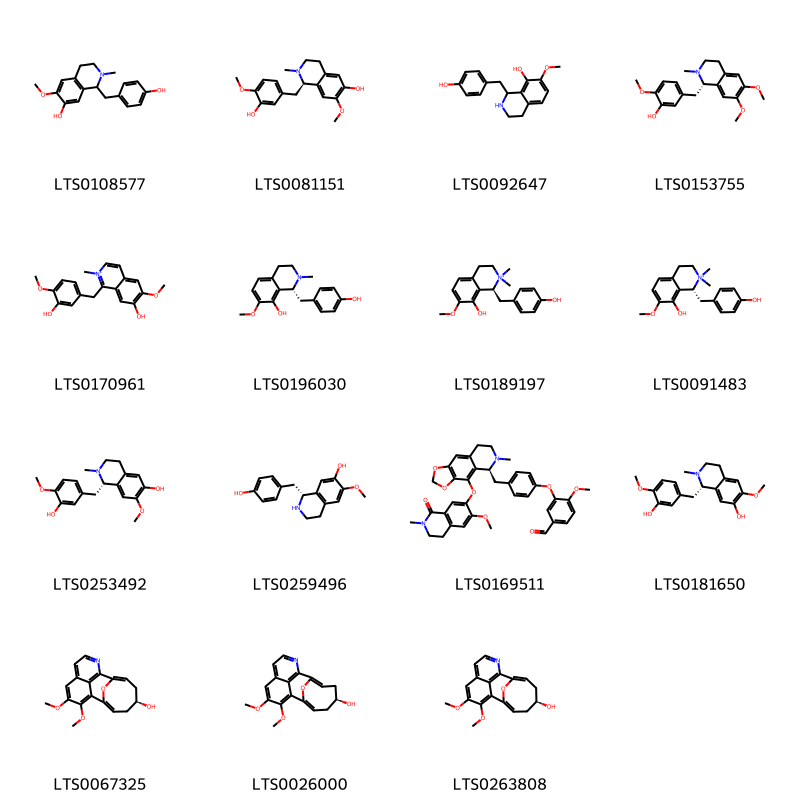{ width=100% }
    <figcaption>Hình ảnh cấu trúc hóa học của 15 hoạt chất thuộc nhóm Isoquinolines and derivatives gồm ['1-[(4-hydroxyphenyl)methyl]-6-methoxy-2-methyl-3,4-dihydro-1h-isoquinolin-7-ol (LTS0108577)', '(1r)-1-[(3-hydroxy-4-methoxyphenyl)methyl]-7-methoxy-2-methyl-3,4-dihydro-1h-isoquinolin-6-ol (LTS0081151)', '1-[(4-hydroxyphenyl)methyl]-7-methoxy-1,2,3,4-tetrahydroisoquinolin-8-ol (LTS0092647)', '(+)-laudanine (LTS0153755)', '7-hydroxy-1-[(3-hydroxy-4-methoxyphenyl)methyl]-6-methoxy-2-methylisoquinolin-2-ium (LTS0170961)', '(1r)-1-[(4-hydroxyphenyl)methyl]-7-methoxy-2-methyl-3,4-dihydro-1h-isoquinolin-8-ol (LTS0196030)', '(1s)-8-hydroxy-1-[(4-hydroxyphenyl)methyl]-7-methoxy-2,2-dimethyl-3,4-dihydro-1h-isoquinolin-2-ium (LTS0189197)', '(1r)-8-hydroxy-1-[(4-hydroxyphenyl)methyl]-7-methoxy-2,2-dimethyl-3,4-dihydro-1h-isoquinolin-2-ium (LTS0091483)', '(1s)-1-[(3-hydroxy-4-methoxyphenyl)methyl]-7-methoxy-2-methyl-3,4-dihydro-1h-isoquinolin-6-ol (LTS0253492)', '(+)-coclaurine (LTS0259496)', '4-methoxy-3-(4-{[(5s)-4-[(6-methoxy-2-methyl-1-oxo-3,4-dihydroisoquinolin-7-yl)oxy]-6-methyl-2h,5h,7h,8h-[1,3]dioxolo[4,5-g]isoquinolin-5-yl]methyl}phenoxy)benzaldehyde (LTS0169511)', '(+,-)-reticuline (LTS0181650)', '(5s)-15,16-dimethoxy-18-oxa-10-azatetracyclo[7.7.1.1²,⁸.0¹³,¹⁷]octadeca-1(16),2,7,9(17),10,12,14-heptaen-5-ol (LTS0067325)', '(2z,5s,7e)-15,16-dimethoxy-18-oxa-10-azatetracyclo[7.7.1.1²,⁸.0¹³,¹⁷]octadeca-1(16),2,7,9(17),10,12,14-heptaen-5-ol (LTS0026000)', '(2z,5s,7z)-15,16-dimethoxy-18-oxa-10-azatetracyclo[7.7.1.1²,⁸.0¹³,¹⁷]octadeca-1(16),2,7,9(17),10,12,14-heptaen-5-ol (LTS0263808)'].</figcaption>
</figure>
#### Nhóm Morphinans
<figure markdown="span">
    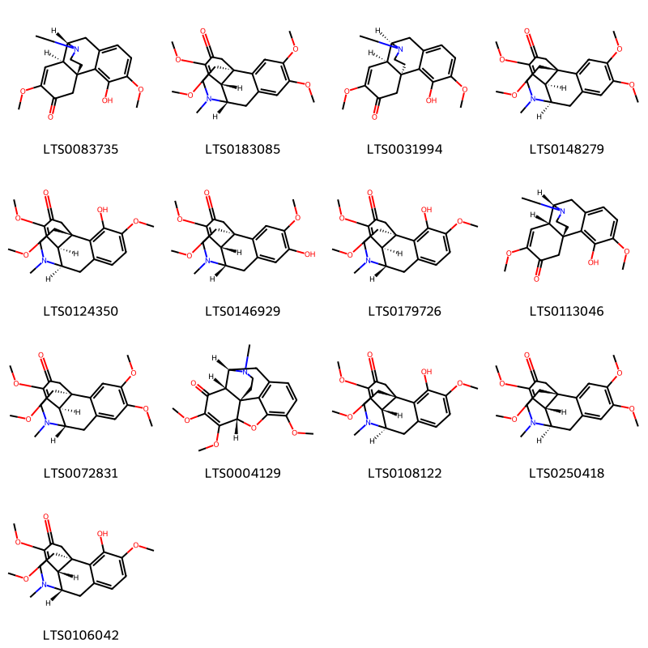{ width=100% }
    <figcaption>Hình ảnh cấu trúc hóa học của 13 hoạt chất thuộc nhóm Morphinans gồm ['(1r,9s,10r)-3-hydroxy-4,12-dimethoxy-17-methyl-17-azatetracyclo[7.5.3.0¹,¹⁰.0²,⁷]heptadeca-2,4,6,11-tetraen-13-one (LTS0083735)', '(1r,9s,10r)-4,5,11,12-tetramethoxy-17-methyl-17-azatetracyclo[7.5.3.0¹,¹⁰.0²,⁷]heptadeca-2,4,6,11-tetraen-13-one (LTS0183085)', '(1s,9r,10r)-3-hydroxy-4,12-dimethoxy-17-methyl-17-azatetracyclo[7.5.3.0¹,¹⁰.0²,⁷]heptadeca-2,4,6,11-tetraen-13-one (LTS0031994)', '(1s,9r,10s)-4,5,11,12-tetramethoxy-17-methyl-17-azatetracyclo[7.5.3.0¹,¹⁰.0²,⁷]heptadeca-2,4,6,11-tetraen-13-one (LTS0148279)', '(1s,9r,10s)-3-hydroxy-4,11,12-trimethoxy-17-methyl-17-azatetracyclo[7.5.3.0¹,¹⁰.0²,⁷]heptadeca-2,4,6,11-tetraen-13-one (LTS0124350)', '(1r,9s,10r)-5-hydroxy-4,11,12-trimethoxy-17-methyl-17-azatetracyclo[7.5.3.0¹,¹⁰.0²,⁷]heptadeca-2,4,6,11-tetraen-13-one (LTS0146929)', '(1r,9s,10s)-3-hydroxy-4,11,12-trimethoxy-17-methyl-17-azatetracyclo[7.5.3.0¹,¹⁰.0²,⁷]heptadeca-2,4,6,11-tetraen-13-one (LTS0179726)', 'sinomenine (LTS0113046)', '(1r,9s,10s)-4,5,11,12-tetramethoxy-17-methyl-17-azatetracyclo[7.5.3.0¹,¹⁰.0²,⁷]heptadeca-2,4,6,11-tetraen-13-one (LTS0072831)', '(1r,5s,13s,17s)-10,14,15-trimethoxy-4-methyl-12-oxa-4-azapentacyclo[9.6.1.0¹,¹³.0⁵,¹⁷.0⁷,¹⁸]octadeca-7(18),8,10,14-tetraen-16-one (LTS0004129)', '(1s,9r,10r)-3-hydroxy-4,11,12-trimethoxy-17-methyl-17-azatetracyclo[7.5.3.0¹,¹⁰.0²,⁷]heptadeca-2,4,6,11-tetraen-13-one (LTS0108122)', '(1s,9r,10r)-4,5,11,12-tetramethoxy-17-methyl-17-azatetracyclo[7.5.3.0¹,¹⁰.0²,⁷]heptadeca-2,4,6,11-tetraen-13-one (LTS0250418)', '(1r,9s,10r)-3-hydroxy-4,11,12-trimethoxy-17-methyl-17-azatetracyclo[7.5.3.0¹,¹⁰.0²,⁷]heptadeca-2,4,6,11-tetraen-13-one (LTS0106042)'].</figcaption>
</figure>
#### Nhóm Organooxygen compounds
<figure markdown="span">
    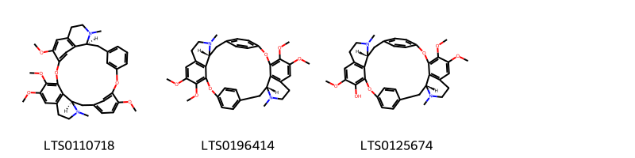{ width=100% }
    <figcaption>Hình ảnh cấu trúc hóa học của 3 hoạt chất thuộc nhóm Organooxygen compounds gồm ['(1s,15r)-10,21,22,26-tetramethoxy-16,31-dimethyl-8,24-dioxa-16,31-diazaheptacyclo[23.6.2.1³,⁷.1⁹,¹³.1¹⁵,¹⁹.0²⁸,³².0²³,³⁴]hexatriaconta-3(36),4,6,9(35),10,12,19(34),20,22,25,27,32-dodecaene (LTS0110718)', 'cycleanine (LTS0196414)', '(11r,26r)-5,19,20-trimethoxy-10,25-dimethyl-2,17-dioxa-10,25-diazaheptacyclo[26.2.2.2¹³,¹⁶.1³,⁷.1¹⁸,²².0¹¹,³⁶.0²⁶,³³]hexatriaconta-1(30),3,5,7(36),13,15,18,20,22(33),28,31,34-dodecaen-4-ol (LTS0125674)'].</figcaption>
</figure>
#### Nhóm Peptidomimetics
<figure markdown="span">
    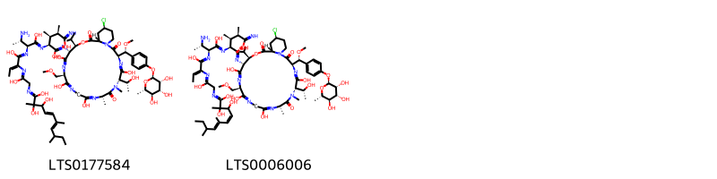{ width=100% }
    <figcaption>Hình ảnh cấu trúc hóa học của 2 hoạt chất thuộc nhóm Peptidomimetics gồm ['(2s,3s,4r)-n-[(3r,4r,7r,13s,16s,19r,24s,25as)-24-chloro-5,8,11,17-tetrahydroxy-16-[(1r)-1-hydroxyethyl]-3-isopropyl-19-[(r)-methoxy(4-{[(2s,3r,4r,5r,6s)-3,4,5-trihydroxy-6-methyloxan-2-yl]oxy}phenyl)methyl]-7-(methoxymethyl)-13,15-dimethyl-1,14,20-trioxo-3h,4h,7h,10h,13h,16h,19h,22h,23h,24h,25h,25ah-pyrido[2,1-c]1-oxa-4,7,10,13,16,19-hexaazacyclodocosan-4-yl]-2-{[(2s,3s)-3-amino-1-hydroxy-2-{[(2z)-1-hydroxy-2-({1-hydroxy-2-[(1,2,3-trihydroxy-2,6,8-trimethyldeca-4,6-dien-1-ylidene)amino]ethylidene}amino)but-2-en-1-ylidene]amino}butylidene]amino}-3,4-dimethylpentanediimidic acid (LTS0177584)', '(2s,3s,4r)-n-[(3r,4r,7r,13s,16s,19r,24s,25as)-24-chloro-5,8,11,17-tetrahydroxy-16-[(1r)-1-hydroxyethyl]-3-isopropyl-19-[(r)-methoxy(4-{[(2s,3r,4r,5r,6s)-3,4,5-trihydroxy-6-methyloxan-2-yl]oxy}phenyl)methyl]-7-(methoxymethyl)-13,15-dimethyl-1,14,20-trioxo-3h,4h,7h,10h,13h,16h,19h,22h,23h,24h,25h,25ah-pyrido[2,1-c]1-oxa-4,7,10,13,16,19-hexaazacyclodocosan-4-yl]-2-{[(2s,3s)-3-amino-1-hydroxy-2-{[(2z)-1-hydroxy-2-[(1-hydroxy-2-{[(4z,6e)-1,2,3-trihydroxy-2,6,8-trimethyldeca-4,6-dien-1-ylidene]amino}ethylidene)amino]but-2-en-1-ylidene]amino}butylidene]amino}-3,4-dimethylpentanediimidic acid (LTS0006006)'].</figcaption>
</figure>
#### Nhóm Phenanthrenes and derivatives
<figure markdown="span">
    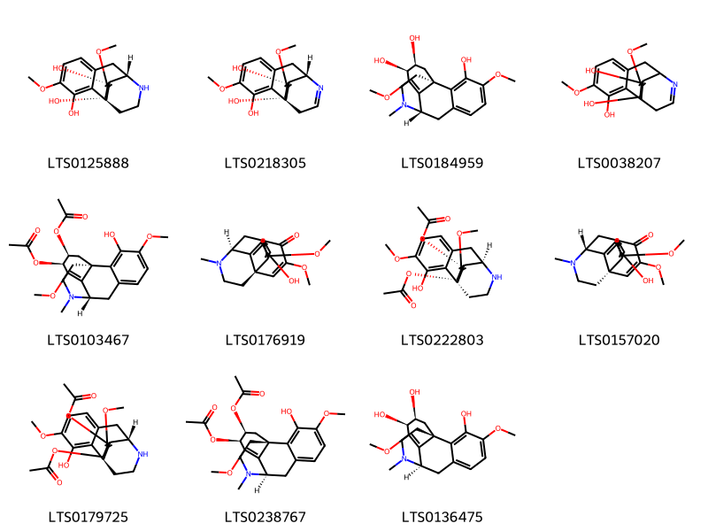{ width=100% }
    <figcaption>Hình ảnh cấu trúc hóa học của 11 hoạt chất thuộc nhóm Phenanthrenes and derivatives gồm ['sinococuline (LTS0125888)', '(1s,9s,12s,13s)-4,11-dimethoxy-17-azatetracyclo[7.5.3.0¹,¹⁰.0²,⁷]heptadeca-2,4,6,10,16-pentaene-3,12,13-triol (LTS0218305)', '(1s,9s,12s,13s)-4,11-dimethoxy-17-methyl-17-azatetracyclo[7.5.3.0¹,¹⁰.0²,⁷]heptadeca-2,4,6,10-tetraene-3,12,13-triol (LTS0184959)', '4,11-dimethoxy-17-azatetracyclo[7.5.3.0¹,¹⁰.0²,⁷]heptadeca-2,4,6,10,16-pentaene-3,12,13-triol (LTS0038207)', '(1s,9s,12s,13s)-12-(acetyloxy)-3-hydroxy-4,11-dimethoxy-17-methyl-17-azatetracyclo[7.5.3.0¹,¹⁰.0²,⁷]heptadeca-2,4,6,10-tetraen-13-yl acetate (LTS0103467)', '(-)-salutaridine (LTS0176919)', '(1r,9r,12s,13s)-12-(acetyloxy)-3-hydroxy-4,11-dimethoxy-17-azatetracyclo[7.5.3.0¹,¹⁰.0²,⁷]heptadeca-2,4,6,10-tetraen-13-yl acetate (LTS0222803)', 'salutaridine (LTS0157020)', '(1s,9s)-12-(acetyloxy)-3-hydroxy-4,11-dimethoxy-17-azatetracyclo[7.5.3.0¹,¹⁰.0²,⁷]heptadeca-2,4,6,10-tetraen-13-yl acetate (LTS0179725)', '(1r,9r,12s,13s)-12-(acetyloxy)-3-hydroxy-4,11-dimethoxy-17-methyl-17-azatetracyclo[7.5.3.0¹,¹⁰.0²,⁷]heptadeca-2,4,6,10-tetraen-13-yl acetate (LTS0238767)', '(1r,9r,12s,13s)-4,11-dimethoxy-17-methyl-17-azatetracyclo[7.5.3.0¹,¹⁰.0²,⁷]heptadeca-2,4,6,10-tetraene-3,12,13-triol (LTS0136475)'].</figcaption>
</figure>
#### Nhóm Phenols
<figure markdown="span">
    { width=100% }
    <figcaption>Hình ảnh cấu trúc hóa học của 1 hoạt chất thuộc nhóm Phenols gồm ['(2e)-3-(4-hydroxy-3-methoxyphenyl)-n-[2-(4-hydroxyphenyl)ethyl]prop-2-enimidic acid (LTS0187051)'].</figcaption>
</figure>
#### Nhóm Proaporphines
<figure markdown="span">
    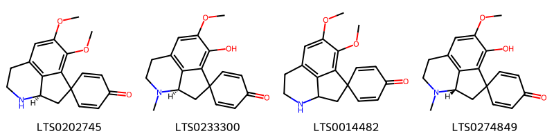{ width=100% }
    <figcaption>Hình ảnh cấu trúc hóa học của 4 hoạt chất thuộc nhóm Proaporphines gồm ["(4'r)-10',11'-dimethoxy-5'-azaspiro[cyclohexane-1,2'-tricyclo[6.3.1.0⁴,¹²]dodecane]-1'(11'),2,5,8'(12'),9'-pentaen-4-one (LTS0202745)", 'glaziovine (LTS0233300)', "10',11'-dimethoxy-5'-azaspiro[cyclohexane-1,2'-tricyclo[6.3.1.0⁴,¹²]dodecane]-1'(11'),2,5,8'(12'),9'-pentaen-4-one (LTS0014482)", "(4's)-11'-hydroxy-10'-methoxy-5'-methyl-5'-azaspiro[cyclohexane-1,2'-tricyclo[6.3.1.0⁴,¹²]dodecane]-1'(11'),2,5,8'(12'),9'-pentaen-4-one (LTS0274849)"].</figcaption>
</figure>
#### Nhóm Protoberberine alkaloids and derivatives
<figure markdown="span">
    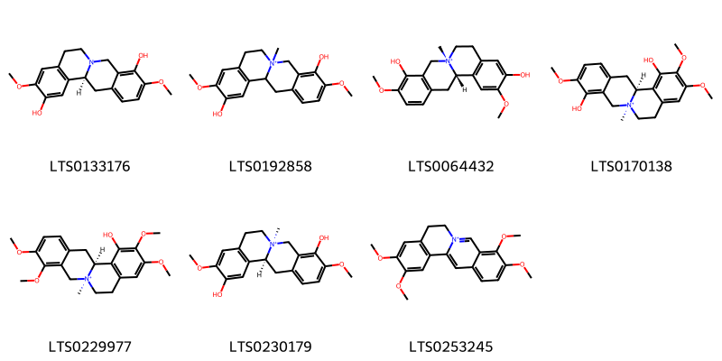{ width=100% }
    <figcaption>Hình ảnh cấu trúc hóa học của 7 hoạt chất thuộc nhóm Protoberberine alkaloids and derivatives gồm ['scoulerine (LTS0133176)', '4,11-dihydroxy-3,10-dimethoxy-6-methyl-7,8,12b,13-tetrahydro-5h-6-azatetraphen-6-ium (LTS0192858)', '(6s,12bs)-4,10-dihydroxy-3,11-dimethoxy-6-methyl-7,8,12b,13-tetrahydro-5h-6-azatetraphen-6-ium (LTS0064432)', '(6s,12bs)-4,12-dihydroxy-3,10,11-trimethoxy-6-methyl-7,8,12b,13-tetrahydro-5h-6-azatetraphen-6-ium (LTS0170138)', '(6s,12bs)-12-hydroxy-3,4,10,11-tetramethoxy-6-methyl-7,8,12b,13-tetrahydro-5h-6-azatetraphen-6-ium (LTS0229977)', 'cyclanoline (LTS0230179)', 'palmatine (LTS0253245)'].</figcaption>
</figure>

---

### Dược dân tộc học

Danh sách các quốc gia có sử dụng *Stephania cephalantha* trong điều trị các bệnh. 

| Country   | Disease                | Bệnh                                                                                                                                                                                                |
|:----------|:-----------------------|:----------------------------------------------------------------------------------------------------------------------------------------------------------------------------------------------------|
| Elsewhere | Antitussive, Stomachic | MYMEMORY WARNING: YOU USED ALL AVAILABLE FREE TRANSLATIONS FOR TODAY. NEXT AVAILABLE IN  19 HOURS 10 MINUTES 49 SECONDS VISIT HTTPS://MYMEMORY.TRANSLATED.NET/DOC/USAGELIMITS.PHP TO TRANSLATE MORE |

---

---
## Stephania glabra
### Thông tin về thực vật

!!! info "Phân loại thực vật của *Stephania rotunda* từ GIBF:"
    - **Kingdom:** Plantae
    - **Phylum:** Tracheophyta
    - **Order:** Ranunculales
    - **Family:** Menispermaceae
    - **Genus:** Stephania
    - **Species:** *Stephania rotunda*

 

| Label (VI)   | Label (EN)   | Scientific Name   | Descriptions (VI)   | Descriptions (EN)   | Also Known As (VI)   | Also Known As (EN)   |
|:-------------|:-------------|:------------------|:--------------------|:--------------------|:---------------------|:---------------------|
| N/A          | N/A          | Stephania glabra  | loài thực vật       | species of plant    | ['']                 | ['']                 |

#### Phân bố trên thế giới

**Từ CSDL GIBF** nan, Thailand, Cambodia, Myanmar, Bhutan, India, Bangladesh, Viet Nam, China, Nepal

#### Phân bố tại Việt Nam

**Từ CSDL GIBF**: Không có ghi nhận ở Việt Nam

---
### Thành phần hóa học
        
- Theo cơ sở dữ liệu lotus: Từ loài *Stephania rotunda* đã phân lập và xác định được 20 hoạt chất thuộc về các nhóm Proaporphines, Isoquinolines and derivatives, Protoberberine alkaloids and derivatives, Organooxygen compounds. 

|    | chemicalTaxonomyClassyfireClass          |   smiles_count |
|---:|:-----------------------------------------|---------------:|
|  0 | Isoquinolines and derivatives            |              2 |
|  1 | Organooxygen compounds                   |              3 |
|  2 | Proaporphines                            |              2 |
|  3 | Protoberberine alkaloids and derivatives |             13 |

#### Nhóm Isoquinolines and derivatives
<figure markdown="span">
    { width=100% }
    <figcaption>Hình ảnh cấu trúc hóa học của 2 hoạt chất thuộc nhóm Isoquinolines and derivatives gồm ['3,4,11-trimethoxy-7,8-dihydro-6-azatetraphen-10-one (LTS0258799)', '3,10,11-trimethoxy-7,8-dihydro-6-azatetraphen-4-one (LTS0135028)'].</figcaption>
</figure>
#### Nhóm Organooxygen compounds
<figure markdown="span">
    { width=100% }
    <figcaption>Hình ảnh cấu trúc hóa học của 3 hoạt chất thuộc nhóm Organooxygen compounds gồm ['cycleanine (LTS0196414)', '4,5,19,20-tetramethoxy-10,25-dimethyl-2,17-dioxa-10,25-diazaheptacyclo[26.2.2.2¹³,¹⁶.1³,⁷.1¹⁸,²².0¹¹,³⁶.0²⁶,³³]hexatriaconta-1(30),3,5,7(36),13,15,18,20,22(33),28,31,34-dodecaene (LTS0066059)', '4,5,19,20-tetramethoxy-10-methyl-2,17-dioxa-10,25-diazaheptacyclo[26.2.2.2¹³,¹⁶.1³,⁷.1¹⁸,²².0¹¹,³⁶.0²⁶,³³]hexatriaconta-1(30),3,5,7(36),13,15,18,20,22(33),28,31,34-dodecaene (LTS0245010)'].</figcaption>
</figure>
#### Nhóm Proaporphines
<figure markdown="span">
    { width=100% }
    <figcaption>Hình ảnh cấu trúc hóa học của 2 hoạt chất thuộc nhóm Proaporphines gồm ["10',11'-dimethoxy-5'-azaspiro[cyclohexane-1,2'-tricyclo[6.3.1.0⁴,¹²]dodecane]-1'(11'),2,5,8'(12'),9'-pentaen-4-one (LTS0014482)", 'pronuciferine (LTS0129107)'].</figcaption>
</figure>
#### Nhóm Protoberberine alkaloids and derivatives
<figure markdown="span">
    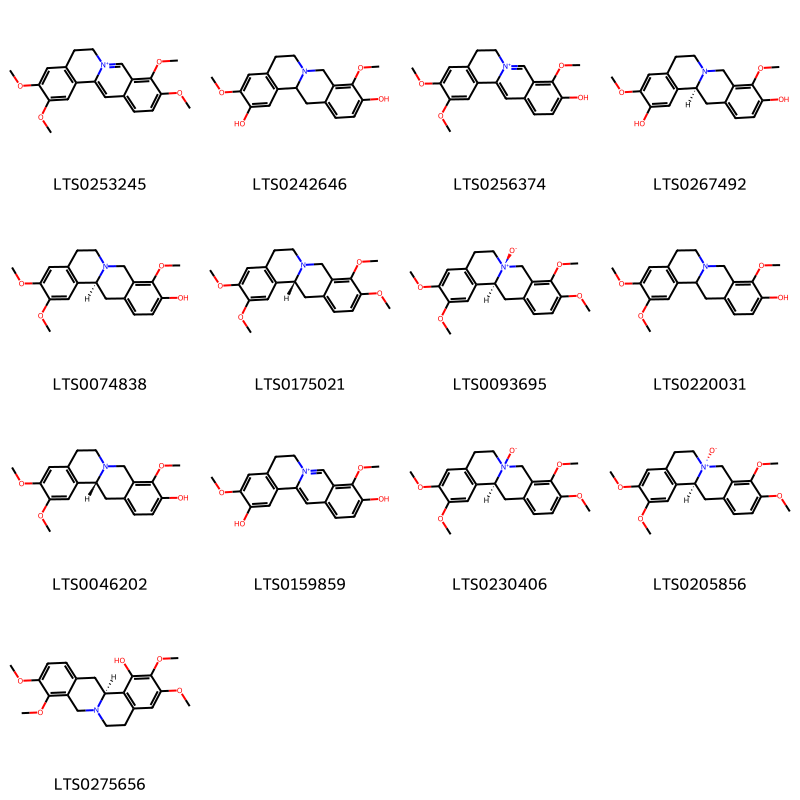{ width=100% }
    <figcaption>Hình ảnh cấu trúc hóa học của 13 hoạt chất thuộc nhóm Protoberberine alkaloids and derivatives gồm ['palmatine (LTS0253245)', 'coreximine (LTS0242646)', 'dehydrocorydalmine (LTS0256374)', 'stepholidine (LTS0267492)', '(12bs)-4,10,11-trimethoxy-7,8,12b,13-tetrahydro-5h-6-azatetraphen-3-ol (LTS0074838)', '(+)-tetrahydropalmatine (LTS0175021)', '(6s,12bs)-3,4,10,11-tetramethoxy-7,8,12b,13-tetrahydro-5h-6-azatetraphen-6-ium-6-olate (LTS0093695)', '4,10,11-trimethoxy-7,8,12b,13-tetrahydro-5h-6-azatetraphen-3-ol (LTS0220031)', '(12br)-4,10,11-trimethoxy-7,8,12b,13-tetrahydro-5h-6-azatetraphen-3-ol (LTS0046202)', '3,11-dihydroxy-4,10-dimethoxy-7,8-dihydro-6λ⁵-azatetraphen-6-ylium (LTS0159859)', '(12bs)-3,4,10,11-tetramethoxy-7,8,12b,13-tetrahydro-5h-6-azatetraphen-6-ium-6-olate (LTS0230406)', '(6r,12bs)-3,4,10,11-tetramethoxy-7,8,12b,13-tetrahydro-5h-6-azatetraphen-6-ium-6-olate (LTS0205856)', 'capaurine (LTS0275656)'].</figcaption>
</figure>

---

### Dược dân tộc học

Danh sách các quốc gia có sử dụng *Stephania rotunda* trong điều trị các bệnh. 

| Country   | Disease              | Bệnh                                                                                                                                                                                                |
|:----------|:---------------------|:----------------------------------------------------------------------------------------------------------------------------------------------------------------------------------------------------|
| Elsewhere | Antibiotic, Sedative | MYMEMORY WARNING: YOU USED ALL AVAILABLE FREE TRANSLATIONS FOR TODAY. NEXT AVAILABLE IN  19 HOURS 10 MINUTES 14 SECONDS VISIT HTTPS://MYMEMORY.TRANSLATED.NET/DOC/USAGELIMITS.PHP TO TRANSLATE MORE |

---

---
## Stephania hernandifolia
### Thông tin về thực vật

!!! info "Phân loại thực vật của *Stephania japonica* từ GIBF:"
    - **Kingdom:** Plantae
    - **Phylum:** Tracheophyta
    - **Order:** Ranunculales
    - **Family:** Menispermaceae
    - **Genus:** Stephania
    - **Species:** *Stephania japonica*

 

| Label (VI)   | Label (EN)   | Scientific Name         | Descriptions (VI)   | Descriptions (EN)   | Also Known As (VI)   | Also Known As (EN)   |
|:-------------|:-------------|:------------------------|:--------------------|:--------------------|:---------------------|:---------------------|
| N/A          | N/A          | Stephania hernandifolia | loài thực vật       | species of plant    | ['']                 | ['']                 |

#### Phân bố trên thế giới

**Từ CSDL GIBF** nan, Australia, India, Bangladesh, China

#### Phân bố tại Việt Nam

**Từ CSDL GIBF**: Không có ghi nhận ở Việt Nam

---
### Thành phần hóa học
        
- Theo cơ sở dữ liệu lotus: Từ loài *Stephania japonica* đã phân lập và xác định được 13 hoạt chất thuộc về các nhóm Phenanthrenes and derivatives, Hasubanan alkaloids, Organooxygen compounds. 

|    | chemicalTaxonomyClassyfireClass   |   smiles_count |
|---:|:----------------------------------|---------------:|
|  0 |                                   |              4 |
|  1 | Hasubanan alkaloids               |              7 |
|  2 | Organooxygen compounds            |              1 |
|  3 | Phenanthrenes and derivatives     |              1 |

#### Nhóm 
<figure markdown="span">
    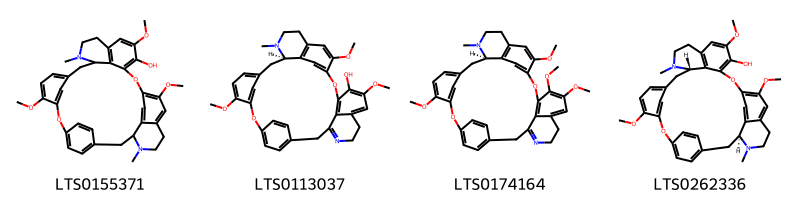{ width=100% }
    <figcaption>Hình ảnh cấu trúc hóa học của 4 hoạt chất thuộc nhóm  gồm ['9,20,25-trimethoxy-15,30-dimethyl-7,23-dioxa-15,30-diazaheptacyclo[22.6.2.2³,⁶.1⁸,¹².1¹⁴,¹⁸.0²⁷,³¹.0²²,³³]hexatriaconta-3,5,8(34),9,11,18(33),19,21,24,26,31,35-dodecaen-21-ol (LTS0155371)', '(1r)-6,20,25-trimethoxy-30-methyl-8,23-dioxa-15,30-diazaheptacyclo[22.6.2.2⁹,¹².1³,⁷.1¹⁴,¹⁸.0²⁷,³¹.0²²,³³]hexatriaconta-3,5,7(36),9,11,14,18,20,22(33),24(32),25,27(31),34-tridecaen-21-ol (LTS0113037)', '(1r)-6,20,21,25-tetramethoxy-30-methyl-8,23-dioxa-15,30-diazaheptacyclo[22.6.2.2⁹,¹².1³,⁷.1¹⁴,¹⁸.0²⁷,³¹.0²²,³³]hexatriaconta-3,5,7(36),9,11,14,18,20,22(33),24(32),25,27(31),34-tridecaene (LTS0174164)', 'fangchinoline (LTS0262336)'].</figcaption>
</figure>
#### Nhóm Hasubanan alkaloids
<figure markdown="span">
    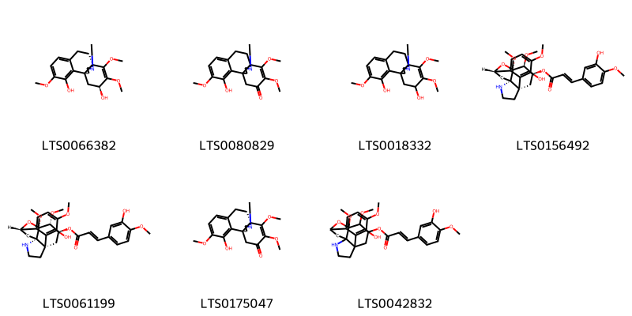{ width=100% }
    <figcaption>Hình ảnh cấu trúc hóa học của 7 hoạt chất thuộc nhóm Hasubanan alkaloids gồm ['(1s,10s,13s)-4,11,12-trimethoxy-17-methyl-17-azatetracyclo[8.4.3.0¹,¹⁰.0²,⁷]heptadeca-2,4,6,11-tetraene-3,13-diol (LTS0066382)', 'aknadinine (LTS0080829)', '4,11,12-trimethoxy-17-methyl-17-azatetracyclo[8.4.3.0¹,¹⁰.0²,⁷]heptadeca-2,4,6,11-tetraene-3,13-diol (LTS0018332)', '(1s,8s,10s,11r,12s,13s)-3-hydroxy-4,11,12-trimethoxy-18-oxa-17-azapentacyclo[8.4.3.1⁸,¹¹.0¹,¹⁰.0²,⁷]octadeca-2,4,6-trien-13-yl (2e)-3-(3-hydroxy-4-methoxyphenyl)prop-2-enoate (LTS0156492)', '(1s,8s,10s,11r,12r,13s)-3-hydroxy-4,11,12-trimethoxy-18-oxa-17-azapentacyclo[8.4.3.1⁸,¹¹.0¹,¹⁰.0²,⁷]octadeca-2,4,6-trien-13-yl (2e)-3-(3-hydroxy-4-methoxyphenyl)prop-2-enoate (LTS0061199)', 'aknadinine (LTS0175047)', '3-hydroxy-4,11,12-trimethoxy-18-oxa-17-azapentacyclo[8.4.3.1⁸,¹¹.0¹,¹⁰.0²,⁷]octadeca-2,4,6-trien-13-yl 3-(3-hydroxy-4-methoxyphenyl)prop-2-enoate (LTS0042832)'].</figcaption>
</figure>
#### Nhóm Organooxygen compounds
<figure markdown="span">
    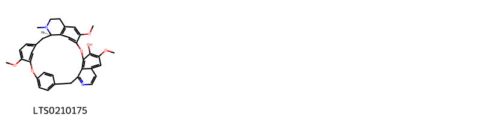{ width=100% }
    <figcaption>Hình ảnh cấu trúc hóa học của 1 hoạt chất thuộc nhóm Organooxygen compounds gồm ['(1r)-6,20,25-trimethoxy-30-methyl-8,23-dioxa-15,30-diazaheptacyclo[22.6.2.2⁹,¹².1³,⁷.1¹⁴,¹⁸.0²⁷,³¹.0²²,³³]hexatriaconta-3,5,7(36),9,11,14,16,18,20,22(33),24(32),25,27(31),34-tetradecaen-21-ol (LTS0210175)'].</figcaption>
</figure>
#### Nhóm Phenanthrenes and derivatives
<figure markdown="span">
    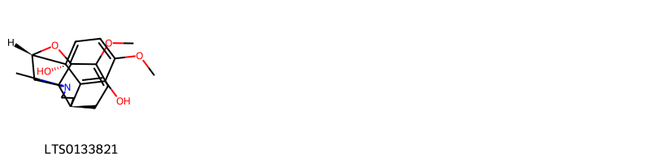{ width=100% }
    <figcaption>Hình ảnh cấu trúc hóa học của 1 hoạt chất thuộc nhóm Phenanthrenes and derivatives gồm ['(1r,8s,10s,11r)-4,12-dimethoxy-17-methyl-18-oxa-17-azapentacyclo[8.4.3.1⁸,¹¹.0¹,¹⁰.0²,⁷]octadeca-2,4,6,12-tetraene-3,11-diol (LTS0133821)'].</figcaption>
</figure>

---

### Dược dân tộc học

Danh sách các quốc gia có sử dụng *Stephania japonica* trong điều trị các bệnh. 

| Country   | Disease                          | Bệnh                                                                                                                                                                                                |
|:----------|:---------------------------------|:----------------------------------------------------------------------------------------------------------------------------------------------------------------------------------------------------|
| China     | Refrigerant, Carminative, Poison | MYMEMORY WARNING: YOU USED ALL AVAILABLE FREE TRANSLATIONS FOR TODAY. NEXT AVAILABLE IN  19 HOURS 09 MINUTES 50 SECONDS VISIT HTTPS://MYMEMORY.TRANSLATED.NET/DOC/USAGELIMITS.PHP TO TRANSLATE MORE |

---

---
## Stephania hernandiifolia
### Thông tin về thực vật

!!! info "Phân loại thực vật của *Stephania japonica* từ GIBF:"
    - **Kingdom:** Plantae
    - **Phylum:** Tracheophyta
    - **Order:** Ranunculales
    - **Family:** Menispermaceae
    - **Genus:** Stephania
    - **Species:** *Stephania japonica*

 

| Label (VI)   | Label (EN)   | Scientific Name          | Descriptions (VI)   | Descriptions (EN)   | Also Known As (VI)   | Also Known As (EN)   |
|:-------------|:-------------|:-------------------------|:--------------------|:--------------------|:---------------------|:---------------------|
| N/A          | N/A          | Stephania hernandiifolia |                     | species of plant    | ['']                 | ['']                 |

#### Phân bố trên thế giới

**Từ CSDL GIBF** nan, Australia, India, Bangladesh, China

#### Phân bố tại Việt Nam

**Từ CSDL GIBF**: Không có ghi nhận ở Việt Nam

---
### Thành phần hóa học
        
- Theo cơ sở dữ liệu lotus: Từ loài *Stephania japonica* đã phân lập và xác định được Chưa có hoạt chất nào được phân lập. hoạt chất thuộc về các nhóm Không có hoạt chất nào được phân lập. 

Không có hình ảnh nào được tạo ra

---

### Dược dân tộc học

Danh sách các quốc gia có sử dụng *Stephania japonica* trong điều trị các bệnh. 

| Country   | Disease   | Bệnh                                                                                                                                                                                                |
|:----------|:----------|:----------------------------------------------------------------------------------------------------------------------------------------------------------------------------------------------------|
| Australia | Piscicide | MYMEMORY WARNING: YOU USED ALL AVAILABLE FREE TRANSLATIONS FOR TODAY. NEXT AVAILABLE IN  19 HOURS 09 MINUTES 27 SECONDS VISIT HTTPS://MYMEMORY.TRANSLATED.NET/DOC/USAGELIMITS.PHP TO TRANSLATE MORE |

---

---
## Stephania japonica
### Thông tin về thực vật

!!! info "Phân loại thực vật của *Stephania japonica* từ GIBF:"
    - **Kingdom:** Plantae
    - **Phylum:** Tracheophyta
    - **Order:** Ranunculales
    - **Family:** Menispermaceae
    - **Genus:** Stephania
    - **Species:** *Stephania japonica*

 

| Label (VI)   | Label (EN)   | Scientific Name    | Descriptions (VI)   | Descriptions (EN)   | Also Known As (VI)   | Also Known As (EN)       |
|:-------------|:-------------|:-------------------|:--------------------|:--------------------|:---------------------|:-------------------------|
| N/A          | N/A          | Stephania japonica | loài thực vật       | species of plant    | ['']                 | ['A flowering Climber.'] |

#### Phân bố trên thế giới

**Từ CSDL GIBF** Australia, Japan, Chinese Taipei, India, China

#### Phân bố tại Việt Nam

**Từ CSDL GIBF**: Không có ghi nhận ở Việt Nam

---
### Thành phần hóa học
        
- Theo cơ sở dữ liệu lotus: Từ loài *Stephania japonica* đã phân lập và xác định được 64 hoạt chất thuộc về các nhóm Phenol ethers, Phenanthrenes and derivatives, Aporphines, Tetralins, Hasubanan alkaloids, Protoberberine alkaloids and derivatives. 

|    | chemicalTaxonomyClassyfireClass          |   smiles_count |
|---:|:-----------------------------------------|---------------:|
|  0 |                                          |             13 |
|  1 | Aporphines                               |              4 |
|  2 | Hasubanan alkaloids                      |             32 |
|  3 | Phenanthrenes and derivatives            |             10 |
|  4 | Phenol ethers                            |              1 |
|  5 | Protoberberine alkaloids and derivatives |              2 |
|  6 | Tetralins                                |              2 |

#### Nhóm 
<figure markdown="span">
    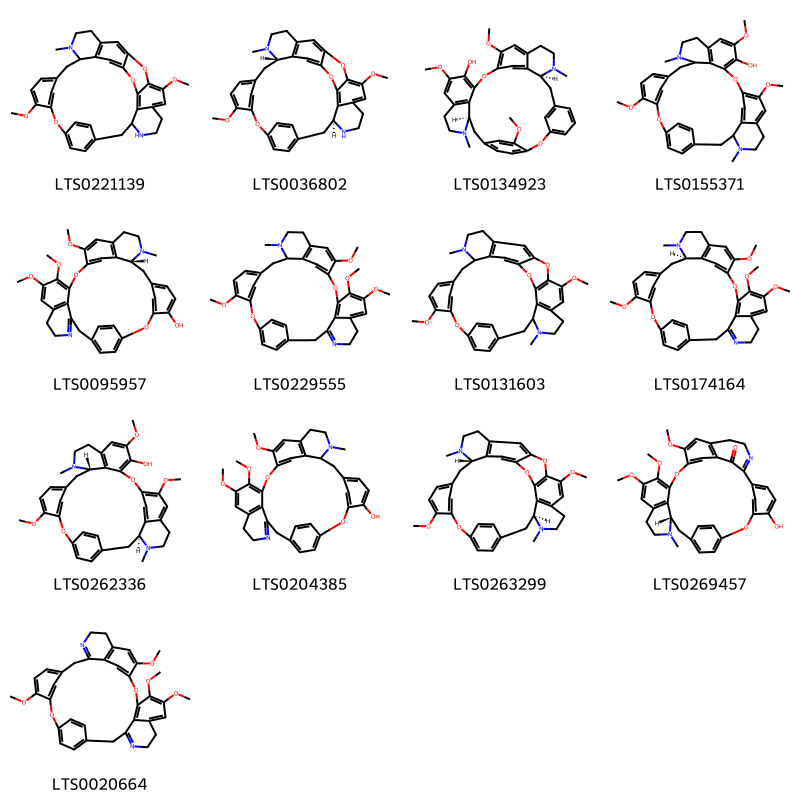{ width=100% }
    <figcaption>Hình ảnh cấu trúc hóa học của 13 hoạt chất thuộc nhóm  gồm ['13,27-dimethoxy-7-methyl-15,29,31-trioxa-7,22-diazaoctacyclo[19.9.3.2¹⁶,¹⁹.1⁴,³⁰.1¹⁰,¹⁴.0³,⁸.0²⁵,³³.0²⁸,³²]heptatriaconta-1,3,10,12,14(37),16,18,25,27,30(34),32,35-dodecaene (LTS0221139)', '(8s,21s)-13,27-dimethoxy-7-methyl-15,29,31-trioxa-7,22-diazaoctacyclo[19.9.3.2¹⁶,¹⁹.1⁴,³⁰.1¹⁰,¹⁴.0³,⁸.0²⁵,³³.0²⁸,³²]heptatriaconta-1,3,10,12,14(37),16,18,25,27,30(34),32,35-dodecaene (LTS0036802)', '(1s,14r)-20,25,35-trimethoxy-15,30-dimethyl-8,23-dioxa-15,30-diazaheptacyclo[22.6.2.2⁹,¹².1³,⁷.1¹⁴,¹⁸.0²⁷,³¹.0²²,³³]hexatriaconta-3(36),4,6,9,11,18(33),19,21,24,26,31,34-dodecaen-21-ol (LTS0134923)', '9,20,25-trimethoxy-15,30-dimethyl-7,23-dioxa-15,30-diazaheptacyclo[22.6.2.2³,⁶.1⁸,¹².1¹⁴,¹⁸.0²⁷,³¹.0²²,³³]hexatriaconta-3,5,8(34),9,11,18(33),19,21,24,26,31,35-dodecaen-21-ol (LTS0155371)', '(1r)-20,21,25-trimethoxy-30-methyl-8,23-dioxa-15,30-diazaheptacyclo[22.6.2.2⁹,¹².1³,⁷.1¹⁴,¹⁸.0²⁷,³¹.0²²,³³]hexatriaconta-3,5,7(36),9,11,14,18(33),19,21,24(32),25,27(31),34-tridecaen-6-ol (LTS0095957)', '6,20,21,25-tetramethoxy-30-methyl-8,23-dioxa-15,30-diazaheptacyclo[22.6.2.2⁹,¹².1³,⁷.1¹⁴,¹⁸.0²⁷,³¹.0²²,³³]hexatriaconta-3,5,7(36),9,11,14,18,20,22(33),24(32),25,27(31),34-tridecaene (LTS0229555)', '13,27-dimethoxy-7,22-dimethyl-15,29,31-trioxa-7,22-diazaoctacyclo[19.9.3.2¹⁶,¹⁹.1⁴,³⁰.1¹⁰,¹⁴.0³,⁸.0²⁵,³³.0²⁸,³²]heptatriaconta-1,3,10,12,14(37),16,18,25(33),26,28(32),30(34),35-dodecaene (LTS0131603)', '(1r)-6,20,21,25-tetramethoxy-30-methyl-8,23-dioxa-15,30-diazaheptacyclo[22.6.2.2⁹,¹².1³,⁷.1¹⁴,¹⁸.0²⁷,³¹.0²²,³³]hexatriaconta-3,5,7(36),9,11,14,18,20,22(33),24(32),25,27(31),34-tridecaene (LTS0174164)', 'fangchinoline (LTS0262336)', '20,21,25-trimethoxy-30-methyl-8,23-dioxa-15,30-diazaheptacyclo[22.6.2.2⁹,¹².1³,⁷.1¹⁴,¹⁸.0²⁷,³¹.0²²,³³]hexatriaconta-3,5,7(36),9,11,14,18(33),19,21,24(32),25,27(31),34-tridecaen-6-ol (LTS0204385)', '(8s,21s)-13,27-dimethoxy-7,22-dimethyl-15,29,31-trioxa-7,22-diazaoctacyclo[19.9.3.2¹⁶,¹⁹.1⁴,³⁰.1¹⁰,¹⁴.0³,⁸.0²⁵,³³.0²⁸,³²]heptatriaconta-1,3,10,12,14(37),16,18,25(33),26,28(32),30(34),35-dodecaene (LTS0263299)', '(13s)-5-hydroxy-19,20,24-trimethoxy-14-methyl-7,22-dioxa-14,29-diazaheptacyclo[21.6.3.2⁸,¹¹.1²,⁶.1¹³,¹⁷.0²⁶,³¹.0²¹,³³]hexatriaconta-1(29),2,4,6(36),8,10,17(33),18,20,23(32),24,26(31),34-tridecaen-30-one (LTS0269457)', '6,20,21,25-tetramethoxy-8,23-dioxa-15,30-diazaheptacyclo[22.6.2.2⁹,¹².1³,⁷.1¹⁴,¹⁸.0²⁷,³¹.0²²,³³]hexatriaconta-1(30),3,5,7(36),9,11,14,18,20,22(33),24(32),25,27(31),34-tetradecaene (LTS0020664)'].</figcaption>
</figure>
#### Nhóm Aporphines
<figure markdown="span">
    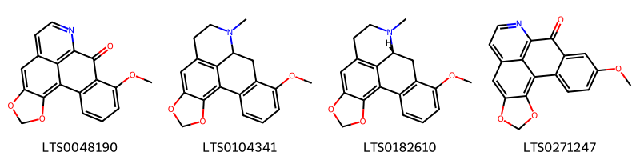{ width=100% }
    <figcaption>Hình ảnh cấu trúc hóa học của 4 hoạt chất thuộc nhóm Aporphines gồm ['15-methoxy-3,5-dioxa-11-azapentacyclo[10.7.1.0²,⁶.0⁸,²⁰.0¹⁴,¹⁹]icosa-1(20),2(6),7,9,11,14(19),15,17-octaen-13-one (LTS0048190)', '15-methoxy-11-methyl-3,5-dioxa-11-azapentacyclo[10.7.1.0²,⁶.0⁸,²⁰.0¹⁴,¹⁹]icosa-1,6,8(20),14(19),15,17-hexaene (LTS0104341)', '(12r)-15-methoxy-11-methyl-3,5-dioxa-11-azapentacyclo[10.7.1.0²,⁶.0⁸,²⁰.0¹⁴,¹⁹]icosa-1,6,8(20),14(19),15,17-hexaene (LTS0182610)', 'lanuginosine (LTS0271247)'].</figcaption>
</figure>
#### Nhóm Hasubanan alkaloids
<figure markdown="span">
    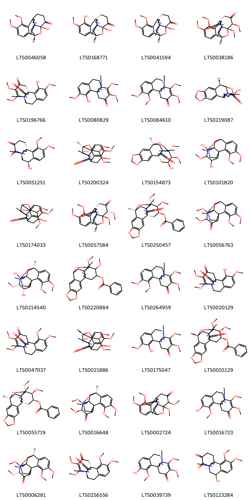{ width=100% }
    <figcaption>Hình ảnh cấu trúc hóa học của 32 hoạt chất thuộc nhóm Hasubanan alkaloids gồm ['(8s,11r)-11-hydroxy-3,4-dimethoxy-17-methyl-18-oxa-17-azapentacyclo[8.4.3.1⁸,¹¹.0¹,¹⁰.0²,⁷]octadeca-2,4,6-trien-12-one (LTS0046058)', '(1r,8s,10s,11r)-3,11-dihydroxy-4-methoxy-17-methyl-18-oxa-17-azapentacyclo[8.4.3.1⁸,¹¹.0¹,¹⁰.0²,⁷]octadeca-2,4,6-trien-12-one (LTS0168771)', 'metaphanine (LTS0041594)', 'oxostephamiersine (LTS0038186)', '(1r,10s)-3-hydroxy-4,11,12-trimethoxy-17-methyl-17-azatetracyclo[8.4.3.0¹,¹⁰.0²,⁷]heptadeca-2,4,6,11-tetraene-13,16-dione (LTS0196766)', 'aknadinine (LTS0080829)', 'hasubanonine (LTS0084610)', '(1r,11s,13s,14r)-14-hydroxy-20-methyl-5,7,21-trioxa-20-azahexacyclo[11.4.3.1¹¹,¹⁴.0¹,¹³.0²,¹⁰.0⁴,⁸]henicosa-2,4(8),9-trien-15-one (LTS0219087)', '(1r,8s,10s)-8-hydroxy-3,4-dimethoxy-17-methyl-17-azatetracyclo[8.4.3.0¹,¹⁰.0²,⁷]heptadeca-2,4,6-triene-11,12-dione (LTS0051251)', '(8r,11r,12s,13s)-11,13-dihydroxy-3,4,12-trimethoxy-17-methyl-18-oxa-17-azapentacyclo[8.4.3.1⁸,¹¹.0¹,¹⁰.0²,⁷]octadeca-2,4,6-trien-16-one (LTS0200324)', '(1r,11s,13s,14r,15s,16s)-16-hydroxy-14,15-dimethoxy-20-methyl-5,7,21-trioxa-20-azahexacyclo[11.4.3.1¹¹,¹⁴.0¹,¹³.0²,¹⁰.0⁴,⁸]henicosa-2,4(8),9-trien-19-one (LTS0154873)', '3,4,12-trimethoxy-17-methyl-18-oxa-17-azapentacyclo[8.4.3.1⁸,¹¹.0¹,¹⁰.0²,⁷]octadeca-2,4,6-triene-11,13-diol (LTS0101820)', '11,13-dihydroxy-3,4,12-trimethoxy-17-methyl-18-oxa-17-azapentacyclo[8.4.3.1⁸,¹¹.0¹,¹⁰.0²,⁷]octadeca-2,4,6-trien-16-one (LTS0174033)', '(1r,8s,10s,11r,12s)-3,4,11,12-tetramethoxy-17-methyl-18-oxa-17-azapentacyclo[8.4.3.1⁸,¹¹.0¹,¹⁰.0²,⁷]octadeca-2,4,6-triene-13,16-dione (LTS0057584)', '(1r,11s,13s,14r,15s,16s)-14,15-dimethoxy-20-methyl-19-oxo-5,7,21-trioxa-20-azahexacyclo[11.4.3.1¹¹,¹⁴.0¹,¹³.0²,¹⁰.0⁴,⁸]henicosa-2,4(8),9-trien-16-yl benzoate (LTS0250457)', '3,4,11,12-tetramethoxy-17-methyl-18-oxa-17-azapentacyclo[8.4.3.1⁸,¹¹.0¹,¹⁰.0²,⁷]octadeca-2,4,6-trien-13-one (LTS0056763)', '(1s,8s,10s,11r,12s,13s)-3,4,12-trimethoxy-17-methyl-18-oxa-17-azapentacyclo[8.4.3.1⁸,¹¹.0¹,¹⁰.0²,⁷]octadeca-2,4,6-triene-11,13-diol (LTS0214540)', '14,15-dimethoxy-20-methyl-5,7,21-trioxa-20-azahexacyclo[11.4.3.1¹¹,¹⁴.0¹,¹³.0²,¹⁰.0⁴,⁸]henicosa-2,4(8),9-trien-16-yl benzoate (LTS0220884)', '3,4,11,12-tetramethoxy-17-methyl-17-azatetracyclo[8.4.3.0¹,¹⁰.0²,⁷]heptadeca-2,4,6,11-tetraen-13-one (LTS0264959)', '3-hydroxy-4,11,12-trimethoxy-17-methyl-17-azatetracyclo[8.4.3.0¹,¹⁰.0²,⁷]heptadeca-2,4,6,11-tetraene-13,16-dione (LTS0020129)', '3,4,11,12-tetramethoxy-17-methyl-17-azatetracyclo[8.4.3.0¹,¹⁰.0²,⁷]heptadeca-2,4,6,11-tetraene-13,16-dione (LTS0047037)', '(1r,8s,10s,11r,12s,13s)-11,13-dihydroxy-3,4,12-trimethoxy-17-methyl-18-oxa-17-azapentacyclo[8.4.3.1⁸,¹¹.0¹,¹⁰.0²,⁷]octadeca-2,4,6-trien-16-one (LTS0021886)', 'aknadinine (LTS0175047)', '(11r,15s,16s)-14,15-dimethoxy-20-methyl-19-oxo-5,7,21-trioxa-20-azahexacyclo[11.4.3.1¹¹,¹⁴.0¹,¹³.0²,¹⁰.0⁴,⁸]henicosa-2,4(8),9-trien-16-yl benzoate (LTS0055129)', '(1s,11s,13s,14r,15s,16s)-14,15-dimethoxy-20-methyl-5,7,21-trioxa-20-azahexacyclo[11.4.3.1¹¹,¹⁴.0¹,¹³.0²,¹⁰.0⁴,⁸]henicosa-2,4(8),9-trien-16-yl benzoate (LTS0055719)', '(1s,8s,10s,11r,12r)-3,4,11,12-tetramethoxy-17-methyl-18-oxa-17-azapentacyclo[8.4.3.1⁸,¹¹.0¹,¹⁰.0²,⁷]octadeca-2,4,6-trien-13-one (LTS0016648)', '3,4,11,12-tetramethoxy-17-methyl-18-oxa-17-azapentacyclo[8.4.3.1⁸,¹¹.0¹,¹⁰.0²,⁷]octadeca-2,4,6-triene-13,16-dione (LTS0002724)', '4-hydroxy-3,11,12-trimethoxy-17-methyl-17-azatetracyclo[8.4.3.0¹,¹⁰.0²,⁷]heptadeca-2,4,6,11-tetraen-13-one (LTS0016723)', '(1s,8s,10s,11r,12s)-3,4,11,12-tetramethoxy-17-methyl-18-oxa-17-azapentacyclo[8.4.3.1⁸,¹¹.0¹,¹⁰.0²,⁷]octadeca-2,4,6-trien-13-one (LTS0006281)', '(1r,10s)-3,4,11,12-tetramethoxy-17-methyl-17-azatetracyclo[8.4.3.0¹,¹⁰.0²,⁷]heptadeca-2,4,6,11-tetraene-13,16-dione (LTS0256556)', '(1s,10s)-4-hydroxy-3,11,12-trimethoxy-17-methyl-17-azatetracyclo[8.4.3.0¹,¹⁰.0²,⁷]heptadeca-2,4,6,11-tetraen-13-one (LTS0039739)', '8-hydroxy-3,4-dimethoxy-17-methyl-17-azatetracyclo[8.4.3.0¹,¹⁰.0²,⁷]heptadeca-2,4,6-triene-11,12-dione (LTS0123284)'].</figcaption>
</figure>
#### Nhóm Phenanthrenes and derivatives
<figure markdown="span">
    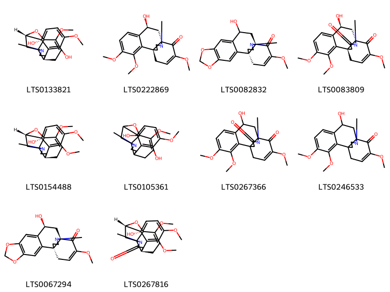{ width=100% }
    <figcaption>Hình ảnh cấu trúc hóa học của 10 hoạt chất thuộc nhóm Phenanthrenes and derivatives gồm ['(1r,8s,10s,11r)-4,12-dimethoxy-17-methyl-18-oxa-17-azapentacyclo[8.4.3.1⁸,¹¹.0¹,¹⁰.0²,⁷]octadeca-2,4,6,12-tetraene-3,11-diol (LTS0133821)', '(1r,8s,10s)-8-hydroxy-3,4,12-trimethoxy-17-methyl-17-azatetracyclo[8.4.3.0¹,¹⁰.0²,⁷]heptadeca-2,4,6,12-tetraen-11-one (LTS0222869)', '(1r,13s)-11-hydroxy-15-methoxy-20-methyl-5,7-dioxa-20-azapentacyclo[11.4.3.0¹,¹³.0²,¹⁰.0⁴,⁸]icosa-2,4(8),9,15-tetraen-14-one (LTS0082832)', '(1r,8s,10s)-8-hydroxy-3,4,12-trimethoxy-17-methyl-17-azatetracyclo[8.4.3.0¹,¹⁰.0²,⁷]heptadeca-2,4,6,12-tetraene-11,16-dione (LTS0083809)', '(1r,8s,10s,11r)-3,4,12-trimethoxy-17-methyl-18-oxa-17-azapentacyclo[8.4.3.1⁸,¹¹.0¹,¹⁰.0²,⁷]octadeca-2,4,6,12-tetraen-11-ol (LTS0154488)', '4,12-dimethoxy-17-methyl-18-oxa-17-azapentacyclo[8.4.3.1⁸,¹¹.0¹,¹⁰.0²,⁷]octadeca-2,4,6,12-tetraene-3,11-diol (LTS0105361)', '8-hydroxy-3,4,12-trimethoxy-17-methyl-17-azatetracyclo[8.4.3.0¹,¹⁰.0²,⁷]heptadeca-2,4,6,12-tetraene-11,16-dione (LTS0267366)', '8-hydroxy-3,4,12-trimethoxy-17-methyl-17-azatetracyclo[8.4.3.0¹,¹⁰.0²,⁷]heptadeca-2,4,6,12-tetraen-11-one (LTS0246533)', '(1r,11s,13s)-11-hydroxy-15-methoxy-20-methyl-5,7-dioxa-20-azapentacyclo[11.4.3.0¹,¹³.0²,¹⁰.0⁴,⁸]icosa-2,4(8),9,15-tetraen-14-one (LTS0067294)', '(1r,8s,10s,11r)-11-hydroxy-3,4,12-trimethoxy-17-methyl-18-oxa-17-azapentacyclo[8.4.3.1⁸,¹¹.0¹,¹⁰.0²,⁷]octadeca-2,4,6,12-tetraen-16-one (LTS0267816)'].</figcaption>
</figure>
#### Nhóm Phenol ethers
<figure markdown="span">
    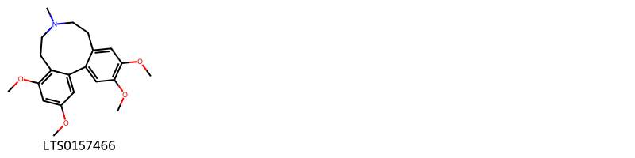{ width=100% }
    <figcaption>Hình ảnh cấu trúc hóa học của 1 hoạt chất thuộc nhóm Phenol ethers gồm ['protostephanine (LTS0157466)'].</figcaption>
</figure>
#### Nhóm Protoberberine alkaloids and derivatives
<figure markdown="span">
    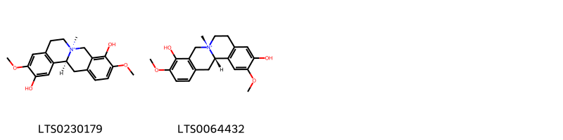{ width=100% }
    <figcaption>Hình ảnh cấu trúc hóa học của 2 hoạt chất thuộc nhóm Protoberberine alkaloids and derivatives gồm ['cyclanoline (LTS0230179)', '(6s,12bs)-4,10-dihydroxy-3,11-dimethoxy-6-methyl-7,8,12b,13-tetrahydro-5h-6-azatetraphen-6-ium (LTS0064432)'].</figcaption>
</figure>
#### Nhóm Tetralins
<figure markdown="span">
    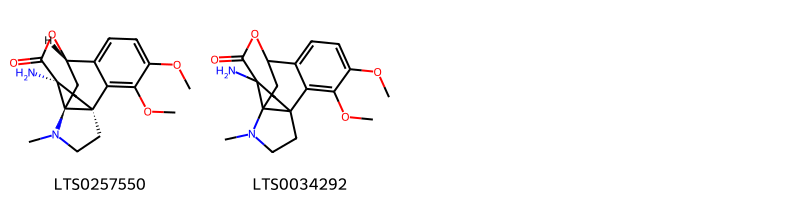{ width=100% }
    <figcaption>Hình ảnh cấu trúc hóa học của 2 hoạt chất thuộc nhóm Tetralins gồm ['(1r,8s,11r,12s)-11-amino-3,4-dimethoxy-13-methyl-9-oxa-13-azapentacyclo[9.4.2.1⁸,¹².0¹,¹².0²,⁷]octadeca-2,4,6-trien-10-one (LTS0257550)', '11-amino-3,4-dimethoxy-13-methyl-9-oxa-13-azapentacyclo[9.4.2.1⁸,¹².0¹,¹².0²,⁷]octadeca-2,4,6-trien-10-one (LTS0034292)'].</figcaption>
</figure>

---

### Dược dân tộc học

Danh sách các quốc gia có sử dụng *Stephania japonica* trong điều trị các bệnh. 

| Country   | Disease    | Bệnh                                                                                                                                                                                                |
|:----------|:-----------|:----------------------------------------------------------------------------------------------------------------------------------------------------------------------------------------------------|
| Elsewhere | Astringent | MYMEMORY WARNING: YOU USED ALL AVAILABLE FREE TRANSLATIONS FOR TODAY. NEXT AVAILABLE IN  19 HOURS 09 MINUTES 06 SECONDS VISIT HTTPS://MYMEMORY.TRANSLATED.NET/DOC/USAGELIMITS.PHP TO TRANSLATE MORE |

---

---
## Stephania rotunda
### Thông tin về thực vật

!!! info "Phân loại thực vật của *Stephania rotunda* từ GIBF:"
    - **Kingdom:** Plantae
    - **Phylum:** Tracheophyta
    - **Order:** Ranunculales
    - **Family:** Menispermaceae
    - **Genus:** Stephania
    - **Species:** *Stephania rotunda*

 

| Label (VI)   | Label (EN)   | Scientific Name   | Descriptions (VI)   | Descriptions (EN)   | Also Known As (VI)   | Also Known As (EN)   |
|:-------------|:-------------|:------------------|:--------------------|:--------------------|:---------------------|:---------------------|
| N/A          | N/A          | Stephania rotunda | loài thực vật       | species of plant    | ['']                 | ['']                 |

#### Phân bố trên thế giới

**Từ CSDL GIBF** nan, French Polynesia, Japan, Thailand, Lao People’s Democratic Republic, Cambodia, Gabon, Myanmar, Bhutan, India, unknown or invalid, Bangladesh, United States of America, Indonesia, Viet Nam, China, Nepal

#### Phân bố tại Việt Nam

**Từ CSDL GIBF**: Không có ghi nhận ở Việt Nam

---
### Thành phần hóa học
        
- Theo cơ sở dữ liệu lotus: Từ loài *Stephania rotunda* đã phân lập và xác định được 13 hoạt chất thuộc về các nhóm Proaporphines, Aporphines, Hasubanan alkaloids, Protoberberine alkaloids and derivatives. 

|    | chemicalTaxonomyClassyfireClass          |   smiles_count |
|---:|:-----------------------------------------|---------------:|
|  0 |                                          |              6 |
|  1 | Aporphines                               |              2 |
|  2 | Hasubanan alkaloids                      |              2 |
|  3 | Proaporphines                            |              1 |
|  4 | Protoberberine alkaloids and derivatives |              2 |

#### Nhóm 
<figure markdown="span">
    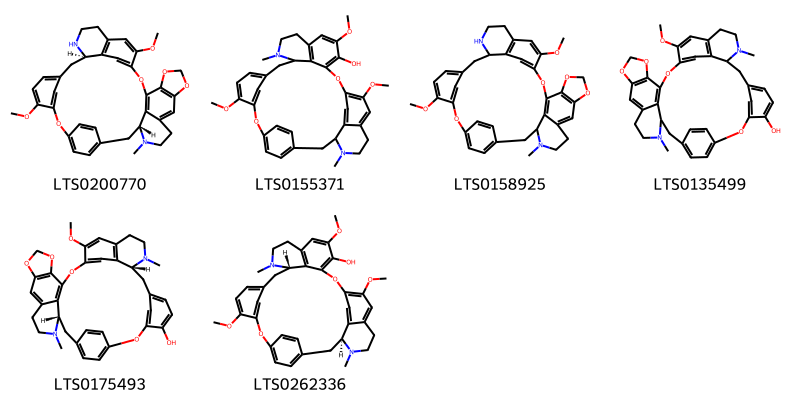{ width=100% }
    <figcaption>Hình ảnh cấu trúc hóa học của 6 hoạt chất thuộc nhóm  gồm ['(14r,27r)-22,33-dimethoxy-13-methyl-2,5,7,20-tetraoxa-13,28-diazaoctacyclo[25.6.2.2¹⁶,¹⁹.1³,¹⁰.1²¹,²⁵.0⁴,⁸.0³¹,³⁵.0¹⁴,³⁹]nonatriaconta-1(34),3,8,10(39),16,18,21(36),22,24,31(35),32,37-dodecaene (LTS0200770)', '9,20,25-trimethoxy-15,30-dimethyl-7,23-dioxa-15,30-diazaheptacyclo[22.6.2.2³,⁶.1⁸,¹².1¹⁴,¹⁸.0²⁷,³¹.0²²,³³]hexatriaconta-3,5,8(34),9,11,18(33),19,21,24,26,31,35-dodecaen-21-ol (LTS0155371)', '22,33-dimethoxy-13-methyl-2,5,7,20-tetraoxa-13,28-diazaoctacyclo[25.6.2.2¹⁶,¹⁹.1³,¹⁰.1²¹,²⁵.0⁴,⁸.0³¹,³⁵.0¹⁴,³⁹]nonatriaconta-1(34),3,8,10(39),16,18,21(36),22,24,31(35),32,37-dodecaene (LTS0158925)', '33-methoxy-13,28-dimethyl-2,5,7,20-tetraoxa-13,28-diazaoctacyclo[25.6.2.2¹⁶,¹⁹.1³,¹⁰.1²¹,²⁵.0⁴,⁸.0³¹,³⁵.0¹⁴,³⁹]nonatriaconta-1(34),3,8,10(39),16,18,21(36),22,24,31(35),32,37-dodecaen-22-ol (LTS0135499)', '(14s,27r)-33-methoxy-13,28-dimethyl-2,5,7,20-tetraoxa-13,28-diazaoctacyclo[25.6.2.2¹⁶,¹⁹.1³,¹⁰.1²¹,²⁵.0⁴,⁸.0³¹,³⁵.0¹⁴,³⁹]nonatriaconta-1(34),3,8,10(39),16,18,21(36),22,24,31(35),32,37-dodecaen-22-ol (LTS0175493)', 'fangchinoline (LTS0262336)'].</figcaption>
</figure>
#### Nhóm Aporphines
<figure markdown="span">
    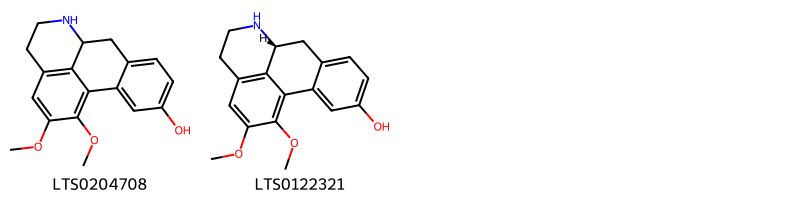{ width=100% }
    <figcaption>Hình ảnh cấu trúc hóa học của 2 hoạt chất thuộc nhóm Aporphines gồm ['15,16-dimethoxy-10-azatetracyclo[7.7.1.0²,⁷.0¹³,¹⁷]heptadeca-1(16),2,4,6,13(17),14-hexaen-4-ol (LTS0204708)', 'tsuduranine (LTS0122321)'].</figcaption>
</figure>
#### Nhóm Hasubanan alkaloids
<figure markdown="span">
    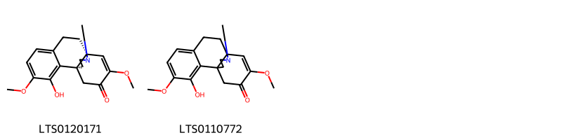{ width=100% }
    <figcaption>Hình ảnh cấu trúc hóa học của 2 hoạt chất thuộc nhóm Hasubanan alkaloids gồm ['(1s,10r)-3-hydroxy-4,12-dimethoxy-17-methyl-17-azatetracyclo[8.4.3.0¹,¹⁰.0²,⁷]heptadeca-2,4,6,11-tetraen-13-one (LTS0120171)', '3-hydroxy-4,12-dimethoxy-17-methyl-17-azatetracyclo[8.4.3.0¹,¹⁰.0²,⁷]heptadeca-2,4,6,11-tetraen-13-one (LTS0110772)'].</figcaption>
</figure>
#### Nhóm Proaporphines
<figure markdown="span">
    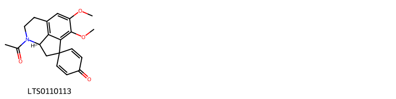{ width=100% }
    <figcaption>Hình ảnh cấu trúc hóa học của 1 hoạt chất thuộc nhóm Proaporphines gồm ["(4'r)-5'-acetyl-10',11'-dimethoxy-5'-azaspiro[cyclohexane-1,2'-tricyclo[6.3.1.0⁴,¹²]dodecane]-1'(11'),2,5,8'(12'),9'-pentaen-4-one (LTS0110113)"].</figcaption>
</figure>
#### Nhóm Protoberberine alkaloids and derivatives
<figure markdown="span">
    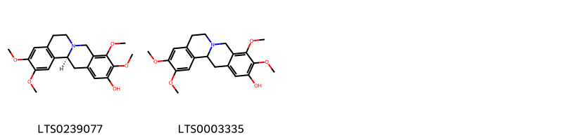{ width=100% }
    <figcaption>Hình ảnh cấu trúc hóa học của 2 hoạt chất thuộc nhóm Protoberberine alkaloids and derivatives gồm ['(12bs)-3,4,10,11-tetramethoxy-7,8,12b,13-tetrahydro-5h-6-azatetraphen-2-ol (LTS0239077)', '3,4,10,11-tetramethoxy-7,8,12b,13-tetrahydro-5h-6-azatetraphen-2-ol (LTS0003335)'].</figcaption>
</figure>

---

### Dược dân tộc học

Danh sách các quốc gia có sử dụng *Stephania rotunda* trong điều trị các bệnh. 

| Country   | Disease       | Bệnh                                                                                                                                                                                                |
|:----------|:--------------|:----------------------------------------------------------------------------------------------------------------------------------------------------------------------------------------------------|
| Vietnam   | Poison, Tonic | MYMEMORY WARNING: YOU USED ALL AVAILABLE FREE TRANSLATIONS FOR TODAY. NEXT AVAILABLE IN  19 HOURS 08 MINUTES 35 SECONDS VISIT HTTPS://MYMEMORY.TRANSLATED.NET/DOC/USAGELIMITS.PHP TO TRANSLATE MORE |

---

---
## Stephania sinica
### Thông tin về thực vật

!!! info "Phân loại thực vật của *Stephania sinica* từ GIBF:"
    - **Kingdom:** Plantae
    - **Phylum:** Tracheophyta
    - **Order:** Ranunculales
    - **Family:** Menispermaceae
    - **Genus:** Stephania
    - **Species:** *Stephania sinica*

 

| Label (VI)   | Label (EN)   | Scientific Name   | Descriptions (VI)   | Descriptions (EN)   | Also Known As (VI)   | Also Known As (EN)   |
|:-------------|:-------------|:------------------|:--------------------|:--------------------|:---------------------|:---------------------|
| N/A          | N/A          | Stephania sinica  | loài thực vật       | species of plant    | ['']                 | ['']                 |

#### Phân bố trên thế giới

**Từ CSDL GIBF** nan, China

#### Phân bố tại Việt Nam

**Từ CSDL GIBF**: Không có ghi nhận ở Việt Nam

---
### Thành phần hóa học
        
- Theo cơ sở dữ liệu lotus: Từ loài *Stephania sinica* đã phân lập và xác định được 7 hoạt chất thuộc về các nhóm Hasubanan alkaloids, Steroids and steroid derivatives. 

|    | chemicalTaxonomyClassyfireClass   |   smiles_count |
|---:|:----------------------------------|---------------:|
|  0 |                                   |              2 |
|  1 | Hasubanan alkaloids               |              1 |
|  2 | Steroids and steroid derivatives  |              4 |

#### Nhóm 
<figure markdown="span">
    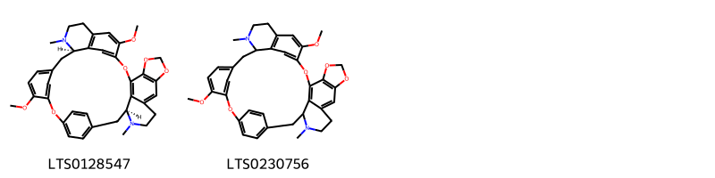{ width=100% }
    <figcaption>Hình ảnh cấu trúc hóa học của 2 hoạt chất thuộc nhóm  gồm ['(14s,27r)-22,33-dimethoxy-13,28-dimethyl-2,5,7,20-tetraoxa-13,28-diazaoctacyclo[25.6.2.2¹⁶,¹⁹.1³,¹⁰.1²¹,²⁵.0⁴,⁸.0³¹,³⁵.0¹⁴,³⁹]nonatriaconta-1(34),3,8,10(39),16,18,21(36),22,24,31(35),32,37-dodecaene (LTS0128547)', '22,33-dimethoxy-13,28-dimethyl-2,5,7,20-tetraoxa-13,28-diazaoctacyclo[25.6.2.2¹⁶,¹⁹.1³,¹⁰.1²¹,²⁵.0⁴,⁸.0³¹,³⁵.0¹⁴,³⁹]nonatriaconta-1(34),3,8,10(39),16,18,21(36),22,24,31(35),32,37-dodecaene (LTS0230756)'].</figcaption>
</figure>
#### Nhóm Hasubanan alkaloids
<figure markdown="span">
    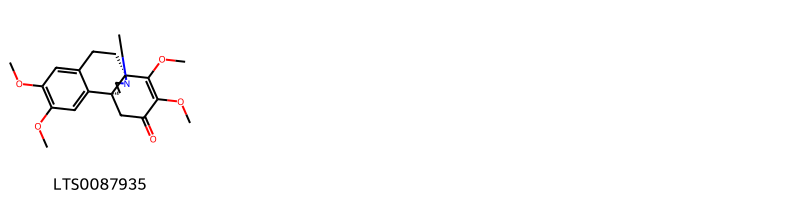{ width=100% }
    <figcaption>Hình ảnh cấu trúc hóa học của 1 hoạt chất thuộc nhóm Hasubanan alkaloids gồm ['runanine (LTS0087935)'].</figcaption>
</figure>
#### Nhóm Steroids and steroid derivatives
<figure markdown="span">
    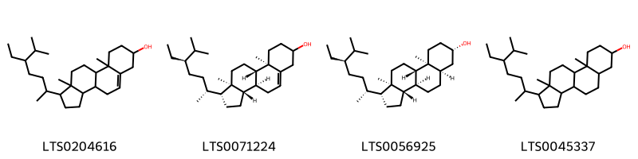{ width=100% }
    <figcaption>Hình ảnh cấu trúc hóa học của 4 hoạt chất thuộc nhóm Steroids and steroid derivatives gồm ['stigmast-5-en-3-ol, (3β)- (LTS0204616)', 'stigmast-5-en-3-ol (LTS0071224)', '(1r,3as,3br,5ar,7s,9as,9bs,11ar)-1-[(2r,5r)-5-ethyl-6-methylheptan-2-yl]-9a,11a-dimethyl-tetradecahydro-1h-cyclopenta[a]phenanthren-7-ol (LTS0056925)', '24-ethyl coprostanol (LTS0045337)'].</figcaption>
</figure>

---

### Dược dân tộc học

Danh sách các quốc gia có sử dụng *Stephania sinica* trong điều trị các bệnh. 

| Country   | Disease                           | Bệnh                                                                                                                                                                                                |
|:----------|:----------------------------------|:----------------------------------------------------------------------------------------------------------------------------------------------------------------------------------------------------|
| China     | Analgesic, Sedative, Tranquilizer | MYMEMORY WARNING: YOU USED ALL AVAILABLE FREE TRANSLATIONS FOR TODAY. NEXT AVAILABLE IN  19 HOURS 08 MINUTES 11 SECONDS VISIT HTTPS://MYMEMORY.TRANSLATED.NET/DOC/USAGELIMITS.PHP TO TRANSLATE MORE |

---

# Chi Pachygone

??? note "Danh sách các dược liệu thuộc chi"
    
	 - *Pachygone ovata*

---
## Pachygone ovata
### Thông tin về thực vật

!!! info "Phân loại thực vật của *Pachygone ovata* từ GIBF:"
    - **Kingdom:** Plantae
    - **Phylum:** Tracheophyta
    - **Order:** Ranunculales
    - **Family:** Menispermaceae
    - **Genus:** Pachygone
    - **Species:** *Pachygone ovata*

 

| Label (VI)   | Label (EN)   | Scientific Name   | Descriptions (VI)   | Descriptions (EN)   | Also Known As (VI)   | Also Known As (EN)     |
|:-------------|:-------------|:------------------|:--------------------|:--------------------|:---------------------|:-----------------------|
| N/A          | N/A          | Pachygone ovata   | loài thực vật       | species of plant    | ['']                 | ['Pachygone ovata ex'] |

#### Phân bố trên thế giới

**Từ CSDL GIBF** Australia, India, Indonesia, Timor-Leste, Viet Nam

#### Phân bố tại Việt Nam

**Từ CSDL GIBF**: Kon Tum

---
### Thành phần hóa học
        
- Theo cơ sở dữ liệu lotus: Từ loài *Pachygone ovata* đã phân lập và xác định được 37 hoạt chất thuộc về các nhóm Proaporphines, Erythrina alkaloids, Aporphines, Organooxygen compounds, Isoquinolines and derivatives, Protoberberine alkaloids and derivatives. 

|    | chemicalTaxonomyClassyfireClass          |   smiles_count |
|---:|:-----------------------------------------|---------------:|
|  0 |                                          |             15 |
|  1 | Aporphines                               |              5 |
|  2 | Erythrina alkaloids                      |              2 |
|  3 | Isoquinolines and derivatives            |              8 |
|  4 | Organooxygen compounds                   |              1 |
|  5 | Proaporphines                            |              2 |
|  6 | Protoberberine alkaloids and derivatives |              4 |

#### Nhóm 
<figure markdown="span">
    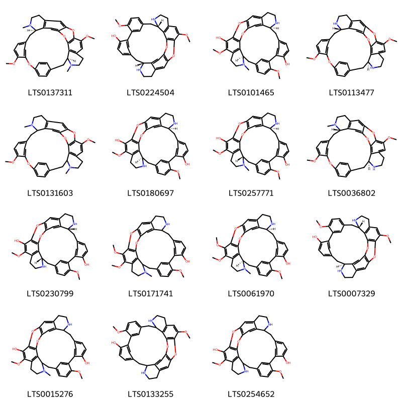{ width=100% }
    <figcaption>Hình ảnh cấu trúc hóa học của 15 hoạt chất thuộc nhóm  gồm ['(8r,21s)-13,27-dimethoxy-7,22-dimethyl-15,29,31-trioxa-7,22-diazaoctacyclo[19.9.3.2¹⁶,¹⁹.1⁴,³⁰.1¹⁰,¹⁴.0³,⁸.0²⁵,³³.0²⁸,³²]heptatriaconta-1,3,10,12,14(37),16,18,25(33),26,28(32),30(34),35-dodecaene (LTS0137311)', '(8r,21s)-16,27-dimethoxy-29,31-dioxa-7,22-diazaoctacyclo[19.9.3.1⁴,³⁰.1¹⁰,¹⁴.1¹⁵,¹⁹.0³,⁸.0²⁵,³³.0²⁸,³²]hexatriaconta-1(30),2,4(34),10,12,14(36),15(35),16,18,25(33),26,28(32)-dodecaen-13-ol (LTS0224504)', '(8s,21r)-16,26-dimethoxy-22-methyl-29,31-dioxa-7,22-diazaoctacyclo[19.9.3.1⁴,³⁰.1¹⁰,¹⁴.1¹⁵,¹⁹.0³,⁸.0²⁵,³³.0²⁸,³²]hexatriaconta-1(30),2,4(34),10,12,14(36),15(35),16,18,25(33),26,28(32)-dodecaene-13,27-diol (LTS0101465)', '(8s,21s)-13,27-dimethoxy-15,29,31-trioxa-7,22-diazaoctacyclo[19.9.3.2¹⁶,¹⁹.1⁴,³⁰.1¹⁰,¹⁴.0³,⁸.0²⁵,³³.0²⁸,³²]heptatriaconta-1,3,10,12,14(37),16,18,25,27,30(34),32,35-dodecaene (LTS0113477)', '13,27-dimethoxy-7,22-dimethyl-15,29,31-trioxa-7,22-diazaoctacyclo[19.9.3.2¹⁶,¹⁹.1⁴,³⁰.1¹⁰,¹⁴.0³,⁸.0²⁵,³³.0²⁸,³²]heptatriaconta-1,3,10,12,14(37),16,18,25(33),26,28(32),30(34),35-dodecaene (LTS0131603)', '(8s,21r)-16,26-dimethoxy-29,31-dioxa-7,22-diazaoctacyclo[19.9.3.1⁴,³⁰.1¹⁰,¹⁴.1¹⁵,¹⁹.0³,⁸.0²⁵,³³.0²⁸,³²]hexatriaconta-1(30),2,4(34),10,12,14(36),15(35),16,18,25(33),26,28(32)-dodecaene-13,27-diol (LTS0180697)', '(8s,21s)-16,26-dimethoxy-22-methyl-29,31-dioxa-7,22-diazaoctacyclo[19.9.3.1⁴,³⁰.1¹⁰,¹⁴.1¹⁵,¹⁹.0³,⁸.0²⁵,³³.0²⁸,³²]hexatriaconta-1(30),2,4(34),10,12,14(36),15(35),16,18,25(33),26,28(32)-dodecaene-13,27-diol (LTS0257771)', '(8s,21s)-13,27-dimethoxy-7-methyl-15,29,31-trioxa-7,22-diazaoctacyclo[19.9.3.2¹⁶,¹⁹.1⁴,³⁰.1¹⁰,¹⁴.0³,⁸.0²⁵,³³.0²⁸,³²]heptatriaconta-1,3,10,12,14(37),16,18,25,27,30(34),32,35-dodecaene (LTS0036802)', '(8r,21s)-16,26-dimethoxy-29,31-dioxa-7,22-diazaoctacyclo[19.9.3.1⁴,³⁰.1¹⁰,¹⁴.1¹⁵,¹⁹.0³,⁸.0²⁵,³³.0²⁸,³²]hexatriaconta-1(30),2,4(34),10,12,14(36),15(35),16,18,25(33),26,28(32)-dodecaene-13,27-diol (LTS0230799)', '16,26,27-trimethoxy-22-methyl-29,31-dioxa-7,22-diazaoctacyclo[19.9.3.1⁴,³⁰.1¹⁰,¹⁴.1¹⁵,¹⁹.0³,⁸.0²⁵,³³.0²⁸,³²]hexatriaconta-1(30),2,4(34),10,12,14(36),15(35),16,18,25(33),26,28(32)-dodecaen-13-ol (LTS0171741)', '(8s,21r)-16,26,27-trimethoxy-22-methyl-29,31-dioxa-7,22-diazaoctacyclo[19.9.3.1⁴,³⁰.1¹⁰,¹⁴.1¹⁵,¹⁹.0³,⁸.0²⁵,³³.0²⁸,³²]hexatriaconta-1(30),2,4(34),10,12,14(36),15(35),16,18,25(33),26,28(32)-dodecaen-13-ol (LTS0061970)', '(8s,21s)-16,27-dimethoxy-29,31-dioxa-7,22-diazaoctacyclo[19.9.3.1⁴,³⁰.1¹⁰,¹⁴.1¹⁵,¹⁹.0³,⁸.0²⁵,³³.0²⁸,³²]hexatriaconta-1(30),2,4(34),10,12,14(36),15(35),16,18,25(33),26,28(32)-dodecaen-13-ol (LTS0007329)', '16,26-dimethoxy-22-methyl-29,31-dioxa-7,22-diazaoctacyclo[19.9.3.1⁴,³⁰.1¹⁰,¹⁴.1¹⁵,¹⁹.0³,⁸.0²⁵,³³.0²⁸,³²]hexatriaconta-1(30),2,4(34),10,12,14(36),15(35),16,18,25(33),26,28(32)-dodecaene-13,27-diol (LTS0015276)', '16,27-dimethoxy-29,31-dioxa-7,22-diazaoctacyclo[19.9.3.1⁴,³⁰.1¹⁰,¹⁴.1¹⁵,¹⁹.0³,⁸.0²⁵,³³.0²⁸,³²]hexatriaconta-1(30),2,4(34),10,12,14(36),15(35),16,18,25(33),26,28(32)-dodecaen-13-ol (LTS0133255)', '16,26-dimethoxy-29,31-dioxa-7,22-diazaoctacyclo[19.9.3.1⁴,³⁰.1¹⁰,¹⁴.1¹⁵,¹⁹.0³,⁸.0²⁵,³³.0²⁸,³²]hexatriaconta-1(30),2,4(34),10,12,14(36),15(35),16,18,25(33),26,28(32)-dodecaene-13,27-diol (LTS0254652)'].</figcaption>
</figure>
#### Nhóm Aporphines
<figure markdown="span">
    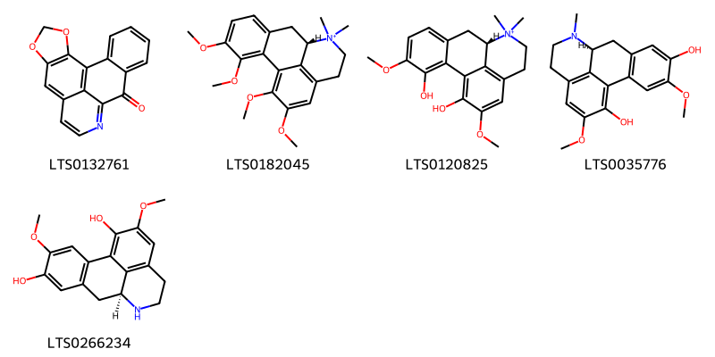{ width=100% }
    <figcaption>Hình ảnh cấu trúc hóa học của 5 hoạt chất thuộc nhóm Aporphines gồm ['liriodenine (LTS0132761)', '(9s)-3,4,15,16-tetramethoxy-10,10-dimethyl-10-azatetracyclo[7.7.1.0²,⁷.0¹³,¹⁷]heptadeca-1(16),2,4,6,13(17),14-hexaen-10-ium (LTS0182045)', 'magnoflorine (LTS0120825)', '(9s)-4,15-dimethoxy-10-methyl-10-azatetracyclo[7.7.1.0²,⁷.0¹³,¹⁷]heptadeca-1(16),2(7),3,5,13(17),14-hexaene-5,16-diol (LTS0035776)', '(9s)-4,15-dimethoxy-10-azatetracyclo[7.7.1.0²,⁷.0¹³,¹⁷]heptadeca-1(17),2(7),3,5,13,15-hexaene-5,16-diol (LTS0266234)'].</figcaption>
</figure>
#### Nhóm Erythrina alkaloids
<figure markdown="span">
    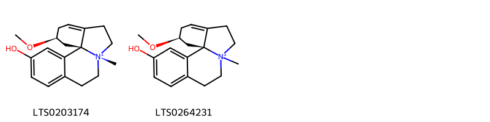{ width=100% }
    <figcaption>Hình ảnh cấu trúc hóa học của 2 hoạt chất thuộc nhóm Erythrina alkaloids gồm ['(3s,9bs,11s)-8-hydroxy-11-methoxy-3-methyl-1h,2h,4h,5h,10h,11h,12h-indolo[7a,1-a]isoquinolin-3-ium (LTS0203174)', '(9bs,11s)-8-hydroxy-11-methoxy-3-methyl-1h,2h,4h,5h,10h,11h,12h-indolo[7a,1-a]isoquinolin-3-ium (LTS0264231)'].</figcaption>
</figure>
#### Nhóm Isoquinolines and derivatives
<figure markdown="span">
    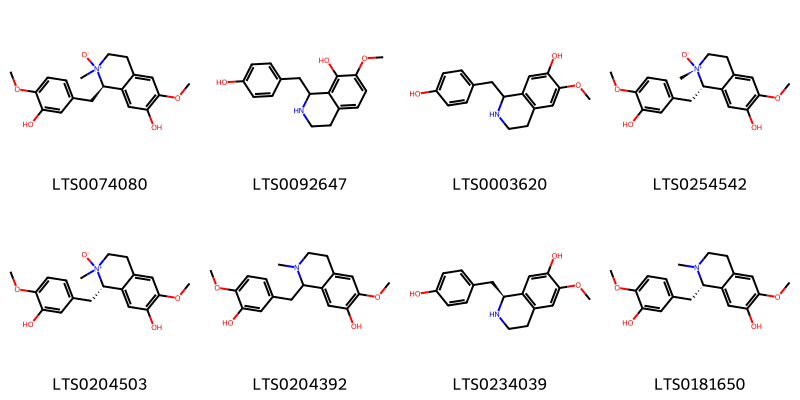{ width=100% }
    <figcaption>Hình ảnh cấu trúc hóa học của 8 hoạt chất thuộc nhóm Isoquinolines and derivatives gồm ['(1r)-7-hydroxy-1-[(3-hydroxy-4-methoxyphenyl)methyl]-6-methoxy-2-methyl-3,4-dihydro-1h-isoquinolin-2-ium-2-olate (LTS0074080)', '1-[(4-hydroxyphenyl)methyl]-7-methoxy-1,2,3,4-tetrahydroisoquinolin-8-ol (LTS0092647)', '(rs)-coclaurine (LTS0003620)', '(1s,2r)-7-hydroxy-1-[(3-hydroxy-4-methoxyphenyl)methyl]-6-methoxy-2-methyl-3,4-dihydro-1h-isoquinolin-2-ium-2-olate (LTS0254542)', '(1s)-7-hydroxy-1-[(3-hydroxy-4-methoxyphenyl)methyl]-6-methoxy-2-methyl-3,4-dihydro-1h-isoquinolin-2-ium-2-olate (LTS0204503)', 'reticuline (LTS0204392)', '(+-)-coclaurine (LTS0234039)', '(+,-)-reticuline (LTS0181650)'].</figcaption>
</figure>
#### Nhóm Organooxygen compounds
<figure markdown="span">
    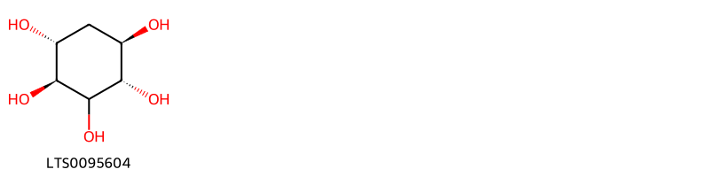{ width=100% }
    <figcaption>Hình ảnh cấu trúc hóa học của 1 hoạt chất thuộc nhóm Organooxygen compounds gồm ['quercitol (LTS0095604)'].</figcaption>
</figure>
#### Nhóm Proaporphines
<figure markdown="span">
    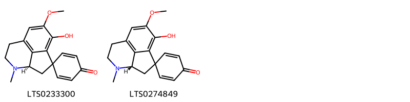{ width=100% }
    <figcaption>Hình ảnh cấu trúc hóa học của 2 hoạt chất thuộc nhóm Proaporphines gồm ['glaziovine (LTS0233300)', "(4's)-11'-hydroxy-10'-methoxy-5'-methyl-5'-azaspiro[cyclohexane-1,2'-tricyclo[6.3.1.0⁴,¹²]dodecane]-1'(11'),2,5,8'(12'),9'-pentaen-4-one (LTS0274849)"].</figcaption>
</figure>
#### Nhóm Protoberberine alkaloids and derivatives
<figure markdown="span">
    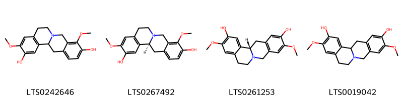{ width=100% }
    <figcaption>Hình ảnh cấu trúc hóa học của 4 hoạt chất thuộc nhóm Protoberberine alkaloids and derivatives gồm ['coreximine (LTS0242646)', 'stepholidine (LTS0267492)', 'coreximine (LTS0261253)', 'coreximine (LTS0019042)'].</figcaption>
</figure>

---

### Dược dân tộc học

Danh sách các quốc gia có sử dụng *Pachygone ovata* trong điều trị các bệnh. 

| Country   | Disease                 | Bệnh                                                                                                                                                                                                |
|:----------|:------------------------|:----------------------------------------------------------------------------------------------------------------------------------------------------------------------------------------------------|
| Asia      | Pediculicide, Piscicide | MYMEMORY WARNING: YOU USED ALL AVAILABLE FREE TRANSLATIONS FOR TODAY. NEXT AVAILABLE IN  19 HOURS 07 MINUTES 34 SECONDS VISIT HTTPS://MYMEMORY.TRANSLATED.NET/DOC/USAGELIMITS.PHP TO TRANSLATE MORE |
| India     | Vermifuge, Piscicide    | MYMEMORY WARNING: YOU USED ALL AVAILABLE FREE TRANSLATIONS FOR TODAY. NEXT AVAILABLE IN  19 HOURS 07 MINUTES 31 SECONDS VISIT HTTPS://MYMEMORY.TRANSLATED.NET/DOC/USAGELIMITS.PHP TO TRANSLATE MORE |

---

# Chi Pericampylus

??? note "Danh sách các dược liệu thuộc chi"
    
	 - *Pericampylus glaucus*

---
## Pericampylus glaucus
### Thông tin về thực vật

!!! info "Phân loại thực vật của *Pericampylus glaucus* từ GIBF:"
    - **Kingdom:** Plantae
    - **Phylum:** Tracheophyta
    - **Order:** Ranunculales
    - **Family:** Menispermaceae
    - **Genus:** Pericampylus
    - **Species:** *Pericampylus glaucus*

 

| Label (VI)   | Label (EN)   | Scientific Name      | Descriptions (VI)   | Descriptions (EN)   | Also Known As (VI)   | Also Known As (EN)   |
|:-------------|:-------------|:---------------------|:--------------------|:--------------------|:---------------------|:---------------------|
| N/A          | N/A          | Pericampylus glaucus | loài thực vật       | species of plant    | ['']                 | ['']                 |

#### Phân bố trên thế giới

**Từ CSDL GIBF** Hong Kong, Chinese Taipei, China

#### Phân bố tại Việt Nam

**Từ CSDL GIBF**: Không có ghi nhận ở Việt Nam

---
### Thành phần hóa học
        
- Theo cơ sở dữ liệu lotus: Từ loài *Pericampylus glaucus* đã phân lập và xác định được 19 hoạt chất thuộc về các nhóm Isoquinolines and derivatives, Hasubanan alkaloids, Protoberberine alkaloids and derivatives. 

|    | chemicalTaxonomyClassyfireClass          |   smiles_count |
|---:|:-----------------------------------------|---------------:|
|  0 | Hasubanan alkaloids                      |             13 |
|  1 | Isoquinolines and derivatives            |              2 |
|  2 | Protoberberine alkaloids and derivatives |              4 |

#### Nhóm Hasubanan alkaloids
<figure markdown="span">
    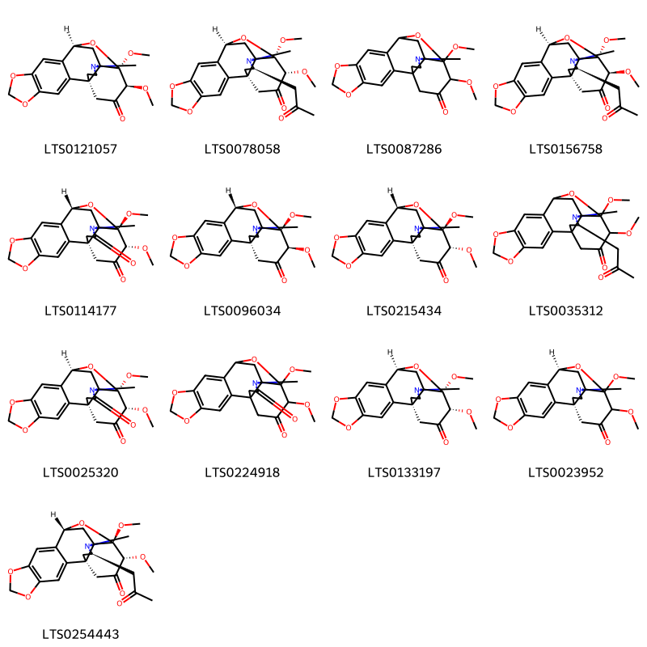{ width=100% }
    <figcaption>Hình ảnh cấu trúc hóa học của 13 hoạt chất thuộc nhóm Hasubanan alkaloids gồm ['periglaucine b (LTS0121057)', '(1s,11s,13s,14r,15r,19r)-14,15-dimethoxy-20-methyl-19-(2-oxopropyl)-5,7,21-trioxa-20-azahexacyclo[11.4.3.1¹¹,¹⁴.0¹,¹³.0²,¹⁰.0⁴,⁸]henicosa-2,4(8),9-trien-16-one (LTS0078058)', '14,15-dimethoxy-20-methyl-5,7,21-trioxa-20-azahexacyclo[11.4.3.1¹¹,¹⁴.0¹,¹³.0²,¹⁰.0⁴,⁸]henicosa-2,4(8),9-trien-16-one (LTS0087286)', 'periglaucine d (LTS0156758)', '(1r,11r,13s,14s,15r)-14,15-dimethoxy-20-methyl-5,7,21-trioxa-20-azahexacyclo[11.4.3.1¹¹,¹⁴.0¹,¹³.0²,¹⁰.0⁴,⁸]henicosa-2,4(8),9-triene-16,19-dione (LTS0114177)', 'periglaucine b (LTS0096034)', 'periglaucine a (LTS0215434)', '14,15-dimethoxy-20-methyl-19-(2-oxopropyl)-5,7,21-trioxa-20-azahexacyclo[11.4.3.1¹¹,¹⁴.0¹,¹³.0²,¹⁰.0⁴,⁸]henicosa-2,4(8),9-trien-16-one (LTS0035312)', 'periglaucine c (LTS0025320)', '14,15-dimethoxy-20-methyl-5,7,21-trioxa-20-azahexacyclo[11.4.3.1¹¹,¹⁴.0¹,¹³.0²,¹⁰.0⁴,⁸]henicosa-2,4(8),9-triene-16,19-dione (LTS0224918)', 'periglaucine a (LTS0133197)', '(1s,11s,13s)-14,15-dimethoxy-20-methyl-5,7,21-trioxa-20-azahexacyclo[11.4.3.1¹¹,¹⁴.0¹,¹³.0²,¹⁰.0⁴,⁸]henicosa-2,4(8),9-trien-16-one (LTS0023952)', '(1s,11r,13s,14s,15r,19r)-14,15-dimethoxy-20-methyl-19-(2-oxopropyl)-5,7,21-trioxa-20-azahexacyclo[11.4.3.1¹¹,¹⁴.0¹,¹³.0²,¹⁰.0⁴,⁸]henicosa-2,4(8),9-trien-16-one (LTS0254443)'].</figcaption>
</figure>
#### Nhóm Isoquinolines and derivatives
<figure markdown="span">
    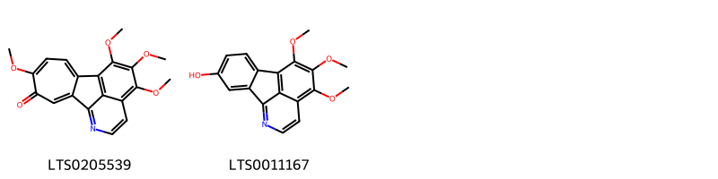{ width=100% }
    <figcaption>Hình ảnh cấu trúc hóa học của 2 hoạt chất thuộc nhóm Isoquinolines and derivatives gồm ['5,14,15,16-tetramethoxy-10-azatetracyclo[7.7.1.0²,⁸.0¹³,¹⁷]heptadeca-1(16),2,4,7,9(17),10,12,14-octaen-6-one (LTS0205539)', '6,7,8-trimethoxy-2-azatetracyclo[7.6.1.0⁵,¹⁶.0¹⁰,¹⁵]hexadeca-1(16),2,4,6,8,10,12,14-octaen-13-ol (LTS0011167)'].</figcaption>
</figure>
#### Nhóm Protoberberine alkaloids and derivatives
<figure markdown="span">
    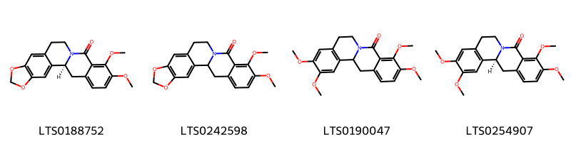{ width=100% }
    <figcaption>Hình ảnh cấu trúc hóa học của 4 hoạt chất thuộc nhóm Protoberberine alkaloids and derivatives gồm ['(1s)-16,17-dimethoxy-5,7-dioxa-13-azapentacyclo[11.8.0.0²,¹⁰.0⁴,⁸.0¹⁵,²⁰]henicosa-2,4(8),9,15,17,19-hexaen-14-one (LTS0188752)', '16,17-dimethoxy-5,7-dioxa-13-azapentacyclo[11.8.0.0²,¹⁰.0⁴,⁸.0¹⁵,²⁰]henicosa-2,4(8),9,15,17,19-hexaen-14-one (LTS0242598)', '3,4,10,11-tetramethoxy-7,8,12b,13-tetrahydro-6-azatetraphen-5-one (LTS0190047)', '(12bs)-3,4,10,11-tetramethoxy-7,8,12b,13-tetrahydro-6-azatetraphen-5-one (LTS0254907)'].</figcaption>
</figure>

---

### Dược dân tộc học

Danh sách các quốc gia có sử dụng *Pericampylus glaucus* trong điều trị các bệnh. 

| Country   | Disease   | Bệnh                                                                                                                                                                                                |
|:----------|:----------|:----------------------------------------------------------------------------------------------------------------------------------------------------------------------------------------------------|
| Elsewhere | Narcotic  | MYMEMORY WARNING: YOU USED ALL AVAILABLE FREE TRANSLATIONS FOR TODAY. NEXT AVAILABLE IN  19 HOURS 07 MINUTES 03 SECONDS VISIT HTTPS://MYMEMORY.TRANSLATED.NET/DOC/USAGELIMITS.PHP TO TRANSLATE MORE |

---

# Chi Pycnarrhena

??? note "Danh sách các dược liệu thuộc chi"
    
	 - *Pycnarrhena manilensis*

---
## Pycnarrhena manilensis
### Thông tin về thực vật

!!! info "Phân loại thực vật của *Pycnarrhena manillensis* từ GIBF:"
    - **Kingdom:** Plantae
    - **Phylum:** Tracheophyta
    - **Order:** Ranunculales
    - **Family:** Menispermaceae
    - **Genus:** Pycnarrhena
    - **Species:** *Pycnarrhena manillensis*

 

| Label (VI)   | Label (EN)   | Scientific Name      | Descriptions (VI)   | Descriptions (EN)   | Also Known As (VI)   | Also Known As (EN)   |
|:-------------|:-------------|:---------------------|:--------------------|:--------------------|:---------------------|:---------------------|
| N/A          | N/A          | Pericampylus glaucus | loài thực vật       | species of plant    | ['']                 | ['']                 |

#### Phân bố trên thế giới

**Từ CSDL GIBF** nan, Philippines, Malaysia, Chinese Taipei

#### Phân bố tại Việt Nam

**Từ CSDL GIBF**: Không có ghi nhận ở Việt Nam

---
### Thành phần hóa học
        
- Theo cơ sở dữ liệu lotus: Từ loài *Pycnarrhena manillensis* đã phân lập và xác định được Chưa có hoạt chất nào được phân lập. hoạt chất thuộc về các nhóm Không có hoạt chất nào được phân lập. 

Không có hình ảnh nào được tạo ra

---

### Dược dân tộc học

Danh sách các quốc gia có sử dụng *Pycnarrhena manillensis* trong điều trị các bệnh. 

| Country     | Disease                       | Bệnh                                                                                                                                                                                                |
|:------------|:------------------------------|:----------------------------------------------------------------------------------------------------------------------------------------------------------------------------------------------------|
| Philippines | Cicatrizant, Tonic, Vulnerary | MYMEMORY WARNING: YOU USED ALL AVAILABLE FREE TRANSLATIONS FOR TODAY. NEXT AVAILABLE IN  19 HOURS 06 MINUTES 37 SECONDS VISIT HTTPS://MYMEMORY.TRANSLATED.NET/DOC/USAGELIMITS.PHP TO TRANSLATE MORE |

---

# Chi Cyclea

??? note "Danh sách các dược liệu thuộc chi"
    
	 - *Cyclea hypoglauca*
	 - *Cyclea peltata*

---
## Cyclea hypoglauca
### Thông tin về thực vật

!!! info "Phân loại thực vật của *Cyclea hypoglauca* từ GIBF:"
    - **Kingdom:** Plantae
    - **Phylum:** Tracheophyta
    - **Order:** Ranunculales
    - **Family:** Menispermaceae
    - **Genus:** Cyclea
    - **Species:** *Cyclea hypoglauca*

 

| Label (VI)   | Label (EN)   | Scientific Name   | Descriptions (VI)   | Descriptions (EN)   | Also Known As (VI)   | Also Known As (EN)   |
|:-------------|:-------------|:------------------|:--------------------|:--------------------|:---------------------|:---------------------|
| N/A          | N/A          | Cyclea hypoglauca | loài thực vật       | species of plant    | ['']                 | ['']                 |

#### Phân bố trên thế giới

**Từ CSDL GIBF** Hong Kong, China

#### Phân bố tại Việt Nam

**Từ CSDL GIBF**: Không có ghi nhận ở Việt Nam

---
### Thành phần hóa học
        
- Theo cơ sở dữ liệu lotus: Từ loài *Cyclea hypoglauca* đã phân lập và xác định được Chưa có hoạt chất nào được phân lập. hoạt chất thuộc về các nhóm Không có hoạt chất nào được phân lập. 

Không có hình ảnh nào được tạo ra

---

### Dược dân tộc học

Danh sách các quốc gia có sử dụng *Cyclea hypoglauca* trong điều trị các bệnh. 

| Country   | Disease                                        | Bệnh                                                                                                                                                                                                |
|:----------|:-----------------------------------------------|:----------------------------------------------------------------------------------------------------------------------------------------------------------------------------------------------------|
| China     | Alexiteric, Carminative, Diuretic, Refrigerant | MYMEMORY WARNING: YOU USED ALL AVAILABLE FREE TRANSLATIONS FOR TODAY. NEXT AVAILABLE IN  19 HOURS 06 MINUTES 18 SECONDS VISIT HTTPS://MYMEMORY.TRANSLATED.NET/DOC/USAGELIMITS.PHP TO TRANSLATE MORE |

---

---
## Cyclea peltata
### Thông tin về thực vật

!!! info "Phân loại thực vật của *Cyclea peltata* từ GIBF:"
    - **Kingdom:** Plantae
    - **Phylum:** Tracheophyta
    - **Order:** Ranunculales
    - **Family:** Menispermaceae
    - **Genus:** Cyclea
    - **Species:** *Cyclea peltata*

 

| Label (VI)   | Label (EN)   | Scientific Name   | Descriptions (VI)   | Descriptions (EN)   | Also Known As (VI)   | Also Known As (EN)   |
|:-------------|:-------------|:------------------|:--------------------|:--------------------|:---------------------|:---------------------|
| N/A          | N/A          | Cyclea peltata    | loài thực vật       | species of plant    | ['']                 | ['Abuta amara']      |

#### Phân bố trên thế giới

**Từ CSDL GIBF** nan, Sri Lanka, Cambodia, Chinese Taipei, Myanmar, India, unknown or invalid, Indonesia

#### Phân bố tại Việt Nam

**Từ CSDL GIBF**: Không có ghi nhận ở Việt Nam

---
### Thành phần hóa học
        
- Theo cơ sở dữ liệu lotus: Từ loài *Cyclea peltata* đã phân lập và xác định được 25 hoạt chất thuộc về các nhóm Isoquinolines and derivatives, Organooxygen compounds. 

|    | chemicalTaxonomyClassyfireClass   |   smiles_count |
|---:|:----------------------------------|---------------:|
|  0 |                                   |             18 |
|  1 | Isoquinolines and derivatives     |              3 |
|  2 | Organooxygen compounds            |              4 |

#### Nhóm 
<figure markdown="span">
    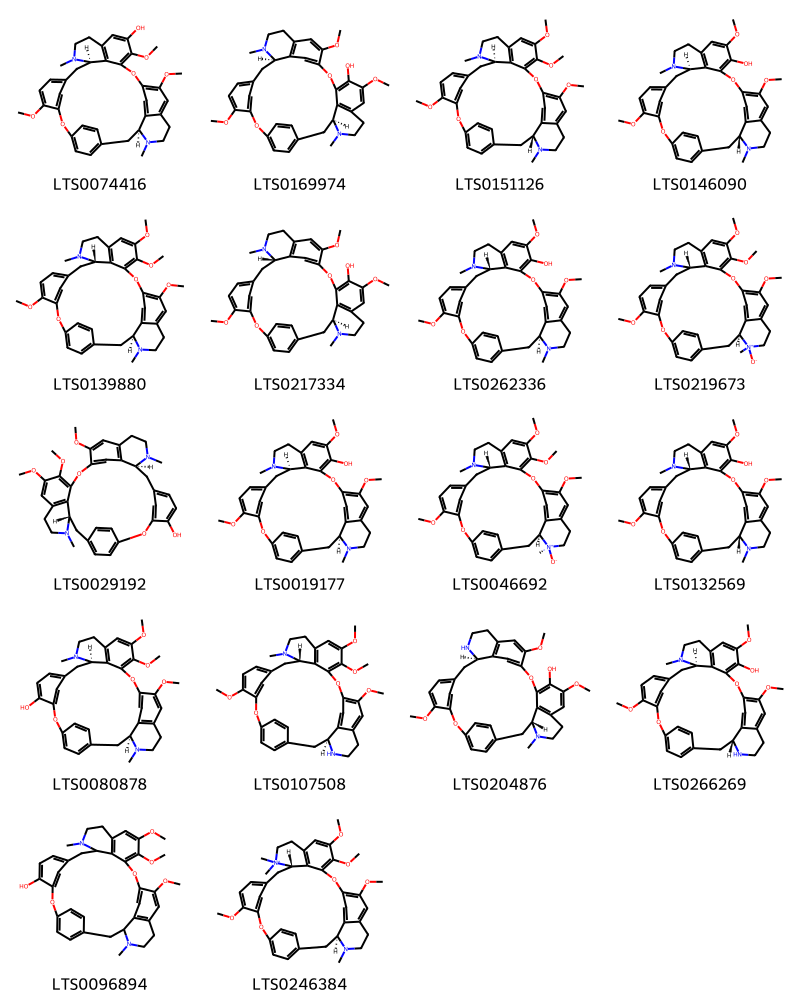{ width=100% }
    <figcaption>Hình ảnh cấu trúc hóa học của 18 hoạt chất thuộc nhóm  gồm ['(1s,14r)-9,21,25-trimethoxy-15,30-dimethyl-7,23-dioxa-15,30-diazaheptacyclo[22.6.2.2³,⁶.1⁸,¹².1¹⁴,¹⁸.0²⁷,³¹.0²²,³³]hexatriaconta-3,5,8(34),9,11,18(33),19,21,24,26,31,35-dodecaen-20-ol (LTS0074416)', '(1r,14s)-6,20,25-trimethoxy-15,30-dimethyl-8,23-dioxa-15,30-diazaheptacyclo[22.6.2.2⁹,¹².1³,⁷.1¹⁴,¹⁸.0²⁷,³¹.0²²,³³]hexatriaconta-3,5,7(36),9,11,18(33),19,21,24(32),25,27(31),34-dodecaen-21-ol (LTS0169974)', '(1r,14r)-9,20,21,25-tetramethoxy-15,30-dimethyl-7,23-dioxa-15,30-diazaheptacyclo[22.6.2.2³,⁶.1⁸,¹².1¹⁴,¹⁸.0²⁷,³¹.0²²,³³]hexatriaconta-3,5,8(34),9,11,18(33),19,21,24,26,31,35-dodecaene (LTS0151126)', '(1r,14r)-9,20,25-trimethoxy-15,30-dimethyl-7,23-dioxa-15,30-diazaheptacyclo[22.6.2.2³,⁶.1⁸,¹².1¹⁴,¹⁸.0²⁷,³¹.0²²,³³]hexatriaconta-3,5,8(34),9,11,18(33),19,21,24,26,31,35-dodecaen-21-ol (LTS0146090)', '(1s,14s)-9,20,21,25-tetramethoxy-15,30-dimethyl-7,23-dioxa-15,30-diazaheptacyclo[22.6.2.2³,⁶.1⁸,¹².1¹⁴,¹⁸.0²⁷,³¹.0²²,³³]hexatriaconta-3,5,8(34),9,11,18(33),19,21,24,26,31,35-dodecaene (LTS0139880)', '(1s,14s)-6,20,25-trimethoxy-15,30-dimethyl-8,23-dioxa-15,30-diazaheptacyclo[22.6.2.2⁹,¹².1³,⁷.1¹⁴,¹⁸.0²⁷,³¹.0²²,³³]hexatriaconta-3,5,7(36),9,11,18(33),19,21,24(32),25,27(31),34-dodecaen-21-ol (LTS0217334)', 'fangchinoline (LTS0262336)', '(1s,14s)-9,20,21,25-tetramethoxy-15,30-dimethyl-7,23-dioxa-15,30-diazaheptacyclo[22.6.2.2³,⁶.1⁸,¹².1¹⁴,¹⁸.0²⁷,³¹.0²²,³³]hexatriaconta-3,5,8(34),9,11,18(33),19,21,24,26,31,35-dodecaen-30-ium-30-olate (LTS0219673)', '(1s,14s)-20,21,25-trimethoxy-15,30-dimethyl-8,23-dioxa-15,30-diazaheptacyclo[22.6.2.2⁹,¹².1³,⁷.1¹⁴,¹⁸.0²⁷,³¹.0²²,³³]hexatriaconta-3,5,7(36),9,11,18(33),19,21,24(32),25,27(31),34-dodecaen-6-ol (LTS0029192)', '(1s,14r)-9,20,25-trimethoxy-15,30-dimethyl-7,23-dioxa-15,30-diazaheptacyclo[22.6.2.2³,⁶.1⁸,¹².1¹⁴,¹⁸.0²⁷,³¹.0²²,³³]hexatriaconta-3,5,8(34),9,11,18(33),19,21,24,26,31,35-dodecaen-21-ol (LTS0019177)', '(1s,14s,30r)-9,20,21,25-tetramethoxy-15,30-dimethyl-7,23-dioxa-15,30-diazaheptacyclo[22.6.2.2³,⁶.1⁸,¹².1¹⁴,¹⁸.0²⁷,³¹.0²²,³³]hexatriaconta-3,5,8(34),9,11,18(33),19,21,24,26,31,35-dodecaen-30-ium-30-olate (LTS0046692)', '(1r,14s)-9,20,25-trimethoxy-15,30-dimethyl-7,23-dioxa-15,30-diazaheptacyclo[22.6.2.2³,⁶.1⁸,¹².1¹⁴,¹⁸.0²⁷,³¹.0²²,³³]hexatriaconta-3,5,8(34),9,11,18(33),19,21,24,26,31,35-dodecaen-21-ol (LTS0132569)', '(1s,14r)-20,21,25-trimethoxy-15,30-dimethyl-7,23-dioxa-15,30-diazaheptacyclo[22.6.2.2³,⁶.1⁸,¹².1¹⁴,¹⁸.0²⁷,³¹.0²²,³³]hexatriaconta-3,5,8(34),9,11,18(33),19,21,24(32),25,27(31),35-dodecaen-9-ol (LTS0080878)', '(1s,14s)-9,20,21,25-tetramethoxy-15-methyl-7,23-dioxa-15,30-diazaheptacyclo[22.6.2.2³,⁶.1⁸,¹².1¹⁴,¹⁸.0²⁷,³¹.0²²,³³]hexatriaconta-3,5,8(34),9,11,18(33),19,21,24,26,31,35-dodecaene (LTS0107508)', '(1r,14r)-6,20,25-trimethoxy-15-methyl-8,23-dioxa-15,30-diazaheptacyclo[22.6.2.2⁹,¹².1³,⁷.1¹⁴,¹⁸.0²⁷,³¹.0²²,³³]hexatriaconta-3,5,7(36),9,11,18(33),19,21,24(32),25,27(31),34-dodecaen-21-ol (LTS0204876)', '(1r,14r)-9,20,25-trimethoxy-15-methyl-7,23-dioxa-15,30-diazaheptacyclo[22.6.2.2³,⁶.1⁸,¹².1¹⁴,¹⁸.0²⁷,³¹.0²²,³³]hexatriaconta-3,5,8(34),9,11,18(33),19,21,24,26,31,35-dodecaen-21-ol (LTS0266269)', '20,21,25-trimethoxy-15,30-dimethyl-7,23-dioxa-15,30-diazaheptacyclo[22.6.2.2³,⁶.1⁸,¹².1¹⁴,¹⁸.0²⁷,³¹.0²²,³³]hexatriaconta-3,5,8(34),9,11,18(33),19,21,24(32),25,27(31),35-dodecaen-9-ol (LTS0096894)', '(1s,14s)-9,20,21,25-tetramethoxy-15,15,30-trimethyl-7,23-dioxa-15,30-diazaheptacyclo[22.6.2.2³,⁶.1⁸,¹².1¹⁴,¹⁸.0²⁷,³¹.0²²,³³]hexatriaconta-3,5,8(34),9,11,18(33),19,21,24,26,31,35-dodecaen-15-ium (LTS0246384)'].</figcaption>
</figure>
#### Nhóm Isoquinolines and derivatives
<figure markdown="span">
    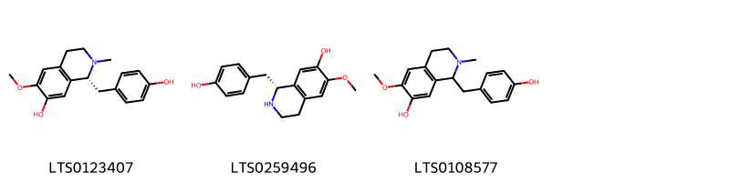{ width=100% }
    <figcaption>Hình ảnh cấu trúc hóa học của 3 hoạt chất thuộc nhóm Isoquinolines and derivatives gồm ['2-methyl-1betah-coclaurine (LTS0123407)', '(+)-coclaurine (LTS0259496)', '1-[(4-hydroxyphenyl)methyl]-6-methoxy-2-methyl-3,4-dihydro-1h-isoquinolin-7-ol (LTS0108577)'].</figcaption>
</figure>
#### Nhóm Organooxygen compounds
<figure markdown="span">
    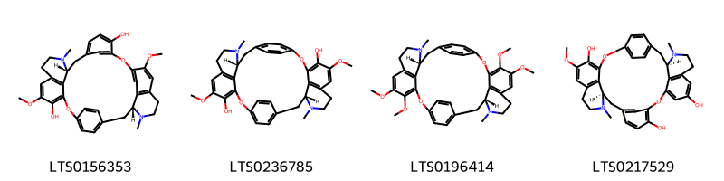{ width=100% }
    <figcaption>Hình ảnh cấu trúc hóa học của 4 hoạt chất thuộc nhóm Organooxygen compounds gồm ['curine (LTS0156353)', 'isochondrodendrine (LTS0236785)', 'cycleanine (LTS0196414)', '(11r,27r)-5-methoxy-10,26-dimethyl-2,18-dioxa-10,26-diazaheptacyclo[27.2.2.1³,⁷.1¹³,¹⁷.1¹⁹,²³.0¹¹,³⁶.0²⁷,³⁴]hexatriaconta-1(31),3,5,7(36),13,15,17(35),19,21,23(34),29,32-dodecaene-4,16,21-triol (LTS0217529)'].</figcaption>
</figure>

---

### Dược dân tộc học

Danh sách các quốc gia có sử dụng *Cyclea peltata* trong điều trị các bệnh. 

| Country   | Disease          | Bệnh                                                                                                                                                                                                |
|:----------|:-----------------|:----------------------------------------------------------------------------------------------------------------------------------------------------------------------------------------------------|
| Java      | Stomachic, Tonic | MYMEMORY WARNING: YOU USED ALL AVAILABLE FREE TRANSLATIONS FOR TODAY. NEXT AVAILABLE IN  19 HOURS 05 MINUTES 56 SECONDS VISIT HTTPS://MYMEMORY.TRANSLATED.NET/DOC/USAGELIMITS.PHP TO TRANSLATE MORE |
| Vietnam   | Tonic, Stomachic | MYMEMORY WARNING: YOU USED ALL AVAILABLE FREE TRANSLATIONS FOR TODAY. NEXT AVAILABLE IN  19 HOURS 05 MINUTES 54 SECONDS VISIT HTTPS://MYMEMORY.TRANSLATED.NET/DOC/USAGELIMITS.PHP TO TRANSLATE MORE |

---

# Chi Meniermum

??? note "Danh sách các dược liệu thuộc chi"
    
	 - *Meniermum canadense*

---
## Meniermum canadense
### Thông tin về thực vật

!!! info "Phân loại thực vật của *N/A* từ GIBF:"
    - **Kingdom:** N/A
    - **Phylum:** N/A
    - **Order:** N/A
    - **Family:** N/A
    - **Genus:** N/A
    - **Species:** *N/A*

 

| Label (VI)   | Label (EN)   | Scientific Name   | Descriptions (VI)   | Descriptions (EN)   | Also Known As (VI)   | Also Known As (EN)   |
|:-------------|:-------------|:------------------|:--------------------|:--------------------|:---------------------|:---------------------|
| N/A          | N/A          | Cyclea peltata    | loài thực vật       | species of plant    | ['']                 | ['Abuta amara']      |

#### Phân bố trên thế giới

**Từ CSDL GIBF** Không có kết quả phù hợp

#### Phân bố tại Việt Nam

**Từ CSDL GIBF**: Không có ghi nhận ở Việt Nam

---
### Thành phần hóa học
        
- Theo cơ sở dữ liệu lotus: Từ loài *N/A* đã phân lập và xác định được Chưa có hoạt chất nào được phân lập. hoạt chất thuộc về các nhóm Không có hoạt chất nào được phân lập. 

Không có hình ảnh nào được tạo ra

---

### Dược dân tộc học

Danh sách các quốc gia có sử dụng *N/A* trong điều trị các bệnh. 

| Country   | Disease                                            | Bệnh                                                                                                                                                                                                |
|:----------|:---------------------------------------------------|:----------------------------------------------------------------------------------------------------------------------------------------------------------------------------------------------------|
| Dutch     | Sudorific                                          | MYMEMORY WARNING: YOU USED ALL AVAILABLE FREE TRANSLATIONS FOR TODAY. NEXT AVAILABLE IN  19 HOURS 05 MINUTES 27 SECONDS VISIT HTTPS://MYMEMORY.TRANSLATED.NET/DOC/USAGELIMITS.PHP TO TRANSLATE MORE |
| English   | Laxative, Nervine, Stomachic, Diuretic             | MYMEMORY WARNING: YOU USED ALL AVAILABLE FREE TRANSLATIONS FOR TODAY. NEXT AVAILABLE IN  19 HOURS 05 MINUTES 25 SECONDS VISIT HTTPS://MYMEMORY.TRANSLATED.NET/DOC/USAGELIMITS.PHP TO TRANSLATE MORE |
| German    | Tonic                                              | MYMEMORY WARNING: YOU USED ALL AVAILABLE FREE TRANSLATIONS FOR TODAY. NEXT AVAILABLE IN  19 HOURS 05 MINUTES 22 SECONDS VISIT HTTPS://MYMEMORY.TRANSLATED.NET/DOC/USAGELIMITS.PHP TO TRANSLATE MORE |
| Mexico    | Tonic                                              | MYMEMORY WARNING: YOU USED ALL AVAILABLE FREE TRANSLATIONS FOR TODAY. NEXT AVAILABLE IN  19 HOURS 05 MINUTES 19 SECONDS VISIT HTTPS://MYMEMORY.TRANSLATED.NET/DOC/USAGELIMITS.PHP TO TRANSLATE MORE |
| US        | Diuretic, Diuretic, Poison, Tonic, Laxative, Tonic | MYMEMORY WARNING: YOU USED ALL AVAILABLE FREE TRANSLATIONS FOR TODAY. NEXT AVAILABLE IN  19 HOURS 05 MINUTES 17 SECONDS VISIT HTTPS://MYMEMORY.TRANSLATED.NET/DOC/USAGELIMITS.PHP TO TRANSLATE MORE |

---

# Chi Arcangelisia

??? note "Danh sách các dược liệu thuộc chi"
    
	 - *Arcangelisia flava*

---
## Arcangelisia flava
### Thông tin về thực vật

!!! info "Phân loại thực vật của *Arcangelisia flava* từ GIBF:"
    - **Kingdom:** Plantae
    - **Phylum:** Tracheophyta
    - **Order:** Ranunculales
    - **Family:** Menispermaceae
    - **Genus:** Arcangelisia
    - **Species:** *Arcangelisia flava*

 

| Label (VI)   | Label (EN)   | Scientific Name    | Descriptions (VI)   | Descriptions (EN)   | Also Known As (VI)   | Also Known As (EN)   |
|:-------------|:-------------|:-------------------|:--------------------|:--------------------|:---------------------|:---------------------|
| N/A          | N/A          | Arcangelisia flava | loài thực vật       | species of plant    | ['']                 | ['']                 |

#### Phân bố trên thế giới

**Từ CSDL GIBF** nan, Malaysia, Japan, Thailand, Lao People’s Democratic Republic, Chinese Taipei, Papua New Guinea, unknown or invalid, Indonesia, Philippines, Singapore, Viet Nam, China

#### Phân bố tại Việt Nam

**Từ CSDL GIBF**: Hoa Binh, Tonkin, 东京

---
### Thành phần hóa học
        
- Theo cơ sở dữ liệu lotus: Từ loài *Arcangelisia flava* đã phân lập và xác định được 36 hoạt chất thuộc về các nhóm Prenol lipids, Dihydroisoquinolines, Organooxygen compounds, Phenols, Naphthopyrans, Isoquinolines and derivatives, Protoberberine alkaloids and derivatives. 

|    | chemicalTaxonomyClassyfireClass          |   smiles_count |
|---:|:-----------------------------------------|---------------:|
|  0 |                                          |              2 |
|  1 | Dihydroisoquinolines                     |              1 |
|  2 | Isoquinolines and derivatives            |              1 |
|  3 | Naphthopyrans                            |             17 |
|  4 | Organooxygen compounds                   |              1 |
|  5 | Phenols                                  |              1 |
|  6 | Prenol lipids                            |              5 |
|  7 | Protoberberine alkaloids and derivatives |              7 |

#### Nhóm 
<figure markdown="span">
    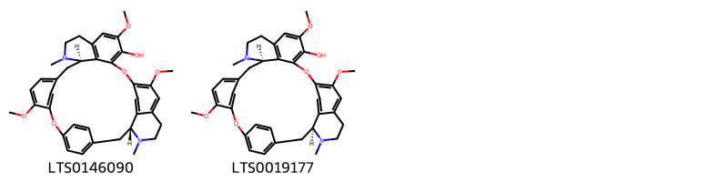{ width=100% }
    <figcaption>Hình ảnh cấu trúc hóa học của 2 hoạt chất thuộc nhóm  gồm ['(1r,14r)-9,20,25-trimethoxy-15,30-dimethyl-7,23-dioxa-15,30-diazaheptacyclo[22.6.2.2³,⁶.1⁸,¹².1¹⁴,¹⁸.0²⁷,³¹.0²²,³³]hexatriaconta-3,5,8(34),9,11,18(33),19,21,24,26,31,35-dodecaen-21-ol (LTS0146090)', '(1s,14r)-9,20,25-trimethoxy-15,30-dimethyl-7,23-dioxa-15,30-diazaheptacyclo[22.6.2.2³,⁶.1⁸,¹².1¹⁴,¹⁸.0²⁷,³¹.0²²,³³]hexatriaconta-3,5,8(34),9,11,18(33),19,21,24,26,31,35-dodecaen-21-ol (LTS0019177)'].</figcaption>
</figure>
#### Nhóm Dihydroisoquinolines
<figure markdown="span">
    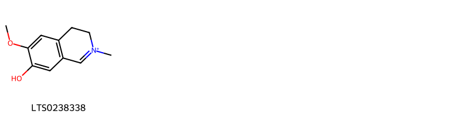{ width=100% }
    <figcaption>Hình ảnh cấu trúc hóa học của 1 hoạt chất thuộc nhóm Dihydroisoquinolines gồm ['pycnarrhine (LTS0238338)'].</figcaption>
</figure>
#### Nhóm Isoquinolines and derivatives
<figure markdown="span">
    { width=100% }
    <figcaption>Hình ảnh cấu trúc hóa học của 1 hoạt chất thuộc nhóm Isoquinolines and derivatives gồm ['3,4,11-trimethoxy-7,8-dihydro-6-azatetraphen-10-one (LTS0258799)'].</figcaption>
</figure>
#### Nhóm Naphthopyrans
<figure markdown="span">
    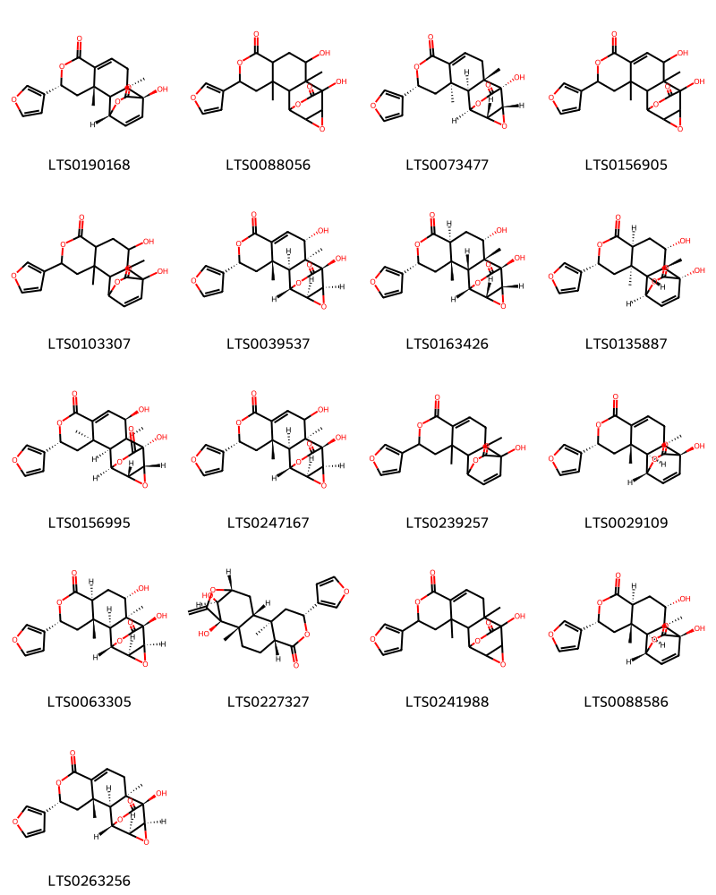{ width=100% }
    <figcaption>Hình ảnh cấu trúc hóa học của 17 hoạt chất thuộc nhóm Naphthopyrans gồm ['(1r,3s,5r,11r,12r)-5-(furan-3-yl)-12-hydroxy-3,11-dimethyl-6,14-dioxatetracyclo[10.2.2.0²,¹¹.0³,⁸]hexadeca-8,15-diene-7,13-dione (LTS0190168)', '5-(furan-3-yl)-10,12-dihydroxy-3,11-dimethyl-6,14,16-trioxapentacyclo[10.3.2.0²,¹¹.0³,⁸.0¹³,¹⁵]heptadecane-7,17-dione (LTS0088056)', '(1r,2s,3r,5r,11s,12r,13r,15r)-5-(furan-3-yl)-12-hydroxy-3,11-dimethyl-6,14,16-trioxapentacyclo[10.3.2.0²,¹¹.0³,⁸.0¹³,¹⁵]heptadec-8-ene-7,17-dione (LTS0073477)', '5-(furan-3-yl)-10,12-dihydroxy-3,11-dimethyl-6,14,16-trioxapentacyclo[10.3.2.0²,¹¹.0³,⁸.0¹³,¹⁵]heptadec-8-ene-7,17-dione (LTS0156905)', '5-(furan-3-yl)-10,12-dihydroxy-3,11-dimethyl-6,14-dioxatetracyclo[10.2.2.0²,¹¹.0³,⁸]hexadec-15-ene-7,13-dione (LTS0103307)', '(1s,2s,3s,5r,10s,11s,12s,13s,15s)-5-(furan-3-yl)-10,12-dihydroxy-3,11-dimethyl-6,14,16-trioxapentacyclo[10.3.2.0²,¹¹.0³,⁸.0¹³,¹⁵]heptadec-8-ene-7,17-dione (LTS0039537)', '(1s,2r,3s,5r,8s,10s,11r,12s,13r,15r)-5-(furan-3-yl)-10,12-dihydroxy-3,11-dimethyl-6,14,16-trioxapentacyclo[10.3.2.0²,¹¹.0³,⁸.0¹³,¹⁵]heptadecane-7,17-dione (LTS0163426)', '(1s,2r,3r,5r,8s,10s,11r,12s)-5-(furan-3-yl)-10,12-dihydroxy-3,11-dimethyl-6,14-dioxatetracyclo[10.2.2.0²,¹¹.0³,⁸]hexadec-15-ene-7,13-dione (LTS0135887)', '(1r,2s,3r,5r,10r,11s,12r,13r,15r)-5-(furan-3-yl)-10,12-dihydroxy-3,11-dimethyl-6,14,16-trioxapentacyclo[10.3.2.0²,¹¹.0³,⁸.0¹³,¹⁵]heptadec-8-ene-7,17-dione (LTS0156995)', '(1s,2s,3s,5r,11s,12s,13s,15s)-5-(furan-3-yl)-10,12-dihydroxy-3,11-dimethyl-6,14,16-trioxapentacyclo[10.3.2.0²,¹¹.0³,⁸.0¹³,¹⁵]heptadec-8-ene-7,17-dione (LTS0247167)', '5-(furan-3-yl)-12-hydroxy-3,11-dimethyl-6,14-dioxatetracyclo[10.2.2.0²,¹¹.0³,⁸]hexadeca-8,15-diene-7,13-dione (LTS0239257)', '(1r,2s,3s,5r,11r,12r)-5-(furan-3-yl)-12-hydroxy-3,11-dimethyl-6,14-dioxatetracyclo[10.2.2.0²,¹¹.0³,⁸]hexadeca-8,15-diene-7,13-dione (LTS0029109)', '(1s,2s,3s,5r,8s,10s,11s,12s,13s,15s)-5-(furan-3-yl)-10,12-dihydroxy-3,11-dimethyl-6,14,16-trioxapentacyclo[10.3.2.0²,¹¹.0³,⁸.0¹³,¹⁵]heptadecane-7,17-dione (LTS0063305)', '(1r,2s,5r,8r,10r,11r,13r,16s)-8-(furan-3-yl)-1,16-dihydroxy-2,10-dimethyl-15-methylidene-7,14-dioxatetracyclo[11.2.1.0²,¹¹.0⁵,¹⁰]hexadecan-6-one (LTS0227327)', '5-(furan-3-yl)-12-hydroxy-3,11-dimethyl-6,14,16-trioxapentacyclo[10.3.2.0²,¹¹.0³,⁸.0¹³,¹⁵]heptadec-8-ene-7,17-dione (LTS0241988)', '(1r,2s,3s,5r,8s,10s,11s,12r)-5-(furan-3-yl)-10,12-dihydroxy-3,11-dimethyl-6,14-dioxatetracyclo[10.2.2.0²,¹¹.0³,⁸]hexadec-15-ene-7,13-dione (LTS0088586)', '(1s,2s,3s,5r,11r,12s,13s,15s)-5-(furan-3-yl)-12-hydroxy-3,11-dimethyl-6,14,16-trioxapentacyclo[10.3.2.0²,¹¹.0³,⁸.0¹³,¹⁵]heptadec-8-ene-7,17-dione (LTS0263256)'].</figcaption>
</figure>
#### Nhóm Organooxygen compounds
<figure markdown="span">
    { width=100% }
    <figcaption>Hình ảnh cấu trúc hóa học của 1 hoạt chất thuộc nhóm Organooxygen compounds gồm ['p-hydroxybenzaldehyde (LTS0259836)'].</figcaption>
</figure>
#### Nhóm Phenols
<figure markdown="span">
    { width=100% }
    <figcaption>Hình ảnh cấu trúc hóa học của 1 hoạt chất thuộc nhóm Phenols gồm ['vanillin (LTS0136163)'].</figcaption>
</figure>
#### Nhóm Prenol lipids
<figure markdown="span">
    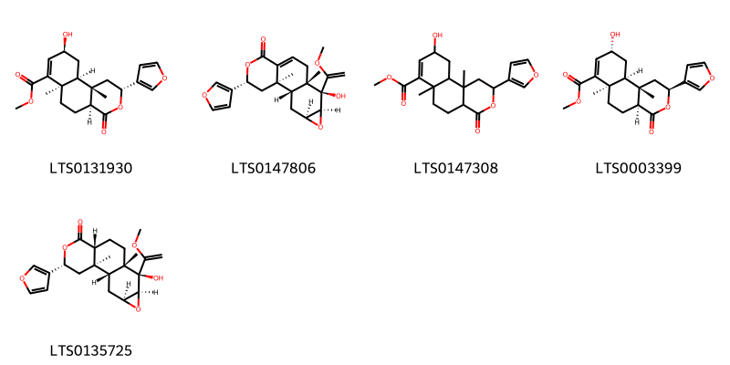{ width=100% }
    <figcaption>Hình ảnh cấu trúc hóa học của 5 hoạt chất thuộc nhóm Prenol lipids gồm ['methyl (2r,4as,6ar,9s,10as,10bs)-2-(furan-3-yl)-9-hydroxy-6a,10b-dimethyl-4-oxo-1h,2h,4ah,5h,6h,9h,10h,10ah-naphtho[2,1-c]pyran-7-carboxylate (LTS0131930)', '(1r,2r,4r,10s,11r,12s,14s)-4-(furan-3-yl)-11-hydroxy-11-(1-methoxyethenyl)-2,10-dimethyl-5,13-dioxatetracyclo[8.5.0.0²,⁷.0¹²,¹⁴]pentadec-7-en-6-one (LTS0147806)', 'methyl 2-(furan-3-yl)-9-hydroxy-6a,10b-dimethyl-4-oxo-1h,2h,4ah,5h,6h,9h,10h,10ah-naphtho[2,1-c]pyran-7-carboxylate (LTS0147308)', 'methyl (2s,4as,6ar,9r,10as,10bs)-2-(furan-3-yl)-9-hydroxy-6a,10b-dimethyl-4-oxo-1h,2h,4ah,5h,6h,9h,10h,10ah-naphtho[2,1-c]pyran-7-carboxylate (LTS0003399)', '(1r,2r,4r,7r,10s,11r,12s,14s)-4-(furan-3-yl)-11-hydroxy-11-(1-methoxyethenyl)-2,10-dimethyl-5,13-dioxatetracyclo[8.5.0.0²,⁷.0¹²,¹⁴]pentadecan-6-one (LTS0135725)'].</figcaption>
</figure>
#### Nhóm Protoberberine alkaloids and derivatives
<figure markdown="span">
    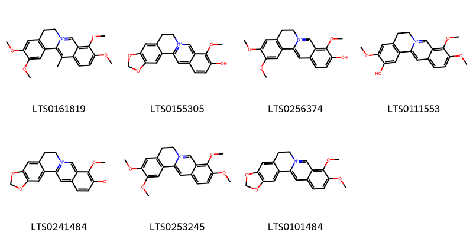{ width=100% }
    <figcaption>Hình ảnh cấu trúc hóa học của 7 hoạt chất thuộc nhóm Protoberberine alkaloids and derivatives gồm ['dehydrocorydaline (LTS0161819)', '17-hydroxy-16-methoxy-5,7-dioxa-13λ⁵-azapentacyclo[11.8.0.0²,¹⁰.0⁴,⁸.0¹⁵,²⁰]henicosa-1(13),2,4(8),9,14,16,18,20-octaen-13-ylium (LTS0155305)', 'dehydrocorydalmine (LTS0256374)', 'columbamine (LTS0111553)', '16-methoxy-5,7-dioxa-13λ⁵-azapentacyclo[11.8.0.0²,¹⁰.0⁴,⁸.0¹⁵,²⁰]henicosa-1(13),2,4(8),9,14,16,18,20-octaen-13-ylium-17-olate (LTS0241484)', 'palmatine (LTS0253245)', 'berberine (LTS0101484)'].</figcaption>
</figure>

---

### Dược dân tộc học

Danh sách các quốc gia có sử dụng *Arcangelisia flava* trong điều trị các bệnh. 

| Country   | Disease                 | Bệnh                                                                                                                                                                                                |
|:----------|:------------------------|:----------------------------------------------------------------------------------------------------------------------------------------------------------------------------------------------------|
| Elsewhere | Tonic, Emmenagogue, nan | MYMEMORY WARNING: YOU USED ALL AVAILABLE FREE TRANSLATIONS FOR TODAY. NEXT AVAILABLE IN  19 HOURS 05 MINUTES 04 SECONDS VISIT HTTPS://MYMEMORY.TRANSLATED.NET/DOC/USAGELIMITS.PHP TO TRANSLATE MORE |
| Java      | Vermifuge, Piscicide    | MYMEMORY WARNING: YOU USED ALL AVAILABLE FREE TRANSLATIONS FOR TODAY. NEXT AVAILABLE IN  19 HOURS 05 MINUTES 02 SECONDS VISIT HTTPS://MYMEMORY.TRANSLATED.NET/DOC/USAGELIMITS.PHP TO TRANSLATE MORE |

---

# Chi Anamirta

??? note "Danh sách các dược liệu thuộc chi"
    
	 - *Anamirta cocculus*
	 - *Anamirta paniculata*

---
## Anamirta cocculus
### Thông tin về thực vật

!!! info "Phân loại thực vật của *Anamirta cocculus* từ GIBF:"
    - **Kingdom:** Plantae
    - **Phylum:** Tracheophyta
    - **Order:** Ranunculales
    - **Family:** Menispermaceae
    - **Genus:** Anamirta
    - **Species:** *Anamirta cocculus*

 

| Label (VI)   | Label (EN)   | Scientific Name   | Descriptions (VI)   | Descriptions (EN)   | Also Known As (VI)   | Also Known As (EN)   |
|:-------------|:-------------|:------------------|:--------------------|:--------------------|:---------------------|:---------------------|
| N/A          | N/A          | Anamirta cocculus |                     | climbing plant      | ['']                 | ['']                 |

#### Phân bố trên thế giới

**Từ CSDL GIBF** nan, Pakistan, Sri Lanka, Trinidad and Tobago, Nigeria, Thailand, Belgium, Guadeloupe, Iraq, Chinese Taipei, Türkiye, India, Indonesia, unknown or invalid, Timor-Leste, Philippines, Viet Nam

#### Phân bố tại Việt Nam

**Từ CSDL GIBF**: Ninh Binh

---
### Thành phần hóa học
        
- Theo cơ sở dữ liệu lotus: Từ loài *Anamirta cocculus* đã phân lập và xác định được 26 hoạt chất thuộc về các nhóm Proaporphines, Prenol lipids, Aporphines, Furopyrans, Dioxepanes, Isoquinolines and derivatives, Protoberberine alkaloids and derivatives. 

|    | chemicalTaxonomyClassyfireClass          |   smiles_count |
|---:|:-----------------------------------------|---------------:|
|  0 | Aporphines                               |              1 |
|  1 | Dioxepanes                               |              2 |
|  2 | Furopyrans                               |              6 |
|  3 | Isoquinolines and derivatives            |              1 |
|  4 | Prenol lipids                            |              8 |
|  5 | Proaporphines                            |              2 |
|  6 | Protoberberine alkaloids and derivatives |              4 |

#### Nhóm Aporphines
<figure markdown="span">
    { width=100% }
    <figcaption>Hình ảnh cấu trúc hóa học của 1 hoạt chất thuộc nhóm Aporphines gồm ['magnoflorine (LTS0120825)'].</figcaption>
</figure>
#### Nhóm Dioxepanes
<figure markdown="span">
    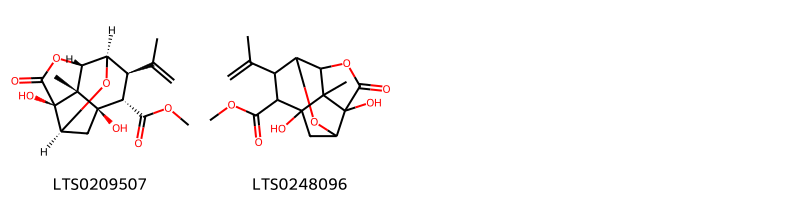{ width=100% }
    <figcaption>Hình ảnh cấu trúc hóa học của 2 hoạt chất thuộc nhóm Dioxepanes gồm ['methyl (1r,2r,3s,6s,7s,9r,10r,11s)-1,6-dihydroxy-2-methyl-5-oxo-10-(prop-1-en-2-yl)-4,8-dioxatetracyclo[5.4.1.0²,⁶.0³,⁹]dodecane-11-carboxylate (LTS0209507)', 'methyl 1,6-dihydroxy-2-methyl-5-oxo-10-(prop-1-en-2-yl)-4,8-dioxatetracyclo[5.4.1.0²,⁶.0³,⁹]dodecane-11-carboxylate (LTS0248096)'].</figcaption>
</figure>
#### Nhóm Furopyrans
<figure markdown="span">
    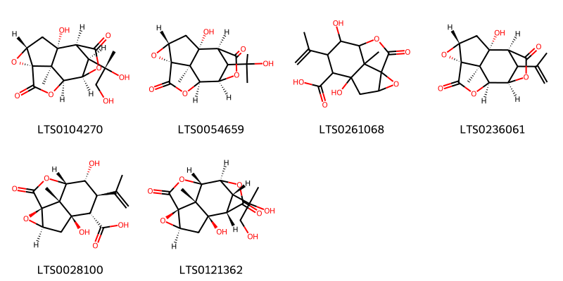{ width=100% }
    <figcaption>Hình ảnh cấu trúc hóa học của 6 hoạt chất thuộc nhóm Furopyrans gồm ['(1r,3r,5s,8s,9r,12s,13r,14r)-14-[(2s)-1,2-dihydroxypropan-2-yl]-1-hydroxy-13-methyl-4,7,10-trioxapentacyclo[6.4.1.1⁹,¹².0³,⁵.0⁵,¹³]tetradecane-6,11-dione (LTS0104270)', '(1r,3r,5s,8s,9r,12s,13r)-1-hydroxy-14-(2-hydroxypropan-2-yl)-13-methyl-4,7,10-trioxapentacyclo[6.4.1.1⁹,¹².0³,⁵.0⁵,¹³]tetradecane-6,11-dione (LTS0054659)', '5,8-dihydroxy-12-methyl-2-oxo-6-(prop-1-en-2-yl)-3,11-dioxatetracyclo[6.3.1.0¹,¹⁰.0⁴,¹²]dodecane-7-carboxylic acid (LTS0261068)', '(1r,3r,5s,8s,9r,12s,13r)-1-hydroxy-13-methyl-14-(prop-1-en-2-yl)-4,7,10-trioxapentacyclo[6.4.1.1⁹,¹².0³,⁵.0⁵,¹³]tetradecane-6,11-dione (LTS0236061)', '(1s,4s,5r,6r,7s,8r,10r,12r)-5,8-dihydroxy-12-methyl-2-oxo-6-(prop-1-en-2-yl)-3,11-dioxatetracyclo[6.3.1.0¹,¹⁰.0⁴,¹²]dodecane-7-carboxylic acid (LTS0028100)', '(1r,3r,5s,8s,9s,12s,13r,14r)-14-(1,2-dihydroxypropan-2-yl)-1-hydroxy-13-methyl-4,7,10-trioxapentacyclo[6.4.1.1⁹,¹².0³,⁵.0⁵,¹³]tetradecane-6,11-dione (LTS0121362)'].</figcaption>
</figure>
#### Nhóm Isoquinolines and derivatives
<figure markdown="span">
    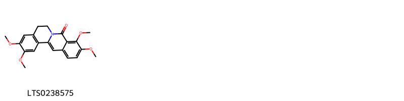{ width=100% }
    <figcaption>Hình ảnh cấu trúc hóa học của 1 hoạt chất thuộc nhóm Isoquinolines and derivatives gồm ['3,4,10,11-tetramethoxy-7,8-dihydro-6-azatetraphen-5-one (LTS0238575)'].</figcaption>
</figure>
#### Nhóm Prenol lipids
<figure markdown="span">
    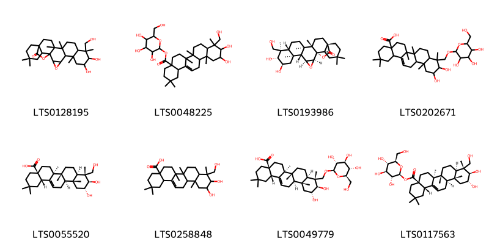{ width=100% }
    <figcaption>Hình ảnh cấu trúc hóa học của 8 hoạt chất thuộc nhóm Prenol lipids gồm ['8,9-dihydroxy-10-(hydroxymethyl)-6,10,14,15,21,21-hexamethyl-3,24-dioxaheptacyclo[16.5.2.0¹,¹⁵.0²,⁴.0⁵,¹⁴.0⁶,¹¹.0¹⁸,²³]pentacosan-25-one (LTS0128195)', '3,4,5-trihydroxy-6-(hydroxymethyl)oxan-2-yl 10,11-dihydroxy-9-(hydroxymethyl)-2,2,6a,6b,9,12a-hexamethyl-1,3,4,5,6,7,8,8a,10,11,12,12b,13,14b-tetradecahydropicene-4a-carboxylate (LTS0048225)', '(1s,2s,4s,5r,6s,8r,9r,10r,11r,14r,15s,18s,23r)-8,9-dihydroxy-10-(hydroxymethyl)-6,10,14,15,21,21-hexamethyl-3,24-dioxaheptacyclo[16.5.2.0¹,¹⁵.0²,⁴.0⁵,¹⁴.0⁶,¹¹.0¹⁸,²³]pentacosan-25-one (LTS0193986)', '10,11-dihydroxy-2,2,6a,6b,9,12a-hexamethyl-9-({[3,4,5-trihydroxy-6-(hydroxymethyl)oxan-2-yl]oxy}methyl)-1,3,4,5,6,7,8,8a,10,11,12,12b,13,14b-tetradecahydropicene-4a-carboxylic acid (LTS0202671)', 'arjunolic acid (LTS0055520)', '10,11-dihydroxy-9-(hydroxymethyl)-2,2,6a,6b,9,12a-hexamethyl-1,3,4,5,6,7,8,8a,10,11,12,12b,13,14b-tetradecahydropicene-4a-carboxylic acid (LTS0258848)', '(4as,6as,6br,8ar,9r,10r,11r,12ar,12br,14bs)-10,11-dihydroxy-2,2,6a,6b,9,12a-hexamethyl-9-({[(2r,3r,4s,5s,6r)-3,4,5-trihydroxy-6-(hydroxymethyl)oxan-2-yl]oxy}methyl)-1,3,4,5,6,7,8,8a,10,11,12,12b,13,14b-tetradecahydropicene-4a-carboxylic acid (LTS0049779)', '(2s,3r,4s,5s,6r)-3,4,5-trihydroxy-6-(hydroxymethyl)oxan-2-yl (4as,6as,6br,8ar,9r,10r,11r,12ar,12br,14bs)-10,11-dihydroxy-9-(hydroxymethyl)-2,2,6a,6b,9,12a-hexamethyl-1,3,4,5,6,7,8,8a,10,11,12,12b,13,14b-tetradecahydropicene-4a-carboxylate (LTS0117563)'].</figcaption>
</figure>
#### Nhóm Proaporphines
<figure markdown="span">
    { width=100% }
    <figcaption>Hình ảnh cấu trúc hóa học của 2 hoạt chất thuộc nhóm Proaporphines gồm ["(4'r)-10',11'-dimethoxy-5'-azaspiro[cyclohexane-1,2'-tricyclo[6.3.1.0⁴,¹²]dodecane]-1'(11'),2,5,8'(12'),9'-pentaen-4-one (LTS0202745)", "10',11'-dimethoxy-5'-azaspiro[cyclohexane-1,2'-tricyclo[6.3.1.0⁴,¹²]dodecane]-1'(11'),2,5,8'(12'),9'-pentaen-4-one (LTS0014482)"].</figcaption>
</figure>
#### Nhóm Protoberberine alkaloids and derivatives
<figure markdown="span">
    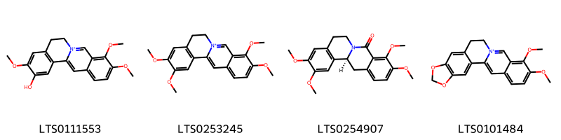{ width=100% }
    <figcaption>Hình ảnh cấu trúc hóa học của 4 hoạt chất thuộc nhóm Protoberberine alkaloids and derivatives gồm ['columbamine (LTS0111553)', 'palmatine (LTS0253245)', '(12bs)-3,4,10,11-tetramethoxy-7,8,12b,13-tetrahydro-6-azatetraphen-5-one (LTS0254907)', 'berberine (LTS0101484)'].</figcaption>
</figure>

---

### Dược dân tộc học

Danh sách các quốc gia có sử dụng *Anamirta cocculus* trong điều trị các bệnh. 

| Country   | Disease                                                | Bệnh                                                                                                                                                                                                |
|:----------|:-------------------------------------------------------|:----------------------------------------------------------------------------------------------------------------------------------------------------------------------------------------------------|
| Elsewhere | Poison                                                 | MYMEMORY WARNING: YOU USED ALL AVAILABLE FREE TRANSLATIONS FOR TODAY. NEXT AVAILABLE IN  19 HOURS 04 MINUTES 30 SECONDS VISIT HTTPS://MYMEMORY.TRANSLATED.NET/DOC/USAGELIMITS.PHP TO TRANSLATE MORE |
| India     | Piscicide, Piscicide                                   | MYMEMORY WARNING: YOU USED ALL AVAILABLE FREE TRANSLATIONS FOR TODAY. NEXT AVAILABLE IN  19 HOURS 04 MINUTES 27 SECONDS VISIT HTTPS://MYMEMORY.TRANSLATED.NET/DOC/USAGELIMITS.PHP TO TRANSLATE MORE |
| Java      | Purgative                                              | MYMEMORY WARNING: YOU USED ALL AVAILABLE FREE TRANSLATIONS FOR TODAY. NEXT AVAILABLE IN  19 HOURS 04 MINUTES 25 SECONDS VISIT HTTPS://MYMEMORY.TRANSLATED.NET/DOC/USAGELIMITS.PHP TO TRANSLATE MORE |
| Turkey    | Nervine, Parasiticide, Pediculicide, Stimulant, Poison | MYMEMORY WARNING: YOU USED ALL AVAILABLE FREE TRANSLATIONS FOR TODAY. NEXT AVAILABLE IN  19 HOURS 04 MINUTES 22 SECONDS VISIT HTTPS://MYMEMORY.TRANSLATED.NET/DOC/USAGELIMITS.PHP TO TRANSLATE MORE |

---

---
## Anamirta paniculata
### Thông tin về thực vật

!!! info "Phân loại thực vật của *Anamirta cocculus* từ GIBF:"
    - **Kingdom:** Plantae
    - **Phylum:** Tracheophyta
    - **Order:** Ranunculales
    - **Family:** Menispermaceae
    - **Genus:** Anamirta
    - **Species:** *Anamirta cocculus*

 

| Label (VI)   | Label (EN)   | Scientific Name     | Descriptions (VI)   | Descriptions (EN)   | Also Known As (VI)   | Also Known As (EN)   |
|:-------------|:-------------|:--------------------|:--------------------|:--------------------|:---------------------|:---------------------|
| N/A          | N/A          | Anamirta paniculata | loài thực vật       | species of plant    | ['']                 | ['']                 |

#### Phân bố trên thế giới

**Từ CSDL GIBF** nan, Pakistan, Sri Lanka, Trinidad and Tobago, Nigeria, Thailand, Belgium, Guadeloupe, Iraq, Chinese Taipei, Türkiye, India, Indonesia, unknown or invalid, Timor-Leste, Philippines, Viet Nam

#### Phân bố tại Việt Nam

**Từ CSDL GIBF**: Ninh Binh

---
### Thành phần hóa học
        
- Theo cơ sở dữ liệu lotus: Từ loài *Anamirta cocculus* đã phân lập và xác định được Chưa có hoạt chất nào được phân lập. hoạt chất thuộc về các nhóm Không có hoạt chất nào được phân lập. 

Không có hình ảnh nào được tạo ra

---

### Dược dân tộc học

Danh sách các quốc gia có sử dụng *Anamirta cocculus* trong điều trị các bệnh. 

| Country   | Disease              | Bệnh                                                                                                                                                                                                |
|:----------|:---------------------|:----------------------------------------------------------------------------------------------------------------------------------------------------------------------------------------------------|
| Elsewhere | Parasiticide, Poison | MYMEMORY WARNING: YOU USED ALL AVAILABLE FREE TRANSLATIONS FOR TODAY. NEXT AVAILABLE IN  19 HOURS 03 MINUTES 55 SECONDS VISIT HTTPS://MYMEMORY.TRANSLATED.NET/DOC/USAGELIMITS.PHP TO TRANSLATE MORE |

---

# Chi Abuta

??? note "Danh sách các dược liệu thuộc chi"
    
	 - *Abuta barbata*
	 - *Abuta bullata*
	 - *Abuta candollei*
	 - *Abuta grandifolia*
	 - *Abuta kulugii*
	 - *Abuta macrocarpa*
	 - *Abuta obovata*
	 - *Abuta rufescens*
	 - *Abuta wilson-brownei*

---
## Abuta barbata
### Thông tin về thực vật

!!! info "Phân loại thực vật của *Abuta barbata* từ GIBF:"
    - **Kingdom:** Plantae
    - **Phylum:** Tracheophyta
    - **Order:** Ranunculales
    - **Family:** Menispermaceae
    - **Genus:** Abuta
    - **Species:** *Abuta barbata*

 

| Label (VI)   | Label (EN)   | Scientific Name   | Descriptions (VI)   | Descriptions (EN)   | Also Known As (VI)   | Also Known As (EN)   |
|:-------------|:-------------|:------------------|:--------------------|:--------------------|:---------------------|:---------------------|
| N/A          | N/A          | Abuta barbata     | loài thực vật       | species of plant    | ['']                 | ['']                 |

#### Phân bố trên thế giới

**Từ CSDL GIBF** nan, Suriname, Brazil, Guyana, French Guiana

#### Phân bố tại Việt Nam

**Từ CSDL GIBF**: Không có ghi nhận ở Việt Nam

---
### Thành phần hóa học
        
- Theo cơ sở dữ liệu lotus: Từ loài *Abuta barbata* đã phân lập và xác định được Chưa có hoạt chất nào được phân lập. hoạt chất thuộc về các nhóm Không có hoạt chất nào được phân lập. 

Không có hình ảnh nào được tạo ra

---

### Dược dân tộc học

Danh sách các quốc gia có sử dụng *Abuta barbata* trong điều trị các bệnh. 

| Country   | Disease   | Bệnh                                                                                                                                                                                                |
|:----------|:----------|:----------------------------------------------------------------------------------------------------------------------------------------------------------------------------------------------------|
| Guiana    | Poison    | MYMEMORY WARNING: YOU USED ALL AVAILABLE FREE TRANSLATIONS FOR TODAY. NEXT AVAILABLE IN  19 HOURS 03 MINUTES 35 SECONDS VISIT HTTPS://MYMEMORY.TRANSLATED.NET/DOC/USAGELIMITS.PHP TO TRANSLATE MORE |

---

---
## Abuta bullata
### Thông tin về thực vật

!!! info "Phân loại thực vật của *Abuta bullata* từ GIBF:"
    - **Kingdom:** Plantae
    - **Phylum:** Tracheophyta
    - **Order:** Ranunculales
    - **Family:** Menispermaceae
    - **Genus:** Abuta
    - **Species:** *Abuta bullata*

 

| Label (VI)   | Label (EN)   | Scientific Name   | Descriptions (VI)   | Descriptions (EN)   | Also Known As (VI)   | Also Known As (EN)   |
|:-------------|:-------------|:------------------|:--------------------|:--------------------|:---------------------|:---------------------|
| N/A          | N/A          | Abuta bullata     | loài thực vật       | species of plant    | ['']                 | ['']                 |

#### Phân bố trên thế giới

**Từ CSDL GIBF** Guyana, nan, Brazil, French Guiana

#### Phân bố tại Việt Nam

**Từ CSDL GIBF**: Không có ghi nhận ở Việt Nam

---
### Thành phần hóa học
        
- Theo cơ sở dữ liệu lotus: Từ loài *Abuta bullata* đã phân lập và xác định được 3 hoạt chất thuộc về các nhóm Benzazepines. 

|    | chemicalTaxonomyClassyfireClass   |   smiles_count |
|---:|:----------------------------------|---------------:|
|  0 | Benzazepines                      |              3 |

#### Nhóm Benzazepines
<figure markdown="span">
    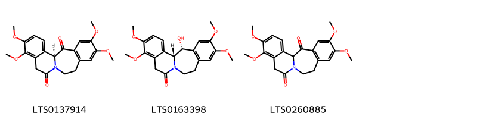{ width=100% }
    <figcaption>Hình ảnh cấu trúc hóa học của 3 hoạt chất thuộc nhóm Benzazepines gồm ['(1s)-5,6,15,16-tetramethoxy-11-azatetracyclo[9.8.0.0³,⁸.0¹⁴,¹⁹]nonadeca-3(8),4,6,14,16,18-hexaene-2,12-dione (LTS0137914)', '(1r,2r)-2-hydroxy-5,6,15,16-tetramethoxy-11-azatetracyclo[9.8.0.0³,⁸.0¹⁴,¹⁹]nonadeca-3(8),4,6,14,16,18-hexaen-12-one (LTS0163398)', '5,6,15,16-tetramethoxy-11-azatetracyclo[9.8.0.0³,⁸.0¹⁴,¹⁹]nonadeca-3(8),4,6,14,16,18-hexaene-2,12-dione (LTS0260885)'].</figcaption>
</figure>

---

### Dược dân tộc học

Danh sách các quốc gia có sử dụng *Abuta bullata* trong điều trị các bệnh. 

| Country   | Disease   | Bệnh                                                                                                                                                                                                |
|:----------|:----------|:----------------------------------------------------------------------------------------------------------------------------------------------------------------------------------------------------|
| Guiana    | Poison    | MYMEMORY WARNING: YOU USED ALL AVAILABLE FREE TRANSLATIONS FOR TODAY. NEXT AVAILABLE IN  19 HOURS 03 MINUTES 14 SECONDS VISIT HTTPS://MYMEMORY.TRANSLATED.NET/DOC/USAGELIMITS.PHP TO TRANSLATE MORE |

---

---
## Abuta candollei
### Thông tin về thực vật

!!! info "Phân loại thực vật của *Abuta candollei* từ GIBF:"
    - **Kingdom:** Plantae
    - **Phylum:** Tracheophyta
    - **Order:** Ranunculales
    - **Family:** Menispermaceae
    - **Genus:** Abuta
    - **Species:** *Abuta candollei*

 

| Label (VI)   | Label (EN)   | Scientific Name   | Descriptions (VI)   | Descriptions (EN)   | Also Known As (VI)   | Also Known As (EN)   |
|:-------------|:-------------|:------------------|:--------------------|:--------------------|:---------------------|:---------------------|
| N/A          | N/A          | Abuta candollei   | loài thực vật       | species of plant    | ['']                 | ['']                 |

#### Phân bố trên thế giới

**Từ CSDL GIBF** nan, Suriname, Colombia, Brazil, Guyana, unknown or invalid, Peru, Venezuela (Bolivarian Republic of), French Guiana

#### Phân bố tại Việt Nam

**Từ CSDL GIBF**: Không có ghi nhận ở Việt Nam

---
### Thành phần hóa học
        
- Theo cơ sở dữ liệu lotus: Từ loài *Abuta candollei* đã phân lập và xác định được Chưa có hoạt chất nào được phân lập. hoạt chất thuộc về các nhóm Không có hoạt chất nào được phân lập. 

Không có hình ảnh nào được tạo ra

---

### Dược dân tộc học

Danh sách các quốc gia có sử dụng *Abuta candollei* trong điều trị các bệnh. 

| Country   | Disease   | Bệnh                                                                                                                                                                                                |
|:----------|:----------|:----------------------------------------------------------------------------------------------------------------------------------------------------------------------------------------------------|
| Guiana    | Poison    | MYMEMORY WARNING: YOU USED ALL AVAILABLE FREE TRANSLATIONS FOR TODAY. NEXT AVAILABLE IN  19 HOURS 02 MINUTES 54 SECONDS VISIT HTTPS://MYMEMORY.TRANSLATED.NET/DOC/USAGELIMITS.PHP TO TRANSLATE MORE |

---

---
## Abuta grandifolia
### Thông tin về thực vật

!!! info "Phân loại thực vật của *Abuta grandifolia* từ GIBF:"
    - **Kingdom:** Plantae
    - **Phylum:** Tracheophyta
    - **Order:** Ranunculales
    - **Family:** Menispermaceae
    - **Genus:** Abuta
    - **Species:** *Abuta grandifolia*

 

| Label (VI)   | Label (EN)   | Scientific Name   | Descriptions (VI)   | Descriptions (EN)   | Also Known As (VI)   | Also Known As (EN)   |
|:-------------|:-------------|:------------------|:--------------------|:--------------------|:---------------------|:---------------------|
| N/A          | N/A          | Abuta grandifolia | loài thực vật       | species of plant    | ['']                 | ['']                 |

#### Phân bố trên thế giới

**Từ CSDL GIBF** Ecuador, Suriname, Colombia, Brazil, Bolivia (Plurinational State of), Peru, French Guiana

#### Phân bố tại Việt Nam

**Từ CSDL GIBF**: Không có ghi nhận ở Việt Nam

---
### Thành phần hóa học
        
- Theo cơ sở dữ liệu lotus: Từ loài *Abuta grandifolia* đã phân lập và xác định được 20 hoạt chất thuộc về các nhóm Proaporphines, Prenol lipids, Isoquinolines and derivatives. 

|    | chemicalTaxonomyClassyfireClass   |   smiles_count |
|---:|:----------------------------------|---------------:|
|  0 |                                   |              5 |
|  1 | Isoquinolines and derivatives     |              7 |
|  2 | Prenol lipids                     |              6 |
|  3 | Proaporphines                     |              2 |

#### Nhóm 
<figure markdown="span">
    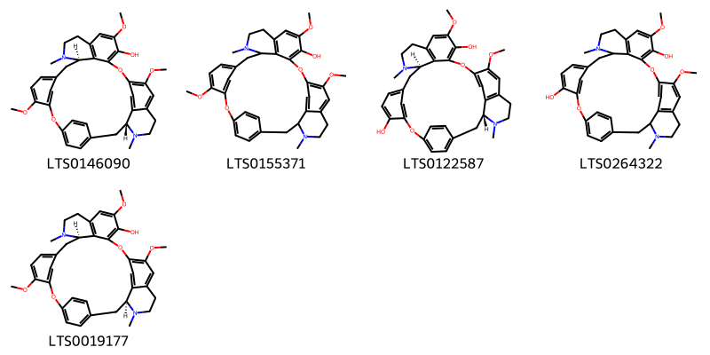{ width=100% }
    <figcaption>Hình ảnh cấu trúc hóa học của 5 hoạt chất thuộc nhóm  gồm ['(1r,14r)-9,20,25-trimethoxy-15,30-dimethyl-7,23-dioxa-15,30-diazaheptacyclo[22.6.2.2³,⁶.1⁸,¹².1¹⁴,¹⁸.0²⁷,³¹.0²²,³³]hexatriaconta-3,5,8(34),9,11,18(33),19,21,24,26,31,35-dodecaen-21-ol (LTS0146090)', '9,20,25-trimethoxy-15,30-dimethyl-7,23-dioxa-15,30-diazaheptacyclo[22.6.2.2³,⁶.1⁸,¹².1¹⁴,¹⁸.0²⁷,³¹.0²²,³³]hexatriaconta-3,5,8(34),9,11,18(33),19,21,24,26,31,35-dodecaen-21-ol (LTS0155371)', '(1r,14r)-20,25-dimethoxy-15,30-dimethyl-7,23-dioxa-15,30-diazaheptacyclo[22.6.2.2³,⁶.1⁸,¹².1¹⁴,¹⁸.0²⁷,³¹.0²²,³³]hexatriaconta-3,5,8(34),9,11,18(33),19,21,24(32),25,27(31),35-dodecaene-9,21-diol (LTS0122587)', '20,25-dimethoxy-15,30-dimethyl-7,23-dioxa-15,30-diazaheptacyclo[22.6.2.2³,⁶.1⁸,¹².1¹⁴,¹⁸.0²⁷,³¹.0²²,³³]hexatriaconta-3,5,8(34),9,11,18(33),19,21,24(32),25,27(31),35-dodecaene-9,21-diol (LTS0264322)', '(1s,14r)-9,20,25-trimethoxy-15,30-dimethyl-7,23-dioxa-15,30-diazaheptacyclo[22.6.2.2³,⁶.1⁸,¹².1¹⁴,¹⁸.0²⁷,³¹.0²²,³³]hexatriaconta-3,5,8(34),9,11,18(33),19,21,24,26,31,35-dodecaen-21-ol (LTS0019177)'].</figcaption>
</figure>
#### Nhóm Isoquinolines and derivatives
<figure markdown="span">
    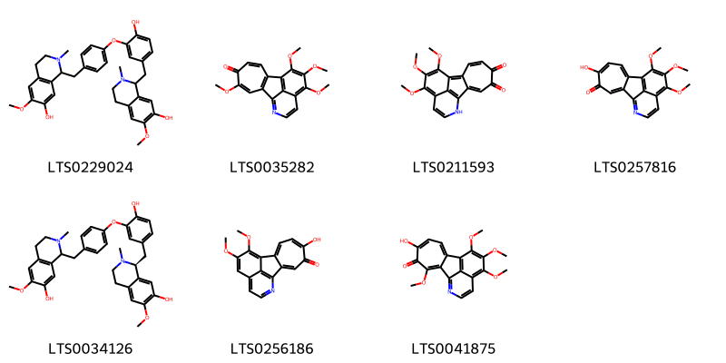{ width=100% }
    <figcaption>Hình ảnh cấu trúc hóa học của 7 hoạt chất thuộc nhóm Isoquinolines and derivatives gồm ['magnoline (LTS0229024)', '6,14,15,16-tetramethoxy-10-azatetracyclo[7.7.1.0²,⁸.0¹³,¹⁷]heptadeca-1(16),2(8),3,6,9(17),10,12,14-octaen-5-one (LTS0035282)', '14,15,16-trimethoxy-10-azatetracyclo[7.7.1.0²,⁸.0¹³,¹⁷]heptadeca-1,3,7,9(17),11,13,15-heptaene-5,6-dione (LTS0211593)', '5-hydroxy-14,15,16-trimethoxy-10-azatetracyclo[7.7.1.0²,⁸.0¹³,¹⁷]heptadeca-1(16),2,4,7,9(17),10,12,14-octaen-6-one (LTS0257816)', '1-{[4-(2-hydroxy-5-{[(1s)-7-hydroxy-6-methoxy-2-methyl-3,4-dihydro-1h-isoquinolin-1-yl]methyl}phenoxy)phenyl]methyl}-6-methoxy-2-methyl-3,4-dihydro-1h-isoquinolin-7-ol (LTS0034126)', '5-hydroxy-15,16-dimethoxy-10-azatetracyclo[7.7.1.0²,⁸.0¹³,¹⁷]heptadeca-1(16),2,4,7,9(17),10,12,14-octaen-6-one (LTS0256186)', '5-hydroxy-7,14,15,16-tetramethoxy-10-azatetracyclo[7.7.1.0²,⁸.0¹³,¹⁷]heptadeca-1(16),2,4,7,9(17),10,12,14-octaen-6-one (LTS0041875)'].</figcaption>
</figure>
#### Nhóm Prenol lipids
<figure markdown="span">
    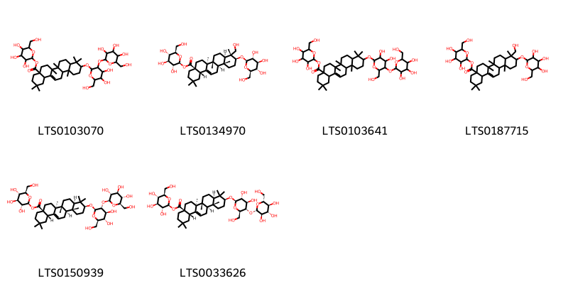{ width=100% }
    <figcaption>Hình ảnh cấu trúc hóa học của 6 hoạt chất thuộc nhóm Prenol lipids gồm ['3,4,5-trihydroxy-6-(hydroxymethyl)oxan-2-yl 10-{[4,5-dihydroxy-6-(hydroxymethyl)-3-{[3,4,5-trihydroxy-6-(hydroxymethyl)oxan-2-yl]oxy}oxan-2-yl]oxy}-2,2,6a,6b,9,9,12a-heptamethyl-1,3,4,5,6,7,8,8a,10,11,12,12b,13,14b-tetradecahydropicene-4a-carboxylate (LTS0103070)', '(2s,3r,4s,5s,6r)-3,4,5-trihydroxy-6-(hydroxymethyl)oxan-2-yl (4as,6as,6br,8ar,9r,10s,12ar,12br,14bs)-9-(hydroxymethyl)-2,2,6a,6b,9,12a-hexamethyl-10-{[(2r,3r,4s,5s,6r)-3,4,5-trihydroxy-6-(hydroxymethyl)oxan-2-yl]oxy}-1,3,4,5,6,7,8,8a,10,11,12,12b,13,14b-tetradecahydropicene-4a-carboxylate (LTS0134970)', '3,4,5-trihydroxy-6-(hydroxymethyl)oxan-2-yl 10-{[3,4-dihydroxy-6-(hydroxymethyl)-5-{[3,4,5-trihydroxy-6-(hydroxymethyl)oxan-2-yl]oxy}oxan-2-yl]oxy}-2,2,6a,6b,9,9,12a-heptamethyl-1,3,4,5,6,7,8,8a,10,11,12,12b,13,14b-tetradecahydropicene-4a-carboxylate (LTS0103641)', '3,4,5-trihydroxy-6-(hydroxymethyl)oxan-2-yl 9-(hydroxymethyl)-2,2,6a,6b,9,12a-hexamethyl-10-{[3,4,5-trihydroxy-6-(hydroxymethyl)oxan-2-yl]oxy}-1,3,4,5,6,7,8,8a,10,11,12,12b,13,14b-tetradecahydropicene-4a-carboxylate (LTS0187715)', '(2s,3r,4s,5s,6r)-3,4,5-trihydroxy-6-(hydroxymethyl)oxan-2-yl (4as,6as,6br,8ar,10s,12ar,12br,14bs)-10-{[(2r,3r,4s,5s,6r)-4,5-dihydroxy-6-(hydroxymethyl)-3-{[(2s,3r,4s,5s,6r)-3,4,5-trihydroxy-6-(hydroxymethyl)oxan-2-yl]oxy}oxan-2-yl]oxy}-2,2,6a,6b,9,9,12a-heptamethyl-1,3,4,5,6,7,8,8a,10,11,12,12b,13,14b-tetradecahydropicene-4a-carboxylate (LTS0150939)', '(2s,3r,4s,5s,6r)-3,4,5-trihydroxy-6-(hydroxymethyl)oxan-2-yl (4as,6as,6br,8ar,10s,12ar,12br,14bs)-10-{[(2r,3r,4r,5s,6r)-3,4-dihydroxy-6-(hydroxymethyl)-5-{[(2s,3r,4s,5s,6r)-3,4,5-trihydroxy-6-(hydroxymethyl)oxan-2-yl]oxy}oxan-2-yl]oxy}-2,2,6a,6b,9,9,12a-heptamethyl-1,3,4,5,6,7,8,8a,10,11,12,12b,13,14b-tetradecahydropicene-4a-carboxylate (LTS0033626)'].</figcaption>
</figure>
#### Nhóm Proaporphines
<figure markdown="span">
    { width=100% }
    <figcaption>Hình ảnh cấu trúc hóa học của 2 hoạt chất thuộc nhóm Proaporphines gồm ["(4'r)-10',11'-dimethoxy-5'-azaspiro[cyclohexane-1,2'-tricyclo[6.3.1.0⁴,¹²]dodecane]-1'(11'),2,5,8'(12'),9'-pentaen-4-one (LTS0202745)", "10',11'-dimethoxy-5'-azaspiro[cyclohexane-1,2'-tricyclo[6.3.1.0⁴,¹²]dodecane]-1'(11'),2,5,8'(12'),9'-pentaen-4-one (LTS0014482)"].</figcaption>
</figure>

---

### Dược dân tộc học

Danh sách các quốc gia có sử dụng *Abuta grandifolia* trong điều trị các bệnh. 

| Country   | Disease   | Bệnh                                                                                                                                                                                                |
|:----------|:----------|:----------------------------------------------------------------------------------------------------------------------------------------------------------------------------------------------------|
| Guiana    | Poison    | MYMEMORY WARNING: YOU USED ALL AVAILABLE FREE TRANSLATIONS FOR TODAY. NEXT AVAILABLE IN  19 HOURS 02 MINUTES 32 SECONDS VISIT HTTPS://MYMEMORY.TRANSLATED.NET/DOC/USAGELIMITS.PHP TO TRANSLATE MORE |

---

---
## Abuta kulugii
### Thông tin về thực vật

!!! info "Phân loại thực vật của *N/A* từ GIBF:"
    - **Kingdom:** Plantae
    - **Phylum:** Tracheophyta
    - **Order:** Ranunculales
    - **Family:** Menispermaceae
    - **Genus:** Abuta
    - **Species:** *N/A*

 

| Label (VI)   | Label (EN)   | Scientific Name   | Descriptions (VI)   | Descriptions (EN)   | Also Known As (VI)   | Also Known As (EN)   |
|:-------------|:-------------|:------------------|:--------------------|:--------------------|:---------------------|:---------------------|
| N/A          | N/A          | Abuta grandifolia | loài thực vật       | species of plant    | ['']                 | ['']                 |

#### Phân bố trên thế giới

**Từ CSDL GIBF** Nicaragua, Ecuador, Colombia, Brazil, Peru, Mexico, French Guiana

#### Phân bố tại Việt Nam

**Từ CSDL GIBF**: Không có ghi nhận ở Việt Nam

---
### Thành phần hóa học
        
- Theo cơ sở dữ liệu lotus: Từ loài *N/A* đã phân lập và xác định được Chưa có hoạt chất nào được phân lập. hoạt chất thuộc về các nhóm Không có hoạt chất nào được phân lập. 

Không có hình ảnh nào được tạo ra

---

### Dược dân tộc học

Danh sách các quốc gia có sử dụng *N/A* trong điều trị các bệnh. 

| Country   | Disease   | Bệnh                                                                                                                                                                                                |
|:----------|:----------|:----------------------------------------------------------------------------------------------------------------------------------------------------------------------------------------------------|
| Guiana    | Poison    | MYMEMORY WARNING: YOU USED ALL AVAILABLE FREE TRANSLATIONS FOR TODAY. NEXT AVAILABLE IN  19 HOURS 02 MINUTES 08 SECONDS VISIT HTTPS://MYMEMORY.TRANSLATED.NET/DOC/USAGELIMITS.PHP TO TRANSLATE MORE |

---

---
## Abuta macrocarpa
### Thông tin về thực vật

!!! info "Phân loại thực vật của *Elissarrhena longipes* từ GIBF:"
    - **Kingdom:** Plantae
    - **Phylum:** Tracheophyta
    - **Order:** Ranunculales
    - **Family:** Menispermaceae
    - **Genus:** Elissarrhena
    - **Species:** *Elissarrhena longipes*

 

| Label (VI)   | Label (EN)   | Scientific Name   | Descriptions (VI)   | Descriptions (EN)   | Also Known As (VI)   | Also Known As (EN)   |
|:-------------|:-------------|:------------------|:--------------------|:--------------------|:---------------------|:---------------------|
| N/A          | N/A          | Abuta macrocarpa  | loài thực vật       | species of plant    | ['']                 | ['']                 |

#### Phân bố trên thế giới

**Từ CSDL GIBF** Nicaragua, Ecuador, Colombia, Brazil, Peru, Mexico, French Guiana

#### Phân bố tại Việt Nam

**Từ CSDL GIBF**: Không có ghi nhận ở Việt Nam

---
### Thành phần hóa học
        
- Theo cơ sở dữ liệu lotus: Từ loài *Elissarrhena longipes* đã phân lập và xác định được Chưa có hoạt chất nào được phân lập. hoạt chất thuộc về các nhóm Không có hoạt chất nào được phân lập. 

Không có hình ảnh nào được tạo ra

---

### Dược dân tộc học

Danh sách các quốc gia có sử dụng *Elissarrhena longipes* trong điều trị các bệnh. 

| Country   | Disease   | Bệnh                                                                                                                                                                                                |
|:----------|:----------|:----------------------------------------------------------------------------------------------------------------------------------------------------------------------------------------------------|
| Guiana    | Poison    | MYMEMORY WARNING: YOU USED ALL AVAILABLE FREE TRANSLATIONS FOR TODAY. NEXT AVAILABLE IN  19 HOURS 01 MINUTES 47 SECONDS VISIT HTTPS://MYMEMORY.TRANSLATED.NET/DOC/USAGELIMITS.PHP TO TRANSLATE MORE |

---

---
## Abuta obovata
### Thông tin về thực vật

!!! info "Phân loại thực vật của *Abuta obovata* từ GIBF:"
    - **Kingdom:** Plantae
    - **Phylum:** Tracheophyta
    - **Order:** Ranunculales
    - **Family:** Menispermaceae
    - **Genus:** Abuta
    - **Species:** *Abuta obovata*

 

| Label (VI)   | Label (EN)   | Scientific Name   | Descriptions (VI)   | Descriptions (EN)   | Also Known As (VI)   | Also Known As (EN)   |
|:-------------|:-------------|:------------------|:--------------------|:--------------------|:---------------------|:---------------------|
| N/A          | N/A          | Abuta obovata     | loài thực vật       | species of plant    | ['']                 | ['']                 |

#### Phân bố trên thế giới

**Từ CSDL GIBF** nan, Suriname, Colombia, Brazil, Guyana, Peru, Venezuela (Bolivarian Republic of), French Guiana

#### Phân bố tại Việt Nam

**Từ CSDL GIBF**: Không có ghi nhận ở Việt Nam

---
### Thành phần hóa học
        
- Theo cơ sở dữ liệu lotus: Từ loài *Abuta obovata* đã phân lập và xác định được Chưa có hoạt chất nào được phân lập. hoạt chất thuộc về các nhóm Không có hoạt chất nào được phân lập. 

Không có hình ảnh nào được tạo ra

---

### Dược dân tộc học

Danh sách các quốc gia có sử dụng *Abuta obovata* trong điều trị các bệnh. 

| Country   | Disease   | Bệnh                                                                                                                                                                                                |
|:----------|:----------|:----------------------------------------------------------------------------------------------------------------------------------------------------------------------------------------------------|
| Guiana    | Poison    | MYMEMORY WARNING: YOU USED ALL AVAILABLE FREE TRANSLATIONS FOR TODAY. NEXT AVAILABLE IN  19 HOURS 01 MINUTES 28 SECONDS VISIT HTTPS://MYMEMORY.TRANSLATED.NET/DOC/USAGELIMITS.PHP TO TRANSLATE MORE |

---

---
## Abuta rufescens
### Thông tin về thực vật

!!! info "Phân loại thực vật của *Abuta rufescens* từ GIBF:"
    - **Kingdom:** Plantae
    - **Phylum:** Tracheophyta
    - **Order:** Ranunculales
    - **Family:** Menispermaceae
    - **Genus:** Abuta
    - **Species:** *Abuta rufescens*

 

| Label (VI)   | Label (EN)   | Scientific Name   | Descriptions (VI)   | Descriptions (EN)   | Also Known As (VI)   | Also Known As (EN)   |
|:-------------|:-------------|:------------------|:--------------------|:--------------------|:---------------------|:---------------------|
| N/A          | N/A          | Abuta rufescens   | loài thực vật       | species of plant    | ['']                 | ['']                 |

#### Phân bố trên thế giới

**Từ CSDL GIBF** Ecuador, Suriname, Colombia, Brazil, Bolivia (Plurinational State of), Guyana, Peru, Venezuela (Bolivarian Republic of), French Guiana

#### Phân bố tại Việt Nam

**Từ CSDL GIBF**: Không có ghi nhận ở Việt Nam

---
### Thành phần hóa học
        
- Theo cơ sở dữ liệu lotus: Từ loài *Abuta rufescens* đã phân lập và xác định được 9 hoạt chất thuộc về các nhóm Aporphines, Isoquinolines and derivatives, 1-azafluoranthenes. 

|    | chemicalTaxonomyClassyfireClass   |   smiles_count |
|---:|:----------------------------------|---------------:|
|  0 |                                   |              1 |
|  1 | 1-azafluoranthenes                |              2 |
|  2 | Aporphines                        |              4 |
|  3 | Isoquinolines and derivatives     |              2 |

#### Nhóm 
<figure markdown="span">
    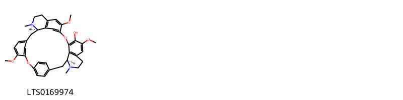{ width=100% }
    <figcaption>Hình ảnh cấu trúc hóa học của 1 hoạt chất thuộc nhóm  gồm ['(1r,14s)-6,20,25-trimethoxy-15,30-dimethyl-8,23-dioxa-15,30-diazaheptacyclo[22.6.2.2⁹,¹².1³,⁷.1¹⁴,¹⁸.0²⁷,³¹.0²²,³³]hexatriaconta-3,5,7(36),9,11,18(33),19,21,24(32),25,27(31),34-dodecaen-21-ol (LTS0169974)'].</figcaption>
</figure>
#### Nhóm 1-azafluoranthenes
<figure markdown="span">
    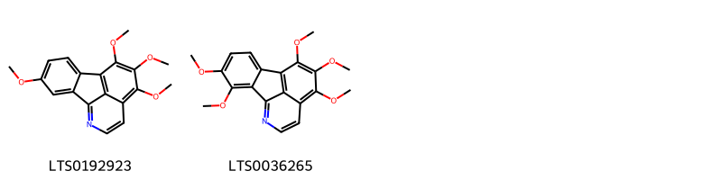{ width=100% }
    <figcaption>Hình ảnh cấu trúc hóa học của 2 hoạt chất thuộc nhóm 1-azafluoranthenes gồm ['6,7,8,13-tetramethoxy-2-azatetracyclo[7.6.1.0⁵,¹⁶.0¹⁰,¹⁵]hexadeca-1,3,5,7,9(16),10,12,14-octaene (LTS0192923)', '6,7,8,13,14-pentamethoxy-2-azatetracyclo[7.6.1.0⁵,¹⁶.0¹⁰,¹⁵]hexadeca-1,3,5,7,9(16),10,12,14-octaene (LTS0036265)'].</figcaption>
</figure>
#### Nhóm Aporphines
<figure markdown="span">
    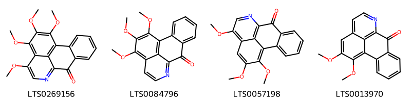{ width=100% }
    <figcaption>Hình ảnh cấu trúc hóa học của 4 hoạt chất thuộc nhóm Aporphines gồm ['12,14,15,16-tetramethoxy-10-azatetracyclo[7.7.1.0²,⁷.0¹³,¹⁷]heptadeca-1(16),2,4,6,9(17),10,12,14-octaen-8-one (LTS0269156)', 'o-methylmoschatoline (LTS0084796)', '12,15,16-trimethoxy-10-azatetracyclo[7.7.1.0²,⁷.0¹³,¹⁷]heptadeca-1(16),2,4,6,9(17),10,12,14-octaen-8-one (LTS0057198)', 'lysicamine (LTS0013970)'].</figcaption>
</figure>
#### Nhóm Isoquinolines and derivatives
<figure markdown="span">
    { width=100% }
    <figcaption>Hình ảnh cấu trúc hóa học của 2 hoạt chất thuộc nhóm Isoquinolines and derivatives gồm ['5,14,15,16-tetramethoxy-10-azatetracyclo[7.7.1.0²,⁸.0¹³,¹⁷]heptadeca-1(16),2,4,7,9(17),10,12,14-octaen-6-one (LTS0205539)', '6,7,8-trimethoxy-2-azatetracyclo[7.6.1.0⁵,¹⁶.0¹⁰,¹⁵]hexadeca-1(16),2,4,6,8,10,12,14-octaen-13-ol (LTS0011167)'].</figcaption>
</figure>

---

### Dược dân tộc học

Danh sách các quốc gia có sử dụng *Abuta rufescens* trong điều trị các bệnh. 

| Country   | Disease   | Bệnh                                                                                                                                                                                                |
|:----------|:----------|:----------------------------------------------------------------------------------------------------------------------------------------------------------------------------------------------------|
| Guiana    | Poison    | MYMEMORY WARNING: YOU USED ALL AVAILABLE FREE TRANSLATIONS FOR TODAY. NEXT AVAILABLE IN  19 HOURS 01 MINUTES 06 SECONDS VISIT HTTPS://MYMEMORY.TRANSLATED.NET/DOC/USAGELIMITS.PHP TO TRANSLATE MORE |

---

---
## Abuta wilsonbrownei
### Thông tin về thực vật

!!! info "Phân loại thực vật của *Abuta rufescens* từ GIBF:"
    - **Kingdom:** Plantae
    - **Phylum:** Tracheophyta
    - **Order:** Ranunculales
    - **Family:** Menispermaceae
    - **Genus:** Abuta
    - **Species:** *Abuta rufescens*

 

| Label (VI)   | Label (EN)   | Scientific Name   | Descriptions (VI)   | Descriptions (EN)   | Also Known As (VI)   | Also Known As (EN)   |
|:-------------|:-------------|:------------------|:--------------------|:--------------------|:---------------------|:---------------------|
| N/A          | N/A          | Abuta rufescens   | loài thực vật       | species of plant    | ['']                 | ['']                 |

#### Phân bố trên thế giới

**Từ CSDL GIBF** Ecuador, Suriname, Colombia, Brazil, Bolivia (Plurinational State of), Guyana, Peru, Venezuela (Bolivarian Republic of), French Guiana

#### Phân bố tại Việt Nam

**Từ CSDL GIBF**: Không có ghi nhận ở Việt Nam

---
### Thành phần hóa học
        
- Theo cơ sở dữ liệu lotus: Từ loài *Abuta rufescens* đã phân lập và xác định được Chưa có hoạt chất nào được phân lập. hoạt chất thuộc về các nhóm Không có hoạt chất nào được phân lập. 

Không có hình ảnh nào được tạo ra

---

### Dược dân tộc học

Danh sách các quốc gia có sử dụng *Abuta rufescens* trong điều trị các bệnh. 

| Country   | Disease   | Bệnh                                                                                                                                                                                                |
|:----------|:----------|:----------------------------------------------------------------------------------------------------------------------------------------------------------------------------------------------------|
| Guiana    | Poison    | MYMEMORY WARNING: YOU USED ALL AVAILABLE FREE TRANSLATIONS FOR TODAY. NEXT AVAILABLE IN  19 HOURS 00 MINUTES 38 SECONDS VISIT HTTPS://MYMEMORY.TRANSLATED.NET/DOC/USAGELIMITS.PHP TO TRANSLATE MORE |

---

# Chi Jateorhiza

??? note "Danh sách các dược liệu thuộc chi"
    
	 - *Jateorhiza columba*
	 - *Jateorhiza miersii*
	 - *Jateorhiza palmata*

---
## Jateorhiza columba
### Thông tin về thực vật

!!! info "Phân loại thực vật của *Jateorhiza palmata* từ GIBF:"
    - **Kingdom:** Plantae
    - **Phylum:** Tracheophyta
    - **Order:** Ranunculales
    - **Family:** Menispermaceae
    - **Genus:** Jateorhiza
    - **Species:** *Jateorhiza palmata*

 

| Label (VI)   | Label (EN)   | Scientific Name    | Descriptions (VI)   | Descriptions (EN)   | Also Known As (VI)   | Also Known As (EN)   |
|:-------------|:-------------|:-------------------|:--------------------|:--------------------|:---------------------|:---------------------|
| N/A          | N/A          | Jateorhiza columba | loài thực vật       | species of plant    | ['']                 | ['']                 |

#### Phân bố trên thế giới

**Từ CSDL GIBF** nan, United States of America, Mozambique

#### Phân bố tại Việt Nam

**Từ CSDL GIBF**: Không có ghi nhận ở Việt Nam

---
### Thành phần hóa học
        
- Theo cơ sở dữ liệu lotus: Từ loài *Jateorhiza palmata* đã phân lập và xác định được Chưa có hoạt chất nào được phân lập. hoạt chất thuộc về các nhóm Không có hoạt chất nào được phân lập. 

Không có hình ảnh nào được tạo ra

---

### Dược dân tộc học

Danh sách các quốc gia có sử dụng *Jateorhiza palmata* trong điều trị các bệnh. 

| Country   | Disease   | Bệnh                                                                                                                                                                                                |
|:----------|:----------|:----------------------------------------------------------------------------------------------------------------------------------------------------------------------------------------------------|
| Elsewhere | Tonic     | MYMEMORY WARNING: YOU USED ALL AVAILABLE FREE TRANSLATIONS FOR TODAY. NEXT AVAILABLE IN  19 HOURS 00 MINUTES 21 SECONDS VISIT HTTPS://MYMEMORY.TRANSLATED.NET/DOC/USAGELIMITS.PHP TO TRANSLATE MORE |

---

---
## Jateorhiza miersii
### Thông tin về thực vật

!!! info "Phân loại thực vật của *Jateorhiza palmata* từ GIBF:"
    - **Kingdom:** Plantae
    - **Phylum:** Tracheophyta
    - **Order:** Ranunculales
    - **Family:** Menispermaceae
    - **Genus:** Jateorhiza
    - **Species:** *Jateorhiza palmata*

 

| Label (VI)   | Label (EN)   | Scientific Name    | Descriptions (VI)   | Descriptions (EN)   | Also Known As (VI)   | Also Known As (EN)   |
|:-------------|:-------------|:-------------------|:--------------------|:--------------------|:---------------------|:---------------------|
| N/A          | N/A          | Jateorhiza miersii |                     | species of plant    | ['']                 | ['']                 |

#### Phân bố trên thế giới

**Từ CSDL GIBF** nan, United States of America, Mozambique

#### Phân bố tại Việt Nam

**Từ CSDL GIBF**: Không có ghi nhận ở Việt Nam

---
### Thành phần hóa học
        
- Theo cơ sở dữ liệu lotus: Từ loài *Jateorhiza palmata* đã phân lập và xác định được Chưa có hoạt chất nào được phân lập. hoạt chất thuộc về các nhóm Không có hoạt chất nào được phân lập. 

Không có hình ảnh nào được tạo ra

---

### Dược dân tộc học

Danh sách các quốc gia có sử dụng *Jateorhiza palmata* trong điều trị các bệnh. 

| Country   | Disease   | Bệnh                                                                                                                                                                                                |
|:----------|:----------|:----------------------------------------------------------------------------------------------------------------------------------------------------------------------------------------------------|
| Elsewhere | Stomachic | MYMEMORY WARNING: YOU USED ALL AVAILABLE FREE TRANSLATIONS FOR TODAY. NEXT AVAILABLE IN  19 HOURS 00 MINUTES 04 SECONDS VISIT HTTPS://MYMEMORY.TRANSLATED.NET/DOC/USAGELIMITS.PHP TO TRANSLATE MORE |

---

---
## Jateorhiza palmata
### Thông tin về thực vật

!!! info "Phân loại thực vật của *Jateorhiza palmata* từ GIBF:"
    - **Kingdom:** Plantae
    - **Phylum:** Tracheophyta
    - **Order:** Ranunculales
    - **Family:** Menispermaceae
    - **Genus:** Jateorhiza
    - **Species:** *Jateorhiza palmata*

 

| Label (VI)   | Label (EN)   | Scientific Name    | Descriptions (VI)   | Descriptions (EN)   | Also Known As (VI)   | Also Known As (EN)   |
|:-------------|:-------------|:-------------------|:--------------------|:--------------------|:---------------------|:---------------------|
| N/A          | N/A          | Jateorhiza palmata |                     | species of plant    | ['']                 | ['']                 |

#### Phân bố trên thế giới

**Từ CSDL GIBF** Malawi, Zambia, nan, South Africa, Réunion, Mauritius, Mozambique, India, unknown or invalid, United States of America, Zimbabwe, Kenya, Tanzania, United Republic of, United Kingdom of Great Britain and Northern Ireland

#### Phân bố tại Việt Nam

**Từ CSDL GIBF**: Không có ghi nhận ở Việt Nam

---
### Thành phần hóa học
        
- Theo cơ sở dữ liệu lotus: Từ loài *Jateorhiza palmata* đã phân lập và xác định được 17 hoạt chất thuộc về các nhóm Naphthopyrans, Fatty Acyls. 

|    | chemicalTaxonomyClassyfireClass   |   smiles_count |
|---:|:----------------------------------|---------------:|
|  0 | Fatty Acyls                       |              5 |
|  1 | Naphthopyrans                     |             12 |

#### Nhóm Fatty Acyls
<figure markdown="span">
    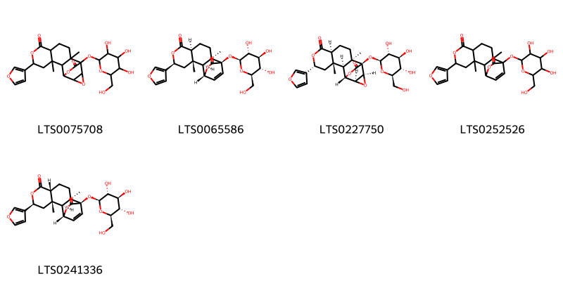{ width=100% }
    <figcaption>Hình ảnh cấu trúc hóa học của 5 hoạt chất thuộc nhóm Fatty Acyls gồm ['5-(furan-3-yl)-3,11-dimethyl-12-{[3,4,5-trihydroxy-6-(hydroxymethyl)oxan-2-yl]oxy}-6,14,16-trioxapentacyclo[10.3.2.0²,¹¹.0³,⁸.0¹³,¹⁵]heptadecane-7,17-dione (LTS0075708)', '(1r,2s,3s,5s,8s,11r,12r)-5-(furan-3-yl)-3,11-dimethyl-12-{[(2s,3r,4s,5s,6r)-3,4,5-trihydroxy-6-(hydroxymethyl)oxan-2-yl]oxy}-6,14-dioxatetracyclo[10.2.2.0²,¹¹.0³,⁸]hexadec-15-ene-7,13-dione (LTS0065586)', '(1s,2s,3s,5r,8s,11r,12s,13s,15s)-5-(furan-3-yl)-3,11-dimethyl-12-{[(2s,3r,4s,5s,6r)-3,4,5-trihydroxy-6-(hydroxymethyl)oxan-2-yl]oxy}-6,14,16-trioxapentacyclo[10.3.2.0²,¹¹.0³,⁸.0¹³,¹⁵]heptadecane-7,17-dione (LTS0227750)', '5-(furan-3-yl)-3,11-dimethyl-12-{[3,4,5-trihydroxy-6-(hydroxymethyl)oxan-2-yl]oxy}-6,14-dioxatetracyclo[10.2.2.0²,¹¹.0³,⁸]hexadec-15-ene-7,13-dione (LTS0252526)', '(1r,2s,3s,5s,8r,11r,12r)-5-(furan-3-yl)-3,11-dimethyl-12-{[(2s,3r,4s,5s,6r)-3,4,5-trihydroxy-6-(hydroxymethyl)oxan-2-yl]oxy}-6,14-dioxatetracyclo[10.2.2.0²,¹¹.0³,⁸]hexadec-15-ene-7,13-dione (LTS0241336)'].</figcaption>
</figure>
#### Nhóm Naphthopyrans
<figure markdown="span">
    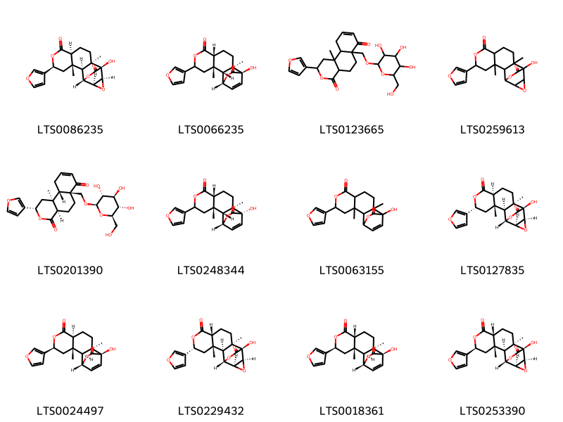{ width=100% }
    <figcaption>Hình ảnh cấu trúc hóa học của 12 hoạt chất thuộc nhóm Naphthopyrans gồm ['(1s,2s,3s,5s,8s,11r,12s,13s,15s)-5-(furan-3-yl)-12-hydroxy-3,11-dimethyl-6,14,16-trioxapentacyclo[10.3.2.0²,¹¹.0³,⁸.0¹³,¹⁵]heptadecane-7,17-dione (LTS0086235)', '(1r,2r,3s,8r,11r,12r)-5-(furan-3-yl)-12-hydroxy-3,11-dimethyl-6,14-dioxatetracyclo[10.2.2.0²,¹¹.0³,⁸]hexadec-15-ene-7,13-dione (LTS0066235)', '2-(furan-3-yl)-10b-methyl-6a-({[3,4,5-trihydroxy-6-(hydroxymethyl)oxan-2-yl]oxy}methyl)-1h,2h,4ah,5h,6h,10h,10ah-naphtho[2,1-c]pyran-4,7-dione (LTS0123665)', 'tinosporide (LTS0259613)', 'palmatoside g (LTS0201390)', '(1r,2r,3s,8r,11r,12s)-5-(furan-3-yl)-12-hydroxy-3,11-dimethyl-6,14-dioxatetracyclo[10.2.2.0²,¹¹.0³,⁸]hexadec-15-ene-7,13-dione (LTS0248344)', '5-(furan-3-yl)-12-hydroxy-3,11-dimethyl-6,14-dioxatetracyclo[10.2.2.0²,¹¹.0³,⁸]hexadec-15-ene-7,13-dione (LTS0063155)', 'palmarin (LTS0127835)', '(1r,2s,3s,5s,8s,11r,12r)-5-(furan-3-yl)-12-hydroxy-3,11-dimethyl-6,14-dioxatetracyclo[10.2.2.0²,¹¹.0³,⁸]hexadec-15-ene-7,13-dione (LTS0024497)', 'chasmanthin (LTS0229432)', 'columbin (LTS0018361)', '(1s,2s,3s,5s,8r,11r,12s,13s,15s)-5-(furan-3-yl)-12-hydroxy-3,11-dimethyl-6,14,16-trioxapentacyclo[10.3.2.0²,¹¹.0³,⁸.0¹³,¹⁵]heptadecane-7,17-dione (LTS0253390)'].</figcaption>
</figure>

---

### Dược dân tộc học

Danh sách các quốc gia có sử dụng *Jateorhiza palmata* trong điều trị các bệnh. 

| Country   | Disease                        | Bệnh                                                                                                                                                                                                |
|:----------|:-------------------------------|:----------------------------------------------------------------------------------------------------------------------------------------------------------------------------------------------------|
| Turkey    | Antiseptic, Apertif, Vermifuge | MYMEMORY WARNING: YOU USED ALL AVAILABLE FREE TRANSLATIONS FOR TODAY. NEXT AVAILABLE IN  18 HOURS 59 MINUTES 48 SECONDS VISIT HTTPS://MYMEMORY.TRANSLATED.NET/DOC/USAGELIMITS.PHP TO TRANSLATE MORE |

---

# Chi Fibraurea

??? note "Danh sách các dược liệu thuộc chi"
    
	 - *Fibraurea chloroleuca*
	 - *Fibraurea recisa*
	 - *Fibraurea tinctoria*

---
## Fibraurea chloroleuca
### Thông tin về thực vật

!!! info "Phân loại thực vật của *N/A* từ GIBF:"
    - **Kingdom:** Plantae
    - **Phylum:** Tracheophyta
    - **Order:** Ranunculales
    - **Family:** Menispermaceae
    - **Genus:** N/A
    - **Species:** *N/A*

 

| Label (VI)   | Label (EN)   | Scientific Name       | Descriptions (VI)   | Descriptions (EN)   | Also Known As (VI)   | Also Known As (EN)   |
|:-------------|:-------------|:----------------------|:--------------------|:--------------------|:---------------------|:---------------------|
| N/A          | N/A          | Fibraurea chloroleuca |                     |                     | ['']                 | ['']                 |

#### Phân bố trên thế giới

**Từ CSDL GIBF** Dominican Republic, South Africa, Puerto Rico, Hong Kong, Australia, Madagascar, Gabon, Colombia, Chinese Taipei, Brazil, Argentina, India, Jamaica, United States of America, Mexico, Cameroon, Yemen, French Guiana

#### Phân bố tại Việt Nam

**Từ CSDL GIBF**: Không có ghi nhận ở Việt Nam

---
### Thành phần hóa học
        
- Theo cơ sở dữ liệu lotus: Từ loài *N/A* đã phân lập và xác định được 16 hoạt chất thuộc về các nhóm Steroids and steroid derivatives, Naphthopyrans, Isoquinolines and derivatives, Protoberberine alkaloids and derivatives. 

|    | chemicalTaxonomyClassyfireClass          |   smiles_count |
|---:|:-----------------------------------------|---------------:|
|  0 | Isoquinolines and derivatives            |              3 |
|  1 | Naphthopyrans                            |              5 |
|  2 | Protoberberine alkaloids and derivatives |              6 |
|  3 | Steroids and steroid derivatives         |              1 |

#### Nhóm Isoquinolines and derivatives
<figure markdown="span">
    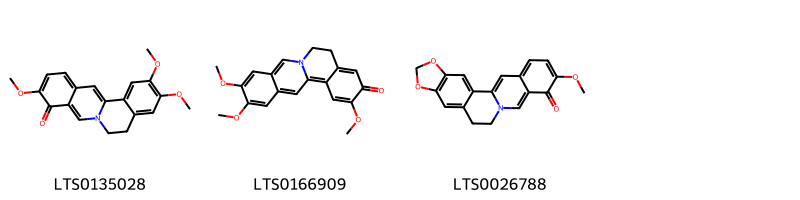{ width=100% }
    <figcaption>Hình ảnh cấu trúc hóa học của 3 hoạt chất thuộc nhóm Isoquinolines and derivatives gồm ['3,10,11-trimethoxy-7,8-dihydro-6-azatetraphen-4-one (LTS0135028)', '2,3,11-trimethoxy-7,8-dihydro-6-azatetraphen-10-one (LTS0166909)', '17-methoxy-5,7-dioxa-13-azapentacyclo[11.8.0.0²,¹⁰.0⁴,⁸.0¹⁵,²⁰]henicosa-1(21),2,4(8),9,14,17,19-heptaen-16-one (LTS0026788)'].</figcaption>
</figure>
#### Nhóm Naphthopyrans
<figure markdown="span">
    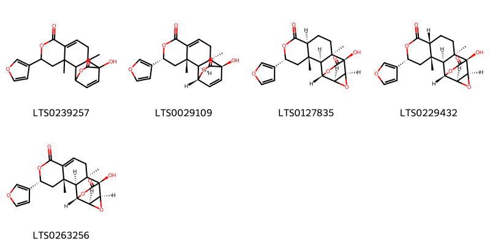{ width=100% }
    <figcaption>Hình ảnh cấu trúc hóa học của 5 hoạt chất thuộc nhóm Naphthopyrans gồm ['5-(furan-3-yl)-12-hydroxy-3,11-dimethyl-6,14-dioxatetracyclo[10.2.2.0²,¹¹.0³,⁸]hexadeca-8,15-diene-7,13-dione (LTS0239257)', '(1r,2s,3s,5r,11r,12r)-5-(furan-3-yl)-12-hydroxy-3,11-dimethyl-6,14-dioxatetracyclo[10.2.2.0²,¹¹.0³,⁸]hexadeca-8,15-diene-7,13-dione (LTS0029109)', 'palmarin (LTS0127835)', 'chasmanthin (LTS0229432)', '(1s,2s,3s,5r,11r,12s,13s,15s)-5-(furan-3-yl)-12-hydroxy-3,11-dimethyl-6,14,16-trioxapentacyclo[10.3.2.0²,¹¹.0³,⁸.0¹³,¹⁵]heptadec-8-ene-7,17-dione (LTS0263256)'].</figcaption>
</figure>
#### Nhóm Protoberberine alkaloids and derivatives
<figure markdown="span">
    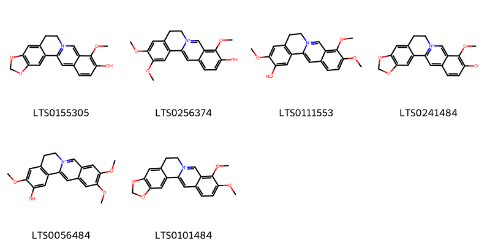{ width=100% }
    <figcaption>Hình ảnh cấu trúc hóa học của 6 hoạt chất thuộc nhóm Protoberberine alkaloids and derivatives gồm ['17-hydroxy-16-methoxy-5,7-dioxa-13λ⁵-azapentacyclo[11.8.0.0²,¹⁰.0⁴,⁸.0¹⁵,²⁰]henicosa-1(13),2,4(8),9,14,16,18,20-octaen-13-ylium (LTS0155305)', 'dehydrocorydalmine (LTS0256374)', 'columbamine (LTS0111553)', '16-methoxy-5,7-dioxa-13λ⁵-azapentacyclo[11.8.0.0²,¹⁰.0⁴,⁸.0¹⁵,²⁰]henicosa-1(13),2,4(8),9,14,16,18,20-octaen-13-ylium-17-olate (LTS0241484)', 'pseudocolumbamine (LTS0056484)', 'berberine (LTS0101484)'].</figcaption>
</figure>
#### Nhóm Steroids and steroid derivatives
<figure markdown="span">
    { width=100% }
    <figcaption>Hình ảnh cấu trúc hóa học của 1 hoạt chất thuộc nhóm Steroids and steroid derivatives gồm ['20-hydroxyecdysone (LTS0227025)'].</figcaption>
</figure>

---

### Dược dân tộc học

Danh sách các quốc gia có sử dụng *N/A* trong điều trị các bệnh. 

| Country   | Disease   | Bệnh                                                                                                                                                                                                |
|:----------|:----------|:----------------------------------------------------------------------------------------------------------------------------------------------------------------------------------------------------|
| Elsewhere | Stomachic | MYMEMORY WARNING: YOU USED ALL AVAILABLE FREE TRANSLATIONS FOR TODAY. NEXT AVAILABLE IN  18 HOURS 59 MINUTES 22 SECONDS VISIT HTTPS://MYMEMORY.TRANSLATED.NET/DOC/USAGELIMITS.PHP TO TRANSLATE MORE |

---

---
## Fibraurea recisa
### Thông tin về thực vật

!!! info "Phân loại thực vật của *Fibraurea recisa* từ GIBF:"
    - **Kingdom:** Plantae
    - **Phylum:** Tracheophyta
    - **Order:** Ranunculales
    - **Family:** Menispermaceae
    - **Genus:** Fibraurea
    - **Species:** *Fibraurea recisa*

 

| Label (VI)   | Label (EN)   | Scientific Name   | Descriptions (VI)   | Descriptions (EN)   | Also Known As (VI)   | Also Known As (EN)   |
|:-------------|:-------------|:------------------|:--------------------|:--------------------|:---------------------|:---------------------|
| N/A          | N/A          | Fibraurea recisa  |                     | species of plant    | ['Fibraurea recisa'] | ['']                 |

#### Phân bố trên thế giới

**Từ CSDL GIBF** nan, Japan, Lao People’s Democratic Republic, Cambodia, Myanmar, Viet Nam, China

#### Phân bố tại Việt Nam

**Từ CSDL GIBF**: Thanh Hoa, Lang Son, Ha Tinh

---
### Thành phần hóa học
        
- Theo cơ sở dữ liệu lotus: Từ loài *Fibraurea recisa* đã phân lập và xác định được 4 hoạt chất thuộc về các nhóm Protoberberine alkaloids and derivatives. 

|    | chemicalTaxonomyClassyfireClass          |   smiles_count |
|---:|:-----------------------------------------|---------------:|
|  0 | Protoberberine alkaloids and derivatives |              4 |

#### Nhóm Protoberberine alkaloids and derivatives
<figure markdown="span">
    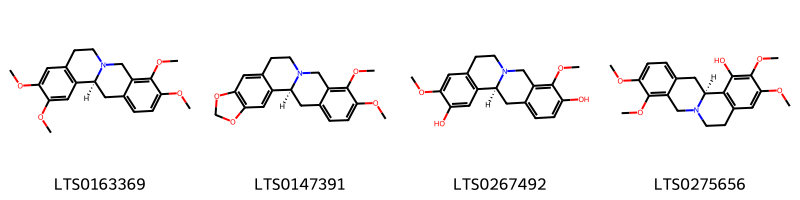{ width=100% }
    <figcaption>Hình ảnh cấu trúc hóa học của 4 hoạt chất thuộc nhóm Protoberberine alkaloids and derivatives gồm ['tetrahydropalmatine (LTS0163369)', '(s)-canadine (LTS0147391)', 'stepholidine (LTS0267492)', 'capaurine (LTS0275656)'].</figcaption>
</figure>

---

### Dược dân tộc học

Danh sách các quốc gia có sử dụng *Fibraurea recisa* trong điều trị các bệnh. 

| Country   | Disease   | Bệnh                                                                                                                                                                                                |
|:----------|:----------|:----------------------------------------------------------------------------------------------------------------------------------------------------------------------------------------------------|
| Indochina | Tonic     | MYMEMORY WARNING: YOU USED ALL AVAILABLE FREE TRANSLATIONS FOR TODAY. NEXT AVAILABLE IN  18 HOURS 58 MINUTES 52 SECONDS VISIT HTTPS://MYMEMORY.TRANSLATED.NET/DOC/USAGELIMITS.PHP TO TRANSLATE MORE |

---

---
## Fibraurea tinctoria
### Thông tin về thực vật

!!! info "Phân loại thực vật của *Fibraurea tinctoria* từ GIBF:"
    - **Kingdom:** Plantae
    - **Phylum:** Tracheophyta
    - **Order:** Ranunculales
    - **Family:** Menispermaceae
    - **Genus:** Fibraurea
    - **Species:** *Fibraurea tinctoria*

 

| Label (VI)   | Label (EN)   | Scientific Name     | Descriptions (VI)   | Descriptions (EN)   | Also Known As (VI)   | Also Known As (EN)   |
|:-------------|:-------------|:--------------------|:--------------------|:--------------------|:---------------------|:---------------------|
| N/A          | N/A          | Fibraurea tinctoria | loài thực vật       | species of plant    | ['']                 | ['']                 |

#### Phân bố trên thế giới

**Từ CSDL GIBF** nan, Malaysia, Thailand, Lao People’s Democratic Republic, Cambodia, unknown or invalid, Indonesia, India, China, Philippines, Singapore, Viet Nam, Brunei Darussalam

#### Phân bố tại Việt Nam

**Từ CSDL GIBF**: Tonkin, 东京, Ninh Thuan, Bac Kan, Annam, Da Nang, Hà Tinh

---
### Thành phần hóa học
        
- Theo cơ sở dữ liệu lotus: Từ loài *Fibraurea tinctoria* đã phân lập và xác định được 97 hoạt chất thuộc về các nhóm Fatty Acyls, Prenol lipids, Steroids and steroid derivatives, Cinnamic acids and derivatives, Aporphines, Anthracenes, Benzene and substituted derivatives, Organooxygen compounds, Phenols, Naphthopyrans, Aryltetralin lignans, Isoquinolines and derivatives, Protoberberine alkaloids and derivatives. 

|    | chemicalTaxonomyClassyfireClass          |   smiles_count |
|---:|:-----------------------------------------|---------------:|
|  0 | Anthracenes                              |              1 |
|  1 | Aporphines                               |              1 |
|  2 | Aryltetralin lignans                     |              2 |
|  3 | Benzene and substituted derivatives      |              4 |
|  4 | Cinnamic acids and derivatives           |             11 |
|  5 | Fatty Acyls                              |             11 |
|  6 | Isoquinolines and derivatives            |              5 |
|  7 | Naphthopyrans                            |             28 |
|  8 | Organooxygen compounds                   |              1 |
|  9 | Phenols                                  |              3 |
| 10 | Prenol lipids                            |              5 |
| 11 | Protoberberine alkaloids and derivatives |              9 |
| 12 | Steroids and steroid derivatives         |             15 |

#### Nhóm Anthracenes
<figure markdown="span">
    { width=100% }
    <figcaption>Hình ảnh cấu trúc hóa học của 1 hoạt chất thuộc nhóm Anthracenes gồm ['physcion (LTS0052688)'].</figcaption>
</figure>
#### Nhóm Aporphines
<figure markdown="span">
    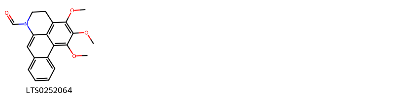{ width=100% }
    <figcaption>Hình ảnh cấu trúc hóa học của 1 hoạt chất thuộc nhóm Aporphines gồm ['14,15,16-trimethoxy-10-azatetracyclo[7.7.1.0²,⁷.0¹³,¹⁷]heptadeca-1(17),2(7),3,5,8,13,15-heptaene-10-carbaldehyde (LTS0252064)'].</figcaption>
</figure>
#### Nhóm Aryltetralin lignans
<figure markdown="span">
    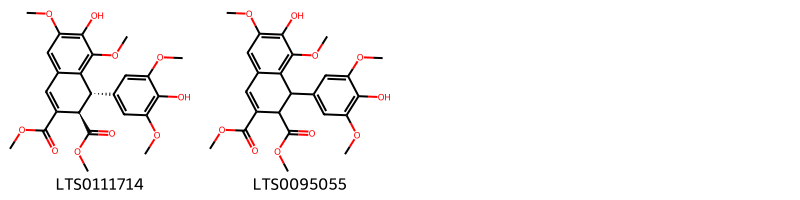{ width=100% }
    <figcaption>Hình ảnh cấu trúc hóa học của 2 hoạt chất thuộc nhóm Aryltetralin lignans gồm ['2,3-dimethyl (1s,2r)-7-hydroxy-1-(4-hydroxy-3,5-dimethoxyphenyl)-6,8-dimethoxy-1,2-dihydronaphthalene-2,3-dicarboxylate (LTS0111714)', '2,3-dimethyl 7-hydroxy-1-(4-hydroxy-3,5-dimethoxyphenyl)-6,8-dimethoxy-1,2-dihydronaphthalene-2,3-dicarboxylate (LTS0095055)'].</figcaption>
</figure>
#### Nhóm Benzene and substituted derivatives
<figure markdown="span">
    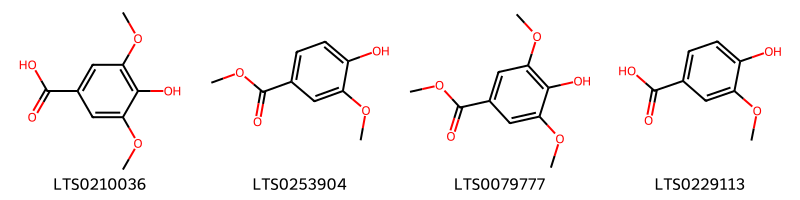{ width=100% }
    <figcaption>Hình ảnh cấu trúc hóa học của 4 hoạt chất thuộc nhóm Benzene and substituted derivatives gồm ['syringic acid (LTS0210036)', 'vanillate (LTS0253904)', 'syringate (LTS0079777)', 'vanillic acid (LTS0229113)'].</figcaption>
</figure>
#### Nhóm Cinnamic acids and derivatives
<figure markdown="span">
    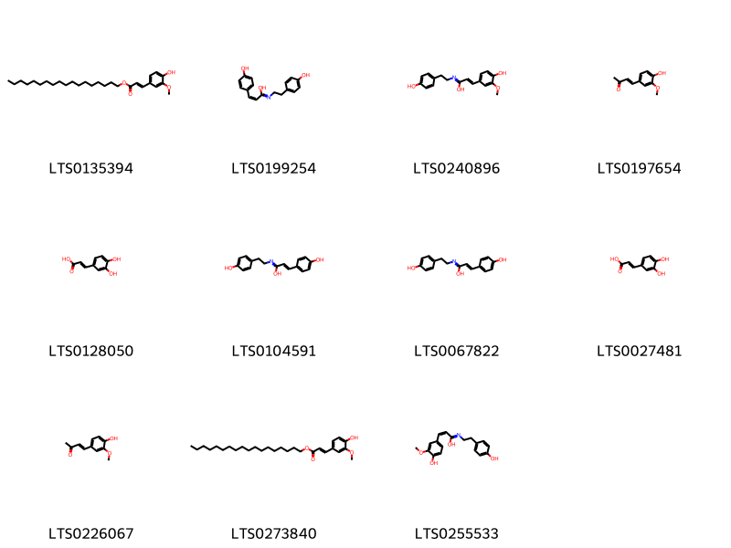{ width=100% }
    <figcaption>Hình ảnh cấu trúc hóa học của 11 hoạt chất thuộc nhóm Cinnamic acids and derivatives gồm ['octadecyl (2e)-3-(4-hydroxy-3-methoxyphenyl)prop-2-enoate (LTS0135394)', '(2z)-3-(4-hydroxyphenyl)-n-[2-(4-hydroxyphenyl)ethyl]prop-2-enimidic acid (LTS0199254)', '3-(4-hydroxy-3-methoxyphenyl)-n-[2-(4-hydroxyphenyl)ethyl]prop-2-enimidic acid (LTS0240896)', 'dehydrozingerone (LTS0197654)', '3,4-dihydroxycinnamic acid (LTS0128050)', '3-(4-hydroxyphenyl)-n-[2-(4-hydroxyphenyl)ethyl]prop-2-enimidic acid (LTS0104591)', '(2e)-3-(4-hydroxyphenyl)-n-[2-(4-hydroxyphenyl)ethyl]prop-2-enimidic acid (LTS0067822)', 'caffeic acid (LTS0027481)', 'vanillylidene acetone (LTS0226067)', 'octadecyl 3-(4-hydroxy-3-methoxyphenyl)prop-2-enoate (LTS0273840)', '(2z)-3-(4-hydroxy-3-methoxyphenyl)-n-[2-(4-hydroxyphenyl)ethyl]prop-2-enimidic acid (LTS0255533)'].</figcaption>
</figure>
#### Nhóm Fatty Acyls
<figure markdown="span">
    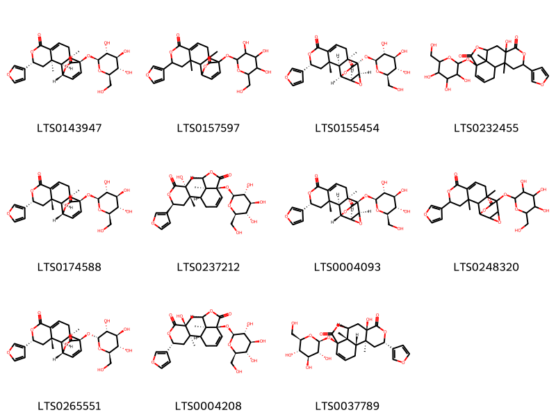{ width=100% }
    <figcaption>Hình ảnh cấu trúc hóa học của 11 hoạt chất thuộc nhóm Fatty Acyls gồm ['(1r,2s,3r,5r,11r,12r)-5-(furan-3-yl)-3,11-dimethyl-12-{[(2s,3r,4s,5s,6r)-3,4,5-trihydroxy-6-(hydroxymethyl)oxan-2-yl]oxy}-6,14-dioxatetracyclo[10.2.2.0²,¹¹.0³,⁸]hexadeca-8,15-diene-7,13-dione (LTS0143947)', '5-(furan-3-yl)-3,11-dimethyl-12-{[3,4,5-trihydroxy-6-(hydroxymethyl)oxan-2-yl]oxy}-6,14-dioxatetracyclo[10.2.2.0²,¹¹.0³,⁸]hexadeca-8,15-diene-7,13-dione (LTS0157597)', '(1r,2s,3s,5r,11r,12r,13s,15s)-5-(furan-3-yl)-3,11-dimethyl-12-{[(2s,3r,4s,5s,6r)-3,4,5-trihydroxy-6-(hydroxymethyl)oxan-2-yl]oxy}-6,14,16-trioxapentacyclo[10.3.2.0²,¹¹.0³,⁸.0¹³,¹⁵]heptadec-8-ene-7,17-dione (LTS0155454)', '4-(furan-3-yl)-7-hydroxy-2,16-dimethyl-12-{[3,4,5-trihydroxy-6-(hydroxymethyl)oxan-2-yl]oxy}-5,10-dioxatetracyclo[7.6.1.0²,⁷.0¹²,¹⁶]hexadec-13-ene-6,11-dione (LTS0232455)', '(1r,2s,3s,5r,11r,12r)-5-(furan-3-yl)-3,11-dimethyl-12-{[(2s,3r,4s,5s,6r)-3,4,5-trihydroxy-6-(hydroxymethyl)oxan-2-yl]oxy}-6,14-dioxatetracyclo[10.2.2.0²,¹¹.0³,⁸]hexadeca-8,15-diene-7,13-dione (LTS0174588)', '(1s,2s,4s,7r,9r,12s,16s)-4-(furan-3-yl)-7-hydroxy-2,16-dimethyl-12-{[(2s,3r,4s,5s,6r)-3,4,5-trihydroxy-6-(hydroxymethyl)oxan-2-yl]oxy}-5,10-dioxatetracyclo[7.6.1.0²,⁷.0¹²,¹⁶]hexadec-13-ene-6,11-dione (LTS0237212)', '(1s,2s,3s,5r,11r,12s,13s,15s)-5-(furan-3-yl)-3,11-dimethyl-12-{[(2s,3r,4s,5s,6r)-3,4,5-trihydroxy-6-(hydroxymethyl)oxan-2-yl]oxy}-6,14,16-trioxapentacyclo[10.3.2.0²,¹¹.0³,⁸.0¹³,¹⁵]heptadec-8-ene-7,17-dione (LTS0004093)', '5-(furan-3-yl)-3,11-dimethyl-12-{[3,4,5-trihydroxy-6-(hydroxymethyl)oxan-2-yl]oxy}-6,14,16-trioxapentacyclo[10.3.2.0²,¹¹.0³,⁸.0¹³,¹⁵]heptadec-8-ene-7,17-dione (LTS0248320)', '(1r,2s,3s,5r,11r,12r)-5-(furan-3-yl)-3,11-dimethyl-12-{[(2r,3r,4s,5s,6r)-3,4,5-trihydroxy-6-(hydroxymethyl)oxan-2-yl]oxy}-6,14-dioxatetracyclo[10.2.2.0²,¹¹.0³,⁸]hexadeca-8,15-diene-7,13-dione (LTS0265551)', '(1s,2r,4r,7s,9r,12s,16s)-4-(furan-3-yl)-7-hydroxy-2,16-dimethyl-12-{[(2s,3r,4s,5s,6r)-3,4,5-trihydroxy-6-(hydroxymethyl)oxan-2-yl]oxy}-5,10-dioxatetracyclo[7.6.1.0²,⁷.0¹²,¹⁶]hexadec-13-ene-6,11-dione (LTS0004208)', '(1s,2s,4s,7r,9r,12r,16s)-4-(furan-3-yl)-7-hydroxy-2,16-dimethyl-12-{[(2s,3r,4s,5s,6r)-3,4,5-trihydroxy-6-(hydroxymethyl)oxan-2-yl]oxy}-5,10-dioxatetracyclo[7.6.1.0²,⁷.0¹²,¹⁶]hexadec-13-ene-6,11-dione (LTS0037789)'].</figcaption>
</figure>
#### Nhóm Isoquinolines and derivatives
<figure markdown="span">
    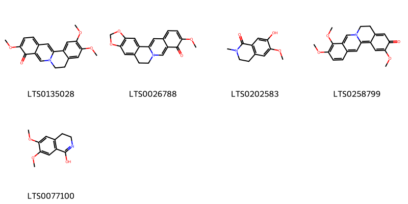{ width=100% }
    <figcaption>Hình ảnh cấu trúc hóa học của 5 hoạt chất thuộc nhóm Isoquinolines and derivatives gồm ['3,10,11-trimethoxy-7,8-dihydro-6-azatetraphen-4-one (LTS0135028)', '17-methoxy-5,7-dioxa-13-azapentacyclo[11.8.0.0²,¹⁰.0⁴,⁸.0¹⁵,²⁰]henicosa-1(21),2,4(8),9,14,17,19-heptaen-16-one (LTS0026788)', 'thalifolin (LTS0202583)', '3,4,11-trimethoxy-7,8-dihydro-6-azatetraphen-10-one (LTS0258799)', '6,7-dimethoxy-3,4-dihydroisoquinolin-1-ol (LTS0077100)'].</figcaption>
</figure>
#### Nhóm Naphthopyrans
<figure markdown="span">
    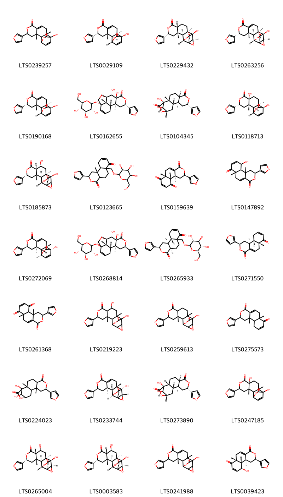{ width=100% }
    <figcaption>Hình ảnh cấu trúc hóa học của 28 hoạt chất thuộc nhóm Naphthopyrans gồm ['5-(furan-3-yl)-12-hydroxy-3,11-dimethyl-6,14-dioxatetracyclo[10.2.2.0²,¹¹.0³,⁸]hexadeca-8,15-diene-7,13-dione (LTS0239257)', '(1r,2s,3s,5r,11r,12r)-5-(furan-3-yl)-12-hydroxy-3,11-dimethyl-6,14-dioxatetracyclo[10.2.2.0²,¹¹.0³,⁸]hexadeca-8,15-diene-7,13-dione (LTS0029109)', 'chasmanthin (LTS0229432)', '(1s,2s,3s,5r,11r,12s,13s,15s)-5-(furan-3-yl)-12-hydroxy-3,11-dimethyl-6,14,16-trioxapentacyclo[10.3.2.0²,¹¹.0³,⁸.0¹³,¹⁵]heptadec-8-ene-7,17-dione (LTS0263256)', '(1r,3s,5r,11r,12r)-5-(furan-3-yl)-12-hydroxy-3,11-dimethyl-6,14-dioxatetracyclo[10.2.2.0²,¹¹.0³,⁸]hexadeca-8,15-diene-7,13-dione (LTS0190168)', '(1s,2s,4s,7s,8s,9s,12s,16s)-4-(furan-3-yl)-7,8-dihydroxy-2,16-dimethyl-12-{[(2s,3r,4s,5s,6r)-3,4,5-trihydroxy-6-(hydroxymethyl)oxan-2-yl]oxy}-5,10-dioxatetracyclo[7.6.1.0²,⁷.0¹²,¹⁶]hexadec-13-en-6-one (LTS0162655)', '(1s,2r,5s,8s,10s,11s,13s,16s)-8-(furan-3-yl)-1,16-dihydroxy-2,10-dimethyl-7,14-dioxatetracyclo[11.2.1.0²,¹¹.0⁵,¹⁰]hexadecane-6,15-dione (LTS0104345)', '(1r,2s,3s,5r,8s,11r,12r)-5-(furan-3-yl)-8,12-dihydroxy-3,11-dimethyl-6,14-dioxatetracyclo[10.2.2.0²,¹¹.0³,⁸]hexadec-15-ene-7,13-dione (LTS0118713)', '(1s,2s,3s,5r,8s,9s,11r,12s,15r)-5-(furan-3-yl)-9,12-dihydroxy-3,11-dimethyl-6,14,16-trioxapentacyclo[10.3.2.0²,¹¹.0³,⁸.0¹³,¹⁵]heptadecane-7,17-dione (LTS0185873)', '2-(furan-3-yl)-10b-methyl-6a-({[3,4,5-trihydroxy-6-(hydroxymethyl)oxan-2-yl]oxy}methyl)-1h,2h,4ah,5h,6h,10h,10ah-naphtho[2,1-c]pyran-4,7-dione (LTS0123665)', '(2r,6ar,10as,10bs)-2-(furan-3-yl)-6a,10b-dimethyl-1h,2h,6h,10ah-naphtho[2,1-c]pyran-4,7,10-trione (LTS0159639)', '2-(furan-3-yl)-10-hydroxy-6a,10b-dimethyl-1h,2h,6h,10h,10ah-naphtho[2,1-c]pyran-4,7-dione (LTS0147892)', '(1s,2r,3r,5s,11s,12s)-5-(furan-3-yl)-12-hydroxy-3,11-dimethyl-6,14-dioxatetracyclo[10.2.2.0²,¹¹.0³,⁸]hexadeca-8,15-diene-7,13-dione (LTS0272069)', '(1s,2s,4r,7s,8s,9s,12r,16s)-4-(furan-3-yl)-7,8-dihydroxy-2,16-dimethyl-12-{[(2s,3r,4s,5s,6r)-3,4,5-trihydroxy-6-(hydroxymethyl)oxan-2-yl]oxy}-5,10-dioxatetracyclo[7.6.1.0²,⁷.0¹²,¹⁶]hexadec-13-en-6-one (LTS0268814)', '(2r,4ar,6ar,10as,10bs)-2-(furan-3-yl)-10b-methyl-6a-({[(2r,3r,4s,5s,6r)-3,4,5-trihydroxy-6-(hydroxymethyl)oxan-2-yl]oxy}methyl)-1h,2h,4ah,5h,6h,10h,10ah-naphtho[2,1-c]pyran-4,7-dione (LTS0265933)', '(2r,6ar,10as,10bs)-2-(furan-3-yl)-6a,10b-dimethyl-1h,2h,6h,10h,10ah-naphtho[2,1-c]pyran-4,7-dione (LTS0271550)', '2-(furan-3-yl)-6a,10b-dimethyl-1h,2h,6h,10ah-naphtho[2,1-c]pyran-4,7,10-trione (LTS0261368)', '5-(furan-3-yl)-9,12-dihydroxy-3,11-dimethyl-6,14,16-trioxapentacyclo[10.3.2.0²,¹¹.0³,⁸.0¹³,¹⁵]heptadecane-7,17-dione (LTS0219223)', 'tinosporide (LTS0259613)', '2-(furan-3-yl)-6a,10b-dimethyl-1h,2h,6h,10h,10ah-naphtho[2,1-c]pyran-4,7-dione (LTS0275573)', '8-(furan-3-yl)-1,16-dihydroxy-2,10-dimethyl-7,14-dioxatetracyclo[11.2.1.0²,¹¹.0⁵,¹⁰]hexadecane-6,15-dione (LTS0224023)', '(1r,2r,3r,5s,11s,12r,13r,15r)-5-(furan-3-yl)-12-hydroxy-3,11-dimethyl-6,14,16-trioxapentacyclo[10.3.2.0²,¹¹.0³,⁸.0¹³,¹⁵]heptadec-8-ene-7,17-dione (LTS0233744)', '(1s,2r,5s,8s,10s,11r,13s,16r)-8-(furan-3-yl)-1,16-dihydroxy-10-methyl-7,14-dioxatetracyclo[11.2.1.0²,¹¹.0⁵,¹⁰]hexadecane-6,15-dione (LTS0273890)', '5-(furan-3-yl)-8,12-dihydroxy-3,11-dimethyl-6,14-dioxatetracyclo[10.2.2.0²,¹¹.0³,⁸]hexadec-15-ene-7,13-dione (LTS0247185)', '(1s,2s,3s,5r,8s,9s,11r,12s,13s,15s)-5-(furan-3-yl)-9,12-dihydroxy-3,11-dimethyl-6,14,16-trioxapentacyclo[10.3.2.0²,¹¹.0³,⁸.0¹³,¹⁵]heptadecane-7,17-dione (LTS0265004)', '(1s,2s,3s,5r,8s,9s,11r,12s,13s,15r)-5-(furan-3-yl)-9,12-dihydroxy-3,11-dimethyl-6,14,16-trioxapentacyclo[10.3.2.0²,¹¹.0³,⁸.0¹³,¹⁵]heptadecane-7,17-dione (LTS0003583)', '5-(furan-3-yl)-12-hydroxy-3,11-dimethyl-6,14,16-trioxapentacyclo[10.3.2.0²,¹¹.0³,⁸.0¹³,¹⁵]heptadec-8-ene-7,17-dione (LTS0241988)', '(2r,6ar,10s,10as,10bs)-2-(furan-3-yl)-10-hydroxy-6a,10b-dimethyl-1h,2h,6h,10h,10ah-naphtho[2,1-c]pyran-4,7-dione (LTS0039423)'].</figcaption>
</figure>
#### Nhóm Organooxygen compounds
<figure markdown="span">
    { width=100% }
    <figcaption>Hình ảnh cấu trúc hóa học của 1 hoạt chất thuộc nhóm Organooxygen compounds gồm ['p-hydroxybenzaldehyde (LTS0259836)'].</figcaption>
</figure>
#### Nhóm Phenols
<figure markdown="span">
    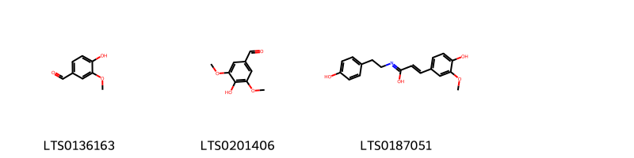{ width=100% }
    <figcaption>Hình ảnh cấu trúc hóa học của 3 hoạt chất thuộc nhóm Phenols gồm ['vanillin (LTS0136163)', 'syringaldehyde (LTS0201406)', '(2e)-3-(4-hydroxy-3-methoxyphenyl)-n-[2-(4-hydroxyphenyl)ethyl]prop-2-enimidic acid (LTS0187051)'].</figcaption>
</figure>
#### Nhóm Prenol lipids
<figure markdown="span">
    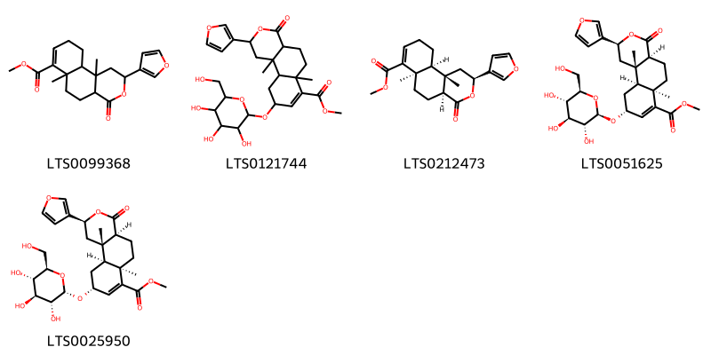{ width=100% }
    <figcaption>Hình ảnh cấu trúc hóa học của 5 hoạt chất thuộc nhóm Prenol lipids gồm ['methyl 2-(furan-3-yl)-6a,10b-dimethyl-4-oxo-1h,2h,4ah,5h,6h,9h,10h,10ah-naphtho[2,1-c]pyran-7-carboxylate (LTS0099368)', 'methyl 2-(furan-3-yl)-6a,10b-dimethyl-4-oxo-9-{[3,4,5-trihydroxy-6-(hydroxymethyl)oxan-2-yl]oxy}-1h,2h,4ah,5h,6h,9h,10h,10ah-naphtho[2,1-c]pyran-7-carboxylate (LTS0121744)', 'methyl (2s,4as,6ar,10as,10bs)-2-(furan-3-yl)-6a,10b-dimethyl-4-oxo-1h,2h,4ah,5h,6h,9h,10h,10ah-naphtho[2,1-c]pyran-7-carboxylate (LTS0212473)', 'methyl (2s,4as,6ar,9r,10as,10bs)-2-(furan-3-yl)-6a,10b-dimethyl-4-oxo-9-{[(2r,3r,4s,5s,6r)-3,4,5-trihydroxy-6-(hydroxymethyl)oxan-2-yl]oxy}-1h,2h,4ah,5h,6h,9h,10h,10ah-naphtho[2,1-c]pyran-7-carboxylate (LTS0051625)', 'methyl (2s,4as,6ar,9r,10as,10bs)-2-(furan-3-yl)-6a,10b-dimethyl-4-oxo-9-{[(2s,3r,4s,5s,6r)-3,4,5-trihydroxy-6-(hydroxymethyl)oxan-2-yl]oxy}-1h,2h,4ah,5h,6h,9h,10h,10ah-naphtho[2,1-c]pyran-7-carboxylate (LTS0025950)'].</figcaption>
</figure>
#### Nhóm Protoberberine alkaloids and derivatives
<figure markdown="span">
    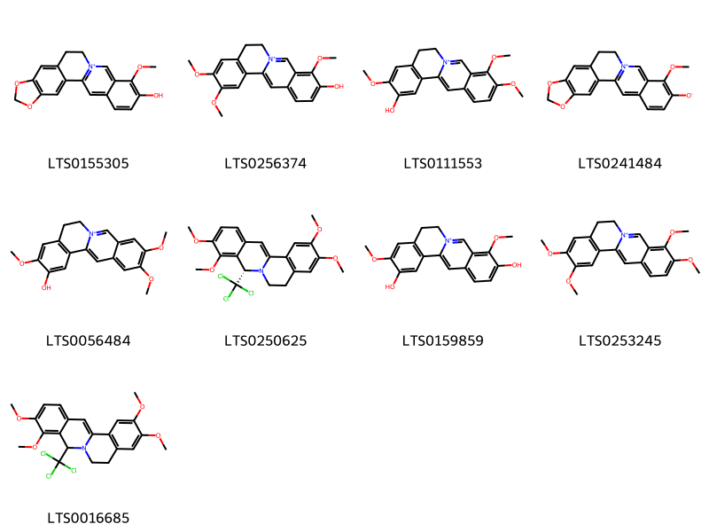{ width=100% }
    <figcaption>Hình ảnh cấu trúc hóa học của 9 hoạt chất thuộc nhóm Protoberberine alkaloids and derivatives gồm ['17-hydroxy-16-methoxy-5,7-dioxa-13λ⁵-azapentacyclo[11.8.0.0²,¹⁰.0⁴,⁸.0¹⁵,²⁰]henicosa-1(13),2,4(8),9,14,16,18,20-octaen-13-ylium (LTS0155305)', 'dehydrocorydalmine (LTS0256374)', 'columbamine (LTS0111553)', '16-methoxy-5,7-dioxa-13λ⁵-azapentacyclo[11.8.0.0²,¹⁰.0⁴,⁸.0¹⁵,²⁰]henicosa-1(13),2,4(8),9,14,16,18,20-octaen-13-ylium-17-olate (LTS0241484)', 'pseudocolumbamine (LTS0056484)', '(5s)-3,4,10,11-tetramethoxy-5-(trichloromethyl)-7,8-dihydro-5h-6-azatetraphene (LTS0250625)', '3,11-dihydroxy-4,10-dimethoxy-7,8-dihydro-6λ⁵-azatetraphen-6-ylium (LTS0159859)', 'palmatine (LTS0253245)', '3,4,10,11-tetramethoxy-5-(trichloromethyl)-7,8-dihydro-5h-6-azatetraphene (LTS0016685)'].</figcaption>
</figure>
#### Nhóm Steroids and steroid derivatives
<figure markdown="span">
    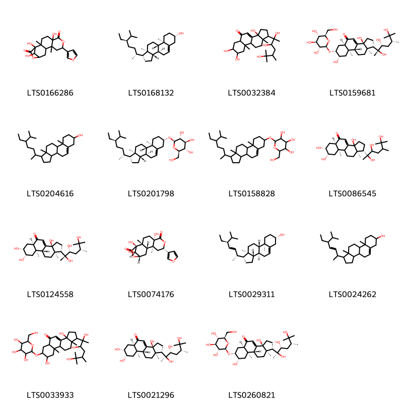{ width=100% }
    <figcaption>Hình ảnh cấu trúc hóa học của 15 hoạt chất thuộc nhóm Steroids and steroid derivatives gồm ['8-(furan-3-yl)-1,5,16-trihydroxy-2,10-dimethyl-7,14-dioxatetracyclo[11.2.1.0²,¹¹.0⁵,¹⁰]hexadecane-6,15-dione (LTS0166286)', 'sitosterol (LTS0168132)', '3a,7,8-trihydroxy-9a,11a-dimethyl-1-(2,3,6-trihydroxy-5,6-dimethylheptan-2-yl)-1h,2h,3h,5ah,6h,7h,8h,9h,9bh,10h,11h-cyclopenta[a]phenanthren-5-one (LTS0032384)', '(1s,3as,5ar,7r,8s,9ar,9br,11ar)-3a,8-dihydroxy-9a,11a-dimethyl-1-[(2r,3r,5r)-2,3,6-trihydroxy-5,6-dimethylheptan-2-yl]-7-{[(2r,3r,4s,5s,6r)-3,4,5-trihydroxy-6-(hydroxymethyl)oxan-2-yl]oxy}-1h,2h,3h,5ah,6h,7h,8h,9h,9bh,10h,11h-cyclopenta[a]phenanthren-5-one (LTS0159681)', 'stigmast-5-en-3-ol, (3β)- (LTS0204616)', 'sitogluside (LTS0201798)', '2-{[1-(5-ethyl-6-methylheptan-2-yl)-9a,11a-dimethyl-1h,2h,3h,3ah,3bh,4h,6h,7h,8h,9h,9bh,10h,11h-cyclopenta[a]phenanthren-7-yl]oxy}-6-(hydroxymethyl)oxane-3,4,5-triol (LTS0158828)', '(1s,5ar,7r,8s,9ar,11ar)-3a,7,8-trihydroxy-9a,11a-dimethyl-1-(2,3,6-trihydroxy-5,6-dimethylheptan-2-yl)-1h,2h,3h,5ah,6h,7h,8h,9h,9bh,10h,11h-cyclopenta[a]phenanthren-5-one (LTS0086545)', 'makisterone a (LTS0124558)', '(1s,2r,5s,8s,10s,11s,13s,16s)-8-(furan-3-yl)-1,5,16-trihydroxy-2,10-dimethyl-7,14-dioxatetracyclo[11.2.1.0²,¹¹.0⁵,¹⁰]hexadecane-6,15-dione (LTS0074176)', 'phytosterol (LTS0029311)', 'stigmasterol (LTS0024262)', '3a,8-dihydroxy-9a,11a-dimethyl-1-(2,3,6-trihydroxy-5,6-dimethylheptan-2-yl)-7-{[3,4,5-trihydroxy-6-(hydroxymethyl)oxan-2-yl]oxy}-1h,2h,3h,5ah,6h,7h,8h,9h,9bh,10h,11h-cyclopenta[a]phenanthren-5-one (LTS0033933)', '(1s,3as,5ar,7r,8s,9ar,9br,11ar)-3a,7,8-trihydroxy-9a,11a-dimethyl-1-[(2s,3r,5r)-2,3,6-trihydroxy-5,6-dimethylheptan-2-yl]-1h,2h,3h,5ah,6h,7h,8h,9h,9bh,10h,11h-cyclopenta[a]phenanthren-5-one (LTS0021296)', '(1s,3as,5ar,7r,8s,9ar,9br,11ar)-3a,8-dihydroxy-9a,11a-dimethyl-1-[(2s,3r,5r)-2,3,6-trihydroxy-5,6-dimethylheptan-2-yl]-7-{[(2r,3r,4s,5s,6r)-3,4,5-trihydroxy-6-(hydroxymethyl)oxan-2-yl]oxy}-1h,2h,3h,5ah,6h,7h,8h,9h,9bh,10h,11h-cyclopenta[a]phenanthren-5-one (LTS0260821)'].</figcaption>
</figure>

---

### Dược dân tộc học

Danh sách các quốc gia có sử dụng *Fibraurea tinctoria* trong điều trị các bệnh. 

| Country   | Disease   | Bệnh                                                                                                                                                                                                |
|:----------|:----------|:----------------------------------------------------------------------------------------------------------------------------------------------------------------------------------------------------|
| Elsewhere | Tonic     | MYMEMORY WARNING: YOU USED ALL AVAILABLE FREE TRANSLATIONS FOR TODAY. NEXT AVAILABLE IN  18 HOURS 58 MINUTES 29 SECONDS VISIT HTTPS://MYMEMORY.TRANSLATED.NET/DOC/USAGELIMITS.PHP TO TRANSLATE MORE |

---

# Chi Curarea

??? note "Danh sách các dược liệu thuộc chi"
    
	 - *Curarea tecunarum*

---
## Curarea tecunarum
### Thông tin về thực vật

!!! info "Phân loại thực vật của *Curarea tecunarum* từ GIBF:"
    - **Kingdom:** Plantae
    - **Phylum:** Tracheophyta
    - **Order:** Ranunculales
    - **Family:** Menispermaceae
    - **Genus:** Curarea
    - **Species:** *Curarea tecunarum*

 

| Label (VI)   | Label (EN)   | Scientific Name   | Descriptions (VI)   | Descriptions (EN)   | Also Known As (VI)   | Also Known As (EN)   |
|:-------------|:-------------|:------------------|:--------------------|:--------------------|:---------------------|:---------------------|
| N/A          | N/A          | Curarea tecunarum | loài thực vật       | species of plant    | ['']                 | ['']                 |

#### Phân bố trên thế giới

**Từ CSDL GIBF** nan, Ecuador, Colombia, Brazil, Peru, Venezuela (Bolivarian Republic of)

#### Phân bố tại Việt Nam

**Từ CSDL GIBF**: Không có ghi nhận ở Việt Nam

---
### Thành phần hóa học
        
- Theo cơ sở dữ liệu lotus: Từ loài *Curarea tecunarum* đã phân lập và xác định được Chưa có hoạt chất nào được phân lập. hoạt chất thuộc về các nhóm Không có hoạt chất nào được phân lập. 

Không có hình ảnh nào được tạo ra

---

### Dược dân tộc học

Danh sách các quốc gia có sử dụng *Curarea tecunarum* trong điều trị các bệnh. 

| Country      | Disease       | Bệnh                                                                                                                                                                                                |
|:-------------|:--------------|:----------------------------------------------------------------------------------------------------------------------------------------------------------------------------------------------------|
| Brazil       | Poison        | MYMEMORY WARNING: YOU USED ALL AVAILABLE FREE TRANSLATIONS FOR TODAY. NEXT AVAILABLE IN  18 HOURS 57 MINUTES 28 SECONDS VISIT HTTPS://MYMEMORY.TRANSLATED.NET/DOC/USAGELIMITS.PHP TO TRANSLATE MORE |
| Brazil(Deni) | Contraceptive | MYMEMORY WARNING: YOU USED ALL AVAILABLE FREE TRANSLATIONS FOR TODAY. NEXT AVAILABLE IN  18 HOURS 57 MINUTES 25 SECONDS VISIT HTTPS://MYMEMORY.TRANSLATED.NET/DOC/USAGELIMITS.PHP TO TRANSLATE MORE |

---

# Chi Chondrodendron

??? note "Danh sách các dược liệu thuộc chi"
    
	 - *Chondrodendron tomentosum*

---
## Chondrodendron tomentosum
### Thông tin về thực vật

!!! info "Phân loại thực vật của *Chondrodendron tomentosum* từ GIBF:"
    - **Kingdom:** Plantae
    - **Phylum:** Tracheophyta
    - **Order:** Ranunculales
    - **Family:** Menispermaceae
    - **Genus:** Chondrodendron
    - **Species:** *Chondrodendron tomentosum*

 

| Label (VI)   | Label (EN)   | Scientific Name           | Descriptions (VI)   | Descriptions (EN)   | Also Known As (VI)   | Also Known As (EN)           |
|:-------------|:-------------|:--------------------------|:--------------------|:--------------------|:---------------------|:-----------------------------|
| N/A          | N/A          | Chondrodendron tomentosum | loài thực vật       | species of plant    | ['']                 | ['Chondodendron tomentosum'] |

#### Phân bố trên thế giới

**Từ CSDL GIBF** nan, Ecuador, Colombia, Brazil, Bolivia (Plurinational State of), United States of America, Peru, Panama

#### Phân bố tại Việt Nam

**Từ CSDL GIBF**: Không có ghi nhận ở Việt Nam

---
### Thành phần hóa học
        
- Theo cơ sở dữ liệu lotus: Từ loài *Chondrodendron tomentosum* đã phân lập và xác định được 7 hoạt chất thuộc về các nhóm Organooxygen compounds. 

|    | chemicalTaxonomyClassyfireClass   |   smiles_count |
|---:|:----------------------------------|---------------:|
|  0 | Organooxygen compounds            |              7 |

#### Nhóm Organooxygen compounds
<figure markdown="span">
    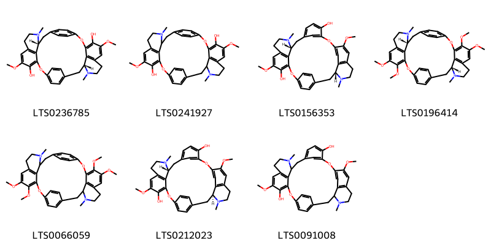{ width=100% }
    <figcaption>Hình ảnh cấu trúc hóa học của 7 hoạt chất thuộc nhóm Organooxygen compounds gồm ['isochondrodendrine (LTS0236785)', '5,20-dimethoxy-10,25-dimethyl-2,17-dioxa-10,25-diazaheptacyclo[26.2.2.2¹³,¹⁶.1³,⁷.1¹⁸,²².0¹¹,³⁶.0²⁶,³³]hexatriaconta-1(30),3,5,7(36),13,15,18,20,22(33),28,31,34-dodecaene-4,19-diol (LTS0241927)', 'curine (LTS0156353)', 'cycleanine (LTS0196414)', '4,5,19,20-tetramethoxy-10,25-dimethyl-2,17-dioxa-10,25-diazaheptacyclo[26.2.2.2¹³,¹⁶.1³,⁷.1¹⁸,²².0¹¹,³⁶.0²⁶,³³]hexatriaconta-1(30),3,5,7(36),13,15,18,20,22(33),28,31,34-dodecaene (LTS0066059)', 'chondrocurine (LTS0212023)', '10,25-dimethoxy-15,30-dimethyl-7,23-dioxa-15,30-diazaheptacyclo[22.6.2.2³,⁶.1⁸,¹².1¹⁸,²².0²⁷,³¹.0¹⁶,³⁴]hexatriaconta-3,5,8,10,12(34),18,20,22(33),24(32),25,27(31),35-dodecaene-9,21-diol (LTS0091008)'].</figcaption>
</figure>

---

### Dược dân tộc học

Danh sách các quốc gia có sử dụng *Chondrodendron tomentosum* trong điều trị các bệnh. 

| Country       | Disease                   | Bệnh                                                                                                                                                                                                |
|:--------------|:--------------------------|:----------------------------------------------------------------------------------------------------------------------------------------------------------------------------------------------------|
| Elsewhere     | Diuretic, Tonic           | MYMEMORY WARNING: YOU USED ALL AVAILABLE FREE TRANSLATIONS FOR TODAY. NEXT AVAILABLE IN  18 HOURS 57 MINUTES 00 SECONDS VISIT HTTPS://MYMEMORY.TRANSLATED.NET/DOC/USAGELIMITS.PHP TO TRANSLATE MORE |
| French        | Antiseptic                | MYMEMORY WARNING: YOU USED ALL AVAILABLE FREE TRANSLATIONS FOR TODAY. NEXT AVAILABLE IN  18 HOURS 56 MINUTES 58 SECONDS VISIT HTTPS://MYMEMORY.TRANSLATED.NET/DOC/USAGELIMITS.PHP TO TRANSLATE MORE |
| German        | Aperient, Diuretic, Tonic | MYMEMORY WARNING: YOU USED ALL AVAILABLE FREE TRANSLATIONS FOR TODAY. NEXT AVAILABLE IN  18 HOURS 56 MINUTES 54 SECONDS VISIT HTTPS://MYMEMORY.TRANSLATED.NET/DOC/USAGELIMITS.PHP TO TRANSLATE MORE |
| South America | Poison                    | MYMEMORY WARNING: YOU USED ALL AVAILABLE FREE TRANSLATIONS FOR TODAY. NEXT AVAILABLE IN  18 HOURS 56 MINUTES 52 SECONDS VISIT HTTPS://MYMEMORY.TRANSLATED.NET/DOC/USAGELIMITS.PHP TO TRANSLATE MORE |
| US            | Poison                    | MYMEMORY WARNING: YOU USED ALL AVAILABLE FREE TRANSLATIONS FOR TODAY. NEXT AVAILABLE IN  18 HOURS 56 MINUTES 49 SECONDS VISIT HTTPS://MYMEMORY.TRANSLATED.NET/DOC/USAGELIMITS.PHP TO TRANSLATE MORE |

---

# Chi Cissampelos

??? note "Danh sách các dược liệu thuộc chi"
    
	 - *Cissampelos capensis*
	 - *Cissampelos fasciculata*
	 - *Cissampelos mucronata*
	 - *Cissampelos pareira*
	 - *Cissampelos pariera*

---
## Cissampelos capensis
### Thông tin về thực vật

!!! info "Phân loại thực vật của *Cissampelos capensis* từ GIBF:"
    - **Kingdom:** Plantae
    - **Phylum:** Tracheophyta
    - **Order:** Ranunculales
    - **Family:** Menispermaceae
    - **Genus:** Cissampelos
    - **Species:** *Cissampelos capensis*

 

| Label (VI)   | Label (EN)   | Scientific Name      | Descriptions (VI)   | Descriptions (EN)   | Also Known As (VI)   | Also Known As (EN)   |
|:-------------|:-------------|:---------------------|:--------------------|:--------------------|:---------------------|:---------------------|
| N/A          | N/A          | Cissampelos capensis | loài thực vật       | species of plant    | ['']                 | ['']                 |

#### Phân bố trên thế giới

**Từ CSDL GIBF** Namibia, South Africa

#### Phân bố tại Việt Nam

**Từ CSDL GIBF**: Không có ghi nhận ở Việt Nam

---
### Thành phần hóa học
        
- Theo cơ sở dữ liệu lotus: Từ loài *Cissampelos capensis* đã phân lập và xác định được 29 hoạt chất thuộc về các nhóm Proaporphines, Phenanthrenes and derivatives, Aporphines, Organooxygen compounds, Isoquinolines and derivatives. 

|    | chemicalTaxonomyClassyfireClass   |   smiles_count |
|---:|:----------------------------------|---------------:|
|  0 | Aporphines                        |             11 |
|  1 | Isoquinolines and derivatives     |              2 |
|  2 | Organooxygen compounds            |              7 |
|  3 | Phenanthrenes and derivatives     |              3 |
|  4 | Proaporphines                     |              6 |

#### Nhóm Aporphines
<figure markdown="span">
    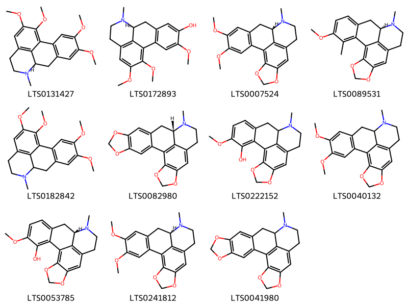{ width=100% }
    <figcaption>Hình ảnh cấu trúc hóa học của 11 hoạt chất thuộc nhóm Aporphines gồm ['(9r)-4,5,15,16-tetramethoxy-10-methyl-10-azatetracyclo[7.7.1.0²,⁷.0¹³,¹⁷]heptadeca-1(16),2(7),3,5,13(17),14-hexaene (LTS0131427)', '(9s)-4,15,16-trimethoxy-10-methyl-10-azatetracyclo[7.7.1.0²,⁷.0¹³,¹⁷]heptadeca-1(16),2(7),3,5,13(17),14-hexaen-5-ol (LTS0172893)', '(12s)-16,17-dimethoxy-11-methyl-3,5-dioxa-11-azapentacyclo[10.7.1.0²,⁶.0⁸,²⁰.0¹⁴,¹⁹]icosa-1,6,8(20),14(19),15,17-hexaene (LTS0007524)', '(12r)-17-methoxy-11,18-dimethyl-3,5-dioxa-11-azapentacyclo[10.7.1.0²,⁶.0⁸,²⁰.0¹⁴,¹⁹]icosa-1,6,8(20),14,16,18-hexaene (LTS0089531)', '4,5,15,16-tetramethoxy-10-methyl-10-azatetracyclo[7.7.1.0²,⁷.0¹³,¹⁷]heptadeca-1(16),2(7),3,5,13(17),14-hexaene (LTS0182842)', 'neolitsine (LTS0082980)', 'bulbocapnine (LTS0222152)', '16,17-dimethoxy-11-methyl-3,5-dioxa-11-azapentacyclo[10.7.1.0²,⁶.0⁸,²⁰.0¹⁴,¹⁹]icosa-1,6,8(20),14(19),15,17-hexaene (LTS0040132)', '(12s)-17-methoxy-11-methyl-3,5-dioxa-11-azapentacyclo[10.7.1.0²,⁶.0⁸,²⁰.0¹⁴,¹⁹]icosa-1,6,8(20),14,16,18-hexaen-18-ol (LTS0053785)', '(12r)-16,17-dimethoxy-11-methyl-3,5-dioxa-11-azapentacyclo[10.7.1.0²,⁶.0⁸,²⁰.0¹⁴,¹⁹]icosa-1,6,8(20),14(19),15,17-hexaene (LTS0241812)', '13-methyl-5,7,19,21-tetraoxa-13-azahexacyclo[10.10.1.0²,¹⁰.0⁴,⁸.0¹⁶,²³.0¹⁸,²²]tricosa-1(23),2,4(8),9,16,18(22)-hexaene (LTS0041980)'].</figcaption>
</figure>
#### Nhóm Isoquinolines and derivatives
<figure markdown="span">
    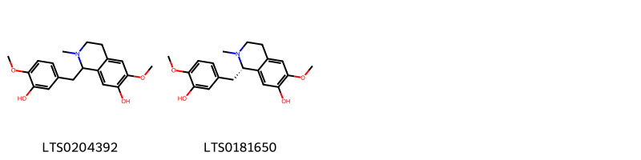{ width=100% }
    <figcaption>Hình ảnh cấu trúc hóa học của 2 hoạt chất thuộc nhóm Isoquinolines and derivatives gồm ['reticuline (LTS0204392)', '(+,-)-reticuline (LTS0181650)'].</figcaption>
</figure>
#### Nhóm Organooxygen compounds
<figure markdown="span">
    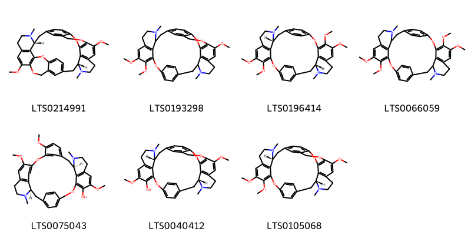{ width=100% }
    <figcaption>Hình ảnh cấu trúc hóa học của 7 hoạt chất thuộc nhóm Organooxygen compounds gồm ['(1r,17r)-27,38-dimethoxy-16,32-dimethyl-9,25,35,39-tetraoxa-16,32-diazanonacyclo[20.10.3.2¹⁰,¹³.1³,⁷.1⁶,¹¹.1¹⁹,²³.0¹²,¹⁷.0²⁶,³⁴.0²⁹,³³]tetraconta-3,5,7(40),10,12,19,21,23(36),26(34),27,29(33),37-dodecaene (LTS0214991)', '9,10,26-trimethoxy-15,31-dimethyl-7,24,34-trioxa-15,31-diazaoctacyclo[19.10.3.2³,⁶.1⁸,¹².1¹⁸,²².0²⁵,³³.0²⁸,³².0¹⁶,³⁶]octatriaconta-3,5,8,10,12(36),18,20,22(35),25(33),26,28(32),37-dodecaene (LTS0193298)', 'cycleanine (LTS0196414)', '4,5,19,20-tetramethoxy-10,25-dimethyl-2,17-dioxa-10,25-diazaheptacyclo[26.2.2.2¹³,¹⁶.1³,⁷.1¹⁸,²².0¹¹,³⁶.0²⁶,³³]hexatriaconta-1(30),3,5,7(36),13,15,18,20,22(33),28,31,34-dodecaene (LTS0066059)', '(1r,16r)-10,21,25-trimethoxy-15,30-dimethyl-7,23-dioxa-15,30-diazaheptacyclo[22.6.2.2³,⁶.1⁸,¹².1¹⁸,²².0²⁷,³¹.0¹⁶,³⁴]hexatriaconta-3,5,8,10,12(34),18,20,22(33),24(32),25,27(31),35-dodecaen-9-ol (LTS0075043)', '(1r,16r)-10,26-dimethoxy-15,31-dimethyl-7,24,34-trioxa-15,31-diazaoctacyclo[19.10.3.2³,⁶.1⁸,¹².1¹⁸,²².0²⁵,³³.0²⁸,³².0¹⁶,³⁶]octatriaconta-3,5,8,10,12(36),18,20,22(35),25(33),26,28(32),37-dodecaen-9-ol (LTS0040412)', 'insularine (LTS0105068)'].</figcaption>
</figure>
#### Nhóm Phenanthrenes and derivatives
<figure markdown="span">
    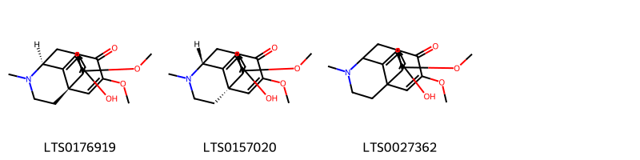{ width=100% }
    <figcaption>Hình ảnh cấu trúc hóa học của 3 hoạt chất thuộc nhóm Phenanthrenes and derivatives gồm ['(-)-salutaridine (LTS0176919)', 'salutaridine (LTS0157020)', '3-hydroxy-4,13-dimethoxy-17-methyl-17-azatetracyclo[7.5.3.0¹,¹⁰.0²,⁷]heptadeca-2,4,6,10,13-pentaen-12-one (LTS0027362)'].</figcaption>
</figure>
#### Nhóm Proaporphines
<figure markdown="span">
    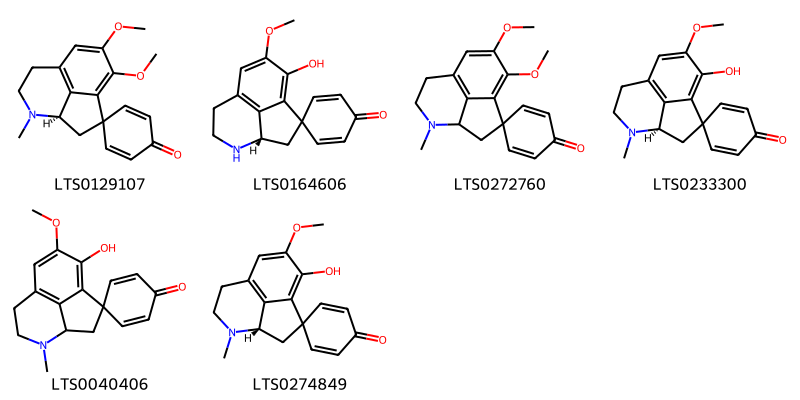{ width=100% }
    <figcaption>Hình ảnh cấu trúc hóa học của 6 hoạt chất thuộc nhóm Proaporphines gồm ['pronuciferine (LTS0129107)', "(4's)-11'-hydroxy-10'-methoxy-5'-azaspiro[cyclohexane-1,2'-tricyclo[6.3.1.0⁴,¹²]dodecane]-1'(11'),2,5,8'(12'),9'-pentaen-4-one (LTS0164606)", "10',11'-dimethoxy-5'-methyl-5'-azaspiro[cyclohexane-1,2'-tricyclo[6.3.1.0⁴,¹²]dodecane]-1'(11'),2,5,8'(12'),9'-pentaen-4-one (LTS0272760)", 'glaziovine (LTS0233300)', "11'-hydroxy-10'-methoxy-5'-methyl-5'-azaspiro[cyclohexane-1,2'-tricyclo[6.3.1.0⁴,¹²]dodecane]-1'(11'),2,5,8'(12'),9'-pentaen-4-one (LTS0040406)", "(4's)-11'-hydroxy-10'-methoxy-5'-methyl-5'-azaspiro[cyclohexane-1,2'-tricyclo[6.3.1.0⁴,¹²]dodecane]-1'(11'),2,5,8'(12'),9'-pentaen-4-one (LTS0274849)"].</figcaption>
</figure>

---

### Dược dân tộc học

Danh sách các quốc gia có sử dụng *Cissampelos capensis* trong điều trị các bệnh. 

| Country   | Disease          | Bệnh                                                                                                                                                                                                |
|:----------|:-----------------|:----------------------------------------------------------------------------------------------------------------------------------------------------------------------------------------------------|
| Africa    | Emetic, Laxative | MYMEMORY WARNING: YOU USED ALL AVAILABLE FREE TRANSLATIONS FOR TODAY. NEXT AVAILABLE IN  18 HOURS 56 MINUTES 24 SECONDS VISIT HTTPS://MYMEMORY.TRANSLATED.NET/DOC/USAGELIMITS.PHP TO TRANSLATE MORE |

---

---
## Cissampelos fasciculata
### Thông tin về thực vật

!!! info "Phân loại thực vật của *Cissampelos fasciculata* từ GIBF:"
    - **Kingdom:** Plantae
    - **Phylum:** Tracheophyta
    - **Order:** Ranunculales
    - **Family:** Menispermaceae
    - **Genus:** Cissampelos
    - **Species:** *Cissampelos fasciculata*

 

| Label (VI)   | Label (EN)   | Scientific Name         | Descriptions (VI)   | Descriptions (EN)   | Also Known As (VI)   | Also Known As (EN)   |
|:-------------|:-------------|:------------------------|:--------------------|:--------------------|:---------------------|:---------------------|
| N/A          | N/A          | Cissampelos fasciculata | loài thực vật       | species of plant    | ['']                 | ['']                 |

#### Phân bố trên thế giới

**Từ CSDL GIBF** nan, Ecuador, Panama, Colombia, Brazil, Guatemala, Costa Rica, Guyana, Honduras, Peru, Mexico, El Salvador, Venezuela (Bolivarian Republic of), French Guiana

#### Phân bố tại Việt Nam

**Từ CSDL GIBF**: Không có ghi nhận ở Việt Nam

---
### Thành phần hóa học
        
- Theo cơ sở dữ liệu lotus: Từ loài *Cissampelos fasciculata* đã phân lập và xác định được 5 hoạt chất thuộc về các nhóm Aporphines, Organooxygen compounds. 

|    | chemicalTaxonomyClassyfireClass   |   smiles_count |
|---:|:----------------------------------|---------------:|
|  0 | Aporphines                        |              2 |
|  1 | Organooxygen compounds            |              3 |

#### Nhóm Aporphines
<figure markdown="span">
    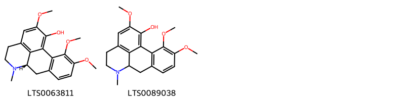{ width=100% }
    <figcaption>Hình ảnh cấu trúc hóa học của 2 hoạt chất thuộc nhóm Aporphines gồm ['(9s)-3,4,15-trimethoxy-10-methyl-10-azatetracyclo[7.7.1.0²,⁷.0¹³,¹⁷]heptadeca-1(16),2(7),3,5,13(17),14-hexaen-16-ol (LTS0063811)', '3,4,15-trimethoxy-10-methyl-10-azatetracyclo[7.7.1.0²,⁷.0¹³,¹⁷]heptadeca-1(16),2(7),3,5,13(17),14-hexaen-16-ol (LTS0089038)'].</figcaption>
</figure>
#### Nhóm Organooxygen compounds
<figure markdown="span">
    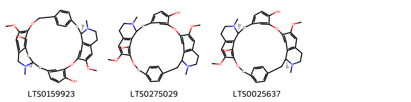{ width=100% }
    <figcaption>Hình ảnh cấu trúc hóa học của 3 hoạt chất thuộc nhóm Organooxygen compounds gồm ['(1r,15r)-24,35-dimethoxy-14,29-dimethyl-8,22-dioxa-14,29-diazaheptacyclo[21.6.2.2³,⁶.2⁹,¹².1¹¹,¹⁵.1¹⁷,²¹.0²⁶,³⁰]heptatriaconta-3,5,9,11,17,19,21(32),23(31),24,26(30),34,36-dodecaene-10,20-diol (LTS0159923)', '25,35-dimethoxy-15,30-dimethyl-8,23-dioxa-15,30-diazaheptacyclo[22.6.2.2³,⁶.2⁹,¹².1¹⁸,²².0¹¹,¹⁶.0²⁷,³¹]heptatriaconta-3,5,9,11,18,20,22(33),24(32),25,27(31),34,36-dodecaene-10,21-diol (LTS0275029)', '(1s,16s)-25,35-dimethoxy-15,30-dimethyl-8,23-dioxa-15,30-diazaheptacyclo[22.6.2.2³,⁶.2⁹,¹².1¹⁸,²².0¹¹,¹⁶.0²⁷,³¹]heptatriaconta-3,5,9,11,18,20,22(33),24(32),25,27(31),34,36-dodecaene-10,21-diol (LTS0025637)'].</figcaption>
</figure>

---

### Dược dân tộc học

Danh sách các quốc gia có sử dụng *Cissampelos fasciculata* trong điều trị các bệnh. 

| Country   | Disease                | Bệnh                                                                                                                                                                                                |
|:----------|:-----------------------|:----------------------------------------------------------------------------------------------------------------------------------------------------------------------------------------------------|
| Elsewhere | nan, Astringent, Tonic | MYMEMORY WARNING: YOU USED ALL AVAILABLE FREE TRANSLATIONS FOR TODAY. NEXT AVAILABLE IN  18 HOURS 55 MINUTES 52 SECONDS VISIT HTTPS://MYMEMORY.TRANSLATED.NET/DOC/USAGELIMITS.PHP TO TRANSLATE MORE |

---

---
## Cissampelos mucronata
### Thông tin về thực vật

!!! info "Phân loại thực vật của *Cissampelos mucronata* từ GIBF:"
    - **Kingdom:** Plantae
    - **Phylum:** Tracheophyta
    - **Order:** Ranunculales
    - **Family:** Menispermaceae
    - **Genus:** Cissampelos
    - **Species:** *Cissampelos mucronata*

 

| Label (VI)   | Label (EN)   | Scientific Name       | Descriptions (VI)   | Descriptions (EN)   | Also Known As (VI)   | Also Known As (EN)   |
|:-------------|:-------------|:----------------------|:--------------------|:--------------------|:---------------------|:---------------------|
| N/A          | N/A          | Cissampelos mucronata | loài thực vật       | species of plant    | ['']                 | ['']                 |

#### Phân bố trên thế giới

**Từ CSDL GIBF** Ghana, Angola, Mozambique, Benin, Congo, Tanzania, United Republic of, Togo, Malawi, Zambia, Senegal, Nigeria, Namibia, Congo, Democratic Republic of the, Zimbabwe, South Africa, Guinea-Bissau, Uganda, Niger, Eswatini, Burkina Faso, Kenya, Cameroon, Malaysia, Ethiopia

#### Phân bố tại Việt Nam

**Từ CSDL GIBF**: Không có ghi nhận ở Việt Nam

---
### Thành phần hóa học
        
- Theo cơ sở dữ liệu lotus: Từ loài *Cissampelos mucronata* đã phân lập và xác định được Chưa có hoạt chất nào được phân lập. hoạt chất thuộc về các nhóm Không có hoạt chất nào được phân lập. 

Không có hình ảnh nào được tạo ra

---

### Dược dân tộc học

Danh sách các quốc gia có sử dụng *Cissampelos mucronata* trong điều trị các bệnh. 

| Country     | Disease                                         | Bệnh                                                                                                                                                                                                |
|:------------|:------------------------------------------------|:----------------------------------------------------------------------------------------------------------------------------------------------------------------------------------------------------|
| Upper Volta | Abortifacient, Diuretic, Emmenagogue, Purgative | MYMEMORY WARNING: YOU USED ALL AVAILABLE FREE TRANSLATIONS FOR TODAY. NEXT AVAILABLE IN  18 HOURS 55 MINUTES 26 SECONDS VISIT HTTPS://MYMEMORY.TRANSLATED.NET/DOC/USAGELIMITS.PHP TO TRANSLATE MORE |

---

---
## Cissampelos pareira
### Thông tin về thực vật

!!! info "Phân loại thực vật của *Cissampelos pareira* từ GIBF:"
    - **Kingdom:** Plantae
    - **Phylum:** Tracheophyta
    - **Order:** Ranunculales
    - **Family:** Menispermaceae
    - **Genus:** Cissampelos
    - **Species:** *Cissampelos pareira*

 

| Label (VI)   | Label (EN)   | Scientific Name     | Descriptions (VI)   | Descriptions (EN)   | Also Known As (VI)   | Also Known As (EN)   |
|:-------------|:-------------|:--------------------|:--------------------|:--------------------|:---------------------|:---------------------|
| N/A          | N/A          | Cissampelos pareira | loài thực vật       | species of plant    | ['']                 | ['']                 |

#### Phân bố trên thế giới

**Từ CSDL GIBF** Virgin Islands (U.S.), Argentina, Nicaragua, Tanzania, United Republic of, Venezuela (Bolivarian Republic of), Panama, Puerto Rico, Chinese Taipei, Bolivia (Plurinational State of), Jamaica, Uruguay, Martinique, Brazil, Cuba, Dominican Republic, Mexico, Mayotte, Ecuador, Madagascar, Haiti, Colombia, Montserrat, India, Cayman Islands, Nepal

#### Phân bố tại Việt Nam

**Từ CSDL GIBF**: Không có ghi nhận ở Việt Nam

---
### Thành phần hóa học
        
- Theo cơ sở dữ liệu lotus: Từ loài *Cissampelos pareira* đã phân lập và xác định được 36 hoạt chất thuộc về các nhóm Aporphines, 2-arylbenzofuran flavonoids, Organooxygen compounds, 1-azafluoranthenes, Isoquinolines and derivatives, Protoberberine alkaloids and derivatives. 

|    | chemicalTaxonomyClassyfireClass          |   smiles_count |
|---:|:-----------------------------------------|---------------:|
|  0 | 1-azafluoranthenes                       |              1 |
|  1 | 2-arylbenzofuran flavonoids              |              2 |
|  2 | Aporphines                               |              8 |
|  3 | Isoquinolines and derivatives            |             12 |
|  4 | Organooxygen compounds                   |             11 |
|  5 | Protoberberine alkaloids and derivatives |              1 |

#### Nhóm 1-azafluoranthenes
<figure markdown="span">
    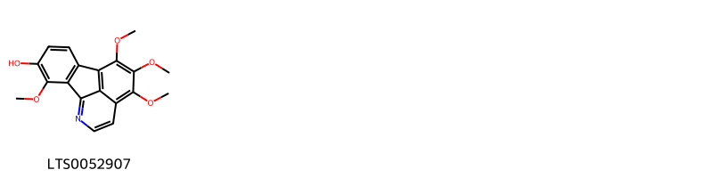{ width=100% }
    <figcaption>Hình ảnh cấu trúc hóa học của 1 hoạt chất thuộc nhóm 1-azafluoranthenes gồm ['6,7,8,14-tetramethoxy-2-azatetracyclo[7.6.1.0⁵,¹⁶.0¹⁰,¹⁵]hexadeca-1,3,5,7,9(16),10(15),11,13-octaen-13-ol (LTS0052907)'].</figcaption>
</figure>
#### Nhóm 2-arylbenzofuran flavonoids
<figure markdown="span">
    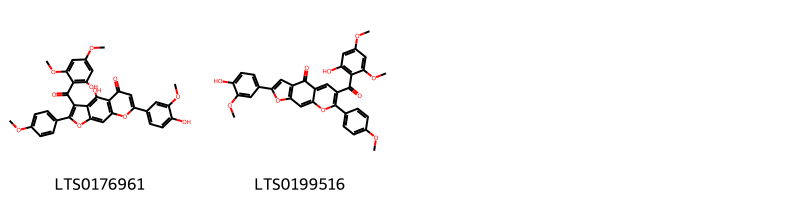{ width=100% }
    <figcaption>Hình ảnh cấu trúc hóa học của 2 hoạt chất thuộc nhóm 2-arylbenzofuran flavonoids gồm ['4-hydroxy-7-(4-hydroxy-3-methoxyphenyl)-3-(2-hydroxy-4,6-dimethoxybenzoyl)-2-(4-methoxyphenyl)furo[3,2-g]chromen-5-one (LTS0176961)', '2-(4-hydroxy-3-methoxyphenyl)-6-(2-hydroxy-4,6-dimethoxybenzoyl)-7-(4-methoxyphenyl)furo[3,2-g]chromen-4-one (LTS0199516)'].</figcaption>
</figure>
#### Nhóm Aporphines
<figure markdown="span">
    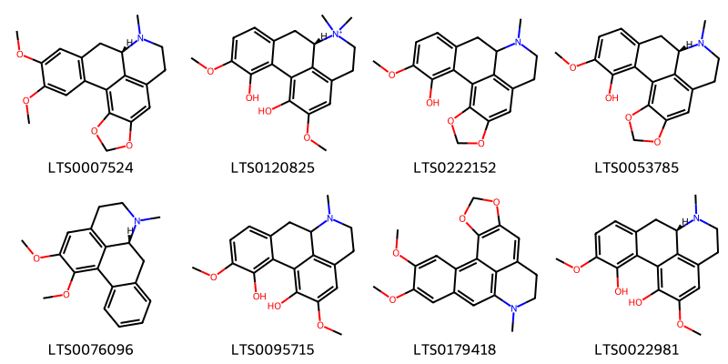{ width=100% }
    <figcaption>Hình ảnh cấu trúc hóa học của 8 hoạt chất thuộc nhóm Aporphines gồm ['(12s)-16,17-dimethoxy-11-methyl-3,5-dioxa-11-azapentacyclo[10.7.1.0²,⁶.0⁸,²⁰.0¹⁴,¹⁹]icosa-1,6,8(20),14(19),15,17-hexaene (LTS0007524)', 'magnoflorine (LTS0120825)', 'bulbocapnine (LTS0222152)', '(12s)-17-methoxy-11-methyl-3,5-dioxa-11-azapentacyclo[10.7.1.0²,⁶.0⁸,²⁰.0¹⁴,¹⁹]icosa-1,6,8(20),14,16,18-hexaen-18-ol (LTS0053785)', 'nuciferine (LTS0076096)', '4,15-dimethoxy-10-methyl-10-azatetracyclo[7.7.1.0²,⁷.0¹³,¹⁷]heptadeca-1(16),2,4,6,13(17),14-hexaene-3,16-diol (LTS0095715)', '16,17-dimethoxy-11-methyl-3,5-dioxa-11-azapentacyclo[10.7.1.0²,⁶.0⁸,²⁰.0¹⁴,¹⁹]icosa-1(20),2(6),7,12,14(19),15,17-heptaene (LTS0179418)', '(9s)-4,15-dimethoxy-10-methyl-10-azatetracyclo[7.7.1.0²,⁷.0¹³,¹⁷]heptadeca-1(16),2,4,6,13(17),14-hexaene-3,16-diol (LTS0022981)'].</figcaption>
</figure>
#### Nhóm Isoquinolines and derivatives
<figure markdown="span">
    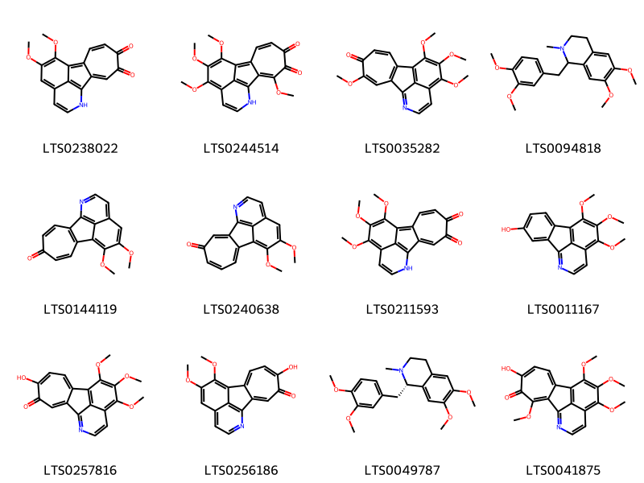{ width=100% }
    <figcaption>Hình ảnh cấu trúc hóa học của 12 hoạt chất thuộc nhóm Isoquinolines and derivatives gồm ['15,16-dimethoxy-10-azatetracyclo[7.7.1.0²,⁸.0¹³,¹⁷]heptadeca-1,3,7,9(17),11,13,15-heptaene-5,6-dione (LTS0238022)', '7,14,15,16-tetramethoxy-10-azatetracyclo[7.7.1.0²,⁸.0¹³,¹⁷]heptadeca-1,3,7,9(17),11,13,15-heptaene-5,6-dione (LTS0244514)', '6,14,15,16-tetramethoxy-10-azatetracyclo[7.7.1.0²,⁸.0¹³,¹⁷]heptadeca-1(16),2(8),3,6,9(17),10,12,14-octaen-5-one (LTS0035282)', 'laudanosine (LTS0094818)', '15,16-dimethoxy-10-azatetracyclo[7.7.1.0²,⁸.0¹³,¹⁷]heptadeca-1(16),2(8),3,6,9(17),10,12,14-octaen-5-one (LTS0144119)', '15,16-dimethoxy-10-azatetracyclo[7.7.1.0²,⁸.0¹³,¹⁷]heptadeca-1(16),2,4,7,9(17),10,12,14-octaen-6-one (LTS0240638)', '14,15,16-trimethoxy-10-azatetracyclo[7.7.1.0²,⁸.0¹³,¹⁷]heptadeca-1,3,7,9(17),11,13,15-heptaene-5,6-dione (LTS0211593)', '6,7,8-trimethoxy-2-azatetracyclo[7.6.1.0⁵,¹⁶.0¹⁰,¹⁵]hexadeca-1(16),2,4,6,8,10,12,14-octaen-13-ol (LTS0011167)', '5-hydroxy-14,15,16-trimethoxy-10-azatetracyclo[7.7.1.0²,⁸.0¹³,¹⁷]heptadeca-1(16),2,4,7,9(17),10,12,14-octaen-6-one (LTS0257816)', '5-hydroxy-15,16-dimethoxy-10-azatetracyclo[7.7.1.0²,⁸.0¹³,¹⁷]heptadeca-1(16),2,4,7,9(17),10,12,14-octaen-6-one (LTS0256186)', 'laudanosine (LTS0049787)', '5-hydroxy-7,14,15,16-tetramethoxy-10-azatetracyclo[7.7.1.0²,⁸.0¹³,¹⁷]heptadeca-1(16),2,4,7,9(17),10,12,14-octaen-6-one (LTS0041875)'].</figcaption>
</figure>
#### Nhóm Organooxygen compounds
<figure markdown="span">
    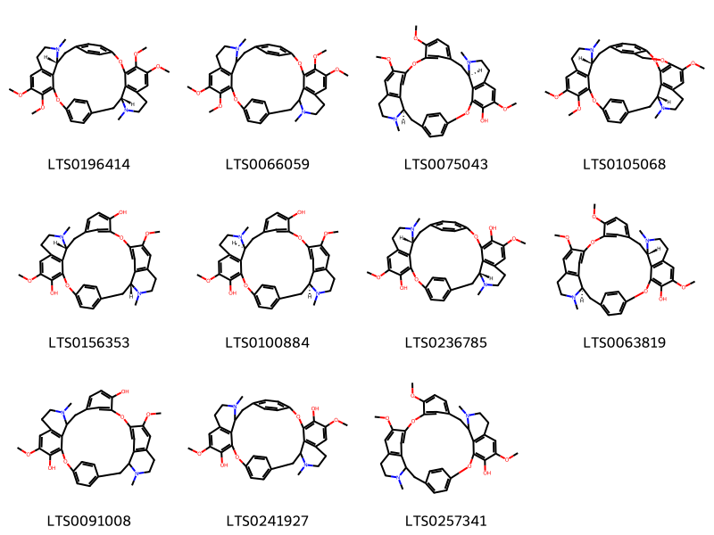{ width=100% }
    <figcaption>Hình ảnh cấu trúc hóa học của 11 hoạt chất thuộc nhóm Organooxygen compounds gồm ['cycleanine (LTS0196414)', '4,5,19,20-tetramethoxy-10,25-dimethyl-2,17-dioxa-10,25-diazaheptacyclo[26.2.2.2¹³,¹⁶.1³,⁷.1¹⁸,²².0¹¹,³⁶.0²⁶,³³]hexatriaconta-1(30),3,5,7(36),13,15,18,20,22(33),28,31,34-dodecaene (LTS0066059)', '(1r,16r)-10,21,25-trimethoxy-15,30-dimethyl-7,23-dioxa-15,30-diazaheptacyclo[22.6.2.2³,⁶.1⁸,¹².1¹⁸,²².0²⁷,³¹.0¹⁶,³⁴]hexatriaconta-3,5,8,10,12(34),18,20,22(33),24(32),25,27(31),35-dodecaen-9-ol (LTS0075043)', 'insularine (LTS0105068)', 'curine (LTS0156353)', '(+)-bebeerine (LTS0100884)', 'isochondrodendrine (LTS0236785)', '(1r,16s)-10,21,25-trimethoxy-15,30-dimethyl-7,23-dioxa-15,30-diazaheptacyclo[22.6.2.2³,⁶.1⁸,¹².1¹⁸,²².0²⁷,³¹.0¹⁶,³⁴]hexatriaconta-3,5,8,10,12(34),18,20,22(33),24(32),25,27(31),35-dodecaen-9-ol (LTS0063819)', '10,25-dimethoxy-15,30-dimethyl-7,23-dioxa-15,30-diazaheptacyclo[22.6.2.2³,⁶.1⁸,¹².1¹⁸,²².0²⁷,³¹.0¹⁶,³⁴]hexatriaconta-3,5,8,10,12(34),18,20,22(33),24(32),25,27(31),35-dodecaene-9,21-diol (LTS0091008)', '5,20-dimethoxy-10,25-dimethyl-2,17-dioxa-10,25-diazaheptacyclo[26.2.2.2¹³,¹⁶.1³,⁷.1¹⁸,²².0¹¹,³⁶.0²⁶,³³]hexatriaconta-1(30),3,5,7(36),13,15,18,20,22(33),28,31,34-dodecaene-4,19-diol (LTS0241927)', '10,21,25-trimethoxy-15,30-dimethyl-7,23-dioxa-15,30-diazaheptacyclo[22.6.2.2³,⁶.1⁸,¹².1¹⁸,²².0²⁷,³¹.0¹⁶,³⁴]hexatriaconta-3,5,8,10,12(34),18,20,22(33),24(32),25,27(31),35-dodecaen-9-ol (LTS0257341)'].</figcaption>
</figure>
#### Nhóm Protoberberine alkaloids and derivatives
<figure markdown="span">
    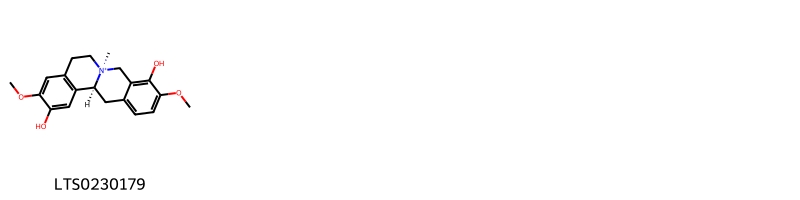{ width=100% }
    <figcaption>Hình ảnh cấu trúc hóa học của 1 hoạt chất thuộc nhóm Protoberberine alkaloids and derivatives gồm ['cyclanoline (LTS0230179)'].</figcaption>
</figure>

---

### Dược dân tộc học

Danh sách các quốc gia có sử dụng *Cissampelos pareira* trong điều trị các bệnh. 

| Country            | Disease                                                                                                                         | Bệnh                                                                                                                                                                                                |
|:-------------------|:--------------------------------------------------------------------------------------------------------------------------------|:----------------------------------------------------------------------------------------------------------------------------------------------------------------------------------------------------|
| Dominican Republic | Stimulant                                                                                                                       | MYMEMORY WARNING: YOU USED ALL AVAILABLE FREE TRANSLATIONS FOR TODAY. NEXT AVAILABLE IN  18 HOURS 55 MINUTES 02 SECONDS VISIT HTTPS://MYMEMORY.TRANSLATED.NET/DOC/USAGELIMITS.PHP TO TRANSLATE MORE |
| Elsewhere          | Diuretic, Diuretic, Diuretic, Emmenagogue, nan, Piscicide, Purgative, Emmenagogue, Expectorant, Piscicide, Expectorant, Styptic | MYMEMORY WARNING: YOU USED ALL AVAILABLE FREE TRANSLATIONS FOR TODAY. NEXT AVAILABLE IN  18 HOURS 55 MINUTES 00 SECONDS VISIT HTTPS://MYMEMORY.TRANSLATED.NET/DOC/USAGELIMITS.PHP TO TRANSLATE MORE |
| Guatemala          | Antidote                                                                                                                        | MYMEMORY WARNING: YOU USED ALL AVAILABLE FREE TRANSLATIONS FOR TODAY. NEXT AVAILABLE IN  18 HOURS 54 MINUTES 57 SECONDS VISIT HTTPS://MYMEMORY.TRANSLATED.NET/DOC/USAGELIMITS.PHP TO TRANSLATE MORE |
| India              | Tonic                                                                                                                           | MYMEMORY WARNING: YOU USED ALL AVAILABLE FREE TRANSLATIONS FOR TODAY. NEXT AVAILABLE IN  18 HOURS 54 MINUTES 54 SECONDS VISIT HTTPS://MYMEMORY.TRANSLATED.NET/DOC/USAGELIMITS.PHP TO TRANSLATE MORE |
| Malaya             | Piscicide                                                                                                                       | MYMEMORY WARNING: YOU USED ALL AVAILABLE FREE TRANSLATIONS FOR TODAY. NEXT AVAILABLE IN  18 HOURS 54 MINUTES 52 SECONDS VISIT HTTPS://MYMEMORY.TRANSLATED.NET/DOC/USAGELIMITS.PHP TO TRANSLATE MORE |
| Mexico             | Diuretic, Diuretic, Emmenagogue, Expectorant, Tonic                                                                             | MYMEMORY WARNING: YOU USED ALL AVAILABLE FREE TRANSLATIONS FOR TODAY. NEXT AVAILABLE IN  18 HOURS 54 MINUTES 49 SECONDS VISIT HTTPS://MYMEMORY.TRANSLATED.NET/DOC/USAGELIMITS.PHP TO TRANSLATE MORE |
| Mexico(Chinantec)  | Poultice                                                                                                                        | MYMEMORY WARNING: YOU USED ALL AVAILABLE FREE TRANSLATIONS FOR TODAY. NEXT AVAILABLE IN  18 HOURS 54 MINUTES 47 SECONDS VISIT HTTPS://MYMEMORY.TRANSLATED.NET/DOC/USAGELIMITS.PHP TO TRANSLATE MORE |
| Venezuela          | Diuretic                                                                                                                        | MYMEMORY WARNING: YOU USED ALL AVAILABLE FREE TRANSLATIONS FOR TODAY. NEXT AVAILABLE IN  18 HOURS 54 MINUTES 43 SECONDS VISIT HTTPS://MYMEMORY.TRANSLATED.NET/DOC/USAGELIMITS.PHP TO TRANSLATE MORE |

---

---
## Cissampelos pariera
### Thông tin về thực vật

!!! info "Phân loại thực vật của *Cissampelos glaberrima* từ GIBF:"
    - **Kingdom:** Plantae
    - **Phylum:** Tracheophyta
    - **Order:** Ranunculales
    - **Family:** Menispermaceae
    - **Genus:** Cissampelos
    - **Species:** *Cissampelos glaberrima*

 

| Label (VI)   | Label (EN)   | Scientific Name     | Descriptions (VI)   | Descriptions (EN)   | Also Known As (VI)   | Also Known As (EN)   |
|:-------------|:-------------|:--------------------|:--------------------|:--------------------|:---------------------|:---------------------|
| N/A          | N/A          | Cissampelos pareira | loài thực vật       | species of plant    | ['']                 | ['']                 |

#### Phân bố trên thế giới

**Từ CSDL GIBF** nan, Puerto Rico, Madagascar, Haiti, Brazil, India, Jamaica, Cuba

#### Phân bố tại Việt Nam

**Từ CSDL GIBF**: Không có ghi nhận ở Việt Nam

---
### Thành phần hóa học
        
- Theo cơ sở dữ liệu lotus: Từ loài *Cissampelos glaberrima* đã phân lập và xác định được Chưa có hoạt chất nào được phân lập. hoạt chất thuộc về các nhóm Không có hoạt chất nào được phân lập. 

Không có hình ảnh nào được tạo ra

---

### Dược dân tộc học

Danh sách các quốc gia có sử dụng *Cissampelos glaberrima* trong điều trị các bệnh. 

| Country   | Disease   | Bệnh                                                                                                                                                                                                |
|:----------|:----------|:----------------------------------------------------------------------------------------------------------------------------------------------------------------------------------------------------|
| India     | Diuretic  | MYMEMORY WARNING: YOU USED ALL AVAILABLE FREE TRANSLATIONS FOR TODAY. NEXT AVAILABLE IN  18 HOURS 54 MINUTES 15 SECONDS VISIT HTTPS://MYMEMORY.TRANSLATED.NET/DOC/USAGELIMITS.PHP TO TRANSLATE MORE |

---

# Chi Tiliacora

??? note "Danh sách các dược liệu thuộc chi"
    
	 - *Tiliacora bequaertii*

---
## Tiliacora bequaertii
### Thông tin về thực vật

!!! info "Phân loại thực vật của *Tiliacora bequaertii* từ GIBF:"
    - **Kingdom:** Plantae
    - **Phylum:** Tracheophyta
    - **Order:** Ranunculales
    - **Family:** Menispermaceae
    - **Genus:** Tiliacora
    - **Species:** *Tiliacora bequaertii*

 

| Label (VI)   | Label (EN)   | Scientific Name     | Descriptions (VI)   | Descriptions (EN)   | Also Known As (VI)   | Also Known As (EN)   |
|:-------------|:-------------|:--------------------|:--------------------|:--------------------|:---------------------|:---------------------|
| N/A          | N/A          | Cissampelos pareira | loài thực vật       | species of plant    | ['']                 | ['']                 |

#### Phân bố trên thế giới

**Từ CSDL GIBF** nan, Puerto Rico, Madagascar, Haiti, Brazil, India, Jamaica, Cuba

#### Phân bố tại Việt Nam

**Từ CSDL GIBF**: Không có ghi nhận ở Việt Nam

---
### Thành phần hóa học
        
- Theo cơ sở dữ liệu lotus: Từ loài *Tiliacora bequaertii* đã phân lập và xác định được Chưa có hoạt chất nào được phân lập. hoạt chất thuộc về các nhóm Không có hoạt chất nào được phân lập. 

Không có hình ảnh nào được tạo ra

---

### Dược dân tộc học

Danh sách các quốc gia có sử dụng *Tiliacora bequaertii* trong điều trị các bệnh. 

| Country   | Disease   | Bệnh                                                                                                                                                                                                |
|:----------|:----------|:----------------------------------------------------------------------------------------------------------------------------------------------------------------------------------------------------|
| Zaire     | Perfume   | MYMEMORY WARNING: YOU USED ALL AVAILABLE FREE TRANSLATIONS FOR TODAY. NEXT AVAILABLE IN  18 HOURS 53 MINUTES 59 SECONDS VISIT HTTPS://MYMEMORY.TRANSLATED.NET/DOC/USAGELIMITS.PHP TO TRANSLATE MORE |

---

# Chi Tinoora

??? note "Danh sách các dược liệu thuộc chi"
    
	 - *Tinoora capillipes*
	 - *Tinoora cordifolia*
	 - *Tinoora cria*
	 - *Tinoora tuberculata*

---
## Tinoora capillipes
### Thông tin về thực vật

!!! info "Phân loại thực vật của *N/A* từ GIBF:"
    - **Kingdom:** N/A
    - **Phylum:** N/A
    - **Order:** N/A
    - **Family:** N/A
    - **Genus:** N/A
    - **Species:** *N/A*

 

| Label (VI)   | Label (EN)   | Scientific Name     | Descriptions (VI)   | Descriptions (EN)   | Also Known As (VI)   | Also Known As (EN)   |
|:-------------|:-------------|:--------------------|:--------------------|:--------------------|:---------------------|:---------------------|
| N/A          | N/A          | Cissampelos pareira | loài thực vật       | species of plant    | ['']                 | ['']                 |

#### Phân bố trên thế giới

**Từ CSDL GIBF** Không có kết quả phù hợp

#### Phân bố tại Việt Nam

**Từ CSDL GIBF**: Không có ghi nhận ở Việt Nam

---
### Thành phần hóa học
        
- Theo cơ sở dữ liệu lotus: Từ loài *N/A* đã phân lập và xác định được Chưa có hoạt chất nào được phân lập. hoạt chất thuộc về các nhóm Không có hoạt chất nào được phân lập. 

Không có hình ảnh nào được tạo ra

---

### Dược dân tộc học

Danh sách các quốc gia có sử dụng *N/A* trong điều trị các bệnh. 

| Country   | Disease    | Bệnh                                                                                                                                                                                                |
|:----------|:-----------|:----------------------------------------------------------------------------------------------------------------------------------------------------------------------------------------------------|
| China     | Alexiteric | MYMEMORY WARNING: YOU USED ALL AVAILABLE FREE TRANSLATIONS FOR TODAY. NEXT AVAILABLE IN  18 HOURS 53 MINUTES 41 SECONDS VISIT HTTPS://MYMEMORY.TRANSLATED.NET/DOC/USAGELIMITS.PHP TO TRANSLATE MORE |

---

---
## Tinoora cordifolia
### Thông tin về thực vật

!!! info "Phân loại thực vật của *N/A* từ GIBF:"
    - **Kingdom:** N/A
    - **Phylum:** N/A
    - **Order:** N/A
    - **Family:** N/A
    - **Genus:** N/A
    - **Species:** *N/A*

 

| Label (VI)   | Label (EN)   | Scientific Name     | Descriptions (VI)   | Descriptions (EN)   | Also Known As (VI)   | Also Known As (EN)   |
|:-------------|:-------------|:--------------------|:--------------------|:--------------------|:---------------------|:---------------------|
| N/A          | N/A          | Cissampelos pareira | loài thực vật       | species of plant    | ['']                 | ['']                 |

#### Phân bố trên thế giới

**Từ CSDL GIBF** Không có kết quả phù hợp

#### Phân bố tại Việt Nam

**Từ CSDL GIBF**: Không có ghi nhận ở Việt Nam

---
### Thành phần hóa học
        
- Theo cơ sở dữ liệu lotus: Từ loài *N/A* đã phân lập và xác định được Chưa có hoạt chất nào được phân lập. hoạt chất thuộc về các nhóm Không có hoạt chất nào được phân lập. 

Không có hình ảnh nào được tạo ra

---

### Dược dân tộc học

Danh sách các quốc gia có sử dụng *N/A* trong điều trị các bệnh. 

| Country        | Disease                       | Bệnh                                                                                                                                                                                                |
|:---------------|:------------------------------|:----------------------------------------------------------------------------------------------------------------------------------------------------------------------------------------------------|
| China          | Diuretic                      | MYMEMORY WARNING: YOU USED ALL AVAILABLE FREE TRANSLATIONS FOR TODAY. NEXT AVAILABLE IN  18 HOURS 53 MINUTES 29 SECONDS VISIT HTTPS://MYMEMORY.TRANSLATED.NET/DOC/USAGELIMITS.PHP TO TRANSLATE MORE |
| Elsewhere      | nan, Emetic                   | MYMEMORY WARNING: YOU USED ALL AVAILABLE FREE TRANSLATIONS FOR TODAY. NEXT AVAILABLE IN  18 HOURS 53 MINUTES 26 SECONDS VISIT HTTPS://MYMEMORY.TRANSLATED.NET/DOC/USAGELIMITS.PHP TO TRANSLATE MORE |
| English        | Aphrodisiac, Emetic, Sedative | MYMEMORY WARNING: YOU USED ALL AVAILABLE FREE TRANSLATIONS FOR TODAY. NEXT AVAILABLE IN  18 HOURS 53 MINUTES 23 SECONDS VISIT HTTPS://MYMEMORY.TRANSLATED.NET/DOC/USAGELIMITS.PHP TO TRANSLATE MORE |
| India          | Stimulant, Tonic              | MYMEMORY WARNING: YOU USED ALL AVAILABLE FREE TRANSLATIONS FOR TODAY. NEXT AVAILABLE IN  18 HOURS 53 MINUTES 21 SECONDS VISIT HTTPS://MYMEMORY.TRANSLATED.NET/DOC/USAGELIMITS.PHP TO TRANSLATE MORE |
| India(Gujarat) | Tonic                         | MYMEMORY WARNING: YOU USED ALL AVAILABLE FREE TRANSLATIONS FOR TODAY. NEXT AVAILABLE IN  18 HOURS 53 MINUTES 18 SECONDS VISIT HTTPS://MYMEMORY.TRANSLATED.NET/DOC/USAGELIMITS.PHP TO TRANSLATE MORE |
| Malaysia       | Stomachic                     | MYMEMORY WARNING: YOU USED ALL AVAILABLE FREE TRANSLATIONS FOR TODAY. NEXT AVAILABLE IN  18 HOURS 53 MINUTES 15 SECONDS VISIT HTTPS://MYMEMORY.TRANSLATED.NET/DOC/USAGELIMITS.PHP TO TRANSLATE MORE |

---

---
## Tinoora cria
### Thông tin về thực vật

!!! info "Phân loại thực vật của *N/A* từ GIBF:"
    - **Kingdom:** N/A
    - **Phylum:** N/A
    - **Order:** N/A
    - **Family:** N/A
    - **Genus:** N/A
    - **Species:** *N/A*

 

| Label (VI)   | Label (EN)   | Scientific Name     | Descriptions (VI)   | Descriptions (EN)   | Also Known As (VI)   | Also Known As (EN)   |
|:-------------|:-------------|:--------------------|:--------------------|:--------------------|:---------------------|:---------------------|
| N/A          | N/A          | Cissampelos pareira | loài thực vật       | species of plant    | ['']                 | ['']                 |

#### Phân bố trên thế giới

**Từ CSDL GIBF** Không có kết quả phù hợp

#### Phân bố tại Việt Nam

**Từ CSDL GIBF**: Không có ghi nhận ở Việt Nam

---
### Thành phần hóa học
        
- Theo cơ sở dữ liệu lotus: Từ loài *N/A* đã phân lập và xác định được Chưa có hoạt chất nào được phân lập. hoạt chất thuộc về các nhóm Không có hoạt chất nào được phân lập. 

Không có hình ảnh nào được tạo ra

---

### Dược dân tộc học

Danh sách các quốc gia có sử dụng *N/A* trong điều trị các bệnh. 

| Country   | Disease          | Bệnh                                                                                                                                                                                                |
|:----------|:-----------------|:----------------------------------------------------------------------------------------------------------------------------------------------------------------------------------------------------|
| Elsewhere | Emetic           | MYMEMORY WARNING: YOU USED ALL AVAILABLE FREE TRANSLATIONS FOR TODAY. NEXT AVAILABLE IN  18 HOURS 53 MINUTES 03 SECONDS VISIT HTTPS://MYMEMORY.TRANSLATED.NET/DOC/USAGELIMITS.PHP TO TRANSLATE MORE |
| Indochina | Digestive, Tonic | MYMEMORY WARNING: YOU USED ALL AVAILABLE FREE TRANSLATIONS FOR TODAY. NEXT AVAILABLE IN  18 HOURS 53 MINUTES 00 SECONDS VISIT HTTPS://MYMEMORY.TRANSLATED.NET/DOC/USAGELIMITS.PHP TO TRANSLATE MORE |

---

---
## Tinoora tuberculata
### Thông tin về thực vật

!!! info "Phân loại thực vật của *N/A* từ GIBF:"
    - **Kingdom:** N/A
    - **Phylum:** N/A
    - **Order:** N/A
    - **Family:** N/A
    - **Genus:** N/A
    - **Species:** *N/A*

 

| Label (VI)   | Label (EN)   | Scientific Name     | Descriptions (VI)   | Descriptions (EN)   | Also Known As (VI)   | Also Known As (EN)   |
|:-------------|:-------------|:--------------------|:--------------------|:--------------------|:---------------------|:---------------------|
| N/A          | N/A          | Cissampelos pareira | loài thực vật       | species of plant    | ['']                 | ['']                 |

#### Phân bố trên thế giới

**Từ CSDL GIBF** Không có kết quả phù hợp

#### Phân bố tại Việt Nam

**Từ CSDL GIBF**: Không có ghi nhận ở Việt Nam

---
### Thành phần hóa học
        
- Theo cơ sở dữ liệu lotus: Từ loài *N/A* đã phân lập và xác định được Chưa có hoạt chất nào được phân lập. hoạt chất thuộc về các nhóm Không có hoạt chất nào được phân lập. 

Không có hình ảnh nào được tạo ra

---

### Dược dân tộc học

Danh sách các quốc gia có sử dụng *N/A* trong điều trị các bệnh. 

| Country   | Disease   | Bệnh                                                                                                                                                                                                |
|:----------|:----------|:----------------------------------------------------------------------------------------------------------------------------------------------------------------------------------------------------|
| Java      | Emetic    | MYMEMORY WARNING: YOU USED ALL AVAILABLE FREE TRANSLATIONS FOR TODAY. NEXT AVAILABLE IN  18 HOURS 52 MINUTES 50 SECONDS VISIT HTTPS://MYMEMORY.TRANSLATED.NET/DOC/USAGELIMITS.PHP TO TRANSLATE MORE |
| Malaya    | Vermifuge | MYMEMORY WARNING: YOU USED ALL AVAILABLE FREE TRANSLATIONS FOR TODAY. NEXT AVAILABLE IN  18 HOURS 52 MINUTES 48 SECONDS VISIT HTTPS://MYMEMORY.TRANSLATED.NET/DOC/USAGELIMITS.PHP TO TRANSLATE MORE |

---

# Chi henocentrum

??? note "Danh sách các dược liệu thuộc chi"
    
	 - *henocentrum jollyanum*

---
## henocentrum jollyanum
### Thông tin về thực vật

!!! info "Phân loại thực vật của *N/A* từ GIBF:"
    - **Kingdom:** N/A
    - **Phylum:** N/A
    - **Order:** N/A
    - **Family:** N/A
    - **Genus:** N/A
    - **Species:** *N/A*

 

| Label (VI)   | Label (EN)   | Scientific Name     | Descriptions (VI)   | Descriptions (EN)   | Also Known As (VI)   | Also Known As (EN)   |
|:-------------|:-------------|:--------------------|:--------------------|:--------------------|:---------------------|:---------------------|
| N/A          | N/A          | Cissampelos pareira | loài thực vật       | species of plant    | ['']                 | ['']                 |

#### Phân bố trên thế giới

**Từ CSDL GIBF** Không có kết quả phù hợp

#### Phân bố tại Việt Nam

**Từ CSDL GIBF**: Không có ghi nhận ở Việt Nam

---
### Thành phần hóa học
        
- Theo cơ sở dữ liệu lotus: Từ loài *N/A* đã phân lập và xác định được 2 hoạt chất thuộc về các nhóm Isoquinolines and derivatives, Protoberberine alkaloids and derivatives. 

|    | chemicalTaxonomyClassyfireClass          |   smiles_count |
|---:|:-----------------------------------------|---------------:|
|  0 | Isoquinolines and derivatives            |              1 |
|  1 | Protoberberine alkaloids and derivatives |              1 |

#### Nhóm Isoquinolines and derivatives
<figure markdown="span">
    { width=100% }
    <figcaption>Hình ảnh cấu trúc hóa học của 1 hoạt chất thuộc nhóm Isoquinolines and derivatives gồm ['3,4,11-trimethoxy-7,8-dihydro-6-azatetraphen-10-one (LTS0258799)'].</figcaption>
</figure>
#### Nhóm Protoberberine alkaloids and derivatives
<figure markdown="span">
    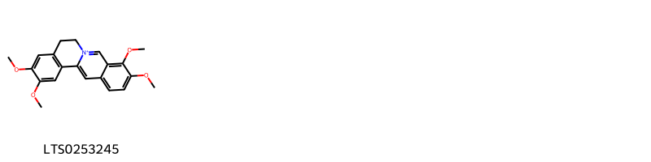{ width=100% }
    <figcaption>Hình ảnh cấu trúc hóa học của 1 hoạt chất thuộc nhóm Protoberberine alkaloids and derivatives gồm ['palmatine (LTS0253245)'].</figcaption>
</figure>

---

### Dược dân tộc học

Danh sách các quốc gia có sử dụng *N/A* trong điều trị các bệnh. 

| Country   | Disease             | Bệnh                                                                                                                                                                                                |
|:----------|:--------------------|:----------------------------------------------------------------------------------------------------------------------------------------------------------------------------------------------------|
| Africa    | Laxative, Stomachic | MYMEMORY WARNING: YOU USED ALL AVAILABLE FREE TRANSLATIONS FOR TODAY. NEXT AVAILABLE IN  18 HOURS 52 MINUTES 36 SECONDS VISIT HTTPS://MYMEMORY.TRANSLATED.NET/DOC/USAGELIMITS.PHP TO TRANSLATE MORE |
| Nigeria   | Sweetener           | MYMEMORY WARNING: YOU USED ALL AVAILABLE FREE TRANSLATIONS FOR TODAY. NEXT AVAILABLE IN  18 HOURS 52 MINUTES 33 SECONDS VISIT HTTPS://MYMEMORY.TRANSLATED.NET/DOC/USAGELIMITS.PHP TO TRANSLATE MORE |

---

# Chi Coscinium

??? note "Danh sách các dược liệu thuộc chi"
    
	 - *Coscinium blumeanum*
	 - *Coscinium fenestratum*

---
## Coscinium blumeanum
### Thông tin về thực vật

!!! info "Phân loại thực vật của *Coscinium blumeanum* từ GIBF:"
    - **Kingdom:** Plantae
    - **Phylum:** Tracheophyta
    - **Order:** Ranunculales
    - **Family:** Menispermaceae
    - **Genus:** Coscinium
    - **Species:** *Coscinium blumeanum*

 

| Label (VI)   | Label (EN)   | Scientific Name     | Descriptions (VI)   | Descriptions (EN)   | Also Known As (VI)   | Also Known As (EN)   |
|:-------------|:-------------|:--------------------|:--------------------|:--------------------|:---------------------|:---------------------|
| N/A          | N/A          | Coscinium blumeanum | loài thực vật       | species of plant    | ['']                 | ['']                 |

#### Phân bố trên thế giới

**Từ CSDL GIBF** nan, India, Malaysia, Viet Nam

#### Phân bố tại Việt Nam

**Từ CSDL GIBF**: Son La

---
### Thành phần hóa học
        
- Theo cơ sở dữ liệu lotus: Từ loài *Coscinium blumeanum* đã phân lập và xác định được Chưa có hoạt chất nào được phân lập. hoạt chất thuộc về các nhóm Không có hoạt chất nào được phân lập. 

Không có hình ảnh nào được tạo ra

---

### Dược dân tộc học

Danh sách các quốc gia có sử dụng *Coscinium blumeanum* trong điều trị các bệnh. 

| Country   | Disease   | Bệnh                                                                                                                                                                                                |
|:----------|:----------|:----------------------------------------------------------------------------------------------------------------------------------------------------------------------------------------------------|
| Malaya    | Piscicide | MYMEMORY WARNING: YOU USED ALL AVAILABLE FREE TRANSLATIONS FOR TODAY. NEXT AVAILABLE IN  18 HOURS 52 MINUTES 19 SECONDS VISIT HTTPS://MYMEMORY.TRANSLATED.NET/DOC/USAGELIMITS.PHP TO TRANSLATE MORE |

---

---
## Coscinium fenestratum
### Thông tin về thực vật

!!! info "Phân loại thực vật của *Coscinium fenestratum* từ GIBF:"
    - **Kingdom:** Plantae
    - **Phylum:** Tracheophyta
    - **Order:** Ranunculales
    - **Family:** Menispermaceae
    - **Genus:** Coscinium
    - **Species:** *Coscinium fenestratum*

 

| Label (VI)   | Label (EN)   | Scientific Name       | Descriptions (VI)   | Descriptions (EN)   | Also Known As (VI)   | Also Known As (EN)   |
|:-------------|:-------------|:----------------------|:--------------------|:--------------------|:---------------------|:---------------------|
| N/A          | N/A          | Coscinium fenestratum | loài thực vật       | species of plant    | ['']                 | ['']                 |

#### Phân bố trên thế giới

**Từ CSDL GIBF** nan, Sri Lanka, Thailand, Lao People’s Democratic Republic, Cambodia, India, Indonesia, unknown or invalid, Viet Nam, Singapore, Malaysia

#### Phân bố tại Việt Nam

**Từ CSDL GIBF**: Dong Nai, Đà Nẵng, Quang Binh

---
### Thành phần hóa học
        
- Theo cơ sở dữ liệu lotus: Từ loài *Coscinium fenestratum* đã phân lập và xác định được 17 hoạt chất thuộc về các nhóm Phenol ethers, Fatty Acyls, Steroids and steroid derivatives, Isoquinolines and derivatives, Protoberberine alkaloids and derivatives. 

|    | chemicalTaxonomyClassyfireClass          |   smiles_count |
|---:|:-----------------------------------------|---------------:|
|  0 | Fatty Acyls                              |              1 |
|  1 | Isoquinolines and derivatives            |              3 |
|  2 | Phenol ethers                            |              1 |
|  3 | Protoberberine alkaloids and derivatives |              9 |
|  4 | Steroids and steroid derivatives         |              3 |

#### Nhóm Fatty Acyls
<figure markdown="span">
    { width=100% }
    <figcaption>Hình ảnh cấu trúc hóa học của 1 hoạt chất thuộc nhóm Fatty Acyls gồm ['ceryl alcohol (LTS0140051)'].</figcaption>
</figure>
#### Nhóm Isoquinolines and derivatives
<figure markdown="span">
    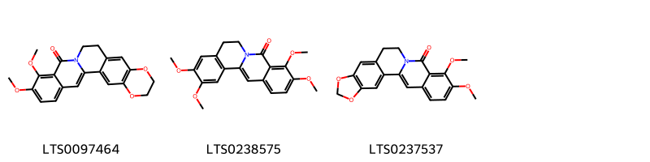{ width=100% }
    <figcaption>Hình ảnh cấu trúc hóa học của 3 hoạt chất thuộc nhóm Isoquinolines and derivatives gồm ['10,11-dimethoxy-2,3,6,7-tetrahydro-1,4-dioxa-8-azapentaphen-9-one (LTS0097464)', '3,4,10,11-tetramethoxy-7,8-dihydro-6-azatetraphen-5-one (LTS0238575)', '8-oxyberberine (LTS0237537)'].</figcaption>
</figure>
#### Nhóm Phenol ethers
<figure markdown="span">
    { width=100% }
    <figcaption>Hình ảnh cấu trúc hóa học của 1 hoạt chất thuộc nhóm Phenol ethers gồm ['3,4,10,11-tetramethoxy-5h-6-azatetraphene (LTS0096154)'].</figcaption>
</figure>
#### Nhóm Protoberberine alkaloids and derivatives
<figure markdown="span">
    { width=100% }
    <figcaption>Hình ảnh cấu trúc hóa học của 9 hoạt chất thuộc nhóm Protoberberine alkaloids and derivatives gồm ['(12bs)-11-hydroxy-3,4,10-trimethoxy-7,8,12b,13-tetrahydro-6-azatetraphen-5-one (LTS0075455)', '(1s)-16,17-dimethoxy-5,7-dioxa-13-azapentacyclo[11.8.0.0²,¹⁰.0⁴,⁸.0¹⁵,²⁰]henicosa-2,4(8),9,15,17,19-hexaen-14-one (LTS0188752)', 'canadin (LTS0116620)', '(s)-canadine (LTS0147391)', '16,17-dimethoxy-5,7-dioxa-13-azapentacyclo[11.8.0.0²,¹⁰.0⁴,⁸.0¹⁵,²⁰]henicosa-2,4(8),9,15,17,19-hexaen-14-one (LTS0242598)', '11-hydroxy-3,4,10-trimethoxy-7,8,12b,13-tetrahydro-6-azatetraphen-5-one (LTS0215188)', '(1s)-17-hydroxy-16-methoxy-5,7-dioxa-13-azapentacyclo[11.8.0.0²,¹⁰.0⁴,⁸.0¹⁵,²⁰]henicosa-2,4(8),9,15(20),16,18-hexaen-14-one (LTS0244015)', 'berberine (LTS0101484)', '17-hydroxy-16-methoxy-5,7-dioxa-13-azapentacyclo[11.8.0.0²,¹⁰.0⁴,⁸.0¹⁵,²⁰]henicosa-2,4(8),9,15(20),16,18-hexaen-14-one (LTS0020928)'].</figcaption>
</figure>
#### Nhóm Steroids and steroid derivatives
<figure markdown="span">
    { width=100% }
    <figcaption>Hình ảnh cấu trúc hóa học của 3 hoạt chất thuộc nhóm Steroids and steroid derivatives gồm ['stigmast-5-en-3-ol (LTS0071224)', 'stigmast-5-en-3-ol, (3β)- (LTS0204616)', 'phytosterol (LTS0029311)'].</figcaption>
</figure>

---

### Dược dân tộc học

Danh sách các quốc gia có sử dụng *Coscinium fenestratum* trong điều trị các bệnh. 

| Country   | Disease                      | Bệnh                                                                                                                                                                                                |
|:----------|:-----------------------------|:----------------------------------------------------------------------------------------------------------------------------------------------------------------------------------------------------|
| Elsewhere | Antiseptic, Stomachic, Tonic | MYMEMORY WARNING: YOU USED ALL AVAILABLE FREE TRANSLATIONS FOR TODAY. NEXT AVAILABLE IN  18 HOURS 52 MINUTES 01 SECONDS VISIT HTTPS://MYMEMORY.TRANSLATED.NET/DOC/USAGELIMITS.PHP TO TRANSLATE MORE |
| India     | Fungicide                    | MYMEMORY WARNING: YOU USED ALL AVAILABLE FREE TRANSLATIONS FOR TODAY. NEXT AVAILABLE IN  18 HOURS 51 MINUTES 59 SECONDS VISIT HTTPS://MYMEMORY.TRANSLATED.NET/DOC/USAGELIMITS.PHP TO TRANSLATE MORE |

---

# Chi Dioscoreophyllum

??? note "Danh sách các dược liệu thuộc chi"
    
	 - *Dioscoreophyllum cumminsii*

---
## Dioscoreophyllum cumminsii
### Thông tin về thực vật

!!! info "Phân loại thực vật của *Dioscoreophyllum volkensii* từ GIBF:"
    - **Kingdom:** Plantae
    - **Phylum:** Tracheophyta
    - **Order:** Ranunculales
    - **Family:** Menispermaceae
    - **Genus:** Dioscoreophyllum
    - **Species:** *Dioscoreophyllum volkensii*

 

| Label (VI)   | Label (EN)   | Scientific Name            | Descriptions (VI)   | Descriptions (EN)   | Also Known As (VI)   | Also Known As (EN)   |
|:-------------|:-------------|:---------------------------|:--------------------|:--------------------|:---------------------|:---------------------|
| N/A          | N/A          | Dioscoreophyllum cumminsii | loài thực vật       | species of plant    | ['']                 | ['']                 |

#### Phân bố trên thế giới

**Từ CSDL GIBF** nan, Ghana, Central African Republic, Gabon, Belgium, Mozambique, unknown or invalid, Benin, Congo, Norway, Sierra Leone, Togo, Zambia, Nigeria, Congo, Democratic Republic of the, Guinea, Liberia, Zimbabwe, Guinea-Bissau, Côte d’Ivoire, Equatorial Guinea, Cameroon

#### Phân bố tại Việt Nam

**Từ CSDL GIBF**: Không có ghi nhận ở Việt Nam

---
### Thành phần hóa học
        
- Theo cơ sở dữ liệu lotus: Từ loài *Dioscoreophyllum volkensii* đã phân lập và xác định được 4 hoạt chất thuộc về các nhóm Aporphines, Isoquinolines and derivatives, Protoberberine alkaloids and derivatives. 

|    | chemicalTaxonomyClassyfireClass          |   smiles_count |
|---:|:-----------------------------------------|---------------:|
|  0 | Aporphines                               |              1 |
|  1 | Isoquinolines and derivatives            |              1 |
|  2 | Protoberberine alkaloids and derivatives |              2 |

#### Nhóm Aporphines
<figure markdown="span">
    { width=100% }
    <figcaption>Hình ảnh cấu trúc hóa học của 1 hoạt chất thuộc nhóm Aporphines gồm ['magnoflorine (LTS0120825)'].</figcaption>
</figure>
#### Nhóm Isoquinolines and derivatives
<figure markdown="span">
    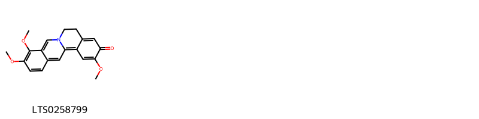{ width=100% }
    <figcaption>Hình ảnh cấu trúc hóa học của 1 hoạt chất thuộc nhóm Isoquinolines and derivatives gồm ['3,4,11-trimethoxy-7,8-dihydro-6-azatetraphen-10-one (LTS0258799)'].</figcaption>
</figure>
#### Nhóm Protoberberine alkaloids and derivatives
<figure markdown="span">
    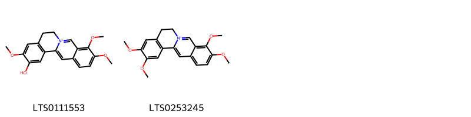{ width=100% }
    <figcaption>Hình ảnh cấu trúc hóa học của 2 hoạt chất thuộc nhóm Protoberberine alkaloids and derivatives gồm ['columbamine (LTS0111553)', 'palmatine (LTS0253245)'].</figcaption>
</figure>

---

### Dược dân tộc học

Danh sách các quốc gia có sử dụng *Dioscoreophyllum volkensii* trong điều trị các bệnh. 

| Country   | Disease              | Bệnh                                                                                                                                                                                                |
|:----------|:---------------------|:----------------------------------------------------------------------------------------------------------------------------------------------------------------------------------------------------|
| Africa    | Sweetener, Sweetener | MYMEMORY WARNING: YOU USED ALL AVAILABLE FREE TRANSLATIONS FOR TODAY. NEXT AVAILABLE IN  18 HOURS 50 MINUTES 44 SECONDS VISIT HTTPS://MYMEMORY.TRANSLATED.NET/DOC/USAGELIMITS.PHP TO TRANSLATE MORE |
| Elsewhere | Sweetener            | MYMEMORY WARNING: YOU USED ALL AVAILABLE FREE TRANSLATIONS FOR TODAY. NEXT AVAILABLE IN  18 HOURS 50 MINUTES 42 SECONDS VISIT HTTPS://MYMEMORY.TRANSLATED.NET/DOC/USAGELIMITS.PHP TO TRANSLATE MORE |

---

