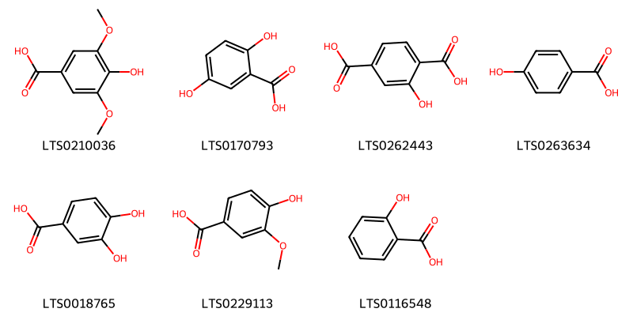
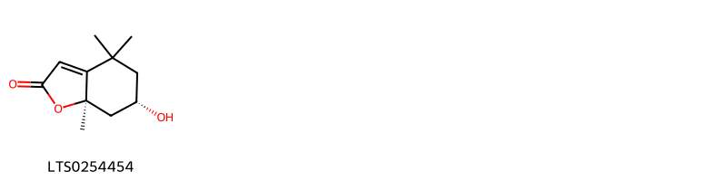
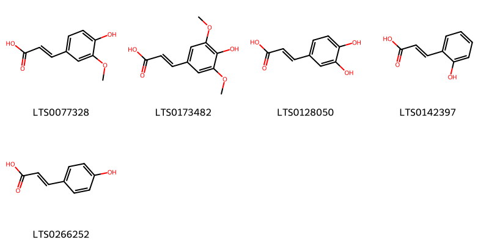
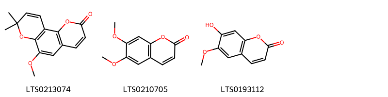
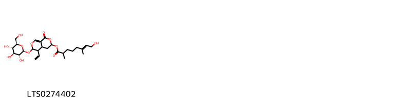
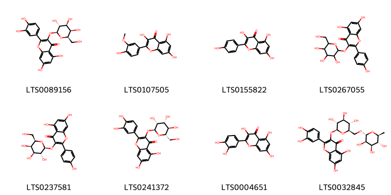
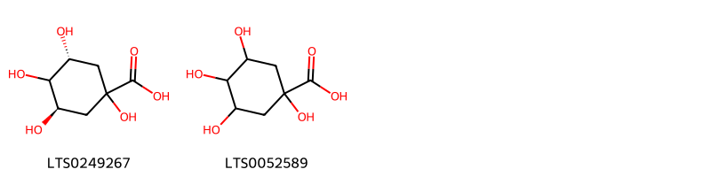
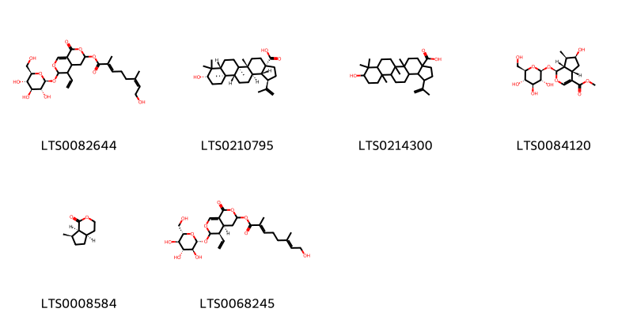

!!! abstract "Tóm tắt"

    Họ Menyanthaceae gồm khoảng 3 chi và 4 loài được một số cộng đồng tại các quốc gia như Turkey, Scandinavia, Elsewhere, US, India, Europe, China sử dụng trong một số trường hợp Intoxicant, Parasiticide, Vermifuge, Vermifuge, Apertif, Laxative, Vermifuge, Diuretic, Diaphoretic, Emetic, Tonic, Cathartic, Stomachic, Hypnotic, Narcotic, Narcotic, An thần, Tonic, Cathartic, Cholagogue, Diuretic, Hypnotic, Nervine, An thần, Stomachic, Narcotic, Apertif, Emetic, Tonic.

!!! info "DrDuke"

    James A. Duke sinh năm 1929-2017 là một nhà thực vật học người Mỹ. Đây là một trong những tác giả hàng đầu trong lĩnh vực dược dân tộc học với cuốn *CRC Handbook of Medicinal Herbs* và chính là người xây dựng lên cơ sở dữ liệu về hợp chất tự nhiên và dược dân tộc học tại Bộ nông nghiệp Hoa Kỳ. Các thông tin được đăng tải tại website [Dr. Duke's Phytochemical and Ethnobotanical Databases](https://phytochem.nal.usda.gov/). 
    Trong suốt thập niên 1970, ông lãnh đạo the Plant Taxonomy Laboratory, Plant Genetics and Germplasm Institute of the Agricultural Research Service, U.S. Department of Agriculture.
    Trong tài liệu này, các thông tin về dược dân tộc của các dược liệu được trích dẫn từ tài liệu của James A. Ducke với sự trợ giúp của phần mềm dịch thuật từ tiếng Anh sang tiếng Việt.
   

# Chi Limnanthemum

??? note "Danh sách các dược liệu thuộc chi"
    
	 - *Limnanthemum cristatum*
	 - *Limnanthemum nymphoides*
	 - *Limnanthemum peltatum*

---
## Limnanthemum cristatum
### Thông tin về thực vật

!!! info "Phân loại thực vật của *Nymphoides hydrophylla* từ GIBF:"
    - **Kingdom:** Plantae
    - **Phylum:** Tracheophyta
    - **Order:** Asterales
    - **Family:** Menyanthaceae
    - **Genus:** Nymphoides
    - **Species:** *Nymphoides hydrophylla*

 

| Label (VI)   | Label (EN)   | Scientific Name        | Descriptions (VI)   | Descriptions (EN)   | Also Known As (VI)   | Also Known As (EN)   |
|:-------------|:-------------|:-----------------------|:--------------------|:--------------------|:---------------------|:---------------------|
| N/A          | N/A          | Limnanthemum cristatum |                     | species of plant    | ['']                 | ['']                 |

#### Phân bố trên thế giới

**Từ CSDL GIBF** nan, Australia, Madagascar, Chinese Taipei, India, unknown or invalid, Philippines, Singapore, China

#### Phân bố tại Việt Nam

**Từ CSDL GIBF**: Không có ghi nhận ở Việt Nam

---
### Thành phần hóa học
        
- Theo cơ sở dữ liệu lotus: Từ loài *Nymphoides hydrophylla* đã phân lập và xác định được Chưa có hoạt chất nào được phân lập. hoạt chất thuộc về các nhóm Không có hoạt chất nào được phân lập. 

Không có hình ảnh nào được tạo ra

---

### Dược dân tộc học

Danh sách các quốc gia có sử dụng *Nymphoides hydrophylla* trong điều trị các bệnh. 

| Country   | Disease   | Bệnh           |
|:----------|:----------|:---------------|
| China     | Vermifuge | Thuốc diệt sán |

---

---
## Limnanthemum nymphoides
### Thông tin về thực vật

!!! info "Phân loại thực vật của *Nymphoides peltata* từ GIBF:"
    - **Kingdom:** Plantae
    - **Phylum:** Tracheophyta
    - **Order:** Asterales
    - **Family:** Menyanthaceae
    - **Genus:** Nymphoides
    - **Species:** *Nymphoides peltata*

 

| Label (VI)   | Label (EN)   | Scientific Name        | Descriptions (VI)   | Descriptions (EN)   | Also Known As (VI)   | Also Known As (EN)   |
|:-------------|:-------------|:-----------------------|:--------------------|:--------------------|:---------------------|:---------------------|
| N/A          | N/A          | Limnanthemum cristatum |                     | species of plant    | ['']                 | ['']                 |

#### Phân bố trên thế giới

**Từ CSDL GIBF** nan, Netherlands, Italy, Japan, United Kingdom of Great Britain and Northern Ireland, Belgium, Korea, Republic of, Romania, Germany, Spain, Hungary, Portugal, unknown or invalid, Russian Federation, Sweden, Poland, France, China

#### Phân bố tại Việt Nam

**Từ CSDL GIBF**: Không có ghi nhận ở Việt Nam

---
### Thành phần hóa học
        
- Theo cơ sở dữ liệu lotus: Từ loài *Nymphoides peltata* đã phân lập và xác định được Chưa có hoạt chất nào được phân lập. hoạt chất thuộc về các nhóm Không có hoạt chất nào được phân lập. 

Không có hình ảnh nào được tạo ra

---

### Dược dân tộc học

Danh sách các quốc gia có sử dụng *Nymphoides peltata* trong điều trị các bệnh. 

| Country   | Disease   | Bệnh           |
|:----------|:----------|:---------------|
| China     | Diuretic  | Thuốc lợi tiêu |

---

---
## Limnanthemum peltatum
### Thông tin về thực vật

!!! info "Phân loại thực vật của *Nymphoides peltata* từ GIBF:"
    - **Kingdom:** Plantae
    - **Phylum:** Tracheophyta
    - **Order:** Asterales
    - **Family:** Menyanthaceae
    - **Genus:** Nymphoides
    - **Species:** *Nymphoides peltata*

 

| Label (VI)   | Label (EN)   | Scientific Name        | Descriptions (VI)   | Descriptions (EN)   | Also Known As (VI)   | Also Known As (EN)   |
|:-------------|:-------------|:-----------------------|:--------------------|:--------------------|:---------------------|:---------------------|
| N/A          | N/A          | Limnanthemum cristatum |                     | species of plant    | ['']                 | ['']                 |

#### Phân bố trên thế giới

**Từ CSDL GIBF** nan, Germany, Spain, unknown or invalid, Poland, France

#### Phân bố tại Việt Nam

**Từ CSDL GIBF**: Không có ghi nhận ở Việt Nam

---
### Thành phần hóa học
        
- Theo cơ sở dữ liệu lotus: Từ loài *Nymphoides peltata* đã phân lập và xác định được Chưa có hoạt chất nào được phân lập. hoạt chất thuộc về các nhóm Không có hoạt chất nào được phân lập. 

Không có hình ảnh nào được tạo ra

---

### Dược dân tộc học

Danh sách các quốc gia có sử dụng *Nymphoides peltata* trong điều trị các bệnh. 

| Country   | Disease                 | Bệnh                                |
|:----------|:------------------------|:------------------------------------|
| China     | Parasiticide, Vermifuge | Thuốc diệt ký sinh trùng, Vermifuge |

---

# Chi Nymphoides

??? note "Danh sách các dược liệu thuộc chi"
    
	 - *Nymphoides cristatum*

---
## Nymphoides cristatum
### Thông tin về thực vật

!!! info "Phân loại thực vật của *Nymphoides hydrophylla* từ GIBF:"
    - **Kingdom:** Plantae
    - **Phylum:** Tracheophyta
    - **Order:** Asterales
    - **Family:** Menyanthaceae
    - **Genus:** Nymphoides
    - **Species:** *Nymphoides hydrophylla*

 

| Label (VI)   | Label (EN)   | Scientific Name      | Descriptions (VI)   | Descriptions (EN)   | Also Known As (VI)   | Also Known As (EN)   |
|:-------------|:-------------|:---------------------|:--------------------|:--------------------|:---------------------|:---------------------|
| N/A          | N/A          | Nymphoides cristatum |                     |                     | ['']                 | ['']                 |

#### Phân bố trên thế giới

**Từ CSDL GIBF** Sri Lanka, Hong Kong, Cambodia, Chinese Taipei, Brazil, India, United States of America, China

#### Phân bố tại Việt Nam

**Từ CSDL GIBF**: Không có ghi nhận ở Việt Nam

---
### Thành phần hóa học
        
- Theo cơ sở dữ liệu lotus: Từ loài *Nymphoides hydrophylla* đã phân lập và xác định được Chưa có hoạt chất nào được phân lập. hoạt chất thuộc về các nhóm Không có hoạt chất nào được phân lập. 

Không có hình ảnh nào được tạo ra

---

### Dược dân tộc học

Danh sách các quốc gia có sử dụng *Nymphoides hydrophylla* trong điều trị các bệnh. 

| Country   | Disease                 | Bệnh                                |
|:----------|:------------------------|:------------------------------------|
| India     | Parasiticide, Vermifuge | Thuốc diệt ký sinh trùng, Vermifuge |

---

# Chi Menyanthes

??? note "Danh sách các dược liệu thuộc chi"
    
	 - *Menyanthes trifoliata*

---
## Menyanthes trifoliata
### Thông tin về thực vật

!!! info "Phân loại thực vật của *Menyanthes trifoliata* từ GIBF:"
    - **Kingdom:** Plantae
    - **Phylum:** Tracheophyta
    - **Order:** Asterales
    - **Family:** Menyanthaceae
    - **Genus:** Menyanthes
    - **Species:** *Menyanthes trifoliata*

 

| Label (VI)   | Label (EN)   | Scientific Name       | Descriptions (VI)   | Descriptions (EN)   | Also Known As (VI)   | Also Known As (EN)   |
|:-------------|:-------------|:----------------------|:--------------------|:--------------------|:---------------------|:---------------------|
| N/A          | N/A          | Menyanthes trifoliata | loài thực vật       | species of plant    | ['']                 | ['bogbean']          |

#### Phân bố trên thế giới

**Từ CSDL GIBF** Italy, Japan, Belgium, Canada, Denmark, Netherlands, Belarus, Hungary, Russian Federation, United States of America, Sweden, Slovenia, Czechia, Germany, Switzerland, Austria, France, United Kingdom of Great Britain and Northern Ireland, Ireland, Poland

#### Phân bố tại Việt Nam

**Từ CSDL GIBF**: Không có ghi nhận ở Việt Nam

---
### Thành phần hóa học
        
- Theo cơ sở dữ liệu lotus: Từ loài *Menyanthes trifoliata* đã phân lập và xác định được 34 hoạt chất thuộc về các nhóm Fatty Acyls, Flavonoids, Prenol lipids, Steroids and steroid derivatives, Cinnamic acids and derivatives, Benzofurans, Benzene and substituted derivatives, Organooxygen compounds, Coumarins and derivatives. 

|    | chemicalTaxonomyClassyfireClass     |   smiles_count |
|---:|:------------------------------------|---------------:|
|  0 | Benzene and substituted derivatives |              7 |
|  1 | Benzofurans                         |              1 |
|  2 | Cinnamic acids and derivatives      |              5 |
|  3 | Coumarins and derivatives           |              3 |
|  4 | Fatty Acyls                         |              1 |
|  5 | Flavonoids                          |              8 |
|  6 | Organooxygen compounds              |              2 |
|  7 | Prenol lipids                       |              6 |
|  8 | Steroids and steroid derivatives    |              1 |

#### Nhóm Benzene and substituted derivatives
<figure markdown="span">
    { width=100% }
    <figcaption>Hình ảnh cấu trúc hóa học của 7 hoạt chất thuộc nhóm Benzene and substituted derivatives gồm ['syringic acid (LTS0210036)', '2,5-dihydroxybenzoic acid (LTS0170793)', '2-hydroxybenzene-1,4-dicarboxylic acid (LTS0262443)', 'p-hydroxybenzoic acid (LTS0263634)', '3,4-dihydroxybenzoic acid (LTS0018765)', 'vanillic acid (LTS0229113)', 'salicyclic acid (LTS0116548)'].</figcaption>
</figure>
#### Nhóm Benzofurans
<figure markdown="span">
    { width=100% }
    <figcaption>Hình ảnh cấu trúc hóa học của 1 hoạt chất thuộc nhóm Benzofurans gồm ['loliolide (LTS0254454)'].</figcaption>
</figure>
#### Nhóm Cinnamic acids and derivatives
<figure markdown="span">
    { width=100% }
    <figcaption>Hình ảnh cấu trúc hóa học của 5 hoạt chất thuộc nhóm Cinnamic acids and derivatives gồm ['ferulic acid (LTS0077328)', 'sinapinate (LTS0173482)', '3,4-dihydroxycinnamic acid (LTS0128050)', 'trans-2-hydroxycinnamic acid (LTS0142397)', 'para-coumaric acid (LTS0266252)'].</figcaption>
</figure>
#### Nhóm Coumarins and derivatives
<figure markdown="span">
    { width=100% }
    <figcaption>Hình ảnh cấu trúc hóa học của 3 hoạt chất thuộc nhóm Coumarins and derivatives gồm ['6-methoxy-8,8-dimethylpyrano[2,3-h]chromen-2-one (LTS0213074)', 'scoparone (LTS0210705)', 'scopoletin (LTS0193112)'].</figcaption>
</figure>
#### Nhóm Fatty Acyls
<figure markdown="span">
    { width=100% }
    <figcaption>Hình ảnh cấu trúc hóa học của 1 hoạt chất thuộc nhóm Fatty Acyls gồm ['5-ethenyl-1-oxo-6-{[(2s,3r,4s,5s,6r)-3,4,5-trihydroxy-6-(hydroxymethyl)oxan-2-yl]oxy}-3h,4h,4ah,5h,6h-pyrano[3,4-c]pyran-3-yl (6e)-8-hydroxy-2,6-dimethyloct-6-enoate (LTS0274402)'].</figcaption>
</figure>
#### Nhóm Flavonoids
<figure markdown="span">
    { width=100% }
    <figcaption>Hình ảnh cấu trúc hóa học của 8 hoạt chất thuộc nhóm Flavonoids gồm ['hyperoside (LTS0089156)', 'isorhamnetin (LTS0107505)', 'kaempherol (LTS0155822)', 'trifolin (LTS0267055)', 'trifolin (LTS0237581)', '2-(3,4-dihydroxyphenyl)-5,7-dihydroxy-3-{[(2s,3r,4r,5r,6s)-3,4,5-trihydroxy-6-(hydroxymethyl)oxan-2-yl]oxy}chromen-4-one (LTS0241372)', 'quercetin (LTS0004651)', '3-rutinosyl quercetin (LTS0032845)'].</figcaption>
</figure>
#### Nhóm Organooxygen compounds
<figure markdown="span">
    { width=100% }
    <figcaption>Hình ảnh cấu trúc hóa học của 2 hoạt chất thuộc nhóm Organooxygen compounds gồm ['(3r,5r)-1,3,4,5-tetrahydroxycyclohexane-1-carboxylic acid (LTS0249267)', 'quinic acid (LTS0052589)'].</figcaption>
</figure>
#### Nhóm Prenol lipids
<figure markdown="span">
    { width=100% }
    <figcaption>Hình ảnh cấu trúc hóa học của 6 hoạt chất thuộc nhóm Prenol lipids gồm ['5-ethenyl-1-oxo-6-{[(2s,3r,4s,5s,6r)-3,4,5-trihydroxy-6-(hydroxymethyl)oxan-2-yl]oxy}-3h,4h,4ah,5h,6h-pyrano[3,4-c]pyran-3-yl (2e,6z)-8-hydroxy-2,6-dimethylocta-2,6-dienoate (LTS0082644)', 'betulinic acid (LTS0210795)', '9-hydroxy-5a,5b,8,8,11a-pentamethyl-1-(prop-1-en-2-yl)-hexadecahydrocyclopenta[a]chrysene-3a-carboxylic acid (LTS0214300)', 'loganin (LTS0084120)', '(4ar,7r,7ar)-7-methyl-hexahydro-3h-cyclopenta[c]pyran-1-one (LTS0008584)', 'foliamenthin (LTS0068245)'].</figcaption>
</figure>
#### Nhóm Steroids and steroid derivatives
<figure markdown="span">
    { width=100% }
    <figcaption>Hình ảnh cấu trúc hóa học của 1 hoạt chất thuộc nhóm Steroids and steroid derivatives gồm ['(3ar,5as,9as,9bs,11ar)-1-(5-ethyl-6-methylhept-3-en-2-yl)-9a,11a-dimethyl-1h,2h,3h,3ah,5h,5ah,6h,7h,8h,9h,9bh,10h,11h-cyclopenta[a]phenanthren-7-ol (LTS0197417)'].</figcaption>
</figure>

---

### Dược dân tộc học

Danh sách các quốc gia có sử dụng *Menyanthes trifoliata* trong điều trị các bệnh. 

| Country     | Disease                                                                                                   | Bệnh                                                                                                               |
|:------------|:----------------------------------------------------------------------------------------------------------|:-------------------------------------------------------------------------------------------------------------------|
| China       | Hypnotic, Narcotic, Narcotic, Sedative                                                                    | Thôi miên, Ma túy, Ma túy, Thuốc an thần                                                                           |
| Elsewhere   | Diaphoretic, Emetic, Tonic, Cathartic, Stomachic                                                          | Đau dạ dày, nôn, thuốc bổ, Cathartic, dạ dày                                                                       |
| Europe      | Tonic                                                                                                     | (thuộc) trương lực                                                                                                 |
| Scandinavia | Intoxicant                                                                                                | chất gây độc                                                                                                       |
| Turkey      | Cathartic, Cholagogue, Diuretic, Hypnotic, Nervine, Sedative, Stomachic, Narcotic, Apertif, Emetic, Tonic | Cathartic, Cholagogue, Thuốc lợi tiểu, Thôi miên, Thần kinh, Thuốc an thần, Dạ dày, Ma túy, Apertif, Emetic, Tonic |
| US          | Apertif, Laxative, Vermifuge                                                                              | Khai vị, nhuận tràng, Vermifuge                                                                                    |

---

