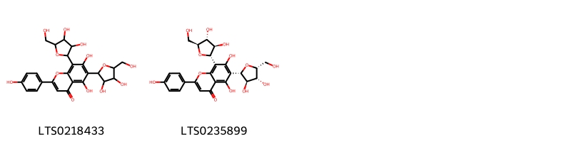
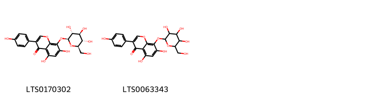
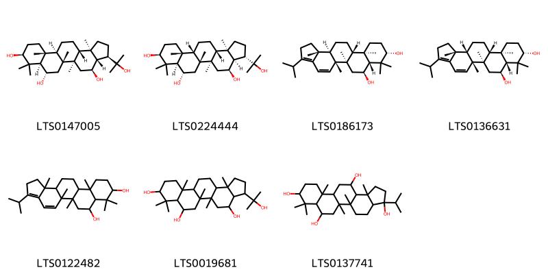
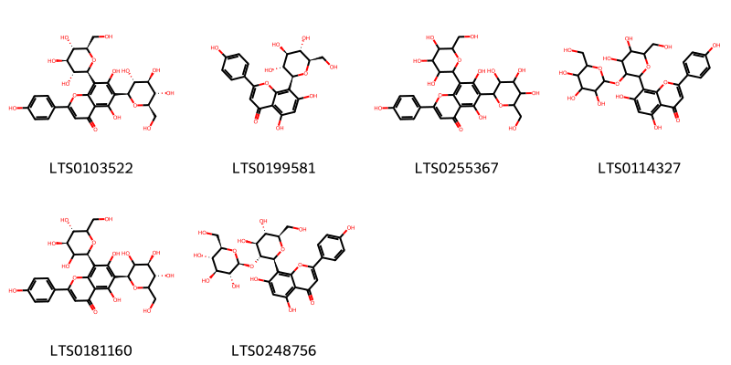
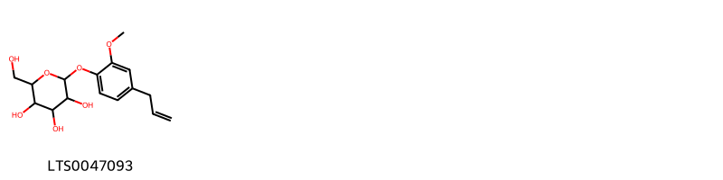
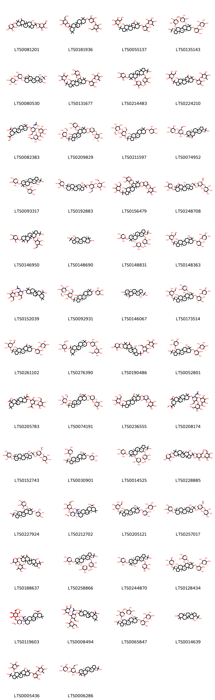
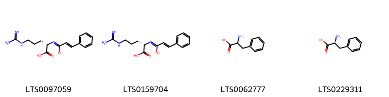
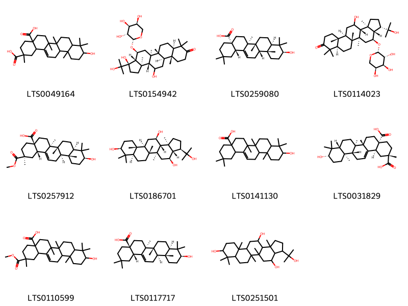

!!! abstract "Tóm tắt"

    Họ Molluginaceae gồm khoảng 3 chi và 6 loài được một số cộng đồng tại các quốc gia như Elsewhere, South Africa(Zulu), India sử dụng trong một số trường hợp MYMEMORY WARNING: YOU USED ALL AVAILABLE FREE TRANSLATIONS FOR TODAY. NEXT AVAILABLE IN  08 HOURS 15 MINUTES 17 SECONDS VISIT HTTPS://MYMEMORY.TRANSLATED.NET/DOC/USAGELIMITS.PHP TO TRANSLATE MORE.

!!! info "DrDuke"

    James A. Duke sinh năm 1929-2017 là một nhà thực vật học người Mỹ. Đây là một trong những tác giả hàng đầu trong lĩnh vực dược dân tộc học với cuốn *CRC Handbook of Medicinal Herbs* và chính là người xây dựng lên cơ sở dữ liệu về hợp chất tự nhiên và dược dân tộc học tại Bộ nông nghiệp Hoa Kỳ. Các thông tin được đăng tải tại website [Dr. Duke's Phytochemical and Ethnobotanical Databases](https://phytochem.nal.usda.gov/). 
    Trong suốt thập niên 1970, ông lãnh đạo the Plant Taxonomy Laboratory, Plant Genetics and Germplasm Institute of the Agricultural Research Service, U.S. Department of Agriculture.
    Trong tài liệu này, các thông tin về dược dân tộc của các dược liệu được trích dẫn từ tài liệu của James A. Ducke với sự trợ giúp của phần mềm dịch thuật từ tiếng Anh sang tiếng Việt.
   

# Chi Mollugo

??? note "Danh sách các dược liệu thuộc chi"
    
	 - *Mollugo cerviana*
	 - *Mollugo hirta*
	 - *Mollugo pentaphylla*

---
## Mollugo cerviana
### Thông tin về thực vật

!!! info "Phân loại thực vật của *Hypertelis cerviana* từ GIBF:"
    - **Kingdom:** Plantae
    - **Phylum:** Tracheophyta
    - **Order:** Caryophyllales
    - **Family:** Molluginaceae
    - **Genus:** Hypertelis
    - **Species:** *Hypertelis cerviana*

 

| Label (VI)   | Label (EN)   | Scientific Name   | Descriptions (VI)   | Descriptions (EN)   | Also Known As (VI)   | Also Known As (EN)   |
|:-------------|:-------------|:------------------|:--------------------|:--------------------|:---------------------|:---------------------|
| N/A          | N/A          | Mollugo cerviana  | loài thực vật       | species of plant    | ['']                 | ['']                 |

#### Phân bố trên thế giới

**Từ CSDL GIBF** Togo, Spain, United States of America, Mexico, Saudi Arabia

#### Phân bố tại Việt Nam

**Từ CSDL GIBF**: Không có ghi nhận ở Việt Nam

---
### Thành phần hóa học
        
- Theo cơ sở dữ liệu lotus: Từ loài *Hypertelis cerviana* đã phân lập và xác định được Chưa có hoạt chất nào được phân lập. hoạt chất thuộc về các nhóm Không có hoạt chất nào được phân lập. 

Không có hình ảnh nào được tạo ra

---

### Dược dân tộc học

Danh sách các quốc gia có sử dụng *Hypertelis cerviana* trong điều trị các bệnh. 

| Country   | Disease                                           | Bệnh                                                                                                                                                                                                |
|:----------|:--------------------------------------------------|:----------------------------------------------------------------------------------------------------------------------------------------------------------------------------------------------------|
| Elsewhere | Aperient, nan, Diaphoretic, Stomachic, Antiseptic | MYMEMORY WARNING: YOU USED ALL AVAILABLE FREE TRANSLATIONS FOR TODAY. NEXT AVAILABLE IN  08 HOURS 15 MINUTES 15 SECONDS VISIT HTTPS://MYMEMORY.TRANSLATED.NET/DOC/USAGELIMITS.PHP TO TRANSLATE MORE |

---

---
## Mollugo hirta
### Thông tin về thực vật

!!! info "Phân loại thực vật của *Glinus hirtus* từ GIBF:"
    - **Kingdom:** Plantae
    - **Phylum:** Tracheophyta
    - **Order:** Caryophyllales
    - **Family:** Molluginaceae
    - **Genus:** Glinus
    - **Species:** *Glinus hirtus*

 

| Label (VI)   | Label (EN)   | Scientific Name   | Descriptions (VI)   | Descriptions (EN)   | Also Known As (VI)   | Also Known As (EN)   |
|:-------------|:-------------|:------------------|:--------------------|:--------------------|:---------------------|:---------------------|
| N/A          | N/A          | Mollugo hirta     |                     |                     | ['']                 | ['']                 |

#### Phân bố trên thế giới

**Từ CSDL GIBF** nan, North Macedonia, unknown or invalid, Palestine, State of, South Africa, Brazil, Philippines, Egypt, India, Ethiopia, Greece, Australia, Saudi Arabia, Chinese Taipei

#### Phân bố tại Việt Nam

**Từ CSDL GIBF**: Không có ghi nhận ở Việt Nam

---
### Thành phần hóa học
        
- Theo cơ sở dữ liệu lotus: Từ loài *Glinus hirtus* đã phân lập và xác định được Chưa có hoạt chất nào được phân lập. hoạt chất thuộc về các nhóm Không có hoạt chất nào được phân lập. 

Không có hình ảnh nào được tạo ra

---

### Dược dân tộc học

Danh sách các quốc gia có sử dụng *Glinus hirtus* trong điều trị các bệnh. 

| Country   | Disease   | Bệnh                                                                                                                                                                                                |
|:----------|:----------|:----------------------------------------------------------------------------------------------------------------------------------------------------------------------------------------------------|
| India     | Purgative | MYMEMORY WARNING: YOU USED ALL AVAILABLE FREE TRANSLATIONS FOR TODAY. NEXT AVAILABLE IN  08 HOURS 14 MINUTES 55 SECONDS VISIT HTTPS://MYMEMORY.TRANSLATED.NET/DOC/USAGELIMITS.PHP TO TRANSLATE MORE |

---

---
## Mollugo pentaphylla
### Thông tin về thực vật

!!! info "Phân loại thực vật của *Trigastrotheca pentaphylla* từ GIBF:"
    - **Kingdom:** Plantae
    - **Phylum:** Tracheophyta
    - **Order:** Caryophyllales
    - **Family:** Molluginaceae
    - **Genus:** Trigastrotheca
    - **Species:** *Trigastrotheca pentaphylla*

 

| Label (VI)   | Label (EN)   | Scientific Name     | Descriptions (VI)   | Descriptions (EN)   | Also Known As (VI)   | Also Known As (EN)   |
|:-------------|:-------------|:--------------------|:--------------------|:--------------------|:---------------------|:---------------------|
| N/A          | N/A          | Mollugo pentaphylla | loài thực vật       | species of plant    | ['']                 | ['']                 |

#### Phân bố trên thế giới

**Từ CSDL GIBF** nan, Thailand, Japan, Brazil, India, Senegal, Indonesia, Lao People’s Democratic Republic, Korea, Republic of, Chinese Taipei

#### Phân bố tại Việt Nam

**Từ CSDL GIBF**: Không có ghi nhận ở Việt Nam

---
### Thành phần hóa học
        
- Theo cơ sở dữ liệu lotus: Từ loài *Trigastrotheca pentaphylla* đã phân lập và xác định được 11 hoạt chất thuộc về các nhóm Prenol lipids, Isoflavonoids, Flavonoids. 

|    | chemicalTaxonomyClassyfireClass   |   smiles_count |
|---:|:----------------------------------|---------------:|
|  0 | Flavonoids                        |              2 |
|  1 | Isoflavonoids                     |              2 |
|  2 | Prenol lipids                     |              7 |

#### Nhóm Flavonoids
<figure markdown="span">
    { width=100% }
    <figcaption>Hình ảnh cấu trúc hóa học của 2 hoạt chất thuộc nhóm Flavonoids gồm ['6,8-bis[3,4-dihydroxy-5-(hydroxymethyl)oxolan-2-yl]-5,7-dihydroxy-2-(4-hydroxyphenyl)chromen-4-one (LTS0218433)', '6-[(2s,3r,4r,5r)-3,4-dihydroxy-5-(hydroxymethyl)oxolan-2-yl]-8-[(2s,3r,4r,5s)-3,4-dihydroxy-5-(hydroxymethyl)oxolan-2-yl]-5,7-dihydroxy-2-(4-hydroxyphenyl)chromen-4-one (LTS0235899)'].</figcaption>
</figure>
#### Nhóm Isoflavonoids
<figure markdown="span">
    { width=100% }
    <figcaption>Hình ảnh cấu trúc hóa học của 2 hoạt chất thuộc nhóm Isoflavonoids gồm ['5,7-dihydroxy-3-(4-hydroxyphenyl)-8-{[(2s,3r,4s,5s,6r)-3,4,5-trihydroxy-6-(hydroxymethyl)oxan-2-yl]oxy}chromen-4-one (LTS0170302)', '5,7-dihydroxy-3-(4-hydroxyphenyl)-8-{[3,4,5-trihydroxy-6-(hydroxymethyl)oxan-2-yl]oxy}chromen-4-one (LTS0063343)'].</figcaption>
</figure>
#### Nhóm Prenol lipids
<figure markdown="span">
    { width=100% }
    <figcaption>Hình ảnh cấu trúc hóa học của 7 hoạt chất thuộc nhóm Prenol lipids gồm ['(3r,3as,4s,5ar,5br,7s,7ar,9s,11ar,11br,13ar,13br)-3-(2-hydroxypropan-2-yl)-5a,5b,8,8,11a,13b-hexamethyl-hexadecahydrocyclopenta[a]chrysene-4,7,9-triol (LTS0147005)', '(3s,3ar,4s,5ar,5br,7s,7ar,9s,11ar,11bs,13ar,13br)-3-(2-hydroxypropan-2-yl)-5a,5b,8,8,11a,13b-hexamethyl-hexadecahydrocyclopenta[a]chrysene-4,7,9-triol (LTS0224444)', '(5ar,5br,7s,7ar,9s,11ar,11br,13ar,13br)-3-isopropyl-5a,5b,8,8,11a,13b-hexamethyl-1h,2h,6h,7h,7ah,9h,10h,11h,11bh,12h,13h,13ah-cyclopenta[a]chrysene-7,9-diol (LTS0186173)', '(5ar,5br,7s,7ar,9s,11ar,11br,13as,13br)-3-isopropyl-5a,5b,8,8,11a,13b-hexamethyl-1h,2h,6h,7h,7ah,9h,10h,11h,11bh,12h,13h,13ah-cyclopenta[a]chrysene-7,9-diol (LTS0136631)', '3-isopropyl-5a,5b,8,8,11a,13b-hexamethyl-1h,2h,6h,7h,7ah,9h,10h,11h,11bh,12h,13h,13ah-cyclopenta[a]chrysene-7,9-diol (LTS0122482)', '3-(2-hydroxypropan-2-yl)-5a,5b,8,8,11a,13b-hexamethyl-hexadecahydrocyclopenta[a]chrysene-4,7,9-triol (LTS0019681)', '3-isopropyl-5a,5b,8,8,11a,13b-hexamethyl-tetradecahydro-1h-cyclopenta[a]chrysene-3,7,9,13-tetrol (LTS0137741)'].</figcaption>
</figure>

---

### Dược dân tộc học

Danh sách các quốc gia có sử dụng *Trigastrotheca pentaphylla* trong điều trị các bệnh. 

| Country   | Disease                                      | Bệnh                                                                                                                                                                                                |
|:----------|:---------------------------------------------|:----------------------------------------------------------------------------------------------------------------------------------------------------------------------------------------------------|
| Elsewhere | Antiseptic, Emmenagogue, Stomachic           | MYMEMORY WARNING: YOU USED ALL AVAILABLE FREE TRANSLATIONS FOR TODAY. NEXT AVAILABLE IN  08 HOURS 14 MINUTES 37 SECONDS VISIT HTTPS://MYMEMORY.TRANSLATED.NET/DOC/USAGELIMITS.PHP TO TRANSLATE MORE |
| India     | Antiseptic, Stomachic, Aperient, Emmenagogue | MYMEMORY WARNING: YOU USED ALL AVAILABLE FREE TRANSLATIONS FOR TODAY. NEXT AVAILABLE IN  08 HOURS 14 MINUTES 35 SECONDS VISIT HTTPS://MYMEMORY.TRANSLATED.NET/DOC/USAGELIMITS.PHP TO TRANSLATE MORE |

---

# Chi Glinus

??? note "Danh sách các dược liệu thuộc chi"
    
	 - *Glinus lotoides*
	 - *Glinus oppositifolius*

---
## Glinus lotoides
### Thông tin về thực vật

!!! info "Phân loại thực vật của *Glinus lotoides* từ GIBF:"
    - **Kingdom:** Plantae
    - **Phylum:** Tracheophyta
    - **Order:** Caryophyllales
    - **Family:** Molluginaceae
    - **Genus:** Glinus
    - **Species:** *Glinus lotoides*

 

| Label (VI)   | Label (EN)   | Scientific Name   | Descriptions (VI)   | Descriptions (EN)   | Also Known As (VI)   | Also Known As (EN)   |
|:-------------|:-------------|:------------------|:--------------------|:--------------------|:---------------------|:---------------------|
| N/A          | N/A          | Glinus lotoides   | loài thực vật       | species of plant    | ['']                 | ['']                 |

#### Phân bố trên thế giới

**Từ CSDL GIBF** nan, Malawi, Namibia, Spain, United Arab Emirates, Australia, Indonesia, Western Sahara, India, Iraq, Bulgaria, Mexico, Chinese Taipei, Portugal, South Africa, Morocco, United States of America, Chad, Zambia, Israel, Madagascar, Greece

#### Phân bố tại Việt Nam

**Từ CSDL GIBF**: Không có ghi nhận ở Việt Nam

---
### Thành phần hóa học
        
- Theo cơ sở dữ liệu lotus: Từ loài *Glinus lotoides* đã phân lập và xác định được 75 hoạt chất thuộc về các nhóm Organooxygen compounds, Prenol lipids, Flavonoids. 

|    | chemicalTaxonomyClassyfireClass   |   smiles_count |
|---:|:----------------------------------|---------------:|
|  0 | Flavonoids                        |              6 |
|  1 | Organooxygen compounds            |              1 |
|  2 | Prenol lipids                     |             68 |

#### Nhóm Flavonoids
<figure markdown="span">
    { width=100% }
    <figcaption>Hình ảnh cấu trúc hóa học của 6 hoạt chất thuộc nhóm Flavonoids gồm ['vicenin-2 (LTS0103522)', 'vitexin (LTS0199581)', '5,7-dihydroxy-2-(4-hydroxyphenyl)-6,8-bis[3,4,5-trihydroxy-6-(hydroxymethyl)oxan-2-yl]chromen-4-one (LTS0255367)', '8-[4,5-dihydroxy-6-(hydroxymethyl)-3-{[3,4,5-trihydroxy-6-(hydroxymethyl)oxan-2-yl]oxy}oxan-2-yl]-5,7-dihydroxy-2-(4-hydroxyphenyl)chromen-4-one (LTS0114327)', 'vicenin 2 (LTS0181160)', "2''-o-glucosylvitexin (LTS0248756)"].</figcaption>
</figure>
#### Nhóm Organooxygen compounds
<figure markdown="span">
    { width=100% }
    <figcaption>Hình ảnh cấu trúc hóa học của 1 hoạt chất thuộc nhóm Organooxygen compounds gồm ['2-(hydroxymethyl)-6-[2-methoxy-4-(prop-2-en-1-yl)phenoxy]oxane-3,4,5-triol (LTS0047093)'].</figcaption>
</figure>
#### Nhóm Prenol lipids
<figure markdown="span">
    { width=100% }
    <figcaption>Hình ảnh cấu trúc hóa học của 68 hoạt chất thuộc nhóm Prenol lipids gồm ['4-hydroxy-5a,5b,8,8,11a,13b-hexamethyl-3-(2-{[3,4,5-trihydroxy-6-(hydroxymethyl)oxan-2-yl]oxy}propan-2-yl)-9-[(3,4,5-trihydroxyoxan-2-yl)oxy]-tetradecahydro-1h-cyclopenta[a]chrysen-7-one (LTS0081201)', '3,4,5-trihydroxy-6-(hydroxymethyl)oxan-2-yl 10-[(3,4-dihydroxy-5-{[3,4,5-trihydroxy-6-(hydroxymethyl)oxan-2-yl]oxy}oxan-2-yl)oxy]-2,2,6a,6b,9,9,12a-heptamethyl-1,3,4,5,6,7,8,8a,10,11,12,12b,13,14b-tetradecahydropicene-4a-carboxylate (LTS0181936)', '2-[(2-{[4,7-dihydroxy-5a,5b,8,8,11a,13b-hexamethyl-3-(2-{[3,4,5-trihydroxy-6-(hydroxymethyl)oxan-2-yl]oxy}propan-2-yl)-hexadecahydrocyclopenta[a]chrysen-9-yl]oxy}-4,5-dihydroxyoxan-3-yl)oxy]-6-methyloxane-3,4,5-triol (LTS0055137)', '(2s,3r,4r,5r,6s)-2-{[(2s,3r,4s,5r)-2-{[(3s,3as,4s,5ar,5br,7s,7ar,9s,11ar,11br,13ar,13br)-3-(2-hydroxypropan-2-yl)-5a,5b,8,8,11a,13b-hexamethyl-4,7-bis({[(2s,3r,4s,5r)-3,4,5-trihydroxyoxan-2-yl]oxy})-hexadecahydrocyclopenta[a]chrysen-9-yl]oxy}-4,5-dihydroxyoxan-3-yl]oxy}-6-methyloxane-3,4,5-triol (LTS0135143)', '(2s,3s,3as,4s,5ar,5br,7ar,9s,11ar,11br,13ar,13br)-9-{[(2s,3r,4s,5r)-4,5-dihydroxy-3-{[(2s,3r,4r,5r,6s)-3,4,5-trihydroxy-6-methyloxan-2-yl]oxy}oxan-2-yl]oxy}-2,4-dihydroxy-3-(2-hydroxypropan-2-yl)-5a,5b,8,8,11a,13b-hexamethyl-tetradecahydro-1h-cyclopenta[a]chrysen-7-one (LTS0080530)', '2-({4,5-dihydroxy-2-[(4-hydroxy-5a,5b,8,8,11a,13b-hexamethyl-3-{2-[(3,4,5-trihydroxy-6-methyloxan-2-yl)oxy]propan-2-yl}-7-[(3,4,5-trihydroxyoxan-2-yl)oxy]-hexadecahydrocyclopenta[a]chrysen-9-yl)oxy]oxan-3-yl}oxy)-6-methyloxane-3,4,5-triol (LTS0131677)', '2-{[3-(2-hydroxypropan-2-yl)-5a,5b,8,8,11a,13b-hexamethyl-7,9-bis[(3,4,5-trihydroxyoxan-2-yl)oxy]-hexadecahydrocyclopenta[a]chrysen-4-yl]oxy}oxane-3,4,5-triol (LTS0214483)', '9-({4,5-dihydroxy-3-[(3,4,5-trihydroxy-6-methyloxan-2-yl)oxy]oxan-2-yl}oxy)-4-hydroxy-5a,5b,8,8,11a,13b-hexamethyl-3-(2-{[3,4,5-trihydroxy-6-(hydroxymethyl)oxan-2-yl]oxy}propan-2-yl)-tetradecahydro-1h-cyclopenta[a]chrysen-7-one (LTS0224210)', '(2s,4ar,6as,6br,8ar,10s,12ar,12br,14bs)-10-{[(2r,3r,4r,5s,6r)-3-[(1-hydroxyethylidene)amino]-6-(hydroxymethyl)-4-{[(2r,3r,4s,5r,6r)-3,4,5-trihydroxy-6-(hydroxymethyl)oxan-2-yl]oxy}-5-{[(2s,3r,4s,5s,6r)-3,4,5-trihydroxy-6-(hydroxymethyl)oxan-2-yl]oxy}oxan-2-yl]oxy}-2-(methoxycarbonyl)-2,6a,6b,9,9,12a-hexamethyl-1,3,4,5,6,7,8,8a,10,11,12,12b,13,14b-tetradecahydropicene-4a-carboxylic acid (LTS0082383)', '(2s,3s,4r,5s,6s)-2-{[(3r,4r,5r,6s)-6-{[(3r,3as,4s,5as,5br,7s,7as,9s,11as,11bs,13as,13bs)-4-hydroxy-5a,5b,8,8,11a,13b-hexamethyl-3-(2-{[(2s,3s,4r,5s,6s)-3,4,5-trihydroxy-6-(hydroxymethyl)oxan-2-yl]oxy}propan-2-yl)-7-{[(2s,3s,4r,5s)-3,4,5-trihydroxyoxan-2-yl]oxy}-hexadecahydrocyclopenta[a]chrysen-9-yl]oxy}-4,5-dihydroxyoxan-3-yl]oxy}-6-methyloxane-3,4,5-triol (LTS0209829)', '(2s,3r,4s,5r,6r)-2-{[(2r,3r,4r,5r,6s)-6-({2-[(3r,3as,4s,5ar,5br,7as,9s,11as,11br,13ar,13br)-4-hydroxy-5a,5b,8,8,11a,13b-hexamethyl-9-{[(2s,3r,4s,5s)-3,4,5-trihydroxyoxan-2-yl]oxy}-hexadecahydrocyclopenta[a]chrysen-3-yl]propan-2-yl}oxy)-4,5-dihydroxy-2-(hydroxymethyl)oxan-3-yl]oxy}-6-(hydroxymethyl)oxane-3,4,5-triol (LTS0211597)', '(3r,3as,5ar,5br,7ar,9s,11ar,11br,13ar,13bs)-9-{[(2r,3r,4r,5s,6r)-3,4-dihydroxy-6-(hydroxymethyl)-5-{[(2s,3r,4s,5s)-3,4,5-trihydroxyoxan-2-yl]oxy}oxan-2-yl]oxy}-3-(2-hydroxypropan-2-yl)-5a,5b,8,8,11a,13b-hexamethyl-tetradecahydro-1h-cyclopenta[a]chrysen-7-one (LTS0074952)', '(2s,3r,4s,5r)-2-{[(3r,3as,4s,5ar,5br,7s,7ar,9s,11ar,11br,13ar,13br)-4-hydroxy-3-(2-hydroxypropan-2-yl)-5a,5b,8,8,11a,13b-hexamethyl-7-{[(2s,3r,4s,5r)-3,4,5-trihydroxyoxan-2-yl]oxy}-hexadecahydrocyclopenta[a]chrysen-9-yl]oxy}oxane-3,4,5-triol (LTS0093317)', '(2s,3r,4s,5s,6r)-2-{[(2r,3s,4r,5r,6s)-6-({2-[(3s,3as,4s,5ar,5br,7as,9s,11ar,11br,13ar,13br)-4-hydroxy-5a,5b,8,8,11a,13b-hexamethyl-9-{[(2s,3r,4s,5s)-3,4,5-trihydroxyoxan-2-yl]oxy}-hexadecahydrocyclopenta[a]chrysen-3-yl]propan-2-yl}oxy)-4,5-dihydroxy-2-(hydroxymethyl)oxan-3-yl]oxy}-6-(hydroxymethyl)oxane-3,4,5-triol (LTS0192883)', '2-[(4,5-dihydroxy-6-{[4-hydroxy-5a,5b,8,8,11a,13b-hexamethyl-3-(2-{[3,4,5-trihydroxy-6-(hydroxymethyl)oxan-2-yl]oxy}propan-2-yl)-7-[(3,4,5-trihydroxyoxan-2-yl)oxy]-hexadecahydrocyclopenta[a]chrysen-9-yl]oxy}oxan-3-yl)oxy]-6-methyloxane-3,4,5-triol (LTS0156479)', '(3r,3as,5r,5ar,5br,7ar,11ar,11br,13ar,13bs)-3-(2-{[(2s,3r,4r,5s,6r)-3,4-dihydroxy-6-(hydroxymethyl)-5-{[(2s,3r,4r,5r,6s)-3,4,5-trihydroxy-6-methyloxan-2-yl]oxy}oxan-2-yl]oxy}propan-2-yl)-5-hydroxy-5a,5b,8,8,11a,13b-hexamethyl-9-{[(2s,3r,4s,5s)-3,4,5-trihydroxyoxan-2-yl]oxy}-tetradecahydro-1h-cyclopenta[a]chrysen-7-one (LTS0248708)', '3-(2-hydroxypropan-2-yl)-5a,5b,8,8,11a,13b-hexamethyl-5-{[3,4,5-trihydroxy-6-(hydroxymethyl)oxan-2-yl]oxy}-9-[(3,4,5-trihydroxyoxan-2-yl)oxy]-tetradecahydro-1h-cyclopenta[a]chrysen-7-one (LTS0146950)', '(3r,3as,4s,5ar,5br,7as,9s,11ar,11br,13ar,13br)-3-(2-hydroxypropan-2-yl)-5a,5b,8,8,11a,13b-hexamethyl-hexadecahydrocyclopenta[a]chrysene-4,9-diol (LTS0148690)', '(2s,3r,4s,5r)-2-{[(3s,3as,4s,5ar,5br,7s,7ar,9s,11ar,11br,13ar,13br)-3-(2-hydroxypropan-2-yl)-5a,5b,8,8,11a,13b-hexamethyl-7,9-bis({[(2s,3r,4s,5r)-3,4,5-trihydroxyoxan-2-yl]oxy})-hexadecahydrocyclopenta[a]chrysen-4-yl]oxy}oxane-3,4,5-triol (LTS0148831)', '(2s,3r,4s,5s,6r)-2-({2-[(3r,3as,4s,5ar,5br,7s,7ar,9s,11ar,11br,13ar,13br)-9-{[(2r,3r,4r,5r,6s)-4,5-dihydroxy-6-methyl-3-{[(2s,3r,4s,5r)-3,4,5-trihydroxyoxan-2-yl]oxy}oxan-2-yl]oxy}-4,7-dihydroxy-5a,5b,8,8,11a,13b-hexamethyl-hexadecahydrocyclopenta[a]chrysen-3-yl]propan-2-yl}oxy)-6-(hydroxymethyl)oxane-3,4,5-triol (LTS0148363)', '10-({5-hydroxy-3-[(1-hydroxyethylidene)amino]-6-(hydroxymethyl)-4-{[3,4,5-trihydroxy-6-(hydroxymethyl)oxan-2-yl]oxy}oxan-2-yl}oxy)-2,2,6a,6b,9,9,12a-heptamethyl-1,3,4,5,6,7,8,8a,10,11,12,12b,13,14b-tetradecahydropicene-4a-carboxylic acid (LTS0152039)', '(2s,3r,4s,5s,6r)-2-{[(2r,3s,4r,5r,6s)-6-({2-[(3r,3as,5ar,5br,7as,11ar,11br,13ar,13br)-4-hydroxy-5a,5b,8,8,11a,13b-hexamethyl-9-{[(2r,3r,4s,5s)-3,4,5-trihydroxyoxan-2-yl]oxy}-hexadecahydrocyclopenta[a]chrysen-3-yl]propan-2-yl}oxy)-4,5-dihydroxy-2-(hydroxymethyl)oxan-3-yl]oxy}-6-(hydroxymethyl)oxane-3,4,5-triol (LTS0092931)', '(3s,3as,4s,5ar,5br,7ar,9s,11ar,11br,13ar,13br)-4,9-dihydroxy-3-(2-hydroxypropan-2-yl)-5a,5b,8,8,11a,13b-hexamethyl-tetradecahydro-1h-cyclopenta[a]chrysen-7-one (LTS0146067)', '(2s,3r,4s,5s,6r)-2-({2-[(3r,3as,4s,5ar,5br,7s,7ar,9s,11ar,11br,13ar,13br)-9-{[(2r,3r,4r,5r,6s)-4,5-dihydroxy-6-methyl-3-{[(2s,3r,4s,5r)-3,4,5-trihydroxyoxan-2-yl]oxy}oxan-2-yl]oxy}-4-hydroxy-5a,5b,8,8,11a,13b-hexamethyl-7-{[(2s,3r,4s,5r)-3,4,5-trihydroxyoxan-2-yl]oxy}-hexadecahydrocyclopenta[a]chrysen-3-yl]propan-2-yl}oxy)-6-(hydroxymethyl)oxane-3,4,5-triol (LTS0173514)', '(3r,3as,4s,5ar,5br,7ar,9s,11ar,11br,13ar,13br)-9-{[(2s,3r,4s,5r)-4,5-dihydroxy-3-{[(2s,3r,4r,5r,6s)-3,4,5-trihydroxy-6-methyloxan-2-yl]oxy}oxan-2-yl]oxy}-4-hydroxy-5a,5b,8,8,11a,13b-hexamethyl-3-(2-{[(2s,3r,4s,5s,6r)-3,4,5-trihydroxy-6-(hydroxymethyl)oxan-2-yl]oxy}propan-2-yl)-tetradecahydro-1h-cyclopenta[a]chrysen-7-one (LTS0261102)', '(2r,3s,4r,5r,6s)-3,4,5-trihydroxy-6-(hydroxymethyl)oxan-2-yl (4as,6as,6br,8ar,10s,12ar,12br,14br)-10-{[(2s,3r,4r,5s)-3,4-dihydroxy-5-{[(2s,3r,4s,5s,6r)-3,4,5-trihydroxy-6-(hydroxymethyl)oxan-2-yl]oxy}oxan-2-yl]oxy}-2,2,6a,6b,9,9,12a-heptamethyl-1,3,4,5,6,7,8,8a,10,11,12,12b,13,14b-tetradecahydropicene-4a-carboxylate (LTS0276390)', '3-(2-{[3,4-dihydroxy-6-(hydroxymethyl)-5-[(3,4,5-trihydroxy-6-methyloxan-2-yl)oxy]oxan-2-yl]oxy}propan-2-yl)-5-hydroxy-5a,5b,8,8,11a,13b-hexamethyl-9-[(3,4,5-trihydroxyoxan-2-yl)oxy]-tetradecahydro-1h-cyclopenta[a]chrysen-7-one (LTS0190486)', '(2s,3r,4r,5r,6s)-2-{[(2s,3r,4s,5r)-2-{[(3r,3as,4s,5ar,5br,7s,7ar,9s,11ar,11br,13ar,13br)-7-hydroxy-3-(2-hydroxypropan-2-yl)-5a,5b,8,8,11a,13b-hexamethyl-4-{[(2r,3r,4r,5r,6s)-3,4,5-trihydroxy-6-methyloxan-2-yl]oxy}-hexadecahydrocyclopenta[a]chrysen-9-yl]oxy}-4,5-dihydroxyoxan-3-yl]oxy}-6-methyloxane-3,4,5-triol (LTS0052801)', '3-[(6-carboxy-3,4-dihydroxy-5-{[3,4,5-trihydroxy-6-(hydroxymethyl)oxan-2-yl]oxy}oxan-2-yl)oxy]-4,6a,6b,11,11,14b-hexamethyl-1,2,3,4a,5,6,7,8,9,10,12,12a,14,14a-tetradecahydropicene-4,8a-dicarboxylic acid (LTS0205783)', '(2r,3s,4r,5r,6s)-2-{[(3s,4s,5s,6r)-6-{[(3r,3as,4r,5ar,5br,7r,7as,9r,11as,11bs,13ar,13bs)-4,7-dihydroxy-5a,5b,8,8,11a,13b-hexamethyl-3-(2-{[(2r,3s,4r,5r,6s)-3,4,5-trihydroxy-6-(hydroxymethyl)oxan-2-yl]oxy}propan-2-yl)-hexadecahydrocyclopenta[a]chrysen-9-yl]oxy}-4,5-dihydroxyoxan-3-yl]oxy}-6-methyloxane-3,4,5-triol (LTS0074191)', '2-[(6-{[4,7-dihydroxy-5a,5b,8,8,11a,13b-hexamethyl-3-(2-{[3,4,5-trihydroxy-6-(hydroxymethyl)oxan-2-yl]oxy}propan-2-yl)-hexadecahydrocyclopenta[a]chrysen-9-yl]oxy}-4,5-dihydroxyoxan-3-yl)oxy]-6-methyloxane-3,4,5-triol (LTS0236555)', '10-({3-[(1-hydroxyethylidene)amino]-6-(hydroxymethyl)-4,5-bis({[3,4,5-trihydroxy-6-(hydroxymethyl)oxan-2-yl]oxy})oxan-2-yl}oxy)-2-(methoxycarbonyl)-2,6a,6b,9,9,12a-hexamethyl-1,3,4,5,6,7,8,8a,10,11,12,12b,13,14b-tetradecahydropicene-4a-carboxylic acid (LTS0208174)', '(2s,3r,4r,5r,6s)-2-{[(2r,3r,4r,5r,6s)-6-({2-[(3r,3as,4s,5ar,5br,7as,9s,11as,11br,13ar,13br)-4-hydroxy-5a,5b,8,8,11a,13b-hexamethyl-9-{[(2s,3r,4s,5s)-3,4,5-trihydroxyoxan-2-yl]oxy}-hexadecahydrocyclopenta[a]chrysen-3-yl]propan-2-yl}oxy)-4,5-dihydroxy-2-(hydroxymethyl)oxan-3-yl]oxy}-6-methyloxane-3,4,5-triol (LTS0152743)', '(2s,3r,4r,5r)-2-{[(3r,3ar,4r,5ar,5br,7s,7as,9s,11ar,11bs,13ar,13br)-7-hydroxy-3-(2-hydroxypropan-2-yl)-5a,5b,8,8,11a,13b-hexamethyl-4-{[(2s,3s,4s,5r)-3,4,5-trihydroxyoxan-2-yl]oxy}-hexadecahydrocyclopenta[a]chrysen-9-yl]oxy}oxane-3,4,5-triol (LTS0030901)', '(2r,3s,4r,5r)-2-{[(3r,3ar,4s,5ar,5br,7r,7as,9r,11ar,11bs,13ar,13br)-3-(2-hydroxypropan-2-yl)-5a,5b,8,8,11a,13b-hexamethyl-7-{[(2r,3s,4s,5s)-3,4,5-trihydroxyoxan-2-yl]oxy}-9-{[(2s,3r,4r,5r)-3,4,5-trihydroxyoxan-2-yl]oxy}-hexadecahydrocyclopenta[a]chrysen-4-yl]oxy}oxane-3,4,5-triol (LTS0014525)', '2-({4,5-dihydroxy-6-[(2-{4-hydroxy-5a,5b,8,8,11a,13b-hexamethyl-9-[(3,4,5-trihydroxyoxan-2-yl)oxy]-hexadecahydrocyclopenta[a]chrysen-3-yl}propan-2-yl)oxy]-2-(hydroxymethyl)oxan-3-yl}oxy)-6-(hydroxymethyl)oxane-3,4,5-triol (LTS0228885)', '(2r,3r,4r,5s)-2-{[(3r,3as,4s,5as,5br,7r,7as,9s,11as,11bs,13as,13bs)-4-hydroxy-3-(2-hydroxypropan-2-yl)-5a,5b,8,8,11a,13b-hexamethyl-7-{[(2r,3s,4s,5s)-3,4,5-trihydroxyoxan-2-yl]oxy}-hexadecahydrocyclopenta[a]chrysen-9-yl]oxy}oxane-3,4,5-triol (LTS0227924)', '(4as,6as,6br,8ar,10s,12ar,12br,14bs)-10-{[(2r,3r,4r,5s,6r)-5-hydroxy-3-[(1-hydroxyethylidene)amino]-6-(hydroxymethyl)-4-{[(2r,3r,4s,5r,6r)-3,4,5-trihydroxy-6-(hydroxymethyl)oxan-2-yl]oxy}oxan-2-yl]oxy}-2,2,6a,6b,9,9,12a-heptamethyl-1,3,4,5,6,7,8,8a,10,11,12,12b,13,14b-tetradecahydropicene-4a-carboxylic acid (LTS0212702)', '(2s,3r,4r,5r,6s)-2-{[(2s,3r,4s,5r)-2-{[(3r,3as,4s,5ar,5br,7s,7ar,9s,11ar,11br,13ar,13br)-4,7-dihydroxy-5a,5b,8,8,11a,13b-hexamethyl-3-(2-{[(2s,3r,4s,5s,6r)-3,4,5-trihydroxy-6-(hydroxymethyl)oxan-2-yl]oxy}propan-2-yl)-hexadecahydrocyclopenta[a]chrysen-9-yl]oxy}-4,5-dihydroxyoxan-3-yl]oxy}-6-methyloxane-3,4,5-triol (LTS0205121)', '(2s,3r,4r,5r,6s)-2-{[(2r,3s,4r,5r,6s)-6-({2-[(3s,3as,4s,5ar,5br,7as,9s,11ar,11br,13ar,13br)-4-hydroxy-5a,5b,8,8,11a,13b-hexamethyl-9-{[(2s,3r,4s,5s)-3,4,5-trihydroxyoxan-2-yl]oxy}-hexadecahydrocyclopenta[a]chrysen-3-yl]propan-2-yl}oxy)-4,5-dihydroxy-2-(hydroxymethyl)oxan-3-yl]oxy}-6-methyloxane-3,4,5-triol (LTS0257017)', '9-({4,5-dihydroxy-3-[(3,4,5-trihydroxy-6-methyloxan-2-yl)oxy]oxan-2-yl}oxy)-2,4-dihydroxy-3-(2-hydroxypropan-2-yl)-5a,5b,8,8,11a,13b-hexamethyl-tetradecahydro-1h-cyclopenta[a]chrysen-7-one (LTS0188637)', '(2s,3r,4s,5r)-2-{[(3r,3as,4s,5ar,5br,7s,7ar,9s,11ar,11br,13ar,13br)-3-(2-hydroxypropan-2-yl)-5a,5b,8,8,11a,13b-hexamethyl-9-{[(2s,3r,4s,5r)-3,4,5-trihydroxyoxan-2-yl]oxy}-7-{[(2s,3r,4s,5s)-3,4,5-trihydroxyoxan-2-yl]oxy}-hexadecahydrocyclopenta[a]chrysen-4-yl]oxy}oxane-3,4,5-triol (LTS0258866)', '(2s,3r,4s,5s)-2-{[(3r,3as,4s,5ar,5br,7s,7ar,9s,11ar,11br,13ar,13br)-7-hydroxy-3-(2-hydroxypropan-2-yl)-5a,5b,8,8,11a,13b-hexamethyl-9-{[(2s,3r,4s,5r)-3,4,5-trihydroxyoxan-2-yl]oxy}-hexadecahydrocyclopenta[a]chrysen-4-yl]oxy}oxane-3,4,5-triol (LTS0244870)', '(2s,3r,4r,5r,6s)-2-{[(2s,3r,4s,5r)-2-{[(3r,3as,4s,5ar,5br,7s,7ar,9s,11ar,11br,13ar,13br)-4-hydroxy-5a,5b,8,8,11a,13b-hexamethyl-3-(2-{[(2s,3r,4r,5r,6s)-3,4,5-trihydroxy-6-methyloxan-2-yl]oxy}propan-2-yl)-7-{[(2s,3r,4s,5r)-3,4,5-trihydroxyoxan-2-yl]oxy}-hexadecahydrocyclopenta[a]chrysen-9-yl]oxy}-4,5-dihydroxyoxan-3-yl]oxy}-6-methyloxane-3,4,5-triol (LTS0128434)', '(4as,6as,6br,8ar,10s,12ar,12br,14bs)-10-{[(2r,3r,4r,5s,6r)-3-[(1-hydroxyethylidene)amino]-6-(hydroxymethyl)-4-{[(2r,3r,4s,5r,6r)-3,4,5-trihydroxy-6-(hydroxymethyl)oxan-2-yl]oxy}-5-{[(2s,3r,4s,5s,6r)-3,4,5-trihydroxy-6-(hydroxymethyl)oxan-2-yl]oxy}oxan-2-yl]oxy}-2,2,6a,6b,9,9,12a-heptamethyl-1,3,4,5,6,7,8,8a,10,11,12,12b,13,14b-tetradecahydropicene-4a-carboxylic acid (LTS0119603)', '10-({3-[(1-hydroxyethylidene)amino]-6-(hydroxymethyl)-4,5-bis({[3,4,5-trihydroxy-6-(hydroxymethyl)oxan-2-yl]oxy})oxan-2-yl}oxy)-2,2,6a,6b,9,9,12a-heptamethyl-1,3,4,5,6,7,8,8a,10,11,12,12b,13,14b-tetradecahydropicene-4a-carboxylic acid (LTS0008494)', '(2s,3r,4r,5r,6s)-2-{[(2s,3r,4s,5r)-2-{[(3r,3as,4s,5ar,5br,7s,7ar,9s,11ar,11br,13ar,13br)-3-(2-hydroxypropan-2-yl)-5a,5b,8,8,11a,13b-hexamethyl-4,7-bis({[(2s,3r,4s,5r)-3,4,5-trihydroxyoxan-2-yl]oxy})-hexadecahydrocyclopenta[a]chrysen-9-yl]oxy}-4,5-dihydroxyoxan-3-yl]oxy}-6-methyloxane-3,4,5-triol (LTS0065847)', '3-(2-hydroxypropan-2-yl)-5a,5b,8,8,11a,13b-hexamethyl-hexadecahydrocyclopenta[a]chrysene-4,9-diol (LTS0014639)', '2-{[9-({4,5-dihydroxy-3-[(3,4,5-trihydroxy-6-methyloxan-2-yl)oxy]oxan-2-yl}oxy)-7-hydroxy-3-(2-hydroxypropan-2-yl)-5a,5b,8,8,11a,13b-hexamethyl-hexadecahydrocyclopenta[a]chrysen-4-yl]oxy}-6-methyloxane-3,4,5-triol (LTS0005436)', '(3r,3as,5ar,5br,7ar,11ar,11br,13ar,13bs)-9-{[(2r,3r,4r,5s,6r)-3,4-dihydroxy-6-(hydroxymethyl)-5-{[(2s,3r,4s,5s)-3,4,5-trihydroxyoxan-2-yl]oxy}oxan-2-yl]oxy}-3-(2-hydroxypropan-2-yl)-5a,5b,8,8,11a,13b-hexamethyl-tetradecahydro-1h-cyclopenta[a]chrysen-7-one (LTS0006286)', '4,9-dihydroxy-3-(2-hydroxypropan-2-yl)-5a,5b,8,8,11a,13b-hexamethyl-tetradecahydro-1h-cyclopenta[a]chrysen-7-one (LTS0006049)', '(3r,3as,4s,5as,5bs,7as,9s,11as,11bs,13ar,13br)-4-hydroxy-5a,5b,8,8,11a,13b-hexamethyl-3-(2-{[(2s,3s,4s,5r,6r)-3,4,5-trihydroxy-6-(hydroxymethyl)oxan-2-yl]oxy}propan-2-yl)-9-{[(2r,3s,4s,5s)-3,4,5-trihydroxyoxan-2-yl]oxy}-tetradecahydro-1h-cyclopenta[a]chrysen-7-one (LTS0008529)', '2-({4,5-dihydroxy-6-[(2-{4-hydroxy-5a,5b,8,8,11a,13b-hexamethyl-9-[(3,4,5-trihydroxyoxan-2-yl)oxy]-hexadecahydrocyclopenta[a]chrysen-3-yl}propan-2-yl)oxy]-2-(hydroxymethyl)oxan-3-yl}oxy)-6-methyloxane-3,4,5-triol (LTS0017837)', '(3r,3as,4s,5ar,5br,7ar,9s,11ar,11br,13ar,13br)-3-(2-hydroxypropan-2-yl)-5a,5b,8,8,11a,13b-hexamethyl-hexadecahydrocyclopenta[a]chrysene-4,9-diol (LTS0011174)', '(3s,4s,4ar,6ar,6bs,8as,12as,14ar,14br)-3-{[(2r,3r,4r,5s,6s)-6-carboxy-3,4-dihydroxy-5-{[(2s,3r,4s,5s,6r)-3,4,5-trihydroxy-6-(hydroxymethyl)oxan-2-yl]oxy}oxan-2-yl]oxy}-4,6a,6b,11,11,14b-hexamethyl-1,2,3,4a,5,6,7,8,9,10,12,12a,14,14a-tetradecahydropicene-4,8a-dicarboxylic acid (LTS0265322)', '(3r,3as,5r,5ar,5br,7ar,9s,11ar,11br,13ar,13bs)-3-(2-hydroxypropan-2-yl)-5a,5b,8,8,11a,13b-hexamethyl-5-{[(2r,3r,4s,5s,6r)-3,4,5-trihydroxy-6-(hydroxymethyl)oxan-2-yl]oxy}-9-{[(2s,3r,4s,5s)-3,4,5-trihydroxyoxan-2-yl]oxy}-tetradecahydro-1h-cyclopenta[a]chrysen-7-one (LTS0004441)', '2-{[7-hydroxy-3-(2-hydroxypropan-2-yl)-5a,5b,8,8,11a,13b-hexamethyl-9-[(3,4,5-trihydroxyoxan-2-yl)oxy]-hexadecahydrocyclopenta[a]chrysen-4-yl]oxy}oxane-3,4,5-triol (LTS0116089)', '2-({2-[9-({4,5-dihydroxy-6-methyl-3-[(3,4,5-trihydroxyoxan-2-yl)oxy]oxan-2-yl}oxy)-4,7-dihydroxy-5a,5b,8,8,11a,13b-hexamethyl-hexadecahydrocyclopenta[a]chrysen-3-yl]propan-2-yl}oxy)-6-(hydroxymethyl)oxane-3,4,5-triol (LTS0022071)', '(2s,3r,4r,5r,6s)-2-{[(2s,3r,4s,5r)-2-{[(3s,3as,4s,5ar,5br,7s,7ar,9s,11ar,11br,13ar,13br)-4-hydroxy-5a,5b,8,8,11a,13b-hexamethyl-3-(2-{[(2s,3r,4r,5r,6s)-3,4,5-trihydroxy-6-methyloxan-2-yl]oxy}propan-2-yl)-7-{[(2s,3r,4s,5r)-3,4,5-trihydroxyoxan-2-yl]oxy}-hexadecahydrocyclopenta[a]chrysen-9-yl]oxy}-4,5-dihydroxyoxan-3-yl]oxy}-6-methyloxane-3,4,5-triol (LTS0120469)', '(2s,3r,4s,5r)-2-{[(3r,3as,4s,5ar,5br,7s,7ar,9s,11ar,11br,13ar,13br)-3-(2-hydroxypropan-2-yl)-5a,5b,8,8,11a,13b-hexamethyl-7,9-bis({[(2s,3r,4s,5r)-3,4,5-trihydroxyoxan-2-yl]oxy})-hexadecahydrocyclopenta[a]chrysen-4-yl]oxy}oxane-3,4,5-triol (LTS0218974)', '(3r,3as,5r,5ar,5br,7ar,9s,11ar,11br,13ar,13bs)-3-(2-{[(2s,3r,4r,5s,6r)-3,4-dihydroxy-6-(hydroxymethyl)-5-{[(2s,3r,4r,5r,6s)-3,4,5-trihydroxy-6-methyloxan-2-yl]oxy}oxan-2-yl]oxy}propan-2-yl)-5-hydroxy-5a,5b,8,8,11a,13b-hexamethyl-9-{[(2s,3r,4s,5s)-3,4,5-trihydroxyoxan-2-yl]oxy}-tetradecahydro-1h-cyclopenta[a]chrysen-7-one (LTS0019419)', '2-({2-[9-({4,5-dihydroxy-6-methyl-3-[(3,4,5-trihydroxyoxan-2-yl)oxy]oxan-2-yl}oxy)-4-hydroxy-5a,5b,8,8,11a,13b-hexamethyl-7-[(3,4,5-trihydroxyoxan-2-yl)oxy]-hexadecahydrocyclopenta[a]chrysen-3-yl]propan-2-yl}oxy)-6-(hydroxymethyl)oxane-3,4,5-triol (LTS0030557)', '(2s,3r,4r,5r,6s)-2-{[(2s,3r,4s,5r)-2-{[(3s,3as,4s,5ar,5br,7s,7ar,9s,11ar,11br,13ar,13br)-4,7-dihydroxy-5a,5b,8,8,11a,13b-hexamethyl-3-(2-{[(2s,3r,4r,5r,6s)-3,4,5-trihydroxy-6-methyloxan-2-yl]oxy}propan-2-yl)-hexadecahydrocyclopenta[a]chrysen-9-yl]oxy}-4,5-dihydroxyoxan-3-yl]oxy}-6-methyloxane-3,4,5-triol (LTS0044460)', '2-{[4-hydroxy-3-(2-hydroxypropan-2-yl)-5a,5b,8,8,11a,13b-hexamethyl-7-[(3,4,5-trihydroxyoxan-2-yl)oxy]-hexadecahydrocyclopenta[a]chrysen-9-yl]oxy}oxane-3,4,5-triol (LTS0101401)', '(3r,3as,5r,5ar,5br,7ar,11ar,11br,13ar,13bs)-3-(2-hydroxypropan-2-yl)-5a,5b,8,8,11a,13b-hexamethyl-5-{[(2r,3r,4s,5s,6r)-3,4,5-trihydroxy-6-(hydroxymethyl)oxan-2-yl]oxy}-9-{[(2s,3r,4s,5s)-3,4,5-trihydroxyoxan-2-yl]oxy}-tetradecahydro-1h-cyclopenta[a]chrysen-7-one (LTS0028977)', '(3r,3as,4s,5ar,5br,7ar,9s,11ar,11br,13ar,13br)-4-hydroxy-5a,5b,8,8,11a,13b-hexamethyl-3-(2-{[(2s,3r,4s,5s,6r)-3,4,5-trihydroxy-6-(hydroxymethyl)oxan-2-yl]oxy}propan-2-yl)-9-{[(2s,3r,4s,5r)-3,4,5-trihydroxyoxan-2-yl]oxy}-tetradecahydro-1h-cyclopenta[a]chrysen-7-one (LTS0048112)', '2-[(4,5-dihydroxy-2-{[3-(2-hydroxypropan-2-yl)-5a,5b,8,8,11a,13b-hexamethyl-4,7-bis[(3,4,5-trihydroxyoxan-2-yl)oxy]-hexadecahydrocyclopenta[a]chrysen-9-yl]oxy}oxan-3-yl)oxy]-6-methyloxane-3,4,5-triol (LTS0122969)', '9-{[3,4-dihydroxy-6-(hydroxymethyl)-5-[(3,4,5-trihydroxyoxan-2-yl)oxy]oxan-2-yl]oxy}-3-(2-hydroxypropan-2-yl)-5a,5b,8,8,11a,13b-hexamethyl-tetradecahydro-1h-cyclopenta[a]chrysen-7-one (LTS0260513)'].</figcaption>
</figure>

---

### Dược dân tộc học

Danh sách các quốc gia có sử dụng *Glinus lotoides* trong điều trị các bệnh. 

| Country   | Disease   | Bệnh                                                                                                                                                                                                |
|:----------|:----------|:----------------------------------------------------------------------------------------------------------------------------------------------------------------------------------------------------|
| India     | Purgative | MYMEMORY WARNING: YOU USED ALL AVAILABLE FREE TRANSLATIONS FOR TODAY. NEXT AVAILABLE IN  08 HOURS 14 MINUTES 12 SECONDS VISIT HTTPS://MYMEMORY.TRANSLATED.NET/DOC/USAGELIMITS.PHP TO TRANSLATE MORE |

---

---
## Glinus oppositifolius
### Thông tin về thực vật

!!! info "Phân loại thực vật của *Glinus oppositifolius* từ GIBF:"
    - **Kingdom:** Plantae
    - **Phylum:** Tracheophyta
    - **Order:** Caryophyllales
    - **Family:** Molluginaceae
    - **Genus:** Glinus
    - **Species:** *Glinus oppositifolius*

 

| Label (VI)   | Label (EN)   | Scientific Name       | Descriptions (VI)   | Descriptions (EN)   | Also Known As (VI)   | Also Known As (EN)                                   |
|:-------------|:-------------|:----------------------|:--------------------|:--------------------|:---------------------|:-----------------------------------------------------|
| N/A          | N/A          | Glinus oppositifolius | loài thực vật       | species of plant    | ['']                 | ['Gima', 'Jima', 'Indian Chickweed', 'Bitter Cumin'] |

#### Phân bố trên thế giới

**Từ CSDL GIBF** Viet Nam, Thailand, Spain, Kenya, Australia, Indonesia, Côte d’Ivoire, India, Mayotte, Bangladesh, Myanmar, Timor-Leste, Chinese Taipei, South Africa, Botswana, Mozambique, Zimbabwe, Congo, Madagascar

#### Phân bố tại Việt Nam

**Từ CSDL GIBF**: Long An

---
### Thành phần hóa học
        
- Theo cơ sở dữ liệu lotus: Từ loài *Glinus oppositifolius* đã phân lập và xác định được 53 hoạt chất thuộc về các nhóm Flavonoids, Prenol lipids, Carboxylic acids and derivatives, Purine nucleosides, Steroids and steroid derivatives. 

|    | chemicalTaxonomyClassyfireClass   |   smiles_count |
|---:|:----------------------------------|---------------:|
|  0 | Carboxylic acids and derivatives  |              4 |
|  1 | Flavonoids                        |             12 |
|  2 | Prenol lipids                     |             11 |
|  3 | Purine nucleosides                |              2 |
|  4 | Steroids and steroid derivatives  |             24 |

#### Nhóm Carboxylic acids and derivatives
<figure markdown="span">
    { width=100% }
    <figcaption>Hình ảnh cấu trúc hóa học của 4 hoạt chất thuộc nhóm Carboxylic acids and derivatives gồm ['(2s)-5-carbamimidamido-2-{[(2e)-1-hydroxy-3-phenylprop-2-en-1-ylidene]amino}pentanoic acid (LTS0097059)', '(2s)-5-carbamimidamido-2-[(1-hydroxy-3-phenylprop-2-en-1-ylidene)amino]pentanoic acid (LTS0159704)', 'phenylalanin (LTS0062777)', 'l-phenylalanine (LTS0229311)'].</figcaption>
</figure>
#### Nhóm Flavonoids
<figure markdown="span">
    { width=100% }
    <figcaption>Hình ảnh cấu trúc hóa học của 12 hoạt chất thuộc nhóm Flavonoids gồm ['vicenin-2 (LTS0103522)', 'vitexin (LTS0199581)', '5,7-dihydroxy-2-(4-hydroxyphenyl)-6,8-bis[3,4,5-trihydroxy-6-(hydroxymethyl)oxan-2-yl]chromen-4-one (LTS0255367)', '3-{[4,5-dihydroxy-6-(hydroxymethyl)-3-[(3,4,5-trihydroxyoxan-2-yl)oxy]oxan-2-yl]oxy}-5,7-dihydroxy-2-(4-hydroxy-3-methoxyphenyl)chromen-4-one (LTS0225484)', '(2s,3r,4s,5s,6r)-4,5-dihydroxy-6-(hydroxymethyl)-2-[2-(4-hydroxyphenyl)-4-oxo-7-{[(2s,3r,4s,5s,6r)-3,4,5-trihydroxy-6-(hydroxymethyl)oxan-2-yl]oxy}chromen-8-yl]oxan-3-yl (2e)-3-(4-hydroxyphenyl)prop-2-enoate (LTS0257444)', '4,5-dihydroxy-6-(hydroxymethyl)-2-[2-(4-hydroxyphenyl)-4-oxo-7-{[3,4,5-trihydroxy-6-(hydroxymethyl)oxan-2-yl]oxy}chromen-8-yl]oxan-3-yl 3-(4-hydroxyphenyl)prop-2-enoate (LTS0177736)', 'trifolin (LTS0267055)', 'trifolin (LTS0237581)', '2-(4-hydroxyphenyl)-8-[(2s,3r,4r,5s,6r)-3,4,5-trihydroxy-6-(hydroxymethyl)oxan-2-yl]-7-{[(2s,3r,4s,5s,6r)-3,4,5-trihydroxy-6-(hydroxymethyl)oxan-2-yl]oxy}chromen-4-one (LTS0230666)', '2-(4-hydroxyphenyl)-8-[3,4,5-trihydroxy-6-(hydroxymethyl)oxan-2-yl]-7-{[3,4,5-trihydroxy-6-(hydroxymethyl)oxan-2-yl]oxy}chromen-4-one (LTS0051834)', '3-{[(2s,3r,4s,5r,6r)-4,5-dihydroxy-6-(hydroxymethyl)-3-{[(2s,3r,4s,5r)-3,4,5-trihydroxyoxan-2-yl]oxy}oxan-2-yl]oxy}-5,7-dihydroxy-2-(4-hydroxy-3-methoxyphenyl)chromen-4-one (LTS0229990)', 'vitexin (LTS0254648)'].</figcaption>
</figure>
#### Nhóm Prenol lipids
<figure markdown="span">
    { width=100% }
    <figcaption>Hình ảnh cấu trúc hóa học của 11 hoạt chất thuộc nhóm Prenol lipids gồm ['10-hydroxy-2,6a,6b,9,9,12a-hexamethyl-1,3,4,5,6,7,8,8a,10,11,12,12b,13,14b-tetradecahydropicene-2,4a-dicarboxylic acid (LTS0049164)', '(3r,3as,4s,5ar,5br,7ar,11ar,11br,13ar,13br)-3,13-dihydroxy-3-(2-hydroxypropan-2-yl)-5a,5b,8,8,11a,13b-hexamethyl-4-{[(2r,3r,4s,5s)-3,4,5-trihydroxyoxan-2-yl]oxy}-tetradecahydrocyclopenta[a]chrysen-9-one (LTS0154942)', '(4ar,6as,6br,8ar,10s,12ar,12bs,14bs)-10-hydroxy-2,2,6a,6b,9,9,12a-heptamethyl-1,3,4,5,6,7,8,8a,10,11,12,12b,13,14b-tetradecahydropicene-4a-carboxylic acid (LTS0259080)', '(3s,3as,4s,5ar,5br,7ar,11ar,11br,13ar,13bs)-13-hydroxy-3-(2-hydroxypropan-2-yl)-5a,5b,8,8,11a,13b-hexamethyl-4-{[(2r,3r,4s,5s)-3,4,5-trihydroxyoxan-2-yl]oxy}-tetradecahydro-1h-cyclopenta[a]chrysen-9-one (LTS0114023)', '(2s,4ar,6as,6br,8ar,10s,12ar,12br,14bs)-10-hydroxy-2-(methoxycarbonyl)-2,6a,6b,9,9,12a-hexamethyl-1,3,4,5,6,7,8,8a,10,11,12,12b,13,14b-tetradecahydropicene-4a-carboxylic acid (LTS0257912)', '(3r,3as,4s,5ar,5br,7ar,9s,11ar,11br,13r,13ar,13bs)-3-(2-hydroxypropan-2-yl)-5a,5b,8,8,11a,13b-hexamethyl-hexadecahydrocyclopenta[a]chrysene-4,9,13-triol (LTS0186701)', 'oleanolic acid (LTS0141130)', '(2s,4ar,6as,6br,8ar,10s,12ar,12br,14bs)-10-hydroxy-2,6a,6b,9,9,12a-hexamethyl-1,3,4,5,6,7,8,8a,10,11,12,12b,13,14b-tetradecahydropicene-2,4a-dicarboxylic acid (LTS0031829)', '10-hydroxy-2-(methoxycarbonyl)-2,6a,6b,9,9,12a-hexamethyl-1,3,4,5,6,7,8,8a,10,11,12,12b,13,14b-tetradecahydropicene-4a-carboxylic acid (LTS0110599)', 'oleanolic acid (LTS0117717)', '3-(2-hydroxypropan-2-yl)-5a,5b,8,8,11a,13b-hexamethyl-hexadecahydrocyclopenta[a]chrysene-4,9,13-triol (LTS0251501)'].</figcaption>
</figure>
#### Nhóm Purine nucleosides
<figure markdown="span">
    { width=100% }
    <figcaption>Hình ảnh cấu trúc hóa học của 2 hoạt chất thuộc nhóm Purine nucleosides gồm ['adenosine (LTS0052576)', 'adenosine (LTS0014061)'].</figcaption>
</figure>
#### Nhóm Steroids and steroid derivatives
<figure markdown="span">
    { width=100% }
    <figcaption>Hình ảnh cấu trúc hóa học của 24 hoạt chất thuộc nhóm Steroids and steroid derivatives gồm ['2-{[2-({4,13-dihydroxy-5a,5b,8,8,11a,13b-hexamethyl-3-methylidene-tetradecahydro-1h-cyclopenta[a]chrysen-9-yl}oxy)-4,5-dihydroxyoxan-3-yl]oxy}-6-methyloxane-3,4,5-triol (LTS0072430)', '1-[(3r,3ar,4s,5ar,5br,7ar,9s,11ar,11br,13r,13ar,13br)-9-{[(2s,3r,4s,5r)-3,5-dihydroxy-4-{[(2s,3r,4r,5r,6s)-3,4,5-trihydroxy-6-methyloxan-2-yl]oxy}oxan-2-yl]oxy}-4,13-dihydroxy-3,5a,5b,8,8,11a,13b-heptamethyl-tetradecahydro-1h-cyclopenta[a]chrysen-3-yl]ethanone (LTS0102045)', '1-[9-({3,5-dihydroxy-4-[(3,4,5-trihydroxy-6-methyloxan-2-yl)oxy]oxan-2-yl}oxy)-4,13-dihydroxy-3,5a,5b,8,8,11a,13b-heptamethyl-tetradecahydro-1h-cyclopenta[a]chrysen-3-yl]ethanone (LTS0096720)', '(3ar,5as,9as,9bs,11ar)-1-(5-ethyl-6-methylhept-3-en-2-yl)-9a,11a-dimethyl-1h,2h,3h,3ah,5h,5ah,6h,7h,8h,9h,9bh,10h,11h-cyclopenta[a]phenanthren-7-ol (LTS0197417)', 'sitogluside (LTS0201798)', '1-[(3s,3ar,4s,5ar,5br,7ar,9s,11as,11bs,13r,13ar,13bs)-9-{[(2r,3s,4r,5s)-3,5-dihydroxy-4-{[(2r,3s,4r,5r,6s)-3,4,5-trihydroxy-6-methyloxan-2-yl]oxy}oxan-2-yl]oxy}-4,13-dihydroxy-3,5a,5b,8,8,11a,13b-heptamethyl-tetradecahydro-1h-cyclopenta[a]chrysen-3-yl]ethanone (LTS0274661)', '1-[9-({4,5-dihydroxy-3-[(3,4,5-trihydroxy-6-methyloxan-2-yl)oxy]oxan-2-yl}oxy)-4,13-dihydroxy-3,5a,5b,8,8,11a,13b-heptamethyl-tetradecahydro-1h-cyclopenta[a]chrysen-3-yl]ethanone (LTS0261965)', '1-[(3r,3ar,4s,5ar,5br,7ar,9s,11ar,11br,13r,13ar,13br)-9-{[(2s,3r,4s,5r)-4,5-dihydroxy-3-{[(2s,3r,4r,5r,6s)-3,4,5-trihydroxy-6-methyloxan-2-yl]oxy}oxan-2-yl]oxy}-4,13-dihydroxy-3,5a,5b,8,8,11a,13b-heptamethyl-tetradecahydro-1h-cyclopenta[a]chrysen-3-yl]ethanone (LTS0152923)', 'chondrillasterol (LTS0142259)', '[2-({3-acetyl-4,13-dihydroxy-3,5a,5b,8,8,11a,13b-heptamethyl-tetradecahydro-1h-cyclopenta[a]chrysen-9-yl}oxy)-3,5-dihydroxyoxan-4-yl]oxidanesulfonic acid (LTS0190411)', '9-({4,5-dihydroxy-3-[(3,4,5-trihydroxy-6-methyloxan-2-yl)oxy]oxan-2-yl}oxy)-4,13-dihydroxy-3,5a,5b,8,8,11a,13b-heptamethyl-tetradecahydro-1h-cyclopenta[a]chrysen-3-yl acetate (LTS0233078)', '2-{[1-(5-ethyl-6-methylheptan-2-yl)-9a,11a-dimethyl-1h,2h,3h,3ah,3bh,4h,6h,7h,8h,9h,9bh,10h,11h-cyclopenta[a]phenanthren-7-yl]oxy}-6-(hydroxymethyl)oxane-3,4,5-triol (LTS0158828)', '1-(5-ethyl-6-methylhept-3-en-2-yl)-9a,11a-dimethyl-1h,2h,3h,3ah,5h,5ah,6h,7h,8h,9h,9bh,10h,11h-cyclopenta[a]phenanthren-7-ol (LTS0173223)', '1-[(3r,3ar,4s,5ar,5br,7ar,9s,11ar,11br,13r,13ar,13br)-9-{[(2s,3s,4s,5s)-3,5-dihydroxy-4-{[(2s,3r,4r,5r,6s)-3,4,5-trihydroxy-6-methyloxan-2-yl]oxy}oxan-2-yl]oxy}-4,13-dihydroxy-3,5a,5b,8,8,11a,13b-heptamethyl-tetradecahydro-1h-cyclopenta[a]chrysen-3-yl]ethanone (LTS0088553)', '[(2s,3r,4s,5r)-2-{[(3r,3ar,4s,5ar,5br,7ar,9s,11ar,11br,13r,13ar,13br)-3-acetyl-4,13-dihydroxy-3,5a,5b,8,8,11a,13b-heptamethyl-tetradecahydro-1h-cyclopenta[a]chrysen-9-yl]oxy}-3,5-dihydroxyoxan-4-yl]oxidanesulfonic acid (LTS0186842)', '(1r,3ar,5as,7s,9as,9bs,11ar)-1-[(2r,3e,5s)-5-ethyl-6-methylhept-3-en-2-yl]-9a,11a-dimethyl-1h,2h,3h,3ah,5h,5ah,6h,7h,8h,9h,9bh,10h,11h-cyclopenta[a]phenanthren-7-ol (LTS0206144)', '[(2r,3r,4s,5s)-2-{[(3r,3ar,4s,5ar,5br,7ar,9s,11ar,11br,13r,13ar,13br)-3-acetyl-4,13-dihydroxy-3,5a,5b,8,8,11a,13b-heptamethyl-tetradecahydro-1h-cyclopenta[a]chrysen-9-yl]oxy}-3,5-dihydroxyoxan-4-yl]oxidanesulfonic acid (LTS0082165)', '(3r,3ar,4s,5ar,5br,7ar,9s,11ar,11br,13r,13ar,13br)-9-{[(2s,3r,4s,5r)-4,5-dihydroxy-3-{[(2s,3r,4r,5r,6s)-3,4,5-trihydroxy-6-methyloxan-2-yl]oxy}oxan-2-yl]oxy}-4,13-dihydroxy-3,5a,5b,8,8,11a,13b-heptamethyl-tetradecahydro-1h-cyclopenta[a]chrysen-3-yl acetate (LTS0084671)', '1-[(3r,3ar,4s,5ar,5br,7ar,9s,11ar,11br,13r,13ar,13br)-4,9,13-trihydroxy-3,5a,5b,8,8,11a,13b-heptamethyl-tetradecahydro-1h-cyclopenta[a]chrysen-3-yl]ethanone (LTS0119393)', '(2s,3r,4r,5r,6s)-2-{[(2s,3r,4s,5r)-2-{[(3as,4s,5ar,5br,7ar,9s,11ar,11br,13r,13ar,13bs)-4,13-dihydroxy-5a,5b,8,8,11a,13b-hexamethyl-3-methylidene-tetradecahydro-1h-cyclopenta[a]chrysen-9-yl]oxy}-4,5-dihydroxyoxan-3-yl]oxy}-6-methyloxane-3,4,5-triol (LTS0260427)', '1-[(3s,3ar,4s,5ar,5br,7ar,9s,11as,11bs,13r,13ar,13bs)-9-{[(2r,3s,4r,5s)-4,5-dihydroxy-3-{[(2r,3s,4r,5r,6s)-3,4,5-trihydroxy-6-methyloxan-2-yl]oxy}oxan-2-yl]oxy}-4,13-dihydroxy-3,5a,5b,8,8,11a,13b-heptamethyl-tetradecahydro-1h-cyclopenta[a]chrysen-3-yl]ethanone (LTS0014800)', '[(2s,3s,4r,5s)-2-{[(3r,3ar,4s,5ar,5br,7ar,9s,11ar,11br,13r,13ar,13br)-3-acetyl-4,13-dihydroxy-3,5a,5b,8,8,11a,13b-heptamethyl-tetradecahydro-1h-cyclopenta[a]chrysen-9-yl]oxy}-3,5-dihydroxyoxan-4-yl]oxidanesulfonic acid (LTS0109648)', '1-[(3r,3ar,4s,5ar,5br,7ar,9s,11ar,11br,13r,13ar,13br)-9-{[(2r,3s,4s,5s)-4,5-dihydroxy-3-{[(2s,3r,4r,5r,6s)-3,4,5-trihydroxy-6-methyloxan-2-yl]oxy}oxan-2-yl]oxy}-4,13-dihydroxy-3,5a,5b,8,8,11a,13b-heptamethyl-tetradecahydro-1h-cyclopenta[a]chrysen-3-yl]ethanone (LTS0109012)', '(2r,3s,4s,5r,6r)-2-{[(2r,3s,4r,5s)-2-{[(3as,4r,5as,5bs,7as,9s,11ar,11br,13s,13ar,13br)-4,13-dihydroxy-5a,5b,8,8,11a,13b-hexamethyl-3-methylidene-tetradecahydro-1h-cyclopenta[a]chrysen-9-yl]oxy}-4,5-dihydroxyoxan-3-yl]oxy}-6-methyloxane-3,4,5-triol (LTS0022632)'].</figcaption>
</figure>

---

### Dược dân tộc học

Danh sách các quốc gia có sử dụng *Glinus oppositifolius* trong điều trị các bệnh. 

| Country   | Disease                                                           | Bệnh                                                                                                                                                                                                |
|:----------|:------------------------------------------------------------------|:----------------------------------------------------------------------------------------------------------------------------------------------------------------------------------------------------|
| India     | Antiseptic, Aperient, Cathartic, Stomachic, Abortifacient, Poison | MYMEMORY WARNING: YOU USED ALL AVAILABLE FREE TRANSLATIONS FOR TODAY. NEXT AVAILABLE IN  08 HOURS 13 MINUTES 47 SECONDS VISIT HTTPS://MYMEMORY.TRANSLATED.NET/DOC/USAGELIMITS.PHP TO TRANSLATE MORE |

---

# Chi Orygia

??? note "Danh sách các dược liệu thuộc chi"
    
	 - *Orygia decumbens*

---
## Orygia decumbens
### Thông tin về thực vật

!!! info "Phân loại thực vật của *Corbichonia decumbens* từ GIBF:"
    - **Kingdom:** Plantae
    - **Phylum:** Tracheophyta
    - **Order:** Caryophyllales
    - **Family:** Corbichoniaceae
    - **Genus:** Corbichonia
    - **Species:** *Corbichonia decumbens*

 

| Label (VI)   | Label (EN)   | Scientific Name   | Descriptions (VI)   | Descriptions (EN)   | Also Known As (VI)   | Also Known As (EN)   |
|:-------------|:-------------|:------------------|:--------------------|:--------------------|:---------------------|:---------------------|
| N/A          | N/A          | Orygia decumbens  |                     |                     | ['']                 | ['']                 |

#### Phân bố trên thế giới

**Từ CSDL GIBF** nan, unknown or invalid, South Africa, Eritrea, Namibia, Syrian Arab Republic, Tanzania, United Republic of, India, Congo, Democratic Republic of the, Kenya

#### Phân bố tại Việt Nam

**Từ CSDL GIBF**: Không có ghi nhận ở Việt Nam

---
### Thành phần hóa học
        
- Theo cơ sở dữ liệu lotus: Từ loài *Corbichonia decumbens* đã phân lập và xác định được Chưa có hoạt chất nào được phân lập. hoạt chất thuộc về các nhóm Không có hoạt chất nào được phân lập. 

Không có hình ảnh nào được tạo ra

---

### Dược dân tộc học

Danh sách các quốc gia có sử dụng *Corbichonia decumbens* trong điều trị các bệnh. 

| Country            | Disease   | Bệnh                                                                                                                                                                                                |
|:-------------------|:----------|:----------------------------------------------------------------------------------------------------------------------------------------------------------------------------------------------------|
| South Africa(Zulu) | Emetic    | MYMEMORY WARNING: YOU USED ALL AVAILABLE FREE TRANSLATIONS FOR TODAY. NEXT AVAILABLE IN  08 HOURS 13 MINUTES 21 SECONDS VISIT HTTPS://MYMEMORY.TRANSLATED.NET/DOC/USAGELIMITS.PHP TO TRANSLATE MORE |

---

