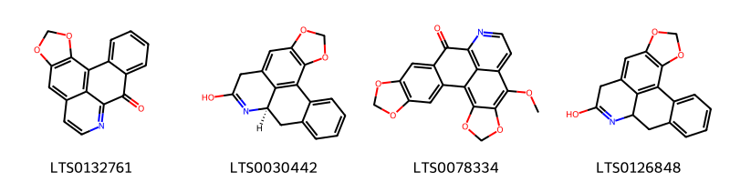
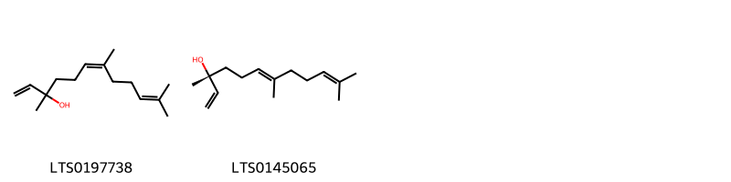
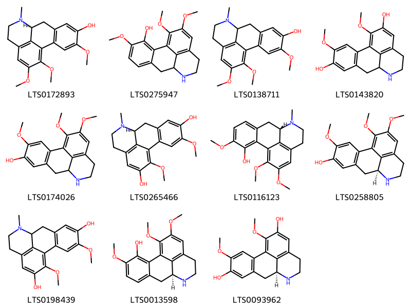
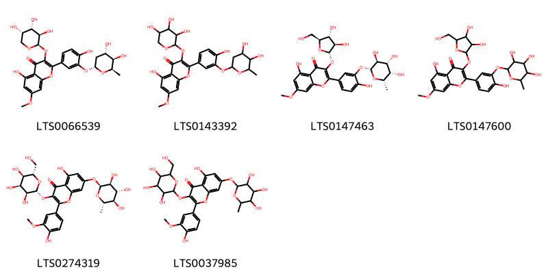
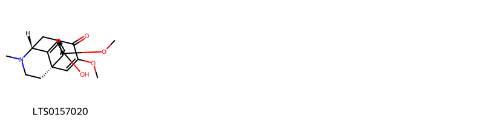
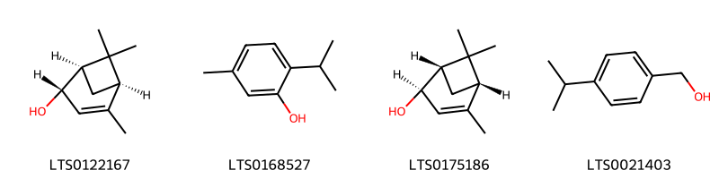
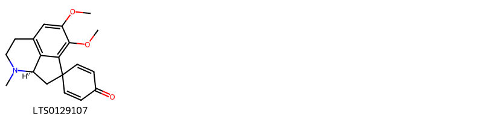

!!! abstract "Tóm tắt"

    Họ Monimiaceae gồm khoảng 2 chi và 3 loài được một số cộng đồng tại các quốc gia như Turkey, Elsewhere, Chile, Brazil sử dụng trong một số trường hợp Thuốc lợi tiểu, Chất kích thích, Chất kích thích, Khử trùng, Thuốc lợi tiểu, Hepatotonic, Chất kích thích, Dạ dày, Thuốc bổ, Thuốc an thần, Vermifuge, Sudorific, Abortifacient, Thuốc trừ sâu.

!!! info "DrDuke"

    James A. Duke sinh năm 1929-2017 là một nhà thực vật học người Mỹ. Đây là một trong những tác giả hàng đầu trong lĩnh vực dược dân tộc học với cuốn *CRC Handbook of Medicinal Herbs* và chính là người xây dựng lên cơ sở dữ liệu về hợp chất tự nhiên và dược dân tộc học tại Bộ nông nghiệp Hoa Kỳ. Các thông tin được đăng tải tại website [Dr. Duke's Phytochemical and Ethnobotanical Databases](https://phytochem.nal.usda.gov/). 
    Trong suốt thập niên 1970, ông lãnh đạo the Plant Taxonomy Laboratory, Plant Genetics and Germplasm Institute of the Agricultural Research Service, U.S. Department of Agriculture.
    Trong tài liệu này, các thông tin về dược dân tộc của các dược liệu được trích dẫn từ tài liệu của James A. Ducke với sự trợ giúp của phần mềm dịch thuật từ tiếng Anh sang tiếng Việt.
   

# Chi Siparuna

??? note "Danh sách các dược liệu thuộc chi"
    
	 - *Siparuna cujabana*
	 - *Siparuna guianensis*

---
## Siparuna cujabana
### Thông tin về thực vật

!!! info "Phân loại thực vật của *Siparuna brasiliensis* từ GIBF:"
    - **Kingdom:** Plantae
    - **Phylum:** Tracheophyta
    - **Order:** Laurales
    - **Family:** Siparunaceae
    - **Genus:** Siparuna
    - **Species:** *Siparuna brasiliensis*

 

| Label (VI)   | Label (EN)   | Scientific Name   | Descriptions (VI)   | Descriptions (EN)   | Also Known As (VI)   | Also Known As (EN)   |
|:-------------|:-------------|:------------------|:--------------------|:--------------------|:---------------------|:---------------------|
| N/A          | N/A          | Siparuna cujabana |                     |                     | ['']                 | ['']                 |

#### Phân bố trên thế giới

**Từ CSDL GIBF** nan, Brazil

#### Phân bố tại Việt Nam

**Từ CSDL GIBF**: Không có ghi nhận ở Việt Nam

---
### Thành phần hóa học
        
- Theo cơ sở dữ liệu lotus: Từ loài *Siparuna brasiliensis* đã phân lập và xác định được Chưa có hoạt chất nào được phân lập. hoạt chất thuộc về các nhóm Không có hoạt chất nào được phân lập. 

Không có hình ảnh nào được tạo ra

---

### Dược dân tộc học

Danh sách các quốc gia có sử dụng *Siparuna brasiliensis* trong điều trị các bệnh. 

| Country   | Disease                  | Bệnh                   |
|:----------|:-------------------------|:-----------------------|
| Brazil    | Sudorific, Abortifacient | Gây ngạt, gây sẩy thai |

---

---
## Siparuna guianensis
### Thông tin về thực vật

!!! info "Phân loại thực vật của *Siparuna guianensis* từ GIBF:"
    - **Kingdom:** Plantae
    - **Phylum:** Tracheophyta
    - **Order:** Laurales
    - **Family:** Siparunaceae
    - **Genus:** Siparuna
    - **Species:** *Siparuna guianensis*

 

| Label (VI)   | Label (EN)   | Scientific Name     | Descriptions (VI)   | Descriptions (EN)   | Also Known As (VI)   | Also Known As (EN)   |
|:-------------|:-------------|:--------------------|:--------------------|:--------------------|:---------------------|:---------------------|
| N/A          | N/A          | Siparuna guianensis | loài thực vật       | species of plant    | ['']                 | ['']                 |

#### Phân bố trên thế giới

**Từ CSDL GIBF** Colombia, Brazil, French Guiana, Peru

#### Phân bố tại Việt Nam

**Từ CSDL GIBF**: Không có ghi nhận ở Việt Nam

---
### Thành phần hóa học
        
- Theo cơ sở dữ liệu lotus: Từ loài *Siparuna guianensis* đã phân lập và xác định được 6 hoạt chất thuộc về các nhóm Aporphines, Prenol lipids. 

|    | chemicalTaxonomyClassyfireClass   |   smiles_count |
|---:|:----------------------------------|---------------:|
|  0 | Aporphines                        |              4 |
|  1 | Prenol lipids                     |              2 |

#### Nhóm Aporphines
<figure markdown="span">
    { width=100% }
    <figcaption>Hình ảnh cấu trúc hóa học của 4 hoạt chất thuộc nhóm Aporphines gồm ['liriodenine (LTS0132761)', '(12r)-3,5-dioxa-11-azapentacyclo[10.7.1.0²,⁶.0⁸,²⁰.0¹⁴,¹⁹]icosa-1,6,8(20),10,14,16,18-heptaen-10-ol (LTS0030442)', '17-methoxy-5,7,19,21-tetraoxa-13-azahexacyclo[10.10.1.0²,¹⁰.0⁴,⁸.0¹⁶,²³.0¹⁸,²²]tricosa-1(22),2,4(8),9,12(23),13,15,17-octaen-11-one (LTS0078334)', '3,5-dioxa-11-azapentacyclo[10.7.1.0²,⁶.0⁸,²⁰.0¹⁴,¹⁹]icosa-1,6,8(20),10,14,16,18-heptaen-10-ol (LTS0126848)'].</figcaption>
</figure>
#### Nhóm Prenol lipids
<figure markdown="span">
    { width=100% }
    <figcaption>Hình ảnh cấu trúc hóa học của 2 hoạt chất thuộc nhóm Prenol lipids gồm ['nerolidol (LTS0197738)', '(3r,6e)-nerolidol (LTS0145065)'].</figcaption>
</figure>

---

### Dược dân tộc học

Danh sách các quốc gia có sử dụng *Siparuna guianensis* trong điều trị các bệnh. 

| Country   | Disease     | Bệnh            |
|:----------|:------------|:----------------|
| Brazil    | Stimulant   | Chất kích thích |
| Elsewhere | Insecticide | Thuốc trừ sâu   |

---

# Chi Peumus

??? note "Danh sách các dược liệu thuộc chi"
    
	 - *Peumus boldus*

---
## Peumus boldus
### Thông tin về thực vật

!!! info "Phân loại thực vật của *Peumus boldus* từ GIBF:"
    - **Kingdom:** Plantae
    - **Phylum:** Tracheophyta
    - **Order:** Laurales
    - **Family:** Monimiaceae
    - **Genus:** Peumus
    - **Species:** *Peumus boldus*

 

| Label (VI)   | Label (EN)   | Scientific Name   | Descriptions (VI)   | Descriptions (EN)   | Also Known As (VI)   | Also Known As (EN)   |
|:-------------|:-------------|:------------------|:--------------------|:--------------------|:---------------------|:---------------------|
| N/A          | N/A          | Peumus boldus     | loài thực vật       | species of plant    | ['']                 | ['Peumus boldus']    |

#### Phân bố trên thế giới

**Từ CSDL GIBF** Chile

#### Phân bố tại Việt Nam

**Từ CSDL GIBF**: Không có ghi nhận ở Việt Nam

---
### Thành phần hóa học
        
- Theo cơ sở dữ liệu lotus: Từ loài *Peumus boldus* đã phân lập và xác định được 25 hoạt chất thuộc về các nhóm Flavonoids, Proaporphines, Prenol lipids, Phenanthrenes and derivatives, Aporphines, Dioxanes, Isoquinolines and derivatives. 

|    | chemicalTaxonomyClassyfireClass   |   smiles_count |
|---:|:----------------------------------|---------------:|
|  0 | Aporphines                        |             11 |
|  1 | Dioxanes                          |              1 |
|  2 | Flavonoids                        |              6 |
|  3 | Isoquinolines and derivatives     |              1 |
|  4 | Phenanthrenes and derivatives     |              1 |
|  5 | Prenol lipids                     |              4 |
|  6 | Proaporphines                     |              1 |

#### Nhóm Aporphines
<figure markdown="span">
    { width=100% }
    <figcaption>Hình ảnh cấu trúc hóa học của 11 hoạt chất thuộc nhóm Aporphines gồm ['(9s)-4,15,16-trimethoxy-10-methyl-10-azatetracyclo[7.7.1.0²,⁷.0¹³,¹⁷]heptadeca-1(16),2(7),3,5,13(17),14-hexaen-5-ol (LTS0172893)', '4,15,16-trimethoxy-10-azatetracyclo[7.7.1.0²,⁷.0¹³,¹⁷]heptadeca-1(16),2,4,6,13(17),14-hexaen-3-ol (LTS0275947)', '4,15,16-trimethoxy-10-methyl-10-azatetracyclo[7.7.1.0²,⁷.0¹³,¹⁷]heptadeca-1(16),2(7),3,5,13(17),14-hexaen-5-ol (LTS0138711)', '4,16-dimethoxy-10-azatetracyclo[7.7.1.0²,⁷.0¹³,¹⁷]heptadeca-1(17),2(7),3,5,13,15-hexaene-5,15-diol (LTS0143820)', '4,15,16-trimethoxy-10-azatetracyclo[7.7.1.0²,⁷.0¹³,¹⁷]heptadeca-1(17),2(7),3,5,13,15-hexaen-5-ol (LTS0174026)', '(9s)-4,16-dimethoxy-10-methyl-10-azatetracyclo[7.7.1.0²,⁷.0¹³,¹⁷]heptadeca-1(16),2(7),3,5,13(17),14-hexaene-5,15-diol (LTS0265466)', '(9s)-4,15,16-trimethoxy-10-methyl-10-azatetracyclo[7.7.1.0²,⁷.0¹³,¹⁷]heptadeca-1(16),2,4,6,13(17),14-hexaen-3-ol (LTS0116123)', 'laurotetanine (LTS0258805)', '4,16-dimethoxy-10-methyl-10-azatetracyclo[7.7.1.0²,⁷.0¹³,¹⁷]heptadeca-1(16),2(7),3,5,13(17),14-hexaene-5,15-diol (LTS0198439)', '(9s)-4,15,16-trimethoxy-10-azatetracyclo[7.7.1.0²,⁷.0¹³,¹⁷]heptadeca-1(16),2,4,6,13(17),14-hexaen-3-ol (LTS0013598)', 'laurolitsine (LTS0093962)'].</figcaption>
</figure>
#### Nhóm Dioxanes
<figure markdown="span">
    { width=100% }
    <figcaption>Hình ảnh cấu trúc hóa học của 1 hoạt chất thuộc nhóm Dioxanes gồm ['ascaridole (LTS0041598)'].</figcaption>
</figure>
#### Nhóm Flavonoids
<figure markdown="span">
    { width=100% }
    <figcaption>Hình ảnh cấu trúc hóa học của 6 hoạt chất thuộc nhóm Flavonoids gồm ['2-(3-{[(2r,4s,5r,6r)-4,5-dihydroxy-6-methyloxan-2-yl]oxy}-4-hydroxyphenyl)-5-hydroxy-7-methoxy-3-{[(2r,3r,4s,5s)-3,4,5-trihydroxyoxan-2-yl]oxy}chromen-4-one (LTS0066539)', '2-{3-[(4,5-dihydroxy-6-methyloxan-2-yl)oxy]-4-hydroxyphenyl}-5-hydroxy-7-methoxy-3-[(3,4,5-trihydroxyoxan-2-yl)oxy]chromen-4-one (LTS0143392)', '3-{[(2s,3r,4r,5s)-3,4-dihydroxy-5-(hydroxymethyl)oxolan-2-yl]oxy}-5-hydroxy-2-(4-hydroxy-3-{[(2r,3s,4r,5s,6s)-3,4,5-trihydroxy-6-methyloxan-2-yl]oxy}phenyl)-7-methoxychromen-4-one (LTS0147463)', '3-{[3,4-dihydroxy-5-(hydroxymethyl)oxolan-2-yl]oxy}-5-hydroxy-2-{4-hydroxy-3-[(3,4,5-trihydroxy-6-methyloxan-2-yl)oxy]phenyl}-7-methoxychromen-4-one (LTS0147600)', '5-hydroxy-2-(4-hydroxy-3-methoxyphenyl)-3-{[(2r,3s,4s,5r,6s)-3,4,5-trihydroxy-6-(hydroxymethyl)oxan-2-yl]oxy}-7-{[(2s,3s,4r,5r,6s)-3,4,5-trihydroxy-6-methyloxan-2-yl]oxy}chromen-4-one (LTS0274319)', '5-hydroxy-2-(4-hydroxy-3-methoxyphenyl)-3-{[3,4,5-trihydroxy-6-(hydroxymethyl)oxan-2-yl]oxy}-7-[(3,4,5-trihydroxy-6-methyloxan-2-yl)oxy]chromen-4-one (LTS0037985)'].</figcaption>
</figure>
#### Nhóm Isoquinolines and derivatives
<figure markdown="span">
    { width=100% }
    <figcaption>Hình ảnh cấu trúc hóa học của 1 hoạt chất thuộc nhóm Isoquinolines and derivatives gồm ['(+,-)-reticuline (LTS0181650)'].</figcaption>
</figure>
#### Nhóm Phenanthrenes and derivatives
<figure markdown="span">
    { width=100% }
    <figcaption>Hình ảnh cấu trúc hóa học của 1 hoạt chất thuộc nhóm Phenanthrenes and derivatives gồm ['salutaridine (LTS0157020)'].</figcaption>
</figure>
#### Nhóm Prenol lipids
<figure markdown="span">
    { width=100% }
    <figcaption>Hình ảnh cấu trúc hóa học của 4 hoạt chất thuộc nhóm Prenol lipids gồm ['(1r,2s,5r)-4,6,6-trimethylbicyclo[3.1.1]hept-3-en-2-ol (LTS0122167)', 'thymol (LTS0168527)', '(s)-trans-verbenol (LTS0175186)', 'cuminol (LTS0021403)'].</figcaption>
</figure>
#### Nhóm Proaporphines
<figure markdown="span">
    { width=100% }
    <figcaption>Hình ảnh cấu trúc hóa học của 1 hoạt chất thuộc nhóm Proaporphines gồm ['pronuciferine (LTS0129107)'].</figcaption>
</figure>

---

### Dược dân tộc học

Danh sách các quốc gia có sử dụng *Peumus boldus* trong điều trị các bệnh. 

| Country   | Disease                                                                             | Bệnh                                                                                          |
|:----------|:------------------------------------------------------------------------------------|:----------------------------------------------------------------------------------------------|
| Chile     | Diuretic, Stimulant                                                                 | Thuốc lợi tiểu, thuốc kích thích                                                              |
| Turkey    | Antiseptic, Diuretic, Hepatotonic, Stimulant, Stomachic, Tonic, Sedative, Vermifuge | Khử trùng, lợi tiểu, Hepatotonic, Chất kích thích, Dạ dày, Thuốc bổ, Thuốc an thần, Vermifuge |

---

