!!! abstract "Tóm tắt"

    Họ Moraceae gồm khoảng 17 chi và 50 loài được một số cộng đồng tại các quốc gia như Africa, Moluccas, Ghana, Salvador, Solomon I, Guatemala, Argentina, Nigeria, English, Sumatra, ain, Perak, Paraguay, Turkey, Brazil, India(Santal), US, Dominican Republic, Mexico, Malaya, China, Hindu, Haiti, Upper Volta, Iraq, German, Chinese, Costa Rica, Elsewhere, Kurdistan, Java, Venezuela, Samoa, Latin America, India, Panama(Choco), Malaysia sử dụng trong một số trường hợp QUERY LENGTH LIMIT EXCEEDED. MAX ALLOWED QUERY : 500 CHARS QUERY LENGTH LIMIT EXCEEDED. MAX ALLOWED QUERY : 500 CHARS.

!!! info "DrDuke"

    James A. Duke sinh năm 1929-2017 là một nhà thực vật học người Mỹ. Đây là một trong những tác giả hàng đầu trong lĩnh vực dược dân tộc học với cuốn *CRC Handbook of Medicinal Herbs* và chính là người xây dựng lên cơ sở dữ liệu về hợp chất tự nhiên và dược dân tộc học tại Bộ nông nghiệp Hoa Kỳ. Các thông tin được đăng tải tại website [Dr. Duke's Phytochemical and Ethnobotanical Databases](https://phytochem.nal.usda.gov/). 
    Trong suốt thập niên 1970, ông lãnh đạo the Plant Taxonomy Laboratory, Plant Genetics and Germplasm Institute of the Agricultural Research Service, U.S. Department of Agriculture.
    Trong tài liệu này, các thông tin về dược dân tộc của các dược liệu được trích dẫn từ tài liệu của James A. Ducke với sự trợ giúp của phần mềm dịch thuật từ tiếng Anh sang tiếng Việt.
   

# Chi Chlorophora

??? note "Danh sách các dược liệu thuộc chi"
    
	 - *Chlorophora tinctoria*

---
## Chlorophora tinctoria
### Thông tin về thực vật

!!! info "Phân loại thực vật của *Maclura tinctoria* từ GIBF:"
    - **Kingdom:** Plantae
    - **Phylum:** Tracheophyta
    - **Order:** Rosales
    - **Family:** Moraceae
    - **Genus:** Maclura
    - **Species:** *Maclura tinctoria*

 

| Label (VI)   | Label (EN)   | Scientific Name       | Descriptions (VI)   | Descriptions (EN)   | Also Known As (VI)   | Also Known As (EN)   |
|:-------------|:-------------|:----------------------|:--------------------|:--------------------|:---------------------|:---------------------|
| N/A          | N/A          | Chlorophora tinctoria |                     |                     | ['']                 | ['']                 |

#### Phân bố trên thế giới

**Từ CSDL GIBF** nan, Ecuador, Puerto Rico, Trinidad and Tobago, Guatemala, Colombia, Brazil, Bolivia (Plurinational State of), Costa Rica, Honduras, Jamaica, Cuba, Peru, Mexico, Paraguay, El Salvador, Venezuela (Bolivarian Republic of)

#### Phân bố tại Việt Nam

**Từ CSDL GIBF**: Không có ghi nhận ở Việt Nam

---
### Thành phần hóa học
        
- Theo cơ sở dữ liệu lotus: Từ loài *Maclura tinctoria* đã phân lập và xác định được Chưa có hoạt chất nào được phân lập. hoạt chất thuộc về các nhóm Không có hoạt chất nào được phân lập. 

Không có hình ảnh nào được tạo ra

---

### Dược dân tộc học

Danh sách các quốc gia có sử dụng *Maclura tinctoria* trong điều trị các bệnh. 

| Country   | Disease                                                                        | Bệnh                                                                                                 |
|:----------|:-------------------------------------------------------------------------------|:-----------------------------------------------------------------------------------------------------|
| Brazil    | Vermifuge                                                                      | Thuốc diệt sán                                                                                       |
| Elsewhere | Purgative, Tonic, Purgative, Diuretic, Astringent                              | Purgative, Tonic, Purgative, lợi tiểu, làm se                                                        |
| Mexico    | Astringent, Diuretic, Diuretic, Purgative, Purgative, Tonic, Tonic, Astringent | Chất làm se, Thuốc lợi tiểu, Thuốc lợi tiểu, Phẫu thuật, Phẫu thuật, Thuốc bổ, Thuốc bổ, Chất làm se |

---

# Chi Morus

??? note "Danh sách các dược liệu thuộc chi"
    
	 - *Morus alba*
	 - *Morus bombycis*
	 - *Morus indica*
	 - *Morus nigra*
	 - *Morus rubra*

---
## Morus alba
### Thông tin về thực vật

!!! info "Phân loại thực vật của *Morus alba* từ GIBF:"
    - **Kingdom:** Plantae
    - **Phylum:** Tracheophyta
    - **Order:** Rosales
    - **Family:** Moraceae
    - **Genus:** Morus
    - **Species:** *Morus alba*

 

| Label (VI)   | Label (EN)   | Scientific Name   | Descriptions (VI)   | Descriptions (EN)   | Also Known As (VI)                       | Also Known As (EN)                                          |
|:-------------|:-------------|:------------------|:--------------------|:--------------------|:-----------------------------------------|:------------------------------------------------------------|
| N/A          | N/A          | Morus alba        | loài thực vật       | species of plant    | ['Morus alba', 'Dâu tằm', 'Cây dâu tằm'] | ['Russian mulberry', 'silkworm mulberry', 'white mulberry'] |

#### Phân bố trên thế giới

**Từ CSDL GIBF** Italy, Australia, Slovakia, Argentina, Canada, Ukraine, Chinese Taipei, Spain, Hungary, Russian Federation, United States of America, Kazakhstan, Greece, South Africa, Hong Kong, Romania, Armenia, Mexico, Viet Nam, China, India

#### Phân bố tại Việt Nam

**Từ CSDL GIBF**: Quảng Nam

---
### Thành phần hóa học
        
- Theo cơ sở dữ liệu lotus: Từ loài *Morus alba* đã phân lập và xác định được 370 hoạt chất thuộc về các nhóm Diarylheptanoids, Piperidines, Stilbenes, Phenols, Carboxylic acids and derivatives, Fatty Acyls, Pyrrolidines, Indoles and derivatives, Glycerolipids, Prenol lipids, Linear 1,3-diarylpropanoids, Purine nucleosides, Benzene and substituted derivatives, Tropane alkaloids, Organooxygen compounds, Flavonoids, Steroids and steroid derivatives, 2-arylbenzofuran flavonoids, Lactones, Coumarins and derivatives, Benzopyrans. 

|    | chemicalTaxonomyClassyfireClass     |   smiles_count |
|---:|:------------------------------------|---------------:|
|  0 | 2-arylbenzofuran flavonoids         |             79 |
|  1 | Benzene and substituted derivatives |              2 |
|  2 | Benzopyrans                         |              6 |
|  3 | Carboxylic acids and derivatives    |              9 |
|  4 | Coumarins and derivatives           |             19 |
|  5 | Diarylheptanoids                    |             31 |
|  6 | Fatty Acyls                         |             13 |
|  7 | Flavonoids                          |            104 |
|  8 | Glycerolipids                       |              2 |
|  9 | Indoles and derivatives             |              1 |
| 10 | Lactones                            |              1 |
| 11 | Linear 1,3-diarylpropanoids         |              4 |
| 12 | Organooxygen compounds              |             28 |
| 13 | Phenols                             |              1 |
| 14 | Piperidines                         |              7 |
| 15 | Prenol lipids                       |             17 |
| 16 | Purine nucleosides                  |              2 |
| 17 | Pyrrolidines                        |              3 |
| 18 | Steroids and steroid derivatives    |              6 |
| 19 | Stilbenes                           |             20 |
| 20 | Tropane alkaloids                   |             13 |

#### Nhóm 2-arylbenzofuran flavonoids
<figure markdown="span">
    { width=100% }
    <figcaption>Hình ảnh cấu trúc hóa học của 79 hoạt chất thuộc nhóm 2-arylbenzofuran flavonoids gồm ['5-(6-hydroxy-1-benzofuran-2-yl)-2-(3-methylbut-2-en-1-yl)benzene-1,3-diol (LTS0115608)', 'albafuran a (LTS0101527)', '(1r,9s,13s,21r)-1-(2,4-dihydroxyphenyl)-17-(6-hydroxy-1-benzofuran-2-yl)-11-methyl-2,20-dioxapentacyclo[11.7.1.0³,⁸.0⁹,²¹.0¹⁴,¹⁹]henicosa-3,5,7,11,14,16,18-heptaene-5,15-diol (LTS0132502)', 'mulberrofuran a (LTS0238700)', 'moracin m (LTS0148845)', '1-(2,4-dihydroxyphenyl)-17-(6-hydroxy-1-benzofuran-2-yl)-11-methyl-2,20-dioxapentacyclo[11.7.1.0³,⁸.0⁹,²¹.0¹⁴,¹⁹]henicosa-3,5,7,9(21),10,12,14,16,18-nonaene-5,15-diol (LTS0249599)', '5-[7-(3,7-dimethylocta-2,6-dien-1-yl)-6-hydroxy-1-benzofuran-2-yl]benzene-1,3-diol (LTS0199924)', '5-[4-(3,7-dimethylocta-2,6-dien-1-yl)-6-hydroxy-5-methoxy-1-benzofuran-2-yl]benzene-1,3-diol (LTS0078286)', '5-[6-hydroxy-7-(3-methylbut-2-en-1-yl)-1-benzofuran-2-yl]benzene-1,3-diol (LTS0170575)', '7-(6-hydroxy-1-benzofuran-2-yl)-2,2-dimethylchromen-5-ol (LTS0183983)', '5-[11-(2-hydroxypropan-2-yl)-4,12-dioxatricyclo[7.3.0.0³,⁷]dodeca-1(9),2,5,7-tetraen-5-yl]benzene-1,3-diol (LTS0212179)', '5-{4-[(2e)-3,7-dimethylocta-2,6-dien-1-yl]-6-hydroxy-5-methoxy-1-benzofuran-2-yl}benzene-1,3-diol (LTS0216229)', '5-[6-methoxy-7-(3-methylbut-2-en-1-yl)-1-benzofuran-2-yl]benzene-1,3-diol (LTS0062449)', '5-[(11s)-11-(2-hydroxypropan-2-yl)-4,12-dioxatricyclo[7.3.0.0³,⁷]dodeca-1(9),2,5,7-tetraen-5-yl]benzene-1,3-diol (LTS0273046)', '4-(3,7-dimethylocta-2,6-dien-1-yl)-5-(6-hydroxy-1-benzofuran-2-yl)benzene-1,3-diol (LTS0003923)', '5-[(11r)-11-hydroxy-12,12-dimethyl-4,13-dioxatricyclo[7.4.0.0³,⁷]trideca-1(9),2,5,7-tetraen-5-yl]benzene-1,3-diol (LTS0001444)', '2-[3-hydroxy-5-methoxy-4-(3-methylbut-2-en-1-yl)phenyl]-1-benzofuran-6-ol (LTS0011667)', '5-{7-[(2e)-3,7-dimethylocta-2,6-dien-1-yl]-6-hydroxy-1-benzofuran-2-yl}benzene-1,3-diol (LTS0258364)', '5-{11-hydroxy-12,12-dimethyl-4,13-dioxatricyclo[7.4.0.0³,⁷]trideca-1(9),2,5,7-tetraen-5-yl}benzene-1,3-diol (LTS0112007)', '5-(6-hydroxy-1-benzofuran-2-yl)-2-[(1s,9s)-5-hydroxy-9-methyl-8-oxatricyclo[7.3.1.0²,⁷]trideca-2,4,6,10-tetraen-11-yl]benzene-1,3-diol (LTS0132196)', '2-{6-[2,4-dihydroxy-3-(3-methylbut-2-en-1-yl)benzoyl]-5-(4-hydroxyphenyl)-3-methylcyclohex-2-en-1-yl}-5-(6-hydroxy-1-benzofuran-2-yl)benzene-1,3-diol (LTS0188808)', '(2s,3r,4s,5r)-2-[3-(5-{[(2s)-3,3-dimethyloxiran-2-yl]methyl}-6-hydroxy-1-benzofuran-2-yl)-5-hydroxyphenoxy]oxane-3,4,5-triol (LTS0190354)', '(3r,4s,5r)-2-(3-hydroxy-5-{11-hydroxy-12,12-dimethyl-4,13-dioxatricyclo[7.4.0.0³,⁷]trideca-1(9),2,5,7-tetraen-5-yl}phenoxy)oxane-3,4,5-triol (LTS0205147)', '2-(3-{5-[(3,3-dimethyloxiran-2-yl)methyl]-6-hydroxy-1-benzofuran-2-yl}-5-hydroxyphenoxy)oxane-3,4,5-triol (LTS0072876)', '1-(2,4-dihydroxyphenyl)-17-(6-hydroxy-1-benzofuran-2-yl)-11-methyl-2,20-dioxapentacyclo[11.7.1.0³,⁸.0⁹,²¹.0¹⁴,¹⁹]henicosa-3,5,7,11,14,16,18-heptaene-5,15-diol (LTS0068886)', '16-hydroxy-6-(6-hydroxy-1-benzofuran-2-yl)-12-methyl-11-oxo-3,13-dioxapentacyclo[10.7.1.0²,¹⁰.0⁴,⁹.0¹⁴,¹⁹]icosa-1(20),4,6,8,14,16,18-heptaen-8-yl 2,4-dihydroxybenzoate (LTS0095747)', '2-[(1s,5s,6r)-6-[2,4-dihydroxy-3-(3-methylbut-2-en-1-yl)benzoyl]-5-(2,4-dihydroxyphenyl)-3-methylcyclohex-2-en-1-yl]-5-(6-hydroxy-1-benzofuran-2-yl)benzene-1,3-diol (LTS0197151)', '(2s,3r,4s,5s,6r)-2-[5-(6-hydroxy-1-benzofuran-2-yl)-2-(3-methylbut-2-en-1-yl)-3-{[(2s,3r,4s,5s,6r)-3,4,5-trihydroxy-6-(hydroxymethyl)oxan-2-yl]oxy}phenoxy]-6-(hydroxymethyl)oxane-3,4,5-triol (LTS0231548)', '5-[7-(3,7-dimethylocta-2,6-dien-1-yl)-6-methoxy-1-benzofuran-2-yl]benzene-1,3-diol (LTS0073004)', '(1s,13r,21s)-1-(2,4-dihydroxyphenyl)-17-(6-hydroxy-1-benzofuran-2-yl)-11-methyl-2,20-dioxapentacyclo[11.7.1.0³,⁸.0⁹,²¹.0¹⁴,¹⁹]henicosa-3,5,7,11,14,16,18-heptaene-5,15-diol (LTS0168058)', '2-[(1r,5s,6r)-6-(2,4-dihydroxybenzoyl)-5-(2,4-dihydroxyphenyl)-3-methylcyclohex-2-en-1-yl]-5-(6-hydroxy-1-benzofuran-2-yl)benzene-1,3-diol (LTS0012961)', '(1r)-1-(2,4-dihydroxyphenyl)-17-(6-hydroxy-1-benzofuran-2-yl)-11-methyl-2,20-dioxapentacyclo[11.7.1.0³,⁸.0⁹,²¹.0¹⁴,¹⁹]henicosa-3,5,7,9(21),10,12,14,16,18-nonaene-5,15-diol (LTS0169674)', '16-hydroxy-6-(6-hydroxy-1-benzofuran-2-yl)-12-methyl-11-oxo-3,13-dioxapentacyclo[10.7.1.0²,¹⁰.0⁴,⁹.0¹⁴,¹⁹]icosa-2(10),4,6,8,14,16,18-heptaen-8-yl 2,4-dihydroxybenzoate (LTS0095032)', '2-[(1s,5s,6r)-6-[2,4-dihydroxy-3-(3-methylbut-2-en-1-yl)benzoyl]-5-(4-hydroxyphenyl)-3-methylcyclohex-2-en-1-yl]-5-(6-hydroxy-1-benzofuran-2-yl)benzene-1,3-diol (LTS0199904)', '2-[2-(3,7-dimethylocta-2,6-dien-1-yl)-5-hydroxy-3-methoxyphenyl]-1-benzofuran-6-ol (LTS0105038)', '(2s,3r,4s,5s,6r)-2-[3-hydroxy-5-(6-hydroxy-1-benzofuran-2-yl)phenoxy]-6-(hydroxymethyl)oxane-3,4,5-triol (LTS0090180)', '5-{7-[(2e)-3,7-dimethylocta-2,6-dien-1-yl]-4-methoxy-1-benzofuran-2-yl}benzene-1,3-diol (LTS0139592)', '2-[(1s,5r,6s)-6-(2,4-dihydroxybenzoyl)-5-(2,4-dihydroxyphenyl)-3-methylcyclohex-2-en-1-yl]-5-(6-hydroxy-1-benzofuran-2-yl)benzene-1,3-diol (LTS0203736)', '2-[(1r,5r,6s)-6-[2,4-dihydroxy-3-(3-methylbut-2-en-1-yl)benzoyl]-5-(2,4-dihydroxyphenyl)-3-methylcyclohex-2-en-1-yl]-5-(6-hydroxy-1-benzofuran-2-yl)benzene-1,3-diol (LTS0141583)', '5-{5-[6-(2,4-dihydroxybenzoyl)-5-(2,4-dihydroxyphenyl)-3-methylcyclohex-2-en-1-yl]-6-hydroxy-1-benzofuran-2-yl}benzene-1,3-diol (LTS0259372)', '(2s,3r,4s,5s,6r)-2-{[2-(3,5-dihydroxyphenyl)-1-benzofuran-6-yl]oxy}-6-(hydroxymethyl)oxane-3,4,5-triol (LTS0192990)', '(2s,3r,4s,5s,6r)-2-{[(2s)-2-(3,5-dihydroxyphenyl)-2,3-dihydro-1-benzofuran-6-yl]oxy}-6-(hydroxymethyl)oxane-3,4,5-triol (LTS0152695)', '(2s,3r,4s,5s,6r)-2-[3-hydroxy-5-(6-{[(2s,3r,4s,5s,6r)-3,4,5-trihydroxy-6-(hydroxymethyl)oxan-2-yl]oxy}-1-benzofuran-2-yl)phenoxy]-6-(hydroxymethyl)oxane-3,4,5-triol (LTS0157731)', '1-[2,4-dihydroxy-3-(3-methylbut-2-en-1-yl)phenyl]-17-(6-hydroxy-1-benzofuran-2-yl)-11-methyl-2,20-dioxapentacyclo[11.7.1.0³,⁸.0⁹,²¹.0¹⁴,¹⁹]henicosa-3,5,7,11,14,16,18-heptaene-5,15-diol (LTS0238656)', '5-(6-hydroxy-1-benzofuran-2-yl)-2-[(1r,9r)-5-hydroxy-9-methyl-8-oxatricyclo[7.3.1.0²,⁷]trideca-2,4,6,10-tetraen-11-yl]benzene-1,3-diol (LTS0208695)', '2-[(1r,5r,6s)-6-[2,4-dihydroxy-3-(3-methylbut-2-en-1-yl)benzoyl]-5-(4-hydroxyphenyl)-3-methylcyclohex-2-en-1-yl]-5-(6-hydroxy-1-benzofuran-2-yl)benzene-1,3-diol (LTS0169717)', '5-[6-hydroxy-5-(3-methylbut-2-en-1-yl)-1-benzofuran-2-yl]benzene-1,3-diol (LTS0087524)', '(1r)-1-(2,4-dihydroxyphenyl)-17-(6-hydroxy-1-benzofuran-2-yl)-11-methyl-2,20-dioxapentacyclo[11.7.1.0³,⁸.0⁹,²¹.0¹⁴,¹⁹]henicosa-3,5,7,9,11,13(21),14,16,18-nonaene-5,10,15-triol (LTS0169105)', '(2s,3r,4s,5r)-2-(3-hydroxy-5-{11-hydroxy-12,12-dimethyl-4,13-dioxatricyclo[7.4.0.0³,⁷]trideca-1(9),2,5,7-tetraen-5-yl}phenoxy)oxane-3,4,5-triol (LTS0252624)', '2-[5-(6-hydroxy-1-benzofuran-2-yl)-2-(3-methylbut-2-en-1-yl)-3-{[3,4,5-trihydroxy-6-(hydroxymethyl)oxan-2-yl]oxy}phenoxy]-6-(hydroxymethyl)oxane-3,4,5-triol (LTS0266428)', '4-(2,4-dihydroxyphenyl)-10,18-dihydroxy-8-(6-hydroxy-1-benzofuran-2-yl)-14-methyl-3,5,15-trioxahexacyclo[12.7.1.0²,⁴.0²,¹².0⁶,¹¹.0¹⁶,²¹]docosa-6,8,10,16,18,20-hexaen-13-one (LTS0233355)', '2-(3,5-dihydroxyphenyl)-1-benzofuran-5,6-diol (LTS0236534)', '(1s,2r,4s,12r,14s)-4-(2,4-dihydroxyphenyl)-10,18-dihydroxy-8-(6-hydroxy-1-benzofuran-2-yl)-14-methyl-3,5,15-trioxahexacyclo[12.7.1.0²,⁴.0²,¹².0⁶,¹¹.0¹⁶,²¹]docosa-6,8,10,16,18,20-hexaen-13-one (LTS0210436)', '2-[(1r,5r,6s)-6-[2,4-dihydroxy-3-(3-methylbut-2-en-1-yl)benzoyl]-5-(2,4-dihydroxyphenyl)-3-methylcyclohex-2-en-1-yl]-5-[6-hydroxy-7-(3-methylbut-2-en-1-yl)-1-benzofuran-2-yl]benzene-1,3-diol (LTS0086783)', '1-[2-(3,5-dihydroxyphenyl)-6-hydroxy-5-methoxy-1-benzofuran-4-yl]-3-methylbutan-2-one (LTS0209715)', '2-[(1s,4s,5r)-5-[2,4-dihydroxy-3-(3-methylbut-2-en-1-yl)benzoyl]-4-(2,4-dihydroxyphenyl)-3-methylcyclohex-2-en-1-yl]-5-(6-hydroxy-1-benzofuran-2-yl)benzene-1,3-diol (LTS0176888)', '2-[(1s,5s,6r)-6-[2,4-dihydroxy-3-(3-methylbut-2-en-1-yl)benzoyl]-5-(2,4-dihydroxyphenyl)-3-methylcyclohex-2-en-1-yl]-5-[6-hydroxy-7-(3-methylbut-2-en-1-yl)-1-benzofuran-2-yl]benzene-1,3-diol (LTS0035560)', '2-(3,5-dihydroxyphenyl)-1-benzofuran-6,7-diol (LTS0226186)', '5-{4,12-dioxatricyclo[7.3.0.0³,⁷]dodeca-1(9),2,5,7,10-pentaen-5-yl}benzene-1,3-diol (LTS0228390)', '5-{6-hydroxy-5-[(2z)-4-hydroxy-3-methylbut-2-en-1-yl]-1-benzofuran-2-yl}benzene-1,3-diol (LTS0229403)', "3'-(2,4-dihydroxyphenyl)-4-(6-hydroxy-1-benzofuran-2-yl)-5'-methyl-[1,1'-biphenyl]-2,2',6-triol (LTS0253704)", '2-{[2-(3,5-dihydroxyphenyl)-1-benzofuran-6-yl]oxy}-6-(hydroxymethyl)oxane-3,4,5-triol (LTS0180662)', '5-[(11s)-11-hydroxy-12,12-dimethyl-4,13-dioxatricyclo[7.4.0.0³,⁷]trideca-1(9),2,5,7-tetraen-5-yl]benzene-1,3-diol (LTS0258360)', '(1s)-1-(2,4-dihydroxyphenyl)-17-(6-hydroxy-1-benzofuran-2-yl)-11-methyl-2,20-dioxapentacyclo[11.7.1.0³,⁸.0⁹,²¹.0¹⁴,¹⁹]henicosa-3,5,7,9(21),10,12,14,16,18-nonaene-5,15-diol (LTS0228043)', '(2s,3r,4s,5r)-2-{3-hydroxy-5-[(11r)-11-hydroxy-12,12-dimethyl-4,13-dioxatricyclo[7.4.0.0³,⁷]trideca-1(9),2,5,7-tetraen-5-yl]phenoxy}oxane-3,4,5-triol (LTS0034536)', '(1s,12s)-16-hydroxy-6-(6-hydroxy-1-benzofuran-2-yl)-12-methyl-11-oxo-3,13-dioxapentacyclo[10.7.1.0²,¹⁰.0⁴,⁹.0¹⁴,¹⁹]icosa-2(10),4,6,8,14,16,18-heptaen-8-yl 2,4-dihydroxybenzoate (LTS0189553)', '1-(2,4-dihydroxyphenyl)-17-(6-hydroxy-1-benzofuran-2-yl)-11-methyl-2,20-dioxapentacyclo[11.7.1.0³,⁸.0⁹,²¹.0¹⁴,¹⁹]henicosa-3,5,7,9,11,13(21),14,16,18-nonaene-5,10,15-triol (LTS0061123)', '1-(2,4-dihydroxyphenyl)-17-(7-hydroxy-1-benzofuran-2-yl)-11-methyl-2,20-dioxapentacyclo[11.7.1.0³,⁸.0⁹,²¹.0¹⁴,¹⁹]henicosa-3,5,7,9,11,13(21),14,16,18-nonaene-5,10,15-triol (LTS0033875)', '2-(3-hydroxy-5-{11-hydroxy-12,12-dimethyl-4,13-dioxatricyclo[7.4.0.0³,⁷]trideca-1(9),2,5,7-tetraen-5-yl}phenoxy)oxane-3,4,5-triol (LTS0001397)', '5-{7,7-dimethylfuro[3,2-g]chromen-2-yl}benzene-1,3-diol (LTS0061535)', 'mulberrofuran c (LTS0002301)', '2-[3-hydroxy-5-(6-{[3,4,5-trihydroxy-6-(hydroxymethyl)oxan-2-yl]oxy}-1-benzofuran-2-yl)phenoxy]-6-(hydroxymethyl)oxane-3,4,5-triol (LTS0054444)', '5-(6-hydroxy-1-benzofuran-2-yl)-2-{5-hydroxy-9-methyl-8-oxatricyclo[7.3.1.0²,⁷]trideca-2,4,6,10-tetraen-11-yl}benzene-1,3-diol (LTS0088402)', '2-[3-hydroxy-5-(6-hydroxy-1-benzofuran-2-yl)phenoxy]-6-(hydroxymethyl)oxane-3,4,5-triol (LTS0026487)', '(1s,9r,13r,21s)-1-[2,4-dihydroxy-3-(3-methylbut-2-en-1-yl)phenyl]-17-(6-hydroxy-1-benzofuran-2-yl)-11-methyl-2,20-dioxapentacyclo[11.7.1.0³,⁸.0⁹,²¹.0¹⁴,¹⁹]henicosa-3,5,7,11,14,16,18-heptaene-5,15-diol (LTS0110780)', '5-{7-[(2e)-3,7-dimethylocta-2,6-dien-1-yl]-6-methoxy-1-benzofuran-2-yl}benzene-1,3-diol (LTS0116819)', '2-{6-[2,4-dihydroxy-3-(3-methylbut-2-en-1-yl)benzoyl]-5-(2,4-dihydroxyphenyl)-3-methylcyclohex-2-en-1-yl}-5-(6-hydroxy-1-benzofuran-2-yl)benzene-1,3-diol (LTS0105224)', '2-[6-(2,4-dihydroxybenzoyl)-5-(2,4-dihydroxyphenyl)-3-methylcyclohex-2-en-1-yl]-5-(6-hydroxy-1-benzofuran-2-yl)benzene-1,3-diol (LTS0111262)', 'albanol a (LTS0036654)'].</figcaption>
</figure>
#### Nhóm Benzene and substituted derivatives
<figure markdown="span">
    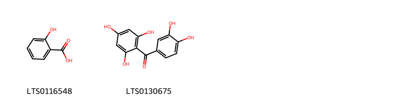{ width=100% }
    <figcaption>Hình ảnh cấu trúc hóa học của 2 hoạt chất thuộc nhóm Benzene and substituted derivatives gồm ['salicyclic acid (LTS0116548)', 'maclurin (LTS0130675)'].</figcaption>
</figure>
#### Nhóm Benzopyrans
<figure markdown="span">
    { width=100% }
    <figcaption>Hình ảnh cấu trúc hóa học của 6 hoạt chất thuộc nhóm Benzopyrans gồm ['(3r,11s)-7,11,14-trihydroxy-18,18-dimethyl-3-(3-methylbut-2-en-1-yl)-2,10,19-trioxapentacyclo[11.8.0.0³,¹¹.0⁴,⁹.0¹⁵,²⁰]henicosa-1(21),4,6,8,13,15(20),16-heptaen-12-one (LTS0142932)', '16-(2-hydroperoxypropan-2-yl)-11,20-dihydroxy-7,7-dimethyl-2,8,17-trioxapentacyclo[12.9.0.0³,¹².0⁴,⁹.0¹⁸,²³]tricosa-1(14),3,5,9,11,18,20,22-octaen-13-one (LTS0096181)', '11,20-dihydroxy-16-(2-hydroxypropan-2-yl)-7,7-dimethyl-2,8,17-trioxapentacyclo[12.9.0.0³,¹².0⁴,⁹.0¹⁸,²³]tricosa-1(14),3,5,9,11,18,20,22-octaen-13-one (LTS0224826)', '(16r)-11,20-dihydroxy-16-(2-hydroxypropan-2-yl)-7,7-dimethyl-2,8,17-trioxapentacyclo[12.9.0.0³,¹².0⁴,⁹.0¹⁸,²³]tricosa-1(14),3,5,9,11,18,20,22-octaen-13-one (LTS0232474)', '16-(2-hydroperoxypropan-2-yl)-11,20-dihydroxy-7,7-dimethyl-2,8,17-trioxapentacyclo[12.9.0.0³,¹².0⁴,⁹.0¹⁸,²³]tricosa-3(12),4(9),5,10,18,20,22-heptaen-13-one (LTS0017587)', '(16s)-16-(2-hydroperoxypropan-2-yl)-11,20-dihydroxy-7,7-dimethyl-2,8,17-trioxapentacyclo[12.9.0.0³,¹².0⁴,⁹.0¹⁸,²³]tricosa-1(14),3,5,9,11,18,20,22-octaen-13-one (LTS0248892)'].</figcaption>
</figure>
#### Nhóm Carboxylic acids and derivatives
<figure markdown="span">
    { width=100% }
    <figcaption>Hình ảnh cấu trúc hóa học của 9 hoạt chất thuộc nhóm Carboxylic acids and derivatives gồm ['5-hydroxypipecolic acid (LTS0145112)', 'pyroglutamic acid (LTS0142947)', 'n-[1-(acetyloxy)-3-phenylpropan-2-yl]-2-{[hydroxy(phenyl)methylidene]amino}-3-phenylpropanimidic acid (LTS0156307)', '(2s,5s)-5-hydroxypiperidine-2-carboxylic acid (LTS0067368)', 'succinic acid (LTS0237204)', '1-[2-(furan-2-yl)-2-oxoethyl]-5-oxopyrrolidine-2-carboxylic acid (LTS0247424)', '(2s,5r)-5-hydroxypiperidine-2-carboxylic acid (LTS0065408)', '(2s)-n-[(2s)-1-(acetyloxy)-3-phenylpropan-2-yl]-2-{[hydroxy(phenyl)methylidene]amino}-3-phenylpropanimidic acid (LTS0004100)', 'methyl 1-[2-(furan-2-yl)-2-oxoethyl]-5-oxopyrrolidine-2-carboxylate (LTS0049725)'].</figcaption>
</figure>
#### Nhóm Coumarins and derivatives
<figure markdown="span">
    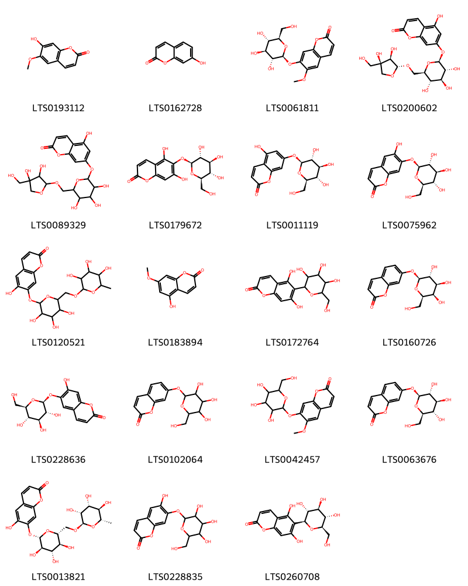{ width=100% }
    <figcaption>Hình ảnh cấu trúc hóa học của 19 hoạt chất thuộc nhóm Coumarins and derivatives gồm ['scopoletin (LTS0193112)', 'umbelliferone (LTS0162728)', 'scopolin (LTS0061811)', '7-{[(2s,3r,4s,5s,6r)-6-({[(2r,3r,4r)-3,4-dihydroxy-4-(hydroxymethyl)oxolan-2-yl]oxy}methyl)-3,4,5-trihydroxyoxan-2-yl]oxy}-5-hydroxychromen-2-one (LTS0200602)', '7-{[6-({[3,4-dihydroxy-4-(hydroxymethyl)oxolan-2-yl]oxy}methyl)-3,4,5-trihydroxyoxan-2-yl]oxy}-5-hydroxychromen-2-one (LTS0089329)', '5,7-dihydroxy-6-{[(2s,3r,4s,5s,6r)-3,4,5-trihydroxy-6-(hydroxymethyl)oxan-2-yl]oxy}chromen-2-one (LTS0179672)', '5-hydroxy-7-{[(2s,3r,4s,5s,6r)-3,4,5-trihydroxy-6-(hydroxymethyl)oxan-2-yl]oxy}chromen-2-one (LTS0011119)', 'cichoriin (LTS0075962)', '6-hydroxy-7-[(3,4,5-trihydroxy-6-{[(3,4,5-trihydroxy-6-methyloxan-2-yl)oxy]methyl}oxan-2-yl)oxy]chromen-2-one (LTS0120521)', '5-hydroxy-7-methoxychromen-2-one (LTS0183894)', '5,7-dihydroxy-6-[3,4,5-trihydroxy-6-(hydroxymethyl)oxan-2-yl]chromen-2-one (LTS0172764)', '7-{[(2s,3r,4s,5r,6r)-3,4,5-trihydroxy-6-(hydroxymethyl)oxan-2-yl]oxy}chromen-2-one (LTS0160726)', 'esculin (LTS0228636)', 'skimmin (LTS0102064)', '6-methoxy-7-{[3,4,5-trihydroxy-6-(hydroxymethyl)oxan-2-yl]oxy}chromen-2-one (LTS0042457)', 'skimmin (LTS0063676)', '6-hydroxy-7-{[(2s,3r,4s,5s,6r)-3,4,5-trihydroxy-6-({[(2r,3r,4r,5r,6s)-3,4,5-trihydroxy-6-methyloxan-2-yl]oxy}methyl)oxan-2-yl]oxy}chromen-2-one (LTS0013821)', '6-hydroxy-7-{[3,4,5-trihydroxy-6-(hydroxymethyl)oxan-2-yl]oxy}chromen-2-one (LTS0228835)', '5,7-dihydroxy-6-[(2s,3r,4r,5s,6r)-3,4,5-trihydroxy-6-(hydroxymethyl)oxan-2-yl]chromen-2-one (LTS0260708)'].</figcaption>
</figure>
#### Nhóm Diarylheptanoids
<figure markdown="span">
    { width=100% }
    <figcaption>Hình ảnh cấu trúc hóa học của 31 hoạt chất thuộc nhóm Diarylheptanoids gồm ['sanggenon c (LTS0193108)', 'sanggenon d (LTS0014488)', '(2e)-1-{3-[(1s,5r,6s)-6-[2,4-dihydroxy-3-(3-methylbut-2-en-1-yl)benzoyl]-5-(2,4-dihydroxyphenyl)-3-methylcyclohex-2-en-1-yl]-2,4-dihydroxyphenyl}-3-(2,4-dihydroxyphenyl)prop-2-en-1-one (LTS0078620)', '(1s,10r)-7-[(1s,5s,6r)-6-(2,4-dihydroxybenzoyl)-5-(2,4-dihydroxyphenyl)-3-methylcyclohex-2-en-1-yl]-1,4,6,14-tetrahydroxy-10-(3-methylbut-2-en-1-yl)-9,17-dioxatetracyclo[8.7.0.0³,⁸.0¹¹,¹⁶]heptadeca-3(8),4,6,11,13,15-hexaen-2-one (LTS0215587)', '(2e)-1-{3-[(1r,5r,6s)-6-[2,4-dihydroxy-3-(3-methylbut-2-en-1-yl)benzoyl]-5-(3,5-dihydroxyphenyl)-3-methylcyclohex-2-en-1-yl]-2,4-dihydroxyphenyl}-3-(2,4-dihydroxyphenyl)prop-2-en-1-one (LTS0067239)', '5-{6-[2,4-dihydroxy-3-(3-methylbut-2-en-1-yl)benzoyl]-5-(2,4-dihydroxyphenyl)-3-methylcyclohex-2-en-1-yl}-4,6,10,14-tetrahydroxy-1-(3-methylbut-2-en-1-yl)-9,17-dioxatetracyclo[8.7.0.0³,⁸.0¹¹,¹⁶]heptadeca-3,5,7,11,13,15-hexaen-2-one (LTS0076953)', '(2e)-1-{3-[(1r,5r,6s)-6-[2,4-dihydroxy-3-(3-methylbut-2-en-1-yl)benzoyl]-5-(2,4-dihydroxyphenyl)-3-methylcyclohex-2-en-1-yl]-2,4-dihydroxyphenyl}-3-(2,4-dihydroxyphenyl)prop-2-en-1-one (LTS0135314)', '1-(3-{6-[2,4-dihydroxy-3-(3-methylbut-2-en-1-yl)benzoyl]-5-(4-hydroxyphenyl)-3-methylcyclohex-2-en-1-yl}-2,4-dihydroxyphenyl)-3-(4-hydroxyphenyl)prop-2-en-1-one (LTS0070530)', '1-(3-{6-[2,4-dihydroxy-3-(3-methylbut-2-en-1-yl)benzoyl]-5-(4-hydroxyphenyl)-3-methylcyclohex-2-en-1-yl}-2,4-dihydroxyphenyl)-3-(2,4-dihydroxyphenyl)prop-2-en-1-one (LTS0102154)', '(2e)-1-{3-[(1s,5s,6r)-6-[2,4-dihydroxy-3-(3-methylbut-2-en-1-yl)benzoyl]-5-(2,4-dihydroxyphenyl)-3-methylcyclohex-2-en-1-yl]-2,4-dihydroxyphenyl}-3-(2,4-dihydroxyphenyl)prop-2-en-1-one (LTS0202455)', '(2e)-1-{3-[(1r,5r,6s)-6-[2,4-dihydroxy-3-(3-methylbut-2-en-1-yl)benzoyl]-5-(2,4-dihydroxyphenyl)-3-methylcyclohex-2-en-1-yl]-2,4-dihydroxyphenyl}-3-(4-hydroxyphenyl)prop-2-en-1-one (LTS0111853)', '(2e)-1-(3-{6-[2,4-dihydroxy-3-(3-methylbut-2-en-1-yl)benzoyl]-5-(4-hydroxyphenyl)-3-methylcyclohex-2-en-1-yl}-2,4-dihydroxyphenyl)-3-(2,4-dihydroxyphenyl)prop-2-en-1-one (LTS0096980)', '2-[(1s,5s,6r)-6-(2,4-dihydroxybenzoyl)-5-(2,4-dihydroxyphenyl)-3-methylcyclohex-2-en-1-yl]-5-[(1e)-2-(2,4-dihydroxyphenyl)ethenyl]benzene-1,3-diol (LTS0050760)', '(1r,10s)-7-[(1s,5s,6r)-6-(2,4-dihydroxybenzoyl)-5-(2,4-dihydroxyphenyl)-3-methylcyclohex-2-en-1-yl]-4,6,10,14-tetrahydroxy-1-(3-methylbut-2-en-1-yl)-9,17-dioxatetracyclo[8.7.0.0³,⁸.0¹¹,¹⁶]heptadeca-3(8),4,6,11,13,15-hexaen-2-one (LTS0152187)', '(2e)-1-{3-[(1r,5s,6r)-6-[2,4-dihydroxy-3-(3-methylbut-2-en-1-yl)benzoyl]-5-(2,4-dihydroxyphenyl)-3-methylcyclohex-2-en-1-yl]-2,4-dihydroxyphenyl}-3-(2,4-dihydroxyphenyl)prop-2-en-1-one (LTS0199406)', '2-[(1r,5r,6s)-6-[2,4-dihydroxy-3-(3-methylbut-2-en-1-yl)benzoyl]-5-(2,4-dihydroxyphenyl)-3-methylcyclohex-2-en-1-yl]-5-[(1e)-2-(2,4-dihydroxyphenyl)ethenyl]benzene-1,3-diol (LTS0272222)', '1-(3-{6-[2,4-dihydroxy-3-(3-methylbut-2-en-1-yl)benzoyl]-5-(3,5-dihydroxyphenyl)-3-methylcyclohex-2-en-1-yl}-2,4-dihydroxyphenyl)-3-(2,4-dihydroxyphenyl)prop-2-en-1-one (LTS0148959)', '4-[(1s,5r,6s)-6-(2,4-dihydroxybenzoyl)-5-(2,4-dihydroxyphenyl)-3-methylcyclohex-2-en-1-yl]-6-[(1e)-2-(3,5-dihydroxyphenyl)ethenyl]benzene-1,3-diol (LTS0172625)', '1-(3-{6-[2,4-dihydroxy-3-(3-methylbut-2-en-1-yl)benzoyl]-5-(2,4-dihydroxyphenyl)-3-methylcyclohex-2-en-1-yl}-2,4-dihydroxyphenyl)-3-(2,4-dihydroxyphenyl)prop-2-en-1-one (LTS0154595)', '7-[6-(2,4-dihydroxybenzoyl)-5-(2,4-dihydroxyphenyl)-3-methylcyclohex-2-en-1-yl]-1,4,6,14-tetrahydroxy-10-(3-methylbut-2-en-1-yl)-9,17-dioxatetracyclo[8.7.0.0³,⁸.0¹¹,¹⁶]heptadeca-3(8),4,6,11,13,15-hexaen-2-one (LTS0145258)', '(2e)-1-{3-[(1r,5r,6s)-6-[2,4-dihydroxy-3-(3-methylbut-2-en-1-yl)benzoyl]-5-(4-hydroxyphenyl)-3-methylcyclohex-2-en-1-yl]-2,4-dihydroxyphenyl}-3-(2,4-dihydroxyphenyl)prop-2-en-1-one (LTS0088363)', '(1r,10s)-5-[(1s,5s,6r)-6-(2,4-dihydroxybenzoyl)-5-(2,4-dihydroxyphenyl)-3-methylcyclohex-2-en-1-yl]-1,4,6,14-tetrahydroxy-10-(3-methylbut-2-en-1-yl)-9,17-dioxatetracyclo[8.7.0.0³,⁸.0¹¹,¹⁶]heptadeca-3,5,7,11,13,15-hexaen-2-one (LTS0174661)', '(2e)-1-{3-[(1s,5s,6r)-6-[2,4-dihydroxy-3-(3-methylbut-2-en-1-yl)benzoyl]-5-(4-hydroxyphenyl)-3-methylcyclohex-2-en-1-yl]-2,4-dihydroxyphenyl}-3-(4-hydroxyphenyl)prop-2-en-1-one (LTS0066918)', '5-[6-(2,4-dihydroxybenzoyl)-5-(2,4-dihydroxyphenyl)-3-methylcyclohex-2-en-1-yl]-1,4,6,14-tetrahydroxy-7,10-bis(3-methylbut-2-en-1-yl)-9,17-dioxatetracyclo[8.7.0.0³,⁸.0¹¹,¹⁶]heptadeca-3(8),4,6,11,13,15-hexaen-2-one (LTS0217659)', '4-[6-(2,4-dihydroxybenzoyl)-5-(2,4-dihydroxyphenyl)-3-methylcyclohex-2-en-1-yl]-6-[2-(3,5-dihydroxyphenyl)ethenyl]benzene-1,3-diol (LTS0264686)', '2-[(1s,5s,6r)-6-[2,4-dihydroxy-3-(3-methylbut-2-en-1-yl)benzoyl]-5-(2,4-dihydroxyphenyl)-3-methylcyclohex-2-en-1-yl]-5-[(1e)-2-(2,4-dihydroxyphenyl)ethenyl]benzene-1,3-diol (LTS0240056)', '(2e)-1-{3-[(1s,5s,6r)-6-[2,4-dihydroxy-3-(3-methylbut-2-en-1-yl)benzoyl]-5-(4-hydroxyphenyl)-3-methylcyclohex-2-en-1-yl]-2,4-dihydroxyphenyl}-3-(2,4-dihydroxyphenyl)prop-2-en-1-one (LTS0250459)', '1-(3-{6-[2,4-dihydroxy-3-(3-methylbut-2-en-1-yl)benzoyl]-5-(2,4-dihydroxyphenyl)-3-methylcyclohex-2-en-1-yl}-2,4-dihydroxyphenyl)-3-(4-hydroxyphenyl)prop-2-en-1-one (LTS0014346)', '2-[(1r,5s,6r)-6-(2,4-dihydroxybenzoyl)-5-(2,4-dihydroxyphenyl)-3-methylcyclohex-2-en-1-yl]-5-[(1e)-2-(2,4-dihydroxyphenyl)ethenyl]benzene-1,3-diol (LTS0027288)', '(2e)-1-{3-[(1r,5r,6s)-6-[2,4-dihydroxy-3-(3-methylbut-2-en-1-yl)benzoyl]-5-(4-hydroxyphenyl)-3-methylcyclohex-2-en-1-yl]-2,4-dihydroxyphenyl}-3-(4-hydroxyphenyl)prop-2-en-1-one (LTS0036211)', '4-[(1r,5s,6r)-6-(2,4-dihydroxybenzoyl)-5-(2,4-dihydroxyphenyl)-3-methylcyclohex-2-en-1-yl]-6-[(1e)-2-(3,5-dihydroxyphenyl)ethenyl]benzene-1,3-diol (LTS0045868)'].</figcaption>
</figure>
#### Nhóm Fatty Acyls
<figure markdown="span">
    { width=100% }
    <figcaption>Hình ảnh cấu trúc hóa học của 13 hoạt chất thuộc nhóm Fatty Acyls gồm ['12-[5-(1-hydroxyethyl)pyrrolidin-2-yl]-3-{[3,4,5-trihydroxy-6-(hydroxymethyl)oxan-2-yl]oxy}dodecanoic acid (LTS0118808)', '3-hydroxy-12-(5-hydroxy-6-methylpiperidin-2-yl)dodecanoic acid (LTS0128266)', '12-(5-hydroxy-6-methylpiperidin-2-yl)-3-{[3,4,5-trihydroxy-6-(hydroxymethyl)oxan-2-yl]oxy}dodecanoic acid (LTS0082387)', '(4s)-4-hydroxy-3,5,5-trimethyl-4-[(1e,3r)-3-{[(2r,3r,4s,5s,6r)-3,4,5-trihydroxy-6-(hydroxymethyl)oxan-2-yl]oxy}but-1-en-1-yl]cyclohex-2-en-1-one (LTS0069145)', '(3r)-3-hydroxy-12-[(2s,5s)-5-[(1s)-1-hydroxyethyl]pyrrolidin-2-yl]dodecanoic acid (LTS0160899)', '4-hydroxy-3,5,5-trimethyl-4-(3-{[3,4,5-trihydroxy-6-(hydroxymethyl)oxan-2-yl]oxy}but-1-en-1-yl)cyclohex-2-en-1-one (LTS0170985)', '3-hydroxy-12-[5-(1-hydroxyethyl)pyrrolidin-2-yl]dodecanoic acid (LTS0054186)', '(3r)-3-hydroxy-12-[(2r,5r,6s)-5-hydroxy-6-methylpiperidin-2-yl]dodecanoic acid (LTS0116191)', '(3r)-12-[(2r,5r,6s)-5-hydroxy-6-methylpiperidin-2-yl]-3-{[(2r,3r,4s,5s,6r)-3,4,5-trihydroxy-6-(hydroxymethyl)oxan-2-yl]oxy}dodecanoic acid (LTS0141920)', '12-[5-hydroxy-6-(hydroxymethyl)piperidin-2-yl]-3-{[3,4,5-trihydroxy-6-(hydroxymethyl)oxan-2-yl]oxy}dodecanoic acid (LTS0126487)', '(3r)-12-[(2r,5r,6s)-5-hydroxy-6-(hydroxymethyl)piperidin-2-yl]-3-{[(2r,3r,4s,5s,6r)-3,4,5-trihydroxy-6-(hydroxymethyl)oxan-2-yl]oxy}dodecanoic acid (LTS0118133)', '(3r)-12-[(2s,5s)-5-[(1s)-1-hydroxyethyl]pyrrolidin-2-yl]-3-{[(2r,3r,4s,5s,6r)-3,4,5-trihydroxy-6-(hydroxymethyl)oxan-2-yl]oxy}dodecanoic acid (LTS0039696)', '(3r)-3-hydroxy-12-[(2r,5s,6s)-5-hydroxy-6-methylpiperidin-2-yl]dodecanoic acid (LTS0060059)'].</figcaption>
</figure>
#### Nhóm Flavonoids
<figure markdown="span">
    { width=100% }
    <figcaption>Hình ảnh cấu trúc hóa học của 104 hoạt chất thuộc nhóm Flavonoids gồm ['quercetin (LTS0004651)', '3-rutinosyl quercetin (LTS0032845)', '2-(3,4-dihydroxyphenyl)-5,7-dihydroxy-3-{[(2s,3r,4r,5r,6s)-3,4,5-trihydroxy-6-(hydroxymethyl)oxan-2-yl]oxy}chromen-4-one (LTS0241372)', 'rutin (LTS0042292)', 'isorhamnetin (LTS0107505)', 'kaempherol (LTS0155822)', 'astragalin (LTS0249588)', '2-(3,4-dihydroxyphenyl)-5,7-dihydroxy-3-{[3,4,5-trihydroxy-6-(hydroxymethyl)oxan-2-yl]oxy}chromen-4-one (LTS0195312)', '2-(2,4-dihydroxyphenyl)-3,5,7-trihydroxy-2,3-dihydro-1-benzopyran-4-one (LTS0092162)', 'quercitrin (LTS0093095)', '2-(3,4-dihydroxyphenyl)-5-hydroxy-3,7-bis({[3,4,5-trihydroxy-6-(hydroxymethyl)oxan-2-yl]oxy})chromen-4-one (LTS0206247)', 'trifolin (LTS0267055)', 'quercetin 3,7-diglucoside (LTS0059170)', 'mulberrin (LTS0091224)', 'sanggenon f (LTS0216230)', 'kuwanon t (LTS0086833)', '(2s)-5,7-dihydroxy-2-(5-hydroxy-2,2-dimethylchromen-6-yl)-2,3-dihydro-1-benzopyran-4-one (LTS0168286)', '2-[5-(3,7-dimethylocta-2,6-dien-1-yl)-2,4-dihydroxyphenyl]-5,7-dihydroxy-2,3-dihydro-1-benzopyran-4-one (LTS0036031)', 'morusin (LTS0062558)', 'kuwanon a (LTS0006823)', '(2s)-2-{5-[(2e)-3,7-dimethylocta-2,6-dien-1-yl]-2,4-dihydroxyphenyl}-5,7-dihydroxy-2,3-dihydro-1-benzopyran-4-one (LTS0018417)', '8-{6-[2,4-dihydroxy-3-(3-methylbut-2-en-1-yl)benzoyl]-5-(2,4-dihydroxyphenyl)-3-methylcyclohex-2-en-1-yl}-2-(2,4-dihydroxyphenyl)-5,7-dihydroxy-3-(3-methylbut-2-en-1-yl)chromen-4-one (LTS0051253)', '(8s)-2-(2,4-dihydroxyphenyl)-5-hydroxy-3-(4-hydroxy-3-methylbut-2-en-1-yl)-8-(hydroxymethyl)-8-methylpyrano[2,3-h]chromen-4-one (LTS0208872)', '(-)-epigallocatechin gallate (LTS0173211)', 'flavan-4-ol (LTS0239668)', '(8s)-2-(2,4-dihydroxyphenyl)-5-hydroxy-3-[(2z)-4-hydroxy-3-methylbut-2-en-1-yl]-8-(hydroxymethyl)-8-methylpyrano[2,3-h]chromen-4-one (LTS0079228)', '6-[(1s,5s,6r)-6-[2,4-dihydroxy-3-(3-methylbut-2-en-1-yl)benzoyl]-5-(2,4-dihydroxyphenyl)-3-methylcyclohex-2-en-1-yl]-2-(2,4-dihydroxyphenyl)-5,7-dihydroxychromen-4-one (LTS0193135)', 'kuwanon f (LTS0083635)', '2-(2,4-dihydroxyphenyl)-7-hydroxy-2,3-dihydro-1-benzopyran-4-one (LTS0211311)', '(2s)-2-{3-[(1s,5r,6s)-6-[2,4-dihydroxy-3-(3-methylbut-2-en-1-yl)benzoyl]-5-(2,4-dihydroxyphenyl)-3-methylcyclohex-2-en-1-yl]-2,4-dihydroxyphenyl}-5,7-dihydroxy-2,3-dihydro-1-benzopyran-4-one (LTS0080277)', 'flavan (LTS0047997)', '6-[(1r,5s,6r)-6-(2,4-dihydroxybenzoyl)-5-(2,4-dihydroxyphenyl)-3-(4-methylpent-3-en-1-yl)cyclohex-2-en-1-yl]-2-(2,4-dihydroxyphenyl)-5,7-dihydroxychromen-4-one (LTS0097092)', '5,7-dihydroxy-2-{10-hydroxy-3,3,4,6,6-pentamethyl-7-oxatricyclo[6.4.0.0²,⁵]dodeca-1(12),8,10-trien-11-yl}chromen-4-one (LTS0156921)', 'albanin e (LTS0080186)', '(+)-taxifolin (LTS0090664)', '2-(2,4-dihydroxyphenyl)-5,7-dihydroxy-8-(3-methylbut-2-en-1-yl)-2,3-dihydro-1-benzopyran-4-one (LTS0150620)', 'steppogenin (LTS0070044)', '(2s)-2-{5-[(2e)-3,7-dimethylocta-2,6-dien-1-yl]-2,4-dihydroxyphenyl}-5,7-dihydroxy-8-(3-methylbut-2-en-1-yl)-2,3-dihydro-1-benzopyran-4-one (LTS0024633)', '2-(3-{6-[2,4-dihydroxy-3-(3-methylbut-2-en-1-yl)benzoyl]-5-(2,4-dihydroxyphenyl)-3-methylcyclohex-2-en-1-yl}-2,4-dihydroxyphenyl)-5,7-dihydroxy-3-(3-methylbut-2-en-1-yl)chromen-4-one (LTS0041106)', '2-(2,4-dihydroxyphenyl)-5,7-dihydroxy-8-(3,7,11-trimethyldodeca-2,6,10-trien-1-yl)chromen-4-one (LTS0017227)', '4-{10-hydroxy-5,13-dioxatricyclo[7.4.0.0²,⁶]trideca-1,6,8-trien-12-yl}benzene-1,3-diol (LTS0072803)', '(2s)-5,7-dihydroxy-2-(5-hydroxy-2,2-dimethylchromen-8-yl)-2,3-dihydro-1-benzopyran-4-one (LTS0089734)', '(2s)-2-(2,4-dihydroxyphenyl)-5-hydroxy-8-methyl-8-(4-methylpent-3-en-1-yl)-2h,3h-pyrano[3,2-g]chromen-4-one (LTS0068040)', '2-(2,4-dihydroxyphenyl)-8-[2-(2,4-dihydroxyphenyl)-5-hydroxy-9,9,11-trimethyl-3-(3-methylbut-2-en-1-yl)-4-oxo-8h,8ah,10h,12ah-chromeno[7,8-c]isochromen-8-yl]-5,7-dihydroxy-3-(3-methylbut-2-en-1-yl)chromen-4-one (LTS0180993)', 'kuwanon b (LTS0055859)', '8-[(8s,8ar,12ar)-2-(2,4-dihydroxyphenyl)-5-hydroxy-9,9,11-trimethyl-3-(3-methylbut-2-en-1-yl)-4-oxo-8h,8ah,10h,12ah-chromeno[7,8-c]isochromen-8-yl]-2-(2,4-dihydroxyphenyl)-5,7-dihydroxy-3-(3-methylbut-2-en-1-yl)chromen-4-one (LTS0173678)', '(2r,3s,4s,5r,6s)-2-(hydroxymethyl)-6-{[(2s)-2-(4-methoxy-2-{[(2s,3r,4s,5s,6r)-3,4,5-trihydroxy-6-(hydroxymethyl)oxan-2-yl]oxy}phenyl)-8-(3-methylbut-2-en-1-yl)-3,4-dihydro-2h-1-benzopyran-7-yl]oxy}oxane-3,4,5-triol (LTS0192216)', '(2r,4s)-2-phenyl-3,4-dihydro-2h-1-benzopyran-4-ol (LTS0120242)', '8-[6-(2,4-dihydroxybenzoyl)-5-(2,4-dihydroxyphenyl)-3-methylcyclohex-2-en-1-yl]-2-(2,4-dihydroxyphenyl)-5,7-dihydroxy-3-(3-methylbut-2-en-1-yl)chromen-4-one (LTS0126618)', '4-[7-methoxy-8-(3-methylbut-2-en-1-yl)-3,4-dihydro-2h-1-benzopyran-2-yl]benzene-1,3-diol (LTS0147395)', '(1s,2r,4s,12r,14s)-4-(2,4-dihydroxyphenyl)-8-[(1e)-2-(2,4-dihydroxyphenyl)ethenyl]-10,18-dihydroxy-14-methyl-3,5,15-trioxahexacyclo[12.7.1.0²,⁴.0²,¹².0⁶,¹¹.0¹⁶,²¹]docosa-6,8,10,16,18,20-hexaen-13-one (LTS0205021)', '4-[(2s)-7-methoxy-8-(3-methylbut-2-en-1-yl)-3,4-dihydro-2h-1-benzopyran-2-yl]benzene-1,3-diol (LTS0133509)', 'cudraflavone b (LTS0140781)', 'gallocatechol (LTS0267305)', '(2s)-2-(2,4-dihydroxyphenyl)-5,7-dihydroxy-2,3-dihydro-1-benzopyran-4-one (LTS0150852)', '(2r)-5,7-dihydroxy-2-[(2r)-5-hydroxy-2-methyl-2-(4-methylpent-3-en-1-yl)chromen-8-yl]-2,3-dihydro-1-benzopyran-4-one (LTS0152870)', '8-[(1s,5s,6r)-6-(2,4-dihydroxybenzoyl)-5-(2,4-dihydroxyphenyl)-3-methylcyclohex-2-en-1-yl]-2-(2,4-dihydroxyphenyl)-5,7-dihydroxy-3-(3-hydroxy-3-methylbutyl)chromen-4-one (LTS0138926)', '4-[2-(2,4-dihydroxyphenyl)-7-methoxy-3,4-dihydro-2h-1-benzopyran-8-yl]butanoic acid (LTS0160015)', '2-[3-(3,7-dimethylocta-2,6-dien-1-yl)-4-hydroxyphenyl]-5,7-dihydroxychromen-4-one (LTS0094993)', '4-(2,4-dihydroxyphenyl)-8-[2-(2,4-dihydroxyphenyl)ethenyl]-10,18-dihydroxy-14-methyl-3,5,15-trioxahexacyclo[12.7.1.0²,⁴.0²,¹².0⁶,¹¹.0¹⁶,²¹]docosa-6,8,10,16,18,20-hexaen-13-one (LTS0163381)', 'leachianone g (LTS0160359)', '4-(2,4-dihydroxyphenyl)-8-[(1z)-2-(2,4-dihydroxyphenyl)ethenyl]-10,18-dihydroxy-14-methyl-3,5,15-trioxahexacyclo[12.7.1.0²,⁴.0²,¹².0⁶,¹¹.0¹⁶,²¹]docosa-6,8,10,16,18,20-hexaen-13-one (LTS0241434)', 'norartocarpetin (LTS0089058)', '(11r)-1,3,8-trihydroxy-4-(3-methylbut-2-en-1-yl)-11-(2-methylprop-1-en-1-yl)-11h-5,10-dioxatetraphen-12-one (LTS0246408)', '(1r,2s,4r,12s,14s)-4-(2,4-dihydroxyphenyl)-8-[(1e)-2-(2,4-dihydroxyphenyl)ethenyl]-10,18-dihydroxy-14-methyl-3,5,15-trioxahexacyclo[12.6.1.1¹⁶,²⁰.0²,⁴.0²,¹².0⁶,¹¹]docosa-6,8,10,16(22),17,19-hexaen-13-one (LTS0271332)', '(2r,3r,4s,5s,6r)-2-{5-hydroxy-2-[(2s)-8-(2-hydroxyethyl)-7-methoxy-3,4-dihydro-2h-1-benzopyran-2-yl]phenoxy}-6-(hydroxymethyl)oxane-3,4,5-triol (LTS0256632)', 'oxydihydromorusin (LTS0231362)', 'moralbanone (LTS0159371)', 'isoquercetin (LTS0254337)', '2-(2,4-dihydroxyphenyl)-8-[(1r,5r,6s)-6-(2,4-dihydroxyphenyl)-5-(5-hydroxy-2,2-dimethyl-3,4-dihydro-1-benzopyran-6-carbonyl)-3-methylcyclohex-2-en-1-yl]-5,7-dihydroxy-3-(3-methylbut-2-en-1-yl)chromen-4-one (LTS0254904)', '5,7-dihydroxy-2-(4-hydroxy-3-oxidophenyl)-3-{[(2s,3r,4s,5s,6r)-3,4,5-trihydroxy-6-(hydroxymethyl)oxan-2-yl]oxy}-1λ⁴-chromen-1-ylium (LTS0083222)', '4-[(2s)-2-(2,4-dihydroxyphenyl)-7-methoxy-3,4-dihydro-2h-1-benzopyran-8-yl]butanoic acid (LTS0274637)', 'cyclomulberrin (LTS0265851)', '(2r)-5,7-dihydroxy-2-(5-hydroxy-2,2-dimethylchromen-6-yl)-2,3-dihydro-1-benzopyran-4-one (LTS0192096)', '5,7-dihydroxy-2-[(2s,4s,5s)-10-hydroxy-3,3,4,6,6-pentamethyl-7-oxatricyclo[6.4.0.0²,⁵]dodeca-1(12),8,10-trien-11-yl]chromen-4-one (LTS0263111)', 'chrysanthemin (LTS0221391)', 'cudraflavone c (LTS0086862)', '2-(2,4-dihydroxyphenyl)-8-[5-(2,4-dihydroxyphenyl)-6-(5-hydroxy-2,2-dimethylchromene-6-carbonyl)-3-methylcyclohex-2-en-1-yl]-5,7-dihydroxy-3-(3-methylbut-2-en-1-yl)chromen-4-one (LTS0169646)', '4-[(10s,12r)-10-hydroxy-5,13-dioxatricyclo[7.4.0.0²,⁶]trideca-1,6,8-trien-12-yl]benzene-1,3-diol (LTS0176795)', '(2s)-2-(2-hydroxy-4-methoxyphenyl)-8-(3-methylbut-2-en-1-yl)-3,4-dihydro-2h-1-benzopyran-7-ol (LTS0237087)', '(2s)-5,7-dihydroxy-2-[(2r)-5-hydroxy-2-methyl-2-(4-methylpent-3-en-1-yl)chromen-6-yl]-2,3-dihydro-1-benzopyran-4-one (LTS0188087)', 'epigallocatechin (LTS0052496)', '(2s)-2-{5-[(2e)-3,7-dimethylocta-2,6-dien-1-yl]-2-hydroxy-4-methoxyphenyl}-5,7-dihydroxy-2,3-dihydro-1-benzopyran-4-one (LTS0107720)', '8-[(1r,5s,6r)-6-[2,4-dihydroxy-3-(3-methylbut-2-en-1-yl)benzoyl]-5-(2,4-dihydroxyphenyl)-3-methylcyclohex-2-en-1-yl]-2-(2,4-dihydroxyphenyl)-5,7-dihydroxy-3-(3-methylbut-2-en-1-yl)chromen-4-one (LTS0052274)', '2-(hydroxymethyl)-6-{[2-(4-methoxy-2-{[3,4,5-trihydroxy-6-(hydroxymethyl)oxan-2-yl]oxy}phenyl)-8-(3-methylbut-2-en-1-yl)-3,4-dihydro-2h-1-benzopyran-7-yl]oxy}oxane-3,4,5-triol (LTS0265185)', '2-(2,4-dihydroxyphenyl)-8-[6-(2,4-dihydroxyphenyl)-5-(5-hydroxy-2,2-dimethyl-3,4-dihydro-1-benzopyran-6-carbonyl)-3-methylcyclohex-2-en-1-yl]-5,7-dihydroxy-3-(3-methylbut-2-en-1-yl)chromen-4-one (LTS0275840)', 'cyclomorusin (LTS0010612)', '(15s)-11,19-dihydroxy-7,7-dimethyl-15-(2-methylprop-1-en-1-yl)-2,8,16-trioxapentacyclo[12.8.0.0³,¹².0⁴,⁹.0¹⁷,²²]docosa-1(14),3,5,9,11,17,19,21-octaen-13-one (LTS0015686)', '(2r,3r,4s,5s,6r)-2-{2-[(2s)-7-hydroxy-8-(2-hydroxyethyl)-3,4-dihydro-2h-1-benzopyran-2-yl]-5-methoxyphenoxy}-6-(hydroxymethyl)oxane-3,4,5-triol (LTS0016713)', 'isocyclomulberrin (LTS0124578)', 'kuwanon g (LTS0002394)', 'kuwanon e (LTS0052709)', '2-(2-hydroxy-4-methoxyphenyl)-8-(3-methylbut-2-en-1-yl)-3,4-dihydro-2h-1-benzopyran-7-ol (LTS0022485)', '2-[5-(3,7-dimethylocta-2,6-dien-1-yl)-2-hydroxy-4-methoxyphenyl]-5,7-dihydroxy-2,3-dihydro-1-benzopyran-4-one (LTS0113813)', 'flavan skeleton (LTS0244489)', '(2s)-2-[5-(3,7-dimethylocta-2,6-dien-1-yl)-2,4-dihydroxyphenyl]-5,7-dihydroxy-8-(3-methylbut-2-en-1-yl)-2,3-dihydro-1-benzopyran-4-one (LTS0019430)', '2-(2,4-dihydroxyphenyl)-8-[(1s,5r,6s)-5-(2,4-dihydroxyphenyl)-6-(5-hydroxy-2,2-dimethylchromene-6-carbonyl)-3-methylcyclohex-2-en-1-yl]-5,7-dihydroxy-3-(3-methylbut-2-en-1-yl)chromen-4-one (LTS0030596)', '5,7-dihydroxy-2-(4-methoxyphenyl)-3-{[(3r,4s,5s,6r)-3,4,5-trihydroxy-6-(hydroxymethyl)oxan-2-yl]oxy}chromen-4-one (LTS0229484)', '(2s)-5,7-dihydroxy-2-[(2r)-7-hydroxy-2-methyl-2-(4-methylpent-3-en-1-yl)chromen-6-yl]-2,3-dihydro-1-benzopyran-4-one (LTS0000426)', '(2r)-5,7-dihydroxy-2-(5-hydroxy-2,2-dimethylchromen-8-yl)-2,3-dihydro-1-benzopyran-4-one (LTS0031820)', '(2s)-2-{3-[(1s,5r,6s)-6-(2,4-dihydroxybenzoyl)-5-(2,4-dihydroxyphenyl)-3-methylcyclohex-2-en-1-yl]-2,4-dihydroxyphenyl}-5,7-dihydroxy-2,3-dihydro-1-benzopyran-4-one (LTS0102605)', '8-[6-(2,4-dihydroxybenzoyl)-5-(2,4-dihydroxyphenyl)-3-methylcyclohex-2-en-1-yl]-2-(2,4-dihydroxyphenyl)-5,7-dihydroxy-3-(3-hydroxy-3-methylbutyl)chromen-4-one (LTS0136607)', 'kuwanone s (LTS0044946)', '2-(2,4-dihydroxyphenyl)-8-[(1r,5s,6s)-6-(2,4-dihydroxyphenyl)-5-(5-hydroxy-2,2-dimethyl-3,4-dihydro-1-benzopyran-6-carbonyl)-3-methylcyclohex-2-en-1-yl]-5,7-dihydroxy-3-(3-methylbut-2-en-1-yl)chromen-4-one (LTS0048537)'].</figcaption>
</figure>
#### Nhóm Glycerolipids
<figure markdown="span">
    { width=100% }
    <figcaption>Hình ảnh cấu trúc hóa học của 2 hoạt chất thuộc nhóm Glycerolipids gồm ['1-hydroxy-3-(octacosanoyloxy)propan-2-yl octacosanoate (LTS0114243)', '(2s)-1-hydroxy-3-(octacosanoyloxy)propan-2-yl octacosanoate (LTS0264155)'].</figcaption>
</figure>
#### Nhóm Indoles and derivatives
<figure markdown="span">
    { width=100% }
    <figcaption>Hình ảnh cấu trúc hóa học của 1 hoạt chất thuộc nhóm Indoles and derivatives gồm ['n-[2-(5-methoxy-1h-indol-3-yl)ethyl]ethanimidic acid (LTS0219322)'].</figcaption>
</figure>
#### Nhóm Lactones
<figure markdown="span">
    { width=100% }
    <figcaption>Hình ảnh cấu trúc hóa học của 1 hoạt chất thuộc nhóm Lactones gồm ['mevastatin (LTS0122611)'].</figcaption>
</figure>
#### Nhóm Linear 1_3-diarylpropanoids
<figure markdown="span">
    { width=100% }
    <figcaption>Hình ảnh cấu trúc hóa học của Không tìm thấy chú thích hoạt chất thuộc nhóm Linear 1_3-diarylpropanoids gồm Không tìm thấy chú thích.</figcaption>
</figure>
#### Nhóm Organooxygen compounds
<figure markdown="span">
    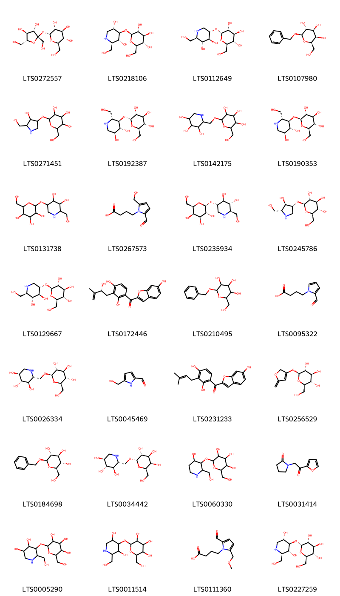{ width=100% }
    <figcaption>Hình ảnh cấu trúc hóa học của 28 hoạt chất thuộc nhóm Organooxygen compounds gồm ['sucrose (LTS0272557)', '(2s,3r,4s,5s,6r)-2-{[(2r,3r,4r,5s)-3,5-dihydroxy-2-(hydroxymethyl)piperidin-4-yl]oxy}-6-(hydroxymethyl)oxane-3,4,5-triol (LTS0218106)', '(2s,3r,4s,5s,6r)-2-{[(3s,4s,5r,6r)-4,5-dihydroxy-6-(hydroxymethyl)piperidin-3-yl]oxy}-6-(hydroxymethyl)oxane-3,4,5-triol (LTS0112649)', '(2r,3r,4s,5r,6r)-2-(benzyloxy)-6-(hydroxymethyl)oxane-3,4,5-triol (LTS0107980)', '2-{[4-hydroxy-5-(hydroxymethyl)pyrrolidin-3-yl]oxy}-6-(hydroxymethyl)oxane-3,4,5-triol (LTS0271451)', '(2s,3r,4s,5s,6r)-2-{[(2r,3r,4r,5s)-4,5-dihydroxy-2-(hydroxymethyl)piperidin-3-yl]oxy}-6-(hydroxymethyl)oxane-3,4,5-triol (LTS0192387)', '2-({[3,4,5-trihydroxy-6-(hydroxymethyl)oxan-2-yl]oxy}methyl)piperidine-3,4,5-triol (LTS0142175)', '(2r,3r,4s,5s,6r)-2-{[(2r,3r,4r,5s)-4,5-dihydroxy-2-(hydroxymethyl)piperidin-3-yl]oxy}-6-(hydroxymethyl)oxane-3,4,5-triol (LTS0190353)', '2-{[4,5-dihydroxy-6-(hydroxymethyl)piperidin-3-yl]oxy}-6-(hydroxymethyl)oxane-3,4,5-triol (LTS0131738)', '4-[2-formyl-5-(hydroxymethyl)pyrrol-1-yl]butanoic acid (LTS0267573)', '(2s,3r,4s,5r,6r)-2-{[(3s,4s,5r,6r)-4,5-dihydroxy-6-(hydroxymethyl)piperidin-3-yl]oxy}-6-(hydroxymethyl)oxane-3,4,5-triol (LTS0235934)', '(2r,3r,4s,5s,6r)-2-{[(3r,4r,5r)-4-hydroxy-5-(hydroxymethyl)pyrrolidin-3-yl]oxy}-6-(hydroxymethyl)oxane-3,4,5-triol (LTS0245786)', '(2r,3r,4s,5s,6r)-2-{[(3s,4s,5r,6r)-4,5-dihydroxy-6-(hydroxymethyl)piperidin-3-yl]oxy}-6-(hydroxymethyl)oxane-3,4,5-triol (LTS0129667)', '4-(6-hydroxy-1-benzofuran-2-carbonyl)-2-[(2r)-2-hydroxy-3-methylbut-3-en-1-yl]benzene-1,3-diol (LTS0172446)', 'benzyl glucopyranoside (LTS0210495)', '4-(2-formylpyrrol-1-yl)butanoic acid (LTS0095322)', '(2r,3r,4r,5s)-2-({[(2r,3r,4s,5s,6r)-3,4,5-trihydroxy-6-(hydroxymethyl)oxan-2-yl]oxy}methyl)piperidine-3,4,5-triol (LTS0026334)', 'pyrraline (LTS0045469)', '4-(6-hydroxy-1-benzofuran-2-carbonyl)-2-(3-methylbut-2-en-1-yl)benzene-1,3-diol (LTS0231233)', '(2r,3s,4s,5r,6s)-2-(hydroxymethyl)-6-[(5-methylidene-2h-furan-3-yl)oxy]oxane-3,4,5-triol (LTS0256529)', 'benzyl β-d-glucoside (LTS0184698)', '(2r,3r,4r,5s)-2-({[(2s,3r,4s,5r,6r)-3,4,5-trihydroxy-6-(hydroxymethyl)oxan-2-yl]oxy}methyl)piperidine-3,4,5-triol (LTS0034442)', '2-{[4-hydroxy-2-(hydroxymethyl)piperidin-3-yl]oxy}-6-(hydroxymethyl)oxane-3,4,5-triol (LTS0060330)', '1-[2-(furan-2-yl)-2-oxoethyl]pyrrolidin-2-one (LTS0031414)', '2-{[4,5-dihydroxy-2-(hydroxymethyl)piperidin-3-yl]oxy}-6-(hydroxymethyl)oxane-3,4,5-triol (LTS0005290)', '2-{[3,5-dihydroxy-2-(hydroxymethyl)piperidin-4-yl]oxy}-6-(hydroxymethyl)oxane-3,4,5-triol (LTS0011514)', '4-[2-formyl-5-(methoxymethyl)pyrrol-1-yl]butanoic acid (LTS0111360)', '(2r,3r,4s,5s,6r)-2-{[(2r,3r,4r,5s)-3,5-dihydroxy-2-(hydroxymethyl)piperidin-4-yl]oxy}-6-(hydroxymethyl)oxane-3,4,5-triol (LTS0227259)'].</figcaption>
</figure>
#### Nhóm Phenols
<figure markdown="span">
    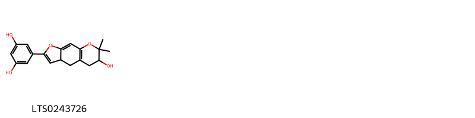{ width=100% }
    <figcaption>Hình ảnh cấu trúc hóa học của 1 hoạt chất thuộc nhóm Phenols gồm ['5-{11-hydroxy-12,12-dimethyl-4,13-dioxatricyclo[7.4.0.0³,⁷]trideca-1(9),2,5-trien-5-yl}benzene-1,3-diol (LTS0243726)'].</figcaption>
</figure>
#### Nhóm Piperidines
<figure markdown="span">
    { width=100% }
    <figcaption>Hình ảnh cấu trúc hóa học của 7 hoạt chất thuộc nhóm Piperidines gồm ['2-(hydroxymethyl)-1-methylpiperidine-3,4,5-triol (LTS0114981)', '3-epi-fagomine (LTS0252876)', '2-(hydroxymethyl)piperidine-3,4-diol (LTS0076126)', '1 deoxynojirimycin (LTS0029077)', '1-deoxynojirimycin (LTS0004153)', 'n-methyldeoxynojirimycin (LTS0013261)', 'fagomine (LTS0252575)'].</figcaption>
</figure>
#### Nhóm Prenol lipids
<figure markdown="span">
    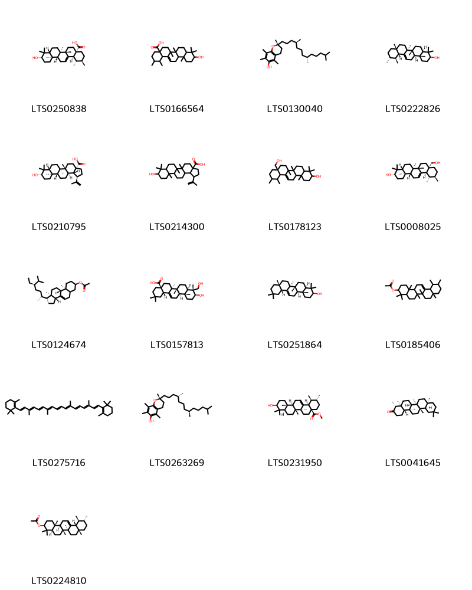{ width=100% }
    <figcaption>Hình ảnh cấu trúc hóa học của 17 hoạt chất thuộc nhóm Prenol lipids gồm ['ursolic acid (LTS0250838)', '10-hydroxy-1,2,6a,6b,9,9,12a-heptamethyl-2,3,4,5,6,7,8,8a,10,11,12,12b,13,14b-tetradecahydro-1h-picene-4a-carboxylic acid (LTS0166564)', '(2r)-2,5,7,8-tetramethyl-2-[(4s,8s)-4,8,12-trimethyltridecyl]-3,4-dihydro-1-benzopyran-6-ol (LTS0130040)', 'amyrin (LTS0222826)', 'betulinic acid (LTS0210795)', '9-hydroxy-5a,5b,8,8,11a-pentamethyl-1-(prop-1-en-2-yl)-hexadecahydrocyclopenta[a]chrysene-3a-carboxylic acid (LTS0214300)', '8a-(hydroxymethyl)-4,4,6a,6b,11,12,14b-heptamethyl-2,3,4a,5,6,7,8,9,10,11,12,12a,14,14a-tetradecahydro-1h-picen-3-ol (LTS0178123)', 'uvaol (LTS0008025)', '(1r,3ar,9as,9br,11ar)-1-[(2r,5r)-5-ethyl-6-methylheptan-2-yl]-9a,11a-dimethyl-1h,2h,3h,3ah,5h,5ah,6h,7h,8h,9h,9bh,10h,11h-cyclopenta[a]phenanthren-7-yl acetate (LTS0124674)', 'hederagenin (LTS0157813)', 'β-amyrin (LTS0251864)', '4,4,6a,6b,8a,11,12,14b-octamethyl-2,3,4a,5,6,7,8,9,10,11,12,12a,14,14a-tetradecahydro-1h-picen-3-yl acetate (LTS0185406)', 'β-carotene (LTS0275716)', 'vitamin e (LTS0263269)', 'methyl (1s,2r,4as,6as,6br,8ar,10s,12ar,12br,14br)-10-hydroxy-1,2,6a,6b,9,9,12a-heptamethyl-2,3,4,5,6,7,8,8a,10,11,12,12b,13,14b-tetradecahydro-1h-picene-4a-carboxylate (LTS0231950)', '(-)-friedelin (LTS0041645)', 'α-amyrin acetate (LTS0224810)'].</figcaption>
</figure>
#### Nhóm Purine nucleosides
<figure markdown="span">
    { width=100% }
    <figcaption>Hình ảnh cấu trúc hóa học của 2 hoạt chất thuộc nhóm Purine nucleosides gồm ['adenosine (LTS0052576)', 'adenosine (LTS0014061)'].</figcaption>
</figure>
#### Nhóm Pyrrolidines
<figure markdown="span">
    { width=100% }
    <figcaption>Hình ảnh cấu trúc hóa học của 3 hoạt chất thuộc nhóm Pyrrolidines gồm ['2-(hydroxymethyl)pyrrolidine-3,4-diol (LTS0255725)', '(2r,3r,4r)-2-(hydroxymethyl)pyrrolidine-3,4-diol (LTS0075060)', 'iminoribitol (LTS0233094)'].</figcaption>
</figure>
#### Nhóm Steroids and steroid derivatives
<figure markdown="span">
    { width=100% }
    <figcaption>Hình ảnh cấu trúc hóa học của 6 hoạt chất thuộc nhóm Steroids and steroid derivatives gồm ['stigmast-5-en-3-ol, (3β)- (LTS0204616)', 'phytosterol (LTS0029311)', 'sitosterol (LTS0168132)', 'stigmast-5-en-3-ol (LTS0071224)', 'sitogluside (LTS0201798)', '(1s,3ar,3br,7r,9as,9br,11ar)-1-[(2r,5r)-5-ethyl-6-methylheptan-2-yl]-9a,11a-dimethyl-1h,2h,3h,3ah,3bh,4h,6h,7h,8h,9h,9bh,10h,11h-cyclopenta[a]phenanthren-7-ol (LTS0234781)'].</figcaption>
</figure>
#### Nhóm Stilbenes
<figure markdown="span">
    { width=100% }
    <figcaption>Hình ảnh cấu trúc hóa học của 20 hoạt chất thuộc nhóm Stilbenes gồm ['resveratrol (LTS0256677)', '2-{3-hydroxy-5-[2-(2-hydroxy-4-{[3,4,5-trihydroxy-6-(hydroxymethyl)oxan-2-yl]oxy}phenyl)ethenyl]phenoxy}-6-(hydroxymethyl)oxane-3,4,5-triol (LTS0057716)', '2-{2-[2-(3,5-dihydroxyphenyl)ethenyl]-5-hydroxyphenoxy}-6-(hydroxymethyl)oxane-3,4,5-triol (LTS0037217)', '(2s,3r,4s,5s,6r)-2-{3-hydroxy-5-[(1e)-2-(2-hydroxy-4-{[(2s,3r,4s,5s,6r)-3,4,5-trihydroxy-6-(hydroxymethyl)oxan-2-yl]oxy}phenyl)ethenyl]phenoxy}-6-(hydroxymethyl)oxane-3,4,5-triol (LTS0039129)', '(2s,3r,4s,5s,6r)-2-{2-[(1e)-2-(3,5-dihydroxyphenyl)ethenyl]-5-hydroxyphenoxy}-6-(hydroxymethyl)oxane-3,4,5-triol (LTS0028618)', '(2s,3r,4s,5s,6r)-2-{3-hydroxy-5-[(1z)-2-(2-hydroxy-4-{[(2s,3r,4s,5s,6r)-3,4,5-trihydroxy-6-(hydroxymethyl)oxan-2-yl]oxy}phenyl)ethenyl]phenoxy}-6-(hydroxymethyl)oxane-3,4,5-triol (LTS0116192)', '2-(hydroxymethyl)-6-[(3,4,5-trihydroxy-6-{3-hydroxy-4-[2-(3-hydroxy-5-{[3,4,5-trihydroxy-6-(hydroxymethyl)oxan-2-yl]oxy}phenyl)ethenyl]phenoxy}oxan-2-yl)methoxy]oxane-3,4,5-triol (LTS0191210)', '2-{4-[2-(3-hydroxy-5-{[3,4,5-trihydroxy-6-(hydroxymethyl)oxan-2-yl]oxy}phenyl)ethenyl]phenoxy}-6-(hydroxymethyl)oxane-3,4,5-triol (LTS0152496)', '(2s,3r,4s,5s,6r)-2-{4-[(1e)-2-(3-hydroxy-5-{[(2s,3r,4s,5s,6r)-3,4,5-trihydroxy-6-(hydroxymethyl)oxan-2-yl]oxy}phenyl)ethenyl]phenoxy}-6-(hydroxymethyl)oxane-3,4,5-triol (LTS0115455)', '2-{3-[2-(2,4-dihydroxyphenyl)ethenyl]-5-hydroxyphenoxy}-6-(hydroxymethyl)oxane-3,4,5-triol (LTS0246328)', '2-{3-hydroxy-5-[(1z)-2-(2-hydroxy-4-{[3,4,5-trihydroxy-6-(hydroxymethyl)oxan-2-yl]oxy}phenyl)ethenyl]phenoxy}-6-(hydroxymethyl)oxane-3,4,5-triol (LTS0066469)', '5-[2-(2,4-dihydroxyphenyl)ethenyl]benzene-1,3-diol (LTS0215769)', '(2s,3r,4s,5s,6r)-2-{3-hydroxy-5-[(1e)-2-(2-hydroxy-4-{[(2s,3r,4s,5s,6r)-3,4,5-trihydroxy-6-({[(2r,3r,4s,5s,6r)-3,4,5-trihydroxy-6-(hydroxymethyl)oxan-2-yl]oxy}methyl)oxan-2-yl]oxy}phenyl)ethenyl]phenoxy}-6-(hydroxymethyl)oxane-3,4,5-triol (LTS0228278)', '5-[(1e)-2-(2,4-dihydroxyphenyl)ethenyl]benzene-1,3-diol (LTS0044764)', '(2r,3r,4s,5s,6r)-2-{3-hydroxy-5-[(1z)-2-(2-hydroxy-4-{[(2r,3r,4s,5s,6r)-3,4,5-trihydroxy-6-(hydroxymethyl)oxan-2-yl]oxy}phenyl)ethenyl]phenoxy}-6-(hydroxymethyl)oxane-3,4,5-triol (LTS0209315)', '(2s,3r,4s,5s,6r)-2-{3-hydroxy-4-[(1e)-2-(3-hydroxy-5-{[(2s,3r,4s,5s,6r)-3,4,5-trihydroxy-6-({[(2r,3r,4s,5s,6r)-3,4,5-trihydroxy-6-(hydroxymethyl)oxan-2-yl]oxy}methyl)oxan-2-yl]oxy}phenyl)ethenyl]phenoxy}-6-(hydroxymethyl)oxane-3,4,5-triol (LTS0039871)', '(2s,3r,4s,5s,6r)-2-{3-[(1e)-2-(2,4-dihydroxyphenyl)ethenyl]-5-hydroxyphenoxy}-6-(hydroxymethyl)oxane-3,4,5-triol (LTS0247913)', '(2s,3r,4s,5s,6r)-2-{4-[(1e)-2-(3-{[(2s,3r,4s,5s,6r)-6-({[(2r,3r,4r)-3,4-dihydroxy-4-(hydroxymethyl)oxolan-2-yl]oxy}methyl)-3,4,5-trihydroxyoxan-2-yl]oxy}-5-hydroxyphenyl)ethenyl]-3-hydroxyphenoxy}-6-(hydroxymethyl)oxane-3,4,5-triol (LTS0199557)', '2-(hydroxymethyl)-6-[(3,4,5-trihydroxy-6-{3-hydroxy-5-[2-(2-hydroxy-4-{[3,4,5-trihydroxy-6-(hydroxymethyl)oxan-2-yl]oxy}phenyl)ethenyl]phenoxy}oxan-2-yl)methoxy]oxane-3,4,5-triol (LTS0160686)', '2-{4-[2-(3-{[6-({[3,4-dihydroxy-4-(hydroxymethyl)oxolan-2-yl]oxy}methyl)-3,4,5-trihydroxyoxan-2-yl]oxy}-5-hydroxyphenyl)ethenyl]-3-hydroxyphenoxy}-6-(hydroxymethyl)oxane-3,4,5-triol (LTS0271256)'].</figcaption>
</figure>
#### Nhóm Tropane alkaloids
<figure markdown="span">
    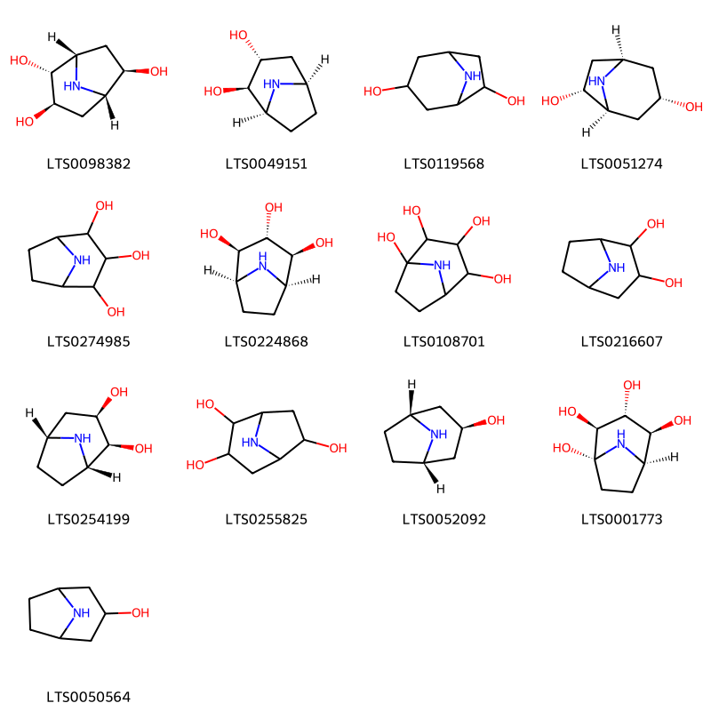{ width=100% }
    <figcaption>Hình ảnh cấu trúc hóa học của 13 hoạt chất thuộc nhóm Tropane alkaloids gồm ['(1s,2r,3r,5s,6r)-8-azabicyclo[3.2.1]octane-2,3,6-triol (LTS0098382)', '(1s,2r,3r,5r)-8-azabicyclo[3.2.1]octane-2,3-diol (LTS0049151)', '8-azabicyclo[3.2.1]octane-3,6-diol (LTS0119568)', '(1r,3s,5s,6r)-8-azabicyclo[3.2.1]octane-3,6-diol (LTS0051274)', '8-azabicyclo[3.2.1]octane-2,3,4-triol (LTS0274985)', '(1r,2s,3r,4r,5s)-8-azabicyclo[3.2.1]octane-2,3,4-triol (LTS0224868)', '8-azabicyclo[3.2.1]octane-1,2,3,4-tetrol (LTS0108701)', '8-azabicyclo[3.2.1]octane-2,3-diol (LTS0216607)', '(1s,2s,3r,5r)-8-azabicyclo[3.2.1]octane-2,3-diol (LTS0254199)', '8-azabicyclo[3.2.1]octane-2,3,6-triol (LTS0255825)', '(1r,3r,5s)-8-azabicyclo[3.2.1]octan-3-ol (LTS0052092)', '(1r,2s,3r,4s,5r)-8-azabicyclo[3.2.1]octane-1,2,3,4-tetrol (LTS0001773)', '8-azabicyclo[3.2.1]octan-3-ol (LTS0050564)'].</figcaption>
</figure>

---

### Dược dân tộc học

Danh sách các quốc gia có sử dụng *Morus alba* trong điều trị các bệnh. 

| Country            | Disease                                                                                                                              | Bệnh                                                                                                                                                                  |
|:-------------------|:-------------------------------------------------------------------------------------------------------------------------------------|:----------------------------------------------------------------------------------------------------------------------------------------------------------------------|
| China              | Antitussive, Antivinous, Astringent, Diaphoretic, Diuretic, Expectorant, Tonic, Vermifuge, Poison, Sedative                          | Thuốc chống ho, chống đông máu, làm se, thuốc lợi tiểu, thuốc lợi tiểu, thuốc long đờm, thuốc bổ, thuốc diệt giun, thuốc độc, thuốc an thần                           |
| Dominican Republic | Laxative                                                                                                                             | Nhuận trường                                                                                                                                                          |
| Elsewhere          | Antiphlogistic, Diaphoretic, Diuretic, Emollient, Fungicide, Refrigerant, Vermifuge, Fungicide, Astringent, nan, Laxative, Purgative | Thuốc chống viêm, Diaphoretic, Thuốc lợi tiểu, Chất làm mềm, Thuốc diệt nấm, Chất làm lạnh, Vermifuge, Thuốc diệt nấm, Chất làm se, nan, Thuốc nhuận tràng, Thuốc tẩy |
| Haiti              | Purgative                                                                                                                            | Thuốc xổ                                                                                                                                                              |
| Java               | Lactagogue, Emollient                                                                                                                | Chất Lactagogue, Chất làm mềm                                                                                                                                         |
| Turkey             | Astringent, Diuretic, Laxative, Nervine, Refrigerant, Tonic, Vermifuge, Purgative                                                    | Chất làm se, lợi tiểu, nhuận tràng, thần kinh, chất làm lạnh, thuốc bổ, Vermifuge, Purgative                                                                          |
| US                 | Laxative                                                                                                                             | Nhuận trường                                                                                                                                                          |
| ain                | Diuretic                                                                                                                             | Thuốc lợi tiêu                                                                                                                                                        |

---

---
## Morus bombycis
### Thông tin về thực vật

!!! info "Phân loại thực vật của *Morus indica* từ GIBF:"
    - **Kingdom:** Plantae
    - **Phylum:** Tracheophyta
    - **Order:** Rosales
    - **Family:** Moraceae
    - **Genus:** Morus
    - **Species:** *Morus indica*

 

| Label (VI)   | Label (EN)   | Scientific Name   | Descriptions (VI)   | Descriptions (EN)   | Also Known As (VI)   | Also Known As (EN)   |
|:-------------|:-------------|:------------------|:--------------------|:--------------------|:---------------------|:---------------------|
| N/A          | N/A          | Morus bombycis    | loài thực vật       | species of plant    | ['']                 | ['']                 |

#### Phân bố trên thế giới

**Từ CSDL GIBF** Korea, Republic of

#### Phân bố tại Việt Nam

**Từ CSDL GIBF**: Không có ghi nhận ở Việt Nam

---
### Thành phần hóa học
        
- Theo cơ sở dữ liệu lotus: Từ loài *Morus indica* đã phân lập và xác định được 69 hoạt chất thuộc về các nhóm Flavonoids, Pyrrolidines, Indolizidines, Cinnamic acids and derivatives, Diarylheptanoids, Piperidines, Organonitrogen compounds, Benzofurans, 2-arylbenzofuran flavonoids, Tropane alkaloids, Organooxygen compounds, Phenols, Carboxylic acids and derivatives. 

|    | chemicalTaxonomyClassyfireClass   |   smiles_count |
|---:|:----------------------------------|---------------:|
|  0 | 2-arylbenzofuran flavonoids       |             12 |
|  1 | Benzofurans                       |              1 |
|  2 | Carboxylic acids and derivatives  |              9 |
|  3 | Cinnamic acids and derivatives    |              1 |
|  4 | Diarylheptanoids                  |             16 |
|  5 | Flavonoids                        |              7 |
|  6 | Indolizidines                     |              1 |
|  7 | Organonitrogen compounds          |              1 |
|  8 | Organooxygen compounds            |              6 |
|  9 | Phenols                           |              1 |
| 10 | Piperidines                       |              8 |
| 11 | Pyrrolidines                      |              3 |
| 12 | Tropane alkaloids                 |              2 |

#### Nhóm 2-arylbenzofuran flavonoids
<figure markdown="span">
    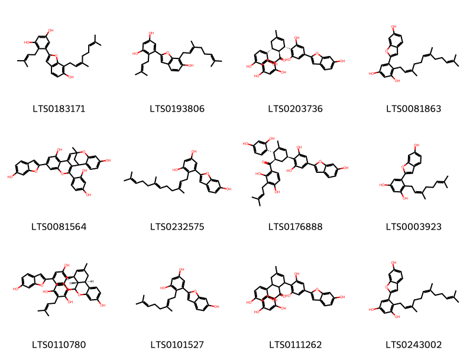{ width=100% }
    <figcaption>Hình ảnh cấu trúc hóa học của 12 hoạt chất thuộc nhóm 2-arylbenzofuran flavonoids gồm ['5-[7-(3,7-dimethylocta-2,6-dien-1-yl)-6-hydroxy-1-benzofuran-2-yl]-4-(3-methylbut-2-en-1-yl)benzene-1,3-diol (LTS0183171)', '5-{7-[(2e)-3,7-dimethylocta-2,6-dien-1-yl]-6-hydroxy-1-benzofuran-2-yl}-4-(3-methylbut-2-en-1-yl)benzene-1,3-diol (LTS0193806)', '2-[(1s,5r,6s)-6-(2,4-dihydroxybenzoyl)-5-(2,4-dihydroxyphenyl)-3-methylcyclohex-2-en-1-yl]-5-(6-hydroxy-1-benzofuran-2-yl)benzene-1,3-diol (LTS0203736)', '5-(6-hydroxy-1-benzofuran-2-yl)-4-[(2z,6z)-3,7,11-trimethyldodeca-2,6,10-trien-1-yl]benzene-1,3-diol (LTS0081863)', '3-(2,4-dihydroxyphenyl)-7-(6-hydroxy-1-benzofuran-2-yl)-13-methyl-4,14-dioxapentacyclo[11.7.1.0²,¹¹.0⁵,¹⁰.0¹⁵,²⁰]henicosa-2,5,7,9,11,15,17,19-octaene-9,17-diol (LTS0081564)', '5-(6-hydroxy-1-benzofuran-2-yl)-4-[(2e,6e)-3,7,11-trimethyldodeca-2,6,10-trien-1-yl]benzene-1,3-diol (LTS0232575)', '2-[(1s,4s,5r)-5-[2,4-dihydroxy-3-(3-methylbut-2-en-1-yl)benzoyl]-4-(2,4-dihydroxyphenyl)-3-methylcyclohex-2-en-1-yl]-5-(6-hydroxy-1-benzofuran-2-yl)benzene-1,3-diol (LTS0176888)', '4-(3,7-dimethylocta-2,6-dien-1-yl)-5-(6-hydroxy-1-benzofuran-2-yl)benzene-1,3-diol (LTS0003923)', '(1s,9r,13r,21s)-1-[2,4-dihydroxy-3-(3-methylbut-2-en-1-yl)phenyl]-17-(6-hydroxy-1-benzofuran-2-yl)-11-methyl-2,20-dioxapentacyclo[11.7.1.0³,⁸.0⁹,²¹.0¹⁴,¹⁹]henicosa-3,5,7,11,14,16,18-heptaene-5,15-diol (LTS0110780)', 'albafuran a (LTS0101527)', '2-[6-(2,4-dihydroxybenzoyl)-5-(2,4-dihydroxyphenyl)-3-methylcyclohex-2-en-1-yl]-5-(6-hydroxy-1-benzofuran-2-yl)benzene-1,3-diol (LTS0111262)', '5-(6-hydroxy-1-benzofuran-2-yl)-4-(3,7,11-trimethyldodeca-2,6,10-trien-1-yl)benzene-1,3-diol (LTS0243002)'].</figcaption>
</figure>
#### Nhóm Benzofurans
<figure markdown="span">
    { width=100% }
    <figcaption>Hình ảnh cấu trúc hóa học của 1 hoạt chất thuộc nhóm Benzofurans gồm ['loliolide (LTS0254454)'].</figcaption>
</figure>
#### Nhóm Carboxylic acids and derivatives
<figure markdown="span">
    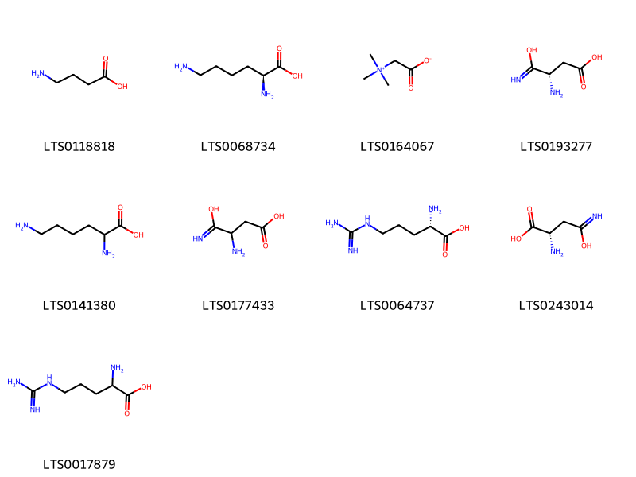{ width=100% }
    <figcaption>Hình ảnh cấu trúc hóa học của 9 hoạt chất thuộc nhóm Carboxylic acids and derivatives gồm ['gamma(amino)-butyric acid (LTS0118818)', 'l-lysine (LTS0068734)', 'bet (LTS0164067)', '(3s)-3-amino-3-(c-hydroxycarbonimidoyl)propanoic acid (LTS0193277)', 'lysine (LTS0141380)', 'succinamic acid, 3-amino- (LTS0177433)', 'l-arginine (LTS0064737)', 'aspartamate (LTS0243014)', 'arginine (LTS0017879)'].</figcaption>
</figure>
#### Nhóm Cinnamic acids and derivatives
<figure markdown="span">
    { width=100% }
    <figcaption>Hình ảnh cấu trúc hóa học của 1 hoạt chất thuộc nhóm Cinnamic acids and derivatives gồm ['cinnamic acid (LTS0128130)'].</figcaption>
</figure>
#### Nhóm Diarylheptanoids
<figure markdown="span">
    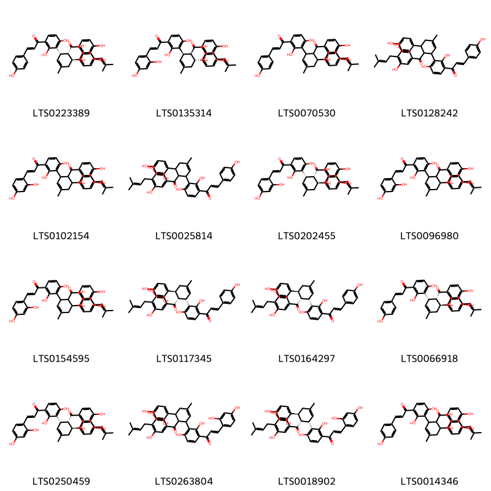{ width=100% }
    <figcaption>Hình ảnh cấu trúc hóa học của 16 hoạt chất thuộc nhóm Diarylheptanoids gồm ['(2e)-1-{3-[(1s,5s,6r)-6-[2,4-dihydroxy-3-(3-methylbut-2-en-1-yl)benzoyl]-5-(2,4-dihydroxyphenyl)-3-methylcyclohex-2-en-1-yl]-2,4-dihydroxyphenyl}-3-(4-hydroxyphenyl)prop-2-en-1-one (LTS0223389)', '(2e)-1-{3-[(1r,5r,6s)-6-[2,4-dihydroxy-3-(3-methylbut-2-en-1-yl)benzoyl]-5-(2,4-dihydroxyphenyl)-3-methylcyclohex-2-en-1-yl]-2,4-dihydroxyphenyl}-3-(2,4-dihydroxyphenyl)prop-2-en-1-one (LTS0135314)', '1-(3-{6-[2,4-dihydroxy-3-(3-methylbut-2-en-1-yl)benzoyl]-5-(4-hydroxyphenyl)-3-methylcyclohex-2-en-1-yl}-2,4-dihydroxyphenyl)-3-(4-hydroxyphenyl)prop-2-en-1-one (LTS0070530)', '1-(3-{6-[3,5-dihydroxy-4-(3-methylbut-2-en-1-yl)benzoyl]-5-(4-hydroxyphenyl)-3-methylcyclohex-2-en-1-yl}-2,4-dihydroxyphenyl)-3-(4-hydroxyphenyl)prop-2-en-1-one (LTS0128242)', '1-(3-{6-[2,4-dihydroxy-3-(3-methylbut-2-en-1-yl)benzoyl]-5-(4-hydroxyphenyl)-3-methylcyclohex-2-en-1-yl}-2,4-dihydroxyphenyl)-3-(2,4-dihydroxyphenyl)prop-2-en-1-one (LTS0102154)', '1-(3-{6-[3,5-dihydroxy-4-(3-methylbut-2-en-1-yl)benzoyl]-5-(2,4-dihydroxyphenyl)-3-methylcyclohex-2-en-1-yl}-2,4-dihydroxyphenyl)-3-(4-hydroxyphenyl)prop-2-en-1-one (LTS0025814)', '(2e)-1-{3-[(1s,5s,6r)-6-[2,4-dihydroxy-3-(3-methylbut-2-en-1-yl)benzoyl]-5-(2,4-dihydroxyphenyl)-3-methylcyclohex-2-en-1-yl]-2,4-dihydroxyphenyl}-3-(2,4-dihydroxyphenyl)prop-2-en-1-one (LTS0202455)', '(2e)-1-(3-{6-[2,4-dihydroxy-3-(3-methylbut-2-en-1-yl)benzoyl]-5-(4-hydroxyphenyl)-3-methylcyclohex-2-en-1-yl}-2,4-dihydroxyphenyl)-3-(2,4-dihydroxyphenyl)prop-2-en-1-one (LTS0096980)', '1-(3-{6-[2,4-dihydroxy-3-(3-methylbut-2-en-1-yl)benzoyl]-5-(2,4-dihydroxyphenyl)-3-methylcyclohex-2-en-1-yl}-2,4-dihydroxyphenyl)-3-(2,4-dihydroxyphenyl)prop-2-en-1-one (LTS0154595)', '(2e)-1-{3-[(1s,5s,6r)-6-[3,5-dihydroxy-4-(3-methylbut-2-en-1-yl)benzoyl]-5-(2,4-dihydroxyphenyl)-3-methylcyclohex-2-en-1-yl]-2,4-dihydroxyphenyl}-3-(4-hydroxyphenyl)prop-2-en-1-one (LTS0117345)', '(2e)-1-{3-[(1s,5s,6r)-6-[3,5-dihydroxy-4-(3-methylbut-2-en-1-yl)benzoyl]-5-(4-hydroxyphenyl)-3-methylcyclohex-2-en-1-yl]-2,4-dihydroxyphenyl}-3-(4-hydroxyphenyl)prop-2-en-1-one (LTS0164297)', '(2e)-1-{3-[(1s,5s,6r)-6-[2,4-dihydroxy-3-(3-methylbut-2-en-1-yl)benzoyl]-5-(4-hydroxyphenyl)-3-methylcyclohex-2-en-1-yl]-2,4-dihydroxyphenyl}-3-(4-hydroxyphenyl)prop-2-en-1-one (LTS0066918)', '(2e)-1-{3-[(1s,5s,6r)-6-[2,4-dihydroxy-3-(3-methylbut-2-en-1-yl)benzoyl]-5-(4-hydroxyphenyl)-3-methylcyclohex-2-en-1-yl]-2,4-dihydroxyphenyl}-3-(2,4-dihydroxyphenyl)prop-2-en-1-one (LTS0250459)', '1-(3-{6-[3,5-dihydroxy-4-(3-methylbut-2-en-1-yl)benzoyl]-5-(2,4-dihydroxyphenyl)-3-methylcyclohex-2-en-1-yl}-2,4-dihydroxyphenyl)-3-(2,4-dihydroxyphenyl)prop-2-en-1-one (LTS0263804)', '(2e)-1-{3-[(1s,5s,6r)-6-[3,5-dihydroxy-4-(3-methylbut-2-en-1-yl)benzoyl]-5-(2,4-dihydroxyphenyl)-3-methylcyclohex-2-en-1-yl]-2,4-dihydroxyphenyl}-3-(2,4-dihydroxyphenyl)prop-2-en-1-one (LTS0018902)', '1-(3-{6-[2,4-dihydroxy-3-(3-methylbut-2-en-1-yl)benzoyl]-5-(2,4-dihydroxyphenyl)-3-methylcyclohex-2-en-1-yl}-2,4-dihydroxyphenyl)-3-(4-hydroxyphenyl)prop-2-en-1-one (LTS0014346)'].</figcaption>
</figure>
#### Nhóm Flavonoids
<figure markdown="span">
    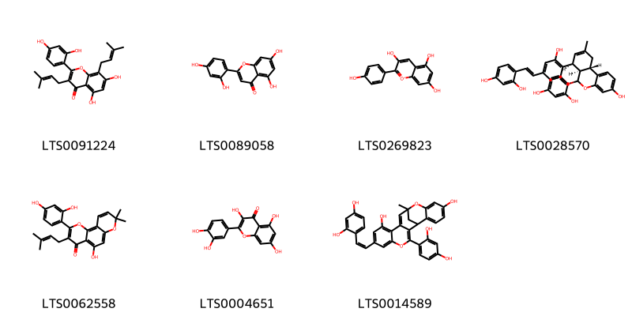{ width=100% }
    <figcaption>Hình ảnh cấu trúc hóa học của 7 hoạt chất thuộc nhóm Flavonoids gồm ['mulberrin (LTS0091224)', 'norartocarpetin (LTS0089058)', 'pelargonidin (LTS0269823)', '(1r,9s,13s,21r)-1-(2,4-dihydroxyphenyl)-17-[(1e)-2-(2,4-dihydroxyphenyl)ethenyl]-11-methyl-2,20-dioxapentacyclo[11.7.1.0³,⁸.0⁹,²¹.0¹⁴,¹⁹]henicosa-3,5,7,11,14,16,18-heptaene-5,15-diol (LTS0028570)', 'morusin (LTS0062558)', 'quercetin (LTS0004651)', '3-(2,4-dihydroxyphenyl)-7-[(1z)-2-(2,4-dihydroxyphenyl)ethenyl]-13-methyl-4,14-dioxapentacyclo[11.7.1.0²,¹¹.0⁵,¹⁰.0¹⁵,²⁰]henicosa-2,5,7,9,11,15,17,19-octaene-9,17-diol (LTS0014589)'].</figcaption>
</figure>
#### Nhóm Indolizidines
<figure markdown="span">
    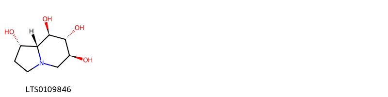{ width=100% }
    <figcaption>Hình ảnh cấu trúc hóa học của 1 hoạt chất thuộc nhóm Indolizidines gồm ['castanospermine (LTS0109846)'].</figcaption>
</figure>
#### Nhóm Organonitrogen compounds
<figure markdown="span">
    { width=100% }
    <figcaption>Hình ảnh cấu trúc hóa học của 1 hoạt chất thuộc nhóm Organonitrogen compounds gồm ['choline (LTS0170307)'].</figcaption>
</figure>
#### Nhóm Organooxygen compounds
<figure markdown="span">
    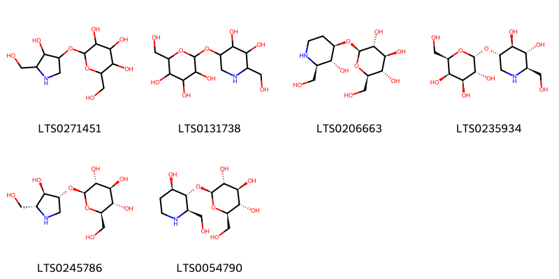{ width=100% }
    <figcaption>Hình ảnh cấu trúc hóa học của 6 hoạt chất thuộc nhóm Organooxygen compounds gồm ['2-{[4-hydroxy-5-(hydroxymethyl)pyrrolidin-3-yl]oxy}-6-(hydroxymethyl)oxane-3,4,5-triol (LTS0271451)', '2-{[4,5-dihydroxy-6-(hydroxymethyl)piperidin-3-yl]oxy}-6-(hydroxymethyl)oxane-3,4,5-triol (LTS0131738)', '(2r,3r,4s,5s,6r)-2-{[(2r,3r,4r)-3-hydroxy-2-(hydroxymethyl)piperidin-4-yl]oxy}-6-(hydroxymethyl)oxane-3,4,5-triol (LTS0206663)', '(2s,3r,4s,5r,6r)-2-{[(3s,4s,5r,6r)-4,5-dihydroxy-6-(hydroxymethyl)piperidin-3-yl]oxy}-6-(hydroxymethyl)oxane-3,4,5-triol (LTS0235934)', '(2r,3r,4s,5s,6r)-2-{[(3r,4r,5r)-4-hydroxy-5-(hydroxymethyl)pyrrolidin-3-yl]oxy}-6-(hydroxymethyl)oxane-3,4,5-triol (LTS0245786)', '(2r,3r,4s,5s,6r)-2-{[(2r,3r,4r)-4-hydroxy-2-(hydroxymethyl)piperidin-3-yl]oxy}-6-(hydroxymethyl)oxane-3,4,5-triol (LTS0054790)'].</figcaption>
</figure>
#### Nhóm Phenols
<figure markdown="span">
    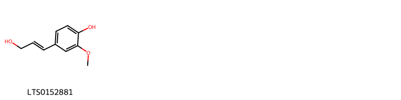{ width=100% }
    <figcaption>Hình ảnh cấu trúc hóa học của 1 hoạt chất thuộc nhóm Phenols gồm ['coniferyl alcohol (LTS0152881)'].</figcaption>
</figure>
#### Nhóm Piperidines
<figure markdown="span">
    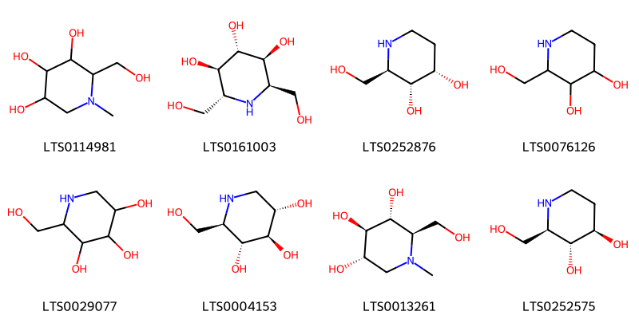{ width=100% }
    <figcaption>Hình ảnh cấu trúc hóa học của 8 hoạt chất thuộc nhóm Piperidines gồm ['2-(hydroxymethyl)-1-methylpiperidine-3,4,5-triol (LTS0114981)', '(2r,3r,4r,5s,6r)-2,6-bis(hydroxymethyl)piperidine-3,4,5-triol (LTS0161003)', '3-epi-fagomine (LTS0252876)', '2-(hydroxymethyl)piperidine-3,4-diol (LTS0076126)', '1 deoxynojirimycin (LTS0029077)', '1-deoxynojirimycin (LTS0004153)', 'n-methyldeoxynojirimycin (LTS0013261)', 'fagomine (LTS0252575)'].</figcaption>
</figure>
#### Nhóm Pyrrolidines
<figure markdown="span">
    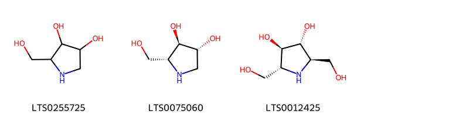{ width=100% }
    <figcaption>Hình ảnh cấu trúc hóa học của 3 hoạt chất thuộc nhóm Pyrrolidines gồm ['2-(hydroxymethyl)pyrrolidine-3,4-diol (LTS0255725)', '(2r,3r,4r)-2-(hydroxymethyl)pyrrolidine-3,4-diol (LTS0075060)', 'dmdp (LTS0012425)'].</figcaption>
</figure>
#### Nhóm Tropane alkaloids
<figure markdown="span">
    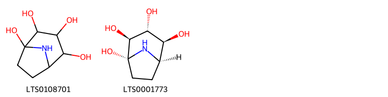{ width=100% }
    <figcaption>Hình ảnh cấu trúc hóa học của 2 hoạt chất thuộc nhóm Tropane alkaloids gồm ['8-azabicyclo[3.2.1]octane-1,2,3,4-tetrol (LTS0108701)', '(1r,2s,3r,4s,5r)-8-azabicyclo[3.2.1]octane-1,2,3,4-tetrol (LTS0001773)'].</figcaption>
</figure>

---

### Dược dân tộc học

Danh sách các quốc gia có sử dụng *Morus indica* trong điều trị các bệnh. 

| Country   | Disease   | Bệnh           |
|:----------|:----------|:---------------|
| China     | Laxative  | Nhuận trường   |
| Elsewhere | Diuretic  | Thuốc lợi tiêu |

---

---
## Morus indica
### Thông tin về thực vật

!!! info "Phân loại thực vật của *Morus indica* từ GIBF:"
    - **Kingdom:** Plantae
    - **Phylum:** Tracheophyta
    - **Order:** Rosales
    - **Family:** Moraceae
    - **Genus:** Morus
    - **Species:** *Morus indica*

 

| Label (VI)   | Label (EN)   | Scientific Name   | Descriptions (VI)   | Descriptions (EN)   | Also Known As (VI)   | Also Known As (EN)   |
|:-------------|:-------------|:------------------|:--------------------|:--------------------|:---------------------|:---------------------|
| N/A          | N/A          | Morus indica      | loài thực vật       | species of plant    | ['']                 | ['']                 |

#### Phân bố trên thế giới

**Từ CSDL GIBF** Japan, Chinese Taipei, United States of America

#### Phân bố tại Việt Nam

**Từ CSDL GIBF**: Không có ghi nhận ở Việt Nam

---
### Thành phần hóa học
        
- Theo cơ sở dữ liệu lotus: Từ loài *Morus indica* đã phân lập và xác định được Chưa có hoạt chất nào được phân lập. hoạt chất thuộc về các nhóm Không có hoạt chất nào được phân lập. 

Không có hình ảnh nào được tạo ra

---

### Dược dân tộc học

Danh sách các quốc gia có sử dụng *Morus indica* trong điều trị các bệnh. 

| Country   | Disease             | Bệnh                |
|:----------|:--------------------|:--------------------|
| Turkey    | Vermifuge, Diuretic | Vermifuge, lợi tiểu |

---

---
## Morus nigra
### Thông tin về thực vật

!!! info "Phân loại thực vật của *Morus nigra* từ GIBF:"
    - **Kingdom:** Plantae
    - **Phylum:** Tracheophyta
    - **Order:** Rosales
    - **Family:** Moraceae
    - **Genus:** Morus
    - **Species:** *Morus nigra*

 

| Label (VI)   | Label (EN)   | Scientific Name   | Descriptions (VI)   | Descriptions (EN)   | Also Known As (VI)   | Also Known As (EN)               |
|:-------------|:-------------|:------------------|:--------------------|:--------------------|:---------------------|:---------------------------------|
| N/A          | N/A          | Morus nigra       | loài thực vật       | species of plant    | ['']                 | ['blackberry', 'black mulberry'] |

#### Phân bố trên thế giới

**Từ CSDL GIBF** Italy, Bulgaria, Australia, Cook Islands, Belgium, Georgia, Argentina, Israel, Canada, Panama, Ukraine, Pakistan, Puerto Rico, Denmark, Malta, Spain, Türkiye, Portugal, Lesotho, Russian Federation, United States of America, Sweden, Uruguay, Kazakhstan, Croatia, Greece, Maldives, Uzbekistan, South Africa, Germany, Romania, Brazil, Bahamas, Switzerland, Cuba, Mexico, Peru, France, Austria, Viet Nam, United Kingdom of Great Britain and Northern Ireland, China, Jersey, Ecuador, Syrian Arab Republic, India, Nepal

#### Phân bố tại Việt Nam

**Từ CSDL GIBF**: Đăk Nông

---
### Thành phần hóa học
        
- Theo cơ sở dữ liệu lotus: Từ loài *Morus nigra* đã phân lập và xác định được 83 hoạt chất thuộc về các nhóm Flavonoids, Linear 1,3-diarylpropanoids, Diarylheptanoids, 2-arylbenzofuran flavonoids, Hydroxy acids and derivatives, Stilbenes, Organooxygen compounds, Coumarins and derivatives, Carboxylic acids and derivatives, Benzopyrans. 

|    | chemicalTaxonomyClassyfireClass   |   smiles_count |
|---:|:----------------------------------|---------------:|
|  0 | 2-arylbenzofuran flavonoids       |             17 |
|  1 | Benzopyrans                       |              3 |
|  2 | Carboxylic acids and derivatives  |              3 |
|  3 | Coumarins and derivatives         |              8 |
|  4 | Diarylheptanoids                  |              1 |
|  5 | Flavonoids                        |             36 |
|  6 | Hydroxy acids and derivatives     |              1 |
|  7 | Linear 1,3-diarylpropanoids       |              5 |
|  8 | Organooxygen compounds            |              3 |
|  9 | Stilbenes                         |              6 |

#### Nhóm 2-arylbenzofuran flavonoids
<figure markdown="span">
    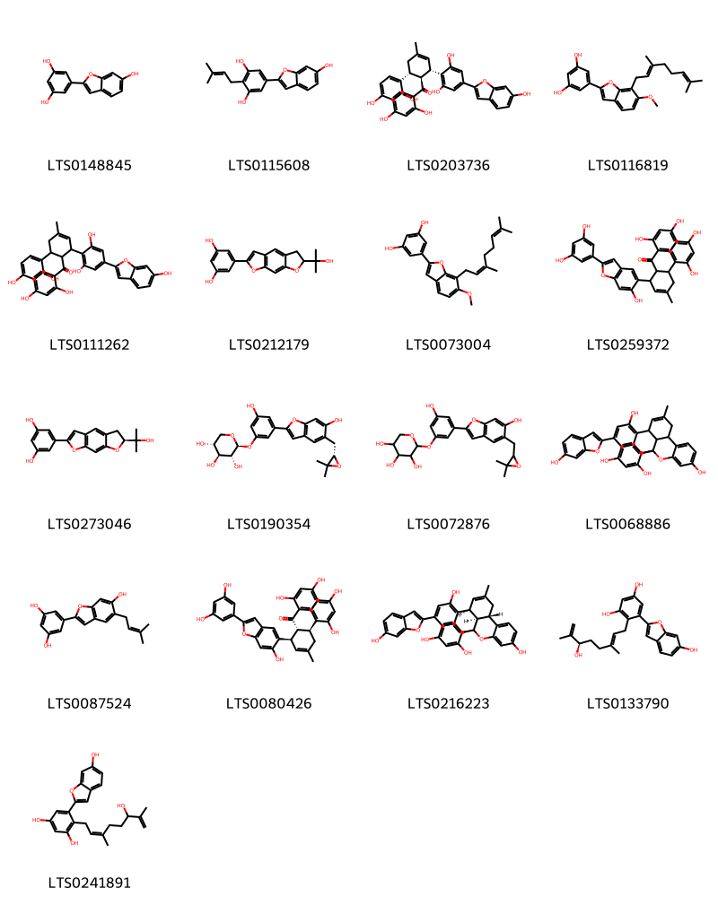{ width=100% }
    <figcaption>Hình ảnh cấu trúc hóa học của 17 hoạt chất thuộc nhóm 2-arylbenzofuran flavonoids gồm ['moracin m (LTS0148845)', '5-(6-hydroxy-1-benzofuran-2-yl)-2-(3-methylbut-2-en-1-yl)benzene-1,3-diol (LTS0115608)', '2-[(1s,5r,6s)-6-(2,4-dihydroxybenzoyl)-5-(2,4-dihydroxyphenyl)-3-methylcyclohex-2-en-1-yl]-5-(6-hydroxy-1-benzofuran-2-yl)benzene-1,3-diol (LTS0203736)', '5-{7-[(2e)-3,7-dimethylocta-2,6-dien-1-yl]-6-methoxy-1-benzofuran-2-yl}benzene-1,3-diol (LTS0116819)', '2-[6-(2,4-dihydroxybenzoyl)-5-(2,4-dihydroxyphenyl)-3-methylcyclohex-2-en-1-yl]-5-(6-hydroxy-1-benzofuran-2-yl)benzene-1,3-diol (LTS0111262)', '5-[11-(2-hydroxypropan-2-yl)-4,12-dioxatricyclo[7.3.0.0³,⁷]dodeca-1(9),2,5,7-tetraen-5-yl]benzene-1,3-diol (LTS0212179)', '5-[7-(3,7-dimethylocta-2,6-dien-1-yl)-6-methoxy-1-benzofuran-2-yl]benzene-1,3-diol (LTS0073004)', '5-{5-[6-(2,4-dihydroxybenzoyl)-5-(2,4-dihydroxyphenyl)-3-methylcyclohex-2-en-1-yl]-6-hydroxy-1-benzofuran-2-yl}benzene-1,3-diol (LTS0259372)', '5-[(11s)-11-(2-hydroxypropan-2-yl)-4,12-dioxatricyclo[7.3.0.0³,⁷]dodeca-1(9),2,5,7-tetraen-5-yl]benzene-1,3-diol (LTS0273046)', '(2s,3r,4s,5r)-2-[3-(5-{[(2s)-3,3-dimethyloxiran-2-yl]methyl}-6-hydroxy-1-benzofuran-2-yl)-5-hydroxyphenoxy]oxane-3,4,5-triol (LTS0190354)', '2-(3-{5-[(3,3-dimethyloxiran-2-yl)methyl]-6-hydroxy-1-benzofuran-2-yl}-5-hydroxyphenoxy)oxane-3,4,5-triol (LTS0072876)', '1-(2,4-dihydroxyphenyl)-17-(6-hydroxy-1-benzofuran-2-yl)-11-methyl-2,20-dioxapentacyclo[11.7.1.0³,⁸.0⁹,²¹.0¹⁴,¹⁹]henicosa-3,5,7,11,14,16,18-heptaene-5,15-diol (LTS0068886)', '5-[6-hydroxy-5-(3-methylbut-2-en-1-yl)-1-benzofuran-2-yl]benzene-1,3-diol (LTS0087524)', '5-{5-[(1r,5s,6r)-6-(2,4-dihydroxybenzoyl)-5-(2,4-dihydroxyphenyl)-3-methylcyclohex-2-en-1-yl]-6-hydroxy-1-benzofuran-2-yl}benzene-1,3-diol (LTS0080426)', 'mulberrofuran g (LTS0216223)', '5-(6-hydroxy-1-benzofuran-2-yl)-4-[(2e,6r)-6-hydroxy-3,7-dimethylocta-2,7-dien-1-yl]benzene-1,3-diol (LTS0133790)', '5-(6-hydroxy-1-benzofuran-2-yl)-4-(6-hydroxy-3,7-dimethylocta-2,7-dien-1-yl)benzene-1,3-diol (LTS0241891)'].</figcaption>
</figure>
#### Nhóm Benzopyrans
<figure markdown="span">
    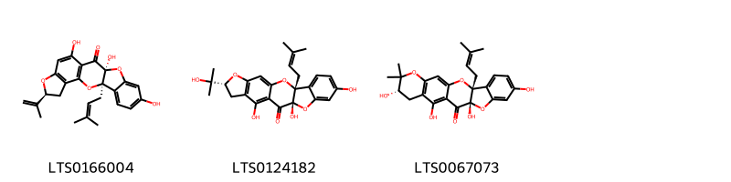{ width=100% }
    <figcaption>Hình ảnh cấu trúc hóa học của 3 hoạt chất thuộc nhóm Benzopyrans gồm ['(1r,6s,13s)-10,13,17-trihydroxy-1-(3-methylbut-2-en-1-yl)-6-(prop-1-en-2-yl)-2,7,14-trioxapentacyclo[11.7.0.0³,¹¹.0⁴,⁸.0¹⁵,²⁰]icosa-3(11),4(8),9,15,17,19-hexaen-12-one (LTS0166004)', 'nigrasin d (LTS0124182)', 'nigrasin a (LTS0067073)'].</figcaption>
</figure>
#### Nhóm Carboxylic acids and derivatives
<figure markdown="span">
    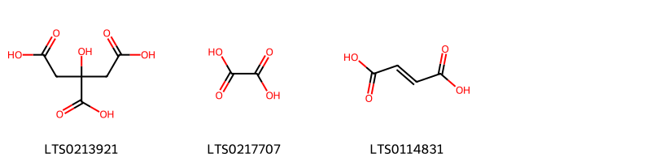{ width=100% }
    <figcaption>Hình ảnh cấu trúc hóa học của 3 hoạt chất thuộc nhóm Carboxylic acids and derivatives gồm ['citric acid (LTS0213921)', 'oxalic acid (LTS0217707)', 'fumaric acid (LTS0114831)'].</figcaption>
</figure>
#### Nhóm Coumarins and derivatives
<figure markdown="span">
    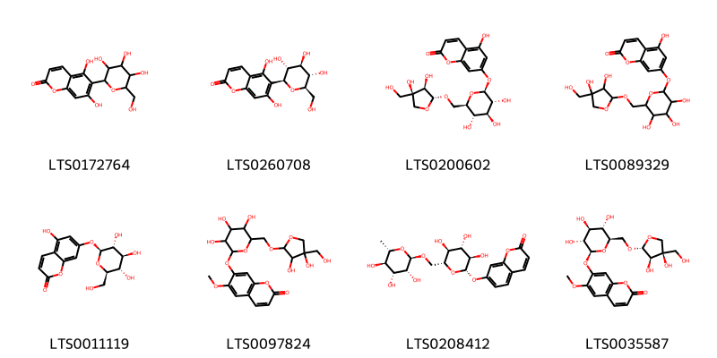{ width=100% }
    <figcaption>Hình ảnh cấu trúc hóa học của 8 hoạt chất thuộc nhóm Coumarins and derivatives gồm ['5,7-dihydroxy-6-[3,4,5-trihydroxy-6-(hydroxymethyl)oxan-2-yl]chromen-2-one (LTS0172764)', '5,7-dihydroxy-6-[(2s,3r,4r,5s,6r)-3,4,5-trihydroxy-6-(hydroxymethyl)oxan-2-yl]chromen-2-one (LTS0260708)', '7-{[(2s,3r,4s,5s,6r)-6-({[(2r,3r,4r)-3,4-dihydroxy-4-(hydroxymethyl)oxolan-2-yl]oxy}methyl)-3,4,5-trihydroxyoxan-2-yl]oxy}-5-hydroxychromen-2-one (LTS0200602)', '7-{[6-({[3,4-dihydroxy-4-(hydroxymethyl)oxolan-2-yl]oxy}methyl)-3,4,5-trihydroxyoxan-2-yl]oxy}-5-hydroxychromen-2-one (LTS0089329)', '5-hydroxy-7-{[(2s,3r,4s,5s,6r)-3,4,5-trihydroxy-6-(hydroxymethyl)oxan-2-yl]oxy}chromen-2-one (LTS0011119)', '7-{[6-({[3,4-dihydroxy-4-(hydroxymethyl)oxolan-2-yl]oxy}methyl)-3,4,5-trihydroxyoxan-2-yl]oxy}-6-methoxychromen-2-one (LTS0097824)', '7-{[(2s,3r,4s,5s,6r)-3,4,5-trihydroxy-6-({[(2r,3r,4r,5r,6s)-3,4,5-trihydroxy-6-methyloxan-2-yl]oxy}methyl)oxan-2-yl]oxy}chromen-2-one (LTS0208412)', '7-{[(2s,3r,4s,5s,6r)-6-({[(2r,3r,4r)-3,4-dihydroxy-4-(hydroxymethyl)oxolan-2-yl]oxy}methyl)-3,4,5-trihydroxyoxan-2-yl]oxy}-6-methoxychromen-2-one (LTS0035587)'].</figcaption>
</figure>
#### Nhóm Diarylheptanoids
<figure markdown="span">
    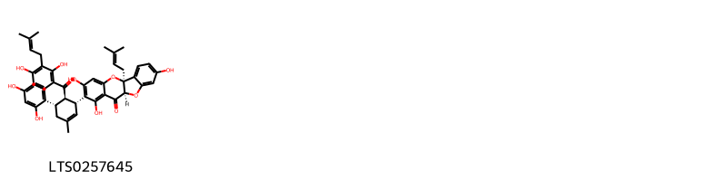{ width=100% }
    <figcaption>Hình ảnh cấu trúc hóa học của 1 hoạt chất thuộc nhóm Diarylheptanoids gồm ['(1r,10s)-5-[(1r,5s,6r)-6-[2,4-dihydroxy-3-(3-methylbut-2-en-1-yl)benzoyl]-5-(2,4-dihydroxyphenyl)-3-methylcyclohex-2-en-1-yl]-4,6,14-trihydroxy-10-(3-methylbut-2-en-1-yl)-9,17-dioxatetracyclo[8.7.0.0³,⁸.0¹¹,¹⁶]heptadeca-3,5,7,11,13,15-hexaen-2-one (LTS0257645)'].</figcaption>
</figure>
#### Nhóm Flavonoids
<figure markdown="span">
    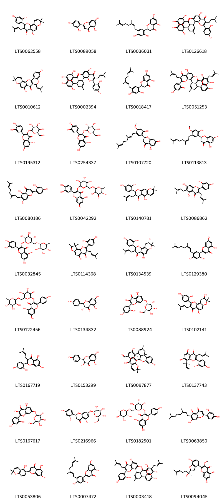{ width=100% }
    <figcaption>Hình ảnh cấu trúc hóa học của 36 hoạt chất thuộc nhóm Flavonoids gồm ['morusin (LTS0062558)', 'norartocarpetin (LTS0089058)', '2-[5-(3,7-dimethylocta-2,6-dien-1-yl)-2,4-dihydroxyphenyl]-5,7-dihydroxy-2,3-dihydro-1-benzopyran-4-one (LTS0036031)', '8-[6-(2,4-dihydroxybenzoyl)-5-(2,4-dihydroxyphenyl)-3-methylcyclohex-2-en-1-yl]-2-(2,4-dihydroxyphenyl)-5,7-dihydroxy-3-(3-methylbut-2-en-1-yl)chromen-4-one (LTS0126618)', 'cyclomorusin (LTS0010612)', 'kuwanon g (LTS0002394)', '(2s)-2-{5-[(2e)-3,7-dimethylocta-2,6-dien-1-yl]-2,4-dihydroxyphenyl}-5,7-dihydroxy-2,3-dihydro-1-benzopyran-4-one (LTS0018417)', '8-{6-[2,4-dihydroxy-3-(3-methylbut-2-en-1-yl)benzoyl]-5-(2,4-dihydroxyphenyl)-3-methylcyclohex-2-en-1-yl}-2-(2,4-dihydroxyphenyl)-5,7-dihydroxy-3-(3-methylbut-2-en-1-yl)chromen-4-one (LTS0051253)', '2-(3,4-dihydroxyphenyl)-5,7-dihydroxy-3-{[3,4,5-trihydroxy-6-(hydroxymethyl)oxan-2-yl]oxy}chromen-4-one (LTS0195312)', 'isoquercetin (LTS0254337)', '(2s)-2-{5-[(2e)-3,7-dimethylocta-2,6-dien-1-yl]-2-hydroxy-4-methoxyphenyl}-5,7-dihydroxy-2,3-dihydro-1-benzopyran-4-one (LTS0107720)', '2-[5-(3,7-dimethylocta-2,6-dien-1-yl)-2-hydroxy-4-methoxyphenyl]-5,7-dihydroxy-2,3-dihydro-1-benzopyran-4-one (LTS0113813)', 'albanin e (LTS0080186)', 'rutin (LTS0042292)', 'cudraflavone b (LTS0140781)', 'cudraflavone c (LTS0086862)', '3-rutinosyl quercetin (LTS0032845)', '(8s)-2-(2,4-dihydroxyphenyl)-5-hydroxy-8,9,9-trimethyl-3-(3-methylbut-2-en-1-yl)-8h-furo[2,3-h]chromen-4-one (LTS0114368)', '(9s)-2-(2,4-dihydroxyphenyl)-5,9-dihydroxy-8,8-dimethyl-3-(3-methylbut-2-en-1-yl)-9h,10h-pyrano[2,3-h]chromen-4-one (LTS0134539)', '2-[5-(3,7-dimethylocta-2,6-dien-1-yl)-2,4-dihydroxyphenyl]-5,7-dihydroxychromen-4-one (LTS0129380)', '5,7-dihydroxy-2-(4-hydroxyphenyl)-3-[(3,4,5-trihydroxy-6-{[(3,4,5-trihydroxy-6-methyloxan-2-yl)oxy]methyl}oxan-2-yl)oxy]chromen-4-one (LTS0122456)', '(+)-dihydrokaempferol (LTS0134832)', '2-(2,4-dihydroxyphenyl)-3,5-dihydroxy-7-{[(2s,3r,4s,5s,6r)-3,4,5-trihydroxy-6-(hydroxymethyl)oxan-2-yl]oxy}chromen-4-one (LTS0088924)', '2-(2,4-dihydroxyphenyl)-5,9-dihydroxy-8,8-dimethyl-3-(3-methylbut-2-en-1-yl)-9h,10h-pyrano[2,3-h]chromen-4-one (LTS0102141)', 'albanin a (LTS0167719)', 'aromadendrin (LTS0153299)', '(9s,13s,21r)-7,17-dihydroxy-1-(5-hydroxy-2,2-dimethylchromen-8-yl)-11-methyl-2,20-dioxapentacyclo[11.7.1.0³,⁸.0⁹,²¹.0¹⁴,¹⁹]henicosa-3,5,7,10,14,16,18-heptaene-5-carbaldehyde (LTS0097877)', 'nigrasin i (LTS0137743)', '2-(2,4-dihydroxyphenyl)-3,5-dihydroxy-7-{[3,4,5-trihydroxy-6-(hydroxymethyl)oxan-2-yl]oxy}chromen-4-one (LTS0167617)', '(2s)-2-(2,4-dihydroxyphenyl)-5-hydroxy-7-{[(2s,3r,4s,5s,6r)-3,4,5-trihydroxy-6-(hydroxymethyl)oxan-2-yl]oxy}-2,3-dihydro-1-benzopyran-4-one (LTS0216966)', 'nictoflorin (LTS0182501)', '2-(2,4-dihydroxyphenyl)-6-(3,7-dimethylocta-2,6-dien-1-yl)-5,7-dihydroxychromen-4-one (LTS0063850)', "5,5',7-trihydroxy-2',2'-dimethyl-[2,6'-bichromen]-4-one (LTS0053806)", '2-{5-[(2e)-3,7-dimethylocta-2,6-dien-1-yl]-2,4-dihydroxyphenyl}-5,7-dihydroxychromen-4-one (LTS0007472)', 'kuwanon h (LTS0003418)', '5,7-dihydroxy-2-[(2s)-7-hydroxy-2-[(2s)-2-hydroxy-6-methylhept-5-en-2-yl]-2,3-dihydro-1-benzofuran-4-yl]-3-methoxychromen-4-one (LTS0094045)'].</figcaption>
</figure>
#### Nhóm Hydroxy acids and derivatives
<figure markdown="span">
    { width=100% }
    <figcaption>Hình ảnh cấu trúc hóa học của 1 hoạt chất thuộc nhóm Hydroxy acids and derivatives gồm ['malic acid (LTS0216520)'].</figcaption>
</figure>
#### Nhóm Linear 1_3-diarylpropanoids
<figure markdown="span">
    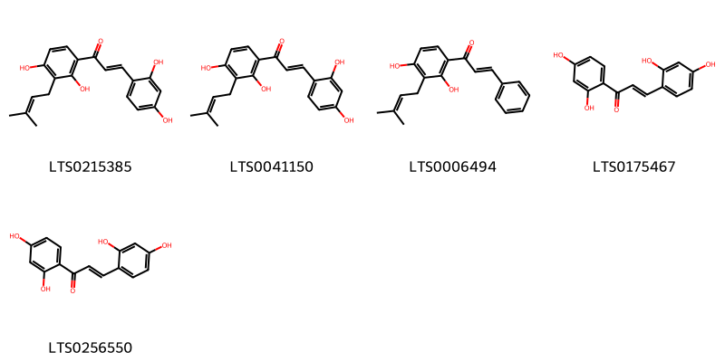{ width=100% }
    <figcaption>Hình ảnh cấu trúc hóa học của Không tìm thấy chú thích hoạt chất thuộc nhóm Linear 1_3-diarylpropanoids gồm Không tìm thấy chú thích.</figcaption>
</figure>
#### Nhóm Organooxygen compounds
<figure markdown="span">
    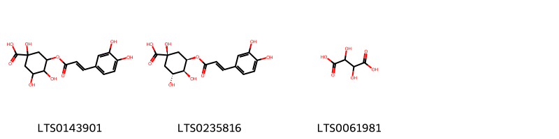{ width=100% }
    <figcaption>Hình ảnh cấu trúc hóa học của 3 hoạt chất thuộc nhóm Organooxygen compounds gồm ['3-{[3-(3,4-dihydroxyphenyl)prop-2-enoyl]oxy}-1,4,5-trihydroxycyclohexane-1-carboxylic acid (LTS0143901)', 'neochlorogenic acid (LTS0235816)', '(.+-.)-tartaric acid (LTS0061981)'].</figcaption>
</figure>
#### Nhóm Stilbenes
<figure markdown="span">
    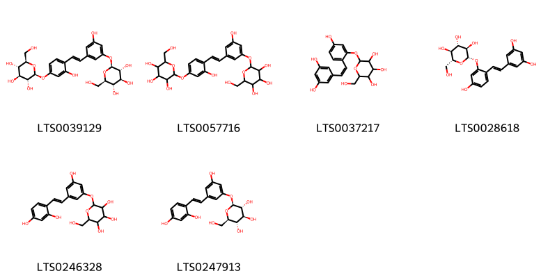{ width=100% }
    <figcaption>Hình ảnh cấu trúc hóa học của 6 hoạt chất thuộc nhóm Stilbenes gồm ['(2s,3r,4s,5s,6r)-2-{3-hydroxy-5-[(1e)-2-(2-hydroxy-4-{[(2s,3r,4s,5s,6r)-3,4,5-trihydroxy-6-(hydroxymethyl)oxan-2-yl]oxy}phenyl)ethenyl]phenoxy}-6-(hydroxymethyl)oxane-3,4,5-triol (LTS0039129)', '2-{3-hydroxy-5-[2-(2-hydroxy-4-{[3,4,5-trihydroxy-6-(hydroxymethyl)oxan-2-yl]oxy}phenyl)ethenyl]phenoxy}-6-(hydroxymethyl)oxane-3,4,5-triol (LTS0057716)', '2-{2-[2-(3,5-dihydroxyphenyl)ethenyl]-5-hydroxyphenoxy}-6-(hydroxymethyl)oxane-3,4,5-triol (LTS0037217)', '(2s,3r,4s,5s,6r)-2-{2-[(1e)-2-(3,5-dihydroxyphenyl)ethenyl]-5-hydroxyphenoxy}-6-(hydroxymethyl)oxane-3,4,5-triol (LTS0028618)', '2-{3-[2-(2,4-dihydroxyphenyl)ethenyl]-5-hydroxyphenoxy}-6-(hydroxymethyl)oxane-3,4,5-triol (LTS0246328)', '(2s,3r,4s,5s,6r)-2-{3-[(1e)-2-(2,4-dihydroxyphenyl)ethenyl]-5-hydroxyphenoxy}-6-(hydroxymethyl)oxane-3,4,5-triol (LTS0247913)'].</figcaption>
</figure>

---

### Dược dân tộc học

Danh sách các quốc gia có sử dụng *Morus nigra* trong điều trị các bệnh. 

| Country   | Disease                           | Bệnh                                     |
|:----------|:----------------------------------|:-----------------------------------------|
| Elsewhere | Purgative, Refrigerant, Vermifuge | Phương pháp thanh lọc, làm lạnh, tạo bọt |
| Haiti     | Purgative                         | Thuốc xổ                                 |
| Iraq      | Laxative, Refrigerant             | Thuốc nhuận tràng, chất làm lạnh         |
| Turkey    | Vermifuge, Purgative              | Vermifuge, Purgative                     |
| US        | Vermifuge                         | Thuốc diệt sán                           |

---

---
## Morus rubra
### Thông tin về thực vật

!!! info "Phân loại thực vật của *Morus rubra* từ GIBF:"
    - **Kingdom:** Plantae
    - **Phylum:** Tracheophyta
    - **Order:** Rosales
    - **Family:** Moraceae
    - **Genus:** Morus
    - **Species:** *Morus rubra*

 

| Label (VI)   | Label (EN)   | Scientific Name   | Descriptions (VI)   | Descriptions (EN)   | Also Known As (VI)   | Also Known As (EN)   |
|:-------------|:-------------|:------------------|:--------------------|:--------------------|:---------------------|:---------------------|
| N/A          | N/A          | Morus rubra       | loài thực vật       | species of plant    | ['Morus rubra']      | ['red mulberry']     |

#### Phân bố trên thế giới

**Từ CSDL GIBF** Bermuda, Germany, United States of America, Mexico

#### Phân bố tại Việt Nam

**Từ CSDL GIBF**: Không có ghi nhận ở Việt Nam

---
### Thành phần hóa học
        
- Theo cơ sở dữ liệu lotus: Từ loài *Morus rubra* đã phân lập và xác định được 1 hoạt chất thuộc về các nhóm Fatty Acyls. 

|    | chemicalTaxonomyClassyfireClass   |   smiles_count |
|---:|:----------------------------------|---------------:|
|  0 | Fatty Acyls                       |              1 |

#### Nhóm Fatty Acyls
<figure markdown="span">
    { width=100% }
    <figcaption>Hình ảnh cấu trúc hóa học của 1 hoạt chất thuộc nhóm Fatty Acyls gồm ['2-carboxy-d-arabinitol (LTS0056947)'].</figcaption>
</figure>

---

### Dược dân tộc học

Danh sách các quốc gia có sử dụng *Morus rubra* trong điều trị các bệnh. 

| Country   | Disease                           | Bệnh                                                  |
|:----------|:----------------------------------|:------------------------------------------------------|
| US        | Hallucinogen, Laxative, Vermifuge | Thuốc gây ảo giác, thuốc nhuận tràng, thuốc diệt giun |

---

# Chi Cudrania

??? note "Danh sách các dược liệu thuộc chi"
    
	 - *Cudrania triloba*

---
## Cudrania triloba
### Thông tin về thực vật

!!! info "Phân loại thực vật của *Maclura tricuspidata* từ GIBF:"
    - **Kingdom:** Plantae
    - **Phylum:** Tracheophyta
    - **Order:** Rosales
    - **Family:** Moraceae
    - **Genus:** Maclura
    - **Species:** *Maclura tricuspidata*

 

| Label (VI)   | Label (EN)   | Scientific Name   | Descriptions (VI)   | Descriptions (EN)   | Also Known As (VI)   | Also Known As (EN)   |
|:-------------|:-------------|:------------------|:--------------------|:--------------------|:---------------------|:---------------------|
| N/A          | N/A          | Cudrania triloba  | loài thực vật       | species of plant    | ['']                 | ['']                 |

#### Phân bố trên thế giới

**Từ CSDL GIBF** nan, Chinese Taipei, China, Japan

#### Phân bố tại Việt Nam

**Từ CSDL GIBF**: Không có ghi nhận ở Việt Nam

---
### Thành phần hóa học
        
- Theo cơ sở dữ liệu lotus: Từ loài *Maclura tricuspidata* đã phân lập và xác định được Chưa có hoạt chất nào được phân lập. hoạt chất thuộc về các nhóm Không có hoạt chất nào được phân lập. 

Không có hình ảnh nào được tạo ra

---

### Dược dân tộc học

Danh sách các quốc gia có sử dụng *Maclura tricuspidata* trong điều trị các bệnh. 

| Country   | Disease   | Bệnh         |
|:----------|:----------|:-------------|
| China     | Laxative  | Nhuận trường |

---

# Chi Treculia

??? note "Danh sách các dược liệu thuộc chi"
    
	 - *Treculia africana*

---
## Treculia africana
### Thông tin về thực vật

!!! info "Phân loại thực vật của *Treculia africana* từ GIBF:"
    - **Kingdom:** Plantae
    - **Phylum:** Tracheophyta
    - **Order:** Rosales
    - **Family:** Moraceae
    - **Genus:** Treculia
    - **Species:** *Treculia africana*

 

| Label (VI)   | Label (EN)   | Scientific Name   | Descriptions (VI)   | Descriptions (EN)   | Also Known As (VI)   | Also Known As (EN)   |
|:-------------|:-------------|:------------------|:--------------------|:--------------------|:---------------------|:---------------------|
| N/A          | N/A          | Treculia africana | loài thực vật       | species of plant    | ['']                 | ['']                 |

#### Phân bố trên thế giới

**Từ CSDL GIBF** Ghana, Central African Republic, Gabon, Belgium, Angola, Congo, Benin, Tanzania, United Republic of, Malawi, Nigeria, United States of America, Congo, Democratic Republic of the, Guinea, Liberia, Uganda, Guinea-Bissau, Sao Tome and Principe, Côte d’Ivoire, Brazil, Madagascar, Equatorial Guinea, Cameroon

#### Phân bố tại Việt Nam

**Từ CSDL GIBF**: Không có ghi nhận ở Việt Nam

---
### Thành phần hóa học
        
- Theo cơ sở dữ liệu lotus: Từ loài *Treculia africana* đã phân lập và xác định được 30 hoạt chất thuộc về các nhóm Fatty Acyls, Carboxylic acids and derivatives, Indoles and derivatives. 

|    | chemicalTaxonomyClassyfireClass   |   smiles_count |
|---:|:----------------------------------|---------------:|
|  0 | Carboxylic acids and derivatives  |             21 |
|  1 | Fatty Acyls                       |              8 |
|  2 | Indoles and derivatives           |              1 |

#### Nhóm Carboxylic acids and derivatives
<figure markdown="span">
    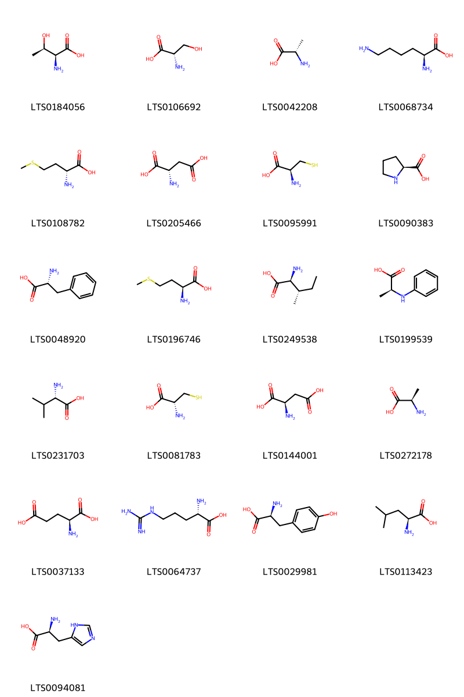{ width=100% }
    <figcaption>Hình ảnh cấu trúc hóa học của 21 hoạt chất thuộc nhóm Carboxylic acids and derivatives gồm ['l-threonine (LTS0184056)', 'l-serine (LTS0106692)', 'l-alanine (LTS0042208)', 'l-lysine (LTS0068734)', 'd-methionine (LTS0108782)', 'l-aspartic acid (LTS0205466)', 'd-cysteine (LTS0095991)', 'l-proline (LTS0090383)', 'd-phenylalanine (LTS0048920)', 'l-methionine (LTS0196746)', 'l-isoleucine (LTS0249538)', '(2s)-2-(phenylamino)propanoic acid (LTS0199539)', 'l-valine (LTS0231703)', 'l-cysteine (LTS0081783)', 'd-aspartic acid (LTS0144001)', 'd-alanine (LTS0272178)', 'l-glutamic acid (LTS0037133)', 'l-arginine (LTS0064737)', 'l-tyrosine (LTS0029981)', 'l-leucine (LTS0113423)', 'l-histidine (LTS0094081)'].</figcaption>
</figure>
#### Nhóm Fatty Acyls
<figure markdown="span">
    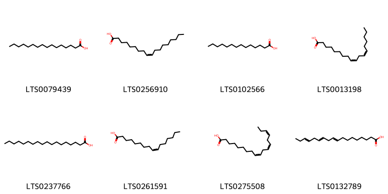{ width=100% }
    <figcaption>Hình ảnh cấu trúc hóa học của 8 hoạt chất thuộc nhóm Fatty Acyls gồm ['palmitic acid (LTS0079439)', 'oleic acid (LTS0256910)', 'myristic acid (LTS0102566)', 'linoleic (LTS0013198)', 'stearic acid (LTS0237766)', 'palmitoleic acid (LTS0261591)', 'α-linolenic acid (LTS0275508)', 'α linolenic acid (LTS0132789)'].</figcaption>
</figure>
#### Nhóm Indoles and derivatives
<figure markdown="span">
    { width=100% }
    <figcaption>Hình ảnh cấu trúc hóa học của 1 hoạt chất thuộc nhóm Indoles and derivatives gồm ['l-tryptophan (LTS0263809)'].</figcaption>
</figure>

---

### Dược dân tộc học

Danh sách các quốc gia có sử dụng *Treculia africana* trong điều trị các bệnh. 

| Country   | Disease             | Bệnh                   |
|:----------|:--------------------|:-----------------------|
| Ghana     | Tonic               | (thuộc) trương lực     |
| Nigeria   | Vermifuge, Laxative | Vermifuge, nhuận tràng |

---

# Chi Trophis

??? note "Danh sách các dược liệu thuộc chi"
    
	 - *Trophis racemosa*

---
## Trophis racemosa
### Thông tin về thực vật

!!! info "Phân loại thực vật của *Trophis racemosa* từ GIBF:"
    - **Kingdom:** Plantae
    - **Phylum:** Tracheophyta
    - **Order:** Rosales
    - **Family:** Moraceae
    - **Genus:** Trophis
    - **Species:** *Trophis racemosa*

 

| Label (VI)   | Label (EN)   | Scientific Name   | Descriptions (VI)   | Descriptions (EN)   | Also Known As (VI)   | Also Known As (EN)   |
|:-------------|:-------------|:------------------|:--------------------|:--------------------|:---------------------|:---------------------|
| N/A          | N/A          | Trophis racemosa  | loài thực vật       | species of plant    | ['']                 | ['']                 |

#### Phân bố trên thế giới

**Từ CSDL GIBF** Nicaragua, Ecuador, Puerto Rico, Belize, Colombia, Costa Rica, Mexico, Dominican Republic, El Salvador, Panama

#### Phân bố tại Việt Nam

**Từ CSDL GIBF**: Không có ghi nhận ở Việt Nam

---
### Thành phần hóa học
        
- Theo cơ sở dữ liệu lotus: Từ loài *Trophis racemosa* đã phân lập và xác định được Chưa có hoạt chất nào được phân lập. hoạt chất thuộc về các nhóm Không có hoạt chất nào được phân lập. 

Không có hình ảnh nào được tạo ra

---

### Dược dân tộc học

Danh sách các quốc gia có sử dụng *Trophis racemosa* trong điều trị các bệnh. 

| Country       | Disease                | Bệnh                     |
|:--------------|:-----------------------|:-------------------------|
| Latin America | Astringent             | Lam se da                |
| Mexico        | Astringent, Astringent | Chất làm se, Chất làm se |

---

# Chi Ficus

??? note "Danh sách các dược liệu thuộc chi"
    
	 - *Ficus aerifolia*
	 - *Ficus benghalensis*
	 - *Ficus capensis*
	 - *Ficus carica*
	 - *Ficus citrifolia*
	 - *Ficus cystopodium*
	 - *Ficus cystopodum*
	 - *Ficus glabrata*
	 - *Ficus glomerata*
	 - *Ficus graeffii*
	 - *Ficus hiida*
	 - *Ficus indica*
	 - *Ficus insipida*
	 - *Ficus jiminezii*
	 - *Ficus lacor*
	 - *Ficus maxima*
	 - *Ficus obpyramidata*
	 - *Ficus palmata*
	 - *Ficus petiolaris*
	 - *Ficus pumila*
	 - *Ficus ramantacea*
	 - *Ficus religiosa*
	 - *Ficus rumphii*
	 - *Ficus septica*

---
## Ficus aerifolia
### Thông tin về thực vật

!!! info "Phân loại thực vật của *N/A* từ GIBF:"
    - **Kingdom:** N/A
    - **Phylum:** N/A
    - **Order:** N/A
    - **Family:** N/A
    - **Genus:** N/A
    - **Species:** *N/A*

 

| Label (VI)   | Label (EN)   | Scientific Name   | Descriptions (VI)   | Descriptions (EN)   | Also Known As (VI)   | Also Known As (EN)   |
|:-------------|:-------------|:------------------|:--------------------|:--------------------|:---------------------|:---------------------|
| N/A          | N/A          | Trophis racemosa  | loài thực vật       | species of plant    | ['']                 | ['']                 |

#### Phân bố trên thế giới

**Từ CSDL GIBF** Không có kết quả phù hợp

#### Phân bố tại Việt Nam

**Từ CSDL GIBF**: Không có ghi nhận ở Việt Nam

---
### Thành phần hóa học
        
- Theo cơ sở dữ liệu lotus: Từ loài *N/A* đã phân lập và xác định được Chưa có hoạt chất nào được phân lập. hoạt chất thuộc về các nhóm Không có hoạt chất nào được phân lập. 

Không có hình ảnh nào được tạo ra

---

### Dược dân tộc học

Danh sách các quốc gia có sử dụng *N/A* trong điều trị các bệnh. 

| Country     | Disease                                     | Bệnh                                        |
|:------------|:--------------------------------------------|:--------------------------------------------|
| Africa      | Poultice, Abortifacient, Emmenagogue, Tonic | Poultice, Abortifacient, Emmenagogue, Tonic |
| Upper Volta | Antidote                                    | Chất giải độc                               |

---

---
## Ficus benghalensis
### Thông tin về thực vật

!!! info "Phân loại thực vật của *Ficus benghalensis* từ GIBF:"
    - **Kingdom:** Plantae
    - **Phylum:** Tracheophyta
    - **Order:** Rosales
    - **Family:** Moraceae
    - **Genus:** Ficus
    - **Species:** *Ficus benghalensis*

 

| Label (VI)   | Label (EN)   | Scientific Name    | Descriptions (VI)   | Descriptions (EN)   | Also Known As (VI)   | Also Known As (EN)                        |
|:-------------|:-------------|:-------------------|:--------------------|:--------------------|:---------------------|:------------------------------------------|
| N/A          | N/A          | Ficus benghalensis | loài thực vật       | species of plant    | ['đa tròn lá']       | ['banyan', 'Indian banyan', 'banyan fig'] |

#### Phân bố trên thế giới

**Từ CSDL GIBF** United Arab Emirates, Sri Lanka, Australia, India, Indonesia, United States of America, Maldives, Panama

#### Phân bố tại Việt Nam

**Từ CSDL GIBF**: Không có ghi nhận ở Việt Nam

---
### Thành phần hóa học
        
- Theo cơ sở dữ liệu lotus: Từ loài *Ficus benghalensis* đã phân lập và xác định được 8 hoạt chất thuộc về các nhóm Steroids and steroid derivatives, Organooxygen compounds, Coumarins and derivatives, Carboxylic acids and derivatives. 

|    | chemicalTaxonomyClassyfireClass   |   smiles_count |
|---:|:----------------------------------|---------------:|
|  0 | Carboxylic acids and derivatives  |              2 |
|  1 | Coumarins and derivatives         |              1 |
|  2 | Organooxygen compounds            |              2 |
|  3 | Steroids and steroid derivatives  |              2 |

#### Nhóm Carboxylic acids and derivatives
<figure markdown="span">
    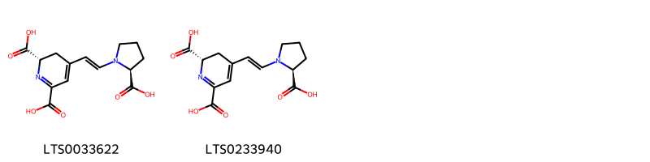{ width=100% }
    <figcaption>Hình ảnh cấu trúc hóa học của 2 hoạt chất thuộc nhóm Carboxylic acids and derivatives gồm ['(2s)-4-{2-[(2s)-2-carboxypyrrolidin-1-yl]ethenyl}-2,3-dihydropyridine-2,6-dicarboxylic acid (LTS0033622)', '(2s)-4-[(1e)-2-[(2s)-2-carboxypyrrolidin-1-yl]ethenyl]-2,3-dihydropyridine-2,6-dicarboxylic acid (LTS0233940)'].</figcaption>
</figure>
#### Nhóm Coumarins and derivatives
<figure markdown="span">
    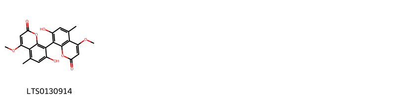{ width=100% }
    <figcaption>Hình ảnh cấu trúc hóa học của 1 hoạt chất thuộc nhóm Coumarins and derivatives gồm ['orlandin (LTS0130914)'].</figcaption>
</figure>
#### Nhóm Organooxygen compounds
<figure markdown="span">
    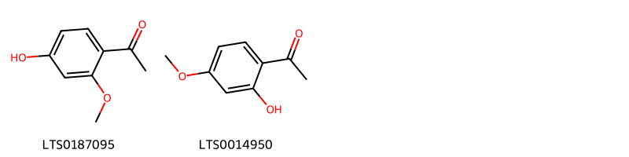{ width=100% }
    <figcaption>Hình ảnh cấu trúc hóa học của 2 hoạt chất thuộc nhóm Organooxygen compounds gồm ['1-(4-hydroxy-2-methoxyphenyl)ethanone (LTS0187095)', 'paeonol (LTS0014950)'].</figcaption>
</figure>
#### Nhóm Steroids and steroid derivatives
<figure markdown="span">
    { width=100% }
    <figcaption>Hình ảnh cấu trúc hóa học của 2 hoạt chất thuộc nhóm Steroids and steroid derivatives gồm ['stigmast-5-en-3-ol (LTS0071224)', 'stigmast-5-en-3-ol, (3β)- (LTS0204616)'].</figcaption>
</figure>

---

### Dược dân tộc học

Danh sách các quốc gia có sử dụng *Ficus benghalensis* trong điều trị các bệnh. 

| Country   | Disease                     | Bệnh                               |
|:----------|:----------------------------|:-----------------------------------|
| Elsewhere | Astringent, Tonic           | Chất làm se, Thuốc bổ              |
| Turkey    | Hemostat, Tonic, Astringent | Máy cầm máu, Thuốc bổ, Chất làm se |

---

---
## Ficus capensis
### Thông tin về thực vật

!!! info "Phân loại thực vật của *N/A* từ GIBF:"
    - **Kingdom:** Plantae
    - **Phylum:** Tracheophyta
    - **Order:** Rosales
    - **Family:** Moraceae
    - **Genus:** Ficus
    - **Species:** *N/A*

 

| Label (VI)   | Label (EN)   | Scientific Name    | Descriptions (VI)   | Descriptions (EN)   | Also Known As (VI)   | Also Known As (EN)                        |
|:-------------|:-------------|:-------------------|:--------------------|:--------------------|:---------------------|:------------------------------------------|
| N/A          | N/A          | Ficus benghalensis | loài thực vật       | species of plant    | ['đa tròn lá']       | ['banyan', 'Indian banyan', 'banyan fig'] |

#### Phân bố trên thế giới

**Từ CSDL GIBF** Sri Lanka, Italy, Australia, Cambodia, Guatemala, Argentina, Mozambique, Puerto Rico, Senegal, Namibia, Chinese Taipei, Türkiye, Russian Federation, Morocco, United States of America, Zimbabwe, Greece, South Africa, Hong Kong, Thailand, Iran (Islamic Republic of), Brazil, Mexico, Qatar, Singapore, China, Niue, Colombia, Costa Rica, Botswana, India, Indonesia, Philippines, Malaysia, New Zealand, Ethiopia

#### Phân bố tại Việt Nam

**Từ CSDL GIBF**: Không có ghi nhận ở Việt Nam

---
### Thành phần hóa học
        
- Theo cơ sở dữ liệu lotus: Từ loài *N/A* đã phân lập và xác định được Chưa có hoạt chất nào được phân lập. hoạt chất thuộc về các nhóm Không có hoạt chất nào được phân lập. 

Không có hình ảnh nào được tạo ra

---

### Dược dân tộc học

Danh sách các quốc gia có sử dụng *N/A* trong điều trị các bệnh. 

| Country     | Disease                         | Bệnh                                                      |
|:------------|:--------------------------------|:----------------------------------------------------------|
| Upper Volta | Antidote, Aphrodisiac, Diuretic | Thuốc giải độc, thuốc kích thích tình dục, thuốc lợi tiểu |

---

---
## Ficus carica
### Thông tin về thực vật

!!! info "Phân loại thực vật của *Ficus carica* từ GIBF:"
    - **Kingdom:** Plantae
    - **Phylum:** Tracheophyta
    - **Order:** Rosales
    - **Family:** Moraceae
    - **Genus:** Ficus
    - **Species:** *Ficus carica*

 

| Label (VI)   | Label (EN)   | Scientific Name   | Descriptions (VI)   | Descriptions (EN)   | Also Known As (VI)   | Also Known As (EN)                 |
|:-------------|:-------------|:------------------|:--------------------|:--------------------|:---------------------|:-----------------------------------|
| N/A          | N/A          | Ficus carica      | loài thực vật       | species of plant    | ['sung ngọt']        | ['fig', 'common fig', 'fig plant'] |

#### Phân bố trên thế giới

**Từ CSDL GIBF** nan, United Arab Emirates, Italy, Australia, Bahrain, Georgia, Palestine, State of, Israel, Ukraine, Netherlands, Nigeria, Cyprus, Malta, Spain, Bolivia (Plurinational State of), Türkiye, Portugal, Algeria, Russian Federation, Morocco, United States of America, Albania, Sweden, Chile, Croatia, Greece, South Africa, Hong Kong, Montenegro, Germany, Iran (Islamic Republic of), Switzerland, France, Ecuador, Cabo Verde, Colombia, Costa Rica, Serbia, New Zealand

#### Phân bố tại Việt Nam

**Từ CSDL GIBF**: Không có ghi nhận ở Việt Nam

---
### Thành phần hóa học
        
- Theo cơ sở dữ liệu lotus: Từ loài *Ficus carica* đã phân lập và xác định được 81 hoạt chất thuộc về các nhóm Cinnamyl alcohols, Flavonoids, Prenol lipids, Steroids and steroid derivatives, Indoles and derivatives, Dibenzylbutane lignans, Benzene and substituted derivatives, Cinnamaldehydes, Organooxygen compounds, Phenols, Coumarins and derivatives, Furanoid lignans. 

|    | chemicalTaxonomyClassyfireClass     |   smiles_count |
|---:|:------------------------------------|---------------:|
|  0 | Benzene and substituted derivatives |              1 |
|  1 | Cinnamaldehydes                     |              2 |
|  2 | Cinnamyl alcohols                   |              2 |
|  3 | Coumarins and derivatives           |              7 |
|  4 | Dibenzylbutane lignans              |              2 |
|  5 | Flavonoids                          |             30 |
|  6 | Furanoid lignans                    |              1 |
|  7 | Indoles and derivatives             |              1 |
|  8 | Organooxygen compounds              |              2 |
|  9 | Phenols                             |              1 |
| 10 | Prenol lipids                       |             20 |
| 11 | Steroids and steroid derivatives    |             12 |

#### Nhóm Benzene and substituted derivatives
<figure markdown="span">
    { width=100% }
    <figcaption>Hình ảnh cấu trúc hóa học của 1 hoạt chất thuộc nhóm Benzene and substituted derivatives gồm ['benzyl alcohol (LTS0125638)'].</figcaption>
</figure>
#### Nhóm Cinnamaldehydes
<figure markdown="span">
    { width=100% }
    <figcaption>Hình ảnh cấu trúc hóa học của 2 hoạt chất thuộc nhóm Cinnamaldehydes gồm ['3-phenyl-2-propenal (LTS0204346)', 'cinnamal (LTS0271313)'].</figcaption>
</figure>
#### Nhóm Cinnamyl alcohols
<figure markdown="span">
    { width=100% }
    <figcaption>Hình ảnh cấu trúc hóa học của 2 hoạt chất thuộc nhóm Cinnamyl alcohols gồm ['3-phenyl-2-propen-1-ol (LTS0069711)', 'cinnamyl alcohol (LTS0010678)'].</figcaption>
</figure>
#### Nhóm Coumarins and derivatives
<figure markdown="span">
    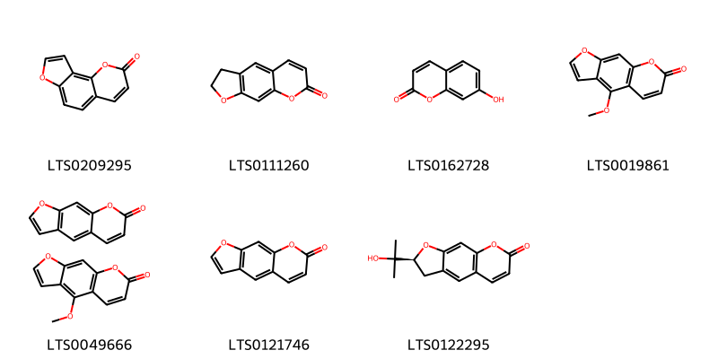{ width=100% }
    <figcaption>Hình ảnh cấu trúc hóa học của 7 hoạt chất thuộc nhóm Coumarins and derivatives gồm ['angelicin (LTS0209295)', '2h,3h-furo[3,2-g]chromen-7-one (LTS0111260)', 'umbelliferone (LTS0162728)', 'bergapten (LTS0019861)', 'bergapten; psoralen (LTS0049666)', 'psoralen (LTS0121746)', 'marmesin (LTS0122295)'].</figcaption>
</figure>
#### Nhóm Dibenzylbutane lignans
<figure markdown="span">
    { width=100% }
    <figcaption>Hình ảnh cấu trúc hóa học của 2 hoạt chất thuộc nhóm Dibenzylbutane lignans gồm ['(2s,3r)-2,3-bis[(4-hydroxy-3-methoxyphenyl)(¹³c)methyl](1-¹³c)butane-1,4-diol (LTS0268699)', 'secoisolariciresinol (LTS0086727)'].</figcaption>
</figure>
#### Nhóm Flavonoids
<figure markdown="span">
    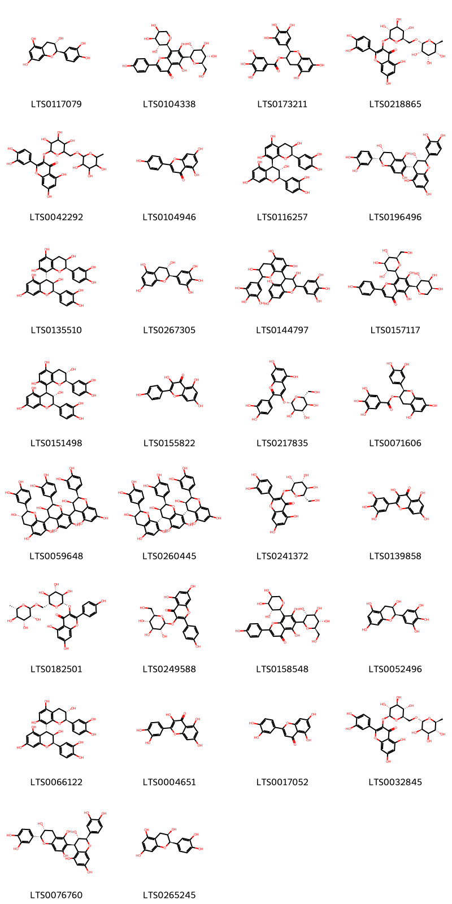{ width=100% }
    <figcaption>Hình ảnh cấu trúc hóa học của 30 hoạt chất thuộc nhóm Flavonoids gồm ['(+)-catechol (LTS0117079)', 'schaftoside (LTS0104338)', '(-)-epigallocatechin gallate (LTS0173211)', '2-(3,4-dihydroxyphenyl)-5,7-dihydroxy-3-{[(2s,3r,4s,5s,6r)-3,4,5-trihydroxy-6-({[(2r,3s,4s,5r,6s)-3,4,5-trihydroxy-6-methyloxan-2-yl]oxy}methyl)oxan-2-yl]oxy}chromen-4-one (LTS0218865)', 'rutin (LTS0042292)', 'chamomile (LTS0104946)', '(2r,3s,4s)-2-(3,4-dihydroxyphenyl)-4-[(2r,3r)-2-(3,4-dihydroxyphenyl)-3,5,7-trihydroxy-3,4-dihydro-2h-1-benzopyran-8-yl]-3,4-dihydro-2h-1-benzopyran-3,5,7-triol (LTS0116257)', '(2r,3s,4s)-2-(3,4-dihydroxyphenyl)-4-[(2r,3r)-2-(3,4-dihydroxyphenyl)-3,5,7-trihydroxy-3,4-dihydro-2h-1-benzopyran-6-yl]-3,4-dihydro-2h-1-benzopyran-3,5,7-triol (LTS0196496)', '(2r,3r,4r)-2-(3,4-dihydroxyphenyl)-4-[(2r,3r)-2-(3,4-dihydroxyphenyl)-3,5,7-trihydroxy-3,4-dihydro-2h-1-benzopyran-8-yl]-3,4-dihydro-2h-1-benzopyran-3,5,7-triol (LTS0135510)', 'gallocatechol (LTS0267305)', '4-[3,5,7-trihydroxy-2-(3,4,5-trihydroxyphenyl)-3,4-dihydro-2h-1-benzopyran-8-yl]-2-(3,4,5-trihydroxyphenyl)-3,4-dihydro-2h-1-benzopyran-3,5,7-triol (LTS0144797)', 'isoschaftoside (LTS0157117)', '(2r,3s,4s)-2-(3,4-dihydroxyphenyl)-4-[(2r,3s)-2-(3,4-dihydroxyphenyl)-3,5,7-trihydroxy-3,4-dihydro-2h-1-benzopyran-8-yl]-3,4-dihydro-2h-1-benzopyran-3,5,7-triol (LTS0151498)', 'kaempherol (LTS0155822)', 'cyanidin 3-glucoside (LTS0217835)', 'epicatechin gallate (LTS0071606)', '(2r,3r)-2-(3,4-dihydroxyphenyl)-8-[(2r,3r)-2-(3,4-dihydroxyphenyl)-3,5,7-trihydroxy-3,4-dihydro-2h-1-benzopyran-4-yl]-4-[(2r,3s)-2-(3,4-dihydroxyphenyl)-3,5,7-trihydroxy-3,4-dihydro-2h-1-benzopyran-8-yl]-3,4-dihydro-2h-1-benzopyran-3,5,7-triol (LTS0059648)', 'procyanidin c1 (LTS0260445)', '2-(3,4-dihydroxyphenyl)-5,7-dihydroxy-3-{[(2s,3r,4r,5r,6s)-3,4,5-trihydroxy-6-(hydroxymethyl)oxan-2-yl]oxy}chromen-4-one (LTS0241372)', 'myricetin (LTS0139858)', 'nictoflorin (LTS0182501)', 'astragalin (LTS0249588)', '5,7-dihydroxy-2-(4-hydroxyphenyl)-6-[(3r,4r,5s,6r)-3,4,5-trihydroxy-6-(hydroxymethyl)oxan-2-yl]-8-[(2s,3r,4s,5s)-3,4,5-trihydroxyoxan-2-yl]chromen-4-one (LTS0158548)', 'epigallocatechin (LTS0052496)', '(2r,3r,4r)-2-(3,4-dihydroxyphenyl)-4-[(2r,3s)-2-(3,4-dihydroxyphenyl)-3,5,7-trihydroxy-3,4-dihydro-2h-1-benzopyran-8-yl]-3,4-dihydro-2h-1-benzopyran-3,5,7-triol (LTS0066122)', 'quercetin (LTS0004651)', 'luteolin (LTS0017052)', '3-rutinosyl quercetin (LTS0032845)', '(2r,3s,4r)-2-(3,4-dihydroxyphenyl)-4-[(2r,3r)-2-(3,4-dihydroxyphenyl)-3,5,7-trihydroxy-3,4-dihydro-2h-1-benzopyran-6-yl]-3,4-dihydro-2h-1-benzopyran-3,5,7-triol (LTS0076760)', 'ent-epicatechin (LTS0265245)'].</figcaption>
</figure>
#### Nhóm Furanoid lignans
<figure markdown="span">
    { width=100% }
    <figcaption>Hình ảnh cấu trúc hóa học của 1 hoạt chất thuộc nhóm Furanoid lignans gồm ['matairesinol (LTS0193475)'].</figcaption>
</figure>
#### Nhóm Indoles and derivatives
<figure markdown="span">
    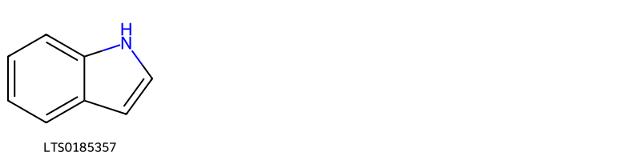{ width=100% }
    <figcaption>Hình ảnh cấu trúc hóa học của 1 hoạt chất thuộc nhóm Indoles and derivatives gồm ['indole (LTS0185357)'].</figcaption>
</figure>
#### Nhóm Organooxygen compounds
<figure markdown="span">
    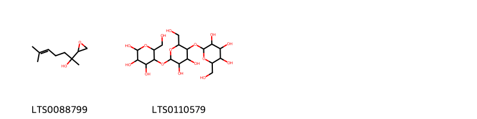{ width=100% }
    <figcaption>Hình ảnh cấu trúc hóa học của 2 hoạt chất thuộc nhóm Organooxygen compounds gồm ['linalool dihydroepoxide (LTS0088799)', 'amylose (LTS0110579)'].</figcaption>
</figure>
#### Nhóm Phenols
<figure markdown="span">
    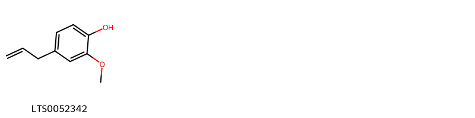{ width=100% }
    <figcaption>Hình ảnh cấu trúc hóa học của 1 hoạt chất thuộc nhóm Phenols gồm ['eugenol (LTS0052342)'].</figcaption>
</figure>
#### Nhóm Prenol lipids
<figure markdown="span">
    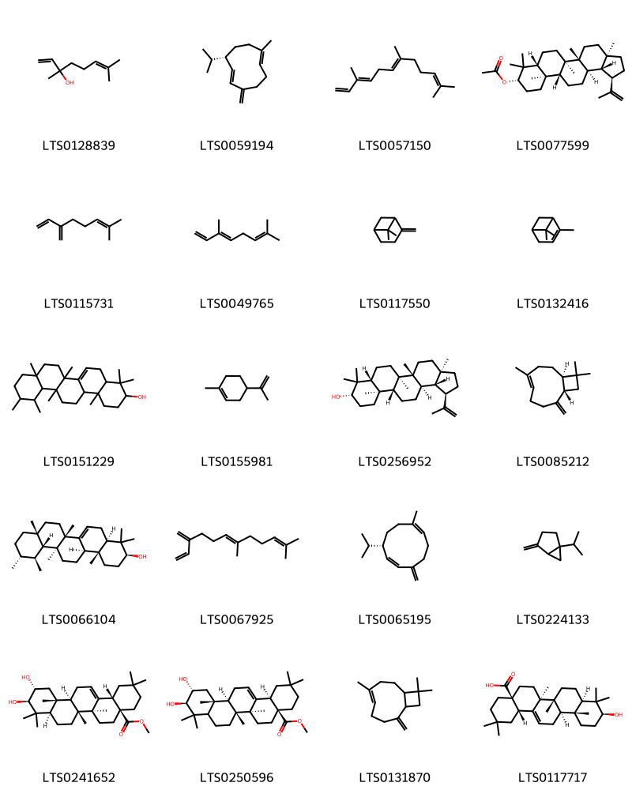{ width=100% }
    <figcaption>Hình ảnh cấu trúc hóa học của 20 hoạt chất thuộc nhóm Prenol lipids gồm ['linalool, (+-)- (LTS0128839)', '(-)-germacrene d (LTS0059194)', 'farnesene (LTS0057150)', 'lupeol acetate (LTS0077599)', 'α-myrcene (LTS0115731)', 'trans-β-ocimene (LTS0049765)', 'β-pinene (LTS0117550)', 'α pinene (LTS0132416)', '4,4,6b,8a,11,12,12b,14b-octamethyl-2,3,4a,5,7,8,9,10,11,12,12a,13,14,14a-tetradecahydro-1h-picen-3-ol (LTS0151229)', 'limonene,  (LTS0155981)', 'lupeol (LTS0256952)', 'caryophyllene (LTS0085212)', '(3s,4ar,6bs,8ar,11r,12s,12ar,12bs,14ar,14br)-4,4,6b,8a,11,12,12b,14b-octamethyl-2,3,4a,5,7,8,9,10,11,12,12a,13,14,14a-tetradecahydro-1h-picen-3-ol (LTS0066104)', 'β-farnesene (LTS0067925)', '(1z,6z,8s)-8-isopropyl-1-methyl-5-methylidenecyclodeca-1,6-diene (LTS0065195)', 'sabinene (LTS0224133)', 'methyl (4as,6as,6br,8ar,10r,11r,12ar,12br,14bs)-10,11-dihydroxy-2,2,6a,6b,9,9,12a-heptamethyl-1,3,4,5,6,7,8,8a,10,11,12,12b,13,14b-tetradecahydropicene-4a-carboxylate (LTS0241652)', 'methyl (4as,6as,6br,10r,11r,12ar,12br,14br)-10,11-dihydroxy-2,2,6a,6b,9,9,12a-heptamethyl-1,3,4,5,6,7,8,8a,10,11,12,12b,13,14b-tetradecahydropicene-4a-carboxylate (LTS0250596)', 'caryophyllene (LTS0131870)', 'oleanolic acid (LTS0117717)'].</figcaption>
</figure>
#### Nhóm Steroids and steroid derivatives
<figure markdown="span">
    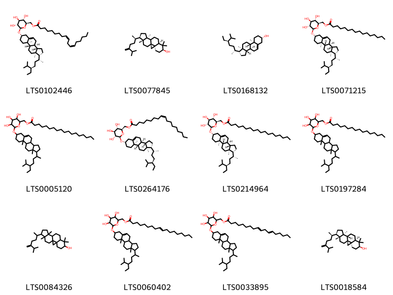{ width=100% }
    <figcaption>Hình ảnh cấu trúc hóa học của 12 hoạt chất thuộc nhóm Steroids and steroid derivatives gồm ['[(2r,3s,4s,5r,6r)-6-{[(1r,3as,3bs,7s,9ar,9bs,11ar)-1-[(2r,5r)-5-ethyl-6-methylheptan-2-yl]-9a,11a-dimethyl-1h,2h,3h,3ah,3bh,4h,6h,7h,8h,9h,9bh,10h,11h-cyclopenta[a]phenanthren-7-yl]oxy}-3,4,5-trihydroxyoxan-2-yl]methyl (9z,12z)-octadeca-9,12-dienoate (LTS0102446)', '24-methylene-cycloartanol (LTS0077845)', 'sitosterol (LTS0168132)', 'sitoindoside i (LTS0071215)', '(6-{[1-(5-ethyl-6-methylheptan-2-yl)-9a,11a-dimethyl-1h,2h,3h,3ah,3bh,4h,6h,7h,8h,9h,9bh,10h,11h-cyclopenta[a]phenanthren-7-yl]oxy}-3,4,5-trihydroxyoxan-2-yl)methyl octadecanoate (LTS0005120)', '[(2r,3s,4s,5r,6r)-6-{[(1r,3as,3bs,7s,9ar,9bs,11ar)-1-[(2r,5r)-5-ethyl-6-methylheptan-2-yl]-9a,11a-dimethyl-1h,2h,3h,3ah,3bh,4h,6h,7h,8h,9h,9bh,10h,11h-cyclopenta[a]phenanthren-7-yl]oxy}-3,4,5-trihydroxyoxan-2-yl]methyl (9z)-octadec-9-enoate (LTS0264176)', '[(2r,3s,4s,5r,6r)-6-{[(1r,3as,3bs,7s,9ar,9bs,11ar)-1-[(2r,5r)-5-ethyl-6-methylheptan-2-yl]-9a,11a-dimethyl-1h,2h,3h,3ah,3bh,4h,6h,7h,8h,9h,9bh,10h,11h-cyclopenta[a]phenanthren-7-yl]oxy}-3,4,5-trihydroxyoxan-2-yl]methyl octadecanoate (LTS0214964)', '(6-{[1-(5-ethyl-6-methylheptan-2-yl)-9a,11a-dimethyl-1h,2h,3h,3ah,3bh,4h,6h,7h,8h,9h,9bh,10h,11h-cyclopenta[a]phenanthren-7-yl]oxy}-3,4,5-trihydroxyoxan-2-yl)methyl hexadecanoate (LTS0197284)', '7,7,12,16-tetramethyl-15-(6-methyl-5-methylideneheptan-2-yl)pentacyclo[9.7.0.0¹,³.0³,⁸.0¹²,¹⁶]octadecan-6-ol (LTS0084326)', '(6-{[1-(5-ethyl-6-methylheptan-2-yl)-9a,11a-dimethyl-1h,2h,3h,3ah,3bh,4h,6h,7h,8h,9h,9bh,10h,11h-cyclopenta[a]phenanthren-7-yl]oxy}-3,4,5-trihydroxyoxan-2-yl)methyl octadec-9-enoate (LTS0060402)', '(6-{[1-(5-ethyl-6-methylheptan-2-yl)-9a,11a-dimethyl-1h,2h,3h,3ah,3bh,4h,6h,7h,8h,9h,9bh,10h,11h-cyclopenta[a]phenanthren-7-yl]oxy}-3,4,5-trihydroxyoxan-2-yl)methyl octadeca-9,12-dienoate (LTS0033895)', '24-methylenecycloartanol (LTS0018584)'].</figcaption>
</figure>

---

### Dược dân tộc học

Danh sách các quốc gia có sử dụng *Ficus carica* trong điều trị các bệnh. 

| Country   | Disease                                          | Bệnh                                                                   |
|:----------|:-------------------------------------------------|:-----------------------------------------------------------------------|
| Elsewhere | Aperient, Diuretic, Vermifuge, Demulcent, Rennet | Aperient, lợi tiểu, Vermifuge, Demulcent, Rennet                       |
| Haiti     | Fumigant, Laxative, Disinfectant, Laxative       | Thuốc khử trùng, Thuốc nhuận tràng, Thuốc khử trùng, Thuốc nhuận tràng |
| Iraq      | Vermifuge                                        | Thuốc diệt sán                                                         |
| Kurdistan | Digestive                                        | tiêu                                                                   |
| Turkey    | Demulcent, Expectorant, Emollient, Laxative      | Demulcent, long đờm, chất làm mềm, nhuận tràng                         |

---

---
## Ficus citrifolia
### Thông tin về thực vật

!!! info "Phân loại thực vật của *Ficus citrifolia* từ GIBF:"
    - **Kingdom:** Plantae
    - **Phylum:** Tracheophyta
    - **Order:** Rosales
    - **Family:** Moraceae
    - **Genus:** Ficus
    - **Species:** *Ficus citrifolia*

 

| Label (VI)   | Label (EN)   | Scientific Name   | Descriptions (VI)   | Descriptions (EN)   | Also Known As (VI)   | Also Known As (EN)   |
|:-------------|:-------------|:------------------|:--------------------|:--------------------|:---------------------|:---------------------|
| N/A          | N/A          | Ficus citrifolia  | loài thực vật       | species of plant    | ['']                 | ['']                 |

#### Phân bố trên thế giới

**Từ CSDL GIBF** Virgin Islands (U.S.), nan, Guadeloupe, Nicaragua, Puerto Rico, Bolivia (Plurinational State of), United States of America, South Africa, Turks and Caicos Islands, Saint Barthélemy, Martinique, Brazil, Bahamas, Dominican Republic, Mexico, Ecuador, Haiti, Colombia, Montserrat, Anguilla, Cayman Islands, Sint Maarten (Dutch part)

#### Phân bố tại Việt Nam

**Từ CSDL GIBF**: Không có ghi nhận ở Việt Nam

---
### Thành phần hóa học
        
- Theo cơ sở dữ liệu lotus: Từ loài *Ficus citrifolia* đã phân lập và xác định được Chưa có hoạt chất nào được phân lập. hoạt chất thuộc về các nhóm Không có hoạt chất nào được phân lập. 

Không có hình ảnh nào được tạo ra

---

### Dược dân tộc học

Danh sách các quốc gia có sử dụng *Ficus citrifolia* trong điều trị các bệnh. 

| Country   | Disease   | Bệnh           |
|:----------|:----------|:---------------|
| Elsewhere | Vermifuge | Thuốc diệt sán |

---

---
## Ficus cystopodium
### Thông tin về thực vật

!!! info "Phân loại thực vật của *Pseudolmedia macrophylla* từ GIBF:"
    - **Kingdom:** Plantae
    - **Phylum:** Tracheophyta
    - **Order:** Rosales
    - **Family:** Moraceae
    - **Genus:** Pseudolmedia
    - **Species:** *Pseudolmedia macrophylla*

 

| Label (VI)   | Label (EN)   | Scientific Name   | Descriptions (VI)   | Descriptions (EN)   | Also Known As (VI)   | Also Known As (EN)   |
|:-------------|:-------------|:------------------|:--------------------|:--------------------|:---------------------|:---------------------|
| N/A          | N/A          | Ficus citrifolia  | loài thực vật       | species of plant    | ['']                 | ['']                 |

#### Phân bố trên thế giới

**Từ CSDL GIBF** Virgin Islands (U.S.), nan, Guadeloupe, Nicaragua, Puerto Rico, Bolivia (Plurinational State of), United States of America, South Africa, Turks and Caicos Islands, Saint Barthélemy, Martinique, Brazil, Bahamas, Dominican Republic, Mexico, Ecuador, Haiti, Colombia, Montserrat, Anguilla, Cayman Islands, Sint Maarten (Dutch part)

#### Phân bố tại Việt Nam

**Từ CSDL GIBF**: Không có ghi nhận ở Việt Nam

---
### Thành phần hóa học
        
- Theo cơ sở dữ liệu lotus: Từ loài *Pseudolmedia macrophylla* đã phân lập và xác định được Chưa có hoạt chất nào được phân lập. hoạt chất thuộc về các nhóm Không có hoạt chất nào được phân lập. 

Không có hình ảnh nào được tạo ra

---

### Dược dân tộc học

Danh sách các quốc gia có sử dụng *Pseudolmedia macrophylla* trong điều trị các bệnh. 

| Country   | Disease   | Bệnh         |
|:----------|:----------|:-------------|
| Brazil    | Laxative  | Nhuận trường |

---

---
## Ficus cystopodum
### Thông tin về thực vật

!!! info "Phân loại thực vật của *Pseudolmedia macrophylla* từ GIBF:"
    - **Kingdom:** Plantae
    - **Phylum:** Tracheophyta
    - **Order:** Rosales
    - **Family:** Moraceae
    - **Genus:** Pseudolmedia
    - **Species:** *Pseudolmedia macrophylla*

 

| Label (VI)   | Label (EN)   | Scientific Name   | Descriptions (VI)   | Descriptions (EN)   | Also Known As (VI)   | Also Known As (EN)   |
|:-------------|:-------------|:------------------|:--------------------|:--------------------|:---------------------|:---------------------|
| N/A          | N/A          | Ficus citrifolia  | loài thực vật       | species of plant    | ['']                 | ['']                 |

#### Phân bố trên thế giới

**Từ CSDL GIBF** Virgin Islands (U.S.), nan, Guadeloupe, Nicaragua, Puerto Rico, Bolivia (Plurinational State of), United States of America, South Africa, Turks and Caicos Islands, Saint Barthélemy, Martinique, Brazil, Bahamas, Dominican Republic, Mexico, Ecuador, Haiti, Colombia, Montserrat, Anguilla, Cayman Islands, Sint Maarten (Dutch part)

#### Phân bố tại Việt Nam

**Từ CSDL GIBF**: Không có ghi nhận ở Việt Nam

---
### Thành phần hóa học
        
- Theo cơ sở dữ liệu lotus: Từ loài *Pseudolmedia macrophylla* đã phân lập và xác định được Chưa có hoạt chất nào được phân lập. hoạt chất thuộc về các nhóm Không có hoạt chất nào được phân lập. 

Không có hình ảnh nào được tạo ra

---

### Dược dân tộc học

Danh sách các quốc gia có sử dụng *Pseudolmedia macrophylla* trong điều trị các bệnh. 

| Country   | Disease   | Bệnh     |
|:----------|:----------|:---------|
| English   | Purgative | Thuốc xổ |

---

---
## Ficus glabrata
### Thông tin về thực vật

!!! info "Phân loại thực vật của *Ficus insipida* từ GIBF:"
    - **Kingdom:** Plantae
    - **Phylum:** Tracheophyta
    - **Order:** Rosales
    - **Family:** Moraceae
    - **Genus:** Ficus
    - **Species:** *Ficus insipida*

 

| Label (VI)   | Label (EN)   | Scientific Name   | Descriptions (VI)   | Descriptions (EN)   | Also Known As (VI)   | Also Known As (EN)   |
|:-------------|:-------------|:------------------|:--------------------|:--------------------|:---------------------|:---------------------|
| N/A          | N/A          | Ficus glabrata    |                     |                     | ['']                 | ['']                 |

#### Phân bố trên thế giới

**Từ CSDL GIBF** Belize, Ecuador, nan, Guatemala, Colombia, Brazil, Bolivia (Plurinational State of), Honduras, United States of America, Peru, Mexico, Venezuela (Bolivarian Republic of), Panama

#### Phân bố tại Việt Nam

**Từ CSDL GIBF**: Không có ghi nhận ở Việt Nam

---
### Thành phần hóa học
        
- Theo cơ sở dữ liệu lotus: Từ loài *Ficus insipida* đã phân lập và xác định được Chưa có hoạt chất nào được phân lập. hoạt chất thuộc về các nhóm Không có hoạt chất nào được phân lập. 

Không có hình ảnh nào được tạo ra

---

### Dược dân tộc học

Danh sách các quốc gia có sử dụng *Ficus insipida* trong điều trị các bệnh. 

| Country   | Disease      | Bệnh               |
|:----------|:-------------|:-------------------|
| Guatemala | Vermifuge    | Thuốc diệt sán     |
| Mexico    | Parasiticide | Thuốc diệt ký sinh |
| Venezuela | Vermifuge    | Thuốc diệt sán     |

---

---
## Ficus glomerata
### Thông tin về thực vật

!!! info "Phân loại thực vật của *Ficus glomerata* từ GIBF:"
    - **Kingdom:** Plantae
    - **Phylum:** Tracheophyta
    - **Order:** Rosales
    - **Family:** Moraceae
    - **Genus:** Ficus
    - **Species:** *Ficus glomerata*

 

| Label (VI)   | Label (EN)   | Scientific Name   | Descriptions (VI)   | Descriptions (EN)   | Also Known As (VI)   | Also Known As (EN)   |
|:-------------|:-------------|:------------------|:--------------------|:--------------------|:---------------------|:---------------------|
| N/A          | N/A          | Ficus glabrata    |                     |                     | ['']                 | ['']                 |

#### Phân bố trên thế giới

**Từ CSDL GIBF** nan, Pakistan, Papua New Guinea, India, Indonesia, United States of America, China, Nepal

#### Phân bố tại Việt Nam

**Từ CSDL GIBF**: Không có ghi nhận ở Việt Nam

---
### Thành phần hóa học
        
- Theo cơ sở dữ liệu lotus: Từ loài *Ficus glomerata* đã phân lập và xác định được Chưa có hoạt chất nào được phân lập. hoạt chất thuộc về các nhóm Không có hoạt chất nào được phân lập. 

Không có hình ảnh nào được tạo ra

---

### Dược dân tộc học

Danh sách các quốc gia có sử dụng *Ficus glomerata* trong điều trị các bệnh. 

| Country   | Disease                            | Bệnh                             |
|:----------|:-----------------------------------|:---------------------------------|
| India     | Carminative, Stomachic, Astringent | Carminative, Dạ dày, Chất làm se |
| Java      | Anorectic, Expectorant             | Anorectic, đờm                   |

---

---
## Ficus graeffii
### Thông tin về thực vật

!!! info "Phân loại thực vật của *Ficus obliqua* từ GIBF:"
    - **Kingdom:** Plantae
    - **Phylum:** Tracheophyta
    - **Order:** Rosales
    - **Family:** Moraceae
    - **Genus:** Ficus
    - **Species:** *Ficus obliqua*

 

| Label (VI)   | Label (EN)   | Scientific Name   | Descriptions (VI)   | Descriptions (EN)   | Also Known As (VI)   | Also Known As (EN)   |
|:-------------|:-------------|:------------------|:--------------------|:--------------------|:---------------------|:---------------------|
| N/A          | N/A          | Ficus glabrata    |                     |                     | ['']                 | ['']                 |

#### Phân bố trên thế giới

**Từ CSDL GIBF** nan, Pakistan, Papua New Guinea, India, Indonesia, United States of America, China, Nepal

#### Phân bố tại Việt Nam

**Từ CSDL GIBF**: Không có ghi nhận ở Việt Nam

---
### Thành phần hóa học
        
- Theo cơ sở dữ liệu lotus: Từ loài *Ficus obliqua* đã phân lập và xác định được Chưa có hoạt chất nào được phân lập. hoạt chất thuộc về các nhóm Không có hoạt chất nào được phân lập. 

Không có hình ảnh nào được tạo ra

---

### Dược dân tộc học

Danh sách các quốc gia có sử dụng *Ficus obliqua* trong điều trị các bệnh. 

| Country   | Disease     | Bệnh        |
|:----------|:------------|:------------|
| Samoa     | Emmenagogue | Emmenagogue |

---

---
## Ficus hiida
### Thông tin về thực vật

!!! info "Phân loại thực vật của *N/A* từ GIBF:"
    - **Kingdom:** N/A
    - **Phylum:** N/A
    - **Order:** N/A
    - **Family:** N/A
    - **Genus:** N/A
    - **Species:** *N/A*

 

| Label (VI)   | Label (EN)   | Scientific Name   | Descriptions (VI)   | Descriptions (EN)   | Also Known As (VI)   | Also Known As (EN)   |
|:-------------|:-------------|:------------------|:--------------------|:--------------------|:---------------------|:---------------------|
| N/A          | N/A          | Ficus glabrata    |                     |                     | ['']                 | ['']                 |

#### Phân bố trên thế giới

**Từ CSDL GIBF** Không có kết quả phù hợp

#### Phân bố tại Việt Nam

**Từ CSDL GIBF**: Không có ghi nhận ở Việt Nam

---
### Thành phần hóa học
        
- Theo cơ sở dữ liệu lotus: Từ loài *N/A* đã phân lập và xác định được Chưa có hoạt chất nào được phân lập. hoạt chất thuộc về các nhóm Không có hoạt chất nào được phân lập. 

Không có hình ảnh nào được tạo ra

---

### Dược dân tộc học

Danh sách các quốc gia có sử dụng *N/A* trong điều trị các bệnh. 

| Country   | Disease       | Bệnh          |
|:----------|:--------------|:--------------|
| India     | Tonic, Emetic | Tonic, Emetic |

---

---
## Ficus indica
### Thông tin về thực vật

!!! info "Phân loại thực vật của *Ficus indica* từ GIBF:"
    - **Kingdom:** Plantae
    - **Phylum:** Tracheophyta
    - **Order:** Rosales
    - **Family:** Moraceae
    - **Genus:** Ficus
    - **Species:** *Ficus indica*

 

| Label (VI)   | Label (EN)   | Scientific Name   | Descriptions (VI)   | Descriptions (EN)   | Also Known As (VI)   | Also Known As (EN)   |
|:-------------|:-------------|:------------------|:--------------------|:--------------------|:---------------------|:---------------------|
| N/A          | N/A          | Ficus indica      | loài thực vật       | species of plant    | ['']                 | ['']                 |

#### Phân bố trên thế giới

**Từ CSDL GIBF** nan, Pakistan, Thailand, Rwanda, India, Indonesia, unknown or invalid, Viet Nam, Mexico, Philippines, Malaysia

#### Phân bố tại Việt Nam

**Từ CSDL GIBF**: no data

---
### Thành phần hóa học
        
- Theo cơ sở dữ liệu lotus: Từ loài *Ficus indica* đã phân lập và xác định được 2 hoạt chất thuộc về các nhóm Carboxylic acids and derivatives. 

|    | chemicalTaxonomyClassyfireClass   |   smiles_count |
|---:|:----------------------------------|---------------:|
|  0 | Carboxylic acids and derivatives  |              2 |

#### Nhóm Carboxylic acids and derivatives
<figure markdown="span">
    { width=100% }
    <figcaption>Hình ảnh cấu trúc hóa học của 2 hoạt chất thuộc nhóm Carboxylic acids and derivatives gồm ['(2s)-4-{2-[(2s)-2-carboxypyrrolidin-1-yl]ethenyl}-2,3-dihydropyridine-2,6-dicarboxylic acid (LTS0033622)', '(2s)-4-[(1e)-2-[(2s)-2-carboxypyrrolidin-1-yl]ethenyl]-2,3-dihydropyridine-2,6-dicarboxylic acid (LTS0233940)'].</figcaption>
</figure>

---

### Dược dân tộc học

Danh sách các quốc gia có sử dụng *Ficus indica* trong điều trị các bệnh. 

| Country   | Disease                           | Bệnh                                                   |
|:----------|:----------------------------------|:-------------------------------------------------------|
| Elsewhere | Aphrodisiac, Astringent, Diuretic | Thuốc kích thích tình dục, Chất làm se, Thuốc lợi tiểu |
| Hindu     | Tonic                             | (thuộc) trương lực                                     |

---

---
## Ficus insipida
### Thông tin về thực vật

!!! info "Phân loại thực vật của *Ficus insipida* từ GIBF:"
    - **Kingdom:** Plantae
    - **Phylum:** Tracheophyta
    - **Order:** Rosales
    - **Family:** Moraceae
    - **Genus:** Ficus
    - **Species:** *Ficus insipida*

 

| Label (VI)   | Label (EN)   | Scientific Name   | Descriptions (VI)   | Descriptions (EN)   | Also Known As (VI)   | Also Known As (EN)   |
|:-------------|:-------------|:------------------|:--------------------|:--------------------|:---------------------|:---------------------|
| N/A          | N/A          | Ficus insipida    | loài thực vật       | species of plant    | ['']                 | ['']                 |

#### Phân bố trên thế giới

**Từ CSDL GIBF** Belize, Ecuador, French Guiana, Colombia, Brazil, Bolivia (Plurinational State of), Costa Rica, Honduras, India, Peru, Mexico, El Salvador, Panama

#### Phân bố tại Việt Nam

**Từ CSDL GIBF**: Không có ghi nhận ở Việt Nam

---
### Thành phần hóa học
        
- Theo cơ sở dữ liệu lotus: Từ loài *Ficus insipida* đã phân lập và xác định được Chưa có hoạt chất nào được phân lập. hoạt chất thuộc về các nhóm Không có hoạt chất nào được phân lập. 

Không có hình ảnh nào được tạo ra

---

### Dược dân tộc học

Danh sách các quốc gia có sử dụng *Ficus insipida* trong điều trị các bệnh. 

| Country       | Disease   | Bệnh           |
|:--------------|:----------|:---------------|
| Panama(Choco) | Vermifuge | Thuốc diệt sán |

---

---
## Ficus jiminezii
### Thông tin về thực vật

!!! info "Phân loại thực vật của *Ficus aurea* từ GIBF:"
    - **Kingdom:** Plantae
    - **Phylum:** Tracheophyta
    - **Order:** Rosales
    - **Family:** Moraceae
    - **Genus:** Ficus
    - **Species:** *Ficus aurea*

 

| Label (VI)   | Label (EN)   | Scientific Name   | Descriptions (VI)   | Descriptions (EN)   | Also Known As (VI)   | Also Known As (EN)   |
|:-------------|:-------------|:------------------|:--------------------|:--------------------|:---------------------|:---------------------|
| N/A          | N/A          | Ficus insipida    | loài thực vật       | species of plant    | ['']                 | ['']                 |

#### Phân bố trên thế giới

**Từ CSDL GIBF** nan, Colombia, Spain, Costa Rica, Honduras, Mexico, El Salvador, Panama

#### Phân bố tại Việt Nam

**Từ CSDL GIBF**: Không có ghi nhận ở Việt Nam

---
### Thành phần hóa học
        
- Theo cơ sở dữ liệu lotus: Từ loài *Ficus aurea* đã phân lập và xác định được Chưa có hoạt chất nào được phân lập. hoạt chất thuộc về các nhóm Không có hoạt chất nào được phân lập. 

Không có hình ảnh nào được tạo ra

---

### Dược dân tộc học

Danh sách các quốc gia có sử dụng *Ficus aurea* trong điều trị các bệnh. 

| Country   | Disease   | Bệnh           |
|:----------|:----------|:---------------|
| Salvador  | Vermifuge | Thuốc diệt sán |

---

---
## Ficus lacor
### Thông tin về thực vật

!!! info "Phân loại thực vật của *Ficus lacor* từ GIBF:"
    - **Kingdom:** Plantae
    - **Phylum:** Tracheophyta
    - **Order:** Rosales
    - **Family:** Moraceae
    - **Genus:** Ficus
    - **Species:** *Ficus lacor*

 

| Label (VI)   | Label (EN)   | Scientific Name   | Descriptions (VI)   | Descriptions (EN)   | Also Known As (VI)   | Also Known As (EN)   |
|:-------------|:-------------|:------------------|:--------------------|:--------------------|:---------------------|:---------------------|
| N/A          | N/A          | Ficus lacor       |                     | species of plant    | ['']                 | ['']                 |

#### Phân bố trên thế giới

**Từ CSDL GIBF** nan, Australia, Thailand, Myanmar, India, Indonesia, Bangladesh, United States of America, Singapore, Viet Nam, China, Nepal

#### Phân bố tại Việt Nam

**Từ CSDL GIBF**: Ninh Thuan

---
### Thành phần hóa học
        
- Theo cơ sở dữ liệu lotus: Từ loài *Ficus lacor* đã phân lập và xác định được Chưa có hoạt chất nào được phân lập. hoạt chất thuộc về các nhóm Không có hoạt chất nào được phân lập. 

Không có hình ảnh nào được tạo ra

---

### Dược dân tộc học

Danh sách các quốc gia có sử dụng *Ficus lacor* trong điều trị các bệnh. 

| Country   | Disease     | Bệnh                      |
|:----------|:------------|:--------------------------|
| Chinese   | Diaphoretic | Thuốc tràn dịch màng phổi |

---

---
## Ficus maxima
### Thông tin về thực vật

!!! info "Phân loại thực vật của *Ficus maxima* từ GIBF:"
    - **Kingdom:** Plantae
    - **Phylum:** Tracheophyta
    - **Order:** Rosales
    - **Family:** Moraceae
    - **Genus:** Ficus
    - **Species:** *Ficus maxima*

 

| Label (VI)   | Label (EN)   | Scientific Name   | Descriptions (VI)   | Descriptions (EN)                 | Also Known As (VI)   | Also Known As (EN)                                                                                                             |
|:-------------|:-------------|:------------------|:--------------------|:----------------------------------|:---------------------|:-------------------------------------------------------------------------------------------------------------------------------|
| N/A          | N/A          | Ficus maxima      |                     | fig tree native to the Neotropics | ['']                 | ['amäk wäm', 'amate', 'caxinguba', 'hicatee fig', 'higillo', 'higueron', 'maja', 'matapal', 'sahasha', 'sàhàshá', 'white fig'] |

#### Phân bố trên thế giới

**Từ CSDL GIBF** Nicaragua, Ecuador, Trinidad and Tobago, Panama, Colombia, Brazil, Bolivia (Plurinational State of), Costa Rica, Honduras, Cuba, Peru, Dominican Republic, Mexico, Venezuela (Bolivarian Republic of), French Guiana

#### Phân bố tại Việt Nam

**Từ CSDL GIBF**: Không có ghi nhận ở Việt Nam

---
### Thành phần hóa học
        
- Theo cơ sở dữ liệu lotus: Từ loài *Ficus maxima* đã phân lập và xác định được 4 hoạt chất thuộc về các nhóm Flavonoids. 

|    | chemicalTaxonomyClassyfireClass   |   smiles_count |
|---:|:----------------------------------|---------------:|
|  0 | Flavonoids                        |              4 |

#### Nhóm Flavonoids
<figure markdown="span">
    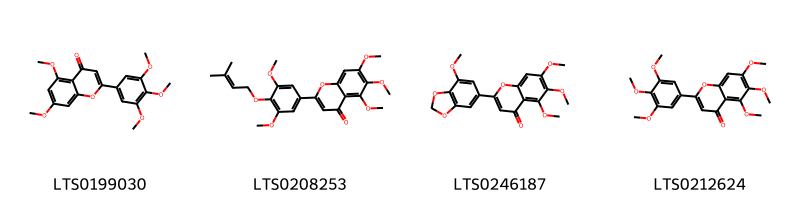{ width=100% }
    <figcaption>Hình ảnh cấu trúc hóa học của 4 hoạt chất thuộc nhóm Flavonoids gồm ['5,7-dimethoxy-2-(3,4,5-trimethoxyphenyl)chromen-4-one (LTS0199030)', '2-{3,5-dimethoxy-4-[(3-methylbut-2-en-1-yl)oxy]phenyl}-5,6,7-trimethoxychromen-4-one (LTS0208253)', '5,6,7-trimethoxy-2-(7-methoxy-2h-1,3-benzodioxol-5-yl)chromen-4-one (LTS0246187)', '5,6,7-trimethoxy-2-(3,4,5-trimethoxyphenyl)chromen-4-one (LTS0212624)'].</figcaption>
</figure>

---

### Dược dân tộc học

Danh sách các quốc gia có sử dụng *Ficus maxima* trong điều trị các bệnh. 

| Country   | Disease   | Bệnh     |
|:----------|:----------|:---------|
| Mexico    | Purgative | Thuốc xổ |

---

---
## Ficus obpyramidata
### Thông tin về thực vật

!!! info "Phân loại thực vật của *Ficus obpyramidata* từ GIBF:"
    - **Kingdom:** Plantae
    - **Phylum:** Tracheophyta
    - **Order:** Rosales
    - **Family:** Moraceae
    - **Genus:** Ficus
    - **Species:** *Ficus obpyramidata*

 

| Label (VI)   | Label (EN)   | Scientific Name    | Descriptions (VI)   | Descriptions (EN)   | Also Known As (VI)   | Also Known As (EN)   |
|:-------------|:-------------|:-------------------|:--------------------|:--------------------|:---------------------|:---------------------|
| N/A          | N/A          | Ficus obpyramidata |                     | species of plant    | ['']                 | ['']                 |

#### Phân bố trên thế giới

**Từ CSDL GIBF** nan, Thailand, unknown or invalid, Singapore, Malaysia

#### Phân bố tại Việt Nam

**Từ CSDL GIBF**: Không có ghi nhận ở Việt Nam

---
### Thành phần hóa học
        
- Theo cơ sở dữ liệu lotus: Từ loài *Ficus obpyramidata* đã phân lập và xác định được Chưa có hoạt chất nào được phân lập. hoạt chất thuộc về các nhóm Không có hoạt chất nào được phân lập. 

Không có hình ảnh nào được tạo ra

---

### Dược dân tộc học

Danh sách các quốc gia có sử dụng *Ficus obpyramidata* trong điều trị các bệnh. 

| Country   | Disease    | Bệnh       |
|:----------|:-----------|:-----------|
| Perak     | Lactagogue | Lactagogue |

---

---
## Ficus palmata
### Thông tin về thực vật

!!! info "Phân loại thực vật của *Ficus palmata* từ GIBF:"
    - **Kingdom:** Plantae
    - **Phylum:** Tracheophyta
    - **Order:** Rosales
    - **Family:** Moraceae
    - **Genus:** Ficus
    - **Species:** *Ficus palmata*

 

| Label (VI)   | Label (EN)   | Scientific Name   | Descriptions (VI)   | Descriptions (EN)   | Also Known As (VI)   | Also Known As (EN)   |
|:-------------|:-------------|:------------------|:--------------------|:--------------------|:---------------------|:---------------------|
| N/A          | N/A          | Ficus palmata     | loài thực vật       | species of plant    | ['']                 | ['']                 |

#### Phân bố trên thế giới

**Từ CSDL GIBF** Pakistan, Belgium, Egypt, Somalia, Spain, India, Jordan, United States of America, Saudi Arabia

#### Phân bố tại Việt Nam

**Từ CSDL GIBF**: Không có ghi nhận ở Việt Nam

---
### Thành phần hóa học
        
- Theo cơ sở dữ liệu lotus: Từ loài *Ficus palmata* đã phân lập và xác định được Chưa có hoạt chất nào được phân lập. hoạt chất thuộc về các nhóm Không có hoạt chất nào được phân lập. 

Không có hình ảnh nào được tạo ra

---

### Dược dân tộc học

Danh sách các quốc gia có sử dụng *Ficus palmata* trong điều trị các bệnh. 

| Country   | Disease             | Bệnh                 |
|:----------|:--------------------|:---------------------|
| India     | Demulcent, Laxative | Giảm mỡ, nhuận tràng |

---

---
## Ficus petiolaris
### Thông tin về thực vật

!!! info "Phân loại thực vật của *Ficus petiolaris* từ GIBF:"
    - **Kingdom:** Plantae
    - **Phylum:** Tracheophyta
    - **Order:** Rosales
    - **Family:** Moraceae
    - **Genus:** Ficus
    - **Species:** *Ficus petiolaris*

 

| Label (VI)   | Label (EN)   | Scientific Name   | Descriptions (VI)   | Descriptions (EN)   | Also Known As (VI)   | Also Known As (EN)   |
|:-------------|:-------------|:------------------|:--------------------|:--------------------|:---------------------|:---------------------|
| N/A          | N/A          | Ficus petiolaris  | loài thực vật       | species of plant    | ['']                 | ['']                 |

#### Phân bố trên thế giới

**Từ CSDL GIBF** Benin, Mexico

#### Phân bố tại Việt Nam

**Từ CSDL GIBF**: Không có ghi nhận ở Việt Nam

---
### Thành phần hóa học
        
- Theo cơ sở dữ liệu lotus: Từ loài *Ficus petiolaris* đã phân lập và xác định được Chưa có hoạt chất nào được phân lập. hoạt chất thuộc về các nhóm Không có hoạt chất nào được phân lập. 

Không có hình ảnh nào được tạo ra

---

### Dược dân tộc học

Danh sách các quốc gia có sử dụng *Ficus petiolaris* trong điều trị các bệnh. 

| Country   | Disease           | Bệnh              |
|:----------|:------------------|:------------------|
| Mexico    | Emetic, Purgative | Emetic, Purgative |

---

---
## Ficus pumila
### Thông tin về thực vật

!!! info "Phân loại thực vật của *Ficus pumila* từ GIBF:"
    - **Kingdom:** Plantae
    - **Phylum:** Tracheophyta
    - **Order:** Rosales
    - **Family:** Moraceae
    - **Genus:** Ficus
    - **Species:** *Ficus pumila*

 

| Label (VI)   | Label (EN)   | Scientific Name   | Descriptions (VI)   | Descriptions (EN)   | Also Known As (VI)                             | Also Known As (EN)   |
|:-------------|:-------------|:------------------|:--------------------|:--------------------|:-----------------------------------------------|:---------------------|
| N/A          | N/A          | Ficus pumila      | loài thực vật       | species of plant    | ['Vẩy ốc', 'Thằn lằn', 'Sung thằn lằn', 'Sộp'] | ['']                 |

#### Phân bố trên thế giới

**Từ CSDL GIBF** nan, United Arab Emirates, Italy, Australia, Japan, Argentina, French Guiana, Puerto Rico, Réunion, Chinese Taipei, Spain, Bolivia (Plurinational State of), Portugal, Jamaica, United States of America, Bonaire, Sint Eustatius and Saba, South Africa, Hong Kong, Thailand, Brazil, Singapore, Viet Nam, China, Ecuador, Seychelles, Haiti, Colombia, Macao, Costa Rica, India, Indonesia, Philippines, New Zealand

#### Phân bố tại Việt Nam

**Từ CSDL GIBF**: Bến Tre, Thừa Thiên - Huế

---
### Thành phần hóa học
        
- Theo cơ sở dữ liệu lotus: Từ loài *Ficus pumila* đã phân lập và xác định được 79 hoạt chất thuộc về các nhóm Flavonoids, Prenol lipids, Steroids and steroid derivatives, Isoflavonoids, Organooxygen compounds, Coumarins and derivatives. 

|    | chemicalTaxonomyClassyfireClass   |   smiles_count |
|---:|:----------------------------------|---------------:|
|  0 | Coumarins and derivatives         |              3 |
|  1 | Flavonoids                        |             14 |
|  2 | Isoflavonoids                     |              1 |
|  3 | Organooxygen compounds            |              3 |
|  4 | Prenol lipids                     |             32 |
|  5 | Steroids and steroid derivatives  |             26 |

#### Nhóm Coumarins and derivatives
<figure markdown="span">
    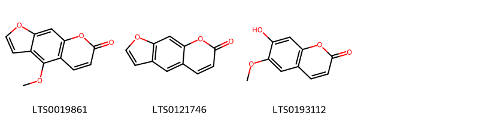{ width=100% }
    <figcaption>Hình ảnh cấu trúc hóa học của 3 hoạt chất thuộc nhóm Coumarins and derivatives gồm ['bergapten (LTS0019861)', 'psoralen (LTS0121746)', 'scopoletin (LTS0193112)'].</figcaption>
</figure>
#### Nhóm Flavonoids
<figure markdown="span">
    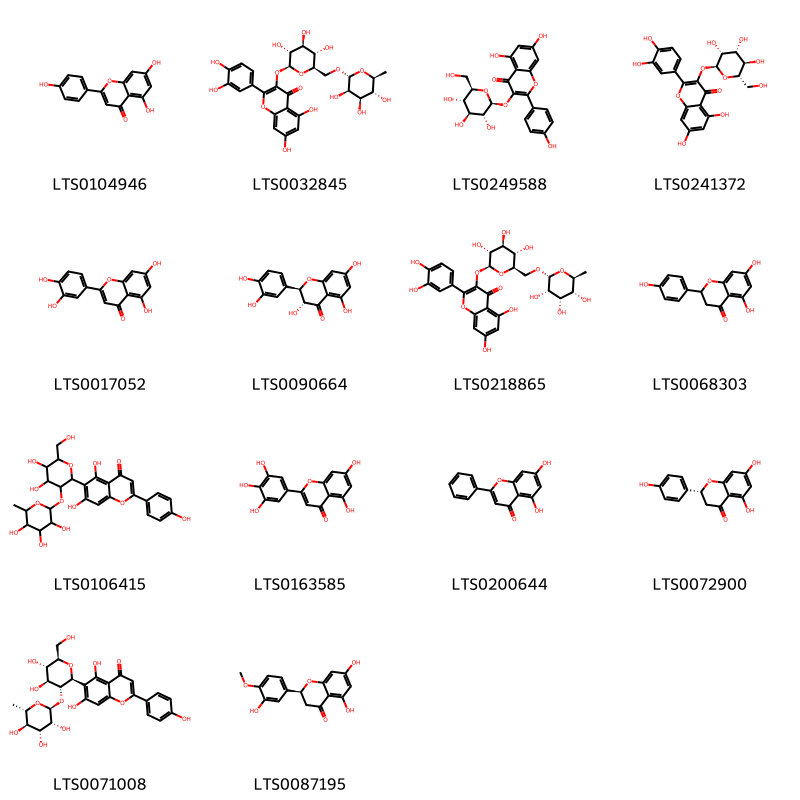{ width=100% }
    <figcaption>Hình ảnh cấu trúc hóa học của 14 hoạt chất thuộc nhóm Flavonoids gồm ['chamomile (LTS0104946)', '3-rutinosyl quercetin (LTS0032845)', 'astragalin (LTS0249588)', '2-(3,4-dihydroxyphenyl)-5,7-dihydroxy-3-{[(2s,3r,4r,5r,6s)-3,4,5-trihydroxy-6-(hydroxymethyl)oxan-2-yl]oxy}chromen-4-one (LTS0241372)', 'luteolin (LTS0017052)', '(+)-taxifolin (LTS0090664)', '2-(3,4-dihydroxyphenyl)-5,7-dihydroxy-3-{[(2s,3r,4s,5s,6r)-3,4,5-trihydroxy-6-({[(2r,3s,4s,5r,6s)-3,4,5-trihydroxy-6-methyloxan-2-yl]oxy}methyl)oxan-2-yl]oxy}chromen-4-one (LTS0218865)', 'asahina (LTS0068303)', '6-[4,5-dihydroxy-6-(hydroxymethyl)-3-[(3,4,5-trihydroxy-6-methyloxan-2-yl)oxy]oxan-2-yl]-5,7-dihydroxy-2-(4-hydroxyphenyl)chromen-4-one (LTS0106415)', 'tricetin (LTS0163585)', 'chrysin (LTS0200644)', '(-)-naringenin (LTS0072900)', '6-[(2s,3r,4s,5s,6r)-4,5-dihydroxy-6-(hydroxymethyl)-3-{[(2s,3r,4r,5r,6s)-3,4,5-trihydroxy-6-methyloxan-2-yl]oxy}oxan-2-yl]-5,7-dihydroxy-2-(4-hydroxyphenyl)chromen-4-one (LTS0071008)', 'hesperetin (LTS0087195)'].</figcaption>
</figure>
#### Nhóm Isoflavonoids
<figure markdown="span">
    { width=100% }
    <figcaption>Hình ảnh cấu trúc hóa học của 1 hoạt chất thuộc nhóm Isoflavonoids gồm ['genistein (LTS0106538)'].</figcaption>
</figure>
#### Nhóm Organooxygen compounds
<figure markdown="span">
    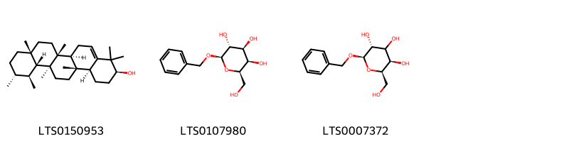{ width=100% }
    <figcaption>Hình ảnh cấu trúc hóa học của 3 hoạt chất thuộc nhóm Organooxygen compounds gồm ['(3s,6as,6br,8ar,11r,12s,12ar,12bs,14ar,14bs)-4,4,6b,8a,11,12,12b,14a-octamethyl-2,3,6,6a,7,8,9,10,11,12,12a,13,14,14b-tetradecahydro-1h-picen-3-ol (LTS0150953)', '(2r,3r,4s,5r,6r)-2-(benzyloxy)-6-(hydroxymethyl)oxane-3,4,5-triol (LTS0107980)', '(2r,3r,5r,6r)-2-(benzyloxy)-6-(hydroxymethyl)oxane-3,4,5-triol (LTS0007372)'].</figcaption>
</figure>
#### Nhóm Prenol lipids
<figure markdown="span">
    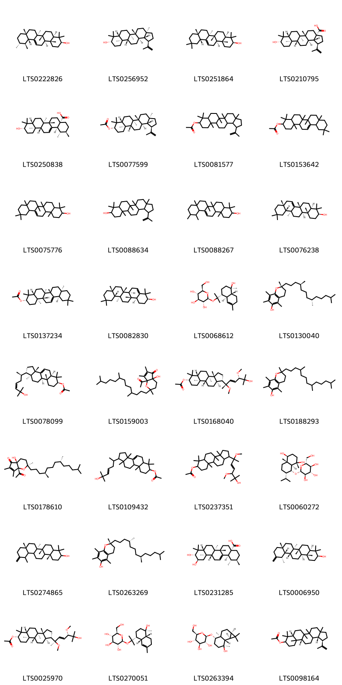{ width=100% }
    <figcaption>Hình ảnh cấu trúc hóa học của 32 hoạt chất thuộc nhóm Prenol lipids gồm ['amyrin (LTS0222826)', 'lupeol (LTS0256952)', 'β-amyrin (LTS0251864)', 'betulinic acid (LTS0210795)', 'ursolic acid (LTS0250838)', 'lupeol acetate (LTS0077599)', '3a,5a,5b,8,8,11a-hexamethyl-1-(prop-1-en-2-yl)-hexadecahydrocyclopenta[a]chrysen-9-yl acetate (LTS0081577)', '4,4,6a,6b,8a,11,11,14b-octamethyl-1,2,3,4a,5,6,7,8,9,10,12,12a,14,14a-tetradecahydropicen-3-yl acetate (LTS0153642)', 'β-amyrin (LTS0075776)', 'lupeol (LTS0088634)', 'α-amyrin (LTS0088267)', 'alnulin (LTS0076238)', 'β-amyrin acetate (LTS0137234)', 'glutinol (LTS0082830)', '(2s,3r,4s,5s,6r)-2-({2-[(1r,4r,4ar,8ar)-4-hydroxy-4,7-dimethyl-2,3,4a,5,6,8a-hexahydro-1h-naphthalen-1-yl]propan-2-yl}oxy)-6-(hydroxymethyl)oxane-3,4,5-triol (LTS0068612)', '(2r)-2,5,7,8-tetramethyl-2-[(4s,8s)-4,8,12-trimethyltridecyl]-3,4-dihydro-1-benzopyran-6-ol (LTS0130040)', '(1s,3as,5ar,7s,9ar,9br,11as)-1-[(2r,4z)-6-hydroxy-6-methylhept-4-en-2-yl]-3a,6,6,9a,11a-pentamethyl-1h,2h,3h,5h,5ah,7h,8h,9h,9bh,10h,11h-cyclopenta[a]phenanthren-7-yl acetate (LTS0078099)', '7a-acetyl-4a-hydroxy-2,6,7-trimethyl-2-(4,8,12-trimethyltridecyl)-3h,4h-cyclopenta[b]pyran-5-one (LTS0159003)', '(1s,3ar,3br,5ar,7s,9ar,9br,11ar)-1-[(2s,3e,5s)-6-hydroxy-2,5-dimethoxy-6-methylhept-3-en-2-yl]-3a,3b,6,6,9a-pentamethyl-dodecahydro-1h-cyclopenta[a]phenanthren-7-yl acetate (LTS0168040)', 'vita e (LTS0188293)', '(2r,4as,7ar)-7a-acetyl-4a-hydroxy-2,6,7-trimethyl-2-[(4r,8r)-4,8,12-trimethyltridecyl]-3h,4h-cyclopenta[b]pyran-5-one (LTS0178610)', '1-(6-hydroxy-6-methylhept-4-en-2-yl)-3a,6,6,9a,11a-pentamethyl-1h,2h,3h,5h,5ah,7h,8h,9h,9bh,10h,11h-cyclopenta[a]phenanthren-7-yl acetate (LTS0109432)', '1-(6-hydroxy-2,5-dimethoxy-6-methylhept-3-en-2-yl)-3a,3b,6,6,9a-pentamethyl-dodecahydro-1h-cyclopenta[a]phenanthren-7-yl acetate (LTS0237351)', '(2r,3r,4s,5s,6r)-2-{[(1r,2s,4as,5s,8s,8ar)-5,8-dihydroxy-2-isopropyl-4a,8-dimethyl-octahydronaphthalen-1-yl]oxy}-6-(hydroxymethyl)oxane-3,4,5-triol (LTS0060272)', '(6ar,6br,8ar,14br)-4,4,6a,6b,8a,12,14b-heptamethyl-11-methylidene-hexadecahydropicen-3-ol (LTS0274865)', 'vitamin e (LTS0263269)', 'corosolic acid (LTS0231285)', 'taraxasterol (LTS0006950)', '(1s,3ar,3br,5ar,7s,9ar,9br,11ar)-1-[(2r,3e,5s)-6-hydroxy-2,5-dimethoxy-6-methylhept-3-en-2-yl]-3a,3b,6,6,9a-pentamethyl-dodecahydro-1h-cyclopenta[a]phenanthren-7-yl acetate (LTS0025970)', '(2s,3r,4s,5s,6r)-2-({2-[(1r,4r,4ar,8as)-4-hydroxy-4,7-dimethyl-2,3,4a,5,6,8a-hexahydro-1h-naphthalen-1-yl]propan-2-yl}oxy)-6-(hydroxymethyl)oxane-3,4,5-triol (LTS0270051)', '(2r,3r,4s,5s,6r)-2-{[(1ar,3as,4s,7s,7as,7br)-7-hydroxy-1,1,3a,7-tetramethyl-octahydrocyclopropa[a]naphthalen-4-yl]oxy}-6-(hydroxymethyl)oxane-3,4,5-triol (LTS0263394)', '(1r,7ar,11br,13br)-3a,5a,5b,8,8,11a-hexamethyl-1-(prop-1-en-2-yl)-hexadecahydrocyclopenta[a]chrysen-9-yl acetate (LTS0098164)'].</figcaption>
</figure>
#### Nhóm Steroids and steroid derivatives
<figure markdown="span">
    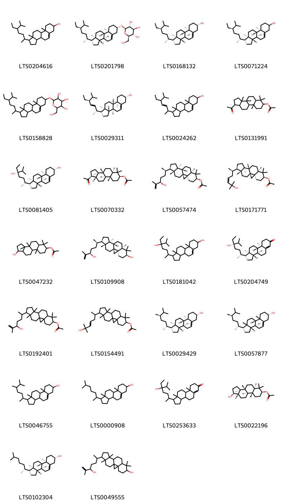{ width=100% }
    <figcaption>Hình ảnh cấu trúc hóa học của 26 hoạt chất thuộc nhóm Steroids and steroid derivatives gồm ['stigmast-5-en-3-ol, (3β)- (LTS0204616)', 'sitogluside (LTS0201798)', 'sitosterol (LTS0168132)', 'stigmast-5-en-3-ol (LTS0071224)', '2-{[1-(5-ethyl-6-methylheptan-2-yl)-9a,11a-dimethyl-1h,2h,3h,3ah,3bh,4h,6h,7h,8h,9h,9bh,10h,11h-cyclopenta[a]phenanthren-7-yl]oxy}-6-(hydroxymethyl)oxane-3,4,5-triol (LTS0158828)', 'phytosterol (LTS0029311)', 'stigmasterol (LTS0024262)', '1-acetyl-3a,3b,6,6,9a-pentamethyl-dodecahydro-1h-cyclopenta[a]phenanthren-7-yl acetate (LTS0131991)', '(3s,6r)-6-[(1r,3as,3bs,7s,9ar,9bs,11ar)-7-hydroxy-9a,11a-dimethyl-1h,2h,3h,3ah,3bh,4h,6h,7h,8h,9h,9bh,10h,11h-cyclopenta[a]phenanthren-1-yl]-3-ethyl-2-methylheptan-3-ol (LTS0081405)', '(1s,3ar,3br,5ar,7s,9ar,9br,11ar)-1-acetyl-3a,3b,6,6,9a-pentamethyl-dodecahydro-1h-cyclopenta[a]phenanthren-7-yl acetate (LTS0070332)', '(1s,3r,6s,8r,11s,12s,15r,16r)-15-[(2r,5r)-5-hydroxy-6-methylhept-6-en-2-yl]-7,7,12,16-tetramethylpentacyclo[9.7.0.0¹,³.0³,⁸.0¹²,¹⁶]octadecan-6-yl acetate (LTS0057474)', '(1s,3r,6s,8r,11s,12s,15r,16r)-15-[(2r,4z)-6-hydroxy-6-methylhept-4-en-2-yl]-7,7,12,16-tetramethylpentacyclo[9.7.0.0¹,³.0³,⁸.0¹²,¹⁶]octadecan-6-yl acetate (LTS0171771)', '1-hydroxy-3a,3b,6,6,9a-pentamethyl-dodecahydro-1h-cyclopenta[a]phenanthren-7-yl acetate (LTS0047232)', '(1s,3r,6s,8r,11s,12s,15r,16r)-15-[(2r,5r)-5-hydroxy-6-methylhept-6-en-2-yl]-7,7,12,16-tetramethylpentacyclo[9.7.0.0¹,³.0³,⁸.0¹²,¹⁶]octadecan-6-ol (LTS0109908)', '3-ethyl-6-{7-hydroxy-9a,11a-dimethyl-1h,2h,3h,3ah,3bh,4h,6h,7h,8h,9h,9bh,10h,11h-cyclopenta[a]phenanthren-1-yl}-2-methylheptan-3-ol (LTS0181042)', '(1r,3as,3bs,9ar,9bs,11ar)-1-[(2r,5s)-5-ethyl-5-hydroxy-6-methylheptan-2-yl]-9a,11a-dimethyl-1h,2h,3h,3ah,3bh,4h,5h,8h,9h,9bh,10h,11h-cyclopenta[a]phenanthren-7-one (LTS0204749)', '15-(5-hydroxy-6-methylhept-6-en-2-yl)-7,7,12,16-tetramethylpentacyclo[9.7.0.0¹,³.0³,⁸.0¹²,¹⁶]octadecan-6-yl acetate (LTS0192401)', '15-(6-hydroxy-6-methylhept-4-en-2-yl)-7,7,12,16-tetramethylpentacyclo[9.7.0.0¹,³.0³,⁸.0¹²,¹⁶]octadecan-6-yl acetate (LTS0154491)', 'campesterol (LTS0029429)', '(1r,3as,3bs,7s,9bs)-1-[(2r,5r)-5,6-dimethylheptan-2-yl]-9a,11a-dimethyl-1h,2h,3h,3ah,3bh,4h,6h,7h,8h,9h,9bh,10h,11h-cyclopenta[a]phenanthren-7-ol (LTS0057877)', 'campesterol (LTS0046755)', 'epicholestrol (LTS0000908)', '1-(5-ethyl-5-hydroxy-6-methylheptan-2-yl)-9a,11a-dimethyl-1h,2h,3h,3ah,3bh,4h,5h,8h,9h,9bh,10h,11h-cyclopenta[a]phenanthren-7-one (LTS0253633)', '(1s,3ar,3br,5ar,7s,9ar,9br,11as)-1-hydroxy-3a,3b,6,6,9a-pentamethyl-dodecahydro-1h-cyclopenta[a]phenanthren-7-yl acetate (LTS0022196)', 'cholesterol (LTS0102304)', '15-(5-hydroxy-6-methylhept-6-en-2-yl)-7,7,12,16-tetramethylpentacyclo[9.7.0.0¹,³.0³,⁸.0¹²,¹⁶]octadecan-6-ol (LTS0049555)'].</figcaption>
</figure>

---

### Dược dân tộc học

Danh sách các quốc gia có sử dụng *Ficus pumila* trong điều trị các bệnh. 

| Country   | Disease              | Bệnh                   |
|:----------|:---------------------|:-----------------------|
| China     | Detoxicant, Diuretic | Chất khử độc, lợi tiểu |
| India     | Parasiticide         | Thuốc diệt ký sinh     |

---

---
## Ficus ramantacea
### Thông tin về thực vật

!!! info "Phân loại thực vật của *Ficus sagittata* từ GIBF:"
    - **Kingdom:** Plantae
    - **Phylum:** Tracheophyta
    - **Order:** Rosales
    - **Family:** Moraceae
    - **Genus:** Ficus
    - **Species:** *Ficus sagittata*

 

| Label (VI)   | Label (EN)   | Scientific Name   | Descriptions (VI)   | Descriptions (EN)   | Also Known As (VI)                             | Also Known As (EN)   |
|:-------------|:-------------|:------------------|:--------------------|:--------------------|:-----------------------------------------------|:---------------------|
| N/A          | N/A          | Ficus pumila      | loài thực vật       | species of plant    | ['Vẩy ốc', 'Thằn lằn', 'Sung thằn lằn', 'Sộp'] | ['']                 |

#### Phân bố trên thế giới

**Từ CSDL GIBF** nan, Palau, Micronesia (Federated States of), India, Indonesia, Philippines, Malaysia, China

#### Phân bố tại Việt Nam

**Từ CSDL GIBF**: Không có ghi nhận ở Việt Nam

---
### Thành phần hóa học
        
- Theo cơ sở dữ liệu lotus: Từ loài *Ficus sagittata* đã phân lập và xác định được Chưa có hoạt chất nào được phân lập. hoạt chất thuộc về các nhóm Không có hoạt chất nào được phân lập. 

Không có hình ảnh nào được tạo ra

---

### Dược dân tộc học

Danh sách các quốc gia có sử dụng *Ficus sagittata* trong điều trị các bệnh. 

| Country   | Disease   | Bệnh     |
|:----------|:----------|:---------|
| Malaysia  | Poison    | Chất độc |

---

---
## Ficus religiosa
### Thông tin về thực vật

!!! info "Phân loại thực vật của *Ficus religiosa* từ GIBF:"
    - **Kingdom:** Plantae
    - **Phylum:** Tracheophyta
    - **Order:** Rosales
    - **Family:** Moraceae
    - **Genus:** Ficus
    - **Species:** *Ficus religiosa*

 

| Label (VI)   | Label (EN)   | Scientific Name   | Descriptions (VI)        | Descriptions (EN)   | Also Known As (VI)                                                                                | Also Known As (EN)                                     |
|:-------------|:-------------|:------------------|:-------------------------|:--------------------|:--------------------------------------------------------------------------------------------------|:-------------------------------------------------------|
| N/A          | N/A          | Ficus religiosa   | loài cây thuộc chi Đa đề | species of fig      | ['Ficus religiosa', 'đề', 'cây Đề', 'cây đề', 'cây Bồ-đề', 'cây bồ-đề', 'cây bồ đề', 'Bồ-đề thụ'] | ['Peepul Tree', 'Pipal tree', 'sacred fig', 'Bo-tree'] |

#### Phân bố trên thế giới

**Từ CSDL GIBF** United Arab Emirates, Sri Lanka, Hong Kong, Thailand, Cambodia, Mauritius, Chinese Taipei, Macao, India, Singapore, United States of America, Viet Nam, Qatar, Malaysia, China

#### Phân bố tại Việt Nam

**Từ CSDL GIBF**: Hồ Chí Minh city

---
### Thành phần hóa học
        
- Theo cơ sở dữ liệu lotus: Từ loài *Ficus religiosa* đã phân lập và xác định được Chưa có hoạt chất nào được phân lập. hoạt chất thuộc về các nhóm Không có hoạt chất nào được phân lập. 

Không có hình ảnh nào được tạo ra

---

### Dược dân tộc học

Danh sách các quốc gia có sử dụng *Ficus religiosa* trong điều trị các bệnh. 

| Country       | Disease                                           | Bệnh                                                          |
|:--------------|:--------------------------------------------------|:--------------------------------------------------------------|
| India         | Astringent, Laxative, Purgative, Refrigerant, nan | Chất làm se, Thuốc nhuận tràng, Thuốc tẩy, Chất làm lạnh, nan |
| India(Santal) | Laxative                                          | Nhuận trường                                                  |
| Iraq          | Laxative, Refrigerant, Astringent                 | Thuốc nhuận tràng, chất làm lạnh, chất làm se                 |

---

---
## Ficus rumphii
### Thông tin về thực vật

!!! info "Phân loại thực vật của *Ficus rumphii* từ GIBF:"
    - **Kingdom:** Plantae
    - **Phylum:** Tracheophyta
    - **Order:** Rosales
    - **Family:** Moraceae
    - **Genus:** Ficus
    - **Species:** *Ficus rumphii*

 

| Label (VI)   | Label (EN)   | Scientific Name   | Descriptions (VI)   | Descriptions (EN)   | Also Known As (VI)   | Also Known As (EN)   |
|:-------------|:-------------|:------------------|:--------------------|:--------------------|:---------------------|:---------------------|
| N/A          | N/A          | Ficus rumphii     |                     | species of fig      | ['']                 | ['']                 |

#### Phân bố trên thế giới

**Từ CSDL GIBF** nan, Virgin Islands (U.S.), Lao People’s Democratic Republic, Cambodia, Angola, Myanmar, unknown or invalid, Benin, Puerto Rico, Bangladesh, United States of America, South Africa, Hong Kong, Thailand, Brazil, Guyana, Bhutan, Dominican Republic, Singapore, Viet Nam, China, Colombia, Macao, India, Indonesia, Malaysia, Nepal

#### Phân bố tại Việt Nam

**Từ CSDL GIBF**: Khánh Hòa, Hồ Chí Minh city, Ninh Thuận, Ninh Bình, Ninh Thuan

---
### Thành phần hóa học
        
- Theo cơ sở dữ liệu lotus: Từ loài *Ficus rumphii* đã phân lập và xác định được Chưa có hoạt chất nào được phân lập. hoạt chất thuộc về các nhóm Không có hoạt chất nào được phân lập. 

Không có hình ảnh nào được tạo ra

---

### Dược dân tộc học

Danh sách các quốc gia có sử dụng *Ficus rumphii* trong điều trị các bệnh. 

| Country   | Disease               | Bệnh              |
|:----------|:----------------------|:------------------|
| India     | Emetic, Vermifuge     | Emetic, Vermifuge |
| Java      | Cosmetic, Expectorant | Mỹ phẩm, đờm      |

---

---
## Ficus septica
### Thông tin về thực vật

!!! info "Phân loại thực vật của *Ficus septica* từ GIBF:"
    - **Kingdom:** Plantae
    - **Phylum:** Tracheophyta
    - **Order:** Rosales
    - **Family:** Moraceae
    - **Genus:** Ficus
    - **Species:** *Ficus septica*

 

| Label (VI)   | Label (EN)   | Scientific Name   | Descriptions (VI)   | Descriptions (EN)   | Also Known As (VI)   | Also Known As (EN)   |
|:-------------|:-------------|:------------------|:--------------------|:--------------------|:---------------------|:---------------------|
| N/A          | N/A          | Ficus septica     | loài thực vật       | species of plant    | ['']                 | ['']                 |

#### Phân bố trên thế giới

**Từ CSDL GIBF** Australia, Japan, Chinese Taipei, Indonesia, Philippines

#### Phân bố tại Việt Nam

**Từ CSDL GIBF**: Không có ghi nhận ở Việt Nam

---
### Thành phần hóa học
        
- Theo cơ sở dữ liệu lotus: Từ loài *Ficus septica* đã phân lập và xác định được 101 hoạt chất thuộc về các nhóm Flavonoids, Prenol lipids, Steroids and steroid derivatives, Isoflavonoids, Cinnamic acids and derivatives, Phenanthrenes and derivatives, Benzene and substituted derivatives, Stilbenes, Organooxygen compounds, Phenols, Coumarins and derivatives, Furanoid lignans, Carboxylic acids and derivatives, Diazines, Pyridines and derivatives. 

|    | chemicalTaxonomyClassyfireClass     |   smiles_count |
|---:|:------------------------------------|---------------:|
|  0 | Benzene and substituted derivatives |              2 |
|  1 | Carboxylic acids and derivatives    |              1 |
|  2 | Cinnamic acids and derivatives      |              1 |
|  3 | Coumarins and derivatives           |              5 |
|  4 | Diazines                            |              1 |
|  5 | Flavonoids                          |              4 |
|  6 | Furanoid lignans                    |              1 |
|  7 | Isoflavonoids                       |              9 |
|  8 | Organooxygen compounds              |              9 |
|  9 | Phenanthrenes and derivatives       |             40 |
| 10 | Phenols                             |              5 |
| 11 | Prenol lipids                       |              7 |
| 12 | Pyridines and derivatives           |              1 |
| 13 | Steroids and steroid derivatives    |             10 |
| 14 | Stilbenes                           |              5 |

#### Nhóm Benzene and substituted derivatives
<figure markdown="span">
    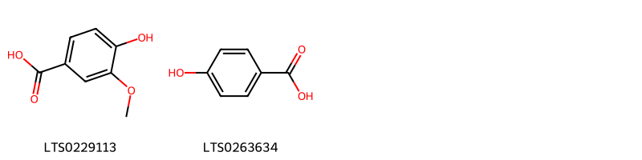{ width=100% }
    <figcaption>Hình ảnh cấu trúc hóa học của 2 hoạt chất thuộc nhóm Benzene and substituted derivatives gồm ['vanillic acid (LTS0229113)', 'p-hydroxybenzoic acid (LTS0263634)'].</figcaption>
</figure>
#### Nhóm Carboxylic acids and derivatives
<figure markdown="span">
    { width=100% }
    <figcaption>Hình ảnh cấu trúc hóa học của 1 hoạt chất thuộc nhóm Carboxylic acids and derivatives gồm ['aspartamate (LTS0243014)'].</figcaption>
</figure>
#### Nhóm Cinnamic acids and derivatives
<figure markdown="span">
    { width=100% }
    <figcaption>Hình ảnh cấu trúc hóa học của 1 hoạt chất thuộc nhóm Cinnamic acids and derivatives gồm ['para-coumaric acid (LTS0266252)'].</figcaption>
</figure>
#### Nhóm Coumarins and derivatives
<figure markdown="span">
    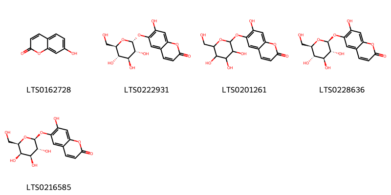{ width=100% }
    <figcaption>Hình ảnh cấu trúc hóa học của 5 hoạt chất thuộc nhóm Coumarins and derivatives gồm ['umbelliferone (LTS0162728)', '7-hydroxy-6-{[(2r,3r,4s,5s,6r)-3,4,5-trihydroxy-6-(hydroxymethyl)oxan-2-yl]oxy}chromen-2-one (LTS0222931)', 'esculin (LTS0201261)', 'esculin (LTS0228636)', '7-hydroxy-6-{[(2s,3r,4s,5r,6r)-3,4,5-trihydroxy-6-(hydroxymethyl)oxan-2-yl]oxy}chromen-2-one (LTS0216585)'].</figcaption>
</figure>
#### Nhóm Diazines
<figure markdown="span">
    { width=100% }
    <figcaption>Hình ảnh cấu trúc hóa học của 1 hoạt chất thuộc nhóm Diazines gồm ['pirod (LTS0008205)'].</figcaption>
</figure>
#### Nhóm Flavonoids
<figure markdown="span">
    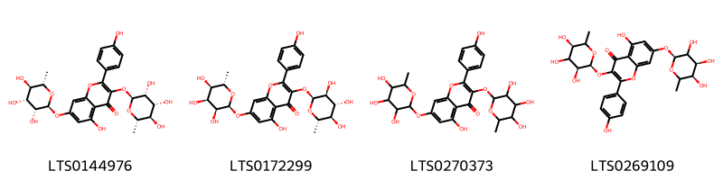{ width=100% }
    <figcaption>Hình ảnh cấu trúc hóa học của 4 hoạt chất thuộc nhóm Flavonoids gồm ['lespedin (LTS0144976)', '5-hydroxy-2-(4-hydroxyphenyl)-3-{[(2s,3s,4r,5r,6s)-3,4,5-trihydroxy-6-methyloxan-2-yl]oxy}-7-{[(2s,3s,4s,5r,6s)-3,4,5-trihydroxy-6-methyloxan-2-yl]oxy}chromen-4-one (LTS0172299)', 'kaempferitrin (LTS0270373)', 'kaempferitrin (LTS0269109)'].</figcaption>
</figure>
#### Nhóm Furanoid lignans
<figure markdown="span">
    { width=100% }
    <figcaption>Hình ảnh cấu trúc hóa học của 1 hoạt chất thuộc nhóm Furanoid lignans gồm ['syringaresinol (LTS0116280)'].</figcaption>
</figure>
#### Nhóm Isoflavonoids
<figure markdown="span">
    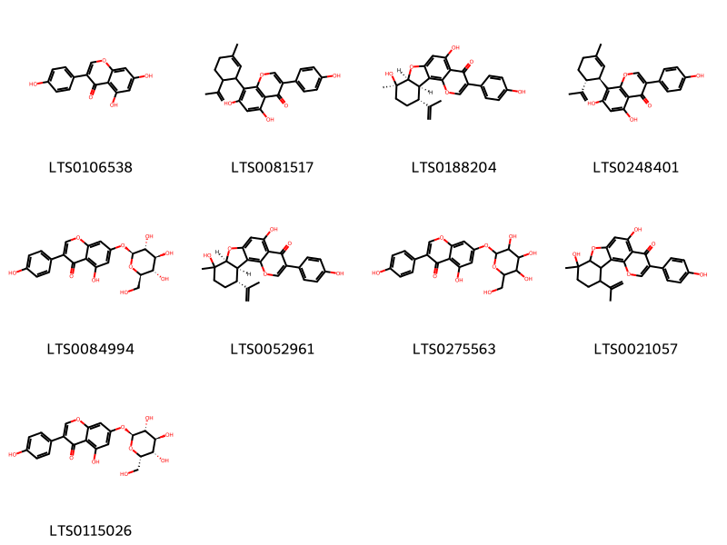{ width=100% }
    <figcaption>Hình ảnh cấu trúc hóa học của 9 hoạt chất thuộc nhóm Isoflavonoids gồm ['genistein (LTS0106538)', '5,7-dihydroxy-3-(4-hydroxyphenyl)-8-[3-methyl-6-(prop-1-en-2-yl)cyclohex-2-en-1-yl]chromen-4-one (LTS0081517)', '(12s,13r,16r,17r)-8,13-dihydroxy-5-(4-hydroxyphenyl)-13-methyl-16-(prop-1-en-2-yl)-3,11-dioxatetracyclo[8.7.0.0²,⁷.0¹²,¹⁷]heptadeca-1,4,7,9-tetraen-6-one (LTS0188204)', '5,7-dihydroxy-3-(4-hydroxyphenyl)-8-[(1r,6r)-3-methyl-6-(prop-1-en-2-yl)cyclohex-2-en-1-yl]chromen-4-one (LTS0248401)', 'genistin (LTS0084994)', '(12s,16r,17r)-8,13-dihydroxy-5-(4-hydroxyphenyl)-13-methyl-16-(prop-1-en-2-yl)-3,11-dioxatetracyclo[8.7.0.0²,⁷.0¹²,¹⁷]heptadeca-1,4,7,9-tetraen-6-one (LTS0052961)', '5-hydroxy-3-(4-hydroxyphenyl)-7-{[3,4,5-trihydroxy-6-(hydroxymethyl)oxan-2-yl]oxy}chromen-4-one (LTS0275563)', '8,13-dihydroxy-5-(4-hydroxyphenyl)-13-methyl-16-(prop-1-en-2-yl)-3,11-dioxatetracyclo[8.7.0.0²,⁷.0¹²,¹⁷]heptadeca-1,4,7,9-tetraen-6-one (LTS0021057)', '5-hydroxy-3-(4-hydroxyphenyl)-7-{[(2s,3r,4s,5s,6s)-3,4,5-trihydroxy-6-(hydroxymethyl)oxan-2-yl]oxy}chromen-4-one (LTS0115026)'].</figcaption>
</figure>
#### Nhóm Organooxygen compounds
<figure markdown="span">
    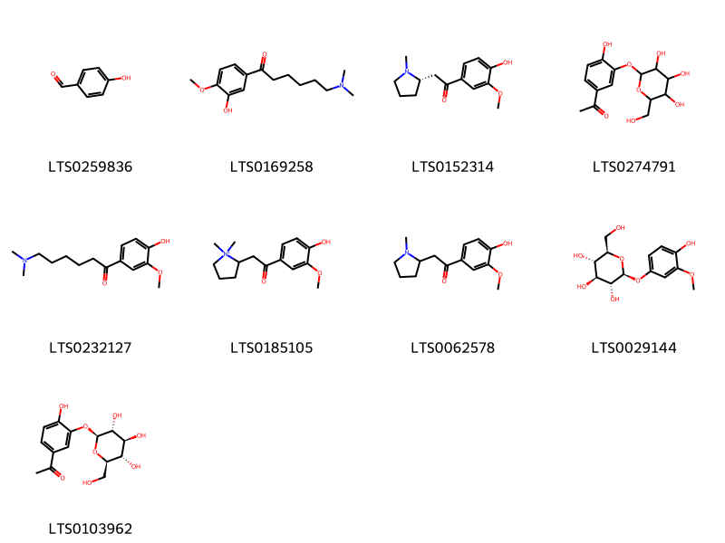{ width=100% }
    <figcaption>Hình ảnh cấu trúc hóa học của 9 hoạt chất thuộc nhóm Organooxygen compounds gồm ['p-hydroxybenzaldehyde (LTS0259836)', '6-(dimethylamino)-1-(3-hydroxy-4-methoxyphenyl)hexan-1-one (LTS0169258)', '1-(4-hydroxy-3-methoxyphenyl)-2-[(2s)-1-methylpyrrolidin-2-yl]ethanone (LTS0152314)', '1-(4-hydroxy-3-{[3,4,5-trihydroxy-6-(hydroxymethyl)oxan-2-yl]oxy}phenyl)ethanone (LTS0274791)', '6-(dimethylamino)-1-(4-hydroxy-3-methoxyphenyl)hexan-1-one (LTS0232127)', 'ficuseptamine c (LTS0185105)', '1-(4-hydroxy-3-methoxyphenyl)-2-(1-methylpyrrolidin-2-yl)ethanone (LTS0062578)', '(2s,3r,4s,5s,6r)-2-(4-hydroxy-3-methoxyphenoxy)-6-(hydroxymethyl)oxane-3,4,5-triol (LTS0029144)', 'pungenin (LTS0103962)'].</figcaption>
</figure>
#### Nhóm Phenanthrenes and derivatives
<figure markdown="span">
    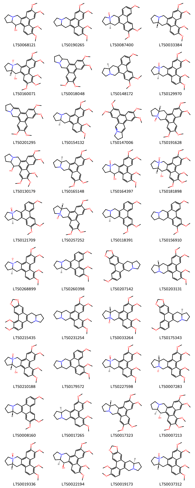{ width=100% }
    <figcaption>Hình ảnh cấu trúc hóa học của 40 hoạt chất thuộc nhóm Phenanthrenes and derivatives gồm ['5,6,10,11-tetramethoxy-16-azapentacyclo[12.7.0.0²,⁷.0⁸,¹³.0¹⁶,²⁰]henicosa-1(14),2(7),3,5,8(13),9,11-heptaen-21-ol (LTS0068121)', '5,6,10,11-tetramethoxy-16-azapentacyclo[12.7.0.0²,⁷.0⁸,¹³.0¹⁶,²⁰]henicosa-1(14),2(7),3,5,8(13),9,11-heptaene (LTS0190265)', '(20r)-4,5,10-trimethoxy-16-azapentacyclo[12.7.0.0²,⁷.0⁸,¹³.0¹⁶,²⁰]henicosa-1(14),2(7),3,5,8(13),9,11-heptaen-16-ium-16-olate (LTS0087400)', '(20s)-5,6,10,11-tetramethoxy-16-azapentacyclo[12.7.0.0²,⁷.0⁸,¹³.0¹⁶,²⁰]henicosa-1(14),2(7),3,5,8(13),9,11-heptaene (LTS0033384)', '(16r,20s,21s)-21-hydroxy-4,5,6,10,11-pentamethoxy-16-azapentacyclo[12.7.0.0²,⁷.0⁸,¹³.0¹⁶,²⁰]henicosa-1(14),2(7),3,5,8(13),9,11-heptaen-16-ium-16-olate (LTS0160071)', '(+/-)-tylophorine (LTS0018048)', '(20s)-5,10,11-trimethoxy-16-azapentacyclo[12.7.0.0²,⁷.0⁸,¹³.0¹⁶,²⁰]henicosa-1(14),2(7),3,5,8(13),9,11-heptaene (LTS0148172)', '(20r)-5,6,10,11-tetramethoxy-16-azapentacyclo[12.7.0.0²,⁷.0⁸,¹³.0¹⁶,²⁰]henicosa-1(14),2(7),3,5,8(13),9,11-heptaen-16-ium-16-olate (LTS0129970)', '4,5,10,11-tetramethoxy-16-azapentacyclo[12.7.0.0²,⁷.0⁸,¹³.0¹⁶,²⁰]henicosa-1(14),2(7),3,5,8(13),9,11,20-octaene (LTS0201295)', '(20r)-5,6,10,11-tetramethoxy-16-azapentacyclo[12.7.0.0²,⁷.0⁸,¹³.0¹⁶,²⁰]henicosa-1(14),2(7),3,5,8(13),9,11-heptaene (LTS0154132)', '4,5,10,11-tetramethoxy-16λ⁵-azapentacyclo[12.7.0.0²,⁷.0⁸,¹³.0¹⁶,²⁰]henicosa-1,3,5,7,9,11,13,15,20-nonaen-16-ylium (LTS0147006)', '(16r,20r)-4,5,10,11-tetramethoxy-16-azapentacyclo[12.7.0.0²,⁷.0⁸,¹³.0¹⁶,²⁰]henicosa-1(14),2(7),3,5,8(13),9,11-heptaen-16-ium-16-olate (LTS0191628)', '4,5,6,10,11-pentamethoxy-16-azapentacyclo[12.7.0.0²,⁷.0⁸,¹³.0¹⁶,²⁰]henicosa-1(14),2(7),3,5,8(13),9,11-heptaen-21-ol (LTS0130179)', 'tylophorine (LTS0165148)', '21-hydroxy-5,6,10,11-tetramethoxy-16-azapentacyclo[12.7.0.0²,⁷.0⁸,¹³.0¹⁶,²⁰]henicosa-1(14),2(7),3,5,8(13),9,11-heptaen-16-ium-16-olate (LTS0164397)', '(20s,21s)-21-hydroxy-4,5,6,10,11-pentamethoxy-16-azapentacyclo[12.7.0.0²,⁷.0⁸,¹³.0¹⁶,²⁰]henicosa-1(14),2(7),3,5,8(13),9,11-heptaen-16-ium-16-olate (LTS0181898)', '(16s,20r)-4,5,10-trimethoxy-16-azapentacyclo[12.7.0.0²,⁷.0⁸,¹³.0¹⁶,²⁰]henicosa-1(14),2(7),3,5,8(13),9,11-heptaen-16-ium-16-olate (LTS0121709)', '(20r)-4,5,10,11-tetramethoxy-16-azapentacyclo[12.7.0.0²,⁷.0⁸,¹³.0¹⁶,²⁰]henicosa-1(14),2(7),3,5,8(13),9,11-heptaen-16-ium-16-olate (LTS0257252)', '(20r)-4,5,10-trimethoxy-16-azapentacyclo[12.7.0.0²,⁷.0⁸,¹³.0¹⁶,²⁰]henicosa-1(14),2(7),3,5,8(13),9,11-heptaene (LTS0118391)', '4,5,10-trimethoxy-16-azapentacyclo[12.7.0.0²,⁷.0⁸,¹³.0¹⁶,²⁰]henicosa-1(14),2(7),3,5,8(13),9,11-heptaene (LTS0156910)', '(16r,20r)-5,6,10,11-tetramethoxy-16-azapentacyclo[12.7.0.0²,⁷.0⁸,¹³.0¹⁶,²⁰]henicosa-1(14),2(7),3,5,8(13),9,11-heptaen-16-ium-16-olate (LTS0268899)', '(20r)-5,6,10-trimethoxy-16-azapentacyclo[12.7.0.0²,⁷.0⁸,¹³.0¹⁶,²⁰]henicosa-1(14),2(7),3,5,8(13),9,11-heptaene (LTS0260398)', '13-methoxy-5,7-dioxa-19-azahexacyclo[15.7.0.0²,¹⁰.0⁴,⁸.0¹¹,¹⁶.0¹⁹,²³]tetracosa-1(17),2(10),3,8,11(16),12,14-heptaene (LTS0207142)', 'tylocrebrine (LTS0203131)', '12,13-dimethoxy-5,7-dioxa-19-azahexacyclo[15.7.0.0²,¹⁰.0⁴,⁸.0¹¹,¹⁶.0¹⁹,²³]tetracosa-1(17),2(10),3,8,11(16),12,14-heptaene (LTS0215435)', '(+/-)-tylocrebrine (LTS0231254)', '(20r)-4,5,9,10-tetramethoxy-16-azapentacyclo[12.7.0.0²,⁷.0⁸,¹³.0¹⁶,²⁰]henicosa-1(14),2(7),3,5,8(13),9,11-heptaen-16-ium-16-olate (LTS0033264)', '(23r)-13-methoxy-5,7-dioxa-19-azahexacyclo[15.7.0.0²,¹⁰.0⁴,⁸.0¹¹,¹⁶.0¹⁹,²³]tetracosa-1(17),2(10),3,8,11(16),12,14-heptaene (LTS0175343)', '(20s,21s)-21-hydroxy-5,6,10,11-tetramethoxy-16-azapentacyclo[12.7.0.0²,⁷.0⁸,¹³.0¹⁶,²⁰]henicosa-1(14),2(7),3,5,8(13),9,11-heptaen-16-ium-16-olate (LTS0210188)', '5,6,10-trimethoxy-16-azapentacyclo[12.7.0.0²,⁷.0⁸,¹³.0¹⁶,²⁰]henicosa-1(14),2(7),3,5,8(13),9,11-heptaene (LTS0179572)', '(16s,20r)-5,6,10,11-tetramethoxy-16-azapentacyclo[12.7.0.0²,⁷.0⁸,¹³.0¹⁶,²⁰]henicosa-1(14),2(7),3,5,8(13),9,11-heptaen-16-ium-16-olate (LTS0227598)', '(16s,20r)-4,5,9,10-tetramethoxy-16-azapentacyclo[12.7.0.0²,⁷.0⁸,¹³.0¹⁶,²⁰]henicosa-1(14),2(7),3,5,8(13),9,11-heptaen-16-ium-16-olate (LTS0007283)', '(20s)-4,5,10-trimethoxy-16-azapentacyclo[12.7.0.0²,⁷.0⁸,¹³.0¹⁶,²⁰]henicosa-1(14),2(7),3,5,8(13),9,11-heptaene (LTS0008160)', '(-)-tylocrebrine (LTS0017265)', '(-)-tylophorine (LTS0017323)', '(20r,21s)-4,5,6,10,11-pentamethoxy-16-azapentacyclo[12.7.0.0²,⁷.0⁸,¹³.0¹⁶,²⁰]henicosa-1(14),2(7),3,5,8(13),9,11-heptaen-21-ol (LTS0007213)', '(16s,20s)-5,6,10,11-tetramethoxy-16-azapentacyclo[12.7.0.0²,⁷.0⁸,¹³.0¹⁶,²⁰]henicosa-1(14),2(7),3,5,8(13),9,11-heptaen-16-ium-16-olate (LTS0019336)', '(20r,21r)-5,6,10,11-tetramethoxy-16-azapentacyclo[12.7.0.0²,⁷.0⁸,¹³.0¹⁶,²⁰]henicosa-1(14),2(7),3,5,8(13),9,11-heptaen-21-ol (LTS0022194)', '(23r)-12,13-dimethoxy-5,7-dioxa-19-azahexacyclo[15.7.0.0²,¹⁰.0⁴,⁸.0¹¹,¹⁶.0¹⁹,²³]tetracosa-1(17),2(10),3,8,11(16),12,14-heptaene (LTS0019173)', '(20s)-5,6,10,11-tetramethoxy-16-azapentacyclo[12.7.0.0²,⁷.0⁸,¹³.0¹⁶,²⁰]henicosa-1(14),2(7),3,5,8(13),9,11-heptaen-16-ium-16-olate (LTS0037312)'].</figcaption>
</figure>
#### Nhóm Phenols
<figure markdown="span">
    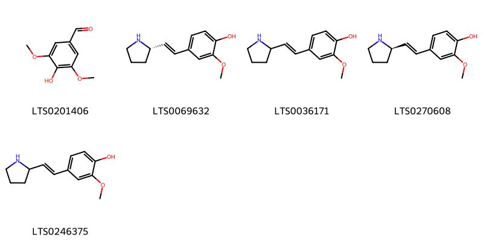{ width=100% }
    <figcaption>Hình ảnh cấu trúc hóa học của 5 hoạt chất thuộc nhóm Phenols gồm ['syringaldehyde (LTS0201406)', '2-methoxy-4-[(1e)-2-[(2s)-pyrrolidin-2-yl]ethenyl]phenol (LTS0069632)', '2-methoxy-4-[(1e)-2-(pyrrolidin-2-yl)ethenyl]phenol (LTS0036171)', '2-methoxy-4-[(1e)-2-[(2r)-pyrrolidin-2-yl]ethenyl]phenol (LTS0270608)', '2-methoxy-4-[2-(pyrrolidin-2-yl)ethenyl]phenol (LTS0246375)'].</figcaption>
</figure>
#### Nhóm Prenol lipids
<figure markdown="span">
    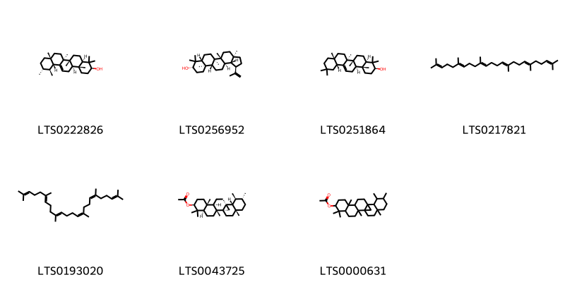{ width=100% }
    <figcaption>Hình ảnh cấu trúc hóa học của 7 hoạt chất thuộc nhóm Prenol lipids gồm ['amyrin (LTS0222826)', 'lupeol (LTS0256952)', 'β-amyrin (LTS0251864)', 'squalene (LTS0217821)', '2,6,10,15,19,23-hexamethyltetracosa-2,6,10,14,18,22-hexaene (LTS0193020)', '(1r,2r,5r,7s,10r,11r,14r,15r,16s,17r,20r)-2,6,6,10,16,17,20-heptamethylhexacyclo[12.8.1.0¹,¹⁴.0²,¹¹.0⁵,¹⁰.0¹⁵,²⁰]tricosan-7-yl acetate (LTS0043725)', '2,6,6,10,16,17,20-heptamethylhexacyclo[12.8.1.0¹,¹⁴.0²,¹¹.0⁵,¹⁰.0¹⁵,²⁰]tricosan-7-yl acetate (LTS0000631)'].</figcaption>
</figure>
#### Nhóm Pyridines and derivatives
<figure markdown="span">
    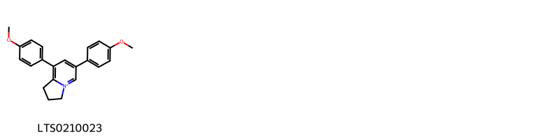{ width=100% }
    <figcaption>Hình ảnh cấu trúc hóa học của 1 hoạt chất thuộc nhóm Pyridines and derivatives gồm ['6,8-bis(4-methoxyphenyl)-2,3-dihydro-1h-4λ⁵-indolizin-4-ylium (LTS0210023)'].</figcaption>
</figure>
#### Nhóm Steroids and steroid derivatives
<figure markdown="span">
    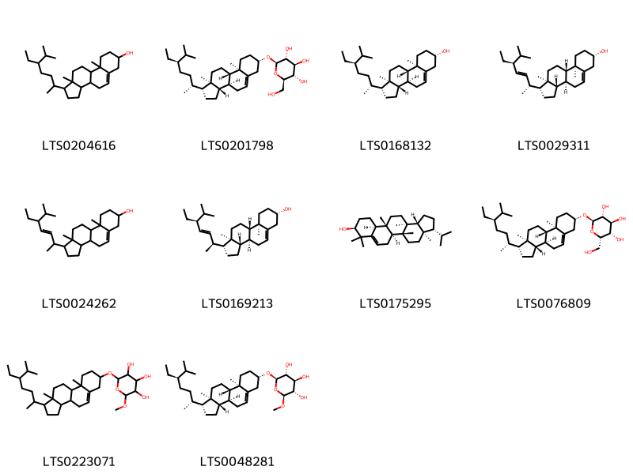{ width=100% }
    <figcaption>Hình ảnh cấu trúc hóa học của 10 hoạt chất thuộc nhóm Steroids and steroid derivatives gồm ['stigmast-5-en-3-ol, (3β)- (LTS0204616)', 'sitogluside (LTS0201798)', 'sitosterol (LTS0168132)', 'phytosterol (LTS0029311)', 'stigmasterol (LTS0024262)', '(1r,3as,3bs,7s,9ar,9bs,11ar)-1-[(2s,3e,5s)-5-ethyl-6-methylhept-3-en-2-yl]-9a,11a-dimethyl-1h,2h,3h,3ah,3bh,4h,6h,7h,8h,9h,9bh,10h,11h-cyclopenta[a]phenanthren-7-ol (LTS0169213)', 'simiarenol (LTS0175295)', '(2r,3r,4s,5s,6s)-2-{[(1r,3as,3bs,7s,9ar,9bs,11ar)-1-[(2r,5r)-5-ethyl-6-methylheptan-2-yl]-9a,11a-dimethyl-1h,2h,3h,3ah,3bh,4h,6h,7h,8h,9h,9bh,10h,11h-cyclopenta[a]phenanthren-7-yl]oxy}-6-(hydroxymethyl)oxane-3,4,5-triol (LTS0076809)', '2-{[1-(5-ethyl-6-methylheptan-2-yl)-9a,11a-dimethyl-1h,2h,3h,3ah,3bh,4h,6h,7h,8h,9h,9bh,10h,11h-cyclopenta[a]phenanthren-7-yl]oxy}-6-methoxyoxane-3,4,5-triol (LTS0223071)', '(2r,3r,4s,5s,6s)-2-{[(1r,3as,3bs,7s,9ar,9bs,11ar)-1-[(2r,5r)-5-ethyl-6-methylheptan-2-yl]-9a,11a-dimethyl-1h,2h,3h,3ah,3bh,4h,6h,7h,8h,9h,9bh,10h,11h-cyclopenta[a]phenanthren-7-yl]oxy}-6-methoxyoxane-3,4,5-triol (LTS0048281)'].</figcaption>
</figure>
#### Nhóm Stilbenes
<figure markdown="span">
    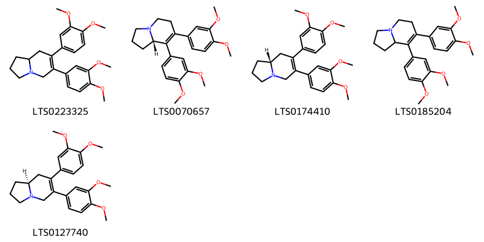{ width=100% }
    <figcaption>Hình ảnh cấu trúc hóa học của 5 hoạt chất thuộc nhóm Stilbenes gồm ['6,7-bis(3,4-dimethoxyphenyl)-1,2,3,5,8,8a-hexahydroindolizine (LTS0223325)', '(8as)-7,8-bis(3,4-dimethoxyphenyl)-1,2,3,5,6,8a-hexahydroindolizine (LTS0070657)', '(8ar)-6,7-bis(3,4-dimethoxyphenyl)-1,2,3,5,8,8a-hexahydroindolizine (LTS0174410)', '7,8-bis(3,4-dimethoxyphenyl)-1,2,3,5,6,8a-hexahydroindolizine (LTS0185204)', '(8as)-6,7-bis(3,4-dimethoxyphenyl)-1,2,3,5,8,8a-hexahydroindolizine (LTS0127740)'].</figcaption>
</figure>

---

### Dược dân tộc học

Danh sách các quốc gia có sử dụng *Ficus septica* trong điều trị các bệnh. 

| Country   | Disease                           | Bệnh                              |
|:----------|:----------------------------------|:----------------------------------|
| Malaysia  | Antidote                          | Chất giải độc                     |
| Moluccas  | Dermatitigenic, Emetic, Purgative | Dermatitigenic, Emetic, Purgative |

---

# Chi Castilla

??? note "Danh sách các dược liệu thuộc chi"
    
	 - *Castilla elastica*

---
## Castilla elastica
### Thông tin về thực vật

!!! info "Phân loại thực vật của *Castilla elastica* từ GIBF:"
    - **Kingdom:** Plantae
    - **Phylum:** Tracheophyta
    - **Order:** Rosales
    - **Family:** Moraceae
    - **Genus:** Castilla
    - **Species:** *Castilla elastica*

 

| Label (VI)   | Label (EN)   | Scientific Name   | Descriptions (VI)   | Descriptions (EN)   | Also Known As (VI)   | Also Known As (EN)   |
|:-------------|:-------------|:------------------|:--------------------|:--------------------|:---------------------|:---------------------|
| N/A          | N/A          | Castilla elastica | loài thực vật       | species of plant    | ['']                 | ['']                 |

#### Phân bố trên thế giới

**Từ CSDL GIBF** Belize, Ecuador, Puerto Rico, Trinidad and Tobago, Nicaragua, Suriname, Sao Tome and Principe, Guatemala, Chinese Taipei, Colombia, Montserrat, Costa Rica, Tonga, Samoa, Mexico, Dominican Republic, El Salvador, Panama

#### Phân bố tại Việt Nam

**Từ CSDL GIBF**: Không có ghi nhận ở Việt Nam

---
### Thành phần hóa học
        
- Theo cơ sở dữ liệu lotus: Từ loài *Castilla elastica* đã phân lập và xác định được Chưa có hoạt chất nào được phân lập. hoạt chất thuộc về các nhóm Không có hoạt chất nào được phân lập. 

Không có hình ảnh nào được tạo ra

---

### Dược dân tộc học

Danh sách các quốc gia có sử dụng *Castilla elastica* trong điều trị các bệnh. 

| Country   | Disease                            | Bệnh                                   |
|:----------|:-----------------------------------|:---------------------------------------|
| Mexico    | Aphrodisiac, Diuretic, Suppurative | Kích thích tình dục, lợi tiểu, mưng mủ |

---

# Chi Artocarpus

??? note "Danh sách các dược liệu thuộc chi"
    
	 - *Artocarpus altilis*
	 - *Artocarpus communis*
	 - *Artocarpus cumingiana*
	 - *Artocarpus elastica*
	 - *Artocarpus heterophyllus*

---
## Artocarpus altilis
### Thông tin về thực vật

!!! info "Phân loại thực vật của *Artocarpus altilis* từ GIBF:"
    - **Kingdom:** Plantae
    - **Phylum:** Tracheophyta
    - **Order:** Rosales
    - **Family:** Moraceae
    - **Genus:** Artocarpus
    - **Species:** *Artocarpus altilis*

 

| Label (VI)   | Label (EN)   | Scientific Name    | Descriptions (VI)   | Descriptions (EN)   | Also Known As (VI)   | Also Known As (EN)                                                                                |
|:-------------|:-------------|:-------------------|:--------------------|:--------------------|:---------------------|:--------------------------------------------------------------------------------------------------|
| N/A          | N/A          | Artocarpus altilis | loài thực vật       | species of plant    | ['']                 | ['breadnut', 'Artocarpus altilis', 'bread fruit', 'breadfruit tree', 'dugdug', 'breadfruit-tree'] |

#### Phân bố trên thế giới

**Từ CSDL GIBF** American Samoa, Sri Lanka, Palau, Micronesia (Federated States of), Australia, Guadeloupe, Cook Islands, Guatemala, Grenada, Saint Lucia, Nicaragua, Bermuda, Virgin Islands (British), French Guiana, Puerto Rico, Réunion, Bolivia (Plurinational State of), Papua New Guinea, Jamaica, Maldives, Belize, Trinidad and Tobago, Fiji, Barbados, Saint Vincent and the Grenadines, Hong Kong, Thailand, Martinique, Guam, Bahamas, Brazil, Tonga, New Caledonia, Cuba, Dominican Republic, Dominica, Mexico, Singapore, Viet Nam, Ecuador, French Polynesia, Saint Kitts and Nevis, Niue, Madagascar, Seychelles, Cabo Verde, Haiti, Colombia, Montserrat, Costa Rica, Vanuatu, India, Indonesia, Anguilla, Samoa, Cayman Islands, Antigua and Barbuda, Philippines, Malaysia, Northern Mariana Islands

#### Phân bố tại Việt Nam

**Từ CSDL GIBF**: Bến Tre, Đồng Nai

---
### Thành phần hóa học
        
- Theo cơ sở dữ liệu lotus: Từ loài *Artocarpus altilis* đã phân lập và xác định được 180 hoạt chất thuộc về các nhóm Yohimbine alkaloids, Fatty Acyls, Flavonoids, Prenol lipids, Steroids and steroid derivatives, Linear 1,3-diarylpropanoids, Oxepanes, Stilbenes, Benzoxepines, Benzopyrans. 

|    | chemicalTaxonomyClassyfireClass   |   smiles_count |
|---:|:----------------------------------|---------------:|
|  0 | Benzopyrans                       |             40 |
|  1 | Benzoxepines                      |              1 |
|  2 | Fatty Acyls                       |              2 |
|  3 | Flavonoids                        |             75 |
|  4 | Linear 1,3-diarylpropanoids       |             37 |
|  5 | Oxepanes                          |              2 |
|  6 | Prenol lipids                     |              3 |
|  7 | Steroids and steroid derivatives  |              6 |
|  8 | Stilbenes                         |             13 |
|  9 | Yohimbine alkaloids               |              1 |

#### Nhóm Benzopyrans
<figure markdown="span">
    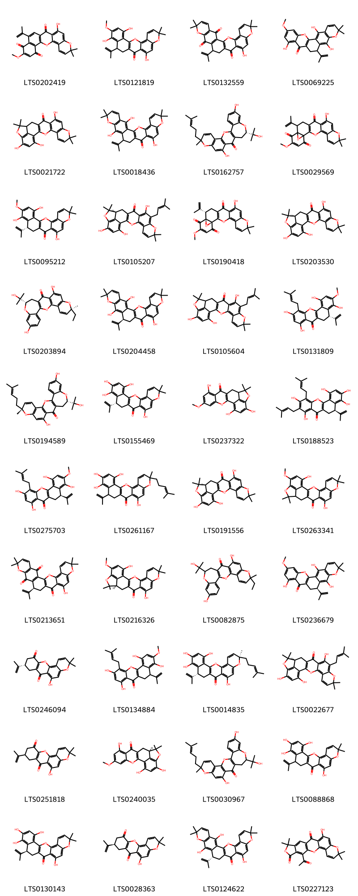{ width=100% }
    <figcaption>Hình ảnh cấu trúc hóa học của 40 hoạt chất thuộc nhóm Benzopyrans gồm ['artomunoxanthentrione (LTS0202419)', 'artomunoxanthone (LTS0121819)', 'artonol d (LTS0132559)', 'artonol e (LTS0069225)', 'cycloartobiloxanthone (LTS0021722)', 'artonol c (LTS0018436)', 'artocommunol cc (LTS0162757)', '12-hydroxy-20-methoxy-8,8-dimethyl-17-(prop-1-en-2-yl)-3,9,23-trioxahexacyclo[16.4.1.0¹,¹⁸.0²,¹⁵.0⁴,¹³.0⁵,¹⁰]tricosa-2(15),4,6,10,12,20-hexaene-14,19,22-trione (LTS0029569)', '(16r)-11,18,21-trihydroxy-19-methoxy-7,7-dimethyl-16-(prop-1-en-2-yl)-2,8-dioxapentacyclo[12.8.0.0³,¹².0⁴,⁹.0¹⁷,²²]docosa-1(14),3,5,9,11,17,19,21-octaen-13-one (LTS0095212)', '(17s)-12,21,23-trihydroxy-8,8,18,18-tetramethyl-11-(3-methylbut-2-en-1-yl)-3,9,19-trioxahexacyclo[15.6.1.0²,¹⁵.0⁴,¹³.0⁵,¹⁰.0²⁰,²⁴]tetracosa-1(23),2(15),4,6,10,12,20(24),21-octaen-14-one (LTS0105207)', '(1r,17s,18s)-12-hydroxy-20-methoxy-8,8-dimethyl-17-(prop-1-en-2-yl)-3,9,23-trioxahexacyclo[16.4.1.0¹,¹⁸.0²,¹⁵.0⁴,¹³.0⁵,¹⁰]tricosa-2(15),4,6,10,12,20-hexaene-14,19,22-trione (LTS0190418)', '(17r)-12,21,23-trihydroxy-8,8,18,18-tetramethyl-3,9,19-trioxahexacyclo[15.6.1.0²,¹⁵.0⁴,¹³.0⁵,¹⁰.0²⁰,²⁴]tetracosa-1(23),2(15),4,6,10,12,20(24),21-octaen-14-one (LTS0203530)', '(7s,16s)-7-ethyl-11,20-dihydroxy-16-(2-hydroxypropan-2-yl)-7-methyl-2,8,17-trioxapentacyclo[12.9.0.0³,¹².0⁴,⁹.0¹⁸,²³]tricosa-1(14),3,5,9,11,18,20,22-octaen-13-one (LTS0203894)', '(12s)-3,10,17-trihydroxy-7,7,21,21-tetramethyl-12-(prop-1-en-2-yl)-8,20,26-trioxahexacyclo[12.12.0.0²,¹¹.0⁴,⁹.0¹⁶,²⁵.0¹⁹,²⁴]hexacosa-1(14),2,4(9),5,10,16,18,22,24-nonaen-15-one (LTS0204458)', 'artonin f (LTS0105604)', '(10s)-1,3,6,9-tetrahydroxy-8-methoxy-4-(3-methylbut-2-en-1-yl)-10-(prop-1-en-2-yl)-10,11-dihydro-5-oxatetraphen-12-one (LTS0131809)', '(7r,16s)-11,20-dihydroxy-16-(2-hydroxypropan-2-yl)-7-methyl-7-(4-methylpent-3-en-1-yl)-2,8,17-trioxapentacyclo[12.9.0.0³,¹².0⁴,⁹.0¹⁸,²³]tricosa-1(14),3,5,9,11,18,20,22-octaen-13-one (LTS0194589)', '(16r)-11,18,19,21-tetrahydroxy-7,7-dimethyl-16-(prop-1-en-2-yl)-2,8-dioxapentacyclo[12.8.0.0³,¹².0⁴,⁹.0¹⁷,²²]docosa-1(14),3,5,9,11,17,19,21-octaen-13-one (LTS0155469)', 'artonin k (LTS0237322)', 'artorigidin a (LTS0188523)', '(10r)-1,3,6,9-tetrahydroxy-8-methoxy-4-(3-methylbut-2-en-1-yl)-10-(prop-1-en-2-yl)-10,11-dihydro-5-oxatetraphen-12-one (LTS0275703)', '11,18,19,21-tetrahydroxy-7-methyl-7-(4-methylpent-3-en-1-yl)-16-(prop-1-en-2-yl)-2,8-dioxapentacyclo[12.8.0.0³,¹².0⁴,⁹.0¹⁷,²²]docosa-1(14),3,5,9,11,17,19,21-octaen-13-one (LTS0261167)', '(17s)-12,21,23-trihydroxy-8,8,18,18-tetramethyl-3,9,19-trioxahexacyclo[15.6.1.0²,¹⁵.0⁴,¹³.0⁵,¹⁰.0²⁰,²⁴]tetracosa-1(23),2(15),4,6,10,12,20(24),21-octaen-14-one (LTS0191556)', 'cycloartomunoxanthone (LTS0263341)', '(12s)-17-hydroxy-7,7,21,21-tetramethyl-12-(prop-1-en-2-yl)-8,20,26-trioxahexacyclo[12.12.0.0²,¹¹.0⁴,⁹.0¹⁶,²⁵.0¹⁹,²⁴]hexacosa-1(14),2(11),4(9),5,16,18,22,24-octaene-3,10,15-trione (LTS0213651)', '(17r)-12,23-dihydroxy-21-methoxy-8,8,18,18-tetramethyl-3,9,19-trioxahexacyclo[15.6.1.0²,¹⁵.0⁴,¹³.0⁵,¹⁰.0²⁰,²⁴]tetracosa-1(23),2(15),4,6,10,12,20(24),21-octaen-14-one (LTS0216326)', '7-ethyl-11,20-dihydroxy-16-(2-hydroxypropan-2-yl)-7-methyl-2,8,17-trioxapentacyclo[12.9.0.0³,¹².0⁴,⁹.0¹⁸,²³]tricosa-1(14),3,5,9,11,18,20,22-octaen-13-one (LTS0082875)', '(13r)-5,10,14-trihydroxy-8-methoxy-2,2-dimethyl-13-(prop-1-en-2-yl)-12,13-dihydro-1,6-dioxapentaphen-11-one (LTS0236679)', '(8s)-11-hydroxy-2,2-dimethyl-8-(prop-1-en-2-yl)-8,9-dihydro-7h-1,5-dioxatetraphene-6,10-dione (LTS0246094)', '1,3,6,9-tetrahydroxy-8-methoxy-4-(3-methylbut-2-en-1-yl)-10-(prop-1-en-2-yl)-10,11-dihydro-5-oxatetraphen-12-one (LTS0134884)', '(7r,16r)-11,18,19,21-tetrahydroxy-7-methyl-7-(4-methylpent-3-en-1-yl)-16-(prop-1-en-2-yl)-2,8-dioxapentacyclo[12.8.0.0³,¹².0⁴,⁹.0¹⁷,²²]docosa-1(14),3,5,9,11,17,19,21-octaen-13-one (LTS0014835)', '(17r)-12,21,23-trihydroxy-8,8,18,18-tetramethyl-11-(3-methylbut-2-en-1-yl)-3,9,19-trioxahexacyclo[15.6.1.0²,¹⁵.0⁴,¹³.0⁵,¹⁰.0²⁰,²⁴]tetracosa-1(23),2(15),4,6,10,12,20(24),21-octaen-14-one (LTS0022677)', '11-hydroxy-2,2-dimethyl-8-(prop-1-en-2-yl)-8,9-dihydro-7h-1,5-dioxatetraphene-6,10-dione (LTS0251818)', '(13r)-8,17,19-trihydroxy-6-methoxy-14,14-dimethyl-3,15-dioxapentacyclo[11.6.1.0²,¹¹.0⁴,⁹.0¹⁶,²⁰]icosa-1(19),2(11),4,6,8,16(20),17-heptaen-10-one (LTS0240035)', '11,20-dihydroxy-16-(2-hydroxypropan-2-yl)-7-methyl-7-(4-methylpent-3-en-1-yl)-2,8,17-trioxapentacyclo[12.9.0.0³,¹².0⁴,⁹.0¹⁸,²³]tricosa-1(14),3,5,9,11,18,20,22-octaen-13-one (LTS0030967)', '11,18,19,21-tetrahydroxy-7,7-dimethyl-16-(prop-1-en-2-yl)-2,8-dioxapentacyclo[12.8.0.0³,¹².0⁴,⁹.0¹⁷,²²]docosa-1(14),3,5,9,11,17,19,21-octaen-13-one (LTS0088868)', 'artobiloxanthone (LTS0130143)', '(8r)-11-hydroxy-2,2-dimethyl-8-(prop-1-en-2-yl)-8,9-dihydro-7h-1,5-dioxatetraphene-6,10-dione (LTS0028363)', '(12r)-3,10,17-trihydroxy-7,7,21,21-tetramethyl-12-(prop-1-en-2-yl)-8,20,26-trioxahexacyclo[12.12.0.0²,¹¹.0⁴,⁹.0¹⁶,²⁵.0¹⁹,²⁴]hexacosa-1(14),2,4(9),5,10,16,18,22,24-nonaen-15-one (LTS0124622)', '10-acetyl-21-hydroxy-6,6,17,17-tetramethyl-7,12,18-trioxapentacyclo[11.8.0.0³,¹¹.0⁵,⁹.0¹⁴,¹⁹]henicosa-1(21),3,5(9),10,13,15,19-heptaene-2,8-dione (LTS0227123)'].</figcaption>
</figure>
#### Nhóm Benzoxepines
<figure markdown="span">
    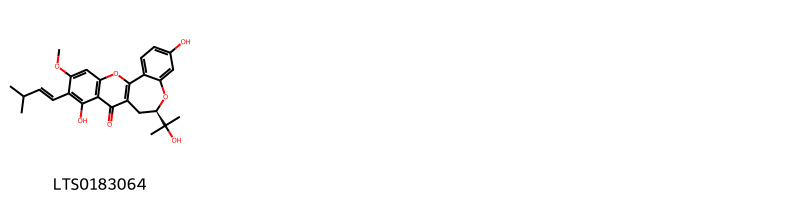{ width=100% }
    <figcaption>Hình ảnh cấu trúc hóa học của 1 hoạt chất thuộc nhóm Benzoxepines gồm ['(9r)-5,14-dihydroxy-9-(2-hydroxypropan-2-yl)-16-methoxy-15-[(1e)-3-methylbut-1-en-1-yl]-8,19-dioxatetracyclo[9.8.0.0²,⁷.0¹³,¹⁸]nonadeca-1(11),2,4,6,13,15,17-heptaen-12-one (LTS0183064)'].</figcaption>
</figure>
#### Nhóm Fatty Acyls
<figure markdown="span">
    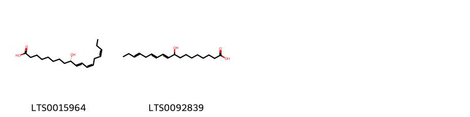{ width=100% }
    <figcaption>Hình ảnh cấu trúc hóa học của 2 hoạt chất thuộc nhóm Fatty Acyls gồm ['9(s)-hotre (LTS0015964)', '(10e)-9-hydroxyoctadeca-10,12,15-trienoic acid (LTS0092839)'].</figcaption>
</figure>
#### Nhóm Flavonoids
<figure markdown="span">
    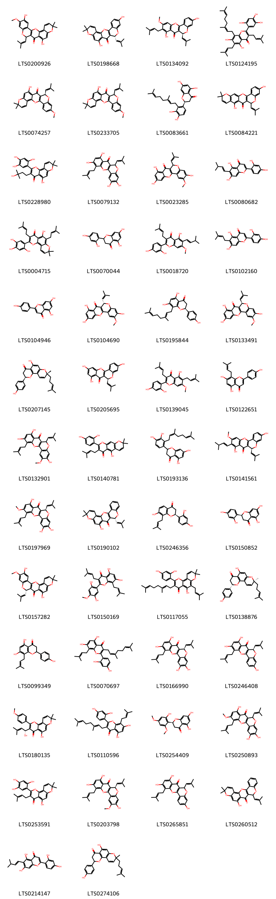{ width=100% }
    <figcaption>Hình ảnh cấu trúc hóa học của 75 hoạt chất thuộc nhóm Flavonoids gồm ['cycloartomunin (LTS0200926)', '(15r)-11,19-dihydroxy-7,7-dimethyl-15-(2-methylprop-1-en-1-yl)-2,8,16-trioxapentacyclo[12.8.0.0³,¹².0⁴,⁹.0¹⁷,²²]docosa-1(14),3,5,9,11,17,19,21-octaen-13-one (LTS0198668)', '(11s)-1,8-dihydroxy-3-methoxy-2-(3-methylbut-2-en-1-yl)-11-(2-methylprop-1-en-1-yl)-11h-5,10-dioxatetraphen-12-one (LTS0134092)', '8-(3,7-dimethylocta-2,6-dien-1-yl)-5,7-dihydroxy-3,6-bis(3-methylbut-2-en-1-yl)-2-(2,4,5-trihydroxyphenyl)chromen-4-one (LTS0124195)', '(15r)-11-hydroxy-19-methoxy-7,7-dimethyl-15-(2-methylprop-1-en-1-yl)-2,8,16-trioxapentacyclo[12.8.0.0³,¹².0⁴,⁹.0¹⁷,²²]docosa-1(14),3,5,9,11,17,19,21-octaen-13-one (LTS0074257)', 'artocommunol ca (LTS0233705)', 'nymphaeol b (LTS0083661)', 'isocyclomorusin (LTS0084221)', '5-hydroxy-3-(3-hydroxy-3-methylbutyl)-8,8-dimethyl-2-(2,4,5-trihydroxyphenyl)pyrano[2,3-h]chromen-4-one (LTS0228980)', '1,3,7,8-tetrahydroxy-4-(3-methylbut-2-en-1-yl)-11-(2-methylprop-1-en-1-yl)-11h-5,10-dioxatetraphen-12-one (LTS0079132)', '1,3,8-trihydroxy-7-methoxy-11-(2-methylprop-1-en-1-yl)-11h-5,10-dioxatetraphen-12-one (LTS0023285)', '2-(2,4-dihydroxyphenyl)-5,7-dihydroxy-6-(3-methylbut-1-en-1-yl)chromen-4-one (LTS0080682)', '5-hydroxy-8,8-dimethyl-3,6-bis(3-methylbut-2-en-1-yl)-2-(2,4,5-trihydroxyphenyl)pyrano[2,3-f]chromen-4-one (LTS0004715)', 'steppogenin (LTS0070044)', 'artocarpin (LTS0018720)', 'artocarpesin (LTS0102160)', 'chamomile (LTS0104946)', '(11s)-1,3,8-trihydroxy-7-methoxy-11-(2-methylprop-1-en-1-yl)-11h-5,10-dioxatetraphen-12-one (LTS0104690)', 'sophoraflavanone a (LTS0195844)', '(11r)-1,3,8-trihydroxy-7-methoxy-11-(2-methylprop-1-en-1-yl)-11h-5,10-dioxatetraphen-12-one (LTS0133491)', '(2r,8r)-5-hydroxy-2-(4-hydroxyphenyl)-8-methyl-8-(4-methylpent-3-en-1-yl)-2h,3h-pyrano[2,3-f]chromen-4-one (LTS0207145)', '(11s)-1,3,8-trihydroxy-11-(2-methylprop-1-en-1-yl)-11h-5,10-dioxatetraphen-12-one (LTS0205695)', 'artocarpin (LTS0139045)', 'licoflavone c (LTS0122651)', 'dihydroisocycloartomunin (LTS0132901)', 'cudraflavone b (LTS0140781)', '2-[2-(3,7-dimethylocta-2,6-dien-1-yl)-3,4-dihydroxyphenyl]-5,7-dihydroxy-2,3-dihydro-1-benzopyran-4-one (LTS0193136)', '(11s)-1,8-dihydroxy-3-methoxy-2-[(1e)-3-methylbut-1-en-1-yl]-11-(2-methylprop-1-en-1-yl)-11h-5,10-dioxatetraphen-12-one (LTS0141561)', '(11r)-1,7,8-trihydroxy-3-methoxy-4-(3-methylbut-2-en-1-yl)-11-(2-methylprop-1-en-1-yl)-11h-5,10-dioxatetraphen-12-one (LTS0197969)', '(15r)-11-hydroxy-7,7-dimethyl-15-(2-methylprop-1-en-1-yl)-2,8,16-trioxapentacyclo[12.8.0.0³,¹².0⁴,⁹.0¹⁷,²²]docosa-1(14),3,5,9,11,17,19,21-octaen-13-one (LTS0190102)', '(2s)-2-(2,4-dihydroxyphenyl)-7-hydroxy-8-(3-methylbut-2-en-1-yl)-2,3-dihydro-1-benzopyran-4-one (LTS0246356)', '(2s)-2-(2,4-dihydroxyphenyl)-5,7-dihydroxy-2,3-dihydro-1-benzopyran-4-one (LTS0150852)', '(15s)-11,20-dihydroxy-19-methoxy-7,7-dimethyl-15-(2-methylprop-1-en-1-yl)-2,8,16-trioxapentacyclo[12.8.0.0³,¹².0⁴,⁹.0¹⁷,²²]docosa-1(14),3,5,9,11,17(22),18,20-octaen-13-one (LTS0157282)', '2-(2,5-dihydroxy-4-methoxyphenyl)-5,7-dihydroxy-3,8-bis(3-methylbut-2-en-1-yl)chromen-4-one (LTS0150169)', '2-(2,4-dihydroxyphenyl)-3-[(2e)-3,7-dimethylocta-2,6-dien-1-yl]-5-hydroxy-8,8-dimethyl-6-(3-methylbut-2-en-1-yl)pyrano[2,3-h]chromen-4-one (LTS0117055)', '(2s,8s)-5-hydroxy-2-(4-hydroxyphenyl)-8-methyl-8-(4-methylpent-3-en-1-yl)-2h,3h-pyrano[2,3-f]chromen-4-one (LTS0138876)', 'sophoraflavanone b (LTS0099349)', '2-(2,4-dihydroxyphenyl)-3-(3,7-dimethylocta-2,6-dien-1-yl)-5,7-dihydroxy-8-(3-methylbut-2-en-1-yl)chromen-4-one (LTS0070697)', '(11r)-1,3,7,8-tetrahydroxy-4-(3-methylbut-2-en-1-yl)-11-(2-methylprop-1-en-1-yl)-11h-5,10-dioxatetraphen-12-one (LTS0166990)', '(11r)-1,3,8-trihydroxy-4-(3-methylbut-2-en-1-yl)-11-(2-methylprop-1-en-1-yl)-11h-5,10-dioxatetraphen-12-one (LTS0246408)', '5-hydroxy-3-[(1r)-1-hydroxy-3-methylbut-2-en-1-yl]-2-(4-methoxyphenyl)-8,8-dimethylpyrano[2,3-h]chromen-4-one (LTS0180135)', 'artocommunol cd (LTS0110596)', '(2s)-5,7-dihydroxy-2-(2-hydroxy-4,6-dimethoxyphenyl)-2,3-dihydro-1-benzopyran-4-one (LTS0254409)', 'dihydrocycloartomunin (LTS0250893)', 'artonin e (LTS0253591)', '(11r)-1,3,8-trihydroxy-7-methoxy-4-(3-methylbut-2-en-1-yl)-11-(2-methylprop-1-en-1-yl)-11h-5,10-dioxatetraphen-12-one (LTS0203798)', 'cyclomulberrin (LTS0265851)', '11-hydroxy-7,7-dimethyl-15-(2-methylprop-1-en-1-yl)-2,8,16-trioxapentacyclo[12.8.0.0³,¹².0⁴,⁹.0¹⁷,²²]docosa-1(14),3,5,9,11,17,19,21-octaen-13-one (LTS0260512)', '2-(2,4-dihydroxyphenyl)-5,7-dihydroxy-6-[(1e)-3-methylbut-1-en-1-yl]chromen-4-one (LTS0214147)', 'cycloaltilisin 7 (LTS0274106)', '(11s)-1,3,8-trihydroxy-2-(3-methylbut-2-en-1-yl)-11-(2-methylprop-1-en-1-yl)-11h-5,10-dioxatetraphen-12-one (LTS0207989)', 'cudraflavone c (LTS0086862)', '(11r)-1,8-dihydroxy-3-methoxy-2-[(1e)-3-methylbut-1-en-1-yl]-11-(2-methylprop-1-en-1-yl)-11h-5,10-dioxatetraphen-12-one (LTS0216299)', '(15s)-11-hydroxy-19-methoxy-7,7-dimethyl-15-(2-methylprop-1-en-1-yl)-2,8,16-trioxapentacyclo[12.8.0.0³,¹².0⁴,⁹.0¹⁷,²²]docosa-1(14),3,5,9,11,17,19,21-octaen-13-one (LTS0182510)', '8-(3,7-dimethylocta-2,6-dien-1-yl)-5,7-dihydroxy-2-(4-hydroxyphenyl)-2,3-dihydro-1-benzopyran-4-one (LTS0155194)', '2-(2,4-dihydroxyphenyl)-3-(3,7-dimethylocta-2,6-dien-1-yl)-5-hydroxy-8,8-dimethyl-6-(3-methylbut-2-en-1-yl)pyrano[2,3-h]chromen-4-one (LTS0229219)', '1,8-dihydroxy-3-methoxy-2-[(1e)-3-methylbut-1-en-1-yl]-11-(2-methylprop-1-en-1-yl)-11h-5,10-dioxatetraphen-12-one (LTS0207181)', '2-(2,4-dihydroxyphenyl)-5-hydroxy-3-(1-hydroxy-3-methylbut-2-en-1-yl)-8,8-dimethylpyrano[2,3-h]chromen-4-one (LTS0047198)', '(11s)-7,15-dihydroxy-19,19-dimethyl-11-(2-methylprop-1-en-1-yl)-2,10,20-trioxapentacyclo[12.8.0.0³,¹².0⁴,⁹.0¹⁶,²¹]docosa-1(22),3(12),4,6,8,14,16(21),17-octaen-13-one (LTS0043783)', '5,7-dihydroxy-2-(2-hydroxy-4,6-dimethoxyphenyl)-2,3-dihydro-1-benzopyran-4-one (LTS0013295)', '1,8-dihydroxy-3-methoxy-2-(3-methylbut-1-en-1-yl)-11-(2-methylprop-1-en-1-yl)-11h-5,10-dioxatetraphen-12-one (LTS0271195)', '5,7-dihydroxy-3,6,8-tris(3-methylbut-2-en-1-yl)-2-(2,4,5-trihydroxyphenyl)chromen-4-one (LTS0129352)', 'morusin (LTS0062558)', 'dihydromorin (LTS0068109)', 'cyclomorusin (LTS0010612)', '(15s)-11,19-dihydroxy-7,7-dimethyl-15-(2-methylprop-1-en-1-yl)-2,8,16-trioxapentacyclo[12.8.0.0³,¹².0⁴,⁹.0¹⁷,²²]docosa-1(14),3,5,9,11,17,19,21-octaen-13-one (LTS0015686)', '2-(2,4-dihydroxyphenyl)-5-hydroxy-7-methoxy-6-(3-methylbut-1-en-1-yl)-3-(3-methylbut-2-en-1-yl)chromen-4-one (LTS0028626)', '2-(2,4-dihydroxyphenyl)-5-hydroxy-3-[(1s)-1-hydroxy-3-methylbut-2-en-1-yl]-8,8-dimethylpyrano[2,3-h]chromen-4-one (LTS0068140)', '5-hydroxy-3-(1-hydroxy-3-methylbut-2-en-1-yl)-2-(4-methoxyphenyl)-8,8-dimethylpyrano[2,3-h]chromen-4-one (LTS0005749)', 'isocyclomulberrin (LTS0124578)', 'cycloaltilisin (LTS0241428)', '8-[(2e)-3,7-dimethylocta-2,6-dien-1-yl]-5,7-dihydroxy-3,6-bis(3-methylbut-2-en-1-yl)-2-(2,4,5-trihydroxyphenyl)chromen-4-one (LTS0029065)', 'heterophyllin (LTS0133075)', '2-(2,4-dihydroxyphenyl)-3,5,7-trihydroxy-2,3-dihydro-1-benzopyran-4-one (LTS0092162)', 'cyclocommunol (LTS0238548)'].</figcaption>
</figure>
#### Nhóm Linear 1_3-diarylpropanoids
<figure markdown="span">
    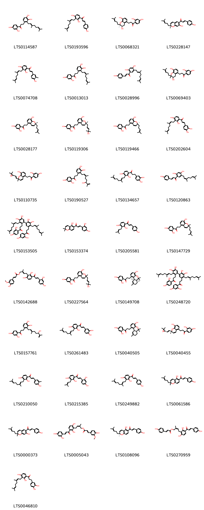{ width=100% }
    <figcaption>Hình ảnh cấu trúc hóa học của Không tìm thấy chú thích hoạt chất thuộc nhóm Linear 1_3-diarylpropanoids gồm Không tìm thấy chú thích.</figcaption>
</figure>
#### Nhóm Oxepanes
<figure markdown="span">
    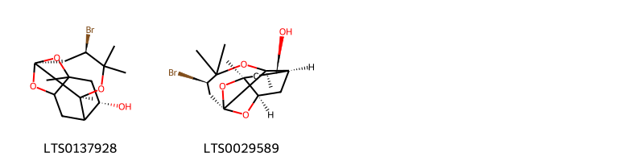{ width=100% }
    <figcaption>Hình ảnh cấu trúc hóa học của 2 hoạt chất thuộc nhóm Oxepanes gồm ['(2s,5r,7s,12s)-5-bromo-2,4,4,10-tetramethyl-3,8,14-trioxatetracyclo[7.3.1.1⁷,¹⁰.0²,⁷]tetradecan-12-ol (LTS0137928)', '(1s,2s,5r,7s,9r,10s,12s)-5-bromo-2,4,4,10-tetramethyl-3,8,14-trioxatetracyclo[7.3.1.1⁷,¹⁰.0²,⁷]tetradecan-12-ol (LTS0029589)'].</figcaption>
</figure>
#### Nhóm Prenol lipids
<figure markdown="span">
    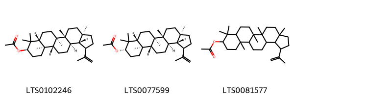{ width=100% }
    <figcaption>Hình ảnh cấu trúc hóa học của 3 hoạt chất thuộc nhóm Prenol lipids gồm ['(1r,3ar,5ar,5br,7ar,9r,11ar,11br,13ar,13br)-3a,5a,5b,8,8,11a-hexamethyl-1-(prop-1-en-2-yl)-hexadecahydrocyclopenta[a]chrysen-9-yl acetate (LTS0102246)', 'lupeol acetate (LTS0077599)', '3a,5a,5b,8,8,11a-hexamethyl-1-(prop-1-en-2-yl)-hexadecahydrocyclopenta[a]chrysen-9-yl acetate (LTS0081577)'].</figcaption>
</figure>
#### Nhóm Steroids and steroid derivatives
<figure markdown="span">
    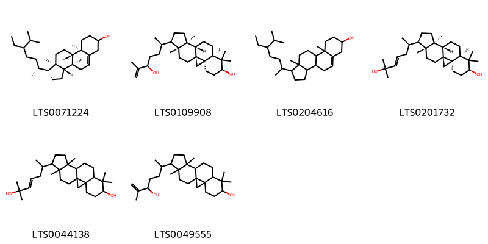{ width=100% }
    <figcaption>Hình ảnh cấu trúc hóa học của 6 hoạt chất thuộc nhóm Steroids and steroid derivatives gồm ['stigmast-5-en-3-ol (LTS0071224)', '(1s,3r,6s,8r,11s,12s,15r,16r)-15-[(2r,5r)-5-hydroxy-6-methylhept-6-en-2-yl]-7,7,12,16-tetramethylpentacyclo[9.7.0.0¹,³.0³,⁸.0¹²,¹⁶]octadecan-6-ol (LTS0109908)', 'stigmast-5-en-3-ol, (3β)- (LTS0204616)', 'cycloart-23-ene-3β,25-diol (LTS0201732)', '15-(6-hydroxy-6-methylhept-4-en-2-yl)-7,7,12,16-tetramethylpentacyclo[9.7.0.0¹,³.0³,⁸.0¹²,¹⁶]octadecan-6-ol (LTS0044138)', '15-(5-hydroxy-6-methylhept-6-en-2-yl)-7,7,12,16-tetramethylpentacyclo[9.7.0.0¹,³.0³,⁸.0¹²,¹⁶]octadecan-6-ol (LTS0049555)'].</figcaption>
</figure>
#### Nhóm Stilbenes
<figure markdown="span">
    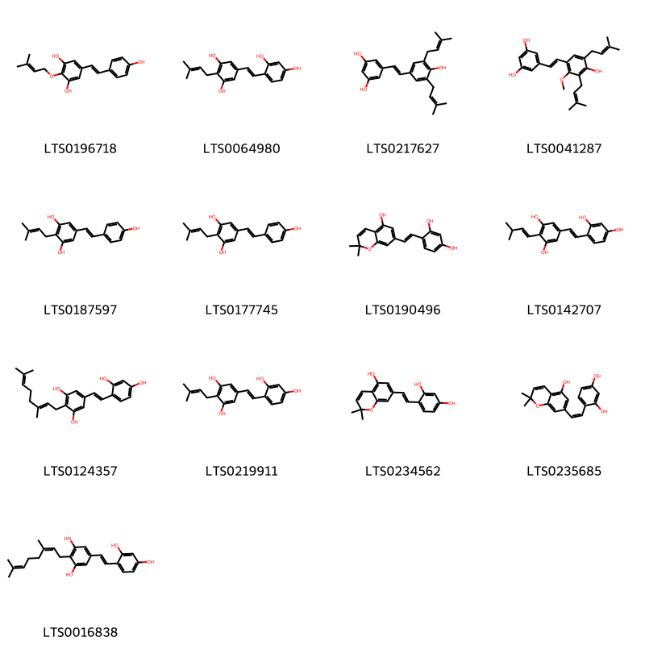{ width=100% }
    <figcaption>Hình ảnh cấu trúc hóa học của 13 hoạt chất thuộc nhóm Stilbenes gồm ['5-[2-(4-hydroxyphenyl)ethenyl]-2-[(3-methylbut-2-en-1-yl)oxy]benzene-1,3-diol (LTS0196718)', '5-[2-(2,4-dihydroxyphenyl)ethenyl]-2-(3-methylbut-2-en-1-yl)benzene-1,3-diol (LTS0064980)', '5-[(1e)-2-[4-hydroxy-3,5-bis(3-methylbut-2-en-1-yl)phenyl]ethenyl]benzene-1,3-diol (LTS0217627)', '5-[(1e)-2-[4-hydroxy-2-methoxy-3,5-bis(3-methylbut-2-en-1-yl)phenyl]ethenyl]benzene-1,3-diol (LTS0041287)', 'trans-arachidin-2 (LTS0187597)', '5-[2-(4-hydroxyphenyl)ethenyl]-2-(3-methylbut-2-en-1-yl)benzene-1,3-diol (LTS0177745)', '4-[(1e)-2-(5-hydroxy-2,2-dimethylchromen-7-yl)ethenyl]benzene-1,3-diol (LTS0190496)', '5-[(1e)-2-(2,4-dihydroxyphenyl)ethenyl]-2-[(1e)-3-methylbut-1-en-1-yl]benzene-1,3-diol (LTS0142707)', 'chlorophorin (LTS0124357)', "4'-prenyloxyresveratrol (LTS0219911)", '4-[2-(5-hydroxy-2,2-dimethylchromen-7-yl)ethenyl]benzene-1,3-diol (LTS0234562)', '4-[(1z)-2-(5-hydroxy-2,2-dimethylchromen-7-yl)ethenyl]benzene-1,3-diol (LTS0235685)', '5-[2-(2,4-dihydroxyphenyl)ethenyl]-2-(3,7-dimethylocta-2,6-dien-1-yl)benzene-1,3-diol (LTS0016838)'].</figcaption>
</figure>
#### Nhóm Yohimbine alkaloids
<figure markdown="span">
    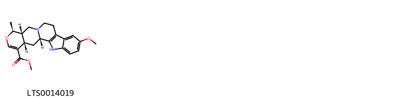{ width=100% }
    <figcaption>Hình ảnh cấu trúc hóa học của 1 hoạt chất thuộc nhóm Yohimbine alkaloids gồm ['aricin (LTS0014019)'].</figcaption>
</figure>

---

### Dược dân tộc học

Danh sách các quốc gia có sử dụng *Artocarpus altilis* trong điều trị các bệnh. 

| Country            | Disease   | Bệnh         |
|:-------------------|:----------|:-------------|
| Dominican Republic | Laxative  | Nhuận trường |

---

---
## Artocarpus communis
### Thông tin về thực vật

!!! info "Phân loại thực vật của *Artocarpus altilis* từ GIBF:"
    - **Kingdom:** Plantae
    - **Phylum:** Tracheophyta
    - **Order:** Rosales
    - **Family:** Moraceae
    - **Genus:** Artocarpus
    - **Species:** *Artocarpus altilis*

 

| Label (VI)   | Label (EN)   | Scientific Name     | Descriptions (VI)   | Descriptions (EN)   | Also Known As (VI)   | Also Known As (EN)   |
|:-------------|:-------------|:--------------------|:--------------------|:--------------------|:---------------------|:---------------------|
| N/A          | N/A          | Artocarpus communis | loài thực vật       | species of plant    | ['']                 | ['']                 |

#### Phân bố trên thế giới

**Từ CSDL GIBF** nan, American Samoa, Christmas Island, Japan, Gabon, Mauritius, Guatemala, Benin, Venezuela (Bolivarian Republic of), Panama, Puerto Rico, Nigeria, Chinese Taipei, Papua New Guinea, Jamaica, United States of America, Congo, Democratic Republic of the, Solomon Islands, El Salvador, Belize, Trinidad and Tobago, Fiji, Suriname, Thailand, Brazil, Côte d’Ivoire, Guyana, New Caledonia, Cuba, Mexico, France, Dominica, Singapore, Viet Nam, China, French Polynesia, Saint Kitts and Nevis, Seychelles, Equatorial Guinea, Colombia, Costa Rica, Vanuatu, India, Indonesia, Samoa, Philippines, Cameroon, Malaysia

#### Phân bố tại Việt Nam

**Từ CSDL GIBF**: 安南, 西贡

---
### Thành phần hóa học
        
- Theo cơ sở dữ liệu lotus: Từ loài *Artocarpus altilis* đã phân lập và xác định được Chưa có hoạt chất nào được phân lập. hoạt chất thuộc về các nhóm Không có hoạt chất nào được phân lập. 

Không có hình ảnh nào được tạo ra

---

### Dược dân tộc học

Danh sách các quốc gia có sử dụng *Artocarpus altilis* trong điều trị các bệnh. 

| Country   | Disease             | Bệnh                |
|:----------|:--------------------|:--------------------|
| Samoa     | Vermifuge, Poultice | Vermifuge, Poultice |

---

---
## Artocarpus cumingiana
### Thông tin về thực vật

!!! info "Phân loại thực vật của *Artocarpus lacucha* từ GIBF:"
    - **Kingdom:** Plantae
    - **Phylum:** Tracheophyta
    - **Order:** Rosales
    - **Family:** Moraceae
    - **Genus:** Artocarpus
    - **Species:** *Artocarpus lacucha*

 

| Label (VI)   | Label (EN)   | Scientific Name     | Descriptions (VI)   | Descriptions (EN)   | Also Known As (VI)   | Also Known As (EN)   |
|:-------------|:-------------|:--------------------|:--------------------|:--------------------|:---------------------|:---------------------|
| N/A          | N/A          | Artocarpus communis | loài thực vật       | species of plant    | ['']                 | ['']                 |

#### Phân bố trên thế giới

**Từ CSDL GIBF** Papua New Guinea, Philippines, Denmark, nan

#### Phân bố tại Việt Nam

**Từ CSDL GIBF**: Không có ghi nhận ở Việt Nam

---
### Thành phần hóa học
        
- Theo cơ sở dữ liệu lotus: Từ loài *Artocarpus lacucha* đã phân lập và xác định được Chưa có hoạt chất nào được phân lập. hoạt chất thuộc về các nhóm Không có hoạt chất nào được phân lập. 

Không có hình ảnh nào được tạo ra

---

### Dược dân tộc học

Danh sách các quốc gia có sử dụng *Artocarpus lacucha* trong điều trị các bệnh. 

| Country   | Disease   | Bệnh   |
|:----------|:----------|:-------|
| Elsewhere | Styptic   | L.     |

---

---
## Artocarpus elastica
### Thông tin về thực vật

!!! info "Phân loại thực vật của *Artocarpus elasticus* từ GIBF:"
    - **Kingdom:** Plantae
    - **Phylum:** Tracheophyta
    - **Order:** Rosales
    - **Family:** Moraceae
    - **Genus:** Artocarpus
    - **Species:** *Artocarpus elasticus*

 

| Label (VI)   | Label (EN)   | Scientific Name     | Descriptions (VI)   | Descriptions (EN)   | Also Known As (VI)   | Also Known As (EN)   |
|:-------------|:-------------|:--------------------|:--------------------|:--------------------|:---------------------|:---------------------|
| N/A          | N/A          | Artocarpus communis | loài thực vật       | species of plant    | ['']                 | ['']                 |

#### Phân bố trên thế giới

**Từ CSDL GIBF** nan, Malaysia, Thailand, unknown or invalid, Indonesia, Philippines, Singapore, Viet Nam, Brunei Darussalam

#### Phân bố tại Việt Nam

**Từ CSDL GIBF**: Đồng Nai

---
### Thành phần hóa học
        
- Theo cơ sở dữ liệu lotus: Từ loài *Artocarpus elasticus* đã phân lập và xác định được Chưa có hoạt chất nào được phân lập. hoạt chất thuộc về các nhóm Không có hoạt chất nào được phân lập. 

Không có hình ảnh nào được tạo ra

---

### Dược dân tộc học

Danh sách các quốc gia có sử dụng *Artocarpus elasticus* trong điều trị các bệnh. 

| Country   | Disease       | Bệnh               |
|:----------|:--------------|:-------------------|
| Java      | Contraceptive | Kiểm soát sinh sản |
| Malaya    | Aperient      | Aperient           |

---

---
## Artocarpus heterophyllus
### Thông tin về thực vật

!!! info "Phân loại thực vật của *Artocarpus heterophyllus* từ GIBF:"
    - **Kingdom:** Plantae
    - **Phylum:** Tracheophyta
    - **Order:** Rosales
    - **Family:** Moraceae
    - **Genus:** Artocarpus
    - **Species:** *Artocarpus heterophyllus*

 

| Label (VI)   | Label (EN)   | Scientific Name          | Descriptions (VI)   | Descriptions (EN)                               | Also Known As (VI)           | Also Known As (EN)                                                                    |
|:-------------|:-------------|:-------------------------|:--------------------|:------------------------------------------------|:-----------------------------|:--------------------------------------------------------------------------------------|
| N/A          | N/A          | Artocarpus heterophyllus | loài thực vật       | tree in the fig, mulberry and breadfruit family | ['Artocarpus heterophyllus'] | ['jackfruit tree', 'nangka Tree', 'jackfruit', 'jack tree', 'Artocarpus macrocrapon'] |

#### Phân bố trên thế giới

**Từ CSDL GIBF** Sri Lanka, Uganda, Réunion, Hong Kong, Thailand, Lao People’s Democratic Republic, Cambodia, Brazil, Costa Rica, India, Indonesia, Bangladesh, Viet Nam, Ethiopia

#### Phân bố tại Việt Nam

**Từ CSDL GIBF**: Hồ Chí Minh city, Hà Giang, Kiên Giang, Tiền Giang

---
### Thành phần hóa học
        
- Theo cơ sở dữ liệu lotus: Từ loài *Artocarpus heterophyllus* đã phân lập và xác định được 128 hoạt chất thuộc về các nhóm Yohimbine alkaloids, Fatty Acyls, Flavonoids, Prenol lipids, Steroids and steroid derivatives, Cinnamic acids and derivatives, Diarylheptanoids, Benzene and substituted derivatives, 2-arylbenzofuran flavonoids, Stilbenes, Phenols, Naphthopyrans, Benzoxepines, Benzopyrans. 

|    | chemicalTaxonomyClassyfireClass     |   smiles_count |
|---:|:------------------------------------|---------------:|
|  0 | 2-arylbenzofuran flavonoids         |              4 |
|  1 | Benzene and substituted derivatives |              2 |
|  2 | Benzopyrans                         |             19 |
|  3 | Benzoxepines                        |              3 |
|  4 | Cinnamic acids and derivatives      |              2 |
|  5 | Diarylheptanoids                    |              4 |
|  6 | Fatty Acyls                         |              8 |
|  7 | Flavonoids                          |             51 |
|  8 | Naphthopyrans                       |              3 |
|  9 | Phenols                             |              1 |
| 10 | Prenol lipids                       |              8 |
| 11 | Steroids and steroid derivatives    |             14 |
| 12 | Stilbenes                           |              8 |
| 13 | Yohimbine alkaloids                 |              1 |

#### Nhóm 2-arylbenzofuran flavonoids
<figure markdown="span">
    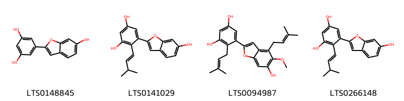{ width=100% }
    <figcaption>Hình ảnh cấu trúc hóa học của 4 hoạt chất thuộc nhóm 2-arylbenzofuran flavonoids gồm ['moracin m (LTS0148845)', '5-(6-hydroxy-1-benzofuran-2-yl)-4-(3-methylbut-1-en-1-yl)benzene-1,3-diol (LTS0141029)', '5-[6-hydroxy-5-methoxy-4-(3-methylbut-2-en-1-yl)-1-benzofuran-2-yl]-4-(3-methylbut-2-en-1-yl)benzene-1,3-diol (LTS0094987)', '5-(6-hydroxy-1-benzofuran-2-yl)-4-[(1e)-3-methylbut-1-en-1-yl]benzene-1,3-diol (LTS0266148)'].</figcaption>
</figure>
#### Nhóm Benzene and substituted derivatives
<figure markdown="span">
    { width=100% }
    <figcaption>Hình ảnh cấu trúc hóa học của 2 hoạt chất thuộc nhóm Benzene and substituted derivatives gồm ['p-hydroxybenzoic acid (LTS0263634)', 'vanillic acid (LTS0229113)'].</figcaption>
</figure>
#### Nhóm Benzopyrans
<figure markdown="span">
    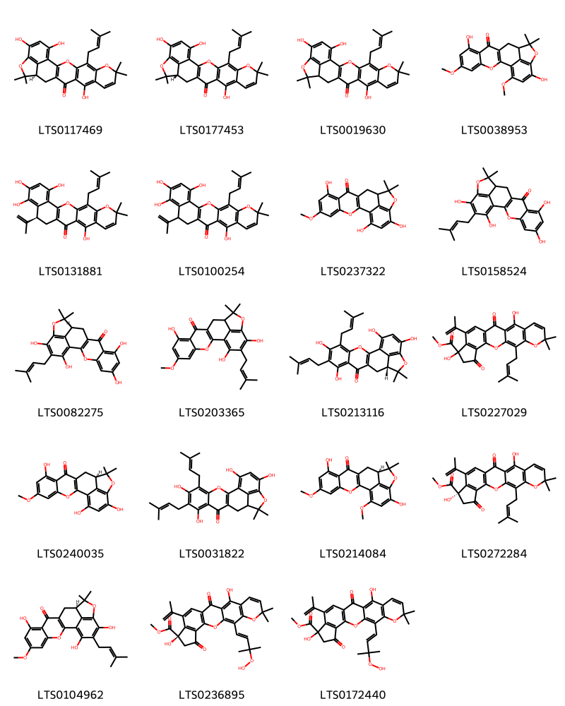{ width=100% }
    <figcaption>Hình ảnh cấu trúc hóa học của 19 hoạt chất thuộc nhóm Benzopyrans gồm ['(17r)-12,21,23-trihydroxy-8,8,18,18-tetramethyl-5-(3-methylbut-2-en-1-yl)-3,7,19-trioxahexacyclo[15.6.1.0²,¹⁵.0⁴,¹³.0⁶,¹¹.0²⁰,²⁴]tetracosa-1(23),2(15),4,6(11),9,12,20(24),21-octaen-14-one (LTS0117469)', '(17s)-12,21,23-trihydroxy-8,8,18,18-tetramethyl-5-(3-methylbut-2-en-1-yl)-3,7,19-trioxahexacyclo[15.6.1.0²,¹⁵.0⁴,¹³.0⁶,¹¹.0²⁰,²⁴]tetracosa-1(23),2(15),4,6(11),9,12,20(24),21-octaen-14-one (LTS0177453)', '12,21,23-trihydroxy-8,8,18,18-tetramethyl-5-(3-methylbut-2-en-1-yl)-3,7,19-trioxahexacyclo[15.6.1.0²,¹⁵.0⁴,¹³.0⁶,¹¹.0²⁰,²⁴]tetracosa-1(23),2(15),4,6(11),9,12,20(24),21-octaen-14-one (LTS0019630)', 'artonin l (LTS0038953)', '(10s)-5,7,8,15-tetrahydroxy-19,19-dimethyl-22-(3-methylbut-2-en-1-yl)-10-(prop-1-en-2-yl)-2,20-dioxapentacyclo[12.8.0.0³,¹².0⁴,⁹.0¹⁶,²¹]docosa-1(22),3(12),4,6,8,14,16(21),17-octaen-13-one (LTS0131881)', '5,7,8,15-tetrahydroxy-19,19-dimethyl-22-(3-methylbut-2-en-1-yl)-10-(prop-1-en-2-yl)-2,20-dioxapentacyclo[12.8.0.0³,¹².0⁴,⁹.0¹⁶,²¹]docosa-1(22),3(12),4,6,8,14,16(21),17-octaen-13-one (LTS0100254)', 'artonin k (LTS0237322)', 'artonin j (LTS0158524)', '(13s)-6,8,17,19-tetrahydroxy-14,14-dimethyl-18-(3-methylbut-2-en-1-yl)-3,15-dioxapentacyclo[11.6.1.0²,¹¹.0⁴,⁹.0¹⁶,²⁰]icosa-1(19),2(11),4,6,8,16(20),17-heptaen-10-one (LTS0082275)', 'artonin t (LTS0203365)', '(13r)-6,8,17,19-tetrahydroxy-14,14-dimethyl-5,7-bis(3-methylbut-2-en-1-yl)-3,15-dioxapentacyclo[11.6.1.0²,¹¹.0⁴,⁹.0¹⁶,²⁰]icosa-1(19),2(11),4,6,8,16(20),17-heptaen-10-one (LTS0213116)', 'methyl 7,14-dihydroxy-18,18-dimethyl-21-(3-methylbut-2-en-1-yl)-5,12-dioxo-9-(prop-1-en-2-yl)-2,19-dioxapentacyclo[11.8.0.0³,¹¹.0⁴,⁸.0¹⁵,²⁰]henicosa-1(21),3,8,10,13,15(20),16-heptaene-7-carboxylate (LTS0227029)', '(13r)-8,17,19-trihydroxy-6-methoxy-14,14-dimethyl-3,15-dioxapentacyclo[11.6.1.0²,¹¹.0⁴,⁹.0¹⁶,²⁰]icosa-1(19),2(11),4,6,8,16(20),17-heptaen-10-one (LTS0240035)', '6,8,17,19-tetrahydroxy-14,14-dimethyl-5,7-bis(3-methylbut-2-en-1-yl)-3,15-dioxapentacyclo[11.6.1.0²,¹¹.0⁴,⁹.0¹⁶,²⁰]icosa-1(19),2(11),4,6,8,16(20),17-heptaen-10-one (LTS0031822)', '(13r)-8,17-dihydroxy-6,19-dimethoxy-14,14-dimethyl-3,15-dioxapentacyclo[11.6.1.0²,¹¹.0⁴,⁹.0¹⁶,²⁰]icosa-1(19),2(11),4,6,8,16(20),17-heptaen-10-one (LTS0214084)', 'methyl (7s)-7,14-dihydroxy-18,18-dimethyl-21-(3-methylbut-2-en-1-yl)-5,12-dioxo-9-(prop-1-en-2-yl)-2,19-dioxapentacyclo[11.8.0.0³,¹¹.0⁴,⁸.0¹⁵,²⁰]henicosa-1(21),3,8,10,13,15(20),16-heptaene-7-carboxylate (LTS0272284)', '(13r)-8,17,19-trihydroxy-6-methoxy-14,14-dimethyl-18-(3-methylbut-2-en-1-yl)-3,15-dioxapentacyclo[11.6.1.0²,¹¹.0⁴,⁹.0¹⁶,²⁰]icosa-1(19),2(11),4,6,8,16(20),17-heptaen-10-one (LTS0104962)', 'methyl (7r)-21-[(1e)-3-hydroperoxy-3-methylbut-1-en-1-yl]-7,14-dihydroxy-18,18-dimethyl-5,12-dioxo-9-(prop-1-en-2-yl)-2,19-dioxapentacyclo[11.8.0.0³,¹¹.0⁴,⁸.0¹⁵,²⁰]henicosa-1(21),3,8,10,13,15(20),16-heptaene-7-carboxylate (LTS0236895)', 'methyl 21-(3-hydroperoxy-3-methylbut-1-en-1-yl)-7,14-dihydroxy-18,18-dimethyl-5,12-dioxo-9-(prop-1-en-2-yl)-2,19-dioxapentacyclo[11.8.0.0³,¹¹.0⁴,⁸.0¹⁵,²⁰]henicosa-1(21),3,8,10,13,15(20),16-heptaene-7-carboxylate (LTS0172440)'].</figcaption>
</figure>
#### Nhóm Benzoxepines
<figure markdown="span">
    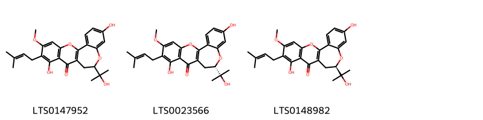{ width=100% }
    <figcaption>Hình ảnh cấu trúc hóa học của 3 hoạt chất thuộc nhóm Benzoxepines gồm ['artonin s (LTS0147952)', '(9s)-5,14-dihydroxy-9-(2-hydroxypropan-2-yl)-16-methoxy-15-(3-methylbut-2-en-1-yl)-8,19-dioxatetracyclo[9.8.0.0²,⁷.0¹³,¹⁸]nonadeca-1(11),2,4,6,13,15,17-heptaen-12-one (LTS0023566)', '(9r)-5,14-dihydroxy-9-(2-hydroxypropan-2-yl)-16-methoxy-15-(3-methylbut-2-en-1-yl)-8,19-dioxatetracyclo[9.8.0.0²,⁷.0¹³,¹⁸]nonadeca-1(11),2,4,6,13,15,17-heptaen-12-one (LTS0148982)'].</figcaption>
</figure>
#### Nhóm Cinnamic acids and derivatives
<figure markdown="span">
    { width=100% }
    <figcaption>Hình ảnh cấu trúc hóa học của 2 hoạt chất thuộc nhóm Cinnamic acids and derivatives gồm ['para-coumaric acid (LTS0266252)', 'hydroxycinnamic acid (LTS0233023)'].</figcaption>
</figure>
#### Nhóm Diarylheptanoids
<figure markdown="span">
    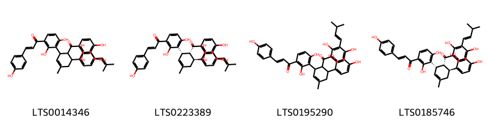{ width=100% }
    <figcaption>Hình ảnh cấu trúc hóa học của 4 hoạt chất thuộc nhóm Diarylheptanoids gồm ['1-(3-{6-[2,4-dihydroxy-3-(3-methylbut-2-en-1-yl)benzoyl]-5-(2,4-dihydroxyphenyl)-3-methylcyclohex-2-en-1-yl}-2,4-dihydroxyphenyl)-3-(4-hydroxyphenyl)prop-2-en-1-one (LTS0014346)', '(2e)-1-{3-[(1s,5s,6r)-6-[2,4-dihydroxy-3-(3-methylbut-2-en-1-yl)benzoyl]-5-(2,4-dihydroxyphenyl)-3-methylcyclohex-2-en-1-yl]-2,4-dihydroxyphenyl}-3-(4-hydroxyphenyl)prop-2-en-1-one (LTS0223389)', '1-(3-{6-[2,4-dihydroxy-3-(3-methylbut-1-en-1-yl)benzoyl]-5-(2,4-dihydroxyphenyl)-3-methylcyclohex-2-en-1-yl}-2,4-dihydroxyphenyl)-3-(4-hydroxyphenyl)prop-2-en-1-one (LTS0195290)', '(2e)-1-{3-[(1s,5s,6r)-6-{2,4-dihydroxy-3-[(1e)-3-methylbut-1-en-1-yl]benzoyl}-5-(2,4-dihydroxyphenyl)-3-methylcyclohex-2-en-1-yl]-2,4-dihydroxyphenyl}-3-(4-hydroxyphenyl)prop-2-en-1-one (LTS0185746)'].</figcaption>
</figure>
#### Nhóm Fatty Acyls
<figure markdown="span">
    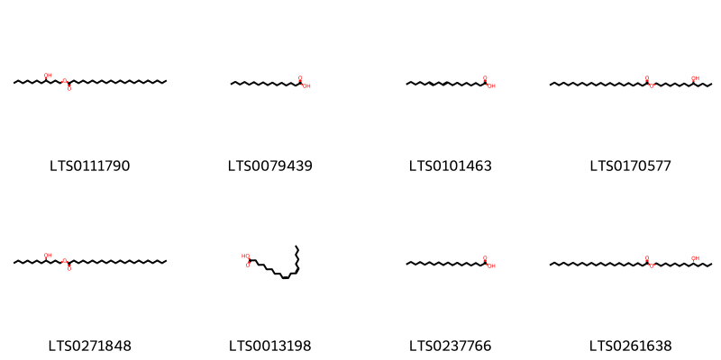{ width=100% }
    <figcaption>Hình ảnh cấu trúc hóa học của 8 hoạt chất thuộc nhóm Fatty Acyls gồm ['4-hydroxyundecyl docosanoate (LTS0111790)', 'palmitic acid (LTS0079439)', '9,12-octadecadienoic acid (LTS0101463)', '9-hydroxytridecyl docosanoate (LTS0170577)', '(4r)-4-hydroxyundecyl docosanoate (LTS0271848)', 'linoleic (LTS0013198)', 'stearic acid (LTS0237766)', '(9r)-9-hydroxytridecyl docosanoate (LTS0261638)'].</figcaption>
</figure>
#### Nhóm Flavonoids
<figure markdown="span">
    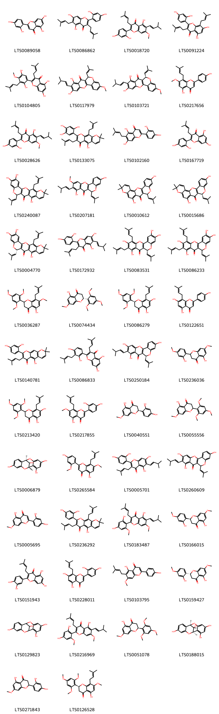{ width=100% }
    <figcaption>Hình ảnh cấu trúc hóa học của 51 hoạt chất thuộc nhóm Flavonoids gồm ['norartocarpetin (LTS0089058)', 'cudraflavone c (LTS0086862)', 'artocarpin (LTS0018720)', 'mulberrin (LTS0091224)', 'heteroartonin a (LTS0104805)', '1,3-dihydroxy-8-methoxy-2-(3-methylbut-1-en-1-yl)-11-(2-methylprop-1-en-1-yl)-11h-5,10-dioxatetraphen-12-one (LTS0117979)', '(11r)-1,3-dihydroxy-8-methoxy-2-[(1e)-3-methylbut-1-en-1-yl]-11-(2-methylprop-1-en-1-yl)-11h-5,10-dioxatetraphen-12-one (LTS0103721)', 'artonin u (LTS0217656)', '2-(2,4-dihydroxyphenyl)-5-hydroxy-7-methoxy-6-(3-methylbut-1-en-1-yl)-3-(3-methylbut-2-en-1-yl)chromen-4-one (LTS0028626)', 'heterophyllin (LTS0133075)', 'artocarpesin (LTS0102160)', 'albanin a (LTS0167719)', 'cycloheterophyllin (LTS0240087)', '1,8-dihydroxy-3-methoxy-2-[(1e)-3-methylbut-1-en-1-yl]-11-(2-methylprop-1-en-1-yl)-11h-5,10-dioxatetraphen-12-one (LTS0207181)', 'cyclomorusin (LTS0010612)', '(15s)-11,19-dihydroxy-7,7-dimethyl-15-(2-methylprop-1-en-1-yl)-2,8,16-trioxapentacyclo[12.8.0.0³,¹².0⁴,⁹.0¹⁷,²²]docosa-1(14),3,5,9,11,17,19,21-octaen-13-one (LTS0015686)', '(11s)-6,7,15-trihydroxy-19,19-dimethyl-22-(3-methylbut-2-en-1-yl)-11-(2-methylprop-1-en-1-yl)-2,10,20-trioxapentacyclo[12.8.0.0³,¹².0⁴,⁹.0¹⁶,²¹]docosa-1(22),3(12),4,6,8,14,16(21),17-octaen-13-one (LTS0004770)', '2-(2,4-dihydroxyphenyl)-5,7-dihydroxy-6-(3-methylbut-1-en-1-yl)-3-(3-methylbut-2-en-1-yl)chromen-4-one (LTS0172932)', '(11s)-1,3,7,8-tetrahydroxy-2,4-bis(3-methylbut-2-en-1-yl)-11-(2-methylprop-1-en-1-yl)-11h-5,10-dioxatetraphen-12-one (LTS0083531)', 'cyclorigidol (LTS0086233)', 'heteroflavanone b (LTS0036287)', '(2r)-5-hydroxy-7-methoxy-2-(2,4,6-trimethoxyphenyl)-2,3-dihydro-1-benzopyran-4-one (LTS0074434)', '(2s)-5,7-dihydroxy-8-(3-methylbut-2-en-1-yl)-2-(2,4,6-trimethoxyphenyl)-2,3-dihydro-1-benzopyran-4-one (LTS0086279)', 'licoflavone c (LTS0122651)', 'cudraflavone b (LTS0140781)', 'kuwanon t (LTS0086833)', '(11s)-1,3,8-trihydroxy-2-[(1e)-3-methylbut-1-en-1-yl]-11-(2-methylprop-1-en-1-yl)-11h-5,10-dioxatetraphen-12-one (LTS0250184)', '5-hydroxy-2-(2-hydroxy-4-methoxyphenyl)-7-methoxy-2,3-dihydro-1-benzopyran-4-one (LTS0236036)', 'heteroflavanone c (LTS0213420)', '2-(2,4-dihydroxyphenyl)-5-hydroxy-7-methoxy-8-(3-methylbut-2-en-1-yl)chromen-4-one (LTS0217855)', '(2s)-2-(2,4-dihydroxyphenyl)-5-hydroxy-7-methoxy-2,3-dihydro-1-benzopyran-4-one (LTS0040551)', 'heteroflavanone a (LTS0055556)', 'cyanomaclurin (LTS0006879)', 'artocarpetin b (LTS0265584)', '2-(2,4-dihydroxyphenyl)-5,7-dihydroxy-6-[(1e)-3-methylbut-1-en-1-yl]-3-(3-methylbut-2-en-1-yl)chromen-4-one (LTS0005701)', '1,3,8-trihydroxy-2-(3-methylbut-1-en-1-yl)-11-(2-methylprop-1-en-1-yl)-11h-5,10-dioxatetraphen-12-one (LTS0260609)', 'artocarpetin (LTS0005695)', '2-(2,4-dihydroxyphenyl)-5-hydroxy-8,8-dimethyl-3,10-bis(3-methylbut-2-en-1-yl)pyrano[3,2-g]chromen-4-one (LTS0236292)', '2-(2,4-dihydroxy-6-methoxyphenyl)-5-hydroxy-7-methoxy-6-[(1e)-3-methylbut-1-en-1-yl]-3-(3-methylbut-2-en-1-yl)chromen-4-one (LTS0183487)', '(2s)-5-hydroxy-2-(2-hydroxy-4-methoxyphenyl)-7-methoxy-2,3-dihydro-1-benzopyran-4-one (LTS0166015)', '2-(3,4-dihydroxyphenyl)-5,7-dihydroxy-3-(3-methylbut-2-en-1-yl)chromen-4-one (LTS0151943)', '2-(2,4-dihydroxyphenyl)-5,7-dihydroxy-8-(3-methylbut-2-en-1-yl)chromen-4-one (LTS0228011)', '5-hydroxy-2-(4-hydroxyphenyl)-7-methoxy-6-(3-methylbut-2-en-1-yl)chromen-4-one (LTS0103795)', '(2r)-5-hydroxy-2-(2-hydroxy-4-methoxyphenyl)-7-methoxy-2,3-dihydro-1-benzopyran-4-one (LTS0159427)', '8,16-dioxatetracyclo[7.7.1.0²,⁷.0¹⁰,¹⁵]heptadeca-2,4,6,10,12,14-hexaene-3,5,13,17-tetrol (LTS0129823)', '2-(2,4-dihydroxy-6-methoxyphenyl)-5-hydroxy-7-methoxy-6-(3-methylbut-1-en-1-yl)-3-(3-methylbut-2-en-1-yl)chromen-4-one (LTS0216969)', '(2s)-5-hydroxy-7-methoxy-2-(2,4,6-trimethoxyphenyl)-2,3-dihydro-1-benzopyran-4-one (LTS0051078)', '(1r,9r,17s)-8,16-dioxatetracyclo[7.7.1.0²,⁷.0¹⁰,¹⁵]heptadeca-2,4,6,10,12,14-hexaene-3,5,13,17-tetrol (LTS0188015)', 'artocarpanone (LTS0271843)', '(2s)-5-hydroxy-7-methoxy-8-(3-methylbut-2-en-1-yl)-2-(2,4,6-trimethoxyphenyl)-2,3-dihydro-1-benzopyran-4-one (LTS0126528)', '6-prenylapigenin (LTS0235304)'].</figcaption>
</figure>
#### Nhóm Naphthopyrans
<figure markdown="span">
    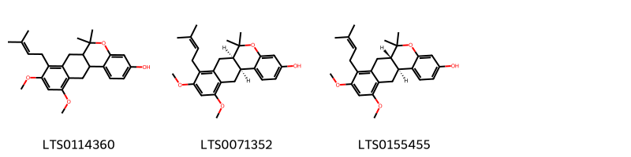{ width=100% }
    <figcaption>Hình ảnh cấu trúc hóa học của 3 hoạt chất thuộc nhóm Naphthopyrans gồm ['9,11-dimethoxy-6,6-dimethyl-8-(3-methylbut-2-en-1-yl)-6a,7,12,12a-tetrahydro-5-oxatetraphen-3-ol (LTS0114360)', '(6ar,12as)-9,11-dimethoxy-6,6-dimethyl-8-(3-methylbut-2-en-1-yl)-6a,7,12,12a-tetrahydro-5-oxatetraphen-3-ol (LTS0071352)', '(6as,12as)-9,11-dimethoxy-6,6-dimethyl-8-(3-methylbut-2-en-1-yl)-6a,7,12,12a-tetrahydro-5-oxatetraphen-3-ol (LTS0155455)'].</figcaption>
</figure>
#### Nhóm Phenols
<figure markdown="span">
    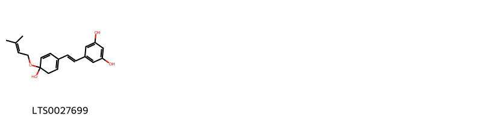{ width=100% }
    <figcaption>Hình ảnh cấu trúc hóa học của 1 hoạt chất thuộc nhóm Phenols gồm ['5-(2-{4-hydroxy-4-[(3-methylbut-2-en-1-yl)oxy]cyclohexa-1,5-dien-1-yl}ethenyl)benzene-1,3-diol (LTS0027699)'].</figcaption>
</figure>
#### Nhóm Prenol lipids
<figure markdown="span">
    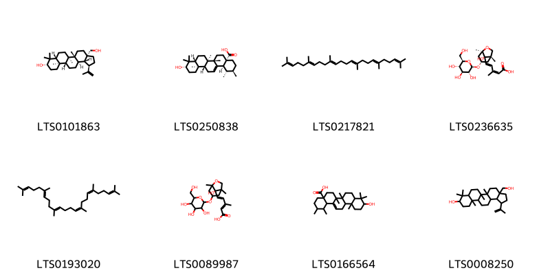{ width=100% }
    <figcaption>Hình ảnh cấu trúc hóa học của 8 hoạt chất thuộc nhóm Prenol lipids gồm ['betulin (LTS0101863)', 'ursolic acid (LTS0250838)', 'squalene (LTS0217821)', '(2z,4e)-5-[(1s,3s,5r,8s)-8-hydroxy-1,5-dimethyl-3-{[(2r,3r,4s,5s,6r)-3,4,5-trihydroxy-6-(hydroxymethyl)oxan-2-yl]oxy}-6-oxabicyclo[3.2.1]octan-8-yl]-3-methylpenta-2,4-dienoic acid (LTS0236635)', '2,6,10,15,19,23-hexamethyltetracosa-2,6,10,14,18,22-hexaene (LTS0193020)', '5-(8-hydroxy-1,5-dimethyl-3-{[3,4,5-trihydroxy-6-(hydroxymethyl)oxan-2-yl]oxy}-6-oxabicyclo[3.2.1]octan-8-yl)-3-methylpenta-2,4-dienoic acid (LTS0089987)', '10-hydroxy-1,2,6a,6b,9,9,12a-heptamethyl-2,3,4,5,6,7,8,8a,10,11,12,12b,13,14b-tetradecahydro-1h-picene-4a-carboxylic acid (LTS0166564)', '3a-(hydroxymethyl)-5a,5b,8,8,11a-pentamethyl-1-(prop-1-en-2-yl)-hexadecahydrocyclopenta[a]chrysen-9-ol (LTS0008250)'].</figcaption>
</figure>
#### Nhóm Steroids and steroid derivatives
<figure markdown="span">
    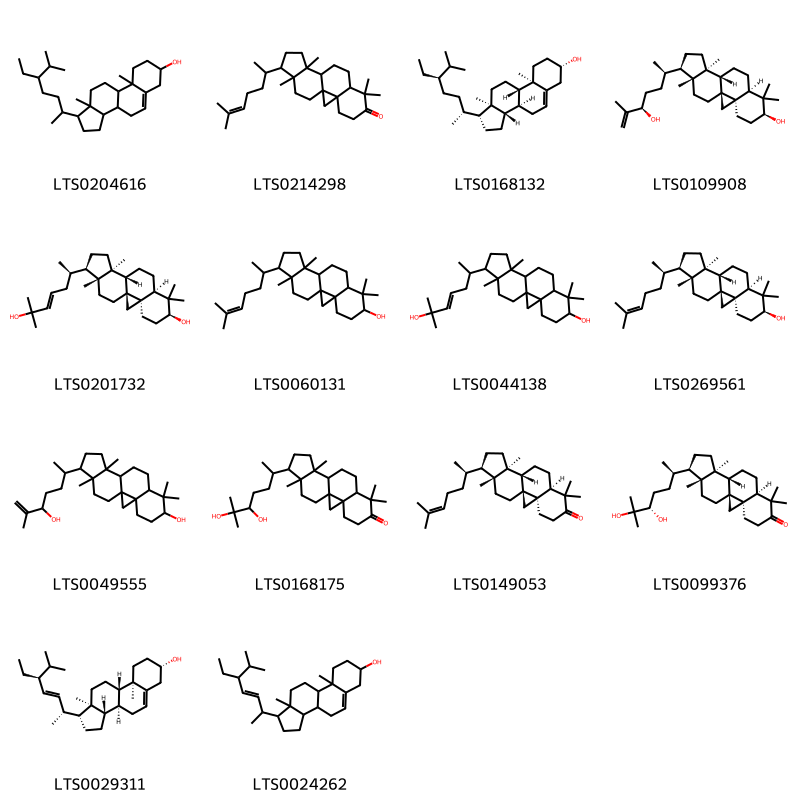{ width=100% }
    <figcaption>Hình ảnh cấu trúc hóa học của 14 hoạt chất thuộc nhóm Steroids and steroid derivatives gồm ['stigmast-5-en-3-ol, (3β)- (LTS0204616)', '7,7,12,16-tetramethyl-15-(6-methylhept-5-en-2-yl)pentacyclo[9.7.0.0¹,³.0³,⁸.0¹²,¹⁶]octadecan-6-one (LTS0214298)', 'sitosterol (LTS0168132)', '(1s,3r,6s,8r,11s,12s,15r,16r)-15-[(2r,5r)-5-hydroxy-6-methylhept-6-en-2-yl]-7,7,12,16-tetramethylpentacyclo[9.7.0.0¹,³.0³,⁸.0¹²,¹⁶]octadecan-6-ol (LTS0109908)', 'cycloart-23-ene-3β,25-diol (LTS0201732)', 'cycloartenol (LTS0060131)', '15-(6-hydroxy-6-methylhept-4-en-2-yl)-7,7,12,16-tetramethylpentacyclo[9.7.0.0¹,³.0³,⁸.0¹²,¹⁶]octadecan-6-ol (LTS0044138)', 'cycloartenol (LTS0269561)', '15-(5-hydroxy-6-methylhept-6-en-2-yl)-7,7,12,16-tetramethylpentacyclo[9.7.0.0¹,³.0³,⁸.0¹²,¹⁶]octadecan-6-ol (LTS0049555)', '15-(5,6-dihydroxy-6-methylheptan-2-yl)-7,7,12,16-tetramethylpentacyclo[9.7.0.0¹,³.0³,⁸.0¹²,¹⁶]octadecan-6-one (LTS0168175)', '(1s,3r,8r,11s,12s,15r,16r)-7,7,12,16-tetramethyl-15-[(2r)-6-methylhept-5-en-2-yl]pentacyclo[9.7.0.0¹,³.0³,⁸.0¹²,¹⁶]octadecan-6-one (LTS0149053)', '(1s,3r,8r,11s,12s,15r,16r)-15-[(2r,5s)-5,6-dihydroxy-6-methylheptan-2-yl]-7,7,12,16-tetramethylpentacyclo[9.7.0.0¹,³.0³,⁸.0¹²,¹⁶]octadecan-6-one (LTS0099376)', 'phytosterol (LTS0029311)', 'stigmasterol (LTS0024262)'].</figcaption>
</figure>
#### Nhóm Stilbenes
<figure markdown="span">
    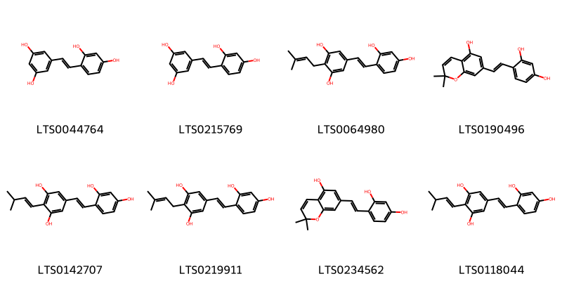{ width=100% }
    <figcaption>Hình ảnh cấu trúc hóa học của 8 hoạt chất thuộc nhóm Stilbenes gồm ['5-[(1e)-2-(2,4-dihydroxyphenyl)ethenyl]benzene-1,3-diol (LTS0044764)', '5-[2-(2,4-dihydroxyphenyl)ethenyl]benzene-1,3-diol (LTS0215769)', '5-[2-(2,4-dihydroxyphenyl)ethenyl]-2-(3-methylbut-2-en-1-yl)benzene-1,3-diol (LTS0064980)', '4-[(1e)-2-(5-hydroxy-2,2-dimethylchromen-7-yl)ethenyl]benzene-1,3-diol (LTS0190496)', '5-[(1e)-2-(2,4-dihydroxyphenyl)ethenyl]-2-[(1e)-3-methylbut-1-en-1-yl]benzene-1,3-diol (LTS0142707)', "4'-prenyloxyresveratrol (LTS0219911)", '4-[2-(5-hydroxy-2,2-dimethylchromen-7-yl)ethenyl]benzene-1,3-diol (LTS0234562)', '5-[2-(2,4-dihydroxyphenyl)ethenyl]-2-(3-methylbut-1-en-1-yl)benzene-1,3-diol (LTS0118044)'].</figcaption>
</figure>
#### Nhóm Yohimbine alkaloids
<figure markdown="span">
    { width=100% }
    <figcaption>Hình ảnh cấu trúc hóa học của 1 hoạt chất thuộc nhóm Yohimbine alkaloids gồm ['aricin (LTS0014019)'].</figcaption>
</figure>

---

### Dược dân tộc học

Danh sách các quốc gia có sử dụng *Artocarpus heterophyllus* trong điều trị các bệnh. 

| Country   | Disease                         | Bệnh                              |
|:----------|:--------------------------------|:----------------------------------|
| Africa    | Laxative                        | Nhuận trường                      |
| Turkey    | Astringent, Demulcent, Laxative | Chất làm se, khử màu, nhuận tràng |

---

# Chi Maclura

??? note "Danh sách các dược liệu thuộc chi"
    
	 - *Maclura pomifera*

---
## Maclura pomifera
### Thông tin về thực vật

!!! info "Phân loại thực vật của *Maclura pomifera* từ GIBF:"
    - **Kingdom:** Plantae
    - **Phylum:** Tracheophyta
    - **Order:** Rosales
    - **Family:** Moraceae
    - **Genus:** Maclura
    - **Species:** *Maclura pomifera*

 

| Label (VI)   | Label (EN)   | Scientific Name   | Descriptions (VI)   | Descriptions (EN)   | Also Known As (VI)   | Also Known As (EN)                                                                |
|:-------------|:-------------|:------------------|:--------------------|:--------------------|:---------------------|:----------------------------------------------------------------------------------|
| N/A          | N/A          | Maclura pomifera  | loài thực vật       | species of plant    | ['']                 | ['yellowwood', 'bodark', "bois d'arc", 'bow-wood', 'horse-apple', 'osage orange'] |

#### Phân bố trên thế giới

**Từ CSDL GIBF** Ukraine, Italy, Australia, Georgia, Argentina, North Macedonia, Hungary, Serbia, United States of America, Armenia, France, Canada

#### Phân bố tại Việt Nam

**Từ CSDL GIBF**: Không có ghi nhận ở Việt Nam

---
### Thành phần hóa học
        
- Theo cơ sở dữ liệu lotus: Từ loài *Maclura pomifera* đã phân lập và xác định được 106 hoạt chất thuộc về các nhóm Fatty Acyls, Flavonoids, Prenol lipids, Steroids and steroid derivatives, Isoflavonoids, Linear 1,3-diarylpropanoids, Benzene and substituted derivatives, Stilbenes, Organooxygen compounds, Phenols, Benzopyrans. 

|    | chemicalTaxonomyClassyfireClass     |   smiles_count |
|---:|:------------------------------------|---------------:|
|  0 | Benzene and substituted derivatives |              1 |
|  1 | Benzopyrans                         |              9 |
|  2 | Fatty Acyls                         |              3 |
|  3 | Flavonoids                          |             44 |
|  4 | Isoflavonoids                       |             13 |
|  5 | Linear 1,3-diarylpropanoids         |              2 |
|  6 | Organooxygen compounds              |              6 |
|  7 | Phenols                             |              1 |
|  8 | Prenol lipids                       |             15 |
|  9 | Steroids and steroid derivatives    |              6 |
| 10 | Stilbenes                           |              6 |

#### Nhóm Benzene and substituted derivatives
<figure markdown="span">
    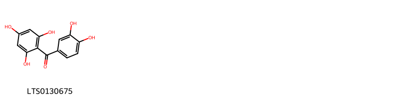{ width=100% }
    <figcaption>Hình ảnh cấu trúc hóa học của 1 hoạt chất thuộc nhóm Benzene and substituted derivatives gồm ['maclurin (LTS0130675)'].</figcaption>
</figure>
#### Nhóm Benzopyrans
<figure markdown="span">
    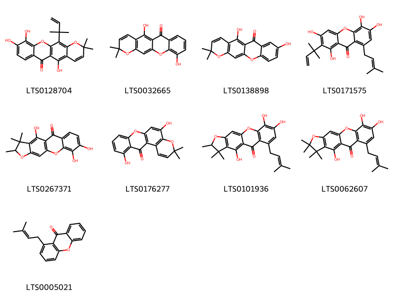{ width=100% }
    <figcaption>Hình ảnh cấu trúc hóa học của 9 hoạt chất thuộc nhóm Benzopyrans gồm ['macluraxanthone (LTS0128704)', '6-deoxyjacareubin (LTS0032665)', '5,8-dihydroxy-2,2-dimethyl-1,11-dioxatetracen-6-one (LTS0138898)', '1,3,5,6-tetrahydroxy-8-(3-methylbut-2-en-1-yl)-2-(2-methylbut-3-en-2-yl)xanthen-9-one (LTS0171575)', '4,8,9-trihydroxy-2,3,3-trimethyl-2h-furo[3,2-b]xanthen-5-one (LTS0267371)', '6,12-dihydroxy-2,2-dimethyl-1,10-dioxatetraphen-5-one (LTS0176277)', '4,8,9-trihydroxy-2,3,3-trimethyl-6-(3-methylbut-2-en-1-yl)-2h-furo[3,2-b]xanthen-5-one (LTS0101936)', '4,8,9-trihydroxy-2,2,3,3-tetramethyl-6-(3-methylbut-2-en-1-yl)furo[3,2-b]xanthen-5-one (LTS0062607)', '1-(3-methylbut-2-en-1-yl)xanthen-9-one (LTS0005021)'].</figcaption>
</figure>
#### Nhóm Fatty Acyls
<figure markdown="span">
    { width=100% }
    <figcaption>Hình ảnh cấu trúc hóa học của 3 hoạt chất thuộc nhóm Fatty Acyls gồm ['palmitic acid (LTS0079439)', 'oleic acid (LTS0256910)', 'linoleic (LTS0013198)'].</figcaption>
</figure>
#### Nhóm Flavonoids
<figure markdown="span">
    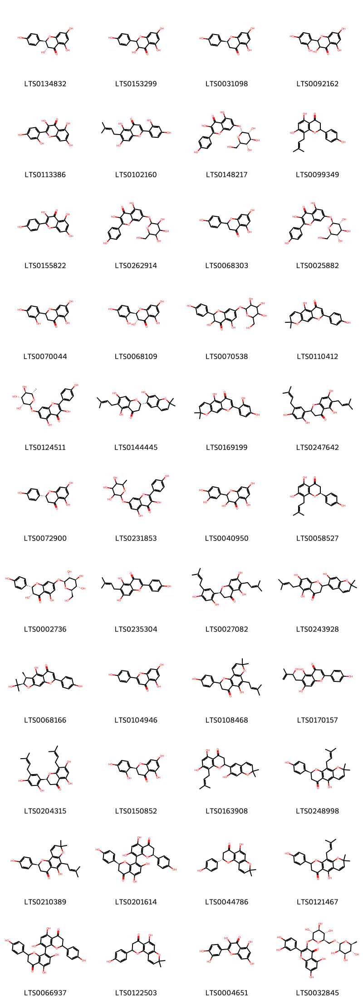{ width=100% }
    <figcaption>Hình ảnh cấu trúc hóa học của 44 hoạt chất thuộc nhóm Flavonoids gồm ['(+)-dihydrokaempferol (LTS0134832)', 'aromadendrin (LTS0153299)', 'naringenin (LTS0031098)', '2-(2,4-dihydroxyphenyl)-3,5,7-trihydroxy-2,3-dihydro-1-benzopyran-4-one (LTS0092162)', 'bois d,arc (LTS0113386)', 'artocarpesin (LTS0102160)', '3,5-dihydroxy-2-(4-hydroxyphenyl)-7-{[(2r,3r,4s,5s,6r)-3,4,5-trihydroxy-6-(hydroxymethyl)oxan-2-yl]oxy}chromen-4-one (LTS0148217)', 'sophoraflavanone b (LTS0099349)', 'kaempherol (LTS0155822)', '3,5-dihydroxy-2-(4-hydroxyphenyl)-7-{[3,4,5-trihydroxy-6-(hydroxymethyl)oxan-2-yl]oxy}chromen-4-one (LTS0262914)', 'asahina (LTS0068303)', 'kaempferol 7-o-glucoside (LTS0025882)', 'steppogenin (LTS0070044)', 'dihydromorin (LTS0068109)', '3,5-dihydroxy-2-(4-hydroxyphenyl)-7-{[3,4,5-trihydroxy-6-(hydroxymethyl)oxan-2-yl]oxy}-2,3-dihydro-1-benzopyran-4-one (LTS0070538)', 'carpachromene (LTS0110412)', 'kaempferol-7-rhamnoside (LTS0124511)', '(2s)-5,7-dihydroxy-2-(7-hydroxy-2,2-dimethylchromen-6-yl)-6-(3-methylbut-2-en-1-yl)-2,3-dihydro-1-benzopyran-4-one (LTS0144445)', 'cycloartocarpesin (LTS0169199)', '2-[2,4-dihydroxy-5-(3-methylbut-2-en-1-yl)phenyl]-5,7-dihydroxy-6-(3-methylbut-2-en-1-yl)-2,3-dihydro-1-benzopyran-4-one (LTS0247642)', '(-)-naringenin (LTS0072900)', '3,5-dihydroxy-2-(4-hydroxyphenyl)-7-[(3,4,5-trihydroxy-6-methyloxan-2-yl)oxy]chromen-4-one (LTS0231853)', '2,3-dihydroquercetin (LTS0040950)', 'sophoraflavanone b (LTS0058527)', '(2s,3r)-3,5-dihydroxy-2-(4-hydroxyphenyl)-7-{[(2s,3r,4s,5s,6r)-3,4,5-trihydroxy-6-(hydroxymethyl)oxan-2-yl]oxy}-2,3-dihydro-1-benzopyran-4-one (LTS0002736)', '6-prenylapigenin (LTS0235304)', '(2s)-2-[2,4-dihydroxy-5-(3-methylbut-2-en-1-yl)phenyl]-5,7-dihydroxy-6-(3-methylbut-2-en-1-yl)-2,3-dihydro-1-benzopyran-4-one (LTS0027082)', 'cudraflavanone a (LTS0243928)', '(2r,3s)-4-hydroxy-7-(4-hydroxyphenyl)-2-(2-hydroxypropan-2-yl)-3-methyl-2h,3h-furo[3,2-g]chromen-5-one (LTS0068166)', 'chamomile (LTS0104946)', 'cajaflavanone (LTS0108468)', '5,7-dihydroxy-6-[(2s)-2-hydroxy-3-methylbut-3-en-1-yl]-2-(4-hydroxyphenyl)chromen-4-one (LTS0170157)', '(2s)-2-[2,4-dihydroxy-5-(3-methylbut-2-en-1-yl)phenyl]-5,7-dihydroxy-8-(3-methylbut-2-en-1-yl)-2,3-dihydro-1-benzopyran-4-one (LTS0204315)', '(2s)-2-(2,4-dihydroxyphenyl)-5,7-dihydroxy-2,3-dihydro-1-benzopyran-4-one (LTS0150852)', 'euchrestaflavanone c (LTS0163908)', '(2s)-5-hydroxy-2-(4-hydroxyphenyl)-8,8-dimethyl-10-(3-methylbut-2-en-1-yl)-2h,3h-pyrano[3,2-g]chromen-4-one (LTS0248998)', '(2s)-5-hydroxy-2-(4-hydroxyphenyl)-8,8-dimethyl-6-(3-methylbut-2-en-1-yl)-2h,3h-pyrano[2,3-f]chromen-4-one (LTS0210389)', '(2s)-8-[(2s)-5,7-dihydroxy-2-(4-hydroxyphenyl)-4-oxo-2,3-dihydro-1-benzopyran-8-yl]-5,7-dihydroxy-2-(4-hydroxyphenyl)-2,3-dihydro-1-benzopyran-4-one (LTS0201614)', '(2s)-5-hydroxy-2-(4-hydroxyphenyl)-8,8-dimethyl-2h,3h-pyrano[2,3-f]chromen-4-one (LTS0044786)', 'lupinifolin (LTS0121467)', '8-[5,7-dihydroxy-2-(4-hydroxyphenyl)-4-oxo-2,3-dihydro-1-benzopyran-8-yl]-5,7-dihydroxy-2-(4-hydroxyphenyl)-2,3-dihydro-1-benzopyran-4-one (LTS0066937)', 'citflavanone (LTS0122503)', 'quercetin (LTS0004651)', '3-rutinosyl quercetin (LTS0032845)'].</figcaption>
</figure>
#### Nhóm Isoflavonoids
<figure markdown="span">
    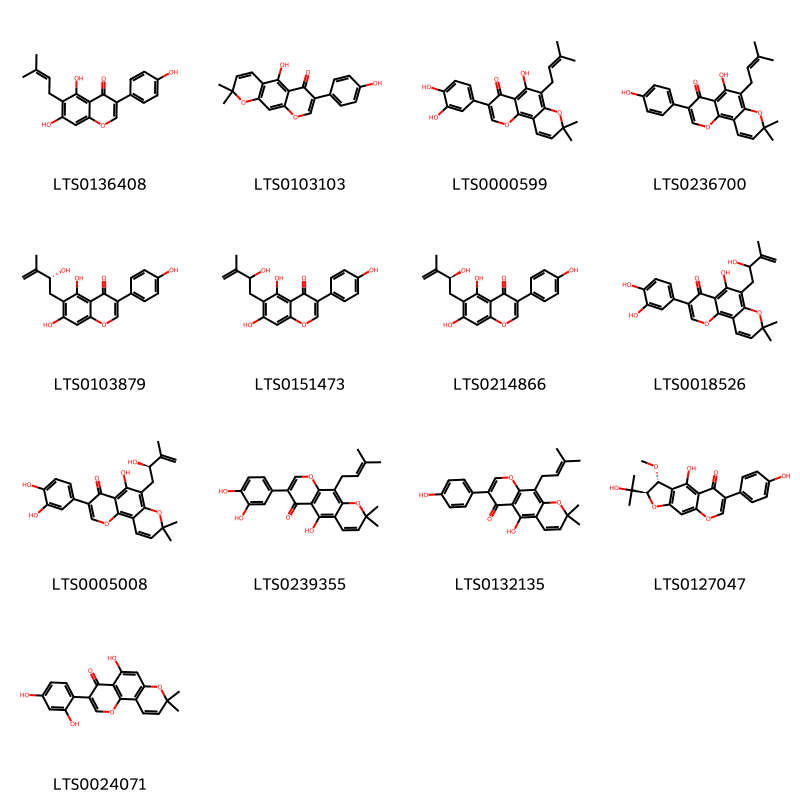{ width=100% }
    <figcaption>Hình ảnh cấu trúc hóa học của 13 hoạt chất thuộc nhóm Isoflavonoids gồm ['wighteone (LTS0136408)', 'alpinumisoflavone (LTS0103103)', 'pomiferin (LTS0000599)', 'osajin (LTS0236700)', '5,7-dihydroxy-6-[(2r)-2-hydroxy-3-methylbut-3-en-1-yl]-3-(4-hydroxyphenyl)chromen-4-one (LTS0103879)', '5,7-dihydroxy-6-(2-hydroxy-3-methylbut-3-en-1-yl)-3-(4-hydroxyphenyl)chromen-4-one (LTS0151473)', '5,7-dihydroxy-6-[(2s)-2-hydroxy-3-methylbut-3-en-1-yl]-3-(4-hydroxyphenyl)chromen-4-one (LTS0214866)', '3-(3,4-dihydroxyphenyl)-5-hydroxy-6-(2-hydroxy-3-methylbut-3-en-1-yl)-8,8-dimethylpyrano[2,3-f]chromen-4-one (LTS0018526)', '3-(3,4-dihydroxyphenyl)-5-hydroxy-6-[(2r)-2-hydroxy-3-methylbut-3-en-1-yl]-8,8-dimethylpyrano[2,3-f]chromen-4-one (LTS0005008)', 'auriculasin (LTS0239355)', 'warangalone (LTS0132135)', '(2r,3r)-4-hydroxy-6-(4-hydroxyphenyl)-2-(2-hydroxypropan-2-yl)-3-methoxy-2h,3h-furo[3,2-g]chromen-5-one (LTS0127047)', 'parvisoflavone a (LTS0024071)'].</figcaption>
</figure>
#### Nhóm Linear 1_3-diarylpropanoids
<figure markdown="span">
    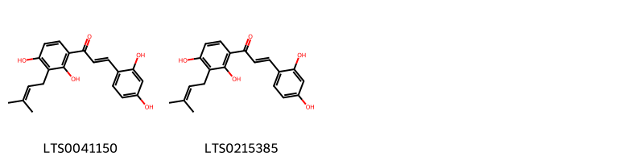{ width=100% }
    <figcaption>Hình ảnh cấu trúc hóa học của Không tìm thấy chú thích hoạt chất thuộc nhóm Linear 1_3-diarylpropanoids gồm Không tìm thấy chú thích.</figcaption>
</figure>
#### Nhóm Organooxygen compounds
<figure markdown="span">
    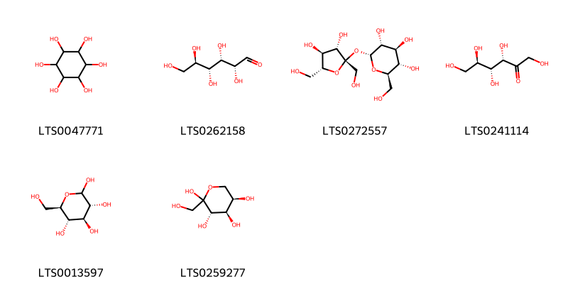{ width=100% }
    <figcaption>Hình ảnh cấu trúc hóa học của 6 hoạt chất thuộc nhóm Organooxygen compounds gồm ['(-)-inositol (LTS0047771)', '(+)-glucose (LTS0262158)', 'sucrose (LTS0272557)', 'keto-d-fructose (LTS0241114)', 'glucose (LTS0013597)', 'd-fructopyranose (LTS0259277)'].</figcaption>
</figure>
#### Nhóm Phenols
<figure markdown="span">
    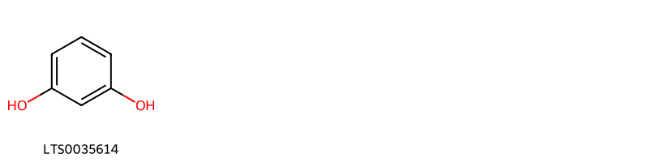{ width=100% }
    <figcaption>Hình ảnh cấu trúc hóa học của 1 hoạt chất thuộc nhóm Phenols gồm ['resorcinol (LTS0035614)'].</figcaption>
</figure>
#### Nhóm Prenol lipids
<figure markdown="span">
    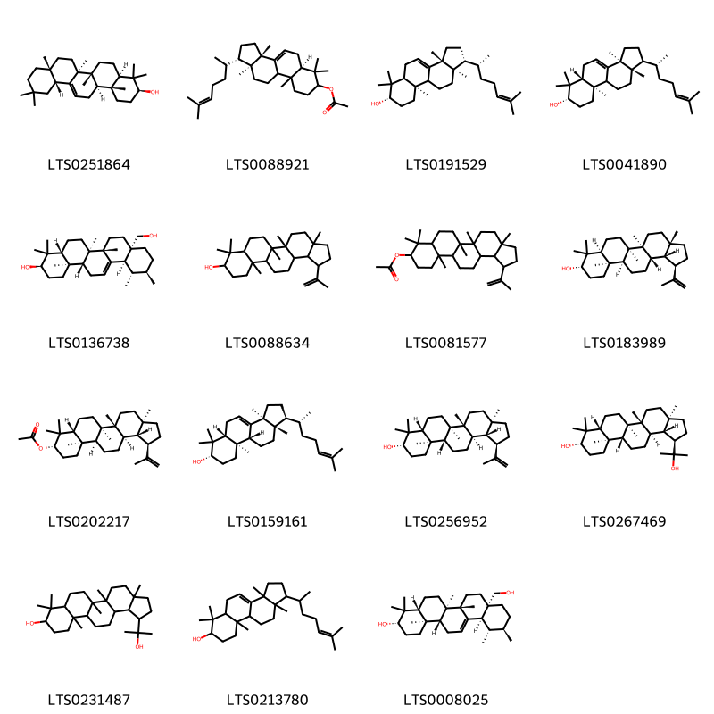{ width=100% }
    <figcaption>Hình ảnh cấu trúc hóa học của 15 hoạt chất thuộc nhóm Prenol lipids gồm ['β-amyrin (LTS0251864)', '(1s,3as,5ar,11as)-3a,6,6,9a,11a-pentamethyl-1-(6-methylhept-5-en-2-yl)-1h,2h,3h,5h,5ah,7h,8h,9h,9bh,10h,11h-cyclopenta[a]phenanthren-7-yl acetate (LTS0088921)', '(1r,3ar,7s,9ar,11ar)-3a,6,6,9a,11a-pentamethyl-1-[(2r)-6-methylhept-5-en-2-yl]-1h,2h,3h,5h,5ah,7h,8h,9h,9bh,10h,11h-cyclopenta[a]phenanthren-7-ol (LTS0191529)', '(3as,5ar,7s,9ar,11as)-3a,6,6,9a,11a-pentamethyl-1-[(2r)-6-methylhept-5-en-2-yl]-1h,2h,3h,5h,5ah,7h,8h,9h,9bh,10h,11h-cyclopenta[a]phenanthren-7-ol (LTS0041890)', 'urs-12-ene-3β,28-diol (LTS0136738)', 'lupeol (LTS0088634)', '3a,5a,5b,8,8,11a-hexamethyl-1-(prop-1-en-2-yl)-hexadecahydrocyclopenta[a]chrysen-9-yl acetate (LTS0081577)', '(1r,3as,5as,5br,7as,9s,11ar,11bs,13as,13br)-3a,5a,5b,8,8,11a-hexamethyl-1-(prop-1-en-2-yl)-hexadecahydrocyclopenta[a]chrysen-9-ol (LTS0183989)', '(1r,3ar,5ar,5br,7ar,9s,11ar,11bs,13ar,13br)-3a,5a,5b,8,8,11a-hexamethyl-1-(prop-1-en-2-yl)-hexadecahydrocyclopenta[a]chrysen-9-yl acetate (LTS0202217)', 'butyrospermol (LTS0159161)', 'lupeol (LTS0256952)', 'lupan-3β,20-diol (LTS0267469)', '1-(2-hydroxypropan-2-yl)-3a,5a,5b,8,8,11a-hexamethyl-hexadecahydrocyclopenta[a]chrysen-9-ol (LTS0231487)', '3a,6,6,9a,11a-pentamethyl-1-(6-methylhept-5-en-2-yl)-1h,2h,3h,5h,5ah,7h,8h,9h,9bh,10h,11h-cyclopenta[a]phenanthren-7-ol (LTS0213780)', 'uvaol (LTS0008025)'].</figcaption>
</figure>
#### Nhóm Steroids and steroid derivatives
<figure markdown="span">
    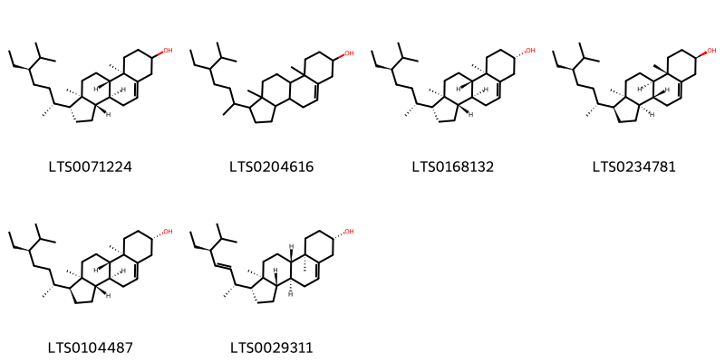{ width=100% }
    <figcaption>Hình ảnh cấu trúc hóa học của 6 hoạt chất thuộc nhóm Steroids and steroid derivatives gồm ['stigmast-5-en-3-ol (LTS0071224)', 'stigmast-5-en-3-ol, (3β)- (LTS0204616)', 'sitosterol (LTS0168132)', '(1s,3ar,3br,7r,9as,9br,11ar)-1-[(2r,5r)-5-ethyl-6-methylheptan-2-yl]-9a,11a-dimethyl-1h,2h,3h,3ah,3bh,4h,6h,7h,8h,9h,9bh,10h,11h-cyclopenta[a]phenanthren-7-ol (LTS0234781)', '(1s,3as,3bs,7s,9ar,9bs,11ar)-1-[(2r,5r)-5-ethyl-6-methylheptan-2-yl]-9a,11a-dimethyl-1h,2h,3h,3ah,3bh,4h,6h,7h,8h,9h,9bh,10h,11h-cyclopenta[a]phenanthren-7-ol (LTS0104487)', 'phytosterol (LTS0029311)'].</figcaption>
</figure>
#### Nhóm Stilbenes
<figure markdown="span">
    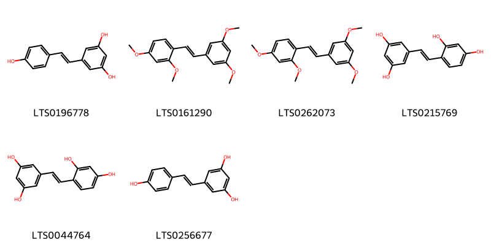{ width=100% }
    <figcaption>Hình ảnh cấu trúc hóa học của 6 hoạt chất thuộc nhóm Stilbenes gồm ['tocilizumab (LTS0196778)', '1-[(1e)-2-(2,4-dimethoxyphenyl)ethenyl]-3,5-dimethoxybenzene (LTS0161290)', '1-[2-(2,4-dimethoxyphenyl)ethenyl]-3,5-dimethoxybenzene (LTS0262073)', '5-[2-(2,4-dihydroxyphenyl)ethenyl]benzene-1,3-diol (LTS0215769)', '5-[(1e)-2-(2,4-dihydroxyphenyl)ethenyl]benzene-1,3-diol (LTS0044764)', 'resveratrol (LTS0256677)'].</figcaption>
</figure>

---

### Dược dân tộc học

Danh sách các quốc gia có sử dụng *Maclura pomifera* trong điều trị các bệnh. 

| Country   | Disease            | Bệnh                 |
|:----------|:-------------------|:---------------------|
| Elsewhere | Cardiac, Stimulant | Tim, Chất kích thích |
| US        | Poison, Collyrium  | Chất độc, Collyrium  |

---

# Chi Dorstenia

??? note "Danh sách các dược liệu thuộc chi"
    
	 - *Dorstenia brasiliensis*
	 - *Dorstenia contrajerva*
	 - *Dorstenia contrayerba*

---
## Dorstenia brasiliensis
### Thông tin về thực vật

!!! info "Phân loại thực vật của *Dorstenia brasiliensis* từ GIBF:"
    - **Kingdom:** Plantae
    - **Phylum:** Tracheophyta
    - **Order:** Rosales
    - **Family:** Moraceae
    - **Genus:** Dorstenia
    - **Species:** *Dorstenia brasiliensis*

 

| Label (VI)   | Label (EN)   | Scientific Name        | Descriptions (VI)   | Descriptions (EN)   | Also Known As (VI)   | Also Known As (EN)   |
|:-------------|:-------------|:-----------------------|:--------------------|:--------------------|:---------------------|:---------------------|
| N/A          | N/A          | Dorstenia brasiliensis | loài thực vật       | species of plant    | ['']                 | ['']                 |

#### Phân bố trên thế giới

**Từ CSDL GIBF** Colombia, Brazil, Argentina, Uruguay, Paraguay, Venezuela (Bolivarian Republic of), French Guiana

#### Phân bố tại Việt Nam

**Từ CSDL GIBF**: Không có ghi nhận ở Việt Nam

---
### Thành phần hóa học
        
- Theo cơ sở dữ liệu lotus: Từ loài *Dorstenia brasiliensis* đã phân lập và xác định được 35 hoạt chất thuộc về các nhóm Prenol lipids, Steroids and steroid derivatives, Organooxygen compounds, Coumarins and derivatives, Emetine alkaloids. 

|    | chemicalTaxonomyClassyfireClass   |   smiles_count |
|---:|:----------------------------------|---------------:|
|  0 | Coumarins and derivatives         |             17 |
|  1 | Emetine alkaloids                 |              1 |
|  2 | Organooxygen compounds            |              2 |
|  3 | Prenol lipids                     |              9 |
|  4 | Steroids and steroid derivatives  |              6 |

#### Nhóm Coumarins and derivatives
<figure markdown="span">
    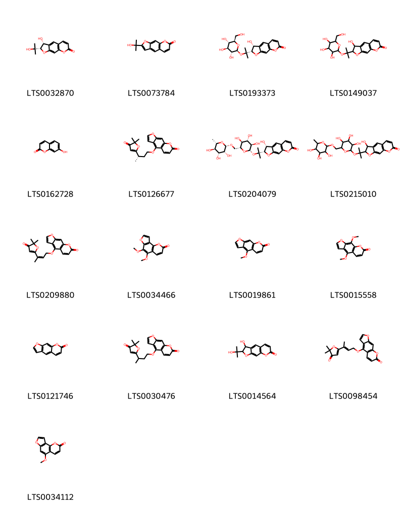{ width=100% }
    <figcaption>Hình ảnh cấu trúc hóa học của 17 hoạt chất thuộc nhóm Coumarins and derivatives gồm ['smyrindiol (LTS0032870)', '2-(2-hydroxypropan-2-yl)furo[3,2-g]chromen-7-one (LTS0073784)', '(2s,3r)-3-hydroxy-2-(2-{[(2s,3r,4s,5s,6r)-3,4,5-trihydroxy-6-(hydroxymethyl)oxan-2-yl]oxy}propan-2-yl)-2h,3h-furo[3,2-g]chromen-7-one (LTS0193373)', '3-hydroxy-2-(2-{[3,4,5-trihydroxy-6-(hydroxymethyl)oxan-2-yl]oxy}propan-2-yl)-2h,3h-furo[3,2-g]chromen-7-one (LTS0149037)', 'umbelliferone (LTS0162728)', '2,2-dimethyl-5-[(2s)-4-({7-oxofuro[3,2-g]chromen-4-yl}oxy)butan-2-yl]furan-3-one (LTS0126677)', '(2s,3r)-3-hydroxy-2-(2-{[(2s,3r,4s,5s,6r)-3,4,5-trihydroxy-6-({[(2s,3r,4r,5r,6s)-3,4,5-trihydroxy-6-methyloxan-2-yl]oxy}methyl)oxan-2-yl]oxy}propan-2-yl)-2h,3h-furo[3,2-g]chromen-7-one (LTS0204079)', '3-hydroxy-2-{2-[(3,4,5-trihydroxy-6-{[(3,4,5-trihydroxy-6-methyloxan-2-yl)oxy]methyl}oxan-2-yl)oxy]propan-2-yl}-2h,3h-furo[3,2-g]chromen-7-one (LTS0215010)', '2,2-dimethyl-5-[4-({7-oxofuro[3,2-g]chromen-4-yl}oxy)but-2-en-2-yl]furan-3-one (LTS0209880)', 'pimpinellin (LTS0034466)', 'bergapten (LTS0019861)', 'isopimpinellin (LTS0015558)', 'psoralen (LTS0121746)', '2,2-dimethyl-5-[4-({7-oxofuro[3,2-g]chromen-4-yl}oxy)butan-2-yl]furan-3-one (LTS0030476)', '3-hydroxy-2-(2-hydroxypropan-2-yl)-2h,3h-furo[3,2-g]chromen-7-one (LTS0014564)', '2,2-dimethyl-5-[(2e)-4-({7-oxofuro[3,2-g]chromen-4-yl}oxy)but-2-en-2-yl]furan-3-one (LTS0098454)', 'isobergapten (LTS0034112)'].</figcaption>
</figure>
#### Nhóm Emetine alkaloids
<figure markdown="span">
    { width=100% }
    <figcaption>Hình ảnh cấu trúc hóa học của 1 hoạt chất thuộc nhóm Emetine alkaloids gồm ['cephaeline (LTS0009460)'].</figcaption>
</figure>
#### Nhóm Organooxygen compounds
<figure markdown="span">
    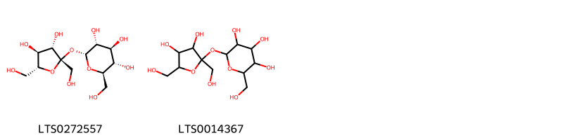{ width=100% }
    <figcaption>Hình ảnh cấu trúc hóa học của 2 hoạt chất thuộc nhóm Organooxygen compounds gồm ['sucrose (LTS0272557)', 'granulated sugar (LTS0014367)'].</figcaption>
</figure>
#### Nhóm Prenol lipids
<figure markdown="span">
    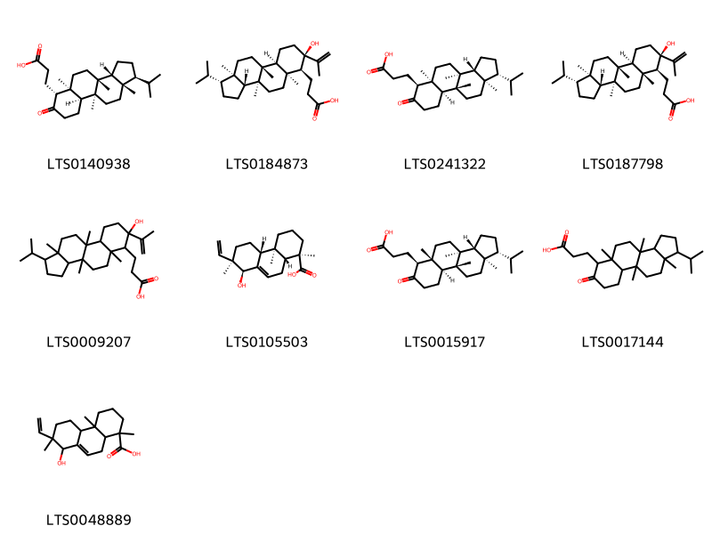{ width=100% }
    <figcaption>Hình ảnh cấu trúc hóa học của 9 hoạt chất thuộc nhóm Prenol lipids gồm ['3-[(1s,3ar,3br,5as,6r,9as,9bs,11as)-1-isopropyl-3b,5a,9b,11a-tetramethyl-7-oxo-dodecahydrocyclopenta[a]phenanthren-6-yl]propanoic acid (LTS0140938)', '3-[(1r,3ar,3bs,5as,6s,7r,9as,9br,11ar)-7-hydroxy-1-isopropyl-3b,5a,9b,11a-tetramethyl-7-(prop-1-en-2-yl)-dodecahydrocyclopenta[a]phenanthren-6-yl]propanoic acid (LTS0184873)', '3-[(1r,3ar,3bs,5as,6s,9as,9br,11ar)-1-isopropyl-3b,5a,9b,11a-tetramethyl-7-oxo-dodecahydrocyclopenta[a]phenanthren-6-yl]propanoic acid (LTS0241322)', '3-[(1r,3ar,3bs,5ar,6s,7r,9as,9br,11ar)-7-hydroxy-1-isopropyl-3b,5a,9b,11a-tetramethyl-7-(prop-1-en-2-yl)-dodecahydrocyclopenta[a]phenanthren-6-yl]propanoic acid (LTS0187798)', '3-[7-hydroxy-1-isopropyl-3b,5a,9b,11a-tetramethyl-7-(prop-1-en-2-yl)-dodecahydrocyclopenta[a]phenanthren-6-yl]propanoic acid (LTS0009207)', '(1r,4ar,4br,7r,8s,10ar)-7-ethenyl-8-hydroxy-1,4a,7-trimethyl-3,4,4b,5,6,8,10,10a-octahydro-2h-phenanthrene-1-carboxylic acid (LTS0105503)', '3-[(1r,3ar,3bs,5ar,6s,9as,9br,11ar)-1-isopropyl-3b,5a,9b,11a-tetramethyl-7-oxo-dodecahydrocyclopenta[a]phenanthren-6-yl]propanoic acid (LTS0015917)', '3-{1-isopropyl-3b,5a,9b,11a-tetramethyl-7-oxo-dodecahydrocyclopenta[a]phenanthren-6-yl}propanoic acid (LTS0017144)', '7-ethenyl-8-hydroxy-1,4a,7-trimethyl-3,4,4b,5,6,8,10,10a-octahydro-2h-phenanthrene-1-carboxylic acid (LTS0048889)'].</figcaption>
</figure>
#### Nhóm Steroids and steroid derivatives
<figure markdown="span">
    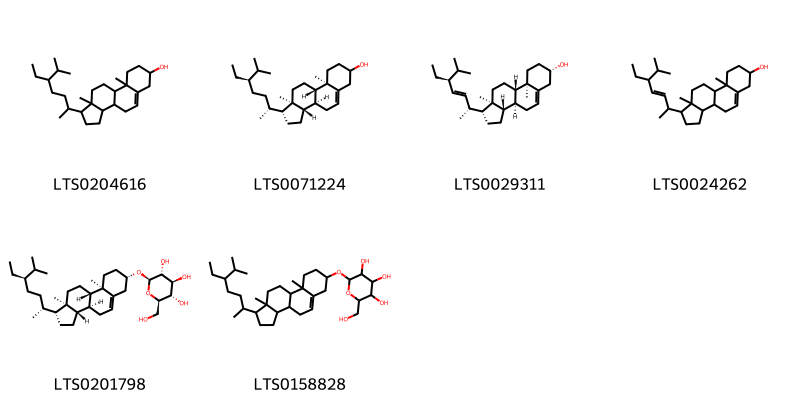{ width=100% }
    <figcaption>Hình ảnh cấu trúc hóa học của 6 hoạt chất thuộc nhóm Steroids and steroid derivatives gồm ['stigmast-5-en-3-ol, (3β)- (LTS0204616)', 'stigmast-5-en-3-ol (LTS0071224)', 'phytosterol (LTS0029311)', 'stigmasterol (LTS0024262)', 'sitogluside (LTS0201798)', '2-{[1-(5-ethyl-6-methylheptan-2-yl)-9a,11a-dimethyl-1h,2h,3h,3ah,3bh,4h,6h,7h,8h,9h,9bh,10h,11h-cyclopenta[a]phenanthren-7-yl]oxy}-6-(hydroxymethyl)oxane-3,4,5-triol (LTS0158828)'].</figcaption>
</figure>

---

### Dược dân tộc học

Danh sách các quốc gia có sử dụng *Dorstenia brasiliensis* trong điều trị các bệnh. 

| Country       | Disease                                                                 | Bệnh                                                                                                         |
|:--------------|:------------------------------------------------------------------------|:-------------------------------------------------------------------------------------------------------------|
| Argentina     | Diaphoretic, Diuretic, Emetic, Emmenagogue, Tonic                       | Thuốc lợi tiểu, lợi tiểu, emetic, emmenagogue, thuốc bổ                                                      |
| Brazil        | Diaphoretic, Diuretic, Emetic, Purgative, Stimulant, Tonic, Emmenagogue | Thuốc lợi tiểu, thuốc lợi tiểu, thuốc lợi tiểu, thuốc tẩy tế bào chết, thuốc kích thích, thuốc bổ, thuốc cảm |
| German        | Stimulant                                                               | Chất kích thích                                                                                              |
| Latin America | Diaphoretic                                                             | Thuốc tràn dịch màng phổi                                                                                    |
| Paraguay      | Antifertility                                                           | Chống lão hóa                                                                                                |

---

---
## Dorstenia contrajerva
### Thông tin về thực vật

!!! info "Phân loại thực vật của *Dorstenia contrajerva* từ GIBF:"
    - **Kingdom:** Plantae
    - **Phylum:** Tracheophyta
    - **Order:** Rosales
    - **Family:** Moraceae
    - **Genus:** Dorstenia
    - **Species:** *Dorstenia contrajerva*

 

| Label (VI)   | Label (EN)   | Scientific Name       | Descriptions (VI)   | Descriptions (EN)   | Also Known As (VI)   | Also Known As (EN)   |
|:-------------|:-------------|:----------------------|:--------------------|:--------------------|:---------------------|:---------------------|
| N/A          | N/A          | Dorstenia contrajerva | loài thực vật       | species of plant    | ['']                 | ['']                 |

#### Phân bố trên thế giới

**Từ CSDL GIBF** Australia, Belgium, Guatemala, Nicaragua, Venezuela (Bolivarian Republic of), Panama, Puerto Rico, Honduras, United States of America, El Salvador, Belize, Trinidad and Tobago, Martinique, Brazil, Mexico, Colombia, Costa Rica, Indonesia, New Zealand

#### Phân bố tại Việt Nam

**Từ CSDL GIBF**: Không có ghi nhận ở Việt Nam

---
### Thành phần hóa học
        
- Theo cơ sở dữ liệu lotus: Từ loài *Dorstenia contrajerva* đã phân lập và xác định được 19 hoạt chất thuộc về các nhóm Emetine alkaloids, Flavonoids, Organooxygen compounds, Coumarins and derivatives. 

|    | chemicalTaxonomyClassyfireClass   |   smiles_count |
|---:|:----------------------------------|---------------:|
|  0 | Coumarins and derivatives         |             13 |
|  1 | Emetine alkaloids                 |              1 |
|  2 | Flavonoids                        |              3 |
|  3 | Organooxygen compounds            |              2 |

#### Nhóm Coumarins and derivatives
<figure markdown="span">
    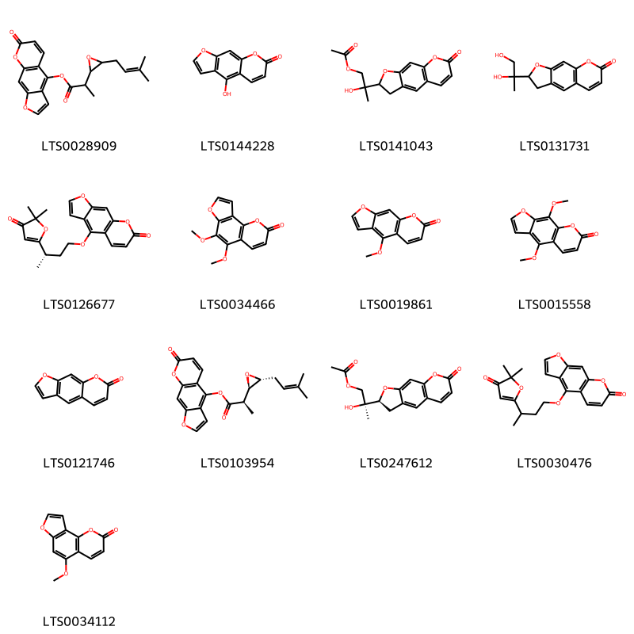{ width=100% }
    <figcaption>Hình ảnh cấu trúc hóa học của 13 hoạt chất thuộc nhóm Coumarins and derivatives gồm ['7-oxofuro[3,2-g]chromen-4-yl 2-[3-(3-methylbut-2-en-1-yl)oxiran-2-yl]propanoate (LTS0028909)', 'bergaptol (LTS0144228)', '2-hydroxy-2-{7-oxo-2h,3h-furo[3,2-g]chromen-2-yl}propyl acetate (LTS0141043)', '2-(1,2-dihydroxypropan-2-yl)-2h,3h-furo[3,2-g]chromen-7-one (LTS0131731)', '2,2-dimethyl-5-[(2s)-4-({7-oxofuro[3,2-g]chromen-4-yl}oxy)butan-2-yl]furan-3-one (LTS0126677)', 'pimpinellin (LTS0034466)', 'bergapten (LTS0019861)', 'isopimpinellin (LTS0015558)', 'psoralen (LTS0121746)', '7-oxofuro[3,2-g]chromen-4-yl (2r)-2-[(2r,3r)-3-(3-methylbut-2-en-1-yl)oxiran-2-yl]propanoate (LTS0103954)', '(2s)-2-hydroxy-2-[(2s)-7-oxo-2h,3h-furo[3,2-g]chromen-2-yl]propyl acetate (LTS0247612)', '2,2-dimethyl-5-[4-({7-oxofuro[3,2-g]chromen-4-yl}oxy)butan-2-yl]furan-3-one (LTS0030476)', 'isobergapten (LTS0034112)'].</figcaption>
</figure>
#### Nhóm Emetine alkaloids
<figure markdown="span">
    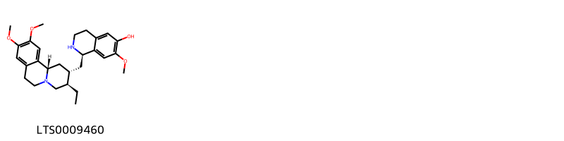{ width=100% }
    <figcaption>Hình ảnh cấu trúc hóa học của 1 hoạt chất thuộc nhóm Emetine alkaloids gồm ['cephaeline (LTS0009460)'].</figcaption>
</figure>
#### Nhóm Flavonoids
<figure markdown="span">
    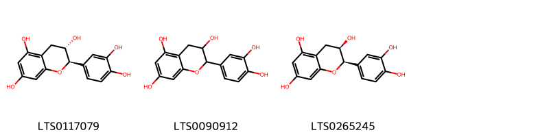{ width=100% }
    <figcaption>Hình ảnh cấu trúc hóa học của 3 hoạt chất thuộc nhóm Flavonoids gồm ['(+)-catechol (LTS0117079)', 'catechol (LTS0090912)', 'ent-epicatechin (LTS0265245)'].</figcaption>
</figure>
#### Nhóm Organooxygen compounds
<figure markdown="span">
    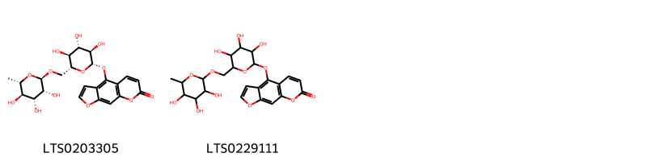{ width=100% }
    <figcaption>Hình ảnh cấu trúc hóa học của 2 hoạt chất thuộc nhóm Organooxygen compounds gồm ['4-{[(2s,3r,4s,5s,6r)-3,4,5-trihydroxy-6-({[(2r,3r,4r,5r,6s)-3,4,5-trihydroxy-6-methyloxan-2-yl]oxy}methyl)oxan-2-yl]oxy}furo[3,2-g]chromen-7-one (LTS0203305)', '4-[(3,4,5-trihydroxy-6-{[(3,4,5-trihydroxy-6-methyloxan-2-yl)oxy]methyl}oxan-2-yl)oxy]furo[3,2-g]chromen-7-one (LTS0229111)'].</figcaption>
</figure>

---

### Dược dân tộc học

Danh sách các quốc gia có sử dụng *Dorstenia contrajerva* trong điều trị các bệnh. 

| Country    | Disease             | Bệnh                                |
|:-----------|:--------------------|:------------------------------------|
| Costa Rica | nan                 | Ở đây                               |
| Guatemala  | Antidote            | Chất giải độc                       |
| Venezuela  | Sudorific, Antidote | Độc tố gây ngạt thở, Thuốc giải độc |

---

---
## Dorstenia contrayerba
### Thông tin về thực vật

!!! info "Phân loại thực vật của *Dorstenia contrajerva* từ GIBF:"
    - **Kingdom:** Plantae
    - **Phylum:** Tracheophyta
    - **Order:** Rosales
    - **Family:** Moraceae
    - **Genus:** Dorstenia
    - **Species:** *Dorstenia contrajerva*

 

| Label (VI)   | Label (EN)   | Scientific Name       | Descriptions (VI)   | Descriptions (EN)   | Also Known As (VI)   | Also Known As (EN)   |
|:-------------|:-------------|:----------------------|:--------------------|:--------------------|:---------------------|:---------------------|
| N/A          | N/A          | Dorstenia contrajerva | loài thực vật       | species of plant    | ['']                 | ['']                 |

#### Phân bố trên thế giới

**Từ CSDL GIBF** Australia, Belgium, Guatemala, Nicaragua, Venezuela (Bolivarian Republic of), Panama, Puerto Rico, Honduras, United States of America, El Salvador, Belize, Trinidad and Tobago, Martinique, Brazil, Mexico, Colombia, Costa Rica, Indonesia, New Zealand

#### Phân bố tại Việt Nam

**Từ CSDL GIBF**: Không có ghi nhận ở Việt Nam

---
### Thành phần hóa học
        
- Theo cơ sở dữ liệu lotus: Từ loài *Dorstenia contrajerva* đã phân lập và xác định được Chưa có hoạt chất nào được phân lập. hoạt chất thuộc về các nhóm Không có hoạt chất nào được phân lập. 

Không có hình ảnh nào được tạo ra

---

### Dược dân tộc học

Danh sách các quốc gia có sử dụng *Dorstenia contrajerva* trong điều trị các bệnh. 

| Country   | Disease                                  | Bệnh                                                                                                                                                                                                |
|:----------|:-----------------------------------------|:----------------------------------------------------------------------------------------------------------------------------------------------------------------------------------------------------|
| Elsewhere | Diaphoretic, Stimulant                   | Thuốc lợi tiểu, thuốc kích thích                                                                                                                                                                    |
| Mexico    | Analgesic, Diaphoretic, Stimulant, Tonic | MYMEMORY WARNING: YOU USED ALL AVAILABLE FREE TRANSLATIONS FOR TODAY. NEXT AVAILABLE IN  02 HOURS 53 MINUTES 52 SECONDS VISIT HTTPS://MYMEMORY.TRANSLATED.NET/DOC/USAGELIMITS.PHP TO TRANSLATE MORE |

---

# Chi Parartocarpus

??? note "Danh sách các dược liệu thuộc chi"
    
	 - *Parartocarpus triandra*
	 - *Parartocarpus venenosus*

---
## Parartocarpus triandra
### Thông tin về thực vật

!!! info "Phân loại thực vật của *Parartocarpus venenosa* từ GIBF:"
    - **Kingdom:** Plantae
    - **Phylum:** Tracheophyta
    - **Order:** Rosales
    - **Family:** Moraceae
    - **Genus:** Parartocarpus
    - **Species:** *Parartocarpus venenosa*

 

| Label (VI)   | Label (EN)   | Scientific Name       | Descriptions (VI)   | Descriptions (EN)   | Also Known As (VI)   | Also Known As (EN)   |
|:-------------|:-------------|:----------------------|:--------------------|:--------------------|:---------------------|:---------------------|
| N/A          | N/A          | Dorstenia contrajerva | loài thực vật       | species of plant    | ['']                 | ['']                 |

#### Phân bố trên thế giới

**Từ CSDL GIBF** nan, Singapore, Indonesia, Malaysia

#### Phân bố tại Việt Nam

**Từ CSDL GIBF**: Không có ghi nhận ở Việt Nam

---
### Thành phần hóa học
        
- Theo cơ sở dữ liệu lotus: Từ loài *Parartocarpus venenosa* đã phân lập và xác định được Chưa có hoạt chất nào được phân lập. hoạt chất thuộc về các nhóm Không có hoạt chất nào được phân lập. 

Không có hình ảnh nào được tạo ra

---

### Dược dân tộc học

Danh sách các quốc gia có sử dụng *Parartocarpus venenosa* trong điều trị các bệnh. 

| Country   | Disease   | Bệnh                                                                                                                                                                                                |
|:----------|:----------|:----------------------------------------------------------------------------------------------------------------------------------------------------------------------------------------------------|
| Sumatra   | Raticide  | MYMEMORY WARNING: YOU USED ALL AVAILABLE FREE TRANSLATIONS FOR TODAY. NEXT AVAILABLE IN  02 HOURS 53 MINUTES 31 SECONDS VISIT HTTPS://MYMEMORY.TRANSLATED.NET/DOC/USAGELIMITS.PHP TO TRANSLATE MORE |

---

---
## Parartocarpus venenosus
### Thông tin về thực vật

!!! info "Phân loại thực vật của *Parartocarpus venenosa* từ GIBF:"
    - **Kingdom:** Plantae
    - **Phylum:** Tracheophyta
    - **Order:** Rosales
    - **Family:** Moraceae
    - **Genus:** Parartocarpus
    - **Species:** *Parartocarpus venenosa*

 

| Label (VI)   | Label (EN)   | Scientific Name         | Descriptions (VI)   | Descriptions (EN)   | Also Known As (VI)   | Also Known As (EN)   |
|:-------------|:-------------|:------------------------|:--------------------|:--------------------|:---------------------|:---------------------|
| N/A          | N/A          | Parartocarpus venenosus |                     | species of plant    | ['']                 | ['']                 |

#### Phân bố trên thế giới

**Từ CSDL GIBF** Papua New Guinea, unknown or invalid, Indonesia, Philippines, Solomon Islands, Malaysia, Brunei Darussalam

#### Phân bố tại Việt Nam

**Từ CSDL GIBF**: Không có ghi nhận ở Việt Nam

---
### Thành phần hóa học
        
- Theo cơ sở dữ liệu lotus: Từ loài *Parartocarpus venenosa* đã phân lập và xác định được Chưa có hoạt chất nào được phân lập. hoạt chất thuộc về các nhóm Không có hoạt chất nào được phân lập. 

Không có hình ảnh nào được tạo ra

---

### Dược dân tộc học

Danh sách các quốc gia có sử dụng *Parartocarpus venenosa* trong điều trị các bệnh. 

| Country   | Disease   | Bệnh                                                                                                                                                                                                |
|:----------|:----------|:----------------------------------------------------------------------------------------------------------------------------------------------------------------------------------------------------|
| Solomon I | Canicide  | MYMEMORY WARNING: YOU USED ALL AVAILABLE FREE TRANSLATIONS FOR TODAY. NEXT AVAILABLE IN  02 HOURS 53 MINUTES 15 SECONDS VISIT HTTPS://MYMEMORY.TRANSLATED.NET/DOC/USAGELIMITS.PHP TO TRANSLATE MORE |

---

# Chi Brosimum

??? note "Danh sách các dược liệu thuộc chi"
    
	 - *Brosimum alicasrtum*
	 - *Brosimum alicastrum*

---
## Brosimum alicasrtum
### Thông tin về thực vật

!!! info "Phân loại thực vật của *Brosimum alicastrum* từ GIBF:"
    - **Kingdom:** Plantae
    - **Phylum:** Tracheophyta
    - **Order:** Rosales
    - **Family:** Moraceae
    - **Genus:** Brosimum
    - **Species:** *Brosimum alicastrum*

 

| Label (VI)   | Label (EN)   | Scientific Name         | Descriptions (VI)   | Descriptions (EN)   | Also Known As (VI)   | Also Known As (EN)   |
|:-------------|:-------------|:------------------------|:--------------------|:--------------------|:---------------------|:---------------------|
| N/A          | N/A          | Parartocarpus venenosus |                     | species of plant    | ['']                 | ['']                 |

#### Phân bố trên thế giới

**Từ CSDL GIBF** Belize, Ecuador, Guatemala, Colombia, Costa Rica, Peru, Mexico, El Salvador, Panama

#### Phân bố tại Việt Nam

**Từ CSDL GIBF**: Không có ghi nhận ở Việt Nam

---
### Thành phần hóa học
        
- Theo cơ sở dữ liệu lotus: Từ loài *Brosimum alicastrum* đã phân lập và xác định được Chưa có hoạt chất nào được phân lập. hoạt chất thuộc về các nhóm Không có hoạt chất nào được phân lập. 

Không có hình ảnh nào được tạo ra

---

### Dược dân tộc học

Danh sách các quốc gia có sử dụng *Brosimum alicastrum* trong điều trị các bệnh. 

| Country   | Disease    | Bệnh                                                                                                                                                                                                |
|:----------|:-----------|:----------------------------------------------------------------------------------------------------------------------------------------------------------------------------------------------------|
| Guatemala | Lactagogue | MYMEMORY WARNING: YOU USED ALL AVAILABLE FREE TRANSLATIONS FOR TODAY. NEXT AVAILABLE IN  02 HOURS 52 MINUTES 54 SECONDS VISIT HTTPS://MYMEMORY.TRANSLATED.NET/DOC/USAGELIMITS.PHP TO TRANSLATE MORE |

---

---
## Brosimum alicastrum
### Thông tin về thực vật

!!! info "Phân loại thực vật của *Brosimum alicastrum* từ GIBF:"
    - **Kingdom:** Plantae
    - **Phylum:** Tracheophyta
    - **Order:** Rosales
    - **Family:** Moraceae
    - **Genus:** Brosimum
    - **Species:** *Brosimum alicastrum*

 

| Label (VI)   | Label (EN)   | Scientific Name     | Descriptions (VI)   | Descriptions (EN)   | Also Known As (VI)   | Also Known As (EN)       |
|:-------------|:-------------|:--------------------|:--------------------|:--------------------|:---------------------|:-------------------------|
| N/A          | N/A          | Brosimum alicastrum | loài thực vật       | species of plant    | ['']                 | ['breadnut', 'Maya nut'] |

#### Phân bố trên thế giới

**Từ CSDL GIBF** Belize, Ecuador, Guatemala, Colombia, Costa Rica, Peru, Mexico, El Salvador, Panama

#### Phân bố tại Việt Nam

**Từ CSDL GIBF**: Không có ghi nhận ở Việt Nam

---
### Thành phần hóa học
        
- Theo cơ sở dữ liệu lotus: Từ loài *Brosimum alicastrum* đã phân lập và xác định được Chưa có hoạt chất nào được phân lập. hoạt chất thuộc về các nhóm Không có hoạt chất nào được phân lập. 

Không có hình ảnh nào được tạo ra

---

### Dược dân tộc học

Danh sách các quốc gia có sử dụng *Brosimum alicastrum* trong điều trị các bệnh. 

| Country   | Disease              | Bệnh                                                                                                                                                                                                |
|:----------|:---------------------|:----------------------------------------------------------------------------------------------------------------------------------------------------------------------------------------------------|
| Mexico    | Lactagogue, Sedative | MYMEMORY WARNING: YOU USED ALL AVAILABLE FREE TRANSLATIONS FOR TODAY. NEXT AVAILABLE IN  02 HOURS 52 MINUTES 33 SECONDS VISIT HTTPS://MYMEMORY.TRANSLATED.NET/DOC/USAGELIMITS.PHP TO TRANSLATE MORE |

---

# Chi Antiaris

??? note "Danh sách các dược liệu thuộc chi"
    
	 - *Antiaris africana*
	 - *Antiaris toxicaria*

---
## Antiaris africana
### Thông tin về thực vật

!!! info "Phân loại thực vật của *Antiaris toxicaria* từ GIBF:"
    - **Kingdom:** Plantae
    - **Phylum:** Tracheophyta
    - **Order:** Rosales
    - **Family:** Moraceae
    - **Genus:** Antiaris
    - **Species:** *Antiaris toxicaria*

 

| Label (VI)   | Label (EN)   | Scientific Name   | Descriptions (VI)   | Descriptions (EN)   | Also Known As (VI)   | Also Known As (EN)   |
|:-------------|:-------------|:------------------|:--------------------|:--------------------|:---------------------|:---------------------|
| N/A          | N/A          | Antiaris africana | loài thực vật       | species of plant    | ['']                 | ['']                 |

#### Phân bố trên thế giới

**Từ CSDL GIBF** Liberia, Nigeria, Gabon, Benin, Guinea, Cameroon, Togo

#### Phân bố tại Việt Nam

**Từ CSDL GIBF**: Không có ghi nhận ở Việt Nam

---
### Thành phần hóa học
        
- Theo cơ sở dữ liệu lotus: Từ loài *Antiaris toxicaria* đã phân lập và xác định được Chưa có hoạt chất nào được phân lập. hoạt chất thuộc về các nhóm Không có hoạt chất nào được phân lập. 

Không có hình ảnh nào được tạo ra

---

### Dược dân tộc học

Danh sách các quốc gia có sử dụng *Antiaris toxicaria* trong điều trị các bệnh. 

| Country   | Disease   | Bệnh                                                                                                                                                                                                |
|:----------|:----------|:----------------------------------------------------------------------------------------------------------------------------------------------------------------------------------------------------|
| Africa    | Poison    | MYMEMORY WARNING: YOU USED ALL AVAILABLE FREE TRANSLATIONS FOR TODAY. NEXT AVAILABLE IN  02 HOURS 52 MINUTES 11 SECONDS VISIT HTTPS://MYMEMORY.TRANSLATED.NET/DOC/USAGELIMITS.PHP TO TRANSLATE MORE |

---

---
## Antiaris toxicaria
### Thông tin về thực vật

!!! info "Phân loại thực vật của *Antiaris toxicaria* từ GIBF:"
    - **Kingdom:** Plantae
    - **Phylum:** Tracheophyta
    - **Order:** Rosales
    - **Family:** Moraceae
    - **Genus:** Antiaris
    - **Species:** *Antiaris toxicaria*

 

| Label (VI)   | Label (EN)   | Scientific Name    | Descriptions (VI)   | Descriptions (EN)   | Also Known As (VI)   | Also Known As (EN)   |
|:-------------|:-------------|:-------------------|:--------------------|:--------------------|:---------------------|:---------------------|
| N/A          | N/A          | Antiaris toxicaria | loài thực vật       | species of plant    | ['']                 | ['Upas tree']        |

#### Phân bố trên thế giới

**Từ CSDL GIBF** Ghana, Liberia, Australia, Madagascar, Nigeria, Gabon, Côte d’Ivoire, Kenya, India, Benin, Indonesia, Congo, Democratic Republic of the, China, Guinea, Cameroon, Malaysia, Singapore, Togo

#### Phân bố tại Việt Nam

**Từ CSDL GIBF**: Không có ghi nhận ở Việt Nam

---
### Thành phần hóa học
        
- Theo cơ sở dữ liệu lotus: Từ loài *Antiaris toxicaria* đã phân lập và xác định được 146 hoạt chất thuộc về các nhóm Flavonoids, Prenol lipids, Steroids and steroid derivatives, Linear 1,3-diarylpropanoids, Aurone flavonoids, Organooxygen compounds, Phenols, Coumarins and derivatives. 

|    | chemicalTaxonomyClassyfireClass   |   smiles_count |
|---:|:----------------------------------|---------------:|
|  0 | Aurone flavonoids                 |              4 |
|  1 | Coumarins and derivatives         |              3 |
|  2 | Flavonoids                        |             10 |
|  3 | Linear 1,3-diarylpropanoids       |              6 |
|  4 | Organooxygen compounds            |              3 |
|  5 | Phenols                           |              1 |
|  6 | Prenol lipids                     |             10 |
|  7 | Steroids and steroid derivatives  |            103 |

#### Nhóm Aurone flavonoids
<figure markdown="span">
    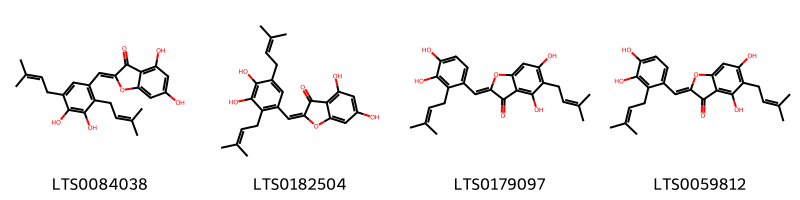{ width=100% }
    <figcaption>Hình ảnh cấu trúc hóa học của 4 hoạt chất thuộc nhóm Aurone flavonoids gồm ['(2z)-2-{[3,4-dihydroxy-2,5-bis(3-methylbut-2-en-1-yl)phenyl]methylidene}-4,6-dihydroxy-1-benzofuran-3-one (LTS0084038)', 'antiarone b (LTS0182504)', 'antiarone a (LTS0179097)', '(2z)-2-{[3,4-dihydroxy-2-(3-methylbut-2-en-1-yl)phenyl]methylidene}-4,6-dihydroxy-5-(3-methylbut-2-en-1-yl)-1-benzofuran-3-one (LTS0059812)'].</figcaption>
</figure>
#### Nhóm Coumarins and derivatives
<figure markdown="span">
    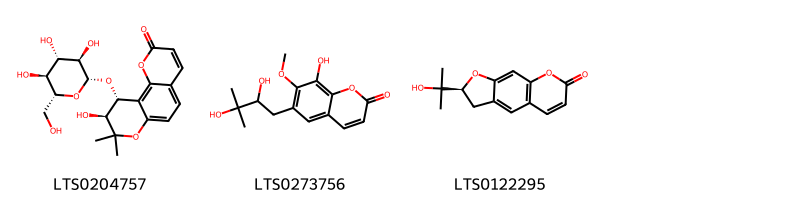{ width=100% }
    <figcaption>Hình ảnh cấu trúc hóa học của 3 hoạt chất thuộc nhóm Coumarins and derivatives gồm ['(9s,10r)-9-hydroxy-8,8-dimethyl-10-{[(2r,3r,4s,5s,6r)-3,4,5-trihydroxy-6-(hydroxymethyl)oxan-2-yl]oxy}-9h,10h-pyrano[2,3-h]chromen-2-one (LTS0204757)', '6-(2,3-dihydroxy-3-methylbutyl)-8-hydroxy-7-methoxychromen-2-one (LTS0273756)', 'marmesin (LTS0122295)'].</figcaption>
</figure>
#### Nhóm Flavonoids
<figure markdown="span">
    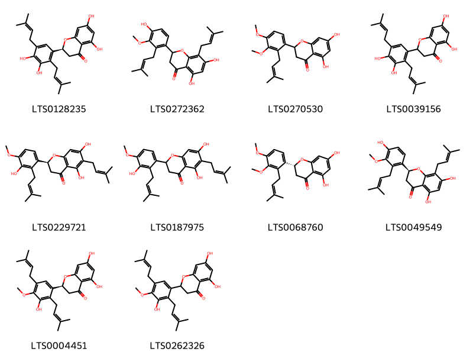{ width=100% }
    <figcaption>Hình ảnh cấu trúc hóa học của 10 hoạt chất thuộc nhóm Flavonoids gồm ['sigmoidin a (LTS0128235)', '5,7-dihydroxy-2-[4-hydroxy-3-methoxy-2-(3-methylbut-2-en-1-yl)phenyl]-8-(3-methylbut-2-en-1-yl)-2,3-dihydro-1-benzopyran-4-one (LTS0272362)', '2-[3,4-dimethoxy-2-(3-methylbut-2-en-1-yl)phenyl]-5,7-dihydroxy-2,3-dihydro-1-benzopyran-4-one (LTS0270530)', 'sigmoidin a (LTS0039156)', '(2s)-5,7-dihydroxy-2-[3-hydroxy-4-methoxy-2-(3-methylbut-2-en-1-yl)phenyl]-6-(3-methylbut-2-en-1-yl)-2,3-dihydro-1-benzopyran-4-one (LTS0229721)', '5,7-dihydroxy-2-[3-hydroxy-4-methoxy-2-(3-methylbut-2-en-1-yl)phenyl]-6-(3-methylbut-2-en-1-yl)-2,3-dihydro-1-benzopyran-4-one (LTS0187975)', '(2r)-2-[3,4-dimethoxy-2-(3-methylbut-2-en-1-yl)phenyl]-5,7-dihydroxy-2,3-dihydro-1-benzopyran-4-one (LTS0068760)', '(2s)-5,7-dihydroxy-2-[4-hydroxy-3-methoxy-2-(3-methylbut-2-en-1-yl)phenyl]-8-(3-methylbut-2-en-1-yl)-2,3-dihydro-1-benzopyran-4-one (LTS0049549)', '(2s)-5,7-dihydroxy-2-[3-hydroxy-4-methoxy-2,5-bis(3-methylbut-2-en-1-yl)phenyl]-2,3-dihydro-1-benzopyran-4-one (LTS0004451)', '5,7-dihydroxy-2-[3-hydroxy-4-methoxy-2,5-bis(3-methylbut-2-en-1-yl)phenyl]-2,3-dihydro-1-benzopyran-4-one (LTS0262326)'].</figcaption>
</figure>
#### Nhóm Linear 1_3-diarylpropanoids
<figure markdown="span">
    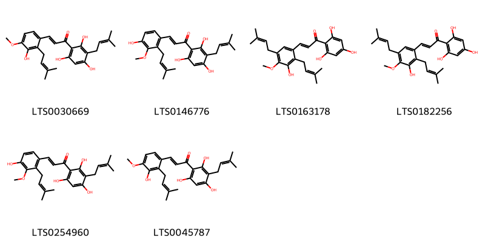{ width=100% }
    <figcaption>Hình ảnh cấu trúc hóa học của Không tìm thấy chú thích hoạt chất thuộc nhóm Linear 1_3-diarylpropanoids gồm Không tìm thấy chú thích.</figcaption>
</figure>
#### Nhóm Organooxygen compounds
<figure markdown="span">
    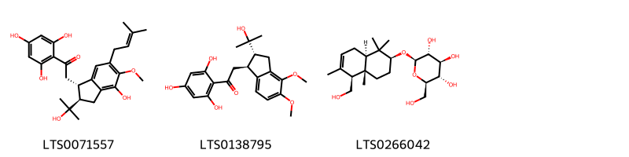{ width=100% }
    <figcaption>Hình ảnh cấu trúc hóa học của 3 hoạt chất thuộc nhóm Organooxygen compounds gồm ['antiarone j (LTS0071557)', 'antiarone k (LTS0138795)', '(2r,3r,4s,5s,6r)-2-{[(2s,4as,5s,8ar)-5-(hydroxymethyl)-1,1,4a,6-tetramethyl-2,3,4,5,8,8a-hexahydronaphthalen-2-yl]oxy}-6-(hydroxymethyl)oxane-3,4,5-triol (LTS0266042)'].</figcaption>
</figure>
#### Nhóm Phenols
<figure markdown="span">
    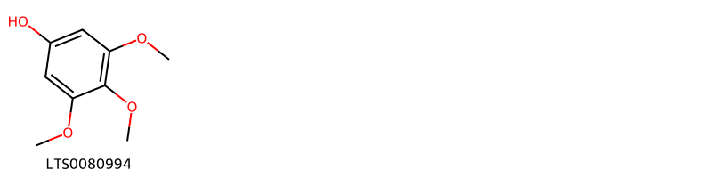{ width=100% }
    <figcaption>Hình ảnh cấu trúc hóa học của 1 hoạt chất thuộc nhóm Phenols gồm ['3,4,5-trimethoxyphenol (LTS0080994)'].</figcaption>
</figure>
#### Nhóm Prenol lipids
<figure markdown="span">
    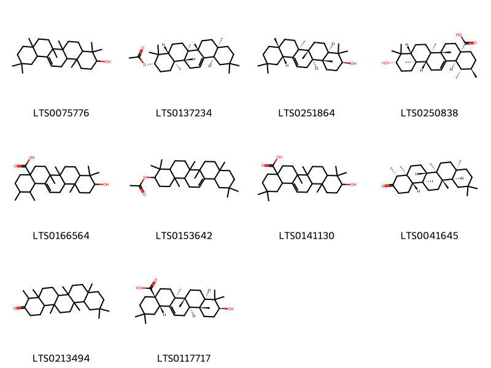{ width=100% }
    <figcaption>Hình ảnh cấu trúc hóa học của 10 hoạt chất thuộc nhóm Prenol lipids gồm ['β-amyrin (LTS0075776)', 'β-amyrin acetate (LTS0137234)', 'β-amyrin (LTS0251864)', 'ursolic acid (LTS0250838)', '10-hydroxy-1,2,6a,6b,9,9,12a-heptamethyl-2,3,4,5,6,7,8,8a,10,11,12,12b,13,14b-tetradecahydro-1h-picene-4a-carboxylic acid (LTS0166564)', '4,4,6a,6b,8a,11,11,14b-octamethyl-1,2,3,4a,5,6,7,8,9,10,12,12a,14,14a-tetradecahydropicen-3-yl acetate (LTS0153642)', 'oleanolic acid (LTS0141130)', '(-)-friedelin (LTS0041645)', 'friedelin (LTS0213494)', 'oleanolic acid (LTS0117717)'].</figcaption>
</figure>
#### Nhóm Steroids and steroid derivatives
<figure markdown="span">
    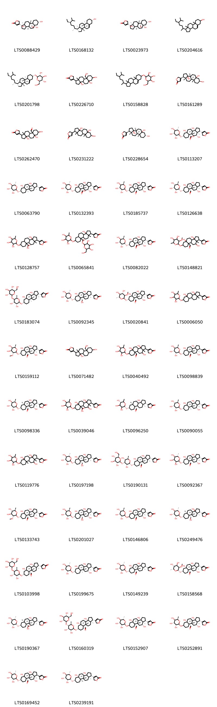{ width=100% }
    <figcaption>Hình ảnh cấu trúc hóa học của 103 hoạt chất thuộc nhóm Steroids and steroid derivatives gồm ['4-[(1r,3as,3br,5as,7s,9ar,9bs,11ar)-3a,5a,7-trihydroxy-9a-(hydroxymethyl)-11a-methyl-dodecahydro-1h-cyclopenta[a]phenanthren-1-yl]-5h-furan-2-one (LTS0088429)', 'sitosterol (LTS0168132)', 'strophanthidin (LTS0023973)', 'stigmast-5-en-3-ol, (3β)- (LTS0204616)', 'sitogluside (LTS0201798)', '4-[3a,5a,7-trihydroxy-9a-(hydroxymethyl)-11a-methyl-dodecahydro-1h-cyclopenta[a]phenanthren-1-yl]-5h-furan-2-one (LTS0226710)', '2-{[1-(5-ethyl-6-methylheptan-2-yl)-9a,11a-dimethyl-1h,2h,3h,3ah,3bh,4h,6h,7h,8h,9h,9bh,10h,11h-cyclopenta[a]phenanthren-7-yl]oxy}-6-(hydroxymethyl)oxane-3,4,5-triol (LTS0158828)', 'periplogenin (LTS0161289)', 'strophanthidin (LTS0262470)', '4-{3a,5a,7-trihydroxy-9a,11a-dimethyl-dodecahydro-1h-cyclopenta[a]phenanthren-1-yl}-5h-furan-2-one (LTS0231222)', '4-[(1r,3as,3br,5as,7r,9ar,9bs,11ar)-3a,5a,7-trihydroxy-9a,11a-dimethyl-dodecahydro-1h-cyclopenta[a]phenanthren-1-yl]-5h-furan-2-one (LTS0228654)', '(1r,3as,3br,5as,7s,9as,9bs,11r,11as)-3a,5a,11-trihydroxy-11a-methyl-1-(5-oxo-2h-furan-3-yl)-7-{[(2r,3r,4r,5r,6s)-3,4,5-trihydroxy-6-methyloxan-2-yl]oxy}-dodecahydro-1h-cyclopenta[a]phenanthrene-9a-carboxylic acid (LTS0113207)', '4-[(1r,3as,3br,5as,7s,9ar,9bs,11ar)-3a,5a-dihydroxy-9a,11a-dimethyl-7-{[(2r,3r,4r,5r,6s)-3,4,5-trihydroxy-6-methyloxan-2-yl]oxy}-dodecahydro-1h-cyclopenta[a]phenanthren-1-yl]-5h-furan-2-one (LTS0063790)', '(1r,3as,3br,5as,7s,9as,9bs,11r,11as)-3a,5a,11-trihydroxy-11a-methyl-1-(5-oxo-2h-furan-3-yl)-7-{[(2s,3r,4r,5r,6s)-3,4,5-trihydroxy-6-methyloxan-2-yl]oxy}-dodecahydro-1h-cyclopenta[a]phenanthrene-9a-carboxylic acid (LTS0132393)', 'antiarin (LTS0185737)', '(1r,3as,3br,5as,7s,9as,9bs,11r,11as)-3a,5a,11-trihydroxy-11a-methyl-1-(5-oxo-2h-furan-3-yl)-7-{[(2s,3r,4r,5s,6r)-3,4,5-trihydroxy-6-methyloxan-2-yl]oxy}-dodecahydro-1h-cyclopenta[a]phenanthrene-9a-carbaldehyde (LTS0126638)', '3a-hydroxy-11a-methyl-1-(5-oxo-2h-furan-3-yl)-7-[(3,4,5-trihydroxy-6-methyloxan-2-yl)oxy]-tetradecahydrocyclopenta[a]phenanthrene-9a-carboxylic acid (LTS0128757)', '3,4,5-trihydroxy-6-(hydroxymethyl)oxan-2-yl 3a-hydroxy-11a-methyl-1-(5-oxo-2h-furan-3-yl)-7-[(3,4,5-trihydroxy-6-methyloxan-2-yl)oxy]-tetradecahydrocyclopenta[a]phenanthrene-9a-carboxylate (LTS0065841)', '(1r,3as,3br,5as,7s,9as,9bs,11r,11as)-3a,5a,11-trihydroxy-11a-methyl-1-(5-oxo-2h-furan-3-yl)-7-{[(2s,3r,4r,5r,6r)-3,4,5-trihydroxy-6-methyloxan-2-yl]oxy}-dodecahydro-1h-cyclopenta[a]phenanthrene-9a-carboxylic acid (LTS0082022)', '7-[(4,5-dihydroxy-3-methoxy-6-methyloxan-2-yl)oxy]-3a,5a,11-trihydroxy-11a-methyl-1-(5-oxo-2h-furan-3-yl)-dodecahydro-1h-cyclopenta[a]phenanthrene-9a-carbaldehyde (LTS0148821)', '4-[(1r,3as,3br,5as,7s,9ar,9bs,11ar)-7-{[(2r,3r,4s,5r,6r)-3,4-dihydroxy-6-methyl-5-{[(2s,3r,4s,5s,6r)-3,4,5-trihydroxy-6-(hydroxymethyl)oxan-2-yl]oxy}oxan-2-yl]oxy}-3a,5a-dihydroxy-9a,11a-dimethyl-dodecahydro-1h-cyclopenta[a]phenanthren-1-yl]-5h-furan-2-one (LTS0183074)', '4-[(1r,3as,3br,5as,7s,9ar,9bs,11ar)-3a,5a-dihydroxy-9a-(hydroxymethyl)-11a-methyl-7-{[(2s,3r,4r,5r,6s)-3,4,5-trihydroxy-6-methyloxan-2-yl]oxy}-dodecahydro-1h-cyclopenta[a]phenanthren-1-yl]-5h-furan-2-one (LTS0092345)', '(1r,3as,3br,5as,7s,9as,9bs,11r,11as)-7-{[(2s,3r,4s,5s,6r)-4,5-dihydroxy-3-methoxy-6-methyloxan-2-yl]oxy}-3a,5a,11-trihydroxy-11a-methyl-1-(5-oxo-2h-furan-3-yl)-dodecahydro-1h-cyclopenta[a]phenanthrene-9a-carbaldehyde (LTS0020841)', '4-{3a,5a-dihydroxy-11a-methyl-7-[(3,4,5-trihydroxy-6-methyloxan-2-yl)oxy]-tetradecahydrocyclopenta[a]phenanthren-1-yl}-5h-furan-2-one (LTS0006050)', '(1r,3as,3br,5as,7s,9as,9bs,11r,11as)-7-{[(2r,3r,4s,5r,6r)-4,5-dihydroxy-3-methoxy-6-methyloxan-2-yl]oxy}-3a,5a,11-trihydroxy-11a-methyl-1-(5-oxo-2h-furan-3-yl)-dodecahydro-1h-cyclopenta[a]phenanthrene-9a-carbaldehyde (LTS0159112)', '4-[3a,7-dihydroxy-9a-(hydroxymethyl)-11a-methyl-tetradecahydrocyclopenta[a]phenanthren-1-yl]-5h-furan-2-one (LTS0071482)', '3a,5a,11-trihydroxy-11a-methyl-1-(5-oxo-2h-furan-3-yl)-7-[(3,4,5-trihydroxy-6-methyloxan-2-yl)oxy]-dodecahydro-1h-cyclopenta[a]phenanthrene-9a-carbaldehyde (LTS0040492)', '(1s,3as,3br,5as,7s,9as,9bs,11r,11as)-3a,5a,11-trihydroxy-11a-methyl-1-(5-oxo-2h-furan-3-yl)-7-{[(2r,3r,4r,5r,6r)-3,4,5-trihydroxy-6-methyloxan-2-yl]oxy}-dodecahydro-1h-cyclopenta[a]phenanthrene-9a-carbaldehyde (LTS0098839)', '(1r,3as,3br,5ar,7s,9ar,9bs,11r,11as)-3a,11-dihydroxy-11a-methyl-1-(5-oxo-2h-furan-3-yl)-7-{[(2r,3r,4r,5r,6r)-3,4,5-trihydroxy-6-methyloxan-2-yl]oxy}-tetradecahydrocyclopenta[a]phenanthrene-9a-carbaldehyde (LTS0098336)', '3a,5a,11-trihydroxy-11a-methyl-1-(5-oxo-2h-furan-3-yl)-7-[(3,4,5-trihydroxy-6-methyloxan-2-yl)oxy]-dodecahydro-1h-cyclopenta[a]phenanthrene-9a-carboxylic acid (LTS0039046)', '(1r,3as,5ar,7s,9ar,11ar)-3a-hydroxy-11a-methyl-1-(5-oxo-2h-furan-3-yl)-7-{[(2s,5s)-3,4,5-trihydroxy-6-methyloxan-2-yl]oxy}-tetradecahydrocyclopenta[a]phenanthrene-9a-carbaldehyde (LTS0096250)', '4-[(1r,3as,3br,5as,7s,9ar,9bs,11r,11as)-3a,5a,11-trihydroxy-9a,11a-dimethyl-7-{[(2r,3r,4r,5s,6r)-3,4,5-trihydroxy-6-methyloxan-2-yl]oxy}-dodecahydro-1h-cyclopenta[a]phenanthren-1-yl]-5h-furan-2-one (LTS0090055)', '4-{3a,5a,11-trihydroxy-9a,11a-dimethyl-7-[(3,4,5-trihydroxy-6-methyloxan-2-yl)oxy]-dodecahydro-1h-cyclopenta[a]phenanthren-1-yl}-5h-furan-2-one (LTS0119776)', '4-[(1r,3as,3br,5as,7s,9ar,9bs,11ar)-3a,5a-dihydroxy-9a-(hydroxymethyl)-11a-methyl-7-{[(2r,3r,4r,5r,6s)-3,4,5-trihydroxy-6-methyloxan-2-yl]oxy}-dodecahydro-1h-cyclopenta[a]phenanthren-1-yl]-5h-furan-2-one (LTS0197198)', '(1r,3as,3br,5as,7s,9as,9bs,11ar)-7-{[(2s,3r,4r,5r,6r)-3,5-dihydroxy-6-methyl-4-{[(2s,3r,4s,5s,6r)-3,4,5-trihydroxy-6-(hydroxymethyl)oxan-2-yl]oxy}oxan-2-yl]oxy}-3a,5a-dihydroxy-11a-methyl-1-(5-oxo-2h-furan-3-yl)-dodecahydro-1h-cyclopenta[a]phenanthrene-9a-carbaldehyde (LTS0190131)', '(1r,3as,3br,5as,7s,9as,9bs,11r,11as)-3a,5a,11-trihydroxy-11a-methyl-1-(5-oxo-2h-furan-3-yl)-7-{[(2r,3s,4s,5r,6s)-3,4,5-trihydroxy-6-methyloxan-2-yl]oxy}-dodecahydro-1h-cyclopenta[a]phenanthrene-9a-carbaldehyde (LTS0092367)', '(1r,3as,3br,5as,7s,9as,9bs,11r,11as)-7-{[(2r,3r,4s,5s,6r)-4,5-dihydroxy-3-methoxy-6-methyloxan-2-yl]oxy}-3a,5a,11-trihydroxy-11a-methyl-1-(5-oxo-2h-furan-3-yl)-dodecahydro-1h-cyclopenta[a]phenanthrene-9a-carbaldehyde (LTS0133743)', '4-[(1r,3as,3br,5as,7s,9ar,9bs,11r,11as)-3a,5a,11-trihydroxy-9a-(hydroxymethyl)-11a-methyl-7-{[(2r,3r,4r,5r,6r)-3,4,5-trihydroxy-6-methyloxan-2-yl]oxy}-dodecahydro-1h-cyclopenta[a]phenanthren-1-yl]-5h-furan-2-one (LTS0201027)', '(1r,3as,3br,5as,7r,9as,9bs,11r,11as)-3a,5a,11-trihydroxy-11a-methyl-1-(5-oxo-2h-furan-3-yl)-7-{[(2r,3r,4r,5s,6r)-3,4,5-trihydroxy-6-methyloxan-2-yl]oxy}-dodecahydro-1h-cyclopenta[a]phenanthrene-9a-carbaldehyde (LTS0146806)', '4-[(1r,3br,5ar,7s,9ar,9bs,11ar)-3a-hydroxy-9a-(hydroxymethyl)-11a-methyl-7-{[(2r,3r,4r,5r,6s)-3,4,5-trihydroxy-6-methyloxan-2-yl]oxy}-tetradecahydrocyclopenta[a]phenanthren-1-yl]-5h-furan-2-one (LTS0249476)', '(1r,3as,3br,5as,7s,9as,9bs,11ar)-7-{[(2r,3r,4s,5r,6r)-3,4-dihydroxy-6-methyl-5-{[(2s,3r,4s,5s,6r)-3,4,5-trihydroxy-6-(hydroxymethyl)oxan-2-yl]oxy}oxan-2-yl]oxy}-3a,5a-dihydroxy-11a-methyl-1-(5-oxo-2h-furan-3-yl)-dodecahydro-1h-cyclopenta[a]phenanthrene-9a-carbaldehyde (LTS0103998)', 'antioside (LTS0199675)', 'convallatoxin (LTS0149239)', '(1r,3as,3br,5as,7s,9as,9bs,11r,11as)-7-{[(2r,3r,4r,5r,6r)-4,5-dihydroxy-3-methoxy-6-methyloxan-2-yl]oxy}-3a,5a,11-trihydroxy-11a-methyl-1-(5-oxo-2h-furan-3-yl)-dodecahydro-1h-cyclopenta[a]phenanthrene-9a-carbaldehyde (LTS0158568)', '(1r,3as,3br,5ar,7s,9ar,9bs,11ar)-3a-hydroxy-11a-methyl-1-(5-oxo-2h-furan-3-yl)-7-{[(2s,3r,4r,5r,6s)-3,4,5-trihydroxy-6-methyloxan-2-yl]oxy}-tetradecahydrocyclopenta[a]phenanthrene-9a-carboxylic acid (LTS0190367)', '(1r,3as,3br,5as,7s,9as,9bs,11ar)-7-{[(2r,3r,4s,5s,6r)-3,4-dihydroxy-6-methyl-5-{[(2s,3r,4s,5s,6r)-3,4,5-trihydroxy-6-(hydroxymethyl)oxan-2-yl]oxy}oxan-2-yl]oxy}-3a,5a-dihydroxy-11a-methyl-1-(5-oxo-2h-furan-3-yl)-dodecahydro-1h-cyclopenta[a]phenanthrene-9a-carbaldehyde (LTS0160319)', '(1r,3as,3br,5as,7r,9as,9bs,11r,11as)-3a,5a,11-trihydroxy-11a-methyl-1-(5-oxo-2h-furan-3-yl)-7-{[(2r,3r,4r,5r,6s)-3,4,5-trihydroxy-6-methyloxan-2-yl]oxy}-dodecahydro-1h-cyclopenta[a]phenanthrene-9a-carbaldehyde (LTS0152907)', '(1r,3as,3br,5as,7r,9as,9bs,11r,11as)-3a,5a,11-trihydroxy-11a-methyl-1-(5-oxo-2h-furan-3-yl)-7-{[(2r,3r,4r,5r,6r)-3,4,5-trihydroxy-6-methyloxan-2-yl]oxy}-dodecahydro-1h-cyclopenta[a]phenanthrene-9a-carbaldehyde (LTS0252891)', '(1s,3as,3br,5as,7s,9as,9bs,11r,11as)-3a,5a,11-trihydroxy-11a-methyl-1-(5-oxo-2h-furan-3-yl)-7-{[(2r,3r,4r,5r,6s)-3,4,5-trihydroxy-6-methyloxan-2-yl]oxy}-dodecahydro-1h-cyclopenta[a]phenanthrene-9a-carbaldehyde (LTS0169452)', '4-[(1r,3as,3br,5as,7s,9ar,9br,11ar)-3a,5a-dihydroxy-11a-methyl-7-{[(2s,3r,4r,5r,6s)-3,4,5-trihydroxy-6-methyloxan-2-yl]oxy}-tetradecahydrocyclopenta[a]phenanthren-1-yl]-5h-furan-2-one (LTS0239191)', '(1r,3as,3br,5as,7s,9as,9bs,11r,11as)-3a,5a,11-trihydroxy-11a-methyl-1-(5-oxo-2h-furan-3-yl)-7-{[(2r,3r,4r,5r,6r)-3,4,5-trihydroxy-6-methyloxan-2-yl]oxy}-dodecahydro-1h-cyclopenta[a]phenanthrene-9a-carboxylic acid (LTS0076909)', '4-{3a,5a-dihydroxy-9a,11a-dimethyl-7-[(3,4,5-trihydroxy-6-methyloxan-2-yl)oxy]-dodecahydro-1h-cyclopenta[a]phenanthren-1-yl}-5h-furan-2-one (LTS0250326)', '4-[(1r,3as,3br,5as,7s,9ar,9bs,11r,11as)-3a,5a,11-trihydroxy-9a,11a-dimethyl-7-{[(2r,3r,4r,5r,6r)-3,4,5-trihydroxy-6-methyloxan-2-yl]oxy}-dodecahydro-1h-cyclopenta[a]phenanthren-1-yl]-5h-furan-2-one (LTS0158578)', '7-[(4,5-dihydroxy-3-methoxy-6-methyloxan-2-yl)oxy]-3a,5a-dihydroxy-11a-methyl-1-(5-oxo-2h-furan-3-yl)-dodecahydro-1h-cyclopenta[a]phenanthrene-9a-carbaldehyde (LTS0248220)', '4-{3a,5a,7-trihydroxy-9a,11a-dimethyl-dodecahydro-1h-cyclopenta[a]phenanthren-1-yl}-4-hydroxyoxolan-2-one (LTS0181059)', '4-[(1r,3as,3br,5as,7s,9ar,9bs,11ar)-3a,5a-dihydroxy-9a-(hydroxymethyl)-11a-methyl-7-{[(2r,3r,4r,5s,6r)-3,4,5-trihydroxy-6-methyloxan-2-yl]oxy}-dodecahydro-1h-cyclopenta[a]phenanthren-1-yl]-5h-furan-2-one (LTS0174657)', '(1r,3as,3br,5as,7s,9as,9bs,11ar)-3a,5a-dihydroxy-11a-methyl-1-(5-oxo-2h-furan-3-yl)-7-{[(2r,3r,4r,5s,6r)-3,4,5-trihydroxy-6-methyloxan-2-yl]oxy}-dodecahydro-1h-cyclopenta[a]phenanthrene-9a-carbaldehyde (LTS0125409)', '4-[(1r,3as,3br,5as,7s,9ar,9bs,11ar)-3a,5a-dihydroxy-9a-(hydroxymethyl)-11a-methyl-7-{[(2r,3r,4r,5r,6r)-3,4,5-trihydroxy-6-methyloxan-2-yl]oxy}-dodecahydro-1h-cyclopenta[a]phenanthren-1-yl]-5h-furan-2-one (LTS0168933)', '(4s)-4-[(1s,3as,3br,5as,7s,9ar,9bs,11ar)-3a,5a,7-trihydroxy-9a,11a-dimethyl-dodecahydro-1h-cyclopenta[a]phenanthren-1-yl]-4-hydroxyoxolan-2-one (LTS0243470)', '(1r,3as,3br,5as,7s,9as,9bs,11ar)-7-{[(2s,3r,4r,5s,6r)-4,5-dihydroxy-3-methoxy-6-methyloxan-2-yl]oxy}-3a,5a-dihydroxy-11a-methyl-1-(5-oxo-2h-furan-3-yl)-dodecahydro-1h-cyclopenta[a]phenanthrene-9a-carbaldehyde (LTS0172962)', '4-[(1r,3as,3br,5ar,7s,9ar,9bs,11ar)-7-{[(2r,3r,4s,5r,6s)-3,4-dihydroxy-6-methyl-5-{[(2s,3r,4s,5s,6r)-3,4,5-trihydroxy-6-(hydroxymethyl)oxan-2-yl]oxy}oxan-2-yl]oxy}-3a-hydroxy-9a-(hydroxymethyl)-11a-methyl-tetradecahydrocyclopenta[a]phenanthren-1-yl]-5h-furan-2-one (LTS0161462)', 'convallatoxin (LTS0185395)', '(1r,3as,3br,5as,7r,9as,9bs,11ar)-3a,5a-dihydroxy-11a-methyl-1-(5-oxo-2h-furan-3-yl)-7-{[(2s,3r,4r,5r,6s)-3,4,5-trihydroxy-6-methyloxan-2-yl]oxy}-dodecahydro-1h-cyclopenta[a]phenanthrene-9a-carbaldehyde (LTS0188462)', '(1r,3as,3br,5as,7s,9as,9bs,11r,11as)-7-{[(2s,3r,4r,6r)-3,4-dihydroxy-6-methyloxan-2-yl]oxy}-3a,5a,11-trihydroxy-11a-methyl-1-(5-oxo-2h-furan-3-yl)-dodecahydro-1h-cyclopenta[a]phenanthrene-9a-carbaldehyde (LTS0256385)', '3a-hydroxy-11a-methyl-1-(5-oxo-2h-furan-3-yl)-7-[(3,4,5-trihydroxy-6-methyloxan-2-yl)oxy]-tetradecahydrocyclopenta[a]phenanthrene-9a-carbaldehyde (LTS0251070)', '4-{7-[(3,4-dihydroxy-6-methyl-5-{[3,4,5-trihydroxy-6-(hydroxymethyl)oxan-2-yl]oxy}oxan-2-yl)oxy]-3a-hydroxy-9a-(hydroxymethyl)-11a-methyl-tetradecahydrocyclopenta[a]phenanthren-1-yl}-5h-furan-2-one (LTS0221481)', '(1r,3as,3br,5ar,7s,9ar,9bs,11ar)-3a-hydroxy-11a-methyl-1-(5-oxo-2h-furan-3-yl)-7-{[(2r,3r,4r,5r,6s)-3,4,5-trihydroxy-6-methyloxan-2-yl]oxy}-tetradecahydrocyclopenta[a]phenanthrene-9a-carbaldehyde (LTS0247415)', '(1r,3as,3br,5as,7s,9as,9bs,11s,11as)-3a,5a,11-trihydroxy-11a-methyl-1-(5-oxo-2h-furan-3-yl)-7-{[(2r,3r,4r,5r,6s)-3,4,5-trihydroxy-6-methyloxan-2-yl]oxy}-dodecahydro-1h-cyclopenta[a]phenanthrene-9a-carbaldehyde (LTS0265310)', '(1r,3as,3br,5ar,7s,9ar,9bs,11r,11as)-3a,11-dihydroxy-11a-methyl-1-(5-oxo-2h-furan-3-yl)-7-{[(2r,3r,4r,5r,6s)-3,4,5-trihydroxy-6-methyloxan-2-yl]oxy}-tetradecahydrocyclopenta[a]phenanthrene-9a-carbaldehyde (LTS0245578)', '4-[(1r,3as,3br,5as,7s,9ar,9bs,11ar)-3a,5a-dihydroxy-9a,11a-dimethyl-7-{[(2r,3r,4r,5r,6r)-3,4,5-trihydroxy-6-methyloxan-2-yl]oxy}-dodecahydro-1h-cyclopenta[a]phenanthren-1-yl]-5h-furan-2-one (LTS0220771)', '4-{7-[(3,4-dihydroxy-6-methyl-5-{[3,4,5-trihydroxy-6-(hydroxymethyl)oxan-2-yl]oxy}oxan-2-yl)oxy]-3a,5a-dihydroxy-9a,11a-dimethyl-dodecahydro-1h-cyclopenta[a]phenanthren-1-yl}-5h-furan-2-one (LTS0229074)', '4-[(1r,3as,3br,5as,7s,9ar,9br,11ar)-3a,5a-dihydroxy-11a-methyl-7-{[(2r,3r,4r,5r,6s)-3,4,5-trihydroxy-6-methyloxan-2-yl]oxy}-tetradecahydrocyclopenta[a]phenanthren-1-yl]-5h-furan-2-one (LTS0233342)', '(2s,3r,4s,5s,6r)-3,4,5-trihydroxy-6-(hydroxymethyl)oxan-2-yl (1r,3as,3br,5ar,7s,9ar,9bs,11ar)-3a-hydroxy-11a-methyl-1-(5-oxo-2h-furan-3-yl)-7-{[(2r,3r,4r,5r,6s)-3,4,5-trihydroxy-6-methyloxan-2-yl]oxy}-tetradecahydrocyclopenta[a]phenanthrene-9a-carboxylate (LTS0179353)', '(1r,3as,3br,5as,7s,9as,9bs,11ar)-7-{[(2r,3r,4r,5s,6r)-4,5-dihydroxy-3-methoxy-6-methyloxan-2-yl]oxy}-3a,5a-dihydroxy-11a-methyl-1-(5-oxo-2h-furan-3-yl)-dodecahydro-1h-cyclopenta[a]phenanthrene-9a-carbaldehyde (LTS0208224)', 'convallotoxol (LTS0238392)', '3a,5a,7,11-tetrahydroxy-11a-methyl-1-(5-oxo-2h-furan-3-yl)-dodecahydro-1h-cyclopenta[a]phenanthrene-9a-carbaldehyde (LTS0187855)', '(1r,3as,3br,5ar,7s,9ar,9bs,11ar)-3a-hydroxy-11a-methyl-1-(5-oxo-2h-furan-3-yl)-7-{[(2s,3r,4r,5r,6s)-3,4,5-trihydroxy-6-methyloxan-2-yl]oxy}-tetradecahydrocyclopenta[a]phenanthrene-9a-carbaldehyde (LTS0028564)', '(1r,3as,3br,5as,7s,9as,9bs,11r,11as)-3a,5a,11-trihydroxy-11a-methyl-1-(5-oxo-2h-furan-3-yl)-7-{[(2r,3r,4r,5r,6s)-3,4,5-trihydroxy-6-methyloxan-2-yl]oxy}-dodecahydro-1h-cyclopenta[a]phenanthrene-9a-carbaldehyde (LTS0182809)', '4-[(1r,3as,3br,5as,7s,9ar,9bs,11ar)-3a,5a,7-trihydroxy-11a-methyl-9a-({[(2r,3r,4s,5s,6r)-3,4,5-trihydroxy-6-(hydroxymethyl)oxan-2-yl]oxy}methyl)-dodecahydro-1h-cyclopenta[a]phenanthren-1-yl]-5h-furan-2-one (LTS0207110)', '(1r,3as,3br,5as,7s,9as,9bs,11r,11as)-3a,5a,11-trihydroxy-11a-methyl-1-(5-oxo-2h-furan-3-yl)-7-{[(2s,3r,4r,5r,6s)-3,4,5-trihydroxy-6-methyloxan-2-yl]oxy}-dodecahydro-1h-cyclopenta[a]phenanthrene-9a-carbaldehyde (LTS0056173)', '(1r,3as,3br,5ar,7s,9ar,9bs,11ar)-3a-hydroxy-11a-methyl-1-(5-oxo-2h-furan-3-yl)-7-{[(2r,3r,4r,5r,6s)-3,4,5-trihydroxy-6-methyloxan-2-yl]oxy}-tetradecahydrocyclopenta[a]phenanthrene-9a-carboxylic acid (LTS0254830)', '(2s,3r,4s,5s,6r)-3,4,5-trihydroxy-6-(hydroxymethyl)oxan-2-yl (1r,3as,3br,5as,7s,9as,9bs,11ar)-3a,5a,7-trihydroxy-11a-methyl-1-(5-oxo-2h-furan-3-yl)-dodecahydro-1h-cyclopenta[a]phenanthrene-9a-carboxylate (LTS0253079)', '(1r,3as,3br,5as,7s,9as,9bs,11ar)-7-{[(2r,3r,4s,5r,6s)-3,4-dihydroxy-6-methyl-5-{[(2s,3r,4s,5s,6r)-3,4,5-trihydroxy-6-(hydroxymethyl)oxan-2-yl]oxy}oxan-2-yl]oxy}-3a,5a-dihydroxy-11a-methyl-1-(5-oxo-2h-furan-3-yl)-dodecahydro-1h-cyclopenta[a]phenanthrene-9a-carbaldehyde (LTS0195273)', '(1r,3as,3br,5as,7r,9as,9bs,11ar)-3a,5a-dihydroxy-11a-methyl-1-(5-oxo-2h-furan-3-yl)-7-{[(2r,3r,4r,5r,6s)-3,4,5-trihydroxy-6-methyloxan-2-yl]oxy}-dodecahydro-1h-cyclopenta[a]phenanthrene-9a-carbaldehyde (LTS0119579)', '4-[(1r,3as,3br,5as,7s,9ar,9bs,11ar)-3a,5a-dihydroxy-9a,11a-dimethyl-7-{[(2s,3r,4r,5r,6s)-3,4,5-trihydroxy-6-methyloxan-2-yl]oxy}-dodecahydro-1h-cyclopenta[a]phenanthren-1-yl]-5h-furan-2-one (LTS0056080)', '(1r,3as,3br,5ar,9as,9bs,11r,11as)-3a,5a,11-trihydroxy-11a-methyl-1-(5-oxo-2h-furan-3-yl)-dodecahydro-1h-cyclopenta[a]phenanthrene-9a-carbaldehyde (LTS0136382)', '(1r,3as,3br,5as,7r,9as,9bs,11ar)-3a,5a-dihydroxy-11a-methyl-1-(5-oxo-2h-furan-3-yl)-7-{[(2r,3r,4r,5r,6r)-3,4,5-trihydroxy-6-methyloxan-2-yl]oxy}-dodecahydro-1h-cyclopenta[a]phenanthrene-9a-carbaldehyde (LTS0001215)', '(1r,3as,3br,5as,7s,9as,9bs,11ar)-3a,5a-dihydroxy-11a-methyl-1-(5-oxo-2h-furan-3-yl)-7-{[(2r,3r,4r,5r,6r)-3,4,5-trihydroxy-6-methyloxan-2-yl]oxy}-dodecahydro-1h-cyclopenta[a]phenanthrene-9a-carbaldehyde (LTS0002016)', '4-[(1r,3as,3br,5ar,7s,9ar,9bs,11r,11as)-3a,11-dihydroxy-9a-(hydroxymethyl)-11a-methyl-7-{[(2r,3r,4r,5r,6r)-3,4,5-trihydroxy-6-methyloxan-2-yl]oxy}-tetradecahydrocyclopenta[a]phenanthren-1-yl]-5h-furan-2-one (LTS0068722)', '4-[(1r,3as,3br,5as,7s,9ar,11r,11as)-3a,5a,11-trihydroxy-9a,11a-dimethyl-7-[(3,4,5-trihydroxy-6-methyloxan-2-yl)oxy]-dodecahydro-1h-cyclopenta[a]phenanthren-1-yl]-5h-furan-2-one (LTS0009234)', '4-[(1r,3as,3br,5ar,7s,9ar,9bs,11ar)-3a-hydroxy-9a-(hydroxymethyl)-11a-methyl-7-{[(2r,3r,4r,5r,6s)-3,4,5-trihydroxy-6-methyloxan-2-yl]oxy}-tetradecahydrocyclopenta[a]phenanthren-1-yl]-5h-furan-2-one (LTS0062420)', '(2s,3r,4s,5s,6r)-3,4,5-trihydroxy-6-(hydroxymethyl)oxan-2-yl (1r,3as,3br,5ar,7s,9ar,9bs,11ar)-3a-hydroxy-11a-methyl-1-(5-oxo-2h-furan-3-yl)-7-{[(2s,3r,4r,5r,6s)-3,4,5-trihydroxy-6-methyloxan-2-yl]oxy}-tetradecahydrocyclopenta[a]phenanthrene-9a-carboxylate (LTS0010146)', '4-[(1r,3as,3br,5ar,7s,9ar,9bs,11ar)-3a,7-dihydroxy-9a-(hydroxymethyl)-11a-methyl-tetradecahydrocyclopenta[a]phenanthren-1-yl]-5h-furan-2-one (LTS0013018)', '(1r,3as,5as,7s,9as,11r,11as)-3a,5a,7,11-tetrahydroxy-11a-methyl-1-(5-oxo-2h-furan-3-yl)-dodecahydro-1h-cyclopenta[a]phenanthrene-9a-carbaldehyde (LTS0032146)', '(1r,3as,3br,5as,7s,9as,9bs,11r,11as)-3a,5a,11-trihydroxy-11a-methyl-1-(5-oxo-2h-furan-3-yl)-7-{[(2r,3r,4r,5s,6r)-3,4,5-trihydroxy-6-methyloxan-2-yl]oxy}-dodecahydro-1h-cyclopenta[a]phenanthrene-9a-carboxylic acid (LTS0018288)', '(1r,3as,3br,5as,7s,9as,9bs,11r,11as)-3a,5a,7,11-tetrahydroxy-11a-methyl-1-(5-oxo-2h-furan-3-yl)-dodecahydro-1h-cyclopenta[a]phenanthrene-9a-carbaldehyde (LTS0016911)', 'convalloside (LTS0099928)', '4-[(1r,3as,3br,5ar,7r,9ar,9bs,11ar)-7-{[(2r,3r,4s,5r,6s)-3,4-dihydroxy-6-methyl-5-{[(2s,3r,4s,5s,6r)-3,4,5-trihydroxy-6-(hydroxymethyl)oxan-2-yl]oxy}oxan-2-yl]oxy}-3a-hydroxy-9a-(hydroxymethyl)-11a-methyl-tetradecahydrocyclopenta[a]phenanthren-1-yl]-5h-furan-2-one (LTS0020787)', '4-[(1r,3as,3br,5as,7s,9ar,9bs,11r,11as)-3a,5a,11-trihydroxy-9a-(hydroxymethyl)-11a-methyl-7-{[(2r,3r,4r,5r,6s)-3,4,5-trihydroxy-6-methyloxan-2-yl]oxy}-dodecahydro-1h-cyclopenta[a]phenanthren-1-yl]-5h-furan-2-one (LTS0069028)', '(1r,3as,3br,5as,7s,9as,9bs,11r,11as)-3a,5a,11-trihydroxy-11a-methyl-1-(5-oxo-2h-furan-3-yl)-7-{[(2s,3r,4r,5r,6r)-3,4,5-trihydroxy-6-methyloxan-2-yl]oxy}-dodecahydro-1h-cyclopenta[a]phenanthrene-9a-carbaldehyde (LTS0242746)', '(1r,3as,3br,5as,7s,9as,9bs,11r,11as)-7-{[(2r,3r,4r,5s,6r)-4,5-dihydroxy-3-methoxy-6-methyloxan-2-yl]oxy}-3a,5a,11-trihydroxy-11a-methyl-1-(5-oxo-2h-furan-3-yl)-dodecahydro-1h-cyclopenta[a]phenanthrene-9a-carbaldehyde (LTS0136656)', '(1r,3as,3br,5as,7s,9as,9bs,11r,11as)-3a,5a,11-trihydroxy-11a-methyl-1-(5-oxo-2h-furan-3-yl)-7-{[(2r,3r,4r,5s,6r)-3,4,5-trihydroxy-6-methyloxan-2-yl]oxy}-dodecahydro-1h-cyclopenta[a]phenanthrene-9a-carbaldehyde (LTS0270760)', '(1r,3as,3br,5as,7r,9as,9bs,11ar)-7-{[(2r,3r,4s,5r,6s)-3,4-dihydroxy-6-methyl-5-{[(2s,3r,4s,5s,6r)-3,4,5-trihydroxy-6-(hydroxymethyl)oxan-2-yl]oxy}oxan-2-yl]oxy}-3a,5a-dihydroxy-11a-methyl-1-(5-oxo-2h-furan-3-yl)-dodecahydro-1h-cyclopenta[a]phenanthrene-9a-carbaldehyde (LTS0247921)'].</figcaption>
</figure>

---

### Dược dân tộc học

Danh sách các quốc gia có sử dụng *Antiaris toxicaria* trong điều trị các bệnh. 

| Country   | Disease        | Bệnh                                                                                                                                                                                                |
|:----------|:---------------|:----------------------------------------------------------------------------------------------------------------------------------------------------------------------------------------------------|
| Elsewhere | Poison, Poison | MYMEMORY WARNING: YOU USED ALL AVAILABLE FREE TRANSLATIONS FOR TODAY. NEXT AVAILABLE IN  02 HOURS 51 MINUTES 53 SECONDS VISIT HTTPS://MYMEMORY.TRANSLATED.NET/DOC/USAGELIMITS.PHP TO TRANSLATE MORE |
| Solomon I | Poison         | MYMEMORY WARNING: YOU USED ALL AVAILABLE FREE TRANSLATIONS FOR TODAY. NEXT AVAILABLE IN  02 HOURS 51 MINUTES 51 SECONDS VISIT HTTPS://MYMEMORY.TRANSLATED.NET/DOC/USAGELIMITS.PHP TO TRANSLATE MORE |

---

# Chi Naucleopsis

??? note "Danh sách các dược liệu thuộc chi"
    
	 - *Naucleopsis mello-barretoi*

---
## Naucleopsis mellobarretoi
### Thông tin về thực vật

!!! info "Phân loại thực vật của *Naucleopsis oblongifolia* từ GIBF:"
    - **Kingdom:** Plantae
    - **Phylum:** Tracheophyta
    - **Order:** Rosales
    - **Family:** Moraceae
    - **Genus:** Naucleopsis
    - **Species:** *Naucleopsis oblongifolia*

 

| Label (VI)   | Label (EN)   | Scientific Name    | Descriptions (VI)   | Descriptions (EN)   | Also Known As (VI)   | Also Known As (EN)   |
|:-------------|:-------------|:-------------------|:--------------------|:--------------------|:---------------------|:---------------------|
| N/A          | N/A          | Antiaris toxicaria | loài thực vật       | species of plant    | ['']                 | ['Upas tree']        |

#### Phân bố trên thế giới

**Từ CSDL GIBF** nan, Ecuador, Colombia, Brazil, Peru

#### Phân bố tại Việt Nam

**Từ CSDL GIBF**: Không có ghi nhận ở Việt Nam

---
### Thành phần hóa học
        
- Theo cơ sở dữ liệu lotus: Từ loài *Naucleopsis oblongifolia* đã phân lập và xác định được Chưa có hoạt chất nào được phân lập. hoạt chất thuộc về các nhóm Không có hoạt chất nào được phân lập. 

Không có hình ảnh nào được tạo ra

---

### Dược dân tộc học

Danh sách các quốc gia có sử dụng *Naucleopsis oblongifolia* trong điều trị các bệnh. 

| Country   | Disease     | Bệnh                                                                                                                                                                                                |
|:----------|:------------|:----------------------------------------------------------------------------------------------------------------------------------------------------------------------------------------------------|
| Brazil    | Cardiotonic | MYMEMORY WARNING: YOU USED ALL AVAILABLE FREE TRANSLATIONS FOR TODAY. NEXT AVAILABLE IN  02 HOURS 51 MINUTES 13 SECONDS VISIT HTTPS://MYMEMORY.TRANSLATED.NET/DOC/USAGELIMITS.PHP TO TRANSLATE MORE |

---

# Chi Streblus

??? note "Danh sách các dược liệu thuộc chi"
    
	 - *Streblus aer*

---
## Streblus aer
### Thông tin về thực vật

!!! info "Phân loại thực vật của *N/A* từ GIBF:"
    - **Kingdom:** N/A
    - **Phylum:** N/A
    - **Order:** N/A
    - **Family:** N/A
    - **Genus:** N/A
    - **Species:** *N/A*

 

| Label (VI)   | Label (EN)   | Scientific Name    | Descriptions (VI)   | Descriptions (EN)   | Also Known As (VI)   | Also Known As (EN)   |
|:-------------|:-------------|:-------------------|:--------------------|:--------------------|:---------------------|:---------------------|
| N/A          | N/A          | Antiaris toxicaria | loài thực vật       | species of plant    | ['']                 | ['Upas tree']        |

#### Phân bố trên thế giới

**Từ CSDL GIBF** Không có kết quả phù hợp

#### Phân bố tại Việt Nam

**Từ CSDL GIBF**: Không có ghi nhận ở Việt Nam

---
### Thành phần hóa học
        
- Theo cơ sở dữ liệu lotus: Từ loài *N/A* đã phân lập và xác định được Chưa có hoạt chất nào được phân lập. hoạt chất thuộc về các nhóm Không có hoạt chất nào được phân lập. 

Không có hình ảnh nào được tạo ra

---

### Dược dân tộc học

Danh sách các quốc gia có sử dụng *N/A* trong điều trị các bệnh. 

| Country   | Disease                                           | Bệnh                                                                                                                                                                                                |
|:----------|:--------------------------------------------------|:----------------------------------------------------------------------------------------------------------------------------------------------------------------------------------------------------|
| Elsewhere | Antiseptic, Dentifrice, Sedative, Rennet, Cardiac | MYMEMORY WARNING: YOU USED ALL AVAILABLE FREE TRANSLATIONS FOR TODAY. NEXT AVAILABLE IN  02 HOURS 50 MINUTES 54 SECONDS VISIT HTTPS://MYMEMORY.TRANSLATED.NET/DOC/USAGELIMITS.PHP TO TRANSLATE MORE |
| Java      | Lactagogue                                        | MYMEMORY WARNING: YOU USED ALL AVAILABLE FREE TRANSLATIONS FOR TODAY. NEXT AVAILABLE IN  02 HOURS 50 MINUTES 52 SECONDS VISIT HTTPS://MYMEMORY.TRANSLATED.NET/DOC/USAGELIMITS.PHP TO TRANSLATE MORE |

---

# Chi Broussonetia

??? note "Danh sách các dược liệu thuộc chi"
    
	 - *Broussonetia papyrifera*

---
## Broussonetia papyrifera
### Thông tin về thực vật

!!! info "Phân loại thực vật của *Broussonetia papyrifera* từ GIBF:"
    - **Kingdom:** Plantae
    - **Phylum:** Tracheophyta
    - **Order:** Rosales
    - **Family:** Moraceae
    - **Genus:** Broussonetia
    - **Species:** *Broussonetia papyrifera*

 

| Label (VI)   | Label (EN)   | Scientific Name         | Descriptions (VI)   | Descriptions (EN)   | Also Known As (VI)                     | Also Known As (EN)   |
|:-------------|:-------------|:------------------------|:--------------------|:--------------------|:---------------------------------------|:---------------------|
| N/A          | N/A          | Broussonetia papyrifera | loài thực vật       | species of plant    | ['Ró', 'Dó', 'Dâu giấy', 'Cấu', 'Cốc'] | ['paper mulberry']   |

#### Phân bố trên thế giới

**Từ CSDL GIBF** Uganda, Australia, Thailand, Chinese Taipei, New Zealand, Argentina, Tonga, United States of America, China

#### Phân bố tại Việt Nam

**Từ CSDL GIBF**: Không có ghi nhận ở Việt Nam

---
### Thành phần hóa học
        
- Theo cơ sở dữ liệu lotus: Từ loài *Broussonetia papyrifera* đã phân lập và xác định được 310 hoạt chất thuộc về các nhóm Tetralins, Piperidines, Benzofurans, Stilbenes, Phenols, Pyrrolizidines, Pyrrolines, Amaryllidaceae alkaloids, Fatty Acyls, Pyrrolidines, Cinnamic acids and derivatives, Aporphines, Cinnamaldehydes, Carboximidic acids and derivatives, Coumarans, Prenol lipids, Linear 1,3-diarylpropanoids, Purine nucleosides, Benzene and substituted derivatives, Organooxygen compounds, Aurone flavonoids, Furanoid lignans, Flavonoids, Pyrans, 2-arylbenzofuran flavonoids, Coumarins and derivatives, Benzopyrans. 

|    | chemicalTaxonomyClassyfireClass     |   smiles_count |
|---:|:------------------------------------|---------------:|
|  0 |                                     |              9 |
|  1 | 2-arylbenzofuran flavonoids         |             19 |
|  2 | Amaryllidaceae alkaloids            |              1 |
|  3 | Aporphines                          |              1 |
|  4 | Aurone flavonoids                   |              3 |
|  5 | Benzene and substituted derivatives |              2 |
|  6 | Benzofurans                         |              3 |
|  7 | Benzopyrans                         |              6 |
|  8 | Carboximidic acids and derivatives  |              1 |
|  9 | Cinnamaldehydes                     |              2 |
| 10 | Cinnamic acids and derivatives      |              5 |
| 11 | Coumarans                           |              2 |
| 12 | Coumarins and derivatives           |              4 |
| 13 | Fatty Acyls                         |             13 |
| 14 | Flavonoids                          |             99 |
| 15 | Furanoid lignans                    |              7 |
| 16 | Linear 1,3-diarylpropanoids         |             44 |
| 17 | Organooxygen compounds              |             20 |
| 18 | Phenols                             |              6 |
| 19 | Piperidines                         |              6 |
| 20 | Prenol lipids                       |             16 |
| 21 | Purine nucleosides                  |              2 |
| 22 | Pyrans                              |              1 |
| 23 | Pyrrolidines                        |             24 |
| 24 | Pyrrolines                          |              4 |
| 25 | Pyrrolizidines                      |              2 |
| 26 | Stilbenes                           |              4 |
| 27 | Tetralins                           |              4 |

#### Nhóm 
<figure markdown="span">
    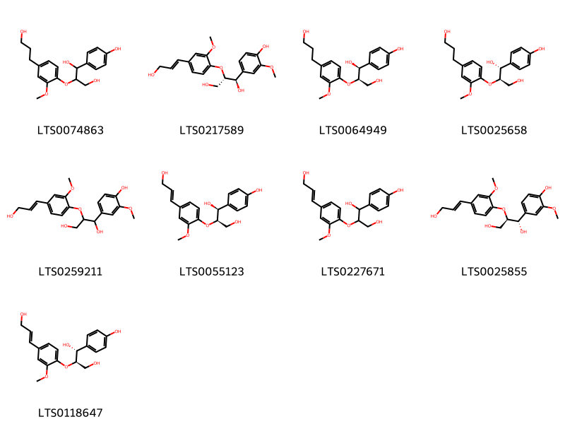{ width=100% }
    <figcaption>Hình ảnh cấu trúc hóa học của 9 hoạt chất thuộc nhóm  gồm ['1-(4-hydroxyphenyl)-2-[4-(3-hydroxypropyl)-2-methoxyphenoxy]propane-1,3-diol (LTS0074863)', '(1r,2s)-1-(4-hydroxy-3-methoxyphenyl)-2-{4-[(1e)-3-hydroxyprop-1-en-1-yl]-2-methoxyphenoxy}propane-1,3-diol (LTS0217589)', '(1s,2r)-1-(4-hydroxyphenyl)-2-[4-(3-hydroxypropyl)-2-methoxyphenoxy]propane-1,3-diol (LTS0064949)', '(1r,2r)-1-(4-hydroxyphenyl)-2-[4-(3-hydroxypropyl)-2-methoxyphenoxy]propane-1,3-diol (LTS0025658)', '1-(4-hydroxy-3-methoxyphenyl)-2-[4-(3-hydroxyprop-1-en-1-yl)-2-methoxyphenoxy]propane-1,3-diol (LTS0259211)', '(1s,2r)-1-(4-hydroxyphenyl)-2-{4-[(1e)-3-hydroxyprop-1-en-1-yl]-2-methoxyphenoxy}propane-1,3-diol (LTS0055123)', '1-(4-hydroxyphenyl)-2-[4-(3-hydroxyprop-1-en-1-yl)-2-methoxyphenoxy]propane-1,3-diol (LTS0227671)', '(1s,2r)-1-(4-hydroxy-3-methoxyphenyl)-2-{4-[(1e)-3-hydroxyprop-1-en-1-yl]-2-methoxyphenoxy}propane-1,3-diol (LTS0025855)', '(1r,2r)-1-(4-hydroxyphenyl)-2-{4-[(1e)-3-hydroxyprop-1-en-1-yl]-2-methoxyphenoxy}propane-1,3-diol (LTS0118647)'].</figcaption>
</figure>
#### Nhóm 2-arylbenzofuran flavonoids
<figure markdown="span">
    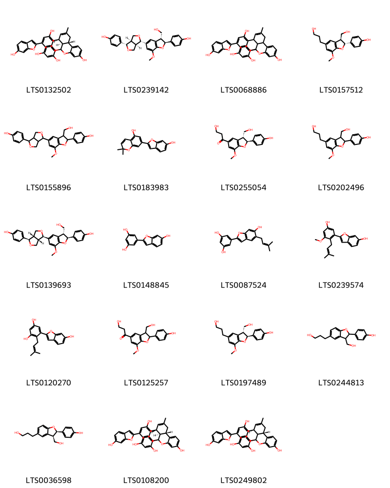{ width=100% }
    <figcaption>Hình ảnh cấu trúc hóa học của 19 hoạt chất thuộc nhóm 2-arylbenzofuran flavonoids gồm ['(1r,9s,13s,21r)-1-(2,4-dihydroxyphenyl)-17-(6-hydroxy-1-benzofuran-2-yl)-11-methyl-2,20-dioxapentacyclo[11.7.1.0³,⁸.0⁹,²¹.0¹⁴,¹⁹]henicosa-3,5,7,11,14,16,18-heptaene-5,15-diol (LTS0132502)', '4-[(1s,3ar,4s,6ar)-4-[(2s,3r)-3-(hydroxymethyl)-2-(4-hydroxyphenyl)-7-methoxy-2,3-dihydro-1-benzofuran-5-yl]-hexahydrofuro[3,4-c]furan-1-yl]phenol (LTS0239142)', '1-(2,4-dihydroxyphenyl)-17-(6-hydroxy-1-benzofuran-2-yl)-11-methyl-2,20-dioxapentacyclo[11.7.1.0³,⁸.0⁹,²¹.0¹⁴,¹⁹]henicosa-3,5,7,11,14,16,18-heptaene-5,15-diol (LTS0068886)', '4-[(2r,3s)-3-(hydroxymethyl)-5-(3-hydroxypropyl)-7-methoxy-2,3-dihydro-1-benzofuran-2-yl]phenol (LTS0157512)', '4-{4-[3-(hydroxymethyl)-2-(4-hydroxyphenyl)-7-methoxy-2,3-dihydro-1-benzofuran-5-yl]-hexahydrofuro[3,4-c]furan-1-yl}phenol (LTS0155896)', '7-(6-hydroxy-1-benzofuran-2-yl)-2,2-dimethylchromen-5-ol (LTS0183983)', '3-hydroxy-1-[(2s,3r)-3-(hydroxymethyl)-2-(4-hydroxyphenyl)-7-methoxy-2,3-dihydro-1-benzofuran-5-yl]propan-1-one (LTS0255054)', '4-[3-(hydroxymethyl)-5-(3-hydroxypropyl)-7-methoxy-2,3-dihydro-1-benzofuran-2-yl]phenol (LTS0202496)', '4-[(1r,3as,4r,6as)-4-[(2s,3r)-3-(hydroxymethyl)-2-(4-hydroxyphenyl)-7-methoxy-2,3-dihydro-1-benzofuran-5-yl]-hexahydrofuro[3,4-c]furan-1-yl]phenol (LTS0139693)', 'moracin m (LTS0148845)', '5-[6-hydroxy-5-(3-methylbut-2-en-1-yl)-1-benzofuran-2-yl]benzene-1,3-diol (LTS0087524)', '2-[5-hydroxy-3-methoxy-2-(3-methylbut-2-en-1-yl)phenyl]-1-benzofuran-6-ol (LTS0239574)', '5-(6-hydroxy-1-benzofuran-2-yl)-4-(3-methylbut-2-en-1-yl)benzene-1,3-diol (LTS0120270)', '3-hydroxy-1-[3-(hydroxymethyl)-2-(4-hydroxyphenyl)-7-methoxy-2,3-dihydro-1-benzofuran-5-yl]propan-1-one (LTS0125257)', '4-[(2s,3r)-3-(hydroxymethyl)-5-(3-hydroxypropyl)-7-methoxy-2,3-dihydro-1-benzofuran-2-yl]phenol (LTS0197489)', '4-[3-(hydroxymethyl)-5-(3-hydroxypropyl)-2,3-dihydro-1-benzofuran-2-yl]phenol (LTS0244813)', '4-[(2r,3r)-3-(hydroxymethyl)-5-(3-hydroxypropyl)-2,3-dihydro-1-benzofuran-2-yl]phenol (LTS0036598)', '(1s,9s,13r,21r)-1-(2,4-dihydroxyphenyl)-17-(6-hydroxy-1-benzofuran-2-yl)-11-methyl-2,20-dioxapentacyclo[11.7.1.0³,⁸.0⁹,²¹.0¹⁴,¹⁹]henicosa-3,5,7,11,14,16,18-heptaene-5,15-diol (LTS0108200)', 'mulberrofuran g (LTS0249802)'].</figcaption>
</figure>
#### Nhóm Amaryllidaceae alkaloids
<figure markdown="span">
    { width=100% }
    <figcaption>Hình ảnh cấu trúc hóa học của 1 hoạt chất thuộc nhóm Amaryllidaceae alkaloids gồm ['12-methyl-5,7,17,19-tetraoxa-12-azahexacyclo[11.11.0.0²,¹⁰.0⁴,⁸.0¹⁴,²².0¹⁶,²⁰]tetracosa-1(13),2(10),3,8,14(22),15,20,23-octaen-11-one (LTS0224597)'].</figcaption>
</figure>
#### Nhóm Aporphines
<figure markdown="span">
    { width=100% }
    <figcaption>Hình ảnh cấu trúc hóa học của 1 hoạt chất thuộc nhóm Aporphines gồm ['liriodenine (LTS0132761)'].</figcaption>
</figure>
#### Nhóm Aurone flavonoids
<figure markdown="span">
    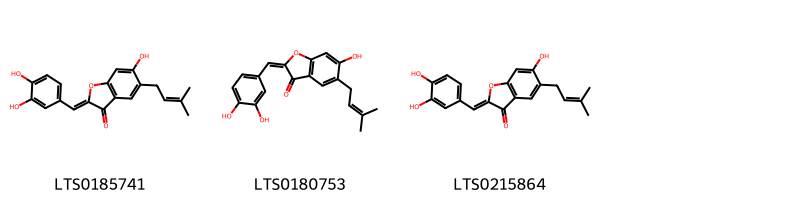{ width=100% }
    <figcaption>Hình ảnh cấu trúc hóa học của 3 hoạt chất thuộc nhóm Aurone flavonoids gồm ['2-[(3,4-dihydroxyphenyl)methylidene]-6-hydroxy-5-(3-methylbut-2-en-1-yl)-1-benzofuran-3-one (LTS0185741)', '(2e)-2-[(3,4-dihydroxyphenyl)methylidene]-6-hydroxy-5-(3-methylbut-2-en-1-yl)-1-benzofuran-3-one (LTS0180753)', '(2z)-2-[(3,4-dihydroxyphenyl)methylidene]-6-hydroxy-5-(3-methylbut-2-en-1-yl)-1-benzofuran-3-one (LTS0215864)'].</figcaption>
</figure>
#### Nhóm Benzene and substituted derivatives
<figure markdown="span">
    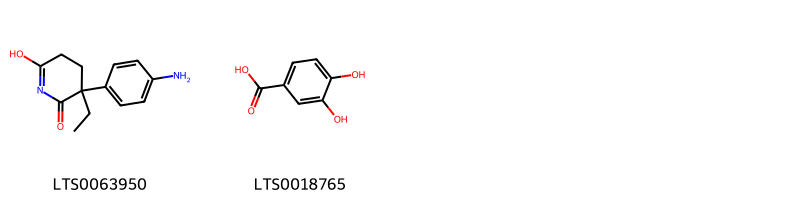{ width=100% }
    <figcaption>Hình ảnh cấu trúc hóa học của 2 hoạt chất thuộc nhóm Benzene and substituted derivatives gồm ['aminoglutethimide (LTS0063950)', '3,4-dihydroxybenzoic acid (LTS0018765)'].</figcaption>
</figure>
#### Nhóm Benzofurans
<figure markdown="span">
    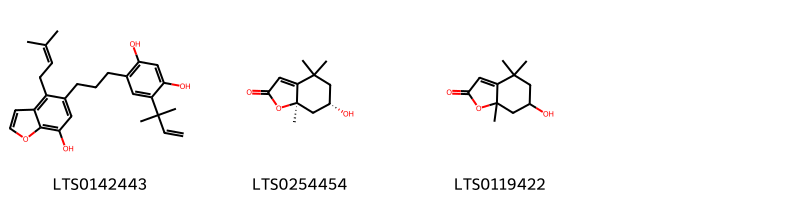{ width=100% }
    <figcaption>Hình ảnh cấu trúc hóa học của 3 hoạt chất thuộc nhóm Benzofurans gồm ['4-{3-[7-hydroxy-4-(3-methylbut-2-en-1-yl)-1-benzofuran-5-yl]propyl}-6-(2-methylbut-3-en-2-yl)benzene-1,3-diol (LTS0142443)', 'loliolide (LTS0254454)', 'loliolide (LTS0119422)'].</figcaption>
</figure>
#### Nhóm Benzopyrans
<figure markdown="span">
    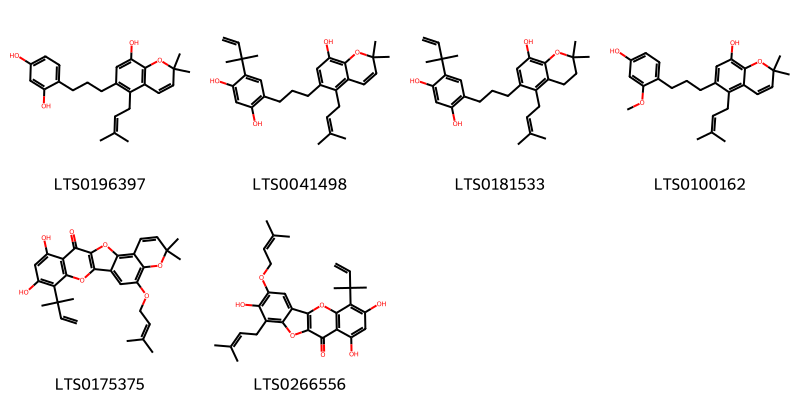{ width=100% }
    <figcaption>Hình ảnh cấu trúc hóa học của 6 hoạt chất thuộc nhóm Benzopyrans gồm ['4-{3-[8-hydroxy-2,2-dimethyl-5-(3-methylbut-2-en-1-yl)chromen-6-yl]propyl}benzene-1,3-diol (LTS0196397)', '4-{3-[8-hydroxy-2,2-dimethyl-5-(3-methylbut-2-en-1-yl)chromen-6-yl]propyl}-6-(2-methylbut-3-en-2-yl)benzene-1,3-diol (LTS0041498)', '4-{3-[8-hydroxy-2,2-dimethyl-5-(3-methylbut-2-en-1-yl)-3,4-dihydro-1-benzopyran-6-yl]propyl}-6-(2-methylbut-3-en-2-yl)benzene-1,3-diol (LTS0181533)', '6-[3-(4-hydroxy-2-methoxyphenyl)propyl]-2,2-dimethyl-5-(3-methylbut-2-en-1-yl)chromen-8-ol (LTS0100162)', '6,8-dihydroxy-17,17-dimethyl-20-[(3-methylbut-2-en-1-yl)oxy]-5-(2-methylbut-3-en-2-yl)-3,12,18-trioxapentacyclo[11.8.0.0²,¹¹.0⁴,⁹.0¹⁴,¹⁹]henicosa-1(13),2(11),4,6,8,14(19),15,20-octaen-10-one (LTS0175375)', '4,6,14-trihydroxy-15-(3-methylbut-2-en-1-yl)-13-[(3-methylbut-2-en-1-yl)oxy]-7-(2-methylbut-3-en-2-yl)-9,17-dioxatetracyclo[8.7.0.0³,⁸.0¹¹,¹⁶]heptadeca-1(10),3,5,7,11(16),12,14-heptaen-2-one (LTS0266556)'].</figcaption>
</figure>
#### Nhóm Carboximidic acids and derivatives
<figure markdown="span">
    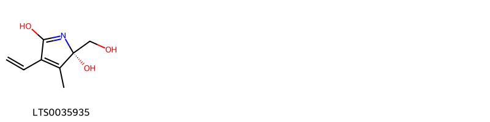{ width=100% }
    <figcaption>Hình ảnh cấu trúc hóa học của 1 hoạt chất thuộc nhóm Carboximidic acids and derivatives gồm ['(2s)-4-ethenyl-2-(hydroxymethyl)-3-methylpyrrole-2,5-diol (LTS0035935)'].</figcaption>
</figure>
#### Nhóm Cinnamaldehydes
<figure markdown="span">
    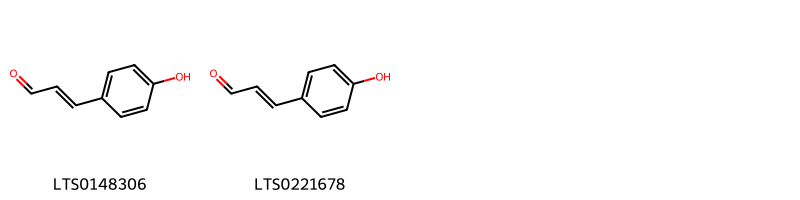{ width=100% }
    <figcaption>Hình ảnh cấu trúc hóa học của 2 hoạt chất thuộc nhóm Cinnamaldehydes gồm ['3-(4-hydroxyphenyl)prop-2-enal (LTS0148306)', 'p-coumaraldehyde (LTS0221678)'].</figcaption>
</figure>
#### Nhóm Cinnamic acids and derivatives
<figure markdown="span">
    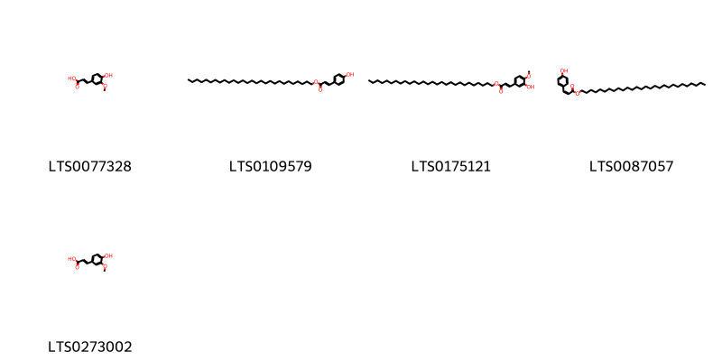{ width=100% }
    <figcaption>Hình ảnh cấu trúc hóa học của 5 hoạt chất thuộc nhóm Cinnamic acids and derivatives gồm ['ferulic acid (LTS0077328)', 'octacosyl 3-(4-hydroxyphenyl)prop-2-enoate (LTS0109579)', 'octacosyl 3-(3-hydroxy-4-methoxyphenyl)prop-2-enoate (LTS0175121)', 'octacosyl (2z)-3-(4-hydroxyphenyl)prop-2-enoate (LTS0087057)', 'ferulic acid (LTS0273002)'].</figcaption>
</figure>
#### Nhóm Coumarans
<figure markdown="span">
    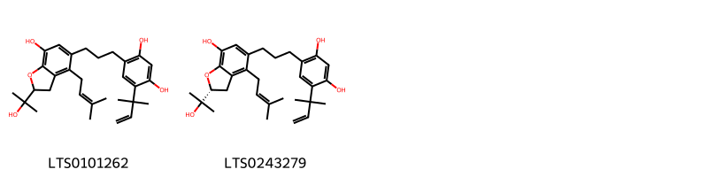{ width=100% }
    <figcaption>Hình ảnh cấu trúc hóa học của 2 hoạt chất thuộc nhóm Coumarans gồm ['4-{3-[7-hydroxy-2-(2-hydroxypropan-2-yl)-4-(3-methylbut-2-en-1-yl)-2,3-dihydro-1-benzofuran-5-yl]propyl}-6-(2-methylbut-3-en-2-yl)benzene-1,3-diol (LTS0101262)', '4-{3-[(2r)-7-hydroxy-2-(2-hydroxypropan-2-yl)-4-(3-methylbut-2-en-1-yl)-2,3-dihydro-1-benzofuran-5-yl]propyl}-6-(2-methylbut-3-en-2-yl)benzene-1,3-diol (LTS0243279)'].</figcaption>
</figure>
#### Nhóm Coumarins and derivatives
<figure markdown="span">
    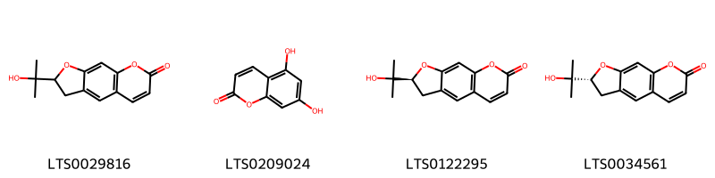{ width=100% }
    <figcaption>Hình ảnh cấu trúc hóa học của 4 hoạt chất thuộc nhóm Coumarins and derivatives gồm ['marmesin (LTS0029816)', '5,7-dihydroxychromen-2-one (LTS0209024)', 'marmesin (LTS0122295)', '(-)-marmesin (LTS0034561)'].</figcaption>
</figure>
#### Nhóm Fatty Acyls
<figure markdown="span">
    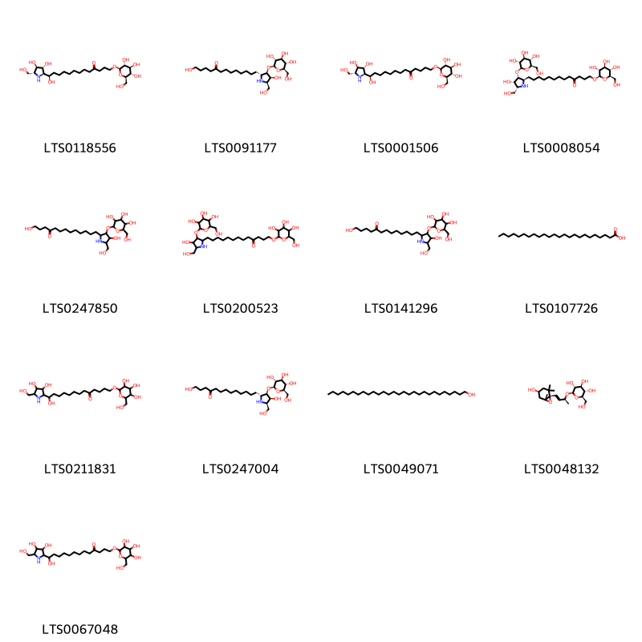{ width=100% }
    <figcaption>Hình ảnh cấu trúc hóa học của 13 hoạt chất thuộc nhóm Fatty Acyls gồm ['(13r)-13-[(2r,3r,4r,5r)-3,4-dihydroxy-5-(hydroxymethyl)pyrrolidin-2-yl]-13-hydroxy-1-{[(2r,3r,4s,5s,6r)-3,4,5-trihydroxy-6-(hydroxymethyl)oxan-2-yl]oxy}tridecan-4-one (LTS0118556)', '1-hydroxy-13-[(2r,3r,4s,5r)-4-hydroxy-5-(hydroxymethyl)-3-{[(2r,3r,4s,5s,6r)-3,4,5-trihydroxy-6-(hydroxymethyl)oxan-2-yl]oxy}pyrrolidin-2-yl]tridecan-5-one (LTS0091177)', '(13r)-13-[(2r,3r,4r,5r)-3,4-dihydroxy-5-(hydroxymethyl)pyrrolidin-2-yl]-13-hydroxy-1-{[(2r,3r,4s,5s,6r)-3,4,5-trihydroxy-6-(hydroxymethyl)oxan-2-yl]oxy}tridecan-5-one (LTS0001506)', '13-[(2r,3r,4s,5r)-4-hydroxy-5-(hydroxymethyl)-3-{[(2r,3r,4s,5s,6r)-3,4,5-trihydroxy-6-(hydroxymethyl)oxan-2-yl]oxy}pyrrolidin-2-yl]-1-{[(2r,3r,4s,5s,6r)-3,4,5-trihydroxy-6-(hydroxymethyl)oxan-2-yl]oxy}tridecan-4-one (LTS0008054)', '1-hydroxy-13-[4-hydroxy-5-(hydroxymethyl)-3-{[3,4,5-trihydroxy-6-(hydroxymethyl)oxan-2-yl]oxy}pyrrolidin-2-yl]tridecan-4-one (LTS0247850)', '13-[4-hydroxy-5-(hydroxymethyl)-3-{[3,4,5-trihydroxy-6-(hydroxymethyl)oxan-2-yl]oxy}pyrrolidin-2-yl]-1-{[3,4,5-trihydroxy-6-(hydroxymethyl)oxan-2-yl]oxy}tridecan-4-one (LTS0200523)', '1-hydroxy-13-[4-hydroxy-5-(hydroxymethyl)-3-{[3,4,5-trihydroxy-6-(hydroxymethyl)oxan-2-yl]oxy}pyrrolidin-2-yl]tridecan-5-one (LTS0141296)', 'lignoceric acid (LTS0107726)', '13-[3,4-dihydroxy-5-(hydroxymethyl)pyrrolidin-2-yl]-13-hydroxy-1-{[3,4,5-trihydroxy-6-(hydroxymethyl)oxan-2-yl]oxy}tridecan-5-one (LTS0211831)', '1-hydroxy-13-[(2r,3r,4s,5r)-4-hydroxy-5-(hydroxymethyl)-3-{[(2r,3r,4s,5s,6r)-3,4,5-trihydroxy-6-(hydroxymethyl)oxan-2-yl]oxy}pyrrolidin-2-yl]tridecan-4-one (LTS0247004)', 'octacosanol (LTS0049071)', '(2r,3r,4s,5s,6r)-2-{[(2s,3e)-4-[(1s,4s,6r)-4-hydroxy-2,2,6-trimethyl-7-oxabicyclo[4.1.0]heptan-1-yl]but-3-en-2-yl]oxy}-6-(hydroxymethyl)oxane-3,4,5-triol (LTS0048132)', '13-[3,4-dihydroxy-5-(hydroxymethyl)pyrrolidin-2-yl]-13-hydroxy-1-{[3,4,5-trihydroxy-6-(hydroxymethyl)oxan-2-yl]oxy}tridecan-4-one (LTS0067048)'].</figcaption>
</figure>
#### Nhóm Flavonoids
<figure markdown="span">
    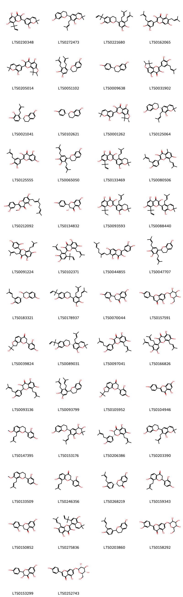{ width=100% }
    <figcaption>Hình ảnh cấu trúc hóa học của 99 hoạt chất thuộc nhóm Flavonoids gồm ['broussonol a (LTS0230348)', 'kazinol b (LTS0272473)', 'kazinol e (LTS0221680)', 'broussonol e (LTS0162065)', 'broussonol b (LTS0205014)', '5-[(2r)-7-hydroxy-3,4-dihydro-2h-1-benzopyran-2-yl]-3,4-bis(3-methylbut-2-en-1-yl)benzene-1,2-diol (LTS0051102)', "7,4'-dihydroxyflavan (LTS0009638)", 'broussonol c (LTS0031902)', '4-[(2r)-7-hydroxy-3,4-dihydro-2h-1-benzopyran-2-yl]-3-(3-methylbut-2-en-1-yl)benzene-1,2-diol (LTS0021041)', '(2r)-2-(4-hydroxyphenyl)-3,4-dihydro-2h-1-benzopyran-7-ol (LTS0102621)', '(8s)-3,5-dihydroxy-2-(8-hydroxy-2,2-dimethylchromen-6-yl)-8,9,9-trimethyl-8h-furo[2,3-h]chromen-4-one (LTS0001262)', '6-[(2r)-7-hydroxy-3,4-dihydro-2h-1-benzopyran-2-yl]-2,2-dimethyl-7-(3-methylbut-2-en-1-yl)chromen-8-ol (LTS0125064)', 'uralenol (LTS0125555)', 'kazinol a (LTS0065050)', 'broussoflavonol e (LTS0133469)', '3,7-dihydroxy-2-[4-hydroxy-3-(3-methylbut-2-en-1-yl)phenyl]-5-methyl-8-(3-methylbut-2-en-1-yl)chromen-4-one (LTS0080506)', '2-(3,4-dihydroxyphenyl)-6-[(2e)-3,7-dimethylocta-2,6-dien-1-yl]-5,7-dihydroxy-3-methoxychromen-4-one (LTS0212092)', '(+)-dihydrokaempferol (LTS0134832)', '3,5,7-trihydroxy-2-[8-hydroxy-2,2-dimethyl-5-(3-methylbut-2-en-1-yl)-3,4-dihydro-1-benzopyran-6-yl]-8-(2-methylbutan-2-yl)chromen-4-one (LTS0093593)', 'broussoflavonol d (LTS0088440)', 'mulberrin (LTS0091224)', '2-[3,4-dihydroxy-2-(3-methylbut-2-en-1-yl)-6-(2-methylbut-3-en-2-yl)phenyl]-3,5,7-trihydroxy-8-(3-methylbut-2-en-1-yl)chromen-4-one (LTS0102371)', '2-(3,4-dihydroxyphenyl)-6-[(2e)-3,7-dimethylocta-2,6-dien-1-yl]-3,5,7-trihydroxychromen-4-one (LTS0044855)', '4-(7-hydroxy-3,4-dihydro-2h-1-benzopyran-2-yl)-3,6-bis(3-methylbut-2-en-1-yl)benzene-1,2-diol (LTS0047707)', 'broussinol (LTS0183321)', '5-[7-hydroxy-6-(2-methylbut-3-en-2-yl)-3,4-dihydro-2h-1-benzopyran-2-yl]-3,4-bis(3-methylbut-2-en-1-yl)benzene-1,2-diol (LTS0178937)', 'steppogenin (LTS0070044)', 'apigetrin (LTS0157591)', '(4s,12s)-12-(2,4-dihydroxyphenyl)-4-(2-hydroxypropan-2-yl)-5,13-dioxatricyclo[7.4.0.0²,⁶]trideca-1(9),2(6),7-trien-10-one (LTS0039824)', '6-[(2r)-7-hydroxy-6-(2-methylbut-3-en-2-yl)-3,4-dihydro-2h-1-benzopyran-2-yl]-2,2-dimethyl-5-(3-methylbut-2-en-1-yl)chromen-8-ol (LTS0089031)', 'broussoflavonol f (LTS0097041)', 'broussoflavonol g (LTS0166826)', '3,5,7-trihydroxy-2-[4-hydroxy-3-(3-methylbut-2-en-1-yl)phenyl]-8-(3-methylbut-2-en-1-yl)-2,3-dihydro-1-benzopyran-4-one (LTS0093136)', '5-(7-hydroxy-3,4-dihydro-2h-1-benzopyran-2-yl)-3,4-bis(3-methylbut-2-en-1-yl)benzene-1,2-diol (LTS0093799)', '(12s)-12-(2,4-dihydroxyphenyl)-4-(2-hydroxypropan-2-yl)-5,13-dioxatricyclo[7.4.0.0²,⁶]trideca-1(9),2(6),7-trien-10-one (LTS0105952)', 'chamomile (LTS0104946)', '4-[7-methoxy-8-(3-methylbut-2-en-1-yl)-3,4-dihydro-2h-1-benzopyran-2-yl]benzene-1,3-diol (LTS0147395)', 'broussoflavan a (LTS0153176)', '(2r,3r)-3,5,7-trihydroxy-2-[4-hydroxy-3-(3-methylbut-2-en-1-yl)phenyl]-8-(3-methylbut-2-en-1-yl)-2,3-dihydro-1-benzopyran-4-one (LTS0206386)', '6-(7-hydroxy-3,4-dihydro-2h-1-benzopyran-2-yl)-2,2-dimethyl-7-(3-methylbut-2-en-1-yl)chromen-8-ol (LTS0203390)', '4-[(2s)-7-methoxy-8-(3-methylbut-2-en-1-yl)-3,4-dihydro-2h-1-benzopyran-2-yl]benzene-1,3-diol (LTS0133509)', '(2s)-2-(2,4-dihydroxyphenyl)-7-hydroxy-8-(3-methylbut-2-en-1-yl)-2,3-dihydro-1-benzopyran-4-one (LTS0246356)', '(2r)-7-hydroxy-2-[4-hydroxy-3-(3-methylbut-2-en-1-yl)phenyl]-2,3-dihydro-1-benzopyran-4-one (LTS0268219)', 'euchrenone a7 (LTS0159343)', '(2s)-2-(2,4-dihydroxyphenyl)-5,7-dihydroxy-2,3-dihydro-1-benzopyran-4-one (LTS0150852)', "3,5,7,8'-tetrahydroxy-2',2'-dimethyl-8-(3-methylbut-2-en-1-yl)-6'-(2-methylbut-3-en-2-yl)-[2,5'-bichromen]-4-one (LTS0275836)", '2-[4-hydroxy-3-(3-methylbut-2-en-1-yl)phenyl]-3,4-dihydro-2h-1-benzopyran-7-ol (LTS0203860)', '2-(3,4-dihydroxyphenyl)-5-hydroxy-7-{[3,4,5-trihydroxy-6-(hydroxymethyl)oxan-2-yl]oxy}chromen-4-one (LTS0158292)', 'aromadendrin (LTS0153299)', 'apigenin 7-o-β-glucoside (LTS0252743)', '4-[(2s)-5-hydroxy-7-methoxy-8-(3-methylbut-2-en-1-yl)-3,4-dihydro-2h-1-benzopyran-2-yl]benzene-1,3-diol (LTS0081107)', '(2s,3s,4s,5r,6s)-3,4,5-trihydroxy-6-{[5-hydroxy-2-(4-hydroxyphenyl)-4-oxochromen-7-yl]oxy}oxane-2-carboxylic acid (LTS0100940)', 'isovitexin (LTS0209186)', 'gancaonin p (LTS0225351)', '(2s)-7-hydroxy-2-[4-hydroxy-3-(3-methylbut-2-en-1-yl)phenyl]-2,3-dihydro-1-benzopyran-4-one (LTS0094039)', '6-(7-hydroxy-3,4-dihydro-2h-1-benzopyran-2-yl)-2,2-dimethyl-7-(3-methylbut-2-en-1-yl)-3,4-dihydro-1-benzopyran-3,4,8-triol (LTS0136749)', '(3r,4s)-6-[(2s)-7-hydroxy-3,4-dihydro-2h-1-benzopyran-2-yl]-2,2-dimethyl-7-(3-methylbut-2-en-1-yl)-3,4-dihydro-1-benzopyran-3,4,8-triol (LTS0184186)', 'bavachin (LTS0161897)', '(4r,12s)-12-(2,4-dihydroxyphenyl)-4-(2-hydroxypropan-2-yl)-5,13-dioxatricyclo[7.4.0.0²,⁶]trideca-1(9),2(6),7-trien-10-one (LTS0250944)', '5-[(2s)-7-hydroxy-3,4-dihydro-2h-1-benzopyran-2-yl]-3-(3-methylbut-2-en-1-yl)benzene-1,2-diol (LTS0256703)', 'vitexin (LTS0199581)', '2-(3,4-dihydroxyphenyl)-6-(3,7-dimethylocta-2,6-dien-1-yl)-3,5,7-trihydroxychromen-4-one (LTS0193686)', '(2s)-2-[4-hydroxy-3-(3-methylbut-2-en-1-yl)phenyl]-3,4-dihydro-2h-1-benzopyran-7-ol (LTS0236902)', "4',7-flavandiol (LTS0098894)", '(8s)-2-[3,4-dihydroxy-5-(3-methylbut-2-en-1-yl)phenyl]-3,5-dihydroxy-8,9,9-trimethyl-8h-furo[2,3-h]chromen-4-one (LTS0209541)', 'broussoflavonol a (LTS0222835)', '6-[7-hydroxy-6-(2-methylbut-3-en-2-yl)-3,4-dihydro-2h-1-benzopyran-2-yl]-2,2-dimethyl-5-(3-methylbut-2-en-1-yl)chromen-8-ol (LTS0210896)', 'isolicoflavonol (LTS0264727)', '3-hydroxyglabrol (LTS0231039)', 'methyl 3,4,5-trihydroxy-6-{[5-hydroxy-2-(4-hydroxyphenyl)-4-oxochromen-7-yl]oxy}oxane-2-carboxylate (LTS0167320)', '3,7-dihydroxy-2-[4-hydroxy-3-(3-methylbut-2-en-1-yl)phenyl]-8-(3-methylbut-2-en-1-yl)-2,3-dihydro-1-benzopyran-4-one (LTS0211811)', 'methyl (2s,3s,4s,5r,6s)-3,4,5-trihydroxy-6-{[5-hydroxy-2-(4-hydroxyphenyl)-4-oxochromen-7-yl]oxy}oxane-2-carboxylate (LTS0034001)', 'abyssinone ii (LTS0225956)', 'luteolin 7-o-glucoside (LTS0227450)', '5-(7-hydroxy-3,4-dihydro-2h-1-benzopyran-2-yl)-3-(3-methylbut-2-en-1-yl)benzene-1,2-diol (LTS0051734)', 'licoflavanone (LTS0244117)', 'petalostemumol g (LTS0130867)', '2-(2,4-dihydroxyphenyl)-3-[(2e)-3,7-dimethylocta-2,6-dien-1-yl]-5,7-dihydroxychromen-4-one (LTS0001047)', '2-[3,4-dihydroxy-5-(3-methylbut-2-en-1-yl)phenyl]-3,5,7-trihydroxy-8-(2-methylbut-3-en-2-yl)chromen-4-one (LTS0001137)', '(2s)-7-hydroxy-2-(4-hydroxyphenyl)-6-(3-methylbut-2-en-1-yl)-2,3-dihydro-1-benzopyran-4-one (LTS0000533)', '3,5,7-trihydroxy-2-(4-hydroxy-3-methylphenyl)-6-(3-methylbut-2-en-1-yl)chromen-4-one (LTS0068472)', 'asahina (LTS0068303)', 'morusin (LTS0062558)', 'dihydromorin (LTS0068109)', '12-(2,4-dihydroxyphenyl)-4-(2-hydroxypropan-2-yl)-5,13-dioxatricyclo[7.4.0.0²,⁶]trideca-1(9),2(6),7-trien-10-one (LTS0039304)', 'quercetin (LTS0004651)', 'amentoflavone (LTS0063796)', 'naringenin (LTS0031098)', '2-(2,4-dihydroxyphenyl)-3-(3,7-dimethylocta-2,6-dien-1-yl)-5,7-dihydroxychromen-4-one (LTS0000765)', 'luteolin (LTS0017052)', 'broussoflavonol b (LTS0007344)', '(2r)-6-[(2s)-7-hydroxy-2-methyl-3,4-dihydro-1-benzopyran-2-yl]-2-methyl-7-(3-methylbut-2-en-1-yl)-2h-chromen-8-ol (LTS0093861)', '4-(7-hydroxy-3,4-dihydro-2h-1-benzopyran-2-yl)-3-(3-methylbut-2-en-1-yl)benzene-1,2-diol (LTS0006457)', 'broussoflavonol c (LTS0246579)', '2-(2,4-dihydroxyphenyl)-3,5,7-trihydroxy-2,3-dihydro-1-benzopyran-4-one (LTS0092162)', '6-(7-hydroxy-2-methyl-3,4-dihydro-1-benzopyran-2-yl)-2-methyl-7-(3-methylbut-2-en-1-yl)-2h-chromen-8-ol (LTS0033888)', 'vitexin (LTS0254648)', '2-(2,4-dihydroxyphenyl)-3-[(2z)-3,7-dimethylocta-2,6-dien-1-yl]-5,7-dihydroxychromen-4-one (LTS0127436)', '2-(3,4-dihydroxyphenyl)-6-(3,7-dimethylocta-2,6-dien-1-yl)-5,7-dihydroxy-3-methoxychromen-4-one (LTS0042875)'].</figcaption>
</figure>
#### Nhóm Furanoid lignans
<figure markdown="span">
    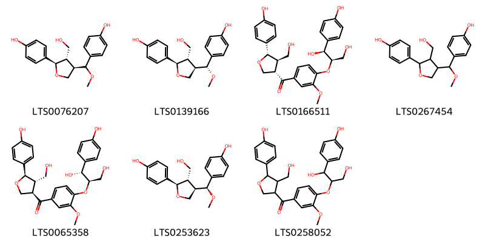{ width=100% }
    <figcaption>Hình ảnh cấu trúc hóa học của 7 hoạt chất thuộc nhóm Furanoid lignans gồm ['4-[(2r,3s,4r)-3-(hydroxymethyl)-4-[(4-hydroxyphenyl)(methoxy)methyl]oxolan-2-yl]phenol (LTS0076207)', '4-[(2r,3s,4r)-3-(hydroxymethyl)-4-[(r)-(4-hydroxyphenyl)(methoxy)methyl]oxolan-2-yl]phenol (LTS0139166)', '(1s,2r)-2-{4-[(3s,4r,5s)-4-(hydroxymethyl)-5-(4-hydroxyphenyl)oxolane-3-carbonyl]-2-methoxyphenoxy}-1-(4-hydroxyphenyl)propane-1,3-diol (LTS0166511)', '4-[3-(hydroxymethyl)-4-[(4-hydroxyphenyl)(methoxy)methyl]oxolan-2-yl]phenol (LTS0267454)', '(1r,2r)-2-{4-[(3r,4s,5r)-4-(hydroxymethyl)-5-(4-hydroxyphenyl)oxolane-3-carbonyl]-2-methoxyphenoxy}-1-(4-hydroxyphenyl)propane-1,3-diol (LTS0065358)', '4-[(2r,3s,4r)-3-(hydroxymethyl)-4-[(s)-(4-hydroxyphenyl)(methoxy)methyl]oxolan-2-yl]phenol (LTS0253623)', '2-{4-[4-(hydroxymethyl)-5-(4-hydroxyphenyl)oxolane-3-carbonyl]-2-methoxyphenoxy}-1-(4-hydroxyphenyl)propane-1,3-diol (LTS0258052)'].</figcaption>
</figure>
#### Nhóm Linear 1_3-diarylpropanoids
<figure markdown="span">
    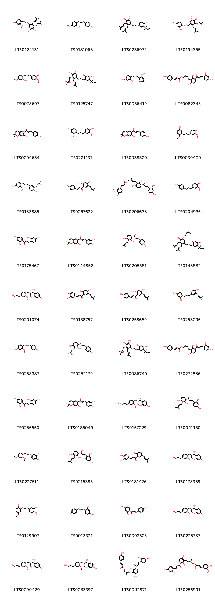{ width=100% }
    <figcaption>Hình ảnh cấu trúc hóa học của Không tìm thấy chú thích hoạt chất thuộc nhóm Linear 1_3-diarylpropanoids gồm Không tìm thấy chú thích.</figcaption>
</figure>
#### Nhóm Organooxygen compounds
<figure markdown="span">
    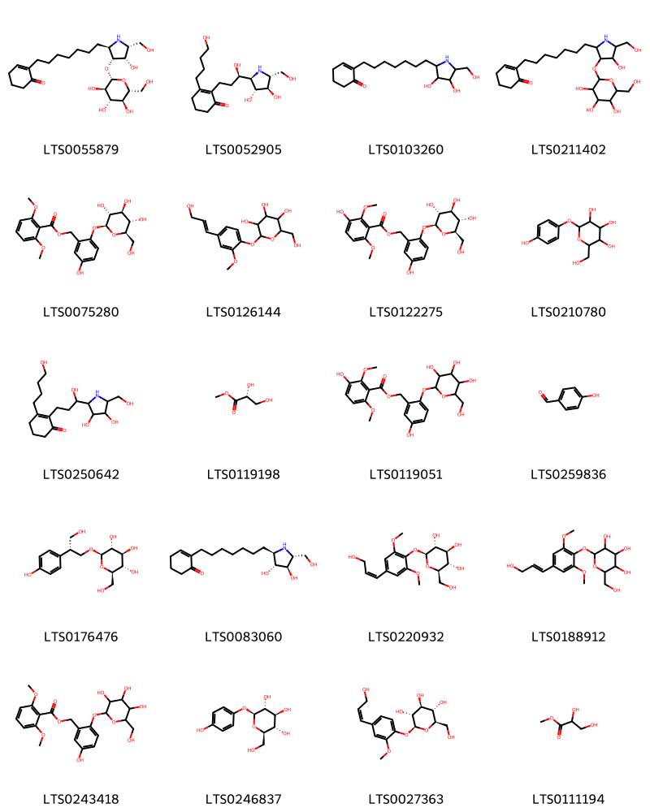{ width=100% }
    <figcaption>Hình ảnh cấu trúc hóa học của 20 hoạt chất thuộc nhóm Organooxygen compounds gồm ['2-{7-[(2r,3r,4s,5r)-4-hydroxy-5-(hydroxymethyl)-3-{[(2r,3r,4s,5s,6r)-3,4,5-trihydroxy-6-(hydroxymethyl)oxan-2-yl]oxy}pyrrolidin-2-yl]heptyl}cyclohex-2-en-1-one (LTS0055879)', '2-[(3r)-3-[(2r,3r,4r,5r)-3,4-dihydroxy-5-(hydroxymethyl)pyrrolidin-2-yl]-3-hydroxypropyl]-3-(4-hydroxybutyl)cyclohex-2-en-1-one (LTS0052905)', '2-{7-[3,4-dihydroxy-5-(hydroxymethyl)pyrrolidin-2-yl]heptyl}cyclohex-2-en-1-one (LTS0103260)', '2-{7-[4-hydroxy-5-(hydroxymethyl)-3-{[3,4,5-trihydroxy-6-(hydroxymethyl)oxan-2-yl]oxy}pyrrolidin-2-yl]heptyl}cyclohex-2-en-1-one (LTS0211402)', 'curculigoside a (LTS0075280)', '2-(hydroxymethyl)-6-[4-(3-hydroxyprop-1-en-1-yl)-2-methoxyphenoxy]oxane-3,4,5-triol (LTS0126144)', '(5-hydroxy-2-{[(2s,3r,4s,5s,6r)-3,4,5-trihydroxy-6-(hydroxymethyl)oxan-2-yl]oxy}phenyl)methyl 3-hydroxy-2,6-dimethoxybenzoate (LTS0122275)', 'arbutin (LTS0210780)', '2-{3-[3,4-dihydroxy-5-(hydroxymethyl)pyrrolidin-2-yl]-3-hydroxypropyl}-3-(4-hydroxybutyl)cyclohex-2-en-1-one (LTS0250642)', 'methyl (2r)-2,3-dihydroxypropanoate (LTS0119198)', '(5-hydroxy-2-{[3,4,5-trihydroxy-6-(hydroxymethyl)oxan-2-yl]oxy}phenyl)methyl 3-hydroxy-2,6-dimethoxybenzoate (LTS0119051)', 'p-hydroxybenzaldehyde (LTS0259836)', '(2r,3r,4s,5s,6r)-2-[(2r)-3-hydroxy-2-(4-hydroxyphenyl)propoxy]-6-(hydroxymethyl)oxane-3,4,5-triol (LTS0176476)', '2-{7-[(2r,3r,4r,5r)-3,4-dihydroxy-5-(hydroxymethyl)pyrrolidin-2-yl]heptyl}cyclohex-2-en-1-one (LTS0083060)', '(2r,3s,4s,5r,6s)-2-(hydroxymethyl)-6-{4-[(1z)-3-hydroxyprop-1-en-1-yl]-2,6-dimethoxyphenoxy}oxane-3,4,5-triol (LTS0220932)', '2-(hydroxymethyl)-6-[4-(3-hydroxyprop-1-en-1-yl)-2,6-dimethoxyphenoxy]oxane-3,4,5-triol (LTS0188912)', '(5-hydroxy-2-{[3,4,5-trihydroxy-6-(hydroxymethyl)oxan-2-yl]oxy}phenyl)methyl 2,6-dimethoxybenzoate (LTS0243418)', 'β-arbutin (LTS0246837)', '(2r,3s,4s,5r,6s)-2-(hydroxymethyl)-6-{4-[(1z)-3-hydroxyprop-1-en-1-yl]-2-methoxyphenoxy}oxane-3,4,5-triol (LTS0027363)', 'methyl 2,3-dihydroxypropanoate (LTS0111194)'].</figcaption>
</figure>
#### Nhóm Phenols
<figure markdown="span">
    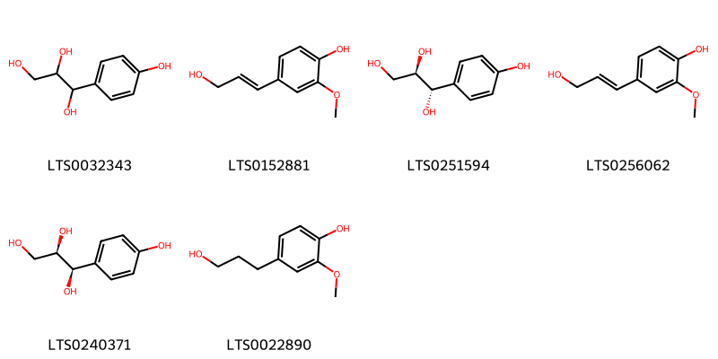{ width=100% }
    <figcaption>Hình ảnh cấu trúc hóa học của 6 hoạt chất thuộc nhóm Phenols gồm ['1-(4-hydroxyphenyl)propane-1,2,3-triol (LTS0032343)', 'coniferyl alcohol (LTS0152881)', '(1s,2r)-1-(4-hydroxyphenyl)propane-1,2,3-triol (LTS0251594)', '4-(3-hydroxyprop-1-en-1-yl)-2-methoxyphenol (LTS0256062)', '(1r,2r)-1-(4-hydroxyphenyl)propane-1,2,3-triol (LTS0240371)', 'dihydroconiferyl alcohol (LTS0022890)'].</figcaption>
</figure>
#### Nhóm Piperidines
<figure markdown="span">
    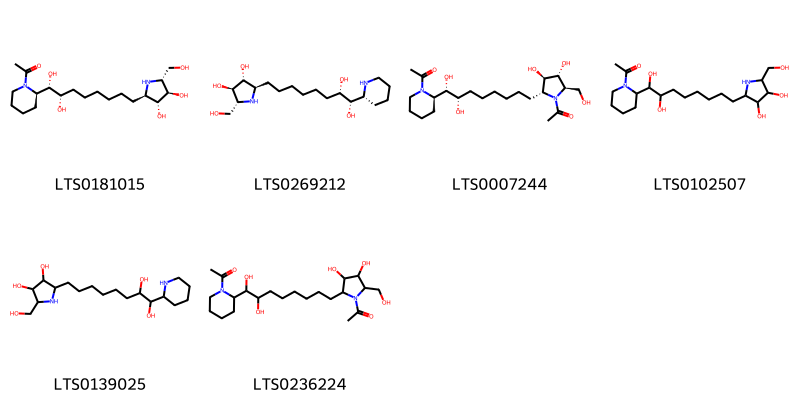{ width=100% }
    <figcaption>Hình ảnh cấu trúc hóa học của 6 hoạt chất thuộc nhóm Piperidines gồm ['1-[(2r)-2-[(1s,2s)-8-[(2r,3r,4r,5r)-3,4-dihydroxy-5-(hydroxymethyl)pyrrolidin-2-yl]-1,2-dihydroxyoctyl]piperidin-1-yl]ethanone (LTS0181015)', '(2r,3r,4r,5r)-2-[(7s,8s)-7,8-dihydroxy-8-[(2r)-piperidin-2-yl]octyl]-5-(hydroxymethyl)pyrrolidine-3,4-diol (LTS0269212)', '1-[(2r,3r,4r,5r)-2-[(7s,8s)-8-[(2r)-1-acetylpiperidin-2-yl]-7,8-dihydroxyoctyl]-3,4-dihydroxy-5-(hydroxymethyl)pyrrolidin-1-yl]ethanone (LTS0007244)', '1-(2-{8-[3,4-dihydroxy-5-(hydroxymethyl)pyrrolidin-2-yl]-1,2-dihydroxyoctyl}piperidin-1-yl)ethanone (LTS0102507)', '2-[7,8-dihydroxy-8-(piperidin-2-yl)octyl]-5-(hydroxymethyl)pyrrolidine-3,4-diol (LTS0139025)', '1-{2-[8-(1-acetylpiperidin-2-yl)-7,8-dihydroxyoctyl]-3,4-dihydroxy-5-(hydroxymethyl)pyrrolidin-1-yl}ethanone (LTS0236224)'].</figcaption>
</figure>
#### Nhóm Prenol lipids
<figure markdown="span">
    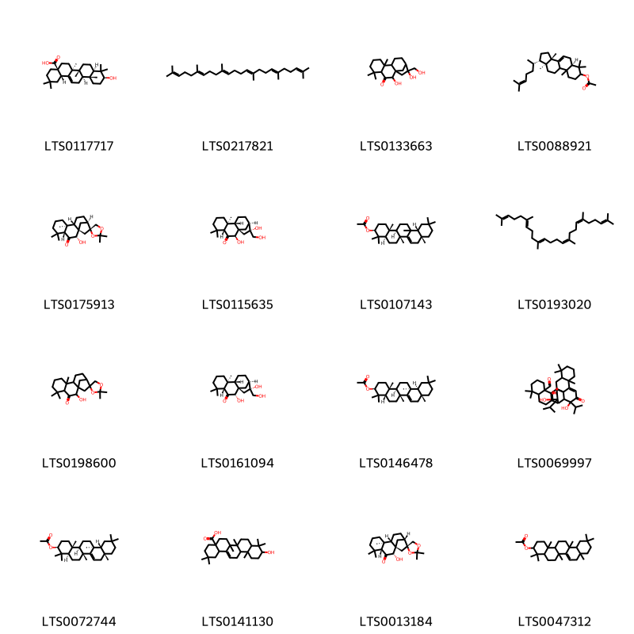{ width=100% }
    <figcaption>Hình ảnh cấu trúc hóa học của 16 hoạt chất thuộc nhóm Prenol lipids gồm ['oleanolic acid (LTS0117717)', 'squalene (LTS0217821)', '2,14-dihydroxy-14-(hydroxymethyl)-5,5,9-trimethyltetracyclo[11.2.1.0¹,¹⁰.0⁴,⁹]hexadecan-3-one (LTS0133663)', '(1s,3as,5ar,11as)-3a,6,6,9a,11a-pentamethyl-1-(6-methylhept-5-en-2-yl)-1h,2h,3h,5h,5ah,7h,8h,9h,9bh,10h,11h-cyclopenta[a]phenanthren-7-yl acetate (LTS0088921)', "(1'r,2r,2's,4'r,9's,10's,13'r)-2'-hydroxy-5,5,5',5',9'-pentamethylspiro[1,4-dioxolane-2,14'-tetracyclo[11.2.1.0¹,¹⁰.0⁴,⁹]hexadecan]-3'-one (LTS0175913)", '(1r,2r,4r,9s,10s,13r,14r)-2,14-dihydroxy-14-(hydroxymethyl)-5,5,9-trimethyltetracyclo[11.2.1.0¹,¹⁰.0⁴,⁹]hexadecan-3-one (LTS0115635)', '(3s,4ar,6ar,8ar,12ar,14ar,14br)-4,4,6a,8a,11,11,12b,14b-octamethyl-1,2,3,4a,5,6,8,9,10,12,12a,13,14,14a-tetradecahydropicen-3-yl acetate (LTS0107143)', '2,6,10,15,19,23-hexamethyltetracosa-2,6,10,14,18,22-hexaene (LTS0193020)', "2'-hydroxy-5,5,5',5',9'-pentamethylspiro[1,4-dioxolane-2,14'-tetracyclo[11.2.1.0¹,¹⁰.0⁴,⁹]hexadecan]-3'-one (LTS0198600)", '(1r,2s,4r,9s,10s,13r,14r)-2,14-dihydroxy-14-(hydroxymethyl)-5,5,9-trimethyltetracyclo[11.2.1.0¹,¹⁰.0⁴,⁹]hexadecan-3-one (LTS0161094)', '(3s,4as,6ar,8ar,12as,12bs,14ar,14br)-4,4,6a,8a,11,11,12b,14b-octamethyl-1,2,3,4a,5,6,8,9,10,12,12a,13,14,14a-tetradecahydropicen-3-yl acetate (LTS0146478)', '14,28-dihydroxy-14,28-diisopropyl-6,6,10,21,21-pentamethyl-13,27-dioxoheptacyclo[14.10.2.0²,¹¹.0²,¹⁵.0⁵,¹⁰.0¹⁷,²⁶.0²⁰,²⁵]octacosa-11,17(26)-diene-25-carbaldehyde (LTS0069997)', '(3s,4ar,6ar,8ar,12ar,12bs,14ar,14br)-4,4,6a,8a,11,11,12b,14b-octamethyl-1,2,3,4a,5,6,8,9,10,12,12a,13,14,14a-tetradecahydropicen-3-yl acetate (LTS0072744)', 'oleanolic acid (LTS0141130)', "(1'r,2r,2's,4'r,9's,10's,13's)-2'-hydroxy-5,5,5',5',9'-pentamethylspiro[1,4-dioxolane-2,14'-tetracyclo[11.2.1.0¹,¹⁰.0⁴,⁹]hexadecan]-3'-one (LTS0013184)", '4,4,6a,8a,11,11,12b,14b-octamethyl-1,2,3,4a,5,6,8,9,10,12,12a,13,14,14a-tetradecahydropicen-3-yl acetate (LTS0047312)'].</figcaption>
</figure>
#### Nhóm Purine nucleosides
<figure markdown="span">
    { width=100% }
    <figcaption>Hình ảnh cấu trúc hóa học của 2 hoạt chất thuộc nhóm Purine nucleosides gồm ['adenosine (LTS0052576)', 'adenosine (LTS0014061)'].</figcaption>
</figure>
#### Nhóm Pyrans
<figure markdown="span">
    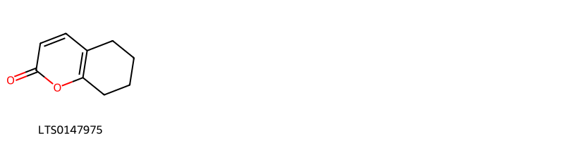{ width=100% }
    <figcaption>Hình ảnh cấu trúc hóa học của 1 hoạt chất thuộc nhóm Pyrans gồm ['5,6,7,8-tetrahydrochromen-2-one (LTS0147975)'].</figcaption>
</figure>
#### Nhóm Pyrrolidines
<figure markdown="span">
    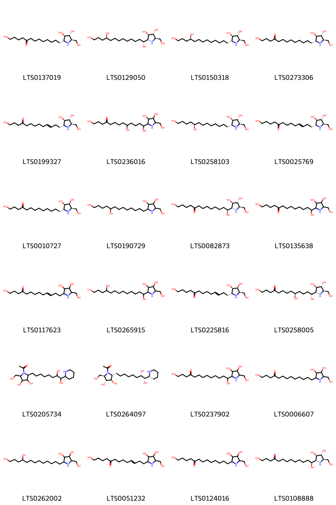{ width=100% }
    <figcaption>Hình ảnh cấu trúc hóa học của 24 hoạt chất thuộc nhóm Pyrrolidines gồm ['13-[(2r,3r,4r,5r)-3,4-dihydroxy-5-(hydroxymethyl)pyrrolidin-2-yl]-1-hydroxytridecan-5-one (LTS0137019)', '(4s,13r)-13-[(2r,3r,4r,5r)-3,4-dihydroxy-5-(hydroxymethyl)pyrrolidin-2-yl]tridecane-1,4,13-triol (LTS0129050)', '(2r,3r,4r,5r)-2-[(10s)-10,13-dihydroxytridecyl]-5-(hydroxymethyl)pyrrolidine-3,4-diol (LTS0150318)', '13-[(2r,3r,4r,5r)-3,4-dihydroxy-5-(hydroxymethyl)pyrrolidin-2-yl]-1-hydroxytridecan-4-one (LTS0273306)', '(10e)-13-[(2r,3r,4r,5r)-3,4-dihydroxy-5-(hydroxymethyl)pyrrolidin-2-yl]-1-hydroxytridec-10-en-4-one (LTS0199327)', '13-[3,4-dihydroxy-5-(hydroxymethyl)pyrrolidin-2-yl]-1,9,13-trihydroxytridecan-4-one (LTS0236016)', '(2r,3r,4r,5r)-2-[(9r)-9,13-dihydroxytridecyl]-5-(hydroxymethyl)pyrrolidine-3,4-diol (LTS0258103)', '(10e)-13-[(2r,3r,4r,5r)-3,4-dihydroxy-5-(hydroxymethyl)pyrrolidin-2-yl]-1-hydroxytridec-10-en-5-one (LTS0025769)', '13-[(2r,3r,4s,5r)-3,4-dihydroxy-5-(hydroxymethyl)pyrrolidin-2-yl]-1-hydroxytridecan-4-one (LTS0010727)', '2-(9,13-dihydroxytridecyl)-5-(hydroxymethyl)pyrrolidine-3,4-diol (LTS0190729)', '(13s)-13-[(2r,3r,4r,5r)-3,4-dihydroxy-5-(hydroxymethyl)pyrrolidin-2-yl]-1,13-dihydroxytridecan-5-one (LTS0082873)', '13-[3,4-dihydroxy-5-(hydroxymethyl)pyrrolidin-2-yl]-1,13-dihydroxytridecan-5-one (LTS0135638)', '13-[3,4-dihydroxy-5-(hydroxymethyl)pyrrolidin-2-yl]-1-hydroxytridec-10-en-4-one (LTS0117623)', '13-[3,4-dihydroxy-5-(hydroxymethyl)pyrrolidin-2-yl]tridecane-1,4,13-triol (LTS0265915)', '(10e)-13-[(2r,3r,4s,5r)-3,4-dihydroxy-5-(hydroxymethyl)pyrrolidin-2-yl]-1-hydroxytridec-10-en-5-one (LTS0225816)', '(9s,13r)-13-[(2r,3r,4r,5r)-3,4-dihydroxy-5-(hydroxymethyl)pyrrolidin-2-yl]-1,9,13-trihydroxytridecan-4-one (LTS0258005)', '1-{2-[7,8-dihydroxy-8-(piperidin-2-yl)octyl]-3,4-dihydroxy-5-(hydroxymethyl)pyrrolidin-1-yl}ethanone (LTS0205734)', '1-[(2r,3r,4r,5r)-2-[(7s,8s)-7,8-dihydroxy-8-[(2r)-piperidin-2-yl]octyl]-3,4-dihydroxy-5-(hydroxymethyl)pyrrolidin-1-yl]ethanone (LTS0264097)', '13-[3,4-dihydroxy-5-(hydroxymethyl)pyrrolidin-2-yl]-1,13-dihydroxytridecan-4-one (LTS0237902)', '13-[3,4-dihydroxy-5-(hydroxymethyl)pyrrolidin-2-yl]-1-hydroxytridecan-4-one (LTS0006607)', '2-(10,13-dihydroxytridecyl)-5-(hydroxymethyl)pyrrolidine-3,4-diol (LTS0262002)', '13-[3,4-dihydroxy-5-(hydroxymethyl)pyrrolidin-2-yl]-1-hydroxytridec-10-en-5-one (LTS0051232)', '13-[3,4-dihydroxy-5-(hydroxymethyl)pyrrolidin-2-yl]-1-hydroxytridecan-5-one (LTS0124016)', '(13s)-13-[(2r,3r,4r,5r)-3,4-dihydroxy-5-(hydroxymethyl)pyrrolidin-2-yl]-1,13-dihydroxytridecan-4-one (LTS0108888)'].</figcaption>
</figure>
#### Nhóm Pyrrolines
<figure markdown="span">
    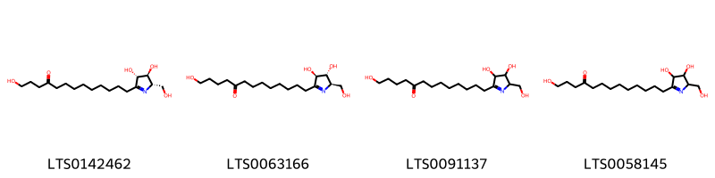{ width=100% }
    <figcaption>Hình ảnh cấu trúc hóa học của 4 hoạt chất thuộc nhóm Pyrrolines gồm ['13-[(3s,4s,5s)-3,4-dihydroxy-5-(hydroxymethyl)-4,5-dihydro-3h-pyrrol-2-yl]-1-hydroxytridecan-4-one (LTS0142462)', '13-[(3r,4r,5r)-3,4-dihydroxy-5-(hydroxymethyl)-4,5-dihydro-3h-pyrrol-2-yl]-1-hydroxytridecan-5-one (LTS0063166)', '13-[3,4-dihydroxy-5-(hydroxymethyl)-4,5-dihydro-3h-pyrrol-2-yl]-1-hydroxytridecan-5-one (LTS0091137)', '13-[3,4-dihydroxy-5-(hydroxymethyl)-4,5-dihydro-3h-pyrrol-2-yl]-1-hydroxytridecan-4-one (LTS0058145)'].</figcaption>
</figure>
#### Nhóm Pyrrolizidines
<figure markdown="span">
    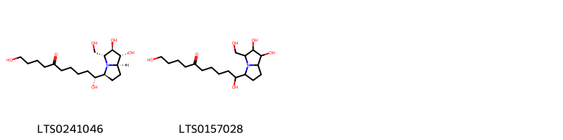{ width=100% }
    <figcaption>Hình ảnh cấu trúc hóa học của 2 hoạt chất thuộc nhóm Pyrrolizidines gồm ['(10r)-10-[(3s,5r,6r,7r,7ar)-6,7-dihydroxy-5-(hydroxymethyl)-hexahydro-1h-pyrrolizin-3-yl]-1,10-dihydroxydecan-5-one (LTS0241046)', '10-[6,7-dihydroxy-5-(hydroxymethyl)-hexahydro-1h-pyrrolizin-3-yl]-1,10-dihydroxydecan-5-one (LTS0157028)'].</figcaption>
</figure>
#### Nhóm Stilbenes
<figure markdown="span">
    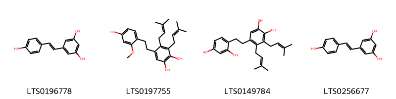{ width=100% }
    <figcaption>Hình ảnh cấu trúc hóa học của 4 hoạt chất thuộc nhóm Stilbenes gồm ['tocilizumab (LTS0196778)', '5-[2-(4-hydroxy-2-methoxyphenyl)ethyl]-3,4-bis(3-methylbut-2-en-1-yl)benzene-1,2-diol (LTS0197755)', '5-[2-(2,4-dihydroxyphenyl)ethyl]-3,4-bis(3-methylbut-2-en-1-yl)benzene-1,2-diol (LTS0149784)', 'resveratrol (LTS0256677)'].</figcaption>
</figure>
#### Nhóm Tetralins
<figure markdown="span">
    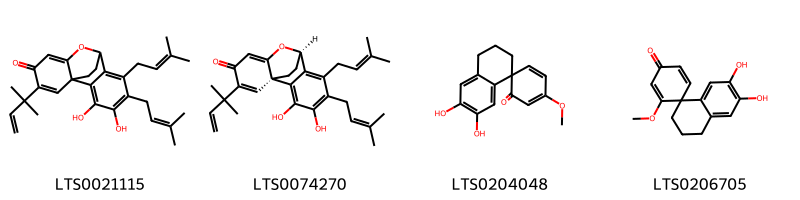{ width=100% }
    <figcaption>Hình ảnh cấu trúc hóa học của 4 hoạt chất thuộc nhóm Tetralins gồm ['3,4-dihydroxy-5,6-bis(3-methylbut-2-en-1-yl)-13-(2-methylbut-3-en-2-yl)-9-oxatetracyclo[6.6.2.0¹,¹⁰.0²,⁷]hexadeca-2,4,6,10,13-pentaen-12-one (LTS0021115)', '(1r,8r)-3,4-dihydroxy-5,6-bis(3-methylbut-2-en-1-yl)-13-(2-methylbut-3-en-2-yl)-9-oxatetracyclo[6.6.2.0¹,¹⁰.0²,⁷]hexadeca-2,4,6,10,13-pentaen-12-one (LTS0074270)', "6',7'-dihydroxy-4-methoxy-3',4'-dihydro-2'h-spiro[cyclohexane-1,1'-naphthalene]-2,4-dien-6-one (LTS0204048)", "6',7'-dihydroxy-6-methoxy-3',4'-dihydro-2'h-spiro[cyclohexane-1,1'-naphthalene]-2,5-dien-4-one (LTS0206705)"].</figcaption>
</figure>

---

### Dược dân tộc học

Danh sách các quốc gia có sử dụng *Broussonetia papyrifera* trong điều trị các bệnh. 

| Country   | Disease                                | Bệnh                                                                                                                                                                                                |
|:----------|:---------------------------------------|:----------------------------------------------------------------------------------------------------------------------------------------------------------------------------------------------------|
| China     | Diuretic, Tonic, Vulnerary, Astringent | MYMEMORY WARNING: YOU USED ALL AVAILABLE FREE TRANSLATIONS FOR TODAY. NEXT AVAILABLE IN  02 HOURS 50 MINUTES 41 SECONDS VISIT HTTPS://MYMEMORY.TRANSLATED.NET/DOC/USAGELIMITS.PHP TO TRANSLATE MORE |

---

# Chi Pseudolmedia

??? note "Danh sách các dược liệu thuộc chi"
    
	 - *Pseudolmedia uria*

---
## Pseudolmedia uria
### Thông tin về thực vật

!!! info "Phân loại thực vật của *N/A* từ GIBF:"
    - **Kingdom:** Plantae
    - **Phylum:** Tracheophyta
    - **Order:** Rosales
    - **Family:** Moraceae
    - **Genus:** Pseudolmedia
    - **Species:** *N/A*

 

| Label (VI)   | Label (EN)   | Scientific Name         | Descriptions (VI)   | Descriptions (EN)   | Also Known As (VI)                     | Also Known As (EN)   |
|:-------------|:-------------|:------------------------|:--------------------|:--------------------|:---------------------------------------|:---------------------|
| N/A          | N/A          | Broussonetia papyrifera | loài thực vật       | species of plant    | ['Ró', 'Dó', 'Dâu giấy', 'Cấu', 'Cốc'] | ['paper mulberry']   |

#### Phân bố trên thế giới

**Từ CSDL GIBF** Nicaragua, Ecuador, Puerto Rico, Colombia, Brazil, Bolivia (Plurinational State of), Costa Rica, Peru, Dominican Republic

#### Phân bố tại Việt Nam

**Từ CSDL GIBF**: Không có ghi nhận ở Việt Nam

---
### Thành phần hóa học
        
- Theo cơ sở dữ liệu lotus: Từ loài *N/A* đã phân lập và xác định được Chưa có hoạt chất nào được phân lập. hoạt chất thuộc về các nhóm Không có hoạt chất nào được phân lập. 

Không có hình ảnh nào được tạo ra

---

### Dược dân tộc học

Danh sách các quốc gia có sử dụng *N/A* trong điều trị các bệnh. 

| Country   | Disease   | Bệnh                                                                                                                                                                                                |
|:----------|:----------|:----------------------------------------------------------------------------------------------------------------------------------------------------------------------------------------------------|
| Elsewhere | Styptic   | MYMEMORY WARNING: YOU USED ALL AVAILABLE FREE TRANSLATIONS FOR TODAY. NEXT AVAILABLE IN  02 HOURS 49 MINUTES 47 SECONDS VISIT HTTPS://MYMEMORY.TRANSLATED.NET/DOC/USAGELIMITS.PHP TO TRANSLATE MORE |

---

