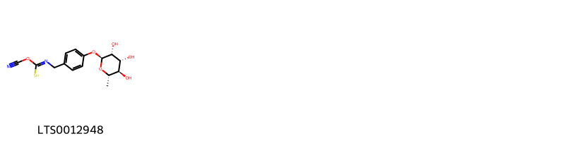
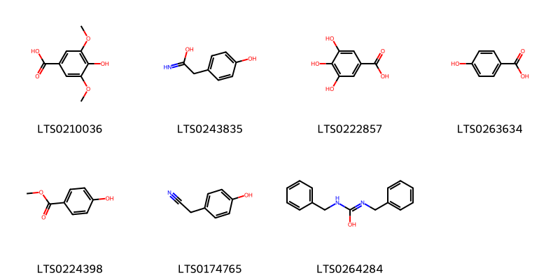
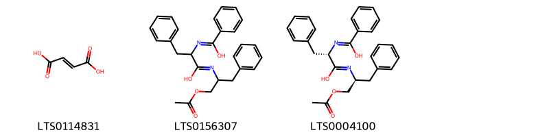
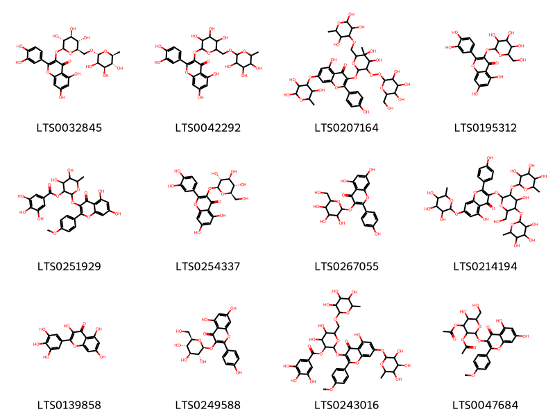
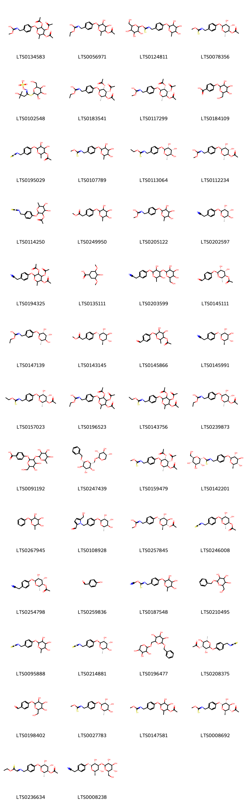
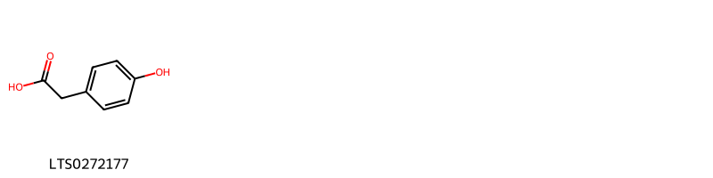
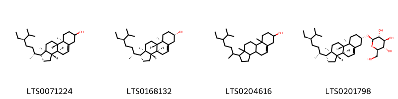
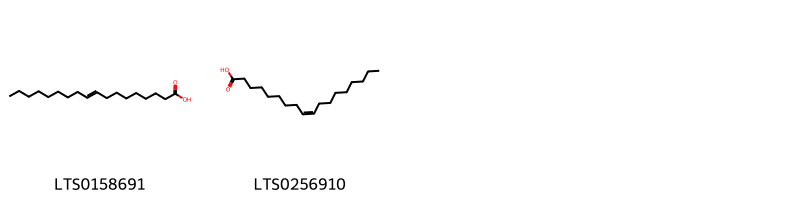
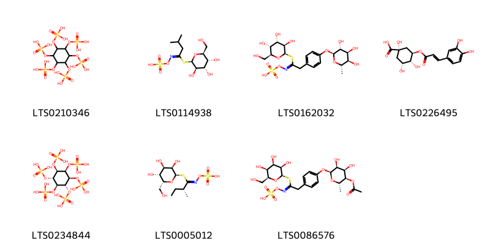

!!! abstract "Tóm tắt"

    Họ Moringaceae gồm khoảng 1 chi và 2 loài được một số cộng đồng tại các quốc gia như Dutch, Haiti, Elsewhere, Iran, Malaysia, Egypt, India, Venezuela, Java, English, Mexico, Malaya sử dụng trong một số trường hợp MYMEMORY WARNING: YOU USED ALL AVAILABLE FREE TRANSLATIONS FOR TODAY. NEXT AVAILABLE IN  19 HOURS 59 MINUTES 59 SECONDS VISIT HTTPS://MYMEMORY.TRANSLATED.NET/DOC/USAGELIMITS.PHP TO TRANSLATE MORE.

!!! info "DrDuke"

    James A. Duke sinh năm 1929-2017 là một nhà thực vật học người Mỹ. Đây là một trong những tác giả hàng đầu trong lĩnh vực dược dân tộc học với cuốn *CRC Handbook of Medicinal Herbs* và chính là người xây dựng lên cơ sở dữ liệu về hợp chất tự nhiên và dược dân tộc học tại Bộ nông nghiệp Hoa Kỳ. Các thông tin được đăng tải tại website [Dr. Duke's Phytochemical and Ethnobotanical Databases](https://phytochem.nal.usda.gov/). 
    Trong suốt thập niên 1970, ông lãnh đạo the Plant Taxonomy Laboratory, Plant Genetics and Germplasm Institute of the Agricultural Research Service, U.S. Department of Agriculture.
    Trong tài liệu này, các thông tin về dược dân tộc của các dược liệu được trích dẫn từ tài liệu của James A. Ducke với sự trợ giúp của phần mềm dịch thuật từ tiếng Anh sang tiếng Việt.
   

# Chi Moringa

??? note "Danh sách các dược liệu thuộc chi"
    
	 - *Moringa oleifera*
	 - *Moringa peregrina*

---
## Moringa oleifera
### Thông tin về thực vật

!!! info "Phân loại thực vật của *Moringa oleifera* từ GIBF:"
    - **Kingdom:** Plantae
    - **Phylum:** Tracheophyta
    - **Order:** Brassicales
    - **Family:** Moringaceae
    - **Genus:** Moringa
    - **Species:** *Moringa oleifera*

 

| Label (VI)   | Label (EN)   | Scientific Name   | Descriptions (VI)   | Descriptions (EN)                                   | Also Known As (VI)   | Also Known As (EN)                                                                                                      |
|:-------------|:-------------|:------------------|:--------------------|:----------------------------------------------------|:---------------------|:------------------------------------------------------------------------------------------------------------------------|
| N/A          | N/A          | Moringa oleifera  |                     | widely cultivated, fast-growing, nutrient-rich tree | ['Moringa oleifera'] | ['árbol benzoil', 'árbol de baquetas', 'árbol de rábano picante', 'drumstick', 'Moringa oleifeira', 'Moringa oleifera'] |

#### Phân bố trên thế giới

**Từ CSDL GIBF** Thailand, Dominican Republic, South Africa, Brazil, Ghana, Puerto Rico, India, Senegal, Virgin Islands (U.S.), Indonesia, Nigeria, United States of America, Mexico, Bahamas, Benin, Chinese Taipei

#### Phân bố tại Việt Nam

**Từ CSDL GIBF**: Không có ghi nhận ở Việt Nam

---
### Thành phần hóa học
        
- Theo cơ sở dữ liệu lotus: Từ loài *Moringa oleifera* đã phân lập và xác định được 102 hoạt chất thuộc về các nhóm Organooxygen compounds, Flavonoids, Indoles and derivatives, Carboxylic acids and derivatives, Prenol lipids, Purine nucleosides, Phenols, Cinnamic acids and derivatives, Steroids and steroid derivatives, Benzene and substituted derivatives. 

|    | chemicalTaxonomyClassyfireClass     |   smiles_count |
|---:|:------------------------------------|---------------:|
|  0 |                                     |              1 |
|  1 | Benzene and substituted derivatives |              7 |
|  2 | Carboxylic acids and derivatives    |              3 |
|  3 | Cinnamic acids and derivatives      |              1 |
|  4 | Flavonoids                          |             12 |
|  5 | Indoles and derivatives             |              2 |
|  6 | Organooxygen compounds              |             67 |
|  7 | Phenols                             |              1 |
|  8 | Prenol lipids                       |              1 |
|  9 | Purine nucleosides                  |              2 |
| 10 | Steroids and steroid derivatives    |              4 |

#### Nhóm 
<figure markdown="span">
    { width=100% }
    <figcaption>Hình ảnh cấu trúc hóa học của 1 hoạt chất thuộc nhóm  gồm ['1-(cyanooxy)-n-[(4-{[(2s,3r,4r,5r,6s)-3,4,5-trihydroxy-6-methyloxan-2-yl]oxy}phenyl)methyl]methanimidothioic acid (LTS0012948)'].</figcaption>
</figure>
#### Nhóm Benzene and substituted derivatives
<figure markdown="span">
    { width=100% }
    <figcaption>Hình ảnh cấu trúc hóa học của 7 hoạt chất thuộc nhóm Benzene and substituted derivatives gồm ['syringic acid (LTS0210036)', '2-(4-hydroxyphenyl)ethanimidic acid (LTS0243835)', 'galop (LTS0222857)', 'p-hydroxybenzoic acid (LTS0263634)', 'paraben (LTS0224398)', 'phbc (LTS0174765)', "n,n'-dibenzylcarbamimidic acid (LTS0264284)"].</figcaption>
</figure>
#### Nhóm Carboxylic acids and derivatives
<figure markdown="span">
    { width=100% }
    <figcaption>Hình ảnh cấu trúc hóa học của 3 hoạt chất thuộc nhóm Carboxylic acids and derivatives gồm ['fumaric acid (LTS0114831)', 'n-[1-(acetyloxy)-3-phenylpropan-2-yl]-2-{[hydroxy(phenyl)methylidene]amino}-3-phenylpropanimidic acid (LTS0156307)', '(2s)-n-[(2s)-1-(acetyloxy)-3-phenylpropan-2-yl]-2-{[hydroxy(phenyl)methylidene]amino}-3-phenylpropanimidic acid (LTS0004100)'].</figcaption>
</figure>
#### Nhóm Cinnamic acids and derivatives
<figure markdown="span">
    { width=100% }
    <figcaption>Hình ảnh cấu trúc hóa học của 1 hoạt chất thuộc nhóm Cinnamic acids and derivatives gồm ['3,4-dihydroxycinnamic acid (LTS0128050)'].</figcaption>
</figure>
#### Nhóm Flavonoids
<figure markdown="span">
    { width=100% }
    <figcaption>Hình ảnh cấu trúc hóa học của 12 hoạt chất thuộc nhóm Flavonoids gồm ['3-rutinosyl quercetin (LTS0032845)', 'rutin (LTS0042292)', '3-[(4,5-dihydroxy-5-methyl-3-{[3,4,5-trihydroxy-6-(hydroxymethyl)oxan-2-yl]peroxy}-6-{[(2,3,5-trihydroxy-6-methyloxan-4-yl)oxy]methyl}oxan-2-yl)oxy]-5-hydroxy-2-(4-hydroxyphenyl)-7-[(2,3,5-trihydroxy-6-methyloxan-4-yl)oxy]chromen-4-one (LTS0207164)', '2-(3,4-dihydroxyphenyl)-5,7-dihydroxy-3-{[3,4,5-trihydroxy-6-(hydroxymethyl)oxan-2-yl]oxy}chromen-4-one (LTS0195312)', '2-{[5,7-dihydroxy-2-(4-methoxyphenyl)-4-oxochromen-3-yl]oxy}-4,5-dihydroxy-6-methyloxan-3-yl 3,4,5-trihydroxybenzoate (LTS0251929)', 'isoquercetin (LTS0254337)', 'trifolin (LTS0267055)', '5-hydroxy-3-{[4-hydroxy-6-(hydroxymethyl)-3,5-bis[(3,4,5-trihydroxy-6-methyloxan-2-yl)oxy]oxan-2-yl]oxy}-2-(4-hydroxyphenyl)-7-[(3,4,5-trihydroxy-6-methyloxan-2-yl)oxy]chromen-4-one (LTS0214194)', 'myricetin (LTS0139858)', 'astragalin (LTS0249588)', '4,5-dihydroxy-2-{[5-hydroxy-2-(4-methoxyphenyl)-4-oxo-7-[(3,4,5-trihydroxy-6-methyloxan-2-yl)oxy]chromen-3-yl]oxy}-6-{[(3,4,5-trihydroxy-6-methyloxan-2-yl)oxy]methyl}oxan-3-yl 3,4,5-trihydroxybenzoate (LTS0243016)', '3-(acetyloxy)-2-{[5,7-dihydroxy-2-(4-methoxyphenyl)-4-oxochromen-3-yl]oxy}-5-hydroxy-6-(hydroxymethyl)oxan-4-yl acetate (LTS0047684)'].</figcaption>
</figure>
#### Nhóm Indoles and derivatives
<figure markdown="span">
    { width=100% }
    <figcaption>Hình ảnh cấu trúc hóa học của 2 hoạt chất thuộc nhóm Indoles and derivatives gồm ['l-tryptophan (LTS0263809)', 'optimax (LTS0014343)'].</figcaption>
</figure>
#### Nhóm Organooxygen compounds
<figure markdown="span">
    { width=100% }
    <figcaption>Hình ảnh cấu trúc hóa học của 67 hoạt chất thuộc nhóm Organooxygen compounds gồm ['n-[(4-{[3,4,5-tris(acetyloxy)-6-methyloxan-2-yl]oxy}phenyl)methyl]methoxycarboximidic acid (LTS0134583)', 'n-[(4-{[5-(acetyloxy)-3,4-dihydroxy-6-methyloxan-2-yl]oxy}phenyl)methyl]ethoxycarboximidic acid (LTS0056971)', '3,4,5-trihydroxy-6-(hydroxymethyl)oxan-2-yl 1-sulfanyl-n-({4-[(3,4,5-trihydroxy-6-methyloxan-2-yl)oxy]phenyl}methyl)methanimidate (LTS0124811)', '(2s,3r,4s,5r,6s)-4,5-dihydroxy-6-[4-({[methoxy(sulfanyl)methylidene]amino}methyl)phenoxy]-2-methyloxan-3-yl acetate (LTS0078356)', '[(3-hydroxy-3-methyl-1-{[3,4,5-trihydroxy-6-(hydroxymethyl)oxan-2-yl]sulfanyl}butylidene)amino]oxysulfonic acid (LTS0102548)', 'n-[(4-{[(2s,3r,4r,5s,6s)-3,4,5-tris(acetyloxy)-6-methyloxan-2-yl]oxy}phenyl)methyl]ethoxycarboximidic acid (LTS0183541)', 'n-[(4-{[(2s,3r,4r,5s,6s)-3,4,5-tris(acetyloxy)-6-methyloxan-2-yl]oxy}phenyl)methyl]methoxycarboximidic acid (LTS0117299)', '4-{[3,4,5-trihydroxy-6-(hydroxymethyl)oxan-2-yl]oxy}benzoic acid (LTS0184109)', '4,5-dihydroxy-6-[4-(isothiocyanatomethyl)phenoxy]-2-methyloxan-3-yl acetate (LTS0195029)', 'methyl 1-sulfanyl-n-({4-[(3,4,5-trihydroxy-6-methyloxan-2-yl)oxy]phenyl}methyl)methanimidate (LTS0107789)', 'ethyl 1-sulfanyl-n-[(4-{[(2s,3r,4r,5r,6s)-3,4,5-trihydroxy-6-methyloxan-2-yl]oxy}phenyl)methyl]methanimidate (LTS0113064)', 'n-[(4-{[(2s,3r,4s,5r,6s)-5-(acetyloxy)-3,4-dihydroxy-6-methyloxan-2-yl]oxy}phenyl)methyl]methoxycarboximidic acid (LTS0112234)', '4,5-dihydroxy-2-[4-(isothiocyanatomethyl)phenoxy]-6-methyloxan-3-yl acetate (LTS0114250)', 'methyl 2-{4-[(3,4,5-trihydroxy-6-methyloxan-2-yl)oxy]phenyl}acetate (LTS0249950)', 'n-({4-[(3,4,5-trihydroxy-6-methyloxan-2-yl)oxy]phenyl}methyl)methoxycarboximidic acid (LTS0205122)', '2-(4-{[(2s,3r,4r,5r,6s)-3,4,5-trihydroxy-6-methyloxan-2-yl]oxy}phenyl)acetonitrile (LTS0202597)', '4,5-bis(acetyloxy)-2-[4-(cyanomethyl)phenoxy]-6-methyloxan-3-yl acetate (LTS0194325)', '4-hydroxy-3,5-dimethoxycyclohexane-1-carboxylic acid (LTS0135111)', '2-{4-[(3,5-dihydroxy-6-methyl-4-{[3,4,5-trihydroxy-6-(hydroxymethyl)oxan-2-yl]oxy}oxan-2-yl)oxy]phenyl}acetonitrile (LTS0203599)', '(2s,3r,4s,5r,6s)-6-(4-formylphenoxy)-4,5-dihydroxy-2-methyloxan-3-yl acetate (LTS0145111)', 'n-[(4-{[(2s,3r,4r,5r,6s)-3,4,5-trihydroxy-6-methyloxan-2-yl]oxy}phenyl)methyl]ethoxycarboximidic acid (LTS0147139)', 'methyl 2-(4-{[(2r,3r,4s,5s,6r)-3,4,5-trihydroxy-6-methyloxan-2-yl]oxy}phenyl)acetate (LTS0143145)', '6-(4-formylphenoxy)-4,5-dihydroxy-2-methyloxan-3-yl acetate (LTS0145866)', '2-(4-{[(2r,3r,4s,5s,6r)-3,4,5-trihydroxy-6-methyloxan-2-yl]oxy}phenyl)acetonitrile (LTS0145991)', '(2s,3r,4s,5r,6s)-6-[4-({[ethoxy(sulfanyl)methylidene]amino}methyl)phenoxy]-4,5-dihydroxy-2-methyloxan-3-yl acetate (LTS0157023)', 'n-[(4-{[3,4,5-tris(acetyloxy)-6-methyloxan-2-yl]oxy}phenyl)methyl]ethoxycarboximidic acid (LTS0196523)', '4,5-bis(acetyloxy)-6-[4-({[ethoxy(sulfanyl)methylidene]amino}methyl)phenoxy]-2-methyloxan-3-yl acetate (LTS0143756)', 'n-[(4-{[(2s,3r,4s,5r,6s)-5-(acetyloxy)-3,4-dihydroxy-6-methyloxan-2-yl]oxy}phenyl)methyl]ethoxycarboximidic acid (LTS0239873)', '4-{[4,5-dihydroxy-6-(hydroxymethyl)-3-[(3,4,5-trihydroxy-6-methyloxan-2-yl)oxy]oxan-2-yl]oxy}benzoic acid (LTS0091192)', '(2r,3r,4s,5s,6r)-2-(benzyloxy)-6-({[(2s,3r,4s,5r)-3,4,5-trihydroxyoxan-2-yl]oxy}methyl)oxane-3,4,5-triol (LTS0247439)', '(2s,3s,4r,5r,6s)-4,5-bis(acetyloxy)-6-[4-({[methoxy(sulfanyl)methylidene]amino}methyl)phenoxy]-2-methyloxan-3-yl acetate (LTS0159479)', '(2r,3r,4s,5s,6r)-3,4,5-trihydroxy-6-(hydroxymethyl)oxan-2-yl 1-sulfanyl-n-[(4-{[(2s,3r,4s,5s,6r)-3,4,5-trihydroxy-6-methyloxan-2-yl]oxy}phenyl)methyl]methanimidate (LTS0142201)', '2-methyl-6-phenoxyoxane-3,4,5-triol (LTS0267945)', '5-(hydroxymethyl)-1-[(4-{[(2s,3r,4r,5r,6s)-3,4,5-trihydroxy-6-methyloxan-2-yl]oxy}phenyl)methyl]pyrrole-2-carbaldehyde (LTS0108928)', 'n-[(4-{[(2r,3r,4r,5s,6r)-5-(acetyloxy)-3,4-dihydroxy-6-methyloxan-2-yl]oxy}phenyl)methyl]methoxycarboximidic acid (LTS0257845)', '(2s,3r,4s,5r,6s)-4,5-dihydroxy-6-[4-(isothiocyanatomethyl)phenoxy]-2-methyloxan-3-yl acetate (LTS0246008)', '(2s,3r,4s,5r,6s)-6-[4-(cyanomethyl)phenoxy]-4,5-dihydroxy-2-methyloxan-3-yl acetate (LTS0254798)', 'p-hydroxybenzaldehyde (LTS0259836)', '1-(cyanooxy)-n-({4-[(3,4,5-trihydroxy-6-methyloxan-2-yl)oxy]phenyl}methyl)methanimidothioic acid (LTS0187548)', 'benzyl glucopyranoside (LTS0210495)', '2-[4-(isothiocyanatomethyl)phenoxy]-6-methyloxane-3,4,5-triol (LTS0095888)', '(2s,3r,4r,5r,6s)-2-[4-(isothiocyanatomethyl)phenoxy]-6-methyloxane-3,4,5-triol (LTS0214881)', '2-(benzyloxy)-6-{[(3,4,5-trihydroxyoxan-2-yl)oxy]methyl}oxane-3,4,5-triol (LTS0196477)', '(2s,3r,4r,5s,6s)-3,5-dihydroxy-2-[4-(isothiocyanatomethyl)phenoxy]-6-methyloxan-4-yl acetate (LTS0208375)', '4-{[3,4,5-trihydroxy-6-(hydroxymethyl)oxan-2-yl]oxy}benzaldehyde (LTS0198402)', 'methyl 1-sulfanyl-n-[(4-{[(2s,3r,4r,5r,6s)-3,4,5-trihydroxy-6-methyloxan-2-yl]oxy}phenyl)methyl]methanimidate (LTS0027783)', '4,5-dihydroxy-6-[4-({[methoxy(sulfanyl)methylidene]amino}methyl)phenoxy]-2-methyloxan-3-yl acetate (LTS0147581)', '(2r,3s,4r,5r,6r)-4,5-dihydroxy-6-[4-({[methoxy(sulfanyl)methylidene]amino}methyl)phenoxy]-2-methyloxan-3-yl acetate (LTS0008692)', '(2s,3r,4s,5r,6s)-6-(4-{[(2-ethoxy-2-sulfanylideneethylidene)amino]methyl}phenoxy)-4,5-dihydroxy-2-methyloxan-3-yl acetate (LTS0236634)', '2-(4-{[(2r,3r,4s,5r,6r)-3,5-dihydroxy-6-methyl-4-{[(2s,3r,4s,5s,6r)-3,4,5-trihydroxy-6-(hydroxymethyl)oxan-2-yl]oxy}oxan-2-yl]oxy}phenyl)acetonitrile (LTS0008238)', 'benzyl β-d-glucoside (LTS0184698)', '2-(4-{[(2s,3r,4r,5r,6s)-3,4,5-trihydroxy-6-methyloxan-2-yl]oxy}phenyl)ethanimidic acid (LTS0045356)', 'n-[(4-{[(2r,3r,4s,5s,6r)-3,4,5-trihydroxy-6-methyloxan-2-yl]oxy}phenyl)methyl]methoxycarboximidic acid (LTS0053796)', '3,5-dihydroxy-2-[4-(isothiocyanatomethyl)phenoxy]-6-methyloxan-4-yl acetate (LTS0036151)', '4,5-bis(acetyloxy)-6-[4-({[methoxy(sulfanyl)methylidene]amino}methyl)phenoxy]-2-methyloxan-3-yl acetate (LTS0000546)', '(2r,3s,4s,5r,6r)-2-methyl-6-phenoxyoxane-3,4,5-triol (LTS0000536)', 'n-[(4-{[(2s,3r,4r,5r,6s)-3,4,5-trihydroxy-6-methyloxan-2-yl]oxy}phenyl)methyl]methylsulfanylcarboximidic acid (LTS0260576)', 'ethyl 1-sulfanyl-n-({4-[(3,4,5-trihydroxy-6-methyloxan-2-yl)oxy]phenyl}methyl)methanimidate (LTS0025489)', 'n-({4-[(3,4,5-trihydroxy-6-methyloxan-2-yl)oxy]phenyl}methyl)methylsulfanylcarboximidic acid (LTS0003946)', 'n-[(4-{[5-(acetyloxy)-3,4-dihydroxy-6-methyloxan-2-yl]oxy}phenyl)methyl]methoxycarboximidic acid (LTS0011830)', 'n-({4-[(3,4,5-trihydroxy-6-methyloxan-2-yl)oxy]phenyl}methyl)ethoxycarboximidic acid (LTS0112854)', '(2s,3r,4r,5r,6s)-4,5-dihydroxy-2-[4-(isothiocyanatomethyl)phenoxy]-6-methyloxan-3-yl acetate (LTS0233992)', '(2s,3r,4r,5s,6s)-4,5-bis(acetyloxy)-2-[4-(cyanomethyl)phenoxy]-6-methyloxan-3-yl acetate (LTS0209029)', 'n-[(4-{[(2s,3r,4r,5r,6s)-3,4,5-trihydroxy-6-methyloxan-2-yl]oxy}phenyl)methyl]methoxycarboximidic acid (LTS0073002)', '2-{4-[(3,4,5-trihydroxy-6-methyloxan-2-yl)oxy]phenyl}acetonitrile (LTS0119170)', '(2s,3s,4r,5r,6s)-4,5-bis(acetyloxy)-6-[4-({[ethoxy(sulfanyl)methylidene]amino}methyl)phenoxy]-2-methyloxan-3-yl acetate (LTS0259236)', '6-[4-({[ethoxy(sulfanyl)methylidene]amino}methyl)phenoxy]-4,5-dihydroxy-2-methyloxan-3-yl acetate (LTS0114897)'].</figcaption>
</figure>
#### Nhóm Phenols
<figure markdown="span">
    { width=100% }
    <figcaption>Hình ảnh cấu trúc hóa học của 1 hoạt chất thuộc nhóm Phenols gồm ['4-hydroxyphenylacetic acid (LTS0272177)'].</figcaption>
</figure>
#### Nhóm Prenol lipids
<figure markdown="span">
    { width=100% }
    <figcaption>Hình ảnh cấu trúc hóa học của 1 hoạt chất thuộc nhóm Prenol lipids gồm ['lupeol (LTS0256952)'].</figcaption>
</figure>
#### Nhóm Purine nucleosides
<figure markdown="span">
    { width=100% }
    <figcaption>Hình ảnh cấu trúc hóa học của 2 hoạt chất thuộc nhóm Purine nucleosides gồm ['adenosine (LTS0052576)', 'adenosine (LTS0014061)'].</figcaption>
</figure>
#### Nhóm Steroids and steroid derivatives
<figure markdown="span">
    { width=100% }
    <figcaption>Hình ảnh cấu trúc hóa học của 4 hoạt chất thuộc nhóm Steroids and steroid derivatives gồm ['stigmast-5-en-3-ol (LTS0071224)', 'sitosterol (LTS0168132)', 'stigmast-5-en-3-ol, (3β)- (LTS0204616)', 'sitogluside (LTS0201798)'].</figcaption>
</figure>

---

### Dược dân tộc học

Danh sách các quốc gia có sử dụng *Moringa oleifera* trong điều trị các bệnh. 

| Country   | Disease                                                                                                                                    | Bệnh                                                                                                                                                                                                |
|:----------|:-------------------------------------------------------------------------------------------------------------------------------------------|:----------------------------------------------------------------------------------------------------------------------------------------------------------------------------------------------------|
| Dutch     | Emmenagogue                                                                                                                                | MYMEMORY WARNING: YOU USED ALL AVAILABLE FREE TRANSLATIONS FOR TODAY. NEXT AVAILABLE IN  19 HOURS 59 MINUTES 55 SECONDS VISIT HTTPS://MYMEMORY.TRANSLATED.NET/DOC/USAGELIMITS.PHP TO TRANSLATE MORE |
| Elsewhere | nan, Cardiac, Cholagogue, Diuretic, Ecbolic, Emetic, Estrogenic, Rubefacient, Rubefacient, Stimulant, Tonic, Vermifuge, Diuretic, Vesicant | MYMEMORY WARNING: YOU USED ALL AVAILABLE FREE TRANSLATIONS FOR TODAY. NEXT AVAILABLE IN  19 HOURS 59 MINUTES 52 SECONDS VISIT HTTPS://MYMEMORY.TRANSLATED.NET/DOC/USAGELIMITS.PHP TO TRANSLATE MORE |
| English   | Abortifacient                                                                                                                              | MYMEMORY WARNING: YOU USED ALL AVAILABLE FREE TRANSLATIONS FOR TODAY. NEXT AVAILABLE IN  19 HOURS 59 MINUTES 49 SECONDS VISIT HTTPS://MYMEMORY.TRANSLATED.NET/DOC/USAGELIMITS.PHP TO TRANSLATE MORE |
| Haiti     | Rubefacient                                                                                                                                | MYMEMORY WARNING: YOU USED ALL AVAILABLE FREE TRANSLATIONS FOR TODAY. NEXT AVAILABLE IN  19 HOURS 59 MINUTES 45 SECONDS VISIT HTTPS://MYMEMORY.TRANSLATED.NET/DOC/USAGELIMITS.PHP TO TRANSLATE MORE |
| India     | Stimulant                                                                                                                                  | MYMEMORY WARNING: YOU USED ALL AVAILABLE FREE TRANSLATIONS FOR TODAY. NEXT AVAILABLE IN  19 HOURS 59 MINUTES 39 SECONDS VISIT HTTPS://MYMEMORY.TRANSLATED.NET/DOC/USAGELIMITS.PHP TO TRANSLATE MORE |
| Iran      | Rubefacient                                                                                                                                | MYMEMORY WARNING: YOU USED ALL AVAILABLE FREE TRANSLATIONS FOR TODAY. NEXT AVAILABLE IN  19 HOURS 59 MINUTES 37 SECONDS VISIT HTTPS://MYMEMORY.TRANSLATED.NET/DOC/USAGELIMITS.PHP TO TRANSLATE MORE |
| Java      | Diuretic, Emmenagogue, Lactafuge, Emetic                                                                                                   | MYMEMORY WARNING: YOU USED ALL AVAILABLE FREE TRANSLATIONS FOR TODAY. NEXT AVAILABLE IN  19 HOURS 59 MINUTES 34 SECONDS VISIT HTTPS://MYMEMORY.TRANSLATED.NET/DOC/USAGELIMITS.PHP TO TRANSLATE MORE |
| Malaya    | Vermifuge                                                                                                                                  | MYMEMORY WARNING: YOU USED ALL AVAILABLE FREE TRANSLATIONS FOR TODAY. NEXT AVAILABLE IN  19 HOURS 59 MINUTES 32 SECONDS VISIT HTTPS://MYMEMORY.TRANSLATED.NET/DOC/USAGELIMITS.PHP TO TRANSLATE MORE |
| Malaysia  | Expectorant                                                                                                                                | MYMEMORY WARNING: YOU USED ALL AVAILABLE FREE TRANSLATIONS FOR TODAY. NEXT AVAILABLE IN  19 HOURS 59 MINUTES 29 SECONDS VISIT HTTPS://MYMEMORY.TRANSLATED.NET/DOC/USAGELIMITS.PHP TO TRANSLATE MORE |
| Mexico    | Rubefacient, Purgative                                                                                                                     | MYMEMORY WARNING: YOU USED ALL AVAILABLE FREE TRANSLATIONS FOR TODAY. NEXT AVAILABLE IN  19 HOURS 59 MINUTES 27 SECONDS VISIT HTTPS://MYMEMORY.TRANSLATED.NET/DOC/USAGELIMITS.PHP TO TRANSLATE MORE |
| Venezuela | Purgative, Vesicant, Abortifacient, Rubefacient                                                                                            | MYMEMORY WARNING: YOU USED ALL AVAILABLE FREE TRANSLATIONS FOR TODAY. NEXT AVAILABLE IN  19 HOURS 59 MINUTES 24 SECONDS VISIT HTTPS://MYMEMORY.TRANSLATED.NET/DOC/USAGELIMITS.PHP TO TRANSLATE MORE |

---

---
## Moringa peregrina
### Thông tin về thực vật

!!! info "Phân loại thực vật của *Moringa peregrina* từ GIBF:"
    - **Kingdom:** Plantae
    - **Phylum:** Tracheophyta
    - **Order:** Brassicales
    - **Family:** Moringaceae
    - **Genus:** Moringa
    - **Species:** *Moringa peregrina*

 

| Label (VI)   | Label (EN)   | Scientific Name   | Descriptions (VI)   | Descriptions (EN)   | Also Known As (VI)   | Also Known As (EN)   |
|:-------------|:-------------|:------------------|:--------------------|:--------------------|:---------------------|:---------------------|
| N/A          | N/A          | Moringa peregrina |                     | species of plant    | ['']                 | ['']                 |

#### Phân bố trên thế giới

**Từ CSDL GIBF** Jordan, Palestine, State of, Egypt, Ethiopia, United States of America, Israel, United Arab Emirates, Saudi Arabia, Oman

#### Phân bố tại Việt Nam

**Từ CSDL GIBF**: Không có ghi nhận ở Việt Nam

---
### Thành phần hóa học
        
- Theo cơ sở dữ liệu lotus: Từ loài *Moringa peregrina* đã phân lập và xác định được 9 hoạt chất thuộc về các nhóm Organooxygen compounds, Fatty Acyls. 

|    | chemicalTaxonomyClassyfireClass   |   smiles_count |
|---:|:----------------------------------|---------------:|
|  0 | Fatty Acyls                       |              2 |
|  1 | Organooxygen compounds            |              7 |

#### Nhóm Fatty Acyls
<figure markdown="span">
    { width=100% }
    <figcaption>Hình ảnh cấu trúc hóa học của 2 hoạt chất thuộc nhóm Fatty Acyls gồm ['9 octadecenoic acid (LTS0158691)', 'oleic acid (LTS0256910)'].</figcaption>
</figure>
#### Nhóm Organooxygen compounds
<figure markdown="span">
    { width=100% }
    <figcaption>Hình ảnh cấu trúc hóa học của 7 hoạt chất thuộc nhóm Organooxygen compounds gồm ['phytic acid (LTS0210346)', '[(z)-(3-methyl-1-{[(2r,3r,4s,5r,6s)-3,4,5-trihydroxy-6-(hydroxymethyl)oxan-2-yl]sulfanyl}butylidene)amino]oxysulfonic acid (LTS0114938)', '[(z)-(1-{[(2r,3r,4s,5r,6s)-3,4,5-trihydroxy-6-(hydroxymethyl)oxan-2-yl]sulfanyl}-2-(4-{[(2s,3r,4s,5r,6s)-3,4,5-trihydroxy-6-methyloxan-2-yl]oxy}phenyl)ethylidene)amino]oxysulfonic acid (LTS0162032)', 'chlorogenic acid (LTS0226495)', '[(1r,2r,3s,4r,5s,6s)-2,3,4,5,6-pentakis(phosphonooxy)cyclohexyl]oxyphosphonic acid (LTS0234844)', '[(z)-[(2r)-2-methyl-1-{[(2r,3r,4r,5r,6r)-3,4,5-trihydroxy-6-(hydroxymethyl)oxan-2-yl]sulfanyl}butylidene]amino]oxysulfonic acid (LTS0005012)', '[(z)-[2-(4-{[(2s,3s,4r,5r,6s)-5-(acetyloxy)-3,4-dihydroxy-6-methyloxan-2-yl]oxy}phenyl)-1-{[(2r,3r,4r,5s,6s)-3,4,5-trihydroxy-6-(hydroxymethyl)oxan-2-yl]sulfanyl}ethylidene]amino]oxysulfonic acid (LTS0086576)'].</figcaption>
</figure>

---

### Dược dân tộc học

Danh sách các quốc gia có sử dụng *Moringa peregrina* trong điều trị các bệnh. 

| Country   | Disease             | Bệnh                                                                                                                                                                                                |
|:----------|:--------------------|:----------------------------------------------------------------------------------------------------------------------------------------------------------------------------------------------------|
| Egypt     | Cathartic, Cosmetic | MYMEMORY WARNING: YOU USED ALL AVAILABLE FREE TRANSLATIONS FOR TODAY. NEXT AVAILABLE IN  19 HOURS 58 MINUTES 10 SECONDS VISIT HTTPS://MYMEMORY.TRANSLATED.NET/DOC/USAGELIMITS.PHP TO TRANSLATE MORE |

---

