!!! abstract "Tóm tắt"

    Họ Musaceae gồm khoảng 1 chi và 3 loài được một số cộng đồng tại các quốc gia như Trinidad, Haiti, Iraq, Bahamas, Mexico(Chinantec), Elsewhere, Java, Venezuela, Panama(Choco), China sử dụng trong một số trường hợp Chất làm se, Thuốc diệt nấm, Vermifuge, Vermifuge, nan, Thuốc kích thích tình dục, Chất làm se, Hemostat, Intoxicant, Hemostat, Refrigerant, Cicatrizant, Thuốc nhuận tràng, Chất làm se, Chất làm mềm, Vermifuge, Dentifrice, Diaphoretic, nan, Thuốc giải độc, Chất làm se, Carminative, Thuốc diệt nấm, Styptic, Vermifuge, nan, Thuốc nhuận tràng, Thuốc giải độc.

!!! info "DrDuke"

    James A. Duke sinh năm 1929-2017 là một nhà thực vật học người Mỹ. Đây là một trong những tác giả hàng đầu trong lĩnh vực dược dân tộc học với cuốn *CRC Handbook of Medicinal Herbs* và chính là người xây dựng lên cơ sở dữ liệu về hợp chất tự nhiên và dược dân tộc học tại Bộ nông nghiệp Hoa Kỳ. Các thông tin được đăng tải tại website [Dr. Duke's Phytochemical and Ethnobotanical Databases](https://phytochem.nal.usda.gov/). 
    Trong suốt thập niên 1970, ông lãnh đạo the Plant Taxonomy Laboratory, Plant Genetics and Germplasm Institute of the Agricultural Research Service, U.S. Department of Agriculture.
    Trong tài liệu này, các thông tin về dược dân tộc của các dược liệu được trích dẫn từ tài liệu của James A. Ducke với sự trợ giúp của phần mềm dịch thuật từ tiếng Anh sang tiếng Việt.
   

# Chi Musa

??? note "Danh sách các dược liệu thuộc chi"
    
	 - *Musa basjoo*
	 - *Musa paradisiaca*
	 - *Musa sapientum*

---
## Musa basjoo
### Thông tin về thực vật

!!! info "Phân loại thực vật của *Musa basjoo* từ GIBF:"
    - **Kingdom:** Plantae
    - **Phylum:** Tracheophyta
    - **Order:** Zingiberales
    - **Family:** Musaceae
    - **Genus:** Musa
    - **Species:** *Musa basjoo*

 

| Label (VI)   | Label (EN)   | Scientific Name   | Descriptions (VI)   | Descriptions (EN)   | Also Known As (VI)   | Also Known As (EN)   |
|:-------------|:-------------|:------------------|:--------------------|:--------------------|:---------------------|:---------------------|
| N/A          | N/A          | Musa basjoo       | loài thực vật       | species of plant    | ['']                 | ['']                 |

#### Phân bố trên thế giới

**Từ CSDL GIBF** nan, Italy, Japan, Guadeloupe, Belgium, Cambodia, Georgia, Norway, Canada, Korea, Republic of, Afghanistan, Chinese Taipei, Spain, Portugal, Honduras, Russian Federation, United States of America, Sweden, Germany, Iran (Islamic Republic of), Martinique, Côte d’Ivoire, Switzerland, Austria, France, China, United Kingdom of Great Britain and Northern Ireland, Serbia, Korea (Democratic People’s Republic of), New Zealand

#### Phân bố tại Việt Nam

**Từ CSDL GIBF**: Không có ghi nhận ở Việt Nam

---
### Thành phần hóa học
        
- Theo cơ sở dữ liệu lotus: Từ loài *Musa basjoo* đã phân lập và xác định được Chưa có hoạt chất nào được phân lập. hoạt chất thuộc về các nhóm Không có hoạt chất nào được phân lập. 

Không có hình ảnh nào được tạo ra

---

### Dược dân tộc học

Danh sách các quốc gia có sử dụng *Musa basjoo* trong điều trị các bệnh. 

| Country   | Disease            | Bệnh                              |
|:----------|:-------------------|:----------------------------------|
| China     | Laxative, Antidote | Thuốc nhuận tràng, thuốc giải độc |

---

---
## Musa paradisiaca
### Thông tin về thực vật

!!! info "Phân loại thực vật của *Musa paradisiaca* từ GIBF:"
    - **Kingdom:** Plantae
    - **Phylum:** Tracheophyta
    - **Order:** Zingiberales
    - **Family:** Musaceae
    - **Genus:** Musa
    - **Species:** *Musa paradisiaca*

 

| Label (VI)   | Label (EN)   | Scientific Name   | Descriptions (VI)   | Descriptions (EN)   | Also Known As (VI)   | Also Known As (EN)   |
|:-------------|:-------------|:------------------|:--------------------|:--------------------|:---------------------|:---------------------|
| N/A          | N/A          | Musa basjoo       | loài thực vật       | species of plant    | ['']                 | ['']                 |

#### Phân bố trên thế giới

**Từ CSDL GIBF** nan, United Arab Emirates, Sri Lanka, American Samoa, Micronesia (Federated States of), Australia, Lao People’s Democratic Republic, Cambodia, Guatemala, Myanmar, Argentina, Saint Lucia, Mozambique, Nicaragua, Tanzania, United Republic of, Panama, French Guiana, Malawi, Pakistan, Puerto Rico, Réunion, Chinese Taipei, Spain, Bolivia (Plurinational State of), Honduras, Algeria, Jamaica, Morocco, United States of America, Greece, Belize, Trinidad and Tobago, South Africa, Hong Kong, Barbados, Thailand, Bahamas, Brazil, Cuba, Mexico, Peru, Singapore, Viet Nam, China, Ecuador, French Polynesia, Colombia, Macao, Costa Rica, India, Indonesia, Nepal, Kenya, Malaysia, Ethiopia

#### Phân bố tại Việt Nam

**Từ CSDL GIBF**: Hậu Giang

---
### Thành phần hóa học
        
- Theo cơ sở dữ liệu lotus: Từ loài *Musa paradisiaca* đã phân lập và xác định được 130 hoạt chất thuộc về các nhóm Phenol ethers, Fatty Acyls, Naphthalenes, Flavonoids, Indoles and derivatives, Steroids and steroid derivatives, Prenol lipids, Glycerophospholipids, Organonitrogen compounds, Benzene and substituted derivatives, Organooxygen compounds, Phenols, Tetrahydroisoquinolines, Carboxylic acids and derivatives. 

|    | chemicalTaxonomyClassyfireClass     |   smiles_count |
|---:|:------------------------------------|---------------:|
|  0 | Benzene and substituted derivatives |              2 |
|  1 | Carboxylic acids and derivatives    |             26 |
|  2 | Fatty Acyls                         |             20 |
|  3 | Flavonoids                          |              2 |
|  4 | Glycerophospholipids                |              1 |
|  5 | Indoles and derivatives             |              3 |
|  6 | Naphthalenes                        |              3 |
|  7 | Organonitrogen compounds            |              1 |
|  8 | Organooxygen compounds              |             11 |
|  9 | Phenol ethers                       |              1 |
| 10 | Phenols                             |              6 |
| 11 | Prenol lipids                       |              1 |
| 12 | Steroids and steroid derivatives    |             51 |
| 13 | Tetrahydroisoquinolines             |              1 |

#### Nhóm Benzene and substituted derivatives
<figure markdown="span">
    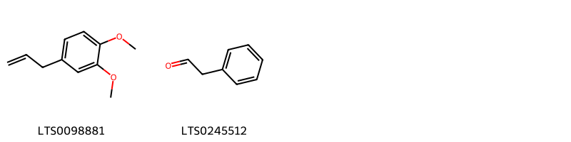{ width=100% }
    <figcaption>Hình ảnh cấu trúc hóa học của 2 hoạt chất thuộc nhóm Benzene and substituted derivatives gồm ['methyl eugenol (LTS0098881)', 'phenylacetaldehyde (LTS0245512)'].</figcaption>
</figure>
#### Nhóm Carboxylic acids and derivatives
<figure markdown="span">
    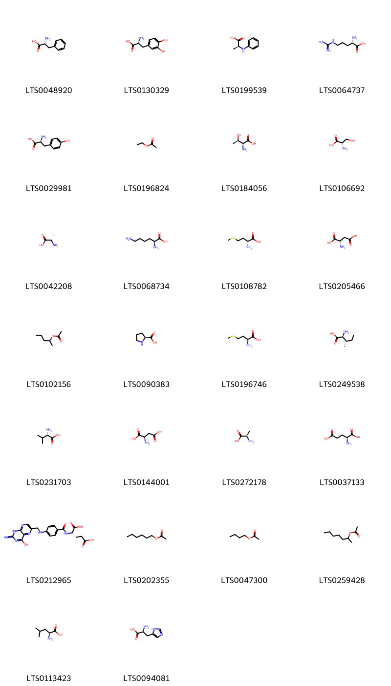{ width=100% }
    <figcaption>Hình ảnh cấu trúc hóa học của 26 hoạt chất thuộc nhóm Carboxylic acids and derivatives gồm ['d-phenylalanine (LTS0048920)', 'levodopa (LTS0130329)', '(2s)-2-(phenylamino)propanoic acid (LTS0199539)', 'l-arginine (LTS0064737)', 'l-tyrosine (LTS0029981)', 'ethyl acetate (LTS0196824)', 'l-threonine (LTS0184056)', 'l-serine (LTS0106692)', 'l-alanine (LTS0042208)', 'l-lysine (LTS0068734)', 'd-methionine (LTS0108782)', 'l-aspartic acid (LTS0205466)', 'sec-amyl acetate (LTS0102156)', 'l-proline (LTS0090383)', 'l-methionine (LTS0196746)', 'l-isoleucine (LTS0249538)', 'l-valine (LTS0231703)', 'd-aspartic acid (LTS0144001)', 'd-alanine (LTS0272178)', 'l-glutamic acid (LTS0037133)', 'acid, folic (LTS0212965)', 'hexyl acetate (LTS0202355)', 'butyl acetate (LTS0047300)', 'heptan-2-yl acetate (LTS0259428)', 'l-leucine (LTS0113423)', 'l-histidine (LTS0094081)'].</figcaption>
</figure>
#### Nhóm Fatty Acyls
<figure markdown="span">
    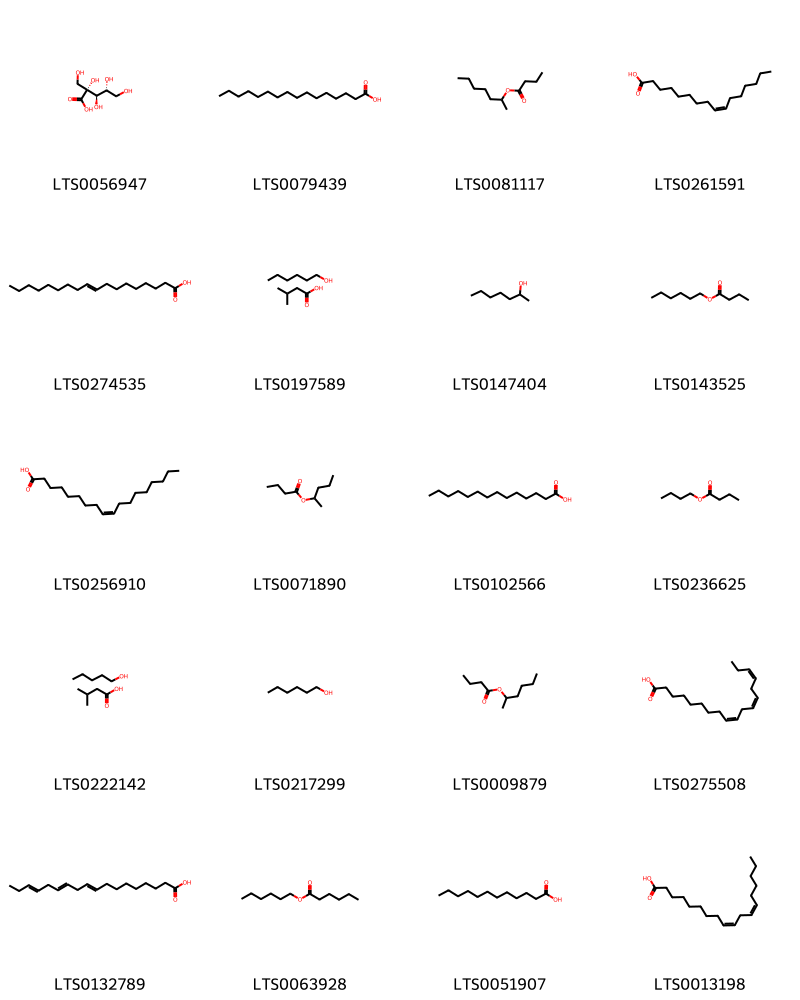{ width=100% }
    <figcaption>Hình ảnh cấu trúc hóa học của 20 hoạt chất thuộc nhóm Fatty Acyls gồm ['2-carboxy-d-arabinitol (LTS0056947)', 'palmitic acid (LTS0079439)', '2-heptyl butyrate (LTS0081117)', 'palmitoleic acid (LTS0261591)', '(+-)-propylene glycol (LTS0274535)', 'hexanol; isovaleric acid (LTS0197589)', '2-heptanol (LTS0147404)', 'hexyl butyrate (LTS0143525)', 'oleic acid (LTS0256910)', '2-pentyl butyrate (LTS0071890)', 'myristic acid (LTS0102566)', 'butyl butyrate (LTS0236625)', 'amyl alcohol; isovaleric acid (LTS0222142)', 'hexanol (LTS0217299)', 'hexan-2-yl butanoate (LTS0009879)', 'α-linolenic acid (LTS0275508)', 'α linolenic acid (LTS0132789)', 'hexyl hexanoate (LTS0063928)', 'lauric acid (LTS0051907)', 'linoleic (LTS0013198)'].</figcaption>
</figure>
#### Nhóm Flavonoids
<figure markdown="span">
    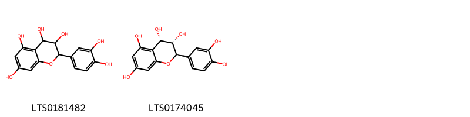{ width=100% }
    <figcaption>Hình ảnh cấu trúc hóa học của 2 hoạt chất thuộc nhóm Flavonoids gồm ['leucocyanidin (LTS0181482)', 'procyanidol (LTS0174045)'].</figcaption>
</figure>
#### Nhóm Glycerophospholipids
<figure markdown="span">
    { width=100% }
    <figcaption>Hình ảnh cấu trúc hóa học của 1 hoạt chất thuộc nhóm Glycerophospholipids gồm ['2,3-dihydroxypropoxy(3-(hexadecanoyloxy)-2-[(9e,12e)-octadeca-9,12-dienoyloxy]propoxy)phosphinic acid (LTS0232487)'].</figcaption>
</figure>
#### Nhóm Indoles and derivatives
<figure markdown="span">
    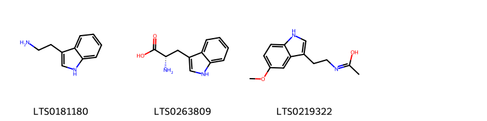{ width=100% }
    <figcaption>Hình ảnh cấu trúc hóa học của 3 hoạt chất thuộc nhóm Indoles and derivatives gồm ['tryptamine (LTS0181180)', 'l-tryptophan (LTS0263809)', 'n-[2-(5-methoxy-1h-indol-3-yl)ethyl]ethanimidic acid (LTS0219322)'].</figcaption>
</figure>
#### Nhóm Naphthalenes
<figure markdown="span">
    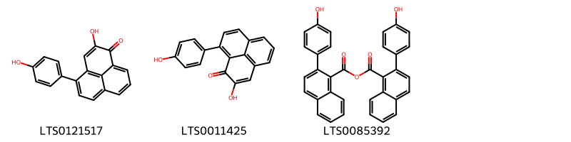{ width=100% }
    <figcaption>Hình ảnh cấu trúc hóa học của 3 hoạt chất thuộc nhóm Naphthalenes gồm ['2-hydroxy-4-(4-hydroxyphenyl)phenalen-1-one (LTS0121517)', '2-hydroxy-9-(4-hydroxyphenyl)phenalen-1-one (LTS0011425)', '2-(4-hydroxyphenyl)naphthalene-1-carbonyl 2-(4-hydroxyphenyl)naphthalene-1-carboxylate (LTS0085392)'].</figcaption>
</figure>
#### Nhóm Organonitrogen compounds
<figure markdown="span">
    { width=100% }
    <figcaption>Hình ảnh cấu trúc hóa học của 1 hoạt chất thuộc nhóm Organonitrogen compounds gồm ['putrescine (LTS0238763)'].</figcaption>
</figure>
#### Nhóm Organooxygen compounds
<figure markdown="span">
    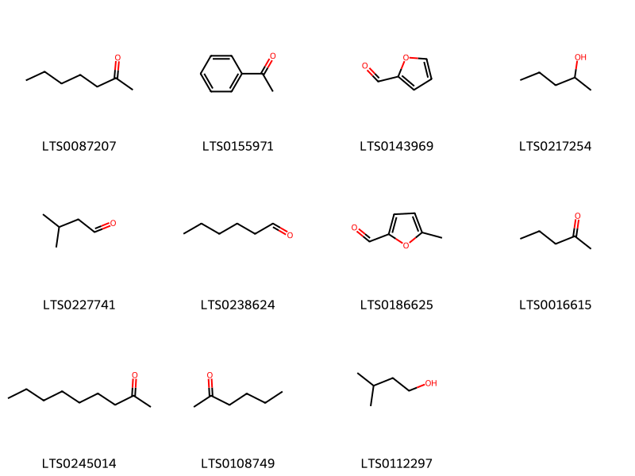{ width=100% }
    <figcaption>Hình ảnh cấu trúc hóa học của 11 hoạt chất thuộc nhóm Organooxygen compounds gồm ['2-heptanone (LTS0087207)', 'acetophenone (LTS0155971)', 'bran oil (LTS0143969)', '2-pentanol (LTS0217254)', 'isovaleraldehyde (LTS0227741)', 'hexanal (LTS0238624)', '5-methylfurfural (LTS0186625)', '2-pentanone (LTS0016615)', '2-nonanone (LTS0245014)', 'hexanone (LTS0108749)', 'isoamyl alcohol (LTS0112297)'].</figcaption>
</figure>
#### Nhóm Phenol ethers
<figure markdown="span">
    { width=100% }
    <figcaption>Hình ảnh cấu trúc hóa học của 1 hoạt chất thuộc nhóm Phenol ethers gồm ['elemicin (LTS0188875)'].</figcaption>
</figure>
#### Nhóm Phenols
<figure markdown="span">
    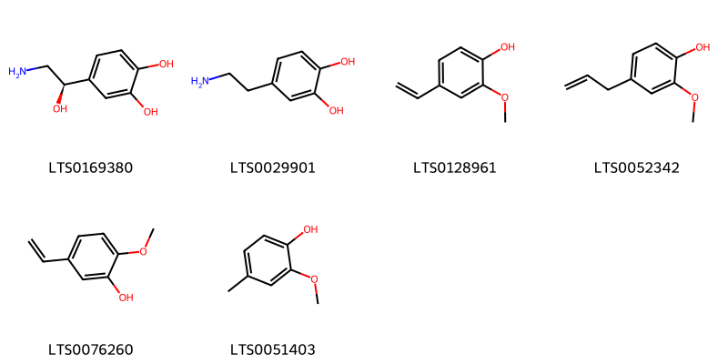{ width=100% }
    <figcaption>Hình ảnh cấu trúc hóa học của 6 hoạt chất thuộc nhóm Phenols gồm ['norepinephrine (LTS0169380)', 'dopamine (LTS0029901)', '2-methoxy-4-vinyl-phenol (LTS0128961)', 'eugenol (LTS0052342)', '5-ethenyl-2-methoxyphenol (LTS0076260)', 'creosol (LTS0051403)'].</figcaption>
</figure>
#### Nhóm Prenol lipids
<figure markdown="span">
    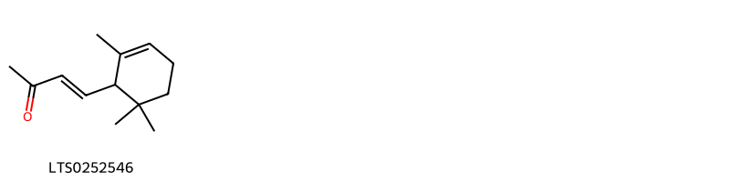{ width=100% }
    <figcaption>Hình ảnh cấu trúc hóa học của 1 hoạt chất thuộc nhóm Prenol lipids gồm ['ionone (LTS0252546)'].</figcaption>
</figure>
#### Nhóm Steroids and steroid derivatives
<figure markdown="span">
    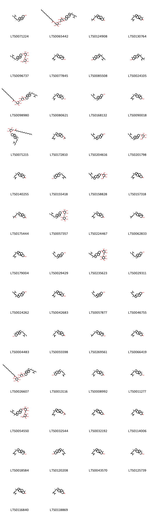{ width=100% }
    <figcaption>Hình ảnh cấu trúc hóa học của 51 hoạt chất thuộc nhóm Steroids and steroid derivatives gồm ['stigmast-5-en-3-ol (LTS0071224)', '{6-[(6-{[1-(5-ethyl-6-methylheptan-2-yl)-9a,11a-dimethyl-1h,2h,3h,3ah,3bh,4h,6h,7h,8h,9h,9bh,10h,11h-cyclopenta[a]phenanthren-7-yl]oxy}-3,4,5-trihydroxyoxan-2-yl)methoxy]-3,4,5-trihydroxyoxan-2-yl}methyl hexadecanoate (LTS0065442)', '7,12,16-trimethyl-15-(6-methyl-5-oxoheptan-2-yl)pentacyclo[9.7.0.0¹,³.0³,⁸.0¹²,¹⁶]octadecan-6-one (LTS0124908)', '15-(5,6-dimethylhept-6-en-2-yl)-7,12,16-trimethylpentacyclo[9.7.0.0¹,³.0³,⁸.0¹²,¹⁶]octadecan-6-one (LTS0130764)', '(2r,3r,4s,5s,6r)-2-{[(1r,3as,3bs,7s,9ar,9bs,11ar)-1-[(2r,5r)-5-ethyl-6-methylheptan-2-yl]-9a,11a-dimethyl-1h,2h,3h,3ah,3bh,4h,6h,7h,8h,9h,9bh,10h,11h-cyclopenta[a]phenanthren-7-yl]oxy}-6-({[(2r,3r,4s,5s,6r)-3,4,5-trihydroxy-6-(hydroxymethyl)oxan-2-yl]oxy}methyl)oxane-3,4,5-triol (LTS0096737)', '24-methylene-cycloartanol (LTS0077845)', '1-(5-ethyl-6-methylheptan-2-yl)-6,9a,11a-trimethyl-1h,2h,3h,3ah,5h,5ah,6h,7h,8h,9h,9bh,10h,11h-cyclopenta[a]phenanthren-7-ol (LTS0085508)', '1-(5-isopropylhept-5-en-2-yl)-6,9a,11a-trimethyl-1h,2h,3h,3ah,5h,5ah,6h,7h,8h,9h,9bh,10h,11h-cyclopenta[a]phenanthren-7-ol (LTS0024105)', '[(2r,3s,4s,5r,6r)-6-{[(2r,3s,4s,5r,6r)-6-{[(1r,3as,3bs,7s,9ar,9bs,11ar)-1-[(2r,5r)-5-ethyl-6-methylheptan-2-yl]-9a,11a-dimethyl-1h,2h,3h,3ah,3bh,4h,6h,7h,8h,9h,9bh,10h,11h-cyclopenta[a]phenanthren-7-yl]oxy}-3,4,5-trihydroxyoxan-2-yl]methoxy}-3,4,5-trihydroxyoxan-2-yl]methyl hexadecanoate (LTS0098980)', '(1s,3r,6r,7s,8s,11s,12s,15r,16r)-15-[(2r,5s)-5,6-dimethylhept-6-en-2-yl]-7,12,16-trimethylpentacyclo[9.7.0.0¹,³.0³,⁸.0¹²,¹⁶]octadecan-6-ol (LTS0080621)', 'sitosterol (LTS0168132)', '(1r,3s,6s,8r,11r,12s,15r,16r)-12,16-dimethyl-15-[(2r)-6-methyl-5-methylideneheptan-2-yl]pentacyclo[9.7.0.0¹,³.0³,⁸.0¹²,¹⁶]octadecan-6-ol (LTS0090018)', 'sitoindoside i (LTS0071215)', '(1r,3s,6s,8r,11r,12s,15r,16r)-12,16-dimethyl-15-[(2r)-6-methyl-5-methylideneheptan-2-yl]pentacyclo[9.7.0.0¹,³.0³,⁸.0¹²,¹⁶]octadecan-6-yl acetate (LTS0172810)', 'stigmast-5-en-3-ol, (3β)- (LTS0204616)', 'sitogluside (LTS0201798)', '(1s,3r,7r,8s,11s,12s,15r,16r)-15-[(2r,5s)-5,6-dimethylhept-6-en-2-yl]-7,12,16-trimethylpentacyclo[9.7.0.0¹,³.0³,⁸.0¹²,¹⁶]octadecan-6-one (LTS0140255)', '(z)-24-ethylidenelophenol (LTS0155418)', '2-{[1-(5-ethyl-6-methylheptan-2-yl)-9a,11a-dimethyl-1h,2h,3h,3ah,3bh,4h,6h,7h,8h,9h,9bh,10h,11h-cyclopenta[a]phenanthren-7-yl]oxy}-6-(hydroxymethyl)oxane-3,4,5-triol (LTS0158828)', '15-(5,6-dimethylhept-6-en-2-yl)-12,16-dimethylpentacyclo[9.7.0.0¹,³.0³,⁸.0¹²,¹⁶]octadecan-6-one (LTS0157318)', '(1s,3r,7s,8s,11s,12s,15r,16r)-7,12,16-trimethyl-15-[(2r)-6-methyl-5-oxoheptan-2-yl]pentacyclo[9.7.0.0¹,³.0³,⁸.0¹²,¹⁶]octadecan-6-one (LTS0175444)', '(1r,2r,3s,4s,5r,6s)-6-{[(2r,3s,4s,5r,6r)-6-{[(1r,3as,3bs,7s,9ar,9bs,11ar)-1-[(2r,5r)-5-ethyl-6-methylheptan-2-yl]-9a,11a-dimethyl-1h,2h,3h,3ah,3bh,4h,6h,7h,8h,9h,9bh,10h,11h-cyclopenta[a]phenanthren-7-yl]oxy}-3,4,5-trihydroxyoxan-2-yl]methoxy}cyclohexane-1,2,3,4,5-pentol (LTS0057357)', '(1s,3r,7s,8s,11s,12s,15r,16r)-7,12,16-trimethyl-15-[(2r)-6-methyl-5-methylideneheptan-2-yl]pentacyclo[9.7.0.0¹,³.0³,⁸.0¹²,¹⁶]octadecan-6-one (LTS0224467)', '(3r,6s,8r,11s,12s,15r,16r)-7,7,12,16-tetramethyl-15-[(2r)-6-methylhept-5-en-2-yl]pentacyclo[9.7.0.0¹,³.0³,⁸.0¹²,¹⁶]octadecan-6-ol (LTS0062833)', '12,16-dimethyl-15-(6-methyl-5-methylideneheptan-2-yl)pentacyclo[9.7.0.0¹,³.0³,⁸.0¹²,¹⁶]octadecan-6-ol (LTS0179004)', 'campesterol (LTS0029429)', '6-[(6-{[1-(5-ethyl-6-methylheptan-2-yl)-9a,11a-dimethyl-1h,2h,3h,3ah,3bh,4h,6h,7h,8h,9h,9bh,10h,11h-cyclopenta[a]phenanthren-7-yl]oxy}-3,4,5-trihydroxyoxan-2-yl)methoxy]cyclohexane-1,2,3,4,5-pentol (LTS0235623)', 'phytosterol (LTS0029311)', 'stigmasterol (LTS0024262)', '7,12,16-trimethyl-15-(6-methyl-5-methylideneheptan-2-yl)pentacyclo[9.7.0.0¹,³.0³,⁸.0¹²,¹⁶]octadecan-6-ol (LTS0042683)', '(1r,3as,3bs,7s,9bs)-1-[(2r,5r)-5,6-dimethylheptan-2-yl]-9a,11a-dimethyl-1h,2h,3h,3ah,3bh,4h,6h,7h,8h,9h,9bh,10h,11h-cyclopenta[a]phenanthren-7-ol (LTS0057877)', 'campesterol (LTS0046755)', '(1r,3ar,5as,6s,7s,9as,9br,11ar)-1-[(2r,5r)-5-ethyl-6-methylheptan-2-yl]-6,9a,11a-trimethyl-1h,2h,3h,3ah,5h,5ah,6h,7h,8h,9h,9bh,10h,11h-cyclopenta[a]phenanthren-7-ol (LTS0004483)', '(1s,3r,8s,11s,12s,15r,16r)-15-[(2r,5s)-5,6-dimethylhept-6-en-2-yl]-12,16-dimethylpentacyclo[9.7.0.0¹,³.0³,⁸.0¹²,¹⁶]octadecan-6-one (LTS0055598)', 'cycloartenol (LTS0269561)', '(1s,3r,7r,8s,11s,12s,15r,16r)-7,12,16-trimethyl-15-[(2r)-6-methyl-5-methylideneheptan-2-yl]pentacyclo[9.7.0.0¹,³.0³,⁸.0¹²,¹⁶]octadecan-6-one (LTS0066419)', '(1r,2s,3r,4s,5s,6r)-2-{[(2r,3s,4s,5r,6r)-6-{[(1r,3as,3bs,7s,9ar,9bs,11ar)-1-[(2r,5r)-5-ethyl-6-methylheptan-2-yl]-9a,11a-dimethyl-1h,2h,3h,3ah,3bh,4h,6h,7h,8h,9h,9bh,10h,11h-cyclopenta[a]phenanthren-7-yl]oxy}-3,4,5-trihydroxyoxan-2-yl]methoxy}-3,4,5,6-tetrahydroxycyclohexyl hexadecanoate (LTS0026607)', '(1r,3ar,5ar,6s,7s,9as,11ar)-1-[(2r,5r)-5,6-dimethylhept-6-en-2-yl]-3a,6,9a,11a-tetramethyl-1h,2h,3h,4h,5h,5ah,6h,7h,8h,9h,10h,11h-cyclopenta[a]phenanthren-7-ol (LTS0013116)', '(1s,3r,7s,8s,11s,12s,15r,16r)-15-[(2r,5s)-5,6-dimethylhept-6-en-2-yl]-7,12,16-trimethylpentacyclo[9.7.0.0¹,³.0³,⁸.0¹²,¹⁶]octadecan-6-one (LTS0008992)', '(1s,3r,6r,7s,8s,11s,12s,15r,16r)-7,12,16-trimethyl-15-[(2r)-6-methyl-5-methylideneheptan-2-yl]pentacyclo[9.7.0.0¹,³.0³,⁸.0¹²,¹⁶]octadecan-6-ol (LTS0011277)', '2-{[1-(5-ethyl-6-methylheptan-2-yl)-9a,11a-dimethyl-1h,2h,3h,3ah,3bh,4h,6h,7h,8h,9h,9bh,10h,11h-cyclopenta[a]phenanthren-7-yl]oxy}-6-({[3,4,5-trihydroxy-6-(hydroxymethyl)oxan-2-yl]oxy}methyl)oxane-3,4,5-triol (LTS0054550)', '12,16-dimethyl-15-(6-methyl-5-methylideneheptan-2-yl)pentacyclo[9.7.0.0¹,³.0³,⁸.0¹²,¹⁶]octadecan-6-yl acetate (LTS0032544)', '12,16-dimethyl-15-(6-methyl-5-methylideneheptan-2-yl)pentacyclo[9.7.0.0¹,³.0³,⁸.0¹²,¹⁶]octadecan-6-one (LTS0032192)', '(3r,8s,11s,12s,16r)-15-(5,6-dimethylhept-6-en-2-yl)-7,12,16-trimethylpentacyclo[9.7.0.0¹,³.0³,⁸.0¹²,¹⁶]octadecan-6-one (LTS0114006)', '24-methylenecycloartanol (LTS0018584)', '1-(5,6-dimethylhept-6-en-2-yl)-3a,6,9a,11a-tetramethyl-1h,2h,3h,4h,5h,5ah,6h,7h,8h,9h,10h,11h-cyclopenta[a]phenanthren-7-ol (LTS0120208)', '15-(5,6-dimethylhept-6-en-2-yl)-7,12,16-trimethylpentacyclo[9.7.0.0¹,³.0³,⁸.0¹²,¹⁶]octadecan-6-ol (LTS0043570)', 'cycloeucalenol (LTS0125739)', '7,12,16-trimethyl-15-(6-methyl-5-methylideneheptan-2-yl)pentacyclo[9.7.0.0¹,³.0³,⁸.0¹²,¹⁶]octadecan-6-one (LTS0116840)', '(1s,3r,8s,11s,12s,15r,16r)-12,16-dimethyl-15-[(2r)-6-methyl-5-methylideneheptan-2-yl]pentacyclo[9.7.0.0¹,³.0³,⁸.0¹²,¹⁶]octadecan-6-one (LTS0118869)', '2-[(6-{[1-(5-ethyl-6-methylheptan-2-yl)-9a,11a-dimethyl-1h,2h,3h,3ah,3bh,4h,6h,7h,8h,9h,9bh,10h,11h-cyclopenta[a]phenanthren-7-yl]oxy}-3,4,5-trihydroxyoxan-2-yl)methoxy]-3,4,5,6-tetrahydroxycyclohexyl hexadecanoate (LTS0092529)'].</figcaption>
</figure>
#### Nhóm Tetrahydroisoquinolines
<figure markdown="span">
    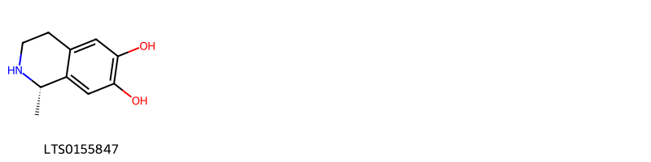{ width=100% }
    <figcaption>Hình ảnh cấu trúc hóa học của 1 hoạt chất thuộc nhóm Tetrahydroisoquinolines gồm ['salsolinol (LTS0155847)'].</figcaption>
</figure>

---

### Dược dân tộc học

Danh sách các quốc gia có sử dụng *Musa paradisiaca* trong điều trị các bệnh. 

| Country       | Disease                                                                    | Bệnh                                                                                   |
|:--------------|:---------------------------------------------------------------------------|:---------------------------------------------------------------------------------------|
| Elsewhere     | nan, Antidote, Astringent, Carminative, Fungicide, Styptic, Vermifuge, nan | nan, Thuốc giải độc, Chất làm se, Carminative, Thuốc diệt nấm, Styptic, Vermifuge, nan |
| Haiti         | Hemostat, Refrigerant, Cicatrizant, Laxative, Astringent, Emollient        | Hemostat, Refrigerant, Cicatrizant, Laxative, Astringent, Emollient                    |
| Iraq          | Vermifuge                                                                  | Thuốc diệt sán                                                                         |
| Panama(Choco) | Intoxicant                                                                 | chất gây độc                                                                           |
| Trinidad      | Astringent, Fungicide, Vermifuge, Vermifuge, nan                           | Chất làm se, Thuốc diệt nấm, Vermifuge, Vermifuge, nan                                 |
| Venezuela     | Aphrodisiac, Astringent                                                    | Thuốc kích thích tình dục, Chất làm se                                                 |

---

---
## Musa sapientum
### Thông tin về thực vật

!!! info "Phân loại thực vật của *Musa paradisiaca* từ GIBF:"
    - **Kingdom:** Plantae
    - **Phylum:** Tracheophyta
    - **Order:** Zingiberales
    - **Family:** Musaceae
    - **Genus:** Musa
    - **Species:** *Musa paradisiaca*

 

| Label (VI)   | Label (EN)   | Scientific Name   | Descriptions (VI)   | Descriptions (EN)   | Also Known As (VI)   | Also Known As (EN)   |
|:-------------|:-------------|:------------------|:--------------------|:--------------------|:---------------------|:---------------------|
| N/A          | N/A          | Musa basjoo       | loài thực vật       | species of plant    | ['']                 | ['']                 |

#### Phân bố trên thế giới

**Từ CSDL GIBF** nan, Palau, Micronesia (Federated States of), Benin, Tanzania, United Republic of, Panama, Nigeria, Chinese Taipei, Spain, Honduras, United States of America, Belize, Guinea-Bissau, Sao Tome and Principe, Thailand, Brazil, New Caledonia, Cuba, Mexico, China, Ecuador, Seychelles, Colombia, Philippines, Northern Mariana Islands

#### Phân bố tại Việt Nam

**Từ CSDL GIBF**: Không có ghi nhận ở Việt Nam

---
### Thành phần hóa học
        
- Theo cơ sở dữ liệu lotus: Từ loài *Musa paradisiaca* đã phân lập và xác định được Chưa có hoạt chất nào được phân lập. hoạt chất thuộc về các nhóm Không có hoạt chất nào được phân lập. 

Không có hình ảnh nào được tạo ra

---

### Dược dân tộc học

Danh sách các quốc gia có sử dụng *Musa paradisiaca* trong điều trị các bệnh. 

| Country           | Disease     | Bệnh                      |
|:------------------|:------------|:--------------------------|
| Bahamas           | Diaphoretic | Thuốc tràn dịch màng phổi |
| Java              | Hemostat    | Máy cầm máu               |
| Mexico(Chinantec) | Dentifrice  | Kem đánh răng             |

---

