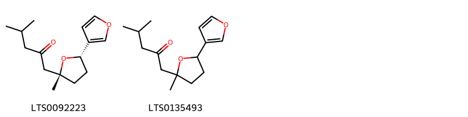
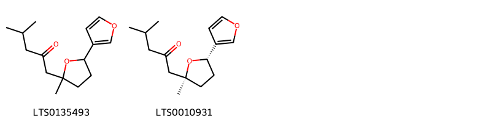

!!! abstract "Tóm tắt"

    Họ Myoporaceae gồm khoảng 2 chi và 2 loài được một số cộng đồng tại các quốc gia như Haiti, New Zealand sử dụng trong một số trường hợp MYMEMORY WARNING: YOU USED ALL AVAILABLE FREE TRANSLATIONS FOR TODAY. NEXT AVAILABLE IN  09 HOURS 07 MINUTES 45 SECONDS VISIT HTTPS://MYMEMORY.TRANSLATED.NET/DOC/USAGELIMITS.PHP TO TRANSLATE MORE.

!!! info "DrDuke"

    James A. Duke sinh năm 1929-2017 là một nhà thực vật học người Mỹ. Đây là một trong những tác giả hàng đầu trong lĩnh vực dược dân tộc học với cuốn *CRC Handbook of Medicinal Herbs* và chính là người xây dựng lên cơ sở dữ liệu về hợp chất tự nhiên và dược dân tộc học tại Bộ nông nghiệp Hoa Kỳ. Các thông tin được đăng tải tại website [Dr. Duke's Phytochemical and Ethnobotanical Databases](https://phytochem.nal.usda.gov/). 
    Trong suốt thập niên 1970, ông lãnh đạo the Plant Taxonomy Laboratory, Plant Genetics and Germplasm Institute of the Agricultural Research Service, U.S. Department of Agriculture.
    Trong tài liệu này, các thông tin về dược dân tộc của các dược liệu được trích dẫn từ tài liệu của James A. Ducke với sự trợ giúp của phần mềm dịch thuật từ tiếng Anh sang tiếng Việt.
   

# Chi Myoporum

??? note "Danh sách các dược liệu thuộc chi"
    
	 - *Myoporum laetum*

---
## Myoporum laetum
### Thông tin về thực vật

!!! info "Phân loại thực vật của *Myoporum laetum* từ GIBF:"
    - **Kingdom:** Plantae
    - **Phylum:** Tracheophyta
    - **Order:** Lamiales
    - **Family:** Scrophulariaceae
    - **Genus:** Myoporum
    - **Species:** *Myoporum laetum*

 

| Label (VI)   | Label (EN)   | Scientific Name   | Descriptions (VI)   | Descriptions (EN)   | Also Known As (VI)   | Also Known As (EN)          |
|:-------------|:-------------|:------------------|:--------------------|:--------------------|:---------------------|:----------------------------|
| N/A          | N/A          | Myoporum laetum   | loài thực vật       | species of plant    | ['']                 | ['ngaio', 'mousehole tree'] |

#### Phân bố trên thế giới

**Từ CSDL GIBF** nan, Argentina, South Africa, Portugal, Morocco, Spain, New Zealand, Peru, Chile, United States of America, Mexico

#### Phân bố tại Việt Nam

**Từ CSDL GIBF**: Không có ghi nhận ở Việt Nam

---
### Thành phần hóa học
        
- Theo cơ sở dữ liệu lotus: Từ loài *Myoporum laetum* đã phân lập và xác định được 2 hoạt chất thuộc về các nhóm Heteroaromatic compounds. 

|    | chemicalTaxonomyClassyfireClass   |   smiles_count |
|---:|:----------------------------------|---------------:|
|  0 | Heteroaromatic compounds          |              2 |

#### Nhóm Heteroaromatic compounds
<figure markdown="span">
    { width=100% }
    <figcaption>Hình ảnh cấu trúc hóa học của 2 hoạt chất thuộc nhóm Heteroaromatic compounds gồm ['ngaione (-) (LTS0092223)', '1-[5-(furan-3-yl)-2-methyloxolan-2-yl]-4-methylpentan-2-one (LTS0135493)'].</figcaption>
</figure>

---

### Dược dân tộc học

Danh sách các quốc gia có sử dụng *Myoporum laetum* trong điều trị các bệnh. 

| Country     | Disease    | Bệnh                                                                                                                                                                                                |
|:------------|:-----------|:----------------------------------------------------------------------------------------------------------------------------------------------------------------------------------------------------|
| New Zealand | Antiseptic | MYMEMORY WARNING: YOU USED ALL AVAILABLE FREE TRANSLATIONS FOR TODAY. NEXT AVAILABLE IN  09 HOURS 07 MINUTES 43 SECONDS VISIT HTTPS://MYMEMORY.TRANSLATED.NET/DOC/USAGELIMITS.PHP TO TRANSLATE MORE |

---

# Chi Bontia

??? note "Danh sách các dược liệu thuộc chi"
    
	 - *Bontia daphnoides*

---
## Bontia daphnoides
### Thông tin về thực vật

!!! info "Phân loại thực vật của *Bontia daphnoides* từ GIBF:"
    - **Kingdom:** Plantae
    - **Phylum:** Tracheophyta
    - **Order:** Lamiales
    - **Family:** Scrophulariaceae
    - **Genus:** Bontia
    - **Species:** *Bontia daphnoides*

 

| Label (VI)   | Label (EN)   | Scientific Name   | Descriptions (VI)   | Descriptions (EN)   | Also Known As (VI)   | Also Known As (EN)   |
|:-------------|:-------------|:------------------|:--------------------|:--------------------|:---------------------|:---------------------|
| N/A          | N/A          | Bontia daphnoides | loài thực vật       | species of plant    | ['']                 | ['']                 |

#### Phân bố trên thế giới

**Từ CSDL GIBF** Honduras, Cayman Islands, unknown or invalid, nan, Guadeloupe, Dominica, French Guiana, Trinidad and Tobago, Martinique, Jamaica, Indonesia, Turks and Caicos Islands, Venezuela (Bolivarian Republic of), Dominican Republic, Colombia, Puerto Rico, India, Bahamas, Cuba, Bonaire, Sint Eustatius and Saba, Virgin Islands (U.S.), Belgium, Barbados, Virgin Islands (British), Antigua and Barbuda, Brazil, Saint Lucia, Aruba, Montserrat, Curaçao, South Africa, United States of America, Guyana

#### Phân bố tại Việt Nam

**Từ CSDL GIBF**: Không có ghi nhận ở Việt Nam

---
### Thành phần hóa học
        
- Theo cơ sở dữ liệu lotus: Từ loài *Bontia daphnoides* đã phân lập và xác định được 2 hoạt chất thuộc về các nhóm Heteroaromatic compounds. 

|    | chemicalTaxonomyClassyfireClass   |   smiles_count |
|---:|:----------------------------------|---------------:|
|  0 | Heteroaromatic compounds          |              2 |

#### Nhóm Heteroaromatic compounds
<figure markdown="span">
    { width=100% }
    <figcaption>Hình ảnh cấu trúc hóa học của 2 hoạt chất thuộc nhóm Heteroaromatic compounds gồm ['1-[5-(furan-3-yl)-2-methyloxolan-2-yl]-4-methylpentan-2-one (LTS0135493)', '1-[(2s,5s)-5-(furan-3-yl)-2-methyloxolan-2-yl]-4-methylpentan-2-one (LTS0010931)'].</figcaption>
</figure>

---

### Dược dân tộc học

Danh sách các quốc gia có sử dụng *Bontia daphnoides* trong điều trị các bệnh. 

| Country   | Disease   | Bệnh                                                                                                                                                                                                |
|:----------|:----------|:----------------------------------------------------------------------------------------------------------------------------------------------------------------------------------------------------|
| Haiti     | Poison    | MYMEMORY WARNING: YOU USED ALL AVAILABLE FREE TRANSLATIONS FOR TODAY. NEXT AVAILABLE IN  09 HOURS 07 MINUTES 23 SECONDS VISIT HTTPS://MYMEMORY.TRANSLATED.NET/DOC/USAGELIMITS.PHP TO TRANSLATE MORE |

---

