!!! abstract "Tóm tắt"

    Họ Myricaceae gồm khoảng 2 chi và 8 loài được một số cộng đồng tại các quốc gia như German, Mexico, Guatemala, French, Nepal, Elsewhere, anish, US(Amerindian), China, India, US, Turkey sử dụng trong một số trường hợp MYMEMORY WARNING: YOU USED ALL AVAILABLE FREE TRANSLATIONS FOR TODAY. NEXT AVAILABLE IN  16 HOURS 29 MINUTES 33 SECONDS VISIT HTTPS://MYMEMORY.TRANSLATED.NET/DOC/USAGELIMITS.PHP TO TRANSLATE MORE.

!!! info "DrDuke"

    James A. Duke sinh năm 1929-2017 là một nhà thực vật học người Mỹ. Đây là một trong những tác giả hàng đầu trong lĩnh vực dược dân tộc học với cuốn *CRC Handbook of Medicinal Herbs* và chính là người xây dựng lên cơ sở dữ liệu về hợp chất tự nhiên và dược dân tộc học tại Bộ nông nghiệp Hoa Kỳ. Các thông tin được đăng tải tại website [Dr. Duke's Phytochemical and Ethnobotanical Databases](https://phytochem.nal.usda.gov/). 
    Trong suốt thập niên 1970, ông lãnh đạo the Plant Taxonomy Laboratory, Plant Genetics and Germplasm Institute of the Agricultural Research Service, U.S. Department of Agriculture.
    Trong tài liệu này, các thông tin về dược dân tộc của các dược liệu được trích dẫn từ tài liệu của James A. Ducke với sự trợ giúp của phần mềm dịch thuật từ tiếng Anh sang tiếng Việt.
   

# Chi Comptonia

??? note "Danh sách các dược liệu thuộc chi"
    
	 - *Comptonia aleniifolia*
	 - *Comptonia peregrina*

---
## Comptonia aleniifolia
### Thông tin về thực vật

!!! info "Phân loại thực vật của *N/A* từ GIBF:"
    - **Kingdom:** N/A
    - **Phylum:** N/A
    - **Order:** N/A
    - **Family:** N/A
    - **Genus:** N/A
    - **Species:** *N/A*

 

| Label (VI)   | Label (EN)   | Scientific Name        | Descriptions (VI)   | Descriptions (EN)   | Also Known As (VI)   | Also Known As (EN)   |
|:-------------|:-------------|:-----------------------|:--------------------|:--------------------|:---------------------|:---------------------|
| N/A          | N/A          | Schaefferia frutescens | loài thực vật       | species of plant    | ['']                 | ['']                 |

#### Phân bố trên thế giới

**Từ CSDL GIBF** Không có kết quả phù hợp

#### Phân bố tại Việt Nam

**Từ CSDL GIBF**: Không có ghi nhận ở Việt Nam

---
### Thành phần hóa học
        
- Theo cơ sở dữ liệu lotus: Từ loài *N/A* đã phân lập và xác định được Chưa có hoạt chất nào được phân lập. hoạt chất thuộc về các nhóm Không có hoạt chất nào được phân lập. 

Không có hình ảnh nào được tạo ra

---

### Dược dân tộc học

Danh sách các quốc gia có sử dụng *N/A* trong điều trị các bệnh. 

| Country   | Disease               | Bệnh                                                                                                                                                                                                |
|:----------|:----------------------|:----------------------------------------------------------------------------------------------------------------------------------------------------------------------------------------------------|
| Elsewhere | Stimulant, Astringent | MYMEMORY WARNING: YOU USED ALL AVAILABLE FREE TRANSLATIONS FOR TODAY. NEXT AVAILABLE IN  16 HOURS 29 MINUTES 30 SECONDS VISIT HTTPS://MYMEMORY.TRANSLATED.NET/DOC/USAGELIMITS.PHP TO TRANSLATE MORE |

---

---
## Comptonia peregrina
### Thông tin về thực vật

!!! info "Phân loại thực vật của *Comptonia peregrina* từ GIBF:"
    - **Kingdom:** Plantae
    - **Phylum:** Tracheophyta
    - **Order:** Fagales
    - **Family:** Myricaceae
    - **Genus:** Comptonia
    - **Species:** *Comptonia peregrina*

 

| Label (VI)   | Label (EN)   | Scientific Name     | Descriptions (VI)   | Descriptions (EN)   | Also Known As (VI)   | Also Known As (EN)   |
|:-------------|:-------------|:--------------------|:--------------------|:--------------------|:---------------------|:---------------------|
| N/A          | N/A          | Comptonia peregrina | loài thực vật       | species of plant    | ['']                 | ['']                 |

#### Phân bố trên thế giới

**Từ CSDL GIBF** United States of America, Canada

#### Phân bố tại Việt Nam

**Từ CSDL GIBF**: Không có ghi nhận ở Việt Nam

---
### Thành phần hóa học
        
- Theo cơ sở dữ liệu lotus: Từ loài *Comptonia peregrina* đã phân lập và xác định được 22 hoạt chất thuộc về các nhóm Linear 1,3-diarylpropanoids, Flavonoids, Cinnamic acids and derivatives, Organooxygen compounds, Prenol lipids. 

|    | chemicalTaxonomyClassyfireClass   |   smiles_count |
|---:|:----------------------------------|---------------:|
|  0 | Cinnamic acids and derivatives    |              3 |
|  1 | Flavonoids                        |              3 |
|  2 | Linear 1,3-diarylpropanoids       |              2 |
|  3 | Organooxygen compounds            |              1 |
|  4 | Prenol lipids                     |             13 |

#### Nhóm Cinnamic acids and derivatives
<figure markdown="span">
    { width=100% }
    <figcaption>Hình ảnh cấu trúc hóa học của 3 hoạt chất thuộc nhóm Cinnamic acids and derivatives gồm ['methyl (2e)-3-(4-hydroxyphenyl)prop-2-enoate (LTS0085309)', 'methyl hydroxycinnamate (LTS0201093)', 'para-coumaric acid (LTS0266252)'].</figcaption>
</figure>
#### Nhóm Flavonoids
<figure markdown="span">
    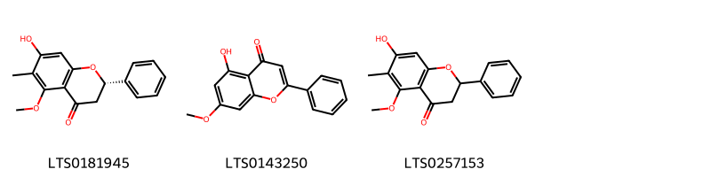{ width=100% }
    <figcaption>Hình ảnh cấu trúc hóa học của 3 hoạt chất thuộc nhóm Flavonoids gồm ['(2s)-7-hydroxy-5-methoxy-6-methyl-2-phenyl-2,3-dihydro-1-benzopyran-4-one (LTS0181945)', 'tectochrysin (LTS0143250)', 'comptonin (LTS0257153)'].</figcaption>
</figure>
#### Nhóm Linear 1_3-diarylpropanoids
<figure markdown="span">
    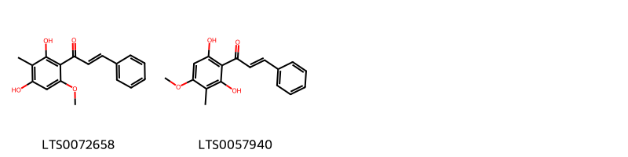{ width=100% }
    <figcaption>Hình ảnh cấu trúc hóa học của Không tìm thấy chú thích hoạt chất thuộc nhóm Linear 1_3-diarylpropanoids gồm Không tìm thấy chú thích.</figcaption>
</figure>
#### Nhóm Organooxygen compounds
<figure markdown="span">
    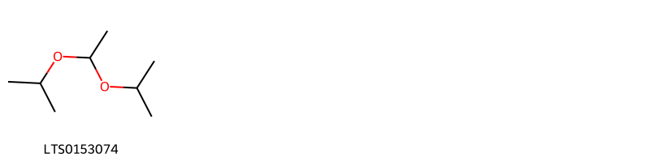{ width=100% }
    <figcaption>Hình ảnh cấu trúc hóa học của 1 hoạt chất thuộc nhóm Organooxygen compounds gồm ['2-(1-isopropoxyethoxy)propane (LTS0153074)'].</figcaption>
</figure>
#### Nhóm Prenol lipids
<figure markdown="span">
    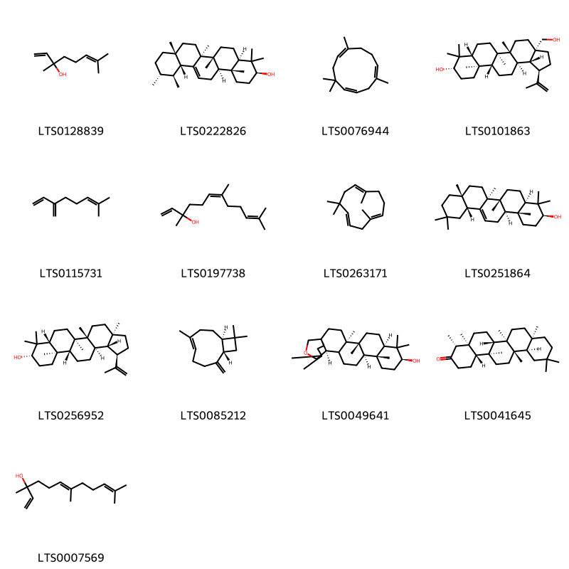{ width=100% }
    <figcaption>Hình ảnh cấu trúc hóa học của 13 hoạt chất thuộc nhóm Prenol lipids gồm ['linalool, (+-)- (LTS0128839)', 'amyrin (LTS0222826)', 'α-humulene (LTS0076944)', 'betulin (LTS0101863)', 'α-myrcene (LTS0115731)', 'nerolidol (LTS0197738)', 'humulene (LTS0263171)', 'β-amyrin (LTS0251864)', 'lupeol (LTS0256952)', 'caryophyllene (LTS0085212)', '(1r,4r,5r,8r,10s,13r,14r,18r)-4,5,9,9,13,20,20-heptamethyl-24-oxahexacyclo[17.3.2.0¹,¹⁸.0⁴,¹⁷.0⁵,¹⁴.0⁸,¹³]tetracosan-10-ol (LTS0049641)', '(-)-friedelin (LTS0041645)', 'nerolidol isomers (LTS0007569)'].</figcaption>
</figure>

---

### Dược dân tộc học

Danh sách các quốc gia có sử dụng *Comptonia peregrina* trong điều trị các bệnh. 

| Country        | Disease    | Bệnh                                                                                                                                                                                                |
|:---------------|:-----------|:----------------------------------------------------------------------------------------------------------------------------------------------------------------------------------------------------|
| US(Amerindian) | Astringent | MYMEMORY WARNING: YOU USED ALL AVAILABLE FREE TRANSLATIONS FOR TODAY. NEXT AVAILABLE IN  16 HOURS 29 MINUTES 20 SECONDS VISIT HTTPS://MYMEMORY.TRANSLATED.NET/DOC/USAGELIMITS.PHP TO TRANSLATE MORE |

---

# Chi Myrica

??? note "Danh sách các dược liệu thuộc chi"
    
	 - *Myrica cerifera*
	 - *Myrica esculenta*
	 - *Myrica gale*
	 - *Myrica mexicana*
	 - *Myrica nagi*
	 - *Myrica rubra*

---
## Myrica cerifera
### Thông tin về thực vật

!!! info "Phân loại thực vật của *Myrica cerifera* từ GIBF:"
    - **Kingdom:** Plantae
    - **Phylum:** Tracheophyta
    - **Order:** Fagales
    - **Family:** Myricaceae
    - **Genus:** Myrica
    - **Species:** *Myrica cerifera*

 

| Label (VI)   | Label (EN)   | Scientific Name   | Descriptions (VI)   | Descriptions (EN)   | Also Known As (VI)   | Also Known As (EN)   |
|:-------------|:-------------|:------------------|:--------------------|:--------------------|:---------------------|:---------------------|
| N/A          | N/A          | Myrica cerifera   | loài thực vật       | species of plant    | ['']                 | ['']                 |

#### Phân bố trên thế giới

**Từ CSDL GIBF** nan, Guatemala, Sweden, Honduras, Netherlands, Puerto Rico, United States of America, Korea, Republic of, Jamaica, Indonesia, Colombia, Cuba, Estonia, Mexico, Norway, Canada, Nicaragua, Bahamas, United Kingdom of Great Britain and Northern Ireland, Belize

#### Phân bố tại Việt Nam

**Từ CSDL GIBF**: Không có ghi nhận ở Việt Nam

---
### Thành phần hóa học
        
- Theo cơ sở dữ liệu lotus: Từ loài *Myrica cerifera* đã phân lập và xác định được 27 hoạt chất thuộc về các nhóm Lactones, Linear 1,3-diarylpropanoids, Flavonoids, Steroids and steroid derivatives, Prenol lipids, Diarylheptanoids. 

|    | chemicalTaxonomyClassyfireClass   |   smiles_count |
|---:|:----------------------------------|---------------:|
|  0 | Diarylheptanoids                  |              3 |
|  1 | Flavonoids                        |              1 |
|  2 | Lactones                          |              1 |
|  3 | Linear 1,3-diarylpropanoids       |              1 |
|  4 | Prenol lipids                     |             18 |
|  5 | Steroids and steroid derivatives  |              2 |

#### Nhóm Diarylheptanoids
<figure markdown="span">
    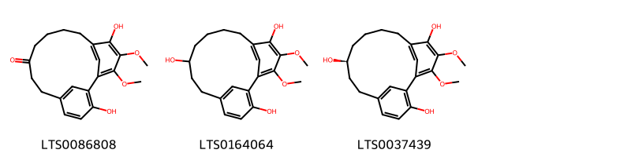{ width=100% }
    <figcaption>Hình ảnh cấu trúc hóa học của 3 hoạt chất thuộc nhóm Diarylheptanoids gồm ['myricanone (LTS0086808)', '16,17-dimethoxytricyclo[12.3.1.1²,⁶]nonadeca-1(17),2(19),3,5,14(18),15-hexaene-3,9,15-triol (LTS0164064)', '(+)-ar,11s-myricanol (LTS0037439)'].</figcaption>
</figure>
#### Nhóm Flavonoids
<figure markdown="span">
    { width=100% }
    <figcaption>Hình ảnh cấu trúc hóa học của 1 hoạt chất thuộc nhóm Flavonoids gồm ['myricitrin (LTS0189989)'].</figcaption>
</figure>
#### Nhóm Lactones
<figure markdown="span">
    { width=100% }
    <figcaption>Hình ảnh cấu trúc hóa học của 1 hoạt chất thuộc nhóm Lactones gồm ['(1r,4s,5r,8s,13s,14s,19s)-4,5,9,9,13,20,20-heptamethyl-24-oxahexacyclo[17.3.2.0¹,¹⁸.0⁴,¹⁷.0⁵,¹⁴.0⁸,¹³]tetracosa-15,17-diene-10,12,23-trione (LTS0093648)'].</figcaption>
</figure>
#### Nhóm Linear 1_3-diarylpropanoids
<figure markdown="span">
    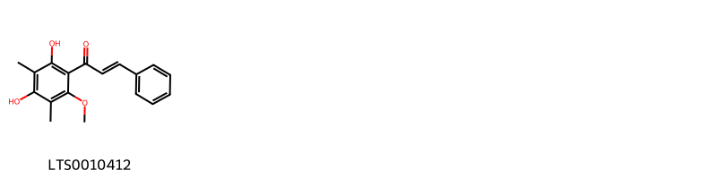{ width=100% }
    <figcaption>Hình ảnh cấu trúc hóa học của Không tìm thấy chú thích hoạt chất thuộc nhóm Linear 1_3-diarylpropanoids gồm Không tìm thấy chú thích.</figcaption>
</figure>
#### Nhóm Prenol lipids
<figure markdown="span">
    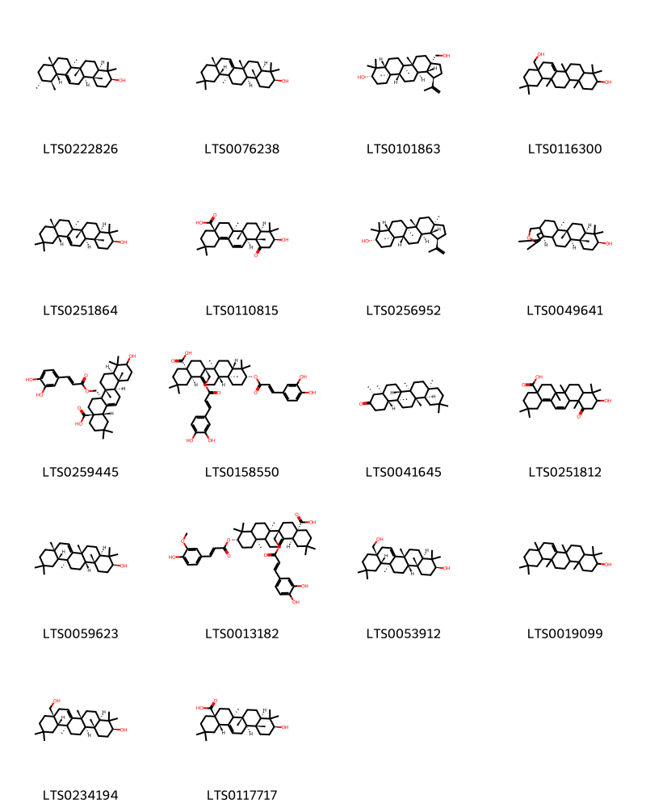{ width=100% }
    <figcaption>Hình ảnh cấu trúc hóa học của 18 hoạt chất thuộc nhóm Prenol lipids gồm ['amyrin (LTS0222826)', 'alnulin (LTS0076238)', 'betulin (LTS0101863)', '8a-(hydroxymethyl)-4,4,6a,11,11,12b,14b-heptamethyl-1,2,3,4a,5,6,8,9,10,12,12a,13,14,14a-tetradecahydropicen-3-ol (LTS0116300)', 'β-amyrin (LTS0251864)', 'myrica acid (LTS0110815)', 'lupeol (LTS0256952)', '(1r,4r,5r,8r,10s,13r,14r,18r)-4,5,9,9,13,20,20-heptamethyl-24-oxahexacyclo[17.3.2.0¹,¹⁸.0⁴,¹⁷.0⁵,¹⁴.0⁸,¹³]tetracosan-10-ol (LTS0049641)', '(4as,6ar,6br,8ar,12ar,12br,14bs)-6a-({[3-(3,4-dihydroxyphenyl)prop-2-enoyl]oxy}methyl)-10-hydroxy-2,2,6b,9,9,12a-hexamethyl-1,3,4,5,6,7,8,8a,10,11,12,12b,13,14b-tetradecahydropicene-4a-carboxylic acid (LTS0259445)', '(4ar,6as,6bs,8as,10r,12as,12bs,14br)-10-{[(2e)-3-(3,4-dihydroxyphenyl)prop-2-enoyl]oxy}-6a-({[(2e)-3-(3,4-dihydroxyphenyl)prop-2-enoyl]oxy}methyl)-2,2,6b,9,9,12a-hexamethyl-1,3,4,5,6,7,8,8a,10,11,12,12b,13,14b-tetradecahydropicene-4a-carboxylic acid (LTS0158550)', '(-)-friedelin (LTS0041645)', '10-hydroxy-2,2,6a,6b,9,9,12a-heptamethyl-12-oxo-3,4,5,6,7,8,8a,10,11,12b-decahydro-1h-picene-4a-carboxylic acid (LTS0251812)', '(3s,4ar,6ar,8ar,12ar,12bs,14as,14br)-4,4,6a,8a,11,11,12b,14b-octamethyl-1,2,3,4a,5,6,8,9,10,12,12a,13,14,14a-tetradecahydropicen-3-ol (LTS0059623)', '(4as,6ar,6br,10s,12ar,14bs)-6a-({[(2e)-3-(3,4-dihydroxyphenyl)prop-2-enoyl]oxy}methyl)-10-{[(2e)-3-(4-hydroxy-3-methoxyphenyl)prop-2-enoyl]oxy}-2,2,6b,9,9,12a-hexamethyl-1,3,4,5,6,7,8,8a,10,11,12,12b,13,14b-tetradecahydropicene-4a-carboxylic acid (LTS0013182)', '(3s,4ar,6ar,8as,12as,12bs,14as,14br)-8a-(hydroxymethyl)-4,4,6a,11,11,12b,14b-heptamethyl-1,2,3,4a,5,6,8,9,10,12,12a,13,14,14a-tetradecahydropicen-3-ol (LTS0053912)', 'taraxerol (LTS0019099)', 'myricadiol (LTS0234194)', 'oleanolic acid (LTS0117717)'].</figcaption>
</figure>
#### Nhóm Steroids and steroid derivatives
<figure markdown="span">
    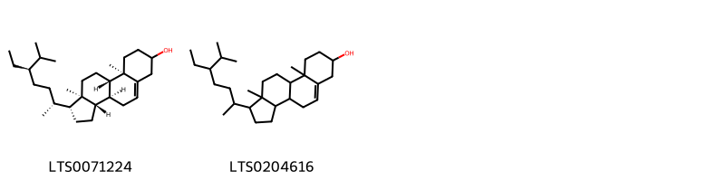{ width=100% }
    <figcaption>Hình ảnh cấu trúc hóa học của 2 hoạt chất thuộc nhóm Steroids and steroid derivatives gồm ['stigmast-5-en-3-ol (LTS0071224)', 'stigmast-5-en-3-ol, (3β)- (LTS0204616)'].</figcaption>
</figure>

---

### Dược dân tộc học

Danh sách các quốc gia có sử dụng *Myrica cerifera* trong điều trị các bệnh. 

| Country   | Disease                                                              | Bệnh                                                                                                                                                                                                |
|:----------|:---------------------------------------------------------------------|:----------------------------------------------------------------------------------------------------------------------------------------------------------------------------------------------------|
| Guatemala | Soap                                                                 | MYMEMORY WARNING: YOU USED ALL AVAILABLE FREE TRANSLATIONS FOR TODAY. NEXT AVAILABLE IN  16 HOURS 28 MINUTES 53 SECONDS VISIT HTTPS://MYMEMORY.TRANSLATED.NET/DOC/USAGELIMITS.PHP TO TRANSLATE MORE |
| Mexico    | Astringent, Emetic                                                   | MYMEMORY WARNING: YOU USED ALL AVAILABLE FREE TRANSLATIONS FOR TODAY. NEXT AVAILABLE IN  16 HOURS 28 MINUTES 51 SECONDS VISIT HTTPS://MYMEMORY.TRANSLATED.NET/DOC/USAGELIMITS.PHP TO TRANSLATE MORE |
| Turkey    | Astringent, Emetic, Laxative, Sudorific, Tonic, Stimulant, Stomachic | MYMEMORY WARNING: YOU USED ALL AVAILABLE FREE TRANSLATIONS FOR TODAY. NEXT AVAILABLE IN  16 HOURS 28 MINUTES 48 SECONDS VISIT HTTPS://MYMEMORY.TRANSLATED.NET/DOC/USAGELIMITS.PHP TO TRANSLATE MORE |
| US        | Astringent, Vermifuge, Tonic                                         | MYMEMORY WARNING: YOU USED ALL AVAILABLE FREE TRANSLATIONS FOR TODAY. NEXT AVAILABLE IN  16 HOURS 28 MINUTES 46 SECONDS VISIT HTTPS://MYMEMORY.TRANSLATED.NET/DOC/USAGELIMITS.PHP TO TRANSLATE MORE |

---

---
## Myrica esculenta
### Thông tin về thực vật

!!! info "Phân loại thực vật của *Morella esculenta* từ GIBF:"
    - **Kingdom:** Plantae
    - **Phylum:** Tracheophyta
    - **Order:** Fagales
    - **Family:** Myricaceae
    - **Genus:** Morella
    - **Species:** *Morella esculenta*

 

| Label (VI)   | Label (EN)   | Scientific Name   | Descriptions (VI)   | Descriptions (EN)   | Also Known As (VI)   | Also Known As (EN)   |
|:-------------|:-------------|:------------------|:--------------------|:--------------------|:---------------------|:---------------------|
| N/A          | N/A          | Myrica esculenta  | loài thực vật       | species of plant    | ['']                 | ['']                 |

#### Phân bố trên thế giới

**Từ CSDL GIBF** Viet Nam, Sweden, Nepal, China, Myanmar, India, Thailand

#### Phân bố tại Việt Nam

**Từ CSDL GIBF**: Không có ghi nhận ở Việt Nam

---
### Thành phần hóa học
        
- Theo cơ sở dữ liệu lotus: Từ loài *Morella esculenta* đã phân lập và xác định được Chưa có hoạt chất nào được phân lập. hoạt chất thuộc về các nhóm Không có hoạt chất nào được phân lập. 

Không có hình ảnh nào được tạo ra

---

### Dược dân tộc học

Danh sách các quốc gia có sử dụng *Morella esculenta* trong điều trị các bệnh. 

| Country   | Disease                                                                       | Bệnh                                                                                                                                                                                                |
|:----------|:------------------------------------------------------------------------------|:----------------------------------------------------------------------------------------------------------------------------------------------------------------------------------------------------|
| Elsewhere | Antiseptic, Astringent, Diuretic, Sedative, Stomachic, Carminative, Piscicide | MYMEMORY WARNING: YOU USED ALL AVAILABLE FREE TRANSLATIONS FOR TODAY. NEXT AVAILABLE IN  16 HOURS 28 MINUTES 18 SECONDS VISIT HTTPS://MYMEMORY.TRANSLATED.NET/DOC/USAGELIMITS.PHP TO TRANSLATE MORE |
| Nepal     | Antiseptic, Antiseptic                                                        | MYMEMORY WARNING: YOU USED ALL AVAILABLE FREE TRANSLATIONS FOR TODAY. NEXT AVAILABLE IN  16 HOURS 28 MINUTES 16 SECONDS VISIT HTTPS://MYMEMORY.TRANSLATED.NET/DOC/USAGELIMITS.PHP TO TRANSLATE MORE |

---

---
## Myrica gale
### Thông tin về thực vật

!!! info "Phân loại thực vật của *Myrica gale* từ GIBF:"
    - **Kingdom:** Plantae
    - **Phylum:** Tracheophyta
    - **Order:** Fagales
    - **Family:** Myricaceae
    - **Genus:** Myrica
    - **Species:** *Myrica gale*

 

| Label (VI)   | Label (EN)   | Scientific Name   | Descriptions (VI)   | Descriptions (EN)   | Also Known As (VI)   | Also Known As (EN)   |
|:-------------|:-------------|:------------------|:--------------------|:--------------------|:---------------------|:---------------------|
| N/A          | N/A          | Myrica gale       | loài thực vật       | species of plant    | ['']                 | ['Bog-myrtle']       |

#### Phân bố trên thế giới

**Từ CSDL GIBF** United States of America, Norway, Sweden, Netherlands, Finland, Russian Federation, Spain, Canada, Germany, United Kingdom of Great Britain and Northern Ireland, Ireland, Denmark

#### Phân bố tại Việt Nam

**Từ CSDL GIBF**: Không có ghi nhận ở Việt Nam

---
### Thành phần hóa học
        
- Theo cơ sở dữ liệu lotus: Từ loài *Myrica gale* đã phân lập và xác định được 43 hoạt chất thuộc về các nhóm Fatty Acyls, Lactones, Benzene and substituted derivatives, Linear 1,3-diarylpropanoids, Flavonoids, Cinnamic acids and derivatives, Diarylheptanoids, Organooxygen compounds, Prenol lipids, Lignan glycosides. 

|    | chemicalTaxonomyClassyfireClass     |   smiles_count |
|---:|:------------------------------------|---------------:|
|  0 | Benzene and substituted derivatives |              2 |
|  1 | Cinnamic acids and derivatives      |              1 |
|  2 | Diarylheptanoids                    |             13 |
|  3 | Fatty Acyls                         |              1 |
|  4 | Flavonoids                          |              2 |
|  5 | Lactones                            |              1 |
|  6 | Lignan glycosides                   |              2 |
|  7 | Linear 1,3-diarylpropanoids         |              7 |
|  8 | Organooxygen compounds              |              1 |
|  9 | Prenol lipids                       |             12 |

#### Nhóm Benzene and substituted derivatives
<figure markdown="span">
    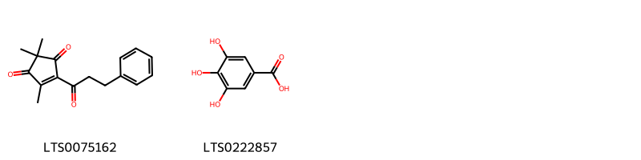{ width=100% }
    <figcaption>Hình ảnh cấu trúc hóa học của 2 hoạt chất thuộc nhóm Benzene and substituted derivatives gồm ['2,2,4-trimethyl-5-(3-phenylpropanoyl)cyclopent-4-ene-1,3-dione (LTS0075162)', 'galop (LTS0222857)'].</figcaption>
</figure>
#### Nhóm Cinnamic acids and derivatives
<figure markdown="span">
    { width=100% }
    <figcaption>Hình ảnh cấu trúc hóa học của 1 hoạt chất thuộc nhóm Cinnamic acids and derivatives gồm ['3,4-dihydroxycinnamic acid (LTS0128050)'].</figcaption>
</figure>
#### Nhóm Diarylheptanoids
<figure markdown="span">
    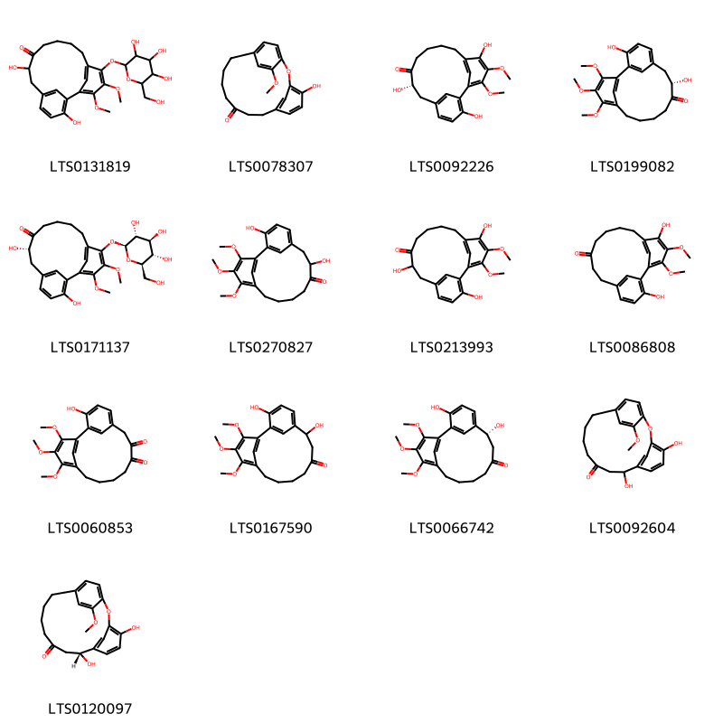{ width=100% }
    <figcaption>Hình ảnh cấu trúc hóa học của 13 hoạt chất thuộc nhóm Diarylheptanoids gồm ['3,8-dihydroxy-16,17-dimethoxy-15-{[3,4,5-trihydroxy-6-(hydroxymethyl)oxan-2-yl]oxy}tricyclo[12.3.1.1²,⁶]nonadeca-1(17),2(19),3,5,14(18),15-hexaen-9-one (LTS0131819)', '4-hydroxy-18-methoxy-2-oxatricyclo[13.2.2.1³,⁷]icosa-1(17),3(20),4,6,15,18-hexaen-10-one (LTS0078307)', '(8s)-3,8,15-trihydroxy-16,17-dimethoxytricyclo[12.3.1.1²,⁶]nonadeca-1(17),2(19),3,5,14(18),15-hexaen-9-one (LTS0092226)', '(8s)-3,8-dihydroxy-15,16,17-trimethoxytricyclo[12.3.1.1²,⁶]nonadeca-1(18),2(19),3,5,14,16-hexaen-9-one (LTS0199082)', '(8s)-3,8-dihydroxy-16,17-dimethoxy-15-{[(2s,3r,4s,5s,6r)-3,4,5-trihydroxy-6-(hydroxymethyl)oxan-2-yl]oxy}tricyclo[12.3.1.1²,⁶]nonadeca-1(17),2(19),3,5,14(18),15-hexaen-9-one (LTS0171137)', '3,8-dihydroxy-15,16,17-trimethoxytricyclo[12.3.1.1²,⁶]nonadeca-1(18),2(19),3,5,14,16-hexaen-9-one (LTS0270827)', '3,8,15-trihydroxy-16,17-dimethoxytricyclo[12.3.1.1²,⁶]nonadeca-1(17),2(19),3,5,14(18),15-hexaen-9-one (LTS0213993)', 'myricanone (LTS0086808)', '3-hydroxy-15,16,17-trimethoxytricyclo[12.3.1.1²,⁶]nonadeca-1(18),2(19),3,5,14,16-hexaene-8,9-dione (LTS0060853)', '3,7-dihydroxy-15,16,17-trimethoxytricyclo[12.3.1.1²,⁶]nonadeca-1(18),2(19),3,5,14,16-hexaen-9-one (LTS0167590)', '(7r)-3,7-dihydroxy-15,16,17-trimethoxytricyclo[12.3.1.1²,⁶]nonadeca-1(18),2(19),3,5,14,16-hexaen-9-one (LTS0066742)', '4,8-dihydroxy-18-methoxy-2-oxatricyclo[13.2.2.1³,⁷]icosa-1(17),3(20),4,6,15,18-hexaen-10-one (LTS0092604)', '(8r)-4,8-dihydroxy-18-methoxy-2-oxatricyclo[13.2.2.1³,⁷]icosa-1(17),3(20),4,6,15,18-hexaen-10-one (LTS0120097)'].</figcaption>
</figure>
#### Nhóm Fatty Acyls
<figure markdown="span">
    { width=100% }
    <figcaption>Hình ảnh cấu trúc hóa học của 1 hoạt chất thuộc nhóm Fatty Acyls gồm ['palmitic acid (LTS0079439)'].</figcaption>
</figure>
#### Nhóm Flavonoids
<figure markdown="span">
    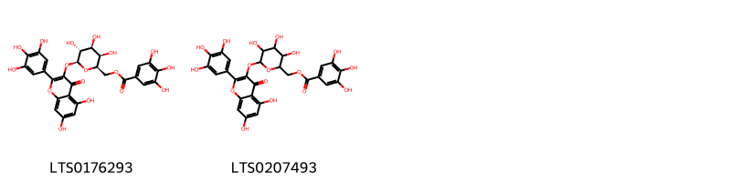{ width=100% }
    <figcaption>Hình ảnh cấu trúc hóa học của 2 hoạt chất thuộc nhóm Flavonoids gồm ['[(2r,3r,4s,5r,6s)-6-{[5,7-dihydroxy-4-oxo-2-(3,4,5-trihydroxyphenyl)chromen-3-yl]oxy}-3,4,5-trihydroxyoxan-2-yl]methyl 3,4,5-trihydroxybenzoate (LTS0176293)', '(6-{[5,7-dihydroxy-4-oxo-2-(3,4,5-trihydroxyphenyl)chromen-3-yl]oxy}-3,4,5-trihydroxyoxan-2-yl)methyl 3,4,5-trihydroxybenzoate (LTS0207493)'].</figcaption>
</figure>
#### Nhóm Lactones
<figure markdown="span">
    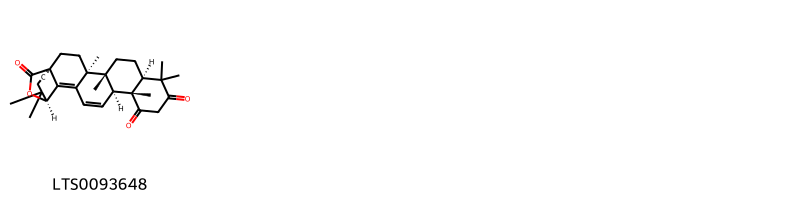{ width=100% }
    <figcaption>Hình ảnh cấu trúc hóa học của 1 hoạt chất thuộc nhóm Lactones gồm ['(1r,4s,5r,8s,13s,14s,19s)-4,5,9,9,13,20,20-heptamethyl-24-oxahexacyclo[17.3.2.0¹,¹⁸.0⁴,¹⁷.0⁵,¹⁴.0⁸,¹³]tetracosa-15,17-diene-10,12,23-trione (LTS0093648)'].</figcaption>
</figure>
#### Nhóm Lignan glycosides
<figure markdown="span">
    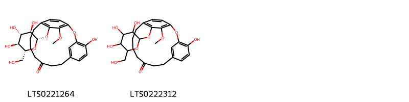{ width=100% }
    <figcaption>Hình ảnh cấu trúc hóa học của 2 hoạt chất thuộc nhóm Lignan glycosides gồm ['4-hydroxy-17-methoxy-16-{[(2s,3r,4s,5s,6r)-3,4,5-trihydroxy-6-(hydroxymethyl)oxan-2-yl]oxy}-2-oxatricyclo[13.2.2.1³,⁷]icosa-1(17),3(20),4,6,15,18-hexaen-10-one (LTS0221264)', '4-hydroxy-17-methoxy-16-{[3,4,5-trihydroxy-6-(hydroxymethyl)oxan-2-yl]oxy}-2-oxatricyclo[13.2.2.1³,⁷]icosa-1(17),3(20),4,6,15,18-hexaen-10-one (LTS0222312)'].</figcaption>
</figure>
#### Nhóm Linear 1_3-diarylpropanoids
<figure markdown="span">
    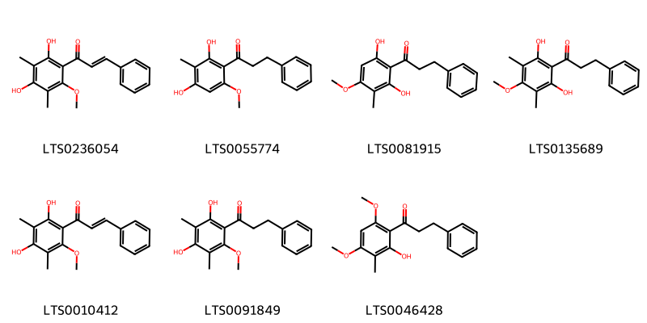{ width=100% }
    <figcaption>Hình ảnh cấu trúc hóa học của Không tìm thấy chú thích hoạt chất thuộc nhóm Linear 1_3-diarylpropanoids gồm Không tìm thấy chú thích.</figcaption>
</figure>
#### Nhóm Organooxygen compounds
<figure markdown="span">
    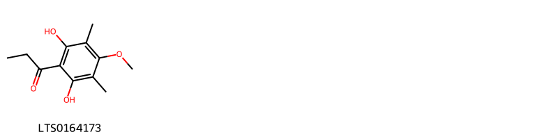{ width=100% }
    <figcaption>Hình ảnh cấu trúc hóa học của 1 hoạt chất thuộc nhóm Organooxygen compounds gồm ['1-(2,6-dihydroxy-4-methoxy-3,5-dimethylphenyl)propan-1-one (LTS0164173)'].</figcaption>
</figure>
#### Nhóm Prenol lipids
<figure markdown="span">
    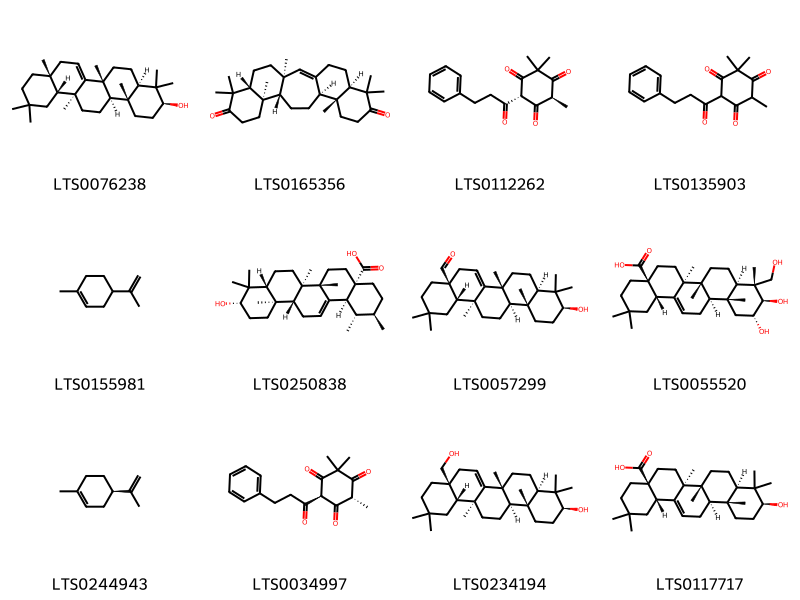{ width=100% }
    <figcaption>Hình ảnh cấu trúc hóa học của 12 hoạt chất thuộc nhóm Prenol lipids gồm ['alnulin (LTS0076238)', '(3s,6r,11r,12s,15s,16r,21r)-3,7,7,11,16,20,20-heptamethylpentacyclo[13.8.0.0³,¹².0⁶,¹¹.0¹⁶,²¹]tricos-1-ene-8,19-dione (LTS0165356)', '(4s,6s)-2,2,4-trimethyl-6-(3-phenylpropanoyl)cyclohexane-1,3,5-trione (LTS0112262)', '2,2,4-trimethyl-6-(3-phenylpropanoyl)cyclohexane-1,3,5-trione (LTS0135903)', 'limonene,  (LTS0155981)', 'ursolic acid (LTS0250838)', '(4as,6br,8ar,10s,12ar,12br,14as,14bs)-10-hydroxy-2,2,6b,9,9,12a,14a-heptamethyl-1,3,4,5,7,8,8a,10,11,12,12b,13,14,14b-tetradecahydropicene-4a-carbaldehyde (LTS0057299)', 'arjunolic acid (LTS0055520)', 'α-limonene (LTS0244943)', '(4r,6r)-2,2,4-trimethyl-6-(3-phenylpropanoyl)cyclohexane-1,3,5-trione (LTS0034997)', 'myricadiol (LTS0234194)', 'oleanolic acid (LTS0117717)'].</figcaption>
</figure>

---

### Dược dân tộc học

Danh sách các quốc gia có sử dụng *Myrica gale* trong điều trị các bệnh. 

| Country   | Disease                  | Bệnh                                                                                                                                                                                                |
|:----------|:-------------------------|:----------------------------------------------------------------------------------------------------------------------------------------------------------------------------------------------------|
| French    | Parasiticide             | MYMEMORY WARNING: YOU USED ALL AVAILABLE FREE TRANSLATIONS FOR TODAY. NEXT AVAILABLE IN  16 HOURS 27 MINUTES 56 SECONDS VISIT HTTPS://MYMEMORY.TRANSLATED.NET/DOC/USAGELIMITS.PHP TO TRANSLATE MORE |
| German    | Stomachic                | MYMEMORY WARNING: YOU USED ALL AVAILABLE FREE TRANSLATIONS FOR TODAY. NEXT AVAILABLE IN  16 HOURS 27 MINUTES 53 SECONDS VISIT HTTPS://MYMEMORY.TRANSLATED.NET/DOC/USAGELIMITS.PHP TO TRANSLATE MORE |
| US        | Astringent, Parasiticide | MYMEMORY WARNING: YOU USED ALL AVAILABLE FREE TRANSLATIONS FOR TODAY. NEXT AVAILABLE IN  16 HOURS 27 MINUTES 51 SECONDS VISIT HTTPS://MYMEMORY.TRANSLATED.NET/DOC/USAGELIMITS.PHP TO TRANSLATE MORE |
| anish     | Astringent               | MYMEMORY WARNING: YOU USED ALL AVAILABLE FREE TRANSLATIONS FOR TODAY. NEXT AVAILABLE IN  16 HOURS 27 MINUTES 48 SECONDS VISIT HTTPS://MYMEMORY.TRANSLATED.NET/DOC/USAGELIMITS.PHP TO TRANSLATE MORE |

---

---
## Myrica mexicana
### Thông tin về thực vật

!!! info "Phân loại thực vật của *Morella cerifera* từ GIBF:"
    - **Kingdom:** Plantae
    - **Phylum:** Tracheophyta
    - **Order:** Fagales
    - **Family:** Myricaceae
    - **Genus:** Morella
    - **Species:** *Morella cerifera*

 

| Label (VI)   | Label (EN)   | Scientific Name   | Descriptions (VI)   | Descriptions (EN)   | Also Known As (VI)   | Also Known As (EN)   |
|:-------------|:-------------|:------------------|:--------------------|:--------------------|:---------------------|:---------------------|
| N/A          | N/A          | Myrica gale       | loài thực vật       | species of plant    | ['']                 | ['Bog-myrtle']       |

#### Phân bố trên thế giới

**Từ CSDL GIBF** nan, Mexico, Guatemala, Kenya, El Salvador, Costa Rica, Colombia, Honduras, unknown or invalid, Panama, Bolivia (Plurinational State of)

#### Phân bố tại Việt Nam

**Từ CSDL GIBF**: Không có ghi nhận ở Việt Nam

---
### Thành phần hóa học
        
- Theo cơ sở dữ liệu lotus: Từ loài *Morella cerifera* đã phân lập và xác định được Chưa có hoạt chất nào được phân lập. hoạt chất thuộc về các nhóm Không có hoạt chất nào được phân lập. 

Không có hình ảnh nào được tạo ra

---

### Dược dân tộc học

Danh sách các quốc gia có sử dụng *Morella cerifera* trong điều trị các bệnh. 

| Country   | Disease                                | Bệnh                                                                                                                                                                                                |
|:----------|:---------------------------------------|:----------------------------------------------------------------------------------------------------------------------------------------------------------------------------------------------------|
| Mexico    | Astringent, Astringent, Emetic, Emetic | MYMEMORY WARNING: YOU USED ALL AVAILABLE FREE TRANSLATIONS FOR TODAY. NEXT AVAILABLE IN  16 HOURS 27 MINUTES 22 SECONDS VISIT HTTPS://MYMEMORY.TRANSLATED.NET/DOC/USAGELIMITS.PHP TO TRANSLATE MORE |

---

---
## Myrica nagi
### Thông tin về thực vật

!!! info "Phân loại thực vật của *Nageia nagi* từ GIBF:"
    - **Kingdom:** Plantae
    - **Phylum:** Tracheophyta
    - **Order:** Pinales
    - **Family:** Podocarpaceae
    - **Genus:** Nageia
    - **Species:** *Nageia nagi*

 

| Label (VI)   | Label (EN)   | Scientific Name   | Descriptions (VI)   | Descriptions (EN)   | Also Known As (VI)   | Also Known As (EN)   |
|:-------------|:-------------|:------------------|:--------------------|:--------------------|:---------------------|:---------------------|
| N/A          | N/A          | Myrica nagi       | loài thực vật       | species of plant    | ['']                 | ['']                 |

#### Phân bố trên thế giới

**Từ CSDL GIBF** nan, Viet Nam, Japan, Nepal, Chinese Taipei, Philippines, China, Myanmar, India, unknown or invalid

#### Phân bố tại Việt Nam

**Từ CSDL GIBF**: Không có ghi nhận ở Việt Nam

---
### Thành phần hóa học
        
- Theo cơ sở dữ liệu lotus: Từ loài *Nageia nagi* đã phân lập và xác định được 7 hoạt chất thuộc về các nhóm Diarylheptanoids, Flavonoids. 

|    | chemicalTaxonomyClassyfireClass   |   smiles_count |
|---:|:----------------------------------|---------------:|
|  0 | Diarylheptanoids                  |              6 |
|  1 | Flavonoids                        |              1 |

#### Nhóm Diarylheptanoids
<figure markdown="span">
    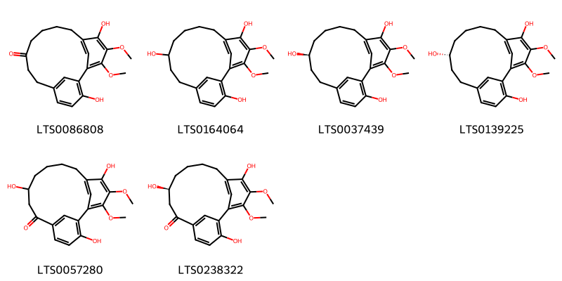{ width=100% }
    <figcaption>Hình ảnh cấu trúc hóa học của 6 hoạt chất thuộc nhóm Diarylheptanoids gồm ['myricanone (LTS0086808)', '16,17-dimethoxytricyclo[12.3.1.1²,⁶]nonadeca-1(17),2(19),3,5,14(18),15-hexaene-3,9,15-triol (LTS0164064)', '(+)-ar,11s-myricanol (LTS0037439)', '(9r)-16,17-dimethoxytricyclo[12.3.1.1²,⁶]nonadeca-1(17),2(19),3,5,14(18),15-hexaene-3,9,15-triol (LTS0139225)', '3,9,15-trihydroxy-16,17-dimethoxytricyclo[12.3.1.1²,⁶]nonadeca-1(17),2(19),3,5,14(18),15-hexaen-7-one (LTS0057280)', '(9s)-3,9,15-trihydroxy-16,17-dimethoxytricyclo[12.3.1.1²,⁶]nonadeca-1(17),2(19),3,5,14(18),15-hexaen-7-one (LTS0238322)'].</figcaption>
</figure>
#### Nhóm Flavonoids
<figure markdown="span">
    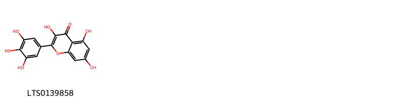{ width=100% }
    <figcaption>Hình ảnh cấu trúc hóa học của 1 hoạt chất thuộc nhóm Flavonoids gồm ['myricetin (LTS0139858)'].</figcaption>
</figure>

---

### Dược dân tộc học

Danh sách các quốc gia có sử dụng *Nageia nagi* trong điều trị các bệnh. 

| Country   | Disease   | Bệnh                                                                                                                                                                                                |
|:----------|:----------|:----------------------------------------------------------------------------------------------------------------------------------------------------------------------------------------------------|
| India     | Piscicide | MYMEMORY WARNING: YOU USED ALL AVAILABLE FREE TRANSLATIONS FOR TODAY. NEXT AVAILABLE IN  16 HOURS 27 MINUTES 02 SECONDS VISIT HTTPS://MYMEMORY.TRANSLATED.NET/DOC/USAGELIMITS.PHP TO TRANSLATE MORE |

---

---
## Myrica rubra
### Thông tin về thực vật

!!! info "Phân loại thực vật của *Myrica rubra* từ GIBF:"
    - **Kingdom:** Plantae
    - **Phylum:** Tracheophyta
    - **Order:** Fagales
    - **Family:** Myricaceae
    - **Genus:** Myrica
    - **Species:** *Myrica rubra*

 

| Label (VI)   | Label (EN)   | Scientific Name   | Descriptions (VI)   | Descriptions (EN)   | Also Known As (VI)   | Also Known As (EN)   |
|:-------------|:-------------|:------------------|:--------------------|:--------------------|:---------------------|:---------------------|
| N/A          | N/A          | Myrica rubra      | loài thực vật       | species of plant    | ['']                 | ['']                 |

#### Phân bố trên thế giới

**Từ CSDL GIBF** United States of America, Japan, Korea, Republic of, Chinese Taipei, China

#### Phân bố tại Việt Nam

**Từ CSDL GIBF**: Không có ghi nhận ở Việt Nam

---
### Thành phần hóa học
        
- Theo cơ sở dữ liệu lotus: Từ loài *Myrica rubra* đã phân lập và xác định được 146 hoạt chất thuộc về các nhóm Fatty Acyls, Benzene and substituted derivatives, Flavonoids, Cinnamic acids and derivatives, Steroids and steroid derivatives, Phenols, Organooxygen compounds, Phenol ethers, Prenol lipids, Diarylheptanoids. 

|    | chemicalTaxonomyClassyfireClass     |   smiles_count |
|---:|:------------------------------------|---------------:|
|  0 | Benzene and substituted derivatives |              2 |
|  1 | Cinnamic acids and derivatives      |              4 |
|  2 | Diarylheptanoids                    |             33 |
|  3 | Fatty Acyls                         |              1 |
|  4 | Flavonoids                          |             47 |
|  5 | Organooxygen compounds              |              6 |
|  6 | Phenol ethers                       |              2 |
|  7 | Phenols                             |              1 |
|  8 | Prenol lipids                       |             45 |
|  9 | Steroids and steroid derivatives    |              4 |

#### Nhóm Benzene and substituted derivatives
<figure markdown="span">
    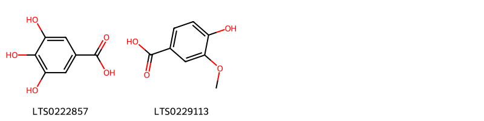{ width=100% }
    <figcaption>Hình ảnh cấu trúc hóa học của 2 hoạt chất thuộc nhóm Benzene and substituted derivatives gồm ['galop (LTS0222857)', 'vanillic acid (LTS0229113)'].</figcaption>
</figure>
#### Nhóm Cinnamic acids and derivatives
<figure markdown="span">
    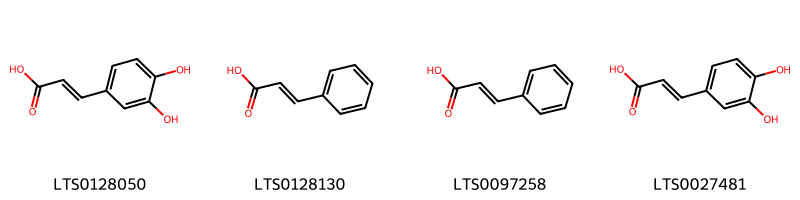{ width=100% }
    <figcaption>Hình ảnh cấu trúc hóa học của 4 hoạt chất thuộc nhóm Cinnamic acids and derivatives gồm ['3,4-dihydroxycinnamic acid (LTS0128050)', 'cinnamic acid (LTS0128130)', 'phenylacrylic acid (LTS0097258)', 'caffeic acid (LTS0027481)'].</figcaption>
</figure>
#### Nhóm Diarylheptanoids
<figure markdown="span">
    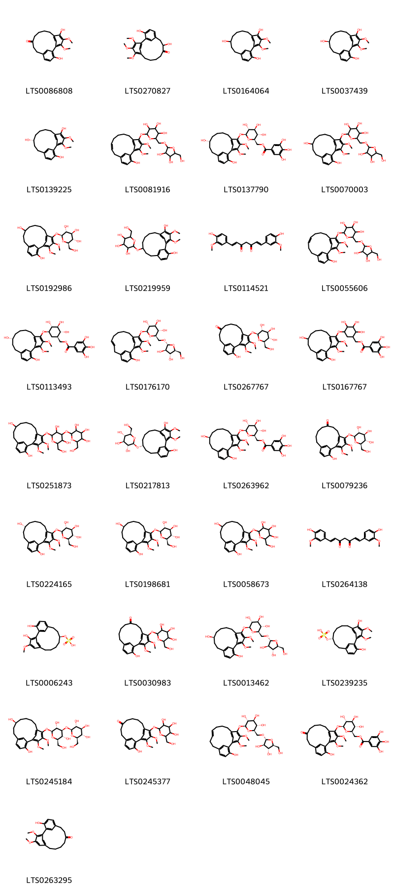{ width=100% }
    <figcaption>Hình ảnh cấu trúc hóa học của 33 hoạt chất thuộc nhóm Diarylheptanoids gồm ['myricanone (LTS0086808)', '3,8-dihydroxy-15,16,17-trimethoxytricyclo[12.3.1.1²,⁶]nonadeca-1(18),2(19),3,5,14,16-hexaen-9-one (LTS0270827)', '16,17-dimethoxytricyclo[12.3.1.1²,⁶]nonadeca-1(17),2(19),3,5,14(18),15-hexaene-3,9,15-triol (LTS0164064)', '(+)-ar,11s-myricanol (LTS0037439)', '(9r)-16,17-dimethoxytricyclo[12.3.1.1²,⁶]nonadeca-1(17),2(19),3,5,14(18),15-hexaene-3,9,15-triol (LTS0139225)', '2-({[3,4-dihydroxy-5-(hydroxymethyl)oxolan-2-yl]oxy}methyl)-6-({17-hydroxy-3,4-dimethoxytricyclo[12.3.1.1²,⁶]nonadeca-1(18),2,4,6(19),11,14,16-heptaen-5-yl}oxy)oxane-3,4,5-triol (LTS0081916)', '[(2r,3s,4s,5r,6s)-6-{[(11r)-11,17-dihydroxy-3,4-dimethoxytricyclo[12.3.1.1²,⁶]nonadeca-1(18),2,4,6(19),14,16-hexaen-5-yl]oxy}-3,4,5-trihydroxyoxan-2-yl]methyl 3,4,5-trihydroxybenzoate (LTS0137790)', '2-({11,17-dihydroxy-3,4-dimethoxytricyclo[12.3.1.1²,⁶]nonadeca-1(18),2,4,6(19),14,16-hexaen-5-yl}oxy)-6-({[3,4-dihydroxy-5-(hydroxymethyl)oxolan-2-yl]oxy}methyl)oxane-3,4,5-triol (LTS0070003)', '(2s,3r,4s,5s,6r)-2-({11,17-dihydroxy-3,4-dimethoxytricyclo[12.3.1.1²,⁶]nonadeca-1(18),2,4,6(19),14,16-hexaen-5-yl}oxy)-6-(hydroxymethyl)oxane-3,4,5-triol (LTS0192986)', '2-({3,15-dihydroxy-16,17-dimethoxytricyclo[12.3.1.1²,⁶]nonadeca-1(17),2(19),3,5,14(18),15-hexaen-9-yl}oxy)-6-(hydroxymethyl)oxane-3,4,5-triol (LTS0219959)', 'curcumin (LTS0114521)', '2-({[3,4-dihydroxy-5-(hydroxymethyl)oxolan-2-yl]oxy}methyl)-6-({17-hydroxy-3,4-dimethoxytricyclo[12.3.1.1²,⁶]nonadeca-1(18),2,4,6(19),10,14,16-heptaen-5-yl}oxy)oxane-3,4,5-triol (LTS0055606)', '[(1r,2r,3s,4r,5r)-5-{[(11r)-11,17-dihydroxy-3,4-dimethoxytricyclo[12.3.1.1²,⁶]nonadeca-1(18),2,4,6(19),14,16-hexaen-5-yl]oxy}-2,3,4-trihydroxycyclohexyl]methyl 3,4,5-trihydroxybenzoate (LTS0113493)', '(2r,3s,4s,5r,6s)-2-({[(2r,3r,4r,5s)-3,4-dihydroxy-5-(hydroxymethyl)oxolan-2-yl]oxy}methyl)-6-{[(11e)-17-hydroxy-3,4-dimethoxytricyclo[12.3.1.1²,⁶]nonadeca-1(18),2,4,6(19),11,14,16-heptaen-5-yl]oxy}oxane-3,4,5-triol (LTS0176170)', '3-hydroxy-16,17-dimethoxy-15-{[(2s,3r,4s,5s,6r)-3,4,5-trihydroxy-6-(hydroxymethyl)oxan-2-yl]oxy}tricyclo[12.3.1.1²,⁶]nonadeca-1(17),2(19),3,5,14(18),15-hexaen-9-one (LTS0267767)', '[5-({11,17-dihydroxy-3,4-dimethoxytricyclo[12.3.1.1²,⁶]nonadeca-1(18),2,4,6(19),14,16-hexaen-5-yl}oxy)-2,3,4-trihydroxycyclohexyl]methyl 3,4,5-trihydroxybenzoate (LTS0167767)', '2-{[2-({11,17-dihydroxy-3,4-dimethoxytricyclo[12.3.1.1²,⁶]nonadeca-1(18),2,4,6(19),14,16-hexaen-5-yl}oxy)-3,5-dihydroxy-6-(hydroxymethyl)oxan-4-yl]oxy}-6-(hydroxymethyl)oxane-3,4,5-triol (LTS0251873)', '(2r,3r,4s,5s,6r)-2-{[(9r)-3,15-dihydroxy-16,17-dimethoxytricyclo[12.3.1.1²,⁶]nonadeca-1(17),2(19),3,5,14(18),15-hexaen-9-yl]oxy}-6-(hydroxymethyl)oxane-3,4,5-triol (LTS0217813)', '[(2r,3s,4s,5r,6s)-6-{[(11s)-11,17-dihydroxy-3,4-dimethoxytricyclo[12.3.1.1²,⁶]nonadeca-1(18),2,4,6(19),14,16-hexaen-5-yl]oxy}-3,4,5-trihydroxyoxan-2-yl]methyl 3,4,5-trihydroxybenzoate (LTS0263962)', '17-hydroxy-3,4-dimethoxy-5-{[(2s,3r,4s,5s,6r)-3,4,5-trihydroxy-6-(hydroxymethyl)oxan-2-yl]oxy}tricyclo[12.3.1.1²,⁶]nonadeca-1(18),2,4,6(19),14,16-hexaen-9-one (LTS0079236)', '(2s,3r,4s,5s,6r)-2-{[(11r)-11,17-dihydroxy-3,4-dimethoxytricyclo[12.3.1.1²,⁶]nonadeca-1(18),2,4,6(19),14,16-hexaen-5-yl]oxy}-6-(hydroxymethyl)oxane-3,4,5-triol (LTS0224165)', '(2s,3r,4s,5s,6r)-2-{[(11s)-11,17-dihydroxy-3,4-dimethoxytricyclo[12.3.1.1²,⁶]nonadeca-1(18),2,4,6(19),14,16-hexaen-5-yl]oxy}-6-(hydroxymethyl)oxane-3,4,5-triol (LTS0198681)', '2-({11,17-dihydroxy-3,4-dimethoxytricyclo[12.3.1.1²,⁶]nonadeca-1(18),2,4,6(19),14,16-hexaen-5-yl}oxy)-6-(hydroxymethyl)oxane-3,4,5-triol (LTS0058673)', 'turmeric (LTS0264138)', '[(9s)-3,17-dihydroxy-16-methoxytricyclo[12.3.1.1²,⁶]nonadeca-1(17),2(19),3,5,14(18),15-hexaen-9-yl]oxidanesulfonic acid (LTS0006243)', '17-hydroxy-3,4-dimethoxy-5-{[3,4,5-trihydroxy-6-(hydroxymethyl)oxan-2-yl]oxy}tricyclo[12.3.1.1²,⁶]nonadeca-1(18),2,4,6(19),14,16-hexaen-9-one (LTS0030983)', '(2s,3r,4s,5s,6r)-2-{[(11s)-11,17-dihydroxy-3,4-dimethoxytricyclo[12.3.1.1²,⁶]nonadeca-1(18),2,4,6(19),14,16-hexaen-5-yl]oxy}-6-({[(2r,3r,4r,5s)-3,4-dihydroxy-5-(hydroxymethyl)oxolan-2-yl]oxy}methyl)oxane-3,4,5-triol (LTS0013462)', '[(9r)-3,15-dihydroxy-16,17-dimethoxytricyclo[12.3.1.1²,⁶]nonadeca-1(17),2(19),3,5,14(18),15-hexaen-9-yl]oxidanesulfonic acid (LTS0239235)', '(2s,3r,4s,5s,6r)-2-{[(2s,3r,4s,5r,6r)-2-{[(11s)-11,17-dihydroxy-3,4-dimethoxytricyclo[12.3.1.1²,⁶]nonadeca-1(18),2,4,6(19),14,16-hexaen-5-yl]oxy}-3,5-dihydroxy-6-(hydroxymethyl)oxan-4-yl]oxy}-6-(hydroxymethyl)oxane-3,4,5-triol (LTS0245184)', '3-hydroxy-16,17-dimethoxy-15-{[3,4,5-trihydroxy-6-(hydroxymethyl)oxan-2-yl]oxy}tricyclo[12.3.1.1²,⁶]nonadeca-1(17),2(19),3,5,14(18),15-hexaen-9-one (LTS0245377)', '(2r,3s,4s,5r,6s)-2-({[(2r,3r,4r,5s)-3,4-dihydroxy-5-(hydroxymethyl)oxolan-2-yl]oxy}methyl)-6-{[(10e)-17-hydroxy-3,4-dimethoxytricyclo[12.3.1.1²,⁶]nonadeca-1(18),2,4,6(19),10,14,16-heptaen-5-yl]oxy}oxane-3,4,5-triol (LTS0048045)', '[(2r,3s,4s,5r,6s)-3,4,5-trihydroxy-6-({17-hydroxy-3,4-dimethoxy-11-oxotricyclo[12.3.1.1²,⁶]nonadeca-1(18),2,4,6(19),14,16-hexaen-5-yl}oxy)oxan-2-yl]methyl 3,4,5-trihydroxybenzoate (LTS0024362)', '3-hydroxy-16,17-dimethoxytricyclo[12.3.1.1²,⁶]nonadeca-1(17),2(19),3,5,14(18),15-hexaen-9-one (LTS0263295)'].</figcaption>
</figure>
#### Nhóm Fatty Acyls
<figure markdown="span">
    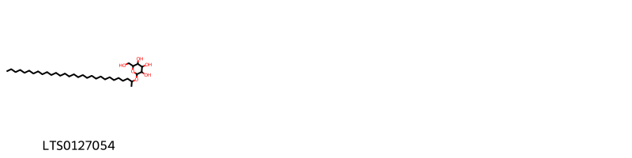{ width=100% }
    <figcaption>Hình ảnh cấu trúc hóa học của 1 hoạt chất thuộc nhóm Fatty Acyls gồm ['2-(hydroxymethyl)-6-(triacontan-2-yloxy)oxane-3,4,5-triol (LTS0127054)'].</figcaption>
</figure>
#### Nhóm Flavonoids
<figure markdown="span">
    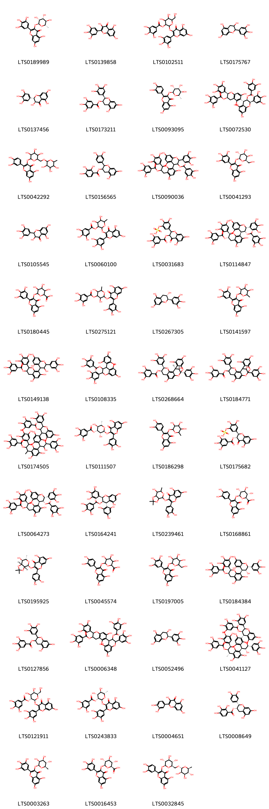{ width=100% }
    <figcaption>Hình ảnh cấu trúc hóa học của 47 hoạt chất thuộc nhóm Flavonoids gồm ['myricitrin (LTS0189989)', 'myricetin (LTS0139858)', '2-{[5,7-dihydroxy-4-oxo-2-(3,4,5-trihydroxyphenyl)chromen-3-yl]oxy}-4,5-dihydroxy-6-(hydroxymethyl)oxan-3-yl 3,4,5-trihydroxybenzoate (LTS0102511)', 'epigallocatechin (LTS0175767)', '(-)-dihydromyricetin (LTS0137456)', '(-)-epigallocatechin gallate (LTS0173211)', 'quercitrin (LTS0093095)', '(2r,3r,4s)-4-[(2r,3r)-5,7-dihydroxy-3-(3,4,5-trihydroxybenzoyloxy)-2-(3,4,5-trihydroxyphenyl)-3,4-dihydro-2h-1-benzopyran-6-yl]-5,7-dihydroxy-2-(3,4,5-trihydroxyphenyl)-3,4-dihydro-2h-1-benzopyran-3-yl 3,4,5-trihydroxybenzoate (LTS0072530)', 'rutin (LTS0042292)', '2-(3,4-dihydroxyphenyl)-5,7-dihydroxy-3,4-dihydro-2h-1-benzopyran-3-yl 2,3,4-trihydroxybenzoate (LTS0156565)', '4-[5,7-dihydroxy-3-(3,4,5-trihydroxybenzoyloxy)-2-(3,4,5-trihydroxyphenyl)-3,4-dihydro-2h-1-benzopyran-8-yl]-5,7-dihydroxy-2-(3,4,5-trihydroxyphenyl)-3,4-dihydro-2h-1-benzopyran-3-yl 3,4,5-trihydroxybenzoate (LTS0090036)', '5,7-dihydroxy-3-{[(2s,3r,4s,5r,6r)-3,4,5-trihydroxy-6-(hydroxymethyl)oxan-2-yl]oxy}-2-(3,4,5-trihydroxyphenyl)chromen-4-one (LTS0041293)', 'dihydromyricetin (LTS0105545)', '2-{[5,7-dihydroxy-4-oxo-2-(3,4,5-trihydroxyphenyl)chromen-3-yl]oxy}-4,5-dihydroxy-6-methyloxan-3-yl 3,4,5-trihydroxybenzoate (LTS0060100)', '{5-[5,7-dihydroxy-4-oxo-3-(3,4,5-trihydroxybenzoyloxy)-2,3-dihydro-1-benzopyran-2-yl]-2,3-dihydroxyphenyl}oxidanesulfonic acid (LTS0031683)', '(2r,3r,4r)-4-[(2r,3s)-5,7-dihydroxy-3-(3,4,5-trihydroxybenzoyloxy)-2-(3,4,5-trihydroxyphenyl)-3,4-dihydro-2h-1-benzopyran-8-yl]-5,7-dihydroxy-2-(3,4,5-trihydroxyphenyl)-3,4-dihydro-2h-1-benzopyran-3-yl 3,4,5-trihydroxybenzoate (LTS0114847)', '6-{[5,7-dihydroxy-4-oxo-2-(3,4,5-trihydroxyphenyl)chromen-3-yl]oxy}-3,4,5-trihydroxyoxane-2-carboxylic acid (LTS0180445)', '2-{[5,7-dihydroxy-4-oxo-2-(3,4,5-trihydroxyphenyl)chromen-3-yl]oxy}-3,5-dihydroxy-6-methyloxan-4-yl 3,4,5-trihydroxybenzoate (LTS0275121)', 'gallocatechol (LTS0267305)', 'myricitrin (LTS0141597)', '5,7-dihydroxy-8-[3,5,7-trihydroxy-2-(3,4,5-trihydroxyphenyl)-3,4-dihydro-2h-1-benzopyran-4-yl]-2-(3,4,5-trihydroxyphenyl)-3,4-dihydro-2h-1-benzopyran-3-yl 3,4,5-trihydroxybenzoate (LTS0149138)', '5,7-dihydroxy-4-(2,4,6-trihydroxyphenyl)-2-(3,4,5-trihydroxyphenyl)-3,4-dihydro-2h-1-benzopyran-3-yl 3,4,5-trihydroxybenzoate (LTS0108335)', '(1r,5r,6r,13s,21r)-9,17,19,21-tetrahydroxy-5,13-bis(3,4,5-trihydroxyphenyl)-4,12,14-trioxapentacyclo[11.7.1.0²,¹¹.0³,⁸.0¹⁵,²⁰]henicosa-2,8,10,15,17,19-hexaen-6-yl 3,4,5-trihydroxybenzoate (LTS0268664)', '9,17,19,21-tetrahydroxy-5,13-bis(3,4,5-trihydroxyphenyl)-4,12,14-trioxapentacyclo[11.7.1.0²,¹¹.0³,⁸.0¹⁵,²⁰]henicosa-2,8,10,15,17,19-hexaen-6-yl 3,4,5-trihydroxybenzoate (LTS0184771)', '4-{4-[5,7-dihydroxy-4-methyl-3-(3,4,5-trihydroxybenzoyloxy)-2-(3,4,5-trihydroxyphenyl)-3,4-dihydro-2h-1-benzopyran-8-yl]-3,5,7-trihydroxy-2-(3,4,5-trihydroxyphenyl)-3,4-dihydro-2h-1-benzopyran-8-yl}-5,7-dihydroxy-2-(3,4,5-trihydroxyphenyl)-3,4-dihydro-2h-1-benzopyran-3-yl 3,4,5-trihydroxybenzoate (LTS0174505)', '(2s,3r,4r,5s,6s)-2-{[5,7-dihydroxy-4-oxo-2-(3,4,5-trihydroxyphenyl)chromen-3-yl]oxy}-3,5-dihydroxy-6-methyloxan-4-yl 3,4,5-trihydroxybenzoate (LTS0111507)', 'quercitrin (LTS0186298)', '{5-[(2r,3r)-5,7-dihydroxy-4-oxo-3-(3,4,5-trihydroxybenzoyloxy)-2,3-dihydro-1-benzopyran-2-yl]-2,3-dihydroxyphenyl}oxidanesulfonic acid (LTS0175682)', '(2r,3r,4r)-4-[(2r,3r)-5,7-dihydroxy-3-(3,4,5-trihydroxybenzoyloxy)-2-(3,4,5-trihydroxyphenyl)-3,4-dihydro-2h-1-benzopyran-8-yl]-5,7-dihydroxy-2-(3,4,5-trihydroxyphenyl)-3,4-dihydro-2h-1-benzopyran-3-yl 3,4,5-trihydroxybenzoate (LTS0064273)', '(2r,3r,4s)-5,7-dihydroxy-4-(2,4,6-trihydroxyphenyl)-2-(3,4,5-trihydroxyphenyl)-3,4-dihydro-2h-1-benzopyran-3-yl 3,4,5-trihydroxybenzoate (LTS0164241)', '2-(3,4-dihydroxyphenyl)-5,7-dihydroxy-3-({7-hydroxy-2,2,6-trimethyl-tetrahydro-3ah-[1,3]dioxolo[4,5-c]pyran-4-yl}oxy)chromen-4-one (LTS0239461)', 'querciturone (LTS0168861)', '3-{[(3ar,4s,6s,7s,7ar)-7-hydroxy-2,2,6-trimethyl-tetrahydro-3ah-[1,3]dioxolo[4,5-c]pyran-4-yl]oxy}-2-(3,4-dihydroxyphenyl)-5,7-dihydroxychromen-4-one (LTS0195925)', 'miquelianin (LTS0045574)', '5,7-dihydroxy-3-{[3,4,5-trihydroxy-6-(hydroxymethyl)oxan-2-yl]oxy}-2-(3,4,5-trihydroxyphenyl)chromen-4-one (LTS0197005)', '(2r,3r)-5,7-dihydroxy-8-[(2r,3r,4r)-3,5,7-trihydroxy-2-(3,4,5-trihydroxyphenyl)-3,4-dihydro-2h-1-benzopyran-4-yl]-2-(3,4,5-trihydroxyphenyl)-3,4-dihydro-2h-1-benzopyran-3-yl 3,4,5-trihydroxybenzoate (LTS0184384)', '5,7-dihydroxy-2-(3,4,5-trihydroxyphenyl)-3,4-dihydro-2h-1-benzopyran-3-yl 3,4,5-trihydroxybenzoate (LTS0127856)', '4-[5,7-dihydroxy-3-(3,4,5-trihydroxybenzoyloxy)-2-(3,4,5-trihydroxyphenyl)-3,4-dihydro-2h-1-benzopyran-6-yl]-5,7-dihydroxy-2-(3,4,5-trihydroxyphenyl)-3,4-dihydro-2h-1-benzopyran-3-yl 3,4,5-trihydroxybenzoate (LTS0006348)', 'epigallocatechin (LTS0052496)', '(2r,3r,4r)-4-[(2r,3r,4s)-4-[(2r,3r,4s)-5,7-dihydroxy-4-methyl-3-(3,4,5-trihydroxybenzoyloxy)-2-(3,4,5-trihydroxyphenyl)-3,4-dihydro-2h-1-benzopyran-8-yl]-3,5,7-trihydroxy-2-(3,4,5-trihydroxyphenyl)-3,4-dihydro-2h-1-benzopyran-8-yl]-5,7-dihydroxy-2-(3,4,5-trihydroxyphenyl)-3,4-dihydro-2h-1-benzopyran-3-yl 3,4,5-trihydroxybenzoate (LTS0041127)', '(2s,3r,4s,5r,6r)-2-{[5,7-dihydroxy-4-oxo-2-(3,4,5-trihydroxyphenyl)chromen-3-yl]oxy}-4,5-dihydroxy-6-(hydroxymethyl)oxan-3-yl 3,4,5-trihydroxybenzoate (LTS0121911)', '(2s,3r,4r,5r,6s)-2-{[5,7-dihydroxy-4-oxo-2-(3,4,5-trihydroxyphenyl)chromen-3-yl]oxy}-4,5-dihydroxy-6-methyloxan-3-yl 3,4,5-trihydroxybenzoate (LTS0243833)', 'quercetin (LTS0004651)', '(2s,3s)-2-(3,4-dihydroxyphenyl)-5,7-dihydroxy-3,4-dihydro-2h-1-benzopyran-3-yl 2,3,4-trihydroxybenzoate (LTS0008649)', '5,7-dihydroxy-3-{[(2s,3s,4s,5s,6r)-3,4,5-trihydroxy-6-methyloxan-2-yl]oxy}-2-(3,4,5-trihydroxyphenyl)chromen-4-one (LTS0003263)', 'myricetin 3-o-glucuronide (LTS0016453)', '3-rutinosyl quercetin (LTS0032845)'].</figcaption>
</figure>
#### Nhóm Organooxygen compounds
<figure markdown="span">
    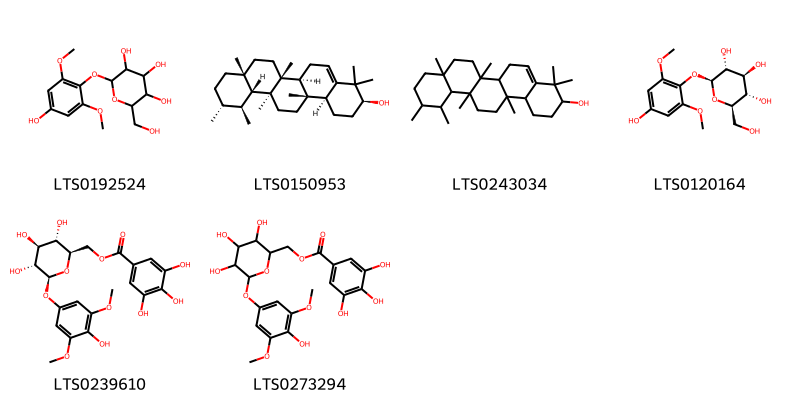{ width=100% }
    <figcaption>Hình ảnh cấu trúc hóa học của 6 hoạt chất thuộc nhóm Organooxygen compounds gồm ['2-(4-hydroxy-2,6-dimethoxyphenoxy)-6-(hydroxymethyl)oxane-3,4,5-triol (LTS0192524)', '(3s,6as,6br,8ar,11r,12s,12ar,12bs,14ar,14bs)-4,4,6b,8a,11,12,12b,14a-octamethyl-2,3,6,6a,7,8,9,10,11,12,12a,13,14,14b-tetradecahydro-1h-picen-3-ol (LTS0150953)', '4,4,6b,8a,11,12,12b,14a-octamethyl-2,3,6,6a,7,8,9,10,11,12,12a,13,14,14b-tetradecahydro-1h-picen-3-ol (LTS0243034)', '(2s,3r,4s,5s,6r)-2-(4-hydroxy-2,6-dimethoxyphenoxy)-6-(hydroxymethyl)oxane-3,4,5-triol (LTS0120164)', '[(2r,3s,4s,5r,6s)-3,4,5-trihydroxy-6-(4-hydroxy-3,5-dimethoxyphenoxy)oxan-2-yl]methyl 3,4,5-trihydroxybenzoate (LTS0239610)', '[3,4,5-trihydroxy-6-(4-hydroxy-3,5-dimethoxyphenoxy)oxan-2-yl]methyl 3,4,5-trihydroxybenzoate (LTS0273294)'].</figcaption>
</figure>
#### Nhóm Phenol ethers
<figure markdown="span">
    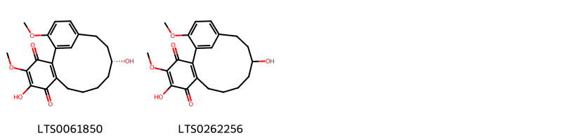{ width=100% }
    <figcaption>Hình ảnh cấu trúc hóa học của 2 hoạt chất thuộc nhóm Phenol ethers gồm ['(12r)-5,12-dihydroxy-4,18-dimethoxytricyclo[13.3.1.0²,⁷]nonadeca-1(19),2(7),4,15,17-pentaene-3,6-dione (LTS0061850)', '5,12-dihydroxy-4,18-dimethoxytricyclo[13.3.1.0²,⁷]nonadeca-1(19),2(7),4,15,17-pentaene-3,6-dione (LTS0262256)'].</figcaption>
</figure>
#### Nhóm Phenols
<figure markdown="span">
    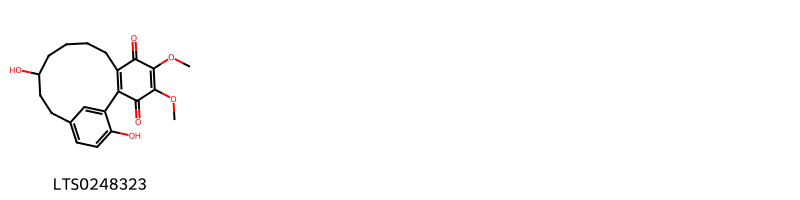{ width=100% }
    <figcaption>Hình ảnh cấu trúc hóa học của 1 hoạt chất thuộc nhóm Phenols gồm ['12,18-dihydroxy-4,5-dimethoxytricyclo[13.3.1.0²,⁷]nonadeca-1(19),2(7),4,15,17-pentaene-3,6-dione (LTS0248323)'].</figcaption>
</figure>
#### Nhóm Prenol lipids
<figure markdown="span">
    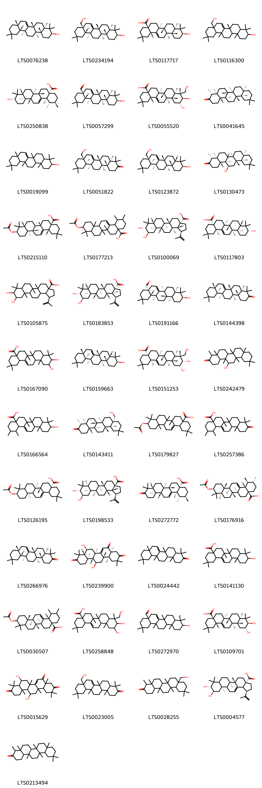{ width=100% }
    <figcaption>Hình ảnh cấu trúc hóa học của 45 hoạt chất thuộc nhóm Prenol lipids gồm ['alnulin (LTS0076238)', 'myricadiol (LTS0234194)', 'oleanolic acid (LTS0117717)', '8a-(hydroxymethyl)-4,4,6a,11,11,12b,14b-heptamethyl-1,2,3,4a,5,6,8,9,10,12,12a,13,14,14a-tetradecahydropicen-3-ol (LTS0116300)', 'ursolic acid (LTS0250838)', '(4as,6br,8ar,10s,12ar,12br,14as,14bs)-10-hydroxy-2,2,6b,9,9,12a,14a-heptamethyl-1,3,4,5,7,8,8a,10,11,12,12b,13,14,14b-tetradecahydropicene-4a-carbaldehyde (LTS0057299)', 'arjunolic acid (LTS0055520)', '(-)-friedelin (LTS0041645)', 'taraxerol (LTS0019099)', '(4ar,6ar,8as,12ar,12bs,14ar,14br)-8a-(hydroxymethyl)-4,4,6a,11,11,12b,14b-heptamethyl-2,4a,5,6,8,9,10,12,12a,13,14,14a-dodecahydro-1h-picen-3-one (LTS0051822)', '(3s,4as,6ar,8as,12ar,12bs,14ar,14br)-8a-(hydroxymethyl)-4,4,6a,11,11,12b,14b-heptamethyl-1,2,3,4a,5,6,8,9,10,12,12a,13,14,14a-tetradecahydropicen-3-ol (LTS0123872)', '(4r,4as,6ar,6br,8ar,12ar,12bs,14r,14as,14br)-14-hydroxy-4,4a,6b,8a,11,11,12b,14a-octamethyl-tetradecahydro-1h-picen-3-one (LTS0130473)', '(4ar,6as,6br,8ar,10r,12ar,12br,14br)-10-(acetyloxy)-2,2,6a,6b,9,9,12a-heptamethyl-1,3,4,5,6,7,8,8a,10,11,12,12b,13,14b-tetradecahydropicene-4a-carboxylic acid (LTS0215110)', '10-(acetyloxy)-1,2,6a,6b,9,9,12a-heptamethyl-2,3,4,5,6,7,8,8a,10,11,12,12b,13,14b-tetradecahydro-1h-picene-4a-carboxylic acid (LTS0177213)', '(1r,3as,5ar,5br,7ar,9r,10r,11ar,11br,13ar,13br)-9,10-dihydroxy-5a,5b,8,8,11a-pentamethyl-1-(prop-1-en-2-yl)-hexadecahydrocyclopenta[a]chrysene-3a-carboxylic acid (LTS0100069)', '(4ar,6as,6br,8as,10r,12as,12br,14br)-10-hydroxy-2,2,6a,6b,9,9,12a-heptamethyl-1,3,4,5,6,7,8,8a,10,11,12,12b,13,14b-tetradecahydropicene-4a-carboxylic acid (LTS0117803)', '9,10-dihydroxy-5a,5b,8,8,11a-pentamethyl-1-(prop-1-en-2-yl)-hexadecahydrocyclopenta[a]chrysene-3a-carboxylic acid (LTS0105875)', '(1r,3as,5ar,5br,7ar,9r,10r,11ar,11br,13as,13bs)-9,10-dihydroxy-5a,5b,8,8,11a-pentamethyl-1-(prop-1-en-2-yl)-hexadecahydrocyclopenta[a]chrysene-3a-carboxylic acid (LTS0183853)', '(4ar,6bs,8ar,10s,12as,12bs,14as,14bs)-10-hydroxy-2,2,6b,9,9,12a,14a-heptamethyl-1,3,4,5,7,8,8a,10,11,12,12b,13,14,14b-tetradecahydropicene-4a-carbaldehyde (LTS0191166)', '(4ar,6ar,8ar,12as,12bs,14ar,14br)-4,4,6a,8a,11,11,12b,14b-octamethyl-2,4a,5,6,8,9,10,12,12a,13,14,14a-dodecahydro-1h-picen-3-one (LTS0144398)', '10,11-dihydroxy-2,2,6a,6b,9,9,12a-heptamethyl-1,3,4,5,6,7,8,8a,10,11,12,12b,13,14b-tetradecahydropicene-4a-carboxylic acid (LTS0167090)', '(3s,4as,6ar,8ar,12as,12bs,14ar,14br)-4,4,6a,8a,11,11,12b,14b-octamethyl-1,2,3,4a,5,6,8,9,10,12,12a,13,14,14a-tetradecahydropicen-3-ol (LTS0159663)', '(4ar,6as,6br,8ar,9r,10s,11r,12ar,12br,14br)-10,11-dihydroxy-9-(hydroxymethyl)-2,2,6a,6b,9,12a-hexamethyl-1,3,4,5,6,7,8,8a,10,11,12,12b,13,14b-tetradecahydropicene-4a-carboxylic acid (LTS0151253)', '14-hydroxy-4,4a,6b,8a,11,11,12b,14a-octamethyl-tetradecahydro-1h-picen-3-one (LTS0242479)', '10-hydroxy-1,2,6a,6b,9,9,12a-heptamethyl-2,3,4,5,6,7,8,8a,10,11,12,12b,13,14b-tetradecahydro-1h-picene-4a-carboxylic acid (LTS0166564)', '(4r,4as,6as,6br,8as,12as,12bs,14as,14bs)-8a-(hydroxymethyl)-4,4a,6b,11,11,12b,14a-heptamethyl-tetradecahydro-1h-picen-3-one (LTS0143411)', '10-(acetyloxy)-2,2,6a,6b,9,9,12a-heptamethyl-1,3,4,5,6,7,8,8a,10,11,12,12b,13,14b-tetradecahydropicene-4a-carboxylic acid (LTS0179827)', '1,2,6a,6b,9,9,12a-heptamethyl-10-oxo-1,2,3,4,5,6,7,8,8a,11,12,12b,13,14b-tetradecahydropicene-4a-carboxylic acid (LTS0257386)', '(4as,6as,6br,10r,12ar)-10-(acetyloxy)-2,2,6a,6b,9,9,12a-heptamethyl-1,3,4,5,6,7,8,8a,10,11,12,12b,13,14b-tetradecahydropicene-4a-carboxylic acid (LTS0126195)', '(1r,3ar,5ar,5br,7as,9r,10r,11ar,11bs,13as,13br)-9,10-dihydroxy-5a,5b,8,8,11a-pentamethyl-1-(prop-1-en-2-yl)-hexadecahydrocyclopenta[a]chrysene-3a-carboxylic acid (LTS0198533)', '(1s,2r,4as,6as,6br,8ar,12ar,12br,14bs)-1,2,6a,6b,9,9,12a-heptamethyl-10-oxo-1,2,3,4,5,6,7,8,8a,11,12,12b,13,14b-tetradecahydropicene-4a-carboxylic acid (LTS0272772)', '(1s,2r,4as,6as,6br,8ar,10s,12ar,12br,14bs)-10-(acetyloxy)-1,2,6a,6b,9,9,12a-heptamethyl-2,3,4,5,6,7,8,8a,10,11,12,12b,13,14b-tetradecahydro-1h-picene-4a-carboxylic acid (LTS0176916)', 'taraxerone (LTS0266976)', '(4as,6br,8s,8ar,12ar,12br,13r,14as,14bs)-8,13-dihydroxy-2,2,4a,6b,9,9,12a,14a-octamethyl-4,7,8,8a,11,12,12b,13,14,14b-decahydro-1h-picene-3,5,10-trione (LTS0239900)', '4,4,6a,8a,11,11,12b,14b-octamethyl-2,4a,5,6,8,9,10,12,12a,13,14,14a-dodecahydro-1h-picen-3-one (LTS0024442)', 'oleanolic acid (LTS0141130)', '(4as,6as,6br,12ar,12br,14bs)-10-(acetyloxy)-1,2,6a,6b,9,9,12a-heptamethyl-2,3,4,5,6,7,8,8a,10,11,12,12b,13,14b-tetradecahydro-1h-picene-4a-carboxylic acid (LTS0030507)', '10,11-dihydroxy-9-(hydroxymethyl)-2,2,6a,6b,9,12a-hexamethyl-1,3,4,5,6,7,8,8a,10,11,12,12b,13,14b-tetradecahydropicene-4a-carboxylic acid (LTS0258848)', '10-hydroxy-2,2,6b,9,9,12a,14a-heptamethyl-1,3,4,5,7,8,8a,10,11,12,12b,13,14,14b-tetradecahydropicene-4a-carbaldehyde (LTS0272970)', 'maslinic acid (LTS0109701)', '8,13-dihydroxy-2,2,4a,6b,9,9,12a,14a-octamethyl-4,7,8,8a,11,12,12b,13,14,14b-decahydro-1h-picene-3,5,10-trione (LTS0015629)', '8a-(hydroxymethyl)-4,4,6a,11,11,12b,14b-heptamethyl-2,4a,5,6,8,9,10,12,12a,13,14,14a-dodecahydro-1h-picen-3-one (LTS0023005)', 'canophyllol (LTS0028255)', '(1r,3as,5as,5br,9r,10r,11ar)-9,10-dihydroxy-5a,5b,8,8,11a-pentamethyl-1-(prop-1-en-2-yl)-1h,2h,3h,4h,5h,6h,7h,7ah,9h,10h,11h,11bh,12h,13bh-cyclopenta[a]chrysene-3a-carboxylic acid (LTS0004577)', 'friedelin (LTS0213494)'].</figcaption>
</figure>
#### Nhóm Steroids and steroid derivatives
<figure markdown="span">
    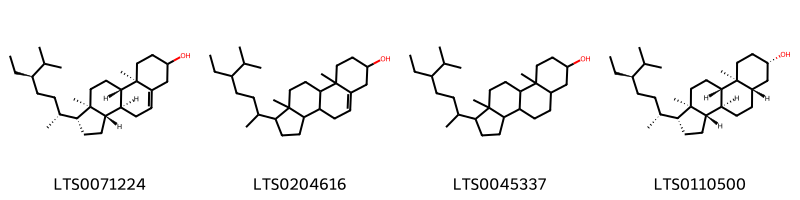{ width=100% }
    <figcaption>Hình ảnh cấu trúc hóa học của 4 hoạt chất thuộc nhóm Steroids and steroid derivatives gồm ['stigmast-5-en-3-ol (LTS0071224)', 'stigmast-5-en-3-ol, (3β)- (LTS0204616)', '24-ethyl coprostanol (LTS0045337)', 'stigmastanol (LTS0110500)'].</figcaption>
</figure>

---

### Dược dân tộc học

Danh sách các quốc gia có sử dụng *Myrica rubra* trong điều trị các bệnh. 

| Country   | Disease     | Bệnh                                                                                                                                                                                                |
|:----------|:------------|:----------------------------------------------------------------------------------------------------------------------------------------------------------------------------------------------------|
| China     | Carminative | MYMEMORY WARNING: YOU USED ALL AVAILABLE FREE TRANSLATIONS FOR TODAY. NEXT AVAILABLE IN  16 HOURS 26 MINUTES 44 SECONDS VISIT HTTPS://MYMEMORY.TRANSLATED.NET/DOC/USAGELIMITS.PHP TO TRANSLATE MORE |

---

