!!! abstract "Tóm tắt"

    Họ Myristicaceae gồm khoảng 6 chi và 16 loài được một số cộng đồng tại các quốc gia như Brazil(Yanomamo), Brazil, Vietnam, Venezuela, Java, South America, Brazil(Sanama), China, Malaya, Moluccas, Haiti, Elsewhere, Colombia, Brazil(Paumari), Africa, India, Asia, Turkey, Brazil(Waika) sử dụng trong một số trường hợp MYMEMORY WARNING: YOU USED ALL AVAILABLE FREE TRANSLATIONS FOR TODAY. NEXT AVAILABLE IN  09 HOURS 15 MINUTES 41 SECONDS VISIT HTTPS://MYMEMORY.TRANSLATED.NET/DOC/USAGELIMITS.PHP TO TRANSLATE MORE.

!!! info "DrDuke"

    James A. Duke sinh năm 1929-2017 là một nhà thực vật học người Mỹ. Đây là một trong những tác giả hàng đầu trong lĩnh vực dược dân tộc học với cuốn *CRC Handbook of Medicinal Herbs* và chính là người xây dựng lên cơ sở dữ liệu về hợp chất tự nhiên và dược dân tộc học tại Bộ nông nghiệp Hoa Kỳ. Các thông tin được đăng tải tại website [Dr. Duke's Phytochemical and Ethnobotanical Databases](https://phytochem.nal.usda.gov/). 
    Trong suốt thập niên 1970, ông lãnh đạo the Plant Taxonomy Laboratory, Plant Genetics and Germplasm Institute of the Agricultural Research Service, U.S. Department of Agriculture.
    Trong tài liệu này, các thông tin về dược dân tộc của các dược liệu được trích dẫn từ tài liệu của James A. Ducke với sự trợ giúp của phần mềm dịch thuật từ tiếng Anh sang tiếng Việt.
   

# Chi Dialyanthera

??? note "Danh sách các dược liệu thuộc chi"
    
	 - *Dialyanthera otoba*

---
## Dialyanthera otoba
### Thông tin về thực vật

!!! info "Phân loại thực vật của *Otoba novogranatensis* từ GIBF:"
    - **Kingdom:** Plantae
    - **Phylum:** Tracheophyta
    - **Order:** Magnoliales
    - **Family:** Myristicaceae
    - **Genus:** Otoba
    - **Species:** *Otoba novogranatensis*

 

| Label (VI)   | Label (EN)   | Scientific Name    | Descriptions (VI)   | Descriptions (EN)   | Also Known As (VI)   | Also Known As (EN)   |
|:-------------|:-------------|:-------------------|:--------------------|:--------------------|:---------------------|:---------------------|
| N/A          | N/A          | Dialyanthera otoba |                     |                     | ['']                 | ['']                 |

#### Phân bố trên thế giới

**Từ CSDL GIBF** nan, Colombia, Venezuela (Bolivarian Republic of), Nicaragua, Panama, Peru, Ecuador

#### Phân bố tại Việt Nam

**Từ CSDL GIBF**: Không có ghi nhận ở Việt Nam

---
### Thành phần hóa học
        
- Theo cơ sở dữ liệu lotus: Từ loài *Otoba novogranatensis* đã phân lập và xác định được Chưa có hoạt chất nào được phân lập. hoạt chất thuộc về các nhóm Không có hoạt chất nào được phân lập. 

Không có hình ảnh nào được tạo ra

---

### Dược dân tộc học

Danh sách các quốc gia có sử dụng *Otoba novogranatensis* trong điều trị các bệnh. 

| Country   | Disease                      | Bệnh                                                                                                                                                                                                |
|:----------|:-----------------------------|:----------------------------------------------------------------------------------------------------------------------------------------------------------------------------------------------------|
| Elsewhere | Insecticide, Soap, Vermifuge | MYMEMORY WARNING: YOU USED ALL AVAILABLE FREE TRANSLATIONS FOR TODAY. NEXT AVAILABLE IN  09 HOURS 15 MINUTES 39 SECONDS VISIT HTTPS://MYMEMORY.TRANSLATED.NET/DOC/USAGELIMITS.PHP TO TRANSLATE MORE |
| Venezuela | Parasiticide, Purgative      | MYMEMORY WARNING: YOU USED ALL AVAILABLE FREE TRANSLATIONS FOR TODAY. NEXT AVAILABLE IN  09 HOURS 15 MINUTES 37 SECONDS VISIT HTTPS://MYMEMORY.TRANSLATED.NET/DOC/USAGELIMITS.PHP TO TRANSLATE MORE |

---

# Chi Knema

??? note "Danh sách các dược liệu thuộc chi"
    
	 - *Knema angustifolia*
	 - *Knema corticosa*
	 - *Knema curtisii*

---
## Knema angustifolia
### Thông tin về thực vật

!!! info "Phân loại thực vật của *Knema angustifolia* từ GIBF:"
    - **Kingdom:** Plantae
    - **Phylum:** Tracheophyta
    - **Order:** Magnoliales
    - **Family:** Myristicaceae
    - **Genus:** Knema
    - **Species:** *Knema angustifolia*

 

| Label (VI)   | Label (EN)   | Scientific Name    | Descriptions (VI)   | Descriptions (EN)   | Also Known As (VI)   | Also Known As (EN)   |
|:-------------|:-------------|:-------------------|:--------------------|:--------------------|:---------------------|:---------------------|
| N/A          | N/A          | Knema angustifolia |                     | species of plant    | ['']                 | ['']                 |

#### Phân bố trên thế giới

**Từ CSDL GIBF** nan, Thailand, Myanmar, India, Bangladesh, China

#### Phân bố tại Việt Nam

**Từ CSDL GIBF**: Không có ghi nhận ở Việt Nam

---
### Thành phần hóa học
        
- Theo cơ sở dữ liệu lotus: Từ loài *Knema angustifolia* đã phân lập và xác định được Chưa có hoạt chất nào được phân lập. hoạt chất thuộc về các nhóm Không có hoạt chất nào được phân lập. 

Không có hình ảnh nào được tạo ra

---

### Dược dân tộc học

Danh sách các quốc gia có sử dụng *Knema angustifolia* trong điều trị các bệnh. 

| Country   | Disease    | Bệnh                                                                                                                                                                                                |
|:----------|:-----------|:----------------------------------------------------------------------------------------------------------------------------------------------------------------------------------------------------|
| India     | Astringent | MYMEMORY WARNING: YOU USED ALL AVAILABLE FREE TRANSLATIONS FOR TODAY. NEXT AVAILABLE IN  09 HOURS 15 MINUTES 23 SECONDS VISIT HTTPS://MYMEMORY.TRANSLATED.NET/DOC/USAGELIMITS.PHP TO TRANSLATE MORE |

---

---
## Knema corticosa
### Thông tin về thực vật

!!! info "Phân loại thực vật của *Knema globularia* từ GIBF:"
    - **Kingdom:** Plantae
    - **Phylum:** Tracheophyta
    - **Order:** Magnoliales
    - **Family:** Myristicaceae
    - **Genus:** Knema
    - **Species:** *Knema globularia*

 

| Label (VI)   | Label (EN)   | Scientific Name   | Descriptions (VI)   | Descriptions (EN)   | Also Known As (VI)   | Also Known As (EN)   |
|:-------------|:-------------|:------------------|:--------------------|:--------------------|:---------------------|:---------------------|
| N/A          | N/A          | Knema corticosa   |                     |                     | ['']                 | ['']                 |

#### Phân bố trên thế giới

**Từ CSDL GIBF** Viet Nam, nan, Thailand, China

#### Phân bố tại Việt Nam

**Từ CSDL GIBF**: Nghệ An, Thừa Thiên Huế, Hanoi, South Central Coast

---
### Thành phần hóa học
        
- Theo cơ sở dữ liệu lotus: Từ loài *Knema globularia* đã phân lập và xác định được Chưa có hoạt chất nào được phân lập. hoạt chất thuộc về các nhóm Không có hoạt chất nào được phân lập. 

Không có hình ảnh nào được tạo ra

---

### Dược dân tộc học

Danh sách các quốc gia có sử dụng *Knema globularia* trong điều trị các bệnh. 

| Country   | Disease   | Bệnh                                                                                                                                                                                                |
|:----------|:----------|:----------------------------------------------------------------------------------------------------------------------------------------------------------------------------------------------------|
| Vietnam   | Soap      | MYMEMORY WARNING: YOU USED ALL AVAILABLE FREE TRANSLATIONS FOR TODAY. NEXT AVAILABLE IN  09 HOURS 15 MINUTES 08 SECONDS VISIT HTTPS://MYMEMORY.TRANSLATED.NET/DOC/USAGELIMITS.PHP TO TRANSLATE MORE |

---

---
## Knema curtisii
### Thông tin về thực vật

!!! info "Phân loại thực vật của *Knema curtisii* từ GIBF:"
    - **Kingdom:** Plantae
    - **Phylum:** Tracheophyta
    - **Order:** Magnoliales
    - **Family:** Myristicaceae
    - **Genus:** Knema
    - **Species:** *Knema curtisii*

 

| Label (VI)   | Label (EN)   | Scientific Name   | Descriptions (VI)   | Descriptions (EN)   | Also Known As (VI)   | Also Known As (EN)   |
|:-------------|:-------------|:------------------|:--------------------|:--------------------|:---------------------|:---------------------|
| N/A          | N/A          | Knema curtisii    | loài thực vật       | species of plant    | ['']                 | ['']                 |

#### Phân bố trên thế giới

**Từ CSDL GIBF** nan, unknown or invalid, Thailand, Brunei Darussalam, Malaysia, Singapore, Indonesia

#### Phân bố tại Việt Nam

**Từ CSDL GIBF**: Không có ghi nhận ở Việt Nam

---
### Thành phần hóa học
        
- Theo cơ sở dữ liệu lotus: Từ loài *Knema curtisii* đã phân lập và xác định được Chưa có hoạt chất nào được phân lập. hoạt chất thuộc về các nhóm Không có hoạt chất nào được phân lập. 

Không có hình ảnh nào được tạo ra

---

### Dược dân tộc học

Danh sách các quốc gia có sử dụng *Knema curtisii* trong điều trị các bệnh. 

| Country   | Disease   | Bệnh                                                                                                                                                                                                |
|:----------|:----------|:----------------------------------------------------------------------------------------------------------------------------------------------------------------------------------------------------|
| Malaya    | Poison    | MYMEMORY WARNING: YOU USED ALL AVAILABLE FREE TRANSLATIONS FOR TODAY. NEXT AVAILABLE IN  09 HOURS 14 MINUTES 55 SECONDS VISIT HTTPS://MYMEMORY.TRANSLATED.NET/DOC/USAGELIMITS.PHP TO TRANSLATE MORE |

---

# Chi Gymnacranthera

??? note "Danh sách các dược liệu thuộc chi"
    
	 - *Gymnacranthera canarica*

---
## Gymnacranthera canarica
### Thông tin về thực vật

!!! info "Phân loại thực vật của *Gymnacranthera canarica* từ GIBF:"
    - **Kingdom:** Plantae
    - **Phylum:** Tracheophyta
    - **Order:** Magnoliales
    - **Family:** Myristicaceae
    - **Genus:** Gymnacranthera
    - **Species:** *Gymnacranthera canarica*

 

| Label (VI)   | Label (EN)   | Scientific Name         | Descriptions (VI)   | Descriptions (EN)   | Also Known As (VI)   | Also Known As (EN)   |
|:-------------|:-------------|:------------------------|:--------------------|:--------------------|:---------------------|:---------------------|
| N/A          | N/A          | Gymnacranthera canarica | loài thực vật       | species of plant    | ['']                 | ['Kanara Nutmeg']    |

#### Phân bố trên thế giới

**Từ CSDL GIBF** unknown or invalid, India

#### Phân bố tại Việt Nam

**Từ CSDL GIBF**: Không có ghi nhận ở Việt Nam

---
### Thành phần hóa học
        
- Theo cơ sở dữ liệu lotus: Từ loài *Gymnacranthera canarica* đã phân lập và xác định được Chưa có hoạt chất nào được phân lập. hoạt chất thuộc về các nhóm Không có hoạt chất nào được phân lập. 

Không có hình ảnh nào được tạo ra

---

### Dược dân tộc học

Danh sách các quốc gia có sử dụng *Gymnacranthera canarica* trong điều trị các bệnh. 

| Country   | Disease   | Bệnh                                                                                                                                                                                                |
|:----------|:----------|:----------------------------------------------------------------------------------------------------------------------------------------------------------------------------------------------------|
| India     | Soap      | MYMEMORY WARNING: YOU USED ALL AVAILABLE FREE TRANSLATIONS FOR TODAY. NEXT AVAILABLE IN  09 HOURS 14 MINUTES 36 SECONDS VISIT HTTPS://MYMEMORY.TRANSLATED.NET/DOC/USAGELIMITS.PHP TO TRANSLATE MORE |

---

# Chi Myristica

??? note "Danh sách các dược liệu thuộc chi"
    
	 - *Myristica fatua*
	 - *Myristica fragrans*
	 - *Myristica iners*
	 - *Myristica malabarica*

---
## Myristica fatua
### Thông tin về thực vật

!!! info "Phân loại thực vật của *Myristica fatua* từ GIBF:"
    - **Kingdom:** Plantae
    - **Phylum:** Tracheophyta
    - **Order:** Magnoliales
    - **Family:** Myristicaceae
    - **Genus:** Myristica
    - **Species:** *Myristica fatua*

 

| Label (VI)   | Label (EN)   | Scientific Name   | Descriptions (VI)   | Descriptions (EN)                             | Also Known As (VI)   | Also Known As (EN)   |
|:-------------|:-------------|:------------------|:--------------------|:----------------------------------------------|:---------------------|:---------------------|
| N/A          | N/A          | Myristica fatua   | loài thực vật       | species of plant (not Myristica fatua Houtt.) | ['']                 | ['']                 |
| N/A          | N/A          | Myristica fatua   |                     | species of plant in the family Myristicaceae  | ['']                 | ['']                 |

#### Phân bố trên thế giới

**Từ CSDL GIBF** nan, unknown or invalid, Vanuatu, American Samoa, Philippines, Malaysia, India, Papua New Guinea, Samoa, United States of America, Solomon Islands, Indonesia

#### Phân bố tại Việt Nam

**Từ CSDL GIBF**: Không có ghi nhận ở Việt Nam

---
### Thành phần hóa học
        
- Theo cơ sở dữ liệu lotus: Từ loài *Myristica fatua* đã phân lập và xác định được Chưa có hoạt chất nào được phân lập. hoạt chất thuộc về các nhóm Không có hoạt chất nào được phân lập. 

Không có hình ảnh nào được tạo ra

---

### Dược dân tộc học

Danh sách các quốc gia có sử dụng *Myristica fatua* trong điều trị các bệnh. 

| Country   | Disease     | Bệnh                                                                                                                                                                                                |
|:----------|:------------|:----------------------------------------------------------------------------------------------------------------------------------------------------------------------------------------------------|
| Java      | Aphrodisiac | MYMEMORY WARNING: YOU USED ALL AVAILABLE FREE TRANSLATIONS FOR TODAY. NEXT AVAILABLE IN  09 HOURS 14 MINUTES 22 SECONDS VISIT HTTPS://MYMEMORY.TRANSLATED.NET/DOC/USAGELIMITS.PHP TO TRANSLATE MORE |

---

---
## Myristica fragrans
### Thông tin về thực vật

!!! info "Phân loại thực vật của *Myristica fragrans* từ GIBF:"
    - **Kingdom:** Plantae
    - **Phylum:** Tracheophyta
    - **Order:** Magnoliales
    - **Family:** Myristicaceae
    - **Genus:** Myristica
    - **Species:** *Myristica fragrans*

 

| Label (VI)   | Label (EN)   | Scientific Name    | Descriptions (VI)   | Descriptions (EN)   | Also Known As (VI)   | Also Known As (EN)   |
|:-------------|:-------------|:-------------------|:--------------------|:--------------------|:---------------------|:---------------------|
| N/A          | N/A          | Myristica fragrans | loài thực vật       | species of plant    | ['Nhục đậu khấu']    | ['Nutmeg']           |

#### Phân bố trên thế giới

**Từ CSDL GIBF** Honduras, Georgia, unknown or invalid, Thailand, El Salvador, nan, Spain, Guadeloupe, Dominica, Philippines, French Polynesia, Trinidad and Tobago, Singapore, Jamaica, Indonesia, Saint Vincent and the Grenadines, Sri Lanka, Dominican Republic, Côte d’Ivoire, Malaysia, Mauritius, India, Réunion, Mayotte, Sao Tome and Principe, Samoa, Seychelles, Bangladesh, Puerto Rico, Iraq, Belgium, Türkiye, Nicaragua, Panama, Brazil, Saint Lucia, Peru, Equatorial Guinea, Comoros, China, Norway, Benin, Chinese Taipei, Grenada, France, Micronesia (Federated States of), Tanzania, United Republic of, Cook Islands, Papua New Guinea, Costa Rica, United States of America, Madagascar

#### Phân bố tại Việt Nam

**Từ CSDL GIBF**: Không có ghi nhận ở Việt Nam

---
### Thành phần hóa học
        
- Theo cơ sở dữ liệu lotus: Từ loài *Myristica fragrans* đã phân lập và xác định được 178 hoạt chất thuộc về các nhóm Stilbenes, Furanoid lignans, Oxepanes, Dibenzylbutane lignans, 2-arylbenzofuran flavonoids, Phenol esters, Linear 1,3-diarylpropanoids, Phenols, Cinnamic acids and derivatives, Organooxygen compounds, Fatty Acyls, Flavonoids, Benzofurans, Cinnamyl alcohols, Prenol lipids, Glycerolipids, Aryltetralin lignans, Benzodioxoles, Phenol ethers, Benzene and substituted derivatives. 

|    | chemicalTaxonomyClassyfireClass     |   smiles_count |
|---:|:------------------------------------|---------------:|
|  0 |                                     |             25 |
|  1 | 2-arylbenzofuran flavonoids         |             23 |
|  2 | Aryltetralin lignans                |              5 |
|  3 | Benzene and substituted derivatives |              8 |
|  4 | Benzodioxoles                       |              3 |
|  5 | Benzofurans                         |              1 |
|  6 | Cinnamic acids and derivatives      |              4 |
|  7 | Cinnamyl alcohols                   |              4 |
|  8 | Dibenzylbutane lignans              |             18 |
|  9 | Fatty Acyls                         |              6 |
| 10 | Flavonoids                          |              3 |
| 11 | Furanoid lignans                    |             32 |
| 12 | Glycerolipids                       |              1 |
| 13 | Linear 1,3-diarylpropanoids         |              2 |
| 14 | Organooxygen compounds              |              8 |
| 15 | Oxepanes                            |              1 |
| 16 | Phenol esters                       |              1 |
| 17 | Phenol ethers                       |              4 |
| 18 | Phenols                             |             10 |
| 19 | Prenol lipids                       |             16 |
| 20 | Stilbenes                           |              2 |

#### Nhóm 
<figure markdown="span">
    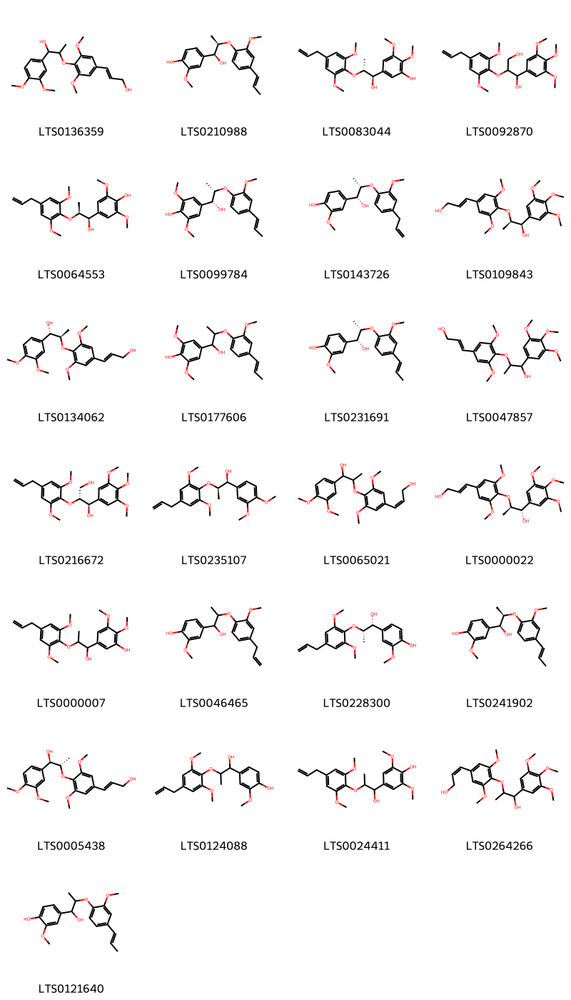{ width=100% }
    <figcaption>Hình ảnh cấu trúc hóa học của 25 hoạt chất thuộc nhóm  gồm ['3-(4-{[1-(3,4-dimethoxyphenyl)-1-hydroxypropan-2-yl]oxy}-3,5-dimethoxyphenyl)prop-2-en-1-ol (LTS0136359)', '4-[(1s,2r)-1-hydroxy-2-{2-methoxy-4-[(1e)-prop-1-en-1-yl]phenoxy}propyl]-2-methoxyphenol (LTS0210988)', '5-[(1r,2r)-2-[2,6-dimethoxy-4-(prop-2-en-1-yl)phenoxy]-1-hydroxypropyl]-2,3-dimethoxyphenol (LTS0083044)', '2-[2,6-dimethoxy-4-(prop-2-en-1-yl)phenoxy]-1-(3,4,5-trimethoxyphenyl)propane-1,3-diol (LTS0092870)', '4-[(1r,2s)-2-[2,6-dimethoxy-4-(prop-2-en-1-yl)phenoxy]-1-hydroxypropyl]-2,6-dimethoxyphenol (LTS0064553)', '4-[(1r,2s)-1-hydroxy-2-{2-methoxy-4-[(1e)-prop-1-en-1-yl]phenoxy}propyl]-2,6-dimethoxyphenol (LTS0099784)', '4-[(1r,2s)-1-hydroxy-2-[2-methoxy-4-(prop-2-en-1-yl)phenoxy]propyl]-2-methoxyphenol (LTS0143726)', '(2e)-3-(4-{[(1r,2r)-1-hydroxy-1-(3,4,5-trimethoxyphenyl)propan-2-yl]oxy}-3,5-dimethoxyphenyl)prop-2-en-1-ol (LTS0109843)', '(2e)-3-(4-{[(1s,2r)-1-(3,4-dimethoxyphenyl)-1-hydroxypropan-2-yl]oxy}-3,5-dimethoxyphenyl)prop-2-en-1-ol (LTS0134062)', '4-{1-hydroxy-2-[2-methoxy-4-(prop-1-en-1-yl)phenoxy]propyl}-2,6-dimethoxyphenol (LTS0177606)', '4-[(1r,2s)-1-hydroxy-2-{2-methoxy-4-[(1e)-prop-1-en-1-yl]phenoxy}propyl]-2-methoxyphenol (LTS0231691)', '3-(4-{[1-hydroxy-1-(3,4,5-trimethoxyphenyl)propan-2-yl]oxy}-3,5-dimethoxyphenyl)prop-2-en-1-ol (LTS0047857)', '(1r,2r)-2-[2,6-dimethoxy-4-(prop-2-en-1-yl)phenoxy]-1-(3,4,5-trimethoxyphenyl)propane-1,3-diol (LTS0216672)', '(1s,2r)-2-[2,6-dimethoxy-4-(prop-2-en-1-yl)phenoxy]-1-(3,4-dimethoxyphenyl)propan-1-ol (LTS0235107)', '(2z)-3-(4-{[1-(3,4-dimethoxyphenyl)-1-hydroxypropan-2-yl]oxy}-3,5-dimethoxyphenyl)prop-2-en-1-ol (LTS0065021)', '(2e)-3-(4-{[(1s,2r)-1-hydroxy-1-(3,4,5-trimethoxyphenyl)propan-2-yl]oxy}-3,5-dimethoxyphenyl)prop-2-en-1-ol (LTS0000022)', '5-{2-[2,6-dimethoxy-4-(prop-2-en-1-yl)phenoxy]-1-hydroxypropyl}-2,3-dimethoxyphenol (LTS0000007)', '4-{1-hydroxy-2-[2-methoxy-4-(prop-2-en-1-yl)phenoxy]propyl}-2-methoxyphenol (LTS0046465)', '4-[(1r,2s)-2-[2,6-dimethoxy-4-(prop-2-en-1-yl)phenoxy]-1-hydroxypropyl]-2-methoxyphenol (LTS0228300)', '4-[(1s,2r)-1-hydroxy-2-[2-methoxy-4-(prop-1-en-1-yl)phenoxy]propyl]-2-methoxyphenol (LTS0241902)', '(2e)-3-(4-{[(1r,2s)-1-(3,4-dimethoxyphenyl)-1-hydroxypropan-2-yl]oxy}-3,5-dimethoxyphenyl)prop-2-en-1-ol (LTS0005438)', '4-{2-[2,6-dimethoxy-4-(prop-2-en-1-yl)phenoxy]-1-hydroxypropyl}-2-methoxyphenol (LTS0124088)', '4-{2-[2,6-dimethoxy-4-(prop-2-en-1-yl)phenoxy]-1-hydroxypropyl}-2,6-dimethoxyphenol (LTS0024411)', '(2z)-3-(4-{[1-hydroxy-1-(3,4,5-trimethoxyphenyl)propan-2-yl]oxy}-3,5-dimethoxyphenyl)prop-2-en-1-ol (LTS0264266)', '4-{1-hydroxy-2-[2-methoxy-4-(prop-1-en-1-yl)phenoxy]propyl}-2-methoxyphenol (LTS0121640)'].</figcaption>
</figure>
#### Nhóm 2-arylbenzofuran flavonoids
<figure markdown="span">
    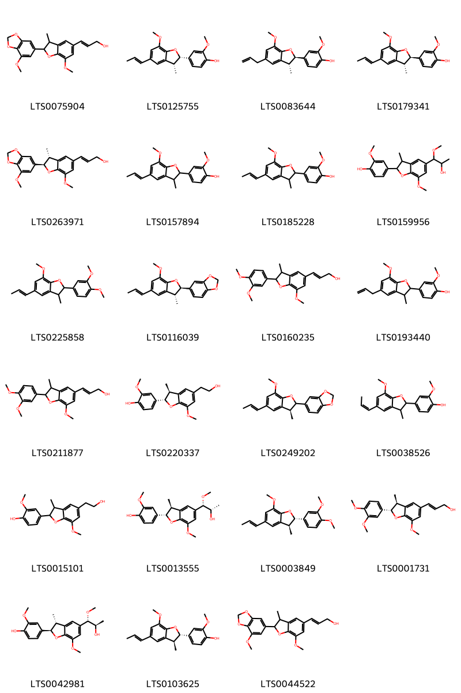{ width=100% }
    <figcaption>Hình ảnh cấu trúc hóa học của 23 hoạt chất thuộc nhóm 2-arylbenzofuran flavonoids gồm ['(2e)-3-[7-methoxy-2-(7-methoxy-2h-1,3-benzodioxol-5-yl)-3-methyl-2,3-dihydro-1-benzofuran-5-yl]prop-2-en-1-ol (LTS0075904)', '2-methoxy-4-[(2s,3r)-7-methoxy-3-methyl-5-[(1e)-prop-1-en-1-yl]-2,3-dihydro-1-benzofuran-2-yl]phenol (LTS0125755)', '2-methoxy-4-[(2r,3r)-7-methoxy-3-methyl-5-(prop-2-en-1-yl)-2,3-dihydro-1-benzofuran-2-yl]phenol (LTS0083644)', '2-methoxy-4-[(2r,3r)-7-methoxy-3-methyl-5-[(1e)-prop-1-en-1-yl]-2,3-dihydro-1-benzofuran-2-yl]phenol (LTS0179341)', '(2e)-3-[(2r,3r)-7-methoxy-2-(7-methoxy-2h-1,3-benzodioxol-5-yl)-3-methyl-2,3-dihydro-1-benzofuran-5-yl]prop-2-en-1-ol (LTS0263971)', '2-methoxy-4-{7-methoxy-3-methyl-5-[(1e)-prop-1-en-1-yl]-2,3-dihydro-1-benzofuran-2-yl}phenol (LTS0157894)', '2-methoxy-4-[7-methoxy-3-methyl-5-(prop-1-en-1-yl)-2,3-dihydro-1-benzofuran-2-yl]phenol (LTS0185228)', '4-[5-(2-hydroxy-1-methoxypropyl)-7-methoxy-3-methyl-2,3-dihydro-1-benzofuran-2-yl]-2-methoxyphenol (LTS0159956)', '2-(3,4-dimethoxyphenyl)-7-methoxy-3-methyl-5-(prop-1-en-1-yl)-2,3-dihydro-1-benzofuran (LTS0225858)', '5-[(2r,3r)-7-methoxy-3-methyl-5-[(1e)-prop-1-en-1-yl]-2,3-dihydro-1-benzofuran-2-yl]-2h-1,3-benzodioxole (LTS0116039)', '(2e)-3-[2-(3,4-dimethoxyphenyl)-7-methoxy-3-methyl-2,3-dihydro-1-benzofuran-5-yl]prop-2-en-1-ol (LTS0160235)', '2-methoxy-4-[7-methoxy-3-methyl-5-(prop-2-en-1-yl)-2,3-dihydro-1-benzofuran-2-yl]phenol (LTS0193440)', '3-[2-(3,4-dimethoxyphenyl)-7-methoxy-3-methyl-2,3-dihydro-1-benzofuran-5-yl]prop-2-en-1-ol (LTS0211877)', '4-[(2s,3s)-5-(2-hydroxyethyl)-7-methoxy-3-methyl-2,3-dihydro-1-benzofuran-2-yl]-2-methoxyphenol (LTS0220337)', '5-[(3s)-7-methoxy-3-methyl-5-[(1e)-prop-1-en-1-yl]-2,3-dihydro-1-benzofuran-2-yl]-2h-1,3-benzodioxole (LTS0249202)', '2-methoxy-4-{7-methoxy-3-methyl-5-[(1z)-prop-1-en-1-yl]-2,3-dihydro-1-benzofuran-2-yl}phenol (LTS0038526)', '4-[5-(2-hydroxyethyl)-7-methoxy-3-methyl-2,3-dihydro-1-benzofuran-2-yl]-2-methoxyphenol (LTS0015101)', '4-[(2s,3s)-5-[(1s,2s)-2-hydroxy-1-methoxypropyl]-7-methoxy-3-methyl-2,3-dihydro-1-benzofuran-2-yl]-2-methoxyphenol (LTS0013555)', '(2s,3s)-2-(3,4-dimethoxyphenyl)-7-methoxy-3-methyl-5-[(1e)-prop-1-en-1-yl]-2,3-dihydro-1-benzofuran (LTS0003849)', '(2e)-3-[(2s,3s)-2-(3,4-dimethoxyphenyl)-7-methoxy-3-methyl-2,3-dihydro-1-benzofuran-5-yl]prop-2-en-1-ol (LTS0001731)', '4-[(2r,3r)-5-[(1s,2r)-2-hydroxy-1-methoxypropyl]-7-methoxy-3-methyl-2,3-dihydro-1-benzofuran-2-yl]-2-methoxyphenol (LTS0042981)', 'licarin a (LTS0103625)', '3-[7-methoxy-2-(7-methoxy-2h-1,3-benzodioxol-5-yl)-3-methyl-2,3-dihydro-1-benzofuran-5-yl]prop-2-en-1-ol (LTS0044522)'].</figcaption>
</figure>
#### Nhóm Aryltetralin lignans
<figure markdown="span">
    { width=100% }
    <figcaption>Hình ảnh cấu trúc hóa học của 5 hoạt chất thuộc nhóm Aryltetralin lignans gồm ['8-(4-hydroxy-3-methoxyphenyl)-3-methoxy-6,7-dimethyl-5,6,7,8-tetrahydronaphthalen-2-ol (LTS0107528)', '8-(4-hydroxy-3-methoxyphenyl)-3-methoxy-6,7-dimethyl-7,8-dihydronaphthalen-2-ol (LTS0031305)', '4-[(5s,6s,7r)-6,7-dimethyl-2h,5h,6h,7h,8h-naphtho[2,3-d][1,3]dioxol-5-yl]-2-methoxyphenol (LTS0241137)', '4-{6,7-dimethyl-2h,5h,6h,7h,8h-naphtho[2,3-d][1,3]dioxol-5-yl}-2-methoxyphenol (LTS0113583)', '(+)-guaiacin (LTS0252097)'].</figcaption>
</figure>
#### Nhóm Benzene and substituted derivatives
<figure markdown="span">
    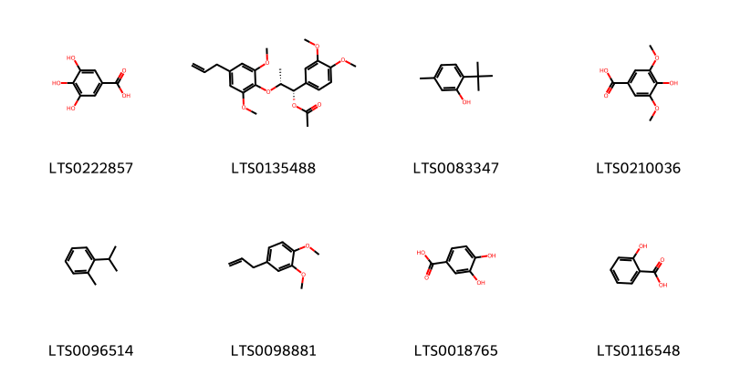{ width=100% }
    <figcaption>Hình ảnh cấu trúc hóa học của 8 hoạt chất thuộc nhóm Benzene and substituted derivatives gồm ['galop (LTS0222857)', '(1s,2r)-2-[2,6-dimethoxy-4-(prop-2-en-1-yl)phenoxy]-1-(3,4-dimethoxyphenyl)propyl acetate (LTS0135488)', '6-tert-butyl-m-cresol (LTS0083347)', 'syringic acid (LTS0210036)', 'o-cymene (LTS0096514)', 'methyl eugenol (LTS0098881)', '3,4-dihydroxybenzoic acid (LTS0018765)', 'salicyclic acid (LTS0116548)'].</figcaption>
</figure>
#### Nhóm Benzodioxoles
<figure markdown="span">
    { width=100% }
    <figcaption>Hình ảnh cấu trúc hóa học của 3 hoạt chất thuộc nhóm Benzodioxoles gồm ['sassafras (LTS0136093)', 'myristicin (LTS0180101)', '4-[(1s)-3-(2h-1,3-benzodioxol-5-yl)-1-hydroxypropyl]benzene-1,3-diol (LTS0242244)'].</figcaption>
</figure>
#### Nhóm Benzofurans
<figure markdown="span">
    { width=100% }
    <figcaption>Hình ảnh cấu trúc hóa học của 1 hoạt chất thuộc nhóm Benzofurans gồm ["7-hydroxy-6-isopropyl-3',3'-dimethyl-2-oxospiro[1-benzofuran-3,1'-cyclohexane]-2',4-dicarbaldehyde (LTS0255026)"].</figcaption>
</figure>
#### Nhóm Cinnamic acids and derivatives
<figure markdown="span">
    { width=100% }
    <figcaption>Hình ảnh cấu trúc hóa học của 4 hoạt chất thuộc nhóm Cinnamic acids and derivatives gồm ['3,4-dihydroxycinnamic acid (LTS0128050)', 'para-coumaric acid (LTS0266252)', 'rosemary acid (LTS0207820)', 'hydroxycinnamic acid (LTS0233023)'].</figcaption>
</figure>
#### Nhóm Cinnamyl alcohols
<figure markdown="span">
    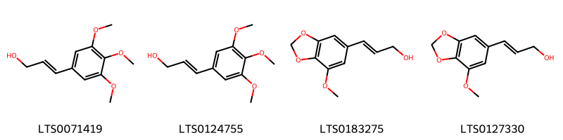{ width=100% }
    <figcaption>Hình ảnh cấu trúc hóa học của 4 hoạt chất thuộc nhóm Cinnamyl alcohols gồm ['3-(3,4,5-trimethoxyphenyl)prop-2-en-1-ol (LTS0071419)', '(2e)-3-(3,4,5-trimethoxyphenyl)prop-2-en-1-ol (LTS0124755)', '(2e)-3-(7-methoxy-2h-1,3-benzodioxol-5-yl)prop-2-en-1-ol (LTS0183275)', '3-(7-methoxy-2h-1,3-benzodioxol-5-yl)prop-2-en-1-ol (LTS0127330)'].</figcaption>
</figure>
#### Nhóm Dibenzylbutane lignans
<figure markdown="span">
    { width=100% }
    <figcaption>Hình ảnh cấu trúc hóa học của 18 hoạt chất thuộc nhóm Dibenzylbutane lignans gồm ['(1s,2s,3r)-1,4-bis(2h-1,3-benzodioxol-5-yl)-2,3-dimethylbutan-1-ol (LTS0135019)', '4-[4-(4-hydroxy-3-methoxyphenyl)-2,3-dimethylbutyl]-2-methoxyphenol (LTS0231938)', '5-[(2r,3r)-4-(2h-1,3-benzodioxol-5-yl)-2,3-dimethylbutyl]-2h-1,3-benzodioxole (LTS0090134)', '1,4-bis(2h-1,3-benzodioxol-5-yl)-2,3-dimethylbutan-1-ol (LTS0157048)', 'macelignan (LTS0151408)', '4-[(1s,2r,3r)-4-(2h-1,3-benzodioxol-5-yl)-1-hydroxy-2,3-dimethylbutyl]-2-methoxyphenol (LTS0220279)', 'macelignan (LTS0157636)', '4-[4-(3,4-dimethoxyphenyl)-2,3-dimethylbutyl]-2-methoxyphenol (LTS0270070)', '4-[(2s,3r)-4-(3,4-dimethoxyphenyl)-2,3-dimethylbutyl]-2-methoxyphenol (LTS0260048)', '4-[4-(2h-1,3-benzodioxol-5-yl)-1-methoxy-2,3-dimethylbutyl]-2-methoxyphenol (LTS0217377)', '4-[(2r,3r)-4-(2h-1,3-benzodioxol-5-yl)-2,3-dimethylbutyl]benzene-1,2-diol (LTS0217068)', '5-[4-(2h-1,3-benzodioxol-5-yl)-2,3-dimethylbutyl]-2h-1,3-benzodioxole (LTS0071689)', '4-[(2r,3s)-4-(4-hydroxy-3-methoxyphenyl)-2,3-dimethylbutyl]benzene-1,2-diol (LTS0040930)', '4-[4-(2h-1,3-benzodioxol-5-yl)-1-hydroxy-2,3-dimethylbutyl]-2-methoxyphenol (LTS0242219)', 'meso-dihydroguaiaretic acid (LTS0242513)', '(2r,3r)-4-(2h-1,3-benzodioxol-5-yl)-2-(2h-1,3-benzodioxol-5-ylmethyl)-3-methylbutan-1-ol (LTS0008253)', '4-[(1r,2r,3r)-4-(2h-1,3-benzodioxol-5-yl)-1-methoxy-2,3-dimethylbutyl]-2-methoxyphenol (LTS0013909)', '4-[(1s,2r,3s)-4-(2h-1,3-benzodioxol-5-yl)-1-methoxy-2,3-dimethylbutyl]-2-methoxyphenol (LTS0002324)'].</figcaption>
</figure>
#### Nhóm Fatty Acyls
<figure markdown="span">
    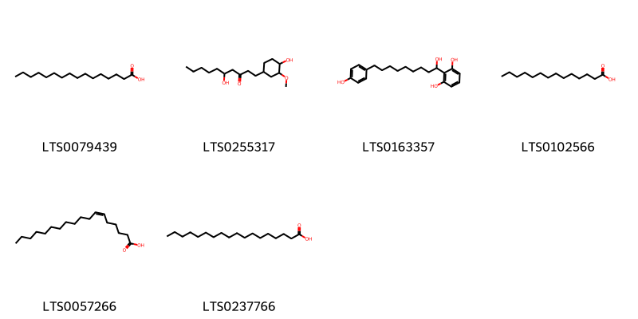{ width=100% }
    <figcaption>Hình ảnh cấu trúc hóa học của 6 hoạt chất thuộc nhóm Fatty Acyls gồm ['palmitic acid (LTS0079439)', '5-hydroxy-1-(4-hydroxy-3-methoxycyclohexyl)decan-3-one (LTS0255317)', '2-[1-hydroxy-9-(4-hydroxyphenyl)nonyl]benzene-1,3-diol (LTS0163357)', 'myristic acid (LTS0102566)', 'petroselinic acid (LTS0057266)', 'stearic acid (LTS0237766)'].</figcaption>
</figure>
#### Nhóm Flavonoids
<figure markdown="span">
    { width=100% }
    <figcaption>Hình ảnh cấu trúc hóa học của 3 hoạt chất thuộc nhóm Flavonoids gồm ['quercetin (LTS0004651)', 'kaempherol (LTS0155822)', '(+)-catechol (LTS0117079)'].</figcaption>
</figure>
#### Nhóm Furanoid lignans
<figure markdown="span">
    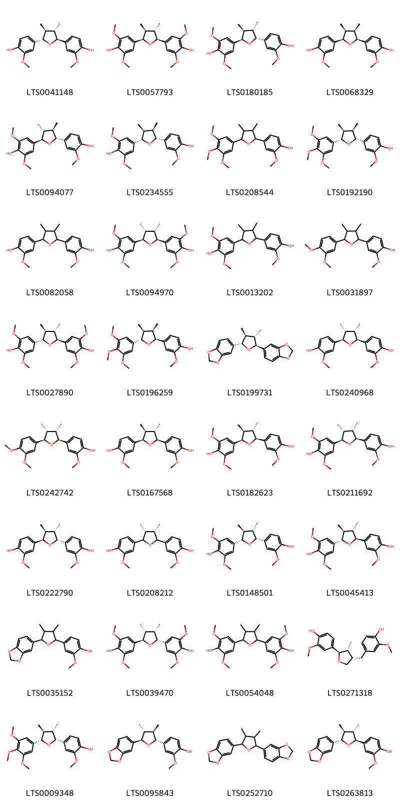{ width=100% }
    <figcaption>Hình ảnh cấu trúc hóa học của 32 hoạt chất thuộc nhóm Furanoid lignans gồm ['4-[(2s,3s,4s,5s)-5-(4-hydroxy-3-methoxyphenyl)-3,4-dimethyloxolan-2-yl]-2-methoxyphenol (LTS0041148)', '4-[(2s,3s,4s,5r)-5-(4-hydroxy-3,5-dimethoxyphenyl)-3,4-dimethyloxolan-2-yl]-2,6-dimethoxyphenol (LTS0057793)', '4-[(2r,3s,4s,5r)-5-(4-hydroxy-3-methoxyphenyl)-3,4-dimethyloxolan-2-yl]-2,6-dimethoxyphenol (LTS0180185)', '4-[(2s,3r,4s,5r)-5-(4-hydroxy-3-methoxyphenyl)-3,4-dimethyloxolan-2-yl]-2-methoxyphenol (LTS0068329)', '4-[(2r,3r,4r,5r)-5-(4-hydroxy-3-methoxyphenyl)-3,4-dimethyloxolan-2-yl]-2,6-dimethoxyphenol (LTS0094077)', '4-[(2s,3s,4r,5r)-5-(4-hydroxy-3-methoxyphenyl)-3,4-dimethyloxolan-2-yl]-2,6-dimethoxyphenol (LTS0234555)', '4-[3,4-dimethyl-5-(3,4,5-trimethoxyphenyl)oxolan-2-yl]-2-methoxyphenol (LTS0208544)', '4-[(2r,3r,4s,5s)-3,4-dimethyl-5-(3,4,5-trimethoxyphenyl)oxolan-2-yl]-2-methoxyphenol (LTS0192190)', '4-[5-(4-hydroxy-3-methoxyphenyl)-3,4-dimethyloxolan-2-yl]-2-methoxyphenol (LTS0082058)', '4-[(2s,3s,4r,5r)-5-(4-hydroxy-3,5-dimethoxyphenyl)-3,4-dimethyloxolan-2-yl]-2,6-dimethoxyphenol (LTS0094970)', '4-[5-(4-hydroxy-3-methoxyphenyl)-3,4-dimethyloxolan-2-yl]-2,6-dimethoxyphenol (LTS0013202)', '4-[5-(3,4-dimethoxyphenyl)-3,4-dimethyloxolan-2-yl]-2-methoxyphenol (LTS0031897)', '4-[(2s,3s,4s,5s)-5-(4-hydroxy-3,5-dimethoxyphenyl)-3,4-dimethyloxolan-2-yl]-2,6-dimethoxyphenol (LTS0027890)', '4-[(2s,3r,4s,5s)-3,4-dimethyl-5-(3,4,5-trimethoxyphenyl)oxolan-2-yl]-2-methoxyphenol (LTS0196259)', 'galbacin (LTS0199731)', '4-[(2s,3s,4r,5r)-5-(4-hydroxy-3-methoxyphenyl)-3,4-dimethyloxolan-2-yl]-2-methoxyphenol (LTS0240968)', '4-[(2s,3s,4r,5r)-5-(3,4-dimethoxyphenyl)-3,4-dimethyloxolan-2-yl]-2-methoxyphenol (LTS0242742)', '4-[(2s,3s,4s,5r)-5-(4-hydroxy-3-methoxyphenyl)-3,4-dimethyloxolan-2-yl]-2-methoxyphenol (LTS0167568)', '4-[(2r,3s,4s,5s)-5-(4-hydroxy-3-methoxyphenyl)-3,4-dimethyloxolan-2-yl]-2,6-dimethoxyphenol (LTS0182623)', '4-[(2r,3r,4s,5s)-5-(4-hydroxy-3-methoxyphenyl)-3,4-dimethyloxolan-2-yl]-2,6-dimethoxyphenol (LTS0211692)', '4-[(2r,3s,4s,5r)-5-(4-hydroxy-3-methoxyphenyl)-3,4-dimethyloxolan-2-yl]-2-methoxyphenol (LTS0222790)', '4-[(3s,4r)-5-(4-hydroxy-3-methoxyphenyl)-3,4-dimethyloxolan-2-yl]-2-methoxyphenol (LTS0208212)', '4-[(2s,3s,4s,5r)-5-(4-hydroxy-3-methoxyphenyl)-3,4-dimethyloxolan-2-yl]-2,6-dimethoxyphenol (LTS0148501)', '4-[(2s,3s,4s,5s)-5-(4-hydroxy-3-methoxyphenyl)-3,4-dimethyloxolan-2-yl]-2,6-dimethoxyphenol (LTS0045413)', '4-[5-(2h-1,3-benzodioxol-5-yl)-3,4-dimethyloxolan-2-yl]-2-methoxyphenol (LTS0035152)', '4-[(2r,3s,4r,5r)-5-(4-hydroxy-3,5-dimethoxyphenyl)-3,4-dimethyloxolan-2-yl]-2,6-dimethoxyphenol (LTS0039470)', '4-[5-(4-hydroxy-3,5-dimethoxyphenyl)-3,4-dimethyloxolan-2-yl]-2,6-dimethoxyphenol (LTS0054048)', '4-[(2r,3r,4s)-4-[(4-hydroxy-3-methoxyphenyl)methyl]-3-methyloxolan-2-yl]-2-methoxyphenol (LTS0271318)', '4-[(2r,3s,4s,5s)-3,4-dimethyl-5-(3,4,5-trimethoxyphenyl)oxolan-2-yl]-2-methoxyphenol (LTS0009348)', '4-[(2r,3r,4r,5r)-5-(2h-1,3-benzodioxol-5-yl)-3,4-dimethyloxolan-2-yl]-2-methoxyphenol (LTS0095843)', '5-[5-(2h-1,3-benzodioxol-5-yl)-3,4-dimethyloxolan-2-yl]-2h-1,3-benzodioxole (LTS0252710)', '4-[(2s,3s,4s,5s)-5-(2h-1,3-benzodioxol-5-yl)-3,4-dimethyloxolan-2-yl]-2-methoxyphenol (LTS0263813)'].</figcaption>
</figure>
#### Nhóm Glycerolipids
<figure markdown="span">
    { width=100% }
    <figcaption>Hình ảnh cấu trúc hóa học của 1 hoạt chất thuộc nhóm Glycerolipids gồm ['trimyristin (LTS0164572)'].</figcaption>
</figure>
#### Nhóm Linear 1_3-diarylpropanoids
<figure markdown="span">
    { width=100% }
    <figcaption>Hình ảnh cấu trúc hóa học của Không tìm thấy chú thích hoạt chất thuộc nhóm Linear 1_3-diarylpropanoids gồm Không tìm thấy chú thích.</figcaption>
</figure>
#### Nhóm Organooxygen compounds
<figure markdown="span">
    { width=100% }
    <figcaption>Hình ảnh cấu trúc hóa học của 8 hoạt chất thuộc nhóm Organooxygen compounds gồm ['1-(2-hydroxy-6-methoxyphenyl)-9-(4-hydroxyphenyl)nonan-1-one (LTS0117297)', "2',6'-dihydroxyacetophenone (LTS0197806)", '1-(2,6-dimethoxyphenyl)-9-(4-hydroxyphenyl)nonan-1-one (LTS0176975)', '1-(2,6-dihydroxyphenyl)-9-(4-hydroxyphenyl)nonan-1-one (LTS0276383)', '1-[2-hydroxy-3-methoxy-5-(prop-2-en-1-yl)phenyl]ethanone (LTS0217393)', '1-(2-hydroxy-6-methoxyphenyl)-9-(4-methoxyphenyl)nonan-1-one (LTS0165750)', '1-(2,6-dimethoxyphenyl)-9-(4-methoxyphenyl)nonan-1-one (LTS0055718)', 'malabaricone c (LTS0008004)'].</figcaption>
</figure>
#### Nhóm Oxepanes
<figure markdown="span">
    { width=100% }
    <figcaption>Hình ảnh cấu trúc hóa học của 1 hoạt chất thuộc nhóm Oxepanes gồm ['6-methyl-3-(propan-2-ylidene)-7-oxabicyclo[4.1.0]heptan-2-one (LTS0194928)'].</figcaption>
</figure>
#### Nhóm Phenol esters
<figure markdown="span">
    { width=100% }
    <figcaption>Hình ảnh cấu trúc hóa học của 1 hoạt chất thuộc nhóm Phenol esters gồm ['eugenyl acetate (LTS0165886)'].</figcaption>
</figure>
#### Nhóm Phenol ethers
<figure markdown="span">
    { width=100% }
    <figcaption>Hình ảnh cấu trúc hóa học của 4 hoạt chất thuộc nhóm Phenol ethers gồm ['elemicin (LTS0188875)', 'p-propenylanisole (LTS0177188)', 'tarragon (LTS0245226)', 'anethole (LTS0033696)'].</figcaption>
</figure>
#### Nhóm Phenols
<figure markdown="span">
    { width=100% }
    <figcaption>Hình ảnh cấu trúc hóa học của 10 hoạt chất thuộc nhóm Phenols gồm ['4-{2-[2,6-dimethoxy-4-(prop-2-en-1-yl)phenoxy]-1-methoxypropyl}-2-methoxyphenol (LTS0078302)', 'eugenol (LTS0052342)', '4-[(1s,2s)-2-[2,6-dimethoxy-4-(prop-2-en-1-yl)phenoxy]-1-methoxypropyl]-2-methoxyphenol (LTS0147588)', '4-{2-[2,6-dimethoxy-4-(prop-2-en-1-yl)phenoxy]propyl}-2-methoxyphenol (LTS0151416)', 'gingerol (LTS0171573)', '4-[(2s)-2-[2,6-dimethoxy-4-(prop-2-en-1-yl)phenoxy]propyl]-2-methoxyphenol (LTS0259575)', '2-methoxy-4-{1-methoxy-2-[2-methoxy-4-(prop-1-en-1-yl)phenoxy]propyl}phenol (LTS0223535)', '2-[9-(4-hydroxyphenyl)nonyl]benzene-1,3-diol (LTS0169535)', '2-methoxy-4-[(1s,2s)-1-methoxy-2-{2-methoxy-4-[(1e)-prop-1-en-1-yl]phenoxy}propyl]phenol (LTS0017841)', 'isoeugenol (LTS0136836)'].</figcaption>
</figure>
#### Nhóm Prenol lipids
<figure markdown="span">
    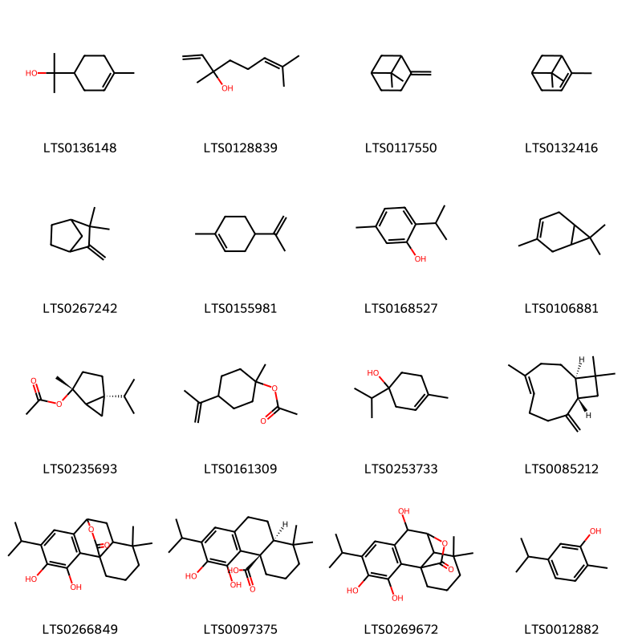{ width=100% }
    <figcaption>Hình ảnh cấu trúc hóa học của 16 hoạt chất thuộc nhóm Prenol lipids gồm ['terpineol (LTS0136148)', 'linalool, (+-)- (LTS0128839)', 'β-pinene (LTS0117550)', 'α pinene (LTS0132416)', 'camphene (LTS0267242)', 'limonene,  (LTS0155981)', 'thymol (LTS0168527)', 'monoterpenes (LTS0106881)', '(2r,5s)-5-isopropyl-2-methylbicyclo[3.1.0]hexan-2-yl acetate (LTS0235693)', 'β-terpinyl acetate (LTS0161309)', '4-terpineol (LTS0253733)', 'caryophyllene (LTS0085212)', '3,4-dihydroxy-5-isopropyl-11,11-dimethyl-16-oxatetracyclo[6.6.2.0¹,¹⁰.0²,⁷]hexadeca-2(7),3,5-trien-15-one (LTS0266849)', 'carnosic acid (LTS0097375)', '3,4,8-trihydroxy-5-isopropyl-11,11-dimethyl-16-oxatetracyclo[7.5.2.0¹,¹⁰.0²,⁷]hexadeca-2(7),3,5-trien-15-one (LTS0269672)', 'carvacrol (LTS0012882)'].</figcaption>
</figure>
#### Nhóm Stilbenes
<figure markdown="span">
    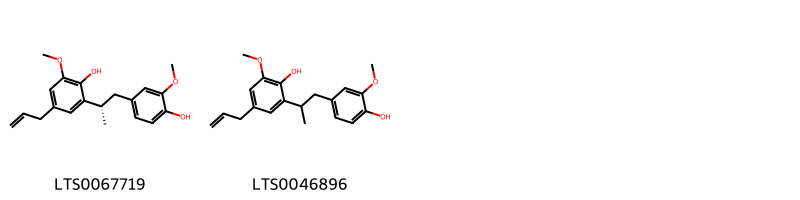{ width=100% }
    <figcaption>Hình ảnh cấu trúc hóa học của 2 hoạt chất thuộc nhóm Stilbenes gồm ['2-[(2s)-1-(4-hydroxy-3-methoxyphenyl)propan-2-yl]-6-methoxy-4-(prop-2-en-1-yl)phenol (LTS0067719)', '2-[1-(4-hydroxy-3-methoxyphenyl)propan-2-yl]-6-methoxy-4-(prop-2-en-1-yl)phenol (LTS0046896)'].</figcaption>
</figure>

---

### Dược dân tộc học

Danh sách các quốc gia có sử dụng *Myristica fragrans* trong điều trị các bệnh. 

| Country   | Disease                                                                                                            | Bệnh                                                                                                                                                                                                |
|:----------|:-------------------------------------------------------------------------------------------------------------------|:----------------------------------------------------------------------------------------------------------------------------------------------------------------------------------------------------|
| Asia      | Poison                                                                                                             | MYMEMORY WARNING: YOU USED ALL AVAILABLE FREE TRANSLATIONS FOR TODAY. NEXT AVAILABLE IN  09 HOURS 14 MINUTES 02 SECONDS VISIT HTTPS://MYMEMORY.TRANSLATED.NET/DOC/USAGELIMITS.PHP TO TRANSLATE MORE |
| China     | Astringent, Carminative, Narcotic, Tonic, Carminative, Apertif, Stomachic                                          | MYMEMORY WARNING: YOU USED ALL AVAILABLE FREE TRANSLATIONS FOR TODAY. NEXT AVAILABLE IN  09 HOURS 14 MINUTES 00 SECONDS VISIT HTTPS://MYMEMORY.TRANSLATED.NET/DOC/USAGELIMITS.PHP TO TRANSLATE MORE |
| Elsewhere | Aphrodisiac, Astringent, nan, Carminative, Digestive, Narcotic, Stimulant, Herbicide, Narcotic, Aphrodisiac, Tonic | MYMEMORY WARNING: YOU USED ALL AVAILABLE FREE TRANSLATIONS FOR TODAY. NEXT AVAILABLE IN  09 HOURS 13 MINUTES 58 SECONDS VISIT HTTPS://MYMEMORY.TRANSLATED.NET/DOC/USAGELIMITS.PHP TO TRANSLATE MORE |
| Haiti     | Stimulant                                                                                                          | MYMEMORY WARNING: YOU USED ALL AVAILABLE FREE TRANSLATIONS FOR TODAY. NEXT AVAILABLE IN  09 HOURS 13 MINUTES 56 SECONDS VISIT HTTPS://MYMEMORY.TRANSLATED.NET/DOC/USAGELIMITS.PHP TO TRANSLATE MORE |
| Moluccas  | Carminative, Perfume                                                                                               | MYMEMORY WARNING: YOU USED ALL AVAILABLE FREE TRANSLATIONS FOR TODAY. NEXT AVAILABLE IN  09 HOURS 13 MINUTES 54 SECONDS VISIT HTTPS://MYMEMORY.TRANSLATED.NET/DOC/USAGELIMITS.PHP TO TRANSLATE MORE |
| Turkey    | Abortifacient, Carminative, Stomachic                                                                              | MYMEMORY WARNING: YOU USED ALL AVAILABLE FREE TRANSLATIONS FOR TODAY. NEXT AVAILABLE IN  09 HOURS 13 MINUTES 52 SECONDS VISIT HTTPS://MYMEMORY.TRANSLATED.NET/DOC/USAGELIMITS.PHP TO TRANSLATE MORE |
| Venezuela | Hallucinogen                                                                                                       | MYMEMORY WARNING: YOU USED ALL AVAILABLE FREE TRANSLATIONS FOR TODAY. NEXT AVAILABLE IN  09 HOURS 13 MINUTES 50 SECONDS VISIT HTTPS://MYMEMORY.TRANSLATED.NET/DOC/USAGELIMITS.PHP TO TRANSLATE MORE |

---

---
## Myristica iners
### Thông tin về thực vật

!!! info "Phân loại thực vật của *Myristica iners* từ GIBF:"
    - **Kingdom:** Plantae
    - **Phylum:** Tracheophyta
    - **Order:** Magnoliales
    - **Family:** Myristicaceae
    - **Genus:** Myristica
    - **Species:** *Myristica iners*

 

| Label (VI)   | Label (EN)   | Scientific Name   | Descriptions (VI)   | Descriptions (EN)   | Also Known As (VI)   | Also Known As (EN)   |
|:-------------|:-------------|:------------------|:--------------------|:--------------------|:---------------------|:---------------------|
| N/A          | N/A          | Myristica iners   | loài thực vật       | species of plant    | ['']                 | ['']                 |

#### Phân bố trên thế giới

**Từ CSDL GIBF** nan, unknown or invalid, Thailand, Brunei Darussalam, Philippines, Malaysia, Singapore, Indonesia

#### Phân bố tại Việt Nam

**Từ CSDL GIBF**: Không có ghi nhận ở Việt Nam

---
### Thành phần hóa học
        
- Theo cơ sở dữ liệu lotus: Từ loài *Myristica iners* đã phân lập và xác định được Chưa có hoạt chất nào được phân lập. hoạt chất thuộc về các nhóm Không có hoạt chất nào được phân lập. 

Không có hình ảnh nào được tạo ra

---

### Dược dân tộc học

Danh sách các quốc gia có sử dụng *Myristica iners* trong điều trị các bệnh. 

| Country   | Disease   | Bệnh                                                                                                                                                                                                |
|:----------|:----------|:----------------------------------------------------------------------------------------------------------------------------------------------------------------------------------------------------|
| Java      | Diuretic  | MYMEMORY WARNING: YOU USED ALL AVAILABLE FREE TRANSLATIONS FOR TODAY. NEXT AVAILABLE IN  09 HOURS 13 MINUTES 20 SECONDS VISIT HTTPS://MYMEMORY.TRANSLATED.NET/DOC/USAGELIMITS.PHP TO TRANSLATE MORE |

---

---
## Myristica malabarica
### Thông tin về thực vật

!!! info "Phân loại thực vật của *Myristica malabarica* từ GIBF:"
    - **Kingdom:** Plantae
    - **Phylum:** Tracheophyta
    - **Order:** Magnoliales
    - **Family:** Myristicaceae
    - **Genus:** Myristica
    - **Species:** *Myristica malabarica*

 

| Label (VI)   | Label (EN)   | Scientific Name      | Descriptions (VI)   | Descriptions (EN)   | Also Known As (VI)   | Also Known As (EN)   |
|:-------------|:-------------|:---------------------|:--------------------|:--------------------|:---------------------|:---------------------|
| N/A          | N/A          | Myristica malabarica | loài thực vật       | species of plant    | ['']                 | ['Malabar Nutmeg']   |

#### Phân bố trên thế giới

**Từ CSDL GIBF** nan, unknown or invalid, Sri Lanka, India, Bangladesh

#### Phân bố tại Việt Nam

**Từ CSDL GIBF**: Không có ghi nhận ở Việt Nam

---
### Thành phần hóa học
        
- Theo cơ sở dữ liệu lotus: Từ loài *Myristica malabarica* đã phân lập và xác định được 14 hoạt chất thuộc về các nhóm Organooxygen compounds, Furanoid lignans, Isoflavonoids, Phenols, Linear 1,3-diarylpropanoids. 

|    | chemicalTaxonomyClassyfireClass   |   smiles_count |
|---:|:----------------------------------|---------------:|
|  0 | Furanoid lignans                  |              1 |
|  1 | Isoflavonoids                     |              3 |
|  2 | Linear 1,3-diarylpropanoids       |              2 |
|  3 | Organooxygen compounds            |              6 |
|  4 | Phenols                           |              2 |

#### Nhóm Furanoid lignans
<figure markdown="span">
    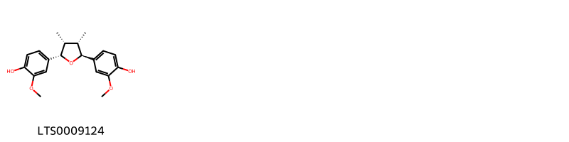{ width=100% }
    <figcaption>Hình ảnh cấu trúc hóa học của 1 hoạt chất thuộc nhóm Furanoid lignans gồm ['4-[(2s,3s,4r,5s)-5-(4-hydroxy-3-methoxyphenyl)-3,4-dimethyloxolan-2-yl]-2-methoxyphenol (LTS0009124)'].</figcaption>
</figure>
#### Nhóm Isoflavonoids
<figure markdown="span">
    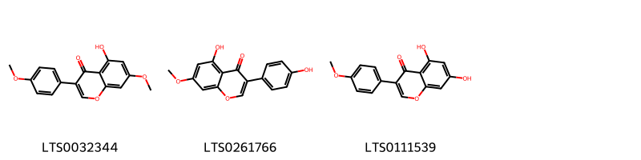{ width=100% }
    <figcaption>Hình ảnh cấu trúc hóa học của 3 hoạt chất thuộc nhóm Isoflavonoids gồm ['5-hydroxy-7-methoxy-3-(4-methoxyphenyl)chromen-4-one (LTS0032344)', 'prunetin (LTS0261766)', 'biochanin (LTS0111539)'].</figcaption>
</figure>
#### Nhóm Linear 1_3-diarylpropanoids
<figure markdown="span">
    { width=100% }
    <figcaption>Hình ảnh cấu trúc hóa học của Không tìm thấy chú thích hoạt chất thuộc nhóm Linear 1_3-diarylpropanoids gồm Không tìm thấy chú thích.</figcaption>
</figure>
#### Nhóm Organooxygen compounds
<figure markdown="span">
    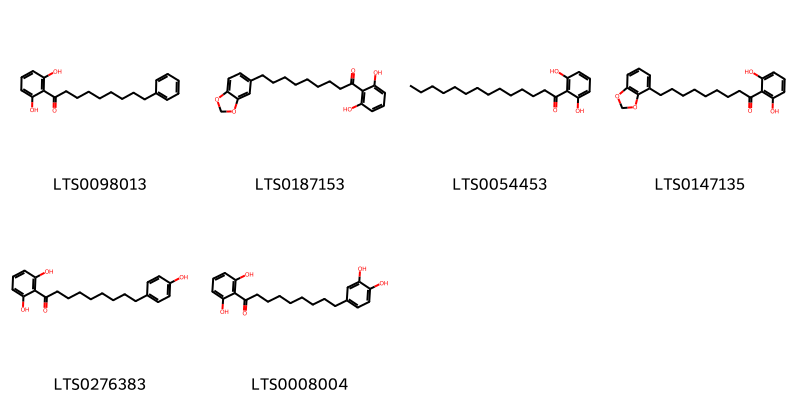{ width=100% }
    <figcaption>Hình ảnh cấu trúc hóa học của 6 hoạt chất thuộc nhóm Organooxygen compounds gồm ['1-(2,6-dihydroxyphenyl)-9-phenylnonan-1-one (LTS0098013)', '9-(2h-1,3-benzodioxol-5-yl)-1-(2,6-dihydroxyphenyl)nonan-1-one (LTS0187153)', '1-(2,6-dihydroxyphenyl)tetradecan-1-one (LTS0054453)', '9-(2h-1,3-benzodioxol-4-yl)-1-(2,6-dihydroxyphenyl)nonan-1-one (LTS0147135)', '1-(2,6-dihydroxyphenyl)-9-(4-hydroxyphenyl)nonan-1-one (LTS0276383)', 'malabaricone c (LTS0008004)'].</figcaption>
</figure>
#### Nhóm Phenols
<figure markdown="span">
    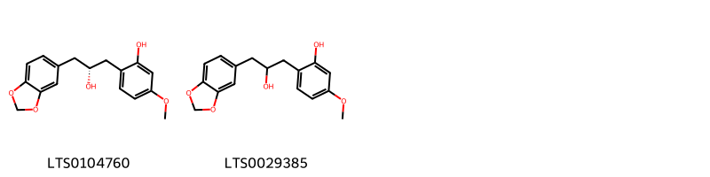{ width=100% }
    <figcaption>Hình ảnh cấu trúc hóa học của 2 hoạt chất thuộc nhóm Phenols gồm ['2-[(2r)-3-(2h-1,3-benzodioxol-5-yl)-2-hydroxypropyl]-5-methoxyphenol (LTS0104760)', '2-[3-(2h-1,3-benzodioxol-5-yl)-2-hydroxypropyl]-5-methoxyphenol (LTS0029385)'].</figcaption>
</figure>

---

### Dược dân tộc học

Danh sách các quốc gia có sử dụng *Myristica malabarica* trong điều trị các bệnh. 

| Country   | Disease     | Bệnh                                                                                                                                                                                                |
|:----------|:------------|:----------------------------------------------------------------------------------------------------------------------------------------------------------------------------------------------------|
| Elsewhere | Antioxidant | MYMEMORY WARNING: YOU USED ALL AVAILABLE FREE TRANSLATIONS FOR TODAY. NEXT AVAILABLE IN  09 HOURS 12 MINUTES 58 SECONDS VISIT HTTPS://MYMEMORY.TRANSLATED.NET/DOC/USAGELIMITS.PHP TO TRANSLATE MORE |

---

# Chi Virola

??? note "Danh sách các dược liệu thuộc chi"
    
	 - *Virola bicuhyba*
	 - *Virola calophylla*
	 - *Virola calophylloides*
	 - *Virola elongata*
	 - *Virola sebifera*
	 - *Virola theiodora*

---
## Virola bicuhyba
### Thông tin về thực vật

!!! info "Phân loại thực vật của *Virola bicuhyba* từ GIBF:"
    - **Kingdom:** Plantae
    - **Phylum:** Tracheophyta
    - **Order:** Magnoliales
    - **Family:** Myristicaceae
    - **Genus:** Virola
    - **Species:** *Virola bicuhyba*

 

| Label (VI)   | Label (EN)   | Scientific Name   | Descriptions (VI)   | Descriptions (EN)   | Also Known As (VI)   | Also Known As (EN)   |
|:-------------|:-------------|:------------------|:--------------------|:--------------------|:---------------------|:---------------------|
| N/A          | N/A          | Virola bicuhyba   | loài thực vật       | species of plant    | ['']                 | ['']                 |

#### Phân bố trên thế giới

**Từ CSDL GIBF** nan, Brazil

#### Phân bố tại Việt Nam

**Từ CSDL GIBF**: Không có ghi nhận ở Việt Nam

---
### Thành phần hóa học
        
- Theo cơ sở dữ liệu lotus: Từ loài *Virola bicuhyba* đã phân lập và xác định được 1 hoạt chất thuộc về các nhóm Fatty Acyls. 

|    | chemicalTaxonomyClassyfireClass   |   smiles_count |
|---:|:----------------------------------|---------------:|
|  0 | Fatty Acyls                       |              1 |

#### Nhóm Fatty Acyls
<figure markdown="span">
    { width=100% }
    <figcaption>Hình ảnh cấu trúc hóa học của 1 hoạt chất thuộc nhóm Fatty Acyls gồm ['myristic acid (LTS0102566)'].</figcaption>
</figure>

---

### Dược dân tộc học

Danh sách các quốc gia có sử dụng *Virola bicuhyba* trong điều trị các bệnh. 

| Country   | Disease   | Bệnh                                                                                                                                                                                                |
|:----------|:----------|:----------------------------------------------------------------------------------------------------------------------------------------------------------------------------------------------------|
| Brazil    | Soap      | MYMEMORY WARNING: YOU USED ALL AVAILABLE FREE TRANSLATIONS FOR TODAY. NEXT AVAILABLE IN  09 HOURS 12 MINUTES 40 SECONDS VISIT HTTPS://MYMEMORY.TRANSLATED.NET/DOC/USAGELIMITS.PHP TO TRANSLATE MORE |

---

---
## Virola calophylla
### Thông tin về thực vật

!!! info "Phân loại thực vật của *Virola calophylla* từ GIBF:"
    - **Kingdom:** Plantae
    - **Phylum:** Tracheophyta
    - **Order:** Magnoliales
    - **Family:** Myristicaceae
    - **Genus:** Virola
    - **Species:** *Virola calophylla*

 

| Label (VI)   | Label (EN)   | Scientific Name   | Descriptions (VI)   | Descriptions (EN)   | Also Known As (VI)   | Also Known As (EN)   |
|:-------------|:-------------|:------------------|:--------------------|:--------------------|:---------------------|:---------------------|
| N/A          | N/A          | Virola calophylla | loài thực vật       | species of plant    | ['']                 | ['']                 |

#### Phân bố trên thế giới

**Từ CSDL GIBF** Colombia, Ecuador, Peru, Brazil

#### Phân bố tại Việt Nam

**Từ CSDL GIBF**: Không có ghi nhận ở Việt Nam

---
### Thành phần hóa học
        
- Theo cơ sở dữ liệu lotus: Từ loài *Virola calophylla* đã phân lập và xác định được 7 hoạt chất thuộc về các nhóm Indoles and derivatives, Prenol lipids, Steroids and steroid derivatives, Pyridines and derivatives. 

|    | chemicalTaxonomyClassyfireClass   |   smiles_count |
|---:|:----------------------------------|---------------:|
|  0 | Indoles and derivatives           |              2 |
|  1 | Prenol lipids                     |              1 |
|  2 | Pyridines and derivatives         |              2 |
|  3 | Steroids and steroid derivatives  |              2 |

#### Nhóm Indoles and derivatives
<figure markdown="span">
    { width=100% }
    <figcaption>Hình ảnh cấu trúc hóa học của 2 hoạt chất thuộc nhóm Indoles and derivatives gồm ['tryptamine (LTS0181180)', 'methyltryptamine (LTS0182964)'].</figcaption>
</figure>
#### Nhóm Prenol lipids
<figure markdown="span">
    { width=100% }
    <figcaption>Hình ảnh cấu trúc hóa học của 1 hoạt chất thuộc nhóm Prenol lipids gồm ['(-)-friedelin (LTS0041645)'].</figcaption>
</figure>
#### Nhóm Pyridines and derivatives
<figure markdown="span">
    { width=100% }
    <figcaption>Hình ảnh cấu trúc hóa học của 2 hoạt chất thuộc nhóm Pyridines and derivatives gồm ['(-)-nicotine (LTS0184620)', 'nicotine (LTS0177379)'].</figcaption>
</figure>
#### Nhóm Steroids and steroid derivatives
<figure markdown="span">
    { width=100% }
    <figcaption>Hình ảnh cấu trúc hóa học của 2 hoạt chất thuộc nhóm Steroids and steroid derivatives gồm ['stigmast-5-en-3-ol (LTS0071224)', 'stigmast-5-en-3-ol, (3β)- (LTS0204616)'].</figcaption>
</figure>

---

### Dược dân tộc học

Danh sách các quốc gia có sử dụng *Virola calophylla* trong điều trị các bệnh. 

| Country   | Disease   | Bệnh                                                                                                                                                                                                |
|:----------|:----------|:----------------------------------------------------------------------------------------------------------------------------------------------------------------------------------------------------|
| Colombia  | Narcotic  | MYMEMORY WARNING: YOU USED ALL AVAILABLE FREE TRANSLATIONS FOR TODAY. NEXT AVAILABLE IN  09 HOURS 12 MINUTES 19 SECONDS VISIT HTTPS://MYMEMORY.TRANSLATED.NET/DOC/USAGELIMITS.PHP TO TRANSLATE MORE |

---

---
## Virola calophylloides
### Thông tin về thực vật

!!! info "Phân loại thực vật của *Virola calophylloidea* từ GIBF:"
    - **Kingdom:** Plantae
    - **Phylum:** Tracheophyta
    - **Order:** Magnoliales
    - **Family:** Myristicaceae
    - **Genus:** Virola
    - **Species:** *Virola calophylloidea*

 

| Label (VI)   | Label (EN)   | Scientific Name   | Descriptions (VI)   | Descriptions (EN)   | Also Known As (VI)   | Also Known As (EN)   |
|:-------------|:-------------|:------------------|:--------------------|:--------------------|:---------------------|:---------------------|
| N/A          | N/A          | Virola calophylla | loài thực vật       | species of plant    | ['']                 | ['']                 |

#### Phân bố trên thế giới

**Từ CSDL GIBF** nan, Colombia, Antarctica, Brazil, Peru, Ecuador

#### Phân bố tại Việt Nam

**Từ CSDL GIBF**: Không có ghi nhận ở Việt Nam

---
### Thành phần hóa học
        
- Theo cơ sở dữ liệu lotus: Từ loài *Virola calophylloidea* đã phân lập và xác định được Chưa có hoạt chất nào được phân lập. hoạt chất thuộc về các nhóm Không có hoạt chất nào được phân lập. 

Không có hình ảnh nào được tạo ra

---

### Dược dân tộc học

Danh sách các quốc gia có sử dụng *Virola calophylloidea* trong điều trị các bệnh. 

| Country   | Disease   | Bệnh                                                                                                                                                                                                |
|:----------|:----------|:----------------------------------------------------------------------------------------------------------------------------------------------------------------------------------------------------|
| Colombia  | Narcotic  | MYMEMORY WARNING: YOU USED ALL AVAILABLE FREE TRANSLATIONS FOR TODAY. NEXT AVAILABLE IN  09 HOURS 11 MINUTES 57 SECONDS VISIT HTTPS://MYMEMORY.TRANSLATED.NET/DOC/USAGELIMITS.PHP TO TRANSLATE MORE |

---

---
## Virola elongata
### Thông tin về thực vật

!!! info "Phân loại thực vật của *Virola elongata* từ GIBF:"
    - **Kingdom:** Plantae
    - **Phylum:** Tracheophyta
    - **Order:** Magnoliales
    - **Family:** Myristicaceae
    - **Genus:** Virola
    - **Species:** *Virola elongata*

 

| Label (VI)   | Label (EN)   | Scientific Name   | Descriptions (VI)   | Descriptions (EN)   | Also Known As (VI)   | Also Known As (EN)   |
|:-------------|:-------------|:------------------|:--------------------|:--------------------|:---------------------|:---------------------|
| N/A          | N/A          | Virola elongata   | loài thực vật       | species of plant    | ['']                 | ['']                 |

#### Phân bố trên thế giới

**Từ CSDL GIBF** Colombia, Ecuador, Peru, Brazil

#### Phân bố tại Việt Nam

**Từ CSDL GIBF**: Không có ghi nhận ở Việt Nam

---
### Thành phần hóa học
        
- Theo cơ sở dữ liệu lotus: Từ loài *Virola elongata* đã phân lập và xác định được 127 hoạt chất thuộc về các nhóm Stilbenes, Furanoid lignans, Organooxygen compounds, Flavonoids, Arylnaphthalene lignans, Indoles and derivatives, Dibenzylbutane lignans, Aryltetralin lignans, Linear 1,3-diarylpropanoids, Phenols, Indanes, Benzodioxoles, Benzodioxanes, Steroids and steroid derivatives, Benzene and substituted derivatives. 

|    | chemicalTaxonomyClassyfireClass     |   smiles_count |
|---:|:------------------------------------|---------------:|
|  0 | Arylnaphthalene lignans             |              1 |
|  1 | Aryltetralin lignans                |             28 |
|  2 | Benzene and substituted derivatives |             11 |
|  3 | Benzodioxanes                       |              2 |
|  4 | Benzodioxoles                       |              2 |
|  5 | Dibenzylbutane lignans              |             12 |
|  6 | Flavonoids                          |              2 |
|  7 | Furanoid lignans                    |             43 |
|  8 | Indanes                             |              2 |
|  9 | Indoles and derivatives             |              1 |
| 10 | Linear 1,3-diarylpropanoids         |              4 |
| 11 | Organooxygen compounds              |              9 |
| 12 | Phenols                             |              2 |
| 13 | Steroids and steroid derivatives    |              3 |
| 14 | Stilbenes                           |              5 |

#### Nhóm Arylnaphthalene lignans
<figure markdown="span">
    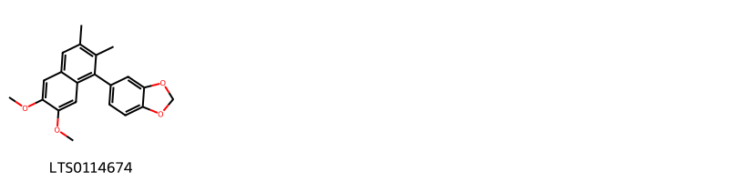{ width=100% }
    <figcaption>Hình ảnh cấu trúc hóa học của 1 hoạt chất thuộc nhóm Arylnaphthalene lignans gồm ['5-(6,7-dimethoxy-2,3-dimethylnaphthalen-1-yl)-2h-1,3-benzodioxole (LTS0114674)'].</figcaption>
</figure>
#### Nhóm Aryltetralin lignans
<figure markdown="span">
    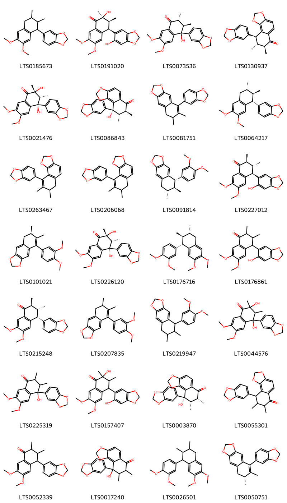{ width=100% }
    <figcaption>Hình ảnh cấu trúc hóa học của 28 hoạt chất thuộc nhóm Aryltetralin lignans gồm ['5-(6,7-dimethoxy-2,3-dimethyl-1,2,3,4-tetrahydronaphthalen-1-yl)-2h-1,3-benzodioxole (LTS0185673)', '(2s,3s,4r)-2-hydroxy-4-(6-hydroxy-2h-1,3-benzodioxol-5-yl)-6,7-dimethoxy-2,3-dimethyl-3,4-dihydronaphthalen-1-one (LTS0191020)', '(2r,3r,4s)-4-(2h-1,3-benzodioxol-5-yl)-4-hydroxy-6,7-dimethoxy-2,3-dimethyl-2,3-dihydronaphthalen-1-one (LTS0073536)', '(7s,8r,9s)-9-(2h-1,3-benzodioxol-5-yl)-7,8-dimethyl-2h,7h,8h,9h-naphtho[1,2-d][1,3]dioxol-6-one (LTS0130937)', '(2r,3r,4s)-4-(2h-1,3-benzodioxol-5-yl)-2,4-dihydroxy-6,7-dimethoxy-2,3-dimethyl-3h-naphthalen-1-one (LTS0021476)', '(7s,8s,9r)-9-(2h-1,3-benzodioxol-5-yl)-9-hydroxy-7,8-dimethyl-2h,7h,8h-naphtho[1,2-d][1,3]dioxol-6-one (LTS0086843)', '5-{6,7-dimethyl-2h,7h,8h-naphtho[2,3-d][1,3]dioxol-5-yl}-2h-1,3-benzodioxole (LTS0081751)', '5-[(1r,2r,3s)-6,7-dimethoxy-2,3-dimethyl-1,2,3,4-tetrahydronaphthalen-1-yl]-2h-1,3-benzodioxole (LTS0064217)', '5-[(7r)-7,8-dimethyl-2h,6h,7h-naphtho[1,2-d][1,3]dioxol-9-yl]-2h-1,3-benzodioxole (LTS0263467)', '5-{7,8-dimethyl-2h,6h,7h-naphtho[1,2-d][1,3]dioxol-9-yl}-2h-1,3-benzodioxole (LTS0206068)', '(5s,6s,7r)-5-(3,4-dimethoxyphenyl)-6,7-dimethyl-2h,5h,6h,7h,8h-naphtho[2,3-d][1,3]dioxole (LTS0091814)', '(2s,3r,4r)-4-(6-hydroxy-2h-1,3-benzodioxol-5-yl)-6,7-dimethoxy-2,3-dimethyl-3,4-dihydro-2h-naphthalen-1-one (LTS0227012)', '(7r)-5-(3,4-dimethoxyphenyl)-6,7-dimethyl-2h,7h,8h-naphtho[2,3-d][1,3]dioxole (LTS0101021)', '(2r,3r,4r)-4-(2h-1,3-benzodioxol-5-yl)-2,4-dihydroxy-6,7-dimethoxy-2,3-dimethyl-3h-naphthalen-1-one (LTS0226120)', '(1s,2s,3r)-1-(3,4-dimethoxyphenyl)-6,7-dimethoxy-2,3-dimethyl-1,2,3,4-tetrahydronaphthalene (LTS0176716)', '4-(6-hydroxy-2h-1,3-benzodioxol-5-yl)-6,7-dimethoxy-2,3-dimethyl-3,4-dihydro-2h-naphthalen-1-one (LTS0176861)', '(2s,3r,4r)-4-(2h-1,3-benzodioxol-5-yl)-6,7-dimethoxy-2,3-dimethyl-3,4-dihydro-2h-naphthalen-1-one (LTS0215248)', '5-(3,4-dimethoxyphenyl)-6,7-dimethyl-2h,7h,8h-naphtho[2,3-d][1,3]dioxole (LTS0207835)', '5-(3,4-dimethoxyphenyl)-6,7-dimethyl-2h,5h,6h,7h,8h-naphtho[2,3-d][1,3]dioxole (LTS0219947)', '4-(2h-1,3-benzodioxol-5-yl)-2,4-dihydroxy-6,7-dimethoxy-2,3-dimethyl-3h-naphthalen-1-one (LTS0044576)', '4-(2h-1,3-benzodioxol-5-yl)-4-hydroxy-6,7-dimethoxy-2,3-dimethyl-2,3-dihydronaphthalen-1-one (LTS0225319)', '2-hydroxy-4-(6-hydroxy-2h-1,3-benzodioxol-5-yl)-6,7-dimethoxy-2,3-dimethyl-3,4-dihydronaphthalen-1-one (LTS0157407)', '(7r,8s,9r)-9-(2h-1,3-benzodioxol-5-yl)-9-hydroxy-7,8-dimethyl-2h,7h,8h-naphtho[1,2-d][1,3]dioxol-6-one (LTS0003870)', '9-(2h-1,3-benzodioxol-5-yl)-7,8-dimethyl-2h,7h,8h,9h-naphtho[1,2-d][1,3]dioxol-6-one (LTS0055301)', '4-(2h-1,3-benzodioxol-5-yl)-6,7-dimethoxy-2,3-dimethyl-3,4-dihydro-2h-naphthalen-1-one (LTS0052339)', '9-(2h-1,3-benzodioxol-5-yl)-9-hydroxy-7,8-dimethyl-2h,7h,8h-naphtho[1,2-d][1,3]dioxol-6-one (LTS0017240)', '1-(3,4-dimethoxyphenyl)-6,7-dimethoxy-2,3-dimethyl-1,2,3,4-tetrahydronaphthalene (LTS0026501)', '5-[(7r)-6,7-dimethyl-2h,7h,8h-naphtho[2,3-d][1,3]dioxol-5-yl]-2h-1,3-benzodioxole (LTS0050751)'].</figcaption>
</figure>
#### Nhóm Benzene and substituted derivatives
<figure markdown="span">
    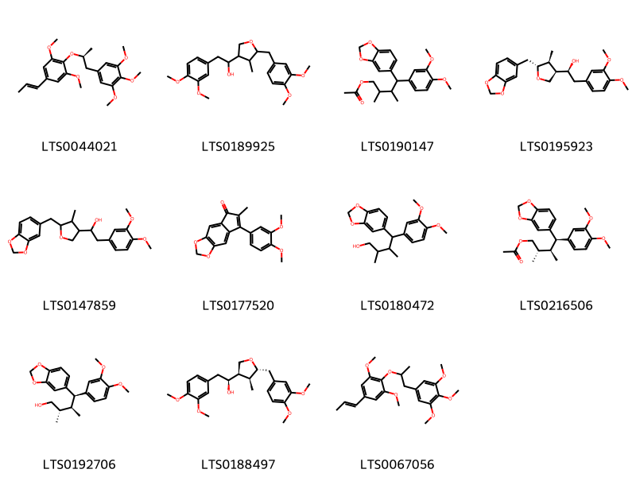{ width=100% }
    <figcaption>Hình ảnh cấu trúc hóa học của 11 hoạt chất thuộc nhóm Benzene and substituted derivatives gồm ['1,3-dimethoxy-5-[(1e)-prop-1-en-1-yl]-2-{[(2s)-1-(3,4,5-trimethoxyphenyl)propan-2-yl]oxy}benzene (LTS0044021)', '2-(3,4-dimethoxyphenyl)-1-{5-[(3,4-dimethoxyphenyl)methyl]-4-methyloxolan-3-yl}ethanol (LTS0189925)', '4-(2h-1,3-benzodioxol-5-yl)-4-(3,4-dimethoxyphenyl)-2,3-dimethylbutyl acetate (LTS0190147)', '(1s)-1-[(3r,4s,5r)-5-(2h-1,3-benzodioxol-5-ylmethyl)-4-methyloxolan-3-yl]-2-(3,4-dimethoxyphenyl)ethanol (LTS0195923)', '1-[5-(2h-1,3-benzodioxol-5-ylmethyl)-4-methyloxolan-3-yl]-2-(3,4-dimethoxyphenyl)ethanol (LTS0147859)', '7-(3,4-dimethoxyphenyl)-6-methyl-2h-indeno[5,6-d][1,3]dioxol-5-one (LTS0177520)', '4-(2h-1,3-benzodioxol-5-yl)-4-(3,4-dimethoxyphenyl)-2,3-dimethylbutan-1-ol (LTS0180472)', '(2s,3r)-3-[(r)-2h-1,3-benzodioxol-5-yl(3,4-dimethoxyphenyl)methyl]-2-methylbutyl acetate (LTS0216506)', '(2s,3r,4r)-4-(2h-1,3-benzodioxol-5-yl)-4-(3,4-dimethoxyphenyl)-2,3-dimethylbutan-1-ol (LTS0192706)', '(1s)-2-(3,4-dimethoxyphenyl)-1-[(3r,4s,5r)-5-[(3,4-dimethoxyphenyl)methyl]-4-methyloxolan-3-yl]ethanol (LTS0188497)', '1,3-dimethoxy-5-(prop-1-en-1-yl)-2-{[1-(3,4,5-trimethoxyphenyl)propan-2-yl]oxy}benzene (LTS0067056)'].</figcaption>
</figure>
#### Nhóm Benzodioxanes
<figure markdown="span">
    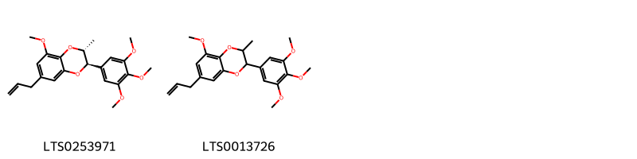{ width=100% }
    <figcaption>Hình ảnh cấu trúc hóa học của 2 hoạt chất thuộc nhóm Benzodioxanes gồm ['eusiderin (LTS0253971)', 'eusiderin (LTS0013726)'].</figcaption>
</figure>
#### Nhóm Benzodioxoles
<figure markdown="span">
    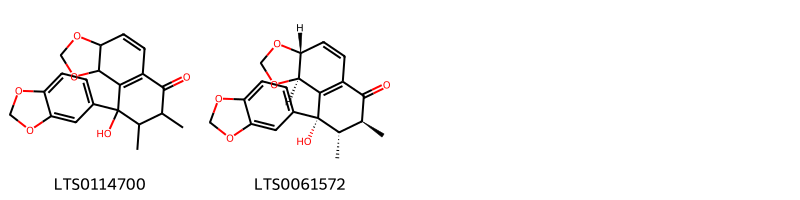{ width=100% }
    <figcaption>Hình ảnh cấu trúc hóa học của 2 hoạt chất thuộc nhóm Benzodioxoles gồm ['9-(2h-1,3-benzodioxol-5-yl)-9-hydroxy-7,8-dimethyl-2h,3ah,7h,8h,9bh-naphtho[1,2-d][1,3]dioxol-6-one (LTS0114700)', '(3ar,7s,8s,9r,9br)-9-(2h-1,3-benzodioxol-5-yl)-9-hydroxy-7,8-dimethyl-2h,3ah,7h,8h,9bh-naphtho[1,2-d][1,3]dioxol-6-one (LTS0061572)'].</figcaption>
</figure>
#### Nhóm Dibenzylbutane lignans
<figure markdown="span">
    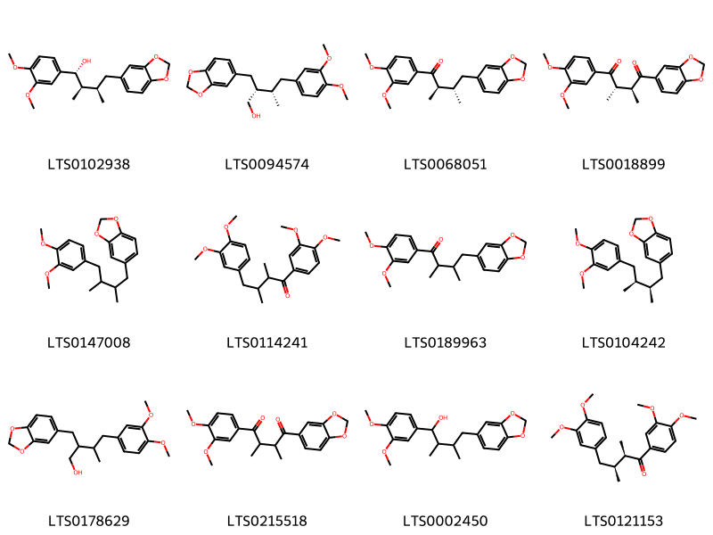{ width=100% }
    <figcaption>Hình ảnh cấu trúc hóa học của 12 hoạt chất thuộc nhóm Dibenzylbutane lignans gồm ['(1r,2r,3r)-4-(2h-1,3-benzodioxol-5-yl)-1-(3,4-dimethoxyphenyl)-2,3-dimethylbutan-1-ol (LTS0102938)', '(2r,3s)-2-(2h-1,3-benzodioxol-5-ylmethyl)-4-(3,4-dimethoxyphenyl)-3-methylbutan-1-ol (LTS0094574)', '(2r,3s)-4-(2h-1,3-benzodioxol-5-yl)-1-(3,4-dimethoxyphenyl)-2,3-dimethylbutan-1-one (LTS0068051)', '(2s,3s)-1-(2h-1,3-benzodioxol-5-yl)-4-(3,4-dimethoxyphenyl)-2,3-dimethylbutane-1,4-dione (LTS0018899)', '5-[4-(3,4-dimethoxyphenyl)-2,3-dimethylbutyl]-2h-1,3-benzodioxole (LTS0147008)', '1,4-bis(3,4-dimethoxyphenyl)-2,3-dimethylbutan-1-one (LTS0114241)', '4-(2h-1,3-benzodioxol-5-yl)-1-(3,4-dimethoxyphenyl)-2,3-dimethylbutan-1-one (LTS0189963)', '5-[(2r,3s)-4-(3,4-dimethoxyphenyl)-2,3-dimethylbutyl]-2h-1,3-benzodioxole (LTS0104242)', '2-(2h-1,3-benzodioxol-5-ylmethyl)-4-(3,4-dimethoxyphenyl)-3-methylbutan-1-ol (LTS0178629)', '1-(2h-1,3-benzodioxol-5-yl)-4-(3,4-dimethoxyphenyl)-2,3-dimethylbutane-1,4-dione (LTS0215518)', '4-(2h-1,3-benzodioxol-5-yl)-1-(3,4-dimethoxyphenyl)-2,3-dimethylbutan-1-ol (LTS0002450)', '(2r,3s)-1,4-bis(3,4-dimethoxyphenyl)-2,3-dimethylbutan-1-one (LTS0121153)'].</figcaption>
</figure>
#### Nhóm Flavonoids
<figure markdown="span">
    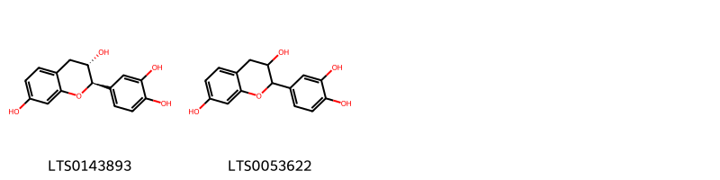{ width=100% }
    <figcaption>Hình ảnh cấu trúc hóa học của 2 hoạt chất thuộc nhóm Flavonoids gồm ['fisetinidol (LTS0143893)', "3,7,3',4'-tetrahydroxyflavan (LTS0053622)"].</figcaption>
</figure>
#### Nhóm Furanoid lignans
<figure markdown="span">
    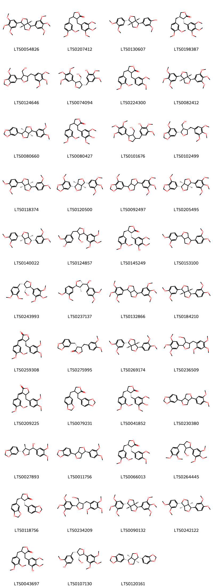{ width=100% }
    <figcaption>Hình ảnh cấu trúc hóa học của 43 hoạt chất thuộc nhóm Furanoid lignans gồm ['(3ar,6ar)-1,4-bis(3,4,5-trimethoxyphenyl)-hexahydrofuro[3,4-c]furan (LTS0054826)', '4-[(3,4-dimethoxyphenyl)methyl]-3-[(3,4,5-trimethoxyphenyl)methyl]oxolan-2-one (LTS0207412)', 'sylvatesmin (LTS0130607)', '(3r,4r)-4-[(3,4-dimethoxyphenyl)methyl]-3-[(3,4,5-trimethoxyphenyl)methyl]oxolan-2-one (LTS0198387)', '[2-(7-methoxy-2h-1,3-benzodioxol-5-yl)-4-[(3,4,5-trimethoxyphenyl)methyl]oxolan-3-yl]methanol (LTS0124646)', '5-{[(3s,4s,5r)-4-(hydroxymethyl)-5-(3,4,5-trimethoxyphenyl)oxolan-3-yl]methyl}-2,3-dimethoxyphenol (LTS0074094)', '3,4-bis[(3,4-dimethoxyphenyl)methyl]oxolan-2-one (LTS0224300)', '( )-yangabin (LTS0082412)', '5-[(3ar,6ar)-4-(3,4-dimethoxyphenyl)-hexahydrofuro[3,4-c]furan-1-yl]-2h-1,3-benzodioxole (LTS0080660)', '4-[(3,4-dimethoxyphenyl)methyl]-3-[(4-hydroxy-3,5-dimethoxyphenyl)methyl]oxolan-2-one (LTS0080427)', '5-{[4-(hydroxymethyl)-5-(3,4,5-trimethoxyphenyl)oxolan-3-yl]methyl}-2,3-dimethoxyphenol (LTS0101676)', '[(2s,3r,4r)-2-(7-methoxy-2h-1,3-benzodioxol-5-yl)-4-[(3,4,5-trimethoxyphenyl)methyl]oxolan-3-yl]methanol (LTS0102499)', '(3as,6as)-1,4-bis(3,4-dimethoxyphenyl)-hexahydrofuro[3,4-c]furan (LTS0118374)', 'sesartemin (LTS0120500)', '4-methoxy-6-[4-(3,4,5-trimethoxyphenyl)-hexahydrofuro[3,4-c]furan-1-yl]-2h-1,3-benzodioxole (LTS0092497)', '6-[(1s,3ar,4r,6ar)-4-(3,4,5-trimethoxyphenyl)-hexahydrofuro[3,4-c]furan-1-yl]-4-methoxy-2h-1,3-benzodioxole (LTS0205495)', '(1r,3as,4r,6as)-1,4-bis(3,4-dimethoxyphenyl)-hexahydrofuro[3,4-c]furan (LTS0140022)', '4-{[4-(hydroxymethyl)-5-(3,4,5-trimethoxyphenyl)oxolan-3-yl]methyl}-2-methoxyphenol (LTS0124857)', '(3r,4r)-4-[(3,4-dimethoxyphenyl)methyl]-3-[(3-hydroxy-4,5-dimethoxyphenyl)methyl]oxolan-2-one (LTS0145249)', '1,4-bis(3,4-dimethoxyphenyl)-hexahydrofuro[3,4-c]furan (LTS0153100)', '[(2r,3s,4s)-4-[(3,4-dimethoxyphenyl)methyl]-2-(3,4,5-trimethoxyphenyl)oxolan-3-yl]methanol (LTS0243993)', '(r)-(3,4-dimethoxyphenyl)[(3r,4s,5s)-5-(3,4-dimethoxyphenyl)-4-methyloxolan-3-yl]methanol (LTS0237137)', '1,4-bis(3,4,5-trimethoxyphenyl)-hexahydrofuro[3,4-c]furan (LTS0132866)', 'eudesmin (LTS0184210)', '(3e,4s)-4-[(3,4-dimethoxyphenyl)methyl]-3-[(3,4-dimethoxyphenyl)methylidene]oxolan-2-one (LTS0259308)', '(3r,4r)-3-(2h-1,3-benzodioxol-5-ylmethyl)-4-[(3,4-dimethoxyphenyl)methyl]oxolan-2-one (LTS0275995)', 'epipinoresinol (LTS0269174)', '[2-(3,4,5-trimethoxyphenyl)-4-[(2,4,5-trimethoxyphenyl)methyl]oxolan-3-yl]methanol (LTS0236509)', '(3e)-4-[(3,4-dimethoxyphenyl)methyl]-3-[(3,4-dimethoxyphenyl)methylidene]oxolan-2-one (LTS0209225)', '3,4-bis(2h-1,3-benzodioxol-5-ylmethyl)oxolan-2-one (LTS0079231)', '(3r,4r)-4-[(3,4-dimethoxyphenyl)methyl]-3-[(4-hydroxy-3,5-dimethoxyphenyl)methyl]oxolan-2-one (LTS0041852)', '5-[4-(3,4-dimethoxyphenyl)-hexahydrofuro[3,4-c]furan-1-yl]-2h-1,3-benzodioxole (LTS0230380)', '(r)-[(3r,4s,5s)-5-(2h-1,3-benzodioxol-5-yl)-4-methyloxolan-3-yl](3,4-dimethoxyphenyl)methanol (LTS0027893)', '5-[(4r)-4-(3,4-dimethoxyphenyl)-hexahydrofuro[3,4-c]furan-1-yl]-2h-1,3-benzodioxole (LTS0011756)', 'arctigenin methyl ether (LTS0066013)', '{4-[(3,4-dimethoxyphenyl)methyl]-2-(3,4,5-trimethoxyphenyl)oxolan-3-yl}methanol (LTS0264445)', 'hinokinin (LTS0118756)', '[(2r,3r,4r)-2-(3,4,5-trimethoxyphenyl)-4-[(2,4,5-trimethoxyphenyl)methyl]oxolan-3-yl]methanol (LTS0234209)', '(1r,3ar,4s,6ar)-1,4-bis(3,4,5-trimethoxyphenyl)-hexahydrofuro[3,4-c]furan (LTS0090132)', '(1r,3as,4s,6as)-1,4-bis(3,4-dimethoxyphenyl)-hexahydrofuro[3,4-c]furan (LTS0242122)', '4-[(3,4-dimethoxyphenyl)methyl]-3-[(3-hydroxy-4,5-dimethoxyphenyl)methyl]oxolan-2-one (LTS0043697)', '4-{[(3s,4s,5r)-4-(hydroxymethyl)-5-(3,4,5-trimethoxyphenyl)oxolan-3-yl]methyl}-2-methoxyphenol (LTS0107130)', 'sesamin (LTS0120161)'].</figcaption>
</figure>
#### Nhóm Indanes
<figure markdown="span">
    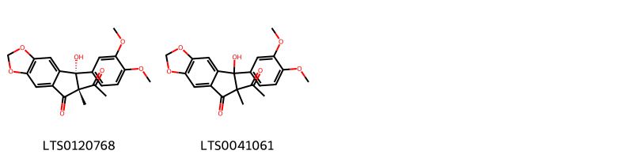{ width=100% }
    <figcaption>Hình ảnh cấu trúc hóa học của 2 hoạt chất thuộc nhóm Indanes gồm ['(6r,7s)-6-acetyl-7-(3,4-dimethoxyphenyl)-7-hydroxy-6-methyl-2h-indeno[5,6-d][1,3]dioxol-5-one (LTS0120768)', '6-acetyl-7-(3,4-dimethoxyphenyl)-7-hydroxy-6-methyl-2h-indeno[5,6-d][1,3]dioxol-5-one (LTS0041061)'].</figcaption>
</figure>
#### Nhóm Indoles and derivatives
<figure markdown="span">
    { width=100% }
    <figcaption>Hình ảnh cấu trúc hóa học của 1 hoạt chất thuộc nhóm Indoles and derivatives gồm ['methyltryptamine (LTS0182964)'].</figcaption>
</figure>
#### Nhóm Linear 1_3-diarylpropanoids
<figure markdown="span">
    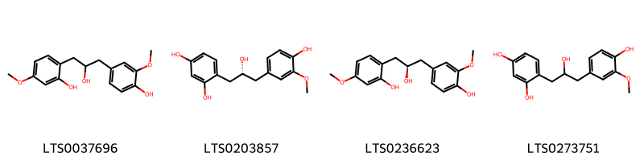{ width=100% }
    <figcaption>Hình ảnh cấu trúc hóa học của Không tìm thấy chú thích hoạt chất thuộc nhóm Linear 1_3-diarylpropanoids gồm Không tìm thấy chú thích.</figcaption>
</figure>
#### Nhóm Organooxygen compounds
<figure markdown="span">
    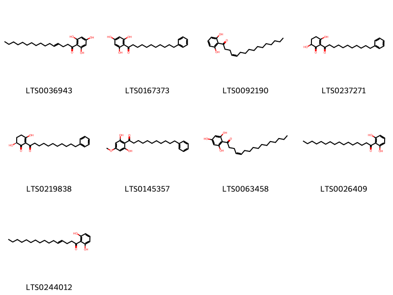{ width=100% }
    <figcaption>Hình ảnh cấu trúc hóa học của 9 hoạt chất thuộc nhóm Organooxygen compounds gồm ['1-(2,4,6-trihydroxyphenyl)hexadec-4-en-1-one (LTS0036943)', '11-phenyl-1-(2,4,6-trihydroxyphenyl)undecan-1-one (LTS0167373)', '(4z)-1-(2,6-dihydroxyphenyl)hexadec-4-en-1-one (LTS0092190)', '3,6-dihydroxy-2-(11-phenylundecanoyl)cyclohex-2-en-1-one (LTS0237271)', '(6s)-3,6-dihydroxy-2-(11-phenylundecanoyl)cyclohex-2-en-1-one (LTS0219838)', '1-(2,6-dihydroxy-4-methoxyphenyl)-11-phenylundecan-1-one (LTS0145357)', '(4z)-1-(2,4,6-trihydroxyphenyl)hexadec-4-en-1-one (LTS0063458)', '1-(2,6-dihydroxyphenyl)hexadecan-1-one (LTS0026409)', '1-(2,6-dihydroxyphenyl)hexadec-4-en-1-one (LTS0244012)'].</figcaption>
</figure>
#### Nhóm Phenols
<figure markdown="span">
    { width=100% }
    <figcaption>Hình ảnh cấu trúc hóa học của 2 hoạt chất thuộc nhóm Phenols gồm ['2-[(2r)-3-(2h-1,3-benzodioxol-5-yl)-2-hydroxypropyl]-5-methoxyphenol (LTS0104760)', '2-[3-(2h-1,3-benzodioxol-5-yl)-2-hydroxypropyl]-5-methoxyphenol (LTS0029385)'].</figcaption>
</figure>
#### Nhóm Steroids and steroid derivatives
<figure markdown="span">
    { width=100% }
    <figcaption>Hình ảnh cấu trúc hóa học của 3 hoạt chất thuộc nhóm Steroids and steroid derivatives gồm ['stigmast-5-en-3-ol (LTS0071224)', 'sitosterol (LTS0168132)', 'stigmast-5-en-3-ol, (3β)- (LTS0204616)'].</figcaption>
</figure>
#### Nhóm Stilbenes
<figure markdown="span">
    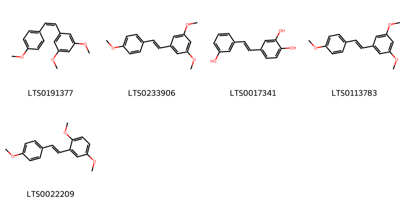{ width=100% }
    <figcaption>Hình ảnh cấu trúc hóa học của 5 hoạt chất thuộc nhóm Stilbenes gồm ['1,3-dimethoxy-5-[(1z)-2-(4-methoxyphenyl)ethenyl]benzene (LTS0191377)', '1,3-dimethoxy-5-[2-(4-methoxyphenyl)ethenyl]benzene (LTS0233906)', '4-[(1e)-2-(3-hydroxyphenyl)ethenyl]benzene-1,2-diol (LTS0017341)', '1,3-dimethoxy-5-[(1e)-2-(4-methoxyphenyl)ethenyl]benzene (LTS0113783)', '1,4-dimethoxy-2-[(1e)-2-(4-methoxyphenyl)ethenyl]benzene (LTS0022209)'].</figcaption>
</figure>

---

### Dược dân tộc học

Danh sách các quốc gia có sử dụng *Virola elongata* trong điều trị các bệnh. 

| Country          | Disease      | Bệnh                                                                                                                                                                                                |
|:-----------------|:-------------|:----------------------------------------------------------------------------------------------------------------------------------------------------------------------------------------------------|
| Brazil(Paumari)  | Narcotic     | MYMEMORY WARNING: YOU USED ALL AVAILABLE FREE TRANSLATIONS FOR TODAY. NEXT AVAILABLE IN  09 HOURS 11 MINUTES 39 SECONDS VISIT HTTPS://MYMEMORY.TRANSLATED.NET/DOC/USAGELIMITS.PHP TO TRANSLATE MORE |
| Brazil(Yanomamo) | Hallucinogen | MYMEMORY WARNING: YOU USED ALL AVAILABLE FREE TRANSLATIONS FOR TODAY. NEXT AVAILABLE IN  09 HOURS 11 MINUTES 37 SECONDS VISIT HTTPS://MYMEMORY.TRANSLATED.NET/DOC/USAGELIMITS.PHP TO TRANSLATE MORE |

---

---
## Virola sebifera
### Thông tin về thực vật

!!! info "Phân loại thực vật của *Virola sebifera* từ GIBF:"
    - **Kingdom:** Plantae
    - **Phylum:** Tracheophyta
    - **Order:** Magnoliales
    - **Family:** Myristicaceae
    - **Genus:** Virola
    - **Species:** *Virola sebifera*

 

| Label (VI)   | Label (EN)   | Scientific Name   | Descriptions (VI)   | Descriptions (EN)   | Also Known As (VI)   | Also Known As (EN)   |
|:-------------|:-------------|:------------------|:--------------------|:--------------------|:---------------------|:---------------------|
| N/A          | N/A          | Virola sebifera   | loài thực vật       | species of plant    | ['']                 | ['']                 |

#### Phân bố trên thế giới

**Từ CSDL GIBF** Colombia, Panama, Brazil, Peru, French Guiana, Costa Rica, Bolivia (Plurinational State of), Ecuador

#### Phân bố tại Việt Nam

**Từ CSDL GIBF**: Không có ghi nhận ở Việt Nam

---
### Thành phần hóa học
        
- Theo cơ sở dữ liệu lotus: Từ loài *Virola sebifera* đã phân lập và xác định được 80 hoạt chất thuộc về các nhóm Arylnaphthalene lignans, Furanoid lignans, Indoles and derivatives, Organooxygen compounds, Dibenzylbutane lignans, Fatty Acyls, Aryltetralin lignans, Indanes, Cinnamic acids and derivatives, Steroids and steroid derivatives, Benzene and substituted derivatives, Naphthalenes. 

|    | chemicalTaxonomyClassyfireClass     |   smiles_count |
|---:|:------------------------------------|---------------:|
|  0 | Arylnaphthalene lignans             |              3 |
|  1 | Aryltetralin lignans                |             24 |
|  2 | Benzene and substituted derivatives |              3 |
|  3 | Cinnamic acids and derivatives      |              1 |
|  4 | Dibenzylbutane lignans              |             10 |
|  5 | Fatty Acyls                         |              1 |
|  6 | Furanoid lignans                    |             13 |
|  7 | Indanes                             |              4 |
|  8 | Indoles and derivatives             |              6 |
|  9 | Naphthalenes                        |              2 |
| 10 | Organooxygen compounds              |              9 |
| 11 | Steroids and steroid derivatives    |              4 |

#### Nhóm Arylnaphthalene lignans
<figure markdown="span">
    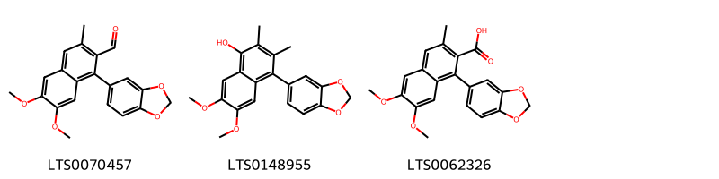{ width=100% }
    <figcaption>Hình ảnh cấu trúc hóa học của 3 hoạt chất thuộc nhóm Arylnaphthalene lignans gồm ['1-(2h-1,3-benzodioxol-5-yl)-6,7-dimethoxy-3-methylnaphthalene-2-carbaldehyde (LTS0070457)', '4-(2h-1,3-benzodioxol-5-yl)-6,7-dimethoxy-2,3-dimethylnaphthalen-1-ol (LTS0148955)', '1-(2h-1,3-benzodioxol-5-yl)-6,7-dimethoxy-3-methylnaphthalene-2-carboxylic acid (LTS0062326)'].</figcaption>
</figure>
#### Nhóm Aryltetralin lignans
<figure markdown="span">
    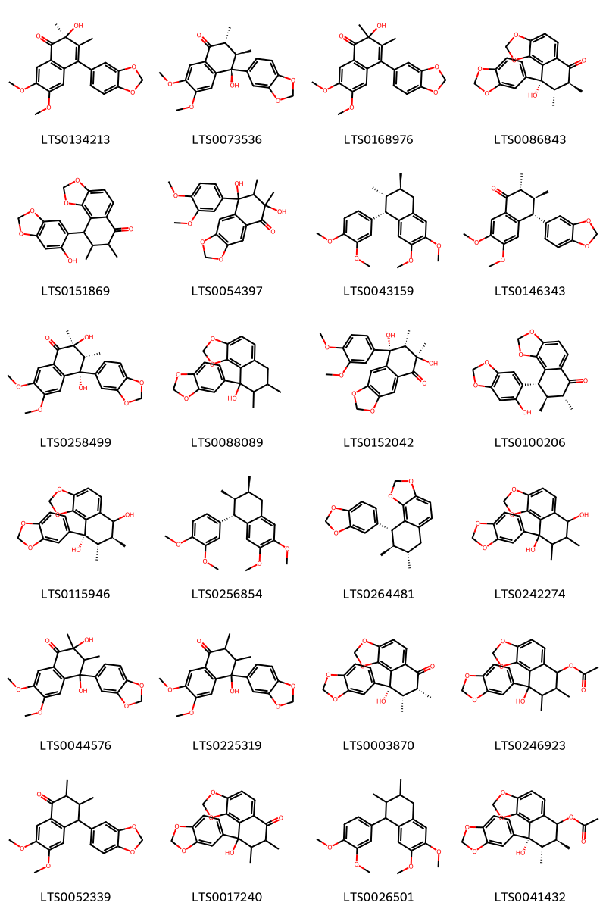{ width=100% }
    <figcaption>Hình ảnh cấu trúc hóa học của 24 hoạt chất thuộc nhóm Aryltetralin lignans gồm ['(2s)-4-(2h-1,3-benzodioxol-5-yl)-2-hydroxy-6,7-dimethoxy-2,3-dimethylnaphthalen-1-one (LTS0134213)', '(2r,3r,4s)-4-(2h-1,3-benzodioxol-5-yl)-4-hydroxy-6,7-dimethoxy-2,3-dimethyl-2,3-dihydronaphthalen-1-one (LTS0073536)', '4-(2h-1,3-benzodioxol-5-yl)-2-hydroxy-6,7-dimethoxy-2,3-dimethylnaphthalen-1-one (LTS0168976)', '(7s,8s,9r)-9-(2h-1,3-benzodioxol-5-yl)-9-hydroxy-7,8-dimethyl-2h,7h,8h-naphtho[1,2-d][1,3]dioxol-6-one (LTS0086843)', '9-(6-hydroxy-2h-1,3-benzodioxol-5-yl)-7,8-dimethyl-2h,7h,8h,9h-naphtho[1,2-d][1,3]dioxol-6-one (LTS0151869)', '8-(3,4-dimethoxyphenyl)-6,8-dihydroxy-6,7-dimethyl-2h,7h-naphtho[2,3-d][1,3]dioxol-5-one (LTS0054397)', '(1s,2r,3s)-1-(3,4-dimethoxyphenyl)-6,7-dimethoxy-2,3-dimethyl-1,2,3,4-tetrahydronaphthalene (LTS0043159)', '(2r,3s,4r)-4-(2h-1,3-benzodioxol-5-yl)-6,7-dimethoxy-2,3-dimethyl-3,4-dihydro-2h-naphthalen-1-one (LTS0146343)', '(2s,3r,4r)-4-(2h-1,3-benzodioxol-5-yl)-2,4-dihydroxy-6,7-dimethoxy-2,3-dimethyl-3h-naphthalen-1-one (LTS0258499)', '9-(2h-1,3-benzodioxol-5-yl)-7,8-dimethyl-2h,6h,7h,8h-naphtho[1,2-d][1,3]dioxol-9-ol (LTS0088089)', '(6r,7s,8s)-8-(3,4-dimethoxyphenyl)-6,8-dihydroxy-6,7-dimethyl-2h,7h-naphtho[2,3-d][1,3]dioxol-5-one (LTS0152042)', '(7r,8s,9r)-9-(6-hydroxy-2h-1,3-benzodioxol-5-yl)-7,8-dimethyl-2h,7h,8h,9h-naphtho[1,2-d][1,3]dioxol-6-one (LTS0100206)', '(7s,8s,9r)-9-(2h-1,3-benzodioxol-5-yl)-7,8-dimethyl-2h,6h,7h,8h-naphtho[1,2-d][1,3]dioxole-6,9-diol (LTS0115946)', '(1s,2s,3s)-1-(3,4-dimethoxyphenyl)-6,7-dimethoxy-2,3-dimethyl-1,2,3,4-tetrahydronaphthalene (LTS0256854)', 'otobain (LTS0264481)', '9-(2h-1,3-benzodioxol-5-yl)-7,8-dimethyl-2h,6h,7h,8h-naphtho[1,2-d][1,3]dioxole-6,9-diol (LTS0242274)', '4-(2h-1,3-benzodioxol-5-yl)-2,4-dihydroxy-6,7-dimethoxy-2,3-dimethyl-3h-naphthalen-1-one (LTS0044576)', '4-(2h-1,3-benzodioxol-5-yl)-4-hydroxy-6,7-dimethoxy-2,3-dimethyl-2,3-dihydronaphthalen-1-one (LTS0225319)', '(7r,8s,9r)-9-(2h-1,3-benzodioxol-5-yl)-9-hydroxy-7,8-dimethyl-2h,7h,8h-naphtho[1,2-d][1,3]dioxol-6-one (LTS0003870)', '9-(2h-1,3-benzodioxol-5-yl)-9-hydroxy-7,8-dimethyl-2h,6h,7h,8h-naphtho[1,2-d][1,3]dioxol-6-yl acetate (LTS0246923)', '4-(2h-1,3-benzodioxol-5-yl)-6,7-dimethoxy-2,3-dimethyl-3,4-dihydro-2h-naphthalen-1-one (LTS0052339)', '9-(2h-1,3-benzodioxol-5-yl)-9-hydroxy-7,8-dimethyl-2h,7h,8h-naphtho[1,2-d][1,3]dioxol-6-one (LTS0017240)', '1-(3,4-dimethoxyphenyl)-6,7-dimethoxy-2,3-dimethyl-1,2,3,4-tetrahydronaphthalene (LTS0026501)', '(7s,8s,9r)-9-(2h-1,3-benzodioxol-5-yl)-9-hydroxy-7,8-dimethyl-2h,6h,7h,8h-naphtho[1,2-d][1,3]dioxol-6-yl acetate (LTS0041432)'].</figcaption>
</figure>
#### Nhóm Benzene and substituted derivatives
<figure markdown="span">
    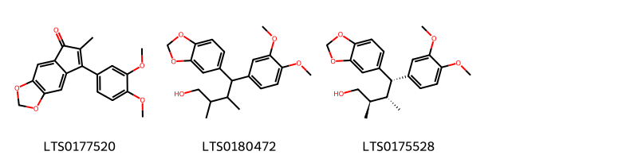{ width=100% }
    <figcaption>Hình ảnh cấu trúc hóa học của 3 hoạt chất thuộc nhóm Benzene and substituted derivatives gồm ['7-(3,4-dimethoxyphenyl)-6-methyl-2h-indeno[5,6-d][1,3]dioxol-5-one (LTS0177520)', '4-(2h-1,3-benzodioxol-5-yl)-4-(3,4-dimethoxyphenyl)-2,3-dimethylbutan-1-ol (LTS0180472)', '(2r,3s,4s)-4-(2h-1,3-benzodioxol-5-yl)-4-(3,4-dimethoxyphenyl)-2,3-dimethylbutan-1-ol (LTS0175528)'].</figcaption>
</figure>
#### Nhóm Cinnamic acids and derivatives
<figure markdown="span">
    { width=100% }
    <figcaption>Hình ảnh cấu trúc hóa học của 1 hoạt chất thuộc nhóm Cinnamic acids and derivatives gồm ['ferulic acid (LTS0077328)'].</figcaption>
</figure>
#### Nhóm Dibenzylbutane lignans
<figure markdown="span">
    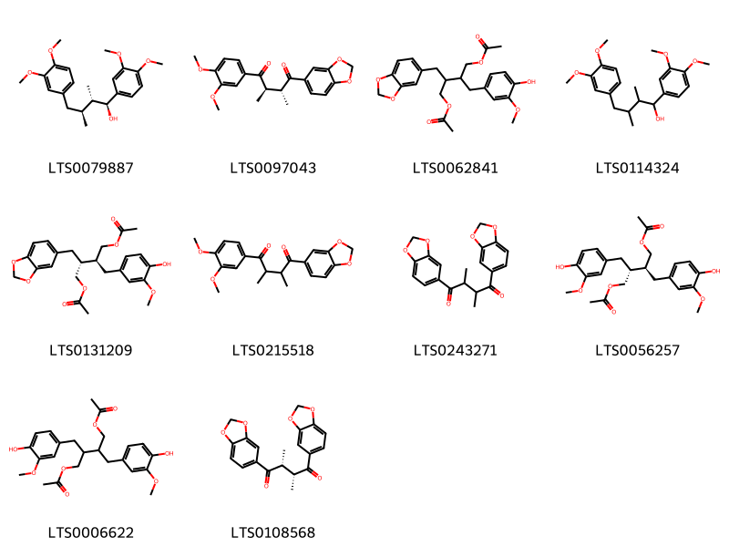{ width=100% }
    <figcaption>Hình ảnh cấu trúc hóa học của 10 hoạt chất thuộc nhóm Dibenzylbutane lignans gồm ['(1s,2s,3s)-1,4-bis(3,4-dimethoxyphenyl)-2,3-dimethylbutan-1-ol (LTS0079887)', '(2r,3r)-1-(2h-1,3-benzodioxol-5-yl)-4-(3,4-dimethoxyphenyl)-2,3-dimethylbutane-1,4-dione (LTS0097043)', '4-(acetyloxy)-3-(2h-1,3-benzodioxol-5-ylmethyl)-2-[(4-hydroxy-3-methoxyphenyl)methyl]butyl acetate (LTS0062841)', '1,4-bis(3,4-dimethoxyphenyl)-2,3-dimethylbutan-1-ol (LTS0114324)', '(2r,3s)-4-(acetyloxy)-2-(2h-1,3-benzodioxol-5-ylmethyl)-3-[(4-hydroxy-3-methoxyphenyl)methyl]butyl acetate (LTS0131209)', '1-(2h-1,3-benzodioxol-5-yl)-4-(3,4-dimethoxyphenyl)-2,3-dimethylbutane-1,4-dione (LTS0215518)', '1,4-bis(2h-1,3-benzodioxol-5-yl)-2,3-dimethylbutane-1,4-dione (LTS0243271)', '(2s,3r)-4-(acetyloxy)-2,3-bis[(4-hydroxy-3-methoxyphenyl)methyl]butyl acetate (LTS0056257)', '4-(acetyloxy)-2,3-bis[(4-hydroxy-3-methoxyphenyl)methyl]butyl acetate (LTS0006622)', '(2r,3r)-1,4-bis(2h-1,3-benzodioxol-5-yl)-2,3-dimethylbutane-1,4-dione (LTS0108568)'].</figcaption>
</figure>
#### Nhóm Fatty Acyls
<figure markdown="span">
    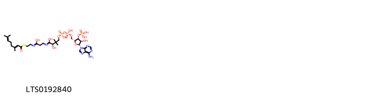{ width=100% }
    <figcaption>Hình ảnh cấu trúc hóa học của 1 hoạt chất thuộc nhóm Fatty Acyls gồm ['(2r)-4-[({[(2r,3s,4r,5r)-5-(6-aminopurin-9-yl)-4-hydroxy-3-(phosphonooxy)oxolan-2-yl]methoxy(hydroxy)phosphoryl}oxy(hydroxy)phosphoryl)oxy]-n-{2-[(2-{[(2e)-3,7-dimethylocta-2,6-dienoyl]sulfanyl}ethyl)-c-hydroxycarbonimidoyl]ethyl}-2-hydroxy-3,3-dimethylbutanimidic acid (LTS0192840)'].</figcaption>
</figure>
#### Nhóm Furanoid lignans
<figure markdown="span">
    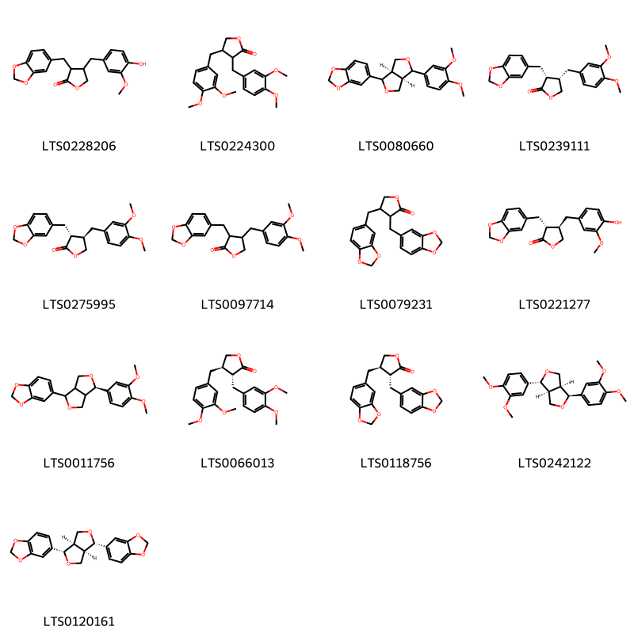{ width=100% }
    <figcaption>Hình ảnh cấu trúc hóa học của 13 hoạt chất thuộc nhóm Furanoid lignans gồm ['3-(2h-1,3-benzodioxol-5-ylmethyl)-4-[(4-hydroxy-3-methoxyphenyl)methyl]oxolan-2-one (LTS0228206)', '3,4-bis[(3,4-dimethoxyphenyl)methyl]oxolan-2-one (LTS0224300)', '5-[(3ar,6ar)-4-(3,4-dimethoxyphenyl)-hexahydrofuro[3,4-c]furan-1-yl]-2h-1,3-benzodioxole (LTS0080660)', '(3r,4s)-3-(2h-1,3-benzodioxol-5-ylmethyl)-4-[(3,4-dimethoxyphenyl)methyl]oxolan-2-one (LTS0239111)', '(3r,4r)-3-(2h-1,3-benzodioxol-5-ylmethyl)-4-[(3,4-dimethoxyphenyl)methyl]oxolan-2-one (LTS0275995)', '3-(2h-1,3-benzodioxol-5-ylmethyl)-4-[(3,4-dimethoxyphenyl)methyl]oxolan-2-one (LTS0097714)', '3,4-bis(2h-1,3-benzodioxol-5-ylmethyl)oxolan-2-one (LTS0079231)', '(3r,4r)-3-(2h-1,3-benzodioxol-5-ylmethyl)-4-[(4-hydroxy-3-methoxyphenyl)methyl]oxolan-2-one (LTS0221277)', '5-[(4r)-4-(3,4-dimethoxyphenyl)-hexahydrofuro[3,4-c]furan-1-yl]-2h-1,3-benzodioxole (LTS0011756)', 'arctigenin methyl ether (LTS0066013)', 'hinokinin (LTS0118756)', '(1r,3as,4s,6as)-1,4-bis(3,4-dimethoxyphenyl)-hexahydrofuro[3,4-c]furan (LTS0242122)', 'sesamin (LTS0120161)'].</figcaption>
</figure>
#### Nhóm Indanes
<figure markdown="span">
    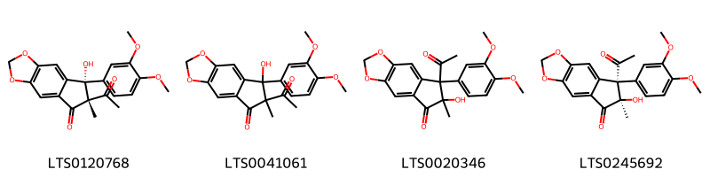{ width=100% }
    <figcaption>Hình ảnh cấu trúc hóa học của 4 hoạt chất thuộc nhóm Indanes gồm ['(6r,7s)-6-acetyl-7-(3,4-dimethoxyphenyl)-7-hydroxy-6-methyl-2h-indeno[5,6-d][1,3]dioxol-5-one (LTS0120768)', '6-acetyl-7-(3,4-dimethoxyphenyl)-7-hydroxy-6-methyl-2h-indeno[5,6-d][1,3]dioxol-5-one (LTS0041061)', '7-acetyl-7-(3,4-dimethoxyphenyl)-6-hydroxy-6-methyl-2h-indeno[5,6-d][1,3]dioxol-5-one (LTS0020346)', '(6r,7s)-7-acetyl-7-(3,4-dimethoxyphenyl)-6-hydroxy-6-methyl-2h-indeno[5,6-d][1,3]dioxol-5-one (LTS0245692)'].</figcaption>
</figure>
#### Nhóm Indoles and derivatives
<figure markdown="span">
    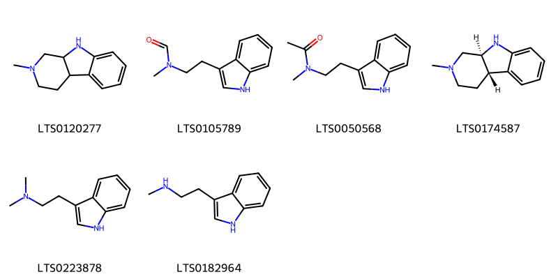{ width=100% }
    <figcaption>Hình ảnh cấu trúc hóa học của 6 hoạt chất thuộc nhóm Indoles and derivatives gồm ['2-methyl-1h,3h,4h,4ah,9h,9ah-pyrido[3,4-b]indole (LTS0120277)', 'n-[2-(1h-indol-3-yl)ethyl]-n-methylformamide (LTS0105789)', 'n-[2-(1h-indol-3-yl)ethyl]-n-methylacetamide (LTS0050568)', '(4as,9as)-2-methyl-1h,3h,4h,4ah,9h,9ah-pyrido[3,4-b]indole (LTS0174587)', 'dimethyltryptamine (LTS0223878)', 'methyltryptamine (LTS0182964)'].</figcaption>
</figure>
#### Nhóm Naphthalenes
<figure markdown="span">
    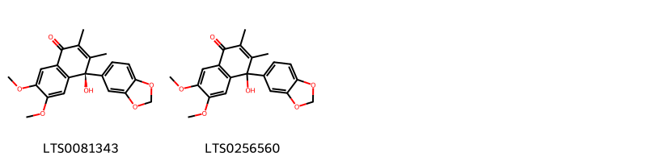{ width=100% }
    <figcaption>Hình ảnh cấu trúc hóa học của 2 hoạt chất thuộc nhóm Naphthalenes gồm ['(4r)-4-(2h-1,3-benzodioxol-5-yl)-4-hydroxy-6,7-dimethoxy-2,3-dimethylnaphthalen-1-one (LTS0081343)', '4-(2h-1,3-benzodioxol-5-yl)-4-hydroxy-6,7-dimethoxy-2,3-dimethylnaphthalen-1-one (LTS0256560)'].</figcaption>
</figure>
#### Nhóm Organooxygen compounds
<figure markdown="span">
    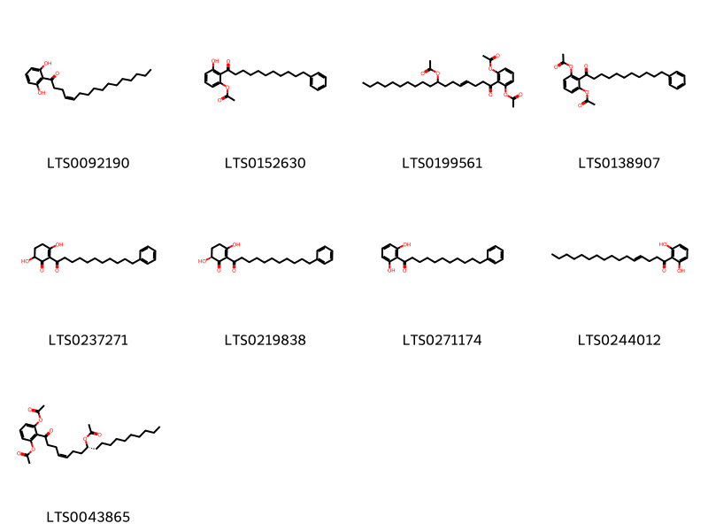{ width=100% }
    <figcaption>Hình ảnh cấu trúc hóa học của 9 hoạt chất thuộc nhóm Organooxygen compounds gồm ['(4z)-1-(2,6-dihydroxyphenyl)hexadec-4-en-1-one (LTS0092190)', '3-hydroxy-2-(11-phenylundecanoyl)phenyl acetate (LTS0152630)', '1-[2,6-bis(acetyloxy)phenyl]-1-oxooctadec-4-en-8-yl acetate (LTS0199561)', '3-(acetyloxy)-2-(11-phenylundecanoyl)phenyl acetate (LTS0138907)', '3,6-dihydroxy-2-(11-phenylundecanoyl)cyclohex-2-en-1-one (LTS0237271)', '(6s)-3,6-dihydroxy-2-(11-phenylundecanoyl)cyclohex-2-en-1-one (LTS0219838)', '1-(2,6-dihydroxyphenyl)-11-phenylundecan-1-one (LTS0271174)', '1-(2,6-dihydroxyphenyl)hexadec-4-en-1-one (LTS0244012)', '(4z,8r)-1-[2,6-bis(acetyloxy)phenyl]-1-oxooctadec-4-en-8-yl acetate (LTS0043865)'].</figcaption>
</figure>
#### Nhóm Steroids and steroid derivatives
<figure markdown="span">
    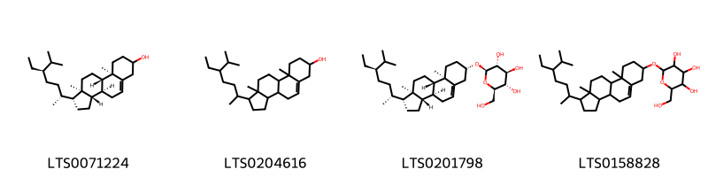{ width=100% }
    <figcaption>Hình ảnh cấu trúc hóa học của 4 hoạt chất thuộc nhóm Steroids and steroid derivatives gồm ['stigmast-5-en-3-ol (LTS0071224)', 'stigmast-5-en-3-ol, (3β)- (LTS0204616)', 'sitogluside (LTS0201798)', '2-{[1-(5-ethyl-6-methylheptan-2-yl)-9a,11a-dimethyl-1h,2h,3h,3ah,3bh,4h,6h,7h,8h,9h,9bh,10h,11h-cyclopenta[a]phenanthren-7-yl]oxy}-6-(hydroxymethyl)oxane-3,4,5-triol (LTS0158828)'].</figcaption>
</figure>

---

### Dược dân tộc học

Danh sách các quốc gia có sử dụng *Virola sebifera* trong điều trị các bệnh. 

| Country       | Disease   | Bệnh                                                                                                                                                                                                |
|:--------------|:----------|:----------------------------------------------------------------------------------------------------------------------------------------------------------------------------------------------------|
| Elsewhere     | Soap      | MYMEMORY WARNING: YOU USED ALL AVAILABLE FREE TRANSLATIONS FOR TODAY. NEXT AVAILABLE IN  09 HOURS 11 MINUTES 12 SECONDS VISIT HTTPS://MYMEMORY.TRANSLATED.NET/DOC/USAGELIMITS.PHP TO TRANSLATE MORE |
| South America | Soap      | MYMEMORY WARNING: YOU USED ALL AVAILABLE FREE TRANSLATIONS FOR TODAY. NEXT AVAILABLE IN  09 HOURS 11 MINUTES 10 SECONDS VISIT HTTPS://MYMEMORY.TRANSLATED.NET/DOC/USAGELIMITS.PHP TO TRANSLATE MORE |

---

---
## Virola theiodora
### Thông tin về thực vật

!!! info "Phân loại thực vật của *Virola theiodora* từ GIBF:"
    - **Kingdom:** Plantae
    - **Phylum:** Tracheophyta
    - **Order:** Magnoliales
    - **Family:** Myristicaceae
    - **Genus:** Virola
    - **Species:** *Virola theiodora*

 

| Label (VI)   | Label (EN)   | Scientific Name   | Descriptions (VI)   | Descriptions (EN)   | Also Known As (VI)   | Also Known As (EN)   |
|:-------------|:-------------|:------------------|:--------------------|:--------------------|:---------------------|:---------------------|
| N/A          | N/A          | Virola theiodora  | loài thực vật       | species of plant    | ['']                 | ['']                 |

#### Phân bố trên thế giới

**Từ CSDL GIBF** Colombia, Venezuela (Bolivarian Republic of), Brazil, Peru, Ecuador

#### Phân bố tại Việt Nam

**Từ CSDL GIBF**: Không có ghi nhận ở Việt Nam

---
### Thành phần hóa học
        
- Theo cơ sở dữ liệu lotus: Từ loài *Virola theiodora* đã phân lập và xác định được Chưa có hoạt chất nào được phân lập. hoạt chất thuộc về các nhóm Không có hoạt chất nào được phân lập. 

Không có hình ảnh nào được tạo ra

---

### Dược dân tộc học

Danh sách các quốc gia có sử dụng *Virola theiodora* trong điều trị các bệnh. 

| Country        | Disease      | Bệnh                                                                                                                                                                                                |
|:---------------|:-------------|:----------------------------------------------------------------------------------------------------------------------------------------------------------------------------------------------------|
| Brazil(Sanama) | Hallucinogen | MYMEMORY WARNING: YOU USED ALL AVAILABLE FREE TRANSLATIONS FOR TODAY. NEXT AVAILABLE IN  09 HOURS 10 MINUTES 44 SECONDS VISIT HTTPS://MYMEMORY.TRANSLATED.NET/DOC/USAGELIMITS.PHP TO TRANSLATE MORE |
| Brazil(Waika)  | Hallucinogen | MYMEMORY WARNING: YOU USED ALL AVAILABLE FREE TRANSLATIONS FOR TODAY. NEXT AVAILABLE IN  09 HOURS 10 MINUTES 42 SECONDS VISIT HTTPS://MYMEMORY.TRANSLATED.NET/DOC/USAGELIMITS.PHP TO TRANSLATE MORE |

---

# Chi Pycnanthus

??? note "Danh sách các dược liệu thuộc chi"
    
	 - *Pycnanthus angolensis*

---
## Pycnanthus angolensis
### Thông tin về thực vật

!!! info "Phân loại thực vật của *Pycnanthus angolensis* từ GIBF:"
    - **Kingdom:** Plantae
    - **Phylum:** Tracheophyta
    - **Order:** Magnoliales
    - **Family:** Myristicaceae
    - **Genus:** Pycnanthus
    - **Species:** *Pycnanthus angolensis*

 

| Label (VI)   | Label (EN)   | Scientific Name       | Descriptions (VI)   | Descriptions (EN)   | Also Known As (VI)   | Also Known As (EN)   |
|:-------------|:-------------|:----------------------|:--------------------|:--------------------|:---------------------|:---------------------|
| N/A          | N/A          | Pycnanthus angolensis | loài thực vật       | species of plant    | ['']                 | ['African nutmeg']   |

#### Phân bố trên thế giới

**Từ CSDL GIBF** Sierra Leone, Côte d’Ivoire, Central African Republic, Sao Tome and Principe, Ghana, Liberia, Cameroon, Congo, Democratic Republic of the, Gabon, Guinea, Benin

#### Phân bố tại Việt Nam

**Từ CSDL GIBF**: Không có ghi nhận ở Việt Nam

---
### Thành phần hóa học
        
- Theo cơ sở dữ liệu lotus: Từ loài *Pycnanthus angolensis* đã phân lập và xác định được 39 hoạt chất thuộc về các nhóm Furanoid lignans, Arylnaphthalene lignans, Flavonoids, Dibenzylbutane lignans, Prenol lipids, Aryltetralin lignans, Isoflavonoids, Steroids and steroid derivatives, Naphthalenes. 

|    | chemicalTaxonomyClassyfireClass   |   smiles_count |
|---:|:----------------------------------|---------------:|
|  0 | Arylnaphthalene lignans           |              3 |
|  1 | Aryltetralin lignans              |              6 |
|  2 | Dibenzylbutane lignans            |              3 |
|  3 | Flavonoids                        |              3 |
|  4 | Furanoid lignans                  |              3 |
|  5 | Isoflavonoids                     |              6 |
|  6 | Naphthalenes                      |              2 |
|  7 | Prenol lipids                     |              8 |
|  8 | Steroids and steroid derivatives  |              2 |

#### Nhóm Arylnaphthalene lignans
<figure markdown="span">
    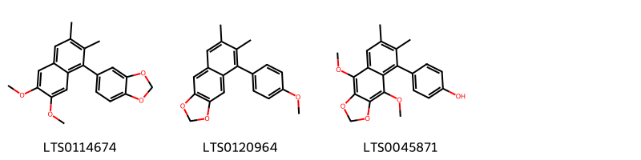{ width=100% }
    <figcaption>Hình ảnh cấu trúc hóa học của 3 hoạt chất thuộc nhóm Arylnaphthalene lignans gồm ['5-(6,7-dimethoxy-2,3-dimethylnaphthalen-1-yl)-2h-1,3-benzodioxole (LTS0114674)', 'pycnanthulignene c (LTS0120964)', 'pycnanthulignene d (LTS0045871)'].</figcaption>
</figure>
#### Nhóm Aryltetralin lignans
<figure markdown="span">
    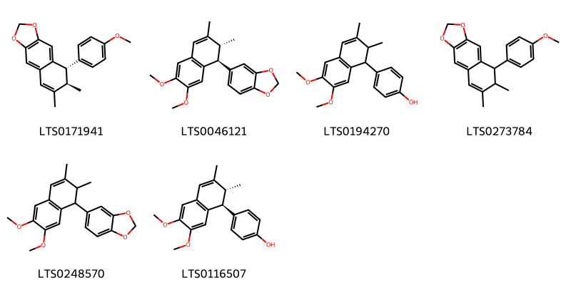{ width=100% }
    <figcaption>Hình ảnh cấu trúc hóa học của 6 hoạt chất thuộc nhóm Aryltetralin lignans gồm ['(5s,6r)-5-(4-methoxyphenyl)-6,7-dimethyl-2h,5h,6h-naphtho[2,3-d][1,3]dioxole (LTS0171941)', 'pycnanthulignene b (LTS0046121)', '4-(6,7-dimethoxy-2,3-dimethyl-1,2-dihydronaphthalen-1-yl)phenol (LTS0194270)', '5-(4-methoxyphenyl)-6,7-dimethyl-2h,5h,6h-naphtho[2,3-d][1,3]dioxole (LTS0273784)', '5-(6,7-dimethoxy-2,3-dimethyl-1,2-dihydronaphthalen-1-yl)-2h-1,3-benzodioxole (LTS0248570)', 'pycnanthulignene a (LTS0116507)'].</figcaption>
</figure>
#### Nhóm Dibenzylbutane lignans
<figure markdown="span">
    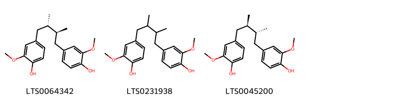{ width=100% }
    <figcaption>Hình ảnh cấu trúc hóa học của 3 hoạt chất thuộc nhóm Dibenzylbutane lignans gồm ['4-[(2s,3s)-4-(4-hydroxy-3-methoxyphenyl)-2,3-dimethylbutyl]-2-methoxyphenol (LTS0064342)', '4-[4-(4-hydroxy-3-methoxyphenyl)-2,3-dimethylbutyl]-2-methoxyphenol (LTS0231938)', '(-)-dihydroguaiaretic acid (LTS0045200)'].</figcaption>
</figure>
#### Nhóm Flavonoids
<figure markdown="span">
    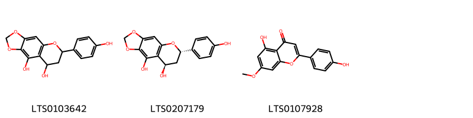{ width=100% }
    <figcaption>Hình ảnh cấu trúc hóa học của 3 hoạt chất thuộc nhóm Flavonoids gồm ['11-(4-hydroxyphenyl)-4,6,10-trioxatricyclo[7.4.0.0³,⁷]trideca-1(9),2,7-triene-2,13-diol (LTS0103642)', '(11s,13r)-11-(4-hydroxyphenyl)-4,6,10-trioxatricyclo[7.4.0.0³,⁷]trideca-1(9),2,7-triene-2,13-diol (LTS0207179)', 'genkwanin (LTS0107928)'].</figcaption>
</figure>
#### Nhóm Furanoid lignans
<figure markdown="span">
    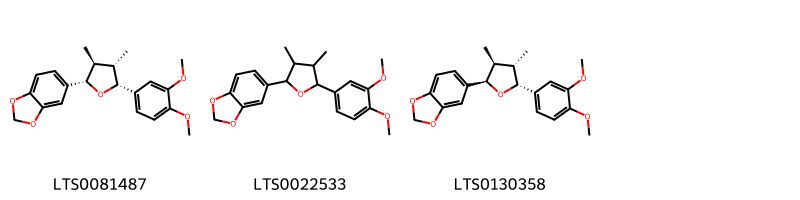{ width=100% }
    <figcaption>Hình ảnh cấu trúc hóa học của 3 hoạt chất thuộc nhóm Furanoid lignans gồm ['5-[(2s,3s,4s,5r)-5-(3,4-dimethoxyphenyl)-3,4-dimethyloxolan-2-yl]-2h-1,3-benzodioxole (LTS0081487)', '5-[5-(3,4-dimethoxyphenyl)-3,4-dimethyloxolan-2-yl]-2h-1,3-benzodioxole (LTS0022533)', '5-[(2r,3s,4s,5r)-5-(3,4-dimethoxyphenyl)-3,4-dimethyloxolan-2-yl]-2h-1,3-benzodioxole (LTS0130358)'].</figcaption>
</figure>
#### Nhóm Isoflavonoids
<figure markdown="span">
    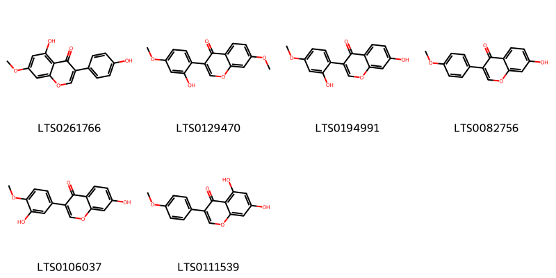{ width=100% }
    <figcaption>Hình ảnh cấu trúc hóa học của 6 hoạt chất thuộc nhóm Isoflavonoids gồm ['prunetin (LTS0261766)', '3-(2-hydroxy-4-methoxyphenyl)-7-methoxychromen-4-one (LTS0129470)', "2'-hydroxyformononetin (LTS0194991)", 'formononetin (LTS0082756)', 'calycosin (LTS0106037)', 'biochanin (LTS0111539)'].</figcaption>
</figure>
#### Nhóm Naphthalenes
<figure markdown="span">
    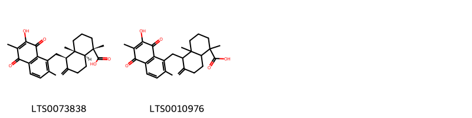{ width=100% }
    <figcaption>Hình ảnh cấu trúc hóa học của 2 hoạt chất thuộc nhóm Naphthalenes gồm ['(1s,4as,5r,8as)-5-[(7-hydroxy-2,6-dimethyl-5,8-dioxonaphthalen-1-yl)methyl]-1,4a-dimethyl-6-methylidene-hexahydro-2h-naphthalene-1-carboxylic acid (LTS0073838)', '5-[(7-hydroxy-2,6-dimethyl-5,8-dioxonaphthalen-1-yl)methyl]-1,4a-dimethyl-6-methylidene-hexahydro-2h-naphthalene-1-carboxylic acid (LTS0010976)'].</figcaption>
</figure>
#### Nhóm Prenol lipids
<figure markdown="span">
    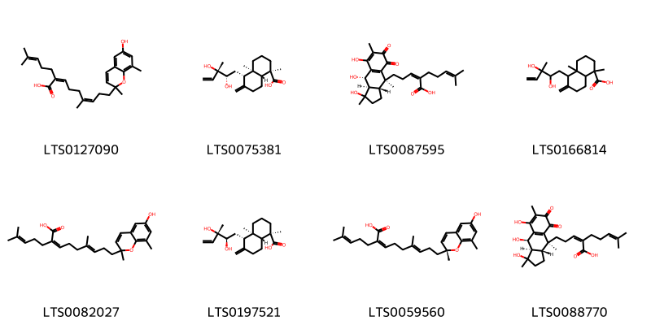{ width=100% }
    <figcaption>Hình ảnh cấu trúc hóa học của 8 hoạt chất thuộc nhóm Prenol lipids gồm ['9-(6-hydroxy-2,8-dimethylchromen-2-yl)-6-methyl-2-(4-methylpent-3-en-1-yl)nona-2,6-dienoic acid (LTS0127090)', '(1r,4ar,5s,8ar)-5-[(2s,3s)-2,3-dihydroxy-3-methylpent-4-en-1-yl]-1,4a-dimethyl-6-methylidene-hexahydro-2h-naphthalene-1-carboxylic acid (LTS0075381)', '(2z)-2-{3-[(3ar,4s,9s,9ar)-1,8,9-trihydroxy-1,4,7-trimethyl-5,6-dioxo-2h,3h,3ah,9h,9ah-cyclopenta[b]naphthalen-4-yl]propylidene}-6-methylhept-5-enoic acid (LTS0087595)', '5-(2,3-dihydroxy-3-methylpent-4-en-1-yl)-1,4a-dimethyl-6-methylidene-hexahydro-2h-naphthalene-1-carboxylic acid (LTS0166814)', '(2z,6e)-9-(6-hydroxy-2,8-dimethylchromen-2-yl)-6-methyl-2-(4-methylpent-3-en-1-yl)nona-2,6-dienoic acid (LTS0082027)', '(1r,4ar,5s,8ar)-5-[(2r,3s)-2,3-dihydroxy-3-methylpent-4-en-1-yl]-1,4a-dimethyl-6-methylidene-hexahydro-2h-naphthalene-1-carboxylic acid (LTS0197521)', '(r)-sargachromenol (LTS0059560)', '(2z)-2-{3-[(3ar,4s,9r,9ar)-1,8,9-trihydroxy-1,4,7-trimethyl-5,6-dioxo-2h,3h,3ah,9h,9ah-cyclopenta[b]naphthalen-4-yl]propylidene}-6-methylhept-5-enoic acid (LTS0088770)'].</figcaption>
</figure>
#### Nhóm Steroids and steroid derivatives
<figure markdown="span">
    { width=100% }
    <figcaption>Hình ảnh cấu trúc hóa học của 2 hoạt chất thuộc nhóm Steroids and steroid derivatives gồm ['sitogluside (LTS0201798)', '2-{[1-(5-ethyl-6-methylheptan-2-yl)-9a,11a-dimethyl-1h,2h,3h,3ah,3bh,4h,6h,7h,8h,9h,9bh,10h,11h-cyclopenta[a]phenanthren-7-yl]oxy}-6-(hydroxymethyl)oxane-3,4,5-triol (LTS0158828)'].</figcaption>
</figure>

---

### Dược dân tộc học

Danh sách các quốc gia có sử dụng *Pycnanthus angolensis* trong điều trị các bệnh. 

| Country   | Disease   | Bệnh                                                                                                                                                                                                |
|:----------|:----------|:----------------------------------------------------------------------------------------------------------------------------------------------------------------------------------------------------|
| Africa    | Vermifuge | MYMEMORY WARNING: YOU USED ALL AVAILABLE FREE TRANSLATIONS FOR TODAY. NEXT AVAILABLE IN  09 HOURS 10 MINUTES 23 SECONDS VISIT HTTPS://MYMEMORY.TRANSLATED.NET/DOC/USAGELIMITS.PHP TO TRANSLATE MORE |

---

