!!! abstract "Tóm tắt"

    Họ Myrsinaceae gồm khoảng 6 chi và 10 loài được một số cộng đồng tại các quốc gia như South Africa, Malaya, Sanscrit, Elsewhere, Indonesia, India, US, Dutch, Surinam, Iran, China sử dụng trong một số trường hợp Chất kích thích, Intoxicant, Detoxicant, Expectorant, Expectorant, Piscicide, Diuretic, Astringent, Carminative, Vermifuge, Astringent, Taenifuge, Carminative, Insecticide, Tonic, Astringent, Stomachic, Laxative, Taenifuge, Vermifuge.

!!! info "DrDuke"

    James A. Duke sinh năm 1929-2017 là một nhà thực vật học người Mỹ. Đây là một trong những tác giả hàng đầu trong lĩnh vực dược dân tộc học với cuốn *CRC Handbook of Medicinal Herbs* và chính là người xây dựng lên cơ sở dữ liệu về hợp chất tự nhiên và dược dân tộc học tại Bộ nông nghiệp Hoa Kỳ. Các thông tin được đăng tải tại website [Dr. Duke's Phytochemical and Ethnobotanical Databases](https://phytochem.nal.usda.gov/). 
    Trong suốt thập niên 1970, ông lãnh đạo the Plant Taxonomy Laboratory, Plant Genetics and Germplasm Institute of the Agricultural Research Service, U.S. Department of Agriculture.
    Trong tài liệu này, các thông tin về dược dân tộc của các dược liệu được trích dẫn từ tài liệu của James A. Ducke với sự trợ giúp của phần mềm dịch thuật từ tiếng Anh sang tiếng Việt.
   

# Chi Ardisia

??? note "Danh sách các dược liệu thuộc chi"
    
	 - *Ardisia japonica*

---
## Ardisia japonica
### Thông tin về thực vật

!!! info "Phân loại thực vật của *Ardisia japonica* từ GIBF:"
    - **Kingdom:** Plantae
    - **Phylum:** Tracheophyta
    - **Order:** Ericales
    - **Family:** Primulaceae
    - **Genus:** Ardisia
    - **Species:** *Ardisia japonica*

 

| Label (VI)   | Label (EN)   | Scientific Name   | Descriptions (VI)   | Descriptions (EN)   | Also Known As (VI)   | Also Known As (EN)   |
|:-------------|:-------------|:------------------|:--------------------|:--------------------|:---------------------|:---------------------|
| N/A          | N/A          | Ardisia japonica  | loài thực vật       | species of plant    | ['']                 | ['']                 |

#### Phân bố trên thế giới

**Từ CSDL GIBF** Japan, Belgium, Korea, Republic of, Chinese Taipei, United States of America, China

#### Phân bố tại Việt Nam

**Từ CSDL GIBF**: Không có ghi nhận ở Việt Nam

---
### Thành phần hóa học
        
- Theo cơ sở dữ liệu lotus: Từ loài *Ardisia japonica* đã phân lập và xác định được 86 hoạt chất thuộc về các nhóm Flavonoids, Prenol lipids, Benzene and substituted derivatives, Organooxygen compounds, Tannins, Phenols. 

|    | chemicalTaxonomyClassyfireClass     |   smiles_count |
|---:|:------------------------------------|---------------:|
|  0 | Benzene and substituted derivatives |              4 |
|  1 | Flavonoids                          |              6 |
|  2 | Organooxygen compounds              |             19 |
|  3 | Phenols                             |              1 |
|  4 | Prenol lipids                       |             54 |
|  5 | Tannins                             |              2 |

#### Nhóm Benzene and substituted derivatives
<figure markdown="span">
    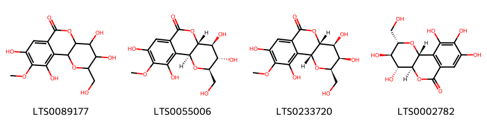{ width=100% }
    <figcaption>Hình ảnh cấu trúc hóa học của 4 hoạt chất thuộc nhóm Benzene and substituted derivatives gồm ['5,6,12,14-tetrahydroxy-4-(hydroxymethyl)-13-methoxy-3,8-dioxatricyclo[8.4.0.0²,⁷]tetradeca-1(14),10,12-trien-9-one (LTS0089177)', 'bergenin (LTS0055006)', '(2r,4r,5r,6s,7r)-5,6,12,14-tetrahydroxy-4-(hydroxymethyl)-13-methoxy-3,8-dioxatricyclo[8.4.0.0²,⁷]tetradeca-1(14),10,12-trien-9-one (LTS0233720)', '(2r,4s,5r,6r,7s)-5,6,12,13,14-pentahydroxy-4-(hydroxymethyl)-3,8-dioxatricyclo[8.4.0.0²,⁷]tetradeca-1(10),11,13-trien-9-one (LTS0002782)'].</figcaption>
</figure>
#### Nhóm Flavonoids
<figure markdown="span">
    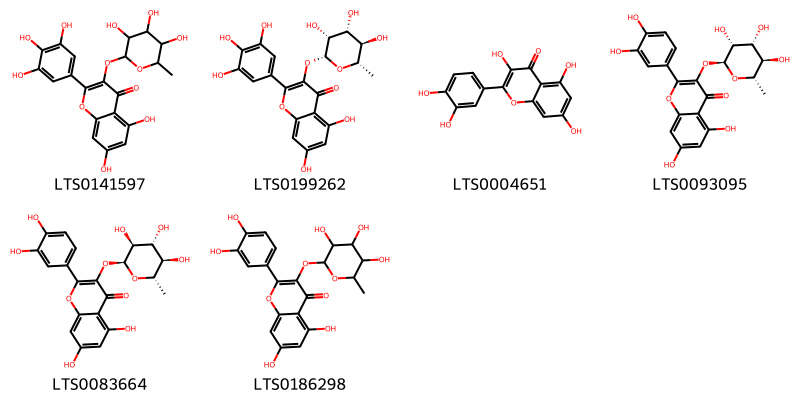{ width=100% }
    <figcaption>Hình ảnh cấu trúc hóa học của 6 hoạt chất thuộc nhóm Flavonoids gồm ['myricitrin (LTS0141597)', '5,7-dihydroxy-3-{[(2r,3r,4r,5r,6s)-3,4,5-trihydroxy-6-methyloxan-2-yl]oxy}-2-(3,4,5-trihydroxyphenyl)chromen-4-one (LTS0199262)', 'quercetin (LTS0004651)', 'quercitrin (LTS0093095)', '2-(3,4-dihydroxyphenyl)-5,7-dihydroxy-3-{[(2s,3s,4r,5r,6s)-3,4,5-trihydroxy-6-methyloxan-2-yl]oxy}chromen-4-one (LTS0083664)', 'quercitrin (LTS0186298)'].</figcaption>
</figure>
#### Nhóm Organooxygen compounds
<figure markdown="span">
    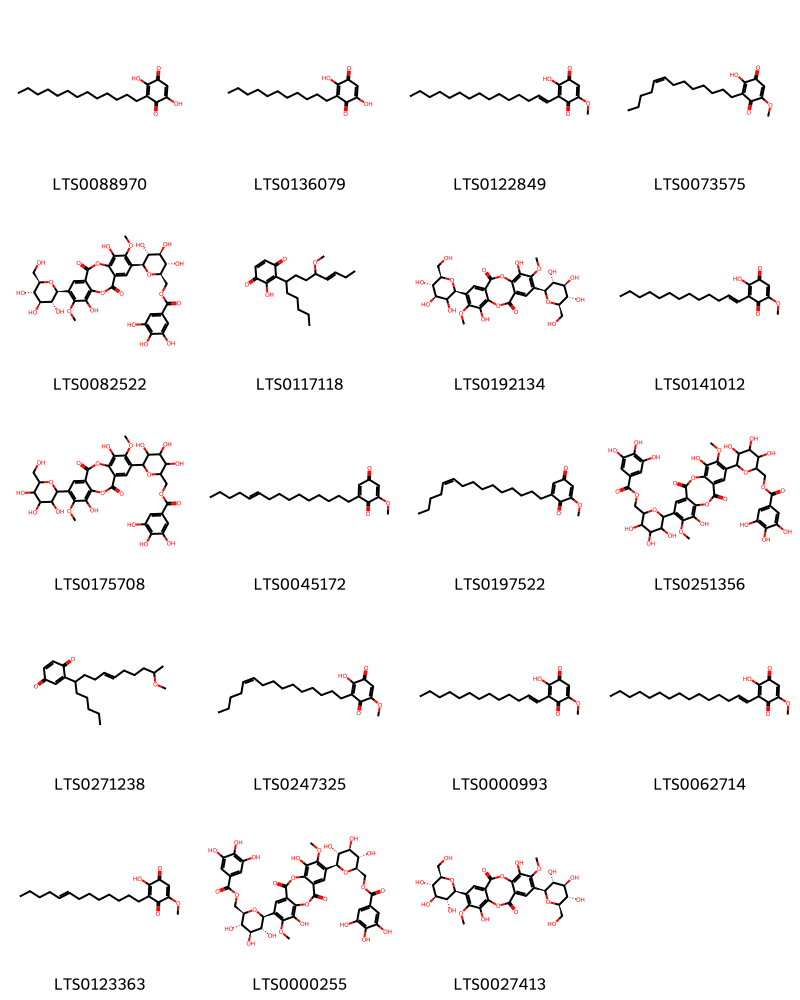{ width=100% }
    <figcaption>Hình ảnh cấu trúc hóa học của 19 hoạt chất thuộc nhóm Organooxygen compounds gồm ['rapanone (LTS0088970)', 'embelin (LTS0136079)', '2-hydroxy-5-methoxy-3-[(1e)-pentadec-1-en-1-yl]cyclohexa-2,5-diene-1,4-dione (LTS0122849)', '2-hydroxy-5-methoxy-3-[(8z)-tridec-8-en-1-yl]cyclohexa-2,5-diene-1,4-dione (LTS0073575)', '[(2r,3s,4r,5r,6s)-6-{8,16-dihydroxy-7,15-dimethoxy-3,11-dioxo-14-[(2s,3r,4r,5s,6r)-3,4,5-trihydroxy-6-(hydroxymethyl)oxan-2-yl]-2,10-dioxatricyclo[10.4.0.0⁴,⁹]hexadeca-1(16),4,6,8,12,14-hexaen-6-yl}-3,4,5-trihydroxyoxan-2-yl]methyl 3,4,5-trihydroxybenzoate (LTS0082522)', '2-hydroxy-3-[(10e)-9-methoxytridec-10-en-6-yl]cyclohexa-2,5-diene-1,4-dione (LTS0117118)', '8,16-dihydroxy-7,15-dimethoxy-6-[(2s,3r,4r,5s,6r)-3,4,5-trihydroxy-6-(hydroxymethyl)oxan-2-yl]-14-[(2s,4r,5s,6r)-3,4,5-trihydroxy-6-(hydroxymethyl)oxan-2-yl]-2,10-dioxatricyclo[10.4.0.0⁴,⁹]hexadeca-1(16),4,6,8,12,14-hexaene-3,11-dione (LTS0192134)', '2-hydroxy-5-methoxy-3-[(1e)-tridec-1-en-1-yl]cyclohexa-2,5-diene-1,4-dione (LTS0141012)', '(6-{8,16-dihydroxy-7,15-dimethoxy-3,11-dioxo-14-[3,4,5-trihydroxy-6-(hydroxymethyl)oxan-2-yl]-2,10-dioxatricyclo[10.4.0.0⁴,⁹]hexadeca-1(16),4,6,8,12,14-hexaen-6-yl}-3,4,5-trihydroxyoxan-2-yl)methyl 3,4,5-trihydroxybenzoate (LTS0175708)', '2-methoxy-6-(pentadec-10-en-1-yl)cyclohexa-2,5-diene-1,4-dione (LTS0045172)', '2-methoxy-6-[(10z)-pentadec-10-en-1-yl]cyclohexa-2,5-diene-1,4-dione (LTS0197522)', '[6-(8,16-dihydroxy-7,15-dimethoxy-3,11-dioxo-14-{3,4,5-trihydroxy-6-[(3,4,5-trihydroxybenzoyloxy)methyl]oxan-2-yl}-2,10-dioxatricyclo[10.4.0.0⁴,⁹]hexadeca-1(16),4,6,8,12,14-hexaen-6-yl)-3,4,5-trihydroxyoxan-2-yl]methyl 3,4,5-trihydroxybenzoate (LTS0251356)', '2-[(9e)-14-methoxypentadec-9-en-6-yl]cyclohexa-2,5-diene-1,4-dione (LTS0271238)', '2-hydroxy-5-methoxy-3-[(10z)-pentadec-10-en-1-yl]cyclohexa-2,5-diene-1,4-dione (LTS0247325)', '2-hydroxy-5-methoxy-3-(tridec-1-en-1-yl)cyclohexa-2,5-diene-1,4-dione (LTS0000993)', '2-hydroxy-5-methoxy-3-(pentadec-1-en-1-yl)cyclohexa-2,5-diene-1,4-dione (LTS0062714)', '2-hydroxy-5-methoxy-3-(tridec-8-en-1-yl)cyclohexa-2,5-diene-1,4-dione (LTS0123363)', 'ardimerin digallate (LTS0000255)', '8,16-dihydroxy-7,15-dimethoxy-6,14-bis[(2s,3r,4r,5s,6r)-3,4,5-trihydroxy-6-(hydroxymethyl)oxan-2-yl]-2,10-dioxatricyclo[10.4.0.0⁴,⁹]hexadeca-1(16),4,6,8,12,14-hexaene-3,11-dione (LTS0027413)'].</figcaption>
</figure>
#### Nhóm Phenols
<figure markdown="span">
    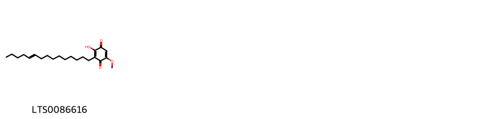{ width=100% }
    <figcaption>Hình ảnh cấu trúc hóa học của 1 hoạt chất thuộc nhóm Phenols gồm ['2-hydroxy-5-methoxy-3-(pentadec-10-en-1-yl)cyclohexa-2,5-diene-1,4-dione (LTS0086616)'].</figcaption>
</figure>
#### Nhóm Prenol lipids
<figure markdown="span">
    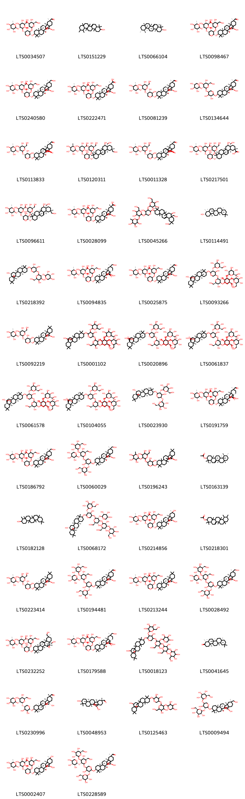{ width=100% }
    <figcaption>Hình ảnh cấu trúc hóa học của 54 hoạt chất thuộc nhóm Prenol lipids gồm ['(1s,2r,4s,5r,8r,10s,13r,14r,17s,18r,20s)-10-{[(2s,3r,4s,5s)-5-{[(2s,3r,4s,5s,6r)-4,5-dihydroxy-6-(hydroxymethyl)-3-{[(2s,3r,4r,5r,6s)-3,4,5-trihydroxy-6-methyloxan-2-yl]oxy}oxan-2-yl]oxy}-4-hydroxy-3-{[(2s,3r,4s,5s,6r)-3,4,5-trihydroxy-6-(hydroxymethyl)oxan-2-yl]oxy}oxan-2-yl]oxy}-2-hydroxy-4,5,9,9,13,20-hexamethyl-24-oxahexacyclo[15.5.2.0¹,¹⁸.0⁴,¹⁷.0⁵,¹⁴.0⁸,¹³]tetracosane-20-carbaldehyde (LTS0034507)', '4,4,6b,8a,11,12,12b,14b-octamethyl-2,3,4a,5,7,8,9,10,11,12,12a,13,14,14a-tetradecahydro-1h-picen-3-ol (LTS0151229)', '(3s,4ar,6bs,8ar,11r,12s,12ar,12bs,14ar,14br)-4,4,6b,8a,11,12,12b,14b-octamethyl-2,3,4a,5,7,8,9,10,11,12,12a,13,14,14a-tetradecahydro-1h-picen-3-ol (LTS0066104)', '(2r,4s,5r,8r,10s,13r,14r,18r,20s)-10-{[(2s,3r,4s,5s)-5-{[(2s,3r,4s,5s,6r)-4,5-dihydroxy-6-(hydroxymethyl)-3-{[(2s,3r,4r,5r,6s)-3,4,5-trihydroxy-6-methyloxan-2-yl]oxy}oxan-2-yl]oxy}-4-hydroxy-3-{[(2s,3r,4s,5s)-3,4,5-trihydroxy-6-(hydroxymethyl)oxan-2-yl]oxy}oxan-2-yl]oxy}-2-hydroxy-4,5,9,9,13,20-hexamethyl-24-oxahexacyclo[15.5.2.0¹,¹⁸.0⁴,¹⁷.0⁵,¹⁴.0⁸,¹³]tetracosane-20-carbaldehyde (LTS0098467)', '(2s,3r,4r,5r,6s)-2-{[(2s,3r,4s,5s,6r)-4,5-dihydroxy-2-{[(3s,4s,5r,6s)-4-hydroxy-6-{[(1s,2r,4s,5r,8r,10s,13r,14r,17s,18r,20s)-2-hydroxy-20-(hydroxymethyl)-4,5,9,9,13,20-hexamethyl-24-oxahexacyclo[15.5.2.0¹,¹⁸.0⁴,¹⁷.0⁵,¹⁴.0⁸,¹³]tetracosan-10-yl]oxy}-5-{[(2s,3r,4s,5s,6r)-3,4,5-trihydroxy-6-(hydroxymethyl)oxan-2-yl]oxy}oxan-3-yl]oxy}-6-(hydroxymethyl)oxan-3-yl]oxy}-6-methyloxane-3,4,5-triol (LTS0240580)', '(1s,2r,4s,5r,8r,10s,13r,14r,17s,18r,20s)-10-{[(2s,3r,4s,5s)-5-{[(2s,3r,4s,5s,6r)-4,5-dihydroxy-6-(hydroxymethyl)-3-{[(2s,3r,4r,5r,6s)-3,4,5-trihydroxy-6-methyloxan-2-yl]oxy}oxan-2-yl]oxy}-4-hydroxy-3-{[(2s,3r,4s,5s,6r)-3,4,5-trihydroxy-6-(hydroxymethyl)oxan-2-yl]oxy}oxan-2-yl]oxy}-2-hydroxy-4,5,9,9,13,20-hexamethyl-24-oxahexacyclo[15.5.2.0¹,¹⁸.0⁴,¹⁷.0⁵,¹⁴.0⁸,¹³]tetracosane-20-carboxylic acid (LTS0222471)', '(1s,2r,4s,5r,8r,10s,13r,14r,17s,18r,20s)-10-{[(2s,3r,4r,5s)-5-{[(2s,3r,4s,5s,6r)-4,5-dihydroxy-6-(hydroxymethyl)-3-{[(2s,3r,4r,5r,6s)-3,4,5-trihydroxy-6-methyloxan-2-yl]oxy}oxan-2-yl]oxy}-3,4-dihydroxyoxan-2-yl]oxy}-2-hydroxy-4,5,9,9,13,20-hexamethyl-24-oxahexacyclo[15.5.2.0¹,¹⁸.0⁴,¹⁷.0⁵,¹⁴.0⁸,¹³]tetracosane-20-carbaldehyde (LTS0081239)', '(1s,2r,4s,5r,8r,10s,13r,14r,17s,18r,20s)-10-{[(2s,3r,4r,5s)-5-{[(2s,3r,4s,5s,6r)-4,5-dihydroxy-6-(hydroxymethyl)-3-{[(2s,3r,4s,5r)-3,4,5-trihydroxyoxan-2-yl]oxy}oxan-2-yl]oxy}-3,4-dihydroxyoxan-2-yl]oxy}-2-hydroxy-4,5,9,9,13,20-hexamethyl-24-oxahexacyclo[15.5.2.0¹,¹⁸.0⁴,¹⁷.0⁵,¹⁴.0⁸,¹³]tetracosane-20-carbaldehyde (LTS0134644)', '(1s,4s,5r,8r,10s,13s,14r,17s,18r,20s)-10-{[(2s,3r,4r,5s)-5-{[(2s,3r,4s,5s,6r)-4,5-dihydroxy-6-(hydroxymethyl)-3-{[(2s,3r,4r,5r,6s)-3,4,5-trihydroxy-6-methyloxan-2-yl]oxy}oxan-2-yl]oxy}-3,4-dihydroxyoxan-2-yl]oxy}-4,5,9,9,13,20-hexamethyl-2-oxo-24-oxahexacyclo[15.5.2.0¹,¹⁸.0⁴,¹⁷.0⁵,¹⁴.0⁸,¹³]tetracosane-20-carbaldehyde (LTS0113833)', '(2s,3r,4r,5r,6r)-2-{[(2s,3r,4s,5s,6r)-2-{[(3s,4s,5r,6s)-6-{[(3s,4ar,6ar,6bs,8r,8as,11s,12as,14ar,14br)-8-hydroxy-8a,11-bis(hydroxymethyl)-4,4,6a,6b,11,14b-hexamethyl-1,2,3,4a,5,6,7,8,9,10,12,12a,14,14a-tetradecahydropicen-3-yl]oxy}-4-hydroxy-5-{[(2s,3r,4s,5s,6r)-3,4,5-trihydroxy-6-(hydroxymethyl)oxan-2-yl]oxy}oxan-3-yl]oxy}-4,5-dihydroxy-6-(hydroxymethyl)oxan-3-yl]oxy}-6-methyloxane-3,4,5-triol (LTS0120311)', '(1s,4s,5r,8r,10s,13r,14r,17s,18r,20s)-10-{[(2s,3r,4r,5s)-5-{[(2s,3r,4s,5s,6r)-4,5-dihydroxy-6-(hydroxymethyl)-3-{[(2s,3r,4r,5r,6s)-3,4,5-trihydroxy-6-methyloxan-2-yl]oxy}oxan-2-yl]oxy}-3,4-dihydroxyoxan-2-yl]oxy}-4,5,9,9,13,20-hexamethyl-2-oxo-24-oxahexacyclo[15.5.2.0¹,¹⁸.0⁴,¹⁷.0⁵,¹⁴.0⁸,¹³]tetracosane-20-carbaldehyde (LTS0011328)', '(2s,4as,5r,6as,6br,8ar,10s,12ar,12br,14bs)-10-{[(2s,3r,4s,5s)-5-{[(2s,3r,4s,5s,6r)-4,5-dihydroxy-6-(hydroxymethyl)-3-{[(2s,3r,4r,5r,6s)-3,4,5-trihydroxy-6-methyloxan-2-yl]oxy}oxan-2-yl]oxy}-4-hydroxy-3-{[(2s,3r,4s,5s,6r)-3,4,5-trihydroxy-6-(hydroxymethyl)oxan-2-yl]oxy}oxan-2-yl]oxy}-5-hydroxy-4a-(hydroxymethyl)-2,6a,6b,9,9,12a-hexamethyl-1,3,4,5,6,7,8,8a,10,11,12,12b,13,14b-tetradecahydropicene-2-carboxylic acid (LTS0217501)', '(2s,3r,4r,5r,6s)-2-{[(2s,3r,4s,5s,6r)-2-{[(3s,4s,5r,6s)-6-{[(3s,4ar,6ar,6bs,8r,8as,11s,12as,14ar,14br)-8-hydroxy-8a,11-bis(hydroxymethyl)-4,4,6a,6b,11,14b-hexamethyl-1,2,3,4a,5,6,7,8,9,10,12,12a,14,14a-tetradecahydropicen-3-yl]oxy}-4-hydroxy-5-{[(2s,3r,4s,5s,6r)-3,4,5-trihydroxy-6-(hydroxymethyl)oxan-2-yl]oxy}oxan-3-yl]oxy}-4,5-dihydroxy-6-(hydroxymethyl)oxan-3-yl]oxy}-6-methyloxane-3,4,5-triol (LTS0096611)', '(1s,2r,4s,5r,8r,10s,13s,14r,17s,18r,20r)-10-{[(2s,3r,4s,5s)-5-{[(2s,3r,4s,5s,6r)-4,5-dihydroxy-6-(hydroxymethyl)-3-{[(2s,3r,4r,5r,6s)-3,4,5-trihydroxy-6-methyloxan-2-yl]oxy}oxan-2-yl]oxy}-4-hydroxy-3-{[(2s,3r,4s,5s,6r)-3,4,5-trihydroxy-6-(hydroxymethyl)oxan-2-yl]oxy}oxan-2-yl]oxy}-2-hydroxy-4,5,9,9,13,20-hexamethyl-24-oxahexacyclo[15.5.2.0¹,¹⁸.0⁴,¹⁷.0⁵,¹⁴.0⁸,¹³]tetracosane-20-carboxylic acid (LTS0028099)', '2-({4,5-dihydroxy-2-[(4-hydroxy-6-{[8-hydroxy-8a,11-bis(hydroxymethyl)-4,4,6a,6b,11,14b-hexamethyl-1,2,3,4a,5,6,7,8,9,10,12,12a,14,14a-tetradecahydropicen-3-yl]oxy}-5-{[3,4,5-trihydroxy-6-(hydroxymethyl)oxan-2-yl]oxy}oxan-3-yl)oxy]-6-(hydroxymethyl)oxan-3-yl}oxy)-6-methyloxane-3,4,5-triol (LTS0045266)', 'epi-friedelanol (LTS0114491)', '(2s,3r,4r,5s)-2-{[(2s,3r,4s,5r,6r)-2-{[(3s,4r,5r,6s)-4,5-dihydroxy-6-{[(1s,2r,4s,5r,8r,10s,13s,14r,17s,18r)-2-hydroxy-4,5,9,9,13,20,20-heptamethyl-24-oxahexacyclo[15.5.2.0¹,¹⁸.0⁴,¹⁷.0⁵,¹⁴.0⁸,¹³]tetracosan-10-yl]oxy}oxan-3-yl]oxy}-4,5-dihydroxy-6-(hydroxymethyl)oxan-3-yl]oxy}oxane-3,4,5-triol (LTS0218392)', '(1r,2r,4s,5r,8r,10s,13r,14r,17s,18r,20s)-10-{[(2s,3r,4s,5s)-5-{[(2s,3r,4s,5s,6r)-4,5-dihydroxy-6-(hydroxymethyl)-3-{[(2s,3r,4r,5r,6s)-3,4,5-trihydroxy-6-methyloxan-2-yl]oxy}oxan-2-yl]oxy}-4-hydroxy-3-{[(2s,3r,4s,5s,6r)-3,4,5-trihydroxy-6-(hydroxymethyl)oxan-2-yl]oxy}oxan-2-yl]oxy}-2-hydroxy-20-(hydroxymethyl)-4,5,9,9,13,20-hexamethyl-24-oxahexacyclo[15.5.2.0¹,¹⁸.0⁴,¹⁷.0⁵,¹⁴.0⁸,¹³]tetracosan-23-one (LTS0094835)', '(1s,2r,4s,5r,8r,10s,13s,14r,17s,18r,20s)-10-{[(2s,3r,4s,5s)-5-{[(2s,3r,4s,5s,6r)-4,5-dihydroxy-6-(hydroxymethyl)-3-{[(2s,3r,4r,5r,6s)-3,4,5-trihydroxy-6-methyloxan-2-yl]oxy}oxan-2-yl]oxy}-4-hydroxy-3-{[(2s,3r,4s,5s,6r)-3,4,5-trihydroxy-6-(hydroxymethyl)oxan-2-yl]oxy}oxan-2-yl]oxy}-2-hydroxy-4,5,9,9,13,20-hexamethyl-24-oxahexacyclo[15.5.2.0¹,¹⁸.0⁴,¹⁷.0⁵,¹⁴.0⁸,¹³]tetracosane-20-carbaldehyde (LTS0025875)', 'ardisianoside a (LTS0093266)', 'ardisianoside c (LTS0092219)', '2-({5-hydroxy-6-[(3-hydroxy-6-{[4-hydroxy-6-({2-hydroxy-4,5,9,9,13,20,20-heptamethyl-24-oxahexacyclo[15.5.2.0¹,¹⁸.0⁴,¹⁷.0⁵,¹⁴.0⁸,¹³]tetracosan-10-yl}oxy)-5-{[3,4,5-trihydroxy-6-(hydroxymethyl)oxan-2-yl]oxy}oxan-3-yl]oxy}-2-(hydroxymethyl)-5-[(3,4,5-trihydroxyoxan-2-yl)oxy]oxan-4-yl)oxy]-2-(hydroxymethyl)-4-{[3,4,5-trihydroxy-6-(hydroxymethyl)oxan-2-yl]oxy}oxan-3-yl}oxy)-6-(hydroxymethyl)oxane-3,4,5-triol (LTS0001102)', '(1r,4s,5r,8r,10s,13r,14r,17s,18r)-2-hydroxy-10-{[(2s,3r,4s,5s)-4-hydroxy-5-{[(2s,3r,4s,5r,6r)-5-hydroxy-4-{[(2s,3r,4r,5r,6r)-3-hydroxy-6-(hydroxymethyl)-4,5-bis({[(2s,3r,4s,5s,6r)-3,4,5-trihydroxy-6-(hydroxymethyl)oxan-2-yl]oxy})oxan-2-yl]oxy}-6-(hydroxymethyl)-3-{[(2s,3r,4s,5r)-3,4,5-trihydroxyoxan-2-yl]oxy}oxan-2-yl]oxy}-3-{[(2s,3r,4s,5s,6r)-3,4,5-trihydroxy-6-(hydroxymethyl)oxan-2-yl]oxy}oxan-2-yl]oxy}-4,5,9,9,13,20,20-heptamethyl-24-oxahexacyclo[15.5.2.0¹,¹⁸.0⁴,¹⁷.0⁵,¹⁴.0⁸,¹³]tetracosan-23-one (LTS0020896)', '(1r,2r,4s,5r,8r,10s,13r,14r,17s,18r)-2-hydroxy-10-{[(2s,3r,4s,5s)-4-hydroxy-5-{[(2s,3r,4s,5r,6r)-5-hydroxy-4-{[(2s,3r,4r,5r,6r)-3-hydroxy-6-(hydroxymethyl)-4,5-bis({[(2s,3r,4s,5s,6r)-3,4,5-trihydroxy-6-(hydroxymethyl)oxan-2-yl]oxy})oxan-2-yl]oxy}-6-(hydroxymethyl)-3-{[(2s,3r,4s,5r)-3,4,5-trihydroxyoxan-2-yl]oxy}oxan-2-yl]oxy}-3-{[(2s,3r,4s,5s,6r)-3,4,5-trihydroxy-6-(hydroxymethyl)oxan-2-yl]oxy}oxan-2-yl]oxy}-4,5,9,9,13,20,20-heptamethyl-24-oxahexacyclo[15.5.2.0¹,¹⁸.0⁴,¹⁷.0⁵,¹⁴.0⁸,¹³]tetracosan-23-one (LTS0061837)', '(2s,3r,4s,5r,6r)-2-{[(2r,3r,4r,5r,6s)-5-hydroxy-6-{[(2r,3r,4s,5r,6s)-3-hydroxy-6-{[(3s,4s,5r,6s)-4-hydroxy-6-{[(1s,2r,4s,5r,8r,10s,13s,14r,17s,18r)-2-hydroxy-4,5,9,9,13,20,20-heptamethyl-24-oxahexacyclo[15.5.2.0¹,¹⁸.0⁴,¹⁷.0⁵,¹⁴.0⁸,¹³]tetracosan-10-yl]oxy}-5-{[(2s,3r,4s,5r,6r)-3,4,5-trihydroxy-6-(hydroxymethyl)oxan-2-yl]oxy}oxan-3-yl]oxy}-2-(hydroxymethyl)-5-{[(2s,3r,4r,5s)-3,4,5-trihydroxyoxan-2-yl]oxy}oxan-4-yl]oxy}-2-(hydroxymethyl)-4-{[(2s,3r,4s,5r,6r)-3,4,5-trihydroxy-6-(hydroxymethyl)oxan-2-yl]oxy}oxan-3-yl]oxy}-6-(hydroxymethyl)oxane-3,4,5-triol (LTS0061578)', '(1r,2r,4s,5r,8r,10s,13s,14r,17s,18r)-2-hydroxy-10-{[(2s,3r,4s,5s)-4-hydroxy-5-{[(2s,3r,4s,5r,6r)-5-hydroxy-4-{[(2s,3r,4s,5r,6r)-3-hydroxy-6-(hydroxymethyl)-4,5-bis({[(2s,3r,4s,5s,6r)-3,4,5-trihydroxy-6-(hydroxymethyl)oxan-2-yl]oxy})oxan-2-yl]oxy}-6-(hydroxymethyl)-3-{[(2s,3r,4r,5s)-3,4,5-trihydroxyoxan-2-yl]oxy}oxan-2-yl]oxy}-3-{[(2s,3r,4s,5s,6r)-3,4,5-trihydroxy-6-(hydroxymethyl)oxan-2-yl]oxy}oxan-2-yl]oxy}-4,5,9,9,13,20,20-heptamethyl-24-oxahexacyclo[15.5.2.0¹,¹⁸.0⁴,¹⁷.0⁵,¹⁴.0⁸,¹³]tetracosan-23-one (LTS0104055)', '(2s,3r,4s,5r,6r)-2-{[(3s,4s,5r,6s)-4-hydroxy-6-{[(1s,2r,4s,5r,8r,10s,13s,14r,17s,18r)-2-hydroxy-4,5,9,9,13,20,20-heptamethyl-24-oxahexacyclo[15.5.2.0¹,¹⁸.0⁴,¹⁷.0⁵,¹⁴.0⁸,¹³]tetracosan-10-yl]oxy}-5-{[(2s,3r,4s,5r,6r)-3,4,5-trihydroxy-6-(hydroxymethyl)oxan-2-yl]oxy}oxan-3-yl]oxy}-6-(hydroxymethyl)oxane-3,4,5-triol (LTS0023930)', '(1r,2r,4s,5r,8r,10s,13r,14r,17s,18r,20s)-10-{[(2s,3r,4s,5s)-5-{[(2s,3r,4s,5s,6r)-4,5-dihydroxy-6-(hydroxymethyl)-3-{[(2s,3r,4r,5r,6s)-3,4,5-trihydroxy-6-methyloxan-2-yl]oxy}oxan-2-yl]oxy}-4-hydroxy-3-{[(2s,3r,4s,5s,6r)-3,4,5-trihydroxy-6-(hydroxymethyl)oxan-2-yl]oxy}oxan-2-yl]oxy}-2-hydroxy-4,5,9,9,13,20-hexamethyl-23-oxo-24-oxahexacyclo[15.5.2.0¹,¹⁸.0⁴,¹⁷.0⁵,¹⁴.0⁸,¹³]tetracosane-20-carbaldehyde (LTS0191759)', '(2s,3r,4r,5r,6s)-2-{[(2s,3r,4s,5r,6r)-4,5-dihydroxy-2-{[(3s,4s,5r,6s)-4-hydroxy-6-{[(1s,2r,4s,5r,8r,10s,13s,14r,17s,18r,20s)-2-hydroxy-20-(hydroxymethyl)-4,5,9,9,13,20-hexamethyl-24-oxahexacyclo[15.5.2.0¹,¹⁸.0⁴,¹⁷.0⁵,¹⁴.0⁸,¹³]tetracosan-10-yl]oxy}-5-{[(2s,3r,4s,5r,6r)-3,4,5-trihydroxy-6-(hydroxymethyl)oxan-2-yl]oxy}oxan-3-yl]oxy}-6-(hydroxymethyl)oxan-3-yl]oxy}-6-methyloxane-3,4,5-triol (LTS0186792)', '(2s,3r,4s,5s,6r)-2-{[(2r,3r,4s,5r,6s)-3-hydroxy-6-{[(3s,4s,5r,6s)-4-hydroxy-6-{[(1s,2r,4s,5r,8r,10s,13r,14r,17s,18r,20s)-2-hydroxy-20-(hydroxymethyl)-4,5,9,9,13,20-hexamethyl-24-oxahexacyclo[15.5.2.0¹,¹⁸.0⁴,¹⁷.0⁵,¹⁴.0⁸,¹³]tetracosan-10-yl]oxy}-5-{[(2s,3r,4s,5s,6r)-3,4,5-trihydroxy-6-(hydroxymethyl)oxan-2-yl]oxy}oxan-3-yl]oxy}-2-(hydroxymethyl)-5-{[(2s,3r,4s,5r)-3,4,5-trihydroxyoxan-2-yl]oxy}oxan-4-yl]oxy}-6-(hydroxymethyl)oxane-3,4,5-triol (LTS0060029)', '2-[(2-{[4,5-dihydroxy-6-({2-hydroxy-4,5,9,9,13,20,20-heptamethyl-24-oxahexacyclo[15.5.2.0¹,¹⁸.0⁴,¹⁷.0⁵,¹⁴.0⁸,¹³]tetracosan-10-yl}oxy)oxan-3-yl]oxy}-4,5-dihydroxy-6-(hydroxymethyl)oxan-3-yl)oxy]-6-methyloxane-3,4,5-triol (LTS0196243)', '(3s,4ar,6bs,8ar,11r,12s,12ar,12bs,14ar,14br)-4,4,6b,8a,11,12,12b,14b-octamethyl-2,3,4a,5,7,8,9,10,11,12,12a,13,14,14a-tetradecahydro-1h-picen-3-yl acetate (LTS0163139)', '4,4a,6b,8a,11,11,12b,14a-octamethyl-hexadecahydropicen-3-ol (LTS0182128)', '(2s,3r,4s,5r,6r)-2-{[(2s,3r,4s,5r,6r)-3,5-dihydroxy-2-{[(2r,3r,4s,5r,6s)-3-hydroxy-6-{[(3s,4s,5r,6s)-4-hydroxy-6-{[(1s,2r,4s,5r,8r,10s,13s,14r,17s,18r)-2-hydroxy-4,5,9,9,13,20,20-heptamethyl-24-oxahexacyclo[15.5.2.0¹,¹⁸.0⁴,¹⁷.0⁵,¹⁴.0⁸,¹³]tetracosan-10-yl]oxy}-5-{[(2s,3r,4s,5r,6r)-3,4,5-trihydroxy-6-(hydroxymethyl)oxan-2-yl]oxy}oxan-3-yl]oxy}-2-(hydroxymethyl)-5-{[(2s,3r,4r,5s)-3,4,5-trihydroxyoxan-2-yl]oxy}oxan-4-yl]oxy}-6-(hydroxymethyl)oxan-4-yl]oxy}-6-(hydroxymethyl)oxane-3,4,5-triol (LTS0068172)', '(2s,3r,4r,5r,6s)-2-{[(2s,3r,4s,5s,6r)-2-{[(3s,4s,5r,6s)-6-{[(1s,2r,4s,5r,8r,10s,13r,14r,17s,18r,20s)-2,20-dihydroxy-4,5,9,9,13,20-hexamethyl-24-oxahexacyclo[15.5.2.0¹,¹⁸.0⁴,¹⁷.0⁵,¹⁴.0⁸,¹³]tetracosan-10-yl]oxy}-4-hydroxy-5-{[(2s,3r,4s,5s,6r)-3,4,5-trihydroxy-6-(hydroxymethyl)oxan-2-yl]oxy}oxan-3-yl]oxy}-4,5-dihydroxy-6-(hydroxymethyl)oxan-3-yl]oxy}-6-methyloxane-3,4,5-triol (LTS0214856)', '4,4,6b,8a,11,12,12b,14b-octamethyl-2,3,4a,5,7,8,9,10,11,12,12a,13,14,14a-tetradecahydro-1h-picen-3-yl acetate (LTS0218301)', '(2s,3r,4r,5r,6s)-2-{[(2s,3r,4s,5r,6r)-2-{[(3s,4r,5r,6s)-4,5-dihydroxy-6-{[(1s,2r,4s,5r,8r,10s,13s,14r,17s,18r)-2-hydroxy-4,5,9,9,13,20,20-heptamethyl-24-oxahexacyclo[15.5.2.0¹,¹⁸.0⁴,¹⁷.0⁵,¹⁴.0⁸,¹³]tetracosan-10-yl]oxy}oxan-3-yl]oxy}-4,5-dihydroxy-6-(hydroxymethyl)oxan-3-yl]oxy}-6-methyloxane-3,4,5-triol (LTS0223414)', 'cyclamin (LTS0194481)', '(2s,3r,4r,5r,6s)-2-{[(2s,3r,4s,5s,6r)-4,5-dihydroxy-2-{[(3s,4s,5r,6s)-4-hydroxy-6-{[(1s,2r,4s,5r,8r,10s,13r,14r,17s,18r)-2-hydroxy-4,5,9,9,13,20,20-heptamethyl-24-oxahexacyclo[15.5.2.0¹,¹⁸.0⁴,¹⁷.0⁵,¹⁴.0⁸,¹³]tetracosan-10-yl]oxy}-5-{[(2s,3r,4s,5s,6r)-3,4,5-trihydroxy-6-(hydroxymethyl)oxan-2-yl]oxy}oxan-3-yl]oxy}-6-(hydroxymethyl)oxan-3-yl]oxy}-6-methyloxane-3,4,5-triol (LTS0213244)', '(2s,3r,4s,5r,6r)-2-{[(2r,3r,4s,5r,6s)-3-hydroxy-6-{[(3s,4s,5r,6s)-4-hydroxy-6-{[(1s,2r,4s,5r,8r,10s,13s,14r,17s,18r,20s)-2-hydroxy-20-(hydroxymethyl)-4,5,9,9,13,20-hexamethyl-24-oxahexacyclo[15.5.2.0¹,¹⁸.0⁴,¹⁷.0⁵,¹⁴.0⁸,¹³]tetracosan-10-yl]oxy}-5-{[(2s,3r,4s,5r,6r)-3,4,5-trihydroxy-6-(hydroxymethyl)oxan-2-yl]oxy}oxan-3-yl]oxy}-2-(hydroxymethyl)-5-{[(2s,3r,4r,5s)-3,4,5-trihydroxyoxan-2-yl]oxy}oxan-4-yl]oxy}-6-(hydroxymethyl)oxane-3,4,5-triol (LTS0028492)', '(2s,3r,4r,5r,6s)-2-{[(2s,3r,4s,5s,6r)-2-{[(3s,4s,5r,6s)-6-{[(2s,4as,4bs,5ar,5bs,5cr,7ar,9s,11ar,11br,13bs)-2,4a-bis(hydroxymethyl)-2,5b,5c,8,8,11a-hexamethyl-1h,3h,4h,4bh,5ah,6h,7h,7ah,9h,10h,11h,11bh,12h,13bh-piceno[5,6-b]oxiren-9-yl]oxy}-4-hydroxy-5-{[(2s,3r,4s,5s,6r)-3,4,5-trihydroxy-6-(hydroxymethyl)oxan-2-yl]oxy}oxan-3-yl]oxy}-4,5-dihydroxy-6-(hydroxymethyl)oxan-3-yl]oxy}-6-methyloxane-3,4,5-triol (LTS0232252)', '(1r,2r,4s,5r,8r,10s,13s,14r,17s,18r,20s)-10-{[(2s,3r,4s,5s)-5-{[(2s,3r,4s,5s,6r)-4,5-dihydroxy-6-(hydroxymethyl)-3-{[(2s,3r,4r,5r,6s)-3,4,5-trihydroxy-6-methyloxan-2-yl]oxy}oxan-2-yl]oxy}-4-hydroxy-3-{[(2s,3r,4s,5s,6r)-3,4,5-trihydroxy-6-(hydroxymethyl)oxan-2-yl]oxy}oxan-2-yl]oxy}-2-hydroxy-20-(hydroxymethyl)-4,5,9,9,13,20-hexamethyl-24-oxahexacyclo[15.5.2.0¹,¹⁸.0⁴,¹⁷.0⁵,¹⁴.0⁸,¹³]tetracosan-23-one (LTS0179588)', '2-({3,5-dihydroxy-2-[(3-hydroxy-6-{[4-hydroxy-6-({2-hydroxy-4,5,9,9,13,20,20-heptamethyl-24-oxahexacyclo[15.5.2.0¹,¹⁸.0⁴,¹⁷.0⁵,¹⁴.0⁸,¹³]tetracosan-10-yl}oxy)-5-{[3,4,5-trihydroxy-6-(hydroxymethyl)oxan-2-yl]oxy}oxan-3-yl]oxy}-2-(hydroxymethyl)-5-[(3,4,5-trihydroxyoxan-2-yl)oxy]oxan-4-yl)oxy]-6-(hydroxymethyl)oxan-4-yl}oxy)-6-(hydroxymethyl)oxane-3,4,5-triol (LTS0018123)', '(-)-friedelin (LTS0041645)', '(1s,2s,4s,5r,8r,10s,13s,14s,17s,18s,20r)-10-{[(2r,3s,4r,5r)-5-{[(2r,3r,4s,5s,6r)-4,5-dihydroxy-6-(hydroxymethyl)-3-{[(2s,3s,4s,5r)-3,4,5-trihydroxyoxan-2-yl]oxy}oxan-2-yl]oxy}-3,4-dihydroxyoxan-2-yl]oxy}-2-hydroxy-4,5,9,9,13,20-hexamethyl-24-oxahexacyclo[15.5.2.0¹,¹⁸.0⁴,¹⁷.0⁵,¹⁴.0⁸,¹³]tetracosane-20-carbaldehyde (LTS0230996)', '(2r,4s,5r,10s,13r,14r,18r,20r)-2,10-dihydroxy-4,5,9,9,13,20-hexamethyl-24-oxahexacyclo[15.5.2.0¹,¹⁸.0⁴,¹⁷.0⁵,¹⁴.0⁸,¹³]tetracosane-20-carbaldehyde (LTS0048953)', '2-[(2-{[4,5-dihydroxy-6-({2-hydroxy-4,5,9,9,13,20,20-heptamethyl-24-oxahexacyclo[15.5.2.0¹,¹⁸.0⁴,¹⁷.0⁵,¹⁴.0⁸,¹³]tetracosan-10-yl}oxy)oxan-3-yl]oxy}-4,5-dihydroxy-6-(hydroxymethyl)oxan-3-yl)oxy]oxane-3,4,5-triol (LTS0125463)', 'ardisianoside e (LTS0009494)', '(2s,3r,4r,5r,6s)-2-{[(2s,3r,4s,5r,6r)-2-{[(3s,4s,5r,6s)-6-{[(1s,2r,4s,5r,8r,10s,13s,14r,17s,18r,20s)-2,20-dihydroxy-4,5,9,9,13,20-hexamethyl-24-oxahexacyclo[15.5.2.0¹,¹⁸.0⁴,¹⁷.0⁵,¹⁴.0⁸,¹³]tetracosan-10-yl]oxy}-4-hydroxy-5-{[(2s,3r,4s,5r,6r)-3,4,5-trihydroxy-6-(hydroxymethyl)oxan-2-yl]oxy}oxan-3-yl]oxy}-4,5-dihydroxy-6-(hydroxymethyl)oxan-3-yl]oxy}-6-methyloxane-3,4,5-triol (LTS0002407)', '(1s,2r,4s,5r,8r,10s,13r,14r,17s,18r,20s)-2-hydroxy-10-{[(2s,3r,4s,5s)-4-hydroxy-5-{[(2s,3r,4s,5r,6r)-5-hydroxy-6-(hydroxymethyl)-4-{[(2s,3r,4s,5s,6r)-3,4,5-trihydroxy-6-(hydroxymethyl)oxan-2-yl]oxy}-3-{[(2r,3r,4r,5s)-3,4,5-trihydroxyoxan-2-yl]oxy}oxan-2-yl]oxy}-3-{[(2s,3r,4s,5s,6r)-3,4,5-trihydroxy-6-(hydroxymethyl)oxan-2-yl]oxy}oxan-2-yl]oxy}-4,5,9,9,13,20-hexamethyl-24-oxahexacyclo[15.5.2.0¹,¹⁸.0⁴,¹⁷.0⁵,¹⁴.0⁸,¹³]tetracosane-20-carbaldehyde (LTS0228589)', 'friedelin (LTS0213494)', 'ardisianoside b (LTS0120723)', 'ardisianoside d (LTS0133625)', '(1r,2r,4s,5r,8r,10s,13s,14r,17s,18r,20s)-10-{[(2s,3r,4s,5s)-5-{[(2s,3r,4s,5s,6r)-4,5-dihydroxy-6-(hydroxymethyl)-3-{[(2s,3r,4r,5r,6s)-3,4,5-trihydroxy-6-methyloxan-2-yl]oxy}oxan-2-yl]oxy}-4-hydroxy-3-{[(2s,3r,4s,5s,6r)-3,4,5-trihydroxy-6-(hydroxymethyl)oxan-2-yl]oxy}oxan-2-yl]oxy}-2-hydroxy-4,5,9,9,13,20-hexamethyl-23-oxo-24-oxahexacyclo[15.5.2.0¹,¹⁸.0⁴,¹⁷.0⁵,¹⁴.0⁸,¹³]tetracosane-20-carbaldehyde (LTS0252997)'].</figcaption>
</figure>
#### Nhóm Tannins
<figure markdown="span">
    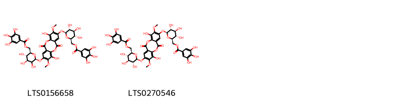{ width=100% }
    <figcaption>Hình ảnh cấu trúc hóa học của 2 hoạt chất thuộc nhóm Tannins gồm ['[(2r,3s,4s,6s)-6-[(8,16-dihydroxy-7,15-dimethoxy-3,11-dioxo-14-{[(2s,3r,4s,5s,6r)-3,4,5-trihydroxy-6-[(3,4,5-trihydroxybenzoyloxy)methyl]oxan-2-yl]oxy}-2,10-dioxatricyclo[10.4.0.0⁴,⁹]hexadeca-1(16),4,6,8,12,14-hexaen-6-yl)oxy]-3,4,5-trihydroxyoxan-2-yl]methyl 3,4,5-trihydroxybenzoate (LTS0156658)', '[(2r,3s,4s,5r,6s)-6-[(8,16-dihydroxy-7,15-dimethoxy-3,11-dioxo-14-{[(2s,3r,4s,5s,6r)-3,4,5-trihydroxy-6-[(3,4,5-trihydroxybenzoyloxy)methyl]oxan-2-yl]oxy}-2,10-dioxatricyclo[10.4.0.0⁴,⁹]hexadeca-1(16),4,6,8,12,14-hexaen-6-yl)oxy]-3,4,5-trihydroxyoxan-2-yl]methyl 3,4,5-trihydroxybenzoate (LTS0270546)'].</figcaption>
</figure>

---

### Dược dân tộc học

Danh sách các quốc gia có sử dụng *Ardisia japonica* trong điều trị các bệnh. 

| Country   | Disease                 | Bệnh              |
|:----------|:------------------------|:------------------|
| China     | Detoxicant, Expectorant | Chất khử độc, đờm |

---

# Chi Myrsine

??? note "Danh sách các dược liệu thuộc chi"
    
	 - *Myrsine africana*
	 - *Myrsine melanophloea*

---
## Myrsine africana
### Thông tin về thực vật

!!! info "Phân loại thực vật của *Myrsine africana* từ GIBF:"
    - **Kingdom:** Plantae
    - **Phylum:** Tracheophyta
    - **Order:** Ericales
    - **Family:** Primulaceae
    - **Genus:** Myrsine
    - **Species:** *Myrsine africana*

 

| Label (VI)   | Label (EN)   | Scientific Name   | Descriptions (VI)   | Descriptions (EN)   | Also Known As (VI)   | Also Known As (EN)   |
|:-------------|:-------------|:------------------|:--------------------|:--------------------|:---------------------|:---------------------|
| N/A          | N/A          | Myrsine africana  | loài thực vật       | species of plant    | ['']                 | ['']                 |

#### Phân bố trên thế giới

**Từ CSDL GIBF** China, Portugal, South Africa, Chinese Taipei

#### Phân bố tại Việt Nam

**Từ CSDL GIBF**: Không có ghi nhận ở Việt Nam

---
### Thành phần hóa học
        
- Theo cơ sở dữ liệu lotus: Từ loài *Myrsine africana* đã phân lập và xác định được 50 hoạt chất thuộc về các nhóm Naphthalenes, Flavonoids, Prenol lipids, Isocoumarans, Pyrans, Benzene and substituted derivatives, Organooxygen compounds, Phenols, Lignan glycosides, Anthracenes. 

|    | chemicalTaxonomyClassyfireClass     |   smiles_count |
|---:|:------------------------------------|---------------:|
|  0 | Anthracenes                         |              2 |
|  1 | Benzene and substituted derivatives |              1 |
|  2 | Flavonoids                          |             25 |
|  3 | Isocoumarans                        |              1 |
|  4 | Lignan glycosides                   |              6 |
|  5 | Naphthalenes                        |              1 |
|  6 | Organooxygen compounds              |              6 |
|  7 | Phenols                             |              1 |
|  8 | Prenol lipids                       |              6 |
|  9 | Pyrans                              |              1 |

#### Nhóm Anthracenes
<figure markdown="span">
    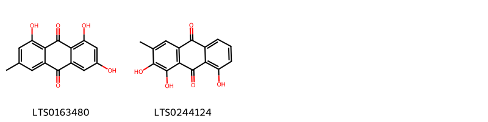{ width=100% }
    <figcaption>Hình ảnh cấu trúc hóa học của 2 hoạt chất thuộc nhóm Anthracenes gồm ['emodin (LTS0163480)', '2-hydroxychrysophanol (LTS0244124)'].</figcaption>
</figure>
#### Nhóm Benzene and substituted derivatives
<figure markdown="span">
    { width=100% }
    <figcaption>Hình ảnh cấu trúc hóa học của 1 hoạt chất thuộc nhóm Benzene and substituted derivatives gồm ['galop (LTS0222857)'].</figcaption>
</figure>
#### Nhóm Flavonoids
<figure markdown="span">
    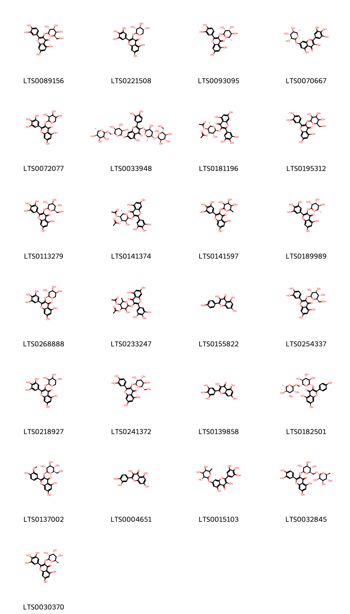{ width=100% }
    <figcaption>Hình ảnh cấu trúc hóa học của 25 hoạt chất thuộc nhóm Flavonoids gồm ['hyperoside (LTS0089156)', '5,7-dihydroxy-3-{[(2s,3r,4s,5r)-3,4,5-trihydroxyoxan-2-yl]oxy}-2-(3,4,5-trihydroxyphenyl)chromen-4-one (LTS0221508)', 'quercitrin (LTS0093095)', '3,5-dihydroxy-7-{[(2s,3r,4r,5r,6s)-3,4,5-trihydroxy-6-methyloxan-2-yl]oxy}-2-(3,4,5-trihydroxyphenyl)chromen-4-one (LTS0070667)', '5,7-dihydroxy-3-[(3,4,5-trihydroxyoxan-2-yl)oxy]-2-(3,4,5-trihydroxyphenyl)chromen-4-one (LTS0072077)', '3-{[(2s,3s,4s,5r,6s)-3,4-dihydroxy-6-methyl-5-{[(2s,3r,4s,5s,6r)-3,4,5-trihydroxy-6-(hydroxymethyl)oxan-2-yl]oxy}oxan-2-yl]oxy}-2-(3,4-dihydroxyphenyl)-5-hydroxy-7-{[(2s,3r,4s,5s,6r)-3,4,5-trihydroxy-6-({[(2r,3s,4s,5r,6s)-3,4,5-trihydroxy-6-methyloxan-2-yl]oxy}methyl)oxan-2-yl]oxy}chromen-4-one (LTS0033948)', '(2s,3s,4s,5r,6s)-3-(acetyloxy)-6-{[5,7-dihydroxy-4-oxo-2-(3,4,5-trihydroxyphenyl)chromen-3-yl]oxy}-5-hydroxy-2-methyloxan-4-yl acetate (LTS0181196)', '2-(3,4-dihydroxyphenyl)-5,7-dihydroxy-3-{[3,4,5-trihydroxy-6-(hydroxymethyl)oxan-2-yl]oxy}chromen-4-one (LTS0195312)', '5,7-dihydroxy-3-{[(2s,3r,4s,5s,6r)-3,4,5-trihydroxy-6-(hydroxymethyl)oxan-2-yl]oxy}-2-(3,4,5-trihydroxyphenyl)chromen-4-one (LTS0113279)', '(2s,3s,4s,5s,6s)-3-(acetyloxy)-6-{[5,7-dihydroxy-4-oxo-2-(3,4,5-trihydroxyphenyl)chromen-3-yl]oxy}-5-hydroxy-2-methyloxan-4-yl acetate (LTS0141374)', 'myricitrin (LTS0141597)', 'myricitrin (LTS0189989)', '5,7-dihydroxy-3-{[(2s,3r,4s,5s)-3,4,5-trihydroxyoxan-2-yl]oxy}-2-(3,4,5-trihydroxyphenyl)chromen-4-one (LTS0268888)', '3-(acetyloxy)-6-{[5,7-dihydroxy-4-oxo-2-(3,4,5-trihydroxyphenyl)chromen-3-yl]oxy}-5-hydroxy-2-methyloxan-4-yl acetate (LTS0233247)', 'kaempherol (LTS0155822)', 'isoquercetin (LTS0254337)', 'myricetin 3-xyloside (LTS0218927)', '2-(3,4-dihydroxyphenyl)-5,7-dihydroxy-3-{[(2s,3r,4r,5r,6s)-3,4,5-trihydroxy-6-(hydroxymethyl)oxan-2-yl]oxy}chromen-4-one (LTS0241372)', 'myricetin (LTS0139858)', 'nictoflorin (LTS0182501)', 'isorhamnetin 3-o-glucoside (LTS0137002)', 'quercetin (LTS0004651)', '3,5-dihydroxy-7-[(3,4,5-trihydroxy-6-methyloxan-2-yl)oxy]-2-(3,4,5-trihydroxyphenyl)chromen-4-one (LTS0015103)', '3-rutinosyl quercetin (LTS0032845)', '5,7-dihydroxy-3-{[(3r,4r,5s,6r)-3,4,5-trihydroxy-6-methyloxan-2-yl]oxy}-2-(3,4,5-trihydroxyphenyl)chromen-4-one (LTS0030370)'].</figcaption>
</figure>
#### Nhóm Isocoumarans
<figure markdown="span">
    { width=100% }
    <figcaption>Hình ảnh cấu trúc hóa học của 1 hoạt chất thuộc nhóm Isocoumarans gồm ['7-hydroxy-5-methoxy-3h-2-benzofuran-1-one (LTS0022742)'].</figcaption>
</figure>
#### Nhóm Lignan glycosides
<figure markdown="span">
    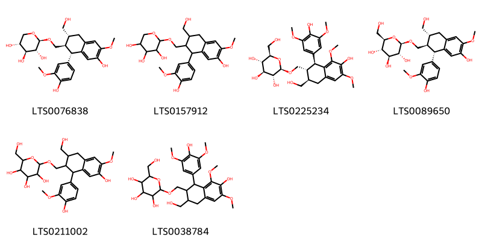{ width=100% }
    <figcaption>Hình ảnh cấu trúc hóa học của 6 hoạt chất thuộc nhóm Lignan glycosides gồm ['(2r,3r,4s,5r)-2-{[(1s,2r,3r)-7-hydroxy-1-(4-hydroxy-3-methoxyphenyl)-3-(hydroxymethyl)-6-methoxy-1,2,3,4-tetrahydronaphthalen-2-yl]methoxy}oxane-3,4,5-triol (LTS0076838)', '2-{[7-hydroxy-1-(4-hydroxy-3-methoxyphenyl)-3-(hydroxymethyl)-6-methoxy-1,2,3,4-tetrahydronaphthalen-2-yl]methoxy}oxane-3,4,5-triol (LTS0157912)', '(2r,3r,4s,5s,6r)-2-{[(1s,2r,3r)-7-hydroxy-1-(4-hydroxy-3,5-dimethoxyphenyl)-3-(hydroxymethyl)-6,8-dimethoxy-1,2,3,4-tetrahydronaphthalen-2-yl]methoxy}-6-(hydroxymethyl)oxane-3,4,5-triol (LTS0225234)', '(2r,3r,4s,5s,6r)-2-{[(1s,2r,3r)-7-hydroxy-1-(4-hydroxy-3-methoxyphenyl)-3-(hydroxymethyl)-6-methoxy-1,2,3,4-tetrahydronaphthalen-2-yl]methoxy}-6-(hydroxymethyl)oxane-3,4,5-triol (LTS0089650)', '2-{[7-hydroxy-1-(4-hydroxy-3-methoxyphenyl)-3-(hydroxymethyl)-6-methoxy-1,2,3,4-tetrahydronaphthalen-2-yl]methoxy}-6-(hydroxymethyl)oxane-3,4,5-triol (LTS0211002)', '2-{[7-hydroxy-1-(4-hydroxy-3,5-dimethoxyphenyl)-3-(hydroxymethyl)-6,8-dimethoxy-1,2,3,4-tetrahydronaphthalen-2-yl]methoxy}-6-(hydroxymethyl)oxane-3,4,5-triol (LTS0038784)'].</figcaption>
</figure>
#### Nhóm Naphthalenes
<figure markdown="span">
    { width=100% }
    <figcaption>Hình ảnh cấu trúc hóa học của 1 hoạt chất thuộc nhóm Naphthalenes gồm ['nepodin (LTS0012918)'].</figcaption>
</figure>
#### Nhóm Organooxygen compounds
<figure markdown="span">
    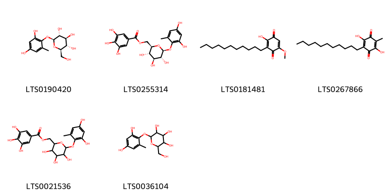{ width=100% }
    <figcaption>Hình ảnh cấu trúc hóa học của 6 hoạt chất thuộc nhóm Organooxygen compounds gồm ['(2s,3r,4s,5s,6r)-2-(2,4-dihydroxy-6-methylphenoxy)-6-(hydroxymethyl)oxane-3,4,5-triol (LTS0190420)', '[(2r,3s,4s,5r,6s)-6-(2,4-dihydroxy-6-methylphenoxy)-3,4,5-trihydroxyoxan-2-yl]methyl 3,4,5-trihydroxybenzoate (LTS0255314)', '5-o-methylembelin (LTS0181481)', '2,5-dihydroxy-3-methyl-6-undecylcyclohexa-2,5-diene-1,4-dione (LTS0267866)', '[6-(2,4-dihydroxy-6-methylphenoxy)-3,4,5-trihydroxyoxan-2-yl]methyl 3,4,5-trihydroxybenzoate (LTS0021536)', '2-(2,4-dihydroxy-6-methylphenoxy)-6-(hydroxymethyl)oxane-3,4,5-triol (LTS0036104)'].</figcaption>
</figure>
#### Nhóm Phenols
<figure markdown="span">
    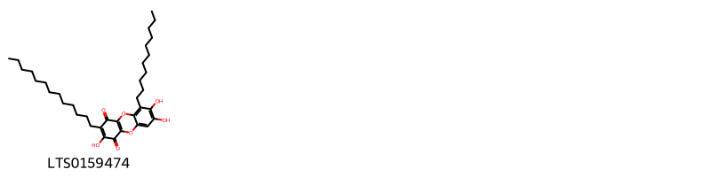{ width=100% }
    <figcaption>Hình ảnh cấu trúc hóa học của 1 hoạt chất thuộc nhóm Phenols gồm ['2,7,8-trihydroxy-3-tridecyl-6-undecyloxanthrene-1,4-dione (LTS0159474)'].</figcaption>
</figure>
#### Nhóm Prenol lipids
<figure markdown="span">
    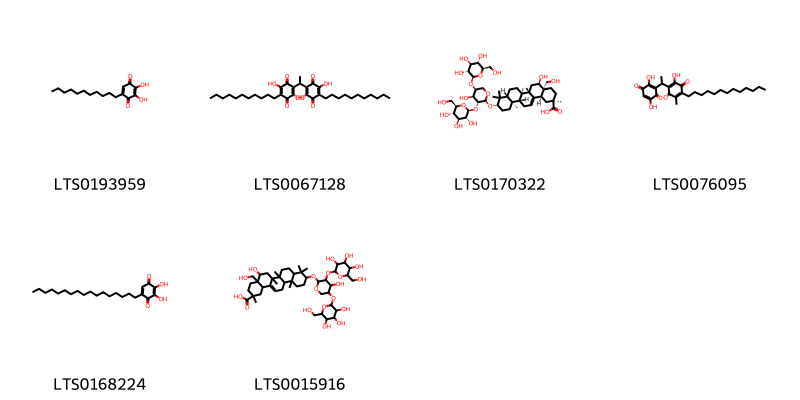{ width=100% }
    <figcaption>Hình ảnh cấu trúc hóa học của 6 hoạt chất thuộc nhóm Prenol lipids gồm ['2,3-dihydroxy-5-undecylcyclohexa-2,5-diene-1,4-dione (LTS0193959)', '2-[1-(2,5-dihydroxy-3,6-dioxo-4-undecylcyclohexa-1,4-dien-1-yl)ethyl]-3,6-dihydroxy-5-undecylcyclohexa-2,5-diene-1,4-dione (LTS0067128)', '(2r,4as,5r,6as,6br,8ar,10s,12ar,12br,14bs)-5-hydroxy-10-{[(2s,3r,4s,5s)-4-hydroxy-3,5-bis({[(2s,3r,4s,5s,6r)-3,4,5-trihydroxy-6-(hydroxymethyl)oxan-2-yl]oxy})oxan-2-yl]oxy}-4a-(hydroxymethyl)-2,6a,6b,9,9,12a-hexamethyl-1,3,4,5,6,7,8,8a,10,11,12,12b,13,14b-tetradecahydropicene-2-carboxylic acid (LTS0170322)', '2-[1-(2,5-dihydroxy-3,6-dioxocyclohexa-1,4-dien-1-yl)ethyl]-3-hydroxy-6-methyl-5-tridecylcyclohexa-2,5-diene-1,4-dione (LTS0076095)', '5-heptadecyl-2,3-dihydroxycyclohexa-2,5-diene-1,4-dione (LTS0168224)', '5-hydroxy-10-{[4-hydroxy-3,5-bis({[3,4,5-trihydroxy-6-(hydroxymethyl)oxan-2-yl]oxy})oxan-2-yl]oxy}-4a-(hydroxymethyl)-2,6a,6b,9,9,12a-hexamethyl-1,3,4,5,6,7,8,8a,10,11,12,12b,13,14b-tetradecahydropicene-2-carboxylic acid (LTS0015916)'].</figcaption>
</figure>
#### Nhóm Pyrans
<figure markdown="span">
    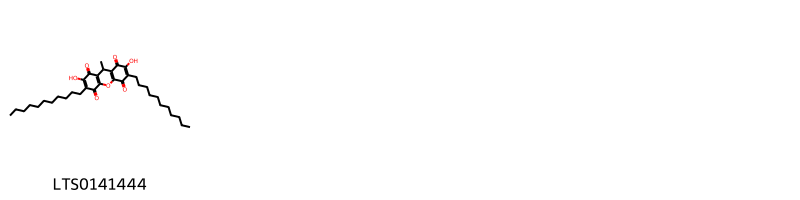{ width=100% }
    <figcaption>Hình ảnh cấu trúc hóa học của 1 hoạt chất thuộc nhóm Pyrans gồm ['2,7-dihydroxy-9-methyl-3,6-diundecyl-9h-xanthene-1,4,5,8-tetrone (LTS0141444)'].</figcaption>
</figure>

---

### Dược dân tộc học

Danh sách các quốc gia có sử dụng *Myrsine africana* trong điều trị các bệnh. 

| Country   | Disease                        | Bệnh                                    |
|:----------|:-------------------------------|:----------------------------------------|
| Elsewhere | Laxative, Taenifuge, Vermifuge | Thuốc nhuận tràng, Taenifuge, Vermifuge |

---

---
## Myrsine melanophloea
### Thông tin về thực vật

!!! info "Phân loại thực vật của *N/A* từ GIBF:"
    - **Kingdom:** Plantae
    - **Phylum:** Tracheophyta
    - **Order:** Ericales
    - **Family:** Primulaceae
    - **Genus:** Myrsine
    - **Species:** *N/A*

 

| Label (VI)   | Label (EN)   | Scientific Name   | Descriptions (VI)   | Descriptions (EN)   | Also Known As (VI)   | Also Known As (EN)   |
|:-------------|:-------------|:------------------|:--------------------|:--------------------|:---------------------|:---------------------|
| N/A          | N/A          | Myrsine africana  | loài thực vật       | species of plant    | ['']                 | ['']                 |

#### Phân bố trên thế giới

**Từ CSDL GIBF** nan, South Africa, Puerto Rico, Hong Kong, Australia, Japan, Colombia, Brazil, Chinese Taipei, Argentina, Honduras, United States of America, Cayman Islands, Dominican Republic, Uruguay, New Zealand

#### Phân bố tại Việt Nam

**Từ CSDL GIBF**: Không có ghi nhận ở Việt Nam

---
### Thành phần hóa học
        
- Theo cơ sở dữ liệu lotus: Từ loài *N/A* đã phân lập và xác định được Chưa có hoạt chất nào được phân lập. hoạt chất thuộc về các nhóm Không có hoạt chất nào được phân lập. 

Không có hình ảnh nào được tạo ra

---

### Dược dân tộc học

Danh sách các quốc gia có sử dụng *N/A* trong điều trị các bệnh. 

| Country      | Disease    | Bệnh      |
|:-------------|:-----------|:----------|
| South Africa | Astringent | Lam se da |

---

# Chi Conomorpha

??? note "Danh sách các dược liệu thuộc chi"
    
	 - *Conomorpha magnoliifolia*

---
## Conomorpha magnoliifolia
### Thông tin về thực vật

!!! info "Phân loại thực vật của *Cybianthus fulvopulverulentus* từ GIBF:"
    - **Kingdom:** Plantae
    - **Phylum:** Tracheophyta
    - **Order:** Ericales
    - **Family:** Primulaceae
    - **Genus:** Cybianthus
    - **Species:** *Cybianthus fulvopulverulentus*

 

| Label (VI)   | Label (EN)   | Scientific Name          | Descriptions (VI)   | Descriptions (EN)   | Also Known As (VI)   | Also Known As (EN)   |
|:-------------|:-------------|:-------------------------|:--------------------|:--------------------|:---------------------|:---------------------|
| N/A          | N/A          | Conomorpha magnoliifolia |                     |                     | ['']                 | ['']                 |

#### Phân bố trên thế giới

**Từ CSDL GIBF** nan, South Africa, Puerto Rico, Hong Kong, Australia, Japan, Colombia, Brazil, Chinese Taipei, Argentina, Honduras, United States of America, Cayman Islands, Dominican Republic, Uruguay, New Zealand

#### Phân bố tại Việt Nam

**Từ CSDL GIBF**: Không có ghi nhận ở Việt Nam

---
### Thành phần hóa học
        
- Theo cơ sở dữ liệu lotus: Từ loài *Cybianthus fulvopulverulentus* đã phân lập và xác định được Chưa có hoạt chất nào được phân lập. hoạt chất thuộc về các nhóm Không có hoạt chất nào được phân lập. 

Không có hình ảnh nào được tạo ra

---

### Dược dân tộc học

Danh sách các quốc gia có sử dụng *Cybianthus fulvopulverulentus* trong điều trị các bệnh. 

| Country   | Disease   | Bệnh          |
|:----------|:----------|:--------------|
| Surinam   | Piscicide | Thuốc diệt cá |

---

# Chi Aegiceras

??? note "Danh sách các dược liệu thuộc chi"
    
	 - *Aegiceras corniculatum*

---
## Aegiceras corniculatum
### Thông tin về thực vật

!!! info "Phân loại thực vật của *Aegiceras corniculatum* từ GIBF:"
    - **Kingdom:** Plantae
    - **Phylum:** Tracheophyta
    - **Order:** Ericales
    - **Family:** Primulaceae
    - **Genus:** Aegiceras
    - **Species:** *Aegiceras corniculatum*

 

| Label (VI)   | Label (EN)   | Scientific Name        | Descriptions (VI)   | Descriptions (EN)   | Also Known As (VI)         | Also Known As (EN)   |
|:-------------|:-------------|:-----------------------|:--------------------|:--------------------|:---------------------------|:---------------------|
| N/A          | N/A          | Aegiceras corniculatum | loài thực vật       | species of plant    | ['Aegiceras corniculatum'] | ['']                 |

#### Phân bố trên thế giới

**Từ CSDL GIBF** Hong Kong, Australia, Thailand, Macao, India, Singapore, Viet Nam, China

#### Phân bố tại Việt Nam

**Từ CSDL GIBF**: Nam Định

---
### Thành phần hóa học
        
- Theo cơ sở dữ liệu lotus: Từ loài *Aegiceras corniculatum* đã phân lập và xác định được 88 hoạt chất thuộc về các nhóm Naphthalenes, Benzofurans, Lignan lactones, Phenols, Carboxylic acids and derivatives, Fatty Acyls, Phenalanes, Furopyrans, Isoindoles and derivatives, Prenol lipids, Dibenzocycloheptenes, Benzene and substituted derivatives, Naphthofurans, Organooxygen compounds, Phenol ethers, Flavonoids, Steroids and steroid derivatives, Pyrans. 

|    | chemicalTaxonomyClassyfireClass     |   smiles_count |
|---:|:------------------------------------|---------------:|
|  0 | Benzene and substituted derivatives |              3 |
|  1 | Benzofurans                         |              4 |
|  2 | Carboxylic acids and derivatives    |              6 |
|  3 | Dibenzocycloheptenes                |              2 |
|  4 | Fatty Acyls                         |              4 |
|  5 | Flavonoids                          |              3 |
|  6 | Furopyrans                          |              2 |
|  7 | Isoindoles and derivatives          |              2 |
|  8 | Lignan lactones                     |              5 |
|  9 | Naphthalenes                        |              1 |
| 10 | Naphthofurans                       |              2 |
| 11 | Organooxygen compounds              |             12 |
| 12 | Phenalanes                          |              2 |
| 13 | Phenol ethers                       |              1 |
| 14 | Phenols                             |              4 |
| 15 | Prenol lipids                       |             30 |
| 16 | Pyrans                              |              2 |
| 17 | Steroids and steroid derivatives    |              2 |

#### Nhóm Benzene and substituted derivatives
<figure markdown="span">
    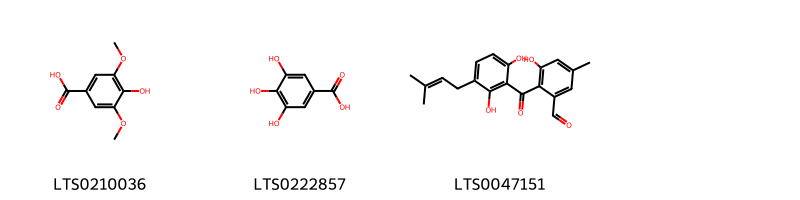{ width=100% }
    <figcaption>Hình ảnh cấu trúc hóa học của 3 hoạt chất thuộc nhóm Benzene and substituted derivatives gồm ['syringic acid (LTS0210036)', 'galop (LTS0222857)', '2-[2,6-dihydroxy-3-(3-methylbut-2-en-1-yl)benzoyl]-3-hydroxy-5-methylbenzaldehyde (LTS0047151)'].</figcaption>
</figure>
#### Nhóm Benzofurans
<figure markdown="span">
    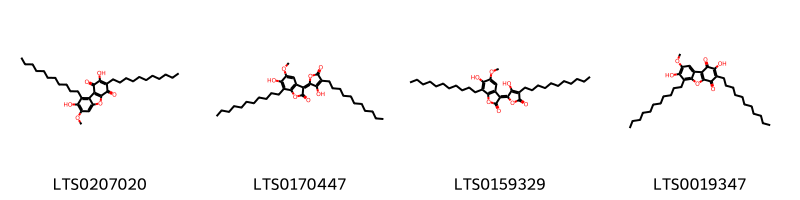{ width=100% }
    <figcaption>Hình ảnh cấu trúc hóa học của 4 hoạt chất thuộc nhóm Benzofurans gồm ['4,12-dihydroxy-11-methoxy-5,13-diundecyl-8-oxatricyclo[7.4.0.0²,⁷]trideca-1(13),2(7),4,9,11-pentaene-3,6-dione (LTS0207020)', '6-hydroxy-3-[(2e)-3-hydroxy-5-oxo-4-undecylfuran-2-ylidene]-5-methoxy-7-undecyl-1-benzofuran-2-one (LTS0170447)', '6-hydroxy-3-(3-hydroxy-5-oxo-4-undecylfuran-2-ylidene)-5-methoxy-7-undecyl-1-benzofuran-2-one (LTS0159329)', '4,11-dihydroxy-12-methoxy-5,10-diundecyl-8-oxatricyclo[7.4.0.0²,⁷]trideca-1(13),2(7),4,9,11-pentaene-3,6-dione (LTS0019347)'].</figcaption>
</figure>
#### Nhóm Carboxylic acids and derivatives
<figure markdown="span">
    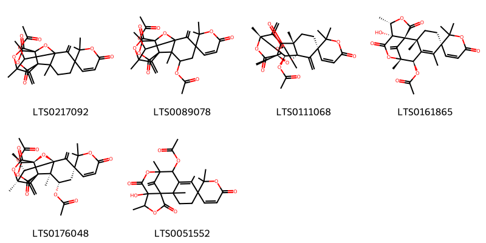{ width=100% }
    <figcaption>Hình ảnh cấu trúc hóa học của 6 hoạt chất thuộc nhóm Carboxylic acids and derivatives gồm ["2,2',2',9,13-pentamethyl-6,16-dimethylidene-6',11,15-trioxo-10,14,17-trioxaspiro[pentacyclo[7.6.1.1⁷,¹².0¹,¹².0²,⁷]heptadecane-5,3'-pyran]-8-yl acetate (LTS0217092)", "3-(acetyloxy)-2,2',2',9,13-pentamethyl-6,16-dimethylidene-6',11,15-trioxo-10,14,17-trioxaspiro[pentacyclo[7.6.1.1⁷,¹².0¹,¹².0²,⁷]heptadecane-5,3'-pyran]-8-yl acetate (LTS0089078)", 'dehydroaustin (LTS0111068)', 'austin (LTS0161865)', "(1r,2r,3s,5s,7s,8s,9r,12s,13s)-3-(acetyloxy)-2,2',2',9,13-pentamethyl-6,16-dimethylidene-6',11,15-trioxo-10,14,17-trioxaspiro[pentacyclo[7.6.1.1⁷,¹².0¹,¹².0²,⁷]heptadecane-5,3'-pyran]-8-yl acetate (LTS0176048)", "12'-hydroxy-2,2,2',6',9',13'-hexamethyl-16'-methylidene-6,11',15'-trioxo-10',14'-dioxaspiro[pyran-3,5'-tetracyclo[7.6.1.0¹,¹².0²,⁷]hexadecan]-6'-en-8'-yl acetate (LTS0051552)"].</figcaption>
</figure>
#### Nhóm Dibenzocycloheptenes
<figure markdown="span">
    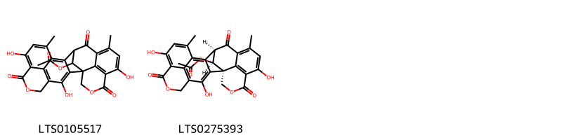{ width=100% }
    <figcaption>Hình ảnh cấu trúc hóa học của 2 hoạt chất thuộc nhóm Dibenzocycloheptenes gồm ['3,9,19-trihydroxy-11,17-dimethyl-7,15,21-trioxo-6,22-dioxaheptacyclo[12.9.1.1¹,¹⁶.1⁴,⁸.0²,¹³.0¹²,²⁶.0²⁰,²⁵]hexacosa-2(13),3,8(26),9,11,16,18,20(25)-octaen-24-yl acetate (LTS0105517)', '(1s,14r,24s)-3,9,19-trihydroxy-11,17-dimethyl-7,15,21-trioxo-6,22-dioxaheptacyclo[12.9.1.1¹,¹⁶.1⁴,⁸.0²,¹³.0¹²,²⁶.0²⁰,²⁵]hexacosa-2(13),3,8(26),9,11,16,18,20(25)-octaen-24-yl acetate (LTS0275393)'].</figcaption>
</figure>
#### Nhóm Fatty Acyls
<figure markdown="span">
    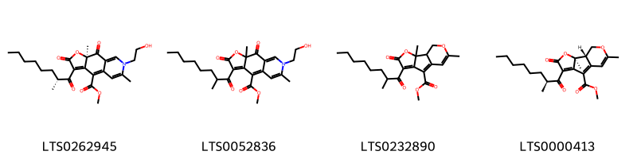{ width=100% }
    <figcaption>Hình ảnh cấu trúc hóa học của 4 hoạt chất thuộc nhóm Fatty Acyls gồm ['methyl (9ar)-7-(2-hydroxyethyl)-6,9a-dimethyl-3-[(2r)-2-methyloctanoyl]-2,9-dioxofuro[3,2-g]isoquinoline-4-carboxylate (LTS0262945)', 'methyl 7-(2-hydroxyethyl)-6,9a-dimethyl-3-(2-methyloctanoyl)-2,9-dioxofuro[3,2-g]isoquinoline-4-carboxylate (LTS0052836)', 'methyl 2,10-dimethyl-5-(2-methyloctanoyl)-4-oxo-3,11-dioxatricyclo[6.4.0.0²,⁶]dodeca-5,7,9-triene-7-carboxylate (LTS0232890)', 'methyl (1s,2s)-2,10-dimethyl-5-[(2s)-2-methyloctanoyl]-4-oxo-3,11-dioxatricyclo[6.4.0.0²,⁶]dodeca-5,7,9-triene-7-carboxylate (LTS0000413)'].</figcaption>
</figure>
#### Nhóm Flavonoids
<figure markdown="span">
    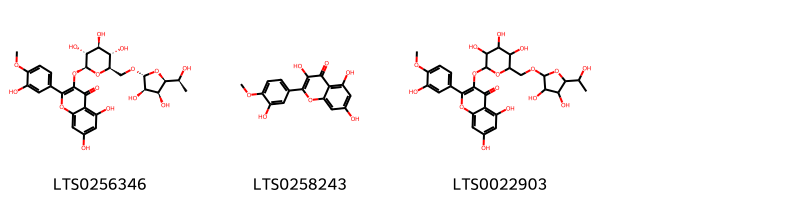{ width=100% }
    <figcaption>Hình ảnh cấu trúc hóa học của 3 hoạt chất thuộc nhóm Flavonoids gồm ['3-{[(2s,3r,4s,5s,6r)-6-({[(2r,3r,4s,5s)-3,4-dihydroxy-5-[(1s)-1-hydroxyethyl]oxolan-2-yl]oxy}methyl)-3,4,5-trihydroxyoxan-2-yl]oxy}-5,7-dihydroxy-2-(3-hydroxy-4-methoxyphenyl)chromen-4-one (LTS0256346)', 'tamarixetin (LTS0258243)', '3-{[6-({[3,4-dihydroxy-5-(1-hydroxyethyl)oxolan-2-yl]oxy}methyl)-3,4,5-trihydroxyoxan-2-yl]oxy}-5,7-dihydroxy-2-(3-hydroxy-4-methoxyphenyl)chromen-4-one (LTS0022903)'].</figcaption>
</figure>
#### Nhóm Furopyrans
<figure markdown="span">
    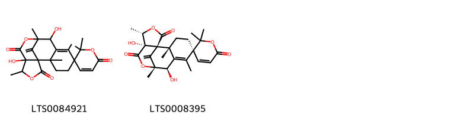{ width=100% }
    <figcaption>Hình ảnh cấu trúc hóa học của 2 hoạt chất thuộc nhóm Furopyrans gồm ["8',12'-dihydroxy-2,2,2',6',9',13'-hexamethyl-16'-methylidene-10',14'-dioxaspiro[pyran-3,5'-tetracyclo[7.6.1.0¹,¹².0²,⁷]hexadecan]-6'-ene-6,11',15'-trione (LTS0084921)", 'austinol (LTS0008395)'].</figcaption>
</figure>
#### Nhóm Isoindoles and derivatives
<figure markdown="span">
    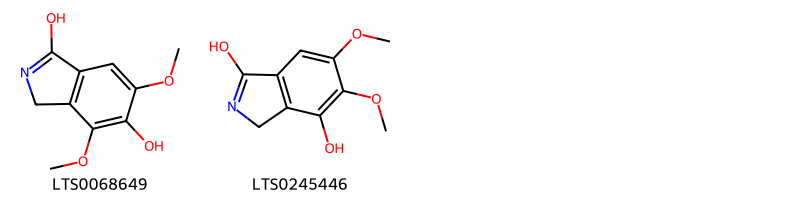{ width=100% }
    <figcaption>Hình ảnh cấu trúc hóa học của 2 hoạt chất thuộc nhóm Isoindoles and derivatives gồm ['4,6-dimethoxy-3h-isoindole-1,5-diol (LTS0068649)', '5,6-dimethoxy-3h-isoindole-1,4-diol (LTS0245446)'].</figcaption>
</figure>
#### Nhóm Lignan lactones
<figure markdown="span">
    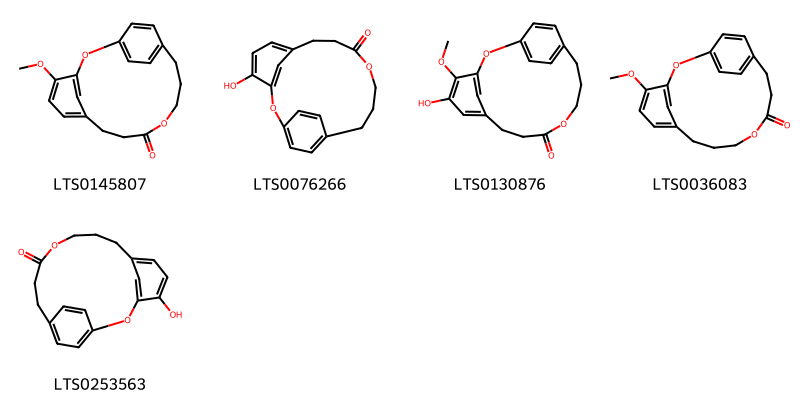{ width=100% }
    <figcaption>Hình ảnh cấu trúc hóa học của 5 hoạt chất thuộc nhóm Lignan lactones gồm ['4-methoxy-2,11-dioxatricyclo[13.2.2.1³,⁷]icosa-1(17),3(20),4,6,15,18-hexaen-10-one (LTS0145807)', 'corniculatolide a (LTS0076266)', '5-hydroxy-4-methoxy-2,11-dioxatricyclo[13.2.2.1³,⁷]icosa-1(17),3(20),4,6,15,18-hexaen-10-one (LTS0130876)', '4-methoxy-2,11-dioxatricyclo[13.2.2.1³,⁷]icosa-1(17),3(20),4,6,15,18-hexaen-12-one (LTS0036083)', 'isocorniculatolide a (LTS0253563)'].</figcaption>
</figure>
#### Nhóm Naphthalenes
<figure markdown="span">
    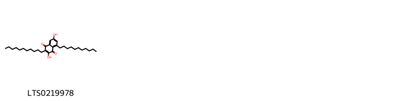{ width=100% }
    <figcaption>Hình ảnh cấu trúc hóa học của 1 hoạt chất thuộc nhóm Naphthalenes gồm ['3,7-dihydroxy-2,5-diundecylnaphthalene-1,4-dione (LTS0219978)'].</figcaption>
</figure>
#### Nhóm Naphthofurans
<figure markdown="span">
    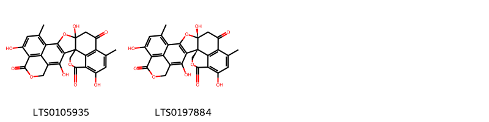{ width=100% }
    <figcaption>Hình ảnh cấu trúc hóa học của 2 hoạt chất thuộc nhóm Naphthofurans gồm ['3,9,15,21-tetrahydroxy-11,19-dimethyl-6,14,24-trioxaheptacyclo[16.7.1.1⁴,⁸.0¹,¹⁵.0²,¹³.0²²,²⁶.0¹²,²⁷]heptacosa-2(13),3,8(27),9,11,18(26),19,21-octaene-7,17,23-trione (LTS0105935)', '(1r,15r)-3,9,15,21-tetrahydroxy-11,19-dimethyl-6,14,24-trioxaheptacyclo[16.7.1.1⁴,⁸.0¹,¹⁵.0²,¹³.0²²,²⁶.0¹²,²⁷]heptacosa-2(13),3,8(27),9,11,18(26),19,21-octaene-7,17,23-trione (LTS0197884)'].</figcaption>
</figure>
#### Nhóm Organooxygen compounds
<figure markdown="span">
    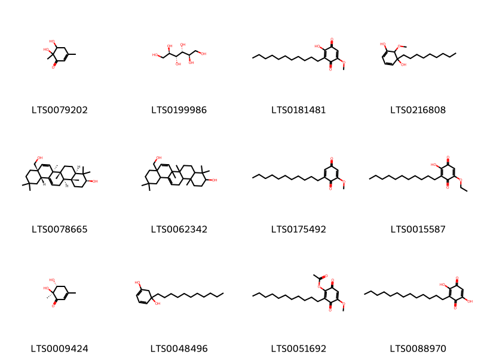{ width=100% }
    <figcaption>Hình ảnh cấu trúc hóa học của 12 hoạt chất thuộc nhóm Organooxygen compounds gồm ['5,6-dihydroxy-3,6-dimethylcyclohex-2-en-1-one (LTS0079202)', 'mannitol (LTS0199986)', '5-o-methylembelin (LTS0181481)', '2-methoxy-1-nonylcyclohexa-3,5-diene-1,3-diol (LTS0216808)', '(3s,4ar,6ar,6bs,8as,12as,14ar,14br)-8a-(hydroxymethyl)-4,4,6a,6b,11,11,14b-heptamethyl-1,2,3,4a,5,6,9,10,12,12a,14,14a-dodecahydropicen-3-ol (LTS0078665)', '8a-(hydroxymethyl)-4,4,6a,6b,11,11,14b-heptamethyl-1,2,3,4a,5,6,9,10,12,12a,14,14a-dodecahydropicen-3-ol (LTS0062342)', '2-methoxy-6-undecylcyclohexa-2,5-diene-1,4-dione (LTS0175492)', '5-o-ethyl embelin (LTS0015587)', '(5r,6s)-5,6-dihydroxy-3,6-dimethylcyclohex-2-en-1-one (LTS0009424)', '1-undecylcyclohexa-3,5-diene-1,3-diol (LTS0048496)', '4-methoxy-3,6-dioxo-2-undecylcyclohexa-1,4-dien-1-yl acetate (LTS0051692)', 'rapanone (LTS0088970)'].</figcaption>
</figure>
#### Nhóm Phenalanes
<figure markdown="span">
    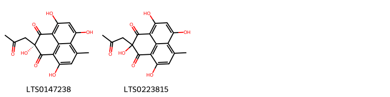{ width=100% }
    <figcaption>Hình ảnh cấu trúc hóa học của 2 hoạt chất thuộc nhóm Phenalanes gồm ['(2s)-2,4,6,9-tetrahydroxy-7-methyl-2-(2-oxopropyl)phenalene-1,3-dione (LTS0147238)', '2,4,6,9-tetrahydroxy-7-methyl-2-(2-oxopropyl)phenalene-1,3-dione (LTS0223815)'].</figcaption>
</figure>
#### Nhóm Phenol ethers
<figure markdown="span">
    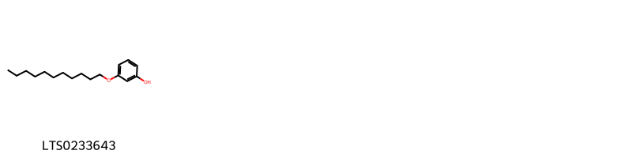{ width=100% }
    <figcaption>Hình ảnh cấu trúc hóa học của 1 hoạt chất thuộc nhóm Phenol ethers gồm ['3-(undecyloxy)phenol (LTS0233643)'].</figcaption>
</figure>
#### Nhóm Phenols
<figure markdown="span">
    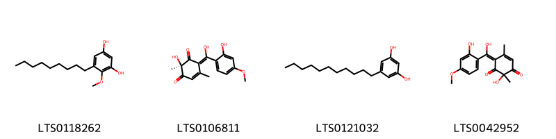{ width=100% }
    <figcaption>Hình ảnh cấu trúc hóa học của 4 hoạt chất thuộc nhóm Phenols gồm ['4-methoxy-5-nonylbenzene-1,3-diol (LTS0118262)', '(2r,6z)-2-hydroxy-6-[hydroxy(2-hydroxy-4-methoxyphenyl)methylidene]-2,5-dimethylcyclohex-4-ene-1,3-dione (LTS0106811)', '5-undecylbenzene-1,3-diol (LTS0121032)', '2-hydroxy-6-[hydroxy(2-hydroxy-4-methoxyphenyl)methylidene]-2,5-dimethylcyclohex-4-ene-1,3-dione (LTS0042952)'].</figcaption>
</figure>
#### Nhóm Prenol lipids
<figure markdown="span">
    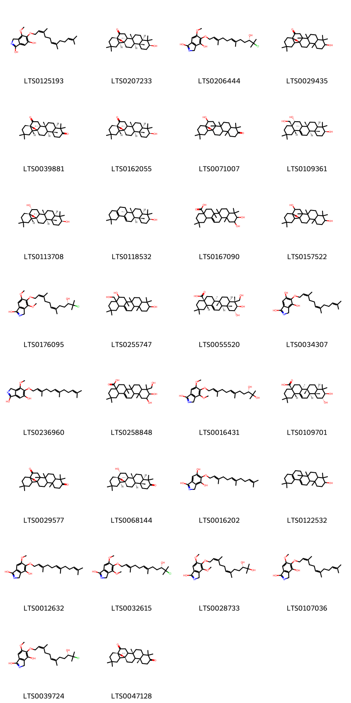{ width=100% }
    <figcaption>Hình ảnh cấu trúc hóa học của 30 hoạt chất thuộc nhóm Prenol lipids gồm ['4-methoxy-5-[(3,7,11-trimethyldodeca-2,6,10-trien-1-yl)oxy]-3h-isoindole-1,6-diol (LTS0125193)', '(1s,4s,5r,8r,10s,13r,14r,17s,18s)-10-hydroxy-4,5,9,9,13,20,20-heptamethyl-24-oxahexacyclo[15.5.2.0¹,¹⁸.0⁴,¹⁷.0⁵,¹⁴.0⁸,¹³]tetracosan-2-one (LTS0207233)', '5-{[(2e,6e,10s)-11-chloro-10-hydroxy-3,7,11-trimethyldodeca-2,6-dien-1-yl]oxy}-6-methoxy-3h-isoindole-1,4-diol (LTS0206444)', '10-hydroxy-4,5,9,9,13,20,20-heptamethyl-24-oxahexacyclo[15.5.2.0¹,¹⁸.0⁴,¹⁷.0⁵,¹⁴.0⁸,¹³]tetracosan-2-one (LTS0029435)', '(1s,4s,5r,8r,13r,14r,17s,18r)-4,5,9,9,13,20,20-heptamethyl-24-oxahexacyclo[15.5.2.0¹,¹⁸.0⁴,¹⁷.0⁵,¹⁴.0⁸,¹³]tetracosane-2,10-dione (LTS0039881)', '(1s,4s,5r,8r,10s,13r,14r,17s,18r)-10-hydroxy-4,5,9,9,13,20,20-heptamethyl-24-oxahexacyclo[15.5.2.0¹,¹⁸.0⁴,¹⁷.0⁵,¹⁴.0⁸,¹³]tetracosan-2-one (LTS0162055)', '2-hydroxy-4,5,9,9,13,20,20-heptamethyl-24-oxahexacyclo[15.5.2.0¹,¹⁸.0⁴,¹⁷.0⁵,¹⁴.0⁸,¹³]tetracosan-10-one (LTS0071007)', 'primulagenin a (LTS0109361)', '(1s,2r,4s,5r,8r,10s,13r,14r,17s,18r)-4,5,9,9,13,20,20-heptamethyl-24-oxahexacyclo[15.5.2.0¹,¹⁸.0⁴,¹⁷.0⁵,¹⁴.0⁸,¹³]tetracosane-2,10-diol (LTS0113708)', '(3s,4ar,6ar,6bs,14ar,14br)-4,4,6a,6b,11,11,14b-heptamethyl-2,3,4a,5,6,7,8,9,10,12,14,14a-dodecahydro-1h-picen-3-ol (LTS0118532)', '10,11-dihydroxy-2,2,6a,6b,9,9,12a-heptamethyl-1,3,4,5,6,7,8,8a,10,11,12,12b,13,14b-tetradecahydropicene-4a-carboxylic acid (LTS0167090)', '4,5,9,9,13,20,20-heptamethyl-24-oxahexacyclo[15.5.2.0¹,¹⁸.0⁴,¹⁷.0⁵,¹⁴.0⁸,¹³]tetracosane-2,10-diol (LTS0157522)', '5-{[(10s)-11-chloro-10-hydroxy-3,7,11-trimethyldodeca-2,6-dien-1-yl]oxy}-4,6-dimethoxy-3h-isoindol-1-ol (LTS0176095)', '8a-(hydroxymethyl)-4,4,6a,6b,11,11,14b-heptamethyl-1,2,3,4a,5,6,7,8,9,10,12,12a,14,14a-tetradecahydropicene-3,8-diol (LTS0255747)', 'arjunolic acid (LTS0055520)', '5-[(3,7,11-trimethyldodeca-2,6,10-trien-1-yl)oxy]-3h-isoindole-1,4,6-triol (LTS0034307)', '4-methoxy-5-{[(2e,6e)-3,7,11-trimethyldodeca-2,6,10-trien-1-yl]oxy}-3h-isoindole-1,6-diol (LTS0236960)', '10,11-dihydroxy-9-(hydroxymethyl)-2,2,6a,6b,9,12a-hexamethyl-1,3,4,5,6,7,8,8a,10,11,12,12b,13,14b-tetradecahydropicene-4a-carboxylic acid (LTS0258848)', '(3s,6e,10e)-12-[(1-hydroxy-4,6-dimethoxy-3h-isoindol-5-yl)oxy]-2,6,10-trimethyldodeca-6,10-diene-2,3-diol (LTS0016431)', 'maslinic acid (LTS0109701)', '4,5,9,9,13,20,20-heptamethyl-24-oxahexacyclo[15.5.2.0¹,¹⁸.0⁴,¹⁷.0⁵,¹⁴.0⁸,¹³]tetracosane-2,10-dione (LTS0029577)', '(1s,2r,4s,5r,8r,13r,14r,17s,18s)-2-hydroxy-4,5,9,9,13,20,20-heptamethyl-24-oxahexacyclo[15.5.2.0¹,¹⁸.0⁴,¹⁷.0⁵,¹⁴.0⁸,¹³]tetracosan-10-one (LTS0068144)', '5-{[(2e,6e)-3,7,11-trimethyldodeca-2,6,10-trien-1-yl]oxy}-3h-isoindole-1,4,6-triol (LTS0016202)', '4,4,6a,6b,11,11,14b-heptamethyl-2,3,4a,5,6,7,8,9,10,12,14,14a-dodecahydro-1h-picen-3-ol (LTS0122532)', '6-methoxy-5-{[(2e,6e)-3,7,11-trimethyldodeca-2,6,10-trien-1-yl]oxy}-3h-isoindole-1,4-diol (LTS0012632)', '5-{[(2e,6e,10s)-11-chloro-10-hydroxy-3,7,11-trimethyldodeca-2,6-dien-1-yl]oxy}-4,6-dimethoxy-3h-isoindol-1-ol (LTS0032615)', '(3s)-12-[(1-hydroxy-4,6-dimethoxy-3h-isoindol-5-yl)oxy]-2,6,10-trimethyldodeca-6,10-diene-2,3-diol (LTS0028733)', '6-methoxy-5-[(3,7,11-trimethyldodeca-2,6,10-trien-1-yl)oxy]-3h-isoindole-1,4-diol (LTS0107036)', '5-{[(10s)-11-chloro-10-hydroxy-3,7,11-trimethyldodeca-2,6-dien-1-yl]oxy}-6-methoxy-3h-isoindole-1,4-diol (LTS0039724)', '(1s,4s,5r,13r,17s)-4,5,9,9,13,20,20-heptamethyl-24-oxahexacyclo[15.5.2.0¹,¹⁸.0⁴,¹⁷.0⁵,¹⁴.0⁸,¹³]tetracosane-2,10-dione (LTS0047128)'].</figcaption>
</figure>
#### Nhóm Pyrans
<figure markdown="span">
    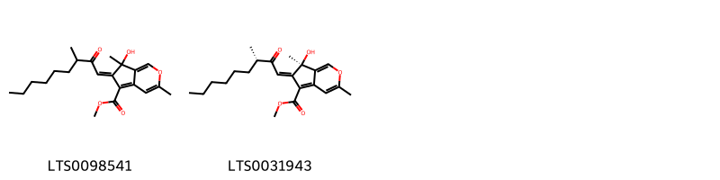{ width=100% }
    <figcaption>Hình ảnh cấu trúc hóa học của 2 hoạt chất thuộc nhóm Pyrans gồm ['methyl 7-hydroxy-3,7-dimethyl-6-(3-methyl-2-oxononylidene)cyclopenta[c]pyran-5-carboxylate (LTS0098541)', 'methyl (6z,7r)-7-hydroxy-3,7-dimethyl-6-[(3s)-3-methyl-2-oxononylidene]cyclopenta[c]pyran-5-carboxylate (LTS0031943)'].</figcaption>
</figure>
#### Nhóm Steroids and steroid derivatives
<figure markdown="span">
    { width=100% }
    <figcaption>Hình ảnh cấu trúc hóa học của 2 hoạt chất thuộc nhóm Steroids and steroid derivatives gồm ['phytosterol (LTS0029311)', 'stigmasterol (LTS0024262)'].</figcaption>
</figure>

---

### Dược dân tộc học

Danh sách các quốc gia có sử dụng *Aegiceras corniculatum* trong điều trị các bệnh. 

| Country   | Disease   | Bệnh          |
|:----------|:----------|:--------------|
| Elsewhere | Piscicide | Thuốc diệt cá |
| Indonesia | Piscicide | Thuốc diệt cá |

---

# Chi Embelia

??? note "Danh sách các dược liệu thuộc chi"
    
	 - *Embelia nutans*
	 - *Embelia ribes*

---
## Embelia nutans
### Thông tin về thực vật

!!! info "Phân loại thực vật của *Embelia nutans* từ GIBF:"
    - **Kingdom:** Plantae
    - **Phylum:** Tracheophyta
    - **Order:** Ericales
    - **Family:** Primulaceae
    - **Genus:** Embelia
    - **Species:** *Embelia nutans*

 

| Label (VI)   | Label (EN)   | Scientific Name   | Descriptions (VI)   | Descriptions (EN)   | Also Known As (VI)   | Also Known As (EN)   |
|:-------------|:-------------|:------------------|:--------------------|:--------------------|:---------------------|:---------------------|
| N/A          | N/A          | Embelia nutans    | loài thực vật       | species of plant    | ['']                 | ['']                 |

#### Phân bố trên thế giới

**Từ CSDL GIBF** Hong Kong, Australia, Thailand, Macao, India, Singapore, Viet Nam, China

#### Phân bố tại Việt Nam

**Từ CSDL GIBF**: Nam Định

---
### Thành phần hóa học
        
- Theo cơ sở dữ liệu lotus: Từ loài *Embelia nutans* đã phân lập và xác định được Chưa có hoạt chất nào được phân lập. hoạt chất thuộc về các nhóm Không có hoạt chất nào được phân lập. 

Không có hình ảnh nào được tạo ra

---

### Dược dân tộc học

Danh sách các quốc gia có sử dụng *Embelia nutans* trong điều trị các bệnh. 

| Country   | Disease    | Bệnh         |
|:----------|:-----------|:-------------|
| India     | Intoxicant | chất gây độc |

---

---
## Embelia ribes
### Thông tin về thực vật

!!! info "Phân loại thực vật của *Embelia ribes* từ GIBF:"
    - **Kingdom:** Plantae
    - **Phylum:** Tracheophyta
    - **Order:** Ericales
    - **Family:** Primulaceae
    - **Genus:** Embelia
    - **Species:** *Embelia ribes*

 

| Label (VI)   | Label (EN)   | Scientific Name   | Descriptions (VI)   | Descriptions (EN)   | Also Known As (VI)   | Also Known As (EN)   |
|:-------------|:-------------|:------------------|:--------------------|:--------------------|:---------------------|:---------------------|
| N/A          | N/A          | Embelia ribes     | loài thực vật       | species of plant    | ['']                 | ['']                 |

#### Phân bố trên thế giới

**Từ CSDL GIBF** nan, Malaysia, Hong Kong, Thailand, Lao People’s Democratic Republic, Cambodia, Myanmar, Papua New Guinea, India, Indonesia, United States of America, Singapore, Viet Nam, China

#### Phân bố tại Việt Nam

**Từ CSDL GIBF**: Thanh Hoa, Lao Cai, Tỉnh Khánh Hòa, Kon Tum, Hue Province, Ninh Thuan, Lam Dong, Thua Thien-Hue

---
### Thành phần hóa học
        
- Theo cơ sở dữ liệu lotus: Từ loài *Embelia ribes* đã phân lập và xác định được 36 hoạt chất thuộc về các nhóm Fatty Acyls, Flavonoids, Steroids and steroid derivatives, Benzofurans, Organooxygen compounds, Phenols, Lignan glycosides, Carboxylic acids and derivatives. 

|    | chemicalTaxonomyClassyfireClass   |   smiles_count |
|---:|:----------------------------------|---------------:|
|  0 | Benzofurans                       |              2 |
|  1 | Carboxylic acids and derivatives  |              1 |
|  2 | Fatty Acyls                       |              2 |
|  3 | Flavonoids                        |              2 |
|  4 | Lignan glycosides                 |              1 |
|  5 | Organooxygen compounds            |             14 |
|  6 | Phenols                           |              8 |
|  7 | Steroids and steroid derivatives  |              6 |

#### Nhóm Benzofurans
<figure markdown="span">
    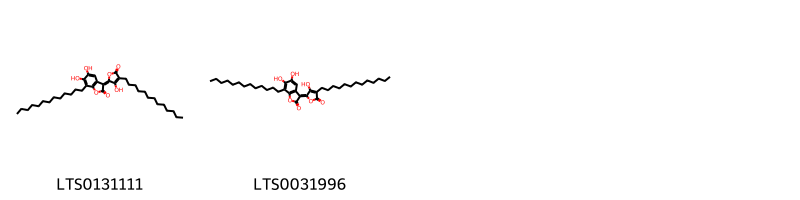{ width=100% }
    <figcaption>Hình ảnh cấu trúc hóa học của 2 hoạt chất thuộc nhóm Benzofurans gồm ['5,6-dihydroxy-3-[(2e)-3-hydroxy-5-oxo-4-tridecylfuran-2-ylidene]-7-tridecyl-1-benzofuran-2-one (LTS0131111)', '5,6-dihydroxy-3-(3-hydroxy-5-oxo-4-tridecylfuran-2-ylidene)-7-tridecyl-1-benzofuran-2-one (LTS0031996)'].</figcaption>
</figure>
#### Nhóm Carboxylic acids and derivatives
<figure markdown="span">
    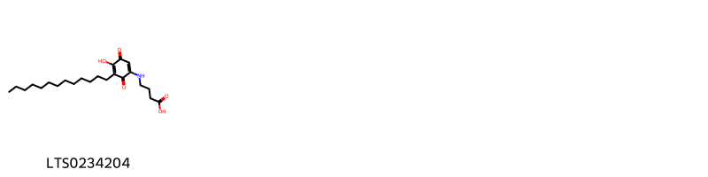{ width=100% }
    <figcaption>Hình ảnh cấu trúc hóa học của 1 hoạt chất thuộc nhóm Carboxylic acids and derivatives gồm ['4-[(4-hydroxy-3,6-dioxo-5-tridecylcyclohexa-1,4-dien-1-yl)amino]butanoic acid (LTS0234204)'].</figcaption>
</figure>
#### Nhóm Fatty Acyls
<figure markdown="span">
    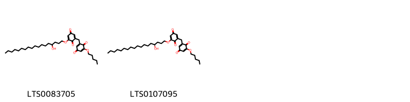{ width=100% }
    <figcaption>Hình ảnh cấu trúc hóa học của 2 hoạt chất thuộc nhóm Fatty Acyls gồm ['2-{[3,6-dioxo-5-(pentyloxy)cyclohexa-1,4-dien-1-yl]methyl}-6-[(4-hydroxyoctadecyl)oxy]cyclohexa-2,5-diene-1,4-dione (LTS0083705)', '2-{[3,6-dioxo-5-(pentyloxy)cyclohexa-1,4-dien-1-yl]methyl}-6-{[(4s)-4-hydroxyoctadecyl]oxy}cyclohexa-2,5-diene-1,4-dione (LTS0107095)'].</figcaption>
</figure>
#### Nhóm Flavonoids
<figure markdown="span">
    { width=100% }
    <figcaption>Hình ảnh cấu trúc hóa học của 2 hoạt chất thuộc nhóm Flavonoids gồm ['(+)-catechol (LTS0117079)', 'catechol (LTS0090912)'].</figcaption>
</figure>
#### Nhóm Lignan glycosides
<figure markdown="span">
    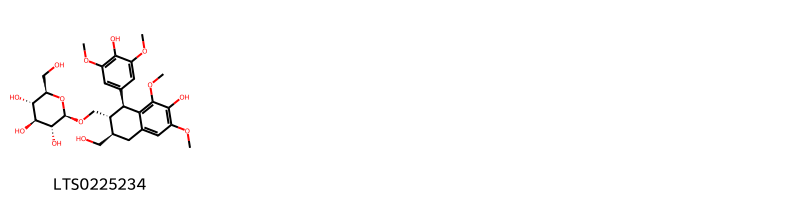{ width=100% }
    <figcaption>Hình ảnh cấu trúc hóa học của 1 hoạt chất thuộc nhóm Lignan glycosides gồm ['(2r,3r,4s,5s,6r)-2-{[(1s,2r,3r)-7-hydroxy-1-(4-hydroxy-3,5-dimethoxyphenyl)-3-(hydroxymethyl)-6,8-dimethoxy-1,2,3,4-tetrahydronaphthalen-2-yl]methoxy}-6-(hydroxymethyl)oxane-3,4,5-triol (LTS0225234)'].</figcaption>
</figure>
#### Nhóm Organooxygen compounds
<figure markdown="span">
    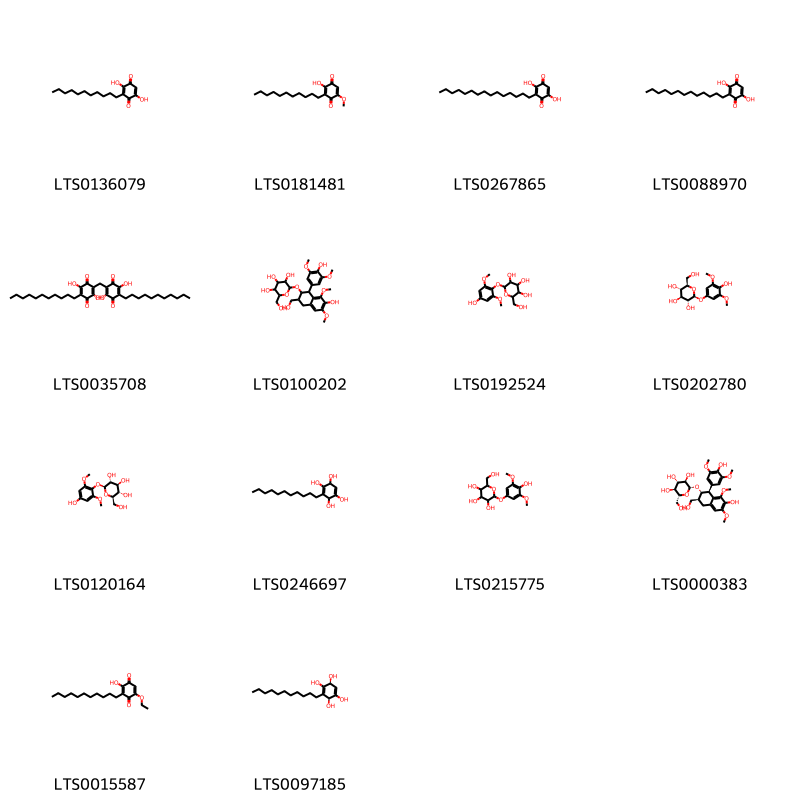{ width=100% }
    <figcaption>Hình ảnh cấu trúc hóa học của 14 hoạt chất thuộc nhóm Organooxygen compounds gồm ['embelin (LTS0136079)', '5-o-methylembelin (LTS0181481)', '2,5-dihydroxy-3-pentadecylcyclohexa-2,5-diene-1,4-dione (LTS0267865)', 'rapanone (LTS0088970)', '2-[(2,5-dihydroxy-3,6-dioxo-4-undecylcyclohexa-1,4-dien-1-yl)methyl]-3,6-dihydroxy-5-undecylcyclohexa-2,5-diene-1,4-dione (LTS0035708)', '2-{[7-hydroxy-1-(4-hydroxy-3,5-dimethoxyphenyl)-3-(hydroxymethyl)-6,8-dimethoxy-1,2,3,4-tetrahydronaphthalen-2-yl]oxy}-6-(hydroxymethyl)oxane-3,4,5-triol (LTS0100202)', '2-(4-hydroxy-2,6-dimethoxyphenoxy)-6-(hydroxymethyl)oxane-3,4,5-triol (LTS0192524)', 'koaburaside (LTS0202780)', '(2s,3r,4s,5s,6r)-2-(4-hydroxy-2,6-dimethoxyphenoxy)-6-(hydroxymethyl)oxane-3,4,5-triol (LTS0120164)', '3-undecylcyclohexa-2,5-diene-1,2,4,5-tetrol (LTS0246697)', 'koaburaside (LTS0215775)', '(2r,3r,4s,5s,6r)-2-{[(1s,2r,3s)-7-hydroxy-1-(4-hydroxy-3,5-dimethoxyphenyl)-3-(hydroxymethyl)-6,8-dimethoxy-1,2,3,4-tetrahydronaphthalen-2-yl]oxy}-6-(hydroxymethyl)oxane-3,4,5-triol (LTS0000383)', '5-o-ethyl embelin (LTS0015587)', '(1s,4s)-3-undecylcyclohexa-2,5-diene-1,2,4,5-tetrol (LTS0097185)'].</figcaption>
</figure>
#### Nhóm Phenols
<figure markdown="span">
    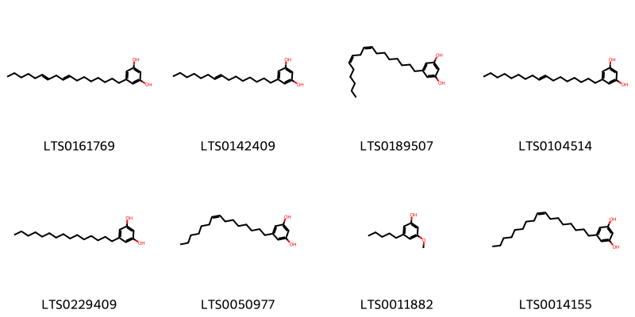{ width=100% }
    <figcaption>Hình ảnh cấu trúc hóa học của 8 hoạt chất thuộc nhóm Phenols gồm ['5-(heptadeca-8,11-dien-1-yl)benzene-1,3-diol (LTS0161769)', '5-(pentadec-8-en-1-yl)benzene-1,3-diol (LTS0142409)', '5-[(8z,11z)-heptadeca-8,11-dien-1-yl]benzene-1,3-diol (LTS0189507)', '5-(heptadec-8-en-1-yl)benzene-1,3-diol (LTS0104514)', 'cardol (LTS0229409)', 'bilobol (LTS0050977)', '3-methoxy-5-pentylphenol (LTS0011882)', '5-[(8z)-heptadec-8-en-1-yl]benzene-1,3-diol (LTS0014155)'].</figcaption>
</figure>
#### Nhóm Steroids and steroid derivatives
<figure markdown="span">
    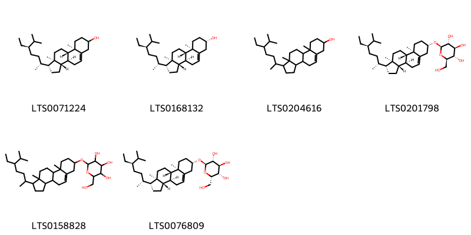{ width=100% }
    <figcaption>Hình ảnh cấu trúc hóa học của 6 hoạt chất thuộc nhóm Steroids and steroid derivatives gồm ['stigmast-5-en-3-ol (LTS0071224)', 'sitosterol (LTS0168132)', 'stigmast-5-en-3-ol, (3β)- (LTS0204616)', 'sitogluside (LTS0201798)', '2-{[1-(5-ethyl-6-methylheptan-2-yl)-9a,11a-dimethyl-1h,2h,3h,3ah,3bh,4h,6h,7h,8h,9h,9bh,10h,11h-cyclopenta[a]phenanthren-7-yl]oxy}-6-(hydroxymethyl)oxane-3,4,5-triol (LTS0158828)', '(2r,3r,4s,5s,6s)-2-{[(1r,3as,3bs,7s,9ar,9bs,11ar)-1-[(2r,5r)-5-ethyl-6-methylheptan-2-yl]-9a,11a-dimethyl-1h,2h,3h,3ah,3bh,4h,6h,7h,8h,9h,9bh,10h,11h-cyclopenta[a]phenanthren-7-yl]oxy}-6-(hydroxymethyl)oxane-3,4,5-triol (LTS0076809)'].</figcaption>
</figure>

---

### Dược dân tộc học

Danh sách các quốc gia có sử dụng *Embelia ribes* trong điều trị các bệnh. 

| Country   | Disease                            | Bệnh                                |
|:----------|:-----------------------------------|:------------------------------------|
| Dutch     | Diuretic                           | Thuốc lợi tiêu                      |
| Elsewhere | Tonic, Astringent, Stomachic       | Tonic, Làm se, Dạ dày               |
| India     | Astringent, Carminative, Vermifuge | Chất làm se, Carminative, Vermifuge |
| Iran      | Carminative                        | Gây ô nhiễm môi trường              |
| Sanscrit  | Stimulant                          | Chất kích thích                     |
| US        | Taenifuge                          | Taenifuge                           |

---

# Chi Maesa

??? note "Danh sách các dược liệu thuộc chi"
    
	 - *Maesa chisia*
	 - *Maesa doraena*
	 - *Maesa indica*

---
## Maesa chisia
### Thông tin về thực vật

!!! info "Phân loại thực vật của *Maesa chisia* từ GIBF:"
    - **Kingdom:** Plantae
    - **Phylum:** Tracheophyta
    - **Order:** Ericales
    - **Family:** Primulaceae
    - **Genus:** Maesa
    - **Species:** *Maesa chisia*

 

| Label (VI)   | Label (EN)   | Scientific Name   | Descriptions (VI)   | Descriptions (EN)   | Also Known As (VI)   | Also Known As (EN)   |
|:-------------|:-------------|:------------------|:--------------------|:--------------------|:---------------------|:---------------------|
| N/A          | N/A          | Maesa chisia      | loài thực vật       | species of plant    | ['']                 | ['']                 |

#### Phân bố trên thế giới

**Từ CSDL GIBF** nan, Japan, Lao People’s Democratic Republic, Korea, Republic of, Myanmar, Bhutan, India, unknown or invalid, United States of America, Mongolia, China, Nepal

#### Phân bố tại Việt Nam

**Từ CSDL GIBF**: Không có ghi nhận ở Việt Nam

---
### Thành phần hóa học
        
- Theo cơ sở dữ liệu lotus: Từ loài *Maesa chisia* đã phân lập và xác định được 11 hoạt chất thuộc về các nhóm Prenol lipids. 

|    | chemicalTaxonomyClassyfireClass   |   smiles_count |
|---:|:----------------------------------|---------------:|
|  0 | Prenol lipids                     |             11 |

#### Nhóm Prenol lipids
<figure markdown="span">
    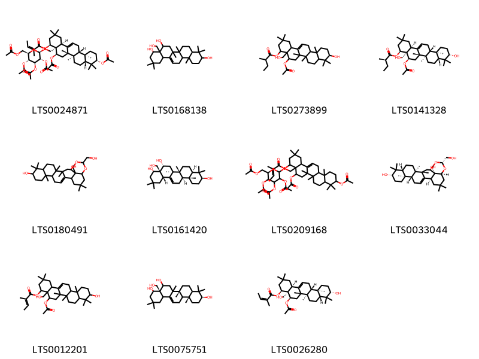{ width=100% }
    <figcaption>Hình ảnh cấu trúc hóa học của 11 hoạt chất thuộc nhóm Prenol lipids gồm ['(4s,4ar,5r,6as,6br,8ar,10s,12ar,12br,14bs)-5,10-bis(acetyloxy)-2,2,6a,6b,9,9,12a-heptamethyl-4a-({[(2r,3r,4s,5r,6r)-3,4,5-tris(acetyloxy)-6-[(acetyloxy)methyl]oxan-2-yl]oxy}methyl)-1,3,4,5,6,7,8,8a,10,11,12,12b,13,14b-tetradecahydropicen-4-yl (2z)-2-methylbut-2-enoate (LTS0024871)', '8a-(hydroxymethyl)-4,4,6a,6b,11,11,14b-heptamethyl-1,2,3,4a,5,6,7,8,9,10,12,12a,14,14a-tetradecahydropicene-3,8,9-triol (LTS0168138)', '5-(acetyloxy)-10-hydroxy-4a-(hydroxymethyl)-2,2,6a,6b,9,9,12a-heptamethyl-1,3,4,5,6,7,8,8a,10,11,12,12b,13,14b-tetradecahydropicen-4-yl 2-methylbutanoate (LTS0273899)', '(4s,4ar,5r,6as,6br,8ar,10s,12ar,12br,14bs)-5-(acetyloxy)-10-hydroxy-4a-(hydroxymethyl)-2,2,6a,6b,9,9,12a-heptamethyl-1,3,4,5,6,7,8,8a,10,11,12,12b,13,14b-tetradecahydropicen-4-yl (2r)-2-methylbutanoate (LTS0141328)', '11-(hydroxymethyl)-1,1,4a,8,8,15a,15b-heptamethyl-2h,3h,4h,4bh,5h,6bh,7h,9h,9ah,11h,13h,14h,15h,16h,17h,17ah-piceno[4,4a-d][1,3]dioxine-2,14-diol (LTS0180491)', '(3s,4ar,6ar,6bs,8r,8as,9s,12as,14ar,14br)-8a-(hydroxymethyl)-4,4,6a,6b,11,11,14b-heptamethyl-1,2,3,4a,5,6,7,8,9,10,12,12a,14,14a-tetradecahydropicene-3,8,9-triol (LTS0161420)', '5,10-bis(acetyloxy)-2,2,6a,6b,9,9,12a-heptamethyl-4a-({[3,4,5-tris(acetyloxy)-6-[(acetyloxy)methyl]oxan-2-yl]oxy}methyl)-1,3,4,5,6,7,8,8a,10,11,12,12b,13,14b-tetradecahydropicen-4-yl 2-methylbut-2-enoate (LTS0209168)', '(2s,4ar,4br,6bs,9as,11s,13ar,14r,15as,15br,17ar)-11-(hydroxymethyl)-1,1,4a,8,8,15a,15b-heptamethyl-2h,3h,4h,4bh,5h,6bh,7h,9h,9ah,11h,13h,14h,15h,16h,17h,17ah-piceno[4,4a-d][1,3]dioxine-2,14-diol (LTS0033044)', '5-(acetyloxy)-10-hydroxy-4a-(hydroxymethyl)-2,2,6a,6b,9,9,12a-heptamethyl-1,3,4,5,6,7,8,8a,10,11,12,12b,13,14b-tetradecahydropicen-4-yl 2-methylbut-2-enoate (LTS0012201)', '(3s,6ar,8as,14br)-8a-(hydroxymethyl)-4,4,6a,6b,11,11,14b-heptamethyl-1,2,3,4a,5,6,7,8,9,10,12,12a,14,14a-tetradecahydropicene-3,8,9-triol (LTS0075751)', '(4s,4ar,5r,6as,6br,8ar,10s,12ar,12br,14bs)-5-(acetyloxy)-10-hydroxy-4a-(hydroxymethyl)-2,2,6a,6b,9,9,12a-heptamethyl-1,3,4,5,6,7,8,8a,10,11,12,12b,13,14b-tetradecahydropicen-4-yl (2z)-2-methylbut-2-enoate (LTS0026280)'].</figcaption>
</figure>

---

### Dược dân tộc học

Danh sách các quốc gia có sử dụng *Maesa chisia* trong điều trị các bệnh. 

| Country   | Disease     | Bệnh          |
|:----------|:------------|:--------------|
| Elsewhere | Insecticide | Thuốc trừ sâu |

---

---
## Maesa doraena
### Thông tin về thực vật

!!! info "Phân loại thực vật của *Maesa japonica* từ GIBF:"
    - **Kingdom:** Plantae
    - **Phylum:** Tracheophyta
    - **Order:** Ericales
    - **Family:** Primulaceae
    - **Genus:** Maesa
    - **Species:** *Maesa japonica*

 

| Label (VI)   | Label (EN)   | Scientific Name   | Descriptions (VI)   | Descriptions (EN)   | Also Known As (VI)   | Also Known As (EN)   |
|:-------------|:-------------|:------------------|:--------------------|:--------------------|:---------------------|:---------------------|
| N/A          | N/A          | Maesa doraena     |                     |                     | ['']                 | ['']                 |

#### Phân bố trên thế giới

**Từ CSDL GIBF** nan, Japan, Chinese Taipei, unknown or invalid, China

#### Phân bố tại Việt Nam

**Từ CSDL GIBF**: Không có ghi nhận ở Việt Nam

---
### Thành phần hóa học
        
- Theo cơ sở dữ liệu lotus: Từ loài *Maesa japonica* đã phân lập và xác định được Chưa có hoạt chất nào được phân lập. hoạt chất thuộc về các nhóm Không có hoạt chất nào được phân lập. 

Không có hình ảnh nào được tạo ra

---

### Dược dân tộc học

Danh sách các quốc gia có sử dụng *Maesa japonica* trong điều trị các bệnh. 

| Country   | Disease     | Bệnh           |
|:----------|:------------|:---------------|
| China     | Expectorant | Thuốc long đàm |

---

---
## Maesa indica
### Thông tin về thực vật

!!! info "Phân loại thực vật của *Maesa indica* từ GIBF:"
    - **Kingdom:** Plantae
    - **Phylum:** Tracheophyta
    - **Order:** Ericales
    - **Family:** Primulaceae
    - **Genus:** Maesa
    - **Species:** *Maesa indica*

 

| Label (VI)   | Label (EN)   | Scientific Name   | Descriptions (VI)   | Descriptions (EN)   | Also Known As (VI)   | Also Known As (EN)   |
|:-------------|:-------------|:------------------|:--------------------|:--------------------|:---------------------|:---------------------|
| N/A          | N/A          | Maesa indica      | loài thực vật       | species of plant    | ['']                 | ['']                 |

#### Phân bố trên thế giới

**Từ CSDL GIBF** Sri Lanka, Malaysia, Thailand, Chad, Myanmar, Bhutan, India, Indonesia, Bangladesh, United States of America, Philippines, Viet Nam, China, Nepal

#### Phân bố tại Việt Nam

**Từ CSDL GIBF**: Lao Cai, Vinh Phuc, Cao Bang, Thua Thien-Hue

---
### Thành phần hóa học
        
- Theo cơ sở dữ liệu lotus: Từ loài *Maesa indica* đã phân lập và xác định được 3 hoạt chất thuộc về các nhóm Steroids and steroid derivatives, Phenols. 

|    | chemicalTaxonomyClassyfireClass   |   smiles_count |
|---:|:----------------------------------|---------------:|
|  0 | Phenols                           |              1 |
|  1 | Steroids and steroid derivatives  |              2 |

#### Nhóm Phenols
<figure markdown="span">
    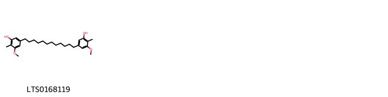{ width=100% }
    <figcaption>Hình ảnh cấu trúc hóa học của 1 hoạt chất thuộc nhóm Phenols gồm ['5-[12-(3-hydroxy-5-methoxy-4-methylphenyl)dodecyl]-3-methoxy-2-methylphenol (LTS0168119)'].</figcaption>
</figure>
#### Nhóm Steroids and steroid derivatives
<figure markdown="span">
    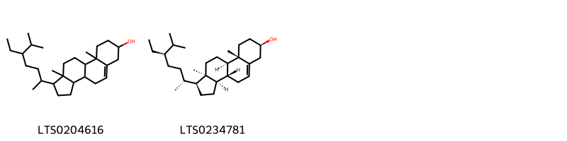{ width=100% }
    <figcaption>Hình ảnh cấu trúc hóa học của 2 hoạt chất thuộc nhóm Steroids and steroid derivatives gồm ['stigmast-5-en-3-ol, (3β)- (LTS0204616)', '(1s,3ar,3br,7r,9as,9br,11ar)-1-[(2r,5r)-5-ethyl-6-methylheptan-2-yl]-9a,11a-dimethyl-1h,2h,3h,3ah,3bh,4h,6h,7h,8h,9h,9bh,10h,11h-cyclopenta[a]phenanthren-7-ol (LTS0234781)'].</figcaption>
</figure>

---

### Dược dân tộc học

Danh sách các quốc gia có sử dụng *Maesa indica* trong điều trị các bệnh. 

| Country   | Disease   | Bệnh          |
|:----------|:----------|:--------------|
| India     | Piscicide | Thuốc diệt cá |
| Malaya    | Piscicide | Thuốc diệt cá |

---

