!!! abstract "Tóm tắt"

    Họ Myrtaceae gồm khoảng 14 chi và 54 loài được một số cộng đồng tại các quốc gia như Trinidad, Italian, Brazil, French, Johore, New Caledonia, China, Chile, New Zealand, Java, Turkey, Ghana, German, English, Tonga, Dominican Republic, Europe, Sanscrit, Latin America, Mexico, Haiti, South America, Philippines, Iraq, Kurdistan, ain, Venezuela, Elsewhere, Tahiti, Australia, Malaya, India, US, Samoa sử dụng trong một số trường hợp QUERY LENGTH LIMIT EXCEEDED. MAX ALLOWED QUERY : 500 CHARS QUERY LENGTH LIMIT EXCEEDED. MAX ALLOWED QUERY : 500 CHARS.

!!! info "DrDuke"

    James A. Duke sinh năm 1929-2017 là một nhà thực vật học người Mỹ. Đây là một trong những tác giả hàng đầu trong lĩnh vực dược dân tộc học với cuốn *CRC Handbook of Medicinal Herbs* và chính là người xây dựng lên cơ sở dữ liệu về hợp chất tự nhiên và dược dân tộc học tại Bộ nông nghiệp Hoa Kỳ. Các thông tin được đăng tải tại website [Dr. Duke's Phytochemical and Ethnobotanical Databases](https://phytochem.nal.usda.gov/). 
    Trong suốt thập niên 1970, ông lãnh đạo the Plant Taxonomy Laboratory, Plant Genetics and Germplasm Institute of the Agricultural Research Service, U.S. Department of Agriculture.
    Trong tài liệu này, các thông tin về dược dân tộc của các dược liệu được trích dẫn từ tài liệu của James A. Ducke với sự trợ giúp của phần mềm dịch thuật từ tiếng Anh sang tiếng Việt.
   

# Chi Blepharocalyx

??? note "Danh sách các dược liệu thuộc chi"
    
	 - *Blepharocalyx cilatensis*

---
## Blepharocalyx cilatensis
### Thông tin về thực vật

!!! info "Phân loại thực vật của *N/A* từ GIBF:"
    - **Kingdom:** Plantae
    - **Phylum:** Tracheophyta
    - **Order:** Myrtales
    - **Family:** Myrtaceae
    - **Genus:** Blepharocalyx
    - **Species:** *N/A*

 

| Label (VI)   | Label (EN)   | Scientific Name       | Descriptions (VI)   | Descriptions (EN)   | Also Known As (VI)        | Also Known As (EN)   |
|:-------------|:-------------|:----------------------|:--------------------|:--------------------|:--------------------------|:---------------------|
| N/A          | N/A          | Abelmoschus moschatus |                     | species of plant    | ['Abelmoschus moschatus'] | ['']                 |

#### Phân bố trên thế giới

**Từ CSDL GIBF** Chile, Brazil, Uruguay, Argentina

#### Phân bố tại Việt Nam

**Từ CSDL GIBF**: Không có ghi nhận ở Việt Nam

---
### Thành phần hóa học
        
- Theo cơ sở dữ liệu lotus: Từ loài *N/A* đã phân lập và xác định được Chưa có hoạt chất nào được phân lập. hoạt chất thuộc về các nhóm Không có hoạt chất nào được phân lập. 

Không có hình ảnh nào được tạo ra

---

### Dược dân tộc học

Danh sách các quốc gia có sử dụng *N/A* trong điều trị các bệnh. 

| Country       | Disease           | Bệnh                                                                                                                                                                                                |
|:--------------|:------------------|:----------------------------------------------------------------------------------------------------------------------------------------------------------------------------------------------------|
| South America | Astringent, Tonic | MYMEMORY WARNING: YOU USED ALL AVAILABLE FREE TRANSLATIONS FOR TODAY. NEXT AVAILABLE IN  06 HOURS 58 MINUTES 30 SECONDS VISIT HTTPS://MYMEMORY.TRANSLATED.NET/DOC/USAGELIMITS.PHP TO TRANSLATE MORE |

---

# Chi Leptoermum

??? note "Danh sách các dược liệu thuộc chi"
    
	 - *Leptoermum ericoides*
	 - *Leptoermum flavescens*

---
## Leptoermum ericoides
### Thông tin về thực vật

!!! info "Phân loại thực vật của *N/A* từ GIBF:"
    - **Kingdom:** N/A
    - **Phylum:** N/A
    - **Order:** N/A
    - **Family:** N/A
    - **Genus:** N/A
    - **Species:** *N/A*

 

| Label (VI)   | Label (EN)   | Scientific Name       | Descriptions (VI)   | Descriptions (EN)   | Also Known As (VI)        | Also Known As (EN)   |
|:-------------|:-------------|:----------------------|:--------------------|:--------------------|:--------------------------|:---------------------|
| N/A          | N/A          | Abelmoschus moschatus |                     | species of plant    | ['Abelmoschus moschatus'] | ['']                 |

#### Phân bố trên thế giới

**Từ CSDL GIBF** Không có kết quả phù hợp

#### Phân bố tại Việt Nam

**Từ CSDL GIBF**: Không có ghi nhận ở Việt Nam

---
### Thành phần hóa học
        
- Theo cơ sở dữ liệu lotus: Từ loài *N/A* đã phân lập và xác định được Chưa có hoạt chất nào được phân lập. hoạt chất thuộc về các nhóm Không có hoạt chất nào được phân lập. 

Không có hình ảnh nào được tạo ra

---

### Dược dân tộc học

Danh sách các quốc gia có sử dụng *N/A* trong điều trị các bệnh. 

| Country     | Disease   | Bệnh                                                                                                                                                                                                |
|:------------|:----------|:----------------------------------------------------------------------------------------------------------------------------------------------------------------------------------------------------|
| New Zealand | Sedative  | MYMEMORY WARNING: YOU USED ALL AVAILABLE FREE TRANSLATIONS FOR TODAY. NEXT AVAILABLE IN  06 HOURS 58 MINUTES 08 SECONDS VISIT HTTPS://MYMEMORY.TRANSLATED.NET/DOC/USAGELIMITS.PHP TO TRANSLATE MORE |

---

---
## Leptoermum flavescens
### Thông tin về thực vật

!!! info "Phân loại thực vật của *N/A* từ GIBF:"
    - **Kingdom:** N/A
    - **Phylum:** N/A
    - **Order:** N/A
    - **Family:** N/A
    - **Genus:** N/A
    - **Species:** *N/A*

 

| Label (VI)   | Label (EN)   | Scientific Name       | Descriptions (VI)   | Descriptions (EN)   | Also Known As (VI)        | Also Known As (EN)   |
|:-------------|:-------------|:----------------------|:--------------------|:--------------------|:--------------------------|:---------------------|
| N/A          | N/A          | Abelmoschus moschatus |                     | species of plant    | ['Abelmoschus moschatus'] | ['']                 |

#### Phân bố trên thế giới

**Từ CSDL GIBF** Không có kết quả phù hợp

#### Phân bố tại Việt Nam

**Từ CSDL GIBF**: Không có ghi nhận ở Việt Nam

---
### Thành phần hóa học
        
- Theo cơ sở dữ liệu lotus: Từ loài *N/A* đã phân lập và xác định được Chưa có hoạt chất nào được phân lập. hoạt chất thuộc về các nhóm Không có hoạt chất nào được phân lập. 

Không có hình ảnh nào được tạo ra

---

### Dược dân tộc học

Danh sách các quốc gia có sử dụng *N/A* trong điều trị các bệnh. 

| Country   | Disease   | Bệnh                                                                                                                                                                                                |
|:----------|:----------|:----------------------------------------------------------------------------------------------------------------------------------------------------------------------------------------------------|
| Malaya    | Apertif   | MYMEMORY WARNING: YOU USED ALL AVAILABLE FREE TRANSLATIONS FOR TODAY. NEXT AVAILABLE IN  06 HOURS 57 MINUTES 57 SECONDS VISIT HTTPS://MYMEMORY.TRANSLATED.NET/DOC/USAGELIMITS.PHP TO TRANSLATE MORE |

---

# Chi Myrtus

??? note "Danh sách các dược liệu thuộc chi"
    
	 - *Myrtus communis*
	 - *Myrtus ehrenbergii*

---
## Myrtus communis
### Thông tin về thực vật

!!! info "Phân loại thực vật của *Myrtus communis* từ GIBF:"
    - **Kingdom:** Plantae
    - **Phylum:** Tracheophyta
    - **Order:** Myrtales
    - **Family:** Myrtaceae
    - **Genus:** Myrtus
    - **Species:** *Myrtus communis*

 

| Label (VI)   | Label (EN)   | Scientific Name   | Descriptions (VI)   | Descriptions (EN)   | Also Known As (VI)   | Also Known As (EN)   |
|:-------------|:-------------|:------------------|:--------------------|:--------------------|:---------------------|:---------------------|
| N/A          | N/A          | Myrtus communis   | loài thực vật       | species of plant    | ['']                 | ['common myrtle']    |

#### Phân bố trên thế giới

**Từ CSDL GIBF** Morocco, Algeria, Portugal, Malta, Greece, South Africa, Albania, Italy, Croatia, Türkiye, Cyprus, France, Spain, Netherlands

#### Phân bố tại Việt Nam

**Từ CSDL GIBF**: Không có ghi nhận ở Việt Nam

---
### Thành phần hóa học
        
- Theo cơ sở dữ liệu lotus: Từ loài *Myrtus communis* đã phân lập và xác định được 188 hoạt chất thuộc về các nhóm Fatty Acyls, Unsaturated hydrocarbons, Carboxylic acids and derivatives, Coumarins and derivatives, Phenols, Oxanes, Organooxygen compounds, Tetrahydrofurans, Phenol ethers, Benzene and substituted derivatives, Oxolanes, Tannins, Cinnamic acids and derivatives, Steroids and steroid derivatives, Phenol esters, Benzopyrans, Heteroaromatic compounds, Flavonoids, Prenol lipids, Epoxides. 

|    | chemicalTaxonomyClassyfireClass     |   smiles_count |
|---:|:------------------------------------|---------------:|
|  0 | Benzene and substituted derivatives |             13 |
|  1 | Benzopyrans                         |             11 |
|  2 | Carboxylic acids and derivatives    |              5 |
|  3 | Cinnamic acids and derivatives      |              1 |
|  4 | Coumarins and derivatives           |              3 |
|  5 | Epoxides                            |              1 |
|  6 | Fatty Acyls                         |             10 |
|  7 | Flavonoids                          |             20 |
|  8 | Heteroaromatic compounds            |              1 |
|  9 | Organooxygen compounds              |              7 |
| 10 | Oxanes                              |              1 |
| 11 | Oxolanes                            |              2 |
| 12 | Phenol esters                       |              1 |
| 13 | Phenol ethers                       |              3 |
| 14 | Phenols                             |              2 |
| 15 | Prenol lipids                       |            101 |
| 16 | Steroids and steroid derivatives    |              2 |
| 17 | Tannins                             |              1 |
| 18 | Tetrahydrofurans                    |              1 |
| 19 | Unsaturated hydrocarbons            |              2 |

#### Nhóm Benzene and substituted derivatives
<figure markdown="span">
    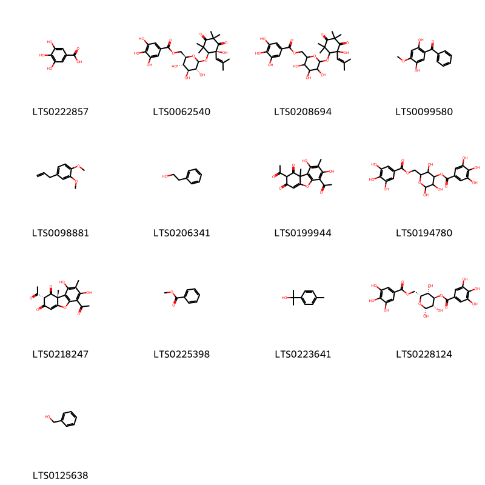{ width=100% }
    <figcaption>Hình ảnh cấu trúc hóa học của 13 hoạt chất thuộc nhóm Benzene and substituted derivatives gồm ['galop (LTS0222857)', '[(2r,3s,4s,5r,6s)-3,4,5-trihydroxy-6-{[(1s,2s)-2-hydroxy-4,4,6,6-tetramethyl-2-(2-methylprop-1-en-1-yl)-3,5-dioxocyclohexyl]oxy}oxan-2-yl]methyl 3,4,5-trihydroxybenzoate (LTS0062540)', '(3,4,5-trihydroxy-6-{[2-hydroxy-4,4,6,6-tetramethyl-2-(2-methylprop-1-en-1-yl)-3,5-dioxocyclohexyl]oxy}oxan-2-yl)methyl 3,4,5-trihydroxybenzoate (LTS0208694)', '2-benzoyl-5-methoxybenzene-1,4-diol (LTS0099580)', 'methyl eugenol (LTS0098881)', '2-phenyl-ethanol (LTS0206341)', '7-hydroxy-(s)-usnate (LTS0199944)', '2,3,5-trihydroxy-6-[(3,4,5-trihydroxybenzoyloxy)methyl]oxan-4-yl 3,4,5-trihydroxybenzoate (LTS0194780)', '(2r,4s)-4,10-diacetyl-11,13-dihydroxy-2,12-dimethyl-8-oxatricyclo[7.4.0.0²,⁷]trideca-1(9),6,10,12-tetraene-3,5-dione (LTS0218247)', 'methyl benzoate (LTS0225398)', 'p-cymen-8-ol (LTS0223641)', '(2r,3s,4r,5s,6r)-2,3,5-trihydroxy-6-[(3,4,5-trihydroxybenzoyloxy)methyl]oxan-4-yl 3,4,5-trihydroxybenzoate (LTS0228124)', 'benzyl alcohol (LTS0125638)'].</figcaption>
</figure>
#### Nhóm Benzopyrans
<figure markdown="span">
    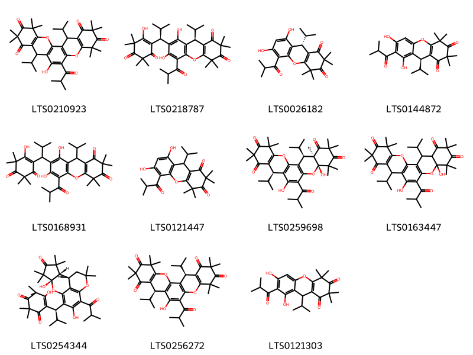{ width=100% }
    <figcaption>Hình ảnh cấu trúc hóa học của 11 hoạt chất thuộc nhóm Benzopyrans gồm ['13-hydroxy-6,14-diisopropyl-2,2,4,4,8,8,10,10-octamethyl-12-(2-methylpropanoyl)-6,14-dihydro-5,11-dioxapentaphene-1,3,7,9-tetrone (LTS0210923)', '(9r)-6,8-dihydroxy-7-[(1s)-1-(2-hydroxy-3,3,5,5-tetramethyl-4,6-dioxocyclohex-1-en-1-yl)-2-methylpropyl]-9-isopropyl-2,2,4,4-tetramethyl-5-(2-methylpropanoyl)-9h-xanthene-1,3-dione (LTS0218787)', '(9s)-6,8-dihydroxy-9-isopropyl-2,2,4,4-tetramethyl-5-(2-methylpropanoyl)-9h-xanthene-1,3-dione (LTS0026182)', '(9s)-6,8-dihydroxy-9-isopropyl-2,2,4,4-tetramethyl-7-(2-methylpropanoyl)-9h-xanthene-1,3-dione (LTS0144872)', '6,8-dihydroxy-7-[1-(2-hydroxy-3,3,5,5-tetramethyl-4,6-dioxocyclohex-1-en-1-yl)-2-methylpropyl]-9-isopropyl-2,2,4,4-tetramethyl-5-(2-methylpropanoyl)-9h-xanthene-1,3-dione (LTS0168931)', '6,8-dihydroxy-9-isopropyl-2,2,4,4-tetramethyl-5-(2-methylpropanoyl)-9h-xanthene-1,3-dione (LTS0121447)', '(6s,6as,10ar,14r)-10a,13-dihydroxy-6,14-diisopropyl-2,2,4,4,8,8,10,10-octamethyl-12-(2-methylpropanoyl)-6a,14-dihydro-6h-5,11-dioxapentaphene-1,3,7,9-tetrone (LTS0259698)', '10a,13-dihydroxy-6,14-diisopropyl-2,2,4,4,8,8,10,10-octamethyl-12-(2-methylpropanoyl)-6a,14-dihydro-6h-5,11-dioxapentaphene-1,3,7,9-tetrone (LTS0163447)', '4-[(1r)-1-[(9s,10s,14s)-3,14-dihydroxy-7,7,11,11,13,13-hexamethyl-4-(2-methylpropanoyl)-12-oxo-6,15-dioxatetracyclo[7.6.1.0⁵,¹⁶.0¹⁰,¹⁴]hexadeca-1,3,5(16)-trien-2-yl]-2-methylpropyl]-5-hydroxy-2,2,6,6-tetramethylcyclohex-4-ene-1,3-dione (LTS0254344)', '(6r,14r)-13-hydroxy-6,14-diisopropyl-2,2,4,4,8,8,10,10-octamethyl-12-(2-methylpropanoyl)-6,14-dihydro-5,11-dioxapentaphene-1,3,7,9-tetrone (LTS0256272)', '6,8-dihydroxy-9-isopropyl-2,2,4,4-tetramethyl-7-(2-methylpropanoyl)-9h-xanthene-1,3-dione (LTS0121303)'].</figcaption>
</figure>
#### Nhóm Carboxylic acids and derivatives
<figure markdown="span">
    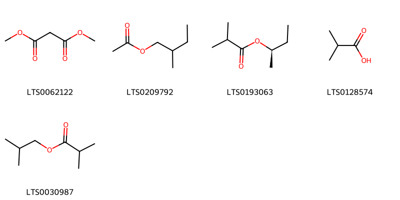{ width=100% }
    <figcaption>Hình ảnh cấu trúc hóa học của 5 hoạt chất thuộc nhóm Carboxylic acids and derivatives gồm ['dimethyl malonate (LTS0062122)', 'β-methylbutyl acetate (LTS0209792)', '(2r)-butan-2-yl 2-methylpropanoate (LTS0193063)', 'isobutyric acid (LTS0128574)', 'isobutyl isobutyrate (LTS0030987)'].</figcaption>
</figure>
#### Nhóm Cinnamic acids and derivatives
<figure markdown="span">
    { width=100% }
    <figcaption>Hình ảnh cấu trúc hóa học của 1 hoạt chất thuộc nhóm Cinnamic acids and derivatives gồm ['3,4-dihydroxycinnamic acid (LTS0128050)'].</figcaption>
</figure>
#### Nhóm Coumarins and derivatives
<figure markdown="span">
    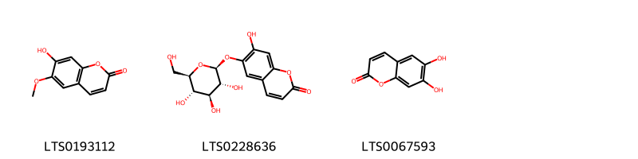{ width=100% }
    <figcaption>Hình ảnh cấu trúc hóa học của 3 hoạt chất thuộc nhóm Coumarins and derivatives gồm ['scopoletin (LTS0193112)', 'esculin (LTS0228636)', 'esculetin (LTS0067593)'].</figcaption>
</figure>
#### Nhóm Epoxides
<figure markdown="span">
    { width=100% }
    <figcaption>Hình ảnh cấu trúc hóa học của 1 hoạt chất thuộc nhóm Epoxides gồm ['(1r,3e,7e,11r)-1,5,5,7-tetramethyl-12-oxabicyclo[9.1.0]dodeca-3,7-diene (LTS0027633)'].</figcaption>
</figure>
#### Nhóm Fatty Acyls
<figure markdown="span">
    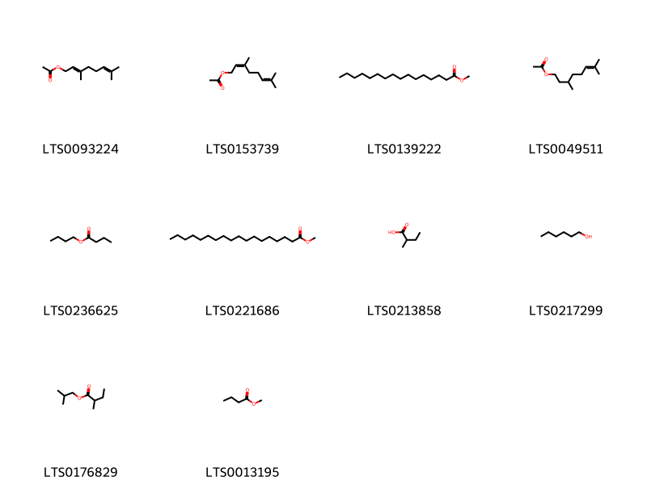{ width=100% }
    <figcaption>Hình ảnh cấu trúc hóa học của 10 hoạt chất thuộc nhóm Fatty Acyls gồm ['geranyl acetate (LTS0093224)', 'neryl acetate (LTS0153739)', 'methyl palmitate (LTS0139222)', 'citronellyl acetate (LTS0049511)', 'butyl butyrate (LTS0236625)', 'methyl stearate (LTS0221686)', '2-methylbutanoic acid (LTS0213858)', 'hexanol (LTS0217299)', 'isobutyl methylbutyrate (LTS0176829)', 'methyl butyrate (LTS0013195)'].</figcaption>
</figure>
#### Nhóm Flavonoids
<figure markdown="span">
    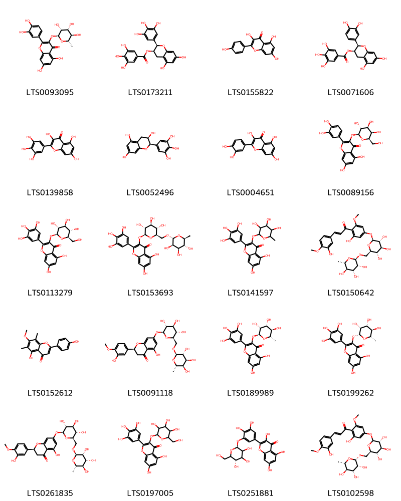{ width=100% }
    <figcaption>Hình ảnh cấu trúc hóa học của 20 hoạt chất thuộc nhóm Flavonoids gồm ['quercitrin (LTS0093095)', '(-)-epigallocatechin gallate (LTS0173211)', 'kaempherol (LTS0155822)', 'epicatechin gallate (LTS0071606)', 'myricetin (LTS0139858)', 'epigallocatechin (LTS0052496)', 'quercetin (LTS0004651)', 'hyperoside (LTS0089156)', '5,7-dihydroxy-3-{[(2s,3r,4s,5s,6r)-3,4,5-trihydroxy-6-(hydroxymethyl)oxan-2-yl]oxy}-2-(3,4,5-trihydroxyphenyl)chromen-4-one (LTS0113279)', '5,7-dihydroxy-3-{[(2s,3r,4s,5s,6r)-3,4,5-trihydroxy-6-({[(2r,3r,4r,5r,6s)-3,4,5-trihydroxy-6-methyloxan-2-yl]oxy}methyl)oxan-2-yl]oxy}-2-(3,4,5-trihydroxyphenyl)chromen-4-one (LTS0153693)', 'myricitrin (LTS0141597)', 'hesperidin methylchalcone (LTS0150642)', 'sideroxylin (LTS0152612)', '(2s)-5-hydroxy-2-(3-hydroxy-4-methoxyphenyl)-7-{[(2s,3r,4s,5s,6r)-3,4,5-trihydroxy-6-({[(2r,3r,4s,5r,6s)-3,4,5-trihydroxy-6-methyloxan-2-yl]oxy}methyl)oxan-2-yl]oxy}-2,3-dihydro-1-benzopyran-4-one (LTS0091118)', 'myricitrin (LTS0189989)', '5,7-dihydroxy-3-{[(2r,3r,4r,5r,6s)-3,4,5-trihydroxy-6-methyloxan-2-yl]oxy}-2-(3,4,5-trihydroxyphenyl)chromen-4-one (LTS0199262)', 'hesperidin (LTS0261835)', '5,7-dihydroxy-3-{[3,4,5-trihydroxy-6-(hydroxymethyl)oxan-2-yl]oxy}-2-(3,4,5-trihydroxyphenyl)chromen-4-one (LTS0197005)', "myricetin 3'-glucoside (LTS0251881)", '(2e)-3-(3-hydroxy-4-methoxyphenyl)-1-(2-hydroxy-6-methoxy-4-{[(3r,4s,5s,6r)-3,4,5-trihydroxy-6-({[(2s,3r,4r,5r,6s)-3,4,5-trihydroxy-6-methyloxan-2-yl]oxy}methyl)oxan-2-yl]oxy}phenyl)prop-2-en-1-one (LTS0102598)'].</figcaption>
</figure>
#### Nhóm Heteroaromatic compounds
<figure markdown="span">
    { width=100% }
    <figcaption>Hình ảnh cấu trúc hóa học của 1 hoạt chất thuộc nhóm Heteroaromatic compounds gồm ['perillene (LTS0083458)'].</figcaption>
</figure>
#### Nhóm Organooxygen compounds
<figure markdown="span">
    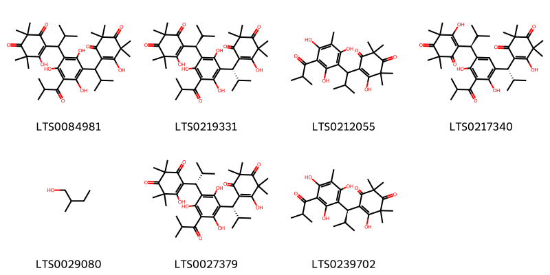{ width=100% }
    <figcaption>Hình ảnh cấu trúc hóa học của 7 hoạt chất thuộc nhóm Organooxygen compounds gồm ['5-hydroxy-2,2,6,6-tetramethyl-4-(2-methyl-1-{2,4,6-trihydroxy-3-[1-(2-hydroxy-3,3,5,5-tetramethyl-4,6-dioxocyclohex-1-en-1-yl)-2-methylpropyl]-5-(2-methylpropanoyl)phenyl}propyl)cyclohex-4-ene-1,3-dione (LTS0084981)', '5-hydroxy-2,2,6,6-tetramethyl-4-[(1s)-2-methyl-1-{2,4,6-trihydroxy-3-[(1r)-1-(2-hydroxy-3,3,5,5-tetramethyl-4,6-dioxocyclohex-1-en-1-yl)-2-methylpropyl]-5-(2-methylpropanoyl)phenyl}propyl]cyclohex-4-ene-1,3-dione (LTS0219331)', 'semimyrtucommulone (LTS0212055)', '4-[(1s)-1-{2,4-dihydroxy-5-[(1r)-1-(2-hydroxy-3,3,5,5-tetramethyl-4,6-dioxocyclohex-1-en-1-yl)-2-methylpropyl]-3-(2-methylpropanoyl)phenyl}-2-methylpropyl]-5-hydroxy-2,2,6,6-tetramethylcyclohex-4-ene-1,3-dione (LTS0217340)', '2-methyl-1-butanol (LTS0029080)', '5-hydroxy-2,2,6,6-tetramethyl-4-[(1r)-2-methyl-1-{2,4,6-trihydroxy-3-[(1r)-1-(2-hydroxy-3,3,5,5-tetramethyl-4,6-dioxocyclohex-1-en-1-yl)-2-methylpropyl]-5-(2-methylpropanoyl)phenyl}propyl]cyclohex-4-ene-1,3-dione (LTS0027379)', '5-hydroxy-2,2,6,6-tetramethyl-4-[(1s)-2-methyl-1-[2,4,6-trihydroxy-3-methyl-5-(2-methylpropanoyl)phenyl]propyl]cyclohex-4-ene-1,3-dione (LTS0239702)'].</figcaption>
</figure>
#### Nhóm Oxanes
<figure markdown="span">
    { width=100% }
    <figcaption>Hình ảnh cấu trúc hóa học của 1 hoạt chất thuộc nhóm Oxanes gồm ['1,8-cineole (LTS0166505)'].</figcaption>
</figure>
#### Nhóm Oxolanes
<figure markdown="span">
    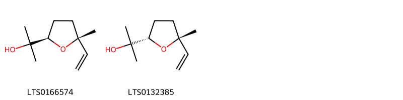{ width=100% }
    <figcaption>Hình ảnh cấu trúc hóa học của 2 hoạt chất thuộc nhóm Oxolanes gồm ['2-[(2r,5r)-5-ethenyl-5-methyloxolan-2-yl]propan-2-ol (LTS0166574)', '2-[(2s,5r)-5-ethenyl-5-methyloxolan-2-yl]propan-2-ol (LTS0132385)'].</figcaption>
</figure>
#### Nhóm Phenol esters
<figure markdown="span">
    { width=100% }
    <figcaption>Hình ảnh cấu trúc hóa học của 1 hoạt chất thuộc nhóm Phenol esters gồm ['eugenyl acetate (LTS0165886)'].</figcaption>
</figure>
#### Nhóm Phenol ethers
<figure markdown="span">
    { width=100% }
    <figcaption>Hình ảnh cấu trúc hóa học của 3 hoạt chất thuộc nhóm Phenol ethers gồm ['p-propenylanisole (LTS0177188)', 'tarragon (LTS0245226)', 'anethole (LTS0033696)'].</figcaption>
</figure>
#### Nhóm Phenols
<figure markdown="span">
    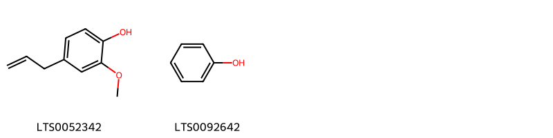{ width=100% }
    <figcaption>Hình ảnh cấu trúc hóa học của 2 hoạt chất thuộc nhóm Phenols gồm ['eugenol (LTS0052342)', 'phenol (LTS0092642)'].</figcaption>
</figure>
#### Nhóm Prenol lipids
<figure markdown="span">
    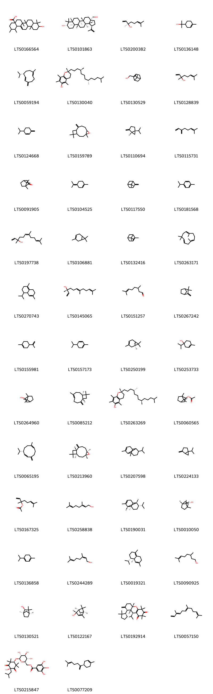{ width=100% }
    <figcaption>Hình ảnh cấu trúc hóa học của 101 hoạt chất thuộc nhóm Prenol lipids gồm ['10-hydroxy-1,2,6a,6b,9,9,12a-heptamethyl-2,3,4,5,6,7,8,8a,10,11,12,12b,13,14b-tetradecahydro-1h-picene-4a-carboxylic acid (LTS0166564)', 'betulin (LTS0101863)', '(-)-linalool (LTS0200382)', 'terpineol (LTS0136148)', '(-)-germacrene d (LTS0059194)', '(2r)-2,5,7,8-tetramethyl-2-[(4s,8s)-4,8,12-trimethyltridecyl]-3,4-dihydro-1-benzopyran-6-ol (LTS0130040)', 'myrtenol (LTS0130529)', 'linalool, (+-)- (LTS0128839)', 'β phellandrene (LTS0124668)', 'caryophyllene oxide (LTS0159789)', '(+)-sabinene (LTS0110694)', 'α-myrcene (LTS0115731)', 'camphor (LTS0091905)', 'terpinolene (LTS0104525)', 'β-pinene (LTS0117550)', 'cymene (LTS0181568)', 'nerolidol (LTS0197738)', 'monoterpenes (LTS0106881)', 'α pinene (LTS0132416)', 'humulene (LTS0263171)', '4-isopropyl-1,6-dimethyl-2,3,4,4a,7,8-hexahydronaphthalene (LTS0270743)', '(3r,6e)-nerolidol (LTS0145065)', 'citronella (LTS0151257)', 'camphene (LTS0267242)', 'limonene,  (LTS0155981)', 'phellandrene (LTS0157173)', '(+)-delta(3)-carene (LTS0250199)', '4-terpineol (LTS0253733)', 'borneol (LTS0264960)', 'caryophyllene (LTS0085212)', 'vitamin e (LTS0263269)', 'bornyl acetate (LTS0060565)', '(1z,6z,8s)-8-isopropyl-1-methyl-5-methylidenecyclodeca-1,6-diene (LTS0065195)', 'β-caryophyllene oxide (LTS0213960)', 'α-copaene (LTS0207598)', 'sabinene (LTS0224133)', 'linalyl acetate (LTS0167325)', 'geraniol (LTS0258838)', '(1r,2s,7s,8s)-8-isopropyl-1,3-dimethyltricyclo[4.4.0.0²,⁷]dec-3-ene (LTS0190031)', '(2s,4r)-1,7,7-trimethylbicyclo[2.2.1]heptan-2-ol (LTS0010050)', 'terpinene (LTS0136858)', 'nerol (LTS0244289)', 'delta-cadinene (LTS0019321)', 'citronellol, (+-)- (LTS0090925)', '(1r,2r,4s)-1,3,3-trimethylbicyclo[2.2.1]heptan-2-ol (LTS0130521)', '(1r,2s,5r)-4,6,6-trimethylbicyclo[3.1.1]hept-3-en-2-ol (LTS0122167)', '(8r,8as,9s,10as)-8-[(1r)-2,2-dimethylcyclopentyl]-9-isopropyl-2,2,4,4,10a-pentamethyl-7-methylidene-6,8,8a,9-tetrahydro-5h-xanthene-1,3-dione (LTS0192914)', 'farnesene (LTS0057150)', '[(2r,3s,4s,5r,6r)-3,4,5-trihydroxy-6-{[(1s,4s)-4-hydroxy-2,2,6,6-tetramethyl-4-(2-methylpropyl)-3,5-dioxocyclohexyl]oxy}oxan-2-yl]methyl 3,4,5-trihydroxybenzoate (LTS0215847)', '(r)-β-bisabolene (LTS0077209)', 'guaiene (LTS0039431)', '(-)-4-terpineol (LTS0111954)', '7,7-dimethyl-2-methylidenebicyclo[2.2.1]heptane (LTS0092282)', '(-)-α-pinene (LTS0032699)', 'trans-β-ocimene (LTS0049765)', '(1r,4ar,8as)-4-isopropyl-1,6-dimethyl-3,4,4a,7,8,8a-hexahydro-2h-naphthalen-1-ol (LTS0136437)', 'myrtenal (LTS0202475)', '(3s,4ar,6ar,6bs,8as,12ar,14ar,14br)-8a-(hydroxymethyl)-4,4,6a,6b,11,11,14b-heptamethyl-1,2,3,4a,5,6,7,8,9,10,12,12a,14,14a-tetradecahydropicen-3-ol (LTS0275263)', 'fenchol (LTS0261470)', 'carveol (LTS0263183)', '(1r,6s)-6-isopropyl-3-methylcyclohex-2-en-1-ol (LTS0144582)', 'β-eudesmol (LTS0203280)', '10,11-dihydroxy-1,2,6a,6b,9,9,12a-heptamethyl-2,3,4,5,6,7,8,8a,10,11,12,12b,13,14b-tetradecahydro-1h-picene-4a-carboxylic acid (LTS0122037)', '8a-(hydroxymethyl)-4,4,6a,6b,11,11,14b-heptamethyl-1,2,3,4a,5,6,7,8,9,10,12,12a,14,14a-tetradecahydropicen-3-ol (LTS0234707)', 'pinocarvone (LTS0084836)', 'ursolic acid (LTS0250838)', '(1ar,4ar,7s,7as,7br)-1,1,7-trimethyl-4-methylidene-octahydrocyclopropa[e]azulen-7-ol (LTS0243368)', 'tricyclene (LTS0179930)', 'α-thujene (LTS0176954)', '[(2r,3s,4s,5r,6s)-3,4,5-trihydroxy-6-{[(1s,2r)-2-hydroxy-4,4,6,6-tetramethyl-2-(2-methylpropyl)-3,5-dioxocyclohexyl]oxy}oxan-2-yl]methyl 3,4,5-trihydroxybenzoate (LTS0243413)', '(1r,5s)-4,6,6-trimethylbicyclo[3.1.1]hept-3-en-2-one (LTS0177954)', 'verbenone (LTS0264577)', 'thymol (LTS0168527)', '(8r,8as,9s,10as)-8-(2,2-dimethylcyclopentyl)-9-isopropyl-2,2,4,4,10a-pentamethyl-7-methylidene-6,8,8a,9-tetrahydro-5h-xanthene-1,3-dione (LTS0183347)', '[(2r,3s,4s,5r,6s)-3,4,5-trihydroxy-6-{[(1s,2s)-2-hydroxy-4,4,6,6-tetramethyl-2-(2-methylpropyl)-3,5-dioxocyclohexyl]oxy}oxan-2-yl]methyl 3,4,5-trihydroxybenzoate (LTS0226046)', 'delta-cadinol (LTS0008282)', 'α-thujene (LTS0185078)', 'corosolic acid (LTS0231285)', 'oleanolic acid (LTS0141130)', '(3,4,5-trihydroxy-6-{[2-hydroxy-4,4,6,6-tetramethyl-2-(2-methylpropyl)-3,5-dioxocyclohexyl]oxy}oxan-2-yl)methyl 3,4,5-trihydroxybenzoate (LTS0227448)', 'neral (LTS0165243)', '[(2r,3s,4s,5r,6r)-3,4,5-trihydroxy-6-{[4-hydroxy-2,2,6,6-tetramethyl-4-(2-methylpropyl)-3,5-dioxocyclohexyl]oxy}oxan-2-yl]methyl 3,4,5-trihydroxybenzoate (LTS0246567)', 'β-ocimene (LTS0242381)', 'α-terpinyl acetate (LTS0172943)', '(-)-trans-carveol (LTS0156471)', '(s)-trans-verbenol (LTS0175186)', 'methyl geranate (LTS0181597)', '(+)-α-terpineol (LTS0258249)', '(+)-α-terpinyl acetate (LTS0129587)', '(-)-β-bisabolene (LTS0009940)', "(1's,2r,4s,5'r)-4,5'-diisopropyl-6,6,8,8-tetramethyl-3,4-dihydrospiro[1-benzopyran-2,2'-bicyclo[3.1.0]hexane]-5,7-dione (LTS0008884)", '(3r)-6,6-dimethyl-2-methylidenebicyclo[3.1.1]heptan-3-ol (LTS0009265)', '3a-(hydroxymethyl)-5a,5b,8,8,11a-pentamethyl-1-(prop-1-en-2-yl)-hexadecahydrocyclopenta[a]chrysen-9-ol (LTS0008250)', 'carvacrol (LTS0012882)', 'pinocarveol (LTS0090950)', '(7ar)-1,1,7-trimethyl-4-methylidene-octahydrocyclopropa[e]azulen-7-ol (LTS0091612)', '(3,4,5-trihydroxy-6-{[4-hydroxy-2,2,6,6-tetramethyl-4-(2-methylpropyl)-3,5-dioxocyclohexyl]oxy}oxan-2-yl)methyl 3,4,5-trihydroxybenzoate (LTS0001214)', 'α-citral (LTS0246122)', '(+)-α-thujene (LTS0272912)', 'linalyl acetate (LTS0020520)', 'oleanolic acid (LTS0117717)'].</figcaption>
</figure>
#### Nhóm Steroids and steroid derivatives
<figure markdown="span">
    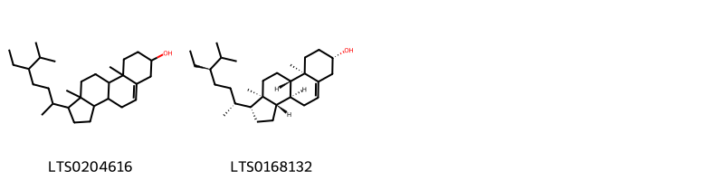{ width=100% }
    <figcaption>Hình ảnh cấu trúc hóa học của 2 hoạt chất thuộc nhóm Steroids and steroid derivatives gồm ['stigmast-5-en-3-ol, (3β)- (LTS0204616)', 'sitosterol (LTS0168132)'].</figcaption>
</figure>
#### Nhóm Tannins
<figure markdown="span">
    { width=100% }
    <figcaption>Hình ảnh cấu trúc hóa học của 1 hoạt chất thuộc nhóm Tannins gồm ['ellagic acid (LTS0037297)'].</figcaption>
</figure>
#### Nhóm Tetrahydrofurans
<figure markdown="span">
    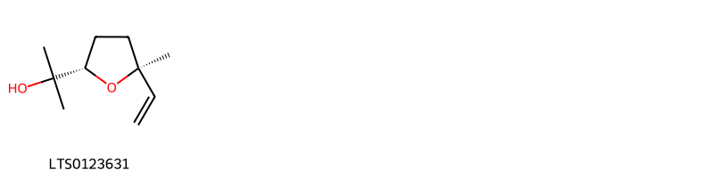{ width=100% }
    <figcaption>Hình ảnh cấu trúc hóa học của 1 hoạt chất thuộc nhóm Tetrahydrofurans gồm ['trans-linalool oxide (LTS0123631)'].</figcaption>
</figure>
#### Nhóm Unsaturated hydrocarbons
<figure markdown="span">
    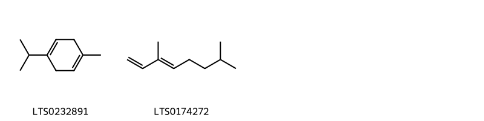{ width=100% }
    <figcaption>Hình ảnh cấu trúc hóa học của 2 hoạt chất thuộc nhóm Unsaturated hydrocarbons gồm ['α terpinene (LTS0232891)', '(3e)-3,7-dimethylocta-1,3-diene (LTS0174272)'].</figcaption>
</figure>

---

### Dược dân tộc học

Danh sách các quốc gia có sử dụng *Myrtus communis* trong điều trị các bệnh. 

| Country   | Disease                                                                                   | Bệnh                                                                                                                                                                                                |
|:----------|:------------------------------------------------------------------------------------------|:----------------------------------------------------------------------------------------------------------------------------------------------------------------------------------------------------|
| Elsewhere | Antiseptic, Astringent, Carminative, Rubefacient                                          | MYMEMORY WARNING: YOU USED ALL AVAILABLE FREE TRANSLATIONS FOR TODAY. NEXT AVAILABLE IN  06 HOURS 57 MINUTES 45 SECONDS VISIT HTTPS://MYMEMORY.TRANSLATED.NET/DOC/USAGELIMITS.PHP TO TRANSLATE MORE |
| Europe    | Stomachic, Tonic                                                                          | MYMEMORY WARNING: YOU USED ALL AVAILABLE FREE TRANSLATIONS FOR TODAY. NEXT AVAILABLE IN  06 HOURS 57 MINUTES 42 SECONDS VISIT HTTPS://MYMEMORY.TRANSLATED.NET/DOC/USAGELIMITS.PHP TO TRANSLATE MORE |
| Iraq      | Stimulant                                                                                 | MYMEMORY WARNING: YOU USED ALL AVAILABLE FREE TRANSLATIONS FOR TODAY. NEXT AVAILABLE IN  06 HOURS 57 MINUTES 39 SECONDS VISIT HTTPS://MYMEMORY.TRANSLATED.NET/DOC/USAGELIMITS.PHP TO TRANSLATE MORE |
| Kurdistan | Antiseptic                                                                                | MYMEMORY WARNING: YOU USED ALL AVAILABLE FREE TRANSLATIONS FOR TODAY. NEXT AVAILABLE IN  06 HOURS 57 MINUTES 37 SECONDS VISIT HTTPS://MYMEMORY.TRANSLATED.NET/DOC/USAGELIMITS.PHP TO TRANSLATE MORE |
| Turkey    | Antiseptic, Astringent, Sedative, Stimulant, Perfume, Carminative, Rubefacient, Stomachic | MYMEMORY WARNING: YOU USED ALL AVAILABLE FREE TRANSLATIONS FOR TODAY. NEXT AVAILABLE IN  06 HOURS 57 MINUTES 34 SECONDS VISIT HTTPS://MYMEMORY.TRANSLATED.NET/DOC/USAGELIMITS.PHP TO TRANSLATE MORE |
| ain       | Antiseptic                                                                                | MYMEMORY WARNING: YOU USED ALL AVAILABLE FREE TRANSLATIONS FOR TODAY. NEXT AVAILABLE IN  06 HOURS 57 MINUTES 31 SECONDS VISIT HTTPS://MYMEMORY.TRANSLATED.NET/DOC/USAGELIMITS.PHP TO TRANSLATE MORE |

---

---
## Myrtus ehrenbergii
### Thông tin về thực vật

!!! info "Phân loại thực vật của *Mosiera ehrenbergii* từ GIBF:"
    - **Kingdom:** Plantae
    - **Phylum:** Tracheophyta
    - **Order:** Myrtales
    - **Family:** Myrtaceae
    - **Genus:** Mosiera
    - **Species:** *Mosiera ehrenbergii*

 

| Label (VI)   | Label (EN)   | Scientific Name    | Descriptions (VI)   | Descriptions (EN)   | Also Known As (VI)   | Also Known As (EN)   |
|:-------------|:-------------|:-------------------|:--------------------|:--------------------|:---------------------|:---------------------|
| N/A          | N/A          | Myrtus ehrenbergii | loài thực vật       | species of plant    | ['']                 | ['']                 |

#### Phân bố trên thế giới

**Từ CSDL GIBF** nan, Mexico

#### Phân bố tại Việt Nam

**Từ CSDL GIBF**: Không có ghi nhận ở Việt Nam

---
### Thành phần hóa học
        
- Theo cơ sở dữ liệu lotus: Từ loài *Mosiera ehrenbergii* đã phân lập và xác định được Chưa có hoạt chất nào được phân lập. hoạt chất thuộc về các nhóm Không có hoạt chất nào được phân lập. 

Không có hình ảnh nào được tạo ra

---

### Dược dân tộc học

Danh sách các quốc gia có sử dụng *Mosiera ehrenbergii* trong điều trị các bệnh. 

| Country   | Disease           | Bệnh                                                                                                                                                                                                |
|:----------|:------------------|:----------------------------------------------------------------------------------------------------------------------------------------------------------------------------------------------------|
| Mexico    | Astringent, Tonic | MYMEMORY WARNING: YOU USED ALL AVAILABLE FREE TRANSLATIONS FOR TODAY. NEXT AVAILABLE IN  06 HOURS 56 MINUTES 49 SECONDS VISIT HTTPS://MYMEMORY.TRANSLATED.NET/DOC/USAGELIMITS.PHP TO TRANSLATE MORE |

---

# Chi Pimenta

??? note "Danh sách các dược liệu thuộc chi"
    
	 - *Pimenta dioica*
	 - *Pimenta officinalis*
	 - *Pimenta ozua*
	 - *Pimenta racemosa*

---
## Pimenta dioica
### Thông tin về thực vật

!!! info "Phân loại thực vật của *Pimenta dioica* từ GIBF:"
    - **Kingdom:** Plantae
    - **Phylum:** Tracheophyta
    - **Order:** Myrtales
    - **Family:** Myrtaceae
    - **Genus:** Pimenta
    - **Species:** *Pimenta dioica*

 

| Label (VI)   | Label (EN)   | Scientific Name   | Descriptions (VI)   | Descriptions (EN)          | Also Known As (VI)   | Also Known As (EN)   |
|:-------------|:-------------|:------------------|:--------------------|:---------------------------|:---------------------|:---------------------|
| N/A          | N/A          | Pimenta dioica    | loài thực vật       | species of plant, allspice | ['']                 | ['allspice']         |

#### Phân bố trên thế giới

**Từ CSDL GIBF** Brazil, Guatemala, New Zealand, Ecuador, Spain, Cayman Islands, Réunion, United States of America, Jamaica, Seychelles, Costa Rica, Colombia, Cuba, French Guiana, Mexico, Norway, El Salvador, Belgium, Chinese Taipei, Mayotte, Canada, Nicaragua, Bermuda, South Africa, Australia, India, Belize

#### Phân bố tại Việt Nam

**Từ CSDL GIBF**: Không có ghi nhận ở Việt Nam

---
### Thành phần hóa học
        
- Theo cơ sở dữ liệu lotus: Từ loài *Pimenta dioica* đã phân lập và xác định được 71 hoạt chất thuộc về các nhóm Fatty Acyls, Benzene and substituted derivatives, Flavonoids, Phenols, Organooxygen compounds, Cinnamaldehydes, Phenol ethers, Prenol lipids. 

|    | chemicalTaxonomyClassyfireClass     |   smiles_count |
|---:|:------------------------------------|---------------:|
|  0 | Benzene and substituted derivatives |              9 |
|  1 | Cinnamaldehydes                     |              2 |
|  2 | Fatty Acyls                         |              2 |
|  3 | Flavonoids                          |             18 |
|  4 | Organooxygen compounds              |              5 |
|  5 | Phenol ethers                       |              1 |
|  6 | Phenols                             |             10 |
|  7 | Prenol lipids                       |             24 |

#### Nhóm Benzene and substituted derivatives
<figure markdown="span">
    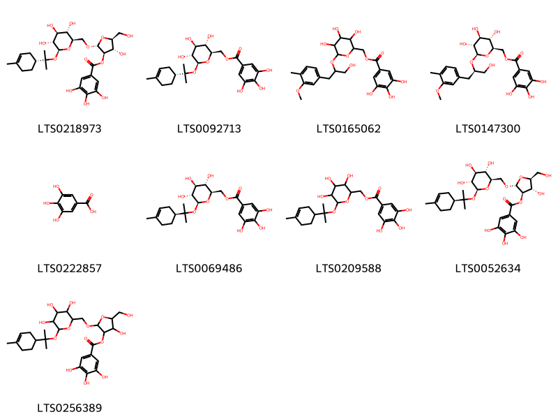{ width=100% }
    <figcaption>Hình ảnh cấu trúc hóa học của 9 hoạt chất thuộc nhóm Benzene and substituted derivatives gồm ['(2r,3r,4s,5s)-4-hydroxy-5-(hydroxymethyl)-2-{[(2r,3s,4s,5r,6s)-3,4,5-trihydroxy-6-({2-[(1r)-4-methylcyclohex-3-en-1-yl]propan-2-yl}oxy)oxan-2-yl]methoxy}oxolan-3-yl 3,4,5-trihydroxybenzoate (LTS0218973)', '[(2r,3s,4s,5r,6s)-3,4,5-trihydroxy-6-({2-[(1r)-4-methylcyclohex-3-en-1-yl]propan-2-yl}oxy)oxan-2-yl]methyl 3,4,5-trihydroxybenzoate (LTS0092713)', '(3,4,5-trihydroxy-6-{[1-hydroxy-3-(3-methoxy-4-methylphenyl)propan-2-yl]oxy}oxan-2-yl)methyl 3,4,5-trihydroxybenzoate (LTS0165062)', '[(2r,3s,4s,5r,6r)-3,4,5-trihydroxy-6-{[(2r)-1-hydroxy-3-(3-methoxy-4-methylphenyl)propan-2-yl]oxy}oxan-2-yl]methyl 3,4,5-trihydroxybenzoate (LTS0147300)', 'galop (LTS0222857)', '[(2r,3s,4s,5r,6s)-3,4,5-trihydroxy-6-({2-[(1s)-4-methylcyclohex-3-en-1-yl]propan-2-yl}oxy)oxan-2-yl]methyl 3,4,5-trihydroxybenzoate (LTS0069486)', '(3,4,5-trihydroxy-6-{[2-(4-methylcyclohex-3-en-1-yl)propan-2-yl]oxy}oxan-2-yl)methyl 3,4,5-trihydroxybenzoate (LTS0209588)', '(2r,3r,4s,5s)-4-hydroxy-5-(hydroxymethyl)-2-{[(2r,3s,4s,5r,6s)-3,4,5-trihydroxy-6-({2-[(1s)-4-methylcyclohex-3-en-1-yl]propan-2-yl}oxy)oxan-2-yl]methoxy}oxolan-3-yl 3,4,5-trihydroxybenzoate (LTS0052634)', '4-hydroxy-5-(hydroxymethyl)-2-[(3,4,5-trihydroxy-6-{[2-(4-methylcyclohex-3-en-1-yl)propan-2-yl]oxy}oxan-2-yl)methoxy]oxolan-3-yl 3,4,5-trihydroxybenzoate (LTS0256389)'].</figcaption>
</figure>
#### Nhóm Cinnamaldehydes
<figure markdown="span">
    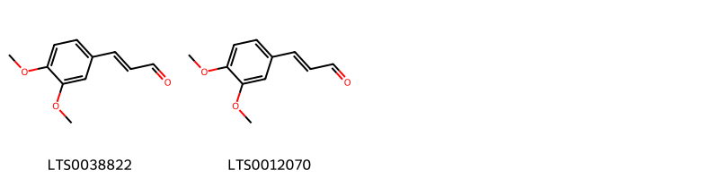{ width=100% }
    <figcaption>Hình ảnh cấu trúc hóa học của 2 hoạt chất thuộc nhóm Cinnamaldehydes gồm ['3-(3,4-dimethoxyphenyl)prop-2-enal (LTS0038822)', '3,4-dimethoxy cinnamaldehyde (LTS0012070)'].</figcaption>
</figure>
#### Nhóm Fatty Acyls
<figure markdown="span">
    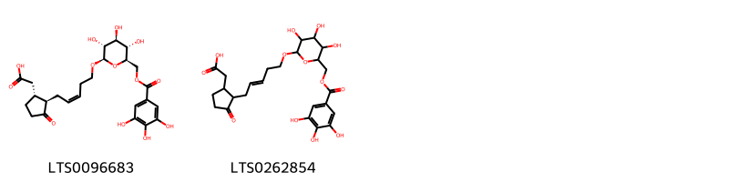{ width=100% }
    <figcaption>Hình ảnh cấu trúc hóa học của 2 hoạt chất thuộc nhóm Fatty Acyls gồm ['[(1r,2r)-3-oxo-2-[(2z)-5-{[(2r,3r,4s,5s,6r)-3,4,5-trihydroxy-6-[(3,4,5-trihydroxybenzoyloxy)methyl]oxan-2-yl]oxy}pent-2-en-1-yl]cyclopentyl]acetic acid (LTS0096683)', '{3-oxo-2-[5-({3,4,5-trihydroxy-6-[(3,4,5-trihydroxybenzoyloxy)methyl]oxan-2-yl}oxy)pent-2-en-1-yl]cyclopentyl}acetic acid (LTS0262854)'].</figcaption>
</figure>
#### Nhóm Flavonoids
<figure markdown="span">
    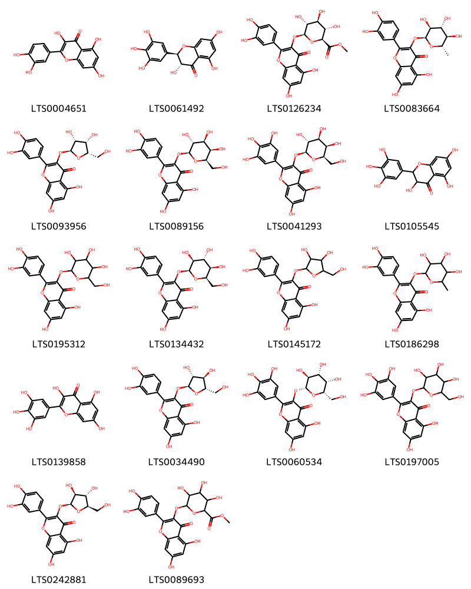{ width=100% }
    <figcaption>Hình ảnh cấu trúc hóa học của 18 hoạt chất thuộc nhóm Flavonoids gồm ['quercetin (LTS0004651)', '(+)-dihydromyricetin (LTS0061492)', 'methyl (2s,3s,4s,5r,6s)-6-{[2-(3,4-dihydroxyphenyl)-5,7-dihydroxy-4-oxochromen-3-yl]oxy}-3,4,5-trihydroxyoxane-2-carboxylate (LTS0126234)', '2-(3,4-dihydroxyphenyl)-5,7-dihydroxy-3-{[(2s,3s,4r,5r,6s)-3,4,5-trihydroxy-6-methyloxan-2-yl]oxy}chromen-4-one (LTS0083664)', '3-{[(2s,3r,4s,5s)-3,4-dihydroxy-5-(hydroxymethyl)oxolan-2-yl]oxy}-2-(3,4-dihydroxyphenyl)-5,7-dihydroxychromen-4-one (LTS0093956)', 'hyperoside (LTS0089156)', '5,7-dihydroxy-3-{[(2s,3r,4s,5r,6r)-3,4,5-trihydroxy-6-(hydroxymethyl)oxan-2-yl]oxy}-2-(3,4,5-trihydroxyphenyl)chromen-4-one (LTS0041293)', 'dihydromyricetin (LTS0105545)', '2-(3,4-dihydroxyphenyl)-5,7-dihydroxy-3-{[3,4,5-trihydroxy-6-(hydroxymethyl)oxan-2-yl]oxy}chromen-4-one (LTS0195312)', '2-(3,4-dihydroxyphenyl)-5,7-dihydroxy-3-{[(2s,3s,4r,5r,6r)-3,4,5-trihydroxy-6-(hydroxymethyl)oxan-2-yl]oxy}chromen-4-one (LTS0134432)', '3-{[3,4-dihydroxy-5-(hydroxymethyl)oxolan-2-yl]oxy}-2-(3,4-dihydroxyphenyl)-5,7-dihydroxychromen-4-one (LTS0145172)', 'quercitrin (LTS0186298)', 'myricetin (LTS0139858)', 'avicularin (LTS0034490)', '5,7-dihydroxy-3-{[(2r,3s,4r,5s,6s)-3,4,5-trihydroxy-6-(hydroxymethyl)oxan-2-yl]oxy}-2-(3,4,5-trihydroxyphenyl)chromen-4-one (LTS0060534)', '5,7-dihydroxy-3-{[3,4,5-trihydroxy-6-(hydroxymethyl)oxan-2-yl]oxy}-2-(3,4,5-trihydroxyphenyl)chromen-4-one (LTS0197005)', '3-{[(2s,3s,4s,5r)-3,4-dihydroxy-5-(hydroxymethyl)oxolan-2-yl]oxy}-2-(3,4-dihydroxyphenyl)-5,7-dihydroxychromen-4-one (LTS0242881)', 'methyl 6-{[2-(3,4-dihydroxyphenyl)-5,7-dihydroxy-4-oxochromen-3-yl]oxy}-3,4,5-trihydroxyoxane-2-carboxylate (LTS0089693)'].</figcaption>
</figure>
#### Nhóm Organooxygen compounds
<figure markdown="span">
    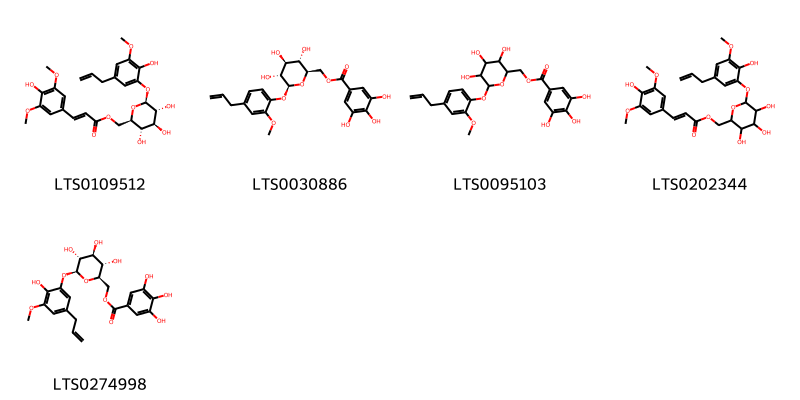{ width=100% }
    <figcaption>Hình ảnh cấu trúc hóa học của 5 hoạt chất thuộc nhóm Organooxygen compounds gồm ['[(2r,3s,4s,5r,6s)-3,4,5-trihydroxy-6-[2-hydroxy-3-methoxy-5-(prop-2-en-1-yl)phenoxy]oxan-2-yl]methyl (2e)-3-(4-hydroxy-3,5-dimethoxyphenyl)prop-2-enoate (LTS0109512)', '[(2r,3s,4s,5r,6s)-3,4,5-trihydroxy-6-[2-methoxy-4-(prop-2-en-1-yl)phenoxy]oxan-2-yl]methyl 3,4,5-trihydroxybenzoate (LTS0030886)', '{3,4,5-trihydroxy-6-[2-methoxy-4-(prop-2-en-1-yl)phenoxy]oxan-2-yl}methyl 3,4,5-trihydroxybenzoate (LTS0095103)', '{3,4,5-trihydroxy-6-[2-hydroxy-3-methoxy-5-(prop-2-en-1-yl)phenoxy]oxan-2-yl}methyl 3-(4-hydroxy-3,5-dimethoxyphenyl)prop-2-enoate (LTS0202344)', 'pimentol (LTS0274998)'].</figcaption>
</figure>
#### Nhóm Phenol ethers
<figure markdown="span">
    { width=100% }
    <figcaption>Hình ảnh cấu trúc hóa học của 1 hoạt chất thuộc nhóm Phenol ethers gồm ['tarragon (LTS0245226)'].</figcaption>
</figure>
#### Nhóm Phenols
<figure markdown="span">
    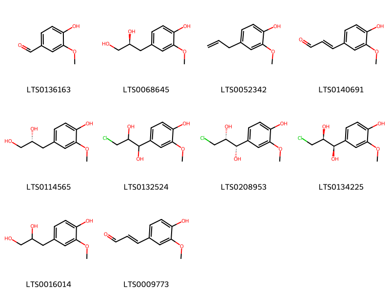{ width=100% }
    <figcaption>Hình ảnh cấu trúc hóa học của 10 hoạt chất thuộc nhóm Phenols gồm ['vanillin (LTS0136163)', '(2s)-3-(4-hydroxy-3-methoxyphenyl)propane-1,2-diol (LTS0068645)', 'eugenol (LTS0052342)', 'coniferyl aldehyde (LTS0140691)', '(2r)-3-(4-hydroxy-3-methoxyphenyl)propane-1,2-diol (LTS0114565)', '3-chloro-1-(4-hydroxy-3-methoxyphenyl)propane-1,2-diol (LTS0132524)', '(1s,2r)-3-chloro-1-(4-hydroxy-3-methoxyphenyl)propane-1,2-diol (LTS0208953)', '(1r,2s)-3-chloro-1-(4-hydroxy-3-methoxyphenyl)propane-1,2-diol (LTS0134225)', '3-(4-hydroxy-3-methoxyphenyl)propane-1,2-diol (LTS0016014)', 'coniferaldehyde (LTS0009773)'].</figcaption>
</figure>
#### Nhóm Prenol lipids
<figure markdown="span">
    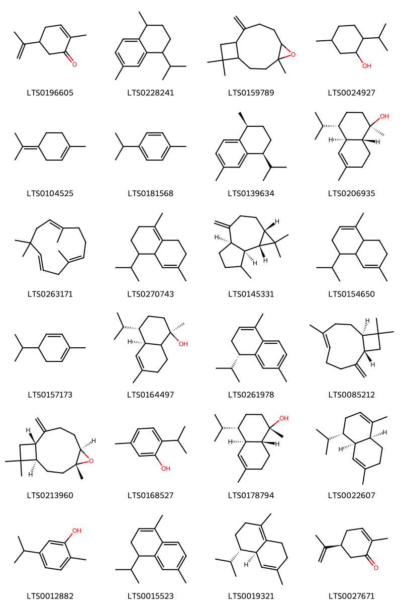{ width=100% }
    <figcaption>Hình ảnh cấu trúc hóa học của 24 hoạt chất thuộc nhóm Prenol lipids gồm ['carvone (LTS0196605)', '(e)-calamene (LTS0228241)', 'caryophyllene oxide (LTS0159789)', 'menthol natural (LTS0024927)', 'terpinolene (LTS0104525)', 'cymene (LTS0181568)', '(1s,4s)-4-isopropyl-1,6-dimethyl-1,2,3,4-tetrahydronaphthalene (LTS0139634)', 'α-cadinol (LTS0206935)', 'humulene (LTS0263171)', '4-isopropyl-1,6-dimethyl-2,3,4,4a,7,8-hexahydronaphthalene (LTS0270743)', '(1as,4ar,7as,7br)-1,1,7-trimethyl-4-methylidene-octahydro-1ah-cyclopropa[e]azulene (LTS0145331)', '4-isopropyl-1,6-dimethyl-3,4,4a,7,8,8a-hexahydronaphthalene (LTS0154650)', 'phellandrene (LTS0157173)', '(1r,4s,4ar)-4-isopropyl-1,6-dimethyl-3,4,4a,7,8,8a-hexahydro-2h-naphthalen-1-ol (LTS0164497)', '(4s)-4-isopropyl-1,6-dimethyl-3,4-dihydronaphthalene (LTS0261978)', 'caryophyllene (LTS0085212)', 'β-caryophyllene oxide (LTS0213960)', 'thymol (LTS0168527)', 'α-cadinol (LTS0178794)', 'α-muurolene (LTS0022607)', 'carvacrol (LTS0012882)', '3,4-dihydrocadalene (LTS0015523)', 'delta-cadinene (LTS0019321)', 'carvone, (+)- (LTS0027671)'].</figcaption>
</figure>

---

### Dược dân tộc học

Danh sách các quốc gia có sử dụng *Pimenta dioica* trong điều trị các bệnh. 

| Country       | Disease                                             | Bệnh                                                                                                                                                                                                |
|:--------------|:----------------------------------------------------|:----------------------------------------------------------------------------------------------------------------------------------------------------------------------------------------------------|
| Elsewhere     | Antioxidant, nan, Carminative, Fungicide, Stimulant | MYMEMORY WARNING: YOU USED ALL AVAILABLE FREE TRANSLATIONS FOR TODAY. NEXT AVAILABLE IN  06 HOURS 56 MINUTES 31 SECONDS VISIT HTTPS://MYMEMORY.TRANSLATED.NET/DOC/USAGELIMITS.PHP TO TRANSLATE MORE |
| Latin America | Carminative, Stimulant                              | MYMEMORY WARNING: YOU USED ALL AVAILABLE FREE TRANSLATIONS FOR TODAY. NEXT AVAILABLE IN  06 HOURS 56 MINUTES 29 SECONDS VISIT HTTPS://MYMEMORY.TRANSLATED.NET/DOC/USAGELIMITS.PHP TO TRANSLATE MORE |
| Mexico        | Stimulant                                           | MYMEMORY WARNING: YOU USED ALL AVAILABLE FREE TRANSLATIONS FOR TODAY. NEXT AVAILABLE IN  06 HOURS 56 MINUTES 26 SECONDS VISIT HTTPS://MYMEMORY.TRANSLATED.NET/DOC/USAGELIMITS.PHP TO TRANSLATE MORE |
| Turkey        | Carminative, Stimulant, Stomachic                   | MYMEMORY WARNING: YOU USED ALL AVAILABLE FREE TRANSLATIONS FOR TODAY. NEXT AVAILABLE IN  06 HOURS 56 MINUTES 23 SECONDS VISIT HTTPS://MYMEMORY.TRANSLATED.NET/DOC/USAGELIMITS.PHP TO TRANSLATE MORE |

---

---
## Pimenta officinalis
### Thông tin về thực vật

!!! info "Phân loại thực vật của *Pimenta dioica* từ GIBF:"
    - **Kingdom:** Plantae
    - **Phylum:** Tracheophyta
    - **Order:** Myrtales
    - **Family:** Myrtaceae
    - **Genus:** Pimenta
    - **Species:** *Pimenta dioica*

 

| Label (VI)   | Label (EN)   | Scientific Name     | Descriptions (VI)   | Descriptions (EN)   | Also Known As (VI)   | Also Known As (EN)   |
|:-------------|:-------------|:--------------------|:--------------------|:--------------------|:---------------------|:---------------------|
| N/A          | N/A          | Pimenta officinalis | loài thực vật       | species of plant    | ['']                 | ['']                 |

#### Phân bố trên thế giới

**Từ CSDL GIBF** nan, Brazil, Guatemala, Trinidad and Tobago, Netherlands, Ghana, United States of America, Jamaica, Costa Rica, Cuba, unknown or invalid, Dominica, Mexico, Mauritius, Germany, Portugal, Bermuda, United Kingdom of Great Britain and Northern Ireland, Belize

#### Phân bố tại Việt Nam

**Từ CSDL GIBF**: Không có ghi nhận ở Việt Nam

---
### Thành phần hóa học
        
- Theo cơ sở dữ liệu lotus: Từ loài *Pimenta dioica* đã phân lập và xác định được Chưa có hoạt chất nào được phân lập. hoạt chất thuộc về các nhóm Không có hoạt chất nào được phân lập. 

Không có hình ảnh nào được tạo ra

---

### Dược dân tộc học

Danh sách các quốc gia có sử dụng *Pimenta dioica* trong điều trị các bệnh. 

| Country   | Disease                | Bệnh                                                                                                                                                                                                |
|:----------|:-----------------------|:----------------------------------------------------------------------------------------------------------------------------------------------------------------------------------------------------|
| Venezuela | Carminative, Digestive | MYMEMORY WARNING: YOU USED ALL AVAILABLE FREE TRANSLATIONS FOR TODAY. NEXT AVAILABLE IN  06 HOURS 55 MINUTES 54 SECONDS VISIT HTTPS://MYMEMORY.TRANSLATED.NET/DOC/USAGELIMITS.PHP TO TRANSLATE MORE |

---

---
## Pimenta ozua
### Thông tin về thực vật

!!! info "Phân loại thực vật của *Pimenta racemosa* từ GIBF:"
    - **Kingdom:** Plantae
    - **Phylum:** Tracheophyta
    - **Order:** Myrtales
    - **Family:** Myrtaceae
    - **Genus:** Pimenta
    - **Species:** *Pimenta racemosa*

 

| Label (VI)   | Label (EN)   | Scientific Name   | Descriptions (VI)   | Descriptions (EN)   | Also Known As (VI)   | Also Known As (EN)   |
|:-------------|:-------------|:------------------|:--------------------|:--------------------|:---------------------|:---------------------|
| N/A          | N/A          | Pimenta ozua      | loài thực vật       | species of plant    | ['']                 | ['']                 |

#### Phân bố trên thế giới

**Từ CSDL GIBF** nan, Dominican Republic

#### Phân bố tại Việt Nam

**Từ CSDL GIBF**: Không có ghi nhận ở Việt Nam

---
### Thành phần hóa học
        
- Theo cơ sở dữ liệu lotus: Từ loài *Pimenta racemosa* đã phân lập và xác định được Chưa có hoạt chất nào được phân lập. hoạt chất thuộc về các nhóm Không có hoạt chất nào được phân lập. 

Không có hình ảnh nào được tạo ra

---

### Dược dân tộc học

Danh sách các quốc gia có sử dụng *Pimenta racemosa* trong điều trị các bệnh. 

| Country            | Disease      | Bệnh                                                                                                                                                                                                |
|:-------------------|:-------------|:----------------------------------------------------------------------------------------------------------------------------------------------------------------------------------------------------|
| Dominican Republic | Disinfectant | MYMEMORY WARNING: YOU USED ALL AVAILABLE FREE TRANSLATIONS FOR TODAY. NEXT AVAILABLE IN  06 HOURS 55 MINUTES 34 SECONDS VISIT HTTPS://MYMEMORY.TRANSLATED.NET/DOC/USAGELIMITS.PHP TO TRANSLATE MORE |

---

---
## Pimenta racemosa
### Thông tin về thực vật

!!! info "Phân loại thực vật của *Pimenta racemosa* từ GIBF:"
    - **Kingdom:** Plantae
    - **Phylum:** Tracheophyta
    - **Order:** Myrtales
    - **Family:** Myrtaceae
    - **Genus:** Pimenta
    - **Species:** *Pimenta racemosa*

 

| Label (VI)   | Label (EN)   | Scientific Name   | Descriptions (VI)   | Descriptions (EN)   | Also Known As (VI)   | Also Known As (EN)   |
|:-------------|:-------------|:------------------|:--------------------|:--------------------|:---------------------|:---------------------|
| N/A          | N/A          | Pimenta racemosa  | loài thực vật       | species of plant    | ['']                 | ['']                 |

#### Phân bố trên thế giới

**Từ CSDL GIBF** nan, Brazil, Saint Kitts and Nevis, Guadeloupe, Barbados, Honduras, French Polynesia, Trinidad and Tobago, Madagascar, Puerto Rico, United States of America, Jamaica, Virgin Islands (U.S.), Seychelles, Dominican Republic, Colombia, Guyana, Cuba, unknown or invalid, French Guiana, Grenada, Dominica, Mayotte, Panama, Bonaire, Sint Eustatius and Saba, Martinique, Cook Islands, South Africa, France, Montserrat, Venezuela (Bolivarian Republic of)

#### Phân bố tại Việt Nam

**Từ CSDL GIBF**: Không có ghi nhận ở Việt Nam

---
### Thành phần hóa học
        
- Theo cơ sở dữ liệu lotus: Từ loài *Pimenta racemosa* đã phân lập và xác định được 112 hoạt chất thuộc về các nhóm Fatty Acyls, Benzene and substituted derivatives, Unsaturated hydrocarbons, Carboxylic acids and derivatives, Cinnamic acids and derivatives, Phenols, Oxanes, Organooxygen compounds, Cinnamaldehydes, Phenol ethers, Phenol esters, Prenol lipids. 

|    | chemicalTaxonomyClassyfireClass     |   smiles_count |
|---:|:------------------------------------|---------------:|
|  0 | Benzene and substituted derivatives |              3 |
|  1 | Carboxylic acids and derivatives    |              1 |
|  2 | Cinnamaldehydes                     |              1 |
|  3 | Cinnamic acids and derivatives      |              3 |
|  4 | Fatty Acyls                         |              6 |
|  5 | Organooxygen compounds              |              8 |
|  6 | Oxanes                              |              2 |
|  7 | Phenol esters                       |              1 |
|  8 | Phenol ethers                       |              4 |
|  9 | Phenols                             |              3 |
| 10 | Prenol lipids                       |             79 |
| 11 | Unsaturated hydrocarbons            |              1 |

#### Nhóm Benzene and substituted derivatives
<figure markdown="span">
    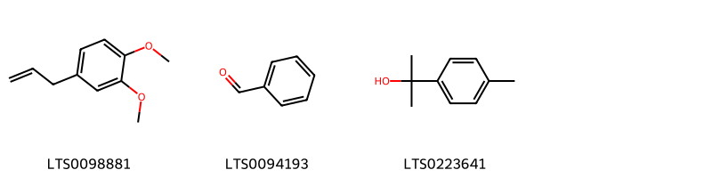{ width=100% }
    <figcaption>Hình ảnh cấu trúc hóa học của 3 hoạt chất thuộc nhóm Benzene and substituted derivatives gồm ['methyl eugenol (LTS0098881)', 'benzaldehyde (LTS0094193)', 'p-cymen-8-ol (LTS0223641)'].</figcaption>
</figure>
#### Nhóm Carboxylic acids and derivatives
<figure markdown="span">
    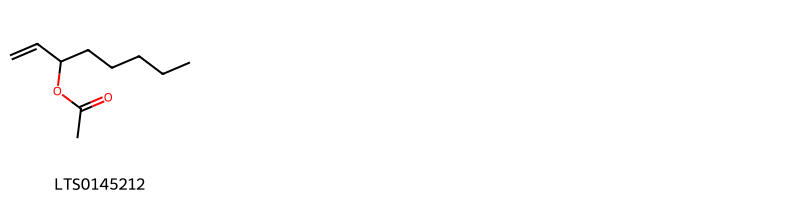{ width=100% }
    <figcaption>Hình ảnh cấu trúc hóa học của 1 hoạt chất thuộc nhóm Carboxylic acids and derivatives gồm ['1-octen-3-yl acetate (LTS0145212)'].</figcaption>
</figure>
#### Nhóm Cinnamaldehydes
<figure markdown="span">
    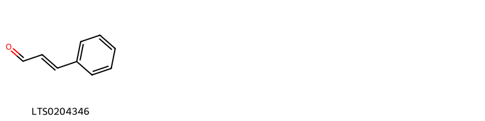{ width=100% }
    <figcaption>Hình ảnh cấu trúc hóa học của 1 hoạt chất thuộc nhóm Cinnamaldehydes gồm ['3-phenyl-2-propenal (LTS0204346)'].</figcaption>
</figure>
#### Nhóm Cinnamic acids and derivatives
<figure markdown="span">
    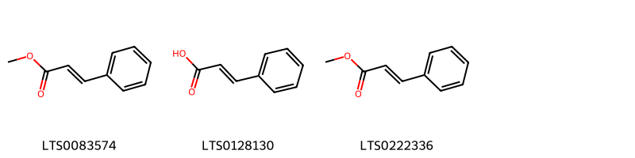{ width=100% }
    <figcaption>Hình ảnh cấu trúc hóa học của 3 hoạt chất thuộc nhóm Cinnamic acids and derivatives gồm ['methyl cinnamate (LTS0083574)', 'cinnamic acid (LTS0128130)', 'methyl cinnamate (LTS0222336)'].</figcaption>
</figure>
#### Nhóm Fatty Acyls
<figure markdown="span">
    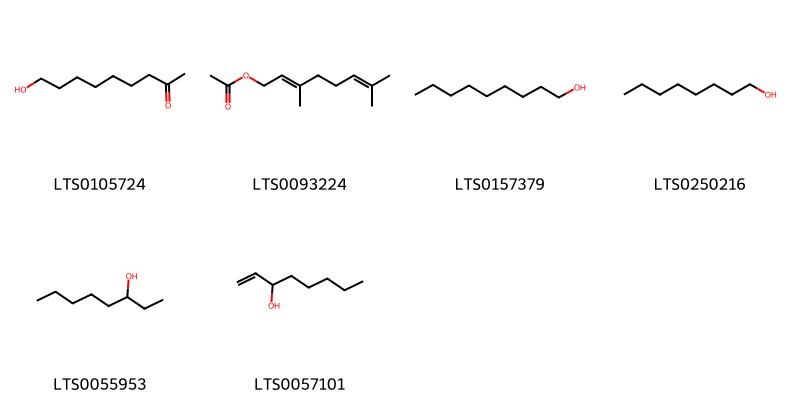{ width=100% }
    <figcaption>Hình ảnh cấu trúc hóa học của 6 hoạt chất thuộc nhóm Fatty Acyls gồm ['9-hydroxynonan-2-one (LTS0105724)', 'geranyl acetate (LTS0093224)', 'nonan-1-ol (LTS0157379)', 'octanol (LTS0250216)', '3-octanol (LTS0055953)', '1-octen-3-ol (LTS0057101)'].</figcaption>
</figure>
#### Nhóm Organooxygen compounds
<figure markdown="span">
    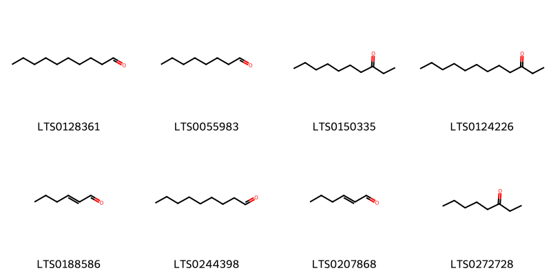{ width=100% }
    <figcaption>Hình ảnh cấu trúc hóa học của 8 hoạt chất thuộc nhóm Organooxygen compounds gồm ['decanal (LTS0128361)', 'octanal (LTS0055983)', '3-decanone (LTS0150335)', 'dodecan-3-one (LTS0124226)', 'hexenal (LTS0188586)', 'nonanal (LTS0244398)', '(e)-2-hexenal (LTS0207868)', '3-octanone (LTS0272728)'].</figcaption>
</figure>
#### Nhóm Oxanes
<figure markdown="span">
    { width=100% }
    <figcaption>Hình ảnh cấu trúc hóa học của 2 hoạt chất thuộc nhóm Oxanes gồm ['(2r,4r)-rose oxide (LTS0270571)', 'rose oxide (LTS0036561)'].</figcaption>
</figure>
#### Nhóm Phenol esters
<figure markdown="span">
    { width=100% }
    <figcaption>Hình ảnh cấu trúc hóa học của 1 hoạt chất thuộc nhóm Phenol esters gồm ['eugenyl acetate (LTS0165886)'].</figcaption>
</figure>
#### Nhóm Phenol ethers
<figure markdown="span">
    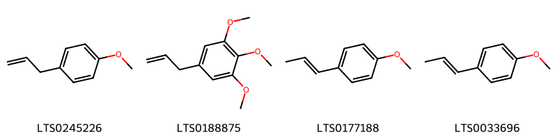{ width=100% }
    <figcaption>Hình ảnh cấu trúc hóa học của 4 hoạt chất thuộc nhóm Phenol ethers gồm ['tarragon (LTS0245226)', 'elemicin (LTS0188875)', 'p-propenylanisole (LTS0177188)', 'anethole (LTS0033696)'].</figcaption>
</figure>
#### Nhóm Phenols
<figure markdown="span">
    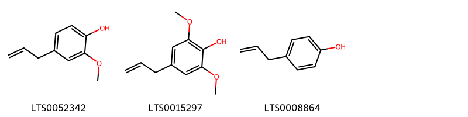{ width=100% }
    <figcaption>Hình ảnh cấu trúc hóa học của 3 hoạt chất thuộc nhóm Phenols gồm ['eugenol (LTS0052342)', '4-allyl-2,6-dimethoxyphenol (LTS0015297)', 'chavicol (LTS0008864)'].</figcaption>
</figure>
#### Nhóm Prenol lipids
<figure markdown="span">
    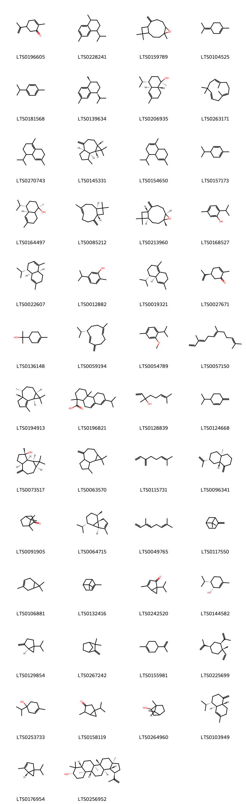{ width=100% }
    <figcaption>Hình ảnh cấu trúc hóa học của 79 hoạt chất thuộc nhóm Prenol lipids gồm ['carvone (LTS0196605)', '(e)-calamene (LTS0228241)', 'caryophyllene oxide (LTS0159789)', 'terpinolene (LTS0104525)', 'cymene (LTS0181568)', '(1s,4s)-4-isopropyl-1,6-dimethyl-1,2,3,4-tetrahydronaphthalene (LTS0139634)', 'α-cadinol (LTS0206935)', 'humulene (LTS0263171)', '4-isopropyl-1,6-dimethyl-2,3,4,4a,7,8-hexahydronaphthalene (LTS0270743)', '(1as,4ar,7as,7br)-1,1,7-trimethyl-4-methylidene-octahydro-1ah-cyclopropa[e]azulene (LTS0145331)', '4-isopropyl-1,6-dimethyl-3,4,4a,7,8,8a-hexahydronaphthalene (LTS0154650)', 'phellandrene (LTS0157173)', '(1r,4s,4ar)-4-isopropyl-1,6-dimethyl-3,4,4a,7,8,8a-hexahydro-2h-naphthalen-1-ol (LTS0164497)', 'caryophyllene (LTS0085212)', 'β-caryophyllene oxide (LTS0213960)', 'thymol (LTS0168527)', 'α-muurolene (LTS0022607)', 'carvacrol (LTS0012882)', 'delta-cadinene (LTS0019321)', 'carvone, (+)- (LTS0027671)', 'terpineol (LTS0136148)', '(-)-germacrene d (LTS0059194)', '2-isopropyl-5-methylanisole (LTS0054789)', 'farnesene (LTS0057150)', '(-)-α-gurjunene (LTS0194913)', 'abietic acid (LTS0196821)', 'linalool, (+-)- (LTS0128839)', 'β phellandrene (LTS0124668)', '(1as,4as,7s,7ar,7bs)-1,1,7-trimethyl-4-methylidene-octahydrocyclopropa[e]azulen-7-ol (LTS0073517)', '1,1,7-trimethyl-4-methylidene-octahydro-1ah-cyclopropa[e]azulene (LTS0063570)', 'α-myrcene (LTS0115731)', 'β-selinene (LTS0096341)', 'camphor (LTS0091905)', '(1s,5r,7s,10r)-7-isopropyl-4,10-dimethyltricyclo[4.4.0.0¹,⁵]dec-3-ene (LTS0064715)', 'trans-β-ocimene (LTS0049765)', 'β-pinene (LTS0117550)', 'monoterpenes (LTS0106881)', 'α pinene (LTS0132416)', 'umbellulone (LTS0242520)', '(1r,6s)-6-isopropyl-3-methylcyclohex-2-en-1-ol (LTS0144582)', '(5s)-1-isopropyl-4-methylidenebicyclo[3.1.0]hexane (LTS0129854)', 'camphene (LTS0267242)', 'limonene,  (LTS0155981)', 'β-elemene (LTS0225699)', '4-terpineol (LTS0253733)', '3-isothujone (LTS0158119)', 'borneol (LTS0264960)', '(+)-gamma-cadinene (LTS0103949)', 'α-thujene (LTS0176954)', 'lupeol (LTS0256952)', '(1z,6z,8s)-8-isopropyl-1-methyl-5-methylidenecyclodeca-1,6-diene (LTS0065195)', '(1s,4r)-4-isopropyl-1,6-dimethyl-3,4,4a,7,8,8a-hexahydro-2h-naphthalen-1-ol (LTS0264329)', 'selinene (LTS0197809)', 'α-copaene (LTS0207598)', 'sabinene (LTS0224133)', '(1r,5s)-1-isopropyl-4-methylbicyclo[3.1.0]hex-3-en-2-one (LTS0213292)', '(1ar,4r,4ar,7as,7bs)-1,1,4,7-tetramethyl-octahydro-1ah-cyclopropa[e]azulen-4-ol (LTS0021381)', 'α-thujene (LTS0185078)', '(1as,4as,7as,7br)-1,1,7-trimethyl-4-methylidene-octahydro-1ah-cyclopropa[e]azulene (LTS0160636)', '(+)-trans-piperitenol (LTS0141152)', 'neral (LTS0165243)', '(+)-β-thujone (LTS0180873)', 'geraniol (LTS0258838)', 'β-ocimene (LTS0242381)', '(1r,2s,7s,8s)-8-isopropyl-1,3-dimethyltricyclo[4.4.0.0²,⁷]dec-3-ene (LTS0190031)', '(2s,4r)-1,7,7-trimethylbicyclo[2.2.1]heptan-2-ol (LTS0010050)', 'β-cadinene (LTS0049088)', 'ledol (LTS0243935)', '(-)-chamigrene (LTS0274399)', 'terpinene (LTS0136858)', '(7ar)-1,1,7-trimethyl-4-methylidene-octahydrocyclopropa[e]azulen-7-ol (LTS0091612)', 'α-selinene (LTS0024564)', 'citronellol, (+-)- (LTS0090925)', 'abietic acid (LTS0088895)', 'α-citral (LTS0246122)', 'cis-2-pinanol (LTS0105876)', '(-)-α-cubebene (LTS0042045)', '4-isopropyl-6-methyl-1-methylidene-3,4,4a,7,8,8a-hexahydro-2h-naphthalene (LTS0111070)', '(1r,2r,5s)-2,6,6-trimethylbicyclo[3.1.1]heptan-2-ol (LTS0124806)'].</figcaption>
</figure>
#### Nhóm Unsaturated hydrocarbons
<figure markdown="span">
    { width=100% }
    <figcaption>Hình ảnh cấu trúc hóa học của 1 hoạt chất thuộc nhóm Unsaturated hydrocarbons gồm ['α terpinene (LTS0232891)'].</figcaption>
</figure>

---

### Dược dân tộc học

Danh sách các quốc gia có sử dụng *Pimenta racemosa* trong điều trị các bệnh. 

| Country   | Disease                          | Bệnh                                                                                                                                                                                                |
|:----------|:---------------------------------|:----------------------------------------------------------------------------------------------------------------------------------------------------------------------------------------------------|
| Elsewhere | Carminative, Expectorant         | MYMEMORY WARNING: YOU USED ALL AVAILABLE FREE TRANSLATIONS FOR TODAY. NEXT AVAILABLE IN  06 HOURS 55 MINUTES 18 SECONDS VISIT HTTPS://MYMEMORY.TRANSLATED.NET/DOC/USAGELIMITS.PHP TO TRANSLATE MORE |
| English   | Perfume                          | MYMEMORY WARNING: YOU USED ALL AVAILABLE FREE TRANSLATIONS FOR TODAY. NEXT AVAILABLE IN  06 HOURS 55 MINUTES 15 SECONDS VISIT HTTPS://MYMEMORY.TRANSLATED.NET/DOC/USAGELIMITS.PHP TO TRANSLATE MORE |
| Haiti     | Digestive, Antiseptic, Stomachic | MYMEMORY WARNING: YOU USED ALL AVAILABLE FREE TRANSLATIONS FOR TODAY. NEXT AVAILABLE IN  06 HOURS 55 MINUTES 12 SECONDS VISIT HTTPS://MYMEMORY.TRANSLATED.NET/DOC/USAGELIMITS.PHP TO TRANSLATE MORE |
| Trinidad  | Expectorant                      | MYMEMORY WARNING: YOU USED ALL AVAILABLE FREE TRANSLATIONS FOR TODAY. NEXT AVAILABLE IN  06 HOURS 55 MINUTES 10 SECONDS VISIT HTTPS://MYMEMORY.TRANSLATED.NET/DOC/USAGELIMITS.PHP TO TRANSLATE MORE |

---

# Chi Syzygium

??? note "Danh sách các dược liệu thuộc chi"
    
	 - *Syzygium aqueum*
	 - *Syzygium aromaticum*
	 - *Syzygium cerasoideum*
	 - *Syzygium corynocarpum*
	 - *Syzygium cumini*
	 - *Syzygium cuminii*
	 - *Syzygium jambos*
	 - *Syzygium jambosa*
	 - *Syzygium malaccense*
	 - *Syzygium zeylanicum*

---
## Syzygium aqueum
### Thông tin về thực vật

!!! info "Phân loại thực vật của *Syzygium aqueum* từ GIBF:"
    - **Kingdom:** Plantae
    - **Phylum:** Tracheophyta
    - **Order:** Myrtales
    - **Family:** Myrtaceae
    - **Genus:** Syzygium
    - **Species:** *Syzygium aqueum*

 

| Label (VI)   | Label (EN)   | Scientific Name   | Descriptions (VI)   | Descriptions (EN)   | Also Known As (VI)   | Also Known As (EN)                                                                         |
|:-------------|:-------------|:------------------|:--------------------|:--------------------|:---------------------|:-------------------------------------------------------------------------------------------|
| N/A          | N/A          | Syzygium aqueum   |                     | species of plant    | ['']                 | ['water cherry', 'bell fruit', 'jambu air', 'Lau Lau', 'water apple', 'watery rose apple'] |

#### Phân bố trên thế giới

**Từ CSDL GIBF** nan, Brazil, Guadeloupe, Papua New Guinea, Thailand, Sri Lanka, United States of America, Indonesia, Costa Rica, Croatia, unknown or invalid, Hong Kong, Dominica, El Salvador, Guam, Malaysia, Philippines, Solomon Islands, Singapore, Cambodia, Bonaire, Sint Eustatius and Saba, Australia, Micronesia (Federated States of), India, Switzerland, Bolivia (Plurinational State of), Venezuela (Bolivarian Republic of)

#### Phân bố tại Việt Nam

**Từ CSDL GIBF**: Không có ghi nhận ở Việt Nam

---
### Thành phần hóa học
        
- Theo cơ sở dữ liệu lotus: Từ loài *Syzygium aqueum* đã phân lập và xác định được 18 hoạt chất thuộc về các nhóm Tannins, Flavonoids. 

|    | chemicalTaxonomyClassyfireClass   |   smiles_count |
|---:|:----------------------------------|---------------:|
|  0 | Flavonoids                        |              6 |
|  1 | Tannins                           |             12 |

#### Nhóm Flavonoids
<figure markdown="span">
    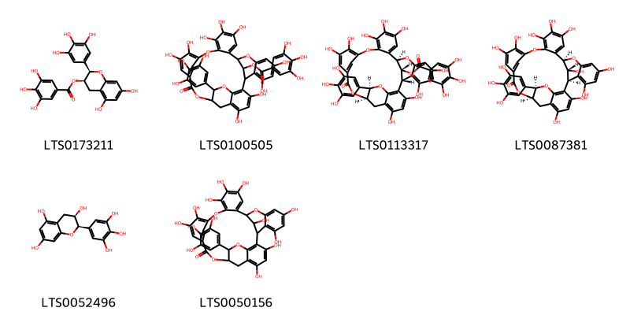{ width=100% }
    <figcaption>Hình ảnh cấu trúc hóa học của 6 hoạt chất thuộc nhóm Flavonoids gồm ['(-)-epigallocatechin gallate (LTS0173211)', '3,5,15,16,20,21,22,29,31-nonahydroxy-12-oxo-9-(3,4,5-trihydroxyphenyl)-8,11,18,26-tetraoxaheptacyclo[23.7.1.1⁶,¹⁰.1¹³,¹⁷.0²,⁷.0¹⁹,²⁴.0²⁷,³²]pentatriaconta-2(7),3,5,13,15,17(34),19,21,23,27,29,31-dodecaen-33-yl 3,4,5-trihydroxybenzoate (LTS0100505)', '(1r,9r,10r,25r,33r)-3,5,15,16,20,21,22,29,31-nonahydroxy-12-oxo-9-(3,4,5-trihydroxyphenyl)-8,11,18,26-tetraoxaheptacyclo[23.7.1.1⁶,¹⁰.1¹³,¹⁷.0²,⁷.0¹⁹,²⁴.0²⁷,³²]pentatriaconta-2(7),3,5,13,15,17(34),19,21,23,27,29,31-dodecaen-33-yl 3,4,5-trihydroxybenzoate (LTS0113317)', '(1s,9r,10r,25r,33r)-3,5,15,16,20,21,22,29,31,33-decahydroxy-9-(3,4,5-trihydroxyphenyl)-8,11,18,26-tetraoxaheptacyclo[23.7.1.1⁶,¹⁰.1¹³,¹⁷.0²,⁷.0¹⁹,²⁴.0²⁷,³²]pentatriaconta-2(7),3,5,13,15,17(34),19,21,23,27,29,31-dodecaen-12-one (LTS0087381)', 'epigallocatechin (LTS0052496)', '3,5,15,16,20,21,22,29,31,33-decahydroxy-9-(3,4,5-trihydroxyphenyl)-8,11,18,26-tetraoxaheptacyclo[23.7.1.1⁶,¹⁰.1¹³,¹⁷.0²,⁷.0¹⁹,²⁴.0²⁷,³²]pentatriaconta-2(7),3,5,13,15,17(34),19,21,23,27,29,31-dodecaen-12-one (LTS0050156)'].</figcaption>
</figure>
#### Nhóm Tannins
<figure markdown="span">
    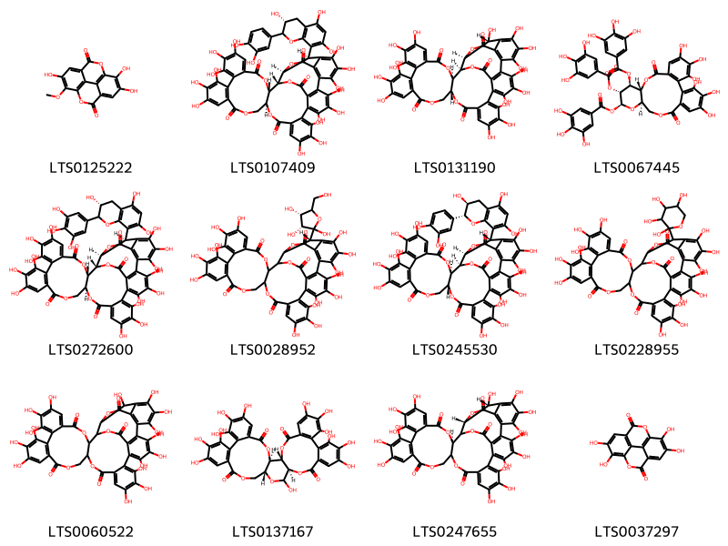{ width=100% }
    <figcaption>Hình ảnh cấu trúc hóa học của 12 hoạt chất thuộc nhóm Tannins gồm ['6,7,13-trihydroxy-14-methoxy-2,9-dioxatetracyclo[6.6.2.0⁴,¹⁶.0¹¹,¹⁵]hexadeca-1(15),4,6,8(16),11,13-hexaene-3,10-dione (LTS0125222)', '(1s,2s,20s,42s,46r)-46-[(3r)-2-(3,4-dihydroxyphenyl)-3,5,7-trihydroxy-3,4-dihydro-2h-1-benzopyran-8-yl]-7,8,9,12,13,14,25,26,27,30,31,32,35,36,37-pentadecahydroxy-3,18,21,41,43-pentaoxanonacyclo[27.13.3.1³⁸,⁴².0²,²⁰.0⁵,¹⁰.0¹¹,¹⁶.0²³,²⁸.0³³,⁴⁵.0³⁴,³⁹]hexatetraconta-5,7,9,11(16),12,14,23,25,27,29,31,33(45),34(39),35,37-pentadecaene-4,17,22,40,44-pentone (LTS0107409)', '(1r,2r,20r,42s,46r)-7,8,9,12,13,14,25,26,27,30,31,32,35,36,37,46-hexadecahydroxy-3,18,21,41,43-pentaoxanonacyclo[27.13.3.1³⁸,⁴².0²,²⁰.0⁵,¹⁰.0¹¹,¹⁶.0²³,²⁸.0³³,⁴⁵.0³⁴,³⁹]hexatetraconta-5,7,9,11(16),12,14,23,25,27,29,31,33(45),34(39),35,37-pentadecaene-4,17,22,40,44-pentone (LTS0131190)', '(10r,11s,12r,13s,15r)-3,4,5,21,22,23-hexahydroxy-8,18-dioxo-12,13-bis(3,4,5-trihydroxybenzoyloxy)-9,14,17-trioxatetracyclo[17.4.0.0²,⁷.0¹⁰,¹⁵]tricosa-1(23),2(7),3,5,19,21-hexaen-11-yl 3,4,5-trihydroxybenzoate (LTS0067445)', '(1s,2s,20s,42s,46r)-7,8,9,12,13,14,25,26,27,30,31,32,35,36,37-pentadecahydroxy-46-[(3r)-3,5,7-trihydroxy-2-(3,4,5-trihydroxyphenyl)-3,4-dihydro-2h-1-benzopyran-8-yl]-3,18,21,41,43-pentaoxanonacyclo[27.13.3.1³⁸,⁴².0²,²⁰.0⁵,¹⁰.0¹¹,¹⁶.0²³,²⁸.0³³,⁴⁵.0³⁴,³⁹]hexatetraconta-5,7,9,11(16),12,14,23,25,27,29,31,33(45),34(39),35,37-pentadecaene-4,17,22,40,44-pentone (LTS0272600)', '(46r)-7,8,9,12,13,14,25,26,27,30,31,32,35,36,37-pentadecahydroxy-46-[(3r,4s)-2,3,4-trihydroxy-5-(hydroxymethyl)oxolan-2-yl]-3,18,21,41,43-pentaoxanonacyclo[27.13.3.1³⁸,⁴².0²,²⁰.0⁵,¹⁰.0¹¹,¹⁶.0²³,²⁸.0³³,⁴⁵.0³⁴,³⁹]hexatetraconta-5,7,9,11(16),12,14,23,25,27,29,31,33(45),34(39),35,37-pentadecaene-4,17,22,40,44-pentone (LTS0028952)', '(1r,2r,20r,42s,46s)-46-[(2r,3s)-2-(3,4-dihydroxyphenyl)-3,5,7-trihydroxy-3,4-dihydro-2h-1-benzopyran-8-yl]-7,8,9,12,13,14,25,26,27,30,31,32,35,36,37-pentadecahydroxy-3,18,21,41,43-pentaoxanonacyclo[27.13.3.1³⁸,⁴².0²,²⁰.0⁵,¹⁰.0¹¹,¹⁶.0²³,²⁸.0³³,⁴⁵.0³⁴,³⁹]hexatetraconta-5,7,9,11(16),12,14,23,25,27,29,31,33(45),34(39),35,37-pentadecaene-4,17,22,40,44-pentone (LTS0245530)', '7,8,9,12,13,14,25,26,27,30,31,32,35,36,37-pentadecahydroxy-46-(2,3,4,5-tetrahydroxyoxan-2-yl)-3,18,21,41,43-pentaoxanonacyclo[27.13.3.1³⁸,⁴².0²,²⁰.0⁵,¹⁰.0¹¹,¹⁶.0²³,²⁸.0³³,⁴⁵.0³⁴,³⁹]hexatetraconta-5,7,9,11(16),12,14,23,25,27,29,31,33(45),34(39),35,37-pentadecaene-4,17,22,40,44-pentone (LTS0228955)', '7,8,9,12,13,14,25,26,27,30,31,32,35,36,37,46-hexadecahydroxy-3,18,21,41,43-pentaoxanonacyclo[27.13.3.1³⁸,⁴².0²,²⁰.0⁵,¹⁰.0¹¹,¹⁶.0²³,²⁸.0³³,⁴⁵.0³⁴,³⁹]hexatetraconta-5,7,9,11(16),12,14,23,25,27,29,31,33(45),34(39),35,37-pentadecaene-4,17,22,40,44-pentone (LTS0060522)', '(1r,2s,19r,22r)-7,8,9,12,13,14,20,28,29,30,33,34,35-tridecahydroxy-3,18,21,24,39-pentaoxaheptacyclo[20.17.0.0²,¹⁹.0⁵,¹⁰.0¹¹,¹⁶.0²⁶,³¹.0³²,³⁷]nonatriaconta-5(10),6,8,11,13,15,26(31),27,29,32,34,36-dodecaene-4,17,25,38-tetrone (LTS0137167)', '(2r,42r,46r)-7,8,9,12,13,14,25,26,27,30,31,32,35,36,37,46-hexadecahydroxy-3,18,21,41,43-pentaoxanonacyclo[27.13.3.1³⁸,⁴².0²,²⁰.0⁵,¹⁰.0¹¹,¹⁶.0²³,²⁸.0³³,⁴⁵.0³⁴,³⁹]hexatetraconta-5,7,9,11(16),12,14,23,25,27,29,31,33(45),34(39),35,37-pentadecaene-4,17,22,40,44-pentone (LTS0247655)', 'ellagic acid (LTS0037297)'].</figcaption>
</figure>

---

### Dược dân tộc học

Danh sách các quốc gia có sử dụng *Syzygium aqueum* trong điều trị các bệnh. 

| Country   | Disease    | Bệnh                                                                                                                                                                                                |
|:----------|:-----------|:----------------------------------------------------------------------------------------------------------------------------------------------------------------------------------------------------|
| Elsewhere | Astringent | MYMEMORY WARNING: YOU USED ALL AVAILABLE FREE TRANSLATIONS FOR TODAY. NEXT AVAILABLE IN  06 HOURS 54 MINUTES 36 SECONDS VISIT HTTPS://MYMEMORY.TRANSLATED.NET/DOC/USAGELIMITS.PHP TO TRANSLATE MORE |

---

---
## Syzygium aromaticum
### Thông tin về thực vật

!!! info "Phân loại thực vật của *Syzygium aromaticum* từ GIBF:"
    - **Kingdom:** Plantae
    - **Phylum:** Tracheophyta
    - **Order:** Myrtales
    - **Family:** Myrtaceae
    - **Genus:** Syzygium
    - **Species:** *Syzygium aromaticum*

 

| Label (VI)   | Label (EN)   | Scientific Name     | Descriptions (VI)   | Descriptions (EN)   | Also Known As (VI)                               | Also Known As (EN)                           |
|:-------------|:-------------|:--------------------|:--------------------|:--------------------|:-------------------------------------------------|:---------------------------------------------|
| N/A          | N/A          | Syzygium aromaticum | loài thực vật       | species of plant    | ['Syzygium aromaticum', 'Eugenia caryophyllata'] | ['Syzygium aromaticum', 'Zanzibar red head'] |

#### Phân bố trên thế giới

**Từ CSDL GIBF** Brazil, China, Tanzania, United Republic of, Ecuador, Türkiye, Madagascar, Sri Lanka, United States of America, Indonesia, Seychelles, Nigeria, unknown or invalid, Hong Kong, Dominica, Benin, Mexico, Belgium, Malaysia, Mayotte, Mauritius, Georgia, Canada, Peru, South Africa, Micronesia (Federated States of), Switzerland, India, Comoros

#### Phân bố tại Việt Nam

**Từ CSDL GIBF**: Không có ghi nhận ở Việt Nam

---
### Thành phần hóa học
        
- Theo cơ sở dữ liệu lotus: Từ loài *Syzygium aromaticum* đã phân lập và xác định được 171 hoạt chất thuộc về các nhóm Fatty Acyls, Naphthalenes, Phenols, Organooxygen compounds, Phenol ethers, Benzofurans, Polycyclic hydrocarbons, Lactones, Benzene and substituted derivatives, Tannins, Cinnamic acids and derivatives, Steroids and steroid derivatives, Phenol esters, Saturated hydrocarbons, Benzopyrans, Flavonoids, Prenol lipids, Indoles and derivatives. 

|    | chemicalTaxonomyClassyfireClass     |   smiles_count |
|---:|:------------------------------------|---------------:|
|  0 | Benzene and substituted derivatives |             16 |
|  1 | Benzofurans                         |              1 |
|  2 | Benzopyrans                         |              4 |
|  3 | Cinnamic acids and derivatives      |              4 |
|  4 | Fatty Acyls                         |              4 |
|  5 | Flavonoids                          |             11 |
|  6 | Indoles and derivatives             |              1 |
|  7 | Lactones                            |              1 |
|  8 | Naphthalenes                        |              1 |
|  9 | Organooxygen compounds              |             24 |
| 10 | Phenol esters                       |              2 |
| 11 | Phenol ethers                       |              3 |
| 12 | Phenols                             |              9 |
| 13 | Polycyclic hydrocarbons             |              1 |
| 14 | Prenol lipids                       |             41 |
| 15 | Saturated hydrocarbons              |              2 |
| 16 | Steroids and steroid derivatives    |              5 |
| 17 | Tannins                             |             39 |

#### Nhóm Benzene and substituted derivatives
<figure markdown="span">
    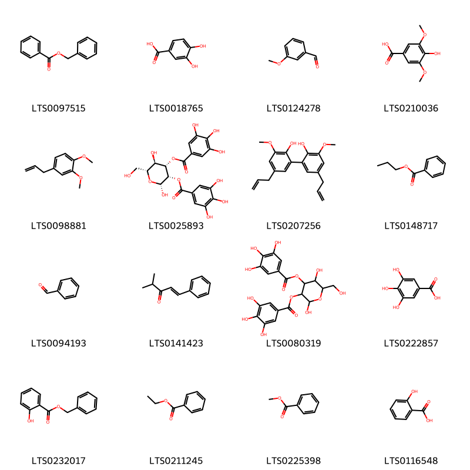{ width=100% }
    <figcaption>Hình ảnh cấu trúc hóa học của 16 hoạt chất thuộc nhóm Benzene and substituted derivatives gồm ['benzyl benzoate (LTS0097515)', '3,4-dihydroxybenzoic acid (LTS0018765)', '3-methoxybenzaldehyde (LTS0124278)', 'syringic acid (LTS0210036)', 'methyl eugenol (LTS0098881)', '(2r,3s,4s,5r,6r)-2,5-dihydroxy-6-(hydroxymethyl)-3-(3,4,5-trihydroxybenzoyloxy)oxan-4-yl 3,4,5-trihydroxybenzoate (LTS0025893)', 'dehydrodieugenol (LTS0207256)', 'propyl benzoate (LTS0148717)', 'benzaldehyde (LTS0094193)', '4-methyl-1-phenylpent-1-en-3-one (LTS0141423)', '2,5-dihydroxy-6-(hydroxymethyl)-3-(3,4,5-trihydroxybenzoyloxy)oxan-4-yl 3,4,5-trihydroxybenzoate (LTS0080319)', 'galop (LTS0222857)', 'benzyl salicylate (LTS0232017)', 'ethyl benzoate (LTS0211245)', 'methyl benzoate (LTS0225398)', 'salicyclic acid (LTS0116548)'].</figcaption>
</figure>
#### Nhóm Benzofurans
<figure markdown="span">
    { width=100% }
    <figcaption>Hình ảnh cấu trúc hóa học của 1 hoạt chất thuộc nhóm Benzofurans gồm ["7-hydroxy-6-isopropyl-3',3'-dimethyl-2-oxospiro[1-benzofuran-3,1'-cyclohexane]-2',4-dicarbaldehyde (LTS0255026)"].</figcaption>
</figure>
#### Nhóm Benzopyrans
<figure markdown="span">
    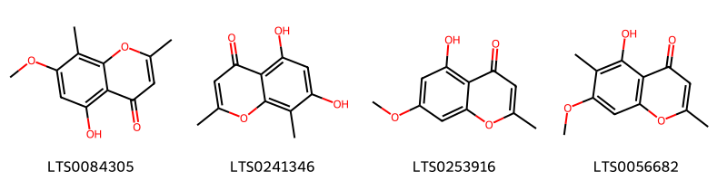{ width=100% }
    <figcaption>Hình ảnh cấu trúc hóa học của 4 hoạt chất thuộc nhóm Benzopyrans gồm ['5-hydroxy-7-methoxy-2,8-dimethylchromen-4-one (LTS0084305)', '5,7-dihydroxy-2,8-dimethylchromen-4-one (LTS0241346)', 'eugenin (LTS0253916)', 'eugenitin (LTS0056682)'].</figcaption>
</figure>
#### Nhóm Cinnamic acids and derivatives
<figure markdown="span">
    { width=100% }
    <figcaption>Hình ảnh cấu trúc hóa học của 4 hoạt chất thuộc nhóm Cinnamic acids and derivatives gồm ['3,4-dihydroxycinnamic acid (LTS0128050)', 'para-coumaric acid (LTS0266252)', 'rosemary acid (LTS0207820)', 'hydroxycinnamic acid (LTS0233023)'].</figcaption>
</figure>
#### Nhóm Fatty Acyls
<figure markdown="span">
    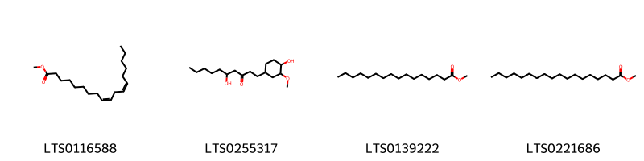{ width=100% }
    <figcaption>Hình ảnh cấu trúc hóa học của 4 hoạt chất thuộc nhóm Fatty Acyls gồm ['methyl linoleate (LTS0116588)', '5-hydroxy-1-(4-hydroxy-3-methoxycyclohexyl)decan-3-one (LTS0255317)', 'methyl palmitate (LTS0139222)', 'methyl stearate (LTS0221686)'].</figcaption>
</figure>
#### Nhóm Flavonoids
<figure markdown="span">
    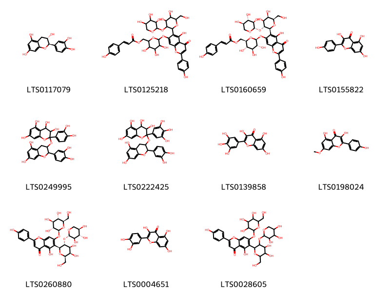{ width=100% }
    <figcaption>Hình ảnh cấu trúc hóa học của 11 hoạt chất thuộc nhóm Flavonoids gồm ['(+)-catechol (LTS0117079)', '[6-({6-[4,5-dihydroxy-6-(hydroxymethyl)-3-[(3,4,5-trihydroxyoxan-2-yl)oxy]oxan-2-yl]-5-hydroxy-2-(4-hydroxyphenyl)-4-oxochromen-7-yl}oxy)-3,4,5-trihydroxyoxan-2-yl]methyl 3-(4-hydroxyphenyl)prop-2-enoate (LTS0125218)', '[(2r,3s,4s,5r,6s)-6-({6-[(2s,3r,4s,5r,6r)-4,5-dihydroxy-6-(hydroxymethyl)-3-{[(2s,3r,4s,5r)-3,4,5-trihydroxyoxan-2-yl]oxy}oxan-2-yl]-5-hydroxy-2-(4-hydroxyphenyl)-4-oxochromen-7-yl}oxy)-3,4,5-trihydroxyoxan-2-yl]methyl (2e)-3-(4-hydroxyphenyl)prop-2-enoate (LTS0160659)', 'kaempherol (LTS0155822)', '2-(3,4-dihydroxyphenyl)-2-{[2-(3,4-dihydroxyphenyl)-5,7-dihydroxy-3,4-dihydro-2h-1-benzopyran-3-yl]oxy}-3,4-dihydro-1-benzopyran-3,4,5,7-tetrol (LTS0249995)', '2-{[2-(3,4-dihydroxyphenyl)-5,7-dihydroxy-3,4-dihydro-2h-1-benzopyran-3-yl]oxy}-2-(3,4,5-trihydroxyphenyl)-3,4-dihydro-1-benzopyran-3,4,5,7-tetrol (LTS0222425)', 'myricetin (LTS0139858)', 'rhamnocitrin (LTS0198024)', '6-[(2s,3r,4s,5r,6r)-4,5-dihydroxy-6-(hydroxymethyl)-3-{[(2s,3r,4s,5r)-3,4,5-trihydroxyoxan-2-yl]oxy}oxan-2-yl]-5-hydroxy-2-(4-hydroxyphenyl)-7-{[(2s,3r,4s,5s,6r)-3,4,5-trihydroxy-6-(hydroxymethyl)oxan-2-yl]oxy}chromen-4-one (LTS0260880)', 'quercetin (LTS0004651)', '6-[4,5-dihydroxy-6-(hydroxymethyl)-3-[(3,4,5-trihydroxyoxan-2-yl)oxy]oxan-2-yl]-5-hydroxy-2-(4-hydroxyphenyl)-7-{[3,4,5-trihydroxy-6-(hydroxymethyl)oxan-2-yl]oxy}chromen-4-one (LTS0028605)'].</figcaption>
</figure>
#### Nhóm Indoles and derivatives
<figure markdown="span">
    { width=100% }
    <figcaption>Hình ảnh cấu trúc hóa học của 1 hoạt chất thuộc nhóm Indoles and derivatives gồm ['n-[2-(5-methoxy-1h-indol-3-yl)ethyl]ethanimidic acid (LTS0219322)'].</figcaption>
</figure>
#### Nhóm Lactones
<figure markdown="span">
    { width=100% }
    <figcaption>Hình ảnh cấu trúc hóa học của 1 hoạt chất thuộc nhóm Lactones gồm ['γ-decalactone (LTS0263005)'].</figcaption>
</figure>
#### Nhóm Naphthalenes
<figure markdown="span">
    { width=100% }
    <figcaption>Hình ảnh cấu trúc hóa học của 1 hoạt chất thuộc nhóm Naphthalenes gồm ['naphthalene (LTS0254484)'].</figcaption>
</figure>
#### Nhóm Organooxygen compounds
<figure markdown="span">
    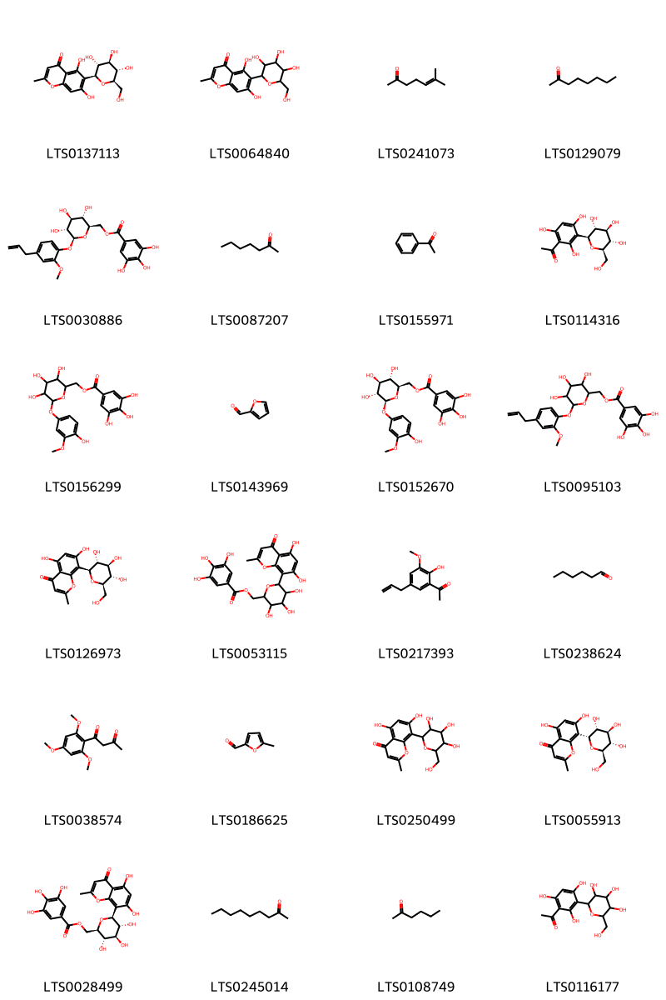{ width=100% }
    <figcaption>Hình ảnh cấu trúc hóa học của 24 hoạt chất thuộc nhóm Organooxygen compounds gồm ['biflorin (LTS0137113)', '5,7-dihydroxy-2-methyl-6-[3,4,5-trihydroxy-6-(hydroxymethyl)oxan-2-yl]chromen-4-one (LTS0064840)', '6-methyl-5-hepten-2-one (LTS0241073)', '2-octanone (LTS0129079)', '[(2r,3s,4s,5r,6s)-3,4,5-trihydroxy-6-[2-methoxy-4-(prop-2-en-1-yl)phenoxy]oxan-2-yl]methyl 3,4,5-trihydroxybenzoate (LTS0030886)', '2-heptanone (LTS0087207)', 'acetophenone (LTS0155971)', '1-{2,4,6-trihydroxy-3-[(2s,3r,4r,5s,6r)-3,4,5-trihydroxy-6-(hydroxymethyl)oxan-2-yl]phenyl}ethanone (LTS0114316)', '[3,4,5-trihydroxy-6-(4-hydroxy-3-methoxyphenoxy)oxan-2-yl]methyl 3,4,5-trihydroxybenzoate (LTS0156299)', 'bran oil (LTS0143969)', '[(2r,3s,4s,5r,6s)-3,4,5-trihydroxy-6-(4-hydroxy-3-methoxyphenoxy)oxan-2-yl]methyl 3,4,5-trihydroxybenzoate (LTS0152670)', '{3,4,5-trihydroxy-6-[2-methoxy-4-(prop-2-en-1-yl)phenoxy]oxan-2-yl}methyl 3,4,5-trihydroxybenzoate (LTS0095103)', '5,7-dihydroxy-2-methyl-8-[(2s,3r,4r,5s,6r)-3,4,5-trihydroxy-6-(hydroxymethyl)oxan-2-yl]chromen-4-one (LTS0126973)', '[6-(5,7-dihydroxy-2-methyl-4-oxochromen-8-yl)-3,4,5-trihydroxyoxan-2-yl]methyl 3,4,5-trihydroxybenzoate (LTS0053115)', '1-[2-hydroxy-3-methoxy-5-(prop-2-en-1-yl)phenyl]ethanone (LTS0217393)', 'hexanal (LTS0238624)', 'eugenone (LTS0038574)', '5-methylfurfural (LTS0186625)', '5,7-dihydroxy-2-methyl-8-[3,4,5-trihydroxy-6-(hydroxymethyl)oxan-2-yl]chromen-4-one (LTS0250499)', '5,7-dihydroxy-2-methyl-8-[(2r,3r,4r,5s,6r)-3,4,5-trihydroxy-6-(hydroxymethyl)oxan-2-yl]chromen-4-one (LTS0055913)', '[(2r,3s,4r,5r,6s)-6-(5,7-dihydroxy-2-methyl-4-oxochromen-8-yl)-3,4,5-trihydroxyoxan-2-yl]methyl 3,4,5-trihydroxybenzoate (LTS0028499)', '2-nonanone (LTS0245014)', 'hexanone (LTS0108749)', '1-{2,4,6-trihydroxy-3-[3,4,5-trihydroxy-6-(hydroxymethyl)oxan-2-yl]phenyl}ethanone (LTS0116177)'].</figcaption>
</figure>
#### Nhóm Phenol esters
<figure markdown="span">
    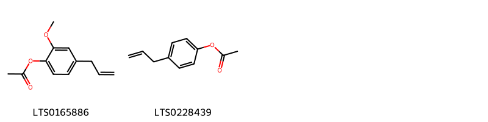{ width=100% }
    <figcaption>Hình ảnh cấu trúc hóa học của 2 hoạt chất thuộc nhóm Phenol esters gồm ['eugenyl acetate (LTS0165886)', '4-(prop-2-en-1-yl)phenyl acetate (LTS0228439)'].</figcaption>
</figure>
#### Nhóm Phenol ethers
<figure markdown="span">
    { width=100% }
    <figcaption>Hình ảnh cấu trúc hóa học của 3 hoạt chất thuộc nhóm Phenol ethers gồm ['p-propenylanisole (LTS0177188)', 'tarragon (LTS0245226)', 'anethole (LTS0033696)'].</figcaption>
</figure>
#### Nhóm Phenols
<figure markdown="span">
    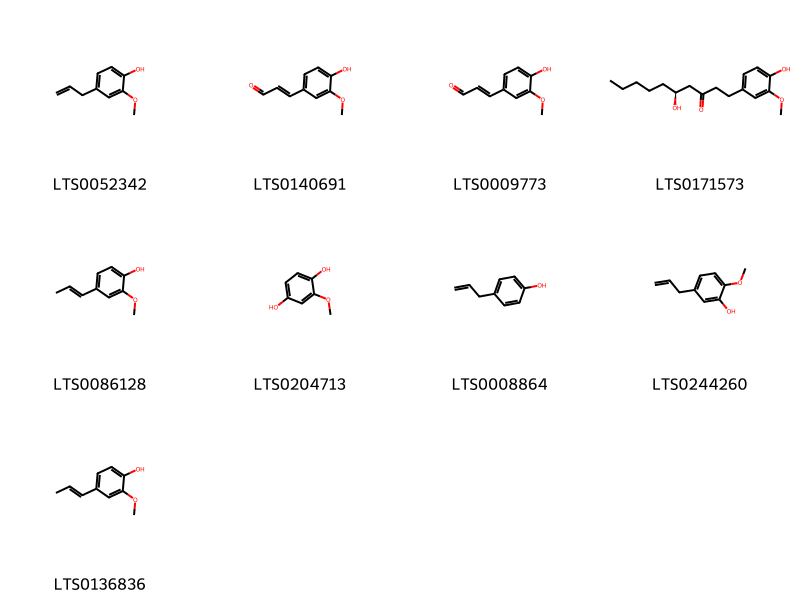{ width=100% }
    <figcaption>Hình ảnh cấu trúc hóa học của 9 hoạt chất thuộc nhóm Phenols gồm ['eugenol (LTS0052342)', 'coniferyl aldehyde (LTS0140691)', 'coniferaldehyde (LTS0009773)', 'gingerol (LTS0171573)', '2-methoxy-4-propenylphenol (LTS0086128)', 'methoxyhydroquinone (LTS0204713)', 'chavicol (LTS0008864)', 'chavibetol (LTS0244260)', 'isoeugenol (LTS0136836)'].</figcaption>
</figure>
#### Nhóm Polycyclic hydrocarbons
<figure markdown="span">
    { width=100% }
    <figcaption>Hình ảnh cấu trúc hóa học của 1 hoạt chất thuộc nhóm Polycyclic hydrocarbons gồm ['1,2,3,6-tetrahydrocubane (LTS0098771)'].</figcaption>
</figure>
#### Nhóm Prenol lipids
<figure markdown="span">
    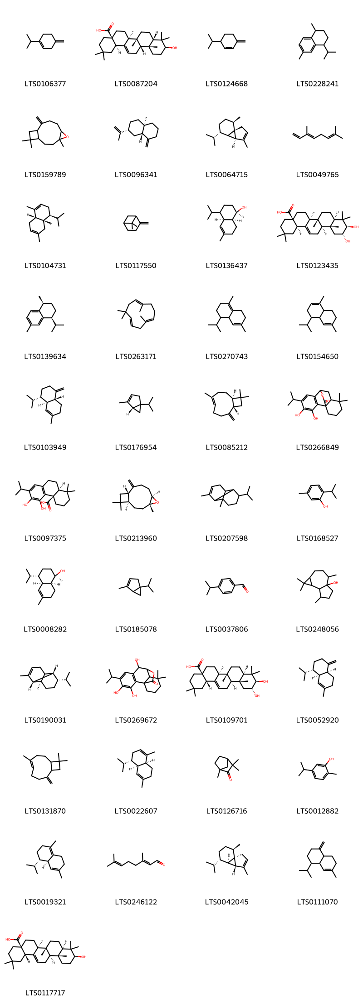{ width=100% }
    <figcaption>Hình ảnh cấu trúc hóa học của 41 hoạt chất thuộc nhóm Prenol lipids gồm ['β-terpinene (LTS0106377)', '(4as,6as,6br,8as,10s,12ar,12bs,14br)-10-hydroxy-2,2,6a,6b,9,9,12a-heptamethyl-1,3,4,5,6,7,8,8a,10,11,12,12b,13,14b-tetradecahydropicene-4a-carboxylic acid (LTS0087204)', 'β phellandrene (LTS0124668)', '(e)-calamene (LTS0228241)', 'caryophyllene oxide (LTS0159789)', 'β-selinene (LTS0096341)', '(1s,5r,7s,10r)-7-isopropyl-4,10-dimethyltricyclo[4.4.0.0¹,⁵]dec-3-ene (LTS0064715)', 'trans-β-ocimene (LTS0049765)', '(4s,4as,8as)-4-isopropyl-1,6-dimethyl-3,4,4a,5,8,8a-hexahydronaphthalene (LTS0104731)', 'β-pinene (LTS0117550)', '(1r,4ar,8as)-4-isopropyl-1,6-dimethyl-3,4,4a,7,8,8a-hexahydro-2h-naphthalen-1-ol (LTS0136437)', '(4as,6as,6br,8ar,10r,11r,12ar,12br,14br)-10,11-dihydroxy-2,2,6a,6b,9,9,12a-heptamethyl-1,3,4,5,6,7,8,8a,10,11,12,12b,13,14b-tetradecahydropicene-4a-carboxylic acid (LTS0123435)', '(1s,4s)-4-isopropyl-1,6-dimethyl-1,2,3,4-tetrahydronaphthalene (LTS0139634)', 'humulene (LTS0263171)', '4-isopropyl-1,6-dimethyl-2,3,4,4a,7,8-hexahydronaphthalene (LTS0270743)', '4-isopropyl-1,6-dimethyl-3,4,4a,7,8,8a-hexahydronaphthalene (LTS0154650)', '(+)-gamma-cadinene (LTS0103949)', 'α-thujene (LTS0176954)', 'caryophyllene (LTS0085212)', '3,4-dihydroxy-5-isopropyl-11,11-dimethyl-16-oxatetracyclo[6.6.2.0¹,¹⁰.0²,⁷]hexadeca-2(7),3,5-trien-15-one (LTS0266849)', 'carnosic acid (LTS0097375)', 'β-caryophyllene oxide (LTS0213960)', 'α-copaene (LTS0207598)', 'thymol (LTS0168527)', 'delta-cadinol (LTS0008282)', 'α-thujene (LTS0185078)', 'cuminaldehyde (LTS0037806)', '1,1,4,7-tetramethyl-octahydro-1ah-cyclopropa[e]azulen-4a-ol (LTS0248056)', '(1r,2s,7s,8s)-8-isopropyl-1,3-dimethyltricyclo[4.4.0.0²,⁷]dec-3-ene (LTS0190031)', '3,4,8-trihydroxy-5-isopropyl-11,11-dimethyl-16-oxatetracyclo[7.5.2.0¹,¹⁰.0²,⁷]hexadeca-2(7),3,5-trien-15-one (LTS0269672)', 'maslinic acid (LTS0109701)', 'gamma-muurolene (LTS0052920)', 'caryophyllene (LTS0131870)', 'α-muurolene (LTS0022607)', 'fenchone (LTS0126716)', 'carvacrol (LTS0012882)', 'delta-cadinene (LTS0019321)', 'α-citral (LTS0246122)', '(-)-α-cubebene (LTS0042045)', '4-isopropyl-6-methyl-1-methylidene-3,4,4a,7,8,8a-hexahydro-2h-naphthalene (LTS0111070)', 'oleanolic acid (LTS0117717)'].</figcaption>
</figure>
#### Nhóm Saturated hydrocarbons
<figure markdown="span">
    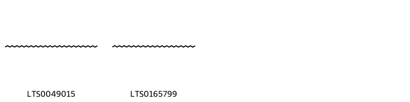{ width=100% }
    <figcaption>Hình ảnh cấu trúc hóa học của 2 hoạt chất thuộc nhóm Saturated hydrocarbons gồm ['tetracontane (LTS0049015)', 'hexatriacontane (LTS0165799)'].</figcaption>
</figure>
#### Nhóm Steroids and steroid derivatives
<figure markdown="span">
    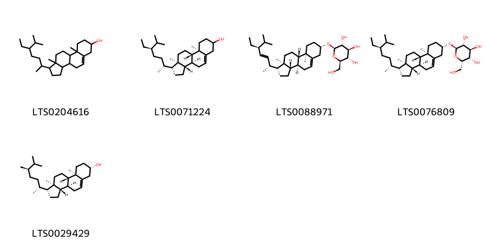{ width=100% }
    <figcaption>Hình ảnh cấu trúc hóa học của 5 hoạt chất thuộc nhóm Steroids and steroid derivatives gồm ['stigmast-5-en-3-ol, (3β)- (LTS0204616)', 'stigmast-5-en-3-ol (LTS0071224)', '(2r,3r,4s,5s,6r)-2-{[(1r,3as,3bs,7s,9ar,9bs,11ar)-1-[(2r,3e,5s)-5-ethyl-6-methylhept-3-en-2-yl]-9a,11a-dimethyl-1h,2h,3h,3ah,3bh,4h,6h,7h,8h,9h,9bh,10h,11h-cyclopenta[a]phenanthren-7-yl]oxy}-6-(hydroxymethyl)oxane-3,4,5-triol (LTS0088971)', '(2r,3r,4s,5s,6s)-2-{[(1r,3as,3bs,7s,9ar,9bs,11ar)-1-[(2r,5r)-5-ethyl-6-methylheptan-2-yl]-9a,11a-dimethyl-1h,2h,3h,3ah,3bh,4h,6h,7h,8h,9h,9bh,10h,11h-cyclopenta[a]phenanthren-7-yl]oxy}-6-(hydroxymethyl)oxane-3,4,5-triol (LTS0076809)', 'campesterol (LTS0029429)'].</figcaption>
</figure>
#### Nhóm Tannins
<figure markdown="span">
    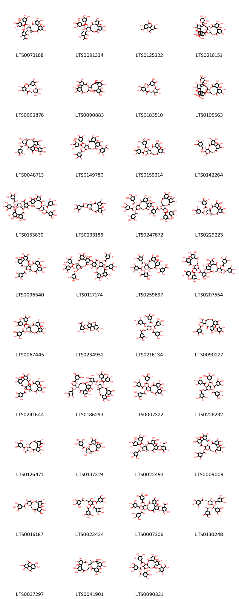{ width=100% }
    <figcaption>Hình ảnh cấu trúc hóa học của 39 hoạt chất thuộc nhóm Tannins gồm ['(10r,11r,12s,13s,15r)-13-(3-acetyl-2,4,6-trihydroxyphenyl)-3,4,5,21,22,23-hexahydroxy-8,18-dioxo-12-(3,4,5-trihydroxybenzoyloxy)-9,14,17-trioxatetracyclo[17.4.0.0²,⁷.0¹⁰,¹⁵]tricosa-1(23),2(7),3,5,19,21-hexaen-11-yl 3,4,5-trihydroxybenzoate (LTS0073168)', '13-(3-acetyl-2,4,6-trihydroxyphenyl)-3,4,5,21,22,23-hexahydroxy-8,18-dioxo-12-(3,4,5-trihydroxybenzoyloxy)-9,14,17-trioxatetracyclo[17.4.0.0²,⁷.0¹⁰,¹⁵]tricosa-1(23),2(7),3,5,19,21-hexaen-11-yl 3,4,5-trihydroxybenzoate (LTS0091334)', '6,7,13-trihydroxy-14-methoxy-2,9-dioxatetracyclo[6.6.2.0⁴,¹⁶.0¹¹,¹⁵]hexadeca-1(15),4,6,8(16),11,13-hexaene-3,10-dione (LTS0125222)', '(11s,12r)-12-[(14r,15s,19s)-2,3,4,7,8,9-hexahydroxy-12,17-dioxo-19-[(2s,3r,4r,5s)-2,3,4,5-tetrahydroxyoxan-2-yl]-13,16-dioxatetracyclo[13.3.1.0⁵,¹⁸.0⁶,¹¹]nonadeca-1(18),2,4,6,8,10-hexaen-14-yl]-3,4,5,17,18,19-hexahydroxy-8,14-dioxo-9,13-dioxatricyclo[13.4.0.0²,⁷]nonadeca-1(15),2,4,6,16,18-hexaen-11-yl 3,4,5-trihydroxybenzoate (LTS0216151)', '3,4-dihydroxy-5-{[(2s,3r,4s,5s,6r)-3,4,5-trihydroxy-6-[(3,4,5-trihydroxybenzoyloxy)methyl]oxan-2-yl]oxy}benzoic acid (LTS0092876)', '14-{3,4,5,11,17,18,19-heptahydroxy-8,14-dioxo-9,13-dioxatricyclo[13.4.0.0²,⁷]nonadeca-1(15),2,4,6,16,18-hexaen-10-yl}-2,3,4,7,8,9,19-heptahydroxy-13,16-dioxatetracyclo[13.3.1.0⁵,¹⁸.0⁶,¹¹]nonadeca-1(18),2,4,6,8,10-hexaene-12,17-dione (LTS0090883)', '3,4-dihydroxy-5-({3,4,5-trihydroxy-6-[(3,4,5-trihydroxybenzoyloxy)methyl]oxan-2-yl}oxy)benzoic acid (LTS0183510)', '12-[2,3,4,7,8,9-hexahydroxy-12,17-dioxo-19-(2,3,4,5-tetrahydroxyoxan-2-yl)-13,16-dioxatetracyclo[13.3.1.0⁵,¹⁸.0⁶,¹¹]nonadeca-1(18),2,4,6,8,10-hexaen-14-yl]-3,4,5,17,18,19-hexahydroxy-8,14-dioxo-9,13-dioxatricyclo[13.4.0.0²,⁷]nonadeca-1(15),2,4,6,16,18-hexaen-11-yl 3,4,5-trihydroxybenzoate (LTS0105563)', '(10r,11r,12r,13r,15r)-3,4,5,12,13,21,25,26,27-nonahydroxy-8,18-dioxo-9,14,17,23,30-pentaoxahexacyclo[17.12.0.0²,⁷.0¹⁰,¹⁵.0²²,³¹.0²⁴,²⁹]hentriaconta-1(31),2(7),3,5,19,21,24,26,28-nonaen-11-yl 3,4,5-trihydroxybenzoate (LTS0048713)', '3,4,5-trihydroxy-2-{[(10r,11s,12r,13s,15r)-3,4,5,22,23-pentahydroxy-8,18-dioxo-11,12,13-tris(3,4,5-trihydroxybenzoyloxy)-9,14,17-trioxatetracyclo[17.4.0.0²,⁷.0¹⁰,¹⁵]tricosa-1(23),2(7),3,5,19,21-hexaen-21-yl]oxy}benzoic acid (LTS0149780)', '3,4,5,13,21,22,23-heptahydroxy-8,18-dioxo-12-(3,4,5-trihydroxybenzoyloxy)-9,14,17-trioxatetracyclo[17.4.0.0²,⁷.0¹⁰,¹⁵]tricosa-1(23),2(7),3,5,19,21-hexaen-11-yl 3,4,5-trihydroxybenzoate (LTS0159314)', '3,4,5,12,13,21,22,23-octahydroxy-8,18-dioxo-9,14,17-trioxatetracyclo[17.4.0.0²,⁷.0¹⁰,¹⁵]tricosa-1(23),2(7),3,5,19,21-hexaen-11-yl 3,4,5-trihydroxybenzoate (LTS0142264)', '(10r,11s,12r,13s,15r)-3,4,5,21,22,23-hexahydroxy-8,18-dioxo-11,12-bis(3,4,5-trihydroxybenzoyloxy)-9,14,17-trioxatetracyclo[17.4.0.0²,⁷.0¹⁰,¹⁵]tricosa-1(23),2(7),3,5,19,21-hexaen-13-yl 2-{[(10r,11s,12r,13r,15r)-3,4,5,13,22,23-hexahydroxy-8,18-dioxo-11,12-bis(3,4,5-trihydroxybenzoyloxy)-9,14,17-trioxatetracyclo[17.4.0.0²,⁷.0¹⁰,¹⁵]tricosa-1(19),2(7),3,5,20,22-hexaen-21-yl]oxy}-3,4,5-trihydroxybenzoate (LTS0153830)', '(10s,11r,12r,13s,15r)-3,4,5,11,12,21,22,23-octahydroxy-8,18-dioxo-9,14,17-trioxatetracyclo[17.4.0.0²,⁷.0¹⁰,¹⁵]tricosa-1(23),2(7),3,5,19,21-hexaen-13-yl 3,4,5-trihydroxybenzoate (LTS0233186)', '3,4,5,21,22,23-hexahydroxy-8,18-dioxo-11,12-bis(3,4,5-trihydroxybenzoyloxy)-9,14,17-trioxatetracyclo[17.4.0.0²,⁷.0¹⁰,¹⁵]tricosa-1(23),2(7),3,5,19,21-hexaen-13-yl 3,4,5-trihydroxy-2-{[3,4,5,22,23-pentahydroxy-8,18-dioxo-11,12,13-tris(3,4,5-trihydroxybenzoyloxy)-9,14,17-trioxatetracyclo[17.4.0.0²,⁷.0¹⁰,¹⁵]tricosa-1(23),2(7),3,5,19,21-hexaen-21-yl]oxy}benzoate (LTS0247872)', '(10r,11s,12r,13r,15r)-3,4,5,13,21,22,23-heptahydroxy-8,18-dioxo-11-(3,4,5-trihydroxybenzoyloxy)-9,14,17-trioxatetracyclo[17.4.0.0²,⁷.0¹⁰,¹⁵]tricosa-1(23),2(7),3,5,19,21-hexaen-12-yl 3,4,5-trihydroxybenzoate (LTS0229223)', '(2s,20s,22r)-7,8,9,12,13,14,28,29,30,33,34,35-dodecahydroxy-4,17,25,38-tetraoxo-3,18,21,24,39-pentaoxaheptacyclo[20.17.0.0²,¹⁹.0⁵,¹⁰.0¹¹,¹⁶.0²⁶,³¹.0³²,³⁷]nonatriaconta-5,7,9,11(16),12,14,26,28,30,32(37),33,35-dodecaen-20-yl 3,4,5-trihydroxybenzoate (LTS0096540)', '(10r,11s,12r,13s,15r)-3,4,5,21,22,23-hexahydroxy-8,18-dioxo-11,12-bis(3,4,5-trihydroxybenzoyloxy)-9,14,17-trioxatetracyclo[17.4.0.0²,⁷.0¹⁰,¹⁵]tricosa-1(23),2(7),3,5,19,21-hexaen-13-yl 3,4,5-trihydroxy-2-{[(10r,11s,12r,13s,15r)-3,4,5,22,23-pentahydroxy-8,18-dioxo-11,12,13-tris(3,4,5-trihydroxybenzoyloxy)-9,14,17-trioxatetracyclo[17.4.0.0²,⁷.0¹⁰,¹⁵]tricosa-1(23),2(7),3,5,19,21-hexaen-21-yl]oxy}benzoate (LTS0117174)', '2-{[(10r,11s,12r,13s,15r)-21-(6-carboxy-2,3,4-trihydroxyphenoxy)-3,4,5,22,23-pentahydroxy-8,18-dioxo-11,12-bis(3,4,5-trihydroxybenzoyloxy)-9,14,17-trioxatetracyclo[17.4.0.0²,⁷.0¹⁰,¹⁵]tricosa-1(23),2(7),3,5,19,21-hexaen-13-yl]oxy}-3,4,5-trihydroxybenzoic acid (LTS0259697)', '3,4,5,21,22,23-hexahydroxy-8,18-dioxo-11,12-bis(3,4,5-trihydroxybenzoyloxy)-9,14,17-trioxatetracyclo[17.4.0.0²,⁷.0¹⁰,¹⁵]tricosa-1(23),2(7),3,5,19,21-hexaen-13-yl 2-{[3,4,5,13,22,23-hexahydroxy-8,18-dioxo-11,12-bis(3,4,5-trihydroxybenzoyloxy)-9,14,17-trioxatetracyclo[17.4.0.0²,⁷.0¹⁰,¹⁵]tricosa-1(23),2(7),3,5,19,21-hexaen-21-yl]oxy}-3,4,5-trihydroxybenzoate (LTS0207554)', '(10r,11s,12r,13s,15r)-3,4,5,21,22,23-hexahydroxy-8,18-dioxo-12,13-bis(3,4,5-trihydroxybenzoyloxy)-9,14,17-trioxatetracyclo[17.4.0.0²,⁷.0¹⁰,¹⁵]tricosa-1(23),2(7),3,5,19,21-hexaen-11-yl 3,4,5-trihydroxybenzoate (LTS0067445)', '3,4,5-trihydroxy-2-({7,13,14-trihydroxy-3,10-dioxo-2,9-dioxatetracyclo[6.6.2.0⁴,¹⁶.0¹¹,¹⁵]hexadeca-1(15),4(16),5,7,11,13-hexaen-6-yl}oxy)benzoic acid (LTS0234952)', '(2s,3r,4s,5r,6r)-3,4,5-tris(3,4,5-trihydroxybenzoyloxy)-6-[(3,4,5-trihydroxybenzoyloxy)methyl]oxan-2-yl 3,4,5-trihydroxybenzoate (LTS0216134)', '3,4,5,12,13,21,25,26,27-nonahydroxy-8,18-dioxo-9,14,17,23,30-pentaoxahexacyclo[17.12.0.0²,⁷.0¹⁰,¹⁵.0²²,³¹.0²⁴,²⁹]hentriaconta-1(31),2(7),3,5,19,21,24,26,28-nonaen-11-yl 3,4,5-trihydroxybenzoate (LTS0090227)', 'casuarictin (LTS0241644)', '(10r,11s,12r,13s,15r)-3,4,5,21,22,23-hexahydroxy-8,18-dioxo-11,12-bis(3,4,5-trihydroxybenzoyloxy)-9,14,17-trioxatetracyclo[17.4.0.0²,⁷.0¹⁰,¹⁵]tricosa-1(23),2(7),3,5,19,21-hexaen-13-yl 2-{[(11r,12r)-3,4,11,17,18,19-hexahydroxy-8,14-dioxo-12-[(1s,2r)-3-oxo-1,2-bis(3,4,5-trihydroxybenzoyloxy)propyl]-9,13-dioxatricyclo[13.4.0.0²,⁷]nonadeca-1(19),2(7),3,5,15,17-hexaen-5-yl]oxy}-3,4,5-trihydroxybenzoate (LTS0186293)', '3,4,5,21,22,23-hexahydroxy-8,18-dioxo-12,13-bis(3,4,5-trihydroxybenzoyloxy)-9,14,17-trioxatetracyclo[17.4.0.0²,⁷.0¹⁰,¹⁵]tricosa-1(23),2(7),3,5,19,21-hexaen-11-yl 3,4,5-trihydroxybenzoate (LTS0007322)', '3,4,5-tris(3,4,5-trihydroxybenzoyloxy)-6-[(3,4,5-trihydroxybenzoyloxy)methyl]oxan-2-yl 3,4,5-trihydroxybenzoate (LTS0226232)', '1-{3,4,5,11,17,18,19-heptahydroxy-8,14-dioxo-9,13-dioxatricyclo[13.4.0.0²,⁷]nonadeca-1(15),2,4,6,16,18-hexaen-10-yl}-2-hydroxy-3-oxopropyl 3,4,5-trihydroxybenzoate (LTS0126471)', '(10r,11r,12r,13s,15r)-3,4,5,12,13,21,22,23-octahydroxy-8,18-dioxo-9,14,17-trioxatetracyclo[17.4.0.0²,⁷.0¹⁰,¹⁵]tricosa-1(23),2(7),3,5,19,21-hexaen-11-yl 3,4,5-trihydroxybenzoate (LTS0137319)', '3,4,5-trihydroxy-2-{[(10r,11s,12r,13s,15r)-3,4,5,21,23-pentahydroxy-8,18-dioxo-11,12,13-tris(3,4,5-trihydroxybenzoyloxy)-9,14,17-trioxatetracyclo[17.4.0.0²,⁷.0¹⁰,¹⁵]tricosa-1(23),2(7),3,5,19,21-hexaen-22-yl]oxy}benzoic acid (LTS0022493)', '7,8,9,12,13,14,28,29,30,33,34,35-dodecahydroxy-4,17,25,38-tetraoxo-3,18,21,24,39-pentaoxaheptacyclo[20.17.0.0²,¹⁹.0⁵,¹⁰.0¹¹,¹⁶.0²⁶,³¹.0³²,³⁷]nonatriaconta-5,7,9,11(16),12,14,26,28,30,32(37),33,35-dodecaen-20-yl 3,4,5-trihydroxybenzoate (LTS0009009)', '3,4,5,11,12,21,22,23-octahydroxy-8,18-dioxo-9,14,17-trioxatetracyclo[17.4.0.0²,⁷.0¹⁰,¹⁵]tricosa-1(23),2(7),3,5,19,21-hexaen-13-yl 3,4,5-trihydroxybenzoate (LTS0016187)', '5-hydroxy-3,4-bis(3,4,5-trihydroxybenzoyloxy)-6-[(3,4,5-trihydroxybenzoyloxy)methyl]oxan-2-yl 3,4,5-trihydroxybenzoate (LTS0023424)', '3,4,5-trihydroxy-2-{[3,4,5,21,23-pentahydroxy-8,18-dioxo-11,12,13-tris(3,4,5-trihydroxybenzoyloxy)-9,14,17-trioxatetracyclo[17.4.0.0²,⁷.0¹⁰,¹⁵]tricosa-1(23),2(7),3,5,19,21-hexaen-22-yl]oxy}benzoic acid (LTS0007306)', '(2s,3r,4s,5r,6r)-5-hydroxy-3,4-bis(3,4,5-trihydroxybenzoyloxy)-6-[(3,4,5-trihydroxybenzoyloxy)methyl]oxan-2-yl 3,4,5-trihydroxybenzoate (LTS0130248)', 'ellagic acid (LTS0037297)', '(14r,15s,19r)-14-[(10r,11r)-3,4,5,11,17,18,19-heptahydroxy-8,14-dioxo-9,13-dioxatricyclo[13.4.0.0²,⁷]nonadeca-1(15),2,4,6,16,18-hexaen-10-yl]-2,3,4,7,8,9,19-heptahydroxy-13,16-dioxatetracyclo[13.3.1.0⁵,¹⁸.0⁶,¹¹]nonadeca-1(18),2,4,6,8,10-hexaene-12,17-dione (LTS0041901)', '2-{[21-(6-carboxy-2,3,4-trihydroxyphenoxy)-3,4,5,22,23-pentahydroxy-8,18-dioxo-11,12-bis(3,4,5-trihydroxybenzoyloxy)-9,14,17-trioxatetracyclo[17.4.0.0²,⁷.0¹⁰,¹⁵]tricosa-1(23),2(7),3,5,19,21-hexaen-13-yl]oxy}-3,4,5-trihydroxybenzoic acid (LTS0090331)'].</figcaption>
</figure>

---

### Dược dân tộc học

Danh sách các quốc gia có sử dụng *Syzygium aromaticum* trong điều trị các bệnh. 

| Country   | Disease                                                                                                         | Bệnh                                                                                                                                                                                                |
|:----------|:----------------------------------------------------------------------------------------------------------------|:----------------------------------------------------------------------------------------------------------------------------------------------------------------------------------------------------|
| China     | Antiseptic, Carminative, Deodorant, Stimulant, Stomachic, Tonic, Vermifuge, Carminative, Carminative, Stimulant | MYMEMORY WARNING: YOU USED ALL AVAILABLE FREE TRANSLATIONS FOR TODAY. NEXT AVAILABLE IN  06 HOURS 54 MINUTES 11 SECONDS VISIT HTTPS://MYMEMORY.TRANSLATED.NET/DOC/USAGELIMITS.PHP TO TRANSLATE MORE |
| Elsewhere | Analgesic, Anesthetic, Carminative, Dentifrice, Rubefacient, Stimulant, Antioxidant, nan                        | MYMEMORY WARNING: YOU USED ALL AVAILABLE FREE TRANSLATIONS FOR TODAY. NEXT AVAILABLE IN  06 HOURS 54 MINUTES 09 SECONDS VISIT HTTPS://MYMEMORY.TRANSLATED.NET/DOC/USAGELIMITS.PHP TO TRANSLATE MORE |
| Haiti     | Analgesic, Antiseptic, Stimulant, Vermifuge                                                                     | MYMEMORY WARNING: YOU USED ALL AVAILABLE FREE TRANSLATIONS FOR TODAY. NEXT AVAILABLE IN  06 HOURS 54 MINUTES 06 SECONDS VISIT HTTPS://MYMEMORY.TRANSLATED.NET/DOC/USAGELIMITS.PHP TO TRANSLATE MORE |
| Turkey    | Antiseptic, Digestive, Stimulant, Stomachic, Tonic, Carminative, Rubefacient                                    | MYMEMORY WARNING: YOU USED ALL AVAILABLE FREE TRANSLATIONS FOR TODAY. NEXT AVAILABLE IN  06 HOURS 54 MINUTES 04 SECONDS VISIT HTTPS://MYMEMORY.TRANSLATED.NET/DOC/USAGELIMITS.PHP TO TRANSLATE MORE |

---

---
## Syzygium cerasoideum
### Thông tin về thực vật

!!! info "Phân loại thực vật của *Syzygium cerasoides* từ GIBF:"
    - **Kingdom:** Plantae
    - **Phylum:** Tracheophyta
    - **Order:** Myrtales
    - **Family:** Myrtaceae
    - **Genus:** Syzygium
    - **Species:** *Syzygium cerasoides*

 

| Label (VI)   | Label (EN)   | Scientific Name     | Descriptions (VI)   | Descriptions (EN)   | Also Known As (VI)                               | Also Known As (EN)                           |
|:-------------|:-------------|:--------------------|:--------------------|:--------------------|:-------------------------------------------------|:---------------------------------------------|
| N/A          | N/A          | Syzygium aromaticum | loài thực vật       | species of plant    | ['Syzygium aromaticum', 'Eugenia caryophyllata'] | ['Syzygium aromaticum', 'Zanzibar red head'] |

#### Phân bố trên thế giới

**Từ CSDL GIBF** India

#### Phân bố tại Việt Nam

**Từ CSDL GIBF**: Không có ghi nhận ở Việt Nam

---
### Thành phần hóa học
        
- Theo cơ sở dữ liệu lotus: Từ loài *Syzygium cerasoides* đã phân lập và xác định được Chưa có hoạt chất nào được phân lập. hoạt chất thuộc về các nhóm Không có hoạt chất nào được phân lập. 

Không có hình ảnh nào được tạo ra

---

### Dược dân tộc học

Danh sách các quốc gia có sử dụng *Syzygium cerasoides* trong điều trị các bệnh. 

| Country   | Disease    | Bệnh                                                                                                                                                                                                |
|:----------|:-----------|:----------------------------------------------------------------------------------------------------------------------------------------------------------------------------------------------------|
| Elsewhere | Astringent | MYMEMORY WARNING: YOU USED ALL AVAILABLE FREE TRANSLATIONS FOR TODAY. NEXT AVAILABLE IN  06 HOURS 53 MINUTES 25 SECONDS VISIT HTTPS://MYMEMORY.TRANSLATED.NET/DOC/USAGELIMITS.PHP TO TRANSLATE MORE |

---

---
## Syzygium corynocarpum
### Thông tin về thực vật

!!! info "Phân loại thực vật của *Syzygium corynocarpum* từ GIBF:"
    - **Kingdom:** Plantae
    - **Phylum:** Tracheophyta
    - **Order:** Myrtales
    - **Family:** Myrtaceae
    - **Genus:** Syzygium
    - **Species:** *Syzygium corynocarpum*

 

| Label (VI)   | Label (EN)   | Scientific Name       | Descriptions (VI)   | Descriptions (EN)   | Also Known As (VI)   | Also Known As (EN)   |
|:-------------|:-------------|:----------------------|:--------------------|:--------------------|:---------------------|:---------------------|
| N/A          | N/A          | Syzygium corynocarpum | loài thực vật       | species of plant    | ['']                 | ['']                 |

#### Phân bố trên thế giới

**Từ CSDL GIBF** nan, United States of America, Niue, Tonga, American Samoa, Wallis and Futuna, unknown or invalid, Samoa, Fiji

#### Phân bố tại Việt Nam

**Từ CSDL GIBF**: Không có ghi nhận ở Việt Nam

---
### Thành phần hóa học
        
- Theo cơ sở dữ liệu lotus: Từ loài *Syzygium corynocarpum* đã phân lập và xác định được 3 hoạt chất thuộc về các nhóm Flavonoids. 

|    | chemicalTaxonomyClassyfireClass   |   smiles_count |
|---:|:----------------------------------|---------------:|
|  0 | Flavonoids                        |              3 |

#### Nhóm Flavonoids
<figure markdown="span">
    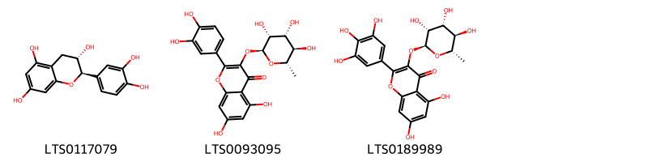{ width=100% }
    <figcaption>Hình ảnh cấu trúc hóa học của 3 hoạt chất thuộc nhóm Flavonoids gồm ['(+)-catechol (LTS0117079)', 'quercitrin (LTS0093095)', 'myricitrin (LTS0189989)'].</figcaption>
</figure>

---

### Dược dân tộc học

Danh sách các quốc gia có sử dụng *Syzygium corynocarpum* trong điều trị các bệnh. 

| Country   | Disease   | Bệnh                                                                                                                                                                                                |
|:----------|:----------|:----------------------------------------------------------------------------------------------------------------------------------------------------------------------------------------------------|
| Tonga     | Tonic     | MYMEMORY WARNING: YOU USED ALL AVAILABLE FREE TRANSLATIONS FOR TODAY. NEXT AVAILABLE IN  06 HOURS 53 MINUTES 10 SECONDS VISIT HTTPS://MYMEMORY.TRANSLATED.NET/DOC/USAGELIMITS.PHP TO TRANSLATE MORE |

---

---
## Syzygium cumini
### Thông tin về thực vật

!!! info "Phân loại thực vật của *Syzygium cumini* từ GIBF:"
    - **Kingdom:** Plantae
    - **Phylum:** Tracheophyta
    - **Order:** Myrtales
    - **Family:** Myrtaceae
    - **Genus:** Syzygium
    - **Species:** *Syzygium cumini*

 

| Label (VI)   | Label (EN)   | Scientific Name   | Descriptions (VI)   | Descriptions (EN)   | Also Known As (VI)   | Also Known As (EN)                                         |
|:-------------|:-------------|:------------------|:--------------------|:--------------------|:---------------------|:-----------------------------------------------------------|
| N/A          | N/A          | Syzygium cumini   | loài thực vật       | species of tree     | ['Syzygium cumini']  | ['Java plum', 'black plum', 'jambolan', 'jamun', 'jambul'] |

#### Phân bố trên thế giới

**Từ CSDL GIBF** Brazil, United States of America, South Africa, Australia, Colombia, India, French Guiana, Belize

#### Phân bố tại Việt Nam

**Từ CSDL GIBF**: Không có ghi nhận ở Việt Nam

---
### Thành phần hóa học
        
- Theo cơ sở dữ liệu lotus: Từ loài *Syzygium cumini* đã phân lập và xác định được 90 hoạt chất thuộc về các nhóm Fatty Acyls, Benzene and substituted derivatives, Furofurans, Unsaturated hydrocarbons, Flavonoids, Tannins, Organooxygen compounds, Lignan lactones, Furanoid lignans, Prenol lipids. 

|    | chemicalTaxonomyClassyfireClass     |   smiles_count |
|---:|:------------------------------------|---------------:|
|  0 | Benzene and substituted derivatives |              9 |
|  1 | Fatty Acyls                         |             10 |
|  2 | Flavonoids                          |             27 |
|  3 | Furanoid lignans                    |             10 |
|  4 | Furofurans                          |              2 |
|  5 | Lignan lactones                     |              4 |
|  6 | Organooxygen compounds              |              2 |
|  7 | Prenol lipids                       |             20 |
|  8 | Tannins                             |              5 |
|  9 | Unsaturated hydrocarbons            |              1 |

#### Nhóm Benzene and substituted derivatives
<figure markdown="span">
    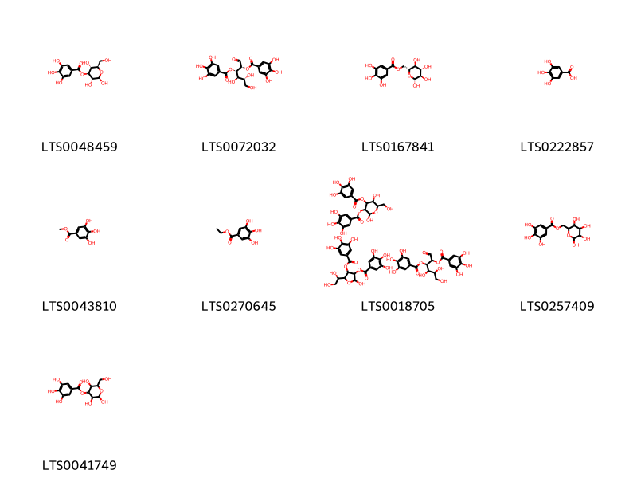{ width=100% }
    <figcaption>Hình ảnh cấu trúc hóa học của 9 hoạt chất thuộc nhóm Benzene and substituted derivatives gồm ['(2r,3r,4s,5r,6r)-2,3,5-trihydroxy-6-(hydroxymethyl)oxan-4-yl 3,4,5-trihydroxybenzoate (LTS0048459)', '(2r,3s,4r,5r)-4,5,6-trihydroxy-1-oxo-2-(3,4,5-trihydroxybenzoyloxy)hexan-3-yl 3,4,5-trihydroxybenzoate (LTS0072032)', '6-o-galloyl-β-d-glucose (LTS0167841)', 'galop (LTS0222857)', 'methyl gallate (LTS0043810)', 'ethyl gallate (LTS0270645)', '2,5-dihydroxy-6-(hydroxymethyl)-3-(3,4,5-trihydroxybenzoyloxy)oxan-4-yl 3,4,5-trihydroxybenzoate; 2-(1,2-dihydroxyethyl)-5-hydroxy-4-(3,4,5-trihydroxybenzoyloxy)oxolan-3-yl 3,4,5-trihydroxybenzoate; 4,5,6-trihydroxy-1-oxo-2-(3,4,5-trihydroxybenzoyloxy)hexan-3-yl 3,4,5-trihydroxybenzoate (LTS0018705)', '(3,4,5,6-tetrahydroxyoxan-2-yl)methyl 3,4,5-trihydroxybenzoate (LTS0257409)', '2,3,5-trihydroxy-6-(hydroxymethyl)oxan-4-yl 3,4,5-trihydroxybenzoate (LTS0041749)'].</figcaption>
</figure>
#### Nhóm Fatty Acyls
<figure markdown="span">
    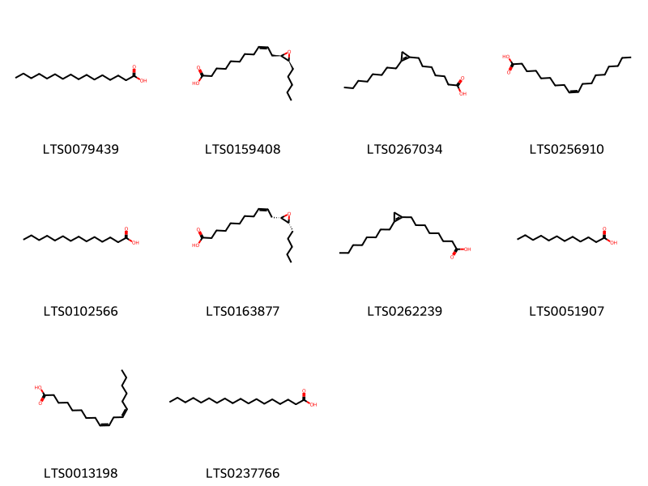{ width=100% }
    <figcaption>Hình ảnh cấu trúc hóa học của 10 hoạt chất thuộc nhóm Fatty Acyls gồm ['palmitic acid (LTS0079439)', '(-)-vernolic acid (LTS0159408)', 'malvalic acid (LTS0267034)', 'oleic acid (LTS0256910)', 'myristic acid (LTS0102566)', '(+)-vernolic acid (LTS0163877)', 'sterculic acid (LTS0262239)', 'lauric acid (LTS0051907)', 'linoleic (LTS0013198)', 'stearic acid (LTS0237766)'].</figcaption>
</figure>
#### Nhóm Flavonoids
<figure markdown="span">
    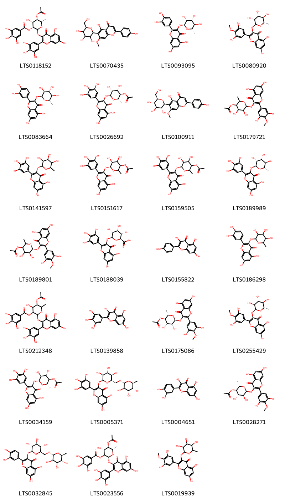{ width=100% }
    <figcaption>Hình ảnh cấu trúc hóa học của 27 hoạt chất thuộc nhóm Flavonoids gồm ['(2s,3r,4r,5r,6s)-5-(acetyloxy)-2-{[5,7-dihydroxy-4-oxo-2-(3,4,5-trihydroxyphenyl)chromen-3-yl]oxy}-4-hydroxy-6-methyloxan-3-yl 3,4,5-trihydroxybenzoate (LTS0118152)', '5-hydroxy-2-(4-hydroxyphenyl)-7-methoxy-6-[3,4,5-trihydroxy-6-(hydroxymethyl)oxan-2-yl]chromen-4-one (LTS0070435)', 'quercitrin (LTS0093095)', '2-(3,5-dihydroxy-4-methoxyphenyl)-5,7-dihydroxy-3-{[(2s,3r,4r,5r,6s)-3,4,5-trihydroxy-6-methyloxan-2-yl]oxy}chromen-4-one (LTS0080920)', '2-(3,4-dihydroxyphenyl)-5,7-dihydroxy-3-{[(2s,3s,4r,5r,6s)-3,4,5-trihydroxy-6-methyloxan-2-yl]oxy}chromen-4-one (LTS0083664)', '(2s,3r,4s,5r,6s)-6-{[5,7-dihydroxy-4-oxo-2-(3,4,5-trihydroxyphenyl)chromen-3-yl]oxy}-4,5-dihydroxy-2-methyloxan-3-yl acetate (LTS0026692)', '5-hydroxy-2-(4-hydroxyphenyl)-7-methoxy-6-[(2s,3r,4r,5s,6r)-3,4,5-trihydroxy-6-(hydroxymethyl)oxan-2-yl]chromen-4-one (LTS0100911)', '6-{[2-(3,5-dihydroxy-4-methoxyphenyl)-5,7-dihydroxy-4-oxochromen-3-yl]oxy}-4,5-dihydroxy-2-methyloxan-3-yl acetate (LTS0179721)', 'myricitrin (LTS0141597)', 'myricetin 3-acetylrhamnoside (LTS0151617)', '6-{[5,7-dihydroxy-4-oxo-2-(3,4,5-trihydroxyphenyl)chromen-3-yl]oxy}-4,5-dihydroxy-2-methyloxan-3-yl acetate (LTS0159505)', 'myricitrin (LTS0189989)', '(3r,5s,6s)-6-{[2-(3,5-dihydroxy-4-methoxyphenyl)-5,7-dihydroxy-4-oxochromen-3-yl]oxy}-4,5-dihydroxy-2-methyloxan-3-yl acetate (LTS0189801)', '(2s,3s,4r,5r,6s)-6-{[5,7-dihydroxy-4-oxo-2-(3,4,5-trihydroxyphenyl)chromen-3-yl]oxy}-3,4,5-trihydroxyoxane-2-carboxylic acid (LTS0188039)', 'kaempherol (LTS0155822)', 'quercitrin (LTS0186298)', '5-(acetyloxy)-2-{[5,7-dihydroxy-4-oxo-2-(3,4,5-trihydroxyphenyl)chromen-3-yl]oxy}-4-hydroxy-6-methyloxan-3-yl 3,4,5-trihydroxybenzoate (LTS0212348)', 'myricetin (LTS0139858)', '(2s,3r,4s,5r,6s)-6-{[2-(3,5-dihydroxy-4-methoxyphenyl)-5,7-dihydroxy-4-oxochromen-3-yl]oxy}-4,5-dihydroxy-2-methyloxan-3-yl acetate (LTS0175086)', '2-(3,5-dihydroxy-4-methoxyphenyl)-5,7-dihydroxy-3-{[(2s,3s,4r,5r,6s)-3,4,5-trihydroxy-6-methyloxan-2-yl]oxy}chromen-4-one (LTS0255429)', '(2s,3r,4s,5s,6s)-6-{[5,7-dihydroxy-4-oxo-2-(3,4,5-trihydroxyphenyl)chromen-3-yl]oxy}-4,5-dihydroxy-2-methyloxan-3-yl acetate (LTS0034159)', '5,7-dihydroxy-3-{[(2s,3s,4r,5r,6s)-3,4,5-trihydroxy-6-({[(2r,3r,4s,5r,6s)-3,4,5-trihydroxy-6-methyloxan-2-yl]oxy}methyl)oxan-2-yl]oxy}-2-(3,4,5-trihydroxyphenyl)chromen-4-one (LTS0005371)', 'quercetin (LTS0004651)', '(2s,3r,4s,5s,6s)-6-{[2-(3,5-dihydroxy-4-methoxyphenyl)-5,7-dihydroxy-4-oxochromen-3-yl]oxy}-4,5-dihydroxy-2-methyloxan-3-yl acetate (LTS0028271)', '3-rutinosyl quercetin (LTS0032845)', '(2s,3s,4r,5r,6s)-5-(acetyloxy)-2-{[5,7-dihydroxy-4-oxo-2-(3,4,5-trihydroxyphenyl)chromen-3-yl]oxy}-4-hydroxy-6-methyloxan-3-yl 3,4,5-trihydroxybenzoate (LTS0023556)', '2-(3,5-dihydroxy-4-methoxyphenyl)-5,7-dihydroxy-3-[(3,4,5-trihydroxy-6-methyloxan-2-yl)oxy]chromen-4-one (LTS0019939)'].</figcaption>
</figure>
#### Nhóm Furanoid lignans
<figure markdown="span">
    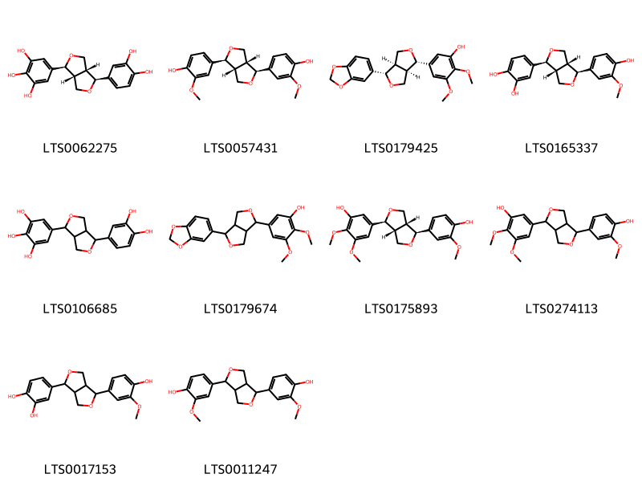{ width=100% }
    <figcaption>Hình ảnh cấu trúc hóa học của 10 hoạt chất thuộc nhóm Furanoid lignans gồm ['5-[(1s,3ar,4s,6ar)-4-(3,4-dihydroxyphenyl)-hexahydrofuro[3,4-c]furan-1-yl]benzene-1,2,3-triol (LTS0062275)', 'pinoresinol (LTS0057431)', '5-[(1s,3ar,4s,6ar)-4-(2h-1,3-benzodioxol-5-yl)-hexahydrofuro[3,4-c]furan-1-yl]-2,3-dimethoxyphenol (LTS0179425)', '4-[(1s,3ar,4s,6ar)-4-(4-hydroxy-3-methoxyphenyl)-hexahydrofuro[3,4-c]furan-1-yl]benzene-1,2-diol (LTS0165337)', '5-[4-(3,4-dihydroxyphenyl)-hexahydrofuro[3,4-c]furan-1-yl]benzene-1,2,3-triol (LTS0106685)', '5-[4-(2h-1,3-benzodioxol-5-yl)-hexahydrofuro[3,4-c]furan-1-yl]-2,3-dimethoxyphenol (LTS0179674)', '5-[(1s,3ar,4s,6ar)-4-(4-hydroxy-3-methoxyphenyl)-hexahydrofuro[3,4-c]furan-1-yl]-2,3-dimethoxyphenol (LTS0175893)', '5-[4-(4-hydroxy-3-methoxyphenyl)-hexahydrofuro[3,4-c]furan-1-yl]-2,3-dimethoxyphenol (LTS0274113)', '4-[4-(4-hydroxy-3-methoxyphenyl)-hexahydrofuro[3,4-c]furan-1-yl]benzene-1,2-diol (LTS0017153)', 'pinoresinol (LTS0011247)'].</figcaption>
</figure>
#### Nhóm Furofurans
<figure markdown="span">
    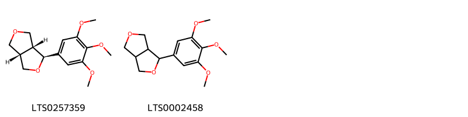{ width=100% }
    <figcaption>Hình ảnh cấu trúc hóa học của 2 hoạt chất thuộc nhóm Furofurans gồm ['(1s,3as,6ar)-1-(3,4,5-trimethoxyphenyl)-hexahydrofuro[3,4-c]furan (LTS0257359)', '1-(3,4,5-trimethoxyphenyl)-hexahydrofuro[3,4-c]furan (LTS0002458)'].</figcaption>
</figure>
#### Nhóm Lignan lactones
<figure markdown="span">
    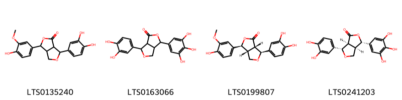{ width=100% }
    <figcaption>Hình ảnh cấu trúc hóa học của 4 hoạt chất thuộc nhóm Lignan lactones gồm ['6-(3,4-dihydroxyphenyl)-3-(4-hydroxy-3-methoxyphenyl)-tetrahydro-3h-furo[3,4-c]furan-1-one (LTS0135240)', '6-(3,4-dihydroxyphenyl)-3-(3,4,5-trihydroxyphenyl)-tetrahydro-3h-furo[3,4-c]furan-1-one (LTS0163066)', '(3s,3ar,6s,6as)-6-(3,4-dihydroxyphenyl)-3-(4-hydroxy-3-methoxyphenyl)-tetrahydro-3h-furo[3,4-c]furan-1-one (LTS0199807)', '(3s,3ar,6s,6as)-6-(3,4-dihydroxyphenyl)-3-(3,4,5-trihydroxyphenyl)-tetrahydro-3h-furo[3,4-c]furan-1-one (LTS0241203)'].</figcaption>
</figure>
#### Nhóm Organooxygen compounds
<figure markdown="span">
    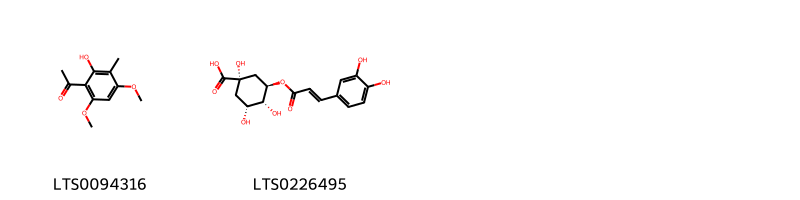{ width=100% }
    <figcaption>Hình ảnh cấu trúc hóa học của 2 hoạt chất thuộc nhóm Organooxygen compounds gồm ['1-(2-hydroxy-4,6-dimethoxy-3-methylphenyl)ethanone (LTS0094316)', 'chlorogenic acid (LTS0226495)'].</figcaption>
</figure>
#### Nhóm Prenol lipids
<figure markdown="span">
    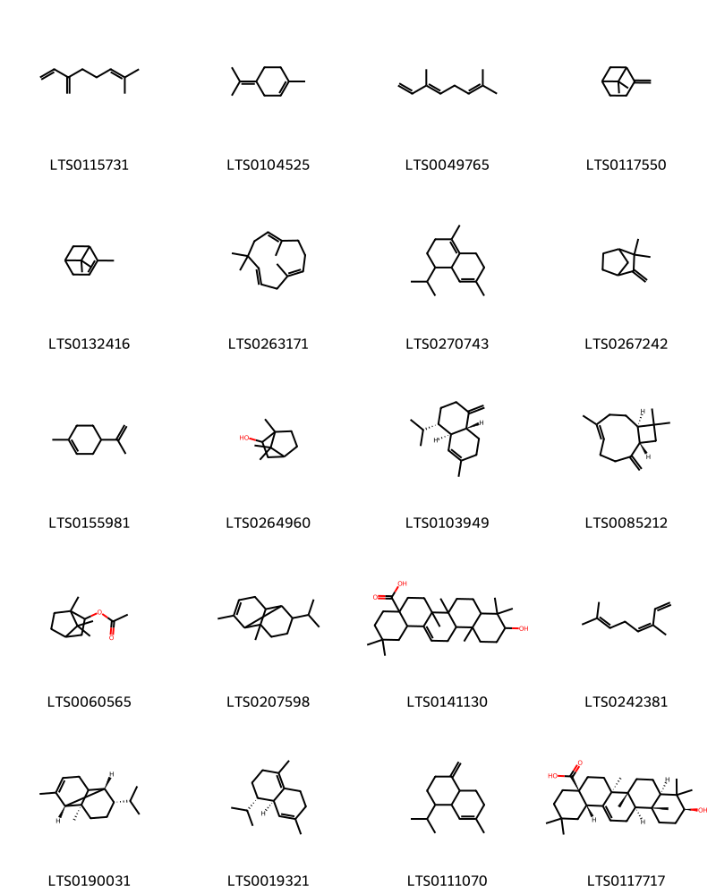{ width=100% }
    <figcaption>Hình ảnh cấu trúc hóa học của 20 hoạt chất thuộc nhóm Prenol lipids gồm ['α-myrcene (LTS0115731)', 'terpinolene (LTS0104525)', 'trans-β-ocimene (LTS0049765)', 'β-pinene (LTS0117550)', 'α pinene (LTS0132416)', 'humulene (LTS0263171)', '4-isopropyl-1,6-dimethyl-2,3,4,4a,7,8-hexahydronaphthalene (LTS0270743)', 'camphene (LTS0267242)', 'limonene,  (LTS0155981)', 'borneol (LTS0264960)', '(+)-gamma-cadinene (LTS0103949)', 'caryophyllene (LTS0085212)', 'bornyl acetate (LTS0060565)', 'α-copaene (LTS0207598)', 'oleanolic acid (LTS0141130)', 'β-ocimene (LTS0242381)', '(1r,2s,7s,8s)-8-isopropyl-1,3-dimethyltricyclo[4.4.0.0²,⁷]dec-3-ene (LTS0190031)', 'delta-cadinene (LTS0019321)', '4-isopropyl-6-methyl-1-methylidene-3,4,4a,7,8,8a-hexahydro-2h-naphthalene (LTS0111070)', 'oleanolic acid (LTS0117717)'].</figcaption>
</figure>
#### Nhóm Tannins
<figure markdown="span">
    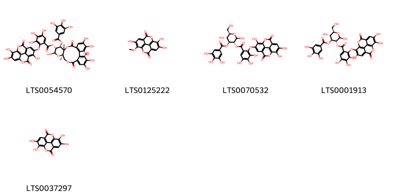{ width=100% }
    <figcaption>Hình ảnh cấu trúc hóa học của 5 hoạt chất thuộc nhóm Tannins gồm ['(10r,11s,12r,15r)-3,4,5,13,21,22,23-heptahydroxy-8,18-dioxo-11-(3,4,5-trihydroxybenzoyloxy)-9,14,17-trioxatetracyclo[17.4.0.0²,⁷.0¹⁰,¹⁵]tricosa-1(23),2(7),3,5,19,21-hexaen-12-yl 3,4,5-trihydroxy-2-({7,13,14-trihydroxy-3,9-dioxo-2,10-dioxatetracyclo[6.6.2.0⁴,¹⁶.0¹¹,¹⁵]hexadeca-1(15),4(16),5,7,11,13-hexaen-6-yl}oxy)benzoate (LTS0054570)', '6,7,13-trihydroxy-14-methoxy-2,9-dioxatetracyclo[6.6.2.0⁴,¹⁶.0¹¹,¹⁵]hexadeca-1(15),4,6,8(16),11,13-hexaene-3,10-dione (LTS0125222)', '(3r,4s,5r,6r)-2,5-dihydroxy-6-(hydroxymethyl)-4-(3,4,5-trihydroxybenzoyloxy)oxan-3-yl 3,4,5-trihydroxy-2-({7,13,14-trihydroxy-3,10-dioxo-2,9-dioxatetracyclo[6.6.2.0⁴,¹⁶.0¹¹,¹⁵]hexadeca-1(15),4(16),5,7,11,13-hexaen-6-yl}oxy)benzoate (LTS0070532)', '(3r,4s,5r,6r)-2,5-dihydroxy-6-(hydroxymethyl)-4-(3,4,5-trihydroxybenzoyloxy)oxan-3-yl 3,4,5-trihydroxy-2-({6,13,14-trihydroxy-3,10-dioxo-2,9-dioxatetracyclo[6.6.2.0⁴,¹⁶.0¹¹,¹⁵]hexadeca-1(15),4,6,8(16),11,13-hexaen-7-yl}oxy)benzoate (LTS0001913)', 'ellagic acid (LTS0037297)'].</figcaption>
</figure>
#### Nhóm Unsaturated hydrocarbons
<figure markdown="span">
    { width=100% }
    <figcaption>Hình ảnh cấu trúc hóa học của 1 hoạt chất thuộc nhóm Unsaturated hydrocarbons gồm ['α terpinene (LTS0232891)'].</figcaption>
</figure>

---

### Dược dân tộc học

Danh sách các quốc gia có sử dụng *Syzygium cumini* trong điều trị các bệnh. 

| Country   | Disease    | Bệnh                                                                                                                                                                                                |
|:----------|:-----------|:----------------------------------------------------------------------------------------------------------------------------------------------------------------------------------------------------|
| French    | Astringent | MYMEMORY WARNING: YOU USED ALL AVAILABLE FREE TRANSLATIONS FOR TODAY. NEXT AVAILABLE IN  06 HOURS 52 MINUTES 49 SECONDS VISIT HTTPS://MYMEMORY.TRANSLATED.NET/DOC/USAGELIMITS.PHP TO TRANSLATE MORE |
| German    | Diuretic   | MYMEMORY WARNING: YOU USED ALL AVAILABLE FREE TRANSLATIONS FOR TODAY. NEXT AVAILABLE IN  06 HOURS 52 MINUTES 46 SECONDS VISIT HTTPS://MYMEMORY.TRANSLATED.NET/DOC/USAGELIMITS.PHP TO TRANSLATE MORE |

---

---
## Syzygium cuminii
### Thông tin về thực vật

!!! info "Phân loại thực vật của *Syzygium cumini* từ GIBF:"
    - **Kingdom:** Plantae
    - **Phylum:** Tracheophyta
    - **Order:** Myrtales
    - **Family:** Myrtaceae
    - **Genus:** Syzygium
    - **Species:** *Syzygium cumini*

 

| Label (VI)   | Label (EN)   | Scientific Name   | Descriptions (VI)   | Descriptions (EN)   | Also Known As (VI)   | Also Known As (EN)                                         |
|:-------------|:-------------|:------------------|:--------------------|:--------------------|:---------------------|:-----------------------------------------------------------|
| N/A          | N/A          | Syzygium cumini   | loài thực vật       | species of tree     | ['Syzygium cumini']  | ['Java plum', 'black plum', 'jambolan', 'jamun', 'jambul'] |

#### Phân bố trên thế giới

**Từ CSDL GIBF** Brazil, United States of America, South Africa, Australia, Colombia, India, French Guiana, Belize

#### Phân bố tại Việt Nam

**Từ CSDL GIBF**: Không có ghi nhận ở Việt Nam

---
### Thành phần hóa học
        
- Theo cơ sở dữ liệu lotus: Từ loài *Syzygium cumini* đã phân lập và xác định được Chưa có hoạt chất nào được phân lập. hoạt chất thuộc về các nhóm Không có hoạt chất nào được phân lập. 

Không có hình ảnh nào được tạo ra

---

### Dược dân tộc học

Danh sách các quốc gia có sử dụng *Syzygium cumini* trong điều trị các bệnh. 

| Country   | Disease                     | Bệnh                                                                                                                                                                                                |
|:----------|:----------------------------|:----------------------------------------------------------------------------------------------------------------------------------------------------------------------------------------------------|
| Elsewhere | Antibiotic, Astringent, nan | MYMEMORY WARNING: YOU USED ALL AVAILABLE FREE TRANSLATIONS FOR TODAY. NEXT AVAILABLE IN  06 HOURS 52 MINUTES 11 SECONDS VISIT HTTPS://MYMEMORY.TRANSLATED.NET/DOC/USAGELIMITS.PHP TO TRANSLATE MORE |

---

---
## Syzygium jambos
### Thông tin về thực vật

!!! info "Phân loại thực vật của *Syzygium jambos* từ GIBF:"
    - **Kingdom:** Plantae
    - **Phylum:** Tracheophyta
    - **Order:** Myrtales
    - **Family:** Myrtaceae
    - **Genus:** Syzygium
    - **Species:** *Syzygium jambos*

 

| Label (VI)   | Label (EN)   | Scientific Name   | Descriptions (VI)   | Descriptions (EN)                             | Also Known As (VI)   | Also Known As (EN)          |
|:-------------|:-------------|:------------------|:--------------------|:----------------------------------------------|:---------------------|:----------------------------|
| N/A          | N/A          | Syzygium jambos   |                     | species of tree originating in Southeast Asia | ['']                 | ['plum rose', 'rose apple'] |

#### Phân bố trên thế giới

**Từ CSDL GIBF** Brazil, Guatemala, Japan, Guadeloupe, China, Honduras, French Polynesia, Trinidad and Tobago, Madagascar, Thailand, Puerto Rico, Réunion, United States of America, Costa Rica, Dominican Republic, Colombia, Cuba, French Guiana, Hong Kong, Mexico, Macao, El Salvador, Chinese Taipei, Haiti, Malaysia, Panama, Martinique, South Africa, Australia, India

#### Phân bố tại Việt Nam

**Từ CSDL GIBF**: Không có ghi nhận ở Việt Nam

---
### Thành phần hóa học
        
- Theo cơ sở dữ liệu lotus: Từ loài *Syzygium jambos* đã phân lập và xác định được 40 hoạt chất thuộc về các nhóm Benzene and substituted derivatives, Cinnamyl alcohols, Flavonoids, Tannins, Organooxygen compounds, Isoflavonoids, Cinnamaldehydes, Prenol lipids. 

|    | chemicalTaxonomyClassyfireClass     |   smiles_count |
|---:|:------------------------------------|---------------:|
|  0 | Benzene and substituted derivatives |              5 |
|  1 | Cinnamaldehydes                     |              2 |
|  2 | Cinnamyl alcohols                   |              2 |
|  3 | Flavonoids                          |             16 |
|  4 | Isoflavonoids                       |              4 |
|  5 | Organooxygen compounds              |              2 |
|  6 | Prenol lipids                       |              4 |
|  7 | Tannins                             |              4 |

#### Nhóm Benzene and substituted derivatives
<figure markdown="span">
    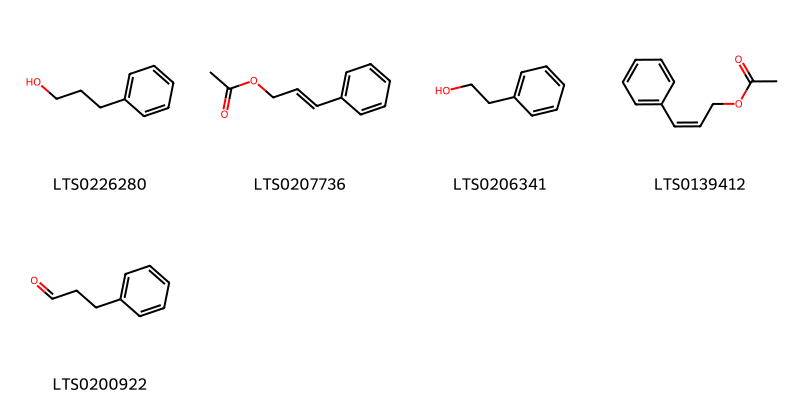{ width=100% }
    <figcaption>Hình ảnh cấu trúc hóa học của 5 hoạt chất thuộc nhóm Benzene and substituted derivatives gồm ['3-phenylpropanol (LTS0226280)', 'cinnamyl acetate (LTS0207736)', '2-phenyl-ethanol (LTS0206341)', '(z)-cinnamyl acetate (LTS0139412)', 'benzenepropanal (LTS0200922)'].</figcaption>
</figure>
#### Nhóm Cinnamaldehydes
<figure markdown="span">
    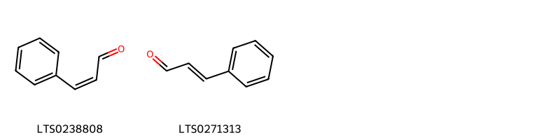{ width=100% }
    <figcaption>Hình ảnh cấu trúc hóa học của 2 hoạt chất thuộc nhóm Cinnamaldehydes gồm ['(z)-3-phenyl-2-propenal (LTS0238808)', 'cinnamal (LTS0271313)'].</figcaption>
</figure>
#### Nhóm Cinnamyl alcohols
<figure markdown="span">
    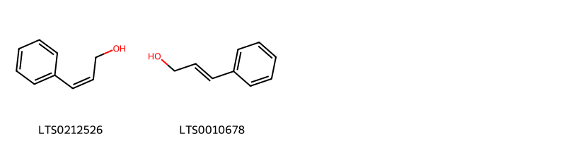{ width=100% }
    <figcaption>Hình ảnh cấu trúc hóa học của 2 hoạt chất thuộc nhóm Cinnamyl alcohols gồm ['styrone (LTS0212526)', 'cinnamyl alcohol (LTS0010678)'].</figcaption>
</figure>
#### Nhóm Flavonoids
<figure markdown="span">
    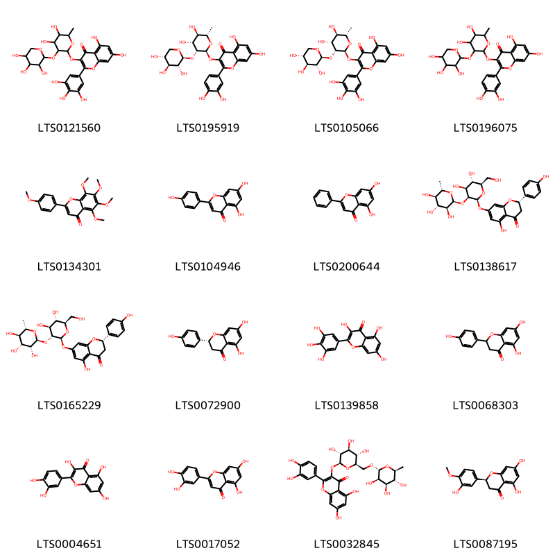{ width=100% }
    <figcaption>Hình ảnh cấu trúc hóa học của 16 hoạt chất thuộc nhóm Flavonoids gồm ['3-({4,5-dihydroxy-6-methyl-3-[(3,4,5-trihydroxyoxan-2-yl)oxy]oxan-2-yl}oxy)-5,7-dihydroxy-2-(3,4,5-trihydroxyphenyl)chromen-4-one (LTS0121560)', '3-{[(2s,3r,4r,5r,6s)-4,5-dihydroxy-6-methyl-3-{[(2s,3r,4s,5r)-3,4,5-trihydroxyoxan-2-yl]oxy}oxan-2-yl]oxy}-2-(3,4-dihydroxyphenyl)-5,7-dihydroxychromen-4-one (LTS0195919)', '3-{[(2s,3r,4r,5r,6s)-4,5-dihydroxy-6-methyl-3-{[(2s,3r,4s,5r)-3,4,5-trihydroxyoxan-2-yl]oxy}oxan-2-yl]oxy}-5,7-dihydroxy-2-(3,4,5-trihydroxyphenyl)chromen-4-one (LTS0105066)', '3-({4,5-dihydroxy-6-methyl-3-[(3,4,5-trihydroxyoxan-2-yl)oxy]oxan-2-yl}oxy)-2-(3,4-dihydroxyphenyl)-5,7-dihydroxychromen-4-one (LTS0196075)', 'tangeretin (LTS0134301)', 'chamomile (LTS0104946)', 'chrysin (LTS0200644)', '(2s)-7-{[(2s,3s,4s,5s,6r)-4,5-dihydroxy-6-(hydroxymethyl)-3-{[(2s,3s,4r,5r,6s)-3,4,5-trihydroxy-6-methyloxan-2-yl]oxy}oxan-2-yl]oxy}-5-hydroxy-2-(4-hydroxyphenyl)-2,3-dihydro-1-benzopyran-4-one (LTS0138617)', 'naringin (LTS0165229)', '(-)-naringenin (LTS0072900)', 'myricetin (LTS0139858)', 'asahina (LTS0068303)', 'quercetin (LTS0004651)', 'luteolin (LTS0017052)', '3-rutinosyl quercetin (LTS0032845)', 'hesperetin (LTS0087195)'].</figcaption>
</figure>
#### Nhóm Isoflavonoids
<figure markdown="span">
    { width=100% }
    <figcaption>Hình ảnh cấu trúc hóa học của 4 hoạt chất thuộc nhóm Isoflavonoids gồm ['formononetin (LTS0082756)', 'genistein (LTS0106538)', 'daidzein (LTS0130369)', 'biochanin (LTS0111539)'].</figcaption>
</figure>
#### Nhóm Organooxygen compounds
<figure markdown="span">
    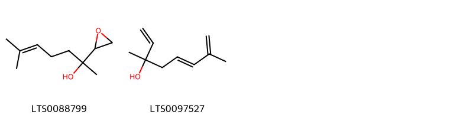{ width=100% }
    <figcaption>Hình ảnh cấu trúc hóa học của 2 hoạt chất thuộc nhóm Organooxygen compounds gồm ['linalool dihydroepoxide (LTS0088799)', '(5e)-3,7-dimethylocta-1,5,7-trien-3-ol (LTS0097527)'].</figcaption>
</figure>
#### Nhóm Prenol lipids
<figure markdown="span">
    { width=100% }
    <figcaption>Hình ảnh cấu trúc hóa học của 4 hoạt chất thuộc nhóm Prenol lipids gồm ['linalool, (+-)- (LTS0128839)', 'geraniol (LTS0258838)', 'nerol (LTS0244289)', 'citronellol, (+-)- (LTS0090925)'].</figcaption>
</figure>
#### Nhóm Tannins
<figure markdown="span">
    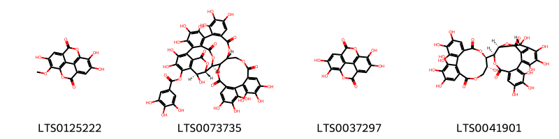{ width=100% }
    <figcaption>Hình ảnh cấu trúc hóa học của 4 hoạt chất thuộc nhóm Tannins gồm ['6,7,13-trihydroxy-14-methoxy-2,9-dioxatetracyclo[6.6.2.0⁴,¹⁶.0¹¹,¹⁵]hexadeca-1(15),4,6,8(16),11,13-hexaene-3,10-dione (LTS0125222)', '(1r,2r,20r,42s,46s)-7,8,9,12,13,14,25,26,27,30,31,32,35,36,46-pentadecahydroxy-4,17,22,40,44-pentaoxo-3,18,21,41,43-pentaoxanonacyclo[27.13.3.1³⁸,⁴².0²,²⁰.0⁵,¹⁰.0¹¹,¹⁶.0²³,²⁸.0³³,⁴⁵.0³⁴,³⁹]hexatetraconta-5(10),6,8,11,13,15,23(28),24,26,29(45),30,32,34,36,38-pentadecaen-37-yl 3,4,5-trihydroxybenzoate (LTS0073735)', 'ellagic acid (LTS0037297)', '(14r,15s,19r)-14-[(10r,11r)-3,4,5,11,17,18,19-heptahydroxy-8,14-dioxo-9,13-dioxatricyclo[13.4.0.0²,⁷]nonadeca-1(15),2,4,6,16,18-hexaen-10-yl]-2,3,4,7,8,9,19-heptahydroxy-13,16-dioxatetracyclo[13.3.1.0⁵,¹⁸.0⁶,¹¹]nonadeca-1(18),2,4,6,8,10-hexaene-12,17-dione (LTS0041901)'].</figcaption>
</figure>

---

### Dược dân tộc học

Danh sách các quốc gia có sử dụng *Syzygium jambos* trong điều trị các bệnh. 

| Country            | Disease   | Bệnh                                                                                                                                                                                                |
|:-------------------|:----------|:----------------------------------------------------------------------------------------------------------------------------------------------------------------------------------------------------|
| Dominican Republic | Narcotic  | MYMEMORY WARNING: YOU USED ALL AVAILABLE FREE TRANSLATIONS FOR TODAY. NEXT AVAILABLE IN  06 HOURS 51 MINUTES 50 SECONDS VISIT HTTPS://MYMEMORY.TRANSLATED.NET/DOC/USAGELIMITS.PHP TO TRANSLATE MORE |

---

---
## Syzygium jambosa
### Thông tin về thực vật

!!! info "Phân loại thực vật của *Syzygium jambos* từ GIBF:"
    - **Kingdom:** Plantae
    - **Phylum:** Tracheophyta
    - **Order:** Myrtales
    - **Family:** Myrtaceae
    - **Genus:** Syzygium
    - **Species:** *Syzygium jambos*

 

| Label (VI)   | Label (EN)   | Scientific Name   | Descriptions (VI)   | Descriptions (EN)                             | Also Known As (VI)   | Also Known As (EN)          |
|:-------------|:-------------|:------------------|:--------------------|:----------------------------------------------|:---------------------|:----------------------------|
| N/A          | N/A          | Syzygium jambos   |                     | species of tree originating in Southeast Asia | ['']                 | ['plum rose', 'rose apple'] |

#### Phân bố trên thế giới

**Từ CSDL GIBF** Brazil, Guatemala, Japan, Guadeloupe, China, Honduras, French Polynesia, Trinidad and Tobago, Madagascar, Thailand, Puerto Rico, Réunion, United States of America, Costa Rica, Dominican Republic, Colombia, Cuba, French Guiana, Hong Kong, Mexico, Macao, El Salvador, Chinese Taipei, Haiti, Malaysia, Panama, Martinique, South Africa, Australia, India

#### Phân bố tại Việt Nam

**Từ CSDL GIBF**: Không có ghi nhận ở Việt Nam

---
### Thành phần hóa học
        
- Theo cơ sở dữ liệu lotus: Từ loài *Syzygium jambos* đã phân lập và xác định được Chưa có hoạt chất nào được phân lập. hoạt chất thuộc về các nhóm Không có hoạt chất nào được phân lập. 

Không có hình ảnh nào được tạo ra

---

### Dược dân tộc học

Danh sách các quốc gia có sử dụng *Syzygium jambos* trong điều trị các bệnh. 

| Country   | Disease    | Bệnh                                                                                                                                                                                                |
|:----------|:-----------|:----------------------------------------------------------------------------------------------------------------------------------------------------------------------------------------------------|
| Haiti     | Astringent | MYMEMORY WARNING: YOU USED ALL AVAILABLE FREE TRANSLATIONS FOR TODAY. NEXT AVAILABLE IN  06 HOURS 51 MINUTES 20 SECONDS VISIT HTTPS://MYMEMORY.TRANSLATED.NET/DOC/USAGELIMITS.PHP TO TRANSLATE MORE |

---

---
## Syzygium malaccense
### Thông tin về thực vật

!!! info "Phân loại thực vật của *Syzygium malaccense* từ GIBF:"
    - **Kingdom:** Plantae
    - **Phylum:** Tracheophyta
    - **Order:** Myrtales
    - **Family:** Myrtaceae
    - **Genus:** Syzygium
    - **Species:** *Syzygium malaccense*

 

| Label (VI)   | Label (EN)   | Scientific Name     | Descriptions (VI)   | Descriptions (EN)   | Also Known As (VI)   | Also Known As (EN)                                                                             |
|:-------------|:-------------|:--------------------|:--------------------|:--------------------|:---------------------|:-----------------------------------------------------------------------------------------------|
| N/A          | N/A          | Syzygium malaccense | loài thực vật       | species of plant    | ['']                 | ['jambu bol', 'jambu merah', 'Malay apple', 'Malay rose apple', 'Otaheite cashew', 'pommerac'] |

#### Phân bố trên thế giới

**Từ CSDL GIBF** Brazil, Saint Kitts and Nevis, Guadeloupe, New Caledonia, Honduras, French Polynesia, Ecuador, Trinidad and Tobago, Thailand, Madagascar, Puerto Rico, Cayman Islands, United States of America, Jamaica, Indonesia, Costa Rica, Dominican Republic, Colombia, French Guiana, Grenada, Fiji, Dominica, Mexico, Vanuatu, El Salvador, Montserrat, Malaysia, Philippines, Haiti, Panama, Nicaragua, Singapore, Martinique, South Africa, Australia, India, Peru, Belize

#### Phân bố tại Việt Nam

**Từ CSDL GIBF**: Không có ghi nhận ở Việt Nam

---
### Thành phần hóa học
        
- Theo cơ sở dữ liệu lotus: Từ loài *Syzygium malaccense* đã phân lập và xác định được 6 hoạt chất thuộc về các nhóm Tannins, Flavonoids. 

|    | chemicalTaxonomyClassyfireClass   |   smiles_count |
|---:|:----------------------------------|---------------:|
|  0 | Flavonoids                        |              4 |
|  1 | Tannins                           |              2 |

#### Nhóm Flavonoids
<figure markdown="span">
    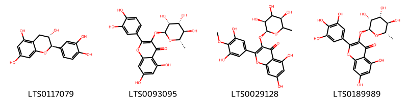{ width=100% }
    <figcaption>Hình ảnh cấu trúc hóa học của 4 hoạt chất thuộc nhóm Flavonoids gồm ['(+)-catechol (LTS0117079)', 'quercitrin (LTS0093095)', 'mearnsitrin (LTS0029128)', 'myricitrin (LTS0189989)'].</figcaption>
</figure>
#### Nhóm Tannins
<figure markdown="span">
    { width=100% }
    <figcaption>Hình ảnh cấu trúc hóa học của 2 hoạt chất thuộc nhóm Tannins gồm ['6,7,13-trihydroxy-14-methoxy-2,9-dioxatetracyclo[6.6.2.0⁴,¹⁶.0¹¹,¹⁵]hexadeca-1(15),4,6,8(16),11,13-hexaene-3,10-dione (LTS0125222)', 'ellagic acid (LTS0037297)'].</figcaption>
</figure>

---

### Dược dân tộc học

Danh sách các quốc gia có sử dụng *Syzygium malaccense* trong điều trị các bệnh. 

| Country   | Disease       | Bệnh                                                                                                                                                                                                |
|:----------|:--------------|:----------------------------------------------------------------------------------------------------------------------------------------------------------------------------------------------------|
| Elsewhere | nan, Diuretic | MYMEMORY WARNING: YOU USED ALL AVAILABLE FREE TRANSLATIONS FOR TODAY. NEXT AVAILABLE IN  06 HOURS 50 MINUTES 57 SECONDS VISIT HTTPS://MYMEMORY.TRANSLATED.NET/DOC/USAGELIMITS.PHP TO TRANSLATE MORE |
| Tonga     | Laxative      | MYMEMORY WARNING: YOU USED ALL AVAILABLE FREE TRANSLATIONS FOR TODAY. NEXT AVAILABLE IN  06 HOURS 50 MINUTES 55 SECONDS VISIT HTTPS://MYMEMORY.TRANSLATED.NET/DOC/USAGELIMITS.PHP TO TRANSLATE MORE |

---

---
## Syzygium zeylanicum
### Thông tin về thực vật

!!! info "Phân loại thực vật của *Syzygium zeylanicum* từ GIBF:"
    - **Kingdom:** Plantae
    - **Phylum:** Tracheophyta
    - **Order:** Myrtales
    - **Family:** Myrtaceae
    - **Genus:** Syzygium
    - **Species:** *Syzygium zeylanicum*

 

| Label (VI)   | Label (EN)   | Scientific Name     | Descriptions (VI)   | Descriptions (EN)   | Also Known As (VI)   | Also Known As (EN)   |
|:-------------|:-------------|:--------------------|:--------------------|:--------------------|:---------------------|:---------------------|
| N/A          | N/A          | Syzygium zeylanicum | loài thực vật       | species of plant    | ['']                 | ['']                 |

#### Phân bố trên thế giới

**Từ CSDL GIBF** Sri Lanka, nan, Singapore, Viet Nam, Cambodia, Indonesia, Malaysia, China, India, unknown or invalid, Brunei Darussalam, Thailand, Lao People’s Democratic Republic

#### Phân bố tại Việt Nam

**Từ CSDL GIBF**: Tỉnh Khánh Hòa

---
### Thành phần hóa học
        
- Theo cơ sở dữ liệu lotus: Từ loài *Syzygium zeylanicum* đã phân lập và xác định được Chưa có hoạt chất nào được phân lập. hoạt chất thuộc về các nhóm Không có hoạt chất nào được phân lập. 

Không có hình ảnh nào được tạo ra

---

### Dược dân tộc học

Danh sách các quốc gia có sử dụng *Syzygium zeylanicum* trong điều trị các bệnh. 

| Country   | Disease              | Bệnh                                                                                                                                                                                                |
|:----------|:---------------------|:----------------------------------------------------------------------------------------------------------------------------------------------------------------------------------------------------|
| Elsewhere | Vermifuge, Stimulant | MYMEMORY WARNING: YOU USED ALL AVAILABLE FREE TRANSLATIONS FOR TODAY. NEXT AVAILABLE IN  06 HOURS 50 MINUTES 29 SECONDS VISIT HTTPS://MYMEMORY.TRANSLATED.NET/DOC/USAGELIMITS.PHP TO TRANSLATE MORE |

---

# Chi Backhousia

??? note "Danh sách các dược liệu thuộc chi"
    
	 - *Backhousia citriodora*

---
## Backhousia citriodora
### Thông tin về thực vật

!!! info "Phân loại thực vật của *Backhousia citriodora* từ GIBF:"
    - **Kingdom:** Plantae
    - **Phylum:** Tracheophyta
    - **Order:** Myrtales
    - **Family:** Myrtaceae
    - **Genus:** Backhousia
    - **Species:** *Backhousia citriodora*

 

| Label (VI)   | Label (EN)   | Scientific Name       | Descriptions (VI)   | Descriptions (EN)   | Also Known As (VI)   | Also Known As (EN)                                                 |
|:-------------|:-------------|:----------------------|:--------------------|:--------------------|:---------------------|:-------------------------------------------------------------------|
| N/A          | N/A          | Backhousia citriodora | loài thực vật       | species of plant    | ['']                 | ['lemon myrtle', 'lemon scented ironwood', 'lemon scented myrtle'] |

#### Phân bố trên thế giới

**Từ CSDL GIBF** nan, Brazil, Australia, New Zealand, Zimbabwe, unknown or invalid

#### Phân bố tại Việt Nam

**Từ CSDL GIBF**: Không có ghi nhận ở Việt Nam

---
### Thành phần hóa học
        
- Theo cơ sở dữ liệu lotus: Từ loài *Backhousia citriodora* đã phân lập và xác định được 10 hoạt chất thuộc về các nhóm Prenol lipids, Organooxygen compounds. 

|    | chemicalTaxonomyClassyfireClass   |   smiles_count |
|---:|:----------------------------------|---------------:|
|  0 | Organooxygen compounds            |              1 |
|  1 | Prenol lipids                     |              9 |

#### Nhóm Organooxygen compounds
<figure markdown="span">
    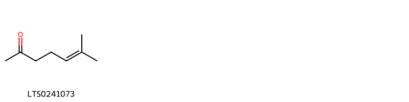{ width=100% }
    <figcaption>Hình ảnh cấu trúc hóa học của 1 hoạt chất thuộc nhóm Organooxygen compounds gồm ['6-methyl-5-hepten-2-one (LTS0241073)'].</figcaption>
</figure>
#### Nhóm Prenol lipids
<figure markdown="span">
    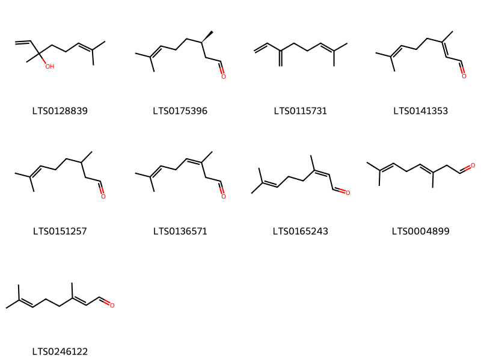{ width=100% }
    <figcaption>Hình ảnh cấu trúc hóa học của 9 hoạt chất thuộc nhóm Prenol lipids gồm ['linalool, (+-)- (LTS0128839)', '(r)-(+)-citronellal (LTS0175396)', 'α-myrcene (LTS0115731)', '3,7-dimethyl-2,6-octadienal (LTS0141353)', 'citronella (LTS0151257)', '(3z)-3,7-dimethylocta-3,6-dienal (LTS0136571)', 'neral (LTS0165243)', '3,7-dimethyl-3,6-octadienal (LTS0004899)', 'α-citral (LTS0246122)'].</figcaption>
</figure>

---

### Dược dân tộc học

Danh sách các quốc gia có sử dụng *Backhousia citriodora* trong điều trị các bệnh. 

| Country   | Disease   | Bệnh                                                                                                                                                                                                |
|:----------|:----------|:----------------------------------------------------------------------------------------------------------------------------------------------------------------------------------------------------|
| Elsewhere | Soap      | MYMEMORY WARNING: YOU USED ALL AVAILABLE FREE TRANSLATIONS FOR TODAY. NEXT AVAILABLE IN  06 HOURS 50 MINUTES 08 SECONDS VISIT HTTPS://MYMEMORY.TRANSLATED.NET/DOC/USAGELIMITS.PHP TO TRANSLATE MORE |

---

# Chi Eugenia

??? note "Danh sách các dược liệu thuộc chi"
    
	 - *Eugenia aquea*
	 - *Eugenia aromatica*
	 - *Eugenia caryophyllata*
	 - *Eugenia cheken*
	 - *Eugenia chequen*
	 - *Eugenia corynocarpa*
	 - *Eugenia crenulata*
	 - *Eugenia jambolana*
	 - *Eugenia zeylanica*

---
## Eugenia aquea
### Thông tin về thực vật

!!! info "Phân loại thực vật của *Syzygium aqueum* từ GIBF:"
    - **Kingdom:** Plantae
    - **Phylum:** Tracheophyta
    - **Order:** Myrtales
    - **Family:** Myrtaceae
    - **Genus:** Syzygium
    - **Species:** *Syzygium aqueum*

 

| Label (VI)   | Label (EN)   | Scientific Name   | Descriptions (VI)   | Descriptions (EN)   | Also Known As (VI)   | Also Known As (EN)   |
|:-------------|:-------------|:------------------|:--------------------|:--------------------|:---------------------|:---------------------|
| N/A          | N/A          | Eugenia aquea     | loài thực vật       | species of plant    | ['']                 | ['']                 |

#### Phân bố trên thế giới

**Từ CSDL GIBF** Sri Lanka, nan, Brazil, Congo, Democratic Republic of the, United States of America, Indonesia, Malaysia, Seychelles, Philippines, India, unknown or invalid, Papua New Guinea

#### Phân bố tại Việt Nam

**Từ CSDL GIBF**: Không có ghi nhận ở Việt Nam

---
### Thành phần hóa học
        
- Theo cơ sở dữ liệu lotus: Từ loài *Syzygium aqueum* đã phân lập và xác định được Chưa có hoạt chất nào được phân lập. hoạt chất thuộc về các nhóm Không có hoạt chất nào được phân lập. 

Không có hình ảnh nào được tạo ra

---

### Dược dân tộc học

Danh sách các quốc gia có sử dụng *Syzygium aqueum* trong điều trị các bệnh. 

| Country   | Disease    | Bệnh                                                                                                                                                                                                |
|:----------|:-----------|:----------------------------------------------------------------------------------------------------------------------------------------------------------------------------------------------------|
| Java      | Astringent | MYMEMORY WARNING: YOU USED ALL AVAILABLE FREE TRANSLATIONS FOR TODAY. NEXT AVAILABLE IN  06 HOURS 49 MINUTES 44 SECONDS VISIT HTTPS://MYMEMORY.TRANSLATED.NET/DOC/USAGELIMITS.PHP TO TRANSLATE MORE |

---

---
## Eugenia aromatica
### Thông tin về thực vật

!!! info "Phân loại thực vật của *Eugenia aromatica* từ GIBF:"
    - **Kingdom:** Plantae
    - **Phylum:** Tracheophyta
    - **Order:** Myrtales
    - **Family:** Myrtaceae
    - **Genus:** Eugenia
    - **Species:** *Eugenia aromatica*

 

| Label (VI)   | Label (EN)   | Scientific Name   | Descriptions (VI)   | Descriptions (EN)   | Also Known As (VI)   | Also Known As (EN)   |
|:-------------|:-------------|:------------------|:--------------------|:--------------------|:---------------------|:---------------------|
| N/A          | N/A          | Eugenia aromatica |                     |                     | ['']                 | ['']                 |

#### Phân bố trên thế giới

**Từ CSDL GIBF** nan, Benin, Indonesia, Malaysia, China, unknown or invalid, Comoros

#### Phân bố tại Việt Nam

**Từ CSDL GIBF**: Không có ghi nhận ở Việt Nam

---
### Thành phần hóa học
        
- Theo cơ sở dữ liệu lotus: Từ loài *Eugenia aromatica* đã phân lập và xác định được Chưa có hoạt chất nào được phân lập. hoạt chất thuộc về các nhóm Không có hoạt chất nào được phân lập. 

Không có hình ảnh nào được tạo ra

---

### Dược dân tộc học

Danh sách các quốc gia có sử dụng *Eugenia aromatica* trong điều trị các bệnh. 

| Country   | Disease   | Bệnh                                                                                                                                                                                                |
|:----------|:----------|:----------------------------------------------------------------------------------------------------------------------------------------------------------------------------------------------------|
| Java      | Tonic     | MYMEMORY WARNING: YOU USED ALL AVAILABLE FREE TRANSLATIONS FOR TODAY. NEXT AVAILABLE IN  06 HOURS 49 MINUTES 26 SECONDS VISIT HTTPS://MYMEMORY.TRANSLATED.NET/DOC/USAGELIMITS.PHP TO TRANSLATE MORE |

---

---
## Eugenia caryophyllata
### Thông tin về thực vật

!!! info "Phân loại thực vật của *Syzygium aromaticum* từ GIBF:"
    - **Kingdom:** Plantae
    - **Phylum:** Tracheophyta
    - **Order:** Myrtales
    - **Family:** Myrtaceae
    - **Genus:** Syzygium
    - **Species:** *Syzygium aromaticum*

 

| Label (VI)   | Label (EN)   | Scientific Name       | Descriptions (VI)   | Descriptions (EN)   | Also Known As (VI)   | Also Known As (EN)   |
|:-------------|:-------------|:----------------------|:--------------------|:--------------------|:---------------------|:---------------------|
| N/A          | N/A          | Eugenia caryophyllata | loài thực vật       | species of plant    | ['']                 | ['']                 |

#### Phân bố trên thế giới

**Từ CSDL GIBF** Sri Lanka, nan, Brazil, Mexico, Congo, Democratic Republic of the, United States of America, Guadeloupe, Indonesia, Malaysia, Chinese Taipei, China, India, Tanzania, United Republic of, unknown or invalid, French Guiana, Cameroon, Ghana

#### Phân bố tại Việt Nam

**Từ CSDL GIBF**: Không có ghi nhận ở Việt Nam

---
### Thành phần hóa học
        
- Theo cơ sở dữ liệu lotus: Từ loài *Syzygium aromaticum* đã phân lập và xác định được Chưa có hoạt chất nào được phân lập. hoạt chất thuộc về các nhóm Không có hoạt chất nào được phân lập. 

Không có hình ảnh nào được tạo ra

---

### Dược dân tộc học

Danh sách các quốc gia có sử dụng *Syzygium aromaticum* trong điều trị các bệnh. 

| Country   | Disease                            | Bệnh                                                                                                                                                                                                |
|:----------|:-----------------------------------|:----------------------------------------------------------------------------------------------------------------------------------------------------------------------------------------------------|
| Elsewhere | Carminative, Antiseptic, Stimulant | MYMEMORY WARNING: YOU USED ALL AVAILABLE FREE TRANSLATIONS FOR TODAY. NEXT AVAILABLE IN  06 HOURS 49 MINUTES 10 SECONDS VISIT HTTPS://MYMEMORY.TRANSLATED.NET/DOC/USAGELIMITS.PHP TO TRANSLATE MORE |

---

---
## Eugenia cheken
### Thông tin về thực vật

!!! info "Phân loại thực vật của *Luma chequen* từ GIBF:"
    - **Kingdom:** Plantae
    - **Phylum:** Tracheophyta
    - **Order:** Myrtales
    - **Family:** Myrtaceae
    - **Genus:** Luma
    - **Species:** *Luma chequen*

 

| Label (VI)   | Label (EN)   | Scientific Name       | Descriptions (VI)   | Descriptions (EN)   | Also Known As (VI)   | Also Known As (EN)   |
|:-------------|:-------------|:----------------------|:--------------------|:--------------------|:---------------------|:---------------------|
| N/A          | N/A          | Eugenia caryophyllata | loài thực vật       | species of plant    | ['']                 | ['']                 |

#### Phân bố trên thế giới

**Từ CSDL GIBF** Sri Lanka, nan, Brazil, Mexico, Congo, Democratic Republic of the, United States of America, Guadeloupe, Indonesia, Malaysia, Chinese Taipei, China, India, Tanzania, United Republic of, unknown or invalid, French Guiana, Cameroon, Ghana

#### Phân bố tại Việt Nam

**Từ CSDL GIBF**: Không có ghi nhận ở Việt Nam

---
### Thành phần hóa học
        
- Theo cơ sở dữ liệu lotus: Từ loài *Luma chequen* đã phân lập và xác định được Chưa có hoạt chất nào được phân lập. hoạt chất thuộc về các nhóm Không có hoạt chất nào được phân lập. 

Không có hình ảnh nào được tạo ra

---

### Dược dân tộc học

Danh sách các quốc gia có sử dụng *Luma chequen* trong điều trị các bệnh. 

| Country   | Disease     | Bệnh                                                                                                                                                                                                |
|:----------|:------------|:----------------------------------------------------------------------------------------------------------------------------------------------------------------------------------------------------|
| Chile     | Expectorant | MYMEMORY WARNING: YOU USED ALL AVAILABLE FREE TRANSLATIONS FOR TODAY. NEXT AVAILABLE IN  06 HOURS 48 MINUTES 51 SECONDS VISIT HTTPS://MYMEMORY.TRANSLATED.NET/DOC/USAGELIMITS.PHP TO TRANSLATE MORE |
| French    | Tonic       | MYMEMORY WARNING: YOU USED ALL AVAILABLE FREE TRANSLATIONS FOR TODAY. NEXT AVAILABLE IN  06 HOURS 48 MINUTES 48 SECONDS VISIT HTTPS://MYMEMORY.TRANSLATED.NET/DOC/USAGELIMITS.PHP TO TRANSLATE MORE |
| German    | Astringent  | MYMEMORY WARNING: YOU USED ALL AVAILABLE FREE TRANSLATIONS FOR TODAY. NEXT AVAILABLE IN  06 HOURS 48 MINUTES 45 SECONDS VISIT HTTPS://MYMEMORY.TRANSLATED.NET/DOC/USAGELIMITS.PHP TO TRANSLATE MORE |
| US        | Diuretic    | MYMEMORY WARNING: YOU USED ALL AVAILABLE FREE TRANSLATIONS FOR TODAY. NEXT AVAILABLE IN  06 HOURS 48 MINUTES 43 SECONDS VISIT HTTPS://MYMEMORY.TRANSLATED.NET/DOC/USAGELIMITS.PHP TO TRANSLATE MORE |

---

---
## Eugenia chequen
### Thông tin về thực vật

!!! info "Phân loại thực vật của *Luma chequen* từ GIBF:"
    - **Kingdom:** Plantae
    - **Phylum:** Tracheophyta
    - **Order:** Myrtales
    - **Family:** Myrtaceae
    - **Genus:** Luma
    - **Species:** *Luma chequen*

 

| Label (VI)   | Label (EN)   | Scientific Name   | Descriptions (VI)   | Descriptions (EN)   | Also Known As (VI)   | Also Known As (EN)   |
|:-------------|:-------------|:------------------|:--------------------|:--------------------|:---------------------|:---------------------|
| N/A          | N/A          | Eugenia chequen   | loài thực vật       | species of plant    | ['']                 | ['']                 |

#### Phân bố trên thế giới

**Từ CSDL GIBF** nan, Chile, unknown or invalid

#### Phân bố tại Việt Nam

**Từ CSDL GIBF**: Không có ghi nhận ở Việt Nam

---
### Thành phần hóa học
        
- Theo cơ sở dữ liệu lotus: Từ loài *Luma chequen* đã phân lập và xác định được Chưa có hoạt chất nào được phân lập. hoạt chất thuộc về các nhóm Không có hoạt chất nào được phân lập. 

Không có hình ảnh nào được tạo ra

---

### Dược dân tộc học

Danh sách các quốc gia có sử dụng *Luma chequen* trong điều trị các bệnh. 

| Country   | Disease                      | Bệnh                                                                                                                                                                                                |
|:----------|:-----------------------------|:----------------------------------------------------------------------------------------------------------------------------------------------------------------------------------------------------|
| Elsewhere | Diuretic, Expectorant, Tonic | MYMEMORY WARNING: YOU USED ALL AVAILABLE FREE TRANSLATIONS FOR TODAY. NEXT AVAILABLE IN  06 HOURS 48 MINUTES 27 SECONDS VISIT HTTPS://MYMEMORY.TRANSLATED.NET/DOC/USAGELIMITS.PHP TO TRANSLATE MORE |

---

---
## Eugenia corynocarpa
### Thông tin về thực vật

!!! info "Phân loại thực vật của *Syzygium corynocarpum* từ GIBF:"
    - **Kingdom:** Plantae
    - **Phylum:** Tracheophyta
    - **Order:** Myrtales
    - **Family:** Myrtaceae
    - **Genus:** Syzygium
    - **Species:** *Syzygium corynocarpum*

 

| Label (VI)   | Label (EN)   | Scientific Name     | Descriptions (VI)   | Descriptions (EN)   | Also Known As (VI)   | Also Known As (EN)   |
|:-------------|:-------------|:--------------------|:--------------------|:--------------------|:---------------------|:---------------------|
| N/A          | N/A          | Eugenia corynocarpa | loài thực vật       | species of plant    | ['']                 | ['']                 |

#### Phân bố trên thế giới

**Từ CSDL GIBF** nan, Chile, unknown or invalid

#### Phân bố tại Việt Nam

**Từ CSDL GIBF**: Không có ghi nhận ở Việt Nam

---
### Thành phần hóa học
        
- Theo cơ sở dữ liệu lotus: Từ loài *Syzygium corynocarpum* đã phân lập và xác định được Chưa có hoạt chất nào được phân lập. hoạt chất thuộc về các nhóm Không có hoạt chất nào được phân lập. 

Không có hình ảnh nào được tạo ra

---

### Dược dân tộc học

Danh sách các quốc gia có sử dụng *Syzygium corynocarpum* trong điều trị các bệnh. 

| Country   | Disease   | Bệnh                                                                                                                                                                                                |
|:----------|:----------|:----------------------------------------------------------------------------------------------------------------------------------------------------------------------------------------------------|
| Samoa     | Collyrium | MYMEMORY WARNING: YOU USED ALL AVAILABLE FREE TRANSLATIONS FOR TODAY. NEXT AVAILABLE IN  06 HOURS 48 MINUTES 11 SECONDS VISIT HTTPS://MYMEMORY.TRANSLATED.NET/DOC/USAGELIMITS.PHP TO TRANSLATE MORE |

---

---
## Eugenia crenulata
### Thông tin về thực vật

!!! info "Phân loại thực vật của *Eugenia crenulata* từ GIBF:"
    - **Kingdom:** Plantae
    - **Phylum:** Tracheophyta
    - **Order:** Myrtales
    - **Family:** Myrtaceae
    - **Genus:** Eugenia
    - **Species:** *Eugenia crenulata*

 

| Label (VI)   | Label (EN)   | Scientific Name   | Descriptions (VI)   | Descriptions (EN)   | Also Known As (VI)   | Also Known As (EN)   |
|:-------------|:-------------|:------------------|:--------------------|:--------------------|:---------------------|:---------------------|
| N/A          | N/A          | Eugenia crenulata | loài thực vật       | species of plant    | ['']                 | ['']                 |

#### Phân bố trên thế giới

**Từ CSDL GIBF** nan, Jamaica, Haiti, Dominican Republic, Cuba, Spain

#### Phân bố tại Việt Nam

**Từ CSDL GIBF**: Không có ghi nhận ở Việt Nam

---
### Thành phần hóa học
        
- Theo cơ sở dữ liệu lotus: Từ loài *Eugenia crenulata* đã phân lập và xác định được Chưa có hoạt chất nào được phân lập. hoạt chất thuộc về các nhóm Không có hoạt chất nào được phân lập. 

Không có hình ảnh nào được tạo ra

---

### Dược dân tộc học

Danh sách các quốc gia có sử dụng *Eugenia crenulata* trong điều trị các bệnh. 

| Country   | Disease                                   | Bệnh                                                                                                                                                                                                |
|:----------|:------------------------------------------|:----------------------------------------------------------------------------------------------------------------------------------------------------------------------------------------------------|
| Haiti     | Stimulant, Stomachic, Digestive, Aperient | MYMEMORY WARNING: YOU USED ALL AVAILABLE FREE TRANSLATIONS FOR TODAY. NEXT AVAILABLE IN  06 HOURS 47 MINUTES 54 SECONDS VISIT HTTPS://MYMEMORY.TRANSLATED.NET/DOC/USAGELIMITS.PHP TO TRANSLATE MORE |

---

---
## Eugenia jambolana
### Thông tin về thực vật

!!! info "Phân loại thực vật của *N/A* từ GIBF:"
    - **Kingdom:** Plantae
    - **Phylum:** Tracheophyta
    - **Order:** Myrtales
    - **Family:** Myrtaceae
    - **Genus:** N/A
    - **Species:** *N/A*

 

| Label (VI)   | Label (EN)   | Scientific Name   | Descriptions (VI)   | Descriptions (EN)   | Also Known As (VI)   | Also Known As (EN)   |
|:-------------|:-------------|:------------------|:--------------------|:--------------------|:---------------------|:---------------------|
| N/A          | N/A          | Eugenia crenulata | loài thực vật       | species of plant    | ['']                 | ['']                 |

#### Phân bố trên thế giới

**Từ CSDL GIBF** nan, Brazil, Uganda, Japan, China, Chile, New Zealand, Zimbabwe, Thailand, Spain, Puerto Rico, United States of America, Indonesia, Albania, Colombia, Croatia, Hong Kong, Chinese Taipei, Philippines, Portugal, South Africa, Australia, Italy, India

#### Phân bố tại Việt Nam

**Từ CSDL GIBF**: Không có ghi nhận ở Việt Nam

---
### Thành phần hóa học
        
- Theo cơ sở dữ liệu lotus: Từ loài *N/A* đã phân lập và xác định được Chưa có hoạt chất nào được phân lập. hoạt chất thuộc về các nhóm Không có hoạt chất nào được phân lập. 

Không có hình ảnh nào được tạo ra

---

### Dược dân tộc học

Danh sách các quốc gia có sử dụng *N/A* trong điều trị các bệnh. 

| Country   | Disease              | Bệnh                                                                                                                                                                                                |
|:----------|:---------------------|:----------------------------------------------------------------------------------------------------------------------------------------------------------------------------------------------------|
| Elsewhere | Astringent, Diuretic | MYMEMORY WARNING: YOU USED ALL AVAILABLE FREE TRANSLATIONS FOR TODAY. NEXT AVAILABLE IN  06 HOURS 47 MINUTES 29 SECONDS VISIT HTTPS://MYMEMORY.TRANSLATED.NET/DOC/USAGELIMITS.PHP TO TRANSLATE MORE |

---

---
## Eugenia zeylanica
### Thông tin về thực vật

!!! info "Phân loại thực vật của *N/A* từ GIBF:"
    - **Kingdom:** Plantae
    - **Phylum:** Tracheophyta
    - **Order:** Myrtales
    - **Family:** Myrtaceae
    - **Genus:** N/A
    - **Species:** *N/A*

 

| Label (VI)   | Label (EN)   | Scientific Name   | Descriptions (VI)   | Descriptions (EN)   | Also Known As (VI)   | Also Known As (EN)   |
|:-------------|:-------------|:------------------|:--------------------|:--------------------|:---------------------|:---------------------|
| N/A          | N/A          | Eugenia crenulata | loài thực vật       | species of plant    | ['']                 | ['']                 |

#### Phân bố trên thế giới

**Từ CSDL GIBF** nan, Brazil, Uganda, Japan, China, Chile, New Zealand, Zimbabwe, Thailand, Spain, Puerto Rico, United States of America, Indonesia, Albania, Colombia, Croatia, Hong Kong, Chinese Taipei, Philippines, Portugal, South Africa, Australia, Italy, India

#### Phân bố tại Việt Nam

**Từ CSDL GIBF**: Không có ghi nhận ở Việt Nam

---
### Thành phần hóa học
        
- Theo cơ sở dữ liệu lotus: Từ loài *N/A* đã phân lập và xác định được Chưa có hoạt chất nào được phân lập. hoạt chất thuộc về các nhóm Không có hoạt chất nào được phân lập. 

Không có hình ảnh nào được tạo ra

---

### Dược dân tộc học

Danh sách các quốc gia có sử dụng *N/A* trong điều trị các bệnh. 

| Country   | Disease   | Bệnh                                                                                                                                                                                                |
|:----------|:----------|:----------------------------------------------------------------------------------------------------------------------------------------------------------------------------------------------------|
| Malaya    | Vermifuge | MYMEMORY WARNING: YOU USED ALL AVAILABLE FREE TRANSLATIONS FOR TODAY. NEXT AVAILABLE IN  06 HOURS 46 MINUTES 40 SECONDS VISIT HTTPS://MYMEMORY.TRANSLATED.NET/DOC/USAGELIMITS.PHP TO TRANSLATE MORE |

---

# Chi Psidium

??? note "Danh sách các dược liệu thuộc chi"
    
	 - *Psidium guajava*
	 - *Psidium incanescens*
	 - *Psidium sartorianum*
	 - *Psidium sartorium*

---
## Psidium guajava
### Thông tin về thực vật

!!! info "Phân loại thực vật của *Psidium guajava* từ GIBF:"
    - **Kingdom:** Plantae
    - **Phylum:** Tracheophyta
    - **Order:** Myrtales
    - **Family:** Myrtaceae
    - **Genus:** Psidium
    - **Species:** *Psidium guajava*

 

| Label (VI)   | Label (EN)   | Scientific Name   | Descriptions (VI)   | Descriptions (EN)   | Also Known As (VI)                                  | Also Known As (EN)                                                                         |
|:-------------|:-------------|:------------------|:--------------------|:--------------------|:----------------------------------------------------|:-------------------------------------------------------------------------------------------|
| N/A          | N/A          | Psidium guajava   | loài thực vật       | species of plant    | ['Psidium guayava', 'ổi thường', 'Psidium guajava'] | ['guava', 'Psidium guayava', 'apple guava', 'common guava', 'lemon guava', 'yellow guava'] |

#### Phân bố trên thế giới

**Từ CSDL GIBF** Brazil, Uganda, Antigua and Barbuda, Ecuador, Thailand, Puerto Rico, United States of America, Jamaica, Costa Rica, Dominican Republic, Colombia, Argentina, Ethiopia, Mexico, Benin, Chinese Taipei, Philippines, Haiti, Singapore, Bonaire, Sint Eustatius and Saba, Bahamas, South Africa, Australia, India, Peru

#### Phân bố tại Việt Nam

**Từ CSDL GIBF**: Không có ghi nhận ở Việt Nam

---
### Thành phần hóa học
        
- Theo cơ sở dữ liệu lotus: Từ loài *Psidium guajava* đã phân lập và xác định được 266 hoạt chất thuộc về các nhóm Fatty Acyls, Benzothiazoles, Dihydrofurans, Heteroaromatic compounds, Thiols, Benzene and substituted derivatives, Flavonoids, Tannins, Carboxylic acids and derivatives, Cinnamic acids and derivatives, Steroids and steroid derivatives, Neoflavonoids, Organic disulfides, Coumarins and derivatives, Organooxygen compounds, Phenol esters, Prenol lipids, Saturated hydrocarbons. 

|    | chemicalTaxonomyClassyfireClass     |   smiles_count |
|---:|:------------------------------------|---------------:|
|  0 | Benzene and substituted derivatives |             10 |
|  1 | Benzothiazoles                      |              1 |
|  2 | Carboxylic acids and derivatives    |              5 |
|  3 | Cinnamic acids and derivatives      |             11 |
|  4 | Coumarins and derivatives           |              1 |
|  5 | Dihydrofurans                       |              3 |
|  6 | Fatty Acyls                         |             15 |
|  7 | Flavonoids                          |             47 |
|  8 | Heteroaromatic compounds            |              3 |
|  9 | Neoflavonoids                       |              3 |
| 10 | Organic disulfides                  |              1 |
| 11 | Organooxygen compounds              |             22 |
| 12 | Phenol esters                       |              1 |
| 13 | Prenol lipids                       |             84 |
| 14 | Saturated hydrocarbons              |              1 |
| 15 | Steroids and steroid derivatives    |              6 |
| 16 | Tannins                             |             50 |
| 17 | Thiols                              |              2 |

#### Nhóm Benzene and substituted derivatives
<figure markdown="span">
    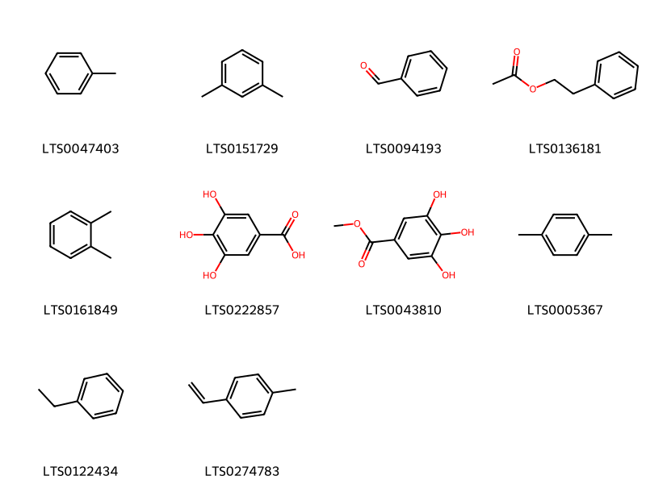{ width=100% }
    <figcaption>Hình ảnh cấu trúc hóa học của 10 hoạt chất thuộc nhóm Benzene and substituted derivatives gồm ['toluene (LTS0047403)', 'm-xylene (LTS0151729)', 'benzaldehyde (LTS0094193)', 'phenethyl acetate (LTS0136181)', 'ortho-xylene (LTS0161849)', 'galop (LTS0222857)', 'methyl gallate (LTS0043810)', 'para-xylene (LTS0005367)', 'ethylbenzene (LTS0122434)', '4-vinyltoluene (LTS0274783)'].</figcaption>
</figure>
#### Nhóm Benzothiazoles
<figure markdown="span">
    { width=100% }
    <figcaption>Hình ảnh cấu trúc hóa học của 1 hoạt chất thuộc nhóm Benzothiazoles gồm ['benzothiazole (LTS0073984)'].</figcaption>
</figure>
#### Nhóm Carboxylic acids and derivatives
<figure markdown="span">
    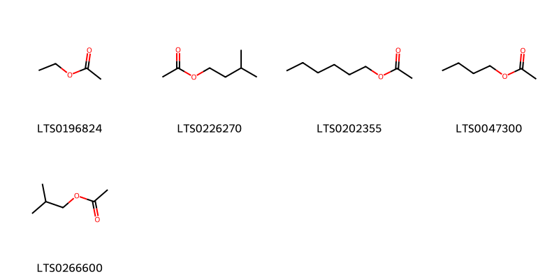{ width=100% }
    <figcaption>Hình ảnh cấu trúc hóa học của 5 hoạt chất thuộc nhóm Carboxylic acids and derivatives gồm ['ethyl acetate (LTS0196824)', 'banana oil (LTS0226270)', 'hexyl acetate (LTS0202355)', 'butyl acetate (LTS0047300)', 'isobutyl acetate (LTS0266600)'].</figcaption>
</figure>
#### Nhóm Cinnamic acids and derivatives
<figure markdown="span">
    { width=100% }
    <figcaption>Hình ảnh cấu trúc hóa học của 11 hoạt chất thuộc nhóm Cinnamic acids and derivatives gồm ['[(2r,3s,4r,5r)-6-[2-(3,4-dimethoxyphenyl)ethoxy]-3-{[(2e)-3-(3,4-dimethoxyphenyl)prop-2-enoyl]oxy}-4,5-dihydroxyoxan-2-yl]methyl (2e)-3-phenylprop-2-enoate (LTS0111924)', 'cinnamic acid (LTS0128130)', '(2r,3s,4r,5r)-6-[2-(3,4-dimethoxyphenyl)ethoxy]-4,5-dihydroxy-2-(hydroxymethyl)oxan-3-yl (2e)-3-(3,4-dimethoxyphenyl)prop-2-enoate (LTS0099897)', 'trans-cinnamoyl β-d-glucoside (LTS0105203)', '[(2r,3r,4s,5r,6s)-6-[2-(3,4-dimethoxyphenyl)ethoxy]-3-{[(2e)-3-(3,4-dimethoxyphenyl)prop-2-enoyl]oxy}-4,5-dihydroxyoxan-2-yl]methyl (2e)-3-phenylprop-2-enoate (LTS0189829)', '(2r,3r,4s,5s,6s)-6-[2-(3,4-dimethoxyphenyl)ethoxy]-4,5-dihydroxy-2-(hydroxymethyl)oxan-3-yl (2e)-3-(3,4-dimethoxyphenyl)prop-2-enoate (LTS0050732)', '3,4,5-trihydroxy-6-(hydroxymethyl)oxan-2-yl 3-phenylprop-2-enoate (LTS0233142)', '(2s,3r,4s,5s,6r)-6-({[(2r,3r,4r,5s)-3,4-dihydroxy-5-(hydroxymethyl)oxolan-2-yl]oxy}methyl)-3,4,5-trihydroxyoxan-2-yl (2e)-3-phenylprop-2-enoate (LTS0217742)', '{6-[2-(3,4-dimethoxyphenyl)ethoxy]-3-{[3-(3,4-dimethoxyphenyl)prop-2-enoyl]oxy}-4,5-dihydroxyoxan-2-yl}methyl 3-phenylprop-2-enoate (LTS0224664)', '6-[2-(3,4-dimethoxyphenyl)ethoxy]-4,5-dihydroxy-2-(hydroxymethyl)oxan-3-yl 3-(3,4-dimethoxyphenyl)prop-2-enoate (LTS0256165)', '6-({[3,4-dihydroxy-5-(hydroxymethyl)oxolan-2-yl]oxy}methyl)-3,4,5-trihydroxyoxan-2-yl 3-phenylprop-2-enoate (LTS0247667)'].</figcaption>
</figure>
#### Nhóm Coumarins and derivatives
<figure markdown="span">
    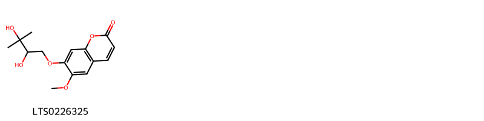{ width=100% }
    <figcaption>Hình ảnh cấu trúc hóa học của 1 hoạt chất thuộc nhóm Coumarins and derivatives gồm ['7-(2,3-dihydroxy-3-methylbutoxy)-6-methoxychromen-2-one (LTS0226325)'].</figcaption>
</figure>
#### Nhóm Dihydrofurans
<figure markdown="span">
    { width=100% }
    <figcaption>Hình ảnh cấu trúc hóa học của 3 hoạt chất thuộc nhóm Dihydrofurans gồm ['2-ethyl-3h-furan-2-carbaldehyde (LTS0144644)', '2-methyl-3h-furan-2-carbaldehyde (LTS0245708)', 'vitamin c (LTS0022555)'].</figcaption>
</figure>
#### Nhóm Fatty Acyls
<figure markdown="span">
    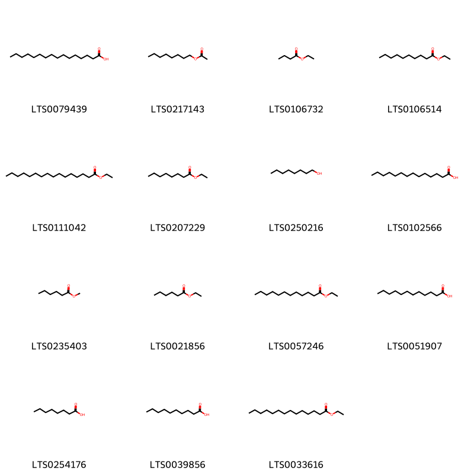{ width=100% }
    <figcaption>Hình ảnh cấu trúc hóa học của 15 hoạt chất thuộc nhóm Fatty Acyls gồm ['palmitic acid (LTS0079439)', 'octyl acetate (LTS0217143)', 'ethyl butyrate (LTS0106732)', 'ethyl caprate (LTS0106514)', 'ethyl palmitate (LTS0111042)', 'ethyl octanoate (LTS0207229)', 'octanol (LTS0250216)', 'myristic acid (LTS0102566)', 'methyl caproate (LTS0235403)', 'ethyl hexanoate (LTS0021856)', 'ethyl laurate (LTS0057246)', 'lauric acid (LTS0051907)', 'caprylic acid (LTS0254176)', 'capric acid (LTS0039856)', 'ethylmyristate (LTS0033616)'].</figcaption>
</figure>
#### Nhóm Flavonoids
<figure markdown="span">
    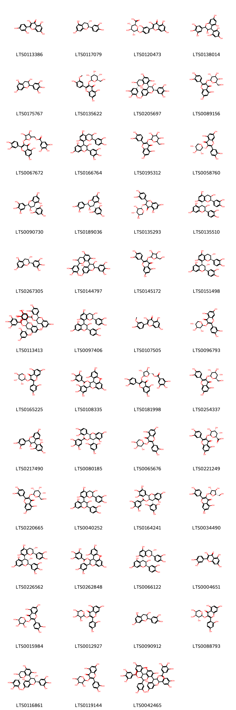{ width=100% }
    <figcaption>Hình ảnh cấu trúc hóa học của 47 hoạt chất thuộc nhóm Flavonoids gồm ['bois d,arc (LTS0113386)', '(+)-catechol (LTS0117079)', "quercetin-4'-glucuronide (LTS0120473)", '4-(2,4,6-trihydroxyphenyl)-2-(3,4,5-trihydroxyphenyl)-3,4-dihydro-2h-1-benzopyran-3,5,7-triol (LTS0138014)', 'epigallocatechin (LTS0175767)', 'isorhamnetin 3-glucoside (LTS0135622)', '(2r,3r,4s)-4-[(2r,3s)-3,5,7-trihydroxy-2-(3,4,5-trihydroxyphenyl)-3,4-dihydro-2h-1-benzopyran-8-yl]-2-(3,4,5-trihydroxyphenyl)-3,4-dihydro-2h-1-benzopyran-3,5,7-triol (LTS0205697)', 'hyperoside (LTS0089156)', '(5-{[2-(3,4-dihydroxyphenyl)-5,7-dihydroxy-4-oxochromen-3-yl]oxy}-3,4-dihydroxyoxolan-2-yl)methyl 3,4,5-trihydroxybenzoate (LTS0067672)', '4-[2-(3,4-dihydroxyphenyl)-3,5,7-trihydroxy-3,4-dihydro-2h-1-benzopyran-8-yl]-2-(3,4,5-trihydroxyphenyl)-3,4-dihydro-2h-1-benzopyran-3,5,7-triol (LTS0166764)', '2-(3,4-dihydroxyphenyl)-5,7-dihydroxy-3-{[3,4,5-trihydroxy-6-(hydroxymethyl)oxan-2-yl]oxy}chromen-4-one (LTS0195312)', '2-(3,4-dihydroxyphenyl)-5,7-dihydroxy-3-{[(2r,3r,4s,5r)-3,4,5-trihydroxyoxan-2-yl]oxy}chromen-4-one (LTS0058760)', '(2r,3r,4s)-4-(2,4,6-trihydroxyphenyl)-2-(3,4,5-trihydroxyphenyl)-3,4-dihydro-2h-1-benzopyran-3,5,7-triol (LTS0090730)', 'prodelphinidin b6 (LTS0189036)', '2-(3,4-dihydroxyphenyl)-5,7-dihydroxy-3-{[(2s,3r,4s,5r)-3,4,5-trihydroxyoxan-2-yl]oxy}-2,3-dihydro-1-benzopyran-4-one (LTS0135293)', '(2r,3r,4r)-2-(3,4-dihydroxyphenyl)-4-[(2r,3r)-2-(3,4-dihydroxyphenyl)-3,5,7-trihydroxy-3,4-dihydro-2h-1-benzopyran-8-yl]-3,4-dihydro-2h-1-benzopyran-3,5,7-triol (LTS0135510)', 'gallocatechol (LTS0267305)', '4-[3,5,7-trihydroxy-2-(3,4,5-trihydroxyphenyl)-3,4-dihydro-2h-1-benzopyran-8-yl]-2-(3,4,5-trihydroxyphenyl)-3,4-dihydro-2h-1-benzopyran-3,5,7-triol (LTS0144797)', '3-{[3,4-dihydroxy-5-(hydroxymethyl)oxolan-2-yl]oxy}-2-(3,4-dihydroxyphenyl)-5,7-dihydroxychromen-4-one (LTS0145172)', '(2r,3s,4s)-2-(3,4-dihydroxyphenyl)-4-[(2r,3s)-2-(3,4-dihydroxyphenyl)-3,5,7-trihydroxy-3,4-dihydro-2h-1-benzopyran-8-yl]-3,4-dihydro-2h-1-benzopyran-3,5,7-triol (LTS0151498)', '(2r,3r,4r)-2-(3,4-dihydroxyphenyl)-4-[(2r,3r,4s)-2-(3,4-dihydroxyphenyl)-5,7-dihydroxy-3-(3,4,5-trihydroxybenzoyloxy)-4-(2,4,6-trihydroxyphenyl)-3,4-dihydro-2h-1-benzopyran-8-yl]-5,7-dihydroxy-3,4-dihydro-2h-1-benzopyran-3-yl 3,4,5-trihydroxybenzoate (LTS0113413)', '(2r,3r)-2-(3,4-dihydroxyphenyl)-4-[(2r,3r)-2-(3,4-dihydroxyphenyl)-3,5,7-trihydroxy-3,4-dihydro-2h-1-benzopyran-8-yl]-3,4-dihydro-2h-1-benzopyran-3,5,7-triol (LTS0097406)', 'isorhamnetin (LTS0107505)', '2-(3,4-dihydroxyphenyl)-5,7-dihydroxy-3-{[(2s,3r,4s,5r)-3,4,5-trihydroxyoxan-2-yl]oxy}chromen-4-one (LTS0096793)', '2-(2,4-dihydroxyphenyl)-5,7-dihydroxy-3-{[(2s,3r,4r,5s)-3,4,5-trihydroxyoxan-2-yl]oxy}chromen-4-one (LTS0165225)', '5,7-dihydroxy-4-(2,4,6-trihydroxyphenyl)-2-(3,4,5-trihydroxyphenyl)-3,4-dihydro-2h-1-benzopyran-3-yl 3,4,5-trihydroxybenzoate (LTS0108335)', '[(2s,3r,4r,5s)-5-{[2-(3,4-dihydroxyphenyl)-5,7-dihydroxy-4-oxochromen-3-yl]oxy}-3,4-dihydroxyoxolan-2-yl]methyl 3,4,5-trihydroxybenzoate (LTS0181998)', 'isoquercetin (LTS0254337)', '2-(3,4-dihydroxyphenyl)-4-(2,4,6-trihydroxyphenyl)-3,4-dihydro-2h-1-benzopyran-3,5,7-triol (LTS0217490)', '(2r,3r,4s)-2-(3,4-dihydroxyphenyl)-5,7-dihydroxy-4-(2,4,6-trihydroxyphenyl)-3,4-dihydro-2h-1-benzopyran-3-yl 3,4,5-trihydroxybenzoate (LTS0080185)', 'guaijaverin (LTS0065676)', '(2s,3s,4r,5s,6s)-6-{[2-(3,4-dihydroxyphenyl)-5,7-dihydroxy-4-oxochromen-3-yl]oxy}-3,4,5-trihydroxyoxane-2-carboxylic acid (LTS0221249)', '2-(3,4-dihydroxyphenyl)-5,7-dihydroxy-3-{[(2s,3r,4r,5s,6r)-3,4,5-trihydroxy-6-(hydroxymethyl)oxan-2-yl]oxy}chromen-4-one (LTS0220665)', '2-(3,4-dihydroxyphenyl)-4-[2-(3,4-dihydroxyphenyl)-3,5,7-trihydroxy-3,4-dihydro-2h-1-benzopyran-8-yl]-3,4-dihydro-2h-1-benzopyran-3,5,7-triol (LTS0040252)', '(2r,3r,4s)-5,7-dihydroxy-4-(2,4,6-trihydroxyphenyl)-2-(3,4,5-trihydroxyphenyl)-3,4-dihydro-2h-1-benzopyran-3-yl 3,4,5-trihydroxybenzoate (LTS0164241)', 'avicularin (LTS0034490)', '(2r,3s,4s)-4-[(2r,3s)-2-(3,4-dihydroxyphenyl)-3,5,7-trihydroxy-3,4-dihydro-2h-1-benzopyran-8-yl]-2-(3,4,5-trihydroxyphenyl)-3,4-dihydro-2h-1-benzopyran-3,5,7-triol (LTS0226562)', '2-(3,4-dihydroxyphenyl)-5,7-dihydroxy-4-(2,4,6-trihydroxyphenyl)-3,4-dihydro-2h-1-benzopyran-3-yl 3,4,5-trihydroxybenzoate (LTS0262848)', '(2r,3r,4r)-2-(3,4-dihydroxyphenyl)-4-[(2r,3s)-2-(3,4-dihydroxyphenyl)-3,5,7-trihydroxy-3,4-dihydro-2h-1-benzopyran-8-yl]-3,4-dihydro-2h-1-benzopyran-3,5,7-triol (LTS0066122)', 'quercetin (LTS0004651)', 'guaijaverin (LTS0015984)', '2-(2,4-dihydroxyphenyl)-5,7-dihydroxy-3-[(3,4,5-trihydroxyoxan-2-yl)oxy]chromen-4-one (LTS0012927)', 'catechol (LTS0090912)', '2-(2,4-dihydroxyphenyl)-5,7-dihydroxy-3-{[(2s,3r,4s,5s)-3,4,5-trihydroxyoxan-2-yl]oxy}chromen-4-one (LTS0088793)', '(2r,3s,4s)-4-[(2r,3s)-3,5,7-trihydroxy-2-(3,4,5-trihydroxyphenyl)-3,4-dihydro-2h-1-benzopyran-8-yl]-2-(3,4,5-trihydroxyphenyl)-3,4-dihydro-2h-1-benzopyran-3,5,7-triol (LTS0116861)', 'guaijaverin (LTS0119144)', '2-(3,4-dihydroxyphenyl)-4-[2-(3,4-dihydroxyphenyl)-5,7-dihydroxy-3-(3,4,5-trihydroxybenzoyloxy)-4-(2,4,6-trihydroxyphenyl)-3,4-dihydro-2h-1-benzopyran-8-yl]-5,7-dihydroxy-3,4-dihydro-2h-1-benzopyran-3-yl 3,4,5-trihydroxybenzoate (LTS0042465)'].</figcaption>
</figure>
#### Nhóm Heteroaromatic compounds
<figure markdown="span">
    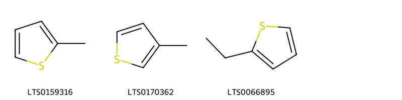{ width=100% }
    <figcaption>Hình ảnh cấu trúc hóa học của 3 hoạt chất thuộc nhóm Heteroaromatic compounds gồm ['2-methylthiophene (LTS0159316)', '3-methylthiophene (LTS0170362)', '2-ethylthiophene (LTS0066895)'].</figcaption>
</figure>
#### Nhóm Neoflavonoids
<figure markdown="span">
    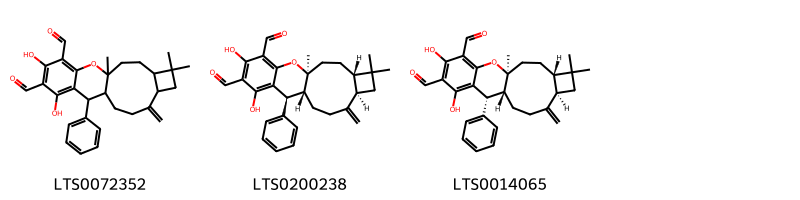{ width=100% }
    <figcaption>Hình ảnh cấu trúc hóa học của 3 hoạt chất thuộc nhóm Neoflavonoids gồm ['14,16-dihydroxy-1,5,5-trimethyl-8-methylidene-12-phenyl-19-oxatetracyclo[9.8.0.0⁴,⁷.0¹³,¹⁸]nonadeca-13,15,17-triene-15,17-dicarbaldehyde (LTS0072352)', '(1s,4s,7r,11r,12s)-14,16-dihydroxy-1,5,5-trimethyl-8-methylidene-12-phenyl-19-oxatetracyclo[9.8.0.0⁴,⁷.0¹³,¹⁸]nonadeca-13,15,17-triene-15,17-dicarbaldehyde (LTS0200238)', '(1s,4s,7r,11r,12r)-14,16-dihydroxy-1,5,5-trimethyl-8-methylidene-12-phenyl-19-oxatetracyclo[9.8.0.0⁴,⁷.0¹³,¹⁸]nonadeca-13,15,17-triene-15,17-dicarbaldehyde (LTS0014065)'].</figcaption>
</figure>
#### Nhóm Organic disulfides
<figure markdown="span">
    { width=100% }
    <figcaption>Hình ảnh cấu trúc hóa học của 1 hoạt chất thuộc nhóm Organic disulfides gồm ['isopropyl disulfide (LTS0094162)'].</figcaption>
</figure>
#### Nhóm Organooxygen compounds
<figure markdown="span">
    { width=100% }
    <figcaption>Hình ảnh cấu trúc hóa học của 22 hoạt chất thuộc nhóm Organooxygen compounds gồm ['diacetyl (LTS0222511)', '(2s,3r,4s,5s,6r)-2-(2-benzoyl-3,5-dihydroxy-4,6-dimethylphenoxy)-6-(hydroxymethyl)oxane-3,4,5-triol (LTS0047411)', '(2s,3r,4s,5s,6r)-2-(4-benzoyl-3,5-dihydroxyphenoxy)-6-(hydroxymethyl)oxane-3,4,5-triol (LTS0104017)', '5-ethoxy-1,3-thiazole (LTS0104321)', '[6-(4-benzoyl-3,5-dihydroxyphenoxy)-3,4,5-trihydroxyoxan-2-yl]methyl 3,4,5-trihydroxybenzoate (LTS0137166)', '(2s,3r,4s,5s,6r)-2-(4-benzoyl-3,5-dihydroxy-2,6-dimethylphenoxy)-6-(hydroxymethyl)oxane-3,4,5-triol (LTS0196139)', '(+)-glucose (LTS0262158)', 'sucrose (LTS0272557)', '[(2r,3s,4s,5r,6s)-3,4-dihydroxy-5-(3,4,5-trihydroxybenzoyloxy)-6-(3,4,5-trimethoxyphenoxy)oxan-2-yl]methyl 3,4,5-trihydroxybenzoate (LTS0126886)', '2-(4-benzoyl-3,5-dihydroxy-2,6-dimethylphenoxy)-6-(hydroxymethyl)oxane-3,4,5-triol (LTS0091172)', '[(2r,3s,4s,5r,6s)-6-(4-benzoyl-3,5-dihydroxy-2,6-dimethylphenoxy)-3,4,5-trihydroxyoxan-2-yl]methyl 3,4,5-trihydroxybenzoate (LTS0165865)', '[6-(4-benzoyl-3,5-dihydroxy-2-methylphenoxy)-3,4,5-trihydroxyoxan-2-yl]methyl 3,4,5-trihydroxybenzoate (LTS0167627)', '[3,4-dihydroxy-5-(3,4,5-trihydroxybenzoyloxy)-6-(3,4,5-trimethoxyphenoxy)oxan-2-yl]methyl 3,4,5-trihydroxybenzoate (LTS0201776)', 'keto-d-fructose (LTS0241114)', '[(2r,3s,4s,5r,6s)-6-(4-benzoyl-3,5-dihydroxyphenoxy)-3,4,5-trihydroxyoxan-2-yl]methyl 3,4,5-trihydroxybenzoate (LTS0211623)', 'hexanal (LTS0238624)', 'acetylfuran (LTS0186281)', 'glucose (LTS0013597)', '[6-(4-benzoyl-3,5-dihydroxy-2,6-dimethylphenoxy)-3,4,5-trihydroxyoxan-2-yl]methyl 3,4,5-trihydroxybenzoate (LTS0024923)', '[(2r,3s,4s,5r,6s)-6-(4-benzoyl-3,5-dihydroxy-2-methylphenoxy)-3,4,5-trihydroxyoxan-2-yl]methyl 3,4,5-trihydroxybenzoate (LTS0029455)', 'isoamyl alcohol (LTS0112297)', 'd-fructopyranose (LTS0259277)'].</figcaption>
</figure>
#### Nhóm Phenol esters
<figure markdown="span">
    { width=100% }
    <figcaption>Hình ảnh cấu trúc hóa học của 1 hoạt chất thuộc nhóm Phenol esters gồm ['2-ethylphenyl acetate (LTS0214073)'].</figcaption>
</figure>
#### Nhóm Prenol lipids
<figure markdown="span">
    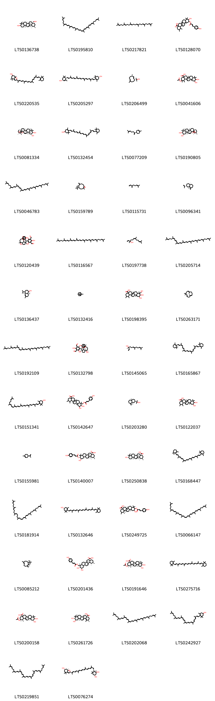{ width=100% }
    <figcaption>Hình ảnh cấu trúc hóa học của 84 hoạt chất thuộc nhóm Prenol lipids gồm ['urs-12-ene-3β,28-diol (LTS0136738)', '(6e,8e,10e,12e,14z,16e,18e,20e,22e,24e,26e)-2,6,10,14,19,23,27,31-octamethyldotriaconta-2,6,8,10,12,14,16,18,20,22,24,26,30-tridecaene (LTS0195810)', 'squalene (LTS0217821)', '10-hydroxy-11-{[3-(4-hydroxyphenyl)prop-2-enoyl]oxy}-1,2,6a,6b,9,9,12a-heptamethyl-2,3,4,5,6,7,8,8a,10,11,12,12b,13,14b-tetradecahydro-1h-picene-4a-carboxylic acid (LTS0128070)', '4,4,7a-trimethyl-2-[(2e,4e,6e,8e)-6,11,15-trimethyl-17-(2,6,6-trimethylcyclohex-1-en-1-yl)heptadeca-2,4,6,8,10,12,14,16-octaen-2-yl]-2,5,6,7-tetrahydro-1-benzofuran-6-ol (LTS0220535)', 'carotenoid (LTS0205297)', '2-[(1r,2e,4r,7e)-4,8-dimethylcyclodeca-2,7-dien-1-yl]propan-2-ol (LTS0206499)', '2-(acetyloxy)-10,11-dihydroxy-1,2,6a,6b,9,9,12a-heptamethyl-1,3,4,5,6,7,8,8a,10,11,12,12b,13,14b-tetradecahydropicene-4a-carboxylic acid (LTS0041606)', '(1s,4s,5r,8r,10r,11r,13s,14r,17s,18r,19s,20r)-10,11-dihydroxy-4,5,9,9,13,19,20-heptamethyl-24-oxahexacyclo[15.5.2.0¹,¹⁸.0⁴,¹⁷.0⁵,¹⁴.0⁸,¹³]tetracos-15-en-23-one (LTS0081334)', '3,5,5-trimethyl-4-[(1e,3e,5e,7e,9e)-3,7,12,16-tetramethyl-18-(2,6,6-trimethylcyclohex-1-en-1-yl)octadeca-1,3,5,7,9,11,13,15,17-nonaen-1-yl]cyclohex-3-en-1-ol (LTS0132454)', '(r)-β-bisabolene (LTS0077209)', '(1s,4s,5s,8s,10s,11r,13r,14r,17s,18s,19s,20r)-10,11-dihydroxy-4,5,9,9,13,19,20-heptamethyl-24-oxahexacyclo[15.5.2.0¹,¹⁸.0⁴,¹⁷.0⁵,¹⁴.0⁸,¹³]tetracos-15-en-23-one (LTS0190805)', '(16e,18e,20e,22e,24e,26e)-2,6,10,14,19,23,27,31-octamethyldotriaconta-2,6,8,10,12,14,16,18,20,22,24,26,30-tridecaene (LTS0046783)', 'caryophyllene oxide (LTS0159789)', 'α-myrcene (LTS0115731)', 'β-selinene (LTS0096341)', '2,4,6-trihydroxy-5-({4-hydroxy-1,1,4,7-tetramethyl-octahydrocyclopropa[e]azulen-7-yl}(phenyl)methyl)benzene-1,3-dicarbaldehyde (LTS0120439)', 'lycopene (LTS0116567)', 'nerolidol (LTS0197738)', '(12e,14e,16e,18e,20e,22e,24e,26e)-2,6,10,14,19,23,27,31-octamethyldotriaconta-2,6,8,10,12,14,16,18,20,22,24,26,30-tridecaene (LTS0205714)', '(1r,4ar,8as)-4-isopropyl-1,6-dimethyl-3,4,4a,7,8,8a-hexahydro-2h-naphthalen-1-ol (LTS0136437)', 'α pinene (LTS0132416)', 'asiatic acid (LTS0198395)', 'humulene (LTS0263171)', '(6e,8e,10z,12z,14e,16e,18e,20e,22e,24e,26e)-2,6,10,14,19,23,27,31-octamethyldotriaconta-2,6,8,10,12,14,16,18,20,22,24,26,30-tridecaene (LTS0192109)', '5-[(s)-[(1ar,4r,4ar,7s,7as,7br)-4-hydroxy-1,1,4,7-tetramethyl-octahydrocyclopropa[e]azulen-7-yl](phenyl)methyl]-2,4,6-trihydroxybenzene-1,3-dicarbaldehyde (LTS0132798)', '(3r,6e)-nerolidol (LTS0145065)', '1,3,3-trimethyl-2-[3,7,12,16-tetramethyl-18-(2,6,6-trimethylcyclohex-1-en-1-yl)octadeca-1,3,5,7,9,11,13,15,17-nonaen-1-yl]cyclohex-1-ene (LTS0165867)', '(1r)-4-[(1e,3e,5e,7e,9e,11e,13e,15e,17z,19e)-3,7,12,16,20,24-hexamethylpentacosa-1,3,5,7,9,11,13,15,17,19,23-undecaen-1-yl]-3,5,5-trimethylcyclohex-3-en-1-ol (LTS0151341)', '10,11-dihydroxy-9-({[3-(4-hydroxyphenyl)prop-2-enoyl]oxy}methyl)-1,2,6a,6b,9,12a-hexamethyl-2,3,4,5,6,7,8,8a,10,11,12,12b,13,14b-tetradecahydro-1h-picene-4a-carboxylic acid (LTS0142647)', 'β-eudesmol (LTS0203280)', '10,11-dihydroxy-1,2,6a,6b,9,9,12a-heptamethyl-2,3,4,5,6,7,8,8a,10,11,12,12b,13,14b-tetradecahydro-1h-picene-4a-carboxylic acid (LTS0122037)', 'limonene,  (LTS0155981)', '(1s,2r,4as,6as,6br,10r,11r,12ar,14bs)-11-hydroxy-10-{[(2e)-3-(4-hydroxyphenyl)prop-2-enoyl]oxy}-1,2,6a,6b,9,9,12a-heptamethyl-2,3,4,5,6,7,8,8a,10,11,12,12b,13,14b-tetradecahydro-1h-picene-4a-carboxylic acid (LTS0140007)', 'ursolic acid (LTS0250838)', 'β,β-carotene (LTS0168447)', 'phytofluene (LTS0181914)', 'cryptoxanthin (LTS0132646)', '(1s,4as,6br,12ar,14bs)-11-hydroxy-10-{[(2e)-3-(4-hydroxyphenyl)prop-2-enoyl]oxy}-1,2,6a,6b,9,9,12a-heptamethyl-2,3,4,5,6,7,8,8a,10,11,12,12b,13,14b-tetradecahydro-1h-picene-4a-carboxylic acid (LTS0249725)', '(15z)-lycopene (LTS0066147)', 'caryophyllene (LTS0085212)', '(1s,2r,4as,6as,6br,9s,10r,11r,12ar)-10,11-dihydroxy-9-({[(2e)-3-(4-hydroxyphenyl)prop-2-enoyl]oxy}methyl)-1,2,6a,6b,9,12a-hexamethyl-2,3,4,5,6,7,8,8a,10,11,12,12b,13,14b-tetradecahydro-1h-picene-4a-carboxylic acid (LTS0201436)', '(1r,2s,4ar,6as,6br,8ar,10r,11r,12ar,12br,14bs)-2-(acetyloxy)-10,11-dihydroxy-1,2,6a,6b,9,9,12a-heptamethyl-1,3,4,5,6,7,8,8a,10,11,12,12b,13,14b-tetradecahydropicene-4a-carboxylic acid (LTS0191646)', 'β-carotene (LTS0275716)', '(1r,2s,4ar,6as,6br,10r,11r,12ar)-2-(acetyloxy)-10,11-dihydroxy-1,2,6a,6b,9,9,12a-heptamethyl-1,3,4,5,6,7,8,8a,10,11,12,12b,13,14b-tetradecahydropicene-4a-carboxylic acid (LTS0200158)', '(2r,4as,6as,6br,8ar,10r,11r,12ar,12br)-10,11-dihydroxy-1,2,6a,6b,9,9,12a-heptamethyl-3,4,5,6,7,8,8a,10,11,12,12b,13-dodecahydro-2h-picene-4a-carboxylic acid (LTS0261726)', '(18e,20e,22e,24e,26e)-2,6,10,14,19,23,27,31-octamethyldotriaconta-2,6,8,10,12,14,16,18,20,22,24,26,30-tridecaene (LTS0202068)', '4-(3,7,12,16,20,24-hexamethylpentacosa-1,3,5,7,9,11,13,15,17,19,23-undecaen-1-yl)-3,5,5-trimethylcyclohex-3-en-1-ol (LTS0242927)', '2,6,10,14,19,23,27,31-octamethyldotriaconta-2,6,8,10,12,14,16,18,20,22,24,26,30-tridecaene (LTS0219851)', '(1r,3s)-6-[(3e,5e,7e,9e,11e,13e,15e)-16-[(2r,6s,7ar)-6-hydroxy-4,4,7a-trimethyl-2,5,6,7-tetrahydro-1-benzofuran-2-yl]-3,7,12-trimethylheptadeca-1,3,5,7,9,11,13,15-octaen-1-ylidene]-1,5,5-trimethylcyclohexane-1,3-diol (LTS0076274)', 'α-eudesmol (LTS0222498)', 'β-caryophyllene oxide (LTS0213960)', 'selinene (LTS0197809)', 'α-copaene (LTS0207598)', '(1r,2e,6e,10s)-3,7,11,11-tetramethylbicyclo[8.1.0]undeca-2,6-diene (LTS0079959)', '(1s,2r,4as,6as,6br,8ar,9s,10r,11r,12ar,12br,14bs)-10,11-dihydroxy-9-({[(2z)-3-(4-hydroxyphenyl)prop-2-enoyl]oxy}methyl)-1,2,6a,6b,9,12a-hexamethyl-2,3,4,5,6,7,8,8a,10,11,12,12b,13,14b-tetradecahydro-1h-picene-4a-carboxylic acid (LTS0219641)', 'delta-selinene (LTS0181591)', 'delta-cadinol (LTS0008282)', 'corosolic acid (LTS0231285)', '11-hydroxy-10-{[3-(4-hydroxyphenyl)prop-2-enoyl]oxy}-1,2,6a,6b,9,9,12a-heptamethyl-2,3,4,5,6,7,8,8a,10,11,12,12b,13,14b-tetradecahydro-1h-picene-4a-carboxylic acid (LTS0240711)', '3,7,11,11-tetramethylbicyclo[8.1.0]undeca-2,6-diene (LTS0249608)', '(9z)-β-carotene (LTS0252839)', 'α-cadinol (LTS0178794)', 'asiatic acid (LTS0249826)', 'β-ocimene (LTS0242381)', '(15z)-β-carotene (LTS0039051)', '(1r,2s,7s,8s)-8-isopropyl-1,3-dimethyltricyclo[4.4.0.0²,⁷]dec-3-ene (LTS0190031)', 'all-trans-phytofluene (LTS0269894)', '(-)-β-bisabolene (LTS0009940)', 'uvaol (LTS0008025)', 'neoxanthin (LTS0000701)', '(2s,6s,7ar)-4,4,7a-trimethyl-2-[(2e,4e,6e,8e,10e,12e,14e,16e)-6,11,15-trimethyl-17-(2,6,6-trimethylcyclohex-1-en-1-yl)heptadeca-2,4,6,8,10,12,14,16-octaen-2-yl]-2,5,6,7-tetrahydro-1-benzofuran-6-ol (LTS0081618)', '(1s,2r,4as,6as,6br,8ar,10r,11r,12ar,12br,14bs)-11-hydroxy-10-{[(2e)-3-(4-hydroxyphenyl)prop-2-enoyl]oxy}-1,2,6a,6b,9,9,12a-heptamethyl-2,3,4,5,6,7,8,8a,10,11,12,12b,13,14b-tetradecahydro-1h-picene-4a-carboxylic acid (LTS0112820)', 'α-selinene (LTS0024564)', '2-(3,7,12,16,20,24-hexamethylpentacosa-1,3,5,7,9,11,13,15,17,19,23-undecaen-1-yl)-1,3,3-trimethylcyclohex-1-ene (LTS0086978)', '(1s,2r,4as,6as,6br,8ar,10r,11r,12ar,12br,14bs)-10-hydroxy-11-{[(2e)-3-(4-hydroxyphenyl)prop-2-enoyl]oxy}-1,2,6a,6b,9,9,12a-heptamethyl-2,3,4,5,6,7,8,8a,10,11,12,12b,13,14b-tetradecahydro-1h-picene-4a-carboxylic acid (LTS0020421)', '2-(4,8-dimethylcyclodeca-2,7-dien-1-yl)propan-2-ol (LTS0229694)', 'rubixanthin (LTS0040991)', '(6e,8e,10z,12e,14e,16e,18e,20e,22e,24e,26e)-2,6,10,14,19,23,27,31-octamethyldotriaconta-2,6,8,10,12,14,16,18,20,22,24,26,30-tridecaene (LTS0116496)', 'α-citral (LTS0246122)', 'gamma-carotene (LTS0108535)', 'phytofluene (LTS0267709)', 'oleanolic acid (LTS0117717)', '1,3,3-trimethyl-2-[(9e,11e,13e,15e,17e)-3,7,12,16-tetramethyl-18-(2,6,6-trimethylcyclohex-1-en-1-yl)octadeca-1,3,5,7,9,11,13,15,17-nonaen-1-yl]cyclohex-1-ene (LTS0110068)'].</figcaption>
</figure>
#### Nhóm Saturated hydrocarbons
<figure markdown="span">
    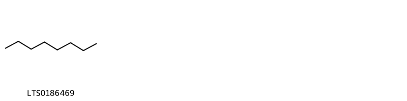{ width=100% }
    <figcaption>Hình ảnh cấu trúc hóa học của 1 hoạt chất thuộc nhóm Saturated hydrocarbons gồm ['octane (LTS0186469)'].</figcaption>
</figure>
#### Nhóm Steroids and steroid derivatives
<figure markdown="span">
    { width=100% }
    <figcaption>Hình ảnh cấu trúc hóa học của 6 hoạt chất thuộc nhóm Steroids and steroid derivatives gồm ['stigmast-5-en-3-ol (LTS0071224)', 'estrone (LTS0023699)', 'stigmast-5-en-3-ol, (3β)- (LTS0204616)', 'sitogluside (LTS0201798)', '2-{[1-(5-ethyl-6-methylheptan-2-yl)-9a,11a-dimethyl-1h,2h,3h,3ah,3bh,4h,6h,7h,8h,9h,9bh,10h,11h-cyclopenta[a]phenanthren-7-yl]oxy}-6-(hydroxymethyl)oxane-3,4,5-triol (LTS0158828)', '(2r,3r,4s,5s,6s)-2-{[(1r,3as,3bs,7s,9ar,9bs,11ar)-1-[(2r,5r)-5-ethyl-6-methylheptan-2-yl]-9a,11a-dimethyl-1h,2h,3h,3ah,3bh,4h,6h,7h,8h,9h,9bh,10h,11h-cyclopenta[a]phenanthren-7-yl]oxy}-6-(hydroxymethyl)oxane-3,4,5-triol (LTS0076809)'].</figcaption>
</figure>
#### Nhóm Tannins
<figure markdown="span">
    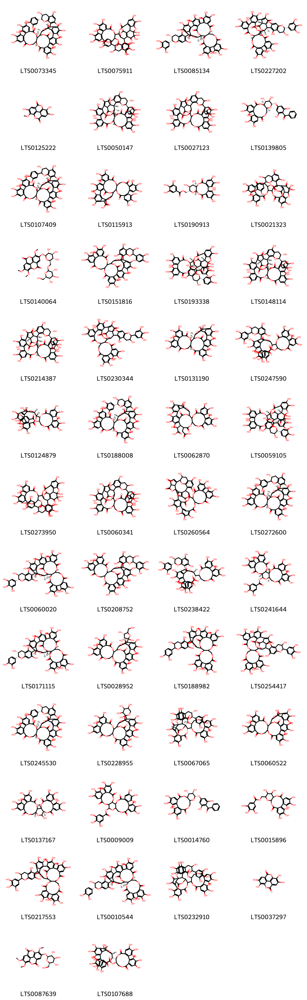{ width=100% }
    <figcaption>Hình ảnh cấu trúc hóa học của 50 hoạt chất thuộc nhóm Tannins gồm ['(1r,2r,20s,42s,46r)-46-[(2r,3s)-2-(3,4-dihydroxyphenyl)-3,5,7-trihydroxy-3,4-dihydro-2h-1-benzopyran-8-yl]-7,8,9,12,13,14,25,26,27,30,31,32,35,36,37-pentadecahydroxy-3,18,21,41,43-pentaoxanonacyclo[27.13.3.1³⁸,⁴².0²,²⁰.0⁵,¹⁰.0¹¹,¹⁶.0²³,²⁸.0³³,⁴⁵.0³⁴,³⁹]hexatetraconta-5,7,9,11(16),12,14,23,25,27,29,31,33(45),34(39),35,37-pentadecaene-4,17,22,40,44-pentone (LTS0073345)', '10-{19-[2-(3,4-dihydroxyphenyl)-3,5,7-trihydroxy-3,4-dihydro-2h-1-benzopyran-8-yl]-3,3,4,8,9-pentahydroxy-2,12,17-trioxo-13,16,20-trioxapentacyclo[13.3.1.1⁴,⁷.0⁵,¹⁸.0⁶,¹¹]icosa-1(18),6(11),7,9-tetraen-14-yl}-3,4,5,17,18,19-hexahydroxy-8,14-dioxo-9,13-dioxatricyclo[13.4.0.0²,⁷]nonadeca-1(15),2,4,6,16,18-hexaen-11-yl 3,4,5-trihydroxybenzoate (LTS0075911)', '(1s,2s,20s,42s,46r)-7,8,9,12,13,14,25,26,27,30,31,32,35,36,37-pentadecahydroxy-46-[(2r,3r)-3,5,7-trihydroxy-2-(3,4,5-trihydroxyphenyl)-3,4-dihydro-2h-1-benzopyran-6-yl]-3,18,21,41,43-pentaoxanonacyclo[27.13.3.1³⁸,⁴².0²,²⁰.0⁵,¹⁰.0¹¹,¹⁶.0²³,²⁸.0³³,⁴⁵.0³⁴,³⁹]hexatetraconta-5,7,9,11(16),12,14,23,25,27,29,31,33(45),34(39),35,37-pentadecaene-4,17,22,40,44-pentone (LTS0085134)', '(1r,2r,20r,37s,43r,44s,49s,50r,56r)-7,8,9,12,13,14,25,26,27,30,31,32,35,44,47-pentadecahydroxy-43-(3,4,5-trihydroxyphenyl)-3,18,21,38,42,51,54-heptaoxadodecacyclo[27.21.3.3³⁴,⁵⁰.0²,²⁰.0⁵,¹⁰.0¹¹,¹⁶.0²³,²⁸.0³³,⁵³.0³⁷,⁴⁹.0³⁹,⁴⁸.0⁴¹,⁴⁶.0³⁷,⁵⁶]hexapentaconta-5,7,9,11(16),12,14,23,25,27,29,31,33(53),34,39,41(46),47-hexadecaene-4,17,22,36,52,55-hexone (LTS0227202)', '6,7,13-trihydroxy-14-methoxy-2,9-dioxatetracyclo[6.6.2.0⁴,¹⁶.0¹¹,¹⁵]hexadeca-1(15),4,6,8(16),11,13-hexaene-3,10-dione (LTS0125222)', '(1r,2r,20r,44s,45r,49r,50s)-45-(3,4-dihydroxyphenyl)-7,8,9,12,13,14,25,26,27,30,31,32,35,41,44-pentadecahydroxy-3,18,21,38,46,51,54-heptaoxadodecacyclo[27.21.3.3³⁴,⁵⁰.0²,²⁰.0⁵,¹⁰.0¹¹,¹⁶.0²³,²⁸.0³³,⁵³.0³⁷,⁴⁹.0³⁹,⁴⁸.0⁴²,⁴⁷.0³⁷,⁵⁶]hexapentaconta-5,7,9,11(16),12,14,23,25,27,29,31,33(53),34,39,41,47-hexadecaene-4,17,22,36,52,55-hexone (LTS0050147)', '45-(3,4-dihydroxyphenyl)-7,8,9,12,13,14,25,26,27,30,31,32,35,41,44-pentadecahydroxy-3,18,21,38,46,51,54-heptaoxadodecacyclo[27.21.3.3³⁴,⁵⁰.0²,²⁰.0⁵,¹⁰.0¹¹,¹⁶.0²³,²⁸.0³³,⁵³.0³⁷,⁴⁹.0³⁹,⁴⁸.0⁴²,⁴⁷.0³⁷,⁵⁶]hexapentaconta-5,7,9,11(16),12,14,23,25,27,29,31,33(53),34,39,41,47-hexadecaene-4,17,22,36,52,55-hexone (LTS0027123)', '(10s,11r,12r,13s,15s)-13-(4-benzoyl-3,5-dihydroxyphenoxy)-3,4,5,11,12,21,22,23-octahydroxy-9,14,17-trioxatetracyclo[17.4.0.0²,⁷.0¹⁰,¹⁵]tricosa-1(19),2,4,6,20,22-hexaene-8,18-dione (LTS0139805)', '(1s,2s,20s,42s,46r)-46-[(3r)-2-(3,4-dihydroxyphenyl)-3,5,7-trihydroxy-3,4-dihydro-2h-1-benzopyran-8-yl]-7,8,9,12,13,14,25,26,27,30,31,32,35,36,37-pentadecahydroxy-3,18,21,41,43-pentaoxanonacyclo[27.13.3.1³⁸,⁴².0²,²⁰.0⁵,¹⁰.0¹¹,¹⁶.0²³,²⁸.0³³,⁴⁵.0³⁴,³⁹]hexatetraconta-5,7,9,11(16),12,14,23,25,27,29,31,33(45),34(39),35,37-pentadecaene-4,17,22,40,44-pentone (LTS0107409)', '7,8,9,13,14,15,25,26,27,30,31,32,35,36,37-pentadecahydroxy-4,17,22,40,44-pentaoxo-3,18,21,41,43-pentaoxanonacyclo[27.13.3.1³⁸,⁴².0²,²⁰.0⁵,¹⁰.0¹¹,¹⁶.0²³,²⁸.0³³,⁴⁵.0³⁴,³⁹]hexatetraconta-5(10),6,8,11(16),12,14,23,25,27,29,31,33(45),34(39),35,37-pentadecaene-46-carboxylic acid (LTS0115913)', '[(10s,12r,13s,14s,15r)-3,4,5,13,14,20,21,22-octahydroxy-8,17-dioxo-9,11,16-trioxatetracyclo[16.4.0.0²,⁷.0¹⁰,¹⁵]docosa-1(18),2,4,6,19,21-hexaen-12-yl]methyl 3,4,5-trihydroxybenzoate (LTS0190913)', '12-{19-[2-(3,4-dihydroxyphenyl)-3,5,7-trihydroxy-3,4-dihydro-2h-1-benzopyran-8-yl]-3,3,4,8,9-pentahydroxy-2,12,17-trioxo-13,16,20-trioxapentacyclo[13.3.1.1⁴,⁷.0⁵,¹⁸.0⁶,¹¹]icosa-1(18),6,8,10-tetraen-14-yl}-3,4,5,17,18,19-hexahydroxy-8,14-dioxo-9,13-dioxatricyclo[13.4.0.0²,⁷]nonadeca-1(15),2,4,6,16,18-hexaen-11-yl acetate (LTS0021323)', '6,7,14-trimethoxy-13-{[(2s,3r,4s,5s,6r)-3,4,5-trihydroxy-6-({[(3r,4s,5s,6r)-3,4,5-trihydroxy-6-(hydroxymethyl)oxan-2-yl]oxy}methyl)oxan-2-yl]oxy}-2,9-dioxatetracyclo[6.6.2.0⁴,¹⁶.0¹¹,¹⁵]hexadeca-1(15),4(16),5,7,11,13-hexaene-3,10-dione (LTS0140064)', '46-[2-(3,4-dihydroxyphenyl)-3,5,7-trihydroxy-3,4-dihydro-2h-1-benzopyran-8-yl]-7,8,9,12,13,14,25,26,27,30,31,32,35,36,37-pentadecahydroxy-3,18,21,41,43-pentaoxanonacyclo[27.13.3.1³⁸,⁴².0²,²⁰.0⁵,¹⁰.0¹¹,¹⁶.0²³,²⁸.0³³,⁴⁵.0³⁴,³⁹]hexatetraconta-5,7,9,11(16),12,14,23,25,27,29,31,33(45),34(39),35,37-pentadecaene-4,17,22,40,44-pentone (LTS0151816)', '(10r,11s)-10-[(4s,5s,14r,15r,19r)-19-[(2r,3s)-2-(3,4-dihydroxyphenyl)-3,5,7-trihydroxy-3,4-dihydro-2h-1-benzopyran-8-yl]-3,3,4,8,9-pentahydroxy-2,12,17-trioxo-13,16,20-trioxapentacyclo[13.3.1.1⁴,⁷.0⁵,¹⁸.0⁶,¹¹]icosa-1(18),6(11),7,9-tetraen-14-yl]-3,4,5,17,18,19-hexahydroxy-8,14-dioxo-9,13-dioxatricyclo[13.4.0.0²,⁷]nonadeca-1(15),2,4,6,16,18-hexaen-11-yl 3,4,5-trihydroxybenzoate (LTS0193338)', '(1s,2r,20r,37s,44s,45r,49r,50r,56r)-45-(3,4-dihydroxyphenyl)-7,8,9,12,13,14,25,26,27,30,31,32,35,41,44-pentadecahydroxy-3,18,21,38,46,51,54-heptaoxadodecacyclo[27.21.3.3³⁴,⁵⁰.0²,²⁰.0⁵,¹⁰.0¹¹,¹⁶.0²³,²⁸.0³³,⁵³.0³⁷,⁴⁹.0³⁹,⁴⁸.0⁴²,⁴⁷.0³⁷,⁵⁶]hexapentaconta-5,7,9,11(16),12,14,23,25,27,29,31,33(53),34,39,41,47-hexadecaene-4,17,22,36,52,55-hexone (LTS0148114)', '(1s,2r,20r,37s,44s,45r,49r,50r,56r)-7,8,9,12,13,14,25,26,27,30,31,32,35,41,44-pentadecahydroxy-45-(3,4,5-trihydroxyphenyl)-3,18,21,38,46,51,54-heptaoxadodecacyclo[27.21.3.3³⁴,⁵⁰.0²,²⁰.0⁵,¹⁰.0¹¹,¹⁶.0²³,²⁸.0³³,⁵³.0³⁷,⁴⁹.0³⁹,⁴⁸.0⁴²,⁴⁷.0³⁷,⁵⁶]hexapentaconta-5,7,9,11(16),12,14,23,25,27,29,31,33(53),34,39,41,47-hexadecaene-4,17,22,36,52,55-hexone (LTS0214387)', '7,8,9,12,13,14,25,26,27,30,31,32,35,44,47-pentadecahydroxy-43-(3,4,5-trihydroxyphenyl)-3,18,21,38,42,51,54-heptaoxadodecacyclo[27.21.3.3³⁴,⁵⁰.0²,²⁰.0⁵,¹⁰.0¹¹,¹⁶.0²³,²⁸.0³³,⁵³.0³⁷,⁴⁹.0³⁹,⁴⁸.0⁴¹,⁴⁶.0³⁷,⁵⁶]hexapentaconta-5,7,9,11(16),12,14,23,25,27,29,31,33(53),34,39,41(46),47-hexadecaene-4,17,22,36,52,55-hexone (LTS0230344)', '(1r,2r,20r,42s,46r)-7,8,9,12,13,14,25,26,27,30,31,32,35,36,37,46-hexadecahydroxy-3,18,21,41,43-pentaoxanonacyclo[27.13.3.1³⁸,⁴².0²,²⁰.0⁵,¹⁰.0¹¹,¹⁶.0²³,²⁸.0³³,⁴⁵.0³⁴,³⁹]hexatetraconta-5,7,9,11(16),12,14,23,25,27,29,31,33(45),34(39),35,37-pentadecaene-4,17,22,40,44-pentone (LTS0131190)', '12-{2,3,4,7,8,9-hexahydroxy-12,17-dioxo-19-[3,5,7-trihydroxy-2-(3,4,5-trihydroxyphenyl)-3,4-dihydro-2h-1-benzopyran-8-yl]-13,16-dioxatetracyclo[13.3.1.0⁵,¹⁸.0⁶,¹¹]nonadeca-1(18),2,4,6,8,10-hexaen-14-yl}-3,4,5,17,18,19-hexahydroxy-8,14-dioxo-9,13-dioxatricyclo[13.4.0.0²,⁷]nonadeca-1(15),2,4,6,16,18-hexaen-11-yl 3,4,5-trihydroxybenzoate (LTS0247590)', '(11r,12r)-12-[(14r,15s,19s)-2,3,4,7,8,9,19-heptahydroxy-12,17-dioxo-13,16-dioxatetracyclo[13.3.1.0⁵,¹⁸.0⁶,¹¹]nonadeca-1(18),2,4,6,8,10-hexaen-14-yl]-3,4,5,17,18,19-hexahydroxy-8,14-dioxo-9,13-dioxatricyclo[13.4.0.0²,⁷]nonadeca-1(15),2,4,6,16,18-hexaen-11-yl 3,4,5-trihydroxybenzoate (LTS0124879)', '(1r,2r,20r,42r,46r)-7,8,9,12,13,14,25,26,27,30,31,32,35,36,37-pentadecahydroxy-46-[(2r,3s)-3,5,7-trihydroxy-2-(3,4,5-trihydroxyphenyl)-3,4-dihydro-2h-1-benzopyran-8-yl]-3,18,21,41,43-pentaoxanonacyclo[27.13.3.1³⁸,⁴².0²,²⁰.0⁵,¹⁰.0¹¹,¹⁶.0²³,²⁸.0³³,⁴⁵.0³⁴,³⁹]hexatetraconta-5,7,9,11(16),12,14,23,25,27,29,31,33(45),34(39),35,37-pentadecaene-4,17,22,40,44-pentone (LTS0188008)', '[23-(carboxymethyl)-7,8,9,12,13,14,26,27,28,31,32,33,42-tridecahydroxy-4,17,22,36,40-pentaoxo-3,18,21,37,39-pentaoxaoctacyclo[23.13.3.1³⁴,³⁸.0²,²⁰.0⁵,¹⁰.0¹¹,¹⁶.0²⁹,⁴¹.0³⁰,³⁵]dotetraconta-5(10),6,8,11,13,15,25,27,29(41),30,32,34-dodecaen-24-yl](hydroxy)acetic acid (LTS0062870)', '(10r,11s)-3,4,5,17,18,19-hexahydroxy-8,14-dioxo-10-[(4s,5s,14r,15r,19r)-3,3,4,8,9-pentahydroxy-2,12,17-trioxo-19-[(2r,3s)-3,5,7-trihydroxy-2-(3,4,5-trihydroxyphenyl)-3,4-dihydro-2h-1-benzopyran-8-yl]-13,16,20-trioxapentacyclo[13.3.1.1⁴,⁷.0⁵,¹⁸.0⁶,¹¹]icosa-1(18),6(11),7,9-tetraen-14-yl]-9,13-dioxatricyclo[13.4.0.0²,⁷]nonadeca-1(15),2,4,6,16,18-hexaen-11-yl 3,4,5-trihydroxybenzoate (LTS0059105)', '3,4,5,17,18,19-hexahydroxy-8,14-dioxo-10-{3,3,4,8,9-pentahydroxy-2,12,17-trioxo-19-[3,5,7-trihydroxy-2-(3,4,5-trihydroxyphenyl)-3,4-dihydro-2h-1-benzopyran-8-yl]-13,16,20-trioxapentacyclo[13.3.1.1⁴,⁷.0⁵,¹⁸.0⁶,¹¹]icosa-1(18),6(11),7,9-tetraen-14-yl}-9,13-dioxatricyclo[13.4.0.0²,⁷]nonadeca-1(15),2,4,6,16,18-hexaen-11-yl 3,4,5-trihydroxybenzoate (LTS0273950)', '7,8,9,12,13,14,25,26,27,30,31,32,35,41,44-pentadecahydroxy-45-(3,4,5-trihydroxyphenyl)-3,18,21,38,46,51,54-heptaoxadodecacyclo[27.21.3.3³⁴,⁵⁰.0²,²⁰.0⁵,¹⁰.0¹¹,¹⁶.0²³,²⁸.0³³,⁵³.0³⁷,⁴⁹.0³⁹,⁴⁸.0⁴²,⁴⁷.0³⁷,⁵⁶]hexapentaconta-5,7,9,11(16),12,14,23,25,27,29,31,33(53),34,39,41,47-hexadecaene-4,17,22,36,52,55-hexone (LTS0060341)', '9,11,19,25,26,27,30,31,32,42,43,44,47,48,49,61-hexadecahydroxy-3,14,21,35,38,53,55-heptaoxatetradecacyclo[26.26.3.2¹²,¹⁵.1⁶,²².1¹⁶,¹⁹.1²⁹,³³.0²,⁷.0⁵,²³.0⁸,¹³.0²⁴,⁵⁷.0³⁶,⁵⁴.0⁴⁰,⁴⁵.0⁴⁶,⁵¹.0²²,⁶⁰]dohexaconta-5,8,10,12,16,24,26,28(57),29,31,33(58),40(45),41,43,46,48,50-heptadecaen-4,18,20,34,39,52,56,59-octone (LTS0260564)', '(1s,2s,20s,42s,46r)-7,8,9,12,13,14,25,26,27,30,31,32,35,36,37-pentadecahydroxy-46-[(3r)-3,5,7-trihydroxy-2-(3,4,5-trihydroxyphenyl)-3,4-dihydro-2h-1-benzopyran-8-yl]-3,18,21,41,43-pentaoxanonacyclo[27.13.3.1³⁸,⁴².0²,²⁰.0⁵,¹⁰.0¹¹,¹⁶.0²³,²⁸.0³³,⁴⁵.0³⁴,³⁹]hexatetraconta-5,7,9,11(16),12,14,23,25,27,29,31,33(45),34(39),35,37-pentadecaene-4,17,22,40,44-pentone (LTS0272600)', '(1r,2r,20s,42s,46r)-7,8,9,12,13,14,25,26,27,30,31,32,35,36,37-pentadecahydroxy-46-[(2r,3s)-3,5,7-trihydroxy-2-(3,4,5-trihydroxyphenyl)-3,4-dihydro-2h-1-benzopyran-6-yl]-3,18,21,41,43-pentaoxanonacyclo[27.13.3.1³⁸,⁴².0²,²⁰.0⁵,¹⁰.0¹¹,¹⁶.0²³,²⁸.0³³,⁴⁵.0³⁴,³⁹]hexatetraconta-5,7,9,11(16),12,14,23,25,27,29,31,33(45),34(39),35,37-pentadecaene-4,17,22,40,44-pentone (LTS0060020)', '7,8,9,12,13,14,25,26,27,30,31,32,35,36,37-pentadecahydroxy-46-[3,5,7-trihydroxy-2-(3,4,5-trihydroxyphenyl)-3,4-dihydro-2h-1-benzopyran-8-yl]-3,18,21,41,43-pentaoxanonacyclo[27.13.3.1³⁸,⁴².0²,²⁰.0⁵,¹⁰.0¹¹,¹⁶.0²³,²⁸.0³³,⁴⁵.0³⁴,³⁹]hexatetraconta-5,7,9,11(16),12,14,23,25,27,29,31,33(45),34(39),35,37-pentadecaene-4,17,22,40,44-pentone (LTS0208752)', '(11s,12r)-12-[(14r,15s,19r)-2,3,4,7,8,9-hexahydroxy-12,17-dioxo-19-[(2r,3s)-3,5,7-trihydroxy-2-(3,4,5-trihydroxyphenyl)-3,4-dihydro-2h-1-benzopyran-8-yl]-13,16-dioxatetracyclo[13.3.1.0⁵,¹⁸.0⁶,¹¹]nonadeca-1(18),2,4,6,8,10-hexaen-14-yl]-3,4,5,17,18,19-hexahydroxy-8,14-dioxo-9,13-dioxatricyclo[13.4.0.0²,⁷]nonadeca-1(15),2,4,6,16,18-hexaen-11-yl 3,4,5-trihydroxybenzoate (LTS0238422)', 'casuarictin (LTS0241644)', '(1s,2s,20s,42s,46r)-46-[(2r,3r)-2-(3,4-dihydroxyphenyl)-3,5,7-trihydroxy-3,4-dihydro-2h-1-benzopyran-6-yl]-7,8,9,12,13,14,25,26,27,30,31,32,35,36,37-pentadecahydroxy-3,18,21,41,43-pentaoxanonacyclo[27.13.3.1³⁸,⁴².0²,²⁰.0⁵,¹⁰.0¹¹,¹⁶.0²³,²⁸.0³³,⁴⁵.0³⁴,³⁹]hexatetraconta-5,7,9,11(16),12,14,23,25,27,29,31,33(45),34(39),35,37-pentadecaene-4,17,22,40,44-pentone (LTS0171115)', '(46r)-7,8,9,12,13,14,25,26,27,30,31,32,35,36,37-pentadecahydroxy-46-[(3r,4s)-2,3,4-trihydroxy-5-(hydroxymethyl)oxolan-2-yl]-3,18,21,41,43-pentaoxanonacyclo[27.13.3.1³⁸,⁴².0²,²⁰.0⁵,¹⁰.0¹¹,¹⁶.0²³,²⁸.0³³,⁴⁵.0³⁴,³⁹]hexatetraconta-5,7,9,11(16),12,14,23,25,27,29,31,33(45),34(39),35,37-pentadecaene-4,17,22,40,44-pentone (LTS0028952)', '46-[2-(3,4-dihydroxyphenyl)-3,5,7-trihydroxy-3,4-dihydro-2h-1-benzopyran-6-yl]-7,8,9,12,13,14,25,26,27,30,31,32,35,36,37-pentadecahydroxy-3,18,21,41,43-pentaoxanonacyclo[27.13.3.1³⁸,⁴².0²,²⁰.0⁵,¹⁰.0¹¹,¹⁶.0²³,²⁸.0³³,⁴⁵.0³⁴,³⁹]hexatetraconta-5,7,9,11(16),12,14,23,25,27,29,31,33(45),34(39),35,37-pentadecaene-4,17,22,40,44-pentone (LTS0188982)', '7,8,9,12,13,14,25,26,27,30,31,32,35,42,47-pentadecahydroxy-43-(3,4,5-trihydroxyphenyl)-3,18,21,38,44,51,54-heptaoxadodecacyclo[27.21.3.3³⁴,⁵⁰.0²,²⁰.0⁵,¹⁰.0¹¹,¹⁶.0²³,²⁸.0³³,⁵³.0³⁷,⁴⁹.0³⁹,⁴⁸.0⁴⁰,⁴⁵.0³⁷,⁵⁶]hexapentaconta-5,7,9,11(16),12,14,23,25,27,29,31,33(53),34,39,45,47-hexadecaene-4,17,22,36,52,55-hexone (LTS0254417)', '(1r,2r,20r,42s,46s)-46-[(2r,3s)-2-(3,4-dihydroxyphenyl)-3,5,7-trihydroxy-3,4-dihydro-2h-1-benzopyran-8-yl]-7,8,9,12,13,14,25,26,27,30,31,32,35,36,37-pentadecahydroxy-3,18,21,41,43-pentaoxanonacyclo[27.13.3.1³⁸,⁴².0²,²⁰.0⁵,¹⁰.0¹¹,¹⁶.0²³,²⁸.0³³,⁴⁵.0³⁴,³⁹]hexatetraconta-5,7,9,11(16),12,14,23,25,27,29,31,33(45),34(39),35,37-pentadecaene-4,17,22,40,44-pentone (LTS0245530)', '7,8,9,12,13,14,25,26,27,30,31,32,35,36,37-pentadecahydroxy-46-(2,3,4,5-tetrahydroxyoxan-2-yl)-3,18,21,41,43-pentaoxanonacyclo[27.13.3.1³⁸,⁴².0²,²⁰.0⁵,¹⁰.0¹¹,¹⁶.0²³,²⁸.0³³,⁴⁵.0³⁴,³⁹]hexatetraconta-5,7,9,11(16),12,14,23,25,27,29,31,33(45),34(39),35,37-pentadecaene-4,17,22,40,44-pentone (LTS0228955)', '(11s,12r)-12-[(1s,8s,9r,13s,14s,15r,27r)-5,8,20,21,22,25-hexahydroxy-17,26,28-trioxo-9-(3,4,5-trihydroxyphenyl)-2,10,16,29-tetraoxaheptacyclo[12.12.3.0¹,¹³.0³,¹².0⁶,¹¹.0¹⁸,²³.0²⁴,²⁷]nonacosa-3,5,11,18,20,22,24-heptaen-15-yl]-3,4,5,17,18,19-hexahydroxy-8,14-dioxo-9,13-dioxatricyclo[13.4.0.0²,⁷]nonadeca-1(15),2,4,6,16,18-hexaen-11-yl 3,4,5-trihydroxybenzoate (LTS0067065)', '7,8,9,12,13,14,25,26,27,30,31,32,35,36,37,46-hexadecahydroxy-3,18,21,41,43-pentaoxanonacyclo[27.13.3.1³⁸,⁴².0²,²⁰.0⁵,¹⁰.0¹¹,¹⁶.0²³,²⁸.0³³,⁴⁵.0³⁴,³⁹]hexatetraconta-5,7,9,11(16),12,14,23,25,27,29,31,33(45),34(39),35,37-pentadecaene-4,17,22,40,44-pentone (LTS0060522)', '(1r,2s,19r,22r)-7,8,9,12,13,14,20,28,29,30,33,34,35-tridecahydroxy-3,18,21,24,39-pentaoxaheptacyclo[20.17.0.0²,¹⁹.0⁵,¹⁰.0¹¹,¹⁶.0²⁶,³¹.0³²,³⁷]nonatriaconta-5(10),6,8,11,13,15,26(31),27,29,32,34,36-dodecaene-4,17,25,38-tetrone (LTS0137167)', '7,8,9,12,13,14,28,29,30,33,34,35-dodecahydroxy-4,17,25,38-tetraoxo-3,18,21,24,39-pentaoxaheptacyclo[20.17.0.0²,¹⁹.0⁵,¹⁰.0¹¹,¹⁶.0²⁶,³¹.0³²,³⁷]nonatriaconta-5,7,9,11(16),12,14,26,28,30,32(37),33,35-dodecaen-20-yl 3,4,5-trihydroxybenzoate (LTS0009009)', '(11r,12r,13s)-13-(4-benzoyl-3,5-dihydroxyphenoxy)-3,4,5,11,12,21,22,23-octahydroxy-9,14,17-trioxatetracyclo[17.4.0.0²,⁷.0¹⁰,¹⁵]tricosa-1(19),2,4,6,20,22-hexaene-8,18-dione (LTS0014760)', '{3,4,5,13,14,20,21,22-octahydroxy-8,17-dioxo-9,11,16-trioxatetracyclo[16.4.0.0²,⁷.0¹⁰,¹⁵]docosa-1(18),2,4,6,19,21-hexaen-12-yl}methyl 3,4,5-trihydroxybenzoate (LTS0015896)', '7,8,9,12,13,14,25,26,27,30,31,32,35,36,37-pentadecahydroxy-46-[3,5,7-trihydroxy-2-(3,4,5-trihydroxyphenyl)-3,4-dihydro-2h-1-benzopyran-6-yl]-3,18,21,41,43-pentaoxanonacyclo[27.13.3.1³⁸,⁴².0²,²⁰.0⁵,¹⁰.0¹¹,¹⁶.0²³,²⁸.0³³,⁴⁵.0³⁴,³⁹]hexatetraconta-5,7,9,11(16),12,14,23,25,27,29,31,33(45),34(39),35,37-pentadecaene-4,17,22,40,44-pentone (LTS0217553)', '(1r,2r,20s,42s,46r)-46-[(2r,3s)-2-(3,4-dihydroxyphenyl)-3,5,7-trihydroxy-3,4-dihydro-2h-1-benzopyran-6-yl]-7,8,9,12,13,14,25,26,27,30,31,32,35,36,37-pentadecahydroxy-3,18,21,41,43-pentaoxanonacyclo[27.13.3.1³⁸,⁴².0²,²⁰.0⁵,¹⁰.0¹¹,¹⁶.0²³,²⁸.0³³,⁴⁵.0³⁴,³⁹]hexatetraconta-5,7,9,11(16),12,14,23,25,27,29,31,33(45),34(39),35,37-pentadecaene-4,17,22,40,44-pentone (LTS0010544)', '12-[5,8,20,21,22,25-hexahydroxy-17,26,28-trioxo-9-(3,4,5-trihydroxyphenyl)-2,10,16,29-tetraoxaheptacyclo[12.12.3.0¹,¹³.0³,¹².0⁶,¹¹.0¹⁸,²³.0²⁴,²⁷]nonacosa-3,5,11,18,20,22,24-heptaen-15-yl]-3,4,5,17,18,19-hexahydroxy-8,14-dioxo-9,13-dioxatricyclo[13.4.0.0²,⁷]nonadeca-1(15),2,4,6,16,18-hexaen-11-yl 3,4,5-trihydroxybenzoate (LTS0232910)', 'ellagic acid (LTS0037297)', '6,7,14-trimethoxy-13-{[(2s,3r,4s,5s,6r)-3,4,5-trihydroxy-6-(hydroxymethyl)oxan-2-yl]oxy}-2,9-dioxatetracyclo[6.6.2.0⁴,¹⁶.0¹¹,¹⁵]hexadeca-1(15),4(16),5,7,11,13-hexaene-3,10-dione (LTS0087639)', '(11r,12r)-12-[(15s,19s)-2,3,4,7,8,9,19-heptahydroxy-12,17-dioxo-13,16-dioxatetracyclo[13.3.1.0⁵,¹⁸.0⁶,¹¹]nonadeca-1(18),2,4,6,8,10-hexaen-14-yl]-3,4,5,17,18,19-hexahydroxy-8,14-dioxo-9,13-dioxatricyclo[13.4.0.0²,⁷]nonadeca-1(15),2,4,6,16,18-hexaen-11-yl 3,4,5-trihydroxybenzoate (LTS0107688)'].</figcaption>
</figure>
#### Nhóm Thiols
<figure markdown="span">
    { width=100% }
    <figcaption>Hình ảnh cấu trúc hóa học của 2 hoạt chất thuộc nhóm Thiols gồm ['6-sulfanylhexan-1-ol (LTS0026807)', '2-pentanethiol (LTS0156576)'].</figcaption>
</figure>

---

### Dược dân tộc học

Danh sách các quốc gia có sử dụng *Psidium guajava* trong điều trị các bệnh. 

| Country     | Disease                                             | Bệnh                                                                                                                                                                                                |
|:------------|:----------------------------------------------------|:----------------------------------------------------------------------------------------------------------------------------------------------------------------------------------------------------|
| Elsewhere   | Astringent, Astringent, Astringent, nan, nan, Tonic | MYMEMORY WARNING: YOU USED ALL AVAILABLE FREE TRANSLATIONS FOR TODAY. NEXT AVAILABLE IN  06 HOURS 45 MINUTES 58 SECONDS VISIT HTTPS://MYMEMORY.TRANSLATED.NET/DOC/USAGELIMITS.PHP TO TRANSLATE MORE |
| English     | Astringent                                          | MYMEMORY WARNING: YOU USED ALL AVAILABLE FREE TRANSLATIONS FOR TODAY. NEXT AVAILABLE IN  06 HOURS 45 MINUTES 54 SECONDS VISIT HTTPS://MYMEMORY.TRANSLATED.NET/DOC/USAGELIMITS.PHP TO TRANSLATE MORE |
| Ghana       | Laxative, Dentifrice, Astringent                    | MYMEMORY WARNING: YOU USED ALL AVAILABLE FREE TRANSLATIONS FOR TODAY. NEXT AVAILABLE IN  06 HOURS 45 MINUTES 51 SECONDS VISIT HTTPS://MYMEMORY.TRANSLATED.NET/DOC/USAGELIMITS.PHP TO TRANSLATE MORE |
| Haiti       | Antiseptic, Cicatrizant, Astringent, Hemostat       | MYMEMORY WARNING: YOU USED ALL AVAILABLE FREE TRANSLATIONS FOR TODAY. NEXT AVAILABLE IN  06 HOURS 45 MINUTES 47 SECONDS VISIT HTTPS://MYMEMORY.TRANSLATED.NET/DOC/USAGELIMITS.PHP TO TRANSLATE MORE |
| Johore      | Vermifuge                                           | MYMEMORY WARNING: YOU USED ALL AVAILABLE FREE TRANSLATIONS FOR TODAY. NEXT AVAILABLE IN  06 HOURS 45 MINUTES 42 SECONDS VISIT HTTPS://MYMEMORY.TRANSLATED.NET/DOC/USAGELIMITS.PHP TO TRANSLATE MORE |
| Malaya      | Emmenagogue                                         | MYMEMORY WARNING: YOU USED ALL AVAILABLE FREE TRANSLATIONS FOR TODAY. NEXT AVAILABLE IN  06 HOURS 45 MINUTES 38 SECONDS VISIT HTTPS://MYMEMORY.TRANSLATED.NET/DOC/USAGELIMITS.PHP TO TRANSLATE MORE |
| Mexico      | Vermifuge, Vulnerary                                | MYMEMORY WARNING: YOU USED ALL AVAILABLE FREE TRANSLATIONS FOR TODAY. NEXT AVAILABLE IN  06 HOURS 45 MINUTES 31 SECONDS VISIT HTTPS://MYMEMORY.TRANSLATED.NET/DOC/USAGELIMITS.PHP TO TRANSLATE MORE |
| Philippines | Astringent                                          | MYMEMORY WARNING: YOU USED ALL AVAILABLE FREE TRANSLATIONS FOR TODAY. NEXT AVAILABLE IN  06 HOURS 45 MINUTES 26 SECONDS VISIT HTTPS://MYMEMORY.TRANSLATED.NET/DOC/USAGELIMITS.PHP TO TRANSLATE MORE |
| Samoa       | Antidote                                            | MYMEMORY WARNING: YOU USED ALL AVAILABLE FREE TRANSLATIONS FOR TODAY. NEXT AVAILABLE IN  06 HOURS 45 MINUTES 20 SECONDS VISIT HTTPS://MYMEMORY.TRANSLATED.NET/DOC/USAGELIMITS.PHP TO TRANSLATE MORE |
| Sanscrit    | Laxative                                            | MYMEMORY WARNING: YOU USED ALL AVAILABLE FREE TRANSLATIONS FOR TODAY. NEXT AVAILABLE IN  06 HOURS 45 MINUTES 15 SECONDS VISIT HTTPS://MYMEMORY.TRANSLATED.NET/DOC/USAGELIMITS.PHP TO TRANSLATE MORE |
| Tahiti      | Astringent                                          | MYMEMORY WARNING: YOU USED ALL AVAILABLE FREE TRANSLATIONS FOR TODAY. NEXT AVAILABLE IN  06 HOURS 45 MINUTES 11 SECONDS VISIT HTTPS://MYMEMORY.TRANSLATED.NET/DOC/USAGELIMITS.PHP TO TRANSLATE MORE |
| Trinidad    | nan, Astringent                                     | MYMEMORY WARNING: YOU USED ALL AVAILABLE FREE TRANSLATIONS FOR TODAY. NEXT AVAILABLE IN  06 HOURS 45 MINUTES 08 SECONDS VISIT HTTPS://MYMEMORY.TRANSLATED.NET/DOC/USAGELIMITS.PHP TO TRANSLATE MORE |
| Venezuela   | Astringent                                          | MYMEMORY WARNING: YOU USED ALL AVAILABLE FREE TRANSLATIONS FOR TODAY. NEXT AVAILABLE IN  06 HOURS 45 MINUTES 04 SECONDS VISIT HTTPS://MYMEMORY.TRANSLATED.NET/DOC/USAGELIMITS.PHP TO TRANSLATE MORE |

---

---
## Psidium incanescens
### Thông tin về thực vật

!!! info "Phân loại thực vật của *Psidium grandifolium* từ GIBF:"
    - **Kingdom:** Plantae
    - **Phylum:** Tracheophyta
    - **Order:** Myrtales
    - **Family:** Myrtaceae
    - **Genus:** Psidium
    - **Species:** *Psidium grandifolium*

 

| Label (VI)   | Label (EN)   | Scientific Name   | Descriptions (VI)   | Descriptions (EN)   | Also Known As (VI)                                  | Also Known As (EN)                                                                         |
|:-------------|:-------------|:------------------|:--------------------|:--------------------|:----------------------------------------------------|:-------------------------------------------------------------------------------------------|
| N/A          | N/A          | Psidium guajava   | loài thực vật       | species of plant    | ['Psidium guayava', 'ổi thường', 'Psidium guajava'] | ['guava', 'Psidium guayava', 'apple guava', 'common guava', 'lemon guava', 'yellow guava'] |

#### Phân bố trên thế giới

**Từ CSDL GIBF** nan, Brazil, Paraguay

#### Phân bố tại Việt Nam

**Từ CSDL GIBF**: Không có ghi nhận ở Việt Nam

---
### Thành phần hóa học
        
- Theo cơ sở dữ liệu lotus: Từ loài *Psidium grandifolium* đã phân lập và xác định được Chưa có hoạt chất nào được phân lập. hoạt chất thuộc về các nhóm Không có hoạt chất nào được phân lập. 

Không có hình ảnh nào được tạo ra

---

### Dược dân tộc học

Danh sách các quốc gia có sử dụng *Psidium grandifolium* trong điều trị các bệnh. 

| Country   | Disease    | Bệnh                                                                                                                                                                                                |
|:----------|:-----------|:----------------------------------------------------------------------------------------------------------------------------------------------------------------------------------------------------|
| Brazil    | Astringent | MYMEMORY WARNING: YOU USED ALL AVAILABLE FREE TRANSLATIONS FOR TODAY. NEXT AVAILABLE IN  06 HOURS 43 MINUTES 58 SECONDS VISIT HTTPS://MYMEMORY.TRANSLATED.NET/DOC/USAGELIMITS.PHP TO TRANSLATE MORE |

---

---
## Psidium sartorianum
### Thông tin về thực vật

!!! info "Phân loại thực vật của *Psidium sartorianum* từ GIBF:"
    - **Kingdom:** Plantae
    - **Phylum:** Tracheophyta
    - **Order:** Myrtales
    - **Family:** Myrtaceae
    - **Genus:** Psidium
    - **Species:** *Psidium sartorianum*

 

| Label (VI)   | Label (EN)   | Scientific Name     | Descriptions (VI)   | Descriptions (EN)   | Also Known As (VI)   | Also Known As (EN)   |
|:-------------|:-------------|:--------------------|:--------------------|:--------------------|:---------------------|:---------------------|
| N/A          | N/A          | Psidium sartorianum | loài thực vật       | species of plant    | ['']                 | ['']                 |

#### Phân bố trên thế giới

**Từ CSDL GIBF** Mexico, Brazil, Guatemala, El Salvador, Costa Rica, Curaçao, Colombia, Ecuador

#### Phân bố tại Việt Nam

**Từ CSDL GIBF**: Không có ghi nhận ở Việt Nam

---
### Thành phần hóa học
        
- Theo cơ sở dữ liệu lotus: Từ loài *Psidium sartorianum* đã phân lập và xác định được Chưa có hoạt chất nào được phân lập. hoạt chất thuộc về các nhóm Không có hoạt chất nào được phân lập. 

Không có hình ảnh nào được tạo ra

---

### Dược dân tộc học

Danh sách các quốc gia có sử dụng *Psidium sartorianum* trong điều trị các bệnh. 

| Country   | Disease                  | Bệnh                                                                                                                                                                                                |
|:----------|:-------------------------|:----------------------------------------------------------------------------------------------------------------------------------------------------------------------------------------------------|
| Mexico    | Tonic, Tonic, Astringent | MYMEMORY WARNING: YOU USED ALL AVAILABLE FREE TRANSLATIONS FOR TODAY. NEXT AVAILABLE IN  06 HOURS 43 MINUTES 28 SECONDS VISIT HTTPS://MYMEMORY.TRANSLATED.NET/DOC/USAGELIMITS.PHP TO TRANSLATE MORE |

---

---
## Psidium sartorium
### Thông tin về thực vật

!!! info "Phân loại thực vật của *Psidium sartorianum* từ GIBF:"
    - **Kingdom:** Plantae
    - **Phylum:** Tracheophyta
    - **Order:** Myrtales
    - **Family:** Myrtaceae
    - **Genus:** Psidium
    - **Species:** *Psidium sartorianum*

 

| Label (VI)   | Label (EN)   | Scientific Name     | Descriptions (VI)   | Descriptions (EN)   | Also Known As (VI)   | Also Known As (EN)   |
|:-------------|:-------------|:--------------------|:--------------------|:--------------------|:---------------------|:---------------------|
| N/A          | N/A          | Psidium sartorianum | loài thực vật       | species of plant    | ['']                 | ['']                 |

#### Phân bố trên thế giới

**Từ CSDL GIBF** Mexico, Brazil, Guatemala, El Salvador, Costa Rica, Curaçao, Colombia, Ecuador

#### Phân bố tại Việt Nam

**Từ CSDL GIBF**: Không có ghi nhận ở Việt Nam

---
### Thành phần hóa học
        
- Theo cơ sở dữ liệu lotus: Từ loài *Psidium sartorianum* đã phân lập và xác định được Chưa có hoạt chất nào được phân lập. hoạt chất thuộc về các nhóm Không có hoạt chất nào được phân lập. 

Không có hình ảnh nào được tạo ra

---

### Dược dân tộc học

Danh sách các quốc gia có sử dụng *Psidium sartorianum* trong điều trị các bệnh. 

| Country   | Disease    | Bệnh                                                                                                                                                                                                |
|:----------|:-----------|:----------------------------------------------------------------------------------------------------------------------------------------------------------------------------------------------------|
| Mexico    | Astringent | MYMEMORY WARNING: YOU USED ALL AVAILABLE FREE TRANSLATIONS FOR TODAY. NEXT AVAILABLE IN  06 HOURS 42 MINUTES 51 SECONDS VISIT HTTPS://MYMEMORY.TRANSLATED.NET/DOC/USAGELIMITS.PHP TO TRANSLATE MORE |

---

# Chi Eucalyptus

??? note "Danh sách các dược liệu thuộc chi"
    
	 - *Eucalyptus bicolor*
	 - *Eucalyptus camaldulensis*
	 - *Eucalyptus citriodorus*
	 - *Eucalyptus coolabah*
	 - *Eucalyptus globosus*
	 - *Eucalyptus globulus*
	 - *Eucalyptus griffithii*
	 - *Eucalyptus incrassata*
	 - *Eucalyptus microtheca*
	 - *Eucalyptus rostrata*
	 - *Eucalyptus tarquata*

---
## Eucalyptus bicolor
### Thông tin về thực vật

!!! info "Phân loại thực vật của *Eucalyptus bicolor* từ GIBF:"
    - **Kingdom:** Plantae
    - **Phylum:** Tracheophyta
    - **Order:** Myrtales
    - **Family:** Myrtaceae
    - **Genus:** Eucalyptus
    - **Species:** *Eucalyptus bicolor*

 

| Label (VI)   | Label (EN)   | Scientific Name    | Descriptions (VI)   | Descriptions (EN)   | Also Known As (VI)   | Also Known As (EN)   |
|:-------------|:-------------|:-------------------|:--------------------|:--------------------|:---------------------|:---------------------|
| N/A          | N/A          | Eucalyptus bicolor | loài thực vật       | species of plant    | ['']                 | ['']                 |

#### Phân bố trên thế giới

**Từ CSDL GIBF** nan, Mexico, Brazil, United States of America, China, Australia, Egypt, India, Spain

#### Phân bố tại Việt Nam

**Từ CSDL GIBF**: Không có ghi nhận ở Việt Nam

---
### Thành phần hóa học
        
- Theo cơ sở dữ liệu lotus: Từ loài *Eucalyptus bicolor* đã phân lập và xác định được Chưa có hoạt chất nào được phân lập. hoạt chất thuộc về các nhóm Không có hoạt chất nào được phân lập. 

Không có hình ảnh nào được tạo ra

---

### Dược dân tộc học

Danh sách các quốc gia có sử dụng *Eucalyptus bicolor* trong điều trị các bệnh. 

| Country   | Disease                  | Bệnh                                                                                                                                                                                                |
|:----------|:-------------------------|:----------------------------------------------------------------------------------------------------------------------------------------------------------------------------------------------------|
| Iraq      | Antiseptic, Decongestant | MYMEMORY WARNING: YOU USED ALL AVAILABLE FREE TRANSLATIONS FOR TODAY. NEXT AVAILABLE IN  06 HOURS 42 MINUTES 23 SECONDS VISIT HTTPS://MYMEMORY.TRANSLATED.NET/DOC/USAGELIMITS.PHP TO TRANSLATE MORE |
| Kurdistan | Expectorant              | MYMEMORY WARNING: YOU USED ALL AVAILABLE FREE TRANSLATIONS FOR TODAY. NEXT AVAILABLE IN  06 HOURS 42 MINUTES 15 SECONDS VISIT HTTPS://MYMEMORY.TRANSLATED.NET/DOC/USAGELIMITS.PHP TO TRANSLATE MORE |

---

---
## Eucalyptus camaldulensis
### Thông tin về thực vật

!!! info "Phân loại thực vật của *Eucalyptus camaldulensis* từ GIBF:"
    - **Kingdom:** Plantae
    - **Phylum:** Tracheophyta
    - **Order:** Myrtales
    - **Family:** Myrtaceae
    - **Genus:** Eucalyptus
    - **Species:** *Eucalyptus camaldulensis*

 

| Label (VI)   | Label (EN)   | Scientific Name          | Descriptions (VI)   | Descriptions (EN)   | Also Known As (VI)           | Also Known As (EN)                  |
|:-------------|:-------------|:-------------------------|:--------------------|:--------------------|:-----------------------------|:------------------------------------|
| N/A          | N/A          | Eucalyptus camaldulensis |                     | Species of plant    | ['Eucalyptus camaldulensis'] | ['River Red Gum', 'Murray red gum'] |

#### Phân bố trên thế giới

**Từ CSDL GIBF** Mexico, Algeria, Benin, United States of America, Malta, Portugal, Greece, South Africa, Australia, Chile, Nigeria, Thailand, India, Türkiye, France, Spain

#### Phân bố tại Việt Nam

**Từ CSDL GIBF**: Không có ghi nhận ở Việt Nam

---
### Thành phần hóa học
        
- Theo cơ sở dữ liệu lotus: Từ loài *Eucalyptus camaldulensis* đã phân lập và xác định được 153 hoạt chất thuộc về các nhóm Fatty Acyls, Benzene and substituted derivatives, Unsaturated hydrocarbons, Flavonoids, Tannins, Saccharolipids, Steroids and steroid derivatives, Organooxygen compounds, Prenol lipids, Saturated hydrocarbons. 

|    | chemicalTaxonomyClassyfireClass     |   smiles_count |
|---:|:------------------------------------|---------------:|
|  0 | Benzene and substituted derivatives |              4 |
|  1 | Fatty Acyls                         |              2 |
|  2 | Flavonoids                          |             14 |
|  3 | Organooxygen compounds              |              1 |
|  4 | Prenol lipids                       |            105 |
|  5 | Saccharolipids                      |              4 |
|  6 | Saturated hydrocarbons              |              1 |
|  7 | Steroids and steroid derivatives    |              7 |
|  8 | Tannins                             |              7 |
|  9 | Unsaturated hydrocarbons            |              1 |

#### Nhóm Benzene and substituted derivatives
<figure markdown="span">
    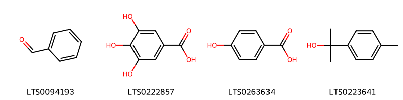{ width=100% }
    <figcaption>Hình ảnh cấu trúc hóa học của 4 hoạt chất thuộc nhóm Benzene and substituted derivatives gồm ['benzaldehyde (LTS0094193)', 'galop (LTS0222857)', 'p-hydroxybenzoic acid (LTS0263634)', 'p-cymen-8-ol (LTS0223641)'].</figcaption>
</figure>
#### Nhóm Fatty Acyls
<figure markdown="span">
    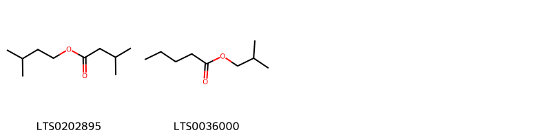{ width=100% }
    <figcaption>Hình ảnh cấu trúc hóa học của 2 hoạt chất thuộc nhóm Fatty Acyls gồm ['apple oil (LTS0202895)', 'isobutyl valerate (LTS0036000)'].</figcaption>
</figure>
#### Nhóm Flavonoids
<figure markdown="span">
    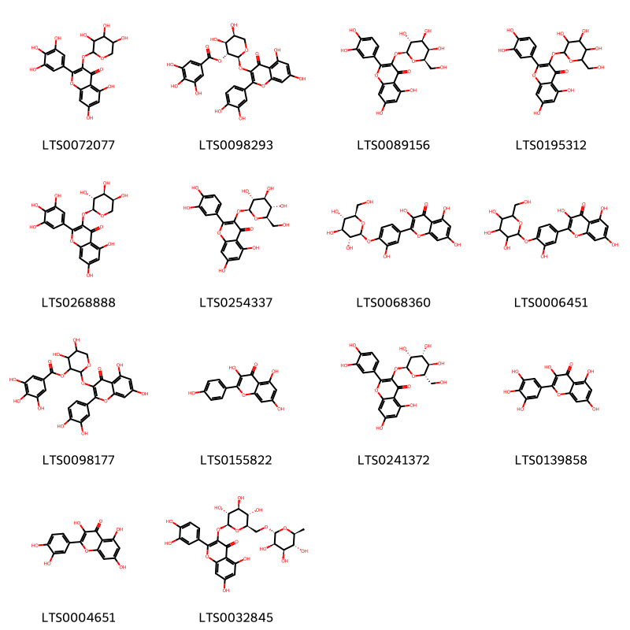{ width=100% }
    <figcaption>Hình ảnh cấu trúc hóa học của 14 hoạt chất thuộc nhóm Flavonoids gồm ['5,7-dihydroxy-3-[(3,4,5-trihydroxyoxan-2-yl)oxy]-2-(3,4,5-trihydroxyphenyl)chromen-4-one (LTS0072077)', '(2s,3r,4s,5s)-2-{[2-(3,4-dihydroxyphenyl)-5,7-dihydroxy-4-oxochromen-3-yl]oxy}-4,5-dihydroxyoxan-3-yl 3,4,5-trihydroxybenzoate (LTS0098293)', 'hyperoside (LTS0089156)', '2-(3,4-dihydroxyphenyl)-5,7-dihydroxy-3-{[3,4,5-trihydroxy-6-(hydroxymethyl)oxan-2-yl]oxy}chromen-4-one (LTS0195312)', '5,7-dihydroxy-3-{[(2s,3r,4s,5s)-3,4,5-trihydroxyoxan-2-yl]oxy}-2-(3,4,5-trihydroxyphenyl)chromen-4-one (LTS0268888)', 'isoquercetin (LTS0254337)', 'spiraeoside (LTS0068360)', '3,5,7-trihydroxy-2-(3-hydroxy-4-{[3,4,5-trihydroxy-6-(hydroxymethyl)oxan-2-yl]oxy}phenyl)chromen-4-one (LTS0006451)', '2-{[2-(3,4-dihydroxyphenyl)-5,7-dihydroxy-4-oxochromen-3-yl]oxy}-4,5-dihydroxyoxan-3-yl 3,4,5-trihydroxybenzoate (LTS0098177)', 'kaempherol (LTS0155822)', '2-(3,4-dihydroxyphenyl)-5,7-dihydroxy-3-{[(2s,3r,4r,5r,6s)-3,4,5-trihydroxy-6-(hydroxymethyl)oxan-2-yl]oxy}chromen-4-one (LTS0241372)', 'myricetin (LTS0139858)', 'quercetin (LTS0004651)', '3-rutinosyl quercetin (LTS0032845)'].</figcaption>
</figure>
#### Nhóm Organooxygen compounds
<figure markdown="span">
    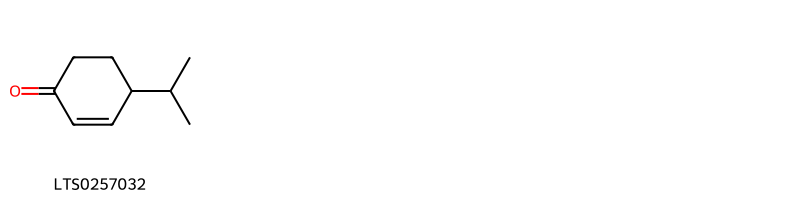{ width=100% }
    <figcaption>Hình ảnh cấu trúc hóa học của 1 hoạt chất thuộc nhóm Organooxygen compounds gồm ['4-isopropyl-2-cyclohexenone (LTS0257032)'].</figcaption>
</figure>
#### Nhóm Prenol lipids
<figure markdown="span">
    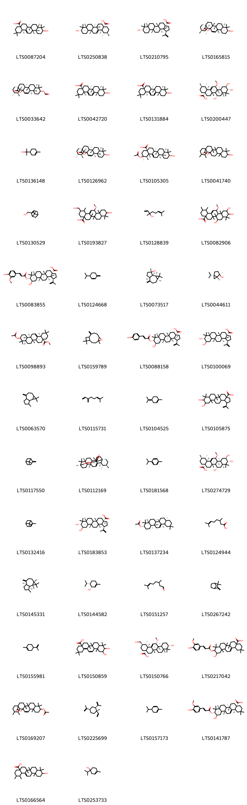{ width=100% }
    <figcaption>Hình ảnh cấu trúc hóa học của 105 hoạt chất thuộc nhóm Prenol lipids gồm ['(4as,6as,6br,8as,10s,12ar,12bs,14br)-10-hydroxy-2,2,6a,6b,9,9,12a-heptamethyl-1,3,4,5,6,7,8,8a,10,11,12,12b,13,14b-tetradecahydropicene-4a-carboxylic acid (LTS0087204)', 'ursolic acid (LTS0250838)', 'betulinic acid (LTS0210795)', '(1s,4r,5r,8r,10s,13r,14s,17s,18s,19r,20s)-10-hydroxy-4,5,9,9,13,19,20-heptamethyl-24-oxahexacyclo[15.5.2.0¹,¹⁸.0⁴,¹⁷.0⁵,¹⁴.0⁸,¹³]tetracos-15-en-23-one (LTS0165815)', '(1s,4s,5r,8r,10s,13s,14r,17s,18r,19s,20r)-4,5,9,9,13,19,20-heptamethyl-23-oxo-24-oxahexacyclo[15.5.2.0¹,¹⁸.0⁴,¹⁷.0⁵,¹⁴.0⁸,¹³]tetracos-15-en-10-yl formate (LTS0033642)', '(4as,6ar,6bs,8ar,10s,12as,14bs)-10-hydroxy-2,2,6a,6b,9,9,12a-heptamethyl-1,3,4,5,6,7,8,8a,10,11,12,14b-dodecahydropicene-4a-carboxylic acid (LTS0042720)', '(4as,6ar,6bs,8ar,10s,12as,14br)-10-hydroxy-2,2,6a,6b,9,9,12a-heptamethyl-1,3,4,5,6,7,8,8a,10,11,12,14b-dodecahydropicene-4a-carboxylic acid (LTS0131884)', '(1s,2r,4as,6ar,6br,7s,8ar,10r,11r,12as,12br,13r,14bs)-7,10,11-trihydroxy-13-methoxy-1,2,6a,6b,9,9,12a-heptamethyl-2,3,4,5,6,7,8,8a,10,11,12,12b,13,14b-tetradecahydro-1h-picene-4a-carboxylic acid (LTS0200447)', 'terpineol (LTS0136148)', '(1s,4s,5r,8r,10s,13s,14r,17s,18r,19s,20r)-10-hydroxy-4,5,9,9,13,19,20-heptamethyl-24-oxahexacyclo[15.5.2.0¹,¹⁸.0⁴,¹⁷.0⁵,¹⁴.0⁸,¹³]tetracos-15-en-23-one (LTS0126962)', '(1r,2s,4ar,6as,6br,8ar,10s,12ar,12br,14bs)-2-(acetyloxy)-10-hydroxy-1,2,6a,6b,9,9,12a-heptamethyl-1,3,4,5,6,7,8,8a,10,11,12,12b,13,14b-tetradecahydropicene-4a-carboxylic acid (LTS0105305)', '10-hydroxy-4,5,9,9,13,19,20-heptamethyl-24-oxahexacyclo[15.5.2.0¹,¹⁸.0⁴,¹⁷.0⁵,¹⁴.0⁸,¹³]tetracosan-23-one (LTS0041740)', 'myrtenol (LTS0130529)', '10-hydroxy-2-(hydroxymethyl)-13-methoxy-1,6a,6b,9,9,12a-hexamethyl-2,3,4,5,6,7,8,8a,10,11,12,12b,13,14b-tetradecahydro-1h-picene-4a-carboxylic acid (LTS0193827)', 'linalool, (+-)- (LTS0128839)', '7,10,11-trihydroxy-13-methoxy-1,2,6a,6b,9,9,12a-heptamethyl-2,3,4,5,6,7,8,8a,10,11,12,12b,13,14b-tetradecahydro-1h-picene-4a-carboxylic acid (LTS0082906)', '(1r,3as,5ar,5br,7ar,9r,10r,11ar,11br,13ar,13br)-10-hydroxy-9-{[(2e)-3-(4-hydroxy-3-methoxyphenyl)prop-2-enoyl]oxy}-5a,5b,8,8,11a-pentamethyl-1-(prop-1-en-2-yl)-hexadecahydrocyclopenta[a]chrysene-3a-carboxylic acid (LTS0083855)', 'β phellandrene (LTS0124668)', '(1as,4as,7s,7ar,7bs)-1,1,7-trimethyl-4-methylidene-octahydrocyclopropa[e]azulen-7-ol (LTS0073517)', '4-thujanol (LTS0044611)', 'methyl (4as,6as,6br,8ar,10s,12ar,12br,14br)-10-(acetyloxy)-2,2,6a,6b,9,9,12a-heptamethyl-1,3,4,5,6,7,8,8a,10,11,12,12b,13,14b-tetradecahydropicene-4a-carboxylate (LTS0098893)', 'caryophyllene oxide (LTS0159789)', '(1r,3as,5ar,5br,7ar,9r,10r,11ar,11br,13as,13bs)-10-hydroxy-9-{[(2e)-3-(4-hydroxyphenyl)prop-2-enoyl]oxy}-5a,5b,8,8,11a-pentamethyl-1-(prop-1-en-2-yl)-hexadecahydrocyclopenta[a]chrysene-3a-carboxylic acid (LTS0088158)', '(1r,3as,5ar,5br,7ar,9r,10r,11ar,11br,13ar,13br)-9,10-dihydroxy-5a,5b,8,8,11a-pentamethyl-1-(prop-1-en-2-yl)-hexadecahydrocyclopenta[a]chrysene-3a-carboxylic acid (LTS0100069)', '1,1,7-trimethyl-4-methylidene-octahydro-1ah-cyclopropa[e]azulene (LTS0063570)', 'α-myrcene (LTS0115731)', 'terpinolene (LTS0104525)', '9,10-dihydroxy-5a,5b,8,8,11a-pentamethyl-1-(prop-1-en-2-yl)-hexadecahydrocyclopenta[a]chrysene-3a-carboxylic acid (LTS0105875)', 'β-pinene (LTS0117550)', '(1s,4r,5s,6s,10r,11r,14s,16r,19r,20s)-4,5,11,15,15,19,20-heptamethyl-24-oxahexacyclo[12.8.2.0¹,⁶.0⁷,²⁰.0¹⁰,¹⁹.0¹¹,¹⁶]tetracos-7-en-23-one (LTS0112169)', 'cymene (LTS0181568)', '(1s,2r,4as,6ar,6br,7s,8as,10r,11r,12as,12bs,13r,14bs)-7,10,11-trihydroxy-13-methoxy-1,2,6a,6b,9,9,12a-heptamethyl-2,3,4,5,6,7,8,8a,10,11,12,12b,13,14b-tetradecahydro-1h-picene-4a-carboxylic acid (LTS0274729)', 'α pinene (LTS0132416)', '(1r,3as,5ar,5br,7ar,9r,10r,11ar,11br,13as,13bs)-9,10-dihydroxy-5a,5b,8,8,11a-pentamethyl-1-(prop-1-en-2-yl)-hexadecahydrocyclopenta[a]chrysene-3a-carboxylic acid (LTS0183853)', 'β-amyrin acetate (LTS0137234)', 'citronellic acid (LTS0124944)', '(1as,4ar,7as,7br)-1,1,7-trimethyl-4-methylidene-octahydro-1ah-cyclopropa[e]azulene (LTS0145331)', '(1r,6s)-6-isopropyl-3-methylcyclohex-2-en-1-ol (LTS0144582)', 'citronella (LTS0151257)', 'camphene (LTS0267242)', 'limonene,  (LTS0155981)', '10,11-dihydroxy-2,2,6a,6b,9,9,12a-heptamethyl-1,3,4,5,6,7,8,8a,10,11,12,12b-dodecahydropicene-4a-carboxylic acid (LTS0150859)', '(1r,2r,4as,6as,6br,8ar,10s,12as,12br,13s,14bs)-10-hydroxy-2-(hydroxymethyl)-13-methoxy-1,6a,6b,9,9,12a-hexamethyl-2,3,4,5,6,7,8,8a,10,11,12,12b,13,14b-tetradecahydro-1h-picene-4a-carboxylic acid (LTS0150766)', '11-hydroxy-10-{[3-(4-hydroxy-3-methoxyphenyl)prop-2-enoyl]oxy}-2,2,6a,6b,9,9,12a-heptamethyl-1,3,4,5,6,7,8,8a,10,11,12,12b,13,14b-tetradecahydropicene-4a-carboxylic acid (LTS0217042)', '4,5,9,9,13,19,20-heptamethyl-23-oxo-24-oxahexacyclo[15.5.2.0¹,¹⁸.0⁴,¹⁷.0⁵,¹⁴.0⁸,¹³]tetracos-15-en-10-yl acetate (LTS0169207)', 'β-elemene (LTS0225699)', 'phellandrene (LTS0157173)', '(4as,6as,6br,8ar,10r,11r,12ar,12br,14bs)-11-hydroxy-10-{[(2e)-3-(4-hydroxy-3-methoxyphenyl)prop-2-enoyl]oxy}-2,2,6a,6b,9,9,12a-heptamethyl-1,3,4,5,6,7,8,8a,10,11,12,12b,13,14b-tetradecahydropicene-4a-carboxylic acid (LTS0141787)', '10-hydroxy-1,2,6a,6b,9,9,12a-heptamethyl-2,3,4,5,6,7,8,8a,10,11,12,12b,13,14b-tetradecahydro-1h-picene-4a-carboxylic acid (LTS0166564)', '4-terpineol (LTS0253733)', '10,11-dihydroxy-9-(hydroxymethyl)-4,5,9,13,19,20-hexamethyl-24-oxahexacyclo[15.5.2.0¹,¹⁸.0⁴,¹⁷.0⁵,¹⁴.0⁸,¹³]tetracos-15-en-23-one (LTS0133312)', 'borneol (LTS0264960)', '(4as,6as,6br,8ar,10r,11r,12ar,12br,14bs)-11-hydroxy-10-{[(2e)-3-(4-hydroxyphenyl)prop-2-enoyl]oxy}-2,2,6a,6b,9,9,12a-heptamethyl-1,3,4,5,6,7,8,8a,10,11,12,12b,13,14b-tetradecahydropicene-4a-carboxylic acid (LTS0254872)', '2-(acetyloxy)-10-hydroxy-1,2,6a,6b,9,9,12a-heptamethyl-1,3,4,5,6,7,8,8a,10,11,12,12b,13,14b-tetradecahydropicene-4a-carboxylic acid (LTS0106953)', '(3r,4s)-3-hydroxy-4-isopropylcyclohex-1-ene-1-carbaldehyde (LTS0247127)', '(1s,4s,5r,8r,10s,13r,14r,17s,18r,19s,20r)-10-hydroxy-4,5,9,9,13,19,20-heptamethyl-24-oxahexacyclo[15.5.2.0¹,¹⁸.0⁴,¹⁷.0⁵,¹⁴.0⁸,¹³]tetracosan-23-one (LTS0258528)', 'caryophyllene (LTS0085212)', '(1s,4s,5r,8r,10s,13r,14r,17s,18r,19s,20r)-4,5,9,9,13,19,20-heptamethyl-23-oxo-24-oxahexacyclo[15.5.2.0¹,¹⁸.0⁴,¹⁷.0⁵,¹⁴.0⁸,¹³]tetracosan-10-yl acetate (LTS0064457)', 'phellandral (LTS0209940)', 'piperitone (LTS0273145)', 'verbenone (LTS0264577)', '(1r,2r,4as,6as,6br,8ar,10s,12as,12br,13r,14bs)-10-hydroxy-2-(hydroxymethyl)-13-methoxy-1,6a,6b,9,9,12a-hexamethyl-2,3,4,5,6,7,8,8a,10,11,12,12b,13,14b-tetradecahydro-1h-picene-4a-carboxylic acid (LTS0058990)', '(1r,3as,5ar,5br,7ar,9r,10r,11ar,11br,13as,13bs)-10-hydroxy-9-{[(2e)-3-(4-hydroxy-3-methoxyphenyl)prop-2-enoyl]oxy}-5a,5b,8,8,11a-pentamethyl-1-(prop-1-en-2-yl)-hexadecahydrocyclopenta[a]chrysene-3a-carboxylic acid (LTS0268240)', '10-hydroxy-2,2,6a,6b,9,9,12a-heptamethyl-1,3,4,5,6,7,8,8a,10,11,12,14b-dodecahydropicene-4a-carboxylic acid (LTS0067584)', '9-hydroxy-5a,5b,8,8,11a-pentamethyl-1-(prop-1-en-2-yl)-hexadecahydrocyclopenta[a]chrysene-3a-carboxylic acid (LTS0214300)', '10-hydroxy-4,5,9,9,13,19,20-heptamethyl-24-oxahexacyclo[15.5.2.0¹,¹⁸.0⁴,¹⁷.0⁵,¹⁴.0⁸,¹³]tetracos-15-en-23-one (LTS0227705)', '10-hydroxy-9-{[3-(4-hydroxyphenyl)prop-2-enoyl]oxy}-5a,5b,8,8,11a-pentamethyl-1-(prop-1-en-2-yl)-hexadecahydrocyclopenta[a]chrysene-3a-carboxylic acid (LTS0209417)', 'β-caryophyllene oxide (LTS0213960)', '(1s,4s,5r,10s,13r,17s,18r,19s,20r)-10-hydroxy-4,5,9,9,13,19,20-heptamethyl-24-oxahexacyclo[15.5.2.0¹,¹⁸.0⁴,¹⁷.0⁵,¹⁴.0⁸,¹³]tetracosan-23-one (LTS0190691)', '4,4,6a,6b,8a,11,11,14b-octamethyl-1,2,3,4a,5,6,7,8,9,10,12,12a,14,14a-tetradecahydropicen-3-yl acetate (LTS0153642)', 'thymol (LTS0168527)', '(1ar,4r,4ar,7as,7bs)-1,1,4,7-tetramethyl-octahydro-1ah-cyclopropa[e]azulen-4-ol (LTS0021381)', 'α-thujene (LTS0185078)', '(1as,4as,7as,7br)-1,1,7-trimethyl-4-methylidene-octahydro-1ah-cyclopropa[e]azulene (LTS0160636)', 'oleanolic acid (LTS0141130)', 'methyl (4as,6ar,6bs,8ar,10s,12as,14br)-10-(acetyloxy)-2,2,6a,6b,9,9,12a-heptamethyl-1,3,4,5,6,7,8,8a,10,11,12,14b-dodecahydropicene-4a-carboxylate (LTS0174380)', 'cuminaldehyde (LTS0037806)', '(4as,6as,6br,8ar,10s,12ar,12br,14bs)-10-(acetyloxy)-2,2,6a,6b,9,9,12a-heptamethyl-1,3,4,5,6,7,8,8a,10,11,12,12b,13,14b-tetradecahydropicene-4a-carboxylic acid (LTS0039352)', '9-(acetyloxy)-5a,5b,8,8,11a-pentamethyl-1-(prop-1-en-2-yl)-hexadecahydrocyclopenta[a]chrysene-3a-carboxylic acid (LTS0197695)', '(4as,6as,6br,8ar,10r,11r,12as,12br)-10,11-dihydroxy-2,2,6a,6b,9,9,12a-heptamethyl-1,3,4,5,6,7,8,8a,10,11,12,12b-dodecahydropicene-4a-carboxylic acid (LTS0060595)', 'ledol (LTS0243935)', 'maslinic acid (LTS0109701)', '11-hydroxy-10-{[3-(4-hydroxyphenyl)prop-2-enoyl]oxy}-2,2,6a,6b,9,9,12a-heptamethyl-1,3,4,5,6,7,8,8a,10,11,12,12b,13,14b-tetradecahydropicene-4a-carboxylic acid (LTS0061726)', '(1s,4s,5r,8r,9r,10r,11r,13s,14r,17s,18r,19s,20r)-10,11-dihydroxy-9-(hydroxymethyl)-4,5,9,13,19,20-hexamethyl-24-oxahexacyclo[15.5.2.0¹,¹⁸.0⁴,¹⁷.0⁵,¹⁴.0⁸,¹³]tetracos-15-en-23-one (LTS0066625)', 'terpinene (LTS0136858)', '(1r,3as,5ar,5br,7ar,9r,10r,11ar,11br,13as,13bs)-10-hydroxy-9-{[(2z)-3-(4-hydroxyphenyl)prop-2-enoyl]oxy}-5a,5b,8,8,11a-pentamethyl-1-(prop-1-en-2-yl)-hexadecahydrocyclopenta[a]chrysene-3a-carboxylic acid (LTS0064554)', '(3r)-6,6-dimethyl-2-methylidenebicyclo[3.1.1]heptan-3-ol (LTS0009265)', '(1r,3as,5ar,5br,7ar,9s,11ar,11br,13ar,13br)-9-(acetyloxy)-5a,5b,8,8,11a-pentamethyl-1-(prop-1-en-2-yl)-hexadecahydrocyclopenta[a]chrysene-3a-carboxylic acid (LTS0000950)', '10-hydroxy-9-{[3-(4-hydroxy-3-methoxyphenyl)prop-2-enoyl]oxy}-5a,5b,8,8,11a-pentamethyl-1-(prop-1-en-2-yl)-hexadecahydrocyclopenta[a]chrysene-3a-carboxylic acid (LTS0008858)', '3-hydroxy-4-isopropylcyclohex-1-ene-1-carbaldehyde (LTS0020175)', '4,5,9,9,13,19,20-heptamethyl-23-oxo-24-oxahexacyclo[15.5.2.0¹,¹⁸.0⁴,¹⁷.0⁵,¹⁴.0⁸,¹³]tetracos-15-en-10-yl formate (LTS0024122)', '(3s,4s)-3-hydroxy-4-isopropylcyclohex-1-ene-1-carbaldehyde (LTS0021601)', 'pinocarveol (LTS0090950)', '(7ar)-1,1,7-trimethyl-4-methylidene-octahydrocyclopropa[e]azulen-7-ol (LTS0091612)', 'cuminol (LTS0021403)', '5,9-dimethyldec-8-enoic acid (LTS0240962)', 'citronellol, (+-)- (LTS0090925)', 'sabinene hydrate (LTS0236165)', '(1r,3as,5as,5br,9r,10r,11ar)-9,10-dihydroxy-5a,5b,8,8,11a-pentamethyl-1-(prop-1-en-2-yl)-1h,2h,3h,4h,5h,6h,7h,7ah,9h,10h,11h,11bh,12h,13bh-cyclopenta[a]chrysene-3a-carboxylic acid (LTS0004577)', '(1s,4s,5r,8r,10s,13s,14r,17s,18r,19s,20r)-4,5,9,9,13,19,20-heptamethyl-23-oxo-24-oxahexacyclo[15.5.2.0¹,¹⁸.0⁴,¹⁷.0⁵,¹⁴.0⁸,¹³]tetracos-15-en-10-yl acetate (LTS0232253)', '4,5,9,9,13,19,20-heptamethyl-23-oxo-24-oxahexacyclo[15.5.2.0¹,¹⁸.0⁴,¹⁷.0⁵,¹⁴.0⁸,¹³]tetracosan-10-yl acetate (LTS0243088)', '4,5,11,15,15,19,20-heptamethyl-24-oxahexacyclo[12.8.2.0¹,⁶.0⁷,²⁰.0¹⁰,¹⁹.0¹¹,¹⁶]tetracos-7-en-23-one (LTS0256985)', '(4as,6br,10s,12ar,14bs)-10-(acetyloxy)-2,2,6a,6b,9,9,12a-heptamethyl-1,3,4,5,6,7,8,8a,10,11,12,12b,13,14b-tetradecahydropicene-4a-carboxylic acid (LTS0255805)', 'oleanolic acid (LTS0117717)', '(3r,4r)-3-hydroxy-4-isopropylcyclohex-1-ene-1-carbaldehyde (LTS0255102)'].</figcaption>
</figure>
#### Nhóm Saccharolipids
<figure markdown="span">
    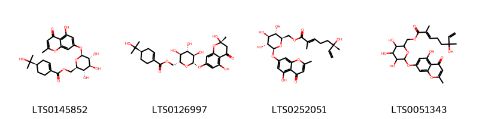{ width=100% }
    <figcaption>Hình ảnh cấu trúc hóa học của 4 hoạt chất thuộc nhóm Saccharolipids gồm ['[(2r,3s,4s,5r,6s)-3,4,5-trihydroxy-6-[(5-hydroxy-2-methyl-4-oxochromen-7-yl)oxy]oxan-2-yl]methyl (4r)-4-(2-hydroxypropan-2-yl)cyclohex-1-ene-1-carboxylate (LTS0145852)', '[(2r,3s,4s,5r,6s)-6-{[(2s)-2,5-dihydroxy-2-methyl-4-oxo-3h-1-benzopyran-7-yl]oxy}-3,4,5-trihydroxyoxan-2-yl]methyl (4r)-4-(2-hydroxypropan-2-yl)cyclohex-1-ene-1-carboxylate (LTS0126997)', '[(2r,3s,4s,5r,6s)-3,4,5-trihydroxy-6-[(5-hydroxy-2-methyl-4-oxochromen-7-yl)oxy]oxan-2-yl]methyl (2e,6s)-6-hydroxy-2,6-dimethylocta-2,7-dienoate (LTS0252051)', '{3,4,5-trihydroxy-6-[(5-hydroxy-2-methyl-4-oxochromen-7-yl)oxy]oxan-2-yl}methyl 6-hydroxy-2,6-dimethylocta-2,7-dienoate (LTS0051343)'].</figcaption>
</figure>
#### Nhóm Saturated hydrocarbons
<figure markdown="span">
    { width=100% }
    <figcaption>Hình ảnh cấu trúc hóa học của 1 hoạt chất thuộc nhóm Saturated hydrocarbons gồm ['decane (LTS0045828)'].</figcaption>
</figure>
#### Nhóm Steroids and steroid derivatives
<figure markdown="span">
    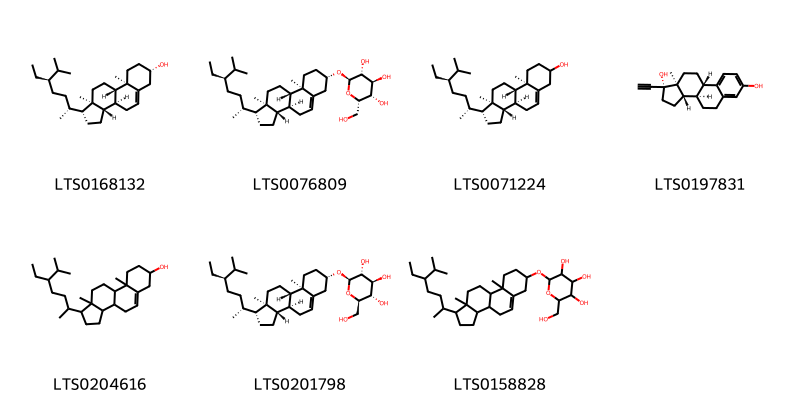{ width=100% }
    <figcaption>Hình ảnh cấu trúc hóa học của 7 hoạt chất thuộc nhóm Steroids and steroid derivatives gồm ['sitosterol (LTS0168132)', '(2r,3r,4s,5s,6s)-2-{[(1r,3as,3bs,7s,9ar,9bs,11ar)-1-[(2r,5r)-5-ethyl-6-methylheptan-2-yl]-9a,11a-dimethyl-1h,2h,3h,3ah,3bh,4h,6h,7h,8h,9h,9bh,10h,11h-cyclopenta[a]phenanthren-7-yl]oxy}-6-(hydroxymethyl)oxane-3,4,5-triol (LTS0076809)', 'stigmast-5-en-3-ol (LTS0071224)', 'ethinyl estradiol (LTS0197831)', 'stigmast-5-en-3-ol, (3β)- (LTS0204616)', 'sitogluside (LTS0201798)', '2-{[1-(5-ethyl-6-methylheptan-2-yl)-9a,11a-dimethyl-1h,2h,3h,3ah,3bh,4h,6h,7h,8h,9h,9bh,10h,11h-cyclopenta[a]phenanthren-7-yl]oxy}-6-(hydroxymethyl)oxane-3,4,5-triol (LTS0158828)'].</figcaption>
</figure>
#### Nhóm Tannins
<figure markdown="span">
    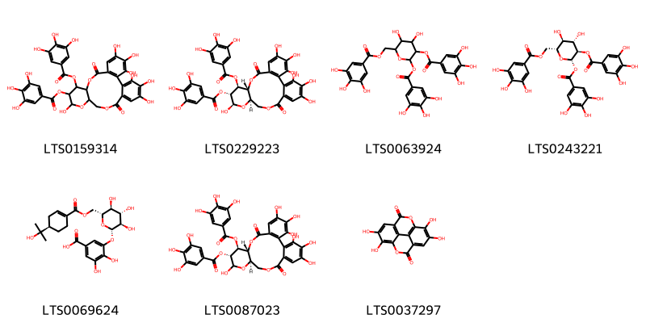{ width=100% }
    <figcaption>Hình ảnh cấu trúc hóa học của 7 hoạt chất thuộc nhóm Tannins gồm ['3,4,5,13,21,22,23-heptahydroxy-8,18-dioxo-12-(3,4,5-trihydroxybenzoyloxy)-9,14,17-trioxatetracyclo[17.4.0.0²,⁷.0¹⁰,¹⁵]tricosa-1(23),2(7),3,5,19,21-hexaen-11-yl 3,4,5-trihydroxybenzoate (LTS0159314)', '(10r,11s,12r,13r,15r)-3,4,5,13,21,22,23-heptahydroxy-8,18-dioxo-11-(3,4,5-trihydroxybenzoyloxy)-9,14,17-trioxatetracyclo[17.4.0.0²,⁷.0¹⁰,¹⁵]tricosa-1(23),2(7),3,5,19,21-hexaen-12-yl 3,4,5-trihydroxybenzoate (LTS0229223)', '4,5-dihydroxy-3-(3,4,5-trihydroxybenzoyloxy)-6-[(3,4,5-trihydroxybenzoyloxy)methyl]oxan-2-yl 3,4,5-trihydroxybenzoate (LTS0063924)', '(2s,3r,4s,5s,6r)-4,5-dihydroxy-3-(3,4,5-trihydroxybenzoyloxy)-6-[(3,4,5-trihydroxybenzoyloxy)methyl]oxan-2-yl 3,4,5-trihydroxybenzoate (LTS0243221)', '3,4-dihydroxy-5-{[(2s,3r,4s,5s,6r)-3,4,5-trihydroxy-6-{[(4r)-4-(2-hydroxypropan-2-yl)cyclohex-1-ene-1-carbonyloxy]methyl}oxan-2-yl]oxy}benzoic acid (LTS0069624)', '(10r,11s,12r,15r)-3,4,5,13,21,22,23-heptahydroxy-8,18-dioxo-11-(3,4,5-trihydroxybenzoyloxy)-9,14,17-trioxatetracyclo[17.4.0.0²,⁷.0¹⁰,¹⁵]tricosa-1(23),2(7),3,5,19,21-hexaen-12-yl 3,4,5-trihydroxybenzoate (LTS0087023)', 'ellagic acid (LTS0037297)'].</figcaption>
</figure>
#### Nhóm Unsaturated hydrocarbons
<figure markdown="span">
    { width=100% }
    <figcaption>Hình ảnh cấu trúc hóa học của 1 hoạt chất thuộc nhóm Unsaturated hydrocarbons gồm ['α terpinene (LTS0232891)'].</figcaption>
</figure>

---

### Dược dân tộc học

Danh sách các quốc gia có sử dụng *Eucalyptus camaldulensis* trong điều trị các bệnh. 

| Country   | Disease    | Bệnh                                                                                                                                                                                                |
|:----------|:-----------|:----------------------------------------------------------------------------------------------------------------------------------------------------------------------------------------------------|
| India     | Astringent | MYMEMORY WARNING: YOU USED ALL AVAILABLE FREE TRANSLATIONS FOR TODAY. NEXT AVAILABLE IN  06 HOURS 41 MINUTES 46 SECONDS VISIT HTTPS://MYMEMORY.TRANSLATED.NET/DOC/USAGELIMITS.PHP TO TRANSLATE MORE |
| Iraq      | Astringent | MYMEMORY WARNING: YOU USED ALL AVAILABLE FREE TRANSLATIONS FOR TODAY. NEXT AVAILABLE IN  06 HOURS 41 MINUTES 40 SECONDS VISIT HTTPS://MYMEMORY.TRANSLATED.NET/DOC/USAGELIMITS.PHP TO TRANSLATE MORE |

---

---
## Eucalyptus citriodorus
### Thông tin về thực vật

!!! info "Phân loại thực vật của *Corymbia citriodora* từ GIBF:"
    - **Kingdom:** Plantae
    - **Phylum:** Tracheophyta
    - **Order:** Myrtales
    - **Family:** Myrtaceae
    - **Genus:** Corymbia
    - **Species:** *Corymbia citriodora*

 

| Label (VI)   | Label (EN)   | Scientific Name          | Descriptions (VI)   | Descriptions (EN)   | Also Known As (VI)           | Also Known As (EN)                  |
|:-------------|:-------------|:-------------------------|:--------------------|:--------------------|:-----------------------------|:------------------------------------|
| N/A          | N/A          | Eucalyptus camaldulensis |                     | Species of plant    | ['Eucalyptus camaldulensis'] | ['River Red Gum', 'Murray red gum'] |

#### Phân bố trên thế giới

**Từ CSDL GIBF** Brazil, China, New Zealand, Honduras, Tanzania, United Republic of, Ecuador, French Polynesia, Spain, Puerto Rico, Réunion, United States of America, Costa Rica, Colombia, Nigeria, unknown or invalid, Estonia, Ethiopia, Hong Kong, Mexico, Benin, El Salvador, Eswatini, Guam, Belgium, Chinese Taipei, Mayotte, Nicaragua, Paraguay, South Africa, Australia, Italy, India, Peru, France

#### Phân bố tại Việt Nam

**Từ CSDL GIBF**: Không có ghi nhận ở Việt Nam

---
### Thành phần hóa học
        
- Theo cơ sở dữ liệu lotus: Từ loài *Corymbia citriodora* đã phân lập và xác định được Chưa có hoạt chất nào được phân lập. hoạt chất thuộc về các nhóm Không có hoạt chất nào được phân lập. 

Không có hình ảnh nào được tạo ra

---

### Dược dân tộc học

Danh sách các quốc gia có sử dụng *Corymbia citriodora* trong điều trị các bệnh. 

| Country   | Disease              | Bệnh                                                                                                                                                                                                |
|:----------|:---------------------|:----------------------------------------------------------------------------------------------------------------------------------------------------------------------------------------------------|
| Haiti     | Antiseptic, Fumigant | MYMEMORY WARNING: YOU USED ALL AVAILABLE FREE TRANSLATIONS FOR TODAY. NEXT AVAILABLE IN  06 HOURS 40 MINUTES 22 SECONDS VISIT HTTPS://MYMEMORY.TRANSLATED.NET/DOC/USAGELIMITS.PHP TO TRANSLATE MORE |

---

---
## Eucalyptus coolabah
### Thông tin về thực vật

!!! info "Phân loại thực vật của *Eucalyptus coolabah* từ GIBF:"
    - **Kingdom:** Plantae
    - **Phylum:** Tracheophyta
    - **Order:** Myrtales
    - **Family:** Myrtaceae
    - **Genus:** Eucalyptus
    - **Species:** *Eucalyptus coolabah*

 

| Label (VI)   | Label (EN)   | Scientific Name     | Descriptions (VI)   | Descriptions (EN)   | Also Known As (VI)   | Also Known As (EN)       |
|:-------------|:-------------|:--------------------|:--------------------|:--------------------|:---------------------|:-------------------------|
| N/A          | N/A          | Eucalyptus coolabah | loài thực vật       | species of plant    | ['']                 | ['coolabah', 'coolibah'] |

#### Phân bố trên thế giới

**Từ CSDL GIBF** Australia, South Africa

#### Phân bố tại Việt Nam

**Từ CSDL GIBF**: Không có ghi nhận ở Việt Nam

---
### Thành phần hóa học
        
- Theo cơ sở dữ liệu lotus: Từ loài *Eucalyptus coolabah* đã phân lập và xác định được Chưa có hoạt chất nào được phân lập. hoạt chất thuộc về các nhóm Không có hoạt chất nào được phân lập. 

Không có hình ảnh nào được tạo ra

---

### Dược dân tộc học

Danh sách các quốc gia có sử dụng *Eucalyptus coolabah* trong điều trị các bệnh. 

| Country   | Disease      | Bệnh                                                                                                                                                                                                |
|:----------|:-------------|:----------------------------------------------------------------------------------------------------------------------------------------------------------------------------------------------------|
| Iraq      | Antiseptic   | MYMEMORY WARNING: YOU USED ALL AVAILABLE FREE TRANSLATIONS FOR TODAY. NEXT AVAILABLE IN  06 HOURS 39 MINUTES 53 SECONDS VISIT HTTPS://MYMEMORY.TRANSLATED.NET/DOC/USAGELIMITS.PHP TO TRANSLATE MORE |
| Turkey    | Disinfectant | MYMEMORY WARNING: YOU USED ALL AVAILABLE FREE TRANSLATIONS FOR TODAY. NEXT AVAILABLE IN  06 HOURS 39 MINUTES 48 SECONDS VISIT HTTPS://MYMEMORY.TRANSLATED.NET/DOC/USAGELIMITS.PHP TO TRANSLATE MORE |

---

---
## Eucalyptus globosus
### Thông tin về thực vật

!!! info "Phân loại thực vật của *Eucalyptus globulus* từ GIBF:"
    - **Kingdom:** Plantae
    - **Phylum:** Tracheophyta
    - **Order:** Myrtales
    - **Family:** Myrtaceae
    - **Genus:** Eucalyptus
    - **Species:** *Eucalyptus globulus*

 

| Label (VI)   | Label (EN)   | Scientific Name     | Descriptions (VI)   | Descriptions (EN)   | Also Known As (VI)   | Also Known As (EN)       |
|:-------------|:-------------|:--------------------|:--------------------|:--------------------|:---------------------|:-------------------------|
| N/A          | N/A          | Eucalyptus coolabah | loài thực vật       | species of plant    | ['']                 | ['coolabah', 'coolibah'] |

#### Phân bố trên thế giới

**Từ CSDL GIBF** Mexico, Algeria, United States of America, Portugal, Pakistan, South Africa, Australia, Chile, New Zealand, Colombia, India, Ecuador, Peru, Bolivia (Plurinational State of), Spain

#### Phân bố tại Việt Nam

**Từ CSDL GIBF**: Không có ghi nhận ở Việt Nam

---
### Thành phần hóa học
        
- Theo cơ sở dữ liệu lotus: Từ loài *Eucalyptus globulus* đã phân lập và xác định được Chưa có hoạt chất nào được phân lập. hoạt chất thuộc về các nhóm Không có hoạt chất nào được phân lập. 

Không có hình ảnh nào được tạo ra

---

### Dược dân tộc học

Danh sách các quốc gia có sử dụng *Eucalyptus globulus* trong điều trị các bệnh. 

| Country   | Disease              | Bệnh                                                                                                                                                                                                |
|:----------|:---------------------|:----------------------------------------------------------------------------------------------------------------------------------------------------------------------------------------------------|
| Haiti     | Antiseptic, Fumigant | MYMEMORY WARNING: YOU USED ALL AVAILABLE FREE TRANSLATIONS FOR TODAY. NEXT AVAILABLE IN  06 HOURS 39 MINUTES 15 SECONDS VISIT HTTPS://MYMEMORY.TRANSLATED.NET/DOC/USAGELIMITS.PHP TO TRANSLATE MORE |

---

---
## Eucalyptus globulus
### Thông tin về thực vật

!!! info "Phân loại thực vật của *Eucalyptus globulus* từ GIBF:"
    - **Kingdom:** Plantae
    - **Phylum:** Tracheophyta
    - **Order:** Myrtales
    - **Family:** Myrtaceae
    - **Genus:** Eucalyptus
    - **Species:** *Eucalyptus globulus*

 

| Label (VI)   | Label (EN)   | Scientific Name     | Descriptions (VI)   | Descriptions (EN)   | Also Known As (VI)   | Also Known As (EN)   |
|:-------------|:-------------|:--------------------|:--------------------|:--------------------|:---------------------|:---------------------|
| N/A          | N/A          | Eucalyptus globulus | loài thực vật       | species of plant    | ['']                 | ['Blue Gum']         |

#### Phân bố trên thế giới

**Từ CSDL GIBF** Mexico, Algeria, United States of America, Portugal, Pakistan, South Africa, Australia, Chile, New Zealand, Colombia, India, Ecuador, Peru, Bolivia (Plurinational State of), Spain

#### Phân bố tại Việt Nam

**Từ CSDL GIBF**: Không có ghi nhận ở Việt Nam

---
### Thành phần hóa học
        
- Theo cơ sở dữ liệu lotus: Từ loài *Eucalyptus globulus* đã phân lập và xác định được 282 hoạt chất thuộc về các nhóm Fatty Acyls, Benzene and substituted derivatives, Unsaturated hydrocarbons, Flavonoids, Tannins, Saccharolipids, Steroids and steroid derivatives, Organooxygen compounds, Furanoid lignans, Phenol esters, Prenol lipids, Benzopyrans. 

|    | chemicalTaxonomyClassyfireClass     |   smiles_count |
|---:|:------------------------------------|---------------:|
|  0 | Benzene and substituted derivatives |              6 |
|  1 | Benzopyrans                         |             21 |
|  2 | Fatty Acyls                         |             14 |
|  3 | Flavonoids                          |             25 |
|  4 | Furanoid lignans                    |              2 |
|  5 | Organooxygen compounds              |             13 |
|  6 | Phenol esters                       |              2 |
|  7 | Prenol lipids                       |            158 |
|  8 | Saccharolipids                      |              6 |
|  9 | Steroids and steroid derivatives    |              7 |
| 10 | Tannins                             |             26 |
| 11 | Unsaturated hydrocarbons            |              1 |

#### Nhóm Benzene and substituted derivatives
<figure markdown="span">
    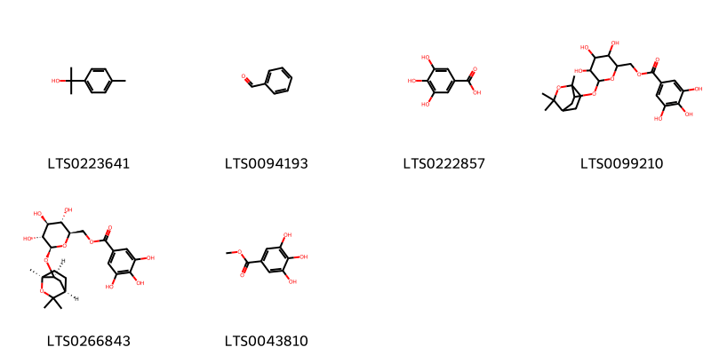{ width=100% }
    <figcaption>Hình ảnh cấu trúc hóa học của 6 hoạt chất thuộc nhóm Benzene and substituted derivatives gồm ['p-cymen-8-ol (LTS0223641)', 'benzaldehyde (LTS0094193)', 'galop (LTS0222857)', '[3,4,5-trihydroxy-6-({1,3,3-trimethyl-2-oxabicyclo[2.2.2]octan-6-yl}oxy)oxan-2-yl]methyl 3,4,5-trihydroxybenzoate (LTS0099210)', '[(2r,3s,4s,5r,6s)-3,4,5-trihydroxy-6-{[(1s,4r,6s)-1,3,3-trimethyl-2-oxabicyclo[2.2.2]octan-6-yl]oxy}oxan-2-yl]methyl 3,4,5-trihydroxybenzoate (LTS0266843)', 'methyl gallate (LTS0043810)'].</figcaption>
</figure>
#### Nhóm Benzopyrans
<figure markdown="span">
    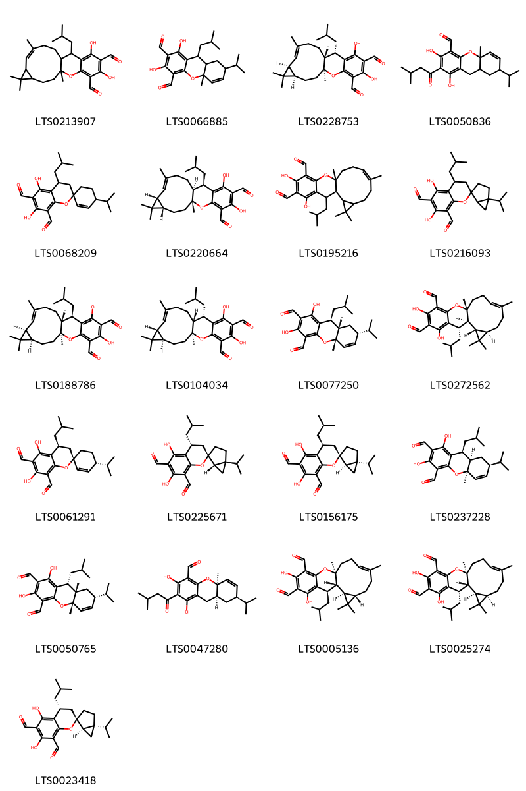{ width=100% }
    <figcaption>Hình ảnh cấu trúc hóa học của 21 hoạt chất thuộc nhóm Benzopyrans gồm ['14,16-dihydroxy-1,5,5,8-tetramethyl-12-(2-methylpropyl)-19-oxatetracyclo[9.8.0.0⁴,⁶.0¹³,¹⁸]nonadeca-7,13,15,17-tetraene-15,17-dicarbaldehyde (LTS0213907)', '1,3-dihydroxy-7-isopropyl-10a-methyl-9-(2-methylpropyl)-7,8,8a,9-tetrahydroxanthene-2,4-dicarbaldehyde (LTS0066885)', '(1s,4r,6s,7e,11r,12s)-14,16-dihydroxy-1,5,5,8-tetramethyl-12-(2-methylpropyl)-19-oxatetracyclo[9.8.0.0⁴,⁶.0¹³,¹⁸]nonadeca-7,13,15,17-tetraene-15,17-dicarbaldehyde (LTS0228753)', '1,3-dihydroxy-7-isopropyl-10a-methyl-2-(3-methylbutanoyl)-7,8,8a,9-tetrahydroxanthene-4-carbaldehyde (LTS0050836)', "5,7-dihydroxy-4'-isopropyl-4-(2-methylpropyl)-3,4-dihydrospiro[1-benzopyran-2,1'-cyclohexan]-2'-ene-6,8-dicarbaldehyde (LTS0068209)", '(1r,4s,6r,7e,11s,12r)-14,16-dihydroxy-1,5,5,8-tetramethyl-12-(2-methylpropyl)-19-oxatetracyclo[9.8.0.0⁴,⁶.0¹³,¹⁸]nonadeca-7,13,15,17-tetraene-15,17-dicarbaldehyde (LTS0220664)', '15,17-dihydroxy-3,3,7,11-tetramethyl-19-(2-methylpropyl)-12-oxatetracyclo[9.8.0.0²,⁴.0¹³,¹⁸]nonadeca-7,13,15,17-tetraene-14,16-dicarbaldehyde (LTS0195216)', "5,7-dihydroxy-5'-isopropyl-4-(2-methylpropyl)-3,4-dihydrospiro[1-benzopyran-2,2'-bicyclo[3.1.0]hexane]-6,8-dicarbaldehyde (LTS0216093)", '(1s,4r,6s,7e,11r,12r)-14,16-dihydroxy-1,5,5,8-tetramethyl-12-(2-methylpropyl)-19-oxatetracyclo[9.8.0.0⁴,⁶.0¹³,¹⁸]nonadeca-7,13,15,17-tetraene-15,17-dicarbaldehyde (LTS0188786)', '(1s,4r,6r,7e,11r,12s)-14,16-dihydroxy-1,5,5,8-tetramethyl-12-(2-methylpropyl)-19-oxatetracyclo[9.8.0.0⁴,⁶.0¹³,¹⁸]nonadeca-7,13,15,17-tetraene-15,17-dicarbaldehyde (LTS0104034)', '(7r,8as,9s,10as)-1,3-dihydroxy-7-isopropyl-10a-methyl-9-(2-methylpropyl)-7,8,8a,9-tetrahydroxanthene-2,4-dicarbaldehyde (LTS0077250)', '(1r,2s,4r,7e,11r,19s)-15,17-dihydroxy-3,3,7,11-tetramethyl-19-(2-methylpropyl)-12-oxatetracyclo[9.8.0.0²,⁴.0¹³,¹⁸]nonadeca-7,13,15,17-tetraene-14,16-dicarbaldehyde (LTS0272562)', "(2s,4s,4'r)-5,7-dihydroxy-4'-isopropyl-4-(2-methylpropyl)-3,4-dihydrospiro[1-benzopyran-2,1'-cyclohexan]-2'-ene-6,8-dicarbaldehyde (LTS0061291)", "(1's,2s,4r,5'r)-5,7-dihydroxy-5'-isopropyl-4-(2-methylpropyl)-3,4-dihydrospiro[1-benzopyran-2,2'-bicyclo[3.1.0]hexane]-6,8-dicarbaldehyde (LTS0225671)", "(1'r,2s,4s,5's)-5,7-dihydroxy-5'-isopropyl-4-(2-methylpropyl)-3,4-dihydrospiro[1-benzopyran-2,2'-bicyclo[3.1.0]hexane]-6,8-dicarbaldehyde (LTS0156175)", '(7s,8ar,9s,10ar)-1,3-dihydroxy-7-isopropyl-10a-methyl-9-(2-methylpropyl)-7,8,8a,9-tetrahydroxanthene-2,4-dicarbaldehyde (LTS0237228)', '(7r,8as,9r,10as)-1,3-dihydroxy-7-isopropyl-10a-methyl-9-(2-methylpropyl)-7,8,8a,9-tetrahydroxanthene-2,4-dicarbaldehyde (LTS0050765)', '(7r,8as,10ar)-1,3-dihydroxy-7-isopropyl-10a-methyl-2-(3-methylbutanoyl)-7,8,8a,9-tetrahydroxanthene-4-carbaldehyde (LTS0047280)', '(1s,2r,4s,7e,11s,19r)-15,17-dihydroxy-3,3,7,11-tetramethyl-19-(2-methylpropyl)-12-oxatetracyclo[9.8.0.0²,⁴.0¹³,¹⁸]nonadeca-7,13,15,17-tetraene-14,16-dicarbaldehyde (LTS0005136)', '(1s,2r,4r,7e,11s,19s)-15,17-dihydroxy-3,3,7,11-tetramethyl-19-(2-methylpropyl)-12-oxatetracyclo[9.8.0.0²,⁴.0¹³,¹⁸]nonadeca-7,13,15,17-tetraene-14,16-dicarbaldehyde (LTS0025274)', "(1'r,2s,4r,5's)-5,7-dihydroxy-5'-isopropyl-4-(2-methylpropyl)-3,4-dihydrospiro[1-benzopyran-2,2'-bicyclo[3.1.0]hexane]-6,8-dicarbaldehyde (LTS0023418)"].</figcaption>
</figure>
#### Nhóm Fatty Acyls
<figure markdown="span">
    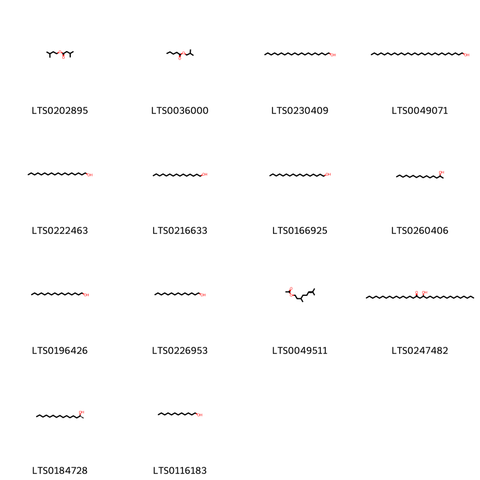{ width=100% }
    <figcaption>Hình ảnh cấu trúc hóa học của 14 hoạt chất thuộc nhóm Fatty Acyls gồm ['apple oil (LTS0202895)', 'isobutyl valerate (LTS0036000)', 'arachidyl alcohol (LTS0230409)', 'octacosanol (LTS0049071)', 'stearyl alcohol (LTS0222463)', '1-pentadecanol (LTS0216633)', '1-heptadecanol (LTS0166925)', '2-pentadecyl alcohol (LTS0260406)', 'cetyl alcohol (LTS0196426)', 'myristyl alcohol (LTS0226953)', 'citronellyl acetate (LTS0049511)', '18-hydroxytritriacontan-16-one (LTS0247482)', '(2s)-pentadecan-2-ol (LTS0184728)', '1-dodecanol (LTS0116183)'].</figcaption>
</figure>
#### Nhóm Flavonoids
<figure markdown="span">
    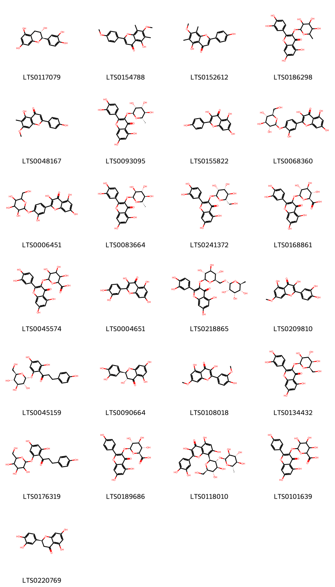{ width=100% }
    <figcaption>Hình ảnh cấu trúc hóa học của 25 hoạt chất thuộc nhóm Flavonoids gồm ['(+)-catechol (LTS0117079)', 'eucalyptin (LTS0154788)', 'sideroxylin (LTS0152612)', 'quercitrin (LTS0186298)', '8-demethylsideroxylin (LTS0048167)', 'quercitrin (LTS0093095)', 'kaempherol (LTS0155822)', 'spiraeoside (LTS0068360)', '3,5,7-trihydroxy-2-(3-hydroxy-4-{[3,4,5-trihydroxy-6-(hydroxymethyl)oxan-2-yl]oxy}phenyl)chromen-4-one (LTS0006451)', '2-(3,4-dihydroxyphenyl)-5,7-dihydroxy-3-{[(2s,3s,4r,5r,6s)-3,4,5-trihydroxy-6-methyloxan-2-yl]oxy}chromen-4-one (LTS0083664)', '2-(3,4-dihydroxyphenyl)-5,7-dihydroxy-3-{[(2s,3r,4r,5r,6s)-3,4,5-trihydroxy-6-(hydroxymethyl)oxan-2-yl]oxy}chromen-4-one (LTS0241372)', 'querciturone (LTS0168861)', 'miquelianin (LTS0045574)', 'quercetin (LTS0004651)', '2-(3,4-dihydroxyphenyl)-5,7-dihydroxy-3-{[(2s,3r,4s,5s,6r)-3,4,5-trihydroxy-6-({[(2r,3s,4s,5r,6s)-3,4,5-trihydroxy-6-methyloxan-2-yl]oxy}methyl)oxan-2-yl]oxy}chromen-4-one (LTS0218865)', 'rhamnetin (LTS0209810)', '1-(2,4-dihydroxy-6-{[(2r,3r,4s,5s,6r)-3,4,5-trihydroxy-6-(hydroxymethyl)oxan-2-yl]oxy}phenyl)-3-(4-hydroxyphenyl)propan-1-one (LTS0045159)', '(+)-taxifolin (LTS0090664)', 'rhamnazin (LTS0108018)', '2-(3,4-dihydroxyphenyl)-5,7-dihydroxy-3-{[(2s,3s,4r,5r,6r)-3,4,5-trihydroxy-6-(hydroxymethyl)oxan-2-yl]oxy}chromen-4-one (LTS0134432)', 'phloridzin (LTS0176319)', 'kaempferol 3-o-glucuronide (LTS0189686)', '8-[(2s,3r,4s,5s,6r)-4,5-dihydroxy-6-(hydroxymethyl)-3-{[(2s,3s,4r,5r,6s)-3,4,5-trihydroxy-6-methyloxan-2-yl]oxy}oxan-2-yl]-2-(3,4-dihydroxyphenyl)-3,5,7-trihydroxychromen-4-one (LTS0118010)', '6-{[5,7-dihydroxy-2-(4-hydroxyphenyl)-4-oxochromen-3-yl]oxy}-3,4,5-trihydroxyoxane-2-carboxylic acid (LTS0101639)', 'eriodictyol (LTS0220769)'].</figcaption>
</figure>
#### Nhóm Furanoid lignans
<figure markdown="span">
    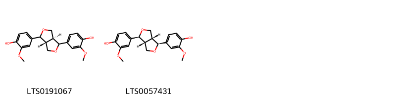{ width=100% }
    <figcaption>Hình ảnh cấu trúc hóa học của 2 hoạt chất thuộc nhóm Furanoid lignans gồm ['4-[(3ar,6as)-4-(4-hydroxy-3-methoxyphenyl)-hexahydrofuro[3,4-c]furan-1-yl]-2-methoxyphenol (LTS0191067)', 'pinoresinol (LTS0057431)'].</figcaption>
</figure>
#### Nhóm Organooxygen compounds
<figure markdown="span">
    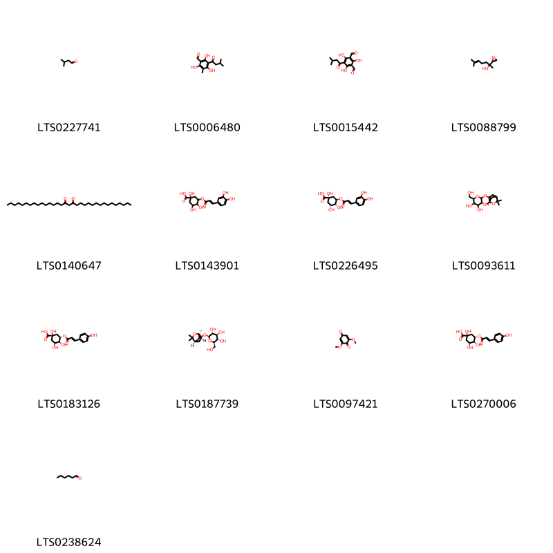{ width=100% }
    <figcaption>Hình ảnh cấu trúc hóa học của 13 hoạt chất thuộc nhóm Organooxygen compounds gồm ['isovaleraldehyde (LTS0227741)', '2,4,6-trihydroxy-3-methyl-5-(3-methylbutanoyl)benzaldehyde (LTS0006480)', '2,4,6-trihydroxy-5-(3-methylbutanoyl)benzene-1,3-dicarbaldehyde (LTS0015442)', 'linalool dihydroepoxide (LTS0088799)', 'tritriacontane-16,18-dione (LTS0140647)', '3-{[3-(3,4-dihydroxyphenyl)prop-2-enoyl]oxy}-1,4,5-trihydroxycyclohexane-1-carboxylic acid (LTS0143901)', 'chlorogenic acid (LTS0226495)', '2-(hydroxymethyl)-6-({1,3,3-trimethyl-2-oxabicyclo[2.2.2]octan-6-yl}oxy)oxane-3,4,5-triol (LTS0093611)', '(1r,3s,4s,5s)-1,3,4-trihydroxy-5-{[3-(4-hydroxyphenyl)prop-2-enoyl]oxy}cyclohexane-1-carboxylic acid (LTS0183126)', '(2r,3s,4s,5r,6s)-2-(hydroxymethyl)-6-{[(1s,4r,6s)-1,3,3-trimethyl-2-oxabicyclo[2.2.2]octan-6-yl]oxy}oxane-3,4,5-triol (LTS0187739)', '2,6-dimethoxy-1,4-benzoquinone (LTS0097421)', '(1r,3s,4s,5s)-1,3,4-trihydroxy-5-{[(2e)-3-(4-hydroxyphenyl)prop-2-enoyl]oxy}cyclohexane-1-carboxylic acid (LTS0270006)', 'hexanal (LTS0238624)'].</figcaption>
</figure>
#### Nhóm Phenol esters
<figure markdown="span">
    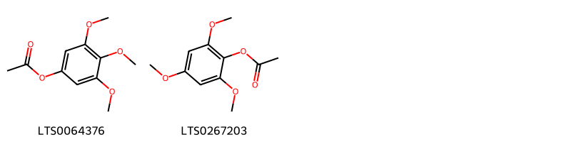{ width=100% }
    <figcaption>Hình ảnh cấu trúc hóa học của 2 hoạt chất thuộc nhóm Phenol esters gồm ['3,4,5-trimethoxyphenyl acetate (LTS0064376)', '2,4,6-trimethoxyphenyl acetate (LTS0267203)'].</figcaption>
</figure>
#### Nhóm Prenol lipids
<figure markdown="span">
    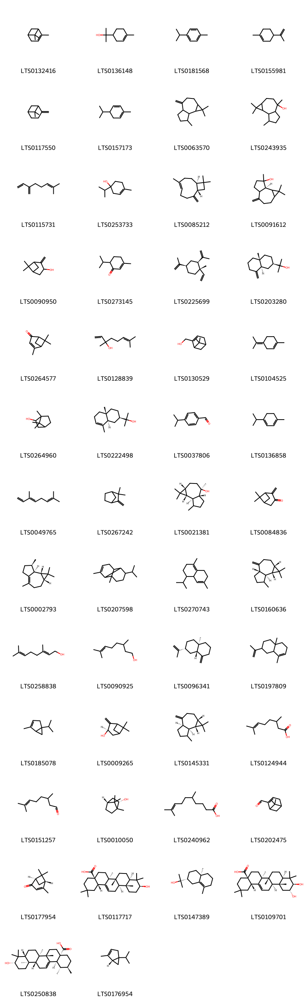{ width=100% }
    <figcaption>Hình ảnh cấu trúc hóa học của 158 hoạt chất thuộc nhóm Prenol lipids gồm ['α pinene (LTS0132416)', 'terpineol (LTS0136148)', 'cymene (LTS0181568)', 'limonene,  (LTS0155981)', 'β-pinene (LTS0117550)', 'phellandrene (LTS0157173)', '1,1,7-trimethyl-4-methylidene-octahydro-1ah-cyclopropa[e]azulene (LTS0063570)', 'ledol (LTS0243935)', 'α-myrcene (LTS0115731)', '4-terpineol (LTS0253733)', 'caryophyllene (LTS0085212)', '(7ar)-1,1,7-trimethyl-4-methylidene-octahydrocyclopropa[e]azulen-7-ol (LTS0091612)', 'pinocarveol (LTS0090950)', 'piperitone (LTS0273145)', 'β-elemene (LTS0225699)', 'β-eudesmol (LTS0203280)', 'verbenone (LTS0264577)', 'linalool, (+-)- (LTS0128839)', 'myrtenol (LTS0130529)', 'terpinolene (LTS0104525)', 'borneol (LTS0264960)', 'α-eudesmol (LTS0222498)', 'cuminaldehyde (LTS0037806)', 'terpinene (LTS0136858)', 'trans-β-ocimene (LTS0049765)', 'camphene (LTS0267242)', '(1ar,4r,4ar,7as,7bs)-1,1,4,7-tetramethyl-octahydro-1ah-cyclopropa[e]azulen-4-ol (LTS0021381)', 'pinocarvone (LTS0084836)', 'leden (LTS0002793)', 'α-copaene (LTS0207598)', '4-isopropyl-1,6-dimethyl-2,3,4,4a,7,8-hexahydronaphthalene (LTS0270743)', '(1as,4as,7as,7br)-1,1,7-trimethyl-4-methylidene-octahydro-1ah-cyclopropa[e]azulene (LTS0160636)', 'geraniol (LTS0258838)', 'citronellol, (+-)- (LTS0090925)', 'β-selinene (LTS0096341)', 'selinene (LTS0197809)', 'α-thujene (LTS0185078)', '(3r)-6,6-dimethyl-2-methylidenebicyclo[3.1.1]heptan-3-ol (LTS0009265)', '(1as,4ar,7as,7br)-1,1,7-trimethyl-4-methylidene-octahydro-1ah-cyclopropa[e]azulene (LTS0145331)', 'citronellic acid (LTS0124944)', 'citronella (LTS0151257)', '(2s,4r)-1,7,7-trimethylbicyclo[2.2.1]heptan-2-ol (LTS0010050)', '5,9-dimethyldec-8-enoic acid (LTS0240962)', 'myrtenal (LTS0202475)', '(1r,5s)-4,6,6-trimethylbicyclo[3.1.1]hept-3-en-2-one (LTS0177954)', 'oleanolic acid (LTS0117717)', 'gamma-eudesmol (LTS0147389)', 'maslinic acid (LTS0109701)', 'ursolic acid (LTS0250838)', 'α-thujene (LTS0176954)', '(1ar,4r,7r,7bs)-1,1,4,7-tetramethyl-octahydro-1ah-cyclopropa[e]azulen-4-ol (LTS0248407)', 'carvone (LTS0196605)', '4,5,9,9,13,19,20-heptamethyl-23-oxo-24-oxahexacyclo[15.5.2.0¹,¹⁸.0⁴,¹⁷.0⁵,¹⁴.0⁸,¹³]tetracos-15-en-10-yl acetate (LTS0169207)', 'delta-cadinene (LTS0019321)', '(1s,4s,5r,8r,10s,13s,14r,17s,18r,19s,20r)-4,5,9,9,13,19,20-heptamethyl-23-oxo-24-oxahexacyclo[15.5.2.0¹,¹⁸.0⁴,¹⁷.0⁵,¹⁴.0⁸,¹³]tetracos-15-en-10-yl acetate (LTS0232253)', '2-(4a,8-dimethyl-2,3,4,5,6,8a-hexahydro-1h-naphthalen-2-yl)propan-2-ol (LTS0072791)', '5-[(1r)-1-[(1ar,4r,4ar,7s,7as,7br)-4-hydroxy-1,1,4,7-tetramethyl-octahydrocyclopropa[e]azulen-7-yl]-3-methylbutyl]-2,4,6-trihydroxybenzene-1,3-dicarbaldehyde (LTS0091941)', '5-[(1s)-1-[(1ar,4r,4ar,7s,7as,7br)-4-hydroxy-1,1,4,7-tetramethyl-octahydrocyclopropa[e]azulen-7-yl]-3-methylbutyl]-2,4,6-trihydroxybenzene-1,3-dicarbaldehyde (LTS0061769)', 'caryophyllene oxide (LTS0159789)', 'β-caryophyllene oxide (LTS0213960)', '(1r,2s,7s,8s)-8-isopropyl-1,3-dimethyltricyclo[4.4.0.0²,⁷]dec-3-ene (LTS0190031)', '2,4,6-trihydroxy-5-{1-[6-(2-hydroxypropan-2-yl)-4,8a-dimethyl-2,3,4,6,7,8-hexahydro-1h-naphthalen-1-yl]-3-methylbutyl}benzene-1,3-dicarbaldehyde (LTS0240068)', 'uvaol (LTS0008025)', '(1ar,4r,4ar,7s,7as,7bs)-1,1,4,7-tetramethyl-octahydro-1ah-cyclopropa[e]azulen-4-ol (LTS0116727)', '(-)-α-gurjunene (LTS0194913)', 'urs-12-ene-3β,28-diol (LTS0136738)', '5-[(1r)-1-[(1ar,4ar,7s,7ar,7br)-1,1,7-trimethyl-4-methylidene-octahydrocyclopropa[e]azulen-7-yl]-3-methylbutyl]-2,4,6-trihydroxybenzene-1,3-dicarbaldehyde (LTS0056439)', '2,4,6-trihydroxy-5-(3-methyl-1-{1,1,7-trimethyl-4-methylidene-octahydrocyclopropa[e]azulen-7-yl}butyl)benzene-1,3-dicarbaldehyde (LTS0088727)', '5-(1-{2-[2,2-dimethyl-3-(3-oxobutyl)cyclopropyl]-1-methyl-3-oxocyclopentyl}-3-methylbutyl)-2,4,6-trihydroxybenzene-1,3-dicarbaldehyde (LTS0095702)', '2,4,6-trihydroxy-5-(1-{4-hydroxy-1,1,4,7-tetramethyl-octahydrocyclopropa[e]azulen-7-yl}-3-methylbutyl)benzene-1,3-dicarbaldehyde (LTS0187155)', 'methyl 10-hydroxy-1,2,6a,6b,9,9,12a-heptamethyl-2,3,4,5,6,7,8,8a,10,11,12,12b,13,14b-tetradecahydro-1h-picene-4a-carboxylate (LTS0155914)', '5-[(1r)-1-[(1r,3ar,4r,7r)-7-(2-hydroxypropan-2-yl)-1,4-dimethyl-3,3a,4,5,6,7-hexahydro-2h-azulen-1-yl]-3-methylbutyl]-2,4,6-trihydroxybenzene-1,3-dicarbaldehyde (LTS0126862)', 'globulol (LTS0223157)', 'gibberellin a19 (LTS0044672)', '9-(acetyloxy)-5a,5b,8,8,11a-pentamethyl-1-(prop-1-en-2-yl)-hexadecahydrocyclopenta[a]chrysene-3a-carboxylic acid (LTS0197695)', 'methyl (1s,2r,4as,6as,6br,8ar,10s,12ar,12br,14bs)-10-hydroxy-1,2,6a,6b,9,9,12a-heptamethyl-2,3,4,5,6,7,8,8a,10,11,12,12b,13,14b-tetradecahydro-1h-picene-4a-carboxylate (LTS0086911)', '2,4,6-trihydroxy-5-{1-[7-(2-hydroxypropan-2-yl)-1,4-dimethyl-3,3a,4,5,6,7-hexahydro-2h-azulen-1-yl]-3-methylbutyl}benzene-1,3-dicarbaldehyde (LTS0104735)', 'guaiene (LTS0039431)', '(+)-gamma-cadinene (LTS0103949)', 'gamma-muurolene (LTS0052920)', 'α-selinene (LTS0024564)', '4-isopropyl-6-methyl-1-methylidene-3,4,4a,7,8,8a-hexahydro-2h-naphthalene (LTS0111070)', '2,4,6-trihydroxy-5-[(1s)-1-[(4s)-4-hydroxy-6-(2-hydroxypropan-2-yl)-4,8a-dimethyl-octahydronaphthalen-1-yl]-3-methylbutyl]benzene-1,3-dicarbaldehyde (LTS0133816)', 'β-amyrin (LTS0075776)', 'β-terpinene (LTS0106377)', '(2r)-2,5,7,8-tetramethyl-2-[(4s,8s)-4,8,12-trimethyltridecyl]-3,4-dihydro-1-benzopyran-6-ol (LTS0130040)', '1-[4-(prop-1-en-2-yl)cyclopent-1-en-1-yl]ethanone (LTS0074610)', '7-(2-hydroxypropan-2-yl)-4-methyl-10-methylidenecyclodec-5-en-1-one (LTS0136006)', '(-)-carvone (LTS0223461)', '5-[(1r)-1-[(1r,4s,4as,6s,8ar)-4-hydroxy-6-(2-hydroxypropan-2-yl)-4,8a-dimethyl-octahydronaphthalen-1-yl]-3-methylbutyl]-2,4,6-trihydroxybenzene-1,3-dicarbaldehyde (LTS0094157)', 'methyl 10-(acetyloxy)-2,2,6a,6b,9,9,12a-heptamethyl-1,3,4,5,6,7,8,8a,10,11,12,12b,13,14b-tetradecahydropicene-4a-carboxylate (LTS0088155)', '1,3,9a-trihydroxy-11a-methyl-9-methylidene-12-(2-methylpropyl)-6-(propan-2-ylidene)-5b,7,8,10,11,12-hexahydro-5ah-5-oxatetraphene-2,4-dicarbaldehyde (LTS0096351)', '5-[(1r)-1-[(1r,2r)-2-[(1r,3r)-2,2-dimethyl-3-(3-oxobutyl)cyclopropyl]-1-methyl-3-oxocyclopentyl]-3-methylbutyl]-2,4,6-trihydroxybenzene-1,3-dicarbaldehyde (LTS0021910)', '5-[(1s)-1-[(1s,4as,6r,8as)-6-(2-hydroxypropan-2-yl)-8a-methyl-4-methylidene-octahydronaphthalen-1-yl]-3-methylbutyl]-2,4,6-trihydroxybenzene-1,3-dicarbaldehyde (LTS0029043)', 'eremophilene (LTS0101219)', 'gibberellin a4 (LTS0029910)', '1,3,9a-trihydroxy-11a-methyl-9-methylidene-12-(2-methylpropyl)-6-(prop-1-en-2-yl)-5a,5b,6,7,8,10,11,12-octahydro-5-oxatetraphene-2,4-dicarbaldehyde (LTS0105655)', 'methyl (1r,3as,5ar,5br,7ar,9s,11ar,11br,13ar,13br)-9-(acetyloxy)-5a,5b,8,8,11a-pentamethyl-1-(prop-1-en-2-yl)-hexadecahydrocyclopenta[a]chrysene-3a-carboxylate (LTS0193572)', 'methyl (1s,2r,4as,6as,6br,8ar,10s,12as,12br,13r,14bs)-10-(acetyloxy)-13-methoxy-1,2,6a,6b,9,9,12a-heptamethyl-2,3,4,5,6,7,8,8a,10,11,12,12b,13,14b-tetradecahydro-1h-picene-4a-carboxylate (LTS0109733)', 'eucalyptal b (LTS0187158)', '5-{1-[(1r)-2-[2,2-dimethyl-3-(3-oxobutyl)cyclopropyl]-1-methyl-3-oxocyclopentyl]-3-methylbutyl}-2,4,6-trihydroxybenzene-1,3-dicarbaldehyde (LTS0139923)', '4-isopropylcyclohexa-1,5-diene-1-carbaldehyde (LTS0173256)', '2-[(2r,4ar,8as)-4a,8-dimethyl-2,3,4,5,6,8a-hexahydro-1h-naphthalen-2-yl]propan-2-ol (LTS0191881)', 'gibberellin a8 (LTS0126599)', '(1r,2r,5s,8s,9s,10r,11r,13s)-5,13-dihydroxy-11-methyl-6-methylidene-16-oxo-15-oxapentacyclo[9.3.2.1⁵,⁸.0¹,¹⁰.0²,⁸]heptadecane-9-carboxylic acid (LTS0162322)', '[(2r,3s,4s,5r,6s)-3,4,5-trihydroxy-6-[(4r)-4-(2-hydroxypropan-2-yl)cyclohex-1-ene-1-carbonyloxy]oxan-2-yl]methyl 3,4,5-trihydroxybenzoate (LTS0148052)', '1-[(4r)-4-(prop-1-en-2-yl)cyclopent-1-en-1-yl]ethanone (LTS0150590)', '5-{1-[(1s,4as,6r,8as)-6-(2-hydroxypropan-2-yl)-8a-methyl-4-methylidene-octahydronaphthalen-1-yl]-3-methylbutyl}-2,4,6-trihydroxybenzene-1,3-dicarbaldehyde (LTS0154081)', '8a-(hydroxymethyl)-4,4,6a,6b,11,11,14b-heptamethyl-1,2,3,4a,5,6,7,8,9,10,12,12a,14,14a-tetradecahydropicen-3-ol (LTS0234707)', '5-{1-[(1s,4r,4ar,6r,8as)-4-hydroxy-6-(2-hydroxypropan-2-yl)-4,8a-dimethyl-octahydronaphthalen-1-yl]-3-methylbutyl}-2,4,6-trihydroxybenzene-1,3-dicarbaldehyde (LTS0164113)', 'methyl (4as,6as,6br,8ar,10s,12ar,12br,14bs)-10-{[(2z)-3-(4-methoxyphenyl)prop-2-enoyl]oxy}-2,2,6a,6b,9,9,12a-heptamethyl-1,3,4,5,6,7,8,8a,10,11,12,12b,13,14b-tetradecahydropicene-4a-carboxylate (LTS0113277)', 'β-amyrin (LTS0251864)', 'methyl 10-{[3-(4-methoxyphenyl)prop-2-enoyl]oxy}-1,2,6a,6b,9,9,12a-heptamethyl-2,3,4,5,6,7,8,8a,10,11,12,12b,13,14b-tetradecahydro-1h-picene-4a-carboxylate (LTS0246271)', '(4r)-4-isopropylcyclohexa-1,5-diene-1-carbaldehyde (LTS0143512)', 'methyl 9-(acetyloxy)-5a,5b,8,8,11a-pentamethyl-1-(prop-1-en-2-yl)-hexadecahydrocyclopenta[a]chrysene-3a-carboxylate (LTS0258894)', 'methyl (1r,3as,5ar,5br,7ar,9s,11ar,11br,13ar,13br)-9-hydroxy-5a,5b,8,8,11a-pentamethyl-1-(prop-1-en-2-yl)-hexadecahydrocyclopenta[a]chrysene-3a-carboxylate (LTS0257735)', '4-hydroxy-4-(3-hydroxybut-1-en-1-yl)-3,5,5-trimethylcyclohex-2-en-1-one (LTS0183737)', '{3,4,5-trihydroxy-6-[4-(2-hydroxypropan-2-yl)cyclohex-1-ene-1-carbonyloxy]oxan-2-yl}methyl 3,4,5-trihydroxybenzoate (LTS0270879)', '(1s,7r)-1,8a-dimethyl-7-(prop-1-en-2-yl)-2,3,5,6,7,8-hexahydro-1h-naphthalene (LTS0242950)', '(1s,5r)-6,6-dimethylbicyclo[3.1.1]hept-2-ene-2-carbaldehyde (LTS0203233)', 'robustadial a (LTS0268711)', 'vitamin e (LTS0263269)', '3-{[(1ar,4r,4ar,7r,7as,7br)-4-hydroxy-1,1,4,7-tetramethyl-octahydrocyclopropa[e]azulen-7-yl]methyl}-2,4,6-trihydroxy-5-(3-methylbutanoyl)benzaldehyde (LTS0261892)', 'erythrodiol (LTS0057163)', '5-[(1s)-1-[(1r,2s)-2-[(1s,3s)-2,2-dimethyl-3-(3-oxobutyl)cyclopropyl]-1-methyl-3-oxocyclopentyl]-3-methylbutyl]-2,4,6-trihydroxybenzene-1,3-dicarbaldehyde (LTS0266541)', 'verbenone (LTS0275336)', 'trans-(-)-pinocarveol (LTS0103561)', '(4s)-4-hydroxy-4-(3-hydroxybut-1-en-1-yl)-3,5,5-trimethylcyclohex-2-en-1-one (LTS0225700)', '5-[(1s)-1-[(1r,4s,4as,6s,8ar)-4-hydroxy-6-(2-hydroxypropan-2-yl)-4,8a-dimethyl-octahydronaphthalen-1-yl]-3-methylbutyl]-2,4,6-trihydroxybenzene-1,3-dicarbaldehyde (LTS0230520)', 'methyl (1s,2r,4as,6as,6br,8ar,10s,12ar,12br,14bs)-10-{[(2e)-3-(4-methoxyphenyl)prop-2-enoyl]oxy}-1,2,6a,6b,9,9,12a-heptamethyl-2,3,4,5,6,7,8,8a,10,11,12,12b,13,14b-tetradecahydro-1h-picene-4a-carboxylate (LTS0037142)', '(1r,2s,4s,7e,11s)-14,16-dihydroxy-3,3,7,11-tetramethyl-15-(3-methylbutanoyl)-19-oxatetracyclo[9.8.0.0²,⁴.0¹³,¹⁸]nonadeca-7,13,15,17-tetraene-17-carbaldehyde (LTS0011644)', '(1s,5s)-6,6-dimethyl-2-methylidenebicyclo[3.1.1]heptan-3-one (LTS0164093)', '(4as,6as,6br,12ar,12br,14bs)-10-(acetyloxy)-1,2,6a,6b,9,9,12a-heptamethyl-2,3,4,5,6,7,8,8a,10,11,12,12b,13,14b-tetradecahydro-1h-picene-4a-carboxylic acid (LTS0030507)', 'methyl (1s,2r,4as,6as,6br,8ar,10s,12ar,12br,14bs)-10-(acetyloxy)-1,2,6a,6b,9,9,12a-heptamethyl-2,3,4,5,6,7,8,8a,10,11,12,12b,13,14b-tetradecahydro-1h-picene-4a-carboxylate (LTS0066151)', '8a-(hydroxymethyl)-4,4,6a,6b,11,12,14b-heptamethyl-2,3,4a,5,6,7,8,9,10,11,12,12a,14,14a-tetradecahydro-1h-picen-3-ol (LTS0178123)', 'eucalyptal a (LTS0203733)', 'methyl 10-{[3-(4-methoxyphenyl)prop-2-enoyl]oxy}-2,2,6a,6b,9,9,12a-heptamethyl-1,3,4,5,6,7,8,8a,10,11,12,12b,13,14b-tetradecahydropicene-4a-carboxylate (LTS0259074)', '5-[(1r)-1-[(1r,4r,6s,8ar)-6-(2-hydroxypropan-2-yl)-4,8a-dimethyl-2,3,4,6,7,8-hexahydro-1h-naphthalen-1-yl]-3-methylbutyl]-2,4,6-trihydroxybenzene-1,3-dicarbaldehyde (LTS0052240)', 'eucalyptal c (LTS0059723)', '5-[(1s)-1-[(1r,3ar,4s,7s)-7-(2-hydroxypropan-2-yl)-1,4-dimethyl-3,3a,4,5,6,7-hexahydro-2h-azulen-1-yl]-3-methylbutyl]-2,4,6-trihydroxybenzene-1,3-dicarbaldehyde (LTS0134452)', 'methyl 10-(acetyloxy)-13-methoxy-1,2,6a,6b,9,9,12a-heptamethyl-2,3,4,5,6,7,8,8a,10,11,12,12b,13,14b-tetradecahydro-1h-picene-4a-carboxylate (LTS0055529)', '(6s,9r)-vomifoliol (LTS0052786)', '(8ar)-10-(acetyloxy)-2,2,6a,6b,9,9,12a-heptamethyl-1,3,4,5,6,7,8,8a,10,11,12,12b,13,14b-tetradecahydropicene-4a-carboxylic acid (LTS0002937)', '14,16-dihydroxy-3,3,7,11-tetramethyl-15-(3-methylbutanoyl)-19-oxatetracyclo[9.8.0.0²,⁴.0¹³,¹⁸]nonadeca-7,13,15,17-tetraene-17-carbaldehyde (LTS0137984)', 'methyl (1s,2r,4as,6as,6br,8ar,9r,10s,12ar,12br,14bs)-10-(acetyloxy)-9-[(acetyloxy)methyl]-1,2,6a,6b,9,12a-hexamethyl-2,3,4,5,6,7,8,8a,10,11,12,12b,13,14b-tetradecahydro-1h-picene-4a-carboxylate (LTS0064221)', 'methyl 10-(acetyloxy)-9-[(acetyloxy)methyl]-1,2,6a,6b,9,12a-hexamethyl-2,3,4,5,6,7,8,8a,10,11,12,12b,13,14b-tetradecahydro-1h-picene-4a-carboxylate (LTS0007826)', '(4r,5e,7r)-7-(2-hydroxypropan-2-yl)-4-methyl-10-methylidenecyclodec-5-en-1-one (LTS0017348)', 'methyl 10-(acetyloxy)-1,2,6a,6b,9,9,12a-heptamethyl-2,3,4,5,6,7,8,8a,10,11,12,12b,13,14b-tetradecahydro-1h-picene-4a-carboxylate (LTS0002017)', 'gibberellin a1 (LTS0013777)', 'α-aromadendrene (LTS0013647)', 'methyl 9-hydroxy-5a,5b,8,8,11a-pentamethyl-1-(prop-1-en-2-yl)-hexadecahydrocyclopenta[a]chrysene-3a-carboxylate (LTS0015878)', '(1as,4ar,7r,7ar,7br)-1,1,7-trimethyl-4-methylidene-octahydro-1ah-cyclopropa[e]azulene (LTS0102441)', 'methyl (4as,6as,6br,8ar,10s,12ar,12br,14bs)-10-(acetyloxy)-2,2,6a,6b,9,9,12a-heptamethyl-1,3,4,5,6,7,8,8a,10,11,12,12b,13,14b-tetradecahydropicene-4a-carboxylate (LTS0019909)', '5-[(1s)-1-[(1r,4ar,6s,8ar)-6-(2-hydroxypropan-2-yl)-8a-methyl-4-methylidene-octahydronaphthalen-1-yl]-3-methylbutyl]-2,4,6-trihydroxybenzene-1,3-dicarbaldehyde (LTS0103264)', '1,3,9a-trihydroxy-6-(2-hydroxypropan-2-yl)-11a-methyl-9-methylidene-12-(2-methylpropyl)-5a,5b,6,7,8,10,11,12-octahydro-5-oxatetraphene-2,4-dicarbaldehyde (LTS0025215)', 'gibberellin a20 (LTS0041124)', 'methyl (1s,2r,4as,6as,6br,8ar,10s,12ar,12br,14bs)-10-{[(2z)-3-(4-methoxyphenyl)prop-2-enoyl]oxy}-1,2,6a,6b,9,9,12a-heptamethyl-2,3,4,5,6,7,8,8a,10,11,12,12b,13,14b-tetradecahydro-1h-picene-4a-carboxylate (LTS0023107)', '(1ar,4r,4ar,7r,7ar,7bs)-1,1,4,7-tetramethyl-octahydro-1ah-cyclopropa[e]azulen-4-ol (LTS0245385)'].</figcaption>
</figure>
#### Nhóm Saccharolipids
<figure markdown="span">
    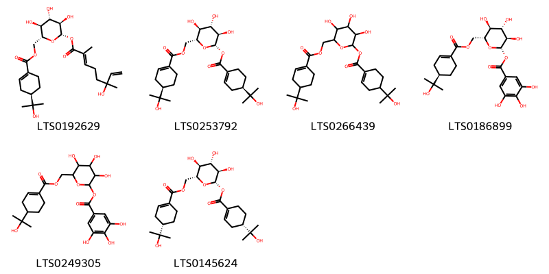{ width=100% }
    <figcaption>Hình ảnh cấu trúc hóa học của 6 hoạt chất thuộc nhóm Saccharolipids gồm ['[(2r,3s,4s,5r,6s)-3,4,5-trihydroxy-6-{[(2e)-6-hydroxy-2,6-dimethylocta-2,7-dienoyl]oxy}oxan-2-yl]methyl (4r)-4-(2-hydroxypropan-2-yl)cyclohex-1-ene-1-carboxylate (LTS0192629)', '[(2r,3s,4s,5r,6s)-3,4,5-trihydroxy-6-[(4r)-4-(2-hydroxypropan-2-yl)cyclohex-1-ene-1-carbonyloxy]oxan-2-yl]methyl (4r)-4-(2-hydroxypropan-2-yl)cyclohex-1-ene-1-carboxylate (LTS0253792)', '{3,4,5-trihydroxy-6-[4-(2-hydroxypropan-2-yl)cyclohex-1-ene-1-carbonyloxy]oxan-2-yl}methyl 4-(2-hydroxypropan-2-yl)cyclohex-1-ene-1-carboxylate (LTS0266439)', '(2s,3r,4s,5s,6r)-3,4,5-trihydroxy-6-{[(4r)-4-(2-hydroxypropan-2-yl)cyclohex-1-ene-1-carbonyloxy]methyl}oxan-2-yl 3,4,5-trihydroxybenzoate (LTS0186899)', '3,4,5-trihydroxy-6-{[4-(2-hydroxypropan-2-yl)cyclohex-1-ene-1-carbonyloxy]methyl}oxan-2-yl 3,4,5-trihydroxybenzoate (LTS0249305)', '[(2r,3s,4s,5r,6s)-3,4,5-trihydroxy-6-[(4s)-4-(2-hydroxypropan-2-yl)cyclohex-1-ene-1-carbonyloxy]oxan-2-yl]methyl (4s)-4-(2-hydroxypropan-2-yl)cyclohex-1-ene-1-carboxylate (LTS0145624)'].</figcaption>
</figure>
#### Nhóm Steroids and steroid derivatives
<figure markdown="span">
    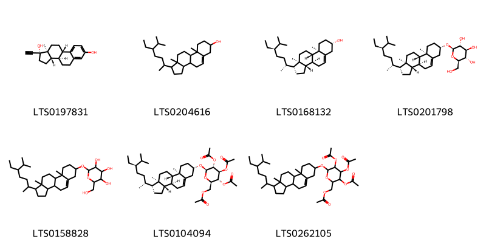{ width=100% }
    <figcaption>Hình ảnh cấu trúc hóa học của 7 hoạt chất thuộc nhóm Steroids and steroid derivatives gồm ['ethinyl estradiol (LTS0197831)', 'stigmast-5-en-3-ol, (3β)- (LTS0204616)', 'sitosterol (LTS0168132)', 'sitogluside (LTS0201798)', '2-{[1-(5-ethyl-6-methylheptan-2-yl)-9a,11a-dimethyl-1h,2h,3h,3ah,3bh,4h,6h,7h,8h,9h,9bh,10h,11h-cyclopenta[a]phenanthren-7-yl]oxy}-6-(hydroxymethyl)oxane-3,4,5-triol (LTS0158828)', '[(2r,3r,4s,5r,6r)-6-{[(1r,3as,3bs,7s,9ar,9bs,11ar)-1-[(2r,5r)-5-ethyl-6-methylheptan-2-yl]-9a,11a-dimethyl-1h,2h,3h,3ah,3bh,4h,6h,7h,8h,9h,9bh,10h,11h-cyclopenta[a]phenanthren-7-yl]oxy}-3,4,5-tris(acetyloxy)oxan-2-yl]methyl acetate (LTS0104094)', '[3,4,5-tris(acetyloxy)-6-{[1-(5-ethyl-6-methylheptan-2-yl)-9a,11a-dimethyl-1h,2h,3h,3ah,3bh,4h,6h,7h,8h,9h,9bh,10h,11h-cyclopenta[a]phenanthren-7-yl]oxy}oxan-2-yl]methyl acetate (LTS0262105)'].</figcaption>
</figure>
#### Nhóm Tannins
<figure markdown="span">
    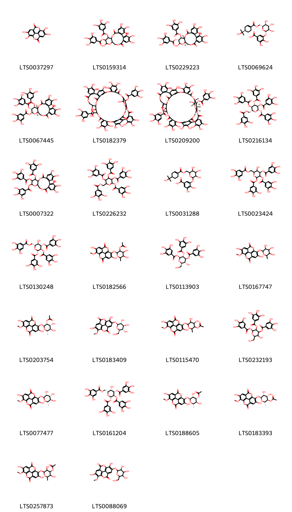{ width=100% }
    <figcaption>Hình ảnh cấu trúc hóa học của 26 hoạt chất thuộc nhóm Tannins gồm ['ellagic acid (LTS0037297)', '3,4,5,13,21,22,23-heptahydroxy-8,18-dioxo-12-(3,4,5-trihydroxybenzoyloxy)-9,14,17-trioxatetracyclo[17.4.0.0²,⁷.0¹⁰,¹⁵]tricosa-1(23),2(7),3,5,19,21-hexaen-11-yl 3,4,5-trihydroxybenzoate (LTS0159314)', '(10r,11s,12r,13r,15r)-3,4,5,13,21,22,23-heptahydroxy-8,18-dioxo-11-(3,4,5-trihydroxybenzoyloxy)-9,14,17-trioxatetracyclo[17.4.0.0²,⁷.0¹⁰,¹⁵]tricosa-1(23),2(7),3,5,19,21-hexaen-12-yl 3,4,5-trihydroxybenzoate (LTS0229223)', '3,4-dihydroxy-5-{[(2s,3r,4s,5s,6r)-3,4,5-trihydroxy-6-{[(4r)-4-(2-hydroxypropan-2-yl)cyclohex-1-ene-1-carbonyloxy]methyl}oxan-2-yl]oxy}benzoic acid (LTS0069624)', '(10r,11s,12r,13s,15r)-3,4,5,21,22,23-hexahydroxy-8,18-dioxo-12,13-bis(3,4,5-trihydroxybenzoyloxy)-9,14,17-trioxatetracyclo[17.4.0.0²,⁷.0¹⁰,¹⁵]tricosa-1(23),2(7),3,5,19,21-hexaen-11-yl 3,4,5-trihydroxybenzoate (LTS0067445)', '4,5,6,12,20,21,22,30,31,32,38,46,47,48,51,52,59,60-octadecahydroxy-9,17,35,43,55,61-hexaoxo-64-(3,4,5-trihydroxybenzoyloxy)-2,10,13,16,28,36,39,42,56,62-decaoxaundecacyclo[35.15.6.3¹⁴,²⁵.2²⁴,²⁷.1¹¹,¹⁵.0³,⁸.0¹⁸,²³.0²⁹,³⁴.0⁴⁰,⁵⁷.0⁴⁴,⁴⁹.0⁵⁰,⁵⁴]tetrahexaconta-1(53),3,5,7,18(23),19,21,24,26,29,31,33,44(49),45,47,50(54),51,59-octadecaen-58-yl 3,4,5-trihydroxybenzoate (LTS0182379)', '(11r,12s,14r,15r,37r,38r,40r,57r,58s,64s)-4,5,6,12,20,21,22,30,31,32,38,46,47,48,51,52,59,60-octadecahydroxy-9,17,35,43,55,61-hexaoxo-64-(3,4,5-trihydroxybenzoyloxy)-2,10,13,16,28,36,39,42,56,62-decaoxaundecacyclo[35.15.6.3¹⁴,²⁵.2²⁴,²⁷.1¹¹,¹⁵.0³,⁸.0¹⁸,²³.0²⁹,³⁴.0⁴⁰,⁵⁷.0⁴⁴,⁴⁹.0⁵⁰,⁵⁴]tetrahexaconta-1(53),3,5,7,18(23),19,21,24,26,29,31,33,44(49),45,47,50(54),51,59-octadecaen-58-yl 3,4,5-trihydroxybenzoate (LTS0209200)', '(2s,3r,4s,5r,6r)-3,4,5-tris(3,4,5-trihydroxybenzoyloxy)-6-[(3,4,5-trihydroxybenzoyloxy)methyl]oxan-2-yl 3,4,5-trihydroxybenzoate (LTS0216134)', '3,4,5,21,22,23-hexahydroxy-8,18-dioxo-12,13-bis(3,4,5-trihydroxybenzoyloxy)-9,14,17-trioxatetracyclo[17.4.0.0²,⁷.0¹⁰,¹⁵]tricosa-1(23),2(7),3,5,19,21-hexaen-11-yl 3,4,5-trihydroxybenzoate (LTS0007322)', '3,4,5-tris(3,4,5-trihydroxybenzoyloxy)-6-[(3,4,5-trihydroxybenzoyloxy)methyl]oxan-2-yl 3,4,5-trihydroxybenzoate (LTS0226232)', '3,4-dihydroxy-5-[(3,4,5-trihydroxy-6-{[4-(2-hydroxypropan-2-yl)cyclohex-1-ene-1-carbonyloxy]methyl}oxan-2-yl)oxy]benzoic acid (LTS0031288)', '5-hydroxy-3,4-bis(3,4,5-trihydroxybenzoyloxy)-6-[(3,4,5-trihydroxybenzoyloxy)methyl]oxan-2-yl 3,4,5-trihydroxybenzoate (LTS0023424)', '(2s,3r,4s,5r,6r)-5-hydroxy-3,4-bis(3,4,5-trihydroxybenzoyloxy)-6-[(3,4,5-trihydroxybenzoyloxy)methyl]oxan-2-yl 3,4,5-trihydroxybenzoate (LTS0130248)', '2-({6,13-dihydroxy-14-methoxy-3,10-dioxo-2,9-dioxatetracyclo[6.6.2.0⁴,¹⁶.0¹¹,¹⁵]hexadeca-1(15),4,6,8(16),11,13-hexaen-7-yl}oxy)-4,5-dihydroxy-6-methyloxan-3-yl acetate (LTS0182566)', '(2r,3r,4s,5r,6s)-3-hydroxy-2-(hydroxymethyl)-5,6-bis(3,4,5-trihydroxybenzoyloxy)oxan-4-yl 3,4,5-trihydroxybenzoate (LTS0113903)', '6,13-dihydroxy-7-methoxy-14-[(3,4,5-trihydroxy-6-methyloxan-2-yl)oxy]-2,9-dioxatetracyclo[6.6.2.0⁴,¹⁶.0¹¹,¹⁵]hexadeca-1(15),4,6,8(16),11,13-hexaene-3,10-dione (LTS0167747)', '(2s,3r,4r,5r,6s)-2-({6,13-dihydroxy-14-methoxy-3,10-dioxo-2,9-dioxatetracyclo[6.6.2.0⁴,¹⁶.0¹¹,¹⁵]hexadeca-1(15),4,6,8(16),11,13-hexaen-7-yl}oxy)-4,5-dihydroxy-6-methyloxan-3-yl acetate (LTS0203754)', '6,14-dihydroxy-7-methoxy-13-{[(2s,3r,4s,5s,6r)-3,4,5-trihydroxy-6-(hydroxymethyl)oxan-2-yl]oxy}-2,9-dioxatetracyclo[6.6.2.0⁴,¹⁶.0¹¹,¹⁵]hexadeca-1(15),4,6,8(16),11,13-hexaene-3,10-dione (LTS0183409)', '6-({6,13-dihydroxy-14-methoxy-3,10-dioxo-2,9-dioxatetracyclo[6.6.2.0⁴,¹⁶.0¹¹,¹⁵]hexadeca-1(15),4,6,8(16),11,13-hexaen-7-yl}oxy)-4,5-dihydroxy-2-methyloxan-3-yl acetate (LTS0115470)', '3-hydroxy-2-(hydroxymethyl)-5,6-bis(3,4,5-trihydroxybenzoyloxy)oxan-4-yl 3,4,5-trihydroxybenzoate (LTS0232193)', '6,13-dihydroxy-7-methoxy-14-{[(2s,3r,4r,5r,6s)-3,4,5-trihydroxy-6-methyloxan-2-yl]oxy}-2,9-dioxatetracyclo[6.6.2.0⁴,¹⁶.0¹¹,¹⁵]hexadeca-1(15),4,6,8(16),11,13-hexaene-3,10-dione (LTS0077477)', '(2s,3r,4s,5s,6r)-5-hydroxy-3,4-bis(3,4,5-trihydroxybenzoyloxy)-6-[(3,4,5-trihydroxybenzoyloxy)methyl]oxan-2-yl 3,4,5-trihydroxybenzoate (LTS0161204)', '(2s,3r,4r,5s,6s)-2-({6,13-dihydroxy-14-methoxy-3,10-dioxo-2,9-dioxatetracyclo[6.6.2.0⁴,¹⁶.0¹¹,¹⁵]hexadeca-1(15),4,6,8(16),11,13-hexaen-7-yl}oxy)-3,5-dihydroxy-6-methyloxan-4-yl acetate (LTS0188605)', '(2s,3r,4s,5r,6s)-6-({6,13-dihydroxy-14-methoxy-3,10-dioxo-2,9-dioxatetracyclo[6.6.2.0⁴,¹⁶.0¹¹,¹⁵]hexadeca-1(15),4,6,8(16),11,13-hexaen-7-yl}oxy)-4,5-dihydroxy-2-methyloxan-3-yl acetate (LTS0183393)', '2-({6,13-dihydroxy-14-methoxy-3,10-dioxo-2,9-dioxatetracyclo[6.6.2.0⁴,¹⁶.0¹¹,¹⁵]hexadeca-1(15),4,6,8(16),11,13-hexaen-7-yl}oxy)-3,5-dihydroxy-6-methyloxan-4-yl acetate (LTS0257873)', '6,14-dihydroxy-7-methoxy-13-{[3,4,5-trihydroxy-6-(hydroxymethyl)oxan-2-yl]oxy}-2,9-dioxatetracyclo[6.6.2.0⁴,¹⁶.0¹¹,¹⁵]hexadeca-1(15),4,6,8(16),11,13-hexaene-3,10-dione (LTS0088069)'].</figcaption>
</figure>
#### Nhóm Unsaturated hydrocarbons
<figure markdown="span">
    { width=100% }
    <figcaption>Hình ảnh cấu trúc hóa học của 1 hoạt chất thuộc nhóm Unsaturated hydrocarbons gồm ['α terpinene (LTS0232891)'].</figcaption>
</figure>

---

### Dược dân tộc học

Danh sách các quốc gia có sử dụng *Eucalyptus globulus* trong điều trị các bệnh. 

| Country   | Disease                                                                                                          | Bệnh                                                                                                                                                                                                |
|:----------|:-----------------------------------------------------------------------------------------------------------------|:----------------------------------------------------------------------------------------------------------------------------------------------------------------------------------------------------|
| China     | Antiseptic                                                                                                       | MYMEMORY WARNING: YOU USED ALL AVAILABLE FREE TRANSLATIONS FOR TODAY. NEXT AVAILABLE IN  06 HOURS 38 MINUTES 46 SECONDS VISIT HTTPS://MYMEMORY.TRANSLATED.NET/DOC/USAGELIMITS.PHP TO TRANSLATE MORE |
| Elsewhere | Antiseptic, Antiseptic, Diaphoretic, Expectorant, nan, Inhalant, Purgative, Vermifuge, Antiperiodic, Suppurative | MYMEMORY WARNING: YOU USED ALL AVAILABLE FREE TRANSLATIONS FOR TODAY. NEXT AVAILABLE IN  06 HOURS 38 MINUTES 43 SECONDS VISIT HTTPS://MYMEMORY.TRANSLATED.NET/DOC/USAGELIMITS.PHP TO TRANSLATE MORE |
| Turkey    | Astringent, Deodorant, Stimulant, Antiseptic, Hemostat                                                           | MYMEMORY WARNING: YOU USED ALL AVAILABLE FREE TRANSLATIONS FOR TODAY. NEXT AVAILABLE IN  06 HOURS 38 MINUTES 40 SECONDS VISIT HTTPS://MYMEMORY.TRANSLATED.NET/DOC/USAGELIMITS.PHP TO TRANSLATE MORE |

---

---
## Eucalyptus griffithii
### Thông tin về thực vật

!!! info "Phân loại thực vật của *Eucalyptus griffithii* từ GIBF:"
    - **Kingdom:** Plantae
    - **Phylum:** Tracheophyta
    - **Order:** Myrtales
    - **Family:** Myrtaceae
    - **Genus:** Eucalyptus
    - **Species:** *Eucalyptus griffithii*

 

| Label (VI)   | Label (EN)   | Scientific Name     | Descriptions (VI)   | Descriptions (EN)   | Also Known As (VI)   | Also Known As (EN)   |
|:-------------|:-------------|:--------------------|:--------------------|:--------------------|:---------------------|:---------------------|
| N/A          | N/A          | Eucalyptus globulus | loài thực vật       | species of plant    | ['']                 | ['Blue Gum']         |

#### Phân bố trên thế giới

**Từ CSDL GIBF** Mexico, Algeria, United States of America, Portugal, Pakistan, South Africa, Australia, Chile, New Zealand, Colombia, India, Ecuador, Peru, Bolivia (Plurinational State of), Spain

#### Phân bố tại Việt Nam

**Từ CSDL GIBF**: Không có ghi nhận ở Việt Nam

---
### Thành phần hóa học
        
- Theo cơ sở dữ liệu lotus: Từ loài *Eucalyptus griffithii* đã phân lập và xác định được Chưa có hoạt chất nào được phân lập. hoạt chất thuộc về các nhóm Không có hoạt chất nào được phân lập. 

Không có hình ảnh nào được tạo ra

---

### Dược dân tộc học

Danh sách các quốc gia có sử dụng *Eucalyptus griffithii* trong điều trị các bệnh. 

| Country   | Disease      | Bệnh                                                                                                                                                                                                |
|:----------|:-------------|:----------------------------------------------------------------------------------------------------------------------------------------------------------------------------------------------------|
| Iraq      | Disinfectant | MYMEMORY WARNING: YOU USED ALL AVAILABLE FREE TRANSLATIONS FOR TODAY. NEXT AVAILABLE IN  06 HOURS 37 MINUTES 12 SECONDS VISIT HTTPS://MYMEMORY.TRANSLATED.NET/DOC/USAGELIMITS.PHP TO TRANSLATE MORE |
| Turkey    | Antiseptic   | MYMEMORY WARNING: YOU USED ALL AVAILABLE FREE TRANSLATIONS FOR TODAY. NEXT AVAILABLE IN  06 HOURS 37 MINUTES 08 SECONDS VISIT HTTPS://MYMEMORY.TRANSLATED.NET/DOC/USAGELIMITS.PHP TO TRANSLATE MORE |

---

---
## Eucalyptus incrassata
### Thông tin về thực vật

!!! info "Phân loại thực vật của *Eucalyptus incrassata* từ GIBF:"
    - **Kingdom:** Plantae
    - **Phylum:** Tracheophyta
    - **Order:** Myrtales
    - **Family:** Myrtaceae
    - **Genus:** Eucalyptus
    - **Species:** *Eucalyptus incrassata*

 

| Label (VI)   | Label (EN)   | Scientific Name       | Descriptions (VI)   | Descriptions (EN)                     | Also Known As (VI)   | Also Known As (EN)                                                             |
|:-------------|:-------------|:----------------------|:--------------------|:--------------------------------------|:---------------------|:-------------------------------------------------------------------------------|
| N/A          | N/A          | Eucalyptus incrassata | loài thực vật       | species of plant endemic to Australia | ['']                 | ['rib fruited mallee', 'lerp mallee', 'ridge fruited mallee', 'yellow mallee'] |

#### Phân bố trên thế giới

**Từ CSDL GIBF** Australia

#### Phân bố tại Việt Nam

**Từ CSDL GIBF**: Không có ghi nhận ở Việt Nam

---
### Thành phần hóa học
        
- Theo cơ sở dữ liệu lotus: Từ loài *Eucalyptus incrassata* đã phân lập và xác định được 54 hoạt chất thuộc về các nhóm Fatty Acyls, Benzene and substituted derivatives, Unsaturated hydrocarbons, Steroids and steroid derivatives, Organooxygen compounds, Prenol lipids, Benzopyrans. 

|    | chemicalTaxonomyClassyfireClass     |   smiles_count |
|---:|:------------------------------------|---------------:|
|  0 | Benzene and substituted derivatives |              1 |
|  1 | Benzopyrans                         |              4 |
|  2 | Fatty Acyls                         |              2 |
|  3 | Organooxygen compounds              |              2 |
|  4 | Prenol lipids                       |             43 |
|  5 | Steroids and steroid derivatives    |              1 |
|  6 | Unsaturated hydrocarbons            |              1 |

#### Nhóm Benzene and substituted derivatives
<figure markdown="span">
    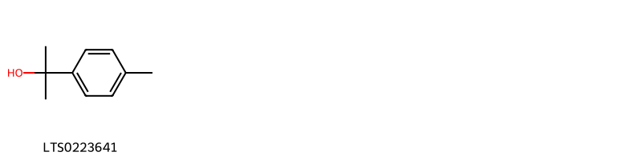{ width=100% }
    <figcaption>Hình ảnh cấu trúc hóa học của 1 hoạt chất thuộc nhóm Benzene and substituted derivatives gồm ['p-cymen-8-ol (LTS0223641)'].</figcaption>
</figure>
#### Nhóm Benzopyrans
<figure markdown="span">
    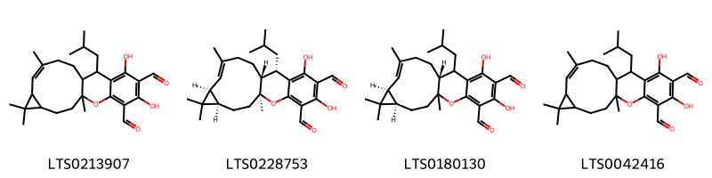{ width=100% }
    <figcaption>Hình ảnh cấu trúc hóa học của 4 hoạt chất thuộc nhóm Benzopyrans gồm ['14,16-dihydroxy-1,5,5,8-tetramethyl-12-(2-methylpropyl)-19-oxatetracyclo[9.8.0.0⁴,⁶.0¹³,¹⁸]nonadeca-7,13,15,17-tetraene-15,17-dicarbaldehyde (LTS0213907)', '(1s,4r,6s,7e,11r,12s)-14,16-dihydroxy-1,5,5,8-tetramethyl-12-(2-methylpropyl)-19-oxatetracyclo[9.8.0.0⁴,⁶.0¹³,¹⁸]nonadeca-7,13,15,17-tetraene-15,17-dicarbaldehyde (LTS0228753)', '(4r,6s,7e,11r)-14,16-dihydroxy-1,5,5,8-tetramethyl-12-(2-methylpropyl)-19-oxatetracyclo[9.8.0.0⁴,⁶.0¹³,¹⁸]nonadeca-7,13,15,17-tetraene-15,17-dicarbaldehyde (LTS0180130)', '(7z)-14,16-dihydroxy-1,5,5,8-tetramethyl-12-(2-methylpropyl)-19-oxatetracyclo[9.8.0.0⁴,⁶.0¹³,¹⁸]nonadeca-7,13,15,17-tetraene-15,17-dicarbaldehyde (LTS0042416)'].</figcaption>
</figure>
#### Nhóm Fatty Acyls
<figure markdown="span">
    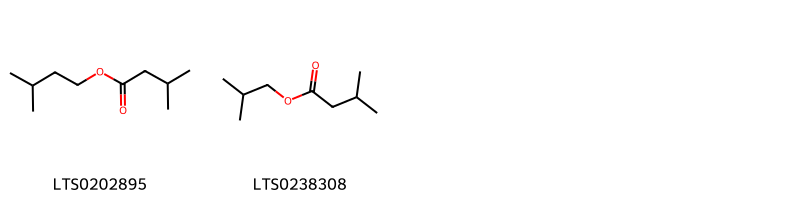{ width=100% }
    <figcaption>Hình ảnh cấu trúc hóa học của 2 hoạt chất thuộc nhóm Fatty Acyls gồm ['apple oil (LTS0202895)', 'isobutyl isovalerate (LTS0238308)'].</figcaption>
</figure>
#### Nhóm Organooxygen compounds
<figure markdown="span">
    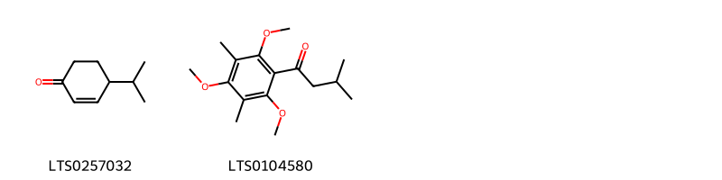{ width=100% }
    <figcaption>Hình ảnh cấu trúc hóa học của 2 hoạt chất thuộc nhóm Organooxygen compounds gồm ['4-isopropyl-2-cyclohexenone (LTS0257032)', '3-methyl-1-(2,4,6-trimethoxy-3,5-dimethylphenyl)butan-1-one (LTS0104580)'].</figcaption>
</figure>
#### Nhóm Prenol lipids
<figure markdown="span">
    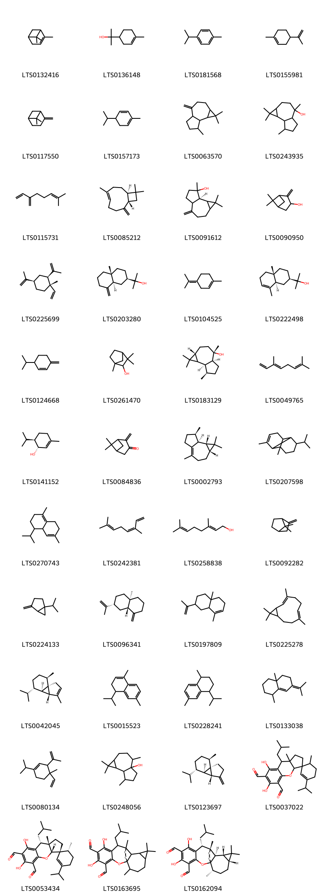{ width=100% }
    <figcaption>Hình ảnh cấu trúc hóa học của 43 hoạt chất thuộc nhóm Prenol lipids gồm ['α pinene (LTS0132416)', 'terpineol (LTS0136148)', 'cymene (LTS0181568)', 'limonene,  (LTS0155981)', 'β-pinene (LTS0117550)', 'phellandrene (LTS0157173)', '1,1,7-trimethyl-4-methylidene-octahydro-1ah-cyclopropa[e]azulene (LTS0063570)', 'ledol (LTS0243935)', 'α-myrcene (LTS0115731)', 'caryophyllene (LTS0085212)', '(7ar)-1,1,7-trimethyl-4-methylidene-octahydrocyclopropa[e]azulen-7-ol (LTS0091612)', 'pinocarveol (LTS0090950)', 'β-elemene (LTS0225699)', 'β-eudesmol (LTS0203280)', 'terpinolene (LTS0104525)', 'α-eudesmol (LTS0222498)', 'β phellandrene (LTS0124668)', 'fenchol (LTS0261470)', 'viridiflorol (LTS0183129)', 'trans-β-ocimene (LTS0049765)', '(+)-trans-piperitenol (LTS0141152)', 'pinocarvone (LTS0084836)', 'leden (LTS0002793)', 'α-copaene (LTS0207598)', '4-isopropyl-1,6-dimethyl-2,3,4,4a,7,8-hexahydronaphthalene (LTS0270743)', 'β-ocimene (LTS0242381)', 'geraniol (LTS0258838)', '7,7-dimethyl-2-methylidenebicyclo[2.2.1]heptane (LTS0092282)', 'sabinene (LTS0224133)', 'β-selinene (LTS0096341)', 'selinene (LTS0197809)', '(2e,6e)-3,7,11,11-tetramethylbicyclo[8.1.0]undeca-2,6-diene (LTS0225278)', '(-)-α-cubebene (LTS0042045)', '3,4-dihydrocadalene (LTS0015523)', '(e)-calamene (LTS0228241)', '1,4a-dimethyl-7-(propan-2-ylidene)-1,2,3,4,5,6-hexahydronaphthalene (LTS0133038)', '4-ethenyl-1-isopropyl-4-methyl-3-(prop-1-en-2-yl)cyclohex-1-ene (LTS0080134)', '1,1,4,7-tetramethyl-octahydro-1ah-cyclopropa[e]azulen-4a-ol (LTS0248056)', '(-)-β-cubebene (LTS0123697)', "10',12'-dihydroxy-3-isopropyl-6,7'-dimethyl-8'-(2-methylpropyl)-2'-oxaspiro[cyclohexane-1,4'-tricyclo[7.4.0.0³,⁷]tridecane]-1'(13'),2,9',11'-tetraene-11',13'-dicarbaldehyde (LTS0037022)", "(1r,3'r,6r,7's,8'r)-10',12'-dihydroxy-3-isopropyl-6,7'-dimethyl-8'-(2-methylpropyl)-2'-oxaspiro[cyclohexane-1,4'-tricyclo[7.4.0.0³,⁷]tridecane]-1'(13'),2,9',11'-tetraene-11',13'-dicarbaldehyde (LTS0053434)", '5,7-dihydroxy-10,13,13,17-tetramethyl-9-(2-methylpropyl)-2-oxapentacyclo[8.7.2.0¹,¹¹.0³,⁸.0¹²,¹⁴]nonadeca-3,5,7-triene-4,6-dicarbaldehyde (LTS0163695)', '(1s,9r,10r,11r,12r,14r,17s)-5,7-dihydroxy-10,13,13,17-tetramethyl-9-(2-methylpropyl)-2-oxapentacyclo[8.7.2.0¹,¹¹.0³,⁸.0¹²,¹⁴]nonadeca-3,5,7-triene-4,6-dicarbaldehyde (LTS0162094)'].</figcaption>
</figure>
#### Nhóm Steroids and steroid derivatives
<figure markdown="span">
    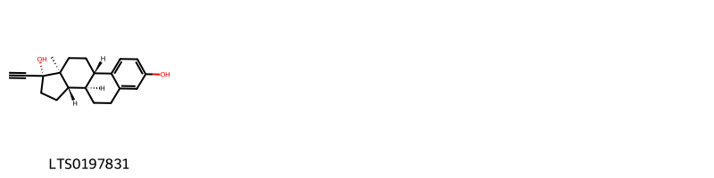{ width=100% }
    <figcaption>Hình ảnh cấu trúc hóa học của 1 hoạt chất thuộc nhóm Steroids and steroid derivatives gồm ['ethinyl estradiol (LTS0197831)'].</figcaption>
</figure>
#### Nhóm Unsaturated hydrocarbons
<figure markdown="span">
    { width=100% }
    <figcaption>Hình ảnh cấu trúc hóa học của 1 hoạt chất thuộc nhóm Unsaturated hydrocarbons gồm ['α terpinene (LTS0232891)'].</figcaption>
</figure>

---

### Dược dân tộc học

Danh sách các quốc gia có sử dụng *Eucalyptus incrassata* trong điều trị các bệnh. 

| Country   | Disease      | Bệnh                                                                                                                                                                                                |
|:----------|:-------------|:----------------------------------------------------------------------------------------------------------------------------------------------------------------------------------------------------|
| Iraq      | Antiseptic   | MYMEMORY WARNING: YOU USED ALL AVAILABLE FREE TRANSLATIONS FOR TODAY. NEXT AVAILABLE IN  06 HOURS 36 MINUTES 39 SECONDS VISIT HTTPS://MYMEMORY.TRANSLATED.NET/DOC/USAGELIMITS.PHP TO TRANSLATE MORE |
| Turkey    | Disinfectant | MYMEMORY WARNING: YOU USED ALL AVAILABLE FREE TRANSLATIONS FOR TODAY. NEXT AVAILABLE IN  06 HOURS 36 MINUTES 32 SECONDS VISIT HTTPS://MYMEMORY.TRANSLATED.NET/DOC/USAGELIMITS.PHP TO TRANSLATE MORE |

---

---
## Eucalyptus microtheca
### Thông tin về thực vật

!!! info "Phân loại thực vật của *Eucalyptus microtheca* từ GIBF:"
    - **Kingdom:** Plantae
    - **Phylum:** Tracheophyta
    - **Order:** Myrtales
    - **Family:** Myrtaceae
    - **Genus:** Eucalyptus
    - **Species:** *Eucalyptus microtheca*

 

| Label (VI)   | Label (EN)   | Scientific Name       | Descriptions (VI)   | Descriptions (EN)   | Also Known As (VI)   | Also Known As (EN)   |
|:-------------|:-------------|:----------------------|:--------------------|:--------------------|:---------------------|:---------------------|
| N/A          | N/A          | Eucalyptus microtheca | loài thực vật       | species of plant    | ['']                 | ['']                 |

#### Phân bố trên thế giới

**Từ CSDL GIBF** Australia, United States of America

#### Phân bố tại Việt Nam

**Từ CSDL GIBF**: Không có ghi nhận ở Việt Nam

---
### Thành phần hóa học
        
- Theo cơ sở dữ liệu lotus: Từ loài *Eucalyptus microtheca* đã phân lập và xác định được Chưa có hoạt chất nào được phân lập. hoạt chất thuộc về các nhóm Không có hoạt chất nào được phân lập. 

Không có hình ảnh nào được tạo ra

---

### Dược dân tộc học

Danh sách các quốc gia có sử dụng *Eucalyptus microtheca* trong điều trị các bệnh. 

| Country   | Disease      | Bệnh                                                                                                                                                                                                |
|:----------|:-------------|:----------------------------------------------------------------------------------------------------------------------------------------------------------------------------------------------------|
| Iraq      | Disinfectant | MYMEMORY WARNING: YOU USED ALL AVAILABLE FREE TRANSLATIONS FOR TODAY. NEXT AVAILABLE IN  06 HOURS 35 MINUTES 36 SECONDS VISIT HTTPS://MYMEMORY.TRANSLATED.NET/DOC/USAGELIMITS.PHP TO TRANSLATE MORE |
| Turkey    | Antiseptic   | MYMEMORY WARNING: YOU USED ALL AVAILABLE FREE TRANSLATIONS FOR TODAY. NEXT AVAILABLE IN  06 HOURS 35 MINUTES 32 SECONDS VISIT HTTPS://MYMEMORY.TRANSLATED.NET/DOC/USAGELIMITS.PHP TO TRANSLATE MORE |

---

---
## Eucalyptus rostrata
### Thông tin về thực vật

!!! info "Phân loại thực vật của *N/A* từ GIBF:"
    - **Kingdom:** Plantae
    - **Phylum:** Tracheophyta
    - **Order:** Myrtales
    - **Family:** Myrtaceae
    - **Genus:** Eucalyptus
    - **Species:** *N/A*

 

| Label (VI)   | Label (EN)   | Scientific Name     | Descriptions (VI)   | Descriptions (EN)   | Also Known As (VI)   | Also Known As (EN)   |
|:-------------|:-------------|:--------------------|:--------------------|:--------------------|:---------------------|:---------------------|
| N/A          | N/A          | Eucalyptus rostrata | loài thực vật       | species of plant    | ['']                 | ['']                 |

#### Phân bố trên thế giới

**Từ CSDL GIBF** Mexico, United States of America, Portugal, Philippines, Costa Rica, South Africa, Australia, Chile, Spain, Puerto Rico

#### Phân bố tại Việt Nam

**Từ CSDL GIBF**: Không có ghi nhận ở Việt Nam

---
### Thành phần hóa học
        
- Theo cơ sở dữ liệu lotus: Từ loài *N/A* đã phân lập và xác định được Chưa có hoạt chất nào được phân lập. hoạt chất thuộc về các nhóm Không có hoạt chất nào được phân lập. 

Không có hình ảnh nào được tạo ra

---

### Dược dân tộc học

Danh sách các quốc gia có sử dụng *N/A* trong điều trị các bệnh. 

| Country   | Disease                              | Bệnh                                                                                                                                                                                                |
|:----------|:-------------------------------------|:----------------------------------------------------------------------------------------------------------------------------------------------------------------------------------------------------|
| Australia | Tonic                                | MYMEMORY WARNING: YOU USED ALL AVAILABLE FREE TRANSLATIONS FOR TODAY. NEXT AVAILABLE IN  06 HOURS 34 MINUTES 55 SECONDS VISIT HTTPS://MYMEMORY.TRANSLATED.NET/DOC/USAGELIMITS.PHP TO TRANSLATE MORE |
| Iraq      | Anesthetic, Antiseptic, Disinfectant | MYMEMORY WARNING: YOU USED ALL AVAILABLE FREE TRANSLATIONS FOR TODAY. NEXT AVAILABLE IN  06 HOURS 34 MINUTES 51 SECONDS VISIT HTTPS://MYMEMORY.TRANSLATED.NET/DOC/USAGELIMITS.PHP TO TRANSLATE MORE |
| Italian   | Astringent                           | MYMEMORY WARNING: YOU USED ALL AVAILABLE FREE TRANSLATIONS FOR TODAY. NEXT AVAILABLE IN  06 HOURS 34 MINUTES 48 SECONDS VISIT HTTPS://MYMEMORY.TRANSLATED.NET/DOC/USAGELIMITS.PHP TO TRANSLATE MORE |
| Turkey    | Anesthetic                           | MYMEMORY WARNING: YOU USED ALL AVAILABLE FREE TRANSLATIONS FOR TODAY. NEXT AVAILABLE IN  06 HOURS 34 MINUTES 44 SECONDS VISIT HTTPS://MYMEMORY.TRANSLATED.NET/DOC/USAGELIMITS.PHP TO TRANSLATE MORE |

---

---
## Eucalyptus tarquata
### Thông tin về thực vật

!!! info "Phân loại thực vật của *Eucalyptus torquata* từ GIBF:"
    - **Kingdom:** Plantae
    - **Phylum:** Tracheophyta
    - **Order:** Myrtales
    - **Family:** Myrtaceae
    - **Genus:** Eucalyptus
    - **Species:** *Eucalyptus torquata*

 

| Label (VI)   | Label (EN)   | Scientific Name     | Descriptions (VI)   | Descriptions (EN)   | Also Known As (VI)   | Also Known As (EN)   |
|:-------------|:-------------|:--------------------|:--------------------|:--------------------|:---------------------|:---------------------|
| N/A          | N/A          | Eucalyptus rostrata | loài thực vật       | species of plant    | ['']                 | ['']                 |

#### Phân bố trên thế giới

**Từ CSDL GIBF** Morocco, United States of America, Japan, South Africa, Australia, Tunisia, New Zealand, Tanzania, United Republic of, Cyprus, Yemen, France, Spain, Bolivia (Plurinational State of)

#### Phân bố tại Việt Nam

**Từ CSDL GIBF**: Không có ghi nhận ở Việt Nam

---
### Thành phần hóa học
        
- Theo cơ sở dữ liệu lotus: Từ loài *Eucalyptus torquata* đã phân lập và xác định được Chưa có hoạt chất nào được phân lập. hoạt chất thuộc về các nhóm Không có hoạt chất nào được phân lập. 

Không có hình ảnh nào được tạo ra

---

### Dược dân tộc học

Danh sách các quốc gia có sử dụng *Eucalyptus torquata* trong điều trị các bệnh. 

| Country   | Disease      | Bệnh                                                                                                                                                                                                |
|:----------|:-------------|:----------------------------------------------------------------------------------------------------------------------------------------------------------------------------------------------------|
| Iraq      | Disinfectant | MYMEMORY WARNING: YOU USED ALL AVAILABLE FREE TRANSLATIONS FOR TODAY. NEXT AVAILABLE IN  06 HOURS 34 MINUTES 09 SECONDS VISIT HTTPS://MYMEMORY.TRANSLATED.NET/DOC/USAGELIMITS.PHP TO TRANSLATE MORE |
| Turkey    | Antiseptic   | MYMEMORY WARNING: YOU USED ALL AVAILABLE FREE TRANSLATIONS FOR TODAY. NEXT AVAILABLE IN  06 HOURS 34 MINUTES 06 SECONDS VISIT HTTPS://MYMEMORY.TRANSLATED.NET/DOC/USAGELIMITS.PHP TO TRANSLATE MORE |

---

# Chi Melaleuca

??? note "Danh sách các dược liệu thuộc chi"
    
	 - *Melaleuca alternifolia*
	 - *Melaleuca leucadendron*
	 - *Melaleuca linariifolia*
	 - *Melaleuca viridiflora*

---
## Melaleuca alternifolia
### Thông tin về thực vật

!!! info "Phân loại thực vật của *Melaleuca alternifolia* từ GIBF:"
    - **Kingdom:** Plantae
    - **Phylum:** Tracheophyta
    - **Order:** Myrtales
    - **Family:** Myrtaceae
    - **Genus:** Melaleuca
    - **Species:** *Melaleuca alternifolia*

 

| Label (VI)   | Label (EN)   | Scientific Name        | Descriptions (VI)   | Descriptions (EN)   | Also Known As (VI)   | Also Known As (EN)   |
|:-------------|:-------------|:-----------------------|:--------------------|:--------------------|:---------------------|:---------------------|
| N/A          | N/A          | Melaleuca alternifolia | loài thực vật       | species of plant    | ['']                 | ['']                 |

#### Phân bố trên thế giới

**Từ CSDL GIBF** Brazil, Kenya, Chinese Taipei, South Africa, Australia, New Zealand, Jordan

#### Phân bố tại Việt Nam

**Từ CSDL GIBF**: Không có ghi nhận ở Việt Nam

---
### Thành phần hóa học
        
- Theo cơ sở dữ liệu lotus: Từ loài *Melaleuca alternifolia* đã phân lập và xác định được 68 hoạt chất thuộc về các nhóm Benzene and substituted derivatives, Unsaturated hydrocarbons, Oxanes, Organooxygen compounds, Prenol lipids. 

|    | chemicalTaxonomyClassyfireClass     |   smiles_count |
|---:|:------------------------------------|---------------:|
|  0 | Benzene and substituted derivatives |              2 |
|  1 | Organooxygen compounds              |              2 |
|  2 | Oxanes                              |              1 |
|  3 | Prenol lipids                       |             61 |
|  4 | Unsaturated hydrocarbons            |              1 |

#### Nhóm Benzene and substituted derivatives
<figure markdown="span">
    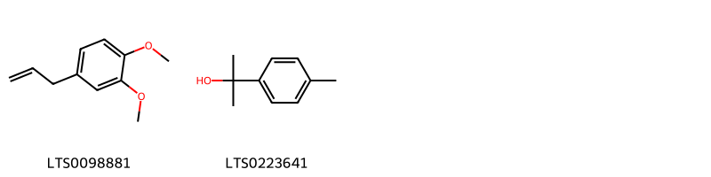{ width=100% }
    <figcaption>Hình ảnh cấu trúc hóa học của 2 hoạt chất thuộc nhóm Benzene and substituted derivatives gồm ['methyl eugenol (LTS0098881)', 'p-cymen-8-ol (LTS0223641)'].</figcaption>
</figure>
#### Nhóm Organooxygen compounds
<figure markdown="span">
    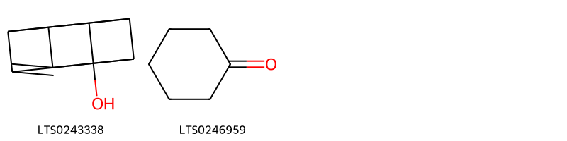{ width=100% }
    <figcaption>Hình ảnh cấu trúc hóa học của 2 hoạt chất thuộc nhóm Organooxygen compounds gồm ['3,4,5,8-tetrahydro-2h-cuban-1-ol (LTS0243338)', 'cyclohexanone (LTS0246959)'].</figcaption>
</figure>
#### Nhóm Oxanes
<figure markdown="span">
    { width=100% }
    <figcaption>Hình ảnh cấu trúc hóa học của 1 hoạt chất thuộc nhóm Oxanes gồm ['1,8-cineole (LTS0166505)'].</figcaption>
</figure>
#### Nhóm Prenol lipids
<figure markdown="span">
    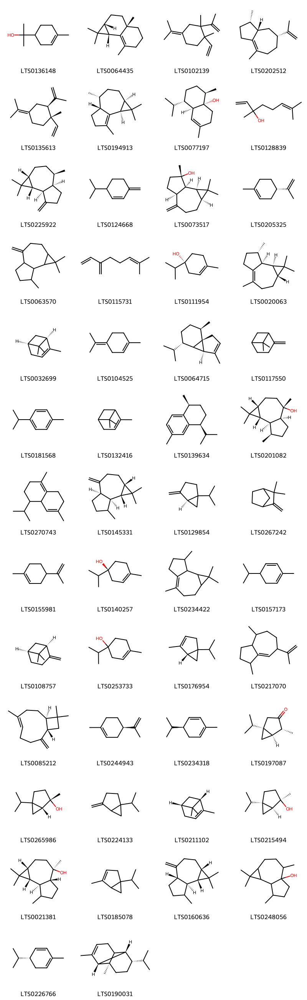{ width=100% }
    <figcaption>Hình ảnh cấu trúc hóa học của 61 hoạt chất thuộc nhóm Prenol lipids gồm ['terpineol (LTS0136148)', '(1ar,3as,7bs)-1,1,3a,7-tetramethyl-1ah,2h,3h,4h,5h,6h,7bh-cyclopropa[a]naphthalene (LTS0064435)', '1-ethenyl-1,2-dimethyl-2-(prop-1-en-2-yl)-4-(propan-2-ylidene)cyclohexane (LTS0102139)', 'α-bulnesene (LTS0202512)', '(1s,2s)-1-ethenyl-1-methyl-2-(prop-1-en-2-yl)-4-(propan-2-ylidene)cyclohexane (LTS0135613)', '(-)-α-gurjunene (LTS0194913)', '(1s,4r,4as,8ar)-1-isopropyl-4,7-dimethyl-2,3,4,5,6,8a-hexahydro-1h-naphthalen-4a-ol (LTS0077197)', 'linalool, (+-)- (LTS0128839)', 'β-gurjunene (LTS0225922)', 'β phellandrene (LTS0124668)', '(1as,4as,7s,7ar,7bs)-1,1,7-trimethyl-4-methylidene-octahydrocyclopropa[e]azulen-7-ol (LTS0073517)', '(-)-limonene (LTS0205325)', '1,1,7-trimethyl-4-methylidene-octahydro-1ah-cyclopropa[e]azulene (LTS0063570)', 'α-myrcene (LTS0115731)', '(-)-4-terpineol (LTS0111954)', '(1ar,7s,7as,7bs)-1,1,4,7-tetramethyl-1ah,2h,3h,5h,6h,7h,7ah,7bh-cyclopropa[e]azulene (LTS0020063)', '(-)-α-pinene (LTS0032699)', 'terpinolene (LTS0104525)', '(1s,5r,7s,10r)-7-isopropyl-4,10-dimethyltricyclo[4.4.0.0¹,⁵]dec-3-ene (LTS0064715)', 'β-pinene (LTS0117550)', 'cymene (LTS0181568)', 'α pinene (LTS0132416)', '(1s,4s)-4-isopropyl-1,6-dimethyl-1,2,3,4-tetrahydronaphthalene (LTS0139634)', '(+)-ledol (LTS0201082)', '4-isopropyl-1,6-dimethyl-2,3,4,4a,7,8-hexahydronaphthalene (LTS0270743)', '(1as,4ar,7as,7br)-1,1,7-trimethyl-4-methylidene-octahydro-1ah-cyclopropa[e]azulene (LTS0145331)', '(5s)-1-isopropyl-4-methylidenebicyclo[3.1.0]hexane (LTS0129854)', 'camphene (LTS0267242)', 'limonene,  (LTS0155981)', '(+)-4-terpineol (LTS0140257)', '1,1,4,7-tetramethyl-1ah,2h,3h,5h,6h,7h,7ah,7bh-cyclopropa[e]azulene (LTS0234422)', 'phellandrene (LTS0157173)', '(-)-β-pinene (LTS0108757)', '4-terpineol (LTS0253733)', 'α-thujene (LTS0176954)', '1,4-dimethyl-7-(prop-1-en-2-yl)-1,2,3,3a,4,5,6,7-octahydroazulene (LTS0217070)', 'caryophyllene (LTS0085212)', 'α-limonene (LTS0244943)', '(+)-α-phellandrene (LTS0234318)', 'thujone (LTS0197087)', '(1r,2s)-5-isopropyl-2-methylbicyclo[3.1.0]hexan-2-ol (LTS0265986)', 'sabinene (LTS0224133)', '(+)-α-pinene (LTS0211102)', 'sabinene hydrate (LTS0215494)', '(1ar,4r,4ar,7as,7bs)-1,1,4,7-tetramethyl-octahydro-1ah-cyclopropa[e]azulen-4-ol (LTS0021381)', 'α-thujene (LTS0185078)', '(1as,4as,7as,7br)-1,1,7-trimethyl-4-methylidene-octahydro-1ah-cyclopropa[e]azulene (LTS0160636)', '1,1,4,7-tetramethyl-octahydro-1ah-cyclopropa[e]azulen-4a-ol (LTS0248056)', '(-)-α-phellandrene (LTS0226766)', '(1r,2s,7s,8s)-8-isopropyl-1,3-dimethyltricyclo[4.4.0.0²,⁷]dec-3-ene (LTS0190031)', '(+)-α-terpineol (LTS0258249)', '(1ar,4s,4ar,7as,7br)-1,1,4,7-tetramethyl-octahydro-1ah-cyclopropa[e]azulen-4-ol (LTS0050572)', 'lily of valley (LTS0051762)', 'terpinene (LTS0136858)', 'α-muurolene (LTS0022607)', '(1s,2e,10r)-3,7,11,11-tetramethylbicyclo[8.1.0]undeca-2,6-diene (LTS0032090)', 'leden (LTS0002793)', '(1s,4r,4ar,8ar)-1-isopropyl-4,7-dimethyl-2,3,4,5,6,8a-hexahydro-1h-naphthalen-4a-ol (LTS0018576)', 'delta-cadinene (LTS0019321)', '(-)-β-cubebene (LTS0123697)', 'trans-muurola-4(14),5-diene (LTS0255859)'].</figcaption>
</figure>
#### Nhóm Unsaturated hydrocarbons
<figure markdown="span">
    { width=100% }
    <figcaption>Hình ảnh cấu trúc hóa học của 1 hoạt chất thuộc nhóm Unsaturated hydrocarbons gồm ['α terpinene (LTS0232891)'].</figcaption>
</figure>

---

### Dược dân tộc học

Danh sách các quốc gia có sử dụng *Melaleuca alternifolia* trong điều trị các bệnh. 

| Country   | Disease    | Bệnh                                                                                                                                                                                                |
|:----------|:-----------|:----------------------------------------------------------------------------------------------------------------------------------------------------------------------------------------------------|
| Australia | Antiseptic | MYMEMORY WARNING: YOU USED ALL AVAILABLE FREE TRANSLATIONS FOR TODAY. NEXT AVAILABLE IN  06 HOURS 33 MINUTES 27 SECONDS VISIT HTTPS://MYMEMORY.TRANSLATED.NET/DOC/USAGELIMITS.PHP TO TRANSLATE MORE |

---

---
## Melaleuca leucadendron
### Thông tin về thực vật

!!! info "Phân loại thực vật của *Melaleuca leucadendra* từ GIBF:"
    - **Kingdom:** Plantae
    - **Phylum:** Tracheophyta
    - **Order:** Myrtales
    - **Family:** Myrtaceae
    - **Genus:** Melaleuca
    - **Species:** *Melaleuca leucadendra*

 

| Label (VI)   | Label (EN)   | Scientific Name        | Descriptions (VI)   | Descriptions (EN)   | Also Known As (VI)   | Also Known As (EN)   |
|:-------------|:-------------|:-----------------------|:--------------------|:--------------------|:---------------------|:---------------------|
| N/A          | N/A          | Melaleuca alternifolia | loài thực vật       | species of plant    | ['']                 | ['']                 |

#### Phân bố trên thế giới

**Từ CSDL GIBF** nan, Hong Kong, Brazil, United States of America, El Salvador, Bangladesh, Indonesia, Chinese Taipei, Gabon, Australia, India, Papua New Guinea, French Guiana, Cayman Islands

#### Phân bố tại Việt Nam

**Từ CSDL GIBF**: Không có ghi nhận ở Việt Nam

---
### Thành phần hóa học
        
- Theo cơ sở dữ liệu lotus: Từ loài *Melaleuca leucadendra* đã phân lập và xác định được Chưa có hoạt chất nào được phân lập. hoạt chất thuộc về các nhóm Không có hoạt chất nào được phân lập. 

Không có hình ảnh nào được tạo ra

---

### Dược dân tộc học

Danh sách các quốc gia có sử dụng *Melaleuca leucadendra* trong điều trị các bệnh. 

| Country   | Disease                                                                   | Bệnh                                                                                                                                                                                                |
|:----------|:--------------------------------------------------------------------------|:----------------------------------------------------------------------------------------------------------------------------------------------------------------------------------------------------|
| Elsewhere | Carminative, Pediculicide, Pulicide, Vermifuge, Carminative, Parasiticide | MYMEMORY WARNING: YOU USED ALL AVAILABLE FREE TRANSLATIONS FOR TODAY. NEXT AVAILABLE IN  06 HOURS 32 MINUTES 51 SECONDS VISIT HTTPS://MYMEMORY.TRANSLATED.NET/DOC/USAGELIMITS.PHP TO TRANSLATE MORE |
| Turkey    | Astringent, Rubefacient, Sedative, Stimulant, Emollient                   | MYMEMORY WARNING: YOU USED ALL AVAILABLE FREE TRANSLATIONS FOR TODAY. NEXT AVAILABLE IN  06 HOURS 32 MINUTES 46 SECONDS VISIT HTTPS://MYMEMORY.TRANSLATED.NET/DOC/USAGELIMITS.PHP TO TRANSLATE MORE |
| US        | Expectorant, Parasiticide, Vermifuge                                      | MYMEMORY WARNING: YOU USED ALL AVAILABLE FREE TRANSLATIONS FOR TODAY. NEXT AVAILABLE IN  06 HOURS 32 MINUTES 41 SECONDS VISIT HTTPS://MYMEMORY.TRANSLATED.NET/DOC/USAGELIMITS.PHP TO TRANSLATE MORE |

---

---
## Melaleuca linariifolia
### Thông tin về thực vật

!!! info "Phân loại thực vật của *Melaleuca linariifolia* từ GIBF:"
    - **Kingdom:** Plantae
    - **Phylum:** Tracheophyta
    - **Order:** Myrtales
    - **Family:** Myrtaceae
    - **Genus:** Melaleuca
    - **Species:** *Melaleuca linariifolia*

 

| Label (VI)   | Label (EN)   | Scientific Name        | Descriptions (VI)   | Descriptions (EN)   | Also Known As (VI)   | Also Known As (EN)   |
|:-------------|:-------------|:-----------------------|:--------------------|:--------------------|:---------------------|:---------------------|
| N/A          | N/A          | Melaleuca linariifolia | loài thực vật       | species of plant    | ['']                 | ['']                 |

#### Phân bố trên thế giới

**Từ CSDL GIBF** United States of America, Philippines, China, Australia, South Africa

#### Phân bố tại Việt Nam

**Từ CSDL GIBF**: Không có ghi nhận ở Việt Nam

---
### Thành phần hóa học
        
- Theo cơ sở dữ liệu lotus: Từ loài *Melaleuca linariifolia* đã phân lập và xác định được 27 hoạt chất thuộc về các nhóm Prenol lipids, Organooxygen compounds, Unsaturated hydrocarbons. 

|    | chemicalTaxonomyClassyfireClass   |   smiles_count |
|---:|:----------------------------------|---------------:|
|  0 | Organooxygen compounds            |              1 |
|  1 | Prenol lipids                     |             25 |
|  2 | Unsaturated hydrocarbons          |              1 |

#### Nhóm Organooxygen compounds
<figure markdown="span">
    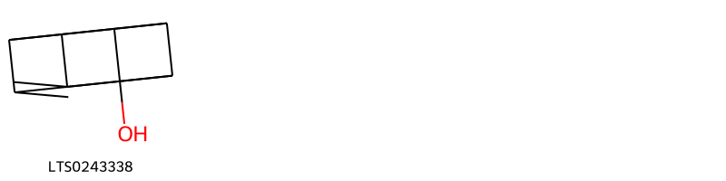{ width=100% }
    <figcaption>Hình ảnh cấu trúc hóa học của 1 hoạt chất thuộc nhóm Organooxygen compounds gồm ['3,4,5,8-tetrahydro-2h-cuban-1-ol (LTS0243338)'].</figcaption>
</figure>
#### Nhóm Prenol lipids
<figure markdown="span">
    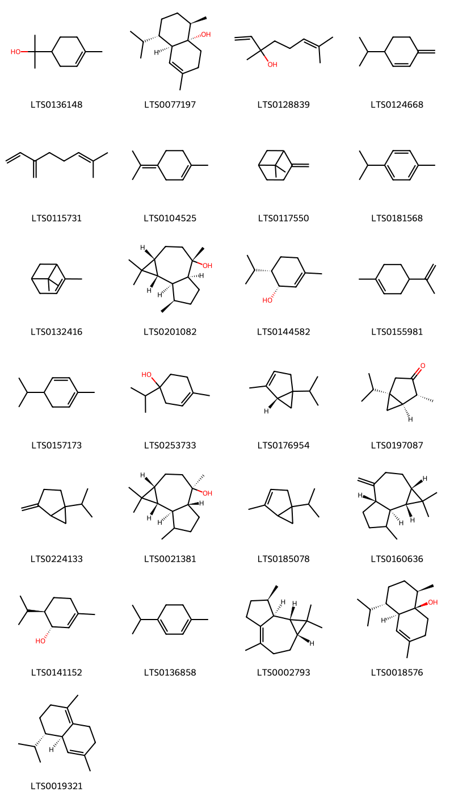{ width=100% }
    <figcaption>Hình ảnh cấu trúc hóa học của 25 hoạt chất thuộc nhóm Prenol lipids gồm ['terpineol (LTS0136148)', '(1s,4r,4as,8ar)-1-isopropyl-4,7-dimethyl-2,3,4,5,6,8a-hexahydro-1h-naphthalen-4a-ol (LTS0077197)', 'linalool, (+-)- (LTS0128839)', 'β phellandrene (LTS0124668)', 'α-myrcene (LTS0115731)', 'terpinolene (LTS0104525)', 'β-pinene (LTS0117550)', 'cymene (LTS0181568)', 'α pinene (LTS0132416)', '(+)-ledol (LTS0201082)', '(1r,6s)-6-isopropyl-3-methylcyclohex-2-en-1-ol (LTS0144582)', 'limonene,  (LTS0155981)', 'phellandrene (LTS0157173)', '4-terpineol (LTS0253733)', 'α-thujene (LTS0176954)', 'thujone (LTS0197087)', 'sabinene (LTS0224133)', '(1ar,4r,4ar,7as,7bs)-1,1,4,7-tetramethyl-octahydro-1ah-cyclopropa[e]azulen-4-ol (LTS0021381)', 'α-thujene (LTS0185078)', '(1as,4as,7as,7br)-1,1,7-trimethyl-4-methylidene-octahydro-1ah-cyclopropa[e]azulene (LTS0160636)', '(+)-trans-piperitenol (LTS0141152)', 'terpinene (LTS0136858)', 'leden (LTS0002793)', '(1s,4r,4ar,8ar)-1-isopropyl-4,7-dimethyl-2,3,4,5,6,8a-hexahydro-1h-naphthalen-4a-ol (LTS0018576)', 'delta-cadinene (LTS0019321)'].</figcaption>
</figure>
#### Nhóm Unsaturated hydrocarbons
<figure markdown="span">
    { width=100% }
    <figcaption>Hình ảnh cấu trúc hóa học của 1 hoạt chất thuộc nhóm Unsaturated hydrocarbons gồm ['α terpinene (LTS0232891)'].</figcaption>
</figure>

---

### Dược dân tộc học

Danh sách các quốc gia có sử dụng *Melaleuca linariifolia* trong điều trị các bệnh. 

| Country   | Disease    | Bệnh                                                                                                                                                                                                |
|:----------|:-----------|:----------------------------------------------------------------------------------------------------------------------------------------------------------------------------------------------------|
| Australia | Antiseptic | MYMEMORY WARNING: YOU USED ALL AVAILABLE FREE TRANSLATIONS FOR TODAY. NEXT AVAILABLE IN  06 HOURS 32 MINUTES 11 SECONDS VISIT HTTPS://MYMEMORY.TRANSLATED.NET/DOC/USAGELIMITS.PHP TO TRANSLATE MORE |

---

---
## Melaleuca viridiflora
### Thông tin về thực vật

!!! info "Phân loại thực vật của *Melaleuca viridiflora* từ GIBF:"
    - **Kingdom:** Plantae
    - **Phylum:** Tracheophyta
    - **Order:** Myrtales
    - **Family:** Myrtaceae
    - **Genus:** Melaleuca
    - **Species:** *Melaleuca viridiflora*

 

| Label (VI)   | Label (EN)   | Scientific Name       | Descriptions (VI)   | Descriptions (EN)   | Also Known As (VI)   | Also Known As (EN)   |
|:-------------|:-------------|:----------------------|:--------------------|:--------------------|:---------------------|:---------------------|
| N/A          | N/A          | Melaleuca viridiflora | loài thực vật       | species of plant    | ['']                 | ['']                 |

#### Phân bố trên thế giới

**Từ CSDL GIBF** Australia

#### Phân bố tại Việt Nam

**Từ CSDL GIBF**: Không có ghi nhận ở Việt Nam

---
### Thành phần hóa học
        
- Theo cơ sở dữ liệu lotus: Từ loài *Melaleuca viridiflora* đã phân lập và xác định được 2 hoạt chất thuộc về các nhóm Cinnamic acids and derivatives. 

|    | chemicalTaxonomyClassyfireClass   |   smiles_count |
|---:|:----------------------------------|---------------:|
|  0 | Cinnamic acids and derivatives    |              2 |

#### Nhóm Cinnamic acids and derivatives
<figure markdown="span">
    { width=100% }
    <figcaption>Hình ảnh cấu trúc hóa học của 2 hoạt chất thuộc nhóm Cinnamic acids and derivatives gồm ['methyl cinnamate (LTS0083574)', 'methyl cinnamate (LTS0222336)'].</figcaption>
</figure>

---

### Dược dân tộc học

Danh sách các quốc gia có sử dụng *Melaleuca viridiflora* trong điều trị các bệnh. 

| Country       | Disease    | Bệnh                                                                                                                                                                                                |
|:--------------|:-----------|:----------------------------------------------------------------------------------------------------------------------------------------------------------------------------------------------------|
| New Caledonia | Antiseptic | MYMEMORY WARNING: YOU USED ALL AVAILABLE FREE TRANSLATIONS FOR TODAY. NEXT AVAILABLE IN  06 HOURS 31 MINUTES 29 SECONDS VISIT HTTPS://MYMEMORY.TRANSLATED.NET/DOC/USAGELIMITS.PHP TO TRANSLATE MORE |

---

# Chi Myrcia

??? note "Danh sách các dược liệu thuộc chi"
    
	 - *Myrcia citrifolia*
	 - *Myrcia lendens*

---
## Myrcia citrifolia
### Thông tin về thực vật

!!! info "Phân loại thực vật của *N/A* từ GIBF:"
    - **Kingdom:** Plantae
    - **Phylum:** Tracheophyta
    - **Order:** Myrtales
    - **Family:** Myrtaceae
    - **Genus:** Myrcia
    - **Species:** *N/A*

 

| Label (VI)   | Label (EN)   | Scientific Name   | Descriptions (VI)   | Descriptions (EN)   | Also Known As (VI)   | Also Known As (EN)   |
|:-------------|:-------------|:------------------|:--------------------|:--------------------|:---------------------|:---------------------|
| N/A          | N/A          | Myrcia citrifolia | loài thực vật       | species of plant    | ['']                 | ['']                 |

#### Phân bố trên thế giới

**Từ CSDL GIBF** Brazil, Mexico, United States of America, Dominican Republic, Colombia, Argentina, French Guiana, Uruguay, Puerto Rico

#### Phân bố tại Việt Nam

**Từ CSDL GIBF**: Không có ghi nhận ở Việt Nam

---
### Thành phần hóa học
        
- Theo cơ sở dữ liệu lotus: Từ loài *N/A* đã phân lập và xác định được 1 hoạt chất thuộc về các nhóm Flavonoids. 

|    | chemicalTaxonomyClassyfireClass   |   smiles_count |
|---:|:----------------------------------|---------------:|
|  0 | Flavonoids                        |              1 |

#### Nhóm Flavonoids
<figure markdown="span">
    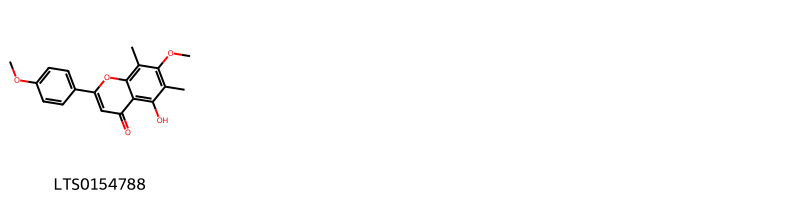{ width=100% }
    <figcaption>Hình ảnh cấu trúc hóa học của 1 hoạt chất thuộc nhóm Flavonoids gồm ['eucalyptin (LTS0154788)'].</figcaption>
</figure>

---

### Dược dân tộc học

Danh sách các quốc gia có sử dụng *N/A* trong điều trị các bệnh. 

| Country            | Disease               | Bệnh                                                                                                                                                                                                |
|:-------------------|:----------------------|:----------------------------------------------------------------------------------------------------------------------------------------------------------------------------------------------------|
| Dominican Republic | Astringent            | MYMEMORY WARNING: YOU USED ALL AVAILABLE FREE TRANSLATIONS FOR TODAY. NEXT AVAILABLE IN  06 HOURS 31 MINUTES 00 SECONDS VISIT HTTPS://MYMEMORY.TRANSLATED.NET/DOC/USAGELIMITS.PHP TO TRANSLATE MORE |
| Haiti              | Stomachic, Astringent | MYMEMORY WARNING: YOU USED ALL AVAILABLE FREE TRANSLATIONS FOR TODAY. NEXT AVAILABLE IN  06 HOURS 30 MINUTES 54 SECONDS VISIT HTTPS://MYMEMORY.TRANSLATED.NET/DOC/USAGELIMITS.PHP TO TRANSLATE MORE |

---

---
## Myrcia lendens
### Thông tin về thực vật

!!! info "Phân loại thực vật của *N/A* từ GIBF:"
    - **Kingdom:** Plantae
    - **Phylum:** Tracheophyta
    - **Order:** Myrtales
    - **Family:** Myrtaceae
    - **Genus:** Myrcia
    - **Species:** *N/A*

 

| Label (VI)   | Label (EN)   | Scientific Name   | Descriptions (VI)   | Descriptions (EN)   | Also Known As (VI)   | Also Known As (EN)   |
|:-------------|:-------------|:------------------|:--------------------|:--------------------|:---------------------|:---------------------|
| N/A          | N/A          | Myrcia citrifolia | loài thực vật       | species of plant    | ['']                 | ['']                 |

#### Phân bố trên thế giới

**Từ CSDL GIBF** Brazil, Mexico, United States of America, Dominican Republic, Colombia, Argentina, French Guiana, Uruguay, Puerto Rico

#### Phân bố tại Việt Nam

**Từ CSDL GIBF**: Không có ghi nhận ở Việt Nam

---
### Thành phần hóa học
        
- Theo cơ sở dữ liệu lotus: Từ loài *N/A* đã phân lập và xác định được Chưa có hoạt chất nào được phân lập. hoạt chất thuộc về các nhóm Không có hoạt chất nào được phân lập. 

Không có hình ảnh nào được tạo ra

---

### Dược dân tộc học

Danh sách các quốc gia có sử dụng *N/A* trong điều trị các bệnh. 

| Country   | Disease    | Bệnh                                                                                                                                                                                                |
|:----------|:-----------|:----------------------------------------------------------------------------------------------------------------------------------------------------------------------------------------------------|
| Elsewhere | Astringent | MYMEMORY WARNING: YOU USED ALL AVAILABLE FREE TRANSLATIONS FOR TODAY. NEXT AVAILABLE IN  06 HOURS 30 MINUTES 19 SECONDS VISIT HTTPS://MYMEMORY.TRANSLATED.NET/DOC/USAGELIMITS.PHP TO TRANSLATE MORE |

---

# Chi Rhodomyrtus

??? note "Danh sách các dược liệu thuộc chi"
    
	 - *Rhodomyrtus macrocarpa*
	 - *Rhodomyrtus tomentosa*

---
## Rhodomyrtus macrocarpa
### Thông tin về thực vật

!!! info "Phân loại thực vật của *Rhodomyrtus macrocarpa* từ GIBF:"
    - **Kingdom:** Plantae
    - **Phylum:** Tracheophyta
    - **Order:** Myrtales
    - **Family:** Myrtaceae
    - **Genus:** Rhodomyrtus
    - **Species:** *Rhodomyrtus macrocarpa*

 

| Label (VI)   | Label (EN)   | Scientific Name        | Descriptions (VI)   | Descriptions (EN)          | Also Known As (VI)   | Also Known As (EN)                   |
|:-------------|:-------------|:-----------------------|:--------------------|:---------------------------|:---------------------|:-------------------------------------|
| N/A          | N/A          | Rhodomyrtus macrocarpa |                     | species of flowering plant | ['']                 | ['Cooktown loquat', 'finger cherry'] |

#### Phân bố trên thế giới

**Từ CSDL GIBF** Australia, Indonesia, Papua New Guinea, unknown or invalid

#### Phân bố tại Việt Nam

**Từ CSDL GIBF**: Không có ghi nhận ở Việt Nam

---
### Thành phần hóa học
        
- Theo cơ sở dữ liệu lotus: Từ loài *Rhodomyrtus macrocarpa* đã phân lập và xác định được 7 hoạt chất thuộc về các nhóm Benzofurans. 

|    | chemicalTaxonomyClassyfireClass   |   smiles_count |
|---:|:----------------------------------|---------------:|
|  0 | Benzofurans                       |              7 |

#### Nhóm Benzofurans
<figure markdown="span">
    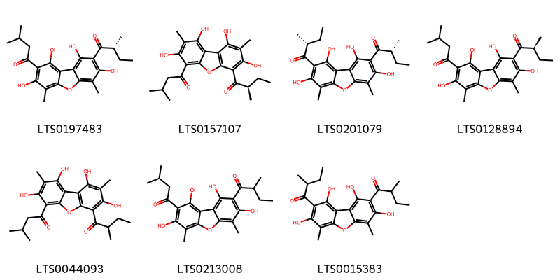{ width=100% }
    <figcaption>Hình ảnh cấu trúc hóa học của 7 hoạt chất thuộc nhóm Benzofurans gồm ['(2r)-2-methyl-1-[3,5,11,13-tetrahydroxy-6,10-dimethyl-12-(3-methylbutanoyl)-8-oxatricyclo[7.4.0.0²,⁷]trideca-1(9),2(7),3,5,10,12-hexaen-4-yl]butan-1-one (LTS0197483)', '(2r)-2-methyl-1-[3,5,11,13-tetrahydroxy-4,12-dimethyl-10-(3-methylbutanoyl)-8-oxatricyclo[7.4.0.0²,⁷]trideca-1(9),2(7),3,5,10,12-hexaen-6-yl]butan-1-one (LTS0157107)', '(2r)-2-methyl-1-{3,5,11,13-tetrahydroxy-6,10-dimethyl-12-[(2r)-2-methylbutanoyl]-8-oxatricyclo[7.4.0.0²,⁷]trideca-1(9),2(7),3,5,10,12-hexaen-4-yl}butan-1-one (LTS0201079)', '(2s)-2-methyl-1-[3,5,11,13-tetrahydroxy-6,10-dimethyl-12-(3-methylbutanoyl)-8-oxatricyclo[7.4.0.0²,⁷]trideca-1(9),2(7),3,5,10,12-hexaen-4-yl]butan-1-one (LTS0128894)', 'psi-rhodomyrtoxin (LTS0044093)', '2-methyl-1-[3,5,11,13-tetrahydroxy-6,10-dimethyl-12-(3-methylbutanoyl)-8-oxatricyclo[7.4.0.0²,⁷]trideca-1(9),2(7),3,5,10,12-hexaen-4-yl]butan-1-one (LTS0213008)', '2-methyl-1-[3,5,11,13-tetrahydroxy-6,10-dimethyl-12-(2-methylbutanoyl)-8-oxatricyclo[7.4.0.0²,⁷]trideca-1(9),2(7),3,5,10,12-hexaen-4-yl]butan-1-one (LTS0015383)'].</figcaption>
</figure>

---

### Dược dân tộc học

Danh sách các quốc gia có sử dụng *Rhodomyrtus macrocarpa* trong điều trị các bệnh. 

| Country   | Disease   | Bệnh                                                                                                                                                                                                |
|:----------|:----------|:----------------------------------------------------------------------------------------------------------------------------------------------------------------------------------------------------|
| Australia | Poison    | MYMEMORY WARNING: YOU USED ALL AVAILABLE FREE TRANSLATIONS FOR TODAY. NEXT AVAILABLE IN  06 HOURS 29 MINUTES 55 SECONDS VISIT HTTPS://MYMEMORY.TRANSLATED.NET/DOC/USAGELIMITS.PHP TO TRANSLATE MORE |

---

---
## Rhodomyrtus tomentosa
### Thông tin về thực vật

!!! info "Phân loại thực vật của *Rhodomyrtus tomentosa* từ GIBF:"
    - **Kingdom:** Plantae
    - **Phylum:** Tracheophyta
    - **Order:** Myrtales
    - **Family:** Myrtaceae
    - **Genus:** Rhodomyrtus
    - **Species:** *Rhodomyrtus tomentosa*

 

| Label (VI)   | Label (EN)   | Scientific Name       | Descriptions (VI)   | Descriptions (EN)   | Also Known As (VI)                               | Also Known As (EN)   |
|:-------------|:-------------|:----------------------|:--------------------|:--------------------|:-------------------------------------------------|:---------------------|
| N/A          | N/A          | Rhodomyrtus tomentosa | loài thực vật       | species of plant    | ['Rhodomyrtus tomentosa', 'Hồng sim', 'Hoa sim'] | ['']                 |

#### Phân bố trên thế giới

**Từ CSDL GIBF** Sri Lanka, Hong Kong, Viet Nam, United States of America, Cambodia, Macao, Indonesia, Chinese Taipei, Malaysia, China, India, Brunei Darussalam, Thailand

#### Phân bố tại Việt Nam

**Từ CSDL GIBF**: Hà Tĩnh, Quảng Nam, Kiên Giang

---
### Thành phần hóa học
        
- Theo cơ sở dữ liệu lotus: Từ loài *Rhodomyrtus tomentosa* đã phân lập và xác định được 55 hoạt chất thuộc về các nhóm Benzene and substituted derivatives, Furofurans, Flavonoids, Tannins, Anthracenes, Organooxygen compounds, Prenol lipids, Benzopyrans. 

|    | chemicalTaxonomyClassyfireClass     |   smiles_count |
|---:|:------------------------------------|---------------:|
|  0 | Anthracenes                         |              2 |
|  1 | Benzene and substituted derivatives |              2 |
|  2 | Benzopyrans                         |              6 |
|  3 | Flavonoids                          |              2 |
|  4 | Furofurans                          |              2 |
|  5 | Organooxygen compounds              |              2 |
|  6 | Prenol lipids                       |             36 |
|  7 | Tannins                             |              3 |

#### Nhóm Anthracenes
<figure markdown="span">
    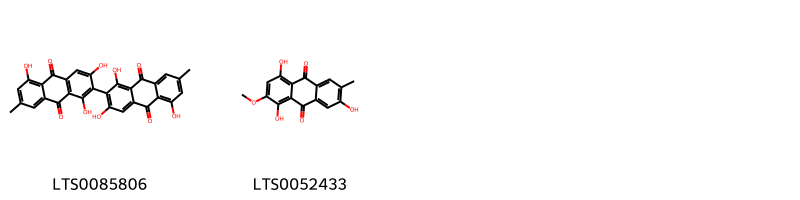{ width=100% }
    <figcaption>Hình ảnh cấu trúc hóa học của 2 hoạt chất thuộc nhóm Anthracenes gồm ["1,1',3,3',5,5'-hexahydroxy-7,7'-dimethyl-[2,2'-bianthracene]-9,9',10,10'-tetrone (LTS0085806)", '1,4,7-trihydroxy-2-methoxy-6-methylanthracene-9,10-dione (LTS0052433)'].</figcaption>
</figure>
#### Nhóm Benzene and substituted derivatives
<figure markdown="span">
    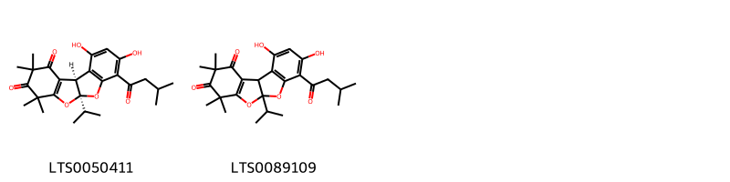{ width=100% }
    <figcaption>Hình ảnh cấu trúc hóa học của 2 hoạt chất thuộc nhóm Benzene and substituted derivatives gồm ['(1r,9r)-13,15-dihydroxy-9-isopropyl-4,4,6,6-tetramethyl-12-(3-methylbutanoyl)-8,10-dioxatetracyclo[7.7.0.0²,⁷.0¹¹,¹⁶]hexadeca-2(7),11(16),12,14-tetraene-3,5-dione (LTS0050411)', '13,15-dihydroxy-9-isopropyl-4,4,6,6-tetramethyl-12-(3-methylbutanoyl)-8,10-dioxatetracyclo[7.7.0.0²,⁷.0¹¹,¹⁶]hexadeca-2(7),11(16),12,14-tetraene-3,5-dione (LTS0089109)'].</figcaption>
</figure>
#### Nhóm Benzopyrans
<figure markdown="span">
    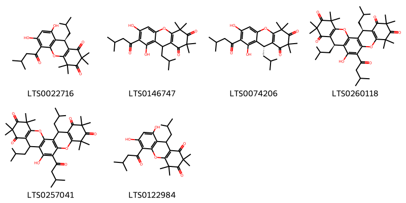{ width=100% }
    <figcaption>Hình ảnh cấu trúc hóa học của 6 hoạt chất thuộc nhóm Benzopyrans gồm ['(9r)-6,8-dihydroxy-2,2,4,4-tetramethyl-5-(3-methylbutanoyl)-9-(2-methylpropyl)-9h-xanthene-1,3-dione (LTS0022716)', '6,8-dihydroxy-2,2,4,4-tetramethyl-7-(3-methylbutanoyl)-9-(2-methylpropyl)-9h-xanthene-1,3-dione (LTS0146747)', '(9r)-6,8-dihydroxy-2,2,4,4-tetramethyl-7-(3-methylbutanoyl)-9-(2-methylpropyl)-9h-xanthene-1,3-dione (LTS0074206)', '(6r,14r)-13-hydroxy-2,2,4,4,8,8,10,10-octamethyl-12-(3-methylbutanoyl)-6,14-bis(2-methylpropyl)-6,14-dihydro-5,11-dioxapentaphene-1,3,7,9-tetrone (LTS0260118)', '13-hydroxy-2,2,4,4,8,8,10,10-octamethyl-12-(3-methylbutanoyl)-6,14-bis(2-methylpropyl)-6,14-dihydro-5,11-dioxapentaphene-1,3,7,9-tetrone (LTS0257041)', '6,8-dihydroxy-2,2,4,4-tetramethyl-5-(3-methylbutanoyl)-9-(2-methylpropyl)-9h-xanthene-1,3-dione (LTS0122984)'].</figcaption>
</figure>
#### Nhóm Flavonoids
<figure markdown="span">
    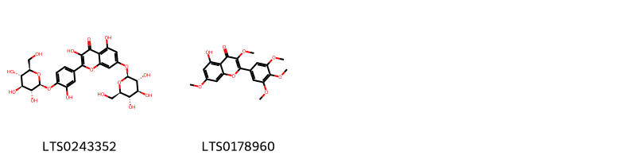{ width=100% }
    <figcaption>Hình ảnh cấu trúc hóa học của 2 hoạt chất thuộc nhóm Flavonoids gồm ['3,5-dihydroxy-2-(3-hydroxy-4-{[(2s,3r,4s,5s,6r)-3,4,5-trihydroxy-6-(hydroxymethyl)oxan-2-yl]oxy}phenyl)-7-{[(2s,3r,4s,5s,6r)-3,4,5-trihydroxy-6-(hydroxymethyl)oxan-2-yl]oxy}chromen-4-one (LTS0243352)', 'combretol (LTS0178960)'].</figcaption>
</figure>
#### Nhóm Furofurans
<figure markdown="span">
    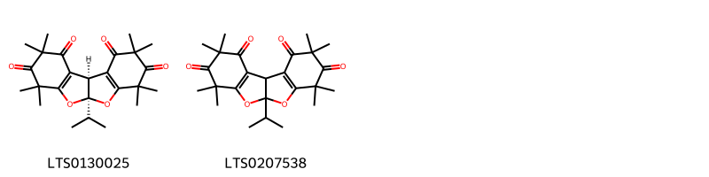{ width=100% }
    <figcaption>Hình ảnh cấu trúc hóa học của 2 hoạt chất thuộc nhóm Furofurans gồm ['(1r,9s)-9-isopropyl-4,4,6,6,12,12,14,14-octamethyl-8,10-dioxatetracyclo[7.7.0.0²,⁷.0¹¹,¹⁶]hexadeca-2(7),11(16)-diene-3,5,13,15-tetrone (LTS0130025)', '9-isopropyl-4,4,6,6,12,12,14,14-octamethyl-8,10-dioxatetracyclo[7.7.0.0²,⁷.0¹¹,¹⁶]hexadeca-2(7),11(16)-diene-3,5,13,15-tetrone (LTS0207538)'].</figcaption>
</figure>
#### Nhóm Organooxygen compounds
<figure markdown="span">
    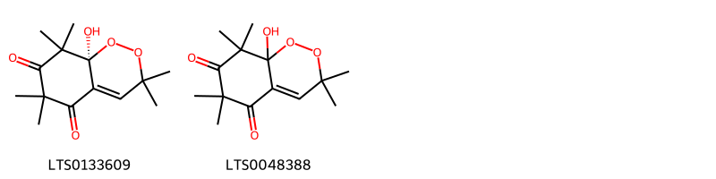{ width=100% }
    <figcaption>Hình ảnh cấu trúc hóa học của 2 hoạt chất thuộc nhóm Organooxygen compounds gồm ['(8ar)-8a-hydroxy-3,3,6,6,8,8-hexamethyl-1,2-benzodioxine-5,7-dione (LTS0133609)', '8a-hydroxy-3,3,6,6,8,8-hexamethyl-1,2-benzodioxine-5,7-dione (LTS0048388)'].</figcaption>
</figure>
#### Nhóm Prenol lipids
<figure markdown="span">
    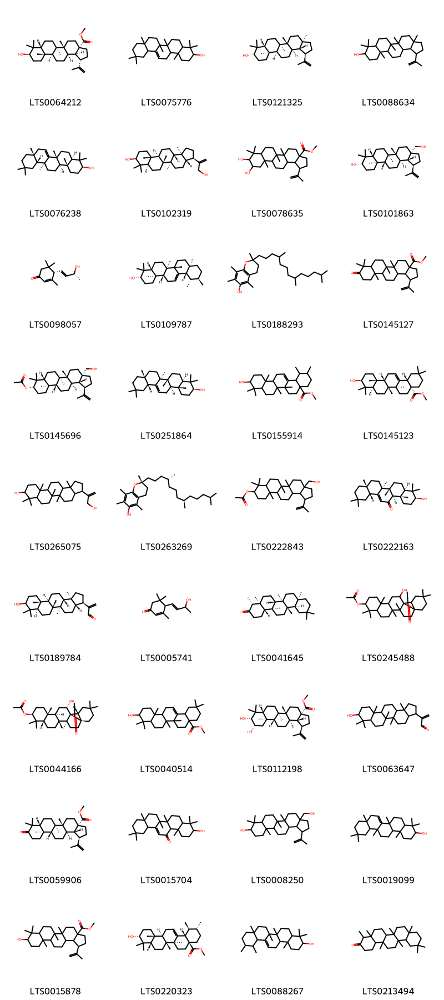{ width=100% }
    <figcaption>Hình ảnh cấu trúc hóa học của 36 hoạt chất thuộc nhóm Prenol lipids gồm ['methyl (1s,3as,5ar,5br,7ar,9r,11as,11bs,13ar,13bs)-9-hydroxy-5a,5b,8,8,11a-pentamethyl-1-(prop-1-en-2-yl)-hexadecahydrocyclopenta[a]chrysene-3a-carboxylate (LTS0064212)', 'β-amyrin (LTS0075776)', '(1r,3ar,5ar,5br,7ar,9s,11ar,11bs,13ar,13br)-3a,5a,5b,8,8,11a-hexamethyl-1-(prop-1-en-2-yl)-hexadecahydrocyclopenta[a]chrysen-9-ol (LTS0121325)', 'lupeol (LTS0088634)', 'alnulin (LTS0076238)', '(3r,3as,5ar,5br,7ar,9s,11ar,11br,13ar,13bs)-3-(3-hydroxyprop-1-en-2-yl)-5a,5b,8,8,11a,13b-hexamethyl-hexadecahydrocyclopenta[a]chrysen-9-ol (LTS0102319)', 'methyl 9,10-dihydroxy-5a,5b,8,8,11a-pentamethyl-1-(prop-1-en-2-yl)-hexadecahydrocyclopenta[a]chrysene-3a-carboxylate (LTS0078635)', 'betulin (LTS0101863)', '(4s)-4-[(1e,3r)-3-hydroxybut-1-en-1-yl]-3,5,5-trimethylcyclohex-2-en-1-one (LTS0098057)', '(3s,4ar,6ar,6bs,8ar,11r,12s,12as,14ar,14br)-4,4,6a,6b,8a,11,12,14b-octamethyl-2,3,4a,5,6,7,8,9,10,11,12,12a,14,14a-tetradecahydro-1h-picen-3-ol (LTS0109787)', 'vita e (LTS0188293)', 'methyl 5a,5b,8,8,11a-pentamethyl-9-oxo-1-(prop-1-en-2-yl)-tetradecahydro-1h-cyclopenta[a]chrysene-3a-carboxylate (LTS0145127)', '(1r,3as,5ar,5br,7ar,9s,11ar,11br,13ar,13br)-3a-(hydroxymethyl)-5a,5b,8,8,11a-pentamethyl-1-(prop-1-en-2-yl)-hexadecahydrocyclopenta[a]chrysen-9-yl acetate (LTS0145696)', 'β-amyrin (LTS0251864)', 'methyl 10-hydroxy-1,2,6a,6b,9,9,12a-heptamethyl-2,3,4,5,6,7,8,8a,10,11,12,12b,13,14b-tetradecahydro-1h-picene-4a-carboxylate (LTS0155914)', 'methyl (4ar,6as,6br,8ar,10s,12ar,12bs,14bs)-10-hydroxy-2,2,6a,6b,9,9,12a-heptamethyl-1,3,4,5,6,7,8,8a,10,11,12,12b,13,14b-tetradecahydropicene-4a-carboxylate (LTS0145123)', '3-(3-hydroxyprop-1-en-2-yl)-5a,5b,8,8,11a,13b-hexamethyl-hexadecahydrocyclopenta[a]chrysen-9-ol (LTS0265075)', 'vitamin e (LTS0263269)', '3a-(hydroxymethyl)-5a,5b,8,8,11a-pentamethyl-1-(prop-1-en-2-yl)-hexadecahydrocyclopenta[a]chrysen-9-yl acetate (LTS0222843)', '11-oxo-β-amyrin (LTS0222163)', '2-[(3r,3as,5ar,5br,7ar,9s,11ar,11br,13ar,13bs)-9-hydroxy-5a,5b,8,8,11a,13b-hexamethyl-hexadecahydrocyclopenta[a]chrysen-3-yl]prop-2-enal (LTS0189784)', '4-(3-hydroxybut-1-en-1-yl)-3,5,5-trimethylcyclohex-2-en-1-one (LTS0005741)', '(-)-friedelin (LTS0041645)', '16-hydroxy-4,5,9,9,13,20,20-heptamethyl-23-oxo-24-oxahexacyclo[15.5.2.0¹,¹⁸.0⁴,¹⁷.0⁵,¹⁴.0⁸,¹³]tetracosan-10-yl acetate (LTS0245488)', '(1s,4s,5r,8s,10s,13r,14r,16s,17s,18r)-16-hydroxy-4,5,9,9,13,20,20-heptamethyl-23-oxo-24-oxahexacyclo[15.5.2.0¹,¹⁸.0⁴,¹⁷.0⁵,¹⁴.0⁸,¹³]tetracosan-10-yl acetate (LTS0044166)', 'methyl 10-hydroxy-2,2,6a,6b,9,9,12a-heptamethyl-1,3,4,5,6,7,8,8a,10,11,12,12b,13,14b-tetradecahydropicene-4a-carboxylate (LTS0040514)', 'methyl (1r,3as,5ar,5br,7ar,9r,10s,11ar,11br,13ar,13br)-9,10-dihydroxy-5a,5b,8,8,11a-pentamethyl-1-(prop-1-en-2-yl)-hexadecahydrocyclopenta[a]chrysene-3a-carboxylate (LTS0112198)', '2-{9-hydroxy-5a,5b,8,8,11a,13b-hexamethyl-hexadecahydrocyclopenta[a]chrysen-3-yl}prop-2-enal (LTS0063647)', 'methyl (1r,3as,5ar,5br,7ar,11ar,11br,13ar,13br)-5a,5b,8,8,11a-pentamethyl-9-oxo-1-(prop-1-en-2-yl)-tetradecahydro-1h-cyclopenta[a]chrysene-3a-carboxylate (LTS0059906)', '10-hydroxy-2,2,4a,6a,6b,9,9,12a-octamethyl-3,4,5,6,7,8,8a,10,11,12,12b,14b-dodecahydro-1h-picen-13-one (LTS0015704)', '3a-(hydroxymethyl)-5a,5b,8,8,11a-pentamethyl-1-(prop-1-en-2-yl)-hexadecahydrocyclopenta[a]chrysen-9-ol (LTS0008250)', 'taraxerol (LTS0019099)', 'methyl 9-hydroxy-5a,5b,8,8,11a-pentamethyl-1-(prop-1-en-2-yl)-hexadecahydrocyclopenta[a]chrysene-3a-carboxylate (LTS0015878)', 'methyl (1s,2r,4as,6as,6br,8as,10r,12ar,12br,14bs)-10-hydroxy-1,2,6a,6b,9,9,12a-heptamethyl-2,3,4,5,6,7,8,8a,10,11,12,12b,13,14b-tetradecahydro-1h-picene-4a-carboxylate (LTS0220323)', 'α-amyrin (LTS0088267)', 'friedelin (LTS0213494)'].</figcaption>
</figure>
#### Nhóm Tannins
<figure markdown="span">
    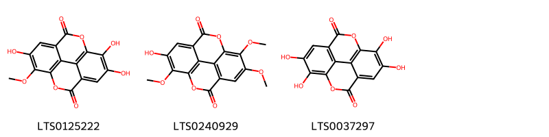{ width=100% }
    <figcaption>Hình ảnh cấu trúc hóa học của 3 hoạt chất thuộc nhóm Tannins gồm ['6,7,13-trihydroxy-14-methoxy-2,9-dioxatetracyclo[6.6.2.0⁴,¹⁶.0¹¹,¹⁵]hexadeca-1(15),4,6,8(16),11,13-hexaene-3,10-dione (LTS0125222)', '13-hydroxy-6,7,14-trimethoxy-2,9-dioxatetracyclo[6.6.2.0⁴,¹⁶.0¹¹,¹⁵]hexadeca-1(15),4(16),5,7,11,13-hexaene-3,10-dione (LTS0240929)', 'ellagic acid (LTS0037297)'].</figcaption>
</figure>

---

### Dược dân tộc học

Danh sách các quốc gia có sử dụng *Rhodomyrtus tomentosa* trong điều trị các bệnh. 

| Country   | Disease                 | Bệnh                                                                                                                                                                                                |
|:----------|:------------------------|:----------------------------------------------------------------------------------------------------------------------------------------------------------------------------------------------------|
| China     | Astringent, Carminative | MYMEMORY WARNING: YOU USED ALL AVAILABLE FREE TRANSLATIONS FOR TODAY. NEXT AVAILABLE IN  06 HOURS 29 MINUTES 28 SECONDS VISIT HTTPS://MYMEMORY.TRANSLATED.NET/DOC/USAGELIMITS.PHP TO TRANSLATE MORE |

---

# Chi Decaermum

??? note "Danh sách các dược liệu thuộc chi"
    
	 - *Decaermum fruticosum*

---
## Decaermum fruticosum
### Thông tin về thực vật

!!! info "Phân loại thực vật của *N/A* từ GIBF:"
    - **Kingdom:** N/A
    - **Phylum:** N/A
    - **Order:** N/A
    - **Family:** N/A
    - **Genus:** N/A
    - **Species:** *N/A*

 

| Label (VI)   | Label (EN)   | Scientific Name       | Descriptions (VI)   | Descriptions (EN)   | Also Known As (VI)                               | Also Known As (EN)   |
|:-------------|:-------------|:----------------------|:--------------------|:--------------------|:-------------------------------------------------|:---------------------|
| N/A          | N/A          | Rhodomyrtus tomentosa | loài thực vật       | species of plant    | ['Rhodomyrtus tomentosa', 'Hồng sim', 'Hoa sim'] | ['']                 |

#### Phân bố trên thế giới

**Từ CSDL GIBF** Không có kết quả phù hợp

#### Phân bố tại Việt Nam

**Từ CSDL GIBF**: Không có ghi nhận ở Việt Nam

---
### Thành phần hóa học
        
- Theo cơ sở dữ liệu lotus: Từ loài *N/A* đã phân lập và xác định được Chưa có hoạt chất nào được phân lập. hoạt chất thuộc về các nhóm Không có hoạt chất nào được phân lập. 

Không có hình ảnh nào được tạo ra

---

### Dược dân tộc học

Danh sách các quốc gia có sử dụng *N/A* trong điều trị các bệnh. 

| Country   | Disease    | Bệnh                                                                                                                                                                                                |
|:----------|:-----------|:----------------------------------------------------------------------------------------------------------------------------------------------------------------------------------------------------|
| India     | Astringent | MYMEMORY WARNING: YOU USED ALL AVAILABLE FREE TRANSLATIONS FOR TODAY. NEXT AVAILABLE IN  06 HOURS 28 MINUTES 44 SECONDS VISIT HTTPS://MYMEMORY.TRANSLATED.NET/DOC/USAGELIMITS.PHP TO TRANSLATE MORE |

---

# Chi Metrosideros

??? note "Danh sách các dược liệu thuộc chi"
    
	 - *Metrosideros albiflora*

---
## Metrosideros albiflora
### Thông tin về thực vật

!!! info "Phân loại thực vật của *Metrosideros albiflora* từ GIBF:"
    - **Kingdom:** Plantae
    - **Phylum:** Tracheophyta
    - **Order:** Myrtales
    - **Family:** Myrtaceae
    - **Genus:** Metrosideros
    - **Species:** *Metrosideros albiflora*

 

| Label (VI)   | Label (EN)   | Scientific Name        | Descriptions (VI)   | Descriptions (EN)   | Also Known As (VI)   | Also Known As (EN)   |
|:-------------|:-------------|:-----------------------|:--------------------|:--------------------|:---------------------|:---------------------|
| N/A          | N/A          | Metrosideros albiflora | loài thực vật       | species of plant    | ['']                 | ['']                 |

#### Phân bố trên thế giới

**Từ CSDL GIBF** New Zealand

#### Phân bố tại Việt Nam

**Từ CSDL GIBF**: Không có ghi nhận ở Việt Nam

---
### Thành phần hóa học
        
- Theo cơ sở dữ liệu lotus: Từ loài *Metrosideros albiflora* đã phân lập và xác định được Chưa có hoạt chất nào được phân lập. hoạt chất thuộc về các nhóm Không có hoạt chất nào được phân lập. 

Không có hình ảnh nào được tạo ra

---

### Dược dân tộc học

Danh sách các quốc gia có sử dụng *Metrosideros albiflora* trong điều trị các bệnh. 

| Country     | Disease   | Bệnh                                                                                                                                                                                                |
|:------------|:----------|:----------------------------------------------------------------------------------------------------------------------------------------------------------------------------------------------------|
| New Zealand | Hemostat  | MYMEMORY WARNING: YOU USED ALL AVAILABLE FREE TRANSLATIONS FOR TODAY. NEXT AVAILABLE IN  06 HOURS 28 MINUTES 24 SECONDS VISIT HTTPS://MYMEMORY.TRANSLATED.NET/DOC/USAGELIMITS.PHP TO TRANSLATE MORE |

---

