!!! abstract "Tóm tắt"

    Họ Nelumbonaceae gồm khoảng 1 chi và 2 loài được một số cộng đồng tại các quốc gia như Java, Elsewhere, Malaya (Chinese), China sử dụng trong một số trường hợp MYMEMORY WARNING: YOU USED ALL AVAILABLE FREE TRANSLATIONS FOR TODAY. NEXT AVAILABLE IN  16 HOURS 57 MINUTES 23 SECONDS VISIT HTTPS://MYMEMORY.TRANSLATED.NET/DOC/USAGELIMITS.PHP TO TRANSLATE MORE.

!!! info "DrDuke"

    James A. Duke sinh năm 1929-2017 là một nhà thực vật học người Mỹ. Đây là một trong những tác giả hàng đầu trong lĩnh vực dược dân tộc học với cuốn *CRC Handbook of Medicinal Herbs* và chính là người xây dựng lên cơ sở dữ liệu về hợp chất tự nhiên và dược dân tộc học tại Bộ nông nghiệp Hoa Kỳ. Các thông tin được đăng tải tại website [Dr. Duke's Phytochemical and Ethnobotanical Databases](https://phytochem.nal.usda.gov/). 
    Trong suốt thập niên 1970, ông lãnh đạo the Plant Taxonomy Laboratory, Plant Genetics and Germplasm Institute of the Agricultural Research Service, U.S. Department of Agriculture.
    Trong tài liệu này, các thông tin về dược dân tộc của các dược liệu được trích dẫn từ tài liệu của James A. Ducke với sự trợ giúp của phần mềm dịch thuật từ tiếng Anh sang tiếng Việt.
   

# Chi Nelumbo

??? note "Danh sách các dược liệu thuộc chi"
    
	 - *Nelumbo nelumbo*
	 - *Nelumbo nucifera*

---
## Nelumbo nelumbo
### Thông tin về thực vật

!!! info "Phân loại thực vật của *Nelumbo nucifera* từ GIBF:"
    - **Kingdom:** Plantae
    - **Phylum:** Tracheophyta
    - **Order:** Proteales
    - **Family:** Nelumbonaceae
    - **Genus:** Nelumbo
    - **Species:** *Nelumbo nucifera*

 

| Label (VI)   | Label (EN)   | Scientific Name   | Descriptions (VI)   | Descriptions (EN)   | Also Known As (VI)   | Also Known As (EN)   |
|:-------------|:-------------|:------------------|:--------------------|:--------------------|:---------------------|:---------------------|
| N/A          | N/A          | Nelumbo nelumbo   |                     | species of plant    | ['']                 | ['']                 |

#### Phân bố trên thế giới

**Từ CSDL GIBF** Viet Nam, Thailand, Ghana, French Polynesia, Singapore, Rwanda, Australia, Korea, Republic of, Indonesia, Sri Lanka, Malaysia, Guam, Japan, Eswatini, Chinese Taipei, Hong Kong, South Africa, United States of America, Madagascar

#### Phân bố tại Việt Nam

**Từ CSDL GIBF**: Lâm Đồng

---
### Thành phần hóa học
        
- Theo cơ sở dữ liệu lotus: Từ loài *Nelumbo nucifera* đã phân lập và xác định được Chưa có hoạt chất nào được phân lập. hoạt chất thuộc về các nhóm Không có hoạt chất nào được phân lập. 

Không có hình ảnh nào được tạo ra

---

### Dược dân tộc học

Danh sách các quốc gia có sử dụng *Nelumbo nucifera* trong điều trị các bệnh. 

| Country          | Disease            | Bệnh                                                                                                                                                                                                |
|:-----------------|:-------------------|:----------------------------------------------------------------------------------------------------------------------------------------------------------------------------------------------------|
| Java             | Diuretic, Narcotic | MYMEMORY WARNING: YOU USED ALL AVAILABLE FREE TRANSLATIONS FOR TODAY. NEXT AVAILABLE IN  16 HOURS 57 MINUTES 21 SECONDS VISIT HTTPS://MYMEMORY.TRANSLATED.NET/DOC/USAGELIMITS.PHP TO TRANSLATE MORE |
| Malaya (Chinese) | Cosmetic           | MYMEMORY WARNING: YOU USED ALL AVAILABLE FREE TRANSLATIONS FOR TODAY. NEXT AVAILABLE IN  16 HOURS 57 MINUTES 18 SECONDS VISIT HTTPS://MYMEMORY.TRANSLATED.NET/DOC/USAGELIMITS.PHP TO TRANSLATE MORE |

---

---
## Nelumbo nucifera
### Thông tin về thực vật

!!! info "Phân loại thực vật của *Nelumbo nucifera* từ GIBF:"
    - **Kingdom:** Plantae
    - **Phylum:** Tracheophyta
    - **Order:** Proteales
    - **Family:** Nelumbonaceae
    - **Genus:** Nelumbo
    - **Species:** *Nelumbo nucifera*

 

| Label (VI)   | Label (EN)   | Scientific Name   | Descriptions (VI)                              | Descriptions (EN)   | Also Known As (VI)   | Also Known As (EN)                                                                                       |
|:-------------|:-------------|:------------------|:-----------------------------------------------|:--------------------|:---------------------|:---------------------------------------------------------------------------------------------------------|
| N/A          | N/A          | Nelumbo nucifera  | loài thực vật thuỷ sinh thân thảo sống lâu năm | species of plant    | ['Nelumbo nucifera'] | ['Lotus', 'East Indian Lotus', 'lotus flower', 'Sacred lotus', 'Bean of India', 'Indian lotus', 'Pudma'] |

#### Phân bố trên thế giới

**Từ CSDL GIBF** Viet Nam, Thailand, Spain, French Polynesia, Lao People’s Democratic Republic, Singapore, Australia, Korea, Republic of, Indonesia, Colombia, Sri Lanka, Pakistan, Venezuela (Bolivarian Republic of), Malaysia, India, Cambodia, Antigua and Barbuda, Japan, Brazil, China, Nepal, Hong Kong, Iran (Islamic Republic of), South Africa, Macao, Russian Federation, United States of America, Italy, Guyana

#### Phân bố tại Việt Nam

**Từ CSDL GIBF**: An Giang, Ninh Bình, Hồ Chí Minh city, Đồng Tháp, Bến Tre, Hà Nội, Tiền Giang, Đồng Nai, Thừa Thiên - Huế, Đắk Lắk

---
### Thành phần hóa học
        
- Theo cơ sở dữ liệu lotus: Từ loài *Nelumbo nucifera* đã phân lập và xác định được 169 hoạt chất thuộc về các nhóm Aporphines, Proaporphines, Tetrahydroisoquinolines, Phenols, Cinnamic acids and derivatives, Sulfonyl halides, Organooxygen compounds, Diazines, Saturated hydrocarbons, Unsaturated hydrocarbons, Fatty Acyls, Flavonoids, Benzofurans, Isoquinolines and derivatives, Prenol lipids, Glycerolipids, Purine nucleosides, Phenol ethers, Steroids and steroid derivatives, Benzene and substituted derivatives. 

|    | chemicalTaxonomyClassyfireClass     |   smiles_count |
|---:|:------------------------------------|---------------:|
|  0 | Aporphines                          |             25 |
|  1 | Benzene and substituted derivatives |              3 |
|  2 | Benzofurans                         |              1 |
|  3 | Cinnamic acids and derivatives      |              3 |
|  4 | Diazines                            |              1 |
|  5 | Fatty Acyls                         |             12 |
|  6 | Flavonoids                          |             30 |
|  7 | Glycerolipids                       |              3 |
|  8 | Isoquinolines and derivatives       |             22 |
|  9 | Organooxygen compounds              |             10 |
| 10 | Phenol ethers                       |              1 |
| 11 | Phenols                             |              1 |
| 12 | Prenol lipids                       |             18 |
| 13 | Proaporphines                       |              2 |
| 14 | Purine nucleosides                  |              1 |
| 15 | Saturated hydrocarbons              |              5 |
| 16 | Steroids and steroid derivatives    |              9 |
| 17 | Sulfonyl halides                    |              1 |
| 18 | Tetrahydroisoquinolines             |              1 |
| 19 | Unsaturated hydrocarbons            |              3 |

#### Nhóm Aporphines
<figure markdown="span">
    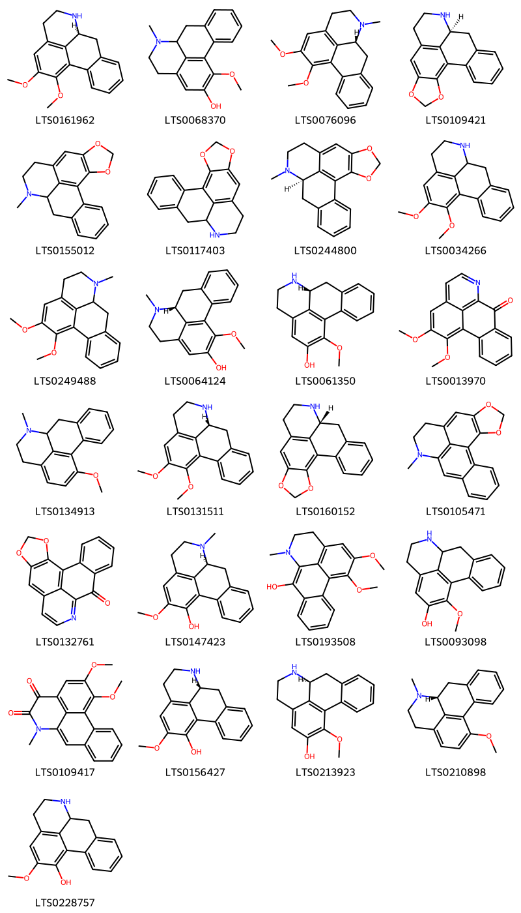{ width=100% }
    <figcaption>Hình ảnh cấu trúc hóa học của 25 hoạt chất thuộc nhóm Aporphines gồm ['(9s)-15,16-dimethoxy-10-azatetracyclo[7.7.1.0²,⁷.0¹³,¹⁷]heptadeca-1(16),2,4,6,13(17),14-hexaene (LTS0161962)', '16-methoxy-10-methyl-10-azatetracyclo[7.7.1.0²,⁷.0¹³,¹⁷]heptadeca-1(17),2,4,6,13,15-hexaen-15-ol (LTS0068370)', 'nuciferine (LTS0076096)', '(12s)-3,5-dioxa-11-azapentacyclo[10.7.1.0²,⁶.0⁸,²⁰.0¹⁴,¹⁹]icosa-1(20),2(6),7,14,16,18-hexaene (LTS0109421)', '11-methyl-3,5-dioxa-11-azapentacyclo[10.7.1.0²,⁶.0⁸,²⁰.0¹⁴,¹⁹]icosa-1(20),2(6),7,14,16,18-hexaene (LTS0155012)', '3,5-dioxa-11-azapentacyclo[10.7.1.0²,⁶.0⁸,²⁰.0¹⁴,¹⁹]icosa-1(20),2(6),7,14,16,18-hexaene (LTS0117403)', '(12r)-11-methyl-3,5-dioxa-11-azapentacyclo[10.7.1.0²,⁶.0⁸,²⁰.0¹⁴,¹⁹]icosa-1(20),2(6),7,14,16,18-hexaene (LTS0244800)', 'nornuciferine (LTS0034266)', 'nuciferine (LTS0249488)', '(9r)-16-methoxy-10-methyl-10-azatetracyclo[7.7.1.0²,⁷.0¹³,¹⁷]heptadeca-1(17),2,4,6,13,15-hexaen-15-ol (LTS0064124)', 'r-(-)-asimilobine (LTS0061350)', 'lysicamine (LTS0013970)', '16-methoxy-10-methyl-10-azatetracyclo[7.7.1.0²,⁷.0¹³,¹⁷]heptadeca-1(17),2,4,6,13,15-hexaene (LTS0134913)', '(9r)-15,16-dimethoxy-10-azatetracyclo[7.7.1.0²,⁷.0¹³,¹⁷]heptadeca-1(16),2,4,6,13(17),14-hexaene (LTS0131511)', 'anonaine (LTS0160152)', '11-methyl-3,5-dioxa-11-azapentacyclo[10.7.1.0²,⁶.0⁸,²⁰.0¹⁴,¹⁹]icosa-1(20),2(6),7,12,14(19),15,17-heptaene (LTS0105471)', 'liriodenine (LTS0132761)', '(9s)-15-methoxy-10-methyl-10-azatetracyclo[7.7.1.0²,⁷.0¹³,¹⁷]heptadeca-1(16),2,4,6,13(17),14-hexaen-16-ol (LTS0147423)', '15,16-dimethoxy-10-methyl-10-azatetracyclo[7.7.1.0²,⁷.0¹³,¹⁷]heptadeca-1(17),2(7),3,5,8,13,15-heptaen-8-ol (LTS0193508)', '16-methoxy-10-azatetracyclo[7.7.1.0²,⁷.0¹³,¹⁷]heptadeca-1(17),2,4,6,13,15-hexaen-15-ol (LTS0093098)', '15,16-dimethoxy-10-methyl-10-azatetracyclo[7.7.1.0²,⁷.0¹³,¹⁷]heptadeca-1(17),2(7),3,5,8,13,15-heptaene-11,12-dione (LTS0109417)', '(-)-caaverine (LTS0156427)', 'asimilobine (LTS0213923)', '(9r)-16-methoxy-10-methyl-10-azatetracyclo[7.7.1.0²,⁷.0¹³,¹⁷]heptadeca-1(17),2,4,6,13,15-hexaene (LTS0210898)', '15-methoxy-10-azatetracyclo[7.7.1.0²,⁷.0¹³,¹⁷]heptadeca-1(16),2,4,6,13(17),14-hexaen-16-ol (LTS0228757)'].</figcaption>
</figure>
#### Nhóm Benzene and substituted derivatives
<figure markdown="span">
    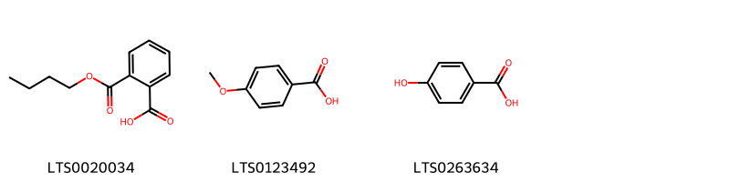{ width=100% }
    <figcaption>Hình ảnh cấu trúc hóa học của 3 hoạt chất thuộc nhóm Benzene and substituted derivatives gồm ['mono-n-butylphthalate (LTS0020034)', 'p-anisic acid (LTS0123492)', 'p-hydroxybenzoic acid (LTS0263634)'].</figcaption>
</figure>
#### Nhóm Benzofurans
<figure markdown="span">
    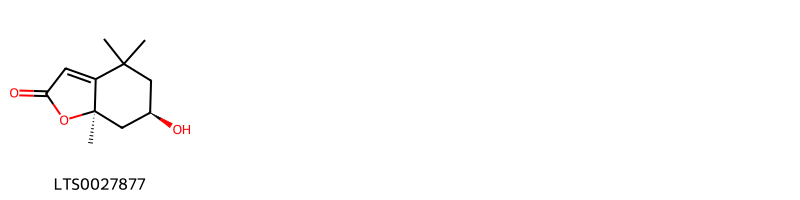{ width=100% }
    <figcaption>Hình ảnh cấu trúc hóa học của 1 hoạt chất thuộc nhóm Benzofurans gồm ['(6r,7ar)-6-hydroxy-4,4,7a-trimethyl-6,7-dihydro-5h-1-benzofuran-2-one (LTS0027877)'].</figcaption>
</figure>
#### Nhóm Cinnamic acids and derivatives
<figure markdown="span">
    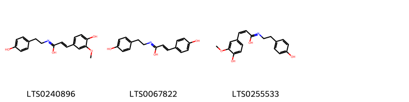{ width=100% }
    <figcaption>Hình ảnh cấu trúc hóa học của 3 hoạt chất thuộc nhóm Cinnamic acids and derivatives gồm ['3-(4-hydroxy-3-methoxyphenyl)-n-[2-(4-hydroxyphenyl)ethyl]prop-2-enimidic acid (LTS0240896)', '(2e)-3-(4-hydroxyphenyl)-n-[2-(4-hydroxyphenyl)ethyl]prop-2-enimidic acid (LTS0067822)', '(2z)-3-(4-hydroxy-3-methoxyphenyl)-n-[2-(4-hydroxyphenyl)ethyl]prop-2-enimidic acid (LTS0255533)'].</figcaption>
</figure>
#### Nhóm Diazines
<figure markdown="span">
    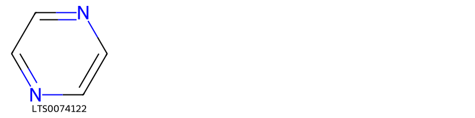{ width=100% }
    <figcaption>Hình ảnh cấu trúc hóa học của 1 hoạt chất thuộc nhóm Diazines gồm ['pyrazine (LTS0074122)'].</figcaption>
</figure>
#### Nhóm Fatty Acyls
<figure markdown="span">
    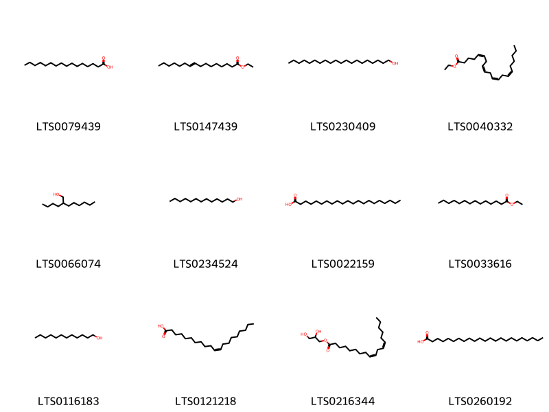{ width=100% }
    <figcaption>Hình ảnh cấu trúc hóa học của 12 hoạt chất thuộc nhóm Fatty Acyls gồm ['palmitic acid (LTS0079439)', 'ethyl hexadec-9-enoate (LTS0147439)', 'arachidyl alcohol (LTS0230409)', 'ethyl arachidonate (LTS0040332)', 'butyloctanol (LTS0066074)', 'tridecanol (LTS0234524)', 'heneicosanoic acid (LTS0022159)', 'ethylmyristate (LTS0033616)', '1-dodecanol (LTS0116183)', 'cis-11-eicosenoic acid (LTS0121218)', 'glyceryl 1-linoleate (LTS0216344)', 'tricosanoic acid (LTS0260192)'].</figcaption>
</figure>
#### Nhóm Flavonoids
<figure markdown="span">
    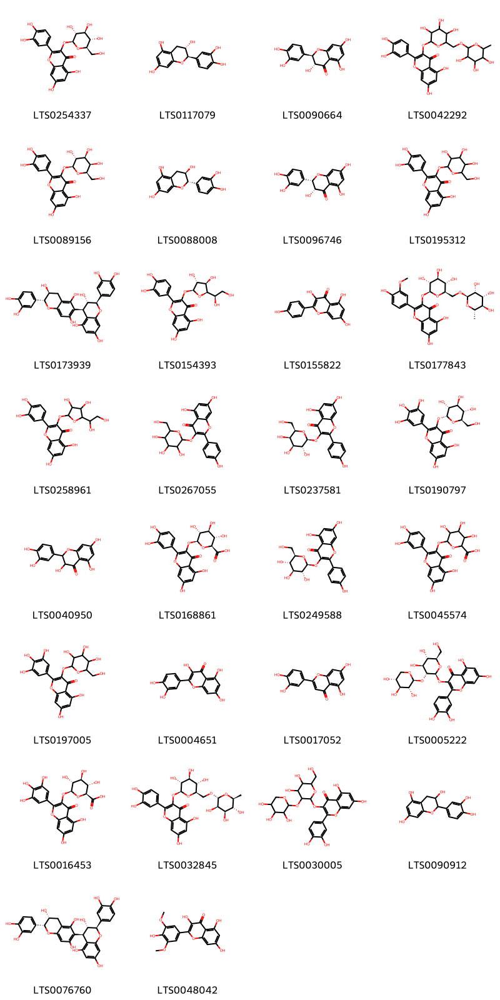{ width=100% }
    <figcaption>Hình ảnh cấu trúc hóa học của 30 hoạt chất thuộc nhóm Flavonoids gồm ['isoquercetin (LTS0254337)', '(+)-catechol (LTS0117079)', '(+)-taxifolin (LTS0090664)', 'rutin (LTS0042292)', 'hyperoside (LTS0089156)', 'α catechin (LTS0088008)', '(+)-epitaxifolin (LTS0096746)', '2-(3,4-dihydroxyphenyl)-5,7-dihydroxy-3-{[3,4,5-trihydroxy-6-(hydroxymethyl)oxan-2-yl]oxy}chromen-4-one (LTS0195312)', '(2r,3s,4r)-2-(3,4-dihydroxyphenyl)-4-[(2r,3s)-2-(3,4-dihydroxyphenyl)-3,5,7-trihydroxy-3,4-dihydro-2h-1-benzopyran-6-yl]-3,4-dihydro-2h-1-benzopyran-3,5,7-triol (LTS0173939)', 'quercetin-3-glucoside (LTS0154393)', 'kaempherol (LTS0155822)', 'narcissin (LTS0177843)', '3-{[5-(1,2-dihydroxyethyl)-3,4-dihydroxyoxolan-2-yl]oxy}-2-(3,4-dihydroxyphenyl)-5,7-dihydroxychromen-4-one (LTS0258961)', 'trifolin (LTS0267055)', 'trifolin (LTS0237581)', '5,7-dihydroxy-3-{[(2r,3r,4s,5s,6r)-3,4,5-trihydroxy-6-(hydroxymethyl)oxan-2-yl]oxy}-2-(3,4,5-trihydroxyphenyl)chromen-4-one (LTS0190797)', '2,3-dihydroquercetin (LTS0040950)', 'querciturone (LTS0168861)', 'astragalin (LTS0249588)', 'miquelianin (LTS0045574)', '5,7-dihydroxy-3-{[3,4,5-trihydroxy-6-(hydroxymethyl)oxan-2-yl]oxy}-2-(3,4,5-trihydroxyphenyl)chromen-4-one (LTS0197005)', 'quercetin (LTS0004651)', 'luteolin (LTS0017052)', '3-{[(2s,3r,4s,5s,6r)-4,5-dihydroxy-6-(hydroxymethyl)-3-{[(2s,3r,4s,5r)-3,4,5-trihydroxyoxan-2-yl]oxy}oxan-2-yl]oxy}-2-(3,4-dihydroxyphenyl)-5,7-dihydroxychromen-4-one (LTS0005222)', 'myricetin 3-o-glucuronide (LTS0016453)', '3-rutinosyl quercetin (LTS0032845)', '3-{[4,5-dihydroxy-6-(hydroxymethyl)-3-[(3,4,5-trihydroxyoxan-2-yl)oxy]oxan-2-yl]oxy}-2-(3,4-dihydroxyphenyl)-5,7-dihydroxychromen-4-one (LTS0030005)', 'catechol (LTS0090912)', '(2r,3s,4r)-2-(3,4-dihydroxyphenyl)-4-[(2r,3r)-2-(3,4-dihydroxyphenyl)-3,5,7-trihydroxy-3,4-dihydro-2h-1-benzopyran-6-yl]-3,4-dihydro-2h-1-benzopyran-3,5,7-triol (LTS0076760)', 'syringetin (LTS0048042)'].</figcaption>
</figure>
#### Nhóm Glycerolipids
<figure markdown="span">
    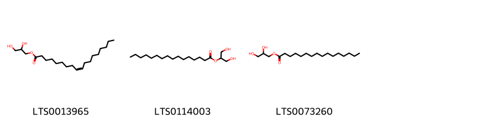{ width=100% }
    <figcaption>Hình ảnh cấu trúc hóa học của 3 hoạt chất thuộc nhóm Glycerolipids gồm ['oleoyl glycerol (LTS0013965)', 'glyceryl 2-palmitate (LTS0114003)', 'glyceryl palmitate (LTS0073260)'].</figcaption>
</figure>
#### Nhóm Isoquinolines and derivatives
<figure markdown="span">
    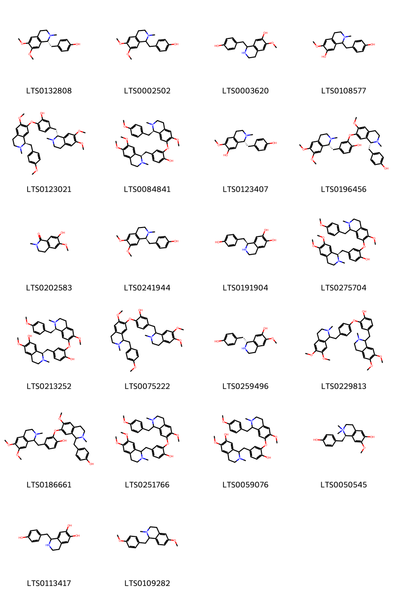{ width=100% }
    <figcaption>Hình ảnh cấu trúc hóa học của 22 hoạt chất thuộc nhóm Isoquinolines and derivatives gồm ['armepavine (LTS0132808)', '(+/-)-armepavine (LTS0002502)', '(rs)-coclaurine (LTS0003620)', '1-[(4-hydroxyphenyl)methyl]-6-methoxy-2-methyl-3,4-dihydro-1h-isoquinolin-7-ol (LTS0108577)', '5-{[(1r)-6,7-dimethoxy-2-methyl-3,4-dihydro-1h-isoquinolin-1-yl]methyl}-2-{[(1r)-6-methoxy-1-[(4-methoxyphenyl)methyl]-2-methyl-3,4-dihydro-1h-isoquinolin-7-yl]oxy}phenol (LTS0123021)', '4-{[(1r)-6,7-dimethoxy-2-methyl-3,4-dihydro-1h-isoquinolin-1-yl]methyl}-2-{[(1r)-6-methoxy-1-[(4-methoxyphenyl)methyl]-2-methyl-3,4-dihydro-1h-isoquinolin-7-yl]oxy}phenol (LTS0084841)', '2-methyl-1betah-coclaurine (LTS0123407)', '4-{[(1r)-6,7-dimethoxy-2-methyl-3,4-dihydro-1h-isoquinolin-1-yl]methyl}-2-{[(1r)-1-[(4-hydroxyphenyl)methyl]-6-methoxy-2-methyl-3,4-dihydro-1h-isoquinolin-7-yl]oxy}phenol (LTS0196456)', 'thalifolin (LTS0202583)', '(+)-armepavine (LTS0241944)', '(-)-higenamine (LTS0191904)', '4-{[(1r)-6,7-dimethoxy-2-methyl-3,4-dihydro-1h-isoquinolin-1-yl]methyl}-2-({6-methoxy-1-[(4-methoxyphenyl)methyl]-2-methyl-3,4-dihydro-1h-isoquinolin-7-yl}oxy)phenol (LTS0275704)', '(1r)-1-[(4-hydroxy-3-{[(1r)-6-methoxy-1-[(4-methoxyphenyl)methyl]-2-methyl-3,4-dihydro-1h-isoquinolin-7-yl]oxy}phenyl)methyl]-6-methoxy-2-methyl-3,4-dihydro-1h-isoquinolin-7-ol (LTS0213252)', '5-[(6,7-dimethoxy-2-methyl-3,4-dihydro-1h-isoquinolin-1-yl)methyl]-2-({6-methoxy-1-[(4-methoxyphenyl)methyl]-2-methyl-3,4-dihydro-1h-isoquinolin-7-yl}oxy)phenol (LTS0075222)', '(+)-coclaurine (LTS0259496)', 'dauricine (LTS0229813)', '4-[(6,7-dimethoxy-2-methyl-3,4-dihydro-1h-isoquinolin-1-yl)methyl]-2-({1-[(4-hydroxyphenyl)methyl]-6-methoxy-2-methyl-3,4-dihydro-1h-isoquinolin-7-yl}oxy)phenol (LTS0186661)', '4-[(6,7-dimethoxy-2-methyl-3,4-dihydro-1h-isoquinolin-1-yl)methyl]-2-({6-methoxy-1-[(4-methoxyphenyl)methyl]-2-methyl-3,4-dihydro-1h-isoquinolin-7-yl}oxy)phenol (LTS0251766)', '1-{[4-hydroxy-3-({6-methoxy-1-[(4-methoxyphenyl)methyl]-2-methyl-3,4-dihydro-1h-isoquinolin-7-yl}oxy)phenyl]methyl}-6-methoxy-2-methyl-3,4-dihydro-1h-isoquinolin-7-ol (LTS0059076)', 'lotusine (LTS0050545)', 'higenamine (LTS0113417)', '6-methoxy-1-[(4-methoxyphenyl)methyl]-2-methyl-3,4-dihydro-1h-isoquinoline (LTS0109282)'].</figcaption>
</figure>
#### Nhóm Organooxygen compounds
<figure markdown="span">
    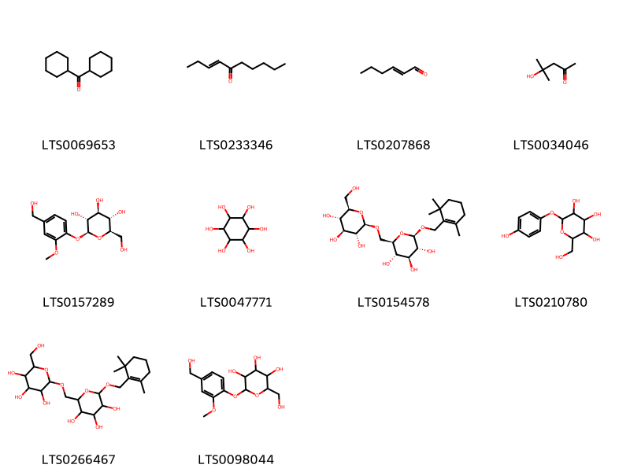{ width=100% }
    <figcaption>Hình ảnh cấu trúc hóa học của 10 hoạt chất thuộc nhóm Organooxygen compounds gồm ['methanone, dicyclohexyl- (LTS0069653)', 'dec-3-en-5-one (LTS0233346)', '(e)-2-hexenal (LTS0207868)', 'diacetone alcohol (LTS0034046)', 'vanilloloside (LTS0157289)', '(-)-inositol (LTS0047771)', '(2r,3s,4s,5r,6r)-2-({[(2r,3r,4s,5s,6r)-3,4,5-trihydroxy-6-(hydroxymethyl)oxan-2-yl]oxy}methyl)-6-[(2,6,6-trimethylcyclohex-1-en-1-yl)methoxy]oxane-3,4,5-triol (LTS0154578)', 'arbutin (LTS0210780)', '2-({[3,4,5-trihydroxy-6-(hydroxymethyl)oxan-2-yl]oxy}methyl)-6-[(2,6,6-trimethylcyclohex-1-en-1-yl)methoxy]oxane-3,4,5-triol (LTS0266467)', '2-(hydroxymethyl)-6-[4-(hydroxymethyl)-2-methoxyphenoxy]oxane-3,4,5-triol (LTS0098044)'].</figcaption>
</figure>
#### Nhóm Phenol ethers
<figure markdown="span">
    { width=100% }
    <figcaption>Hình ảnh cấu trúc hóa học của 1 hoạt chất thuộc nhóm Phenol ethers gồm ['4-vinylanisole (LTS0020637)'].</figcaption>
</figure>
#### Nhóm Phenols
<figure markdown="span">
    { width=100% }
    <figcaption>Hình ảnh cấu trúc hóa học của 1 hoạt chất thuộc nhóm Phenols gồm ['(2e)-3-(4-hydroxy-3-methoxyphenyl)-n-[2-(4-hydroxyphenyl)ethyl]prop-2-enimidic acid (LTS0187051)'].</figcaption>
</figure>
#### Nhóm Prenol lipids
<figure markdown="span">
    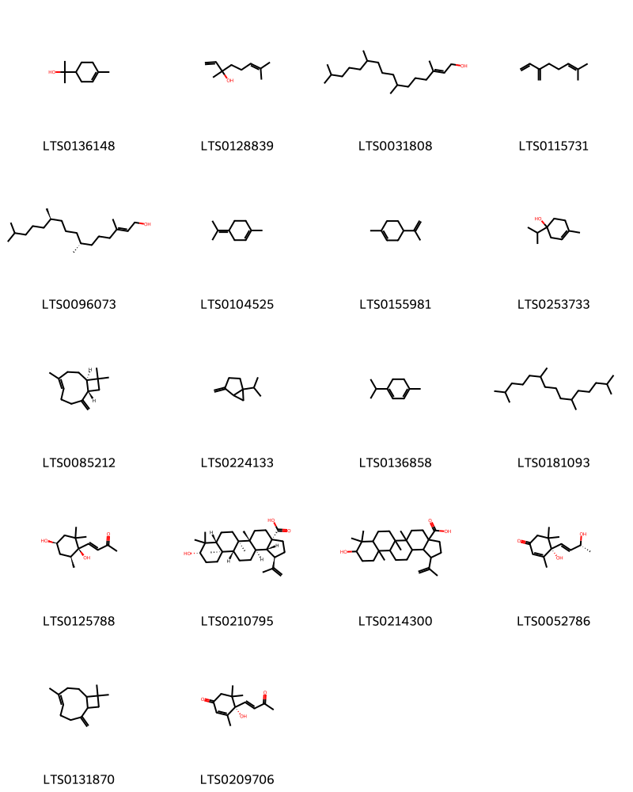{ width=100% }
    <figcaption>Hình ảnh cấu trúc hóa học của 18 hoạt chất thuộc nhóm Prenol lipids gồm ['terpineol (LTS0136148)', 'linalool, (+-)- (LTS0128839)', 'phytol (LTS0031808)', 'α-myrcene (LTS0115731)', 'phytol (LTS0096073)', 'terpinolene (LTS0104525)', 'limonene,  (LTS0155981)', '4-terpineol (LTS0253733)', 'caryophyllene (LTS0085212)', 'sabinene (LTS0224133)', 'terpinene (LTS0136858)', 'pristane (LTS0181093)', '(3e)-4-[(1r,4r,6s)-1,4-dihydroxy-2,2,6-trimethylcyclohexyl]but-3-en-2-one (LTS0125788)', 'betulinic acid (LTS0210795)', '9-hydroxy-5a,5b,8,8,11a-pentamethyl-1-(prop-1-en-2-yl)-hexadecahydrocyclopenta[a]chrysene-3a-carboxylic acid (LTS0214300)', '(6s,9r)-vomifoliol (LTS0052786)', 'caryophyllene (LTS0131870)', 'dehydrovomifoliol (LTS0209706)'].</figcaption>
</figure>
#### Nhóm Proaporphines
<figure markdown="span">
    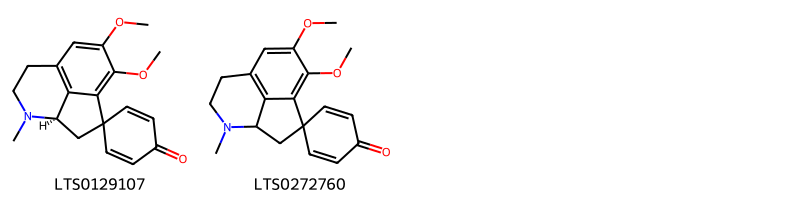{ width=100% }
    <figcaption>Hình ảnh cấu trúc hóa học của 2 hoạt chất thuộc nhóm Proaporphines gồm ['pronuciferine (LTS0129107)', "10',11'-dimethoxy-5'-methyl-5'-azaspiro[cyclohexane-1,2'-tricyclo[6.3.1.0⁴,¹²]dodecane]-1'(11'),2,5,8'(12'),9'-pentaen-4-one (LTS0272760)"].</figcaption>
</figure>
#### Nhóm Purine nucleosides
<figure markdown="span">
    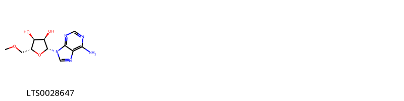{ width=100% }
    <figcaption>Hình ảnh cấu trúc hóa học của 1 hoạt chất thuộc nhóm Purine nucleosides gồm ['(2r,3r,4s,5r)-2-(6-aminopurin-9-yl)-5-(methoxymethyl)oxolane-3,4-diol (LTS0028647)'].</figcaption>
</figure>
#### Nhóm Saturated hydrocarbons
<figure markdown="span">
    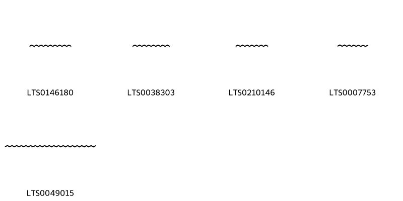{ width=100% }
    <figcaption>Hình ảnh cấu trúc hóa học của 5 hoạt chất thuộc nhóm Saturated hydrocarbons gồm ['nonadecane (LTS0146180)', 'heptadecane (LTS0038303)', 'pentadecane (LTS0210146)', 'tetradecane (LTS0007753)', 'tetracontane (LTS0049015)'].</figcaption>
</figure>
#### Nhóm Steroids and steroid derivatives
<figure markdown="span">
    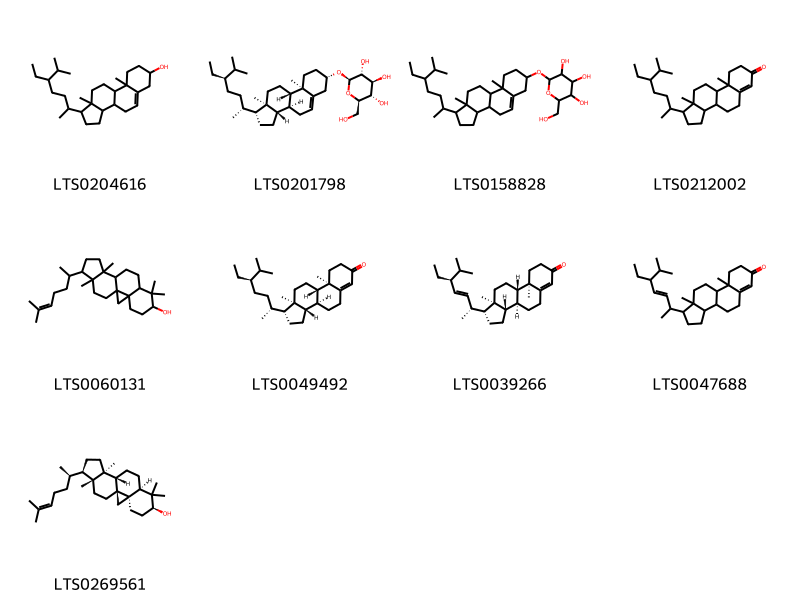{ width=100% }
    <figcaption>Hình ảnh cấu trúc hóa học của 9 hoạt chất thuộc nhóm Steroids and steroid derivatives gồm ['stigmast-5-en-3-ol, (3β)- (LTS0204616)', 'sitogluside (LTS0201798)', '2-{[1-(5-ethyl-6-methylheptan-2-yl)-9a,11a-dimethyl-1h,2h,3h,3ah,3bh,4h,6h,7h,8h,9h,9bh,10h,11h-cyclopenta[a]phenanthren-7-yl]oxy}-6-(hydroxymethyl)oxane-3,4,5-triol (LTS0158828)', '1-(5-ethyl-6-methylheptan-2-yl)-9a,11a-dimethyl-1h,2h,3h,3ah,3bh,4h,5h,8h,9h,9bh,10h,11h-cyclopenta[a]phenanthren-7-one (LTS0212002)', 'cycloartenol (LTS0060131)', 'β-sitostenone (LTS0049492)', '(1r,3as,3bs,9ar,9bs,11ar)-1-[(2r,3e,5s)-5-ethyl-6-methylhept-3-en-2-yl]-9a,11a-dimethyl-1h,2h,3h,3ah,3bh,4h,5h,8h,9h,9bh,10h,11h-cyclopenta[a]phenanthren-7-one (LTS0039266)', '1-(5-ethyl-6-methylhept-3-en-2-yl)-9a,11a-dimethyl-1h,2h,3h,3ah,3bh,4h,5h,8h,9h,9bh,10h,11h-cyclopenta[a]phenanthren-7-one (LTS0047688)', 'cycloartenol (LTS0269561)'].</figcaption>
</figure>
#### Nhóm Sulfonyl halides
<figure markdown="span">
    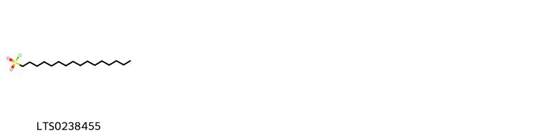{ width=100% }
    <figcaption>Hình ảnh cấu trúc hóa học của 1 hoạt chất thuộc nhóm Sulfonyl halides gồm ['hexadecane-1-sulfonyl chloride (LTS0238455)'].</figcaption>
</figure>
#### Nhóm Tetrahydroisoquinolines
<figure markdown="span">
    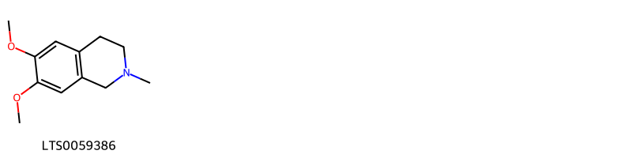{ width=100% }
    <figcaption>Hình ảnh cấu trúc hóa học của 1 hoạt chất thuộc nhóm Tetrahydroisoquinolines gồm ['6,7-dimethoxy-2-methyl-3,4-dihydro-1h-isoquinoline (LTS0059386)'].</figcaption>
</figure>
#### Nhóm Unsaturated hydrocarbons
<figure markdown="span">
    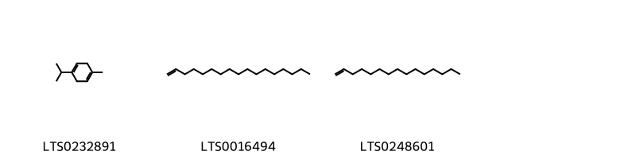{ width=100% }
    <figcaption>Hình ảnh cấu trúc hóa học của 3 hoạt chất thuộc nhóm Unsaturated hydrocarbons gồm ['α terpinene (LTS0232891)', 'heptadecene (LTS0016494)', '1-pentadecene (LTS0248601)'].</figcaption>
</figure>

---

### Dược dân tộc học

Danh sách các quốc gia có sử dụng *Nelumbo nucifera* trong điều trị các bệnh. 

| Country   | Disease                                                                                                                        | Bệnh                                                                                                                                                                                                |
|:----------|:-------------------------------------------------------------------------------------------------------------------------------|:----------------------------------------------------------------------------------------------------------------------------------------------------------------------------------------------------|
| China     | Antidote, Cosmetic, Diuretic, Hemostat, Sedative, Tonic, Hemostat, Hemostat, Refrigerant, Sedative, Stomachic, Tonic, Antidote | MYMEMORY WARNING: YOU USED ALL AVAILABLE FREE TRANSLATIONS FOR TODAY. NEXT AVAILABLE IN  16 HOURS 57 MINUTES 02 SECONDS VISIT HTTPS://MYMEMORY.TRANSLATED.NET/DOC/USAGELIMITS.PHP TO TRANSLATE MORE |
| Elsewhere | Vermifuge, Antiemetic, Tonic, Demulcent                                                                                        | MYMEMORY WARNING: YOU USED ALL AVAILABLE FREE TRANSLATIONS FOR TODAY. NEXT AVAILABLE IN  16 HOURS 57 MINUTES 00 SECONDS VISIT HTTPS://MYMEMORY.TRANSLATED.NET/DOC/USAGELIMITS.PHP TO TRANSLATE MORE |

---

