!!! abstract "Tóm tắt"

    Họ Nyctaginaceae gồm khoảng 5 chi và 12 loài được một số cộng đồng tại các quốc gia như Japan, Brazil, Philippines, Venezuela, Hawaii, Upper Volta, Mexico, China, Malaya, Haiti, ain, Elsewhere, Dominican Republic, Africa, Oceania, India, US, Sudan, Bahamas, Turkey, Bolivia sử dụng trong một số trường hợp MYMEMORY WARNING: YOU USED ALL AVAILABLE FREE TRANSLATIONS FOR TODAY. NEXT AVAILABLE IN  09 HOURS 21 MINUTES 14 SECONDS VISIT HTTPS://MYMEMORY.TRANSLATED.NET/DOC/USAGELIMITS.PHP TO TRANSLATE MORE.

!!! info "DrDuke"

    James A. Duke sinh năm 1929-2017 là một nhà thực vật học người Mỹ. Đây là một trong những tác giả hàng đầu trong lĩnh vực dược dân tộc học với cuốn *CRC Handbook of Medicinal Herbs* và chính là người xây dựng lên cơ sở dữ liệu về hợp chất tự nhiên và dược dân tộc học tại Bộ nông nghiệp Hoa Kỳ. Các thông tin được đăng tải tại website [Dr. Duke's Phytochemical and Ethnobotanical Databases](https://phytochem.nal.usda.gov/). 
    Trong suốt thập niên 1970, ông lãnh đạo the Plant Taxonomy Laboratory, Plant Genetics and Germplasm Institute of the Agricultural Research Service, U.S. Department of Agriculture.
    Trong tài liệu này, các thông tin về dược dân tộc của các dược liệu được trích dẫn từ tài liệu của James A. Ducke với sự trợ giúp của phần mềm dịch thuật từ tiếng Anh sang tiếng Việt.
   

# Chi Boerhaavia

??? note "Danh sách các dược liệu thuộc chi"
    
	 - *Boerhaavia coccinea*
	 - *Boerhaavia diffusa*
	 - *Boerhaavia erecta*
	 - *Boerhaavia paniculata*
	 - *Boerhaavia repens*

---
## Boerhaavia coccinea
### Thông tin về thực vật

!!! info "Phân loại thực vật của *Boerhaavia coccinea* từ GIBF:"
    - **Kingdom:** Plantae
    - **Phylum:** Tracheophyta
    - **Order:** Caryophyllales
    - **Family:** Nyctaginaceae
    - **Genus:** Boerhavia
    - **Species:** *Boerhaavia coccinea*

 

| Label (VI)   | Label (EN)   | Scientific Name   | Descriptions (VI)   | Descriptions (EN)   | Also Known As (VI)   | Also Known As (EN)                  |
|:-------------|:-------------|:------------------|:--------------------|:--------------------|:---------------------|:------------------------------------|
| N/A          | N/A          | Trapa natans      | loài thực vật       | species of plant    | ['củ ấu']            | ['Water caltrop', 'Water chestnut'] |

#### Phân bố trên thế giới

**Từ CSDL GIBF** nan, Colombia, Brazil, Puerto Rico, Nigeria, United States of America, Mexico, Guyana

#### Phân bố tại Việt Nam

**Từ CSDL GIBF**: Không có ghi nhận ở Việt Nam

---
### Thành phần hóa học
        
- Theo cơ sở dữ liệu lotus: Từ loài *Boerhaavia coccinea* đã phân lập và xác định được 1 hoạt chất thuộc về các nhóm Isoflavonoids. 

|    | chemicalTaxonomyClassyfireClass   |   smiles_count |
|---:|:----------------------------------|---------------:|
|  0 | Isoflavonoids                     |              1 |

#### Nhóm Isoflavonoids
<figure markdown="span">
    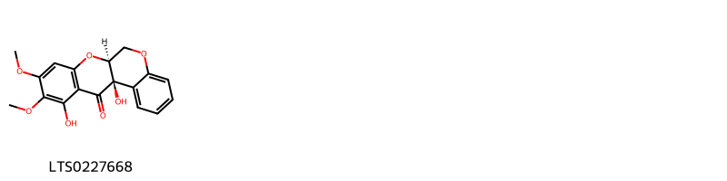{ width=100% }
    <figcaption>Hình ảnh cấu trúc hóa học của 1 hoạt chất thuộc nhóm Isoflavonoids gồm ['(6as,12ar)-11,12a-dihydroxy-9,10-dimethoxy-6,6a-dihydro-5,7-dioxatetraphen-12-one (LTS0227668)'].</figcaption>
</figure>

---

### Dược dân tộc học

Danh sách các quốc gia có sử dụng *Boerhaavia coccinea* trong điều trị các bệnh. 

| Country   | Disease   | Bệnh                                                                                                                                                                                                |
|:----------|:----------|:----------------------------------------------------------------------------------------------------------------------------------------------------------------------------------------------------|
| Brazil    | Emetic    | MYMEMORY WARNING: YOU USED ALL AVAILABLE FREE TRANSLATIONS FOR TODAY. NEXT AVAILABLE IN  09 HOURS 21 MINUTES 11 SECONDS VISIT HTTPS://MYMEMORY.TRANSLATED.NET/DOC/USAGELIMITS.PHP TO TRANSLATE MORE |

---

---
## Boerhaavia diffusa
### Thông tin về thực vật

!!! info "Phân loại thực vật của *Boerhaavia diffusa* từ GIBF:"
    - **Kingdom:** Plantae
    - **Phylum:** Tracheophyta
    - **Order:** Caryophyllales
    - **Family:** Nyctaginaceae
    - **Genus:** Boerhavia
    - **Species:** *Boerhaavia diffusa*

 

| Label (VI)   | Label (EN)   | Scientific Name    | Descriptions (VI)   | Descriptions (EN)   | Also Known As (VI)   | Also Known As (EN)   |
|:-------------|:-------------|:-------------------|:--------------------|:--------------------|:---------------------|:---------------------|
| N/A          | N/A          | Boerhaavia diffusa |                     | species of plant    | ['']                 | ['B. diffusa']       |

#### Phân bố trên thế giới

**Từ CSDL GIBF** nan, Japan, Panama, Brazil, India, Congo, Democratic Republic of the, Kenya, Nigeria, United States of America, Cuba, Guinea, Gambia, Chinese Taipei

#### Phân bố tại Việt Nam

**Từ CSDL GIBF**: Không có ghi nhận ở Việt Nam

---
### Thành phần hóa học
        
- Theo cơ sở dữ liệu lotus: Từ loài *Boerhaavia diffusa* đã phân lập và xác định được Chưa có hoạt chất nào được phân lập. hoạt chất thuộc về các nhóm Không có hoạt chất nào được phân lập. 

Không có hình ảnh nào được tạo ra

---

### Dược dân tộc học

Danh sách các quốc gia có sử dụng *Boerhaavia diffusa* trong điều trị các bệnh. 

| Country     | Disease                                         | Bệnh                                                                                                                                                                                                |
|:------------|:------------------------------------------------|:----------------------------------------------------------------------------------------------------------------------------------------------------------------------------------------------------|
| Africa      | Laxative, Expectorant                           | MYMEMORY WARNING: YOU USED ALL AVAILABLE FREE TRANSLATIONS FOR TODAY. NEXT AVAILABLE IN  09 HOURS 20 MINUTES 49 SECONDS VISIT HTTPS://MYMEMORY.TRANSLATED.NET/DOC/USAGELIMITS.PHP TO TRANSLATE MORE |
| Elsewhere   | Emetic, Emetic, Expectorant, Laxative, Diuretic | MYMEMORY WARNING: YOU USED ALL AVAILABLE FREE TRANSLATIONS FOR TODAY. NEXT AVAILABLE IN  09 HOURS 20 MINUTES 46 SECONDS VISIT HTTPS://MYMEMORY.TRANSLATED.NET/DOC/USAGELIMITS.PHP TO TRANSLATE MORE |
| Haiti       | Diuretic, Emetic                                | MYMEMORY WARNING: YOU USED ALL AVAILABLE FREE TRANSLATIONS FOR TODAY. NEXT AVAILABLE IN  09 HOURS 20 MINUTES 43 SECONDS VISIT HTTPS://MYMEMORY.TRANSLATED.NET/DOC/USAGELIMITS.PHP TO TRANSLATE MORE |
| Hawaii      | Diuretic                                        | MYMEMORY WARNING: YOU USED ALL AVAILABLE FREE TRANSLATIONS FOR TODAY. NEXT AVAILABLE IN  09 HOURS 20 MINUTES 40 SECONDS VISIT HTTPS://MYMEMORY.TRANSLATED.NET/DOC/USAGELIMITS.PHP TO TRANSLATE MORE |
| Sudan       | Emetic, Refrigerant, Laxative                   | MYMEMORY WARNING: YOU USED ALL AVAILABLE FREE TRANSLATIONS FOR TODAY. NEXT AVAILABLE IN  09 HOURS 20 MINUTES 37 SECONDS VISIT HTTPS://MYMEMORY.TRANSLATED.NET/DOC/USAGELIMITS.PHP TO TRANSLATE MORE |
| Upper Volta | Purgative                                       | MYMEMORY WARNING: YOU USED ALL AVAILABLE FREE TRANSLATIONS FOR TODAY. NEXT AVAILABLE IN  09 HOURS 20 MINUTES 34 SECONDS VISIT HTTPS://MYMEMORY.TRANSLATED.NET/DOC/USAGELIMITS.PHP TO TRANSLATE MORE |

---

---
## Boerhaavia erecta
### Thông tin về thực vật

!!! info "Phân loại thực vật của *Boerhaavia erecta* từ GIBF:"
    - **Kingdom:** Plantae
    - **Phylum:** Tracheophyta
    - **Order:** Caryophyllales
    - **Family:** Nyctaginaceae
    - **Genus:** Boerhavia
    - **Species:** *Boerhaavia erecta*

 

| Label (VI)   | Label (EN)   | Scientific Name    | Descriptions (VI)   | Descriptions (EN)   | Also Known As (VI)   | Also Known As (EN)   |
|:-------------|:-------------|:-------------------|:--------------------|:--------------------|:---------------------|:---------------------|
| N/A          | N/A          | Boerhaavia diffusa |                     | species of plant    | ['']                 | ['B. diffusa']       |

#### Phân bố trên thế giới

**Từ CSDL GIBF** nan, Cayman Islands, Somalia, Spain, Bolivia (Plurinational State of), Congo, Democratic Republic of the, Ecuador, Cuba, United States of America, Mexico, Guinea

#### Phân bố tại Việt Nam

**Từ CSDL GIBF**: Không có ghi nhận ở Việt Nam

---
### Thành phần hóa học
        
- Theo cơ sở dữ liệu lotus: Từ loài *Boerhaavia erecta* đã phân lập và xác định được Chưa có hoạt chất nào được phân lập. hoạt chất thuộc về các nhóm Không có hoạt chất nào được phân lập. 

Không có hình ảnh nào được tạo ra

---

### Dược dân tộc học

Danh sách các quốc gia có sử dụng *Boerhaavia erecta* trong điều trị các bệnh. 

| Country            | Disease   | Bệnh                                                                                                                                                                                                |
|:-------------------|:----------|:----------------------------------------------------------------------------------------------------------------------------------------------------------------------------------------------------|
| Dominican Republic | Diuretic  | MYMEMORY WARNING: YOU USED ALL AVAILABLE FREE TRANSLATIONS FOR TODAY. NEXT AVAILABLE IN  09 HOURS 20 MINUTES 05 SECONDS VISIT HTTPS://MYMEMORY.TRANSLATED.NET/DOC/USAGELIMITS.PHP TO TRANSLATE MORE |

---

---
## Boerhaavia paniculata
### Thông tin về thực vật

!!! info "Phân loại thực vật của *Boerhaavia paniculata* từ GIBF:"
    - **Kingdom:** Plantae
    - **Phylum:** Tracheophyta
    - **Order:** Caryophyllales
    - **Family:** Nyctaginaceae
    - **Genus:** Boerhavia
    - **Species:** *Boerhaavia paniculata*

 

| Label (VI)   | Label (EN)   | Scientific Name    | Descriptions (VI)   | Descriptions (EN)   | Also Known As (VI)   | Also Known As (EN)   |
|:-------------|:-------------|:-------------------|:--------------------|:--------------------|:---------------------|:---------------------|
| N/A          | N/A          | Boerhaavia diffusa |                     | species of plant    | ['']                 | ['B. diffusa']       |

#### Phân bố trên thế giới

**Từ CSDL GIBF** Bolivia (Plurinational State of), Brazil

#### Phân bố tại Việt Nam

**Từ CSDL GIBF**: Không có ghi nhận ở Việt Nam

---
### Thành phần hóa học
        
- Theo cơ sở dữ liệu lotus: Từ loài *Boerhaavia paniculata* đã phân lập và xác định được Chưa có hoạt chất nào được phân lập. hoạt chất thuộc về các nhóm Không có hoạt chất nào được phân lập. 

Không có hình ảnh nào được tạo ra

---

### Dược dân tộc học

Danh sách các quốc gia có sử dụng *Boerhaavia paniculata* trong điều trị các bệnh. 

| Country   | Disease   | Bệnh                                                                                                                                                                                                |
|:----------|:----------|:----------------------------------------------------------------------------------------------------------------------------------------------------------------------------------------------------|
| Venezuela | Hemostat  | MYMEMORY WARNING: YOU USED ALL AVAILABLE FREE TRANSLATIONS FOR TODAY. NEXT AVAILABLE IN  09 HOURS 19 MINUTES 43 SECONDS VISIT HTTPS://MYMEMORY.TRANSLATED.NET/DOC/USAGELIMITS.PHP TO TRANSLATE MORE |

---

---
## Boerhaavia repens
### Thông tin về thực vật

!!! info "Phân loại thực vật của *Boerhavia repens* từ GIBF:"
    - **Kingdom:** Plantae
    - **Phylum:** Tracheophyta
    - **Order:** Caryophyllales
    - **Family:** Nyctaginaceae
    - **Genus:** Boerhavia
    - **Species:** *Boerhavia repens*

 

| Label (VI)   | Label (EN)   | Scientific Name    | Descriptions (VI)   | Descriptions (EN)   | Also Known As (VI)   | Also Known As (EN)   |
|:-------------|:-------------|:-------------------|:--------------------|:--------------------|:---------------------|:---------------------|
| N/A          | N/A          | Boerhaavia diffusa |                     | species of plant    | ['']                 | ['B. diffusa']       |

#### Phân bố trên thế giới

**Từ CSDL GIBF** Thailand, Namibia, Spain, Kenya, United States Minor Outlying Islands, Singapore, Australia, Indonesia, British Indian Ocean Territory, India, Seychelles, Christmas Island, Brazil, French Southern Territories, Chinese Taipei, South Africa, Botswana, United States of America, Italy, Israel, Saudi Arabia, Cabo Verde

#### Phân bố tại Việt Nam

**Từ CSDL GIBF**: Không có ghi nhận ở Việt Nam

---
### Thành phần hóa học
        
- Theo cơ sở dữ liệu lotus: Từ loài *Boerhavia repens* đã phân lập và xác định được Chưa có hoạt chất nào được phân lập. hoạt chất thuộc về các nhóm Không có hoạt chất nào được phân lập. 

Không có hình ảnh nào được tạo ra

---

### Dược dân tộc học

Danh sách các quốc gia có sử dụng *Boerhavia repens* trong điều trị các bệnh. 

| Country   | Disease             | Bệnh                                                                                                                                                                                                |
|:----------|:--------------------|:----------------------------------------------------------------------------------------------------------------------------------------------------------------------------------------------------|
| Elsewhere | Emetic, Expectorant | MYMEMORY WARNING: YOU USED ALL AVAILABLE FREE TRANSLATIONS FOR TODAY. NEXT AVAILABLE IN  09 HOURS 19 MINUTES 24 SECONDS VISIT HTTPS://MYMEMORY.TRANSLATED.NET/DOC/USAGELIMITS.PHP TO TRANSLATE MORE |

---

# Chi Pisonia

??? note "Danh sách các dược liệu thuộc chi"
    
	 - *Pisonia brunioniana*
	 - *Pisonia grandis*
	 - *Pisonia irregularis*
	 - *Pisonia umbellifera*

---
## Pisonia brunioniana
### Thông tin về thực vật

!!! info "Phân loại thực vật của *Pisonia brunoniana* từ GIBF:"
    - **Kingdom:** Plantae
    - **Phylum:** Tracheophyta
    - **Order:** Caryophyllales
    - **Family:** Nyctaginaceae
    - **Genus:** Pisonia
    - **Species:** *Pisonia brunoniana*

 

| Label (VI)   | Label (EN)   | Scientific Name    | Descriptions (VI)   | Descriptions (EN)   | Also Known As (VI)   | Also Known As (EN)   |
|:-------------|:-------------|:-------------------|:--------------------|:--------------------|:---------------------|:---------------------|
| N/A          | N/A          | Boerhaavia diffusa |                     | species of plant    | ['']                 | ['B. diffusa']       |

#### Phân bố trên thế giới

**Từ CSDL GIBF** nan, New Zealand, United States of America

#### Phân bố tại Việt Nam

**Từ CSDL GIBF**: Không có ghi nhận ở Việt Nam

---
### Thành phần hóa học
        
- Theo cơ sở dữ liệu lotus: Từ loài *Pisonia brunoniana* đã phân lập và xác định được Chưa có hoạt chất nào được phân lập. hoạt chất thuộc về các nhóm Không có hoạt chất nào được phân lập. 

Không có hình ảnh nào được tạo ra

---

### Dược dân tộc học

Danh sách các quốc gia có sử dụng *Pisonia brunoniana* trong điều trị các bệnh. 

| Country   | Disease             | Bệnh                                                                                                                                                                                                |
|:----------|:--------------------|:----------------------------------------------------------------------------------------------------------------------------------------------------------------------------------------------------|
| Oceania   | Diuretic, Purgative | MYMEMORY WARNING: YOU USED ALL AVAILABLE FREE TRANSLATIONS FOR TODAY. NEXT AVAILABLE IN  09 HOURS 18 MINUTES 57 SECONDS VISIT HTTPS://MYMEMORY.TRANSLATED.NET/DOC/USAGELIMITS.PHP TO TRANSLATE MORE |

---

---
## Pisonia grandis
### Thông tin về thực vật

!!! info "Phân loại thực vật của *N/A* từ GIBF:"
    - **Kingdom:** Plantae
    - **Phylum:** Tracheophyta
    - **Order:** Caryophyllales
    - **Family:** Nyctaginaceae
    - **Genus:** Ceodes
    - **Species:** *N/A*

 

| Label (VI)   | Label (EN)   | Scientific Name   | Descriptions (VI)   | Descriptions (EN)   | Also Known As (VI)   | Also Known As (EN)   |
|:-------------|:-------------|:------------------|:--------------------|:--------------------|:---------------------|:---------------------|
| N/A          | N/A          | Pisonia grandis   | loài thực vật       | species of plant    | ['']                 | ['']                 |

#### Phân bố trên thế giới

**Từ CSDL GIBF** Viet Nam, nan, Thailand, French Polynesia, Northern Mariana Islands, United States Minor Outlying Islands, Australia, Sri Lanka, British Indian Ocean Territory, Norfolk Island, Malaysia, India, Guam, Japan, Vanuatu, Tonga, Marshall Islands, Chinese Taipei, Niue, New Zealand, Cook Islands, New Caledonia, United States of America

#### Phân bố tại Việt Nam

**Từ CSDL GIBF**: Hồ Chí Minh city

---
### Thành phần hóa học
        
- Theo cơ sở dữ liệu lotus: Từ loài *N/A* đã phân lập và xác định được Chưa có hoạt chất nào được phân lập. hoạt chất thuộc về các nhóm Không có hoạt chất nào được phân lập. 

Không có hình ảnh nào được tạo ra

---

### Dược dân tộc học

Danh sách các quốc gia có sử dụng *N/A* trong điều trị các bệnh. 

| Country   | Disease             | Bệnh                                                                                                                                                                                                |
|:----------|:--------------------|:----------------------------------------------------------------------------------------------------------------------------------------------------------------------------------------------------|
| Elsewhere | Diuretic, Purgative | MYMEMORY WARNING: YOU USED ALL AVAILABLE FREE TRANSLATIONS FOR TODAY. NEXT AVAILABLE IN  09 HOURS 18 MINUTES 33 SECONDS VISIT HTTPS://MYMEMORY.TRANSLATED.NET/DOC/USAGELIMITS.PHP TO TRANSLATE MORE |

---

---
## Pisonia irregularis
### Thông tin về thực vật

!!! info "Phân loại thực vật của *N/A* từ GIBF:"
    - **Kingdom:** Plantae
    - **Phylum:** Tracheophyta
    - **Order:** Caryophyllales
    - **Family:** Nyctaginaceae
    - **Genus:** Pisonia
    - **Species:** *N/A*

 

| Label (VI)   | Label (EN)   | Scientific Name   | Descriptions (VI)   | Descriptions (EN)   | Also Known As (VI)   | Also Known As (EN)   |
|:-------------|:-------------|:------------------|:--------------------|:--------------------|:---------------------|:---------------------|
| N/A          | N/A          | Pisonia grandis   | loài thực vật       | species of plant    | ['']                 | ['']                 |

#### Phân bố trên thế giới

**Từ CSDL GIBF** Cayman Islands, Argentina, Antigua and Barbuda, Dominican Republic, El Salvador, Nicaragua, Australia, Brazil, Guadeloupe, Puerto Rico, Japan, Ecuador, United States of America, Mexico, Cuba, Virgin Islands (U.S.), Chinese Taipei

#### Phân bố tại Việt Nam

**Từ CSDL GIBF**: Không có ghi nhận ở Việt Nam

---
### Thành phần hóa học
        
- Theo cơ sở dữ liệu lotus: Từ loài *N/A* đã phân lập và xác định được Chưa có hoạt chất nào được phân lập. hoạt chất thuộc về các nhóm Không có hoạt chất nào được phân lập. 

Không có hình ảnh nào được tạo ra

---

### Dược dân tộc học

Danh sách các quốc gia có sử dụng *N/A* trong điều trị các bệnh. 

| Country   | Disease   | Bệnh                                                                                                                                                                                                |
|:----------|:----------|:----------------------------------------------------------------------------------------------------------------------------------------------------------------------------------------------------|
| Bolivia   | Soap      | MYMEMORY WARNING: YOU USED ALL AVAILABLE FREE TRANSLATIONS FOR TODAY. NEXT AVAILABLE IN  09 HOURS 18 MINUTES 10 SECONDS VISIT HTTPS://MYMEMORY.TRANSLATED.NET/DOC/USAGELIMITS.PHP TO TRANSLATE MORE |

---

---
## Pisonia umbellifera
### Thông tin về thực vật

!!! info "Phân loại thực vật của *Ceodes umbellifera* từ GIBF:"
    - **Kingdom:** Plantae
    - **Phylum:** Tracheophyta
    - **Order:** Caryophyllales
    - **Family:** Nyctaginaceae
    - **Genus:** Ceodes
    - **Species:** *Ceodes umbellifera*

 

| Label (VI)   | Label (EN)   | Scientific Name     | Descriptions (VI)   | Descriptions (EN)   | Also Known As (VI)   | Also Known As (EN)   |
|:-------------|:-------------|:--------------------|:--------------------|:--------------------|:---------------------|:---------------------|
| N/A          | N/A          | Pisonia umbellifera | loài thực vật       | species of plant    | ['']                 | ['']                 |

#### Phân bố trên thế giới

**Từ CSDL GIBF** nan, Thailand, Philippines, French Polynesia, Australia, Indonesia, Malaysia, Belgium, Japan, Vanuatu, Christmas Island, China, Tonga, Timor-Leste, Chinese Taipei, New Zealand, Cook Islands, Papua New Guinea, United States of America

#### Phân bố tại Việt Nam

**Từ CSDL GIBF**: Không có ghi nhận ở Việt Nam

---
### Thành phần hóa học
        
- Theo cơ sở dữ liệu lotus: Từ loài *Ceodes umbellifera* đã phân lập và xác định được 41 hoạt chất thuộc về các nhóm Organooxygen compounds, Isoquinolines and derivatives, Prenol lipids, Isoflavonoids, Phenols, Lignan lactones, Cinnamic acids and derivatives, Benzene and substituted derivatives. 

|    | chemicalTaxonomyClassyfireClass     |   smiles_count |
|---:|:------------------------------------|---------------:|
|  0 | Benzene and substituted derivatives |              1 |
|  1 | Cinnamic acids and derivatives      |              5 |
|  2 | Isoflavonoids                       |              1 |
|  3 | Isoquinolines and derivatives       |              1 |
|  4 | Lignan lactones                     |              1 |
|  5 | Organooxygen compounds              |              8 |
|  6 | Phenols                             |              8 |
|  7 | Prenol lipids                       |             16 |

#### Nhóm Benzene and substituted derivatives
<figure markdown="span">
    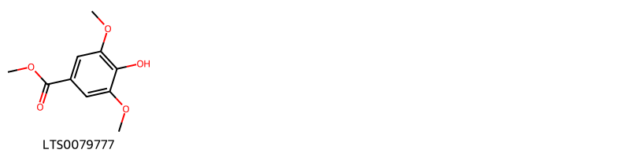{ width=100% }
    <figcaption>Hình ảnh cấu trúc hóa học của 1 hoạt chất thuộc nhóm Benzene and substituted derivatives gồm ['syringate (LTS0079777)'].</figcaption>
</figure>
#### Nhóm Cinnamic acids and derivatives
<figure markdown="span">
    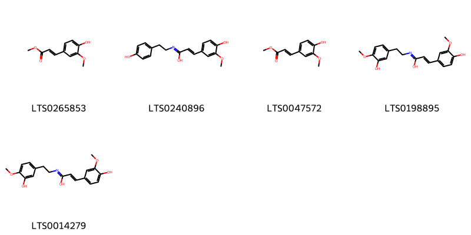{ width=100% }
    <figcaption>Hình ảnh cấu trúc hóa học của 5 hoạt chất thuộc nhóm Cinnamic acids and derivatives gồm ['methyl ferulate (LTS0265853)', '3-(4-hydroxy-3-methoxyphenyl)-n-[2-(4-hydroxyphenyl)ethyl]prop-2-enimidic acid (LTS0240896)', 'methyl ferulate (LTS0047572)', '3-(4-hydroxy-3-methoxyphenyl)-n-[2-(3-hydroxy-4-methoxyphenyl)ethyl]prop-2-enimidic acid (LTS0198895)', '(2e)-3-(4-hydroxy-3-methoxyphenyl)-n-[2-(3-hydroxy-4-methoxyphenyl)ethyl]prop-2-enimidic acid (LTS0014279)'].</figcaption>
</figure>
#### Nhóm Isoflavonoids
<figure markdown="span">
    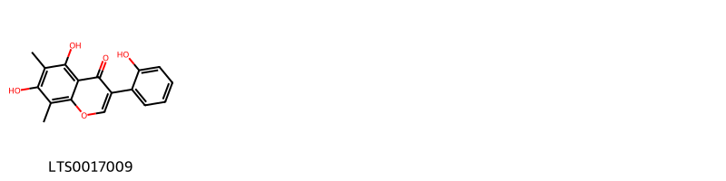{ width=100% }
    <figcaption>Hình ảnh cấu trúc hóa học của 1 hoạt chất thuộc nhóm Isoflavonoids gồm ['6,8-dimethylisogenistein (LTS0017009)'].</figcaption>
</figure>
#### Nhóm Isoquinolines and derivatives
<figure markdown="span">
    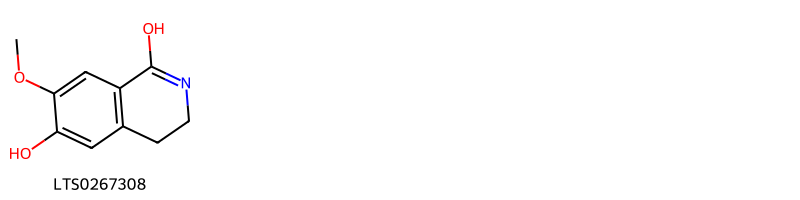{ width=100% }
    <figcaption>Hình ảnh cấu trúc hóa học của 1 hoạt chất thuộc nhóm Isoquinolines and derivatives gồm ['7-methoxy-3,4-dihydroisoquinoline-1,6-diol (LTS0267308)'].</figcaption>
</figure>
#### Nhóm Lignan lactones
<figure markdown="span">
    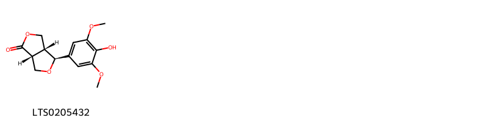{ width=100% }
    <figcaption>Hình ảnh cấu trúc hóa học của 1 hoạt chất thuộc nhóm Lignan lactones gồm ['(3ar,4s,6ar)-4-(4-hydroxy-3,5-dimethoxyphenyl)-tetrahydro-3h-furo[3,4-c]furan-1-one (LTS0205432)'].</figcaption>
</figure>
#### Nhóm Organooxygen compounds
<figure markdown="span">
    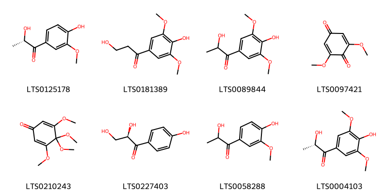{ width=100% }
    <figcaption>Hình ảnh cấu trúc hóa học của 8 hoạt chất thuộc nhóm Organooxygen compounds gồm ['(2s)-2-hydroxy-1-(4-hydroxy-3-methoxyphenyl)propan-1-one (LTS0125178)', '3-hydroxy-1-(4-hydroxy-3,5-dimethoxyphenyl)propan-1-one (LTS0181389)', '2-hydroxy-1-(4-hydroxy-3,5-dimethoxyphenyl)propan-1-one (LTS0089844)', '2,6-dimethoxy-1,4-benzoquinone (LTS0097421)', '3,4,4,5-tetramethoxycyclohexa-2,5-dien-1-one (LTS0210243)', '(2r)-2,3-dihydroxy-1-(4-hydroxyphenyl)propan-1-one (LTS0227403)', '2-hydroxy-1-(4-hydroxy-3-methoxyphenyl)propan-1-one (LTS0058288)', '(2s)-2-hydroxy-1-(4-hydroxy-3,5-dimethoxyphenyl)propan-1-one (LTS0004103)'].</figcaption>
</figure>
#### Nhóm Phenols
<figure markdown="span">
    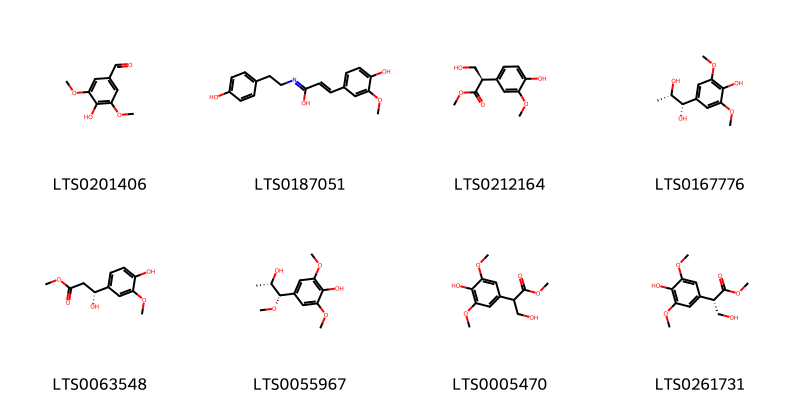{ width=100% }
    <figcaption>Hình ảnh cấu trúc hóa học của 8 hoạt chất thuộc nhóm Phenols gồm ['syringaldehyde (LTS0201406)', '(2e)-3-(4-hydroxy-3-methoxyphenyl)-n-[2-(4-hydroxyphenyl)ethyl]prop-2-enimidic acid (LTS0187051)', 'methyl (2r)-3-hydroxy-2-(4-hydroxy-3-methoxyphenyl)propanoate (LTS0212164)', '(1s,2s)-1-(4-hydroxy-3,5-dimethoxyphenyl)propane-1,2-diol (LTS0167776)', 'methyl (3r)-3-hydroxy-3-(4-hydroxy-3-methoxyphenyl)propanoate (LTS0063548)', '4-[(1s,2s)-2-hydroxy-1-methoxypropyl]-2,6-dimethoxyphenol (LTS0055967)', 'methyl 3-hydroxy-2-(4-hydroxy-3,5-dimethoxyphenyl)propanoate (LTS0005470)', 'methyl (2s)-3-hydroxy-2-(4-hydroxy-3,5-dimethoxyphenyl)propanoate (LTS0261731)'].</figcaption>
</figure>
#### Nhóm Prenol lipids
<figure markdown="span">
    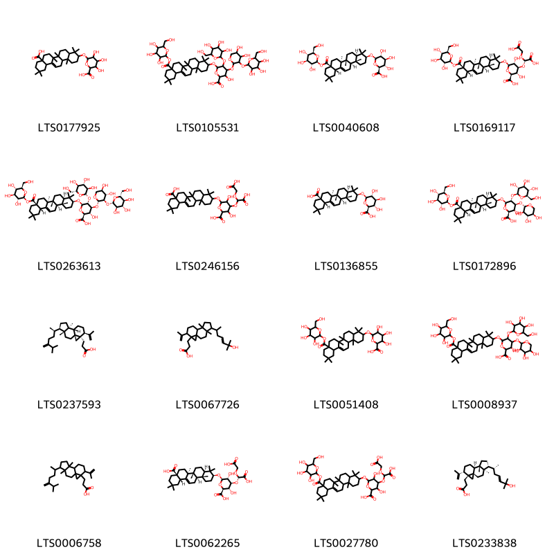{ width=100% }
    <figcaption>Hình ảnh cấu trúc hóa học của 16 hoạt chất thuộc nhóm Prenol lipids gồm ['6-[(8a-carboxy-4,4,6a,6b,11,11,14b-heptamethyl-1,2,3,4a,5,6,7,8,9,10,12,12a,14,14a-tetradecahydropicen-3-yl)oxy]-3,4,5-trihydroxyoxane-2-carboxylic acid (LTS0177925)', '6-{[4,4,6a,6b,11,11,14b-heptamethyl-8a-({[3,4,5-trihydroxy-6-(hydroxymethyl)oxan-2-yl]oxy}carbonyl)-1,2,3,4a,5,6,7,8,9,10,12,12a,14,14a-tetradecahydropicen-3-yl]oxy}-4-[(4,5-dihydroxy-3-{[3,4,5-trihydroxy-6-(hydroxymethyl)oxan-2-yl]oxy}oxan-2-yl)oxy]-3-hydroxy-5-{[3,4,5-trihydroxy-6-(hydroxymethyl)oxan-2-yl]oxy}oxane-2-carboxylic acid (LTS0105531)', 'calenduloside f (LTS0040608)', '(2s,3s,4s,5r,6r)-6-{[(3s,4ar,6ar,6bs,8as,12as,14ar,14br)-4,4,6a,6b,11,11,14b-heptamethyl-8a-({[(2s,3r,4s,5s,6r)-3,4,5-trihydroxy-6-(hydroxymethyl)oxan-2-yl]oxy}carbonyl)-1,2,3,4a,5,6,7,8,9,10,12,12a,14,14a-tetradecahydropicen-3-yl]oxy}-4-[(s)-carboxy(carboxymethoxy)methoxy]-3,5-dihydroxyoxane-2-carboxylic acid (LTS0169117)', '(2s,3s,4s,5r,6r)-6-{[(3s,4ar,6ar,6bs,8as,12as,14ar,14br)-4,4,6a,6b,11,11,14b-heptamethyl-8a-({[(2s,3r,4s,5s,6r)-3,4,5-trihydroxy-6-(hydroxymethyl)oxan-2-yl]oxy}carbonyl)-1,2,3,4a,5,6,7,8,9,10,12,12a,14,14a-tetradecahydropicen-3-yl]oxy}-4-{[(2s,3r,4s,5r)-4,5-dihydroxy-3-{[(2s,3r,4s,5s,6r)-3,4,5-trihydroxy-6-(hydroxymethyl)oxan-2-yl]oxy}oxan-2-yl]oxy}-3-hydroxy-5-{[(2s,3r,4s,5s,6r)-3,4,5-trihydroxy-6-(hydroxymethyl)oxan-2-yl]oxy}oxane-2-carboxylic acid (LTS0263613)', '6-[(8a-carboxy-4,4,6a,6b,11,11,14b-heptamethyl-1,2,3,4a,5,6,7,8,9,10,12,12a,14,14a-tetradecahydropicen-3-yl)oxy]-4-[carboxy(carboxymethoxy)methoxy]-3,5-dihydroxyoxane-2-carboxylic acid (LTS0246156)', 'oleanolic acid 3-o-glucuronide (LTS0136855)', '(2s,3s,4s,5r,6r)-6-{[(3s,4ar,6ar,6bs,8as,12as,14ar,14br)-4,4,6a,6b,11,11,14b-heptamethyl-8a-({[(2s,3r,4s,5s,6r)-3,4,5-trihydroxy-6-(hydroxymethyl)oxan-2-yl]oxy}carbonyl)-1,2,3,4a,5,6,7,8,9,10,12,12a,14,14a-tetradecahydropicen-3-yl]oxy}-3-hydroxy-5-{[(2s,3r,4s,5s,6r)-3,4,5-trihydroxy-6-(hydroxymethyl)oxan-2-yl]oxy}-4-{[(2s,3r,4s,5r)-3,4,5-trihydroxyoxan-2-yl]oxy}oxane-2-carboxylic acid (LTS0172896)', '3-[(1s,4r,5r,8s,9s,12s,13r)-4,8-dimethyl-5-[(2r)-6-methyl-5-methylideneheptan-2-yl]-12-(prop-1-en-2-yl)tetracyclo[7.5.0.0¹,¹³.0⁴,⁸]tetradecan-13-yl]propanoic acid (LTS0237593)', '3-[5-(6-hydroxy-6-methylhept-4-en-2-yl)-4,8-dimethyl-12-(prop-1-en-2-yl)tetracyclo[7.5.0.0¹,¹³.0⁴,⁸]tetradecan-13-yl]propanoic acid (LTS0067726)', '6-{[4,4,6a,6b,11,11,14b-heptamethyl-8a-({[3,4,5-trihydroxy-6-(hydroxymethyl)oxan-2-yl]oxy}carbonyl)-1,2,3,4a,5,6,7,8,9,10,12,12a,14,14a-tetradecahydropicen-3-yl]oxy}-3,4,5-trihydroxyoxane-2-carboxylic acid (LTS0051408)', '6-{[4,4,6a,6b,11,11,14b-heptamethyl-8a-({[3,4,5-trihydroxy-6-(hydroxymethyl)oxan-2-yl]oxy}carbonyl)-1,2,3,4a,5,6,7,8,9,10,12,12a,14,14a-tetradecahydropicen-3-yl]oxy}-3-hydroxy-5-{[3,4,5-trihydroxy-6-(hydroxymethyl)oxan-2-yl]oxy}-4-[(3,4,5-trihydroxyoxan-2-yl)oxy]oxane-2-carboxylic acid (LTS0008937)', '3-[4,8-dimethyl-5-(6-methyl-5-methylideneheptan-2-yl)-12-(prop-1-en-2-yl)tetracyclo[7.5.0.0¹,¹³.0⁴,⁸]tetradecan-13-yl]propanoic acid (LTS0006758)', '(2s,3s,4s,5r,6r)-6-{[(3s,4ar,6ar,6bs,8as,12as,14ar,14br)-8a-carboxy-4,4,6a,6b,11,11,14b-heptamethyl-1,2,3,4a,5,6,7,8,9,10,12,12a,14,14a-tetradecahydropicen-3-yl]oxy}-4-[(s)-carboxy(carboxymethoxy)methoxy]-3,5-dihydroxyoxane-2-carboxylic acid (LTS0062265)', '6-{[4,4,6a,6b,11,11,14b-heptamethyl-8a-({[3,4,5-trihydroxy-6-(hydroxymethyl)oxan-2-yl]oxy}carbonyl)-1,2,3,4a,5,6,7,8,9,10,12,12a,14,14a-tetradecahydropicen-3-yl]oxy}-4-[carboxy(carboxymethoxy)methoxy]-3,5-dihydroxyoxane-2-carboxylic acid (LTS0027780)', '3-[(1s,4r,5r,8s,9s,12s,13r)-5-[(2r,4e)-6-hydroxy-6-methylhept-4-en-2-yl]-4,8-dimethyl-12-(prop-1-en-2-yl)tetracyclo[7.5.0.0¹,¹³.0⁴,⁸]tetradecan-13-yl]propanoic acid (LTS0233838)'].</figcaption>
</figure>

---

### Dược dân tộc học

Danh sách các quốc gia có sử dụng *Ceodes umbellifera* trong điều trị các bệnh. 

| Country     | Disease   | Bệnh                                                                                                                                                                                                |
|:------------|:----------|:----------------------------------------------------------------------------------------------------------------------------------------------------------------------------------------------------|
| Philippines | Soap      | MYMEMORY WARNING: YOU USED ALL AVAILABLE FREE TRANSLATIONS FOR TODAY. NEXT AVAILABLE IN  09 HOURS 17 MINUTES 48 SECONDS VISIT HTTPS://MYMEMORY.TRANSLATED.NET/DOC/USAGELIMITS.PHP TO TRANSLATE MORE |

---

# Chi Commicarpus

??? note "Danh sách các dược liệu thuộc chi"
    
	 - *Commicarpus scandens*

---
## Commicarpus scandens
### Thông tin về thực vật

!!! info "Phân loại thực vật của *Commicarpus scandens* từ GIBF:"
    - **Kingdom:** Plantae
    - **Phylum:** Tracheophyta
    - **Order:** Caryophyllales
    - **Family:** Nyctaginaceae
    - **Genus:** Commicarpus
    - **Species:** *Commicarpus scandens*

 

| Label (VI)   | Label (EN)   | Scientific Name      | Descriptions (VI)   | Descriptions (EN)   | Also Known As (VI)   | Also Known As (EN)   |
|:-------------|:-------------|:---------------------|:--------------------|:--------------------|:---------------------|:---------------------|
| N/A          | N/A          | Commicarpus scandens |                     | species of plant    | ['']                 | ['']                 |

#### Phân bố trên thế giới

**Từ CSDL GIBF** Haiti, Saint Martin (French part), Dominican Republic, Puerto Rico, Aruba, United States of America, Mexico, Cuba, Anguilla, Saint Barthélemy, Bonaire, Sint Eustatius and Saba, Virgin Islands (U.S.), Curaçao

#### Phân bố tại Việt Nam

**Từ CSDL GIBF**: Không có ghi nhận ở Việt Nam

---
### Thành phần hóa học
        
- Theo cơ sở dữ liệu lotus: Từ loài *Commicarpus scandens* đã phân lập và xác định được Chưa có hoạt chất nào được phân lập. hoạt chất thuộc về các nhóm Không có hoạt chất nào được phân lập. 

Không có hình ảnh nào được tạo ra

---

### Dược dân tộc học

Danh sách các quốc gia có sử dụng *Commicarpus scandens* trong điều trị các bệnh. 

| Country   | Disease   | Bệnh                                                                                                                                                                                                |
|:----------|:----------|:----------------------------------------------------------------------------------------------------------------------------------------------------------------------------------------------------|
| Bahamas   | Diuretic  | MYMEMORY WARNING: YOU USED ALL AVAILABLE FREE TRANSLATIONS FOR TODAY. NEXT AVAILABLE IN  09 HOURS 17 MINUTES 24 SECONDS VISIT HTTPS://MYMEMORY.TRANSLATED.NET/DOC/USAGELIMITS.PHP TO TRANSLATE MORE |

---

# Chi Mirabilis

??? note "Danh sách các dược liệu thuộc chi"
    
	 - *Mirabilis jalapa*

---
## Mirabilis jalapa
### Thông tin về thực vật

!!! info "Phân loại thực vật của *Mirabilis jalapa* từ GIBF:"
    - **Kingdom:** Plantae
    - **Phylum:** Tracheophyta
    - **Order:** Caryophyllales
    - **Family:** Nyctaginaceae
    - **Genus:** Mirabilis
    - **Species:** *Mirabilis jalapa*

 

| Label (VI)   | Label (EN)   | Scientific Name   | Descriptions (VI)   | Descriptions (EN)   | Also Known As (VI)   | Also Known As (EN)                        |
|:-------------|:-------------|:------------------|:--------------------|:--------------------|:---------------------|:------------------------------------------|
| N/A          | N/A          | Mirabilis jalapa  | loài thực vật       | species of plant    | ['Hoa bốn giờ']      | ["four o'clock flower", 'marvel of Peru'] |

#### Phân bố trên thế giới

**Từ CSDL GIBF** Malawi, Thailand, Spain, Philippines, Cameroon, Kenya, Chile, Singapore, Australia, Indonesia, Colombia, Sri Lanka, Dominican Republic, Venezuela (Bolivarian Republic of), Western Sahara, Maldives, Puerto Rico, India, Malta, Panama, Brazil, Peru, Ethiopia, Mexico, China, Chinese Taipei, Hong Kong, Uruguay, Argentina, Portugal, South Africa, France, New Zealand, Bolivia (Plurinational State of), Costa Rica, Ecuador, United States of America, Italy, Israel, Madagascar, Greece

#### Phân bố tại Việt Nam

**Từ CSDL GIBF**: Không có ghi nhận ở Việt Nam

---
### Thành phần hóa học
        
- Theo cơ sở dữ liệu lotus: Từ loài *Mirabilis jalapa* đã phân lập và xác định được 39 hoạt chất thuộc về các nhóm Organooxygen compounds, Indoles and derivatives, Prenol lipids, Carboxylic acids and derivatives, Fatty Acyls, Isoflavonoids, Steroids and steroid derivatives, Tetrahydroisoquinolines. 

|    | chemicalTaxonomyClassyfireClass   |   smiles_count |
|---:|:----------------------------------|---------------:|
|  0 | Carboxylic acids and derivatives  |              5 |
|  1 | Fatty Acyls                       |              5 |
|  2 | Indoles and derivatives           |              1 |
|  3 | Isoflavonoids                     |             17 |
|  4 | Organooxygen compounds            |              2 |
|  5 | Prenol lipids                     |              3 |
|  6 | Steroids and steroid derivatives  |              4 |
|  7 | Tetrahydroisoquinolines           |              2 |

#### Nhóm Carboxylic acids and derivatives
<figure markdown="span">
    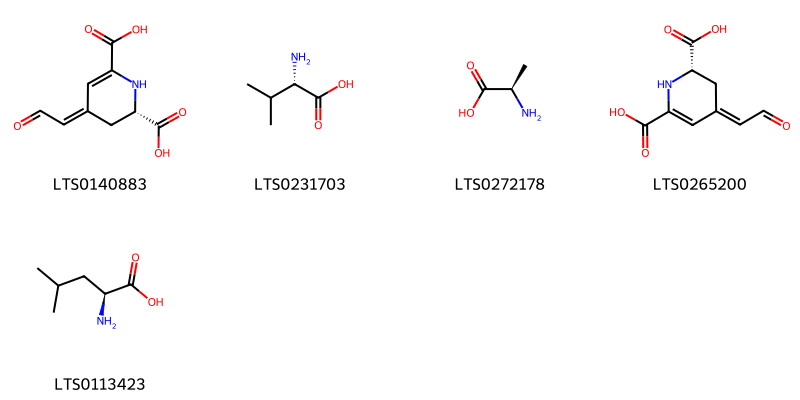{ width=100% }
    <figcaption>Hình ảnh cấu trúc hóa học của 5 hoạt chất thuộc nhóm Carboxylic acids and derivatives gồm ['(2s,4z)-4-(2-oxoethylidene)-2,3-dihydro-1h-pyridine-2,6-dicarboxylic acid (LTS0140883)', 'l-valine (LTS0231703)', 'd-alanine (LTS0272178)', 'betalamic acid (LTS0265200)', 'l-leucine (LTS0113423)'].</figcaption>
</figure>
#### Nhóm Fatty Acyls
<figure markdown="span">
    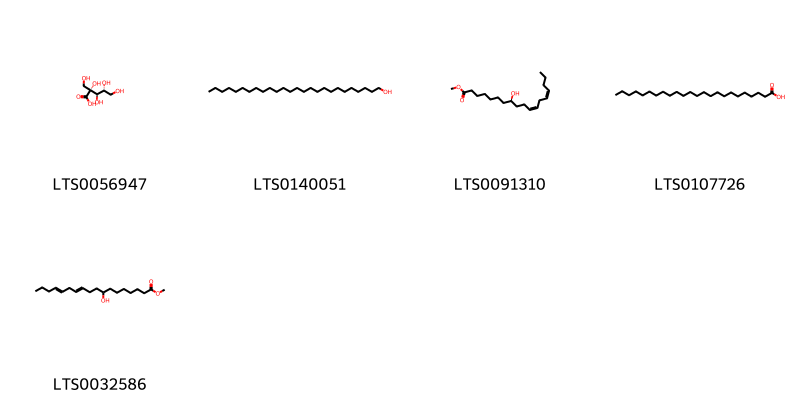{ width=100% }
    <figcaption>Hình ảnh cấu trúc hóa học của 5 hoạt chất thuộc nhóm Fatty Acyls gồm ['2-carboxy-d-arabinitol (LTS0056947)', 'ceryl alcohol (LTS0140051)', 'methyl (8r,11z,14z)-8-hydroxyoctadeca-11,14-dienoate (LTS0091310)', 'lignoceric acid (LTS0107726)', 'methyl 8-hydroxyoctadeca-11,14-dienoate (LTS0032586)'].</figcaption>
</figure>
#### Nhóm Indoles and derivatives
<figure markdown="span">
    { width=100% }
    <figcaption>Hình ảnh cấu trúc hóa học của 1 hoạt chất thuộc nhóm Indoles and derivatives gồm ['l-tryptophan (LTS0263809)'].</figcaption>
</figure>
#### Nhóm Isoflavonoids
<figure markdown="span">
    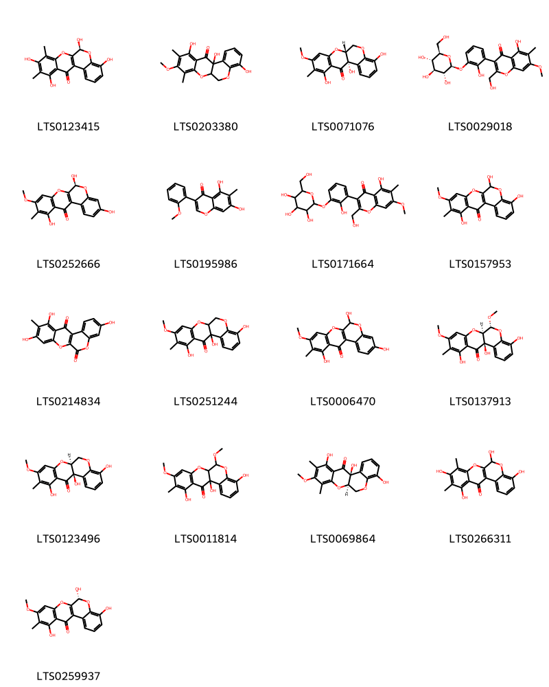{ width=100% }
    <figcaption>Hình ảnh cấu trúc hóa học của 17 hoạt chất thuộc nhóm Isoflavonoids gồm ['(6s)-4,6,9,11-tetrahydroxy-8,10-dimethyl-6h-5,7-dioxatetraphen-12-one (LTS0123415)', '4,11,12a-trihydroxy-9-methoxy-8,10-dimethyl-6,6a-dihydro-5,7-dioxatetraphen-12-one (LTS0203380)', '(6ar,12as)-4,11,12a-trihydroxy-9-methoxy-10-methyl-6,6a-dihydro-5,7-dioxatetraphen-12-one (LTS0071076)', '5-hydroxy-3-(2-hydroxy-3-{[(2s,3r,4s,5s,6r)-3,4,5-trihydroxy-6-(hydroxymethyl)oxan-2-yl]oxy}phenyl)-2-(hydroxymethyl)-7-methoxy-6-methylchromen-4-one (LTS0029018)', '(6s)-3,6,11-trihydroxy-9-methoxy-10-methyl-6h-5,7-dioxatetraphen-12-one (LTS0252666)', '5,7-dihydroxy-3-(2-methoxyphenyl)-6-methylchromen-4-one (LTS0195986)', '5-hydroxy-3-(2-hydroxy-3-{[3,4,5-trihydroxy-6-(hydroxymethyl)oxan-2-yl]oxy}phenyl)-2-(hydroxymethyl)-7-methoxy-6-methylchromen-4-one (LTS0171664)', '4,6,11-trihydroxy-9-methoxy-10-methyl-6h-5,7-dioxatetraphen-12-one (LTS0157953)', '3,9,11-trihydroxy-10-methyl-5,7-dioxatetraphene-6,12-dione (LTS0214834)', 'boeravinone c (LTS0251244)', '3,6,11-trihydroxy-9-methoxy-10-methyl-6h-5,7-dioxatetraphen-12-one (LTS0006470)', '(6r,6ar,12ar)-4,11,12a-trihydroxy-6,9-dimethoxy-10-methyl-6,6a-dihydro-5,7-dioxatetraphen-12-one (LTS0137913)', '(6as,12ar)-4,11,12a-trihydroxy-9-methoxy-10-methyl-6,6a-dihydro-5,7-dioxatetraphen-12-one (LTS0123496)', '4,11,12a-trihydroxy-6,9-dimethoxy-10-methyl-6,6a-dihydro-5,7-dioxatetraphen-12-one (LTS0011814)', '(6ar,12as)-4,11,12a-trihydroxy-9-methoxy-8,10-dimethyl-6,6a-dihydro-5,7-dioxatetraphen-12-one (LTS0069864)', '4,6,9,11-tetrahydroxy-8,10-dimethyl-6h-5,7-dioxatetraphen-12-one (LTS0266311)', '(6r)-4,6,11-trihydroxy-9-methoxy-10-methyl-6h-5,7-dioxatetraphen-12-one (LTS0259937)'].</figcaption>
</figure>
#### Nhóm Organooxygen compounds
<figure markdown="span">
    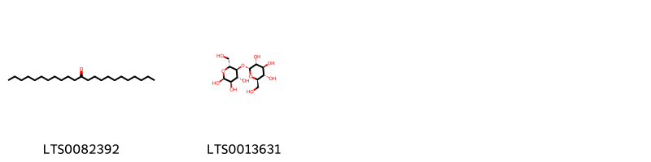{ width=100% }
    <figcaption>Hình ảnh cấu trúc hóa học của 2 hoạt chất thuộc nhóm Organooxygen compounds gồm ['12-tricosanone (LTS0082392)', 'α-maltose (LTS0013631)'].</figcaption>
</figure>
#### Nhóm Prenol lipids
<figure markdown="span">
    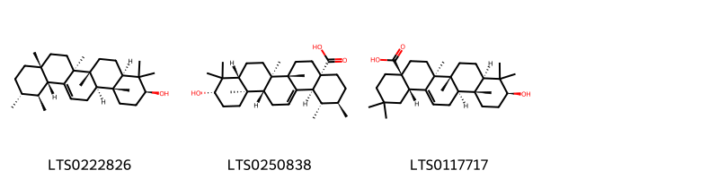{ width=100% }
    <figcaption>Hình ảnh cấu trúc hóa học của 3 hoạt chất thuộc nhóm Prenol lipids gồm ['amyrin (LTS0222826)', 'ursolic acid (LTS0250838)', 'oleanolic acid (LTS0117717)'].</figcaption>
</figure>
#### Nhóm Steroids and steroid derivatives
<figure markdown="span">
    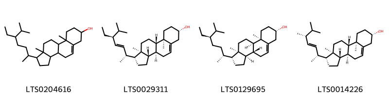{ width=100% }
    <figcaption>Hình ảnh cấu trúc hóa học của 4 hoạt chất thuộc nhóm Steroids and steroid derivatives gồm ['stigmast-5-en-3-ol, (3β)- (LTS0204616)', 'phytosterol (LTS0029311)', '(1r,3ar,3br,7s,9ar,9br,11ar)-1-[(2r,5r)-5-ethyl-6-methylheptan-2-yl]-9a,11a-dimethyl-1h,2h,3h,3ah,3bh,4h,6h,7h,8h,9h,9bh,10h,11h-cyclopenta[a]phenanthren-7-ol (LTS0129695)', 'brassicasterol (LTS0014226)'].</figcaption>
</figure>
#### Nhóm Tetrahydroisoquinolines
<figure markdown="span">
    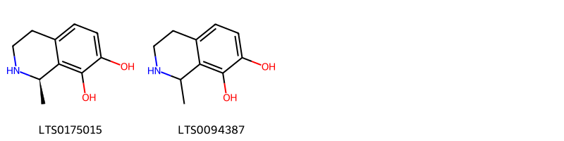{ width=100% }
    <figcaption>Hình ảnh cấu trúc hóa học của 2 hoạt chất thuộc nhóm Tetrahydroisoquinolines gồm ['(1r)-1-methyl-1,2,3,4-tetrahydroisoquinoline-7,8-diol (LTS0175015)', '1-methyl-1,2,3,4-tetrahydroisoquinoline-7,8-diol (LTS0094387)'].</figcaption>
</figure>

---

### Dược dân tộc học

Danh sách các quốc gia có sử dụng *Mirabilis jalapa* trong điều trị các bệnh. 

| Country            | Disease                                      | Bệnh                                                                                                                                                                                                |
|:-------------------|:---------------------------------------------|:----------------------------------------------------------------------------------------------------------------------------------------------------------------------------------------------------|
| China              | Tonic, Tonic, Cosmetic                       | MYMEMORY WARNING: YOU USED ALL AVAILABLE FREE TRANSLATIONS FOR TODAY. NEXT AVAILABLE IN  09 HOURS 17 MINUTES 01 SECONDS VISIT HTTPS://MYMEMORY.TRANSLATED.NET/DOC/USAGELIMITS.PHP TO TRANSLATE MORE |
| Dominican Republic | Purgative                                    | MYMEMORY WARNING: YOU USED ALL AVAILABLE FREE TRANSLATIONS FOR TODAY. NEXT AVAILABLE IN  09 HOURS 16 MINUTES 58 SECONDS VISIT HTTPS://MYMEMORY.TRANSLATED.NET/DOC/USAGELIMITS.PHP TO TRANSLATE MORE |
| Elsewhere          | Purgative, Purgative                         | MYMEMORY WARNING: YOU USED ALL AVAILABLE FREE TRANSLATIONS FOR TODAY. NEXT AVAILABLE IN  09 HOURS 16 MINUTES 55 SECONDS VISIT HTTPS://MYMEMORY.TRANSLATED.NET/DOC/USAGELIMITS.PHP TO TRANSLATE MORE |
| Haiti              | Carminative, Purgative, Vermifuge, Stomachic | MYMEMORY WARNING: YOU USED ALL AVAILABLE FREE TRANSLATIONS FOR TODAY. NEXT AVAILABLE IN  09 HOURS 16 MINUTES 53 SECONDS VISIT HTTPS://MYMEMORY.TRANSLATED.NET/DOC/USAGELIMITS.PHP TO TRANSLATE MORE |
| India              | Cosmetic                                     | MYMEMORY WARNING: YOU USED ALL AVAILABLE FREE TRANSLATIONS FOR TODAY. NEXT AVAILABLE IN  09 HOURS 16 MINUTES 50 SECONDS VISIT HTTPS://MYMEMORY.TRANSLATED.NET/DOC/USAGELIMITS.PHP TO TRANSLATE MORE |
| Japan              | Cosmetic                                     | MYMEMORY WARNING: YOU USED ALL AVAILABLE FREE TRANSLATIONS FOR TODAY. NEXT AVAILABLE IN  09 HOURS 16 MINUTES 48 SECONDS VISIT HTTPS://MYMEMORY.TRANSLATED.NET/DOC/USAGELIMITS.PHP TO TRANSLATE MORE |
| Malaya             | Cosmetic, Diuretic                           | MYMEMORY WARNING: YOU USED ALL AVAILABLE FREE TRANSLATIONS FOR TODAY. NEXT AVAILABLE IN  09 HOURS 16 MINUTES 45 SECONDS VISIT HTTPS://MYMEMORY.TRANSLATED.NET/DOC/USAGELIMITS.PHP TO TRANSLATE MORE |
| Mexico             | Purgative                                    | MYMEMORY WARNING: YOU USED ALL AVAILABLE FREE TRANSLATIONS FOR TODAY. NEXT AVAILABLE IN  09 HOURS 16 MINUTES 42 SECONDS VISIT HTTPS://MYMEMORY.TRANSLATED.NET/DOC/USAGELIMITS.PHP TO TRANSLATE MORE |
| Turkey             | Cathartic, Vermifuge, Diuretic               | MYMEMORY WARNING: YOU USED ALL AVAILABLE FREE TRANSLATIONS FOR TODAY. NEXT AVAILABLE IN  09 HOURS 16 MINUTES 40 SECONDS VISIT HTTPS://MYMEMORY.TRANSLATED.NET/DOC/USAGELIMITS.PHP TO TRANSLATE MORE |
| US                 | Poison                                       | MYMEMORY WARNING: YOU USED ALL AVAILABLE FREE TRANSLATIONS FOR TODAY. NEXT AVAILABLE IN  09 HOURS 16 MINUTES 37 SECONDS VISIT HTTPS://MYMEMORY.TRANSLATED.NET/DOC/USAGELIMITS.PHP TO TRANSLATE MORE |
| Venezuela          | Purgative                                    | MYMEMORY WARNING: YOU USED ALL AVAILABLE FREE TRANSLATIONS FOR TODAY. NEXT AVAILABLE IN  09 HOURS 16 MINUTES 34 SECONDS VISIT HTTPS://MYMEMORY.TRANSLATED.NET/DOC/USAGELIMITS.PHP TO TRANSLATE MORE |
| ain                | Purgative                                    | MYMEMORY WARNING: YOU USED ALL AVAILABLE FREE TRANSLATIONS FOR TODAY. NEXT AVAILABLE IN  09 HOURS 16 MINUTES 32 SECONDS VISIT HTTPS://MYMEMORY.TRANSLATED.NET/DOC/USAGELIMITS.PHP TO TRANSLATE MORE |

---

# Chi Ceodes

??? note "Danh sách các dược liệu thuộc chi"
    
	 - *Ceodes brunoniana*

---
## Ceodes brunoniana
### Thông tin về thực vật

!!! info "Phân loại thực vật của *Ceodes brunoniana* từ GIBF:"
    - **Kingdom:** Plantae
    - **Phylum:** Tracheophyta
    - **Order:** Caryophyllales
    - **Family:** Nyctaginaceae
    - **Genus:** Ceodes
    - **Species:** *Ceodes brunoniana*

 

| Label (VI)   | Label (EN)   | Scientific Name   | Descriptions (VI)   | Descriptions (EN)   | Also Known As (VI)   | Also Known As (EN)   |
|:-------------|:-------------|:------------------|:--------------------|:--------------------|:---------------------|:---------------------|
| N/A          | N/A          | Ceodes brunoniana |                     | species of plant    | ['']                 | ['Parapara']         |

#### Phân bố trên thế giới

**Từ CSDL GIBF** nan, New Zealand, Norfolk Island, United States of America, Australia

#### Phân bố tại Việt Nam

**Từ CSDL GIBF**: Không có ghi nhận ở Việt Nam

---
### Thành phần hóa học
        
- Theo cơ sở dữ liệu lotus: Từ loài *Ceodes brunoniana* đã phân lập và xác định được Chưa có hoạt chất nào được phân lập. hoạt chất thuộc về các nhóm Không có hoạt chất nào được phân lập. 

Không có hình ảnh nào được tạo ra

---

### Dược dân tộc học

Danh sách các quốc gia có sử dụng *Ceodes brunoniana* trong điều trị các bệnh. 

| Country   | Disease   | Bệnh                                                                                                                                                                                                |
|:----------|:----------|:----------------------------------------------------------------------------------------------------------------------------------------------------------------------------------------------------|
| Elsewhere | Poison    | MYMEMORY WARNING: YOU USED ALL AVAILABLE FREE TRANSLATIONS FOR TODAY. NEXT AVAILABLE IN  09 HOURS 16 MINUTES 04 SECONDS VISIT HTTPS://MYMEMORY.TRANSLATED.NET/DOC/USAGELIMITS.PHP TO TRANSLATE MORE |

---

