!!! abstract "Tóm tắt"

    Họ Nymphaeaceae gồm khoảng 4 chi và 14 loài được một số cộng đồng tại các quốc gia như ain, Haiti, Elsewhere, Dominican Republic, Japan, US(Flathead), US(Sioux), Egypt, India, English, Turkey, China, US(Amerindian), anish, West Indies sử dụng trong một số trường hợp Chất làm se, Chất làm se, Thuốc bổ, Thuốc giảm đau, Anaphrodisiac, Thuốc bổ, Tĩnh máu, Thuốc bổ, Thuốc lợi tiểu, Chất làm mềm, Ma túy, Dạ dày, Môi chất lạnh, Thuốc đắp, Thuốc kích thích tình dục, Chất kích thích, Tiêu hóa, Thuốc bổ, Anaphrodisiac, Chất làm se, Demulcent, Chất độc, Cardiotonic, Môi chất lạnh, Thuốc kích thích tình dục, Thuốc lợi tiểu, Chất làm se, Máy cầm máu, Ma túy, Anaphrodisiac, Thuốc bổ, Chất làm mềm, Thuốc lợi tiểu, Khử trùng, Demulcent, Chất làm se, Máy cầm máu, Thuốc bổ, Chất làm se, Ma túy, Thuốc bổ, Tiêu hóa, Chất làm se, Thuốc an thần.

!!! info "DrDuke"

    James A. Duke sinh năm 1929-2017 là một nhà thực vật học người Mỹ. Đây là một trong những tác giả hàng đầu trong lĩnh vực dược dân tộc học với cuốn *CRC Handbook of Medicinal Herbs* và chính là người xây dựng lên cơ sở dữ liệu về hợp chất tự nhiên và dược dân tộc học tại Bộ nông nghiệp Hoa Kỳ. Các thông tin được đăng tải tại website [Dr. Duke's Phytochemical and Ethnobotanical Databases](https://phytochem.nal.usda.gov/). 
    Trong suốt thập niên 1970, ông lãnh đạo the Plant Taxonomy Laboratory, Plant Genetics and Germplasm Institute of the Agricultural Research Service, U.S. Department of Agriculture.
    Trong tài liệu này, các thông tin về dược dân tộc của các dược liệu được trích dẫn từ tài liệu của James A. Ducke với sự trợ giúp của phần mềm dịch thuật từ tiếng Anh sang tiếng Việt.
   

# Chi Nuphar

??? note "Danh sách các dược liệu thuộc chi"
    
	 - *Nuphar japonicum*
	 - *Nuphar luteum*
	 - *Nuphar variegatum*

---
## Nuphar japonicum
### Thông tin về thực vật

!!! info "Phân loại thực vật của *Nuphar japonica* từ GIBF:"
    - **Kingdom:** Plantae
    - **Phylum:** Tracheophyta
    - **Order:** Nymphaeales
    - **Family:** Nymphaeaceae
    - **Genus:** Nuphar
    - **Species:** *Nuphar japonica*

 

| Label (VI)   | Label (EN)   | Scientific Name   | Descriptions (VI)   | Descriptions (EN)   | Also Known As (VI)   | Also Known As (EN)   |
|:-------------|:-------------|:------------------|:--------------------|:--------------------|:---------------------|:---------------------|
| N/A          | N/A          | Nuphar japonicum  |                     | misspelling         | ['']                 | ['']                 |

#### Phân bố trên thế giới

**Từ CSDL GIBF** nan, Chinese Taipei, Denmark, Japan, Russian Federation, Korea, Republic of, Indonesia

#### Phân bố tại Việt Nam

**Từ CSDL GIBF**: Không có ghi nhận ở Việt Nam

---
### Thành phần hóa học
        
- Theo cơ sở dữ liệu lotus: Từ loài *Nuphar japonica* đã phân lập và xác định được 35 hoạt chất thuộc về các nhóm Tannins, Organonitrogen compounds, Quinolizines, Benzene and substituted derivatives. 

|    | chemicalTaxonomyClassyfireClass     |   smiles_count |
|---:|:------------------------------------|---------------:|
|  0 |                                     |              3 |
|  1 | Benzene and substituted derivatives |              2 |
|  2 | Organonitrogen compounds            |              8 |
|  3 | Quinolizines                        |             11 |
|  4 | Tannins                             |             11 |

#### Nhóm 
<figure markdown="span">
    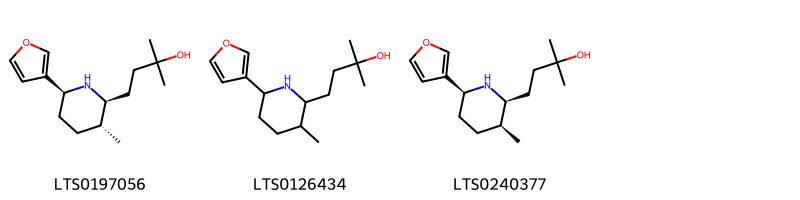{ width=100% }
    <figcaption>Hình ảnh cấu trúc hóa học của 3 hoạt chất thuộc nhóm  gồm ['nupharamine (LTS0197056)', '4-[6-(furan-3-yl)-3-methylpiperidin-2-yl]-2-methylbutan-2-ol (LTS0126434)', '4-[(2s,3s,6s)-6-(furan-3-yl)-3-methylpiperidin-2-yl]-2-methylbutan-2-ol (LTS0240377)'].</figcaption>
</figure>
#### Nhóm Benzene and substituted derivatives
<figure markdown="span">
    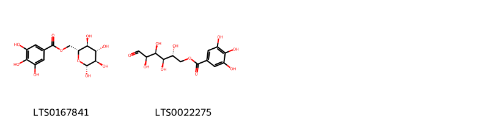{ width=100% }
    <figcaption>Hình ảnh cấu trúc hóa học của 2 hoạt chất thuộc nhóm Benzene and substituted derivatives gồm ['6-o-galloyl-β-d-glucose (LTS0167841)', '(2r,3r,4s,5r)-2,3,4,5-tetrahydroxy-6-oxohexyl 3,4,5-trihydroxybenzoate (LTS0022275)'].</figcaption>
</figure>
#### Nhóm Organonitrogen compounds
<figure markdown="span">
    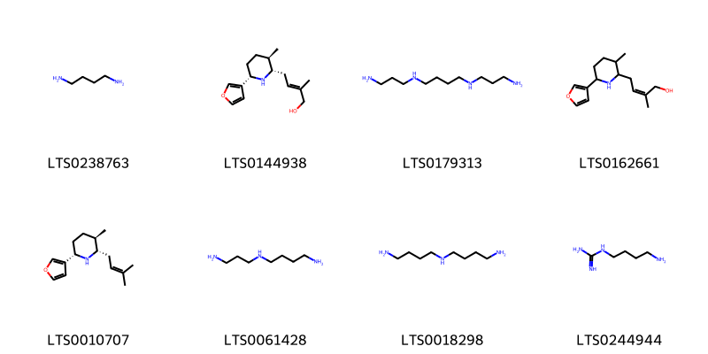{ width=100% }
    <figcaption>Hình ảnh cấu trúc hóa học của 8 hoạt chất thuộc nhóm Organonitrogen compounds gồm ['putrescine (LTS0238763)', '(2e)-4-[(2s,3r,6s)-6-(furan-3-yl)-3-methylpiperidin-2-yl]-2-methylbut-2-en-1-ol (LTS0144938)', 'spermine (LTS0179313)', '4-[6-(furan-3-yl)-3-methylpiperidin-2-yl]-2-methylbut-2-en-1-ol (LTS0162661)', '(2s,3r,6s)-6-(furan-3-yl)-3-methyl-2-(3-methylbut-2-en-1-yl)piperidine (LTS0010707)', 'spermidine (LTS0061428)', 'homospermidine (LTS0018298)', 'agmatine (LTS0244944)'].</figcaption>
</figure>
#### Nhóm Quinolizines
<figure markdown="span">
    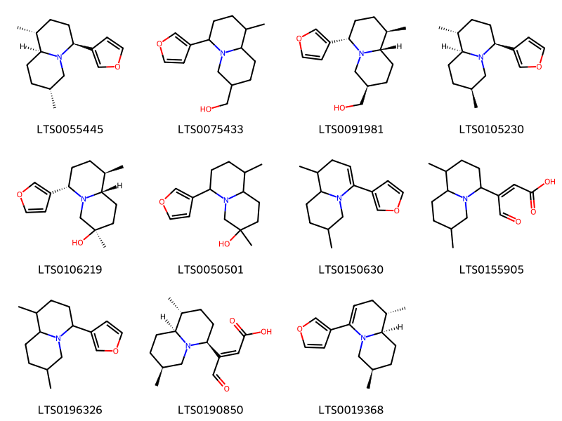{ width=100% }
    <figcaption>Hình ảnh cấu trúc hóa học của 11 hoạt chất thuộc nhóm Quinolizines gồm ['(1r,4s,7r,9as)-4-(furan-3-yl)-1,7-dimethyl-octahydro-1h-quinolizine (LTS0055445)', '[6-(furan-3-yl)-9-methyl-octahydro-1h-quinolizin-3-yl]methanol (LTS0075433)', '[(3r,6s,9r,9as)-6-(furan-3-yl)-9-methyl-octahydro-1h-quinolizin-3-yl]methanol (LTS0091981)', 'deoxynupharidine (LTS0105230)', '(3r,6s,9r,9as)-6-(furan-3-yl)-3,9-dimethyl-octahydroquinolizin-3-ol (LTS0106219)', '6-(furan-3-yl)-3,9-dimethyl-octahydroquinolizin-3-ol (LTS0050501)', '4-(furan-3-yl)-1,7-dimethyl-2,6,7,8,9,9a-hexahydro-1h-quinolizine (LTS0150630)', '3-(1,7-dimethyl-octahydro-1h-quinolizin-4-yl)-4-oxobut-2-enoic acid (LTS0155905)', '4-(furan-3-yl)-1,7-dimethyl-octahydro-1h-quinolizine (LTS0196326)', '(2e)-3-[(1r,4s,7s,9as)-1,7-dimethyl-octahydro-1h-quinolizin-4-yl]-4-oxobut-2-enoic acid (LTS0190850)', '(1s,7r,9ar)-4-(furan-3-yl)-1,7-dimethyl-2,6,7,8,9,9a-hexahydro-1h-quinolizine (LTS0019368)'].</figcaption>
</figure>
#### Nhóm Tannins
<figure markdown="span">
    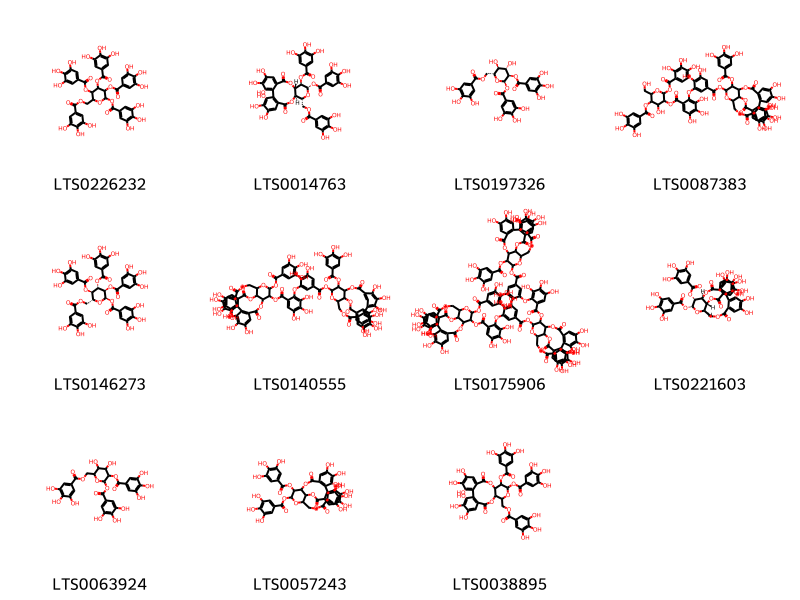{ width=100% }
    <figcaption>Hình ảnh cấu trúc hóa học của 11 hoạt chất thuộc nhóm Tannins gồm ['3,4,5-tris(3,4,5-trihydroxybenzoyloxy)-6-[(3,4,5-trihydroxybenzoyloxy)methyl]oxan-2-yl 3,4,5-trihydroxybenzoate (LTS0226232)', '(10r,11r,13s,14r,15s)-3,4,5,20,21,22-hexahydroxy-8,17-dioxo-14-(3,4,5-trihydroxybenzoyloxy)-11-[(3,4,5-trihydroxybenzoyloxy)methyl]-9,12,16-trioxatetracyclo[16.4.0.0²,⁷.0¹⁰,¹⁵]docosa-1(22),2(7),3,5,18,20-hexaen-13-yl 3,4,5-trihydroxybenzoate (LTS0014763)', '(2r,3r,4s,5s,6r)-4,5-dihydroxy-3-(3,4,5-trihydroxybenzoyloxy)-6-[(3,4,5-trihydroxybenzoyloxy)methyl]oxan-2-yl 3,4,5-trihydroxybenzoate (LTS0197326)', '4-hydroxy-6-(hydroxymethyl)-2-(2,3,4-trihydroxybenzoyloxy)-5-(3,4,5-trihydroxybenzoyloxy)oxan-3-yl 2-[5-({[6,7,8,11,12,13-hexahydroxy-3,16-dioxo-22,23-bis(3,4,5-trihydroxybenzoyloxy)-2,17,20-trioxatetracyclo[17.3.1.0⁴,⁹.0¹⁰,¹⁵]tricosa-4(9),5,7,10,12,14-hexaen-21-yl]oxy}carbonyl)-2,3-dihydroxyphenoxy]-3,4,5-trihydroxybenzoate (LTS0087383)', '(2r,3r,4s,5r,6r)-3,4,5-tris(3,4,5-trihydroxybenzoyloxy)-6-[(3,4,5-trihydroxybenzoyloxy)methyl]oxan-2-yl 3,4,5-trihydroxybenzoate (LTS0146273)', '6,7,8,11,12,13-hexahydroxy-3,16-dioxo-21,23-bis(3,4,5-trihydroxybenzoyloxy)-2,17,20-trioxatetracyclo[17.3.1.0⁴,⁹.0¹⁰,¹⁵]tricosa-4(9),5,7,10,12,14-hexaen-22-yl 2-[5-({[3,4,5,19,20,21-hexahydroxy-8,17-dioxo-14,23-bis(3,4,5-trihydroxybenzoyloxy)-9,12,16-trioxatetracyclo[16.3.1.1¹¹,¹⁵.0²,⁷]tricosa-1(22),2,4,6,18,20-hexaen-13-yl]oxy}carbonyl)-2,3-dihydroxyphenoxy]-3,4,5-trihydroxybenzoate (LTS0140555)', '21-{3-[6-({[6,7,8,11,12,13-hexahydroxy-3,16-dioxo-21,23-bis(3,4,5-trihydroxybenzoyloxy)-2,17,20-trioxatetracyclo[17.3.1.0⁴,⁹.0¹⁰,¹⁵]tricosa-4(9),5,7,10,12,14-hexaen-22-yl]oxy}carbonyl)-2,3,4-trihydroxyphenoxy]-4,5-dihydroxybenzoyloxy}-6,7,8,11,12,13-hexahydroxy-3,16-dioxo-23-(3,4,5-trihydroxybenzoyloxy)-2,17,20-trioxatetracyclo[17.3.1.0⁴,⁹.0¹⁰,¹⁵]tricosa-4(9),5,7,10,12,14-hexaen-22-yl 2-[5-({[6,7,8,11,12,13-hexahydroxy-3,16-dioxo-22,23-bis(3,4,5-trihydroxybenzoyloxy)-2,17,20-trioxatetracyclo[17.3.1.0⁴,⁹.0¹⁰,¹⁵]tricosa-4(9),5,7,10,12,14-hexaen-21-yl]oxy}carbonyl)-2,3-dihydroxyphenoxy]-3,4,5-trihydroxybenzoate (LTS0175906)', '(1s,19r,21r,22r,23r)-6,7,8,11,12,13-hexahydroxy-3,16-dioxo-21,22-bis(3,4,5-trihydroxybenzoyloxy)-2,17,20-trioxatetracyclo[17.3.1.0⁴,⁹.0¹⁰,¹⁵]tricosa-4(9),5,7,10,12,14-hexaen-23-yl 3,4,5-trihydroxybenzoate (LTS0221603)', '4,5-dihydroxy-3-(3,4,5-trihydroxybenzoyloxy)-6-[(3,4,5-trihydroxybenzoyloxy)methyl]oxan-2-yl 3,4,5-trihydroxybenzoate (LTS0063924)', '6,7,8,11,12,13-hexahydroxy-3,16-dioxo-21,22-bis(3,4,5-trihydroxybenzoyloxy)-2,17,20-trioxatetracyclo[17.3.1.0⁴,⁹.0¹⁰,¹⁵]tricosa-4(9),5,7,10,12,14-hexaen-23-yl 3,4,5-trihydroxybenzoate (LTS0057243)', '3,4,5,20,21,22-hexahydroxy-8,17-dioxo-14-(3,4,5-trihydroxybenzoyloxy)-11-[(3,4,5-trihydroxybenzoyloxy)methyl]-9,12,16-trioxatetracyclo[16.4.0.0²,⁷.0¹⁰,¹⁵]docosa-1(22),2(7),3,5,18,20-hexaen-13-yl 3,4,5-trihydroxybenzoate (LTS0038895)'].</figcaption>
</figure>

---

### Dược dân tộc học

Danh sách các quốc gia có sử dụng *Nuphar japonica* trong điều trị các bệnh. 

| Country   | Disease           | Bệnh                  |
|:----------|:------------------|:----------------------|
| China     | Digestive, Tonic  | Thuốc hỗ trợ tiêu hóa |
| Japan     | Hemostatic, Tonic | Tĩnh máu, Thuốc bổ    |

---

---
## Nuphar luteum
### Thông tin về thực vật

!!! info "Phân loại thực vật của *Nuphar lutea* từ GIBF:"
    - **Kingdom:** Plantae
    - **Phylum:** Tracheophyta
    - **Order:** Nymphaeales
    - **Family:** Nymphaeaceae
    - **Genus:** Nuphar
    - **Species:** *Nuphar lutea*

 

| Label (VI)   | Label (EN)   | Scientific Name   | Descriptions (VI)   | Descriptions (EN)   | Also Known As (VI)   | Also Known As (EN)   |
|:-------------|:-------------|:------------------|:--------------------|:--------------------|:---------------------|:---------------------|
| N/A          | N/A          | Nuphar japonicum  |                     | misspelling         | ['']                 | ['']                 |

#### Phân bố trên thế giới

**Từ CSDL GIBF** Luxembourg, Spain, Germany, Austria, Sweden, Poland, Belgium, Slovakia, Netherlands, Belarus, Slovenia, Lithuania, Ireland, Switzerland, United Kingdom of Great Britain and Northern Ireland, Portugal, France, Czechia, Russian Federation, United States of America, Italy, Croatia, Ukraine

#### Phân bố tại Việt Nam

**Từ CSDL GIBF**: Không có ghi nhận ở Việt Nam

---
### Thành phần hóa học
        
- Theo cơ sở dữ liệu lotus: Từ loài *Nuphar lutea* đã phân lập và xác định được 23 hoạt chất thuộc về các nhóm Quinolizines, Organonitrogen compounds, Quinolizidines. 

|    | chemicalTaxonomyClassyfireClass   |   smiles_count |
|---:|:----------------------------------|---------------:|
|  0 | Organonitrogen compounds          |              2 |
|  1 | Quinolizidines                    |              4 |
|  2 | Quinolizines                      |             17 |

#### Nhóm Organonitrogen compounds
<figure markdown="span">
    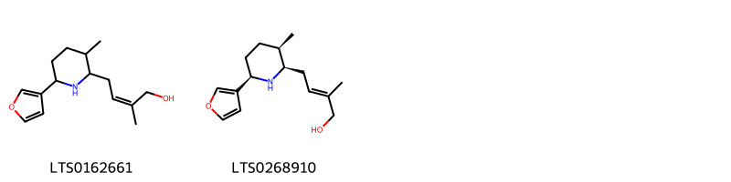{ width=100% }
    <figcaption>Hình ảnh cấu trúc hóa học của 2 hoạt chất thuộc nhóm Organonitrogen compounds gồm ['4-[6-(furan-3-yl)-3-methylpiperidin-2-yl]-2-methylbut-2-en-1-ol (LTS0162661)', '(2e)-4-[(2r,3r,6r)-6-(furan-3-yl)-3-methylpiperidin-2-yl]-2-methylbut-2-en-1-ol (LTS0268910)'].</figcaption>
</figure>
#### Nhóm Quinolizidines
<figure markdown="span">
    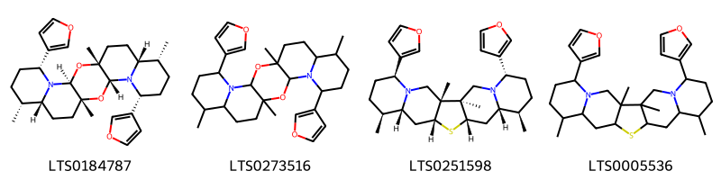{ width=100% }
    <figcaption>Hình ảnh cấu trúc hóa học của 4 hoạt chất thuộc nhóm Quinolizidines gồm ['(1r,3r,5r,8r,9r,12r,14s,16r,19r,20r)-5,16-bis(furan-3-yl)-1,8,12,19-tetramethyl-2,13-dioxa-4,15-diazapentacyclo[12.8.0.0³,¹².0⁴,⁹.0¹⁵,²⁰]docosane (LTS0184787)', '5,16-bis(furan-3-yl)-1,8,12,19-tetramethyl-2,13-dioxa-4,15-diazapentacyclo[12.8.0.0³,¹².0⁴,⁹.0¹⁵,²⁰]docosane (LTS0273516)', '(1s,2s,5s,8r,9s,11s,13r,15r,16s,19s)-5,19-bis(furan-3-yl)-1,2,8,16-tetramethyl-12-thia-4,20-diazapentacyclo[11.8.0.0²,¹¹.0⁴,⁹.0¹⁵,²⁰]henicosane (LTS0251598)', '5,19-bis(furan-3-yl)-1,2,8,16-tetramethyl-12-thia-4,20-diazapentacyclo[11.8.0.0²,¹¹.0⁴,⁹.0¹⁵,²⁰]henicosane (LTS0005536)'].</figcaption>
</figure>
#### Nhóm Quinolizines
<figure markdown="span">
    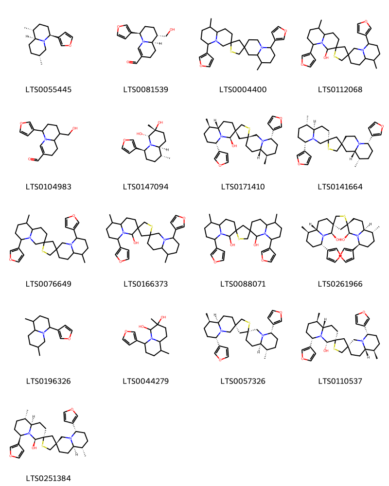{ width=100% }
    <figcaption>Hình ảnh cấu trúc hóa học của 17 hoạt chất thuộc nhóm Quinolizines gồm ['(1r,4s,7r,9as)-4-(furan-3-yl)-1,7-dimethyl-octahydro-1h-quinolizine (LTS0055445)', '(6r,9s,9ar)-6-(furan-3-yl)-9-(hydroxymethyl)-2,6,7,8,9,9a-hexahydro-1h-quinolizine-3-carbaldehyde (LTS0081539)', "6,6''-bis(furan-3-yl)-9,9''-dimethyl-hexadecahydrodispiro[quinolizine-2,4'-thiolane-2',3''-quinolizine] (LTS0004400)", "6,6''-bis(furan-3-yl)-9,9''-dimethyl-hexadecahydrodispiro[quinolizine-3,2'-thiolane-4',3''-quinolizin]-4-ol (LTS0112068)", '6-(furan-3-yl)-9-(hydroxymethyl)-2,6,7,8,9,9a-hexahydro-1h-quinolizine-3-carbaldehyde (LTS0104983)', '(3r,4r,6s,9r,9as)-6-(furan-3-yl)-3,9-dimethyl-octahydroquinolizine-3,4-diol (LTS0147094)', "(3r,4'r,4''r,6s,6''s,9r,9''r,9as,9''as)-6,6''-bis(furan-3-yl)-9,9''-dimethyl-hexadecahydrodispiro[quinolizine-3,2'-thiolane-4',3''-quinolizin]-4''-ol (LTS0171410)", "(2s,2'r,6s,6''s,9s,9''s,9as,9''ar)-6,6''-bis(furan-3-yl)-9,9''-dimethyl-hexadecahydrodispiro[quinolizine-2,4'-thiolane-2',3''-quinolizine] (LTS0141664)", "6,6''-bis(furan-3-yl)-9,9''-dimethyl-hexadecahydrodispiro[quinolizine-3,2'-thiolane-4',3''-quinolizine] (LTS0076649)", "6,6''-bis(furan-3-yl)-9,9''-dimethyl-hexadecahydrodispiro[quinolizine-3,2'-thiolane-4',3''-quinolizin]-4''-ol (LTS0166373)", "6,6''-bis(furan-3-yl)-9,9''-dimethyl-hexadecahydrodispiro[quinolizine-3,2'-thiolane-4',3''-quinolizine]-4,4''-diol (LTS0088071)", "(3s,4s,4's,4''r,6s,6''s,9r,9''r,9as,9''as)-6,6''-bis(furan-3-yl)-9,9''-dimethyl-hexadecahydrodispiro[quinolizine-3,2'-thiolane-4',3''-quinolizine]-4,4''-diol (LTS0261966)", '4-(furan-3-yl)-1,7-dimethyl-octahydro-1h-quinolizine (LTS0196326)', '6-(furan-3-yl)-3,9-dimethyl-octahydroquinolizine-3,4-diol (LTS0044279)', "(3s,4's,6s,6''s,9s,9''r,9ar,9''ar)-6,6''-bis(furan-3-yl)-9,9''-dimethyl-hexadecahydrodispiro[quinolizine-3,2'-thiolane-4',3''-quinolizine] (LTS0057326)", "(3r,4s,4'r,6s,6''s,9r,9''r,9as,9''as)-6,6''-bis(furan-3-yl)-9,9''-dimethyl-hexadecahydrodispiro[quinolizine-3,2'-thiolane-4',3''-quinolizin]-4-ol (LTS0110537)", "(3r,4r,4's,6r,6''s,9s,9''s,9ar,9''ar)-6,6''-bis(furan-3-yl)-9,9''-dimethyl-hexadecahydrodispiro[quinolizine-3,2'-thiolane-4',3''-quinolizin]-4-ol (LTS0251384)"].</figcaption>
</figure>

---

### Dược dân tộc học

Danh sách các quốc gia có sử dụng *Nuphar lutea* trong điều trị các bệnh. 

| Country   | Disease                | Bệnh                                 |
|:----------|:-----------------------|:-------------------------------------|
| Turkey    | Aphrodisiac, Stimulant | Kích thích tình dục, Chất kích thích |
| ain       | Anaphrodisiac          | Anaphrodisiac                        |

---

---
## Nuphar variegatum
### Thông tin về thực vật

!!! info "Phân loại thực vật của *Nuphar variegata* từ GIBF:"
    - **Kingdom:** Plantae
    - **Phylum:** Tracheophyta
    - **Order:** Nymphaeales
    - **Family:** Nymphaeaceae
    - **Genus:** Nuphar
    - **Species:** *Nuphar variegata*

 

| Label (VI)   | Label (EN)   | Scientific Name   | Descriptions (VI)   | Descriptions (EN)   | Also Known As (VI)   | Also Known As (EN)   |
|:-------------|:-------------|:------------------|:--------------------|:--------------------|:---------------------|:---------------------|
| N/A          | N/A          | Nuphar japonicum  |                     | misspelling         | ['']                 | ['']                 |

#### Phân bố trên thế giới

**Từ CSDL GIBF** Canada, United States of America

#### Phân bố tại Việt Nam

**Từ CSDL GIBF**: Không có ghi nhận ở Việt Nam

---
### Thành phần hóa học
        
- Theo cơ sở dữ liệu lotus: Từ loài *Nuphar variegata* đã phân lập và xác định được Chưa có hoạt chất nào được phân lập. hoạt chất thuộc về các nhóm Không có hoạt chất nào được phân lập. 

Không có hình ảnh nào được tạo ra

---

### Dược dân tộc học

Danh sách các quốc gia có sử dụng *Nuphar variegata* trong điều trị các bệnh. 

| Country      | Disease   | Bệnh                     |
|:-------------|:----------|:-------------------------|
| US(Flathead) | Poultice  | thuốc đắp, đắp thuốc cao |
| US(Sioux)    | Hemostat  | Máy cầm máu              |

---

# Chi Victoria

??? note "Danh sách các dược liệu thuộc chi"
    
	 - *Victoria regia*

---
## Victoria regia
### Thông tin về thực vật

!!! info "Phân loại thực vật của *Victoria amazonica* từ GIBF:"
    - **Kingdom:** Plantae
    - **Phylum:** Tracheophyta
    - **Order:** Nymphaeales
    - **Family:** Nymphaeaceae
    - **Genus:** Victoria
    - **Species:** *Victoria amazonica*

 

| Label (VI)   | Label (EN)   | Scientific Name   | Descriptions (VI)   | Descriptions (EN)   | Also Known As (VI)   | Also Known As (EN)   |
|:-------------|:-------------|:------------------|:--------------------|:--------------------|:---------------------|:---------------------|
| N/A          | N/A          | Victoria regia    | loài thực vật       | species of plant    | ['']                 | ['']                 |

#### Phân bố trên thế giới

**Từ CSDL GIBF** nan, unknown or invalid, Colombia, Thailand, Brazil, Paraguay, Italy, Netherlands, Guyana

#### Phân bố tại Việt Nam

**Từ CSDL GIBF**: Không có ghi nhận ở Việt Nam

---
### Thành phần hóa học
        
- Theo cơ sở dữ liệu lotus: Từ loài *Victoria amazonica* đã phân lập và xác định được Chưa có hoạt chất nào được phân lập. hoạt chất thuộc về các nhóm Không có hoạt chất nào được phân lập. 

Không có hình ảnh nào được tạo ra

---

### Dược dân tộc học

Danh sách các quốc gia có sử dụng *Victoria amazonica* trong điều trị các bệnh. 

| Country   | Disease                  | Bệnh                               |
|:----------|:-------------------------|:-----------------------------------|
| Elsewhere | Refrigerant, Aphrodisiac | Môi chất lạnh, kích thích tình dục |

---

# Chi Nymphaea

??? note "Danh sách các dược liệu thuộc chi"
    
	 - *Nymphaea alba*
	 - *Nymphaea ampla*
	 - *Nymphaea caerulea*
	 - *Nymphaea edulis*
	 - *Nymphaea jamesoniana*
	 - *Nymphaea nouchali*
	 - *Nymphaea odorata*
	 - *Nymphaea stellata*
	 - *Nymphaea tetragona*

---
## Nymphaea alba
### Thông tin về thực vật

!!! info "Phân loại thực vật của *Nymphaea alba* từ GIBF:"
    - **Kingdom:** Plantae
    - **Phylum:** Tracheophyta
    - **Order:** Nymphaeales
    - **Family:** Nymphaeaceae
    - **Genus:** Nymphaea
    - **Species:** *Nymphaea alba*

 

| Label (VI)   | Label (EN)   | Scientific Name   | Descriptions (VI)   | Descriptions (EN)   | Also Known As (VI)   | Also Known As (EN)   |
|:-------------|:-------------|:------------------|:--------------------|:--------------------|:---------------------|:---------------------|
| N/A          | N/A          | Nymphaea alba     | loài thực vật       | species of plant    | ['súng trắng']       | ['white water-lily'] |

#### Phân bố trên thế giới

**Từ CSDL GIBF** Denmark, Spain, Germany, Austria, Australia, Albania, Poland, India, Belgium, Netherlands, Slovakia, Lithuania, Hungary, Bulgaria, Ireland, Norway, Switzerland, United Kingdom of Great Britain and Northern Ireland, South Africa, Portugal, France, Czechia, New Zealand, Russian Federation, Italy, Croatia, Ukraine

#### Phân bố tại Việt Nam

**Từ CSDL GIBF**: Không có ghi nhận ở Việt Nam

---
### Thành phần hóa học
        
- Theo cơ sở dữ liệu lotus: Từ loài *Nymphaea alba* đã phân lập và xác định được 8 hoạt chất thuộc về các nhóm Tannins, Cinnamic acids and derivatives, Benzene and substituted derivatives. 

|    | chemicalTaxonomyClassyfireClass     |   smiles_count |
|---:|:------------------------------------|---------------:|
|  0 | Benzene and substituted derivatives |              5 |
|  1 | Cinnamic acids and derivatives      |              2 |
|  2 | Tannins                             |              1 |

#### Nhóm Benzene and substituted derivatives
<figure markdown="span">
    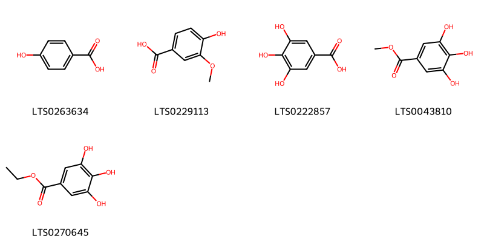{ width=100% }
    <figcaption>Hình ảnh cấu trúc hóa học của 5 hoạt chất thuộc nhóm Benzene and substituted derivatives gồm ['p-hydroxybenzoic acid (LTS0263634)', 'vanillic acid (LTS0229113)', 'galop (LTS0222857)', 'methyl gallate (LTS0043810)', 'ethyl gallate (LTS0270645)'].</figcaption>
</figure>
#### Nhóm Cinnamic acids and derivatives
<figure markdown="span">
    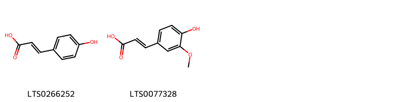{ width=100% }
    <figcaption>Hình ảnh cấu trúc hóa học của 2 hoạt chất thuộc nhóm Cinnamic acids and derivatives gồm ['para-coumaric acid (LTS0266252)', 'ferulic acid (LTS0077328)'].</figcaption>
</figure>
#### Nhóm Tannins
<figure markdown="span">
    { width=100% }
    <figcaption>Hình ảnh cấu trúc hóa học của 1 hoạt chất thuộc nhóm Tannins gồm ['ellagic acid (LTS0037297)'].</figcaption>
</figure>

---

### Dược dân tộc học

Danh sách các quốc gia có sử dụng *Nymphaea alba* trong điều trị các bệnh. 

| Country   | Disease                                       | Bệnh                                           |
|:----------|:----------------------------------------------|:-----------------------------------------------|
| Elsewhere | Sedative                                      | Thuốc an thần                                  |
| Turkey    | Astringent, Hemostat, Narcotic, Anaphrodisiac | Chất làm se, Hemostat, Narcotic, Anaphrodisiac |
| ain       | Anaphrodisiac                                 | Anaphrodisiac                                  |

---

---
## Nymphaea ampla
### Thông tin về thực vật

!!! info "Phân loại thực vật của *Nymphaea ampla* từ GIBF:"
    - **Kingdom:** Plantae
    - **Phylum:** Tracheophyta
    - **Order:** Nymphaeales
    - **Family:** Nymphaeaceae
    - **Genus:** Nymphaea
    - **Species:** *Nymphaea ampla*

 

| Label (VI)   | Label (EN)   | Scientific Name   | Descriptions (VI)   | Descriptions (EN)   | Also Known As (VI)   | Also Known As (EN)   |
|:-------------|:-------------|:------------------|:--------------------|:--------------------|:---------------------|:---------------------|
| N/A          | N/A          | Nymphaea ampla    | loài thực vật       | species of plant    | ['']                 | ['']                 |

#### Phân bố trên thế giới

**Từ CSDL GIBF** Honduras, Saint Martin (French part), Colombia, Belize, Nicaragua, Panama, Dominican Republic, Brazil, El Salvador, Guadeloupe, Puerto Rico, Costa Rica, Ecuador, Cuba, Mexico, Curaçao, Guatemala

#### Phân bố tại Việt Nam

**Từ CSDL GIBF**: Không có ghi nhận ở Việt Nam

---
### Thành phần hóa học
        
- Theo cơ sở dữ liệu lotus: Từ loài *Nymphaea ampla* đã phân lập và xác định được 9 hoạt chất thuộc về các nhóm Isoflavonoids, Flavonoids, Benzene and substituted derivatives. 

|    | chemicalTaxonomyClassyfireClass     |   smiles_count |
|---:|:------------------------------------|---------------:|
|  0 | Benzene and substituted derivatives |              1 |
|  1 | Flavonoids                          |              6 |
|  2 | Isoflavonoids                       |              2 |

#### Nhóm Benzene and substituted derivatives
<figure markdown="span">
    { width=100% }
    <figcaption>Hình ảnh cấu trúc hóa học của 1 hoạt chất thuộc nhóm Benzene and substituted derivatives gồm ['methyl gallate (LTS0043810)'].</figcaption>
</figure>
#### Nhóm Flavonoids
<figure markdown="span">
    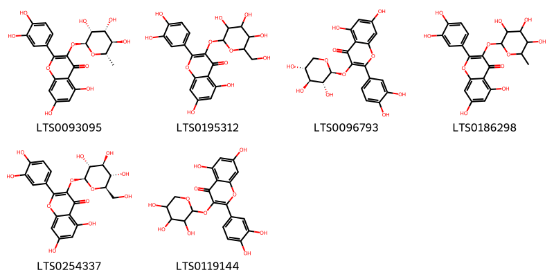{ width=100% }
    <figcaption>Hình ảnh cấu trúc hóa học của 6 hoạt chất thuộc nhóm Flavonoids gồm ['quercitrin (LTS0093095)', '2-(3,4-dihydroxyphenyl)-5,7-dihydroxy-3-{[3,4,5-trihydroxy-6-(hydroxymethyl)oxan-2-yl]oxy}chromen-4-one (LTS0195312)', '2-(3,4-dihydroxyphenyl)-5,7-dihydroxy-3-{[(2s,3r,4s,5r)-3,4,5-trihydroxyoxan-2-yl]oxy}chromen-4-one (LTS0096793)', 'quercitrin (LTS0186298)', 'isoquercetin (LTS0254337)', 'guaijaverin (LTS0119144)'].</figcaption>
</figure>
#### Nhóm Isoflavonoids
<figure markdown="span">
    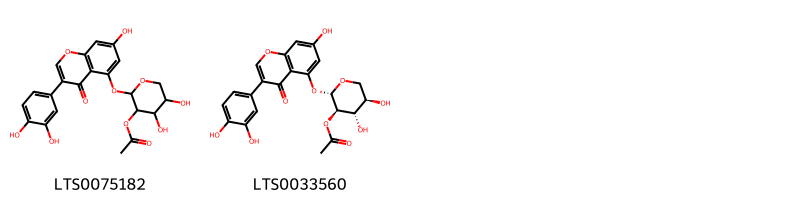{ width=100% }
    <figcaption>Hình ảnh cấu trúc hóa học của 2 hoạt chất thuộc nhóm Isoflavonoids gồm ['2-{[3-(3,4-dihydroxyphenyl)-7-hydroxy-4-oxochromen-5-yl]oxy}-4,5-dihydroxyoxan-3-yl acetate (LTS0075182)', '(2s,3r,4s,5r)-2-{[3-(3,4-dihydroxyphenyl)-7-hydroxy-4-oxochromen-5-yl]oxy}-4,5-dihydroxyoxan-3-yl acetate (LTS0033560)'].</figcaption>
</figure>

---

### Dược dân tộc học

Danh sách các quốc gia có sử dụng *Nymphaea ampla* trong điều trị các bệnh. 

| Country     | Disease   | Bệnh                  |
|:------------|:----------|:----------------------|
| West Indies | Narcotic  | Thuốc gây ngủ, gây mê |

---

---
## Nymphaea caerulea
### Thông tin về thực vật

!!! info "Phân loại thực vật của *N/A* từ GIBF:"
    - **Kingdom:** Plantae
    - **Phylum:** Tracheophyta
    - **Order:** Nymphaeales
    - **Family:** Nymphaeaceae
    - **Genus:** Nymphaea
    - **Species:** *N/A*

 

| Label (VI)   | Label (EN)   | Scientific Name   | Descriptions (VI)   | Descriptions (EN)   | Also Known As (VI)   | Also Known As (EN)   |
|:-------------|:-------------|:------------------|:--------------------|:--------------------|:---------------------|:---------------------|
| N/A          | N/A          | Nymphaea caerulea | loài thực vật       | species of plant    | ['']                 | ['']                 |

#### Phân bố trên thế giới

**Từ CSDL GIBF** Viet Nam, Thailand, Namibia, Philippines, Ghana, French Guiana, Senegal, Martinique, Australia, Guatemala, Indonesia, Sri Lanka, Sweden, Malaysia, India, Nigeria, Netherlands, Belize, Nicaragua, Panama, Brazil, Eswatini, Hungary, Mexico, Benin, Gambia, Hong Kong, South Africa, Botswana, Tanzania, United Republic of, New Zealand, Costa Rica, New Caledonia, Russian Federation, United States of America, Zimbabwe, Zambia

#### Phân bố tại Việt Nam

**Từ CSDL GIBF**: Đồng Tháp, Quảng Nam, Ninh Bình

---
### Thành phần hóa học
        
- Theo cơ sở dữ liệu lotus: Từ loài *N/A* đã phân lập và xác định được 49 hoạt chất thuộc về các nhóm Flavonoids, Prenol lipids, Fatty Acyls, Cinnamic acids and derivatives, Steroids and steroid derivatives, Benzene and substituted derivatives. 

|    | chemicalTaxonomyClassyfireClass     |   smiles_count |
|---:|:------------------------------------|---------------:|
|  0 | Benzene and substituted derivatives |              3 |
|  1 | Cinnamic acids and derivatives      |              2 |
|  2 | Fatty Acyls                         |              2 |
|  3 | Flavonoids                          |             32 |
|  4 | Prenol lipids                       |              2 |
|  5 | Steroids and steroid derivatives    |              8 |

#### Nhóm Benzene and substituted derivatives
<figure markdown="span">
    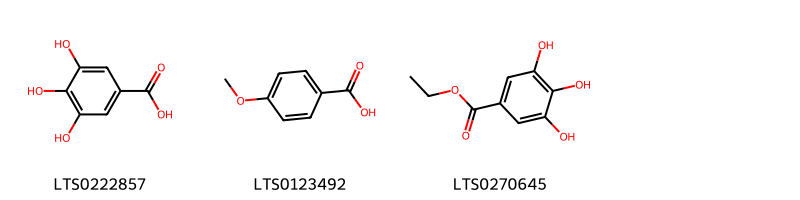{ width=100% }
    <figcaption>Hình ảnh cấu trúc hóa học của 3 hoạt chất thuộc nhóm Benzene and substituted derivatives gồm ['galop (LTS0222857)', 'p-anisic acid (LTS0123492)', 'ethyl gallate (LTS0270645)'].</figcaption>
</figure>
#### Nhóm Cinnamic acids and derivatives
<figure markdown="span">
    { width=100% }
    <figcaption>Hình ảnh cấu trúc hóa học của 2 hoạt chất thuộc nhóm Cinnamic acids and derivatives gồm ['para-coumaric acid (LTS0266252)', 'hydroxycinnamic acid (LTS0233023)'].</figcaption>
</figure>
#### Nhóm Fatty Acyls
<figure markdown="span">
    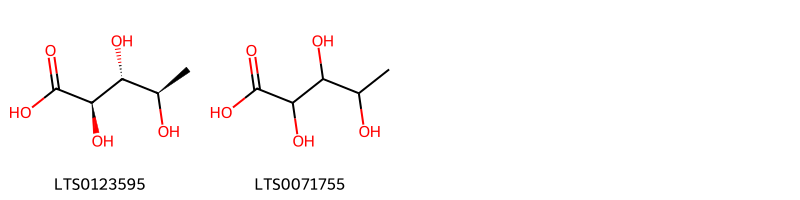{ width=100% }
    <figcaption>Hình ảnh cấu trúc hóa học của 2 hoạt chất thuộc nhóm Fatty Acyls gồm ['(2r,3r,4r)-2,3,4-trihydroxypentanoic acid (LTS0123595)', '2,3,4-trihydroxypentanoic acid (LTS0071755)'].</figcaption>
</figure>
#### Nhóm Flavonoids
<figure markdown="span">
    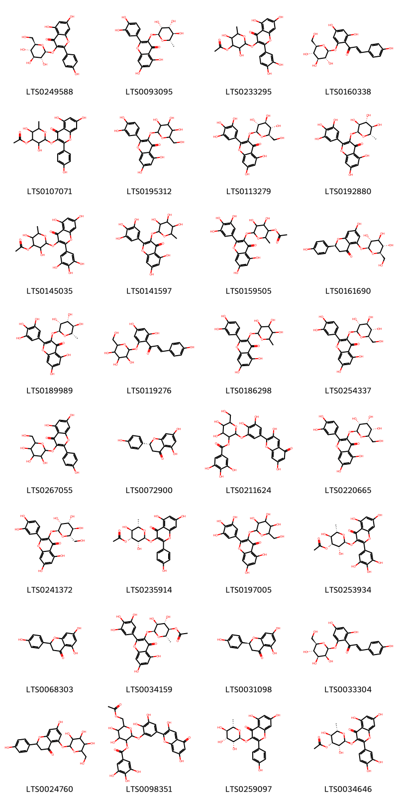{ width=100% }
    <figcaption>Hình ảnh cấu trúc hóa học của 32 hoạt chất thuộc nhóm Flavonoids gồm ['astragalin (LTS0249588)', 'quercitrin (LTS0093095)', '2-{[2-(3,4-dihydroxyphenyl)-5,7-dihydroxy-4-oxochromen-3-yl]oxy}-3,5-dihydroxy-6-methyloxan-4-yl acetate (LTS0233295)', 'phlorizin chalcone (LTS0160338)', '2-{[5,7-dihydroxy-2-(4-hydroxyphenyl)-4-oxochromen-3-yl]oxy}-3,5-dihydroxy-6-methyloxan-4-yl acetate (LTS0107071)', '2-(3,4-dihydroxyphenyl)-5,7-dihydroxy-3-{[3,4,5-trihydroxy-6-(hydroxymethyl)oxan-2-yl]oxy}chromen-4-one (LTS0195312)', '5,7-dihydroxy-3-{[(2s,3r,4s,5s,6r)-3,4,5-trihydroxy-6-(hydroxymethyl)oxan-2-yl]oxy}-2-(3,4,5-trihydroxyphenyl)chromen-4-one (LTS0113279)', '5,7-dihydroxy-3-{[(2s,3s,4r,5r,6s)-3,4,5-trihydroxy-6-methyloxan-2-yl]oxy}-2-(3,4,5-trihydroxyphenyl)chromen-4-one (LTS0192880)', '2-{[5,7-dihydroxy-4-oxo-2-(3,4,5-trihydroxyphenyl)chromen-3-yl]oxy}-3,5-dihydroxy-6-methyloxan-4-yl acetate (LTS0145035)', 'myricitrin (LTS0141597)', '6-{[5,7-dihydroxy-4-oxo-2-(3,4,5-trihydroxyphenyl)chromen-3-yl]oxy}-4,5-dihydroxy-2-methyloxan-3-yl acetate (LTS0159505)', '(2s)-7-hydroxy-2-(4-hydroxyphenyl)-5-{[(2s,3r,4s,5s,6r)-3,4,5-trihydroxy-6-(hydroxymethyl)oxan-2-yl]oxy}-2,3-dihydro-1-benzopyran-4-one (LTS0161690)', 'myricitrin (LTS0189989)', '1-(2,4-dihydroxy-6-{[3,4,5-trihydroxy-6-(hydroxymethyl)oxan-2-yl]oxy}phenyl)-3-(4-hydroxyphenyl)prop-2-en-1-one (LTS0119276)', 'quercitrin (LTS0186298)', 'isoquercetin (LTS0254337)', 'trifolin (LTS0267055)', '(-)-naringenin (LTS0072900)', '2-[5-(3,7-dihydroxy-5-oxochromen-2-yl)-2,3-dihydroxyphenoxy]-4,5-dihydroxy-6-(hydroxymethyl)oxan-3-yl 3,4,5-trihydroxybenzoate (LTS0211624)', '2-(3,4-dihydroxyphenyl)-5,7-dihydroxy-3-{[(2s,3r,4r,5s,6r)-3,4,5-trihydroxy-6-(hydroxymethyl)oxan-2-yl]oxy}chromen-4-one (LTS0220665)', '2-(3,4-dihydroxyphenyl)-5,7-dihydroxy-3-{[(2s,3r,4r,5r,6s)-3,4,5-trihydroxy-6-(hydroxymethyl)oxan-2-yl]oxy}chromen-4-one (LTS0241372)', '(2s,3r,4r,5s,6s)-2-{[5,7-dihydroxy-2-(4-hydroxyphenyl)-4-oxochromen-3-yl]oxy}-3,5-dihydroxy-6-methyloxan-4-yl acetate (LTS0235914)', '5,7-dihydroxy-3-{[3,4,5-trihydroxy-6-(hydroxymethyl)oxan-2-yl]oxy}-2-(3,4,5-trihydroxyphenyl)chromen-4-one (LTS0197005)', '(2s,3r,4r,5s,6s)-2-{[5,7-dihydroxy-4-oxo-2-(3,4,5-trihydroxyphenyl)chromen-3-yl]oxy}-3,5-dihydroxy-6-methyloxan-4-yl acetate (LTS0253934)', 'asahina (LTS0068303)', '(2s,3r,4s,5s,6s)-6-{[5,7-dihydroxy-4-oxo-2-(3,4,5-trihydroxyphenyl)chromen-3-yl]oxy}-4,5-dihydroxy-2-methyloxan-3-yl acetate (LTS0034159)', 'naringenin (LTS0031098)', '(2e)-1-(2,4-dihydroxy-6-{[(2s,3s,4s,5s,6r)-3,4,5-trihydroxy-6-(hydroxymethyl)oxan-2-yl]oxy}phenyl)-3-(4-hydroxyphenyl)prop-2-en-1-one (LTS0033304)', '7-hydroxy-2-(4-hydroxyphenyl)-5-{[3,4,5-trihydroxy-6-(hydroxymethyl)oxan-2-yl]oxy}-2,3-dihydro-1-benzopyran-4-one (LTS0024760)', '6-[(acetyloxy)methyl]-2-[5-(3,7-dihydroxy-5-oxochromen-2-yl)-2,3-dihydroxyphenoxy]-4,5-dihydroxyoxan-3-yl 3,4,5-trihydroxybenzoate (LTS0098351)', 'afzelin (LTS0259097)', '(2s,3r,4r,5s,6s)-2-{[2-(3,4-dihydroxyphenyl)-5,7-dihydroxy-4-oxochromen-3-yl]oxy}-3,5-dihydroxy-6-methyloxan-4-yl acetate (LTS0034646)'].</figcaption>
</figure>
#### Nhóm Prenol lipids
<figure markdown="span">
    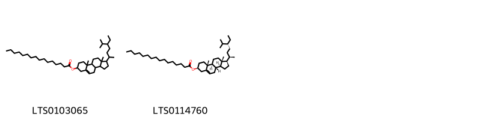{ width=100% }
    <figcaption>Hình ảnh cấu trúc hóa học của 2 hoạt chất thuộc nhóm Prenol lipids gồm ['1-(5-ethyl-6-methylheptan-2-yl)-9a,11a-dimethyl-1h,2h,3h,3ah,3bh,4h,6h,7h,8h,9h,9bh,10h,11h-cyclopenta[a]phenanthren-7-yl hexadecanoate (LTS0103065)', 'β-sitosteryl palmitate (LTS0114760)'].</figcaption>
</figure>
#### Nhóm Steroids and steroid derivatives
<figure markdown="span">
    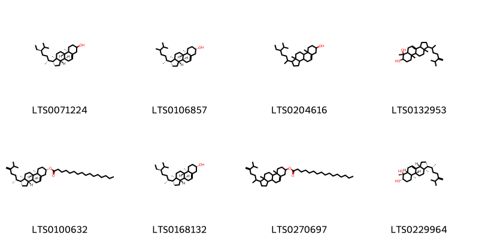{ width=100% }
    <figcaption>Hình ảnh cấu trúc hóa học của 8 hoạt chất thuộc nhóm Steroids and steroid derivatives gồm ['stigmast-5-en-3-ol (LTS0071224)', '24-α-methylcholesterol (LTS0106857)', 'stigmast-5-en-3-ol, (3β)- (LTS0204616)', '6,9a,11a-trimethyl-1-(6-methyl-5-methylideneheptan-2-yl)-1h,2h,3h,3ah,5h,5ah,7h,8h,9h,9bh,10h,11h-cyclopenta[a]phenanthrene-6,7-diol (LTS0132953)', '(1r,3as,3bs,7s,9ar,9bs,11ar)-9a,11a-dimethyl-1-[(2r)-6-methyl-5-methylideneheptan-2-yl]-1h,2h,3h,3ah,3bh,4h,6h,7h,8h,9h,9bh,10h,11h-cyclopenta[a]phenanthren-7-yl hexadecanoate (LTS0100632)', 'sitosterol (LTS0168132)', '9a,11a-dimethyl-1-(6-methyl-5-methylideneheptan-2-yl)-1h,2h,3h,3ah,3bh,4h,6h,7h,8h,9h,9bh,10h,11h-cyclopenta[a]phenanthren-7-yl hexadecanoate (LTS0270697)', '(1r,3ar,5ar,6r,7s,9ar,9br,11ar)-6,9a,11a-trimethyl-1-[(2r)-6-methyl-5-methylideneheptan-2-yl]-1h,2h,3h,3ah,5h,5ah,7h,8h,9h,9bh,10h,11h-cyclopenta[a]phenanthrene-6,7-diol (LTS0229964)'].</figcaption>
</figure>

---

### Dược dân tộc học

Danh sách các quốc gia có sử dụng *N/A* trong điều trị các bệnh. 

| Country   | Disease   | Bệnh                  |
|:----------|:----------|:----------------------|
| Egypt     | Narcotic  | Thuốc gây ngủ, gây mê |

---

---
## Nymphaea edulis
### Thông tin về thực vật

!!! info "Phân loại thực vật của *Nymphaea lotus* từ GIBF:"
    - **Kingdom:** Plantae
    - **Phylum:** Tracheophyta
    - **Order:** Nymphaeales
    - **Family:** Nymphaeaceae
    - **Genus:** Nymphaea
    - **Species:** *Nymphaea lotus*

 

| Label (VI)   | Label (EN)   | Scientific Name   | Descriptions (VI)   | Descriptions (EN)   | Also Known As (VI)   | Also Known As (EN)   |
|:-------------|:-------------|:------------------|:--------------------|:--------------------|:---------------------|:---------------------|
| N/A          | N/A          | Nymphaea edulis   |                     |                     | ['']                 | ['']                 |

#### Phân bố trên thế giới

**Từ CSDL GIBF** Viet Nam, Thailand, Namibia, Philippines, Ghana, French Guiana, Senegal, Martinique, Australia, Guatemala, Indonesia, Sri Lanka, Sweden, Malaysia, India, Nigeria, Netherlands, Belize, Nicaragua, Panama, Brazil, Eswatini, Hungary, Mexico, Benin, Gambia, Hong Kong, South Africa, Botswana, Tanzania, United Republic of, New Zealand, Costa Rica, New Caledonia, Russian Federation, United States of America, Zimbabwe, Zambia

#### Phân bố tại Việt Nam

**Từ CSDL GIBF**: Đồng Tháp, Quảng Nam, Ninh Bình

---
### Thành phần hóa học
        
- Theo cơ sở dữ liệu lotus: Từ loài *Nymphaea lotus* đã phân lập và xác định được Chưa có hoạt chất nào được phân lập. hoạt chất thuộc về các nhóm Không có hoạt chất nào được phân lập. 

Không có hình ảnh nào được tạo ra

---

### Dược dân tộc học

Danh sách các quốc gia có sử dụng *Nymphaea lotus* trong điều trị các bệnh. 

| Country   | Disease     | Bệnh           |
|:----------|:------------|:---------------|
| English   | Diuretic    | Thuốc lợi tiêu |
| India     | Sedative    | Thuốc an thần  |
| anish     | Refrigerant | Chất làm lạnh  |

---

---
## Nymphaea jamesoniana
### Thông tin về thực vật

!!! info "Phân loại thực vật của *Nymphaea jamesoniana* từ GIBF:"
    - **Kingdom:** Plantae
    - **Phylum:** Tracheophyta
    - **Order:** Nymphaeales
    - **Family:** Nymphaeaceae
    - **Genus:** Nymphaea
    - **Species:** *Nymphaea jamesoniana*

 

| Label (VI)   | Label (EN)   | Scientific Name      | Descriptions (VI)   | Descriptions (EN)   | Also Known As (VI)   | Also Known As (EN)   |
|:-------------|:-------------|:---------------------|:--------------------|:--------------------|:---------------------|:---------------------|
| N/A          | N/A          | Nymphaea jamesoniana |                     | species of plant    | ['']                 | ['']                 |

#### Phân bố trên thế giới

**Từ CSDL GIBF** Colombia, Argentina, El Salvador, Nicaragua, Brazil, Puerto Rico, Bolivia (Plurinational State of), Paraguay, Costa Rica, Ecuador, Cuba, United States of America, Mexico, Guatemala

#### Phân bố tại Việt Nam

**Từ CSDL GIBF**: Không có ghi nhận ở Việt Nam

---
### Thành phần hóa học
        
- Theo cơ sở dữ liệu lotus: Từ loài *Nymphaea jamesoniana* đã phân lập và xác định được Chưa có hoạt chất nào được phân lập. hoạt chất thuộc về các nhóm Không có hoạt chất nào được phân lập. 

Không có hình ảnh nào được tạo ra

---

### Dược dân tộc học

Danh sách các quốc gia có sử dụng *Nymphaea jamesoniana* trong điều trị các bệnh. 

| Country            | Disease    | Bệnh                  |
|:-------------------|:-----------|:----------------------|
| Dominican Republic | Astringent | Lam se da             |
| Haiti              | Narcotic   | Thuốc gây ngủ, gây mê |

---

---
## Nymphaea nouchali
### Thông tin về thực vật

!!! info "Phân loại thực vật của *Nymphaea nouchali* từ GIBF:"
    - **Kingdom:** Plantae
    - **Phylum:** Tracheophyta
    - **Order:** Nymphaeales
    - **Family:** Nymphaeaceae
    - **Genus:** Nymphaea
    - **Species:** *Nymphaea nouchali*

 

| Label (VI)   | Label (EN)   | Scientific Name   | Descriptions (VI)   | Descriptions (EN)   | Also Known As (VI)   | Also Known As (EN)                                  |
|:-------------|:-------------|:------------------|:--------------------|:--------------------|:---------------------|:----------------------------------------------------|
| N/A          | N/A          | Nymphaea nouchali | loài thực vật       | species of plant    | ['']                 | ['blue water lily', 'red water lily', 'Star lotus'] |

#### Phân bố trên thế giới

**Từ CSDL GIBF** Thailand, Namibia, French Polynesia, Martinique, Singapore, Australia, Indonesia, Sri Lanka, India, Bangladesh, Uganda, Brazil, Eswatini, Hong Kong, South Africa, Botswana, Mozambique, Fiji, New Caledonia, United States of America, Zimbabwe, Israel, Madagascar

#### Phân bố tại Việt Nam

**Từ CSDL GIBF**: Không có ghi nhận ở Việt Nam

---
### Thành phần hóa học
        
- Theo cơ sở dữ liệu lotus: Từ loài *Nymphaea nouchali* đã phân lập và xác định được 10 hoạt chất thuộc về các nhóm Tannins, Flavonoids, Benzene and substituted derivatives. 

|    | chemicalTaxonomyClassyfireClass     |   smiles_count |
|---:|:------------------------------------|---------------:|
|  0 | Benzene and substituted derivatives |              2 |
|  1 | Flavonoids                          |              7 |
|  2 | Tannins                             |              1 |

#### Nhóm Benzene and substituted derivatives
<figure markdown="span">
    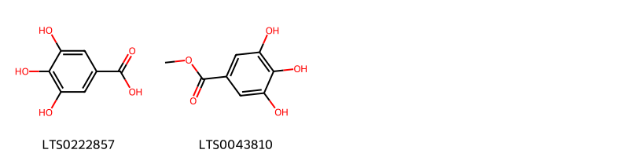{ width=100% }
    <figcaption>Hình ảnh cấu trúc hóa học của 2 hoạt chất thuộc nhóm Benzene and substituted derivatives gồm ['galop (LTS0222857)', 'methyl gallate (LTS0043810)'].</figcaption>
</figure>
#### Nhóm Flavonoids
<figure markdown="span">
    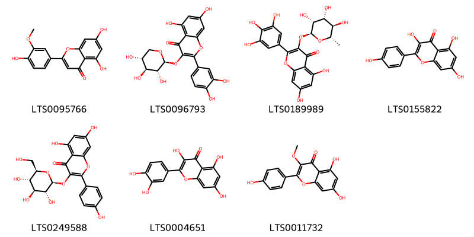{ width=100% }
    <figcaption>Hình ảnh cấu trúc hóa học của 7 hoạt chất thuộc nhóm Flavonoids gồm ['chrysoeriol (LTS0095766)', '2-(3,4-dihydroxyphenyl)-5,7-dihydroxy-3-{[(2s,3r,4s,5r)-3,4,5-trihydroxyoxan-2-yl]oxy}chromen-4-one (LTS0096793)', 'myricitrin (LTS0189989)', 'kaempherol (LTS0155822)', 'astragalin (LTS0249588)', 'quercetin (LTS0004651)', 'isokaempferide (LTS0011732)'].</figcaption>
</figure>
#### Nhóm Tannins
<figure markdown="span">
    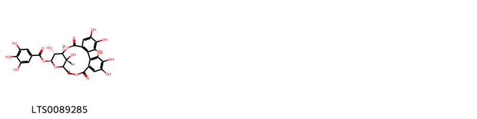{ width=100% }
    <figcaption>Hình ảnh cấu trúc hóa học của 1 hoạt chất thuộc nhóm Tannins gồm ['(1s,19r,21s,22r,23r)-6,7,8,11,12,13,22,23-octahydroxy-3,16-dioxo-2,17,20-trioxatetracyclo[17.3.1.0⁴,⁹.0¹⁰,¹⁵]tricosa-4(9),5,7,10,12,14-hexaen-21-yl 3,4,5-trihydroxybenzoate (LTS0089285)'].</figcaption>
</figure>

---

### Dược dân tộc học

Danh sách các quốc gia có sử dụng *Nymphaea nouchali* trong điều trị các bệnh. 

| Country   | Disease                                    | Bệnh                                          |
|:----------|:-------------------------------------------|:----------------------------------------------|
| Elsewhere | Astringent, Demulcent, Poison, Cardiotonic | Chất làm se, Demulcent, Chất độc, Cardiotonic |

---

---
## Nymphaea odorata
### Thông tin về thực vật

!!! info "Phân loại thực vật của *Nymphaea odorata* từ GIBF:"
    - **Kingdom:** Plantae
    - **Phylum:** Tracheophyta
    - **Order:** Nymphaeales
    - **Family:** Nymphaeaceae
    - **Genus:** Nymphaea
    - **Species:** *Nymphaea odorata*

 

| Label (VI)   | Label (EN)   | Scientific Name   | Descriptions (VI)   | Descriptions (EN)                             | Also Known As (VI)   | Also Known As (EN)                                                                                                 |
|:-------------|:-------------|:------------------|:--------------------|:----------------------------------------------|:---------------------|:-------------------------------------------------------------------------------------------------------------------|
| N/A          | N/A          | Nymphaea odorata  |                     | aquatic plant belonging to the genus Nymphaea | ['']                 | ['American white waterlily', 'beaver root', 'fragrant water-lily', 'sweet-scented water lily', 'white water lily'] |

#### Phân bố trên thế giới

**Từ CSDL GIBF** Canada, United States of America, Mexico

#### Phân bố tại Việt Nam

**Từ CSDL GIBF**: Không có ghi nhận ở Việt Nam

---
### Thành phần hóa học
        
- Theo cơ sở dữ liệu lotus: Từ loài *Nymphaea odorata* đã phân lập và xác định được 31 hoạt chất thuộc về các nhóm Flavonoids, 2-arylbenzofuran flavonoids, Prenol lipids, Lignan glycosides, Steroids and steroid derivatives. 

|    | chemicalTaxonomyClassyfireClass   |   smiles_count |
|---:|:----------------------------------|---------------:|
|  0 | 2-arylbenzofuran flavonoids       |              3 |
|  1 | Flavonoids                        |             15 |
|  2 | Lignan glycosides                 |              3 |
|  3 | Prenol lipids                     |              5 |
|  4 | Steroids and steroid derivatives  |              5 |

#### Nhóm 2-arylbenzofuran flavonoids
<figure markdown="span">
    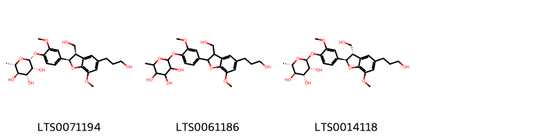{ width=100% }
    <figcaption>Hình ảnh cấu trúc hóa học của 3 hoạt chất thuộc nhóm 2-arylbenzofuran flavonoids gồm ['(2r,3r,4r,5r,6s)-2-{4-[(2r,3r)-3-(hydroxymethyl)-5-(3-hydroxypropyl)-7-methoxy-2,3-dihydro-1-benzofuran-2-yl]-2-methoxyphenoxy}-6-methyloxane-3,4,5-triol (LTS0071194)', '2-{4-[3-(hydroxymethyl)-5-(3-hydroxypropyl)-7-methoxy-2,3-dihydro-1-benzofuran-2-yl]-2-methoxyphenoxy}-6-methyloxane-3,4,5-triol (LTS0061186)', 'icariside e4 (LTS0014118)'].</figcaption>
</figure>
#### Nhóm Flavonoids
<figure markdown="span">
    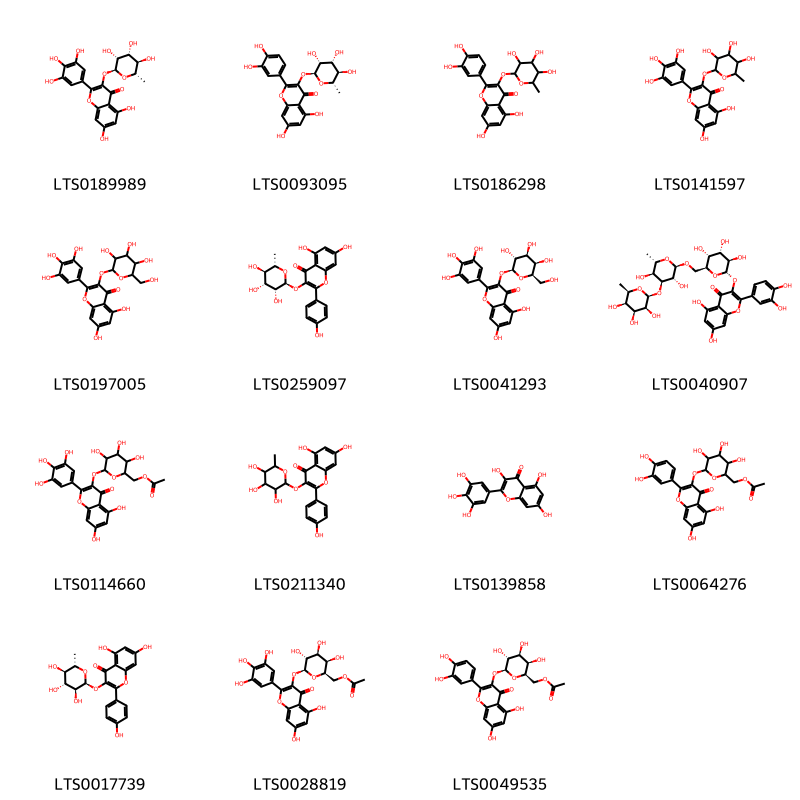{ width=100% }
    <figcaption>Hình ảnh cấu trúc hóa học của 15 hoạt chất thuộc nhóm Flavonoids gồm ['myricitrin (LTS0189989)', 'quercitrin (LTS0093095)', 'quercitrin (LTS0186298)', 'myricitrin (LTS0141597)', '5,7-dihydroxy-3-{[3,4,5-trihydroxy-6-(hydroxymethyl)oxan-2-yl]oxy}-2-(3,4,5-trihydroxyphenyl)chromen-4-one (LTS0197005)', 'afzelin (LTS0259097)', '5,7-dihydroxy-3-{[(2s,3r,4s,5r,6r)-3,4,5-trihydroxy-6-(hydroxymethyl)oxan-2-yl]oxy}-2-(3,4,5-trihydroxyphenyl)chromen-4-one (LTS0041293)', '3-{[(2s,3r,4s,5r,6s)-6-({[(2r,3r,4s,5s,6s)-3,5-dihydroxy-6-methyl-4-{[(2s,3s,4s,5r,6r)-3,4,5-trihydroxy-6-methyloxan-2-yl]oxy}oxan-2-yl]oxy}methyl)-3,4,5-trihydroxyoxan-2-yl]oxy}-2-(3,4-dihydroxyphenyl)-5,7-dihydroxychromen-4-one (LTS0040907)', '(6-{[5,7-dihydroxy-4-oxo-2-(3,4,5-trihydroxyphenyl)chromen-3-yl]oxy}-3,4,5-trihydroxyoxan-2-yl)methyl acetate (LTS0114660)', '5,7-dihydroxy-2-(4-hydroxyphenyl)-3-[(3,4,5-trihydroxy-6-methyloxan-2-yl)oxy]chromen-4-one (LTS0211340)', 'myricetin (LTS0139858)', '(6-{[2-(3,4-dihydroxyphenyl)-5,7-dihydroxy-4-oxochromen-3-yl]oxy}-3,4,5-trihydroxyoxan-2-yl)methyl acetate (LTS0064276)', '5,7-dihydroxy-2-(4-hydroxyphenyl)-3-{[(2s,3s,4r,5r,6s)-3,4,5-trihydroxy-6-methyloxan-2-yl]oxy}chromen-4-one (LTS0017739)', '[(2r,3r,4s,5r,6s)-6-{[5,7-dihydroxy-4-oxo-2-(3,4,5-trihydroxyphenyl)chromen-3-yl]oxy}-3,4,5-trihydroxyoxan-2-yl]methyl acetate (LTS0028819)', '[(2r,3r,4s,5r,6s)-6-{[2-(3,4-dihydroxyphenyl)-5,7-dihydroxy-4-oxochromen-3-yl]oxy}-3,4,5-trihydroxyoxan-2-yl]methyl acetate (LTS0049535)'].</figcaption>
</figure>
#### Nhóm Lignan glycosides
<figure markdown="span">
    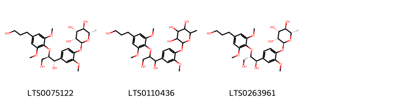{ width=100% }
    <figcaption>Hình ảnh cấu trúc hóa học của 3 hoạt chất thuộc nhóm Lignan glycosides gồm ['(2s,3r,4r,5r,6s)-2-{4-[(1s,2r)-1,3-dihydroxy-2-[4-(3-hydroxypropyl)-2,6-dimethoxyphenoxy]propyl]-2-methoxyphenoxy}-6-methyloxane-3,4,5-triol (LTS0075122)', '2-(4-{1,3-dihydroxy-2-[4-(3-hydroxypropyl)-2,6-dimethoxyphenoxy]propyl}-2-methoxyphenoxy)-6-methyloxane-3,4,5-triol (LTS0110436)', '(2s,3r,4r,5r,6s)-2-{4-[(1r,2s)-1,3-dihydroxy-2-[4-(3-hydroxypropyl)-2,6-dimethoxyphenoxy]propyl]-2-methoxyphenoxy}-6-methyloxane-3,4,5-triol (LTS0263961)'].</figcaption>
</figure>
#### Nhóm Prenol lipids
<figure markdown="span">
    { width=100% }
    <figcaption>Hình ảnh cấu trúc hóa học của 5 hoạt chất thuộc nhóm Prenol lipids gồm ['amyrin (LTS0222826)', 'β-amyrin (LTS0251864)', 'lupeol (LTS0256952)', '(6ar,6br,8ar,14br)-4,4,6a,6b,8a,12,14b-heptamethyl-11-methylidene-hexadecahydropicen-3-ol (LTS0274865)', 'taraxasterol (LTS0006950)'].</figcaption>
</figure>
#### Nhóm Steroids and steroid derivatives
<figure markdown="span">
    { width=100% }
    <figcaption>Hình ảnh cấu trúc hóa học của 5 hoạt chất thuộc nhóm Steroids and steroid derivatives gồm ['stigmast-5-en-3-ol (LTS0071224)', 'stigmast-5-en-3-ol, (3β)- (LTS0204616)', 'phytosterol (LTS0029311)', '(1r,3as,3bs,7s,9bs)-1-[(2r,5r)-5,6-dimethylheptan-2-yl]-9a,11a-dimethyl-1h,2h,3h,3ah,3bh,4h,6h,7h,8h,9h,9bh,10h,11h-cyclopenta[a]phenanthren-7-ol (LTS0057877)', 'campesterol (LTS0046755)'].</figcaption>
</figure>

---

### Dược dân tộc học

Danh sách các quốc gia có sử dụng *Nymphaea odorata* trong điều trị các bệnh. 

| Country        | Disease                           | Bệnh                       |
|:---------------|:----------------------------------|:---------------------------|
| Turkey         | Antiseptic, Demulcent, Astringent | Khử trùng, khử mùi, làm se |
| US(Amerindian) | Astringent                        | Lam se da                  |

---

---
## Nymphaea stellata
### Thông tin về thực vật

!!! info "Phân loại thực vật của *N/A* từ GIBF:"
    - **Kingdom:** Plantae
    - **Phylum:** Tracheophyta
    - **Order:** Nymphaeales
    - **Family:** Nymphaeaceae
    - **Genus:** Nymphaea
    - **Species:** *N/A*

 

| Label (VI)   | Label (EN)   | Scientific Name   | Descriptions (VI)   | Descriptions (EN)   | Also Known As (VI)   | Also Known As (EN)   |
|:-------------|:-------------|:------------------|:--------------------|:--------------------|:---------------------|:---------------------|
| N/A          | N/A          | Nymphaea stellata |                     |                     | ['']                 | ['']                 |

#### Phân bố trên thế giới

**Từ CSDL GIBF** Viet Nam, Thailand, Namibia, Philippines, Ghana, French Guiana, Senegal, Martinique, Australia, Guatemala, Indonesia, Sri Lanka, Sweden, Malaysia, India, Nigeria, Netherlands, Belize, Nicaragua, Panama, Brazil, Eswatini, Hungary, Mexico, Benin, Gambia, Hong Kong, South Africa, Botswana, Tanzania, United Republic of, New Zealand, Costa Rica, New Caledonia, Russian Federation, United States of America, Zimbabwe, Zambia

#### Phân bố tại Việt Nam

**Từ CSDL GIBF**: Đồng Tháp, Quảng Nam, Ninh Bình

---
### Thành phần hóa học
        
- Theo cơ sở dữ liệu lotus: Từ loài *N/A* đã phân lập và xác định được Chưa có hoạt chất nào được phân lập. hoạt chất thuộc về các nhóm Không có hoạt chất nào được phân lập. 

Không có hình ảnh nào được tạo ra

---

### Dược dân tộc học

Danh sách các quốc gia có sử dụng *N/A* trong điều trị các bệnh. 

| Country   | Disease                                  | Bệnh                                               |
|:----------|:-----------------------------------------|:---------------------------------------------------|
| Elsewhere | Diuretic, Emollient, Narcotic, Stomachic | Thuốc lợi tiểu, Chất làm mềm, Chất gây ngủ, Dạ dày |
| India     | Tonic, Emollient, Diuretic               | Thuốc bổ, làm mềm, lợi tiểu                        |

---

---
## Nymphaea tetragona
### Thông tin về thực vật

!!! info "Phân loại thực vật của *Nymphaea tetragona* từ GIBF:"
    - **Kingdom:** Plantae
    - **Phylum:** Tracheophyta
    - **Order:** Nymphaeales
    - **Family:** Nymphaeaceae
    - **Genus:** Nymphaea
    - **Species:** *Nymphaea tetragona*

 

| Label (VI)   | Label (EN)   | Scientific Name    | Descriptions (VI)   | Descriptions (EN)   | Also Known As (VI)   | Also Known As (EN)                      |
|:-------------|:-------------|:-------------------|:--------------------|:--------------------|:---------------------|:----------------------------------------|
| N/A          | N/A          | Nymphaea tetragona | loài thực vật       | species of plant    | ['']                 | ['pygmy water-lily', 'pygmy waterlily'] |

#### Phân bố trên thế giới

**Từ CSDL GIBF** Viet Nam, Korea, Republic of, Japan, Mongolia, India, Canada, Russian Federation, United States of America, China, Finland, Hong Kong, Chinese Taipei

#### Phân bố tại Việt Nam

**Từ CSDL GIBF**: Lam Dong (林同省)

---
### Thành phần hóa học
        
- Theo cơ sở dữ liệu lotus: Từ loài *Nymphaea tetragona* đã phân lập và xác định được 4 hoạt chất thuộc về các nhóm Tannins. 

|    | chemicalTaxonomyClassyfireClass   |   smiles_count |
|---:|:----------------------------------|---------------:|
|  0 | Tannins                           |              4 |

#### Nhóm Tannins
<figure markdown="span">
    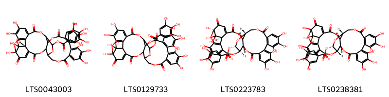{ width=100% }
    <figcaption>Hình ảnh cấu trúc hóa học của 4 hoạt chất thuộc nhóm Tannins gồm ['(1r,38r)-1,13,14,15,18,19,20,34,35,39,39-undecahydroxy-2,5,10,23,31-pentaoxo-6,9,24,27,30,40-hexaoxaoctacyclo[34.3.1.0⁴,³⁸.0⁷,²⁶.0⁸,²⁹.0¹¹,¹⁶.0¹⁷,²².0³²,³⁷]tetraconta-3,11(16),12,14,17,19,21,32,34,36-decaen-28-yl 3,4,5-trihydroxybenzoate (LTS0043003)', '1,13,14,15,18,19,20,34,35,39,39-undecahydroxy-2,5,10,23,31-pentaoxo-6,9,24,27,30,40-hexaoxaoctacyclo[34.3.1.0⁴,³⁸.0⁷,²⁶.0⁸,²⁹.0¹¹,¹⁶.0¹⁷,²².0³²,³⁷]tetraconta-3,11(16),12,14,17,19,21,32,34,36-decaen-28-yl 3,4,5-trihydroxybenzoate (LTS0129733)', '(1r,7r,8s,26r,28s,29r,38r)-1,13,14,15,18,19,20,34,35,39,39-undecahydroxy-2,5,10,23,31-pentaoxo-6,9,24,27,30,40-hexaoxaoctacyclo[34.3.1.0⁴,³⁸.0⁷,²⁶.0⁸,²⁹.0¹¹,¹⁶.0¹⁷,²².0³²,³⁷]tetraconta-3,11,13,15,17(22),18,20,32,34,36-decaen-28-yl 3,4,5-trihydroxybenzoate (LTS0223783)', '(7r,8s,26r,28s,29s)-1,13,14,15,18,19,20,34,35,39,39-undecahydroxy-2,5,10,23,31-pentaoxo-6,9,24,27,30,40-hexaoxaoctacyclo[34.3.1.0⁴,³⁸.0⁷,²⁶.0⁸,²⁹.0¹¹,¹⁶.0¹⁷,²².0³²,³⁷]tetraconta-3,11,13,15,17(22),18,20,32,34,36-decaen-28-yl 3,4,5-trihydroxybenzoate (LTS0238381)'].</figcaption>
</figure>

---

### Dược dân tộc học

Danh sách các quốc gia có sử dụng *Nymphaea tetragona* trong điều trị các bệnh. 

| Country   | Disease          | Bệnh               |
|:----------|:-----------------|:-------------------|
| China     | Tonic, Digestive | Thuốc bổ, Tiêu hóa |

---

# Chi Euryale

??? note "Danh sách các dược liệu thuộc chi"
    
	 - *Euryale ferox*

---
## Euryale ferox
### Thông tin về thực vật

!!! info "Phân loại thực vật của *Euryale ferox* từ GIBF:"
    - **Kingdom:** Plantae
    - **Phylum:** Tracheophyta
    - **Order:** Nymphaeales
    - **Family:** Nymphaeaceae
    - **Genus:** Euryale
    - **Species:** *Euryale ferox*

 

| Label (VI)   | Label (EN)   | Scientific Name   | Descriptions (VI)   | Descriptions (EN)   | Also Known As (VI)   | Also Known As (EN)                                                           |
|:-------------|:-------------|:------------------|:--------------------|:--------------------|:---------------------|:-----------------------------------------------------------------------------|
| N/A          | N/A          | Euryale ferox     | loài thực vật       | species of plant    | ['Euryale ferox']    | ['Fox nut', 'Gorgon plant', 'prickly waterlily', 'Onibasu', 'prickly lotus'] |

#### Phân bố trên thế giới

**Từ CSDL GIBF** nan, Chinese Taipei, Japan, India, Russian Federation, United States of America, China, Norway, Australia, Korea, Republic of, Hong Kong

#### Phân bố tại Việt Nam

**Từ CSDL GIBF**: Không có ghi nhận ở Việt Nam

---
### Thành phần hóa học
        
- Theo cơ sở dữ liệu lotus: Từ loài *Euryale ferox* đã phân lập và xác định được 6 hoạt chất thuộc về các nhóm Prenol lipids, Fatty Acyls. 

|    | chemicalTaxonomyClassyfireClass   |   smiles_count |
|---:|:----------------------------------|---------------:|
|  0 | Fatty Acyls                       |              4 |
|  1 | Prenol lipids                     |              2 |

#### Nhóm Fatty Acyls
<figure markdown="span">
    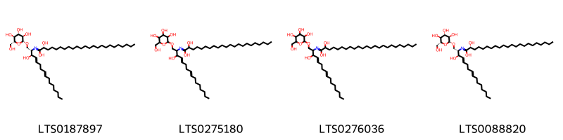{ width=100% }
    <figcaption>Hình ảnh cấu trúc hóa học của 4 hoạt chất thuộc nhóm Fatty Acyls gồm ['(2r)-2-hydroxy-n-[(2s,3r,4e,8e)-3-hydroxy-1-{[(2r,3r,4s,5s,6r)-3,4,5-trihydroxy-6-(hydroxymethyl)oxan-2-yl]oxy}hexadeca-4,8-dien-2-yl]tetracosanimidic acid (LTS0187897)', '2-hydroxy-n-(3-hydroxy-1-{[3,4,5-trihydroxy-6-(hydroxymethyl)oxan-2-yl]oxy}hexadeca-4,8-dien-2-yl)docosanimidic acid (LTS0275180)', '2-hydroxy-n-(3-hydroxy-1-{[3,4,5-trihydroxy-6-(hydroxymethyl)oxan-2-yl]oxy}hexadeca-4,8-dien-2-yl)tetracosanimidic acid (LTS0276036)', '(2r)-2-hydroxy-n-[(2s,3r,4e,8e)-3-hydroxy-1-{[(2r,3r,4s,5s,6r)-3,4,5-trihydroxy-6-(hydroxymethyl)oxan-2-yl]oxy}hexadeca-4,8-dien-2-yl]docosanimidic acid (LTS0088820)'].</figcaption>
</figure>
#### Nhóm Prenol lipids
<figure markdown="span">
    { width=100% }
    <figcaption>Hình ảnh cấu trúc hóa học của 2 hoạt chất thuộc nhóm Prenol lipids gồm ["(1s,7r,11'r,14r,18r,21r)-7,7',8',10,11,11',15,16,21-nonamethyl-7,11',21-tris[(4r,8r)-4,8,12-trimethyltridecyl]-5',8,10',13,22-pentaoxaspiro[pentacyclo[12.4.4.0¹,¹⁴.0³,¹².0⁴,⁹]docosane-18,4'-tricyclo[7.4.0.0²,⁶]tridecane]-1',3,6',8',9,11,15-heptaen-17-one (LTS0061351)", "(1r,7r,11'r,14s,18s,21r)-7,7',8',10,11,11',15,16,21-nonamethyl-7,11',21-tris[(4r,8r)-4,8,12-trimethyltridecyl]-5',8,10',13,22-pentaoxaspiro[pentacyclo[12.4.4.0¹,¹⁴.0³,¹².0⁴,⁹]docosane-18,4'-tricyclo[7.4.0.0²,⁶]tridecane]-1',3,6',8',9,11,15-heptaen-17-one (LTS0160640)"].</figcaption>
</figure>

---

### Dược dân tộc học

Danh sách các quốc gia có sử dụng *Euryale ferox* trong điều trị các bệnh. 

| Country   | Disease                                                        | Bệnh                                                                        |
|:----------|:---------------------------------------------------------------|:----------------------------------------------------------------------------|
| China     | Astringent, Astringent, Tonic, Analgesic, Anaphrodisiac, Tonic | Chất làm se, Chất làm se, Thuốc bổ, Thuốc giảm đau, Anaphrodisiac, Thuốc bổ |
| India     | Tonic, Astringent                                              | Thuốc bổ, làm se                                                            |

---

