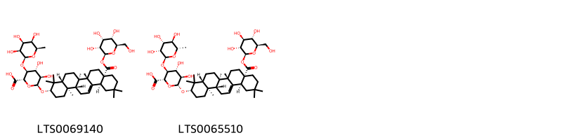
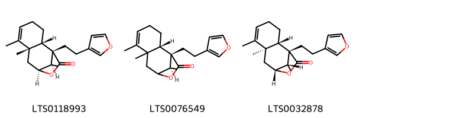
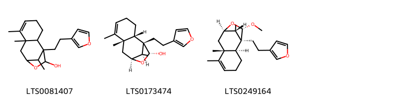
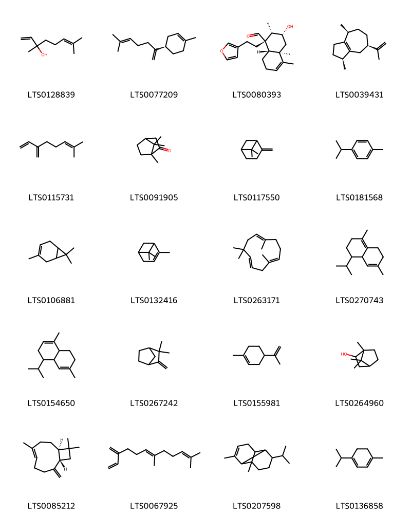
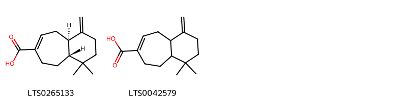
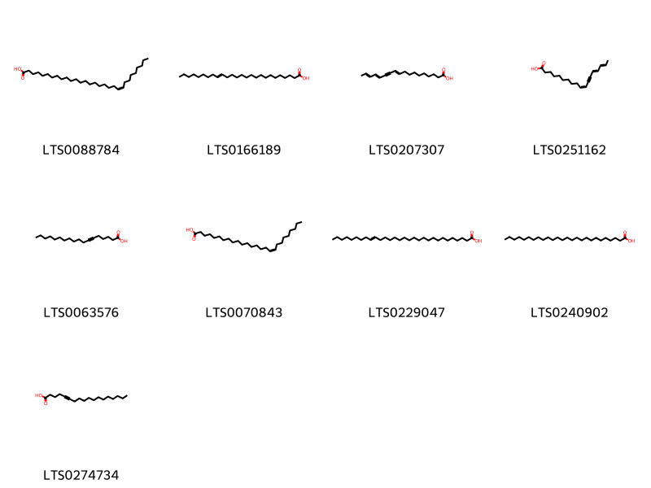
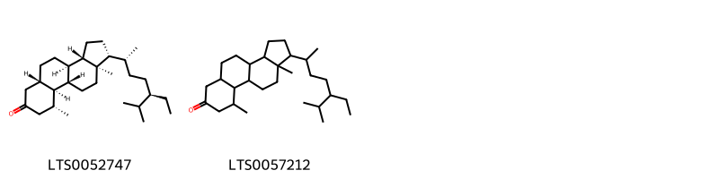

!!! abstract "Tóm tắt"

    Họ Olacaceae gồm khoảng 4 chi và 4 loài được một số cộng đồng tại các quốc gia như German, Brazil, Mexico, English, Surinam, Elsewhere, Kelantan, South Africa, Argentina, Sudan sử dụng trong một số trường hợp MYMEMORY WARNING: YOU USED ALL AVAILABLE FREE TRANSLATIONS FOR TODAY. NEXT AVAILABLE IN  14 HOURS 28 MINUTES 24 SECONDS VISIT HTTPS://MYMEMORY.TRANSLATED.NET/DOC/USAGELIMITS.PHP TO TRANSLATE MORE.

!!! info "DrDuke"

    James A. Duke sinh năm 1929-2017 là một nhà thực vật học người Mỹ. Đây là một trong những tác giả hàng đầu trong lĩnh vực dược dân tộc học với cuốn *CRC Handbook of Medicinal Herbs* và chính là người xây dựng lên cơ sở dữ liệu về hợp chất tự nhiên và dược dân tộc học tại Bộ nông nghiệp Hoa Kỳ. Các thông tin được đăng tải tại website [Dr. Duke's Phytochemical and Ethnobotanical Databases](https://phytochem.nal.usda.gov/). 
    Trong suốt thập niên 1970, ông lãnh đạo the Plant Taxonomy Laboratory, Plant Genetics and Germplasm Institute of the Agricultural Research Service, U.S. Department of Agriculture.
    Trong tài liệu này, các thông tin về dược dân tộc của các dược liệu được trích dẫn từ tài liệu của James A. Ducke với sự trợ giúp của phần mềm dịch thuật từ tiếng Anh sang tiếng Việt.
   

# Chi Olax

??? note "Danh sách các dược liệu thuộc chi"
    
	 - *Olax scandens*

---
## Olax scandens
### Thông tin về thực vật

!!! info "Phân loại thực vật của *Olax psittacorum* từ GIBF:"
    - **Kingdom:** Plantae
    - **Phylum:** Tracheophyta
    - **Order:** Santalales
    - **Family:** Olacaceae
    - **Genus:** Olax
    - **Species:** *Olax psittacorum*

 

| Label (VI)   | Label (EN)   | Scientific Name   | Descriptions (VI)   | Descriptions (EN)   | Also Known As (VI)   | Also Known As (EN)   |
|:-------------|:-------------|:------------------|:--------------------|:--------------------|:---------------------|:---------------------|
| N/A          | N/A          | Olax scandens     | loài thực vật       | species of plant    | ['']                 | ['']                 |

#### Phân bố trên thế giới

**Từ CSDL GIBF** nan, Sri Lanka, Viet Nam, Cambodia, Indonesia, Malaysia, Myanmar, India, unknown or invalid, Brunei Darussalam, Thailand, Lao People’s Democratic Republic

#### Phân bố tại Việt Nam

**Từ CSDL GIBF**: Hải Phòng

---
### Thành phần hóa học
        
- Theo cơ sở dữ liệu lotus: Từ loài *Olax psittacorum* đã phân lập và xác định được 2 hoạt chất thuộc về các nhóm Prenol lipids. 

|    | chemicalTaxonomyClassyfireClass   |   smiles_count |
|---:|:----------------------------------|---------------:|
|  0 | Prenol lipids                     |              2 |

#### Nhóm Prenol lipids
<figure markdown="span">
    { width=100% }
    <figcaption>Hình ảnh cấu trúc hóa học của 2 hoạt chất thuộc nhóm Prenol lipids gồm ['(2s,3s,4r,5r,6s)-6-{[(3s,4ar,6ar,6bs,8as,12as,14ar,14br)-4,4,6a,6b,11,11,14b-heptamethyl-8a-({[(2s,3r,4r,5s,6r)-3,4,5-trihydroxy-6-(hydroxymethyl)oxan-2-yl]oxy}carbonyl)-1,2,3,4a,5,6,7,8,9,10,12,12a,14,14a-tetradecahydropicen-3-yl]oxy}-4,5-dihydroxy-3-{[(2s,3s,4s,5r,6r)-3,4,5-trihydroxy-6-methyloxan-2-yl]oxy}oxane-2-carboxylic acid (LTS0069140)', 'olaxoside (LTS0065510)'].</figcaption>
</figure>

---

### Dược dân tộc học

Danh sách các quốc gia có sử dụng *Olax psittacorum* trong điều trị các bệnh. 

| Country   | Disease   | Bệnh                                                                                                                                                                                                |
|:----------|:----------|:----------------------------------------------------------------------------------------------------------------------------------------------------------------------------------------------------|
| Kelantan  | Laxative  | MYMEMORY WARNING: YOU USED ALL AVAILABLE FREE TRANSLATIONS FOR TODAY. NEXT AVAILABLE IN  14 HOURS 28 MINUTES 20 SECONDS VISIT HTTPS://MYMEMORY.TRANSLATED.NET/DOC/USAGELIMITS.PHP TO TRANSLATE MORE |

---

# Chi Ptychopetalum

??? note "Danh sách các dược liệu thuộc chi"
    
	 - *Ptychopetalum olacoides*

---
## Ptychopetalum olacoides
### Thông tin về thực vật

!!! info "Phân loại thực vật của *Ptychopetalum olacoides* từ GIBF:"
    - **Kingdom:** Plantae
    - **Phylum:** Tracheophyta
    - **Order:** Santalales
    - **Family:** Olacaceae
    - **Genus:** Ptychopetalum
    - **Species:** *Ptychopetalum olacoides*

 

| Label (VI)   | Label (EN)   | Scientific Name         | Descriptions (VI)   | Descriptions (EN)   | Also Known As (VI)   | Also Known As (EN)   |
|:-------------|:-------------|:------------------------|:--------------------|:--------------------|:---------------------|:---------------------|
| N/A          | N/A          | Ptychopetalum olacoides | loài thực vật       | species of plant    | ['']                 | ['']                 |

#### Phân bố trên thế giới

**Từ CSDL GIBF** nan, Brazil, United States of America, Suriname, Colombia, unknown or invalid, Peru, French Guiana, Guyana, Venezuela (Bolivarian Republic of)

#### Phân bố tại Việt Nam

**Từ CSDL GIBF**: Không có ghi nhận ở Việt Nam

---
### Thành phần hóa học
        
- Theo cơ sở dữ liệu lotus: Từ loài *Ptychopetalum olacoides* đã phân lập và xác định được 26 hoạt chất thuộc về các nhóm Prenol lipids, Lactones, Oxepanes. 

|    | chemicalTaxonomyClassyfireClass   |   smiles_count |
|---:|:----------------------------------|---------------:|
|  0 | Lactones                          |              3 |
|  1 | Oxepanes                          |              3 |
|  2 | Prenol lipids                     |             20 |

#### Nhóm Lactones
<figure markdown="span">
    { width=100% }
    <figcaption>Hình ảnh cấu trúc hóa học của 3 hoạt chất thuộc nhóm Lactones gồm ['(1s,2s,7s,9s,12r)-1-[2-(furan-3-yl)ethyl]-6,7,12-trimethyl-10-oxatricyclo[7.2.1.0²,⁷]dodec-5-en-11-one (LTS0118993)', '(1s,2s,12r)-1-[2-(furan-3-yl)ethyl]-6,7,12-trimethyl-10-oxatricyclo[7.2.1.0²,⁷]dodec-5-en-11-one (LTS0076549)', '(1s,2s,7r,9r,12s)-1-[2-(furan-3-yl)ethyl]-6,7,12-trimethyl-10-oxatricyclo[7.2.1.0²,⁷]dodec-5-en-11-one (LTS0032878)'].</figcaption>
</figure>
#### Nhóm Oxepanes
<figure markdown="span">
    { width=100% }
    <figcaption>Hình ảnh cấu trúc hóa học của 3 hoạt chất thuộc nhóm Oxepanes gồm ['1-[2-(furan-3-yl)ethyl]-6,7,12-trimethyl-10-oxatricyclo[7.2.1.0²,⁷]dodec-5-en-11-ol (LTS0081407)', '(1s,2s,7s,9s,11r,12r)-1-[2-(furan-3-yl)ethyl]-6,7,12-trimethyl-10-oxatricyclo[7.2.1.0²,⁷]dodec-5-en-11-ol (LTS0173474)', '(1s,2s,7r,9r,11s,12r)-1-[2-(furan-3-yl)ethyl]-11-methoxy-6,7,12-trimethyl-10-oxatricyclo[7.2.1.0²,⁷]dodec-5-ene (LTS0249164)'].</figcaption>
</figure>
#### Nhóm Prenol lipids
<figure markdown="span">
    { width=100% }
    <figcaption>Hình ảnh cấu trúc hóa học của 20 hoạt chất thuộc nhóm Prenol lipids gồm ['linalool, (+-)- (LTS0128839)', '(r)-β-bisabolene (LTS0077209)', '(1s,2s,3r,4ar,8as)-1-[2-(furan-3-yl)ethyl]-3-hydroxy-2,4a,5-trimethyl-2,3,4,7,8,8a-hexahydronaphthalene-1-carbaldehyde (LTS0080393)', 'guaiene (LTS0039431)', 'α-myrcene (LTS0115731)', 'camphor (LTS0091905)', 'β-pinene (LTS0117550)', 'cymene (LTS0181568)', 'monoterpenes (LTS0106881)', 'α pinene (LTS0132416)', 'humulene (LTS0263171)', '4-isopropyl-1,6-dimethyl-2,3,4,4a,7,8-hexahydronaphthalene (LTS0270743)', '4-isopropyl-1,6-dimethyl-3,4,4a,7,8,8a-hexahydronaphthalene (LTS0154650)', 'camphene (LTS0267242)', 'limonene,  (LTS0155981)', 'borneol (LTS0264960)', 'caryophyllene (LTS0085212)', 'β-farnesene (LTS0067925)', 'α-copaene (LTS0207598)', 'terpinene (LTS0136858)'].</figcaption>
</figure>

---

### Dược dân tộc học

Danh sách các quốc gia có sử dụng *Ptychopetalum olacoides* trong điều trị các bệnh. 

| Country   | Disease     | Bệnh                                                                                                                                                                                                |
|:----------|:------------|:----------------------------------------------------------------------------------------------------------------------------------------------------------------------------------------------------|
| Brazil    | Aphrodisiac | MYMEMORY WARNING: YOU USED ALL AVAILABLE FREE TRANSLATIONS FOR TODAY. NEXT AVAILABLE IN  14 HOURS 27 MINUTES 52 SECONDS VISIT HTTPS://MYMEMORY.TRANSLATED.NET/DOC/USAGELIMITS.PHP TO TRANSLATE MORE |
| English   | Nervine     | MYMEMORY WARNING: YOU USED ALL AVAILABLE FREE TRANSLATIONS FOR TODAY. NEXT AVAILABLE IN  14 HOURS 27 MINUTES 44 SECONDS VISIT HTTPS://MYMEMORY.TRANSLATED.NET/DOC/USAGELIMITS.PHP TO TRANSLATE MORE |
| German    | Tonic       | MYMEMORY WARNING: YOU USED ALL AVAILABLE FREE TRANSLATIONS FOR TODAY. NEXT AVAILABLE IN  14 HOURS 27 MINUTES 38 SECONDS VISIT HTTPS://MYMEMORY.TRANSLATED.NET/DOC/USAGELIMITS.PHP TO TRANSLATE MORE |
| Surinam   | Aphrodisiac | MYMEMORY WARNING: YOU USED ALL AVAILABLE FREE TRANSLATIONS FOR TODAY. NEXT AVAILABLE IN  14 HOURS 27 MINUTES 36 SECONDS VISIT HTTPS://MYMEMORY.TRANSLATED.NET/DOC/USAGELIMITS.PHP TO TRANSLATE MORE |

---

# Chi Liriosma

??? note "Danh sách các dược liệu thuộc chi"
    
	 - *Liriosma ovata*

---
## Liriosma ovata
### Thông tin về thực vật

!!! info "Phân loại thực vật của *Dulacia inopiflora* từ GIBF:"
    - **Kingdom:** Plantae
    - **Phylum:** Tracheophyta
    - **Order:** Santalales
    - **Family:** Olacaceae
    - **Genus:** Dulacia
    - **Species:** *Dulacia inopiflora*

 

| Label (VI)   | Label (EN)   | Scientific Name         | Descriptions (VI)   | Descriptions (EN)   | Also Known As (VI)   | Also Known As (EN)   |
|:-------------|:-------------|:------------------------|:--------------------|:--------------------|:---------------------|:---------------------|
| N/A          | N/A          | Ptychopetalum olacoides | loài thực vật       | species of plant    | ['']                 | ['']                 |

#### Phân bố trên thế giới

**Từ CSDL GIBF** nan, Brazil, United States of America

#### Phân bố tại Việt Nam

**Từ CSDL GIBF**: Không có ghi nhận ở Việt Nam

---
### Thành phần hóa học
        
- Theo cơ sở dữ liệu lotus: Từ loài *Dulacia inopiflora* đã phân lập và xác định được Chưa có hoạt chất nào được phân lập. hoạt chất thuộc về các nhóm Không có hoạt chất nào được phân lập. 

Không có hình ảnh nào được tạo ra

---

### Dược dân tộc học

Danh sách các quốc gia có sử dụng *Dulacia inopiflora* trong điều trị các bệnh. 

| Country   | Disease            | Bệnh                                                                                                                                                                                                |
|:----------|:-------------------|:----------------------------------------------------------------------------------------------------------------------------------------------------------------------------------------------------|
| Brazil    | Tonic, Aphrodisiac | MYMEMORY WARNING: YOU USED ALL AVAILABLE FREE TRANSLATIONS FOR TODAY. NEXT AVAILABLE IN  14 HOURS 26 MINUTES 49 SECONDS VISIT HTTPS://MYMEMORY.TRANSLATED.NET/DOC/USAGELIMITS.PHP TO TRANSLATE MORE |

---

# Chi Ximenia

??? note "Danh sách các dược liệu thuộc chi"
    
	 - *Ximenia americana*

---
## Ximenia americana
### Thông tin về thực vật

!!! info "Phân loại thực vật của *Ximenia americana* từ GIBF:"
    - **Kingdom:** Plantae
    - **Phylum:** Tracheophyta
    - **Order:** Santalales
    - **Family:** Ximeniaceae
    - **Genus:** Ximenia
    - **Species:** *Ximenia americana*

 

| Label (VI)   | Label (EN)   | Scientific Name   | Descriptions (VI)   | Descriptions (EN)   | Also Known As (VI)   | Also Known As (EN)   |
|:-------------|:-------------|:------------------|:--------------------|:--------------------|:---------------------|:---------------------|
| N/A          | N/A          | Ximenia americana | loài thực vật       | species of plant    | ['']                 | ['']                 |

#### Phân bố trên thế giới

**Từ CSDL GIBF** nan, Brazil, Botswana, New Caledonia, Puerto Rico, United States of America, Costa Rica, Dominican Republic, Nigeria, Argentina, Burkina Faso, Mexico, Benin, Eswatini, Haiti, Namibia, Nicaragua, Bonaire, Sint Eustatius and Saba, South Africa, Northern Mariana Islands

#### Phân bố tại Việt Nam

**Từ CSDL GIBF**: Không có ghi nhận ở Việt Nam

---
### Thành phần hóa học
        
- Theo cơ sở dữ liệu lotus: Từ loài *Ximenia americana* đã phân lập và xác định được 14 hoạt chất thuộc về các nhóm Fatty Acyls, Prenol lipids, Carboxylic acids and derivatives, Steroids and steroid derivatives. 

|    | chemicalTaxonomyClassyfireClass   |   smiles_count |
|---:|:----------------------------------|---------------:|
|  0 | Carboxylic acids and derivatives  |              2 |
|  1 | Fatty Acyls                       |              9 |
|  2 | Prenol lipids                     |              1 |
|  3 | Steroids and steroid derivatives  |              2 |

#### Nhóm Carboxylic acids and derivatives
<figure markdown="span">
    { width=100% }
    <figcaption>Hình ảnh cấu trúc hóa học của 2 hoạt chất thuộc nhóm Carboxylic acids and derivatives gồm ['(4ar,9ar)-1,1-dimethyl-4-methylidene-3,4a,5,8,9,9a-hexahydro-2h-benzo[7]annulene-7-carboxylic acid (LTS0265133)', '1,1-dimethyl-4-methylidene-3,4a,5,8,9,9a-hexahydro-2h-benzo[7]annulene-7-carboxylic acid (LTS0042579)'].</figcaption>
</figure>
#### Nhóm Fatty Acyls
<figure markdown="span">
    { width=100% }
    <figcaption>Hình ảnh cấu trúc hóa học của 9 hoạt chất thuộc nhóm Fatty Acyls gồm ['lumepueic acid (LTS0088784)', 'hexacos-17-enoic acid (LTS0166189)', 'octadeca-10,14,16-trien-12-ynoic acid (LTS0207307)', '(10z,14e,16e)-octadeca-10,14,16-trien-12-ynoic acid (LTS0251162)', 'tariric acid (LTS0063576)', 'ximenic acid (LTS0070843)', 'triacont-21-enoic acid (LTS0229047)', 'hexacosanoic acid (LTS0240902)', '5-octadecynoic acid (LTS0274734)'].</figcaption>
</figure>
#### Nhóm Prenol lipids
<figure markdown="span">
    { width=100% }
    <figcaption>Hình ảnh cấu trúc hóa học của 1 hoạt chất thuộc nhóm Prenol lipids gồm ['β-amyrin (LTS0251864)'].</figcaption>
</figure>
#### Nhóm Steroids and steroid derivatives
<figure markdown="span">
    { width=100% }
    <figcaption>Hình ảnh cấu trúc hóa học của 2 hoạt chất thuộc nhóm Steroids and steroid derivatives gồm ['(1r,3as,3br,5as,9r,9as,9bs,11ar)-1-[(2r,5r)-5-ethyl-6-methylheptan-2-yl]-9,11a-dimethyl-tetradecahydro-1h-cyclopenta[a]phenanthren-7-one (LTS0052747)', '1-(5-ethyl-6-methylheptan-2-yl)-9,11a-dimethyl-tetradecahydro-1h-cyclopenta[a]phenanthren-7-one (LTS0057212)'].</figcaption>
</figure>

---

### Dược dân tộc học

Danh sách các quốc gia có sử dụng *Ximenia americana* trong điều trị các bệnh. 

| Country      | Disease                             | Bệnh                                                                                                                                                                                                |
|:-------------|:------------------------------------|:----------------------------------------------------------------------------------------------------------------------------------------------------------------------------------------------------|
| Argentina    | Astringent, Purgative               | MYMEMORY WARNING: YOU USED ALL AVAILABLE FREE TRANSLATIONS FOR TODAY. NEXT AVAILABLE IN  14 HOURS 26 MINUTES 13 SECONDS VISIT HTTPS://MYMEMORY.TRANSLATED.NET/DOC/USAGELIMITS.PHP TO TRANSLATE MORE |
| Elsewhere    | nan, Cathartic, Laxative, Vermifuge | MYMEMORY WARNING: YOU USED ALL AVAILABLE FREE TRANSLATIONS FOR TODAY. NEXT AVAILABLE IN  14 HOURS 26 MINUTES 07 SECONDS VISIT HTTPS://MYMEMORY.TRANSLATED.NET/DOC/USAGELIMITS.PHP TO TRANSLATE MORE |
| Mexico       | Purgative                           | MYMEMORY WARNING: YOU USED ALL AVAILABLE FREE TRANSLATIONS FOR TODAY. NEXT AVAILABLE IN  14 HOURS 26 MINUTES 02 SECONDS VISIT HTTPS://MYMEMORY.TRANSLATED.NET/DOC/USAGELIMITS.PHP TO TRANSLATE MORE |
| South Africa | Intoxicant                          | MYMEMORY WARNING: YOU USED ALL AVAILABLE FREE TRANSLATIONS FOR TODAY. NEXT AVAILABLE IN  14 HOURS 25 MINUTES 56 SECONDS VISIT HTTPS://MYMEMORY.TRANSLATED.NET/DOC/USAGELIMITS.PHP TO TRANSLATE MORE |
| Sudan        | Laxative                            | MYMEMORY WARNING: YOU USED ALL AVAILABLE FREE TRANSLATIONS FOR TODAY. NEXT AVAILABLE IN  14 HOURS 25 MINUTES 52 SECONDS VISIT HTTPS://MYMEMORY.TRANSLATED.NET/DOC/USAGELIMITS.PHP TO TRANSLATE MORE |

---

