!!! abstract "Tóm tắt"

    Họ Onagraceae gồm khoảng 5 chi và 10 loài được một số cộng đồng tại các quốc gia như ain, Elsewhere, Turkey, China, Lesotho, Australia, India sử dụng trong một số trường hợp MYMEMORY WARNING: YOU USED ALL AVAILABLE FREE TRANSLATIONS FOR TODAY. NEXT AVAILABLE IN  11 HOURS 05 MINUTES 21 SECONDS VISIT HTTPS://MYMEMORY.TRANSLATED.NET/DOC/USAGELIMITS.PHP TO TRANSLATE MORE.

!!! info "DrDuke"

    James A. Duke sinh năm 1929-2017 là một nhà thực vật học người Mỹ. Đây là một trong những tác giả hàng đầu trong lĩnh vực dược dân tộc học với cuốn *CRC Handbook of Medicinal Herbs* và chính là người xây dựng lên cơ sở dữ liệu về hợp chất tự nhiên và dược dân tộc học tại Bộ nông nghiệp Hoa Kỳ. Các thông tin được đăng tải tại website [Dr. Duke's Phytochemical and Ethnobotanical Databases](https://phytochem.nal.usda.gov/). 
    Trong suốt thập niên 1970, ông lãnh đạo the Plant Taxonomy Laboratory, Plant Genetics and Germplasm Institute of the Agricultural Research Service, U.S. Department of Agriculture.
    Trong tài liệu này, các thông tin về dược dân tộc của các dược liệu được trích dẫn từ tài liệu của James A. Ducke với sự trợ giúp của phần mềm dịch thuật từ tiếng Anh sang tiếng Việt.
   

# Chi Jussiaea

??? note "Danh sách các dược liệu thuộc chi"
    
	 - *Jussiaea repens*
	 - *Jussiaea suffruticosa*

---
## Jussiaea repens
### Thông tin về thực vật

!!! info "Phân loại thực vật của *Ludwigia adscendens* từ GIBF:"
    - **Kingdom:** Plantae
    - **Phylum:** Tracheophyta
    - **Order:** Myrtales
    - **Family:** Onagraceae
    - **Genus:** Ludwigia
    - **Species:** *Ludwigia adscendens*

 

| Label (VI)   | Label (EN)   | Scientific Name   | Descriptions (VI)   | Descriptions (EN)   | Also Known As (VI)   | Also Known As (EN)                              |
|:-------------|:-------------|:------------------|:--------------------|:--------------------|:---------------------|:------------------------------------------------|
| N/A          | N/A          | Jussiaea repens   | loài thực vật       | species of plant    | ['']                 | ['Floating Primrose Willow', 'Jussieva repens'] |

#### Phân bố trên thế giới

**Từ CSDL GIBF** nan, Viet Nam, unknown or invalid, Thailand, Philippines, French Polynesia, Burkina Faso, Senegal, Chile, Indonesia, Sri Lanka, Côte d’Ivoire, Malaysia, Puerto Rico, India, Nigeria, Myanmar, Japan, Brazil, Peru, Ukraine, Mexico, China, Chinese Taipei, Uruguay, Argentina, France, Syrian Arab Republic, Tanzania, United Republic of, Egypt, Bolivia (Plurinational State of), Paraguay, Congo, Democratic Republic of the, United States of America, Israel, Madagascar, Mali

#### Phân bố tại Việt Nam

**Từ CSDL GIBF**: Không có ghi nhận ở Việt Nam

---
### Thành phần hóa học
        
- Theo cơ sở dữ liệu lotus: Từ loài *Ludwigia adscendens* đã phân lập và xác định được Chưa có hoạt chất nào được phân lập. hoạt chất thuộc về các nhóm Không có hoạt chất nào được phân lập. 

Không có hình ảnh nào được tạo ra

---

### Dược dân tộc học

Danh sách các quốc gia có sử dụng *Ludwigia adscendens* trong điều trị các bệnh. 

| Country   | Disease                           | Bệnh                                                                                                                                                                                                |
|:----------|:----------------------------------|:----------------------------------------------------------------------------------------------------------------------------------------------------------------------------------------------------|
| China     | Alexiteric, Diuretic, Refrigerant | MYMEMORY WARNING: YOU USED ALL AVAILABLE FREE TRANSLATIONS FOR TODAY. NEXT AVAILABLE IN  11 HOURS 05 MINUTES 16 SECONDS VISIT HTTPS://MYMEMORY.TRANSLATED.NET/DOC/USAGELIMITS.PHP TO TRANSLATE MORE |

---

---
## Jussiaea suffruticosa
### Thông tin về thực vật

!!! info "Phân loại thực vật của *Ludwigia octovalvis* từ GIBF:"
    - **Kingdom:** Plantae
    - **Phylum:** Tracheophyta
    - **Order:** Myrtales
    - **Family:** Onagraceae
    - **Genus:** Ludwigia
    - **Species:** *Ludwigia octovalvis*

 

| Label (VI)   | Label (EN)   | Scientific Name       | Descriptions (VI)   | Descriptions (EN)   | Also Known As (VI)   | Also Known As (EN)        |
|:-------------|:-------------|:----------------------|:--------------------|:--------------------|:---------------------|:--------------------------|
| N/A          | N/A          | Jussiaea suffruticosa | loài thực vật       | species of plant    | ['']                 | ['Jussiaea suffruticosa'] |

#### Phân bố trên thế giới

**Từ CSDL GIBF** Honduras, nan, unknown or invalid, Thailand, Philippines, French Polynesia, Martinique, Singapore, Australia, Guatemala, Indonesia, Sierra Leone, Venezuela (Bolivarian Republic of), Sri Lanka, Côte d’Ivoire, Nigeria, Bahamas, Belize, Vanuatu, Panama, Brazil, Japan, Myanmar, Peru, Palau, Mexico, China, Chinese Taipei, Tanzania, United Republic of, Bolivia (Plurinational State of), United States of America

#### Phân bố tại Việt Nam

**Từ CSDL GIBF**: Không có ghi nhận ở Việt Nam

---
### Thành phần hóa học
        
- Theo cơ sở dữ liệu lotus: Từ loài *Ludwigia octovalvis* đã phân lập và xác định được Chưa có hoạt chất nào được phân lập. hoạt chất thuộc về các nhóm Không có hoạt chất nào được phân lập. 

Không có hình ảnh nào được tạo ra

---

### Dược dân tộc học

Danh sách các quốc gia có sử dụng *Ludwigia octovalvis* trong điều trị các bệnh. 

| Country   | Disease                                                | Bệnh                                                                                                                                                                                                |
|:----------|:-------------------------------------------------------|:----------------------------------------------------------------------------------------------------------------------------------------------------------------------------------------------------|
| Elsewhere | Diuretic, Laxative, Vermifuge, Astringent, Carminative | MYMEMORY WARNING: YOU USED ALL AVAILABLE FREE TRANSLATIONS FOR TODAY. NEXT AVAILABLE IN  11 HOURS 04 MINUTES 52 SECONDS VISIT HTTPS://MYMEMORY.TRANSLATED.NET/DOC/USAGELIMITS.PHP TO TRANSLATE MORE |

---

# Chi Fuchsia

??? note "Danh sách các dược liệu thuộc chi"
    
	 - *Fuchsia macrostemma*

---
## Fuchsia macrostemma
### Thông tin về thực vật

!!! info "Phân loại thực vật của *Fuchsia magellanica* từ GIBF:"
    - **Kingdom:** Plantae
    - **Phylum:** Tracheophyta
    - **Order:** Myrtales
    - **Family:** Onagraceae
    - **Genus:** Fuchsia
    - **Species:** *Fuchsia magellanica*

 

| Label (VI)   | Label (EN)   | Scientific Name     | Descriptions (VI)   | Descriptions (EN)   | Also Known As (VI)   | Also Known As (EN)   |
|:-------------|:-------------|:--------------------|:--------------------|:--------------------|:---------------------|:---------------------|
| N/A          | N/A          | Fuchsia macrostemma | loài thực vật       | species of plant    | ['']                 | ['']                 |

#### Phân bố trên thế giới

**Từ CSDL GIBF** nan, unknown or invalid, Japan, Brazil, Philippines, Poland, Chile, United States of America, Mexico

#### Phân bố tại Việt Nam

**Từ CSDL GIBF**: Không có ghi nhận ở Việt Nam

---
### Thành phần hóa học
        
- Theo cơ sở dữ liệu lotus: Từ loài *Fuchsia magellanica* đã phân lập và xác định được Chưa có hoạt chất nào được phân lập. hoạt chất thuộc về các nhóm Không có hoạt chất nào được phân lập. 

Không có hình ảnh nào được tạo ra

---

### Dược dân tộc học

Danh sách các quốc gia có sử dụng *Fuchsia magellanica* trong điều trị các bệnh. 

| Country   | Disease       | Bệnh                                                                                                                                                                                                |
|:----------|:--------------|:----------------------------------------------------------------------------------------------------------------------------------------------------------------------------------------------------|
| Elsewhere | Diuretic, nan | MYMEMORY WARNING: YOU USED ALL AVAILABLE FREE TRANSLATIONS FOR TODAY. NEXT AVAILABLE IN  11 HOURS 04 MINUTES 28 SECONDS VISIT HTTPS://MYMEMORY.TRANSLATED.NET/DOC/USAGELIMITS.PHP TO TRANSLATE MORE |

---

# Chi Ludwigia

??? note "Danh sách các dược liệu thuộc chi"
    
	 - *Ludwigia adscendens*

---
## Ludwigia adscendens
### Thông tin về thực vật

!!! info "Phân loại thực vật của *Ludwigia adscendens* từ GIBF:"
    - **Kingdom:** Plantae
    - **Phylum:** Tracheophyta
    - **Order:** Myrtales
    - **Family:** Onagraceae
    - **Genus:** Ludwigia
    - **Species:** *Ludwigia adscendens*

 

| Label (VI)   | Label (EN)   | Scientific Name     | Descriptions (VI)   | Descriptions (EN)   | Also Known As (VI)   | Also Known As (EN)   |
|:-------------|:-------------|:--------------------|:--------------------|:--------------------|:---------------------|:---------------------|
| N/A          | N/A          | Ludwigia adscendens | loài thực vật       | species of plant    | ['']                 | ['Water Primrose']   |

#### Phân bố trên thế giới

**Từ CSDL GIBF** Viet Nam, Thailand, Namibia, Kenya, Singapore, Australia, Indonesia, Côte d’Ivoire, Malaysia, India, Réunion, Nigeria, Bangladesh, Cambodia, Japan, Eswatini, China, Gambia, Hong Kong, Chinese Taipei, Timor-Leste, South Africa, Botswana, Tanzania, United Republic of, Mozambique, Zimbabwe, Zambia, Israel, Madagascar

#### Phân bố tại Việt Nam

**Từ CSDL GIBF**: Không có ghi nhận ở Việt Nam

---
### Thành phần hóa học
        
- Theo cơ sở dữ liệu lotus: Từ loài *Ludwigia adscendens* đã phân lập và xác định được Chưa có hoạt chất nào được phân lập. hoạt chất thuộc về các nhóm Không có hoạt chất nào được phân lập. 

Không có hình ảnh nào được tạo ra

---

### Dược dân tộc học

Danh sách các quốc gia có sử dụng *Ludwigia adscendens* trong điều trị các bệnh. 

| Country   | Disease   | Bệnh                                                                                                                                                                                                |
|:----------|:----------|:----------------------------------------------------------------------------------------------------------------------------------------------------------------------------------------------------|
| India     | Poultice  | MYMEMORY WARNING: YOU USED ALL AVAILABLE FREE TRANSLATIONS FOR TODAY. NEXT AVAILABLE IN  11 HOURS 04 MINUTES 05 SECONDS VISIT HTTPS://MYMEMORY.TRANSLATED.NET/DOC/USAGELIMITS.PHP TO TRANSLATE MORE |

---

# Chi Epilobium

??? note "Danh sách các dược liệu thuộc chi"
    
	 - *Epilobium angustifolium*
	 - *Epilobium hirsutum*

---
## Epilobium angustifolium
### Thông tin về thực vật

!!! info "Phân loại thực vật của *N/A* từ GIBF:"
    - **Kingdom:** Plantae
    - **Phylum:** Tracheophyta
    - **Order:** Myrtales
    - **Family:** Onagraceae
    - **Genus:** Chamaenerion
    - **Species:** *N/A*

 

| Label (VI)   | Label (EN)   | Scientific Name         | Descriptions (VI)   | Descriptions (EN)   | Also Known As (VI)   | Also Known As (EN)                              |
|:-------------|:-------------|:------------------------|:--------------------|:--------------------|:---------------------|:------------------------------------------------|
| N/A          | N/A          | Epilobium angustifolium | loài thực vật       | species of plant    | ['']                 | ['red fireweed', 'great willow herb', 'wickup'] |

#### Phân bố trên thế giới

**Từ CSDL GIBF** Switzerland, United Kingdom of Great Britain and Northern Ireland, Denmark, Sweden, Luxembourg, Germany, Canada, Russian Federation, United States of America, Finland, Austria, Norway, Belgium, Netherlands

#### Phân bố tại Việt Nam

**Từ CSDL GIBF**: Không có ghi nhận ở Việt Nam

---
### Thành phần hóa học
        
- Theo cơ sở dữ liệu lotus: Từ loài *N/A* đã phân lập và xác định được 88 hoạt chất thuộc về các nhóm Organooxygen compounds, Flavonoids, Tannins, Prenol lipids, Fatty Acyls, Cinnamic acids and derivatives, Steroids and steroid derivatives, Benzene and substituted derivatives. 

|    | chemicalTaxonomyClassyfireClass     |   smiles_count |
|---:|:------------------------------------|---------------:|
|  0 | Benzene and substituted derivatives |              3 |
|  1 | Cinnamic acids and derivatives      |              8 |
|  2 | Fatty Acyls                         |             31 |
|  3 | Flavonoids                          |             24 |
|  4 | Organooxygen compounds              |              1 |
|  5 | Prenol lipids                       |              6 |
|  6 | Steroids and steroid derivatives    |              3 |
|  7 | Tannins                             |              3 |

#### Nhóm Benzene and substituted derivatives
<figure markdown="span">
    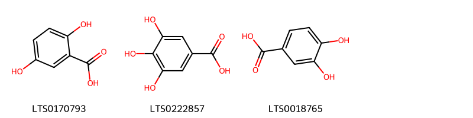{ width=100% }
    <figcaption>Hình ảnh cấu trúc hóa học của 3 hoạt chất thuộc nhóm Benzene and substituted derivatives gồm ['2,5-dihydroxybenzoic acid (LTS0170793)', 'galop (LTS0222857)', '3,4-dihydroxybenzoic acid (LTS0018765)'].</figcaption>
</figure>
#### Nhóm Cinnamic acids and derivatives
<figure markdown="span">
    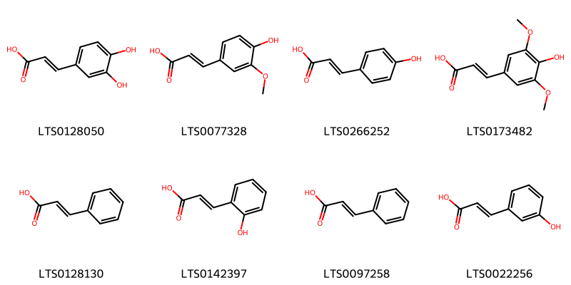{ width=100% }
    <figcaption>Hình ảnh cấu trúc hóa học của 8 hoạt chất thuộc nhóm Cinnamic acids and derivatives gồm ['3,4-dihydroxycinnamic acid (LTS0128050)', 'ferulic acid (LTS0077328)', 'para-coumaric acid (LTS0266252)', 'sinapinate (LTS0173482)', 'cinnamic acid (LTS0128130)', 'trans-2-hydroxycinnamic acid (LTS0142397)', 'phenylacrylic acid (LTS0097258)', 'm-coumaric acid (LTS0022256)'].</figcaption>
</figure>
#### Nhóm Fatty Acyls
<figure markdown="span">
    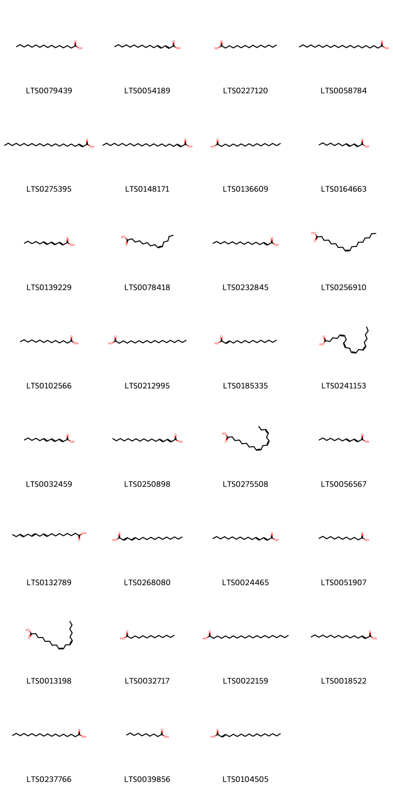{ width=100% }
    <figcaption>Hình ảnh cấu trúc hóa học của 31 hoạt chất thuộc nhóm Fatty Acyls gồm ['palmitic acid (LTS0079439)', '(2e,4e)-hexadeca-2,4-dienoic acid (LTS0054189)', 'pentadecanoic acid (LTS0227120)', 'behenic acid (LTS0058784)', '(2e)-docos-2-enoic acid (LTS0275395)', 'docos-2-enoic acid (LTS0148171)', 'heptadecanoic acid (LTS0136609)', 'dodeca-2,4-dienoic acid (LTS0164663)', '(2e,4e,6e)-dodeca-2,4,6-trienoic acid (LTS0139229)', 'myristoleic acid (LTS0078418)', 'hexadecenoic acid (LTS0232845)', 'oleic acid (LTS0256910)', 'myristic acid (LTS0102566)', 'nonadecanoic acid (LTS0212995)', 'pentadec-2-enoic acid (LTS0185335)', 'arachidonic acid (LTS0241153)', 'dodeca-2,4,6-trienoic acid (LTS0032459)', '(2e,4e)-heptadeca-2,4-dienoic acid (LTS0250898)', 'α-linolenic acid (LTS0275508)', '(2e,4e)-dodeca-2,4-dienoic acid (LTS0056567)', 'α linolenic acid (LTS0132789)', 'heptadeca-2,4-dienoic acid (LTS0268080)', 'hexadeca-2,4-dienoic acid (LTS0024465)', 'lauric acid (LTS0051907)', 'linoleic (LTS0013198)', 'n-tridecanoic acid (LTS0032717)', 'heneicosanoic acid (LTS0022159)', 't-2-hexadecenoic acid (LTS0018522)', 'stearic acid (LTS0237766)', 'capric acid (LTS0039856)', 'heptadec-2-enoic acid (LTS0104505)'].</figcaption>
</figure>
#### Nhóm Flavonoids
<figure markdown="span">
    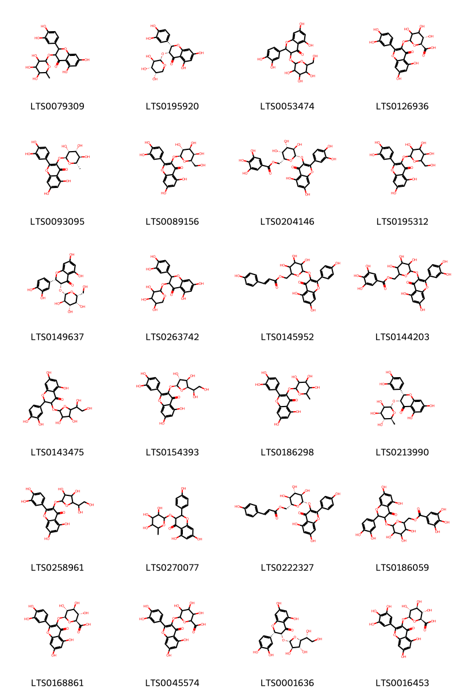{ width=100% }
    <figcaption>Hình ảnh cấu trúc hóa học của 24 hoạt chất thuộc nhóm Flavonoids gồm ['astilbin (LTS0079309)', '(2s,3r)-2-(3,4-dihydroxyphenyl)-5,7-dihydroxy-3-{[(2s,3r,4s,5s)-3,4,5-trihydroxyoxan-2-yl]oxy}-2,3-dihydro-1-benzopyran-4-one (LTS0195920)', '2-(3,4-dihydroxyphenyl)-5,7-dihydroxy-3-{[3,4,5-trihydroxy-6-(hydroxymethyl)oxan-2-yl]oxy}-2,3-dihydro-1-benzopyran-4-one (LTS0053474)', 'miquelianin (LTS0126936)', 'quercitrin (LTS0093095)', 'hyperoside (LTS0089156)', '[(2r,3r,4s,5r,6s)-6-{[2-(3,4-dihydroxyphenyl)-5,7-dihydroxy-4-oxochromen-3-yl]oxy}-3,4,5-trihydroxyoxan-2-yl]methyl 3,4,5-trihydroxybenzoate (LTS0204146)', '2-(3,4-dihydroxyphenyl)-5,7-dihydroxy-3-{[3,4,5-trihydroxy-6-(hydroxymethyl)oxan-2-yl]oxy}chromen-4-one (LTS0195312)', '(2s,3r)-2-(3,4-dihydroxyphenyl)-5,7-dihydroxy-3-{[(2s,3r,4s,5r,6r)-3,4,5-trihydroxy-6-(hydroxymethyl)oxan-2-yl]oxy}-2,3-dihydro-1-benzopyran-4-one (LTS0149637)', '2-(3,4-dihydroxyphenyl)-5,7-dihydroxy-3-[(3,4,5-trihydroxyoxan-2-yl)oxy]-2,3-dihydro-1-benzopyran-4-one (LTS0263742)', '(6-{[5,7-dihydroxy-2-(4-hydroxyphenyl)-4-oxochromen-3-yl]oxy}-3,4,5-trihydroxyoxan-2-yl)methyl 3-(4-hydroxyphenyl)prop-2-enoate (LTS0145952)', '(6-{[2-(3,4-dihydroxyphenyl)-5,7-dihydroxy-4-oxochromen-3-yl]oxy}-3,4,5-trihydroxyoxan-2-yl)methyl 3,4,5-trihydroxybenzoate (LTS0144203)', '3-{[5-(1,2-dihydroxyethyl)-3,4-dihydroxyoxolan-2-yl]oxy}-2-(3,4-dihydroxyphenyl)-5,7-dihydroxy-2,3-dihydro-1-benzopyran-4-one (LTS0143475)', 'quercetin-3-glucoside (LTS0154393)', 'quercitrin (LTS0186298)', '(2s,3r)-2-(3,4-dihydroxyphenyl)-5,7-dihydroxy-3-{[(2s,3r,4r,5r,6s)-3,4,5-trihydroxy-6-methyloxan-2-yl]oxy}-2,3-dihydro-1-benzopyran-4-one (LTS0213990)', '3-{[5-(1,2-dihydroxyethyl)-3,4-dihydroxyoxolan-2-yl]oxy}-2-(3,4-dihydroxyphenyl)-5,7-dihydroxychromen-4-one (LTS0258961)', 'engeletin (LTS0270077)', 'tiliroside (LTS0222327)', '(6-{[2-(3,4-dihydroxyphenyl)-5,7-dihydroxy-4-oxo-2,3-dihydro-1-benzopyran-3-yl]oxy}-3,4,5-trihydroxyoxan-2-yl)methyl 3,4,5-trihydroxybenzoate (LTS0186059)', 'querciturone (LTS0168861)', 'miquelianin (LTS0045574)', '(2s,3r)-3-{[(2s,3r,4r,5r)-5-[(1r)-1,2-dihydroxyethyl]-3,4-dihydroxyoxolan-2-yl]oxy}-2-(3,4-dihydroxyphenyl)-5,7-dihydroxy-2,3-dihydro-1-benzopyran-4-one (LTS0001636)', 'myricetin 3-o-glucuronide (LTS0016453)'].</figcaption>
</figure>
#### Nhóm Organooxygen compounds
<figure markdown="span">
    { width=100% }
    <figcaption>Hình ảnh cấu trúc hóa học của 1 hoạt chất thuộc nhóm Organooxygen compounds gồm ['chlorogenic acid (LTS0226495)'].</figcaption>
</figure>
#### Nhóm Prenol lipids
<figure markdown="span">
    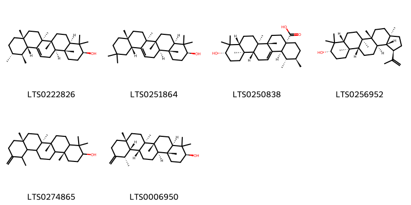{ width=100% }
    <figcaption>Hình ảnh cấu trúc hóa học của 6 hoạt chất thuộc nhóm Prenol lipids gồm ['amyrin (LTS0222826)', 'β-amyrin (LTS0251864)', 'ursolic acid (LTS0250838)', 'lupeol (LTS0256952)', '(6ar,6br,8ar,14br)-4,4,6a,6b,8a,12,14b-heptamethyl-11-methylidene-hexadecahydropicen-3-ol (LTS0274865)', 'taraxasterol (LTS0006950)'].</figcaption>
</figure>
#### Nhóm Steroids and steroid derivatives
<figure markdown="span">
    { width=100% }
    <figcaption>Hình ảnh cấu trúc hóa học của 3 hoạt chất thuộc nhóm Steroids and steroid derivatives gồm ['stigmast-5-en-3-ol (LTS0071224)', 'stigmast-5-en-3-ol, (3β)- (LTS0204616)', 'phytosterol (LTS0029311)'].</figcaption>
</figure>
#### Nhóm Tannins
<figure markdown="span">
    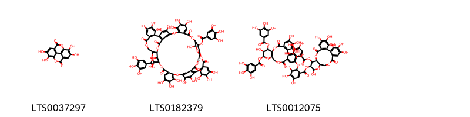{ width=100% }
    <figcaption>Hình ảnh cấu trúc hóa học của 3 hoạt chất thuộc nhóm Tannins gồm ['ellagic acid (LTS0037297)', '4,5,6,12,20,21,22,30,31,32,38,46,47,48,51,52,59,60-octadecahydroxy-9,17,35,43,55,61-hexaoxo-64-(3,4,5-trihydroxybenzoyloxy)-2,10,13,16,28,36,39,42,56,62-decaoxaundecacyclo[35.15.6.3¹⁴,²⁵.2²⁴,²⁷.1¹¹,¹⁵.0³,⁸.0¹⁸,²³.0²⁹,³⁴.0⁴⁰,⁵⁷.0⁴⁴,⁴⁹.0⁵⁰,⁵⁴]tetrahexaconta-1(53),3,5,7,18(23),19,21,24,26,29,31,33,44(49),45,47,50(54),51,59-octadecaen-58-yl 3,4,5-trihydroxybenzoate (LTS0182379)', '3,4,5,13,21,22,23-heptahydroxy-8,18-dioxo-11-(3,4,5-trihydroxybenzoyloxy)-9,14,17-trioxatetracyclo[17.4.0.0²,⁷.0¹⁰,¹⁵]tricosa-1(23),2(7),3,5,19,21-hexaen-12-yl 2-{[3,4,5,12,22,23-hexahydroxy-8,18-dioxo-11,13-bis(3,4,5-trihydroxybenzoyloxy)-9,14,17-trioxatetracyclo[17.4.0.0²,⁷.0¹⁰,¹⁵]tricosa-1(23),2(7),3,5,19,21-hexaen-21-yl]oxy}-3,4,5-trihydroxybenzoate (LTS0012075)'].</figcaption>
</figure>

---

### Dược dân tộc học

Danh sách các quốc gia có sử dụng *N/A* trong điều trị các bệnh. 

| Country   | Disease                    | Bệnh                                                                                                                                                                                                |
|:----------|:---------------------------|:----------------------------------------------------------------------------------------------------------------------------------------------------------------------------------------------------|
| Elsewhere | Antiphlogistic, Astringent | MYMEMORY WARNING: YOU USED ALL AVAILABLE FREE TRANSLATIONS FOR TODAY. NEXT AVAILABLE IN  11 HOURS 03 MINUTES 41 SECONDS VISIT HTTPS://MYMEMORY.TRANSLATED.NET/DOC/USAGELIMITS.PHP TO TRANSLATE MORE |
| Turkey    | Astringent, Tonic          | MYMEMORY WARNING: YOU USED ALL AVAILABLE FREE TRANSLATIONS FOR TODAY. NEXT AVAILABLE IN  11 HOURS 03 MINUTES 38 SECONDS VISIT HTTPS://MYMEMORY.TRANSLATED.NET/DOC/USAGELIMITS.PHP TO TRANSLATE MORE |

---

---
## Epilobium hirsutum
### Thông tin về thực vật

!!! info "Phân loại thực vật của *Epilobium hirsutum* từ GIBF:"
    - **Kingdom:** Plantae
    - **Phylum:** Tracheophyta
    - **Order:** Myrtales
    - **Family:** Onagraceae
    - **Genus:** Epilobium
    - **Species:** *Epilobium hirsutum*

 

| Label (VI)   | Label (EN)   | Scientific Name    | Descriptions (VI)   | Descriptions (EN)   | Also Known As (VI)   | Also Known As (EN)                                                                     |
|:-------------|:-------------|:-------------------|:--------------------|:--------------------|:---------------------|:---------------------------------------------------------------------------------------|
| N/A          | N/A          | Epilobium hirsutum | loài thực vật       | species of plant    | ['']                 | ['great hairy willowherb', 'great willowherb', 'Great willowherb', 'hairy willowherb'] |

#### Phân bố trên thế giới

**Từ CSDL GIBF** Denmark, Spain, Germany, Austria, Australia, Sweden, Poland, Netherlands, Belarus, Switzerland, Argentina, United Kingdom of Great Britain and Northern Ireland, South Africa, Portugal, France, New Zealand, Russian Federation, Algeria, Ukraine

#### Phân bố tại Việt Nam

**Từ CSDL GIBF**: Không có ghi nhận ở Việt Nam

---
### Thành phần hóa học
        
- Theo cơ sở dữ liệu lotus: Từ loài *Epilobium hirsutum* đã phân lập và xác định được 61 hoạt chất thuộc về các nhóm Organooxygen compounds, Flavonoids, Tannins, Cinnamic acids and derivatives, Benzene and substituted derivatives. 

|    | chemicalTaxonomyClassyfireClass     |   smiles_count |
|---:|:------------------------------------|---------------:|
|  0 | Benzene and substituted derivatives |             10 |
|  1 | Cinnamic acids and derivatives      |              2 |
|  2 | Flavonoids                          |             33 |
|  3 | Organooxygen compounds              |              2 |
|  4 | Tannins                             |             14 |

#### Nhóm Benzene and substituted derivatives
<figure markdown="span">
    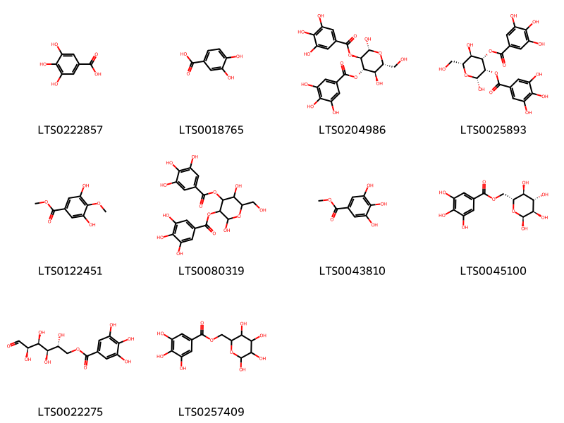{ width=100% }
    <figcaption>Hình ảnh cấu trúc hóa học của 10 hoạt chất thuộc nhóm Benzene and substituted derivatives gồm ['galop (LTS0222857)', '3,4-dihydroxybenzoic acid (LTS0018765)', '(2r,3r,4s,5r,6r)-2,5-dihydroxy-6-(hydroxymethyl)-4-(3,4,5-trihydroxybenzoyloxy)oxan-3-yl 3,4,5-trihydroxybenzoate (LTS0204986)', '(2r,3s,4s,5r,6r)-2,5-dihydroxy-6-(hydroxymethyl)-3-(3,4,5-trihydroxybenzoyloxy)oxan-4-yl 3,4,5-trihydroxybenzoate (LTS0025893)', 'methyl 3,5-dihydroxy-4-methoxybenzoate (LTS0122451)', '2,5-dihydroxy-6-(hydroxymethyl)-3-(3,4,5-trihydroxybenzoyloxy)oxan-4-yl 3,4,5-trihydroxybenzoate (LTS0080319)', 'methyl gallate (LTS0043810)', '[(2r,3s,4s,5r,6s)-3,4,5,6-tetrahydroxyoxan-2-yl]methyl 3,4,5-trihydroxybenzoate (LTS0045100)', '(2r,3r,4s,5r)-2,3,4,5-tetrahydroxy-6-oxohexyl 3,4,5-trihydroxybenzoate (LTS0022275)', '(3,4,5,6-tetrahydroxyoxan-2-yl)methyl 3,4,5-trihydroxybenzoate (LTS0257409)'].</figcaption>
</figure>
#### Nhóm Cinnamic acids and derivatives
<figure markdown="span">
    { width=100% }
    <figcaption>Hình ảnh cấu trúc hóa học của 2 hoạt chất thuộc nhóm Cinnamic acids and derivatives gồm ['para-coumaric acid (LTS0266252)', 'hydroxycinnamic acid (LTS0233023)'].</figcaption>
</figure>
#### Nhóm Flavonoids
<figure markdown="span">
    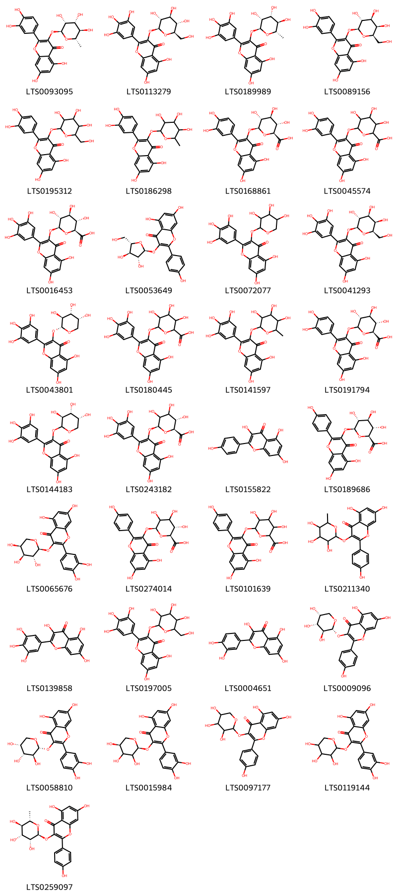{ width=100% }
    <figcaption>Hình ảnh cấu trúc hóa học của 33 hoạt chất thuộc nhóm Flavonoids gồm ['quercitrin (LTS0093095)', '5,7-dihydroxy-3-{[(2s,3r,4s,5s,6r)-3,4,5-trihydroxy-6-(hydroxymethyl)oxan-2-yl]oxy}-2-(3,4,5-trihydroxyphenyl)chromen-4-one (LTS0113279)', 'myricitrin (LTS0189989)', 'hyperoside (LTS0089156)', '2-(3,4-dihydroxyphenyl)-5,7-dihydroxy-3-{[3,4,5-trihydroxy-6-(hydroxymethyl)oxan-2-yl]oxy}chromen-4-one (LTS0195312)', 'quercitrin (LTS0186298)', 'querciturone (LTS0168861)', 'miquelianin (LTS0045574)', 'myricetin 3-o-glucuronide (LTS0016453)', 'juglanin (LTS0053649)', '5,7-dihydroxy-3-[(3,4,5-trihydroxyoxan-2-yl)oxy]-2-(3,4,5-trihydroxyphenyl)chromen-4-one (LTS0072077)', '5,7-dihydroxy-3-{[(2s,3r,4s,5r,6r)-3,4,5-trihydroxy-6-(hydroxymethyl)oxan-2-yl]oxy}-2-(3,4,5-trihydroxyphenyl)chromen-4-one (LTS0041293)', '5,7-dihydroxy-3-{[(2r,3s,4r,5r)-3,4,5-trihydroxyoxan-2-yl]oxy}-2-(3,4,5-trihydroxyphenyl)chromen-4-one (LTS0043801)', '6-{[5,7-dihydroxy-4-oxo-2-(3,4,5-trihydroxyphenyl)chromen-3-yl]oxy}-3,4,5-trihydroxyoxane-2-carboxylic acid (LTS0180445)', 'myricitrin (LTS0141597)', '(2s,3s,4s,5r)-6-{[2-(3,4-dihydroxyphenyl)-5,7-dihydroxy-4-oxochromen-3-yl]oxy}-3,4,5-trihydroxyoxane-2-carboxylic acid (LTS0191794)', '5,7-dihydroxy-3-{[(3s,4r,5r)-3,4,5-trihydroxyoxan-2-yl]oxy}-2-(3,4,5-trihydroxyphenyl)chromen-4-one (LTS0144183)', 'myricetin 3-glucuronide (LTS0243182)', 'kaempherol (LTS0155822)', 'kaempferol 3-o-glucuronide (LTS0189686)', 'guaijaverin (LTS0065676)', 'kaempferol 3-glucuronide (LTS0274014)', '6-{[5,7-dihydroxy-2-(4-hydroxyphenyl)-4-oxochromen-3-yl]oxy}-3,4,5-trihydroxyoxane-2-carboxylic acid (LTS0101639)', '5,7-dihydroxy-2-(4-hydroxyphenyl)-3-[(3,4,5-trihydroxy-6-methyloxan-2-yl)oxy]chromen-4-one (LTS0211340)', 'myricetin (LTS0139858)', '5,7-dihydroxy-3-{[3,4,5-trihydroxy-6-(hydroxymethyl)oxan-2-yl]oxy}-2-(3,4,5-trihydroxyphenyl)chromen-4-one (LTS0197005)', 'quercetin (LTS0004651)', '5,7-dihydroxy-2-(4-hydroxyphenyl)-3-{[(2r,3s,4r,5r)-3,4,5-trihydroxyoxan-2-yl]oxy}chromen-4-one (LTS0009096)', '2-(3,4-dihydroxyphenyl)-5,7-dihydroxy-3-{[(2r,3s,4r,5r)-3,4,5-trihydroxyoxan-2-yl]oxy}chromen-4-one (LTS0058810)', 'guaijaverin (LTS0015984)', '5,7-dihydroxy-2-(4-hydroxyphenyl)-3-[(3,4,5-trihydroxyoxan-2-yl)oxy]chromen-4-one (LTS0097177)', 'guaijaverin (LTS0119144)', 'afzelin (LTS0259097)'].</figcaption>
</figure>
#### Nhóm Organooxygen compounds
<figure markdown="span">
    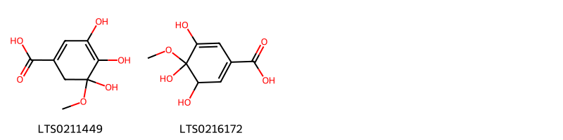{ width=100% }
    <figcaption>Hình ảnh cấu trúc hóa học của 2 hoạt chất thuộc nhóm Organooxygen compounds gồm ['3,4,5-trihydroxy-5-methoxycyclohexa-1,3-diene-1-carboxylic acid (LTS0211449)', '3,4,5-trihydroxy-4-methoxycyclohexa-1,5-diene-1-carboxylic acid (LTS0216172)'].</figcaption>
</figure>
#### Nhóm Tannins
<figure markdown="span">
    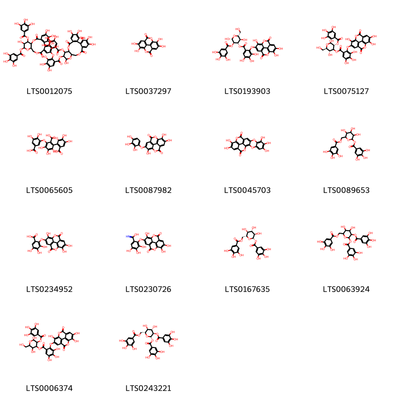{ width=100% }
    <figcaption>Hình ảnh cấu trúc hóa học của 14 hoạt chất thuộc nhóm Tannins gồm ['3,4,5,13,21,22,23-heptahydroxy-8,18-dioxo-11-(3,4,5-trihydroxybenzoyloxy)-9,14,17-trioxatetracyclo[17.4.0.0²,⁷.0¹⁰,¹⁵]tricosa-1(23),2(7),3,5,19,21-hexaen-12-yl 2-{[3,4,5,12,22,23-hexahydroxy-8,18-dioxo-11,13-bis(3,4,5-trihydroxybenzoyloxy)-9,14,17-trioxatetracyclo[17.4.0.0²,⁷.0¹⁰,¹⁵]tricosa-1(23),2(7),3,5,19,21-hexaen-21-yl]oxy}-3,4,5-trihydroxybenzoate (LTS0012075)', 'ellagic acid (LTS0037297)', '(2r,3r,4s,5r,6r)-2,5-dihydroxy-6-(hydroxymethyl)-3-(3,4,5-trihydroxybenzoyloxy)oxan-4-yl 3,4,5-trihydroxy-2-({7,13,14-trihydroxy-3,10-dioxo-2,9-dioxatetracyclo[6.6.2.0⁴,¹⁶.0¹¹,¹⁵]hexadeca-1(15),4(16),5,7,11,13-hexaen-6-yl}oxy)benzoate (LTS0193903)', '(3r,5r,6r)-2,5-dihydroxy-6-(hydroxymethyl)-3-(3,4,5-trihydroxybenzoyloxy)oxan-4-yl 3,4,5-trihydroxy-2-({7,13,14-trihydroxy-3,10-dioxo-2,9-dioxatetracyclo[6.6.2.0⁴,¹⁶.0¹¹,¹⁵]hexadeca-1(15),4(16),5,7,11,13-hexaen-6-yl}oxy)benzoate (LTS0075127)', 'sanguisorbic acid (LTS0065605)', '6,7,14-trihydroxy-13-(2,3,4-trihydroxyphenoxy)-2,9-dioxatetracyclo[6.6.2.0⁴,¹⁶.0¹¹,¹⁵]hexadeca-1(15),4,6,8(16),11,13-hexaene-3,10-dione (LTS0087982)', '6,7,8,17,18-pentahydroxy-3,10,15,22-tetraoxahexacyclo[14.6.2.0²,¹¹.0⁴,⁹.0¹³,²³.0²⁰,²⁴]tetracosa-1,4,6,8,11,13(23),16(24),17,19-nonaene-14,21-dione (LTS0045703)', '3,4,5-trihydroxy-6-[(3,4,5-trihydroxybenzoyloxy)methyl]oxan-2-yl 3,4,5-trihydroxybenzoate (LTS0089653)', '3,4,5-trihydroxy-2-({7,13,14-trihydroxy-3,10-dioxo-2,9-dioxatetracyclo[6.6.2.0⁴,¹⁶.0¹¹,¹⁵]hexadeca-1(15),4(16),5,7,11,13-hexaen-6-yl}oxy)benzoic acid (LTS0234952)', '3,4,5-trihydroxy-2-({7,13,14-trihydroxy-3,10-dioxo-2,9-dioxatetracyclo[6.6.2.0⁴,¹⁶.0¹¹,¹⁵]hexadeca-1(15),4(16),5,7,11,13-hexaen-6-yl}oxy)benzenecarboximidic acid (LTS0230726)', '(2s,3r,4s,5s,6r)-3,4,5-trihydroxy-6-[(3,4,5-trihydroxybenzoyloxy)methyl]oxan-2-yl 3,4,5-trihydroxybenzoate (LTS0167635)', '4,5-dihydroxy-3-(3,4,5-trihydroxybenzoyloxy)-6-[(3,4,5-trihydroxybenzoyloxy)methyl]oxan-2-yl 3,4,5-trihydroxybenzoate (LTS0063924)', '2,5-dihydroxy-6-(hydroxymethyl)-3-(3,4,5-trihydroxybenzoyloxy)oxan-4-yl 3,4,5-trihydroxy-2-({7,13,14-trihydroxy-3,10-dioxo-2,9-dioxatetracyclo[6.6.2.0⁴,¹⁶.0¹¹,¹⁵]hexadeca-1(15),4(16),5,7,11,13-hexaen-6-yl}oxy)benzoate (LTS0006374)', '(2s,3r,4s,5s,6r)-4,5-dihydroxy-3-(3,4,5-trihydroxybenzoyloxy)-6-[(3,4,5-trihydroxybenzoyloxy)methyl]oxan-2-yl 3,4,5-trihydroxybenzoate (LTS0243221)'].</figcaption>
</figure>

---

### Dược dân tộc học

Danh sách các quốc gia có sử dụng *Epilobium hirsutum* trong điều trị các bệnh. 

| Country   | Disease    | Bệnh                                                                                                                                                                                                |
|:----------|:-----------|:----------------------------------------------------------------------------------------------------------------------------------------------------------------------------------------------------|
| Elsewhere | Poison     | MYMEMORY WARNING: YOU USED ALL AVAILABLE FREE TRANSLATIONS FOR TODAY. NEXT AVAILABLE IN  11 HOURS 02 MINUTES 40 SECONDS VISIT HTTPS://MYMEMORY.TRANSLATED.NET/DOC/USAGELIMITS.PHP TO TRANSLATE MORE |
| India     | Poison     | MYMEMORY WARNING: YOU USED ALL AVAILABLE FREE TRANSLATIONS FOR TODAY. NEXT AVAILABLE IN  11 HOURS 02 MINUTES 37 SECONDS VISIT HTTPS://MYMEMORY.TRANSLATED.NET/DOC/USAGELIMITS.PHP TO TRANSLATE MORE |
| ain       | Astringent | MYMEMORY WARNING: YOU USED ALL AVAILABLE FREE TRANSLATIONS FOR TODAY. NEXT AVAILABLE IN  11 HOURS 02 MINUTES 35 SECONDS VISIT HTTPS://MYMEMORY.TRANSLATED.NET/DOC/USAGELIMITS.PHP TO TRANSLATE MORE |

---

# Chi Oenothera

??? note "Danh sách các dược liệu thuộc chi"
    
	 - *Oenothera biennis*
	 - *Oenothera longiflora*
	 - *Oenothera odorata*
	 - *Oenothera tetraptera*

---
## Oenothera biennis
### Thông tin về thực vật

!!! info "Phân loại thực vật của *Oenothera biennis* từ GIBF:"
    - **Kingdom:** Plantae
    - **Phylum:** Tracheophyta
    - **Order:** Myrtales
    - **Family:** Onagraceae
    - **Genus:** Oenothera
    - **Species:** *Oenothera biennis*

 

| Label (VI)   | Label (EN)   | Scientific Name   | Descriptions (VI)   | Descriptions (EN)   | Also Known As (VI)   | Also Known As (EN)                                                                                                                                                   |
|:-------------|:-------------|:------------------|:--------------------|:--------------------|:---------------------|:---------------------------------------------------------------------------------------------------------------------------------------------------------------------|
| N/A          | N/A          | Oenothera biennis | loài thực vật       | species of plant    | ['']                 | ['evening primrose', 'common evening-primrose', 'evening star', 'fever-plant', 'German rampion', 'hog weed', "King's cure-all", 'sundrop', 'weedy evening primrose'] |

#### Phân bố trên thế giới

**Từ CSDL GIBF** Switzerland, Belarus, Argentina, United Kingdom of Great Britain and Northern Ireland, Sweden, Lithuania, Poland, New Zealand, Canada, Kazakhstan, United States of America, Austria, China, Norway, Belgium, Korea, Republic of, Ukraine

#### Phân bố tại Việt Nam

**Từ CSDL GIBF**: Không có ghi nhận ở Việt Nam

---
### Thành phần hóa học
        
- Theo cơ sở dữ liệu lotus: Từ loài *Oenothera biennis* đã phân lập và xác định được 50 hoạt chất thuộc về các nhóm Flavonoids, Indoles and derivatives, Tannins, Prenol lipids, Fatty Acyls, Phenols, Cinnamic acids and derivatives, Steroids and steroid derivatives, Benzene and substituted derivatives. 

|    | chemicalTaxonomyClassyfireClass     |   smiles_count |
|---:|:------------------------------------|---------------:|
|  0 | Benzene and substituted derivatives |             10 |
|  1 | Cinnamic acids and derivatives      |              4 |
|  2 | Fatty Acyls                         |             11 |
|  3 | Flavonoids                          |              4 |
|  4 | Indoles and derivatives             |              1 |
|  5 | Phenols                             |              1 |
|  6 | Prenol lipids                       |              7 |
|  7 | Steroids and steroid derivatives    |              8 |
|  8 | Tannins                             |              4 |

#### Nhóm Benzene and substituted derivatives
<figure markdown="span">
    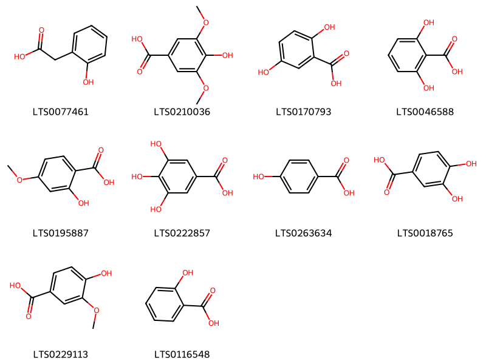{ width=100% }
    <figcaption>Hình ảnh cấu trúc hóa học của 10 hoạt chất thuộc nhóm Benzene and substituted derivatives gồm ['o-hydroxyphenylacetic acid (LTS0077461)', 'syringic acid (LTS0210036)', '2,5-dihydroxybenzoic acid (LTS0170793)', '2,6-dihydroxybenzoic acid (LTS0046588)', '2-hydroxy-4-methoxybenzoic acid (LTS0195887)', 'galop (LTS0222857)', 'p-hydroxybenzoic acid (LTS0263634)', '3,4-dihydroxybenzoic acid (LTS0018765)', 'vanillic acid (LTS0229113)', 'salicyclic acid (LTS0116548)'].</figcaption>
</figure>
#### Nhóm Cinnamic acids and derivatives
<figure markdown="span">
    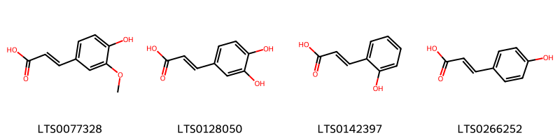{ width=100% }
    <figcaption>Hình ảnh cấu trúc hóa học của 4 hoạt chất thuộc nhóm Cinnamic acids and derivatives gồm ['ferulic acid (LTS0077328)', '3,4-dihydroxycinnamic acid (LTS0128050)', 'trans-2-hydroxycinnamic acid (LTS0142397)', 'para-coumaric acid (LTS0266252)'].</figcaption>
</figure>
#### Nhóm Fatty Acyls
<figure markdown="span">
    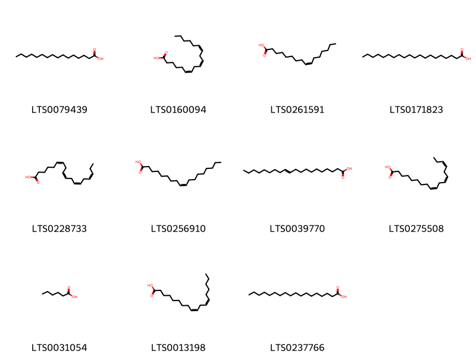{ width=100% }
    <figcaption>Hình ảnh cấu trúc hóa học của 11 hoạt chất thuộc nhóm Fatty Acyls gồm ['palmitic acid (LTS0079439)', 'gamma-linolenic acid (LTS0160094)', 'palmitoleic acid (LTS0261591)', 'arachidic acid (LTS0171823)', 'stearidonic acid (LTS0228733)', 'oleic acid (LTS0256910)', 'icosenoic acid (LTS0039770)', 'α-linolenic acid (LTS0275508)', 'hexanoic acid (LTS0031054)', 'linoleic (LTS0013198)', 'stearic acid (LTS0237766)'].</figcaption>
</figure>
#### Nhóm Flavonoids
<figure markdown="span">
    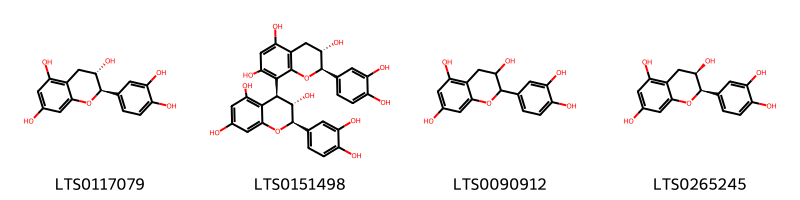{ width=100% }
    <figcaption>Hình ảnh cấu trúc hóa học của 4 hoạt chất thuộc nhóm Flavonoids gồm ['(+)-catechol (LTS0117079)', '(2r,3s,4s)-2-(3,4-dihydroxyphenyl)-4-[(2r,3s)-2-(3,4-dihydroxyphenyl)-3,5,7-trihydroxy-3,4-dihydro-2h-1-benzopyran-8-yl]-3,4-dihydro-2h-1-benzopyran-3,5,7-triol (LTS0151498)', 'catechol (LTS0090912)', 'ent-epicatechin (LTS0265245)'].</figcaption>
</figure>
#### Nhóm Indoles and derivatives
<figure markdown="span">
    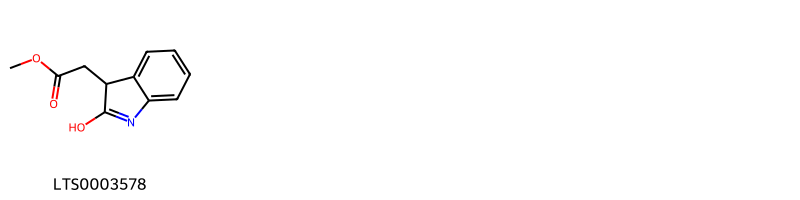{ width=100% }
    <figcaption>Hình ảnh cấu trúc hóa học của 1 hoạt chất thuộc nhóm Indoles and derivatives gồm ['methyl 2-(2-hydroxy-3h-indol-3-yl)acetate (LTS0003578)'].</figcaption>
</figure>
#### Nhóm Phenols
<figure markdown="span">
    { width=100% }
    <figcaption>Hình ảnh cấu trúc hóa học của 1 hoạt chất thuộc nhóm Phenols gồm ['4-hydroxyphenylacetic acid (LTS0272177)'].</figcaption>
</figure>
#### Nhóm Prenol lipids
<figure markdown="span">
    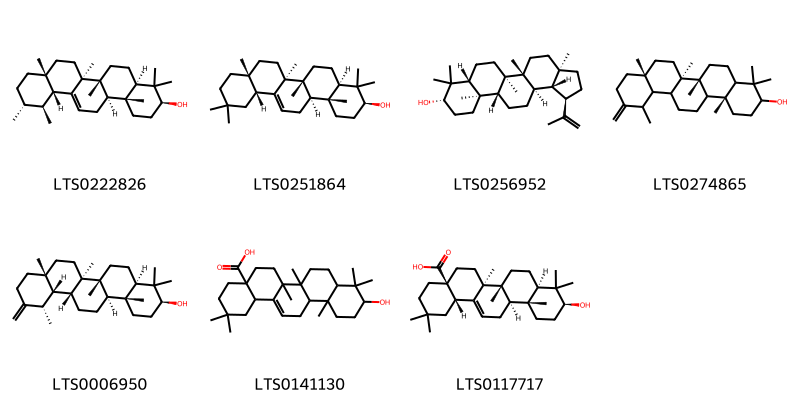{ width=100% }
    <figcaption>Hình ảnh cấu trúc hóa học của 7 hoạt chất thuộc nhóm Prenol lipids gồm ['amyrin (LTS0222826)', 'β-amyrin (LTS0251864)', 'lupeol (LTS0256952)', '(6ar,6br,8ar,14br)-4,4,6a,6b,8a,12,14b-heptamethyl-11-methylidene-hexadecahydropicen-3-ol (LTS0274865)', 'taraxasterol (LTS0006950)', 'oleanolic acid (LTS0141130)', 'oleanolic acid (LTS0117717)'].</figcaption>
</figure>
#### Nhóm Steroids and steroid derivatives
<figure markdown="span">
    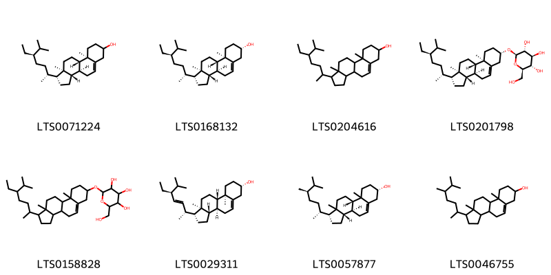{ width=100% }
    <figcaption>Hình ảnh cấu trúc hóa học của 8 hoạt chất thuộc nhóm Steroids and steroid derivatives gồm ['stigmast-5-en-3-ol (LTS0071224)', 'sitosterol (LTS0168132)', 'stigmast-5-en-3-ol, (3β)- (LTS0204616)', 'sitogluside (LTS0201798)', '2-{[1-(5-ethyl-6-methylheptan-2-yl)-9a,11a-dimethyl-1h,2h,3h,3ah,3bh,4h,6h,7h,8h,9h,9bh,10h,11h-cyclopenta[a]phenanthren-7-yl]oxy}-6-(hydroxymethyl)oxane-3,4,5-triol (LTS0158828)', 'phytosterol (LTS0029311)', '(1r,3as,3bs,7s,9bs)-1-[(2r,5r)-5,6-dimethylheptan-2-yl]-9a,11a-dimethyl-1h,2h,3h,3ah,3bh,4h,6h,7h,8h,9h,9bh,10h,11h-cyclopenta[a]phenanthren-7-ol (LTS0057877)', 'campesterol (LTS0046755)'].</figcaption>
</figure>
#### Nhóm Tannins
<figure markdown="span">
    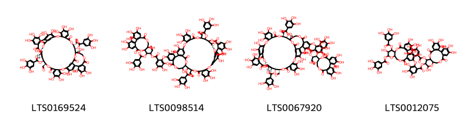{ width=100% }
    <figcaption>Hình ảnh cấu trúc hóa học của 4 hoạt chất thuộc nhóm Tannins gồm ['(11r,12s,13s,35s,36r,37s,38r,60r)-11,35-diformyl-4,5,6,18,19,20,28,29,30,38,44,45,46,49,50,55,56,60-octadecahydroxy-9,15,33,41,53,57-hexaoxo-36-(3,4,5-trihydroxybenzoyloxy)-2,10,14,26,34,40,54,58-octaoxanonacyclo[35.13.4.4¹³,²³.2²²,²⁵.0³,⁸.0¹⁶,²¹.0²⁷,³².0⁴²,⁴⁷.0⁴⁸,⁵²]hexaconta-1(51),3,5,7,16(21),17,19,22,24,27,29,31,42(47),43,45,48(52),49,55-octadecaen-12-yl 3,4,5-trihydroxybenzoate (LTS0169524)', '1-{3,4,5,11,17,18,19-heptahydroxy-8,14-dioxo-9,13-dioxatricyclo[13.4.0.0²,⁷]nonadeca-1(15),2,4,6,16,18-hexaen-10-yl}-3-oxo-1-(3,4,5-trihydroxybenzoyloxy)propan-2-yl 2-{[11,35-diformyl-4,5,6,18,19,20,28,29,30,38,45,46,49,50,55,56,60-heptadecahydroxy-9,15,33,41,53,57-hexaoxo-12,36-bis(3,4,5-trihydroxybenzoyloxy)-2,10,14,26,34,40,54,58-octaoxanonacyclo[35.13.4.4¹³,²³.2²²,²⁵.0³,⁸.0¹⁶,²¹.0²⁷,³².0⁴²,⁴⁷.0⁴⁸,⁵²]hexaconta-1(51),3(8),4,6,16,18,20,22,24,27(32),28,30,42(47),43,45,48(52),49,55-octadecaen-44-yl]oxy}-3,4,5-trihydroxybenzoate (LTS0098514)', '(1s,2r)-1-[(10s,11s)-3,4,5,11,17,18,19-heptahydroxy-8,14-dioxo-9,13-dioxatricyclo[13.4.0.0²,⁷]nonadeca-1(15),2,4,6,16,18-hexaen-10-yl]-3-oxo-1-(3,4,5-trihydroxybenzoyloxy)propan-2-yl 2-{[(11s,12r,13r,35r,36r,37s,38s,60r)-11,35-diformyl-4,5,6,18,19,20,28,29,30,38,45,46,49,50,55,56,60-heptadecahydroxy-9,15,33,41,53,57-hexaoxo-12,36-bis(3,4,5-trihydroxybenzoyloxy)-2,10,14,26,34,40,54,58-octaoxanonacyclo[35.13.4.4¹³,²³.2²²,²⁵.0³,⁸.0¹⁶,²¹.0²⁷,³².0⁴²,⁴⁷.0⁴⁸,⁵²]hexaconta-1(51),3,5,7,16(21),17,19,22,24,27,29,31,42(47),43,45,48(52),49,55-octadecaen-44-yl]oxy}-3,4,5-trihydroxybenzoate (LTS0067920)', '3,4,5,13,21,22,23-heptahydroxy-8,18-dioxo-11-(3,4,5-trihydroxybenzoyloxy)-9,14,17-trioxatetracyclo[17.4.0.0²,⁷.0¹⁰,¹⁵]tricosa-1(23),2(7),3,5,19,21-hexaen-12-yl 2-{[3,4,5,12,22,23-hexahydroxy-8,18-dioxo-11,13-bis(3,4,5-trihydroxybenzoyloxy)-9,14,17-trioxatetracyclo[17.4.0.0²,⁷.0¹⁰,¹⁵]tricosa-1(23),2(7),3,5,19,21-hexaen-21-yl]oxy}-3,4,5-trihydroxybenzoate (LTS0012075)'].</figcaption>
</figure>

---

### Dược dân tộc học

Danh sách các quốc gia có sử dụng *Oenothera biennis* trong điều trị các bệnh. 

| Country   | Disease              | Bệnh                                                                                                                                                                                                |
|:----------|:---------------------|:----------------------------------------------------------------------------------------------------------------------------------------------------------------------------------------------------|
| Elsewhere | Sedative, Astringent | MYMEMORY WARNING: YOU USED ALL AVAILABLE FREE TRANSLATIONS FOR TODAY. NEXT AVAILABLE IN  11 HOURS 01 MINUTES 56 SECONDS VISIT HTTPS://MYMEMORY.TRANSLATED.NET/DOC/USAGELIMITS.PHP TO TRANSLATE MORE |
| Turkey    | Astringent, Sedative | MYMEMORY WARNING: YOU USED ALL AVAILABLE FREE TRANSLATIONS FOR TODAY. NEXT AVAILABLE IN  11 HOURS 01 MINUTES 52 SECONDS VISIT HTTPS://MYMEMORY.TRANSLATED.NET/DOC/USAGELIMITS.PHP TO TRANSLATE MORE |

---

---
## Oenothera longiflora
### Thông tin về thực vật

!!! info "Phân loại thực vật của *Oenothera longiflora* từ GIBF:"
    - **Kingdom:** Plantae
    - **Phylum:** Tracheophyta
    - **Order:** Myrtales
    - **Family:** Onagraceae
    - **Genus:** Oenothera
    - **Species:** *Oenothera longiflora*

 

| Label (VI)   | Label (EN)   | Scientific Name      | Descriptions (VI)   | Descriptions (EN)   | Also Known As (VI)   | Also Known As (EN)   |
|:-------------|:-------------|:---------------------|:--------------------|:--------------------|:---------------------|:---------------------|
| N/A          | N/A          | Oenothera longiflora | loài thực vật       | species of plant    | ['']                 | ['']                 |

#### Phân bố trên thế giới

**Từ CSDL GIBF** nan, Uruguay, unknown or invalid, Argentina, Cabo Verde, Portugal, South Africa, Brazil, France, Spain, Paraguay, Germany, United States of America, Australia

#### Phân bố tại Việt Nam

**Từ CSDL GIBF**: Không có ghi nhận ở Việt Nam

---
### Thành phần hóa học
        
- Theo cơ sở dữ liệu lotus: Từ loài *Oenothera longiflora* đã phân lập và xác định được Chưa có hoạt chất nào được phân lập. hoạt chất thuộc về các nhóm Không có hoạt chất nào được phân lập. 

Không có hình ảnh nào được tạo ra

---

### Dược dân tộc học

Danh sách các quốc gia có sử dụng *Oenothera longiflora* trong điều trị các bệnh. 

| Country   | Disease   | Bệnh                                                                                                                                                                                                |
|:----------|:----------|:----------------------------------------------------------------------------------------------------------------------------------------------------------------------------------------------------|
| Lesotho   | Fumigant  | MYMEMORY WARNING: YOU USED ALL AVAILABLE FREE TRANSLATIONS FOR TODAY. NEXT AVAILABLE IN  11 HOURS 00 MINUTES 53 SECONDS VISIT HTTPS://MYMEMORY.TRANSLATED.NET/DOC/USAGELIMITS.PHP TO TRANSLATE MORE |

---

---
## Oenothera odorata
### Thông tin về thực vật

!!! info "Phân loại thực vật của *Oenothera odorata* từ GIBF:"
    - **Kingdom:** Plantae
    - **Phylum:** Tracheophyta
    - **Order:** Myrtales
    - **Family:** Onagraceae
    - **Genus:** Oenothera
    - **Species:** *Oenothera odorata*

 

| Label (VI)   | Label (EN)   | Scientific Name   | Descriptions (VI)   | Descriptions (EN)   | Also Known As (VI)   | Also Known As (EN)   |
|:-------------|:-------------|:------------------|:--------------------|:--------------------|:---------------------|:---------------------|
| N/A          | N/A          | Oenothera odorata | loài thực vật       | species of plant    | ['']                 | ['']                 |

#### Phân bố trên thế giới

**Từ CSDL GIBF** Argentina, Germany, Chile, Italy, Korea, Republic of

#### Phân bố tại Việt Nam

**Từ CSDL GIBF**: Không có ghi nhận ở Việt Nam

---
### Thành phần hóa học
        
- Theo cơ sở dữ liệu lotus: Từ loài *Oenothera odorata* đã phân lập và xác định được 17 hoạt chất thuộc về các nhóm Flavonoids, Fatty Acyls. 

|    | chemicalTaxonomyClassyfireClass   |   smiles_count |
|---:|:----------------------------------|---------------:|
|  0 | Fatty Acyls                       |              9 |
|  1 | Flavonoids                        |              8 |

#### Nhóm Fatty Acyls
<figure markdown="span">
    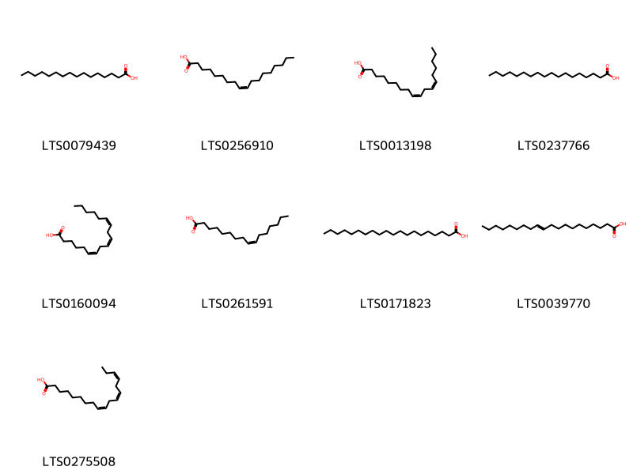{ width=100% }
    <figcaption>Hình ảnh cấu trúc hóa học của 9 hoạt chất thuộc nhóm Fatty Acyls gồm ['palmitic acid (LTS0079439)', 'oleic acid (LTS0256910)', 'linoleic (LTS0013198)', 'stearic acid (LTS0237766)', 'gamma-linolenic acid (LTS0160094)', 'palmitoleic acid (LTS0261591)', 'arachidic acid (LTS0171823)', 'icosenoic acid (LTS0039770)', 'α-linolenic acid (LTS0275508)'].</figcaption>
</figure>
#### Nhóm Flavonoids
<figure markdown="span">
    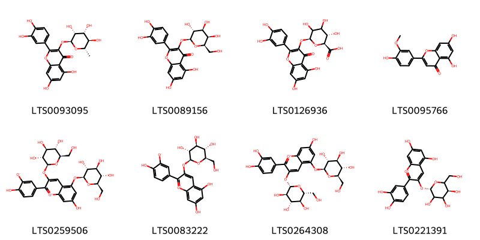{ width=100% }
    <figcaption>Hình ảnh cấu trúc hóa học của 8 hoạt chất thuộc nhóm Flavonoids gồm ['quercitrin (LTS0093095)', 'hyperoside (LTS0089156)', 'miquelianin (LTS0126936)', 'chrysoeriol (LTS0095766)', 'cyanin betaine (LTS0259506)', '5,7-dihydroxy-2-(4-hydroxy-3-oxidophenyl)-3-{[(2s,3r,4s,5s,6r)-3,4,5-trihydroxy-6-(hydroxymethyl)oxan-2-yl]oxy}-1λ⁴-chromen-1-ylium (LTS0083222)', 'cyanin (LTS0264308)', 'chrysanthemin (LTS0221391)'].</figcaption>
</figure>

---

### Dược dân tộc học

Danh sách các quốc gia có sử dụng *Oenothera odorata* trong điều trị các bệnh. 

| Country   | Disease   | Bệnh                                                                                                                                                                                                |
|:----------|:----------|:----------------------------------------------------------------------------------------------------------------------------------------------------------------------------------------------------|
| Australia | Poison    | MYMEMORY WARNING: YOU USED ALL AVAILABLE FREE TRANSLATIONS FOR TODAY. NEXT AVAILABLE IN  11 HOURS 00 MINUTES 29 SECONDS VISIT HTTPS://MYMEMORY.TRANSLATED.NET/DOC/USAGELIMITS.PHP TO TRANSLATE MORE |

---

---
## Oenothera tetraptera
### Thông tin về thực vật

!!! info "Phân loại thực vật của *Oenothera tetraptera* từ GIBF:"
    - **Kingdom:** Plantae
    - **Phylum:** Tracheophyta
    - **Order:** Myrtales
    - **Family:** Onagraceae
    - **Genus:** Oenothera
    - **Species:** *Oenothera tetraptera*

 

| Label (VI)   | Label (EN)   | Scientific Name      | Descriptions (VI)   | Descriptions (EN)   | Also Known As (VI)   | Also Known As (EN)   |
|:-------------|:-------------|:---------------------|:--------------------|:--------------------|:---------------------|:---------------------|
| N/A          | N/A          | Oenothera tetraptera | loài thực vật       | species of plant    | ['']                 | ['']                 |

#### Phân bố trên thế giới

**Từ CSDL GIBF** Colombia, South Africa, Brazil, Bolivia (Plurinational State of), Kenya, Ecuador, United States of America, Mexico, Lesotho, Australia, Chinese Taipei

#### Phân bố tại Việt Nam

**Từ CSDL GIBF**: Không có ghi nhận ở Việt Nam

---
### Thành phần hóa học
        
- Theo cơ sở dữ liệu lotus: Từ loài *Oenothera tetraptera* đã phân lập và xác định được 16 hoạt chất thuộc về các nhóm Tannins, Flavonoids. 

|    | chemicalTaxonomyClassyfireClass   |   smiles_count |
|---:|:----------------------------------|---------------:|
|  0 | Flavonoids                        |              6 |
|  1 | Tannins                           |             10 |

#### Nhóm Flavonoids
<figure markdown="span">
    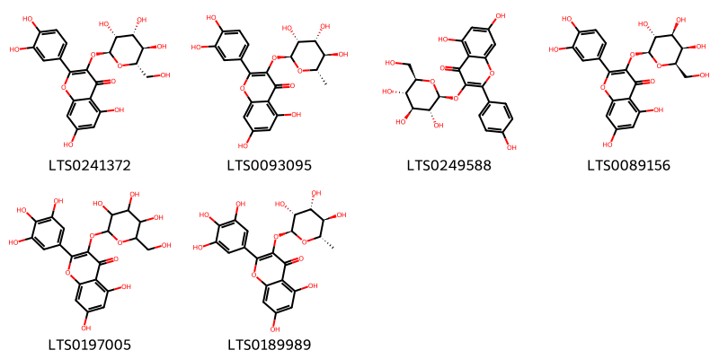{ width=100% }
    <figcaption>Hình ảnh cấu trúc hóa học của 6 hoạt chất thuộc nhóm Flavonoids gồm ['2-(3,4-dihydroxyphenyl)-5,7-dihydroxy-3-{[(2s,3r,4r,5r,6s)-3,4,5-trihydroxy-6-(hydroxymethyl)oxan-2-yl]oxy}chromen-4-one (LTS0241372)', 'quercitrin (LTS0093095)', 'astragalin (LTS0249588)', 'hyperoside (LTS0089156)', '5,7-dihydroxy-3-{[3,4,5-trihydroxy-6-(hydroxymethyl)oxan-2-yl]oxy}-2-(3,4,5-trihydroxyphenyl)chromen-4-one (LTS0197005)', 'myricitrin (LTS0189989)'].</figcaption>
</figure>
#### Nhóm Tannins
<figure markdown="span">
    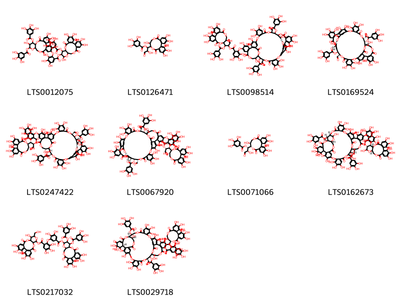{ width=100% }
    <figcaption>Hình ảnh cấu trúc hóa học của 10 hoạt chất thuộc nhóm Tannins gồm ['3,4,5,13,21,22,23-heptahydroxy-8,18-dioxo-11-(3,4,5-trihydroxybenzoyloxy)-9,14,17-trioxatetracyclo[17.4.0.0²,⁷.0¹⁰,¹⁵]tricosa-1(23),2(7),3,5,19,21-hexaen-12-yl 2-{[3,4,5,12,22,23-hexahydroxy-8,18-dioxo-11,13-bis(3,4,5-trihydroxybenzoyloxy)-9,14,17-trioxatetracyclo[17.4.0.0²,⁷.0¹⁰,¹⁵]tricosa-1(23),2(7),3,5,19,21-hexaen-21-yl]oxy}-3,4,5-trihydroxybenzoate (LTS0012075)', '1-{3,4,5,11,17,18,19-heptahydroxy-8,14-dioxo-9,13-dioxatricyclo[13.4.0.0²,⁷]nonadeca-1(15),2,4,6,16,18-hexaen-10-yl}-2-hydroxy-3-oxopropyl 3,4,5-trihydroxybenzoate (LTS0126471)', '1-{3,4,5,11,17,18,19-heptahydroxy-8,14-dioxo-9,13-dioxatricyclo[13.4.0.0²,⁷]nonadeca-1(15),2,4,6,16,18-hexaen-10-yl}-3-oxo-1-(3,4,5-trihydroxybenzoyloxy)propan-2-yl 2-{[11,35-diformyl-4,5,6,18,19,20,28,29,30,38,45,46,49,50,55,56,60-heptadecahydroxy-9,15,33,41,53,57-hexaoxo-12,36-bis(3,4,5-trihydroxybenzoyloxy)-2,10,14,26,34,40,54,58-octaoxanonacyclo[35.13.4.4¹³,²³.2²²,²⁵.0³,⁸.0¹⁶,²¹.0²⁷,³².0⁴²,⁴⁷.0⁴⁸,⁵²]hexaconta-1(51),3(8),4,6,16,18,20,22,24,27(32),28,30,42(47),43,45,48(52),49,55-octadecaen-44-yl]oxy}-3,4,5-trihydroxybenzoate (LTS0098514)', '(11r,12s,13s,35s,36r,37s,38r,60r)-11,35-diformyl-4,5,6,18,19,20,28,29,30,38,44,45,46,49,50,55,56,60-octadecahydroxy-9,15,33,41,53,57-hexaoxo-36-(3,4,5-trihydroxybenzoyloxy)-2,10,14,26,34,40,54,58-octaoxanonacyclo[35.13.4.4¹³,²³.2²²,²⁵.0³,⁸.0¹⁶,²¹.0²⁷,³².0⁴²,⁴⁷.0⁴⁸,⁵²]hexaconta-1(51),3,5,7,16(21),17,19,22,24,27,29,31,42(47),43,45,48(52),49,55-octadecaen-12-yl 3,4,5-trihydroxybenzoate (LTS0169524)', '(1s,2r)-1-[(10r,11r)-3,4,5,11,17,18,19-heptahydroxy-8,14-dioxo-9,13-dioxatricyclo[13.4.0.0²,⁷]nonadeca-1(15),2,4,6,16,18-hexaen-10-yl]-3-oxo-1-(3,4,5-trihydroxybenzoyloxy)propan-2-yl 2-{[(11r,12s,13r,35r,36s,37r,38r,60r)-11,35-diformyl-4,5,6,18,19,20,28,29,30,38,45,46,49,50,55,56,60-heptadecahydroxy-9,15,33,41,53,57-hexaoxo-12,36-bis(3,4,5-trihydroxybenzoyloxy)-2,10,14,26,34,40,54,58-octaoxanonacyclo[35.13.4.4¹³,²³.2²²,²⁵.0³,⁸.0¹⁶,²¹.0²⁷,³².0⁴²,⁴⁷.0⁴⁸,⁵²]hexaconta-1(51),3(8),4,6,16,18,20,22,24,27(32),28,30,42(47),43,45,48(52),49,55-octadecaen-44-yl]oxy}-3,4,5-trihydroxybenzoate (LTS0247422)', '(1s,2r)-1-[(10s,11s)-3,4,5,11,17,18,19-heptahydroxy-8,14-dioxo-9,13-dioxatricyclo[13.4.0.0²,⁷]nonadeca-1(15),2,4,6,16,18-hexaen-10-yl]-3-oxo-1-(3,4,5-trihydroxybenzoyloxy)propan-2-yl 2-{[(11s,12r,13r,35r,36r,37s,38s,60r)-11,35-diformyl-4,5,6,18,19,20,28,29,30,38,45,46,49,50,55,56,60-heptadecahydroxy-9,15,33,41,53,57-hexaoxo-12,36-bis(3,4,5-trihydroxybenzoyloxy)-2,10,14,26,34,40,54,58-octaoxanonacyclo[35.13.4.4¹³,²³.2²²,²⁵.0³,⁸.0¹⁶,²¹.0²⁷,³².0⁴²,⁴⁷.0⁴⁸,⁵²]hexaconta-1(51),3,5,7,16(21),17,19,22,24,27,29,31,42(47),43,45,48(52),49,55-octadecaen-44-yl]oxy}-3,4,5-trihydroxybenzoate (LTS0067920)', '(1s,2r)-1-[(10s,11s)-3,4,5,11,17,18,19-heptahydroxy-8,14-dioxo-9,13-dioxatricyclo[13.4.0.0²,⁷]nonadeca-1(15),2,4,6,16,18-hexaen-10-yl]-2-hydroxy-3-oxopropyl 3,4,5-trihydroxybenzoate (LTS0071066)', '(10r,11s,12r,15r)-3,4,5,13,21,22,23-heptahydroxy-8,18-dioxo-11-(3,4,5-trihydroxybenzoyloxy)-9,14,17-trioxatetracyclo[17.4.0.0²,⁷.0¹⁰,¹⁵]tricosa-1(23),2(7),3,5,19,21-hexaen-12-yl 2-{[(11r,12s,13r,14r,25s,39r,42r,59r,60s)-4,5,6,24,24,25,28,32,33,34,40,49,50,53,54,65-hexadecahydroxy-9,17,23,37,45,57,62-heptaoxo-12,60-bis(3,4,5-trihydroxybenzoyloxy)-2,10,16,26,30,38,41,44,58,63,64-undecaoxadodecacyclo[37.15.6.2¹¹,¹⁴.2¹³,²¹.1¹⁸,²⁹.0³,⁸.0¹⁹,²⁷.0²⁰,²⁵.0³¹,³⁶.0⁴²,⁵⁹.0⁴⁶,⁵¹.0⁵²,⁵⁶]pentahexaconta-1(55),3,5,7,18,21,27,29(61),31,33,35,46(51),47,49,52(56),53-hexadecaen-48-yl]oxy}-3,4,5-trihydroxybenzoate (LTS0162673)', '3,4,5,14,20,21,22-heptahydroxy-13-(hydroxymethyl)-8,17-dioxo-9,12,16-trioxatetracyclo[16.4.0.0²,⁷.0¹⁰,¹⁵]docosa-1(22),2(7),3,5,18,20-hexaen-11-yl 2-[5-({[3,4,5,21,22,23-hexahydroxy-8,18-dioxo-11,12-bis(3,4,5-trihydroxybenzoyloxy)-9,14,17-trioxatetracyclo[17.4.0.0²,⁷.0¹⁰,¹⁵]tricosa-1(23),2(7),3,5,19,21-hexaen-13-yl]oxy}carbonyl)-2,3-dihydroxyphenoxy]-3,4,5-trihydroxybenzoate (LTS0217032)', '(1r,2s)-1-[(10s,11r)-3,4,5,11,17,18,19-heptahydroxy-8,14-dioxo-9,13-dioxatricyclo[13.4.0.0²,⁷]nonadeca-1(15),2,4,6,16,18-hexaen-10-yl]-3-oxo-1-(3,4,5-trihydroxybenzoyloxy)propan-2-yl 2-{[(11r,12r,13r,14r,20r,25s,39s,40r,41s,42s)-11,39-diformyl-4,5,6,14,24,24,25,28,32,33,34,42,49,50,53,54-hexadecahydroxy-9,17,23,37,45,57,60-heptaoxo-12,40-bis(3,4,5-trihydroxybenzoyloxy)-2,10,16,26,30,38,44,58,61-nonaoxadecacyclo[39.13.4.2¹³,²¹.1¹⁸,²⁹.0³,⁸.0¹⁹,²⁷.0²⁰,²⁵.0³¹,³⁶.0⁴⁶,⁵¹.0⁵²,⁵⁶]henhexaconta-1(55),3,5,7,18,21,27,29(59),31,33,35,46(51),47,49,52(56),53-hexadecaen-48-yl]oxy}-3,4,5-trihydroxybenzoate (LTS0029718)'].</figcaption>
</figure>

---

### Dược dân tộc học

Danh sách các quốc gia có sử dụng *Oenothera tetraptera* trong điều trị các bệnh. 

| Country   | Disease   | Bệnh                                                                                                                                                                                                |
|:----------|:----------|:----------------------------------------------------------------------------------------------------------------------------------------------------------------------------------------------------|
| Elsewhere | Poison    | MYMEMORY WARNING: YOU USED ALL AVAILABLE FREE TRANSLATIONS FOR TODAY. NEXT AVAILABLE IN  10 HOURS 59 MINUTES 45 SECONDS VISIT HTTPS://MYMEMORY.TRANSLATED.NET/DOC/USAGELIMITS.PHP TO TRANSLATE MORE |

---

