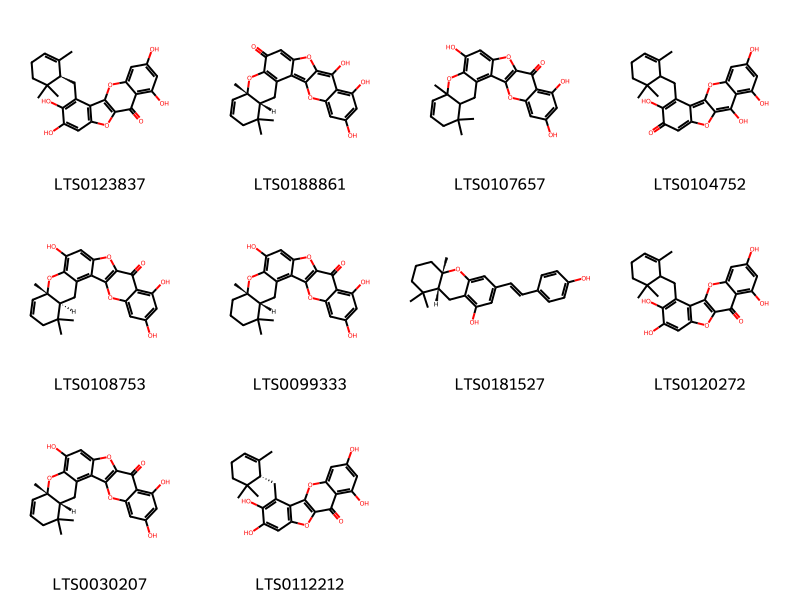
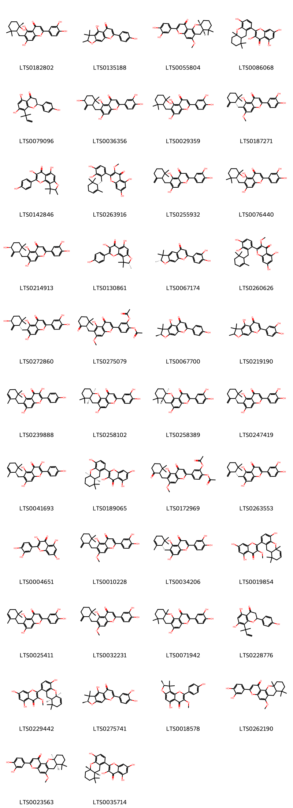
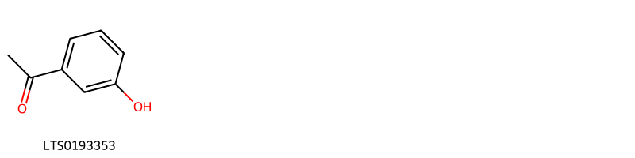
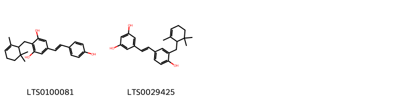
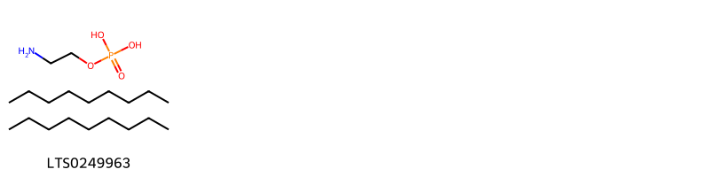

!!! abstract "Tóm tắt"

    Họ Ophioglossaceae gồm khoảng 3 chi và 5 loài được một số cộng đồng tại các quốc gia như Turkey, Egypt, Malagasy, India, Elsewhere, Java, Malaya, Malaysia, China sử dụng trong một số trường hợp Tonic, Intoxicant, Emollient, Vulnerary, Khử trùng, Styptic, Vulnerary, Vulnerary, Khử trùng, Mỹ phẩm.

!!! info "DrDuke"

    James A. Duke sinh năm 1929-2017 là một nhà thực vật học người Mỹ. Đây là một trong những tác giả hàng đầu trong lĩnh vực dược dân tộc học với cuốn *CRC Handbook of Medicinal Herbs* và chính là người xây dựng lên cơ sở dữ liệu về hợp chất tự nhiên và dược dân tộc học tại Bộ nông nghiệp Hoa Kỳ. Các thông tin được đăng tải tại website [Dr. Duke's Phytochemical and Ethnobotanical Databases](https://phytochem.nal.usda.gov/). 
    Trong suốt thập niên 1970, ông lãnh đạo the Plant Taxonomy Laboratory, Plant Genetics and Germplasm Institute of the Agricultural Research Service, U.S. Department of Agriculture.
    Trong tài liệu này, các thông tin về dược dân tộc của các dược liệu được trích dẫn từ tài liệu của James A. Ducke với sự trợ giúp của phần mềm dịch thuật từ tiếng Anh sang tiếng Việt.
   

# Chi Botrychium

??? note "Danh sách các dược liệu thuộc chi"
    
	 - *Botrychium lunaria*

---
## Botrychium lunaria
### Thông tin về thực vật

!!! info "Phân loại thực vật của *Botrychium lunaria* từ GIBF:"
    - **Kingdom:** Plantae
    - **Phylum:** Tracheophyta
    - **Order:** Ophioglossales
    - **Family:** Ophioglossaceae
    - **Genus:** Botrychium
    - **Species:** *Botrychium lunaria*

 

| Label (VI)   | Label (EN)   | Scientific Name    | Descriptions (VI)   | Descriptions (EN)   | Also Known As (VI)   | Also Known As (EN)                                                     |
|:-------------|:-------------|:-------------------|:--------------------|:--------------------|:---------------------|:-----------------------------------------------------------------------|
| N/A          | N/A          | Botrychium lunaria | loài thực vật       | species of plant    | ['']                 | ['Goblin fern', 'Little goblin', 'Little goblin moonwort', 'Moonwort'] |

#### Phân bố trên thế giới

**Từ CSDL GIBF** nan, Italy, Australia, Slovakia, Estonia, Norway, Denmark, Netherlands, Lithuania, Belarus, Iceland, Spain, Russian Federation, Sweden, Finland, Croatia, Bosnia and Herzegovina, Greenland, Czechia, Germany, Romania, Switzerland, Austria, France, United Kingdom of Great Britain and Northern Ireland, Ireland, Poland

#### Phân bố tại Việt Nam

**Từ CSDL GIBF**: Không có ghi nhận ở Việt Nam

---
### Thành phần hóa học
        
- Theo cơ sở dữ liệu lotus: Từ loài *Botrychium lunaria* đã phân lập và xác định được Chưa có hoạt chất nào được phân lập. hoạt chất thuộc về các nhóm Không có hoạt chất nào được phân lập. 

Không có hình ảnh nào được tạo ra

---

### Dược dân tộc học

Danh sách các quốc gia có sử dụng *Botrychium lunaria* trong điều trị các bệnh. 

| Country   | Disease   | Bệnh      |
|:----------|:----------|:----------|
| Turkey    | Vulnerary | Vulnerary |

---

# Chi Helminthostachys

??? note "Danh sách các dược liệu thuộc chi"
    
	 - *Helminthostachys zeylanica*

---
## Helminthostachys zeylanica
### Thông tin về thực vật

!!! info "Phân loại thực vật của *Helminthostachys zeylanica* từ GIBF:"
    - **Kingdom:** Plantae
    - **Phylum:** Tracheophyta
    - **Order:** Ophioglossales
    - **Family:** Ophioglossaceae
    - **Genus:** Helminthostachys
    - **Species:** *Helminthostachys zeylanica*

 

| Label (VI)   | Label (EN)   | Scientific Name            | Descriptions (VI)   | Descriptions (EN)   | Also Known As (VI)   | Also Known As (EN)   |
|:-------------|:-------------|:---------------------------|:--------------------|:--------------------|:---------------------|:---------------------|
| N/A          | N/A          | Helminthostachys zeylanica | loài thực vật       | species of plant    | ['']                 | ['']                 |

#### Phân bố trên thế giới

**Từ CSDL GIBF** nan, Australia, Japan, Lao People’s Democratic Republic, Cambodia, Myanmar, unknown or invalid, Chinese Taipei, Papua New Guinea, Bangladesh, Timor-Leste, Solomon Islands, Thailand, New Caledonia, Viet Nam, China, India, Indonesia, Philippines, Malaysia, Brunei Darussalam, Nepal

#### Phân bố tại Việt Nam

**Từ CSDL GIBF**: Dak Lak, Quang Tri, Tay Ninh, Lam Dong (林同省), Đồng Nai, Son La

---
### Thành phần hóa học
        
- Theo cơ sở dữ liệu lotus: Từ loài *Helminthostachys zeylanica* đã phân lập và xác định được 55 hoạt chất thuộc về các nhóm Stilbenes, Flavonoids, Organooxygen compounds, Benzopyrans. 

|    | chemicalTaxonomyClassyfireClass   |   smiles_count |
|---:|:----------------------------------|---------------:|
|  0 | Benzopyrans                       |             10 |
|  1 | Flavonoids                        |             42 |
|  2 | Organooxygen compounds            |              1 |
|  3 | Stilbenes                         |              2 |

#### Nhóm Benzopyrans
<figure markdown="span">
    { width=100% }
    <figcaption>Hình ảnh cấu trúc hóa học của 10 hoạt chất thuộc nhóm Benzopyrans gồm ['4,6,13,14-tetrahydroxy-12-{[(1s)-2,6,6-trimethylcyclohex-2-en-1-yl]methyl}-9,17-dioxatetracyclo[8.7.0.0³,⁸.0¹¹,¹⁶]heptadeca-1(10),3,5,7,11(16),12,14-heptaen-2-one (LTS0123837)', '(4r,9s)-17,19,21-trihydroxy-5,5,9-trimethyl-10,15,24-trioxahexacyclo[12.11.0.0²,¹¹.0⁴,⁹.0¹⁶,²⁵.0¹⁸,²³]pentacosa-1(25),2(11),7,13,16,18,20,22-octaen-12-one (LTS0188861)', 'ugonin o (LTS0107657)', '2,4,6,13-tetrahydroxy-12-[(2,6,6-trimethylcyclohex-2-en-1-yl)methyl]-9,17-dioxatetracyclo[8.7.0.0³,⁸.0¹¹,¹⁶]heptadeca-1,3,5,7,10,12,15-heptaen-14-one (LTS0104752)', '(4s,9s)-12,19,21-trihydroxy-5,5,9-trimethyl-10,15,24-trioxahexacyclo[12.11.0.0²,¹¹.0⁴,⁹.0¹⁶,²⁵.0¹⁸,²³]pentacosa-1(14),2(11),7,12,16(25),18,20,22-octaen-17-one (LTS0108753)', '(4r,9s)-12,19,21-trihydroxy-5,5,9-trimethyl-10,15,24-trioxahexacyclo[12.11.0.0²,¹¹.0⁴,⁹.0¹⁶,²⁵.0¹⁸,²³]pentacosa-1(14),2(11),12,16(25),18,20,22-heptaen-17-one (LTS0099333)', '(8ar,10as)-3-[(1e)-2-(4-hydroxyphenyl)ethenyl]-8,8,10a-trimethyl-6,7,8a,9-tetrahydro-5h-xanthen-1-ol (LTS0181527)', 'ugonin m (LTS0120272)', '(4r,9s)-12,19,21-trihydroxy-5,5,9-trimethyl-10,15,24-trioxahexacyclo[12.11.0.0²,¹¹.0⁴,⁹.0¹⁶,²⁵.0¹⁸,²³]pentacosa-1(14),2(11),7,12,16(25),18,20,22-octaen-17-one (LTS0030207)', '4,6,13,14-tetrahydroxy-12-{[(1r)-2,6,6-trimethylcyclohex-2-en-1-yl]methyl}-9,17-dioxatetracyclo[8.7.0.0³,⁸.0¹¹,¹⁶]heptadeca-1(10),3,5,7,11(16),12,14-heptaen-2-one (LTS0112212)'].</figcaption>
</figure>
#### Nhóm Flavonoids
<figure markdown="span">
    { width=100% }
    <figcaption>Hình ảnh cấu trúc hóa học của 42 hoạt chất thuộc nhóm Flavonoids gồm ['2-(3,4-dihydroxyphenyl)-5,7-dihydroxy-6-{[(1s,2s)-2-hydroxy-2,6,6-trimethylcyclohexyl]methyl}chromen-4-one (LTS0182802)', '4-hydroxy-7-(4-hydroxyphenyl)-2,3,3-trimethyl-2h-furo[3,2-g]chromen-5-one (LTS0135188)', '(5ar,9as)-2-(3,4-dihydroxyphenyl)-11-methoxy-5a,9,9-trimethyl-7,8,9a,10-tetrahydro-6h-1,5-dioxatetraphen-4-one (LTS0055804)', 'ugonin n (LTS0086068)', 'ugonin e (LTS0079096)', 'ugonin q (LTS0036356)', 'ugonin r (LTS0029359)', '2-(3,4-dihydroxyphenyl)-6-{[(1s)-2,2-dimethyl-6-methylidenecyclohexyl]methyl}-5-hydroxy-7-methoxychromen-4-one (LTS0187271)', '3,5-dihydroxy-2-(4-hydroxyphenyl)-8,9,9-trimethyl-8h-furo[2,3-h]chromen-4-one (LTS0142846)', '2-(3,4-dihydroxy-2-{[(1s)-2,6,6-trimethylcyclohex-2-en-1-yl]methyl}phenyl)-5,7-dihydroxy-3-methoxychromen-4-one (LTS0263916)', 'ugonin j (LTS0255932)', '2-(3,4-dihydroxyphenyl)-5,7-dihydroxy-6-{[(1s)-2-hydroxy-2,6,6-trimethylcyclohexyl]methyl}chromen-4-one (LTS0076440)', '2-(3,4-dihydroxyphenyl)-5,7-dihydroxy-6-{[(1r,5s)-5-hydroxy-2,2-dimethyl-6-methylidenecyclohexyl]methyl}chromen-4-one (LTS0214913)', '(8r)-3,5-dihydroxy-2-(4-hydroxyphenyl)-8,9,9-trimethyl-8h-furo[2,3-h]chromen-4-one (LTS0130861)', '(2r)-7-(3,4-dihydroxyphenyl)-2,3,3-trimethyl-2h-furo[3,2-g]chromen-5-one (LTS0067174)', '2-{3,4-dihydroxy-2-[(2,6,6-trimethylcyclohex-2-en-1-yl)methyl]phenyl}-5,7-dihydroxy-3-methoxychromen-4-one (LTS0260626)', '2-(3,4-dihydroxyphenyl)-5,7-dihydroxy-6-{[(1s,5s)-5-hydroxy-2,2-dimethyl-6-methylidenecyclohexyl]methyl}chromen-4-one (LTS0272860)', '2-(acetyloxy)-4-(6-{[(1r)-2,2-dimethyl-6-oxocyclohexyl]methyl}-5-hydroxy-7-methoxy-4-oxochromen-2-yl)phenyl acetate (LTS0275079)', '(2s)-4-hydroxy-7-(4-hydroxyphenyl)-2,3,3-trimethyl-2h-furo[3,2-g]chromen-5-one (LTS0067700)', 'ugonin t (LTS0219190)', '3,5,7-trihydroxy-2-(4-hydroxyphenyl)-6-[(2,6,6-trimethylcyclohex-2-en-1-yl)methyl]chromen-4-one (LTS0239888)', '(5ar,9as)-2-(3,4-dihydroxyphenyl)-11-hydroxy-5a,9,9-trimethyl-7,8,9a,10-tetrahydro-6h-1,5-dioxatetraphen-4-one (LTS0258102)', '(5ar,9ar)-2-(3,4-dihydroxyphenyl)-11-hydroxy-5a,9,9-trimethyl-7,8,9a,10-tetrahydro-6h-1,5-dioxatetraphen-4-one (LTS0258389)', '2-(3,4-dihydroxyphenyl)-6-{[(1r)-2,2-dimethyl-6-methylidenecyclohexyl]methyl}-5,7-dihydroxychromen-4-one (LTS0247419)', '3,5,7-trihydroxy-2-(4-hydroxyphenyl)-6-{[(1r)-2,6,6-trimethylcyclohex-2-en-1-yl]methyl}chromen-4-one (LTS0041693)', '2-[(8as,10ar)-4-hydroxy-8,8,10a-trimethyl-6,7,8a,9-tetrahydro-5h-xanthen-1-yl]-3,5,7-trihydroxychromen-4-one (LTS0189065)', '2-(acetyloxy)-4-{6-[(2,2-dimethyl-6-oxocyclohexyl)methyl]-5-hydroxy-7-methoxy-4-oxochromen-2-yl}phenyl acetate (LTS0172969)', '2-(3,4-dihydroxyphenyl)-6-{[(1s)-2,2-dimethyl-6-methylidenecyclohexyl]methyl}-5,7-dihydroxychromen-4-one (LTS0263553)', 'quercetin (LTS0004651)', 'ugonin k (LTS0010228)', '2-(3,4-dihydroxyphenyl)-5,7-dihydroxy-6-{[(1s)-2,6,6-trimethylcyclohex-2-en-1-yl]methyl}chromen-4-one (LTS0034206)', '5,7-dihydroxy-2-(4-hydroxy-8,8,10a-trimethyl-8a,9-dihydro-7h-xanthen-1-yl)-3-methoxychromen-4-one (LTS0019854)', 'ugonin p (LTS0025411)', '2-(3,4-dihydroxyphenyl)-6-{[(1r)-2,2-dimethyl-6-methylidenecyclohexyl]methyl}-5-hydroxy-7-methoxychromen-4-one (LTS0032231)', 'ugonin s (LTS0071942)', '5,7-dihydroxy-2-(4-hydroxyphenyl)-8-(2-methylbut-3-en-2-yl)-2,3-dihydro-1-benzopyran-4-one (LTS0228776)', '2-[(8ar,10as)-4-hydroxy-8,8,10a-trimethyl-8a,9-dihydro-7h-xanthen-1-yl]-5,7-dihydroxy-3-methoxychromen-4-one (LTS0229442)', '(2s)-7-(3,4-dihydroxyphenyl)-4-hydroxy-2,3,3-trimethyl-2h-furo[3,2-g]chromen-5-one (LTS0275741)', '(8s)-5-hydroxy-2-(4-hydroxyphenyl)-3-methoxy-8,9,9-trimethyl-8h-furo[2,3-h]chromen-4-one (LTS0018578)', 'ugonin l (LTS0262190)', '(5as,9ar)-2-(3,4-dihydroxyphenyl)-11-methoxy-5a,9,9-trimethyl-7,8,9a,10-tetrahydro-6h-1,5-dioxatetraphen-4-one (LTS0023563)', '2-[(8ar,10as)-4-hydroxy-8,8,10a-trimethyl-6,7,8a,9-tetrahydro-5h-xanthen-1-yl]-3,5,7-trihydroxychromen-4-one (LTS0035714)'].</figcaption>
</figure>
#### Nhóm Organooxygen compounds
<figure markdown="span">
    { width=100% }
    <figcaption>Hình ảnh cấu trúc hóa học của 1 hoạt chất thuộc nhóm Organooxygen compounds gồm ['3-hydroxyacetophenone (LTS0193353)'].</figcaption>
</figure>
#### Nhóm Stilbenes
<figure markdown="span">
    { width=100% }
    <figcaption>Hình ảnh cấu trúc hóa học của 2 hoạt chất thuộc nhóm Stilbenes gồm ['5-[(1e)-2-(4-hydroxyphenyl)ethenyl]-2-[(2,6,6-trimethylcyclohex-2-en-1-yl)methyl]benzene-1,3-diol (LTS0100081)', '5-[(1e)-2-{4-hydroxy-3-[(2,6,6-trimethylcyclohex-2-en-1-yl)methyl]phenyl}ethenyl]benzene-1,3-diol (LTS0029425)'].</figcaption>
</figure>

---

### Dược dân tộc học

Danh sách các quốc gia có sử dụng *Helminthostachys zeylanica* trong điều trị các bệnh. 

| Country   | Disease    | Bệnh               |
|:----------|:-----------|:-------------------|
| China     | Tonic      | (thuộc) trương lực |
| India     | Intoxicant | chất gây độc       |
| Malaya    | Tonic      | (thuộc) trương lực |
| Malaysia  | Tonic      | (thuộc) trương lực |

---

# Chi Ophioglossum

??? note "Danh sách các dược liệu thuộc chi"
    
	 - *Ophioglossum ovatum*
	 - *Ophioglossum pendulum*
	 - *Ophioglossum vulgatum*

---
## Ophioglossum ovatum
### Thông tin về thực vật

!!! info "Phân loại thực vật của *N/A* từ GIBF:"
    - **Kingdom:** Plantae
    - **Phylum:** Tracheophyta
    - **Order:** Ophioglossales
    - **Family:** Ophioglossaceae
    - **Genus:** Ophioglossum
    - **Species:** *N/A*

 

| Label (VI)   | Label (EN)   | Scientific Name     | Descriptions (VI)   | Descriptions (EN)   | Also Known As (VI)   | Also Known As (EN)   |
|:-------------|:-------------|:--------------------|:--------------------|:--------------------|:---------------------|:---------------------|
| N/A          | N/A          | Ophioglossum ovatum | loài thực vật       | species of plant    | ['']                 | ['']                 |

#### Phân bố trên thế giới

**Từ CSDL GIBF** nan, Australia, Israel, French Guiana, South Georgia and the South Sandwich Islands, Ukraine, Netherlands, Namibia, Chinese Taipei, Spain, Portugal, United States of America, Chile, Slovenia, Croatia, South Africa, Brazil, Switzerland, Austria, France, United Kingdom of Great Britain and Northern Ireland, Ireland, New Zealand

#### Phân bố tại Việt Nam

**Từ CSDL GIBF**: Không có ghi nhận ở Việt Nam

---
### Thành phần hóa học
        
- Theo cơ sở dữ liệu lotus: Từ loài *N/A* đã phân lập và xác định được Chưa có hoạt chất nào được phân lập. hoạt chất thuộc về các nhóm Không có hoạt chất nào được phân lập. 

Không có hình ảnh nào được tạo ra

---

### Dược dân tộc học

Danh sách các quốc gia có sử dụng *N/A* trong điều trị các bệnh. 

| Country   | Disease   | Bệnh      |
|:----------|:----------|:----------|
| Malagasy  | Emollient | Chỉnh thị |

---

---
## Ophioglossum pendulum
### Thông tin về thực vật

!!! info "Phân loại thực vật của *Ophioderma pendulum* từ GIBF:"
    - **Kingdom:** Plantae
    - **Phylum:** Tracheophyta
    - **Order:** Ophioglossales
    - **Family:** Ophioglossaceae
    - **Genus:** Ophioderma
    - **Species:** *Ophioderma pendulum*

 

| Label (VI)   | Label (EN)   | Scientific Name       | Descriptions (VI)   | Descriptions (EN)   | Also Known As (VI)   | Also Known As (EN)   |
|:-------------|:-------------|:----------------------|:--------------------|:--------------------|:---------------------|:---------------------|
| N/A          | N/A          | Ophioglossum pendulum | loài thực vật       | species of plant    | ['']                 | ['']                 |

#### Phân bố trên thế giới

**Từ CSDL GIBF** nan, Palau, Micronesia (Federated States of), Australia, Japan, Cook Islands, unknown or invalid, Réunion, Chinese Taipei, Papua New Guinea, United States of America, Timor-Leste, Solomon Islands, Thailand, Tonga, New Caledonia, Viet Nam, French Polynesia, Madagascar, Seychelles, Vanuatu, Indonesia, Philippines, Malaysia

#### Phân bố tại Việt Nam

**Từ CSDL GIBF**: Dak Lak, Kon Tum, Lam Dong (林同省), Lam Dong, Ninh Thuan, Son La

---
### Thành phần hóa học
        
- Theo cơ sở dữ liệu lotus: Từ loài *Ophioderma pendulum* đã phân lập và xác định được Chưa có hoạt chất nào được phân lập. hoạt chất thuộc về các nhóm Không có hoạt chất nào được phân lập. 

Không có hình ảnh nào được tạo ra

---

### Dược dân tộc học

Danh sách các quốc gia có sử dụng *Ophioderma pendulum* trong điều trị các bệnh. 

| Country   | Disease   | Bệnh     |
|:----------|:----------|:---------|
| Java      | Cosmetic  | Cosmetic |

---

---
## Ophioglossum vulgatum
### Thông tin về thực vật

!!! info "Phân loại thực vật của *Ophioglossum vulgatum* từ GIBF:"
    - **Kingdom:** Plantae
    - **Phylum:** Tracheophyta
    - **Order:** Ophioglossales
    - **Family:** Ophioglossaceae
    - **Genus:** Ophioglossum
    - **Species:** *Ophioglossum vulgatum*

 

| Label (VI)   | Label (EN)   | Scientific Name       | Descriptions (VI)   | Descriptions (EN)   | Also Known As (VI)   | Also Known As (EN)                        |
|:-------------|:-------------|:----------------------|:--------------------|:--------------------|:---------------------|:------------------------------------------|
| N/A          | N/A          | Ophioglossum vulgatum | loài thực vật       | species of plant    | ['']                 | ["Adder's-tongue", "adder's-tongue fern"] |

#### Phân bố trên thế giới

**Từ CSDL GIBF** Ukraine, Netherlands, Czechia, Germany, Spain, Azerbaijan, Ireland, Hungary, Switzerland, Russian Federation, Poland, United States of America, China, Austria, France, Slovenia, Croatia, United Kingdom of Great Britain and Northern Ireland

#### Phân bố tại Việt Nam

**Từ CSDL GIBF**: Không có ghi nhận ở Việt Nam

---
### Thành phần hóa học
        
- Theo cơ sở dữ liệu lotus: Từ loài *Ophioglossum vulgatum* đã phân lập và xác định được 1 hoạt chất thuộc về các nhóm Organic phosphoric acids and derivatives. 

|    | chemicalTaxonomyClassyfireClass          |   smiles_count |
|---:|:-----------------------------------------|---------------:|
|  0 | Organic phosphoric acids and derivatives |              1 |

#### Nhóm Organic phosphoric acids and derivatives
<figure markdown="span">
    { width=100% }
    <figcaption>Hình ảnh cấu trúc hóa học của 1 hoạt chất thuộc nhóm Organic phosphoric acids and derivatives gồm ['o-phosphoethanolamine; bis(nonane) (LTS0249963)'].</figcaption>
</figure>

---

### Dược dân tộc học

Danh sách các quốc gia có sử dụng *Ophioglossum vulgatum* trong điều trị các bệnh. 

| Country   | Disease                        | Bệnh                          |
|:----------|:-------------------------------|:------------------------------|
| Egypt     | Vulnerary                      | Vulnerary                     |
| Elsewhere | Antiseptic, Styptic, Vulnerary | Khử trùng, Styptic, Vulnerary |
| Turkey    | Vulnerary, Antiseptic          | Dễ bị tổn thương, Khử trùng   |

---

