!!! abstract "Tóm tắt"

    Họ Orchidaceae gồm khoảng 25 chi và 49 loài được một số cộng đồng tại các quốc gia như Japan, Amboina, US(Flathead), Indochina, Vietnam, UK, Hindu, Venezuela, South America, Chinese, Chile, Mexico, China, Malagasy, Malaya, Europe, Haiti, Elsewhere, Dominican Republic, Malaysia, Egypt, India, US(Appalachia), US, Asia, Turkey, Iraq, US(Amerindian) sử dụng trong một số trường hợp QUERY LENGTH LIMIT EXCEEDED. MAX ALLOWED QUERY : 500 CHARS.

!!! info "DrDuke"

    James A. Duke sinh năm 1929-2017 là một nhà thực vật học người Mỹ. Đây là một trong những tác giả hàng đầu trong lĩnh vực dược dân tộc học với cuốn *CRC Handbook of Medicinal Herbs* và chính là người xây dựng lên cơ sở dữ liệu về hợp chất tự nhiên và dược dân tộc học tại Bộ nông nghiệp Hoa Kỳ. Các thông tin được đăng tải tại website [Dr. Duke's Phytochemical and Ethnobotanical Databases](https://phytochem.nal.usda.gov/). 
    Trong suốt thập niên 1970, ông lãnh đạo the Plant Taxonomy Laboratory, Plant Genetics and Germplasm Institute of the Agricultural Research Service, U.S. Department of Agriculture.
    Trong tài liệu này, các thông tin về dược dân tộc của các dược liệu được trích dẫn từ tài liệu của James A. Ducke với sự trợ giúp của phần mềm dịch thuật từ tiếng Anh sang tiếng Việt.
   

# Chi iranthes

??? note "Danh sách các dược liệu thuộc chi"
    
	 - *iranthes autumnalis*
	 - *iranthes diuretica*

---
## iranthes autumnalis
### Thông tin về thực vật

!!! info "Phân loại thực vật của *N/A* từ GIBF:"
    - **Kingdom:** N/A
    - **Phylum:** N/A
    - **Order:** N/A
    - **Family:** N/A
    - **Genus:** N/A
    - **Species:** *N/A*

 

| Label (VI)   | Label (EN)   | Scientific Name      | Descriptions (VI)   | Descriptions (EN)   | Also Known As (VI)   | Also Known As (EN)   |
|:-------------|:-------------|:---------------------|:--------------------|:--------------------|:---------------------|:---------------------|
| N/A          | N/A          | Memecylon umbellatum | loài thực vật       | species of plant    | ['']                 | ['']                 |

#### Phân bố trên thế giới

**Từ CSDL GIBF** Không có kết quả phù hợp

#### Phân bố tại Việt Nam

**Từ CSDL GIBF**: Không có ghi nhận ở Việt Nam

---
### Thành phần hóa học
        
- Theo cơ sở dữ liệu lotus: Từ loài *N/A* đã phân lập và xác định được Chưa có hoạt chất nào được phân lập. hoạt chất thuộc về các nhóm Không có hoạt chất nào được phân lập. 

Không có hình ảnh nào được tạo ra

---

### Dược dân tộc học

Danh sách các quốc gia có sử dụng *N/A* trong điều trị các bệnh. 

| Country   | Disease            | Bệnh                                                                                                                                                                                                |
|:----------|:-------------------|:----------------------------------------------------------------------------------------------------------------------------------------------------------------------------------------------------|
| Turkey    | Tonic, Aphrodisiac | MYMEMORY WARNING: YOU USED ALL AVAILABLE FREE TRANSLATIONS FOR TODAY. NEXT AVAILABLE IN  18 HOURS 24 MINUTES 15 SECONDS VISIT HTTPS://MYMEMORY.TRANSLATED.NET/DOC/USAGELIMITS.PHP TO TRANSLATE MORE |

---

---
## iranthes diuretica
### Thông tin về thực vật

!!! info "Phân loại thực vật của *N/A* từ GIBF:"
    - **Kingdom:** N/A
    - **Phylum:** N/A
    - **Order:** N/A
    - **Family:** N/A
    - **Genus:** N/A
    - **Species:** *N/A*

 

| Label (VI)   | Label (EN)   | Scientific Name      | Descriptions (VI)   | Descriptions (EN)   | Also Known As (VI)   | Also Known As (EN)   |
|:-------------|:-------------|:---------------------|:--------------------|:--------------------|:---------------------|:---------------------|
| N/A          | N/A          | Memecylon umbellatum | loài thực vật       | species of plant    | ['']                 | ['']                 |

#### Phân bố trên thế giới

**Từ CSDL GIBF** Không có kết quả phù hợp

#### Phân bố tại Việt Nam

**Từ CSDL GIBF**: Không có ghi nhận ở Việt Nam

---
### Thành phần hóa học
        
- Theo cơ sở dữ liệu lotus: Từ loài *N/A* đã phân lập và xác định được Chưa có hoạt chất nào được phân lập. hoạt chất thuộc về các nhóm Không có hoạt chất nào được phân lập. 

Không có hình ảnh nào được tạo ra

---

### Dược dân tộc học

Danh sách các quốc gia có sử dụng *N/A* trong điều trị các bệnh. 

| Country   | Disease   | Bệnh                                                                                                                                                                                                |
|:----------|:----------|:----------------------------------------------------------------------------------------------------------------------------------------------------------------------------------------------------|
| Chile     | Diuretic  | MYMEMORY WARNING: YOU USED ALL AVAILABLE FREE TRANSLATIONS FOR TODAY. NEXT AVAILABLE IN  18 HOURS 24 MINUTES 03 SECONDS VISIT HTTPS://MYMEMORY.TRANSLATED.NET/DOC/USAGELIMITS.PHP TO TRANSLATE MORE |

---

# Chi Oncidium

??? note "Danh sách các dược liệu thuộc chi"
    
	 - *Oncidium cebolleta*

---
## Oncidium cebolleta
### Thông tin về thực vật

!!! info "Phân loại thực vật của *Trichocentrum cebolleta* từ GIBF:"
    - **Kingdom:** Plantae
    - **Phylum:** Tracheophyta
    - **Order:** Asparagales
    - **Family:** Orchidaceae
    - **Genus:** Trichocentrum
    - **Species:** *Trichocentrum cebolleta*

 

| Label (VI)   | Label (EN)   | Scientific Name    | Descriptions (VI)   | Descriptions (EN)   | Also Known As (VI)   | Also Known As (EN)   |
|:-------------|:-------------|:-------------------|:--------------------|:--------------------|:---------------------|:---------------------|
| N/A          | N/A          | Oncidium cebolleta | loài thực vật       | species of plant    | ['']                 | ['']                 |

#### Phân bố trên thế giới

**Từ CSDL GIBF** Honduras, nan, Colombia, Venezuela (Bolivarian Republic of), El Salvador, Belize, Guatemala, Brazil, Peru, Costa Rica, Paraguay, United States of America, Mexico, Guyana

#### Phân bố tại Việt Nam

**Từ CSDL GIBF**: Không có ghi nhận ở Việt Nam

---
### Thành phần hóa học
        
- Theo cơ sở dữ liệu lotus: Từ loài *Trichocentrum cebolleta* đã phân lập và xác định được Chưa có hoạt chất nào được phân lập. hoạt chất thuộc về các nhóm Không có hoạt chất nào được phân lập. 

Không có hình ảnh nào được tạo ra

---

### Dược dân tộc học

Danh sách các quốc gia có sử dụng *Trichocentrum cebolleta* trong điều trị các bệnh. 

| Country   | Disease   | Bệnh                                                                                                                                                                                                |
|:----------|:----------|:----------------------------------------------------------------------------------------------------------------------------------------------------------------------------------------------------|
| Venezuela | Vulnerary | MYMEMORY WARNING: YOU USED ALL AVAILABLE FREE TRANSLATIONS FOR TODAY. NEXT AVAILABLE IN  18 HOURS 23 MINUTES 49 SECONDS VISIT HTTPS://MYMEMORY.TRANSLATED.NET/DOC/USAGELIMITS.PHP TO TRANSLATE MORE |

---

# Chi Cypripedium

??? note "Danh sách các dược liệu thuộc chi"
    
	 - *Cypripedium acaule*
	 - *Cypripedium calceolus*
	 - *Cypripedium pubescens*

---
## Cypripedium acaule
### Thông tin về thực vật

!!! info "Phân loại thực vật của *Cypripedium acaule* từ GIBF:"
    - **Kingdom:** Plantae
    - **Phylum:** Tracheophyta
    - **Order:** Asparagales
    - **Family:** Orchidaceae
    - **Genus:** Cypripedium
    - **Species:** *Cypripedium acaule*

 

| Label (VI)   | Label (EN)   | Scientific Name    | Descriptions (VI)   | Descriptions (EN)   | Also Known As (VI)   | Also Known As (EN)      |
|:-------------|:-------------|:-------------------|:--------------------|:--------------------|:---------------------|:------------------------|
| N/A          | N/A          | Cypripedium acaule | loài thực vật       | species of plant    | ['']                 | ["pink lady's slipper"] |

#### Phân bố trên thế giới

**Từ CSDL GIBF** nan, Canada, United States of America

#### Phân bố tại Việt Nam

**Từ CSDL GIBF**: Không có ghi nhận ở Việt Nam

---
### Thành phần hóa học
        
- Theo cơ sở dữ liệu lotus: Từ loài *Cypripedium acaule* đã phân lập và xác định được 10 hoạt chất thuộc về các nhóm Prenol lipids, Steroids and steroid derivatives. 

|    | chemicalTaxonomyClassyfireClass   |   smiles_count |
|---:|:----------------------------------|---------------:|
|  0 | Prenol lipids                     |              5 |
|  1 | Steroids and steroid derivatives  |              5 |

#### Nhóm Prenol lipids
<figure markdown="span">
    { width=100% }
    <figcaption>Hình ảnh cấu trúc hóa học của 5 hoạt chất thuộc nhóm Prenol lipids gồm ['amyrin (LTS0222826)', 'β-amyrin (LTS0251864)', 'lupeol (LTS0256952)', '(6ar,6br,8ar,14br)-4,4,6a,6b,8a,12,14b-heptamethyl-11-methylidene-hexadecahydropicen-3-ol (LTS0274865)', 'taraxasterol (LTS0006950)'].</figcaption>
</figure>
#### Nhóm Steroids and steroid derivatives
<figure markdown="span">
    { width=100% }
    <figcaption>Hình ảnh cấu trúc hóa học của 5 hoạt chất thuộc nhóm Steroids and steroid derivatives gồm ['stigmast-5-en-3-ol (LTS0071224)', 'stigmast-5-en-3-ol, (3β)- (LTS0204616)', 'phytosterol (LTS0029311)', '(1r,3as,3bs,7s,9bs)-1-[(2r,5r)-5,6-dimethylheptan-2-yl]-9a,11a-dimethyl-1h,2h,3h,3ah,3bh,4h,6h,7h,8h,9h,9bh,10h,11h-cyclopenta[a]phenanthren-7-ol (LTS0057877)', 'campesterol (LTS0046755)'].</figcaption>
</figure>

---

### Dược dân tộc học

Danh sách các quốc gia có sử dụng *Cypripedium acaule* trong điều trị các bệnh. 

| Country        | Disease                   | Bệnh                                                                                                                                                                                                |
|:---------------|:--------------------------|:----------------------------------------------------------------------------------------------------------------------------------------------------------------------------------------------------|
| US(Amerindian) | Tonic, Nervine, Stimulant | MYMEMORY WARNING: YOU USED ALL AVAILABLE FREE TRANSLATIONS FOR TODAY. NEXT AVAILABLE IN  18 HOURS 23 MINUTES 25 SECONDS VISIT HTTPS://MYMEMORY.TRANSLATED.NET/DOC/USAGELIMITS.PHP TO TRANSLATE MORE |

---

---
## Cypripedium calceolus
### Thông tin về thực vật

!!! info "Phân loại thực vật của *Cypripedium calceolus* từ GIBF:"
    - **Kingdom:** Plantae
    - **Phylum:** Tracheophyta
    - **Order:** Asparagales
    - **Family:** Orchidaceae
    - **Genus:** Cypripedium
    - **Species:** *Cypripedium calceolus*

 

| Label (VI)   | Label (EN)   | Scientific Name       | Descriptions (VI)   | Descriptions (EN)   | Also Known As (VI)   | Also Known As (EN)                                 |
|:-------------|:-------------|:----------------------|:--------------------|:--------------------|:---------------------|:---------------------------------------------------|
| N/A          | N/A          | Cypripedium calceolus | loài thực vật       | species of plant    | ['']                 | ['Ladyis slipper orchid', 'Ladyís slipper orchid'] |

#### Phân bố trên thế giới

**Từ CSDL GIBF** Switzerland, Belarus, nan, Denmark, Slovenia, United Kingdom of Great Britain and Northern Ireland, Sweden, France, Czechia, Poland, Hungary, Germany, Estonia, Russian Federation, Italy, Austria, Slovakia, Ukraine

#### Phân bố tại Việt Nam

**Từ CSDL GIBF**: Không có ghi nhận ở Việt Nam

---
### Thành phần hóa học
        
- Theo cơ sở dữ liệu lotus: Từ loài *Cypripedium calceolus* đã phân lập và xác định được 1 hoạt chất thuộc về các nhóm Phenanthrenes and derivatives. 

|    | chemicalTaxonomyClassyfireClass   |   smiles_count |
|---:|:----------------------------------|---------------:|
|  0 | Phenanthrenes and derivatives     |              1 |

#### Nhóm Phenanthrenes and derivatives
<figure markdown="span">
    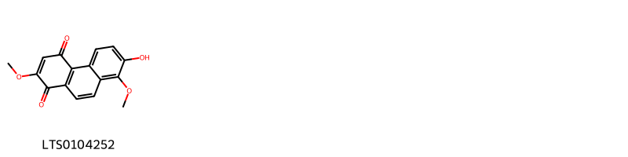{ width=100% }
    <figcaption>Hình ảnh cấu trúc hóa học của 1 hoạt chất thuộc nhóm Phenanthrenes and derivatives gồm ['cypripedin (LTS0104252)'].</figcaption>
</figure>

---

### Dược dân tộc học

Danh sách các quốc gia có sử dụng *Cypripedium calceolus* trong điều trị các bệnh. 

| Country   | Disease                                                      | Bệnh                                                                                                                                                                                                |
|:----------|:-------------------------------------------------------------|:----------------------------------------------------------------------------------------------------------------------------------------------------------------------------------------------------|
| Turkey    | Aphrodisiac, Nervine, Soporific, Stimulant, Tonic, Sudorific | MYMEMORY WARNING: YOU USED ALL AVAILABLE FREE TRANSLATIONS FOR TODAY. NEXT AVAILABLE IN  18 HOURS 22 MINUTES 04 SECONDS VISIT HTTPS://MYMEMORY.TRANSLATED.NET/DOC/USAGELIMITS.PHP TO TRANSLATE MORE |
| US        | Sedative                                                     | MYMEMORY WARNING: YOU USED ALL AVAILABLE FREE TRANSLATIONS FOR TODAY. NEXT AVAILABLE IN  18 HOURS 22 MINUTES 01 SECONDS VISIT HTTPS://MYMEMORY.TRANSLATED.NET/DOC/USAGELIMITS.PHP TO TRANSLATE MORE |

---

---
## Cypripedium pubescens
### Thông tin về thực vật

!!! info "Phân loại thực vật của *Cypripedium parviflorum* từ GIBF:"
    - **Kingdom:** Plantae
    - **Phylum:** Tracheophyta
    - **Order:** Asparagales
    - **Family:** Orchidaceae
    - **Genus:** Cypripedium
    - **Species:** *Cypripedium parviflorum*

 

| Label (VI)   | Label (EN)   | Scientific Name       | Descriptions (VI)   | Descriptions (EN)   | Also Known As (VI)   | Also Known As (EN)   |
|:-------------|:-------------|:----------------------|:--------------------|:--------------------|:---------------------|:---------------------|
| N/A          | N/A          | Cypripedium pubescens | loài thực vật       | species of plant    | ['']                 | ['']                 |

#### Phân bố trên thế giới

**Từ CSDL GIBF** Canada, unknown or invalid, United States of America

#### Phân bố tại Việt Nam

**Từ CSDL GIBF**: Không có ghi nhận ở Việt Nam

---
### Thành phần hóa học
        
- Theo cơ sở dữ liệu lotus: Từ loài *Cypripedium parviflorum* đã phân lập và xác định được Chưa có hoạt chất nào được phân lập. hoạt chất thuộc về các nhóm Không có hoạt chất nào được phân lập. 

Không có hình ảnh nào được tạo ra

---

### Dược dân tộc học

Danh sách các quốc gia có sử dụng *Cypripedium parviflorum* trong điều trị các bệnh. 

| Country        | Disease   | Bệnh                                                                                                                                                                                                |
|:---------------|:----------|:----------------------------------------------------------------------------------------------------------------------------------------------------------------------------------------------------|
| US(Appalachia) | Sedative  | MYMEMORY WARNING: YOU USED ALL AVAILABLE FREE TRANSLATIONS FOR TODAY. NEXT AVAILABLE IN  18 HOURS 21 MINUTES 34 SECONDS VISIT HTTPS://MYMEMORY.TRANSLATED.NET/DOC/USAGELIMITS.PHP TO TRANSLATE MORE |

---

# Chi Bletilla

??? note "Danh sách các dược liệu thuộc chi"
    
	 - *Bletilla hyacinthina*
	 - *Bletilla striata*

---
## Bletilla hyacinthina
### Thông tin về thực vật

!!! info "Phân loại thực vật của *Bletilla striata* từ GIBF:"
    - **Kingdom:** Plantae
    - **Phylum:** Tracheophyta
    - **Order:** Asparagales
    - **Family:** Orchidaceae
    - **Genus:** Bletilla
    - **Species:** *Bletilla striata*

 

| Label (VI)   | Label (EN)   | Scientific Name       | Descriptions (VI)   | Descriptions (EN)   | Also Known As (VI)   | Also Known As (EN)   |
|:-------------|:-------------|:----------------------|:--------------------|:--------------------|:---------------------|:---------------------|
| N/A          | N/A          | Cypripedium pubescens | loài thực vật       | species of plant    | ['']                 | ['']                 |

#### Phân bố trên thế giới

**Từ CSDL GIBF** nan, United Kingdom of Great Britain and Northern Ireland, Japan, France, United States of America, China

#### Phân bố tại Việt Nam

**Từ CSDL GIBF**: Không có ghi nhận ở Việt Nam

---
### Thành phần hóa học
        
- Theo cơ sở dữ liệu lotus: Từ loài *Bletilla striata* đã phân lập và xác định được Chưa có hoạt chất nào được phân lập. hoạt chất thuộc về các nhóm Không có hoạt chất nào được phân lập. 

Không có hình ảnh nào được tạo ra

---

### Dược dân tộc học

Danh sách các quốc gia có sử dụng *Bletilla striata* trong điều trị các bệnh. 

| Country   | Disease   | Bệnh                                                                                                                                                                                                |
|:----------|:----------|:----------------------------------------------------------------------------------------------------------------------------------------------------------------------------------------------------|
| China     | Emollient | MYMEMORY WARNING: YOU USED ALL AVAILABLE FREE TRANSLATIONS FOR TODAY. NEXT AVAILABLE IN  18 HOURS 21 MINUTES 08 SECONDS VISIT HTTPS://MYMEMORY.TRANSLATED.NET/DOC/USAGELIMITS.PHP TO TRANSLATE MORE |

---

---
## Bletilla striata
### Thông tin về thực vật

!!! info "Phân loại thực vật của *Bletilla striata* từ GIBF:"
    - **Kingdom:** Plantae
    - **Phylum:** Tracheophyta
    - **Order:** Asparagales
    - **Family:** Orchidaceae
    - **Genus:** Bletilla
    - **Species:** *Bletilla striata*

 

| Label (VI)   | Label (EN)   | Scientific Name   | Descriptions (VI)   | Descriptions (EN)   | Also Known As (VI)   | Also Known As (EN)                           |
|:-------------|:-------------|:------------------|:--------------------|:--------------------|:---------------------|:---------------------------------------------|
| N/A          | N/A          | Bletilla striata  | loài thực vật       | species of plant    | ['Bletilla striata'] | ['Chinese ground orchid', 'hyacinth orchid'] |

#### Phân bố trên thế giới

**Từ CSDL GIBF** nan, Japan, France, New Zealand, United States of America, China, Austria, Netherlands, Belgium, Korea, Republic of, Chinese Taipei

#### Phân bố tại Việt Nam

**Từ CSDL GIBF**: Không có ghi nhận ở Việt Nam

---
### Thành phần hóa học
        
- Theo cơ sở dữ liệu lotus: Từ loài *Bletilla striata* đã phân lập và xác định được 98 hoạt chất thuộc về các nhóm Stilbenes, Organooxygen compounds, Flavonoids, Phenanthrenes and derivatives, Tannins, Carboxylic acids and derivatives, Anthracenes, Diarylheptanoids, Isoflavonoids, Cinnamic acids and derivatives, Benzene and substituted derivatives. 

|    | chemicalTaxonomyClassyfireClass     |   smiles_count |
|---:|:------------------------------------|---------------:|
|  0 | Anthracenes                         |              2 |
|  1 | Benzene and substituted derivatives |              3 |
|  2 | Carboxylic acids and derivatives    |              1 |
|  3 | Cinnamic acids and derivatives      |              2 |
|  4 | Diarylheptanoids                    |             10 |
|  5 | Flavonoids                          |              2 |
|  6 | Isoflavonoids                       |              9 |
|  7 | Organooxygen compounds              |             21 |
|  8 | Phenanthrenes and derivatives       |             37 |
|  9 | Stilbenes                           |              9 |
| 10 | Tannins                             |              1 |

#### Nhóm Anthracenes
<figure markdown="span">
    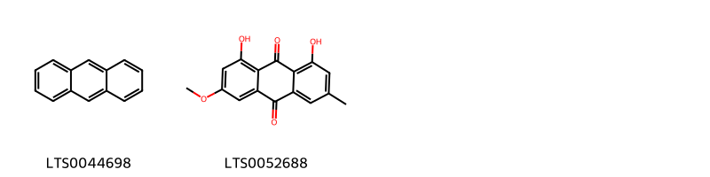{ width=100% }
    <figcaption>Hình ảnh cấu trúc hóa học của 2 hoạt chất thuộc nhóm Anthracenes gồm ['anthracene (LTS0044698)', 'physcion (LTS0052688)'].</figcaption>
</figure>
#### Nhóm Benzene and substituted derivatives
<figure markdown="span">
    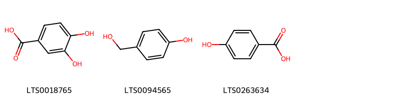{ width=100% }
    <figcaption>Hình ảnh cấu trúc hóa học của 3 hoạt chất thuộc nhóm Benzene and substituted derivatives gồm ['3,4-dihydroxybenzoic acid (LTS0018765)', 'gastrodigenin (LTS0094565)', 'p-hydroxybenzoic acid (LTS0263634)'].</figcaption>
</figure>
#### Nhóm Carboxylic acids and derivatives
<figure markdown="span">
    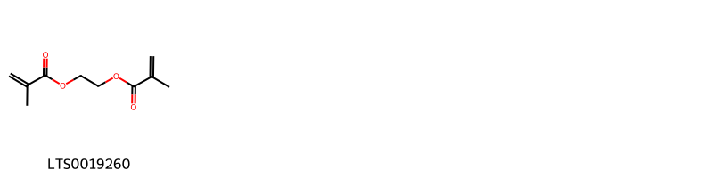{ width=100% }
    <figcaption>Hình ảnh cấu trúc hóa học của 1 hoạt chất thuộc nhóm Carboxylic acids and derivatives gồm ['glycol dimethacrylate (LTS0019260)'].</figcaption>
</figure>
#### Nhóm Cinnamic acids and derivatives
<figure markdown="span">
    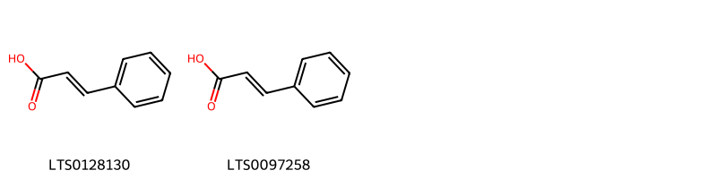{ width=100% }
    <figcaption>Hình ảnh cấu trúc hóa học của 2 hoạt chất thuộc nhóm Cinnamic acids and derivatives gồm ['cinnamic acid (LTS0128130)', 'phenylacrylic acid (LTS0097258)'].</figcaption>
</figure>
#### Nhóm Diarylheptanoids
<figure markdown="span">
    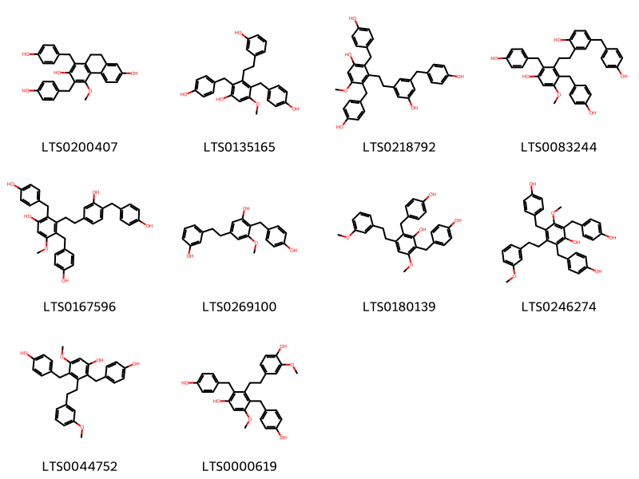{ width=100% }
    <figcaption>Hình ảnh cấu trúc hóa học của 10 hoạt chất thuộc nhóm Diarylheptanoids gồm ['1,3-bis[(4-hydroxyphenyl)methyl]-4-methoxy-9,10-dihydrophenanthrene-2,7-diol (LTS0200407)', '3-[2-(3-hydroxyphenyl)ethyl]-2,4-bis[(4-hydroxyphenyl)methyl]-5-methoxyphenol (LTS0135165)', '3-(2-{3-hydroxy-5-[(4-hydroxyphenyl)methyl]phenyl}ethyl)-2,4-bis[(4-hydroxyphenyl)methyl]-5-methoxyphenol (LTS0218792)', '3-(2-{2-hydroxy-5-[(4-hydroxyphenyl)methyl]phenyl}ethyl)-2,4-bis[(4-hydroxyphenyl)methyl]-5-methoxyphenol (LTS0083244)', '3-(2-{3-hydroxy-4-[(4-hydroxyphenyl)methyl]phenyl}ethyl)-2,4-bis[(4-hydroxyphenyl)methyl]-5-methoxyphenol (LTS0167596)', '5-[2-(3-hydroxyphenyl)ethyl]-2-[(4-hydroxyphenyl)methyl]-3-methoxyphenol (LTS0269100)', '2,6-bis[(4-hydroxyphenyl)methyl]-3-methoxy-5-[2-(3-methoxyphenyl)ethyl]phenol (LTS0180139)', '2,4,6-tris[(4-hydroxyphenyl)methyl]-3-methoxy-5-[2-(3-methoxyphenyl)ethyl]phenol (LTS0246274)', '2,4-bis[(4-hydroxyphenyl)methyl]-5-methoxy-3-[2-(3-methoxyphenyl)ethyl]phenol (LTS0044752)', '3-[2-(4-hydroxy-3-methoxyphenyl)ethyl]-2,4-bis[(4-hydroxyphenyl)methyl]-5-methoxyphenol (LTS0000619)'].</figcaption>
</figure>
#### Nhóm Flavonoids
<figure markdown="span">
    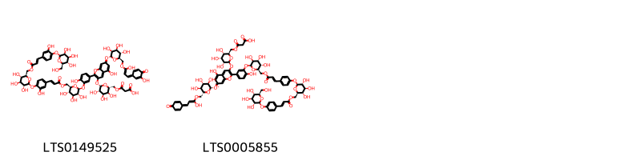{ width=100% }
    <figcaption>Hình ảnh cấu trúc hóa học của 2 hoạt chất thuộc nhóm Flavonoids gồm ['(3-{[(2s,3s,4r,5s,6r)-6-{[(2-carboxyacetyl)oxy]methyl}-3,4,5-trihydroxyoxan-2-yl]oxy}-5-hydroxy-2-(4-hydroxy-3-{[(2s,3r,4s,5s,6r)-3,4,5-trihydroxy-6-({[(2e)-3-(3-hydroxy-4-{[(2s,3r,4s,5s,6r)-3,4,5-trihydroxy-6-({[(2e)-3-(3-hydroxy-4-{[(2s,3s,4s,5s,6r)-3,4,5-trihydroxy-6-(hydroxymethyl)oxan-2-yl]oxy}phenyl)prop-2-enoyl]oxy}methyl)oxan-2-yl]oxy}phenyl)prop-2-enoyl]oxy}methyl)oxan-2-yl]oxy}phenyl)chromen-7-ylidene)[(2s,3s,4s,5s,6r)-3,4,5-trihydroxy-6-({[1-hydroxy-3-(3-hydroxy-4-oxocyclohexa-2,5-dien-1-ylidene)prop-1-en-1-yl]oxy}methyl)oxan-2-yl]oxidanium (LTS0149525)', '(3-{[(2s,3r,4r,5s,6r)-6-{[(2-carboxyacetyl)oxy]methyl}-3,4,5-trihydroxyoxan-2-yl]oxy}-5-hydroxy-2-(4-hydroxy-3-{[(2s,3s,4r,5s,6r)-3,4,5-trihydroxy-6-({[(2e)-3-(4-{[(2s,3r,4s,5s,6r)-3,4,5-trihydroxy-6-({[(2e)-3-(4-{[(2s,3r,4s,5s,6r)-3,4,5-trihydroxy-6-(hydroxymethyl)oxan-2-yl]oxy}phenyl)prop-2-enoyl]oxy}methyl)oxan-2-yl]oxy}phenyl)prop-2-enoyl]oxy}methyl)oxan-2-yl]oxy}phenyl)chromen-7-ylidene)[(2s,3r,4s,5s,6r)-3,4,5-trihydroxy-6-({[1-hydroxy-3-(4-oxocyclohexa-2,5-dien-1-ylidene)prop-1-en-1-yl]oxy}methyl)oxan-2-yl]oxidanium (LTS0005855)'].</figcaption>
</figure>
#### Nhóm Isoflavonoids
<figure markdown="span">
    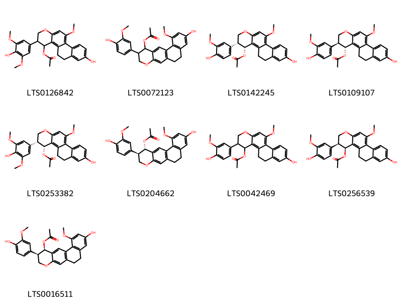{ width=100% }
    <figcaption>Hình ảnh cấu trúc hóa học của 9 hoạt chất thuộc nhóm Isoflavonoids gồm ['8-hydroxy-3-(4-hydroxy-3,5-dimethoxyphenyl)-11-methoxy-2h,3h,4h,5h,6h-phenanthro[2,1-b]pyran-4-yl acetate (LTS0126842)', '8-hydroxy-3-(4-hydroxy-3-methoxyphenyl)-6-methoxy-3,4,10,11-tetrahydro-2h-1-oxatetraphen-4-yl acetate (LTS0072123)', '(3r,4r)-8-hydroxy-3-(4-hydroxy-3-methoxyphenyl)-11-methoxy-2h,3h,4h,5h,6h-phenanthro[2,1-b]pyran-4-yl acetate (LTS0142245)', '(3s,4r)-8-hydroxy-3-(4-hydroxy-3-methoxyphenyl)-11-methoxy-2h,3h,4h,5h,6h-phenanthro[2,1-b]pyran-4-yl acetate (LTS0109107)', '(3r,4r)-8-hydroxy-3-(4-hydroxy-3,5-dimethoxyphenyl)-11-methoxy-2h,3h,4h,5h,6h-phenanthro[2,1-b]pyran-4-yl acetate (LTS0253382)', '(3r,4s)-8-hydroxy-3-(4-hydroxy-3-methoxyphenyl)-6-methoxy-3,4,10,11-tetrahydro-2h-1-oxatetraphen-4-yl acetate (LTS0204662)', '8-hydroxy-3-(4-hydroxy-3-methoxyphenyl)-11-methoxy-2h,3h,4h,5h,6h-phenanthro[2,1-b]pyran-4-yl acetate (LTS0042469)', '(3s,4s)-8-hydroxy-3-(4-hydroxy-3-methoxyphenyl)-11-methoxy-2h,3h,4h,5h,6h-phenanthro[2,1-b]pyran-4-yl acetate (LTS0256539)', '(3r,4r)-8-hydroxy-3-(4-hydroxy-3-methoxyphenyl)-6-methoxy-3,4,10,11-tetrahydro-2h-1-oxatetraphen-4-yl acetate (LTS0016511)'].</figcaption>
</figure>
#### Nhóm Organooxygen compounds
<figure markdown="span">
    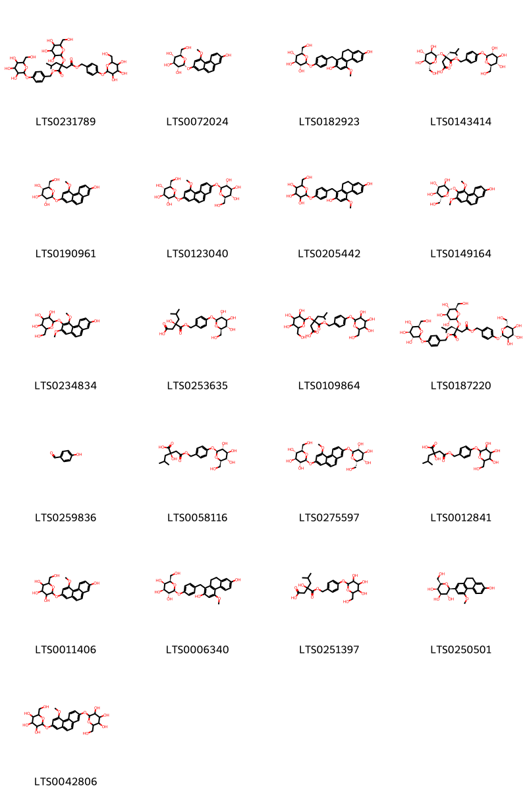{ width=100% }
    <figcaption>Hình ảnh cấu trúc hóa học của 21 hoạt chất thuộc nhóm Organooxygen compounds gồm ['1,4-bis[(4-{[3,4,5-trihydroxy-6-(hydroxymethyl)oxan-2-yl]oxy}phenyl)methyl] 2-(2-methylpropyl)-2-{[3,4,5-trihydroxy-6-(hydroxymethyl)oxan-2-yl]oxy}butanedioate (LTS0231789)', '(2r,3r,4s,5s,6r)-2-[(7-hydroxy-4-methoxyphenanthren-2-yl)oxy]-6-(hydroxymethyl)oxane-3,4,5-triol (LTS0072024)', '(2s,3r,4s,5s,6r)-2-{4-[(2,7-dihydroxy-4-methoxy-9,10-dihydrophenanthren-1-yl)methyl]phenoxy}-6-(hydroxymethyl)oxane-3,4,5-triol (LTS0182923)', '(3r)-5-methyl-3-{[(2s,3r,4s,5s,6r)-3,4,5-trihydroxy-6-(hydroxymethyl)oxan-2-yl]oxy}-3-{[(4-{[(2s,3r,4s,5s,6r)-3,4,5-trihydroxy-6-(hydroxymethyl)oxan-2-yl]oxy}phenyl)methoxy]carbonyl}hexanoic acid (LTS0143414)', '(2s,3r,4s,5s,6r)-2-[(7-hydroxy-4-methoxyphenanthren-2-yl)oxy]-6-(hydroxymethyl)oxane-3,4,5-triol (LTS0190961)', '(2r,3s,4s,5r,6s)-2-(hydroxymethyl)-6-[(4-methoxy-7-{[(2s,3r,4s,5s,6r)-3,4,5-trihydroxy-6-(hydroxymethyl)oxan-2-yl]oxy}phenanthren-2-yl)oxy]oxane-3,4,5-triol (LTS0123040)', '2-{4-[(2,7-dihydroxy-4-methoxy-9,10-dihydrophenanthren-1-yl)methyl]phenoxy}-6-(hydroxymethyl)oxane-3,4,5-triol (LTS0205442)', '(2s,3r,4s,5s,6r)-2-[(7-hydroxy-2,4-dimethoxyphenanthren-3-yl)oxy]-6-(hydroxymethyl)oxane-3,4,5-triol (LTS0149164)', '2-[(7-hydroxy-2,4-dimethoxyphenanthren-3-yl)oxy]-6-(hydroxymethyl)oxane-3,4,5-triol (LTS0234834)', '(3r)-3-hydroxy-5-methyl-3-{[(4-{[(2s,3r,4s,5s,6r)-3,4,5-trihydroxy-6-(hydroxymethyl)oxan-2-yl]oxy}phenyl)methoxy]carbonyl}hexanoic acid (LTS0253635)', '5-methyl-3-{[3,4,5-trihydroxy-6-(hydroxymethyl)oxan-2-yl]oxy}-3-{[(4-{[3,4,5-trihydroxy-6-(hydroxymethyl)oxan-2-yl]oxy}phenyl)methoxy]carbonyl}hexanoic acid (LTS0109864)', '1,4-bis[(4-{[(2s,3r,4s,5s,6r)-3,4,5-trihydroxy-6-(hydroxymethyl)oxan-2-yl]oxy}phenyl)methyl] (2r)-2-(2-methylpropyl)-2-{[(2s,3r,4s,5s,6r)-3,4,5-trihydroxy-6-(hydroxymethyl)oxan-2-yl]oxy}butanedioate (LTS0187220)', 'p-hydroxybenzaldehyde (LTS0259836)', '(2r)-2-hydroxy-4-methyl-2-{2-oxo-2-[(4-{[(2s,3r,4s,5s,6r)-3,4,5-trihydroxy-6-(hydroxymethyl)oxan-2-yl]oxy}phenyl)methoxy]ethyl}pentanoic acid (LTS0058116)', '(2r,3s,4s,5r,6s)-2-(hydroxymethyl)-6-[(4-methoxy-7-{[(2s,3r,4s,5s,6s)-3,4,5-trihydroxy-6-(hydroxymethyl)oxan-2-yl]oxy}phenanthren-2-yl)oxy]oxane-3,4,5-triol (LTS0275597)', '2-hydroxy-4-methyl-2-{2-oxo-2-[(4-{[3,4,5-trihydroxy-6-(hydroxymethyl)oxan-2-yl]oxy}phenyl)methoxy]ethyl}pentanoic acid (LTS0012841)', '2-[(7-hydroxy-4-methoxyphenanthren-2-yl)oxy]-6-(hydroxymethyl)oxane-3,4,5-triol (LTS0011406)', '(2s,3r,4s,5r,6r)-2-{4-[(2,7-dihydroxy-4-methoxy-9,10-dihydrophenanthren-1-yl)methyl]phenoxy}-6-(hydroxymethyl)oxane-3,4,5-triol (LTS0006340)', '3-hydroxy-5-methyl-3-{[(4-{[3,4,5-trihydroxy-6-(hydroxymethyl)oxan-2-yl]oxy}phenyl)methoxy]carbonyl}hexanoic acid (LTS0251397)', '(2s,3r,4r,5r,6r)-2-(7-hydroxy-4-methoxy-9,10-dihydrophenanthren-2-yl)-6-(hydroxymethyl)oxane-3,4,5-triol (LTS0250501)', '2-(hydroxymethyl)-6-[(4-methoxy-7-{[3,4,5-trihydroxy-6-(hydroxymethyl)oxan-2-yl]oxy}phenanthren-2-yl)oxy]oxane-3,4,5-triol (LTS0042806)'].</figcaption>
</figure>
#### Nhóm Phenanthrenes and derivatives
<figure markdown="span">
    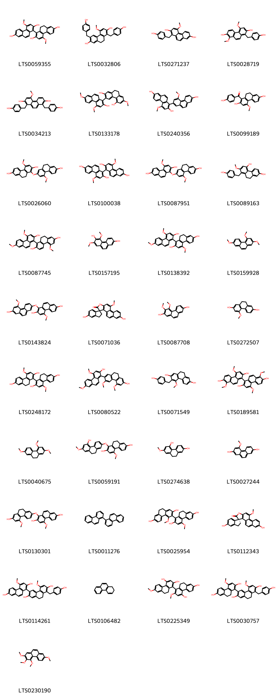{ width=100% }
    <figcaption>Hình ảnh cấu trúc hóa học của 37 hoạt chất thuộc nhóm Phenanthrenes and derivatives gồm ['blestriarene b (LTS0059355)', '1,6-bis[(4-hydroxyphenyl)methyl]-4-methoxy-9,10-dihydrophenanthrene-2,7-diol (LTS0032806)', '1-[(4-hydroxyphenyl)methyl]-4-methoxyphenanthrene-2,7-diol (LTS0271237)', '1-[(4-hydroxyphenyl)methyl]-4,8-dimethoxyphenanthrene-2,7-diol (LTS0028719)', '1,8-bis[(4-hydroxyphenyl)methyl]-4-methoxyphenanthrene-2,7-diol (LTS0034213)', "4,7,7'-trimethoxy-9',10'-dihydro-[1,3'-biphenanthrene]-2,2',5'-triol (LTS0133178)", "4,4'-dimethoxy-[1,2'-biphenanthrene]-2,7,7'-triol (LTS0240356)", '1-(4-hydroxybenzoyl)-4-methoxy-9,10-dihydrophenanthrene-2,7-diol (LTS0099189)', '1-[(7-hydroxy-4-methoxy-9,10-dihydrophenanthren-2-yl)oxy]-4-methoxy-9,10-dihydrophenanthrene-2,7-diol (LTS0026060)', "4,4'-dimethoxy-[1,1'-biphenanthrene]-2,2',7,7'-tetrol (LTS0100038)", '1-[(7-hydroxy-4-methoxy-9,10-dihydrophenanthren-2-yl)oxy]-4-methoxyphenanthrene-2,7-diol (LTS0087951)', '8-[(4-hydroxyphenyl)methyl]-7-methoxy-9,10-dihydrophenanthrene-2,5-diol (LTS0089163)', "4',5,7'-trimethoxy-9,10-dihydro-[1,1'-biphenanthrene]-2,2',7-triol (LTS0087745)", '5,7-dimethoxyphenanthrene-2,6-diol (LTS0157195)', "4,4',7'-trimethoxy-9,10-dihydro-[1,1'-biphenanthrene]-2,2',7-triol (LTS0138392)", '2,4,7-trimethoxyphenanthrene (LTS0159928)', '1-[(7-hydroxy-5-methoxyphenanthren-2-yl)oxy]-4-methoxyphenanthrene-2,7-diol (LTS0143824)', "5,7'-dihydroxy-10'-methoxy-2,3-dihydrospiro[indene-1,3'-phenanthro[2,1-b]furan]-2'-one (LTS0071036)", 'nudol (LTS0087708)', '4-methoxy-9,10-dihydrophenanthrene-2,7-diol (LTS0272507)', "4,4'-dimethoxy-9h,9'h,10h,10'h-[1,1'-biphenanthrene]-2,2',7,7'-tetrol (LTS0248172)", "3',4,5',7-tetramethoxy-9',10'-dihydro-[1,2'-biphenanthrene]-2,7'-diol (LTS0080522)", '3-[(4-hydroxyphenyl)methyl]-4-methoxy-9,10-dihydrophenanthrene-2,7-diol (LTS0071549)', "4,4',8,8'-tetramethoxy-[1,1'-biphenanthrene]-2,2',7,7'-tetrol (LTS0189581)", '2,4,7-trimethoxy-9,10-dihydrophenanthrene (LTS0040675)', '1-[(5-hydroxy-7-methoxy-9,10-dihydrophenanthren-2-yl)oxy]-4-methoxy-9,10-dihydrophenanthrene-2,7-diol (LTS0059191)', '7-methoxy-9,10-dihydrophenanthrene-2,5-diol (LTS0274638)', '4-methoxyphenanthrene-2,7-diol (LTS0027244)', '1-[(7-hydroxy-5-methoxy-9,10-dihydrophenanthren-2-yl)oxy]-4-methoxyphenanthrene-2,7-diol (LTS0130301)', "1,1'-biphenanthrene (LTS0011276)", "4,4'-dimethoxy-9h,9'h,10h,10'h-[1,3'-biphenanthrene]-2,2',7,7'-tetrol (LTS0025954)", "(1r)-5,7'-dihydroxy-10'-methoxy-2,3-dihydrospiro[indene-1,3'-phenanthro[2,1-b]furan]-2'-one (LTS0112343)", "8'-[(4-hydroxyphenyl)methyl]-4,5'-dimethoxy-9',10'-dihydro-[1,3'-biphenanthrene]-2,2',7,7'-tetrol (LTS0114261)", '1,2-dihydrophenanthrene (LTS0106482)', "2',7-dimethoxy-9h,9'h,10h,10'h-[1,1'-biphenanthrene]-2,4,4',7'-tetrol (LTS0225349)", "8'-[(4-hydroxyphenyl)methyl]-4,5'-dimethoxy-9h,9'h,10h,10'h-[1,3'-biphenanthrene]-2,2',7,7'-tetrol (LTS0030757)", '2,3,4,7-tetramethoxyphenanthrene (LTS0230190)'].</figcaption>
</figure>
#### Nhóm Stilbenes
<figure markdown="span">
    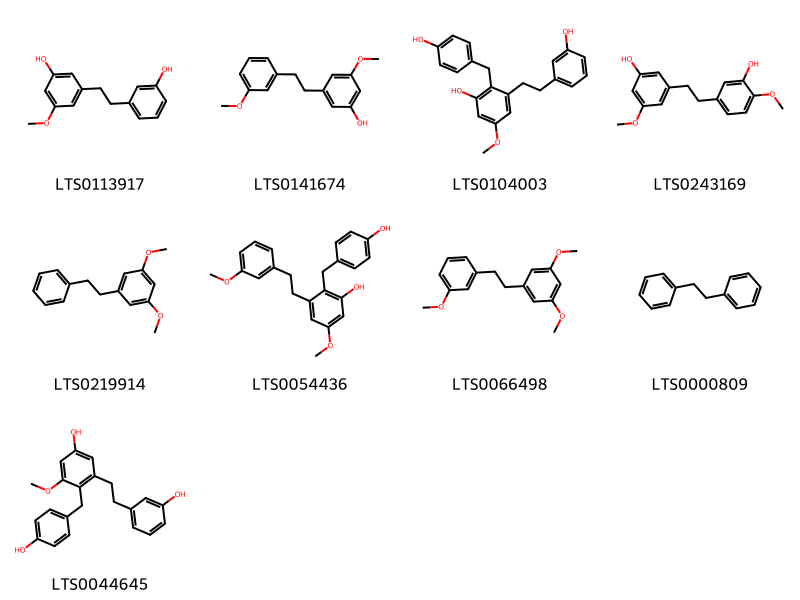{ width=100% }
    <figcaption>Hình ảnh cấu trúc hóa học của 9 hoạt chất thuộc nhóm Stilbenes gồm ['3-[2-(3-hydroxyphenyl)ethyl]-5-methoxyphenol (LTS0113917)', "3'-o-methylbatatasin iii (LTS0141674)", '3-[2-(3-hydroxyphenyl)ethyl]-2-[(4-hydroxyphenyl)methyl]-5-methoxyphenol (LTS0104003)', '3-[2-(3-hydroxy-4-methoxyphenyl)ethyl]-5-methoxyphenol (LTS0243169)', '1,3-dimethoxy-5-(2-phenylethyl)benzene (LTS0219914)', '2-[(4-hydroxyphenyl)methyl]-5-methoxy-3-[2-(3-methoxyphenyl)ethyl]phenol (LTS0054436)', '1,3-dimethoxy-5-[2-(3-methoxyphenyl)ethyl]benzene (LTS0066498)', 'dibenzyl (LTS0000809)', '3-[2-(3-hydroxyphenyl)ethyl]-4-[(4-hydroxyphenyl)methyl]-5-methoxyphenol (LTS0044645)'].</figcaption>
</figure>
#### Nhóm Tannins
<figure markdown="span">
    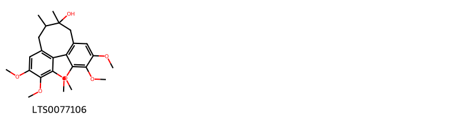{ width=100% }
    <figcaption>Hình ảnh cấu trúc hóa học của 1 hoạt chất thuộc nhóm Tannins gồm ['3,4,5,14,15,16-hexamethoxy-9,10-dimethyltricyclo[10.4.0.0²,⁷]hexadeca-1(12),2(7),3,5,13,15-hexaen-9-ol (LTS0077106)'].</figcaption>
</figure>

---

### Dược dân tộc học

Danh sách các quốc gia có sử dụng *Bletilla striata* trong điều trị các bệnh. 

| Country   | Disease                      | Bệnh                                                                                                                                                                                                |
|:----------|:-----------------------------|:----------------------------------------------------------------------------------------------------------------------------------------------------------------------------------------------------|
| China     | Apertif, Demulcent, Hemostat | MYMEMORY WARNING: YOU USED ALL AVAILABLE FREE TRANSLATIONS FOR TODAY. NEXT AVAILABLE IN  18 HOURS 20 MINUTES 49 SECONDS VISIT HTTPS://MYMEMORY.TRANSLATED.NET/DOC/USAGELIMITS.PHP TO TRANSLATE MORE |
| Elsewhere | Hemostatic                   | MYMEMORY WARNING: YOU USED ALL AVAILABLE FREE TRANSLATIONS FOR TODAY. NEXT AVAILABLE IN  18 HOURS 20 MINUTES 46 SECONDS VISIT HTTPS://MYMEMORY.TRANSLATED.NET/DOC/USAGELIMITS.PHP TO TRANSLATE MORE |

---

# Chi Bulbophyllum

??? note "Danh sách các dược liệu thuộc chi"
    
	 - *Bulbophyllum inconicuum*

---
## Bulbophyllum inconicuum
### Thông tin về thực vật

!!! info "Phân loại thực vật của *Bulbophyllum inconspicuum* từ GIBF:"
    - **Kingdom:** Plantae
    - **Phylum:** Tracheophyta
    - **Order:** Asparagales
    - **Family:** Orchidaceae
    - **Genus:** Bulbophyllum
    - **Species:** *Bulbophyllum inconspicuum*

 

| Label (VI)   | Label (EN)   | Scientific Name   | Descriptions (VI)   | Descriptions (EN)   | Also Known As (VI)   | Also Known As (EN)                           |
|:-------------|:-------------|:------------------|:--------------------|:--------------------|:---------------------|:---------------------------------------------|
| N/A          | N/A          | Bletilla striata  | loài thực vật       | species of plant    | ['Bletilla striata'] | ['Chinese ground orchid', 'hyacinth orchid'] |

#### Phân bố trên thế giới

**Từ CSDL GIBF** nan, Korea, Republic of, Japan, China

#### Phân bố tại Việt Nam

**Từ CSDL GIBF**: Không có ghi nhận ở Việt Nam

---
### Thành phần hóa học
        
- Theo cơ sở dữ liệu lotus: Từ loài *Bulbophyllum inconspicuum* đã phân lập và xác định được Chưa có hoạt chất nào được phân lập. hoạt chất thuộc về các nhóm Không có hoạt chất nào được phân lập. 

Không có hình ảnh nào được tạo ra

---

### Dược dân tộc học

Danh sách các quốc gia có sử dụng *Bulbophyllum inconspicuum* trong điều trị các bệnh. 

| Country   | Disease     | Bệnh                                                                                                                                                                                                |
|:----------|:------------|:----------------------------------------------------------------------------------------------------------------------------------------------------------------------------------------------------|
| China     | Refrigerant | MYMEMORY WARNING: YOU USED ALL AVAILABLE FREE TRANSLATIONS FOR TODAY. NEXT AVAILABLE IN  18 HOURS 20 MINUTES 12 SECONDS VISIT HTTPS://MYMEMORY.TRANSLATED.NET/DOC/USAGELIMITS.PHP TO TRANSLATE MORE |

---

# Chi Saccolabium

??? note "Danh sách các dược liệu thuộc chi"
    
	 - *Saccolabium papillosum*

---
## Saccolabium papillosum
### Thông tin về thực vật

!!! info "Phân loại thực vật của *Acampe praemorsa* từ GIBF:"
    - **Kingdom:** Plantae
    - **Phylum:** Tracheophyta
    - **Order:** Asparagales
    - **Family:** Orchidaceae
    - **Genus:** Acampe
    - **Species:** *Acampe praemorsa*

 

| Label (VI)   | Label (EN)   | Scientific Name   | Descriptions (VI)   | Descriptions (EN)   | Also Known As (VI)   | Also Known As (EN)                           |
|:-------------|:-------------|:------------------|:--------------------|:--------------------|:---------------------|:---------------------------------------------|
| N/A          | N/A          | Bletilla striata  | loài thực vật       | species of plant    | ['Bletilla striata'] | ['Chinese ground orchid', 'hyacinth orchid'] |

#### Phân bố trên thế giới

**Từ CSDL GIBF** nan, Korea, Republic of, Japan, China

#### Phân bố tại Việt Nam

**Từ CSDL GIBF**: Không có ghi nhận ở Việt Nam

---
### Thành phần hóa học
        
- Theo cơ sở dữ liệu lotus: Từ loài *Acampe praemorsa* đã phân lập và xác định được Chưa có hoạt chất nào được phân lập. hoạt chất thuộc về các nhóm Không có hoạt chất nào được phân lập. 

Không có hình ảnh nào được tạo ra

---

### Dược dân tộc học

Danh sách các quốc gia có sử dụng *Acampe praemorsa* trong điều trị các bệnh. 

| Country   | Disease     | Bệnh                                                                                                                                                                                                |
|:----------|:------------|:----------------------------------------------------------------------------------------------------------------------------------------------------------------------------------------------------|
| India     | Refrigerant | MYMEMORY WARNING: YOU USED ALL AVAILABLE FREE TRANSLATIONS FOR TODAY. NEXT AVAILABLE IN  18 HOURS 19 MINUTES 50 SECONDS VISIT HTTPS://MYMEMORY.TRANSLATED.NET/DOC/USAGELIMITS.PHP TO TRANSLATE MORE |

---

# Chi Epidendrum

??? note "Danh sách các dược liệu thuộc chi"
    
	 - *Epidendrum bifidum*

---
## Epidendrum bifidum
### Thông tin về thực vật

!!! info "Phân loại thực vật của *Psychilis bifida* từ GIBF:"
    - **Kingdom:** Plantae
    - **Phylum:** Tracheophyta
    - **Order:** Asparagales
    - **Family:** Orchidaceae
    - **Genus:** Psychilis
    - **Species:** *Psychilis bifida*

 

| Label (VI)   | Label (EN)   | Scientific Name    | Descriptions (VI)   | Descriptions (EN)   | Also Known As (VI)   | Also Known As (EN)   |
|:-------------|:-------------|:-------------------|:--------------------|:--------------------|:---------------------|:---------------------|
| N/A          | N/A          | Epidendrum bifidum | loài thực vật       | species of plant    | ['']                 | ['']                 |

#### Phân bố trên thế giới

**Từ CSDL GIBF** nan, Korea, Republic of, Japan, China

#### Phân bố tại Việt Nam

**Từ CSDL GIBF**: Không có ghi nhận ở Việt Nam

---
### Thành phần hóa học
        
- Theo cơ sở dữ liệu lotus: Từ loài *Psychilis bifida* đã phân lập và xác định được Chưa có hoạt chất nào được phân lập. hoạt chất thuộc về các nhóm Không có hoạt chất nào được phân lập. 

Không có hình ảnh nào được tạo ra

---

### Dược dân tộc học

Danh sách các quốc gia có sử dụng *Psychilis bifida* trong điều trị các bệnh. 

| Country       | Disease   | Bệnh                                                                                                                                                                                                |
|:--------------|:----------|:----------------------------------------------------------------------------------------------------------------------------------------------------------------------------------------------------|
| South America | Vermifuge | MYMEMORY WARNING: YOU USED ALL AVAILABLE FREE TRANSLATIONS FOR TODAY. NEXT AVAILABLE IN  18 HOURS 19 MINUTES 34 SECONDS VISIT HTTPS://MYMEMORY.TRANSLATED.NET/DOC/USAGELIMITS.PHP TO TRANSLATE MORE |

---

# Chi Acampe

??? note "Danh sách các dược liệu thuộc chi"
    
	 - *Acampe wightiana*

---
## Acampe wightiana
### Thông tin về thực vật

!!! info "Phân loại thực vật của *Acampe praemorsa* từ GIBF:"
    - **Kingdom:** Plantae
    - **Phylum:** Tracheophyta
    - **Order:** Asparagales
    - **Family:** Orchidaceae
    - **Genus:** Acampe
    - **Species:** *Acampe praemorsa*

 

| Label (VI)   | Label (EN)   | Scientific Name   | Descriptions (VI)   | Descriptions (EN)   | Also Known As (VI)   | Also Known As (EN)   |
|:-------------|:-------------|:------------------|:--------------------|:--------------------|:---------------------|:---------------------|
| N/A          | N/A          | Acampe wightiana  |                     |                     | ['']                 | ['']                 |

#### Phân bố trên thế giới

**Từ CSDL GIBF** nan, Sri Lanka, Mexico, India

#### Phân bố tại Việt Nam

**Từ CSDL GIBF**: Không có ghi nhận ở Việt Nam

---
### Thành phần hóa học
        
- Theo cơ sở dữ liệu lotus: Từ loài *Acampe praemorsa* đã phân lập và xác định được Chưa có hoạt chất nào được phân lập. hoạt chất thuộc về các nhóm Không có hoạt chất nào được phân lập. 

Không có hình ảnh nào được tạo ra

---

### Dược dân tộc học

Danh sách các quốc gia có sử dụng *Acampe praemorsa* trong điều trị các bệnh. 

| Country   | Disease   | Bệnh                                                                                                                                                                                                |
|:----------|:----------|:----------------------------------------------------------------------------------------------------------------------------------------------------------------------------------------------------|
| Elsewhere | Tonic     | MYMEMORY WARNING: YOU USED ALL AVAILABLE FREE TRANSLATIONS FOR TODAY. NEXT AVAILABLE IN  18 HOURS 19 MINUTES 15 SECONDS VISIT HTTPS://MYMEMORY.TRANSLATED.NET/DOC/USAGELIMITS.PHP TO TRANSLATE MORE |

---

# Chi Vanilla

??? note "Danh sách các dược liệu thuộc chi"
    
	 - *Vanilla barbellata*
	 - *Vanilla claviculata*
	 - *Vanilla decaryi*
	 - *Vanilla dilloniana*
	 - *Vanilla fragrans*
	 - *Vanilla griffithii*
	 - *Vanilla inodora*
	 - *Vanilla planifolia*
	 - *Vanilla rubra*

---
## Vanilla barbellata
### Thông tin về thực vật

!!! info "Phân loại thực vật của *Vanilla barbellata* từ GIBF:"
    - **Kingdom:** Plantae
    - **Phylum:** Tracheophyta
    - **Order:** Asparagales
    - **Family:** Orchidaceae
    - **Genus:** Vanilla
    - **Species:** *Vanilla barbellata*

 

| Label (VI)   | Label (EN)   | Scientific Name    | Descriptions (VI)   | Descriptions (EN)   | Also Known As (VI)   | Also Known As (EN)   |
|:-------------|:-------------|:-------------------|:--------------------|:--------------------|:---------------------|:---------------------|
| N/A          | N/A          | Vanilla barbellata | loài thực vật       | species of plant    | ['']                 | ['']                 |

#### Phân bố trên thế giới

**Từ CSDL GIBF** nan, Virgin Islands (British), Haiti, Dominican Republic, Puerto Rico, Cuba, United States of America, Bahamas, Austria, Virgin Islands (U.S.), Jamaica

#### Phân bố tại Việt Nam

**Từ CSDL GIBF**: Không có ghi nhận ở Việt Nam

---
### Thành phần hóa học
        
- Theo cơ sở dữ liệu lotus: Từ loài *Vanilla barbellata* đã phân lập và xác định được Chưa có hoạt chất nào được phân lập. hoạt chất thuộc về các nhóm Không có hoạt chất nào được phân lập. 

Không có hình ảnh nào được tạo ra

---

### Dược dân tộc học

Danh sách các quốc gia có sử dụng *Vanilla barbellata* trong điều trị các bệnh. 

| Country            | Disease   | Bệnh                                                                                                                                                                                                |
|:-------------------|:----------|:----------------------------------------------------------------------------------------------------------------------------------------------------------------------------------------------------|
| Dominican Republic | Vermifuge | MYMEMORY WARNING: YOU USED ALL AVAILABLE FREE TRANSLATIONS FOR TODAY. NEXT AVAILABLE IN  18 HOURS 18 MINUTES 58 SECONDS VISIT HTTPS://MYMEMORY.TRANSLATED.NET/DOC/USAGELIMITS.PHP TO TRANSLATE MORE |

---

---
## Vanilla claviculata
### Thông tin về thực vật

!!! info "Phân loại thực vật của *Vanilla claviculata* từ GIBF:"
    - **Kingdom:** Plantae
    - **Phylum:** Tracheophyta
    - **Order:** Asparagales
    - **Family:** Orchidaceae
    - **Genus:** Vanilla
    - **Species:** *Vanilla claviculata*

 

| Label (VI)   | Label (EN)   | Scientific Name     | Descriptions (VI)   | Descriptions (EN)   | Also Known As (VI)   | Also Known As (EN)   |
|:-------------|:-------------|:--------------------|:--------------------|:--------------------|:---------------------|:---------------------|
| N/A          | N/A          | Vanilla claviculata | loài thực vật       | species of plant    | ['']                 | ['']                 |

#### Phân bố trên thế giới

**Từ CSDL GIBF** Haiti, Cayman Islands, nan, Suriname, Dominican Republic, Puerto Rico, Cuba, Jamaica

#### Phân bố tại Việt Nam

**Từ CSDL GIBF**: Không có ghi nhận ở Việt Nam

---
### Thành phần hóa học
        
- Theo cơ sở dữ liệu lotus: Từ loài *Vanilla claviculata* đã phân lập và xác định được Chưa có hoạt chất nào được phân lập. hoạt chất thuộc về các nhóm Không có hoạt chất nào được phân lập. 

Không có hình ảnh nào được tạo ra

---

### Dược dân tộc học

Danh sách các quốc gia có sử dụng *Vanilla claviculata* trong điều trị các bệnh. 

| Country   | Disease   | Bệnh                                                                                                                                                                                                |
|:----------|:----------|:----------------------------------------------------------------------------------------------------------------------------------------------------------------------------------------------------|
| Haiti     | Vermifuge | MYMEMORY WARNING: YOU USED ALL AVAILABLE FREE TRANSLATIONS FOR TODAY. NEXT AVAILABLE IN  18 HOURS 18 MINUTES 36 SECONDS VISIT HTTPS://MYMEMORY.TRANSLATED.NET/DOC/USAGELIMITS.PHP TO TRANSLATE MORE |

---

---
## Vanilla decaryi
### Thông tin về thực vật

!!! info "Phân loại thực vật của *N/A* từ GIBF:"
    - **Kingdom:** Plantae
    - **Phylum:** Tracheophyta
    - **Order:** Asparagales
    - **Family:** Orchidaceae
    - **Genus:** Vanilla
    - **Species:** *N/A*

 

| Label (VI)   | Label (EN)   | Scientific Name     | Descriptions (VI)   | Descriptions (EN)   | Also Known As (VI)   | Also Known As (EN)   |
|:-------------|:-------------|:--------------------|:--------------------|:--------------------|:---------------------|:---------------------|
| N/A          | N/A          | Vanilla claviculata | loài thực vật       | species of plant    | ['']                 | ['']                 |

#### Phân bố trên thế giới

**Từ CSDL GIBF** nan, Honduras, Guadeloupe, French Guiana, Gabon, Jamaica, Guatemala, Colombia, Dominican Republic, Puerto Rico, Réunion, Cuba, Panama, Brazil, Peru, Comoros, Mexico, China, Chinese Taipei, Argentina, Niue, Mozambique, Tanzania, United Republic of, Costa Rica, Ecuador, United States of America, Zambia, Madagascar

#### Phân bố tại Việt Nam

**Từ CSDL GIBF**: Không có ghi nhận ở Việt Nam

---
### Thành phần hóa học
        
- Theo cơ sở dữ liệu lotus: Từ loài *N/A* đã phân lập và xác định được Chưa có hoạt chất nào được phân lập. hoạt chất thuộc về các nhóm Không có hoạt chất nào được phân lập. 

Không có hình ảnh nào được tạo ra

---

### Dược dân tộc học

Danh sách các quốc gia có sử dụng *N/A* trong điều trị các bệnh. 

| Country   | Disease     | Bệnh                                                                                                                                                                                                |
|:----------|:------------|:----------------------------------------------------------------------------------------------------------------------------------------------------------------------------------------------------|
| Malagasy  | Aphrodisiac | MYMEMORY WARNING: YOU USED ALL AVAILABLE FREE TRANSLATIONS FOR TODAY. NEXT AVAILABLE IN  18 HOURS 18 MINUTES 16 SECONDS VISIT HTTPS://MYMEMORY.TRANSLATED.NET/DOC/USAGELIMITS.PHP TO TRANSLATE MORE |

---

---
## Vanilla dilloniana
### Thông tin về thực vật

!!! info "Phân loại thực vật của *Vanilla dilloniana* từ GIBF:"
    - **Kingdom:** Plantae
    - **Phylum:** Tracheophyta
    - **Order:** Asparagales
    - **Family:** Orchidaceae
    - **Genus:** Vanilla
    - **Species:** *Vanilla dilloniana*

 

| Label (VI)   | Label (EN)   | Scientific Name    | Descriptions (VI)   | Descriptions (EN)   | Also Known As (VI)   | Also Known As (EN)   |
|:-------------|:-------------|:-------------------|:--------------------|:--------------------|:---------------------|:---------------------|
| N/A          | N/A          | Vanilla dilloniana | loài thực vật       | species of plant    | ['']                 | ['']                 |

#### Phân bố trên thế giới

**Từ CSDL GIBF** nan, Haiti, Dominican Republic, Puerto Rico, United States of America, Cuba, Virgin Islands (U.S.)

#### Phân bố tại Việt Nam

**Từ CSDL GIBF**: Không có ghi nhận ở Việt Nam

---
### Thành phần hóa học
        
- Theo cơ sở dữ liệu lotus: Từ loài *Vanilla dilloniana* đã phân lập và xác định được Chưa có hoạt chất nào được phân lập. hoạt chất thuộc về các nhóm Không có hoạt chất nào được phân lập. 

Không có hình ảnh nào được tạo ra

---

### Dược dân tộc học

Danh sách các quốc gia có sử dụng *Vanilla dilloniana* trong điều trị các bệnh. 

| Country            | Disease   | Bệnh                                                                                                                                                                                                |
|:-------------------|:----------|:----------------------------------------------------------------------------------------------------------------------------------------------------------------------------------------------------|
| Dominican Republic | Vermifuge | MYMEMORY WARNING: YOU USED ALL AVAILABLE FREE TRANSLATIONS FOR TODAY. NEXT AVAILABLE IN  18 HOURS 17 MINUTES 53 SECONDS VISIT HTTPS://MYMEMORY.TRANSLATED.NET/DOC/USAGELIMITS.PHP TO TRANSLATE MORE |

---

---
## Vanilla fragrans
### Thông tin về thực vật

!!! info "Phân loại thực vật của *Vanilla planifolia* từ GIBF:"
    - **Kingdom:** Plantae
    - **Phylum:** Tracheophyta
    - **Order:** Asparagales
    - **Family:** Orchidaceae
    - **Genus:** Vanilla
    - **Species:** *Vanilla planifolia*

 

| Label (VI)   | Label (EN)   | Scientific Name   | Descriptions (VI)   | Descriptions (EN)   | Also Known As (VI)   | Also Known As (EN)   |
|:-------------|:-------------|:------------------|:--------------------|:--------------------|:---------------------|:---------------------|
| N/A          | N/A          | Vanilla fragrans  | loài thực vật       | species of plant    | ['']                 | ['']                 |

#### Phân bố trên thế giới

**Từ CSDL GIBF** unknown or invalid, Colombia, Brazil, New Zealand, Dominica, French Polynesia, Fiji, Costa Rica, Cameroon, Trinidad and Tobago, Guyana, United States of America, Mexico, China, Ecuador, Jamaica, Chinese Taipei

#### Phân bố tại Việt Nam

**Từ CSDL GIBF**: Không có ghi nhận ở Việt Nam

---
### Thành phần hóa học
        
- Theo cơ sở dữ liệu lotus: Từ loài *Vanilla planifolia* đã phân lập và xác định được Chưa có hoạt chất nào được phân lập. hoạt chất thuộc về các nhóm Không có hoạt chất nào được phân lập. 

Không có hình ảnh nào được tạo ra

---

### Dược dân tộc học

Danh sách các quốc gia có sử dụng *Vanilla planifolia* trong điều trị các bệnh. 

| Country   | Disease                  | Bệnh                                                                                                                                                                                                |
|:----------|:-------------------------|:----------------------------------------------------------------------------------------------------------------------------------------------------------------------------------------------------|
| Turkey    | Carminative, Aphrodisiac | MYMEMORY WARNING: YOU USED ALL AVAILABLE FREE TRANSLATIONS FOR TODAY. NEXT AVAILABLE IN  18 HOURS 17 MINUTES 35 SECONDS VISIT HTTPS://MYMEMORY.TRANSLATED.NET/DOC/USAGELIMITS.PHP TO TRANSLATE MORE |

---

---
## Vanilla griffithii
### Thông tin về thực vật

!!! info "Phân loại thực vật của *Vanilla griffithii* từ GIBF:"
    - **Kingdom:** Plantae
    - **Phylum:** Tracheophyta
    - **Order:** Asparagales
    - **Family:** Orchidaceae
    - **Genus:** Vanilla
    - **Species:** *Vanilla griffithii*

 

| Label (VI)   | Label (EN)   | Scientific Name    | Descriptions (VI)   | Descriptions (EN)   | Also Known As (VI)   | Also Known As (EN)   |
|:-------------|:-------------|:-------------------|:--------------------|:--------------------|:---------------------|:---------------------|
| N/A          | N/A          | Vanilla griffithii | loài thực vật       | species of plant    | ['']                 | ['']                 |

#### Phân bố trên thế giới

**Từ CSDL GIBF** nan, Thailand, Brunei Darussalam, Malaysia, Afghanistan, Indonesia, China, Singapore, Chinese Taipei

#### Phân bố tại Việt Nam

**Từ CSDL GIBF**: Không có ghi nhận ở Việt Nam

---
### Thành phần hóa học
        
- Theo cơ sở dữ liệu lotus: Từ loài *Vanilla griffithii* đã phân lập và xác định được Chưa có hoạt chất nào được phân lập. hoạt chất thuộc về các nhóm Không có hoạt chất nào được phân lập. 

Không có hình ảnh nào được tạo ra

---

### Dược dân tộc học

Danh sách các quốc gia có sử dụng *Vanilla griffithii* trong điều trị các bệnh. 

| Country   | Disease   | Bệnh                                                                                                                                                                                                |
|:----------|:----------|:----------------------------------------------------------------------------------------------------------------------------------------------------------------------------------------------------|
| Malaya    | Cosmetic  | MYMEMORY WARNING: YOU USED ALL AVAILABLE FREE TRANSLATIONS FOR TODAY. NEXT AVAILABLE IN  18 HOURS 17 MINUTES 15 SECONDS VISIT HTTPS://MYMEMORY.TRANSLATED.NET/DOC/USAGELIMITS.PHP TO TRANSLATE MORE |

---

---
## Vanilla inodora
### Thông tin về thực vật

!!! info "Phân loại thực vật của *Vanilla inodora* từ GIBF:"
    - **Kingdom:** Plantae
    - **Phylum:** Tracheophyta
    - **Order:** Asparagales
    - **Family:** Orchidaceae
    - **Genus:** Vanilla
    - **Species:** *Vanilla inodora*

 

| Label (VI)   | Label (EN)   | Scientific Name   | Descriptions (VI)   | Descriptions (EN)   | Also Known As (VI)   | Also Known As (EN)   |
|:-------------|:-------------|:------------------|:--------------------|:--------------------|:---------------------|:---------------------|
| N/A          | N/A          | Vanilla inodora   | loài thực vật       | species of plant    | ['']                 | ['']                 |

#### Phân bố trên thế giới

**Từ CSDL GIBF** Honduras, nan, El Salvador, Guadeloupe, Trinidad and Tobago, Guatemala, Haiti, Colombia, Venezuela (Bolivarian Republic of), Dominican Republic, Suriname, Puerto Rico, Cuba, Belize, Nicaragua, Panama, Mexico, Costa Rica, Guyana

#### Phân bố tại Việt Nam

**Từ CSDL GIBF**: Không có ghi nhận ở Việt Nam

---
### Thành phần hóa học
        
- Theo cơ sở dữ liệu lotus: Từ loài *Vanilla inodora* đã phân lập và xác định được Chưa có hoạt chất nào được phân lập. hoạt chất thuộc về các nhóm Không có hoạt chất nào được phân lập. 

Không có hình ảnh nào được tạo ra

---

### Dược dân tộc học

Danh sách các quốc gia có sử dụng *Vanilla inodora* trong điều trị các bệnh. 

| Country            | Disease   | Bệnh                                                                                                                                                                                                |
|:-------------------|:----------|:----------------------------------------------------------------------------------------------------------------------------------------------------------------------------------------------------|
| Dominican Republic | Vermifuge | MYMEMORY WARNING: YOU USED ALL AVAILABLE FREE TRANSLATIONS FOR TODAY. NEXT AVAILABLE IN  18 HOURS 16 MINUTES 56 SECONDS VISIT HTTPS://MYMEMORY.TRANSLATED.NET/DOC/USAGELIMITS.PHP TO TRANSLATE MORE |

---

---
## Vanilla planifolia
### Thông tin về thực vật

!!! info "Phân loại thực vật của *Vanilla planifolia* từ GIBF:"
    - **Kingdom:** Plantae
    - **Phylum:** Tracheophyta
    - **Order:** Asparagales
    - **Family:** Orchidaceae
    - **Genus:** Vanilla
    - **Species:** *Vanilla planifolia*

 

| Label (VI)   | Label (EN)   | Scientific Name    | Descriptions (VI)   | Descriptions (EN)   | Also Known As (VI)   | Also Known As (EN)      |
|:-------------|:-------------|:-------------------|:--------------------|:--------------------|:---------------------|:------------------------|
| N/A          | N/A          | Vanilla planifolia | loài thực vật       | species of plant    | ['']                 | ['flat leaved vanilla'] |

#### Phân bố trên thế giới

**Từ CSDL GIBF** Honduras, nan, El Salvador, Guadeloupe, French Guiana, Trinidad and Tobago, Gabon, Martinique, Australia, Indonesia, Guatemala, Colombia, Sri Lanka, Sao Tome and Principe, Réunion, Seychelles, Belize, Nicaragua, Brazil, Mexico, Chinese Taipei, Tanzania, United Republic of, Costa Rica, New Caledonia, United States of America, Italy, Madagascar

#### Phân bố tại Việt Nam

**Từ CSDL GIBF**: Không có ghi nhận ở Việt Nam

---
### Thành phần hóa học
        
- Theo cơ sở dữ liệu lotus: Từ loài *Vanilla planifolia* đã phân lập và xác định được 106 hoạt chất thuộc về các nhóm Organooxygen compounds, Saturated hydrocarbons, Coumarins and derivatives, Unsaturated hydrocarbons, Prenol lipids, Fatty Acyls, Pyrans, Phenols, Cinnamic acids and derivatives, Steroids and steroid derivatives, Benzene and substituted derivatives. 

|    | chemicalTaxonomyClassyfireClass     |   smiles_count |
|---:|:------------------------------------|---------------:|
|  0 | Benzene and substituted derivatives |             13 |
|  1 | Cinnamic acids and derivatives      |              1 |
|  2 | Coumarins and derivatives           |              1 |
|  3 | Fatty Acyls                         |              2 |
|  4 | Organooxygen compounds              |              4 |
|  5 | Phenols                             |              7 |
|  6 | Prenol lipids                       |              7 |
|  7 | Pyrans                              |              6 |
|  8 | Saturated hydrocarbons              |             40 |
|  9 | Steroids and steroid derivatives    |             13 |
| 10 | Unsaturated hydrocarbons            |             12 |

#### Nhóm Benzene and substituted derivatives
<figure markdown="span">
    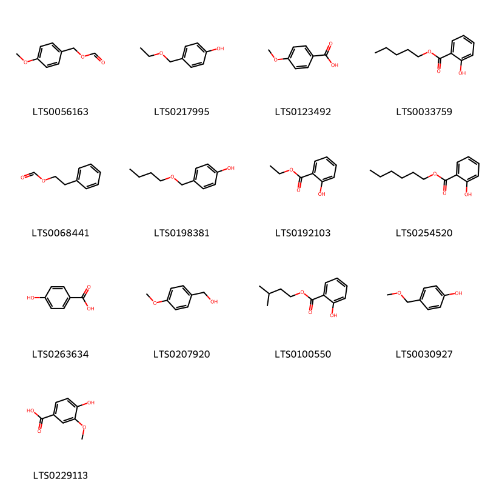{ width=100% }
    <figcaption>Hình ảnh cấu trúc hóa học của 13 hoạt chất thuộc nhóm Benzene and substituted derivatives gồm ['anisyl formate (LTS0056163)', '4-(ethoxymethyl)phenol (LTS0217995)', 'p-anisic acid (LTS0123492)', 'amyl salicylate (LTS0033759)', 'phenethyl formate (LTS0068441)', '4-(butoxymethyl)phenol (LTS0198381)', 'ethyl salicylate (LTS0192103)', 'hexyl salicylate (LTS0254520)', 'p-hydroxybenzoic acid (LTS0263634)', 'anise alcohol (LTS0207920)', 'isoamyl salicylate (LTS0100550)', 'p-(methoxymethyl)phenol (LTS0030927)', 'vanillic acid (LTS0229113)'].</figcaption>
</figure>
#### Nhóm Cinnamic acids and derivatives
<figure markdown="span">
    { width=100% }
    <figcaption>Hình ảnh cấu trúc hóa học của 1 hoạt chất thuộc nhóm Cinnamic acids and derivatives gồm ['ferulic acid (LTS0077328)'].</figcaption>
</figure>
#### Nhóm Coumarins and derivatives
<figure markdown="span">
    { width=100% }
    <figcaption>Hình ảnh cấu trúc hóa học của 1 hoạt chất thuộc nhóm Coumarins and derivatives gồm ['2h-1-benzopyran-2-one (LTS0069773)'].</figcaption>
</figure>
#### Nhóm Fatty Acyls
<figure markdown="span">
    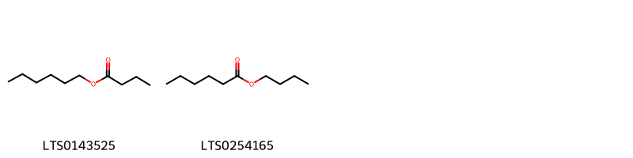{ width=100% }
    <figcaption>Hình ảnh cấu trúc hóa học của 2 hoạt chất thuộc nhóm Fatty Acyls gồm ['hexyl butyrate (LTS0143525)', 'butyl hexanoate (LTS0254165)'].</figcaption>
</figure>
#### Nhóm Organooxygen compounds
<figure markdown="span">
    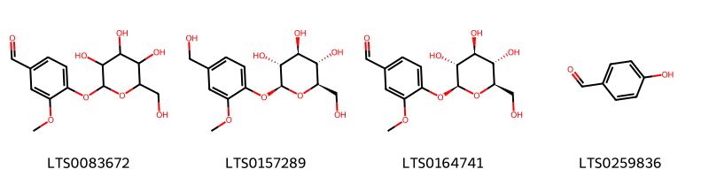{ width=100% }
    <figcaption>Hình ảnh cấu trúc hóa học của 4 hoạt chất thuộc nhóm Organooxygen compounds gồm ['glucovanillin (LTS0083672)', 'vanilloloside (LTS0157289)', 'vanilloside (LTS0164741)', 'p-hydroxybenzaldehyde (LTS0259836)'].</figcaption>
</figure>
#### Nhóm Phenols
<figure markdown="span">
    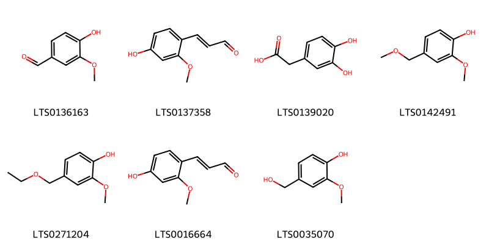{ width=100% }
    <figcaption>Hình ảnh cấu trúc hóa học của 7 hoạt chất thuộc nhóm Phenols gồm ['vanillin (LTS0136163)', '(2e)-3-(4-hydroxy-2-methoxyphenyl)prop-2-enal (LTS0137358)', '3,4 dihydroxyphenylacetic acid (LTS0139020)', '2-methoxy-4-(methoxymethyl)phenol (LTS0142491)', 'vanillyl ethyl ether (LTS0271204)', '3-(4-hydroxy-2-methoxyphenyl)prop-2-enal (LTS0016664)', 'vanillyl alcohol (LTS0035070)'].</figcaption>
</figure>
#### Nhóm Prenol lipids
<figure markdown="span">
    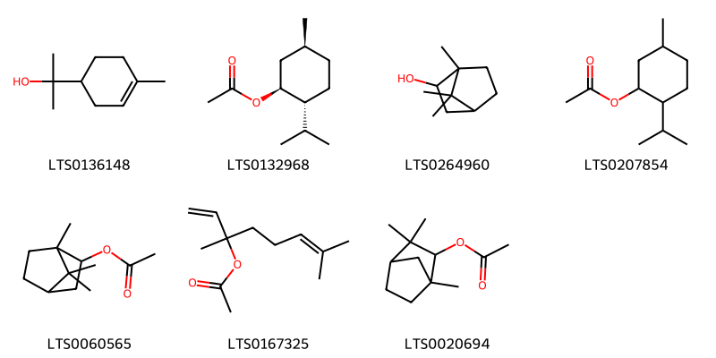{ width=100% }
    <figcaption>Hình ảnh cấu trúc hóa học của 7 hoạt chất thuộc nhóm Prenol lipids gồm ['terpineol (LTS0136148)', 'menthyl acetate (LTS0132968)', 'borneol (LTS0264960)', 'l-menthyl acetate (LTS0207854)', 'bornyl acetate (LTS0060565)', 'linalyl acetate (LTS0167325)', 'fenchyl acetate (LTS0020694)'].</figcaption>
</figure>
#### Nhóm Pyrans
<figure markdown="span">
    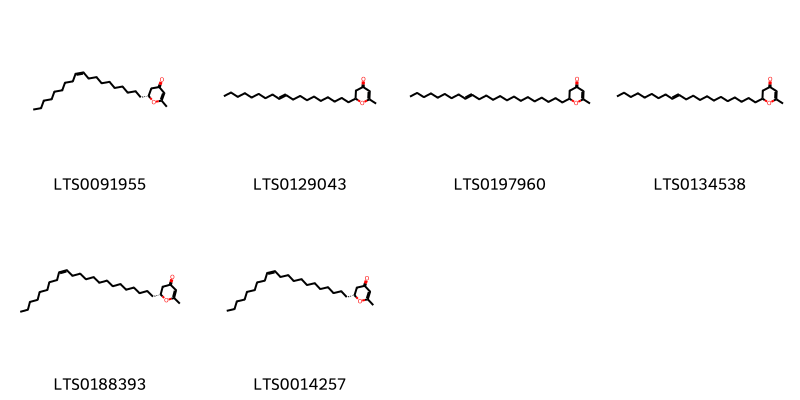{ width=100% }
    <figcaption>Hình ảnh cấu trúc hóa học của 6 hoạt chất thuộc nhóm Pyrans gồm ['(6r)-2-methyl-6-[(10z)-nonadec-10-en-1-yl]-5,6-dihydropyran-4-one (LTS0091955)', '2-methyl-6-(nonadec-10-en-1-yl)-5,6-dihydropyran-4-one (LTS0129043)', '2-methyl-6-(tricos-14-en-1-yl)-5,6-dihydropyran-4-one (LTS0197960)', '2-(henicos-12-en-1-yl)-6-methyl-2,3-dihydropyran-4-one (LTS0134538)', '(6r)-2-methyl-6-[(14z)-tricos-14-en-1-yl]-5,6-dihydropyran-4-one (LTS0188393)', '(2r)-2-[(12z)-henicos-12-en-1-yl]-6-methyl-2,3-dihydropyran-4-one (LTS0014257)'].</figcaption>
</figure>
#### Nhóm Saturated hydrocarbons
<figure markdown="span">
    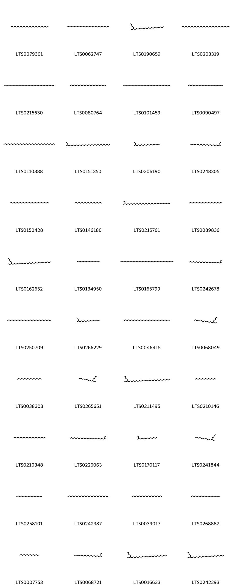{ width=100% }
    <figcaption>Hình ảnh cấu trúc hóa học của 40 hoạt chất thuộc nhóm Saturated hydrocarbons gồm ['hexacosane (LTS0079361)', 'nonacosane (LTS0062747)', '5-ethylpentacosane (LTS0190659)', 'tritriacontane (LTS0203319)', 'tetratriacontane (LTS0215630)', 'pentacosane (LTS0080764)', 'dotriacontane (LTS0101459)', 'tetracosane (LTS0090497)', 'pentatriacontane (LTS0110888)', '3-methylhentriacontane (LTS0151350)', '3-methylnonadecane (LTS0206190)', '3-methyldocosane (LTS0248305)', 'heptacosane (LTS0150428)', 'nonadecane (LTS0146180)', '3-methyltritriacontane (LTS0215761)', 'tricosane (LTS0089836)', '5-ethylhentriacontane (LTS0162652)', 'cetane (LTS0134950)', 'hexatriacontane (LTS0165799)', '3-methyltetracosane (LTS0242678)', 'triacontane (LTS0250709)', '3-methylheptadecane (LTS0266229)', 'hentriacontane (LTS0046415)', '5-ethyloctadecane (LTS0068049)', 'heptadecane (LTS0038303)', '5-ethyltetradecane (LTS0265651)', '5-ethyltritriacontane (LTS0211495)', 'pentadecane (LTS0210146)', 'docosane (LTS0210348)', '3-methylhexacosane (LTS0226063)', '3-methylpentadecane (LTS0170117)', '5-ethylhexadecane (LTS0241844)', 'octadecane (LTS0258101)', 'octacosane (LTS0242387)', 'heneicosane (LTS0039017)', 'eicosane (LTS0268882)', 'tetradecane (LTS0007753)', '3-methylicosane (LTS0068721)', '5-ethylnonacosane (LTS0016633)', '5-ethylheptacosane (LTS0242293)'].</figcaption>
</figure>
#### Nhóm Steroids and steroid derivatives
<figure markdown="span">
    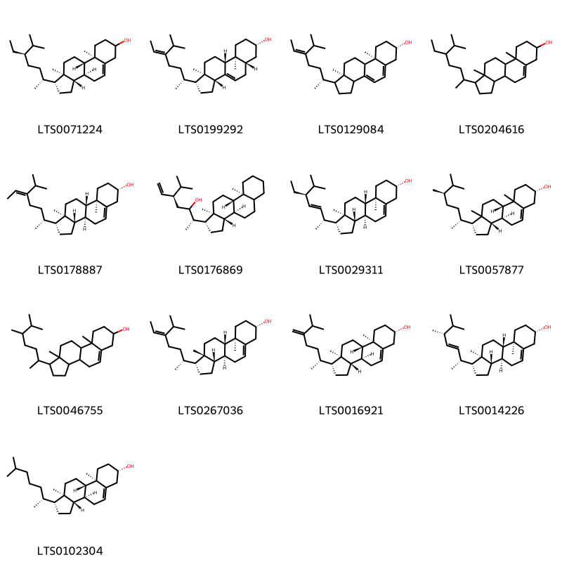{ width=100% }
    <figcaption>Hình ảnh cấu trúc hóa học của 13 hoạt chất thuộc nhóm Steroids and steroid derivatives gồm ['stigmast-5-en-3-ol (LTS0071224)', 'delta7-avenasterol (LTS0199292)', '5-dehydroavenasterol (LTS0129084)', 'stigmast-5-en-3-ol, (3β)- (LTS0204616)', 'fucosterol (LTS0178887)', '(2s,5r)-2-[(1r,3as,3br,9as,9bs,11as)-9a,11a-dimethyl-tetradecahydro-1h-cyclopenta[a]phenanthren-1-yl]-5-isopropylhept-6-en-3-ol (LTS0176869)', 'phytosterol (LTS0029311)', '(1r,3as,3bs,7s,9bs)-1-[(2r,5r)-5,6-dimethylheptan-2-yl]-9a,11a-dimethyl-1h,2h,3h,3ah,3bh,4h,6h,7h,8h,9h,9bh,10h,11h-cyclopenta[a]phenanthren-7-ol (LTS0057877)', 'campesterol (LTS0046755)', '(1r,3as,3bs,7s,9ar,9bs,11as)-1-[(2r,5z)-5-isopropylhept-5-en-2-yl]-9a,11a-dimethyl-1h,2h,3h,3ah,3bh,4h,6h,7h,8h,9h,9bh,10h,11h-cyclopenta[a]phenanthren-7-ol (LTS0267036)', '24-methylenecholesterol (LTS0016921)', 'brassicasterol (LTS0014226)', 'cholesterol (LTS0102304)'].</figcaption>
</figure>
#### Nhóm Unsaturated hydrocarbons
<figure markdown="span">
    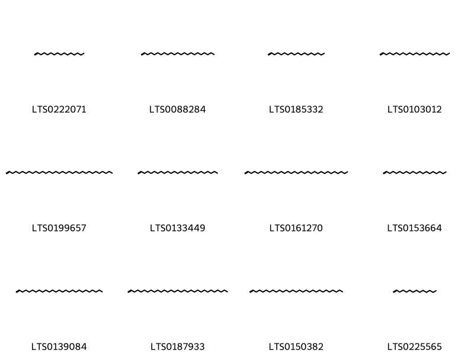{ width=100% }
    <figcaption>Hình ảnh cấu trúc hóa học của 12 hoạt chất thuộc nhóm Unsaturated hydrocarbons gồm ['hexadecene (LTS0222071)', '1-tricosene (LTS0088284)', 'octadecene (LTS0185332)', '1-docosene (LTS0103012)', '1-tritriacontene (LTS0199657)', '1-pentacosene (LTS0133449)', '1-dotriacontene (LTS0161270)', '1-eicosene (LTS0153664)', '1-heptacosene (LTS0139084)', '1-hentriacontene (LTS0187933)', '1-nonacosene (LTS0150382)', 'tetradecene (LTS0225565)'].</figcaption>
</figure>

---

### Dược dân tộc học

Danh sách các quốc gia có sử dụng *Vanilla planifolia* trong điều trị các bệnh. 

| Country   | Disease                                    | Bệnh                                                                                                                                                                                                |
|:----------|:-------------------------------------------|:----------------------------------------------------------------------------------------------------------------------------------------------------------------------------------------------------|
| Egypt     | Aphrodisiac, Carminative, Stimulant, Tonic | MYMEMORY WARNING: YOU USED ALL AVAILABLE FREE TRANSLATIONS FOR TODAY. NEXT AVAILABLE IN  18 HOURS 16 MINUTES 35 SECONDS VISIT HTTPS://MYMEMORY.TRANSLATED.NET/DOC/USAGELIMITS.PHP TO TRANSLATE MORE |
| Haiti     | Vulnerary                                  | MYMEMORY WARNING: YOU USED ALL AVAILABLE FREE TRANSLATIONS FOR TODAY. NEXT AVAILABLE IN  18 HOURS 16 MINUTES 32 SECONDS VISIT HTTPS://MYMEMORY.TRANSLATED.NET/DOC/USAGELIMITS.PHP TO TRANSLATE MORE |
| Mexico    | Stimulant                                  | MYMEMORY WARNING: YOU USED ALL AVAILABLE FREE TRANSLATIONS FOR TODAY. NEXT AVAILABLE IN  18 HOURS 16 MINUTES 30 SECONDS VISIT HTTPS://MYMEMORY.TRANSLATED.NET/DOC/USAGELIMITS.PHP TO TRANSLATE MORE |

---

---
## Vanilla rubra
### Thông tin về thực vật

!!! info "Phân loại thực vật của *Vanilla planifolia* từ GIBF:"
    - **Kingdom:** Plantae
    - **Phylum:** Tracheophyta
    - **Order:** Asparagales
    - **Family:** Orchidaceae
    - **Genus:** Vanilla
    - **Species:** *Vanilla planifolia*

 

| Label (VI)   | Label (EN)   | Scientific Name   | Descriptions (VI)   | Descriptions (EN)   | Also Known As (VI)   | Also Known As (EN)   |
|:-------------|:-------------|:------------------|:--------------------|:--------------------|:---------------------|:---------------------|
| N/A          | N/A          | Vanilla rubra     |                     |                     | ['']                 | ['']                 |

#### Phân bố trên thế giới

**Từ CSDL GIBF** Dominican Republic

#### Phân bố tại Việt Nam

**Từ CSDL GIBF**: Không có ghi nhận ở Việt Nam

---
### Thành phần hóa học
        
- Theo cơ sở dữ liệu lotus: Từ loài *Vanilla planifolia* đã phân lập và xác định được Chưa có hoạt chất nào được phân lập. hoạt chất thuộc về các nhóm Không có hoạt chất nào được phân lập. 

Không có hình ảnh nào được tạo ra

---

### Dược dân tộc học

Danh sách các quốc gia có sử dụng *Vanilla planifolia* trong điều trị các bệnh. 

| Country   | Disease   | Bệnh                                                                                                                                                                                                |
|:----------|:----------|:----------------------------------------------------------------------------------------------------------------------------------------------------------------------------------------------------|
| Haiti     | Vermifuge | MYMEMORY WARNING: YOU USED ALL AVAILABLE FREE TRANSLATIONS FOR TODAY. NEXT AVAILABLE IN  18 HOURS 14 MINUTES 38 SECONDS VISIT HTTPS://MYMEMORY.TRANSLATED.NET/DOC/USAGELIMITS.PHP TO TRANSLATE MORE |

---

# Chi Arethusa

??? note "Danh sách các dược liệu thuộc chi"
    
	 - *Arethusa japonica*

---
## Arethusa japonica
### Thông tin về thực vật

!!! info "Phân loại thực vật của *Eleorchis japonica* từ GIBF:"
    - **Kingdom:** Plantae
    - **Phylum:** Tracheophyta
    - **Order:** Asparagales
    - **Family:** Orchidaceae
    - **Genus:** Eleorchis
    - **Species:** *Eleorchis japonica*

 

| Label (VI)   | Label (EN)   | Scientific Name   | Descriptions (VI)   | Descriptions (EN)   | Also Known As (VI)   | Also Known As (EN)   |
|:-------------|:-------------|:------------------|:--------------------|:--------------------|:---------------------|:---------------------|
| N/A          | N/A          | Arethusa japonica |                     | species of plant    | ['']                 | ['']                 |

#### Phân bố trên thế giới

**Từ CSDL GIBF** nan, Russian Federation, Japan, China

#### Phân bố tại Việt Nam

**Từ CSDL GIBF**: Không có ghi nhận ở Việt Nam

---
### Thành phần hóa học
        
- Theo cơ sở dữ liệu lotus: Từ loài *Eleorchis japonica* đã phân lập và xác định được Chưa có hoạt chất nào được phân lập. hoạt chất thuộc về các nhóm Không có hoạt chất nào được phân lập. 

Không có hình ảnh nào được tạo ra

---

### Dược dân tộc học

Danh sách các quốc gia có sử dụng *Eleorchis japonica* trong điều trị các bệnh. 

| Country   | Disease               | Bệnh                                                                                                                                                                                                |
|:----------|:----------------------|:----------------------------------------------------------------------------------------------------------------------------------------------------------------------------------------------------|
| China     | Diuretic, Emmenagogue | MYMEMORY WARNING: YOU USED ALL AVAILABLE FREE TRANSLATIONS FOR TODAY. NEXT AVAILABLE IN  18 HOURS 14 MINUTES 22 SECONDS VISIT HTTPS://MYMEMORY.TRANSLATED.NET/DOC/USAGELIMITS.PHP TO TRANSLATE MORE |

---

# Chi Goodyera

??? note "Danh sách các dược liệu thuộc chi"
    
	 - *Goodyera oblongifolia*

---
## Goodyera oblongifolia
### Thông tin về thực vật

!!! info "Phân loại thực vật của *Goodyera oblongifolia* từ GIBF:"
    - **Kingdom:** Plantae
    - **Phylum:** Tracheophyta
    - **Order:** Asparagales
    - **Family:** Orchidaceae
    - **Genus:** Goodyera
    - **Species:** *Goodyera oblongifolia*

 

| Label (VI)   | Label (EN)   | Scientific Name       | Descriptions (VI)   | Descriptions (EN)   | Also Known As (VI)   | Also Known As (EN)                                                                                                                                        |
|:-------------|:-------------|:----------------------|:--------------------|:--------------------|:---------------------|:----------------------------------------------------------------------------------------------------------------------------------------------------------|
| N/A          | N/A          | Goodyera oblongifolia | loài thực vật       | species of plant    | ['']                 | ['rattlesnake plantain', 'Goodyera oblongifolia', "Menzie's giant rattlesnake-plantain", "Menzie's rattlesnake plantain", 'western rattlesnake-plantain'] |

#### Phân bố trên thế giới

**Từ CSDL GIBF** Canada, United States of America

#### Phân bố tại Việt Nam

**Từ CSDL GIBF**: Không có ghi nhận ở Việt Nam

---
### Thành phần hóa học
        
- Theo cơ sở dữ liệu lotus: Từ loài *Goodyera oblongifolia* đã phân lập và xác định được Chưa có hoạt chất nào được phân lập. hoạt chất thuộc về các nhóm Không có hoạt chất nào được phân lập. 

Không có hình ảnh nào được tạo ra

---

### Dược dân tộc học

Danh sách các quốc gia có sử dụng *Goodyera oblongifolia* trong điều trị các bệnh. 

| Country      | Disease     | Bệnh                                                                                                                                                                                                |
|:-------------|:------------|:----------------------------------------------------------------------------------------------------------------------------------------------------------------------------------------------------|
| US(Flathead) | Suppurative | MYMEMORY WARNING: YOU USED ALL AVAILABLE FREE TRANSLATIONS FOR TODAY. NEXT AVAILABLE IN  18 HOURS 14 MINUTES 05 SECONDS VISIT HTTPS://MYMEMORY.TRANSLATED.NET/DOC/USAGELIMITS.PHP TO TRANSLATE MORE |

---

# Chi Gastrodia

??? note "Danh sách các dược liệu thuộc chi"
    
	 - *Gastrodia elata*

---
## Gastrodia elata
### Thông tin về thực vật

!!! info "Phân loại thực vật của *Gastrodia elata* từ GIBF:"
    - **Kingdom:** Plantae
    - **Phylum:** Tracheophyta
    - **Order:** Asparagales
    - **Family:** Orchidaceae
    - **Genus:** Gastrodia
    - **Species:** *Gastrodia elata*

 

| Label (VI)   | Label (EN)   | Scientific Name   | Descriptions (VI)   | Descriptions (EN)   | Also Known As (VI)   | Also Known As (EN)      |
|:-------------|:-------------|:------------------|:--------------------|:--------------------|:---------------------|:------------------------|
| N/A          | N/A          | Gastrodia elata   | loài thực vật       | species of plant    | ['']                 | ['Orchid(orchidaceae)'] |

#### Phân bố trên thế giới

**Từ CSDL GIBF** nan, Japan, Bhutan, Russian Federation, China, Korea, Republic of, Chinese Taipei

#### Phân bố tại Việt Nam

**Từ CSDL GIBF**: Không có ghi nhận ở Việt Nam

---
### Thành phần hóa học
        
- Theo cơ sở dữ liệu lotus: Từ loài *Gastrodia elata* đã phân lập và xác định được 82 hoạt chất thuộc về các nhóm Stilbenes, Organooxygen compounds, Depsides and depsidones, Pyrimidine nucleosides, Diazines, Prenol lipids, Carboxylic acids and derivatives, Fatty Acyls, Diarylheptanoids, Purine nucleosides, Phenols, Phenol ethers, Imidazopyrimidines, Steroids and steroid derivatives, Benzene and substituted derivatives. 

|    | chemicalTaxonomyClassyfireClass     |   smiles_count |
|---:|:------------------------------------|---------------:|
|  0 | Benzene and substituted derivatives |             15 |
|  1 | Carboxylic acids and derivatives    |              3 |
|  2 | Depsides and depsidones             |              1 |
|  3 | Diarylheptanoids                    |              1 |
|  4 | Diazines                            |              3 |
|  5 | Fatty Acyls                         |              3 |
|  6 | Imidazopyrimidines                  |              1 |
|  7 | Organooxygen compounds              |             25 |
|  8 | Phenol ethers                       |              4 |
|  9 | Phenols                             |              5 |
| 10 | Prenol lipids                       |              2 |
| 11 | Purine nucleosides                  |              8 |
| 12 | Pyrimidine nucleosides              |              3 |
| 13 | Steroids and steroid derivatives    |              5 |
| 14 | Stilbenes                           |              1 |

#### Nhóm Benzene and substituted derivatives
<figure markdown="span">
    { width=100% }
    <figcaption>Hình ảnh cấu trúc hóa học của 15 hoạt chất thuộc nhóm Benzene and substituted derivatives gồm ['vanillic acid (LTS0229113)', 'p-hydroxybenzoic acid (LTS0263634)', '4-(ethoxymethyl)phenol (LTS0217995)', '4-[4-(methoxymethyl)phenoxymethyl]phenol (LTS0096225)', 'gastrodigenin (LTS0094565)', 'bisphenol f (LTS0060768)', 'bis-(4-hydroxybenzyl)ether (LTS0201613)', '5-{[(4-hydroxyphenyl)methoxy]methyl}furan-2-carbaldehyde (LTS0091314)', 'benzyl methyl ether (LTS0250950)', '4-[(4-hydroxyphenyl)methanesulfinylmethyl]phenol (LTS0215459)', 'anise alcohol (LTS0207920)', 'gastrol (LTS0006706)', 'p-(methoxymethyl)phenol (LTS0030927)', 'benzyl alcohol (LTS0125638)', '4-(hydroxymethyl)-2-[(4-hydroxyphenyl)methyl]phenol (LTS0037626)'].</figcaption>
</figure>
#### Nhóm Carboxylic acids and derivatives
<figure markdown="span">
    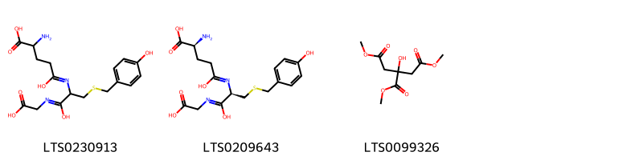{ width=100% }
    <figcaption>Hình ảnh cấu trúc hóa học của 3 hoạt chất thuộc nhóm Carboxylic acids and derivatives gồm ['2-amino-4-{[1-(carboxymethyl-c-hydroxycarbonimidoyl)-2-{[(4-hydroxyphenyl)methyl]sulfanyl}ethyl]-c-hydroxycarbonimidoyl}butanoic acid (LTS0230913)', '(2s)-2-amino-4-{[(1r)-1-(carboxymethyl-c-hydroxycarbonimidoyl)-2-{[(4-hydroxyphenyl)methyl]sulfanyl}ethyl]-c-hydroxycarbonimidoyl}butanoic acid (LTS0209643)', 'trimethyl citrate (LTS0099326)'].</figcaption>
</figure>
#### Nhóm Depsides and depsidones
<figure markdown="span">
    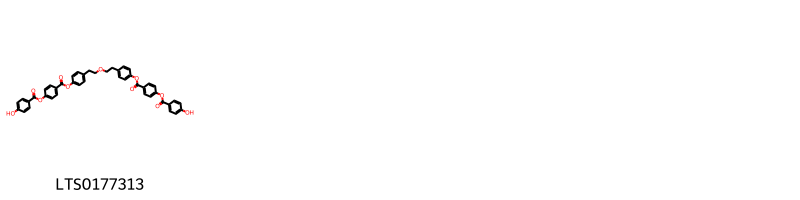{ width=100% }
    <figcaption>Hình ảnh cấu trúc hóa học của 1 hoạt chất thuộc nhóm Depsides and depsidones gồm ['4-[2-(2-{4-[4-(4-hydroxybenzoyloxy)benzoyloxy]phenyl}ethoxy)ethyl]phenyl 4-(4-hydroxybenzoyloxy)benzoate (LTS0177313)'].</figcaption>
</figure>
#### Nhóm Diarylheptanoids
<figure markdown="span">
    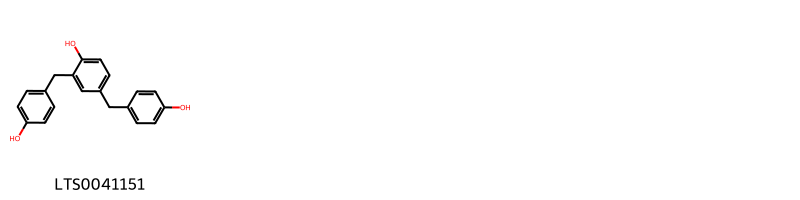{ width=100% }
    <figcaption>Hình ảnh cấu trúc hóa học của 1 hoạt chất thuộc nhóm Diarylheptanoids gồm ['2,4-bis(4-hydroxybenzyl)phenol (LTS0041151)'].</figcaption>
</figure>
#### Nhóm Diazines
<figure markdown="span">
    { width=100% }
    <figcaption>Hình ảnh cấu trúc hóa học của 3 hoạt chất thuộc nhóm Diazines gồm ['5-methylpyrimidine-2,4-dione (LTS0084111)', '4-aminouracil (LTS0122344)', 'pirod (LTS0008205)'].</figcaption>
</figure>
#### Nhóm Fatty Acyls
<figure markdown="span">
    { width=100% }
    <figcaption>Hình ảnh cấu trúc hóa học của 3 hoạt chất thuộc nhóm Fatty Acyls gồm ['palmitic acid (LTS0079439)', '1,2,3-trimethyl 2-{[3,4,5-trihydroxy-6-(hydroxymethyl)oxan-2-yl]oxy}propane-1,2,3-tricarboxylate (LTS0204008)', '1,2,3-trimethyl 2-{[(2s,3r,4s,5r,6r)-3,4,5-trihydroxy-6-(hydroxymethyl)oxan-2-yl]oxy}propane-1,2,3-tricarboxylate (LTS0009362)'].</figcaption>
</figure>
#### Nhóm Imidazopyrimidines
<figure markdown="span">
    { width=100% }
    <figcaption>Hình ảnh cấu trúc hóa học của 1 hoạt chất thuộc nhóm Imidazopyrimidines gồm ['leucon (LTS0114351)'].</figcaption>
</figure>
#### Nhóm Organooxygen compounds
<figure markdown="span">
    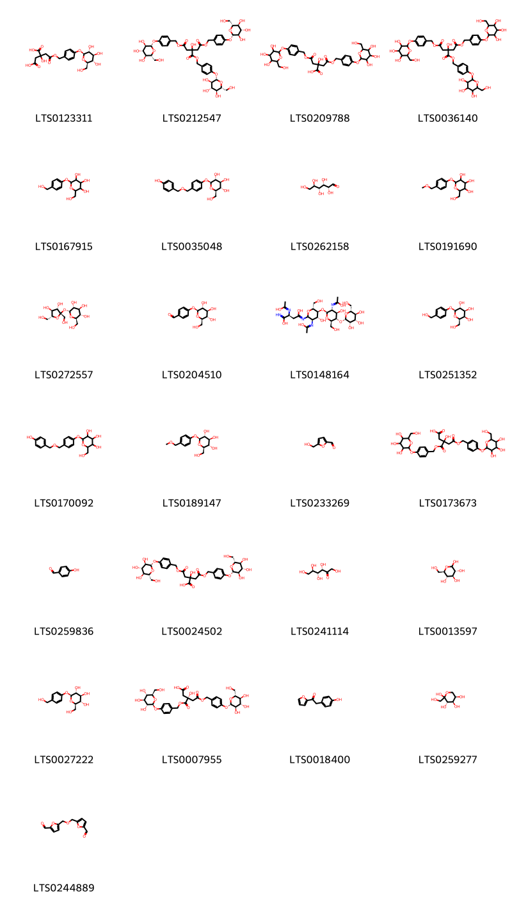{ width=100% }
    <figcaption>Hình ảnh cấu trúc hóa học của 25 hoạt chất thuộc nhóm Organooxygen compounds gồm ['2-hydroxy-2-{2-oxo-2-[(4-{[(2s,3r,4s,5s,6r)-3,4,5-trihydroxy-6-(hydroxymethyl)oxan-2-yl]oxy}phenyl)methoxy]ethyl}butanedioic acid (LTS0123311)', '1,2,3-tris[(4-{[(2s,3r,4s,5s,6r)-3,4,5-trihydroxy-6-(hydroxymethyl)oxan-2-yl]oxy}phenyl)methyl] 2-hydroxypropane-1,2,3-tricarboxylate (LTS0212547)', '2-hydroxy-4-oxo-2-{2-oxo-2-[(4-{[3,4,5-trihydroxy-6-(hydroxymethyl)oxan-2-yl]oxy}phenyl)methoxy]ethyl}-4-[(4-{[3,4,5-trihydroxy-6-(hydroxymethyl)oxan-2-yl]oxy}phenyl)methoxy]butanoic acid (LTS0209788)', '1,2,3-tris[(4-{[3,4,5-trihydroxy-6-(hydroxymethyl)oxan-2-yl]oxy}phenyl)methyl] 2-hydroxypropane-1,2,3-tricarboxylate (LTS0036140)', '2-(hydroxymethyl)-6-[4-(hydroxymethyl)phenoxy]oxane-3,4,5-triol (LTS0167915)', '(2r,3s,4s,5r,6s)-2-(hydroxymethyl)-6-(4-{[(4-hydroxyphenyl)methoxy]methyl}phenoxy)oxane-3,4,5-triol (LTS0035048)', '(+)-glucose (LTS0262158)', '2-(hydroxymethyl)-6-[4-(methoxymethyl)phenoxy]oxane-3,4,5-triol (LTS0191690)', 'sucrose (LTS0272557)', '4-{[(2s,3r,4s,5s,6r)-3,4,5-trihydroxy-6-(hydroxymethyl)oxan-2-yl]oxy}benzaldehyde (LTS0204510)', "(2s)-n'-[(3r,4r,5s,6r)-4-hydroxy-5-{[(2s,3r,4r,5s,6r)-4-hydroxy-3-[(1-hydroxyethylidene)amino]-6-(hydroxymethyl)-5-{[(2s,3s,4s,5s,6r)-3,4,5-trihydroxy-6-(hydroxymethyl)oxan-2-yl]oxy}oxan-2-yl]oxy}-3-[(1-hydroxyethylidene)amino]-6-(hydroxymethyl)oxan-2-yl]-2-[(1-hydroxyethylidene)amino]butanediimidic acid (LTS0148164)", '(2r,3r,4s,5r,6s)-2-(hydroxymethyl)-6-[4-(hydroxymethyl)phenoxy]oxane-3,4,5-triol (LTS0251352)', '2-(hydroxymethyl)-6-(4-{[(4-hydroxyphenyl)methoxy]methyl}phenoxy)oxane-3,4,5-triol (LTS0170092)', '(2r,3s,4s,5r,6s)-2-(hydroxymethyl)-6-[4-(methoxymethyl)phenoxy]oxane-3,4,5-triol (LTS0189147)', 'hydroxymethylfurfural (LTS0233269)', '3-hydroxy-5-oxo-5-[(4-{[3,4,5-trihydroxy-6-(hydroxymethyl)oxan-2-yl]oxy}phenyl)methoxy]-3-{[(4-{[3,4,5-trihydroxy-6-(hydroxymethyl)oxan-2-yl]oxy}phenyl)methoxy]carbonyl}pentanoic acid (LTS0173673)', 'p-hydroxybenzaldehyde (LTS0259836)', '2-hydroxy-4-oxo-2-{2-oxo-2-[(4-{[(2s,3r,4s,5s,6r)-3,4,5-trihydroxy-6-(hydroxymethyl)oxan-2-yl]oxy}phenyl)methoxy]ethyl}-4-[(4-{[(2s,3r,4s,5s,6r)-3,4,5-trihydroxy-6-(hydroxymethyl)oxan-2-yl]oxy}phenyl)methoxy]butanoic acid (LTS0024502)', 'keto-d-fructose (LTS0241114)', 'glucose (LTS0013597)', 'gastrodin (LTS0027222)', '(3r)-3-hydroxy-5-oxo-5-[(4-{[(2s,3r,4s,5s,6r)-3,4,5-trihydroxy-6-(hydroxymethyl)oxan-2-yl]oxy}phenyl)methoxy]-3-{[(4-{[(2s,3r,4s,5s,6r)-3,4,5-trihydroxy-6-(hydroxymethyl)oxan-2-yl]oxy}phenyl)methoxy]carbonyl}pentanoic acid (LTS0007955)', '1-(furan-2-yl)-2-(4-hydroxyphenyl)ethanone (LTS0018400)', 'd-fructopyranose (LTS0259277)', '5-{[(5-formylfuran-2-yl)methoxy]methyl}furan-2-carbaldehyde (LTS0244889)'].</figcaption>
</figure>
#### Nhóm Phenol ethers
<figure markdown="span">
    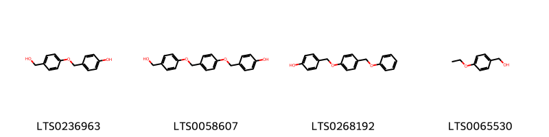{ width=100% }
    <figcaption>Hình ảnh cấu trúc hóa học của 4 hoạt chất thuộc nhóm Phenol ethers gồm ['4-[4-(hydroxymethyl)phenoxymethyl]phenol (LTS0236963)', '4-{4-[4-(hydroxymethyl)phenoxymethyl]phenoxymethyl}phenol (LTS0058607)', '4-[4-(phenoxymethyl)phenoxymethyl]phenol (LTS0268192)', '(4-ethoxyphenyl)methanol (LTS0065530)'].</figcaption>
</figure>
#### Nhóm Phenols
<figure markdown="span">
    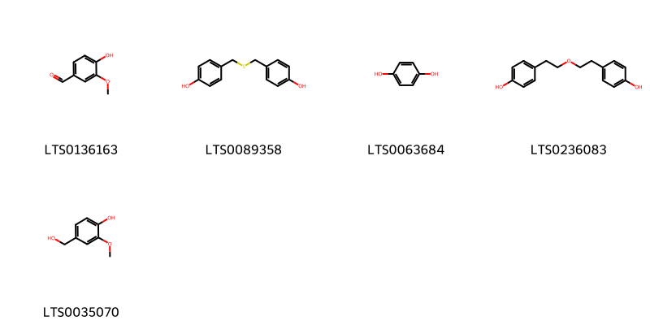{ width=100% }
    <figcaption>Hình ảnh cấu trúc hóa học của 5 hoạt chất thuộc nhóm Phenols gồm ['vanillin (LTS0136163)', 'bis-(4-hydroxybenzyl)sulfide (LTS0089358)', 'α-hydroquinone (LTS0063684)', '4-{2-[2-(4-hydroxyphenyl)ethoxy]ethyl}phenol (LTS0236083)', 'vanillyl alcohol (LTS0035070)'].</figcaption>
</figure>
#### Nhóm Prenol lipids
<figure markdown="span">
    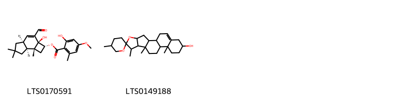{ width=100% }
    <figcaption>Hình ảnh cấu trúc hóa học của 2 hoạt chất thuộc nhóm Prenol lipids gồm ['(2r,2as,4as,7as,7br)-3-formyl-2a-hydroxy-6,6,7b-trimethyl-1h,2h,4ah,5h,7h,7ah-cyclobuta[e]inden-2-yl 2-hydroxy-4-methoxy-6-methylbenzoate (LTS0170591)', 'diosgenin (LTS0149188)'].</figcaption>
</figure>
#### Nhóm Purine nucleosides
<figure markdown="span">
    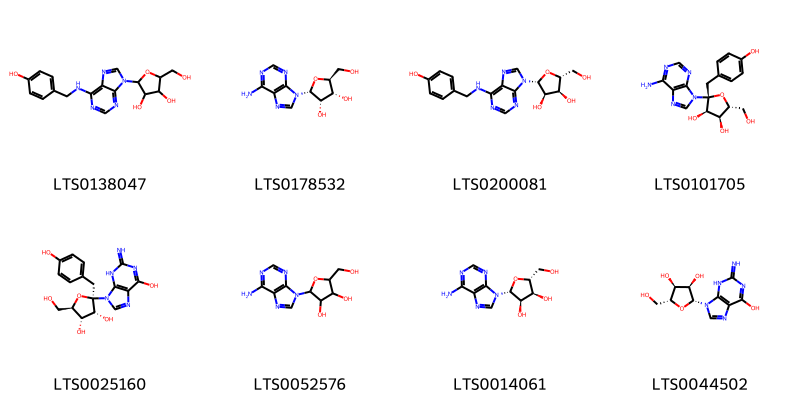{ width=100% }
    <figcaption>Hình ảnh cấu trúc hóa học của 8 hoạt chất thuộc nhóm Purine nucleosides gồm ['2-(hydroxymethyl)-5-(6-{[(4-hydroxyphenyl)methyl]amino}purin-9-yl)oxolane-3,4-diol (LTS0138047)', '(2r,3s,4r,5s)-2-(6-aminopurin-9-yl)-5-(hydroxymethyl)oxolane-3,4-diol (LTS0178532)', '(2r,3s,4r,5r)-2-(hydroxymethyl)-5-(6-{[(4-hydroxyphenyl)methyl]amino}purin-9-yl)oxolane-3,4-diol (LTS0200081)', '(2r,3r,4s,5r)-2-(6-aminopurin-9-yl)-5-(hydroxymethyl)-2-[(4-hydroxyphenyl)methyl]oxolane-3,4-diol (LTS0101705)', '(2r,3r,4s,5r)-2-(6-hydroxy-2-imino-3h-purin-9-yl)-5-(hydroxymethyl)-2-[(4-hydroxyphenyl)methyl]oxolane-3,4-diol (LTS0025160)', 'adenosine (LTS0052576)', 'adenosine (LTS0014061)', 'ribonucleoside (LTS0044502)'].</figcaption>
</figure>
#### Nhóm Pyrimidine nucleosides
<figure markdown="span">
    { width=100% }
    <figcaption>Hình ảnh cấu trúc hóa học của 3 hoạt chất thuộc nhóm Pyrimidine nucleosides gồm ['1-[3,4-dihydroxy-5-(hydroxymethyl)oxolan-2-yl]-4-hydroxypyrimidin-2-one (LTS0075646)', 'uridine (LTS0220125)', '1-[(2s,3s,4s,5s)-3,4-dihydroxy-5-(hydroxymethyl)oxolan-2-yl]-4-hydroxypyrimidin-2-one (LTS0200435)'].</figcaption>
</figure>
#### Nhóm Steroids and steroid derivatives
<figure markdown="span">
    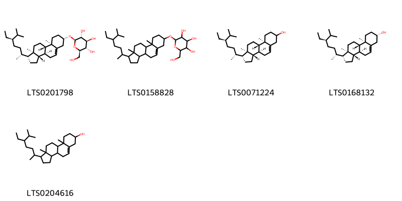{ width=100% }
    <figcaption>Hình ảnh cấu trúc hóa học của 5 hoạt chất thuộc nhóm Steroids and steroid derivatives gồm ['sitogluside (LTS0201798)', '2-{[1-(5-ethyl-6-methylheptan-2-yl)-9a,11a-dimethyl-1h,2h,3h,3ah,3bh,4h,6h,7h,8h,9h,9bh,10h,11h-cyclopenta[a]phenanthren-7-yl]oxy}-6-(hydroxymethyl)oxane-3,4,5-triol (LTS0158828)', 'stigmast-5-en-3-ol (LTS0071224)', 'sitosterol (LTS0168132)', 'stigmast-5-en-3-ol, (3β)- (LTS0204616)'].</figcaption>
</figure>
#### Nhóm Stilbenes
<figure markdown="span">
    { width=100% }
    <figcaption>Hình ảnh cấu trúc hóa học của 1 hoạt chất thuộc nhóm Stilbenes gồm ["4,4'-dihydroxybibenzyl (LTS0183660)"].</figcaption>
</figure>

---

### Dược dân tộc học

Danh sách các quốc gia có sử dụng *Gastrodia elata* trong điều trị các bệnh. 

| Country   | Disease                         | Bệnh                                                                                                                                                                                                |
|:----------|:--------------------------------|:----------------------------------------------------------------------------------------------------------------------------------------------------------------------------------------------------|
| China     | Aphrodisiac, Carminative, Tonic | MYMEMORY WARNING: YOU USED ALL AVAILABLE FREE TRANSLATIONS FOR TODAY. NEXT AVAILABLE IN  18 HOURS 13 MINUTES 41 SECONDS VISIT HTTPS://MYMEMORY.TRANSLATED.NET/DOC/USAGELIMITS.PHP TO TRANSLATE MORE |
| Japan     | Tonic                           | MYMEMORY WARNING: YOU USED ALL AVAILABLE FREE TRANSLATIONS FOR TODAY. NEXT AVAILABLE IN  18 HOURS 13 MINUTES 38 SECONDS VISIT HTTPS://MYMEMORY.TRANSLATED.NET/DOC/USAGELIMITS.PHP TO TRANSLATE MORE |

---

# Chi Luisia

??? note "Danh sách các dược liệu thuộc chi"
    
	 - *Luisia tenuifolia*
	 - *Luisia teres*

---
## Luisia tenuifolia
### Thông tin về thực vật

!!! info "Phân loại thực vật của *Luisia tenuifolia* từ GIBF:"
    - **Kingdom:** Plantae
    - **Phylum:** Tracheophyta
    - **Order:** Asparagales
    - **Family:** Orchidaceae
    - **Genus:** Luisia
    - **Species:** *Luisia tenuifolia*

 

| Label (VI)   | Label (EN)   | Scientific Name   | Descriptions (VI)   | Descriptions (EN)   | Also Known As (VI)   | Also Known As (EN)   |
|:-------------|:-------------|:------------------|:--------------------|:--------------------|:---------------------|:---------------------|
| N/A          | N/A          | Luisia tenuifolia | loài thực vật       | species of plant    | ['']                 | ['']                 |

#### Phân bố trên thế giới

**Từ CSDL GIBF** nan, India

#### Phân bố tại Việt Nam

**Từ CSDL GIBF**: Không có ghi nhận ở Việt Nam

---
### Thành phần hóa học
        
- Theo cơ sở dữ liệu lotus: Từ loài *Luisia tenuifolia* đã phân lập và xác định được Chưa có hoạt chất nào được phân lập. hoạt chất thuộc về các nhóm Không có hoạt chất nào được phân lập. 

Không có hình ảnh nào được tạo ra

---

### Dược dân tộc học

Danh sách các quốc gia có sử dụng *Luisia tenuifolia* trong điều trị các bệnh. 

| Country   | Disease   | Bệnh                                                                                                                                                                                                |
|:----------|:----------|:----------------------------------------------------------------------------------------------------------------------------------------------------------------------------------------------------|
| India     | Emollient | MYMEMORY WARNING: YOU USED ALL AVAILABLE FREE TRANSLATIONS FOR TODAY. NEXT AVAILABLE IN  18 HOURS 11 MINUTES 38 SECONDS VISIT HTTPS://MYMEMORY.TRANSLATED.NET/DOC/USAGELIMITS.PHP TO TRANSLATE MORE |

---

---
## Luisia teres
### Thông tin về thực vật

!!! info "Phân loại thực vật của *Luisia teres* từ GIBF:"
    - **Kingdom:** Plantae
    - **Phylum:** Tracheophyta
    - **Order:** Asparagales
    - **Family:** Orchidaceae
    - **Genus:** Luisia
    - **Species:** *Luisia teres*

 

| Label (VI)   | Label (EN)   | Scientific Name   | Descriptions (VI)   | Descriptions (EN)   | Also Known As (VI)   | Also Known As (EN)   |
|:-------------|:-------------|:------------------|:--------------------|:--------------------|:---------------------|:---------------------|
| N/A          | N/A          | Luisia teres      | loài thực vật       | species of plant    | ['']                 | ['']                 |

#### Phân bố trên thế giới

**Từ CSDL GIBF** nan, Japan, United States of America, China, Chinese Taipei

#### Phân bố tại Việt Nam

**Từ CSDL GIBF**: Không có ghi nhận ở Việt Nam

---
### Thành phần hóa học
        
- Theo cơ sở dữ liệu lotus: Từ loài *Luisia teres* đã phân lập và xác định được Chưa có hoạt chất nào được phân lập. hoạt chất thuộc về các nhóm Không có hoạt chất nào được phân lập. 

Không có hình ảnh nào được tạo ra

---

### Dược dân tộc học

Danh sách các quốc gia có sử dụng *Luisia teres* trong điều trị các bệnh. 

| Country   | Disease   | Bệnh                                                                                                                                                                                                |
|:----------|:----------|:----------------------------------------------------------------------------------------------------------------------------------------------------------------------------------------------------|
| China     | Antidote  | MYMEMORY WARNING: YOU USED ALL AVAILABLE FREE TRANSLATIONS FOR TODAY. NEXT AVAILABLE IN  18 HOURS 11 MINUTES 18 SECONDS VISIT HTTPS://MYMEMORY.TRANSLATED.NET/DOC/USAGELIMITS.PHP TO TRANSLATE MORE |

---

# Chi Corallorhiza

??? note "Danh sách các dược liệu thuộc chi"
    
	 - *Corallorhiza maculata*
	 - *Corallorhiza odontorhiza*

---
## Corallorhiza maculata
### Thông tin về thực vật

!!! info "Phân loại thực vật của *Corallorhiza maculata* từ GIBF:"
    - **Kingdom:** Plantae
    - **Phylum:** Tracheophyta
    - **Order:** Asparagales
    - **Family:** Orchidaceae
    - **Genus:** Corallorhiza
    - **Species:** *Corallorhiza maculata*

 

| Label (VI)   | Label (EN)   | Scientific Name       | Descriptions (VI)   | Descriptions (EN)   | Also Known As (VI)   | Also Known As (EN)                                                     |
|:-------------|:-------------|:----------------------|:--------------------|:--------------------|:---------------------|:-----------------------------------------------------------------------|
| N/A          | N/A          | Corallorhiza maculata | loài thực vật       | species of plant    | ['']                 | ['summer coralroot', 'spotted coral-root orchid', 'spotted coralroot'] |

#### Phân bố trên thế giới

**Từ CSDL GIBF** Canada, United States of America, Mexico

#### Phân bố tại Việt Nam

**Từ CSDL GIBF**: Không có ghi nhận ở Việt Nam

---
### Thành phần hóa học
        
- Theo cơ sở dữ liệu lotus: Từ loài *Corallorhiza maculata* đã phân lập và xác định được Chưa có hoạt chất nào được phân lập. hoạt chất thuộc về các nhóm Không có hoạt chất nào được phân lập. 

Không có hình ảnh nào được tạo ra

---

### Dược dân tộc học

Danh sách các quốc gia có sử dụng *Corallorhiza maculata* trong điều trị các bệnh. 

| Country   | Disease                        | Bệnh                                                                                                                                                                                                |
|:----------|:-------------------------------|:----------------------------------------------------------------------------------------------------------------------------------------------------------------------------------------------------|
| US        | Sedative, Sudorific, Vermifuge | MYMEMORY WARNING: YOU USED ALL AVAILABLE FREE TRANSLATIONS FOR TODAY. NEXT AVAILABLE IN  18 HOURS 10 MINUTES 54 SECONDS VISIT HTTPS://MYMEMORY.TRANSLATED.NET/DOC/USAGELIMITS.PHP TO TRANSLATE MORE |

---

---
## Corallorhiza odontorhiza
### Thông tin về thực vật

!!! info "Phân loại thực vật của *Corallorhiza odontorhiza* từ GIBF:"
    - **Kingdom:** Plantae
    - **Phylum:** Tracheophyta
    - **Order:** Asparagales
    - **Family:** Orchidaceae
    - **Genus:** Corallorhiza
    - **Species:** *Corallorhiza odontorhiza*

 

| Label (VI)   | Label (EN)   | Scientific Name          | Descriptions (VI)   | Descriptions (EN)   | Also Known As (VI)   | Also Known As (EN)   |
|:-------------|:-------------|:-------------------------|:--------------------|:--------------------|:---------------------|:---------------------|
| N/A          | N/A          | Corallorhiza odontorhiza | loài thực vật       | species of plant    | ['']                 | ['']                 |

#### Phân bố trên thế giới

**Từ CSDL GIBF** nan, Canada, United States of America, Mexico

#### Phân bố tại Việt Nam

**Từ CSDL GIBF**: Không có ghi nhận ở Việt Nam

---
### Thành phần hóa học
        
- Theo cơ sở dữ liệu lotus: Từ loài *Corallorhiza odontorhiza* đã phân lập và xác định được Chưa có hoạt chất nào được phân lập. hoạt chất thuộc về các nhóm Không có hoạt chất nào được phân lập. 

Không có hình ảnh nào được tạo ra

---

### Dược dân tộc học

Danh sách các quốc gia có sử dụng *Corallorhiza odontorhiza* trong điều trị các bệnh. 

| Country   | Disease                    | Bệnh                                                                                                                                                                                                |
|:----------|:---------------------------|:----------------------------------------------------------------------------------------------------------------------------------------------------------------------------------------------------|
| Elsewhere | Diaphoretic, nan, Sedative | MYMEMORY WARNING: YOU USED ALL AVAILABLE FREE TRANSLATIONS FOR TODAY. NEXT AVAILABLE IN  18 HOURS 10 MINUTES 24 SECONDS VISIT HTTPS://MYMEMORY.TRANSLATED.NET/DOC/USAGELIMITS.PHP TO TRANSLATE MORE |

---

# Chi Dendrobium

??? note "Danh sách các dược liệu thuộc chi"
    
	 - *Dendrobium aggregatum*
	 - *Dendrobium moniliforme*
	 - *Dendrobium nobile*
	 - *Dendrobium purpureum*

---
## Dendrobium aggregatum
### Thông tin về thực vật

!!! info "Phân loại thực vật của *Dendrobium aggregatum* từ GIBF:"
    - **Kingdom:** Plantae
    - **Phylum:** Tracheophyta
    - **Order:** Asparagales
    - **Family:** Orchidaceae
    - **Genus:** Dendrobium
    - **Species:** *Dendrobium aggregatum*

 

| Label (VI)   | Label (EN)   | Scientific Name       | Descriptions (VI)   | Descriptions (EN)   | Also Known As (VI)   | Also Known As (EN)   |
|:-------------|:-------------|:----------------------|:--------------------|:--------------------|:---------------------|:---------------------|
| N/A          | N/A          | Dendrobium aggregatum | loài thực vật       | species of plant    | ['']                 | ['']                 |

#### Phân bố trên thế giới

**Từ CSDL GIBF** Thailand, China, Brazil

#### Phân bố tại Việt Nam

**Từ CSDL GIBF**: Không có ghi nhận ở Việt Nam

---
### Thành phần hóa học
        
- Theo cơ sở dữ liệu lotus: Từ loài *Dendrobium aggregatum* đã phân lập và xác định được Chưa có hoạt chất nào được phân lập. hoạt chất thuộc về các nhóm Không có hoạt chất nào được phân lập. 

Không có hình ảnh nào được tạo ra

---

### Dược dân tộc học

Danh sách các quốc gia có sử dụng *Dendrobium aggregatum* trong điều trị các bệnh. 

| Country   | Disease     | Bệnh                                                                                                                                                                                                |
|:----------|:------------|:----------------------------------------------------------------------------------------------------------------------------------------------------------------------------------------------------|
| China     | Antitussive | MYMEMORY WARNING: YOU USED ALL AVAILABLE FREE TRANSLATIONS FOR TODAY. NEXT AVAILABLE IN  18 HOURS 09 MINUTES 57 SECONDS VISIT HTTPS://MYMEMORY.TRANSLATED.NET/DOC/USAGELIMITS.PHP TO TRANSLATE MORE |

---

---
## Dendrobium moniliforme
### Thông tin về thực vật

!!! info "Phân loại thực vật của *Dendrobium moniliforme* từ GIBF:"
    - **Kingdom:** Plantae
    - **Phylum:** Tracheophyta
    - **Order:** Asparagales
    - **Family:** Orchidaceae
    - **Genus:** Dendrobium
    - **Species:** *Dendrobium moniliforme*

 

| Label (VI)   | Label (EN)   | Scientific Name        | Descriptions (VI)   | Descriptions (EN)   | Also Known As (VI)   | Also Known As (EN)   |
|:-------------|:-------------|:-----------------------|:--------------------|:--------------------|:---------------------|:---------------------|
| N/A          | N/A          | Dendrobium moniliforme |                     | species of plant    | ['']                 | ['']                 |

#### Phân bố trên thế giới

**Từ CSDL GIBF** nan, Japan, Bhutan, India, United States of America, China, Nepal, Korea, Republic of, Chinese Taipei

#### Phân bố tại Việt Nam

**Từ CSDL GIBF**: Không có ghi nhận ở Việt Nam

---
### Thành phần hóa học
        
- Theo cơ sở dữ liệu lotus: Từ loài *Dendrobium moniliforme* đã phân lập và xác định được 74 hoạt chất thuộc về các nhóm Stilbenes, Furanoid lignans, Organooxygen compounds, Furopyrans, Phenanthrenes and derivatives, Prenol lipids, Lignan glycosides, Naphthopyrans, Benzodioxanes, Steroids and steroid derivatives, Benzene and substituted derivatives. 

|    | chemicalTaxonomyClassyfireClass     |   smiles_count |
|---:|:------------------------------------|---------------:|
|  0 | Benzene and substituted derivatives |              1 |
|  1 | Benzodioxanes                       |              4 |
|  2 | Furanoid lignans                    |              2 |
|  3 | Furopyrans                          |              3 |
|  4 | Lignan glycosides                   |              4 |
|  5 | Naphthopyrans                       |              1 |
|  6 | Organooxygen compounds              |              7 |
|  7 | Phenanthrenes and derivatives       |              3 |
|  8 | Prenol lipids                       |             27 |
|  9 | Steroids and steroid derivatives    |              4 |
| 10 | Stilbenes                           |             17 |

#### Nhóm Benzene and substituted derivatives
<figure markdown="span">
    { width=100% }
    <figcaption>Hình ảnh cấu trúc hóa học của 1 hoạt chất thuộc nhóm Benzene and substituted derivatives gồm ['anisaldehyde (LTS0054560)'].</figcaption>
</figure>
#### Nhóm Benzodioxanes
<figure markdown="span">
    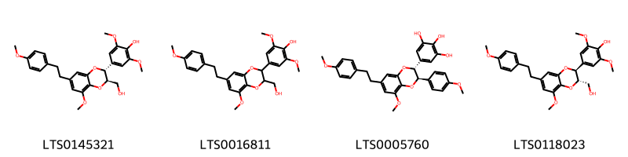{ width=100% }
    <figcaption>Hình ảnh cấu trúc hóa học của 4 hoạt chất thuộc nhóm Benzodioxanes gồm ['4-[(2r,3r)-3-(hydroxymethyl)-5-methoxy-7-[2-(4-methoxyphenyl)ethyl]-2,3-dihydro-1,4-benzodioxin-2-yl]-2,6-dimethoxyphenol (LTS0145321)', '4-[3-(hydroxymethyl)-5-methoxy-7-[2-(4-methoxyphenyl)ethyl]-2,3-dihydro-1,4-benzodioxin-2-yl]-2,6-dimethoxyphenol (LTS0016811)', '5-[(2r,3r)-5-methoxy-3-(4-methoxyphenyl)-7-[2-(4-methoxyphenyl)ethyl]-2,3-dihydro-1,4-benzodioxin-2-yl]benzene-1,2,3-triol (LTS0005760)', '4-[(2s,3s)-3-(hydroxymethyl)-5-methoxy-7-[2-(4-methoxyphenyl)ethyl]-2,3-dihydro-1,4-benzodioxin-2-yl]-2,6-dimethoxyphenol (LTS0118023)'].</figcaption>
</figure>
#### Nhóm Furanoid lignans
<figure markdown="span">
    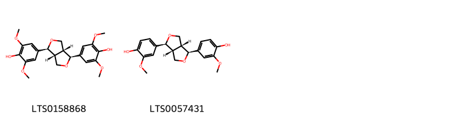{ width=100% }
    <figcaption>Hình ảnh cấu trúc hóa học của 2 hoạt chất thuộc nhóm Furanoid lignans gồm ['(+)-syringaresinol (LTS0158868)', 'pinoresinol (LTS0057431)'].</figcaption>
</figure>
#### Nhóm Furopyrans
<figure markdown="span">
    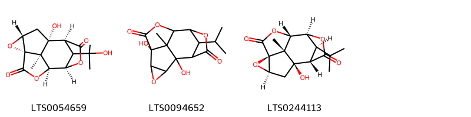{ width=100% }
    <figcaption>Hình ảnh cấu trúc hóa học của 3 hoạt chất thuộc nhóm Furopyrans gồm ['(1r,3r,5s,8s,9r,12s,13r)-1-hydroxy-14-(2-hydroxypropan-2-yl)-13-methyl-4,7,10-trioxapentacyclo[6.4.1.1⁹,¹².0³,⁵.0⁵,¹³]tetradecane-6,11-dione (LTS0054659)', '1,5-dihydroxy-14-isopropyl-13-methyl-3,7,10-trioxapentacyclo[6.4.1.1⁹,¹².0²,⁴.0⁵,¹³]tetradecane-6,11-dione (LTS0094652)', '(1r,3r,5s,8s,9s,12s,13r,14s)-1-hydroxy-14-isopropyl-13-methyl-4,7,10-trioxapentacyclo[6.4.1.1⁹,¹².0³,⁵.0⁵,¹³]tetradecane-6,11-dione (LTS0244113)'].</figcaption>
</figure>
#### Nhóm Lignan glycosides
<figure markdown="span">
    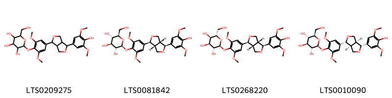{ width=100% }
    <figcaption>Hình ảnh cấu trúc hóa học của 4 hoạt chất thuộc nhóm Lignan glycosides gồm ['2-{4-[4-(4-hydroxy-3,5-dimethoxyphenyl)-hexahydrofuro[3,4-c]furan-1-yl]-2,6-dimethoxyphenoxy}-6-(hydroxymethyl)oxane-3,4,5-triol (LTS0209275)', 'acanthoside b (LTS0081842)', '(2s,3r,4s,5r,6s)-2-{4-[(1s,3ar,4s,6ar)-4-(4-hydroxy-3,5-dimethoxyphenyl)-hexahydrofuro[3,4-c]furan-1-yl]-2,6-dimethoxyphenoxy}-6-(hydroxymethyl)oxane-3,4,5-triol (LTS0268220)', '(2s,3r,4s,5s,6r)-2-{4-[(1r,3as,4r,6as)-4-(4-hydroxy-3,5-dimethoxyphenyl)-hexahydrofuro[3,4-c]furan-1-yl]-2,6-dimethoxyphenoxy}-6-(hydroxymethyl)oxane-3,4,5-triol (LTS0010090)'].</figcaption>
</figure>
#### Nhóm Naphthopyrans
<figure markdown="span">
    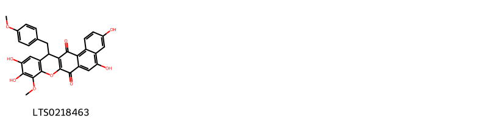{ width=100% }
    <figcaption>Hình ảnh cấu trúc hóa học của 1 hoạt chất thuộc nhóm Naphthopyrans gồm ['3,5,10,11-tetrahydroxy-9-methoxy-13-[(4-methoxyphenyl)methyl]-13h-naphtho[1,2-b]xanthene-7,14-dione (LTS0218463)'].</figcaption>
</figure>
#### Nhóm Organooxygen compounds
<figure markdown="span">
    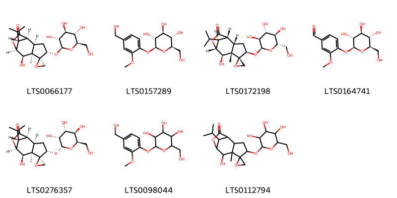{ width=100% }
    <figcaption>Hình ảnh cấu trúc hóa học của 7 hoạt chất thuộc nhóm Organooxygen compounds gồm ["(1's,2r,2'r,4's,6'r,7'r,8's,11'r)-7'-hydroxy-11'-isopropyl-6'-methyl-4'-{[(2s,3r,4s,5s,6r)-3,4,5-trihydroxy-6-(hydroxymethyl)oxan-2-yl]oxy}-9'-oxaspiro[oxirane-2,5'-tricyclo[6.2.1.0²,⁶]undecan]-10'-one (LTS0066177)", 'vanilloloside (LTS0157289)', "(1'r,2s,2's,4'r,6's,7'r,8'r,11's)-7'-hydroxy-11'-isopropyl-6'-methyl-4'-{[(2s,3s,4r,5r,6s)-3,4,5-trihydroxy-6-(hydroxymethyl)oxan-2-yl]oxy}-9'-oxaspiro[oxirane-2,5'-tricyclo[6.2.1.0²,⁶]undecan]-10'-one (LTS0172198)", 'vanilloside (LTS0164741)', "(1's,2r,2'r,4's,6'r,7'r,8's,11'r)-7'-hydroxy-11'-isopropyl-6'-methyl-4'-{[(2r,3r,4r,5r,6r)-3,4,5-trihydroxy-6-(hydroxymethyl)oxan-2-yl]oxy}-9'-oxaspiro[oxirane-2,5'-tricyclo[6.2.1.0²,⁶]undecan]-10'-one (LTS0276357)", '2-(hydroxymethyl)-6-[4-(hydroxymethyl)-2-methoxyphenoxy]oxane-3,4,5-triol (LTS0098044)', "7'-hydroxy-11'-isopropyl-6'-methyl-4'-{[3,4,5-trihydroxy-6-(hydroxymethyl)oxan-2-yl]oxy}-9'-oxaspiro[oxirane-2,5'-tricyclo[6.2.1.0²,⁶]undecan]-10'-one (LTS0112794)"].</figcaption>
</figure>
#### Nhóm Phenanthrenes and derivatives
<figure markdown="span">
    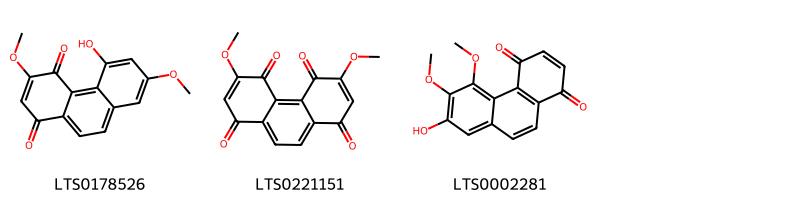{ width=100% }
    <figcaption>Hình ảnh cấu trúc hóa học của 3 hoạt chất thuộc nhóm Phenanthrenes and derivatives gồm ['5-hydroxy-3,7-dimethoxyphenanthrene-1,4-dione (LTS0178526)', '3,6-dimethoxyphenanthrene-1,4,5,8-tetrone (LTS0221151)', '7-hydroxy-5,6-dimethoxyphenanthrene-1,4-dione (LTS0002281)'].</figcaption>
</figure>
#### Nhóm Prenol lipids
<figure markdown="span">
    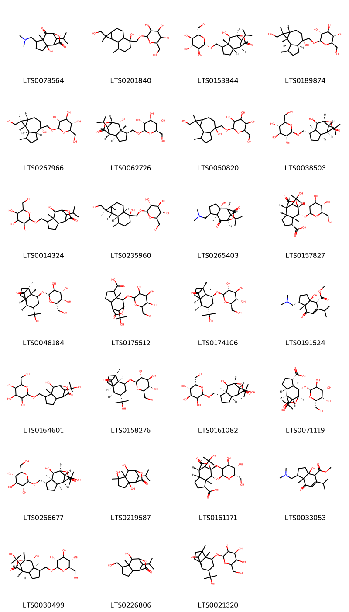{ width=100% }
    <figcaption>Hình ảnh cấu trúc hóa học của 27 hoạt chất thuộc nhóm Prenol lipids gồm ['5-[(dimethylamino)methyl]-2-hydroxy-11-isopropyl-6-methyl-9-oxatricyclo[6.2.1.0²,⁶]undecane-7,10-dione (LTS0078564)', '2-{[4-hydroxy-1-(hydroxymethyl)-1,7-dimethyl-octahydro-1ah-cyclopropa[a]naphthalen-4-yl]methoxy}-6-(hydroxymethyl)oxane-3,4,5-triol (LTS0201840)', '(1s,2s,5r,6r,7r,8s,11s)-7-hydroxy-11-isopropyl-6-methyl-5-({[(2s,3s,4r,5r,6s)-3,4,5-trihydroxy-6-(hydroxymethyl)oxan-2-yl]oxy}methyl)-9-oxatricyclo[6.2.1.0²,⁶]undecan-10-one (LTS0153844)', '(2r,3r,4s,5s,6r)-2-{[(1r,1ar,4s,4as,7r,7as,7bs)-4-hydroxy-1-(hydroxymethyl)-1,7-dimethyl-octahydro-1ah-cyclopropa[e]azulen-4-yl]methoxy}-6-(hydroxymethyl)oxane-3,4,5-triol (LTS0189874)', '(2r,3r,4s,5s,6r)-2-{[(1s,1ar,4s,4as,7r,7as,7bs)-4-hydroxy-1-(hydroxymethyl)-1,7-dimethyl-octahydro-1ah-cyclopropa[e]azulen-4-yl]methoxy}-6-(hydroxymethyl)oxane-3,4,5-triol (LTS0267966)', '(1s,2s,5s,6s,7r,8s,11r)-7-hydroxy-11-isopropyl-6-methyl-5-({[(2r,3r,4s,5s,6r)-3,4,5-trihydroxy-6-(hydroxymethyl)oxan-2-yl]oxy}methyl)-9-oxatricyclo[6.2.1.0²,⁶]undecan-10-one (LTS0062726)', '2-{[4-hydroxy-1-(hydroxymethyl)-1,7-dimethyl-octahydro-1ah-cyclopropa[e]azulen-4-yl]methoxy}-6-(hydroxymethyl)oxane-3,4,5-triol (LTS0050820)', '(1s,2r,5s,6s,7r,8s,11r)-7-hydroxy-11-isopropyl-6-methyl-5-({[(2r,3r,4s,5s,6r)-3,4,5-trihydroxy-6-(hydroxymethyl)oxan-2-yl]oxy}methyl)-9-oxatricyclo[6.2.1.0²,⁶]undecan-10-one (LTS0038503)', '7-hydroxy-11-isopropyl-6-methyl-5-({[3,4,5-trihydroxy-6-(hydroxymethyl)oxan-2-yl]oxy}methyl)-9-oxatricyclo[6.2.1.0²,⁶]undecan-10-one (LTS0014324)', '(2r,3r,4s,5s,6r)-2-{[(1s,1ar,3ar,4s,7r,7as,7bs)-4-hydroxy-1-(hydroxymethyl)-1,7-dimethyl-octahydro-1ah-cyclopropa[a]naphthalen-4-yl]methoxy}-6-(hydroxymethyl)oxane-3,4,5-triol (LTS0235960)', '(1s,2r,5s,6s,8r,11s)-5-[(dimethylamino)methyl]-2-hydroxy-11-isopropyl-6-methyl-9-oxatricyclo[6.2.1.0²,⁶]undecane-7,10-dione (LTS0265403)', '(1s,2r,5s,6s,7r,8s,11r)-11-(2-hydroxypropan-2-yl)-6-methyl-10-oxo-7-{[(2r,3r,4s,5s,6r)-3,4,5-trihydroxy-6-(hydroxymethyl)oxan-2-yl]oxy}-9-oxatricyclo[6.2.1.0²,⁶]undecane-5-carboxylic acid (LTS0157827)', '(1s,2r,3s,5r,6r,8s)-5-(2-hydroxypropan-2-yl)-2,8-dimethyl-3-{[(2s,3s,4r,5s,6s)-3,4,5-trihydroxy-6-(hydroxymethyl)oxan-2-yl]oxy}tricyclo[4.4.0.0²,⁸]decan-7-one (LTS0048184)', '11-(2-hydroxypropan-2-yl)-6-methyl-10-oxo-7-{[3,4,5-trihydroxy-6-(hydroxymethyl)oxan-2-yl]oxy}-9-oxatricyclo[6.2.1.0²,⁶]undecane-5-carboxylic acid (LTS0175512)', '(1r,2s,3s,5s,6s,8r)-5-(2-hydroxypropan-2-yl)-2,8-dimethyl-3-{[(2r,3r,4s,5s,6r)-3,4,5-trihydroxy-6-(hydroxymethyl)oxan-2-yl]oxy}tricyclo[4.4.0.0²,⁸]decan-7-one (LTS0174106)', 'methyl (1r,3as,4r,7ar)-1-[(dimethylamino)methyl]-3a-hydroxy-5-isopropyl-7a-methyl-7-oxo-1,2,3,4-tetrahydroindene-4-carboxylate (LTS0191524)', '7-hydroxy-11-(2-hydroxypropan-2-yl)-6-methyl-5-({[3,4,5-trihydroxy-6-(hydroxymethyl)oxan-2-yl]oxy}methyl)-9-oxatricyclo[6.2.1.0²,⁶]undecan-10-one (LTS0164601)', '(1r,2s,3s,5s,6s,8s)-5-(2-hydroxypropan-2-yl)-2,8-dimethyl-3-{[(2r,3r,4s,5s,6r)-3,4,5-trihydroxy-6-(hydroxymethyl)oxan-2-yl]oxy}tricyclo[4.4.0.0²,⁸]decan-7-one (LTS0158276)', '(1s,2r,5s,6s,7r,8s,11r)-7-hydroxy-11-(2-hydroxypropan-2-yl)-6-methyl-5-({[(2r,3s,4s,5s,6s)-3,4,5-trihydroxy-6-(hydroxymethyl)oxan-2-yl]oxy}methyl)-9-oxatricyclo[6.2.1.0²,⁶]undecan-10-one (LTS0161082)', '(1s,2r,5s,6s,7s,8s,11r)-11-(2-hydroxypropan-2-yl)-6-methyl-10-oxo-7-{[(2s,3s,4r,5s,6s)-3,4,5-trihydroxy-6-(hydroxymethyl)oxan-2-yl]oxy}-9-oxatricyclo[6.2.1.0²,⁶]undecane-5-carboxylic acid (LTS0071119)', '(1s,2r,5s,6s,7r,8s,11r)-7-hydroxy-11-(2-hydroxypropan-2-yl)-6-methyl-5-({[(2r,3r,4s,5s,6r)-3,4,5-trihydroxy-6-(hydroxymethyl)oxan-2-yl]oxy}methyl)-9-oxatricyclo[6.2.1.0²,⁶]undecan-10-one (LTS0266677)', '2,5,7-trihydroxy-11-isopropyl-5,6-dimethyl-9-oxatricyclo[6.2.1.0²,⁶]undecan-10-one (LTS0219587)', '(1s,2r,5s,6s,7r,8s,11r)-11-(2-hydroxypropan-2-yl)-6-methyl-10-oxo-7-{[(2r,3s,4s,5s,6s)-3,4,5-trihydroxy-6-(hydroxymethyl)oxan-2-yl]oxy}-9-oxatricyclo[6.2.1.0²,⁶]undecane-5-carboxylic acid (LTS0161171)', 'methyl 1-[(dimethylamino)methyl]-3a-hydroxy-5-isopropyl-7a-methyl-7-oxo-1,2,3,4-tetrahydroindene-4-carboxylate (LTS0033053)', '(1s,2s,5s,6r,7r,8s,11r)-7-hydroxy-11-(2-hydroxypropan-2-yl)-6-methyl-5-({[(2r,3r,4s,5s,6r)-3,4,5-trihydroxy-6-(hydroxymethyl)oxan-2-yl]oxy}methyl)-9-oxatricyclo[6.2.1.0²,⁶]undecan-10-one (LTS0030499)', '7-hydroxy-5-(hydroxymethyl)-11-isopropyl-6-methyl-9-oxatricyclo[6.2.1.0²,⁶]undecan-10-one (LTS0226806)', '5-(2-hydroxypropan-2-yl)-2,8-dimethyl-3-{[3,4,5-trihydroxy-6-(hydroxymethyl)oxan-2-yl]oxy}tricyclo[4.4.0.0²,⁸]decan-7-one (LTS0021320)'].</figcaption>
</figure>
#### Nhóm Steroids and steroid derivatives
<figure markdown="span">
    { width=100% }
    <figcaption>Hình ảnh cấu trúc hóa học của 4 hoạt chất thuộc nhóm Steroids and steroid derivatives gồm ['stigmast-5-en-3-ol, (3β)- (LTS0204616)', 'sitogluside (LTS0201798)', '2-{[1-(5-ethyl-6-methylheptan-2-yl)-9a,11a-dimethyl-1h,2h,3h,3ah,3bh,4h,6h,7h,8h,9h,9bh,10h,11h-cyclopenta[a]phenanthren-7-yl]oxy}-6-(hydroxymethyl)oxane-3,4,5-triol (LTS0158828)', 'sitosterol (LTS0168132)'].</figcaption>
</figure>
#### Nhóm Stilbenes
<figure markdown="span">
    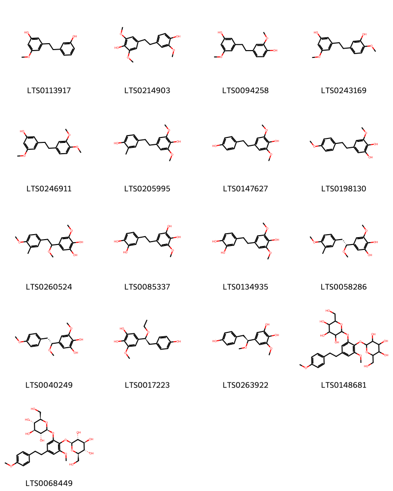{ width=100% }
    <figcaption>Hình ảnh cấu trúc hóa học của 17 hoạt chất thuộc nhóm Stilbenes gồm ['3-[2-(3-hydroxyphenyl)ethyl]-5-methoxyphenol (LTS0113917)', '4-[2-(4-hydroxy-3-methoxyphenyl)ethyl]-2,6-dimethoxyphenol (LTS0214903)', '3-[2-(4-hydroxy-3-methoxyphenyl)ethyl]-5-methoxyphenol (LTS0094258)', '3-[2-(3-hydroxy-4-methoxyphenyl)ethyl]-5-methoxyphenol (LTS0243169)', '3-[2-(3,4-dimethoxyphenyl)ethyl]-5-methoxyphenol (LTS0246911)', '4-[2-(4-hydroxy-3-methylphenyl)ethyl]-2,6-dimethoxyphenol (LTS0205995)', '4-[2-(4-hydroxyphenyl)ethyl]-2,6-dimethoxyphenol (LTS0147627)', '3-methoxy-5-[2-(4-methoxyphenyl)ethyl]benzene-1,2-diol (LTS0198130)', '3-methoxy-5-[1-methoxy-2-(4-methoxy-3-methylphenyl)ethyl]benzene-1,2-diol (LTS0260524)', 'dendrocandin e (LTS0085337)', '4-[2-(4-hydroxy-3,5-dimethoxyphenyl)ethyl]benzene-1,2-diol (LTS0134935)', '3-methoxy-5-[(1r)-1-methoxy-2-(4-methoxy-3-methylphenyl)ethyl]benzene-1,2-diol (LTS0058286)', '3-methoxy-5-[(1r)-1-methoxy-2-(4-methoxyphenyl)ethyl]benzene-1,2-diol (LTS0040249)', 'dendrocandin d (LTS0017223)', 'dendrocandin c (LTS0263922)', '2-(hydroxymethyl)-6-{2-methoxy-4-[2-(4-methoxyphenyl)ethyl]-6-{[3,4,5-trihydroxy-6-(hydroxymethyl)oxan-2-yl]oxy}phenoxy}oxane-3,4,5-triol (LTS0148681)', '(2r,3s,4s,5r,6s)-2-(hydroxymethyl)-6-{2-methoxy-4-[2-(4-methoxyphenyl)ethyl]-6-{[(2s,3r,4s,5s,6r)-3,4,5-trihydroxy-6-(hydroxymethyl)oxan-2-yl]oxy}phenoxy}oxane-3,4,5-triol (LTS0068449)'].</figcaption>
</figure>

---

### Dược dân tộc học

Danh sách các quốc gia có sử dụng *Dendrobium moniliforme* trong điều trị các bệnh. 

| Country   | Disease   | Bệnh                                                                                                                                                                                                |
|:----------|:----------|:----------------------------------------------------------------------------------------------------------------------------------------------------------------------------------------------------|
| Elsewhere | Tonic     | MYMEMORY WARNING: YOU USED ALL AVAILABLE FREE TRANSLATIONS FOR TODAY. NEXT AVAILABLE IN  18 HOURS 09 MINUTES 40 SECONDS VISIT HTTPS://MYMEMORY.TRANSLATED.NET/DOC/USAGELIMITS.PHP TO TRANSLATE MORE |
| Japan     | Tonic     | MYMEMORY WARNING: YOU USED ALL AVAILABLE FREE TRANSLATIONS FOR TODAY. NEXT AVAILABLE IN  18 HOURS 09 MINUTES 36 SECONDS VISIT HTTPS://MYMEMORY.TRANSLATED.NET/DOC/USAGELIMITS.PHP TO TRANSLATE MORE |

---

---
## Dendrobium nobile
### Thông tin về thực vật

!!! info "Phân loại thực vật của *Dendrobium nobile* từ GIBF:"
    - **Kingdom:** Plantae
    - **Phylum:** Tracheophyta
    - **Order:** Asparagales
    - **Family:** Orchidaceae
    - **Genus:** Dendrobium
    - **Species:** *Dendrobium nobile*

 

| Label (VI)   | Label (EN)   | Scientific Name   | Descriptions (VI)   | Descriptions (EN)   | Also Known As (VI)   | Also Known As (EN)   |
|:-------------|:-------------|:------------------|:--------------------|:--------------------|:---------------------|:---------------------|
| N/A          | N/A          | Dendrobium nobile | loài thực vật       | species of plant    | ['']                 | ['Noble Dendrobium'] |

#### Phân bố trên thế giới

**Từ CSDL GIBF** nan, Viet Nam, Colombia, Honduras, unknown or invalid, Bhutan, Myanmar, Brazil, Netherlands, India, Canada, United States of America, China, Australia, Belgium, Korea, Republic of, Chinese Taipei

#### Phân bố tại Việt Nam

**Từ CSDL GIBF**: Cao Bang, Nghe An, Ha Giang, Son La, Kontum, Quang Binh, Kon Tum, Hoa Binh, Lao Cai, Lai Chau

---
### Thành phần hóa học
        
- Theo cơ sở dữ liệu lotus: Từ loài *Dendrobium nobile* đã phân lập và xác định được 111 hoạt chất thuộc về các nhóm Stilbenes, Furanoid lignans, Benzopyrans, Indoles and derivatives, Lactones, Phenanthrenes and derivatives, Tannins, Prenol lipids, Fluorenes, Lignan glycosides, Carboxylic acids and derivatives, Benzene and substituted derivatives. 

|    | chemicalTaxonomyClassyfireClass     |   smiles_count |
|---:|:------------------------------------|---------------:|
|  0 |                                     |              4 |
|  1 | Benzene and substituted derivatives |              1 |
|  2 | Benzopyrans                         |              1 |
|  3 | Carboxylic acids and derivatives    |              1 |
|  4 | Fluorenes                           |              2 |
|  5 | Furanoid lignans                    |              2 |
|  6 | Indoles and derivatives             |             12 |
|  7 | Lactones                            |              3 |
|  8 | Lignan glycosides                   |              2 |
|  9 | Phenanthrenes and derivatives       |             25 |
| 10 | Prenol lipids                       |             45 |
| 11 | Stilbenes                           |             12 |
| 12 | Tannins                             |              1 |

#### Nhóm 
<figure markdown="span">
    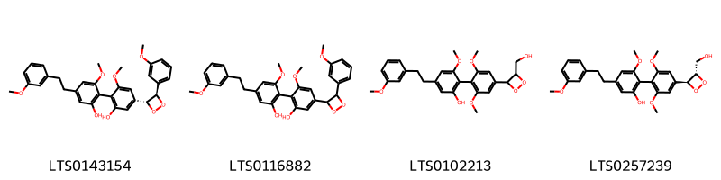{ width=100% }
    <figcaption>Hình ảnh cấu trúc hóa học của 4 hoạt chất thuộc nhóm  gồm ["6,6'-dimethoxy-4-[(3r,4r)-4-(3-methoxyphenyl)-1,2-dioxetan-3-yl]-4'-[2-(3-methoxyphenyl)ethyl]-[1,1'-biphenyl]-2,2'-diol (LTS0143154)", "6,6'-dimethoxy-4-[4-(3-methoxyphenyl)-1,2-dioxetan-3-yl]-4'-[2-(3-methoxyphenyl)ethyl]-[1,1'-biphenyl]-2,2'-diol (LTS0116882)", "4'-[4-(hydroxymethyl)-1,2-dioxetan-3-yl]-2',6,6'-trimethoxy-4-[2-(3-methoxyphenyl)ethyl]-[1,1'-biphenyl]-2-ol (LTS0102213)", "4'-[(3s,4s)-4-(hydroxymethyl)-1,2-dioxetan-3-yl]-2',6,6'-trimethoxy-4-[2-(3-methoxyphenyl)ethyl]-[1,1'-biphenyl]-2-ol (LTS0257239)"].</figcaption>
</figure>
#### Nhóm Benzene and substituted derivatives
<figure markdown="span">
    { width=100% }
    <figcaption>Hình ảnh cấu trúc hóa học của 1 hoạt chất thuộc nhóm Benzene and substituted derivatives gồm ['3,4-dihydroxybenzoic acid (LTS0018765)'].</figcaption>
</figure>
#### Nhóm Benzopyrans
<figure markdown="span">
    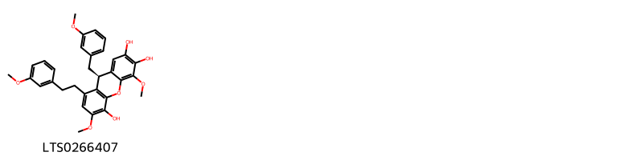{ width=100% }
    <figcaption>Hình ảnh cấu trúc hóa học của 1 hoạt chất thuộc nhóm Benzopyrans gồm ['(9s)-4,6-dimethoxy-8-[2-(3-methoxyphenyl)ethyl]-9-[(3-methoxyphenyl)methyl]-9h-xanthene-2,3,5-triol (LTS0266407)'].</figcaption>
</figure>
#### Nhóm Carboxylic acids and derivatives
<figure markdown="span">
    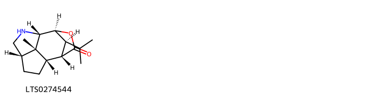{ width=100% }
    <figcaption>Hình ảnh cấu trúc hóa học của 1 hoạt chất thuộc nhóm Carboxylic acids and derivatives gồm ['(1s,4s,7s,8r,11s,12r,13s)-13-isopropyl-12-methyl-10-oxa-2-azatetracyclo[5.4.1.1⁸,¹¹.0⁴,¹²]tridecan-9-one (LTS0274544)'].</figcaption>
</figure>
#### Nhóm Fluorenes
<figure markdown="span">
    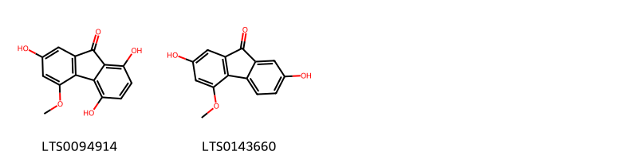{ width=100% }
    <figcaption>Hình ảnh cấu trúc hóa học của 2 hoạt chất thuộc nhóm Fluorenes gồm ['1,4,7-trihydroxy-5-methoxyfluoren-9-one (LTS0094914)', '2,7-dihydroxy-4-methoxyfluoren-9-one (LTS0143660)'].</figcaption>
</figure>
#### Nhóm Furanoid lignans
<figure markdown="span">
    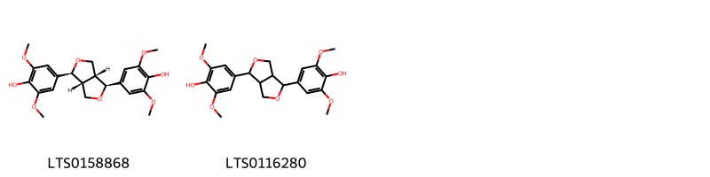{ width=100% }
    <figcaption>Hình ảnh cấu trúc hóa học của 2 hoạt chất thuộc nhóm Furanoid lignans gồm ['(+)-syringaresinol (LTS0158868)', 'syringaresinol (LTS0116280)'].</figcaption>
</figure>
#### Nhóm Indoles and derivatives
<figure markdown="span">
    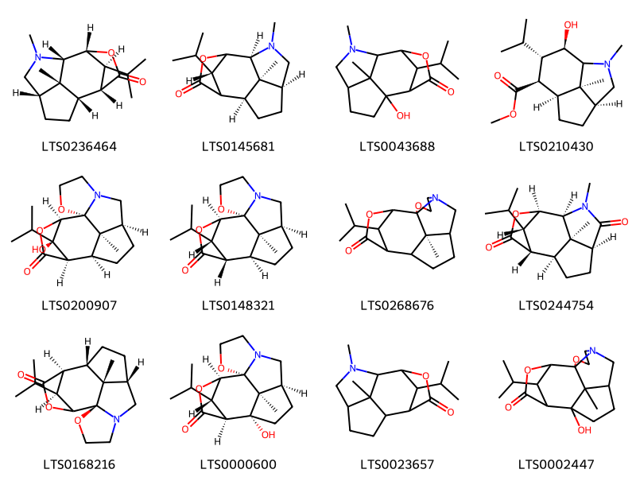{ width=100% }
    <figcaption>Hình ảnh cấu trúc hóa học của 12 hoạt chất thuộc nhóm Indoles and derivatives gồm ['dendrobine (LTS0236464)', '(1s,4s,7s,12r,13s)-13-isopropyl-2,12-dimethyl-10-oxa-2-azatetracyclo[5.4.1.1⁸,¹¹.0⁴,¹²]tridecan-9-one (LTS0145681)', '7-hydroxy-13-isopropyl-2,12-dimethyl-10-oxa-2-azatetracyclo[5.4.1.1⁸,¹¹.0⁴,¹²]tridecan-9-one (LTS0043688)', 'methyl (4s,7s,8r,9s,10r,11r)-10-hydroxy-9-isopropyl-2,11-dimethyl-2-azatricyclo[5.3.1.0⁴,¹¹]undecane-8-carboxylate (LTS0210430)', '(1r,2r,5r,6s,9s,15r,16r)-16-hydroxy-16-isopropyl-15-methyl-3,14-dioxa-11-azapentacyclo[7.5.1.1²,⁵.0¹,¹¹.0⁶,¹⁵]hexadecan-4-one (LTS0200907)', '(1r,2r,5s,6s,9s,15r,16s)-16-isopropyl-15-methyl-3,14-dioxa-11-azapentacyclo[7.5.1.1²,⁵.0¹,¹¹.0⁶,¹⁵]hexadecan-4-one (LTS0148321)', '(1r,15r)-16-isopropyl-15-methyl-3,14-dioxa-11-azapentacyclo[7.5.1.1²,⁵.0¹,¹¹.0⁶,¹⁵]hexadecan-4-one (LTS0268676)', '(1s,4s,7s,8s,11r,12r,13s)-13-isopropyl-2,12-dimethyl-10-oxa-2-azatetracyclo[5.4.1.1⁸,¹¹.0⁴,¹²]tridecane-3,9-dione (LTS0244754)', '(1r,5s,6s,9s,15r,16s)-16-isopropyl-15-methyl-3,14-dioxa-11-azapentacyclo[7.5.1.1²,⁵.0¹,¹¹.0⁶,¹⁵]hexadecan-4-one (LTS0168216)', '(1r,2r,5s,6r,9s,15s,16s)-6-hydroxy-16-isopropyl-15-methyl-3,14-dioxa-11-azapentacyclo[7.5.1.1²,⁵.0¹,¹¹.0⁶,¹⁵]hexadecan-4-one (LTS0000600)', '13-isopropyl-2,12-dimethyl-10-oxa-2-azatetracyclo[5.4.1.1⁸,¹¹.0⁴,¹²]tridecan-9-one (LTS0023657)', '6-hydroxy-16-isopropyl-15-methyl-3,14-dioxa-11-azapentacyclo[7.5.1.1²,⁵.0¹,¹¹.0⁶,¹⁵]hexadecan-4-one (LTS0002447)'].</figcaption>
</figure>
#### Nhóm Lactones
<figure markdown="span">
    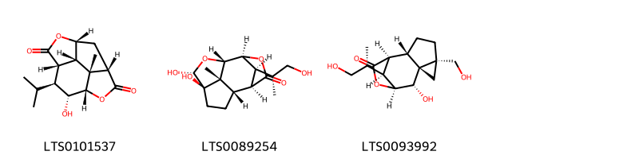{ width=100% }
    <figcaption>Hình ảnh cấu trúc hóa học của 3 hoạt chất thuộc nhóm Lactones gồm ['flakinin a (LTS0101537)', '(1s,3r,4r,7s,8s,11s,12s,13s)-3,4-dihydroxy-13-[(2r)-1-hydroxypropan-2-yl]-12-methyl-2,10-dioxatetracyclo[5.4.1.1⁸,¹¹.0⁴,¹²]tridecan-9-one (LTS0089254)', '(1s,2s,5r,7r,8s,9s,12s)-8-hydroxy-5-(hydroxymethyl)-12-[(2r)-1-hydroxypropan-2-yl]-10-oxatetracyclo[7.2.1.0²,⁷.0⁵,⁷]dodecan-11-one (LTS0093992)'].</figcaption>
</figure>
#### Nhóm Lignan glycosides
<figure markdown="span">
    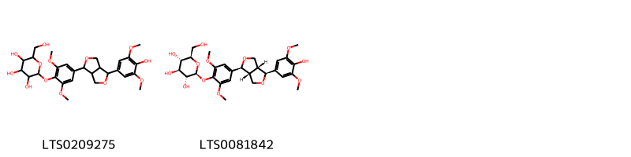{ width=100% }
    <figcaption>Hình ảnh cấu trúc hóa học của 2 hoạt chất thuộc nhóm Lignan glycosides gồm ['2-{4-[4-(4-hydroxy-3,5-dimethoxyphenyl)-hexahydrofuro[3,4-c]furan-1-yl]-2,6-dimethoxyphenoxy}-6-(hydroxymethyl)oxane-3,4,5-triol (LTS0209275)', 'acanthoside b (LTS0081842)'].</figcaption>
</figure>
#### Nhóm Phenanthrenes and derivatives
<figure markdown="span">
    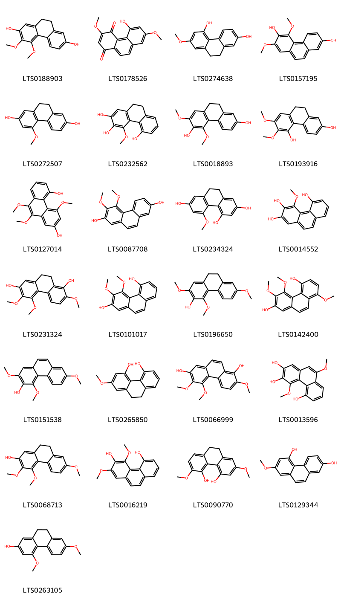{ width=100% }
    <figcaption>Hình ảnh cấu trúc hóa học của 25 hoạt chất thuộc nhóm Phenanthrenes and derivatives gồm ['3,4-dimethoxy-9,10-dihydrophenanthrene-2,7-diol (LTS0188903)', '5-hydroxy-3,7-dimethoxyphenanthrene-1,4-dione (LTS0178526)', '7-methoxy-9,10-dihydrophenanthrene-2,5-diol (LTS0274638)', '5,7-dimethoxyphenanthrene-2,6-diol (LTS0157195)', '4-methoxy-9,10-dihydrophenanthrene-2,7-diol (LTS0272507)', '4-methoxy-9,10-dihydrophenanthrene-2,3,5-triol (LTS0232562)', '5,7-dimethoxy-9,10-dihydrophenanthrene-2,6-diol (LTS0018893)', '6,7-dimethoxy-9,10-dihydrophenanthrene-2,5-diol (LTS0193916)', 'plicatol a (LTS0127014)', 'nudol (LTS0087708)', '5-methoxy-9,10-dihydrophenanthrene-2,4,7-triol (LTS0234324)', '4-methoxyphenanthrene-2,3,5-triol (LTS0014552)', '2,5,6-trimethoxy-9,10-dihydrophenanthrene-1,7-diol (LTS0231324)', '3,4-dimethoxyphenanthrene-2,5-diol (LTS0101017)', '2,4,7-trimethoxy-9,10-dihydrophenanthren-3-ol (LTS0196650)', '3,4,8-trimethoxyphenanthrene-2,5-diol (LTS0142400)', '2,4,7-trimethoxyphenanthren-3-ol (LTS0151538)', '2-methoxy-9,10-dihydrophenanthrene-4,5-diol (LTS0265850)', '2,5,6-trimethoxyphenanthrene-1,7-diol (LTS0066999)', '4,9-dimethoxyphenanthrene-2,3,5-triol (LTS0013596)', '3,4,7-trimethoxy-9,10-dihydrophenanthren-2-ol (LTS0068713)', '2,4-dimethoxyphenanthrene-3,5-diol (LTS0016219)', '2,6-dimethoxy-9,10-dihydrophenanthrene-4,5-diol (LTS0090770)', '7-methoxyphenanthrene-2,5-diol (LTS0129344)', '4,7-dimethoxy-9,10-dihydrophenanthren-2-ol (LTS0263105)'].</figcaption>
</figure>
#### Nhóm Prenol lipids
<figure markdown="span">
    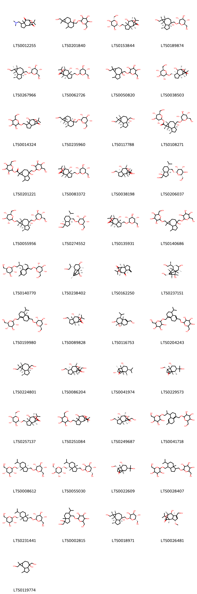{ width=100% }
    <figcaption>Hình ảnh cấu trúc hóa học của 45 hoạt chất thuộc nhóm Prenol lipids gồm ['5-[(dimethylamino)methyl]-11-isopropyl-6-methyl-9-oxatricyclo[6.2.1.0²,⁶]undecane-7,10-dione (LTS0012255)', '2-{[4-hydroxy-1-(hydroxymethyl)-1,7-dimethyl-octahydro-1ah-cyclopropa[a]naphthalen-4-yl]methoxy}-6-(hydroxymethyl)oxane-3,4,5-triol (LTS0201840)', '(1s,2s,5r,6r,7r,8s,11s)-7-hydroxy-11-isopropyl-6-methyl-5-({[(2s,3s,4r,5r,6s)-3,4,5-trihydroxy-6-(hydroxymethyl)oxan-2-yl]oxy}methyl)-9-oxatricyclo[6.2.1.0²,⁶]undecan-10-one (LTS0153844)', '(2r,3r,4s,5s,6r)-2-{[(1r,1ar,4s,4as,7r,7as,7bs)-4-hydroxy-1-(hydroxymethyl)-1,7-dimethyl-octahydro-1ah-cyclopropa[e]azulen-4-yl]methoxy}-6-(hydroxymethyl)oxane-3,4,5-triol (LTS0189874)', '(2r,3r,4s,5s,6r)-2-{[(1s,1ar,4s,4as,7r,7as,7bs)-4-hydroxy-1-(hydroxymethyl)-1,7-dimethyl-octahydro-1ah-cyclopropa[e]azulen-4-yl]methoxy}-6-(hydroxymethyl)oxane-3,4,5-triol (LTS0267966)', '(1s,2s,5s,6s,7r,8s,11r)-7-hydroxy-11-isopropyl-6-methyl-5-({[(2r,3r,4s,5s,6r)-3,4,5-trihydroxy-6-(hydroxymethyl)oxan-2-yl]oxy}methyl)-9-oxatricyclo[6.2.1.0²,⁶]undecan-10-one (LTS0062726)', '2-{[4-hydroxy-1-(hydroxymethyl)-1,7-dimethyl-octahydro-1ah-cyclopropa[e]azulen-4-yl]methoxy}-6-(hydroxymethyl)oxane-3,4,5-triol (LTS0050820)', '(1s,2r,5s,6s,7r,8s,11r)-7-hydroxy-11-isopropyl-6-methyl-5-({[(2r,3r,4s,5s,6r)-3,4,5-trihydroxy-6-(hydroxymethyl)oxan-2-yl]oxy}methyl)-9-oxatricyclo[6.2.1.0²,⁶]undecan-10-one (LTS0038503)', '7-hydroxy-11-isopropyl-6-methyl-5-({[3,4,5-trihydroxy-6-(hydroxymethyl)oxan-2-yl]oxy}methyl)-9-oxatricyclo[6.2.1.0²,⁶]undecan-10-one (LTS0014324)', '(2r,3r,4s,5s,6r)-2-{[(1s,1ar,3ar,4s,7r,7as,7bs)-4-hydroxy-1-(hydroxymethyl)-1,7-dimethyl-octahydro-1ah-cyclopropa[a]naphthalen-4-yl]methoxy}-6-(hydroxymethyl)oxane-3,4,5-triol (LTS0235960)', '(1r,1ar,4s,4as,7r,7as,7bs)-1,4-bis(hydroxymethyl)-1,7-dimethyl-octahydro-1ah-cyclopropa[e]azulen-4-ol (LTS0117788)', '(2s,3r,4s,5s,6r)-3,4,5-trihydroxy-6-(hydroxymethyl)oxan-2-yl (1r,1ar,4s,4as,7r,7as,7bs)-4-hydroxy-1,7-dimethyl-4-({[(2r,3r,4s,5s,6r)-3,4,5-trihydroxy-6-(hydroxymethyl)oxan-2-yl]oxy}methyl)-octahydro-1ah-cyclopropa[e]azulene-1-carboxylate (LTS0108271)', '3,4,5-trihydroxy-6-(hydroxymethyl)oxan-2-yl 4-hydroxy-1,7-dimethyl-4-({[3,4,5-trihydroxy-6-(hydroxymethyl)oxan-2-yl]oxy}methyl)-octahydro-1ah-cyclopropa[e]azulene-1-carboxylate (LTS0201221)', '(1s,2r,5s,6s,7r,8r,11s)-7,11-dihydroxy-11-isopropyl-6-methyl-5-({[(2r,3r,4s,5s,6r)-3,4,5-trihydroxy-6-(hydroxymethyl)oxan-2-yl]oxy}methyl)-9-oxatricyclo[6.2.1.0²,⁶]undecan-10-one (LTS0083372)', '(1r,2s,5r,6s,7s,8r,11s)-7-hydroxy-5-(hydroxymethyl)-11-(2-hydroxypropan-2-yl)-6-methyl-9-oxatricyclo[6.2.1.0²,⁶]undecan-10-one (LTS0038198)', '(2s,3r,4r,5r,6s)-2-{[(1r,3ar,4r,5r,7as)-1-hydroxy-1-(hydroxymethyl)-5-isopropyl-7a-methyl-hexahydro-2h-inden-4-yl]methoxy}-6-(hydroxymethyl)oxane-3,4,5-triol (LTS0206037)', '(2r,3r,4s,5s,6r)-2-{[(1r,1ar,4s,4as,7r,7as,7bs)-4-hydroxy-1,7-dimethyl-1-({[(2r,3r,4s,5s,6r)-3,4,5-trihydroxy-6-(hydroxymethyl)oxan-2-yl]oxy}methyl)-octahydro-1ah-cyclopropa[e]azulen-4-yl]methoxy}-6-(hydroxymethyl)oxane-3,4,5-triol (LTS0055956)', '(2r,3r,4s,5s,6r)-2-{[(1r,3ar,4r,5r,7as)-1-hydroxy-1-(hydroxymethyl)-5-isopropyl-7a-methyl-hexahydro-2h-inden-4-yl]methoxy}-6-(hydroxymethyl)oxane-3,4,5-triol (LTS0274552)', '(1s,2s,5s,6s,7r,8r,11s)-7,11-dihydroxy-11-isopropyl-6-methyl-5-({[(2r,3r,4s,5s,6r)-3,4,5-trihydroxy-6-(hydroxymethyl)oxan-2-yl]oxy}methyl)-9-oxatricyclo[6.2.1.0²,⁶]undecan-10-one (LTS0135931)', '2-{[4-hydroxy-1,7-dimethyl-1-({[3,4,5-trihydroxy-6-(hydroxymethyl)oxan-2-yl]oxy}methyl)-octahydro-1ah-cyclopropa[e]azulen-4-yl]methoxy}-6-(hydroxymethyl)oxane-3,4,5-triol (LTS0140686)', '(2r,3r,4s,5s,6r)-2-{[(4r,4ar)-6-methyl-4-[(2s)-1-{[(2r,3r,4s,5s,6r)-3,4,5-trihydroxy-6-(hydroxymethyl)oxan-2-yl]oxy}propan-2-yl]-2,3,4,4a,7,8-hexahydronaphthalen-1-yl]methoxy}-6-(hydroxymethyl)oxane-3,4,5-triol (LTS0140770)', 'dendrobane a (LTS0238402)', '(1s,2s,6s,8s,11s)-11-isopropyl-6-methyl-5-methylidene-9-oxatricyclo[6.2.1.0²,⁶]undecane-7,10-dione (LTS0162250)', '(1s,2r,3s,4s,5r,6r,7s,8r,10r)-3-(hydroxymethyl)-10-[(2s)-1-hydroxypropan-2-yl]-7-methyltetracyclo[4.4.0.0²,⁴.0³,⁷]decane-5,8-diol (LTS0237151)', '(2r,3r,4s,5s,6r)-2-{[(4s,4ar)-4-isopropyl-6-({[(2r,3r,4s,5s,6r)-3,4,5-trihydroxy-6-(hydroxymethyl)oxan-2-yl]oxy}methyl)-2,3,4,4a,7,8-hexahydronaphthalen-1-yl]methoxy}-6-(hydroxymethyl)oxane-3,4,5-triol (LTS0159980)', '(1s,2s,5r,6r,7s,8r,11r)-7,11-dihydroxy-5-(hydroxymethyl)-11-isopropyl-6-methyl-9-oxatricyclo[6.2.1.0²,⁶]undecan-10-one (LTS0089828)', '(1s,2s,4s,4ar,8as)-6-(hydroxymethyl)-4-isopropyl-1-methyl-3,4,4a,7,8,8a-hexahydro-2h-naphthalene-1,2-diol (LTS0116753)', '2-(hydroxymethyl)-6-{[4-isopropyl-6-({[3,4,5-trihydroxy-6-(hydroxymethyl)oxan-2-yl]oxy}methyl)-2,3,4,4a,7,8-hexahydronaphthalen-1-yl]methoxy}oxane-3,4,5-triol (LTS0204243)', '(1r,1ar,4r,4as,7r,7as,7bs)-1,4-bis(hydroxymethyl)-1,7-dimethyl-octahydro-1ah-cyclopropa[e]azulen-4-ol (LTS0224801)', '(1r,2s,5r,6s,7s,8r,11r)-11-[(2r)-1,2-dihydroxypropan-2-yl]-7-hydroxy-5-(hydroxymethyl)-6-methyl-9-oxatricyclo[6.2.1.0²,⁶]undecan-10-one (LTS0086204)', '(1s,2r,3r,5s,6s,8r,9s)-3,9-dihydroxy-5-isopropyl-2,8-dimethyltricyclo[4.4.0.0²,⁸]decan-7-one (LTS0041974)', '(1s,2r,3r,5r,6s,8s)-3-hydroxy-8-(hydroxymethyl)-5-(2-hydroxypropan-2-yl)-2-methyltricyclo[4.4.0.0²,⁸]decan-7-one (LTS0229573)', '(1s,2s,5r,6r,7r,8r,11s)-7,11-dihydroxy-11-isopropyl-6-methyl-5-({[(2s,3s,4r,5r,6s)-3,4,5-trihydroxy-6-(hydroxymethyl)oxan-2-yl]oxy}methyl)-9-oxatricyclo[6.2.1.0²,⁶]undecan-10-one (LTS0257137)', '7,11-dihydroxy-11-isopropyl-6-methyl-5-({[3,4,5-trihydroxy-6-(hydroxymethyl)oxan-2-yl]oxy}methyl)-9-oxatricyclo[6.2.1.0²,⁶]undecan-10-one (LTS0251084)', '(1s,2s,5r,6r,7s,8s,11s)-7-hydroxy-5-(hydroxymethyl)-11-[(2r)-1-hydroxypropan-2-yl]-6-methyl-9-oxatricyclo[6.2.1.0²,⁶]undecan-10-one (LTS0249687)', '2-(hydroxymethyl)-6-{[6-methyl-4-(1-{[3,4,5-trihydroxy-6-(hydroxymethyl)oxan-2-yl]oxy}propan-2-yl)-2,3,4,4a,7,8-hexahydronaphthalen-1-yl]methoxy}oxane-3,4,5-triol (LTS0041718)', '(2r,3r,4s,5s,6r)-2-{[(1s,3ar,4r,5r,7ar)-5-isopropyl-7a-methyl-4-({[(2r,3r,4s,5s,6r)-3,4,5-trihydroxy-6-(hydroxymethyl)oxan-2-yl]oxy}methyl)-octahydroinden-1-yl]methoxy}-6-(hydroxymethyl)oxane-3,4,5-triol (LTS0008612)', '(2r,3s,4s,5s,6s)-2-{[(1s,3ar,4r,5r,7as)-5-isopropyl-7a-methyl-4-({[(2s,3r,4r,5r,6s)-3,4,5-trihydroxy-6-(hydroxymethyl)oxan-2-yl]oxy}methyl)-octahydroinden-1-yl]methoxy}-6-(hydroxymethyl)oxane-3,4,5-triol (LTS0055030)', '(1s,2r,3r,5r,8s)-3-hydroxy-8-(hydroxymethyl)-5-(2-hydroxypropan-2-yl)-2-methyltricyclo[4.4.0.0²,⁸]decan-7-one (LTS0022609)', '2-(hydroxymethyl)-6-{[5-isopropyl-7a-methyl-4-({[3,4,5-trihydroxy-6-(hydroxymethyl)oxan-2-yl]oxy}methyl)-octahydroinden-1-yl]methoxy}oxane-3,4,5-triol (LTS0028407)', '(2r,3r,4s,5s,6r)-2-{[(1s,3ar,4r,5r,7as)-5-isopropyl-7a-methyl-4-({[(2r,3r,4s,5s,6r)-3,4,5-trihydroxy-6-(hydroxymethyl)oxan-2-yl]oxy}methyl)-octahydroinden-1-yl]methoxy}-6-(hydroxymethyl)oxane-3,4,5-triol (LTS0231441)', '2-{[1-hydroxy-1-(hydroxymethyl)-5-isopropyl-7a-methyl-hexahydro-2h-inden-4-yl]methoxy}-6-(hydroxymethyl)oxane-3,4,5-triol (LTS0002815)', '(2r,3s,4s,5s,6s)-2-{[(1r,1ar,4s,4as,7r,7as,7bs)-4-hydroxy-1-(hydroxymethyl)-1,7-dimethyl-octahydro-1ah-cyclopropa[e]azulen-4-yl]methoxy}-6-(hydroxymethyl)oxane-3,4,5-triol (LTS0018971)', '(1s,3s,6r,7s,8s,11s)-7-hydroxy-5-(hydroxymethyl)-11-isopropyl-3-methoxy-6-methyl-9-oxatricyclo[6.2.1.0²,⁶]undec-4-en-10-one (LTS0026481)', '1,4-bis(hydroxymethyl)-1,7-dimethyl-octahydro-1ah-cyclopropa[e]azulen-4-ol (LTS0119774)'].</figcaption>
</figure>
#### Nhóm Stilbenes
<figure markdown="span">
    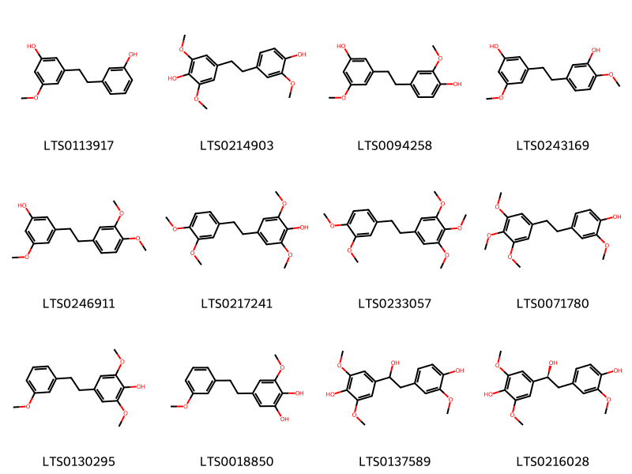{ width=100% }
    <figcaption>Hình ảnh cấu trúc hóa học của 12 hoạt chất thuộc nhóm Stilbenes gồm ['3-[2-(3-hydroxyphenyl)ethyl]-5-methoxyphenol (LTS0113917)', '4-[2-(4-hydroxy-3-methoxyphenyl)ethyl]-2,6-dimethoxyphenol (LTS0214903)', '3-[2-(4-hydroxy-3-methoxyphenyl)ethyl]-5-methoxyphenol (LTS0094258)', '3-[2-(3-hydroxy-4-methoxyphenyl)ethyl]-5-methoxyphenol (LTS0243169)', '3-[2-(3,4-dimethoxyphenyl)ethyl]-5-methoxyphenol (LTS0246911)', '4-[2-(3,4-dimethoxyphenyl)ethyl]-2,6-dimethoxyphenol (LTS0217241)', '5-[2-(3,4-dimethoxyphenyl)ethyl]-1,2,3-trimethoxybenzene (LTS0233057)', '2-methoxy-4-[2-(3,4,5-trimethoxyphenyl)ethyl]phenol (LTS0071780)', '2,6-dimethoxy-4-[2-(3-methoxyphenyl)ethyl]phenol (LTS0130295)', '3-methoxy-5-[2-(3-methoxyphenyl)ethyl]benzene-1,2-diol (LTS0018850)', '4-[1-hydroxy-2-(4-hydroxy-3-methoxyphenyl)ethyl]-2,6-dimethoxyphenol (LTS0137589)', '4-[(1s)-1-hydroxy-2-(4-hydroxy-3-methoxyphenyl)ethyl]-2,6-dimethoxyphenol (LTS0216028)'].</figcaption>
</figure>
#### Nhóm Tannins
<figure markdown="span">
    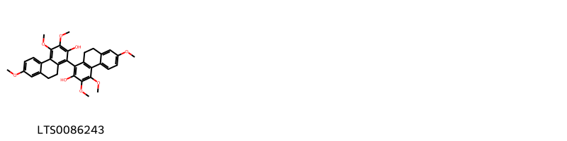{ width=100% }
    <figcaption>Hình ảnh cấu trúc hóa học của 1 hoạt chất thuộc nhóm Tannins gồm ["3,3',4,4',7,7'-hexamethoxy-9h,9'h,10h,10'h-[1,1'-biphenanthrene]-2,2'-diol (LTS0086243)"].</figcaption>
</figure>

---

### Dược dân tộc học

Danh sách các quốc gia có sử dụng *Dendrobium nobile* trong điều trị các bệnh. 

| Country   | Disease                                                                       | Bệnh                                                                                                                                                                                                |
|:----------|:------------------------------------------------------------------------------|:----------------------------------------------------------------------------------------------------------------------------------------------------------------------------------------------------|
| China     | Antiphlogistic, Sedative, Sialogogue, Stomachic, Stomachic, Tonic, Sialogogue | MYMEMORY WARNING: YOU USED ALL AVAILABLE FREE TRANSLATIONS FOR TODAY. NEXT AVAILABLE IN  18 HOURS 08 MINUTES 21 SECONDS VISIT HTTPS://MYMEMORY.TRANSLATED.NET/DOC/USAGELIMITS.PHP TO TRANSLATE MORE |
| Chinese   | Stomachic, Tonic                                                              | MYMEMORY WARNING: YOU USED ALL AVAILABLE FREE TRANSLATIONS FOR TODAY. NEXT AVAILABLE IN  18 HOURS 08 MINUTES 18 SECONDS VISIT HTTPS://MYMEMORY.TRANSLATED.NET/DOC/USAGELIMITS.PHP TO TRANSLATE MORE |
| Elsewhere | Tonic                                                                         | MYMEMORY WARNING: YOU USED ALL AVAILABLE FREE TRANSLATIONS FOR TODAY. NEXT AVAILABLE IN  18 HOURS 08 MINUTES 15 SECONDS VISIT HTTPS://MYMEMORY.TRANSLATED.NET/DOC/USAGELIMITS.PHP TO TRANSLATE MORE |

---

---
## Dendrobium purpureum
### Thông tin về thực vật

!!! info "Phân loại thực vật của *Dendrobium purpureum* từ GIBF:"
    - **Kingdom:** Plantae
    - **Phylum:** Tracheophyta
    - **Order:** Asparagales
    - **Family:** Orchidaceae
    - **Genus:** Dendrobium
    - **Species:** *Dendrobium purpureum*

 

| Label (VI)   | Label (EN)   | Scientific Name      | Descriptions (VI)   | Descriptions (EN)   | Also Known As (VI)   | Also Known As (EN)   |
|:-------------|:-------------|:---------------------|:--------------------|:--------------------|:---------------------|:---------------------|
| N/A          | N/A          | Dendrobium purpureum | loài thực vật       | species of plant    | ['']                 | ['']                 |

#### Phân bố trên thế giới

**Từ CSDL GIBF** nan, United Kingdom of Great Britain and Northern Ireland, Vanuatu, French Polynesia, Fiji, Papua New Guinea, Solomon Islands, Indonesia

#### Phân bố tại Việt Nam

**Từ CSDL GIBF**: Không có ghi nhận ở Việt Nam

---
### Thành phần hóa học
        
- Theo cơ sở dữ liệu lotus: Từ loài *Dendrobium purpureum* đã phân lập và xác định được Chưa có hoạt chất nào được phân lập. hoạt chất thuộc về các nhóm Không có hoạt chất nào được phân lập. 

Không có hình ảnh nào được tạo ra

---

### Dược dân tộc học

Danh sách các quốc gia có sử dụng *Dendrobium purpureum* trong điều trị các bệnh. 

| Country   | Disease   | Bệnh                                                                                                                                                                                                |
|:----------|:----------|:----------------------------------------------------------------------------------------------------------------------------------------------------------------------------------------------------|
| Malaysia  | Poultice  | MYMEMORY WARNING: YOU USED ALL AVAILABLE FREE TRANSLATIONS FOR TODAY. NEXT AVAILABLE IN  18 HOURS 07 MINUTES 32 SECONDS VISIT HTTPS://MYMEMORY.TRANSLATED.NET/DOC/USAGELIMITS.PHP TO TRANSLATE MORE |

---

# Chi Grammatophyllum

??? note "Danh sách các dược liệu thuộc chi"
    
	 - *Grammatophyllum scriptum*

---
## Grammatophyllum scriptum
### Thông tin về thực vật

!!! info "Phân loại thực vật của *Grammatophyllum scriptum* từ GIBF:"
    - **Kingdom:** Plantae
    - **Phylum:** Tracheophyta
    - **Order:** Asparagales
    - **Family:** Orchidaceae
    - **Genus:** Grammatophyllum
    - **Species:** *Grammatophyllum scriptum*

 

| Label (VI)   | Label (EN)   | Scientific Name          | Descriptions (VI)   | Descriptions (EN)   | Also Known As (VI)   | Also Known As (EN)   |
|:-------------|:-------------|:-------------------------|:--------------------|:--------------------|:---------------------|:---------------------|
| N/A          | N/A          | Grammatophyllum scriptum | loài thực vật       | species of plant    | ['']                 | ['']                 |

#### Phân bố trên thế giới

**Từ CSDL GIBF** Guatemala, nan, unknown or invalid, Argentina, El Salvador, Brunei Darussalam, Myanmar, Viet Nam, Philippines, Puerto Rico, Cook Islands, Fiji, Papua New Guinea, Costa Rica, Mexico, Solomon Islands, Indonesia

#### Phân bố tại Việt Nam

**Từ CSDL GIBF**: Không có ghi nhận ở Việt Nam

---
### Thành phần hóa học
        
- Theo cơ sở dữ liệu lotus: Từ loài *Grammatophyllum scriptum* đã phân lập và xác định được Chưa có hoạt chất nào được phân lập. hoạt chất thuộc về các nhóm Không có hoạt chất nào được phân lập. 

Không có hình ảnh nào được tạo ra

---

### Dược dân tộc học

Danh sách các quốc gia có sử dụng *Grammatophyllum scriptum* trong điều trị các bệnh. 

| Country   | Disease     | Bệnh                                                                                                                                                                                                |
|:----------|:------------|:----------------------------------------------------------------------------------------------------------------------------------------------------------------------------------------------------|
| Amboina   | Vermifuge   | MYMEMORY WARNING: YOU USED ALL AVAILABLE FREE TRANSLATIONS FOR TODAY. NEXT AVAILABLE IN  18 HOURS 07 MINUTES 13 SECONDS VISIT HTTPS://MYMEMORY.TRANSLATED.NET/DOC/USAGELIMITS.PHP TO TRANSLATE MORE |
| Elsewhere | Aphrodisiac | MYMEMORY WARNING: YOU USED ALL AVAILABLE FREE TRANSLATIONS FOR TODAY. NEXT AVAILABLE IN  18 HOURS 07 MINUTES 10 SECONDS VISIT HTTPS://MYMEMORY.TRANSLATED.NET/DOC/USAGELIMITS.PHP TO TRANSLATE MORE |

---

# Chi Cymbidium

??? note "Danh sách các dược liệu thuộc chi"
    
	 - *Cymbidium aloifolium*
	 - *Cymbidium ensifolium*
	 - *Cymbidium finlaysonianum*

---
## Cymbidium aloifolium
### Thông tin về thực vật

!!! info "Phân loại thực vật của *Cymbidium aloifolium* từ GIBF:"
    - **Kingdom:** Plantae
    - **Phylum:** Tracheophyta
    - **Order:** Asparagales
    - **Family:** Orchidaceae
    - **Genus:** Cymbidium
    - **Species:** *Cymbidium aloifolium*

 

| Label (VI)   | Label (EN)   | Scientific Name      | Descriptions (VI)   | Descriptions (EN)   | Also Known As (VI)       | Also Known As (EN)        |
|:-------------|:-------------|:---------------------|:--------------------|:--------------------|:-------------------------|:--------------------------|
| N/A          | N/A          | Cymbidium aloifolium | loài thực vật       | species of plant    | ['Cymbidium aloifolium'] | ['Aloe-leafed Cymbidium'] |

#### Phân bố trên thế giới

**Từ CSDL GIBF** Viet Nam, nan, unknown or invalid, Sri Lanka, Thailand, Myanmar, India, Paraguay, Lao People’s Democratic Republic, Bangladesh, United States of America, China, Nepal, Belgium, Netherlands, Hong Kong, Indonesia

#### Phân bố tại Việt Nam

**Từ CSDL GIBF**: Cao Bang, Nghe An, Thanh Hoa, Ninh Bình, Hải Phòng, Tay Ninh, Kontum, Binh Phuoc, Ninh Binh, Quang Binh, Dak Lak, Ninh Thuan, Thua Thien-Hue, Hoa Binh, Thai Nguyen, Lang Son

---
### Thành phần hóa học
        
- Theo cơ sở dữ liệu lotus: Từ loài *Cymbidium aloifolium* đã phân lập và xác định được 16 hoạt chất thuộc về các nhóm Stilbenes, Phenanthrenes and derivatives, Prenol lipids, Carboxylic acids and derivatives, Steroids and steroid derivatives. 

|    | chemicalTaxonomyClassyfireClass   |   smiles_count |
|---:|:----------------------------------|---------------:|
|  0 | Carboxylic acids and derivatives  |              1 |
|  1 | Phenanthrenes and derivatives     |              7 |
|  2 | Prenol lipids                     |              1 |
|  3 | Steroids and steroid derivatives  |              2 |
|  4 | Stilbenes                         |              5 |

#### Nhóm Carboxylic acids and derivatives
<figure markdown="span">
    { width=100% }
    <figcaption>Hình ảnh cấu trúc hóa học của 1 hoạt chất thuộc nhóm Carboxylic acids and derivatives gồm ['(3s,6s)-3-{[5,7-bis(3-methylbut-2-en-1-yl)-2-(2-methylbut-3-en-2-yl)-1h-indol-3-yl]methyl}-6-methyl-3,6-dihydropyrazine-2,5-diol (LTS0256362)'].</figcaption>
</figure>
#### Nhóm Phenanthrenes and derivatives
<figure markdown="span">
    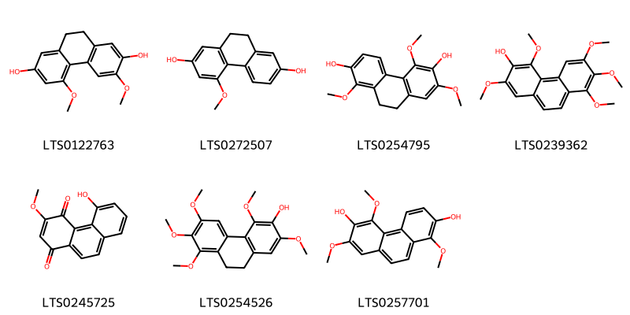{ width=100% }
    <figcaption>Hình ảnh cấu trúc hóa học của 7 hoạt chất thuộc nhóm Phenanthrenes and derivatives gồm ['3,5-dimethoxy-9,10-dihydrophenanthrene-2,7-diol (LTS0122763)', '4-methoxy-9,10-dihydrophenanthrene-2,7-diol (LTS0272507)', '1,5,7-trimethoxy-9,10-dihydrophenanthrene-2,6-diol (LTS0254795)', '2,4,6,7,8-pentamethoxyphenanthren-3-ol (LTS0239362)', '5-hydroxy-3-methoxyphenanthrene-1,4-dione (LTS0245725)', '2,4,6,7,8-pentamethoxy-9,10-dihydrophenanthren-3-ol (LTS0254526)', '1,5,7-trimethoxyphenanthrene-2,6-diol (LTS0257701)'].</figcaption>
</figure>
#### Nhóm Prenol lipids
<figure markdown="span">
    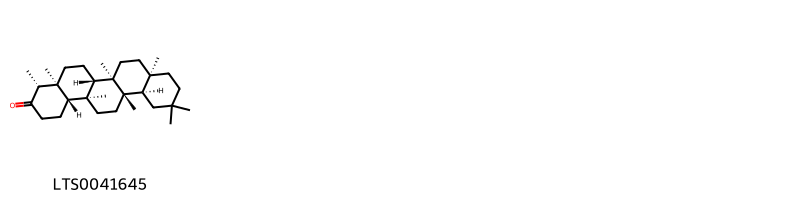{ width=100% }
    <figcaption>Hình ảnh cấu trúc hóa học của 1 hoạt chất thuộc nhóm Prenol lipids gồm ['(-)-friedelin (LTS0041645)'].</figcaption>
</figure>
#### Nhóm Steroids and steroid derivatives
<figure markdown="span">
    { width=100% }
    <figcaption>Hình ảnh cấu trúc hóa học của 2 hoạt chất thuộc nhóm Steroids and steroid derivatives gồm ['stigmast-5-en-3-ol (LTS0071224)', 'stigmast-5-en-3-ol, (3β)- (LTS0204616)'].</figcaption>
</figure>
#### Nhóm Stilbenes
<figure markdown="span">
    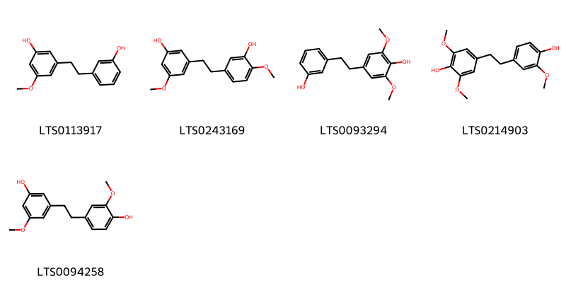{ width=100% }
    <figcaption>Hình ảnh cấu trúc hóa học của 5 hoạt chất thuộc nhóm Stilbenes gồm ['3-[2-(3-hydroxyphenyl)ethyl]-5-methoxyphenol (LTS0113917)', '3-[2-(3-hydroxy-4-methoxyphenyl)ethyl]-5-methoxyphenol (LTS0243169)', '4-[2-(3-hydroxyphenyl)ethyl]-2,6-dimethoxyphenol (LTS0093294)', '4-[2-(4-hydroxy-3-methoxyphenyl)ethyl]-2,6-dimethoxyphenol (LTS0214903)', '3-[2-(4-hydroxy-3-methoxyphenyl)ethyl]-5-methoxyphenol (LTS0094258)'].</figcaption>
</figure>

---

### Dược dân tộc học

Danh sách các quốc gia có sử dụng *Cymbidium aloifolium* trong điều trị các bệnh. 

| Country   | Disease                      | Bệnh                                                                                                                                                                                                |
|:----------|:-----------------------------|:----------------------------------------------------------------------------------------------------------------------------------------------------------------------------------------------------|
| Elsewhere | Emetic, Purgative, Demulcent | MYMEMORY WARNING: YOU USED ALL AVAILABLE FREE TRANSLATIONS FOR TODAY. NEXT AVAILABLE IN  18 HOURS 06 MINUTES 49 SECONDS VISIT HTTPS://MYMEMORY.TRANSLATED.NET/DOC/USAGELIMITS.PHP TO TRANSLATE MORE |

---

---
## Cymbidium ensifolium
### Thông tin về thực vật

!!! info "Phân loại thực vật của *Cymbidium ensifolium* từ GIBF:"
    - **Kingdom:** Plantae
    - **Phylum:** Tracheophyta
    - **Order:** Asparagales
    - **Family:** Orchidaceae
    - **Genus:** Cymbidium
    - **Species:** *Cymbidium ensifolium*

 

| Label (VI)   | Label (EN)   | Scientific Name      | Descriptions (VI)   | Descriptions (EN)   | Also Known As (VI)       | Also Known As (EN)                                              |
|:-------------|:-------------|:---------------------|:--------------------|:--------------------|:-------------------------|:----------------------------------------------------------------|
| N/A          | N/A          | Cymbidium ensifolium | loài thực vật       | species of plant    | ['Cymbidium ensifolium'] | ['Four Season Orchid', 'Fukien orchid', 'Golden-Thread Orchid'] |

#### Phân bố trên thế giới

**Từ CSDL GIBF** Viet Nam, Slovenia, nan, Sri Lanka, Thailand, Japan, Myanmar, Malaysia, India, Papua New Guinea, Indonesia, Lao People’s Democratic Republic, United States of America, China, Hong Kong, Chinese Taipei

#### Phân bố tại Việt Nam

**Từ CSDL GIBF**: Cao Bang, Thanh Hoa, Ha Giang, Son La, Quang Binh, Kon Tum, Hoa Binh, Ninh Thuan, Lang Son

---
### Thành phần hóa học
        
- Theo cơ sở dữ liệu lotus: Từ loài *Cymbidium ensifolium* đã phân lập và xác định được Chưa có hoạt chất nào được phân lập. hoạt chất thuộc về các nhóm Không có hoạt chất nào được phân lập. 

Không có hình ảnh nào được tạo ra

---

### Dược dân tộc học

Danh sách các quốc gia có sử dụng *Cymbidium ensifolium* trong điều trị các bệnh. 

| Country   | Disease   | Bệnh                                                                                                                                                                                                |
|:----------|:----------|:----------------------------------------------------------------------------------------------------------------------------------------------------------------------------------------------------|
| Indochina | Collyrium | MYMEMORY WARNING: YOU USED ALL AVAILABLE FREE TRANSLATIONS FOR TODAY. NEXT AVAILABLE IN  18 HOURS 05 MINUTES 52 SECONDS VISIT HTTPS://MYMEMORY.TRANSLATED.NET/DOC/USAGELIMITS.PHP TO TRANSLATE MORE |

---

---
## Cymbidium finlaysonianum
### Thông tin về thực vật

!!! info "Phân loại thực vật của *Cymbidium finlaysonianum* từ GIBF:"
    - **Kingdom:** Plantae
    - **Phylum:** Tracheophyta
    - **Order:** Asparagales
    - **Family:** Orchidaceae
    - **Genus:** Cymbidium
    - **Species:** *Cymbidium finlaysonianum*

 

| Label (VI)   | Label (EN)   | Scientific Name          | Descriptions (VI)   | Descriptions (EN)   | Also Known As (VI)   | Also Known As (EN)   |
|:-------------|:-------------|:-------------------------|:--------------------|:--------------------|:---------------------|:---------------------|
| N/A          | N/A          | Cymbidium finlaysonianum | loài thực vật       | species of plant    | ['']                 | ['']                 |

#### Phân bố trên thế giới

**Từ CSDL GIBF** Viet Nam, nan, Sri Lanka, Thailand, Brunei Darussalam, Philippines, Malaysia, Palau, Ecuador, United States of America, Singapore, Cambodia, Indonesia

#### Phân bố tại Việt Nam

**Từ CSDL GIBF**: Thừa Thiên - Huế

---
### Thành phần hóa học
        
- Theo cơ sở dữ liệu lotus: Từ loài *Cymbidium finlaysonianum* đã phân lập và xác định được Chưa có hoạt chất nào được phân lập. hoạt chất thuộc về các nhóm Không có hoạt chất nào được phân lập. 

Không có hình ảnh nào được tạo ra

---

### Dược dân tộc học

Danh sách các quốc gia có sử dụng *Cymbidium finlaysonianum* trong điều trị các bệnh. 

| Country   | Disease   | Bệnh                                                                                                                                                                                                |
|:----------|:----------|:----------------------------------------------------------------------------------------------------------------------------------------------------------------------------------------------------|
| Malaya    | Emetic    | MYMEMORY WARNING: YOU USED ALL AVAILABLE FREE TRANSLATIONS FOR TODAY. NEXT AVAILABLE IN  18 HOURS 05 MINUTES 27 SECONDS VISIT HTTPS://MYMEMORY.TRANSLATED.NET/DOC/USAGELIMITS.PHP TO TRANSLATE MORE |

---

# Chi Eulophia

??? note "Danh sách các dược liệu thuộc chi"
    
	 - *Eulophia campestris*
	 - *Eulophia epidendraea*
	 - *Eulophia nuda*
	 - *Eulophia virens*

---
## Eulophia campestris
### Thông tin về thực vật

!!! info "Phân loại thực vật của *Eulophia dabia* từ GIBF:"
    - **Kingdom:** Plantae
    - **Phylum:** Tracheophyta
    - **Order:** Asparagales
    - **Family:** Orchidaceae
    - **Genus:** Eulophia
    - **Species:** *Eulophia dabia*

 

| Label (VI)   | Label (EN)   | Scientific Name     | Descriptions (VI)   | Descriptions (EN)   | Also Known As (VI)   | Also Known As (EN)   |
|:-------------|:-------------|:--------------------|:--------------------|:--------------------|:---------------------|:---------------------|
| N/A          | N/A          | Eulophia campestris | loài thực vật       | species of plant    | ['']                 | ['']                 |

#### Phân bố trên thế giới

**Từ CSDL GIBF** nan, unknown or invalid, India, China, Nepal

#### Phân bố tại Việt Nam

**Từ CSDL GIBF**: Không có ghi nhận ở Việt Nam

---
### Thành phần hóa học
        
- Theo cơ sở dữ liệu lotus: Từ loài *Eulophia dabia* đã phân lập và xác định được Chưa có hoạt chất nào được phân lập. hoạt chất thuộc về các nhóm Không có hoạt chất nào được phân lập. 

Không có hình ảnh nào được tạo ra

---

### Dược dân tộc học

Danh sách các quốc gia có sử dụng *Eulophia dabia* trong điều trị các bệnh. 

| Country   | Disease            | Bệnh                                                                                                                                                                                                |
|:----------|:-------------------|:----------------------------------------------------------------------------------------------------------------------------------------------------------------------------------------------------|
| Hindu     | Aphrodisiac, Tonic | MYMEMORY WARNING: YOU USED ALL AVAILABLE FREE TRANSLATIONS FOR TODAY. NEXT AVAILABLE IN  18 HOURS 05 MINUTES 06 SECONDS VISIT HTTPS://MYMEMORY.TRANSLATED.NET/DOC/USAGELIMITS.PHP TO TRANSLATE MORE |
| India     | Tonic, Aphrodisiac | MYMEMORY WARNING: YOU USED ALL AVAILABLE FREE TRANSLATIONS FOR TODAY. NEXT AVAILABLE IN  18 HOURS 05 MINUTES 03 SECONDS VISIT HTTPS://MYMEMORY.TRANSLATED.NET/DOC/USAGELIMITS.PHP TO TRANSLATE MORE |

---

---
## Eulophia epidendraea
### Thông tin về thực vật

!!! info "Phân loại thực vật của *Eulophia epidendraea* từ GIBF:"
    - **Kingdom:** Plantae
    - **Phylum:** Tracheophyta
    - **Order:** Asparagales
    - **Family:** Orchidaceae
    - **Genus:** Eulophia
    - **Species:** *Eulophia epidendraea*

 

| Label (VI)   | Label (EN)   | Scientific Name      | Descriptions (VI)    | Descriptions (EN)   | Also Known As (VI)   | Also Known As (EN)   |
|:-------------|:-------------|:---------------------|:---------------------|:--------------------|:---------------------|:---------------------|
| N/A          | N/A          | Eulophia epidendraea | loài thực vật có hoa | species of plant    | ['']                 | ['']                 |

#### Phân bố trên thế giới

**Từ CSDL GIBF** nan, unknown or invalid, Sri Lanka, India, Papua New Guinea, Nepal

#### Phân bố tại Việt Nam

**Từ CSDL GIBF**: Không có ghi nhận ở Việt Nam

---
### Thành phần hóa học
        
- Theo cơ sở dữ liệu lotus: Từ loài *Eulophia epidendraea* đã phân lập và xác định được Chưa có hoạt chất nào được phân lập. hoạt chất thuộc về các nhóm Không có hoạt chất nào được phân lập. 

Không có hình ảnh nào được tạo ra

---

### Dược dân tộc học

Danh sách các quốc gia có sử dụng *Eulophia epidendraea* trong điều trị các bệnh. 

| Country   | Disease              | Bệnh                                                                                                                                                                                                |
|:----------|:---------------------|:----------------------------------------------------------------------------------------------------------------------------------------------------------------------------------------------------|
| India     | Vermifuge, Vermifuge | MYMEMORY WARNING: YOU USED ALL AVAILABLE FREE TRANSLATIONS FOR TODAY. NEXT AVAILABLE IN  18 HOURS 04 MINUTES 46 SECONDS VISIT HTTPS://MYMEMORY.TRANSLATED.NET/DOC/USAGELIMITS.PHP TO TRANSLATE MORE |

---

---
## Eulophia nuda
### Thông tin về thực vật

!!! info "Phân loại thực vật của *Eulophia nuda* từ GIBF:"
    - **Kingdom:** Plantae
    - **Phylum:** Tracheophyta
    - **Order:** Asparagales
    - **Family:** Orchidaceae
    - **Genus:** Eulophia
    - **Species:** *Eulophia nuda*

 

| Label (VI)   | Label (EN)   | Scientific Name   | Descriptions (VI)   | Descriptions (EN)   | Also Known As (VI)   | Also Known As (EN)   |
|:-------------|:-------------|:------------------|:--------------------|:--------------------|:---------------------|:---------------------|
| N/A          | N/A          | Eulophia nuda     | loài thực vật       | species of orchid   | ['']                 | ['']                 |

#### Phân bố trên thế giới

**Từ CSDL GIBF** Viet Nam, nan, unknown or invalid, Thailand, Philippines, Lao People’s Democratic Republic, Singapore, Indonesia, Sri Lanka, Bhutan, Malaysia, India, Liberia, Guam, Cambodia, Myanmar, Vanuatu, China, Tonga, Nepal, Fiji, Solomon Islands

#### Phân bố tại Việt Nam

**Từ CSDL GIBF**: Kon Tum, Lao Cai, Ha Tinh

---
### Thành phần hóa học
        
- Theo cơ sở dữ liệu lotus: Từ loài *Eulophia nuda* đã phân lập và xác định được 17 hoạt chất thuộc về các nhóm Stilbenes, Organooxygen compounds, Phenanthrenes and derivatives, Prenol lipids, Fatty Acyls. 

|    | chemicalTaxonomyClassyfireClass   |   smiles_count |
|---:|:----------------------------------|---------------:|
|  0 | Fatty Acyls                       |              1 |
|  1 | Organooxygen compounds            |              1 |
|  2 | Phenanthrenes and derivatives     |             13 |
|  3 | Prenol lipids                     |              1 |
|  4 | Stilbenes                         |              1 |

#### Nhóm Fatty Acyls
<figure markdown="span">
    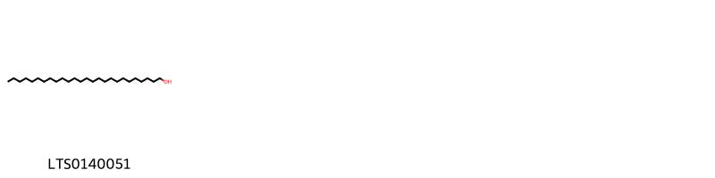{ width=100% }
    <figcaption>Hình ảnh cấu trúc hóa học của 1 hoạt chất thuộc nhóm Fatty Acyls gồm ['ceryl alcohol (LTS0140051)'].</figcaption>
</figure>
#### Nhóm Organooxygen compounds
<figure markdown="span">
    { width=100% }
    <figcaption>Hình ảnh cấu trúc hóa học của 1 hoạt chất thuộc nhóm Organooxygen compounds gồm ['p-hydroxybenzaldehyde (LTS0259836)'].</figcaption>
</figure>
#### Nhóm Phenanthrenes and derivatives
<figure markdown="span">
    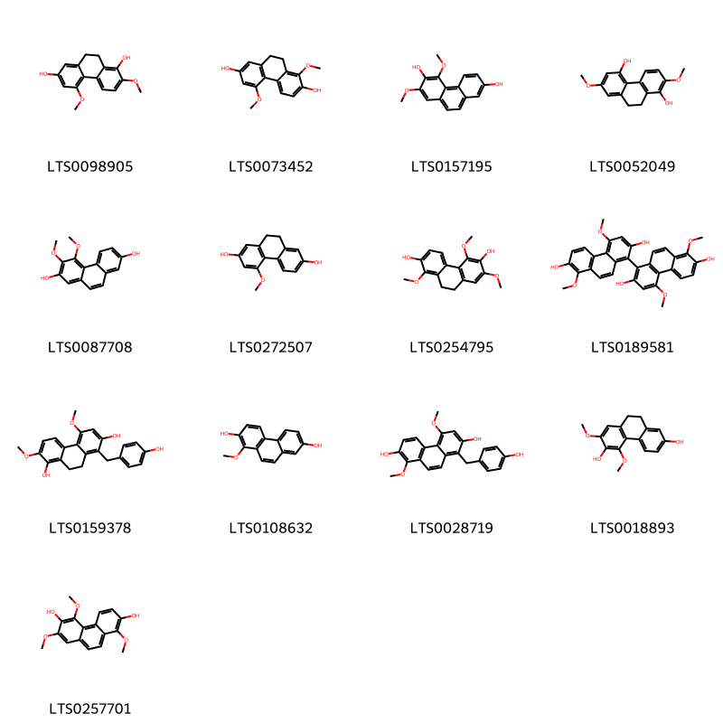{ width=100% }
    <figcaption>Hình ảnh cấu trúc hóa học của 13 hoạt chất thuộc nhóm Phenanthrenes and derivatives gồm ['2,5-dimethoxy-9,10-dihydrophenanthrene-1,7-diol (LTS0098905)', '1,5-dimethoxy-9,10-dihydrophenanthrene-2,7-diol (LTS0073452)', '5,7-dimethoxyphenanthrene-2,6-diol (LTS0157195)', '2,7-dimethoxy-9,10-dihydrophenanthrene-1,5-diol (LTS0052049)', 'nudol (LTS0087708)', '4-methoxy-9,10-dihydrophenanthrene-2,7-diol (LTS0272507)', '1,5,7-trimethoxy-9,10-dihydrophenanthrene-2,6-diol (LTS0254795)', "4,4',8,8'-tetramethoxy-[1,1'-biphenanthrene]-2,2',7,7'-tetrol (LTS0189581)", '8-[(4-hydroxyphenyl)methyl]-2,5-dimethoxy-9,10-dihydrophenanthrene-1,7-diol (LTS0159378)', '1-methoxyphenanthrene-2,7-diol (LTS0108632)', '1-[(4-hydroxyphenyl)methyl]-4,8-dimethoxyphenanthrene-2,7-diol (LTS0028719)', '5,7-dimethoxy-9,10-dihydrophenanthrene-2,6-diol (LTS0018893)', '1,5,7-trimethoxyphenanthrene-2,6-diol (LTS0257701)'].</figcaption>
</figure>
#### Nhóm Prenol lipids
<figure markdown="span">
    { width=100% }
    <figcaption>Hình ảnh cấu trúc hóa học của 1 hoạt chất thuộc nhóm Prenol lipids gồm ['lupeol (LTS0256952)'].</figcaption>
</figure>
#### Nhóm Stilbenes
<figure markdown="span">
    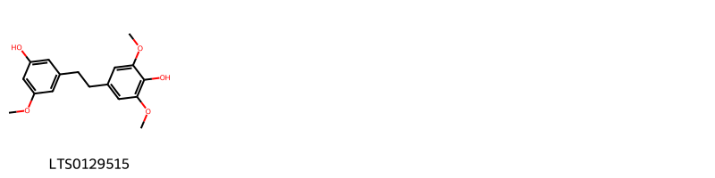{ width=100% }
    <figcaption>Hình ảnh cấu trúc hóa học của 1 hoạt chất thuộc nhóm Stilbenes gồm ['4-[2-(3-hydroxy-5-methoxyphenyl)ethyl]-2,6-dimethoxyphenol (LTS0129515)'].</figcaption>
</figure>

---

### Dược dân tộc học

Danh sách các quốc gia có sử dụng *Eulophia nuda* trong điều trị các bệnh. 

| Country   | Disease   | Bệnh                                                                                                                                                                                                |
|:----------|:----------|:----------------------------------------------------------------------------------------------------------------------------------------------------------------------------------------------------|
| India     | Vermifuge | MYMEMORY WARNING: YOU USED ALL AVAILABLE FREE TRANSLATIONS FOR TODAY. NEXT AVAILABLE IN  18 HOURS 04 MINUTES 24 SECONDS VISIT HTTPS://MYMEMORY.TRANSLATED.NET/DOC/USAGELIMITS.PHP TO TRANSLATE MORE |

---

---
## Eulophia virens
### Thông tin về thực vật

!!! info "Phân loại thực vật của *Eulophia virens* từ GIBF:"
    - **Kingdom:** Plantae
    - **Phylum:** Tracheophyta
    - **Order:** Asparagales
    - **Family:** Orchidaceae
    - **Genus:** Eulophia
    - **Species:** *Eulophia virens*

 

| Label (VI)   | Label (EN)   | Scientific Name   | Descriptions (VI)   | Descriptions (EN)   | Also Known As (VI)   | Also Known As (EN)   |
|:-------------|:-------------|:------------------|:--------------------|:--------------------|:---------------------|:---------------------|
| N/A          | N/A          | Eulophia nuda     | loài thực vật       | species of orchid   | ['']                 | ['']                 |

#### Phân bố trên thế giới

**Từ CSDL GIBF** Viet Nam, nan, unknown or invalid, Thailand, Philippines, Lao People’s Democratic Republic, Singapore, Indonesia, Sri Lanka, Bhutan, Malaysia, India, Liberia, Guam, Cambodia, Myanmar, Vanuatu, China, Tonga, Nepal, Fiji, Solomon Islands

#### Phân bố tại Việt Nam

**Từ CSDL GIBF**: Kon Tum, Lao Cai, Ha Tinh

---
### Thành phần hóa học
        
- Theo cơ sở dữ liệu lotus: Từ loài *Eulophia virens* đã phân lập và xác định được Chưa có hoạt chất nào được phân lập. hoạt chất thuộc về các nhóm Không có hoạt chất nào được phân lập. 

Không có hình ảnh nào được tạo ra

---

### Dược dân tộc học

Danh sách các quốc gia có sử dụng *Eulophia virens* trong điều trị các bệnh. 

| Country   | Disease   | Bệnh                                                                                                                                                                                                |
|:----------|:----------|:----------------------------------------------------------------------------------------------------------------------------------------------------------------------------------------------------|
| India     | Vermifuge | MYMEMORY WARNING: YOU USED ALL AVAILABLE FREE TRANSLATIONS FOR TODAY. NEXT AVAILABLE IN  18 HOURS 03 MINUTES 54 SECONDS VISIT HTTPS://MYMEMORY.TRANSLATED.NET/DOC/USAGELIMITS.PHP TO TRANSLATE MORE |

---

# Chi Rhynchostylis

??? note "Danh sách các dược liệu thuộc chi"
    
	 - *Rhynchostylis retusa*

---
## Rhynchostylis retusa
### Thông tin về thực vật

!!! info "Phân loại thực vật của *Rhynchostylis retusa* từ GIBF:"
    - **Kingdom:** Plantae
    - **Phylum:** Tracheophyta
    - **Order:** Asparagales
    - **Family:** Orchidaceae
    - **Genus:** Rhynchostylis
    - **Species:** *Rhynchostylis retusa*

 

| Label (VI)   | Label (EN)   | Scientific Name      | Descriptions (VI)   | Descriptions (EN)   | Also Known As (VI)       | Also Known As (EN)   |
|:-------------|:-------------|:---------------------|:--------------------|:--------------------|:-------------------------|:---------------------|
| N/A          | N/A          | Rhynchostylis retusa | loài thực vật       | species of plant    | ['Rhynchostylis retusa'] | ['Foxtail Orchid']   |

#### Phân bố trên thế giới

**Từ CSDL GIBF** nan, Viet Nam, unknown or invalid, Thailand, Philippines, Lao People’s Democratic Republic, Indonesia, Sri Lanka, Bhutan, India, Bangladesh, Belgium, Cambodia, Myanmar, China, Nepal, United Kingdom of Great Britain and Northern Ireland, New Caledonia, United States of America

#### Phân bố tại Việt Nam

**Từ CSDL GIBF**: Ninh Thuan, Tay Ninh

---
### Thành phần hóa học
        
- Theo cơ sở dữ liệu lotus: Từ loài *Rhynchostylis retusa* đã phân lập và xác định được Chưa có hoạt chất nào được phân lập. hoạt chất thuộc về các nhóm Không có hoạt chất nào được phân lập. 

Không có hình ảnh nào được tạo ra

---

### Dược dân tộc học

Danh sách các quốc gia có sử dụng *Rhynchostylis retusa* trong điều trị các bệnh. 

| Country   | Disease   | Bệnh                                                                                                                                                                                                |
|:----------|:----------|:----------------------------------------------------------------------------------------------------------------------------------------------------------------------------------------------------|
| India     | Emollient | MYMEMORY WARNING: YOU USED ALL AVAILABLE FREE TRANSLATIONS FOR TODAY. NEXT AVAILABLE IN  18 HOURS 03 MINUTES 39 SECONDS VISIT HTTPS://MYMEMORY.TRANSLATED.NET/DOC/USAGELIMITS.PHP TO TRANSLATE MORE |

---

# Chi Vanda

??? note "Danh sách các dược liệu thuộc chi"
    
	 - *Vanda tessellata*

---
## Vanda tessellata
### Thông tin về thực vật

!!! info "Phân loại thực vật của *Vanda tessellata* từ GIBF:"
    - **Kingdom:** Plantae
    - **Phylum:** Tracheophyta
    - **Order:** Asparagales
    - **Family:** Orchidaceae
    - **Genus:** Vanda
    - **Species:** *Vanda tessellata*

 

| Label (VI)   | Label (EN)   | Scientific Name   | Descriptions (VI)   | Descriptions (EN)   | Also Known As (VI)   | Also Known As (EN)                      |
|:-------------|:-------------|:------------------|:--------------------|:--------------------|:---------------------|:----------------------------------------|
| N/A          | N/A          | Vanda tessellata  | loài thực vật       | species of plant    | ['']                 | ['Checkered Vanda', 'Vanda tasselleta'] |

#### Phân bố trên thế giới

**Từ CSDL GIBF** nan, Viet Nam, Sri Lanka, Thailand, Bhutan, Guadeloupe, India, Bangladesh, United States of America, China, Martinique, Nepal, Indonesia

#### Phân bố tại Việt Nam

**Từ CSDL GIBF**: Không có ghi nhận ở Việt Nam

---
### Thành phần hóa học
        
- Theo cơ sở dữ liệu lotus: Từ loài *Vanda tessellata* đã phân lập và xác định được Chưa có hoạt chất nào được phân lập. hoạt chất thuộc về các nhóm Không có hoạt chất nào được phân lập. 

Không có hình ảnh nào được tạo ra

---

### Dược dân tộc học

Danh sách các quốc gia có sử dụng *Vanda tessellata* trong điều trị các bệnh. 

| Country   |   Disease | Bệnh                                                                                                                                                                                                |
|:----------|----------:|:----------------------------------------------------------------------------------------------------------------------------------------------------------------------------------------------------|
| Elsewhere |       nan | MYMEMORY WARNING: YOU USED ALL AVAILABLE FREE TRANSLATIONS FOR TODAY. NEXT AVAILABLE IN  18 HOURS 03 MINUTES 18 SECONDS VISIT HTTPS://MYMEMORY.TRANSLATED.NET/DOC/USAGELIMITS.PHP TO TRANSLATE MORE |

---

# Chi Thecostele

??? note "Danh sách các dược liệu thuộc chi"
    
	 - *Thecostele porlana*

---
## Thecostele porlana
### Thông tin về thực vật

!!! info "Phân loại thực vật của *Thecostele alata* từ GIBF:"
    - **Kingdom:** Plantae
    - **Phylum:** Tracheophyta
    - **Order:** Asparagales
    - **Family:** Orchidaceae
    - **Genus:** Thecostele
    - **Species:** *Thecostele alata*

 

| Label (VI)   | Label (EN)   | Scientific Name   | Descriptions (VI)   | Descriptions (EN)   | Also Known As (VI)   | Also Known As (EN)                      |
|:-------------|:-------------|:------------------|:--------------------|:--------------------|:---------------------|:----------------------------------------|
| N/A          | N/A          | Vanda tessellata  | loài thực vật       | species of plant    | ['']                 | ['Checkered Vanda', 'Vanda tasselleta'] |

#### Phân bố trên thế giới

**Từ CSDL GIBF** nan, Viet Nam, Sri Lanka, Thailand, Bhutan, Guadeloupe, India, Bangladesh, United States of America, China, Martinique, Nepal, Indonesia

#### Phân bố tại Việt Nam

**Từ CSDL GIBF**: Không có ghi nhận ở Việt Nam

---
### Thành phần hóa học
        
- Theo cơ sở dữ liệu lotus: Từ loài *Thecostele alata* đã phân lập và xác định được Chưa có hoạt chất nào được phân lập. hoạt chất thuộc về các nhóm Không có hoạt chất nào được phân lập. 

Không có hình ảnh nào được tạo ra

---

### Dược dân tộc học

Danh sách các quốc gia có sử dụng *Thecostele alata* trong điều trị các bệnh. 

| Country   | Disease   | Bệnh                                                                                                                                                                                                |
|:----------|:----------|:----------------------------------------------------------------------------------------------------------------------------------------------------------------------------------------------------|
| Vietnam   | Raticide  | MYMEMORY WARNING: YOU USED ALL AVAILABLE FREE TRANSLATIONS FOR TODAY. NEXT AVAILABLE IN  18 HOURS 02 MINUTES 57 SECONDS VISIT HTTPS://MYMEMORY.TRANSLATED.NET/DOC/USAGELIMITS.PHP TO TRANSLATE MORE |

---

# Chi Cyrtopodium

??? note "Danh sách các dược liệu thuộc chi"
    
	 - *Cyrtopodium punctatum*

---
## Cyrtopodium punctatum
### Thông tin về thực vật

!!! info "Phân loại thực vật của *Cyrtopodium punctatum* từ GIBF:"
    - **Kingdom:** Plantae
    - **Phylum:** Tracheophyta
    - **Order:** Asparagales
    - **Family:** Orchidaceae
    - **Genus:** Cyrtopodium
    - **Species:** *Cyrtopodium punctatum*

 

| Label (VI)   | Label (EN)   | Scientific Name       | Descriptions (VI)   | Descriptions (EN)   | Also Known As (VI)   | Also Known As (EN)   |
|:-------------|:-------------|:----------------------|:--------------------|:--------------------|:---------------------|:---------------------|
| N/A          | N/A          | Cyrtopodium punctatum | loài thực vật       | species of plant    | ['']                 | ['']                 |

#### Phân bố trên thế giới

**Từ CSDL GIBF** nan, Honduras, El Salvador, French Guiana, Guatemala, Colombia, Venezuela (Bolivarian Republic of), Dominican Republic, Cuba, Belize, Nicaragua, Brazil, Peru, Mexico, Uruguay, Argentina, Bolivia (Plurinational State of), Costa Rica, Paraguay, United States of America, Guyana

#### Phân bố tại Việt Nam

**Từ CSDL GIBF**: Không có ghi nhận ở Việt Nam

---
### Thành phần hóa học
        
- Theo cơ sở dữ liệu lotus: Từ loài *Cyrtopodium punctatum* đã phân lập và xác định được Chưa có hoạt chất nào được phân lập. hoạt chất thuộc về các nhóm Không có hoạt chất nào được phân lập. 

Không có hình ảnh nào được tạo ra

---

### Dược dân tộc học

Danh sách các quốc gia có sử dụng *Cyrtopodium punctatum* trong điều trị các bệnh. 

| Country            | Disease   | Bệnh                                                                                                                                                                                                |
|:-------------------|:----------|:----------------------------------------------------------------------------------------------------------------------------------------------------------------------------------------------------|
| Dominican Republic | Soporific | MYMEMORY WARNING: YOU USED ALL AVAILABLE FREE TRANSLATIONS FOR TODAY. NEXT AVAILABLE IN  18 HOURS 02 MINUTES 41 SECONDS VISIT HTTPS://MYMEMORY.TRANSLATED.NET/DOC/USAGELIMITS.PHP TO TRANSLATE MORE |
| Venezuela          | Vulnerary | MYMEMORY WARNING: YOU USED ALL AVAILABLE FREE TRANSLATIONS FOR TODAY. NEXT AVAILABLE IN  18 HOURS 02 MINUTES 38 SECONDS VISIT HTTPS://MYMEMORY.TRANSLATED.NET/DOC/USAGELIMITS.PHP TO TRANSLATE MORE |

---

# Chi Gastrochilus

??? note "Danh sách các dược liệu thuộc chi"
    
	 - *Gastrochilus panduratum*

---
## Gastrochilus panduratum
### Thông tin về thực vật

!!! info "Phân loại thực vật của *Boesenbergia rotunda* từ GIBF:"
    - **Kingdom:** Plantae
    - **Phylum:** Tracheophyta
    - **Order:** Zingiberales
    - **Family:** Zingiberaceae
    - **Genus:** Boesenbergia
    - **Species:** *Boesenbergia rotunda*

 

| Label (VI)   | Label (EN)   | Scientific Name       | Descriptions (VI)   | Descriptions (EN)   | Also Known As (VI)   | Also Known As (EN)   |
|:-------------|:-------------|:----------------------|:--------------------|:--------------------|:---------------------|:---------------------|
| N/A          | N/A          | Cyrtopodium punctatum | loài thực vật       | species of plant    | ['']                 | ['']                 |

#### Phân bố trên thế giới

**Từ CSDL GIBF** nan, Honduras, El Salvador, French Guiana, Guatemala, Colombia, Venezuela (Bolivarian Republic of), Dominican Republic, Cuba, Belize, Nicaragua, Brazil, Peru, Mexico, Uruguay, Argentina, Bolivia (Plurinational State of), Costa Rica, Paraguay, United States of America, Guyana

#### Phân bố tại Việt Nam

**Từ CSDL GIBF**: Không có ghi nhận ở Việt Nam

---
### Thành phần hóa học
        
- Theo cơ sở dữ liệu lotus: Từ loài *Boesenbergia rotunda* đã phân lập và xác định được Chưa có hoạt chất nào được phân lập. hoạt chất thuộc về các nhóm Không có hoạt chất nào được phân lập. 

Không có hình ảnh nào được tạo ra

---

### Dược dân tộc học

Danh sách các quốc gia có sử dụng *Boesenbergia rotunda* trong điều trị các bệnh. 

| Country   | Disease          | Bệnh                                                                                                                                                                                                |
|:----------|:-----------------|:----------------------------------------------------------------------------------------------------------------------------------------------------------------------------------------------------|
| Elsewhere | Stomachic, Tonic | MYMEMORY WARNING: YOU USED ALL AVAILABLE FREE TRANSLATIONS FOR TODAY. NEXT AVAILABLE IN  18 HOURS 02 MINUTES 15 SECONDS VISIT HTTPS://MYMEMORY.TRANSLATED.NET/DOC/USAGELIMITS.PHP TO TRANSLATE MORE |

---

# Chi Orchis

??? note "Danh sách các dược liệu thuộc chi"
    
	 - *Orchis latifolia*
	 - *Orchis mascula*
	 - *Orchis morio*

---
## Orchis latifolia
### Thông tin về thực vật

!!! info "Phân loại thực vật của *N/A* từ GIBF:"
    - **Kingdom:** Plantae
    - **Phylum:** Tracheophyta
    - **Order:** Asparagales
    - **Family:** Orchidaceae
    - **Genus:** Dactylorhiza
    - **Species:** *N/A*

 

| Label (VI)   | Label (EN)   | Scientific Name   | Descriptions (VI)   | Descriptions (EN)   | Also Known As (VI)   | Also Known As (EN)   |
|:-------------|:-------------|:------------------|:--------------------|:--------------------|:---------------------|:---------------------|
| N/A          | N/A          | Orchis latifolia  |                     | species of plant    | ['']                 | ['']                 |

#### Phân bố trên thế giới

**Từ CSDL GIBF** Georgia, Denmark, Spain, Germany, Austria, Sweden, Slovakia, Netherlands, Estonia, Ireland, Norway, Switzerland, United Kingdom of Great Britain and Northern Ireland, Portugal, France, Cyprus, United States of America, Italy, Greece

#### Phân bố tại Việt Nam

**Từ CSDL GIBF**: Không có ghi nhận ở Việt Nam

---
### Thành phần hóa học
        
- Theo cơ sở dữ liệu lotus: Từ loài *N/A* đã phân lập và xác định được Chưa có hoạt chất nào được phân lập. hoạt chất thuộc về các nhóm Không có hoạt chất nào được phân lập. 

Không có hình ảnh nào được tạo ra

---

### Dược dân tộc học

Danh sách các quốc gia có sử dụng *N/A* trong điều trị các bệnh. 

| Country   | Disease     | Bệnh                                                                                                                                                                                                |
|:----------|:------------|:----------------------------------------------------------------------------------------------------------------------------------------------------------------------------------------------------|
| Asia      | Aphrodisiac | MYMEMORY WARNING: YOU USED ALL AVAILABLE FREE TRANSLATIONS FOR TODAY. NEXT AVAILABLE IN  18 HOURS 02 MINUTES 00 SECONDS VISIT HTTPS://MYMEMORY.TRANSLATED.NET/DOC/USAGELIMITS.PHP TO TRANSLATE MORE |
| Europe    | Demulcent   | MYMEMORY WARNING: YOU USED ALL AVAILABLE FREE TRANSLATIONS FOR TODAY. NEXT AVAILABLE IN  18 HOURS 01 MINUTES 57 SECONDS VISIT HTTPS://MYMEMORY.TRANSLATED.NET/DOC/USAGELIMITS.PHP TO TRANSLATE MORE |

---

---
## Orchis mascula
### Thông tin về thực vật

!!! info "Phân loại thực vật của *Orchis mascula* từ GIBF:"
    - **Kingdom:** Plantae
    - **Phylum:** Tracheophyta
    - **Order:** Asparagales
    - **Family:** Orchidaceae
    - **Genus:** Orchis
    - **Species:** *Orchis mascula*

 

| Label (VI)   | Label (EN)   | Scientific Name   | Descriptions (VI)   | Descriptions (EN)   | Also Known As (VI)   | Also Known As (EN)                             |
|:-------------|:-------------|:------------------|:--------------------|:--------------------|:---------------------|:-----------------------------------------------|
| N/A          | N/A          | Orchis mascula    | loài thực vật       | species of plant    | ['']                 | ['early purple orchid', 'early-purple orchid'] |

#### Phân bố trên thế giới

**Từ CSDL GIBF** nan, Switzerland, United Kingdom of Great Britain and Northern Ireland, Denmark, Portugal, Luxembourg, Sweden, France, Spain, Germany, Italy, Austria, Belgium, Netherlands

#### Phân bố tại Việt Nam

**Từ CSDL GIBF**: Không có ghi nhận ở Việt Nam

---
### Thành phần hóa học
        
- Theo cơ sở dữ liệu lotus: Từ loài *Orchis mascula* đã phân lập và xác định được Chưa có hoạt chất nào được phân lập. hoạt chất thuộc về các nhóm Không có hoạt chất nào được phân lập. 

Không có hình ảnh nào được tạo ra

---

### Dược dân tộc học

Danh sách các quốc gia có sử dụng *Orchis mascula* trong điều trị các bệnh. 

| Country   | Disease                                            | Bệnh                                                                                                                                                                                                |
|:----------|:---------------------------------------------------|:----------------------------------------------------------------------------------------------------------------------------------------------------------------------------------------------------|
| Iraq      | Aphrodisiac                                        | MYMEMORY WARNING: YOU USED ALL AVAILABLE FREE TRANSLATIONS FOR TODAY. NEXT AVAILABLE IN  18 HOURS 01 MINUTES 34 SECONDS VISIT HTTPS://MYMEMORY.TRANSLATED.NET/DOC/USAGELIMITS.PHP TO TRANSLATE MORE |
| Turkey    | Aphrodisiac, Astringent, Nervine, Tonic, Demulcent | MYMEMORY WARNING: YOU USED ALL AVAILABLE FREE TRANSLATIONS FOR TODAY. NEXT AVAILABLE IN  18 HOURS 01 MINUTES 32 SECONDS VISIT HTTPS://MYMEMORY.TRANSLATED.NET/DOC/USAGELIMITS.PHP TO TRANSLATE MORE |

---

---
## Orchis morio
### Thông tin về thực vật

!!! info "Phân loại thực vật của *Orchis morio* từ GIBF:"
    - **Kingdom:** Plantae
    - **Phylum:** Tracheophyta
    - **Order:** Asparagales
    - **Family:** Orchidaceae
    - **Genus:** Orchis
    - **Species:** *Orchis morio*

 

| Label (VI)   | Label (EN)   | Scientific Name   | Descriptions (VI)   | Descriptions (EN)   | Also Known As (VI)   | Also Known As (EN)                       |
|:-------------|:-------------|:------------------|:--------------------|:--------------------|:---------------------|:-----------------------------------------|
| N/A          | N/A          | Orchis morio      | loài thực vật       | species of plant    | ['']                 | ['green winged orchid', 'meadow orchid'] |

#### Phân bố trên thế giới

**Từ CSDL GIBF** Belgium, United Kingdom of Great Britain and Northern Ireland, Portugal, France, Spain, Armenia, Germany, Bulgaria, Estonia, Italy, Austria, Greece, Croatia

#### Phân bố tại Việt Nam

**Từ CSDL GIBF**: Không có ghi nhận ở Việt Nam

---
### Thành phần hóa học
        
- Theo cơ sở dữ liệu lotus: Từ loài *Orchis morio* đã phân lập và xác định được Chưa có hoạt chất nào được phân lập. hoạt chất thuộc về các nhóm Không có hoạt chất nào được phân lập. 

Không có hình ảnh nào được tạo ra

---

### Dược dân tộc học

Danh sách các quốc gia có sử dụng *Orchis morio* trong điều trị các bệnh. 

| Country   | Disease     | Bệnh                                                                                                                                                                                                |
|:----------|:------------|:----------------------------------------------------------------------------------------------------------------------------------------------------------------------------------------------------|
| UK        | Aphrodisiac | MYMEMORY WARNING: YOU USED ALL AVAILABLE FREE TRANSLATIONS FOR TODAY. NEXT AVAILABLE IN  18 HOURS 01 MINUTES 09 SECONDS VISIT HTTPS://MYMEMORY.TRANSLATED.NET/DOC/USAGELIMITS.PHP TO TRANSLATE MORE |

---

# Chi Pholidota

??? note "Danh sách các dược liệu thuộc chi"
    
	 - *Pholidota chinensis*

---
## Pholidota chinensis
### Thông tin về thực vật

!!! info "Phân loại thực vật của *Coelogyne chinensis* từ GIBF:"
    - **Kingdom:** Plantae
    - **Phylum:** Tracheophyta
    - **Order:** Asparagales
    - **Family:** Orchidaceae
    - **Genus:** Coelogyne
    - **Species:** *Coelogyne chinensis*

 

| Label (VI)   | Label (EN)   | Scientific Name     | Descriptions (VI)   | Descriptions (EN)   | Also Known As (VI)   | Also Known As (EN)   |
|:-------------|:-------------|:--------------------|:--------------------|:--------------------|:---------------------|:---------------------|
| N/A          | N/A          | Pholidota chinensis | loài thực vật       | species of plant    | ['']                 | ['']                 |

#### Phân bố trên thế giới

**Từ CSDL GIBF** Viet Nam, unknown or invalid, China, Hong Kong

#### Phân bố tại Việt Nam

**Từ CSDL GIBF**: Khanh Hoa, Ha Tinh, Kon Tum, Cao Bang, Lam Dong, Lai Chau, Nghe An, Kontum, Gia Lai, Quang Binh, Hoa Binh, Ninh Thuan, Thua Thien-Hue, Lang Son, Dac Lac, Ha Giang, Lam Dong (林同省), Lâm Đồng, Dak Lak, Lao Cai, Hà Giang

---
### Thành phần hóa học
        
- Theo cơ sở dữ liệu lotus: Từ loài *Coelogyne chinensis* đã phân lập và xác định được 46 hoạt chất thuộc về các nhóm Stilbenes, Benzoxepines, Phenanthrenes and derivatives, 2-arylbenzofuran flavonoids, Fatty Acyls, Naphthalenes. 

|    | chemicalTaxonomyClassyfireClass   |   smiles_count |
|---:|:----------------------------------|---------------:|
|  0 |                                   |              2 |
|  1 | 2-arylbenzofuran flavonoids       |              2 |
|  2 | Benzoxepines                      |              1 |
|  3 | Fatty Acyls                       |              1 |
|  4 | Naphthalenes                      |              1 |
|  5 | Phenanthrenes and derivatives     |             22 |
|  6 | Stilbenes                         |             17 |

#### Nhóm 
<figure markdown="span">
    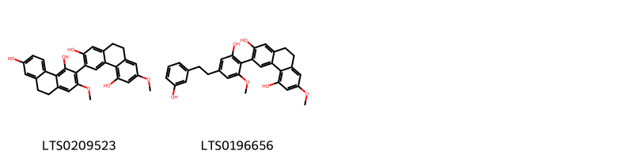{ width=100% }
    <figcaption>Hình ảnh cấu trúc hóa học của 2 hoạt chất thuộc nhóm  gồm ["2',7-dimethoxy-9h,9'h,10h,10'h-[3,3'-biphenanthrene]-2,4',5,7'-tetrol (LTS0209523)", '3-{2-hydroxy-4-[2-(3-hydroxyphenyl)ethyl]-6-methoxyphenyl}-7-methoxy-9,10-dihydrophenanthrene-2,5-diol (LTS0196656)'].</figcaption>
</figure>
#### Nhóm 2-arylbenzofuran flavonoids
<figure markdown="span">
    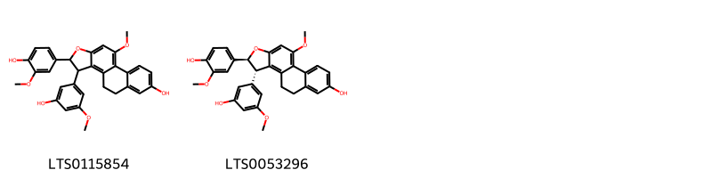{ width=100% }
    <figcaption>Hình ảnh cấu trúc hóa học của 2 hoạt chất thuộc nhóm 2-arylbenzofuran flavonoids gồm ['2-(4-hydroxy-3-methoxyphenyl)-3-(3-hydroxy-5-methoxyphenyl)-10-methoxy-2h,3h,4h,5h-phenanthro[2,1-b]furan-7-ol (LTS0115854)', '(2s,3s)-2-(4-hydroxy-3-methoxyphenyl)-3-(3-hydroxy-5-methoxyphenyl)-10-methoxy-2h,3h,4h,5h-phenanthro[2,1-b]furan-7-ol (LTS0053296)'].</figcaption>
</figure>
#### Nhóm Benzoxepines
<figure markdown="span">
    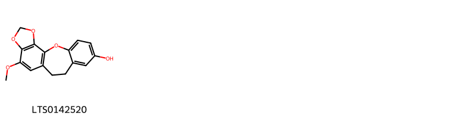{ width=100% }
    <figcaption>Hình ảnh cấu trúc hóa học của 1 hoạt chất thuộc nhóm Benzoxepines gồm ['13-methoxy-2,15,17-trioxatetracyclo[9.7.0.0³,⁸.0¹⁴,¹⁸]octadeca-1(11),3,5,7,12,14(18)-hexaen-6-ol (LTS0142520)'].</figcaption>
</figure>
#### Nhóm Fatty Acyls
<figure markdown="span">
    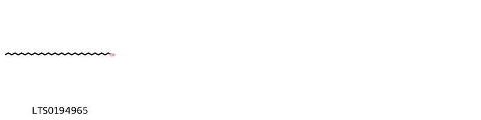{ width=100% }
    <figcaption>Hình ảnh cấu trúc hóa học của 1 hoạt chất thuộc nhóm Fatty Acyls gồm ['dotriacontanol (LTS0194965)'].</figcaption>
</figure>
#### Nhóm Naphthalenes
<figure markdown="span">
    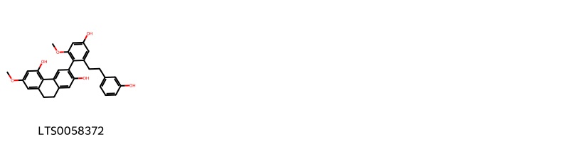{ width=100% }
    <figcaption>Hình ảnh cấu trúc hóa học của 1 hoạt chất thuộc nhóm Naphthalenes gồm ['3-{4-hydroxy-2-[2-(3-hydroxyphenyl)ethyl]-6-methoxyphenyl}-7-methoxy-9,10-dihydrophenanthrene-2,5-diol (LTS0058372)'].</figcaption>
</figure>
#### Nhóm Phenanthrenes and derivatives
<figure markdown="span">
    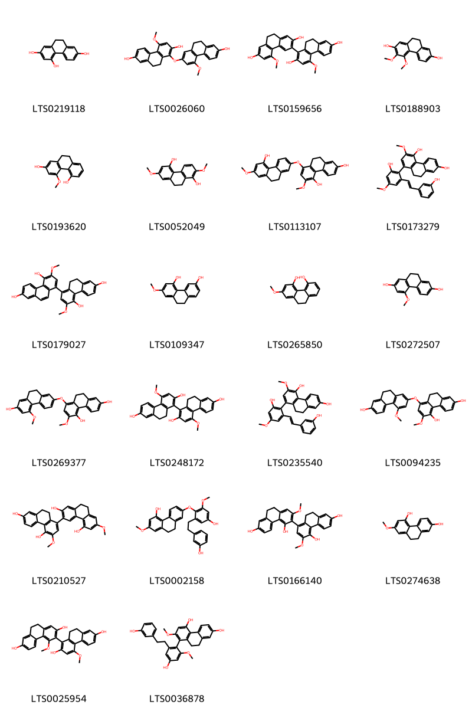{ width=100% }
    <figcaption>Hình ảnh cấu trúc hóa học của 22 hoạt chất thuộc nhóm Phenanthrenes and derivatives gồm ['9,10-dihydrophenanthrene-2,4,7-triol (LTS0219118)', '1-[(7-hydroxy-4-methoxy-9,10-dihydrophenanthren-2-yl)oxy]-4-methoxy-9,10-dihydrophenanthrene-2,7-diol (LTS0026060)', "4,5'-dimethoxy-9h,9'h,10h,10'h-[1,3'-biphenanthrene]-2,2',7,7'-tetrol (LTS0159656)", '3,4-dimethoxy-9,10-dihydrophenanthrene-2,7-diol (LTS0188903)', 'hircinol (LTS0193620)', '2,7-dimethoxy-9,10-dihydrophenanthrene-1,5-diol (LTS0052049)', '8-[(5-hydroxy-7-methoxy-9,10-dihydrophenanthren-2-yl)oxy]-6-methoxy-9,10-dihydrophenanthrene-2,5-diol (LTS0113107)', '8-{2-hydroxy-6-[(1e)-2-(3-hydroxyphenyl)ethenyl]-4-methoxyphenyl}-6-methoxy-9,10-dihydrophenanthrene-2,5-diol (LTS0173279)', "3,3'-dimethoxy-9,10-dihydro-[1,1'-biphenanthrene]-4,4',7,7'-tetrol (LTS0179027)", '7-methoxy-9,10-dihydrophenanthrene-3,5-diol (LTS0109347)', '2-methoxy-9,10-dihydrophenanthrene-4,5-diol (LTS0265850)', '4-methoxy-9,10-dihydrophenanthrene-2,7-diol (LTS0272507)', '8-[(7-hydroxy-5-methoxy-9,10-dihydrophenanthren-2-yl)oxy]-6-methoxy-9,10-dihydrophenanthrene-2,5-diol (LTS0269377)', "4,4'-dimethoxy-9h,9'h,10h,10'h-[1,1'-biphenanthrene]-2,2',7,7'-tetrol (LTS0248172)", '8-{2-hydroxy-6-[2-(3-hydroxyphenyl)ethenyl]-4-methoxyphenyl}-6-methoxy-9,10-dihydrophenanthrene-2,5-diol (LTS0235540)', '8-[(7-hydroxy-4-methoxy-9,10-dihydrophenanthren-2-yl)oxy]-6-methoxy-9,10-dihydrophenanthrene-2,5-diol (LTS0094235)', "3,7'-dimethoxy-9h,9'h,10h,10'h-[1,3'-biphenanthrene]-2',4,5',7-tetrol (LTS0210527)", '7-{4-hydroxy-2-[2-(3-hydroxyphenyl)ethyl]-6-methoxyphenoxy}-2-methoxy-9,10-dihydrophenanthren-4-ol (LTS0002158)', "2',3-dimethoxy-9h,9'h,10h,10'h-[1,3'-biphenanthrene]-4,4',7,7'-tetrol (LTS0166140)", '7-methoxy-9,10-dihydrophenanthrene-2,5-diol (LTS0274638)', "4,4'-dimethoxy-9h,9'h,10h,10'h-[1,3'-biphenanthrene]-2,2',7,7'-tetrol (LTS0025954)", '8-{4-hydroxy-2-[2-(3-hydroxyphenyl)ethyl]-6-methoxyphenyl}-7-methoxy-9,10-dihydrophenanthrene-2,5-diol (LTS0036878)'].</figcaption>
</figure>
#### Nhóm Stilbenes
<figure markdown="span">
    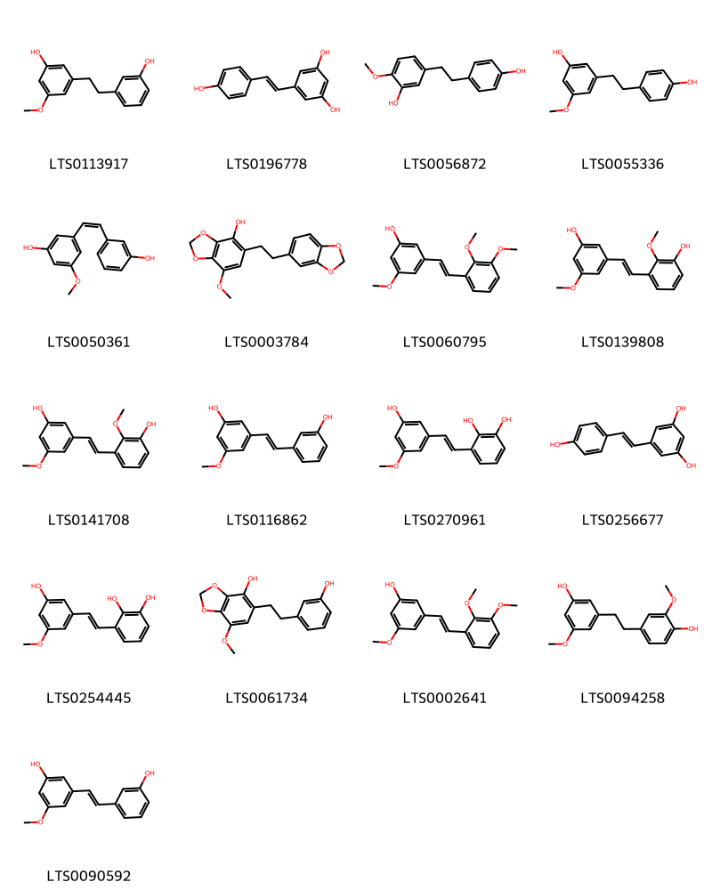{ width=100% }
    <figcaption>Hình ảnh cấu trúc hóa học của 17 hoạt chất thuộc nhóm Stilbenes gồm ['3-[2-(3-hydroxyphenyl)ethyl]-5-methoxyphenol (LTS0113917)', 'tocilizumab (LTS0196778)', '5-[2-(4-hydroxyphenyl)ethyl]-2-methoxyphenol (LTS0056872)', '3-[2-(4-hydroxyphenyl)ethyl]-5-methoxyphenol (LTS0055336)', '3-[(1z)-2-(3-hydroxyphenyl)ethenyl]-5-methoxyphenol (LTS0050361)', '5-[2-(2h-1,3-benzodioxol-5-yl)ethyl]-7-methoxy-2h-1,3-benzodioxol-4-ol (LTS0003784)', 'phoyunbene d (LTS0060795)', '3-[2-(3-hydroxy-2-methoxyphenyl)ethenyl]-5-methoxyphenol (LTS0139808)', 'phoyunbene c (LTS0141708)', '3-[(1e)-2-(3-hydroxyphenyl)ethenyl]-5-methoxyphenol (LTS0116862)', '3-[2-(3-hydroxy-5-methoxyphenyl)ethenyl]benzene-1,2-diol (LTS0270961)', 'resveratrol (LTS0256677)', '3-[(1e)-2-(3-hydroxy-5-methoxyphenyl)ethenyl]benzene-1,2-diol (LTS0254445)', '5-[2-(3-hydroxyphenyl)ethyl]-7-methoxy-2h-1,3-benzodioxol-4-ol (LTS0061734)', '3-[2-(2,3-dimethoxyphenyl)ethenyl]-5-methoxyphenol (LTS0002641)', '3-[2-(4-hydroxy-3-methoxyphenyl)ethyl]-5-methoxyphenol (LTS0094258)', '3-[2-(3-hydroxyphenyl)ethenyl]-5-methoxyphenol (LTS0090592)'].</figcaption>
</figure>

---

### Dược dân tộc học

Danh sách các quốc gia có sử dụng *Coelogyne chinensis* trong điều trị các bệnh. 

| Country   | Disease                              | Bệnh                                                                                                                                                                                                |
|:----------|:-------------------------------------|:----------------------------------------------------------------------------------------------------------------------------------------------------------------------------------------------------|
| China     | Antitussive, Refrigerant, Sialogogue | MYMEMORY WARNING: YOU USED ALL AVAILABLE FREE TRANSLATIONS FOR TODAY. NEXT AVAILABLE IN  18 HOURS 00 MINUTES 48 SECONDS VISIT HTTPS://MYMEMORY.TRANSLATED.NET/DOC/USAGELIMITS.PHP TO TRANSLATE MORE |

---

