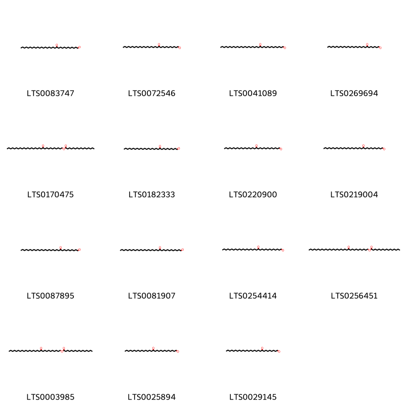
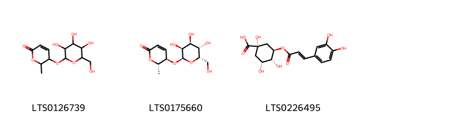
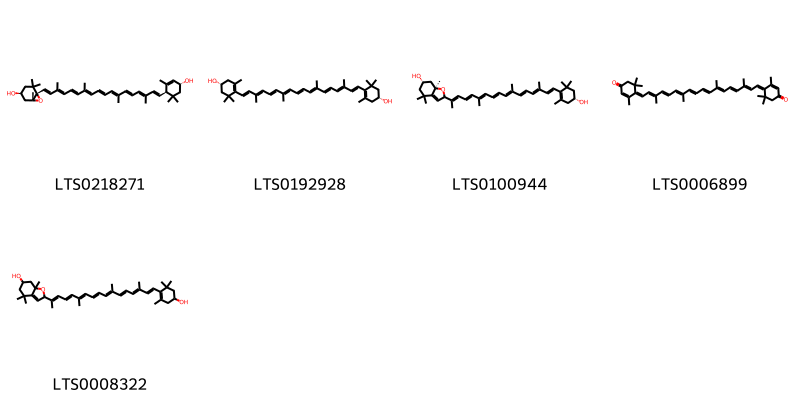

!!! abstract "Tóm tắt"

    Họ Osmundaceae gồm khoảng 1 chi và 1 loài được một số cộng đồng tại các quốc gia như China sử dụng trong một số trường hợp MYMEMORY WARNING: YOU USED ALL AVAILABLE FREE TRANSLATIONS FOR TODAY. NEXT AVAILABLE IN  06 HOURS 09 MINUTES 49 SECONDS VISIT HTTPS://MYMEMORY.TRANSLATED.NET/DOC/USAGELIMITS.PHP TO TRANSLATE MORE.

!!! info "DrDuke"

    James A. Duke sinh năm 1929-2017 là một nhà thực vật học người Mỹ. Đây là một trong những tác giả hàng đầu trong lĩnh vực dược dân tộc học với cuốn *CRC Handbook of Medicinal Herbs* và chính là người xây dựng lên cơ sở dữ liệu về hợp chất tự nhiên và dược dân tộc học tại Bộ nông nghiệp Hoa Kỳ. Các thông tin được đăng tải tại website [Dr. Duke's Phytochemical and Ethnobotanical Databases](https://phytochem.nal.usda.gov/). 
    Trong suốt thập niên 1970, ông lãnh đạo the Plant Taxonomy Laboratory, Plant Genetics and Germplasm Institute of the Agricultural Research Service, U.S. Department of Agriculture.
    Trong tài liệu này, các thông tin về dược dân tộc của các dược liệu được trích dẫn từ tài liệu của James A. Ducke với sự trợ giúp của phần mềm dịch thuật từ tiếng Anh sang tiếng Việt.
   

# Chi Osmunda

??? note "Danh sách các dược liệu thuộc chi"
    
	 - *Osmunda regalis*

---
## Osmunda regalis
### Thông tin về thực vật

!!! info "Phân loại thực vật của *Osmunda regalis* từ GIBF:"
    - **Kingdom:** Plantae
    - **Phylum:** Tracheophyta
    - **Order:** Osmundales
    - **Family:** Osmundaceae
    - **Genus:** Osmunda
    - **Species:** *Osmunda regalis*

 

| Label (VI)   | Label (EN)   | Scientific Name   | Descriptions (VI)   | Descriptions (EN)   | Also Known As (VI)   | Also Known As (EN)   |
|:-------------|:-------------|:------------------|:--------------------|:--------------------|:---------------------|:---------------------|
| N/A          | N/A          | Osmunda regalis   |                     | species of plant    | ['']                 | ['royal fern']       |

#### Phân bố trên thế giới

**Từ CSDL GIBF** Ireland, nan, Portugal, Sweden, France, Belgium, New Zealand, Italy, Switzerland, Croatia, Georgia, Germany, United Kingdom of Great Britain and Northern Ireland, Spain, Netherlands

#### Phân bố tại Việt Nam

**Từ CSDL GIBF**: Không có ghi nhận ở Việt Nam

---
### Thành phần hóa học
        
- Theo cơ sở dữ liệu lotus: Từ loài *Osmunda regalis* đã phân lập và xác định được 24 hoạt chất thuộc về các nhóm Fatty Acyls, Prenol lipids, Organooxygen compounds, Cinnamic acids and derivatives. 

|    | chemicalTaxonomyClassyfireClass   |   smiles_count |
|---:|:----------------------------------|---------------:|
|  0 | Cinnamic acids and derivatives    |              1 |
|  1 | Fatty Acyls                       |             15 |
|  2 | Organooxygen compounds            |              3 |
|  3 | Prenol lipids                     |              5 |

#### Nhóm Cinnamic acids and derivatives
<figure markdown="span">
    { width=100% }
    <figcaption>Hình ảnh cấu trúc hóa học của 1 hoạt chất thuộc nhóm Cinnamic acids and derivatives gồm ['5-o-caffeoylshikimic acid (LTS0092117)'].</figcaption>
</figure>
#### Nhóm Fatty Acyls
<figure markdown="span">
    { width=100% }
    <figcaption>Hình ảnh cấu trúc hóa học của 15 hoạt chất thuộc nhóm Fatty Acyls gồm ['12-oxohentriacontanal (LTS0083747)', '11-oxotriacontanal (LTS0072546)', '13-oxotetratriacontanal (LTS0041089)', '7-oxooctacosanal (LTS0269694)', '11-oxotriacontyl hexadecanoate (LTS0170475)', '10-oxononacosanal (LTS0182333)', '13-oxotriacontanal (LTS0220900)', '11-oxodotriacontanal (LTS0219004)', '10-oxohentriacontanal (LTS0087895)', '12-oxotritriacontanal (LTS0081907)', '13-oxodotriacontanal (LTS0254414)', '11-oxodotriacontyl hexadecanoate (LTS0256451)', '11-oxooctacosyl hexadecanoate (LTS0003985)', '13-oxooctacosanal (LTS0025894)', '9-oxooctacosanal (LTS0029145)'].</figcaption>
</figure>
#### Nhóm Organooxygen compounds
<figure markdown="span">
    { width=100% }
    <figcaption>Hình ảnh cấu trúc hóa học của 3 hoạt chất thuộc nhóm Organooxygen compounds gồm ['6-methyl-5-{[3,4,5-trihydroxy-6-(hydroxymethyl)oxan-2-yl]oxy}-5,6-dihydropyran-2-one (LTS0126739)', '(5r,6s)-6-methyl-5-{[(2r,3s,4s,5s,6s)-3,4,5-trihydroxy-6-(hydroxymethyl)oxan-2-yl]oxy}-5,6-dihydropyran-2-one (LTS0175660)', 'chlorogenic acid (LTS0226495)'].</figcaption>
</figure>
#### Nhóm Prenol lipids
<figure markdown="span">
    { width=100% }
    <figcaption>Hình ảnh cấu trúc hóa học của 5 hoạt chất thuộc nhóm Prenol lipids gồm ['taraxanthin (LTS0218271)', 'zeaxanthin (LTS0192928)', '(6s,7ar)-2-[(2e,4e,6e,8e,10e,12e,14e,16e)-17-[(4r)-4-hydroxy-2,6,6-trimethylcyclohex-1-en-1-yl]-6,11,15-trimethylheptadeca-2,4,6,8,10,12,14,16-octaen-2-yl]-4,4,7a-trimethyl-2,5,6,7-tetrahydro-1-benzofuran-6-ol (LTS0100944)', 'rhodoxanthin (LTS0006899)', '2-[(2e,4e,6e,8e,10e,12e,14e,16e)-17-(4-hydroxy-2,6,6-trimethylcyclohex-1-en-1-yl)-6,11,15-trimethylheptadeca-2,4,6,8,10,12,14,16-octaen-2-yl]-4,4,7a-trimethyl-2,5,6,7-tetrahydro-1-benzofuran-6-ol (LTS0008322)'].</figcaption>
</figure>

---

### Dược dân tộc học

Danh sách các quốc gia có sử dụng *Osmunda regalis* trong điều trị các bệnh. 

| Country   | Disease   | Bệnh                                                                                                                                                                                                |
|:----------|:----------|:----------------------------------------------------------------------------------------------------------------------------------------------------------------------------------------------------|
| China     | Tonic     | MYMEMORY WARNING: YOU USED ALL AVAILABLE FREE TRANSLATIONS FOR TODAY. NEXT AVAILABLE IN  06 HOURS 09 MINUTES 46 SECONDS VISIT HTTPS://MYMEMORY.TRANSLATED.NET/DOC/USAGELIMITS.PHP TO TRANSLATE MORE |

---

