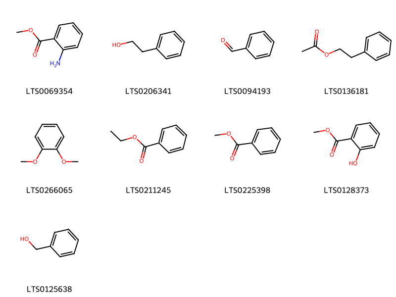
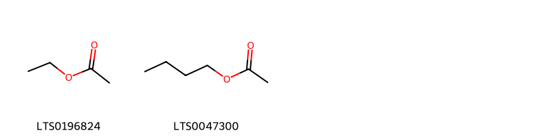
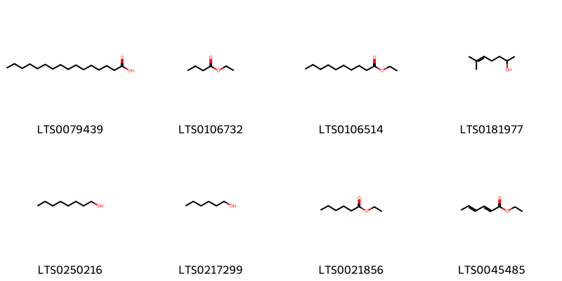
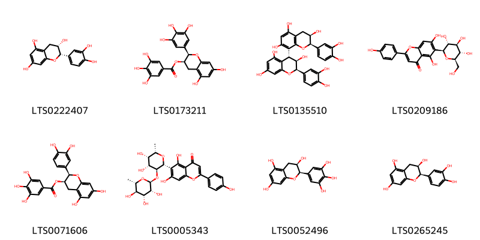
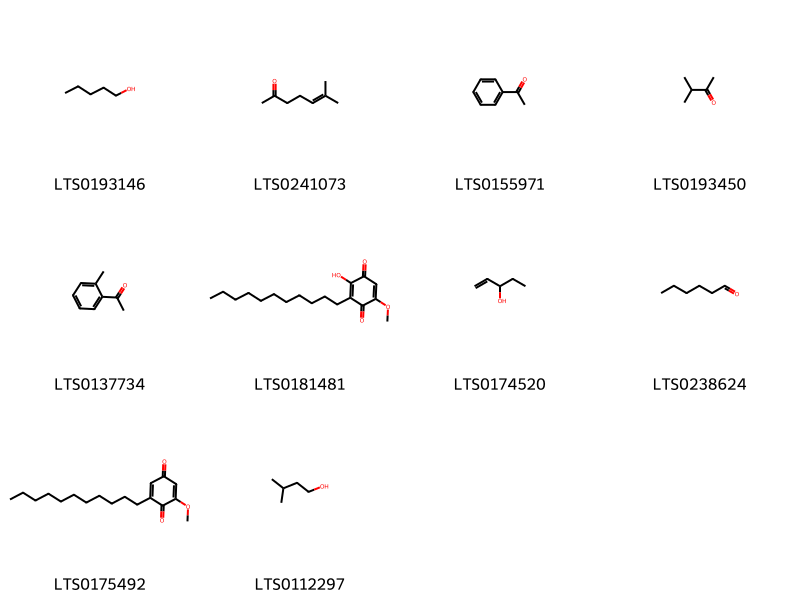
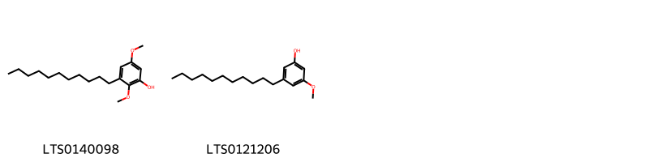
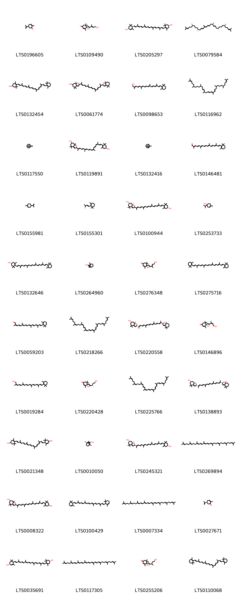
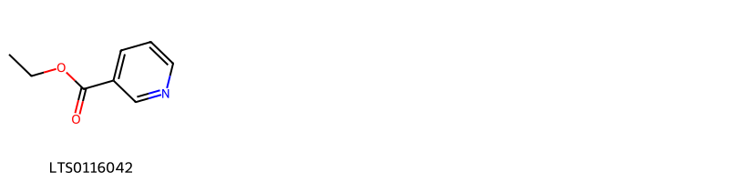
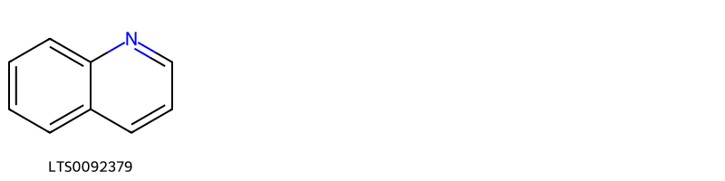

!!! abstract "Tóm tắt"

    Họ Oxalidaceae gồm khoảng 3 chi và 8 loài được một số cộng đồng tại các quốc gia như Turkey, anish, Australia, Haiti, English, French, Elsewhere, India, Java, US(NM), ain, Dominican Republic, India(Oraon), Philippines, Kembola, US, China, Nepal sử dụng trong một số trường hợp Khử trùng, Chất độc, Apertif, Chất làm se, Emmenagogue, Dạ dày, Vermifuge, Môi chất lạnh, Thuốc giải độc, Khử trùng, Thuốc lợi tiểu, Thuốc bổ, Thuốc lợi tiểu, Thuốc tràn dịch màng phổi, Thuốc lợi tiểu, Chất độc, Môi chất lạnh, Chất làm se, Thuốc lợi tiểu, Apertif, Chất làm se, Chống tiêu chảy, Soporific, Sialogogue, Vermifuge, Apertif, Chất làm se, Alexiteric, Chất làm se, Thuốc lợi tiểu, Emmenagogue, Môi chất lạnh, Môi chất lạnh, Styptic, Vermifuge, Môi chất lạnh, Môi chất lạnh, Thuốc lợi tiểu, Chất độc, Môi chất lạnh, Vulnerary, Môi chất lạnh, Mủ.

!!! info "DrDuke"

    James A. Duke sinh năm 1929-2017 là một nhà thực vật học người Mỹ. Đây là một trong những tác giả hàng đầu trong lĩnh vực dược dân tộc học với cuốn *CRC Handbook of Medicinal Herbs* và chính là người xây dựng lên cơ sở dữ liệu về hợp chất tự nhiên và dược dân tộc học tại Bộ nông nghiệp Hoa Kỳ. Các thông tin được đăng tải tại website [Dr. Duke's Phytochemical and Ethnobotanical Databases](https://phytochem.nal.usda.gov/). 
    Trong suốt thập niên 1970, ông lãnh đạo the Plant Taxonomy Laboratory, Plant Genetics and Germplasm Institute of the Agricultural Research Service, U.S. Department of Agriculture.
    Trong tài liệu này, các thông tin về dược dân tộc của các dược liệu được trích dẫn từ tài liệu của James A. Ducke với sự trợ giúp của phần mềm dịch thuật từ tiếng Anh sang tiếng Việt.
   

# Chi Biophytum

??? note "Danh sách các dược liệu thuộc chi"
    
	 - *Biophytum sensitivum*

---
## Biophytum sensitivum
### Thông tin về thực vật

!!! info "Phân loại thực vật của *Biophytum sensitivum* từ GIBF:"
    - **Kingdom:** Plantae
    - **Phylum:** Tracheophyta
    - **Order:** Oxalidales
    - **Family:** Oxalidaceae
    - **Genus:** Biophytum
    - **Species:** *Biophytum sensitivum*

 

| Label (VI)   | Label (EN)   | Scientific Name      | Descriptions (VI)   | Descriptions (EN)   | Also Known As (VI)   | Also Known As (EN)   |
|:-------------|:-------------|:---------------------|:--------------------|:--------------------|:---------------------|:---------------------|
| N/A          | N/A          | Biophytum sensitivum | loài thực vật       | species of plant    | ['']                 | ['']                 |

#### Phân bố trên thế giới

**Từ CSDL GIBF** Sri Lanka, Thailand, Chinese Taipei, Honduras, India, Indonesia, Congo, Democratic Republic of the, Philippines, China

#### Phân bố tại Việt Nam

**Từ CSDL GIBF**: Không có ghi nhận ở Việt Nam

---
### Thành phần hóa học
        
- Theo cơ sở dữ liệu lotus: Từ loài *Biophytum sensitivum* đã phân lập và xác định được 1 hoạt chất thuộc về các nhóm Flavonoids. 

|    | chemicalTaxonomyClassyfireClass   |   smiles_count |
|---:|:----------------------------------|---------------:|
|  0 | Flavonoids                        |              1 |

#### Nhóm Flavonoids
<figure markdown="span">
    { width=100% }
    <figcaption>Hình ảnh cấu trúc hóa học của 1 hoạt chất thuộc nhóm Flavonoids gồm ['amentoflavone (LTS0063796)'].</figcaption>
</figure>

---

### Dược dân tộc học

Danh sách các quốc gia có sử dụng *Biophytum sensitivum* trong điều trị các bệnh. 

| Country     | Disease   | Bệnh           |
|:------------|:----------|:---------------|
| India       | Diuretic  | Thuốc lợi tiêu |
| Philippines | Vulnerary | Vulnerary      |

---

# Chi Averrhoa

??? note "Danh sách các dược liệu thuộc chi"
    
	 - *Averrhoa bilimbi*
	 - *Averrhoa carambola*

---
## Averrhoa bilimbi
### Thông tin về thực vật

!!! info "Phân loại thực vật của *Averrhoa bilimbi* từ GIBF:"
    - **Kingdom:** Plantae
    - **Phylum:** Tracheophyta
    - **Order:** Oxalidales
    - **Family:** Oxalidaceae
    - **Genus:** Averrhoa
    - **Species:** *Averrhoa bilimbi*

 

| Label (VI)   | Label (EN)   | Scientific Name   | Descriptions (VI)   | Descriptions (EN)   | Also Known As (VI)   | Also Known As (EN)                          |
|:-------------|:-------------|:------------------|:--------------------|:--------------------|:---------------------|:--------------------------------------------|
| N/A          | N/A          | Averrhoa bilimbi  |                     | species of plant    | ['']                 | ['bilimbi', 'cucumber tree', 'tree sorrel'] |

#### Phân bố trên thế giới

**Từ CSDL GIBF** Palau, Sri Lanka, Cook Islands, Cambodia, Mauritius, Grenada, Philippines, Nicaragua, Tanzania, United Republic of, Venezuela (Bolivarian Republic of), Panama, French Guiana, Puerto Rico, Réunion, Honduras, United States of America, Timor-Leste, Maldives, Barbados, Sao Tome and Principe, Thailand, Brazil, Guam, Cuba, Dominica, Dominican Republic, Peru, Singapore, British Indian Ocean Territory, Viet Nam, Mayotte, Ecuador, French Polynesia, Seychelles, Haiti, Colombia, Costa Rica, India, Indonesia, Cayman Islands, Kenya, Malaysia, Northern Mariana Islands

#### Phân bố tại Việt Nam

**Từ CSDL GIBF**: Cần Thơ

---
### Thành phần hóa học
        
- Theo cơ sở dữ liệu lotus: Từ loài *Averrhoa bilimbi* đã phân lập và xác định được Chưa có hoạt chất nào được phân lập. hoạt chất thuộc về các nhóm Không có hoạt chất nào được phân lập. 

Không có hình ảnh nào được tạo ra

---

### Dược dân tộc học

Danh sách các quốc gia có sử dụng *Averrhoa bilimbi* trong điều trị các bệnh. 

| Country   | Disease     | Bệnh                      |
|:----------|:------------|:--------------------------|
| Java      | Diaphoretic | Thuốc tràn dịch màng phổi |

---

---
## Averrhoa carambola
### Thông tin về thực vật

!!! info "Phân loại thực vật của *Averrhoa carambola* từ GIBF:"
    - **Kingdom:** Plantae
    - **Phylum:** Tracheophyta
    - **Order:** Oxalidales
    - **Family:** Oxalidaceae
    - **Genus:** Averrhoa
    - **Species:** *Averrhoa carambola*

 

| Label (VI)   | Label (EN)   | Scientific Name    | Descriptions (VI)   | Descriptions (EN)   | Also Known As (VI)   | Also Known As (EN)                              |
|:-------------|:-------------|:-------------------|:--------------------|:--------------------|:---------------------|:------------------------------------------------|
| N/A          | N/A          | Averrhoa carambola | loài thực vật       | species of plant    | ['']                 | ['Carambola', 'Averrhoa carambola', 'Estereya'] |

#### Phân bố trên thế giới

**Từ CSDL GIBF** Sri Lanka, Australia, Angola, Argentina, Saint Lucia, Benin, Venezuela (Bolivarian Republic of), French Guiana, Panama, Canada, Puerto Rico, Nigeria, Chinese Taipei, Bolivia (Plurinational State of), Bangladesh, United States of America, Belize, Trinidad and Tobago, Hong Kong, Barbados, Thailand, Brazil, Côte d’Ivoire, Peru, Mexico, Dominican Republic, Singapore, Viet Nam, China, Ecuador, French Polynesia, Saint Kitts and Nevis, Seychelles, Colombia, Macao, Costa Rica, India, Indonesia, Cayman Islands, Philippines, Malaysia, Nepal

#### Phân bố tại Việt Nam

**Từ CSDL GIBF**: Long An, Hồ Chí Minh city, Hòa Bình, Quảng Nam, Phú Yên, Tiền Giang, Ninh Bình, Cần Thơ

---
### Thành phần hóa học
        
- Theo cơ sở dữ liệu lotus: Từ loài *Averrhoa carambola* đã phân lập và xác định được 85 hoạt chất thuộc về các nhóm Fatty Acyls, Flavonoids, Prenol lipids, Quinolines and derivatives, Benzene and substituted derivatives, Cinnamaldehydes, Organooxygen compounds, Phenols, Carboxylic acids and derivatives, Benzothiazoles, Pyridines and derivatives. 

|    | chemicalTaxonomyClassyfireClass     |   smiles_count |
|---:|:------------------------------------|---------------:|
|  0 | Benzene and substituted derivatives |              9 |
|  1 | Benzothiazoles                      |              1 |
|  2 | Carboxylic acids and derivatives    |              2 |
|  3 | Cinnamaldehydes                     |              2 |
|  4 | Fatty Acyls                         |              8 |
|  5 | Flavonoids                          |              8 |
|  6 | Organooxygen compounds              |             10 |
|  7 | Phenols                             |              2 |
|  8 | Prenol lipids                       |             40 |
|  9 | Pyridines and derivatives           |              1 |
| 10 | Quinolines and derivatives          |              1 |

#### Nhóm Benzene and substituted derivatives
<figure markdown="span">
    { width=100% }
    <figcaption>Hình ảnh cấu trúc hóa học của 9 hoạt chất thuộc nhóm Benzene and substituted derivatives gồm ['methyl anthranilate (LTS0069354)', '2-phenyl-ethanol (LTS0206341)', 'benzaldehyde (LTS0094193)', 'phenethyl acetate (LTS0136181)', 'veratrole (LTS0266065)', 'ethyl benzoate (LTS0211245)', 'methyl benzoate (LTS0225398)', 'methyl salicylate (LTS0128373)', 'benzyl alcohol (LTS0125638)'].</figcaption>
</figure>
#### Nhóm Benzothiazoles
<figure markdown="span">
    { width=100% }
    <figcaption>Hình ảnh cấu trúc hóa học của 1 hoạt chất thuộc nhóm Benzothiazoles gồm ['benzothiazole (LTS0073984)'].</figcaption>
</figure>
#### Nhóm Carboxylic acids and derivatives
<figure markdown="span">
    { width=100% }
    <figcaption>Hình ảnh cấu trúc hóa học của 2 hoạt chất thuộc nhóm Carboxylic acids and derivatives gồm ['ethyl acetate (LTS0196824)', 'butyl acetate (LTS0047300)'].</figcaption>
</figure>
#### Nhóm Cinnamaldehydes
<figure markdown="span">
    { width=100% }
    <figcaption>Hình ảnh cấu trúc hóa học của 2 hoạt chất thuộc nhóm Cinnamaldehydes gồm ['3-phenyl-2-propenal (LTS0204346)', 'cinnamal (LTS0271313)'].</figcaption>
</figure>
#### Nhóm Fatty Acyls
<figure markdown="span">
    { width=100% }
    <figcaption>Hình ảnh cấu trúc hóa học của 8 hoạt chất thuộc nhóm Fatty Acyls gồm ['palmitic acid (LTS0079439)', 'ethyl butyrate (LTS0106732)', 'ethyl caprate (LTS0106514)', '6-methyl-5-hepten-2-ol (LTS0181977)', 'octanol (LTS0250216)', 'hexanol (LTS0217299)', 'ethyl hexanoate (LTS0021856)', 'ethyl sorbate (LTS0045485)'].</figcaption>
</figure>
#### Nhóm Flavonoids
<figure markdown="span">
    { width=100% }
    <figcaption>Hình ảnh cấu trúc hóa học của 8 hoạt chất thuộc nhóm Flavonoids gồm ['(+)-epicatechin (LTS0222407)', '(-)-epigallocatechin gallate (LTS0173211)', '(2r,3r,4r)-2-(3,4-dihydroxyphenyl)-4-[(2r,3r)-2-(3,4-dihydroxyphenyl)-3,5,7-trihydroxy-3,4-dihydro-2h-1-benzopyran-8-yl]-3,4-dihydro-2h-1-benzopyran-3,5,7-triol (LTS0135510)', 'isovitexin (LTS0209186)', 'epicatechin gallate (LTS0071606)', '6-[(2r,3s,4r,5s,6s)-4,5-dihydroxy-6-methyl-3-{[(2s,3r,4r,5r,6s)-3,4,5-trihydroxy-6-methyloxan-2-yl]oxy}oxan-2-yl]-5,7-dihydroxy-2-(4-hydroxyphenyl)chromen-4-one (LTS0005343)', 'epigallocatechin (LTS0052496)', 'ent-epicatechin (LTS0265245)'].</figcaption>
</figure>
#### Nhóm Organooxygen compounds
<figure markdown="span">
    { width=100% }
    <figcaption>Hình ảnh cấu trúc hóa học của 10 hoạt chất thuộc nhóm Organooxygen compounds gồm ['amyl alcohol (LTS0193146)', '6-methyl-5-hepten-2-one (LTS0241073)', 'acetophenone (LTS0155971)', 'methyl isopropyl ketone (LTS0193450)', 'ethanone, 1-(2-methylphenyl)- (LTS0137734)', '5-o-methylembelin (LTS0181481)', '1-penten-3-ol (LTS0174520)', 'hexanal (LTS0238624)', '2-methoxy-6-undecylcyclohexa-2,5-diene-1,4-dione (LTS0175492)', 'isoamyl alcohol (LTS0112297)'].</figcaption>
</figure>
#### Nhóm Phenols
<figure markdown="span">
    { width=100% }
    <figcaption>Hình ảnh cấu trúc hóa học của 2 hoạt chất thuộc nhóm Phenols gồm ['2,5-dimethoxy-3-undecylphenol (LTS0140098)', '3-methoxy-5-undecylphenol (LTS0121206)'].</figcaption>
</figure>
#### Nhóm Prenol lipids
<figure markdown="span">
    { width=100% }
    <figcaption>Hình ảnh cấu trúc hóa học của 40 hoạt chất thuộc nhóm Prenol lipids gồm ['carvone (LTS0196605)', '(4s)-4-hydroxy-4-[(1e,3e)-5-hydroxy-3-methylpenta-1,3-dien-1-yl]-3,5,5-trimethylcyclohex-2-en-1-one (LTS0109490)', 'carotenoid (LTS0205297)', '(6s,10r,12e,14e,16e,19r,20e,23s,27r)-2,6,10,14,19,23,27,31-octamethyldotriaconta-2,12,14,16,20,30-hexaene (LTS0079584)', '3,5,5-trimethyl-4-[(1e,3e,5e,7e,9e)-3,7,12,16-tetramethyl-18-(2,6,6-trimethylcyclohex-1-en-1-yl)octadeca-1,3,5,7,9,11,13,15,17-nonaen-1-yl]cyclohex-3-en-1-ol (LTS0132454)', '2-[(2e,4e,6e,8e)-15-(4,4,7a-trimethyl-2,5,6,7-tetrahydro-1-benzofuran-2-yl)-6,11-dimethylhexadeca-2,4,6,8,10,12,14-heptaen-2-yl]-4,4,7a-trimethyl-2,5,6,7-tetrahydro-1-benzofuran-6-ol (LTS0061774)', "8'-apo-β-carotenol (LTS0098653)", '2,6,10,14,19,23,27,31-octamethyldotriaconta-2,12,14,16,20,30-hexaene (LTS0116962)', 'β-pinene (LTS0117550)', '2-[(2e,4e,6e,8e)-17-(4-hydroxy-2,6,6-trimethylcyclohex-1-en-1-yl)-6,11,15-trimethylheptadeca-2,4,6,8,10,12,14,16-octaen-2-yl]-4,4,7a-trimethyl-2,5,6,7-tetrahydro-1-benzofuran-6-ol (LTS0119891)', 'α pinene (LTS0132416)', 'apocarotenal (LTS0146481)', 'limonene,  (LTS0155981)', 'β-ionone (LTS0155301)', '(6s,7ar)-2-[(2e,4e,6e,8e,10e,12e,14e,16e)-17-[(4r)-4-hydroxy-2,6,6-trimethylcyclohex-1-en-1-yl]-6,11,15-trimethylheptadeca-2,4,6,8,10,12,14,16-octaen-2-yl]-4,4,7a-trimethyl-2,5,6,7-tetrahydro-1-benzofuran-6-ol (LTS0100944)', '4-terpineol (LTS0253733)', 'cryptoxanthin (LTS0132646)', 'borneol (LTS0264960)', '4-hydroxy-4-(5-hydroxy-3-methylpenta-1,3-dien-1-yl)-3,5,5-trimethylcyclohex-2-en-1-one (LTS0276348)', 'β-carotene (LTS0275716)', '(4e,6e,8e,10e,12e,14e,16e)-2,6,11,15-tetramethyl-17-(2,6,6-trimethylcyclohex-1-en-1-yl)heptadeca-2,4,6,8,10,12,14,16-octaenal (LTS0059203)', 'zeta-carotene (LTS0218266)', '(2s,6r,7as)-2-[(2e,4e,6e,8e,10e,12e,14e)-15-[(2s,7ar)-4,4,7a-trimethyl-2,5,6,7-tetrahydro-1-benzofuran-2-yl]-6,11-dimethylhexadeca-2,4,6,8,10,12,14-heptaen-2-yl]-4,4,7a-trimethyl-2,5,6,7-tetrahydro-1-benzofuran-6-ol (LTS0220558)', '(4s)-4-hydroxy-4-[(1e,3z)-5-hydroxy-3-methylpenta-1,3-dien-1-yl]-3,5,5-trimethylcyclohex-2-en-1-one (LTS0146896)', '(4e,6e,8e,10e,12e,14e,16e)-2,6,11,15-tetramethyl-17-(2,6,6-trimethylcyclohex-1-en-1-yl)heptadeca-2,4,6,8,10,12,14,16-octaen-1-ol (LTS0019284)', '(4s)-4-hydroxy-4-[(1e,3s)-5-hydroxy-3-methylpent-1-en-1-yl]-3,5,5-trimethylcyclohex-2-en-1-one (LTS0220428)', '2,6,10,14,19,23,27,31-octamethyldotriaconta-2,6,8,10,12,14,16,18,20,22,26,30-dodecaene (LTS0225766)', '(2s,6s,7ar)-2-[(2e,4e,6e,8e,10e,12e,14e)-15-[(2r,7ar)-4,4,7a-trimethyl-2,5,6,7-tetrahydro-1-benzofuran-2-yl]-6,11-dimethylhexadeca-2,4,6,8,10,12,14-heptaen-2-yl]-4,4,7a-trimethyl-2,5,6,7-tetrahydro-1-benzofuran-6-ol (LTS0138893)', '4-[(9e,11e,13e,15e,17e)-18-(4-hydroxy-2,6,6-trimethylcyclohex-1-en-1-yl)-3,7,12,16-tetramethyloctadeca-1,3,5,7,9,11,13,15,17-nonaen-1-yl]-3,5,5-trimethylcyclohex-2-en-1-ol (LTS0021348)', '(2s,4r)-1,7,7-trimethylbicyclo[2.2.1]heptan-2-ol (LTS0010050)', "(3s,5r,8r,3'r)-mutatoxanthin (LTS0245321)", 'all-trans-phytofluene (LTS0269894)', '2-[(2e,4e,6e,8e,10e,12e,14e,16e)-17-(4-hydroxy-2,6,6-trimethylcyclohex-1-en-1-yl)-6,11,15-trimethylheptadeca-2,4,6,8,10,12,14,16-octaen-2-yl]-4,4,7a-trimethyl-2,5,6,7-tetrahydro-1-benzofuran-6-ol (LTS0008322)', 'epsilon-carotene (LTS0100429)', 'zeta-carotene (LTS0007334)', 'carvone, (+)- (LTS0027671)', '(1r)-4-[(1e,3e,5e,7e,9e,11e,13e,15e,17e)-18-[(4r)-4-hydroxy-2,6,6-trimethylcyclohex-1-en-1-yl]-3,7,12,16-tetramethyloctadeca-1,3,5,7,9,11,13,15,17-nonaen-1-yl]-3,5,5-trimethylcyclohex-2-en-1-ol (LTS0035691)', 'neurosporene (LTS0117305)', '4-hydroxy-4-(5-hydroxy-3-methylpent-1-en-1-yl)-3,5,5-trimethylcyclohex-2-en-1-one (LTS0255206)', '1,3,3-trimethyl-2-[(9e,11e,13e,15e,17e)-3,7,12,16-tetramethyl-18-(2,6,6-trimethylcyclohex-1-en-1-yl)octadeca-1,3,5,7,9,11,13,15,17-nonaen-1-yl]cyclohex-1-ene (LTS0110068)'].</figcaption>
</figure>
#### Nhóm Pyridines and derivatives
<figure markdown="span">
    { width=100% }
    <figcaption>Hình ảnh cấu trúc hóa học của 1 hoạt chất thuộc nhóm Pyridines and derivatives gồm ['ethyl nicotinate (LTS0116042)'].</figcaption>
</figure>
#### Nhóm Quinolines and derivatives
<figure markdown="span">
    { width=100% }
    <figcaption>Hình ảnh cấu trúc hóa học của 1 hoạt chất thuộc nhóm Quinolines and derivatives gồm ['cinch (LTS0092379)'].</figcaption>
</figure>

---

### Dược dân tộc học

Danh sách các quốc gia có sử dụng *Averrhoa carambola* trong điều trị các bệnh. 

| Country   | Disease       | Bệnh                    |
|:----------|:--------------|:------------------------|
| China     | Sialogogue    | Thuốc lợi tiết nước bọt |
| Elsewhere | Antidiarrheic | Chống tiêu chảy         |
| Kembola   | Sialogogue    | Thuốc lợi tiết nước bọt |

---

# Chi Oxalis

??? note "Danh sách các dược liệu thuộc chi"
    
	 - *Oxalis acetosella*
	 - *Oxalis corniculata*
	 - *Oxalis latifolia*
	 - *Oxalis pes-caprae*
	 - *Oxalis violacea*

---
## Oxalis acetosella
### Thông tin về thực vật

!!! info "Phân loại thực vật của *Oxalis acetosella* từ GIBF:"
    - **Kingdom:** Plantae
    - **Phylum:** Tracheophyta
    - **Order:** Oxalidales
    - **Family:** Oxalidaceae
    - **Genus:** Oxalis
    - **Species:** *Oxalis acetosella*

 

| Label (VI)   | Label (EN)   | Scientific Name   | Descriptions (VI)   | Descriptions (EN)   | Also Known As (VI)                   | Also Known As (EN)                    |
|:-------------|:-------------|:------------------|:--------------------|:--------------------|:-------------------------------------|:--------------------------------------|
| N/A          | N/A          | Oxalis acetosella | loài thực vật       | species of plant    | ['Oxalis acetosella', 'Me đất chua'] | ['common wood-sorrel', 'wood-sorrel'] |

#### Phân bố trên thế giới

**Từ CSDL GIBF** Italy, Belgium, Slovakia, Norway, Denmark, Netherlands, Luxembourg, Spain, Russian Federation, Sweden, Finland, Czechia, Germany, Romania, Switzerland, Austria, France, United Kingdom of Great Britain and Northern Ireland, Ireland, Poland

#### Phân bố tại Việt Nam

**Từ CSDL GIBF**: Không có ghi nhận ở Việt Nam

---
### Thành phần hóa học
        
- Theo cơ sở dữ liệu lotus: Từ loài *Oxalis acetosella* đã phân lập và xác định được Chưa có hoạt chất nào được phân lập. hoạt chất thuộc về các nhóm Không có hoạt chất nào được phân lập. 

Không có hình ảnh nào được tạo ra

---

### Dược dân tộc học

Danh sách các quốc gia có sử dụng *Oxalis acetosella* trong điều trị các bệnh. 

| Country   | Disease                                   | Bệnh                                                 |
|:----------|:------------------------------------------|:-----------------------------------------------------|
| Elsewhere | Diuretic, Poison, Refrigerant             | Thuốc lợi tiểu, chất độc, chất làm lạnh              |
| Turkey    | Diuretic, Poison, Refrigerant, Astringent | Thuốc lợi tiểu, Chất độc, Chất làm lạnh, Chất làm se |
| ain       | Poison                                    | Chất độc                                             |

---

---
## Oxalis corniculata
### Thông tin về thực vật

!!! info "Phân loại thực vật của *Oxalis corniculata* từ GIBF:"
    - **Kingdom:** Plantae
    - **Phylum:** Tracheophyta
    - **Order:** Oxalidales
    - **Family:** Oxalidaceae
    - **Genus:** Oxalis
    - **Species:** *Oxalis corniculata*

 

| Label (VI)   | Label (EN)   | Scientific Name    | Descriptions (VI)   | Descriptions (EN)   | Also Known As (VI)                                                                | Also Known As (EN)                                                                                                                                                                             |
|:-------------|:-------------|:-------------------|:--------------------|:--------------------|:----------------------------------------------------------------------------------|:-----------------------------------------------------------------------------------------------------------------------------------------------------------------------------------------------|
| N/A          | N/A          | Oxalis corniculata | loài thực vật       | species of plant    | ['Rau chua me', 'Oxalis corniculata', 'Me đất nhỏ', 'Chua me ba chìa', 'Chua me'] | ['wood sorrel', 'sleeping beauty', 'creeping woodsorrel', '`ihi', '`ihi `ai', '`ihi `awa', '`ihi maka `ula', '`ihi makole', 'yellow wood sorrel', 'Indian sorrel', 'procumbent yellow-sorrel'] |

#### Phân bố trên thế giới

**Từ CSDL GIBF** nan, Virgin Islands (U.S.), Italy, Australia, Japan, Belgium, Venezuela (Bolivarian Republic of), Israel, Yemen, Malawi, Puerto Rico, Netherlands, Nigeria, Namibia, Chinese Taipei, Spain, Türkiye, Portugal, United States of America, Greece, Uganda, South Africa, Hong Kong, Thailand, Germany, Iran (Islamic Republic of), Brazil, Switzerland, Mexico, France, Dominican Republic, Singapore, China, United Kingdom of Great Britain and Northern Ireland, Colombia, India, Antigua and Barbuda, Kenya, Malaysia, New Zealand

#### Phân bố tại Việt Nam

**Từ CSDL GIBF**: Không có ghi nhận ở Việt Nam

---
### Thành phần hóa học
        
- Theo cơ sở dữ liệu lotus: Từ loài *Oxalis corniculata* đã phân lập và xác định được Chưa có hoạt chất nào được phân lập. hoạt chất thuộc về các nhóm Không có hoạt chất nào được phân lập. 

Không có hình ảnh nào được tạo ra

---

### Dược dân tộc học

Danh sách các quốc gia có sử dụng *Oxalis corniculata* trong điều trị các bệnh. 

| Country            | Disease                                                                                     | Bệnh                                                                                                |
|:-------------------|:--------------------------------------------------------------------------------------------|:----------------------------------------------------------------------------------------------------|
| Australia          | Poison                                                                                      | Chất độc                                                                                            |
| China              | Alexiteric, Astringent, Diuretic, Emmenagogue, Refrigerant, Refrigerant, Styptic, Vermifuge | Alexiteric, Chất làm se, Thuốc lợi tiểu, Chất làm lạnh, Chất làm lạnh, Styptic, Vermifuge           |
| Dominican Republic | Antiseptic                                                                                  | Khử trùng                                                                                           |
| Elsewhere          | Apertif, Astringent, Emmenagogue, Stomachic, Vermifuge, Refrigerant, Antidote, Antiseptic   | Apertif, Chất làm se, Emmenagogue, Dạ dày, Vermifuge, Chất làm lạnh, Thuốc giải độc, Chất khử trùng |
| English            | Astringent                                                                                  | Lam se da                                                                                           |
| French             | Apertif                                                                                     | Apertif                                                                                             |
| Haiti              | Refrigerant, Suppurative                                                                    | Môi chất lạnh, bổ sung                                                                              |
| Nepal              | Refrigerant, Refrigerant                                                                    | Môi chất lạnh, Môi chất lạnh                                                                        |
| Turkey             | Diuretic, Apertif, Astringent                                                               | Thuốc lợi tiểu, Apertif, Chất làm se                                                                |
| anish              | Diuretic                                                                                    | Thuốc lợi tiêu                                                                                      |

---

---
## Oxalis latifolia
### Thông tin về thực vật

!!! info "Phân loại thực vật của *Oxalis latifolia* từ GIBF:"
    - **Kingdom:** Plantae
    - **Phylum:** Tracheophyta
    - **Order:** Oxalidales
    - **Family:** Oxalidaceae
    - **Genus:** Oxalis
    - **Species:** *Oxalis latifolia*

 

| Label (VI)   | Label (EN)   | Scientific Name   | Descriptions (VI)   | Descriptions (EN)   | Also Known As (VI)   | Also Known As (EN)     |
|:-------------|:-------------|:------------------|:--------------------|:--------------------|:---------------------|:-----------------------|
| N/A          | N/A          | Oxalis latifolia  | loài thực vật       | species of plant    | ['']                 | ['garden pink-sorrel'] |

#### Phân bố trên thế giới

**Từ CSDL GIBF** Italy, Australia, Belgium, Rwanda, Bermuda, Tanzania, United Republic of, Malawi, Puerto Rico, Netherlands, Réunion, Nigeria, Spain, Bolivia (Plurinational State of), Portugal, Russian Federation, United States of America, Chile, Zimbabwe, Uganda, South Africa, Iran (Islamic Republic of), Brazil, Switzerland, Mexico, France, Dominican Republic, Ecuador, Haiti, Colombia, Macao, India, Kenya, Cameroon, New Zealand, Ethiopia

#### Phân bố tại Việt Nam

**Từ CSDL GIBF**: Không có ghi nhận ở Việt Nam

---
### Thành phần hóa học
        
- Theo cơ sở dữ liệu lotus: Từ loài *Oxalis latifolia* đã phân lập và xác định được Chưa có hoạt chất nào được phân lập. hoạt chất thuộc về các nhóm Không có hoạt chất nào được phân lập. 

Không có hình ảnh nào được tạo ra

---

### Dược dân tộc học

Danh sách các quốc gia có sử dụng *Oxalis latifolia* trong điều trị các bệnh. 

| Country      | Disease   | Bệnh      |
|:-------------|:----------|:----------|
| India(Oraon) | Soporific | Thuốc ngủ |

---

---
## Oxalis pescaprae
### Thông tin về thực vật

!!! info "Phân loại thực vật của *Oxalis pes-caprae* từ GIBF:"
    - **Kingdom:** Plantae
    - **Phylum:** Tracheophyta
    - **Order:** Oxalidales
    - **Family:** Oxalidaceae
    - **Genus:** Oxalis
    - **Species:** *Oxalis pes-caprae*

 

| Label (VI)   | Label (EN)   | Scientific Name   | Descriptions (VI)   | Descriptions (EN)   | Also Known As (VI)   | Also Known As (EN)     |
|:-------------|:-------------|:------------------|:--------------------|:--------------------|:---------------------|:-----------------------|
| N/A          | N/A          | Oxalis latifolia  | loài thực vật       | species of plant    | ['']                 | ['garden pink-sorrel'] |

#### Phân bố trên thế giới

**Từ CSDL GIBF** Italy, Japan, Argentina, Gibraltar, Israel, Cyprus, Malta, Spain, Türkiye, Portugal, Albania, Algeria, United States of America, Croatia, Greece, Mexico, France, United Kingdom of Great Britain and Northern Ireland, China

#### Phân bố tại Việt Nam

**Từ CSDL GIBF**: Không có ghi nhận ở Việt Nam

---
### Thành phần hóa học
        
- Theo cơ sở dữ liệu lotus: Từ loài *Oxalis pes-caprae* đã phân lập và xác định được Chưa có hoạt chất nào được phân lập. hoạt chất thuộc về các nhóm Không có hoạt chất nào được phân lập. 

Không có hình ảnh nào được tạo ra

---

### Dược dân tộc học

Danh sách các quốc gia có sử dụng *Oxalis pes-caprae* trong điều trị các bệnh. 

| Country   | Disease   | Bệnh     |
|:----------|:----------|:---------|
| Australia | Poison    | Chất độc |

---

---
## Oxalis violacea
### Thông tin về thực vật

!!! info "Phân loại thực vật của *Oxalis violacea* từ GIBF:"
    - **Kingdom:** Plantae
    - **Phylum:** Tracheophyta
    - **Order:** Oxalidales
    - **Family:** Oxalidaceae
    - **Genus:** Oxalis
    - **Species:** *Oxalis violacea*

 

| Label (VI)   | Label (EN)   | Scientific Name   | Descriptions (VI)   | Descriptions (EN)   | Also Known As (VI)   | Also Known As (EN)                                            |
|:-------------|:-------------|:------------------|:--------------------|:--------------------|:---------------------|:--------------------------------------------------------------|
| N/A          | N/A          | Oxalis violacea   | loài thực vật       | species of plant    | ['']                 | ['shamrock', 'Oxalis violacea', 'sour grass', 'sour trefoil'] |

#### Phân bố trên thế giới

**Từ CSDL GIBF** United States of America

#### Phân bố tại Việt Nam

**Từ CSDL GIBF**: Không có ghi nhận ở Việt Nam

---
### Thành phần hóa học
        
- Theo cơ sở dữ liệu lotus: Từ loài *Oxalis violacea* đã phân lập và xác định được Chưa có hoạt chất nào được phân lập. hoạt chất thuộc về các nhóm Không có hoạt chất nào được phân lập. 

Không có hình ảnh nào được tạo ra

---

### Dược dân tộc học

Danh sách các quốc gia có sử dụng *Oxalis violacea* trong điều trị các bệnh. 

| Country   | Disease         | Bệnh                     |
|:----------|:----------------|:-------------------------|
| US        | Diuretic, Tonic | Thuốc lợi tiểu, Thuốc bổ |
| US(NM)    | Vermifuge       | Thuốc diệt sán           |

---

