!!! abstract "Tóm tắt"

    Họ Paeoniaceae gồm khoảng 1 chi và 8 loài được một số cộng đồng tại các quốc gia như Turkey, Elsewhere, Japan*, Europe, Japan, China sử dụng trong một số trường hợp Cathartic, Emetic, nan, Hemostatic, Astringent, Demulcent, An thần, Emetic, Intoxicant, Tonic, Emmenagogue, Antiphlogistic, Tonic, nan, Fungicide, nan, Emmenagogue, Tonic, Emetic, Poison, Vasodilator, Antidiuretic, Antiseptic, Emmenagogue, Expectorant, Laxative, Tonic.

!!! info "DrDuke"

    James A. Duke sinh năm 1929-2017 là một nhà thực vật học người Mỹ. Đây là một trong những tác giả hàng đầu trong lĩnh vực dược dân tộc học với cuốn *CRC Handbook of Medicinal Herbs* và chính là người xây dựng lên cơ sở dữ liệu về hợp chất tự nhiên và dược dân tộc học tại Bộ nông nghiệp Hoa Kỳ. Các thông tin được đăng tải tại website [Dr. Duke's Phytochemical and Ethnobotanical Databases](https://phytochem.nal.usda.gov/). 
    Trong suốt thập niên 1970, ông lãnh đạo the Plant Taxonomy Laboratory, Plant Genetics and Germplasm Institute of the Agricultural Research Service, U.S. Department of Agriculture.
    Trong tài liệu này, các thông tin về dược dân tộc của các dược liệu được trích dẫn từ tài liệu của James A. Ducke với sự trợ giúp của phần mềm dịch thuật từ tiếng Anh sang tiếng Việt.
   

# Chi Paeonia

??? note "Danh sách các dược liệu thuộc chi"
    
	 - *Paeonia albiflora*
	 - *Paeonia emodi*
	 - *Paeonia foemina*
	 - *Paeonia japonica*
	 - *Paeonia lactiflora*
	 - *Paeonia moutan*
	 - *Paeonia officinalis*
	 - *Paeonia suffruticosa*

---
## Paeonia albiflora
### Thông tin về thực vật

!!! info "Phân loại thực vật của *Paeonia lactiflora* từ GIBF:"
    - **Kingdom:** Plantae
    - **Phylum:** Tracheophyta
    - **Order:** Saxifragales
    - **Family:** Paeoniaceae
    - **Genus:** Paeonia
    - **Species:** *Paeonia lactiflora*

 

| Label (VI)   | Label (EN)   | Scientific Name   | Descriptions (VI)   | Descriptions (EN)          | Also Known As (VI)   | Also Known As (EN)   |
|:-------------|:-------------|:------------------|:--------------------|:---------------------------|:---------------------|:---------------------|
| N/A          | N/A          | Paeonia albiflora |                     | species of flowering plant | ['']                 | ['']                 |

#### Phân bố trên thế giới

**Từ CSDL GIBF** nan, Japan, Belgium, Estonia, Chinese Taipei, unknown or invalid, Korea (Democratic People’s Republic of), Russian Federation, United States of America, Sweden, Poland, France, China

#### Phân bố tại Việt Nam

**Từ CSDL GIBF**: Không có ghi nhận ở Việt Nam

---
### Thành phần hóa học
        
- Theo cơ sở dữ liệu lotus: Từ loài *Paeonia lactiflora* đã phân lập và xác định được Chưa có hoạt chất nào được phân lập. hoạt chất thuộc về các nhóm Không có hoạt chất nào được phân lập. 

Không có hình ảnh nào được tạo ra

---

### Dược dân tộc học

Danh sách các quốc gia có sử dụng *Paeonia lactiflora* trong điều trị các bệnh. 

| Country   | Disease                                               | Bệnh                                                                    |
|:----------|:------------------------------------------------------|:------------------------------------------------------------------------|
| China     | Antiseptic, Emmenagogue, Expectorant, Laxative, Tonic | Khử trùng, Chất kích thích, Thuốc long đờm, Thuốc nhuận tràng, Thuốc bổ |
| Elsewhere | Vasodilator, Antidiuretic                             | Thuốc giãn mạch, Thuốc chống bài niệu                                   |
| Japan*    | Astringent, Demulcent                                 | Chất làm se, Demulcent                                                  |

---

---
## Paeonia emodi
### Thông tin về thực vật

!!! info "Phân loại thực vật của *Paeonia emodi* từ GIBF:"
    - **Kingdom:** Plantae
    - **Phylum:** Tracheophyta
    - **Order:** Saxifragales
    - **Family:** Paeoniaceae
    - **Genus:** Paeonia
    - **Species:** *Paeonia emodi*

 

| Label (VI)   | Label (EN)   | Scientific Name   | Descriptions (VI)   | Descriptions (EN)   | Also Known As (VI)   | Also Known As (EN)   |
|:-------------|:-------------|:------------------|:--------------------|:--------------------|:---------------------|:---------------------|
| N/A          | N/A          | Paeonia emodi     | loài thực vật       | species of plant    | ['']                 | ['']                 |

#### Phân bố trên thế giới

**Từ CSDL GIBF** nan, Pakistan, United Kingdom of Great Britain and Northern Ireland, Belgium, Afghanistan, India, Austria, China, Nepal

#### Phân bố tại Việt Nam

**Từ CSDL GIBF**: Không có ghi nhận ở Việt Nam

---
### Thành phần hóa học
        
- Theo cơ sở dữ liệu lotus: Từ loài *Paeonia emodi* đã phân lập và xác định được 34 hoạt chất thuộc về các nhóm Fatty Acyls, Prenol lipids, Steroids and steroid derivatives, Benzene and substituted derivatives, Anthracenes. 

|    | chemicalTaxonomyClassyfireClass     |   smiles_count |
|---:|:------------------------------------|---------------:|
|  0 | Anthracenes                         |              1 |
|  1 | Benzene and substituted derivatives |              5 |
|  2 | Fatty Acyls                         |              1 |
|  3 | Prenol lipids                       |             16 |
|  4 | Steroids and steroid derivatives    |             11 |

#### Nhóm Anthracenes
<figure markdown="span">
    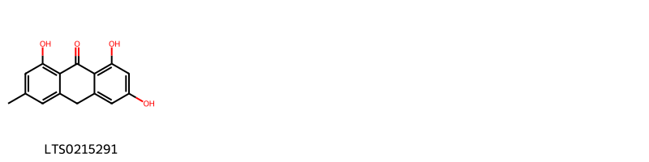{ width=100% }
    <figcaption>Hình ảnh cấu trúc hóa học của 1 hoạt chất thuộc nhóm Anthracenes gồm ['emodin-9-anthrone (LTS0215291)'].</figcaption>
</figure>
#### Nhóm Benzene and substituted derivatives
<figure markdown="span">
    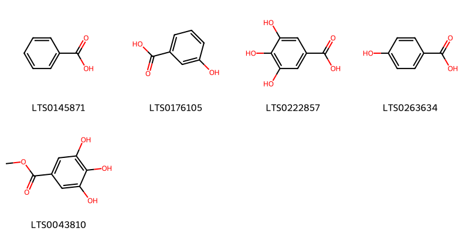{ width=100% }
    <figcaption>Hình ảnh cấu trúc hóa học của 5 hoạt chất thuộc nhóm Benzene and substituted derivatives gồm ['benzoic acid (LTS0145871)', '3-hydroxybenzoic acid (LTS0176105)', 'galop (LTS0222857)', 'p-hydroxybenzoic acid (LTS0263634)', 'methyl gallate (LTS0043810)'].</figcaption>
</figure>
#### Nhóm Fatty Acyls
<figure markdown="span">
    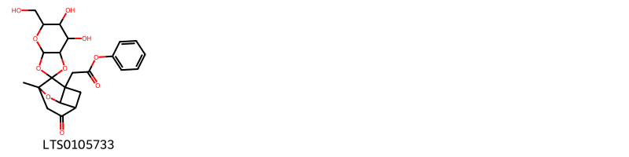{ width=100% }
    <figcaption>Hình ảnh cấu trúc hóa học của 1 hoạt chất thuộc nhóm Fatty Acyls gồm ["phenyl 2-[6,7-dihydroxy-5-(hydroxymethyl)-6'-methyl-4'-oxo-tetrahydro-3ah-7'-oxaspiro[[1,3]dioxolo[4,5-b]pyran-2,9'-tricyclo[4.2.1.0³,⁸]nonan]-1'-yl]acetate (LTS0105733)"].</figcaption>
</figure>
#### Nhóm Prenol lipids
<figure markdown="span">
    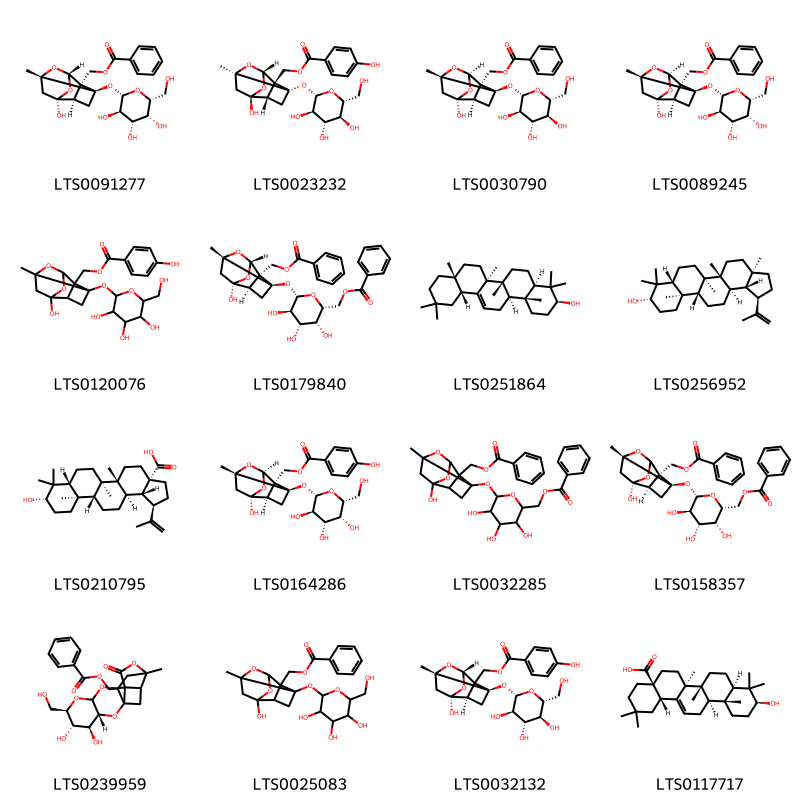{ width=100% }
    <figcaption>Hình ảnh cấu trúc hóa học của 16 hoạt chất thuộc nhóm Prenol lipids gồm ['paeonin b (LTS0091277)', '[(1s,2r,3s,5s,6s,8r)-6-hydroxy-8-methyl-3-{[(2s,3r,4s,5s,6r)-3,4,5-trihydroxy-6-(hydroxymethyl)oxan-2-yl]oxy}-9,10-dioxatetracyclo[4.3.1.0²,⁵.0³,⁸]decan-2-yl]methyl 4-hydroxybenzoate (LTS0023232)', 'paeoniflorin (LTS0030790)', '[(1r,2s,3r,5r,6r,8s)-6-hydroxy-8-methyl-3-{[(2s,3r,4s,5r,6r)-3,4,5-trihydroxy-6-(hydroxymethyl)oxan-2-yl]oxy}-9,10-dioxatetracyclo[4.3.1.0²,⁵.0³,⁸]decan-2-yl]methyl benzoate (LTS0089245)', '(6-hydroxy-8-methyl-3-{[3,4,5-trihydroxy-6-(hydroxymethyl)oxan-2-yl]oxy}-9,10-dioxatetracyclo[4.3.1.0²,⁵.0³,⁸]decan-2-yl)methyl 4-hydroxybenzoate (LTS0120076)', 'paeonin a (LTS0179840)', 'β-amyrin (LTS0251864)', 'lupeol (LTS0256952)', 'betulinic acid (LTS0210795)', '[(1r,2s,3r,5r,6r,8s)-6-hydroxy-8-methyl-3-{[(2s,3r,4s,5r,6r)-3,4,5-trihydroxy-6-(hydroxymethyl)oxan-2-yl]oxy}-9,10-dioxatetracyclo[4.3.1.0²,⁵.0³,⁸]decan-2-yl]methyl 4-hydroxybenzoate (LTS0164286)', '[3-({6-[(benzoyloxy)methyl]-3,4,5-trihydroxyoxan-2-yl}oxy)-6-hydroxy-8-methyl-9,10-dioxatetracyclo[4.3.1.0²,⁵.0³,⁸]decan-2-yl]methyl benzoate (LTS0032285)', '[(2s,3r,5r,6r,8s)-3-{[(2s,3r,4s,5r,6r)-6-[(benzoyloxy)methyl]-3,4,5-trihydroxyoxan-2-yl]oxy}-6-hydroxy-8-methyl-9,10-dioxatetracyclo[4.3.1.0²,⁵.0³,⁸]decan-2-yl]methyl benzoate (LTS0158357)', '[(3r,4s,5s,6r)-4,5-dihydroxy-6-(hydroxymethyl)-12-methyl-14-oxo-2,7,9,13-tetraoxapentacyclo[8.7.0.0¹,¹⁵.0³,⁸.0¹²,¹⁶]heptadecan-15-yl]methyl benzoate (LTS0239959)', '(6-hydroxy-8-methyl-3-{[3,4,5-trihydroxy-6-(hydroxymethyl)oxan-2-yl]oxy}-9,10-dioxatetracyclo[4.3.1.0²,⁵.0³,⁸]decan-2-yl)methyl benzoate (LTS0025083)', '[(1s,3r,5r,6r,8s)-6-hydroxy-8-methyl-3-{[(2s,3r,4s,5s,6r)-3,4,5-trihydroxy-6-(hydroxymethyl)oxan-2-yl]oxy}-9,10-dioxatetracyclo[4.3.1.0²,⁵.0³,⁸]decan-2-yl]methyl 4-hydroxybenzoate (LTS0032132)', 'oleanolic acid (LTS0117717)'].</figcaption>
</figure>
#### Nhóm Steroids and steroid derivatives
<figure markdown="span">
    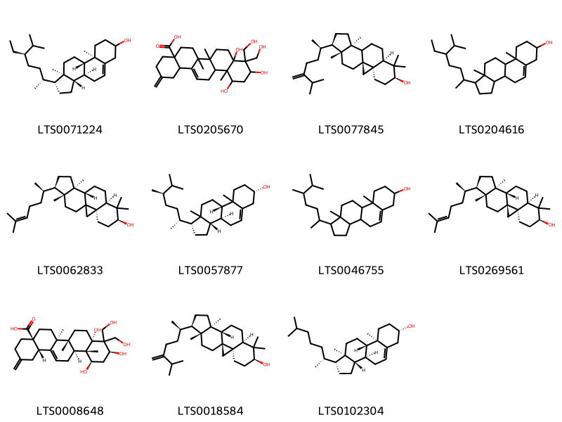{ width=100% }
    <figcaption>Hình ảnh cấu trúc hóa học của 11 hoạt chất thuộc nhóm Steroids and steroid derivatives gồm ['stigmast-5-en-3-ol (LTS0071224)', '8a,10,12-trihydroxy-9,9-bis(hydroxymethyl)-6a,6b,12a-trimethyl-2-methylidene-3,4,5,6,7,8,10,11,12,12b,13,14b-dodecahydro-1h-picene-4a-carboxylic acid (LTS0205670)', '24-methylene-cycloartanol (LTS0077845)', 'stigmast-5-en-3-ol, (3β)- (LTS0204616)', '(3r,6s,8r,11s,12s,15r,16r)-7,7,12,16-tetramethyl-15-[(2r)-6-methylhept-5-en-2-yl]pentacyclo[9.7.0.0¹,³.0³,⁸.0¹²,¹⁶]octadecan-6-ol (LTS0062833)', '(1r,3as,3bs,7s,9bs)-1-[(2r,5r)-5,6-dimethylheptan-2-yl]-9a,11a-dimethyl-1h,2h,3h,3ah,3bh,4h,6h,7h,8h,9h,9bh,10h,11h-cyclopenta[a]phenanthren-7-ol (LTS0057877)', 'campesterol (LTS0046755)', 'cycloartenol (LTS0269561)', '(4as,6as,6br,8as,10s,12r,12as,12bs,14bs)-8a,10,12-trihydroxy-9,9-bis(hydroxymethyl)-6a,6b,12a-trimethyl-2-methylidene-3,4,5,6,7,8,10,11,12,12b,13,14b-dodecahydro-1h-picene-4a-carboxylic acid (LTS0008648)', '24-methylenecycloartanol (LTS0018584)', 'cholesterol (LTS0102304)'].</figcaption>
</figure>

---

### Dược dân tộc học

Danh sách các quốc gia có sử dụng *Paeonia emodi* trong điều trị các bệnh. 

| Country   | Disease           | Bệnh              |
|:----------|:------------------|:------------------|
| Elsewhere | Cathartic, Emetic | Cathartic, Emetic |

---

---
## Paeonia foemina
### Thông tin về thực vật

!!! info "Phân loại thực vật của *Paeonia foemina* từ GIBF:"
    - **Kingdom:** Plantae
    - **Phylum:** Tracheophyta
    - **Order:** Saxifragales
    - **Family:** Paeoniaceae
    - **Genus:** Paeonia
    - **Species:** *Paeonia foemina*

 

| Label (VI)   | Label (EN)   | Scientific Name   | Descriptions (VI)   | Descriptions (EN)   | Also Known As (VI)   | Also Known As (EN)   |
|:-------------|:-------------|:------------------|:--------------------|:--------------------|:---------------------|:---------------------|
| N/A          | N/A          | Paeonia emodi     | loài thực vật       | species of plant    | ['']                 | ['']                 |

#### Phân bố trên thế giới

**Từ CSDL GIBF** nan, Pakistan, United Kingdom of Great Britain and Northern Ireland, Belgium, Afghanistan, India, Austria, China, Nepal

#### Phân bố tại Việt Nam

**Từ CSDL GIBF**: Không có ghi nhận ở Việt Nam

---
### Thành phần hóa học
        
- Theo cơ sở dữ liệu lotus: Từ loài *Paeonia foemina* đã phân lập và xác định được Chưa có hoạt chất nào được phân lập. hoạt chất thuộc về các nhóm Không có hoạt chất nào được phân lập. 

Không có hình ảnh nào được tạo ra

---

### Dược dân tộc học

Danh sách các quốc gia có sử dụng *Paeonia foemina* trong điều trị các bệnh. 

| Country   | Disease   | Bệnh               |
|:----------|:----------|:-------------------|
| Europe    | Tonic     | (thuộc) trương lực |

---

---
## Paeonia japonica
### Thông tin về thực vật

!!! info "Phân loại thực vật của *Paeonia obovata* từ GIBF:"
    - **Kingdom:** Plantae
    - **Phylum:** Tracheophyta
    - **Order:** Saxifragales
    - **Family:** Paeoniaceae
    - **Genus:** Paeonia
    - **Species:** *Paeonia obovata*

 

| Label (VI)   | Label (EN)   | Scientific Name   | Descriptions (VI)   | Descriptions (EN)   | Also Known As (VI)   | Also Known As (EN)   |
|:-------------|:-------------|:------------------|:--------------------|:--------------------|:---------------------|:---------------------|
| N/A          | N/A          | Paeonia japonica  | loài thực vật       | species of plant    | ['Paeonia japonica'] | ['']                 |

#### Phân bố trên thế giới

**Từ CSDL GIBF** nan, Korea, Republic of, Sweden, Japan

#### Phân bố tại Việt Nam

**Từ CSDL GIBF**: Không có ghi nhận ở Việt Nam

---
### Thành phần hóa học
        
- Theo cơ sở dữ liệu lotus: Từ loài *Paeonia obovata* đã phân lập và xác định được Chưa có hoạt chất nào được phân lập. hoạt chất thuộc về các nhóm Không có hoạt chất nào được phân lập. 

Không có hình ảnh nào được tạo ra

---

### Dược dân tộc học

Danh sách các quốc gia có sử dụng *Paeonia obovata* trong điều trị các bệnh. 

| Country   | Disease               | Bệnh                   |
|:----------|:----------------------|:-----------------------|
| Japan*    | Astringent, Demulcent | Chất làm se, Demulcent |

---

---
## Paeonia lactiflora
### Thông tin về thực vật

!!! info "Phân loại thực vật của *Paeonia lactiflora* từ GIBF:"
    - **Kingdom:** Plantae
    - **Phylum:** Tracheophyta
    - **Order:** Saxifragales
    - **Family:** Paeoniaceae
    - **Genus:** Paeonia
    - **Species:** *Paeonia lactiflora*

 

| Label (VI)   | Label (EN)   | Scientific Name    | Descriptions (VI)   | Descriptions (EN)   | Also Known As (VI)     | Also Known As (EN)                            |
|:-------------|:-------------|:-------------------|:--------------------|:--------------------|:-----------------------|:----------------------------------------------|
| N/A          | N/A          | Paeonia lactiflora |                     | species of plant    | ['Paeonia lactiflora'] | ['common garden peony', 'Paeonia lactiflora'] |

#### Phân bố trên thế giới

**Từ CSDL GIBF** Belgium, Estonia, Slovakia, Norway, Canada, Netherlands, Belarus, Korea, Republic of, Hungary, Russian Federation, United States of America, Sweden, Czechia, Germany, Switzerland, Armenia, Austria, United Kingdom of Great Britain and Northern Ireland, China, Poland, Mongolia

#### Phân bố tại Việt Nam

**Từ CSDL GIBF**: Không có ghi nhận ở Việt Nam

---
### Thành phần hóa học
        
- Theo cơ sở dữ liệu lotus: Từ loài *Paeonia lactiflora* đã phân lập và xác định được 256 hoạt chất thuộc về các nhóm Diarylheptanoids, Benzofurans, Stilbenes, Phenols, Carboxylic acids and derivatives, Fatty Acyls, Cinnamic acids and derivatives, Oxanes, Dibenzylbutane lignans, Heteroaromatic compounds, Saturated hydrocarbons, Tannins, Depsides and depsidones, Prenol lipids, Benzene and substituted derivatives, Dihydrofurans, Organooxygen compounds, Pyridines and derivatives, Phenol ethers, Flavonoids, Steroids and steroid derivatives, 2-arylbenzofuran flavonoids, Lactones. 

|    | chemicalTaxonomyClassyfireClass     |   smiles_count |
|---:|:------------------------------------|---------------:|
|  0 | 2-arylbenzofuran flavonoids         |              6 |
|  1 | Benzene and substituted derivatives |             26 |
|  2 | Benzofurans                         |              4 |
|  3 | Carboxylic acids and derivatives    |              1 |
|  4 | Cinnamic acids and derivatives      |              2 |
|  5 | Depsides and depsidones             |              1 |
|  6 | Diarylheptanoids                    |              7 |
|  7 | Dibenzylbutane lignans              |              1 |
|  8 | Dihydrofurans                       |              1 |
|  9 | Fatty Acyls                         |              6 |
| 10 | Flavonoids                          |              6 |
| 11 | Heteroaromatic compounds            |              1 |
| 12 | Lactones                            |              2 |
| 13 | Organooxygen compounds              |             33 |
| 14 | Oxanes                              |              2 |
| 15 | Phenol ethers                       |              1 |
| 16 | Phenols                             |              8 |
| 17 | Prenol lipids                       |             86 |
| 18 | Pyridines and derivatives           |              1 |
| 19 | Saturated hydrocarbons              |              2 |
| 20 | Steroids and steroid derivatives    |              4 |
| 21 | Stilbenes                           |              2 |
| 22 | Tannins                             |             51 |

#### Nhóm 2-arylbenzofuran flavonoids
<figure markdown="span">
    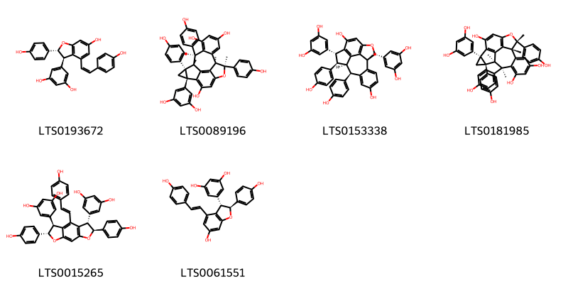{ width=100% }
    <figcaption>Hình ảnh cấu trúc hóa học của 6 hoạt chất thuộc nhóm 2-arylbenzofuran flavonoids gồm ['(z)-ε-viniferin (LTS0193672)', '(1s,2r,4s,10r,11r,18r)-4-(3,5-dihydroxyphenyl)-2,10,18-tris(4-hydroxyphenyl)-1,10,11,18-tetramethyl-9-oxahexacyclo[9.7.2.0²,⁴.0⁵,¹⁹.0⁸,²⁰.0¹²,¹⁷]icosa-5(19),6,8(20),12,14,16-hexaene-6,14,16-triol (LTS0089196)', '(1r,2r,3r,9s,10r,17r)-3,9-bis(3,5-dihydroxyphenyl)-2,17-bis(4-hydroxyphenyl)-8-oxapentacyclo[8.7.2.0⁴,¹⁸.0⁷,¹⁹.0¹¹,¹⁶]nonadeca-4(18),5,7(19),11,13,15-hexaene-5,14-diol (LTS0153338)', '(1s,2r,4s,10r,11r,18s)-4-(3,5-dihydroxyphenyl)-2,10,18-tris(4-hydroxyphenyl)-1,10,11,18-tetramethyl-9-oxahexacyclo[9.7.2.0²,⁴.0⁵,¹⁹.0⁸,²⁰.0¹²,¹⁷]icosa-5(19),6,8(20),12,14,16-hexaene-6,14,16-triol (LTS0181985)', 'gnetin h (LTS0015265)', '(+)-ε-viniferin (LTS0061551)'].</figcaption>
</figure>
#### Nhóm Benzene and substituted derivatives
<figure markdown="span">
    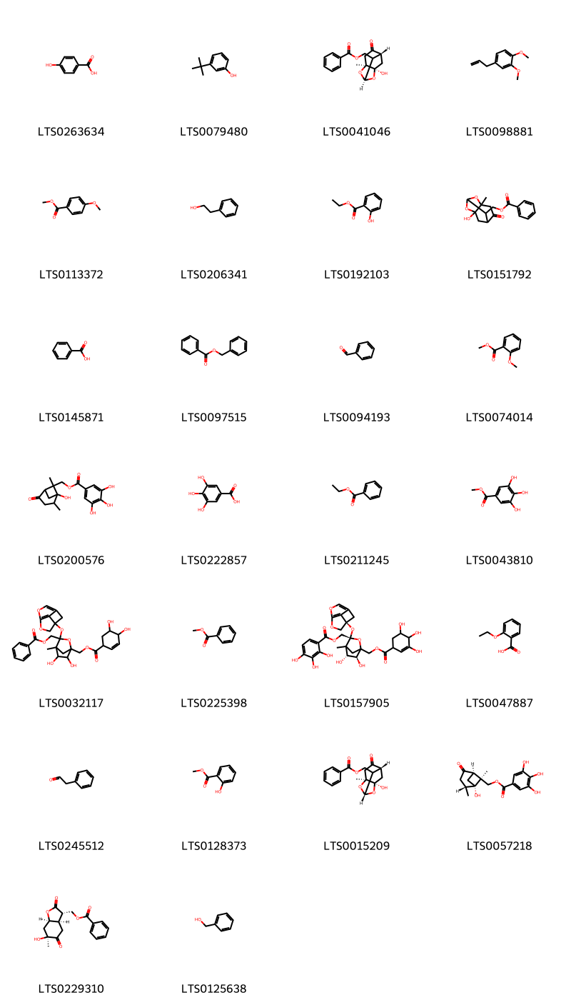{ width=100% }
    <figcaption>Hình ảnh cấu trúc hóa học của 26 hoạt chất thuộc nhóm Benzene and substituted derivatives gồm ['p-hydroxybenzoic acid (LTS0263634)', '3-tert-butylphenol (LTS0079480)', '[(1r,3s,6r,8r)-8-hydroxy-3-methyl-5-oxo-2,9-dioxatricyclo[4.3.1.0³,⁸]decan-10-yl]methyl benzoate (LTS0041046)', 'methyl eugenol (LTS0098881)', 'methyl anisate (LTS0113372)', '2-phenyl-ethanol (LTS0206341)', 'ethyl salicylate (LTS0192103)', '{8-hydroxy-3-methyl-5-oxo-2,9-dioxatricyclo[4.3.1.0³,⁸]decan-10-yl}methyl benzoate (LTS0151792)', 'benzoic acid (LTS0145871)', 'benzyl benzoate (LTS0097515)', 'benzaldehyde (LTS0094193)', 'methyl o-anisate (LTS0074014)', '{1-hydroxy-2,6-dimethyl-4-oxobicyclo[3.1.1]heptan-6-yl}methyl 3,4,5-trihydroxybenzoate (LTS0200576)', 'galop (LTS0222857)', 'ethyl benzoate (LTS0211245)', 'methyl gallate (LTS0043810)', '{1-[(4,5-dihydroxycyclohex-2-ene-1-carbonyloxy)methyl]-3-{5,7-dioxatricyclo[4.2.1.0³,⁹]nona-3,6(9)-dien-1-yloxy}-5,6-dihydroxy-4-methyl-2-oxabicyclo[2.2.1]heptan-3-yl}methyl benzoate (LTS0032117)', 'methyl benzoate (LTS0225398)', '[(3s,5r,6s)-3-[(1r)-5,7-dioxatricyclo[4.2.1.0³,⁹]nona-3,6(9)-dien-1-yloxy]-5,6-dihydroxy-4-methyl-1-[(3,4,5-trihydroxycyclohex-2-ene-1-carbonyloxy)methyl]-2-oxabicyclo[2.2.1]heptan-3-yl]methyl 2,3,4-trihydroxybenzoate (LTS0157905)', '2-ethoxybenzoic acid (LTS0047887)', 'phenylacetaldehyde (LTS0245512)', 'methyl salicylate (LTS0128373)', '[(1s,3s,6r,8r)-8-hydroxy-3-methyl-5-oxo-2,9-dioxatricyclo[4.3.1.0³,⁸]decan-10-yl]methyl benzoate (LTS0015209)', 'paeoniflorone (LTS0057218)', 'paeonilactone c (LTS0229310)', 'benzyl alcohol (LTS0125638)'].</figcaption>
</figure>
#### Nhóm Benzofurans
<figure markdown="span">
    { width=100% }
    <figcaption>Hình ảnh cấu trúc hóa học của 4 hoạt chất thuộc nhóm Benzofurans gồm ['(6s)-6-hydroxy-3,6-dimethyl-tetrahydro-3h-1-benzofuran-2,5-dione (LTS0075400)', 'paeonilactone b (LTS0077303)', 'paeonilactone a (LTS0164953)', '(3r,3ar,5s,6s,7ar)-5,6-dihydroxy-3,6-dimethyl-hexahydro-1-benzofuran-2-one (LTS0041729)'].</figcaption>
</figure>
#### Nhóm Carboxylic acids and derivatives
<figure markdown="span">
    { width=100% }
    <figcaption>Hình ảnh cấu trúc hóa học của 1 hoạt chất thuộc nhóm Carboxylic acids and derivatives gồm ['hexyl acetate (LTS0202355)'].</figcaption>
</figure>
#### Nhóm Cinnamic acids and derivatives
<figure markdown="span">
    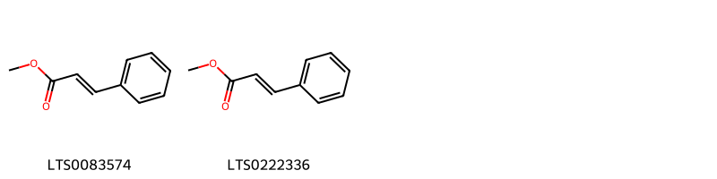{ width=100% }
    <figcaption>Hình ảnh cấu trúc hóa học của 2 hoạt chất thuộc nhóm Cinnamic acids and derivatives gồm ['methyl cinnamate (LTS0083574)', 'methyl cinnamate (LTS0222336)'].</figcaption>
</figure>
#### Nhóm Depsides and depsidones
<figure markdown="span">
    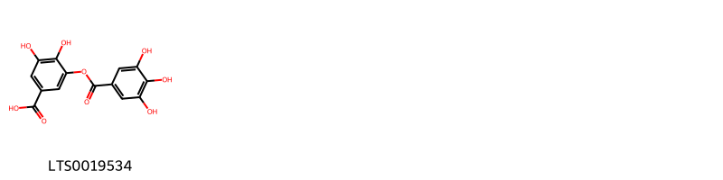{ width=100% }
    <figcaption>Hình ảnh cấu trúc hóa học của 1 hoạt chất thuộc nhóm Depsides and depsidones gồm ['digallic acid (LTS0019534)'].</figcaption>
</figure>
#### Nhóm Diarylheptanoids
<figure markdown="span">
    { width=100% }
    <figcaption>Hình ảnh cấu trúc hóa học của 7 hoạt chất thuộc nhóm Diarylheptanoids gồm ['(2r,3r,4s,5s)-2-(hydroxymethyl)-1,6,7-trioxo-3,4,5-tris(3,4,5-trihydroxybenzoyl)-2,3,5-tris(3,4,5-trihydroxybenzoyloxy)-1,7-bis(3,4,5-trihydroxyphenyl)heptan-4-yl 3,4,5-trihydroxybenzoate (LTS0221105)', '(3s,4s,5r,6r)-7-hydroxy-1,2,8-trioxo-3,4,5,6-tetrakis(3,4,5-trihydroxybenzoyl)-3,5,6-tris(3,4,5-trihydroxybenzoyloxy)-1,8-bis(3,4,5-trihydroxyphenyl)octan-4-yl 3,4,5-trihydroxybenzoate (LTS0145048)', '(3s,4s,5r,6r)-3,4,5,6-tetrahydroxy-6-(hydroxymethyl)-3,4,5-tris(3,4,5-trihydroxybenzoyl)-1,7-bis(3,4,5-trihydroxyphenyl)heptane-1,2,7-trione (LTS0104615)', '(2r,3r,4s,5s)-2-hydroxy-2-(hydroxymethyl)-1,6,7-trioxo-3,4,5-tris(3,4,5-trihydroxybenzoyl)-3,5-bis(3,4,5-trihydroxybenzoyloxy)-1,7-bis(3,4,5-trihydroxyphenyl)heptan-4-yl 3,4,5-trihydroxybenzoate (LTS0093130)', '(3s,4s,5r,6s)-3,4,5,6,7-pentahydroxy-3,4,5,6,7-pentakis(3,4,5-trihydroxybenzoyl)-1,8-bis(3,4,5-trihydroxyphenyl)octane-1,2,8-trione (LTS0238934)', '(3r,4r,5s,6s)-2-hydroxy-1,7,8-trioxo-2,3,4,5,6-pentakis(3,4,5-trihydroxybenzoyl)-3,5,6-tris(3,4,5-trihydroxybenzoyloxy)-1,8-bis(3,4,5-trihydroxyphenyl)octan-4-yl 3,4,5-trihydroxybenzoate (LTS0014468)', '(2r,3s,4s,5s)-2,3,4,5,6-pentahydroxy-7-oxo-2,3,4,5,6-pentakis(3,4,5-trihydroxybenzoyl)-7-(3,4,5-trihydroxyphenyl)heptanal (LTS0099392)'].</figcaption>
</figure>
#### Nhóm Dibenzylbutane lignans
<figure markdown="span">
    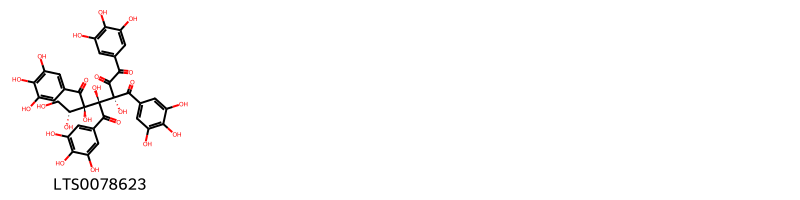{ width=100% }
    <figcaption>Hình ảnh cấu trúc hóa học của 1 hoạt chất thuộc nhóm Dibenzylbutane lignans gồm ['(3s,4s,5r)-5-[(1r)-1,2-dihydroxyethyl]-3,4,5-trihydroxy-3,4-bis(3,4,5-trihydroxybenzoyl)-1,6-bis(3,4,5-trihydroxyphenyl)hexane-1,2,6-trione (LTS0078623)'].</figcaption>
</figure>
#### Nhóm Dihydrofurans
<figure markdown="span">
    { width=100% }
    <figcaption>Hình ảnh cấu trúc hóa học của 1 hoạt chất thuộc nhóm Dihydrofurans gồm ['2,5-dimethyl-3h-furan-2-carbaldehyde (LTS0206813)'].</figcaption>
</figure>
#### Nhóm Fatty Acyls
<figure markdown="span">
    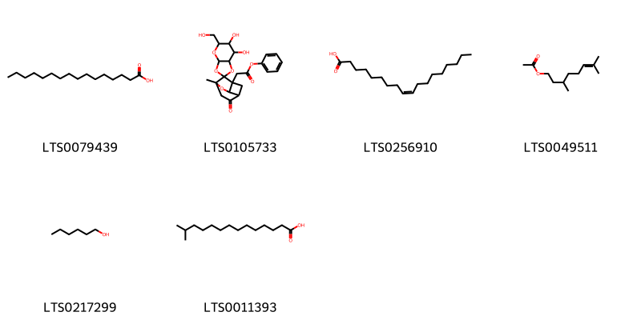{ width=100% }
    <figcaption>Hình ảnh cấu trúc hóa học của 6 hoạt chất thuộc nhóm Fatty Acyls gồm ['palmitic acid (LTS0079439)', "phenyl 2-[6,7-dihydroxy-5-(hydroxymethyl)-6'-methyl-4'-oxo-tetrahydro-3ah-7'-oxaspiro[[1,3]dioxolo[4,5-b]pyran-2,9'-tricyclo[4.2.1.0³,⁸]nonan]-1'-yl]acetate (LTS0105733)", 'oleic acid (LTS0256910)', 'citronellyl acetate (LTS0049511)', 'hexanol (LTS0217299)', '13-methyltetradecanoic acid (LTS0011393)'].</figcaption>
</figure>
#### Nhóm Flavonoids
<figure markdown="span">
    { width=100% }
    <figcaption>Hình ảnh cấu trúc hóa học của 6 hoạt chất thuộc nhóm Flavonoids gồm ['phlorizin chalcone (LTS0160338)', 'trifolin (LTS0267055)', 'gallocatechin gallate (LTS0215651)', '5-hydroxy-2-(4-hydroxyphenyl)-3,7-bis({[(2s,3r,4s,5s,6r)-3,4,5-trihydroxy-6-(hydroxymethyl)oxan-2-yl]oxy})chromen-4-one (LTS0215496)', '5-hydroxy-2-(4-hydroxyphenyl)-3,7-bis({[3,4,5-trihydroxy-6-(hydroxymethyl)oxan-2-yl]oxy})chromen-4-one (LTS0033278)', 'astragalin (LTS0249588)'].</figcaption>
</figure>
#### Nhóm Heteroaromatic compounds
<figure markdown="span">
    { width=100% }
    <figcaption>Hình ảnh cấu trúc hóa học của 1 hoạt chất thuộc nhóm Heteroaromatic compounds gồm ['furfuryl alcohol (LTS0110403)'].</figcaption>
</figure>
#### Nhóm Lactones
<figure markdown="span">
    { width=100% }
    <figcaption>Hình ảnh cấu trúc hóa học của 2 hoạt chất thuộc nhóm Lactones gồm ['9-hydroxy-10-(hydroxymethyl)-6,10,14,15-tetramethyl-21-methylidene-3,24-dioxaheptacyclo[16.5.2.0¹,¹⁵.0²,⁴.0⁵,¹⁴.0⁶,¹¹.0¹⁸,²³]pentacosan-25-one (LTS0059193)', '(1s,2s,4s,5r,6s,9s,10r,11r,14r,15s,18s,23r)-9-hydroxy-10-(hydroxymethyl)-6,10,14,15-tetramethyl-21-methylidene-3,24-dioxaheptacyclo[16.5.2.0¹,¹⁵.0²,⁴.0⁵,¹⁴.0⁶,¹¹.0¹⁸,²³]pentacosan-25-one (LTS0159011)'].</figcaption>
</figure>
#### Nhóm Organooxygen compounds
<figure markdown="span">
    { width=100% }
    <figcaption>Hình ảnh cấu trúc hóa học của 33 hoạt chất thuộc nhóm Organooxygen compounds gồm ['decanal (LTS0128361)', 'o-acetylphenol (LTS0137584)', 'amyl alcohol (LTS0193146)', '4-(methoxymethyl)-8-methyl-1-{[3,4,5-trihydroxy-6-(hydroxymethyl)oxan-2-yl]oxy}-2-oxabicyclo[3.3.1]nona-3,7-dien-6-one (LTS0133077)', '6-methyl-5-hepten-2-one (LTS0241073)', '(1s,5r)-4-(methoxymethyl)-8-methyl-1-{[(2s,3r,4s,5s,6r)-3,4,5-trihydroxy-6-(hydroxymethyl)oxan-2-yl]oxy}-2-oxabicyclo[3.3.1]nona-3,7-dien-6-one (LTS0098190)', 'acetophenone (LTS0155971)', 'oct-4-en-3-one (LTS0112346)', '1-(2,5-dihydroxy-4-methylphenyl)ethanone (LTS0055876)', 'bran oil (LTS0143969)', '1,3,5-trihydroxy-4-(3,4,5-trihydroxybenzoyloxy)cyclohexane-1-carboxylic acid (LTS0194563)', '1,3,4-trihydroxy-5-(3,4,5-trihydroxybenzoyloxy)cyclohexane-1-carboxylic acid (LTS0109045)', '(3r,5r)-1,3,5-trihydroxy-4-(3,4,5-trihydroxybenzoyloxy)cyclohexane-1-carboxylic acid (LTS0172864)', '2-decenal (LTS0199073)', '(3-hydroxy-4-methyl-8-oxo-4-{[(2s,3r,4s,5s,6r)-3,4,5-trihydroxy-6-(hydroxymethyl)oxan-2-yl]oxy}-5-oxatricyclo[4.2.1.0³,⁹]nonan-9-yl)methyl benzoate (LTS0141782)', '(2s,3r,4s,5s,6r)-2-{2-methoxy-5-[(1e)-prop-1-en-1-yl]phenoxy}-6-({[(2s,3r,4s,5s)-3,4,5-trihydroxyoxan-2-yl]oxy}methyl)oxane-3,4,5-triol (LTS0152732)', '(1s,5r)-4-(hydroxymethyl)-8-methyl-1-{[(2s,3r,4s,5s,6r)-3,4,5-trihydroxy-6-(hydroxymethyl)oxan-2-yl]oxy}-2-oxabicyclo[3.3.1]nona-3,7-dien-6-one (LTS0228934)', '(1r,4s)-1,3,4-trihydroxy-5-(3,4,5-trihydroxybenzoyloxy)cyclohexane-1-carboxylic acid (LTS0180055)', '3-methoxy-8-methyl-4-methylidene-1-{[3,4,5-trihydroxy-6-(hydroxymethyl)oxan-2-yl]oxy}-2-oxabicyclo[3.3.1]non-7-en-6-one (LTS0184653)', 'jasmone (LTS0205512)', '2-[2-methoxy-5-(prop-1-en-1-yl)phenoxy]-6-{[(3,4,5-trihydroxyoxan-2-yl)oxy]methyl}oxane-3,4,5-triol (LTS0265195)', '(1s,3r,5r)-3-methoxy-8-methyl-4-methylidene-1-{[(2s,3r,4s,5s,6r)-3,4,5-trihydroxy-6-(hydroxymethyl)oxan-2-yl]oxy}-2-oxabicyclo[3.3.1]non-7-en-6-one (LTS0034757)', 'p-methoxyacetophenone (LTS0040648)', 'hexanal (LTS0238624)', 'apocynin (LTS0211279)', '4-(hydroxymethyl)-8-methyl-1-{[3,4,5-trihydroxy-6-(hydroxymethyl)oxan-2-yl]oxy}-2-oxabicyclo[3.3.1]nona-3,7-dien-6-one (LTS0029550)', 'salicylaldehyde (LTS0188793)', 'theogallin (LTS0007361)', '2-acetylpyrrole (LTS0001423)', '2-methyl-1-butanol (LTS0029080)', 'paeonol (LTS0014950)', '(1s,3r,4s,5r)-1,3,5-trihydroxy-4-(3,4,5-trihydroxybenzoyloxy)cyclohexane-1-carboxylic acid (LTS0026827)', 'isoamyl alcohol (LTS0112297)'].</figcaption>
</figure>
#### Nhóm Oxanes
<figure markdown="span">
    { width=100% }
    <figcaption>Hình ảnh cấu trúc hóa học của 2 hoạt chất thuộc nhóm Oxanes gồm ['(2r,4r)-rose oxide (LTS0270571)', 'rose oxide (LTS0036561)'].</figcaption>
</figure>
#### Nhóm Phenol ethers
<figure markdown="span">
    { width=100% }
    <figcaption>Hình ảnh cấu trúc hóa học của 1 hoạt chất thuộc nhóm Phenol ethers gồm ['elemicin (LTS0188875)'].</figcaption>
</figure>
#### Nhóm Phenols
<figure markdown="span">
    { width=100% }
    <figcaption>Hình ảnh cấu trúc hóa học của 8 hoạt chất thuộc nhóm Phenols gồm ['eugenol (LTS0052342)', 'o-cresol (LTS0108586)', '2,3-dimethylhydroquinone (LTS0139221)', 'm-cresol (LTS0167800)', 'p-cresol (LTS0208715)', 'guaiacol (LTS0179228)', 'phenol (LTS0092642)', 'nonylphenol (LTS0254950)'].</figcaption>
</figure>
#### Nhóm Prenol lipids
<figure markdown="span">
    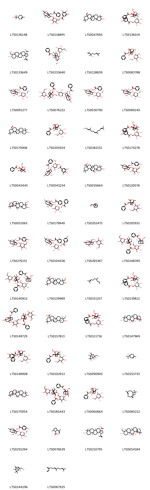{ width=100% }
    <figcaption>Hình ảnh cấu trúc hóa học của 86 hoạt chất thuộc nhóm Prenol lipids gồm ['terpineol (LTS0136148)', '[6-({2-[(benzoyloxy)methyl]-6-hydroxy-8-methyl-9,10-dioxatetracyclo[4.3.1.0²,⁵.0³,⁸]decan-3-yl}oxy)-3,4,5-trihydroxyoxan-2-yl]methyl 3,4,5-trihydroxybenzoate (LTS0118895)', '10-hydroxy-2,2,6a,6b,9,9,12a-heptamethyl-1,3,4,5,6,7,8,8a,10,11,12,12b,13,14b-tetradecahydropicene-4a-carbaldehyde (LTS0047695)', '[(2r,3s,4s,5r,6s)-6-{[(1r,3r,6s,8s,9s)-9-[(benzoyloxy)methyl]-8-methoxy-6-methyl-4-oxo-7-oxatricyclo[4.3.0.0³,⁹]nonan-1-yl]oxy}-3,4,5-trihydroxyoxan-2-yl]methyl 3,4,5-trihydroxybenzoate (LTS0136019)', '23-hydroxybetulinic acid (LTS0133649)', '[(1r,2s,3s,5s,6r,8s)-6-methoxy-8-methyl-3-{[(2s,3r,4s,5s,6r)-3,4,5-trihydroxy-6-(hydroxymethyl)oxan-2-yl]oxy}-9,10-dioxatetracyclo[4.3.1.0²,⁵.0³,⁸]decan-2-yl]methyl benzoate (LTS0233640)', 'linalool, (+-)- (LTS0128839)', '[(1r,3r,4r,6s,9s)-4-hydroxy-6-methyl-8-oxo-1-{[(2r,3s,4r,5r,6s)-3,4,5-trihydroxy-6-(hydroxymethyl)oxan-2-yl]oxy}-7-oxatricyclo[4.3.0.0³,⁹]nonan-9-yl]methyl benzoate (LTS0083788)', 'paeonin b (LTS0091277)', '[(1r,3r,6s,8s,9s)-8-{[(2r,3s,4s,5r,6s)-6-{[(1r,2s,3r,5r,6r,8s)-2-[(benzoyloxy)methyl]-6-hydroxy-8-methyl-9,10-dioxatetracyclo[4.3.1.0²,⁵.0³,⁸]decan-3-yl]oxy}-3,4,5-trihydroxyoxan-2-yl]methoxy}-6-methyl-4-oxo-1-{[(2s,3r,4s,5s,6r)-3,4,5-trihydroxy-6-(hydroxymethyl)oxan-2-yl]oxy}-7-oxatricyclo[4.3.0.0³,⁹]nonan-9-yl]methyl benzoate (LTS0076222)', 'paeoniflorin (LTS0030790)', '[(1r,2s,3r,5r,6r,8s)-6-hydroxy-8-methyl-3-{[(2s,3r,4s,5r,6r)-3,4,5-trihydroxy-6-(hydroxymethyl)oxan-2-yl]oxy}-9,10-dioxatetracyclo[4.3.1.0²,⁵.0³,⁸]decan-2-yl]methyl benzoate (LTS0089245)', 'oleanolic aldehyde (LTS0170906)', '[(1r,3r,4r,6s)-4-hydroxy-4,6-dimethyl-8-oxo-1-{[(2s,3r,4s,5s,6r)-3,4,5-trihydroxy-6-(hydroxymethyl)oxan-2-yl]oxy}-7-oxatricyclo[4.3.0.0³,⁹]nonan-9-yl]methyl benzoate (LTS0205924)', '(e,z)-farnesol (LTS0182151)', '[(2r,3s,4s,5r,6s)-6-({9-[(benzoyloxy)methyl]-8-methoxy-6-methyl-4-oxo-7-oxatricyclo[4.3.0.0³,⁹]nonan-1-yl}oxy)-3,4,5-trihydroxyoxan-2-yl]methyl 3,4,5-trihydroxybenzoate (LTS0174278)', '[(1r,3r,6r,8s,9s)-1-hydroxy-8-methoxy-6-methyl-4-oxo-7-oxatricyclo[4.3.0.0³,⁹]nonan-9-yl]methyl benzoate (LTS0043445)', '(2s,3r,4s,5r,6r)-2-{[(1r,2s,3r,5r,6r,8s)-2-[(benzoyloxy)methyl]-6-hydroxy-8-methyl-9,10-dioxatetracyclo[4.3.1.0²,⁵.0³,⁸]decan-3-yl]oxy}-3,5-dihydroxy-6-(hydroxymethyl)oxan-4-yl 3,4,5-trihydroxybenzoate (LTS0043234)', '10-hydroxy-2,2,6a,6b,9,9,12a-heptamethyl-13-oxo-3,4,5,6,7,8,8a,10,11,12,12b,14b-dodecahydro-1h-picene-4a-carboxylic acid (LTS0035664)', '(6-hydroxy-8-methyl-3-{[3,4,5-trihydroxy-6-(hydroxymethyl)oxan-2-yl]oxy}-9,10-dioxatetracyclo[4.3.1.0²,⁵.0³,⁸]decan-2-yl)methyl 4-hydroxybenzoate (LTS0120076)', '9-hydroxy-10-(hydroxymethyl)-6,10,14,15,21,21-hexamethyl-3,24-dioxaheptacyclo[16.5.2.0¹,¹⁵.0²,⁴.0⁵,¹⁴.0⁶,¹¹.0¹⁸,²³]pentacosan-25-one (LTS0051065)', 'paeonin a (LTS0179840)', 'myrtenal (LTS0202475)', '(4-hydroxy-6-methyl-8-oxo-1-{[3,4,5-trihydroxy-6-(hydroxymethyl)oxan-2-yl]oxy}-7-oxatricyclo[4.3.0.0³,⁹]nonan-9-yl)methyl benzoate (LTS0205931)', '[(1s,2s,3r,5s,6r,8s)-6-hydroxy-8-methyl-3-{[(2r)-3,4,5-trihydroxy-6-(hydroxymethyl)oxan-2-yl]oxy}-9,10-dioxatetracyclo[4.3.1.0²,⁵.0³,⁸]decan-2-yl]methyl 4-hydroxybenzoate (LTS0276151)', '[(2r,3s,4s,5r,6s)-6-{[(1s,2r,3r,6r,8s)-2-[(benzoyloxy)methyl]-6-hydroxy-8-methyl-9,10-dioxatetracyclo[4.3.1.0²,⁵.0³,⁸]decan-3-yl]oxy}-3,4,5-trihydroxyoxan-2-yl]methyl 4-hydroxybenzoate (LTS0104436)', '2-{[6-hydroxy-2-(hydroxymethyl)-8-methyl-9,10-dioxatetracyclo[4.3.1.0²,⁵.0³,⁸]decan-3-yl]oxy}-6-(hydroxymethyl)oxane-3,4,5-triol (LTS0265367)', '[(1s,6r,8s,9r)-8-{[(2r,3r,4s,5r,6s)-6-{[(1r,3r,6r,8s,9s)-9-[(benzoyloxy)methyl]-8-methoxy-6-methyl-4-oxo-7-oxatricyclo[4.3.0.0³,⁹]nonan-1-yl]oxy}-3,4,5-trihydroxyoxan-2-yl]methoxy}-6-methyl-4-oxo-1-{[(2s,3r,4s,5r,6r)-3,4,5-trihydroxy-6-(hydroxymethyl)oxan-2-yl]oxy}-7-oxatricyclo[4.3.0.0³,⁹]nonan-9-yl]methyl benzoate (LTS0248395)', '[(1s,3r,6r,8s,9r)-8-{[(2r,3r,4s,5r,6s)-6-{[(1r,3r,6r,8s,9s)-9-[(benzoyloxy)methyl]-8-methoxy-6-methyl-4-oxo-7-oxatricyclo[4.3.0.0³,⁹]nonan-1-yl]oxy}-3,4,5-trihydroxyoxan-2-yl]methoxy}-6-methyl-4-oxo-1-{[(2s,3r,4s,5r,6r)-3,4,5-trihydroxy-6-(hydroxymethyl)oxan-2-yl]oxy}-7-oxatricyclo[4.3.0.0³,⁹]nonan-9-yl]methyl benzoate (LTS0140912)', '10-hydroxy-9-(hydroxymethyl)-2,2,6a,6b,9,12a-hexamethyl-1,3,4,5,6,7,8,8a,10,11,12,12b,13,14b-tetradecahydropicene-4a-carboxylic acid (LTS0139989)', 'citronella (LTS0151257)', '[(1r,3r,6s,8s,9s)-1-{[(2s,3r,4s,5s,6r)-6-[(benzoyloxy)methyl]-3,4,5-trihydroxyoxan-2-yl]oxy}-8-methoxy-6-methyl-4-oxo-7-oxatricyclo[4.3.0.0³,⁹]nonan-9-yl]methyl 4-hydroxybenzoate (LTS0139812)', '(8-{[6-({2-[(benzoyloxy)methyl]-6-hydroxy-8-methyl-9,10-dioxatetracyclo[4.3.1.0²,⁵.0³,⁸]decan-3-yl}oxy)-3,4,5-trihydroxyoxan-2-yl]methoxy}-6-methyl-4-oxo-1-{[3,4,5-trihydroxy-6-(hydroxymethyl)oxan-2-yl]oxy}-7-oxatricyclo[4.3.0.0³,⁹]nonan-9-yl)methyl benzoate (LTS0149729)', 'hederagenin (LTS0157813)', '[(2r,3r,4s,5r,6s)-6-{[(1r,3r,6s,8s,9s)-9-[(benzoyloxy)methyl]-8-methoxy-6-methyl-4-oxo-7-oxatricyclo[4.3.0.0³,⁹]nonan-1-yl]oxy}-3,4,5-trihydroxyoxan-2-yl]methyl benzoate (LTS0111716)', '(1s,2s,4s,5r,6s,9s,11r,14r,15s,18s,23r)-9-hydroxy-6,10,10,14,15,21,21-heptamethyl-3,24-dioxaheptacyclo[16.5.2.0¹,¹⁵.0²,⁴.0⁵,¹⁴.0⁶,¹¹.0¹⁸,²³]pentacosan-25-one (LTS0147969)', '(1r,3r,4r,6s,9s)-9-[(benzoyloxy)methyl]-6-methyl-8-oxo-1-{[(2s,3r,4s,5s,6r)-3,4,5-trihydroxy-6-(hydroxymethyl)oxan-2-yl]oxy}-7-oxatricyclo[4.3.0.0³,⁹]nonan-4-yl 3,4,5-trihydroxybenzoate (LTS0148908)', '(8-methoxy-6-methyl-4-oxo-1-{[3,4,5-trihydroxy-6-(hydroxymethyl)oxan-2-yl]oxy}-7-oxatricyclo[4.3.0.0³,⁹]nonan-9-yl)methyl benzoate (LTS0102913)', 'paeonilactinone (LTS0090905)', '4-terpineol (LTS0253733)', '9-hydroxy-6,10,10,14,15,21,21-heptamethyl-3,24-dioxaheptacyclo[16.5.2.0¹,¹⁵.0²,⁴.0⁵,¹⁴.0⁶,¹¹.0¹⁸,²³]pentacosan-25-one (LTS0175954)', '(8-{[6-({9-[(benzoyloxy)methyl]-8-methoxy-6-methyl-4-oxo-7-oxatricyclo[4.3.0.0³,⁹]nonan-1-yl}oxy)-3,4,5-trihydroxyoxan-2-yl]methoxy}-6-methyl-4-oxo-1-{[3,4,5-trihydroxy-6-(hydroxymethyl)oxan-2-yl]oxy}-7-oxatricyclo[4.3.0.0³,⁹]nonan-9-yl)methyl benzoate (LTS0185443)', '[(1r,3r,4r,6s,9s)-4-hydroxy-6-methyl-8-oxo-1-{[(2s,3r,4s,5s,6r)-3,4,5-trihydroxy-6-(hydroxymethyl)oxan-2-yl]oxy}-7-oxatricyclo[4.3.0.0³,⁹]nonan-9-yl]methyl benzoate (LTS0060664)', 'caryophyllene (LTS0085212)', '[(2s,3r,5r,6r,8s)-6-hydroxy-8-methyl-3-{[(2s,3r,4s,5s,6r)-3,4,5-trihydroxy-6-(hydroxymethyl)oxan-2-yl]oxy}-9,10-dioxatetracyclo[4.3.1.0²,⁵.0³,⁸]decan-2-yl]methyl 4-hydroxybenzoate (LTS0255294)', 'nepetalactone (LTS0076639)', 'betulinic acid (LTS0210795)', '(1s,2s,4s,5r,6s,9s,10r,11r,14r,15s,18s,23r)-9-hydroxy-10-(hydroxymethyl)-6,10,14,15,21,21-hexamethyl-3,24-dioxaheptacyclo[16.5.2.0¹,¹⁵.0²,⁴.0⁵,¹⁴.0⁶,¹¹.0¹⁸,²³]pentacosan-25-one (LTS0054184)', '(1r,5r)-4-(hydroxymethyl)-6,6-dimethylbicyclo[3.1.1]hept-3-en-2-one (LTS0244296)', 'β-farnesene (LTS0067925)', '[(2r,3s,4s,5r,6s)-6-({9-[(benzoyloxy)methyl]-8-methoxy-6-methyl-4-oxo-7-oxatricyclo[4.3.0.0³,⁹]nonan-1-yl}oxy)-3,4,5-trihydroxyoxan-2-yl]methyl benzoate (LTS0213875)', '9-hydroxy-5a,5b,8,8,11a-pentamethyl-1-(prop-1-en-2-yl)-hexadecahydrocyclopenta[a]chrysene-3a-carboxylic acid (LTS0214300)', '(4-methoxy-6-methyl-8-oxo-1-{[(2s,3r,4s,5s,6r)-3,4,5-trihydroxy-6-(hydroxymethyl)oxan-2-yl]oxy}-7-oxatricyclo[4.3.0.0³,⁹]nonan-9-yl)methyl benzoate (LTS0216234)', '(3s)-9-[(benzoyloxy)methyl]-6-methyl-8-oxo-1-{[3,4,5-trihydroxy-6-(hydroxymethyl)oxan-2-yl]oxy}-7-oxatricyclo[4.3.0.0³,⁹]nonan-4-yl 3,4,5-trihydroxybenzoate (LTS0063103)', '9-[(benzoyloxy)methyl]-6-methyl-8-oxo-1-{[3,4,5-trihydroxy-6-(hydroxymethyl)oxan-2-yl]oxy}-7-oxatricyclo[4.3.0.0³,⁹]nonan-4-yl 3,4,5-trihydroxybenzoate (LTS0088878)', '(1r,3as,5ar,5br,7ar,9s,11ar,11br,13ar,13bs)-9-hydroxy-5a,5b,8,8,11a-pentamethyl-1-(prop-1-en-2-yl)-hexadecahydrocyclopenta[a]chrysene-3a-carboxylic acid (LTS0161903)', '(4as,6as,6br,8ar,10s,12as,12br,14bs)-10-hydroxy-2,2,6a,6b,9,9,12a-heptamethyl-13-oxo-3,4,5,6,7,8,8a,10,11,12,12b,14b-dodecahydro-1h-picene-4a-carboxylic acid (LTS0041176)', 'thymol (LTS0168527)', '[(2r,3s,4s,5r,6s)-6-{[(1r,3r,4r,6s,9s)-9-[(benzoyloxy)methyl]-4-hydroxy-6-methyl-8-oxo-7-oxatricyclo[4.3.0.0³,⁹]nonan-1-yl]oxy}-3,4,5-trihydroxyoxan-2-yl]methyl 3,4,5-trihydroxybenzoate (LTS0211032)', '(1-{[(2s,3r,4s,5s,6r)-6-[(benzoyloxy)methyl]-3,4,5-trihydroxyoxan-2-yl]oxy}-8-methoxy-6-methyl-4-oxo-7-oxatricyclo[4.3.0.0³,⁹]nonan-9-yl)methyl 4-hydroxybenzoate (LTS0184760)', '[(1r,2s,3r,5r,6r,8s)-6-hydroxy-8-methyl-3-{[(2s,3r,4s,5r,6r)-3,4,5-trihydroxy-6-(hydroxymethyl)oxan-2-yl]oxy}-9,10-dioxatetracyclo[4.3.1.0²,⁵.0³,⁸]decan-2-yl]methyl 4-hydroxybenzoate (LTS0164286)', '[3-({6-[(benzoyloxy)methyl]-3,4,5-trihydroxyoxan-2-yl}oxy)-6-hydroxy-8-methyl-9,10-dioxatetracyclo[4.3.1.0²,⁵.0³,⁸]decan-2-yl]methyl benzoate (LTS0032285)', 'oleanolic acid (LTS0141130)', '[(1s,2r,5r)-6,6-dimethylbicyclo[3.1.1]heptan-2-yl]methanol (LTS0208686)', '[(2s,3r,5r,6r,8s)-3-{[(2s,3r,4s,5r,6r)-6-[(benzoyloxy)methyl]-3,4,5-trihydroxyoxan-2-yl]oxy}-6-hydroxy-8-methyl-9,10-dioxatetracyclo[4.3.1.0²,⁵.0³,⁸]decan-2-yl]methyl benzoate (LTS0158357)', 'neral (LTS0165243)', 'geraniol (LTS0258838)', 'nerolidol isomers (LTS0007569)', 'farnesol (LTS0059667)', 'myrtanol (LTS0126998)', '(2s,3r,4s,5s,6r)-2-{[(1r,2s,3r,5r,6r,8s)-6-hydroxy-2-(hydroxymethyl)-8-methyl-9,10-dioxatetracyclo[4.3.1.0²,⁵.0³,⁸]decan-3-yl]oxy}-6-(hydroxymethyl)oxane-3,4,5-triol (LTS0000719)', '[(2r,3s,4s,5r,6s)-6-{[(1s,3s,4r,6s,9s)-9-[(benzoyloxy)methyl]-4-hydroxy-6-methyl-8-oxo-7-oxatricyclo[4.3.0.0³,⁹]nonan-1-yl]oxy}-3,4,5-trihydroxyoxan-2-yl]methyl benzoate (LTS0068451)', '(6-{[(1r,2s,3r,5s,6r,8s)-2-[(benzoyloxy)methyl]-6-hydroxy-8-methyl-9,10-dioxatetracyclo[4.3.1.0²,⁵.0³,⁸]decan-3-yl]oxy}-3,4,5-trihydroxyoxan-2-yl)methyl 3,4,5-trihydroxybenzoate (LTS0061316)', '[(1s,3s,6s,8s,9s)-1-hydroxy-8-methoxy-6-methyl-4-oxo-7-oxatricyclo[4.3.0.0³,⁹]nonan-9-yl]methyl benzoate (LTS0002749)', 'carvacrol (LTS0012882)', '[(2r,3s,4s,5r,6s)-6-{[(1r,4r)-9-[(benzoyloxy)methyl]-4-hydroxy-6-methyl-8-oxo-7-oxatricyclo[4.3.0.0³,⁹]nonan-1-yl]oxy}-3,4,5-trihydroxyoxan-2-yl]methyl benzoate (LTS0011224)', 'nerol (LTS0244289)', '[(3r,4s,5s,6r)-4,5-dihydroxy-6-(hydroxymethyl)-12-methyl-14-oxo-2,7,9,13-tetraoxapentacyclo[8.7.0.0¹,¹⁵.0³,⁸.0¹²,¹⁶]heptadecan-15-yl]methyl benzoate (LTS0239959)', 'citronellol, (+-)- (LTS0090925)', '(6-hydroxy-8-methyl-3-{[3,4,5-trihydroxy-6-(hydroxymethyl)oxan-2-yl]oxy}-9,10-dioxatetracyclo[4.3.1.0²,⁵.0³,⁸]decan-2-yl)methyl benzoate (LTS0025083)', '[(1s,3r,5r,6r,8s)-6-hydroxy-8-methyl-3-{[(2s,3r,4s,5s,6r)-3,4,5-trihydroxy-6-(hydroxymethyl)oxan-2-yl]oxy}-9,10-dioxatetracyclo[4.3.1.0²,⁵.0³,⁸]decan-2-yl]methyl 4-hydroxybenzoate (LTS0032132)', '[(2r,3s,4s,5r,6s)-6-{[(2s,3r,5r,6r,8s)-2-[(benzoyloxy)methyl]-6-hydroxy-8-methyl-9,10-dioxatetracyclo[4.3.1.0²,⁵.0³,⁸]decan-3-yl]oxy}-3,4,5-trihydroxyoxan-2-yl]methyl 3,4,5-trihydroxybenzoate (LTS0049577)', '[(1s,2s,3r,5r,6r,8s)-3-({6-[(benzoyloxy)methyl]-3,4,5-trihydroxyoxan-2-yl}oxy)-6-hydroxy-8-methyl-9,10-dioxatetracyclo[4.3.1.0²,⁵.0³,⁸]decan-2-yl]methyl benzoate (LTS0269298)', 'α-citral (LTS0246122)', '[(1r,2r,5s)-6,6-dimethylbicyclo[3.1.1]heptan-2-yl]methanol (LTS0104092)', 'oleanolic acid (LTS0117717)'].</figcaption>
</figure>
#### Nhóm Pyridines and derivatives
<figure markdown="span">
    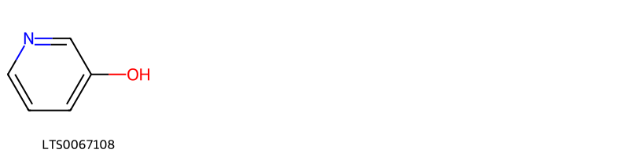{ width=100% }
    <figcaption>Hình ảnh cấu trúc hóa học của 1 hoạt chất thuộc nhóm Pyridines and derivatives gồm ['2-pyridone (LTS0067108)'].</figcaption>
</figure>
#### Nhóm Saturated hydrocarbons
<figure markdown="span">
    { width=100% }
    <figcaption>Hình ảnh cấu trúc hóa học của 2 hoạt chất thuộc nhóm Saturated hydrocarbons gồm ['decane (LTS0045828)', 'hexane (LTS0209095)'].</figcaption>
</figure>
#### Nhóm Steroids and steroid derivatives
<figure markdown="span">
    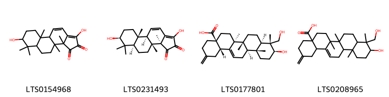{ width=100% }
    <figcaption>Hình ảnh cấu trúc hóa học của 4 hoạt chất thuộc nhóm Steroids and steroid derivatives gồm ['1,7-dihydroxy-3a,3b,6,6,9a-pentamethyl-4h,5h,5ah,7h,8h,9h,9bh-cyclopenta[a]phenanthrene-2,3-dione (LTS0154968)', 'palbinone (LTS0231493)', '30-norhederagenin (LTS0177801)', '10-hydroxy-9-(hydroxymethyl)-6a,6b,9,12a-tetramethyl-2-methylidene-1,3,4,5,6,7,8,8a,10,11,12,12b,13,14b-tetradecahydropicene-4a-carboxylic acid (LTS0208965)'].</figcaption>
</figure>
#### Nhóm Stilbenes
<figure markdown="span">
    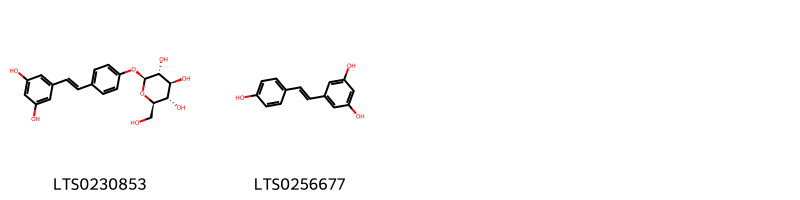{ width=100% }
    <figcaption>Hình ảnh cấu trúc hóa học của 2 hoạt chất thuộc nhóm Stilbenes gồm ['resveratroloside (LTS0230853)', 'resveratrol (LTS0256677)'].</figcaption>
</figure>
#### Nhóm Tannins
<figure markdown="span">
    { width=100% }
    <figcaption>Hình ảnh cấu trúc hóa học của 51 hoạt chất thuộc nhóm Tannins gồm ['(2r,3r,4s,5r,6s)-2,3,5-tris(3,4,5-trihydroxybenzoyloxy)-6-[(3,4,5-trihydroxybenzoyloxy)methyl]oxan-4-yl 2-[(14s,15s,19s)-14-[(10s,11r)-3,4,5,11,17,18,19-heptahydroxy-8,14-dioxo-9,13-dioxatricyclo[13.4.0.0²,⁷]nonadeca-1(15),2,4,6,16,18-hexaen-10-yl]-2,3,4,7,8,9-hexahydroxy-12,17-dioxo-13,16-dioxatetracyclo[13.3.1.0⁵,¹⁸.0⁶,¹¹]nonadeca-1,3,5(18),6,8,10-hexaen-19-yl]-3,4,5-trihydroxybenzoate (LTS0197464)', '(14s,15r,19r)-14-[(10r,11s)-3,4,5,11,17,18,19-heptahydroxy-8,14-dioxo-9,13-dioxatricyclo[13.4.0.0²,⁷]nonadeca-1(15),2,4,6,16,18-hexaen-10-yl]-2,3,4,7,8,9,19-heptahydroxy-13,16-dioxatetracyclo[13.3.1.0⁵,¹⁸.0⁶,¹¹]nonadeca-1(18),2,4,6,8,10-hexaene-12,17-dione (LTS0195171)', '(2r,3s,4r,5r,6s)-6-{[(1r,2s,3r,5r,6r,8s)-2-[(benzoyloxy)methyl]-6-hydroxy-8-methyl-9,10-dioxatetracyclo[4.3.1.0²,⁵.0³,⁸]decan-3-yl]oxy}-4,5-dihydroxy-2-(hydroxymethyl)oxan-3-yl 3,4,5-trihydroxybenzoate (LTS0218228)', 'methyl 2-[(14r,15s,19s)-14-[(10s,11r)-3,4,5,11,17,18,19-heptahydroxy-8,14-dioxo-9,13-dioxatricyclo[13.4.0.0²,⁷]nonadeca-1(15),2,4,6,16,18-hexaen-10-yl]-2,3,4,7,8,9-hexahydroxy-12,17-dioxo-13,16-dioxatetracyclo[13.3.1.0⁵,¹⁸.0⁶,¹¹]nonadeca-1,3,5(18),6,8,10-hexaen-19-yl]-3,4,5-trihydroxybenzoate (LTS0136801)', 'β-glucogallin (LTS0193705)', 'methyl 2-[(14r,15r,19r)-14-[(10r,11s)-3,4,5,11,17,18,19-heptahydroxy-8,14-dioxo-9,13-dioxatricyclo[13.4.0.0²,⁷]nonadeca-1(15),2,4,6,16,18-hexaen-10-yl]-2,3,4,7,8,9-hexahydroxy-12,17-dioxo-13,16-dioxatetracyclo[13.3.1.0⁵,¹⁸.0⁶,¹¹]nonadeca-1,3,5(18),6,8,10-hexaen-19-yl]-3,4,5-trihydroxybenzoate (LTS0085561)', '4,5,6-tris(3,4,5-trihydroxybenzoyloxy)-2-[(3,4,5-trihydroxybenzoyloxy)methyl]oxan-3-yl 2-(14-{3,4,5,11,17,18,19-heptahydroxy-8,14-dioxo-9,13-dioxatricyclo[13.4.0.0²,⁷]nonadeca-1(15),2,4,6,16,18-hexaen-10-yl}-2,3,4,7,8,9-hexahydroxy-12,17-dioxo-13,16-dioxatetracyclo[13.3.1.0⁵,¹⁸.0⁶,¹¹]nonadeca-1,3,5(18),6,8,10-hexaen-19-yl)-3,4,5-trihydroxybenzoate (LTS0074383)', '(2r,3r,4r,5s,6r)-4,5,6-tris(3,4,5-trihydroxybenzoyloxy)-2-[(3,4,5-trihydroxybenzoyloxy)methyl]oxan-3-yl 2-[(14r,15r,19s)-14-[(10s,11s)-3,4,5,11,17,18,19-heptahydroxy-8,14-dioxo-9,13-dioxatricyclo[13.4.0.0²,⁷]nonadeca-1(15),2,4,6,16,18-hexaen-10-yl]-2,3,4,7,8,9-hexahydroxy-12,17-dioxo-13,16-dioxatetracyclo[13.3.1.0⁵,¹⁸.0⁶,¹¹]nonadeca-1,3,5(18),6,8,10-hexaen-19-yl]-3,4,5-trihydroxybenzoate (LTS0069476)', '(2r,3r,4r,5r,6s)-2,3,5-tris(3,4,5-trihydroxybenzoyloxy)-6-[(3,4,5-trihydroxybenzoyloxy)methyl]oxan-4-yl 2-[(14s,15r,19r)-14-[(10s,11s)-3,4,5,11,17,18,19-heptahydroxy-8,14-dioxo-9,13-dioxatricyclo[13.4.0.0²,⁷]nonadeca-1(15),2,4,6,16,18-hexaen-10-yl]-2,3,4,7,8,9-hexahydroxy-12,17-dioxo-13,16-dioxatetracyclo[13.3.1.0⁵,¹⁸.0⁶,¹¹]nonadeca-1,3,5(18),6,8,10-hexaen-19-yl]-3,4,5-trihydroxybenzoate (LTS0088361)', '14-{3,4,5,11,17,18,19-heptahydroxy-8,14-dioxo-9,13-dioxatricyclo[13.4.0.0²,⁷]nonadeca-1(15),2,4,6,16,18-hexaen-10-yl}-2,3,4,7,8,9,19-heptahydroxy-13,16-dioxatetracyclo[13.3.1.0⁵,¹⁸.0⁶,¹¹]nonadeca-1(18),2,4,6,8,10-hexaene-12,17-dione (LTS0090883)', '[3,4,5,6-tetrakis(3,4,5-trihydroxybenzoyloxy)oxan-2-yl]methyl 2-(14-{3,4,5,11,17,18,19-heptahydroxy-8,14-dioxo-9,13-dioxatricyclo[13.4.0.0²,⁷]nonadeca-1(15),2,4,6,16,18-hexaen-10-yl}-2,3,4,7,8,9-hexahydroxy-12,17-dioxo-13,16-dioxatetracyclo[13.3.1.0⁵,¹⁸.0⁶,¹¹]nonadeca-1,3,5(18),6,8,10-hexaen-19-yl)-3,4,5-trihydroxybenzoate (LTS0035858)', '(2r,3s,4r,5s,6s)-3,5-dihydroxy-4-(3,4,5-trihydroxybenzoyloxy)-6-[(3,4,5-trihydroxybenzoyloxy)methyl]oxan-2-yl 3,4,5-trihydroxybenzoate (LTS0117581)', '(14s,15s,19s)-14-[(10r,11s)-3,4,5,11,17,18,19-heptahydroxy-8,14-dioxo-9,13-dioxatricyclo[13.4.0.0²,⁷]nonadeca-1(15),2,4,6,16,18-hexaen-10-yl]-2,3,4,7,8,9,19-heptahydroxy-13,16-dioxatetracyclo[13.3.1.0⁵,¹⁸.0⁶,¹¹]nonadeca-1(18),2,4,6,8,10-hexaene-12,17-dione (LTS0273104)', '3,4,5-trihydroxy-6-(hydroxymethyl)oxan-2-yl 3,4,5-trihydroxybenzoate (LTS0274683)', '3,4,5,13,21,22,23-heptahydroxy-8,18-dioxo-12-(3,4,5-trihydroxybenzoyloxy)-9,14,17-trioxatetracyclo[17.4.0.0²,⁷.0¹⁰,¹⁵]tricosa-1(23),2(7),3,5,19,21-hexaen-11-yl 3,4,5-trihydroxybenzoate (LTS0159314)', '3,4,5,11,14,20,21,22-octahydroxy-13-(hydroxymethyl)-9,12,16-trioxatetracyclo[16.4.0.0²,⁷.0¹⁰,¹⁵]docosa-1(22),2(7),3,5,18,20-hexaene-8,17-dione (LTS0149934)', '[(2s,3r,4s,5r,6s)-3,4,5,6-tetrakis(3,4,5-trihydroxybenzoyloxy)oxan-2-yl]methyl 2-[(14r,15r,19s)-14-[(10s,11s)-3,4,5,11,17,18,19-heptahydroxy-8,14-dioxo-9,13-dioxatricyclo[13.4.0.0²,⁷]nonadeca-1(15),2,4,6,16,18-hexaen-10-yl]-2,3,4,7,8,9-hexahydroxy-12,17-dioxo-13,16-dioxatetracyclo[13.3.1.0⁵,¹⁸.0⁶,¹¹]nonadeca-1,3,5(18),6,8,10-hexaen-19-yl]-3,4,5-trihydroxybenzoate (LTS0142422)', '(2r,3s,4r,5s,6s)-5-hydroxy-6-(hydroxymethyl)-3,4-bis(3,4,5-trihydroxybenzoyloxy)oxan-2-yl 3,4,5-trihydroxybenzoate (LTS0164547)', '(10s,11r,12r,13s,15r)-3,4,5,11,12,21,22,23-octahydroxy-8,18-dioxo-9,14,17-trioxatetracyclo[17.4.0.0²,⁷.0¹⁰,¹⁵]tricosa-1(23),2(7),3,5,19,21-hexaen-13-yl 3,4,5-trihydroxybenzoate (LTS0233186)', '(10r,11s,12r,13r,15r)-3,4,5,13,21,22,23-heptahydroxy-8,18-dioxo-11-(3,4,5-trihydroxybenzoyloxy)-9,14,17-trioxatetracyclo[17.4.0.0²,⁷.0¹⁰,¹⁵]tricosa-1(23),2(7),3,5,19,21-hexaen-12-yl 3,4,5-trihydroxybenzoate (LTS0229223)', 'methyl 2-[(14s,15s,19r)-14-[(10r)-3,4,5,11,17,18,19-heptahydroxy-8,14-dioxo-9,13-dioxatricyclo[13.4.0.0²,⁷]nonadeca-1(15),2,4,6,16,18-hexaen-10-yl]-2,3,4,7,8,9-hexahydroxy-12,17-dioxo-13,16-dioxatetracyclo[13.3.1.0⁵,¹⁸.0⁶,¹¹]nonadeca-1,3,5(18),6,8,10-hexaen-19-yl]-3,4,5-trihydroxybenzoate (LTS0168547)', '3,5-dihydroxy-4-(3,4,5-trihydroxybenzoyloxy)-6-[(3,4,5-trihydroxybenzoyloxy)methyl]oxan-2-yl 3,4,5-trihydroxybenzoate (LTS0104575)', '(10r,11s,12r,15r)-3,4,5,13,21,22,23-heptahydroxy-8,18-dioxo-11-(3,4,5-trihydroxybenzoyloxy)-9,14,17-trioxatetracyclo[17.4.0.0²,⁷.0¹⁰,¹⁵]tricosa-1(23),2(7),3,5,19,21-hexaen-12-yl 3,4,5-trihydroxybenzoate (LTS0087023)', '(10r,11s,12r,13s,15r)-3,4,5,21,22,23-hexahydroxy-8,18-dioxo-12,13-bis(3,4,5-trihydroxybenzoyloxy)-9,14,17-trioxatetracyclo[17.4.0.0²,⁷.0¹⁰,¹⁵]tricosa-1(23),2(7),3,5,19,21-hexaen-11-yl 3,4,5-trihydroxybenzoate (LTS0067445)', '3-hydroxy-2-(hydroxymethyl)-5,6-bis(3,4,5-trihydroxybenzoyloxy)oxan-4-yl 3,4,5-trihydroxybenzoate (LTS0232193)', '(2s,3r,4s,5r,6r)-3,4,5-tris(3,4,5-trihydroxybenzoyloxy)-6-[(3,4,5-trihydroxybenzoyloxy)methyl]oxan-2-yl 3,4,5-trihydroxybenzoate (LTS0216134)', 'casuarictin (LTS0241644)', '3,4,5,21,22,23-hexahydroxy-8,18-dioxo-12,13-bis(3,4,5-trihydroxybenzoyloxy)-9,14,17-trioxatetracyclo[17.4.0.0²,⁷.0¹⁰,¹⁵]tricosa-1(23),2(7),3,5,19,21-hexaen-11-yl 3,4,5-trihydroxybenzoate (LTS0007322)', '3,4,5-tris(3,4,5-trihydroxybenzoyloxy)-6-[(3,4,5-trihydroxybenzoyloxy)methyl]oxan-2-yl 3,4,5-trihydroxybenzoate (LTS0226232)', '4,5-dihydroxy-3-(3,4,5-trihydroxybenzoyloxy)-6-[(3,4,5-trihydroxybenzoyloxy)methyl]oxan-2-yl 3,4,5-trihydroxybenzoate (LTS0063924)', '(2s,3r,4s,5r,6r)-2,4,5-tris(3,4,5-trihydroxybenzoyloxy)-6-[(3,4,5-trihydroxybenzoyloxy)methyl]oxan-3-yl 2-[(14s,15s,19r)-14-[(10r)-3,4,5,11,17,18,19-heptahydroxy-8,14-dioxo-9,13-dioxatricyclo[13.4.0.0²,⁷]nonadeca-1(15),2,4,6,16,18-hexaen-10-yl]-2,3,4,7,8,9-hexahydroxy-12,17-dioxo-13,16-dioxatetracyclo[13.3.1.0⁵,¹⁸.0⁶,¹¹]nonadeca-1,3,5(18),6,8,10-hexaen-19-yl]-3,4,5-trihydroxybenzoate (LTS0195224)', 'methyl 2-(14-{3,4,5,11,17,18,19-heptahydroxy-8,14-dioxo-9,13-dioxatricyclo[13.4.0.0²,⁷]nonadeca-1(15),2,4,6,16,18-hexaen-10-yl}-2,3,4,7,8,9-hexahydroxy-12,17-dioxo-13,16-dioxatetracyclo[13.3.1.0⁵,¹⁸.0⁶,¹¹]nonadeca-1,3,5(18),6,8,10-hexaen-19-yl)-3,4,5-trihydroxybenzoate (LTS0053442)', '(2r,3r,4s,5r,6s)-4,5,6-tris(3,4,5-trihydroxybenzoyloxy)-2-[(3,4,5-trihydroxybenzoyloxy)methyl]oxan-3-yl 2-[(14s,15s,19r)-14-[(10r)-3,4,5,11,17,18,19-heptahydroxy-8,14-dioxo-9,13-dioxatricyclo[13.4.0.0²,⁷]nonadeca-1(15),2,4,6,16,18-hexaen-10-yl]-2,3,4,7,8,9-hexahydroxy-12,17-dioxo-13,16-dioxatetracyclo[13.3.1.0⁵,¹⁸.0⁶,¹¹]nonadeca-1,3,5(18),6,8,10-hexaen-19-yl]-3,4,5-trihydroxybenzoate (LTS0054494)', '(10r,11s,12s,13r,15s)-3,4,5,11,12,21,22,23-octahydroxy-8,18-dioxo-9,14,17-trioxatetracyclo[17.4.0.0²,⁷.0¹⁰,¹⁵]tricosa-1(23),2(7),3,5,19,21-hexaen-13-yl 3,4,5-trihydroxybenzoate (LTS0251367)', '[(2r,3r,4s,5r,6s)-3,4,5,6-tetrakis(3,4,5-trihydroxybenzoyloxy)oxan-2-yl]methyl 2-[(14s,15s,19r)-14-[(10r)-3,4,5,11,17,18,19-heptahydroxy-8,14-dioxo-9,13-dioxatricyclo[13.4.0.0²,⁷]nonadeca-1(15),2,4,6,16,18-hexaen-10-yl]-2,3,4,7,8,9-hexahydroxy-12,17-dioxo-13,16-dioxatetracyclo[13.3.1.0⁵,¹⁸.0⁶,¹¹]nonadeca-1,3,5(18),6,8,10-hexaen-19-yl]-3,4,5-trihydroxybenzoate (LTS0055793)', '(1r,2s,19r,22r)-7,8,9,12,13,14,20,28,29,30,33,34,35-tridecahydroxy-3,18,21,24,39-pentaoxaheptacyclo[20.17.0.0²,¹⁹.0⁵,¹⁰.0¹¹,¹⁶.0²⁶,³¹.0³²,³⁷]nonatriaconta-5(10),6,8,11,13,15,26(31),27,29,32,34,36-dodecaene-4,17,25,38-tetrone (LTS0137167)', '7,8,9,12,13,14,28,29,30,33,34,35-dodecahydroxy-4,17,25,38-tetraoxo-3,18,21,24,39-pentaoxaheptacyclo[20.17.0.0²,¹⁹.0⁵,¹⁰.0¹¹,¹⁶.0²⁶,³¹.0³²,³⁷]nonatriaconta-5,7,9,11(16),12,14,26,28,30,32(37),33,35-dodecaen-20-yl 3,4,5-trihydroxybenzoate (LTS0009009)', 'mudanpioside e (LTS0024857)', '(2r,3r,4s,5r,6r)-2,4,5-tris(3,4,5-trihydroxybenzoyloxy)-6-[(3,4,5-trihydroxybenzoyloxy)methyl]oxan-3-yl 2-[(14s,15r,19s)-14-[(10r,11r)-3,4,5,11,17,18,19-heptahydroxy-8,14-dioxo-9,13-dioxatricyclo[13.4.0.0²,⁷]nonadeca-1(15),2,4,6,16,18-hexaen-10-yl]-2,3,4,7,8,9-hexahydroxy-12,17-dioxo-13,16-dioxatetracyclo[13.3.1.0⁵,¹⁸.0⁶,¹¹]nonadeca-1,3,5(18),6,8,10-hexaen-19-yl]-3,4,5-trihydroxybenzoate (LTS0124940)', '2,4,5-tris(3,4,5-trihydroxybenzoyloxy)-6-[(3,4,5-trihydroxybenzoyloxy)methyl]oxan-3-yl 2-(14-{3,4,5,11,17,18,19-heptahydroxy-8,14-dioxo-9,13-dioxatricyclo[13.4.0.0²,⁷]nonadeca-1(15),2,4,6,16,18-hexaen-10-yl}-2,3,4,7,8,9-hexahydroxy-12,17-dioxo-13,16-dioxatetracyclo[13.3.1.0⁵,¹⁸.0⁶,¹¹]nonadeca-1,3,5(18),6,8,10-hexaen-19-yl)-3,4,5-trihydroxybenzoate (LTS0011205)', '(2s,3r,4s,5r,6r)-2,3,5-tris(3,4,5-trihydroxybenzoyloxy)-6-[(3,4,5-trihydroxybenzoyloxy)methyl]oxan-4-yl 2-[(14s,15s,19r)-14-[(10r)-3,4,5,11,17,18,19-heptahydroxy-8,14-dioxo-9,13-dioxatricyclo[13.4.0.0²,⁷]nonadeca-1(15),2,4,6,16,18-hexaen-10-yl]-2,3,4,7,8,9-hexahydroxy-12,17-dioxo-13,16-dioxatetracyclo[13.3.1.0⁵,¹⁸.0⁶,¹¹]nonadeca-1,3,5(18),6,8,10-hexaen-19-yl]-3,4,5-trihydroxybenzoate (LTS0020493)', '(1r,2s,19r,20r,22r)-7,8,9,12,13,14,20,28,29,30,33,34,35-tridecahydroxy-3,18,21,24,39-pentaoxaheptacyclo[20.17.0.0²,¹⁹.0⁵,¹⁰.0¹¹,¹⁶.0²⁶,³¹.0³²,³⁷]nonatriaconta-5(10),6,8,11,13,15,26(31),27,29,32,34,36-dodecaene-4,17,25,38-tetrone (LTS0092963)', '2,3,5-tris(3,4,5-trihydroxybenzoyloxy)-6-[(3,4,5-trihydroxybenzoyloxy)methyl]oxan-4-yl 2-(14-{3,4,5,11,17,18,19-heptahydroxy-8,14-dioxo-9,13-dioxatricyclo[13.4.0.0²,⁷]nonadeca-1(15),2,4,6,16,18-hexaen-10-yl}-2,3,4,7,8,9-hexahydroxy-12,17-dioxo-13,16-dioxatetracyclo[13.3.1.0⁵,¹⁸.0⁶,¹¹]nonadeca-1,3,5(18),6,8,10-hexaen-19-yl)-3,4,5-trihydroxybenzoate (LTS0237199)', '5-hydroxy-3,4-bis(3,4,5-trihydroxybenzoyloxy)-6-[(3,4,5-trihydroxybenzoyloxy)methyl]oxan-2-yl 3,4,5-trihydroxybenzoate (LTS0023424)', '(2s,3r,4s,5r,6r)-4,5,6-tris(3,4,5-trihydroxybenzoyloxy)-2-[(3,4,5-trihydroxybenzoyloxy)methyl]oxan-3-yl 2-[(14s,15r,19r)-14-[(10r,11s)-3,4,5,11,17,18,19-heptahydroxy-8,14-dioxo-9,13-dioxatricyclo[13.4.0.0²,⁷]nonadeca-1(15),2,4,6,16,18-hexaen-10-yl]-2,3,4,7,8,9-hexahydroxy-12,17-dioxo-13,16-dioxatetracyclo[13.3.1.0⁵,¹⁸.0⁶,¹¹]nonadeca-1,3,5(18),6,8,10-hexaen-19-yl]-3,4,5-trihydroxybenzoate (LTS0226944)', '(10r,11r,13r,14r,15s)-3,4,5,11,14,20,21,22-octahydroxy-13-(hydroxymethyl)-9,12,16-trioxatetracyclo[16.4.0.0²,⁷.0¹⁰,¹⁵]docosa-1(18),2,4,6,19,21-hexaene-8,17-dione (LTS0033259)', '(2s,3r,4s,5r,6r)-5-hydroxy-3,4-bis(3,4,5-trihydroxybenzoyloxy)-6-[(3,4,5-trihydroxybenzoyloxy)methyl]oxan-2-yl 3,4,5-trihydroxybenzoate (LTS0130248)', '(2r,3s,4s,5s,6r)-2,4,5-tris(3,4,5-trihydroxybenzoyloxy)-6-[(3,4,5-trihydroxybenzoyloxy)methyl]oxan-3-yl 2-[(14s,15r,19s)-14-[(10r,11s)-3,4,5,11,17,18,19-heptahydroxy-8,14-dioxo-9,13-dioxatricyclo[13.4.0.0²,⁷]nonadeca-1(15),2,4,6,16,18-hexaen-10-yl]-2,3,4,7,8,9-hexahydroxy-12,17-dioxo-13,16-dioxatetracyclo[13.3.1.0⁵,¹⁸.0⁶,¹¹]nonadeca-1,3,5(18),6,8,10-hexaen-19-yl]-3,4,5-trihydroxybenzoate (LTS0107030)', '(14r,15s,19r)-14-[(10r,11r)-3,4,5,11,17,18,19-heptahydroxy-8,14-dioxo-9,13-dioxatricyclo[13.4.0.0²,⁷]nonadeca-1(15),2,4,6,16,18-hexaen-10-yl]-2,3,4,7,8,9,19-heptahydroxy-13,16-dioxatetracyclo[13.3.1.0⁵,¹⁸.0⁶,¹¹]nonadeca-1(18),2,4,6,8,10-hexaene-12,17-dione (LTS0041901)', '(2s,3r,4s,5s,6r)-4,5-dihydroxy-3-(3,4,5-trihydroxybenzoyloxy)-6-[(3,4,5-trihydroxybenzoyloxy)methyl]oxan-2-yl 3,4,5-trihydroxybenzoate (LTS0243221)', '[(2s,3r,4r,5s,6r)-3,4,5,6-tetrakis(3,4,5-trihydroxybenzoyloxy)oxan-2-yl]methyl 2-[(14s,15r,19r)-14-[(10s,11s)-3,4,5,11,17,18,19-heptahydroxy-8,14-dioxo-9,13-dioxatricyclo[13.4.0.0²,⁷]nonadeca-1(15),2,4,6,16,18-hexaen-10-yl]-2,3,4,7,8,9-hexahydroxy-12,17-dioxo-13,16-dioxatetracyclo[13.3.1.0⁵,¹⁸.0⁶,¹¹]nonadeca-1,3,5(18),6,8,10-hexaen-19-yl]-3,4,5-trihydroxybenzoate (LTS0044918)'].</figcaption>
</figure>

---

### Dược dân tộc học

Danh sách các quốc gia có sử dụng *Paeonia lactiflora* trong điều trị các bệnh. 

| Country   | Disease        | Bệnh                |
|:----------|:---------------|:--------------------|
| China     | nan, Fungicide | nan, Thuốc diệt nấm |
| Elsewhere | nan            | Ở đây               |

---

---
## Paeonia moutan
### Thông tin về thực vật

!!! info "Phân loại thực vật của *Paeonia suffruticosa* từ GIBF:"
    - **Kingdom:** Plantae
    - **Phylum:** Tracheophyta
    - **Order:** Saxifragales
    - **Family:** Paeoniaceae
    - **Genus:** Paeonia
    - **Species:** *Paeonia suffruticosa*

 

| Label (VI)   | Label (EN)   | Scientific Name   | Descriptions (VI)   | Descriptions (EN)          | Also Known As (VI)   | Also Known As (EN)   |
|:-------------|:-------------|:------------------|:--------------------|:---------------------------|:---------------------|:---------------------|
| N/A          | N/A          | Paeonia moutan    |                     | species of flowering plant | ['']                 | ['']                 |

#### Phân bố trên thế giới

**Từ CSDL GIBF** nan, Japan, Spain, unknown or invalid, France, China

#### Phân bố tại Việt Nam

**Từ CSDL GIBF**: Không có ghi nhận ở Việt Nam

---
### Thành phần hóa học
        
- Theo cơ sở dữ liệu lotus: Từ loài *Paeonia suffruticosa* đã phân lập và xác định được Chưa có hoạt chất nào được phân lập. hoạt chất thuộc về các nhóm Không có hoạt chất nào được phân lập. 

Không có hình ảnh nào được tạo ra

---

### Dược dân tộc học

Danh sách các quốc gia có sử dụng *Paeonia suffruticosa* trong điều trị các bệnh. 

| Country   | Disease                 | Bệnh                       |
|:----------|:------------------------|:---------------------------|
| China     | nan, Emmenagogue, Tonic | nan, Emmenagogue, Thuốc bổ |
| Elsewhere | Sedative                | Thuốc an thần              |
| Japan*    | Antiphlogistic          | Thuốc chống đông máu       |

---

---
## Paeonia officinalis
### Thông tin về thực vật

!!! info "Phân loại thực vật của *Paeonia officinalis* từ GIBF:"
    - **Kingdom:** Plantae
    - **Phylum:** Tracheophyta
    - **Order:** Saxifragales
    - **Family:** Paeoniaceae
    - **Genus:** Paeonia
    - **Species:** *Paeonia officinalis*

 

| Label (VI)   | Label (EN)   | Scientific Name     | Descriptions (VI)   | Descriptions (EN)   | Also Known As (VI)   | Also Known As (EN)               |
|:-------------|:-------------|:--------------------|:--------------------|:--------------------|:---------------------|:---------------------------------|
| N/A          | N/A          | Paeonia officinalis | loài thực vật       | species of plant    | ['']                 | ['common peony', 'garden peony'] |

#### Phân bố trên thế giới

**Từ CSDL GIBF** nan, Italy, Belgium, Norway, Canada, Denmark, Spain, Hungary, Russian Federation, United States of America, Sweden, Finland, Slovenia, Croatia, Germany, Switzerland, Austria, France, United Kingdom of Great Britain and Northern Ireland, Ireland, Serbia, New Zealand

#### Phân bố tại Việt Nam

**Từ CSDL GIBF**: Không có ghi nhận ở Việt Nam

---
### Thành phần hóa học
        
- Theo cơ sở dữ liệu lotus: Từ loài *Paeonia officinalis* đã phân lập và xác định được 2 hoạt chất thuộc về các nhóm Dihydrofurans, Prenol lipids. 

|    | chemicalTaxonomyClassyfireClass   |   smiles_count |
|---:|:----------------------------------|---------------:|
|  0 | Dihydrofurans                     |              1 |
|  1 | Prenol lipids                     |              1 |

#### Nhóm Dihydrofurans
<figure markdown="span">
    { width=100% }
    <figcaption>Hình ảnh cấu trúc hóa học của 1 hoạt chất thuộc nhóm Dihydrofurans gồm ['protoanemonin (LTS0133358)'].</figcaption>
</figure>
#### Nhóm Prenol lipids
<figure markdown="span">
    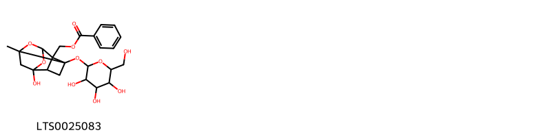{ width=100% }
    <figcaption>Hình ảnh cấu trúc hóa học của 1 hoạt chất thuộc nhóm Prenol lipids gồm ['(6-hydroxy-8-methyl-3-{[3,4,5-trihydroxy-6-(hydroxymethyl)oxan-2-yl]oxy}-9,10-dioxatetracyclo[4.3.1.0²,⁵.0³,⁸]decan-2-yl)methyl benzoate (LTS0025083)'].</figcaption>
</figure>

---

### Dược dân tộc học

Danh sách các quốc gia có sử dụng *Paeonia officinalis* trong điều trị các bệnh. 

| Country   | Disease                                | Bệnh                                   |
|:----------|:---------------------------------------|:---------------------------------------|
| Elsewhere | Emetic, Poison                         | Emetic, Poison                         |
| Turkey    | Emetic, Intoxicant, Tonic, Emmenagogue | Emetic, Intoxicant, Tonic, Emmenagogue |

---

---
## Paeonia suffruticosa
### Thông tin về thực vật

!!! info "Phân loại thực vật của *Paeonia suffruticosa* từ GIBF:"
    - **Kingdom:** Plantae
    - **Phylum:** Tracheophyta
    - **Order:** Saxifragales
    - **Family:** Paeoniaceae
    - **Genus:** Paeonia
    - **Species:** *Paeonia suffruticosa*

 

| Label (VI)   | Label (EN)   | Scientific Name      | Descriptions (VI)   | Descriptions (EN)   | Also Known As (VI)   | Also Known As (EN)   |
|:-------------|:-------------|:---------------------|:--------------------|:--------------------|:---------------------|:---------------------|
| N/A          | N/A          | Paeonia suffruticosa | loài thực vật       | species of plant    | ['']                 | ['tree peony']       |

#### Phân bố trên thế giới

**Từ CSDL GIBF** nan, Japan, Belgium, Estonia, unknown or invalid, Latvia, Norway, Ukraine, Belarus, Korea, Republic of, Chinese Taipei, Spain, Russian Federation, United States of America, Sweden, Czechia, Germany, Bhutan, Austria, France, United Kingdom of Great Britain and Northern Ireland, China, Poland

#### Phân bố tại Việt Nam

**Từ CSDL GIBF**: Không có ghi nhận ở Việt Nam

---
### Thành phần hóa học
        
- Theo cơ sở dữ liệu lotus: Từ loài *Paeonia suffruticosa* đã phân lập và xác định được 184 hoạt chất thuộc về các nhóm Coumarans, Flavonoids, Prenol lipids, Steroids and steroid derivatives, Organic dithiophosphoric acids and derivatives, Cinnamic acids and derivatives, Purine nucleosides, Benzene and substituted derivatives, 2-arylbenzofuran flavonoids, Furopyrans, Heteroaromatic compounds, Organooxygen compounds, Tannins, Phenols, Dihydrofurans, Stilbenes, Pyridines and derivatives. 

|    | chemicalTaxonomyClassyfireClass                |   smiles_count |
|---:|:-----------------------------------------------|---------------:|
|  0 | 2-arylbenzofuran flavonoids                    |             18 |
|  1 | Benzene and substituted derivatives            |             23 |
|  2 | Cinnamic acids and derivatives                 |              2 |
|  3 | Coumarans                                      |              2 |
|  4 | Dihydrofurans                                  |              2 |
|  5 | Flavonoids                                     |              9 |
|  6 | Furopyrans                                     |              2 |
|  7 | Heteroaromatic compounds                       |              1 |
|  8 | Organic dithiophosphoric acids and derivatives |              1 |
|  9 | Organooxygen compounds                         |             27 |
| 10 | Phenols                                        |              5 |
| 11 | Prenol lipids                                  |             59 |
| 12 | Purine nucleosides                             |              1 |
| 13 | Pyridines and derivatives                      |              1 |
| 14 | Steroids and steroid derivatives               |             13 |
| 15 | Stilbenes                                      |              5 |
| 16 | Tannins                                        |             11 |

#### Nhóm 2-arylbenzofuran flavonoids
<figure markdown="span">
    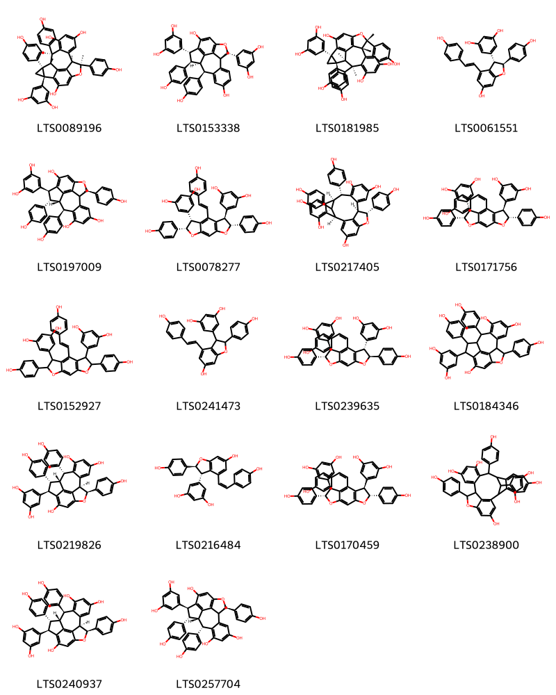{ width=100% }
    <figcaption>Hình ảnh cấu trúc hóa học của 18 hoạt chất thuộc nhóm 2-arylbenzofuran flavonoids gồm ['(1s,2r,4s,10r,11r,18r)-4-(3,5-dihydroxyphenyl)-2,10,18-tris(4-hydroxyphenyl)-1,10,11,18-tetramethyl-9-oxahexacyclo[9.7.2.0²,⁴.0⁵,¹⁹.0⁸,²⁰.0¹²,¹⁷]icosa-5(19),6,8(20),12,14,16-hexaene-6,14,16-triol (LTS0089196)', '(1r,2r,3r,9s,10r,17r)-3,9-bis(3,5-dihydroxyphenyl)-2,17-bis(4-hydroxyphenyl)-8-oxapentacyclo[8.7.2.0⁴,¹⁸.0⁷,¹⁹.0¹¹,¹⁶]nonadeca-4(18),5,7(19),11,13,15-hexaene-5,14-diol (LTS0153338)', '(1s,2r,4s,10r,11r,18s)-4-(3,5-dihydroxyphenyl)-2,10,18-tris(4-hydroxyphenyl)-1,10,11,18-tetramethyl-9-oxahexacyclo[9.7.2.0²,⁴.0⁵,¹⁹.0⁸,²⁰.0¹²,¹⁷]icosa-5(19),6,8(20),12,14,16-hexaene-6,14,16-triol (LTS0181985)', '(+)-ε-viniferin (LTS0061551)', '(1s,2s,3s,9r,10s,17r)-3-(3,5-dihydroxyphenyl)-2,9,17-tris(4-hydroxyphenyl)-8-oxapentacyclo[8.7.2.0⁴,¹⁸.0⁷,¹⁹.0¹¹,¹⁶]nonadeca-4,6,11,13,15,18-hexaene-5,13,15-triol (LTS0197009)', 'trans-suffruticosol d (LTS0078277)', '(2s,9r,10r,17r,18r,25s)-10,18,25-tris(4-hydroxyphenyl)-19-oxahexacyclo[15.6.1.1²,⁹.0³,⁸.0¹¹,¹⁶.0²⁰,²⁴]pentacosa-1(23),3,5,7,11,13,15,20(24),21-nonaene-4,6,12,14,22-pentol (LTS0217405)', '5-[(5r,6r,10r,11s)-10-(3,5-dihydroxyphenyl)-5,11-bis(4-hydroxyphenyl)-8-[(1z)-2-(4-hydroxyphenyl)ethenyl]-4,12-dioxatricyclo[7.3.0.0³,⁷]dodeca-1,3(7),8-trien-6-yl]benzene-1,3-diol (LTS0171756)', '5-[10-(3,5-dihydroxyphenyl)-5,11-bis(4-hydroxyphenyl)-8-[2-(4-hydroxyphenyl)ethenyl]-4,12-dioxatricyclo[7.3.0.0³,⁷]dodeca-1,3(7),8-trien-6-yl]benzene-1,3-diol (LTS0152927)', 'epsilon-viniferin (LTS0241473)', '5-[(5s,6s,10s,11s)-10-(3,5-dihydroxyphenyl)-5,11-bis(4-hydroxyphenyl)-8-[(1z)-2-(4-hydroxyphenyl)ethenyl]-4,12-dioxatricyclo[7.3.0.0³,⁷]dodeca-1,3(7),8-trien-6-yl]benzene-1,3-diol (LTS0239635)', '3-(3,5-dihydroxyphenyl)-2,9,17-tris(4-hydroxyphenyl)-8-oxapentacyclo[8.7.2.0⁴,¹⁸.0⁷,¹⁹.0¹¹,¹⁶]nonadeca-4,6,11,13,15,18-hexaene-5,13,15-triol (LTS0184346)', '(1r,2r,3r,9s,10r,17r)-3-(3,5-dihydroxyphenyl)-2,9,17-tris(4-hydroxyphenyl)-8-oxapentacyclo[8.7.2.0⁴,¹⁸.0⁷,¹⁹.0¹¹,¹⁶]nonadeca-4,6,11,13,15,18-hexaene-5,13,15-triol (LTS0219826)', '(+)-cis-epsilon-viniferin (LTS0216484)', '5-[(5r,6r,10s,11s)-10-(3,5-dihydroxyphenyl)-5,11-bis(4-hydroxyphenyl)-8-[(1z)-2-(4-hydroxyphenyl)ethenyl]-4,12-dioxatricyclo[7.3.0.0³,⁷]dodeca-1,3(7),8-trien-6-yl]benzene-1,3-diol (LTS0170459)', '10,18,25-tris(4-hydroxyphenyl)-19-oxahexacyclo[15.6.1.1²,⁹.0³,⁸.0¹¹,¹⁶.0²⁰,²⁴]pentacosa-1(24),3,5,7,11,13,15,20,22-nonaene-4,6,12,14,22-pentol (LTS0238900)', '(1r,2r,3r,9s,10r,17s)-3-(3,5-dihydroxyphenyl)-2,9,17-tris(4-hydroxyphenyl)-8-oxapentacyclo[8.7.2.0⁴,¹⁸.0⁷,¹⁹.0¹¹,¹⁶]nonadeca-4,6,11,13,15,18-hexaene-5,13,15-triol (LTS0240937)', '(1s,2s,3s,9r,10s,17s)-3-(3,5-dihydroxyphenyl)-2,9,17-tris(4-hydroxyphenyl)-8-oxapentacyclo[8.7.2.0⁴,¹⁸.0⁷,¹⁹.0¹¹,¹⁶]nonadeca-4(18),5,7(19),11,13,15-hexaene-5,13,15-triol (LTS0257704)'].</figcaption>
</figure>
#### Nhóm Benzene and substituted derivatives
<figure markdown="span">
    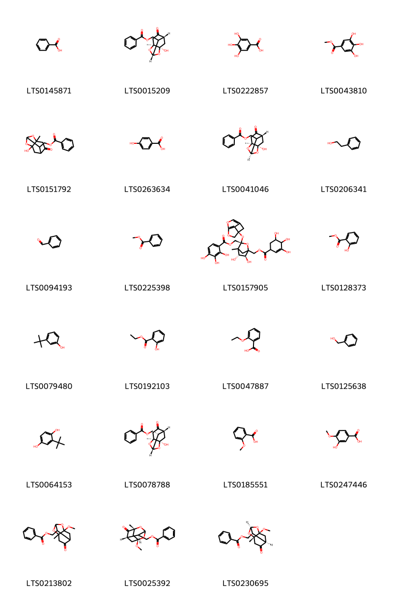{ width=100% }
    <figcaption>Hình ảnh cấu trúc hóa học của 23 hoạt chất thuộc nhóm Benzene and substituted derivatives gồm ['benzoic acid (LTS0145871)', '[(1s,3s,6r,8r)-8-hydroxy-3-methyl-5-oxo-2,9-dioxatricyclo[4.3.1.0³,⁸]decan-10-yl]methyl benzoate (LTS0015209)', 'galop (LTS0222857)', 'methyl gallate (LTS0043810)', '{8-hydroxy-3-methyl-5-oxo-2,9-dioxatricyclo[4.3.1.0³,⁸]decan-10-yl}methyl benzoate (LTS0151792)', 'p-hydroxybenzoic acid (LTS0263634)', '[(1r,3s,6r,8r)-8-hydroxy-3-methyl-5-oxo-2,9-dioxatricyclo[4.3.1.0³,⁸]decan-10-yl]methyl benzoate (LTS0041046)', '2-phenyl-ethanol (LTS0206341)', 'benzaldehyde (LTS0094193)', 'methyl benzoate (LTS0225398)', '[(3s,5r,6s)-3-[(1r)-5,7-dioxatricyclo[4.2.1.0³,⁹]nona-3,6(9)-dien-1-yloxy]-5,6-dihydroxy-4-methyl-1-[(3,4,5-trihydroxycyclohex-2-ene-1-carbonyloxy)methyl]-2-oxabicyclo[2.2.1]heptan-3-yl]methyl 2,3,4-trihydroxybenzoate (LTS0157905)', 'methyl salicylate (LTS0128373)', '3-tert-butylphenol (LTS0079480)', 'ethyl salicylate (LTS0192103)', '2-ethoxybenzoic acid (LTS0047887)', 'benzyl alcohol (LTS0125638)', 'tert-butylhydroquinone (LTS0064153)', 'paeoniflorigenone (LTS0078788)', 'o-anisic acid (LTS0185551)', 'isovanillic acid (LTS0247446)', '{8-methoxy-3-methyl-5-oxo-2,9-dioxatricyclo[4.3.1.0³,⁸]decan-10-yl}methyl benzoate (LTS0213802)', '[(1r,5r,7s,10r)-1-methoxy-5-methyl-6-oxo-2,4-dioxatricyclo[3.3.1.1³,⁷]decan-10-yl]methyl benzoate (LTS0025392)', '[(1s,3s,6r,8r,10s)-8-methoxy-3-methyl-5-oxo-2,9-dioxatricyclo[4.3.1.0³,⁸]decan-10-yl]methyl benzoate (LTS0230695)'].</figcaption>
</figure>
#### Nhóm Cinnamic acids and derivatives
<figure markdown="span">
    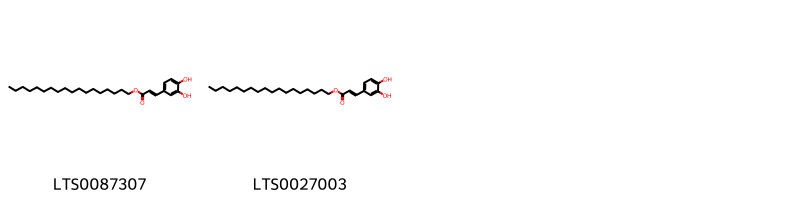{ width=100% }
    <figcaption>Hình ảnh cấu trúc hóa học của 2 hoạt chất thuộc nhóm Cinnamic acids and derivatives gồm ['octadecyl (2e)-3-(3,4-dihydroxyphenyl)prop-2-enoate (LTS0087307)', 'octadecyl 3-(3,4-dihydroxyphenyl)prop-2-enoate (LTS0027003)'].</figcaption>
</figure>
#### Nhóm Coumarans
<figure markdown="span">
    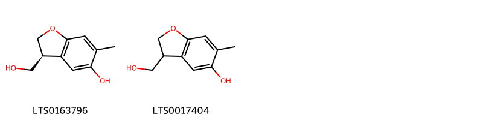{ width=100% }
    <figcaption>Hình ảnh cấu trúc hóa học của 2 hoạt chất thuộc nhóm Coumarans gồm ['(3s)-3-(hydroxymethyl)-6-methyl-2,3-dihydro-1-benzofuran-5-ol (LTS0163796)', '3-(hydroxymethyl)-6-methyl-2,3-dihydro-1-benzofuran-5-ol (LTS0017404)'].</figcaption>
</figure>
#### Nhóm Dihydrofurans
<figure markdown="span">
    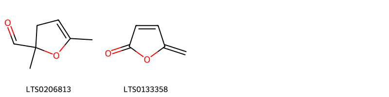{ width=100% }
    <figcaption>Hình ảnh cấu trúc hóa học của 2 hoạt chất thuộc nhóm Dihydrofurans gồm ['2,5-dimethyl-3h-furan-2-carbaldehyde (LTS0206813)', 'protoanemonin (LTS0133358)'].</figcaption>
</figure>
#### Nhóm Flavonoids
<figure markdown="span">
    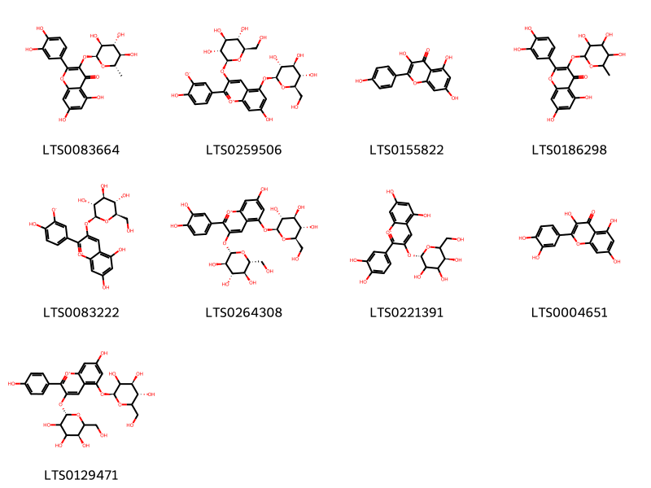{ width=100% }
    <figcaption>Hình ảnh cấu trúc hóa học của 9 hoạt chất thuộc nhóm Flavonoids gồm ['2-(3,4-dihydroxyphenyl)-5,7-dihydroxy-3-{[(2s,3s,4r,5r,6s)-3,4,5-trihydroxy-6-methyloxan-2-yl]oxy}chromen-4-one (LTS0083664)', 'cyanin betaine (LTS0259506)', 'kaempherol (LTS0155822)', 'quercitrin (LTS0186298)', '5,7-dihydroxy-2-(4-hydroxy-3-oxidophenyl)-3-{[(2s,3r,4s,5s,6r)-3,4,5-trihydroxy-6-(hydroxymethyl)oxan-2-yl]oxy}-1λ⁴-chromen-1-ylium (LTS0083222)', 'cyanin (LTS0264308)', 'chrysanthemin (LTS0221391)', 'quercetin (LTS0004651)', 'pelargonin (LTS0129471)'].</figcaption>
</figure>
#### Nhóm Furopyrans
<figure markdown="span">
    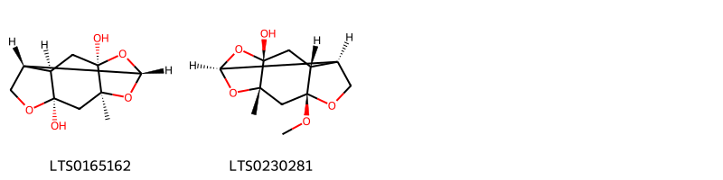{ width=100% }
    <figcaption>Hình ảnh cấu trúc hóa học của 2 hoạt chất thuộc nhóm Furopyrans gồm ['(1s,3s,5r,8r,9r,11r)-3-methyl-2,6,12-trioxatetracyclo[6.4.0.0³,¹¹.0⁵,⁹]dodecane-5,11-diol (LTS0165162)', '(1s,3s,5r,8r,9r,11r)-5-methoxy-3-methyl-2,6,12-trioxatetracyclo[6.4.0.0³,¹¹.0⁵,⁹]dodecan-11-ol (LTS0230281)'].</figcaption>
</figure>
#### Nhóm Heteroaromatic compounds
<figure markdown="span">
    { width=100% }
    <figcaption>Hình ảnh cấu trúc hóa học của 1 hoạt chất thuộc nhóm Heteroaromatic compounds gồm ['furfuryl alcohol (LTS0110403)'].</figcaption>
</figure>
#### Nhóm Organic dithiophosphoric acids and derivatives
<figure markdown="span">
    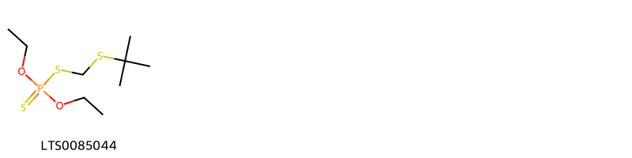{ width=100% }
    <figcaption>Hình ảnh cấu trúc hóa học của 1 hoạt chất thuộc nhóm Organic dithiophosphoric acids and derivatives gồm ['terbufos (LTS0085044)'].</figcaption>
</figure>
#### Nhóm Organooxygen compounds
<figure markdown="span">
    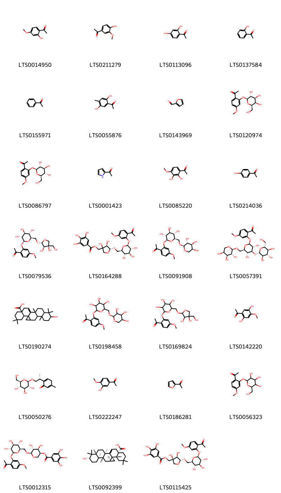{ width=100% }
    <figcaption>Hình ảnh cấu trúc hóa học của 27 hoạt chất thuộc nhóm Organooxygen compounds gồm ['paeonol (LTS0014950)', 'apocynin (LTS0211279)', "2',4'-dihydroxyacetophenone (LTS0113096)", 'o-acetylphenol (LTS0137584)', 'acetophenone (LTS0155971)', '1-(2,5-dihydroxy-4-methylphenyl)ethanone (LTS0055876)', 'bran oil (LTS0143969)', '1-(4-methoxy-2-{[(2s,3r,4s,5r,6r)-3,4,5-trihydroxy-6-(hydroxymethyl)oxan-2-yl]oxy}phenyl)ethanone (LTS0120974)', 'paeonoside (LTS0086797)', '2-acetylpyrrole (LTS0001423)', '1-(2,3-dihydroxy-4-methoxyphenyl)ethanone (LTS0085220)', 'hydroxyacetophenone (LTS0214036)', '1-(2-{[(2s,3r,4s,5s,6r)-6-({[(2r,3r,4r)-3,4-dihydroxy-4-(hydroxymethyl)oxolan-2-yl]oxy}methyl)-3,4,5-trihydroxyoxan-2-yl]oxy}-4-methoxyphenyl)ethanone (LTS0079536)', '[(4r,5r)-5-{[(2r,3s,4s,5r,6s)-6-(2-acetyl-5-methoxyphenoxy)-3,4,5-trihydroxyoxan-2-yl]methoxy}-3,4-dihydroxyoxolan-3-yl]methyl 3,4,5-trihydroxybenzoate (LTS0164288)', 'paeonolide (LTS0091908)', '1-(2-{[(2s,3r,4s,5r,6r)-3,5-dihydroxy-4-{[(2s,3r,4s,5s,6r)-3,4,5-trihydroxy-6-(hydroxymethyl)oxan-2-yl]oxy}-6-({[(2s,3r,4s,5s)-3,4,5-trihydroxyoxan-2-yl]oxy}methyl)oxan-2-yl]oxy}-4-methoxyphenyl)ethanone (LTS0057391)', '9-hydroxy-3,3,6b,10,10,12a-hexamethyl-1h,2h,4h,4ah,5h,5ah,6h,6ah,7h,8h,9h,10ah,11h,12h,14h-cyclopropa[r]picene-14a-carboxylic acid (LTS0190274)', '1-{4-methoxy-2-[(3,4,5-trihydroxy-6-{[(3,4,5-trihydroxyoxan-2-yl)oxy]methyl}oxan-2-yl)oxy]phenyl}ethanone (LTS0198458)', '1-(2-{[6-({[3,4-dihydroxy-4-(hydroxymethyl)oxolan-2-yl]oxy}methyl)-3,4,5-trihydroxyoxan-2-yl]oxy}-4-methoxyphenyl)ethanone (LTS0169824)', '1-(2,5-dihydroxy-4-methoxyphenyl)ethanone (LTS0142220)', '5-methyl-2-[(2r)-1-{[(2r,3r,4s,5s,6r)-3,4,5-trihydroxy-6-(hydroxymethyl)oxan-2-yl]oxy}propan-2-yl]cyclohexa-2,5-dien-1-one (LTS0050276)', '1-(3-hydroxy-4-methoxyphenyl)ethanone (LTS0222247)', 'acetylfuran (LTS0186281)', '1-(4-methoxy-2-{[3,4,5-trihydroxy-6-(hydroxymethyl)oxan-2-yl]oxy}phenyl)ethanone (LTS0056323)', '(3s,4r,5r,6r)-6-{[(2r,3s,4s,5r,6s)-6-(2-acetyl-5-methoxyphenoxy)-3,4,5-trihydroxyoxan-2-yl]methoxy}-4,5-dihydroxyoxan-3-yl 3,4,5-trihydroxybenzoate (LTS0012315)', '(4ar,4bs,5ar,6ar,6br,9s,10ar,12ar,14as)-9-hydroxy-3,3,6b,10,10,12a-hexamethyl-1h,2h,4h,4ah,5h,5ah,6h,6ah,7h,8h,9h,10ah,11h,12h,14h-cyclopropa[r]picene-14a-carboxylic acid (LTS0092399)', '[(3s,4r,5r)-5-{[(2r,3s,4s,5r,6s)-6-(2-acetyl-5-methoxyphenoxy)-3,4,5-trihydroxyoxan-2-yl]methoxy}-3,4-dihydroxyoxolan-3-yl]methyl 3,4,5-trihydroxybenzoate (LTS0115425)'].</figcaption>
</figure>
#### Nhóm Phenols
<figure markdown="span">
    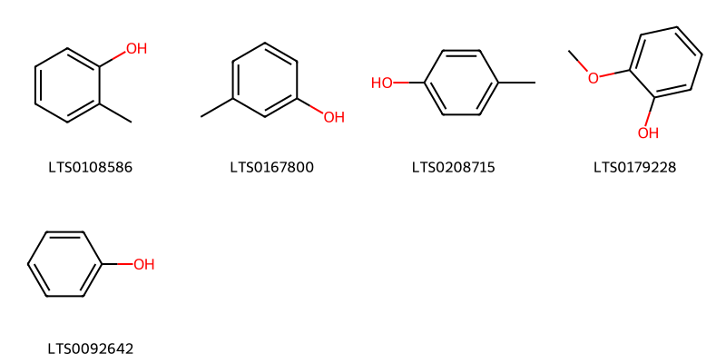{ width=100% }
    <figcaption>Hình ảnh cấu trúc hóa học của 5 hoạt chất thuộc nhóm Phenols gồm ['o-cresol (LTS0108586)', 'm-cresol (LTS0167800)', 'p-cresol (LTS0208715)', 'guaiacol (LTS0179228)', 'phenol (LTS0092642)'].</figcaption>
</figure>
#### Nhóm Prenol lipids
<figure markdown="span">
    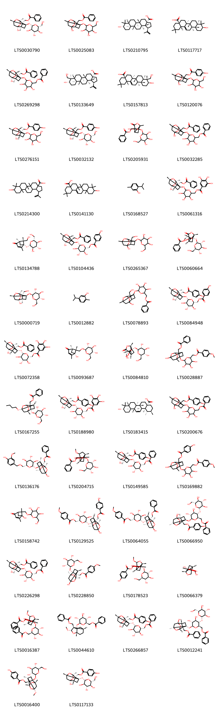{ width=100% }
    <figcaption>Hình ảnh cấu trúc hóa học của 59 hoạt chất thuộc nhóm Prenol lipids gồm ['paeoniflorin (LTS0030790)', '(6-hydroxy-8-methyl-3-{[3,4,5-trihydroxy-6-(hydroxymethyl)oxan-2-yl]oxy}-9,10-dioxatetracyclo[4.3.1.0²,⁵.0³,⁸]decan-2-yl)methyl benzoate (LTS0025083)', 'betulinic acid (LTS0210795)', 'oleanolic acid (LTS0117717)', '[(1s,2s,3r,5r,6r,8s)-3-({6-[(benzoyloxy)methyl]-3,4,5-trihydroxyoxan-2-yl}oxy)-6-hydroxy-8-methyl-9,10-dioxatetracyclo[4.3.1.0²,⁵.0³,⁸]decan-2-yl]methyl benzoate (LTS0269298)', '23-hydroxybetulinic acid (LTS0133649)', 'hederagenin (LTS0157813)', '(6-hydroxy-8-methyl-3-{[3,4,5-trihydroxy-6-(hydroxymethyl)oxan-2-yl]oxy}-9,10-dioxatetracyclo[4.3.1.0²,⁵.0³,⁸]decan-2-yl)methyl 4-hydroxybenzoate (LTS0120076)', '[(1s,2s,3r,5s,6r,8s)-6-hydroxy-8-methyl-3-{[(2r)-3,4,5-trihydroxy-6-(hydroxymethyl)oxan-2-yl]oxy}-9,10-dioxatetracyclo[4.3.1.0²,⁵.0³,⁸]decan-2-yl]methyl 4-hydroxybenzoate (LTS0276151)', '[(1s,3r,5r,6r,8s)-6-hydroxy-8-methyl-3-{[(2s,3r,4s,5s,6r)-3,4,5-trihydroxy-6-(hydroxymethyl)oxan-2-yl]oxy}-9,10-dioxatetracyclo[4.3.1.0²,⁵.0³,⁸]decan-2-yl]methyl 4-hydroxybenzoate (LTS0032132)', '(4-hydroxy-6-methyl-8-oxo-1-{[3,4,5-trihydroxy-6-(hydroxymethyl)oxan-2-yl]oxy}-7-oxatricyclo[4.3.0.0³,⁹]nonan-9-yl)methyl benzoate (LTS0205931)', '[3-({6-[(benzoyloxy)methyl]-3,4,5-trihydroxyoxan-2-yl}oxy)-6-hydroxy-8-methyl-9,10-dioxatetracyclo[4.3.1.0²,⁵.0³,⁸]decan-2-yl]methyl benzoate (LTS0032285)', '9-hydroxy-5a,5b,8,8,11a-pentamethyl-1-(prop-1-en-2-yl)-hexadecahydrocyclopenta[a]chrysene-3a-carboxylic acid (LTS0214300)', 'oleanolic acid (LTS0141130)', 'thymol (LTS0168527)', '(6-{[(1r,2s,3r,5s,6r,8s)-2-[(benzoyloxy)methyl]-6-hydroxy-8-methyl-9,10-dioxatetracyclo[4.3.1.0²,⁵.0³,⁸]decan-3-yl]oxy}-3,4,5-trihydroxyoxan-2-yl)methyl 3,4,5-trihydroxybenzoate (LTS0061316)', '(1r,5s,6r)-6-(hydroxymethyl)-4,6-dimethyl-5-{[(2s,3r,4s,5s,6r)-3,4,5-trihydroxy-6-(hydroxymethyl)oxan-2-yl]oxy}bicyclo[3.1.1]hept-3-en-2-one (LTS0134788)', '[(2r,3s,4s,5r,6s)-6-{[(1s,2r,3r,6r,8s)-2-[(benzoyloxy)methyl]-6-hydroxy-8-methyl-9,10-dioxatetracyclo[4.3.1.0²,⁵.0³,⁸]decan-3-yl]oxy}-3,4,5-trihydroxyoxan-2-yl]methyl 4-hydroxybenzoate (LTS0104436)', '2-{[6-hydroxy-2-(hydroxymethyl)-8-methyl-9,10-dioxatetracyclo[4.3.1.0²,⁵.0³,⁸]decan-3-yl]oxy}-6-(hydroxymethyl)oxane-3,4,5-triol (LTS0265367)', '[(1r,3r,4r,6s,9s)-4-hydroxy-6-methyl-8-oxo-1-{[(2s,3r,4s,5s,6r)-3,4,5-trihydroxy-6-(hydroxymethyl)oxan-2-yl]oxy}-7-oxatricyclo[4.3.0.0³,⁹]nonan-9-yl]methyl benzoate (LTS0060664)', '(2s,3r,4s,5s,6r)-2-{[(1r,2s,3r,5r,6r,8s)-6-hydroxy-2-(hydroxymethyl)-8-methyl-9,10-dioxatetracyclo[4.3.1.0²,⁵.0³,⁸]decan-3-yl]oxy}-6-(hydroxymethyl)oxane-3,4,5-triol (LTS0000719)', 'carvacrol (LTS0012882)', '(3,4,5-trihydroxy-6-{[6-hydroxy-2-(hydroxymethyl)-8-methyl-9,10-dioxatetracyclo[4.3.1.0²,⁵.0³,⁸]decan-3-yl]oxy}oxan-2-yl)methyl benzoate (LTS0078893)', '[(1r,2s,3r,5r,6r,8s)-6-hydroxy-8-methyl-3-{[(2s,3r,4s,5s,6r)-3,4,5-trihydroxy-6-[(4-hydroxybenzoyloxy)methyl]oxan-2-yl]oxy}-9,10-dioxatetracyclo[4.3.1.0²,⁵.0³,⁸]decan-2-yl]methyl 4-hydroxybenzoate (LTS0084948)', '[(2r,3s,4s,5r,6s)-6-{[(1r,2s,3s,5s,6r,8s)-2-[(benzoyloxy)methyl]-6-hydroxy-8-methyl-9,10-dioxatetracyclo[4.3.1.0²,⁵.0³,⁸]decan-3-yl]oxy}-3,4,5-trihydroxyoxan-2-yl]methyl 3,4,5-trihydroxybenzoate (LTS0072358)', '(1r,5s,6r)-5-hydroxy-4,6-dimethyl-6-({[(2r,3r,4s,5s,6r)-3,4,5-trihydroxy-6-(hydroxymethyl)oxan-2-yl]oxy}methyl)bicyclo[3.1.1]hept-3-en-2-one (LTS0093687)', '(1r,3r,4r,6s,9s)-4-hydroxy-9-(hydroxymethyl)-6-methyl-1-{[(2s,3r,4s,5s,6r)-3,4,5-trihydroxy-6-(hydroxymethyl)oxan-2-yl]oxy}-7-oxatricyclo[4.3.0.0³,⁹]nonan-8-one (LTS0084810)', '[6-({2-[(benzoyloxy)methyl]-6-hydroxy-8-methyl-9,10-dioxatetracyclo[4.3.1.0²,⁵.0³,⁸]decan-3-yl}oxy)-3,4,5-trihydroxyoxan-2-yl]methyl 4-methoxybenzoate (LTS0028887)', '[(2s,3s,5s,6r,8s)-6-butoxy-8-methyl-3-{[(2s,3r,4s,5s,6r)-3,4,5-trihydroxy-6-(hydroxymethyl)oxan-2-yl]oxy}-9,10-dioxatetracyclo[4.3.1.0²,⁵.0³,⁸]decan-2-yl]methyl benzoate (LTS0167255)', '[(2r,3s,4s,5r,6s)-3,4,5-trihydroxy-6-{[(1r,2s,3r,5r,6r,8s)-6-hydroxy-2-[(4-hydroxybenzoyloxy)methyl]-8-methyl-9,10-dioxatetracyclo[4.3.1.0²,⁵.0³,⁸]decan-3-yl]oxy}oxan-2-yl]methyl 3,4,5-trihydroxybenzoate (LTS0188980)', '(1s,2r,4as,6ar,6br,8ar,10s,12as,12br,14ar,14bs)-10-hydroxy-1,2,6a,6b,9,9,12a-heptamethyl-2,3,4,5,6,7,8,8a,10,11,12,12b,14a,14b-tetradecahydro-1h-picene-4a-carboxylic acid (LTS0183415)', '[3-({6-[(benzoyloxy)methyl]-3,4,5-trihydroxyoxan-2-yl}oxy)-6-hydroxy-8-methyl-9,10-dioxatetracyclo[4.3.1.0²,⁵.0³,⁸]decan-2-yl]methyl 4-hydroxybenzoate (LTS0200676)', '[(1r,2s,3s,5s,6r,8s)-6-hydroxy-8-methyl-3-{[(2s,3r,4s,5s,6r)-3,4,5-trihydroxy-6-{[(4-hydroxy-3-methoxyphenyl)methoxy]methyl}oxan-2-yl]oxy}-9,10-dioxatetracyclo[4.3.1.0²,⁵.0³,⁸]decan-2-yl]methyl benzoate (LTS0136176)', '[(1r,3r,6s,9s)-8-methoxy-6-methyl-4-oxo-1-{[(2s,3r,4s,5s,6r)-3,4,5-trihydroxy-6-(hydroxymethyl)oxan-2-yl]oxy}tricyclo[4.3.0.0³,⁹]nonan-9-yl]methyl benzoate (LTS0204715)', '[(1r,2s,3r,5r,6r,8s)-3-{[(2s,3r,4s,5s,6r)-6-[(benzoyloxy)methyl]-3,4,5-trihydroxyoxan-2-yl]oxy}-6-hydroxy-8-methyl-9,10-dioxatetracyclo[4.3.1.0²,⁵.0³,⁸]decan-2-yl]methyl 4-hydroxybenzoate (LTS0149585)', '[3,4,5-trihydroxy-6-({6-hydroxy-2-[(4-hydroxybenzoyloxy)methyl]-8-methyl-9,10-dioxatetracyclo[4.3.1.0²,⁵.0³,⁸]decan-3-yl}oxy)oxan-2-yl]methyl 4-methoxybenzoate (LTS0169882)', '5-hydroxy-4,6-dimethyl-6-({[3,4,5-trihydroxy-6-(hydroxymethyl)oxan-2-yl]oxy}methyl)bicyclo[3.1.1]hept-3-en-2-one (LTS0158742)', '[(2r,3s,4s,5r,6s)-3,4,5-trihydroxy-6-{[(1r,2s,3r,5r,6r,8s)-6-hydroxy-2-[(4-hydroxybenzoyloxy)methyl]-8-methyl-9,10-dioxatetracyclo[4.3.1.0²,⁵.0³,⁸]decan-3-yl]oxy}oxan-2-yl]methyl 4-methoxybenzoate (LTS0129525)', '[(2r,3s,4s,5r,6s)-6-{[(1r,2s,3r,5r,6r,8s)-2-[(benzoyloxy)methyl]-6-hydroxy-8-methyl-9,10-dioxatetracyclo[4.3.1.0²,⁵.0³,⁸]decan-3-yl]oxy}-3,4,5-trihydroxyoxan-2-yl]methyl 4-methoxybenzoate (LTS0064055)', '[(2s,3s,5s,6r,8s)-3-{[(2s,3r,4r,5s,6r)-6-[(benzoyloxy)methyl]-3,4-dihydroxy-5-{[(2s,3r,4s,5s,6r)-3,4,5-trihydroxy-6-(hydroxymethyl)oxan-2-yl]oxy}oxan-2-yl]oxy}-6-hydroxy-8-methyl-9,10-dioxatetracyclo[4.3.1.0²,⁵.0³,⁸]decan-2-yl]methyl 4-hydroxybenzoate (LTS0066950)', 'benzoylpaeoniflorin (LTS0226298)', '[(1r,2s,3r,5r,6r,8s)-6-hydroxy-8-methyl-3-{[(2s,3r,4s,5s,6r)-3,4,5-trihydroxy-6-(hydroxymethyl)oxan-2-yl]oxy}-9,10-dioxatetracyclo[4.3.1.0²,⁵.0³,⁸]decan-2-yl]methyl 4-methoxybenzoate (LTS0228850)', '[(1r,3r,6s,8s,9s)-8-methoxy-6-methyl-4-oxo-1-{[(2s,3r,4s,5s,6r)-3,4,5-trihydroxy-6-(hydroxymethyl)oxan-2-yl]oxy}-7-oxatricyclo[4.3.0.0³,⁹]nonan-9-yl]methyl 4-hydroxybenzoate (LTS0178523)', '(1r,3r,6s,9r)-1-hydroxy-9-(hydroxymethyl)-6-methyl-7-oxatricyclo[4.3.0.0³,⁹]nonan-4-one (LTS0066379)', '[(2r,3s,4s,5r,6s)-6-{[(1s,3s,6s,8s,9s)-9-[(benzoyloxy)methyl]-8-methoxy-6-methyl-4-oxo-7-oxatricyclo[4.3.0.0³,⁹]nonan-1-yl]oxy}-3,4,5-trihydroxyoxan-2-yl]methyl benzoate (LTS0016387)', '[(2r,3s,4s,5r,6s)-6-{[(1s,3s,6s,8s,9s)-9-[(benzoyloxy)methyl]-8-methoxy-6-methyl-7-oxatricyclo[4.3.0.0³,⁹]nonan-1-yl]oxy}-3,4,5-trihydroxyoxan-2-yl]methyl benzoate (LTS0044610)', '[(1r,2s,3s,5s,6r,8s)-3-{[(2s,3r,4s,5s,6r)-6-[(benzoyloxy)methyl]-3,4,5-trihydroxyoxan-2-yl]oxy}-6-hydroxy-8-methyl-9,10-dioxatetracyclo[4.3.1.0²,⁵.0³,⁸]decan-2-yl]methyl 4-hydroxybenzoate (LTS0266857)', 'paeoniflorin b (LTS0012241)', '[(1r,2s,3r,5r,6r,8s)-6-methoxy-8-methyl-3-{[(2s,3r,4s,5s,6r)-3,4,5-trihydroxy-6-(hydroxymethyl)oxan-2-yl]oxy}-9,10-dioxatetracyclo[4.3.1.0²,⁵.0³,⁸]decan-2-yl]methyl 4-hydroxybenzoate (LTS0016400)', '[(1r,2s,3s,5s,6r,8s)-6-hydroxy-8-methyl-3-{[(2s,3r,4s,5s,6r)-3,4,5-trihydroxy-6-(hydroxymethyl)oxan-2-yl]oxy}-9,10-dioxatetracyclo[4.3.1.0²,⁵.0³,⁸]decan-2-yl]methyl 4-hydroxybenzoate (LTS0117133)', '(6-hydroxy-8-methyl-3-{[3,4,5-trihydroxy-6-(hydroxymethyl)oxan-2-yl]oxy}-9,10-dioxatetracyclo[4.3.1.0²,⁵.0³,⁸]decan-2-yl)methyl 4-methoxybenzoate (LTS0041733)', 'maslinic acid (LTS0109701)', '6-(hydroxymethyl)-4,6-dimethyl-5-{[3,4,5-trihydroxy-6-(hydroxymethyl)oxan-2-yl]oxy}bicyclo[3.1.1]hept-3-en-2-one (LTS0021941)', '10-hydroxy-1,2,6a,6b,9,9,12a-heptamethyl-2,3,4,5,6,7,8,8a,10,11,12,12b,14a,14b-tetradecahydro-1h-picene-4a-carboxylic acid (LTS0054200)', '[(2r,3s,4s,5r,6s)-3,4,5-trihydroxy-6-{[(1s,2s,3r,5s,6r,8s)-6-hydroxy-2-(hydroxymethyl)-8-methyl-9,10-dioxatetracyclo[4.3.1.0²,⁵.0³,⁸]decan-3-yl]oxy}oxan-2-yl]methyl benzoate (LTS0013668)', 'perillylalcohol (LTS0009128)', '[(2r,3s,4s,5r,6s)-3,4,5-trihydroxy-6-{[(1r,2s,3r,5r,6r,8s)-6-hydroxy-2-(hydroxymethyl)-8-methyl-9,10-dioxatetracyclo[4.3.1.0²,⁵.0³,⁸]decan-3-yl]oxy}oxan-2-yl]methyl benzoate (LTS0234940)', '[(2s,3s,5s,6r,8s)-3-{[(2s,3r,4s,5s,6r)-6-[(benzoyloxy)methyl]-3,4,5-trihydroxyoxan-2-yl]oxy}-6-hydroxy-8-methyl-9,10-dioxatetracyclo[4.3.1.0²,⁵.0³,⁸]decan-2-yl]methyl 4-hydroxybenzoate (LTS0035295)', '[(1r,2s,3r,5r,6r,8s)-3-{[(2r,3r,4s,5s,6r)-6-[(benzoyloxy)methyl]-3,4,5-trihydroxyoxan-2-yl]oxy}-6-hydroxy-8-methyl-9,10-dioxatetracyclo[4.3.1.0²,⁵.0³,⁸]decan-2-yl]methyl 4-hydroxybenzoate (LTS0258934)'].</figcaption>
</figure>
#### Nhóm Purine nucleosides
<figure markdown="span">
    { width=100% }
    <figcaption>Hình ảnh cấu trúc hóa học của 1 hoạt chất thuộc nhóm Purine nucleosides gồm ['adenosine (LTS0014061)'].</figcaption>
</figure>
#### Nhóm Pyridines and derivatives
<figure markdown="span">
    { width=100% }
    <figcaption>Hình ảnh cấu trúc hóa học của 1 hoạt chất thuộc nhóm Pyridines and derivatives gồm ['2-pyridone (LTS0067108)'].</figcaption>
</figure>
#### Nhóm Steroids and steroid derivatives
<figure markdown="span">
    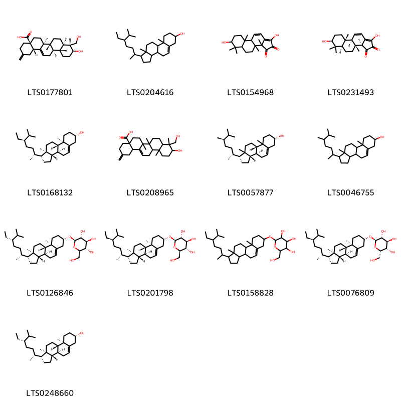{ width=100% }
    <figcaption>Hình ảnh cấu trúc hóa học của 13 hoạt chất thuộc nhóm Steroids and steroid derivatives gồm ['30-norhederagenin (LTS0177801)', 'stigmast-5-en-3-ol, (3β)- (LTS0204616)', '1,7-dihydroxy-3a,3b,6,6,9a-pentamethyl-4h,5h,5ah,7h,8h,9h,9bh-cyclopenta[a]phenanthrene-2,3-dione (LTS0154968)', 'palbinone (LTS0231493)', 'sitosterol (LTS0168132)', '10-hydroxy-9-(hydroxymethyl)-6a,6b,9,12a-tetramethyl-2-methylidene-1,3,4,5,6,7,8,8a,10,11,12,12b,13,14b-tetradecahydropicene-4a-carboxylic acid (LTS0208965)', '(1r,3as,3bs,7s,9bs)-1-[(2r,5r)-5,6-dimethylheptan-2-yl]-9a,11a-dimethyl-1h,2h,3h,3ah,3bh,4h,6h,7h,8h,9h,9bh,10h,11h-cyclopenta[a]phenanthren-7-ol (LTS0057877)', 'campesterol (LTS0046755)', '(2r,3r,4s,5s,6r)-2-{[(1r,3as,3bs,7s,9ar,9bs,11ar)-1-[(2r,5s)-5-ethyl-6-methylheptan-2-yl]-9a,11a-dimethyl-1h,2h,3h,3ah,3bh,4h,6h,7h,8h,9h,9bh,10h,11h-cyclopenta[a]phenanthren-7-yl]oxy}-6-(hydroxymethyl)oxane-3,4,5-triol (LTS0126846)', 'sitogluside (LTS0201798)', '2-{[1-(5-ethyl-6-methylheptan-2-yl)-9a,11a-dimethyl-1h,2h,3h,3ah,3bh,4h,6h,7h,8h,9h,9bh,10h,11h-cyclopenta[a]phenanthren-7-yl]oxy}-6-(hydroxymethyl)oxane-3,4,5-triol (LTS0158828)', '(2r,3r,4s,5s,6s)-2-{[(1r,3as,3bs,7s,9ar,9bs,11ar)-1-[(2r,5r)-5-ethyl-6-methylheptan-2-yl]-9a,11a-dimethyl-1h,2h,3h,3ah,3bh,4h,6h,7h,8h,9h,9bh,10h,11h-cyclopenta[a]phenanthren-7-yl]oxy}-6-(hydroxymethyl)oxane-3,4,5-triol (LTS0076809)', 'clionasterol (LTS0248660)'].</figcaption>
</figure>
#### Nhóm Stilbenes
<figure markdown="span">
    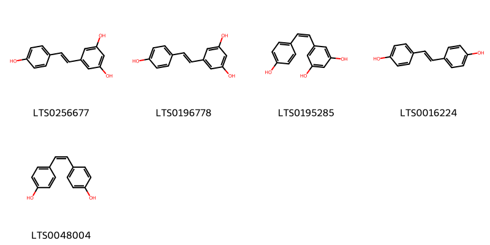{ width=100% }
    <figcaption>Hình ảnh cấu trúc hóa học của 5 hoạt chất thuộc nhóm Stilbenes gồm ['resveratrol (LTS0256677)', 'tocilizumab (LTS0196778)', 'cis-resveratrol (LTS0195285)', 'stilbestrol (LTS0016224)', "(z)-4,4'-stilbenediol (LTS0048004)"].</figcaption>
</figure>
#### Nhóm Tannins
<figure markdown="span">
    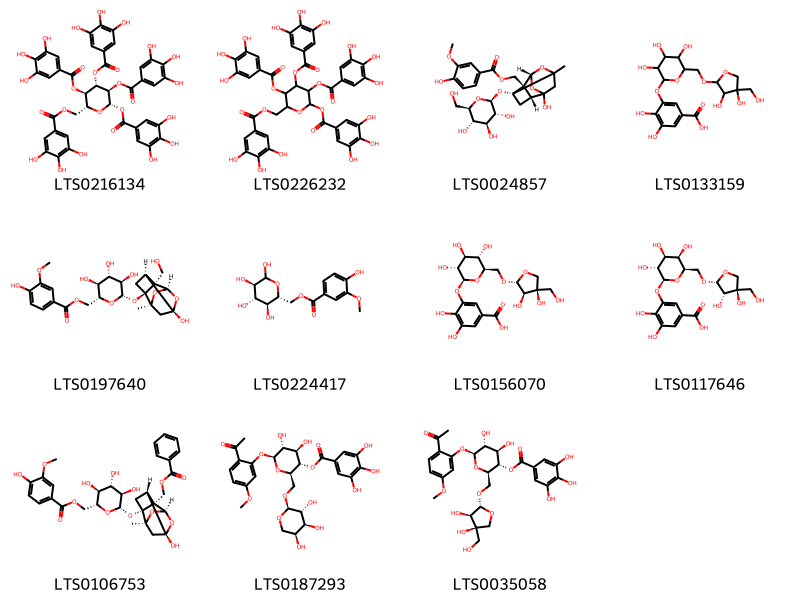{ width=100% }
    <figcaption>Hình ảnh cấu trúc hóa học của 11 hoạt chất thuộc nhóm Tannins gồm ['(2s,3r,4s,5r,6r)-3,4,5-tris(3,4,5-trihydroxybenzoyloxy)-6-[(3,4,5-trihydroxybenzoyloxy)methyl]oxan-2-yl 3,4,5-trihydroxybenzoate (LTS0216134)', '3,4,5-tris(3,4,5-trihydroxybenzoyloxy)-6-[(3,4,5-trihydroxybenzoyloxy)methyl]oxan-2-yl 3,4,5-trihydroxybenzoate (LTS0226232)', 'mudanpioside e (LTS0024857)', '3-{[6-({[3,4-dihydroxy-4-(hydroxymethyl)oxolan-2-yl]oxy}methyl)-3,4,5-trihydroxyoxan-2-yl]oxy}-4,5-dihydroxybenzoic acid (LTS0133159)', '[(2r,3s,4s,5r,6s)-3,4,5-trihydroxy-6-{[(1r,2s,3s,5s,6r,8s)-6-hydroxy-2-(hydroxymethyl)-8-methyl-9,10-dioxatetracyclo[4.3.1.0²,⁵.0³,⁸]decan-3-yl]oxy}oxan-2-yl]methyl 4-hydroxy-3-methoxybenzoate (LTS0197640)', '[(2r,3s,4s,5r)-3,4,5,6-tetrahydroxyoxan-2-yl]methyl 4-hydroxy-3-methoxybenzoate (LTS0224417)', 'mudanoside b (LTS0156070)', '3-{[(2s,3r,4s,5r,6r)-6-({[(2r,3s,4r)-3,4-dihydroxy-4-(hydroxymethyl)oxolan-2-yl]oxy}methyl)-3,4,5-trihydroxyoxan-2-yl]oxy}-4,5-dihydroxybenzoic acid (LTS0117646)', '[(2r,3s,4s,5r,6s)-6-{[(1r,2s,3r,5r,6r,8s)-2-[(benzoyloxy)methyl]-6-hydroxy-8-methyl-9,10-dioxatetracyclo[4.3.1.0²,⁵.0³,⁸]decan-3-yl]oxy}-3,4,5-trihydroxyoxan-2-yl]methyl 4-hydroxy-3-methoxybenzoate (LTS0106753)', '(2r,3s,4r,5r,6s)-6-(2-acetyl-5-methoxyphenoxy)-4,5-dihydroxy-2-({[(2s,3r,4s,5s)-3,4,5-trihydroxyoxan-2-yl]oxy}methyl)oxan-3-yl 3,4,5-trihydroxybenzoate (LTS0187293)', '(2r,3s,4r,5r,6s)-6-(2-acetyl-5-methoxyphenoxy)-2-({[(2r,3r,4r)-3,4-dihydroxy-4-(hydroxymethyl)oxolan-2-yl]oxy}methyl)-4,5-dihydroxyoxan-3-yl 3,4,5-trihydroxybenzoate (LTS0035058)'].</figcaption>
</figure>

---

### Dược dân tộc học

Danh sách các quốc gia có sử dụng *Paeonia suffruticosa* trong điều trị các bệnh. 

| Country   | Disease    | Bệnh      |
|:----------|:-----------|:----------|
| China     | nan        | Ở đây     |
| Japan     | Hemostatic | Sự ầm máu |

---

