!!! abstract "Tóm tắt"

    Họ Papaveraceae gồm khoảng 12 chi và 34 loài được một số cộng đồng tại các quốc gia như Italian, Central America, Guatemala, French, Japan, Kalmuk, China, Turkey, India(Unani), German, Ddr, anish, Dominican Republic, Argentina, Ethiopia, Europe, India(Ayurvedic), Mexico, Mexico(Seri), West Indies, Nc, Haiti, Iraq, Sudan, Kurdistan, ain, Venezuela, Elsewhere, Paraguay, Australia, US(Amerindian), India, US, France sử dụng trong một số trường hợp QUERY LENGTH LIMIT EXCEEDED. MAX ALLOWED QUERY : 500 CHARS QUERY LENGTH LIMIT EXCEEDED. MAX ALLOWED QUERY : 500 CHARS MYMEMORY WARNING: YOU USED ALL AVAILABLE FREE TRANSLATIONS FOR TODAY. NEXT AVAILABLE IN  09 HOURS 49 MINUTES 11 SECONDS VISIT HTTPS://MYMEMORY.TRANSLATED.NET/DOC/USAGELIMITS.PHP TO TRANSLATE MORE.

!!! info "DrDuke"

    James A. Duke sinh năm 1929-2017 là một nhà thực vật học người Mỹ. Đây là một trong những tác giả hàng đầu trong lĩnh vực dược dân tộc học với cuốn *CRC Handbook of Medicinal Herbs* và chính là người xây dựng lên cơ sở dữ liệu về hợp chất tự nhiên và dược dân tộc học tại Bộ nông nghiệp Hoa Kỳ. Các thông tin được đăng tải tại website [Dr. Duke's Phytochemical and Ethnobotanical Databases](https://phytochem.nal.usda.gov/). 
    Trong suốt thập niên 1970, ông lãnh đạo the Plant Taxonomy Laboratory, Plant Genetics and Germplasm Institute of the Agricultural Research Service, U.S. Department of Agriculture.
    Trong tài liệu này, các thông tin về dược dân tộc của các dược liệu được trích dẫn từ tài liệu của James A. Ducke với sự trợ giúp của phần mềm dịch thuật từ tiếng Anh sang tiếng Việt.
   

# Chi Bocconia

??? note "Danh sách các dược liệu thuộc chi"
    
	 - *Bocconia arborea*
	 - *Bocconia frutescens*
	 - *Bocconia vulcanica*

---
## Bocconia arborea
### Thông tin về thực vật

!!! info "Phân loại thực vật của *Bocconia arborea* từ GIBF:"
    - **Kingdom:** Plantae
    - **Phylum:** Tracheophyta
    - **Order:** Ranunculales
    - **Family:** Papaveraceae
    - **Genus:** Bocconia
    - **Species:** *Bocconia arborea*

 

| Label (VI)   | Label (EN)   | Scientific Name   | Descriptions (VI)   | Descriptions (EN)   | Also Known As (VI)   | Also Known As (EN)   |
|:-------------|:-------------|:------------------|:--------------------|:--------------------|:---------------------|:---------------------|
| N/A          | N/A          | Bocconia arborea  | loài thực vật       | species of plant    | ['']                 | ['']                 |

#### Phân bố trên thế giới

**Từ CSDL GIBF** Mexico, Guatemala, Nicaragua, El Salvador, Costa Rica, Honduras

#### Phân bố tại Việt Nam

**Từ CSDL GIBF**: Không có ghi nhận ở Việt Nam

---
### Thành phần hóa học
        
- Theo cơ sở dữ liệu lotus: Từ loài *Bocconia arborea* đã phân lập và xác định được 7 hoạt chất thuộc về các nhóm Benzophenanthridine alkaloids, Quinolines and derivatives. 

|    | chemicalTaxonomyClassyfireClass   |   smiles_count |
|---:|:----------------------------------|---------------:|
|  0 | Benzophenanthridine alkaloids     |              6 |
|  1 | Quinolines and derivatives        |              1 |

#### Nhóm Benzophenanthridine alkaloids
<figure markdown="span">
    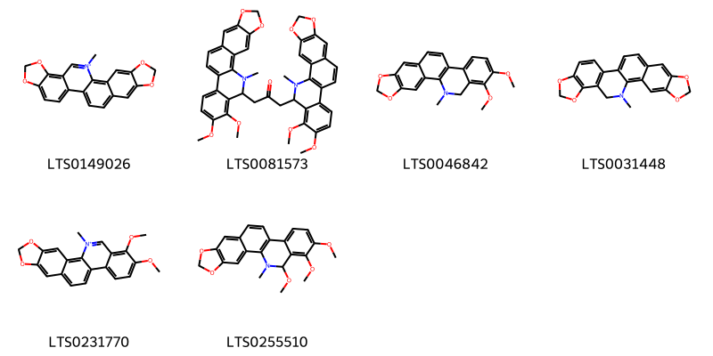{ width=100% }
    <figcaption>Hình ảnh cấu trúc hóa học của 6 hoạt chất thuộc nhóm Benzophenanthridine alkaloids gồm ['sanguinarine (LTS0149026)', '1-{17,18-dimethoxy-21-methyl-5,7-dioxa-21-azapentacyclo[11.8.0.0²,¹⁰.0⁴,⁸.0¹⁴,¹⁹]henicosa-1(13),2,4(8),9,11,14(19),15,17-octaen-20-yl}-3-{17,18-dimethoxy-21-methyl-5,7-dioxa-21-azapentacyclo[11.8.0.0²,¹⁰.0⁴,⁸.0¹⁴,¹⁹]henicosa-1(13),2,4(8),9,11,14,16,18-octaen-20-yl}propan-2-one (LTS0081573)', '17,18-dimethoxy-21-methyl-5,7-dioxa-21-azapentacyclo[11.8.0.0²,¹⁰.0⁴,⁸.0¹⁴,¹⁹]henicosa-1(13),2,4(8),9,11,14,16,18-octaene (LTS0046842)', 'dihydrosanguinarine (LTS0031448)', 'chelerythrine (LTS0231770)', 'angoline (LTS0255510)'].</figcaption>
</figure>
#### Nhóm Quinolines and derivatives
<figure markdown="span">
    { width=100% }
    <figcaption>Hình ảnh cấu trúc hóa học của 1 hoạt chất thuộc nhóm Quinolines and derivatives gồm ['hydroxysanguinarine (LTS0263911)'].</figcaption>
</figure>

---

### Dược dân tộc học

Danh sách các quốc gia có sử dụng *Bocconia arborea* trong điều trị các bệnh. 

| Country   | Disease                                     | Bệnh                                                                                                                                                                                                |
|:----------|:--------------------------------------------|:----------------------------------------------------------------------------------------------------------------------------------------------------------------------------------------------------|
| Mexico    | Analgesic, Vulnerary, Anesthetic, Collyrium | MYMEMORY WARNING: YOU USED ALL AVAILABLE FREE TRANSLATIONS FOR TODAY. NEXT AVAILABLE IN  09 HOURS 49 MINUTES 06 SECONDS VISIT HTTPS://MYMEMORY.TRANSLATED.NET/DOC/USAGELIMITS.PHP TO TRANSLATE MORE |

---

---
## Bocconia frutescens
### Thông tin về thực vật

!!! info "Phân loại thực vật của *Bocconia frutescens* từ GIBF:"
    - **Kingdom:** Plantae
    - **Phylum:** Tracheophyta
    - **Order:** Ranunculales
    - **Family:** Papaveraceae
    - **Genus:** Bocconia
    - **Species:** *Bocconia frutescens*

 

| Label (VI)   | Label (EN)   | Scientific Name     | Descriptions (VI)   | Descriptions (EN)   | Also Known As (VI)   | Also Known As (EN)   |
|:-------------|:-------------|:--------------------|:--------------------|:--------------------|:---------------------|:---------------------|
| N/A          | N/A          | Bocconia frutescens | loài thực vật       | species of plant    | ['']                 | ['']                 |

#### Phân bố trên thế giới

**Từ CSDL GIBF** Mexico, Guatemala, Réunion, United States of America, Jamaica, Peru, Haiti, Costa Rica, Australia, Dominican Republic, Colombia, New Zealand, Ecuador, Argentina, Panama, Puerto Rico

#### Phân bố tại Việt Nam

**Từ CSDL GIBF**: Không có ghi nhận ở Việt Nam

---
### Thành phần hóa học
        
- Theo cơ sở dữ liệu lotus: Từ loài *Bocconia frutescens* đã phân lập và xác định được 19 hoạt chất thuộc về các nhóm Benzophenanthridine alkaloids, Fatty Acyls, Protoberberine alkaloids and derivatives, Protopine alkaloids. 

|    | chemicalTaxonomyClassyfireClass          |   smiles_count |
|---:|:-----------------------------------------|---------------:|
|  0 | Benzophenanthridine alkaloids            |              8 |
|  1 | Fatty Acyls                              |              5 |
|  2 | Protoberberine alkaloids and derivatives |              4 |
|  3 | Protopine alkaloids                      |              2 |

#### Nhóm Benzophenanthridine alkaloids
<figure markdown="span">
    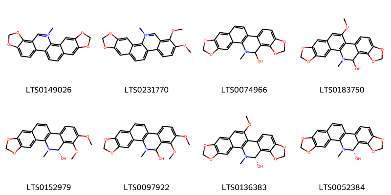{ width=100% }
    <figcaption>Hình ảnh cấu trúc hóa học của 8 hoạt chất thuộc nhóm Benzophenanthridine alkaloids gồm ['sanguinarine (LTS0149026)', 'chelerythrine (LTS0231770)', '24-methyl-5,7,18,20-tetraoxa-24-azahexacyclo[11.11.0.0²,¹⁰.0⁴,⁸.0¹⁴,²².0¹⁷,²¹]tetracosa-1(13),2,4(8),9,11,14,16,21-octaen-23-ol (LTS0074966)', '12-methoxy-24-methyl-5,7,18,20-tetraoxa-24-azahexacyclo[11.11.0.0²,¹⁰.0⁴,⁸.0¹⁴,²².0¹⁷,²¹]tetracosa-1(13),2,4(8),9,11,14,16,21-octaen-23-ol (LTS0183750)', '(20s)-17,18-dimethoxy-21-methyl-5,7-dioxa-21-azapentacyclo[11.8.0.0²,¹⁰.0⁴,⁸.0¹⁴,¹⁹]henicosa-1(13),2,4(8),9,11,14,16,18-octaen-20-ol (LTS0152979)', '17,18-dimethoxy-21-methyl-5,7-dioxa-21-azapentacyclo[11.8.0.0²,¹⁰.0⁴,⁸.0¹⁴,¹⁹]henicosa-1(13),2,4(8),9,11,14,16,18-octaen-20-ol (LTS0097922)', '(23s)-12-methoxy-24-methyl-5,7,18,20-tetraoxa-24-azahexacyclo[11.11.0.0²,¹⁰.0⁴,⁸.0¹⁴,²².0¹⁷,²¹]tetracosa-1(13),2,4(8),9,11,14,16,21-octaen-23-ol (LTS0136383)', '(23s)-24-methyl-5,7,18,20-tetraoxa-24-azahexacyclo[11.11.0.0²,¹⁰.0⁴,⁸.0¹⁴,²².0¹⁷,²¹]tetracosa-1(13),2,4(8),9,11,14,16,21-octaen-23-ol (LTS0052384)'].</figcaption>
</figure>
#### Nhóm Fatty Acyls
<figure markdown="span">
    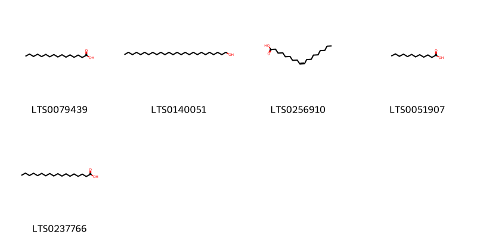{ width=100% }
    <figcaption>Hình ảnh cấu trúc hóa học của 5 hoạt chất thuộc nhóm Fatty Acyls gồm ['palmitic acid (LTS0079439)', 'ceryl alcohol (LTS0140051)', 'oleic acid (LTS0256910)', 'lauric acid (LTS0051907)', 'stearic acid (LTS0237766)'].</figcaption>
</figure>
#### Nhóm Protoberberine alkaloids and derivatives
<figure markdown="span">
    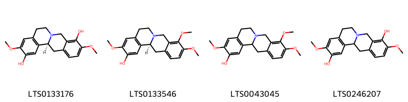{ width=100% }
    <figcaption>Hình ảnh cấu trúc hóa học của 4 hoạt chất thuộc nhóm Protoberberine alkaloids and derivatives gồm ['scoulerine (LTS0133176)', 'tetrahydrocolumbamine (LTS0133546)', '(+/-)-isocorypalmine (LTS0043045)', '(s)-scoulerine (LTS0246207)'].</figcaption>
</figure>
#### Nhóm Protopine alkaloids
<figure markdown="span">
    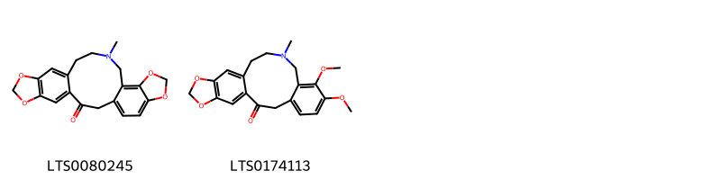{ width=100% }
    <figcaption>Hình ảnh cấu trúc hóa học của 2 hoạt chất thuộc nhóm Protopine alkaloids gồm ['protopine (LTS0080245)', 'β-allocryptopine (LTS0174113)'].</figcaption>
</figure>

---

### Dược dân tộc học

Danh sách các quốc gia có sử dụng *Bocconia frutescens* trong điều trị các bệnh. 

| Country            | Disease                              | Bệnh                                                                                                                                                                                                |
|:-------------------|:-------------------------------------|:----------------------------------------------------------------------------------------------------------------------------------------------------------------------------------------------------|
| Argentina          | Poison                               | MYMEMORY WARNING: YOU USED ALL AVAILABLE FREE TRANSLATIONS FOR TODAY. NEXT AVAILABLE IN  09 HOURS 48 MINUTES 29 SECONDS VISIT HTTPS://MYMEMORY.TRANSLATED.NET/DOC/USAGELIMITS.PHP TO TRANSLATE MORE |
| Ddr                | Vermifuge                            | MYMEMORY WARNING: YOU USED ALL AVAILABLE FREE TRANSLATIONS FOR TODAY. NEXT AVAILABLE IN  09 HOURS 48 MINUTES 26 SECONDS VISIT HTTPS://MYMEMORY.TRANSLATED.NET/DOC/USAGELIMITS.PHP TO TRANSLATE MORE |
| Dominican Republic | Parasiticide, Purgative, Rubefacient | MYMEMORY WARNING: YOU USED ALL AVAILABLE FREE TRANSLATIONS FOR TODAY. NEXT AVAILABLE IN  09 HOURS 48 MINUTES 23 SECONDS VISIT HTTPS://MYMEMORY.TRANSLATED.NET/DOC/USAGELIMITS.PHP TO TRANSLATE MORE |
| Elsewhere          | Anesthetic, Emetic, Sedative         | MYMEMORY WARNING: YOU USED ALL AVAILABLE FREE TRANSLATIONS FOR TODAY. NEXT AVAILABLE IN  09 HOURS 48 MINUTES 20 SECONDS VISIT HTTPS://MYMEMORY.TRANSLATED.NET/DOC/USAGELIMITS.PHP TO TRANSLATE MORE |
| Haiti              | Rubefacient                          | MYMEMORY WARNING: YOU USED ALL AVAILABLE FREE TRANSLATIONS FOR TODAY. NEXT AVAILABLE IN  09 HOURS 48 MINUTES 17 SECONDS VISIT HTTPS://MYMEMORY.TRANSLATED.NET/DOC/USAGELIMITS.PHP TO TRANSLATE MORE |
| Mexico             | Collyrium, Purgative, Pediculicide   | MYMEMORY WARNING: YOU USED ALL AVAILABLE FREE TRANSLATIONS FOR TODAY. NEXT AVAILABLE IN  09 HOURS 48 MINUTES 14 SECONDS VISIT HTTPS://MYMEMORY.TRANSLATED.NET/DOC/USAGELIMITS.PHP TO TRANSLATE MORE |

---

---
## Bocconia vulcanica
### Thông tin về thực vật

!!! info "Phân loại thực vật của *Bocconia vulcanica* từ GIBF:"
    - **Kingdom:** Plantae
    - **Phylum:** Tracheophyta
    - **Order:** Ranunculales
    - **Family:** Papaveraceae
    - **Genus:** Bocconia
    - **Species:** *Bocconia vulcanica*

 

| Label (VI)   | Label (EN)   | Scientific Name    | Descriptions (VI)   | Descriptions (EN)   | Also Known As (VI)   | Also Known As (EN)   |
|:-------------|:-------------|:-------------------|:--------------------|:--------------------|:---------------------|:---------------------|
| N/A          | N/A          | Bocconia vulcanica | loài thực vật       | species of plant    | ['']                 | ['']                 |

#### Phân bố trên thế giới

**Từ CSDL GIBF** nan, Mexico, Guatemala

#### Phân bố tại Việt Nam

**Từ CSDL GIBF**: Không có ghi nhận ở Việt Nam

---
### Thành phần hóa học
        
- Theo cơ sở dữ liệu lotus: Từ loài *Bocconia vulcanica* đã phân lập và xác định được Chưa có hoạt chất nào được phân lập. hoạt chất thuộc về các nhóm Không có hoạt chất nào được phân lập. 

Không có hình ảnh nào được tạo ra

---

### Dược dân tộc học

Danh sách các quốc gia có sử dụng *Bocconia vulcanica* trong điều trị các bệnh. 

| Country   | Disease   | Bệnh                                                                                                                                                                                                |
|:----------|:----------|:----------------------------------------------------------------------------------------------------------------------------------------------------------------------------------------------------|
| Guatemala | Poison    | MYMEMORY WARNING: YOU USED ALL AVAILABLE FREE TRANSLATIONS FOR TODAY. NEXT AVAILABLE IN  09 HOURS 47 MINUTES 32 SECONDS VISIT HTTPS://MYMEMORY.TRANSLATED.NET/DOC/USAGELIMITS.PHP TO TRANSLATE MORE |

---

# Chi Meconopsis

??? note "Danh sách các dược liệu thuộc chi"
    
	 - *Meconopsis aculeata*
	 - *Meconopsis paniculata*

---
## Meconopsis aculeata
### Thông tin về thực vật

!!! info "Phân loại thực vật của *Meconopsis aculeata* từ GIBF:"
    - **Kingdom:** Plantae
    - **Phylum:** Tracheophyta
    - **Order:** Ranunculales
    - **Family:** Papaveraceae
    - **Genus:** Meconopsis
    - **Species:** *Meconopsis aculeata*

 

| Label (VI)   | Label (EN)   | Scientific Name     | Descriptions (VI)   | Descriptions (EN)   | Also Known As (VI)   | Also Known As (EN)     |
|:-------------|:-------------|:--------------------|:--------------------|:--------------------|:---------------------|:-----------------------|
| N/A          | N/A          | Meconopsis aculeata | loài thực vật       | species of plant    | ['']                 | ['Thorny satin poppy'] |

#### Phân bố trên thế giới

**Từ CSDL GIBF** nan, Nepal, Pakistan, China, India, unknown or invalid, Canada, United Kingdom of Great Britain and Northern Ireland

#### Phân bố tại Việt Nam

**Từ CSDL GIBF**: Không có ghi nhận ở Việt Nam

---
### Thành phần hóa học
        
- Theo cơ sở dữ liệu lotus: Từ loài *Meconopsis aculeata* đã phân lập và xác định được Chưa có hoạt chất nào được phân lập. hoạt chất thuộc về các nhóm Không có hoạt chất nào được phân lập. 

Không có hình ảnh nào được tạo ra

---

### Dược dân tộc học

Danh sách các quốc gia có sử dụng *Meconopsis aculeata* trong điều trị các bệnh. 

| Country   | Disease          | Bệnh                                                                                                                                                                                                |
|:----------|:-----------------|:----------------------------------------------------------------------------------------------------------------------------------------------------------------------------------------------------|
| Elsewhere | Narcotic, Poison | MYMEMORY WARNING: YOU USED ALL AVAILABLE FREE TRANSLATIONS FOR TODAY. NEXT AVAILABLE IN  09 HOURS 47 MINUTES 12 SECONDS VISIT HTTPS://MYMEMORY.TRANSLATED.NET/DOC/USAGELIMITS.PHP TO TRANSLATE MORE |

---

---
## Meconopsis paniculata
### Thông tin về thực vật

!!! info "Phân loại thực vật của *Meconopsis paniculata* từ GIBF:"
    - **Kingdom:** Plantae
    - **Phylum:** Tracheophyta
    - **Order:** Ranunculales
    - **Family:** Papaveraceae
    - **Genus:** Meconopsis
    - **Species:** *Meconopsis paniculata*

 

| Label (VI)   | Label (EN)   | Scientific Name       | Descriptions (VI)   | Descriptions (EN)   | Also Known As (VI)   | Also Known As (EN)   |
|:-------------|:-------------|:----------------------|:--------------------|:--------------------|:---------------------|:---------------------|
| N/A          | N/A          | Meconopsis paniculata | loài thực vật       | species of plant    | ['']                 | ['']                 |

#### Phân bố trên thế giới

**Từ CSDL GIBF** nan, Bhutan, Nepal, China, India, unknown or invalid, Canada, United Kingdom of Great Britain and Northern Ireland

#### Phân bố tại Việt Nam

**Từ CSDL GIBF**: Không có ghi nhận ở Việt Nam

---
### Thành phần hóa học
        
- Theo cơ sở dữ liệu lotus: Từ loài *Meconopsis paniculata* đã phân lập và xác định được 3 hoạt chất thuộc về các nhóm Protopine alkaloids, Indoles and derivatives. 

|    | chemicalTaxonomyClassyfireClass   |   smiles_count |
|---:|:----------------------------------|---------------:|
|  0 | Indoles and derivatives           |              1 |
|  1 | Protopine alkaloids               |              2 |

#### Nhóm Indoles and derivatives
<figure markdown="span">
    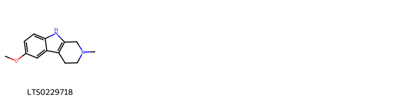{ width=100% }
    <figcaption>Hình ảnh cấu trúc hóa học của 1 hoạt chất thuộc nhóm Indoles and derivatives gồm ['6-methoxy-2-methyl-1h,3h,4h,9h-pyrido[3,4-b]indole (LTS0229718)'].</figcaption>
</figure>
#### Nhóm Protopine alkaloids
<figure markdown="span">
    { width=100% }
    <figcaption>Hình ảnh cấu trúc hóa học của 2 hoạt chất thuộc nhóm Protopine alkaloids gồm ['protopine (LTS0080245)', 'cryptopine (LTS0256990)'].</figcaption>
</figure>

---

### Dược dân tộc học

Danh sách các quốc gia có sử dụng *Meconopsis paniculata* trong điều trị các bệnh. 

| Country   | Disease   | Bệnh                                                                                                                                                                                                |
|:----------|:----------|:----------------------------------------------------------------------------------------------------------------------------------------------------------------------------------------------------|
| Elsewhere | Narcotic  | MYMEMORY WARNING: YOU USED ALL AVAILABLE FREE TRANSLATIONS FOR TODAY. NEXT AVAILABLE IN  09 HOURS 46 MINUTES 45 SECONDS VISIT HTTPS://MYMEMORY.TRANSLATED.NET/DOC/USAGELIMITS.PHP TO TRANSLATE MORE |

---

# Chi Sanguinaria

??? note "Danh sách các dược liệu thuộc chi"
    
	 - *Sanguinaria canadensis*

---
## Sanguinaria canadensis
### Thông tin về thực vật

!!! info "Phân loại thực vật của *Sanguinaria canadensis* từ GIBF:"
    - **Kingdom:** Plantae
    - **Phylum:** Tracheophyta
    - **Order:** Ranunculales
    - **Family:** Papaveraceae
    - **Genus:** Sanguinaria
    - **Species:** *Sanguinaria canadensis*

 

| Label (VI)   | Label (EN)   | Scientific Name        | Descriptions (VI)   | Descriptions (EN)   | Also Known As (VI)   | Also Known As (EN)         |
|:-------------|:-------------|:-----------------------|:--------------------|:--------------------|:---------------------|:---------------------------|
| N/A          | N/A          | Sanguinaria canadensis | loài thực vật       | species of plant    | ['']                 | ['Sanguinaria canadensis'] |

#### Phân bố trên thế giới

**Từ CSDL GIBF** United States of America, Canada

#### Phân bố tại Việt Nam

**Từ CSDL GIBF**: Không có ghi nhận ở Việt Nam

---
### Thành phần hóa học
        
- Theo cơ sở dữ liệu lotus: Từ loài *Sanguinaria canadensis* đã phân lập và xác định được 31 hoạt chất thuộc về các nhóm Benzophenanthridine alkaloids, Benzene and substituted derivatives, Quinolines and derivatives, Protopine alkaloids, Steroids and steroid derivatives, Protoberberine alkaloids and derivatives, Prenol lipids. 

|    | chemicalTaxonomyClassyfireClass          |   smiles_count |
|---:|:-----------------------------------------|---------------:|
|  0 | Benzene and substituted derivatives      |              1 |
|  1 | Benzophenanthridine alkaloids            |             14 |
|  2 | Prenol lipids                            |              5 |
|  3 | Protoberberine alkaloids and derivatives |              3 |
|  4 | Protopine alkaloids                      |              2 |
|  5 | Quinolines and derivatives               |              1 |
|  6 | Steroids and steroid derivatives         |              5 |

#### Nhóm Benzene and substituted derivatives
<figure markdown="span">
    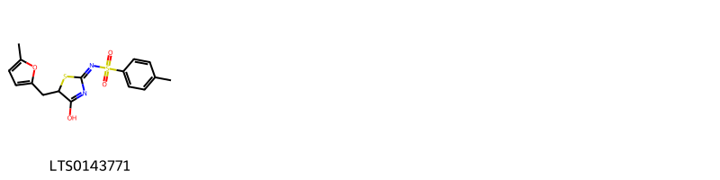{ width=100% }
    <figcaption>Hình ảnh cấu trúc hóa học của 1 hoạt chất thuộc nhóm Benzene and substituted derivatives gồm ['n-{4-hydroxy-5-[(5-methylfuran-2-yl)methyl]-5h-1,3-thiazol-2-ylidene}-4-methylbenzenesulfonamide (LTS0143771)'].</figcaption>
</figure>
#### Nhóm Benzophenanthridine alkaloids
<figure markdown="span">
    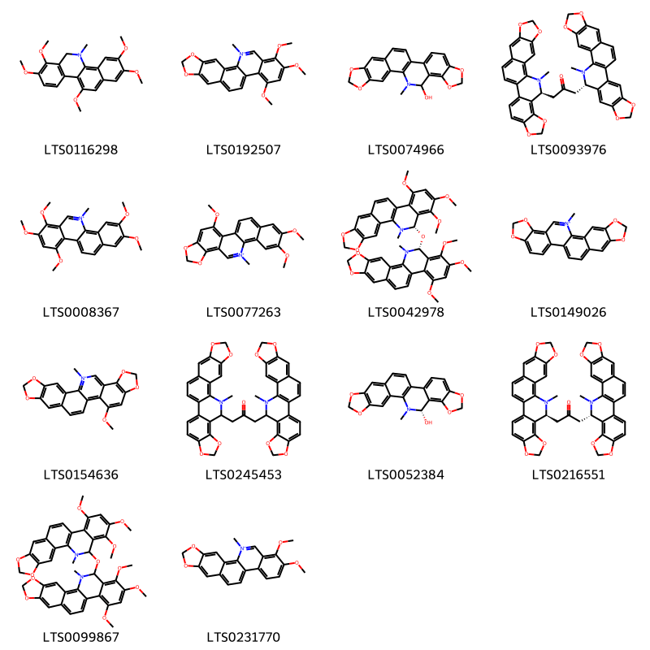{ width=100% }
    <figcaption>Hình ảnh cấu trúc hóa học của 14 hoạt chất thuộc nhóm Benzophenanthridine alkaloids gồm ['2,3,7,8,11-pentamethoxy-5-methyl-6h-benzo[c]phenanthridine (LTS0116298)', 'chelilutine (LTS0192507)', '24-methyl-5,7,18,20-tetraoxa-24-azahexacyclo[11.11.0.0²,¹⁰.0⁴,⁸.0¹⁴,²².0¹⁷,²¹]tetracosa-1(13),2,4(8),9,11,14,16,21-octaen-23-ol (LTS0074966)', '1-[(11s)-12-methyl-5,7,17,19-tetraoxa-12-azahexacyclo[11.11.0.0²,¹⁰.0⁴,⁸.0¹⁴,²².0¹⁶,²⁰]tetracosa-1(13),2,4(8),9,14,16(20),21,23-octaen-11-yl]-3-[(23s)-24-methyl-5,7,18,20-tetraoxa-24-azahexacyclo[11.11.0.0²,¹⁰.0⁴,⁸.0¹⁴,²².0¹⁷,²¹]tetracosa-1(13),2,4(8),9,11,14(22),15,17(21)-octaen-23-yl]propan-2-one (LTS0093976)', 'sanguilutine (LTS0008367)', 'sanguirubine (LTS0077263)', '(20r)-15,17,18-trimethoxy-21-methyl-20-{[(20s)-15,17,18-trimethoxy-21-methyl-5,7-dioxa-21-azapentacyclo[11.8.0.0²,¹⁰.0⁴,⁸.0¹⁴,¹⁹]henicosa-1(13),2,4(8),9,11,14,16,18-octaen-20-yl]oxy}-5,7-dioxa-21-azapentacyclo[11.8.0.0²,¹⁰.0⁴,⁸.0¹⁴,¹⁹]henicosa-1(13),2,4(8),9,11,14,16,18-octaene (LTS0042978)', 'sanguinarine (LTS0149026)', 'chelirubine (LTS0154636)', '1-{24-methyl-5,7,18,20-tetraoxa-24-azahexacyclo[11.11.0.0²,¹⁰.0⁴,⁸.0¹⁴,²².0¹⁷,²¹]tetracosa-1(13),2,4(8),9,11,14(22),15,17(21)-octaen-23-yl}-3-{24-methyl-5,7,18,20-tetraoxa-24-azahexacyclo[11.11.0.0²,¹⁰.0⁴,⁸.0¹⁴,²².0¹⁷,²¹]tetracosa-1(13),2,4(8),9,11,14,16,21-octaen-23-yl}propan-2-one (LTS0245453)', '(23s)-24-methyl-5,7,18,20-tetraoxa-24-azahexacyclo[11.11.0.0²,¹⁰.0⁴,⁸.0¹⁴,²².0¹⁷,²¹]tetracosa-1(13),2,4(8),9,11,14,16,21-octaen-23-ol (LTS0052384)', '1-[(23s)-24-methyl-5,7,18,20-tetraoxa-24-azahexacyclo[11.11.0.0²,¹⁰.0⁴,⁸.0¹⁴,²².0¹⁷,²¹]tetracosa-1(13),2,4(8),9,11,14(22),15,17(21)-octaen-23-yl]-3-[(23s)-24-methyl-5,7,18,20-tetraoxa-24-azahexacyclo[11.11.0.0²,¹⁰.0⁴,⁸.0¹⁴,²².0¹⁷,²¹]tetracosa-1(13),2,4(8),9,11,14,16,21-octaen-23-yl]propan-2-one (LTS0216551)', '15,17,18-trimethoxy-21-methyl-20-({15,17,18-trimethoxy-21-methyl-5,7-dioxa-21-azapentacyclo[11.8.0.0²,¹⁰.0⁴,⁸.0¹⁴,¹⁹]henicosa-1(13),2,4(8),9,11,14,16,18-octaen-20-yl}oxy)-5,7-dioxa-21-azapentacyclo[11.8.0.0²,¹⁰.0⁴,⁸.0¹⁴,¹⁹]henicosa-1(13),2,4(8),9,11,14,16,18-octaene (LTS0099867)', 'chelerythrine (LTS0231770)'].</figcaption>
</figure>
#### Nhóm Prenol lipids
<figure markdown="span">
    { width=100% }
    <figcaption>Hình ảnh cấu trúc hóa học của 5 hoạt chất thuộc nhóm Prenol lipids gồm ['amyrin (LTS0222826)', 'β-amyrin (LTS0251864)', 'lupeol (LTS0256952)', '(6ar,6br,8ar,14br)-4,4,6a,6b,8a,12,14b-heptamethyl-11-methylidene-hexadecahydropicen-3-ol (LTS0274865)', 'taraxasterol (LTS0006950)'].</figcaption>
</figure>
#### Nhóm Protoberberine alkaloids and derivatives
<figure markdown="span">
    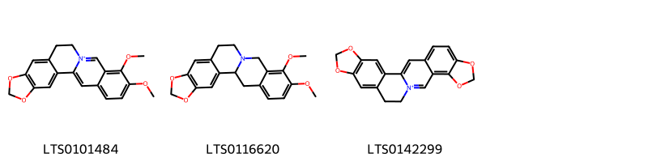{ width=100% }
    <figcaption>Hình ảnh cấu trúc hóa học của 3 hoạt chất thuộc nhóm Protoberberine alkaloids and derivatives gồm ['berberine (LTS0101484)', 'canadin (LTS0116620)', '5,7,17,19-tetraoxa-13λ⁵-azahexacyclo[11.11.0.0²,¹⁰.0⁴,⁸.0¹⁵,²³.0¹⁶,²⁰]tetracosa-1(24),2,4(8),9,13,15,20,22-octaen-13-ylium (LTS0142299)'].</figcaption>
</figure>
#### Nhóm Protopine alkaloids
<figure markdown="span">
    { width=100% }
    <figcaption>Hình ảnh cấu trúc hóa học của 2 hoạt chất thuộc nhóm Protopine alkaloids gồm ['β-allocryptopine (LTS0174113)', 'protopine (LTS0080245)'].</figcaption>
</figure>
#### Nhóm Quinolines and derivatives
<figure markdown="span">
    { width=100% }
    <figcaption>Hình ảnh cấu trúc hóa học của 1 hoạt chất thuộc nhóm Quinolines and derivatives gồm ['hydroxysanguinarine (LTS0263911)'].</figcaption>
</figure>
#### Nhóm Steroids and steroid derivatives
<figure markdown="span">
    { width=100% }
    <figcaption>Hình ảnh cấu trúc hóa học của 5 hoạt chất thuộc nhóm Steroids and steroid derivatives gồm ['stigmast-5-en-3-ol, (3β)- (LTS0204616)', 'stigmast-5-en-3-ol (LTS0071224)', 'phytosterol (LTS0029311)', '(1r,3as,3bs,7s,9bs)-1-[(2r,5r)-5,6-dimethylheptan-2-yl]-9a,11a-dimethyl-1h,2h,3h,3ah,3bh,4h,6h,7h,8h,9h,9bh,10h,11h-cyclopenta[a]phenanthren-7-ol (LTS0057877)', 'campesterol (LTS0046755)'].</figcaption>
</figure>

---

### Dược dân tộc học

Danh sách các quốc gia có sử dụng *Sanguinaria canadensis* trong điều trị các bệnh. 

| Country        | Disease                                                                                                                | Bệnh                                                                                                                                                                                                |
|:---------------|:-----------------------------------------------------------------------------------------------------------------------|:----------------------------------------------------------------------------------------------------------------------------------------------------------------------------------------------------|
| Turkey         | Aphrodisiac, Emetic, Emmenagogue, Narcotic, Stimulant, Tonic, Vermifuge, Laxative, Sternutatory, Sedative, Expectorant | MYMEMORY WARNING: YOU USED ALL AVAILABLE FREE TRANSLATIONS FOR TODAY. NEXT AVAILABLE IN  09 HOURS 46 MINUTES 17 SECONDS VISIT HTTPS://MYMEMORY.TRANSLATED.NET/DOC/USAGELIMITS.PHP TO TRANSLATE MORE |
| US             | Emetic, Expectorant, Expectorant, Stimulant, Tonic, Poison                                                             | MYMEMORY WARNING: YOU USED ALL AVAILABLE FREE TRANSLATIONS FOR TODAY. NEXT AVAILABLE IN  09 HOURS 46 MINUTES 12 SECONDS VISIT HTTPS://MYMEMORY.TRANSLATED.NET/DOC/USAGELIMITS.PHP TO TRANSLATE MORE |
| US(Amerindian) | Cosmetic, Emetic, Tonic, Emetic, Narcotic, Stimulant                                                                   | MYMEMORY WARNING: YOU USED ALL AVAILABLE FREE TRANSLATIONS FOR TODAY. NEXT AVAILABLE IN  09 HOURS 46 MINUTES 07 SECONDS VISIT HTTPS://MYMEMORY.TRANSLATED.NET/DOC/USAGELIMITS.PHP TO TRANSLATE MORE |

---

# Chi Eschscholzia

??? note "Danh sách các dược liệu thuộc chi"
    
	 - *Eschscholzia californica*

---
## Eschscholzia californica
### Thông tin về thực vật

!!! info "Phân loại thực vật của *Eschscholzia californica* từ GIBF:"
    - **Kingdom:** Plantae
    - **Phylum:** Tracheophyta
    - **Order:** Ranunculales
    - **Family:** Papaveraceae
    - **Genus:** Eschscholzia
    - **Species:** *Eschscholzia californica*

 

| Label (VI)   | Label (EN)   | Scientific Name          | Descriptions (VI)   | Descriptions (EN)          | Also Known As (VI)   | Also Known As (EN)                          |
|:-------------|:-------------|:-------------------------|:--------------------|:---------------------------|:---------------------|:--------------------------------------------|
| N/A          | N/A          | Eschscholzia californica |                     | species of flowering plant | ['']                 | ['California poppy', 'California sunlight'] |

#### Phân bố trên thế giới

**Từ CSDL GIBF** United States of America, South Africa, Australia, Chile, New Zealand, Argentina, Canada, Ecuador, France, Spain, Netherlands

#### Phân bố tại Việt Nam

**Từ CSDL GIBF**: Không có ghi nhận ở Việt Nam

---
### Thành phần hóa học
        
- Theo cơ sở dữ liệu lotus: Từ loài *Eschscholzia californica* đã phân lập và xác định được 60 hoạt chất thuộc về các nhóm Benzophenanthridine alkaloids, Aporphines, Quinolines and derivatives, Flavonoids, Protopine alkaloids, Dihydroisoquinolines, Phenols, Protoberberine alkaloids and derivatives, Pavine alkaloids, Isoflavonoids, Isoquinolines and derivatives, Prenol lipids. 

|    | chemicalTaxonomyClassyfireClass          |   smiles_count |
|---:|:-----------------------------------------|---------------:|
|  0 | Aporphines                               |              5 |
|  1 | Benzophenanthridine alkaloids            |             12 |
|  2 | Dihydroisoquinolines                     |              1 |
|  3 | Flavonoids                               |              4 |
|  4 | Isoflavonoids                            |              1 |
|  5 | Isoquinolines and derivatives            |              2 |
|  6 | Pavine alkaloids                         |             10 |
|  7 | Phenols                                  |              1 |
|  8 | Prenol lipids                            |             13 |
|  9 | Protoberberine alkaloids and derivatives |              5 |
| 10 | Protopine alkaloids                      |              4 |
| 11 | Quinolines and derivatives               |              1 |

#### Nhóm Aporphines
<figure markdown="span">
    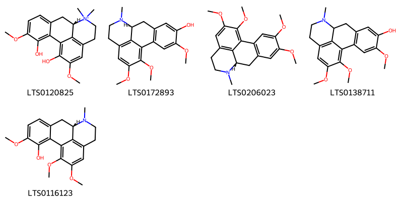{ width=100% }
    <figcaption>Hình ảnh cấu trúc hóa học của 5 hoạt chất thuộc nhóm Aporphines gồm ['magnoflorine (LTS0120825)', '(9s)-4,15,16-trimethoxy-10-methyl-10-azatetracyclo[7.7.1.0²,⁷.0¹³,¹⁷]heptadeca-1(16),2(7),3,5,13(17),14-hexaen-5-ol (LTS0172893)', '(9s)-4,5,15,16-tetramethoxy-10-methyl-10-azatetracyclo[7.7.1.0²,⁷.0¹³,¹⁷]heptadeca-1(16),2(7),3,5,13(17),14-hexaene (LTS0206023)', '4,15,16-trimethoxy-10-methyl-10-azatetracyclo[7.7.1.0²,⁷.0¹³,¹⁷]heptadeca-1(16),2(7),3,5,13(17),14-hexaen-5-ol (LTS0138711)', '(9s)-4,15,16-trimethoxy-10-methyl-10-azatetracyclo[7.7.1.0²,⁷.0¹³,¹⁷]heptadeca-1(16),2,4,6,13(17),14-hexaen-3-ol (LTS0116123)'].</figcaption>
</figure>
#### Nhóm Benzophenanthridine alkaloids
<figure markdown="span">
    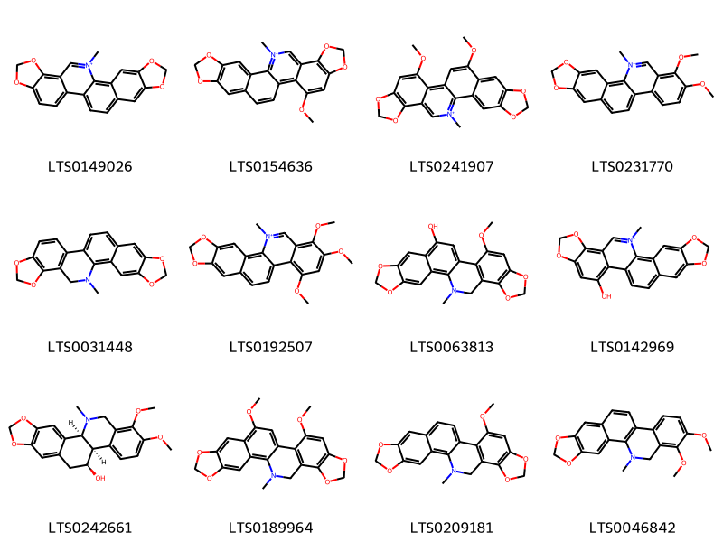{ width=100% }
    <figcaption>Hình ảnh cấu trúc hóa học của 12 hoạt chất thuộc nhóm Benzophenanthridine alkaloids gồm ['sanguinarine (LTS0149026)', 'chelirubine (LTS0154636)', 'macarpine (LTS0241907)', 'chelerythrine (LTS0231770)', 'dihydrosanguinarine (LTS0031448)', 'chelilutine (LTS0192507)', '12-hydroxydihydrochelirubine (LTS0063813)', '15-hydroxy-24-methyl-5,7,18,20-tetraoxa-24-azahexacyclo[11.11.0.0²,¹⁰.0⁴,⁸.0¹⁴,²².0¹⁷,²¹]tetracosa-1(13),2(10),3,8,11,14(22),15,17(21),23-nonaen-24-ium (LTS0142969)', 'homochelidonine (LTS0242661)', 'dihydromacarpine (LTS0189964)', 'dihydrochelirubine (LTS0209181)', '17,18-dimethoxy-21-methyl-5,7-dioxa-21-azapentacyclo[11.8.0.0²,¹⁰.0⁴,⁸.0¹⁴,¹⁹]henicosa-1(13),2,4(8),9,11,14,16,18-octaene (LTS0046842)'].</figcaption>
</figure>
#### Nhóm Dihydroisoquinolines
<figure markdown="span">
    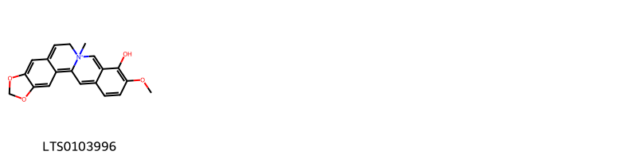{ width=100% }
    <figcaption>Hình ảnh cấu trúc hóa học của 1 hoạt chất thuộc nhóm Dihydroisoquinolines gồm ['16-hydroxy-17-methoxy-13-methyl-5,7-dioxa-13-azapentacyclo[11.8.0.0²,¹⁰.0⁴,⁸.0¹⁵,²⁰]henicosa-1,3,8,10,14,16,18,20-octaen-13-ium (LTS0103996)'].</figcaption>
</figure>
#### Nhóm Flavonoids
<figure markdown="span">
    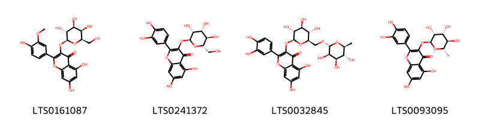{ width=100% }
    <figcaption>Hình ảnh cấu trúc hóa học của 4 hoạt chất thuộc nhóm Flavonoids gồm ['cacticin (LTS0161087)', '2-(3,4-dihydroxyphenyl)-5,7-dihydroxy-3-{[(2s,3r,4r,5r,6s)-3,4,5-trihydroxy-6-(hydroxymethyl)oxan-2-yl]oxy}chromen-4-one (LTS0241372)', '3-rutinosyl quercetin (LTS0032845)', 'quercitrin (LTS0093095)'].</figcaption>
</figure>
#### Nhóm Isoflavonoids
<figure markdown="span">
    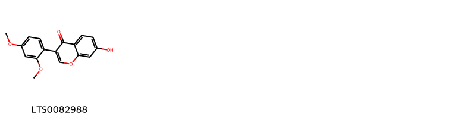{ width=100% }
    <figcaption>Hình ảnh cấu trúc hóa học của 1 hoạt chất thuộc nhóm Isoflavonoids gồm ['3-(2,4-dimethoxyphenyl)-7-hydroxychromen-4-one (LTS0082988)'].</figcaption>
</figure>
#### Nhóm Isoquinolines and derivatives
<figure markdown="span">
    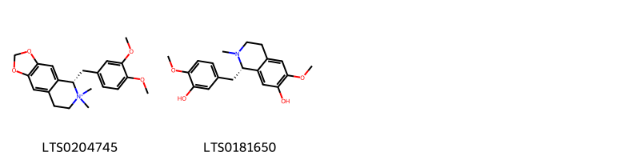{ width=100% }
    <figcaption>Hình ảnh cấu trúc hóa học của 2 hoạt chất thuộc nhóm Isoquinolines and derivatives gồm ['(5s)-5-[(3,4-dimethoxyphenyl)methyl]-6,6-dimethyl-2h,5h,7h,8h-[1,3]dioxolo[4,5-g]isoquinolin-6-ium (LTS0204745)', '(+,-)-reticuline (LTS0181650)'].</figcaption>
</figure>
#### Nhóm Pavine alkaloids
<figure markdown="span">
    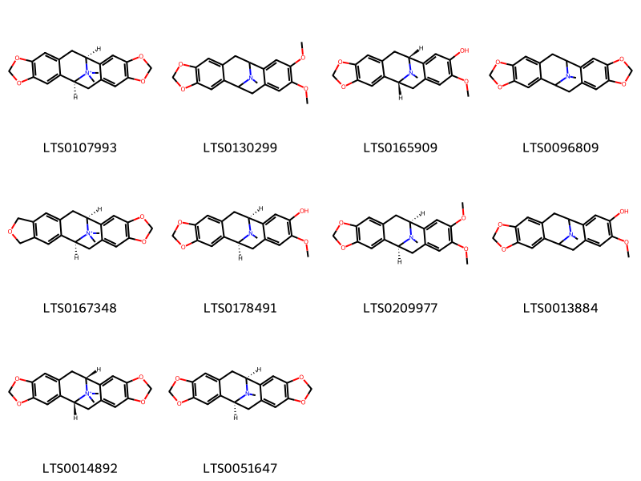{ width=100% }
    <figcaption>Hình ảnh cấu trúc hóa học của 10 hoạt chất thuộc nhóm Pavine alkaloids gồm ['californidine (LTS0107993)', '15,16-dimethoxy-20-methyl-5,7-dioxa-20-azapentacyclo[10.7.1.0²,¹⁰.0⁴,⁸.0¹³,¹⁸]icosa-2,4(8),9,13(18),14,16-hexaene (LTS0130299)', '(1r,12r)-16-methoxy-20-methyl-5,7-dioxa-20-azapentacyclo[10.7.1.0²,¹⁰.0⁴,⁸.0¹³,¹⁸]icosa-2,4(8),9,13(18),14,16-hexaen-15-ol (LTS0165909)', '23-methyl-5,7,16,18-tetraoxa-23-azahexacyclo[10.10.1.0²,¹⁰.0⁴,⁸.0¹³,²¹.0¹⁵,¹⁹]tricosa-2,4(8),9,13,15(19),20-hexaene (LTS0096809)', '(1s,12s)-23,23-dimethyl-5,7,17-trioxa-23-azahexacyclo[10.10.1.0²,¹⁰.0⁴,⁸.0¹³,²¹.0¹⁵,¹⁹]tricosa-2,4(8),9,13,15(19),20-hexaen-23-ium (LTS0167348)', '(1s,12s)-16-methoxy-20-methyl-5,7-dioxa-20-azapentacyclo[10.7.1.0²,¹⁰.0⁴,⁸.0¹³,¹⁸]icosa-2,4(8),9,13(18),14,16-hexaen-15-ol (LTS0178491)', 'eschscholtzidine (LTS0209977)', '16-methoxy-20-methyl-5,7-dioxa-20-azapentacyclo[10.7.1.0²,¹⁰.0⁴,⁸.0¹³,¹⁸]icosa-2,4(8),9,13(18),14,16-hexaen-15-ol (LTS0013884)', '(1r,12r)-23,23-dimethyl-5,7,16,18-tetraoxa-23-azahexacyclo[10.10.1.0²,¹⁰.0⁴,⁸.0¹³,²¹.0¹⁵,¹⁹]tricosa-2,4(8),9,13,15(19),20-hexaen-23-ium (LTS0014892)', '(1s,12s)-23-methyl-5,7,16,18-tetraoxa-23-azahexacyclo[10.10.1.0²,¹⁰.0⁴,⁸.0¹³,²¹.0¹⁵,¹⁹]tricosa-2,4(8),9,13,15(19),20-hexaene (LTS0051647)'].</figcaption>
</figure>
#### Nhóm Phenols
<figure markdown="span">
    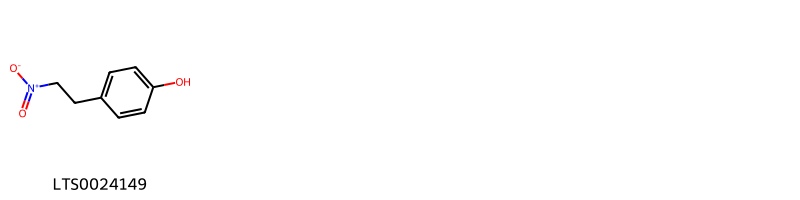{ width=100% }
    <figcaption>Hình ảnh cấu trúc hóa học của 1 hoạt chất thuộc nhóm Phenols gồm ['4-(2-nitroethyl)phenol (LTS0024149)'].</figcaption>
</figure>
#### Nhóm Prenol lipids
<figure markdown="span">
    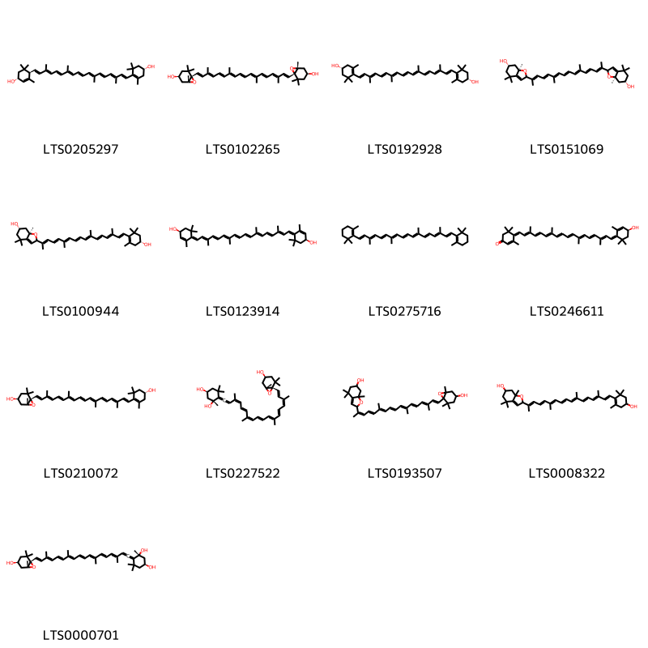{ width=100% }
    <figcaption>Hình ảnh cấu trúc hóa học của 13 hoạt chất thuộc nhóm Prenol lipids gồm ['carotenoid (LTS0205297)', 'violaxanthin (LTS0102265)', 'zeaxanthin (LTS0192928)', '(6s,7ar)-2-[(2e,4e,6e,8e,10e,12e,14e)-15-[(6s,7ar)-6-hydroxy-4,4,7a-trimethyl-2,5,6,7-tetrahydro-1-benzofuran-2-yl]-6,11-dimethylhexadeca-2,4,6,8,10,12,14-heptaen-2-yl]-4,4,7a-trimethyl-2,5,6,7-tetrahydro-1-benzofuran-6-ol (LTS0151069)', '(6s,7ar)-2-[(2e,4e,6e,8e,10e,12e,14e,16e)-17-[(4r)-4-hydroxy-2,6,6-trimethylcyclohex-1-en-1-yl]-6,11,15-trimethylheptadeca-2,4,6,8,10,12,14,16-octaen-2-yl]-4,4,7a-trimethyl-2,5,6,7-tetrahydro-1-benzofuran-6-ol (LTS0100944)', 'eschscholtzxanthin (LTS0123914)', 'β-carotene (LTS0275716)', 'eschscholtzxanthone (LTS0246611)', 'antheraxanthin (LTS0210072)', 'neoxanthin (LTS0227522)', '2-[(2z,4e,6e,8e,10e,12e,14e,16e)-17-{4-hydroxy-2,2,6-trimethyl-7-oxabicyclo[4.1.0]heptan-1-yl}-6,11,15-trimethylheptadeca-2,4,6,8,10,12,14,16-octaen-2-yl]-4,4,7a-trimethyl-2,5,6,7-tetrahydro-1-benzofuran-6-ol (LTS0193507)', '2-[(2e,4e,6e,8e,10e,12e,14e,16e)-17-(4-hydroxy-2,6,6-trimethylcyclohex-1-en-1-yl)-6,11,15-trimethylheptadeca-2,4,6,8,10,12,14,16-octaen-2-yl]-4,4,7a-trimethyl-2,5,6,7-tetrahydro-1-benzofuran-6-ol (LTS0008322)', 'neoxanthin (LTS0000701)'].</figcaption>
</figure>
#### Nhóm Protoberberine alkaloids and derivatives
<figure markdown="span">
    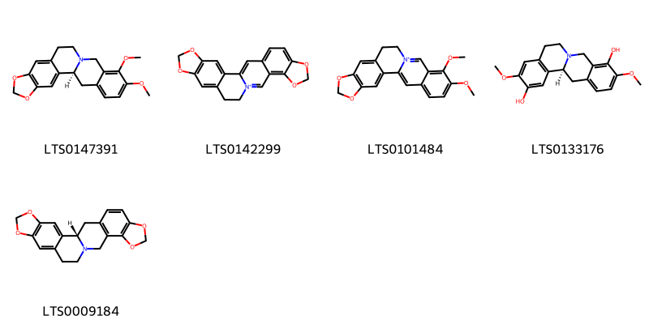{ width=100% }
    <figcaption>Hình ảnh cấu trúc hóa học của 5 hoạt chất thuộc nhóm Protoberberine alkaloids and derivatives gồm ['(s)-canadine (LTS0147391)', '5,7,17,19-tetraoxa-13λ⁵-azahexacyclo[11.11.0.0²,¹⁰.0⁴,⁸.0¹⁵,²³.0¹⁶,²⁰]tetracosa-1(24),2,4(8),9,13,15,20,22-octaen-13-ylium (LTS0142299)', 'berberine (LTS0101484)', 'scoulerine (LTS0133176)', 'stylopine (LTS0009184)'].</figcaption>
</figure>
#### Nhóm Protopine alkaloids
<figure markdown="span">
    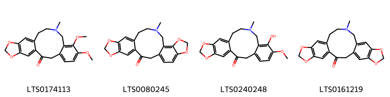{ width=100% }
    <figcaption>Hình ảnh cấu trúc hóa học của 4 hoạt chất thuộc nhóm Protopine alkaloids gồm ['β-allocryptopine (LTS0174113)', 'protopine (LTS0080245)', '8-hydroxy-7-methoxy-11-methyl-17,19-dioxa-11-azatetracyclo[12.7.0.0⁴,⁹.0¹⁶,²⁰]henicosa-1(21),4,6,8,14,16(20)-hexaen-2-one (LTS0240248)', '14-methyl-7,9,20,22-tetraoxa-14-azapentacyclo[15.7.0.0⁴,¹².0⁶,¹⁰.0¹⁹,²³]tetracosa-1(24),4,6(10),11,17,19(23)-hexaen-2-one (LTS0161219)'].</figcaption>
</figure>
#### Nhóm Quinolines and derivatives
<figure markdown="span">
    { width=100% }
    <figcaption>Hình ảnh cấu trúc hóa học của 1 hoạt chất thuộc nhóm Quinolines and derivatives gồm ['5,7,18,20-tetraoxa-24-azahexacyclo[11.11.0.0²,¹⁰.0⁴,⁸.0¹⁴,²².0¹⁷,²¹]tetracosa-1(13),2(10),3,8,11,14(22),15,17(21),23-nonaene (LTS0115511)'].</figcaption>
</figure>

---

### Dược dân tộc học

Danh sách các quốc gia có sử dụng *Eschscholzia californica* trong điều trị các bệnh. 

| Country   | Disease              | Bệnh                                                                                                                                                                                                |
|:----------|:---------------------|:----------------------------------------------------------------------------------------------------------------------------------------------------------------------------------------------------|
| Mexico    | Soporific            | MYMEMORY WARNING: YOU USED ALL AVAILABLE FREE TRANSLATIONS FOR TODAY. NEXT AVAILABLE IN  09 HOURS 45 MINUTES 16 SECONDS VISIT HTTPS://MYMEMORY.TRANSLATED.NET/DOC/USAGELIMITS.PHP TO TRANSLATE MORE |
| Turkey    | Analgesic, Soporific | MYMEMORY WARNING: YOU USED ALL AVAILABLE FREE TRANSLATIONS FOR TODAY. NEXT AVAILABLE IN  09 HOURS 45 MINUTES 11 SECONDS VISIT HTTPS://MYMEMORY.TRANSLATED.NET/DOC/USAGELIMITS.PHP TO TRANSLATE MORE |

---

# Chi Papaver

??? note "Danh sách các dược liệu thuộc chi"
    
	 - *Papaver argemone*
	 - *Papaver dubium*
	 - *Papaver hybridum*
	 - *Papaver nudicaule*
	 - *Papaver orientale*
	 - *Papaver rhoeas*
	 - *Papaver somniferum*

---
## Papaver argemone
### Thông tin về thực vật

!!! info "Phân loại thực vật của *Roemeria argemone* từ GIBF:"
    - **Kingdom:** Plantae
    - **Phylum:** Tracheophyta
    - **Order:** Ranunculales
    - **Family:** Papaveraceae
    - **Genus:** Roemeria
    - **Species:** *Roemeria argemone*

 

| Label (VI)   | Label (EN)   | Scientific Name   | Descriptions (VI)   | Descriptions (EN)   | Also Known As (VI)   | Also Known As (EN)   |
|:-------------|:-------------|:------------------|:--------------------|:--------------------|:---------------------|:---------------------|
| N/A          | N/A          | Papaver argemone  | loài thực vật       | species of plant    | ['']                 | ['Prickly Poppy']    |

#### Phân bố trên thế giới

**Từ CSDL GIBF** Austria, Czechia, Sweden, Netherlands, Belgium, Greece, France, Switzerland, Luxembourg, Germany, United Kingdom of Great Britain and Northern Ireland, Spain, Denmark

#### Phân bố tại Việt Nam

**Từ CSDL GIBF**: Không có ghi nhận ở Việt Nam

---
### Thành phần hóa học
        
- Theo cơ sở dữ liệu lotus: Từ loài *Roemeria argemone* đã phân lập và xác định được 20 hoạt chất thuộc về các nhóm Aporphines, Protopine alkaloids, Protoberberine alkaloids and derivatives, Rhoeadine alkaloids. 

|    | chemicalTaxonomyClassyfireClass          |   smiles_count |
|---:|:-----------------------------------------|---------------:|
|  0 | Aporphines                               |              7 |
|  1 | Protoberberine alkaloids and derivatives |              3 |
|  2 | Protopine alkaloids                      |              3 |
|  3 | Rhoeadine alkaloids                      |              7 |

#### Nhóm Aporphines
<figure markdown="span">
    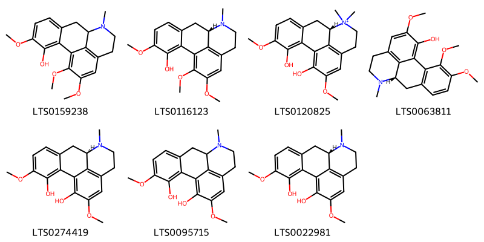{ width=100% }
    <figcaption>Hình ảnh cấu trúc hóa học của 7 hoạt chất thuộc nhóm Aporphines gồm ['4,15,16-trimethoxy-10-methyl-10-azatetracyclo[7.7.1.0²,⁷.0¹³,¹⁷]heptadeca-1(16),2,4,6,13(17),14-hexaen-3-ol (LTS0159238)', '(9s)-4,15,16-trimethoxy-10-methyl-10-azatetracyclo[7.7.1.0²,⁷.0¹³,¹⁷]heptadeca-1(16),2,4,6,13(17),14-hexaen-3-ol (LTS0116123)', 'magnoflorine (LTS0120825)', '(9s)-3,4,15-trimethoxy-10-methyl-10-azatetracyclo[7.7.1.0²,⁷.0¹³,¹⁷]heptadeca-1(16),2(7),3,5,13(17),14-hexaen-16-ol (LTS0063811)', '(9r)-4,15-dimethoxy-10-methyl-10-azatetracyclo[7.7.1.0²,⁷.0¹³,¹⁷]heptadeca-1(16),2,4,6,13(17),14-hexaene-3,16-diol (LTS0274419)', '4,15-dimethoxy-10-methyl-10-azatetracyclo[7.7.1.0²,⁷.0¹³,¹⁷]heptadeca-1(16),2,4,6,13(17),14-hexaene-3,16-diol (LTS0095715)', '(9s)-4,15-dimethoxy-10-methyl-10-azatetracyclo[7.7.1.0²,⁷.0¹³,¹⁷]heptadeca-1(16),2,4,6,13(17),14-hexaene-3,16-diol (LTS0022981)'].</figcaption>
</figure>
#### Nhóm Protoberberine alkaloids and derivatives
<figure markdown="span">
    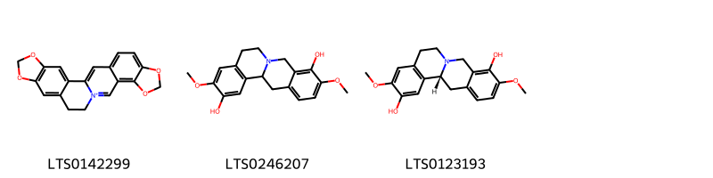{ width=100% }
    <figcaption>Hình ảnh cấu trúc hóa học của 3 hoạt chất thuộc nhóm Protoberberine alkaloids and derivatives gồm ['5,7,17,19-tetraoxa-13λ⁵-azahexacyclo[11.11.0.0²,¹⁰.0⁴,⁸.0¹⁵,²³.0¹⁶,²⁰]tetracosa-1(24),2,4(8),9,13,15,20,22-octaen-13-ylium (LTS0142299)', '(s)-scoulerine (LTS0246207)', '(12br)-3,10-dimethoxy-7,8,12b,13-tetrahydro-5h-6-azatetraphene-4,11-diol (LTS0123193)'].</figcaption>
</figure>
#### Nhóm Protopine alkaloids
<figure markdown="span">
    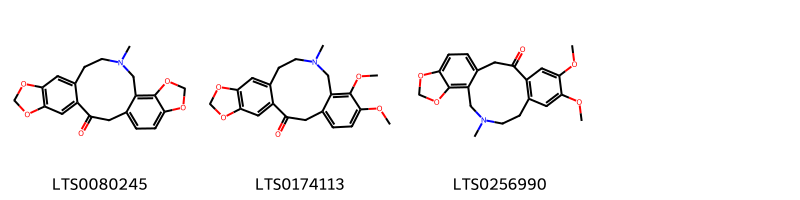{ width=100% }
    <figcaption>Hình ảnh cấu trúc hóa học của 3 hoạt chất thuộc nhóm Protopine alkaloids gồm ['protopine (LTS0080245)', 'β-allocryptopine (LTS0174113)', 'cryptopine (LTS0256990)'].</figcaption>
</figure>
#### Nhóm Rhoeadine alkaloids
<figure markdown="span">
    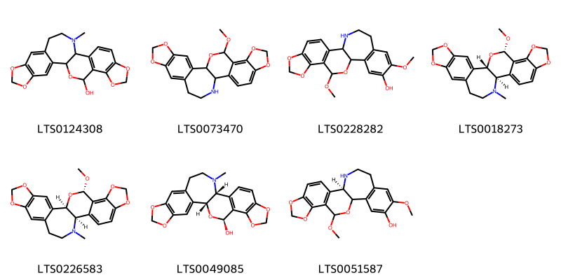{ width=100% }
    <figcaption>Hình ảnh cấu trúc hóa học của 7 hoạt chất thuộc nhóm Rhoeadine alkaloids gồm ['13-methyl-5,7,19,21,25-pentaoxa-13-azahexacyclo[12.11.0.0²,¹⁰.0⁴,⁸.0¹⁵,²³.0¹⁸,²²]pentacosa-2,4(8),9,15(23),16,18(22)-hexaen-24-ol (LTS0124308)', '24-methoxy-5,7,19,21,25-pentaoxa-13-azahexacyclo[12.11.0.0²,¹⁰.0⁴,⁸.0¹⁵,²³.0¹⁸,²²]pentacosa-2,4(8),9,15,17,22-hexaene (LTS0073470)', '11,17-dimethoxy-6,8,12-trioxa-22-azapentacyclo[11.9.0.0²,¹⁰.0⁵,⁹.0¹⁴,¹⁹]docosa-2(10),3,5(9),14(19),15,17-hexaen-16-ol (LTS0228282)', '(1s,14r,24s)-24-methoxy-13-methyl-5,7,19,21,25-pentaoxa-13-azahexacyclo[12.11.0.0²,¹⁰.0⁴,⁸.0¹⁵,²³.0¹⁸,²²]pentacosa-2,4(8),9,15,17,22-hexaene (LTS0018273)', 'rhoeadine (LTS0226583)', '(1r,14r,24s)-13-methyl-5,7,19,21,25-pentaoxa-13-azahexacyclo[12.11.0.0²,¹⁰.0⁴,⁸.0¹⁵,²³.0¹⁸,²²]pentacosa-2,4(8),9,15(23),16,18(22)-hexaen-24-ol (LTS0049085)', '(1r)-11,17-dimethoxy-6,8,12-trioxa-22-azapentacyclo[11.9.0.0²,¹⁰.0⁵,⁹.0¹⁴,¹⁹]docosa-2(10),3,5(9),14(19),15,17-hexaen-16-ol (LTS0051587)'].</figcaption>
</figure>

---

### Dược dân tộc học

Danh sách các quốc gia có sử dụng *Roemeria argemone* trong điều trị các bệnh. 

| Country   | Disease              | Bệnh                                                                                                                                                                                                |
|:----------|:---------------------|:----------------------------------------------------------------------------------------------------------------------------------------------------------------------------------------------------|
| ain       | Sudorific, Sudorific | MYMEMORY WARNING: YOU USED ALL AVAILABLE FREE TRANSLATIONS FOR TODAY. NEXT AVAILABLE IN  09 HOURS 44 MINUTES 31 SECONDS VISIT HTTPS://MYMEMORY.TRANSLATED.NET/DOC/USAGELIMITS.PHP TO TRANSLATE MORE |

---

---
## Papaver dubium
### Thông tin về thực vật

!!! info "Phân loại thực vật của *Papaver dubium* từ GIBF:"
    - **Kingdom:** Plantae
    - **Phylum:** Tracheophyta
    - **Order:** Ranunculales
    - **Family:** Papaveraceae
    - **Genus:** Papaver
    - **Species:** *Papaver dubium*

 

| Label (VI)   | Label (EN)   | Scientific Name   | Descriptions (VI)   | Descriptions (EN)   | Also Known As (VI)   | Also Known As (EN)    |
|:-------------|:-------------|:------------------|:--------------------|:--------------------|:---------------------|:----------------------|
| N/A          | N/A          | Papaver dubium    | loài thực vật       | species of plant    | ['']                 | ['Long-headed poppy'] |

#### Phân bố trên thế giới

**Từ CSDL GIBF** Japan, Malta, Czechia, Sweden, New Zealand, Spain, Denmark, Netherlands, United States of America, Romania, Croatia, Algeria, Libya, Germany, Moldova, Republic of, Austria, Hungary, Portugal, Bermuda, Slovakia, Ukraine, Italy, Switzerland, France

#### Phân bố tại Việt Nam

**Từ CSDL GIBF**: Không có ghi nhận ở Việt Nam

---
### Thành phần hóa học
        
- Theo cơ sở dữ liệu lotus: Từ loài *Papaver dubium* đã phân lập và xác định được 35 hoạt chất thuộc về các nhóm Aporphines, Morphinans, Proaporphines, Rhoeadine alkaloids, Protopine alkaloids, Protoberberine alkaloids and derivatives, Isoquinolines and derivatives. 

|    | chemicalTaxonomyClassyfireClass          |   smiles_count |
|---:|:-----------------------------------------|---------------:|
|  0 | Aporphines                               |              7 |
|  1 | Isoquinolines and derivatives            |              1 |
|  2 | Morphinans                               |              1 |
|  3 | Proaporphines                            |              3 |
|  4 | Protoberberine alkaloids and derivatives |             10 |
|  5 | Protopine alkaloids                      |              3 |
|  6 | Rhoeadine alkaloids                      |             10 |

#### Nhóm Aporphines
<figure markdown="span">
    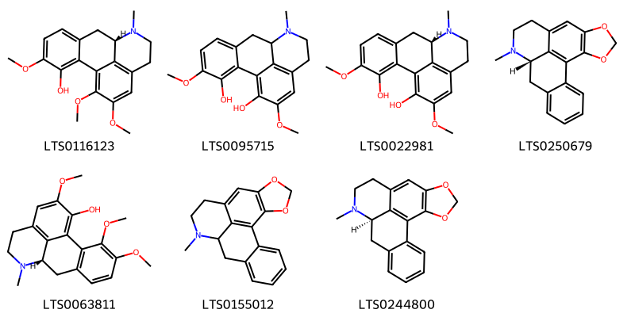{ width=100% }
    <figcaption>Hình ảnh cấu trúc hóa học của 7 hoạt chất thuộc nhóm Aporphines gồm ['(9s)-4,15,16-trimethoxy-10-methyl-10-azatetracyclo[7.7.1.0²,⁷.0¹³,¹⁷]heptadeca-1(16),2,4,6,13(17),14-hexaen-3-ol (LTS0116123)', '4,15-dimethoxy-10-methyl-10-azatetracyclo[7.7.1.0²,⁷.0¹³,¹⁷]heptadeca-1(16),2,4,6,13(17),14-hexaene-3,16-diol (LTS0095715)', '(9s)-4,15-dimethoxy-10-methyl-10-azatetracyclo[7.7.1.0²,⁷.0¹³,¹⁷]heptadeca-1(16),2,4,6,13(17),14-hexaene-3,16-diol (LTS0022981)', 'aporeine (LTS0250679)', '(9s)-3,4,15-trimethoxy-10-methyl-10-azatetracyclo[7.7.1.0²,⁷.0¹³,¹⁷]heptadeca-1(16),2(7),3,5,13(17),14-hexaen-16-ol (LTS0063811)', '11-methyl-3,5-dioxa-11-azapentacyclo[10.7.1.0²,⁶.0⁸,²⁰.0¹⁴,¹⁹]icosa-1(20),2(6),7,14,16,18-hexaene (LTS0155012)', '(12r)-11-methyl-3,5-dioxa-11-azapentacyclo[10.7.1.0²,⁶.0⁸,²⁰.0¹⁴,¹⁹]icosa-1(20),2(6),7,14,16,18-hexaene (LTS0244800)'].</figcaption>
</figure>
#### Nhóm Isoquinolines and derivatives
<figure markdown="span">
    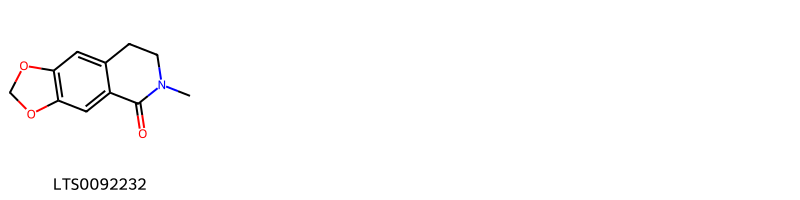{ width=100% }
    <figcaption>Hình ảnh cấu trúc hóa học của 1 hoạt chất thuộc nhóm Isoquinolines and derivatives gồm ['6-methyl-2h,7h,8h-[1,3]dioxolo[4,5-g]isoquinolin-5-one (LTS0092232)'].</figcaption>
</figure>
#### Nhóm Morphinans
<figure markdown="span">
    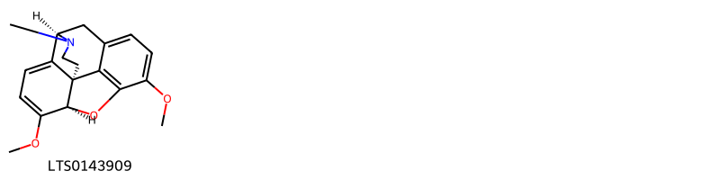{ width=100% }
    <figcaption>Hình ảnh cấu trúc hóa học của 1 hoạt chất thuộc nhóm Morphinans gồm ['thebaine (LTS0143909)'].</figcaption>
</figure>
#### Nhóm Proaporphines
<figure markdown="span">
    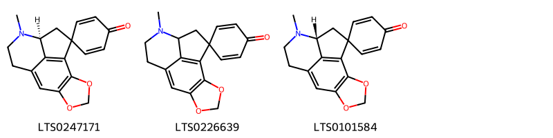{ width=100% }
    <figcaption>Hình ảnh cấu trúc hóa học của 3 hoạt chất thuộc nhóm Proaporphines gồm ['mecambrine (LTS0247171)', "11'-methyl-3',5'-dioxa-11'-azaspiro[cyclohexane-1,14'-tetracyclo[6.6.1.0²,⁶.0¹²,¹⁵]pentadecane]-1'(15'),2,2'(6'),5,7'-pentaen-4-one (LTS0226639)", "(12'r)-11'-methyl-3',5'-dioxa-11'-azaspiro[cyclohexane-1,14'-tetracyclo[6.6.1.0²,⁶.0¹²,¹⁵]pentadecane]-1'(15'),2,2'(6'),5,7'-pentaen-4-one (LTS0101584)"].</figcaption>
</figure>
#### Nhóm Protoberberine alkaloids and derivatives
<figure markdown="span">
    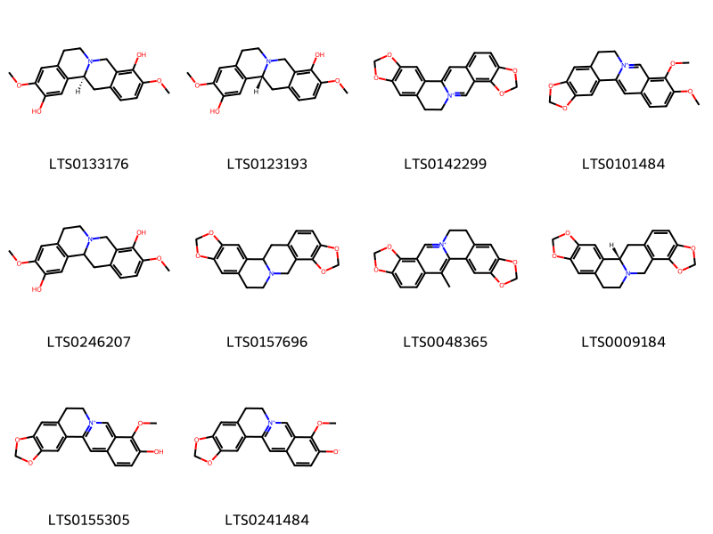{ width=100% }
    <figcaption>Hình ảnh cấu trúc hóa học của 10 hoạt chất thuộc nhóm Protoberberine alkaloids and derivatives gồm ['scoulerine (LTS0133176)', '(12br)-3,10-dimethoxy-7,8,12b,13-tetrahydro-5h-6-azatetraphene-4,11-diol (LTS0123193)', '5,7,17,19-tetraoxa-13λ⁵-azahexacyclo[11.11.0.0²,¹⁰.0⁴,⁸.0¹⁵,²³.0¹⁶,²⁰]tetracosa-1(24),2,4(8),9,13,15,20,22-octaen-13-ylium (LTS0142299)', 'berberine (LTS0101484)', '(s)-scoulerine (LTS0246207)', '5,7,17,19-tetraoxa-13-azahexacyclo[11.11.0.0²,¹⁰.0⁴,⁸.0¹⁵,²³.0¹⁶,²⁰]tetracosa-2,4(8),9,15(23),16(20),21-hexaene (LTS0157696)', '24-methyl-5,7,17,19-tetraoxa-13λ⁵-azahexacyclo[11.11.0.0²,¹⁰.0⁴,⁸.0¹⁵,²³.0¹⁶,²⁰]tetracosa-1(24),2,4(8),9,13,15,20,22-octaen-13-ylium (LTS0048365)', 'stylopine (LTS0009184)', '17-hydroxy-16-methoxy-5,7-dioxa-13λ⁵-azapentacyclo[11.8.0.0²,¹⁰.0⁴,⁸.0¹⁵,²⁰]henicosa-1(13),2,4(8),9,14,16,18,20-octaen-13-ylium (LTS0155305)', '16-methoxy-5,7-dioxa-13λ⁵-azapentacyclo[11.8.0.0²,¹⁰.0⁴,⁸.0¹⁵,²⁰]henicosa-1(13),2,4(8),9,14,16,18,20-octaen-13-ylium-17-olate (LTS0241484)'].</figcaption>
</figure>
#### Nhóm Protopine alkaloids
<figure markdown="span">
    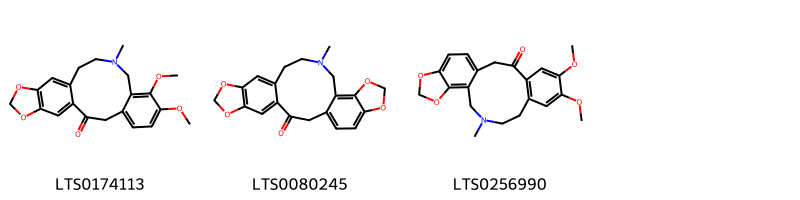{ width=100% }
    <figcaption>Hình ảnh cấu trúc hóa học của 3 hoạt chất thuộc nhóm Protopine alkaloids gồm ['β-allocryptopine (LTS0174113)', 'protopine (LTS0080245)', 'cryptopine (LTS0256990)'].</figcaption>
</figure>
#### Nhóm Rhoeadine alkaloids
<figure markdown="span">
    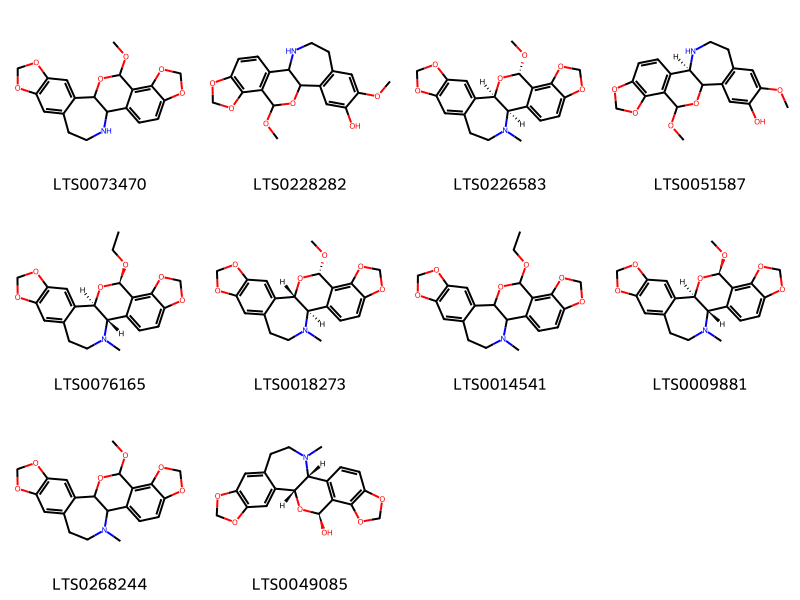{ width=100% }
    <figcaption>Hình ảnh cấu trúc hóa học của 10 hoạt chất thuộc nhóm Rhoeadine alkaloids gồm ['24-methoxy-5,7,19,21,25-pentaoxa-13-azahexacyclo[12.11.0.0²,¹⁰.0⁴,⁸.0¹⁵,²³.0¹⁸,²²]pentacosa-2,4(8),9,15,17,22-hexaene (LTS0073470)', '11,17-dimethoxy-6,8,12-trioxa-22-azapentacyclo[11.9.0.0²,¹⁰.0⁵,⁹.0¹⁴,¹⁹]docosa-2(10),3,5(9),14(19),15,17-hexaen-16-ol (LTS0228282)', 'rhoeadine (LTS0226583)', '(1r)-11,17-dimethoxy-6,8,12-trioxa-22-azapentacyclo[11.9.0.0²,¹⁰.0⁵,⁹.0¹⁴,¹⁹]docosa-2(10),3,5(9),14(19),15,17-hexaen-16-ol (LTS0051587)', '(1r,14s,24r)-24-ethoxy-13-methyl-5,7,19,21,25-pentaoxa-13-azahexacyclo[12.11.0.0²,¹⁰.0⁴,⁸.0¹⁵,²³.0¹⁸,²²]pentacosa-2,4(8),9,15,17,22-hexaene (LTS0076165)', '(1s,14r,24s)-24-methoxy-13-methyl-5,7,19,21,25-pentaoxa-13-azahexacyclo[12.11.0.0²,¹⁰.0⁴,⁸.0¹⁵,²³.0¹⁸,²²]pentacosa-2,4(8),9,15,17,22-hexaene (LTS0018273)', '24-ethoxy-13-methyl-5,7,19,21,25-pentaoxa-13-azahexacyclo[12.11.0.0²,¹⁰.0⁴,⁸.0¹⁵,²³.0¹⁸,²²]pentacosa-2,4(8),9,15,17,22-hexaene (LTS0014541)', '(1r,14s,24r)-24-methoxy-13-methyl-5,7,19,21,25-pentaoxa-13-azahexacyclo[12.11.0.0²,¹⁰.0⁴,⁸.0¹⁵,²³.0¹⁸,²²]pentacosa-2,4(8),9,15,17,22-hexaene (LTS0009881)', '24-methoxy-13-methyl-5,7,19,21,25-pentaoxa-13-azahexacyclo[12.11.0.0²,¹⁰.0⁴,⁸.0¹⁵,²³.0¹⁸,²²]pentacosa-2,4(8),9,15,17,22-hexaene (LTS0268244)', '(1r,14r,24s)-13-methyl-5,7,19,21,25-pentaoxa-13-azahexacyclo[12.11.0.0²,¹⁰.0⁴,⁸.0¹⁵,²³.0¹⁸,²²]pentacosa-2,4(8),9,15(23),16,18(22)-hexaen-24-ol (LTS0049085)'].</figcaption>
</figure>

---

### Dược dân tộc học

Danh sách các quốc gia có sử dụng *Papaver dubium* trong điều trị các bệnh. 

| Country   | Disease                                 | Bệnh                                                                                                                                                                                                |
|:----------|:----------------------------------------|:----------------------------------------------------------------------------------------------------------------------------------------------------------------------------------------------------|
| Elsewhere | Poison, Sudorific, Sudorific, Sudorific | MYMEMORY WARNING: YOU USED ALL AVAILABLE FREE TRANSLATIONS FOR TODAY. NEXT AVAILABLE IN  09 HOURS 43 MINUTES 47 SECONDS VISIT HTTPS://MYMEMORY.TRANSLATED.NET/DOC/USAGELIMITS.PHP TO TRANSLATE MORE |
| Iraq      | Convulsant                              | MYMEMORY WARNING: YOU USED ALL AVAILABLE FREE TRANSLATIONS FOR TODAY. NEXT AVAILABLE IN  09 HOURS 43 MINUTES 44 SECONDS VISIT HTTPS://MYMEMORY.TRANSLATED.NET/DOC/USAGELIMITS.PHP TO TRANSLATE MORE |

---

---
## Papaver hybridum
### Thông tin về thực vật

!!! info "Phân loại thực vật của *N/A* từ GIBF:"
    - **Kingdom:** Plantae
    - **Phylum:** Tracheophyta
    - **Order:** Ranunculales
    - **Family:** Papaveraceae
    - **Genus:** Roemeria
    - **Species:** *N/A*

 

| Label (VI)   | Label (EN)   | Scientific Name   | Descriptions (VI)   | Descriptions (EN)   | Also Known As (VI)   | Also Known As (EN)   |
|:-------------|:-------------|:------------------|:--------------------|:--------------------|:---------------------|:---------------------|
| N/A          | N/A          | Papaver hybridum  | loài thực vật       | species of plant    | ['']                 | ['']                 |

#### Phân bố trên thế giới

**Từ CSDL GIBF** Malta, Czechia, Uzbekistan, Israel, Kazakhstan, Türkiye, Spain, Denmark, Netherlands, Poland, Montenegro, Greece, Iran (Islamic Republic of), Armenia, Russian Federation, Croatia, Morocco, Algeria, Palestine, State of, Georgia, Germany, Turkmenistan, Hungary, Portugal, Ukraine, Kyrgyzstan, Australia, Italy, Switzerland, Bulgaria, France

#### Phân bố tại Việt Nam

**Từ CSDL GIBF**: Không có ghi nhận ở Việt Nam

---
### Thành phần hóa học
        
- Theo cơ sở dữ liệu lotus: Từ loài *N/A* đã phân lập và xác định được Chưa có hoạt chất nào được phân lập. hoạt chất thuộc về các nhóm Không có hoạt chất nào được phân lập. 

Không có hình ảnh nào được tạo ra

---

### Dược dân tộc học

Danh sách các quốc gia có sử dụng *N/A* trong điều trị các bệnh. 

| Country   | Disease   | Bệnh                                                                                                                                                                                                |
|:----------|:----------|:----------------------------------------------------------------------------------------------------------------------------------------------------------------------------------------------------|
| Elsewhere | Vesicant  | MYMEMORY WARNING: YOU USED ALL AVAILABLE FREE TRANSLATIONS FOR TODAY. NEXT AVAILABLE IN  09 HOURS 43 MINUTES 06 SECONDS VISIT HTTPS://MYMEMORY.TRANSLATED.NET/DOC/USAGELIMITS.PHP TO TRANSLATE MORE |

---

---
## Papaver nudicaule
### Thông tin về thực vật

!!! info "Phân loại thực vật của *Papaver nudicaule* từ GIBF:"
    - **Kingdom:** Plantae
    - **Phylum:** Tracheophyta
    - **Order:** Ranunculales
    - **Family:** Papaveraceae
    - **Genus:** Papaver
    - **Species:** *Papaver nudicaule*

 

| Label (VI)   | Label (EN)   | Scientific Name   | Descriptions (VI)   | Descriptions (EN)   | Also Known As (VI)   | Also Known As (EN)   |
|:-------------|:-------------|:------------------|:--------------------|:--------------------|:---------------------|:---------------------|
| N/A          | N/A          | Papaver nudicaule | loài thực vật       | species of plant    | ['']                 | ['Iceland Poppy']    |

#### Phân bố trên thế giới

**Từ CSDL GIBF** nan, United States of America, Greenland, Mongolia, Estonia, Iceland, Pakistan, China, Russian Federation, Kazakhstan, Canada, Germany, United Kingdom of Great Britain and Northern Ireland

#### Phân bố tại Việt Nam

**Từ CSDL GIBF**: Không có ghi nhận ở Việt Nam

---
### Thành phần hóa học
        
- Theo cơ sở dữ liệu lotus: Từ loài *Papaver nudicaule* đã phân lập và xác định được 52 hoạt chất thuộc về các nhóm Aporphines, Benzophenanthridine alkaloids, Proaporphines, Quinolines and derivatives, Rhoeadine alkaloids, Flavonoids, Phenanthrenes and derivatives, Protopine alkaloids, Dibenzocycloheptenes, Protoberberine alkaloids and derivatives, Isoflavonoids, Isoquinolines and derivatives. 

|    | chemicalTaxonomyClassyfireClass          |   smiles_count |
|---:|:-----------------------------------------|---------------:|
|  0 | Aporphines                               |              5 |
|  1 | Benzophenanthridine alkaloids            |              1 |
|  2 | Dibenzocycloheptenes                     |              2 |
|  3 | Flavonoids                               |             10 |
|  4 | Isoflavonoids                            |              2 |
|  5 | Isoquinolines and derivatives            |              2 |
|  6 | Phenanthrenes and derivatives            |              5 |
|  7 | Proaporphines                            |              4 |
|  8 | Protoberberine alkaloids and derivatives |              7 |
|  9 | Protopine alkaloids                      |              5 |
| 10 | Quinolines and derivatives               |              1 |
| 11 | Rhoeadine alkaloids                      |              8 |

#### Nhóm Aporphines
<figure markdown="span">
    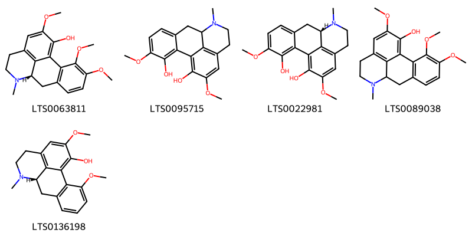{ width=100% }
    <figcaption>Hình ảnh cấu trúc hóa học của 5 hoạt chất thuộc nhóm Aporphines gồm ['(9s)-3,4,15-trimethoxy-10-methyl-10-azatetracyclo[7.7.1.0²,⁷.0¹³,¹⁷]heptadeca-1(16),2(7),3,5,13(17),14-hexaen-16-ol (LTS0063811)', '4,15-dimethoxy-10-methyl-10-azatetracyclo[7.7.1.0²,⁷.0¹³,¹⁷]heptadeca-1(16),2,4,6,13(17),14-hexaene-3,16-diol (LTS0095715)', '(9s)-4,15-dimethoxy-10-methyl-10-azatetracyclo[7.7.1.0²,⁷.0¹³,¹⁷]heptadeca-1(16),2,4,6,13(17),14-hexaene-3,16-diol (LTS0022981)', '3,4,15-trimethoxy-10-methyl-10-azatetracyclo[7.7.1.0²,⁷.0¹³,¹⁷]heptadeca-1(16),2(7),3,5,13(17),14-hexaen-16-ol (LTS0089038)', '(9s)-3,15-dimethoxy-10-methyl-10-azatetracyclo[7.7.1.0²,⁷.0¹³,¹⁷]heptadeca-1(16),2(7),3,5,13(17),14-hexaen-16-ol (LTS0136198)'].</figcaption>
</figure>
#### Nhóm Benzophenanthridine alkaloids
<figure markdown="span">
    { width=100% }
    <figcaption>Hình ảnh cấu trúc hóa học của 1 hoạt chất thuộc nhóm Benzophenanthridine alkaloids gồm ['sanguinarine (LTS0149026)'].</figcaption>
</figure>
#### Nhóm Dibenzocycloheptenes
<figure markdown="span">
    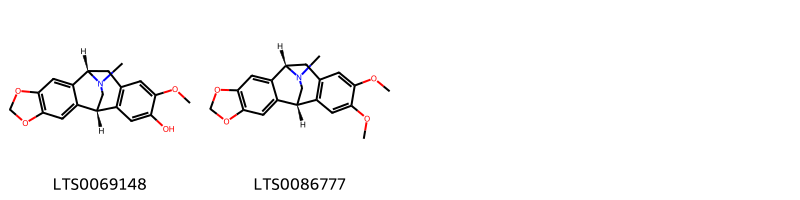{ width=100% }
    <figcaption>Hình ảnh cấu trúc hóa học của 2 hoạt chất thuộc nhóm Dibenzocycloheptenes gồm ['amurensine (LTS0069148)', '(1s,11r)-14,15-dimethoxy-19-methyl-5,7-dioxa-19-azapentacyclo[9.7.2.0²,¹⁰.0⁴,⁸.0¹²,¹⁷]icosa-2,4(8),9,12(17),13,15-hexaene (LTS0086777)'].</figcaption>
</figure>
#### Nhóm Flavonoids
<figure markdown="span">
    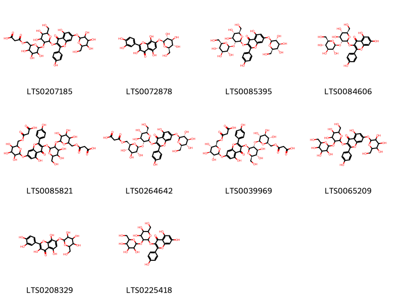{ width=100% }
    <figcaption>Hình ảnh cấu trúc hóa học của 10 hoạt chất thuộc nhóm Flavonoids gồm ['3-({6-[(4,5-dihydroxy-2-{[5-hydroxy-2-(4-hydroxyphenyl)-4-oxo-7-{[3,4,5-trihydroxy-6-(hydroxymethyl)oxan-2-yl]oxy}chromen-3-yl]oxy}-6-(hydroxymethyl)oxan-3-yl)oxy]-3,4,5-trihydroxyoxan-2-yl}methoxy)-3-oxopropanoic acid (LTS0207185)', 'gossypitrin (LTS0072878)', '3-{[(2s,3r,4s,5s,6r)-4,5-dihydroxy-6-(hydroxymethyl)-3-{[(2s,3r,4s,5s,6r)-3,4,5-trihydroxy-6-(hydroxymethyl)oxan-2-yl]oxy}oxan-2-yl]oxy}-5-hydroxy-2-(4-hydroxyphenyl)-7-{[(2s,3r,4s,5s,6r)-3,4,5-trihydroxy-6-(hydroxymethyl)oxan-2-yl]oxy}chromen-4-one (LTS0085395)', 'kaempferol 3-o-sophoroside (LTS0084606)', '3-[(6-{[3-({3-[(6-{[(2-carboxyacetyl)oxy]methyl}-3,4,5-trihydroxyoxan-2-yl)oxy]-4,5-dihydroxy-6-(hydroxymethyl)oxan-2-yl}oxy)-5-hydroxy-2-(4-hydroxyphenyl)-4-oxochromen-7-yl]oxy}-3,4,5-trihydroxyoxan-2-yl)methoxy]-3-oxopropanoic acid (LTS0085821)', '3-{[(2r,3s,4s,5r,6s)-6-{[(2s,3r,4s,5s,6r)-4,5-dihydroxy-2-{[5-hydroxy-2-(4-hydroxyphenyl)-4-oxo-7-{[(2s,3r,4s,5s,6r)-3,4,5-trihydroxy-6-(hydroxymethyl)oxan-2-yl]oxy}chromen-3-yl]oxy}-6-(hydroxymethyl)oxan-3-yl]oxy}-3,4,5-trihydroxyoxan-2-yl]methoxy}-3-oxopropanoic acid (LTS0264642)', '3-{[(2r,3s,4s,5r,6s)-6-[(3-{[(2s,3r,4s,5s,6r)-3-{[(2s,3r,4s,5s,6r)-6-{[(2-carboxyacetyl)oxy]methyl}-3,4,5-trihydroxyoxan-2-yl]oxy}-4,5-dihydroxy-6-(hydroxymethyl)oxan-2-yl]oxy}-5-hydroxy-2-(4-hydroxyphenyl)-4-oxochromen-7-yl)oxy]-3,4,5-trihydroxyoxan-2-yl]methoxy}-3-oxopropanoic acid (LTS0039969)', '3-{[4,5-dihydroxy-6-(hydroxymethyl)-3-{[3,4,5-trihydroxy-6-(hydroxymethyl)oxan-2-yl]oxy}oxan-2-yl]oxy}-5-hydroxy-2-(4-hydroxyphenyl)-7-{[3,4,5-trihydroxy-6-(hydroxymethyl)oxan-2-yl]oxy}chromen-4-one (LTS0065209)', '2-(3,4-dihydroxyphenyl)-3,5,8-trihydroxy-7-{[3,4,5-trihydroxy-6-(hydroxymethyl)oxan-2-yl]oxy}chromen-4-one (LTS0208329)', '3-{[4,5-dihydroxy-6-(hydroxymethyl)-3-{[3,4,5-trihydroxy-6-(hydroxymethyl)oxan-2-yl]oxy}oxan-2-yl]oxy}-5,7-dihydroxy-2-(4-hydroxyphenyl)chromen-4-one (LTS0225418)'].</figcaption>
</figure>
#### Nhóm Isoflavonoids
<figure markdown="span">
    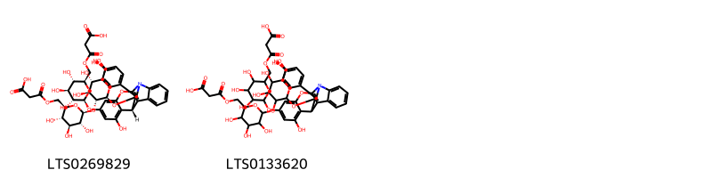{ width=100% }
    <figcaption>Hình ảnh cấu trúc hóa học của 2 hoạt chất thuộc nhóm Isoflavonoids gồm ['3-{[(2r,3s,4s,5r,6s)-6-{[(11s)-10-{[(2s,3r,4s,5s,6r)-3-{[(2s,3r,4s,5s,6r)-6-{[(2-carboxyacetyl)oxy]methyl}-3,4,5-trihydroxyoxan-2-yl]oxy}-4,5-dihydroxy-6-(hydroxymethyl)oxan-2-yl]oxy}-13-hydroxy-9-(4-hydroxyphenyl)-18-oxa-8-azapentacyclo[9.8.0.0²,⁷.0⁸,¹⁹.0¹²,¹⁷]nonadeca-1(19),2,4,6,9,12,14,16-octaen-15-yl]oxy}-3,4,5-trihydroxyoxan-2-yl]methoxy}-3-oxopropanoic acid (LTS0269829)', '3-[(6-{[10-({3-[(6-{[(2-carboxyacetyl)oxy]methyl}-3,4,5-trihydroxyoxan-2-yl)oxy]-4,5-dihydroxy-6-(hydroxymethyl)oxan-2-yl}oxy)-13-hydroxy-9-(4-hydroxyphenyl)-18-oxa-8-azapentacyclo[9.8.0.0²,⁷.0⁸,¹⁹.0¹²,¹⁷]nonadeca-1(19),2,4,6,9,12,14,16-octaen-15-yl]oxy}-3,4,5-trihydroxyoxan-2-yl)methoxy]-3-oxopropanoic acid (LTS0133620)'].</figcaption>
</figure>
#### Nhóm Isoquinolines and derivatives
<figure markdown="span">
    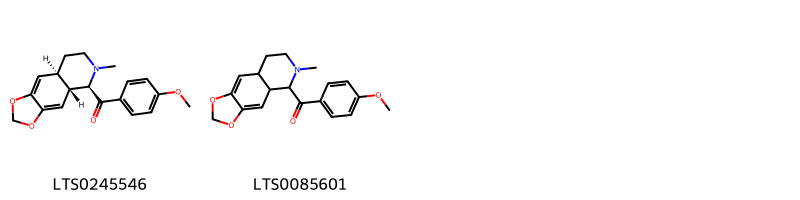{ width=100% }
    <figcaption>Hình ảnh cấu trúc hóa học của 2 hoạt chất thuộc nhóm Isoquinolines and derivatives gồm ['(4as,5r,8as)-5-(4-methoxybenzoyl)-6-methyl-2h,4ah,5h,7h,8h,8ah-[1,3]dioxolo[4,5-g]isoquinoline (LTS0245546)', '5-(4-methoxybenzoyl)-6-methyl-2h,4ah,5h,7h,8h,8ah-[1,3]dioxolo[4,5-g]isoquinoline (LTS0085601)'].</figcaption>
</figure>
#### Nhóm Phenanthrenes and derivatives
<figure markdown="span">
    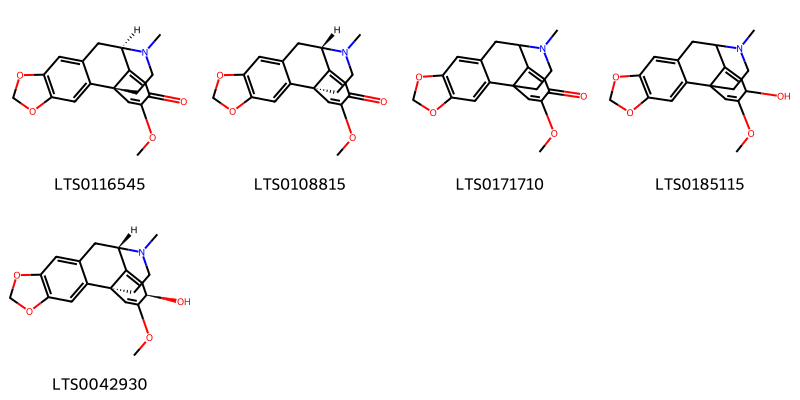{ width=100% }
    <figcaption>Hình ảnh cấu trúc hóa học của 5 hoạt chất thuộc nhóm Phenanthrenes and derivatives gồm ['amurine (LTS0116545)', '(1s,12s)-16-methoxy-20-methyl-5,7-dioxa-20-azapentacyclo[10.5.3.0¹,¹³.0²,¹⁰.0⁴,⁸]icosa-2,4(8),9,13,16-pentaen-15-one (LTS0108815)', '16-methoxy-20-methyl-5,7-dioxa-20-azapentacyclo[10.5.3.0¹,¹³.0²,¹⁰.0⁴,⁸]icosa-2,4(8),9,13,16-pentaen-15-one (LTS0171710)', '16-methoxy-20-methyl-5,7-dioxa-20-azapentacyclo[10.5.3.0¹,¹³.0²,¹⁰.0⁴,⁸]icosa-2,4(8),9,13,16-pentaen-15-ol (LTS0185115)', '(1s,12s,15r)-16-methoxy-20-methyl-5,7-dioxa-20-azapentacyclo[10.5.3.0¹,¹³.0²,¹⁰.0⁴,⁸]icosa-2,4(8),9,13,16-pentaen-15-ol (LTS0042930)'].</figcaption>
</figure>
#### Nhóm Proaporphines
<figure markdown="span">
    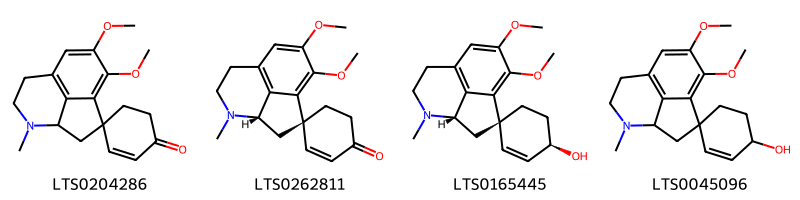{ width=100% }
    <figcaption>Hình ảnh cấu trúc hóa học của 4 hoạt chất thuộc nhóm Proaporphines gồm ["10',11'-dimethoxy-5'-methyl-5'-azaspiro[cyclohexane-1,2'-tricyclo[6.3.1.0⁴,¹²]dodecane]-1'(11'),2,8'(12'),9'-tetraen-4-one (LTS0204286)", "(1s,4's)-10',11'-dimethoxy-5'-methyl-5'-azaspiro[cyclohexane-1,2'-tricyclo[6.3.1.0⁴,¹²]dodecane]-1'(11'),2,8'(12'),9'-tetraen-4-one (LTS0262811)", "(1s,4r,4's)-10',11'-dimethoxy-5'-methyl-5'-azaspiro[cyclohexane-1,2'-tricyclo[6.3.1.0⁴,¹²]dodecane]-1'(11'),2,8'(12'),9'-tetraen-4-ol (LTS0165445)", "10',11'-dimethoxy-5'-methyl-5'-azaspiro[cyclohexane-1,2'-tricyclo[6.3.1.0⁴,¹²]dodecane]-1'(11'),2,8'(12'),9'-tetraen-4-ol (LTS0045096)"].</figcaption>
</figure>
#### Nhóm Protoberberine alkaloids and derivatives
<figure markdown="span">
    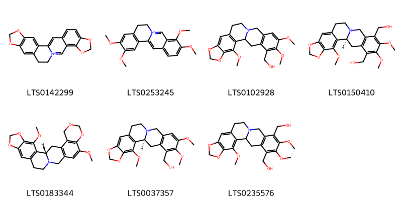{ width=100% }
    <figcaption>Hình ảnh cấu trúc hóa học của 7 hoạt chất thuộc nhóm Protoberberine alkaloids and derivatives gồm ['5,7,17,19-tetraoxa-13λ⁵-azahexacyclo[11.11.0.0²,¹⁰.0⁴,⁸.0¹⁵,²³.0¹⁶,²⁰]tetracosa-1(24),2,4(8),9,13,15,20,22-octaen-13-ylium (LTS0142299)', 'palmatine (LTS0253245)', '{3,17,18-trimethoxy-5,7-dioxa-13-azapentacyclo[11.8.0.0²,¹⁰.0⁴,⁸.0¹⁵,²⁰]henicosa-2(10),3,8,15(20),16,18-hexaen-19-yl}methanol (LTS0102928)', '[(1s)-16-(hydroxymethyl)-3,17,18-trimethoxy-5,7-dioxa-13-azapentacyclo[11.8.0.0²,¹⁰.0⁴,⁸.0¹⁵,²⁰]henicosa-2,4(8),9,15(20),16,18-hexaen-19-yl]methanol (LTS0150410)', '(1s)-10,24-dimethoxy-6,8,20,22-tetraoxa-14-azahexacyclo[12.11.0.0³,¹².0⁴,⁹.0¹⁷,²⁵.0¹⁹,²³]pentacosa-3(12),4(9),10,17(25),18,23-hexaene (LTS0183344)', '[(1s)-3,17,18-trimethoxy-5,7-dioxa-13-azapentacyclo[11.8.0.0²,¹⁰.0⁴,⁸.0¹⁵,²⁰]henicosa-2(10),3,8,15(20),16,18-hexaen-19-yl]methanol (LTS0037357)', '[16-(hydroxymethyl)-3,17,18-trimethoxy-5,7-dioxa-13-azapentacyclo[11.8.0.0²,¹⁰.0⁴,⁸.0¹⁵,²⁰]henicosa-2,4(8),9,15(20),16,18-hexaen-19-yl]methanol (LTS0235576)'].</figcaption>
</figure>
#### Nhóm Protopine alkaloids
<figure markdown="span">
    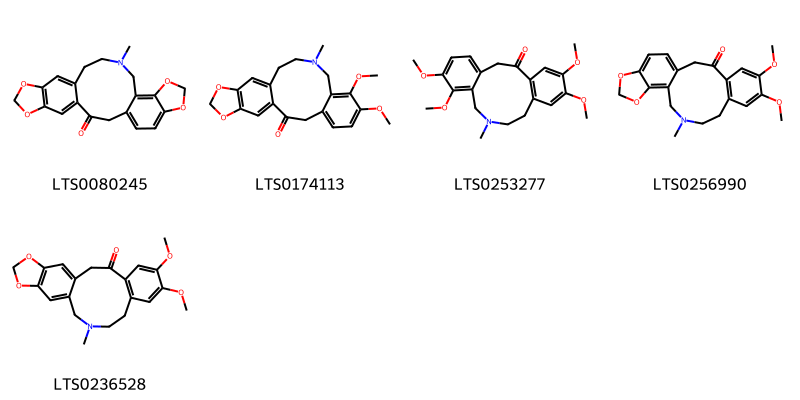{ width=100% }
    <figcaption>Hình ảnh cấu trúc hóa học của 5 hoạt chất thuộc nhóm Protopine alkaloids gồm ['protopine (LTS0080245)', 'β-allocryptopine (LTS0174113)', '7,8,16,17-tetramethoxy-11-methyl-11-azatricyclo[12.4.0.0⁴,⁹]octadeca-1(14),4,6,8,15,17-hexaen-2-one (LTS0253277)', 'cryptopine (LTS0256990)', '6,7-dimethoxy-12-methyl-17,19-dioxa-12-azatetracyclo[12.7.0.0⁴,⁹.0¹⁶,²⁰]henicosa-1(21),4(9),5,7,14,16(20)-hexaen-3-one (LTS0236528)'].</figcaption>
</figure>
#### Nhóm Quinolines and derivatives
<figure markdown="span">
    { width=100% }
    <figcaption>Hình ảnh cấu trúc hóa học của 1 hoạt chất thuộc nhóm Quinolines and derivatives gồm ['hydroxysanguinarine (LTS0263911)'].</figcaption>
</figure>
#### Nhóm Rhoeadine alkaloids
<figure markdown="span">
    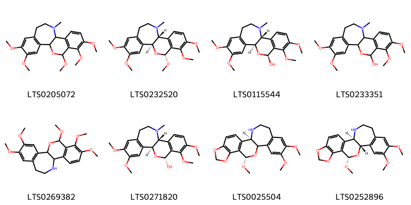{ width=100% }
    <figcaption>Hình ảnh cấu trúc hóa học của 8 hoạt chất thuộc nhóm Rhoeadine alkaloids gồm ['4,5,15,16,18-pentamethoxy-10-methyl-19-oxa-10-azatetracyclo[9.8.0.0²,⁷.0¹²,¹⁷]nonadeca-2(7),3,5,12(17),13,15-hexaene (LTS0205072)', '(1s,11r,18r)-4,5,15,16,18-pentamethoxy-10-methyl-19-oxa-10-azatetracyclo[9.8.0.0²,⁷.0¹²,¹⁷]nonadeca-2(7),3,5,12(17),13,15-hexaene (LTS0232520)', '(1s,11r,18s)-4,5,15,16-tetramethoxy-10-methyl-19-oxa-10-azatetracyclo[9.8.0.0²,⁷.0¹²,¹⁷]nonadeca-2(7),3,5,12(17),13,15-hexaen-18-ol (LTS0115544)', '4,5,15,16-tetramethoxy-10-methyl-19-oxa-10-azatetracyclo[9.8.0.0²,⁷.0¹²,¹⁷]nonadeca-2(7),3,5,12(17),13,15-hexaen-18-ol (LTS0233351)', '4,5,15,16,18-pentamethoxy-19-oxa-10-azatetracyclo[9.8.0.0²,⁷.0¹²,¹⁷]nonadeca-2(7),3,5,12(17),13,15-hexaene (LTS0269382)', '(1s,11r,18r)-4,5,15,16-tetramethoxy-10-methyl-19-oxa-10-azatetracyclo[9.8.0.0²,⁷.0¹²,¹⁷]nonadeca-2(7),3,5,12(17),13,15-hexaen-18-ol (LTS0271820)', '(1r,11s)-11,16,17-trimethoxy-6,8,12-trioxa-22-azapentacyclo[11.9.0.0²,¹⁰.0⁵,⁹.0¹⁴,¹⁹]docosa-2(10),3,5(9),14(19),15,17-hexaene (LTS0025504)', '(1r,11s,13s)-11,16,17-trimethoxy-6,8,12-trioxa-22-azapentacyclo[11.9.0.0²,¹⁰.0⁵,⁹.0¹⁴,¹⁹]docosa-2(10),3,5(9),14(19),15,17-hexaene (LTS0252896)'].</figcaption>
</figure>

---

### Dược dân tộc học

Danh sách các quốc gia có sử dụng *Papaver nudicaule* trong điều trị các bệnh. 

| Country   | Disease                  | Bệnh                                                                                                                                                                                                |
|:----------|:-------------------------|:----------------------------------------------------------------------------------------------------------------------------------------------------------------------------------------------------|
| Australia | Poison                   | MYMEMORY WARNING: YOU USED ALL AVAILABLE FREE TRANSLATIONS FOR TODAY. NEXT AVAILABLE IN  09 HOURS 42 MINUTES 34 SECONDS VISIT HTTPS://MYMEMORY.TRANSLATED.NET/DOC/USAGELIMITS.PHP TO TRANSLATE MORE |
| Elsewhere | Diaphoretic, Diaphoretic | MYMEMORY WARNING: YOU USED ALL AVAILABLE FREE TRANSLATIONS FOR TODAY. NEXT AVAILABLE IN  09 HOURS 42 MINUTES 22 SECONDS VISIT HTTPS://MYMEMORY.TRANSLATED.NET/DOC/USAGELIMITS.PHP TO TRANSLATE MORE |
| Kalmuk    | Tranquilizer             | MYMEMORY WARNING: YOU USED ALL AVAILABLE FREE TRANSLATIONS FOR TODAY. NEXT AVAILABLE IN  09 HOURS 42 MINUTES 15 SECONDS VISIT HTTPS://MYMEMORY.TRANSLATED.NET/DOC/USAGELIMITS.PHP TO TRANSLATE MORE |

---

---
## Papaver orientale
### Thông tin về thực vật

!!! info "Phân loại thực vật của *Papaver orientale* từ GIBF:"
    - **Kingdom:** Plantae
    - **Phylum:** Tracheophyta
    - **Order:** Ranunculales
    - **Family:** Papaveraceae
    - **Genus:** Papaver
    - **Species:** *Papaver orientale*

 

| Label (VI)   | Label (EN)   | Scientific Name   | Descriptions (VI)   | Descriptions (EN)   | Also Known As (VI)   | Also Known As (EN)   |
|:-------------|:-------------|:------------------|:--------------------|:--------------------|:---------------------|:---------------------|
| N/A          | N/A          | Papaver orientale |                     | species of plant    | ['']                 | ['Oriental poppy']   |

#### Phân bố trên thế giới

**Từ CSDL GIBF** Brazil, Sweden, Finland, Åland Islands, New Zealand, Netherlands, Denmark, Poland, United States of America, Armenia, Russian Federation, Argentina, Estonia, Belarus, Norway, France, Belgium, Georgia, Canada, Germany, Ukraine, Switzerland, Bulgaria, United Kingdom of Great Britain and Northern Ireland

#### Phân bố tại Việt Nam

**Từ CSDL GIBF**: Không có ghi nhận ở Việt Nam

---
### Thành phần hóa học
        
- Theo cơ sở dữ liệu lotus: Từ loài *Papaver orientale* đã phân lập và xác định được 85 hoạt chất thuộc về các nhóm Aporphines, Morphinans, Fatty Acyls, Phenanthrenes and derivatives, Flavonoids, Rhoeadine alkaloids, Protopine alkaloids, Phthalide isoquinolines, Pyridines and derivatives, Dihydroisoquinolines, Tetrahydroisoquinolines, Protoberberine alkaloids and derivatives, Isoquinolines and derivatives, Prenol lipids. 

|    | chemicalTaxonomyClassyfireClass          |   smiles_count |
|---:|:-----------------------------------------|---------------:|
|  0 | Aporphines                               |             24 |
|  1 | Dihydroisoquinolines                     |              1 |
|  2 | Fatty Acyls                              |              4 |
|  3 | Flavonoids                               |              1 |
|  4 | Isoquinolines and derivatives            |             15 |
|  5 | Morphinans                               |             10 |
|  6 | Phenanthrenes and derivatives            |              5 |
|  7 | Phthalide isoquinolines                  |              1 |
|  8 | Prenol lipids                            |              1 |
|  9 | Protoberberine alkaloids and derivatives |              9 |
| 10 | Protopine alkaloids                      |              2 |
| 11 | Pyridines and derivatives                |              1 |
| 12 | Rhoeadine alkaloids                      |              8 |
| 13 | Tetrahydroisoquinolines                  |              3 |

#### Nhóm Aporphines
<figure markdown="span">
    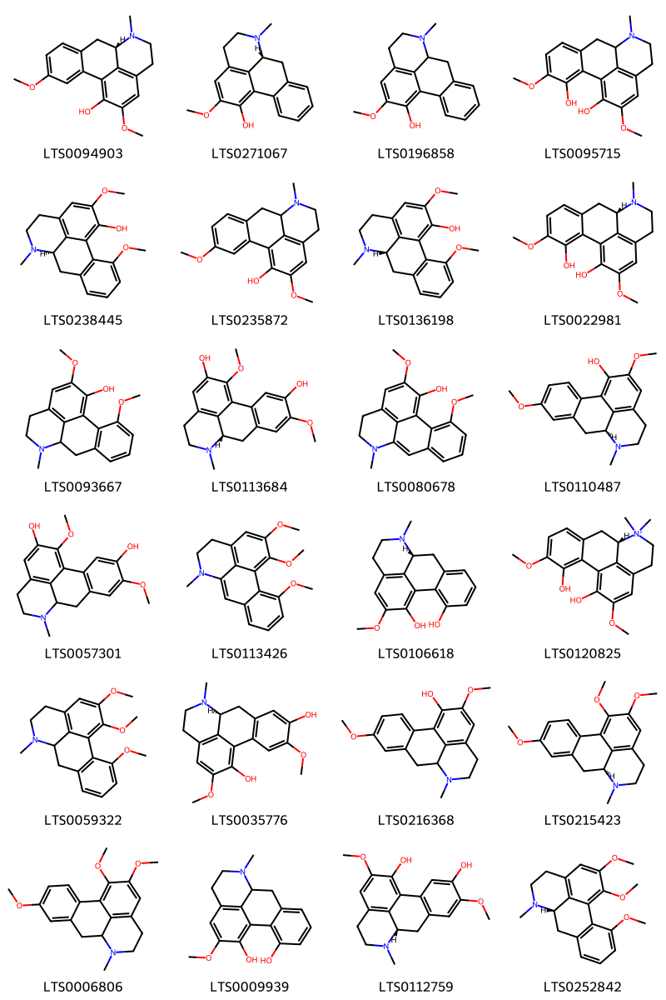{ width=100% }
    <figcaption>Hình ảnh cấu trúc hóa học của 24 hoạt chất thuộc nhóm Aporphines gồm ['(9s)-4,15-dimethoxy-10-methyl-10-azatetracyclo[7.7.1.0²,⁷.0¹³,¹⁷]heptadeca-1(16),2,4,6,13(17),14-hexaen-16-ol (LTS0094903)', '(9r)-15-methoxy-10-methyl-10-azatetracyclo[7.7.1.0²,⁷.0¹³,¹⁷]heptadeca-1(16),2,4,6,13(17),14-hexaen-16-ol (LTS0271067)', '15-methoxy-10-methyl-10-azatetracyclo[7.7.1.0²,⁷.0¹³,¹⁷]heptadeca-1(16),2,4,6,13(17),14-hexaen-16-ol (LTS0196858)', '4,15-dimethoxy-10-methyl-10-azatetracyclo[7.7.1.0²,⁷.0¹³,¹⁷]heptadeca-1(16),2,4,6,13(17),14-hexaene-3,16-diol (LTS0095715)', '(9r)-3,15-dimethoxy-10-methyl-10-azatetracyclo[7.7.1.0²,⁷.0¹³,¹⁷]heptadeca-1(16),2(7),3,5,13(17),14-hexaen-16-ol (LTS0238445)', '4,15-dimethoxy-10-methyl-10-azatetracyclo[7.7.1.0²,⁷.0¹³,¹⁷]heptadeca-1(16),2,4,6,13(17),14-hexaen-16-ol (LTS0235872)', '(9s)-3,15-dimethoxy-10-methyl-10-azatetracyclo[7.7.1.0²,⁷.0¹³,¹⁷]heptadeca-1(16),2(7),3,5,13(17),14-hexaen-16-ol (LTS0136198)', '(9s)-4,15-dimethoxy-10-methyl-10-azatetracyclo[7.7.1.0²,⁷.0¹³,¹⁷]heptadeca-1(16),2,4,6,13(17),14-hexaene-3,16-diol (LTS0022981)', '3,15-dimethoxy-10-methyl-10-azatetracyclo[7.7.1.0²,⁷.0¹³,¹⁷]heptadeca-1(16),2(7),3,5,13(17),14-hexaen-16-ol (LTS0093667)', '(9s)-5,16-dimethoxy-10-methyl-10-azatetracyclo[7.7.1.0²,⁷.0¹³,¹⁷]heptadeca-1(16),2(7),3,5,13(17),14-hexaene-4,15-diol (LTS0113684)', '3,15-dimethoxy-10-methyl-10-azatetracyclo[7.7.1.0²,⁷.0¹³,¹⁷]heptadeca-1(17),2(7),3,5,8,13,15-heptaen-16-ol (LTS0080678)', '(9s)-5,15-dimethoxy-10-methyl-10-azatetracyclo[7.7.1.0²,⁷.0¹³,¹⁷]heptadeca-1(16),2,4,6,13(17),14-hexaen-16-ol (LTS0110487)', '5,16-dimethoxy-10-methyl-10-azatetracyclo[7.7.1.0²,⁷.0¹³,¹⁷]heptadeca-1(16),2(7),3,5,13(17),14-hexaene-4,15-diol (LTS0057301)', '3,15,16-trimethoxy-10-methyl-10-azatetracyclo[7.7.1.0²,⁷.0¹³,¹⁷]heptadeca-1(17),2(7),3,5,8,13,15-heptaene (LTS0113426)', '(9r)-15-methoxy-10-methyl-10-azatetracyclo[7.7.1.0²,⁷.0¹³,¹⁷]heptadeca-1(16),2,4,6,13(17),14-hexaene-3,16-diol (LTS0106618)', 'magnoflorine (LTS0120825)', '3,15,16-trimethoxy-10-methyl-10-azatetracyclo[7.7.1.0²,⁷.0¹³,¹⁷]heptadeca-1(16),2(7),3,5,13(17),14-hexaene (LTS0059322)', '(9s)-4,15-dimethoxy-10-methyl-10-azatetracyclo[7.7.1.0²,⁷.0¹³,¹⁷]heptadeca-1(16),2(7),3,5,13(17),14-hexaene-5,16-diol (LTS0035776)', '5,15-dimethoxy-10-methyl-10-azatetracyclo[7.7.1.0²,⁷.0¹³,¹⁷]heptadeca-1(16),2,4,6,13(17),14-hexaen-16-ol (LTS0216368)', '(9s)-5,15,16-trimethoxy-10-methyl-10-azatetracyclo[7.7.1.0²,⁷.0¹³,¹⁷]heptadeca-1(16),2,4,6,13(17),14-hexaene (LTS0215423)', '5,15,16-trimethoxy-10-methyl-10-azatetracyclo[7.7.1.0²,⁷.0¹³,¹⁷]heptadeca-1(16),2,4,6,13(17),14-hexaene (LTS0006806)', '15-methoxy-10-methyl-10-azatetracyclo[7.7.1.0²,⁷.0¹³,¹⁷]heptadeca-1(16),2,4,6,13(17),14-hexaene-3,16-diol (LTS0009939)', '(9s)-5,15-dimethoxy-10-methyl-10-azatetracyclo[7.7.1.0²,⁷.0¹³,¹⁷]heptadeca-1(16),2(7),3,5,13(17),14-hexaene-4,16-diol (LTS0112759)', '(9s)-3,15,16-trimethoxy-10-methyl-10-azatetracyclo[7.7.1.0²,⁷.0¹³,¹⁷]heptadeca-1(16),2(7),3,5,13(17),14-hexaene (LTS0252842)'].</figcaption>
</figure>
#### Nhóm Dihydroisoquinolines
<figure markdown="span">
    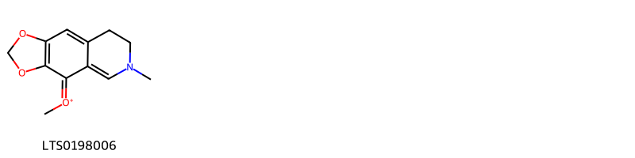{ width=100% }
    <figcaption>Hình ảnh cấu trúc hóa học của 1 hoạt chất thuộc nhóm Dihydroisoquinolines gồm ['methyl({6-methyl-2h,7h,8h-[1,3]dioxolo[4,5-g]isoquinolin-4-ylidene})oxidanium (LTS0198006)'].</figcaption>
</figure>
#### Nhóm Fatty Acyls
<figure markdown="span">
    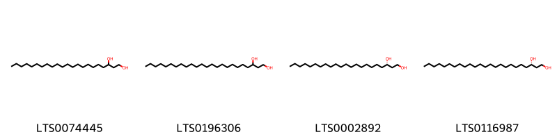{ width=100% }
    <figcaption>Hình ảnh cấu trúc hóa học của 4 hoạt chất thuộc nhóm Fatty Acyls gồm ['docosane-1,3-diol (LTS0074445)', 'tetracosane-1,3-diol (LTS0196306)', '(3s)-docosane-1,3-diol (LTS0002892)', '(3s)-tetracosane-1,3-diol (LTS0116987)'].</figcaption>
</figure>
#### Nhóm Flavonoids
<figure markdown="span">
    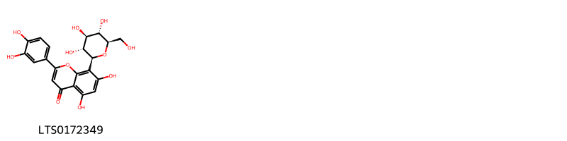{ width=100% }
    <figcaption>Hình ảnh cấu trúc hóa học của 1 hoạt chất thuộc nhóm Flavonoids gồm ['orientin (LTS0172349)'].</figcaption>
</figure>
#### Nhóm Isoquinolines and derivatives
<figure markdown="span">
    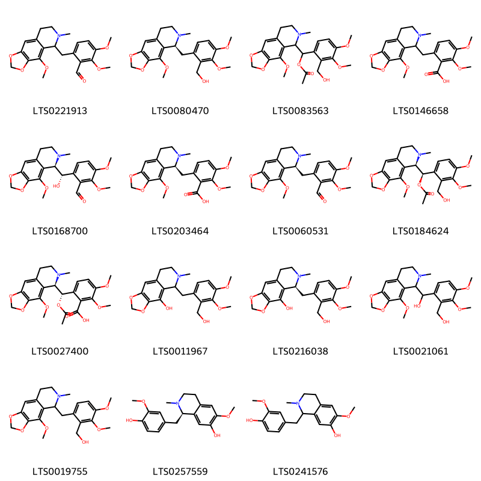{ width=100% }
    <figcaption>Hình ảnh cấu trúc hóa học của 15 hoạt chất thuộc nhóm Isoquinolines and derivatives gồm ['2,3-dimethoxy-6-({4-methoxy-6-methyl-2h,5h,7h,8h-[1,3]dioxolo[4,5-g]isoquinolin-5-yl}methyl)benzaldehyde (LTS0221913)', '(2,3-dimethoxy-6-{[(5s)-4-methoxy-6-methyl-2h,5h,7h,8h-[1,3]dioxolo[4,5-g]isoquinolin-5-yl]methyl}phenyl)methanol (LTS0080470)', '[2-(hydroxymethyl)-3,4-dimethoxyphenyl]({4-methoxy-6-methyl-2h,5h,7h,8h-[1,3]dioxolo[4,5-g]isoquinolin-5-yl})methyl acetate (LTS0083563)', '2,3-dimethoxy-6-({4-methoxy-6-methyl-2h,5h,7h,8h-[1,3]dioxolo[4,5-g]isoquinolin-5-yl}methyl)benzoic acid (LTS0146658)', '6-[(s)-hydroxy[(5r)-4-methoxy-6-methyl-2h,5h,7h,8h-[1,3]dioxolo[4,5-g]isoquinolin-5-yl]methyl]-2,3-dimethoxybenzaldehyde (LTS0168700)', '2,3-dimethoxy-6-{[(5s)-4-methoxy-6-methyl-2h,5h,7h,8h-[1,3]dioxolo[4,5-g]isoquinolin-5-yl]methyl}benzoic acid (LTS0203464)', '2,3-dimethoxy-6-{[(5s)-4-methoxy-6-methyl-2h,5h,7h,8h-[1,3]dioxolo[4,5-g]isoquinolin-5-yl]methyl}benzaldehyde (LTS0060531)', '(r)-[2-(hydroxymethyl)-3,4-dimethoxyphenyl][(5r)-4-methoxy-6-methyl-2h,5h,7h,8h-[1,3]dioxolo[4,5-g]isoquinolin-5-yl]methyl acetate (LTS0184624)', '6-[(s)-(acetyloxy)[(5r)-4-methoxy-6-methyl-2h,5h,7h,8h-[1,3]dioxolo[4,5-g]isoquinolin-5-yl]methyl]-2,3-dimethoxybenzoic acid (LTS0027400)', '5-{[2-(hydroxymethyl)-3,4-dimethoxyphenyl]methyl}-6-methyl-2h,5h,7h,8h-[1,3]dioxolo[4,5-g]isoquinolin-4-ol (LTS0011967)', '(5s)-5-{[2-(hydroxymethyl)-3,4-dimethoxyphenyl]methyl}-6-methyl-2h,5h,7h,8h-[1,3]dioxolo[4,5-g]isoquinolin-4-ol (LTS0216038)', '[2-(hydroxymethyl)-3,4-dimethoxyphenyl]({4-methoxy-6-methyl-2h,5h,7h,8h-[1,3]dioxolo[4,5-g]isoquinolin-5-yl})methanol (LTS0021061)', '[2,3-dimethoxy-6-({4-methoxy-6-methyl-2h,5h,7h,8h-[1,3]dioxolo[4,5-g]isoquinolin-5-yl}methyl)phenyl]methanol (LTS0019755)', '(1r)-1-[(4-hydroxy-3-methoxyphenyl)methyl]-6-methoxy-2-methyl-3,4-dihydro-1h-isoquinolin-7-ol (LTS0257559)', '1-[(4-hydroxy-3-methoxyphenyl)methyl]-6-methoxy-2-methyl-3,4-dihydro-1h-isoquinolin-7-ol (LTS0241576)'].</figcaption>
</figure>
#### Nhóm Morphinans
<figure markdown="span">
    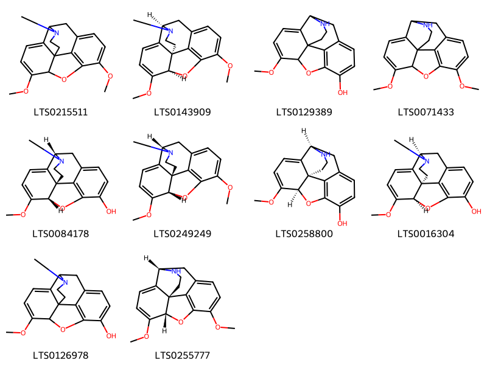{ width=100% }
    <figcaption>Hình ảnh cấu trúc hóa học của 10 hoạt chất thuộc nhóm Morphinans gồm ['10,14-dimethoxy-4-methyl-12-oxa-4-azapentacyclo[9.6.1.0¹,¹³.0⁵,¹⁷.0⁷,¹⁸]octadeca-7,9,11(18),14,16-pentaene (LTS0215511)', 'thebaine (LTS0143909)', '14-methoxy-12-oxa-4-azapentacyclo[9.6.1.0¹,¹³.0⁵,¹⁷.0⁷,¹⁸]octadeca-7,9,11(18),14,16-pentaen-10-ol (LTS0129389)', '10,14-dimethoxy-12-oxa-4-azapentacyclo[9.6.1.0¹,¹³.0⁵,¹⁷.0⁷,¹⁸]octadeca-7,9,11(18),14,16-pentaene (LTS0071433)', '(1r,5s,13s)-14-methoxy-4-methyl-12-oxa-4-azapentacyclo[9.6.1.0¹,¹³.0⁵,¹⁷.0⁷,¹⁸]octadeca-7,9,11(18),14,16-pentaen-10-ol (LTS0084178)', '(1r,5s,13s)-10,14-dimethoxy-4-methyl-12-oxa-4-azapentacyclo[9.6.1.0¹,¹³.0⁵,¹⁷.0⁷,¹⁸]octadeca-7,9,11(18),14,16-pentaene (LTS0249249)', '(1s,5r,13r)-14-methoxy-12-oxa-4-azapentacyclo[9.6.1.0¹,¹³.0⁵,¹⁷.0⁷,¹⁸]octadeca-7,9,11(18),14,16-pentaen-10-ol (LTS0258800)', 'oripavine (LTS0016304)', '14-methoxy-4-methyl-12-oxa-4-azapentacyclo[9.6.1.0¹,¹³.0⁵,¹⁷.0⁷,¹⁸]octadeca-7,9,11(18),14,16-pentaen-10-ol (LTS0126978)', '(1r,5s,13s)-10,14-dimethoxy-12-oxa-4-azapentacyclo[9.6.1.0¹,¹³.0⁵,¹⁷.0⁷,¹⁸]octadeca-7,9,11(18),14,16-pentaene (LTS0255777)'].</figcaption>
</figure>
#### Nhóm Phenanthrenes and derivatives
<figure markdown="span">
    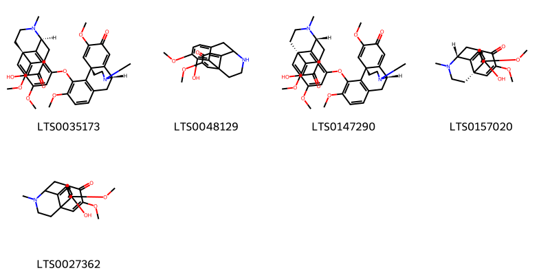{ width=100% }
    <figcaption>Hình ảnh cấu trúc hóa học của 5 hoạt chất thuộc nhóm Phenanthrenes and derivatives gồm ['(1r,9s)-6-{[(1r,9s)-4,13-dimethoxy-17-methyl-12-oxo-17-azatetracyclo[7.5.3.0¹,¹⁰.0²,⁷]heptadeca-2(7),3,5,10,13-pentaen-3-yl]oxy}-3-hydroxy-4,13-dimethoxy-17-methyl-17-azatetracyclo[7.5.3.0¹,¹⁰.0²,⁷]heptadeca-2,4,6,10,13-pentaen-12-one (LTS0035173)', '3-hydroxy-4,13-dimethoxy-17-azatetracyclo[7.5.3.0¹,¹⁰.0²,⁷]heptadeca-2,4,6,10,13-pentaen-12-one (LTS0048129)', '(1s,9r)-6-{[(1r,9s)-4,13-dimethoxy-17-methyl-12-oxo-17-azatetracyclo[7.5.3.0¹,¹⁰.0²,⁷]heptadeca-2(7),3,5,10,13-pentaen-3-yl]oxy}-3-hydroxy-4,13-dimethoxy-17-methyl-17-azatetracyclo[7.5.3.0¹,¹⁰.0²,⁷]heptadeca-2,4,6,10,13-pentaen-12-one (LTS0147290)', 'salutaridine (LTS0157020)', '3-hydroxy-4,13-dimethoxy-17-methyl-17-azatetracyclo[7.5.3.0¹,¹⁰.0²,⁷]heptadeca-2,4,6,10,13-pentaen-12-one (LTS0027362)'].</figcaption>
</figure>
#### Nhóm Phthalide isoquinolines
<figure markdown="span">
    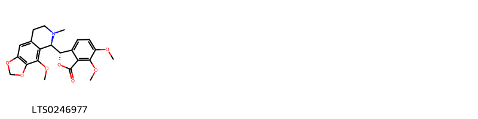{ width=100% }
    <figcaption>Hình ảnh cấu trúc hóa học của 1 hoạt chất thuộc nhóm Phthalide isoquinolines gồm ['noscapine (LTS0246977)'].</figcaption>
</figure>
#### Nhóm Prenol lipids
<figure markdown="span">
    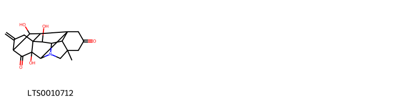{ width=100% }
    <figcaption>Hình ảnh cấu trúc hóa học của 1 hoạt chất thuộc nhóm Prenol lipids gồm ['9,15,19-trihydroxy-5-methyl-12-methylidene-7-azaheptacyclo[9.6.2.0¹,⁸.0⁵,¹⁷.0⁷,¹⁶.0⁹,¹⁴.0¹⁴,¹⁸]nonadecane-3,10-dione (LTS0010712)'].</figcaption>
</figure>
#### Nhóm Protoberberine alkaloids and derivatives
<figure markdown="span">
    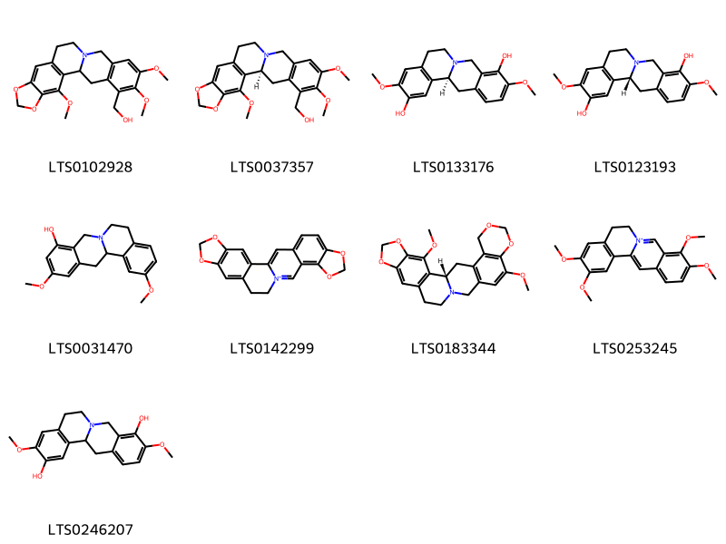{ width=100% }
    <figcaption>Hình ảnh cấu trúc hóa học của 9 hoạt chất thuộc nhóm Protoberberine alkaloids and derivatives gồm ['{3,17,18-trimethoxy-5,7-dioxa-13-azapentacyclo[11.8.0.0²,¹⁰.0⁴,⁸.0¹⁵,²⁰]henicosa-2(10),3,8,15(20),16,18-hexaen-19-yl}methanol (LTS0102928)', '[(1s)-3,17,18-trimethoxy-5,7-dioxa-13-azapentacyclo[11.8.0.0²,¹⁰.0⁴,⁸.0¹⁵,²⁰]henicosa-2(10),3,8,15(20),16,18-hexaen-19-yl]methanol (LTS0037357)', 'scoulerine (LTS0133176)', '(12br)-3,10-dimethoxy-7,8,12b,13-tetrahydro-5h-6-azatetraphene-4,11-diol (LTS0123193)', '2,11-dimethoxy-7,8,12b,13-tetrahydro-5h-6-azatetraphen-4-ol (LTS0031470)', '5,7,17,19-tetraoxa-13λ⁵-azahexacyclo[11.11.0.0²,¹⁰.0⁴,⁸.0¹⁵,²³.0¹⁶,²⁰]tetracosa-1(24),2,4(8),9,13,15,20,22-octaen-13-ylium (LTS0142299)', '(1s)-10,24-dimethoxy-6,8,20,22-tetraoxa-14-azahexacyclo[12.11.0.0³,¹².0⁴,⁹.0¹⁷,²⁵.0¹⁹,²³]pentacosa-3(12),4(9),10,17(25),18,23-hexaene (LTS0183344)', 'palmatine (LTS0253245)', '(s)-scoulerine (LTS0246207)'].</figcaption>
</figure>
#### Nhóm Protopine alkaloids
<figure markdown="span">
    { width=100% }
    <figcaption>Hình ảnh cấu trúc hóa học của 2 hoạt chất thuộc nhóm Protopine alkaloids gồm ['β-allocryptopine (LTS0174113)', 'protopine (LTS0080245)'].</figcaption>
</figure>
#### Nhóm Pyridines and derivatives
<figure markdown="span">
    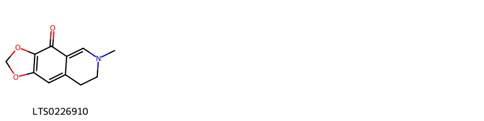{ width=100% }
    <figcaption>Hình ảnh cấu trúc hóa học của 1 hoạt chất thuộc nhóm Pyridines and derivatives gồm ['6-methyl-2h,7h,8h-[1,3]dioxolo[4,5-g]isoquinolin-4-one (LTS0226910)'].</figcaption>
</figure>
#### Nhóm Rhoeadine alkaloids
<figure markdown="span">
    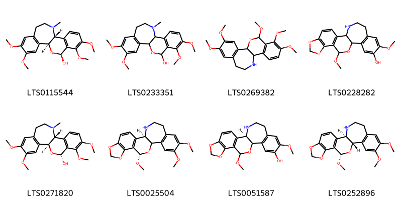{ width=100% }
    <figcaption>Hình ảnh cấu trúc hóa học của 8 hoạt chất thuộc nhóm Rhoeadine alkaloids gồm ['(1s,11r,18s)-4,5,15,16-tetramethoxy-10-methyl-19-oxa-10-azatetracyclo[9.8.0.0²,⁷.0¹²,¹⁷]nonadeca-2(7),3,5,12(17),13,15-hexaen-18-ol (LTS0115544)', '4,5,15,16-tetramethoxy-10-methyl-19-oxa-10-azatetracyclo[9.8.0.0²,⁷.0¹²,¹⁷]nonadeca-2(7),3,5,12(17),13,15-hexaen-18-ol (LTS0233351)', '4,5,15,16,18-pentamethoxy-19-oxa-10-azatetracyclo[9.8.0.0²,⁷.0¹²,¹⁷]nonadeca-2(7),3,5,12(17),13,15-hexaene (LTS0269382)', '11,17-dimethoxy-6,8,12-trioxa-22-azapentacyclo[11.9.0.0²,¹⁰.0⁵,⁹.0¹⁴,¹⁹]docosa-2(10),3,5(9),14(19),15,17-hexaen-16-ol (LTS0228282)', '(1s,11r,18r)-4,5,15,16-tetramethoxy-10-methyl-19-oxa-10-azatetracyclo[9.8.0.0²,⁷.0¹²,¹⁷]nonadeca-2(7),3,5,12(17),13,15-hexaen-18-ol (LTS0271820)', '(1r,11s)-11,16,17-trimethoxy-6,8,12-trioxa-22-azapentacyclo[11.9.0.0²,¹⁰.0⁵,⁹.0¹⁴,¹⁹]docosa-2(10),3,5(9),14(19),15,17-hexaene (LTS0025504)', '(1r)-11,17-dimethoxy-6,8,12-trioxa-22-azapentacyclo[11.9.0.0²,¹⁰.0⁵,⁹.0¹⁴,¹⁹]docosa-2(10),3,5(9),14(19),15,17-hexaen-16-ol (LTS0051587)', '(1r,11s,13s)-11,16,17-trimethoxy-6,8,12-trioxa-22-azapentacyclo[11.9.0.0²,¹⁰.0⁵,⁹.0¹⁴,¹⁹]docosa-2(10),3,5(9),14(19),15,17-hexaene (LTS0252896)'].</figcaption>
</figure>
#### Nhóm Tetrahydroisoquinolines
<figure markdown="span">
    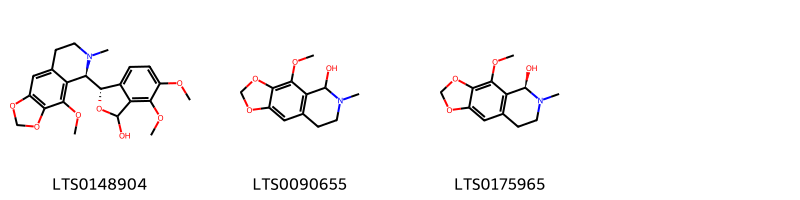{ width=100% }
    <figcaption>Hình ảnh cấu trúc hóa học của 3 hoạt chất thuộc nhóm Tetrahydroisoquinolines gồm ['(3s)-6,7-dimethoxy-3-[(5r)-4-methoxy-6-methyl-2h,5h,7h,8h-[1,3]dioxolo[4,5-g]isoquinolin-5-yl]-1,3-dihydro-2-benzofuran-1-ol (LTS0148904)', 'cotarnine (LTS0090655)', '(5r)-4-methoxy-6-methyl-2h,5h,7h,8h-[1,3]dioxolo[4,5-g]isoquinolin-5-ol (LTS0175965)'].</figcaption>
</figure>

---

### Dược dân tộc học

Danh sách các quốc gia có sử dụng *Papaver orientale* trong điều trị các bệnh. 

| Country   | Disease   | Bệnh                                                                                                                                                                                                |
|:----------|:----------|:----------------------------------------------------------------------------------------------------------------------------------------------------------------------------------------------------|
| Elsewhere | Sudorific | MYMEMORY WARNING: YOU USED ALL AVAILABLE FREE TRANSLATIONS FOR TODAY. NEXT AVAILABLE IN  09 HOURS 41 MINUTES 28 SECONDS VISIT HTTPS://MYMEMORY.TRANSLATED.NET/DOC/USAGELIMITS.PHP TO TRANSLATE MORE |

---

---
## Papaver rhoeas
### Thông tin về thực vật

!!! info "Phân loại thực vật của *Papaver rhoeas* từ GIBF:"
    - **Kingdom:** Plantae
    - **Phylum:** Tracheophyta
    - **Order:** Ranunculales
    - **Family:** Papaveraceae
    - **Genus:** Papaver
    - **Species:** *Papaver rhoeas*

 

| Label (VI)   | Label (EN)   | Scientific Name   | Descriptions (VI)   | Descriptions (EN)   | Also Known As (VI)   | Also Known As (EN)   |
|:-------------|:-------------|:------------------|:--------------------|:--------------------|:---------------------|:---------------------|
| N/A          | N/A          | Papaver rhoeas    | loài thực vật       | species of plant    | ['']                 | ['Common Poppy']     |

#### Phân bố trên thế giới

**Từ CSDL GIBF** Malta, New Zealand, Türkiye, Spain, Poland, Netherlands, Denmark, United States of America, Greece, Croatia, Argentina, Morocco, Gibraltar, Algeria, Mexico, United Kingdom of Great Britain and Northern Ireland, Germany, Austria, Portugal, Ukraine, Italy, India, Switzerland, France

#### Phân bố tại Việt Nam

**Từ CSDL GIBF**: Không có ghi nhận ở Việt Nam

---
### Thành phần hóa học
        
- Theo cơ sở dữ liệu lotus: Từ loài *Papaver rhoeas* đã phân lập và xác định được 57 hoạt chất thuộc về các nhóm Aporphines, Indoles and derivatives, Rhoeadine alkaloids, Flavonoids, Protopine alkaloids, Phthalide isoquinolines, Steroids and steroid derivatives, Tetrahydroisoquinolines, Protoberberine alkaloids and derivatives, Isocoumarans, Prenol lipids, Stilbenes. 

|    | chemicalTaxonomyClassyfireClass          |   smiles_count |
|---:|:-----------------------------------------|---------------:|
|  0 | Aporphines                               |              7 |
|  1 | Flavonoids                               |              5 |
|  2 | Indoles and derivatives                  |              1 |
|  3 | Isocoumarans                             |              1 |
|  4 | Phthalide isoquinolines                  |              1 |
|  5 | Prenol lipids                            |              2 |
|  6 | Protoberberine alkaloids and derivatives |             10 |
|  7 | Protopine alkaloids                      |              4 |
|  8 | Rhoeadine alkaloids                      |             16 |
|  9 | Steroids and steroid derivatives         |              5 |
| 10 | Stilbenes                                |              2 |
| 11 | Tetrahydroisoquinolines                  |              2 |

#### Nhóm Aporphines
<figure markdown="span">
    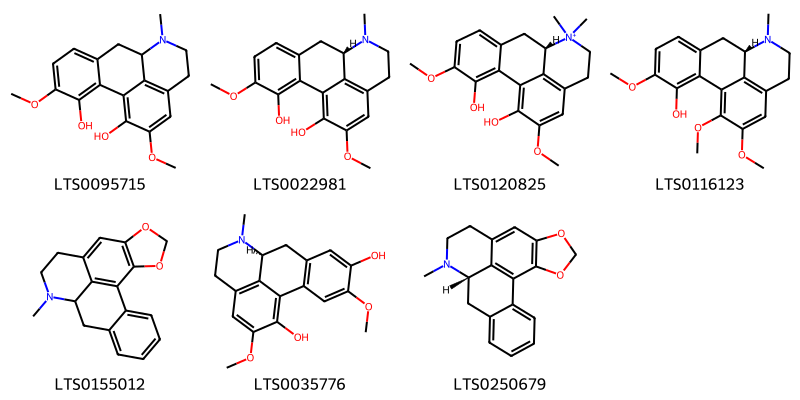{ width=100% }
    <figcaption>Hình ảnh cấu trúc hóa học của 7 hoạt chất thuộc nhóm Aporphines gồm ['4,15-dimethoxy-10-methyl-10-azatetracyclo[7.7.1.0²,⁷.0¹³,¹⁷]heptadeca-1(16),2,4,6,13(17),14-hexaene-3,16-diol (LTS0095715)', '(9s)-4,15-dimethoxy-10-methyl-10-azatetracyclo[7.7.1.0²,⁷.0¹³,¹⁷]heptadeca-1(16),2,4,6,13(17),14-hexaene-3,16-diol (LTS0022981)', 'magnoflorine (LTS0120825)', '(9s)-4,15,16-trimethoxy-10-methyl-10-azatetracyclo[7.7.1.0²,⁷.0¹³,¹⁷]heptadeca-1(16),2,4,6,13(17),14-hexaen-3-ol (LTS0116123)', '11-methyl-3,5-dioxa-11-azapentacyclo[10.7.1.0²,⁶.0⁸,²⁰.0¹⁴,¹⁹]icosa-1(20),2(6),7,14,16,18-hexaene (LTS0155012)', '(9s)-4,15-dimethoxy-10-methyl-10-azatetracyclo[7.7.1.0²,⁷.0¹³,¹⁷]heptadeca-1(16),2(7),3,5,13(17),14-hexaene-5,16-diol (LTS0035776)', 'aporeine (LTS0250679)'].</figcaption>
</figure>
#### Nhóm Flavonoids
<figure markdown="span">
    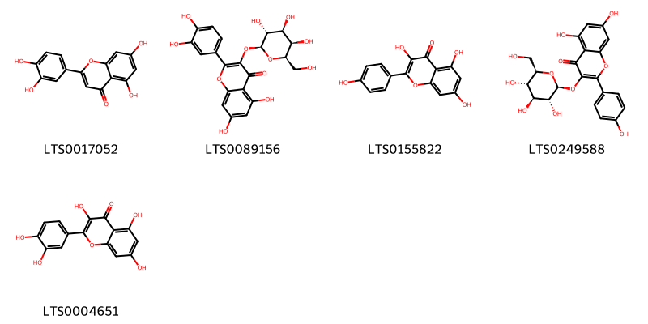{ width=100% }
    <figcaption>Hình ảnh cấu trúc hóa học của 5 hoạt chất thuộc nhóm Flavonoids gồm ['luteolin (LTS0017052)', 'hyperoside (LTS0089156)', 'kaempherol (LTS0155822)', 'astragalin (LTS0249588)', 'quercetin (LTS0004651)'].</figcaption>
</figure>
#### Nhóm Indoles and derivatives
<figure markdown="span">
    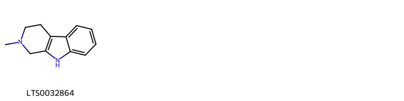{ width=100% }
    <figcaption>Hình ảnh cấu trúc hóa học của 1 hoạt chất thuộc nhóm Indoles and derivatives gồm ['2-methyl-1h,3h,4h,9h-pyrido[3,4-b]indole (LTS0032864)'].</figcaption>
</figure>
#### Nhóm Isocoumarans
<figure markdown="span">
    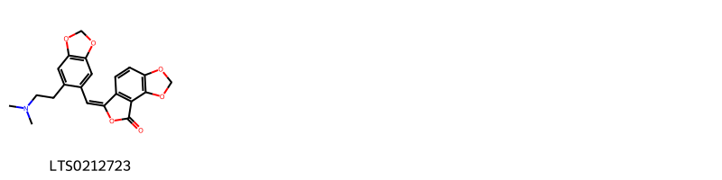{ width=100% }
    <figcaption>Hình ảnh cấu trúc hóa học của 1 hoạt chất thuộc nhóm Isocoumarans gồm ['(10e)-10-({6-[2-(dimethylamino)ethyl]-2h-1,3-benzodioxol-5-yl}methylidene)-3,5,11-trioxatricyclo[7.3.0.0²,⁶]dodeca-1(9),2(6),7-trien-12-one (LTS0212723)'].</figcaption>
</figure>
#### Nhóm Phthalide isoquinolines
<figure markdown="span">
    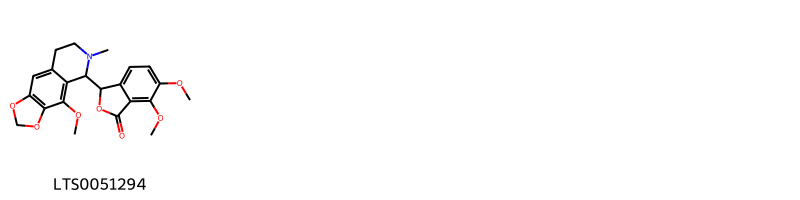{ width=100% }
    <figcaption>Hình ảnh cấu trúc hóa học của 1 hoạt chất thuộc nhóm Phthalide isoquinolines gồm ['noscapine (LTS0051294)'].</figcaption>
</figure>
#### Nhóm Prenol lipids
<figure markdown="span">
    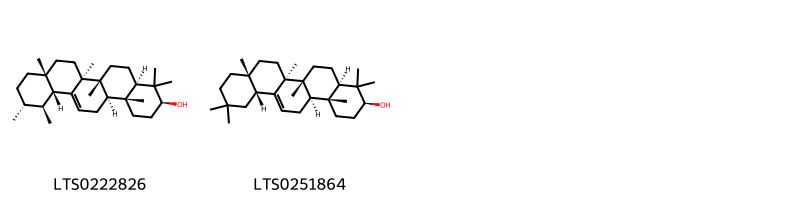{ width=100% }
    <figcaption>Hình ảnh cấu trúc hóa học của 2 hoạt chất thuộc nhóm Prenol lipids gồm ['amyrin (LTS0222826)', 'β-amyrin (LTS0251864)'].</figcaption>
</figure>
#### Nhóm Protoberberine alkaloids and derivatives
<figure markdown="span">
    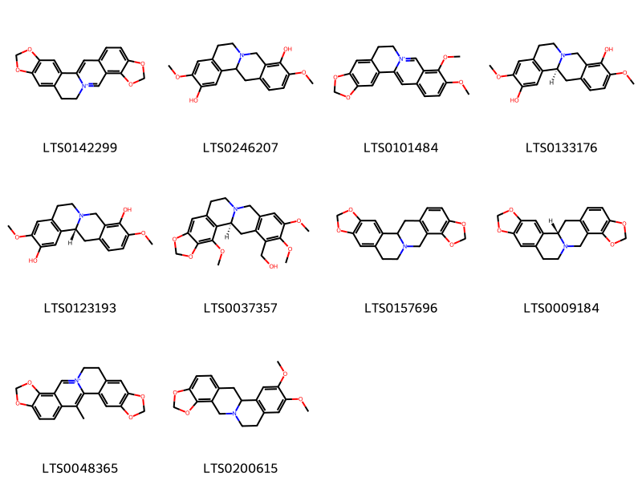{ width=100% }
    <figcaption>Hình ảnh cấu trúc hóa học của 10 hoạt chất thuộc nhóm Protoberberine alkaloids and derivatives gồm ['5,7,17,19-tetraoxa-13λ⁵-azahexacyclo[11.11.0.0²,¹⁰.0⁴,⁸.0¹⁵,²³.0¹⁶,²⁰]tetracosa-1(24),2,4(8),9,13,15,20,22-octaen-13-ylium (LTS0142299)', '(s)-scoulerine (LTS0246207)', 'berberine (LTS0101484)', 'scoulerine (LTS0133176)', '(12br)-3,10-dimethoxy-7,8,12b,13-tetrahydro-5h-6-azatetraphene-4,11-diol (LTS0123193)', '[(1s)-3,17,18-trimethoxy-5,7-dioxa-13-azapentacyclo[11.8.0.0²,¹⁰.0⁴,⁸.0¹⁵,²⁰]henicosa-2(10),3,8,15(20),16,18-hexaen-19-yl]methanol (LTS0037357)', '5,7,17,19-tetraoxa-13-azahexacyclo[11.11.0.0²,¹⁰.0⁴,⁸.0¹⁵,²³.0¹⁶,²⁰]tetracosa-2,4(8),9,15(23),16(20),21-hexaene (LTS0157696)', 'stylopine (LTS0009184)', '24-methyl-5,7,17,19-tetraoxa-13λ⁵-azahexacyclo[11.11.0.0²,¹⁰.0⁴,⁸.0¹⁵,²³.0¹⁶,²⁰]tetracosa-1(24),2,4(8),9,13,15,20,22-octaen-13-ylium (LTS0048365)', 'sinactine (LTS0200615)'].</figcaption>
</figure>
#### Nhóm Protopine alkaloids
<figure markdown="span">
    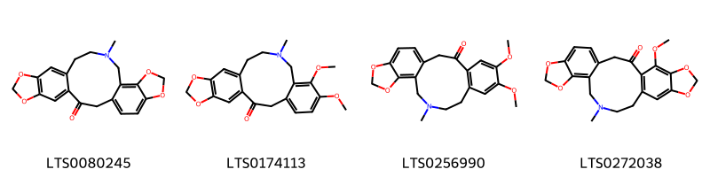{ width=100% }
    <figcaption>Hình ảnh cấu trúc hóa học của 4 hoạt chất thuộc nhóm Protopine alkaloids gồm ['protopine (LTS0080245)', 'β-allocryptopine (LTS0174113)', 'cryptopine (LTS0256990)', '5-methoxy-15-methyl-7,9,19,21-tetraoxa-15-azapentacyclo[15.7.0.0⁴,¹².0⁶,¹⁰.0¹⁸,²²]tetracosa-1(24),4(12),5,10,17,22-hexaen-3-one (LTS0272038)'].</figcaption>
</figure>
#### Nhóm Rhoeadine alkaloids
<figure markdown="span">
    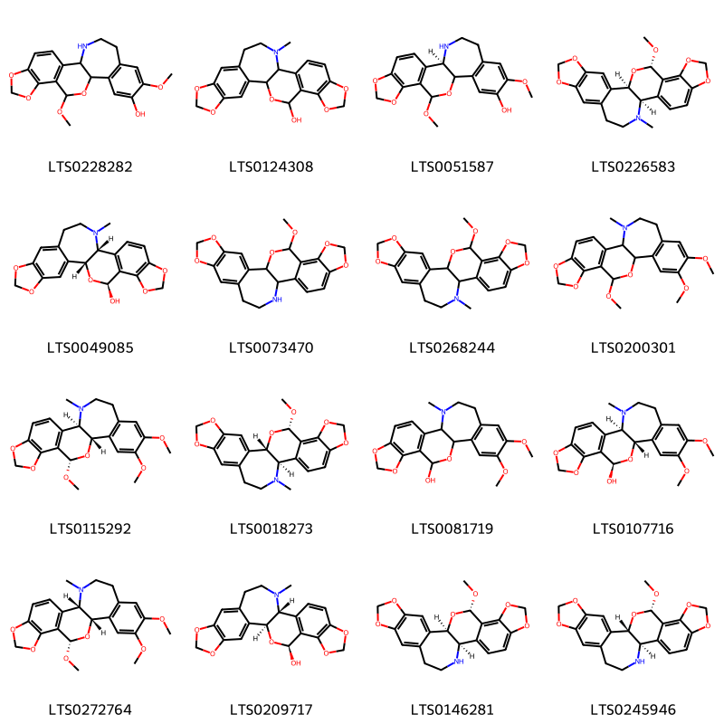{ width=100% }
    <figcaption>Hình ảnh cấu trúc hóa học của 16 hoạt chất thuộc nhóm Rhoeadine alkaloids gồm ['11,17-dimethoxy-6,8,12-trioxa-22-azapentacyclo[11.9.0.0²,¹⁰.0⁵,⁹.0¹⁴,¹⁹]docosa-2(10),3,5(9),14(19),15,17-hexaen-16-ol (LTS0228282)', '13-methyl-5,7,19,21,25-pentaoxa-13-azahexacyclo[12.11.0.0²,¹⁰.0⁴,⁸.0¹⁵,²³.0¹⁸,²²]pentacosa-2,4(8),9,15(23),16,18(22)-hexaen-24-ol (LTS0124308)', '(1r)-11,17-dimethoxy-6,8,12-trioxa-22-azapentacyclo[11.9.0.0²,¹⁰.0⁵,⁹.0¹⁴,¹⁹]docosa-2(10),3,5(9),14(19),15,17-hexaen-16-ol (LTS0051587)', 'rhoeadine (LTS0226583)', '(1r,14r,24s)-13-methyl-5,7,19,21,25-pentaoxa-13-azahexacyclo[12.11.0.0²,¹⁰.0⁴,⁸.0¹⁵,²³.0¹⁸,²²]pentacosa-2,4(8),9,15(23),16,18(22)-hexaen-24-ol (LTS0049085)', '24-methoxy-5,7,19,21,25-pentaoxa-13-azahexacyclo[12.11.0.0²,¹⁰.0⁴,⁸.0¹⁵,²³.0¹⁸,²²]pentacosa-2,4(8),9,15,17,22-hexaene (LTS0073470)', '24-methoxy-13-methyl-5,7,19,21,25-pentaoxa-13-azahexacyclo[12.11.0.0²,¹⁰.0⁴,⁸.0¹⁵,²³.0¹⁸,²²]pentacosa-2,4(8),9,15,17,22-hexaene (LTS0268244)', '11,16,17-trimethoxy-22-methyl-6,8,12-trioxa-22-azapentacyclo[11.9.0.0²,¹⁰.0⁵,⁹.0¹⁴,¹⁹]docosa-2(10),3,5(9),14(19),15,17-hexaene (LTS0200301)', '(1r,11s,13s)-11,16,17-trimethoxy-22-methyl-6,8,12-trioxa-22-azapentacyclo[11.9.0.0²,¹⁰.0⁵,⁹.0¹⁴,¹⁹]docosa-2(10),3,5(9),14(19),15,17-hexaene (LTS0115292)', '(1s,14r,24s)-24-methoxy-13-methyl-5,7,19,21,25-pentaoxa-13-azahexacyclo[12.11.0.0²,¹⁰.0⁴,⁸.0¹⁵,²³.0¹⁸,²²]pentacosa-2,4(8),9,15,17,22-hexaene (LTS0018273)', '16,17-dimethoxy-22-methyl-6,8,12-trioxa-22-azapentacyclo[11.9.0.0²,¹⁰.0⁵,⁹.0¹⁴,¹⁹]docosa-2(10),3,5(9),14(19),15,17-hexaen-11-ol (LTS0081719)', '(1r,11r,13s)-16,17-dimethoxy-22-methyl-6,8,12-trioxa-22-azapentacyclo[11.9.0.0²,¹⁰.0⁵,⁹.0¹⁴,¹⁹]docosa-2(10),3,5(9),14(19),15,17-hexaen-11-ol (LTS0107716)', '(1s,11s,13s)-11,16,17-trimethoxy-22-methyl-6,8,12-trioxa-22-azapentacyclo[11.9.0.0²,¹⁰.0⁵,⁹.0¹⁴,¹⁹]docosa-2(10),3,5(9),14(19),15,17-hexaene (LTS0272764)', '(1s,14r,24s)-13-methyl-5,7,19,21,25-pentaoxa-13-azahexacyclo[12.11.0.0²,¹⁰.0⁴,⁸.0¹⁵,²³.0¹⁸,²²]pentacosa-2,4(8),9,15(23),16,18(22)-hexaen-24-ol (LTS0209717)', '(1r,14r,24s)-24-methoxy-5,7,19,21,25-pentaoxa-13-azahexacyclo[12.11.0.0²,¹⁰.0⁴,⁸.0¹⁵,²³.0¹⁸,²²]pentacosa-2,4(8),9,15,17,22-hexaene (LTS0146281)', '(1s,14r,24s)-24-methoxy-5,7,19,21,25-pentaoxa-13-azahexacyclo[12.11.0.0²,¹⁰.0⁴,⁸.0¹⁵,²³.0¹⁸,²²]pentacosa-2,4(8),9,15,17,22-hexaene (LTS0245946)'].</figcaption>
</figure>
#### Nhóm Steroids and steroid derivatives
<figure markdown="span">
    { width=100% }
    <figcaption>Hình ảnh cấu trúc hóa học của 5 hoạt chất thuộc nhóm Steroids and steroid derivatives gồm ['stigmast-5-en-3-ol (LTS0071224)', 'stigmast-5-en-3-ol, (3β)- (LTS0204616)', 'phytosterol (LTS0029311)', '(1r,3as,3bs,7s,9bs)-1-[(2r,5r)-5,6-dimethylheptan-2-yl]-9a,11a-dimethyl-1h,2h,3h,3ah,3bh,4h,6h,7h,8h,9h,9bh,10h,11h-cyclopenta[a]phenanthren-7-ol (LTS0057877)', 'campesterol (LTS0046755)'].</figcaption>
</figure>
#### Nhóm Stilbenes
<figure markdown="span">
    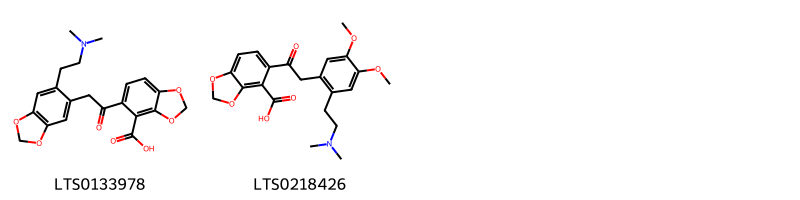{ width=100% }
    <figcaption>Hình ảnh cấu trúc hóa học của 2 hoạt chất thuộc nhóm Stilbenes gồm ['5-(2-{6-[2-(dimethylamino)ethyl]-2h-1,3-benzodioxol-5-yl}acetyl)-2h-1,3-benzodioxole-4-carboxylic acid (LTS0133978)', '5-(2-{2-[2-(dimethylamino)ethyl]-4,5-dimethoxyphenyl}acetyl)-2h-1,3-benzodioxole-4-carboxylic acid (LTS0218426)'].</figcaption>
</figure>
#### Nhóm Tetrahydroisoquinolines
<figure markdown="span">
    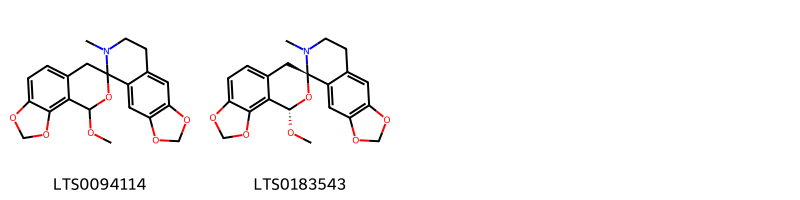{ width=100% }
    <figcaption>Hình ảnh cấu trúc hóa học của 2 hoạt chất thuộc nhóm Tetrahydroisoquinolines gồm ["13'-methoxy-6-methyl-7,8-dihydro-2h-3',5',12'-trioxaspiro[[1,3]dioxolo[4,5-g]isoquinoline-5,11'-tricyclo[7.4.0.0²,⁶]tridecane]-1',6',8'-triene (LTS0094114)", "(5s,13's)-13'-methoxy-6-methyl-7,8-dihydro-2h-3',5',12'-trioxaspiro[[1,3]dioxolo[4,5-g]isoquinoline-5,11'-tricyclo[7.4.0.0²,⁶]tridecane]-1',6',8'-triene (LTS0183543)"].</figcaption>
</figure>

---

### Dược dân tộc học

Danh sách các quốc gia có sử dụng *Papaver rhoeas* trong điều trị các bệnh. 

| Country            | Disease                                                              | Bệnh                                                                                                                                                                                                |
|:-------------------|:---------------------------------------------------------------------|:----------------------------------------------------------------------------------------------------------------------------------------------------------------------------------------------------|
| China              | Antitussive                                                          | MYMEMORY WARNING: YOU USED ALL AVAILABLE FREE TRANSLATIONS FOR TODAY. NEXT AVAILABLE IN  09 HOURS 40 MINUTES 51 SECONDS VISIT HTTPS://MYMEMORY.TRANSLATED.NET/DOC/USAGELIMITS.PHP TO TRANSLATE MORE |
| Dominican Republic | Narcotic                                                             | MYMEMORY WARNING: YOU USED ALL AVAILABLE FREE TRANSLATIONS FOR TODAY. NEXT AVAILABLE IN  09 HOURS 40 MINUTES 40 SECONDS VISIT HTTPS://MYMEMORY.TRANSLATED.NET/DOC/USAGELIMITS.PHP TO TRANSLATE MORE |
| Elsewhere          | Antitussive, Aperient, Expectorant, Expectorant, Sedative, Sudorific | MYMEMORY WARNING: YOU USED ALL AVAILABLE FREE TRANSLATIONS FOR TODAY. NEXT AVAILABLE IN  09 HOURS 40 MINUTES 34 SECONDS VISIT HTTPS://MYMEMORY.TRANSLATED.NET/DOC/USAGELIMITS.PHP TO TRANSLATE MORE |
| Europe             | Expectorant                                                          | MYMEMORY WARNING: YOU USED ALL AVAILABLE FREE TRANSLATIONS FOR TODAY. NEXT AVAILABLE IN  09 HOURS 40 MINUTES 30 SECONDS VISIT HTTPS://MYMEMORY.TRANSLATED.NET/DOC/USAGELIMITS.PHP TO TRANSLATE MORE |
| India              | Narcotic, Sedative                                                   | MYMEMORY WARNING: YOU USED ALL AVAILABLE FREE TRANSLATIONS FOR TODAY. NEXT AVAILABLE IN  09 HOURS 40 MINUTES 25 SECONDS VISIT HTTPS://MYMEMORY.TRANSLATED.NET/DOC/USAGELIMITS.PHP TO TRANSLATE MORE |
| Iraq               | Expectorant                                                          | MYMEMORY WARNING: YOU USED ALL AVAILABLE FREE TRANSLATIONS FOR TODAY. NEXT AVAILABLE IN  09 HOURS 40 MINUTES 21 SECONDS VISIT HTTPS://MYMEMORY.TRANSLATED.NET/DOC/USAGELIMITS.PHP TO TRANSLATE MORE |
| Turkey             | Digestive, Expectorant, Soporific, Sudorific                         | MYMEMORY WARNING: YOU USED ALL AVAILABLE FREE TRANSLATIONS FOR TODAY. NEXT AVAILABLE IN  09 HOURS 40 MINUTES 17 SECONDS VISIT HTTPS://MYMEMORY.TRANSLATED.NET/DOC/USAGELIMITS.PHP TO TRANSLATE MORE |

---

---
## Papaver somniferum
### Thông tin về thực vật

!!! info "Phân loại thực vật của *Papaver somniferum* từ GIBF:"
    - **Kingdom:** Plantae
    - **Phylum:** Tracheophyta
    - **Order:** Ranunculales
    - **Family:** Papaveraceae
    - **Genus:** Papaver
    - **Species:** *Papaver somniferum*

 

| Label (VI)   | Label (EN)   | Scientific Name    | Descriptions (VI)   | Descriptions (EN)   | Also Known As (VI)                                       | Also Known As (EN)   |
|:-------------|:-------------|:-------------------|:--------------------|:--------------------|:---------------------------------------------------------|:---------------------|
| N/A          | N/A          | Papaver somniferum | loài thực vật       | species of plant    | ['Thẩu', 'Papaver somniferum', 'Cây anh túc', 'A phiến'] | ['opium poppy']      |

#### Phân bố trên thế giới

**Từ CSDL GIBF** Falkland Islands (Malvinas), Austria, United States of America, Portugal, Malta, Sweden, United Kingdom of Great Britain and Northern Ireland, Belgium, France, Peru, Armenia, New Zealand, Italy, Canada, Bolivia (Plurinational State of), Spain, Netherlands

#### Phân bố tại Việt Nam

**Từ CSDL GIBF**: Không có ghi nhận ở Việt Nam

---
### Thành phần hóa học
        
- Theo cơ sở dữ liệu lotus: Từ loài *Papaver somniferum* đã phân lập và xác định được 120 hoạt chất thuộc về các nhóm Fatty Acyls, Rhoeadine alkaloids, Phenanthrenes and derivatives, Carboxylic acids and derivatives, Phenols, Organooxygen compounds, Quinolines and derivatives, Protopine alkaloids, Phthalide isoquinolines, Stilbenes, Aporphines, Benzophenanthridine alkaloids, Dihydrofurans, Benzene and substituted derivatives, 6,7-benzomorphans, Cinnamic acids and derivatives, Pyridines and derivatives, Protoberberine alkaloids and derivatives, Hydroxy acids and derivatives, Morphinans, Benzodioxoles, Pyrans, Isoquinolines and derivatives, Prenol lipids. 

|    | chemicalTaxonomyClassyfireClass          |   smiles_count |
|---:|:-----------------------------------------|---------------:|
|  0 | 6,7-benzomorphans                        |              2 |
|  1 | Aporphines                               |              5 |
|  2 | Benzene and substituted derivatives      |              7 |
|  3 | Benzodioxoles                            |              1 |
|  4 | Benzophenanthridine alkaloids            |              4 |
|  5 | Carboxylic acids and derivatives         |              2 |
|  6 | Cinnamic acids and derivatives           |              2 |
|  7 | Dihydrofurans                            |              1 |
|  8 | Fatty Acyls                              |              3 |
|  9 | Hydroxy acids and derivatives            |              2 |
| 10 | Isoquinolines and derivatives            |             10 |
| 11 | Morphinans                               |             31 |
| 12 | Organooxygen compounds                   |              6 |
| 13 | Phenanthrenes and derivatives            |              4 |
| 14 | Phenols                                  |              1 |
| 15 | Phthalide isoquinolines                  |              5 |
| 16 | Prenol lipids                            |              1 |
| 17 | Protoberberine alkaloids and derivatives |              9 |
| 18 | Protopine alkaloids                      |              2 |
| 19 | Pyrans                                   |              2 |
| 20 | Pyridines and derivatives                |              1 |
| 21 | Quinolines and derivatives               |              3 |
| 22 | Rhoeadine alkaloids                      |             10 |
| 23 | Stilbenes                                |              2 |

#### Nhóm 6_7-benzomorphans
<figure markdown="span">
    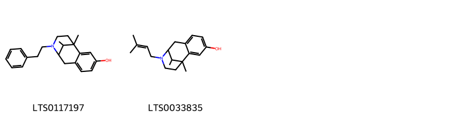{ width=100% }
    <figcaption>Hình ảnh cấu trúc hóa học của Không tìm thấy chú thích hoạt chất thuộc nhóm 6_7-benzomorphans gồm Không tìm thấy chú thích.</figcaption>
</figure>
#### Nhóm Aporphines
<figure markdown="span">
    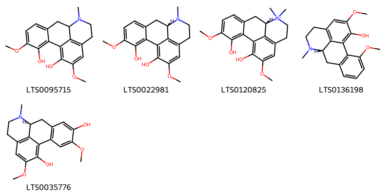{ width=100% }
    <figcaption>Hình ảnh cấu trúc hóa học của 5 hoạt chất thuộc nhóm Aporphines gồm ['4,15-dimethoxy-10-methyl-10-azatetracyclo[7.7.1.0²,⁷.0¹³,¹⁷]heptadeca-1(16),2,4,6,13(17),14-hexaene-3,16-diol (LTS0095715)', '(9s)-4,15-dimethoxy-10-methyl-10-azatetracyclo[7.7.1.0²,⁷.0¹³,¹⁷]heptadeca-1(16),2,4,6,13(17),14-hexaene-3,16-diol (LTS0022981)', 'magnoflorine (LTS0120825)', '(9s)-3,15-dimethoxy-10-methyl-10-azatetracyclo[7.7.1.0²,⁷.0¹³,¹⁷]heptadeca-1(16),2(7),3,5,13(17),14-hexaen-16-ol (LTS0136198)', '(9s)-4,15-dimethoxy-10-methyl-10-azatetracyclo[7.7.1.0²,⁷.0¹³,¹⁷]heptadeca-1(16),2(7),3,5,13(17),14-hexaene-5,16-diol (LTS0035776)'].</figcaption>
</figure>
#### Nhóm Benzene and substituted derivatives
<figure markdown="span">
    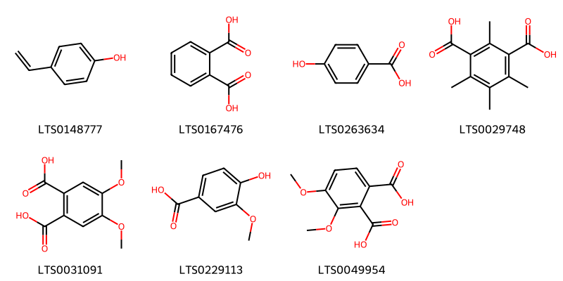{ width=100% }
    <figcaption>Hình ảnh cấu trúc hóa học của 7 hoạt chất thuộc nhóm Benzene and substituted derivatives gồm ['4-vinylphenol (LTS0148777)', 'phthalic acid (LTS0167476)', 'p-hydroxybenzoic acid (LTS0263634)', 'tetramethylbenzene-1,3-dicarboxylic acid (LTS0029748)', '4,5-dimethoxybenzene-1,2-dicarboxylic acid (LTS0031091)', 'vanillic acid (LTS0229113)', '3,4-dimethoxybenzene-1,2-dicarboxylic acid (LTS0049954)'].</figcaption>
</figure>
#### Nhóm Benzodioxoles
<figure markdown="span">
    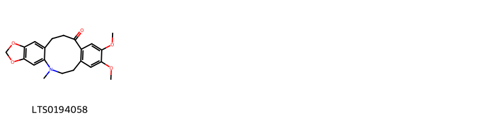{ width=100% }
    <figcaption>Hình ảnh cấu trúc hóa học của 1 hoạt chất thuộc nhóm Benzodioxoles gồm ['7,8-dimethoxy-2-methyl-17,19-dioxa-2-azatetracyclo[12.7.0.0⁵,¹⁰.0¹⁶,²⁰]henicosa-1(21),5(10),6,8,14,16(20)-hexaen-11-one (LTS0194058)'].</figcaption>
</figure>
#### Nhóm Benzophenanthridine alkaloids
<figure markdown="span">
    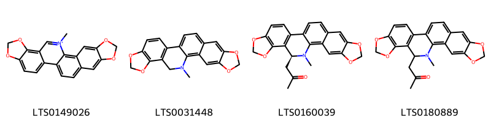{ width=100% }
    <figcaption>Hình ảnh cấu trúc hóa học của 4 hoạt chất thuộc nhóm Benzophenanthridine alkaloids gồm ['sanguinarine (LTS0149026)', 'dihydrosanguinarine (LTS0031448)', '1-[(23s)-24-methyl-5,7,18,20-tetraoxa-24-azahexacyclo[11.11.0.0²,¹⁰.0⁴,⁸.0¹⁴,²².0¹⁷,²¹]tetracosa-1(13),2,4(8),9,11,14(22),15,17(21)-octaen-23-yl]propan-2-one (LTS0160039)', '1-{24-methyl-5,7,18,20-tetraoxa-24-azahexacyclo[11.11.0.0²,¹⁰.0⁴,⁸.0¹⁴,²².0¹⁷,²¹]tetracosa-1(13),2,4(8),9,11,14(22),15,17(21)-octaen-23-yl}propan-2-one (LTS0180889)'].</figcaption>
</figure>
#### Nhóm Carboxylic acids and derivatives
<figure markdown="span">
    { width=100% }
    <figcaption>Hình ảnh cấu trúc hóa học của 2 hoạt chất thuộc nhóm Carboxylic acids and derivatives gồm ['fumaric acid (LTS0114831)', 'butenedioic acid (LTS0069098)'].</figcaption>
</figure>
#### Nhóm Cinnamic acids and derivatives
<figure markdown="span">
    { width=100% }
    <figcaption>Hình ảnh cấu trúc hóa học của 2 hoạt chất thuộc nhóm Cinnamic acids and derivatives gồm ['para-coumaric acid (LTS0266252)', 'hydroxycinnamic acid (LTS0233023)'].</figcaption>
</figure>
#### Nhóm Dihydrofurans
<figure markdown="span">
    { width=100% }
    <figcaption>Hình ảnh cấu trúc hóa học của 1 hoạt chất thuộc nhóm Dihydrofurans gồm ['vitamin c (LTS0022555)'].</figcaption>
</figure>
#### Nhóm Fatty Acyls
<figure markdown="span">
    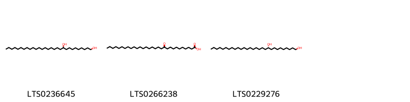{ width=100% }
    <figcaption>Hình ảnh cấu trúc hóa học của 3 hoạt chất thuộc nhóm Fatty Acyls gồm ['nonacosane-1,10-diol (LTS0236645)', '11-oxotriacontanoic acid (LTS0266238)', '(10s)-nonacosane-1,10-diol (LTS0229276)'].</figcaption>
</figure>
#### Nhóm Hydroxy acids and derivatives
<figure markdown="span">
    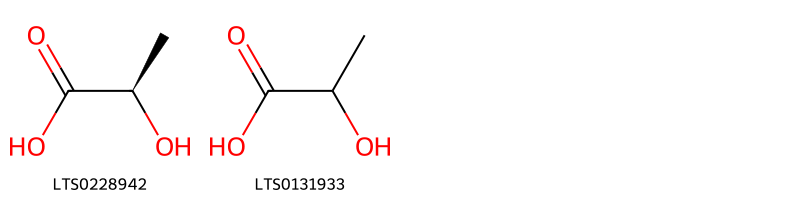{ width=100% }
    <figcaption>Hình ảnh cấu trúc hóa học của 2 hoạt chất thuộc nhóm Hydroxy acids and derivatives gồm ['d-lactic acid (LTS0228942)', 'lactic acid (LTS0131933)'].</figcaption>
</figure>
#### Nhóm Isoquinolines and derivatives
<figure markdown="span">
    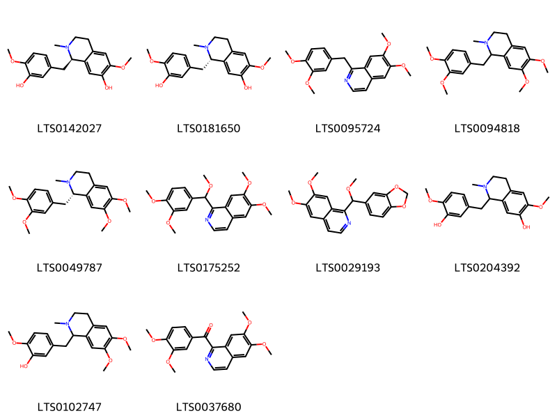{ width=100% }
    <figcaption>Hình ảnh cấu trúc hóa học của 10 hoạt chất thuộc nhóm Isoquinolines and derivatives gồm ['(-)-reticuline (LTS0142027)', '(+,-)-reticuline (LTS0181650)', 'papaverine (LTS0095724)', 'laudanosine (LTS0094818)', 'laudanosine (LTS0049787)', '1-[(3,4-dimethoxyphenyl)(methoxy)methyl]-6,7-dimethoxyisoquinoline (LTS0175252)', '1-[2h-1,3-benzodioxol-5-yl(methoxy)methyl]-6,7-dimethoxyisoquinoline (LTS0029193)', 'reticuline (LTS0204392)', 'laudanine (LTS0102747)', 'papaveraldine (LTS0037680)'].</figcaption>
</figure>
#### Nhóm Morphinans
<figure markdown="span">
    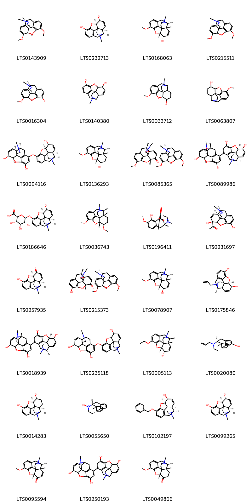{ width=100% }
    <figcaption>Hình ảnh cấu trúc hóa học của 31 hoạt chất thuộc nhóm Morphinans gồm ['thebaine (LTS0143909)', 'morphine (LTS0232713)', 'codeine (LTS0168063)', '10,14-dimethoxy-4-methyl-12-oxa-4-azapentacyclo[9.6.1.0¹,¹³.0⁵,¹⁷.0⁷,¹⁸]octadeca-7,9,11(18),14,16-pentaene (LTS0215511)', 'oripavine (LTS0016304)', '4-methyl-12-oxa-4-azapentacyclo[9.6.1.0¹,¹³.0⁵,¹⁷.0⁷,¹⁸]octadeca-7(18),8,10,15-tetraene-10,14-diol (LTS0140380)', '10-methoxy-4-methyl-12-oxa-4-azapentacyclo[9.6.1.0¹,¹³.0⁵,¹⁷.0⁷,¹⁸]octadeca-7,9,11(18),15-tetraen-14-ol (LTS0033712)', 'norcodeine (LTS0063807)', '(1s,5r,13r,14s,17r)-8-{[(1s,5r,13r,14s,17r)-14-hydroxy-4-methyl-12-oxa-4-azapentacyclo[9.6.1.0¹,¹³.0⁵,¹⁷.0⁷,¹⁸]octadeca-7(18),8,10,15-tetraen-10-yl]oxy}-4-methyl-12-oxa-4-azapentacyclo[9.6.1.0¹,¹³.0⁵,¹⁷.0⁷,¹⁸]octadeca-7(18),8,10,15-tetraene-10,14-diol (LTS0094116)', 'dihydrocodeine (LTS0136293)', '(1s,5r,13r,17s)-15-[(1s,3s,5r,13r)-10,14-dimethoxy-4-methyl-12-oxa-4-azapentacyclo[9.6.1.0¹,¹³.0⁵,¹⁷.0⁷,¹⁸]octadeca-7,9,11(18),14,16-pentaen-3-yl]-17-hydroxy-10-methoxy-4-methyl-12-oxa-4-azapentacyclo[9.6.1.0¹,¹³.0⁵,¹⁷.0⁷,¹⁸]octadeca-7,9,11(18),15-tetraen-14-one (LTS0085365)', '(1s,5r,13r,14s,17r)-8-[(1s,5r,13r,14s,17r)-10,14-dihydroxy-4-methyl-12-oxa-4-azapentacyclo[9.6.1.0¹,¹³.0⁵,¹⁷.0⁷,¹⁸]octadeca-7(18),8,10,15-tetraen-8-yl]-4-methyl-12-oxa-4-azapentacyclo[9.6.1.0¹,¹³.0⁵,¹⁷.0⁷,¹⁸]octadeca-7(18),8,10,15-tetraene-10,14-diol (LTS0089986)', 'morphine-3-glucuronide (LTS0186646)', '(1s,5r,13r,14r,17r)-10,14-dimethoxy-4-methyl-12-oxa-4-azapentacyclo[9.6.1.0¹,¹³.0⁵,¹⁷.0⁷,¹⁸]octadeca-7,9,11(18)-triene (LTS0036743)', 'thebainone (LTS0196411)', '6-acetylmorphine (LTS0231697)', 'morphinone (LTS0257935)', '(1s,5r,13r,17s)-15-[(1s,3s,5r,13r)-10,14-dimethoxy-4-methyl-12-oxa-4-azapentacyclo[9.6.1.0¹,¹³.0⁵,¹⁷.0⁷,¹⁸]octadeca-7,9,11(18),14,16-pentaen-3-yl]-10,17-dihydroxy-4-methyl-12-oxa-4-azapentacyclo[9.6.1.0¹,¹³.0⁵,¹⁷.0⁷,¹⁸]octadeca-7,9,11(18),15-tetraen-14-one (LTS0215373)', 'isocodeine (LTS0078907)', 'n-allylnormorphine (LTS0175846)', '(1s,5r,13r,14s)-8-[(1s,5r,13r,14s)-10,14-dihydroxy-4-methyl-12-oxa-4-azapentacyclo[9.6.1.0¹,¹³.0⁵,¹⁷.0⁷,¹⁸]octadeca-7(18),8,10,15-tetraen-8-yl]-4-methyl-12-oxa-4-azapentacyclo[9.6.1.0¹,¹³.0⁵,¹⁷.0⁷,¹⁸]octadeca-7(18),8,10,15-tetraene-10,14-diol (LTS0018939)', '8-({14-hydroxy-4-methyl-12-oxa-4-azapentacyclo[9.6.1.0¹,¹³.0⁵,¹⁷.0⁷,¹⁸]octadeca-7(18),8,10,15-tetraen-10-yl}oxy)-4-methyl-12-oxa-4-azapentacyclo[9.6.1.0¹,¹³.0⁵,¹⁷.0⁷,¹⁸]octadeca-7(18),8,10,15-tetraene-10,14-diol (LTS0235118)', 'ethylmorphine (LTS0005113)', 'levallorphan (LTS0020080)', 'dihydromorphine (LTS0014283)', '(1s,9r,10r)-17-hydroxy-17-azatetracyclo[7.5.3.0¹,¹⁰.0²,⁷]heptadeca-2,4,6,13-tetraen-17-ium (LTS0055650)', 'benzylmorphine (LTS0102197)', '(1s,5r,13r,14r,17r)-4-methyl-12-oxa-4-azapentacyclo[9.6.1.0¹,¹³.0⁵,¹⁷.0⁷,¹⁸]octadeca-7(18),8,10,15-tetraene-10,14-diol (LTS0099265)', 'codeinone (LTS0095594)', '8-{10,14-dihydroxy-4-methyl-12-oxa-4-azapentacyclo[9.6.1.0¹,¹³.0⁵,¹⁷.0⁷,¹⁸]octadeca-7(18),8,10,15-tetraen-8-yl}-4-methyl-12-oxa-4-azapentacyclo[9.6.1.0¹,¹³.0⁵,¹⁷.0⁷,¹⁸]octadeca-7(18),8,10,15-tetraene-10,14-diol (LTS0250193)', 'hydrocodone (LTS0049866)'].</figcaption>
</figure>
#### Nhóm Organooxygen compounds
<figure markdown="span">
    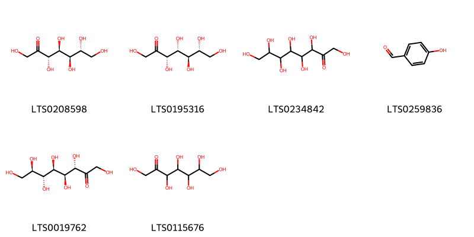{ width=100% }
    <figcaption>Hình ảnh cấu trúc hóa học của 6 hoạt chất thuộc nhóm Organooxygen compounds gồm ['mannoheptulose (LTS0208598)', 'sedoheptulose (LTS0195316)', '1,3,4,5,6,7,8-heptahydroxyoctan-2-one (LTS0234842)', 'p-hydroxybenzaldehyde (LTS0259836)', 'd-glycero-d-manno-octulose (LTS0019762)', 'd-manno-heptulose (LTS0115676)'].</figcaption>
</figure>
#### Nhóm Phenanthrenes and derivatives
<figure markdown="span">
    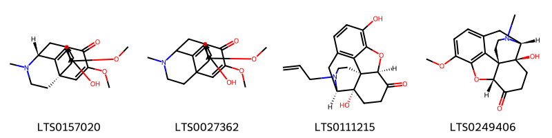{ width=100% }
    <figcaption>Hình ảnh cấu trúc hóa học của 4 hoạt chất thuộc nhóm Phenanthrenes and derivatives gồm ['salutaridine (LTS0157020)', '3-hydroxy-4,13-dimethoxy-17-methyl-17-azatetracyclo[7.5.3.0¹,¹⁰.0²,⁷]heptadeca-2,4,6,10,13-pentaen-12-one (LTS0027362)', 'naloxone (LTS0111215)', 'oxycodone (LTS0249406)'].</figcaption>
</figure>
#### Nhóm Phenols
<figure markdown="span">
    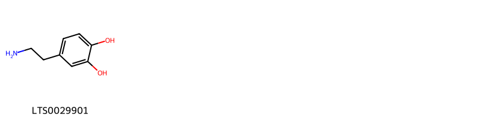{ width=100% }
    <figcaption>Hình ảnh cấu trúc hóa học của 1 hoạt chất thuộc nhóm Phenols gồm ['dopamine (LTS0029901)'].</figcaption>
</figure>
#### Nhóm Phthalide isoquinolines
<figure markdown="span">
    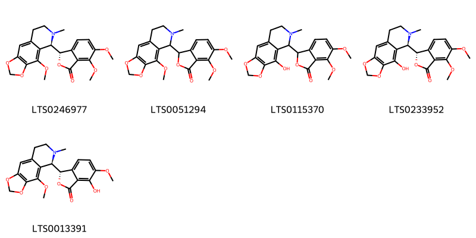{ width=100% }
    <figcaption>Hình ảnh cấu trúc hóa học của 5 hoạt chất thuộc nhóm Phthalide isoquinolines gồm ['noscapine (LTS0246977)', 'noscapine (LTS0051294)', '3-{4-hydroxy-6-methyl-2h,5h,7h,8h-[1,3]dioxolo[4,5-g]isoquinolin-5-yl}-6,7-dimethoxy-3h-2-benzofuran-1-one (LTS0115370)', 'narcotoline (LTS0233952)', '(3s)-7-hydroxy-6-methoxy-3-[(5r)-4-methoxy-6-methyl-2h,5h,7h,8h-[1,3]dioxolo[4,5-g]isoquinolin-5-yl]-3h-2-benzofuran-1-one (LTS0013391)'].</figcaption>
</figure>
#### Nhóm Prenol lipids
<figure markdown="span">
    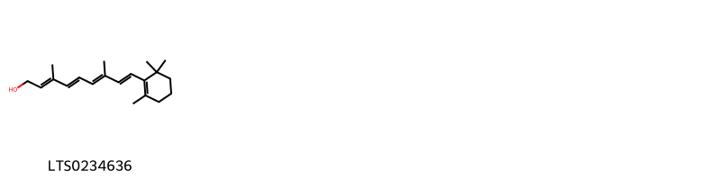{ width=100% }
    <figcaption>Hình ảnh cấu trúc hóa học của 1 hoạt chất thuộc nhóm Prenol lipids gồm ['vitamin a (LTS0234636)'].</figcaption>
</figure>
#### Nhóm Protoberberine alkaloids and derivatives
<figure markdown="span">
    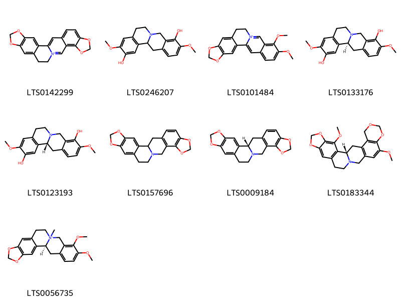{ width=100% }
    <figcaption>Hình ảnh cấu trúc hóa học của 9 hoạt chất thuộc nhóm Protoberberine alkaloids and derivatives gồm ['5,7,17,19-tetraoxa-13λ⁵-azahexacyclo[11.11.0.0²,¹⁰.0⁴,⁸.0¹⁵,²³.0¹⁶,²⁰]tetracosa-1(24),2,4(8),9,13,15,20,22-octaen-13-ylium (LTS0142299)', '(s)-scoulerine (LTS0246207)', 'berberine (LTS0101484)', 'scoulerine (LTS0133176)', '(12br)-3,10-dimethoxy-7,8,12b,13-tetrahydro-5h-6-azatetraphene-4,11-diol (LTS0123193)', '5,7,17,19-tetraoxa-13-azahexacyclo[11.11.0.0²,¹⁰.0⁴,⁸.0¹⁵,²³.0¹⁶,²⁰]tetracosa-2,4(8),9,15(23),16(20),21-hexaene (LTS0157696)', 'stylopine (LTS0009184)', '(1s)-10,24-dimethoxy-6,8,20,22-tetraoxa-14-azahexacyclo[12.11.0.0³,¹².0⁴,⁹.0¹⁷,²⁵.0¹⁹,²³]pentacosa-3(12),4(9),10,17(25),18,23-hexaene (LTS0183344)', '(s)-n-methylcanadine (LTS0056735)'].</figcaption>
</figure>
#### Nhóm Protopine alkaloids
<figure markdown="span">
    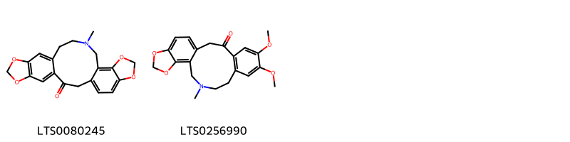{ width=100% }
    <figcaption>Hình ảnh cấu trúc hóa học của 2 hoạt chất thuộc nhóm Protopine alkaloids gồm ['protopine (LTS0080245)', 'cryptopine (LTS0256990)'].</figcaption>
</figure>
#### Nhóm Pyrans
<figure markdown="span">
    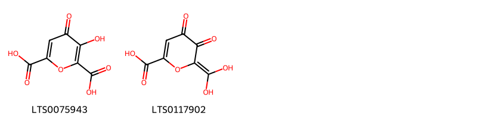{ width=100% }
    <figcaption>Hình ảnh cấu trúc hóa học của 2 hoạt chất thuộc nhóm Pyrans gồm ['meconic acid (LTS0075943)', 'meconic acid (LTS0117902)'].</figcaption>
</figure>
#### Nhóm Pyridines and derivatives
<figure markdown="span">
    { width=100% }
    <figcaption>Hình ảnh cấu trúc hóa học của 1 hoạt chất thuộc nhóm Pyridines and derivatives gồm ['niacin (LTS0216673)'].</figcaption>
</figure>
#### Nhóm Quinolines and derivatives
<figure markdown="span">
    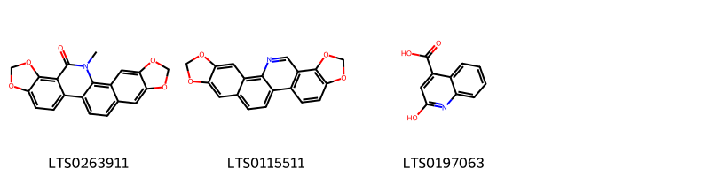{ width=100% }
    <figcaption>Hình ảnh cấu trúc hóa học của 3 hoạt chất thuộc nhóm Quinolines and derivatives gồm ['hydroxysanguinarine (LTS0263911)', '5,7,18,20-tetraoxa-24-azahexacyclo[11.11.0.0²,¹⁰.0⁴,⁸.0¹⁴,²².0¹⁷,²¹]tetracosa-1(13),2(10),3,8,11,14(22),15,17(21),23-nonaene (LTS0115511)', '2-hydroxycinchoninic acid (LTS0197063)'].</figcaption>
</figure>
#### Nhóm Rhoeadine alkaloids
<figure markdown="span">
    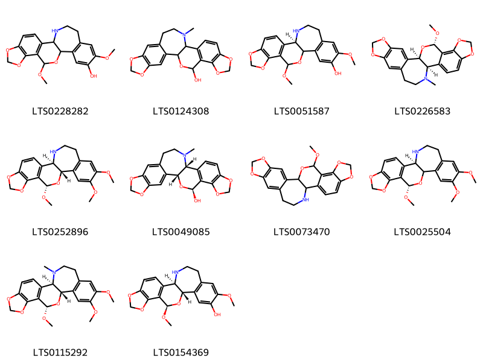{ width=100% }
    <figcaption>Hình ảnh cấu trúc hóa học của 10 hoạt chất thuộc nhóm Rhoeadine alkaloids gồm ['11,17-dimethoxy-6,8,12-trioxa-22-azapentacyclo[11.9.0.0²,¹⁰.0⁵,⁹.0¹⁴,¹⁹]docosa-2(10),3,5(9),14(19),15,17-hexaen-16-ol (LTS0228282)', '13-methyl-5,7,19,21,25-pentaoxa-13-azahexacyclo[12.11.0.0²,¹⁰.0⁴,⁸.0¹⁵,²³.0¹⁸,²²]pentacosa-2,4(8),9,15(23),16,18(22)-hexaen-24-ol (LTS0124308)', '(1r)-11,17-dimethoxy-6,8,12-trioxa-22-azapentacyclo[11.9.0.0²,¹⁰.0⁵,⁹.0¹⁴,¹⁹]docosa-2(10),3,5(9),14(19),15,17-hexaen-16-ol (LTS0051587)', 'rhoeadine (LTS0226583)', '(1r,11s,13s)-11,16,17-trimethoxy-6,8,12-trioxa-22-azapentacyclo[11.9.0.0²,¹⁰.0⁵,⁹.0¹⁴,¹⁹]docosa-2(10),3,5(9),14(19),15,17-hexaene (LTS0252896)', '(1r,14r,24s)-13-methyl-5,7,19,21,25-pentaoxa-13-azahexacyclo[12.11.0.0²,¹⁰.0⁴,⁸.0¹⁵,²³.0¹⁸,²²]pentacosa-2,4(8),9,15(23),16,18(22)-hexaen-24-ol (LTS0049085)', '24-methoxy-5,7,19,21,25-pentaoxa-13-azahexacyclo[12.11.0.0²,¹⁰.0⁴,⁸.0¹⁵,²³.0¹⁸,²²]pentacosa-2,4(8),9,15,17,22-hexaene (LTS0073470)', '(1r,11s)-11,16,17-trimethoxy-6,8,12-trioxa-22-azapentacyclo[11.9.0.0²,¹⁰.0⁵,⁹.0¹⁴,¹⁹]docosa-2(10),3,5(9),14(19),15,17-hexaene (LTS0025504)', '(1r,11s,13s)-11,16,17-trimethoxy-22-methyl-6,8,12-trioxa-22-azapentacyclo[11.9.0.0²,¹⁰.0⁵,⁹.0¹⁴,¹⁹]docosa-2(10),3,5(9),14(19),15,17-hexaene (LTS0115292)', '(1r,11r,13s)-11,17-dimethoxy-6,8,12-trioxa-22-azapentacyclo[11.9.0.0²,¹⁰.0⁵,⁹.0¹⁴,¹⁹]docosa-2(10),3,5(9),14(19),15,17-hexaen-16-ol (LTS0154369)'].</figcaption>
</figure>
#### Nhóm Stilbenes
<figure markdown="span">
    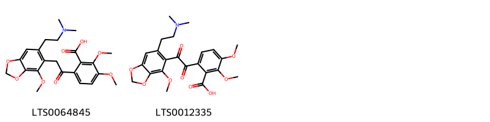{ width=100% }
    <figcaption>Hình ảnh cấu trúc hóa học của 2 hoạt chất thuộc nhóm Stilbenes gồm ['narceine (LTS0064845)', '6-(2-{6-[2-(dimethylamino)ethyl]-4-methoxy-2h-1,3-benzodioxol-5-yl}-2-oxoacetyl)-2,3-dimethoxybenzoic acid (LTS0012335)'].</figcaption>
</figure>

---

### Dược dân tộc học

Danh sách các quốc gia có sử dụng *Papaver somniferum* trong điều trị các bệnh. 

| Country          | Disease                                                                                                          | Bệnh                                                                                                                                                                                                |
|:-----------------|:-----------------------------------------------------------------------------------------------------------------|:----------------------------------------------------------------------------------------------------------------------------------------------------------------------------------------------------|
| China            | Aphrodisiac, Astringent, Carminative, Narcotic, Sedative, Sedative, Analgesic, Antitussive, Astringent, Narcotic | MYMEMORY WARNING: YOU USED ALL AVAILABLE FREE TRANSLATIONS FOR TODAY. NEXT AVAILABLE IN  09 HOURS 39 MINUTES 37 SECONDS VISIT HTTPS://MYMEMORY.TRANSLATED.NET/DOC/USAGELIMITS.PHP TO TRANSLATE MORE |
| Elsewhere        | Demulcent, Expectorant, Expectorant, Hypnotic, Sedative, nan, Demulcent, Emollient, Sudorific                    | MYMEMORY WARNING: YOU USED ALL AVAILABLE FREE TRANSLATIONS FOR TODAY. NEXT AVAILABLE IN  09 HOURS 39 MINUTES 35 SECONDS VISIT HTTPS://MYMEMORY.TRANSLATED.NET/DOC/USAGELIMITS.PHP TO TRANSLATE MORE |
| Europe           | Analgesic, Hypnotic, Narcotic, Poison, Soap, Poison, Sedative, Intoxicant                                        | MYMEMORY WARNING: YOU USED ALL AVAILABLE FREE TRANSLATIONS FOR TODAY. NEXT AVAILABLE IN  09 HOURS 39 MINUTES 33 SECONDS VISIT HTTPS://MYMEMORY.TRANSLATED.NET/DOC/USAGELIMITS.PHP TO TRANSLATE MORE |
| France           | Sedative                                                                                                         | MYMEMORY WARNING: YOU USED ALL AVAILABLE FREE TRANSLATIONS FOR TODAY. NEXT AVAILABLE IN  09 HOURS 39 MINUTES 29 SECONDS VISIT HTTPS://MYMEMORY.TRANSLATED.NET/DOC/USAGELIMITS.PHP TO TRANSLATE MORE |
| India            | Intoxicant                                                                                                       | MYMEMORY WARNING: YOU USED ALL AVAILABLE FREE TRANSLATIONS FOR TODAY. NEXT AVAILABLE IN  09 HOURS 39 MINUTES 24 SECONDS VISIT HTTPS://MYMEMORY.TRANSLATED.NET/DOC/USAGELIMITS.PHP TO TRANSLATE MORE |
| India(Ayurvedic) | Aphrodisiac, Tonic                                                                                               | MYMEMORY WARNING: YOU USED ALL AVAILABLE FREE TRANSLATIONS FOR TODAY. NEXT AVAILABLE IN  09 HOURS 39 MINUTES 20 SECONDS VISIT HTTPS://MYMEMORY.TRANSLATED.NET/DOC/USAGELIMITS.PHP TO TRANSLATE MORE |
| India(Unani)     | Aphrodisiac, Hypnotic, Hemostat, Analgesic                                                                       | MYMEMORY WARNING: YOU USED ALL AVAILABLE FREE TRANSLATIONS FOR TODAY. NEXT AVAILABLE IN  09 HOURS 39 MINUTES 17 SECONDS VISIT HTTPS://MYMEMORY.TRANSLATED.NET/DOC/USAGELIMITS.PHP TO TRANSLATE MORE |
| Iraq             | Narcotic, Analgesic, Hypnotic                                                                                    | MYMEMORY WARNING: YOU USED ALL AVAILABLE FREE TRANSLATIONS FOR TODAY. NEXT AVAILABLE IN  09 HOURS 39 MINUTES 14 SECONDS VISIT HTTPS://MYMEMORY.TRANSLATED.NET/DOC/USAGELIMITS.PHP TO TRANSLATE MORE |
| Turkey           | Emollient, Nervine, Poison, Narcotic, Sedative                                                                   | MYMEMORY WARNING: YOU USED ALL AVAILABLE FREE TRANSLATIONS FOR TODAY. NEXT AVAILABLE IN  09 HOURS 39 MINUTES 11 SECONDS VISIT HTTPS://MYMEMORY.TRANSLATED.NET/DOC/USAGELIMITS.PHP TO TRANSLATE MORE |
| ain              | Poison                                                                                                           | MYMEMORY WARNING: YOU USED ALL AVAILABLE FREE TRANSLATIONS FOR TODAY. NEXT AVAILABLE IN  09 HOURS 39 MINUTES 08 SECONDS VISIT HTTPS://MYMEMORY.TRANSLATED.NET/DOC/USAGELIMITS.PHP TO TRANSLATE MORE |

---

# Chi Chelidonium

??? note "Danh sách các dược liệu thuộc chi"
    
	 - *Chelidonium majus*

---
## Chelidonium majus
### Thông tin về thực vật

!!! info "Phân loại thực vật của *Chelidonium majus* từ GIBF:"
    - **Kingdom:** Plantae
    - **Phylum:** Tracheophyta
    - **Order:** Ranunculales
    - **Family:** Papaveraceae
    - **Genus:** Chelidonium
    - **Species:** *Chelidonium majus*

 

| Label (VI)   | Label (EN)   | Scientific Name   | Descriptions (VI)   | Descriptions (EN)                    | Also Known As (VI)   | Also Known As (EN)                                               |
|:-------------|:-------------|:------------------|:--------------------|:-------------------------------------|:---------------------|:-----------------------------------------------------------------|
| N/A          | N/A          | Chelidonium majus | loài thực vật       | species of plant in the poppy family | ['']                 | ['Swallowwort', 'Greater celandine', 'Nipplewort', 'Tetterwort'] |

#### Phân bố trên thế giới

**Từ CSDL GIBF** Austria, Hungary, United States of America, Portugal, Czechia, France, Netherlands, Belgium, Ukraine, Russian Federation, Italy, Luxembourg, Canada, Germany, United Kingdom of Great Britain and Northern Ireland, Spain, Poland

#### Phân bố tại Việt Nam

**Từ CSDL GIBF**: Không có ghi nhận ở Việt Nam

---
### Thành phần hóa học
        
- Theo cơ sở dữ liệu lotus: Từ loài *Chelidonium majus* đã phân lập và xác định được 75 hoạt chất thuộc về các nhóm Benzophenanthridine alkaloids, Aporphines, Benzene and substituted derivatives, Quinolines and derivatives, Flavonoids, Protopine alkaloids, Benzodioxoles, Cinnamic acids and derivatives, Pyrans, Carboxylic acids and derivatives, Tetrahydroisoquinolines, Protoberberine alkaloids and derivatives, Isoquinolines and derivatives, Lupin alkaloids, Organonitrogen compounds, Benzazepines. 

|    | chemicalTaxonomyClassyfireClass          |   smiles_count |
|---:|:-----------------------------------------|---------------:|
|  0 | Aporphines                               |              4 |
|  1 | Benzazepines                             |              2 |
|  2 | Benzene and substituted derivatives      |              2 |
|  3 | Benzodioxoles                            |              2 |
|  4 | Benzophenanthridine alkaloids            |             36 |
|  5 | Carboxylic acids and derivatives         |              1 |
|  6 | Cinnamic acids and derivatives           |              4 |
|  7 | Flavonoids                               |              1 |
|  8 | Isoquinolines and derivatives            |              1 |
|  9 | Lupin alkaloids                          |              2 |
| 10 | Organonitrogen compounds                 |              2 |
| 11 | Protoberberine alkaloids and derivatives |              6 |
| 12 | Protopine alkaloids                      |              2 |
| 13 | Pyrans                                   |              1 |
| 14 | Quinolines and derivatives               |              7 |
| 15 | Tetrahydroisoquinolines                  |              1 |

#### Nhóm Aporphines
<figure markdown="span">
    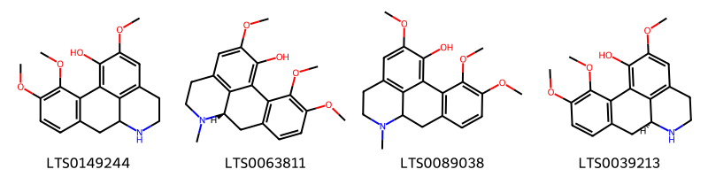{ width=100% }
    <figcaption>Hình ảnh cấu trúc hóa học của 4 hoạt chất thuộc nhóm Aporphines gồm ['3,4,15-trimethoxy-10-azatetracyclo[7.7.1.0²,⁷.0¹³,¹⁷]heptadeca-1(16),2(7),3,5,13(17),14-hexaen-16-ol (LTS0149244)', '(9s)-3,4,15-trimethoxy-10-methyl-10-azatetracyclo[7.7.1.0²,⁷.0¹³,¹⁷]heptadeca-1(16),2(7),3,5,13(17),14-hexaen-16-ol (LTS0063811)', '3,4,15-trimethoxy-10-methyl-10-azatetracyclo[7.7.1.0²,⁷.0¹³,¹⁷]heptadeca-1(16),2(7),3,5,13(17),14-hexaen-16-ol (LTS0089038)', '(9s)-3,4,15-trimethoxy-10-azatetracyclo[7.7.1.0²,⁷.0¹³,¹⁷]heptadeca-1(16),2(7),3,5,13(17),14-hexaen-16-ol (LTS0039213)'].</figcaption>
</figure>
#### Nhóm Benzazepines
<figure markdown="span">
    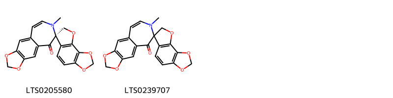{ width=100% }
    <figcaption>Hình ảnh cấu trúc hóa học của 2 hoạt chất thuộc nhóm Benzazepines gồm ["(5r)-12'-methyl-3,4',6',10,12-pentaoxa-12'-azaspiro[tricyclo[7.3.0.0²,⁶]dodecane-5,11'-tricyclo[7.5.0.0³,⁷]tetradecane]-1(9),1',2(6),3'(7'),7,8',13'-heptaen-10'-one (LTS0205580)", "12'-methyl-3,4',6',10,12-pentaoxa-12'-azaspiro[tricyclo[7.3.0.0²,⁶]dodecane-5,11'-tricyclo[7.5.0.0³,⁷]tetradecane]-1(9),1',2(6),3'(7'),7,8',13'-heptaen-10'-one (LTS0239707)"].</figcaption>
</figure>
#### Nhóm Benzene and substituted derivatives
<figure markdown="span">
    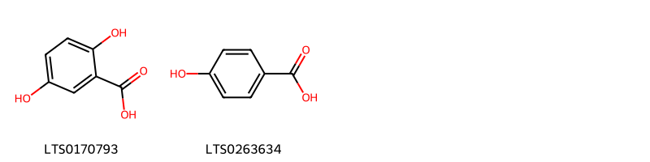{ width=100% }
    <figcaption>Hình ảnh cấu trúc hóa học của 2 hoạt chất thuộc nhóm Benzene and substituted derivatives gồm ['2,5-dihydroxybenzoic acid (LTS0170793)', 'p-hydroxybenzoic acid (LTS0263634)'].</figcaption>
</figure>
#### Nhóm Benzodioxoles
<figure markdown="span">
    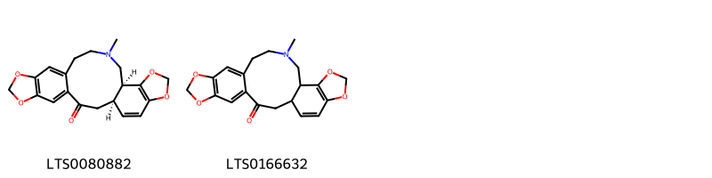{ width=100% }
    <figcaption>Hình ảnh cấu trúc hóa học của 2 hoạt chất thuộc nhóm Benzodioxoles gồm ['(1r,17s)-15-methyl-7,9,19,21-tetraoxa-15-azapentacyclo[15.7.0.0⁴,¹².0⁶,¹⁰.0¹⁸,²²]tetracosa-4,6(10),11,18(22),23-pentaen-3-one (LTS0080882)', '15-methyl-7,9,19,21-tetraoxa-15-azapentacyclo[15.7.0.0⁴,¹².0⁶,¹⁰.0¹⁸,²²]tetracosa-4,6(10),11,18(22),23-pentaen-3-one (LTS0166632)'].</figcaption>
</figure>
#### Nhóm Benzophenanthridine alkaloids
<figure markdown="span">
    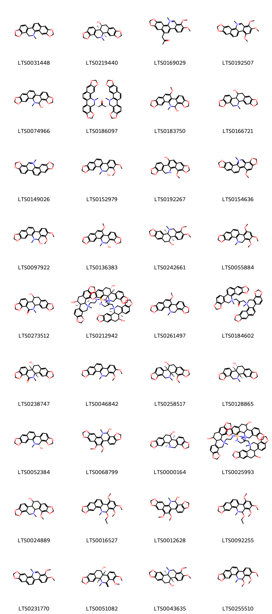{ width=100% }
    <figcaption>Hình ảnh cấu trúc hóa học của 36 hoạt chất thuộc nhóm Benzophenanthridine alkaloids gồm ['dihydrosanguinarine (LTS0031448)', 'chelidonine (LTS0219440)', '17,18-dimethoxy-21-methyl-11-(2-oxopropyl)-5,7-dioxa-21-azapentacyclo[11.8.0.0²,¹⁰.0⁴,⁸.0¹⁴,¹⁹]henicosa-1(13),2(10),3,8,11,14(19),15,17,20-nonaen-21-ium (LTS0169029)', 'chelilutine (LTS0192507)', '24-methyl-5,7,18,20-tetraoxa-24-azahexacyclo[11.11.0.0²,¹⁰.0⁴,⁸.0¹⁴,²².0¹⁷,²¹]tetracosa-1(13),2,4(8),9,11,14,16,21-octaen-23-ol (LTS0074966)', '1-[(23r)-24-methyl-5,7,18,20-tetraoxa-24-azahexacyclo[11.11.0.0²,¹⁰.0⁴,⁸.0¹⁴,²².0¹⁷,²¹]tetracosa-1(13),2,4(8),9,11,14(22),15,17(21)-octaen-23-yl]-3-[(23s)-24-methyl-5,7,18,20-tetraoxa-24-azahexacyclo[11.11.0.0²,¹⁰.0⁴,⁸.0¹⁴,²².0¹⁷,²¹]tetracosa-1(13),2,4(8),9,11,14,16,21-octaen-23-yl]propan-2-one (LTS0186097)', '12-methoxy-24-methyl-5,7,18,20-tetraoxa-24-azahexacyclo[11.11.0.0²,¹⁰.0⁴,⁸.0¹⁴,²².0¹⁷,²¹]tetracosa-1(13),2,4(8),9,11,14,16,21-octaen-23-ol (LTS0183750)', '24-methyl-5,7,18,20-tetraoxa-24-azahexacyclo[11.11.0.0²,¹⁰.0⁴,⁸.0¹⁴,²².0¹⁷,²¹]tetracosa-2,4(8),9,14(22),15,17(21)-hexaen-12-ol (LTS0166721)', 'sanguinarine (LTS0149026)', '(20s)-17,18-dimethoxy-21-methyl-5,7-dioxa-21-azapentacyclo[11.8.0.0²,¹⁰.0⁴,⁸.0¹⁴,¹⁹]henicosa-1(13),2,4(8),9,11,14,16,18-octaen-20-ol (LTS0152979)', '3-methoxy-5,7,18,20-tetraoxa-24-azahexacyclo[11.11.0.0²,¹⁰.0⁴,⁸.0¹⁴,²².0¹⁷,²¹]tetracosa-1,3,8,10,12,14(22),15,17(21)-octaen-12-ol (LTS0192267)', 'chelirubine (LTS0154636)', '17,18-dimethoxy-21-methyl-5,7-dioxa-21-azapentacyclo[11.8.0.0²,¹⁰.0⁴,⁸.0¹⁴,¹⁹]henicosa-1(13),2,4(8),9,11,14,16,18-octaen-20-ol (LTS0097922)', '(23s)-12-methoxy-24-methyl-5,7,18,20-tetraoxa-24-azahexacyclo[11.11.0.0²,¹⁰.0⁴,⁸.0¹⁴,²².0¹⁷,²¹]tetracosa-1(13),2,4(8),9,11,14,16,21-octaen-23-ol (LTS0136383)', 'homochelidonine (LTS0242661)', '15,17,18-trimethoxy-21-methyl-5,7-dioxa-21-azapentacyclo[11.8.0.0²,¹⁰.0⁴,⁸.0¹⁴,¹⁹]henicosa-1(13),2,4(8),9,11,14,16,18-octaene (LTS0055884)', '12-hydroxy-24-methyl-5,7,18,20-tetraoxa-24-azahexacyclo[11.11.0.0²,¹⁰.0⁴,⁸.0¹⁴,²².0¹⁷,²¹]tetracosa-2,4(8),9,14(22),15,17(21)-hexaen-23-one (LTS0273512)', 'ukrain cation (LTS0212942)', '12-methoxy-24-methyl-5,7,18,20-tetraoxa-24-azahexacyclo[11.11.0.0²,¹⁰.0⁴,⁸.0¹⁴,²².0¹⁷,²¹]tetracosa-1(13),2,4(8),9,11,14,16,21-octaene (LTS0261497)', '24-methyl-24-(3-{24-methyl-5,7,18,20-tetraoxa-24-azahexacyclo[11.11.0.0²,¹⁰.0⁴,⁸.0¹⁴,²².0¹⁷,²¹]tetracosa-1(13),2,4(8),9,11,14(22),15,17(21)-octaen-24-ium-24-yl}-2-oxopropyl)-5,7,18,20-tetraoxa-24-azahexacyclo[11.11.0.0²,¹⁰.0⁴,⁸.0¹⁴,²².0¹⁷,²¹]tetracosa-1(13),2,4(8),9,11,14(22),15,17(21)-octaen-24-ium (LTS0184602)', '(1r,12r,13s)-12-hydroxy-24-methyl-5,7,18,20-tetraoxa-24-azahexacyclo[11.11.0.0²,¹⁰.0⁴,⁸.0¹⁴,²².0¹⁷,²¹]tetracosa-2,4(8),9,14(22),15,17(21)-hexaen-23-one (LTS0238747)', '17,18-dimethoxy-21-methyl-5,7-dioxa-21-azapentacyclo[11.8.0.0²,¹⁰.0⁴,⁸.0¹⁴,¹⁹]henicosa-1(13),2,4(8),9,11,14,16,18-octaene (LTS0046842)', '(1r,12s,13s)-3-methoxy-24-methyl-5,7,18,20-tetraoxa-24-azahexacyclo[11.11.0.0²,¹⁰.0⁴,⁸.0¹⁴,²².0¹⁷,²¹]tetracosa-2(10),3,8,14,16,21-hexaen-12-ol (LTS0258517)', '(-)-chelidonine (LTS0128865)', '(23s)-24-methyl-5,7,18,20-tetraoxa-24-azahexacyclo[11.11.0.0²,¹⁰.0⁴,⁸.0¹⁴,²².0¹⁷,²¹]tetracosa-1(13),2,4(8),9,11,14,16,21-octaen-23-ol (LTS0052384)', '11,12-dimethoxy-24-methyl-5,7,18,20-tetraoxa-24-azahexacyclo[11.11.0.0²,¹⁰.0⁴,⁸.0¹⁴,²².0¹⁷,²¹]tetracosa-1(13),2,4(8),9,11,14(22),15,17(21)-octaen-23-ol (LTS0068799)', '(1r,12r,13s)-5,7,18,20-tetraoxa-24-azahexacyclo[11.11.0.0²,¹⁰.0⁴,⁸.0¹⁴,²².0¹⁷,²¹]tetracosa-2,4(8),9,14(22),15,17(21)-hexaen-12-ol (LTS0000164)', '24-[2-({bis[(2-{12-hydroxy-24-methyl-5,7,18,20-tetraoxa-24-azahexacyclo[11.11.0.0²,¹⁰.0⁴,⁸.0¹⁴,²².0¹⁷,²¹]tetracosa-2,4(8),9,14(22),15,17(21)-hexaen-24-ium-24-yl}ethyl)amino](sulfanylidene)-λ⁵-phosphanyl}amino)ethyl]-12-hydroxy-24-methyl-5,7,18,20-tetraoxa-24-azahexacyclo[11.11.0.0²,¹⁰.0⁴,⁸.0¹⁴,²².0¹⁷,²¹]tetracosa-2,4(8),9,14(22),15,17(21)-hexaen-24-ium (LTS0025993)', '3-methoxy-24-methyl-5,7,18,20-tetraoxa-24-azahexacyclo[11.11.0.0²,¹⁰.0⁴,⁸.0¹⁴,²².0¹⁷,²¹]tetracosa-2(10),3,8,14,16,21-hexaen-12-ol (LTS0024889)', '(20r)-20-ethoxy-15,17,18-trimethoxy-21-methyl-5,7-dioxa-21-azapentacyclo[11.8.0.0²,¹⁰.0⁴,⁸.0¹⁴,¹⁹]henicosa-1(13),2,4(8),9,11,14,16,18-octaene (LTS0016527)', '(23s)-11,12-dimethoxy-24-methyl-5,7,18,20-tetraoxa-24-azahexacyclo[11.11.0.0²,¹⁰.0⁴,⁸.0¹⁴,²².0¹⁷,²¹]tetracosa-1(13),2,4(8),9,11,14(22),15,17(21)-octaen-23-ol (LTS0012628)', '20-ethoxy-15,17,18-trimethoxy-21-methyl-5,7-dioxa-21-azapentacyclo[11.8.0.0²,¹⁰.0⁴,⁸.0¹⁴,¹⁹]henicosa-1(13),2,4(8),9,11,14,16,18-octaene (LTS0092255)', 'chelerythrine (LTS0231770)', '(1s,12s,13r)-17,18-dimethoxy-21-methyl-20-methylidene-5,7-dioxa-21-azapentacyclo[11.8.0.0²,¹⁰.0⁴,⁸.0¹⁴,¹⁹]henicosa-2,4(8),9,14(19),15,17-hexaen-12-ol (LTS0051082)', '(1s,12s,13s)-17,18-dimethoxy-21-methyl-5,7-dioxa-21-azapentacyclo[11.8.0.0²,¹⁰.0⁴,⁸.0¹⁴,¹⁹]henicosa-2,4(8),9,14,16,18-hexaen-12-ol (LTS0043635)', 'angoline (LTS0255510)'].</figcaption>
</figure>
#### Nhóm Carboxylic acids and derivatives
<figure markdown="span">
    { width=100% }
    <figcaption>Hình ảnh cấu trúc hóa học của 1 hoạt chất thuộc nhóm Carboxylic acids and derivatives gồm ['succinic acid (LTS0237204)'].</figcaption>
</figure>
#### Nhóm Cinnamic acids and derivatives
<figure markdown="span">
    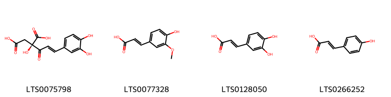{ width=100% }
    <figcaption>Hình ảnh cấu trúc hóa học của 4 hoạt chất thuộc nhóm Cinnamic acids and derivatives gồm ['(2r)-2-[(2e)-3-(3,4-dihydroxyphenyl)prop-2-enoyl]-2-hydroxybutanedioic acid (LTS0075798)', 'ferulic acid (LTS0077328)', '3,4-dihydroxycinnamic acid (LTS0128050)', 'para-coumaric acid (LTS0266252)'].</figcaption>
</figure>
#### Nhóm Flavonoids
<figure markdown="span">
    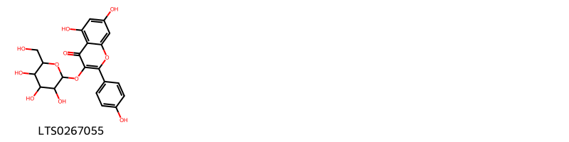{ width=100% }
    <figcaption>Hình ảnh cấu trúc hóa học của 1 hoạt chất thuộc nhóm Flavonoids gồm ['trifolin (LTS0267055)'].</figcaption>
</figure>
#### Nhóm Isoquinolines and derivatives
<figure markdown="span">
    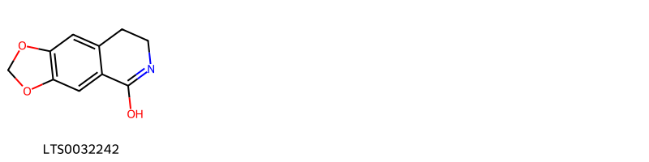{ width=100% }
    <figcaption>Hình ảnh cấu trúc hóa học của 1 hoạt chất thuộc nhóm Isoquinolines and derivatives gồm ['2h,7h,8h-[1,3]dioxolo[4,5-g]isoquinolin-5-ol (LTS0032242)'].</figcaption>
</figure>
#### Nhóm Lupin alkaloids
<figure markdown="span">
    { width=100% }
    <figcaption>Hình ảnh cấu trúc hóa học của 2 hoạt chất thuộc nhóm Lupin alkaloids gồm ['(2r,10s)-7,15-diazatetracyclo[7.7.1.0²,⁷.0¹⁰,¹⁵]heptadecane (LTS0218994)', 'sparteine (LTS0042917)'].</figcaption>
</figure>
#### Nhóm Organonitrogen compounds
<figure markdown="span">
    { width=100% }
    <figcaption>Hình ảnh cấu trúc hóa học của 2 hoạt chất thuộc nhóm Organonitrogen compounds gồm ['choline (LTS0170307)', '1h-imidazole-5-ethanamine (LTS0016235)'].</figcaption>
</figure>
#### Nhóm Protoberberine alkaloids and derivatives
<figure markdown="span">
    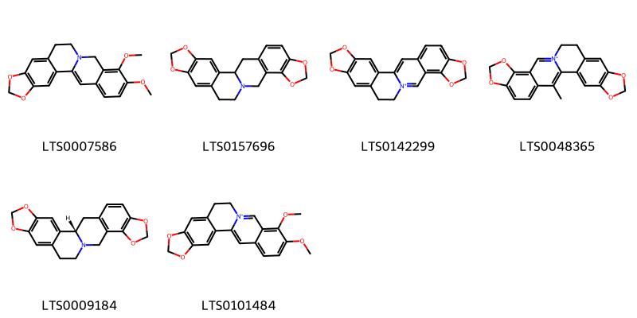{ width=100% }
    <figcaption>Hình ảnh cấu trúc hóa học của 6 hoạt chất thuộc nhóm Protoberberine alkaloids and derivatives gồm ['16,17-dimethoxy-5,7-dioxa-13-azapentacyclo[11.8.0.0²,¹⁰.0⁴,⁸.0¹⁵,²⁰]henicosa-1(21),2,4(8),9,15,17,19-heptaene (LTS0007586)', '5,7,17,19-tetraoxa-13-azahexacyclo[11.11.0.0²,¹⁰.0⁴,⁸.0¹⁵,²³.0¹⁶,²⁰]tetracosa-2,4(8),9,15(23),16(20),21-hexaene (LTS0157696)', '5,7,17,19-tetraoxa-13λ⁵-azahexacyclo[11.11.0.0²,¹⁰.0⁴,⁸.0¹⁵,²³.0¹⁶,²⁰]tetracosa-1(24),2,4(8),9,13,15,20,22-octaen-13-ylium (LTS0142299)', '24-methyl-5,7,17,19-tetraoxa-13λ⁵-azahexacyclo[11.11.0.0²,¹⁰.0⁴,⁸.0¹⁵,²³.0¹⁶,²⁰]tetracosa-1(24),2,4(8),9,13,15,20,22-octaen-13-ylium (LTS0048365)', 'stylopine (LTS0009184)', 'berberine (LTS0101484)'].</figcaption>
</figure>
#### Nhóm Protopine alkaloids
<figure markdown="span">
    { width=100% }
    <figcaption>Hình ảnh cấu trúc hóa học của 2 hoạt chất thuộc nhóm Protopine alkaloids gồm ['β-allocryptopine (LTS0174113)', 'protopine (LTS0080245)'].</figcaption>
</figure>
#### Nhóm Pyrans
<figure markdown="span">
    { width=100% }
    <figcaption>Hình ảnh cấu trúc hóa học của 1 hoạt chất thuộc nhóm Pyrans gồm ['chelidonic acid (LTS0084071)'].</figcaption>
</figure>
#### Nhóm Quinolines and derivatives
<figure markdown="span">
    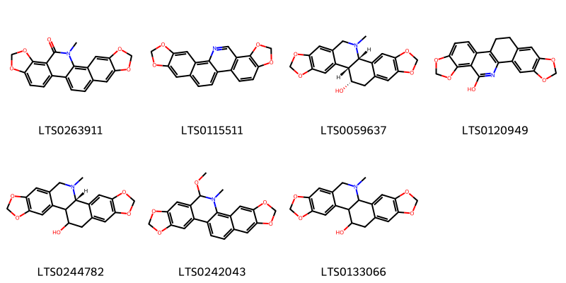{ width=100% }
    <figcaption>Hình ảnh cấu trúc hóa học của 7 hoạt chất thuộc nhóm Quinolines and derivatives gồm ['hydroxysanguinarine (LTS0263911)', '5,7,18,20-tetraoxa-24-azahexacyclo[11.11.0.0²,¹⁰.0⁴,⁸.0¹⁴,²².0¹⁷,²¹]tetracosa-1(13),2(10),3,8,11,14(22),15,17(21),23-nonaene (LTS0115511)', '(1r,13s,24s)-12-methyl-5,7,17,19-tetraoxa-12-azahexacyclo[11.11.0.0²,¹⁰.0⁴,⁸.0¹⁴,²².0¹⁶,²⁰]tetracosa-2,4(8),9,14,16(20),21-hexaen-24-ol (LTS0059637)', '5,7,18,20-tetraoxa-24-azahexacyclo[11.11.0.0²,¹⁰.0⁴,⁸.0¹⁴,²².0¹⁷,²¹]tetracosa-1(13),2,4(8),9,14,16,21,23-octaen-23-ol (LTS0120949)', '(13s)-12-methyl-5,7,17,19-tetraoxa-12-azahexacyclo[11.11.0.0²,¹⁰.0⁴,⁸.0¹⁴,²².0¹⁶,²⁰]tetracosa-2,4(8),9,14,16(20),21-hexaen-24-ol (LTS0244782)', '11-methoxy-12-methyl-5,7,17,19-tetraoxa-12-azahexacyclo[11.11.0.0²,¹⁰.0⁴,⁸.0¹⁴,²².0¹⁶,²⁰]tetracosa-1(13),2,4(8),9,14,16(20),21,23-octaene (LTS0242043)', '12-methyl-5,7,17,19-tetraoxa-12-azahexacyclo[11.11.0.0²,¹⁰.0⁴,⁸.0¹⁴,²².0¹⁶,²⁰]tetracosa-2,4(8),9,14,16(20),21-hexaen-24-ol (LTS0133066)'].</figcaption>
</figure>
#### Nhóm Tetrahydroisoquinolines
<figure markdown="span">
    { width=100% }
    <figcaption>Hình ảnh cấu trúc hóa học của 1 hoạt chất thuộc nhóm Tetrahydroisoquinolines gồm ['hydrastinine (LTS0215897)'].</figcaption>
</figure>

---

### Dược dân tộc học

Danh sách các quốc gia có sử dụng *Chelidonium majus* trong điều trị các bệnh. 

| Country   | Disease                                                               | Bệnh                                                                                                                                                                                                |
|:----------|:----------------------------------------------------------------------|:----------------------------------------------------------------------------------------------------------------------------------------------------------------------------------------------------|
| China     | Analgesic                                                             | MYMEMORY WARNING: YOU USED ALL AVAILABLE FREE TRANSLATIONS FOR TODAY. NEXT AVAILABLE IN  09 HOURS 38 MINUTES 13 SECONDS VISIT HTTPS://MYMEMORY.TRANSLATED.NET/DOC/USAGELIMITS.PHP TO TRANSLATE MORE |
| Elsewhere | Diaphoretic, Diuretic, Sedative, Purgative, Expectorant               | MYMEMORY WARNING: YOU USED ALL AVAILABLE FREE TRANSLATIONS FOR TODAY. NEXT AVAILABLE IN  09 HOURS 38 MINUTES 06 SECONDS VISIT HTTPS://MYMEMORY.TRANSLATED.NET/DOC/USAGELIMITS.PHP TO TRANSLATE MORE |
| Turkey    | Cholagogue, Narcotic, Poison, Sedative, Vermifuge, Diuretic, Laxative | MYMEMORY WARNING: YOU USED ALL AVAILABLE FREE TRANSLATIONS FOR TODAY. NEXT AVAILABLE IN  09 HOURS 38 MINUTES 01 SECONDS VISIT HTTPS://MYMEMORY.TRANSLATED.NET/DOC/USAGELIMITS.PHP TO TRANSLATE MORE |
| US        | Poison                                                                | MYMEMORY WARNING: YOU USED ALL AVAILABLE FREE TRANSLATIONS FOR TODAY. NEXT AVAILABLE IN  09 HOURS 37 MINUTES 58 SECONDS VISIT HTTPS://MYMEMORY.TRANSLATED.NET/DOC/USAGELIMITS.PHP TO TRANSLATE MORE |

---

# Chi Dicentra

??? note "Danh sách các dược liệu thuộc chi"
    
	 - *Dicentra canadensis*
	 - *Dicentra cucullaria*

---
## Dicentra canadensis
### Thông tin về thực vật

!!! info "Phân loại thực vật của *Dicentra canadensis* từ GIBF:"
    - **Kingdom:** Plantae
    - **Phylum:** Tracheophyta
    - **Order:** Ranunculales
    - **Family:** Papaveraceae
    - **Genus:** Dicentra
    - **Species:** *Dicentra canadensis*

 

| Label (VI)   | Label (EN)   | Scientific Name     | Descriptions (VI)   | Descriptions (EN)   | Also Known As (VI)   | Also Known As (EN)   |
|:-------------|:-------------|:--------------------|:--------------------|:--------------------|:---------------------|:---------------------|
| N/A          | N/A          | Dicentra canadensis | loài thực vật       | species of plant    | ['']                 | ['squirrel corn']    |

#### Phân bố trên thế giới

**Từ CSDL GIBF** nan, United States of America, Canada

#### Phân bố tại Việt Nam

**Từ CSDL GIBF**: Không có ghi nhận ở Việt Nam

---
### Thành phần hóa học
        
- Theo cơ sở dữ liệu lotus: Từ loài *Dicentra canadensis* đã phân lập và xác định được 7 hoạt chất thuộc về các nhóm Aporphines, Benzoxepines. 

|    | chemicalTaxonomyClassyfireClass   |   smiles_count |
|---:|:----------------------------------|---------------:|
|  0 | Aporphines                        |              2 |
|  1 | Benzoxepines                      |              5 |

#### Nhóm Aporphines
<figure markdown="span">
    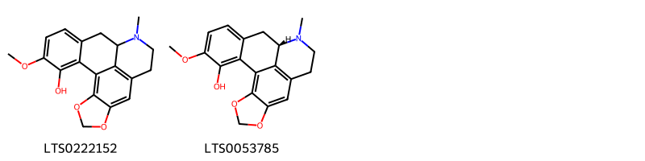{ width=100% }
    <figcaption>Hình ảnh cấu trúc hóa học của 2 hoạt chất thuộc nhóm Aporphines gồm ['bulbocapnine (LTS0222152)', '(12s)-17-methoxy-11-methyl-3,5-dioxa-11-azapentacyclo[10.7.1.0²,⁶.0⁸,²⁰.0¹⁴,¹⁹]icosa-1,6,8(20),14,16,18-hexaen-18-ol (LTS0053785)'].</figcaption>
</figure>
#### Nhóm Benzoxepines
<figure markdown="span">
    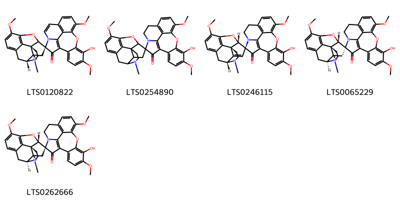{ width=100% }
    <figcaption>Hình ảnh cấu trúc hóa học của 5 hoạt chất thuộc nhóm Benzoxepines gồm ["(1r,2s,4s,13r)-14'-hydroxy-8,10',15'-trimethoxy-14-methyl-6,12'-dioxa-4',14-diazaspiro[pentacyclo[9.5.1.0¹,⁵.0²,¹³.0⁷,¹⁷]heptadecane-4,3'-pentacyclo[9.7.2.0⁴,¹⁹.0⁷,²⁰.0¹³,¹⁸]icosan]-1'(19'),5',7(17),7'(20'),8,8',10,10',13',15',17'-undecaen-2'-one (LTS0120822)", "14'-hydroxy-8,10',15'-trimethoxy-14-methyl-6,12'-dioxa-4',14-diazaspiro[pentacyclo[9.5.1.0¹,⁵.0²,¹³.0⁷,¹⁷]heptadecane-4,3'-pentacyclo[9.7.2.0⁴,¹⁹.0⁷,²⁰.0¹³,¹⁸]icosane]-1'(19'),7(17),7'(20'),8,8',10,10',13',15',17'-decaen-2'-one (LTS0254890)", "(1r,4s,5s,13r)-14'-hydroxy-8,10',15'-trimethoxy-14-methyl-6,12'-dioxa-4',14-diazaspiro[pentacyclo[9.5.1.0¹,⁵.0²,¹³.0⁷,¹⁷]heptadecane-4,3'-pentacyclo[9.7.2.0⁴,¹⁹.0⁷,²⁰.0¹³,¹⁸]icosan]-1'(19'),2,7(17),7'(20'),8,8',10,10',13',15',17'-undecaen-2'-one (LTS0246115)", "(1r,2s,4r,5s,13s)-14'-hydroxy-8,10',15'-trimethoxy-14-methyl-6,12'-dioxa-4',14-diazaspiro[pentacyclo[9.5.1.0¹,⁵.0²,¹³.0⁷,¹⁷]heptadecane-4,3'-pentacyclo[9.7.2.0⁴,¹⁹.0⁷,²⁰.0¹³,¹⁸]icosane]-1'(19'),7(17),7'(20'),8,8',10,10',13',15',17'-decaen-2'-one (LTS0065229)", "(1r,2s,4s,5s,13s)-14'-hydroxy-8,10',15'-trimethoxy-14-methyl-6,12'-dioxa-4',14-diazaspiro[pentacyclo[9.5.1.0¹,⁵.0²,¹³.0⁷,¹⁷]heptadecane-4,3'-pentacyclo[9.7.2.0⁴,¹⁹.0⁷,²⁰.0¹³,¹⁸]icosane]-1'(19'),7(17),7'(20'),8,8',10,10',13',15',17'-decaen-2'-one (LTS0262666)"].</figcaption>
</figure>

---

### Dược dân tộc học

Danh sách các quốc gia có sử dụng *Dicentra canadensis* trong điều trị các bệnh. 

| Country   | Disease         | Bệnh                                                                                                                                                                                                |
|:----------|:----------------|:----------------------------------------------------------------------------------------------------------------------------------------------------------------------------------------------------|
| Elsewhere | Diuretic, Tonic | MYMEMORY WARNING: YOU USED ALL AVAILABLE FREE TRANSLATIONS FOR TODAY. NEXT AVAILABLE IN  09 HOURS 37 MINUTES 25 SECONDS VISIT HTTPS://MYMEMORY.TRANSLATED.NET/DOC/USAGELIMITS.PHP TO TRANSLATE MORE |
| Turkey    | Diuretic, Tonic | MYMEMORY WARNING: YOU USED ALL AVAILABLE FREE TRANSLATIONS FOR TODAY. NEXT AVAILABLE IN  09 HOURS 37 MINUTES 20 SECONDS VISIT HTTPS://MYMEMORY.TRANSLATED.NET/DOC/USAGELIMITS.PHP TO TRANSLATE MORE |

---

---
## Dicentra cucullaria
### Thông tin về thực vật

!!! info "Phân loại thực vật của *Dicentra cucullaria* từ GIBF:"
    - **Kingdom:** Plantae
    - **Phylum:** Tracheophyta
    - **Order:** Ranunculales
    - **Family:** Papaveraceae
    - **Genus:** Dicentra
    - **Species:** *Dicentra cucullaria*

 

| Label (VI)   | Label (EN)   | Scientific Name     | Descriptions (VI)   | Descriptions (EN)   | Also Known As (VI)   | Also Known As (EN)   |
|:-------------|:-------------|:--------------------|:--------------------|:--------------------|:---------------------|:---------------------|
| N/A          | N/A          | Dicentra cucullaria | loài thực vật       | species of plant    | ['']                 | ['']                 |

#### Phân bố trên thế giới

**Từ CSDL GIBF** United States of America

#### Phân bố tại Việt Nam

**Từ CSDL GIBF**: Không có ghi nhận ở Việt Nam

---
### Thành phần hóa học
        
- Theo cơ sở dữ liệu lotus: Từ loài *Dicentra cucullaria* đã phân lập và xác định được 3 hoạt chất thuộc về các nhóm Cularin alkaloids and derivatives, Phthalide isoquinolines. 

|    | chemicalTaxonomyClassyfireClass   |   smiles_count |
|---:|:----------------------------------|---------------:|
|  0 | Cularin alkaloids and derivatives |              1 |
|  1 | Phthalide isoquinolines           |              2 |

#### Nhóm Cularin alkaloids and derivatives
<figure markdown="span">
    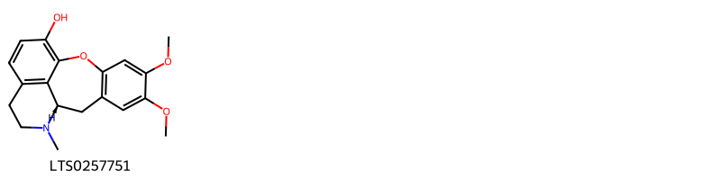{ width=100% }
    <figcaption>Hình ảnh cấu trúc hóa học của 1 hoạt chất thuộc nhóm Cularin alkaloids and derivatives gồm ['(10s)-5,6-dimethoxy-11-methyl-2-oxa-11-azatetracyclo[8.7.1.0³,⁸.0¹⁴,¹⁸]octadeca-1(17),3(8),4,6,14(18),15-hexaen-17-ol (LTS0257751)'].</figcaption>
</figure>
#### Nhóm Phthalide isoquinolines
<figure markdown="span">
    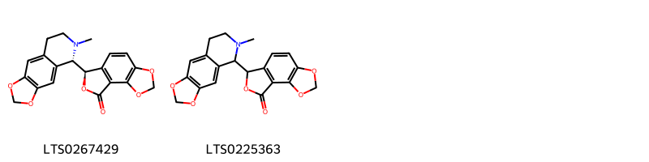{ width=100% }
    <figcaption>Hình ảnh cấu trúc hóa học của 2 hoạt chất thuộc nhóm Phthalide isoquinolines gồm ['bicuculline (LTS0267429)', 'bicuculline (LTS0225363)'].</figcaption>
</figure>

---

### Dược dân tộc học

Danh sách các quốc gia có sử dụng *Dicentra cucullaria* trong điều trị các bệnh. 

| Country   | Disease   | Bệnh                                                                                                                                                                                                |
|:----------|:----------|:----------------------------------------------------------------------------------------------------------------------------------------------------------------------------------------------------|
| Elsewhere | Tonic     | MYMEMORY WARNING: YOU USED ALL AVAILABLE FREE TRANSLATIONS FOR TODAY. NEXT AVAILABLE IN  09 HOURS 36 MINUTES 34 SECONDS VISIT HTTPS://MYMEMORY.TRANSLATED.NET/DOC/USAGELIMITS.PHP TO TRANSLATE MORE |

---

# Chi Fumaria

??? note "Danh sách các dược liệu thuộc chi"
    
	 - *Fumaria officinalis*
	 - *Fumaria parviflora*
	 - *Fumaria vaillantii*

---
## Fumaria officinalis
### Thông tin về thực vật

!!! info "Phân loại thực vật của *Fumaria officinalis* từ GIBF:"
    - **Kingdom:** Plantae
    - **Phylum:** Tracheophyta
    - **Order:** Ranunculales
    - **Family:** Papaveraceae
    - **Genus:** Fumaria
    - **Species:** *Fumaria officinalis*

 

| Label (VI)   | Label (EN)   | Scientific Name     | Descriptions (VI)   | Descriptions (EN)   | Also Known As (VI)   | Also Known As (EN)   |
|:-------------|:-------------|:--------------------|:--------------------|:--------------------|:---------------------|:---------------------|
| N/A          | N/A          | Fumaria officinalis | loài thực vật       | species of plant    | ['']                 | ['Common Fumitory']  |

#### Phân bố trên thế giới

**Từ CSDL GIBF** Czechia, New Zealand, Türkiye, Spain, Netherlands, United States of America, Greece, Iran (Islamic Republic of), Croatia, Cyprus, Algeria, France, Chinese Taipei, North Macedonia, Germany, Syrian Arab Republic, Austria, Hungary, Portugal, Ukraine, Italy, Switzerland, Serbia

#### Phân bố tại Việt Nam

**Từ CSDL GIBF**: Không có ghi nhận ở Việt Nam

---
### Thành phần hóa học
        
- Theo cơ sở dữ liệu lotus: Từ loài *Fumaria officinalis* đã phân lập và xác định được 52 hoạt chất thuộc về các nhóm Aporphines, Benzene and substituted derivatives, Flavonoids, Protopine alkaloids, Carboxylic acids and derivatives, Phthalide isoquinolines, Cinnamic acids and derivatives, Benzazepines, Tetrahydroisoquinolines, Protoberberine alkaloids and derivatives, Hydroxy acids and derivatives, Indenes and isoindenes, Organooxygen compounds, Isoquinolines and derivatives, Indanes, Stilbenes. 

|    | chemicalTaxonomyClassyfireClass          |   smiles_count |
|---:|:-----------------------------------------|---------------:|
|  0 | Aporphines                               |              2 |
|  1 | Benzazepines                             |              2 |
|  2 | Benzene and substituted derivatives      |              2 |
|  3 | Carboxylic acids and derivatives         |              1 |
|  4 | Cinnamic acids and derivatives           |              3 |
|  5 | Flavonoids                               |              2 |
|  6 | Hydroxy acids and derivatives            |              1 |
|  7 | Indanes                                  |              5 |
|  8 | Indenes and isoindenes                   |              1 |
|  9 | Isoquinolines and derivatives            |              1 |
| 10 | Organooxygen compounds                   |              1 |
| 11 | Phthalide isoquinolines                  |              5 |
| 12 | Protoberberine alkaloids and derivatives |              9 |
| 13 | Protopine alkaloids                      |              2 |
| 14 | Stilbenes                                |              1 |
| 15 | Tetrahydroisoquinolines                  |             14 |

#### Nhóm Aporphines
<figure markdown="span">
    { width=100% }
    <figcaption>Hình ảnh cấu trúc hóa học của 2 hoạt chất thuộc nhóm Aporphines gồm ['4,15-dimethoxy-10-methyl-10-azatetracyclo[7.7.1.0²,⁷.0¹³,¹⁷]heptadeca-1(16),2,4,6,13(17),14-hexaene-3,16-diol (LTS0095715)', '(9s)-4,15-dimethoxy-10-methyl-10-azatetracyclo[7.7.1.0²,⁷.0¹³,¹⁷]heptadeca-1(16),2,4,6,13(17),14-hexaene-3,16-diol (LTS0022981)'].</figcaption>
</figure>
#### Nhóm Benzazepines
<figure markdown="span">
    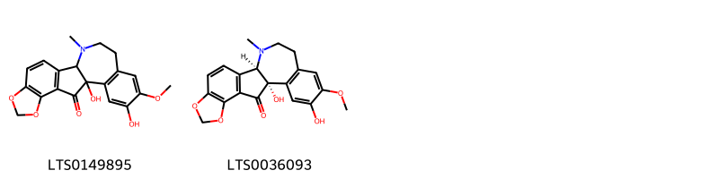{ width=100% }
    <figcaption>Hình ảnh cấu trúc hóa học của 2 hoạt chất thuộc nhóm Benzazepines gồm ['12,15-dihydroxy-16-methoxy-21-methyl-6,8-dioxa-21-azapentacyclo[10.9.0.0²,¹⁰.0⁵,⁹.0¹³,¹⁸]henicosa-2(10),3,5(9),13(18),14,16-hexaen-11-one (LTS0149895)', '(1r,12s)-12,15-dihydroxy-16-methoxy-21-methyl-6,8-dioxa-21-azapentacyclo[10.9.0.0²,¹⁰.0⁵,⁹.0¹³,¹⁸]henicosa-2(10),3,5(9),13(18),14,16-hexaen-11-one (LTS0036093)'].</figcaption>
</figure>
#### Nhóm Benzene and substituted derivatives
<figure markdown="span">
    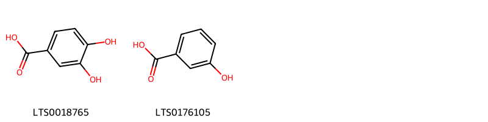{ width=100% }
    <figcaption>Hình ảnh cấu trúc hóa học của 2 hoạt chất thuộc nhóm Benzene and substituted derivatives gồm ['3,4-dihydroxybenzoic acid (LTS0018765)', '3-hydroxybenzoic acid (LTS0176105)'].</figcaption>
</figure>
#### Nhóm Carboxylic acids and derivatives
<figure markdown="span">
    { width=100% }
    <figcaption>Hình ảnh cấu trúc hóa học của 1 hoạt chất thuộc nhóm Carboxylic acids and derivatives gồm ['fumaric acid (LTS0114831)'].</figcaption>
</figure>
#### Nhóm Cinnamic acids and derivatives
<figure markdown="span">
    { width=100% }
    <figcaption>Hình ảnh cấu trúc hóa học của 3 hoạt chất thuộc nhóm Cinnamic acids and derivatives gồm ['3,4-dihydroxycinnamic acid (LTS0128050)', 'para-coumaric acid (LTS0266252)', 'ferulic acid (LTS0077328)'].</figcaption>
</figure>
#### Nhóm Flavonoids
<figure markdown="span">
    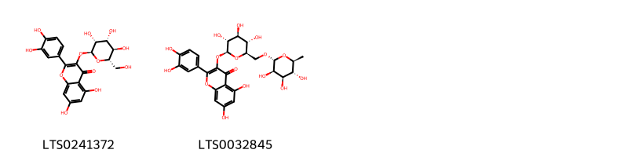{ width=100% }
    <figcaption>Hình ảnh cấu trúc hóa học của 2 hoạt chất thuộc nhóm Flavonoids gồm ['2-(3,4-dihydroxyphenyl)-5,7-dihydroxy-3-{[(2s,3r,4r,5r,6s)-3,4,5-trihydroxy-6-(hydroxymethyl)oxan-2-yl]oxy}chromen-4-one (LTS0241372)', '3-rutinosyl quercetin (LTS0032845)'].</figcaption>
</figure>
#### Nhóm Hydroxy acids and derivatives
<figure markdown="span">
    { width=100% }
    <figcaption>Hình ảnh cấu trúc hóa học của 1 hoạt chất thuộc nhóm Hydroxy acids and derivatives gồm ['malic acid (LTS0216520)'].</figcaption>
</figure>
#### Nhóm Indanes
<figure markdown="span">
    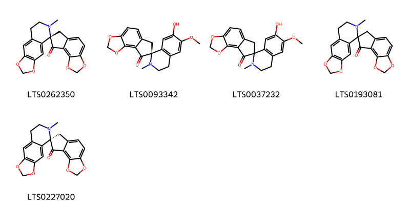{ width=100% }
    <figcaption>Hình ảnh cấu trúc hóa học của 5 hoạt chất thuộc nhóm Indanes gồm ["(5s)-6-methyl-2',6',7,8-tetrahydro-2h-spiro[[1,3]dioxolo[4,5-g]isoquinoline-5,7'-indeno[4,5-d][1,3]dioxol]-8'-one (LTS0262350)", 'parfumine (LTS0093342)', "7'-hydroxy-6'-methoxy-2'-methyl-2,3',4',6-tetrahydrospiro[indeno[4,5-d][1,3]dioxole-7,1'-isoquinolin]-8-one (LTS0037232)", "6-methyl-2',6',7,8-tetrahydro-2h-spiro[[1,3]dioxolo[4,5-g]isoquinoline-5,7'-indeno[4,5-d][1,3]dioxol]-8'-one (LTS0193081)", "(5r)-6-methyl-2',6',7,8-tetrahydro-2h-spiro[[1,3]dioxolo[4,5-g]isoquinoline-5,7'-indeno[4,5-d][1,3]dioxol]-8'-one (LTS0227020)"].</figcaption>
</figure>
#### Nhóm Indenes and isoindenes
<figure markdown="span">
    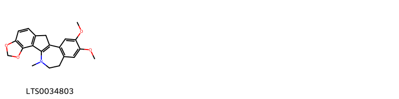{ width=100% }
    <figcaption>Hình ảnh cấu trúc hóa học của 1 hoạt chất thuộc nhóm Indenes and isoindenes gồm ['15,16-dimethoxy-21-methyl-4,6-dioxa-21-azapentacyclo[10.9.0.0²,¹⁰.0³,⁷.0¹³,¹⁸]henicosa-1(12),2(10),3(7),8,13(18),14,16-heptaene (LTS0034803)'].</figcaption>
</figure>
#### Nhóm Isoquinolines and derivatives
<figure markdown="span">
    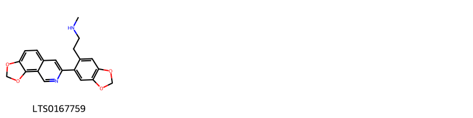{ width=100% }
    <figcaption>Hình ảnh cấu trúc hóa học của 1 hoạt chất thuộc nhóm Isoquinolines and derivatives gồm ['[2-(6-{2h-[1,3]dioxolo[4,5-h]isoquinolin-7-yl}-2h-1,3-benzodioxol-5-yl)ethyl](methyl)amine (LTS0167759)'].</figcaption>
</figure>
#### Nhóm Organooxygen compounds
<figure markdown="span">
    { width=100% }
    <figcaption>Hình ảnh cấu trúc hóa học của 1 hoạt chất thuộc nhóm Organooxygen compounds gồm ['chlorogenic acid (LTS0226495)'].</figcaption>
</figure>
#### Nhóm Phthalide isoquinolines
<figure markdown="span">
    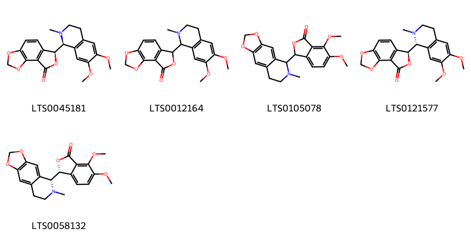{ width=100% }
    <figcaption>Hình ảnh cấu trúc hóa học của 5 hoạt chất thuộc nhóm Phthalide isoquinolines gồm ['(+)-adlumine (LTS0045181)', '10-(6,7-dimethoxy-2-methyl-3,4-dihydro-1h-isoquinolin-1-yl)-3,5,11-trioxatricyclo[7.3.0.0²,⁶]dodeca-1(9),2(6),7-trien-12-one (LTS0012164)', 'hydrastine (LTS0105078)', '(10s)-10-[(1r)-6,7-dimethoxy-2-methyl-3,4-dihydro-1h-isoquinolin-1-yl]-3,5,11-trioxatricyclo[7.3.0.0²,⁶]dodeca-1(9),2(6),7-trien-12-one (LTS0121577)', '(-)-α-hydrastine (LTS0058132)'].</figcaption>
</figure>
#### Nhóm Protoberberine alkaloids and derivatives
<figure markdown="span">
    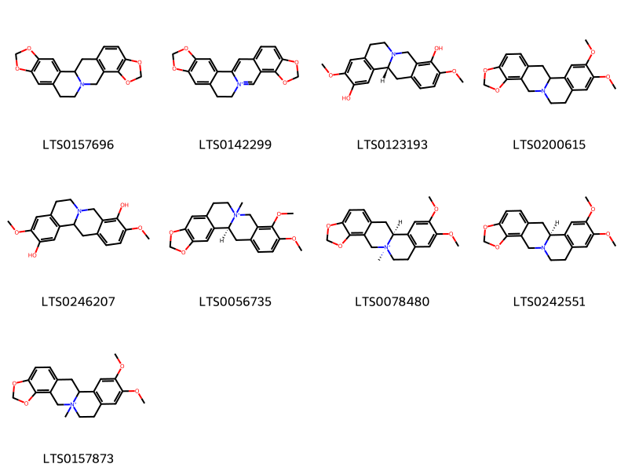{ width=100% }
    <figcaption>Hình ảnh cấu trúc hóa học của 9 hoạt chất thuộc nhóm Protoberberine alkaloids and derivatives gồm ['5,7,17,19-tetraoxa-13-azahexacyclo[11.11.0.0²,¹⁰.0⁴,⁸.0¹⁵,²³.0¹⁶,²⁰]tetracosa-2,4(8),9,15(23),16(20),21-hexaene (LTS0157696)', '5,7,17,19-tetraoxa-13λ⁵-azahexacyclo[11.11.0.0²,¹⁰.0⁴,⁸.0¹⁵,²³.0¹⁶,²⁰]tetracosa-1(24),2,4(8),9,13,15,20,22-octaen-13-ylium (LTS0142299)', '(12br)-3,10-dimethoxy-7,8,12b,13-tetrahydro-5h-6-azatetraphene-4,11-diol (LTS0123193)', 'sinactine (LTS0200615)', '(s)-scoulerine (LTS0246207)', '(s)-n-methylcanadine (LTS0056735)', '(1s,13s)-16,17-dimethoxy-1-methyl-5,7-dioxa-1-azapentacyclo[11.8.0.0³,¹¹.0⁴,⁸.0¹⁴,¹⁹]henicosa-3,8,10,14(19),15,17-hexaen-1-ium (LTS0078480)', '(13s)-16,17-dimethoxy-5,7-dioxa-1-azapentacyclo[11.8.0.0³,¹¹.0⁴,⁸.0¹⁴,¹⁹]henicosa-3,8,10,14(19),15,17-hexaene (LTS0242551)', '16,17-dimethoxy-1-methyl-5,7-dioxa-1-azapentacyclo[11.8.0.0³,¹¹.0⁴,⁸.0¹⁴,¹⁹]henicosa-3,8,10,14(19),15,17-hexaen-1-ium (LTS0157873)'].</figcaption>
</figure>
#### Nhóm Protopine alkaloids
<figure markdown="span">
    { width=100% }
    <figcaption>Hình ảnh cấu trúc hóa học của 2 hoạt chất thuộc nhóm Protopine alkaloids gồm ['protopine (LTS0080245)', 'cryptopine (LTS0256990)'].</figcaption>
</figure>
#### Nhóm Stilbenes
<figure markdown="span">
    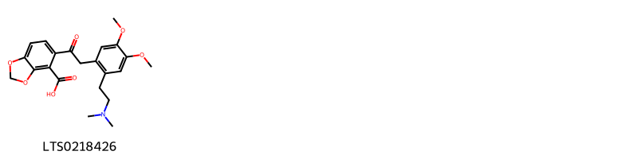{ width=100% }
    <figcaption>Hình ảnh cấu trúc hóa học của 1 hoạt chất thuộc nhóm Stilbenes gồm ['5-(2-{2-[2-(dimethylamino)ethyl]-4,5-dimethoxyphenyl}acetyl)-2h-1,3-benzodioxole-4-carboxylic acid (LTS0218426)'].</figcaption>
</figure>
#### Nhóm Tetrahydroisoquinolines
<figure markdown="span">
    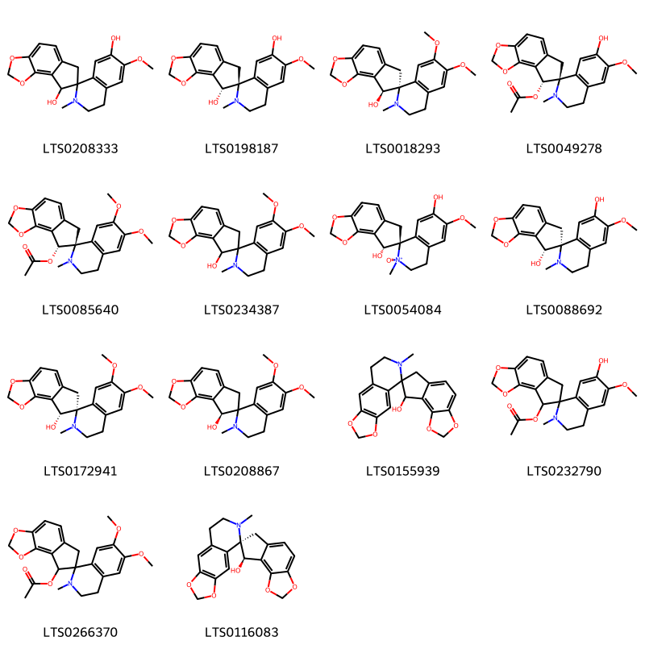{ width=100% }
    <figcaption>Hình ảnh cấu trúc hóa học của 14 hoạt chất thuộc nhóm Tetrahydroisoquinolines gồm ["6'-methoxy-2'-methyl-3',4',6,8-tetrahydro-2h-spiro[indeno[4,5-d][1,3]dioxole-7,1'-isoquinoline]-7',8-diol (LTS0208333)", "(7s,8r)-6'-methoxy-2'-methyl-3',4',6,8-tetrahydro-2h-spiro[indeno[4,5-d][1,3]dioxole-7,1'-isoquinoline]-7',8-diol (LTS0198187)", 'fumaricine (LTS0018293)', "(7s,8r)-7'-hydroxy-6'-methoxy-2'-methyl-3',4',6,8-tetrahydro-2h-spiro[indeno[4,5-d][1,3]dioxole-7,1'-isoquinolin]-8-yl acetate (LTS0049278)", "(7s,8r)-6',7'-dimethoxy-2'-methyl-3',4',6,8-tetrahydro-2h-spiro[indeno[4,5-d][1,3]dioxole-7,1'-isoquinolin]-8-yl acetate (LTS0085640)", "6',7'-dimethoxy-2'-methyl-3',4',6,8-tetrahydro-2h-spiro[indeno[4,5-d][1,3]dioxole-7,1'-isoquinolin]-8-ol (LTS0234387)", "(7s,8r)-7',8-dihydroxy-6'-methoxy-2'-methyl-3',4',6,8-tetrahydro-2h-spiro[indeno[4,5-d][1,3]dioxole-7,1'-isoquinolin]-2'-ium-2'-olate (LTS0054084)", "(7r,8r)-6'-methoxy-2'-methyl-3',4',6,8-tetrahydro-2h-spiro[indeno[4,5-d][1,3]dioxole-7,1'-isoquinoline]-7',8-diol (LTS0088692)", "(7r,8r)-6',7'-dimethoxy-2'-methyl-3',4',6,8-tetrahydro-2h-spiro[indeno[4,5-d][1,3]dioxole-7,1'-isoquinolin]-8-ol (LTS0172941)", "(8s)-6',7'-dimethoxy-2'-methyl-3',4',6,8-tetrahydro-2h-spiro[indeno[4,5-d][1,3]dioxole-7,1'-isoquinolin]-8-ol (LTS0208867)", "6-methyl-6',7,8,8'-tetrahydro-2h,2'h-spiro[[1,3]dioxolo[4,5-g]isoquinoline-5,7'-indeno[4,5-d][1,3]dioxol]-8'-ol (LTS0155939)", "7'-hydroxy-6'-methoxy-2'-methyl-3',4',6,8-tetrahydro-2h-spiro[indeno[4,5-d][1,3]dioxole-7,1'-isoquinolin]-8-yl acetate (LTS0232790)", "6',7'-dimethoxy-2'-methyl-3',4',6,8-tetrahydro-2h-spiro[indeno[4,5-d][1,3]dioxole-7,1'-isoquinolin]-8-yl acetate (LTS0266370)", "(5r,8'r)-6-methyl-6',7,8,8'-tetrahydro-2h,2'h-spiro[[1,3]dioxolo[4,5-g]isoquinoline-5,7'-indeno[4,5-d][1,3]dioxol]-8'-ol (LTS0116083)"].</figcaption>
</figure>

---

### Dược dân tộc học

Danh sách các quốc gia có sử dụng *Fumaria officinalis* trong điều trị các bệnh. 

| Country   | Disease                                                                                    | Bệnh                                                                                                                                                                                                |
|:----------|:-------------------------------------------------------------------------------------------|:----------------------------------------------------------------------------------------------------------------------------------------------------------------------------------------------------|
| Elsewhere | Laxative, Tonic                                                                            | MYMEMORY WARNING: YOU USED ALL AVAILABLE FREE TRANSLATIONS FOR TODAY. NEXT AVAILABLE IN  09 HOURS 36 MINUTES 00 SECONDS VISIT HTTPS://MYMEMORY.TRANSLATED.NET/DOC/USAGELIMITS.PHP TO TRANSLATE MORE |
| France    | Aperient                                                                                   | MYMEMORY WARNING: YOU USED ALL AVAILABLE FREE TRANSLATIONS FOR TODAY. NEXT AVAILABLE IN  09 HOURS 35 MINUTES 58 SECONDS VISIT HTTPS://MYMEMORY.TRANSLATED.NET/DOC/USAGELIMITS.PHP TO TRANSLATE MORE |
| Iraq      | Cholagogue                                                                                 | MYMEMORY WARNING: YOU USED ALL AVAILABLE FREE TRANSLATIONS FOR TODAY. NEXT AVAILABLE IN  09 HOURS 35 MINUTES 55 SECONDS VISIT HTTPS://MYMEMORY.TRANSLATED.NET/DOC/USAGELIMITS.PHP TO TRANSLATE MORE |
| Turkey    | Cholagogue, Diuretic, Laxative, Stomachic, Tonic, Aperient, Sedative, Sudorific, Vermifuge | MYMEMORY WARNING: YOU USED ALL AVAILABLE FREE TRANSLATIONS FOR TODAY. NEXT AVAILABLE IN  09 HOURS 35 MINUTES 53 SECONDS VISIT HTTPS://MYMEMORY.TRANSLATED.NET/DOC/USAGELIMITS.PHP TO TRANSLATE MORE |

---

---
## Fumaria parviflora
### Thông tin về thực vật

!!! info "Phân loại thực vật của *Fumaria parviflora* từ GIBF:"
    - **Kingdom:** Plantae
    - **Phylum:** Tracheophyta
    - **Order:** Ranunculales
    - **Family:** Papaveraceae
    - **Genus:** Fumaria
    - **Species:** *Fumaria parviflora*

 

| Label (VI)   | Label (EN)   | Scientific Name    | Descriptions (VI)   | Descriptions (EN)   | Also Known As (VI)   | Also Known As (EN)   |
|:-------------|:-------------|:-------------------|:--------------------|:--------------------|:---------------------|:---------------------|
| N/A          | N/A          | Fumaria parviflora | loài thực vật       | species of plant    | ['']                 | ['']                 |

#### Phân bố trên thế giới

**Từ CSDL GIBF** Malta, Israel, Chile, Kazakhstan, Türkiye, Slovenia, Spain, Denmark, Netherlands, United States of America, Greece, Croatia, Cyprus, Mexico, Algeria, France, Palestine, State of, Iraq, Portugal, Ukraine, Italy, United Kingdom of Great Britain and Northern Ireland

#### Phân bố tại Việt Nam

**Từ CSDL GIBF**: Không có ghi nhận ở Việt Nam

---
### Thành phần hóa học
        
- Theo cơ sở dữ liệu lotus: Từ loài *Fumaria parviflora* đã phân lập và xác định được 68 hoạt chất thuộc về các nhóm Rhoeadine alkaloids, Carboxylic acids and derivatives, Tetrahydroisoquinolines, Organooxygen compounds, Isocoumarans, Quinolines and derivatives, Protopine alkaloids, Phthalide isoquinolines, Indanes, Stilbenes, Benzophenanthridine alkaloids, Aporphines, Benzene and substituted derivatives, Cinnamic acids and derivatives, Protoberberine alkaloids and derivatives, Hydroxy acids and derivatives, Organonitrogen compounds, Benzodioxoles, Isoindoles and derivatives, Isoquinolines and derivatives. 

|    | chemicalTaxonomyClassyfireClass          |   smiles_count |
|---:|:-----------------------------------------|---------------:|
|  0 | Aporphines                               |              2 |
|  1 | Benzene and substituted derivatives      |              2 |
|  2 | Benzodioxoles                            |              1 |
|  3 | Benzophenanthridine alkaloids            |              4 |
|  4 | Carboxylic acids and derivatives         |              1 |
|  5 | Cinnamic acids and derivatives           |              4 |
|  6 | Hydroxy acids and derivatives            |              1 |
|  7 | Indanes                                  |              3 |
|  8 | Isocoumarans                             |              2 |
|  9 | Isoindoles and derivatives               |              3 |
| 10 | Isoquinolines and derivatives            |              6 |
| 11 | Organonitrogen compounds                 |              1 |
| 12 | Organooxygen compounds                   |              1 |
| 13 | Phthalide isoquinolines                  |             13 |
| 14 | Protoberberine alkaloids and derivatives |             11 |
| 15 | Protopine alkaloids                      |              2 |
| 16 | Quinolines and derivatives               |              1 |
| 17 | Rhoeadine alkaloids                      |              2 |
| 18 | Stilbenes                                |              2 |
| 19 | Tetrahydroisoquinolines                  |              6 |

#### Nhóm Aporphines
<figure markdown="span">
    { width=100% }
    <figcaption>Hình ảnh cấu trúc hóa học của 2 hoạt chất thuộc nhóm Aporphines gồm ['(9s)-4,15-dimethoxy-10-methyl-10-azatetracyclo[7.7.1.0²,⁷.0¹³,¹⁷]heptadeca-1(16),2(7),3,5,13(17),14-hexaene-5,16-diol (LTS0035776)', '4,15-dimethoxy-10-methyl-10-azatetracyclo[7.7.1.0²,⁷.0¹³,¹⁷]heptadeca-1(16),2(7),3,5,13(17),14-hexaene-5,16-diol (LTS0047959)'].</figcaption>
</figure>
#### Nhóm Benzene and substituted derivatives
<figure markdown="span">
    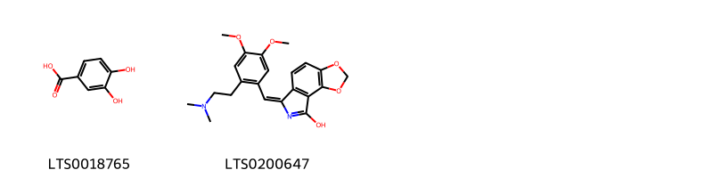{ width=100% }
    <figcaption>Hình ảnh cấu trúc hóa học của 2 hoạt chất thuộc nhóm Benzene and substituted derivatives gồm ['3,4-dihydroxybenzoic acid (LTS0018765)', '(6e)-6-({2-[2-(dimethylamino)ethyl]-4,5-dimethoxyphenyl}methylidene)-2h-[1,3]dioxolo[4,5-e]isoindol-8-ol (LTS0200647)'].</figcaption>
</figure>
#### Nhóm Benzodioxoles
<figure markdown="span">
    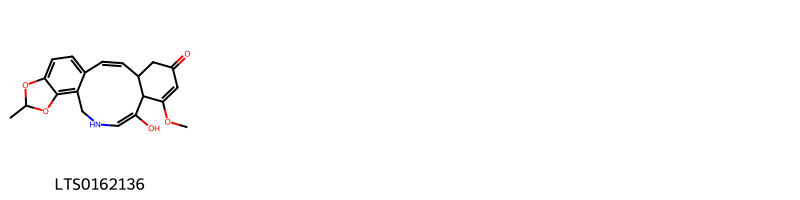{ width=100% }
    <figcaption>Hình ảnh cấu trúc hóa học của 1 hoạt chất thuộc nhóm Benzodioxoles gồm ['(2z,10e)-10-hydroxy-8-methoxy-17-methyl-16,18-dioxa-12-azatetracyclo[12.7.0.0⁴,⁹.0¹⁵,¹⁹]henicosa-1(21),2,7,10,14,19-hexaen-6-one (LTS0162136)'].</figcaption>
</figure>
#### Nhóm Benzophenanthridine alkaloids
<figure markdown="span">
    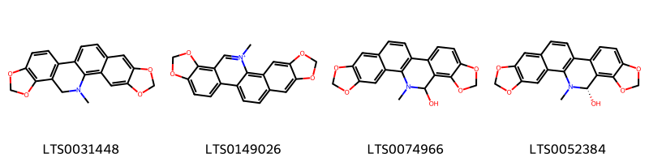{ width=100% }
    <figcaption>Hình ảnh cấu trúc hóa học của 4 hoạt chất thuộc nhóm Benzophenanthridine alkaloids gồm ['dihydrosanguinarine (LTS0031448)', 'sanguinarine (LTS0149026)', '24-methyl-5,7,18,20-tetraoxa-24-azahexacyclo[11.11.0.0²,¹⁰.0⁴,⁸.0¹⁴,²².0¹⁷,²¹]tetracosa-1(13),2,4(8),9,11,14,16,21-octaen-23-ol (LTS0074966)', '(23s)-24-methyl-5,7,18,20-tetraoxa-24-azahexacyclo[11.11.0.0²,¹⁰.0⁴,⁸.0¹⁴,²².0¹⁷,²¹]tetracosa-1(13),2,4(8),9,11,14,16,21-octaen-23-ol (LTS0052384)'].</figcaption>
</figure>
#### Nhóm Carboxylic acids and derivatives
<figure markdown="span">
    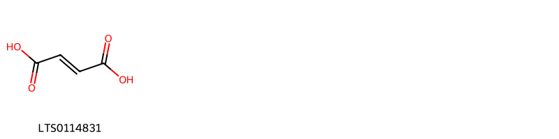{ width=100% }
    <figcaption>Hình ảnh cấu trúc hóa học của 1 hoạt chất thuộc nhóm Carboxylic acids and derivatives gồm ['fumaric acid (LTS0114831)'].</figcaption>
</figure>
#### Nhóm Cinnamic acids and derivatives
<figure markdown="span">
    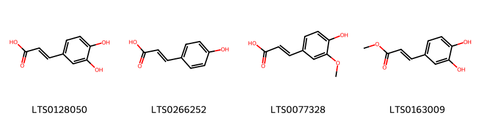{ width=100% }
    <figcaption>Hình ảnh cấu trúc hóa học của 4 hoạt chất thuộc nhóm Cinnamic acids and derivatives gồm ['3,4-dihydroxycinnamic acid (LTS0128050)', 'para-coumaric acid (LTS0266252)', 'ferulic acid (LTS0077328)', 'methyl caffeate (LTS0163009)'].</figcaption>
</figure>
#### Nhóm Hydroxy acids and derivatives
<figure markdown="span">
    { width=100% }
    <figcaption>Hình ảnh cấu trúc hóa học của 1 hoạt chất thuộc nhóm Hydroxy acids and derivatives gồm ['malic acid (LTS0216520)'].</figcaption>
</figure>
#### Nhóm Indanes
<figure markdown="span">
    { width=100% }
    <figcaption>Hình ảnh cấu trúc hóa học của 3 hoạt chất thuộc nhóm Indanes gồm ["(5s)-6-methyl-2',6',7,8-tetrahydro-2h-spiro[[1,3]dioxolo[4,5-g]isoquinoline-5,7'-indeno[4,5-d][1,3]dioxol]-8'-one (LTS0262350)", 'parfumine (LTS0093342)', "7'-hydroxy-6'-methoxy-2'-methyl-2,3',4',6-tetrahydrospiro[indeno[4,5-d][1,3]dioxole-7,1'-isoquinolin]-8-one (LTS0037232)"].</figcaption>
</figure>
#### Nhóm Isocoumarans
<figure markdown="span">
    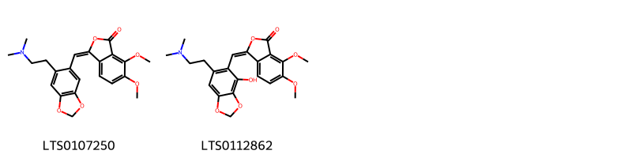{ width=100% }
    <figcaption>Hình ảnh cấu trúc hóa học của 2 hoạt chất thuộc nhóm Isocoumarans gồm ['(3e)-3-({6-[2-(dimethylamino)ethyl]-2h-1,3-benzodioxol-5-yl}methylidene)-6,7-dimethoxy-2-benzofuran-1-one (LTS0107250)', '(3e)-3-({6-[2-(dimethylamino)ethyl]-4-hydroxy-2h-1,3-benzodioxol-5-yl}methylidene)-6,7-dimethoxy-2-benzofuran-1-one (LTS0112862)'].</figcaption>
</figure>
#### Nhóm Isoindoles and derivatives
<figure markdown="span">
    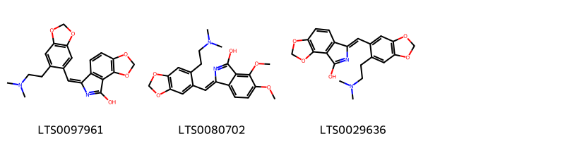{ width=100% }
    <figcaption>Hình ảnh cấu trúc hóa học của 3 hoạt chất thuộc nhóm Isoindoles and derivatives gồm ['(6e)-6-({6-[2-(dimethylamino)ethyl]-2h-1,3-benzodioxol-5-yl}methylidene)-2h-[1,3]dioxolo[4,5-e]isoindol-8-ol (LTS0097961)', '(3z)-3-({6-[2-(dimethylamino)ethyl]-2h-1,3-benzodioxol-5-yl}methylidene)-6,7-dimethoxyisoindol-1-ol (LTS0080702)', '(6z)-6-({6-[2-(dimethylamino)ethyl]-2h-1,3-benzodioxol-5-yl}methylidene)-2h-[1,3]dioxolo[4,5-e]isoindol-8-ol (LTS0029636)'].</figcaption>
</figure>
#### Nhóm Isoquinolines and derivatives
<figure markdown="span">
    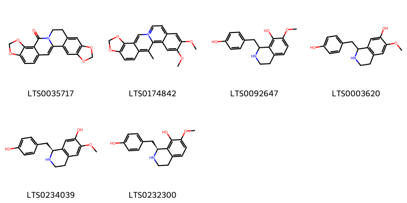{ width=100% }
    <figcaption>Hình ảnh cấu trúc hóa học của 6 hoạt chất thuộc nhóm Isoquinolines and derivatives gồm ['5,7,17,19-tetraoxa-13-azahexacyclo[11.11.0.0²,¹⁰.0⁴,⁸.0¹⁵,²³.0¹⁶,²⁰]tetracosa-1(24),2,4(8),9,15,20,22-heptaen-14-one (LTS0035717)', '16,17-dimethoxy-12-methyl-5,7-dioxa-1λ⁵-azapentacyclo[11.8.0.0³,¹¹.0⁴,⁸.0¹⁴,¹⁹]henicosa-1(13),2,4(8),9,11,14(19),15,17,20-nonaen-1-ylium (LTS0174842)', '1-[(4-hydroxyphenyl)methyl]-7-methoxy-1,2,3,4-tetrahydroisoquinolin-8-ol (LTS0092647)', '(rs)-coclaurine (LTS0003620)', '(+-)-coclaurine (LTS0234039)', '(1s)-1-[(4-hydroxyphenyl)methyl]-7-methoxy-1,2,3,4-tetrahydroisoquinolin-8-ol (LTS0232300)'].</figcaption>
</figure>
#### Nhóm Organonitrogen compounds
<figure markdown="span">
    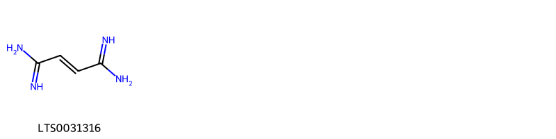{ width=100% }
    <figcaption>Hình ảnh cấu trúc hóa học của 1 hoạt chất thuộc nhóm Organonitrogen compounds gồm ['(2e)-but-2-enebis(imidamide) (LTS0031316)'].</figcaption>
</figure>
#### Nhóm Organooxygen compounds
<figure markdown="span">
    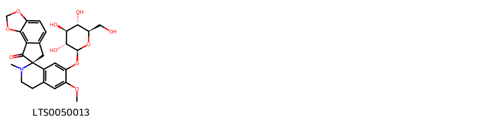{ width=100% }
    <figcaption>Hình ảnh cấu trúc hóa học của 1 hoạt chất thuộc nhóm Organooxygen compounds gồm ["(7s)-6'-methoxy-2'-methyl-7'-{[(2s,3r,4s,5s,6r)-3,4,5-trihydroxy-6-(hydroxymethyl)oxan-2-yl]oxy}-2,3',4',6-tetrahydrospiro[indeno[4,5-d][1,3]dioxole-7,1'-isoquinolin]-8-one (LTS0050013)"].</figcaption>
</figure>
#### Nhóm Phthalide isoquinolines
<figure markdown="span">
    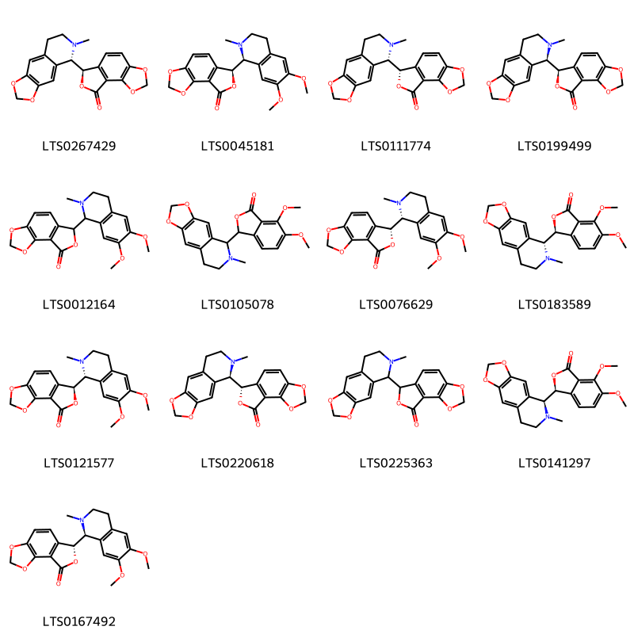{ width=100% }
    <figcaption>Hình ảnh cấu trúc hóa học của 13 hoạt chất thuộc nhóm Phthalide isoquinolines gồm ['bicuculline (LTS0267429)', '(+)-adlumine (LTS0045181)', 'adlumidine (LTS0111774)', '(-)-adlumidine (LTS0199499)', '10-(6,7-dimethoxy-2-methyl-3,4-dihydro-1h-isoquinolin-1-yl)-3,5,11-trioxatricyclo[7.3.0.0²,⁶]dodeca-1(9),2(6),7-trien-12-one (LTS0012164)', 'hydrastine (LTS0105078)', '(-)-adlumine (LTS0076629)', 'hydrastine (LTS0183589)', '(10s)-10-[(1r)-6,7-dimethoxy-2-methyl-3,4-dihydro-1h-isoquinolin-1-yl]-3,5,11-trioxatricyclo[7.3.0.0²,⁶]dodeca-1(9),2(6),7-trien-12-one (LTS0121577)', '(10s)-10-[(5r)-6-methyl-2h,5h,7h,8h-[1,3]dioxolo[4,5-g]isoquinolin-5-yl]-3,5,11-trioxatricyclo[7.3.0.0²,⁶]dodeca-1(9),2(6),7-trien-12-one (LTS0220618)', 'bicuculline (LTS0225363)', '(3s)-6,7-dimethoxy-3-[(5s)-6-methyl-2h,5h,7h,8h-[1,3]dioxolo[4,5-g]isoquinolin-5-yl]-3h-2-benzofuran-1-one (LTS0141297)', '(10r)-10-[(1s)-6,7-dimethoxy-2-methyl-3,4-dihydro-1h-isoquinolin-1-yl]-3,5,11-trioxatricyclo[7.3.0.0²,⁶]dodeca-1(9),2(6),7-trien-12-one (LTS0167492)'].</figcaption>
</figure>
#### Nhóm Protoberberine alkaloids and derivatives
<figure markdown="span">
    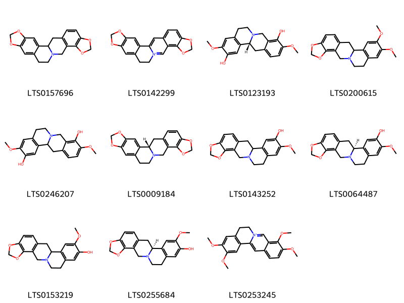{ width=100% }
    <figcaption>Hình ảnh cấu trúc hóa học của 11 hoạt chất thuộc nhóm Protoberberine alkaloids and derivatives gồm ['5,7,17,19-tetraoxa-13-azahexacyclo[11.11.0.0²,¹⁰.0⁴,⁸.0¹⁵,²³.0¹⁶,²⁰]tetracosa-2,4(8),9,15(23),16(20),21-hexaene (LTS0157696)', '5,7,17,19-tetraoxa-13λ⁵-azahexacyclo[11.11.0.0²,¹⁰.0⁴,⁸.0¹⁵,²³.0¹⁶,²⁰]tetracosa-1(24),2,4(8),9,13,15,20,22-octaen-13-ylium (LTS0142299)', '(12br)-3,10-dimethoxy-7,8,12b,13-tetrahydro-5h-6-azatetraphene-4,11-diol (LTS0123193)', 'sinactine (LTS0200615)', '(s)-scoulerine (LTS0246207)', 'stylopine (LTS0009184)', '17-methoxy-5,7-dioxa-1-azapentacyclo[11.8.0.0³,¹¹.0⁴,⁸.0¹⁴,¹⁹]henicosa-3,8,10,14(19),15,17-hexaen-16-ol (LTS0143252)', 'cheilanthifoline (LTS0064487)', '16-methoxy-5,7-dioxa-1-azapentacyclo[11.8.0.0³,¹¹.0⁴,⁸.0¹⁴,¹⁹]henicosa-3(11),4(8),9,14(19),15,17-hexaen-17-ol (LTS0153219)', '(13s)-16-methoxy-5,7-dioxa-1-azapentacyclo[11.8.0.0³,¹¹.0⁴,⁸.0¹⁴,¹⁹]henicosa-3(11),4(8),9,14(19),15,17-hexaen-17-ol (LTS0255684)', 'palmatine (LTS0253245)'].</figcaption>
</figure>
#### Nhóm Protopine alkaloids
<figure markdown="span">
    { width=100% }
    <figcaption>Hình ảnh cấu trúc hóa học của 2 hoạt chất thuộc nhóm Protopine alkaloids gồm ['protopine (LTS0080245)', 'cryptopine (LTS0256990)'].</figcaption>
</figure>
#### Nhóm Quinolines and derivatives
<figure markdown="span">
    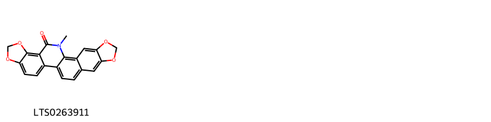{ width=100% }
    <figcaption>Hình ảnh cấu trúc hóa học của 1 hoạt chất thuộc nhóm Quinolines and derivatives gồm ['hydroxysanguinarine (LTS0263911)'].</figcaption>
</figure>
#### Nhóm Rhoeadine alkaloids
<figure markdown="span">
    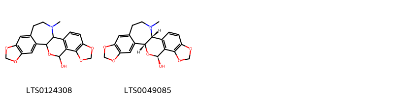{ width=100% }
    <figcaption>Hình ảnh cấu trúc hóa học của 2 hoạt chất thuộc nhóm Rhoeadine alkaloids gồm ['13-methyl-5,7,19,21,25-pentaoxa-13-azahexacyclo[12.11.0.0²,¹⁰.0⁴,⁸.0¹⁵,²³.0¹⁸,²²]pentacosa-2,4(8),9,15(23),16,18(22)-hexaen-24-ol (LTS0124308)', '(1r,14r,24s)-13-methyl-5,7,19,21,25-pentaoxa-13-azahexacyclo[12.11.0.0²,¹⁰.0⁴,⁸.0¹⁵,²³.0¹⁸,²²]pentacosa-2,4(8),9,15(23),16,18(22)-hexaen-24-ol (LTS0049085)'].</figcaption>
</figure>
#### Nhóm Stilbenes
<figure markdown="span">
    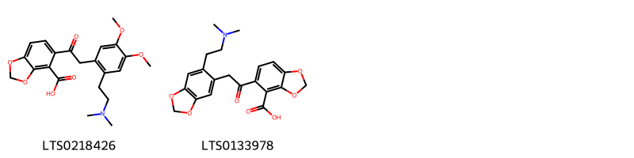{ width=100% }
    <figcaption>Hình ảnh cấu trúc hóa học của 2 hoạt chất thuộc nhóm Stilbenes gồm ['5-(2-{2-[2-(dimethylamino)ethyl]-4,5-dimethoxyphenyl}acetyl)-2h-1,3-benzodioxole-4-carboxylic acid (LTS0218426)', '5-(2-{6-[2-(dimethylamino)ethyl]-2h-1,3-benzodioxol-5-yl}acetyl)-2h-1,3-benzodioxole-4-carboxylic acid (LTS0133978)'].</figcaption>
</figure>
#### Nhóm Tetrahydroisoquinolines
<figure markdown="span">
    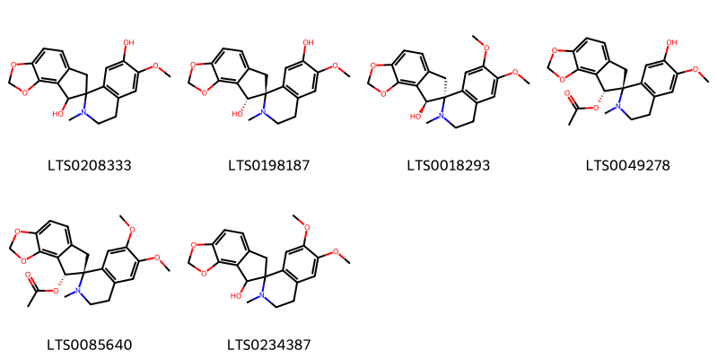{ width=100% }
    <figcaption>Hình ảnh cấu trúc hóa học của 6 hoạt chất thuộc nhóm Tetrahydroisoquinolines gồm ["6'-methoxy-2'-methyl-3',4',6,8-tetrahydro-2h-spiro[indeno[4,5-d][1,3]dioxole-7,1'-isoquinoline]-7',8-diol (LTS0208333)", "(7s,8r)-6'-methoxy-2'-methyl-3',4',6,8-tetrahydro-2h-spiro[indeno[4,5-d][1,3]dioxole-7,1'-isoquinoline]-7',8-diol (LTS0198187)", 'fumaricine (LTS0018293)', "(7s,8r)-7'-hydroxy-6'-methoxy-2'-methyl-3',4',6,8-tetrahydro-2h-spiro[indeno[4,5-d][1,3]dioxole-7,1'-isoquinolin]-8-yl acetate (LTS0049278)", "(7s,8r)-6',7'-dimethoxy-2'-methyl-3',4',6,8-tetrahydro-2h-spiro[indeno[4,5-d][1,3]dioxole-7,1'-isoquinolin]-8-yl acetate (LTS0085640)", "6',7'-dimethoxy-2'-methyl-3',4',6,8-tetrahydro-2h-spiro[indeno[4,5-d][1,3]dioxole-7,1'-isoquinolin]-8-ol (LTS0234387)"].</figcaption>
</figure>

---

### Dược dân tộc học

Danh sách các quốc gia có sử dụng *Fumaria parviflora* trong điều trị các bệnh. 

| Country   | Disease            | Bệnh                                                                                                                                                                                                |
|:----------|:-------------------|:----------------------------------------------------------------------------------------------------------------------------------------------------------------------------------------------------|
| Elsewhere | Diuretic, Laxative | MYMEMORY WARNING: YOU USED ALL AVAILABLE FREE TRANSLATIONS FOR TODAY. NEXT AVAILABLE IN  09 HOURS 35 MINUTES 06 SECONDS VISIT HTTPS://MYMEMORY.TRANSLATED.NET/DOC/USAGELIMITS.PHP TO TRANSLATE MORE |
| Iraq      | Diuretic           | MYMEMORY WARNING: YOU USED ALL AVAILABLE FREE TRANSLATIONS FOR TODAY. NEXT AVAILABLE IN  09 HOURS 35 MINUTES 00 SECONDS VISIT HTTPS://MYMEMORY.TRANSLATED.NET/DOC/USAGELIMITS.PHP TO TRANSLATE MORE |
| Mexico    | Tonic              | MYMEMORY WARNING: YOU USED ALL AVAILABLE FREE TRANSLATIONS FOR TODAY. NEXT AVAILABLE IN  09 HOURS 34 MINUTES 57 SECONDS VISIT HTTPS://MYMEMORY.TRANSLATED.NET/DOC/USAGELIMITS.PHP TO TRANSLATE MORE |

---

---
## Fumaria vaillantii
### Thông tin về thực vật

!!! info "Phân loại thực vật của *Fumaria vaillantii* từ GIBF:"
    - **Kingdom:** Plantae
    - **Phylum:** Tracheophyta
    - **Order:** Ranunculales
    - **Family:** Papaveraceae
    - **Genus:** Fumaria
    - **Species:** *Fumaria vaillantii*

 

| Label (VI)   | Label (EN)   | Scientific Name    | Descriptions (VI)   | Descriptions (EN)   | Also Known As (VI)   | Also Known As (EN)                    |
|:-------------|:-------------|:-------------------|:--------------------|:--------------------|:---------------------|:--------------------------------------|
| N/A          | N/A          | Fumaria vaillantii | loài thực vật       | species of plant    | ['']                 | ['Few-flower fumitory', 'Earthsmoke'] |

#### Phân bố trên thế giới

**Từ CSDL GIBF** Czechia, Uzbekistan, Sweden, China, Kazakhstan, Spain, United States of America, Romania, Iran (Islamic Republic of), Croatia, Algeria, Norway, United Kingdom of Great Britain and Northern Ireland, Chinese Taipei, Iraq, Germany, Austria, Hungary, Tajikistan, Slovakia, Ukraine, Kyrgyzstan, Italy, Switzerland, Bulgaria, France

#### Phân bố tại Việt Nam

**Từ CSDL GIBF**: Không có ghi nhận ở Việt Nam

---
### Thành phần hóa học
        
- Theo cơ sở dữ liệu lotus: Từ loài *Fumaria vaillantii* đã phân lập và xác định được 89 hoạt chất thuộc về các nhóm Fatty Acyls, Organic phosphoric acids and derivatives, Carboxylic acids and derivatives, Tetrahydroisoquinolines, Benzofurans, Quinolines and derivatives, Protopine alkaloids, Phthalide isoquinolines, Indanes, Stilbenes, Benzophenanthridine alkaloids, Aporphines, Benzene and substituted derivatives, Cinnamic acids and derivatives, Protoberberine alkaloids and derivatives, Hydroxy acids and derivatives, Benzodioxoles, Isoindoles and derivatives, Isoquinolines and derivatives, Benzazepines. 

|    | chemicalTaxonomyClassyfireClass          |   smiles_count |
|---:|:-----------------------------------------|---------------:|
|  0 | Aporphines                               |              4 |
|  1 | Benzazepines                             |              1 |
|  2 | Benzene and substituted derivatives      |              2 |
|  3 | Benzodioxoles                            |              1 |
|  4 | Benzofurans                              |              1 |
|  5 | Benzophenanthridine alkaloids            |              2 |
|  6 | Carboxylic acids and derivatives         |              2 |
|  7 | Cinnamic acids and derivatives           |              3 |
|  8 | Fatty Acyls                              |             12 |
|  9 | Hydroxy acids and derivatives            |              1 |
| 10 | Indanes                                  |              3 |
| 11 | Isoindoles and derivatives               |              4 |
| 12 | Isoquinolines and derivatives            |              9 |
| 13 | Organic phosphoric acids and derivatives |              1 |
| 14 | Phthalide isoquinolines                  |             12 |
| 15 | Protoberberine alkaloids and derivatives |             12 |
| 16 | Protopine alkaloids                      |              5 |
| 17 | Quinolines and derivatives               |              2 |
| 18 | Stilbenes                                |              3 |
| 19 | Tetrahydroisoquinolines                  |              9 |

#### Nhóm Aporphines
<figure markdown="span">
    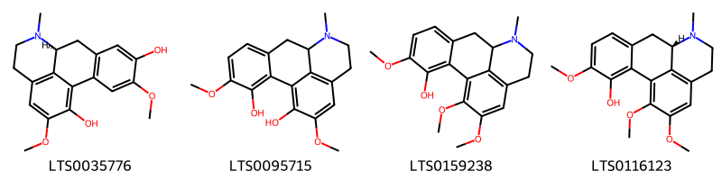{ width=100% }
    <figcaption>Hình ảnh cấu trúc hóa học của 4 hoạt chất thuộc nhóm Aporphines gồm ['(9s)-4,15-dimethoxy-10-methyl-10-azatetracyclo[7.7.1.0²,⁷.0¹³,¹⁷]heptadeca-1(16),2(7),3,5,13(17),14-hexaene-5,16-diol (LTS0035776)', '4,15-dimethoxy-10-methyl-10-azatetracyclo[7.7.1.0²,⁷.0¹³,¹⁷]heptadeca-1(16),2,4,6,13(17),14-hexaene-3,16-diol (LTS0095715)', '4,15,16-trimethoxy-10-methyl-10-azatetracyclo[7.7.1.0²,⁷.0¹³,¹⁷]heptadeca-1(16),2,4,6,13(17),14-hexaen-3-ol (LTS0159238)', '(9s)-4,15,16-trimethoxy-10-methyl-10-azatetracyclo[7.7.1.0²,⁷.0¹³,¹⁷]heptadeca-1(16),2,4,6,13(17),14-hexaen-3-ol (LTS0116123)'].</figcaption>
</figure>
#### Nhóm Benzazepines
<figure markdown="span">
    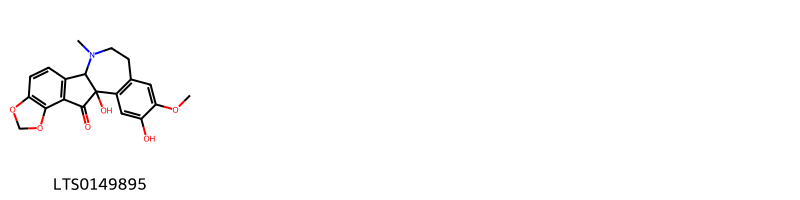{ width=100% }
    <figcaption>Hình ảnh cấu trúc hóa học của 1 hoạt chất thuộc nhóm Benzazepines gồm ['12,15-dihydroxy-16-methoxy-21-methyl-6,8-dioxa-21-azapentacyclo[10.9.0.0²,¹⁰.0⁵,⁹.0¹³,¹⁸]henicosa-2(10),3,5(9),13(18),14,16-hexaen-11-one (LTS0149895)'].</figcaption>
</figure>
#### Nhóm Benzene and substituted derivatives
<figure markdown="span">
    { width=100% }
    <figcaption>Hình ảnh cấu trúc hóa học của 2 hoạt chất thuộc nhóm Benzene and substituted derivatives gồm ['3,4-dihydroxybenzoic acid (LTS0018765)', '3-hydroxybenzoic acid (LTS0176105)'].</figcaption>
</figure>
#### Nhóm Benzodioxoles
<figure markdown="span">
    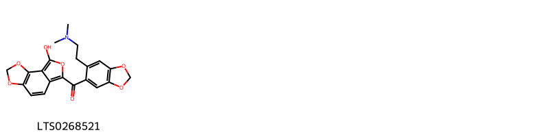{ width=100% }
    <figcaption>Hình ảnh cấu trúc hóa học của 1 hoạt chất thuộc nhóm Benzodioxoles gồm ['10-{6-[2-(dimethylamino)ethyl]-2h-1,3-benzodioxole-5-carbonyl}-3,5,11-trioxatricyclo[7.3.0.0²,⁶]dodeca-1(12),2(6),7,9-tetraen-12-ol (LTS0268521)'].</figcaption>
</figure>
#### Nhóm Benzofurans
<figure markdown="span">
    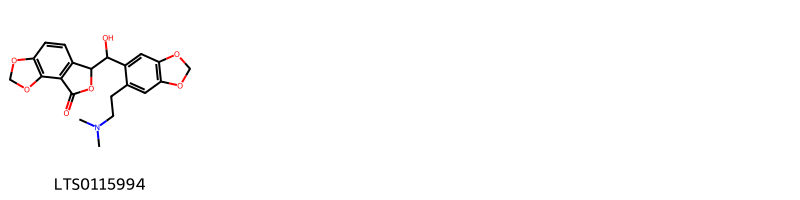{ width=100% }
    <figcaption>Hình ảnh cấu trúc hóa học của 1 hoạt chất thuộc nhóm Benzofurans gồm ['10-({6-[2-(dimethylamino)ethyl]-2h-1,3-benzodioxol-5-yl}(hydroxy)methyl)-3,5,11-trioxatricyclo[7.3.0.0²,⁶]dodeca-1(9),2(6),7-trien-12-one (LTS0115994)'].</figcaption>
</figure>
#### Nhóm Benzophenanthridine alkaloids
<figure markdown="span">
    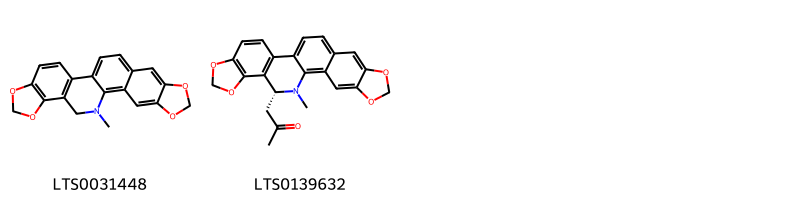{ width=100% }
    <figcaption>Hình ảnh cấu trúc hóa học của 2 hoạt chất thuộc nhóm Benzophenanthridine alkaloids gồm ['dihydrosanguinarine (LTS0031448)', '1-[(23r)-24-methyl-5,7,18,20-tetraoxa-24-azahexacyclo[11.11.0.0²,¹⁰.0⁴,⁸.0¹⁴,²².0¹⁷,²¹]tetracosa-1(13),2,4(8),9,11,14(22),15,17(21)-octaen-23-yl]propan-2-one (LTS0139632)'].</figcaption>
</figure>
#### Nhóm Carboxylic acids and derivatives
<figure markdown="span">
    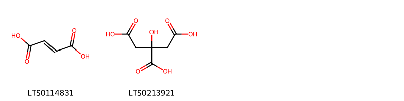{ width=100% }
    <figcaption>Hình ảnh cấu trúc hóa học của 2 hoạt chất thuộc nhóm Carboxylic acids and derivatives gồm ['fumaric acid (LTS0114831)', 'citric acid (LTS0213921)'].</figcaption>
</figure>
#### Nhóm Cinnamic acids and derivatives
<figure markdown="span">
    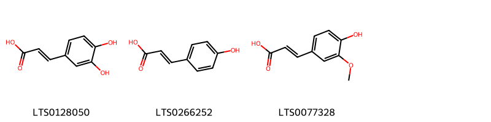{ width=100% }
    <figcaption>Hình ảnh cấu trúc hóa học của 3 hoạt chất thuộc nhóm Cinnamic acids and derivatives gồm ['3,4-dihydroxycinnamic acid (LTS0128050)', 'para-coumaric acid (LTS0266252)', 'ferulic acid (LTS0077328)'].</figcaption>
</figure>
#### Nhóm Fatty Acyls
<figure markdown="span">
    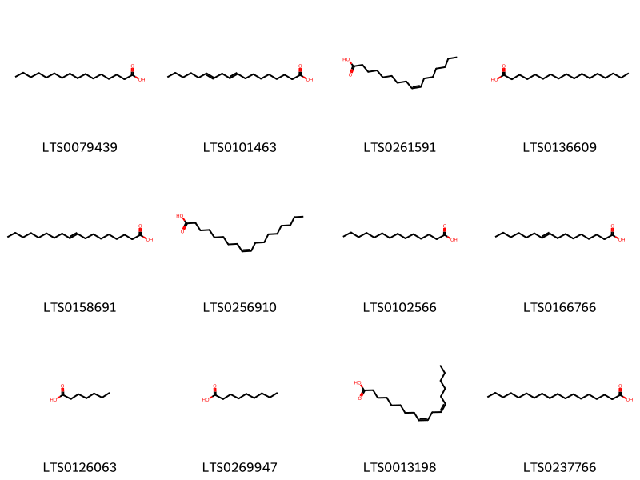{ width=100% }
    <figcaption>Hình ảnh cấu trúc hóa học của 12 hoạt chất thuộc nhóm Fatty Acyls gồm ['palmitic acid (LTS0079439)', '9,12-octadecadienoic acid (LTS0101463)', 'palmitoleic acid (LTS0261591)', 'heptadecanoic acid (LTS0136609)', '9 octadecenoic acid (LTS0158691)', 'oleic acid (LTS0256910)', 'myristic acid (LTS0102566)', '9-hexadecenoic acid (LTS0166766)', 'heptanoic acid (LTS0126063)', 'nonanoic acid (LTS0269947)', 'linoleic (LTS0013198)', 'stearic acid (LTS0237766)'].</figcaption>
</figure>
#### Nhóm Hydroxy acids and derivatives
<figure markdown="span">
    { width=100% }
    <figcaption>Hình ảnh cấu trúc hóa học của 1 hoạt chất thuộc nhóm Hydroxy acids and derivatives gồm ['malic acid (LTS0216520)'].</figcaption>
</figure>
#### Nhóm Indanes
<figure markdown="span">
    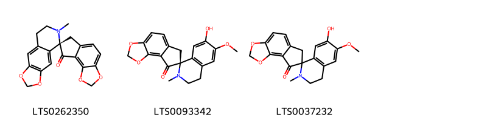{ width=100% }
    <figcaption>Hình ảnh cấu trúc hóa học của 3 hoạt chất thuộc nhóm Indanes gồm ["(5s)-6-methyl-2',6',7,8-tetrahydro-2h-spiro[[1,3]dioxolo[4,5-g]isoquinoline-5,7'-indeno[4,5-d][1,3]dioxol]-8'-one (LTS0262350)", 'parfumine (LTS0093342)', "7'-hydroxy-6'-methoxy-2'-methyl-2,3',4',6-tetrahydrospiro[indeno[4,5-d][1,3]dioxole-7,1'-isoquinolin]-8-one (LTS0037232)"].</figcaption>
</figure>
#### Nhóm Isoindoles and derivatives
<figure markdown="span">
    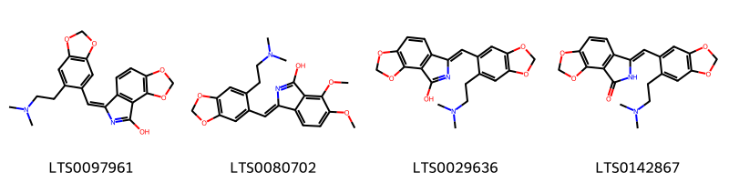{ width=100% }
    <figcaption>Hình ảnh cấu trúc hóa học của 4 hoạt chất thuộc nhóm Isoindoles and derivatives gồm ['(6e)-6-({6-[2-(dimethylamino)ethyl]-2h-1,3-benzodioxol-5-yl}methylidene)-2h-[1,3]dioxolo[4,5-e]isoindol-8-ol (LTS0097961)', '(3z)-3-({6-[2-(dimethylamino)ethyl]-2h-1,3-benzodioxol-5-yl}methylidene)-6,7-dimethoxyisoindol-1-ol (LTS0080702)', '(6z)-6-({6-[2-(dimethylamino)ethyl]-2h-1,3-benzodioxol-5-yl}methylidene)-2h-[1,3]dioxolo[4,5-e]isoindol-8-ol (LTS0029636)', '6-({6-[2-(dimethylamino)ethyl]-2h-1,3-benzodioxol-5-yl}methylidene)-2h,7h-[1,3]dioxolo[4,5-e]isoindol-8-one (LTS0142867)'].</figcaption>
</figure>
#### Nhóm Isoquinolines and derivatives
<figure markdown="span">
    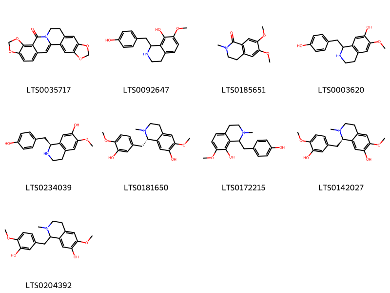{ width=100% }
    <figcaption>Hình ảnh cấu trúc hóa học của 9 hoạt chất thuộc nhóm Isoquinolines and derivatives gồm ['5,7,17,19-tetraoxa-13-azahexacyclo[11.11.0.0²,¹⁰.0⁴,⁸.0¹⁵,²³.0¹⁶,²⁰]tetracosa-1(24),2,4(8),9,15,20,22-heptaen-14-one (LTS0035717)', '1-[(4-hydroxyphenyl)methyl]-7-methoxy-1,2,3,4-tetrahydroisoquinolin-8-ol (LTS0092647)', 'n-methylcorydaldine (LTS0185651)', '(rs)-coclaurine (LTS0003620)', '(+-)-coclaurine (LTS0234039)', '(+,-)-reticuline (LTS0181650)', '1-[(4-hydroxyphenyl)methyl]-7-methoxy-2-methyl-3,4-dihydro-1h-isoquinolin-8-ol (LTS0172215)', '(-)-reticuline (LTS0142027)', 'reticuline (LTS0204392)'].</figcaption>
</figure>
#### Nhóm Organic phosphoric acids and derivatives
<figure markdown="span">
    { width=100% }
    <figcaption>Hình ảnh cấu trúc hóa học của 1 hoạt chất thuộc nhóm Organic phosphoric acids and derivatives gồm ['o-phosphoethanolamine; bis(nonane) (LTS0249963)'].</figcaption>
</figure>
#### Nhóm Phthalide isoquinolines
<figure markdown="span">
    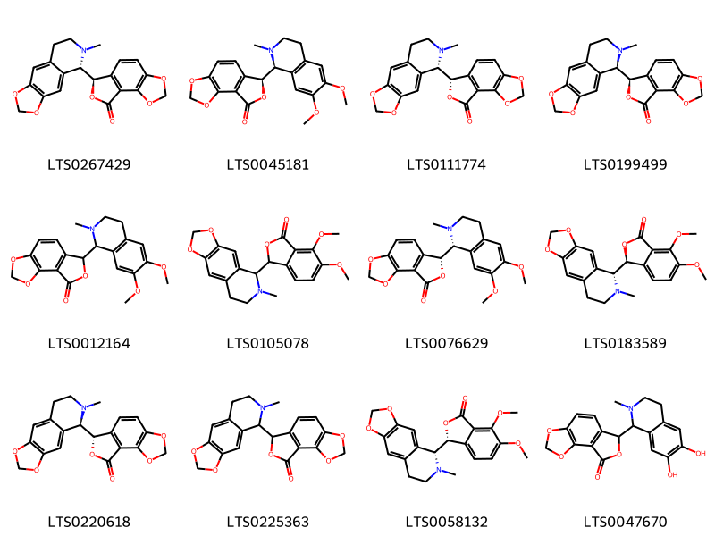{ width=100% }
    <figcaption>Hình ảnh cấu trúc hóa học của 12 hoạt chất thuộc nhóm Phthalide isoquinolines gồm ['bicuculline (LTS0267429)', '(+)-adlumine (LTS0045181)', 'adlumidine (LTS0111774)', '(-)-adlumidine (LTS0199499)', '10-(6,7-dimethoxy-2-methyl-3,4-dihydro-1h-isoquinolin-1-yl)-3,5,11-trioxatricyclo[7.3.0.0²,⁶]dodeca-1(9),2(6),7-trien-12-one (LTS0012164)', 'hydrastine (LTS0105078)', '(-)-adlumine (LTS0076629)', 'hydrastine (LTS0183589)', '(10s)-10-[(5r)-6-methyl-2h,5h,7h,8h-[1,3]dioxolo[4,5-g]isoquinolin-5-yl]-3,5,11-trioxatricyclo[7.3.0.0²,⁶]dodeca-1(9),2(6),7-trien-12-one (LTS0220618)', 'bicuculline (LTS0225363)', '(-)-α-hydrastine (LTS0058132)', '10-(6,7-dihydroxy-2-methyl-3,4-dihydro-1h-isoquinolin-1-yl)-3,5,11-trioxatricyclo[7.3.0.0²,⁶]dodeca-1(9),2(6),7-trien-12-one (LTS0047670)'].</figcaption>
</figure>
#### Nhóm Protoberberine alkaloids and derivatives
<figure markdown="span">
    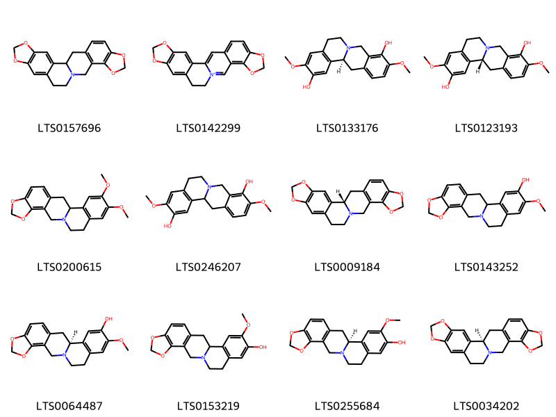{ width=100% }
    <figcaption>Hình ảnh cấu trúc hóa học của 12 hoạt chất thuộc nhóm Protoberberine alkaloids and derivatives gồm ['5,7,17,19-tetraoxa-13-azahexacyclo[11.11.0.0²,¹⁰.0⁴,⁸.0¹⁵,²³.0¹⁶,²⁰]tetracosa-2,4(8),9,15(23),16(20),21-hexaene (LTS0157696)', '5,7,17,19-tetraoxa-13λ⁵-azahexacyclo[11.11.0.0²,¹⁰.0⁴,⁸.0¹⁵,²³.0¹⁶,²⁰]tetracosa-1(24),2,4(8),9,13,15,20,22-octaen-13-ylium (LTS0142299)', 'scoulerine (LTS0133176)', '(12br)-3,10-dimethoxy-7,8,12b,13-tetrahydro-5h-6-azatetraphene-4,11-diol (LTS0123193)', 'sinactine (LTS0200615)', '(s)-scoulerine (LTS0246207)', 'stylopine (LTS0009184)', '17-methoxy-5,7-dioxa-1-azapentacyclo[11.8.0.0³,¹¹.0⁴,⁸.0¹⁴,¹⁹]henicosa-3,8,10,14(19),15,17-hexaen-16-ol (LTS0143252)', 'cheilanthifoline (LTS0064487)', '16-methoxy-5,7-dioxa-1-azapentacyclo[11.8.0.0³,¹¹.0⁴,⁸.0¹⁴,¹⁹]henicosa-3(11),4(8),9,14(19),15,17-hexaen-17-ol (LTS0153219)', '(13s)-16-methoxy-5,7-dioxa-1-azapentacyclo[11.8.0.0³,¹¹.0⁴,⁸.0¹⁴,¹⁹]henicosa-3(11),4(8),9,14(19),15,17-hexaen-17-ol (LTS0255684)', '(r)-stylopine (LTS0034202)'].</figcaption>
</figure>
#### Nhóm Protopine alkaloids
<figure markdown="span">
    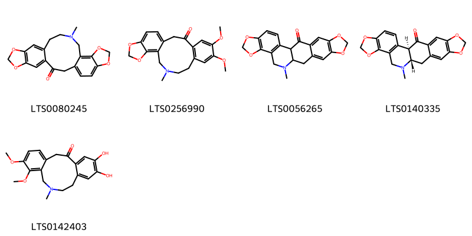{ width=100% }
    <figcaption>Hình ảnh cấu trúc hóa học của 5 hoạt chất thuộc nhóm Protopine alkaloids gồm ['protopine (LTS0080245)', 'cryptopine (LTS0256990)', '12-methyl-6,8,18,20-tetraoxa-12-azahexacyclo[11.11.0.0²,¹⁰.0⁵,⁹.0¹⁵,²³.0¹⁷,²¹]tetracosa-2(10),3,5(9),15,17(21),22-hexaen-24-one (LTS0056265)', '(1r,13s)-12-methyl-6,8,18,20-tetraoxa-12-azahexacyclo[11.11.0.0²,¹⁰.0⁵,⁹.0¹⁵,²³.0¹⁷,²¹]tetracosa-2(10),3,5(9),15,17(21),22-hexaen-24-one (LTS0140335)', '16,17-dihydroxy-7,8-dimethoxy-11-methyl-11-azatricyclo[12.4.0.0⁴,⁹]octadeca-1(18),4,6,8,14,16-hexaen-2-one (LTS0142403)'].</figcaption>
</figure>
#### Nhóm Quinolines and derivatives
<figure markdown="span">
    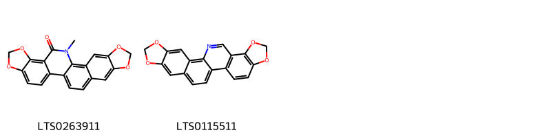{ width=100% }
    <figcaption>Hình ảnh cấu trúc hóa học của 2 hoạt chất thuộc nhóm Quinolines and derivatives gồm ['hydroxysanguinarine (LTS0263911)', '5,7,18,20-tetraoxa-24-azahexacyclo[11.11.0.0²,¹⁰.0⁴,⁸.0¹⁴,²².0¹⁷,²¹]tetracosa-1(13),2(10),3,8,11,14(22),15,17(21),23-nonaene (LTS0115511)'].</figcaption>
</figure>
#### Nhóm Stilbenes
<figure markdown="span">
    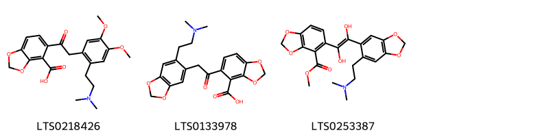{ width=100% }
    <figcaption>Hình ảnh cấu trúc hóa học của 3 hoạt chất thuộc nhóm Stilbenes gồm ['5-(2-{2-[2-(dimethylamino)ethyl]-4,5-dimethoxyphenyl}acetyl)-2h-1,3-benzodioxole-4-carboxylic acid (LTS0218426)', '5-(2-{6-[2-(dimethylamino)ethyl]-2h-1,3-benzodioxol-5-yl}acetyl)-2h-1,3-benzodioxole-4-carboxylic acid (LTS0133978)', 'methyl 5-[(1e)-2-{6-[2-(dimethylamino)ethyl]-2h-1,3-benzodioxol-5-yl}-1,2-dihydroxyethenyl]-2h-1,3-benzodioxole-4-carboxylate (LTS0253387)'].</figcaption>
</figure>
#### Nhóm Tetrahydroisoquinolines
<figure markdown="span">
    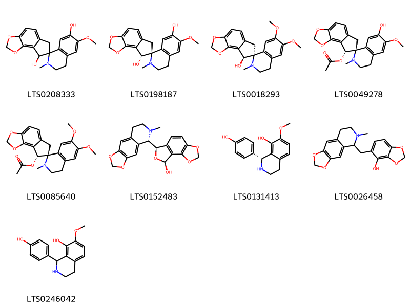{ width=100% }
    <figcaption>Hình ảnh cấu trúc hóa học của 9 hoạt chất thuộc nhóm Tetrahydroisoquinolines gồm ["6'-methoxy-2'-methyl-3',4',6,8-tetrahydro-2h-spiro[indeno[4,5-d][1,3]dioxole-7,1'-isoquinoline]-7',8-diol (LTS0208333)", "(7s,8r)-6'-methoxy-2'-methyl-3',4',6,8-tetrahydro-2h-spiro[indeno[4,5-d][1,3]dioxole-7,1'-isoquinoline]-7',8-diol (LTS0198187)", 'fumaricine (LTS0018293)', "(7s,8r)-7'-hydroxy-6'-methoxy-2'-methyl-3',4',6,8-tetrahydro-2h-spiro[indeno[4,5-d][1,3]dioxole-7,1'-isoquinolin]-8-yl acetate (LTS0049278)", "(7s,8r)-6',7'-dimethoxy-2'-methyl-3',4',6,8-tetrahydro-2h-spiro[indeno[4,5-d][1,3]dioxole-7,1'-isoquinolin]-8-yl acetate (LTS0085640)", '(10r,12s)-10-[(5s)-6-methyl-2h,5h,7h,8h-[1,3]dioxolo[4,5-g]isoquinolin-5-yl]-3,5,11-trioxatricyclo[7.3.0.0²,⁶]dodeca-1(9),2(6),7-trien-12-ol (LTS0152483)', '(1r)-1-(4-hydroxyphenyl)-7-methoxy-1,2,3,4-tetrahydroisoquinolin-8-ol (LTS0131413)', '5-({6-methyl-2h,5h,7h,8h-[1,3]dioxolo[4,5-g]isoquinolin-5-yl}methyl)-2h-1,3-benzodioxol-4-ol (LTS0026458)', '1-(4-hydroxyphenyl)-7-methoxy-1,2,3,4-tetrahydroisoquinolin-8-ol (LTS0246042)'].</figcaption>
</figure>

---

### Dược dân tộc học

Danh sách các quốc gia có sử dụng *Fumaria vaillantii* trong điều trị các bệnh. 

| Country   | Disease    | Bệnh                                                                                                                                                                                                |
|:----------|:-----------|:----------------------------------------------------------------------------------------------------------------------------------------------------------------------------------------------------|
| Elsewhere | Astringent | MYMEMORY WARNING: YOU USED ALL AVAILABLE FREE TRANSLATIONS FOR TODAY. NEXT AVAILABLE IN  09 HOURS 34 MINUTES 14 SECONDS VISIT HTTPS://MYMEMORY.TRANSLATED.NET/DOC/USAGELIMITS.PHP TO TRANSLATE MORE |

---

# Chi Corydalis

??? note "Danh sách các dược liệu thuộc chi"
    
	 - *Corydalis ambigua*
	 - *Corydalis aurea*
	 - *Corydalis bulbosa*
	 - *Corydalis cava*
	 - *Corydalis flavula*
	 - *Corydalis gavaniana*
	 - *Corydalis govaniana*

---
## Corydalis ambigua
### Thông tin về thực vật

!!! info "Phân loại thực vật của *Corydalis ambigua* từ GIBF:"
    - **Kingdom:** Plantae
    - **Phylum:** Tracheophyta
    - **Order:** Ranunculales
    - **Family:** Papaveraceae
    - **Genus:** Corydalis
    - **Species:** *Corydalis ambigua*

 

| Label (VI)   | Label (EN)   | Scientific Name   | Descriptions (VI)   | Descriptions (EN)   | Also Known As (VI)   | Also Known As (EN)   |
|:-------------|:-------------|:------------------|:--------------------|:--------------------|:---------------------|:---------------------|
| N/A          | N/A          | Corydalis ambigua | loài thực vật       | species of plant    | ['']                 | ['']                 |

#### Phân bố trên thế giới

**Từ CSDL GIBF** Russian Federation, nan, China, Korea, Republic of

#### Phân bố tại Việt Nam

**Từ CSDL GIBF**: Không có ghi nhận ở Việt Nam

---
### Thành phần hóa học
        
- Theo cơ sở dữ liệu lotus: Từ loài *Corydalis ambigua* đã phân lập và xác định được 19 hoạt chất thuộc về các nhóm Benzophenanthridine alkaloids, Aporphines, Protopine alkaloids, Tetrahydroisoquinolines, Protoberberine alkaloids and derivatives. 

|    | chemicalTaxonomyClassyfireClass          |   smiles_count |
|---:|:-----------------------------------------|---------------:|
|  0 | Aporphines                               |              3 |
|  1 | Benzophenanthridine alkaloids            |              2 |
|  2 | Protoberberine alkaloids and derivatives |              9 |
|  3 | Protopine alkaloids                      |              3 |
|  4 | Tetrahydroisoquinolines                  |              2 |

#### Nhóm Aporphines
<figure markdown="span">
    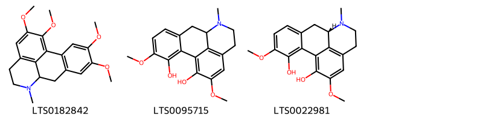{ width=100% }
    <figcaption>Hình ảnh cấu trúc hóa học của 3 hoạt chất thuộc nhóm Aporphines gồm ['4,5,15,16-tetramethoxy-10-methyl-10-azatetracyclo[7.7.1.0²,⁷.0¹³,¹⁷]heptadeca-1(16),2(7),3,5,13(17),14-hexaene (LTS0182842)', '4,15-dimethoxy-10-methyl-10-azatetracyclo[7.7.1.0²,⁷.0¹³,¹⁷]heptadeca-1(16),2,4,6,13(17),14-hexaene-3,16-diol (LTS0095715)', '(9s)-4,15-dimethoxy-10-methyl-10-azatetracyclo[7.7.1.0²,⁷.0¹³,¹⁷]heptadeca-1(16),2,4,6,13(17),14-hexaene-3,16-diol (LTS0022981)'].</figcaption>
</figure>
#### Nhóm Benzophenanthridine alkaloids
<figure markdown="span">
    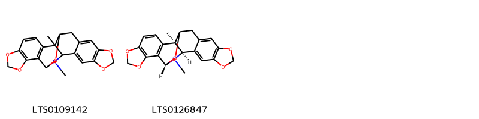{ width=100% }
    <figcaption>Hình ảnh cấu trúc hóa học của 2 hoạt chất thuộc nhóm Benzophenanthridine alkaloids gồm ['24,25-dimethyl-5,7,13,17,19-pentaoxa-25-azaheptacyclo[12.10.1.0²,¹⁰.0⁴,⁸.0¹²,²⁴.0¹⁵,²³.0¹⁶,²⁰]pentacosa-2,4(8),9,15,20,22-hexaene (LTS0109142)', '(1r,14s,24r)-24,25-dimethyl-5,7,13,17,19-pentaoxa-25-azaheptacyclo[12.10.1.0²,¹⁰.0⁴,⁸.0¹²,²⁴.0¹⁵,²³.0¹⁶,²⁰]pentacosa-2,4(8),9,15,20,22-hexaene (LTS0126847)'].</figcaption>
</figure>
#### Nhóm Protoberberine alkaloids and derivatives
<figure markdown="span">
    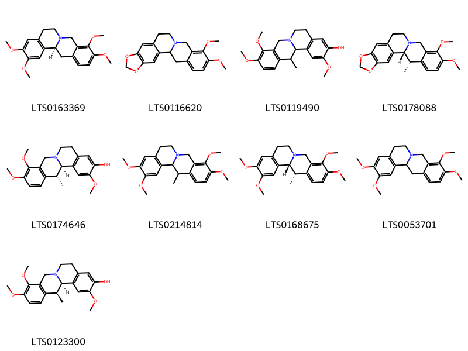{ width=100% }
    <figcaption>Hình ảnh cấu trúc hóa học của 9 hoạt chất thuộc nhóm Protoberberine alkaloids and derivatives gồm ['tetrahydropalmatine (LTS0163369)', 'canadin (LTS0116620)', '3,4,11-trimethoxy-13-methyl-7,8,12b,13-tetrahydro-5h-6-azatetraphen-10-ol (LTS0119490)', 'thalictricavine (LTS0178088)', '(12br,13r)-3,4,11-trimethoxy-13-methyl-7,8,12b,13-tetrahydro-5h-6-azatetraphen-10-ol (LTS0174646)', '3,4,10,11-tetramethoxy-13-methyl-7,8,12b,13-tetrahydro-5h-6-azatetraphene (LTS0214814)', '(+)-corydaline (LTS0168675)', '(+/-)-tetrahydropalmatine (LTS0053701)', 'corybulbine (LTS0123300)'].</figcaption>
</figure>
#### Nhóm Protopine alkaloids
<figure markdown="span">
    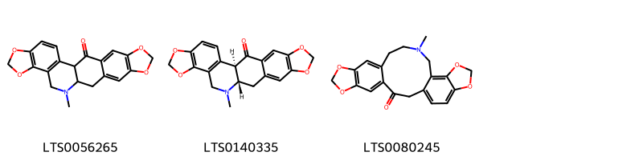{ width=100% }
    <figcaption>Hình ảnh cấu trúc hóa học của 3 hoạt chất thuộc nhóm Protopine alkaloids gồm ['12-methyl-6,8,18,20-tetraoxa-12-azahexacyclo[11.11.0.0²,¹⁰.0⁵,⁹.0¹⁵,²³.0¹⁷,²¹]tetracosa-2(10),3,5(9),15,17(21),22-hexaen-24-one (LTS0056265)', '(1r,13s)-12-methyl-6,8,18,20-tetraoxa-12-azahexacyclo[11.11.0.0²,¹⁰.0⁵,⁹.0¹⁵,²³.0¹⁷,²¹]tetracosa-2(10),3,5(9),15,17(21),22-hexaen-24-one (LTS0140335)', 'protopine (LTS0080245)'].</figcaption>
</figure>
#### Nhóm Tetrahydroisoquinolines
<figure markdown="span">
    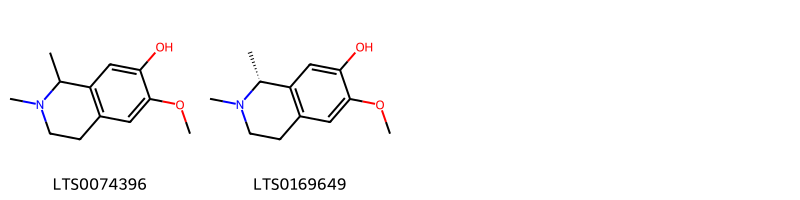{ width=100% }
    <figcaption>Hình ảnh cấu trúc hóa học của 2 hoạt chất thuộc nhóm Tetrahydroisoquinolines gồm ['6-methoxy-1,2-dimethyl-3,4-dihydro-1h-isoquinolin-7-ol (LTS0074396)', '(1r)-6-methoxy-1,2-dimethyl-3,4-dihydro-1h-isoquinolin-7-ol (LTS0169649)'].</figcaption>
</figure>

---

### Dược dân tộc học

Danh sách các quốc gia có sử dụng *Corydalis ambigua* trong điều trị các bệnh. 

| Country   | Disease                                                                                                                 | Bệnh                                                                                                                                                                                                |
|:----------|:------------------------------------------------------------------------------------------------------------------------|:----------------------------------------------------------------------------------------------------------------------------------------------------------------------------------------------------|
| China     | Analgesic, Carminative, Diuretic, Emmenagogue, Sedative, Sedative, Sedative, Tonic, Analgesic, Tranquilizer, Astringent | MYMEMORY WARNING: YOU USED ALL AVAILABLE FREE TRANSLATIONS FOR TODAY. NEXT AVAILABLE IN  09 HOURS 33 MINUTES 21 SECONDS VISIT HTTPS://MYMEMORY.TRANSLATED.NET/DOC/USAGELIMITS.PHP TO TRANSLATE MORE |

---

---
## Corydalis aurea
### Thông tin về thực vật

!!! info "Phân loại thực vật của *Corydalis aurea* từ GIBF:"
    - **Kingdom:** Plantae
    - **Phylum:** Tracheophyta
    - **Order:** Ranunculales
    - **Family:** Papaveraceae
    - **Genus:** Corydalis
    - **Species:** *Corydalis aurea*

 

| Label (VI)   | Label (EN)   | Scientific Name   | Descriptions (VI)   | Descriptions (EN)   | Also Known As (VI)   | Also Known As (EN)   |
|:-------------|:-------------|:------------------|:--------------------|:--------------------|:---------------------|:---------------------|
| N/A          | N/A          | Corydalis aurea   | loài thực vật       | species of plant    | ['']                 | ['']                 |

#### Phân bố trên thế giới

**Từ CSDL GIBF** Mexico, United States of America, Canada

#### Phân bố tại Việt Nam

**Từ CSDL GIBF**: Không có ghi nhận ở Việt Nam

---
### Thành phần hóa học
        
- Theo cơ sở dữ liệu lotus: Từ loài *Corydalis aurea* đã phân lập và xác định được 11 hoạt chất thuộc về các nhóm Isoquinolines and derivatives, Protoberberine alkaloids and derivatives, Tetrahydroisoquinolines. 

|    | chemicalTaxonomyClassyfireClass          |   smiles_count |
|---:|:-----------------------------------------|---------------:|
|  0 | Isoquinolines and derivatives            |              1 |
|  1 | Protoberberine alkaloids and derivatives |              7 |
|  2 | Tetrahydroisoquinolines                  |              3 |

#### Nhóm Isoquinolines and derivatives
<figure markdown="span">
    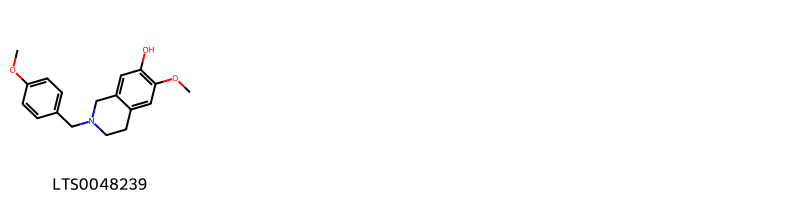{ width=100% }
    <figcaption>Hình ảnh cấu trúc hóa học của 1 hoạt chất thuộc nhóm Isoquinolines and derivatives gồm ['6-methoxy-2-[(4-methoxyphenyl)methyl]-3,4-dihydro-1h-isoquinolin-7-ol (LTS0048239)'].</figcaption>
</figure>
#### Nhóm Protoberberine alkaloids and derivatives
<figure markdown="span">
    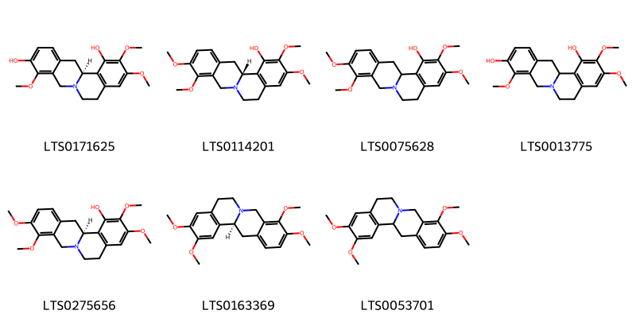{ width=100% }
    <figcaption>Hình ảnh cấu trúc hóa học của 7 hoạt chất thuộc nhóm Protoberberine alkaloids and derivatives gồm ['(12bs)-4,10,11-trimethoxy-7,8,12b,13-tetrahydro-5h-6-azatetraphene-3,12-diol (LTS0171625)', '(12br)-3,4,10,11-tetramethoxy-7,8,12b,13-tetrahydro-5h-6-azatetraphen-12-ol (LTS0114201)', 'capaurine (LTS0075628)', '4,10,11-trimethoxy-7,8,12b,13-tetrahydro-5h-6-azatetraphene-3,12-diol (LTS0013775)', 'capaurine (LTS0275656)', 'tetrahydropalmatine (LTS0163369)', '(+/-)-tetrahydropalmatine (LTS0053701)'].</figcaption>
</figure>
#### Nhóm Tetrahydroisoquinolines
<figure markdown="span">
    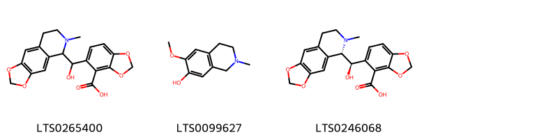{ width=100% }
    <figcaption>Hình ảnh cấu trúc hóa học của 3 hoạt chất thuộc nhóm Tetrahydroisoquinolines gồm ['5-[hydroxy({6-methyl-2h,5h,7h,8h-[1,3]dioxolo[4,5-g]isoquinolin-5-yl})methyl]-2h-1,3-benzodioxole-4-carboxylic acid (LTS0265400)', '6-methoxy-2-methyl-3,4-dihydro-1h-isoquinolin-7-ol (LTS0099627)', '5-[(r)-hydroxy[(5s)-6-methyl-2h,5h,7h,8h-[1,3]dioxolo[4,5-g]isoquinolin-5-yl]methyl]-2h-1,3-benzodioxole-4-carboxylic acid (LTS0246068)'].</figcaption>
</figure>

---

### Dược dân tộc học

Danh sách các quốc gia có sử dụng *Corydalis aurea* trong điều trị các bệnh. 

| Country   | Disease   | Bệnh                                                                                                                                                                                                |
|:----------|:----------|:----------------------------------------------------------------------------------------------------------------------------------------------------------------------------------------------------|
| US        | Poison    | MYMEMORY WARNING: YOU USED ALL AVAILABLE FREE TRANSLATIONS FOR TODAY. NEXT AVAILABLE IN  09 HOURS 32 MINUTES 43 SECONDS VISIT HTTPS://MYMEMORY.TRANSLATED.NET/DOC/USAGELIMITS.PHP TO TRANSLATE MORE |

---

---
## Corydalis bulbosa
### Thông tin về thực vật

!!! info "Phân loại thực vật của *Corydalis bulbosa* từ GIBF:"
    - **Kingdom:** Plantae
    - **Phylum:** Tracheophyta
    - **Order:** Ranunculales
    - **Family:** Papaveraceae
    - **Genus:** Corydalis
    - **Species:** *Corydalis bulbosa*

 

| Label (VI)   | Label (EN)   | Scientific Name   | Descriptions (VI)   | Descriptions (EN)   | Also Known As (VI)   | Also Known As (EN)   |
|:-------------|:-------------|:------------------|:--------------------|:--------------------|:---------------------|:---------------------|
| N/A          | N/A          | Corydalis bulbosa |                     |                     | ['']                 | ['']                 |

#### Phân bố trên thế giới

**Từ CSDL GIBF** nan, Belarus, United States of America, Portugal, Czechia, Sweden, China, Denmark, Russian Federation, Switzerland, unknown or invalid, Germany, France, Spain, Poland

#### Phân bố tại Việt Nam

**Từ CSDL GIBF**: Không có ghi nhận ở Việt Nam

---
### Thành phần hóa học
        
- Theo cơ sở dữ liệu lotus: Từ loài *Corydalis bulbosa* đã phân lập và xác định được 32 hoạt chất thuộc về các nhóm Aporphines, Benzophenanthridine alkaloids, Protopine alkaloids, Phthalide isoquinolines, Protoberberine alkaloids and derivatives, Isoquinolines and derivatives, Stilbenes. 

|    | chemicalTaxonomyClassyfireClass          |   smiles_count |
|---:|:-----------------------------------------|---------------:|
|  0 | Aporphines                               |             13 |
|  1 | Benzophenanthridine alkaloids            |              3 |
|  2 | Isoquinolines and derivatives            |              1 |
|  3 | Phthalide isoquinolines                  |              4 |
|  4 | Protoberberine alkaloids and derivatives |              9 |
|  5 | Protopine alkaloids                      |              1 |
|  6 | Stilbenes                                |              1 |

#### Nhóm Aporphines
<figure markdown="span">
    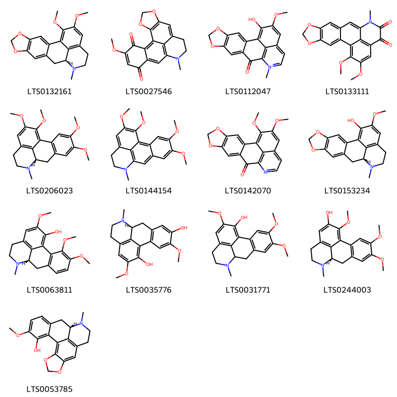{ width=100% }
    <figcaption>Hình ảnh cấu trúc hóa học của 13 hoạt chất thuộc nhóm Aporphines gồm ['nantenine (LTS0132161)', '17-methoxy-11-methyl-3,5-dioxa-11-azapentacyclo[10.7.1.0²,⁶.0⁸,²⁰.0¹⁴,¹⁹]icosa-1,6,8(20),12,14(19),16-hexaene-15,18-dione (LTS0027546)', '19-hydroxy-18-methoxy-13-methyl-11-oxo-5,7-dioxa-13-azapentacyclo[10.7.1.0²,¹⁰.0⁴,⁸.0¹⁶,²⁰]icosa-1(19),2,4(8),9,12(20),13,15,17-octaen-13-ium (LTS0112047)', '18,19-dimethoxy-13-methyl-5,7-dioxa-13-azapentacyclo[10.7.1.0²,¹⁰.0⁴,⁸.0¹⁶,²⁰]icosa-1(20),2(10),3,8,11,16,18-heptaene-14,15-dione (LTS0133111)', '(9s)-4,5,15,16-tetramethoxy-10-methyl-10-azatetracyclo[7.7.1.0²,⁷.0¹³,¹⁷]heptadeca-1(16),2(7),3,5,13(17),14-hexaene (LTS0206023)', '4,5,15,16-tetramethoxy-10-methyl-10-azatetracyclo[7.7.1.0²,⁷.0¹³,¹⁷]heptadeca-1(17),2(7),3,5,8,13,15-heptaene (LTS0144154)', 'oxonantenine (LTS0142070)', '(-)-domesticine (LTS0153234)', '(9s)-3,4,15-trimethoxy-10-methyl-10-azatetracyclo[7.7.1.0²,⁷.0¹³,¹⁷]heptadeca-1(16),2(7),3,5,13(17),14-hexaen-16-ol (LTS0063811)', '(9s)-4,15-dimethoxy-10-methyl-10-azatetracyclo[7.7.1.0²,⁷.0¹³,¹⁷]heptadeca-1(16),2(7),3,5,13(17),14-hexaene-5,16-diol (LTS0035776)', '4,5,15-trimethoxy-10-methyl-10-azatetracyclo[7.7.1.0²,⁷.0¹³,¹⁷]heptadeca-1(16),2(7),3,5,13(17),14-hexaen-16-ol (LTS0031771)', '(9s)-4,5,16-trimethoxy-10-methyl-10-azatetracyclo[7.7.1.0²,⁷.0¹³,¹⁷]heptadeca-1(16),2(7),3,5,13(17),14-hexaen-15-ol (LTS0244003)', '(12s)-17-methoxy-11-methyl-3,5-dioxa-11-azapentacyclo[10.7.1.0²,⁶.0⁸,²⁰.0¹⁴,¹⁹]icosa-1,6,8(20),14,16,18-hexaen-18-ol (LTS0053785)'].</figcaption>
</figure>
#### Nhóm Benzophenanthridine alkaloids
<figure markdown="span">
    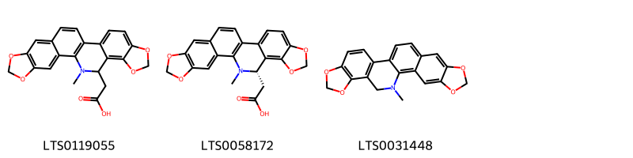{ width=100% }
    <figcaption>Hình ảnh cấu trúc hóa học của 3 hoạt chất thuộc nhóm Benzophenanthridine alkaloids gồm ['{24-methyl-5,7,18,20-tetraoxa-24-azahexacyclo[11.11.0.0²,¹⁰.0⁴,⁸.0¹⁴,²².0¹⁷,²¹]tetracosa-1(13),2,4(8),9,11,14,16,21-octaen-23-yl}acetic acid (LTS0119055)', '[(23s)-24-methyl-5,7,18,20-tetraoxa-24-azahexacyclo[11.11.0.0²,¹⁰.0⁴,⁸.0¹⁴,²².0¹⁷,²¹]tetracosa-1(13),2,4(8),9,11,14,16,21-octaen-23-yl]acetic acid (LTS0058172)', 'dihydrosanguinarine (LTS0031448)'].</figcaption>
</figure>
#### Nhóm Isoquinolines and derivatives
<figure markdown="span">
    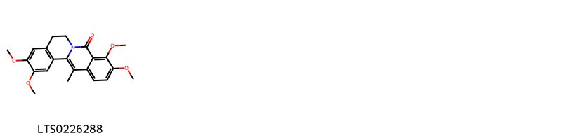{ width=100% }
    <figcaption>Hình ảnh cấu trúc hóa học của 1 hoạt chất thuộc nhóm Isoquinolines and derivatives gồm ['3,4,10,11-tetramethoxy-13-methyl-7,8-dihydro-6-azatetraphen-5-one (LTS0226288)'].</figcaption>
</figure>
#### Nhóm Phthalide isoquinolines
<figure markdown="span">
    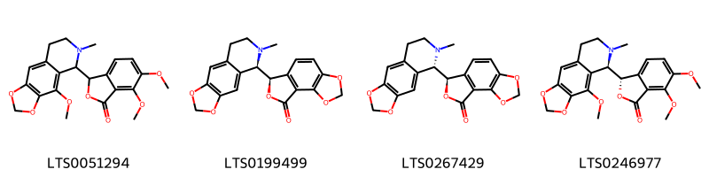{ width=100% }
    <figcaption>Hình ảnh cấu trúc hóa học của 4 hoạt chất thuộc nhóm Phthalide isoquinolines gồm ['noscapine (LTS0051294)', '(-)-adlumidine (LTS0199499)', 'bicuculline (LTS0267429)', 'noscapine (LTS0246977)'].</figcaption>
</figure>
#### Nhóm Protoberberine alkaloids and derivatives
<figure markdown="span">
    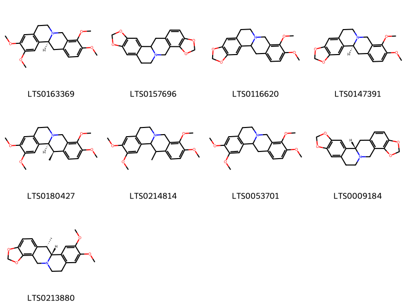{ width=100% }
    <figcaption>Hình ảnh cấu trúc hóa học của 9 hoạt chất thuộc nhóm Protoberberine alkaloids and derivatives gồm ['tetrahydropalmatine (LTS0163369)', '5,7,17,19-tetraoxa-13-azahexacyclo[11.11.0.0²,¹⁰.0⁴,⁸.0¹⁵,²³.0¹⁶,²⁰]tetracosa-2,4(8),9,15(23),16(20),21-hexaene (LTS0157696)', 'canadin (LTS0116620)', '(s)-canadine (LTS0147391)', '(-)-corydaline (LTS0180427)', '3,4,10,11-tetramethoxy-13-methyl-7,8,12b,13-tetrahydro-5h-6-azatetraphene (LTS0214814)', '(+/-)-tetrahydropalmatine (LTS0053701)', 'stylopine (LTS0009184)', '(12s,13r)-16,17-dimethoxy-12-methyl-5,7-dioxa-1-azapentacyclo[11.8.0.0³,¹¹.0⁴,⁸.0¹⁴,¹⁹]henicosa-3,8,10,14(19),15,17-hexaene (LTS0213880)'].</figcaption>
</figure>
#### Nhóm Protopine alkaloids
<figure markdown="span">
    { width=100% }
    <figcaption>Hình ảnh cấu trúc hóa học của 1 hoạt chất thuộc nhóm Protopine alkaloids gồm ['protopine (LTS0080245)'].</figcaption>
</figure>
#### Nhóm Stilbenes
<figure markdown="span">
    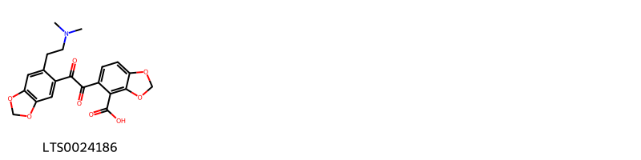{ width=100% }
    <figcaption>Hình ảnh cấu trúc hóa học của 1 hoạt chất thuộc nhóm Stilbenes gồm ['5-(2-{6-[2-(dimethylamino)ethyl]-2h-1,3-benzodioxol-5-yl}-2-oxoacetyl)-2h-1,3-benzodioxole-4-carboxylic acid (LTS0024186)'].</figcaption>
</figure>

---

### Dược dân tộc học

Danh sách các quốc gia có sử dụng *Corydalis bulbosa* trong điều trị các bệnh. 

| Country   | Disease               | Bệnh                                                                                                                                                                                                |
|:----------|:----------------------|:----------------------------------------------------------------------------------------------------------------------------------------------------------------------------------------------------|
| China     | Tranquilizer          | MYMEMORY WARNING: YOU USED ALL AVAILABLE FREE TRANSLATIONS FOR TODAY. NEXT AVAILABLE IN  09 HOURS 32 MINUTES 16 SECONDS VISIT HTTPS://MYMEMORY.TRANSLATED.NET/DOC/USAGELIMITS.PHP TO TRANSLATE MORE |
| Elsewhere | Cardiotonic, Sedative | MYMEMORY WARNING: YOU USED ALL AVAILABLE FREE TRANSLATIONS FOR TODAY. NEXT AVAILABLE IN  09 HOURS 32 MINUTES 12 SECONDS VISIT HTTPS://MYMEMORY.TRANSLATED.NET/DOC/USAGELIMITS.PHP TO TRANSLATE MORE |

---

---
## Corydalis cava
### Thông tin về thực vật

!!! info "Phân loại thực vật của *Corydalis cava* từ GIBF:"
    - **Kingdom:** Plantae
    - **Phylum:** Tracheophyta
    - **Order:** Ranunculales
    - **Family:** Papaveraceae
    - **Genus:** Corydalis
    - **Species:** *Corydalis cava*

 

| Label (VI)   | Label (EN)   | Scientific Name   | Descriptions (VI)   | Descriptions (EN)   | Also Known As (VI)   | Also Known As (EN)   |
|:-------------|:-------------|:------------------|:--------------------|:--------------------|:---------------------|:---------------------|
| N/A          | N/A          | Corydalis cava    | loài thực vật       | species of plant    | ['']                 | ['Hollowroot']       |

#### Phân bố trên thế giới

**Từ CSDL GIBF** Austria, Hungary, Moldova, Republic of, Czechia, France, Ukraine, Slovakia, Italy, Croatia, Switzerland, Serbia, Slovenia, Germany, Denmark, Spain, Netherlands

#### Phân bố tại Việt Nam

**Từ CSDL GIBF**: Không có ghi nhận ở Việt Nam

---
### Thành phần hóa học
        
- Theo cơ sở dữ liệu lotus: Từ loài *Corydalis cava* đã phân lập và xác định được 69 hoạt chất thuộc về các nhóm Aporphines, Benzophenanthridine alkaloids, Phenanthrenes and derivatives, Protopine alkaloids, Phthalide isoquinolines, Protoberberine alkaloids and derivatives, Stilbenes. 

|    | chemicalTaxonomyClassyfireClass          |   smiles_count |
|---:|:-----------------------------------------|---------------:|
|  0 | Aporphines                               |             20 |
|  1 | Benzophenanthridine alkaloids            |              1 |
|  2 | Phenanthrenes and derivatives            |              2 |
|  3 | Phthalide isoquinolines                  |              5 |
|  4 | Protoberberine alkaloids and derivatives |             34 |
|  5 | Protopine alkaloids                      |              6 |
|  6 | Stilbenes                                |              1 |

#### Nhóm Aporphines
<figure markdown="span">
    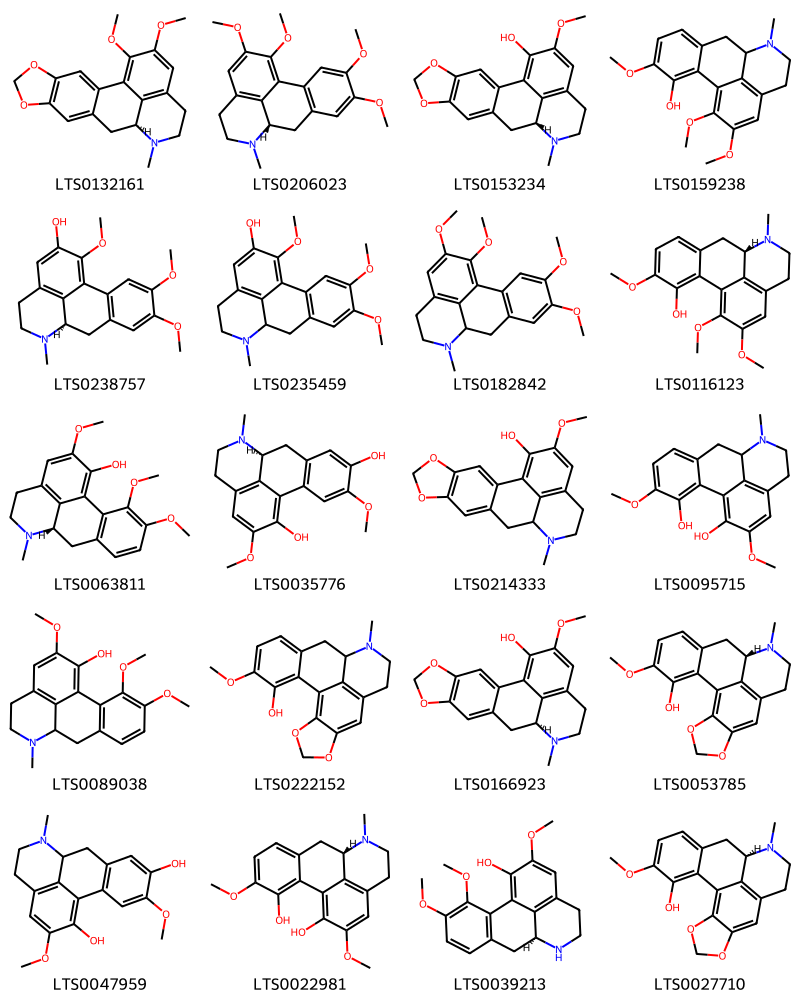{ width=100% }
    <figcaption>Hình ảnh cấu trúc hóa học của 20 hoạt chất thuộc nhóm Aporphines gồm ['nantenine (LTS0132161)', '(9s)-4,5,15,16-tetramethoxy-10-methyl-10-azatetracyclo[7.7.1.0²,⁷.0¹³,¹⁷]heptadeca-1(16),2(7),3,5,13(17),14-hexaene (LTS0206023)', '(-)-domesticine (LTS0153234)', '4,15,16-trimethoxy-10-methyl-10-azatetracyclo[7.7.1.0²,⁷.0¹³,¹⁷]heptadeca-1(16),2,4,6,13(17),14-hexaen-3-ol (LTS0159238)', '(9r)-4,5,16-trimethoxy-10-methyl-10-azatetracyclo[7.7.1.0²,⁷.0¹³,¹⁷]heptadeca-1(16),2(7),3,5,13(17),14-hexaen-15-ol (LTS0238757)', '4,5,16-trimethoxy-10-methyl-10-azatetracyclo[7.7.1.0²,⁷.0¹³,¹⁷]heptadeca-1(16),2(7),3,5,13(17),14-hexaen-15-ol (LTS0235459)', '4,5,15,16-tetramethoxy-10-methyl-10-azatetracyclo[7.7.1.0²,⁷.0¹³,¹⁷]heptadeca-1(16),2(7),3,5,13(17),14-hexaene (LTS0182842)', '(9s)-4,15,16-trimethoxy-10-methyl-10-azatetracyclo[7.7.1.0²,⁷.0¹³,¹⁷]heptadeca-1(16),2,4,6,13(17),14-hexaen-3-ol (LTS0116123)', '(9s)-3,4,15-trimethoxy-10-methyl-10-azatetracyclo[7.7.1.0²,⁷.0¹³,¹⁷]heptadeca-1(16),2(7),3,5,13(17),14-hexaen-16-ol (LTS0063811)', '(9s)-4,15-dimethoxy-10-methyl-10-azatetracyclo[7.7.1.0²,⁷.0¹³,¹⁷]heptadeca-1(16),2(7),3,5,13(17),14-hexaene-5,16-diol (LTS0035776)', '(+/-)-domesticine (LTS0214333)', '4,15-dimethoxy-10-methyl-10-azatetracyclo[7.7.1.0²,⁷.0¹³,¹⁷]heptadeca-1(16),2,4,6,13(17),14-hexaene-3,16-diol (LTS0095715)', '3,4,15-trimethoxy-10-methyl-10-azatetracyclo[7.7.1.0²,⁷.0¹³,¹⁷]heptadeca-1(16),2(7),3,5,13(17),14-hexaen-16-ol (LTS0089038)', 'bulbocapnine (LTS0222152)', 'domesticine (LTS0166923)', '(12s)-17-methoxy-11-methyl-3,5-dioxa-11-azapentacyclo[10.7.1.0²,⁶.0⁸,²⁰.0¹⁴,¹⁹]icosa-1,6,8(20),14,16,18-hexaen-18-ol (LTS0053785)', '4,15-dimethoxy-10-methyl-10-azatetracyclo[7.7.1.0²,⁷.0¹³,¹⁷]heptadeca-1(16),2(7),3,5,13(17),14-hexaene-5,16-diol (LTS0047959)', '(9s)-4,15-dimethoxy-10-methyl-10-azatetracyclo[7.7.1.0²,⁷.0¹³,¹⁷]heptadeca-1(16),2,4,6,13(17),14-hexaene-3,16-diol (LTS0022981)', '(9s)-3,4,15-trimethoxy-10-azatetracyclo[7.7.1.0²,⁷.0¹³,¹⁷]heptadeca-1(16),2(7),3,5,13(17),14-hexaen-16-ol (LTS0039213)', '(12r)-17-methoxy-11-methyl-3,5-dioxa-11-azapentacyclo[10.7.1.0²,⁶.0⁸,²⁰.0¹⁴,¹⁹]icosa-1,6,8(20),14,16,18-hexaen-18-ol (LTS0027710)'].</figcaption>
</figure>
#### Nhóm Benzophenanthridine alkaloids
<figure markdown="span">
    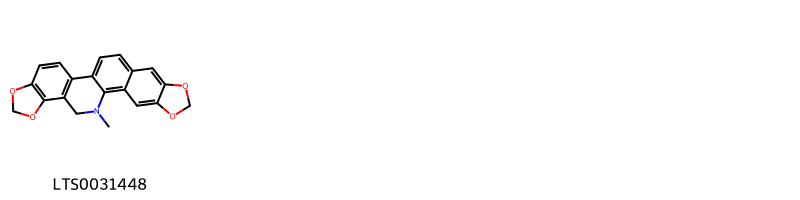{ width=100% }
    <figcaption>Hình ảnh cấu trúc hóa học của 1 hoạt chất thuộc nhóm Benzophenanthridine alkaloids gồm ['dihydrosanguinarine (LTS0031448)'].</figcaption>
</figure>
#### Nhóm Phenanthrenes and derivatives
<figure markdown="span">
    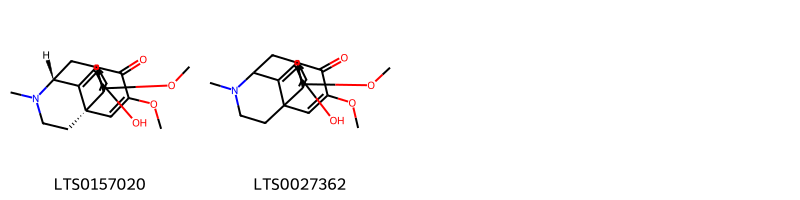{ width=100% }
    <figcaption>Hình ảnh cấu trúc hóa học của 2 hoạt chất thuộc nhóm Phenanthrenes and derivatives gồm ['salutaridine (LTS0157020)', '3-hydroxy-4,13-dimethoxy-17-methyl-17-azatetracyclo[7.5.3.0¹,¹⁰.0²,⁷]heptadeca-2,4,6,10,13-pentaen-12-one (LTS0027362)'].</figcaption>
</figure>
#### Nhóm Phthalide isoquinolines
<figure markdown="span">
    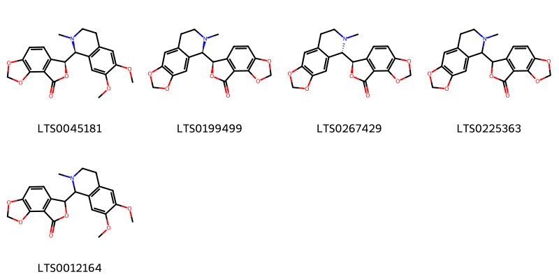{ width=100% }
    <figcaption>Hình ảnh cấu trúc hóa học của 5 hoạt chất thuộc nhóm Phthalide isoquinolines gồm ['(+)-adlumine (LTS0045181)', '(-)-adlumidine (LTS0199499)', 'bicuculline (LTS0267429)', 'bicuculline (LTS0225363)', '10-(6,7-dimethoxy-2-methyl-3,4-dihydro-1h-isoquinolin-1-yl)-3,5,11-trioxatricyclo[7.3.0.0²,⁶]dodeca-1(9),2(6),7-trien-12-one (LTS0012164)'].</figcaption>
</figure>
#### Nhóm Protoberberine alkaloids and derivatives
<figure markdown="span">
    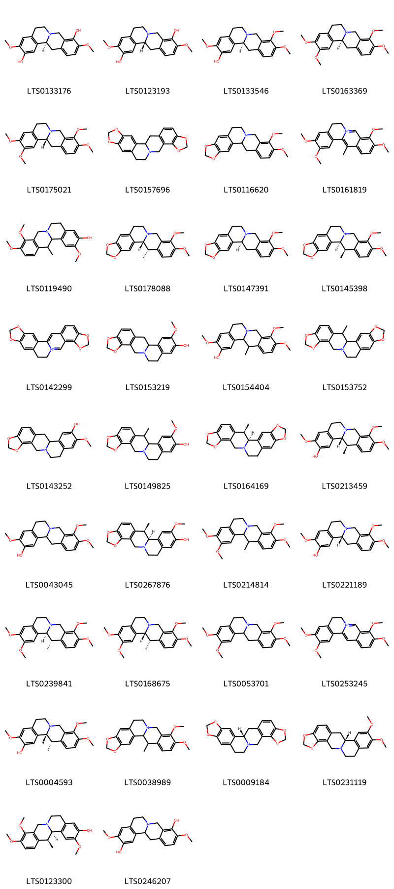{ width=100% }
    <figcaption>Hình ảnh cấu trúc hóa học của 34 hoạt chất thuộc nhóm Protoberberine alkaloids and derivatives gồm ['scoulerine (LTS0133176)', '(12br)-3,10-dimethoxy-7,8,12b,13-tetrahydro-5h-6-azatetraphene-4,11-diol (LTS0123193)', 'tetrahydrocolumbamine (LTS0133546)', 'tetrahydropalmatine (LTS0163369)', '(+)-tetrahydropalmatine (LTS0175021)', '5,7,17,19-tetraoxa-13-azahexacyclo[11.11.0.0²,¹⁰.0⁴,⁸.0¹⁵,²³.0¹⁶,²⁰]tetracosa-2,4(8),9,15(23),16(20),21-hexaene (LTS0157696)', 'canadin (LTS0116620)', 'dehydrocorydaline (LTS0161819)', '3,4,11-trimethoxy-13-methyl-7,8,12b,13-tetrahydro-5h-6-azatetraphen-10-ol (LTS0119490)', 'thalictricavine (LTS0178088)', '(s)-canadine (LTS0147391)', '(1s,21r)-16,17-dimethoxy-21-methyl-5,7-dioxa-13-azapentacyclo[11.8.0.0²,¹⁰.0⁴,⁸.0¹⁵,²⁰]henicosa-2,4(8),9,15,17,19-hexaene (LTS0145398)', '5,7,17,19-tetraoxa-13λ⁵-azahexacyclo[11.11.0.0²,¹⁰.0⁴,⁸.0¹⁵,²³.0¹⁶,²⁰]tetracosa-1(24),2,4(8),9,13,15,20,22-octaen-13-ylium (LTS0142299)', '16-methoxy-5,7-dioxa-1-azapentacyclo[11.8.0.0³,¹¹.0⁴,⁸.0¹⁴,¹⁹]henicosa-3(11),4(8),9,14(19),15,17-hexaen-17-ol (LTS0153219)', '3,4,10-trimethoxy-13-methyl-7,8,12b,13-tetrahydro-5h-6-azatetraphen-11-ol (LTS0154404)', '24-methyl-5,7,17,19-tetraoxa-13-azahexacyclo[11.11.0.0²,¹⁰.0⁴,⁸.0¹⁵,²³.0¹⁶,²⁰]tetracosa-2,4(8),9,15,20,22-hexaene (LTS0153752)', '17-methoxy-5,7-dioxa-1-azapentacyclo[11.8.0.0³,¹¹.0⁴,⁸.0¹⁴,¹⁹]henicosa-3,8,10,14(19),15,17-hexaen-16-ol (LTS0143252)', '16-methoxy-12-methyl-5,7-dioxa-1-azapentacyclo[11.8.0.0³,¹¹.0⁴,⁸.0¹⁴,¹⁹]henicosa-3(11),4(8),9,14(19),15,17-hexaen-17-ol (LTS0149825)', '(1s,24r)-24-methyl-5,7,17,19-tetraoxa-13-azahexacyclo[11.11.0.0²,¹⁰.0⁴,⁸.0¹⁵,²³.0¹⁶,²⁰]tetracosa-2,4(8),9,15,20,22-hexaene (LTS0164169)', '(12br,13r)-3,4,10-trimethoxy-13-methyl-7,8,12b,13-tetrahydro-5h-6-azatetraphen-11-ol (LTS0213459)', '(+/-)-isocorypalmine (LTS0043045)', '(12r,13s)-16-methoxy-12-methyl-5,7-dioxa-1-azapentacyclo[11.8.0.0³,¹¹.0⁴,⁸.0¹⁴,¹⁹]henicosa-3(11),4(8),9,14(19),15,17-hexaen-17-ol (LTS0267876)', '3,4,10,11-tetramethoxy-13-methyl-7,8,12b,13-tetrahydro-5h-6-azatetraphene (LTS0214814)', '(+)-isocorypalmine (LTS0221189)', '(-)-mesocorydaline (LTS0239841)', '(+)-corydaline (LTS0168675)', '(+/-)-tetrahydropalmatine (LTS0053701)', 'palmatine (LTS0253245)', 'isocorybulbine (LTS0004593)', '16,17-dimethoxy-21-methyl-5,7-dioxa-13-azapentacyclo[11.8.0.0²,¹⁰.0⁴,⁸.0¹⁵,²⁰]henicosa-2,4(8),9,15,17,19-hexaene (LTS0038989)', 'stylopine (LTS0009184)', '(13r)-16,17-dimethoxy-5,7-dioxa-1-azapentacyclo[11.8.0.0³,¹¹.0⁴,⁸.0¹⁴,¹⁹]henicosa-3,8,10,14(19),15,17-hexaene (LTS0231119)', 'corybulbine (LTS0123300)', '(s)-scoulerine (LTS0246207)'].</figcaption>
</figure>
#### Nhóm Protopine alkaloids
<figure markdown="span">
    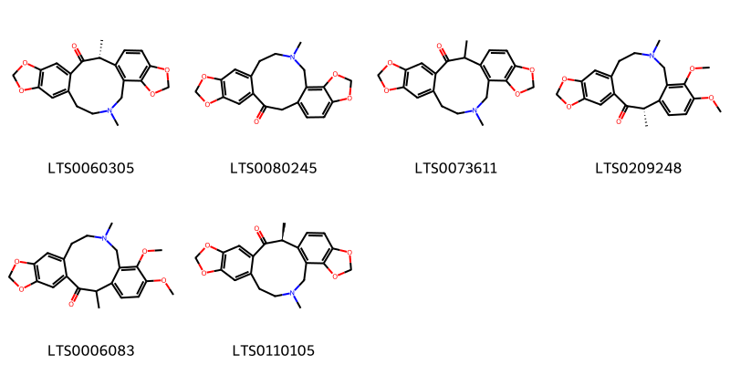{ width=100% }
    <figcaption>Hình ảnh cấu trúc hóa học của 6 hoạt chất thuộc nhóm Protopine alkaloids gồm ['corycavamine (LTS0060305)', 'protopine (LTS0080245)', '(+/-)-corycavamine (LTS0073611)', 'corycavidine (LTS0209248)', '(+/-)-corycavidine (LTS0006083)', '(-)-corycavine (LTS0110105)'].</figcaption>
</figure>
#### Nhóm Stilbenes
<figure markdown="span">
    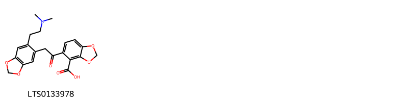{ width=100% }
    <figcaption>Hình ảnh cấu trúc hóa học của 1 hoạt chất thuộc nhóm Stilbenes gồm ['5-(2-{6-[2-(dimethylamino)ethyl]-2h-1,3-benzodioxol-5-yl}acetyl)-2h-1,3-benzodioxole-4-carboxylic acid (LTS0133978)'].</figcaption>
</figure>

---

### Dược dân tộc học

Danh sách các quốc gia có sử dụng *Corydalis cava* trong điều trị các bệnh. 

| Country   | Disease     | Bệnh                                                                                                                                                                                                |
|:----------|:------------|:----------------------------------------------------------------------------------------------------------------------------------------------------------------------------------------------------|
| French    | Vermifuge   | MYMEMORY WARNING: YOU USED ALL AVAILABLE FREE TRANSLATIONS FOR TODAY. NEXT AVAILABLE IN  09 HOURS 31 MINUTES 40 SECONDS VISIT HTTPS://MYMEMORY.TRANSLATED.NET/DOC/USAGELIMITS.PHP TO TRANSLATE MORE |
| German    | Emmenagogue | MYMEMORY WARNING: YOU USED ALL AVAILABLE FREE TRANSLATIONS FOR TODAY. NEXT AVAILABLE IN  09 HOURS 31 MINUTES 34 SECONDS VISIT HTTPS://MYMEMORY.TRANSLATED.NET/DOC/USAGELIMITS.PHP TO TRANSLATE MORE |
| Italian   | Narcotic    | MYMEMORY WARNING: YOU USED ALL AVAILABLE FREE TRANSLATIONS FOR TODAY. NEXT AVAILABLE IN  09 HOURS 31 MINUTES 30 SECONDS VISIT HTTPS://MYMEMORY.TRANSLATED.NET/DOC/USAGELIMITS.PHP TO TRANSLATE MORE |
| US        | Tonic       | MYMEMORY WARNING: YOU USED ALL AVAILABLE FREE TRANSLATIONS FOR TODAY. NEXT AVAILABLE IN  09 HOURS 31 MINUTES 24 SECONDS VISIT HTTPS://MYMEMORY.TRANSLATED.NET/DOC/USAGELIMITS.PHP TO TRANSLATE MORE |
| anish     | Discutient  | MYMEMORY WARNING: YOU USED ALL AVAILABLE FREE TRANSLATIONS FOR TODAY. NEXT AVAILABLE IN  09 HOURS 31 MINUTES 16 SECONDS VISIT HTTPS://MYMEMORY.TRANSLATED.NET/DOC/USAGELIMITS.PHP TO TRANSLATE MORE |

---

---
## Corydalis flavula
### Thông tin về thực vật

!!! info "Phân loại thực vật của *Corydalis flavula* từ GIBF:"
    - **Kingdom:** Plantae
    - **Phylum:** Tracheophyta
    - **Order:** Ranunculales
    - **Family:** Papaveraceae
    - **Genus:** Corydalis
    - **Species:** *Corydalis flavula*

 

| Label (VI)   | Label (EN)   | Scientific Name   | Descriptions (VI)   | Descriptions (EN)   | Also Known As (VI)   | Also Known As (EN)   |
|:-------------|:-------------|:------------------|:--------------------|:--------------------|:---------------------|:---------------------|
| N/A          | N/A          | Corydalis flavula | loài thực vật       | species of plant    | ['']                 | ['']                 |

#### Phân bố trên thế giới

**Từ CSDL GIBF** United States of America

#### Phân bố tại Việt Nam

**Từ CSDL GIBF**: Không có ghi nhận ở Việt Nam

---
### Thành phần hóa học
        
- Theo cơ sở dữ liệu lotus: Từ loài *Corydalis flavula* đã phân lập và xác định được Chưa có hoạt chất nào được phân lập. hoạt chất thuộc về các nhóm Không có hoạt chất nào được phân lập. 

Không có hình ảnh nào được tạo ra

---

### Dược dân tộc học

Danh sách các quốc gia có sử dụng *Corydalis flavula* trong điều trị các bệnh. 

| Country   | Disease   | Bệnh                                                                                                                                                                                                |
|:----------|:----------|:----------------------------------------------------------------------------------------------------------------------------------------------------------------------------------------------------|
| US        | Poison    | MYMEMORY WARNING: YOU USED ALL AVAILABLE FREE TRANSLATIONS FOR TODAY. NEXT AVAILABLE IN  09 HOURS 30 MINUTES 39 SECONDS VISIT HTTPS://MYMEMORY.TRANSLATED.NET/DOC/USAGELIMITS.PHP TO TRANSLATE MORE |

---

---
## Corydalis gavaniana
### Thông tin về thực vật

!!! info "Phân loại thực vật của *Corydalis govaniana* từ GIBF:"
    - **Kingdom:** Plantae
    - **Phylum:** Tracheophyta
    - **Order:** Ranunculales
    - **Family:** Papaveraceae
    - **Genus:** Corydalis
    - **Species:** *Corydalis govaniana*

 

| Label (VI)   | Label (EN)   | Scientific Name   | Descriptions (VI)   | Descriptions (EN)   | Also Known As (VI)   | Also Known As (EN)   |
|:-------------|:-------------|:------------------|:--------------------|:--------------------|:---------------------|:---------------------|
| N/A          | N/A          | Corydalis flavula | loài thực vật       | species of plant    | ['']                 | ['']                 |

#### Phân bố trên thế giới

**Từ CSDL GIBF** nan, Afghanistan, Nepal, Pakistan, India, unknown or invalid

#### Phân bố tại Việt Nam

**Từ CSDL GIBF**: Không có ghi nhận ở Việt Nam

---
### Thành phần hóa học
        
- Theo cơ sở dữ liệu lotus: Từ loài *Corydalis govaniana* đã phân lập và xác định được Chưa có hoạt chất nào được phân lập. hoạt chất thuộc về các nhóm Không có hoạt chất nào được phân lập. 

Không có hình ảnh nào được tạo ra

---

### Dược dân tộc học

Danh sách các quốc gia có sử dụng *Corydalis govaniana* trong điều trị các bệnh. 

| Country   | Disease                | Bệnh                                                                                                                                                                                                |
|:----------|:-----------------------|:----------------------------------------------------------------------------------------------------------------------------------------------------------------------------------------------------|
| Elsewhere | Antiperiodic, Diuretic | MYMEMORY WARNING: YOU USED ALL AVAILABLE FREE TRANSLATIONS FOR TODAY. NEXT AVAILABLE IN  09 HOURS 30 MINUTES 05 SECONDS VISIT HTTPS://MYMEMORY.TRANSLATED.NET/DOC/USAGELIMITS.PHP TO TRANSLATE MORE |

---

---
## Corydalis govaniana
### Thông tin về thực vật

!!! info "Phân loại thực vật của *Corydalis govaniana* từ GIBF:"
    - **Kingdom:** Plantae
    - **Phylum:** Tracheophyta
    - **Order:** Ranunculales
    - **Family:** Papaveraceae
    - **Genus:** Corydalis
    - **Species:** *Corydalis govaniana*

 

| Label (VI)   | Label (EN)   | Scientific Name     | Descriptions (VI)   | Descriptions (EN)   | Also Known As (VI)   | Also Known As (EN)   |
|:-------------|:-------------|:--------------------|:--------------------|:--------------------|:---------------------|:---------------------|
| N/A          | N/A          | Corydalis govaniana | loài thực vật       | species of plant    | ['']                 | ['']                 |

#### Phân bố trên thế giới

**Từ CSDL GIBF** nan, Afghanistan, Nepal, Pakistan, India, unknown or invalid

#### Phân bố tại Việt Nam

**Từ CSDL GIBF**: Không có ghi nhận ở Việt Nam

---
### Thành phần hóa học
        
- Theo cơ sở dữ liệu lotus: Từ loài *Corydalis govaniana* đã phân lập và xác định được 15 hoạt chất thuộc về các nhóm Aporphines, Protopine alkaloids, Carboxylic acids and derivatives, Phthalide isoquinolines, Tetrahydroisoquinolines, Protoberberine alkaloids and derivatives, Organonitrogen compounds. 

|    | chemicalTaxonomyClassyfireClass          |   smiles_count |
|---:|:-----------------------------------------|---------------:|
|  0 | Aporphines                               |              2 |
|  1 | Carboxylic acids and derivatives         |              2 |
|  2 | Organonitrogen compounds                 |              1 |
|  3 | Phthalide isoquinolines                  |              5 |
|  4 | Protoberberine alkaloids and derivatives |              2 |
|  5 | Protopine alkaloids                      |              1 |
|  6 | Tetrahydroisoquinolines                  |              2 |

#### Nhóm Aporphines
<figure markdown="span">
    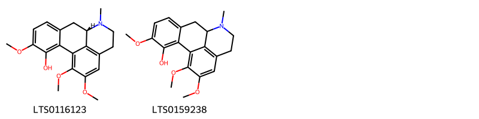{ width=100% }
    <figcaption>Hình ảnh cấu trúc hóa học của 2 hoạt chất thuộc nhóm Aporphines gồm ['(9s)-4,15,16-trimethoxy-10-methyl-10-azatetracyclo[7.7.1.0²,⁷.0¹³,¹⁷]heptadeca-1(16),2,4,6,13(17),14-hexaen-3-ol (LTS0116123)', '4,15,16-trimethoxy-10-methyl-10-azatetracyclo[7.7.1.0²,⁷.0¹³,¹⁷]heptadeca-1(16),2,4,6,13(17),14-hexaen-3-ol (LTS0159238)'].</figcaption>
</figure>
#### Nhóm Carboxylic acids and derivatives
<figure markdown="span">
    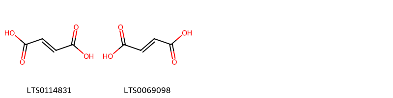{ width=100% }
    <figcaption>Hình ảnh cấu trúc hóa học của 2 hoạt chất thuộc nhóm Carboxylic acids and derivatives gồm ['fumaric acid (LTS0114831)', 'butenedioic acid (LTS0069098)'].</figcaption>
</figure>
#### Nhóm Organonitrogen compounds
<figure markdown="span">
    { width=100% }
    <figcaption>Hình ảnh cấu trúc hóa học của 1 hoạt chất thuộc nhóm Organonitrogen compounds gồm ['choline (LTS0170307)'].</figcaption>
</figure>
#### Nhóm Phthalide isoquinolines
<figure markdown="span">
    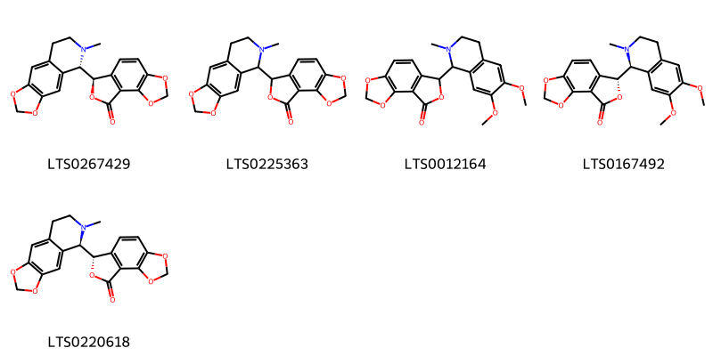{ width=100% }
    <figcaption>Hình ảnh cấu trúc hóa học của 5 hoạt chất thuộc nhóm Phthalide isoquinolines gồm ['bicuculline (LTS0267429)', 'bicuculline (LTS0225363)', '10-(6,7-dimethoxy-2-methyl-3,4-dihydro-1h-isoquinolin-1-yl)-3,5,11-trioxatricyclo[7.3.0.0²,⁶]dodeca-1(9),2(6),7-trien-12-one (LTS0012164)', '(10r)-10-[(1s)-6,7-dimethoxy-2-methyl-3,4-dihydro-1h-isoquinolin-1-yl]-3,5,11-trioxatricyclo[7.3.0.0²,⁶]dodeca-1(9),2(6),7-trien-12-one (LTS0167492)', '(10s)-10-[(5r)-6-methyl-2h,5h,7h,8h-[1,3]dioxolo[4,5-g]isoquinolin-5-yl]-3,5,11-trioxatricyclo[7.3.0.0²,⁶]dodeca-1(9),2(6),7-trien-12-one (LTS0220618)'].</figcaption>
</figure>
#### Nhóm Protoberberine alkaloids and derivatives
<figure markdown="span">
    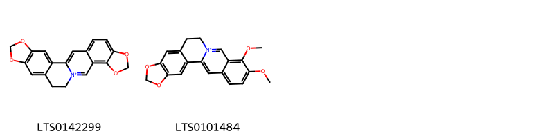{ width=100% }
    <figcaption>Hình ảnh cấu trúc hóa học của 2 hoạt chất thuộc nhóm Protoberberine alkaloids and derivatives gồm ['5,7,17,19-tetraoxa-13λ⁵-azahexacyclo[11.11.0.0²,¹⁰.0⁴,⁸.0¹⁵,²³.0¹⁶,²⁰]tetracosa-1(24),2,4(8),9,13,15,20,22-octaen-13-ylium (LTS0142299)', 'berberine (LTS0101484)'].</figcaption>
</figure>
#### Nhóm Protopine alkaloids
<figure markdown="span">
    { width=100% }
    <figcaption>Hình ảnh cấu trúc hóa học của 1 hoạt chất thuộc nhóm Protopine alkaloids gồm ['protopine (LTS0080245)'].</figcaption>
</figure>
#### Nhóm Tetrahydroisoquinolines
<figure markdown="span">
    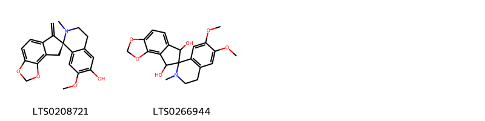{ width=100% }
    <figcaption>Hình ảnh cấu trúc hóa học của 2 hoạt chất thuộc nhóm Tetrahydroisoquinolines gồm ['ochotensine (LTS0208721)', "6',7'-dimethoxy-2'-methyl-3',4',6,8-tetrahydro-2h-spiro[indeno[4,5-d][1,3]dioxole-7,1'-isoquinoline]-6,8-diol (LTS0266944)"].</figcaption>
</figure>

---

### Dược dân tộc học

Danh sách các quốc gia có sử dụng *Corydalis govaniana* trong điều trị các bệnh. 

| Country   | Disease         | Bệnh                                                                                                                                                                                                |
|:----------|:----------------|:----------------------------------------------------------------------------------------------------------------------------------------------------------------------------------------------------|
| Elsewhere | Diuretic, Tonic | MYMEMORY WARNING: YOU USED ALL AVAILABLE FREE TRANSLATIONS FOR TODAY. NEXT AVAILABLE IN  09 HOURS 29 MINUTES 19 SECONDS VISIT HTTPS://MYMEMORY.TRANSLATED.NET/DOC/USAGELIMITS.PHP TO TRANSLATE MORE |

---

# Chi Macleaya

??? note "Danh sách các dược liệu thuộc chi"
    
	 - *Macleaya cordata*

---
## Macleaya cordata
### Thông tin về thực vật

!!! info "Phân loại thực vật của *Macleaya cordata* từ GIBF:"
    - **Kingdom:** Plantae
    - **Phylum:** Tracheophyta
    - **Order:** Ranunculales
    - **Family:** Papaveraceae
    - **Genus:** Macleaya
    - **Species:** *Macleaya cordata*

 

| Label (VI)   | Label (EN)   | Scientific Name   | Descriptions (VI)   | Descriptions (EN)   | Also Known As (VI)   | Also Known As (EN)   |
|:-------------|:-------------|:------------------|:--------------------|:--------------------|:---------------------|:---------------------|
| N/A          | N/A          | Macleaya cordata  | loài thực vật       | species of plant    | ['']                 | ['']                 |

#### Phân bố trên thế giới

**Từ CSDL GIBF** Belarus, nan, Austria, Japan, United States of America, Sweden, Belgium, Chinese Taipei, Ukraine, China, Canada, Germany, Lithuania, United Kingdom of Great Britain and Northern Ireland, Netherlands

#### Phân bố tại Việt Nam

**Từ CSDL GIBF**: Không có ghi nhận ở Việt Nam

---
### Thành phần hóa học
        
- Theo cơ sở dữ liệu lotus: Từ loài *Macleaya cordata* đã phân lập và xác định được 24 hoạt chất thuộc về các nhóm Benzophenanthridine alkaloids, Benzene and substituted derivatives, Quinolines and derivatives, Protopine alkaloids, Benzodioxoles, Carboxylic acids and derivatives, Phenols, Protoberberine alkaloids and derivatives, Isoquinolines and derivatives. 

|    | chemicalTaxonomyClassyfireClass          |   smiles_count |
|---:|:-----------------------------------------|---------------:|
|  0 | Benzene and substituted derivatives      |              3 |
|  1 | Benzodioxoles                            |              1 |
|  2 | Benzophenanthridine alkaloids            |              6 |
|  3 | Carboxylic acids and derivatives         |              1 |
|  4 | Isoquinolines and derivatives            |              4 |
|  5 | Phenols                                  |              1 |
|  6 | Protoberberine alkaloids and derivatives |              5 |
|  7 | Protopine alkaloids                      |              2 |
|  8 | Quinolines and derivatives               |              1 |

#### Nhóm Benzene and substituted derivatives
<figure markdown="span">
    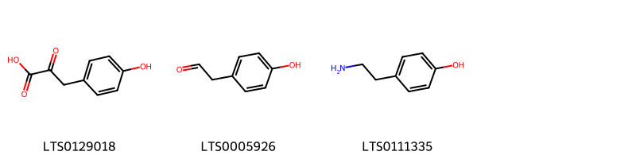{ width=100% }
    <figcaption>Hình ảnh cấu trúc hóa học của 3 hoạt chất thuộc nhóm Benzene and substituted derivatives gồm ['4-hydroxyphenylpyruvic acid (LTS0129018)', 'p-hydroxyphenylacetaldehyde (LTS0005926)', 'tyramine (LTS0111335)'].</figcaption>
</figure>
#### Nhóm Benzodioxoles
<figure markdown="span">
    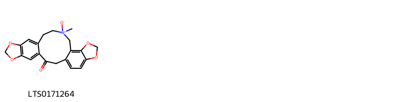{ width=100% }
    <figcaption>Hình ảnh cấu trúc hóa học của 1 hoạt chất thuộc nhóm Benzodioxoles gồm ['15-methyl-3-oxo-7,9,19,21-tetraoxa-15-azapentacyclo[15.7.0.0⁴,¹².0⁶,¹⁰.0¹⁸,²²]tetracosa-1(24),4,6(10),11,17,22-hexaen-15-ium-15-olate (LTS0171264)'].</figcaption>
</figure>
#### Nhóm Benzophenanthridine alkaloids
<figure markdown="span">
    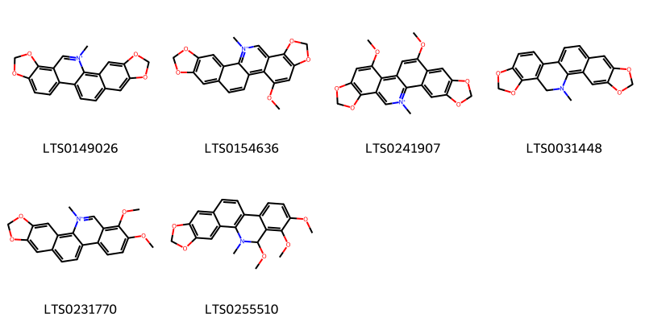{ width=100% }
    <figcaption>Hình ảnh cấu trúc hóa học của 6 hoạt chất thuộc nhóm Benzophenanthridine alkaloids gồm ['sanguinarine (LTS0149026)', 'chelirubine (LTS0154636)', 'macarpine (LTS0241907)', 'dihydrosanguinarine (LTS0031448)', 'chelerythrine (LTS0231770)', 'angoline (LTS0255510)'].</figcaption>
</figure>
#### Nhóm Carboxylic acids and derivatives
<figure markdown="span">
    { width=100% }
    <figcaption>Hình ảnh cấu trúc hóa học của 1 hoạt chất thuộc nhóm Carboxylic acids and derivatives gồm ['l-tyrosine (LTS0029981)'].</figcaption>
</figure>
#### Nhóm Isoquinolines and derivatives
<figure markdown="span">
    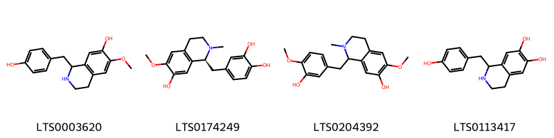{ width=100% }
    <figcaption>Hình ảnh cấu trúc hóa học của 4 hoạt chất thuộc nhóm Isoquinolines and derivatives gồm ['(rs)-coclaurine (LTS0003620)', '4-benzene-1,2-diol (LTS0174249)', 'reticuline (LTS0204392)', 'higenamine (LTS0113417)'].</figcaption>
</figure>
#### Nhóm Phenols
<figure markdown="span">
    { width=100% }
    <figcaption>Hình ảnh cấu trúc hóa học của 1 hoạt chất thuộc nhóm Phenols gồm ['dopamine (LTS0029901)'].</figcaption>
</figure>
#### Nhóm Protoberberine alkaloids and derivatives
<figure markdown="span">
    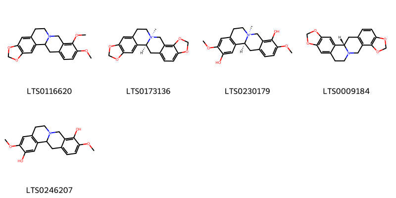{ width=100% }
    <figcaption>Hình ảnh cấu trúc hóa học của 5 hoạt chất thuộc nhóm Protoberberine alkaloids and derivatives gồm ['canadin (LTS0116620)', '(s)-cis-n-methylstylopine (LTS0173136)', 'cyclanoline (LTS0230179)', 'stylopine (LTS0009184)', '(s)-scoulerine (LTS0246207)'].</figcaption>
</figure>
#### Nhóm Protopine alkaloids
<figure markdown="span">
    { width=100% }
    <figcaption>Hình ảnh cấu trúc hóa học của 2 hoạt chất thuộc nhóm Protopine alkaloids gồm ['β-allocryptopine (LTS0174113)', 'protopine (LTS0080245)'].</figcaption>
</figure>
#### Nhóm Quinolines and derivatives
<figure markdown="span">
    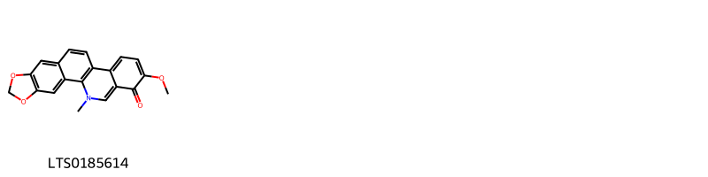{ width=100% }
    <figcaption>Hình ảnh cấu trúc hóa học của 1 hoạt chất thuộc nhóm Quinolines and derivatives gồm ['17-methoxy-21-methyl-5,7-dioxa-21-azapentacyclo[11.8.0.0²,¹⁰.0⁴,⁸.0¹⁴,¹⁹]henicosa-1(13),2,4(8),9,11,14,16,19-octaen-18-one (LTS0185614)'].</figcaption>
</figure>

---

### Dược dân tộc học

Danh sách các quốc gia có sử dụng *Macleaya cordata* trong điều trị các bệnh. 

| Country   | Disease                                                                   | Bệnh                                                                                                                                                                                                |
|:----------|:--------------------------------------------------------------------------|:----------------------------------------------------------------------------------------------------------------------------------------------------------------------------------------------------|
| China     | Analgesic, Carminative, Laxative, Poison, Poison, Alexiteric, Insecticide | MYMEMORY WARNING: YOU USED ALL AVAILABLE FREE TRANSLATIONS FOR TODAY. NEXT AVAILABLE IN  09 HOURS 28 MINUTES 47 SECONDS VISIT HTTPS://MYMEMORY.TRANSLATED.NET/DOC/USAGELIMITS.PHP TO TRANSLATE MORE |
| Elsewhere | Insecticide                                                               | MYMEMORY WARNING: YOU USED ALL AVAILABLE FREE TRANSLATIONS FOR TODAY. NEXT AVAILABLE IN  09 HOURS 28 MINUTES 45 SECONDS VISIT HTTPS://MYMEMORY.TRANSLATED.NET/DOC/USAGELIMITS.PHP TO TRANSLATE MORE |
| Japan     | Poison                                                                    | MYMEMORY WARNING: YOU USED ALL AVAILABLE FREE TRANSLATIONS FOR TODAY. NEXT AVAILABLE IN  09 HOURS 28 MINUTES 42 SECONDS VISIT HTTPS://MYMEMORY.TRANSLATED.NET/DOC/USAGELIMITS.PHP TO TRANSLATE MORE |

---

# Chi Glaucium

??? note "Danh sách các dược liệu thuộc chi"
    
	 - *Glaucium corniculatum*
	 - *Glaucium flavum*

---
## Glaucium corniculatum
### Thông tin về thực vật

!!! info "Phân loại thực vật của *Glaucium corniculatum* từ GIBF:"
    - **Kingdom:** Plantae
    - **Phylum:** Tracheophyta
    - **Order:** Ranunculales
    - **Family:** Papaveraceae
    - **Genus:** Glaucium
    - **Species:** *Glaucium corniculatum*

 

| Label (VI)   | Label (EN)   | Scientific Name       | Descriptions (VI)   | Descriptions (EN)   | Also Known As (VI)   | Also Known As (EN)   |
|:-------------|:-------------|:----------------------|:--------------------|:--------------------|:---------------------|:---------------------|
| N/A          | N/A          | Glaucium corniculatum | loài thực vật       | species of plant    | ['']                 | ['']                 |

#### Phân bố trên thế giới

**Từ CSDL GIBF** Czechia, Israel, Türkiye, Spain, United States of America, Romania, Greece, Armenia, Russian Federation, Azerbaijan, Morocco, Algeria, Palestine, State of, Georgia, Austria, Hungary, Portugal, Ukraine, Italy, Bulgaria, France

#### Phân bố tại Việt Nam

**Từ CSDL GIBF**: Không có ghi nhận ở Việt Nam

---
### Thành phần hóa học
        
- Theo cơ sở dữ liệu lotus: Từ loài *Glaucium corniculatum* đã phân lập và xác định được 35 hoạt chất thuộc về các nhóm Benzophenanthridine alkaloids, Aporphines, Phenanthrenes and derivatives, Protopine alkaloids, Dibenzazecins, Protoberberine alkaloids and derivatives, Isoquinolines and derivatives. 

|    | chemicalTaxonomyClassyfireClass          |   smiles_count |
|---:|:-----------------------------------------|---------------:|
|  0 | Aporphines                               |             24 |
|  1 | Benzophenanthridine alkaloids            |              4 |
|  2 | Dibenzazecins                            |              1 |
|  3 | Isoquinolines and derivatives            |              2 |
|  4 | Phenanthrenes and derivatives            |              1 |
|  5 | Protoberberine alkaloids and derivatives |              1 |
|  6 | Protopine alkaloids                      |              2 |

#### Nhóm Aporphines
<figure markdown="span">
    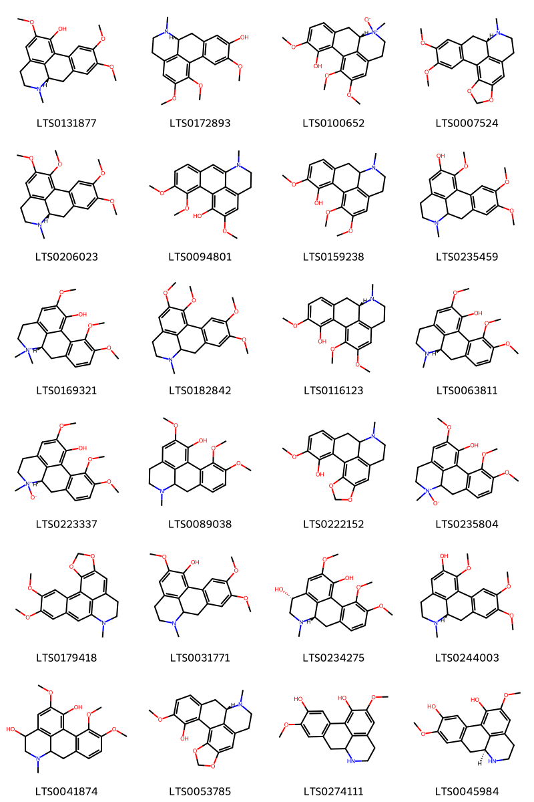{ width=100% }
    <figcaption>Hình ảnh cấu trúc hóa học của 24 hoạt chất thuộc nhóm Aporphines gồm ['(9s)-4,5,15-trimethoxy-10-methyl-10-azatetracyclo[7.7.1.0²,⁷.0¹³,¹⁷]heptadeca-1(16),2(7),3,5,13(17),14-hexaen-16-ol (LTS0131877)', '(9s)-4,15,16-trimethoxy-10-methyl-10-azatetracyclo[7.7.1.0²,⁷.0¹³,¹⁷]heptadeca-1(16),2(7),3,5,13(17),14-hexaen-5-ol (LTS0172893)', 'isocorydine n-oxide (LTS0100652)', '(12s)-16,17-dimethoxy-11-methyl-3,5-dioxa-11-azapentacyclo[10.7.1.0²,⁶.0⁸,²⁰.0¹⁴,¹⁹]icosa-1,6,8(20),14(19),15,17-hexaene (LTS0007524)', '(9s)-4,5,15,16-tetramethoxy-10-methyl-10-azatetracyclo[7.7.1.0²,⁷.0¹³,¹⁷]heptadeca-1(16),2(7),3,5,13(17),14-hexaene (LTS0206023)', '3,4,15-trimethoxy-10-methyl-10-azatetracyclo[7.7.1.0²,⁷.0¹³,¹⁷]heptadeca-1(17),2(7),3,5,8,13,15-heptaen-16-ol (LTS0094801)', '4,15,16-trimethoxy-10-methyl-10-azatetracyclo[7.7.1.0²,⁷.0¹³,¹⁷]heptadeca-1(16),2,4,6,13(17),14-hexaen-3-ol (LTS0159238)', '4,5,16-trimethoxy-10-methyl-10-azatetracyclo[7.7.1.0²,⁷.0¹³,¹⁷]heptadeca-1(16),2(7),3,5,13(17),14-hexaen-15-ol (LTS0235459)', '(9s)-16-hydroxy-3,4,15-trimethoxy-10,10-dimethyl-10-azatetracyclo[7.7.1.0²,⁷.0¹³,¹⁷]heptadeca-1(16),2(7),3,5,13(17),14-hexaen-10-ium (LTS0169321)', '4,5,15,16-tetramethoxy-10-methyl-10-azatetracyclo[7.7.1.0²,⁷.0¹³,¹⁷]heptadeca-1(16),2(7),3,5,13(17),14-hexaene (LTS0182842)', '(9s)-4,15,16-trimethoxy-10-methyl-10-azatetracyclo[7.7.1.0²,⁷.0¹³,¹⁷]heptadeca-1(16),2,4,6,13(17),14-hexaen-3-ol (LTS0116123)', '(9s)-3,4,15-trimethoxy-10-methyl-10-azatetracyclo[7.7.1.0²,⁷.0¹³,¹⁷]heptadeca-1(16),2(7),3,5,13(17),14-hexaen-16-ol (LTS0063811)', '(9r)-16-hydroxy-3,4,15-trimethoxy-10-methyl-10-azatetracyclo[7.7.1.0²,⁷.0¹³,¹⁷]heptadeca-1(16),2(7),3,5,13(17),14-hexaen-10-ium-10-olate (LTS0223337)', '3,4,15-trimethoxy-10-methyl-10-azatetracyclo[7.7.1.0²,⁷.0¹³,¹⁷]heptadeca-1(16),2(7),3,5,13(17),14-hexaen-16-ol (LTS0089038)', 'bulbocapnine (LTS0222152)', '16-hydroxy-3,4,15-trimethoxy-10-methyl-10-azatetracyclo[7.7.1.0²,⁷.0¹³,¹⁷]heptadeca-1(16),2(7),3,5,13(17),14-hexaen-10-ium-10-olate (LTS0235804)', '16,17-dimethoxy-11-methyl-3,5-dioxa-11-azapentacyclo[10.7.1.0²,⁶.0⁸,²⁰.0¹⁴,¹⁹]icosa-1(20),2(6),7,12,14(19),15,17-heptaene (LTS0179418)', '4,5,15-trimethoxy-10-methyl-10-azatetracyclo[7.7.1.0²,⁷.0¹³,¹⁷]heptadeca-1(16),2(7),3,5,13(17),14-hexaen-16-ol (LTS0031771)', '(9s,12r)-3,4,15-trimethoxy-10-methyl-10-azatetracyclo[7.7.1.0²,⁷.0¹³,¹⁷]heptadeca-1(16),2(7),3,5,13(17),14-hexaene-12,16-diol (LTS0234275)', '(9s)-4,5,16-trimethoxy-10-methyl-10-azatetracyclo[7.7.1.0²,⁷.0¹³,¹⁷]heptadeca-1(16),2(7),3,5,13(17),14-hexaen-15-ol (LTS0244003)', '3,4,15-trimethoxy-10-methyl-10-azatetracyclo[7.7.1.0²,⁷.0¹³,¹⁷]heptadeca-1(16),2(7),3,5,13(17),14-hexaene-12,16-diol (LTS0041874)', '(12s)-17-methoxy-11-methyl-3,5-dioxa-11-azapentacyclo[10.7.1.0²,⁶.0⁸,²⁰.0¹⁴,¹⁹]icosa-1,6,8(20),14,16,18-hexaen-18-ol (LTS0053785)', '5,15-dimethoxy-10-azatetracyclo[7.7.1.0²,⁷.0¹³,¹⁷]heptadeca-1(16),2(7),3,5,13(17),14-hexaene-4,16-diol (LTS0274111)', '(9s)-5,15-dimethoxy-10-azatetracyclo[7.7.1.0²,⁷.0¹³,¹⁷]heptadeca-1(16),2(7),3,5,13(17),14-hexaene-4,16-diol (LTS0045984)'].</figcaption>
</figure>
#### Nhóm Benzophenanthridine alkaloids
<figure markdown="span">
    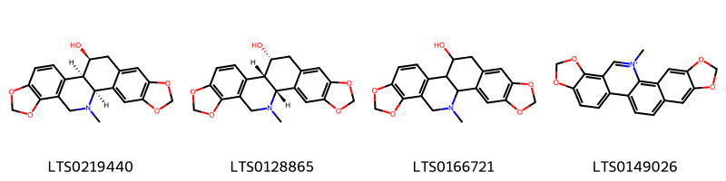{ width=100% }
    <figcaption>Hình ảnh cấu trúc hóa học của 4 hoạt chất thuộc nhóm Benzophenanthridine alkaloids gồm ['chelidonine (LTS0219440)', '(-)-chelidonine (LTS0128865)', '24-methyl-5,7,18,20-tetraoxa-24-azahexacyclo[11.11.0.0²,¹⁰.0⁴,⁸.0¹⁴,²².0¹⁷,²¹]tetracosa-2,4(8),9,14(22),15,17(21)-hexaen-12-ol (LTS0166721)', 'sanguinarine (LTS0149026)'].</figcaption>
</figure>
#### Nhóm Dibenzazecins
<figure markdown="span">
    { width=100% }
    <figcaption>Hình ảnh cấu trúc hóa học của 1 hoạt chất thuộc nhóm Dibenzazecins gồm ['15-methyl-7,9,19,21-tetraoxa-15-azapentacyclo[15.7.0.0⁴,¹².0⁶,¹⁰.0¹⁸,²²]tetracosa-1(24),4,6(10),11,17,22-hexaen-3-ol (LTS0185149)'].</figcaption>
</figure>
#### Nhóm Isoquinolines and derivatives
<figure markdown="span">
    { width=100% }
    <figcaption>Hình ảnh cấu trúc hóa học của 2 hoạt chất thuộc nhóm Isoquinolines and derivatives gồm ['reticuline (LTS0204392)', '(+,-)-reticuline (LTS0181650)'].</figcaption>
</figure>
#### Nhóm Phenanthrenes and derivatives
<figure markdown="span">
    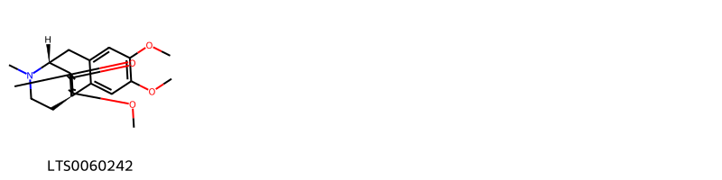{ width=100% }
    <figcaption>Hình ảnh cấu trúc hóa học của 1 hoạt chất thuộc nhóm Phenanthrenes and derivatives gồm ['(1r,9r)-4,5,13-trimethoxy-17-methyl-17-azatetracyclo[7.5.3.0¹,¹⁰.0²,⁷]heptadeca-2,4,6,10,13-pentaen-12-one (LTS0060242)'].</figcaption>
</figure>
#### Nhóm Protoberberine alkaloids and derivatives
<figure markdown="span">
    { width=100% }
    <figcaption>Hình ảnh cấu trúc hóa học của 1 hoạt chất thuộc nhóm Protoberberine alkaloids and derivatives gồm ['berberine (LTS0101484)'].</figcaption>
</figure>
#### Nhóm Protopine alkaloids
<figure markdown="span">
    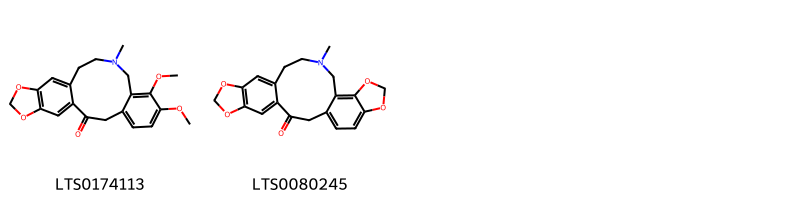{ width=100% }
    <figcaption>Hình ảnh cấu trúc hóa học của 2 hoạt chất thuộc nhóm Protopine alkaloids gồm ['β-allocryptopine (LTS0174113)', 'protopine (LTS0080245)'].</figcaption>
</figure>

---

### Dược dân tộc học

Danh sách các quốc gia có sử dụng *Glaucium corniculatum* trong điều trị các bệnh. 

| Country   | Disease                               | Bệnh                                                                                                                                                                                                |
|:----------|:--------------------------------------|:----------------------------------------------------------------------------------------------------------------------------------------------------------------------------------------------------|
| Iraq      | Cathartic                             | MYMEMORY WARNING: YOU USED ALL AVAILABLE FREE TRANSLATIONS FOR TODAY. NEXT AVAILABLE IN  09 HOURS 27 MINUTES 54 SECONDS VISIT HTTPS://MYMEMORY.TRANSLATED.NET/DOC/USAGELIMITS.PHP TO TRANSLATE MORE |
| Kurdistan | Sedative                              | MYMEMORY WARNING: YOU USED ALL AVAILABLE FREE TRANSLATIONS FOR TODAY. NEXT AVAILABLE IN  09 HOURS 27 MINUTES 45 SECONDS VISIT HTTPS://MYMEMORY.TRANSLATED.NET/DOC/USAGELIMITS.PHP TO TRANSLATE MORE |
| Turkey    | Purgative, Tonic, Sedative, Demulcent | MYMEMORY WARNING: YOU USED ALL AVAILABLE FREE TRANSLATIONS FOR TODAY. NEXT AVAILABLE IN  09 HOURS 27 MINUTES 37 SECONDS VISIT HTTPS://MYMEMORY.TRANSLATED.NET/DOC/USAGELIMITS.PHP TO TRANSLATE MORE |

---

---
## Glaucium flavum
### Thông tin về thực vật

!!! info "Phân loại thực vật của *Glaucium flavum* từ GIBF:"
    - **Kingdom:** Plantae
    - **Phylum:** Tracheophyta
    - **Order:** Ranunculales
    - **Family:** Papaveraceae
    - **Genus:** Glaucium
    - **Species:** *Glaucium flavum*

 

| Label (VI)   | Label (EN)   | Scientific Name   | Descriptions (VI)   | Descriptions (EN)   | Also Known As (VI)   | Also Known As (EN)      |
|:-------------|:-------------|:------------------|:--------------------|:--------------------|:---------------------|:------------------------|
| N/A          | N/A          | Glaucium flavum   |                     | species of plant    | ['']                 | ['yellow horned poppy'] |

#### Phân bố trên thế giới

**Từ CSDL GIBF** Morocco, Gibraltar, Algeria, United States of America, Malta, Greece, France, Sweden, Ukraine, Israel, Russian Federation, New Zealand, Italy, Croatia, Cyprus, United Kingdom of Great Britain and Northern Ireland, Spain, Netherlands

#### Phân bố tại Việt Nam

**Từ CSDL GIBF**: Không có ghi nhận ở Việt Nam

---
### Thành phần hóa học
        
- Theo cơ sở dữ liệu lotus: Từ loài *Glaucium flavum* đã phân lập và xác định được 58 hoạt chất thuộc về các nhóm Aporphines, Benzophenanthridine alkaloids, Quinolines and derivatives, Phenanthrenes and derivatives, Protopine alkaloids, Carboxylic acids and derivatives, Phthalide isoquinolines, Protoberberine alkaloids and derivatives, Hydroxy acids and derivatives, Isoquinolines and derivatives. 

|    | chemicalTaxonomyClassyfireClass          |   smiles_count |
|---:|:-----------------------------------------|---------------:|
|  0 | Aporphines                               |             27 |
|  1 | Benzophenanthridine alkaloids            |             14 |
|  2 | Carboxylic acids and derivatives         |              2 |
|  3 | Hydroxy acids and derivatives            |              2 |
|  4 | Isoquinolines and derivatives            |              3 |
|  5 | Phenanthrenes and derivatives            |              3 |
|  6 | Phthalide isoquinolines                  |              1 |
|  7 | Protoberberine alkaloids and derivatives |              1 |
|  8 | Protopine alkaloids                      |              2 |
|  9 | Quinolines and derivatives               |              3 |

#### Nhóm Aporphines
<figure markdown="span">
    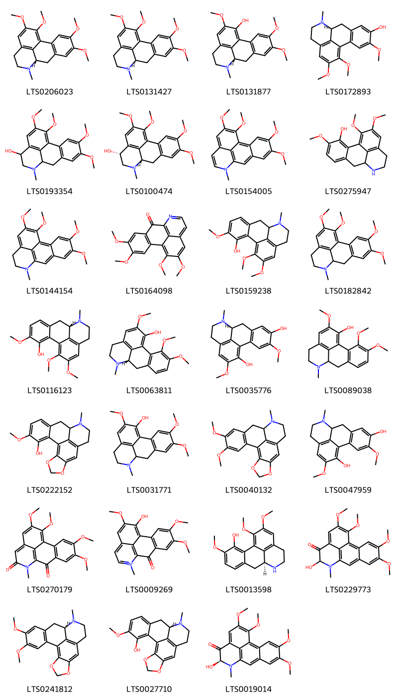{ width=100% }
    <figcaption>Hình ảnh cấu trúc hóa học của 27 hoạt chất thuộc nhóm Aporphines gồm ['(9s)-4,5,15,16-tetramethoxy-10-methyl-10-azatetracyclo[7.7.1.0²,⁷.0¹³,¹⁷]heptadeca-1(16),2(7),3,5,13(17),14-hexaene (LTS0206023)', '(9r)-4,5,15,16-tetramethoxy-10-methyl-10-azatetracyclo[7.7.1.0²,⁷.0¹³,¹⁷]heptadeca-1(16),2(7),3,5,13(17),14-hexaene (LTS0131427)', '(9s)-4,5,15-trimethoxy-10-methyl-10-azatetracyclo[7.7.1.0²,⁷.0¹³,¹⁷]heptadeca-1(16),2(7),3,5,13(17),14-hexaen-16-ol (LTS0131877)', '(9s)-4,15,16-trimethoxy-10-methyl-10-azatetracyclo[7.7.1.0²,⁷.0¹³,¹⁷]heptadeca-1(16),2(7),3,5,13(17),14-hexaen-5-ol (LTS0172893)', '4,5,15,16-tetramethoxy-10-methyl-10-azatetracyclo[7.7.1.0²,⁷.0¹³,¹⁷]heptadeca-1(16),2(7),3,5,13(17),14-hexaen-12-ol (LTS0193354)', '(9s,12r)-4,5,15,16-tetramethoxy-10-methyl-10-azatetracyclo[7.7.1.0²,⁷.0¹³,¹⁷]heptadeca-1(16),2(7),3,5,13(17),14-hexaen-12-ol (LTS0100474)', '4,5,15,16-tetramethoxy-10-methyl-10-azatetracyclo[7.7.1.0²,⁷.0¹³,¹⁷]heptadeca-1(17),2(7),3,5,8,11,13,15-octaene (LTS0154005)', '4,15,16-trimethoxy-10-azatetracyclo[7.7.1.0²,⁷.0¹³,¹⁷]heptadeca-1(16),2,4,6,13(17),14-hexaen-3-ol (LTS0275947)', '4,5,15,16-tetramethoxy-10-methyl-10-azatetracyclo[7.7.1.0²,⁷.0¹³,¹⁷]heptadeca-1(17),2(7),3,5,8,13,15-heptaene (LTS0144154)', '4,5,15,16-tetramethoxy-10-azatetracyclo[7.7.1.0²,⁷.0¹³,¹⁷]heptadeca-1(16),2(7),3,5,9(17),10,12,14-octaen-8-one (LTS0164098)', '4,15,16-trimethoxy-10-methyl-10-azatetracyclo[7.7.1.0²,⁷.0¹³,¹⁷]heptadeca-1(16),2,4,6,13(17),14-hexaen-3-ol (LTS0159238)', '4,5,15,16-tetramethoxy-10-methyl-10-azatetracyclo[7.7.1.0²,⁷.0¹³,¹⁷]heptadeca-1(16),2(7),3,5,13(17),14-hexaene (LTS0182842)', '(9s)-4,15,16-trimethoxy-10-methyl-10-azatetracyclo[7.7.1.0²,⁷.0¹³,¹⁷]heptadeca-1(16),2,4,6,13(17),14-hexaen-3-ol (LTS0116123)', '(9s)-3,4,15-trimethoxy-10-methyl-10-azatetracyclo[7.7.1.0²,⁷.0¹³,¹⁷]heptadeca-1(16),2(7),3,5,13(17),14-hexaen-16-ol (LTS0063811)', '(9s)-4,15-dimethoxy-10-methyl-10-azatetracyclo[7.7.1.0²,⁷.0¹³,¹⁷]heptadeca-1(16),2(7),3,5,13(17),14-hexaene-5,16-diol (LTS0035776)', '3,4,15-trimethoxy-10-methyl-10-azatetracyclo[7.7.1.0²,⁷.0¹³,¹⁷]heptadeca-1(16),2(7),3,5,13(17),14-hexaen-16-ol (LTS0089038)', 'bulbocapnine (LTS0222152)', '4,5,15-trimethoxy-10-methyl-10-azatetracyclo[7.7.1.0²,⁷.0¹³,¹⁷]heptadeca-1(16),2(7),3,5,13(17),14-hexaen-16-ol (LTS0031771)', '16,17-dimethoxy-11-methyl-3,5-dioxa-11-azapentacyclo[10.7.1.0²,⁶.0⁸,²⁰.0¹⁴,¹⁹]icosa-1,6,8(20),14(19),15,17-hexaene (LTS0040132)', '4,15-dimethoxy-10-methyl-10-azatetracyclo[7.7.1.0²,⁷.0¹³,¹⁷]heptadeca-1(16),2(7),3,5,13(17),14-hexaene-5,16-diol (LTS0047959)', '4,5,15,16-tetramethoxy-10-methyl-10-azatetracyclo[7.7.1.0²,⁷.0¹³,¹⁷]heptadeca-1(16),2(7),3,5,9(17),12,14-heptaene-8,11-dione (LTS0270179)', '16-hydroxy-4,5,15-trimethoxy-10-methyl-8-oxo-10-azatetracyclo[7.7.1.0²,⁷.0¹³,¹⁷]heptadeca-1(16),2(7),3,5,9(17),10,12,14-octaen-10-ium (LTS0009269)', '(9s)-4,15,16-trimethoxy-10-azatetracyclo[7.7.1.0²,⁷.0¹³,¹⁷]heptadeca-1(16),2,4,6,13(17),14-hexaen-3-ol (LTS0013598)', '11-hydroxy-4,5,15,16-tetramethoxy-10-methyl-10-azatetracyclo[7.7.1.0²,⁷.0¹³,¹⁷]heptadeca-1(17),2(7),3,5,8,13,15-heptaen-12-one (LTS0229773)', '(12r)-16,17-dimethoxy-11-methyl-3,5-dioxa-11-azapentacyclo[10.7.1.0²,⁶.0⁸,²⁰.0¹⁴,¹⁹]icosa-1,6,8(20),14(19),15,17-hexaene (LTS0241812)', '(12r)-17-methoxy-11-methyl-3,5-dioxa-11-azapentacyclo[10.7.1.0²,⁶.0⁸,²⁰.0¹⁴,¹⁹]icosa-1,6,8(20),14,16,18-hexaen-18-ol (LTS0027710)', '(11s)-11-hydroxy-4,5,15,16-tetramethoxy-10-methyl-10-azatetracyclo[7.7.1.0²,⁷.0¹³,¹⁷]heptadeca-1(17),2(7),3,5,8,13,15-heptaen-12-one (LTS0019014)'].</figcaption>
</figure>
#### Nhóm Benzophenanthridine alkaloids
<figure markdown="span">
    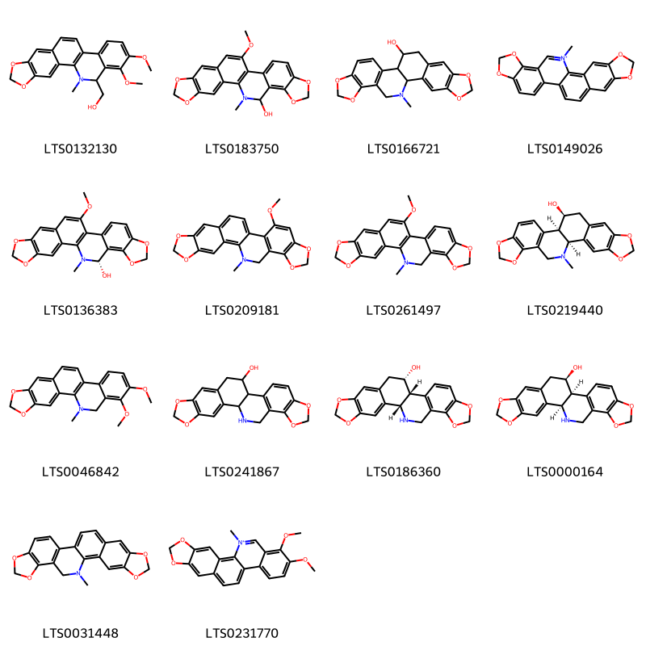{ width=100% }
    <figcaption>Hình ảnh cấu trúc hóa học của 14 hoạt chất thuộc nhóm Benzophenanthridine alkaloids gồm ['{17,18-dimethoxy-21-methyl-5,7-dioxa-21-azapentacyclo[11.8.0.0²,¹⁰.0⁴,⁸.0¹⁴,¹⁹]henicosa-1(13),2,4(8),9,11,14,16,18-octaen-20-yl}methanol (LTS0132130)', '12-methoxy-24-methyl-5,7,18,20-tetraoxa-24-azahexacyclo[11.11.0.0²,¹⁰.0⁴,⁸.0¹⁴,²².0¹⁷,²¹]tetracosa-1(13),2,4(8),9,11,14,16,21-octaen-23-ol (LTS0183750)', '24-methyl-5,7,18,20-tetraoxa-24-azahexacyclo[11.11.0.0²,¹⁰.0⁴,⁸.0¹⁴,²².0¹⁷,²¹]tetracosa-2,4(8),9,14(22),15,17(21)-hexaen-12-ol (LTS0166721)', 'sanguinarine (LTS0149026)', '(23s)-12-methoxy-24-methyl-5,7,18,20-tetraoxa-24-azahexacyclo[11.11.0.0²,¹⁰.0⁴,⁸.0¹⁴,²².0¹⁷,²¹]tetracosa-1(13),2,4(8),9,11,14,16,21-octaen-23-ol (LTS0136383)', 'dihydrochelirubine (LTS0209181)', '12-methoxy-24-methyl-5,7,18,20-tetraoxa-24-azahexacyclo[11.11.0.0²,¹⁰.0⁴,⁸.0¹⁴,²².0¹⁷,²¹]tetracosa-1(13),2,4(8),9,11,14,16,21-octaene (LTS0261497)', 'chelidonine (LTS0219440)', '17,18-dimethoxy-21-methyl-5,7-dioxa-21-azapentacyclo[11.8.0.0²,¹⁰.0⁴,⁸.0¹⁴,¹⁹]henicosa-1(13),2,4(8),9,11,14,16,18-octaene (LTS0046842)', '5,7,18,20-tetraoxa-24-azahexacyclo[11.11.0.0²,¹⁰.0⁴,⁸.0¹⁴,²².0¹⁷,²¹]tetracosa-2,4(8),9,14(22),15,17(21)-hexaen-12-ol (LTS0241867)', '(1s,12s,13r)-5,7,18,20-tetraoxa-24-azahexacyclo[11.11.0.0²,¹⁰.0⁴,⁸.0¹⁴,²².0¹⁷,²¹]tetracosa-2,4(8),9,14(22),15,17(21)-hexaen-12-ol (LTS0186360)', '(1r,12r,13s)-5,7,18,20-tetraoxa-24-azahexacyclo[11.11.0.0²,¹⁰.0⁴,⁸.0¹⁴,²².0¹⁷,²¹]tetracosa-2,4(8),9,14(22),15,17(21)-hexaen-12-ol (LTS0000164)', 'dihydrosanguinarine (LTS0031448)', 'chelerythrine (LTS0231770)'].</figcaption>
</figure>
#### Nhóm Carboxylic acids and derivatives
<figure markdown="span">
    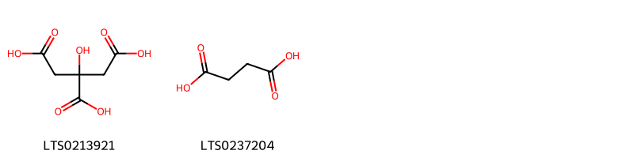{ width=100% }
    <figcaption>Hình ảnh cấu trúc hóa học của 2 hoạt chất thuộc nhóm Carboxylic acids and derivatives gồm ['citric acid (LTS0213921)', 'succinic acid (LTS0237204)'].</figcaption>
</figure>
#### Nhóm Hydroxy acids and derivatives
<figure markdown="span">
    { width=100% }
    <figcaption>Hình ảnh cấu trúc hóa học của 2 hoạt chất thuộc nhóm Hydroxy acids and derivatives gồm ['(-)-malic acid (LTS0128885)', 'malic acid (LTS0216520)'].</figcaption>
</figure>
#### Nhóm Isoquinolines and derivatives
<figure markdown="span">
    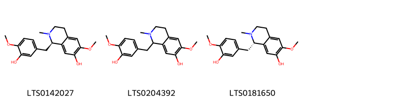{ width=100% }
    <figcaption>Hình ảnh cấu trúc hóa học của 3 hoạt chất thuộc nhóm Isoquinolines and derivatives gồm ['(-)-reticuline (LTS0142027)', 'reticuline (LTS0204392)', '(+,-)-reticuline (LTS0181650)'].</figcaption>
</figure>
#### Nhóm Phenanthrenes and derivatives
<figure markdown="span">
    { width=100% }
    <figcaption>Hình ảnh cấu trúc hóa học của 3 hoạt chất thuộc nhóm Phenanthrenes and derivatives gồm ['(-)-salutaridine (LTS0176919)', 'salutaridine (LTS0157020)', '3-hydroxy-4,13-dimethoxy-17-methyl-17-azatetracyclo[7.5.3.0¹,¹⁰.0²,⁷]heptadeca-2,4,6,10,13-pentaen-12-one (LTS0027362)'].</figcaption>
</figure>
#### Nhóm Phthalide isoquinolines
<figure markdown="span">
    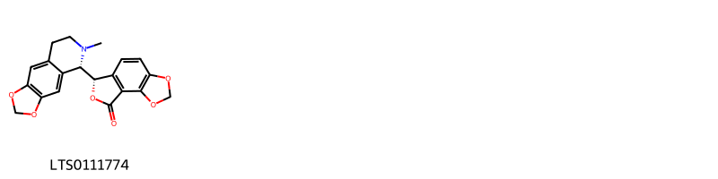{ width=100% }
    <figcaption>Hình ảnh cấu trúc hóa học của 1 hoạt chất thuộc nhóm Phthalide isoquinolines gồm ['adlumidine (LTS0111774)'].</figcaption>
</figure>
#### Nhóm Protoberberine alkaloids and derivatives
<figure markdown="span">
    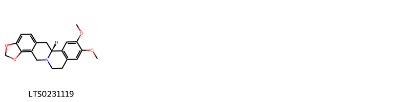{ width=100% }
    <figcaption>Hình ảnh cấu trúc hóa học của 1 hoạt chất thuộc nhóm Protoberberine alkaloids and derivatives gồm ['(13r)-16,17-dimethoxy-5,7-dioxa-1-azapentacyclo[11.8.0.0³,¹¹.0⁴,⁸.0¹⁴,¹⁹]henicosa-3,8,10,14(19),15,17-hexaene (LTS0231119)'].</figcaption>
</figure>
#### Nhóm Protopine alkaloids
<figure markdown="span">
    { width=100% }
    <figcaption>Hình ảnh cấu trúc hóa học của 2 hoạt chất thuộc nhóm Protopine alkaloids gồm ['β-allocryptopine (LTS0174113)', 'protopine (LTS0080245)'].</figcaption>
</figure>
#### Nhóm Quinolines and derivatives
<figure markdown="span">
    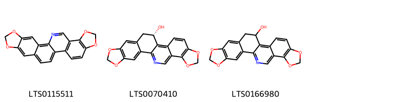{ width=100% }
    <figcaption>Hình ảnh cấu trúc hóa học của 3 hoạt chất thuộc nhóm Quinolines and derivatives gồm ['5,7,18,20-tetraoxa-24-azahexacyclo[11.11.0.0²,¹⁰.0⁴,⁸.0¹⁴,²².0¹⁷,²¹]tetracosa-1(13),2(10),3,8,11,14(22),15,17(21),23-nonaene (LTS0115511)', '(12s)-5,7,18,20-tetraoxa-24-azahexacyclo[11.11.0.0²,¹⁰.0⁴,⁸.0¹⁴,²².0¹⁷,²¹]tetracosa-1(13),2,4(8),9,14,16,21,23-octaen-12-ol (LTS0070410)', '5,7,18,20-tetraoxa-24-azahexacyclo[11.11.0.0²,¹⁰.0⁴,⁸.0¹⁴,²².0¹⁷,²¹]tetracosa-1(13),2,4(8),9,14,16,21,23-octaen-12-ol (LTS0166980)'].</figcaption>
</figure>

---

### Dược dân tộc học

Danh sách các quốc gia có sử dụng *Glaucium flavum* trong điều trị các bệnh. 

| Country   | Disease                   | Bệnh                                                                                                                                                                                                |
|:----------|:--------------------------|:----------------------------------------------------------------------------------------------------------------------------------------------------------------------------------------------------|
| Elsewhere | Sedative, Purgative, Soap | MYMEMORY WARNING: YOU USED ALL AVAILABLE FREE TRANSLATIONS FOR TODAY. NEXT AVAILABLE IN  09 HOURS 27 MINUTES 07 SECONDS VISIT HTTPS://MYMEMORY.TRANSLATED.NET/DOC/USAGELIMITS.PHP TO TRANSLATE MORE |

---

# Chi Argemone

??? note "Danh sách các dược liệu thuộc chi"
    
	 - *Argemone intermedia*
	 - *Argemone mexicana*
	 - *Argemone ochroleuca*
	 - *Argemone platyceras*
	 - *Argemone subfusiformis*

---
## Argemone intermedia
### Thông tin về thực vật

!!! info "Phân loại thực vật của *Argemone intermedia* từ GIBF:"
    - **Kingdom:** Plantae
    - **Phylum:** Tracheophyta
    - **Order:** Ranunculales
    - **Family:** Papaveraceae
    - **Genus:** Argemone
    - **Species:** *Argemone intermedia*

 

| Label (VI)   | Label (EN)   | Scientific Name     | Descriptions (VI)   | Descriptions (EN)   | Also Known As (VI)   | Also Known As (EN)   |
|:-------------|:-------------|:--------------------|:--------------------|:--------------------|:---------------------|:---------------------|
| N/A          | N/A          | Argemone intermedia | loài thực vật       | species of plant    | ['']                 | ['']                 |

#### Phân bố trên thế giới

**Từ CSDL GIBF** nan, Mexico, United States of America, Canada, Netherlands

#### Phân bố tại Việt Nam

**Từ CSDL GIBF**: Không có ghi nhận ở Việt Nam

---
### Thành phần hóa học
        
- Theo cơ sở dữ liệu lotus: Từ loài *Argemone intermedia* đã phân lập và xác định được Chưa có hoạt chất nào được phân lập. hoạt chất thuộc về các nhóm Không có hoạt chất nào được phân lập. 

Không có hình ảnh nào được tạo ra

---

### Dược dân tộc học

Danh sách các quốc gia có sử dụng *Argemone intermedia* trong điều trị các bệnh. 

| Country   | Disease   | Bệnh                                                                                                                                                                                                |
|:----------|:----------|:----------------------------------------------------------------------------------------------------------------------------------------------------------------------------------------------------|
| Nc        | Poison    | MYMEMORY WARNING: YOU USED ALL AVAILABLE FREE TRANSLATIONS FOR TODAY. NEXT AVAILABLE IN  09 HOURS 26 MINUTES 14 SECONDS VISIT HTTPS://MYMEMORY.TRANSLATED.NET/DOC/USAGELIMITS.PHP TO TRANSLATE MORE |

---

---
## Argemone mexicana
### Thông tin về thực vật

!!! info "Phân loại thực vật của *Argemone mexicana* từ GIBF:"
    - **Kingdom:** Plantae
    - **Phylum:** Tracheophyta
    - **Order:** Ranunculales
    - **Family:** Papaveraceae
    - **Genus:** Argemone
    - **Species:** *Argemone mexicana*

 

| Label (VI)   | Label (EN)   | Scientific Name   | Descriptions (VI)   | Descriptions (EN)   | Also Known As (VI)   | Also Known As (EN)                                                                                      |
|:-------------|:-------------|:------------------|:--------------------|:--------------------|:---------------------|:--------------------------------------------------------------------------------------------------------|
| N/A          | N/A          | Argemone mexicana | loài thực vật       | species of plant    | ['']                 | ['Mexican prickly poppy', 'Mexican poppy', 'cardo', 'flowering thistle', 'cardosanto', 'prickly poppy'] |

#### Phân bố trên thế giới

**Từ CSDL GIBF** nan, Brazil, Guatemala, Nepal, Antigua and Barbuda, Ecuador, Yemen, Spain, Puerto Rico, United States of America, Jamaica, Virgin Islands (U.S.), Costa Rica, Pakistan, Dominican Republic, Cuba, Cabo Verde, Mexico, Benin, Chinese Taipei, Nicaragua, Bonaire, Sint Eustatius and Saba, Bermuda, Bahamas, Oman, Myanmar, India

#### Phân bố tại Việt Nam

**Từ CSDL GIBF**: Không có ghi nhận ở Việt Nam

---
### Thành phần hóa học
        
- Theo cơ sở dữ liệu lotus: Từ loài *Argemone mexicana* đã phân lập và xác định được 66 hoạt chất thuộc về các nhóm Benzophenanthridine alkaloids, Aporphines, Fatty Acyls, Quinolines and derivatives, Flavonoids, Purine nucleosides, Protopine alkaloids, Imidazopyrimidines, Protoberberine alkaloids and derivatives, Isoflavonoids, Isoquinolines and derivatives, Prenol lipids. 

|    | chemicalTaxonomyClassyfireClass          |   smiles_count |
|---:|:-----------------------------------------|---------------:|
|  0 | Aporphines                               |              2 |
|  1 | Benzophenanthridine alkaloids            |             11 |
|  2 | Fatty Acyls                              |              4 |
|  3 | Flavonoids                               |             10 |
|  4 | Imidazopyrimidines                       |              1 |
|  5 | Isoflavonoids                            |              1 |
|  6 | Isoquinolines and derivatives            |              6 |
|  7 | Prenol lipids                            |              3 |
|  8 | Protoberberine alkaloids and derivatives |             15 |
|  9 | Protopine alkaloids                      |              7 |
| 10 | Purine nucleosides                       |              1 |
| 11 | Quinolines and derivatives               |              5 |

#### Nhóm Aporphines
<figure markdown="span">
    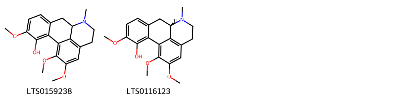{ width=100% }
    <figcaption>Hình ảnh cấu trúc hóa học của 2 hoạt chất thuộc nhóm Aporphines gồm ['4,15,16-trimethoxy-10-methyl-10-azatetracyclo[7.7.1.0²,⁷.0¹³,¹⁷]heptadeca-1(16),2,4,6,13(17),14-hexaen-3-ol (LTS0159238)', '(9s)-4,15,16-trimethoxy-10-methyl-10-azatetracyclo[7.7.1.0²,⁷.0¹³,¹⁷]heptadeca-1(16),2,4,6,13(17),14-hexaen-3-ol (LTS0116123)'].</figcaption>
</figure>
#### Nhóm Benzophenanthridine alkaloids
<figure markdown="span">
    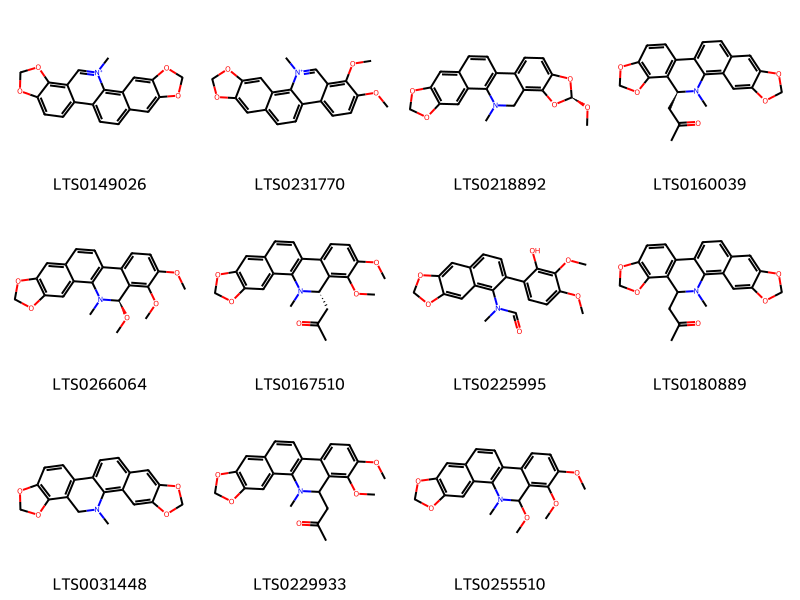{ width=100% }
    <figcaption>Hình ảnh cấu trúc hóa học của 11 hoạt chất thuộc nhóm Benzophenanthridine alkaloids gồm ['sanguinarine (LTS0149026)', 'chelerythrine (LTS0231770)', '(19r)-19-methoxy-24-methyl-5,7,18,20-tetraoxa-24-azahexacyclo[11.11.0.0²,¹⁰.0⁴,⁸.0¹⁴,²².0¹⁷,²¹]tetracosa-1(13),2,4(8),9,11,14,16,21-octaene (LTS0218892)', '1-[(23s)-24-methyl-5,7,18,20-tetraoxa-24-azahexacyclo[11.11.0.0²,¹⁰.0⁴,⁸.0¹⁴,²².0¹⁷,²¹]tetracosa-1(13),2,4(8),9,11,14(22),15,17(21)-octaen-23-yl]propan-2-one (LTS0160039)', '(20r)-17,18,20-trimethoxy-21-methyl-5,7-dioxa-21-azapentacyclo[11.8.0.0²,¹⁰.0⁴,⁸.0¹⁴,¹⁹]henicosa-1(13),2,4(8),9,11,14,16,18-octaene (LTS0266064)', '1-[(20s)-17,18-dimethoxy-21-methyl-5,7-dioxa-21-azapentacyclo[11.8.0.0²,¹⁰.0⁴,⁸.0¹⁴,¹⁹]henicosa-1(13),2,4(8),9,11,14,16,18-octaen-20-yl]propan-2-one (LTS0167510)', 'n-[6-(2-hydroxy-3,4-dimethoxyphenyl)-2h-naphtho[2,3-d][1,3]dioxol-5-yl]-n-methylformamide (LTS0225995)', '1-{24-methyl-5,7,18,20-tetraoxa-24-azahexacyclo[11.11.0.0²,¹⁰.0⁴,⁸.0¹⁴,²².0¹⁷,²¹]tetracosa-1(13),2,4(8),9,11,14(22),15,17(21)-octaen-23-yl}propan-2-one (LTS0180889)', 'dihydrosanguinarine (LTS0031448)', '1-{17,18-dimethoxy-21-methyl-5,7-dioxa-21-azapentacyclo[11.8.0.0²,¹⁰.0⁴,⁸.0¹⁴,¹⁹]henicosa-1(13),2,4(8),9,11,14,16,18-octaen-20-yl}propan-2-one (LTS0229933)', 'angoline (LTS0255510)'].</figcaption>
</figure>
#### Nhóm Fatty Acyls
<figure markdown="span">
    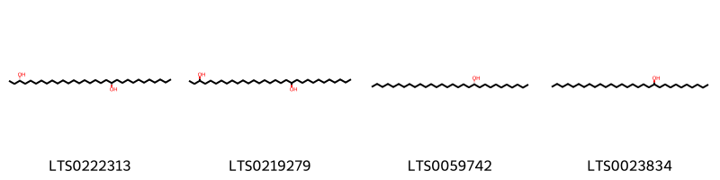{ width=100% }
    <figcaption>Hình ảnh cấu trúc hóa học của 4 hoạt chất thuộc nhóm Fatty Acyls gồm ['(3s,20r)-hentriacontane-3,20-diol (LTS0222313)', 'hentriacontane-3,20-diol (LTS0219279)', '(11r)-triacontan-11-ol (LTS0059742)', 'triacontan-11-ol (LTS0023834)'].</figcaption>
</figure>
#### Nhóm Flavonoids
<figure markdown="span">
    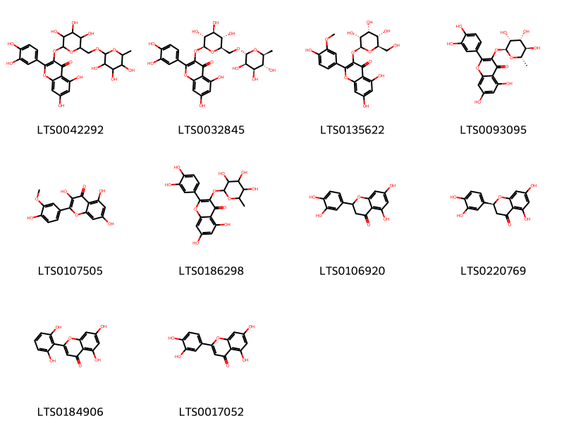{ width=100% }
    <figcaption>Hình ảnh cấu trúc hóa học của 10 hoạt chất thuộc nhóm Flavonoids gồm ['rutin (LTS0042292)', '3-rutinosyl quercetin (LTS0032845)', 'isorhamnetin 3-glucoside (LTS0135622)', 'quercitrin (LTS0093095)', 'isorhamnetin (LTS0107505)', 'quercitrin (LTS0186298)', '(+/-)-eriodictyol (LTS0106920)', 'eriodictyol (LTS0220769)', '2-(2,6-dihydroxyphenyl)-5,7-dihydroxychromen-4-one (LTS0184906)', 'luteolin (LTS0017052)'].</figcaption>
</figure>
#### Nhóm Imidazopyrimidines
<figure markdown="span">
    { width=100% }
    <figcaption>Hình ảnh cấu trúc hóa học của 1 hoạt chất thuộc nhóm Imidazopyrimidines gồm ['leucon (LTS0114351)'].</figcaption>
</figure>
#### Nhóm Isoflavonoids
<figure markdown="span">
    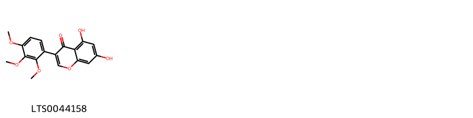{ width=100% }
    <figcaption>Hình ảnh cấu trúc hóa học của 1 hoạt chất thuộc nhóm Isoflavonoids gồm ['5,7-dihydroxy-3-(2,3,4-trimethoxyphenyl)chromen-4-one (LTS0044158)'].</figcaption>
</figure>
#### Nhóm Isoquinolines and derivatives
<figure markdown="span">
    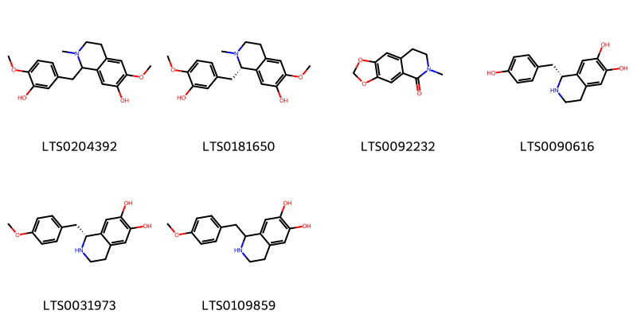{ width=100% }
    <figcaption>Hình ảnh cấu trúc hóa học của 6 hoạt chất thuộc nhóm Isoquinolines and derivatives gồm ['reticuline (LTS0204392)', '(+,-)-reticuline (LTS0181650)', '6-methyl-2h,7h,8h-[1,3]dioxolo[4,5-g]isoquinolin-5-one (LTS0092232)', '(+)-demethylcoclaurine (LTS0090616)', '(1r)-1-[(4-methoxyphenyl)methyl]-1,2,3,4-tetrahydroisoquinoline-6,7-diol (LTS0031973)', '1-[(4-methoxyphenyl)methyl]-1,2,3,4-tetrahydroisoquinoline-6,7-diol (LTS0109859)'].</figcaption>
</figure>
#### Nhóm Prenol lipids
<figure markdown="span">
    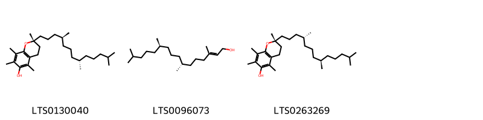{ width=100% }
    <figcaption>Hình ảnh cấu trúc hóa học của 3 hoạt chất thuộc nhóm Prenol lipids gồm ['(2r)-2,5,7,8-tetramethyl-2-[(4s,8s)-4,8,12-trimethyltridecyl]-3,4-dihydro-1-benzopyran-6-ol (LTS0130040)', 'phytol (LTS0096073)', 'vitamin e (LTS0263269)'].</figcaption>
</figure>
#### Nhóm Protoberberine alkaloids and derivatives
<figure markdown="span">
    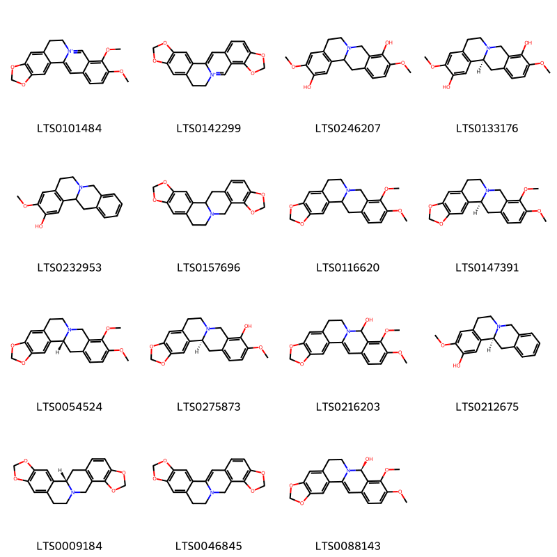{ width=100% }
    <figcaption>Hình ảnh cấu trúc hóa học của 15 hoạt chất thuộc nhóm Protoberberine alkaloids and derivatives gồm ['berberine (LTS0101484)', '5,7,17,19-tetraoxa-13λ⁵-azahexacyclo[11.11.0.0²,¹⁰.0⁴,⁸.0¹⁵,²³.0¹⁶,²⁰]tetracosa-1(24),2,4(8),9,13,15,20,22-octaen-13-ylium (LTS0142299)', '(s)-scoulerine (LTS0246207)', 'scoulerine (LTS0133176)', '10-methoxy-7,8,12b,13-tetrahydro-5h-6-azatetraphen-11-ol (LTS0232953)', '5,7,17,19-tetraoxa-13-azahexacyclo[11.11.0.0²,¹⁰.0⁴,⁸.0¹⁵,²³.0¹⁶,²⁰]tetracosa-2,4(8),9,15(23),16(20),21-hexaene (LTS0157696)', 'canadin (LTS0116620)', '(s)-canadine (LTS0147391)', '(+)-canadine (LTS0054524)', 'nandinine (LTS0275873)', '16,17-dimethoxy-5,7-dioxa-13-azapentacyclo[11.8.0.0²,¹⁰.0⁴,⁸.0¹⁵,²⁰]henicosa-1(21),2,4(8),9,15,17,19-heptaen-14-ol (LTS0216203)', '(12bs)-10-methoxy-7,8,12b,13-tetrahydro-5h-6-azatetraphen-11-ol (LTS0212675)', 'stylopine (LTS0009184)', '5,7,17,19-tetraoxa-13-azahexacyclo[11.11.0.0²,¹⁰.0⁴,⁸.0¹⁵,²³.0¹⁶,²⁰]tetracosa-1(24),2,4(8),9,15(23),16(20),21-heptaene (LTS0046845)', '(14s)-16,17-dimethoxy-5,7-dioxa-13-azapentacyclo[11.8.0.0²,¹⁰.0⁴,⁸.0¹⁵,²⁰]henicosa-1(21),2,4(8),9,15,17,19-heptaen-14-ol (LTS0088143)'].</figcaption>
</figure>
#### Nhóm Protopine alkaloids
<figure markdown="span">
    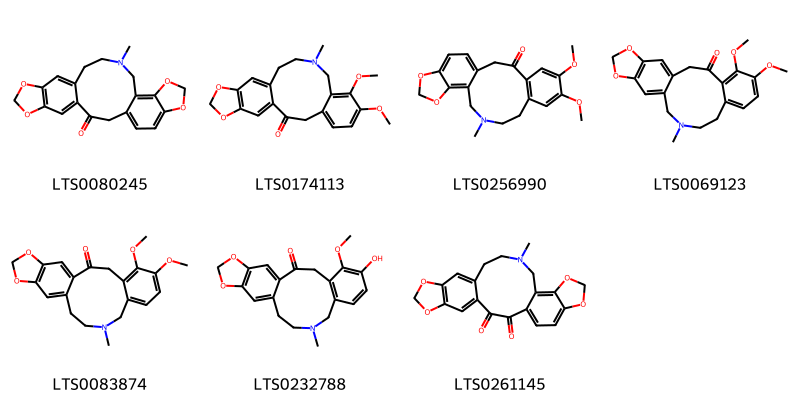{ width=100% }
    <figcaption>Hình ảnh cấu trúc hóa học của 7 hoạt chất thuộc nhóm Protopine alkaloids gồm ['protopine (LTS0080245)', 'β-allocryptopine (LTS0174113)', 'cryptopine (LTS0256990)', '5,6-dimethoxy-12-methyl-17,19-dioxa-12-azatetracyclo[12.7.0.0⁴,⁹.0¹⁶,²⁰]henicosa-1(21),4,6,8,14,16(20)-hexaen-3-one (LTS0069123)', '5,6-dimethoxy-11-methyl-17,19-dioxa-11-azatetracyclo[12.7.0.0⁴,⁹.0¹⁶,²⁰]henicosa-1(21),4,6,8,14,16(20)-hexaen-2-one (LTS0083874)', '6-hydroxy-5-methoxy-11-methyl-17,19-dioxa-11-azatetracyclo[12.7.0.0⁴,⁹.0¹⁶,²⁰]henicosa-1(21),4(9),5,7,14,16(20)-hexaen-2-one (LTS0232788)', '15-methyl-7,9,19,21-tetraoxa-15-azapentacyclo[15.7.0.0⁴,¹².0⁶,¹⁰.0¹⁸,²²]tetracosa-1(24),4,6(10),11,17,22-hexaene-2,3-dione (LTS0261145)'].</figcaption>
</figure>
#### Nhóm Purine nucleosides
<figure markdown="span">
    { width=100% }
    <figcaption>Hình ảnh cấu trúc hóa học của 1 hoạt chất thuộc nhóm Purine nucleosides gồm ['adenosine (LTS0014061)'].</figcaption>
</figure>
#### Nhóm Quinolines and derivatives
<figure markdown="span">
    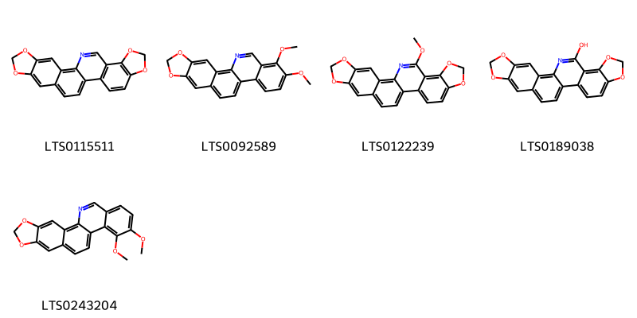{ width=100% }
    <figcaption>Hình ảnh cấu trúc hóa học của 5 hoạt chất thuộc nhóm Quinolines and derivatives gồm ['5,7,18,20-tetraoxa-24-azahexacyclo[11.11.0.0²,¹⁰.0⁴,⁸.0¹⁴,²².0¹⁷,²¹]tetracosa-1(13),2(10),3,8,11,14(22),15,17(21),23-nonaene (LTS0115511)', 'norchelerythrine (LTS0092589)', '23-methoxy-5,7,18,20-tetraoxa-24-azahexacyclo[11.11.0.0²,¹⁰.0⁴,⁸.0¹⁴,²².0¹⁷,²¹]tetracosa-1(13),2(10),3,8,11,14(22),15,17(21),23-nonaene (LTS0122239)', '5,7,18,20-tetraoxa-24-azahexacyclo[11.11.0.0²,¹⁰.0⁴,⁸.0¹⁴,²².0¹⁷,²¹]tetracosa-1(13),2(10),3,8,11,14(22),15,17(21),23-nonaen-23-ol (LTS0189038)', '15,16-dimethoxy-5,7-dioxa-21-azapentacyclo[11.8.0.0²,¹⁰.0⁴,⁸.0¹⁴,¹⁹]henicosa-1(13),2(10),3,8,11,14(19),15,17,20-nonaene (LTS0243204)'].</figcaption>
</figure>

---

### Dược dân tộc học

Danh sách các quốc gia có sử dụng *Argemone mexicana* trong điều trị các bệnh. 

| Country         | Disease                                                  | Bệnh                                                                                                                                                                                                |
|:----------------|:---------------------------------------------------------|:----------------------------------------------------------------------------------------------------------------------------------------------------------------------------------------------------|
| Central America | Emetic, Purgative                                        | MYMEMORY WARNING: YOU USED ALL AVAILABLE FREE TRANSLATIONS FOR TODAY. NEXT AVAILABLE IN  09 HOURS 25 MINUTES 51 SECONDS VISIT HTTPS://MYMEMORY.TRANSLATED.NET/DOC/USAGELIMITS.PHP TO TRANSLATE MORE |
| China           | Sedative                                                 | MYMEMORY WARNING: YOU USED ALL AVAILABLE FREE TRANSLATIONS FOR TODAY. NEXT AVAILABLE IN  09 HOURS 25 MINUTES 44 SECONDS VISIT HTTPS://MYMEMORY.TRANSLATED.NET/DOC/USAGELIMITS.PHP TO TRANSLATE MORE |
| Elsewhere       | Demulcent, Emetic, Expectorant, Laxative, Narcotic, Soap | MYMEMORY WARNING: YOU USED ALL AVAILABLE FREE TRANSLATIONS FOR TODAY. NEXT AVAILABLE IN  09 HOURS 25 MINUTES 37 SECONDS VISIT HTTPS://MYMEMORY.TRANSLATED.NET/DOC/USAGELIMITS.PHP TO TRANSLATE MORE |
| Ethiopia        | Poison                                                   | MYMEMORY WARNING: YOU USED ALL AVAILABLE FREE TRANSLATIONS FOR TODAY. NEXT AVAILABLE IN  09 HOURS 25 MINUTES 27 SECONDS VISIT HTTPS://MYMEMORY.TRANSLATED.NET/DOC/USAGELIMITS.PHP TO TRANSLATE MORE |
| Guatemala       | Purgative, Soap, Emetic                                  | MYMEMORY WARNING: YOU USED ALL AVAILABLE FREE TRANSLATIONS FOR TODAY. NEXT AVAILABLE IN  09 HOURS 25 MINUTES 21 SECONDS VISIT HTTPS://MYMEMORY.TRANSLATED.NET/DOC/USAGELIMITS.PHP TO TRANSLATE MORE |
| Haiti           | Diuretic, Sedative                                       | MYMEMORY WARNING: YOU USED ALL AVAILABLE FREE TRANSLATIONS FOR TODAY. NEXT AVAILABLE IN  09 HOURS 25 MINUTES 13 SECONDS VISIT HTTPS://MYMEMORY.TRANSLATED.NET/DOC/USAGELIMITS.PHP TO TRANSLATE MORE |
| India           | Demulcent, Laxative, Emetic, Expectorant                 | MYMEMORY WARNING: YOU USED ALL AVAILABLE FREE TRANSLATIONS FOR TODAY. NEXT AVAILABLE IN  09 HOURS 25 MINUTES 08 SECONDS VISIT HTTPS://MYMEMORY.TRANSLATED.NET/DOC/USAGELIMITS.PHP TO TRANSLATE MORE |
| Mexico          | Soap, Purgative                                          | MYMEMORY WARNING: YOU USED ALL AVAILABLE FREE TRANSLATIONS FOR TODAY. NEXT AVAILABLE IN  09 HOURS 25 MINUTES 04 SECONDS VISIT HTTPS://MYMEMORY.TRANSLATED.NET/DOC/USAGELIMITS.PHP TO TRANSLATE MORE |
| Mexico(Seri)    | Hemostat                                                 | MYMEMORY WARNING: YOU USED ALL AVAILABLE FREE TRANSLATIONS FOR TODAY. NEXT AVAILABLE IN  09 HOURS 24 MINUTES 58 SECONDS VISIT HTTPS://MYMEMORY.TRANSLATED.NET/DOC/USAGELIMITS.PHP TO TRANSLATE MORE |
| Paraguay        | Antifertility                                            | MYMEMORY WARNING: YOU USED ALL AVAILABLE FREE TRANSLATIONS FOR TODAY. NEXT AVAILABLE IN  09 HOURS 24 MINUTES 53 SECONDS VISIT HTTPS://MYMEMORY.TRANSLATED.NET/DOC/USAGELIMITS.PHP TO TRANSLATE MORE |
| Sudan           | Cathartic, Emetic                                        | MYMEMORY WARNING: YOU USED ALL AVAILABLE FREE TRANSLATIONS FOR TODAY. NEXT AVAILABLE IN  09 HOURS 24 MINUTES 50 SECONDS VISIT HTTPS://MYMEMORY.TRANSLATED.NET/DOC/USAGELIMITS.PHP TO TRANSLATE MORE |
| US              | Poison                                                   | MYMEMORY WARNING: YOU USED ALL AVAILABLE FREE TRANSLATIONS FOR TODAY. NEXT AVAILABLE IN  09 HOURS 24 MINUTES 47 SECONDS VISIT HTTPS://MYMEMORY.TRANSLATED.NET/DOC/USAGELIMITS.PHP TO TRANSLATE MORE |
| West Indies     | Aperient, Purgative                                      | MYMEMORY WARNING: YOU USED ALL AVAILABLE FREE TRANSLATIONS FOR TODAY. NEXT AVAILABLE IN  09 HOURS 24 MINUTES 44 SECONDS VISIT HTTPS://MYMEMORY.TRANSLATED.NET/DOC/USAGELIMITS.PHP TO TRANSLATE MORE |

---

---
## Argemone ochroleuca
### Thông tin về thực vật

!!! info "Phân loại thực vật của *Argemone ochroleuca* từ GIBF:"
    - **Kingdom:** Plantae
    - **Phylum:** Tracheophyta
    - **Order:** Ranunculales
    - **Family:** Papaveraceae
    - **Genus:** Argemone
    - **Species:** *Argemone ochroleuca*

 

| Label (VI)   | Label (EN)   | Scientific Name     | Descriptions (VI)   | Descriptions (EN)   | Also Known As (VI)   | Also Known As (EN)   |
|:-------------|:-------------|:--------------------|:--------------------|:--------------------|:---------------------|:---------------------|
| N/A          | N/A          | Argemone ochroleuca | loài thực vật       | species of plant    | ['']                 | ['']                 |

#### Phân bố trên thế giới

**Từ CSDL GIBF** Namibia, Mexico, Guatemala, Kenya, Chinese Taipei, South Africa, Australia, India, Tanzania, United Republic of, Spain

#### Phân bố tại Việt Nam

**Từ CSDL GIBF**: Không có ghi nhận ở Việt Nam

---
### Thành phần hóa học
        
- Theo cơ sở dữ liệu lotus: Từ loài *Argemone ochroleuca* đã phân lập và xác định được 21 hoạt chất thuộc về các nhóm Benzophenanthridine alkaloids, Quinolines and derivatives, Protopine alkaloids, Protoberberine alkaloids and derivatives, Isoquinolines and derivatives. 

|    | chemicalTaxonomyClassyfireClass          |   smiles_count |
|---:|:-----------------------------------------|---------------:|
|  0 | Benzophenanthridine alkaloids            |              6 |
|  1 | Isoquinolines and derivatives            |              3 |
|  2 | Protoberberine alkaloids and derivatives |              5 |
|  3 | Protopine alkaloids                      |              2 |
|  4 | Quinolines and derivatives               |              5 |

#### Nhóm Benzophenanthridine alkaloids
<figure markdown="span">
    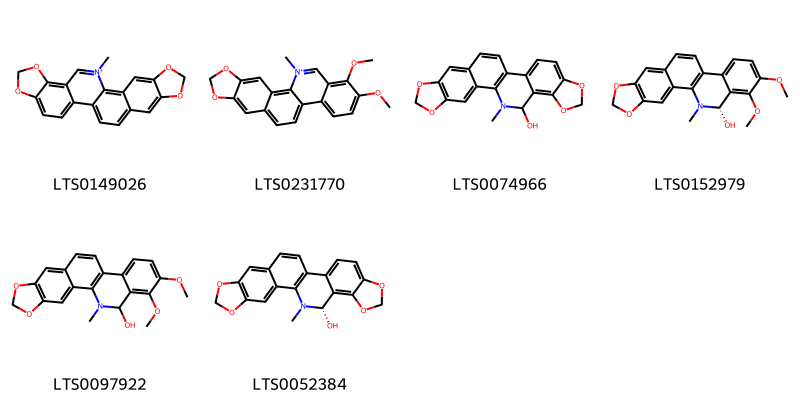{ width=100% }
    <figcaption>Hình ảnh cấu trúc hóa học của 6 hoạt chất thuộc nhóm Benzophenanthridine alkaloids gồm ['sanguinarine (LTS0149026)', 'chelerythrine (LTS0231770)', '24-methyl-5,7,18,20-tetraoxa-24-azahexacyclo[11.11.0.0²,¹⁰.0⁴,⁸.0¹⁴,²².0¹⁷,²¹]tetracosa-1(13),2,4(8),9,11,14,16,21-octaen-23-ol (LTS0074966)', '(20s)-17,18-dimethoxy-21-methyl-5,7-dioxa-21-azapentacyclo[11.8.0.0²,¹⁰.0⁴,⁸.0¹⁴,¹⁹]henicosa-1(13),2,4(8),9,11,14,16,18-octaen-20-ol (LTS0152979)', '17,18-dimethoxy-21-methyl-5,7-dioxa-21-azapentacyclo[11.8.0.0²,¹⁰.0⁴,⁸.0¹⁴,¹⁹]henicosa-1(13),2,4(8),9,11,14,16,18-octaen-20-ol (LTS0097922)', '(23s)-24-methyl-5,7,18,20-tetraoxa-24-azahexacyclo[11.11.0.0²,¹⁰.0⁴,⁸.0¹⁴,²².0¹⁷,²¹]tetracosa-1(13),2,4(8),9,11,14,16,21-octaen-23-ol (LTS0052384)'].</figcaption>
</figure>
#### Nhóm Isoquinolines and derivatives
<figure markdown="span">
    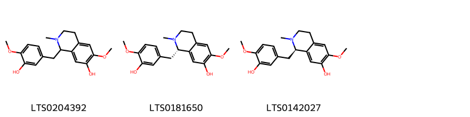{ width=100% }
    <figcaption>Hình ảnh cấu trúc hóa học của 3 hoạt chất thuộc nhóm Isoquinolines and derivatives gồm ['reticuline (LTS0204392)', '(+,-)-reticuline (LTS0181650)', '(-)-reticuline (LTS0142027)'].</figcaption>
</figure>
#### Nhóm Protoberberine alkaloids and derivatives
<figure markdown="span">
    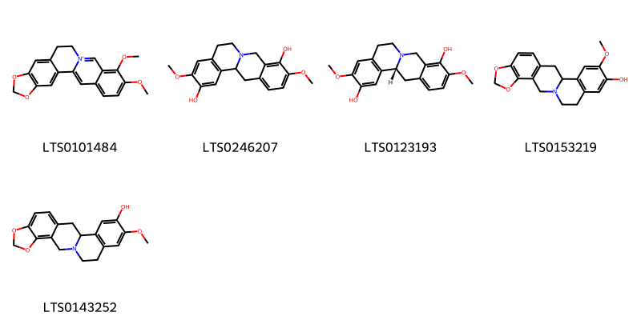{ width=100% }
    <figcaption>Hình ảnh cấu trúc hóa học của 5 hoạt chất thuộc nhóm Protoberberine alkaloids and derivatives gồm ['berberine (LTS0101484)', '(s)-scoulerine (LTS0246207)', '(12br)-3,10-dimethoxy-7,8,12b,13-tetrahydro-5h-6-azatetraphene-4,11-diol (LTS0123193)', '16-methoxy-5,7-dioxa-1-azapentacyclo[11.8.0.0³,¹¹.0⁴,⁸.0¹⁴,¹⁹]henicosa-3(11),4(8),9,14(19),15,17-hexaen-17-ol (LTS0153219)', '17-methoxy-5,7-dioxa-1-azapentacyclo[11.8.0.0³,¹¹.0⁴,⁸.0¹⁴,¹⁹]henicosa-3,8,10,14(19),15,17-hexaen-16-ol (LTS0143252)'].</figcaption>
</figure>
#### Nhóm Protopine alkaloids
<figure markdown="span">
    { width=100% }
    <figcaption>Hình ảnh cấu trúc hóa học của 2 hoạt chất thuộc nhóm Protopine alkaloids gồm ['protopine (LTS0080245)', 'β-allocryptopine (LTS0174113)'].</figcaption>
</figure>
#### Nhóm Quinolines and derivatives
<figure markdown="span">
    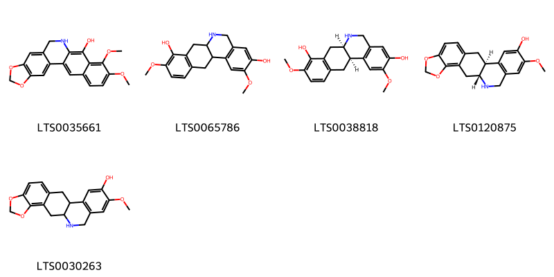{ width=100% }
    <figcaption>Hình ảnh cấu trúc hóa học của 5 hoạt chất thuộc nhóm Quinolines and derivatives gồm ['16,17-dimethoxy-5,7-dioxa-12-azapentacyclo[11.8.0.0²,¹⁰.0⁴,⁸.0¹⁵,²⁰]henicosa-1(13),2,4(8),9,14,16,18,20-octaen-14-ol (LTS0035661)', '2,9-dimethoxy-5,6,6a,7,12,12a-hexahydro-6-azatetraphene-3,8-diol (LTS0065786)', '(6ar,12ar)-2,9-dimethoxy-5,6,6a,7,12,12a-hexahydro-6-azatetraphene-3,8-diol (LTS0038818)', '(1r,13s)-17-methoxy-5,7-dioxa-21-azapentacyclo[11.8.0.0³,¹¹.0⁴,⁸.0¹⁴,¹⁹]henicosa-3,8,10,14(19),15,17-hexaen-16-ol (LTS0120875)', '17-methoxy-5,7-dioxa-21-azapentacyclo[11.8.0.0³,¹¹.0⁴,⁸.0¹⁴,¹⁹]henicosa-3,8,10,14(19),15,17-hexaen-16-ol (LTS0030263)'].</figcaption>
</figure>

---

### Dược dân tộc học

Danh sách các quốc gia có sử dụng *Argemone ochroleuca* trong điều trị các bệnh. 

| Country   | Disease            | Bệnh                                                                                                                                                                                                |
|:----------|:-------------------|:----------------------------------------------------------------------------------------------------------------------------------------------------------------------------------------------------|
| Mexico    | Hypnotic, Narcotic | MYMEMORY WARNING: YOU USED ALL AVAILABLE FREE TRANSLATIONS FOR TODAY. NEXT AVAILABLE IN  09 HOURS 24 MINUTES 09 SECONDS VISIT HTTPS://MYMEMORY.TRANSLATED.NET/DOC/USAGELIMITS.PHP TO TRANSLATE MORE |

---

---
## Argemone platyceras
### Thông tin về thực vật

!!! info "Phân loại thực vật của *Argemone platyceras* từ GIBF:"
    - **Kingdom:** Plantae
    - **Phylum:** Tracheophyta
    - **Order:** Ranunculales
    - **Family:** Papaveraceae
    - **Genus:** Argemone
    - **Species:** *Argemone platyceras*

 

| Label (VI)   | Label (EN)   | Scientific Name     | Descriptions (VI)   | Descriptions (EN)   | Also Known As (VI)   | Also Known As (EN)   |
|:-------------|:-------------|:--------------------|:--------------------|:--------------------|:---------------------|:---------------------|
| N/A          | N/A          | Argemone platyceras | loài thực vật       | species of plant    | ['']                 | ['']                 |

#### Phân bố trên thế giới

**Từ CSDL GIBF** nan, Mexico, Norway

#### Phân bố tại Việt Nam

**Từ CSDL GIBF**: Không có ghi nhận ở Việt Nam

---
### Thành phần hóa học
        
- Theo cơ sở dữ liệu lotus: Từ loài *Argemone platyceras* đã phân lập và xác định được 25 hoạt chất thuộc về các nhóm Benzophenanthridine alkaloids, Flavonoids, Protopine alkaloids, Protoberberine alkaloids and derivatives, Pavine alkaloids, Isoquinolines and derivatives. 

|    | chemicalTaxonomyClassyfireClass          |   smiles_count |
|---:|:-----------------------------------------|---------------:|
|  0 | Benzophenanthridine alkaloids            |              1 |
|  1 | Flavonoids                               |              4 |
|  2 | Isoquinolines and derivatives            |              3 |
|  3 | Pavine alkaloids                         |             13 |
|  4 | Protoberberine alkaloids and derivatives |              2 |
|  5 | Protopine alkaloids                      |              2 |

#### Nhóm Benzophenanthridine alkaloids
<figure markdown="span">
    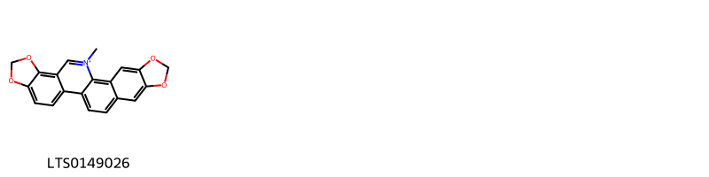{ width=100% }
    <figcaption>Hình ảnh cấu trúc hóa học của 1 hoạt chất thuộc nhóm Benzophenanthridine alkaloids gồm ['sanguinarine (LTS0149026)'].</figcaption>
</figure>
#### Nhóm Flavonoids
<figure markdown="span">
    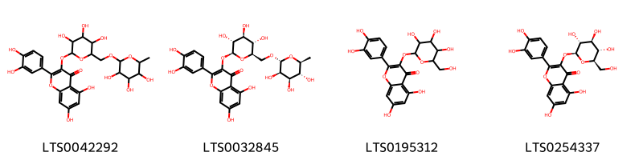{ width=100% }
    <figcaption>Hình ảnh cấu trúc hóa học của 4 hoạt chất thuộc nhóm Flavonoids gồm ['rutin (LTS0042292)', '3-rutinosyl quercetin (LTS0032845)', '2-(3,4-dihydroxyphenyl)-5,7-dihydroxy-3-{[3,4,5-trihydroxy-6-(hydroxymethyl)oxan-2-yl]oxy}chromen-4-one (LTS0195312)', 'isoquercetin (LTS0254337)'].</figcaption>
</figure>
#### Nhóm Isoquinolines and derivatives
<figure markdown="span">
    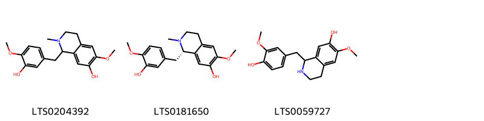{ width=100% }
    <figcaption>Hình ảnh cấu trúc hóa học của 3 hoạt chất thuộc nhóm Isoquinolines and derivatives gồm ['reticuline (LTS0204392)', '(+,-)-reticuline (LTS0181650)', 'nororientaline (LTS0059727)'].</figcaption>
</figure>
#### Nhóm Pavine alkaloids
<figure markdown="span">
    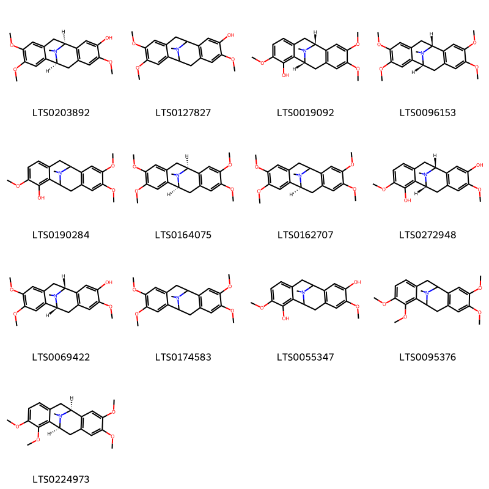{ width=100% }
    <figcaption>Hình ảnh cấu trúc hóa học của 13 hoạt chất thuộc nhóm Pavine alkaloids gồm ['(1s,9s)-5,12,13-trimethoxy-17-methyl-17-azatetracyclo[7.7.1.0²,⁷.0¹⁰,¹⁵]heptadeca-2(7),3,5,10,12,14-hexaen-4-ol (LTS0203892)', '5,12,13-trimethoxy-17-methyl-17-azatetracyclo[7.7.1.0²,⁷.0¹⁰,¹⁵]heptadeca-2(7),3,5,10,12,14-hexaen-4-ol (LTS0127827)', '(1r,9r)-4,12,13-trimethoxy-17-methyl-17-azatetracyclo[7.7.1.0²,⁷.0¹⁰,¹⁵]heptadeca-2,4,6,10(15),11,13-hexaen-3-ol (LTS0019092)', '(+)-argemonine (LTS0096153)', '4,12,13-trimethoxy-17-methyl-17-azatetracyclo[7.7.1.0²,⁷.0¹⁰,¹⁵]heptadeca-2,4,6,10(15),11,13-hexaen-3-ol (LTS0190284)', '(-)-argemonine (LTS0164075)', '(1s)-4,5,12,13-tetramethoxy-17-methyl-17-azatetracyclo[7.7.1.0²,⁷.0¹⁰,¹⁵]heptadeca-2,4,6,10(15),11,13-hexaene (LTS0162707)', '(1r,9r)-4,13-dimethoxy-17-methyl-17-azatetracyclo[7.7.1.0²,⁷.0¹⁰,¹⁵]heptadeca-2,4,6,10(15),11,13-hexaene-3,12-diol (LTS0272948)', '(1r,9r)-5,12,13-trimethoxy-17-methyl-17-azatetracyclo[7.7.1.0²,⁷.0¹⁰,¹⁵]heptadeca-2(7),3,5,10,12,14-hexaen-4-ol (LTS0069422)', '4,5,12,13-tetramethoxy-17-methyl-17-azatetracyclo[7.7.1.0²,⁷.0¹⁰,¹⁵]heptadeca-2,4,6,10(15),11,13-hexaene (LTS0174583)', '4,13-dimethoxy-17-methyl-17-azatetracyclo[7.7.1.0²,⁷.0¹⁰,¹⁵]heptadeca-2,4,6,10(15),11,13-hexaene-3,12-diol (LTS0055347)', '3,4,12,13-tetramethoxy-17-methyl-17-azatetracyclo[7.7.1.0²,⁷.0¹⁰,¹⁵]heptadeca-2,4,6,10(15),11,13-hexaene (LTS0095376)', '(1s,9s)-3,4,12,13-tetramethoxy-17-methyl-17-azatetracyclo[7.7.1.0²,⁷.0¹⁰,¹⁵]heptadeca-2,4,6,10(15),11,13-hexaene (LTS0224973)'].</figcaption>
</figure>
#### Nhóm Protoberberine alkaloids and derivatives
<figure markdown="span">
    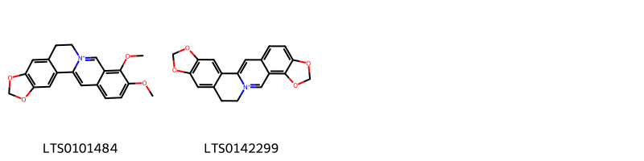{ width=100% }
    <figcaption>Hình ảnh cấu trúc hóa học của 2 hoạt chất thuộc nhóm Protoberberine alkaloids and derivatives gồm ['berberine (LTS0101484)', '5,7,17,19-tetraoxa-13λ⁵-azahexacyclo[11.11.0.0²,¹⁰.0⁴,⁸.0¹⁵,²³.0¹⁶,²⁰]tetracosa-1(24),2,4(8),9,13,15,20,22-octaen-13-ylium (LTS0142299)'].</figcaption>
</figure>
#### Nhóm Protopine alkaloids
<figure markdown="span">
    { width=100% }
    <figcaption>Hình ảnh cấu trúc hóa học của 2 hoạt chất thuộc nhóm Protopine alkaloids gồm ['protopine (LTS0080245)', 'β-allocryptopine (LTS0174113)'].</figcaption>
</figure>

---

### Dược dân tộc học

Danh sách các quốc gia có sử dụng *Argemone platyceras* trong điều trị các bệnh. 

| Country      | Disease                                   | Bệnh                                                                                                                                                                                                |
|:-------------|:------------------------------------------|:----------------------------------------------------------------------------------------------------------------------------------------------------------------------------------------------------|
| Mexico(Seri) | Hemostat                                  | MYMEMORY WARNING: YOU USED ALL AVAILABLE FREE TRANSLATIONS FOR TODAY. NEXT AVAILABLE IN  09 HOURS 23 MINUTES 33 SECONDS VISIT HTTPS://MYMEMORY.TRANSLATED.NET/DOC/USAGELIMITS.PHP TO TRANSLATE MORE |
| Venezuela    | Emetic, Sudorific, Vulnerary, Emmenagogue | MYMEMORY WARNING: YOU USED ALL AVAILABLE FREE TRANSLATIONS FOR TODAY. NEXT AVAILABLE IN  09 HOURS 23 MINUTES 30 SECONDS VISIT HTTPS://MYMEMORY.TRANSLATED.NET/DOC/USAGELIMITS.PHP TO TRANSLATE MORE |

---

---
## Argemone subfusiformis
### Thông tin về thực vật

!!! info "Phân loại thực vật của *Argemone subfusiformis* từ GIBF:"
    - **Kingdom:** Plantae
    - **Phylum:** Tracheophyta
    - **Order:** Ranunculales
    - **Family:** Papaveraceae
    - **Genus:** Argemone
    - **Species:** *Argemone subfusiformis*

 

| Label (VI)   | Label (EN)   | Scientific Name        | Descriptions (VI)   | Descriptions (EN)   | Also Known As (VI)   | Also Known As (EN)   |
|:-------------|:-------------|:-----------------------|:--------------------|:--------------------|:---------------------|:---------------------|
| N/A          | N/A          | Argemone subfusiformis | loài thực vật       | species of plant    | ['']                 | ['']                 |

#### Phân bố trên thế giới

**Từ CSDL GIBF** Brazil, Peru, Paraguay, Norfolk Island, Australia, Chile, South Africa, India, Ecuador, Argentina, Bolivia (Plurinational State of)

#### Phân bố tại Việt Nam

**Từ CSDL GIBF**: Không có ghi nhận ở Việt Nam

---
### Thành phần hóa học
        
- Theo cơ sở dữ liệu lotus: Từ loài *Argemone subfusiformis* đã phân lập và xác định được 3 hoạt chất thuộc về các nhóm Benzophenanthridine alkaloids, Protopine alkaloids, Protoberberine alkaloids and derivatives. 

|    | chemicalTaxonomyClassyfireClass          |   smiles_count |
|---:|:-----------------------------------------|---------------:|
|  0 | Benzophenanthridine alkaloids            |              1 |
|  1 | Protoberberine alkaloids and derivatives |              1 |
|  2 | Protopine alkaloids                      |              1 |

#### Nhóm Benzophenanthridine alkaloids
<figure markdown="span">
    { width=100% }
    <figcaption>Hình ảnh cấu trúc hóa học của 1 hoạt chất thuộc nhóm Benzophenanthridine alkaloids gồm ['sanguinarine (LTS0149026)'].</figcaption>
</figure>
#### Nhóm Protoberberine alkaloids and derivatives
<figure markdown="span">
    { width=100% }
    <figcaption>Hình ảnh cấu trúc hóa học của 1 hoạt chất thuộc nhóm Protoberberine alkaloids and derivatives gồm ['berberine (LTS0101484)'].</figcaption>
</figure>
#### Nhóm Protopine alkaloids
<figure markdown="span">
    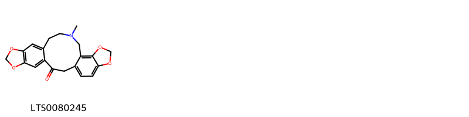{ width=100% }
    <figcaption>Hình ảnh cấu trúc hóa học của 1 hoạt chất thuộc nhóm Protopine alkaloids gồm ['protopine (LTS0080245)'].</figcaption>
</figure>

---

### Dược dân tộc học

Danh sách các quốc gia có sử dụng *Argemone subfusiformis* trong điều trị các bệnh. 

| Country   | Disease                                     | Bệnh                                                                                                                                                                                                |
|:----------|:--------------------------------------------|:----------------------------------------------------------------------------------------------------------------------------------------------------------------------------------------------------|
| Argentina | Cholagogue, Narcotic, Vulnerary, Antiseptic | MYMEMORY WARNING: YOU USED ALL AVAILABLE FREE TRANSLATIONS FOR TODAY. NEXT AVAILABLE IN  09 HOURS 22 MINUTES 53 SECONDS VISIT HTTPS://MYMEMORY.TRANSLATED.NET/DOC/USAGELIMITS.PHP TO TRANSLATE MORE |

---

