!!! abstract "Tóm tắt"

    Họ Passifloraceae gồm khoảng 2 chi và 15 loài được một số cộng đồng tại các quốc gia như Trinidad, Venezuela, Upper Volta, Mexico, Haiti, Elsewhere, Sri Lanka, Dominican Republic, Bermuda, Africa, Paraguay, US, Cuba, Turkey, Iraq, Salvador sử dụng trong một số trường hợp QUERY LENGTH LIMIT EXCEEDED. MAX ALLOWED QUERY : 500 CHARS.

!!! info "DrDuke"

    James A. Duke sinh năm 1929-2017 là một nhà thực vật học người Mỹ. Đây là một trong những tác giả hàng đầu trong lĩnh vực dược dân tộc học với cuốn *CRC Handbook of Medicinal Herbs* và chính là người xây dựng lên cơ sở dữ liệu về hợp chất tự nhiên và dược dân tộc học tại Bộ nông nghiệp Hoa Kỳ. Các thông tin được đăng tải tại website [Dr. Duke's Phytochemical and Ethnobotanical Databases](https://phytochem.nal.usda.gov/). 
    Trong suốt thập niên 1970, ông lãnh đạo the Plant Taxonomy Laboratory, Plant Genetics and Germplasm Institute of the Agricultural Research Service, U.S. Department of Agriculture.
    Trong tài liệu này, các thông tin về dược dân tộc của các dược liệu được trích dẫn từ tài liệu của James A. Ducke với sự trợ giúp của phần mềm dịch thuật từ tiếng Anh sang tiếng Việt.
   

# Chi Passiflora

??? note "Danh sách các dược liệu thuộc chi"
    
	 - *Passiflora ciliata*
	 - *Passiflora cincinnata*
	 - *Passiflora edulis*
	 - *Passiflora foetida*
	 - *Passiflora incarnata*
	 - *Passiflora jorullensis?*
	 - *Passiflora laurifolia*
	 - *Passiflora maliformis*
	 - *Passiflora murucuja*
	 - *Passiflora quadrangularis*
	 - *Passiflora rubra*
	 - *Passiflora salvadorensis*

---
## Passiflora ciliata
### Thông tin về thực vật

!!! info "Phân loại thực vật của *Passiflora ciliata* từ GIBF:"
    - **Kingdom:** Plantae
    - **Phylum:** Tracheophyta
    - **Order:** Malpighiales
    - **Family:** Passifloraceae
    - **Genus:** Passiflora
    - **Species:** *Passiflora ciliata*

 

| Label (VI)   | Label (EN)   | Scientific Name    | Descriptions (VI)   | Descriptions (EN)   | Also Known As (VI)   | Also Known As (EN)   |
|:-------------|:-------------|:-------------------|:--------------------|:--------------------|:---------------------|:---------------------|
| N/A          | N/A          | Passiflora ciliata | loài thực vật       | species of plant    | ['']                 | ['']                 |

#### Phân bố trên thế giới

**Từ CSDL GIBF** Honduras, Belize, El Salvador, Costa Rica, United States of America, Mexico, Cuba, Guatemala

#### Phân bố tại Việt Nam

**Từ CSDL GIBF**: Không có ghi nhận ở Việt Nam

---
### Thành phần hóa học
        
- Theo cơ sở dữ liệu lotus: Từ loài *Passiflora ciliata* đã phân lập và xác định được Chưa có hoạt chất nào được phân lập. hoạt chất thuộc về các nhóm Không có hoạt chất nào được phân lập. 

Không có hình ảnh nào được tạo ra

---

### Dược dân tộc học

Danh sách các quốc gia có sử dụng *Passiflora ciliata* trong điều trị các bệnh. 

| Country   | Disease                                | Bệnh                                                                                                                                                                                                |
|:----------|:---------------------------------------|:----------------------------------------------------------------------------------------------------------------------------------------------------------------------------------------------------|
| Mexico    | Narcotic, Narcotic, Sedative, Sedative | MYMEMORY WARNING: YOU USED ALL AVAILABLE FREE TRANSLATIONS FOR TODAY. NEXT AVAILABLE IN  15 HOURS 13 MINUTES 08 SECONDS VISIT HTTPS://MYMEMORY.TRANSLATED.NET/DOC/USAGELIMITS.PHP TO TRANSLATE MORE |

---

---
## Passiflora cincinnata
### Thông tin về thực vật

!!! info "Phân loại thực vật của *Passiflora cincinnata* từ GIBF:"
    - **Kingdom:** Plantae
    - **Phylum:** Tracheophyta
    - **Order:** Malpighiales
    - **Family:** Passifloraceae
    - **Genus:** Passiflora
    - **Species:** *Passiflora cincinnata*

 

| Label (VI)   | Label (EN)   | Scientific Name       | Descriptions (VI)   | Descriptions (EN)   | Also Known As (VI)   | Also Known As (EN)   |
|:-------------|:-------------|:----------------------|:--------------------|:--------------------|:---------------------|:---------------------|
| N/A          | N/A          | Passiflora cincinnata | loài thực vật       | species of plant    | ['']                 | ['']                 |

#### Phân bố trên thế giới

**Từ CSDL GIBF** Paraguay, Argentina, Bolivia (Plurinational State of), Brazil

#### Phân bố tại Việt Nam

**Từ CSDL GIBF**: Không có ghi nhận ở Việt Nam

---
### Thành phần hóa học
        
- Theo cơ sở dữ liệu lotus: Từ loài *Passiflora cincinnata* đã phân lập và xác định được 1 hoạt chất thuộc về các nhóm Harmala alkaloids. 

|    | chemicalTaxonomyClassyfireClass   |   smiles_count |
|---:|:----------------------------------|---------------:|
|  0 | Harmala alkaloids                 |              1 |

#### Nhóm Harmala alkaloids
<figure markdown="span">
    { width=100% }
    <figcaption>Hình ảnh cấu trúc hóa học của 1 hoạt chất thuộc nhóm Harmala alkaloids gồm ['harmine (LTS0131294)'].</figcaption>
</figure>

---

### Dược dân tộc học

Danh sách các quốc gia có sử dụng *Passiflora cincinnata* trong điều trị các bệnh. 

| Country   | Disease       | Bệnh                                                                                                                                                                                                |
|:----------|:--------------|:----------------------------------------------------------------------------------------------------------------------------------------------------------------------------------------------------|
| Paraguay  | Antifertility | MYMEMORY WARNING: YOU USED ALL AVAILABLE FREE TRANSLATIONS FOR TODAY. NEXT AVAILABLE IN  15 HOURS 12 MINUTES 32 SECONDS VISIT HTTPS://MYMEMORY.TRANSLATED.NET/DOC/USAGELIMITS.PHP TO TRANSLATE MORE |

---

---
## Passiflora edulis
### Thông tin về thực vật

!!! info "Phân loại thực vật của *Passiflora edulis* từ GIBF:"
    - **Kingdom:** Plantae
    - **Phylum:** Tracheophyta
    - **Order:** Malpighiales
    - **Family:** Passifloraceae
    - **Genus:** Passiflora
    - **Species:** *Passiflora edulis*

 

| Label (VI)   | Label (EN)   | Scientific Name   | Descriptions (VI)   | Descriptions (EN)   | Also Known As (VI)    | Also Known As (EN)                           |
|:-------------|:-------------|:------------------|:--------------------|:--------------------|:----------------------|:---------------------------------------------|
| N/A          | N/A          | Passiflora edulis | loài thực vật       | species of plant    | ['Passiflora edulis'] | ['guarani', 'passion fruit', 'passionfruit'] |

#### Phân bố trên thế giới

**Từ CSDL GIBF** nan, Malawi, Honduras, El Salvador, Ghana, Dominica, Guadeloupe, French Guiana, Kenya, Martinique, Singapore, Australia, Indonesia, Guatemala, Colombia, Dominican Republic, Maldives, Puerto Rico, India, Bahamas, Virgin Islands (U.S.), Antigua and Barbuda, Brazil, Peru, Mexico, China, Chinese Taipei, Hong Kong, Uruguay, Argentina, South Africa, Niue, Portugal, Tanzania, United Republic of, New Zealand, Bolivia (Plurinational State of), Costa Rica, Ecuador, United States of America

#### Phân bố tại Việt Nam

**Từ CSDL GIBF**: Không có ghi nhận ở Việt Nam

---
### Thành phần hóa học
        
- Theo cơ sở dữ liệu lotus: Từ loài *Passiflora edulis* đã phân lập và xác định được 98 hoạt chất thuộc về các nhóm Organooxygen compounds, Furanoid lignans, Flavonoids, Thioethers, Saturated hydrocarbons, Unsaturated hydrocarbons, Dibenzylbutane lignans, Prenol lipids, Harmala alkaloids, Thiols, Steroids and steroid derivatives, Benzene and substituted derivatives, Naphthalenes. 

|    | chemicalTaxonomyClassyfireClass     |   smiles_count |
|---:|:------------------------------------|---------------:|
|  0 | Benzene and substituted derivatives |              1 |
|  1 | Dibenzylbutane lignans              |              2 |
|  2 | Flavonoids                          |              9 |
|  3 | Furanoid lignans                    |              1 |
|  4 | Harmala alkaloids                   |              6 |
|  5 | Naphthalenes                        |              1 |
|  6 | Organooxygen compounds              |             17 |
|  7 | Prenol lipids                       |             36 |
|  8 | Saturated hydrocarbons              |              4 |
|  9 | Steroids and steroid derivatives    |             15 |
| 10 | Thioethers                          |              1 |
| 11 | Thiols                              |              1 |
| 12 | Unsaturated hydrocarbons            |              4 |

#### Nhóm Benzene and substituted derivatives
<figure markdown="span">
    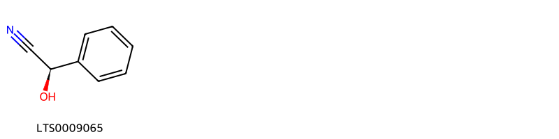{ width=100% }
    <figcaption>Hình ảnh cấu trúc hóa học của 1 hoạt chất thuộc nhóm Benzene and substituted derivatives gồm ['(-)-mandelonitrile (LTS0009065)'].</figcaption>
</figure>
#### Nhóm Dibenzylbutane lignans
<figure markdown="span">
    { width=100% }
    <figcaption>Hình ảnh cấu trúc hóa học của 2 hoạt chất thuộc nhóm Dibenzylbutane lignans gồm ['(2s,3r)-2,3-bis[(4-hydroxy-3-methoxyphenyl)(¹³c)methyl](1-¹³c)butane-1,4-diol (LTS0268699)', 'secoisolariciresinol (LTS0086727)'].</figcaption>
</figure>
#### Nhóm Flavonoids
<figure markdown="span">
    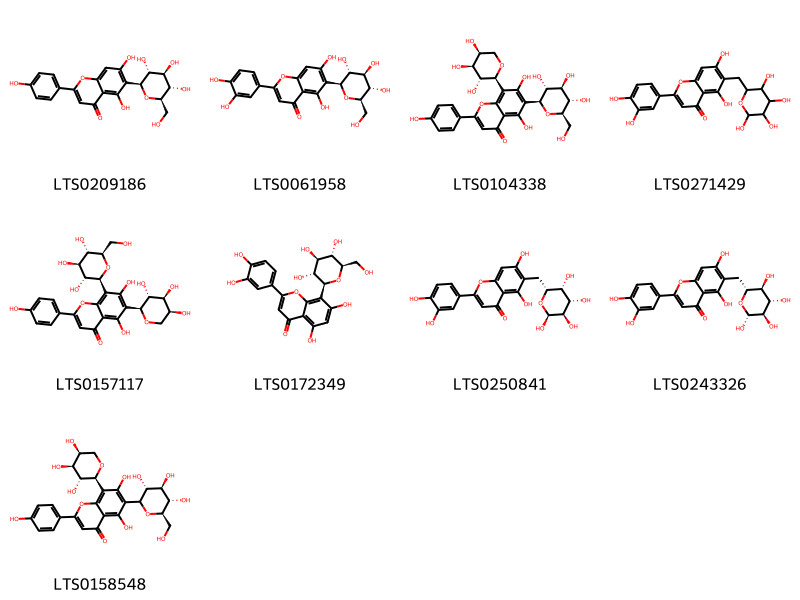{ width=100% }
    <figcaption>Hình ảnh cấu trúc hóa học của 9 hoạt chất thuộc nhóm Flavonoids gồm ['isovitexin (LTS0209186)', 'isoorientin (LTS0061958)', 'schaftoside (LTS0104338)', '2-(3,4-dihydroxyphenyl)-5,7-dihydroxy-6-[(3,4,5,6-tetrahydroxyoxan-2-yl)methyl]chromen-4-one (LTS0271429)', 'isoschaftoside (LTS0157117)', 'orientin (LTS0172349)', '2-(3,4-dihydroxyphenyl)-5,7-dihydroxy-6-{[(2r,3r,4s,5r,6s)-3,4,5,6-tetrahydroxyoxan-2-yl]methyl}chromen-4-one (LTS0250841)', '2-(3,4-dihydroxyphenyl)-5,7-dihydroxy-6-{[(2r,3s,4s,5r,6r)-3,4,5,6-tetrahydroxyoxan-2-yl]methyl}chromen-4-one (LTS0243326)', '5,7-dihydroxy-2-(4-hydroxyphenyl)-6-[(3r,4r,5s,6r)-3,4,5-trihydroxy-6-(hydroxymethyl)oxan-2-yl]-8-[(2s,3r,4s,5s)-3,4,5-trihydroxyoxan-2-yl]chromen-4-one (LTS0158548)'].</figcaption>
</figure>
#### Nhóm Furanoid lignans
<figure markdown="span">
    { width=100% }
    <figcaption>Hình ảnh cấu trúc hóa học của 1 hoạt chất thuộc nhóm Furanoid lignans gồm ['matairesinol (LTS0193475)'].</figcaption>
</figure>
#### Nhóm Harmala alkaloids
<figure markdown="span">
    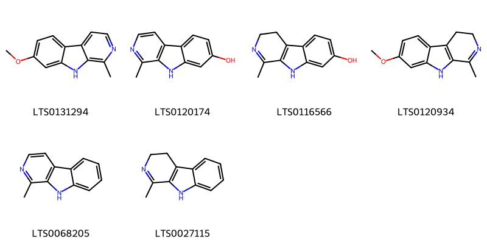{ width=100% }
    <figcaption>Hình ảnh cấu trúc hóa học của 6 hoạt chất thuộc nhóm Harmala alkaloids gồm ['harmine (LTS0131294)', 'harmol (LTS0120174)', 'harmalol (LTS0116566)', 'harmaline (LTS0120934)', 'harmane (LTS0068205)', '1-methyl-3h,4h,9h-pyrido[3,4-b]indole (LTS0027115)'].</figcaption>
</figure>
#### Nhóm Naphthalenes
<figure markdown="span">
    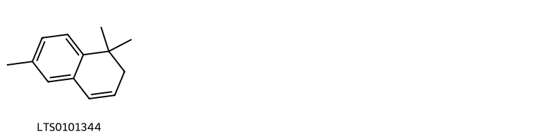{ width=100% }
    <figcaption>Hình ảnh cấu trúc hóa học của 1 hoạt chất thuộc nhóm Naphthalenes gồm ['1,1,6-trimethyl-2h-naphthalene (LTS0101344)'].</figcaption>
</figure>
#### Nhóm Organooxygen compounds
<figure markdown="span">
    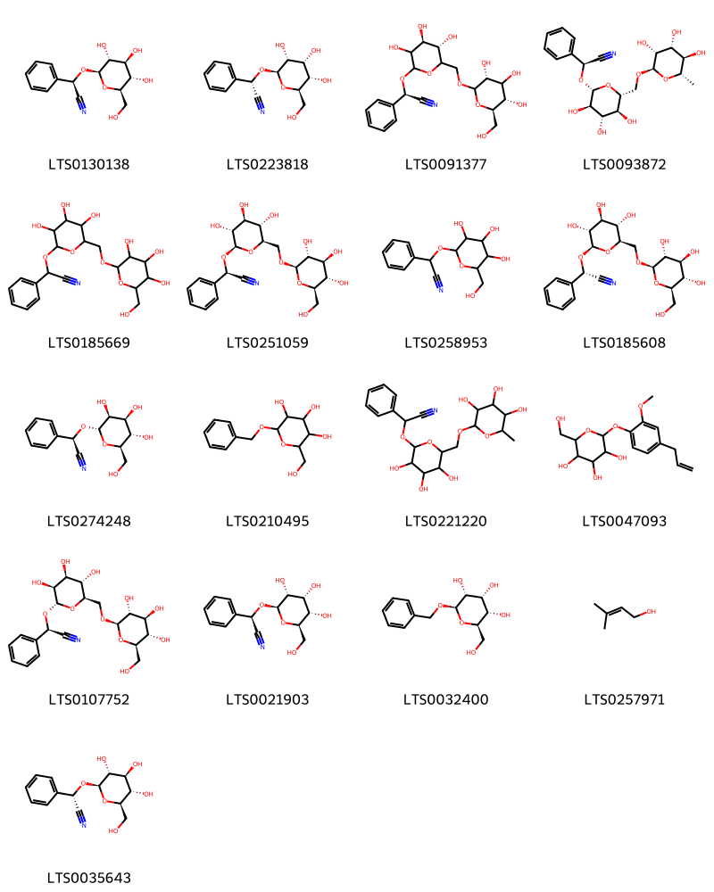{ width=100% }
    <figcaption>Hình ảnh cấu trúc hóa học của 17 hoạt chất thuộc nhóm Organooxygen compounds gồm ['prunasin (LTS0130138)', '(2s)-2-phenyl-2-{[(2r,3r,4r,5s,6r)-3,4,5-trihydroxy-6-(hydroxymethyl)oxan-2-yl]oxy}acetonitrile (LTS0223818)', '(2r)-2-phenyl-2-{[(4s,5s)-3,4,5-trihydroxy-6-({[(3r,5s,6r)-3,4,5-trihydroxy-6-(hydroxymethyl)oxan-2-yl]oxy}methyl)oxan-2-yl]oxy}acetonitrile (LTS0091377)', '(2s)-2-phenyl-2-{[(2r,3r,4s,5s,6r)-3,4,5-trihydroxy-6-({[(2r,3r,4r,5r,6s)-3,4,5-trihydroxy-6-methyloxan-2-yl]oxy}methyl)oxan-2-yl]oxy}acetonitrile (LTS0093872)', 'amygdalin (LTS0185669)', 'laetrile (LTS0251059)', '2-phenyl-2-{[3,4,5-trihydroxy-6-(hydroxymethyl)oxan-2-yl]oxy}acetonitrile (LTS0258953)', '(2s)-2-phenyl-2-{[(2r,3r,4s,5s,6r)-3,4,5-trihydroxy-6-({[(2r,3r,4s,5s,6r)-3,4,5-trihydroxy-6-(hydroxymethyl)oxan-2-yl]oxy}methyl)oxan-2-yl]oxy}acetonitrile (LTS0185608)', '(2r)-2-phenyl-2-{[(2s,3s,4s,5s,6r)-3,4,5-trihydroxy-6-(hydroxymethyl)oxan-2-yl]oxy}acetonitrile (LTS0274248)', 'benzyl glucopyranoside (LTS0210495)', '2-phenyl-2-[(3,4,5-trihydroxy-6-{[(3,4,5-trihydroxy-6-methyloxan-2-yl)oxy]methyl}oxan-2-yl)oxy]acetonitrile (LTS0221220)', '2-(hydroxymethyl)-6-[2-methoxy-4-(prop-2-en-1-yl)phenoxy]oxane-3,4,5-triol (LTS0047093)', '(2r)-2-phenyl-2-{[(2s,3s,4s,5s,6r)-3,4,5-trihydroxy-6-({[(2r,3r,4s,5s,6r)-3,4,5-trihydroxy-6-(hydroxymethyl)oxan-2-yl]oxy}methyl)oxan-2-yl]oxy}acetonitrile (LTS0107752)', '(2r)-2-phenyl-2-{[(2r,3r,4r,5s,6r)-3,4,5-trihydroxy-6-(hydroxymethyl)oxan-2-yl]oxy}acetonitrile (LTS0021903)', '(2r,3r,4r,5s,6r)-2-(benzyloxy)-6-(hydroxymethyl)oxane-3,4,5-triol (LTS0032400)', 'prenol (LTS0257971)', '(s)-prunasin (LTS0035643)'].</figcaption>
</figure>
#### Nhóm Prenol lipids
<figure markdown="span">
    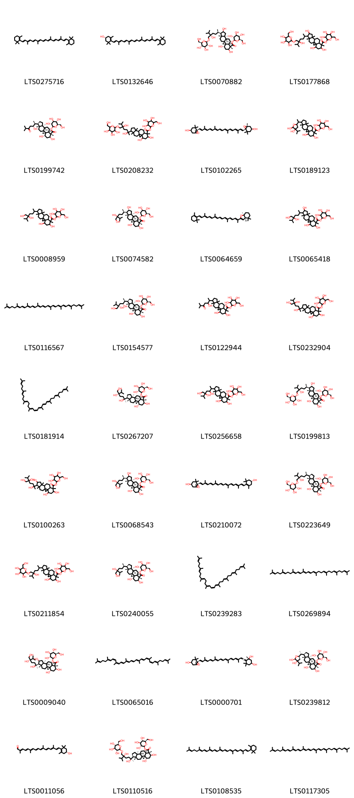{ width=100% }
    <figcaption>Hình ảnh cấu trúc hóa học của 36 hoạt chất thuộc nhóm Prenol lipids gồm ['β-carotene (LTS0275716)', 'cryptoxanthin (LTS0132646)', '(2s,3r,4s,5s,6r)-3,4,5-trihydroxy-6-(hydroxymethyl)oxan-2-yl (1s,3s,4s,6s,7s,8r,11s,12s,14s,15r,16r)-4,6,14-trihydroxy-15-[(2r,5s)-5-hydroxy-6-methyl-5-({[(2r,3r,4s,5s,6r)-3,4,5-trihydroxy-6-(hydroxymethyl)oxan-2-yl]oxy}methyl)heptan-2-yl]-7,12,16-trimethylpentacyclo[9.7.0.0¹,³.0³,⁸.0¹²,¹⁶]octadecane-7-carboxylate (LTS0070882)', '3,4,5-trihydroxy-6-(hydroxymethyl)oxan-2-yl 4,6,14-trihydroxy-15-[5-hydroxy-6-methyl-5-({[3,4,5-trihydroxy-6-(hydroxymethyl)oxan-2-yl]oxy}methyl)heptan-2-yl]-7,12,16-trimethylpentacyclo[9.7.0.0¹,³.0³,⁸.0¹²,¹⁶]octadecane-7-carboxylate (LTS0177868)', '(2s,3r,4s,5s,6r)-3,4,5-trihydroxy-6-(hydroxymethyl)oxan-2-yl (1s,3s,4s,6s,7s,8r,11s,12s,15r,16r)-4,6-dihydroxy-15-[(2s,3r)-3-hydroxy-6-methyl-5-oxoheptan-2-yl]-7,12,16-trimethylpentacyclo[9.7.0.0¹,³.0³,⁸.0¹²,¹⁶]octadecane-7-carboxylate (LTS0199742)', '3,4,5-trihydroxy-6-(hydroxymethyl)oxan-2-yl 15-[2,5-dihydroxy-6-methyl-5-({[3,4,5-trihydroxy-6-(hydroxymethyl)oxan-2-yl]oxy}methyl)heptan-2-yl]-4,6-dihydroxy-7,12,16-trimethylpentacyclo[9.7.0.0¹,³.0³,⁸.0¹²,¹⁶]octadecane-7-carboxylate (LTS0208232)', 'violaxanthin (LTS0102265)', '3,4,5-trihydroxy-6-(hydroxymethyl)oxan-2-yl 15-[1-(4,5-dihydroxy-4-isopropyloxolan-2-yl)ethyl]-4,6-dihydroxy-7,12,16-trimethylpentacyclo[9.7.0.0¹,³.0³,⁸.0¹²,¹⁶]octadecane-7-carboxylate (LTS0189123)', '3,4,5-trihydroxy-6-(hydroxymethyl)oxan-2-yl 15-(5,6-dihydroxy-5-isopropylhexan-2-yl)-4,6-dihydroxy-7,12,16-trimethylpentacyclo[9.7.0.0¹,³.0³,⁸.0¹²,¹⁶]octadecane-7-carboxylate (LTS0008959)', '(2s,3r,4s,5s,6r)-3,4,5-trihydroxy-6-(hydroxymethyl)oxan-2-yl (1s,3s,4s,6s,7s,8r,11s,12s,14r,15r,16r)-15-[(2r,5s)-5,6-dihydroxy-5-isopropylhexan-2-yl]-4,6,14-trihydroxy-7,12,16-trimethylpentacyclo[9.7.0.0¹,³.0³,⁸.0¹²,¹⁶]octadecane-7-carboxylate (LTS0074582)', '(3ar,7as)-4,4,7a-trimethyl-2-[(2e,4e,6e,8e,10e,12e,14e,16e)-6,11,15-trimethyl-17-(2,6,6-trimethylcyclohex-1-en-1-yl)heptadeca-2,4,6,8,10,12,14,16-octaen-2-yl]-3a,5,6,7-tetrahydro-1-benzofuran (LTS0064659)', '3,4,5-trihydroxy-6-(hydroxymethyl)oxan-2-yl 15-(5,6-dihydroxy-5-isopropylhexan-2-yl)-4,6,14-trihydroxy-7,12,16-trimethylpentacyclo[9.7.0.0¹,³.0³,⁸.0¹²,¹⁶]octadecane-7-carboxylate (LTS0065418)', 'lycopene (LTS0116567)', '(2s,3r,4s,5s,6r)-3,4,5-trihydroxy-6-(hydroxymethyl)oxan-2-yl (1s,3s,4s,6s,7s,8r,11s,12s,15r,16r)-4,6-dihydroxy-7,12,16-trimethyl-15-[(2s,3r,5s)-3,5,6-trihydroxy-5-isopropylhexan-2-yl]pentacyclo[9.7.0.0¹,³.0³,⁸.0¹²,¹⁶]octadecane-7-carboxylate (LTS0154577)', '3,4,5-trihydroxy-6-(hydroxymethyl)oxan-2-yl 4,6-dihydroxy-15-(3-hydroxy-6-methyl-5-oxoheptan-2-yl)-7,12,16-trimethylpentacyclo[9.7.0.0¹,³.0³,⁸.0¹²,¹⁶]octadecane-7-carboxylate (LTS0122944)', '3,4,5-trihydroxy-6-(hydroxymethyl)oxan-2-yl 4,6-dihydroxy-7,12,16-trimethyl-15-(2,5,6-trihydroxy-5-isopropylhexan-2-yl)pentacyclo[9.7.0.0¹,³.0³,⁸.0¹²,¹⁶]octadecane-7-carboxylate (LTS0232904)', 'phytofluene (LTS0181914)', '(2s,3r,4s,5s,6r)-3,4,5-trihydroxy-6-(hydroxymethyl)oxan-2-yl (1s,3s,4s,6s,7s,8r,11s,12s,15s,16r)-4,6-dihydroxy-7,12,16-trimethyl-15-[(2s,5s)-2,5,6-trihydroxy-5-isopropylhexan-2-yl]pentacyclo[9.7.0.0¹,³.0³,⁸.0¹²,¹⁶]octadecane-7-carboxylate (LTS0267207)', '3,4,5-trihydroxy-6-(hydroxymethyl)oxan-2-yl 4,6-dihydroxy-7,12,16-trimethyl-15-(3,5,6-trihydroxy-5-isopropylhexan-2-yl)pentacyclo[9.7.0.0¹,³.0³,⁸.0¹²,¹⁶]octadecane-7-carboxylate (LTS0256658)', '(2s,3r,4s,5s,6r)-3,4,5-trihydroxy-6-(hydroxymethyl)oxan-2-yl (1s,3s,4s,6s,7s,8r,11s,12s,14r,15r,16r)-4,6,14-trihydroxy-15-[(2r,5s)-5-hydroxy-6-methyl-5-({[(2r,3r,4s,5s,6r)-3,4,5-trihydroxy-6-(hydroxymethyl)oxan-2-yl]oxy}methyl)heptan-2-yl]-7,12,16-trimethylpentacyclo[9.7.0.0¹,³.0³,⁸.0¹²,¹⁶]octadecane-7-carboxylate (LTS0199813)', '3,4,5-trihydroxy-6-(hydroxymethyl)oxan-2-yl 4,6,14-trihydroxy-7,12,16-trimethyl-15-(2,5,6-trihydroxy-5-isopropylhexan-2-yl)pentacyclo[9.7.0.0¹,³.0³,⁸.0¹²,¹⁶]octadecane-7-carboxylate (LTS0100263)', '(2s,3r,4s,5s,6r)-3,4,5-trihydroxy-6-(hydroxymethyl)oxan-2-yl (1s,3s,4s,6s,7s,8r,11s,12s,14s,15r,16r)-15-[(2r,5s)-5,6-dihydroxy-5-isopropylhexan-2-yl]-4,6,14-trihydroxy-7,12,16-trimethylpentacyclo[9.7.0.0¹,³.0³,⁸.0¹²,¹⁶]octadecane-7-carboxylate (LTS0068543)', 'antheraxanthin (LTS0210072)', '(2s,3r,4s,5s,6r)-3,4,5-trihydroxy-6-(hydroxymethyl)oxan-2-yl (1s,3s,4s,6s,7s,8r,11s,12s,15r,16r)-4,6-dihydroxy-15-[(2r,5s)-5-hydroxy-6-methyl-5-({[(2r,3r,4s,5s,6r)-3,4,5-trihydroxy-6-(hydroxymethyl)oxan-2-yl]oxy}methyl)heptan-2-yl]-7,12,16-trimethylpentacyclo[9.7.0.0¹,³.0³,⁸.0¹²,¹⁶]octadecane-7-carboxylate (LTS0223649)', '3,4,5-trihydroxy-6-(hydroxymethyl)oxan-2-yl 4,6-dihydroxy-15-[5-hydroxy-6-methyl-5-({[3,4,5-trihydroxy-6-(hydroxymethyl)oxan-2-yl]oxy}methyl)heptan-2-yl]-7,12,16-trimethylpentacyclo[9.7.0.0¹,³.0³,⁸.0¹²,¹⁶]octadecane-7-carboxylate (LTS0211854)', '(2s,3r,4s,5s,6r)-3,4,5-trihydroxy-6-(hydroxymethyl)oxan-2-yl (1s,3s,4s,6s,7s,8r,11s,12s,15r,16r)-15-[(2r,5s)-5,6-dihydroxy-5-isopropylhexan-2-yl]-4,6-dihydroxy-7,12,16-trimethylpentacyclo[9.7.0.0¹,³.0³,⁸.0¹²,¹⁶]octadecane-7-carboxylate (LTS0240055)', 'cis-phytoene (LTS0239283)', 'all-trans-phytofluene (LTS0269894)', '(2s,3r,4s,5s,6r)-3,4,5-trihydroxy-6-(hydroxymethyl)oxan-2-yl (1s,3s,4s,6s,7s,8r,11s,12s,14s,15r,16r)-4,6,14-trihydroxy-7,12,16-trimethyl-15-[(2s,5s)-2,5,6-trihydroxy-5-isopropylhexan-2-yl]pentacyclo[9.7.0.0¹,³.0³,⁸.0¹²,¹⁶]octadecane-7-carboxylate (LTS0009040)', 'prolycopene (LTS0065016)', 'neoxanthin (LTS0000701)', '(2s,3r,4s,5s,6r)-3,4,5-trihydroxy-6-(hydroxymethyl)oxan-2-yl (1s,3s,4s,6s,7s,8r,11s,12s,15r,16r)-15-[(1r)-1-[(2r,4s,5s)-4,5-dihydroxy-4-isopropyloxolan-2-yl]ethyl]-4,6-dihydroxy-7,12,16-trimethylpentacyclo[9.7.0.0¹,³.0³,⁸.0¹²,¹⁶]octadecane-7-carboxylate (LTS0239812)', 'β-citraurin (LTS0011056)', '(2s,3r,4s,5s,6r)-3,4,5-trihydroxy-6-(hydroxymethyl)oxan-2-yl (1s,3s,4s,6s,7s,8r,11s,12s,15s,16r)-15-[(2s,5s)-2,5-dihydroxy-6-methyl-5-({[(2r,3r,4s,5s,6r)-3,4,5-trihydroxy-6-(hydroxymethyl)oxan-2-yl]oxy}methyl)heptan-2-yl]-4,6-dihydroxy-7,12,16-trimethylpentacyclo[9.7.0.0¹,³.0³,⁸.0¹²,¹⁶]octadecane-7-carboxylate (LTS0110516)', 'gamma-carotene (LTS0108535)', 'neurosporene (LTS0117305)'].</figcaption>
</figure>
#### Nhóm Saturated hydrocarbons
<figure markdown="span">
    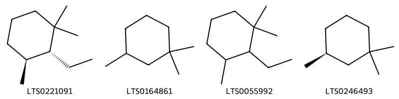{ width=100% }
    <figcaption>Hình ảnh cấu trúc hóa học của 4 hoạt chất thuộc nhóm Saturated hydrocarbons gồm ['(2r,3s)-2-ethyl-1,1,3-trimethylcyclohexane (LTS0221091)', '1,1,3-trimethylcyclohexane (LTS0164861)', '2-ethyl-1,1,3-trimethylcyclohexane (LTS0055992)', '(3s)-1,1,3-trimethylcyclohexane (LTS0246493)'].</figcaption>
</figure>
#### Nhóm Steroids and steroid derivatives
<figure markdown="span">
    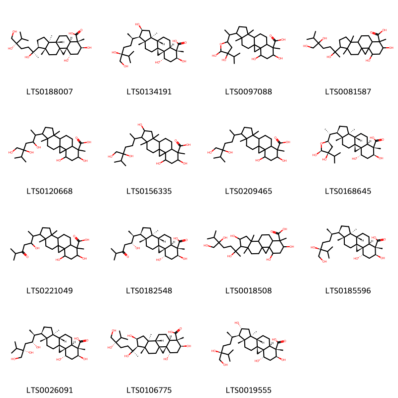{ width=100% }
    <figcaption>Hình ảnh cấu trúc hóa học của 15 hoạt chất thuộc nhóm Steroids and steroid derivatives gồm ['(1s,3s,4s,6s,7s,8r,11s,12s,15s,16r)-4,6-dihydroxy-7,12,16-trimethyl-15-[(2s,5s)-2,5,6-trihydroxy-5-isopropylhexan-2-yl]pentacyclo[9.7.0.0¹,³.0³,⁸.0¹²,¹⁶]octadecane-7-carboxylic acid (LTS0188007)', '(1s,3s,4s,6s,7s,8r,11s,12s,14s,15r,16r)-15-[(2r,5s)-5,6-dihydroxy-5-isopropylhexan-2-yl]-4,6,14-trihydroxy-7,12,16-trimethylpentacyclo[9.7.0.0¹,³.0³,⁸.0¹²,¹⁶]octadecane-7-carboxylic acid (LTS0134191)', '15-[1-(4,5-dihydroxy-4-isopropyloxolan-2-yl)ethyl]-4,6-dihydroxy-7,12,16-trimethylpentacyclo[9.7.0.0¹,³.0³,⁸.0¹²,¹⁶]octadecane-7-carboxylic acid (LTS0097088)', '4,6-dihydroxy-7,12,16-trimethyl-15-(2,5,6-trihydroxy-5-isopropylhexan-2-yl)pentacyclo[9.7.0.0¹,³.0³,⁸.0¹²,¹⁶]octadecane-7-carboxylic acid (LTS0081587)', '4,6-dihydroxy-7,12,16-trimethyl-15-(3,5,6-trihydroxy-5-isopropylhexan-2-yl)pentacyclo[9.7.0.0¹,³.0³,⁸.0¹²,¹⁶]octadecane-7-carboxylic acid (LTS0120668)', '15-(5,6-dihydroxy-5-isopropylhexan-2-yl)-4,6,14-trihydroxy-7,12,16-trimethylpentacyclo[9.7.0.0¹,³.0³,⁸.0¹²,¹⁶]octadecane-7-carboxylic acid (LTS0156335)', '15-(5,6-dihydroxy-5-isopropylhexan-2-yl)-4,6-dihydroxy-7,12,16-trimethylpentacyclo[9.7.0.0¹,³.0³,⁸.0¹²,¹⁶]octadecane-7-carboxylic acid (LTS0209465)', '(1s,3s,4s,6s,7s,8r,11s,12s,15r,16r)-15-[(1r)-1-[(2r,4s,5s)-4,5-dihydroxy-4-isopropyloxolan-2-yl]ethyl]-4,6-dihydroxy-7,12,16-trimethylpentacyclo[9.7.0.0¹,³.0³,⁸.0¹²,¹⁶]octadecane-7-carboxylic acid (LTS0168645)', '4,6-dihydroxy-15-(3-hydroxy-6-methyl-5-oxoheptan-2-yl)-7,12,16-trimethylpentacyclo[9.7.0.0¹,³.0³,⁸.0¹²,¹⁶]octadecane-7-carboxylic acid (LTS0221049)', '(1s,3s,4s,6s,7s,8r,11s,12s,15r,16r)-4,6-dihydroxy-15-[(2s,3r)-3-hydroxy-6-methyl-5-oxoheptan-2-yl]-7,12,16-trimethylpentacyclo[9.7.0.0¹,³.0³,⁸.0¹²,¹⁶]octadecane-7-carboxylic acid (LTS0182548)', '4,6,14-trihydroxy-7,12,16-trimethyl-15-(2,5,6-trihydroxy-5-isopropylhexan-2-yl)pentacyclo[9.7.0.0¹,³.0³,⁸.0¹²,¹⁶]octadecane-7-carboxylic acid (LTS0018508)', '(1s,3s,4s,6s,7s,8r,11s,12s,15r,16r)-15-[(2r,5s)-5,6-dihydroxy-5-isopropylhexan-2-yl]-4,6-dihydroxy-7,12,16-trimethylpentacyclo[9.7.0.0¹,³.0³,⁸.0¹²,¹⁶]octadecane-7-carboxylic acid (LTS0185596)', '(1s,3s,4s,6s,7s,8r,11s,12s,15r,16r)-4,6-dihydroxy-7,12,16-trimethyl-15-[(2s,3r,5s)-3,5,6-trihydroxy-5-isopropylhexan-2-yl]pentacyclo[9.7.0.0¹,³.0³,⁸.0¹²,¹⁶]octadecane-7-carboxylic acid (LTS0026091)', '(1s,3s,4s,6s,7s,8r,11s,12s,14s,15r,16r)-4,6,14-trihydroxy-7,12,16-trimethyl-15-[(2s,5s)-2,5,6-trihydroxy-5-isopropylhexan-2-yl]pentacyclo[9.7.0.0¹,³.0³,⁸.0¹²,¹⁶]octadecane-7-carboxylic acid (LTS0106775)', '(1s,3s,4s,6s,7s,8r,11s,12s,14r,15r,16r)-15-[(2r,5s)-5,6-dihydroxy-5-isopropylhexan-2-yl]-4,6,14-trihydroxy-7,12,16-trimethylpentacyclo[9.7.0.0¹,³.0³,⁸.0¹²,¹⁶]octadecane-7-carboxylic acid (LTS0019555)'].</figcaption>
</figure>
#### Nhóm Thioethers
<figure markdown="span">
    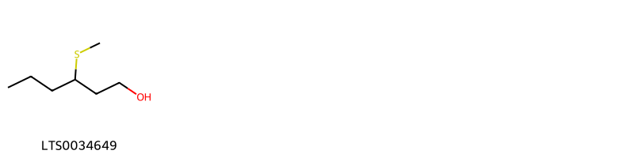{ width=100% }
    <figcaption>Hình ảnh cấu trúc hóa học của 1 hoạt chất thuộc nhóm Thioethers gồm ['3-(methylthio)-1-hexanol (LTS0034649)'].</figcaption>
</figure>
#### Nhóm Thiols
<figure markdown="span">
    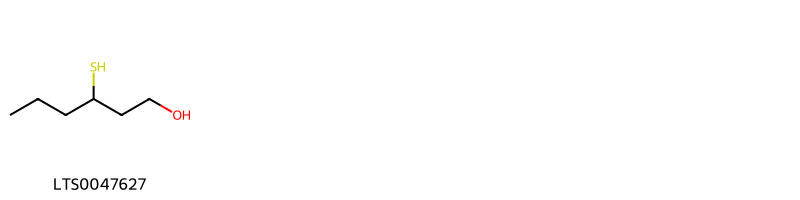{ width=100% }
    <figcaption>Hình ảnh cấu trúc hóa học của 1 hoạt chất thuộc nhóm Thiols gồm ['3-mercaptohexanol (LTS0047627)'].</figcaption>
</figure>
#### Nhóm Unsaturated hydrocarbons
<figure markdown="span">
    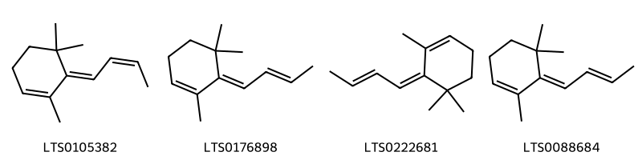{ width=100% }
    <figcaption>Hình ảnh cấu trúc hóa học của 4 hoạt chất thuộc nhóm Unsaturated hydrocarbons gồm ['(6e)-6-[(2z)-but-2-en-1-ylidene]-1,5,5-trimethylcyclohex-1-ene (LTS0105382)', '(6e)-6-[(2e)-but-2-en-1-ylidene]-1,5,5-trimethylcyclohex-1-ene (LTS0176898)', '6-(but-2-en-1-ylidene)-1,5,5-trimethylcyclohex-1-ene (LTS0222681)', '(6e)-6-(but-2-en-1-ylidene)-1,5,5-trimethylcyclohex-1-ene (LTS0088684)'].</figcaption>
</figure>

---

### Dược dân tộc học

Danh sách các quốc gia có sử dụng *Passiflora edulis* trong điều trị các bệnh. 

| Country   | Disease            | Bệnh                                                                                                                                                                                                |
|:----------|:-------------------|:----------------------------------------------------------------------------------------------------------------------------------------------------------------------------------------------------|
| Elsewhere | Sedative, Narcotic | MYMEMORY WARNING: YOU USED ALL AVAILABLE FREE TRANSLATIONS FOR TODAY. NEXT AVAILABLE IN  15 HOURS 12 MINUTES 07 SECONDS VISIT HTTPS://MYMEMORY.TRANSLATED.NET/DOC/USAGELIMITS.PHP TO TRANSLATE MORE |

---

---
## Passiflora foetida
### Thông tin về thực vật

!!! info "Phân loại thực vật của *Passiflora foetida* từ GIBF:"
    - **Kingdom:** Plantae
    - **Phylum:** Tracheophyta
    - **Order:** Malpighiales
    - **Family:** Passifloraceae
    - **Genus:** Passiflora
    - **Species:** *Passiflora foetida*

 

| Label (VI)   | Label (EN)   | Scientific Name    | Descriptions (VI)   | Descriptions (EN)   | Also Known As (VI)                 | Also Known As (EN)                                                                                                                              |
|:-------------|:-------------|:-------------------|:--------------------|:--------------------|:-----------------------------------|:------------------------------------------------------------------------------------------------------------------------------------------------|
| N/A          | N/A          | Passiflora foetida | loài thực vật       | species of plant    | ['Passiflora foetida', 'Chùm bao'] | ['love-in-a-mist', 'fetid passionflower', 'passion flower', 'common passion flower', 'lani wai', 'pohapoha', 'running pop', 'wild water lemon'] |

#### Phân bố trên thế giới

**Từ CSDL GIBF** Honduras, Thailand, French Guiana, Martinique, Australia, Jamaica, Guatemala, Sierra Leone, Colombia, Sri Lanka, Dominican Republic, Puerto Rico, Malaysia, India, Saint Kitts and Nevis, Bonaire, Sint Eustatius and Saba, Virgin Islands (U.S.), Virgin Islands (British), Nicaragua, Panama, Brazil, Peru, Aruba, Mexico, Benin, Curaçao, Chinese Taipei, Hong Kong, Argentina, South Africa, Bolivia (Plurinational State of), Costa Rica, United States of America

#### Phân bố tại Việt Nam

**Từ CSDL GIBF**: Không có ghi nhận ở Việt Nam

---
### Thành phần hóa học
        
- Theo cơ sở dữ liệu lotus: Từ loài *Passiflora foetida* đã phân lập và xác định được 47 hoạt chất thuộc về các nhóm Harmala alkaloids, Organooxygen compounds, Flavonoids, Fatty Acyls. 

|    | chemicalTaxonomyClassyfireClass   |   smiles_count |
|---:|:----------------------------------|---------------:|
|  0 | Fatty Acyls                       |             11 |
|  1 | Flavonoids                        |             12 |
|  2 | Harmala alkaloids                 |              5 |
|  3 | Organooxygen compounds            |             19 |

#### Nhóm Fatty Acyls
<figure markdown="span">
    { width=100% }
    <figcaption>Hình ảnh cấu trúc hóa học của 11 hoạt chất thuộc nhóm Fatty Acyls gồm ['(2r,4s,6s)-4,6-dihydroxy-1-[(2s,4r)-4-hydroxy-6-oxooxan-2-yl]henicosan-2-yl acetate (LTS0233809)', '(4r,6r)-4-hydroxy-6-[(2r,4s,6s)-2,4,6-trihydroxyhenicosyl]oxan-2-one (LTS0207387)', '4,6-dihydroxy-1-(4-hydroxy-6-oxooxan-2-yl)henicosan-2-yl acetate (LTS0245832)', '4-hydroxy-6-(2,4,6-trihydroxyhenicosyl)oxan-2-one (LTS0240436)', 'linoleic (LTS0013198)', '(6s)-6-[(2r,4s,6s)-2,4,6-trihydroxyhenicosyl]-5,6-dihydropyran-2-one (LTS0153308)', '(4s,6r)-4-hydroxy-6-[(2r,4s,6s)-2,4,6-trihydroxyhenicosyl]oxan-2-one (LTS0098006)', '(6r)-6-[(2s,4s,7s)-2,4,7-trihydroxyhenicosyl]-5,6-dihydropyran-2-one (LTS0042633)', 'α-linolenic acid (LTS0275508)', 'α linolenic acid (LTS0132789)', '(2r,4s,6s)-4,6-dihydroxy-1-[(2s,4s)-4-hydroxy-6-oxooxan-2-yl]henicosan-2-yl acetate (LTS0097741)'].</figcaption>
</figure>
#### Nhóm Flavonoids
<figure markdown="span">
    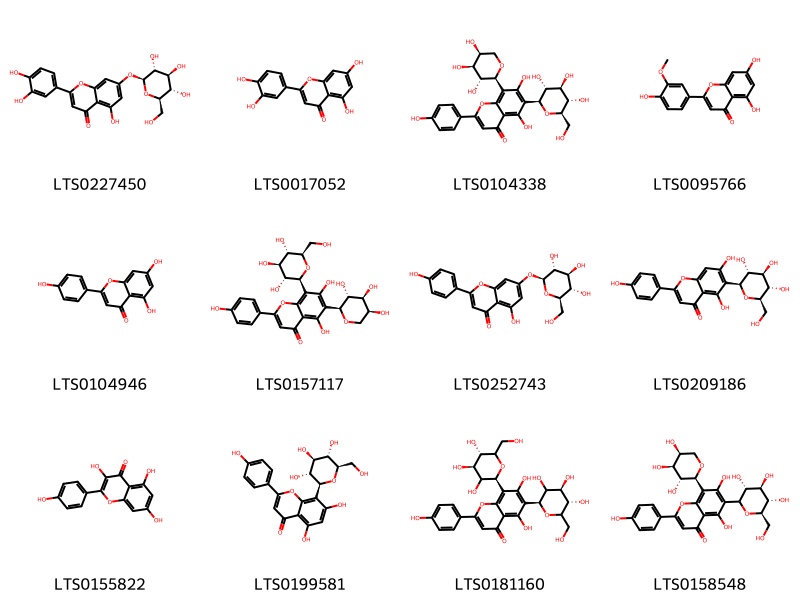{ width=100% }
    <figcaption>Hình ảnh cấu trúc hóa học của 12 hoạt chất thuộc nhóm Flavonoids gồm ['luteolin 7-o-glucoside (LTS0227450)', 'luteolin (LTS0017052)', 'schaftoside (LTS0104338)', 'chrysoeriol (LTS0095766)', 'chamomile (LTS0104946)', 'isoschaftoside (LTS0157117)', 'apigenin 7-o-β-glucoside (LTS0252743)', 'isovitexin (LTS0209186)', 'kaempherol (LTS0155822)', 'vitexin (LTS0199581)', 'vicenin 2 (LTS0181160)', '5,7-dihydroxy-2-(4-hydroxyphenyl)-6-[(3r,4r,5s,6r)-3,4,5-trihydroxy-6-(hydroxymethyl)oxan-2-yl]-8-[(2s,3r,4s,5s)-3,4,5-trihydroxyoxan-2-yl]chromen-4-one (LTS0158548)'].</figcaption>
</figure>
#### Nhóm Harmala alkaloids
<figure markdown="span">
    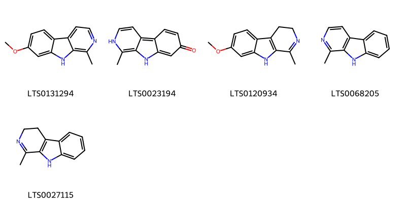{ width=100% }
    <figcaption>Hình ảnh cấu trúc hóa học của 5 hoạt chất thuộc nhóm Harmala alkaloids gồm ['harmine (LTS0131294)', 'harmol (LTS0023194)', 'harmaline (LTS0120934)', 'harmane (LTS0068205)', '1-methyl-3h,4h,9h-pyrido[3,4-b]indole (LTS0027115)'].</figcaption>
</figure>
#### Nhóm Organooxygen compounds
<figure markdown="span">
    { width=100% }
    <figcaption>Hình ảnh cấu trúc hóa học của 19 hoạt chất thuộc nhóm Organooxygen compounds gồm ['(1r,4r)-4-hydroxy-1-{[(2s,3r,4s,5r,6r)-3,4,5-trihydroxy-6-(hydroxymethyl)oxan-2-yl]oxy}cyclopent-2-ene-1-carbonitrile (LTS0214180)', '1-{[(2s,3r,4s,5s,6r)-3,4,5-trihydroxy-6-(hydroxymethyl)oxan-2-yl]oxy}cyclopent-2-ene-1-carbonitrile (LTS0269796)', '4-hydroxy-1-{[3,4,5-trihydroxy-6-(hydroxymethyl)oxan-2-yl]oxy}cyclopent-2-ene-1-carbonitrile (LTS0150559)', '(+)-glucose (LTS0262158)', 'sucrose (LTS0272557)', '1-{[3,4,5-trihydroxy-6-(hydroxymethyl)oxan-2-yl]oxy}cyclopent-2-ene-1-carbonitrile (LTS0199149)', '(1s,4r)-4-hydroxy-1-{[(2r,3s,4r,5r,6s)-3,4,5-trihydroxy-6-(hydroxymethyl)oxan-2-yl]oxy}cyclopent-2-ene-1-carbonitrile (LTS0274324)', 'galactose (LTS0171628)', '(1s,4s)-4-hydroxy-1-{[(2s,3r,4s,5s,6r)-3,4,5-trihydroxy-6-(hydroxymethyl)oxan-2-yl]oxy}cyclopent-2-ene-1-carbonitrile (LTS0184702)', 'deidaclin (LTS0049775)', 'epitetraphyllin b (LTS0083255)', '(4-cyano-4-{[3,4,5-trihydroxy-6-(hydroxymethyl)oxan-2-yl]oxy}cyclopent-2-en-1-yl)oxidanesulfonic acid (LTS0270845)', 'linamarin (LTS0206216)', '(2s,3r,4s,5r,6r)-2-{[(1r,4r)-4-hydroxy-1-methylcyclopent-2-en-1-yl]oxy}-6-(hydroxymethyl)oxane-3,4,5-triol (LTS0185683)', '(1r,4s)-4-hydroxy-1-{[(2s,3r,4s,5s,6s)-3,4,5-trihydroxy-6-(hydroxymethyl)oxan-2-yl]oxy}cyclopent-2-ene-1-carbonitrile (LTS0064356)', 'glucose (LTS0013597)', 'aldehydo-d-galactose (LTS0128031)', 'linamarin (LTS0032647)', 'deidaclin (LTS0103659)'].</figcaption>
</figure>

---

### Dược dân tộc học

Danh sách các quốc gia có sử dụng *Passiflora foetida* trong điều trị các bệnh. 

| Country   | Disease                     | Bệnh                                                                                                                                                                                                |
|:----------|:----------------------------|:----------------------------------------------------------------------------------------------------------------------------------------------------------------------------------------------------|
| Cuba      | Emmenagogue                 | MYMEMORY WARNING: YOU USED ALL AVAILABLE FREE TRANSLATIONS FOR TODAY. NEXT AVAILABLE IN  15 HOURS 11 MINUTES 29 SECONDS VISIT HTTPS://MYMEMORY.TRANSLATED.NET/DOC/USAGELIMITS.PHP TO TRANSLATE MORE |
| Elsewhere | Emetic, Emmenagogue, Poison | MYMEMORY WARNING: YOU USED ALL AVAILABLE FREE TRANSLATIONS FOR TODAY. NEXT AVAILABLE IN  15 HOURS 11 MINUTES 26 SECONDS VISIT HTTPS://MYMEMORY.TRANSLATED.NET/DOC/USAGELIMITS.PHP TO TRANSLATE MORE |
| Trinidad  | Vermifuge, Vermifuge        | MYMEMORY WARNING: YOU USED ALL AVAILABLE FREE TRANSLATIONS FOR TODAY. NEXT AVAILABLE IN  15 HOURS 11 MINUTES 23 SECONDS VISIT HTTPS://MYMEMORY.TRANSLATED.NET/DOC/USAGELIMITS.PHP TO TRANSLATE MORE |
| Venezuela | Emmenagogue                 | MYMEMORY WARNING: YOU USED ALL AVAILABLE FREE TRANSLATIONS FOR TODAY. NEXT AVAILABLE IN  15 HOURS 11 MINUTES 19 SECONDS VISIT HTTPS://MYMEMORY.TRANSLATED.NET/DOC/USAGELIMITS.PHP TO TRANSLATE MORE |

---

---
## Passiflora incarnata
### Thông tin về thực vật

!!! info "Phân loại thực vật của *Passiflora incarnata* từ GIBF:"
    - **Kingdom:** Plantae
    - **Phylum:** Tracheophyta
    - **Order:** Malpighiales
    - **Family:** Passifloraceae
    - **Genus:** Passiflora
    - **Species:** *Passiflora incarnata*

 

| Label (VI)   | Label (EN)   | Scientific Name      | Descriptions (VI)   | Descriptions (EN)           | Also Known As (VI)       | Also Known As (EN)                                                                            |
|:-------------|:-------------|:---------------------|:--------------------|:----------------------------|:-------------------------|:----------------------------------------------------------------------------------------------|
| N/A          | N/A          | Passiflora incarnata |                     | fast-growing perennial vine | ['Passiflora incarnata'] | ['maypop', 'purple passionflower', 'true passionflower', 'wild apricot', 'wild passion vine'] |

#### Phân bố trên thế giới

**Từ CSDL GIBF** United States of America

#### Phân bố tại Việt Nam

**Từ CSDL GIBF**: Không có ghi nhận ở Việt Nam

---
### Thành phần hóa học
        
- Theo cơ sở dữ liệu lotus: Từ loài *Passiflora incarnata* đã phân lập và xác định được 59 hoạt chất thuộc về các nhóm Organooxygen compounds, Flavonoids, Indoles and derivatives, Prenol lipids, Carboxylic acids and derivatives, Fatty Acyls, Harmala alkaloids, Pyrans, Phenols, Dihydrofurans, Phenol ethers, Benzene and substituted derivatives. 

|    | chemicalTaxonomyClassyfireClass     |   smiles_count |
|---:|:------------------------------------|---------------:|
|  0 | Benzene and substituted derivatives |              3 |
|  1 | Carboxylic acids and derivatives    |              7 |
|  2 | Dihydrofurans                       |              1 |
|  3 | Fatty Acyls                         |              3 |
|  4 | Flavonoids                          |             25 |
|  5 | Harmala alkaloids                   |              6 |
|  6 | Indoles and derivatives             |              1 |
|  7 | Organooxygen compounds              |              3 |
|  8 | Phenol ethers                       |              1 |
|  9 | Phenols                             |              2 |
| 10 | Prenol lipids                       |              6 |
| 11 | Pyrans                              |              1 |

#### Nhóm Benzene and substituted derivatives
<figure markdown="span">
    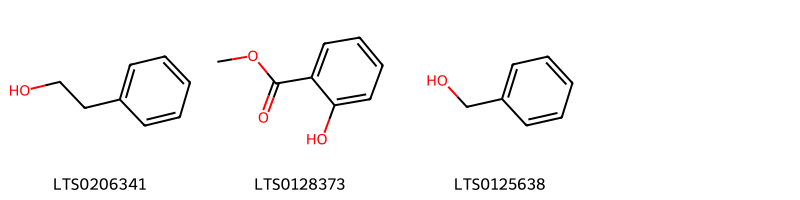{ width=100% }
    <figcaption>Hình ảnh cấu trúc hóa học của 3 hoạt chất thuộc nhóm Benzene and substituted derivatives gồm ['2-phenyl-ethanol (LTS0206341)', 'methyl salicylate (LTS0128373)', 'benzyl alcohol (LTS0125638)'].</figcaption>
</figure>
#### Nhóm Carboxylic acids and derivatives
<figure markdown="span">
    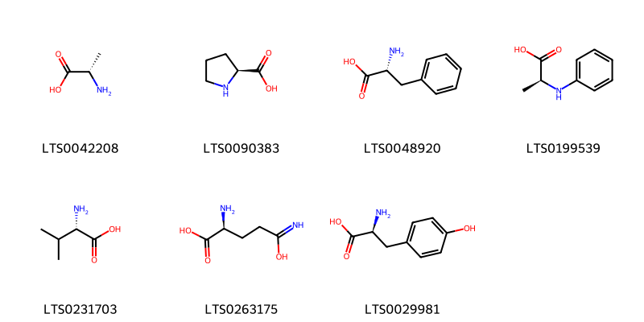{ width=100% }
    <figcaption>Hình ảnh cấu trúc hóa học của 7 hoạt chất thuộc nhóm Carboxylic acids and derivatives gồm ['l-alanine (LTS0042208)', 'l-proline (LTS0090383)', 'd-phenylalanine (LTS0048920)', '(2s)-2-(phenylamino)propanoic acid (LTS0199539)', 'l-valine (LTS0231703)', 'l glutamine (LTS0263175)', 'l-tyrosine (LTS0029981)'].</figcaption>
</figure>
#### Nhóm Dihydrofurans
<figure markdown="span">
    { width=100% }
    <figcaption>Hình ảnh cấu trúc hóa học của 1 hoạt chất thuộc nhóm Dihydrofurans gồm ['vitamin c (LTS0022555)'].</figcaption>
</figure>
#### Nhóm Fatty Acyls
<figure markdown="span">
    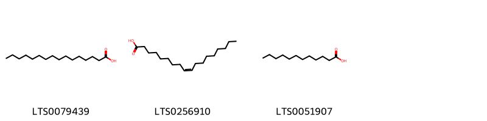{ width=100% }
    <figcaption>Hình ảnh cấu trúc hóa học của 3 hoạt chất thuộc nhóm Fatty Acyls gồm ['palmitic acid (LTS0079439)', 'oleic acid (LTS0256910)', 'lauric acid (LTS0051907)'].</figcaption>
</figure>
#### Nhóm Flavonoids
<figure markdown="span">
    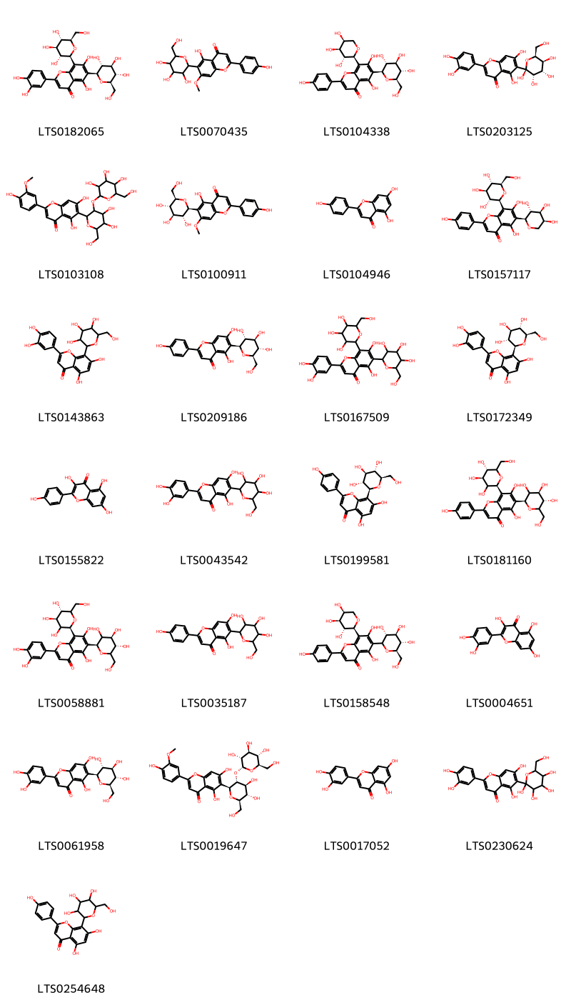{ width=100% }
    <figcaption>Hình ảnh cấu trúc hóa học của 25 hoạt chất thuộc nhóm Flavonoids gồm ['lucenin-2 (LTS0182065)', '5-hydroxy-2-(4-hydroxyphenyl)-7-methoxy-6-[3,4,5-trihydroxy-6-(hydroxymethyl)oxan-2-yl]chromen-4-one (LTS0070435)', 'schaftoside (LTS0104338)', '2-(3,4-dihydroxyphenyl)-5,7-dihydroxy-6-[(2s,3s,4s,5s,6s)-2,3,4,5-tetrahydroxy-6-(hydroxymethyl)oxan-2-yl]chromen-4-one (LTS0203125)', '6-[4,5-dihydroxy-6-(hydroxymethyl)-3-{[3,4,5-trihydroxy-6-(hydroxymethyl)oxan-2-yl]oxy}oxan-2-yl]-5,7-dihydroxy-2-(4-hydroxy-3-methoxyphenyl)chromen-4-one (LTS0103108)', '5-hydroxy-2-(4-hydroxyphenyl)-7-methoxy-6-[(2s,3r,4r,5s,6r)-3,4,5-trihydroxy-6-(hydroxymethyl)oxan-2-yl]chromen-4-one (LTS0100911)', 'chamomile (LTS0104946)', 'isoschaftoside (LTS0157117)', 'orientin (LTS0143863)', 'isovitexin (LTS0209186)', '2-(3,4-dihydroxyphenyl)-5,7-dihydroxy-6,8-bis[3,4,5-trihydroxy-6-(hydroxymethyl)oxan-2-yl]chromen-4-one (LTS0167509)', 'orientin (LTS0172349)', 'kaempherol (LTS0155822)', 'isoorientin (LTS0043542)', 'vitexin (LTS0199581)', 'vicenin 2 (LTS0181160)', 'lucenin 2 (LTS0058881)', 'isovitexin (LTS0035187)', '5,7-dihydroxy-2-(4-hydroxyphenyl)-6-[(3r,4r,5s,6r)-3,4,5-trihydroxy-6-(hydroxymethyl)oxan-2-yl]-8-[(2s,3r,4s,5s)-3,4,5-trihydroxyoxan-2-yl]chromen-4-one (LTS0158548)', 'quercetin (LTS0004651)', 'isoorientin (LTS0061958)', '6-[(2s,3r,4s,5s,6r)-4,5-dihydroxy-6-(hydroxymethyl)-3-{[(2r,3r,4s,5s,6r)-3,4,5-trihydroxy-6-(hydroxymethyl)oxan-2-yl]oxy}oxan-2-yl]-5,7-dihydroxy-2-(4-hydroxy-3-methoxyphenyl)chromen-4-one (LTS0019647)', 'luteolin (LTS0017052)', '2-(3,4-dihydroxyphenyl)-5,7-dihydroxy-6-[2,3,4,5-tetrahydroxy-6-(hydroxymethyl)oxan-2-yl]chromen-4-one (LTS0230624)', 'vitexin (LTS0254648)'].</figcaption>
</figure>
#### Nhóm Harmala alkaloids
<figure markdown="span">
    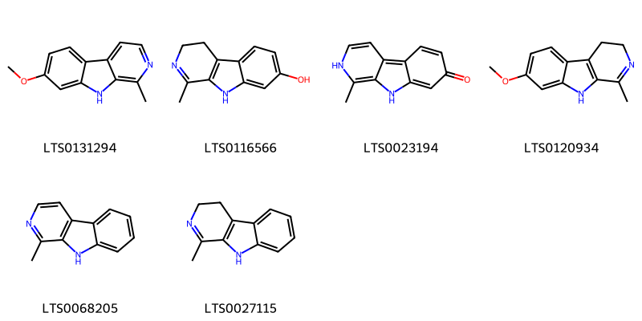{ width=100% }
    <figcaption>Hình ảnh cấu trúc hóa học của 6 hoạt chất thuộc nhóm Harmala alkaloids gồm ['harmine (LTS0131294)', 'harmalol (LTS0116566)', 'harmol (LTS0023194)', 'harmaline (LTS0120934)', 'harmane (LTS0068205)', '1-methyl-3h,4h,9h-pyrido[3,4-b]indole (LTS0027115)'].</figcaption>
</figure>
#### Nhóm Indoles and derivatives
<figure markdown="span">
    { width=100% }
    <figcaption>Hình ảnh cấu trúc hóa học của 1 hoạt chất thuộc nhóm Indoles and derivatives gồm ['β-carboline (LTS0263207)'].</figcaption>
</figure>
#### Nhóm Organooxygen compounds
<figure markdown="span">
    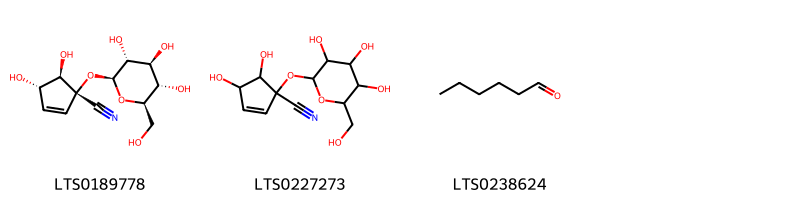{ width=100% }
    <figcaption>Hình ảnh cấu trúc hóa học của 3 hoạt chất thuộc nhóm Organooxygen compounds gồm ['gynocardin (LTS0189778)', '4,5-dihydroxy-1-{[3,4,5-trihydroxy-6-(hydroxymethyl)oxan-2-yl]oxy}cyclopent-2-ene-1-carbonitrile (LTS0227273)', 'hexanal (LTS0238624)'].</figcaption>
</figure>
#### Nhóm Phenol ethers
<figure markdown="span">
    { width=100% }
    <figcaption>Hình ảnh cấu trúc hóa học của 1 hoạt chất thuộc nhóm Phenol ethers gồm ['anethole (LTS0033696)'].</figcaption>
</figure>
#### Nhóm Phenols
<figure markdown="span">
    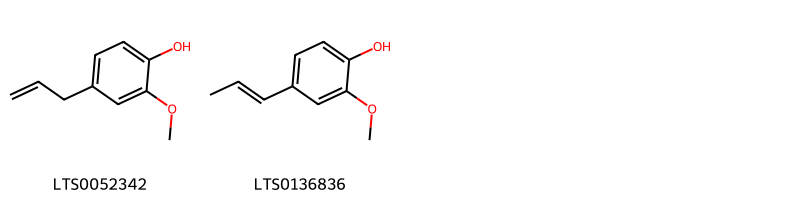{ width=100% }
    <figcaption>Hình ảnh cấu trúc hóa học của 2 hoạt chất thuộc nhóm Phenols gồm ['eugenol (LTS0052342)', 'isoeugenol (LTS0136836)'].</figcaption>
</figure>
#### Nhóm Prenol lipids
<figure markdown="span">
    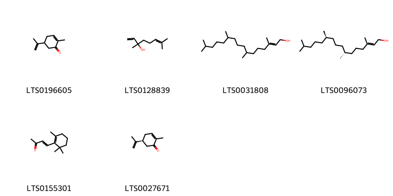{ width=100% }
    <figcaption>Hình ảnh cấu trúc hóa học của 6 hoạt chất thuộc nhóm Prenol lipids gồm ['carvone (LTS0196605)', 'linalool, (+-)- (LTS0128839)', 'phytol (LTS0031808)', 'phytol (LTS0096073)', 'β-ionone (LTS0155301)', 'carvone, (+)- (LTS0027671)'].</figcaption>
</figure>
#### Nhóm Pyrans
<figure markdown="span">
    { width=100% }
    <figcaption>Hình ảnh cấu trúc hóa học của 1 hoạt chất thuộc nhóm Pyrans gồm ['talmon (LTS0152081)'].</figcaption>
</figure>

---

### Dược dân tộc học

Danh sách các quốc gia có sử dụng *Passiflora incarnata* trong điều trị các bệnh. 

| Country   | Disease                       | Bệnh                                                                                                                                                                                                |
|:----------|:------------------------------|:----------------------------------------------------------------------------------------------------------------------------------------------------------------------------------------------------|
| Bermuda   | Perfume                       | MYMEMORY WARNING: YOU USED ALL AVAILABLE FREE TRANSLATIONS FOR TODAY. NEXT AVAILABLE IN  15 HOURS 10 MINUTES 39 SECONDS VISIT HTTPS://MYMEMORY.TRANSLATED.NET/DOC/USAGELIMITS.PHP TO TRANSLATE MORE |
| Elsewhere | Narcotic, Sedative            | MYMEMORY WARNING: YOU USED ALL AVAILABLE FREE TRANSLATIONS FOR TODAY. NEXT AVAILABLE IN  15 HOURS 10 MINUTES 35 SECONDS VISIT HTTPS://MYMEMORY.TRANSLATED.NET/DOC/USAGELIMITS.PHP TO TRANSLATE MORE |
| Iraq      | Narcotic                      | MYMEMORY WARNING: YOU USED ALL AVAILABLE FREE TRANSLATIONS FOR TODAY. NEXT AVAILABLE IN  15 HOURS 10 MINUTES 32 SECONDS VISIT HTTPS://MYMEMORY.TRANSLATED.NET/DOC/USAGELIMITS.PHP TO TRANSLATE MORE |
| Turkey    | Narcotic, Soporific, Sedative | MYMEMORY WARNING: YOU USED ALL AVAILABLE FREE TRANSLATIONS FOR TODAY. NEXT AVAILABLE IN  15 HOURS 10 MINUTES 29 SECONDS VISIT HTTPS://MYMEMORY.TRANSLATED.NET/DOC/USAGELIMITS.PHP TO TRANSLATE MORE |
| US        | Aphrodisiac                   | MYMEMORY WARNING: YOU USED ALL AVAILABLE FREE TRANSLATIONS FOR TODAY. NEXT AVAILABLE IN  15 HOURS 10 MINUTES 25 SECONDS VISIT HTTPS://MYMEMORY.TRANSLATED.NET/DOC/USAGELIMITS.PHP TO TRANSLATE MORE |

---

---
## Passiflora jorullensis
### Thông tin về thực vật

!!! info "Phân loại thực vật của *Passiflora jorullensis* từ GIBF:"
    - **Kingdom:** Plantae
    - **Phylum:** Tracheophyta
    - **Order:** Malpighiales
    - **Family:** Passifloraceae
    - **Genus:** Passiflora
    - **Species:** *Passiflora jorullensis*

 

| Label (VI)   | Label (EN)   | Scientific Name        | Descriptions (VI)   | Descriptions (EN)   | Also Known As (VI)   | Also Known As (EN)   |
|:-------------|:-------------|:-----------------------|:--------------------|:--------------------|:---------------------|:---------------------|
| N/A          | N/A          | Passiflora jorullensis | loài thực vật       | species of plant    | ['']                 | ['']                 |

#### Phân bố trên thế giới

**Từ CSDL GIBF** United States of America, New Zealand, El Salvador, Mexico

#### Phân bố tại Việt Nam

**Từ CSDL GIBF**: Không có ghi nhận ở Việt Nam

---
### Thành phần hóa học
        
- Theo cơ sở dữ liệu lotus: Từ loài *Passiflora jorullensis* đã phân lập và xác định được 3 hoạt chất thuộc về các nhóm Harmala alkaloids. 

|    | chemicalTaxonomyClassyfireClass   |   smiles_count |
|---:|:----------------------------------|---------------:|
|  0 | Harmala alkaloids                 |              3 |

#### Nhóm Harmala alkaloids
<figure markdown="span">
    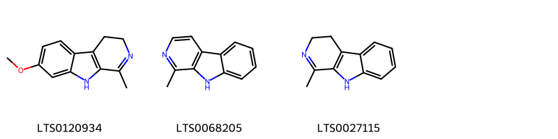{ width=100% }
    <figcaption>Hình ảnh cấu trúc hóa học của 3 hoạt chất thuộc nhóm Harmala alkaloids gồm ['harmaline (LTS0120934)', 'harmane (LTS0068205)', '1-methyl-3h,4h,9h-pyrido[3,4-b]indole (LTS0027115)'].</figcaption>
</figure>

---

### Dược dân tộc học

Danh sách các quốc gia có sử dụng *Passiflora jorullensis* trong điều trị các bệnh. 

| Country   | Disease             | Bệnh                                                                                                                                                                                                |
|:----------|:--------------------|:----------------------------------------------------------------------------------------------------------------------------------------------------------------------------------------------------|
| Mexico    | Antidote, Sudorific | MYMEMORY WARNING: YOU USED ALL AVAILABLE FREE TRANSLATIONS FOR TODAY. NEXT AVAILABLE IN  15 HOURS 09 MINUTES 42 SECONDS VISIT HTTPS://MYMEMORY.TRANSLATED.NET/DOC/USAGELIMITS.PHP TO TRANSLATE MORE |

---

---
## Passiflora laurifolia
### Thông tin về thực vật

!!! info "Phân loại thực vật của *Passiflora laurifolia* từ GIBF:"
    - **Kingdom:** Plantae
    - **Phylum:** Tracheophyta
    - **Order:** Malpighiales
    - **Family:** Passifloraceae
    - **Genus:** Passiflora
    - **Species:** *Passiflora laurifolia*

 

| Label (VI)   | Label (EN)   | Scientific Name       | Descriptions (VI)   | Descriptions (EN)   | Also Known As (VI)   | Also Known As (EN)                                                                                                                                       |
|:-------------|:-------------|:----------------------|:--------------------|:--------------------|:---------------------|:---------------------------------------------------------------------------------------------------------------------------------------------------------|
| N/A          | N/A          | Passiflora laurifolia | loài thực vật       | species of plant    | ['']                 | ['golden bellapple', 'yellow granadilla', 'bell apple', 'passion flower', 'yellow water lemon', 'Jamaican honeysuckle', 'orange lilikoi', 'water lemon'] |

#### Phân bố trên thế giới

**Từ CSDL GIBF** nan, Guadeloupe, French Polynesia, French Guiana, Trinidad and Tobago, Singapore, Martinique, Dominican Republic, Malaysia, Puerto Rico, Samoa, Bonaire, Sint Eustatius and Saba, Virgin Islands (U.S.), Virgin Islands (British), Brazil, Montserrat, Tonga, Chinese Taipei, Niue, Cook Islands, Fiji, New Caledonia, United States of America, Saint Barthélemy, Guyana

#### Phân bố tại Việt Nam

**Từ CSDL GIBF**: Không có ghi nhận ở Việt Nam

---
### Thành phần hóa học
        
- Theo cơ sở dữ liệu lotus: Từ loài *Passiflora laurifolia* đã phân lập và xác định được 2 hoạt chất thuộc về các nhóm Harmala alkaloids. 

|    | chemicalTaxonomyClassyfireClass   |   smiles_count |
|---:|:----------------------------------|---------------:|
|  0 | Harmala alkaloids                 |              2 |

#### Nhóm Harmala alkaloids
<figure markdown="span">
    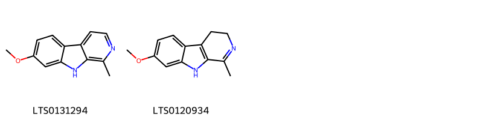{ width=100% }
    <figcaption>Hình ảnh cấu trúc hóa học của 2 hoạt chất thuộc nhóm Harmala alkaloids gồm ['harmine (LTS0131294)', 'harmaline (LTS0120934)'].</figcaption>
</figure>

---

### Dược dân tộc học

Danh sách các quốc gia có sử dụng *Passiflora laurifolia* trong điều trị các bệnh. 

| Country            | Disease                                 | Bệnh                                                                                                                                                                                                |
|:-------------------|:----------------------------------------|:----------------------------------------------------------------------------------------------------------------------------------------------------------------------------------------------------|
| Dominican Republic | Vermifuge                               | MYMEMORY WARNING: YOU USED ALL AVAILABLE FREE TRANSLATIONS FOR TODAY. NEXT AVAILABLE IN  15 HOURS 09 MINUTES 14 SECONDS VISIT HTTPS://MYMEMORY.TRANSLATED.NET/DOC/USAGELIMITS.PHP TO TRANSLATE MORE |
| Elsewhere          | Poison                                  | MYMEMORY WARNING: YOU USED ALL AVAILABLE FREE TRANSLATIONS FOR TODAY. NEXT AVAILABLE IN  15 HOURS 09 MINUTES 11 SECONDS VISIT HTTPS://MYMEMORY.TRANSLATED.NET/DOC/USAGELIMITS.PHP TO TRANSLATE MORE |
| Haiti              | Sedative, Stomachic, Apertif, Vermifuge | MYMEMORY WARNING: YOU USED ALL AVAILABLE FREE TRANSLATIONS FOR TODAY. NEXT AVAILABLE IN  15 HOURS 09 MINUTES 08 SECONDS VISIT HTTPS://MYMEMORY.TRANSLATED.NET/DOC/USAGELIMITS.PHP TO TRANSLATE MORE |
| Trinidad           | Vermifuge, Vermifuge                    | MYMEMORY WARNING: YOU USED ALL AVAILABLE FREE TRANSLATIONS FOR TODAY. NEXT AVAILABLE IN  15 HOURS 09 MINUTES 04 SECONDS VISIT HTTPS://MYMEMORY.TRANSLATED.NET/DOC/USAGELIMITS.PHP TO TRANSLATE MORE |

---

---
## Passiflora maliformis
### Thông tin về thực vật

!!! info "Phân loại thực vật của *Passiflora maliformis* từ GIBF:"
    - **Kingdom:** Plantae
    - **Phylum:** Tracheophyta
    - **Order:** Malpighiales
    - **Family:** Passifloraceae
    - **Genus:** Passiflora
    - **Species:** *Passiflora maliformis*

 

| Label (VI)   | Label (EN)   | Scientific Name       | Descriptions (VI)   | Descriptions (EN)   | Also Known As (VI)   | Also Known As (EN)   |
|:-------------|:-------------|:----------------------|:--------------------|:--------------------|:---------------------|:---------------------|
| N/A          | N/A          | Passiflora maliformis | loài thực vật       | species of plant    | ['']                 | ['']                 |

#### Phân bố trên thế giới

**Từ CSDL GIBF** nan, Guadeloupe, Dominica, French Polynesia, Pitcairn, Australia, Jamaica, Haiti, Colombia, Venezuela (Bolivarian Republic of), Dominican Republic, American Samoa, Réunion, Vanuatu, Brazil, Tonga, Niue, Cook Islands, Fiji, New Caledonia, Ecuador, United States of America

#### Phân bố tại Việt Nam

**Từ CSDL GIBF**: Không có ghi nhận ở Việt Nam

---
### Thành phần hóa học
        
- Theo cơ sở dữ liệu lotus: Từ loài *Passiflora maliformis* đã phân lập và xác định được 1 hoạt chất thuộc về các nhóm Harmala alkaloids. 

|    | chemicalTaxonomyClassyfireClass   |   smiles_count |
|---:|:----------------------------------|---------------:|
|  0 | Harmala alkaloids                 |              1 |

#### Nhóm Harmala alkaloids
<figure markdown="span">
    { width=100% }
    <figcaption>Hình ảnh cấu trúc hóa học của 1 hoạt chất thuộc nhóm Harmala alkaloids gồm ['harmine (LTS0131294)'].</figcaption>
</figure>

---

### Dược dân tộc học

Danh sách các quốc gia có sử dụng *Passiflora maliformis* trong điều trị các bệnh. 

| Country            | Disease            | Bệnh                                                                                                                                                                                                |
|:-------------------|:-------------------|:----------------------------------------------------------------------------------------------------------------------------------------------------------------------------------------------------|
| Dominican Republic | Astringent         | MYMEMORY WARNING: YOU USED ALL AVAILABLE FREE TRANSLATIONS FOR TODAY. NEXT AVAILABLE IN  15 HOURS 08 MINUTES 37 SECONDS VISIT HTTPS://MYMEMORY.TRANSLATED.NET/DOC/USAGELIMITS.PHP TO TRANSLATE MORE |
| Haiti              | Sedative, Sedative | MYMEMORY WARNING: YOU USED ALL AVAILABLE FREE TRANSLATIONS FOR TODAY. NEXT AVAILABLE IN  15 HOURS 08 MINUTES 34 SECONDS VISIT HTTPS://MYMEMORY.TRANSLATED.NET/DOC/USAGELIMITS.PHP TO TRANSLATE MORE |

---

---
## Passiflora murucuja
### Thông tin về thực vật

!!! info "Phân loại thực vật của *Passiflora murucuja* từ GIBF:"
    - **Kingdom:** Plantae
    - **Phylum:** Tracheophyta
    - **Order:** Malpighiales
    - **Family:** Passifloraceae
    - **Genus:** Passiflora
    - **Species:** *Passiflora murucuja*

 

| Label (VI)   | Label (EN)   | Scientific Name     | Descriptions (VI)   | Descriptions (EN)   | Also Known As (VI)   | Also Known As (EN)   |
|:-------------|:-------------|:--------------------|:--------------------|:--------------------|:---------------------|:---------------------|
| N/A          | N/A          | Passiflora murucuja | loài thực vật       | species of plant    | ['']                 | ['']                 |

#### Phân bố trên thế giới

**Từ CSDL GIBF** Haiti, nan, Denmark, Dominican Republic, Guadeloupe, Puerto Rico, Jamaica, Netherlands, Hong Kong

#### Phân bố tại Việt Nam

**Từ CSDL GIBF**: Không có ghi nhận ở Việt Nam

---
### Thành phần hóa học
        
- Theo cơ sở dữ liệu lotus: Từ loài *Passiflora murucuja* đã phân lập và xác định được 5 hoạt chất thuộc về các nhóm Organooxygen compounds. 

|    | chemicalTaxonomyClassyfireClass   |   smiles_count |
|---:|:----------------------------------|---------------:|
|  0 | Organooxygen compounds            |              5 |

#### Nhóm Organooxygen compounds
<figure markdown="span">
    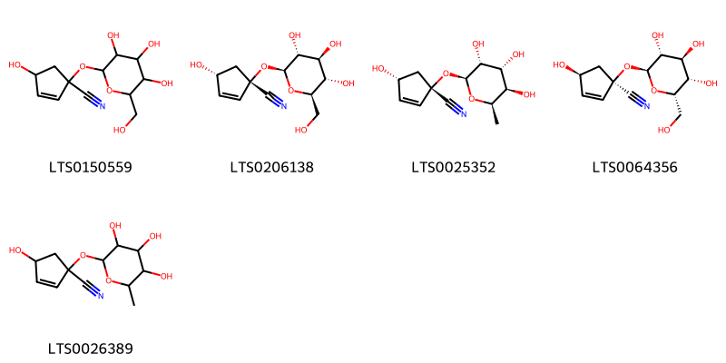{ width=100% }
    <figcaption>Hình ảnh cấu trúc hóa học của 5 hoạt chất thuộc nhóm Organooxygen compounds gồm ['4-hydroxy-1-{[3,4,5-trihydroxy-6-(hydroxymethyl)oxan-2-yl]oxy}cyclopent-2-ene-1-carbonitrile (LTS0150559)', 'volkenin (LTS0206138)', '(1s,4r)-4-hydroxy-1-{[(2s,3r,4r,5r,6r)-3,4,5-trihydroxy-6-methyloxan-2-yl]oxy}cyclopent-2-ene-1-carbonitrile (LTS0025352)', '(1r,4s)-4-hydroxy-1-{[(2s,3r,4s,5s,6s)-3,4,5-trihydroxy-6-(hydroxymethyl)oxan-2-yl]oxy}cyclopent-2-ene-1-carbonitrile (LTS0064356)', '4-hydroxy-1-[(3,4,5-trihydroxy-6-methyloxan-2-yl)oxy]cyclopent-2-ene-1-carbonitrile (LTS0026389)'].</figcaption>
</figure>

---

### Dược dân tộc học

Danh sách các quốc gia có sử dụng *Passiflora murucuja* trong điều trị các bệnh. 

| Country            | Disease     | Bệnh                                                                                                                                                                                                |
|:-------------------|:------------|:----------------------------------------------------------------------------------------------------------------------------------------------------------------------------------------------------|
| Dominican Republic | Emmenagogue | MYMEMORY WARNING: YOU USED ALL AVAILABLE FREE TRANSLATIONS FOR TODAY. NEXT AVAILABLE IN  15 HOURS 07 MINUTES 58 SECONDS VISIT HTTPS://MYMEMORY.TRANSLATED.NET/DOC/USAGELIMITS.PHP TO TRANSLATE MORE |
| Haiti              | Carminative | MYMEMORY WARNING: YOU USED ALL AVAILABLE FREE TRANSLATIONS FOR TODAY. NEXT AVAILABLE IN  15 HOURS 07 MINUTES 55 SECONDS VISIT HTTPS://MYMEMORY.TRANSLATED.NET/DOC/USAGELIMITS.PHP TO TRANSLATE MORE |

---

---
## Passiflora quadrangularis
### Thông tin về thực vật

!!! info "Phân loại thực vật của *Passiflora quadrangularis* từ GIBF:"
    - **Kingdom:** Plantae
    - **Phylum:** Tracheophyta
    - **Order:** Malpighiales
    - **Family:** Passifloraceae
    - **Genus:** Passiflora
    - **Species:** *Passiflora quadrangularis*

 

| Label (VI)   | Label (EN)   | Scientific Name           | Descriptions (VI)   | Descriptions (EN)   | Also Known As (VI)   | Also Known As (EN)                              |
|:-------------|:-------------|:--------------------------|:--------------------|:--------------------|:---------------------|:------------------------------------------------|
| N/A          | N/A          | Passiflora quadrangularis | loài thực vật       | species of plant    | ['']                 | ['Passiflora quadrangularis', 'passion flower'] |

#### Phân bố trên thế giới

**Từ CSDL GIBF** Honduras, Viet Nam, El Salvador, Spain, Guadeloupe, Trinidad and Tobago, Cameroon, Kenya, Singapore, Jamaica, Indonesia, Haiti, Guatemala, Colombia, Sri Lanka, Puerto Rico, Malaysia, Mauritius, Réunion, Canada, Belgium, Uganda, Nicaragua, Panama, Brazil, Peru, Mexico, Angola, Niue, Tanzania, United Republic of, Bolivia (Plurinational State of), Costa Rica, Ecuador, United States of America, Cocos (Keeling) Islands

#### Phân bố tại Việt Nam

**Từ CSDL GIBF**: Không có ghi nhận ở Việt Nam

---
### Thành phần hóa học
        
- Theo cơ sở dữ liệu lotus: Từ loài *Passiflora quadrangularis* đã phân lập và xác định được 21 hoạt chất thuộc về các nhóm Organooxygen compounds, Steroids and steroid derivatives, Prenol lipids, Fatty Acyls. 

|    | chemicalTaxonomyClassyfireClass   |   smiles_count |
|---:|:----------------------------------|---------------:|
|  0 | Fatty Acyls                       |              7 |
|  1 | Organooxygen compounds            |              5 |
|  2 | Prenol lipids                     |              6 |
|  3 | Steroids and steroid derivatives  |              3 |

#### Nhóm Fatty Acyls
<figure markdown="span">
    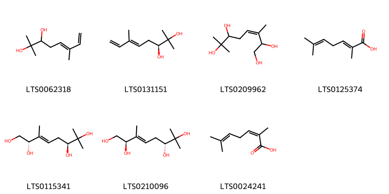{ width=100% }
    <figcaption>Hình ảnh cấu trúc hóa học của 7 hoạt chất thuộc nhóm Fatty Acyls gồm ['2,6-dimethylocta-5,7-diene-2,3-diol (LTS0062318)', '(3s,5e)-2,6-dimethylocta-5,7-diene-2,3-diol (LTS0131151)', '3,7-dimethyloct-3-ene-1,2,6,7-tetrol (LTS0209962)', '(2e)-2,6-dimethylhepta-2,5-dienoic acid (LTS0125374)', '(2s,3e,6s)-3,7-dimethyloct-3-ene-1,2,6,7-tetrol (LTS0115341)', '(2r,3e,6r)-3,7-dimethyloct-3-ene-1,2,6,7-tetrol (LTS0210096)', '2,6-dimethylhepta-2,5-dienoic acid (LTS0024241)'].</figcaption>
</figure>
#### Nhóm Organooxygen compounds
<figure markdown="span">
    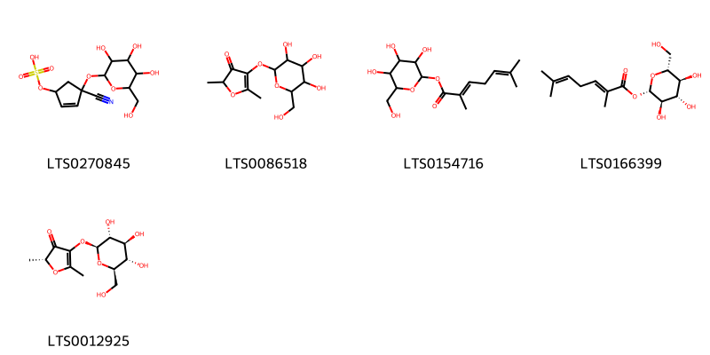{ width=100% }
    <figcaption>Hình ảnh cấu trúc hóa học của 5 hoạt chất thuộc nhóm Organooxygen compounds gồm ['(4-cyano-4-{[3,4,5-trihydroxy-6-(hydroxymethyl)oxan-2-yl]oxy}cyclopent-2-en-1-yl)oxidanesulfonic acid (LTS0270845)', '2,5-dimethyl-4-{[3,4,5-trihydroxy-6-(hydroxymethyl)oxan-2-yl]oxy}-2h-furan-3-one (LTS0086518)', '3,4,5-trihydroxy-6-(hydroxymethyl)oxan-2-yl 2,6-dimethylhepta-2,5-dienoate (LTS0154716)', '(2s,3r,4s,5s,6r)-3,4,5-trihydroxy-6-(hydroxymethyl)oxan-2-yl (2e)-2,6-dimethylhepta-2,5-dienoate (LTS0166399)', '(2r)-2,5-dimethyl-4-{[(2s,3r,4s,5s,6r)-3,4,5-trihydroxy-6-(hydroxymethyl)oxan-2-yl]oxy}-2h-furan-3-one (LTS0012925)'].</figcaption>
</figure>
#### Nhóm Prenol lipids
<figure markdown="span">
    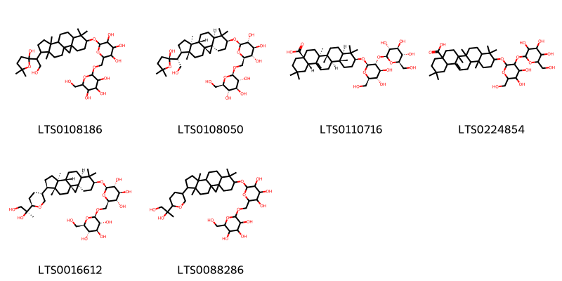{ width=100% }
    <figcaption>Hình ảnh cấu trúc hóa học của 6 hoạt chất thuộc nhóm Prenol lipids gồm ['2-({15-[2-hydroxy-1-(2-hydroxy-5,5-dimethyloxolan-2-yl)ethyl]-7,7,12,16-tetramethylpentacyclo[9.7.0.0¹,³.0³,⁸.0¹²,¹⁶]octadecan-6-yl}oxy)-6-({[3,4,5-trihydroxy-6-(hydroxymethyl)oxan-2-yl]oxy}methyl)oxane-3,4,5-triol (LTS0108186)', '(2r,3r,4s,5s,6r)-2-{[(1s,3r,6s,8r,11s,12s,15r,16r)-15-[(1r)-2-hydroxy-1-[(2r)-2-hydroxy-5,5-dimethyloxolan-2-yl]ethyl]-7,7,12,16-tetramethylpentacyclo[9.7.0.0¹,³.0³,⁸.0¹²,¹⁶]octadecan-6-yl]oxy}-6-({[(2r,3r,4s,5s,6r)-3,4,5-trihydroxy-6-(hydroxymethyl)oxan-2-yl]oxy}methyl)oxane-3,4,5-triol (LTS0108050)', 'acutoside a (LTS0110716)', '10-{[4,5-dihydroxy-6-(hydroxymethyl)-3-{[3,4,5-trihydroxy-6-(hydroxymethyl)oxan-2-yl]oxy}oxan-2-yl]oxy}-2,2,6a,6b,9,9,12a-heptamethyl-1,3,4,5,6,7,8,8a,10,11,12,12b,13,14b-tetradecahydropicene-4a-carboxylic acid (LTS0224854)', '(2r,3r,4s,5s,6r)-2-{[(1s,3r,6s,8r,11s,12s,15r,16r)-15-[(3r,6r)-6-[(2s)-1,2-dihydroxypropan-2-yl]oxan-3-yl]-7,7,12,16-tetramethylpentacyclo[9.7.0.0¹,³.0³,⁸.0¹²,¹⁶]octadecan-6-yl]oxy}-6-({[(2r,3r,4s,5s,6r)-3,4,5-trihydroxy-6-(hydroxymethyl)oxan-2-yl]oxy}methyl)oxane-3,4,5-triol (LTS0016612)', '2-({15-[6-(1,2-dihydroxypropan-2-yl)oxan-3-yl]-7,7,12,16-tetramethylpentacyclo[9.7.0.0¹,³.0³,⁸.0¹²,¹⁶]octadecan-6-yl}oxy)-6-({[3,4,5-trihydroxy-6-(hydroxymethyl)oxan-2-yl]oxy}methyl)oxane-3,4,5-triol (LTS0088286)'].</figcaption>
</figure>
#### Nhóm Steroids and steroid derivatives
<figure markdown="span">
    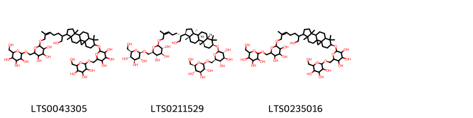{ width=100% }
    <figcaption>Hình ảnh cấu trúc hóa học của 3 hoạt chất thuộc nhóm Steroids and steroid derivatives gồm ['2-({15-[(5z)-1-hydroxy-6-methyl-7-{[3,4,5-trihydroxy-6-({[3,4,5-trihydroxy-6-(hydroxymethyl)oxan-2-yl]oxy}methyl)oxan-2-yl]oxy}hept-5-en-2-yl]-7,7,12,16-tetramethylpentacyclo[9.7.0.0¹,³.0³,⁸.0¹²,¹⁶]octadecan-6-yl}oxy)-6-({[3,4,5-trihydroxy-6-(hydroxymethyl)oxan-2-yl]oxy}methyl)oxane-3,4,5-triol (LTS0043305)', '(2r,3r,4s,5s,6r)-2-{[(1r,3s,6s,8s,11r,12s,15r,16r)-15-[(2r,5z)-1-hydroxy-6-methyl-7-{[(2r,3r,4s,5s,6r)-3,4,5-trihydroxy-6-({[(2r,3r,4s,5s,6r)-3,4,5-trihydroxy-6-(hydroxymethyl)oxan-2-yl]oxy}methyl)oxan-2-yl]oxy}hept-5-en-2-yl]-7,7,12,16-tetramethylpentacyclo[9.7.0.0¹,³.0³,⁸.0¹²,¹⁶]octadecan-6-yl]oxy}-6-({[(2r,3r,4s,5s,6r)-3,4,5-trihydroxy-6-(hydroxymethyl)oxan-2-yl]oxy}methyl)oxane-3,4,5-triol (LTS0211529)', '2-{[15-(1-hydroxy-6-methyl-7-{[3,4,5-trihydroxy-6-({[3,4,5-trihydroxy-6-(hydroxymethyl)oxan-2-yl]oxy}methyl)oxan-2-yl]oxy}hept-5-en-2-yl)-7,7,12,16-tetramethylpentacyclo[9.7.0.0¹,³.0³,⁸.0¹²,¹⁶]octadecan-6-yl]oxy}-6-({[3,4,5-trihydroxy-6-(hydroxymethyl)oxan-2-yl]oxy}methyl)oxane-3,4,5-triol (LTS0235016)'].</figcaption>
</figure>

---

### Dược dân tộc học

Danh sách các quốc gia có sử dụng *Passiflora quadrangularis* trong điều trị các bệnh. 

| Country            | Disease                           | Bệnh                                                                                                                                                                                                |
|:-------------------|:----------------------------------|:----------------------------------------------------------------------------------------------------------------------------------------------------------------------------------------------------|
| Dominican Republic | Cardiodepressant                  | MYMEMORY WARNING: YOU USED ALL AVAILABLE FREE TRANSLATIONS FOR TODAY. NEXT AVAILABLE IN  15 HOURS 07 MINUTES 22 SECONDS VISIT HTTPS://MYMEMORY.TRANSLATED.NET/DOC/USAGELIMITS.PHP TO TRANSLATE MORE |
| Elsewhere          | Sedative                          | MYMEMORY WARNING: YOU USED ALL AVAILABLE FREE TRANSLATIONS FOR TODAY. NEXT AVAILABLE IN  15 HOURS 07 MINUTES 20 SECONDS VISIT HTTPS://MYMEMORY.TRANSLATED.NET/DOC/USAGELIMITS.PHP TO TRANSLATE MORE |
| Haiti              | Sedative, Decongestant, Soporific | MYMEMORY WARNING: YOU USED ALL AVAILABLE FREE TRANSLATIONS FOR TODAY. NEXT AVAILABLE IN  15 HOURS 07 MINUTES 17 SECONDS VISIT HTTPS://MYMEMORY.TRANSLATED.NET/DOC/USAGELIMITS.PHP TO TRANSLATE MORE |
| Trinidad           | Sedative                          | MYMEMORY WARNING: YOU USED ALL AVAILABLE FREE TRANSLATIONS FOR TODAY. NEXT AVAILABLE IN  15 HOURS 07 MINUTES 14 SECONDS VISIT HTTPS://MYMEMORY.TRANSLATED.NET/DOC/USAGELIMITS.PHP TO TRANSLATE MORE |
| Venezuela          | Narcotic, Poison, Emollient       | MYMEMORY WARNING: YOU USED ALL AVAILABLE FREE TRANSLATIONS FOR TODAY. NEXT AVAILABLE IN  15 HOURS 07 MINUTES 10 SECONDS VISIT HTTPS://MYMEMORY.TRANSLATED.NET/DOC/USAGELIMITS.PHP TO TRANSLATE MORE |

---

---
## Passiflora rubra
### Thông tin về thực vật

!!! info "Phân loại thực vật của *Passiflora rubra* từ GIBF:"
    - **Kingdom:** Plantae
    - **Phylum:** Tracheophyta
    - **Order:** Malpighiales
    - **Family:** Passifloraceae
    - **Genus:** Passiflora
    - **Species:** *Passiflora rubra*

 

| Label (VI)   | Label (EN)   | Scientific Name   | Descriptions (VI)   | Descriptions (EN)   | Also Known As (VI)   | Also Known As (EN)   |
|:-------------|:-------------|:------------------|:--------------------|:--------------------|:---------------------|:---------------------|
| N/A          | N/A          | Passiflora rubra  | loài thực vật       | species of plant    | ['']                 | ['']                 |

#### Phân bố trên thế giới

**Từ CSDL GIBF** nan, unknown or invalid, Guadeloupe, Dominica, French Polynesia, French Guiana, Jamaica, Haiti, Colombia, Venezuela (Bolivarian Republic of), Dominican Republic, Suriname, Puerto Rico, Cuba, Saint Kitts and Nevis, Bahamas, Bonaire, Sint Eustatius and Saba, Virgin Islands (U.S.), Belgium, Netherlands, Virgin Islands (British), Antigua and Barbuda, Nicaragua, Brazil, Peru, Saint Martin (French part), United Kingdom of Great Britain and Northern Ireland, Cook Islands, Bolivia (Plurinational State of), Ecuador

#### Phân bố tại Việt Nam

**Từ CSDL GIBF**: Không có ghi nhận ở Việt Nam

---
### Thành phần hóa học
        
- Theo cơ sở dữ liệu lotus: Từ loài *Passiflora rubra* đã phân lập và xác định được 4 hoạt chất thuộc về các nhóm Harmala alkaloids. 

|    | chemicalTaxonomyClassyfireClass   |   smiles_count |
|---:|:----------------------------------|---------------:|
|  0 | Harmala alkaloids                 |              4 |

#### Nhóm Harmala alkaloids
<figure markdown="span">
    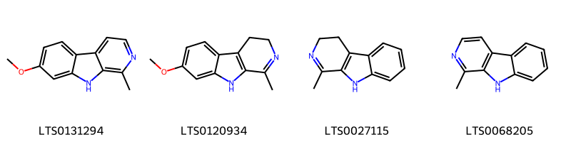{ width=100% }
    <figcaption>Hình ảnh cấu trúc hóa học của 4 hoạt chất thuộc nhóm Harmala alkaloids gồm ['harmine (LTS0131294)', 'harmaline (LTS0120934)', '1-methyl-3h,4h,9h-pyrido[3,4-b]indole (LTS0027115)', 'harmane (LTS0068205)'].</figcaption>
</figure>

---

### Dược dân tộc học

Danh sách các quốc gia có sử dụng *Passiflora rubra* trong điều trị các bệnh. 

| Country   | Disease      | Bệnh                                                                                                                                                                                                |
|:----------|:-------------|:----------------------------------------------------------------------------------------------------------------------------------------------------------------------------------------------------|
| Haiti     | Decongestant | MYMEMORY WARNING: YOU USED ALL AVAILABLE FREE TRANSLATIONS FOR TODAY. NEXT AVAILABLE IN  15 HOURS 06 MINUTES 35 SECONDS VISIT HTTPS://MYMEMORY.TRANSLATED.NET/DOC/USAGELIMITS.PHP TO TRANSLATE MORE |

---

---
## Passiflora salvadorensis
### Thông tin về thực vật

!!! info "Phân loại thực vật của *Passiflora jorullensis* từ GIBF:"
    - **Kingdom:** Plantae
    - **Phylum:** Tracheophyta
    - **Order:** Malpighiales
    - **Family:** Passifloraceae
    - **Genus:** Passiflora
    - **Species:** *Passiflora jorullensis*

 

| Label (VI)   | Label (EN)   | Scientific Name          | Descriptions (VI)   | Descriptions (EN)   | Also Known As (VI)   | Also Known As (EN)   |
|:-------------|:-------------|:-------------------------|:--------------------|:--------------------|:---------------------|:---------------------|
| N/A          | N/A          | Passiflora salvadorensis | loài thực vật       | species of plant    | ['']                 | ['']                 |

#### Phân bố trên thế giới

**Từ CSDL GIBF** El Salvador

#### Phân bố tại Việt Nam

**Từ CSDL GIBF**: Không có ghi nhận ở Việt Nam

---
### Thành phần hóa học
        
- Theo cơ sở dữ liệu lotus: Từ loài *Passiflora jorullensis* đã phân lập và xác định được Chưa có hoạt chất nào được phân lập. hoạt chất thuộc về các nhóm Không có hoạt chất nào được phân lập. 

Không có hình ảnh nào được tạo ra

---

### Dược dân tộc học

Danh sách các quốc gia có sử dụng *Passiflora jorullensis* trong điều trị các bệnh. 

| Country   | Disease   | Bệnh                                                                                                                                                                                                |
|:----------|:----------|:----------------------------------------------------------------------------------------------------------------------------------------------------------------------------------------------------|
| Salvador  | Diuretic  | MYMEMORY WARNING: YOU USED ALL AVAILABLE FREE TRANSLATIONS FOR TODAY. NEXT AVAILABLE IN  15 HOURS 06 MINUTES 08 SECONDS VISIT HTTPS://MYMEMORY.TRANSLATED.NET/DOC/USAGELIMITS.PHP TO TRANSLATE MORE |

---

# Chi Adenia

??? note "Danh sách các dược liệu thuộc chi"
    
	 - *Adenia lobata*
	 - *Adenia palmata*
	 - *Adenia volkensii*

---
## Adenia lobata
### Thông tin về thực vật

!!! info "Phân loại thực vật của *Adenia lobata* từ GIBF:"
    - **Kingdom:** Plantae
    - **Phylum:** Tracheophyta
    - **Order:** Malpighiales
    - **Family:** Passifloraceae
    - **Genus:** Adenia
    - **Species:** *Adenia lobata*

 

| Label (VI)   | Label (EN)   | Scientific Name   | Descriptions (VI)   | Descriptions (EN)   | Also Known As (VI)   | Also Known As (EN)   |
|:-------------|:-------------|:------------------|:--------------------|:--------------------|:---------------------|:---------------------|
| N/A          | N/A          | Adenia lobata     | loài thực vật       | species of plant    | ['']                 | ['']                 |

#### Phân bố trên thế giới

**Từ CSDL GIBF** Sao Tome and Principe, Liberia, Zambia, Guinea, Benin

#### Phân bố tại Việt Nam

**Từ CSDL GIBF**: Không có ghi nhận ở Việt Nam

---
### Thành phần hóa học
        
- Theo cơ sở dữ liệu lotus: Từ loài *Adenia lobata* đã phân lập và xác định được Chưa có hoạt chất nào được phân lập. hoạt chất thuộc về các nhóm Không có hoạt chất nào được phân lập. 

Không có hình ảnh nào được tạo ra

---

### Dược dân tộc học

Danh sách các quốc gia có sử dụng *Adenia lobata* trong điều trị các bệnh. 

| Country     | Disease                                     | Bệnh                                                                                                                                                                                                |
|:------------|:--------------------------------------------|:----------------------------------------------------------------------------------------------------------------------------------------------------------------------------------------------------|
| Upper Volta | Aphrodisiac, Diuretic, Purgative, Piscicide | MYMEMORY WARNING: YOU USED ALL AVAILABLE FREE TRANSLATIONS FOR TODAY. NEXT AVAILABLE IN  15 HOURS 05 MINUTES 36 SECONDS VISIT HTTPS://MYMEMORY.TRANSLATED.NET/DOC/USAGELIMITS.PHP TO TRANSLATE MORE |

---

---
## Adenia palmata
### Thông tin về thực vật

!!! info "Phân loại thực vật của *Adenia hondala* từ GIBF:"
    - **Kingdom:** Plantae
    - **Phylum:** Tracheophyta
    - **Order:** Malpighiales
    - **Family:** Passifloraceae
    - **Genus:** Adenia
    - **Species:** *Adenia hondala*

 

| Label (VI)   | Label (EN)   | Scientific Name   | Descriptions (VI)   | Descriptions (EN)   | Also Known As (VI)   | Also Known As (EN)   |
|:-------------|:-------------|:------------------|:--------------------|:--------------------|:---------------------|:---------------------|
| N/A          | N/A          | Adenia lobata     | loài thực vật       | species of plant    | ['']                 | ['']                 |

#### Phân bố trên thế giới

**Từ CSDL GIBF** Sri Lanka

#### Phân bố tại Việt Nam

**Từ CSDL GIBF**: Không có ghi nhận ở Việt Nam

---
### Thành phần hóa học
        
- Theo cơ sở dữ liệu lotus: Từ loài *Adenia hondala* đã phân lập và xác định được Chưa có hoạt chất nào được phân lập. hoạt chất thuộc về các nhóm Không có hoạt chất nào được phân lập. 

Không có hình ảnh nào được tạo ra

---

### Dược dân tộc học

Danh sách các quốc gia có sử dụng *Adenia hondala* trong điều trị các bệnh. 

| Country   | Disease   | Bệnh                                                                                                                                                                                                |
|:----------|:----------|:----------------------------------------------------------------------------------------------------------------------------------------------------------------------------------------------------|
| Sri Lanka | Poison    | MYMEMORY WARNING: YOU USED ALL AVAILABLE FREE TRANSLATIONS FOR TODAY. NEXT AVAILABLE IN  15 HOURS 05 MINUTES 10 SECONDS VISIT HTTPS://MYMEMORY.TRANSLATED.NET/DOC/USAGELIMITS.PHP TO TRANSLATE MORE |

---

---
## Adenia volkensii
### Thông tin về thực vật

!!! info "Phân loại thực vật của *Adenia volkensii* từ GIBF:"
    - **Kingdom:** Plantae
    - **Phylum:** Tracheophyta
    - **Order:** Malpighiales
    - **Family:** Passifloraceae
    - **Genus:** Adenia
    - **Species:** *Adenia volkensii*

 

| Label (VI)   | Label (EN)   | Scientific Name   | Descriptions (VI)   | Descriptions (EN)   | Also Known As (VI)   | Also Known As (EN)   |
|:-------------|:-------------|:------------------|:--------------------|:--------------------|:---------------------|:---------------------|
| N/A          | N/A          | Adenia volkensii  | loài thực vật       | species of plant    | ['']                 | ['']                 |

#### Phân bố trên thế giới

**Từ CSDL GIBF** nan, Tanzania, United Republic of, Kenya

#### Phân bố tại Việt Nam

**Từ CSDL GIBF**: Không có ghi nhận ở Việt Nam

---
### Thành phần hóa học
        
- Theo cơ sở dữ liệu lotus: Từ loài *Adenia volkensii* đã phân lập và xác định được 6 hoạt chất thuộc về các nhóm Organooxygen compounds. 

|    | chemicalTaxonomyClassyfireClass   |   smiles_count |
|---:|:----------------------------------|---------------:|
|  0 | Organooxygen compounds            |              6 |

#### Nhóm Organooxygen compounds
<figure markdown="span">
    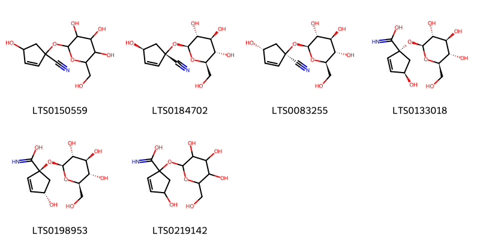{ width=100% }
    <figcaption>Hình ảnh cấu trúc hóa học của 6 hoạt chất thuộc nhóm Organooxygen compounds gồm ['4-hydroxy-1-{[3,4,5-trihydroxy-6-(hydroxymethyl)oxan-2-yl]oxy}cyclopent-2-ene-1-carbonitrile (LTS0150559)', '(1s,4s)-4-hydroxy-1-{[(2s,3r,4s,5s,6r)-3,4,5-trihydroxy-6-(hydroxymethyl)oxan-2-yl]oxy}cyclopent-2-ene-1-carbonitrile (LTS0184702)', 'epitetraphyllin b (LTS0083255)', '(1r,4r)-4-hydroxy-1-{[(2s,3r,4s,5s,6r)-3,4,5-trihydroxy-6-(hydroxymethyl)oxan-2-yl]oxy}cyclopent-2-ene-1-carboximidic acid (LTS0133018)', '(1s,4s)-4-hydroxy-1-{[(2s,3r,4s,5s,6r)-3,4,5-trihydroxy-6-(hydroxymethyl)oxan-2-yl]oxy}cyclopent-2-ene-1-carboximidic acid (LTS0198953)', '4-hydroxy-1-{[3,4,5-trihydroxy-6-(hydroxymethyl)oxan-2-yl]oxy}cyclopent-2-ene-1-carboximidic acid (LTS0219142)'].</figcaption>
</figure>

---

### Dược dân tộc học

Danh sách các quốc gia có sử dụng *Adenia volkensii* trong điều trị các bệnh. 

| Country   | Disease   | Bệnh                                                                                                                                                                                                |
|:----------|:----------|:----------------------------------------------------------------------------------------------------------------------------------------------------------------------------------------------------|
| Africa    | Poison    | MYMEMORY WARNING: YOU USED ALL AVAILABLE FREE TRANSLATIONS FOR TODAY. NEXT AVAILABLE IN  15 HOURS 04 MINUTES 40 SECONDS VISIT HTTPS://MYMEMORY.TRANSLATED.NET/DOC/USAGELIMITS.PHP TO TRANSLATE MORE |

---

