!!! abstract "Tóm tắt"

    Họ Pedaliaceae gồm khoảng 7 chi và 10 loài được một số cộng đồng tại các quốc gia như Africa, Turkey, Ghana, Haiti, English, Iraq, Argentina, Johore, Elsewhere, India, Venezuela, Japan*, Dominican Republic, Malaya, Mexico, Malaysia, China sử dụng trong một số trường hợp QUERY LENGTH LIMIT EXCEEDED. MAX ALLOWED QUERY : 500 CHARS.

!!! info "DrDuke"

    James A. Duke sinh năm 1929-2017 là một nhà thực vật học người Mỹ. Đây là một trong những tác giả hàng đầu trong lĩnh vực dược dân tộc học với cuốn *CRC Handbook of Medicinal Herbs* và chính là người xây dựng lên cơ sở dữ liệu về hợp chất tự nhiên và dược dân tộc học tại Bộ nông nghiệp Hoa Kỳ. Các thông tin được đăng tải tại website [Dr. Duke's Phytochemical and Ethnobotanical Databases](https://phytochem.nal.usda.gov/). 
    Trong suốt thập niên 1970, ông lãnh đạo the Plant Taxonomy Laboratory, Plant Genetics and Germplasm Institute of the Agricultural Research Service, U.S. Department of Agriculture.
    Trong tài liệu này, các thông tin về dược dân tộc của các dược liệu được trích dẫn từ tài liệu của James A. Ducke với sự trợ giúp của phần mềm dịch thuật từ tiếng Anh sang tiếng Việt.
   

# Chi Pedalium

??? note "Danh sách các dược liệu thuộc chi"
    
	 - *Pedalium murex*

---
## Pedalium murex
### Thông tin về thực vật

!!! info "Phân loại thực vật của *Pedalium murex* từ GIBF:"
    - **Kingdom:** Plantae
    - **Phylum:** Tracheophyta
    - **Order:** Lamiales
    - **Family:** Pedaliaceae
    - **Genus:** Pedalium
    - **Species:** *Pedalium murex*

 

| Label (VI)   | Label (EN)   | Scientific Name   | Descriptions (VI)   | Descriptions (EN)   | Also Known As (VI)   | Also Known As (EN)                    |
|:-------------|:-------------|:------------------|:--------------------|:--------------------|:---------------------|:--------------------------------------|
| N/A          | N/A          | Pedalium murex    | loài thực vật       | species of plant    | ['']                 | ['Common Pedalium', 'Large Caltrops'] |

#### Phân bố trên thế giới

**Từ CSDL GIBF** nan, Sri Lanka, Ghana, Madagascar, Thailand, Nigeria, Oman, Somalia, Mozambique, India, Benin, Saudi Arabia, Kenya, Tanzania, United Republic of, Yemen, Togo

#### Phân bố tại Việt Nam

**Từ CSDL GIBF**: Không có ghi nhận ở Việt Nam

---
### Thành phần hóa học
        
- Theo cơ sở dữ liệu lotus: Từ loài *Pedalium murex* đã phân lập và xác định được 31 hoạt chất thuộc về các nhóm Fatty Acyls, Flavonoids, Prenol lipids, Steroids and steroid derivatives, Benzodioxoles, Saturated hydrocarbons, Phenols, Organooxygen compounds, Furanoid lignans. 

|    | chemicalTaxonomyClassyfireClass   |   smiles_count |
|---:|:----------------------------------|---------------:|
|  0 | Benzodioxoles                     |              2 |
|  1 | Fatty Acyls                       |              6 |
|  2 | Flavonoids                        |              9 |
|  3 | Furanoid lignans                  |              1 |
|  4 | Organooxygen compounds            |              1 |
|  5 | Phenols                           |              1 |
|  6 | Prenol lipids                     |              3 |
|  7 | Saturated hydrocarbons            |              3 |
|  8 | Steroids and steroid derivatives  |              5 |

#### Nhóm Benzodioxoles
<figure markdown="span">
    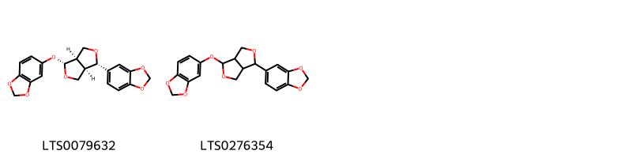{ width=100% }
    <figcaption>Hình ảnh cấu trúc hóa học của 2 hoạt chất thuộc nhóm Benzodioxoles gồm ['sesamolin (LTS0079632)', 'sesamolin (LTS0276354)'].</figcaption>
</figure>
#### Nhóm Fatty Acyls
<figure markdown="span">
    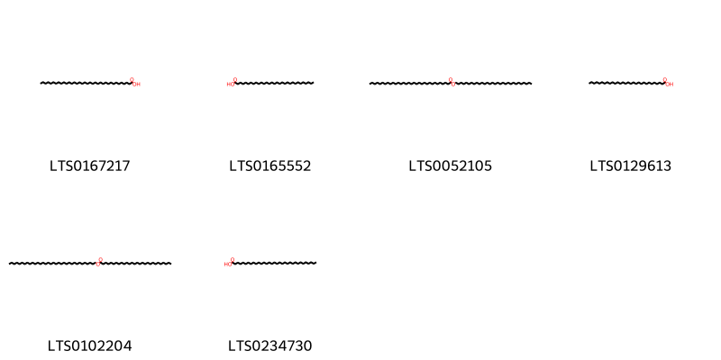{ width=100% }
    <figcaption>Hình ảnh cấu trúc hóa học của 6 hoạt chất thuộc nhóm Fatty Acyls gồm ['hexatriacontanoic acid (LTS0167217)', 'hentriacontylic acid (LTS0165552)', 'triacontyl dotriacontanoate (LTS0052105)', 'triacontanoic acid (LTS0129613)', 'tetratriacontyl octacosanoate (LTS0102204)', 'psyllic acid (LTS0234730)'].</figcaption>
</figure>
#### Nhóm Flavonoids
<figure markdown="span">
    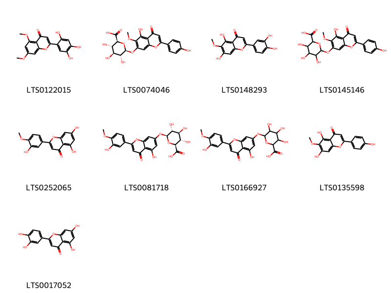{ width=100% }
    <figcaption>Hình ảnh cấu trúc hóa học của 9 hoạt chất thuộc nhóm Flavonoids gồm ['isoetin 5,7-dimethyl ether (LTS0122015)', '(2s,3s,4s,5r,6s)-3,4,5-trihydroxy-6-{[5-hydroxy-2-(4-hydroxyphenyl)-6-methoxy-4-oxochromen-7-yl]oxy}oxane-2-carboxylic acid (LTS0074046)', 'nepetin (LTS0148293)', '3,4,5-trihydroxy-6-{[5-hydroxy-2-(4-hydroxyphenyl)-6-methoxy-4-oxochromen-7-yl]oxy}oxane-2-carboxylic acid (LTS0145146)', 'diosmetin (LTS0252065)', '(2s,3s,4s,5r,6s)-3,4,5-trihydroxy-6-{[5-hydroxy-2-(3-hydroxy-4-methoxyphenyl)-4-oxochromen-7-yl]oxy}oxane-2-carboxylic acid (LTS0081718)', '3,4,5-trihydroxy-6-{[5-hydroxy-2-(3-hydroxy-4-methoxyphenyl)-4-oxochromen-7-yl]oxy}oxane-2-carboxylic acid (LTS0166927)', 'hispidulin (LTS0135598)', 'luteolin (LTS0017052)'].</figcaption>
</figure>
#### Nhóm Furanoid lignans
<figure markdown="span">
    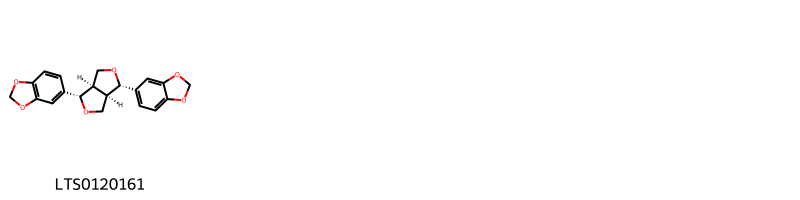{ width=100% }
    <figcaption>Hình ảnh cấu trúc hóa học của 1 hoạt chất thuộc nhóm Furanoid lignans gồm ['sesamin (LTS0120161)'].</figcaption>
</figure>
#### Nhóm Organooxygen compounds
<figure markdown="span">
    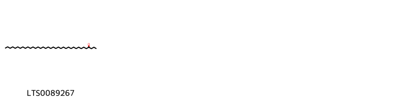{ width=100% }
    <figcaption>Hình ảnh cấu trúc hóa học của 1 hoạt chất thuộc nhóm Organooxygen compounds gồm ['heptatriacontan-4-one (LTS0089267)'].</figcaption>
</figure>
#### Nhóm Phenols
<figure markdown="span">
    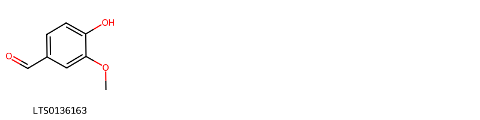{ width=100% }
    <figcaption>Hình ảnh cấu trúc hóa học của 1 hoạt chất thuộc nhóm Phenols gồm ['vanillin (LTS0136163)'].</figcaption>
</figure>
#### Nhóm Prenol lipids
<figure markdown="span">
    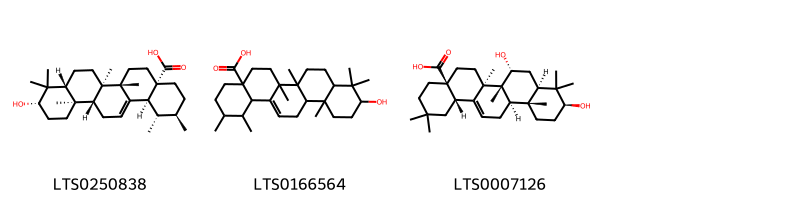{ width=100% }
    <figcaption>Hình ảnh cấu trúc hóa học của 3 hoạt chất thuộc nhóm Prenol lipids gồm ['ursolic acid (LTS0250838)', '10-hydroxy-1,2,6a,6b,9,9,12a-heptamethyl-2,3,4,5,6,7,8,8a,10,11,12,12b,13,14b-tetradecahydro-1h-picene-4a-carboxylic acid (LTS0166564)', '(4as,6ar,6br,7r,8ar,10s,12as,12br,14bs)-7,10-dihydroxy-2,2,6a,6b,9,9,12a-heptamethyl-1,3,4,5,6,7,8,8a,10,11,12,12b,13,14b-tetradecahydropicene-4a-carboxylic acid (LTS0007126)'].</figcaption>
</figure>
#### Nhóm Saturated hydrocarbons
<figure markdown="span">
    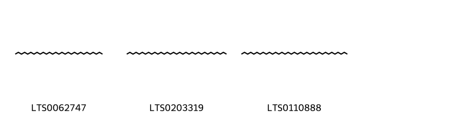{ width=100% }
    <figcaption>Hình ảnh cấu trúc hóa học của 3 hoạt chất thuộc nhóm Saturated hydrocarbons gồm ['nonacosane (LTS0062747)', 'tritriacontane (LTS0203319)', 'pentatriacontane (LTS0110888)'].</figcaption>
</figure>
#### Nhóm Steroids and steroid derivatives
<figure markdown="span">
    { width=100% }
    <figcaption>Hình ảnh cấu trúc hóa học của 5 hoạt chất thuộc nhóm Steroids and steroid derivatives gồm ['stigmast-5-en-3-ol (LTS0071224)', 'sitosterol (LTS0168132)', 'stigmast-5-en-3-ol, (3β)- (LTS0204616)', 'sitogluside (LTS0201798)', '2-{[1-(5-ethyl-6-methylheptan-2-yl)-9a,11a-dimethyl-1h,2h,3h,3ah,3bh,4h,6h,7h,8h,9h,9bh,10h,11h-cyclopenta[a]phenanthren-7-yl]oxy}-6-(hydroxymethyl)oxane-3,4,5-triol (LTS0158828)'].</figcaption>
</figure>

---

### Dược dân tộc học

Danh sách các quốc gia có sử dụng *Pedalium murex* trong điều trị các bệnh. 

| Country   | Disease                    | Bệnh                                                                                                                                                                                                |
|:----------|:---------------------------|:----------------------------------------------------------------------------------------------------------------------------------------------------------------------------------------------------|
| Africa    | Demulcent                  | MYMEMORY WARNING: YOU USED ALL AVAILABLE FREE TRANSLATIONS FOR TODAY. NEXT AVAILABLE IN  08 HOURS 50 MINUTES 02 SECONDS VISIT HTTPS://MYMEMORY.TRANSLATED.NET/DOC/USAGELIMITS.PHP TO TRANSLATE MORE |
| Elsewhere | Demulcent, Diuretic, Tonic | MYMEMORY WARNING: YOU USED ALL AVAILABLE FREE TRANSLATIONS FOR TODAY. NEXT AVAILABLE IN  08 HOURS 50 MINUTES 00 SECONDS VISIT HTTPS://MYMEMORY.TRANSLATED.NET/DOC/USAGELIMITS.PHP TO TRANSLATE MORE |
| English   | Aphrodisiac                | MYMEMORY WARNING: YOU USED ALL AVAILABLE FREE TRANSLATIONS FOR TODAY. NEXT AVAILABLE IN  08 HOURS 49 MINUTES 58 SECONDS VISIT HTTPS://MYMEMORY.TRANSLATED.NET/DOC/USAGELIMITS.PHP TO TRANSLATE MORE |
| India     | Demulcent, Tonic           | MYMEMORY WARNING: YOU USED ALL AVAILABLE FREE TRANSLATIONS FOR TODAY. NEXT AVAILABLE IN  08 HOURS 49 MINUTES 55 SECONDS VISIT HTTPS://MYMEMORY.TRANSLATED.NET/DOC/USAGELIMITS.PHP TO TRANSLATE MORE |
| Malaysia  | Diuretic                   | MYMEMORY WARNING: YOU USED ALL AVAILABLE FREE TRANSLATIONS FOR TODAY. NEXT AVAILABLE IN  08 HOURS 49 MINUTES 52 SECONDS VISIT HTTPS://MYMEMORY.TRANSLATED.NET/DOC/USAGELIMITS.PHP TO TRANSLATE MORE |

---

# Chi Harpagophytum

??? note "Danh sách các dược liệu thuộc chi"
    
	 - *Harpagophytum procumbens*

---
## Harpagophytum procumbens
### Thông tin về thực vật

!!! info "Phân loại thực vật của *Harpagophytum procumbens* từ GIBF:"
    - **Kingdom:** Plantae
    - **Phylum:** Tracheophyta
    - **Order:** Lamiales
    - **Family:** Pedaliaceae
    - **Genus:** Harpagophytum
    - **Species:** *Harpagophytum procumbens*

 

| Label (VI)   | Label (EN)   | Scientific Name          | Descriptions (VI)   | Descriptions (EN)   | Also Known As (VI)   | Also Known As (EN)   |
|:-------------|:-------------|:-------------------------|:--------------------|:--------------------|:---------------------|:---------------------|
| N/A          | N/A          | Harpagophytum procumbens | loài thực vật       | species of plant    | ['']                 | ["Devil's claw"]     |

#### Phân bố trên thế giới

**Từ CSDL GIBF** nan, Zambia, South Africa, Germany, Namibia, Angola, Mozambique, Botswana, unknown or invalid, United States of America, Zimbabwe

#### Phân bố tại Việt Nam

**Từ CSDL GIBF**: Không có ghi nhận ở Việt Nam

---
### Thành phần hóa học
        
- Theo cơ sở dữ liệu lotus: Từ loài *Harpagophytum procumbens* đã phân lập và xác định được 29 hoạt chất thuộc về các nhóm Prenol lipids, Steroids and steroid derivatives, Cinnamic acids and derivatives, Organooxygen compounds. 

|    | chemicalTaxonomyClassyfireClass   |   smiles_count |
|---:|:----------------------------------|---------------:|
|  0 | Cinnamic acids and derivatives    |              8 |
|  1 | Organooxygen compounds            |              4 |
|  2 | Prenol lipids                     |             15 |
|  3 | Steroids and steroid derivatives  |              1 |

#### Nhóm Cinnamic acids and derivatives
<figure markdown="span">
    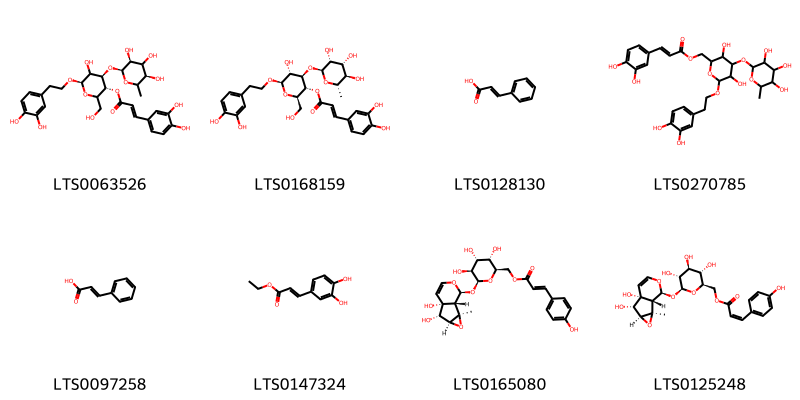{ width=100% }
    <figcaption>Hình ảnh cấu trúc hóa học của 8 hoạt chất thuộc nhóm Cinnamic acids and derivatives gồm ['(3r,4r,6r)-6-[2-(3,4-dihydroxyphenyl)ethoxy]-5-hydroxy-2-(hydroxymethyl)-4-{[(2s,3s,5r)-3,4,5-trihydroxy-6-methyloxan-2-yl]oxy}oxan-3-yl (2e)-3-(3,4-dihydroxyphenyl)prop-2-enoate (LTS0063526)', 'verbascoside (LTS0168159)', 'cinnamic acid (LTS0128130)', '{6-[2-(3,4-dihydroxyphenyl)ethoxy]-3,5-dihydroxy-4-[(3,4,5-trihydroxy-6-methyloxan-2-yl)oxy]oxan-2-yl}methyl 3-(3,4-dihydroxyphenyl)prop-2-enoate (LTS0270785)', 'phenylacrylic acid (LTS0097258)', 'ethyl caffeate (LTS0147324)', '[(2r,3s,4r,5s,6s)-6-{[(1s,2r,4s,5s,6r,10s)-5,6-dihydroxy-2-methyl-3,9-dioxatricyclo[4.4.0.0²,⁴]dec-7-en-10-yl]oxy}-3,4,5-trihydroxyoxan-2-yl]methyl (2e)-3-(4-hydroxyphenyl)prop-2-enoate (LTS0165080)', '[(2r,3s,4s,5r,6s)-6-{[(1s,2r,4s,5s,6r,10s)-5,6-dihydroxy-2-methyl-3,9-dioxatricyclo[4.4.0.0²,⁴]dec-7-en-10-yl]oxy}-3,4,5-trihydroxyoxan-2-yl]methyl (2z)-3-(4-hydroxyphenyl)prop-2-enoate (LTS0125248)'].</figcaption>
</figure>
#### Nhóm Organooxygen compounds
<figure markdown="span">
    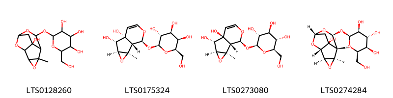{ width=100% }
    <figcaption>Hình ảnh cấu trúc hóa học của 4 hoạt chất thuộc nhóm Organooxygen compounds gồm ['2-({10-hydroxy-4-methyl-3,7,11-trioxatetracyclo[6.2.1.0²,⁴.0⁵,¹⁰]undecan-6-yl}oxy)-6-(hydroxymethyl)oxane-3,4,5-triol (LTS0128260)', '(2s,3r,4s,5r,6r)-2-{[(1s,2r,4s,5s,6r,10s)-5,6-dihydroxy-2-methyl-3,9-dioxatricyclo[4.4.0.0²,⁴]dec-7-en-10-yl]oxy}-6-(hydroxymethyl)oxane-3,4,5-triol (LTS0175324)', 'procumbide (LTS0273080)', '(2s,3s,4r,5r,6r)-2-{[(1s,2s,4r,5s,6s,8r,10s)-10-hydroxy-4-methyl-3,7,11-trioxatetracyclo[6.2.1.0²,⁴.0⁵,¹⁰]undecan-6-yl]oxy}-6-(hydroxymethyl)oxane-3,4,5-triol (LTS0274284)'].</figcaption>
</figure>
#### Nhóm Prenol lipids
<figure markdown="span">
    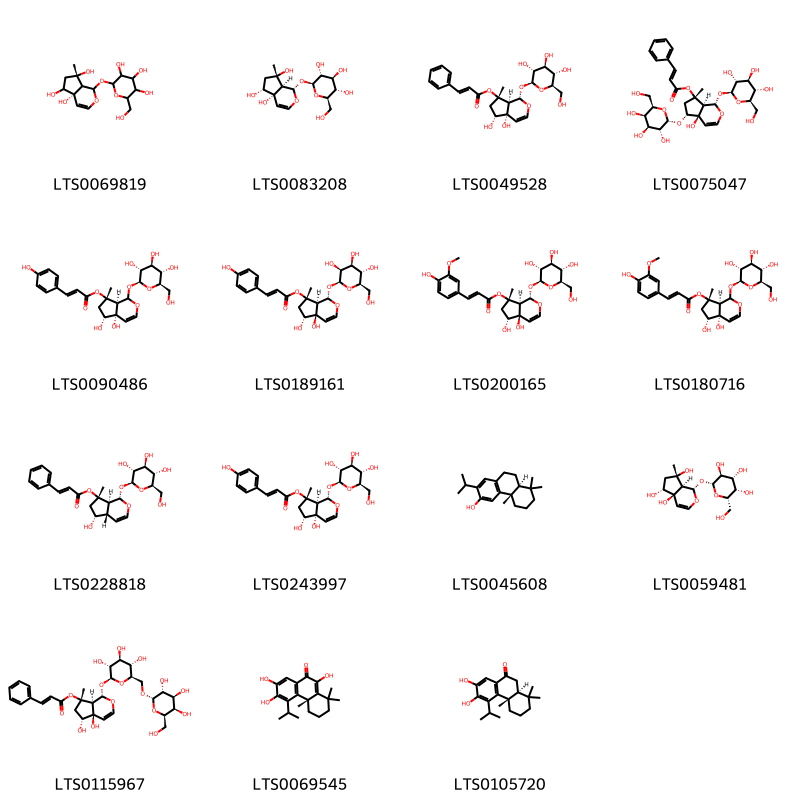{ width=100% }
    <figcaption>Hình ảnh cấu trúc hóa học của 15 hoạt chất thuộc nhóm Prenol lipids gồm ['2-{[(4as,7s)-4a,5,7-trihydroxy-7-methyl-1h,5h,6h,7ah-cyclopenta[c]pyran-1-yl]oxy}-6-(hydroxymethyl)oxane-3,4,5-triol (LTS0069819)', 'harpagide (LTS0083208)', 'harpagoside (LTS0049528)', '(1s,4ar,5r,7s,7as)-4a-hydroxy-7-methyl-5-{[(2r,3r,4s,5r,6r)-3,4,5-trihydroxy-6-(hydroxymethyl)oxan-2-yl]oxy}-1-{[(2s,3r,4s,5s,6r)-3,4,5-trihydroxy-6-(hydroxymethyl)oxan-2-yl]oxy}-1h,5h,6h,7ah-cyclopenta[c]pyran-7-yl (2e)-3-phenylprop-2-enoate (LTS0075047)', '(4as,5r,7s,7as)-4a,5-dihydroxy-7-methyl-1-{[(2s,3r,4s,5s,6r)-3,4,5-trihydroxy-6-(hydroxymethyl)oxan-2-yl]oxy}-1h,5h,6h,7ah-cyclopenta[c]pyran-7-yl (2e)-3-(4-hydroxyphenyl)prop-2-enoate (LTS0090486)', '(1s,4ar,5r,7s,7as)-4a,5-dihydroxy-7-methyl-1-{[(2s,3s,4s,5s,6r)-3,4,5-trihydroxy-6-(hydroxymethyl)oxan-2-yl]oxy}-1h,5h,6h,7ah-cyclopenta[c]pyran-7-yl (2e)-3-(4-hydroxyphenyl)prop-2-enoate (LTS0189161)', '(1s,4ar,5r,7s,7as)-4a,5-dihydroxy-7-methyl-1-{[(2s,3r,4s,5s,6r)-3,4,5-trihydroxy-6-(hydroxymethyl)oxan-2-yl]oxy}-1h,5h,6h,7ah-cyclopenta[c]pyran-7-yl (2e)-3-(4-hydroxy-3-methoxyphenyl)prop-2-enoate (LTS0200165)', '(4as,5r,7s,7as)-4a,5-dihydroxy-7-methyl-1-{[(2s,3r,4s,5s,6r)-3,4,5-trihydroxy-6-(hydroxymethyl)oxan-2-yl]oxy}-1h,5h,6h,7ah-cyclopenta[c]pyran-7-yl (2e)-3-(4-hydroxy-3-methoxyphenyl)prop-2-enoate (LTS0180716)', '(1s,4as,5r,7s,7as)-5-hydroxy-7-methyl-1-{[(2s,3r,4s,5s,6r)-3,4,5-trihydroxy-6-(hydroxymethyl)oxan-2-yl]oxy}-1h,4ah,5h,6h,7ah-cyclopenta[c]pyran-7-yl (2e)-3-phenylprop-2-enoate (LTS0228818)', '(1s,4as,5r,7s,7as)-4a,5-dihydroxy-7-methyl-1-{[(2s,3r,4s,5s,6r)-3,4,5-trihydroxy-6-(hydroxymethyl)oxan-2-yl]oxy}-1h,5h,6h,7ah-cyclopenta[c]pyran-7-yl (2e)-3-(4-hydroxyphenyl)prop-2-enoate (LTS0243997)', 'ferruginol (LTS0045608)', '(2r,3s,4r,5s,6s)-2-{[(1s,4ar,5r,7s,7ar)-4a,5,7-trihydroxy-7-methyl-1h,5h,6h,7ah-cyclopenta[c]pyran-1-yl]oxy}-6-(hydroxymethyl)oxane-3,4,5-triol (LTS0059481)', '(1s,4ar,5r,7s,7as)-4a,5-dihydroxy-7-methyl-1-{[(2s,3r,4s,5s,6r)-3,4,5-trihydroxy-6-({[(2s,3r,4s,5r,6r)-3,4,5-trihydroxy-6-(hydroxymethyl)oxan-2-yl]oxy}methyl)oxan-2-yl]oxy}-1h,5h,6h,7ah-cyclopenta[c]pyran-7-yl (2e)-3-phenylprop-2-enoate (LTS0115967)', '(4ar)-6,7,10-trihydroxy-5-isopropyl-1,1,4a-trimethyl-3,4-dihydro-2h-phenanthren-9-one (LTS0069545)', '(4as,10as)-6,7-dihydroxy-5-isopropyl-1,1,4a-trimethyl-3,4,10,10a-tetrahydro-2h-phenanthren-9-one (LTS0105720)'].</figcaption>
</figure>
#### Nhóm Steroids and steroid derivatives
<figure markdown="span">
    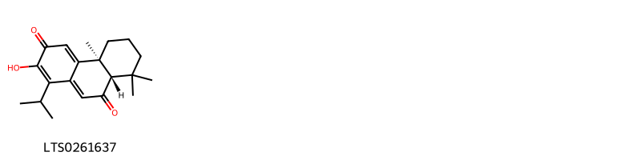{ width=100% }
    <figcaption>Hình ảnh cấu trúc hóa học của 1 hoạt chất thuộc nhóm Steroids and steroid derivatives gồm ['(4bs,8as)-2-hydroxy-1-isopropyl-4b,8,8-trimethyl-5,6,7,8a-tetrahydrophenanthrene-3,9-dione (LTS0261637)'].</figcaption>
</figure>

---

### Dược dân tộc học

Danh sách các quốc gia có sử dụng *Harpagophytum procumbens* trong điều trị các bệnh. 

| Country   | Disease   | Bệnh                                                                                                                                                                                                |
|:----------|:----------|:----------------------------------------------------------------------------------------------------------------------------------------------------------------------------------------------------|
| Elsewhere | Purgative | MYMEMORY WARNING: YOU USED ALL AVAILABLE FREE TRANSLATIONS FOR TODAY. NEXT AVAILABLE IN  08 HOURS 49 MINUTES 24 SECONDS VISIT HTTPS://MYMEMORY.TRANSLATED.NET/DOC/USAGELIMITS.PHP TO TRANSLATE MORE |

---

# Chi Ceratotheca

??? note "Danh sách các dược liệu thuộc chi"
    
	 - *Ceratotheca sesamoides*

---
## Ceratotheca sesamoides
### Thông tin về thực vật

!!! info "Phân loại thực vật của *Sesamum sesamoides* từ GIBF:"
    - **Kingdom:** Plantae
    - **Phylum:** Tracheophyta
    - **Order:** Lamiales
    - **Family:** Pedaliaceae
    - **Genus:** Sesamum
    - **Species:** *Sesamum sesamoides*

 

| Label (VI)   | Label (EN)   | Scientific Name        | Descriptions (VI)   | Descriptions (EN)   | Also Known As (VI)   | Also Known As (EN)   |
|:-------------|:-------------|:-----------------------|:--------------------|:--------------------|:---------------------|:---------------------|
| N/A          | N/A          | Ceratotheca sesamoides | loài thực vật       | species of plant    | ['']                 | ['']                 |

#### Phân bố trên thế giới

**Từ CSDL GIBF** Malawi, nan, Zambia, Senegal, Nigeria, Namibia, Niger, Côte d’Ivoire, Mozambique, Benin, Burkina Faso, Tanzania, United Republic of, Guinea, Cameroon, Zimbabwe, Mauritania, Togo

#### Phân bố tại Việt Nam

**Từ CSDL GIBF**: Không có ghi nhận ở Việt Nam

---
### Thành phần hóa học
        
- Theo cơ sở dữ liệu lotus: Từ loài *Sesamum sesamoides* đã phân lập và xác định được 3 hoạt chất thuộc về các nhóm Furanoid lignans, Benzodioxoles. 

|    | chemicalTaxonomyClassyfireClass   |   smiles_count |
|---:|:----------------------------------|---------------:|
|  0 | Benzodioxoles                     |              2 |
|  1 | Furanoid lignans                  |              1 |

#### Nhóm Benzodioxoles
<figure markdown="span">
    { width=100% }
    <figcaption>Hình ảnh cấu trúc hóa học của 2 hoạt chất thuộc nhóm Benzodioxoles gồm ['sesamolin (LTS0079632)', 'sesamolin (LTS0276354)'].</figcaption>
</figure>
#### Nhóm Furanoid lignans
<figure markdown="span">
    { width=100% }
    <figcaption>Hình ảnh cấu trúc hóa học của 1 hoạt chất thuộc nhóm Furanoid lignans gồm ['sesamin (LTS0120161)'].</figcaption>
</figure>

---

### Dược dân tộc học

Danh sách các quốc gia có sử dụng *Sesamum sesamoides* trong điều trị các bệnh. 

| Country   | Disease   | Bệnh                                                                                                                                                                                                |
|:----------|:----------|:----------------------------------------------------------------------------------------------------------------------------------------------------------------------------------------------------|
| Elsewhere | Soap      | MYMEMORY WARNING: YOU USED ALL AVAILABLE FREE TRANSLATIONS FOR TODAY. NEXT AVAILABLE IN  08 HOURS 48 MINUTES 59 SECONDS VISIT HTTPS://MYMEMORY.TRANSLATED.NET/DOC/USAGELIMITS.PHP TO TRANSLATE MORE |

---

# Chi Martynia

??? note "Danh sách các dược liệu thuộc chi"
    
	 - *Martynia annua*
	 - *Martynia montevidensis*

---
## Martynia annua
### Thông tin về thực vật

!!! info "Phân loại thực vật của *Martynia annua* từ GIBF:"
    - **Kingdom:** Plantae
    - **Phylum:** Tracheophyta
    - **Order:** Lamiales
    - **Family:** Martyniaceae
    - **Genus:** Martynia
    - **Species:** *Martynia annua*

 

| Label (VI)   | Label (EN)   | Scientific Name   | Descriptions (VI)   | Descriptions (EN)   | Also Known As (VI)   | Also Known As (EN)                |
|:-------------|:-------------|:------------------|:--------------------|:--------------------|:---------------------|:----------------------------------|
| N/A          | N/A          | Martynia annua    | loài thực vật       | species of plant    | ['']                 | ["Devil's Claws", "Tiger's Claw"] |

#### Phân bố trên thế giới

**Từ CSDL GIBF** Nicaragua, Belize, Puerto Rico, Sri Lanka, Australia, Nigeria, India, Benin, Mexico, Timor-Leste, Dominican Republic, El Salvador

#### Phân bố tại Việt Nam

**Từ CSDL GIBF**: Không có ghi nhận ở Việt Nam

---
### Thành phần hóa học
        
- Theo cơ sở dữ liệu lotus: Từ loài *Martynia annua* đã phân lập và xác định được Chưa có hoạt chất nào được phân lập. hoạt chất thuộc về các nhóm Không có hoạt chất nào được phân lập. 

Không có hình ảnh nào được tạo ra

---

### Dược dân tộc học

Danh sách các quốc gia có sử dụng *Martynia annua* trong điều trị các bệnh. 

| Country   | Disease    | Bệnh                                                                                                                                                                                                |
|:----------|:-----------|:----------------------------------------------------------------------------------------------------------------------------------------------------------------------------------------------------|
| Elsewhere | Alexiteric | MYMEMORY WARNING: YOU USED ALL AVAILABLE FREE TRANSLATIONS FOR TODAY. NEXT AVAILABLE IN  08 HOURS 48 MINUTES 36 SECONDS VISIT HTTPS://MYMEMORY.TRANSLATED.NET/DOC/USAGELIMITS.PHP TO TRANSLATE MORE |

---

---
## Martynia montevidensis
### Thông tin về thực vật

!!! info "Phân loại thực vật của *Ibicella lutea* từ GIBF:"
    - **Kingdom:** Plantae
    - **Phylum:** Tracheophyta
    - **Order:** Lamiales
    - **Family:** Martyniaceae
    - **Genus:** Ibicella
    - **Species:** *Ibicella lutea*

 

| Label (VI)   | Label (EN)   | Scientific Name        | Descriptions (VI)   | Descriptions (EN)   | Also Known As (VI)   | Also Known As (EN)   |
|:-------------|:-------------|:-----------------------|:--------------------|:--------------------|:---------------------|:---------------------|
| N/A          | N/A          | Martynia montevidensis |                     |                     | ['']                 | ['']                 |

#### Phân bố trên thế giới

**Từ CSDL GIBF** Nicaragua, Belize, Puerto Rico, Sri Lanka, Australia, Nigeria, India, Benin, Mexico, Timor-Leste, Dominican Republic, El Salvador

#### Phân bố tại Việt Nam

**Từ CSDL GIBF**: Không có ghi nhận ở Việt Nam

---
### Thành phần hóa học
        
- Theo cơ sở dữ liệu lotus: Từ loài *Ibicella lutea* đã phân lập và xác định được Chưa có hoạt chất nào được phân lập. hoạt chất thuộc về các nhóm Không có hoạt chất nào được phân lập. 

Không có hình ảnh nào được tạo ra

---

### Dược dân tộc học

Danh sách các quốc gia có sử dụng *Ibicella lutea* trong điều trị các bệnh. 

| Country   | Disease   | Bệnh                                                                                                                                                                                                |
|:----------|:----------|:----------------------------------------------------------------------------------------------------------------------------------------------------------------------------------------------------|
| Argentina | Emollient | MYMEMORY WARNING: YOU USED ALL AVAILABLE FREE TRANSLATIONS FOR TODAY. NEXT AVAILABLE IN  08 HOURS 48 MINUTES 13 SECONDS VISIT HTTPS://MYMEMORY.TRANSLATED.NET/DOC/USAGELIMITS.PHP TO TRANSLATE MORE |

---

# Chi Craniolaria

??? note "Danh sách các dược liệu thuộc chi"
    
	 - *Craniolaria annua*

---
## Craniolaria annua
### Thông tin về thực vật

!!! info "Phân loại thực vật của *Craniolaria annua* từ GIBF:"
    - **Kingdom:** Plantae
    - **Phylum:** Tracheophyta
    - **Order:** Lamiales
    - **Family:** Martyniaceae
    - **Genus:** Craniolaria
    - **Species:** *Craniolaria annua*

 

| Label (VI)   | Label (EN)   | Scientific Name   | Descriptions (VI)   | Descriptions (EN)   | Also Known As (VI)   | Also Known As (EN)   |
|:-------------|:-------------|:------------------|:--------------------|:--------------------|:---------------------|:---------------------|
| N/A          | N/A          | Craniolaria annua |                     | species of plant    | ['']                 | ['']                 |

#### Phân bố trên thế giới

**Từ CSDL GIBF** nan, Puerto Rico, Haiti, Colombia, Guyana, unknown or invalid, Jamaica, Cuba, United States of America, Dominican Republic, Venezuela (Bolivarian Republic of)

#### Phân bố tại Việt Nam

**Từ CSDL GIBF**: Không có ghi nhận ở Việt Nam

---
### Thành phần hóa học
        
- Theo cơ sở dữ liệu lotus: Từ loài *Craniolaria annua* đã phân lập và xác định được Chưa có hoạt chất nào được phân lập. hoạt chất thuộc về các nhóm Không có hoạt chất nào được phân lập. 

Không có hình ảnh nào được tạo ra

---

### Dược dân tộc học

Danh sách các quốc gia có sử dụng *Craniolaria annua* trong điều trị các bệnh. 

| Country   | Disease               | Bệnh                                                                                                                                                                                                |
|:----------|:----------------------|:----------------------------------------------------------------------------------------------------------------------------------------------------------------------------------------------------|
| Elsewhere | Laxative              | MYMEMORY WARNING: YOU USED ALL AVAILABLE FREE TRANSLATIONS FOR TODAY. NEXT AVAILABLE IN  08 HOURS 47 MINUTES 57 SECONDS VISIT HTTPS://MYMEMORY.TRANSLATED.NET/DOC/USAGELIMITS.PHP TO TRANSLATE MORE |
| Venezuela | Laxative, Refrigerant | MYMEMORY WARNING: YOU USED ALL AVAILABLE FREE TRANSLATIONS FOR TODAY. NEXT AVAILABLE IN  08 HOURS 47 MINUTES 55 SECONDS VISIT HTTPS://MYMEMORY.TRANSLATED.NET/DOC/USAGELIMITS.PHP TO TRANSLATE MORE |

---

# Chi Uncaria

??? note "Danh sách các dược liệu thuộc chi"
    
	 - *Uncaria gambier*
	 - *Uncaria gambir*
	 - *Uncaria rhynchophylla*
	 - *Uncaria talbotii*

---
## Uncaria gambier
### Thông tin về thực vật

!!! info "Phân loại thực vật của *Uncaria gambir* từ GIBF:"
    - **Kingdom:** Plantae
    - **Phylum:** Tracheophyta
    - **Order:** Gentianales
    - **Family:** Rubiaceae
    - **Genus:** Uncaria
    - **Species:** *Uncaria gambir*

 

| Label (VI)   | Label (EN)   | Scientific Name   | Descriptions (VI)   | Descriptions (EN)   | Also Known As (VI)   | Also Known As (EN)   |
|:-------------|:-------------|:------------------|:--------------------|:--------------------|:---------------------|:---------------------|
| N/A          | N/A          | Uncaria gambier   |                     |                     | ['']                 | ['']                 |

#### Phân bố trên thế giới

**Từ CSDL GIBF** nan, Japan, Chinese Taipei, Myanmar, Argentina, India, Indonesia, unknown or invalid, Singapore, Malaysia

#### Phân bố tại Việt Nam

**Từ CSDL GIBF**: Không có ghi nhận ở Việt Nam

---
### Thành phần hóa học
        
- Theo cơ sở dữ liệu lotus: Từ loài *Uncaria gambir* đã phân lập và xác định được 6 hoạt chất thuộc về các nhóm Yohimbine alkaloids, Corynanthean-type alkaloids, Benzene and substituted derivatives. 

|    | chemicalTaxonomyClassyfireClass     |   smiles_count |
|---:|:------------------------------------|---------------:|
|  0 | Benzene and substituted derivatives |              1 |
|  1 | Corynanthean-type alkaloids         |              2 |
|  2 | Yohimbine alkaloids                 |              3 |

#### Nhóm Benzene and substituted derivatives
<figure markdown="span">
    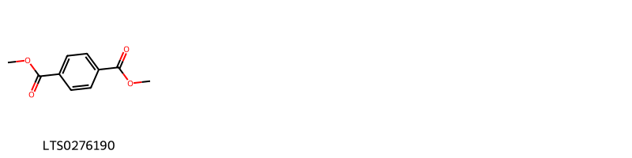{ width=100% }
    <figcaption>Hình ảnh cấu trúc hóa học của 1 hoạt chất thuộc nhóm Benzene and substituted derivatives gồm ['dimethyl terephthalate (LTS0276190)'].</figcaption>
</figure>
#### Nhóm Corynanthean-type alkaloids
<figure markdown="span">
    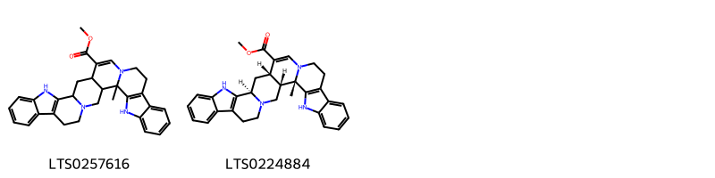{ width=100% }
    <figcaption>Hình ảnh cấu trúc hóa học của 2 hoạt chất thuộc nhóm Corynanthean-type alkaloids gồm ['methyl 2-methyl-4,14,21,31-tetraazaoctacyclo[15.15.0.0²,¹⁴.0³,¹¹.0⁵,¹⁰.0¹⁹,³¹.0²⁰,²⁸.0²²,²⁷]dotriaconta-3(11),5,7,9,15,20(28),22,24,26-nonaene-16-carboxylate (LTS0257616)', 'roxburghine b (LTS0224884)'].</figcaption>
</figure>
#### Nhóm Yohimbine alkaloids
<figure markdown="span">
    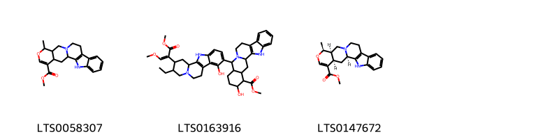{ width=100% }
    <figcaption>Hình ảnh cấu trúc hóa học của 3 hoạt chất thuộc nhóm Yohimbine alkaloids gồm ['ajmalicine (LTS0058307)', 'methyl 14-{2-[(1z)-1,3-dimethoxy-3-oxoprop-1-en-2-yl]-3-ethyl-8-hydroxy-1h,2h,3h,4h,6h,7h,12h,12bh-indolo[2,3-a]quinolizin-9-yl}-18-hydroxy-3,13-diazapentacyclo[11.8.0.0²,¹⁰.0⁴,⁹.0¹⁵,²⁰]henicosa-2(10),4,6,8-tetraene-19-carboxylate (LTS0163916)', 'methyl (1r,15r,16s,20r)-16-methyl-17-oxa-3,13-diazapentacyclo[11.8.0.0²,¹⁰.0⁴,⁹.0¹⁵,²⁰]henicosa-2(10),4,6,8,18-pentaene-19-carboxylate (LTS0147672)'].</figcaption>
</figure>

---

### Dược dân tộc học

Danh sách các quốc gia có sử dụng *Uncaria gambir* trong điều trị các bệnh. 

| Country   | Disease    | Bệnh                                                                                                                                                                                                |
|:----------|:-----------|:----------------------------------------------------------------------------------------------------------------------------------------------------------------------------------------------------|
| Elsewhere | Astringent | MYMEMORY WARNING: YOU USED ALL AVAILABLE FREE TRANSLATIONS FOR TODAY. NEXT AVAILABLE IN  08 HOURS 47 MINUTES 35 SECONDS VISIT HTTPS://MYMEMORY.TRANSLATED.NET/DOC/USAGELIMITS.PHP TO TRANSLATE MORE |

---

---
## Uncaria gambir
### Thông tin về thực vật

!!! info "Phân loại thực vật của *Uncaria gambir* từ GIBF:"
    - **Kingdom:** Plantae
    - **Phylum:** Tracheophyta
    - **Order:** Gentianales
    - **Family:** Rubiaceae
    - **Genus:** Uncaria
    - **Species:** *Uncaria gambir*

 

| Label (VI)   | Label (EN)   | Scientific Name   | Descriptions (VI)   | Descriptions (EN)   | Also Known As (VI)   | Also Known As (EN)   |
|:-------------|:-------------|:------------------|:--------------------|:--------------------|:---------------------|:---------------------|
| N/A          | N/A          | Uncaria gambir    | loài thực vật       | species of plant    | ['']                 | ['']                 |

#### Phân bố trên thế giới

**Từ CSDL GIBF** nan, Sri Lanka, Japan, Germany, Colombia, Chinese Taipei, Myanmar, Argentina, India, Indonesia, unknown or invalid, Congo, Democratic Republic of the, Philippines, Singapore, Malaysia, Brunei Darussalam

#### Phân bố tại Việt Nam

**Từ CSDL GIBF**: Không có ghi nhận ở Việt Nam

---
### Thành phần hóa học
        
- Theo cơ sở dữ liệu lotus: Từ loài *Uncaria gambir* đã phân lập và xác định được 7 hoạt chất thuộc về các nhóm Flavonoids, Indolizidines. 

|    | chemicalTaxonomyClassyfireClass   |   smiles_count |
|---:|:----------------------------------|---------------:|
|  0 | Flavonoids                        |              5 |
|  1 | Indolizidines                     |              2 |

#### Nhóm Flavonoids
<figure markdown="span">
    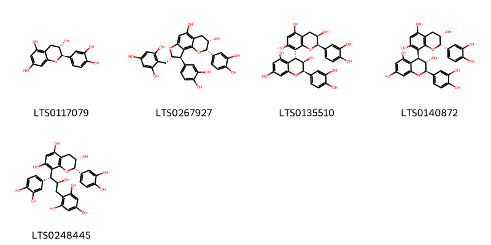{ width=100% }
    <figcaption>Hình ảnh cấu trúc hóa học của 5 hoạt chất thuộc nhóm Flavonoids gồm ['(+)-catechol (LTS0117079)', 'gambiriin b2 (LTS0267927)', '(2r,3r,4r)-2-(3,4-dihydroxyphenyl)-4-[(2r,3r)-2-(3,4-dihydroxyphenyl)-3,5,7-trihydroxy-3,4-dihydro-2h-1-benzopyran-8-yl]-3,4-dihydro-2h-1-benzopyran-3,5,7-triol (LTS0135510)', '(2r,3s,4s)-2-(3,4-dihydroxyphenyl)-4-[(2s,3s)-2-(3,4-dihydroxyphenyl)-3,5,7-trihydroxy-3,4-dihydro-2h-1-benzopyran-8-yl]-3,4-dihydro-2h-1-benzopyran-3,5,7-triol (LTS0140872)', 'gambiriin a2 (LTS0248445)'].</figcaption>
</figure>
#### Nhóm Indolizidines
<figure markdown="span">
    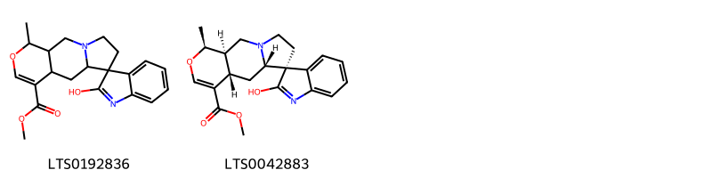{ width=100% }
    <figcaption>Hình ảnh cấu trúc hóa học của 2 hoạt chất thuộc nhóm Indolizidines gồm ["methyl 2-hydroxy-1'-methyl-1',4'a,5',5'a,7',8',10',10'a-octahydrospiro[indole-3,6'-pyrano[3,4-f]indolizine]-4'-carboxylate (LTS0192836)", "methyl (1's,3r,4'as,5'as,10'ar)-2-hydroxy-1'-methyl-1',4'a,5',5'a,7',8',10',10'a-octahydrospiro[indole-3,6'-pyrano[3,4-f]indolizine]-4'-carboxylate (LTS0042883)"].</figcaption>
</figure>

---

### Dược dân tộc học

Danh sách các quốc gia có sử dụng *Uncaria gambir* trong điều trị các bệnh. 

| Country   | Disease    | Bệnh                                                                                                                                                                                                |
|:----------|:-----------|:----------------------------------------------------------------------------------------------------------------------------------------------------------------------------------------------------|
| China     | Astringent | MYMEMORY WARNING: YOU USED ALL AVAILABLE FREE TRANSLATIONS FOR TODAY. NEXT AVAILABLE IN  08 HOURS 47 MINUTES 16 SECONDS VISIT HTTPS://MYMEMORY.TRANSLATED.NET/DOC/USAGELIMITS.PHP TO TRANSLATE MORE |
| Turkey    | Astringent | MYMEMORY WARNING: YOU USED ALL AVAILABLE FREE TRANSLATIONS FOR TODAY. NEXT AVAILABLE IN  08 HOURS 47 MINUTES 14 SECONDS VISIT HTTPS://MYMEMORY.TRANSLATED.NET/DOC/USAGELIMITS.PHP TO TRANSLATE MORE |

---

---
## Uncaria rhynchophylla
### Thông tin về thực vật

!!! info "Phân loại thực vật của *Uncaria rhynchophylla* từ GIBF:"
    - **Kingdom:** Plantae
    - **Phylum:** Tracheophyta
    - **Order:** Gentianales
    - **Family:** Rubiaceae
    - **Genus:** Uncaria
    - **Species:** *Uncaria rhynchophylla*

 

| Label (VI)   | Label (EN)   | Scientific Name       | Descriptions (VI)   | Descriptions (EN)   | Also Known As (VI)   | Also Known As (EN)           |
|:-------------|:-------------|:----------------------|:--------------------|:--------------------|:---------------------|:-----------------------------|
| N/A          | N/A          | Uncaria rhynchophylla | loài thực vật       | species of plant    | ['']                 | ['Uncaria rhynchophylla ex'] |

#### Phân bố trên thế giới

**Từ CSDL GIBF** Japan, Belgium, Lao People’s Democratic Republic, Chinese Taipei, China

#### Phân bố tại Việt Nam

**Từ CSDL GIBF**: Không có ghi nhận ở Việt Nam

---
### Thành phần hóa học
        
- Theo cơ sở dữ liệu lotus: Từ loài *Uncaria rhynchophylla* đã phân lập và xác định được 93 hoạt chất thuộc về các nhóm Yohimbine alkaloids, Flavonoids, Prenol lipids, Indoles and derivatives, Indolizidines, Corynanthean-type alkaloids, Organooxygen compounds, Anthracenes. 

|    | chemicalTaxonomyClassyfireClass   |   smiles_count |
|---:|:----------------------------------|---------------:|
|  0 | Anthracenes                       |              1 |
|  1 | Corynanthean-type alkaloids       |             10 |
|  2 | Flavonoids                        |              7 |
|  3 | Indoles and derivatives           |             23 |
|  4 | Indolizidines                     |             14 |
|  5 | Organooxygen compounds            |              2 |
|  6 | Prenol lipids                     |             31 |
|  7 | Yohimbine alkaloids               |              1 |

#### Nhóm Anthracenes
<figure markdown="span">
    { width=100% }
    <figcaption>Hình ảnh cấu trúc hóa học của 1 hoạt chất thuộc nhóm Anthracenes gồm ['physcion (LTS0052688)'].</figcaption>
</figure>
#### Nhóm Corynanthean-type alkaloids
<figure markdown="span">
    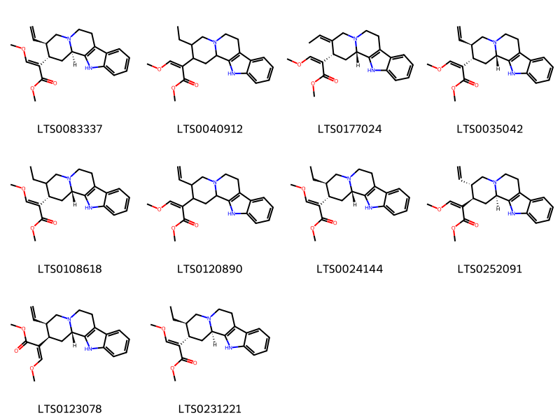{ width=100% }
    <figcaption>Hình ảnh cấu trúc hóa học của 10 hoạt chất thuộc nhóm Corynanthean-type alkaloids gồm ['hirsuteine (LTS0083337)', 'methyl 2-{3-ethyl-1h,2h,3h,4h,6h,7h,12h,12bh-indolo[2,3-a]quinolizin-2-yl}-3-methoxyprop-2-enoate (LTS0040912)', 'geissoschizine methyl ether (LTS0177024)', 'methyl (2z)-2-[(2s,3r,12bs)-3-ethenyl-1h,2h,3h,4h,6h,7h,12h,12bh-indolo[2,3-a]quinolizin-2-yl]-3-methoxyprop-2-enoate (LTS0035042)', 'methyl (2e)-2-[(2s,12bs)-3-ethyl-1h,2h,3h,4h,6h,7h,12h,12bh-indolo[2,3-a]quinolizin-2-yl]-3-methoxyprop-2-enoate (LTS0108618)', 'methyl 2-{3-ethenyl-1h,2h,3h,4h,6h,7h,12h,12bh-indolo[2,3-a]quinolizin-2-yl}-3-methoxyprop-2-enoate (LTS0120890)', 'dihydrocorynantheine (LTS0024144)', 'methyl (2z)-2-[(2r,3s,12br)-3-ethenyl-1h,2h,3h,4h,6h,7h,12h,12bh-indolo[2,3-a]quinolizin-2-yl]-3-methoxyprop-2-enoate (LTS0252091)', 'methyl 2-[(2r,3r,12bs)-3-ethenyl-1h,2h,3h,4h,6h,7h,12h,12bh-indolo[2,3-a]quinolizin-2-yl]-3-methoxyprop-2-enoate (LTS0123078)', 'hirsutine (LTS0231221)'].</figcaption>
</figure>
#### Nhóm Flavonoids
<figure markdown="span">
    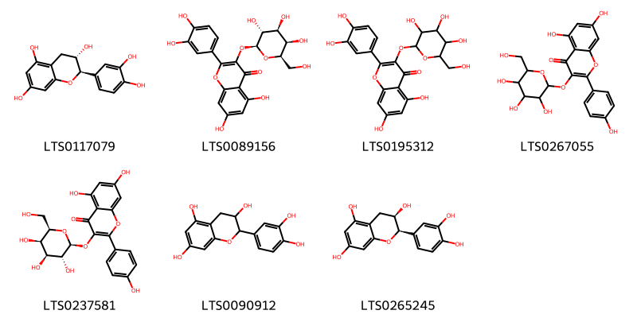{ width=100% }
    <figcaption>Hình ảnh cấu trúc hóa học của 7 hoạt chất thuộc nhóm Flavonoids gồm ['(+)-catechol (LTS0117079)', 'hyperoside (LTS0089156)', '2-(3,4-dihydroxyphenyl)-5,7-dihydroxy-3-{[3,4,5-trihydroxy-6-(hydroxymethyl)oxan-2-yl]oxy}chromen-4-one (LTS0195312)', 'trifolin (LTS0267055)', 'trifolin (LTS0237581)', 'catechol (LTS0090912)', 'ent-epicatechin (LTS0265245)'].</figcaption>
</figure>
#### Nhóm Indoles and derivatives
<figure markdown="span">
    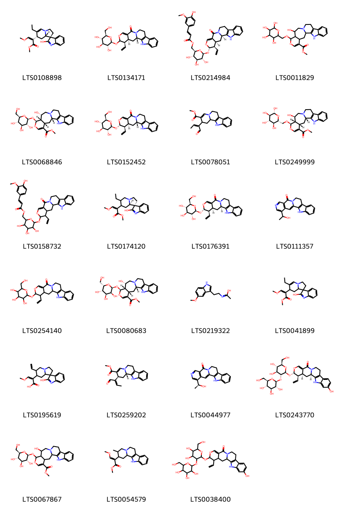{ width=100% }
    <figcaption>Hình ảnh cấu trúc hóa học của 23 hoạt chất thuộc nhóm Indoles and derivatives gồm ["methyl (2z)-2-[(3s,7's,8'as)-6'-ethyl-2-hydroxy-3',7',8',8'a-tetrahydro-2'h-spiro[indole-3,1'-indolizin]-7'-yl]-3-methoxyprop-2-enoate (LTS0108898)", '(1s,19r,20s)-19-ethenyl-18-{[(2s,3r,4s,5s,6r)-3,4,5-trihydroxy-6-(hydroxymethyl)oxan-2-yl]oxy}-17-oxa-3,13-diazapentacyclo[11.8.0.0²,¹⁰.0⁴,⁹.0¹⁵,²⁰]henicosa-2(10),4,6,8,15-pentaen-14-one (LTS0134171)', '[(2r,3s,4s,5r,6s)-6-{[(1r,18s,19r,20s)-19-ethenyl-14-oxo-17-oxa-3,13-diazapentacyclo[11.8.0.0²,¹⁰.0⁴,⁹.0¹⁵,²⁰]henicosa-2(10),4,6,8,15-pentaen-18-yl]oxy}-3,4,5-trihydroxyoxan-2-yl]methyl (2e)-3-(4-hydroxy-3-methoxyphenyl)prop-2-enoate (LTS0214984)', 'methyl 15-hydroxy-17-[(3,4,5,6-tetrahydroxyoxan-2-yl)methoxy]-18-oxa-3,13-diazapentacyclo[11.9.0.0²,¹⁰.0⁴,⁹.0¹⁶,²¹]docosa-2(10),4,6,8,19-pentaene-20-carboxylate (LTS0011829)', 'methyl (1s,15s,16s,17s,21s)-15-hydroxy-17-{[(2s,3r,4s,5s,6r)-3,4,5-trihydroxy-6-(hydroxymethyl)oxan-2-yl]oxy}-18-oxa-3,13-diazapentacyclo[11.9.0.0²,¹⁰.0⁴,⁹.0¹⁶,²¹]docosa-2(10),4,6,8,19-pentaene-20-carboxylate (LTS0068846)', 'strictosamide (LTS0152452)', 'methyl 2-(1-oxobut-2-en-2-yl)-1h,2h,6h,7h,12h,12bh-indolo[2,3-a]quinolizine-3-carboxylate (LTS0078051)', 'methyl (1s,15r,16s,17r,21s)-15-hydroxy-17-{[(2r,3s,4s,5r,6r)-3,4,5,6-tetrahydroxyoxan-2-yl]methoxy}-18-oxa-3,13-diazapentacyclo[11.9.0.0²,¹⁰.0⁴,⁹.0¹⁶,²¹]docosa-2(10),4,6,8,19-pentaene-20-carboxylate (LTS0249999)', '[6-({19-ethenyl-14-oxo-17-oxa-3,13-diazapentacyclo[11.8.0.0²,¹⁰.0⁴,⁹.0¹⁵,²⁰]henicosa-2(10),4,6,8,15-pentaen-18-yl}oxy)-3,4,5-trihydroxyoxan-2-yl]methyl 3-(4-hydroxy-3-methoxyphenyl)prop-2-enoate (LTS0158732)', "methyl 2-[(3r,8'ar)-6'-ethyl-2-hydroxy-3',5',6',7',8',8'a-hexahydro-2'h-spiro[indole-3,1'-indolizin]-7'-yl]-3-methoxyprop-2-enoate (LTS0174120)", '(1r,18s,19r,20s)-19-ethenyl-18-{[(2s,3r,4s,5s,6r)-3,4,5-trihydroxy-6-(hydroxymethyl)oxan-2-yl]oxy}-17-oxa-3,13-diazapentacyclo[11.8.0.0²,¹⁰.0⁴,⁹.0¹⁵,²⁰]henicosa-2(10),4,6,8,15-pentaen-14-one (LTS0176391)', '19-(1-hydroxyethyl)-3,13,17-triazapentacyclo[11.8.0.0²,¹⁰.0⁴,⁹.0¹⁵,²⁰]henicosa-1(21),2(10),4,6,8,15,17,19-octaen-14-one (LTS0111357)', '19-ethenyl-18-{[3,4,5-trihydroxy-6-(hydroxymethyl)oxan-2-yl]oxy}-17-oxa-3,13-diazapentacyclo[11.8.0.0²,¹⁰.0⁴,⁹.0¹⁵,²⁰]henicosa-2(10),4,6,8,15-pentaen-14-one (LTS0254140)', 'methyl (1s,15s,16s,17s,21s)-15-hydroxy-17-{[(2s,3s,4s,5s,6s)-3,4,5-trihydroxy-6-(hydroxymethyl)oxan-2-yl]oxy}-18-oxa-3,13-diazapentacyclo[11.9.0.0²,¹⁰.0⁴,⁹.0¹⁶,²¹]docosa-2(10),4,6,8,19-pentaene-20-carboxylate (LTS0080683)', 'n-[2-(5-methoxy-1h-indol-3-yl)ethyl]ethanimidic acid (LTS0219322)', "methyl 2-{6'-ethyl-2-hydroxy-3',7',8',8'a-tetrahydro-2'h-spiro[indole-3,1'-indolizin]-7'-yl}-3-methoxyprop-2-enoate (LTS0041899)", "2-{6'-ethenyl-2-hydroxy-3',5',6',7',8',8'a-hexahydro-2'h-spiro[indole-3,1'-indolizin]-7'-yl}-3-methoxyprop-2-enoic acid (LTS0195619)", 'methyl (2s,12bs)-2-[(2e)-1-oxobut-2-en-2-yl]-1h,2h,6h,7h,12h,12bh-indolo[2,3-a]quinolizine-3-carboxylate (LTS0259202)', '19-[(1s)-1-hydroxyethyl]-3,13,17-triazapentacyclo[11.8.0.0²,¹⁰.0⁴,⁹.0¹⁵,²⁰]henicosa-1(21),2(10),4,6,8,15,17,19-octaen-14-one (LTS0044977)', '(1r,18s,19r,20s)-18-{[(2s,3r,4s,5s,6r)-4,5-dihydroxy-6-(hydroxymethyl)-3-{[(2s,3r,4s,5s,6r)-3,4,5-trihydroxy-6-(hydroxymethyl)oxan-2-yl]oxy}oxan-2-yl]oxy}-19-ethenyl-6-hydroxy-17-oxa-3,13-diazapentacyclo[11.8.0.0²,¹⁰.0⁴,⁹.0¹⁵,²⁰]henicosa-2(10),4,6,8,15-pentaen-14-one (LTS0243770)', 'methyl 15-hydroxy-17-{[(2s,3r,4s,5s,6r)-3,4,5-trihydroxy-6-(hydroxymethyl)oxan-2-yl]oxy}-18-oxa-3,13-diazapentacyclo[11.9.0.0²,¹⁰.0⁴,⁹.0¹⁶,²¹]docosa-2(10),4,6,8,19-pentaene-20-carboxylate (LTS0067867)', 'methyl (2e)-3-methoxy-2-{3-methyl-1h,2h,3h,4h,6h,7h,12h,12bh-indolo[2,3-a]quinolizin-2-yl}prop-2-enoate (LTS0054579)', '18-{[4,5-dihydroxy-6-(hydroxymethyl)-3-{[3,4,5-trihydroxy-6-(hydroxymethyl)oxan-2-yl]oxy}oxan-2-yl]oxy}-19-ethenyl-6-hydroxy-17-oxa-3,13-diazapentacyclo[11.8.0.0²,¹⁰.0⁴,⁹.0¹⁵,²⁰]henicosa-2(10),4,6,8,15-pentaen-14-one (LTS0038400)'].</figcaption>
</figure>
#### Nhóm Indolizidines
<figure markdown="span">
    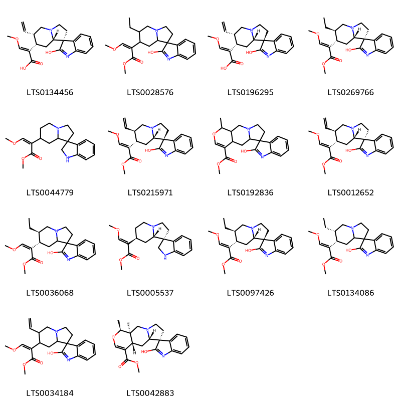{ width=100% }
    <figcaption>Hình ảnh cấu trúc hóa học của 14 hoạt chất thuộc nhóm Indolizidines gồm ["(2e)-2-[(3r,6's,7's,8'as)-6'-ethenyl-2-hydroxy-3',5',6',7',8',8'a-hexahydro-2'h-spiro[indole-3,1'-indolizin]-7'-yl]-3-methoxyprop-2-enoic acid (LTS0134456)", "methyl 2-{6'-ethyl-2-hydroxy-3',5',6',7',8',8'a-hexahydro-2'h-spiro[indole-3,1'-indolizin]-7'-yl}-3-methoxyprop-2-enoate (LTS0028576)", "(2e)-2-[(3s,6's,7's,8'as)-6'-ethenyl-2-hydroxy-3',5',6',7',8',8'a-hexahydro-2'h-spiro[indole-3,1'-indolizin]-7'-yl]-3-methoxyprop-2-enoic acid (LTS0196295)", "methyl (2e)-2-[(3r,6'r,7's,8'as)-6'-ethyl-2-hydroxy-3',5',6',7',8',8'a-hexahydro-2'h-spiro[indole-3,1'-indolizin]-7'-yl]-3-methoxyprop-2-enoate (LTS0269766)", "methyl 2-{1,2,3',5',6',7',8',8'a-octahydro-2'h-spiro[indole-3,1'-indolizin]-7'-yl}-3-methoxyprop-2-enoate (LTS0044779)", "methyl (2e)-2-[(3s,6'r,7's,8'as)-6'-ethenyl-2-hydroxy-3',5',6',7',8',8'a-hexahydro-2'h-spiro[indole-3,1'-indolizin]-7'-yl]-3-methoxyprop-2-enoate (LTS0215971)", "methyl 2-hydroxy-1'-methyl-1',4'a,5',5'a,7',8',10',10'a-octahydrospiro[indole-3,6'-pyrano[3,4-f]indolizine]-4'-carboxylate (LTS0192836)", "methyl (2e)-2-[(3r,6'r,7's,8'as)-6'-ethenyl-2-hydroxy-3',5',6',7',8',8'a-hexahydro-2'h-spiro[indole-3,1'-indolizin]-7'-yl]-3-methoxyprop-2-enoate (LTS0012652)", "methyl (2z)-2-[(6'r,7's)-6'-ethyl-2-hydroxy-3',5',6',7',8',8'a-hexahydro-2'h-spiro[indole-3,1'-indolizin]-7'-yl]-3-methoxyprop-2-enoate (LTS0036068)", "methyl (2e)-2-[(3s,7's,8'as)-1,2,3',5',6',7',8',8'a-octahydro-2'h-spiro[indole-3,1'-indolizin]-7'-yl]-3-methoxyprop-2-enoate (LTS0005537)", 'rhyncophylline (LTS0097426)', "methyl (2e)-2-[(6's,7's)-6'-ethyl-2-hydroxy-3',5',6',7',8',8'a-hexahydro-2'h-spiro[indole-3,1'-indolizin]-7'-yl]-3-methoxyprop-2-enoate (LTS0134086)", "methyl 2-{6'-ethenyl-2-hydroxy-3',5',6',7',8',8'a-hexahydro-2'h-spiro[indole-3,1'-indolizin]-7'-yl}-3-methoxyprop-2-enoate (LTS0034184)", "methyl (1's,3r,4'as,5'as,10'ar)-2-hydroxy-1'-methyl-1',4'a,5',5'a,7',8',10',10'a-octahydrospiro[indole-3,6'-pyrano[3,4-f]indolizine]-4'-carboxylate (LTS0042883)"].</figcaption>
</figure>
#### Nhóm Organooxygen compounds
<figure markdown="span">
    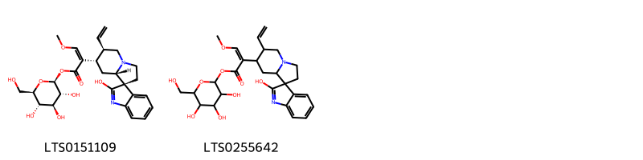{ width=100% }
    <figcaption>Hình ảnh cấu trúc hóa học của 2 hoạt chất thuộc nhóm Organooxygen compounds gồm ["(2s,3r,4s,5s,6r)-3,4,5-trihydroxy-6-(hydroxymethyl)oxan-2-yl (2z)-2-[(3s,6'r,7's,8'as)-6'-ethenyl-2-hydroxy-3',5',6',7',8',8'a-hexahydro-2'h-spiro[indole-3,1'-indolizin]-7'-yl]-3-methoxyprop-2-enoate (LTS0151109)", "3,4,5-trihydroxy-6-(hydroxymethyl)oxan-2-yl 2-{6'-ethenyl-2-hydroxy-3',5',6',7',8',8'a-hexahydro-2'h-spiro[indole-3,1'-indolizin]-7'-yl}-3-methoxyprop-2-enoate (LTS0255642)"].</figcaption>
</figure>
#### Nhóm Prenol lipids
<figure markdown="span">
    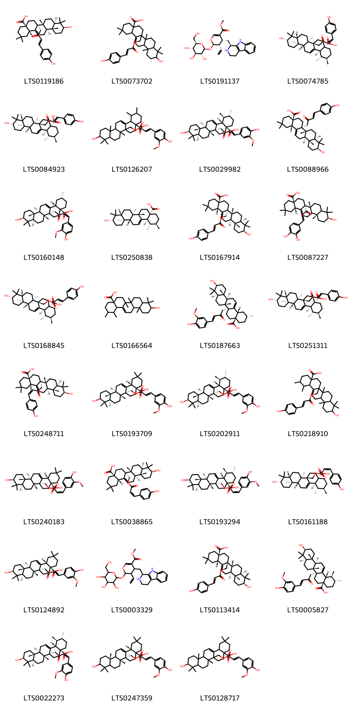{ width=100% }
    <figcaption>Hình ảnh cấu trúc hóa học của 31 hoạt chất thuộc nhóm Prenol lipids gồm ['(4as,6ar,6br,8ar,10s,12ar,12br,14bs)-10-hydroxy-6a-[(3e)-4-(4-hydroxyphenyl)-2-oxobut-3-en-1-yl]-2,2,6b,9,9,12a-hexamethyl-1,3,4,5,6,7,8,8a,10,11,12,12b,13,14b-tetradecahydropicene-4a-carboxylic acid (LTS0119186)', '10-hydroxy-6a-({[3-(4-hydroxyphenyl)prop-2-enoyl]oxy}methyl)-2,2,6b,9,9,12a-hexamethyl-1,3,4,5,6,7,8,8a,10,11,12,12b,13,14b-tetradecahydropicene-4a-carboxylic acid (LTS0073702)', 'methyl (4r,5s,6r)-5-ethenyl-4-[(1s)-1h,2h,3h,4h,9h-pyrido[3,4-b]indol-1-ylmethyl]-6-{[(2s,3r,4s,5s,6r)-3,4,5-trihydroxy-6-(hydroxymethyl)oxan-2-yl]oxy}-5,6-dihydro-4h-pyran-3-carboxylate (LTS0191137)', '(1s,2r,4as,6ar,6br,8ar,10s,12ar,12br,14bs)-10-hydroxy-6a-[(3z)-4-(4-hydroxyphenyl)-2-oxobut-3-en-1-yl]-1,2,6b,9,9,12a-hexamethyl-2,3,4,5,6,7,8,8a,10,11,12,12b,13,14b-tetradecahydro-1h-picene-4a-carboxylic acid (LTS0074785)', '(1s,2r,4as,6ar,6br,8ar,10s,12ar,12br,14bs)-10-hydroxy-6a-[4-(4-hydroxyphenyl)-2-oxobut-3-en-1-yl]-1,2,6b,9,9,12a-hexamethyl-2,3,4,5,6,7,8,8a,10,11,12,12b,13,14b-tetradecahydro-1h-picene-4a-carboxylic acid (LTS0084923)', '10-hydroxy-6a-({[3-(4-hydroxy-3-methoxyphenyl)prop-2-enoyl]oxy}methyl)-1,2,6b,9,9,12a-hexamethyl-2,3,4,5,6,7,8,8a,10,11,12,12b,13,14b-tetradecahydro-1h-picene-4a-carboxylic acid (LTS0126207)', '(1s,2r,4as,6ar,6br,8ar,10s,12ar,12br,14bs)-10-hydroxy-6a-[(3e)-4-(4-hydroxy-3-methoxyphenyl)-2-oxobut-3-en-1-yl]-1,2,6b,9,9,12a-hexamethyl-2,3,4,5,6,7,8,8a,10,11,12,12b,13,14b-tetradecahydro-1h-picene-4a-carboxylic acid (LTS0029982)', '(4as,6ar,6br,8ar,10s,12ar,12br,14bs)-10-hydroxy-6a-[4-(4-hydroxyphenyl)-2-oxobut-3-en-1-yl]-2,2,6b,9,9,12a-hexamethyl-1,3,4,5,6,7,8,8a,10,11,12,12b,13,14b-tetradecahydropicene-4a-carboxylic acid (LTS0088966)', '(2r,4as,6ar,6br,8ar,10s,12ar,12br,14bs)-10-hydroxy-6a-[(3z)-4-(4-hydroxy-3-methoxyphenyl)-2-oxobut-3-en-1-yl]-2,6b,9,9,12a-pentamethyl-2,3,4,5,6,7,8,8a,10,11,12,12b,13,14b-tetradecahydro-1h-picene-4a-carboxylic acid (LTS0160148)', 'ursolic acid (LTS0250838)', '(4as,6ar,6br,8ar,10s,12ar,12br,14bs)-10-hydroxy-6a-({[(2e)-3-(4-hydroxyphenyl)prop-2-enoyl]oxy}methyl)-2,2,6b,9,9,12a-hexamethyl-1,3,4,5,6,7,8,8a,10,11,12,12b,13,14b-tetradecahydropicene-4a-carboxylic acid (LTS0167914)', '(4as,6ar,6br,10s,12ar,14bs)-6a-[(2e)-3-(3,4-dihydroxyphenyl)prop-2-enoyl]-10-hydroxy-2,2,6b,9,9,12a-hexamethyl-1,3,4,5,6,7,8,8a,10,11,12,12b,13,14b-tetradecahydropicene-4a-carboxylic acid (LTS0087227)', '(1s,2r,4as,6ar,6br,8ar,10s,12ar,12br,14bs)-10-hydroxy-6a-({[(2e)-3-(4-hydroxyphenyl)prop-2-enoyl]oxy}methyl)-1,2,6b,9,9,12a-hexamethyl-2,3,4,5,6,7,8,8a,10,11,12,12b,13,14b-tetradecahydro-1h-picene-4a-carboxylic acid (LTS0168845)', '10-hydroxy-1,2,6a,6b,9,9,12a-heptamethyl-2,3,4,5,6,7,8,8a,10,11,12,12b,13,14b-tetradecahydro-1h-picene-4a-carboxylic acid (LTS0166564)', '(2r,4as,6ar,6br,8ar,10s,12ar,12br,14bs)-10-hydroxy-6a-[4-(4-hydroxy-3-methoxyphenyl)-2-oxobut-3-en-1-yl]-2,6b,9,9,12a-pentamethyl-2,3,4,5,6,7,8,8a,10,11,12,12b,13,14b-tetradecahydro-1h-picene-4a-carboxylic acid (LTS0187663)', '(1s,2r,4as,6ar,6br,8ar,10s,12ar,12br,14bs)-10-hydroxy-6a-[(3e)-4-(4-hydroxyphenyl)-2-oxobut-3-en-1-yl]-1,2,6b,9,9,12a-hexamethyl-2,3,4,5,6,7,8,8a,10,11,12,12b,13,14b-tetradecahydro-1h-picene-4a-carboxylic acid (LTS0251311)', '(4as,6ar,6br,8ar,10s,12ar,12br,14bs)-10-hydroxy-6a-[(3z)-4-(4-hydroxyphenyl)-2-oxobut-3-en-1-yl]-2,2,6b,9,9,12a-hexamethyl-1,3,4,5,6,7,8,8a,10,11,12,12b,13,14b-tetradecahydropicene-4a-carboxylic acid (LTS0248711)', '(4as,6ar,6br,8ar,10s,12ar,12br,14bs)-10-hydroxy-6a-({[(2e)-3-(4-hydroxy-3-methoxyphenyl)prop-2-enoyl]oxy}methyl)-2,2,6b,9,9,12a-hexamethyl-1,3,4,5,6,7,8,8a,10,11,12,12b,13,14b-tetradecahydropicene-4a-carboxylic acid (LTS0193709)', '(1s,2r,4as,6ar,6br,8ar,10s,12ar,12br,14bs)-10-hydroxy-6a-({[(2e)-3-(4-hydroxy-3-methoxyphenyl)prop-2-enoyl]oxy}methyl)-1,2,6b,9,9,12a-hexamethyl-2,3,4,5,6,7,8,8a,10,11,12,12b,13,14b-tetradecahydro-1h-picene-4a-carboxylic acid (LTS0202911)', '10-hydroxy-6a-({[3-(4-hydroxyphenyl)prop-2-enoyl]oxy}methyl)-1,2,6b,9,9,12a-hexamethyl-2,3,4,5,6,7,8,8a,10,11,12,12b,13,14b-tetradecahydro-1h-picene-4a-carboxylic acid (LTS0218910)', '(4as,6ar,6br,8ar,10s,12ar,12br,14bs)-10-hydroxy-6a-({[(2z)-3-(4-hydroxy-3-methoxyphenyl)prop-2-enoyl]oxy}methyl)-2,2,6b,9,9,12a-hexamethyl-1,3,4,5,6,7,8,8a,10,11,12,12b,13,14b-tetradecahydropicene-4a-carboxylic acid (LTS0240183)', '(4as,6ar,6br,8ar,10s,12ar,12br,14bs)-10-hydroxy-6a-({[(2z)-3-(4-hydroxyphenyl)prop-2-enoyl]oxy}methyl)-2,2,6b,9,9,12a-hexamethyl-1,3,4,5,6,7,8,8a,10,11,12,12b,13,14b-tetradecahydropicene-4a-carboxylic acid (LTS0038865)', '(1s,2r,4as,6ar,6br,8ar,10s,12ar,12br,14bs)-10-hydroxy-6a-({[(2z)-3-(4-hydroxy-3-methoxyphenyl)prop-2-enoyl]oxy}methyl)-1,2,6b,9,9,12a-hexamethyl-2,3,4,5,6,7,8,8a,10,11,12,12b,13,14b-tetradecahydro-1h-picene-4a-carboxylic acid (LTS0193294)', '(1s,2r,4as,6ar,6br,8ar,10s,12ar,12br,14bs)-10-hydroxy-6a-({[(2z)-3-(4-hydroxyphenyl)prop-2-enoyl]oxy}methyl)-1,2,6b,9,9,12a-hexamethyl-2,3,4,5,6,7,8,8a,10,11,12,12b,13,14b-tetradecahydro-1h-picene-4a-carboxylic acid (LTS0161188)', '(4as,6ar,6br,8ar,10s,12ar,12br,14bs)-10-hydroxy-6a-[(3e)-4-(4-hydroxy-3-methoxyphenyl)-2-oxobut-3-en-1-yl]-2,2,6b,9,9,12a-hexamethyl-1,3,4,5,6,7,8,8a,10,11,12,12b,13,14b-tetradecahydropicene-4a-carboxylic acid (LTS0124892)', 'methyl 5-ethenyl-4-{1h,2h,3h,4h,9h-pyrido[3,4-b]indol-1-ylmethyl}-6-{[3,4,5-trihydroxy-6-(hydroxymethyl)oxan-2-yl]oxy}-5,6-dihydro-4h-pyran-3-carboxylate (LTS0003329)', '(4as,6as,6br,8ar,10s,12ar,12br,14bs)-10-hydroxy-6a-({[(2e)-3-(4-hydroxyphenyl)prop-2-enoyl]oxy}methyl)-2,2,6b,9,9,12a-hexamethyl-1,3,4,5,6,7,8,8a,10,11,12,12b,13,14b-tetradecahydropicene-4a-carboxylic acid (LTS0113414)', '(1s,2r,4as,6ar,6br,8ar,10s,12ar,12br,14bs)-10-hydroxy-6a-[4-(4-hydroxy-3-methoxyphenyl)-2-oxobut-3-en-1-yl]-1,2,6b,9,9,12a-hexamethyl-2,3,4,5,6,7,8,8a,10,11,12,12b,13,14b-tetradecahydro-1h-picene-4a-carboxylic acid (LTS0005827)', '(1s,2r,4as,6ar,6br,8ar,10s,12ar,12br,14bs)-10-hydroxy-6a-[(3z)-4-(4-hydroxy-3-methoxyphenyl)-2-oxobut-3-en-1-yl]-1,2,6b,9,9,12a-hexamethyl-2,3,4,5,6,7,8,8a,10,11,12,12b,13,14b-tetradecahydro-1h-picene-4a-carboxylic acid (LTS0022273)', '(6ar,6br,12ar,14bs)-10-hydroxy-6a-({[(2e)-3-(4-hydroxy-3-methoxyphenyl)prop-2-enoyl]oxy}methyl)-2,2,6b,9,9,12a-hexamethyl-1,3,4,5,6,7,8,8a,10,11,12,12b,13,14b-tetradecahydropicene-4a-carboxylic acid (LTS0247359)', '10-hydroxy-6a-({[3-(4-hydroxy-3-methoxyphenyl)prop-2-enoyl]oxy}methyl)-2,2,6b,9,9,12a-hexamethyl-1,3,4,5,6,7,8,8a,10,11,12,12b,13,14b-tetradecahydropicene-4a-carboxylic acid (LTS0128717)'].</figcaption>
</figure>
#### Nhóm Yohimbine alkaloids
<figure markdown="span">
    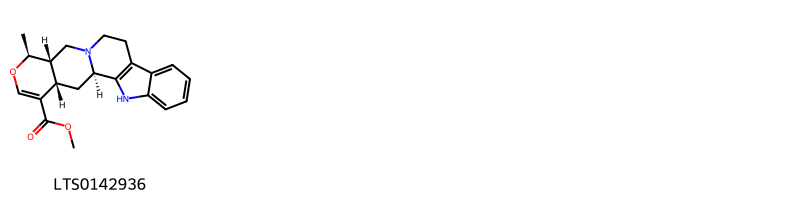{ width=100% }
    <figcaption>Hình ảnh cấu trúc hóa học của 1 hoạt chất thuộc nhóm Yohimbine alkaloids gồm ['akuammigine (LTS0142936)'].</figcaption>
</figure>

---

### Dược dân tộc học

Danh sách các quốc gia có sử dụng *Uncaria rhynchophylla* trong điều trị các bệnh. 

| Country   | Disease    | Bệnh                                                                                                                                                                                                |
|:----------|:-----------|:----------------------------------------------------------------------------------------------------------------------------------------------------------------------------------------------------|
| China     | Astringent | MYMEMORY WARNING: YOU USED ALL AVAILABLE FREE TRANSLATIONS FOR TODAY. NEXT AVAILABLE IN  08 HOURS 46 MINUTES 50 SECONDS VISIT HTTPS://MYMEMORY.TRANSLATED.NET/DOC/USAGELIMITS.PHP TO TRANSLATE MORE |
| Elsewhere | Sedative   | MYMEMORY WARNING: YOU USED ALL AVAILABLE FREE TRANSLATIONS FOR TODAY. NEXT AVAILABLE IN  08 HOURS 46 MINUTES 47 SECONDS VISIT HTTPS://MYMEMORY.TRANSLATED.NET/DOC/USAGELIMITS.PHP TO TRANSLATE MORE |

---

---
## Uncaria talbotii
### Thông tin về thực vật

!!! info "Phân loại thực vật của *Uncaria talbotii* từ GIBF:"
    - **Kingdom:** Plantae
    - **Phylum:** Tracheophyta
    - **Order:** Gentianales
    - **Family:** Rubiaceae
    - **Genus:** Uncaria
    - **Species:** *Uncaria talbotii*

 

| Label (VI)   | Label (EN)   | Scientific Name   | Descriptions (VI)   | Descriptions (EN)   | Also Known As (VI)   | Also Known As (EN)   |
|:-------------|:-------------|:------------------|:--------------------|:--------------------|:---------------------|:---------------------|
| N/A          | N/A          | Uncaria talbotii  |                     | species of plant    | ['']                 | ['']                 |

#### Phân bố trên thế giới

**Từ CSDL GIBF** nan, Ghana, Central African Republic, Nigeria, Gabon, Côte d’Ivoire, Congo, Democratic Republic of the, Guinea, Liberia, Sierra Leone, Togo

#### Phân bố tại Việt Nam

**Từ CSDL GIBF**: Không có ghi nhận ở Việt Nam

---
### Thành phần hóa học
        
- Theo cơ sở dữ liệu lotus: Từ loài *Uncaria talbotii* đã phân lập và xác định được Chưa có hoạt chất nào được phân lập. hoạt chất thuộc về các nhóm Không có hoạt chất nào được phân lập. 

Không có hình ảnh nào được tạo ra

---

### Dược dân tộc học

Danh sách các quốc gia có sử dụng *Uncaria talbotii* trong điều trị các bệnh. 

| Country   | Disease    | Bệnh                                                                                                                                                                                                |
|:----------|:-----------|:----------------------------------------------------------------------------------------------------------------------------------------------------------------------------------------------------|
| Ghana     | Dentifrice | MYMEMORY WARNING: YOU USED ALL AVAILABLE FREE TRANSLATIONS FOR TODAY. NEXT AVAILABLE IN  08 HOURS 46 MINUTES 21 SECONDS VISIT HTTPS://MYMEMORY.TRANSLATED.NET/DOC/USAGELIMITS.PHP TO TRANSLATE MORE |

---

# Chi Sesamum

??? note "Danh sách các dược liệu thuộc chi"
    
	 - *Sesamum indicum*

---
## Sesamum indicum
### Thông tin về thực vật

!!! info "Phân loại thực vật của *Sesamum indicum* từ GIBF:"
    - **Kingdom:** Plantae
    - **Phylum:** Tracheophyta
    - **Order:** Lamiales
    - **Family:** Pedaliaceae
    - **Genus:** Sesamum
    - **Species:** *Sesamum indicum*

 

| Label (VI)   | Label (EN)   | Scientific Name   | Descriptions (VI)   | Descriptions (EN)                               | Also Known As (VI)   | Also Known As (EN)                             |
|:-------------|:-------------|:------------------|:--------------------|:------------------------------------------------|:---------------------|:-----------------------------------------------|
| N/A          | N/A          | Sesamum indicum   |                     | flowering plant cultivated for its edible seeds | ['']                 | ['Sesamum indicum', 'sesame plant', 'Sim sim'] |

#### Phân bố trên thế giới

**Từ CSDL GIBF** nan, United Arab Emirates, Sri Lanka, Australia, Angola, Guatemala, Palestine, State of, Argentina, Benin, Tanzania, United Republic of, Venezuela (Bolivarian Republic of), French Guiana, Malawi, Pakistan, Nigeria, Korea, Republic of, Chinese Taipei, Spain, Honduras, Russian Federation, United States of America, Thailand, Brazil, Peru, Mexico, Singapore, Viet Nam, China, Madagascar, Colombia, India, Indonesia, Burkina Faso, Nepal

#### Phân bố tại Việt Nam

**Từ CSDL GIBF**: Quảng Ngãi

---
### Thành phần hóa học
        
- Theo cơ sở dữ liệu lotus: Từ loài *Sesamum indicum* đã phân lập và xác định được 151 hoạt chất thuộc về các nhóm Fatty Acyls, Lignan glycosides, Flavonoids, Prenol lipids, Steroids and steroid derivatives, Naphthalenes, Cinnamic acids and derivatives, Benzodioxoles, Dibenzylbutane lignans, 2-arylbenzofuran flavonoids, Organooxygen compounds, Phenols, Furanoid lignans, Anthracenes. 

|    | chemicalTaxonomyClassyfireClass   |   smiles_count |
|---:|:----------------------------------|---------------:|
|  0 | 2-arylbenzofuran flavonoids       |              2 |
|  1 | Anthracenes                       |             11 |
|  2 | Benzodioxoles                     |              7 |
|  3 | Cinnamic acids and derivatives    |             18 |
|  4 | Dibenzylbutane lignans            |              4 |
|  5 | Fatty Acyls                       |             13 |
|  6 | Flavonoids                        |              2 |
|  7 | Furanoid lignans                  |             31 |
|  8 | Lignan glycosides                 |              6 |
|  9 | Naphthalenes                      |              1 |
| 10 | Organooxygen compounds            |             14 |
| 11 | Phenols                           |              7 |
| 12 | Prenol lipids                     |             15 |
| 13 | Steroids and steroid derivatives  |             18 |

#### Nhóm 2-arylbenzofuran flavonoids
<figure markdown="span">
    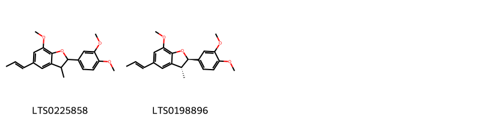{ width=100% }
    <figcaption>Hình ảnh cấu trúc hóa học của 2 hoạt chất thuộc nhóm 2-arylbenzofuran flavonoids gồm ['2-(3,4-dimethoxyphenyl)-7-methoxy-3-methyl-5-(prop-1-en-1-yl)-2,3-dihydro-1-benzofuran (LTS0225858)', 'acuminatin (LTS0198896)'].</figcaption>
</figure>
#### Nhóm Anthracenes
<figure markdown="span">
    { width=100% }
    <figcaption>Hình ảnh cấu trúc hóa học của 11 hoạt chất thuộc nhóm Anthracenes gồm ['1,2,4-trihydroxy-3-(4-methylpent-3-en-1-yl)anthracene-9,10-dione (LTS0076305)', '2,3-dihydroxy-6-[(3z)-5-hydroxy-4-methylpent-3-en-1-yl]anthracene-9,10-dione (LTS0110155)', '2-(4-methylpent-3-en-1-yl)anthracene-9,10-dione (LTS0264358)', '2-chloro-1,4-dihydroxy-3-(4-methylpent-3-en-1-yl)anthracene-9,10-dione (LTS0206407)', '1,4-dihydroxy-2-(4-methylpent-3-en-1-yl)anthracene-9,10-dione (LTS0143371)', '2-[(1z)-4-methylpenta-1,3-dien-1-yl]anthracene-9,10-dione (LTS0092110)', '2,3-dihydroxy-6-(5-hydroxy-4-methylpent-3-en-1-yl)anthracene-9,10-dione (LTS0149199)', '1-hydroxy-2-(4-methylpent-3-en-1-yl)anthracene-9,10-dione (LTS0238783)', '2-[(1e)-4-methylpenta-1,3-dien-1-yl]anthracene-9,10-dione (LTS0237333)', '1,2-dihydroxy-3-(4-methylpent-3-en-1-yl)anthracene-9,10-dione (LTS0197595)', '2-(4-methylpenta-1,3-dien-1-yl)anthracene-9,10-dione (LTS0025227)'].</figcaption>
</figure>
#### Nhóm Benzodioxoles
<figure markdown="span">
    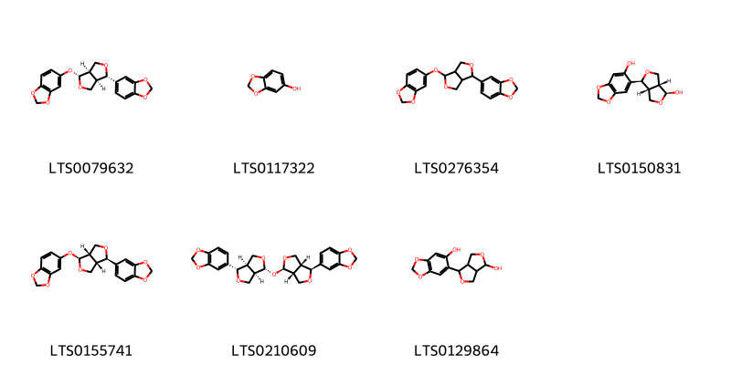{ width=100% }
    <figcaption>Hình ảnh cấu trúc hóa học của 7 hoạt chất thuộc nhóm Benzodioxoles gồm ['sesamolin (LTS0079632)', 'sesamol (LTS0117322)', 'sesamolin (LTS0276354)', '6-[(1s,3ar,4s,6ar)-4-hydroxy-hexahydrofuro[3,4-c]furan-1-yl]-2h-1,3-benzodioxol-5-ol (LTS0150831)', '5-[(1r,3as,4s,6as)-4-(2h-1,3-benzodioxol-5-yloxy)-hexahydrofuro[3,4-c]furan-1-yl]-2h-1,3-benzodioxole (LTS0155741)', '5-[(1s,3ar,4r,6ar)-4-{[(1r,3ar,4s,6ar)-4-(2h-1,3-benzodioxol-5-yl)-hexahydrofuro[3,4-c]furan-1-yl]oxy}-hexahydrofuro[3,4-c]furan-1-yl]-2h-1,3-benzodioxole (LTS0210609)', '6-{4-hydroxy-hexahydrofuro[3,4-c]furan-1-yl}-2h-1,3-benzodioxol-5-ol (LTS0129864)'].</figcaption>
</figure>
#### Nhóm Cinnamic acids and derivatives
<figure markdown="span">
    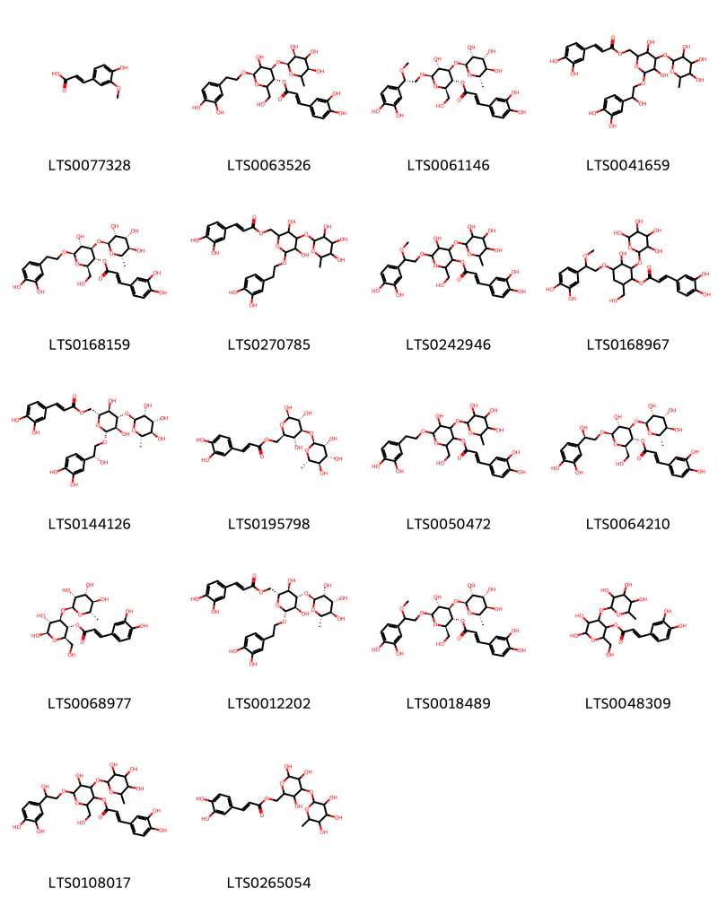{ width=100% }
    <figcaption>Hình ảnh cấu trúc hóa học của 18 hoạt chất thuộc nhóm Cinnamic acids and derivatives gồm ['ferulic acid (LTS0077328)', '(3r,4r,6r)-6-[2-(3,4-dihydroxyphenyl)ethoxy]-5-hydroxy-2-(hydroxymethyl)-4-{[(2s,3s,5r)-3,4,5-trihydroxy-6-methyloxan-2-yl]oxy}oxan-3-yl (2e)-3-(3,4-dihydroxyphenyl)prop-2-enoate (LTS0063526)', '(2r,3r,4r,5r,6r)-6-[(2s)-2-(3,4-dihydroxyphenyl)-2-methoxyethoxy]-5-hydroxy-2-(hydroxymethyl)-4-{[(2s,3r,4r,5r,6s)-3,4,5-trihydroxy-6-methyloxan-2-yl]oxy}oxan-3-yl (2e)-3-(3,4-dihydroxyphenyl)prop-2-enoate (LTS0061146)', '{6-[2-(3,4-dihydroxyphenyl)-2-hydroxyethoxy]-3,5-dihydroxy-4-[(3,4,5-trihydroxy-6-methyloxan-2-yl)oxy]oxan-2-yl}methyl 3-(3,4-dihydroxyphenyl)prop-2-enoate (LTS0041659)', 'verbascoside (LTS0168159)', '{6-[2-(3,4-dihydroxyphenyl)ethoxy]-3,5-dihydroxy-4-[(3,4,5-trihydroxy-6-methyloxan-2-yl)oxy]oxan-2-yl}methyl 3-(3,4-dihydroxyphenyl)prop-2-enoate (LTS0270785)', '6-[2-(3,4-dihydroxyphenyl)-2-methoxyethoxy]-5-hydroxy-2-(hydroxymethyl)-4-[(3,4,5-trihydroxy-6-methyloxan-2-yl)oxy]oxan-3-yl 3-(3,4-dihydroxyphenyl)prop-2-enoate (LTS0242946)', '4-[2-(3,4-dihydroxyphenyl)-2-methoxyethoxy]-3-hydroxy-6-(hydroxymethyl)-2-[(3,4,5,6-tetrahydroxyoxan-2-yl)oxy]cyclohexyl 3-(3,4-dihydroxyphenyl)prop-2-enoate (LTS0168967)', '[(2r,3r,4s,5r,6r)-6-[(2r)-2-(3,4-dihydroxyphenyl)-2-hydroxyethoxy]-3,5-dihydroxy-4-{[(2s,3r,4r,5r,6s)-3,4,5-trihydroxy-6-methyloxan-2-yl]oxy}oxan-2-yl]methyl (2e)-3-(3,4-dihydroxyphenyl)prop-2-enoate (LTS0144126)', '[(2r,3r,4s,5r,6r)-3,5,6-trihydroxy-4-{[(2s,3r,4r,5r,6s)-3,4,5-trihydroxy-6-methyloxan-2-yl]oxy}oxan-2-yl]methyl (2e)-3-(3,4-dihydroxyphenyl)prop-2-enoate (LTS0195798)', '6-[2-(3,4-dihydroxyphenyl)ethoxy]-5-hydroxy-2-(hydroxymethyl)-4-[(3,4,5-trihydroxy-6-methyloxan-2-yl)oxy]oxan-3-yl 3-(3,4-dihydroxyphenyl)prop-2-enoate (LTS0050472)', '(2r,3r,4r,5r,6r)-6-[(2r)-2-(3,4-dihydroxyphenyl)-2-hydroxyethoxy]-5-hydroxy-2-(hydroxymethyl)-4-{[(2s,3r,4r,5r,6s)-3,4,5-trihydroxy-6-methyloxan-2-yl]oxy}oxan-3-yl (2e)-3-(3,4-dihydroxyphenyl)prop-2-enoate (LTS0064210)', '(2r,3r,4r,5r,6r)-5,6-dihydroxy-2-(hydroxymethyl)-4-{[(2s,3r,4r,5r,6s)-3,4,5-trihydroxy-6-methyloxan-2-yl]oxy}oxan-3-yl (2e)-3-(3,4-dihydroxyphenyl)prop-2-enoate (LTS0068977)', 'isoacteoside (LTS0012202)', '(2r,3r,4r,5r,6r)-6-[2-(3,4-dihydroxyphenyl)-2-methoxyethoxy]-5-hydroxy-2-(hydroxymethyl)-4-{[(2s,3r,4r,5r,6s)-3,4,5-trihydroxy-6-methyloxan-2-yl]oxy}oxan-3-yl (2e)-3-(3,4-dihydroxyphenyl)prop-2-enoate (LTS0018489)', '5,6-dihydroxy-2-(hydroxymethyl)-4-[(3,4,5-trihydroxy-6-methyloxan-2-yl)oxy]oxan-3-yl 3-(3,4-dihydroxyphenyl)prop-2-enoate (LTS0048309)', '6-[2-(3,4-dihydroxyphenyl)-2-hydroxyethoxy]-5-hydroxy-2-(hydroxymethyl)-4-[(3,4,5-trihydroxy-6-methyloxan-2-yl)oxy]oxan-3-yl 3-(3,4-dihydroxyphenyl)prop-2-enoate (LTS0108017)', '{3,5,6-trihydroxy-4-[(3,4,5-trihydroxy-6-methyloxan-2-yl)oxy]oxan-2-yl}methyl 3-(3,4-dihydroxyphenyl)prop-2-enoate (LTS0265054)'].</figcaption>
</figure>
#### Nhóm Dibenzylbutane lignans
<figure markdown="span">
    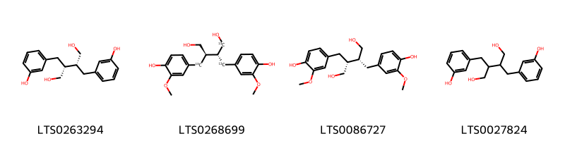{ width=100% }
    <figcaption>Hình ảnh cấu trúc hóa học của 4 hoạt chất thuộc nhóm Dibenzylbutane lignans gồm ['(-)-enterodiol (LTS0263294)', '(2s,3r)-2,3-bis[(4-hydroxy-3-methoxyphenyl)(¹³c)methyl](1-¹³c)butane-1,4-diol (LTS0268699)', 'secoisolariciresinol (LTS0086727)', '2,3-bis[(3-hydroxyphenyl)methyl]butane-1,4-diol (LTS0027824)'].</figcaption>
</figure>
#### Nhóm Fatty Acyls
<figure markdown="span">
    { width=100% }
    <figcaption>Hình ảnh cấu trúc hóa học của 13 hoạt chất thuộc nhóm Fatty Acyls gồm ['stearic acid (LTS0237766)', 'palmitic acid (LTS0079439)', 'gadoleic acid (LTS0227586)', 'gamma-linolenic acid (LTS0160094)', 'behenic acid (LTS0058784)', 'palmitoleic acid (LTS0261591)', 'oleic acid (LTS0256910)', 'myristic acid (LTS0102566)', 'arachidonic acid (LTS0241153)', '(2r,3r,4r,5r)-1,2,5-trihydroxy-6-oxo-4-{[(2s,3r,4r,5r,6s)-3,4,5-trihydroxy-6-methyloxan-2-yl]oxy}hexan-3-yl (2e)-3-(3,4-dihydroxyphenyl)prop-2-enoate (LTS0248847)', 'α-linolenic acid (LTS0275508)', 'α linolenic acid (LTS0132789)', 'linoleic (LTS0013198)'].</figcaption>
</figure>
#### Nhóm Flavonoids
<figure markdown="span">
    { width=100% }
    <figcaption>Hình ảnh cấu trúc hóa học của 2 hoạt chất thuộc nhóm Flavonoids gồm ['2-(3,4-dihydroxyphenyl)-5-hydroxy-7-methoxy-6-{[3,4,5-trihydroxy-6-(hydroxymethyl)oxan-2-yl]oxy}chromen-4-one (LTS0070176)', '2-(3,4-dihydroxyphenyl)-5-hydroxy-7-methoxy-6-{[(2s,3r,4s,5s,6r)-3,4,5-trihydroxy-6-(hydroxymethyl)oxan-2-yl]oxy}chromen-4-one (LTS0224633)'].</figcaption>
</figure>
#### Nhóm Furanoid lignans
<figure markdown="span">
    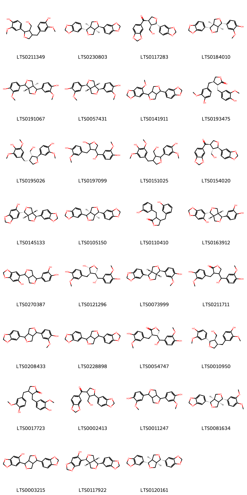{ width=100% }
    <figcaption>Hình ảnh cấu trúc hóa học của 31 hoạt chất thuộc nhóm Furanoid lignans gồm ['4-{4-[(4-hydroxy-3-methoxyphenyl)methyl]-3-(hydroxymethyl)oxolan-2-yl}-2-methoxyphenol (LTS0211349)', '5-[(1s,3ar,4r,6ar)-4-(2h-1,3-benzodioxol-5-yl)-hexahydrofuro[3,4-c]furan-1-yl]-2h-1,3-benzodioxole (LTS0230803)', '[(2s,3r,4r)-2-(2h-1,3-benzodioxol-5-yl)-4-(2h-1,3-benzodioxole-5-carbonyl)oxolan-3-yl]methanol (LTS0117283)', '4-[(1s,3ar,4s,6ar)-4-(2h-1,3-benzodioxol-5-yl)-hexahydrofuro[3,4-c]furan-1-yl]-2-methoxyphenol (LTS0184010)', '4-[(3ar,6as)-4-(4-hydroxy-3-methoxyphenyl)-hexahydrofuro[3,4-c]furan-1-yl]-2-methoxyphenol (LTS0191067)', 'pinoresinol (LTS0057431)', '5-[4-(2h-1,3-benzodioxol-5-yl)-hexahydrofuro[3,4-c]furan-1-yl]-6-methoxy-2h-1,3-benzodioxole (LTS0141911)', 'matairesinol (LTS0193475)', '4-[(2s,3r,4r)-4-[(4-hydroxy-3,5-dimethoxyphenyl)methyl]-3-(hydroxymethyl)oxolan-2-yl]-2-methoxyphenol (LTS0195026)', '4-[hydroxy(4-hydroxy-3-methoxyphenyl)methyl]-3-[(4-hydroxy-3-methoxyphenyl)methyl]oxolan-2-ol (LTS0197099)', '4-{4-[(4-hydroxy-3,5-dimethoxyphenyl)methyl]-3-(hydroxymethyl)oxolan-2-yl}-2-methoxyphenol (LTS0151025)', '[(2r,3s,4r)-2-(2h-1,3-benzodioxol-5-yl)-4-(2h-1,3-benzodioxole-5-carbonyl)oxolan-3-yl]methanol (LTS0154020)', '6-[(1r,3ar,4s,6ar)-4-(2h-1,3-benzodioxol-5-yl)-hexahydrofuro[3,4-c]furan-1-yl]-2h-1,3-benzodioxol-5-ol (LTS0145133)', '5-[(3ar,4r,6ar)-4-(2h-1,3-benzodioxol-5-yl)-hexahydrofuro[3,4-c]furan-1-yl]-2h-1,3-benzodioxole (LTS0105150)', 'hpmf (LTS0110410)', '4-[(1s,3ar,4r,6ar)-4-(6-hydroxy-2h-1,3-benzodioxol-5-yl)-hexahydrofuro[3,4-c]furan-1-yl]benzene-1,2-diol (LTS0163912)', '4-[4-(6-hydroxy-2h-1,3-benzodioxol-5-yl)-hexahydrofuro[3,4-c]furan-1-yl]benzene-1,2-diol (LTS0270387)', '(2r,3r,4r)-4-[(r)-hydroxy(4-hydroxy-3-methoxyphenyl)methyl]-3-[(4-hydroxy-3-methoxyphenyl)methyl]oxolan-2-ol (LTS0121296)', '4-[(1r,3as,4r,6as)-4-(2h-1,3-benzodioxol-5-yl)-hexahydrofuro[3,4-c]furan-1-yl]-2-methoxyphenol (LTS0073999)', '4-[hydroxy(4-hydroxy-3-methoxyphenyl)methyl]-3-[(4-hydroxy-3-methoxyphenyl)methyl]oxolan-2-one (LTS0211711)', '4-[4-(2h-1,3-benzodioxol-5-yl)-hexahydrofuro[3,4-c]furan-1-yl]-2-methoxyphenol (LTS0208433)', 'sesamin (LTS0228898)', 'hydroxymatairesinol (LTS0054747)', 'lariciresinol (LTS0010950)', '3,4-bis[(4-hydroxy-3-methoxyphenyl)methyl]oxolan-2-one (LTS0017723)', '[2-(2h-1,3-benzodioxol-5-yl)-4-(2h-1,3-benzodioxole-5-carbonyl)oxolan-3-yl]methanol (LTS0002413)', 'pinoresinol (LTS0011247)', '5-[(1s,3ar,4s,6ar)-4-(3,4-dimethoxyphenyl)-hexahydrofuro[3,4-c]furan-1-yl]-2h-1,3-benzodioxole (LTS0081634)', '6-[4-(2h-1,3-benzodioxol-5-yl)-hexahydrofuro[3,4-c]furan-1-yl]-2h-1,3-benzodioxol-5-ol (LTS0003215)', '6-[(1s,3ar,4s,6ar)-4-(2h-1,3-benzodioxol-5-yl)-hexahydrofuro[3,4-c]furan-1-yl]-2h-1,3-benzodioxol-5-ol (LTS0117922)', 'sesamin (LTS0120161)'].</figcaption>
</figure>
#### Nhóm Lignan glycosides
<figure markdown="span">
    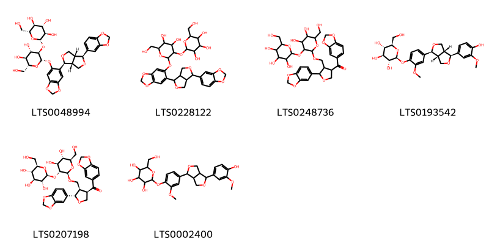{ width=100% }
    <figcaption>Hình ảnh cấu trúc hóa học của 6 hoạt chất thuộc nhóm Lignan glycosides gồm ['(2s,3r,4s,5s,6r)-2-{[(2s,3r,4s,5s,6r)-2-({6-[(1s,3ar,4s,6ar)-4-(2h-1,3-benzodioxol-5-yl)-hexahydrofuro[3,4-c]furan-1-yl]-2h-1,3-benzodioxol-5-yl}oxy)-4,5-dihydroxy-6-(hydroxymethyl)oxan-3-yl]oxy}-6-(hydroxymethyl)oxane-3,4,5-triol (LTS0048994)', '2-{[2-({6-[4-(2h-1,3-benzodioxol-5-yl)-hexahydrofuro[3,4-c]furan-1-yl]-2h-1,3-benzodioxol-5-yl}oxy)-4,5-dihydroxy-6-(hydroxymethyl)oxan-3-yl]oxy}-6-(hydroxymethyl)oxane-3,4,5-triol (LTS0228122)', '2-[(2-{[2-(2h-1,3-benzodioxol-5-yl)-4-(2h-1,3-benzodioxole-5-carbonyl)oxolan-3-yl]methoxy}-4,5-dihydroxy-6-(hydroxymethyl)oxan-3-yl)oxy]-6-(hydroxymethyl)oxane-3,4,5-triol (LTS0248736)', '(2s,3r,4s,5s,6r)-2-{4-[(1s,3ar,4s,6ar)-4-(4-hydroxy-3-methoxyphenyl)-hexahydrofuro[3,4-c]furan-1-yl]-2-methoxyphenoxy}-6-(hydroxymethyl)oxane-3,4,5-triol (LTS0193542)', '(2s,3r,4s,5s,6r)-2-{[(2r,3r,4s,5s,6r)-2-{[(2s,3r,4r)-2-(2h-1,3-benzodioxol-5-yl)-4-(2h-1,3-benzodioxole-5-carbonyl)oxolan-3-yl]methoxy}-4,5-dihydroxy-6-(hydroxymethyl)oxan-3-yl]oxy}-6-(hydroxymethyl)oxane-3,4,5-triol (LTS0207198)', '2-{4-[4-(4-hydroxy-3-methoxyphenyl)-hexahydrofuro[3,4-c]furan-1-yl]-2-methoxyphenoxy}-6-(hydroxymethyl)oxane-3,4,5-triol (LTS0002400)'].</figcaption>
</figure>
#### Nhóm Naphthalenes
<figure markdown="span">
    { width=100% }
    <figcaption>Hình ảnh cấu trúc hóa học của 1 hoạt chất thuộc nhóm Naphthalenes gồm ['4,5,8-trihydroxy-3-(3-methylbut-2-en-1-yl)naphthalene-1,2-dione (LTS0228213)'].</figcaption>
</figure>
#### Nhóm Organooxygen compounds
<figure markdown="span">
    { width=100% }
    <figcaption>Hình ảnh cấu trúc hóa học của 14 hoạt chất thuộc nhóm Organooxygen compounds gồm ['(2s,3r,4s,5s,6r)-2-{[(2r,3r,4s,5r,6r)-2-[(3z)-hex-3-en-1-yloxy]-5-hydroxy-6-(hydroxymethyl)-3-{[(2s,3r,4s,5r)-3,4,5-trihydroxyoxan-2-yl]oxy}oxan-4-yl]oxy}-6-(hydroxymethyl)oxane-3,4,5-triol (LTS0058761)', '(2s,3r,4s,5s,6r)-2-(4-{[(1r,3ar,4s,6ar)-4-(2h-1,3-benzodioxol-5-yl)-hexahydrofuro[3,4-c]furan-1-yl]oxy}-2-methoxyphenoxy)-6-({[(2r,3r,4s,5s,6r)-3,4,5-trihydroxy-6-(hydroxymethyl)oxan-2-yl]oxy}methyl)oxane-3,4,5-triol (LTS0100842)', '2-({2-[2-(3,4-dihydroxyphenyl)ethoxy]-3,5-dihydroxy-6-(hydroxymethyl)oxan-4-yl}oxy)-6-methyloxane-3,4,5-triol (LTS0074351)', 'diacetyl (LTS0222511)', '(2s,3r,4s,5s,6r)-2-{[(2r,3r,4s,5r,6r)-2-(benzyloxy)-5-hydroxy-6-(hydroxymethyl)-3-{[(2s,3r,4s,5r)-3,4,5-trihydroxyoxan-2-yl]oxy}oxan-4-yl]oxy}-6-(hydroxymethyl)oxane-3,4,5-triol (LTS0096432)', '2-(4-{[4-(2h-1,3-benzodioxol-5-yl)-hexahydrofuro[3,4-c]furan-1-yl]oxy}-2-methoxyphenoxy)-6-({[3,4,5-trihydroxy-6-(hydroxymethyl)oxan-2-yl]oxy}methyl)oxane-3,4,5-triol (LTS0190710)', '2-{[2-(hex-3-en-1-yloxy)-5-hydroxy-6-(hydroxymethyl)-3-[(3,4,5-trihydroxyoxan-2-yl)oxy]oxan-4-yl]oxy}-6-(hydroxymethyl)oxane-3,4,5-triol (LTS0201527)', '(2s,3r,4s,5s,6r)-2-{[(2r,3r,4s,5r,6r)-3-hydroxy-2-(hydroxymethyl)-6-(2-phenylethoxy)-5-{[(2s,3r,4s,5r)-3,4,5-trihydroxyoxan-2-yl]oxy}oxan-4-yl]oxy}-6-(hydroxymethyl)oxane-3,4,5-triol (LTS0104211)', '2-{[3,4-dihydroxy-5-(hydroxymethyl)-5-{[3,4,5-trihydroxy-6-(hydroxymethyl)oxan-2-yl]oxy}oxolan-2-yl]methoxy}-6-(hydroxymethyl)oxane-3,4,5-triol (LTS0275606)', '(2s,3r,4r,5r,6s)-2-{[(2r,3r,4s,5r,6r)-2-[2-(3,4-dihydroxyphenyl)ethoxy]-3,5-dihydroxy-6-(hydroxymethyl)oxan-4-yl]oxy}-6-methyloxane-3,4,5-triol (LTS0098098)', '(2r,3r,4s,5s,6r)-2-{[(2s,3s,4s,5r)-3,4-dihydroxy-2-(hydroxymethyl)-5-({[(2s,3r,4s,5r,6r)-3,4,5-trihydroxy-6-(hydroxymethyl)oxan-2-yl]oxy}methyl)oxolan-2-yl]oxy}-6-(hydroxymethyl)oxane-3,4,5-triol (LTS0059626)', '2-{[3-hydroxy-2-(hydroxymethyl)-6-(2-phenylethoxy)-5-[(3,4,5-trihydroxyoxan-2-yl)oxy]oxan-4-yl]oxy}-6-(hydroxymethyl)oxane-3,4,5-triol (LTS0002656)', '2-{[2-(benzyloxy)-5-hydroxy-6-(hydroxymethyl)-3-[(3,4,5-trihydroxyoxan-2-yl)oxy]oxan-4-yl]oxy}-6-(hydroxymethyl)oxane-3,4,5-triol (LTS0011363)', 'm-methoxyacetophenone (LTS0266440)'].</figcaption>
</figure>
#### Nhóm Phenols
<figure markdown="span">
    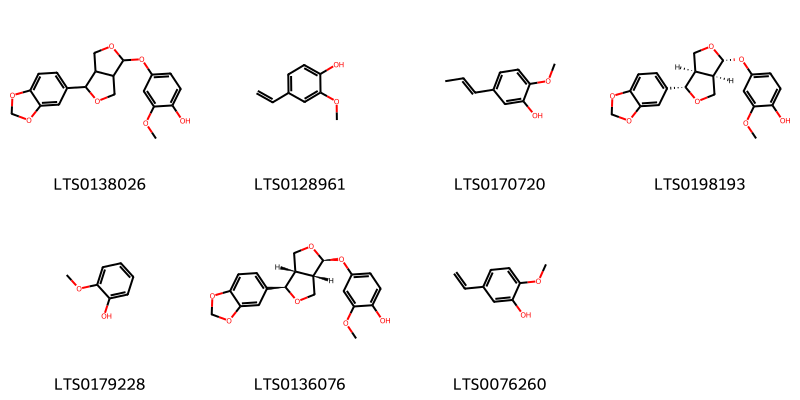{ width=100% }
    <figcaption>Hình ảnh cấu trúc hóa học của 7 hoạt chất thuộc nhóm Phenols gồm ['4-{[4-(2h-1,3-benzodioxol-5-yl)-hexahydrofuro[3,4-c]furan-1-yl]oxy}-2-methoxyphenol (LTS0138026)', '2-methoxy-4-vinyl-phenol (LTS0128961)', '2-methoxy-5-(prop-1-en-1-yl)phenol (LTS0170720)', 'sesamolinol (LTS0198193)', 'guaiacol (LTS0179228)', '4-{[(1s,3as,4r,6as)-4-(2h-1,3-benzodioxol-5-yl)-hexahydrofuro[3,4-c]furan-1-yl]oxy}-2-methoxyphenol (LTS0136076)', '5-ethenyl-2-methoxyphenol (LTS0076260)'].</figcaption>
</figure>
#### Nhóm Prenol lipids
<figure markdown="span">
    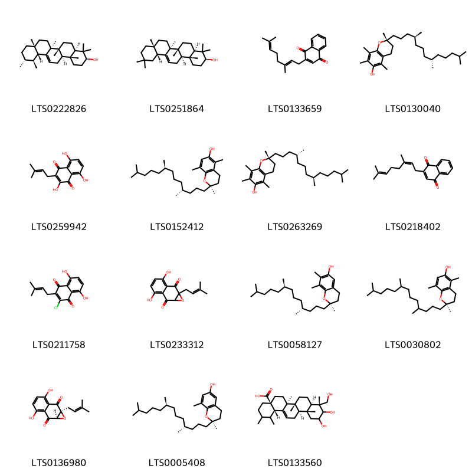{ width=100% }
    <figcaption>Hình ảnh cấu trúc hóa học của 15 hoạt chất thuộc nhóm Prenol lipids gồm ['amyrin (LTS0222826)', 'β-amyrin (LTS0251864)', '2-demethylmenaquinone (LTS0133659)', '(2r)-2,5,7,8-tetramethyl-2-[(4s,8s)-4,8,12-trimethyltridecyl]-3,4-dihydro-1-benzopyran-6-ol (LTS0130040)', '2,5,8-trihydroxy-3-(3-methylbut-2-en-1-yl)naphthalene-1,4-dione (LTS0259942)', 'β-tocopherol (LTS0152412)', 'vitamin e (LTS0263269)', '2-(3,7-dimethylocta-2,6-dien-1-yl)naphthalene-1,4-dione (LTS0218402)', '2-chloro-5,8-dihydroxy-3-(3-methylbut-2-en-1-yl)naphthalene-1,4-dione (LTS0211758)', '3,6-dihydroxy-1a-(3-methylbut-2-en-1-yl)-7ah-naphtho[2,3-b]oxirene-2,7-dione (LTS0233312)', 'gamma-tocopherol (LTS0058127)', '(2r)-2,5,8-trimethyl-2-(4,8,12-trimethyltridecyl)-3,4-dihydro-1-benzopyran-6-ol (LTS0030802)', '(1as,7ar)-3,6-dihydroxy-1a-(3-methylbut-2-en-1-yl)-7ah-naphtho[2,3-b]oxirene-2,7-dione (LTS0136980)', 'delta-tocopherol (LTS0005408)', '(4as,6as,6br,8ar,9r,12ar,12br,14bs)-10,11-dihydroxy-9-(hydroxymethyl)-1,2,6a,6b,9,12a-hexamethyl-2,3,4,5,6,7,8,8a,10,11,12,12b,13,14b-tetradecahydro-1h-picene-4a-carboxylic acid (LTS0133560)'].</figcaption>
</figure>
#### Nhóm Steroids and steroid derivatives
<figure markdown="span">
    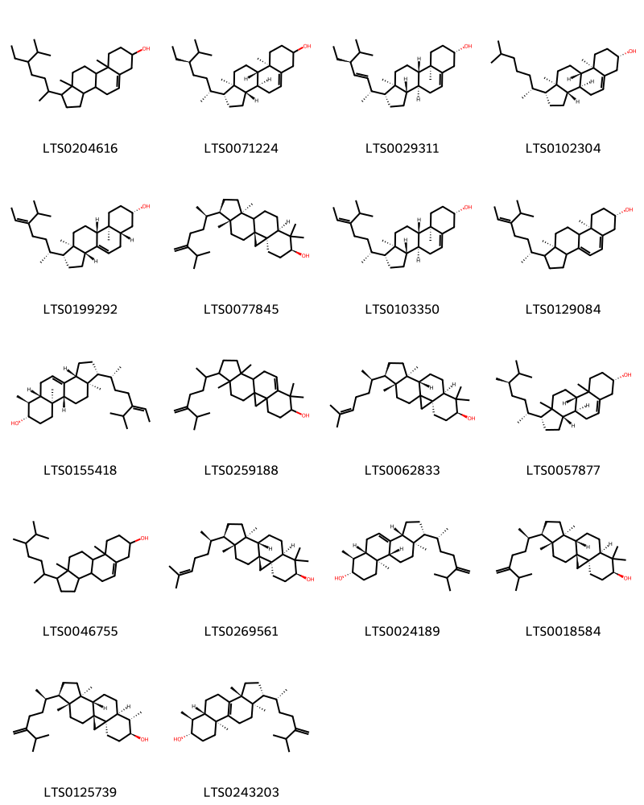{ width=100% }
    <figcaption>Hình ảnh cấu trúc hóa học của 18 hoạt chất thuộc nhóm Steroids and steroid derivatives gồm ['stigmast-5-en-3-ol, (3β)- (LTS0204616)', 'stigmast-5-en-3-ol (LTS0071224)', 'phytosterol (LTS0029311)', 'cholesterol (LTS0102304)', 'delta7-avenasterol (LTS0199292)', '24-methylene-cycloartanol (LTS0077845)', 'avenasterol (LTS0103350)', '5-dehydroavenasterol (LTS0129084)', '(z)-24-ethylidenelophenol (LTS0155418)', '7,7,12,16-tetramethyl-15-(6-methyl-5-methylideneheptan-2-yl)pentacyclo[9.7.0.0¹,³.0³,⁸.0¹²,¹⁶]octadec-8-en-6-ol (LTS0259188)', '(3r,6s,8r,11s,12s,15r,16r)-7,7,12,16-tetramethyl-15-[(2r)-6-methylhept-5-en-2-yl]pentacyclo[9.7.0.0¹,³.0³,⁸.0¹²,¹⁶]octadecan-6-ol (LTS0062833)', '(1r,3as,3bs,7s,9bs)-1-[(2r,5r)-5,6-dimethylheptan-2-yl]-9a,11a-dimethyl-1h,2h,3h,3ah,3bh,4h,6h,7h,8h,9h,9bh,10h,11h-cyclopenta[a]phenanthren-7-ol (LTS0057877)', 'campesterol (LTS0046755)', 'cycloartenol (LTS0269561)', '24-methylidenelophenol (LTS0024189)', '24-methylenecycloartanol (LTS0018584)', 'cycloeucalenol (LTS0125739)', '(1r,3ar,5as,6s,7s,9as,11ar)-3a,6,9a,11a-tetramethyl-1-[(2r)-6-methyl-5-methylideneheptan-2-yl]-1h,2h,3h,4h,5h,5ah,6h,7h,8h,9h,10h,11h-cyclopenta[a]phenanthren-7-ol (LTS0243203)'].</figcaption>
</figure>

---

### Dược dân tộc học

Danh sách các quốc gia có sử dụng *Sesamum indicum* trong điều trị các bệnh. 

| Country            | Disease                                                                                                             | Bệnh                                                                                                                                                                                                |
|:-------------------|:--------------------------------------------------------------------------------------------------------------------|:----------------------------------------------------------------------------------------------------------------------------------------------------------------------------------------------------|
| Africa             | Pediculicide                                                                                                        | MYMEMORY WARNING: YOU USED ALL AVAILABLE FREE TRANSLATIONS FOR TODAY. NEXT AVAILABLE IN  08 HOURS 46 MINUTES 03 SECONDS VISIT HTTPS://MYMEMORY.TRANSLATED.NET/DOC/USAGELIMITS.PHP TO TRANSLATE MORE |
| China              | Emollient, Laxative, Poultice, Refrigerant, Tonic                                                                   | MYMEMORY WARNING: YOU USED ALL AVAILABLE FREE TRANSLATIONS FOR TODAY. NEXT AVAILABLE IN  08 HOURS 46 MINUTES 01 SECONDS VISIT HTTPS://MYMEMORY.TRANSLATED.NET/DOC/USAGELIMITS.PHP TO TRANSLATE MORE |
| Dominican Republic | Aphrodisiac, Abortifacient                                                                                          | MYMEMORY WARNING: YOU USED ALL AVAILABLE FREE TRANSLATIONS FOR TODAY. NEXT AVAILABLE IN  08 HOURS 45 MINUTES 58 SECONDS VISIT HTTPS://MYMEMORY.TRANSLATED.NET/DOC/USAGELIMITS.PHP TO TRANSLATE MORE |
| Elsewhere          | Aperient, Demulcent, Diuretic, Emmenagogue, Emollient, Laxative, Pediculicide, Soap, Tonic, Lactagogue, Aphrodisiac | MYMEMORY WARNING: YOU USED ALL AVAILABLE FREE TRANSLATIONS FOR TODAY. NEXT AVAILABLE IN  08 HOURS 45 MINUTES 56 SECONDS VISIT HTTPS://MYMEMORY.TRANSLATED.NET/DOC/USAGELIMITS.PHP TO TRANSLATE MORE |
| Haiti              | Emmenagogue, Emollient                                                                                              | MYMEMORY WARNING: YOU USED ALL AVAILABLE FREE TRANSLATIONS FOR TODAY. NEXT AVAILABLE IN  08 HOURS 45 MINUTES 53 SECONDS VISIT HTTPS://MYMEMORY.TRANSLATED.NET/DOC/USAGELIMITS.PHP TO TRANSLATE MORE |
| Iraq               | Emollient                                                                                                           | MYMEMORY WARNING: YOU USED ALL AVAILABLE FREE TRANSLATIONS FOR TODAY. NEXT AVAILABLE IN  08 HOURS 45 MINUTES 50 SECONDS VISIT HTTPS://MYMEMORY.TRANSLATED.NET/DOC/USAGELIMITS.PHP TO TRANSLATE MORE |
| Japan*             | Tonic                                                                                                               | MYMEMORY WARNING: YOU USED ALL AVAILABLE FREE TRANSLATIONS FOR TODAY. NEXT AVAILABLE IN  08 HOURS 45 MINUTES 47 SECONDS VISIT HTTPS://MYMEMORY.TRANSLATED.NET/DOC/USAGELIMITS.PHP TO TRANSLATE MORE |
| Johore             | Emmenagogue                                                                                                         | MYMEMORY WARNING: YOU USED ALL AVAILABLE FREE TRANSLATIONS FOR TODAY. NEXT AVAILABLE IN  08 HOURS 45 MINUTES 45 SECONDS VISIT HTTPS://MYMEMORY.TRANSLATED.NET/DOC/USAGELIMITS.PHP TO TRANSLATE MORE |
| Malaya             | Tonic                                                                                                               | MYMEMORY WARNING: YOU USED ALL AVAILABLE FREE TRANSLATIONS FOR TODAY. NEXT AVAILABLE IN  08 HOURS 45 MINUTES 42 SECONDS VISIT HTTPS://MYMEMORY.TRANSLATED.NET/DOC/USAGELIMITS.PHP TO TRANSLATE MORE |
| Mexico             | Laxative                                                                                                            | MYMEMORY WARNING: YOU USED ALL AVAILABLE FREE TRANSLATIONS FOR TODAY. NEXT AVAILABLE IN  08 HOURS 45 MINUTES 40 SECONDS VISIT HTTPS://MYMEMORY.TRANSLATED.NET/DOC/USAGELIMITS.PHP TO TRANSLATE MORE |
| Turkey             | Emmenagogue, Abortifacient, Demulcent, Diuretic, Emollient, Laxative                                                | MYMEMORY WARNING: YOU USED ALL AVAILABLE FREE TRANSLATIONS FOR TODAY. NEXT AVAILABLE IN  08 HOURS 45 MINUTES 37 SECONDS VISIT HTTPS://MYMEMORY.TRANSLATED.NET/DOC/USAGELIMITS.PHP TO TRANSLATE MORE |

---

