!!! abstract "Tóm tắt"

    Họ Phytolaccaceae gồm khoảng 8 chi và 17 loài được một số cộng đồng tại các quốc gia như Turkey, Australia, Japan, Guatemala, Brazil, US(Appalachia), US, Dominican Republic, Peru, Mexico, China, Trinidad, Haiti, Upper Volta, Colombia, Mexico(Chinantec), Lesotho, India, Elsewhere, Venezuela, ain, Latin America, Ethiopia sử dụng trong một số trường hợp QUERY LENGTH LIMIT EXCEEDED. MAX ALLOWED QUERY : 500 CHARS.

!!! info "DrDuke"

    James A. Duke sinh năm 1929-2017 là một nhà thực vật học người Mỹ. Đây là một trong những tác giả hàng đầu trong lĩnh vực dược dân tộc học với cuốn *CRC Handbook of Medicinal Herbs* và chính là người xây dựng lên cơ sở dữ liệu về hợp chất tự nhiên và dược dân tộc học tại Bộ nông nghiệp Hoa Kỳ. Các thông tin được đăng tải tại website [Dr. Duke's Phytochemical and Ethnobotanical Databases](https://phytochem.nal.usda.gov/). 
    Trong suốt thập niên 1970, ông lãnh đạo the Plant Taxonomy Laboratory, Plant Genetics and Germplasm Institute of the Agricultural Research Service, U.S. Department of Agriculture.
    Trong tài liệu này, các thông tin về dược dân tộc của các dược liệu được trích dẫn từ tài liệu của James A. Ducke với sự trợ giúp của phần mềm dịch thuật từ tiếng Anh sang tiếng Việt.
   

# Chi Phytolacca

??? note "Danh sách các dược liệu thuộc chi"
    
	 - *Phytolacca acinosa*
	 - *Phytolacca americana*
	 - *Phytolacca dioica*
	 - *Phytolacca dodecandra*
	 - *Phytolacca esculenta*
	 - *Phytolacca heptandra*
	 - *Phytolacca icosandra*
	 - *Phytolacca japonica*
	 - *Phytolacca octandra*
	 - *Phytolacca rivinoides*

---
## Phytolacca acinosa
### Thông tin về thực vật

!!! info "Phân loại thực vật của *Phytolacca acinosa* từ GIBF:"
    - **Kingdom:** Plantae
    - **Phylum:** Tracheophyta
    - **Order:** Caryophyllales
    - **Family:** Phytolaccaceae
    - **Genus:** Phytolacca
    - **Species:** *Phytolacca acinosa*

 

| Label (VI)   | Label (EN)   | Scientific Name    | Descriptions (VI)   | Descriptions (EN)   | Also Known As (VI)   | Also Known As (EN)   |
|:-------------|:-------------|:-------------------|:--------------------|:--------------------|:---------------------|:---------------------|
| N/A          | N/A          | Phytolacca acinosa | loài thực vật       | species of plant    | ['']                 | ['']                 |

#### Phân bố trên thế giới

**Từ CSDL GIBF** Ukraine, Netherlands, Czechia, Germany, Belgium, Slovakia, New Zealand, Poland, Hungary, Switzerland, China, Austria, France, Slovenia, United Kingdom of Great Britain and Northern Ireland

#### Phân bố tại Việt Nam

**Từ CSDL GIBF**: Không có ghi nhận ở Việt Nam

---
### Thành phần hóa học
        
- Theo cơ sở dữ liệu lotus: Từ loài *Phytolacca acinosa* đã phân lập và xác định được 120 hoạt chất thuộc về các nhóm Fatty Acyls, Prenol lipids, Steroids and steroid derivatives, Organonitrogen compounds, Benzene and substituted derivatives, Saturated hydrocarbons, Phenols, Organooxygen compounds, Carboxylic acids and derivatives, Betalains. 

|    | chemicalTaxonomyClassyfireClass     |   smiles_count |
|---:|:------------------------------------|---------------:|
|  0 | Benzene and substituted derivatives |              1 |
|  1 | Betalains                           |              1 |
|  2 | Carboxylic acids and derivatives    |              3 |
|  3 | Fatty Acyls                         |              6 |
|  4 | Organonitrogen compounds            |              1 |
|  5 | Organooxygen compounds              |              1 |
|  6 | Phenols                             |              2 |
|  7 | Prenol lipids                       |             99 |
|  8 | Saturated hydrocarbons              |              1 |
|  9 | Steroids and steroid derivatives    |              4 |

#### Nhóm Benzene and substituted derivatives
<figure markdown="span">
    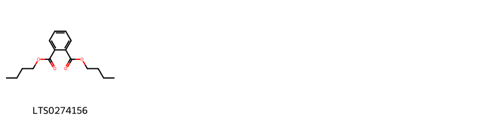{ width=100% }
    <figcaption>Hình ảnh cấu trúc hóa học của 1 hoạt chất thuộc nhóm Benzene and substituted derivatives gồm ['dibutyl-phthalate (LTS0274156)'].</figcaption>
</figure>
#### Nhóm Betalains
<figure markdown="span">
    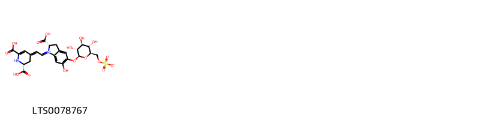{ width=100% }
    <figcaption>Hình ảnh cấu trúc hóa học của 1 hoạt chất thuộc nhóm Betalains gồm ['(2s)-2-carboxy-1-{2-[(2r)-2,6-dicarboxy-2,3-dihydro-1h-pyridin-4-ylidene]ethylidene}-6-hydroxy-5-{[(2s,3r,4s,5s,6r)-3,4,5-trihydroxy-6-[(sulfonatooxy)methyl]oxan-2-yl]oxy}-2,3-dihydro-1h-1λ⁵-indol-1-ylium (LTS0078767)'].</figcaption>
</figure>
#### Nhóm Carboxylic acids and derivatives
<figure markdown="span">
    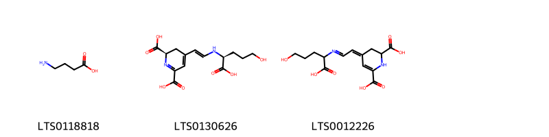{ width=100% }
    <figcaption>Hình ảnh cấu trúc hóa học của 3 hoạt chất thuộc nhóm Carboxylic acids and derivatives gồm ['gamma(amino)-butyric acid (LTS0118818)', '(2r)-4-[(1e)-2-{[(1s)-1-carboxy-4-hydroxybutyl]amino}ethenyl]-2,3-dihydropyridine-2,6-dicarboxylic acid (LTS0130626)', '(4z)-4-{2-[(1-carboxy-4-hydroxybutyl)imino]ethylidene}-2,3-dihydro-1h-pyridine-2,6-dicarboxylic acid (LTS0012226)'].</figcaption>
</figure>
#### Nhóm Fatty Acyls
<figure markdown="span">
    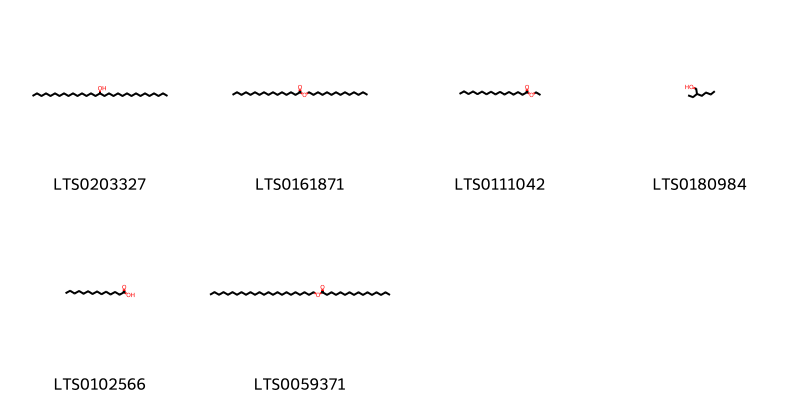{ width=100% }
    <figcaption>Hình ảnh cấu trúc hóa học của 6 hoạt chất thuộc nhóm Fatty Acyls gồm ['16-hentriacontanol (LTS0203327)', 'myristyl palmitate (LTS0161871)', 'ethyl palmitate (LTS0111042)', '2-ethylhexanol (LTS0180984)', 'myristic acid (LTS0102566)', 'tetracosyl palmitate (LTS0059371)'].</figcaption>
</figure>
#### Nhóm Organonitrogen compounds
<figure markdown="span">
    { width=100% }
    <figcaption>Hình ảnh cấu trúc hóa học của 1 hoạt chất thuộc nhóm Organonitrogen compounds gồm ['1h-imidazole-5-ethanamine (LTS0016235)'].</figcaption>
</figure>
#### Nhóm Organooxygen compounds
<figure markdown="span">
    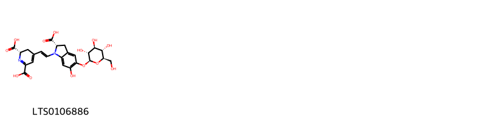{ width=100% }
    <figcaption>Hình ảnh cấu trúc hóa học của 1 hoạt chất thuộc nhóm Organooxygen compounds gồm ['betanin (LTS0106886)'].</figcaption>
</figure>
#### Nhóm Phenols
<figure markdown="span">
    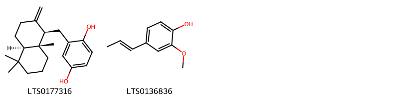{ width=100% }
    <figcaption>Hình ảnh cấu trúc hóa học của 2 hoạt chất thuộc nhóm Phenols gồm ['2-{[(1r,4ar,8ar)-5,5,8a-trimethyl-2-methylidene-hexahydro-1h-naphthalen-1-yl]methyl}benzene-1,4-diol (LTS0177316)', 'isoeugenol (LTS0136836)'].</figcaption>
</figure>
#### Nhóm Prenol lipids
<figure markdown="span">
    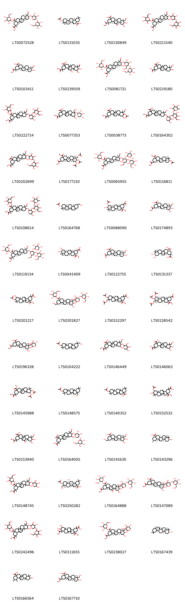{ width=100% }
    <figcaption>Hình ảnh cấu trúc hóa học của 99 hoạt chất thuộc nhóm Prenol lipids gồm ['2-methyl 4a-(2s,3r,4s,5s,6r)-3,4,5-trihydroxy-6-(hydroxymethyl)oxan-2-yl (2r,4ar,6as,6br,9r,10s,12ar,12br,14br)-10-{[(2s,3r,4r,5r)-3,4-dihydroxy-5-{[(2s,3r,4s,5s,6r)-3,4,5-trihydroxy-6-(hydroxymethyl)oxan-2-yl]oxy}oxan-2-yl]oxy}-9-(hydroxymethyl)-2,6a,6b,9,12a-pentamethyl-1,3,4,5,6,7,8,8a,10,11,12,12b,13,14b-tetradecahydropicene-2,4a-dicarboxylate (LTS0072528)', '(4ar,6bs,8as,10s,12as,12bs,14as,14bs)-10-(acetyloxy)-2,2,6b,9,9,12a,14a-heptamethyl-1,3,4,5,7,8,8a,10,11,12,12b,13,14,14b-tetradecahydropicene-4a-carboxylic acid (LTS0131035)', '(2r,4ar,6as,6br,9r,10r,11s,12as,12br,14br)-10,11-dihydroxy-9-(hydroxymethyl)-2-(methoxycarbonyl)-2,6a,6b,9,12a-pentamethyl-13-oxo-3,4,5,6,7,8,8a,10,11,12,12b,14b-dodecahydro-1h-picene-4a-carboxylic acid (LTS0130849)', '2-methyl 4a-[3,4,5-trihydroxy-6-(hydroxymethyl)oxan-2-yl] (2r,4ar,6as,6br,9r,12ar,12br,14br)-10-[(3,4-dihydroxy-5-{[3,4,5-trihydroxy-6-(hydroxymethyl)oxan-2-yl]oxy}oxan-2-yl)oxy]-11-hydroxy-9-(hydroxymethyl)-2,6a,6b,9,12a-pentamethyl-1,3,4,5,6,7,8,8a,10,11,12,12b,13,14b-tetradecahydropicene-2,4a-dicarboxylate (LTS0211540)', '(2r,4ar,6as,6br,9r,10s,12ar,12br,14br)-10-hydroxy-9-(hydroxymethyl)-2-(methoxycarbonyl)-2,6a,6b,9,12a-pentamethyl-1,3,4,5,6,7,8,8a,10,11,12,12b,13,14b-tetradecahydropicene-4a-carboxylic acid (LTS0103411)', '9-formyl-10,11,13-trihydroxy-2-(methoxycarbonyl)-2,6a,6b,9,12a-pentamethyl-1,3,4,5,6,7,8,8a,10,11,12,12b,13,14b-tetradecahydropicene-4a-carboxylic acid (LTS0239559)', '2-methyl 4a-(2s,3r,4s,5s,6r)-3,4,5-trihydroxy-6-(hydroxymethyl)oxan-2-yl (2r,4ar,6as,6br,9r,10r,11s,12ar,12br,14br)-10-{[(2r,3r,4r,5s,6r)-3,4-dihydroxy-6-(hydroxymethyl)-5-{[(2s,3r,4s,5s,6r)-3,4,5-trihydroxy-6-(hydroxymethyl)oxan-2-yl]oxy}oxan-2-yl]oxy}-11-hydroxy-9-(hydroxymethyl)-2,6a,6b,9,12a-pentamethyl-1,3,4,5,6,7,8,8a,10,11,12,12b,13,14b-tetradecahydropicene-2,4a-dicarboxylate (LTS0081721)', '10-hydroxy-9-(hydroxymethyl)-2,6a,6b,9,12a-pentamethyl-1,3,4,5,6,7,8,8a,10,11,12,12b,13,14b-tetradecahydropicene-2,4a-dicarboxylic acid (LTS0219180)', '2-methyl 4a-[3,4,5-trihydroxy-6-(hydroxymethyl)oxan-2-yl] 10-[(4,5-dihydroxy-3-{[3,4,5-trihydroxy-6-(hydroxymethyl)oxan-2-yl]oxy}oxan-2-yl)oxy]-9-(hydroxymethyl)-2,6a,6b,9,12a-pentamethyl-1,3,4,5,6,7,8,8a,10,11,12,12b,13,14b-tetradecahydropicene-2,4a-dicarboxylate (LTS0222714)', '11-hydroxy-9-(hydroxymethyl)-2-(methoxycarbonyl)-2,6a,6b,12a-tetramethyl-9-{[(2s,3r,4s,5r)-3,4,5-trihydroxyoxan-2-yl]oxy}-1,3,4,5,6,7,8,8a,10,11,12,12b,13,14b-tetradecahydropicene-4a-carboxylic acid (LTS0077353)', '10-(acetyloxy)-11-hydroxy-9-(hydroxymethyl)-2-(methoxycarbonyl)-2,6a,6b,9,12a-pentamethyl-1,3,4,5,6,7,8,8a,10,11,12,12b,13,14b-tetradecahydropicene-4a-carboxylic acid (LTS0038773)', '10-[(3-{[4,5-dihydroxy-6-(hydroxymethyl)-3-[(3,4,5-trihydroxy-6-methyloxan-2-yl)oxy]oxan-2-yl]oxy}-4,5-dihydroxyoxan-2-yl)oxy]-9-(hydroxymethyl)-2-(methoxycarbonyl)-2,6a,6b,9,12a-pentamethyl-1,3,4,5,6,7,8,8a,10,11,12,12b,13,14b-tetradecahydropicene-4a-carboxylic acid (LTS0164302)', 'esculentoside a (LTS0202699)', '2,4a-dimethyl (2s,4ar,6as,6br,8as,9r,10r,11s,12ar,12br,14bs)-10,11-bis(acetyloxy)-9-[(acetyloxy)methyl]-2,6a,6b,9,12a-pentamethyl-1,3,4,5,6,7,8,8a,10,11,12,12b,13,14b-tetradecahydropicene-2,4a-dicarboxylate (LTS0177210)', '2-methyl 4a-(2s,3r,4s,5s,6r)-3,4,5-trihydroxy-6-(hydroxymethyl)oxan-2-yl (2r,4ar,6as,6br,9r,10r,11s,12ar,12br,14br)-11-hydroxy-10-{[(2r,3r,4s,5r,6r)-5-hydroxy-6-(hydroxymethyl)-4-{[(2s,3r,4s,5s,6r)-3,4,5-trihydroxy-6-(hydroxymethyl)oxan-2-yl]oxy}-3-{[(2s,3r,4s,5r)-3,4,5-trihydroxyoxan-2-yl]oxy}oxan-2-yl]oxy}-9-(hydroxymethyl)-2,6a,6b,9,12a-pentamethyl-1,3,4,5,6,7,8,8a,10,11,12,12b,13,14b-tetradecahydropicene-2,4a-dicarboxylate (LTS0065955)', '2,4a-dimethyl (2s,4ar,6as,6br,8ar,10s,12ar,12br,14br)-10-(acetyloxy)-2,6a,6b,9,9,12a-hexamethyl-1,3,4,5,6,7,8,8a,10,11,12,12b,13,14b-tetradecahydropicene-2,4a-dicarboxylate (LTS0116811)', '2-methyl 4a-[3,4,5-trihydroxy-6-(hydroxymethyl)oxan-2-yl] 10-[(3-{[4,5-dihydroxy-6-(hydroxymethyl)-3-[(3,4,5-trihydroxy-6-methyloxan-2-yl)oxy]oxan-2-yl]oxy}-4,5-dihydroxyoxan-2-yl)oxy]-9-(hydroxymethyl)-2,6a,6b,9,12a-pentamethyl-1,3,4,5,6,7,8,8a,10,11,12,12b,13,14b-tetradecahydropicene-2,4a-dicarboxylate (LTS0108614)', '(3r,4ar,6ar,8ar,11s,12ar,12bs,14ar,14br)-11-(hydroxymethyl)-4,4,6a,8a,11,12b,14b-heptamethyl-1,2,3,4a,5,6,8,9,10,12,12a,13,14,14a-tetradecahydropicen-3-yl acetate (LTS0164768)', '(2s,4ar,6as,6br,8ar,10r,11s,12ar,12br,14bs)-11-(acetyloxy)-10-hydroxy-4a-(methoxycarbonyl)-2,6a,6b,9,9,12a-hexamethyl-1,3,4,5,6,7,8,8a,10,11,12,12b,13,14b-tetradecahydropicene-2-carboxylic acid (LTS0088090)', 'phytolaccagenine (LTS0174893)', '2-methyl 4a-(2s,3r,4s,5s,6r)-3,4,5-trihydroxy-6-(hydroxymethyl)oxan-2-yl (2r,4ar,6as,6br,9r,10s,12ar,12br,14br)-10-{[(2r,3r,4s,5r,6r)-5-hydroxy-6-(hydroxymethyl)-4-{[(2s,3r,4s,5s,6r)-3,4,5-trihydroxy-6-(hydroxymethyl)oxan-2-yl]oxy}-3-{[(2s,3r,4s,5r)-3,4,5-trihydroxyoxan-2-yl]oxy}oxan-2-yl]oxy}-9-(hydroxymethyl)-2,6a,6b,9,12a-pentamethyl-1,3,4,5,6,7,8,8a,10,11,12,12b,13,14b-tetradecahydropicene-2,4a-dicarboxylate (LTS0119134)', '(2s,4ar,6as,6br,8ar,10r,11s,12ar,12br,14bs)-10,11-dihydroxy-4a-(methoxycarbonyl)-2,6a,6b,9,9,12a-hexamethyl-1,3,4,5,6,7,8,8a,10,11,12,12b,13,14b-tetradecahydropicene-2-carboxylic acid (LTS0041409)', '(2s,4ar,6as,6br,8ar,9r,10s,12ar,12br,14bs)-10-hydroxy-9-(hydroxymethyl)-2,6a,6b,9,12a-pentamethyl-1,3,4,5,6,7,8,8a,10,11,12,12b,13,14b-tetradecahydropicene-2,4a-dicarboxylic acid (LTS0122755)', '(2s,4ar,6as,6br,8ar,10r,11s,12ar,12br,14bs)-10,11-dihydroxy-2,6a,6b,9,9,12a-hexamethyl-1,3,4,5,6,7,8,8a,10,11,12,12b,13,14b-tetradecahydropicene-2,4a-dicarboxylic acid (LTS0131337)', '10-(acetyloxy)-11-hydroxy-4a-(methoxycarbonyl)-2,6a,6b,9,9,12a-hexamethyl-1,3,4,5,6,7,8,8a,10,11,12,12b,13,14b-tetradecahydropicene-2-carboxylic acid (LTS0201217)', '(2s,3r,4s,5s,6r)-3,4,5-trihydroxy-6-(hydroxymethyl)oxan-2-yl (2s,4ar,6as,6br,8ar,9r,10r,11s,12ar,12br,14bs)-10-{[(2s,3r,4r,5r)-3,4-dihydroxy-5-{[(2s,3r,4s,5s,6r)-3,4,5-trihydroxy-6-(hydroxymethyl)oxan-2-yl]oxy}oxan-2-yl]oxy}-11-hydroxy-2,9-bis(hydroxymethyl)-2,6a,6b,9,12a-pentamethyl-1,3,4,5,6,7,8,8a,10,11,12,12b,13,14b-tetradecahydropicene-4a-carboxylate (LTS0201827)', '10-(acetyloxy)-9-[(acetyloxy)methyl]-4a-(methoxycarbonyl)-2,6a,6b,9,12a-pentamethyl-1,3,4,5,6,7,8,8a,10,11,12,12b,13,14b-tetradecahydropicene-2-carboxylic acid (LTS0152297)', '(2s,4ar,6as,6br,8ar,9r,10r,11s,12ar,12br,14bs)-10,11-bis(acetyloxy)-9-[(acetyloxy)methyl]-4a-(methoxycarbonyl)-2,6a,6b,9,12a-pentamethyl-1,3,4,5,6,7,8,8a,10,11,12,12b,13,14b-tetradecahydropicene-2-carboxylic acid (LTS0128542)', 'phytolaccoside b (LTS0196328)', '11-(hydroxymethyl)-4,4,6a,8a,11,12b,14b-heptamethyl-1,2,3,4a,5,6,8,9,10,12,12a,13,14,14a-tetradecahydropicen-3-yl acetate (LTS0104222)', '11-hydroxy-9-(hydroxymethyl)-2-(methoxycarbonyl)-2,6a,6b,9,12a-pentamethyl-10-[(3,4,5-trihydroxyoxan-2-yl)oxy]-1,3,4,5,6,7,8,8a,10,11,12,12b,13,14b-tetradecahydropicene-4a-carboxylic acid (LTS0146449)', '10,11-dihydroxy-9-(hydroxymethyl)-2,6a,6b,9,12a-pentamethyl-1,3,4,5,6,7,8,8a,10,11,12,12b,13,14b-tetradecahydropicene-2,4a-dicarboxylic acid (LTS0146063)', '2,4a-dimethyl 10,11-bis(acetyloxy)-2,6a,6b,9,9,12a-hexamethyl-1,3,4,5,6,7,8,8a,10,11,12,12b,13,14b-tetradecahydropicene-2,4a-dicarboxylate (LTS0145988)', '8a-(hydroxymethyl)-4,4,6a,11,11,12b,14b-heptamethyl-1,2,3,4a,5,6,8,9,10,12,12a,13,14,14a-tetradecahydropicen-3-yl acetate (LTS0148575)', '10-(acetyloxy)-2,2,6b,9,9,12a,14a-heptamethyl-1,3,4,5,7,8,8a,10,11,12,12b,13,14,14b-tetradecahydropicene-4a-carboxylic acid (LTS0140352)', '11-(acetyloxy)-10-hydroxy-4a-(methoxycarbonyl)-2,6a,6b,9,9,12a-hexamethyl-1,3,4,5,6,7,8,8a,10,11,12,12b,13,14b-tetradecahydropicene-2-carboxylic acid (LTS0152532)', '10,11-dihydroxy-9-(hydroxymethyl)-2-(methoxycarbonyl)-2,6a,6b,9,12a-pentamethyl-13-oxo-3,4,5,6,7,8,8a,10,11,12,12b,14b-dodecahydro-1h-picene-4a-carboxylic acid (LTS0153940)', '10-{[(2s,3r,4r,5r)-3,4-dihydroxy-5-{[(2s,3r,4s,5s,6r)-3,4,5-trihydroxy-6-(hydroxymethyl)oxan-2-yl]oxy}oxan-2-yl]oxy}-11-hydroxy-9-(hydroxymethyl)-2,6a,6b,9,12a-pentamethyl-1,3,4,5,6,7,8,8a,10,11,12,12b,13,14b-tetradecahydropicene-2,4a-dicarboxylic acid (LTS0164005)', '(2s,4ar,6as,6br,8ar,9r,10r,11s,12ar,12br,14bs)-10,11-dihydroxy-2,9-bis(hydroxymethyl)-2,6a,6b,9,12a-pentamethyl-1,3,4,5,6,7,8,8a,10,11,12,12b,13,14b-tetradecahydropicene-4a-carboxylic acid (LTS0141630)', '(1r,2s,4as,6as,6bs,8as,10s,12ar,12br,14br)-10-hydroxy-1,2,6a,6b,9,9,12a-heptamethyl-2,3,4,5,6,7,8,8a,10,11,12,12b,13,14b-tetradecahydro-1h-picene-4a-carboxylic acid (LTS0143296)', '2-methyl 4a-[3,4,5-trihydroxy-6-(hydroxymethyl)oxan-2-yl] 11-hydroxy-9-(hydroxymethyl)-2,6a,6b,9,12a-pentamethyl-10-[(3,4,5-trihydroxyoxan-2-yl)oxy]-1,3,4,5,6,7,8,8a,10,11,12,12b,13,14b-tetradecahydropicene-2,4a-dicarboxylate (LTS0148745)', '(4as,6br,8ar,9r,10s,12as,12br,13r,14as,14bs)-10-(acetyloxy)-13-hydroxy-9-(hydroxymethyl)-2,2,6b,9,12a,14a-hexamethyl-1,3,4,5,7,8,8a,10,11,12,12b,13,14,14b-tetradecahydropicene-4a-carboxylic acid (LTS0250282)', '2-methyl 4a-(2r,3r,4r,5s,6s)-4,5,6-trihydroxy-3-(hydroxymethyl)oxan-2-yl (2s,4ar,6as,6br,8as,9r,10r,11s,12as,12bs,14bs)-10-{[(2s,3r,4r,5r)-3,4-dihydroxy-5-{[(2s,3r,4s,5s,6r)-3,4,5-trihydroxy-6-(hydroxymethyl)oxan-2-yl]oxy}oxan-2-yl]oxy}-11-hydroxy-9-(hydroxymethyl)-2,6a,6b,9,12a-pentamethyl-13-oxo-3,4,5,6,7,8,8a,10,11,12,12b,14b-dodecahydro-1h-picene-2,4a-dicarboxylate (LTS0164888)', '(2s,4ar,6as,6br,8ar,9r,10r,11s,12ar,12br,14bs)-10-{[(2s,3r,4r,5r)-3,4-dihydroxy-5-{[(2s,3r,4s,5s,6r)-3,4,5-trihydroxy-6-(hydroxymethyl)oxan-2-yl]oxy}oxan-2-yl]oxy}-11-hydroxy-9-(hydroxymethyl)-2-(methoxycarbonyl)-2,6a,6b,9,12a-pentamethyl-1,3,4,5,6,7,8,8a,10,11,12,12b,13,14b-tetradecahydropicene-4a-carboxylic acid (LTS0147089)', '2-methyl 4a-[3,4,5-trihydroxy-6-(hydroxymethyl)oxan-2-yl] 10-[(3,4-dihydroxy-5-{[3,4,5-trihydroxy-6-(hydroxymethyl)oxan-2-yl]oxy}oxan-2-yl)oxy]-11-hydroxy-9-(hydroxymethyl)-2,6a,6b,9,12a-pentamethyl-1,3,4,5,6,7,8,8a,10,11,12,14b-dodecahydropicene-2,4a-dicarboxylate (LTS0242496)', '10,11-dihydroxy-4a,9-bis(methoxycarbonyl)-2,6a,6b,9,12a-pentamethyl-1,3,4,5,6,7,8,8a,10,11,12,12b,13,14b-tetradecahydropicene-2-carboxylic acid (LTS0111655)', '2-methyl 4a-(2s,3r,4s,5s,6r)-3,4,5-trihydroxy-6-(hydroxymethyl)oxan-2-yl (2s,4ar,6as,6br,8ar,9r,10r,11s,12ar,12br,14bs)-11-hydroxy-9-(hydroxymethyl)-2,6a,6b,9,12a-pentamethyl-10-{[(2s,3r,4s,5r)-3,4,5-trihydroxyoxan-2-yl]oxy}-1,3,4,5,6,7,8,8a,10,11,12,12b,13,14b-tetradecahydropicene-2,4a-dicarboxylate (LTS0238027)', '(3r,4ar,6ar,8ar,12ar,12bs,14ar,14br)-4,4,6a,8a,11,11,12b,14b-octamethyl-1,2,3,4a,5,6,8,9,10,12,12a,13,14,14a-tetradecahydropicen-3-ol (LTS0167439)', '10-hydroxy-1,2,6a,6b,9,9,12a-heptamethyl-2,3,4,5,6,7,8,8a,10,11,12,12b,13,14b-tetradecahydro-1h-picene-4a-carboxylic acid (LTS0166564)', 'phytolaccagenic acid (LTS0167710)', '(2s,4ar,6as,6br,8ar,9s,10r,11s,12as,12br,13r,14bs)-9-formyl-10,11,13-trihydroxy-2-(methoxycarbonyl)-2,6a,6b,9,12a-pentamethyl-1,3,4,5,6,7,8,8a,10,11,12,12b,13,14b-tetradecahydropicene-4a-carboxylic acid (LTS0245949)', '(2s,4ar,6as,6br,8ar,10s,12ar,12br,14bs)-10-hydroxy-2-(methoxycarbonyl)-2,6a,6b,9,9,12a-hexamethyl-1,3,4,5,6,7,8,8a,10,11,12,12b,13,14b-tetradecahydropicene-4a-carboxylic acid (LTS0257912)', '10-[(3,4-dihydroxy-5-{[3,4,5-trihydroxy-6-(hydroxymethyl)oxan-2-yl]oxy}oxan-2-yl)oxy]-11-hydroxy-9-(hydroxymethyl)-2-(methoxycarbonyl)-2,6a,6b,9,12a-pentamethyl-1,3,4,5,6,7,8,8a,10,11,12,12b,13,14b-tetradecahydropicene-4a-carboxylic acid (LTS0116020)', '10-(acetyloxy)-2-(methoxycarbonyl)-2,6a,6b,9,9,12a-hexamethyl-1,3,4,5,6,7,8,8a,10,11,12,12b,13,14b-tetradecahydropicene-4a-carboxylic acid (LTS0159555)', 'acetyl aleuritolic acid (LTS0265563)', '(4as,6br,8ar,10r,12ar,12bs,14as,14bs)-10-(acetyloxy)-2,2,6b,9,9,12a,14a-heptamethyl-1,3,4,5,7,8,8a,10,11,12,12b,13,14,14b-tetradecahydropicene-4a-carboxylic acid (LTS0061164)', '10,11-dihydroxy-4a-(methoxycarbonyl)-2,6a,6b,9,9,12a-hexamethyl-1,3,4,5,6,7,8,8a,10,11,12,12b,13,14b-tetradecahydropicene-2-carboxylic acid (LTS0045463)', '9-formyl-10,11-dihydroxy-2-(methoxycarbonyl)-2,6a,6b,9,12a-pentamethyl-1,3,4,5,6,7,8,8a,10,11,12,12b,13,14b-tetradecahydropicene-4a-carboxylic acid (LTS0214985)', '(2s,4ar,6as,6br,8ar,9r,10s,12ar,12br,14bs)-10-{[(2s,3r,4s,5r)-3-{[(2s,3r,4s,5s,6r)-4,5-dihydroxy-6-(hydroxymethyl)-3-{[(2s,3r,4r,5r,6s)-3,4,5-trihydroxy-6-methyloxan-2-yl]oxy}oxan-2-yl]oxy}-4,5-dihydroxyoxan-2-yl]oxy}-9-(hydroxymethyl)-2-(methoxycarbonyl)-2,6a,6b,9,12a-pentamethyl-1,3,4,5,6,7,8,8a,10,11,12,12b,13,14b-tetradecahydropicene-4a-carboxylic acid (LTS0077483)', '(2s,4ar,6as,6br,8ar,9s,10r,11s,12ar,12br,14br)-9-formyl-10,11-dihydroxy-2-(methoxycarbonyl)-2,6a,6b,9,12a-pentamethyl-1,3,4,5,6,7,8,8a,10,11,12,12b,13,14b-tetradecahydropicene-4a-carboxylic acid (LTS0230182)', '11-hydroxy-9-(hydroxymethyl)-2-(methoxycarbonyl)-2,6a,6b,9,12a-pentamethyl-10-{[(2r,3r,4s,5s,6r)-3,4,5-trihydroxy-6-(hydroxymethyl)oxan-2-yl]oxy}-1,3,4,5,6,7,8,8a,10,11,12,12b,13,14b-tetradecahydropicene-4a-carboxylic acid (LTS0221720)', '2,4a-dimethyl 10-(acetyloxy)-2,6a,6b,9,9,12a-hexamethyl-1,3,4,5,6,7,8,8a,10,11,12,12b,13,14b-tetradecahydropicene-2,4a-dicarboxylate (LTS0070608)', '(2s,4ar,6as,6br,8ar,9r,10r,11s,12ar,12br,14bs)-10-(acetyloxy)-11-hydroxy-9-(hydroxymethyl)-2-(methoxycarbonyl)-2,6a,6b,9,12a-pentamethyl-1,3,4,5,6,7,8,8a,10,11,12,12b,13,14b-tetradecahydropicene-4a-carboxylic acid (LTS0150386)', '(2s,4ar,6as,6br,8ar,9s,10r,11s,12as,12br,13r,14br)-9-formyl-10,11,13-trihydroxy-2-(methoxycarbonyl)-2,6a,6b,9,12a-pentamethyl-1,3,4,5,6,7,8,8a,10,11,12,12b,13,14b-tetradecahydropicene-4a-carboxylic acid (LTS0217531)', '10,11-dihydroxy-9-(hydroxymethyl)-2-(methoxycarbonyl)-2,6a,6b,9,12a-pentamethyl-1,3,4,5,6,7,8,8a,10,11,12,12b,13,14b-tetradecahydropicene-4a-carboxylic acid (LTS0239962)', '10-(acetyloxy)-13-hydroxy-9-(hydroxymethyl)-2,2,6b,9,12a,14a-hexamethyl-1,3,4,5,7,8,8a,10,11,12,12b,13,14,14b-tetradecahydropicene-4a-carboxylic acid (LTS0239733)', '2-methyl 4a-(2s,3r,4s,5s,6r)-3,4,5-trihydroxy-6-(hydroxymethyl)oxan-2-yl (2s,4ar,6ar,6bs,8ar,9r,10r,11s,12as,14bs)-10-{[(2s,3r,4r,5r)-3,4-dihydroxy-5-{[(2s,3r,4s,5s,6r)-3,4,5-trihydroxy-6-(hydroxymethyl)oxan-2-yl]oxy}oxan-2-yl]oxy}-11-hydroxy-9-(hydroxymethyl)-2,6a,6b,9,12a-pentamethyl-1,3,4,5,6,7,8,8a,10,11,12,14b-dodecahydropicene-2,4a-dicarboxylate (LTS0168249)', '(2s,4ar,6as,6br,8ar,10s,12ar,12br,14bs)-10-hydroxy-2,6a,6b,9,9,12a-hexamethyl-1,3,4,5,6,7,8,8a,10,11,12,12b,13,14b-tetradecahydropicene-2,4a-dicarboxylic acid (LTS0031829)', '10,11-bis(acetyloxy)-9-[(acetyloxy)methyl]-4a-(methoxycarbonyl)-2,6a,6b,9,12a-pentamethyl-1,3,4,5,6,7,8,8a,10,11,12,12b,13,14b-tetradecahydropicene-2-carboxylic acid (LTS0178689)', '2-methyl 4a-(2s,3r,4s,5s,6r)-3,4,5-trihydroxy-6-(hydroxymethyl)oxan-2-yl 10-{[(2s,3r,4r,5r)-3,4-dihydroxy-5-{[(2s,3r,4s,5s,6r)-3,4,5-trihydroxy-6-(hydroxymethyl)oxan-2-yl]oxy}oxan-2-yl]oxy}-11-hydroxy-9-(hydroxymethyl)-2,6a,6b,9,12a-pentamethyl-1,3,4,5,6,7,8,8a,10,11,12,12b,13,14b-tetradecahydropicene-2,4a-dicarboxylate (LTS0181795)', '(2s,4ar,6as,6br,8ar,9s,10r,11s,12ar,12br,14bs)-10,11-dihydroxy-4a,9-bis(methoxycarbonyl)-2,6a,6b,9,12a-pentamethyl-1,3,4,5,6,7,8,8a,10,11,12,12b,13,14b-tetradecahydropicene-2-carboxylic acid (LTS0168612)', 'acinospesigenin a (LTS0045867)', '(2s,4ar,6as,6br,8ar,10r,11s,12ar,12br,14bs)-10-(acetyloxy)-11-hydroxy-4a-(methoxycarbonyl)-2,6a,6b,9,9,12a-hexamethyl-1,3,4,5,6,7,8,8a,10,11,12,12b,13,14b-tetradecahydropicene-2-carboxylic acid (LTS0043476)', '(2s,4ar,6as,6br,8ar,10s,12ar,12br,14bs)-10-(acetyloxy)-2-(methoxycarbonyl)-2,6a,6b,9,9,12a-hexamethyl-1,3,4,5,6,7,8,8a,10,11,12,12b,13,14b-tetradecahydropicene-4a-carboxylic acid (LTS0254745)', '(2s,4ar,6as,6br,8as,9r,10r,11s,12as,12br,14bs)-10,11-dihydroxy-9-(hydroxymethyl)-2-(methoxycarbonyl)-2,6a,6b,9,12a-pentamethyl-13-oxo-3,4,5,6,7,8,8a,10,11,12,12b,14b-dodecahydro-1h-picene-4a-carboxylic acid (LTS0053721)', '10-hydroxy-9-(hydroxymethyl)-2-(methoxycarbonyl)-2,6a,6b,9,12a-pentamethyl-1,3,4,5,6,7,8,8a,10,11,12,12b,13,14b-tetradecahydropicene-4a-carboxylic acid (LTS0227821)', '11-hydroxy-9-(hydroxymethyl)-2-(methoxycarbonyl)-2,6a,6b,9,12a-pentamethyl-10-{[3,4,5-trihydroxy-6-(hydroxymethyl)oxan-2-yl]oxy}-1,3,4,5,6,7,8,8a,10,11,12,12b,13,14b-tetradecahydropicene-4a-carboxylic acid (LTS0056286)', '(2s,4ar,6as,6br,8ar,9r,10r,11s,12ar,12br,14bs)-11-hydroxy-9-(hydroxymethyl)-2-(methoxycarbonyl)-2,6a,6b,9,12a-pentamethyl-10-{[(2r,3r,4s,5s,6r)-3,4,5-trihydroxy-6-(hydroxymethyl)oxan-2-yl]oxy}-1,3,4,5,6,7,8,8a,10,11,12,12b,13,14b-tetradecahydropicene-4a-carboxylic acid (LTS0127007)', '10-[(3,4-dihydroxy-5-{[3,4,5-trihydroxy-6-(hydroxymethyl)oxan-2-yl]oxy}oxan-2-yl)oxy]-9-(hydroxymethyl)-2-(methoxycarbonyl)-2,6a,6b,9,12a-pentamethyl-1,3,4,5,6,7,8,8a,10,11,12,12b,13,14b-tetradecahydropicene-4a-carboxylic acid (LTS0275889)', '10-hydroxy-2-(methoxycarbonyl)-2,6a,6b,9,9,12a-hexamethyl-1,3,4,5,6,7,8,8a,10,11,12,12b,13,14b-tetradecahydropicene-4a-carboxylic acid (LTS0110599)', '2-methyl 4a-[4,5,6-trihydroxy-3-(hydroxymethyl)oxan-2-yl] 10-[(3,4-dihydroxy-5-{[3,4,5-trihydroxy-6-(hydroxymethyl)oxan-2-yl]oxy}oxan-2-yl)oxy]-11-hydroxy-9-(hydroxymethyl)-2,6a,6b,9,12a-pentamethyl-13-oxo-3,4,5,6,7,8,8a,10,11,12,12b,14b-dodecahydro-1h-picene-2,4a-dicarboxylate (LTS0273579)', '2-methyl 4a-[3,4,5-trihydroxy-6-(hydroxymethyl)oxan-2-yl] 10-[(3,4-dihydroxy-5-{[3,4,5-trihydroxy-6-(hydroxymethyl)oxan-2-yl]oxy}oxan-2-yl)oxy]-11-hydroxy-9-(hydroxymethyl)-2,6a,6b,9,12a-pentamethyl-1,3,4,5,6,7,8,8a,10,11,12,12b,13,14b-tetradecahydropicene-2,4a-dicarboxylate (LTS0021599)', '(2s,4ar,6as,6br,8ar,9r,10s,12ar,12br,14bs)-10-{[(2s,3r,4r,5r)-3,4-dihydroxy-5-{[(2s,3r,4s,5s,6r)-3,4,5-trihydroxy-6-(hydroxymethyl)oxan-2-yl]oxy}oxan-2-yl]oxy}-9-(hydroxymethyl)-2-(methoxycarbonyl)-2,6a,6b,9,12a-pentamethyl-1,3,4,5,6,7,8,8a,10,11,12,12b,13,14b-tetradecahydropicene-4a-carboxylic acid (LTS0057875)', '2-methyl 4a-(2s,3r,4s,5s,6r)-3,4,5-trihydroxy-6-(hydroxymethyl)oxan-2-yl (2s,4ar,6as,6br,8ar,9r,10r,11s,12ar,12br,14bs)-10-{[(2s,3r,4r,5r)-3,4-dihydroxy-5-{[(2s,3r,4s,5s,6r)-3,4,5-trihydroxy-6-(hydroxymethyl)oxan-2-yl]oxy}oxan-2-yl]oxy}-11-hydroxy-9-(hydroxymethyl)-2,6a,6b,9,12a-pentamethyl-1,3,4,5,6,7,8,8a,10,11,12,12b,13,14b-tetradecahydropicene-2,4a-dicarboxylate (LTS0012101)', 'taraxerol (LTS0019099)', '(2s,4ar,6as,6bs,8as,9r,10s,12as,12br,14bs)-10-hydroxy-9-(hydroxymethyl)-2,6a,6b,9,12a-pentamethyl-1,3,4,5,6,7,8,8a,10,11,12,12b,13,14b-tetradecahydropicene-2,4a-dicarboxylic acid (LTS0016662)', '10-{[(2s,3r,4r,5r)-3,4-dihydroxy-5-{[(2s,3r,4s,5s,6r)-3,4,5-trihydroxy-6-(hydroxymethyl)oxan-2-yl]oxy}oxan-2-yl]oxy}-9-(hydroxymethyl)-2-(methoxycarbonyl)-2,6a,6b,9,12a-pentamethyl-1,3,4,5,6,7,8,8a,10,11,12,12b,13,14b-tetradecahydropicene-4a-carboxylic acid (LTS0018518)', '2-methyl 4a-(2s,3r,4s,5s,6r)-3,4,5-trihydroxy-6-(hydroxymethyl)oxan-2-yl (2s,4ar,6as,6br,8ar,9r,10s,12ar,12br,14bs)-10-{[(2s,3r,4s,5r)-4,5-dihydroxy-3-{[(2s,3r,4s,5s,6r)-3,4,5-trihydroxy-6-(hydroxymethyl)oxan-2-yl]oxy}oxan-2-yl]oxy}-9-(hydroxymethyl)-2,6a,6b,9,12a-pentamethyl-1,3,4,5,6,7,8,8a,10,11,12,12b,13,14b-tetradecahydropicene-2,4a-dicarboxylate (LTS0236837)', '2,4a-dimethyl 10,11-bis(acetyloxy)-9-[(acetyloxy)methyl]-2,6a,6b,9,12a-pentamethyl-1,3,4,5,6,7,8,8a,10,11,12,12b,13,14b-tetradecahydropicene-2,4a-dicarboxylate (LTS0031171)', '10,11-dihydroxy-2-(methoxycarbonyl)-2,6a,6b,9,9,12a-hexamethyl-1,3,4,5,6,7,8,8a,10,11,12,12b,13,14b-tetradecahydropicene-4a-carboxylic acid (LTS0240753)', '2-methyl 4a-(2s,3r,4s,5s,6r)-3,4,5-trihydroxy-6-(hydroxymethyl)oxan-2-yl (2s,4ar,6as,6br,8ar,9r,10s,12ar,12br,14bs)-10-{[(2s,3r,4s,5r)-3-{[(2s,3r,4s,5s,6r)-4,5-dihydroxy-6-(hydroxymethyl)-3-{[(2s,3r,4r,5r,6s)-3,4,5-trihydroxy-6-methyloxan-2-yl]oxy}oxan-2-yl]oxy}-4,5-dihydroxyoxan-2-yl]oxy}-9-(hydroxymethyl)-2,6a,6b,9,12a-pentamethyl-1,3,4,5,6,7,8,8a,10,11,12,12b,13,14b-tetradecahydropicene-2,4a-dicarboxylate (LTS0019743)', '2-methyl 4a-(2s,3r,4s,5s,6r)-3,4,5-trihydroxy-6-(hydroxymethyl)oxan-2-yl (2r,4ar,6as,6br,9r,10r,11s,12ar,12br,14br)-10-{[(2s,3r,4r,5r)-3,4-dihydroxy-5-{[(2s,3r,4s,5s,6r)-3,4,5-trihydroxy-6-(hydroxymethyl)oxan-2-yl]oxy}oxan-2-yl]oxy}-11-hydroxy-9-(hydroxymethyl)-2,6a,6b,9,12a-pentamethyl-1,3,4,5,6,7,8,8a,10,11,12,12b,13,14b-tetradecahydropicene-2,4a-dicarboxylate (LTS0100694)', '2,4a-dimethyl (2s,4ar,6as,6br,8as,10r,11s,12ar,12bs,14bs)-10,11-bis(acetyloxy)-2,6a,6b,9,9,12a-hexamethyl-1,3,4,5,6,7,8,8a,10,11,12,12b,13,14b-tetradecahydropicene-2,4a-dicarboxylate (LTS0119235)', '(3s,4ar,6ar,8as,12as,12bs,14ar,14br)-8a-(hydroxymethyl)-4,4,6a,11,11,12b,14b-heptamethyl-1,2,3,4a,5,6,8,9,10,12,12a,13,14,14a-tetradecahydropicen-3-yl acetate (LTS0113289)', '(2s,4ar,6as,6br,8ar,9r,10r,11s,12ar,12br,14bs)-10,11-dihydroxy-9-(hydroxymethyl)-2,6a,6b,9,12a-pentamethyl-1,3,4,5,6,7,8,8a,10,11,12,12b,13,14b-tetradecahydropicene-2,4a-dicarboxylic acid (LTS0268611)', '2-methyl 4a-(2s,3r,4s,5s,6r)-3,4,5-trihydroxy-6-(hydroxymethyl)oxan-2-yl (2r,4ar,6as,6br,9r,10r,11s,12as,12br,14br)-10-{[(2s,3r,4r,5r)-3,4-dihydroxy-5-{[(2s,3r,4s,5s,6r)-3,4,5-trihydroxy-6-(hydroxymethyl)oxan-2-yl]oxy}oxan-2-yl]oxy}-11-hydroxy-9-(hydroxymethyl)-2,6a,6b,9,12a-pentamethyl-13-oxo-3,4,5,6,7,8,8a,10,11,12,12b,14b-dodecahydro-1h-picene-2,4a-dicarboxylate (LTS0129859)', '(4as,6as,6br,8ar,9r,12ar,12br,14bs)-10,11-dihydroxy-9-(hydroxymethyl)-1,2,6a,6b,9,12a-hexamethyl-2,3,4,5,6,7,8,8a,10,11,12,12b,13,14b-tetradecahydro-1h-picene-4a-carboxylic acid (LTS0133560)', '(2s,4ar,6as,6br,8ar,9r,10s,12ar,12br,14bs)-10-(acetyloxy)-9-[(acetyloxy)methyl]-4a-(methoxycarbonyl)-2,6a,6b,9,12a-pentamethyl-1,3,4,5,6,7,8,8a,10,11,12,12b,13,14b-tetradecahydropicene-2-carboxylic acid (LTS0104709)', '(2s,4ar,6as,6br,8ar,9s,10r,11s,12ar,12br,14bs)-9-formyl-10,11-dihydroxy-2-(methoxycarbonyl)-2,6a,6b,9,12a-pentamethyl-1,3,4,5,6,7,8,8a,10,11,12,12b,13,14b-tetradecahydropicene-4a-carboxylic acid (LTS0037957)'].</figcaption>
</figure>
#### Nhóm Saturated hydrocarbons
<figure markdown="span">
    { width=100% }
    <figcaption>Hình ảnh cấu trúc hóa học của 1 hoạt chất thuộc nhóm Saturated hydrocarbons gồm ['pentacosane (LTS0080764)'].</figcaption>
</figure>
#### Nhóm Steroids and steroid derivatives
<figure markdown="span">
    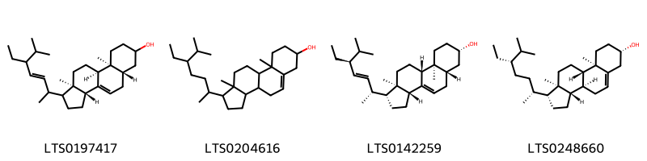{ width=100% }
    <figcaption>Hình ảnh cấu trúc hóa học của 4 hoạt chất thuộc nhóm Steroids and steroid derivatives gồm ['(3ar,5as,9as,9bs,11ar)-1-(5-ethyl-6-methylhept-3-en-2-yl)-9a,11a-dimethyl-1h,2h,3h,3ah,5h,5ah,6h,7h,8h,9h,9bh,10h,11h-cyclopenta[a]phenanthren-7-ol (LTS0197417)', 'stigmast-5-en-3-ol, (3β)- (LTS0204616)', 'chondrillasterol (LTS0142259)', 'clionasterol (LTS0248660)'].</figcaption>
</figure>

---

### Dược dân tộc học

Danh sách các quốc gia có sử dụng *Phytolacca acinosa* trong điều trị các bệnh. 

| Country   | Disease                                             | Bệnh                                                                                                                                                                                                |
|:----------|:----------------------------------------------------|:----------------------------------------------------------------------------------------------------------------------------------------------------------------------------------------------------|
| China     | Antidote, Poison, Vermifuge, Hallucinogen, Diuretic | MYMEMORY WARNING: YOU USED ALL AVAILABLE FREE TRANSLATIONS FOR TODAY. NEXT AVAILABLE IN  02 HOURS 48 MINUTES 56 SECONDS VISIT HTTPS://MYMEMORY.TRANSLATED.NET/DOC/USAGELIMITS.PHP TO TRANSLATE MORE |
| Elsewhere | Poison, Narcotic                                    | MYMEMORY WARNING: YOU USED ALL AVAILABLE FREE TRANSLATIONS FOR TODAY. NEXT AVAILABLE IN  02 HOURS 48 MINUTES 54 SECONDS VISIT HTTPS://MYMEMORY.TRANSLATED.NET/DOC/USAGELIMITS.PHP TO TRANSLATE MORE |

---

---
## Phytolacca americana
### Thông tin về thực vật

!!! info "Phân loại thực vật của *Phytolacca americana* từ GIBF:"
    - **Kingdom:** Plantae
    - **Phylum:** Tracheophyta
    - **Order:** Caryophyllales
    - **Family:** Phytolaccaceae
    - **Genus:** Phytolacca
    - **Species:** *Phytolacca americana*

 

| Label (VI)   | Label (EN)   | Scientific Name      | Descriptions (VI)   | Descriptions (EN)   | Also Known As (VI)   | Also Known As (EN)                |
|:-------------|:-------------|:---------------------|:--------------------|:--------------------|:---------------------|:----------------------------------|
| N/A          | N/A          | Phytolacca americana | loài thực vật       | species of plant    | ['']                 | ['pokeweed', 'American pokeweed'] |

#### Phân bố trên thế giới

**Từ CSDL GIBF** nan, Italy, Australia, Japan, Georgia, Argentina, Réunion, Chinese Taipei, Spain, Portugal, United States of America, Greece, South Africa, Brazil, Switzerland, Austria, France, Mexico, China, Ecuador, Cabo Verde, New Zealand

#### Phân bố tại Việt Nam

**Từ CSDL GIBF**: Không có ghi nhận ở Việt Nam

---
### Thành phần hóa học
        
- Theo cơ sở dữ liệu lotus: Từ loài *Phytolacca americana* đã phân lập và xác định được 188 hoạt chất thuộc về các nhóm Benzodioxanes, Flavonoids, Prenol lipids, Steroids and steroid derivatives, Peptidomimetics, Indoles and derivatives, Organonitrogen compounds, Organooxygen compounds, Phenols, Carboxylic acids and derivatives, Betalains. 

|    | chemicalTaxonomyClassyfireClass   |   smiles_count |
|---:|:----------------------------------|---------------:|
|  0 | Benzodioxanes                     |             24 |
|  1 | Betalains                         |              4 |
|  2 | Carboxylic acids and derivatives  |             47 |
|  3 | Flavonoids                        |              4 |
|  4 | Indoles and derivatives           |              1 |
|  5 | Organonitrogen compounds          |              1 |
|  6 | Organooxygen compounds            |              5 |
|  7 | Peptidomimetics                   |             16 |
|  8 | Phenols                           |              1 |
|  9 | Prenol lipids                     |             69 |
| 10 | Steroids and steroid derivatives  |             12 |

#### Nhóm Benzodioxanes
<figure markdown="span">
    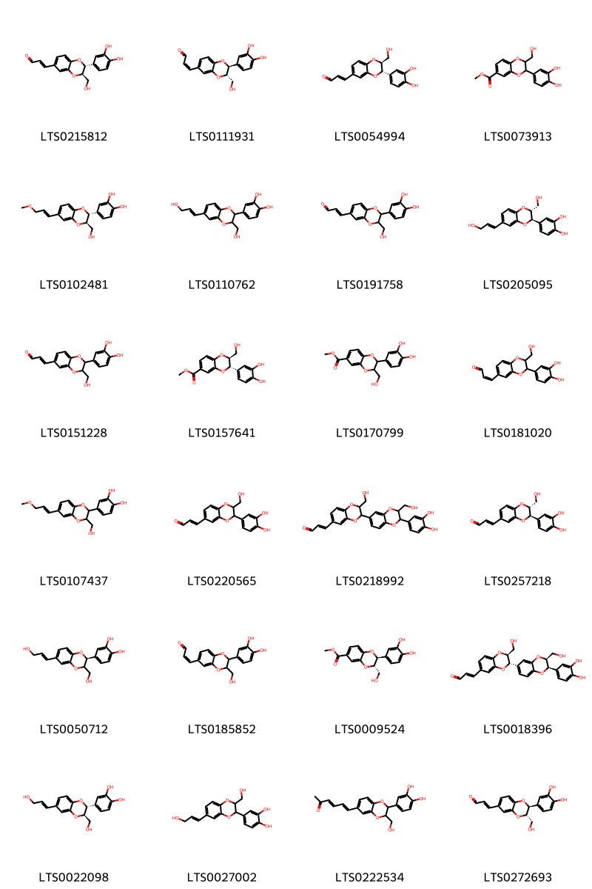{ width=100% }
    <figcaption>Hình ảnh cấu trúc hóa học của 24 hoạt chất thuộc nhóm Benzodioxanes gồm ['(2e)-3-[(2r,3r)-2-(3,4-dihydroxyphenyl)-3-(hydroxymethyl)-2,3-dihydro-1,4-benzodioxin-6-yl]prop-2-enal (LTS0215812)', '(2z)-3-[(2s,3s)-2-(3,4-dihydroxyphenyl)-3-(hydroxymethyl)-2,3-dihydro-1,4-benzodioxin-6-yl]prop-2-enal (LTS0111931)', '(2e)-3-[(2s,3s)-3-(3,4-dihydroxyphenyl)-2-(hydroxymethyl)-2,3-dihydro-1,4-benzodioxin-6-yl]prop-2-enal (LTS0054994)', 'methyl 3-(3,4-dihydroxyphenyl)-2-(hydroxymethyl)-2,3-dihydro-1,4-benzodioxine-6-carboxylate (LTS0073913)', '4-[(2r,3r)-3-(hydroxymethyl)-6-[(1e)-3-methoxyprop-1-en-1-yl]-2,3-dihydro-1,4-benzodioxin-2-yl]benzene-1,2-diol (LTS0102481)', '4-[3-(hydroxymethyl)-6-(3-hydroxyprop-1-en-1-yl)-2,3-dihydro-1,4-benzodioxin-2-yl]benzene-1,2-diol (LTS0110762)', '3-[2-(3,4-dihydroxyphenyl)-3-(hydroxymethyl)-2,3-dihydro-1,4-benzodioxin-6-yl]prop-2-enal (LTS0191758)', 'isoamericanol a (LTS0205095)', '(2e)-3-[2-(3,4-dihydroxyphenyl)-3-(hydroxymethyl)-2,3-dihydro-1,4-benzodioxin-6-yl]prop-2-enal (LTS0151228)', 'methyl (2s,3s)-3-(3,4-dihydroxyphenyl)-2-(hydroxymethyl)-2,3-dihydro-1,4-benzodioxine-6-carboxylate (LTS0157641)', 'methyl 2-(3,4-dihydroxyphenyl)-3-(hydroxymethyl)-2,3-dihydro-1,4-benzodioxine-6-carboxylate (LTS0170799)', '(2z)-3-[3-(3,4-dihydroxyphenyl)-2-(hydroxymethyl)-2,3-dihydro-1,4-benzodioxin-6-yl]prop-2-enal (LTS0181020)', '4-[3-(hydroxymethyl)-6-(3-methoxyprop-1-en-1-yl)-2,3-dihydro-1,4-benzodioxin-2-yl]benzene-1,2-diol (LTS0107437)', '3-[3-(3,4-dihydroxyphenyl)-2-(hydroxymethyl)-2,3-dihydro-1,4-benzodioxin-6-yl]prop-2-enal (LTS0220565)', '3-{3-[2-(3,4-dihydroxyphenyl)-3-(hydroxymethyl)-2,3-dihydro-1,4-benzodioxin-6-yl]-2-(hydroxymethyl)-2,3-dihydro-1,4-benzodioxin-6-yl}prop-2-enal (LTS0218992)', '(2e)-3-[(2r,3r)-3-(3,4-dihydroxyphenyl)-2-(hydroxymethyl)-2,3-dihydro-1,4-benzodioxin-6-yl]prop-2-enal (LTS0257218)', '4-[(2s)-3-(hydroxymethyl)-6-[(1e)-3-hydroxyprop-1-en-1-yl]-2,3-dihydro-1,4-benzodioxin-2-yl]benzene-1,2-diol (LTS0050712)', '(2z)-3-[2-(3,4-dihydroxyphenyl)-3-(hydroxymethyl)-2,3-dihydro-1,4-benzodioxin-6-yl]prop-2-enal (LTS0185852)', 'methyl (2s,3s)-2-(3,4-dihydroxyphenyl)-3-(hydroxymethyl)-2,3-dihydro-1,4-benzodioxine-6-carboxylate (LTS0009524)', '(2e)-3-[(2s,3s)-3-[(2r,3s)-2-(3,4-dihydroxyphenyl)-3-(hydroxymethyl)-2,3-dihydro-1,4-benzodioxin-6-yl]-2-(hydroxymethyl)-2,3-dihydro-1,4-benzodioxin-6-yl]prop-2-enal (LTS0018396)', '4-[(2r,3r)-3-(hydroxymethyl)-6-[(1e)-3-hydroxyprop-1-en-1-yl]-2,3-dihydro-1,4-benzodioxin-2-yl]benzene-1,2-diol (LTS0022098)', '4-[3-(hydroxymethyl)-7-(3-hydroxyprop-1-en-1-yl)-2,3-dihydro-1,4-benzodioxin-2-yl]benzene-1,2-diol (LTS0027002)', '(3e,5e)-6-[2-(3,4-dihydroxyphenyl)-3-(hydroxymethyl)-2,3-dihydro-1,4-benzodioxin-6-yl]hexa-3,5-dien-2-one (LTS0222534)', '3-[(2s,3s)-2-(3,4-dihydroxyphenyl)-3-(hydroxymethyl)-2,3-dihydro-1,4-benzodioxin-6-yl]prop-2-enal (LTS0272693)'].</figcaption>
</figure>
#### Nhóm Betalains
<figure markdown="span">
    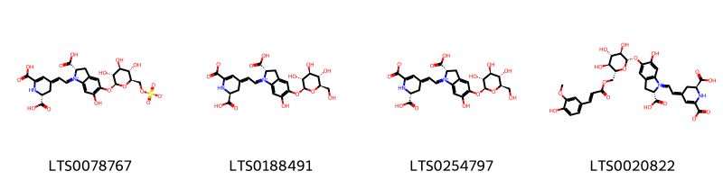{ width=100% }
    <figcaption>Hình ảnh cấu trúc hóa học của 4 hoạt chất thuộc nhóm Betalains gồm ['(2s)-2-carboxy-1-{2-[(2r)-2,6-dicarboxy-2,3-dihydro-1h-pyridin-4-ylidene]ethylidene}-6-hydroxy-5-{[(2s,3r,4s,5s,6r)-3,4,5-trihydroxy-6-[(sulfonatooxy)methyl]oxan-2-yl]oxy}-2,3-dihydro-1h-1λ⁵-indol-1-ylium (LTS0078767)', '(2s)-2-carboxy-1-{2-[(2s)-2-carboxy-6-carboxylato-2,3-dihydro-1h-pyridin-4-ylidene]ethylidene}-6-hydroxy-5-{[(2s,3r,4s,5s,6r)-3,4,5-trihydroxy-6-(hydroxymethyl)oxan-2-yl]oxy}-2,3-dihydro-1h-1λ⁵-indol-1-ylium (LTS0188491)', '(2s)-2-carboxy-1-{2-[(2r)-2-carboxy-6-carboxylato-2,3-dihydro-1h-pyridin-4-ylidene]ethylidene}-6-hydroxy-5-{[(2s,3r,4s,5s,6r)-3,4,5-trihydroxy-6-(hydroxymethyl)oxan-2-yl]oxy}-2,3-dihydro-1h-1λ⁵-indol-1-ylium (LTS0254797)', '(2s)-2-carboxy-1-{2-[(2s)-2-carboxy-6-carboxylato-2,3-dihydro-1h-pyridin-4-ylidene]ethylidene}-6-hydroxy-5-{[(2s,3r,4s,5s,6r)-3,4,5-trihydroxy-6-({[3-(4-hydroxy-3-methoxyphenyl)prop-2-enoyl]oxy}methyl)oxan-2-yl]oxy}-2,3-dihydro-1h-1λ⁵-indol-1-ylium (LTS0020822)'].</figcaption>
</figure>
#### Nhóm Carboxylic acids and derivatives
<figure markdown="span">
    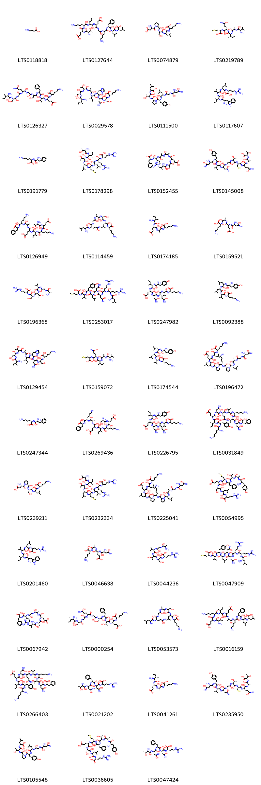{ width=100% }
    <figcaption>Hình ảnh cấu trúc hóa học của 47 hoạt chất thuộc nhóm Carboxylic acids and derivatives gồm ['gamma(amino)-butyric acid (LTS0118818)', '(2s)-2-{[(2s)-2-{[(2s)-2-{[(2s)-6-amino-2-{[(2s)-2-{[(2s)-2-{[(2s,3s)-2-{[(2s)-6-amino-2-{[(2s)-2-{[(2s,3r)-2-amino-1,3-dihydroxybutylidene]amino}-4-carboxy-1-hydroxybutylidene]amino}-1-hydroxyhexylidene]amino}-1-hydroxy-3-methylpentylidene]amino}-4-carboxy-1-hydroxybutylidene]amino}-1-hydroxypropylidene]amino}-1-hydroxyhexylidene]amino}-1-hydroxy-3-phenylpropylidene]amino}-1-hydroxy-4-methylpentylidene]amino}-4-methylpentanoic acid (LTS0127644)', '6-amino-2-[(2-{[2-({[1-(2-amino-3-carboxypropanoyl)pyrrolidin-2-yl](hydroxy)methylidene}amino)-1,3-dihydroxypropylidene]amino}-1-hydroxy-4-methylpentylidene)amino]hexanoic acid (LTS0074879)', '(2s)-2-{[(2s)-2-{[(2s,3s)-2-{[(2s)-2-{[(2s)-2-amino-1-hydroxy-3-methylbutylidene]amino}-1-hydroxypropylidene]amino}-1-hydroxy-3-methylpentylidene]amino}-1-hydroxy-4-(c-hydroxycarbonimidoyl)butylidene]amino}-4-(methylsulfanyl)butanoic acid (LTS0219789)', '6-amino-2-{[2-({2-[(2-{[2-({2-[(2-{[2-({2-[(2-amino-1-hydroxy-3-methylpentylidene)amino]-1,3-dihydroxypropylidene}amino)-1-hydroxyethylidene]amino}-1-hydroxy-4-(c-hydroxycarbonimidoyl)butylidene)amino]-1-hydroxyethylidene}amino)-1,3-dihydroxypropylidene]amino}-1-hydroxy-3-phenylpropylidene)amino]-1,3-dihydroxybutylidene}amino)-4-carboxy-1-hydroxybutylidene]amino}hexanoic acid (LTS0126327)', '(2s)-6-amino-2-{[(2s)-2-{[(2s)-2-{[(2s)-2-{[(2s,3s)-2-{[(2s)-2-{[(2s,3r)-2-{[(2s)-2-{[(2s,3s)-2-amino-1-hydroxy-3-methylpentylidene]amino}-1,3-dihydroxypropylidene]amino}-1,3-dihydroxybutylidene]amino}-1-hydroxypropylidene]amino}-1-hydroxy-3-methylpentylidene]amino}-1-hydroxy-3-(1h-imidazol-2-yl)propylidene]amino}-1-hydroxy-3-(c-hydroxycarbonimidoyl)propylidene]amino}-1,3-dihydroxypropylidene]amino}hexanoic acid (LTS0029578)', '(2s)-2-{[(2s,3r)-2-({[(2s)-1-[(2s)-2-{[(2s)-2-[(2-{[(2s)-2-amino-1-hydroxy-3-(c-hydroxycarbonimidoyl)propylidene]amino}-1-hydroxyethylidene)amino]-1-hydroxy-4-methylpentylidene]amino}-3-(4-hydroxyphenyl)propanoyl]pyrrolidin-2-yl](hydroxy)methylidene}amino)-1,3-dihydroxybutylidene]amino}-4-methylpentanoic acid (LTS0111500)', '(2s)-2-{[(2s)-2-{[(2s)-2-{[(2s,3s)-2-{[(2s)-2-amino-1-hydroxy-3-(1h-indol-3-yl)propylidene]amino}-1-hydroxy-3-methylpentylidene]amino}-1-hydroxy-3-methylbutylidene]amino}-1-hydroxy-4-methylpentylidene]amino}-5-carbamimidamidopentanoic acid (LTS0117607)', '6-amino-2-[(2-amino-1-hydroxy-3-phenylpropylidene)amino]hexanoic acid (LTS0191779)', '(2s)-2-{[(2s)-2-{[(2s)-2-{[(2s)-2-{[(2s)-2-{[(2s,3r)-2-{[(2s,3s)-2-{[(2s,3r)-2-amino-1,3-dihydroxybutylidene]amino}-1-hydroxy-3-methylpentylidene]amino}-1,3-dihydroxybutylidene]amino}-1-hydroxy-4-methylpentylidene]amino}-1-hydroxy-4-(methylsulfanyl)butylidene]amino}-1-hydroxy-4-methylpentylidene]amino}-5-carbamimidamido-1-hydroxypentylidene]amino}-5-carbamimidamidopentanoic acid (LTS0178298)', '4-({2-[(2-amino-1-hydroxy-3-methylbutylidene)amino]-1,3-dihydroxypropylidene}amino)-4-[(1-{[1-({4-carbamimidamido-1-[(1-carboxy-2-phenylethyl)-c-hydroxycarbonimidoyl]butyl}-c-hydroxycarbonimidoyl)ethyl]-c-hydroxycarbonimidoyl}ethyl)-c-hydroxycarbonimidoyl]butanoic acid (LTS0152455)', '2-({2-[(2-{[2-({2-[(2-{[2-({2-[(2-{[2-amino-1-hydroxy-3-(c-hydroxycarbonimidoyl)propylidene]amino}-1-hydroxy-3-(4-hydroxyphenyl)propylidene)amino]-1-hydroxy-3-methylbutylidene}amino)-1-hydroxy-3-(c-hydroxycarbonimidoyl)propylidene]amino}-1-hydroxyethylidene)amino]-1,3-dihydroxybutylidene}amino)-1-hydroxy-3-sulfanylpropylidene]amino}-1-hydroxy-4-(c-hydroxycarbonimidoyl)butylidene)amino]-1-hydroxypropylidene}amino)-3-hydroxybutanoic acid (LTS0145008)', '4-{[1-({5-amino-1-[(1-carboxy-2-phenylethyl)-c-hydroxycarbonimidoyl]pentyl}-c-hydroxycarbonimidoyl)ethyl]-c-hydroxycarbonimidoyl}-4-[(2-{[6-amino-2-({2-[(2-amino-1,3-dihydroxybutylidene)amino]-4-carboxy-1-hydroxybutylidene}amino)-1-hydroxyhexylidene]amino}-1-hydroxy-3-methylpentylidene)amino]butanoic acid (LTS0126949)', '(2s)-6-amino-2-{[(2s)-2-{[(2s)-2-{[(2s)-2-[(2-{[(2s)-2-{[(2s)-2-amino-1-hydroxy-4-methylpentylidene]amino}-1-hydroxy-4-(c-hydroxycarbonimidoyl)butylidene]amino}-1-hydroxyethylidene)amino]-1-hydroxypropylidene]amino}-1,3-dihydroxypropylidene]amino}-1-hydroxy-4-methylpentylidene]amino}hexanoic acid (LTS0114459)', '6-amino-2-{[2-({2-[(2-amino-1-hydroxy-3-methylpentylidene)amino]-4-carboxy-1-hydroxybutylidene}amino)-1-hydroxypropylidene]amino}hexanoic acid (LTS0174185)', '6-amino-2-({2-[(2-{[2-amino-1-hydroxy-3-(c-hydroxycarbonimidoyl)propylidene]amino}-4-carboxy-1-hydroxybutylidene)amino]-1-hydroxypropylidene}amino)hexanoic acid (LTS0159521)', '(2s)-2-{[(2s)-2-{[(2s,3r)-2-{[(2s)-2-[(2-{[(2s)-2-amino-1-hydroxypropylidene]amino}-1-hydroxyethylidene)amino]-1-hydroxy-3-methylbutylidene]amino}-1,3-dihydroxybutylidene]amino}-1,3-dihydroxypropylidene]amino}-5-carbamimidamidopentanoic acid (LTS0196368)', '2-({2-[(2-{[2-({2-[(2-{[2-({2-[(2-amino-1-hydroxy-4-methylpentylidene)amino]-5-carbamimidamido-1-hydroxypentylidene}amino)-5-carbamimidamido-1-hydroxypentylidene]amino}-1-hydroxy-3-(c-hydroxycarbonimidoyl)propylidene)amino]-1-hydroxy-3-(c-hydroxycarbonimidoyl)propylidene}amino)-1-hydroxy-4-methylpentylidene]amino}-1-hydroxy-3-(4-hydroxyphenyl)propylidene)amino]-1-hydroxy-3-methylbutylidene}amino)-4-(methylsulfanyl)butanoic acid (LTS0253017)', '(2s)-6-amino-2-{[(2s)-2-{[(2s)-2-{[(2s)-2-{[(2s)-2-{[(2s,3s)-2-{[(2s)-2-amino-1-hydroxy-3-(4-hydroxyphenyl)propylidene]amino}-1-hydroxy-3-methylpentylidene]amino}-4-carboxy-1-hydroxybutylidene]amino}-1-hydroxy-3-(c-hydroxycarbonimidoyl)propylidene]amino}-1-hydroxy-4-(c-hydroxycarbonimidoyl)butylidene]amino}-1-hydroxy-3-methylbutylidene]amino}hexanoic acid (LTS0247982)', '6-amino-2-{[2-({2-[(2-{[2-amino-1-hydroxy-3-(4-hydroxyphenyl)propylidene]amino}-1-hydroxy-4-methylpentylidene)amino]-1-hydroxy-4-methylpentylidene}amino)-1-hydroxy-3-methylbutylidene]amino}hexanoic acid (LTS0092388)', '6-amino-2-({2-[(2-{[2-({2-[(2-{[2-({2-[(2-amino-1-hydroxy-3-methylpentylidene)amino]-1,3-dihydroxypropylidene}amino)-1,3-dihydroxybutylidene]amino}-1-hydroxypropylidene)amino]-1-hydroxy-3-methylpentylidene}amino)-1-hydroxy-3-(1h-imidazol-2-yl)propylidene]amino}-1-hydroxy-3-(c-hydroxycarbonimidoyl)propylidene)amino]-1,3-dihydroxypropylidene}amino)hexanoic acid (LTS0129454)', '2-[(2-{[2-({2-[(2-amino-1-hydroxy-3-methylbutylidene)amino]-1-hydroxypropylidene}amino)-1-hydroxy-3-methylpentylidene]amino}-1-hydroxy-4-(c-hydroxycarbonimidoyl)butylidene)amino]-4-(methylsulfanyl)butanoic acid (LTS0159072)', '(2s)-6-amino-2-{[(2s)-2-{[(2s)-2-{[(2s)-2-{[(2s)-2-amino-1-hydroxy-3-(4-hydroxyphenyl)propylidene]amino}-1-hydroxy-4-methylpentylidene]amino}-1-hydroxy-4-methylpentylidene]amino}-1-hydroxy-3-methylbutylidene]amino}hexanoic acid (LTS0174544)', '(2s)-6-amino-2-{[(2s)-2-{[(2s)-2-{[(2s)-2-({[(2s)-1-[(2s)-6-amino-2-({[(2r)-1-[(2s)-2-{[(2s)-2-[(2-{[(2s)-2-amino-1-hydroxy-3-(c-hydroxycarbonimidoyl)propylidene]amino}-1-hydroxyethylidene)amino]-1-hydroxypropylidene]amino}-4-methylpentanoyl]pyrrolidin-2-yl](hydroxy)methylidene}amino)hexanoyl]pyrrolidin-2-yl](hydroxy)methylidene}amino)-1-hydroxy-4-methylpentylidene]amino}-4-carboxy-1-hydroxybutylidene]amino}-1-hydroxy-4-methylpentylidene]amino}hexanoic acid (LTS0196472)', '(2s)-6-amino-2-{[(2s)-2-amino-1-hydroxy-3-phenylpropylidene]amino}hexanoic acid (LTS0247344)', '(4s)-4-{[(2s,3r)-2-amino-1,3-dihydroxybutylidene]amino}-4-{[(1s)-5-amino-1-{[(1s,2s)-1-{[(1s)-1-{[(1s)-1-{[(1s)-5-amino-1-{[(1s)-1-carboxy-2-phenylethyl]-c-hydroxycarbonimidoyl}pentyl]-c-hydroxycarbonimidoyl}ethyl]-c-hydroxycarbonimidoyl}-3-carboxypropyl]-c-hydroxycarbonimidoyl}-2-methylbutyl]-c-hydroxycarbonimidoyl}pentyl]-c-hydroxycarbonimidoyl}butanoic acid (LTS0269436)', '6-amino-2-({2-[(2-{[2-({2-[(2-{[2-amino-1-hydroxy-3-(4-hydroxyphenyl)propylidene]amino}-1-hydroxy-3-methylpentylidene)amino]-4-carboxy-1-hydroxybutylidene}amino)-1-hydroxy-3-(c-hydroxycarbonimidoyl)propylidene]amino}-1-hydroxy-4-(c-hydroxycarbonimidoyl)butylidene)amino]-1-hydroxy-3-methylbutylidene}amino)hexanoic acid (LTS0226795)', '(4s)-4-{[(1s)-1-{[(1s)-1-{[(1s)-1-{[(1s)-5-amino-1-{[(1s,2r)-1-{[(1s)-1-{[(1s)-1-carboxy-2-phenylethyl]-c-hydroxycarbonimidoyl}-2-(c-hydroxycarbonimidoyl)ethyl]-c-hydroxycarbonimidoyl}-2-hydroxypropyl]-c-hydroxycarbonimidoyl}pentyl]-c-hydroxycarbonimidoyl}-2-methylpropyl]-c-hydroxycarbonimidoyl}-3-(c-hydroxycarbonimidoyl)propyl]-c-hydroxycarbonimidoyl}-2-(c-hydroxycarbonimidoyl)ethyl]-c-hydroxycarbonimidoyl}-4-{[(2s,3s)-2-{[(2s)-2-{[(2s)-2,6-diamino-1-hydroxyhexylidene]amino}-1-hydroxy-3-(4-hydroxyphenyl)propylidene]amino}-1-hydroxy-3-methylpentylidene]amino}butanoic acid (LTS0031849)', '(2s)-6-amino-2-{[(2s)-2-{[(2s)-2-({[(2r)-1-[(2s)-2-amino-3-carboxypropanoyl]pyrrolidin-2-yl](hydroxy)methylidene}amino)-1,3-dihydroxypropylidene]amino}-1-hydroxy-4-methylpentylidene]amino}hexanoic acid (LTS0239211)', '2-[(2-{[2-({2-[(2-{[2-({2-[(2-amino-1,3-dihydroxybutylidene)amino]-1-hydroxy-3-methylpentylidene}amino)-1,3-dihydroxybutylidene]amino}-1-hydroxy-4-methylpentylidene)amino]-1-hydroxy-4-(methylsulfanyl)butylidene}amino)-1-hydroxy-4-methylpentylidene]amino}-5-carbamimidamido-1-hydroxypentylidene)amino]-5-carbamimidamidopentanoic acid (LTS0232334)', '6-amino-2-{[2-({2-[(2-{[(1-{6-amino-2-[({1-[2-({2-[(2-{[2-amino-1-hydroxy-3-(c-hydroxycarbonimidoyl)propylidene]amino}-1-hydroxyethylidene)amino]-1-hydroxypropylidene}amino)-4-methylpentanoyl]pyrrolidin-2-yl}(hydroxy)methylidene)amino]hexanoyl}pyrrolidin-2-yl)(hydroxy)methylidene]amino}-1-hydroxy-4-methylpentylidene)amino]-4-carboxy-1-hydroxybutylidene}amino)-1-hydroxy-4-methylpentylidene]amino}hexanoic acid (LTS0225041)', '4-[(2-{[2-({2-[(2-{[2-amino-1-hydroxy-3-(4-hydroxyphenyl)propylidene]amino}-1-hydroxypropylidene)amino]-1,3-dihydroxybutylidene}amino)-1-hydroxy-3-phenylpropylidene]amino}-1-hydroxy-4-(methylsulfanyl)butylidene)amino]-4-{[1-({1-[(4-carbamimidamido-1-carboxybutyl)-c-hydroxycarbonimidoyl]-3-methylbutyl}-c-hydroxycarbonimidoyl)-2-hydroxyethyl]-c-hydroxycarbonimidoyl}butanoic acid (LTS0054995)', '2-{[2-({2-[(2-{[2-amino-1-hydroxy-3-(1h-indol-3-yl)propylidene]amino}-1-hydroxy-3-methylpentylidene)amino]-1-hydroxy-3-methylbutylidene}amino)-1-hydroxy-4-methylpentylidene]amino}-5-carbamimidamidopentanoic acid (LTS0201460)', '(2s)-6-amino-2-{[(2s)-2-{[(2s)-2-{[(2s)-2-amino-1-hydroxy-3-(c-hydroxycarbonimidoyl)propylidene]amino}-4-carboxy-1-hydroxybutylidene]amino}-1-hydroxypropylidene]amino}hexanoic acid (LTS0046638)', '2-({2-[(2-{[2-({2-[(2-amino-1-hydroxypropylidene)amino]-1-hydroxyethylidene}amino)-1-hydroxy-3-methylbutylidene]amino}-1,3-dihydroxybutylidene)amino]-1,3-dihydroxypropylidene}amino)-5-carbamimidamidopentanoic acid (LTS0044236)', '(2s)-2-{[(2s)-2-{[(2s)-2-{[(2s)-2-{[(2s)-2-{[(2s)-2-{[(2s)-2-{[(2s)-2-{[(2s)-2-amino-1-hydroxy-4-methylpentylidene]amino}-5-carbamimidamido-1-hydroxypentylidene]amino}-5-carbamimidamido-1-hydroxypentylidene]amino}-1-hydroxy-3-(c-hydroxycarbonimidoyl)propylidene]amino}-1-hydroxy-3-(c-hydroxycarbonimidoyl)propylidene]amino}-1-hydroxy-4-methylpentylidene]amino}-1-hydroxy-3-(4-hydroxyphenyl)propylidene]amino}-1-hydroxy-3-methylbutylidene]amino}-4-(methylsulfanyl)butanoic acid (LTS0047909)', '(4s)-4-{[(2s)-2-{[(2s)-2-amino-1-hydroxy-3-methylbutylidene]amino}-1,3-dihydroxypropylidene]amino}-4-{[(1s)-1-{[(1s)-1-{[(1s)-4-carbamimidamido-1-{[(1s)-1-carboxy-2-phenylethyl]-c-hydroxycarbonimidoyl}butyl]-c-hydroxycarbonimidoyl}ethyl]-c-hydroxycarbonimidoyl}ethyl]-c-hydroxycarbonimidoyl}butanoic acid (LTS0067942)', '(2s)-6-amino-2-{[(2s)-2-{[(2s,3r)-2-{[(2s)-2-{[(2s)-2-[(2-{[(2s)-2-[(2-{[(2s)-2-{[(2s,3s)-2-amino-1-hydroxy-3-methylpentylidene]amino}-1,3-dihydroxypropylidene]amino}-1-hydroxyethylidene)amino]-1-hydroxy-4-(c-hydroxycarbonimidoyl)butylidene]amino}-1-hydroxyethylidene)amino]-1,3-dihydroxypropylidene]amino}-1-hydroxy-3-phenylpropylidene]amino}-1,3-dihydroxybutylidene]amino}-4-carboxy-1-hydroxybutylidene]amino}hexanoic acid (LTS0000254)', '6-amino-2-{[2-({2-[(2-{[2-({2-[(2-amino-1-hydroxy-4-methylpentylidene)amino]-1-hydroxy-4-(c-hydroxycarbonimidoyl)butylidene}amino)-1-hydroxyethylidene]amino}-1-hydroxypropylidene)amino]-1,3-dihydroxypropylidene}amino)-1-hydroxy-4-methylpentylidene]amino}hexanoic acid (LTS0053573)', '2-{[2-({2-[(6-amino-2-{[2-({2-[(2-{[6-amino-2-({2-[(2-amino-1,3-dihydroxybutylidene)amino]-4-carboxy-1-hydroxybutylidene}amino)-1-hydroxyhexylidene]amino}-1-hydroxy-3-methylpentylidene)amino]-4-carboxy-1-hydroxybutylidene}amino)-1-hydroxypropylidene]amino}-1-hydroxyhexylidene)amino]-1-hydroxy-3-phenylpropylidene}amino)-1-hydroxy-4-methylpentylidene]amino}-4-methylpentanoic acid (LTS0016159)', '4-[(1-{[1-({1-[(5-amino-1-{[1-({1-[(1-carboxy-2-phenylethyl)-c-hydroxycarbonimidoyl]-2-(c-hydroxycarbonimidoyl)ethyl}-c-hydroxycarbonimidoyl)-2-hydroxypropyl]-c-hydroxycarbonimidoyl}pentyl)-c-hydroxycarbonimidoyl]-2-methylpropyl}-c-hydroxycarbonimidoyl)-3-(c-hydroxycarbonimidoyl)propyl]-c-hydroxycarbonimidoyl}-2-(c-hydroxycarbonimidoyl)ethyl)-c-hydroxycarbonimidoyl]-4-{[2-({2-[(2,6-diamino-1-hydroxyhexylidene)amino]-1-hydroxy-3-(4-hydroxyphenyl)propylidene}amino)-1-hydroxy-3-methylpentylidene]amino}butanoic acid (LTS0266403)', '2-[(2-{[2-({2-[(2-amino-1,3-dihydroxybutylidene)amino]-1-hydroxy-3-(c-hydroxycarbonimidoyl)propylidene}amino)-1-hydroxy-3-phenylpropylidene]amino}-1-hydroxy-3-(c-hydroxycarbonimidoyl)propylidene)amino]-5-carbamimidamidopentanoic acid (LTS0021202)', '(2s)-6-amino-2-{[(2s)-2-{[(2s)-2-{[(2s,3s)-2-amino-1-hydroxy-3-methylpentylidene]amino}-4-carboxy-1-hydroxybutylidene]amino}-1-hydroxypropylidene]amino}hexanoic acid (LTS0041261)', '(2s,3r)-2-{[(2s)-2-{[(2s)-2-{[(2r)-2-{[(2s,3r)-2-[(2-{[(2s)-2-{[(2s)-2-{[(2s)-2-{[(2s)-2-amino-1-hydroxy-3-(c-hydroxycarbonimidoyl)propylidene]amino}-1-hydroxy-3-(4-hydroxyphenyl)propylidene]amino}-1-hydroxy-3-methylbutylidene]amino}-1-hydroxy-3-(c-hydroxycarbonimidoyl)propylidene]amino}-1-hydroxyethylidene)amino]-1,3-dihydroxybutylidene]amino}-1-hydroxy-3-sulfanylpropylidene]amino}-1-hydroxy-4-(c-hydroxycarbonimidoyl)butylidene]amino}-1-hydroxypropylidene]amino}-3-hydroxybutanoic acid (LTS0235950)', '2-({2-[({1-[2-({2-[(2-{[2-amino-1-hydroxy-3-(c-hydroxycarbonimidoyl)propylidene]amino}-1-hydroxyethylidene)amino]-1-hydroxy-4-methylpentylidene}amino)-3-(4-hydroxyphenyl)propanoyl]pyrrolidin-2-yl}(hydroxy)methylidene)amino]-1,3-dihydroxybutylidene}amino)-4-methylpentanoic acid (LTS0105548)', '(4s)-4-{[(2s)-2-{[(2s)-2-{[(2s,3r)-2-{[(2s)-2-{[(2s)-2-amino-1-hydroxy-3-(4-hydroxyphenyl)propylidene]amino}-1-hydroxypropylidene]amino}-1,3-dihydroxybutylidene]amino}-1-hydroxy-3-phenylpropylidene]amino}-1-hydroxy-4-(methylsulfanyl)butylidene]amino}-4-{[(1s)-1-{[(1s)-1-{[(1s)-4-carbamimidamido-1-carboxybutyl]-c-hydroxycarbonimidoyl}-3-methylbutyl]-c-hydroxycarbonimidoyl}-2-hydroxyethyl]-c-hydroxycarbonimidoyl}butanoic acid (LTS0036605)', '(2s)-2-{[(2s)-2-{[(2s)-2-{[(2s)-2-{[(2s,3r)-2-amino-1,3-dihydroxybutylidene]amino}-1-hydroxy-3-(c-hydroxycarbonimidoyl)propylidene]amino}-1-hydroxy-3-phenylpropylidene]amino}-1-hydroxy-3-(c-hydroxycarbonimidoyl)propylidene]amino}-5-carbamimidamidopentanoic acid (LTS0047424)'].</figcaption>
</figure>
#### Nhóm Flavonoids
<figure markdown="span">
    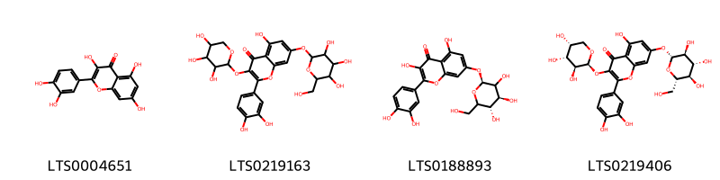{ width=100% }
    <figcaption>Hình ảnh cấu trúc hóa học của 4 hoạt chất thuộc nhóm Flavonoids gồm ['quercetin (LTS0004651)', '2-(3,4-dihydroxyphenyl)-5-hydroxy-7-{[3,4,5-trihydroxy-6-(hydroxymethyl)oxan-2-yl]oxy}-3-[(3,4,5-trihydroxyoxan-2-yl)oxy]chromen-4-one (LTS0219163)', 'quercimeritrin (LTS0188893)', '2-(3,4-dihydroxyphenyl)-5-hydroxy-7-{[(2r,3s,4r,5r,6s)-3,4,5-trihydroxy-6-(hydroxymethyl)oxan-2-yl]oxy}-3-{[(2s,3s,4r,5r)-3,4,5-trihydroxyoxan-2-yl]oxy}chromen-4-one (LTS0219406)'].</figcaption>
</figure>
#### Nhóm Indoles and derivatives
<figure markdown="span">
    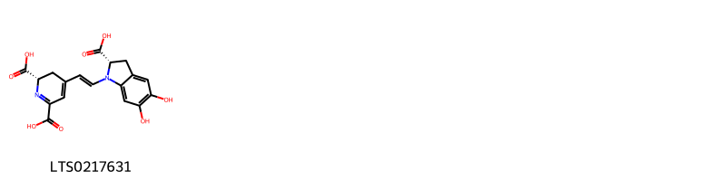{ width=100% }
    <figcaption>Hình ảnh cấu trúc hóa học của 1 hoạt chất thuộc nhóm Indoles and derivatives gồm ['betanidin (LTS0217631)'].</figcaption>
</figure>
#### Nhóm Organonitrogen compounds
<figure markdown="span">
    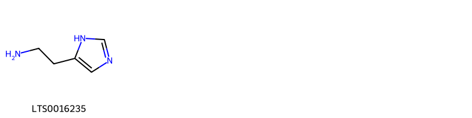{ width=100% }
    <figcaption>Hình ảnh cấu trúc hóa học của 1 hoạt chất thuộc nhóm Organonitrogen compounds gồm ['1h-imidazole-5-ethanamine (LTS0016235)'].</figcaption>
</figure>
#### Nhóm Organooxygen compounds
<figure markdown="span">
    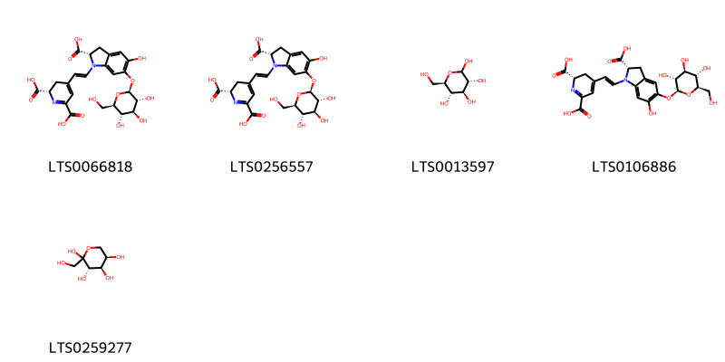{ width=100% }
    <figcaption>Hình ảnh cấu trúc hóa học của 5 hoạt chất thuộc nhóm Organooxygen compounds gồm ['(2s)-4-{2-[(2s)-2-carboxy-5-hydroxy-6-{[(2s,3r,4s,5s,6r)-3,4,5-trihydroxy-6-(hydroxymethyl)oxan-2-yl]oxy}-2,3-dihydroindol-1-yl]ethenyl}-2,3-dihydropyridine-2,6-dicarboxylic acid (LTS0066818)', '(2s)-4-[(1e)-2-[(2s)-2-carboxy-5-hydroxy-6-{[(2s,3r,4s,5s,6r)-3,4,5-trihydroxy-6-(hydroxymethyl)oxan-2-yl]oxy}-2,3-dihydroindol-1-yl]ethenyl]-2,3-dihydropyridine-2,6-dicarboxylic acid (LTS0256557)', 'glucose (LTS0013597)', 'betanin (LTS0106886)', 'd-fructopyranose (LTS0259277)'].</figcaption>
</figure>
#### Nhóm Peptidomimetics
<figure markdown="span">
    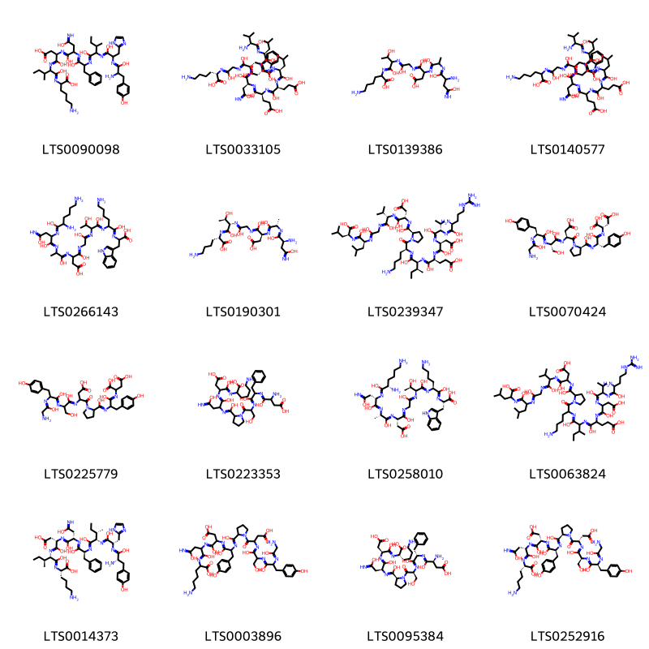{ width=100% }
    <figcaption>Hình ảnh cấu trúc hóa học của 16 hoạt chất thuộc nhóm Peptidomimetics gồm ['6-amino-2-{[2-({2-[(2-{[2-({2-[(2-{[2-amino-1-hydroxy-3-(4-hydroxyphenyl)propylidene]amino}-1-hydroxy-3-(1h-imidazol-2-yl)propylidene)amino]-1-hydroxy-3-methylpentylidene}amino)-1-hydroxy-3-phenylpropylidene]amino}-1-hydroxy-3-(c-hydroxycarbonimidoyl)propylidene)amino]-3-carboxy-1-hydroxypropylidene}amino)-1-hydroxy-3-methylpentylidene]amino}hexanoic acid (LTS0090098)', '(2s)-6-amino-2-[(2-{[(2s)-2-{[(2s)-2-{[(2s)-2-{[(2s)-2-{[(2s)-2-{[(2s)-2-{[(2s)-2-{[(2s)-2-amino-1-hydroxy-3-methylbutylidene]amino}-1-hydroxy-4-methylpentylidene]amino}-3-carboxy-1-hydroxypropylidene]amino}-1-hydroxy-4-methylpentylidene]amino}-4-carboxy-1-hydroxybutylidene]amino}-4-carboxy-1-hydroxybutylidene]amino}-1-hydroxy-3-(c-hydroxycarbonimidoyl)propylidene]amino}-1-hydroxy-3-(1h-indol-3-yl)propylidene]amino}-1-hydroxyethylidene)amino]hexanoic acid (LTS0033105)', '6-amino-2-[(2-{[2-({2-[(2-{[2-amino-1-hydroxy-3-(c-hydroxycarbonimidoyl)propylidene]amino}-1-hydroxypropylidene)amino]-3-carboxy-1-hydroxypropylidene}amino)-1-hydroxyethylidene]amino}-1,3-dihydroxybutylidene)amino]hexanoic acid (LTS0139386)', '6-amino-2-{[2-({2-[(2-{[2-({2-[(2-{[2-({2-[(2-amino-1-hydroxy-3-methylbutylidene)amino]-1-hydroxy-4-methylpentylidene}amino)-3-carboxy-1-hydroxypropylidene]amino}-1-hydroxy-4-methylpentylidene)amino]-4-carboxy-1-hydroxybutylidene}amino)-4-carboxy-1-hydroxybutylidene]amino}-1-hydroxy-3-(c-hydroxycarbonimidoyl)propylidene)amino]-1-hydroxy-3-(1h-indol-3-yl)propylidene}amino)-1-hydroxyethylidene]amino}hexanoic acid (LTS0140577)', '3-{[({1-[(5-amino-1-{[1-carboxy-2-(1h-indol-3-yl)ethyl]-c-hydroxycarbonimidoyl}pentyl)-c-hydroxycarbonimidoyl]-2-hydroxypropyl}-c-hydroxycarbonimidoyl)methyl]-c-hydroxycarbonimidoyl}-3-{[2-({2-[(2,6-diamino-1-hydroxyhexylidene)amino]-1-hydroxy-3-(c-hydroxycarbonimidoyl)propylidene}amino)-1-hydroxypropylidene]amino}propanoic acid (LTS0266143)', '(2s)-6-amino-2-{[(2s,3r)-2-[(2-{[(2s)-2-{[(2s)-2-{[(2s)-2-amino-1-hydroxy-3-(c-hydroxycarbonimidoyl)propylidene]amino}-1-hydroxypropylidene]amino}-3-carboxy-1-hydroxypropylidene]amino}-1-hydroxyethylidene)amino]-1,3-dihydroxybutylidene]amino}hexanoic acid (LTS0190301)', '(4s)-4-{[(1s,2s)-1-{[(2s)-6-amino-1-[(2r)-2-{[(1s)-2-carboxy-1-{[(1s)-1-[({[(1s)-1-{[(1s)-1-carboxy-3-methylbutyl]-c-hydroxycarbonimidoyl}-3-methylbutyl]-c-hydroxycarbonimidoyl}methyl)-c-hydroxycarbonimidoyl]-2-methylpropyl]-c-hydroxycarbonimidoyl}ethyl]-c-hydroxycarbonimidoyl}pyrrolidin-1-yl]-1-oxohexan-2-yl]-c-hydroxycarbonimidoyl}-2-methylbutyl]-c-hydroxycarbonimidoyl}-4-{[(2s)-2-{[(2s)-2-{[(2s)-2-amino-5-carbamimidamido-1-hydroxypentylidene]amino}-1-hydroxy-3-methylbutylidene]amino}-3-carboxy-1-hydroxypropylidene]amino}butanoic acid (LTS0239347)', '(2s)-2-{[(2s)-2-({[(2r)-1-[(2s)-2-{[(2s)-2-{[(2s)-2-[(2-amino-1-hydroxyethylidene)amino]-1-hydroxy-3-(4-hydroxyphenyl)propylidene]amino}-1,3-dihydroxypropylidene]amino}-3-carboxypropanoyl]pyrrolidin-2-yl](hydroxy)methylidene}amino)-1-hydroxy-3-(4-hydroxyphenyl)propylidene]amino}butanedioic acid (LTS0070424)', '2-{[2-({[1-(2-{[2-({2-[(2-amino-1-hydroxyethylidene)amino]-1-hydroxy-3-(4-hydroxyphenyl)propylidene}amino)-1,3-dihydroxypropylidene]amino}-3-carboxypropanoyl)pyrrolidin-2-yl](hydroxy)methylidene}amino)-1-hydroxy-3-(4-hydroxyphenyl)propylidene]amino}butanedioic acid (LTS0225779)', '6-amino-2-{[2-({2-[({1-[2-({2-[(2-amino-3-carboxy-1-hydroxypropylidene)amino]-1-hydroxy-3-phenylpropylidene}amino)-3-hydroxypropanoyl]pyrrolidin-2-yl}(hydroxy)methylidene)amino]-1-hydroxy-3-(c-hydroxycarbonimidoyl)propylidene}amino)-3-carboxy-1-hydroxypropylidene]amino}hexanoic acid (LTS0223353)', '(3s)-3-[({[(1s,2r)-1-{[(1s)-5-amino-1-{[(1s)-1-carboxy-2-(1h-indol-3-yl)ethyl]-c-hydroxycarbonimidoyl}pentyl]-c-hydroxycarbonimidoyl}-2-hydroxypropyl]-c-hydroxycarbonimidoyl}methyl)-c-hydroxycarbonimidoyl]-3-{[(2s)-2-{[(2s)-2-{[(2s)-2,6-diamino-1-hydroxyhexylidene]amino}-1-hydroxy-3-(c-hydroxycarbonimidoyl)propylidene]amino}-1-hydroxypropylidene]amino}propanoic acid (LTS0258010)', '4-{[1-({6-amino-1-[2-({2-carboxy-1-[(1-{[({1-[(1-carboxy-3-methylbutyl)-c-hydroxycarbonimidoyl]-3-methylbutyl}-c-hydroxycarbonimidoyl)methyl]-c-hydroxycarbonimidoyl}-2-methylpropyl)-c-hydroxycarbonimidoyl]ethyl}-c-hydroxycarbonimidoyl)pyrrolidin-1-yl]-1-oxohexan-2-yl}-c-hydroxycarbonimidoyl)-2-methylbutyl]-c-hydroxycarbonimidoyl}-4-{[2-({2-[(2-amino-5-carbamimidamido-1-hydroxypentylidene)amino]-1-hydroxy-3-methylbutylidene}amino)-3-carboxy-1-hydroxypropylidene]amino}butanoic acid (LTS0063824)', '(2s)-6-amino-2-{[(2s,3s)-2-{[(2s)-2-{[(2s)-2-{[(2s)-2-{[(2s,3s)-2-{[(2s)-2-{[(2s)-2-amino-1-hydroxy-3-(4-hydroxyphenyl)propylidene]amino}-1-hydroxy-3-(1h-imidazol-2-yl)propylidene]amino}-1-hydroxy-3-methylpentylidene]amino}-1-hydroxy-3-phenylpropylidene]amino}-1-hydroxy-3-(c-hydroxycarbonimidoyl)propylidene]amino}-3-carboxy-1-hydroxypropylidene]amino}-1-hydroxy-3-methylpentylidene]amino}hexanoic acid (LTS0014373)', '6-amino-2-({2-[(2-{[2-({[1-(2-{[2-({2-[(2-amino-1-hydroxyethylidene)amino]-1-hydroxy-3-(4-hydroxyphenyl)propylidene}amino)-1,3-dihydroxypropylidene]amino}-3-carboxypropanoyl)pyrrolidin-2-yl](hydroxy)methylidene}amino)-1-hydroxy-3-(4-hydroxyphenyl)propylidene]amino}-3-carboxy-1-hydroxypropylidene)amino]-1-hydroxy-3-(c-hydroxycarbonimidoyl)propylidene}amino)hexanoic acid (LTS0003896)', '(2s)-6-amino-2-{[(2s)-2-{[(2s)-2-({[(2s)-1-[(2s)-2-{[(2s)-2-{[(2s)-2-amino-3-carboxy-1-hydroxypropylidene]amino}-1-hydroxy-3-phenylpropylidene]amino}-3-hydroxypropanoyl]pyrrolidin-2-yl](hydroxy)methylidene}amino)-1-hydroxy-3-(c-hydroxycarbonimidoyl)propylidene]amino}-3-carboxy-1-hydroxypropylidene]amino}hexanoic acid (LTS0095384)', '(2s)-6-amino-2-{[(2s)-2-{[(2s)-2-{[(2s)-2-({[(2r)-1-[(2s)-2-{[(2s)-2-{[(2s)-2-[(2-amino-1-hydroxyethylidene)amino]-1-hydroxy-3-(4-hydroxyphenyl)propylidene]amino}-1,3-dihydroxypropylidene]amino}-3-carboxypropanoyl]pyrrolidin-2-yl](hydroxy)methylidene}amino)-1-hydroxy-3-(4-hydroxyphenyl)propylidene]amino}-3-carboxy-1-hydroxypropylidene]amino}-1-hydroxy-3-(c-hydroxycarbonimidoyl)propylidene]amino}hexanoic acid (LTS0252916)'].</figcaption>
</figure>
#### Nhóm Phenols
<figure markdown="span">
    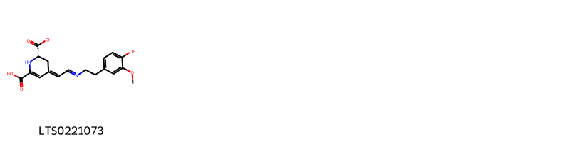{ width=100% }
    <figcaption>Hình ảnh cấu trúc hóa học của 1 hoạt chất thuộc nhóm Phenols gồm ['(2s,4e)-4-(2-{[2-(4-hydroxy-3-methoxyphenyl)ethyl]imino}ethylidene)-2,3-dihydro-1h-pyridine-2,6-dicarboxylic acid (LTS0221073)'].</figcaption>
</figure>
#### Nhóm Prenol lipids
<figure markdown="span">
    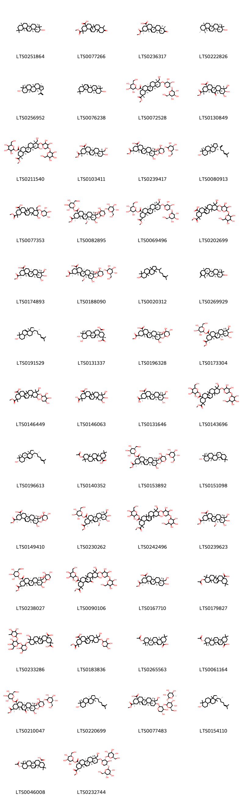{ width=100% }
    <figcaption>Hình ảnh cấu trúc hóa học của 69 hoạt chất thuộc nhóm Prenol lipids gồm ['β-amyrin (LTS0251864)', '2-(methoxycarbonyl)-2,6a,6b,9,12a-pentamethyl-10-oxo-1,3,4,5,6,7,8,8a,9,11,12,12b,13,14b-tetradecahydropicene-4a-carboxylic acid (LTS0077266)', '(2s,4ar,6as,6br,8as,9r,12as,12br,14bs)-2-(methoxycarbonyl)-2,6a,6b,9,12a-pentamethyl-10-oxo-1,3,4,5,6,7,8,8a,9,11,12,12b,13,14b-tetradecahydropicene-4a-carboxylic acid (LTS0236317)', 'amyrin (LTS0222826)', 'lupeol (LTS0256952)', 'alnulin (LTS0076238)', '2-methyl 4a-(2s,3r,4s,5s,6r)-3,4,5-trihydroxy-6-(hydroxymethyl)oxan-2-yl (2r,4ar,6as,6br,9r,10s,12ar,12br,14br)-10-{[(2s,3r,4r,5r)-3,4-dihydroxy-5-{[(2s,3r,4s,5s,6r)-3,4,5-trihydroxy-6-(hydroxymethyl)oxan-2-yl]oxy}oxan-2-yl]oxy}-9-(hydroxymethyl)-2,6a,6b,9,12a-pentamethyl-1,3,4,5,6,7,8,8a,10,11,12,12b,13,14b-tetradecahydropicene-2,4a-dicarboxylate (LTS0072528)', '(2r,4ar,6as,6br,9r,10r,11s,12as,12br,14br)-10,11-dihydroxy-9-(hydroxymethyl)-2-(methoxycarbonyl)-2,6a,6b,9,12a-pentamethyl-13-oxo-3,4,5,6,7,8,8a,10,11,12,12b,14b-dodecahydro-1h-picene-4a-carboxylic acid (LTS0130849)', '2-methyl 4a-[3,4,5-trihydroxy-6-(hydroxymethyl)oxan-2-yl] (2r,4ar,6as,6br,9r,12ar,12br,14br)-10-[(3,4-dihydroxy-5-{[3,4,5-trihydroxy-6-(hydroxymethyl)oxan-2-yl]oxy}oxan-2-yl)oxy]-11-hydroxy-9-(hydroxymethyl)-2,6a,6b,9,12a-pentamethyl-1,3,4,5,6,7,8,8a,10,11,12,12b,13,14b-tetradecahydropicene-2,4a-dicarboxylate (LTS0211540)', '(2r,4ar,6as,6br,9r,10s,12ar,12br,14br)-10-hydroxy-9-(hydroxymethyl)-2-(methoxycarbonyl)-2,6a,6b,9,12a-pentamethyl-1,3,4,5,6,7,8,8a,10,11,12,12b,13,14b-tetradecahydropicene-4a-carboxylic acid (LTS0103411)', '(2s,4ar,6as,6br,8ar,9r,10r,11s,12ar,12br,14bs)-10-{[(2s,3r,4r,5r)-3,4-dihydroxy-5-{[(3r,4s,5s,6r)-3,4,5-trihydroxy-6-(hydroxymethyl)oxan-2-yl]oxy}oxan-2-yl]oxy}-11-hydroxy-9-(hydroxymethyl)-2-(methoxycarbonyl)-2,6a,6b,9,12a-pentamethyl-1,3,4,5,6,7,8,8a,10,11,12,12b,13,14b-tetradecahydropicene-4a-carboxylic acid (LTS0239417)', 'dammaradienol (LTS0080913)', '11-hydroxy-9-(hydroxymethyl)-2-(methoxycarbonyl)-2,6a,6b,12a-tetramethyl-9-{[(2s,3r,4s,5r)-3,4,5-trihydroxyoxan-2-yl]oxy}-1,3,4,5,6,7,8,8a,10,11,12,12b,13,14b-tetradecahydropicene-4a-carboxylic acid (LTS0077353)', '2-methyl 4a-(2s,3r,4s,5s,6r)-3,4,5-trihydroxy-6-(hydroxymethyl)oxan-2-yl (2s,4ar,6as,6br,8ar,9r,10r,11s,12as,12br,13r,14bs)-10-{[(2s,3r,4r,5r)-3,4-dihydroxy-5-{[(2s,3r,4s,5s,6r)-3,4,5-trihydroxy-6-(hydroxymethyl)oxan-2-yl]oxy}oxan-2-yl]oxy}-11-hydroxy-9-(hydroxymethyl)-13-methoxy-2,6a,6b,9,12a-pentamethyl-1,3,4,5,6,7,8,8a,10,11,12,12b,13,14b-tetradecahydropicene-2,4a-dicarboxylate (LTS0082895)', '2-methyl 4a-(2s,3r,4s,5s,6r)-3,4,5-trihydroxy-6-(hydroxymethyl)oxan-2-yl (2s,4ar,6as,6br,8ar,9r,10s,12ar,12br,14bs)-10-{[(2s,3r,4r,5r)-3,4-dihydroxy-5-{[(3r,4s,5s,6r)-3,4,5-trihydroxy-6-(hydroxymethyl)oxan-2-yl]oxy}oxan-2-yl]oxy}-9-(hydroxymethyl)-2,6a,6b,9,12a-pentamethyl-1,3,4,5,6,7,8,8a,10,11,12,12b,13,14b-tetradecahydropicene-2,4a-dicarboxylate (LTS0069496)', 'esculentoside a (LTS0202699)', 'phytolaccagenine (LTS0174893)', '(2s,4ar,6as,6br,8ar,9r,10r,11s,12as,12br,13r,14bs)-10-{[(2s,3r,4r,5r)-3,4-dihydroxy-5-{[(2s,3r,4s,5s,6r)-3,4,5-trihydroxy-6-(hydroxymethyl)oxan-2-yl]oxy}oxan-2-yl]oxy}-11-hydroxy-9-(hydroxymethyl)-13-methoxy-2-(methoxycarbonyl)-2,6a,6b,9,12a-pentamethyl-1,3,4,5,6,7,8,8a,10,11,12,12b,13,14b-tetradecahydropicene-4a-carboxylic acid (LTS0188090)', 'lanster (LTS0020312)', '(4ar,6ar,6br,8as,12ar,12br,14ar,14br)-4,4,6a,6b,8a,11,12,14b-octamethyl-2,3,4a,5,6,7,8,9,12,12a,12b,13,14,14a-tetradecahydro-1h-picen-3-ol (LTS0269929)', '(1r,3ar,7s,9ar,11ar)-3a,6,6,9a,11a-pentamethyl-1-[(2r)-6-methylhept-5-en-2-yl]-1h,2h,3h,5h,5ah,7h,8h,9h,9bh,10h,11h-cyclopenta[a]phenanthren-7-ol (LTS0191529)', '(2s,4ar,6as,6br,8ar,10r,11s,12ar,12br,14bs)-10,11-dihydroxy-2,6a,6b,9,9,12a-hexamethyl-1,3,4,5,6,7,8,8a,10,11,12,12b,13,14b-tetradecahydropicene-2,4a-dicarboxylic acid (LTS0131337)', 'phytolaccoside b (LTS0196328)', '2-methyl 4a-(2s,3r,4s,5s,6r)-3,4,5-trihydroxy-6-(hydroxymethyl)oxan-2-yl (2s,4ar,6as,6br,8ar,9r,10r,11s,12as,12br,13r,14bs)-10,11,13-trihydroxy-9-(hydroxymethyl)-2,6a,6b,9,12a-pentamethyl-1,3,4,5,6,7,8,8a,10,11,12,12b,13,14b-tetradecahydropicene-2,4a-dicarboxylate (LTS0173304)', '11-hydroxy-9-(hydroxymethyl)-2-(methoxycarbonyl)-2,6a,6b,9,12a-pentamethyl-10-[(3,4,5-trihydroxyoxan-2-yl)oxy]-1,3,4,5,6,7,8,8a,10,11,12,12b,13,14b-tetradecahydropicene-4a-carboxylic acid (LTS0146449)', '10,11-dihydroxy-9-(hydroxymethyl)-2,6a,6b,9,12a-pentamethyl-1,3,4,5,6,7,8,8a,10,11,12,12b,13,14b-tetradecahydropicene-2,4a-dicarboxylic acid (LTS0146063)', '(2s,4ar,6as,6br,8as,9r,10r,11r,12ar,12br,14bs)-10,11-dihydroxy-9-(hydroxymethyl)-2,6a,6b,9,12a-pentamethyl-1,3,4,5,6,7,8,8a,10,11,12,12b,13,14b-tetradecahydropicene-2,4a-dicarboxylic acid (LTS0131646)', '2-methyl 4a-[3,4,5-trihydroxy-6-(hydroxymethyl)oxan-2-yl] 10-[(3,4-dihydroxy-5-{[3,4,5-trihydroxy-6-(hydroxymethyl)oxan-2-yl]oxy}oxan-2-yl)oxy]-9-(hydroxymethyl)-2,6a,6b,9,12a-pentamethyl-1,3,4,5,6,7,8,8a,10,11,12,12b,13,14b-tetradecahydropicene-2,4a-dicarboxylate (LTS0143696)', 'parkeol (LTS0196613)', '10-(acetyloxy)-2,2,6b,9,9,12a,14a-heptamethyl-1,3,4,5,7,8,8a,10,11,12,12b,13,14,14b-tetradecahydropicene-4a-carboxylic acid (LTS0140352)', '2-methyl 4a-(2s,3r,4s,5s,6r)-3,4,5-trihydroxy-6-(hydroxymethyl)oxan-2-yl (2s,4ar,6as,6br,8ar,9r,10r,11s,12ar,12br,14bs)-10-{[(2s,3r,4r,5r)-3,4-dihydroxy-5-{[(3r,4s,5s,6r)-3,4,5-trihydroxy-6-(hydroxymethyl)oxan-2-yl]oxy}oxan-2-yl]oxy}-11-hydroxy-9-(hydroxymethyl)-2,6a,6b,9,12a-pentamethyl-1,3,4,5,6,7,8,8a,10,11,12,12b,13,14b-tetradecahydropicene-2,4a-dicarboxylate (LTS0153892)', 'germanicol (LTS0151098)', '(2s,4ar,6as,6br,8ar,9r,10r,11s,12ar,12br)-11-hydroxy-9-(hydroxymethyl)-2-(methoxycarbonyl)-2,6a,6b,9,12a-pentamethyl-10-{[(2s,3r,4s,5r)-3,4,5-trihydroxyoxan-2-yl]oxy}-1,3,4,5,6,7,8,8a,10,11,12,12b,13,14b-tetradecahydropicene-4a-carboxylic acid (LTS0149410)', '2-methyl 4a-(2s,3r,4s,5s,6r)-3,4,5-trihydroxy-6-(hydroxymethyl)oxan-2-yl (2s,4ar,6as,6br,8ar,9r,10r,11s,12as,12br,13r,14bs)-10,11-dihydroxy-9-(hydroxymethyl)-13-methoxy-2,6a,6b,9,12a-pentamethyl-1,3,4,5,6,7,8,8a,10,11,12,12b,13,14b-tetradecahydropicene-2,4a-dicarboxylate (LTS0230262)', '2-methyl 4a-[3,4,5-trihydroxy-6-(hydroxymethyl)oxan-2-yl] 10-[(3,4-dihydroxy-5-{[3,4,5-trihydroxy-6-(hydroxymethyl)oxan-2-yl]oxy}oxan-2-yl)oxy]-11-hydroxy-9-(hydroxymethyl)-2,6a,6b,9,12a-pentamethyl-1,3,4,5,6,7,8,8a,10,11,12,14b-dodecahydropicene-2,4a-dicarboxylate (LTS0242496)', '(2s,4ar,6as,6br,8ar,9r,10r,11s,12as,12br,13r,14bs)-10,11-dihydroxy-9-(hydroxymethyl)-13-methoxy-2-(methoxycarbonyl)-2,6a,6b,9,12a-pentamethyl-1,3,4,5,6,7,8,8a,10,11,12,12b,13,14b-tetradecahydropicene-4a-carboxylic acid (LTS0239623)', '2-methyl 4a-(2s,3r,4s,5s,6r)-3,4,5-trihydroxy-6-(hydroxymethyl)oxan-2-yl (2s,4ar,6as,6br,8ar,9r,10r,11s,12ar,12br,14bs)-11-hydroxy-9-(hydroxymethyl)-2,6a,6b,9,12a-pentamethyl-10-{[(2s,3r,4s,5r)-3,4,5-trihydroxyoxan-2-yl]oxy}-1,3,4,5,6,7,8,8a,10,11,12,12b,13,14b-tetradecahydropicene-2,4a-dicarboxylate (LTS0238027)', '2-methyl 4a-[3,4,5-trihydroxy-6-(hydroxymethyl)oxan-2-yl] 10-[(3,4-dihydroxy-5-{[3,4,5-trihydroxy-6-(hydroxymethyl)oxan-2-yl]oxy}oxan-2-yl)oxy]-11-hydroxy-9-(hydroxymethyl)-2,6a,6b,9,12a-pentamethyl-13-oxo-3,4,5,6,7,8,8a,10,11,12,12b,14b-dodecahydro-1h-picene-2,4a-dicarboxylate (LTS0090106)', 'phytolaccagenic acid (LTS0167710)', '10-(acetyloxy)-2,2,6a,6b,9,9,12a-heptamethyl-1,3,4,5,6,7,8,8a,10,11,12,12b,13,14b-tetradecahydropicene-4a-carboxylic acid (LTS0179827)', '10-[(3-{[4,5-dihydroxy-6-(hydroxymethyl)-3-[(3,4,5-trihydroxy-6-methyloxan-2-yl)oxy]oxan-2-yl]oxy}-4,5-dihydroxyoxan-2-yl)oxy]-9-(hydroxymethyl)-2,6a,6b,9,12a-pentamethyl-1,3,4,5,6,7,8,8a,10,11,12,12b,13,14b-tetradecahydropicene-2,4a-dicarboxylic acid (LTS0233286)', '9-(hydroxymethyl)-2-(methoxycarbonyl)-2,6a,6b,9,12a-pentamethyl-10-[(3,4,5-trihydroxyoxan-2-yl)oxy]-1,3,4,5,6,7,8,8a,10,11,12,12b,13,14b-tetradecahydropicene-4a-carboxylic acid (LTS0183836)', 'acetyl aleuritolic acid (LTS0265563)', '(4as,6br,8ar,10r,12ar,12bs,14as,14bs)-10-(acetyloxy)-2,2,6b,9,9,12a,14a-heptamethyl-1,3,4,5,7,8,8a,10,11,12,12b,13,14,14b-tetradecahydropicene-4a-carboxylic acid (LTS0061164)', '2-methyl 4a-(2s,3r,4s,5s,6r)-3,4,5-trihydroxy-6-(hydroxymethyl)oxan-2-yl (2s,4ar,6as,6br,8ar,9r,10r,11s,12as,12br,14bs)-10-{[(2s,3r,4r,5r)-3,4-dihydroxy-5-{[(3r,4s,5s,6r)-3,4,5-trihydroxy-6-(hydroxymethyl)oxan-2-yl]oxy}oxan-2-yl]oxy}-11-hydroxy-9-(hydroxymethyl)-2,6a,6b,9,12a-pentamethyl-13-oxo-3,4,5,6,7,8,8a,10,11,12,12b,14b-dodecahydro-1h-picene-2,4a-dicarboxylate (LTS0210047)', 'euphol (LTS0220699)', '(2s,4ar,6as,6br,8ar,9r,10s,12ar,12br,14bs)-10-{[(2s,3r,4s,5r)-3-{[(2s,3r,4s,5s,6r)-4,5-dihydroxy-6-(hydroxymethyl)-3-{[(2s,3r,4r,5r,6s)-3,4,5-trihydroxy-6-methyloxan-2-yl]oxy}oxan-2-yl]oxy}-4,5-dihydroxyoxan-2-yl]oxy}-9-(hydroxymethyl)-2-(methoxycarbonyl)-2,6a,6b,9,12a-pentamethyl-1,3,4,5,6,7,8,8a,10,11,12,12b,13,14b-tetradecahydropicene-4a-carboxylic acid (LTS0077483)', '(1r,7s,9as)-3a,6,6,9a,11a-pentamethyl-1-[(2r)-6-methylhept-5-en-2-yl]-1h,2h,3h,4h,5h,5ah,7h,8h,9h,10h,11h-cyclopenta[a]phenanthren-7-ol (LTS0154110)', '(4as,6as,6br,8ar,10s,12ar,12br,14br)-10-(acetyloxy)-2,2,6a,6b,9,9,12a-heptamethyl-1,3,4,5,6,7,8,8a,10,11,12,12b,13,14b-tetradecahydropicene-4a-carboxylic acid (LTS0046008)', '2-methyl 4a-(2s,3r,4s,5s,6r)-3,4,5-trihydroxy-6-(hydroxymethyl)oxan-2-yl (2s,4ar,6as,6br,8ar,9r,10s,12ar,12br,14bs)-10-{[(2s,3r,4s,5r)-4-hydroxy-3,5-bis({[(2s,3r,4s,5s,6r)-3,4,5-trihydroxy-6-(hydroxymethyl)oxan-2-yl]oxy})oxan-2-yl]oxy}-9-(hydroxymethyl)-2,6a,6b,9,12a-pentamethyl-1,3,4,5,6,7,8,8a,10,11,12,12b,13,14b-tetradecahydropicene-2,4a-dicarboxylate (LTS0232744)', '10,11-dihydroxy-9-(hydroxymethyl)-2-(methoxycarbonyl)-2,6a,6b,9,12a-pentamethyl-1,3,4,5,6,7,8,8a,10,11,12,12b,13,14b-tetradecahydropicene-4a-carboxylic acid (LTS0239962)', '2-methyl 4a-(2s,3r,4s,5s,6r)-3,4,5-trihydroxy-6-(hydroxymethyl)oxan-2-yl 10-{[(2s,3r,4r,5r)-3,4-dihydroxy-5-{[(2s,3r,4s,5s,6r)-3,4,5-trihydroxy-6-(hydroxymethyl)oxan-2-yl]oxy}oxan-2-yl]oxy}-11-hydroxy-9-(hydroxymethyl)-2,6a,6b,9,12a-pentamethyl-1,3,4,5,6,7,8,8a,10,11,12,12b,13,14b-tetradecahydropicene-2,4a-dicarboxylate (LTS0181795)', '(3as,5ar,7s,9ar,11as)-3a,6,6,9a,11a-pentamethyl-1-[(2r)-6-methylhept-5-en-2-yl]-1h,2h,3h,5h,5ah,7h,8h,9h,9bh,10h,11h-cyclopenta[a]phenanthren-7-ol (LTS0041890)', '2-methyl 4a-(2s,3r,4s,5s,6r)-3,4,5-trihydroxy-6-(hydroxymethyl)oxan-2-yl (2s,4ar,6as,6br,8ar,9r,10r,11s,12as,12br,13r,14bs)-10-{[(2s,3r,4r,5r)-3,4-dihydroxy-5-{[(2s,3r,4s,5s,6r)-3,4,5-trihydroxy-6-(hydroxymethyl)oxan-2-yl]oxy}oxan-2-yl]oxy}-11,13-dihydroxy-9-(hydroxymethyl)-2,6a,6b,9,12a-pentamethyl-1,3,4,5,6,7,8,8a,10,11,12,12b,13,14b-tetradecahydropicene-2,4a-dicarboxylate (LTS0041834)', '10-hydroxy-9-(hydroxymethyl)-2-(methoxycarbonyl)-2,6a,6b,9,12a-pentamethyl-1,3,4,5,6,7,8,8a,10,11,12,12b,13,14b-tetradecahydropicene-4a-carboxylic acid (LTS0227821)', '10-[(3,4-dihydroxy-5-{[3,4,5-trihydroxy-6-(hydroxymethyl)oxan-2-yl]oxy}oxan-2-yl)oxy]-9-(hydroxymethyl)-2-(methoxycarbonyl)-2,6a,6b,9,12a-pentamethyl-1,3,4,5,6,7,8,8a,10,11,12,12b,13,14b-tetradecahydropicene-4a-carboxylic acid (LTS0275889)', '(8ar)-10-(acetyloxy)-2,2,6a,6b,9,9,12a-heptamethyl-1,3,4,5,6,7,8,8a,10,11,12,12b,13,14b-tetradecahydropicene-4a-carboxylic acid (LTS0002937)', '(2s,4ar,6as,6br,8as,9r,10s,11s,12ar,12br,14br)-10,11-dihydroxy-9-(hydroxymethyl)-2-(methoxycarbonyl)-2,6a,6b,9,12a-pentamethyl-1,3,4,5,6,7,8,8a,10,11,12,12b,13,14b-tetradecahydropicene-4a-carboxylic acid (LTS0059399)', '2-methyl 4a-(2s,3r,4s,5s,6r)-3,4,5-trihydroxy-6-(hydroxymethyl)oxan-2-yl (2s,4ar,6as,6br,8ar,9r,10r,12ar,12br,14bs)-10-{[(2s,3r,4r,5r)-3,4-dihydroxy-5-{[(2s,3r,4s,5s,6r)-3,4,5-trihydroxy-6-(hydroxymethyl)oxan-2-yl]oxy}oxan-2-yl]oxy}-9-(hydroxymethyl)-2,6a,6b,9,12a-pentamethyl-11-oxo-3,4,5,6,7,8,8a,10,12,12b,13,14b-dodecahydro-1h-picene-2,4a-dicarboxylate (LTS0127366)', '2-methyl 4a-[3,4,5-trihydroxy-6-(hydroxymethyl)oxan-2-yl] 10-[(3,4-dihydroxy-5-{[3,4,5-trihydroxy-6-(hydroxymethyl)oxan-2-yl]oxy}oxan-2-yl)oxy]-11-hydroxy-9-(hydroxymethyl)-2,6a,6b,9,12a-pentamethyl-1,3,4,5,6,7,8,8a,10,11,12,12b,13,14b-tetradecahydropicene-2,4a-dicarboxylate (LTS0021599)', '(2s,4as,6as,6br,8as,9r,10s,12ar,12br,14bs)-10-hydroxy-9-(hydroxymethyl)-2-(methoxycarbonyl)-2,6a,6b,9,12a-pentamethyl-1,3,4,5,6,7,8,8a,10,11,12,12b,13,14b-tetradecahydropicene-4a-carboxylic acid (LTS0002496)', '(1s,3ar,3br,5ar,7s,9ar,9br,11ar)-3a,3b,6,6,9a-pentamethyl-1-(6-methyl-5-methylidenehept-1-en-2-yl)-dodecahydro-1h-cyclopenta[a]phenanthren-7-ol (LTS0008613)', '10,11-dihydroxy-2-(methoxycarbonyl)-2,6a,6b,9,9,12a-hexamethyl-1,3,4,5,6,7,8,8a,10,11,12,12b,13,14b-tetradecahydropicene-4a-carboxylic acid (LTS0240753)', '2-methyl 4a-(2s,3r,4s,5s,6r)-3,4,5-trihydroxy-6-(hydroxymethyl)oxan-2-yl (2r,4ar,6as,6br,9r,10r,11s,12ar,12br,14br)-10-{[(2s,3r,4r,5r)-3,4-dihydroxy-5-{[(2s,3r,4s,5s,6r)-3,4,5-trihydroxy-6-(hydroxymethyl)oxan-2-yl]oxy}oxan-2-yl]oxy}-11-hydroxy-9-(hydroxymethyl)-2,6a,6b,9,12a-pentamethyl-1,3,4,5,6,7,8,8a,10,11,12,12b,13,14b-tetradecahydropicene-2,4a-dicarboxylate (LTS0100694)', '2-methyl 4a-(2s,3r,4s,5s,6r)-3,4,5-trihydroxy-6-(hydroxymethyl)oxan-2-yl (2s,4ar,6as,6br,8ar,9r,10s,12ar,12br,14bs)-10-{[(2s,3r,4s,5r)-4-{[(2s,3r,4s,5r)-3-{[(2s,3r,4s,5s,6r)-4,5-dihydroxy-6-(hydroxymethyl)-3-{[(2s,3r,4r,5r,6s)-3,4,5-trihydroxy-6-methyloxan-2-yl]oxy}oxan-2-yl]oxy}-4,5-dihydroxyoxan-2-yl]oxy}-3,5-dihydroxyoxan-2-yl]oxy}-9-(hydroxymethyl)-2,6a,6b,9,12a-pentamethyl-1,3,4,5,6,7,8,8a,10,11,12,12b,13,14b-tetradecahydropicene-2,4a-dicarboxylate (LTS0245053)', 'lanosterol (LTS0090543)', '(2s,4ar,6as,6br,8ar,9r,10r,11s,12ar,12br,14bs)-10,11-dihydroxy-9-(hydroxymethyl)-2,6a,6b,9,12a-pentamethyl-1,3,4,5,6,7,8,8a,10,11,12,12b,13,14b-tetradecahydropicene-2,4a-dicarboxylic acid (LTS0268611)', '2-methyl 4a-(2s,3r,4s,5s,6r)-3,4,5-trihydroxy-6-(hydroxymethyl)oxan-2-yl (2r,4ar,6as,6br,9r,10r,11s,12as,12br,14br)-10-{[(2s,3r,4r,5r)-3,4-dihydroxy-5-{[(2s,3r,4s,5s,6r)-3,4,5-trihydroxy-6-(hydroxymethyl)oxan-2-yl]oxy}oxan-2-yl]oxy}-11-hydroxy-9-(hydroxymethyl)-2,6a,6b,9,12a-pentamethyl-13-oxo-3,4,5,6,7,8,8a,10,11,12,12b,14b-dodecahydro-1h-picene-2,4a-dicarboxylate (LTS0129859)', '(4as,6as,6br,8ar,9r,12ar,12br,14bs)-10,11-dihydroxy-9-(hydroxymethyl)-1,2,6a,6b,9,12a-hexamethyl-2,3,4,5,6,7,8,8a,10,11,12,12b,13,14b-tetradecahydro-1h-picene-4a-carboxylic acid (LTS0133560)'].</figcaption>
</figure>
#### Nhóm Steroids and steroid derivatives
<figure markdown="span">
    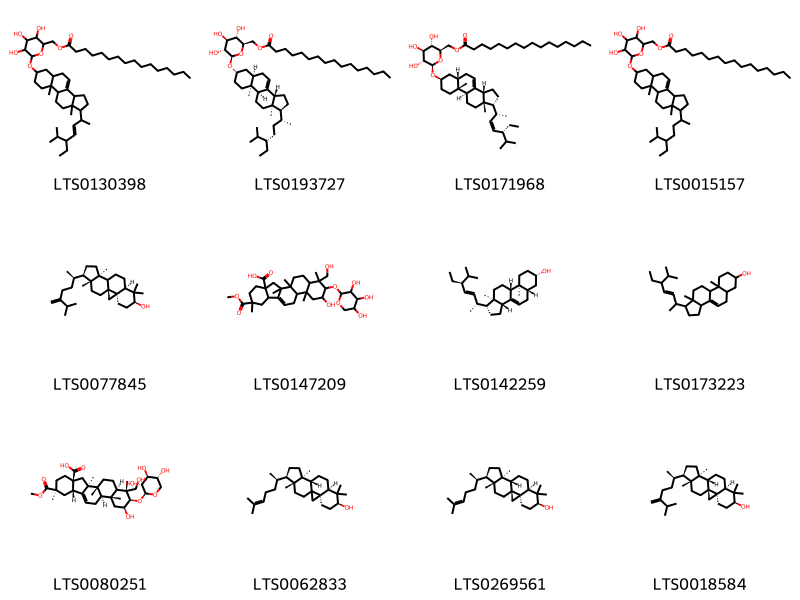{ width=100% }
    <figcaption>Hình ảnh cấu trúc hóa học của 12 hoạt chất thuộc nhóm Steroids and steroid derivatives gồm ['(6-{[1-(5-ethyl-6-methylhept-3-en-2-yl)-9a,11a-dimethyl-1h,2h,3h,3ah,5h,5ah,6h,7h,8h,9h,9bh,10h,11h-cyclopenta[a]phenanthren-7-yl]oxy}-3,4,5-trihydroxyoxan-2-yl)methyl hexadecanoate (LTS0130398)', '[(2r,3s,4s,5r,6r)-6-{[(1s,3ar,5ar,7s,9as,9bs,11ar)-1-[(2r,5s)-5-ethyl-6-methylheptan-2-yl]-9a,11a-dimethyl-1h,2h,3h,3ah,5h,5ah,6h,7h,8h,9h,9bh,10h,11h-cyclopenta[a]phenanthren-7-yl]oxy}-3,4,5-trihydroxyoxan-2-yl]methyl hexadecanoate (LTS0193727)', '[(2r,3s,4s,5r,6r)-6-{[(1r,3ar,5as,7r,9ar,9bs,11as)-1-[(2r,3z,5r)-5-ethyl-6-methylhept-3-en-2-yl]-9a,11a-dimethyl-1h,2h,3h,3ah,5h,5ah,6h,7h,8h,9h,9bh,10h,11h-cyclopenta[a]phenanthren-7-yl]oxy}-3,4,5-trihydroxyoxan-2-yl]methyl hexadecanoate (LTS0171968)', '(6-{[1-(5-ethyl-6-methylheptan-2-yl)-9a,11a-dimethyl-1h,2h,3h,3ah,5h,5ah,6h,7h,8h,9h,9bh,10h,11h-cyclopenta[a]phenanthren-7-yl]oxy}-3,4,5-trihydroxyoxan-2-yl)methyl hexadecanoate (LTS0015157)', '24-methylene-cycloartanol (LTS0077845)', '3-hydroxy-1-(hydroxymethyl)-8-(methoxycarbonyl)-1,4a,8,11a,11b-pentamethyl-2-[(3,4,5-trihydroxyoxan-2-yl)oxy]-2h,3h,4h,4bh,5h,6bh,7h,9h,10h,11h,12h,13h,13ah-indeno[2,1-a]phenanthrene-10a-carboxylic acid (LTS0147209)', 'chondrillasterol (LTS0142259)', '1-(5-ethyl-6-methylhept-3-en-2-yl)-9a,11a-dimethyl-1h,2h,3h,3ah,5h,5ah,6h,7h,8h,9h,9bh,10h,11h-cyclopenta[a]phenanthren-7-ol (LTS0173223)', '(1r,2r,3s,4ar,4br,6bs,8s,10as,11as,11br,13ar)-3-hydroxy-1-(hydroxymethyl)-8-(methoxycarbonyl)-1,4a,8,11a,11b-pentamethyl-2-{[(2s,3r,4s,5r)-3,4,5-trihydroxyoxan-2-yl]oxy}-2h,3h,4h,4bh,5h,6bh,7h,9h,10h,11h,12h,13h,13ah-indeno[2,1-a]phenanthrene-10a-carboxylic acid (LTS0080251)', '(3r,6s,8r,11s,12s,15r,16r)-7,7,12,16-tetramethyl-15-[(2r)-6-methylhept-5-en-2-yl]pentacyclo[9.7.0.0¹,³.0³,⁸.0¹²,¹⁶]octadecan-6-ol (LTS0062833)', 'cycloartenol (LTS0269561)', '24-methylenecycloartanol (LTS0018584)'].</figcaption>
</figure>

---

### Dược dân tộc học

Danh sách các quốc gia có sử dụng *Phytolacca americana* trong điều trị các bệnh. 

| Country        | Disease                                                  | Bệnh                                                                                                                                                                                                |
|:---------------|:---------------------------------------------------------|:----------------------------------------------------------------------------------------------------------------------------------------------------------------------------------------------------|
| China          | Diuretic, Emetic                                         | MYMEMORY WARNING: YOU USED ALL AVAILABLE FREE TRANSLATIONS FOR TODAY. NEXT AVAILABLE IN  02 HOURS 48 MINUTES 15 SECONDS VISIT HTTPS://MYMEMORY.TRANSLATED.NET/DOC/USAGELIMITS.PHP TO TRANSLATE MORE |
| Elsewhere      | nan, Diuretic, Emetic, Poison, Purgative                 | MYMEMORY WARNING: YOU USED ALL AVAILABLE FREE TRANSLATIONS FOR TODAY. NEXT AVAILABLE IN  02 HOURS 48 MINUTES 12 SECONDS VISIT HTTPS://MYMEMORY.TRANSLATED.NET/DOC/USAGELIMITS.PHP TO TRANSLATE MORE |
| Turkey         | Emetic, Laxative, Purgative, Poison, Stimulant, Narcotic | MYMEMORY WARNING: YOU USED ALL AVAILABLE FREE TRANSLATIONS FOR TODAY. NEXT AVAILABLE IN  02 HOURS 48 MINUTES 10 SECONDS VISIT HTTPS://MYMEMORY.TRANSLATED.NET/DOC/USAGELIMITS.PHP TO TRANSLATE MORE |
| US             | Emetic, Poison, Poison, Purgative, Mitogenic, Poultice   | MYMEMORY WARNING: YOU USED ALL AVAILABLE FREE TRANSLATIONS FOR TODAY. NEXT AVAILABLE IN  02 HOURS 48 MINUTES 08 SECONDS VISIT HTTPS://MYMEMORY.TRANSLATED.NET/DOC/USAGELIMITS.PHP TO TRANSLATE MORE |
| US(Appalachia) | Emetic                                                   | MYMEMORY WARNING: YOU USED ALL AVAILABLE FREE TRANSLATIONS FOR TODAY. NEXT AVAILABLE IN  02 HOURS 48 MINUTES 05 SECONDS VISIT HTTPS://MYMEMORY.TRANSLATED.NET/DOC/USAGELIMITS.PHP TO TRANSLATE MORE |
| ain            | Purgative                                                | MYMEMORY WARNING: YOU USED ALL AVAILABLE FREE TRANSLATIONS FOR TODAY. NEXT AVAILABLE IN  02 HOURS 48 MINUTES 03 SECONDS VISIT HTTPS://MYMEMORY.TRANSLATED.NET/DOC/USAGELIMITS.PHP TO TRANSLATE MORE |

---

---
## Phytolacca dioica
### Thông tin về thực vật

!!! info "Phân loại thực vật của *Phytolacca dioica* từ GIBF:"
    - **Kingdom:** Plantae
    - **Phylum:** Tracheophyta
    - **Order:** Caryophyllales
    - **Family:** Phytolaccaceae
    - **Genus:** Phytolacca
    - **Species:** *Phytolacca dioica*

 

| Label (VI)   | Label (EN)   | Scientific Name   | Descriptions (VI)   | Descriptions (EN)   | Also Known As (VI)   | Also Known As (EN)   |
|:-------------|:-------------|:------------------|:--------------------|:--------------------|:---------------------|:---------------------|
| N/A          | N/A          | Phytolacca dioica | loài thực vật       | species of plant    | ['']                 | ['Ombú']             |

#### Phân bố trên thế giới

**Từ CSDL GIBF** Italy, Australia, Argentina, Tunisia, Spain, Bolivia (Plurinational State of), Türkiye, Portugal, Algeria, Morocco, Uruguay, Greece, South Africa, Monaco, Brazil, Peru, France, Mexico, New Zealand

#### Phân bố tại Việt Nam

**Từ CSDL GIBF**: Không có ghi nhận ở Việt Nam

---
### Thành phần hóa học
        
- Theo cơ sở dữ liệu lotus: Từ loài *Phytolacca dioica* đã phân lập và xác định được 1 hoạt chất thuộc về các nhóm Prenol lipids. 

|    | chemicalTaxonomyClassyfireClass   |   smiles_count |
|---:|:----------------------------------|---------------:|
|  0 | Prenol lipids                     |              1 |

#### Nhóm Prenol lipids
<figure markdown="span">
    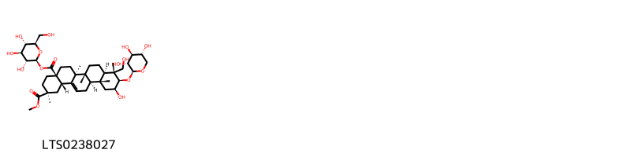{ width=100% }
    <figcaption>Hình ảnh cấu trúc hóa học của 1 hoạt chất thuộc nhóm Prenol lipids gồm ['2-methyl 4a-(2s,3r,4s,5s,6r)-3,4,5-trihydroxy-6-(hydroxymethyl)oxan-2-yl (2s,4ar,6as,6br,8ar,9r,10r,11s,12ar,12br,14bs)-11-hydroxy-9-(hydroxymethyl)-2,6a,6b,9,12a-pentamethyl-10-{[(2s,3r,4s,5r)-3,4,5-trihydroxyoxan-2-yl]oxy}-1,3,4,5,6,7,8,8a,10,11,12,12b,13,14b-tetradecahydropicene-2,4a-dicarboxylate (LTS0238027)'].</figcaption>
</figure>

---

### Dược dân tộc học

Danh sách các quốc gia có sử dụng *Phytolacca dioica* trong điều trị các bệnh. 

| Country   | Disease           | Bệnh                                                                                                                                                                                                |
|:----------|:------------------|:----------------------------------------------------------------------------------------------------------------------------------------------------------------------------------------------------|
| Elsewhere | Poison, Purgative | MYMEMORY WARNING: YOU USED ALL AVAILABLE FREE TRANSLATIONS FOR TODAY. NEXT AVAILABLE IN  02 HOURS 47 MINUTES 19 SECONDS VISIT HTTPS://MYMEMORY.TRANSLATED.NET/DOC/USAGELIMITS.PHP TO TRANSLATE MORE |

---

---
## Phytolacca dodecandra
### Thông tin về thực vật

!!! info "Phân loại thực vật của *Phytolacca dodecandra* từ GIBF:"
    - **Kingdom:** Plantae
    - **Phylum:** Tracheophyta
    - **Order:** Caryophyllales
    - **Family:** Phytolaccaceae
    - **Genus:** Phytolacca
    - **Species:** *Phytolacca dodecandra*

 

| Label (VI)   | Label (EN)   | Scientific Name       | Descriptions (VI)   | Descriptions (EN)   | Also Known As (VI)   | Also Known As (EN)   |
|:-------------|:-------------|:----------------------|:--------------------|:--------------------|:---------------------|:---------------------|
| N/A          | N/A          | Phytolacca dodecandra | loài thực vật       | species of plant    | ['']                 | ['']                 |

#### Phân bố trên thế giới

**Từ CSDL GIBF** Ghana, Gabon, Angola, Mozambique, Rwanda, unknown or invalid, Congo, Tanzania, United Republic of, Malawi, Zambia, Nigeria, Congo, Democratic Republic of the, Guinea, Zimbabwe, Uganda, South Africa, Sao Tome and Principe, Eritrea, Madagascar, Equatorial Guinea, Burundi, Kenya, Cameroon, Malaysia, Ethiopia

#### Phân bố tại Việt Nam

**Từ CSDL GIBF**: Không có ghi nhận ở Việt Nam

---
### Thành phần hóa học
        
- Theo cơ sở dữ liệu lotus: Từ loài *Phytolacca dodecandra* đã phân lập và xác định được 62 hoạt chất thuộc về các nhóm Prenol lipids. 

|    | chemicalTaxonomyClassyfireClass   |   smiles_count |
|---:|:----------------------------------|---------------:|
|  0 | Prenol lipids                     |             62 |

#### Nhóm Prenol lipids
<figure markdown="span">
    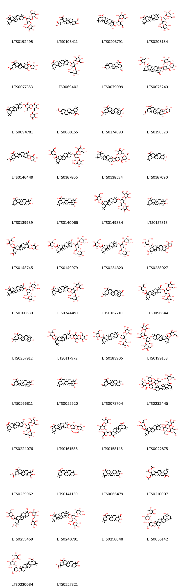{ width=100% }
    <figcaption>Hình ảnh cấu trúc hóa học của 62 hoạt chất thuộc nhóm Prenol lipids gồm ['10-{[3-hydroxy-6-(hydroxymethyl)-4,5-bis({[3,4,5-trihydroxy-6-(hydroxymethyl)oxan-2-yl]oxy})oxan-2-yl]oxy}-2,2,6a,6b,9,9,12a-heptamethyl-1,3,4,5,6,7,8,8a,10,11,12,12b,13,14b-tetradecahydropicene-4a-carboxylic acid (LTS0192495)', '(2r,4ar,6as,6br,9r,10s,12ar,12br,14br)-10-hydroxy-9-(hydroxymethyl)-2-(methoxycarbonyl)-2,6a,6b,9,12a-pentamethyl-1,3,4,5,6,7,8,8a,10,11,12,12b,13,14b-tetradecahydropicene-4a-carboxylic acid (LTS0103411)', '(4as,6as,6br,8ar,10r,11s,12ar,12br,14bs)-10-{[(2r,3r,4s,5r,6r)-3,5-dihydroxy-6-(hydroxymethyl)-4-{[(2s,3r,4s,5r,6r)-3,4,5-trihydroxy-6-(hydroxymethyl)oxan-2-yl]oxy}oxan-2-yl]oxy}-11-hydroxy-2,2,6a,6b,9,9,12a-heptamethyl-1,3,4,5,6,7,8,8a,10,11,12,12b,13,14b-tetradecahydropicene-4a-carboxylic acid (LTS0203791)', 'oleanoglycotoxin-a (LTS0203184)', '11-hydroxy-9-(hydroxymethyl)-2-(methoxycarbonyl)-2,6a,6b,12a-tetramethyl-9-{[(2s,3r,4s,5r)-3,4,5-trihydroxyoxan-2-yl]oxy}-1,3,4,5,6,7,8,8a,10,11,12,12b,13,14b-tetradecahydropicene-4a-carboxylic acid (LTS0077353)', '10-{[4-hydroxy-6-(hydroxymethyl)-3,5-bis({[3,4,5-trihydroxy-6-(hydroxymethyl)oxan-2-yl]oxy})oxan-2-yl]oxy}-2,2,6a,6b,9,9,12a-heptamethyl-1,3,4,5,6,7,8,8a,10,11,12,12b,13,14b-tetradecahydropicene-4a-carboxylic acid (LTS0069402)', '(2s,4ar,6as,6br,8ar,10s,12ar,12br,14bs)-2-formyl-10-hydroxy-2,6a,6b,9,9,12a-hexamethyl-1,3,4,5,6,7,8,8a,10,11,12,12b,13,14b-tetradecahydropicene-4a-carboxylic acid (LTS0079099)', '(2s,3r,4s,5s,6r)-3,4,5-trihydroxy-6-(hydroxymethyl)oxan-2-yl (4as,6as,6br,8ar,9r,10r,11s,12ar,12br,14bs)-11-hydroxy-10-{[(2r,3r,4r,5r,6r)-3-hydroxy-6-(hydroxymethyl)-4-{[(2s,3r,4s,5r,6r)-3,4,5-trihydroxy-6-(hydroxymethyl)oxan-2-yl]oxy}-5-{[(2s,3r,4s,5s,6r)-3,4,5-trihydroxy-6-(hydroxymethyl)oxan-2-yl]oxy}oxan-2-yl]oxy}-9-(hydroxymethyl)-2,2,6a,6b,9,12a-hexamethyl-1,3,4,5,6,7,8,8a,10,11,12,12b,13,14b-tetradecahydropicene-4a-carboxylate (LTS0075243)', '10-{[3,5-dihydroxy-6-(hydroxymethyl)-4-[(3,4,5-trihydroxy-6-{[(3,4,5-trihydroxyoxan-2-yl)oxy]methyl}oxan-2-yl)oxy]oxan-2-yl]oxy}-2,2,6a,6b,9,9,12a-heptamethyl-1,3,4,5,6,7,8,8a,10,11,12,12b,13,14b-tetradecahydropicene-4a-carboxylic acid (LTS0094781)', 'methyl 10-(acetyloxy)-2,2,6a,6b,9,9,12a-heptamethyl-1,3,4,5,6,7,8,8a,10,11,12,12b,13,14b-tetradecahydropicene-4a-carboxylate (LTS0088155)', 'phytolaccagenine (LTS0174893)', 'phytolaccoside b (LTS0196328)', '11-hydroxy-9-(hydroxymethyl)-2-(methoxycarbonyl)-2,6a,6b,9,12a-pentamethyl-10-[(3,4,5-trihydroxyoxan-2-yl)oxy]-1,3,4,5,6,7,8,8a,10,11,12,12b,13,14b-tetradecahydropicene-4a-carboxylic acid (LTS0146449)', '3,4,5-trihydroxy-6-(hydroxymethyl)oxan-2-yl 10-{[4-hydroxy-6-(hydroxymethyl)-3,5-bis({[3,4,5-trihydroxy-6-(hydroxymethyl)oxan-2-yl]oxy})oxan-2-yl]oxy}-2,2,6a,6b,9,9,12a-heptamethyl-1,3,4,5,6,7,8,8a,10,11,12,12b,13,14b-tetradecahydropicene-4a-carboxylate (LTS0167805)', '(4as,6as,6br,8ar,9r,10r,11s,12ar,12br,14bs)-11-hydroxy-10-{[(2r,3r,4r,5r,6r)-3-hydroxy-6-(hydroxymethyl)-4-{[(2s,3r,4s,5r,6r)-3,4,5-trihydroxy-6-(hydroxymethyl)oxan-2-yl]oxy}-5-{[(2s,3r,4s,5s,6r)-3,4,5-trihydroxy-6-(hydroxymethyl)oxan-2-yl]oxy}oxan-2-yl]oxy}-9-(hydroxymethyl)-2,2,6a,6b,9,12a-hexamethyl-1,3,4,5,6,7,8,8a,10,11,12,12b,13,14b-tetradecahydropicene-4a-carboxylic acid (LTS0138524)', '10,11-dihydroxy-2,2,6a,6b,9,9,12a-heptamethyl-1,3,4,5,6,7,8,8a,10,11,12,12b,13,14b-tetradecahydropicene-4a-carboxylic acid (LTS0167090)', '10-hydroxy-9-(hydroxymethyl)-2,2,6a,6b,9,12a-hexamethyl-1,3,4,5,6,7,8,8a,10,11,12,12b,13,14b-tetradecahydropicene-4a-carboxylic acid (LTS0139989)', 'bayogenin (LTS0140065)', '3,4,5-trihydroxy-6-(hydroxymethyl)oxan-2-yl 10-{[3-hydroxy-6-(hydroxymethyl)-4,5-bis({[3,4,5-trihydroxy-6-(hydroxymethyl)oxan-2-yl]oxy})oxan-2-yl]oxy}-2,2,6a,6b,9,9,12a-heptamethyl-1,3,4,5,6,7,8,8a,10,11,12,12b,13,14b-tetradecahydropicene-4a-carboxylate (LTS0149384)', 'hederagenin (LTS0157813)', '2-methyl 4a-[3,4,5-trihydroxy-6-(hydroxymethyl)oxan-2-yl] 11-hydroxy-9-(hydroxymethyl)-2,6a,6b,9,12a-pentamethyl-10-[(3,4,5-trihydroxyoxan-2-yl)oxy]-1,3,4,5,6,7,8,8a,10,11,12,12b,13,14b-tetradecahydropicene-2,4a-dicarboxylate (LTS0148745)', '(2s,3r,4s,5s,6r)-3,4,5-trihydroxy-6-(hydroxymethyl)oxan-2-yl (4as,6as,6br,8ar,9r,10s,12ar,12br,14bs)-10-{[(2r,3r,4s,5s,6r)-4-hydroxy-6-(hydroxymethyl)-3,5-bis({[(2s,3r,4s,5s,6r)-3,4,5-trihydroxy-6-(hydroxymethyl)oxan-2-yl]oxy})oxan-2-yl]oxy}-9-(hydroxymethyl)-2,2,6a,6b,9,12a-hexamethyl-1,3,4,5,6,7,8,8a,10,11,12,12b,13,14b-tetradecahydropicene-4a-carboxylate (LTS0149979)', '(2s,3r,4s,5s,6r)-3,4,5-trihydroxy-6-(hydroxymethyl)oxan-2-yl (4as,6as,6br,8ar,10s,12ar,12br,14bs)-10-{[(2r,3r,4s,5s,6r)-4-hydroxy-6-(hydroxymethyl)-3,5-bis({[(2s,3r,4s,5s,6r)-3,4,5-trihydroxy-6-(hydroxymethyl)oxan-2-yl]oxy})oxan-2-yl]oxy}-2,2,6a,6b,9,9,12a-heptamethyl-1,3,4,5,6,7,8,8a,10,11,12,12b,13,14b-tetradecahydropicene-4a-carboxylate (LTS0234323)', '2-methyl 4a-(2s,3r,4s,5s,6r)-3,4,5-trihydroxy-6-(hydroxymethyl)oxan-2-yl (2s,4ar,6as,6br,8ar,9r,10r,11s,12ar,12br,14bs)-11-hydroxy-9-(hydroxymethyl)-2,6a,6b,9,12a-pentamethyl-10-{[(2s,3r,4s,5r)-3,4,5-trihydroxyoxan-2-yl]oxy}-1,3,4,5,6,7,8,8a,10,11,12,12b,13,14b-tetradecahydropicene-2,4a-dicarboxylate (LTS0238027)', '(4as,6as,6br,8ar,9r,10s,12ar,12br,14bs)-10-{[(2r,3r,4s,5s,6r)-4-hydroxy-6-(hydroxymethyl)-3,5-bis({[(2s,3r,4s,5s,6r)-3,4,5-trihydroxy-6-(hydroxymethyl)oxan-2-yl]oxy})oxan-2-yl]oxy}-9-(hydroxymethyl)-2,2,6a,6b,9,12a-hexamethyl-1,3,4,5,6,7,8,8a,10,11,12,12b,13,14b-tetradecahydropicene-4a-carboxylic acid (LTS0160630)', '11-hydroxy-10-{[4-hydroxy-6-(hydroxymethyl)-3,5-bis({[3,4,5-trihydroxy-6-(hydroxymethyl)oxan-2-yl]oxy})oxan-2-yl]oxy}-2,2,6a,6b,9,9,12a-heptamethyl-1,3,4,5,6,7,8,8a,10,11,12,12b,13,14b-tetradecahydropicene-4a-carboxylic acid (LTS0244491)', 'phytolaccagenic acid (LTS0167710)', '3,4,5-trihydroxy-6-(hydroxymethyl)oxan-2-yl 10-{[4-hydroxy-6-(hydroxymethyl)-3,5-bis({[3,4,5-trihydroxy-6-(hydroxymethyl)oxan-2-yl]oxy})oxan-2-yl]oxy}-9-(hydroxymethyl)-2,2,6a,6b,9,12a-hexamethyl-1,3,4,5,6,7,8,8a,10,11,12,12b,13,14b-tetradecahydropicene-4a-carboxylate (LTS0096844)', '(2s,4ar,6as,6br,8ar,10s,12ar,12br,14bs)-10-hydroxy-2-(methoxycarbonyl)-2,6a,6b,9,9,12a-hexamethyl-1,3,4,5,6,7,8,8a,10,11,12,12b,13,14b-tetradecahydropicene-4a-carboxylic acid (LTS0257912)', '3,4,5-trihydroxy-6-(hydroxymethyl)oxan-2-yl 10-{[3,4-dihydroxy-6-(hydroxymethyl)-5-{[3,4,5-trihydroxy-6-(hydroxymethyl)oxan-2-yl]oxy}oxan-2-yl]oxy}-11-hydroxy-9-(hydroxymethyl)-2,2,6a,6b,9,12a-hexamethyl-1,3,4,5,6,7,8,8a,10,11,12,12b,13,14b-tetradecahydropicene-4a-carboxylate (LTS0117972)', '(2s,3r,4s,5s,6r)-3,4,5-trihydroxy-6-(hydroxymethyl)oxan-2-yl (4as,6as,6br,8ar,10s,12ar,12br,14bs)-10-{[(2r,3r,4r,5r,6r)-3-hydroxy-6-(hydroxymethyl)-4-{[(2s,3r,4s,5r,6r)-3,4,5-trihydroxy-6-(hydroxymethyl)oxan-2-yl]oxy}-5-{[(2s,3r,4s,5s,6r)-3,4,5-trihydroxy-6-(hydroxymethyl)oxan-2-yl]oxy}oxan-2-yl]oxy}-2,2,6a,6b,9,9,12a-heptamethyl-1,3,4,5,6,7,8,8a,10,11,12,12b,13,14b-tetradecahydropicene-4a-carboxylate (LTS0183905)', '3,4,5-trihydroxy-6-(hydroxymethyl)oxan-2-yl 10-[(3-{[4,5-dihydroxy-6-(hydroxymethyl)-3-[(3,4,5-trihydroxy-6-methyloxan-2-yl)oxy]oxan-2-yl]oxy}-4-hydroxy-6-(hydroxymethyl)-5-{[3,4,5-trihydroxy-6-(hydroxymethyl)oxan-2-yl]oxy}oxan-2-yl)oxy]-2,2,6a,6b,9,9,12a-heptamethyl-1,3,4,5,6,7,8,8a,10,11,12,12b,13,14b-tetradecahydropicene-4a-carboxylate (LTS0199153)', '(2s,4ar,6as,6br,8ar,9r,10s,12ar,12br,14bs)-2-formyl-10-hydroxy-9-(hydroxymethyl)-2,6a,6b,9,12a-pentamethyl-1,3,4,5,6,7,8,8a,10,11,12,12b,13,14b-tetradecahydropicene-4a-carboxylic acid (LTS0266811)', 'arjunolic acid (LTS0055520)', '2-formyl-10-hydroxy-2,6a,6b,9,9,12a-hexamethyl-1,3,4,5,6,7,8,8a,10,11,12,12b,13,14b-tetradecahydropicene-4a-carboxylic acid (LTS0073704)', '(2s,3r,4s,5s,6r)-3,4,5-trihydroxy-6-(hydroxymethyl)oxan-2-yl (4as,6as,6br,8ar,10s,12ar,12br,14bs)-10-{[(2r,3r,4s,5s,6r)-3-{[(2s,3r,4s,5s,6r)-4,5-dihydroxy-6-(hydroxymethyl)-3-{[(2s,3r,4r,5r,6s)-3,4,5-trihydroxy-6-methyloxan-2-yl]oxy}oxan-2-yl]oxy}-4-hydroxy-6-(hydroxymethyl)-5-{[(2s,3r,4s,5s,6r)-3,4,5-trihydroxy-6-(hydroxymethyl)oxan-2-yl]oxy}oxan-2-yl]oxy}-2,2,6a,6b,9,9,12a-heptamethyl-1,3,4,5,6,7,8,8a,10,11,12,12b,13,14b-tetradecahydropicene-4a-carboxylate (LTS0232445)', '10-{[4-hydroxy-6-(hydroxymethyl)-3,5-bis({[3,4,5-trihydroxy-6-(hydroxymethyl)oxan-2-yl]oxy})oxan-2-yl]oxy}-9-(hydroxymethyl)-2,2,6a,6b,9,12a-hexamethyl-1,3,4,5,6,7,8,8a,10,11,12,12b,13,14b-tetradecahydropicene-4a-carboxylic acid (LTS0224076)', '10-{[3,5-dihydroxy-6-(hydroxymethyl)-4-{[3,4,5-trihydroxy-6-(hydroxymethyl)oxan-2-yl]oxy}oxan-2-yl]oxy}-11-hydroxy-2,2,6a,6b,9,9,12a-heptamethyl-1,3,4,5,6,7,8,8a,10,11,12,12b,13,14b-tetradecahydropicene-4a-carboxylic acid (LTS0161588)', '10-[(4-{[4,5-dihydroxy-6-(hydroxymethyl)-3-[(3,4,5-trihydroxy-6-methyloxan-2-yl)oxy]oxan-2-yl]oxy}-3,5-dihydroxy-6-(hydroxymethyl)oxan-2-yl)oxy]-11-hydroxy-2,2,6a,6b,9,9,12a-heptamethyl-1,3,4,5,6,7,8,8a,10,11,12,12b,13,14b-tetradecahydropicene-4a-carboxylic acid (LTS0158145)', '3,4,5-trihydroxy-6-(hydroxymethyl)oxan-2-yl 11-hydroxy-10-{[3-hydroxy-6-(hydroxymethyl)-4,5-bis({[3,4,5-trihydroxy-6-(hydroxymethyl)oxan-2-yl]oxy})oxan-2-yl]oxy}-9-(hydroxymethyl)-2,2,6a,6b,9,12a-hexamethyl-1,3,4,5,6,7,8,8a,10,11,12,12b,13,14b-tetradecahydropicene-4a-carboxylate (LTS0022875)', '10,11-dihydroxy-9-(hydroxymethyl)-2-(methoxycarbonyl)-2,6a,6b,9,12a-pentamethyl-1,3,4,5,6,7,8,8a,10,11,12,12b,13,14b-tetradecahydropicene-4a-carboxylic acid (LTS0239962)', 'oleanolic acid (LTS0141130)', '(4as,6as,6br,8ar,10r,11s,12ar,12br,14bs)-10,11-dihydroxy-2,2,6a,6b,9,9,12a-heptamethyl-1,3,4,5,6,7,8,8a,10,11,12,12b,13,14b-tetradecahydropicene-4a-carboxylic acid (LTS0066479)', 'methyl 10,11-bis(acetyloxy)-9-[(acetyloxy)methyl]-2,2,6a,6b,9,12a-hexamethyl-1,3,4,5,6,7,8,8a,10,11,12,12b,13,14b-tetradecahydropicene-4a-carboxylate (LTS0210007)', '2-methyl 4a-[3,4,5-trihydroxy-6-(hydroxymethyl)oxan-2-yl] 9-(hydroxymethyl)-2,6a,6b,9,12a-pentamethyl-10-[(3,4,5-trihydroxy-6-{[(3,4,5-trihydroxyoxan-2-yl)oxy]methyl}oxan-2-yl)oxy]-1,3,4,5,6,7,8,8a,10,11,12,12b,13,14b-tetradecahydropicene-2,4a-dicarboxylate (LTS0255469)', '(4as,6as,6br,8ar,10r,11s,12ar,12br,14bs)-11-hydroxy-10-{[(2r,3r,4s,5s,6r)-4-hydroxy-6-(hydroxymethyl)-3,5-bis({[(2s,3r,4s,5s,6r)-3,4,5-trihydroxy-6-(hydroxymethyl)oxan-2-yl]oxy})oxan-2-yl]oxy}-2,2,6a,6b,9,9,12a-heptamethyl-1,3,4,5,6,7,8,8a,10,11,12,12b,13,14b-tetradecahydropicene-4a-carboxylic acid (LTS0248791)', '10,11-dihydroxy-9-(hydroxymethyl)-2,2,6a,6b,9,12a-hexamethyl-1,3,4,5,6,7,8,8a,10,11,12,12b,13,14b-tetradecahydropicene-4a-carboxylic acid (LTS0258848)', '(4as,6as,6br,8ar,10r,11s,12ar,12br,14bs)-10-{[(2r,3r,4s,5r,6r)-4-{[(2s,3r,4s,5r,6r)-4,5-dihydroxy-6-(hydroxymethyl)-3-{[(2s,3r,4r,5r,6s)-3,4,5-trihydroxy-6-methyloxan-2-yl]oxy}oxan-2-yl]oxy}-3,5-dihydroxy-6-(hydroxymethyl)oxan-2-yl]oxy}-11-hydroxy-2,2,6a,6b,9,9,12a-heptamethyl-1,3,4,5,6,7,8,8a,10,11,12,12b,13,14b-tetradecahydropicene-4a-carboxylic acid (LTS0055142)', '(4as,6as,6br,8ar,10s,12ar,12br,14bs)-10-{[(2r,3r,4s,5r,6r)-4-{[(2s,3r,4s,5r,6r)-4,5-dihydroxy-6-(hydroxymethyl)-3-{[(2s,3r,4r,5r,6s)-3,4,5-trihydroxy-6-methyloxan-2-yl]oxy}oxan-2-yl]oxy}-3,5-dihydroxy-6-(hydroxymethyl)oxan-2-yl]oxy}-2,2,6a,6b,9,9,12a-heptamethyl-1,3,4,5,6,7,8,8a,10,11,12,12b,13,14b-tetradecahydropicene-4a-carboxylic acid (LTS0230084)', '10-hydroxy-9-(hydroxymethyl)-2-(methoxycarbonyl)-2,6a,6b,9,12a-pentamethyl-1,3,4,5,6,7,8,8a,10,11,12,12b,13,14b-tetradecahydropicene-4a-carboxylic acid (LTS0227821)', '10-[(4-{[4,5-dihydroxy-6-(hydroxymethyl)-3-[(3,4,5-trihydroxy-6-methyloxan-2-yl)oxy]oxan-2-yl]oxy}-3,5-dihydroxy-6-(hydroxymethyl)oxan-2-yl)oxy]-2,2,6a,6b,9,9,12a-heptamethyl-1,3,4,5,6,7,8,8a,10,11,12,12b,13,14b-tetradecahydropicene-4a-carboxylic acid (LTS0125578)', '10-hydroxy-2-(methoxycarbonyl)-2,6a,6b,9,9,12a-hexamethyl-1,3,4,5,6,7,8,8a,10,11,12,12b,13,14b-tetradecahydropicene-4a-carboxylic acid (LTS0110599)', '11-hydroxy-10-{[3-hydroxy-6-(hydroxymethyl)-4,5-bis({[3,4,5-trihydroxy-6-(hydroxymethyl)oxan-2-yl]oxy})oxan-2-yl]oxy}-9-(hydroxymethyl)-2,2,6a,6b,9,12a-hexamethyl-1,3,4,5,6,7,8,8a,10,11,12,12b,13,14b-tetradecahydropicene-4a-carboxylic acid (LTS0003040)', '(4as,6as,6br,8as,10s,12ar,12br,14bs)-10-{[(2r,3r,4r,5r,6r)-3-hydroxy-6-(hydroxymethyl)-4-{[(2r,3s,4r,5s,6s)-3,4,5-trihydroxy-6-(hydroxymethyl)oxan-2-yl]oxy}-5-{[(2s,3r,4s,5s,6r)-3,4,5-trihydroxy-6-(hydroxymethyl)oxan-2-yl]oxy}oxan-2-yl]oxy}-2,2,6a,6b,9,9,12a-heptamethyl-1,3,4,5,6,7,8,8a,10,11,12,12b,13,14b-tetradecahydropicene-4a-carboxylic acid (LTS0065706)', '(2s,3r,4s,5s,6r)-3,4,5-trihydroxy-6-(hydroxymethyl)oxan-2-yl (4as,6as,6br,8ar,9r,10r,11s,12ar,12br,14bs)-10-{[(2r,3r,4r,5s,6r)-3,4-dihydroxy-6-(hydroxymethyl)-5-{[(2s,3r,4s,5s,6r)-3,4,5-trihydroxy-6-(hydroxymethyl)oxan-2-yl]oxy}oxan-2-yl]oxy}-11-hydroxy-9-(hydroxymethyl)-2,2,6a,6b,9,12a-hexamethyl-1,3,4,5,6,7,8,8a,10,11,12,12b,13,14b-tetradecahydropicene-4a-carboxylate (LTS0000994)', '(4as,6as,6br,8ar,10s,12ar,12br,14bs)-10-{[(2r,3r,4s,5s,6r)-3-{[(2s,3r,4r,5s,6r)-3,4-dihydroxy-6-(hydroxymethyl)-5-{[(2s,3r,4s,5s,6r)-3,4,5-trihydroxy-6-(hydroxymethyl)oxan-2-yl]oxy}oxan-2-yl]oxy}-4,5-dihydroxy-6-(hydroxymethyl)oxan-2-yl]oxy}-2,2,6a,6b,9,9,12a-heptamethyl-1,3,4,5,6,7,8,8a,10,11,12,12b,13,14b-tetradecahydropicene-4a-carboxylic acid (LTS0275129)', '(4as,6as,6br,8ar,10s,12ar,12br,14bs)-10-{[(2r,3r,4s,5r,6r)-3,5-dihydroxy-6-(hydroxymethyl)-4-{[(2s,3r,4s,5s,6r)-3,4,5-trihydroxy-6-({[(2s,3r,4s,5r)-3,4,5-trihydroxyoxan-2-yl]oxy}methyl)oxan-2-yl]oxy}oxan-2-yl]oxy}-2,2,6a,6b,9,9,12a-heptamethyl-1,3,4,5,6,7,8,8a,10,11,12,12b,13,14b-tetradecahydropicene-4a-carboxylic acid (LTS0101380)', 'methyl (4as,6as,6br,8ar,10s,12ar,12br,14bs)-10-(acetyloxy)-2,2,6a,6b,9,9,12a-heptamethyl-1,3,4,5,6,7,8,8a,10,11,12,12b,13,14b-tetradecahydropicene-4a-carboxylate (LTS0019909)', '2-formyl-10-hydroxy-9-(hydroxymethyl)-2,6a,6b,9,12a-pentamethyl-1,3,4,5,6,7,8,8a,10,11,12,12b,13,14b-tetradecahydropicene-4a-carboxylic acid (LTS0086760)', '2-methyl 4a-(2s,3r,4s,5s,6r)-3,4,5-trihydroxy-6-(hydroxymethyl)oxan-2-yl (2s,4ar,6as,6br,8ar,9r,10s,12ar,12br,14bs)-9-(hydroxymethyl)-2,6a,6b,9,12a-pentamethyl-10-{[(2r,3r,4s,5s,6r)-3,4,5-trihydroxy-6-({[(2s,3r,4s,5r)-3,4,5-trihydroxyoxan-2-yl]oxy}methyl)oxan-2-yl]oxy}-1,3,4,5,6,7,8,8a,10,11,12,12b,13,14b-tetradecahydropicene-2,4a-dicarboxylate (LTS0017566)', 'methyl (4as,6as,6br,8ar,9r,10r,11s,12ar,12br,14bs)-10,11-bis(acetyloxy)-9-[(acetyloxy)methyl]-2,2,6a,6b,9,12a-hexamethyl-1,3,4,5,6,7,8,8a,10,11,12,12b,13,14b-tetradecahydropicene-4a-carboxylate (LTS0018743)', 'oleanolic acid (LTS0117717)'].</figcaption>
</figure>

---

### Dược dân tộc học

Danh sách các quốc gia có sử dụng *Phytolacca dodecandra* trong điều trị các bệnh. 

| Country   | Disease   | Bệnh                                                                                                                                                                                                |
|:----------|:----------|:----------------------------------------------------------------------------------------------------------------------------------------------------------------------------------------------------|
| Ethiopia  | Soap      | MYMEMORY WARNING: YOU USED ALL AVAILABLE FREE TRANSLATIONS FOR TODAY. NEXT AVAILABLE IN  02 HOURS 46 MINUTES 56 SECONDS VISIT HTTPS://MYMEMORY.TRANSLATED.NET/DOC/USAGELIMITS.PHP TO TRANSLATE MORE |

---

---
## Phytolacca esculenta
### Thông tin về thực vật

!!! info "Phân loại thực vật của *Phytolacca acinosa* từ GIBF:"
    - **Kingdom:** Plantae
    - **Phylum:** Tracheophyta
    - **Order:** Caryophyllales
    - **Family:** Phytolaccaceae
    - **Genus:** Phytolacca
    - **Species:** *Phytolacca acinosa*

 

| Label (VI)   | Label (EN)   | Scientific Name      | Descriptions (VI)   | Descriptions (EN)   | Also Known As (VI)   | Also Known As (EN)   |
|:-------------|:-------------|:---------------------|:--------------------|:--------------------|:---------------------|:---------------------|
| N/A          | N/A          | Phytolacca esculenta | loài thực vật       | species of plant    | ['']                 | ['']                 |

#### Phân bố trên thế giới

**Từ CSDL GIBF** Italy, Germany, Belgium, Austria, France

#### Phân bố tại Việt Nam

**Từ CSDL GIBF**: Không có ghi nhận ở Việt Nam

---
### Thành phần hóa học
        
- Theo cơ sở dữ liệu lotus: Từ loài *Phytolacca acinosa* đã phân lập và xác định được Chưa có hoạt chất nào được phân lập. hoạt chất thuộc về các nhóm Không có hoạt chất nào được phân lập. 

Không có hình ảnh nào được tạo ra

---

### Dược dân tộc học

Danh sách các quốc gia có sử dụng *Phytolacca acinosa* trong điều trị các bệnh. 

| Country   | Disease                    | Bệnh                                                                                                                                                                                                |
|:----------|:---------------------------|:----------------------------------------------------------------------------------------------------------------------------------------------------------------------------------------------------|
| China     | Diuretic, Poison           | MYMEMORY WARNING: YOU USED ALL AVAILABLE FREE TRANSLATIONS FOR TODAY. NEXT AVAILABLE IN  02 HOURS 46 MINUTES 26 SECONDS VISIT HTTPS://MYMEMORY.TRANSLATED.NET/DOC/USAGELIMITS.PHP TO TRANSLATE MORE |
| Elsewhere | Diuretic, Diuretic         | MYMEMORY WARNING: YOU USED ALL AVAILABLE FREE TRANSLATIONS FOR TODAY. NEXT AVAILABLE IN  02 HOURS 46 MINUTES 24 SECONDS VISIT HTTPS://MYMEMORY.TRANSLATED.NET/DOC/USAGELIMITS.PHP TO TRANSLATE MORE |
| Japan     | Diuretic, Poison, Diuretic | MYMEMORY WARNING: YOU USED ALL AVAILABLE FREE TRANSLATIONS FOR TODAY. NEXT AVAILABLE IN  02 HOURS 46 MINUTES 22 SECONDS VISIT HTTPS://MYMEMORY.TRANSLATED.NET/DOC/USAGELIMITS.PHP TO TRANSLATE MORE |

---

---
## Phytolacca heptandra
### Thông tin về thực vật

!!! info "Phân loại thực vật của *Phytolacca heptandra* từ GIBF:"
    - **Kingdom:** Plantae
    - **Phylum:** Tracheophyta
    - **Order:** Caryophyllales
    - **Family:** Phytolaccaceae
    - **Genus:** Phytolacca
    - **Species:** *Phytolacca heptandra*

 

| Label (VI)   | Label (EN)   | Scientific Name      | Descriptions (VI)   | Descriptions (EN)   | Also Known As (VI)   | Also Known As (EN)   |
|:-------------|:-------------|:---------------------|:--------------------|:--------------------|:---------------------|:---------------------|
| N/A          | N/A          | Phytolacca heptandra | loài thực vật       | species of plant    | ['']                 | ['']                 |

#### Phân bố trên thế giới

**Từ CSDL GIBF** nan, South Africa, Australia, Belgium, Lesotho, unknown or invalid, Mexico, Eswatini

#### Phân bố tại Việt Nam

**Từ CSDL GIBF**: Không có ghi nhận ở Việt Nam

---
### Thành phần hóa học
        
- Theo cơ sở dữ liệu lotus: Từ loài *Phytolacca heptandra* đã phân lập và xác định được Chưa có hoạt chất nào được phân lập. hoạt chất thuộc về các nhóm Không có hoạt chất nào được phân lập. 

Không có hình ảnh nào được tạo ra

---

### Dược dân tộc học

Danh sách các quốc gia có sử dụng *Phytolacca heptandra* trong điều trị các bệnh. 

| Country   | Disease   | Bệnh                                                                                                                                                                                                |
|:----------|:----------|:----------------------------------------------------------------------------------------------------------------------------------------------------------------------------------------------------|
| Lesotho   | Poison    | MYMEMORY WARNING: YOU USED ALL AVAILABLE FREE TRANSLATIONS FOR TODAY. NEXT AVAILABLE IN  02 HOURS 46 MINUTES 03 SECONDS VISIT HTTPS://MYMEMORY.TRANSLATED.NET/DOC/USAGELIMITS.PHP TO TRANSLATE MORE |

---

---
## Phytolacca icosandra
### Thông tin về thực vật

!!! info "Phân loại thực vật của *Phytolacca icosandra* từ GIBF:"
    - **Kingdom:** Plantae
    - **Phylum:** Tracheophyta
    - **Order:** Caryophyllales
    - **Family:** Phytolaccaceae
    - **Genus:** Phytolacca
    - **Species:** *Phytolacca icosandra*

 

| Label (VI)   | Label (EN)   | Scientific Name      | Descriptions (VI)   | Descriptions (EN)   | Also Known As (VI)   | Also Known As (EN)   |
|:-------------|:-------------|:---------------------|:--------------------|:--------------------|:---------------------|:---------------------|
| N/A          | N/A          | Phytolacca icosandra | loài thực vật       | species of plant    | ['']                 | ['']                 |

#### Phân bố trên thế giới

**Từ CSDL GIBF** nan, Ecuador, South Africa, Australia, Colombia, Chinese Taipei, Costa Rica, Honduras, Indonesia, United States of America, Peru, Mexico, Eswatini, New Zealand

#### Phân bố tại Việt Nam

**Từ CSDL GIBF**: Không có ghi nhận ở Việt Nam

---
### Thành phần hóa học
        
- Theo cơ sở dữ liệu lotus: Từ loài *Phytolacca icosandra* đã phân lập và xác định được 30 hoạt chất thuộc về các nhóm Carboxylic acids and derivatives, Prenol lipids. 

|    | chemicalTaxonomyClassyfireClass   |   smiles_count |
|---:|:----------------------------------|---------------:|
|  0 | Carboxylic acids and derivatives  |              1 |
|  1 | Prenol lipids                     |             28 |

#### Nhóm Carboxylic acids and derivatives
<figure markdown="span">
    { width=100% }
    <figcaption>Hình ảnh cấu trúc hóa học của 1 hoạt chất thuộc nhóm Carboxylic acids and derivatives gồm ['(2r)-4-[(1e)-2-{[(1s)-1-carboxy-4-hydroxybutyl]amino}ethenyl]-2,3-dihydropyridine-2,6-dicarboxylic acid (LTS0130626)'].</figcaption>
</figure>
#### Nhóm Prenol lipids
<figure markdown="span">
    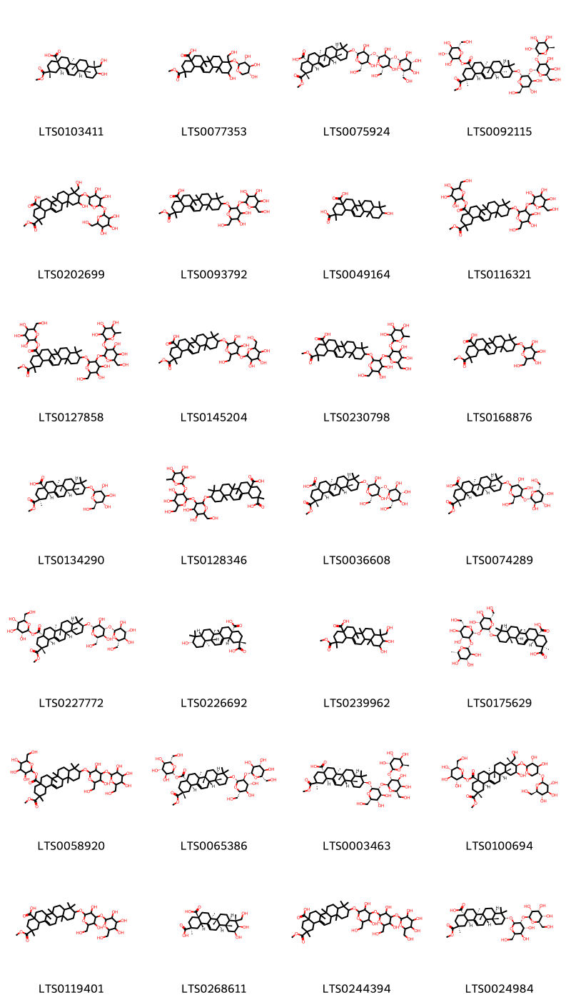{ width=100% }
    <figcaption>Hình ảnh cấu trúc hóa học của 28 hoạt chất thuộc nhóm Prenol lipids gồm ['(2r,4ar,6as,6br,9r,10s,12ar,12br,14br)-10-hydroxy-9-(hydroxymethyl)-2-(methoxycarbonyl)-2,6a,6b,9,12a-pentamethyl-1,3,4,5,6,7,8,8a,10,11,12,12b,13,14b-tetradecahydropicene-4a-carboxylic acid (LTS0103411)', '11-hydroxy-9-(hydroxymethyl)-2-(methoxycarbonyl)-2,6a,6b,12a-tetramethyl-9-{[(2s,3r,4s,5r)-3,4,5-trihydroxyoxan-2-yl]oxy}-1,3,4,5,6,7,8,8a,10,11,12,12b,13,14b-tetradecahydropicene-4a-carboxylic acid (LTS0077353)', '(2r,4as,6as,6br,8ar,10s,12ar,12bs,14br)-10-{[(2s,3s,4r,5s,6s)-4-{[(2r,3s,4r,5s,6s)-3,5-dihydroxy-6-(hydroxymethyl)-4-{[(2r,3s,4r,5r,6s)-3,4,5-trihydroxy-6-(hydroxymethyl)oxan-2-yl]oxy}oxan-2-yl]oxy}-3,5-dihydroxy-6-(hydroxymethyl)oxan-2-yl]oxy}-2-(methoxycarbonyl)-2,6a,6b,9,9,12a-hexamethyl-1,3,4,5,6,7,8,8a,10,11,12,12b,13,14b-tetradecahydropicene-4a-carboxylic acid (LTS0075924)', '2-methyl 4a-(2s,3s,4r,5r,6s)-3,4,5-trihydroxy-6-(hydroxymethyl)oxan-2-yl (2s,4ar,6as,6br,8ar,10s,12as,12br,14br)-10-{[(2s,3r,4s,5s,6r)-3-{[(2r,3s,4s,5r,6r)-4,5-dihydroxy-6-(hydroxymethyl)-3-{[(2r,3r,4s,5r,6r)-3,4,5-trihydroxy-6-methyloxan-2-yl]oxy}oxan-2-yl]oxy}-4,5-dihydroxy-6-(hydroxymethyl)oxan-2-yl]oxy}-2,6a,6b,9,9,12a-hexamethyl-1,3,4,5,6,7,8,8a,10,11,12,12b,13,14b-tetradecahydropicene-2,4a-dicarboxylate (LTS0092115)', 'esculentoside a (LTS0202699)', '10-{[4,5-dihydroxy-6-(hydroxymethyl)-3-{[3,4,5-trihydroxy-6-(hydroxymethyl)oxan-2-yl]oxy}oxan-2-yl]oxy}-2-(methoxycarbonyl)-2,6a,6b,9,9,12a-hexamethyl-1,3,4,5,6,7,8,8a,10,11,12,12b,13,14b-tetradecahydropicene-4a-carboxylic acid (LTS0093792)', '10-hydroxy-2,6a,6b,9,9,12a-hexamethyl-1,3,4,5,6,7,8,8a,10,11,12,12b,13,14b-tetradecahydropicene-2,4a-dicarboxylic acid (LTS0049164)', '2-methyl 4a-[3,4,5-trihydroxy-6-(hydroxymethyl)oxan-2-yl] 10-{[4,5-dihydroxy-6-(hydroxymethyl)-3-{[3,4,5-trihydroxy-6-(hydroxymethyl)oxan-2-yl]oxy}oxan-2-yl]oxy}-2,6a,6b,9,9,12a-hexamethyl-1,3,4,5,6,7,8,8a,10,11,12,12b,13,14b-tetradecahydropicene-2,4a-dicarboxylate (LTS0116321)', '2-methyl 4a-[3,4,5-trihydroxy-6-(hydroxymethyl)oxan-2-yl] 10-[(3-{[4,5-dihydroxy-6-(hydroxymethyl)-3-[(3,4,5-trihydroxy-6-methyloxan-2-yl)oxy]oxan-2-yl]oxy}-4,5-dihydroxy-6-(hydroxymethyl)oxan-2-yl)oxy]-2,6a,6b,9,9,12a-hexamethyl-1,3,4,5,6,7,8,8a,10,11,12,12b,13,14b-tetradecahydropicene-2,4a-dicarboxylate (LTS0127858)', '10-{[3,4-dihydroxy-6-(hydroxymethyl)-5-{[3,4,5-trihydroxy-6-(hydroxymethyl)oxan-2-yl]oxy}oxan-2-yl]oxy}-2-(methoxycarbonyl)-2,6a,6b,9,9,12a-hexamethyl-1,3,4,5,6,7,8,8a,10,11,12,12b,13,14b-tetradecahydropicene-4a-carboxylic acid (LTS0145204)', '10-[(3-{[4,5-dihydroxy-6-(hydroxymethyl)-3-[(3,4,5-trihydroxy-6-methyloxan-2-yl)oxy]oxan-2-yl]oxy}-4,5-dihydroxy-6-(hydroxymethyl)oxan-2-yl)oxy]-2-(methoxycarbonyl)-2,6a,6b,9,9,12a-hexamethyl-1,3,4,5,6,7,8,8a,10,11,12,12b,13,14b-tetradecahydropicene-4a-carboxylic acid (LTS0230798)', '2-(methoxycarbonyl)-2,6a,6b,9,9,12a-hexamethyl-10-{[3,4,5-trihydroxy-6-(hydroxymethyl)oxan-2-yl]oxy}-1,3,4,5,6,7,8,8a,10,11,12,12b,13,14b-tetradecahydropicene-4a-carboxylic acid (LTS0168876)', '(2s,4ar,6as,6br,8ar,10s,12ar,12br,14br)-2-(methoxycarbonyl)-2,6a,6b,9,9,12a-hexamethyl-10-{[(2r,3r,4s,5s,6r)-3,4,5-trihydroxy-6-(hydroxymethyl)oxan-2-yl]oxy}-1,3,4,5,6,7,8,8a,10,11,12,12b,13,14b-tetradecahydropicene-4a-carboxylic acid (LTS0134290)', '10-[(3-{[4,5-dihydroxy-6-(hydroxymethyl)-3-[(3,4,5-trihydroxy-6-methyloxan-2-yl)oxy]oxan-2-yl]oxy}-4,5-dihydroxy-6-(hydroxymethyl)oxan-2-yl)oxy]-2,6a,6b,9,9,12a-hexamethyl-1,3,4,5,6,7,8,8a,10,11,12,12b,13,14b-tetradecahydropicene-2,4a-dicarboxylic acid (LTS0128346)', '(2r,4as,6as,6br,8ar,10s,12ar,12bs,14br)-10-{[(2s,3s,4r,5s,6s)-3,5-dihydroxy-6-(hydroxymethyl)-4-{[(2r,3s,4r,5r,6s)-3,4,5-trihydroxy-6-(hydroxymethyl)oxan-2-yl]oxy}oxan-2-yl]oxy}-2-(methoxycarbonyl)-2,6a,6b,9,9,12a-hexamethyl-1,3,4,5,6,7,8,8a,10,11,12,12b,13,14b-tetradecahydropicene-4a-carboxylic acid (LTS0036608)', '(2r,4ar,6as,6br,8ar,10s,12ar,12br,14bs)-10-{[(2r,3r,4r,5r,6r)-3,4-dihydroxy-6-(hydroxymethyl)-5-{[(2s,3r,4s,5r,6r)-3,4,5-trihydroxy-6-(hydroxymethyl)oxan-2-yl]oxy}oxan-2-yl]oxy}-2-(methoxycarbonyl)-2,6a,6b,9,9,12a-hexamethyl-1,3,4,5,6,7,8,8a,10,11,12,12b,13,14b-tetradecahydropicene-4a-carboxylic acid (LTS0074289)', '2-methyl 4a-(2s,3r,4s,5s,6r)-3,4,5-trihydroxy-6-(hydroxymethyl)oxan-2-yl (2r,4as,6as,6br,8ar,10s,12ar,12bs,14br)-10-{[(2s,3s,4r,5s,6s)-3,5-dihydroxy-6-(hydroxymethyl)-4-{[(2r,3s,4r,5r,6s)-3,4,5-trihydroxy-6-(hydroxymethyl)oxan-2-yl]oxy}oxan-2-yl]oxy}-2,6a,6b,9,9,12a-hexamethyl-1,3,4,5,6,7,8,8a,10,11,12,12b,13,14b-tetradecahydropicene-2,4a-dicarboxylate (LTS0227772)', '(2s,4ar,6as,6br,8ar,10s,12ar,12br,14br)-10-hydroxy-2,6a,6b,9,9,12a-hexamethyl-1,3,4,5,6,7,8,8a,10,11,12,12b,13,14b-tetradecahydropicene-2,4a-dicarboxylic acid (LTS0226692)', '10,11-dihydroxy-9-(hydroxymethyl)-2-(methoxycarbonyl)-2,6a,6b,9,12a-pentamethyl-1,3,4,5,6,7,8,8a,10,11,12,12b,13,14b-tetradecahydropicene-4a-carboxylic acid (LTS0239962)', '(2r,4ar,6ar,6bs,8as,10r,12as,12bs,14bs)-10-{[(2s,3s,4r,5r,6s)-3-{[(2r,3s,4r,5r,6s)-4,5-dihydroxy-6-(hydroxymethyl)-3-{[(2r,3s,4r,5r,6s)-3,4,5-trihydroxy-6-methyloxan-2-yl]oxy}oxan-2-yl]oxy}-4,5-dihydroxy-6-(hydroxymethyl)oxan-2-yl]oxy}-2,6a,6b,9,9,12a-hexamethyl-1,3,4,5,6,7,8,8a,10,11,12,12b,13,14b-tetradecahydropicene-2,4a-dicarboxylic acid (LTS0175629)', '2-methyl 4a-[3,4,5-trihydroxy-6-(hydroxymethyl)oxan-2-yl] 10-{[3,5-dihydroxy-6-(hydroxymethyl)-4-{[3,4,5-trihydroxy-6-(hydroxymethyl)oxan-2-yl]oxy}oxan-2-yl]oxy}-2,6a,6b,9,9,12a-hexamethyl-1,3,4,5,6,7,8,8a,10,11,12,12b,13,14b-tetradecahydropicene-2,4a-dicarboxylate (LTS0058920)', '2-methyl 4a-(2r,3s,4r,5r,6s)-3,4,5-trihydroxy-6-(hydroxymethyl)oxan-2-yl (2r,4as,6as,6br,8ar,10s,12ar,12bs,14br)-10-{[(2s,3s,4r,5r,6s)-4,5-dihydroxy-6-(hydroxymethyl)-3-{[(2r,3s,4r,5r,6s)-3,4,5-trihydroxy-6-(hydroxymethyl)oxan-2-yl]oxy}oxan-2-yl]oxy}-2,6a,6b,9,9,12a-hexamethyl-1,3,4,5,6,7,8,8a,10,11,12,12b,13,14b-tetradecahydropicene-2,4a-dicarboxylate (LTS0065386)', '(2s,4as,6as,6br,8ar,10s,12ar,12bs,14br)-10-{[(2s,3r,4s,5s,6r)-3-{[(2s,3r,4s,5r,6r)-4,5-dihydroxy-6-(hydroxymethyl)-3-{[(2s,3r,4r,5r,6r)-3,4,5-trihydroxy-6-methyloxan-2-yl]oxy}oxan-2-yl]oxy}-4,5-dihydroxy-6-(hydroxymethyl)oxan-2-yl]oxy}-2-(methoxycarbonyl)-2,6a,6b,9,9,12a-hexamethyl-1,3,4,5,6,7,8,8a,10,11,12,12b,13,14b-tetradecahydropicene-4a-carboxylic acid (LTS0003463)', '2-methyl 4a-(2s,3r,4s,5s,6r)-3,4,5-trihydroxy-6-(hydroxymethyl)oxan-2-yl (2r,4ar,6as,6br,9r,10r,11s,12ar,12br,14br)-10-{[(2s,3r,4r,5r)-3,4-dihydroxy-5-{[(2s,3r,4s,5s,6r)-3,4,5-trihydroxy-6-(hydroxymethyl)oxan-2-yl]oxy}oxan-2-yl]oxy}-11-hydroxy-9-(hydroxymethyl)-2,6a,6b,9,12a-pentamethyl-1,3,4,5,6,7,8,8a,10,11,12,12b,13,14b-tetradecahydropicene-2,4a-dicarboxylate (LTS0100694)', '10-{[3,5-dihydroxy-6-(hydroxymethyl)-4-{[3,4,5-trihydroxy-6-(hydroxymethyl)oxan-2-yl]oxy}oxan-2-yl]oxy}-2-(methoxycarbonyl)-2,6a,6b,9,9,12a-hexamethyl-1,3,4,5,6,7,8,8a,10,11,12,12b,13,14b-tetradecahydropicene-4a-carboxylic acid (LTS0119401)', '(2s,4ar,6as,6br,8ar,9r,10r,11s,12ar,12br,14bs)-10,11-dihydroxy-9-(hydroxymethyl)-2,6a,6b,9,12a-pentamethyl-1,3,4,5,6,7,8,8a,10,11,12,12b,13,14b-tetradecahydropicene-2,4a-dicarboxylic acid (LTS0268611)', '10-[(4-{[3,5-dihydroxy-6-(hydroxymethyl)-4-{[3,4,5-trihydroxy-6-(hydroxymethyl)oxan-2-yl]oxy}oxan-2-yl]oxy}-3,5-dihydroxy-6-(hydroxymethyl)oxan-2-yl)oxy]-2-(methoxycarbonyl)-2,6a,6b,9,9,12a-hexamethyl-1,3,4,5,6,7,8,8a,10,11,12,12b,13,14b-tetradecahydropicene-4a-carboxylic acid (LTS0244394)', '(2s,4as,6as,6br,8ar,10r,12ar,12bs,14br)-10-{[(2r,3r,4r,5r,6r)-4,5-dihydroxy-6-(hydroxymethyl)-3-{[(2s,3r,4r,5s,6r)-3,4,5-trihydroxy-6-(hydroxymethyl)oxan-2-yl]oxy}oxan-2-yl]oxy}-2-(methoxycarbonyl)-2,6a,6b,9,9,12a-hexamethyl-1,3,4,5,6,7,8,8a,10,11,12,12b,13,14b-tetradecahydropicene-4a-carboxylic acid (LTS0024984)'].</figcaption>
</figure>

---

### Dược dân tộc học

Danh sách các quốc gia có sử dụng *Phytolacca icosandra* trong điều trị các bệnh. 

| Country            | Disease                        | Bệnh                                                                                                                                                                                                |
|:-------------------|:-------------------------------|:----------------------------------------------------------------------------------------------------------------------------------------------------------------------------------------------------|
| Dominican Republic | Emetic                         | MYMEMORY WARNING: YOU USED ALL AVAILABLE FREE TRANSLATIONS FOR TODAY. NEXT AVAILABLE IN  02 HOURS 45 MINUTES 44 SECONDS VISIT HTTPS://MYMEMORY.TRANSLATED.NET/DOC/USAGELIMITS.PHP TO TRANSLATE MORE |
| Guatemala          | Poison, Soap                   | MYMEMORY WARNING: YOU USED ALL AVAILABLE FREE TRANSLATIONS FOR TODAY. NEXT AVAILABLE IN  02 HOURS 45 MINUTES 42 SECONDS VISIT HTTPS://MYMEMORY.TRANSLATED.NET/DOC/USAGELIMITS.PHP TO TRANSLATE MORE |
| Haiti              | Narcotic, Purgative, Vermifuge | MYMEMORY WARNING: YOU USED ALL AVAILABLE FREE TRANSLATIONS FOR TODAY. NEXT AVAILABLE IN  02 HOURS 45 MINUTES 40 SECONDS VISIT HTTPS://MYMEMORY.TRANSLATED.NET/DOC/USAGELIMITS.PHP TO TRANSLATE MORE |
| Mexico             | Soap                           | MYMEMORY WARNING: YOU USED ALL AVAILABLE FREE TRANSLATIONS FOR TODAY. NEXT AVAILABLE IN  02 HOURS 45 MINUTES 38 SECONDS VISIT HTTPS://MYMEMORY.TRANSLATED.NET/DOC/USAGELIMITS.PHP TO TRANSLATE MORE |

---

---
## Phytolacca japonica
### Thông tin về thực vật

!!! info "Phân loại thực vật của *Phytolacca japonica* từ GIBF:"
    - **Kingdom:** Plantae
    - **Phylum:** Tracheophyta
    - **Order:** Caryophyllales
    - **Family:** Phytolaccaceae
    - **Genus:** Phytolacca
    - **Species:** *Phytolacca japonica*

 

| Label (VI)   | Label (EN)   | Scientific Name     | Descriptions (VI)   | Descriptions (EN)   | Also Known As (VI)   | Also Known As (EN)   |
|:-------------|:-------------|:--------------------|:--------------------|:--------------------|:---------------------|:---------------------|
| N/A          | N/A          | Phytolacca japonica | loài thực vật       | species of plant    | ['']                 | ['']                 |

#### Phân bố trên thế giới

**Từ CSDL GIBF** China, nan, Chinese Taipei, Japan

#### Phân bố tại Việt Nam

**Từ CSDL GIBF**: Không có ghi nhận ở Việt Nam

---
### Thành phần hóa học
        
- Theo cơ sở dữ liệu lotus: Từ loài *Phytolacca japonica* đã phân lập và xác định được 2 hoạt chất thuộc về các nhóm Carboxylic acids and derivatives, Organonitrogen compounds. 

|    | chemicalTaxonomyClassyfireClass   |   smiles_count |
|---:|:----------------------------------|---------------:|
|  0 | Carboxylic acids and derivatives  |              1 |
|  1 | Organonitrogen compounds          |              1 |

#### Nhóm Carboxylic acids and derivatives
<figure markdown="span">
    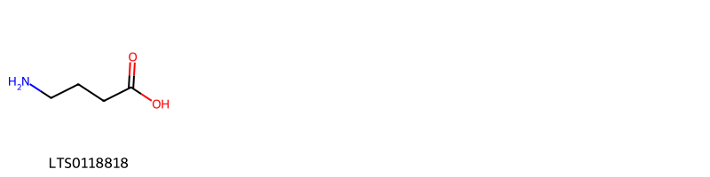{ width=100% }
    <figcaption>Hình ảnh cấu trúc hóa học của 1 hoạt chất thuộc nhóm Carboxylic acids and derivatives gồm ['gamma(amino)-butyric acid (LTS0118818)'].</figcaption>
</figure>
#### Nhóm Organonitrogen compounds
<figure markdown="span">
    { width=100% }
    <figcaption>Hình ảnh cấu trúc hóa học của 1 hoạt chất thuộc nhóm Organonitrogen compounds gồm ['1h-imidazole-5-ethanamine (LTS0016235)'].</figcaption>
</figure>

---

### Dược dân tộc học

Danh sách các quốc gia có sử dụng *Phytolacca japonica* trong điều trị các bệnh. 

| Country   | Disease   | Bệnh                                                                                                                                                                                                |
|:----------|:----------|:----------------------------------------------------------------------------------------------------------------------------------------------------------------------------------------------------|
| Elsewhere | Diuretic  | MYMEMORY WARNING: YOU USED ALL AVAILABLE FREE TRANSLATIONS FOR TODAY. NEXT AVAILABLE IN  02 HOURS 45 MINUTES 07 SECONDS VISIT HTTPS://MYMEMORY.TRANSLATED.NET/DOC/USAGELIMITS.PHP TO TRANSLATE MORE |

---

---
## Phytolacca octandra
### Thông tin về thực vật

!!! info "Phân loại thực vật của *Phytolacca icosandra* từ GIBF:"
    - **Kingdom:** Plantae
    - **Phylum:** Tracheophyta
    - **Order:** Caryophyllales
    - **Family:** Phytolaccaceae
    - **Genus:** Phytolacca
    - **Species:** *Phytolacca icosandra*

 

| Label (VI)   | Label (EN)   | Scientific Name     | Descriptions (VI)   | Descriptions (EN)   | Also Known As (VI)   | Also Known As (EN)   |
|:-------------|:-------------|:--------------------|:--------------------|:--------------------|:---------------------|:---------------------|
| N/A          | N/A          | Phytolacca octandra |                     | species of plant    | ['']                 | ['']                 |

#### Phân bố trên thế giới

**Từ CSDL GIBF** nan, South Africa, Australia, Honduras, United States of America, Peru, Mexico, Eswatini, New Zealand

#### Phân bố tại Việt Nam

**Từ CSDL GIBF**: Không có ghi nhận ở Việt Nam

---
### Thành phần hóa học
        
- Theo cơ sở dữ liệu lotus: Từ loài *Phytolacca icosandra* đã phân lập và xác định được 12 hoạt chất thuộc về các nhóm Carboxylic acids and derivatives, Prenol lipids. 

|    | chemicalTaxonomyClassyfireClass   |   smiles_count |
|---:|:----------------------------------|---------------:|
|  0 | Carboxylic acids and derivatives  |              1 |
|  1 | Prenol lipids                     |             10 |

#### Nhóm Carboxylic acids and derivatives
<figure markdown="span">
    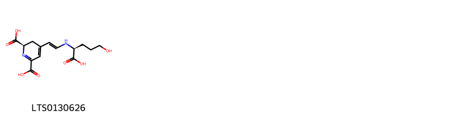{ width=100% }
    <figcaption>Hình ảnh cấu trúc hóa học của 1 hoạt chất thuộc nhóm Carboxylic acids and derivatives gồm ['(2r)-4-[(1e)-2-{[(1s)-1-carboxy-4-hydroxybutyl]amino}ethenyl]-2,3-dihydropyridine-2,6-dicarboxylic acid (LTS0130626)'].</figcaption>
</figure>
#### Nhóm Prenol lipids
<figure markdown="span">
    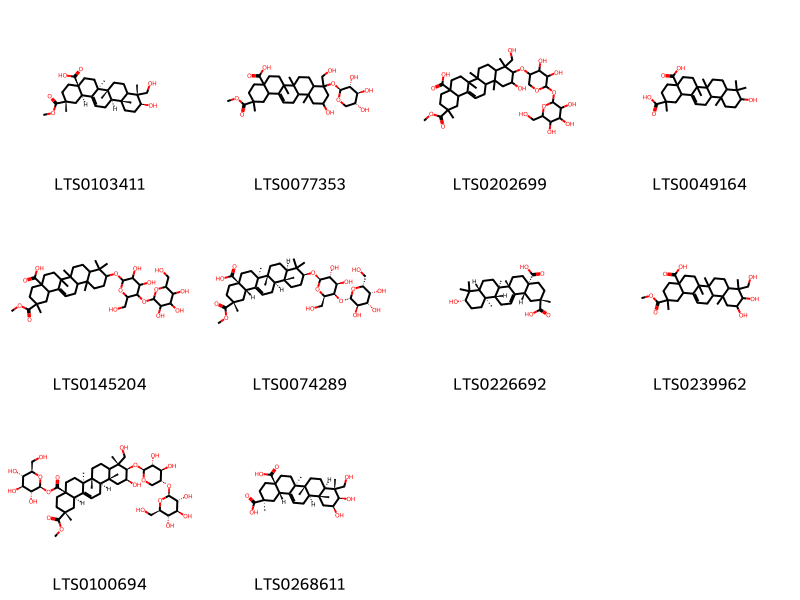{ width=100% }
    <figcaption>Hình ảnh cấu trúc hóa học của 10 hoạt chất thuộc nhóm Prenol lipids gồm ['(2r,4ar,6as,6br,9r,10s,12ar,12br,14br)-10-hydroxy-9-(hydroxymethyl)-2-(methoxycarbonyl)-2,6a,6b,9,12a-pentamethyl-1,3,4,5,6,7,8,8a,10,11,12,12b,13,14b-tetradecahydropicene-4a-carboxylic acid (LTS0103411)', '11-hydroxy-9-(hydroxymethyl)-2-(methoxycarbonyl)-2,6a,6b,12a-tetramethyl-9-{[(2s,3r,4s,5r)-3,4,5-trihydroxyoxan-2-yl]oxy}-1,3,4,5,6,7,8,8a,10,11,12,12b,13,14b-tetradecahydropicene-4a-carboxylic acid (LTS0077353)', 'esculentoside a (LTS0202699)', '10-hydroxy-2,6a,6b,9,9,12a-hexamethyl-1,3,4,5,6,7,8,8a,10,11,12,12b,13,14b-tetradecahydropicene-2,4a-dicarboxylic acid (LTS0049164)', '10-{[3,4-dihydroxy-6-(hydroxymethyl)-5-{[3,4,5-trihydroxy-6-(hydroxymethyl)oxan-2-yl]oxy}oxan-2-yl]oxy}-2-(methoxycarbonyl)-2,6a,6b,9,9,12a-hexamethyl-1,3,4,5,6,7,8,8a,10,11,12,12b,13,14b-tetradecahydropicene-4a-carboxylic acid (LTS0145204)', '(2r,4ar,6as,6br,8ar,10s,12ar,12br,14bs)-10-{[(2r,3r,4r,5r,6r)-3,4-dihydroxy-6-(hydroxymethyl)-5-{[(2s,3r,4s,5r,6r)-3,4,5-trihydroxy-6-(hydroxymethyl)oxan-2-yl]oxy}oxan-2-yl]oxy}-2-(methoxycarbonyl)-2,6a,6b,9,9,12a-hexamethyl-1,3,4,5,6,7,8,8a,10,11,12,12b,13,14b-tetradecahydropicene-4a-carboxylic acid (LTS0074289)', '(2s,4ar,6as,6br,8ar,10s,12ar,12br,14br)-10-hydroxy-2,6a,6b,9,9,12a-hexamethyl-1,3,4,5,6,7,8,8a,10,11,12,12b,13,14b-tetradecahydropicene-2,4a-dicarboxylic acid (LTS0226692)', '10,11-dihydroxy-9-(hydroxymethyl)-2-(methoxycarbonyl)-2,6a,6b,9,12a-pentamethyl-1,3,4,5,6,7,8,8a,10,11,12,12b,13,14b-tetradecahydropicene-4a-carboxylic acid (LTS0239962)', '2-methyl 4a-(2s,3r,4s,5s,6r)-3,4,5-trihydroxy-6-(hydroxymethyl)oxan-2-yl (2r,4ar,6as,6br,9r,10r,11s,12ar,12br,14br)-10-{[(2s,3r,4r,5r)-3,4-dihydroxy-5-{[(2s,3r,4s,5s,6r)-3,4,5-trihydroxy-6-(hydroxymethyl)oxan-2-yl]oxy}oxan-2-yl]oxy}-11-hydroxy-9-(hydroxymethyl)-2,6a,6b,9,12a-pentamethyl-1,3,4,5,6,7,8,8a,10,11,12,12b,13,14b-tetradecahydropicene-2,4a-dicarboxylate (LTS0100694)', '(2s,4ar,6as,6br,8ar,9r,10r,11s,12ar,12br,14bs)-10,11-dihydroxy-9-(hydroxymethyl)-2,6a,6b,9,12a-pentamethyl-1,3,4,5,6,7,8,8a,10,11,12,12b,13,14b-tetradecahydropicene-2,4a-dicarboxylic acid (LTS0268611)'].</figcaption>
</figure>

---

### Dược dân tộc học

Danh sách các quốc gia có sử dụng *Phytolacca icosandra* trong điều trị các bệnh. 

| Country           | Disease                             | Bệnh                                                                                                                                                                                                |
|:------------------|:------------------------------------|:----------------------------------------------------------------------------------------------------------------------------------------------------------------------------------------------------|
| Mexico            | Emetic, Poison, Purgative, Diuretic | MYMEMORY WARNING: YOU USED ALL AVAILABLE FREE TRANSLATIONS FOR TODAY. NEXT AVAILABLE IN  02 HOURS 44 MINUTES 44 SECONDS VISIT HTTPS://MYMEMORY.TRANSLATED.NET/DOC/USAGELIMITS.PHP TO TRANSLATE MORE |
| Mexico(Chinantec) | Soap                                | MYMEMORY WARNING: YOU USED ALL AVAILABLE FREE TRANSLATIONS FOR TODAY. NEXT AVAILABLE IN  02 HOURS 44 MINUTES 42 SECONDS VISIT HTTPS://MYMEMORY.TRANSLATED.NET/DOC/USAGELIMITS.PHP TO TRANSLATE MORE |

---

---
## Phytolacca rivinoides
### Thông tin về thực vật

!!! info "Phân loại thực vật của *Phytolacca rivinoides* từ GIBF:"
    - **Kingdom:** Plantae
    - **Phylum:** Tracheophyta
    - **Order:** Caryophyllales
    - **Family:** Phytolaccaceae
    - **Genus:** Phytolacca
    - **Species:** *Phytolacca rivinoides*

 

| Label (VI)   | Label (EN)   | Scientific Name       | Descriptions (VI)   | Descriptions (EN)   | Also Known As (VI)   | Also Known As (EN)   |
|:-------------|:-------------|:----------------------|:--------------------|:--------------------|:---------------------|:---------------------|
| N/A          | N/A          | Phytolacca rivinoides | loài thực vật       | species of plant    | ['']                 | ['']                 |

#### Phân bố trên thế giới

**Từ CSDL GIBF** Guadeloupe, Guatemala, Argentina, Nicaragua, Venezuela (Bolivarian Republic of), Panama, French Guiana, Puerto Rico, Bolivia (Plurinational State of), Honduras, Jamaica, Belize, Trinidad and Tobago, Brazil, Peru, Dominican Republic, Mexico, Ecuador, Colombia, Costa Rica

#### Phân bố tại Việt Nam

**Từ CSDL GIBF**: Không có ghi nhận ở Việt Nam

---
### Thành phần hóa học
        
- Theo cơ sở dữ liệu lotus: Từ loài *Phytolacca rivinoides* đã phân lập và xác định được 6 hoạt chất thuộc về các nhóm Prenol lipids. 

|    | chemicalTaxonomyClassyfireClass   |   smiles_count |
|---:|:----------------------------------|---------------:|
|  0 | Prenol lipids                     |              6 |

#### Nhóm Prenol lipids
<figure markdown="span">
    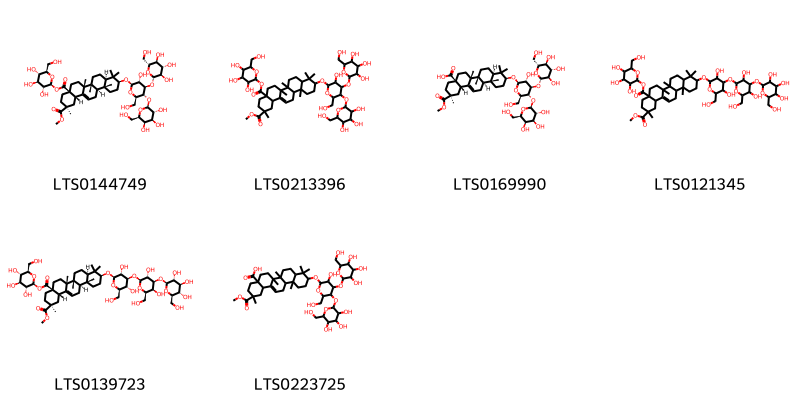{ width=100% }
    <figcaption>Hình ảnh cấu trúc hóa học của 6 hoạt chất thuộc nhóm Prenol lipids gồm ['2-methyl 4a-(2s,3r,4s,5s,6r)-3,4,5-trihydroxy-6-(hydroxymethyl)oxan-2-yl (2s,4ar,6ar,6br,8ar,10s,12ar,12br,14bs)-10-{[(2r,3r,4r,5r,6r)-3-hydroxy-6-(hydroxymethyl)-5-{[(2s,3r,4s,5r,6r)-3,4,5-trihydroxy-6-(hydroxymethyl)oxan-2-yl]oxy}-4-{[(2s,3r,4s,5s,6r)-3,4,5-trihydroxy-6-(hydroxymethyl)oxan-2-yl]oxy}oxan-2-yl]oxy}-2,6a,6b,9,9,12a-hexamethyl-1,3,4,5,6,7,8,8a,10,11,12,12b,13,14b-tetradecahydropicene-2,4a-dicarboxylate (LTS0144749)', '2-methyl 4a-[3,4,5-trihydroxy-6-(hydroxymethyl)oxan-2-yl] 10-{[3-hydroxy-6-(hydroxymethyl)-4,5-bis({[3,4,5-trihydroxy-6-(hydroxymethyl)oxan-2-yl]oxy})oxan-2-yl]oxy}-2,6a,6b,9,9,12a-hexamethyl-1,3,4,5,6,7,8,8a,10,11,12,12b,13,14b-tetradecahydropicene-2,4a-dicarboxylate (LTS0213396)', '(2s,4ar,6ar,6br,8ar,10s,12ar,12br,14bs)-10-{[(2r,3r,4r,5r,6r)-3-hydroxy-6-(hydroxymethyl)-5-{[(2s,3r,4s,5r,6r)-3,4,5-trihydroxy-6-(hydroxymethyl)oxan-2-yl]oxy}-4-{[(2s,3r,4s,5s,6r)-3,4,5-trihydroxy-6-(hydroxymethyl)oxan-2-yl]oxy}oxan-2-yl]oxy}-2-(methoxycarbonyl)-2,6a,6b,9,9,12a-hexamethyl-1,3,4,5,6,7,8,8a,10,11,12,12b,13,14b-tetradecahydropicene-4a-carboxylic acid (LTS0169990)', '2-methyl 4a-[3,4,5-trihydroxy-6-(hydroxymethyl)oxan-2-yl] 10-[(4-{[3,5-dihydroxy-6-(hydroxymethyl)-4-{[3,4,5-trihydroxy-6-(hydroxymethyl)oxan-2-yl]oxy}oxan-2-yl]oxy}-3,5-dihydroxy-6-(hydroxymethyl)oxan-2-yl)oxy]-2,6a,6b,9,9,12a-hexamethyl-1,3,4,5,6,7,8,8a,10,11,12,12b,13,14b-tetradecahydropicene-2,4a-dicarboxylate (LTS0121345)', '2-methyl 4a-(2s,3r,4s,5s,6r)-3,4,5-trihydroxy-6-(hydroxymethyl)oxan-2-yl (2s,4ar,6ar,6br,8ar,10s,12ar,12br,14bs)-10-{[(2r,3r,4s,5r,6r)-4-{[(2s,3r,4s,5s,6r)-3,5-dihydroxy-6-(hydroxymethyl)-4-{[(2s,3r,4s,5s,6r)-3,4,5-trihydroxy-6-(hydroxymethyl)oxan-2-yl]oxy}oxan-2-yl]oxy}-3,5-dihydroxy-6-(hydroxymethyl)oxan-2-yl]oxy}-2,6a,6b,9,9,12a-hexamethyl-1,3,4,5,6,7,8,8a,10,11,12,12b,13,14b-tetradecahydropicene-2,4a-dicarboxylate (LTS0139723)', '10-{[3-hydroxy-6-(hydroxymethyl)-4,5-bis({[3,4,5-trihydroxy-6-(hydroxymethyl)oxan-2-yl]oxy})oxan-2-yl]oxy}-2-(methoxycarbonyl)-2,6a,6b,9,9,12a-hexamethyl-1,3,4,5,6,7,8,8a,10,11,12,12b,13,14b-tetradecahydropicene-4a-carboxylic acid (LTS0223725)'].</figcaption>
</figure>

---

### Dược dân tộc học

Danh sách các quốc gia có sử dụng *Phytolacca rivinoides* trong điều trị các bệnh. 

| Country   | Disease   | Bệnh                                                                                                                                                                                                |
|:----------|:----------|:----------------------------------------------------------------------------------------------------------------------------------------------------------------------------------------------------|
| Colombia  | Piscicide | MYMEMORY WARNING: YOU USED ALL AVAILABLE FREE TRANSLATIONS FOR TODAY. NEXT AVAILABLE IN  02 HOURS 44 MINUTES 18 SECONDS VISIT HTTPS://MYMEMORY.TRANSLATED.NET/DOC/USAGELIMITS.PHP TO TRANSLATE MORE |
| Elsewhere | Soap      | MYMEMORY WARNING: YOU USED ALL AVAILABLE FREE TRANSLATIONS FOR TODAY. NEXT AVAILABLE IN  02 HOURS 44 MINUTES 16 SECONDS VISIT HTTPS://MYMEMORY.TRANSLATED.NET/DOC/USAGELIMITS.PHP TO TRANSLATE MORE |
| Peru      | Tonic     | MYMEMORY WARNING: YOU USED ALL AVAILABLE FREE TRANSLATIONS FOR TODAY. NEXT AVAILABLE IN  02 HOURS 44 MINUTES 14 SECONDS VISIT HTTPS://MYMEMORY.TRANSLATED.NET/DOC/USAGELIMITS.PHP TO TRANSLATE MORE |

---

# Chi Stegnoerma

??? note "Danh sách các dược liệu thuộc chi"
    
	 - *Stegnoerma halimifolium*

---
## Stegnoerma halimifolium
### Thông tin về thực vật

!!! info "Phân loại thực vật của *N/A* từ GIBF:"
    - **Kingdom:** N/A
    - **Phylum:** N/A
    - **Order:** N/A
    - **Family:** N/A
    - **Genus:** N/A
    - **Species:** *N/A*

 

| Label (VI)   | Label (EN)   | Scientific Name       | Descriptions (VI)   | Descriptions (EN)   | Also Known As (VI)   | Also Known As (EN)   |
|:-------------|:-------------|:----------------------|:--------------------|:--------------------|:---------------------|:---------------------|
| N/A          | N/A          | Phytolacca rivinoides | loài thực vật       | species of plant    | ['']                 | ['']                 |

#### Phân bố trên thế giới

**Từ CSDL GIBF** Không có kết quả phù hợp

#### Phân bố tại Việt Nam

**Từ CSDL GIBF**: Không có ghi nhận ở Việt Nam

---
### Thành phần hóa học
        
- Theo cơ sở dữ liệu lotus: Từ loài *N/A* đã phân lập và xác định được Chưa có hoạt chất nào được phân lập. hoạt chất thuộc về các nhóm Không có hoạt chất nào được phân lập. 

Không có hình ảnh nào được tạo ra

---

### Dược dân tộc học

Danh sách các quốc gia có sử dụng *N/A* trong điều trị các bệnh. 

| Country   | Disease   | Bệnh                                                                                                                                                                                                |
|:----------|:----------|:----------------------------------------------------------------------------------------------------------------------------------------------------------------------------------------------------|
| Mexico    | Soap      | MYMEMORY WARNING: YOU USED ALL AVAILABLE FREE TRANSLATIONS FOR TODAY. NEXT AVAILABLE IN  02 HOURS 43 MINUTES 52 SECONDS VISIT HTTPS://MYMEMORY.TRANSLATED.NET/DOC/USAGELIMITS.PHP TO TRANSLATE MORE |

---

# Chi Gallesia

??? note "Danh sách các dược liệu thuộc chi"
    
	 - *Gallesia integrifolia*

---
## Gallesia integrifolia
### Thông tin về thực vật

!!! info "Phân loại thực vật của *Gallesia integrifolia* từ GIBF:"
    - **Kingdom:** Plantae
    - **Phylum:** Tracheophyta
    - **Order:** Caryophyllales
    - **Family:** Phytolaccaceae
    - **Genus:** Gallesia
    - **Species:** *Gallesia integrifolia*

 

| Label (VI)   | Label (EN)   | Scientific Name       | Descriptions (VI)   | Descriptions (EN)   | Also Known As (VI)   | Also Known As (EN)   |
|:-------------|:-------------|:----------------------|:--------------------|:--------------------|:---------------------|:---------------------|
| N/A          | N/A          | Gallesia integrifolia | loài thực vật       | species of plant    | ['']                 | ['']                 |

#### Phân bố trên thế giới

**Từ CSDL GIBF** Bolivia (Plurinational State of), Brazil, Peru

#### Phân bố tại Việt Nam

**Từ CSDL GIBF**: Không có ghi nhận ở Việt Nam

---
### Thành phần hóa học
        
- Theo cơ sở dữ liệu lotus: Từ loài *Gallesia integrifolia* đã phân lập và xác định được Chưa có hoạt chất nào được phân lập. hoạt chất thuộc về các nhóm Không có hoạt chất nào được phân lập. 

Không có hình ảnh nào được tạo ra

---

### Dược dân tộc học

Danh sách các quốc gia có sử dụng *Gallesia integrifolia* trong điều trị các bệnh. 

| Country   | Disease   | Bệnh                                                                                                                                                                                                |
|:----------|:----------|:----------------------------------------------------------------------------------------------------------------------------------------------------------------------------------------------------|
| Brazil    | Soap      | MYMEMORY WARNING: YOU USED ALL AVAILABLE FREE TRANSLATIONS FOR TODAY. NEXT AVAILABLE IN  02 HOURS 43 MINUTES 42 SECONDS VISIT HTTPS://MYMEMORY.TRANSLATED.NET/DOC/USAGELIMITS.PHP TO TRANSLATE MORE |
| Peru      | Soap      | MYMEMORY WARNING: YOU USED ALL AVAILABLE FREE TRANSLATIONS FOR TODAY. NEXT AVAILABLE IN  02 HOURS 43 MINUTES 40 SECONDS VISIT HTTPS://MYMEMORY.TRANSLATED.NET/DOC/USAGELIMITS.PHP TO TRANSLATE MORE |

---

# Chi Rivina

??? note "Danh sách các dược liệu thuộc chi"
    
	 - *Rivina humilis*

---
## Rivina humilis
### Thông tin về thực vật

!!! info "Phân loại thực vật của *Rivina humilis* từ GIBF:"
    - **Kingdom:** Plantae
    - **Phylum:** Tracheophyta
    - **Order:** Caryophyllales
    - **Family:** Phytolaccaceae
    - **Genus:** Rivina
    - **Species:** *Rivina humilis*

 

| Label (VI)   | Label (EN)   | Scientific Name   | Descriptions (VI)   | Descriptions (EN)   | Also Known As (VI)   | Also Known As (EN)                                                                                 |
|:-------------|:-------------|:------------------|:--------------------|:--------------------|:---------------------|:---------------------------------------------------------------------------------------------------|
| N/A          | N/A          | Rivina humilis    | loài thực vật       | species of plant    | ['']                 | ['baby peppers', 'Blood Berry/Coral Berry', 'bloodberry', 'coralito', 'pigeonberry', 'rougeplant'] |

#### Phân bố trên thế giới

**Từ CSDL GIBF** Virgin Islands (U.S.), Sri Lanka, Australia, Argentina, Nicaragua, Puerto Rico, Chinese Taipei, Jamaica, United States of America, Paraguay, Belize, South Africa, Uganda, Thailand, Brazil, Bahamas, Guam, Mexico, Dominican Republic, Colombia, Costa Rica, India, Indonesia, Philippines, Malaysia, Northern Mariana Islands

#### Phân bố tại Việt Nam

**Từ CSDL GIBF**: Không có ghi nhận ở Việt Nam

---
### Thành phần hóa học
        
- Theo cơ sở dữ liệu lotus: Từ loài *Rivina humilis* đã phân lập và xác định được 6 hoạt chất thuộc về các nhóm Carboxylic acids and derivatives. 

|    | chemicalTaxonomyClassyfireClass   |   smiles_count |
|---:|:----------------------------------|---------------:|
|  0 | Carboxylic acids and derivatives  |              6 |

#### Nhóm Carboxylic acids and derivatives
<figure markdown="span">
    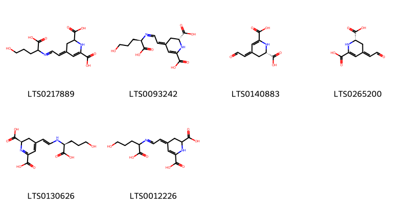{ width=100% }
    <figcaption>Hình ảnh cấu trúc hóa học của 6 hoạt chất thuộc nhóm Carboxylic acids and derivatives gồm ['(4e)-4-{2-[(1-carboxy-4-hydroxybutyl)imino]ethylidene}-2,3-dihydro-1h-pyridine-2,6-dicarboxylic acid (LTS0217889)', '(2r,4e)-4-[(2z)-2-{[(1r)-1-carboxy-4-hydroxybutyl]imino}ethylidene]-2,3-dihydro-1h-pyridine-2,6-dicarboxylic acid (LTS0093242)', '(2s,4z)-4-(2-oxoethylidene)-2,3-dihydro-1h-pyridine-2,6-dicarboxylic acid (LTS0140883)', 'betalamic acid (LTS0265200)', '(2r)-4-[(1e)-2-{[(1s)-1-carboxy-4-hydroxybutyl]amino}ethenyl]-2,3-dihydropyridine-2,6-dicarboxylic acid (LTS0130626)', '(4z)-4-{2-[(1-carboxy-4-hydroxybutyl)imino]ethylidene}-2,3-dihydro-1h-pyridine-2,6-dicarboxylic acid (LTS0012226)'].</figcaption>
</figure>

---

### Dược dân tộc học

Danh sách các quốc gia có sử dụng *Rivina humilis* trong điều trị các bệnh. 

| Country   | Disease   | Bệnh                                                                                                                                                                                                |
|:----------|:----------|:----------------------------------------------------------------------------------------------------------------------------------------------------------------------------------------------------|
| Australia | Poison    | MYMEMORY WARNING: YOU USED ALL AVAILABLE FREE TRANSLATIONS FOR TODAY. NEXT AVAILABLE IN  02 HOURS 43 MINUTES 21 SECONDS VISIT HTTPS://MYMEMORY.TRANSLATED.NET/DOC/USAGELIMITS.PHP TO TRANSLATE MORE |

---

# Chi Gisekia

??? note "Danh sách các dược liệu thuộc chi"
    
	 - *Gisekia pharnaceoides*

---
## Gisekia pharnaceoides
### Thông tin về thực vật

!!! info "Phân loại thực vật của *Gisekia pharnaceoides* từ GIBF:"
    - **Kingdom:** Plantae
    - **Phylum:** Tracheophyta
    - **Order:** Caryophyllales
    - **Family:** Gisekiaceae
    - **Genus:** Gisekia
    - **Species:** *Gisekia pharnaceoides*

 

| Label (VI)   | Label (EN)   | Scientific Name       | Descriptions (VI)   | Descriptions (EN)   | Also Known As (VI)   | Also Known As (EN)                                                     |
|:-------------|:-------------|:----------------------|:--------------------|:--------------------|:---------------------|:-----------------------------------------------------------------------|
| N/A          | N/A          | Gisekia pharnaceoides | loài thực vật       | species of plant    | ['']                 | ['Gisekia pharnacioides', 'Gisekia pharnacioides (original spelling)'] |

#### Phân bố trên thế giới

**Từ CSDL GIBF** United Arab Emirates, South Africa, Pakistan, Madagascar, Oman, Namibia, Gabon, Mozambique, Botswana, Benin, Congo, Democratic Republic of the, Kenya, Zimbabwe, Saudi Arabia

#### Phân bố tại Việt Nam

**Từ CSDL GIBF**: Không có ghi nhận ở Việt Nam

---
### Thành phần hóa học
        
- Theo cơ sở dữ liệu lotus: Từ loài *Gisekia pharnaceoides* đã phân lập và xác định được 4 hoạt chất thuộc về các nhóm Fatty Acyls, Saturated hydrocarbons. 

|    | chemicalTaxonomyClassyfireClass   |   smiles_count |
|---:|:----------------------------------|---------------:|
|  0 | Fatty Acyls                       |              2 |
|  1 | Saturated hydrocarbons            |              2 |

#### Nhóm Fatty Acyls
<figure markdown="span">
    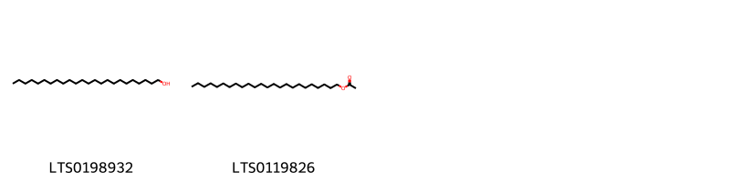{ width=100% }
    <figcaption>Hình ảnh cấu trúc hóa học của 2 hoạt chất thuộc nhóm Fatty Acyls gồm ['1-tetracosanol (LTS0198932)', 'tetracosyl acetate (LTS0119826)'].</figcaption>
</figure>
#### Nhóm Saturated hydrocarbons
<figure markdown="span">
    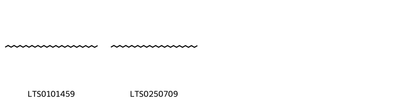{ width=100% }
    <figcaption>Hình ảnh cấu trúc hóa học của 2 hoạt chất thuộc nhóm Saturated hydrocarbons gồm ['dotriacontane (LTS0101459)', 'triacontane (LTS0250709)'].</figcaption>
</figure>

---

### Dược dân tộc học

Danh sách các quốc gia có sử dụng *Gisekia pharnaceoides* trong điều trị các bệnh. 

| Country   | Disease             | Bệnh                                                                                                                                                                                                |
|:----------|:--------------------|:----------------------------------------------------------------------------------------------------------------------------------------------------------------------------------------------------|
| India     | Aperient, Vermifuge | MYMEMORY WARNING: YOU USED ALL AVAILABLE FREE TRANSLATIONS FOR TODAY. NEXT AVAILABLE IN  02 HOURS 42 MINUTES 59 SECONDS VISIT HTTPS://MYMEMORY.TRANSLATED.NET/DOC/USAGELIMITS.PHP TO TRANSLATE MORE |

---

# Chi Microtea

??? note "Danh sách các dược liệu thuộc chi"
    
	 - *Microtea debilis*

---
## Microtea debilis
### Thông tin về thực vật

!!! info "Phân loại thực vật của *Microtea debilis* từ GIBF:"
    - **Kingdom:** Plantae
    - **Phylum:** Tracheophyta
    - **Order:** Caryophyllales
    - **Family:** Microteaceae
    - **Genus:** Microtea
    - **Species:** *Microtea debilis*

 

| Label (VI)   | Label (EN)   | Scientific Name   | Descriptions (VI)   | Descriptions (EN)   | Also Known As (VI)   | Also Known As (EN)   |
|:-------------|:-------------|:------------------|:--------------------|:--------------------|:---------------------|:---------------------|
| N/A          | N/A          | Microtea debilis  | loài thực vật       | species of plant    | ['']                 | ['']                 |

#### Phân bố trên thế giới

**Từ CSDL GIBF** nan, Nicaragua, Venezuela (Bolivarian Republic of), Panama, French Guiana, Puerto Rico, Bolivia (Plurinational State of), Honduras, Jamaica, Belize, Saint Martin (French part), Suriname, Brazil, Guyana, Dominica, Peru, Mexico, Dominican Republic, Ecuador, Colombia, Costa Rica, Cameroon

#### Phân bố tại Việt Nam

**Từ CSDL GIBF**: Không có ghi nhận ở Việt Nam

---
### Thành phần hóa học
        
- Theo cơ sở dữ liệu lotus: Từ loài *Microtea debilis* đã phân lập và xác định được 2 hoạt chất thuộc về các nhóm Flavonoids. 

|    | chemicalTaxonomyClassyfireClass   |   smiles_count |
|---:|:----------------------------------|---------------:|
|  0 | Flavonoids                        |              2 |

#### Nhóm Flavonoids
<figure markdown="span">
    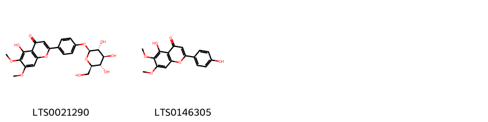{ width=100% }
    <figcaption>Hình ảnh cấu trúc hóa học của 2 hoạt chất thuộc nhóm Flavonoids gồm ['5-hydroxy-6,7-dimethoxy-2-(4-{[(2s,3r,4s,5s,6r)-3,4,5-trihydroxy-6-(hydroxymethyl)oxan-2-yl]oxy}phenyl)chromen-4-one (LTS0021290)', 'cirsimaritin (LTS0146305)'].</figcaption>
</figure>

---

### Dược dân tộc học

Danh sách các quốc gia có sử dụng *Microtea debilis* trong điều trị các bệnh. 

| Country   | Disease     | Bệnh                                                                                                                                                                                                |
|:----------|:------------|:----------------------------------------------------------------------------------------------------------------------------------------------------------------------------------------------------|
| Elsewhere | Expectorant | MYMEMORY WARNING: YOU USED ALL AVAILABLE FREE TRANSLATIONS FOR TODAY. NEXT AVAILABLE IN  02 HOURS 42 MINUTES 33 SECONDS VISIT HTTPS://MYMEMORY.TRANSLATED.NET/DOC/USAGELIMITS.PHP TO TRANSLATE MORE |
| Trinidad  | Expectorant | MYMEMORY WARNING: YOU USED ALL AVAILABLE FREE TRANSLATIONS FOR TODAY. NEXT AVAILABLE IN  02 HOURS 42 MINUTES 31 SECONDS VISIT HTTPS://MYMEMORY.TRANSLATED.NET/DOC/USAGELIMITS.PHP TO TRANSLATE MORE |

---

# Chi Hilleria

??? note "Danh sách các dược liệu thuộc chi"
    
	 - *Hilleria latifolia*

---
## Hilleria latifolia
### Thông tin về thực vật

!!! info "Phân loại thực vật của *Hilleria latifolia* từ GIBF:"
    - **Kingdom:** Plantae
    - **Phylum:** Tracheophyta
    - **Order:** Caryophyllales
    - **Family:** Phytolaccaceae
    - **Genus:** Hilleria
    - **Species:** *Hilleria latifolia*

 

| Label (VI)   | Label (EN)   | Scientific Name    | Descriptions (VI)   | Descriptions (EN)   | Also Known As (VI)   | Also Known As (EN)   |
|:-------------|:-------------|:-------------------|:--------------------|:--------------------|:---------------------|:---------------------|
| N/A          | N/A          | Hilleria latifolia |                     | species of plant    | ['']                 | ['']                 |

#### Phân bố trên thế giới

**Từ CSDL GIBF** nan, Ghana, Gabon, Belgium, Angola, Argentina, Benin, Congo, Tanzania, United Republic of, Togo, Nigeria, Bolivia (Plurinational State of), United States of America, Congo, Democratic Republic of the, Paraguay, Brazil, Côte d’Ivoire, Peru, Ecuador, Madagascar, Colombia, Kenya, Cameroon

#### Phân bố tại Việt Nam

**Từ CSDL GIBF**: Không có ghi nhận ở Việt Nam

---
### Thành phần hóa học
        
- Theo cơ sở dữ liệu lotus: Từ loài *Hilleria latifolia* đã phân lập và xác định được Chưa có hoạt chất nào được phân lập. hoạt chất thuộc về các nhóm Không có hoạt chất nào được phân lập. 

Không có hình ảnh nào được tạo ra

---

### Dược dân tộc học

Danh sách các quốc gia có sử dụng *Hilleria latifolia* trong điều trị các bệnh. 

| Country     | Disease   | Bệnh                                                                                                                                                                                                |
|:------------|:----------|:----------------------------------------------------------------------------------------------------------------------------------------------------------------------------------------------------|
| Upper Volta | Purgative | MYMEMORY WARNING: YOU USED ALL AVAILABLE FREE TRANSLATIONS FOR TODAY. NEXT AVAILABLE IN  02 HOURS 42 MINUTES 02 SECONDS VISIT HTTPS://MYMEMORY.TRANSLATED.NET/DOC/USAGELIMITS.PHP TO TRANSLATE MORE |

---

# Chi Petiveria

??? note "Danh sách các dược liệu thuộc chi"
    
	 - *Petiveria alliacea*

---
## Petiveria alliacea
### Thông tin về thực vật

!!! info "Phân loại thực vật của *Petiveria alliacea* từ GIBF:"
    - **Kingdom:** Plantae
    - **Phylum:** Tracheophyta
    - **Order:** Caryophyllales
    - **Family:** Phytolaccaceae
    - **Genus:** Petiveria
    - **Species:** *Petiveria alliacea*

 

| Label (VI)   | Label (EN)   | Scientific Name    | Descriptions (VI)   | Descriptions (EN)   | Also Known As (VI)   | Also Known As (EN)   |
|:-------------|:-------------|:-------------------|:--------------------|:--------------------|:---------------------|:---------------------|
| N/A          | N/A          | Petiveria alliacea | loài thực vật       | species of plant    | ['']                 | ['']                 |

#### Phân bố trên thế giới

**Từ CSDL GIBF** Virgin Islands (U.S.), Guadeloupe, Argentina, Saint Lucia, Nicaragua, Panama, Puerto Rico, Honduras, Jamaica, United States of America, Paraguay, El Salvador, Saint Martin (French part), Martinique, Brazil, Cuba, Peru, Mexico, Dominican Republic, Ecuador, Haiti, Colombia, Costa Rica, India

#### Phân bố tại Việt Nam

**Từ CSDL GIBF**: Không có ghi nhận ở Việt Nam

---
### Thành phần hóa học
        
- Theo cơ sở dữ liệu lotus: Từ loài *Petiveria alliacea* đã phân lập và xác định được 63 hoạt chất thuộc về các nhóm Fatty Acyls, Flavonoids, Steroids and steroid derivatives, Azoles, Organic disulfides, Benzene and substituted derivatives, Stilbenes, Organooxygen compounds, Carboxylic acids and derivatives. 

|    | chemicalTaxonomyClassyfireClass     |   smiles_count |
|---:|:------------------------------------|---------------:|
|  0 | Azoles                              |              1 |
|  1 | Benzene and substituted derivatives |             20 |
|  2 | Carboxylic acids and derivatives    |             12 |
|  3 | Fatty Acyls                         |              8 |
|  4 | Flavonoids                          |             15 |
|  5 | Organic disulfides                  |              1 |
|  6 | Organooxygen compounds              |              1 |
|  7 | Steroids and steroid derivatives    |              2 |
|  8 | Stilbenes                           |              2 |

#### Nhóm Azoles
<figure markdown="span">
    { width=100% }
    <figcaption>Hình ảnh cấu trúc hóa học của 1 hoạt chất thuộc nhóm Azoles gồm ['allantoin (LTS0106609)'].</figcaption>
</figure>
#### Nhóm Benzene and substituted derivatives
<figure markdown="span">
    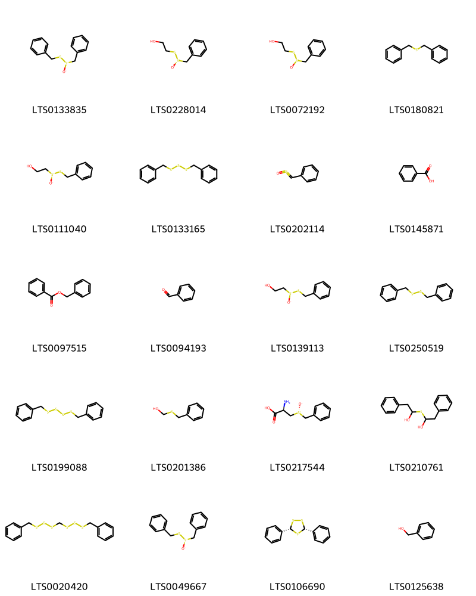{ width=100% }
    <figcaption>Hình ảnh cấu trúc hóa học của 20 hoạt chất thuộc nhóm Benzene and substituted derivatives gồm ['[(benzylsulfanylsulfinyl)methyl]benzene (LTS0133835)', '2-[(s)-phenylmethanesulfinylsulfanyl]ethanol (LTS0228014)', '2-(phenylmethanesulfinylsulfanyl)ethanol (LTS0072192)', 'benzyl sulfide (LTS0180821)', '2-[(r)-benzylsulfanylsulfinyl]ethanol (LTS0111040)', 'dibenzyltrisulfane (LTS0133165)', '[(oxo-λ⁴-sulfanylidene)methyl]benzene (LTS0202114)', 'benzoic acid (LTS0145871)', 'benzyl benzoate (LTS0097515)', 'benzaldehyde (LTS0094193)', '2-(benzylsulfanylsulfinyl)ethanol (LTS0139113)', 'benzyl disulfide (LTS0250519)', 'dibenzyltetrasulfane (LTS0199088)', '(benzylsulfanyl)methanol (LTS0201386)', '(2r)-2-amino-3-[(r)-phenylmethanesulfinyl]propanoic acid (LTS0217544)', '1-[(1-hydroxy-2-phenylethyl)sulfanyl]-2-phenylethanol (LTS0210761)', '1-benzyl-3-{[(benzylsulfanyl)disulfanyl]methyl}trisulfane (LTS0020420)', '{[(s)-benzylsulfanylsulfinyl]methyl}benzene (LTS0049667)', '(3r,5s)-3,5-diphenyl-1,2,4-trithiolane (LTS0106690)', 'benzyl alcohol (LTS0125638)'].</figcaption>
</figure>
#### Nhóm Carboxylic acids and derivatives
<figure markdown="span">
    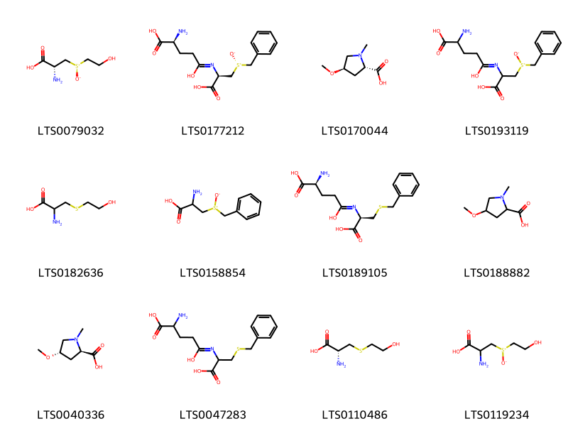{ width=100% }
    <figcaption>Hình ảnh cấu trúc hóa học của 12 hoạt chất thuộc nhóm Carboxylic acids and derivatives gồm ['(2r)-2-amino-3-[(s)-2-hydroxyethanesulfinyl]propanoic acid (LTS0079032)', '(2s)-2-amino-4-{[(1r)-1-carboxy-2-[(r)-phenylmethanesulfinyl]ethyl]-c-hydroxycarbonimidoyl}butanoic acid (LTS0177212)', '(2s,4r)-4-methoxy-1-methylpyrrolidine-2-carboxylic acid (LTS0170044)', '2-amino-4-[(1-carboxy-2-phenylmethanesulfinylethyl)-c-hydroxycarbonimidoyl]butanoic acid (LTS0193119)', 'hydroxyethylcysteine (LTS0182636)', '2-amino-3-phenylmethanesulfinylpropanoic acid (LTS0158854)', '(2s)-2-amino-4-{[(1r)-2-(benzylsulfanyl)-1-carboxyethyl]-c-hydroxycarbonimidoyl}butanoic acid (LTS0189105)', '4-methoxy-1-methylpyrrolidine-2-carboxylic acid (LTS0188882)', '(2r,4s)-4-methoxy-1-methylpyrrolidine-2-carboxylic acid (LTS0040336)', '2-amino-4-{[2-(benzylsulfanyl)-1-carboxyethyl]-c-hydroxycarbonimidoyl}butanoic acid (LTS0047283)', 'hydroxyethylcysteine (LTS0110486)', '2-amino-3-(2-hydroxyethanesulfinyl)propanoic acid (LTS0119234)'].</figcaption>
</figure>
#### Nhóm Fatty Acyls
<figure markdown="span">
    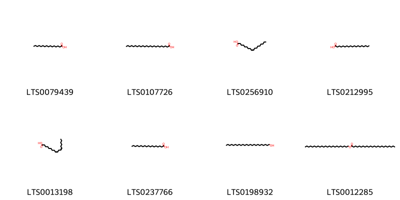{ width=100% }
    <figcaption>Hình ảnh cấu trúc hóa học của 8 hoạt chất thuộc nhóm Fatty Acyls gồm ['palmitic acid (LTS0079439)', 'lignoceric acid (LTS0107726)', 'oleic acid (LTS0256910)', 'nonadecanoic acid (LTS0212995)', 'linoleic (LTS0013198)', 'stearic acid (LTS0237766)', '1-tetracosanol (LTS0198932)', 'tetracosyl tetracosanoate (LTS0012285)'].</figcaption>
</figure>
#### Nhóm Flavonoids
<figure markdown="span">
    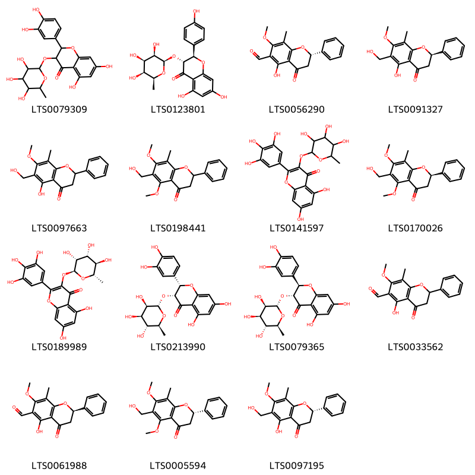{ width=100% }
    <figcaption>Hình ảnh cấu trúc hóa học của 15 hoạt chất thuộc nhóm Flavonoids gồm ['astilbin (LTS0079309)', '(2r,3r)-5,7-dihydroxy-2-(4-hydroxyphenyl)-3-{[(2r,3r,4r,5s,6s)-3,4,5-trihydroxy-6-methyloxan-2-yl]oxy}-2,3-dihydro-1-benzopyran-4-one (LTS0123801)', '(2s)-5-hydroxy-7-methoxy-8-methyl-4-oxo-2-phenyl-2,3-dihydro-1-benzopyran-6-carbaldehyde (LTS0056290)', '(2r)-5-hydroxy-6-(hydroxymethyl)-7-methoxy-8-methyl-2-phenyl-2,3-dihydro-1-benzopyran-4-one (LTS0091327)', 'leridol (LTS0097663)', '5-o-methylleridol (LTS0198441)', 'myricitrin (LTS0141597)', '(2r)-6-(hydroxymethyl)-5,7-dimethoxy-8-methyl-2-phenyl-2,3-dihydro-1-benzopyran-4-one (LTS0170026)', 'myricitrin (LTS0189989)', '(2s,3r)-2-(3,4-dihydroxyphenyl)-5,7-dihydroxy-3-{[(2s,3r,4r,5r,6s)-3,4,5-trihydroxy-6-methyloxan-2-yl]oxy}-2,3-dihydro-1-benzopyran-4-one (LTS0213990)', 'astilbin (LTS0079365)', 'leridal (LTS0033562)', '(2r)-5-hydroxy-7-methoxy-8-methyl-4-oxo-2-phenyl-2,3-dihydro-1-benzopyran-6-carbaldehyde (LTS0061988)', '(2s)-6-(hydroxymethyl)-5,7-dimethoxy-8-methyl-2-phenyl-2,3-dihydro-1-benzopyran-4-one (LTS0005594)', '(2s)-5-hydroxy-6-(hydroxymethyl)-7-methoxy-8-methyl-2-phenyl-2,3-dihydro-1-benzopyran-4-one (LTS0097195)'].</figcaption>
</figure>
#### Nhóm Organic disulfides
<figure markdown="span">
    { width=100% }
    <figcaption>Hình ảnh cấu trúc hóa học của 1 hoạt chất thuộc nhóm Organic disulfides gồm ['propyl disulfide (LTS0151977)'].</figcaption>
</figure>
#### Nhóm Organooxygen compounds
<figure markdown="span">
    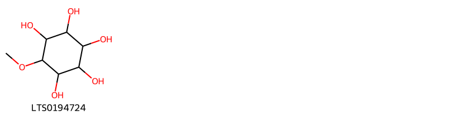{ width=100% }
    <figcaption>Hình ảnh cấu trúc hóa học của 1 hoạt chất thuộc nhóm Organooxygen compounds gồm ['pinitol (LTS0194724)'].</figcaption>
</figure>
#### Nhóm Steroids and steroid derivatives
<figure markdown="span">
    { width=100% }
    <figcaption>Hình ảnh cấu trúc hóa học của 2 hoạt chất thuộc nhóm Steroids and steroid derivatives gồm ['stigmast-5-en-3-ol, (3β)- (LTS0204616)', 'stigmast-5-en-3-ol (LTS0071224)'].</figcaption>
</figure>
#### Nhóm Stilbenes
<figure markdown="span">
    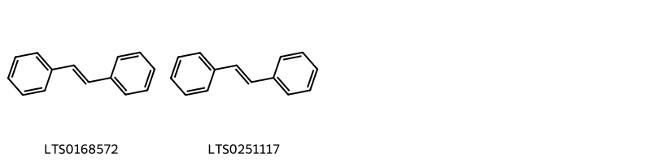{ width=100% }
    <figcaption>Hình ảnh cấu trúc hóa học của 2 hoạt chất thuộc nhóm Stilbenes gồm ['stilbene (LTS0168572)', 'trans-stilbene (LTS0251117)'].</figcaption>
</figure>

---

### Dược dân tộc học

Danh sách các quốc gia có sử dụng *Petiveria alliacea* trong điều trị các bệnh. 

| Country            | Disease                                                                                                                                  | Bệnh                                                                                                                                                                                                |
|:-------------------|:-----------------------------------------------------------------------------------------------------------------------------------------|:----------------------------------------------------------------------------------------------------------------------------------------------------------------------------------------------------|
| Dominican Republic | Emmenagogue, Insecticide                                                                                                                 | MYMEMORY WARNING: YOU USED ALL AVAILABLE FREE TRANSLATIONS FOR TODAY. NEXT AVAILABLE IN  02 HOURS 41 MINUTES 38 SECONDS VISIT HTTPS://MYMEMORY.TRANSLATED.NET/DOC/USAGELIMITS.PHP TO TRANSLATE MORE |
| Elsewhere          | Abortifacient, Aphrodisiac, Counterirritant, Ecbolic, Emmenagogue, Expectorant, Insecticide, Sudorific, Emmenagogue, Vermifuge, Diuretic | MYMEMORY WARNING: YOU USED ALL AVAILABLE FREE TRANSLATIONS FOR TODAY. NEXT AVAILABLE IN  02 HOURS 41 MINUTES 36 SECONDS VISIT HTTPS://MYMEMORY.TRANSLATED.NET/DOC/USAGELIMITS.PHP TO TRANSLATE MORE |
| Guatemala          | Emmenagogue                                                                                                                              | MYMEMORY WARNING: YOU USED ALL AVAILABLE FREE TRANSLATIONS FOR TODAY. NEXT AVAILABLE IN  02 HOURS 41 MINUTES 33 SECONDS VISIT HTTPS://MYMEMORY.TRANSLATED.NET/DOC/USAGELIMITS.PHP TO TRANSLATE MORE |
| Haiti              | Antiseptic, Diuretic, Expectorant, Sedative, Vermifuge, Sudorific                                                                        | MYMEMORY WARNING: YOU USED ALL AVAILABLE FREE TRANSLATIONS FOR TODAY. NEXT AVAILABLE IN  02 HOURS 41 MINUTES 31 SECONDS VISIT HTTPS://MYMEMORY.TRANSLATED.NET/DOC/USAGELIMITS.PHP TO TRANSLATE MORE |
| Latin America      | Abortifacient, Diuretic, Emmenagogue, Expectorant, Sudorific, Vermifuge                                                                  | MYMEMORY WARNING: YOU USED ALL AVAILABLE FREE TRANSLATIONS FOR TODAY. NEXT AVAILABLE IN  02 HOURS 41 MINUTES 29 SECONDS VISIT HTTPS://MYMEMORY.TRANSLATED.NET/DOC/USAGELIMITS.PHP TO TRANSLATE MORE |
| Mexico             | Diuretic, Ecbolic, Sudorific, Vermifuge, Emmenagogue, Expectorant, Sudorific                                                             | MYMEMORY WARNING: YOU USED ALL AVAILABLE FREE TRANSLATIONS FOR TODAY. NEXT AVAILABLE IN  02 HOURS 41 MINUTES 27 SECONDS VISIT HTTPS://MYMEMORY.TRANSLATED.NET/DOC/USAGELIMITS.PHP TO TRANSLATE MORE |
| Trinidad           | Abortifacient, Counterirritant, Abortifacient                                                                                            | MYMEMORY WARNING: YOU USED ALL AVAILABLE FREE TRANSLATIONS FOR TODAY. NEXT AVAILABLE IN  02 HOURS 41 MINUTES 25 SECONDS VISIT HTTPS://MYMEMORY.TRANSLATED.NET/DOC/USAGELIMITS.PHP TO TRANSLATE MORE |
| Venezuela          | Sudorific, Abortifacient, Vermifuge                                                                                                      | MYMEMORY WARNING: YOU USED ALL AVAILABLE FREE TRANSLATIONS FOR TODAY. NEXT AVAILABLE IN  02 HOURS 41 MINUTES 23 SECONDS VISIT HTTPS://MYMEMORY.TRANSLATED.NET/DOC/USAGELIMITS.PHP TO TRANSLATE MORE |

---

