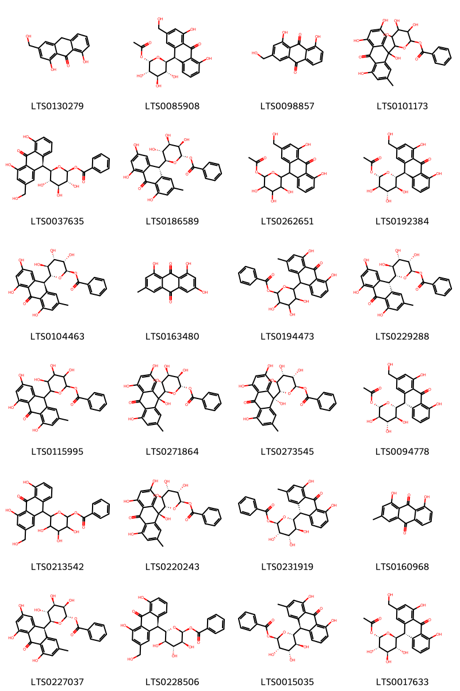
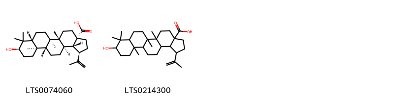

!!! abstract "Tóm tắt"

    Họ Picramniaceae gồm khoảng 1 chi và 2 loài được một số cộng đồng tại các quốc gia như Haiti, Bahamas, Turkey sử dụng trong một số trường hợp MYMEMORY WARNING: YOU USED ALL AVAILABLE FREE TRANSLATIONS FOR TODAY. NEXT AVAILABLE IN  18 HOURS 44 MINUTES 17 SECONDS VISIT HTTPS://MYMEMORY.TRANSLATED.NET/DOC/USAGELIMITS.PHP TO TRANSLATE MORE.

!!! info "DrDuke"

    James A. Duke sinh năm 1929-2017 là một nhà thực vật học người Mỹ. Đây là một trong những tác giả hàng đầu trong lĩnh vực dược dân tộc học với cuốn *CRC Handbook of Medicinal Herbs* và chính là người xây dựng lên cơ sở dữ liệu về hợp chất tự nhiên và dược dân tộc học tại Bộ nông nghiệp Hoa Kỳ. Các thông tin được đăng tải tại website [Dr. Duke's Phytochemical and Ethnobotanical Databases](https://phytochem.nal.usda.gov/). 
    Trong suốt thập niên 1970, ông lãnh đạo the Plant Taxonomy Laboratory, Plant Genetics and Germplasm Institute of the Agricultural Research Service, U.S. Department of Agriculture.
    Trong tài liệu này, các thông tin về dược dân tộc của các dược liệu được trích dẫn từ tài liệu của James A. Ducke với sự trợ giúp của phần mềm dịch thuật từ tiếng Anh sang tiếng Việt.
   

# Chi Picramnia

??? note "Danh sách các dược liệu thuộc chi"
    
	 - *Picramnia antidesma*
	 - *Picramnia pentandra*

---
## Picramnia antidesma
### Thông tin về thực vật

!!! info "Phân loại thực vật của *Picramnia antidesma* từ GIBF:"
    - **Kingdom:** Plantae
    - **Phylum:** Tracheophyta
    - **Order:** Picramniales
    - **Family:** Picramniaceae
    - **Genus:** Picramnia
    - **Species:** *Picramnia antidesma*

 

| Label (VI)   | Label (EN)   | Scientific Name     | Descriptions (VI)   | Descriptions (EN)   | Also Known As (VI)   | Also Known As (EN)   |
|:-------------|:-------------|:--------------------|:--------------------|:--------------------|:---------------------|:---------------------|
| N/A          | N/A          | Picramnia antidesma | loài thực vật       | species of plant    | ['']                 | ['']                 |

#### Phân bố trên thế giới

**Từ CSDL GIBF** Honduras, Colombia, El Salvador, Nicaragua, Belize, Panama, Costa Rica, Mexico, Jamaica, Guatemala

#### Phân bố tại Việt Nam

**Từ CSDL GIBF**: Không có ghi nhận ở Việt Nam

---
### Thành phần hóa học
        
- Theo cơ sở dữ liệu lotus: Từ loài *Picramnia antidesma* đã phân lập và xác định được 31 hoạt chất thuộc về các nhóm Anthracenes, Coumarins and derivatives, Steroids and steroid derivatives, Fatty Acyls. 

|    | chemicalTaxonomyClassyfireClass   |   smiles_count |
|---:|:----------------------------------|---------------:|
|  0 | Anthracenes                       |             24 |
|  1 | Coumarins and derivatives         |              1 |
|  2 | Fatty Acyls                       |              1 |
|  3 | Steroids and steroid derivatives  |              5 |

#### Nhóm Anthracenes
<figure markdown="span">
    { width=100% }
    <figcaption>Hình ảnh cấu trúc hóa học của 24 hoạt chất thuộc nhóm Anthracenes gồm ['aloe emodin anthrone (LTS0130279)', '(2s,3s,4r,5r,6s)-6-[(9r)-4,5-dihydroxy-2-(hydroxymethyl)-10-oxo-9h-anthracen-9-yl]-3,4,5-trihydroxyoxan-2-yl acetate (LTS0085908)', 'aloe emodin (LTS0098857)', '3,4,5-trihydroxy-6-(2,4,5,9-tetrahydroxy-7-methyl-10-oxoanthracen-9-yl)oxan-2-yl benzoate (LTS0101173)', '(2s,3r,4s,5s,6r)-6-[(9r)-4,5-dihydroxy-2-(hydroxymethyl)-10-oxo-9h-anthracen-9-yl]-3,4,5-trihydroxyoxan-2-yl benzoate (LTS0037635)', '(2s,3r,4r,5r,6s)-3,4,5-trihydroxy-6-[(9r)-2,4,5-trihydroxy-7-methyl-10-oxo-9h-anthracen-9-yl]oxan-2-yl benzoate (LTS0186589)', '6-[4,5-dihydroxy-2-(hydroxymethyl)-10-oxo-9h-anthracen-9-yl]-3,4,5-trihydroxyoxan-2-yl acetate (LTS0262651)', '(2s,3r,4s,5s,6r)-6-[(9r)-4,5-dihydroxy-2-(hydroxymethyl)-10-oxo-9h-anthracen-9-yl]-3,4,5-trihydroxyoxan-2-yl acetate (LTS0192384)', '(2r,3s,4s,5s,6r)-3,4,5-trihydroxy-6-[(9s)-2,4,5-trihydroxy-7-methyl-10-oxo-9h-anthracen-9-yl]oxan-2-yl benzoate (LTS0104463)', 'emodin (LTS0163480)', '6-(4,5-dihydroxy-2-methyl-10-oxo-9h-anthracen-9-yl)-3,4,5-trihydroxyoxan-2-yl benzoate (LTS0194473)', '(2r,3s,4s,5s,6r)-3,4,5-trihydroxy-6-[(9r)-2,4,5-trihydroxy-7-methyl-10-oxo-9h-anthracen-9-yl]oxan-2-yl benzoate (LTS0229288)', '3,4,5-trihydroxy-6-(2,4,5-trihydroxy-7-methyl-10-oxo-9h-anthracen-9-yl)oxan-2-yl benzoate (LTS0115995)', '(2s,3r,4r,5r,6r)-3,4,5-trihydroxy-6-[(9s)-2,4,5,9-tetrahydroxy-7-methyl-10-oxoanthracen-9-yl]oxan-2-yl benzoate (LTS0271864)', '(2r,3s,4s,5s,6s)-3,4,5-trihydroxy-6-[(9r)-2,4,5,9-tetrahydroxy-7-methyl-10-oxoanthracen-9-yl]oxan-2-yl benzoate (LTS0273545)', '(2s,3r,4s,5s,6r)-6-[(9s)-4,5-dihydroxy-2-(hydroxymethyl)-10-oxo-9h-anthracen-9-yl]-3,4,5-trihydroxyoxan-2-yl acetate (LTS0094778)', '6-[4,5-dihydroxy-2-(hydroxymethyl)-10-oxo-9h-anthracen-9-yl]-3,4,5-trihydroxyoxan-2-yl benzoate (LTS0213542)', '(2r,3s,4s,5s,6s)-3,4,5-trihydroxy-6-[(9s)-2,4,5,9-tetrahydroxy-7-methyl-10-oxoanthracen-9-yl]oxan-2-yl benzoate (LTS0220243)', '(2r,3s,4s,5s,6r)-6-[(9s)-4,5-dihydroxy-2-methyl-10-oxo-9h-anthracen-9-yl]-3,4,5-trihydroxyoxan-2-yl benzoate (LTS0231919)', 'turkey rhubarb (LTS0160968)', '(2s,3r,4r,5r,6s)-3,4,5-trihydroxy-6-[(9s)-2,4,5-trihydroxy-7-methyl-10-oxo-9h-anthracen-9-yl]oxan-2-yl benzoate (LTS0227037)', '(2s,3s,4r,5r,6s)-6-[(9r)-4,5-dihydroxy-2-(hydroxymethyl)-10-oxo-9h-anthracen-9-yl]-3,4,5-trihydroxyoxan-2-yl benzoate (LTS0228506)', '(2r,3s,4s,5s,6r)-6-[(9r)-4,5-dihydroxy-2-methyl-10-oxo-9h-anthracen-9-yl]-3,4,5-trihydroxyoxan-2-yl benzoate (LTS0015035)', '(2s,3s,4r,5r,6s)-6-[(9s)-4,5-dihydroxy-2-(hydroxymethyl)-10-oxo-9h-anthracen-9-yl]-3,4,5-trihydroxyoxan-2-yl acetate (LTS0017633)'].</figcaption>
</figure>
#### Nhóm Coumarins and derivatives
<figure markdown="span">
    { width=100% }
    <figcaption>Hình ảnh cấu trúc hóa học của 1 hoạt chất thuộc nhóm Coumarins and derivatives gồm ['umbelliferone (LTS0162728)'].</figcaption>
</figure>
#### Nhóm Fatty Acyls
<figure markdown="span">
    { width=100% }
    <figcaption>Hình ảnh cấu trúc hóa học của 1 hoạt chất thuộc nhóm Fatty Acyls gồm ['myristic acid (LTS0102566)'].</figcaption>
</figure>
#### Nhóm Steroids and steroid derivatives
<figure markdown="span">
    { width=100% }
    <figcaption>Hình ảnh cấu trúc hóa học của 5 hoạt chất thuộc nhóm Steroids and steroid derivatives gồm ['stigmast-5-en-3-ol (LTS0071224)', 'sitosterol (LTS0168132)', 'stigmast-5-en-3-ol, (3β)- (LTS0204616)', 'sitogluside (LTS0201798)', '2-{[1-(5-ethyl-6-methylheptan-2-yl)-9a,11a-dimethyl-1h,2h,3h,3ah,3bh,4h,6h,7h,8h,9h,9bh,10h,11h-cyclopenta[a]phenanthren-7-yl]oxy}-6-(hydroxymethyl)oxane-3,4,5-triol (LTS0158828)'].</figcaption>
</figure>

---

### Dược dân tộc học

Danh sách các quốc gia có sử dụng *Picramnia antidesma* trong điều trị các bệnh. 

| Country   | Disease          | Bệnh                                                                                                                                                                                                |
|:----------|:-----------------|:----------------------------------------------------------------------------------------------------------------------------------------------------------------------------------------------------|
| Turkey    | Stimulant, Tonic | MYMEMORY WARNING: YOU USED ALL AVAILABLE FREE TRANSLATIONS FOR TODAY. NEXT AVAILABLE IN  18 HOURS 44 MINUTES 12 SECONDS VISIT HTTPS://MYMEMORY.TRANSLATED.NET/DOC/USAGELIMITS.PHP TO TRANSLATE MORE |

---

---
## Picramnia pentandra
### Thông tin về thực vật

!!! info "Phân loại thực vật của *Picramnia pentandra* từ GIBF:"
    - **Kingdom:** Plantae
    - **Phylum:** Tracheophyta
    - **Order:** Picramniales
    - **Family:** Picramniaceae
    - **Genus:** Picramnia
    - **Species:** *Picramnia pentandra*

 

| Label (VI)   | Label (EN)   | Scientific Name     | Descriptions (VI)   | Descriptions (EN)   | Also Known As (VI)   | Also Known As (EN)   |
|:-------------|:-------------|:--------------------|:--------------------|:--------------------|:---------------------|:---------------------|
| N/A          | N/A          | Picramnia pentandra | loài thực vật       | species of plant    | ['']                 | ['']                 |

#### Phân bố trên thế giới

**Từ CSDL GIBF** Guadeloupe, Dominica, Trinidad and Tobago, Martinique, Jamaica, Haiti, Venezuela (Bolivarian Republic of), Dominican Republic, Puerto Rico, Bahamas, Cuba, Sint Maarten (Dutch part), Belgium, Panama, Montserrat, China, Saint Martin (French part), Costa Rica, United States of America

#### Phân bố tại Việt Nam

**Từ CSDL GIBF**: Không có ghi nhận ở Việt Nam

---
### Thành phần hóa học
        
- Theo cơ sở dữ liệu lotus: Từ loài *Picramnia pentandra* đã phân lập và xác định được 2 hoạt chất thuộc về các nhóm Prenol lipids. 

|    | chemicalTaxonomyClassyfireClass   |   smiles_count |
|---:|:----------------------------------|---------------:|
|  0 | Prenol lipids                     |              2 |

#### Nhóm Prenol lipids
<figure markdown="span">
    { width=100% }
    <figcaption>Hình ảnh cấu trúc hóa học của 2 hoạt chất thuộc nhóm Prenol lipids gồm ['(1r,3as,5ar,5br,7ar,9r,11ar,11br,13ar,13br)-9-hydroxy-5a,5b,8,8,11a-pentamethyl-1-(prop-1-en-2-yl)-hexadecahydrocyclopenta[a]chrysene-3a-carboxylic acid (LTS0074060)', '9-hydroxy-5a,5b,8,8,11a-pentamethyl-1-(prop-1-en-2-yl)-hexadecahydrocyclopenta[a]chrysene-3a-carboxylic acid (LTS0214300)'].</figcaption>
</figure>

---

### Dược dân tộc học

Danh sách các quốc gia có sử dụng *Picramnia pentandra* trong điều trị các bệnh. 

| Country   | Disease   | Bệnh                                                                                                                                                                                                |
|:----------|:----------|:----------------------------------------------------------------------------------------------------------------------------------------------------------------------------------------------------|
| Bahamas   | Apertif   | MYMEMORY WARNING: YOU USED ALL AVAILABLE FREE TRANSLATIONS FOR TODAY. NEXT AVAILABLE IN  18 HOURS 41 MINUTES 22 SECONDS VISIT HTTPS://MYMEMORY.TRANSLATED.NET/DOC/USAGELIMITS.PHP TO TRANSLATE MORE |
| Haiti     | Tonic     | MYMEMORY WARNING: YOU USED ALL AVAILABLE FREE TRANSLATIONS FOR TODAY. NEXT AVAILABLE IN  18 HOURS 41 MINUTES 16 SECONDS VISIT HTTPS://MYMEMORY.TRANSLATED.NET/DOC/USAGELIMITS.PHP TO TRANSLATE MORE |

---

