!!! abstract "Tóm tắt"

    Họ Pinaceae gồm khoảng 7 chi và 43 loài được một số cộng đồng tại các quốc gia như Italian, Japan*, Mexico, French, Nepal, Haiti, Canada(Kwakiutl), China, Dutch, Turkey, Egypt, Eurasia, German, US(Appalachia), ain, Portugal, Canada(Salish), English, US(Blackfoot), Elsewhere, US(Amerindian), India, US(Flathead), US, Europe sử dụng trong một số trường hợp QUERY LENGTH LIMIT EXCEEDED. MAX ALLOWED QUERY : 500 CHARS Dạ dày, Thuốc lợi tiểu, Thuốc trừ sâu, Collyrium, Thuốc nhuận tràng, Thuốc long đờm, Thuốc nhuận tràng, Thuốc đắp, Thuốc bổ, Thuốc sát trùng, Thuốc long đờm, Thuốc kích thích, Thuốc lợi tiểu, Thuốc kích thích, Vermifuge, Rubefacient.

!!! info "DrDuke"

    James A. Duke sinh năm 1929-2017 là một nhà thực vật học người Mỹ. Đây là một trong những tác giả hàng đầu trong lĩnh vực dược dân tộc học với cuốn *CRC Handbook of Medicinal Herbs* và chính là người xây dựng lên cơ sở dữ liệu về hợp chất tự nhiên và dược dân tộc học tại Bộ nông nghiệp Hoa Kỳ. Các thông tin được đăng tải tại website [Dr. Duke's Phytochemical and Ethnobotanical Databases](https://phytochem.nal.usda.gov/). 
    Trong suốt thập niên 1970, ông lãnh đạo the Plant Taxonomy Laboratory, Plant Genetics and Germplasm Institute of the Agricultural Research Service, U.S. Department of Agriculture.
    Trong tài liệu này, các thông tin về dược dân tộc của các dược liệu được trích dẫn từ tài liệu của James A. Ducke với sự trợ giúp của phần mềm dịch thuật từ tiếng Anh sang tiếng Việt.
   

# Chi Tsuga

??? note "Danh sách các dược liệu thuộc chi"
    
	 - *Tsuga americana*
	 - *Tsuga canadensis*
	 - *Tsuga heterophylla*

---
## Tsuga americana
### Thông tin về thực vật

!!! info "Phân loại thực vật của *Tsuga canadensis* từ GIBF:"
    - **Kingdom:** Plantae
    - **Phylum:** Tracheophyta
    - **Order:** Pinales
    - **Family:** Pinaceae
    - **Genus:** Tsuga
    - **Species:** *Tsuga canadensis*

 

| Label (VI)   | Label (EN)   | Scientific Name   | Descriptions (VI)   | Descriptions (EN)   | Also Known As (VI)   | Also Known As (EN)   |
|:-------------|:-------------|:------------------|:--------------------|:--------------------|:---------------------|:---------------------|
| N/A          | N/A          | Tsuga americana   | loài thực vật       | species of plant    | ['']                 | ['']                 |

#### Phân bố trên thế giới

**Từ CSDL GIBF** nan, Brazil, United States of America, China, unknown or invalid

#### Phân bố tại Việt Nam

**Từ CSDL GIBF**: Không có ghi nhận ở Việt Nam

---
### Thành phần hóa học
        
- Theo cơ sở dữ liệu lotus: Từ loài *Tsuga canadensis* đã phân lập và xác định được Chưa có hoạt chất nào được phân lập. hoạt chất thuộc về các nhóm Không có hoạt chất nào được phân lập. 

Không có hình ảnh nào được tạo ra

---

### Dược dân tộc học

Danh sách các quốc gia có sử dụng *Tsuga canadensis* trong điều trị các bệnh. 

| Country   | Disease    | Bệnh      |
|:----------|:-----------|:----------|
| US        | Astringent | Lam se da |

---

---
## Tsuga canadensis
### Thông tin về thực vật

!!! info "Phân loại thực vật của *Tsuga canadensis* từ GIBF:"
    - **Kingdom:** Plantae
    - **Phylum:** Tracheophyta
    - **Order:** Pinales
    - **Family:** Pinaceae
    - **Genus:** Tsuga
    - **Species:** *Tsuga canadensis*

 

| Label (VI)   | Label (EN)   | Scientific Name   | Descriptions (VI)   | Descriptions (EN)   | Also Known As (VI)   | Also Known As (EN)                                                                                                                                                |
|:-------------|:-------------|:------------------|:--------------------|:--------------------|:---------------------|:------------------------------------------------------------------------------------------------------------------------------------------------------------------|
| N/A          | N/A          | Tsuga canadensis  | loài thực vật       | species of plant    | ['']                 | ['Canadian hemlock', 'eastern hemlock', 'Tsuga americana', 'Canada hemlock', 'common hemlock', 'hemlock spruce', 'New England hemlock', 'Eastern hemlock-spruce'] |

#### Phân bố trên thế giới

**Từ CSDL GIBF** United States of America, Canada

#### Phân bố tại Việt Nam

**Từ CSDL GIBF**: Không có ghi nhận ở Việt Nam

---
### Thành phần hóa học
        
- Theo cơ sở dữ liệu lotus: Từ loài *Tsuga canadensis* đã phân lập và xác định được 9 hoạt chất thuộc về các nhóm Prenol lipids. 

|    | chemicalTaxonomyClassyfireClass   |   smiles_count |
|---:|:----------------------------------|---------------:|
|  0 | Prenol lipids                     |              9 |

#### Nhóm Prenol lipids
<figure markdown="span">
    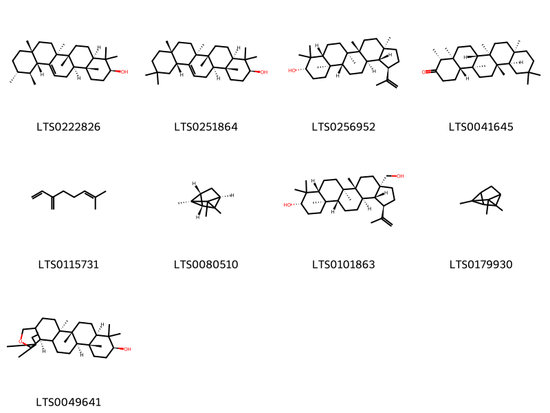{ width=100% }
    <figcaption>Hình ảnh cấu trúc hóa học của 9 hoạt chất thuộc nhóm Prenol lipids gồm ['amyrin (LTS0222826)', 'β-amyrin (LTS0251864)', 'lupeol (LTS0256952)', '(-)-friedelin (LTS0041645)', 'α-myrcene (LTS0115731)', '(1s,2r,4r,6s)-1,7,7-trimethyltricyclo[2.2.1.0²,⁶]heptane (LTS0080510)', 'betulin (LTS0101863)', 'tricyclene (LTS0179930)', '(1r,4r,5r,8r,10s,13r,14r,18r)-4,5,9,9,13,20,20-heptamethyl-24-oxahexacyclo[17.3.2.0¹,¹⁸.0⁴,¹⁷.0⁵,¹⁴.0⁸,¹³]tetracosan-10-ol (LTS0049641)'].</figcaption>
</figure>

---

### Dược dân tộc học

Danh sách các quốc gia có sử dụng *Tsuga canadensis* trong điều trị các bệnh. 

| Country        | Disease                 | Bệnh                     |
|:---------------|:------------------------|:-------------------------|
| US             | Vesicant                | Chất gây bọng mắt        |
| US(Amerindian) | Sudorific               | Ngạt thở                 |
| US(Appalachia) | Astringent, Diaphoretic | Chất làm se, Diaphoretic |

---

---
## Tsuga heterophylla
### Thông tin về thực vật

!!! info "Phân loại thực vật của *Tsuga heterophylla* từ GIBF:"
    - **Kingdom:** Plantae
    - **Phylum:** Tracheophyta
    - **Order:** Pinales
    - **Family:** Pinaceae
    - **Genus:** Tsuga
    - **Species:** *Tsuga heterophylla*

 

| Label (VI)   | Label (EN)   | Scientific Name    | Descriptions (VI)   | Descriptions (EN)   | Also Known As (VI)   | Also Known As (EN)                                               |
|:-------------|:-------------|:-------------------|:--------------------|:--------------------|:---------------------|:-----------------------------------------------------------------|
| N/A          | N/A          | Tsuga heterophylla | loài thực vật       | species of plant    | ['']                 | ['Pacific hemlock', 'western hemlock', 'western hemlock-spruce'] |

#### Phân bố trên thế giới

**Từ CSDL GIBF** United States of America, Sweden, Belgium, Canada, Denmark, United Kingdom of Great Britain and Northern Ireland, Netherlands

#### Phân bố tại Việt Nam

**Từ CSDL GIBF**: Không có ghi nhận ở Việt Nam

---
### Thành phần hóa học
        
- Theo cơ sở dữ liệu lotus: Từ loài *Tsuga heterophylla* đã phân lập và xác định được 52 hoạt chất thuộc về các nhóm Dibenzylbutane lignans, Carboxylic acids and derivatives, Aryltetralin lignans, Lignan lactones, Furanoid lignans, Prenol lipids, 2-arylbenzofuran flavonoids. 

|    | chemicalTaxonomyClassyfireClass   |   smiles_count |
|---:|:----------------------------------|---------------:|
|  0 | 2-arylbenzofuran flavonoids       |              1 |
|  1 | Aryltetralin lignans              |              3 |
|  2 | Carboxylic acids and derivatives  |             22 |
|  3 | Dibenzylbutane lignans            |              2 |
|  4 | Furanoid lignans                  |             17 |
|  5 | Lignan lactones                   |              4 |
|  6 | Prenol lipids                     |              3 |

#### Nhóm 2-arylbenzofuran flavonoids
<figure markdown="span">
    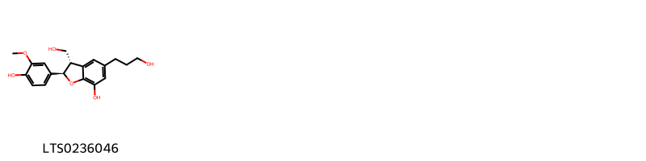{ width=100% }
    <figcaption>Hình ảnh cấu trúc hóa học của 1 hoạt chất thuộc nhóm 2-arylbenzofuran flavonoids gồm ['(2r,3s)-2-(4-hydroxy-3-methoxyphenyl)-3-(hydroxymethyl)-5-(3-hydroxypropyl)-2,3-dihydro-1-benzofuran-7-ol (LTS0236046)'].</figcaption>
</figure>
#### Nhóm Aryltetralin lignans
<figure markdown="span">
    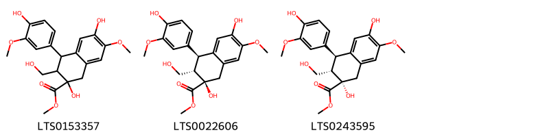{ width=100% }
    <figcaption>Hình ảnh cấu trúc hóa học của 3 hoạt chất thuộc nhóm Aryltetralin lignans gồm ['methyl 2,6-dihydroxy-4-(4-hydroxy-3-methoxyphenyl)-3-(hydroxymethyl)-7-methoxy-3,4-dihydro-1h-naphthalene-2-carboxylate (LTS0153357)', 'methyl (2r,3s,4s)-2,6-dihydroxy-4-(4-hydroxy-3-methoxyphenyl)-3-(hydroxymethyl)-7-methoxy-3,4-dihydro-1h-naphthalene-2-carboxylate (LTS0022606)', 'methyl (2s,3s,4s)-2,6-dihydroxy-4-(4-hydroxy-3-methoxyphenyl)-3-(hydroxymethyl)-7-methoxy-3,4-dihydro-1h-naphthalene-2-carboxylate (LTS0243595)'].</figcaption>
</figure>
#### Nhóm Carboxylic acids and derivatives
<figure markdown="span">
    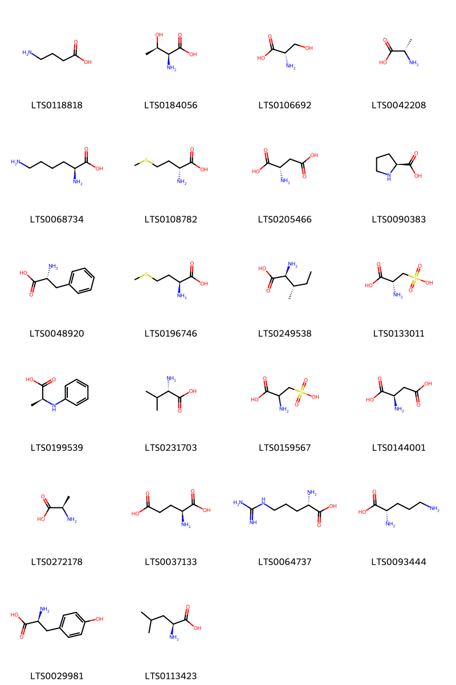{ width=100% }
    <figcaption>Hình ảnh cấu trúc hóa học của 22 hoạt chất thuộc nhóm Carboxylic acids and derivatives gồm ['gamma(amino)-butyric acid (LTS0118818)', 'l-threonine (LTS0184056)', 'l-serine (LTS0106692)', 'l-alanine (LTS0042208)', 'l-lysine (LTS0068734)', 'd-methionine (LTS0108782)', 'l-aspartic acid (LTS0205466)', 'l-proline (LTS0090383)', 'd-phenylalanine (LTS0048920)', 'l-methionine (LTS0196746)', 'l-isoleucine (LTS0249538)', 'cysteinesulfonic acid (LTS0133011)', '(2s)-2-(phenylamino)propanoic acid (LTS0199539)', 'l-valine (LTS0231703)', 'cysteic acid (LTS0159567)', 'd-aspartic acid (LTS0144001)', 'd-alanine (LTS0272178)', 'l-glutamic acid (LTS0037133)', 'l-arginine (LTS0064737)', 'l-ornithine (LTS0093444)', 'l-tyrosine (LTS0029981)', 'l-leucine (LTS0113423)'].</figcaption>
</figure>
#### Nhóm Dibenzylbutane lignans
<figure markdown="span">
    { width=100% }
    <figcaption>Hình ảnh cấu trúc hóa học của 2 hoạt chất thuộc nhóm Dibenzylbutane lignans gồm ['secoisolariciresinol (LTS0086727)', 'secoisolariciresinol (LTS0111810)'].</figcaption>
</figure>
#### Nhóm Furanoid lignans
<figure markdown="span">
    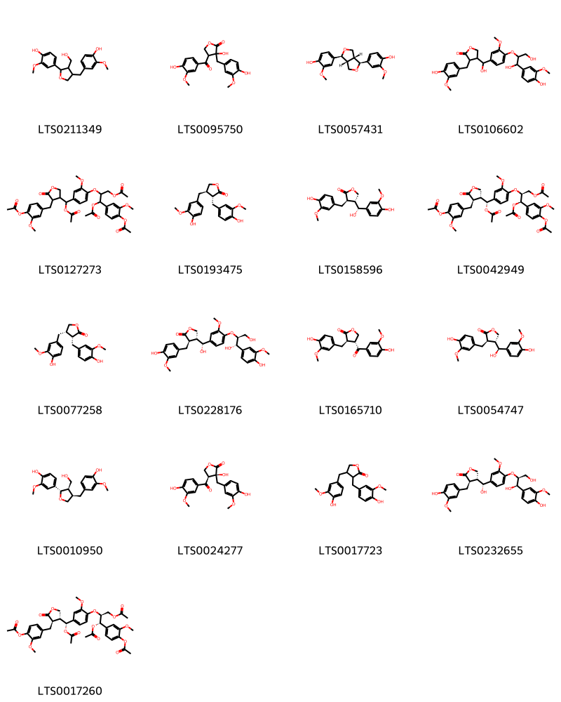{ width=100% }
    <figcaption>Hình ảnh cấu trúc hóa học của 17 hoạt chất thuộc nhóm Furanoid lignans gồm ['4-{4-[(4-hydroxy-3-methoxyphenyl)methyl]-3-(hydroxymethyl)oxolan-2-yl}-2-methoxyphenol (LTS0211349)', '3-hydroxy-4-(4-hydroxy-3-methoxybenzoyl)-3-[(4-hydroxy-3-methoxyphenyl)methyl]oxolan-2-one (LTS0095750)', 'pinoresinol (LTS0057431)', '4-[(4-{[1,3-dihydroxy-1-(4-hydroxy-3-methoxyphenyl)propan-2-yl]oxy}-3-methoxyphenyl)(hydroxy)methyl]-3-[(4-hydroxy-3-methoxyphenyl)methyl]oxolan-2-one (LTS0106602)', '3-(acetyloxy)-2-{4-[(acetyloxy)(4-{[4-(acetyloxy)-3-methoxyphenyl]methyl}-5-oxooxolan-3-yl)methyl]-2-methoxyphenoxy}-3-[4-(acetyloxy)-3-methoxyphenyl]propyl acetate (LTS0127273)', 'matairesinol (LTS0193475)', '(3r,4r)-4-[(r)-hydroxy(4-hydroxy-3-methoxyphenyl)methyl]-3-[(4-hydroxy-3-methoxyphenyl)methyl]oxolan-2-one (LTS0158596)', '(1r,2s)-3-(acetyloxy)-1-[4-(acetyloxy)-3-methoxyphenyl]-2-{4-[(r)-(acetyloxy)[(3r,4r)-4-{[4-(acetyloxy)-3-methoxyphenyl]methyl}-5-oxooxolan-3-yl]methyl]-2-methoxyphenoxy}propyl acetate (LTS0042949)', '(3r,4s)-3,4-bis[(4-hydroxy-3-methoxyphenyl)methyl]oxolan-2-one (LTS0077258)', '(3r,4r)-4-[(r)-(4-{[(1s,2s)-1,3-dihydroxy-1-(4-hydroxy-3-methoxyphenyl)propan-2-yl]oxy}-3-methoxyphenyl)(hydroxy)methyl]-3-[(4-hydroxy-3-methoxyphenyl)methyl]oxolan-2-one (LTS0228176)', '(3r,4r)-4-(4-hydroxy-3-methoxybenzoyl)-3-[(4-hydroxy-3-methoxyphenyl)methyl]oxolan-2-one (LTS0165710)', 'hydroxymatairesinol (LTS0054747)', 'lariciresinol (LTS0010950)', '(3s,4s)-3-hydroxy-4-(4-hydroxy-3-methoxybenzoyl)-3-[(4-hydroxy-3-methoxyphenyl)methyl]oxolan-2-one (LTS0024277)', '3,4-bis[(4-hydroxy-3-methoxyphenyl)methyl]oxolan-2-one (LTS0017723)', '(3r,4r)-4-[(r)-(4-{[(1r,2s)-1,3-dihydroxy-1-(4-hydroxy-3-methoxyphenyl)propan-2-yl]oxy}-3-methoxyphenyl)(hydroxy)methyl]-3-[(4-hydroxy-3-methoxyphenyl)methyl]oxolan-2-one (LTS0232655)', '(r)-[(3r,4r)-4-{[4-(acetyloxy)-3-methoxyphenyl]methyl}-5-oxooxolan-3-yl](4-{[(1s,2s)-1,3-bis(acetyloxy)-1-[4-(acetyloxy)-3-methoxyphenyl]propan-2-yl]oxy}-3-methoxyphenyl)methyl acetate (LTS0017260)'].</figcaption>
</figure>
#### Nhóm Lignan lactones
<figure markdown="span">
    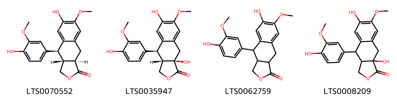{ width=100% }
    <figcaption>Hình ảnh cấu trúc hóa học của 4 hoạt chất thuộc nhóm Lignan lactones gồm ['α-conidendrin (LTS0070552)', '(3as,4s,9ar)-6,9a-dihydroxy-4-(4-hydroxy-3-methoxyphenyl)-7-methoxy-3h,3ah,4h,9h-naphtho[2,3-c]furan-1-one (LTS0035947)', '6-hydroxy-4-(4-hydroxy-3-methoxyphenyl)-7-methoxy-3h,3ah,4h,9h,9ah-naphtho[2,3-c]furan-1-one (LTS0062759)', '6,9a-dihydroxy-4-(4-hydroxy-3-methoxyphenyl)-7-methoxy-3h,3ah,4h,9h-naphtho[2,3-c]furan-1-one (LTS0008209)'].</figcaption>
</figure>
#### Nhóm Prenol lipids
<figure markdown="span">
    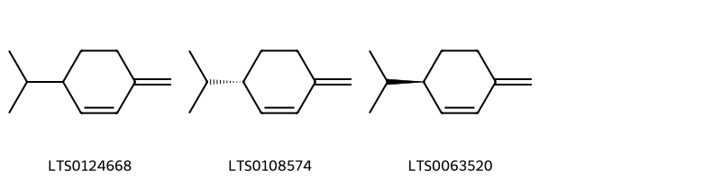{ width=100% }
    <figcaption>Hình ảnh cấu trúc hóa học của 3 hoạt chất thuộc nhóm Prenol lipids gồm ['β phellandrene (LTS0124668)', '(+)-β-phellandrene (LTS0108574)', '(-)-β-phellandrene (LTS0063520)'].</figcaption>
</figure>

---

### Dược dân tộc học

Danh sách các quốc gia có sử dụng *Tsuga heterophylla* trong điều trị các bệnh. 

| Country          | Disease              | Bệnh                 |
|:-----------------|:---------------------|:---------------------|
| Canada(Kwakiutl) | Collyrium            | Collyrium            |
| Canada(Salish)   | Astringent, Cosmetic | Chất làm se, Mỹ phẩm |

---

# Chi Cedrus

??? note "Danh sách các dược liệu thuộc chi"
    
	 - *Cedrus deodara*
	 - *Cedrus libani*
	 - *Cedrus libanotica*

---
## Cedrus deodara
### Thông tin về thực vật

!!! info "Phân loại thực vật của *Cedrus deodara* từ GIBF:"
    - **Kingdom:** Plantae
    - **Phylum:** Tracheophyta
    - **Order:** Pinales
    - **Family:** Pinaceae
    - **Genus:** Cedrus
    - **Species:** *Cedrus deodara*

 

| Label (VI)   | Label (EN)   | Scientific Name   | Descriptions (VI)   | Descriptions (EN)   | Also Known As (VI)   | Also Known As (EN)                  |
|:-------------|:-------------|:------------------|:--------------------|:--------------------|:---------------------|:------------------------------------|
| N/A          | N/A          | Cedrus deodara    | loài thực vật       | species of plant    | ['']                 | ['Deodar cedar', 'Himalayan cedar'] |

#### Phân bố trên thế giới

**Từ CSDL GIBF** Japan, Finland, China, Chile, New Zealand, Türkiye, Slovenia, Spain, United States of America, Korea, Republic of, Greece, Bhutan, Armenia, Pakistan, Croatia, United Kingdom of Great Britain and Northern Ireland, Belgium, North Macedonia, Georgia, Bosnia and Herzegovina, Portugal, Ukraine, South Africa, Australia, Italy, India, Switzerland, France, Ireland

#### Phân bố tại Việt Nam

**Từ CSDL GIBF**: Không có ghi nhận ở Việt Nam

---
### Thành phần hóa học
        
- Theo cơ sở dữ liệu lotus: Từ loài *Cedrus deodara* đã phân lập và xác định được 74 hoạt chất thuộc về các nhóm Fatty Acyls, Benzene and substituted derivatives, Dibenzylbutane lignans, Flavonoids, Cinnamic acids and derivatives, Steroids and steroid derivatives, Phenols, Aryltetralin lignans, Oxanes, Organooxygen compounds, Furanoid lignans, Prenol lipids, 2-arylbenzofuran flavonoids. 

|    | chemicalTaxonomyClassyfireClass     |   smiles_count |
|---:|:------------------------------------|---------------:|
|  0 | 2-arylbenzofuran flavonoids         |              6 |
|  1 | Aryltetralin lignans                |              2 |
|  2 | Benzene and substituted derivatives |              2 |
|  3 | Cinnamic acids and derivatives      |              2 |
|  4 | Dibenzylbutane lignans              |              2 |
|  5 | Fatty Acyls                         |              8 |
|  6 | Flavonoids                          |             13 |
|  7 | Furanoid lignans                    |             10 |
|  8 | Organooxygen compounds              |              1 |
|  9 | Oxanes                              |              2 |
| 10 | Phenols                             |              2 |
| 11 | Prenol lipids                       |             22 |
| 12 | Steroids and steroid derivatives    |              2 |

#### Nhóm 2-arylbenzofuran flavonoids
<figure markdown="span">
    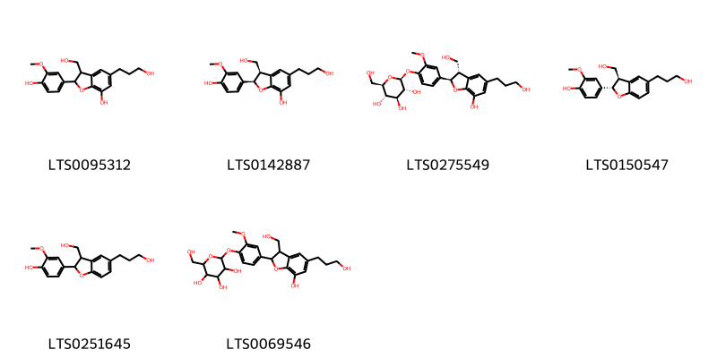{ width=100% }
    <figcaption>Hình ảnh cấu trúc hóa học của 6 hoạt chất thuộc nhóm 2-arylbenzofuran flavonoids gồm ['2-(4-hydroxy-3-methoxyphenyl)-3-(hydroxymethyl)-5-(3-hydroxypropyl)-2,3-dihydro-1-benzofuran-7-ol (LTS0095312)', '(2r,3r)-2-(4-hydroxy-3-methoxyphenyl)-3-(hydroxymethyl)-5-(3-hydroxypropyl)-2,3-dihydro-1-benzofuran-7-ol (LTS0142887)', '(2s,3r,4s,5s,6r)-2-{4-[(2r,3s)-7-hydroxy-3-(hydroxymethyl)-5-(3-hydroxypropyl)-2,3-dihydro-1-benzofuran-2-yl]-2-methoxyphenoxy}-6-(hydroxymethyl)oxane-3,4,5-triol (LTS0275549)', '4-[(2s,3r)-3-(hydroxymethyl)-5-(3-hydroxypropyl)-2,3-dihydro-1-benzofuran-2-yl]-2-methoxyphenol (LTS0150547)', '4-[3-(hydroxymethyl)-5-(3-hydroxypropyl)-2,3-dihydro-1-benzofuran-2-yl]-2-methoxyphenol (LTS0251645)', '2-{4-[7-hydroxy-3-(hydroxymethyl)-5-(3-hydroxypropyl)-2,3-dihydro-1-benzofuran-2-yl]-2-methoxyphenoxy}-6-(hydroxymethyl)oxane-3,4,5-triol (LTS0069546)'].</figcaption>
</figure>
#### Nhóm Aryltetralin lignans
<figure markdown="span">
    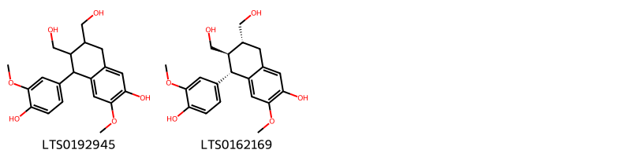{ width=100% }
    <figcaption>Hình ảnh cấu trúc hóa học của 2 hoạt chất thuộc nhóm Aryltetralin lignans gồm ['5-(4-hydroxy-3-methoxyphenyl)-6,7-bis(hydroxymethyl)-3-methoxy-5,6,7,8-tetrahydronaphthalen-2-ol (LTS0192945)', '(5s,6r,7r)-5-(4-hydroxy-3-methoxyphenyl)-6,7-bis(hydroxymethyl)-3-methoxy-5,6,7,8-tetrahydronaphthalen-2-ol (LTS0162169)'].</figcaption>
</figure>
#### Nhóm Benzene and substituted derivatives
<figure markdown="span">
    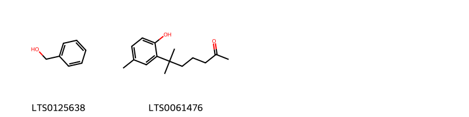{ width=100% }
    <figcaption>Hình ảnh cấu trúc hóa học của 2 hoạt chất thuộc nhóm Benzene and substituted derivatives gồm ['benzyl alcohol (LTS0125638)', '6-(2-hydroxy-5-methylphenyl)-6-methylheptan-2-one (LTS0061476)'].</figcaption>
</figure>
#### Nhóm Cinnamic acids and derivatives
<figure markdown="span">
    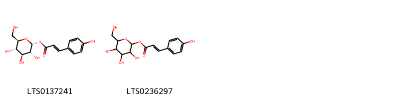{ width=100% }
    <figcaption>Hình ảnh cấu trúc hóa học của 2 hoạt chất thuộc nhóm Cinnamic acids and derivatives gồm ['(2r,3r,4s,5s,6r)-3,4,5-trihydroxy-6-(hydroxymethyl)oxan-2-yl (2e)-3-(4-hydroxyphenyl)prop-2-enoate (LTS0137241)', '3,4,5-trihydroxy-6-(hydroxymethyl)oxan-2-yl 3-(4-hydroxyphenyl)prop-2-enoate (LTS0236297)'].</figcaption>
</figure>
#### Nhóm Dibenzylbutane lignans
<figure markdown="span">
    { width=100% }
    <figcaption>Hình ảnh cấu trúc hóa học của 2 hoạt chất thuộc nhóm Dibenzylbutane lignans gồm ['(2r,3s)-2,3-bis[(4-hydroxy-3-methoxyphenyl)methyl]butane-1,4-diol (LTS0201516)', 'secoisolariciresinol (LTS0111810)'].</figcaption>
</figure>
#### Nhóm Fatty Acyls
<figure markdown="span">
    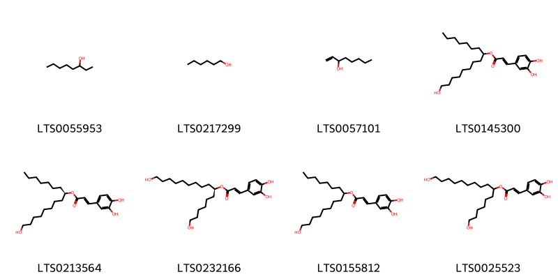{ width=100% }
    <figcaption>Hình ảnh cấu trúc hóa học của 8 hoạt chất thuộc nhóm Fatty Acyls gồm ['3-octanol (LTS0055953)', 'hexanol (LTS0217299)', '1-octen-3-ol (LTS0057101)', '16-hydroxyhexadecan-8-yl (2e)-3-(3,4-dihydroxyphenyl)prop-2-enoate (LTS0145300)', '(8r)-16-hydroxyhexadecan-8-yl (2e)-3-(3,4-dihydroxyphenyl)prop-2-enoate (LTS0213564)', '(7r)-1,16-dihydroxyhexadecan-7-yl (2e)-3-(3,4-dihydroxyphenyl)prop-2-enoate (LTS0232166)', '16-hydroxyhexadecan-8-yl 3-(3,4-dihydroxyphenyl)prop-2-enoate (LTS0155812)', '1,16-dihydroxyhexadecan-7-yl 3-(3,4-dihydroxyphenyl)prop-2-enoate (LTS0025523)'].</figcaption>
</figure>
#### Nhóm Flavonoids
<figure markdown="span">
    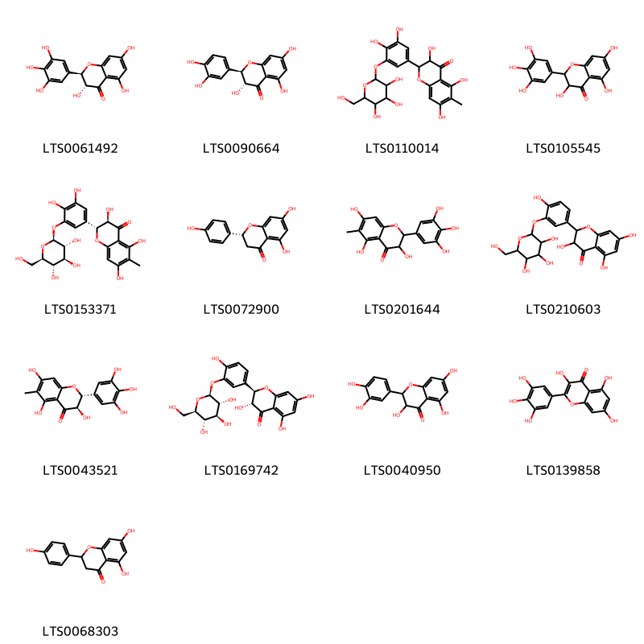{ width=100% }
    <figcaption>Hình ảnh cấu trúc hóa học của 13 hoạt chất thuộc nhóm Flavonoids gồm ['(+)-dihydromyricetin (LTS0061492)', '(+)-taxifolin (LTS0090664)', '2-(3,4-dihydroxy-5-{[3,4,5-trihydroxy-6-(hydroxymethyl)oxan-2-yl]oxy}phenyl)-3,5,7-trihydroxy-6-methyl-2,3-dihydro-1-benzopyran-4-one (LTS0110014)', 'dihydromyricetin (LTS0105545)', '(2r,3r)-2-(3,4-dihydroxy-5-{[(2s,3r,4s,5s,6r)-3,4,5-trihydroxy-6-(hydroxymethyl)oxan-2-yl]oxy}phenyl)-3,5,7-trihydroxy-6-methyl-2,3-dihydro-1-benzopyran-4-one (LTS0153371)', '(-)-naringenin (LTS0072900)', '3,5,7-trihydroxy-6-methyl-2-(3,4,5-trihydroxyphenyl)-2,3-dihydro-1-benzopyran-4-one (LTS0201644)', '3,5,7-trihydroxy-2-(4-hydroxy-3-{[3,4,5-trihydroxy-6-(hydroxymethyl)oxan-2-yl]oxy}phenyl)-2,3-dihydro-1-benzopyran-4-one (LTS0210603)', '(2r,3r)-3,5,7-trihydroxy-6-methyl-2-(3,4,5-trihydroxyphenyl)-2,3-dihydro-1-benzopyran-4-one (LTS0043521)', "taxifolin 3'-glucoside (LTS0169742)", '2,3-dihydroquercetin (LTS0040950)', 'myricetin (LTS0139858)', 'asahina (LTS0068303)'].</figcaption>
</figure>
#### Nhóm Furanoid lignans
<figure markdown="span">
    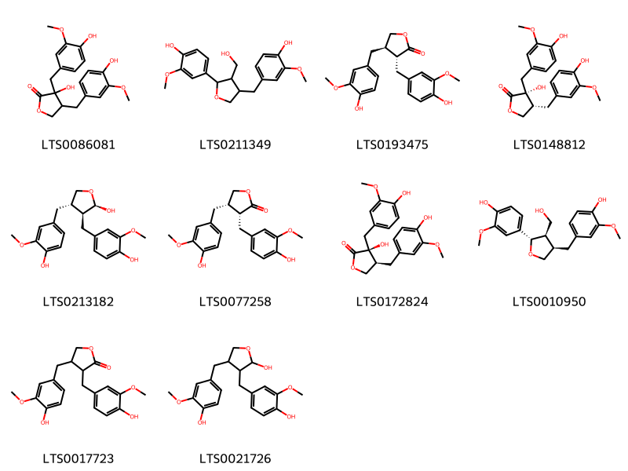{ width=100% }
    <figcaption>Hình ảnh cấu trúc hóa học của 10 hoạt chất thuộc nhóm Furanoid lignans gồm ['3-hydroxy-3,4-bis[(4-hydroxy-3-methoxyphenyl)methyl]oxolan-2-one (LTS0086081)', '4-{4-[(4-hydroxy-3-methoxyphenyl)methyl]-3-(hydroxymethyl)oxolan-2-yl}-2-methoxyphenol (LTS0211349)', 'matairesinol (LTS0193475)', 'wikstromol (LTS0148812)', '(2r,3s,4s)-3,4-bis[(4-hydroxy-3-methoxyphenyl)methyl]oxolan-2-ol (LTS0213182)', '(3r,4s)-3,4-bis[(4-hydroxy-3-methoxyphenyl)methyl]oxolan-2-one (LTS0077258)', 'nortrachelogenin (LTS0172824)', 'lariciresinol (LTS0010950)', '3,4-bis[(4-hydroxy-3-methoxyphenyl)methyl]oxolan-2-one (LTS0017723)', '3,4-bis[(4-hydroxy-3-methoxyphenyl)methyl]oxolan-2-ol (LTS0021726)'].</figcaption>
</figure>
#### Nhóm Organooxygen compounds
<figure markdown="span">
    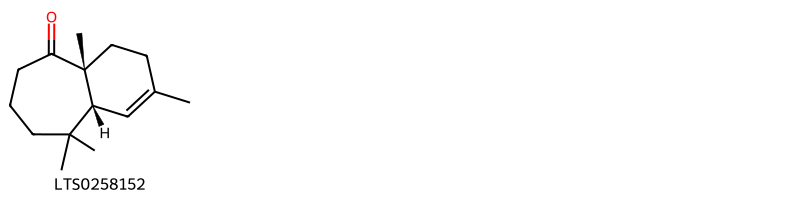{ width=100% }
    <figcaption>Hình ảnh cấu trúc hóa học của 1 hoạt chất thuộc nhóm Organooxygen compounds gồm ['(4ar,9ar)-2,4a,9,9-tetramethyl-3,4,6,7,8,9a-hexahydrobenzo[7]annulen-5-one (LTS0258152)'].</figcaption>
</figure>
#### Nhóm Oxanes
<figure markdown="span">
    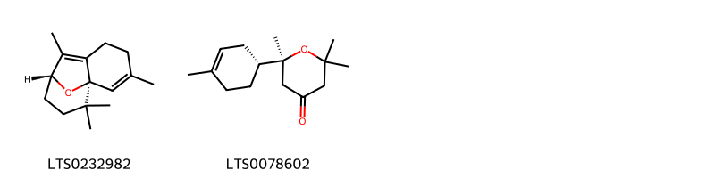{ width=100% }
    <figcaption>Hình ảnh cấu trúc hóa học của 2 hoạt chất thuộc nhóm Oxanes gồm ['(1s,8r)-3,7,11,11-tetramethyl-12-oxatricyclo[6.3.1.0¹,⁶]dodeca-2,6-diene (LTS0232982)', '(6s)-2,2,6-trimethyl-6-[(1r)-4-methylcyclohex-3-en-1-yl]oxan-4-one (LTS0078602)'].</figcaption>
</figure>
#### Nhóm Phenols
<figure markdown="span">
    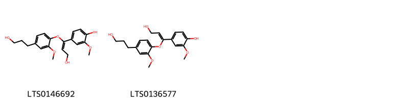{ width=100% }
    <figcaption>Hình ảnh cấu trúc hóa học của 2 hoạt chất thuộc nhóm Phenols gồm ['4-[(1e)-3-hydroxy-1-[4-(3-hydroxypropyl)-2-methoxyphenoxy]prop-1-en-1-yl]-2-methoxyphenol (LTS0146692)', '4-{3-hydroxy-1-[4-(3-hydroxypropyl)-2-methoxyphenoxy]prop-1-en-1-yl}-2-methoxyphenol (LTS0136577)'].</figcaption>
</figure>
#### Nhóm Prenol lipids
<figure markdown="span">
    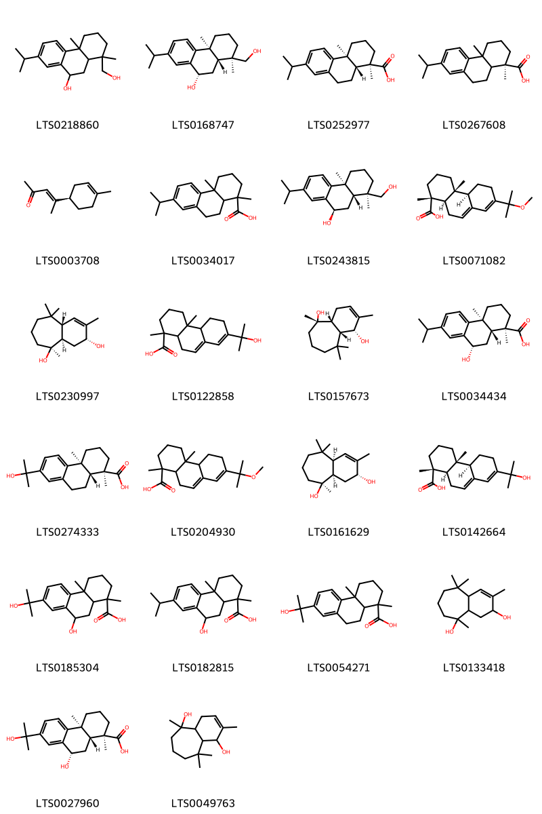{ width=100% }
    <figcaption>Hình ảnh cấu trúc hóa học của 22 hoạt chất thuộc nhóm Prenol lipids gồm ['1-(hydroxymethyl)-7-isopropyl-1,4a-dimethyl-2,3,4,9,10,10a-hexahydrophenanthren-9-ol (LTS0218860)', '(1r,4as,9s,10ar)-1-(hydroxymethyl)-7-isopropyl-1,4a-dimethyl-2,3,4,9,10,10a-hexahydrophenanthren-9-ol (LTS0168747)', '(-)-dehydroabietic acid (LTS0252977)', '(1r)-7-isopropyl-1,4a-dimethyl-2,3,4,9,10,10a-hexahydrophenanthrene-1-carboxylic acid (LTS0267608)', '(3e)-4-[(1r)-4-methylcyclohex-3-en-1-yl]pent-3-en-2-one (LTS0003708)', 'dehydroabietic acid (LTS0034017)', '(1r,4as,9r,10ar)-1-(hydroxymethyl)-7-isopropyl-1,4a-dimethyl-2,3,4,9,10,10a-hexahydrophenanthren-9-ol (LTS0243815)', '(1r,4ar,4br,10ar)-7-(2-methoxypropan-2-yl)-1,4a-dimethyl-2,3,4,4b,5,6,10,10a-octahydrophenanthrene-1-carboxylic acid (LTS0071082)', '(2r,4ar,9s,9ar)-3,5,5,9-tetramethyl-2,4a,6,7,8,9a-hexahydro-1h-benzo[7]annulene-2,9-diol (LTS0230997)', '7-(2-hydroxypropan-2-yl)-1,4a-dimethyl-2,3,4,4b,5,6,10,10a-octahydrophenanthrene-1-carboxylic acid (LTS0122858)', 'centarol (LTS0157673)', '(1r,4as,9s,10ar)-9-hydroxy-7-isopropyl-1,4a-dimethyl-2,3,4,9,10,10a-hexahydrophenanthrene-1-carboxylic acid (LTS0034434)', '(1r,4as,10ar)-7-(2-hydroxypropan-2-yl)-1,4a-dimethyl-2,3,4,9,10,10a-hexahydrophenanthrene-1-carboxylic acid (LTS0274333)', '7-(2-methoxypropan-2-yl)-1,4a-dimethyl-2,3,4,4b,5,6,10,10a-octahydrophenanthrene-1-carboxylic acid (LTS0204930)', '(2r,4as,9s,9ar)-3,5,5,9-tetramethyl-2,4a,6,7,8,9a-hexahydro-1h-benzo[7]annulene-2,9-diol (LTS0161629)', '(1r,4ar,4br,10ar)-7-(2-hydroxypropan-2-yl)-1,4a-dimethyl-2,3,4,4b,5,6,10,10a-octahydrophenanthrene-1-carboxylic acid (LTS0142664)', '9-hydroxy-7-(2-hydroxypropan-2-yl)-1,4a-dimethyl-2,3,4,9,10,10a-hexahydrophenanthrene-1-carboxylic acid (LTS0185304)', '9-hydroxy-7-isopropyl-1,4a-dimethyl-2,3,4,9,10,10a-hexahydrophenanthrene-1-carboxylic acid (LTS0182815)', '7-(2-hydroxypropan-2-yl)-1,4a-dimethyl-2,3,4,9,10,10a-hexahydrophenanthrene-1-carboxylic acid (LTS0054271)', '3,5,5,9-tetramethyl-2,4a,6,7,8,9a-hexahydro-1h-benzo[7]annulene-2,9-diol (LTS0133418)', '(1r,4as,9s,10ar)-9-hydroxy-7-(2-hydroxypropan-2-yl)-1,4a-dimethyl-2,3,4,9,10,10a-hexahydrophenanthrene-1-carboxylic acid (LTS0027960)', '2,5,9,9-tetramethyl-4,4a,6,7,8,9a-hexahydro-1h-benzo[7]annulene-1,5-diol (LTS0049763)'].</figcaption>
</figure>
#### Nhóm Steroids and steroid derivatives
<figure markdown="span">
    { width=100% }
    <figcaption>Hình ảnh cấu trúc hóa học của 2 hoạt chất thuộc nhóm Steroids and steroid derivatives gồm ['sitogluside (LTS0201798)', '2-{[1-(5-ethyl-6-methylheptan-2-yl)-9a,11a-dimethyl-1h,2h,3h,3ah,3bh,4h,6h,7h,8h,9h,9bh,10h,11h-cyclopenta[a]phenanthren-7-yl]oxy}-6-(hydroxymethyl)oxane-3,4,5-triol (LTS0158828)'].</figcaption>
</figure>

---

### Dược dân tộc học

Danh sách các quốc gia có sử dụng *Cedrus deodara* trong điều trị các bệnh. 

| Country   | Disease                            | Bệnh                               |
|:----------|:-----------------------------------|:-----------------------------------|
| Elsewhere | Carminative, Diaphoretic, Diuretic | Carminative, Diaphoretic, lợi tiểu |

---

---
## Cedrus libani
### Thông tin về thực vật

!!! info "Phân loại thực vật của *Cedrus libani* từ GIBF:"
    - **Kingdom:** Plantae
    - **Phylum:** Tracheophyta
    - **Order:** Pinales
    - **Family:** Pinaceae
    - **Genus:** Cedrus
    - **Species:** *Cedrus libani*

 

| Label (VI)   | Label (EN)   | Scientific Name   | Descriptions (VI)   | Descriptions (EN)   | Also Known As (VI)   | Also Known As (EN)                                      |
|:-------------|:-------------|:------------------|:--------------------|:--------------------|:---------------------|:--------------------------------------------------------|
| N/A          | N/A          | Cedrus libani     | loài thực vật       | species of plant    | ['']                 | ['cedar of Lebanon', 'Lebanon cedar', 'Lebanese cedar'] |

#### Phân bố trên thế giới

**Từ CSDL GIBF** United States of America, Greece, United Kingdom of Great Britain and Northern Ireland, Syrian Arab Republic, Belgium, Ukraine, South Africa, Australia, New Zealand, Italy, Serbia, Türkiye, Luxembourg, Cyprus, Germany, Spain, France, Lebanon

#### Phân bố tại Việt Nam

**Từ CSDL GIBF**: Không có ghi nhận ở Việt Nam

---
### Thành phần hóa học
        
- Theo cơ sở dữ liệu lotus: Từ loài *Cedrus libani* đã phân lập và xác định được 97 hoạt chất thuộc về các nhóm Fatty Acyls, Unsaturated hydrocarbons, Organooxygen compounds, Prenol lipids. 

|    | chemicalTaxonomyClassyfireClass   |   smiles_count |
|---:|:----------------------------------|---------------:|
|  0 |                                   |              1 |
|  1 | Fatty Acyls                       |              2 |
|  2 | Organooxygen compounds            |              2 |
|  3 | Prenol lipids                     |             79 |
|  4 | Unsaturated hydrocarbons          |              1 |

#### Nhóm 
<figure markdown="span">
    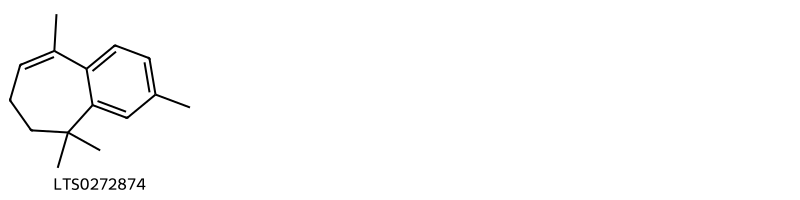{ width=100% }
    <figcaption>Hình ảnh cấu trúc hóa học của 1 hoạt chất thuộc nhóm  gồm ['2,5,9,9-tetramethyl-7,8-dihydrobenzo[7]annulene (LTS0272874)'].</figcaption>
</figure>
#### Nhóm Fatty Acyls
<figure markdown="span">
    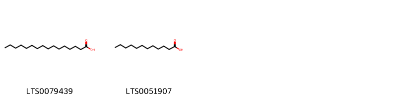{ width=100% }
    <figcaption>Hình ảnh cấu trúc hóa học của 2 hoạt chất thuộc nhóm Fatty Acyls gồm ['palmitic acid (LTS0079439)', 'lauric acid (LTS0051907)'].</figcaption>
</figure>
#### Nhóm Organooxygen compounds
<figure markdown="span">
    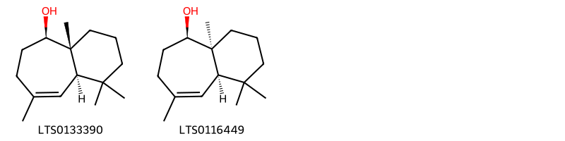{ width=100% }
    <figcaption>Hình ảnh cấu trúc hóa học của 2 hoạt chất thuộc nhóm Organooxygen compounds gồm ['(4ar,5r,9ar)-1,1,4a,8-tetramethyl-3,4,5,6,7,9a-hexahydro-2h-benzo[7]annulen-5-ol (LTS0133390)', '(4as,5r,9ar)-1,1,4a,8-tetramethyl-3,4,5,6,7,9a-hexahydro-2h-benzo[7]annulen-5-ol (LTS0116449)'].</figcaption>
</figure>
#### Nhóm Prenol lipids
<figure markdown="span">
    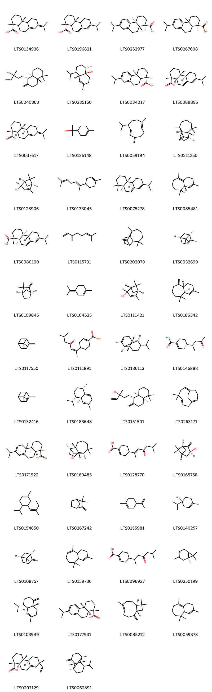{ width=100% }
    <figcaption>Hình ảnh cấu trúc hóa học của 79 hoạt chất thuộc nhóm Prenol lipids gồm ['1,4a-dimethyl-7-(propan-2-ylidene)-3,4,4b,5,6,9,10,10a-octahydro-2h-phenanthrene-1-carboxylic acid (LTS0134936)', 'abietic acid (LTS0196821)', '(-)-dehydroabietic acid (LTS0252977)', '(1r)-7-isopropyl-1,4a-dimethyl-2,3,4,9,10,10a-hexahydrophenanthrene-1-carboxylic acid (LTS0267608)', 'manool (LTS0240363)', '(+)-epicubenol (LTS0235160)', 'dehydroabietic acid (LTS0034017)', 'abietic acid (LTS0088895)', 'neoabietic acid (LTS0037617)', 'terpineol (LTS0136148)', '(-)-germacrene d (LTS0059194)', '(-)-longifolene (LTS0211250)', '(r)-cis-verbenol (LTS0128906)', '(e,r)-α-bisabolene (LTS0133045)', '(-)-abietadiene (LTS0075278)', '(r)-β-himachalene (LTS0085481)', '(1r,4as,4bs,10ar)-7-isopropyl-1,4a-dimethyl-2,3,4,4b,5,6,10,10a-octahydrophenanthrene-1-carboxylic acid (LTS0080190)', 'α-myrcene (LTS0115731)', 'longifolene (LTS0202079)', '(-)-α-pinene (LTS0032699)', '(+)-camphene (LTS0109845)', 'terpinolene (LTS0104525)', '(s)-cis-verbenol (LTS0111421)', '(1r,6r)-α-himachalene (LTS0186342)', 'β-pinene (LTS0117550)', '(4r)-4-[(2z)-6-methyl-4-oxohept-2-en-2-yl]cyclohex-1-ene-1-carboxylic acid (LTS0111891)', '(1s,2r,6r,7r,8s)-8-isopropyl-1,3-dimethyltricyclo[4.4.0.0²,⁷]dec-3-ene (LTS0186113)', '(4s)-4-[(2r)-4-oxopentan-2-yl]cyclohex-1-ene-1-carboxylic acid (LTS0146888)', 'α pinene (LTS0132416)', '(1s,4s,4ar)-4-isopropyl-1,6-dimethyl-1,2,3,4,4a,7-hexahydronaphthalene (LTS0183648)', '(3r)-5-[(1s,4ar,8as)-5,5,8a-trimethyl-2-methylidene-hexahydro-1h-naphthalen-1-yl]-3-methylpent-1-en-3-ol (LTS0151501)', 'humulene (LTS0263171)', 'levopimaric acid (LTS0171922)', '(1s,2r,7s,8s,9s)-2,6,6,9-tetramethyltricyclo[5.4.0.0²,⁹]undecan-8-ol (LTS0169485)', '4-(6-methyl-4-oxohept-2-en-2-yl)cyclohex-1-ene-1-carboxylic acid (LTS0128770)', '(1r,3s,5r)-6,6-dimethyl-2-methylidenebicyclo[3.1.1]heptan-3-ol (LTS0165758)', '4-isopropyl-1,6-dimethyl-3,4,4a,7,8,8a-hexahydronaphthalene (LTS0154650)', 'camphene (LTS0267242)', 'limonene,  (LTS0155981)', '(+)-4-terpineol (LTS0140257)', '(-)-β-pinene (LTS0108757)', 'gamma-himachalene (LTS0159736)', '4-(6-methyl-4-oxoheptan-2-yl)cyclohex-1-ene-1-carboxylic acid (LTS0096927)', '(+)-delta(3)-carene (LTS0250199)', '(+)-gamma-cadinene (LTS0103949)', 'dehydro-abietic acid (LTS0177931)', 'caryophyllene (LTS0085212)', 'β-himachalene (LTS0059378)', 'sandaracopimaric acid (LTS0207129)', '(1r,2s,6s,7s,8r)-8-isopropyl-1-methyl-3-methylidenetricyclo[4.4.0.0²,⁷]decane (LTS0062891)', '(4r)-4-[(2e)-6-methyl-4-oxohept-2-en-2-yl]cyclohex-1-ene-1-carboxylic acid (LTS0260130)', 'α-limonene (LTS0244943)', '(1s)-8-isopropyl-1,3-dimethyltricyclo[4.4.0.0²,⁷]dec-3-ene (LTS0199723)', '2-methyl-6-[(1z)-4-methylcyclohex-3-en-1-ylidene]hept-2-en-4-one (LTS0219044)', '(4ar,10as)-7-isopropyl-1,1,4a-trimethyl-2,3,4,9,10,10a-hexahydrophenanthrene (LTS0221834)', '(9ar)-2,9,9-trimethyl-5-methylidene-4,4a,6,7,8,9a-hexahydro-3h-benzo[7]annulene (LTS0080954)', '(4r)-4-[(2r)-4-oxopentan-2-yl]cyclohex-1-ene-1-carboxylic acid (LTS0222012)', '2,6,6,9-tetramethyltricyclo[5.4.0.0²,⁹]undecan-8-ol (LTS0025924)', '(4as,4br,10ar)-7-isopropyl-1,1,4a-trimethyl-2,3,4,4b,5,6,10,10a-octahydrophenanthrene (LTS0040333)', '6β-himachal-4,10-diene (LTS0209716)', '7-isopropyl-1,1,4a-trimethyl-2,3,4,9,10,10a-hexahydrophenanthrene (LTS0210076)', '(4r)-4-[(2s)-6-methyl-4-oxoheptan-2-yl]cyclohex-1-ene-1-carboxylic acid (LTS0242410)', '(1r,2s,7s,8r,9r)-2,6,6,9-tetramethyltricyclo[5.4.0.0²,⁹]undecan-8-ol (LTS0187360)', '(+)-α-terpineol (LTS0258249)', '7-isopropyl-1,1,4a-trimethyl-2,3,4,4b,5,6,10,10a-octahydrophenanthrene (LTS0048295)', 'terpinene (LTS0136858)', '4-(4-oxopentan-2-yl)cyclohex-1-ene-1-carboxylic acid (LTS0060311)', '(-)-β-phellandrene (LTS0063520)', '(4ar,5r,9ar)-2,5,9,9-tetramethyl-4,4a,6,7,8,9a-hexahydro-3h-benzo[7]annulen-5-ol (LTS0001066)', '(4s,4as,8as)-4-isopropyl-1,6-dimethyl-3,4,4a,7,8,8a-hexahydronaphthalene (LTS0014980)', '(-)-α-himachalene (LTS0021074)', '(4r,4ar,8as)-4-isopropyl-6-methyl-1-methylidene-3,4,4a,7,8,8a-hexahydro-2h-naphthalene (LTS0057456)', '(1r,2s,6s,7s,8r)-8-isopropyl-1,3-dimethyltricyclo[4.4.0.0²,⁷]dec-3-ene (LTS0106607)', 'pinocarveol (LTS0090950)', '(4s,4as,8as)-4-isopropyl-6-methyl-1-methylidene-3,4,4a,7,8,8a-hexahydro-2h-naphthalene (LTS0099302)', 'himachalol (LTS0019413)', '(-)-α-cubebene (LTS0042045)', '4-isopropyl-6-methyl-1-methylidene-3,4,4a,7,8,8a-hexahydro-2h-naphthalene (LTS0111070)', 'levopimaric acid (LTS0255119)'].</figcaption>
</figure>
#### Nhóm Unsaturated hydrocarbons
<figure markdown="span">
    { width=100% }
    <figcaption>Hình ảnh cấu trúc hóa học của 1 hoạt chất thuộc nhóm Unsaturated hydrocarbons gồm ['α terpinene (LTS0232891)'].</figcaption>
</figure>

---

### Dược dân tộc học

Danh sách các quốc gia có sử dụng *Cedrus libani* trong điều trị các bệnh. 

| Country   | Disease               | Bệnh                          |
|:----------|:----------------------|:------------------------------|
| Turkey    | Diuretic, Insecticide | Thuốc lợi tiểu, Thuốc trừ sâu |

---

---
## Cedrus libanotica
### Thông tin về thực vật

!!! info "Phân loại thực vật của *Cedrus libani* từ GIBF:"
    - **Kingdom:** Plantae
    - **Phylum:** Tracheophyta
    - **Order:** Pinales
    - **Family:** Pinaceae
    - **Genus:** Cedrus
    - **Species:** *Cedrus libani*

 

| Label (VI)   | Label (EN)   | Scientific Name   | Descriptions (VI)   | Descriptions (EN)   | Also Known As (VI)   | Also Known As (EN)   |
|:-------------|:-------------|:------------------|:--------------------|:--------------------|:---------------------|:---------------------|
| N/A          | N/A          | Cedrus libanotica | loài thực vật       | species of plant    | ['']                 | ['']                 |

#### Phân bố trên thế giới

**Từ CSDL GIBF** nan, United States of America, Sweden, Italy, Türkiye, unknown or invalid, Cyprus, France

#### Phân bố tại Việt Nam

**Từ CSDL GIBF**: Không có ghi nhận ở Việt Nam

---
### Thành phần hóa học
        
- Theo cơ sở dữ liệu lotus: Từ loài *Cedrus libani* đã phân lập và xác định được Chưa có hoạt chất nào được phân lập. hoạt chất thuộc về các nhóm Không có hoạt chất nào được phân lập. 

Không có hình ảnh nào được tạo ra

---

### Dược dân tộc học

Danh sách các quốc gia có sử dụng *Cedrus libani* trong điều trị các bệnh. 

| Country   | Disease            | Bệnh                            |
|:----------|:-------------------|:--------------------------------|
| Egypt     | Diuretic, Fumigant | Thuốc lợi tiểu, Thuốc khử trùng |

---

# Chi Larix

??? note "Danh sách các dược liệu thuộc chi"
    
	 - *Larix americana*
	 - *Larix decidua*
	 - *Larix laricina*
	 - *Larix sibirica*

---
## Larix americana
### Thông tin về thực vật

!!! info "Phân loại thực vật của *Larix laricina* từ GIBF:"
    - **Kingdom:** Plantae
    - **Phylum:** Tracheophyta
    - **Order:** Pinales
    - **Family:** Pinaceae
    - **Genus:** Larix
    - **Species:** *Larix laricina*

 

| Label (VI)   | Label (EN)   | Scientific Name   | Descriptions (VI)   | Descriptions (EN)   | Also Known As (VI)   | Also Known As (EN)   |
|:-------------|:-------------|:------------------|:--------------------|:--------------------|:---------------------|:---------------------|
| N/A          | N/A          | Larix americana   | loài thực vật       | species of plant    | ['']                 | ['']                 |

#### Phân bố trên thế giới

**Từ CSDL GIBF** nan, United States of America, Norway, Sweden, Finland, unknown or invalid, Canada, Germany, Spain, Netherlands

#### Phân bố tại Việt Nam

**Từ CSDL GIBF**: Không có ghi nhận ở Việt Nam

---
### Thành phần hóa học
        
- Theo cơ sở dữ liệu lotus: Từ loài *Larix laricina* đã phân lập và xác định được Chưa có hoạt chất nào được phân lập. hoạt chất thuộc về các nhóm Không có hoạt chất nào được phân lập. 

Không có hình ảnh nào được tạo ra

---

### Dược dân tộc học

Danh sách các quốc gia có sử dụng *Larix laricina* trong điều trị các bệnh. 

| Country   | Disease            | Bệnh                        |
|:----------|:-------------------|:----------------------------|
| Turkey    | Diuretic, Laxative | Thuốc lợi tiểu, nhuận tràng |

---

---
## Larix decidua
### Thông tin về thực vật

!!! info "Phân loại thực vật của *Larix decidua* từ GIBF:"
    - **Kingdom:** Plantae
    - **Phylum:** Tracheophyta
    - **Order:** Pinales
    - **Family:** Pinaceae
    - **Genus:** Larix
    - **Species:** *Larix decidua*

 

| Label (VI)   | Label (EN)   | Scientific Name   | Descriptions (VI)   | Descriptions (EN)   | Also Known As (VI)   | Also Known As (EN)                                 |
|:-------------|:-------------|:------------------|:--------------------|:--------------------|:---------------------|:---------------------------------------------------|
| N/A          | N/A          | Larix decidua     | loài thực vật       | species of plant    | ['']                 | ['European larch', 'Larix europaea Lam. & A. DC.'] |

#### Phân bố trên thế giới

**Từ CSDL GIBF** Czechia, Sweden, New Zealand, Slovenia, Netherlands, Denmark, Poland, United States of America, Romania, Belarus, Norway, United Kingdom of Great Britain and Northern Ireland, Belgium, Luxembourg, Canada, Germany, Austria, Hungary, Ukraine, Slovakia, Italy, Switzerland, France, Ireland

#### Phân bố tại Việt Nam

**Từ CSDL GIBF**: Không có ghi nhận ở Việt Nam

---
### Thành phần hóa học
        
- Theo cơ sở dữ liệu lotus: Từ loài *Larix decidua* đã phân lập và xác định được 36 hoạt chất thuộc về các nhóm Benzene and substituted derivatives, Flavonoids, Organooxygen compounds, Prenol lipids. 

|    | chemicalTaxonomyClassyfireClass     |   smiles_count |
|---:|:------------------------------------|---------------:|
|  0 | Benzene and substituted derivatives |              1 |
|  1 | Flavonoids                          |              5 |
|  2 | Organooxygen compounds              |              1 |
|  3 | Prenol lipids                       |             28 |

#### Nhóm Benzene and substituted derivatives
<figure markdown="span">
    { width=100% }
    <figcaption>Hình ảnh cấu trúc hóa học của 1 hoạt chất thuộc nhóm Benzene and substituted derivatives gồm ['salicyclic acid (LTS0116548)'].</figcaption>
</figure>
#### Nhóm Flavonoids
<figure markdown="span">
    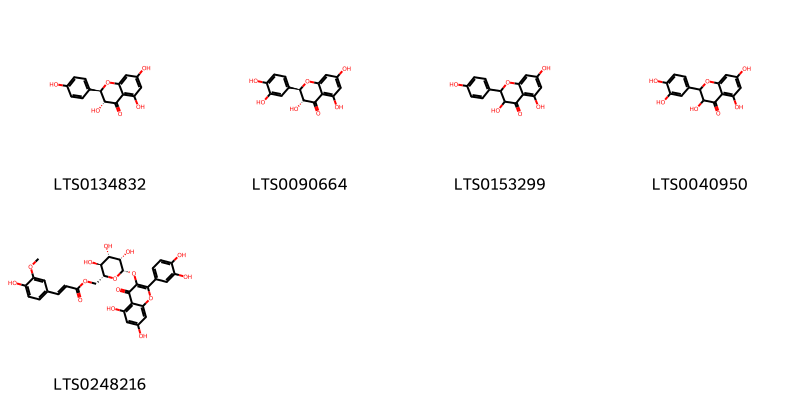{ width=100% }
    <figcaption>Hình ảnh cấu trúc hóa học của 5 hoạt chất thuộc nhóm Flavonoids gồm ['(+)-dihydrokaempferol (LTS0134832)', '(+)-taxifolin (LTS0090664)', 'aromadendrin (LTS0153299)', '2,3-dihydroquercetin (LTS0040950)', '[(2r,3s,4s,5s,6s)-6-{[2-(3,4-dihydroxyphenyl)-5,7-dihydroxy-4-oxochromen-3-yl]oxy}-3,4,5-trihydroxyoxan-2-yl]methyl (2e)-3-(4-hydroxy-3-methoxyphenyl)prop-2-enoate (LTS0248216)'].</figcaption>
</figure>
#### Nhóm Organooxygen compounds
<figure markdown="span">
    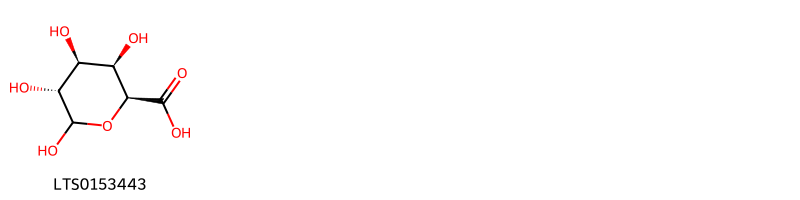{ width=100% }
    <figcaption>Hình ảnh cấu trúc hóa học của 1 hoạt chất thuộc nhóm Organooxygen compounds gồm ['d-galacturonic acid (LTS0153443)'].</figcaption>
</figure>
#### Nhóm Prenol lipids
<figure markdown="span">
    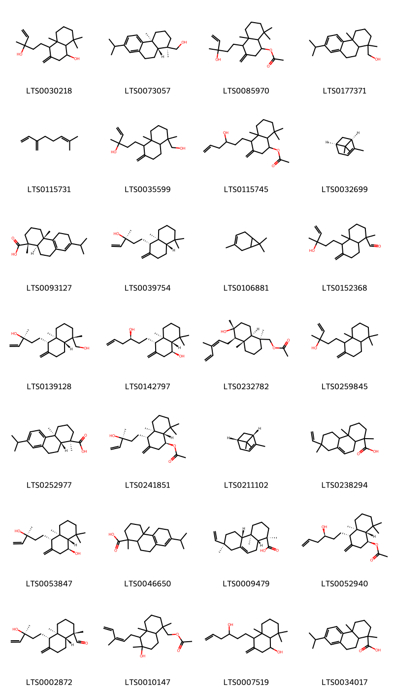{ width=100% }
    <figcaption>Hình ảnh cấu trúc hóa học của 28 hoạt chất thuộc nhóm Prenol lipids gồm ['4-(3-hydroxy-3-methylpent-4-en-1-yl)-4a,8,8-trimethyl-3-methylidene-hexahydro-1h-naphthalen-1-ol (LTS0030218)', 'dehydroabietinol (LTS0073057)', '4-(3-hydroxy-3-methylpent-4-en-1-yl)-4a,8,8-trimethyl-3-methylidene-hexahydro-1h-naphthalen-1-yl acetate (LTS0085970)', '(7-isopropyl-1,4a-dimethyl-2,3,4,9,10,10a-hexahydrophenanthren-1-yl)methanol (LTS0177371)', 'α-myrcene (LTS0115731)', '5-[5-(hydroxymethyl)-5,8a-dimethyl-2-methylidene-hexahydro-1h-naphthalen-1-yl]-3-methylpent-1-en-3-ol (LTS0035599)', '4-(3-hydroxyhex-5-en-1-yl)-4a,8,8-trimethyl-3-methylidene-hexahydro-1h-naphthalen-1-yl acetate (LTS0115745)', '(-)-α-pinene (LTS0032699)', 'palustric acid (LTS0093127)', '13-epi-manool (LTS0039754)', 'monoterpenes (LTS0106881)', '5-(3-hydroxy-3-methylpent-4-en-1-yl)-1,4a-dimethyl-6-methylidene-hexahydro-2h-naphthalene-1-carbaldehyde (LTS0152368)', '(3s)-5-[(1s,4ar,5s,8ar)-5-(hydroxymethyl)-5,8a-dimethyl-2-methylidene-hexahydro-1h-naphthalen-1-yl]-3-methylpent-1-en-3-ol (LTS0139128)', '(1s,4s,4ar,8as)-4-[(3s)-3-hydroxyhex-5-en-1-yl]-4a,8,8-trimethyl-3-methylidene-hexahydro-1h-naphthalen-1-ol (LTS0142797)', '[(1s,4as,5r,6r,8ar)-6-hydroxy-1,4a,6-trimethyl-5-[(2z)-3-methylpenta-2,4-dien-1-yl]-hexahydro-2h-naphthalen-1-yl]methyl acetate (LTS0232782)', '5-(5,5,8a-trimethyl-2-methylidene-hexahydro-1h-naphthalen-1-yl)-3-methylpent-1-en-3-ol (LTS0259845)', '(-)-dehydroabietic acid (LTS0252977)', '(1s,4s,4ar,8as)-4-[(3s)-3-hydroxy-3-methylpent-4-en-1-yl]-4a,8,8-trimethyl-3-methylidene-hexahydro-1h-naphthalen-1-yl acetate (LTS0241851)', '(+)-α-pinene (LTS0211102)', 'isopimaric acid (LTS0238294)', '(1s,4s,4ar,8as)-4-[(3s)-3-hydroxy-3-methylpent-4-en-1-yl]-4a,8,8-trimethyl-3-methylidene-hexahydro-1h-naphthalen-1-ol (LTS0053847)', 'palustric acid (LTS0046650)', 'isopimaric acid (LTS0009479)', '(1s,4s,4ar,8as)-4-[(3s)-3-hydroxyhex-5-en-1-yl]-4a,8,8-trimethyl-3-methylidene-hexahydro-1h-naphthalen-1-yl acetate (LTS0052940)', '(1s,4ar,5s,8ar)-5-[(3s)-3-hydroxy-3-methylpent-4-en-1-yl]-1,4a-dimethyl-6-methylidene-hexahydro-2h-naphthalene-1-carbaldehyde (LTS0002872)', '[6-hydroxy-1,4a,6-trimethyl-5-(3-methylpenta-2,4-dien-1-yl)-hexahydro-2h-naphthalen-1-yl]methyl acetate (LTS0010147)', '4-(3-hydroxyhex-5-en-1-yl)-4a,8,8-trimethyl-3-methylidene-hexahydro-1h-naphthalen-1-ol (LTS0007519)', 'dehydroabietic acid (LTS0034017)'].</figcaption>
</figure>

---

### Dược dân tộc học

Danh sách các quốc gia có sử dụng *Larix decidua* trong điều trị các bệnh. 

| Country   | Disease                                                                 | Bệnh                                                                               |
|:----------|:------------------------------------------------------------------------|:-----------------------------------------------------------------------------------|
| Turkey    | Antiseptic, Astringent, Diuretic, Hemostat, Purgative, Stomachic, Tonic | Chất khử trùng, Chất làm se, Thuốc lợi tiểu, Hemostat, Purgative, Stomachic, Tonic |

---

---
## Larix laricina
### Thông tin về thực vật

!!! info "Phân loại thực vật của *Larix laricina* từ GIBF:"
    - **Kingdom:** Plantae
    - **Phylum:** Tracheophyta
    - **Order:** Pinales
    - **Family:** Pinaceae
    - **Genus:** Larix
    - **Species:** *Larix laricina*

 

| Label (VI)   | Label (EN)   | Scientific Name   | Descriptions (VI)   | Descriptions (EN)   | Also Known As (VI)   | Also Known As (EN)         |
|:-------------|:-------------|:------------------|:--------------------|:--------------------|:---------------------|:---------------------------|
| N/A          | N/A          | Larix laricina    | loài thực vật       | species of plant    | ['']                 | ['tamarack', 'hackmatack'] |

#### Phân bố trên thế giới

**Từ CSDL GIBF** United States of America, Canada

#### Phân bố tại Việt Nam

**Từ CSDL GIBF**: Không có ghi nhận ở Việt Nam

---
### Thành phần hóa học
        
- Theo cơ sở dữ liệu lotus: Từ loài *Larix laricina* đã phân lập và xác định được 84 hoạt chất thuộc về các nhóm Fatty Acyls, Benzene and substituted derivatives, Unsaturated hydrocarbons, Flavonoids, Naphthalenes, Cinnamic acids and derivatives, Pyrans, Organooxygen compounds, Prenol lipids, Stilbenes. 

|    | chemicalTaxonomyClassyfireClass     |   smiles_count |
|---:|:------------------------------------|---------------:|
|  0 | Benzene and substituted derivatives |              2 |
|  1 | Cinnamic acids and derivatives      |              4 |
|  2 | Fatty Acyls                         |              7 |
|  3 | Flavonoids                          |              2 |
|  4 | Naphthalenes                        |              2 |
|  5 | Organooxygen compounds              |             12 |
|  6 | Prenol lipids                       |             48 |
|  7 | Pyrans                              |              2 |
|  8 | Stilbenes                           |              2 |
|  9 | Unsaturated hydrocarbons            |              1 |

#### Nhóm Benzene and substituted derivatives
<figure markdown="span">
    { width=100% }
    <figcaption>Hình ảnh cấu trúc hóa học của 2 hoạt chất thuộc nhóm Benzene and substituted derivatives gồm ['p-hydroxybenzoic acid (LTS0263634)', 'vanillic acid (LTS0229113)'].</figcaption>
</figure>
#### Nhóm Cinnamic acids and derivatives
<figure markdown="span">
    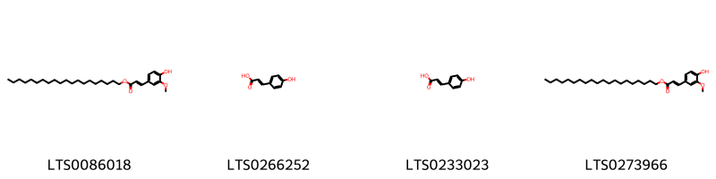{ width=100% }
    <figcaption>Hình ảnh cấu trúc hóa học của 4 hoạt chất thuộc nhóm Cinnamic acids and derivatives gồm ['icosyl (2e)-3-(4-hydroxy-3-methoxyphenyl)prop-2-enoate (LTS0086018)', 'para-coumaric acid (LTS0266252)', 'hydroxycinnamic acid (LTS0233023)', 'icosyl 3-(4-hydroxy-3-methoxyphenyl)prop-2-enoate (LTS0273966)'].</figcaption>
</figure>
#### Nhóm Fatty Acyls
<figure markdown="span">
    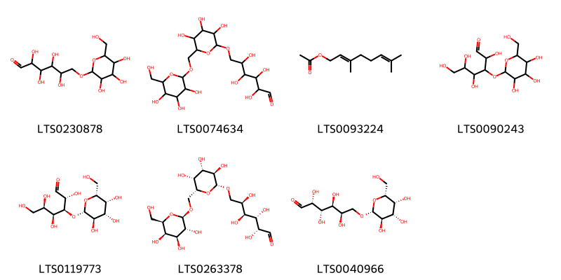{ width=100% }
    <figcaption>Hình ảnh cấu trúc hóa học của 7 hoạt chất thuộc nhóm Fatty Acyls gồm ['melibiose (LTS0230878)', 'dextran (LTS0074634)', 'geranyl acetate (LTS0093224)', '2,4,5,6-tetrahydroxy-3-{[3,4,5-trihydroxy-6-(hydroxymethyl)oxan-2-yl]oxy}hexanal (LTS0090243)', '(2r,3s,4s,5r)-2,4,5,6-tetrahydroxy-3-{[(2s,3r,4s,5r,6r)-3,4,5-trihydroxy-6-(hydroxymethyl)oxan-2-yl]oxy}hexanal (LTS0119773)', '(2r,3s,4s,5r)-2,3,4,5-tetrahydroxy-6-{[(2r,3r,4s,5r,6r)-3,4,5-trihydroxy-6-({[(2r,3r,4s,5r,6r)-3,4,5-trihydroxy-6-(hydroxymethyl)oxan-2-yl]oxy}methyl)oxan-2-yl]oxy}hexanal (LTS0263378)', '(2r,3s,4s,5r)-2,3,4,5-tetrahydroxy-6-{[(2r,3r,4s,5r,6r)-3,4,5-trihydroxy-6-(hydroxymethyl)oxan-2-yl]oxy}hexanal (LTS0040966)'].</figcaption>
</figure>
#### Nhóm Flavonoids
<figure markdown="span">
    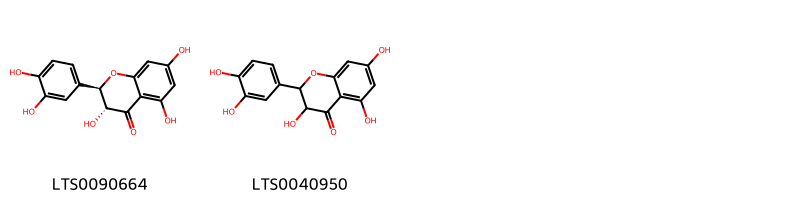{ width=100% }
    <figcaption>Hình ảnh cấu trúc hóa học của 2 hoạt chất thuộc nhóm Flavonoids gồm ['(+)-taxifolin (LTS0090664)', '2,3-dihydroquercetin (LTS0040950)'].</figcaption>
</figure>
#### Nhóm Naphthalenes
<figure markdown="span">
    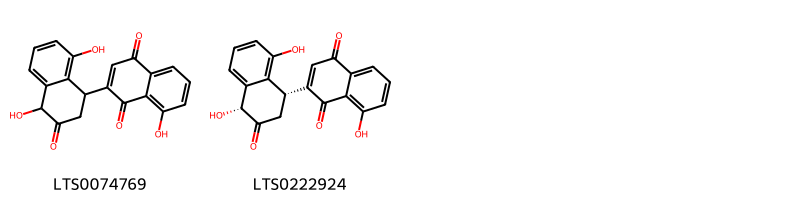{ width=100% }
    <figcaption>Hình ảnh cấu trúc hóa học của 2 hoạt chất thuộc nhóm Naphthalenes gồm ["4,8,8'-trihydroxy-2,4-dihydro-1h-[1,2'-binaphthalene]-1',3,4'-trione (LTS0074769)", "(1r,4r)-4,8,8'-trihydroxy-2,4-dihydro-1h-[1,2'-binaphthalene]-1',3,4'-trione (LTS0222924)"].</figcaption>
</figure>
#### Nhóm Organooxygen compounds
<figure markdown="span">
    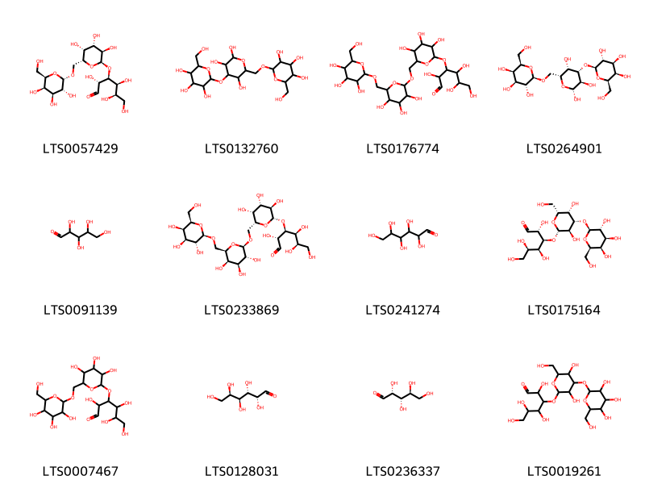{ width=100% }
    <figcaption>Hình ảnh cấu trúc hóa học của 12 hoạt chất thuộc nhóm Organooxygen compounds gồm ['(2r,3s,4s,5r)-2,4,5,6-tetrahydroxy-3-{[(2r,3r,4s,5r,6r)-3,4,5-trihydroxy-6-({[(2s,3r,4s,5r,6r)-3,4,5-trihydroxy-6-(hydroxymethyl)oxan-2-yl]oxy}methyl)oxan-2-yl]oxy}hexanal (LTS0057429)', '2-(hydroxymethyl)-6-[(3,5,6-trihydroxy-4-{[3,4,5-trihydroxy-6-(hydroxymethyl)oxan-2-yl]oxy}oxan-2-yl)methoxy]oxane-3,4,5-triol (LTS0132760)', '2,4,5,6-tetrahydroxy-3-{[3,4,5-trihydroxy-6-({[3,4,5-trihydroxy-6-({[3,4,5-trihydroxy-6-(hydroxymethyl)oxan-2-yl]oxy}methyl)oxan-2-yl]oxy}methyl)oxan-2-yl]oxy}hexanal (LTS0176774)', '(2r,3r,4s,5r,6s)-2-(hydroxymethyl)-6-{[(2r,3r,4s,5s,6r)-2,3,5-trihydroxy-6-({[(2r,3r,4s,5r,6r)-3,4,5-trihydroxy-6-(hydroxymethyl)oxan-2-yl]oxy}methyl)oxan-4-yl]oxy}oxane-3,4,5-triol (LTS0264901)', 'xylose (LTS0091139)', '(2r,3s,4s,5r)-2,4,5,6-tetrahydroxy-3-{[(2s,3r,4s,5r,6r)-3,4,5-trihydroxy-6-({[(2r,3r,4s,5r,6r)-3,4,5-trihydroxy-6-({[(2r,3r,4s,5r,6r)-3,4,5-trihydroxy-6-(hydroxymethyl)oxan-2-yl]oxy}methyl)oxan-2-yl]oxy}methyl)oxan-2-yl]oxy}hexanal (LTS0233869)', 'dextrose (LTS0241274)', '(2r,3s,4s,5r)-3-{[(2s,3r,4s,5s,6r)-3,5-dihydroxy-6-(hydroxymethyl)-4-{[(2s,3r,4s,5r,6r)-3,4,5-trihydroxy-6-(hydroxymethyl)oxan-2-yl]oxy}oxan-2-yl]oxy}-2,4,5,6-tetrahydroxyhexanal (LTS0175164)', '2,4,5,6-tetrahydroxy-3-{[3,4,5-trihydroxy-6-({[3,4,5-trihydroxy-6-(hydroxymethyl)oxan-2-yl]oxy}methyl)oxan-2-yl]oxy}hexanal (LTS0007467)', 'aldehydo-d-galactose (LTS0128031)', 'l-arabinose (LTS0236337)', '3-{[3,5-dihydroxy-6-(hydroxymethyl)-4-{[3,4,5-trihydroxy-6-(hydroxymethyl)oxan-2-yl]oxy}oxan-2-yl]oxy}-2,4,5,6-tetrahydroxyhexanal (LTS0019261)'].</figcaption>
</figure>
#### Nhóm Prenol lipids
<figure markdown="span">
    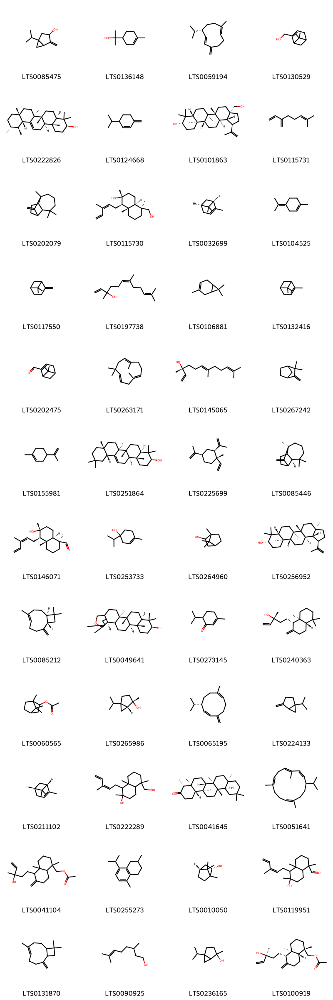{ width=100% }
    <figcaption>Hình ảnh cấu trúc hóa học của 48 hoạt chất thuộc nhóm Prenol lipids gồm ['sabinol (LTS0085475)', 'terpineol (LTS0136148)', '(-)-germacrene d (LTS0059194)', 'myrtenol (LTS0130529)', 'amyrin (LTS0222826)', 'β phellandrene (LTS0124668)', 'betulin (LTS0101863)', 'α-myrcene (LTS0115731)', 'longifolene (LTS0202079)', '(1r,2r,4ar,5s,8as)-5-(hydroxymethyl)-2,5,8a-trimethyl-1-[(2z)-3-methylpenta-2,4-dien-1-yl]-hexahydro-1h-naphthalen-2-ol (LTS0115730)', '(-)-α-pinene (LTS0032699)', 'terpinolene (LTS0104525)', 'β-pinene (LTS0117550)', 'nerolidol (LTS0197738)', 'monoterpenes (LTS0106881)', 'α pinene (LTS0132416)', 'myrtenal (LTS0202475)', 'humulene (LTS0263171)', '(3r,6e)-nerolidol (LTS0145065)', 'camphene (LTS0267242)', 'limonene,  (LTS0155981)', 'β-amyrin (LTS0251864)', 'β-elemene (LTS0225699)', '(2s,7s)-3,3,7-trimethyl-8-methylidenetricyclo[5.4.0.0²,⁹]undecane (LTS0085446)', '(1s,4as,5r,6r,8ar)-6-hydroxy-1,4a,6-trimethyl-5-[(2z)-3-methylpenta-2,4-dien-1-yl]-hexahydro-2h-naphthalene-1-carbaldehyde (LTS0146071)', '4-terpineol (LTS0253733)', 'borneol (LTS0264960)', 'lupeol (LTS0256952)', 'caryophyllene (LTS0085212)', '(1r,4r,5r,8r,10s,13r,14r,18r)-4,5,9,9,13,20,20-heptamethyl-24-oxahexacyclo[17.3.2.0¹,¹⁸.0⁴,¹⁷.0⁵,¹⁴.0⁸,¹³]tetracosan-10-ol (LTS0049641)', 'piperitone (LTS0273145)', 'manool (LTS0240363)', 'bornyl acetate (LTS0060565)', '(1r,2s)-5-isopropyl-2-methylbicyclo[3.1.0]hexan-2-ol (LTS0265986)', '(1z,6z,8s)-8-isopropyl-1-methyl-5-methylidenecyclodeca-1,6-diene (LTS0065195)', 'sabinene (LTS0224133)', '(+)-α-pinene (LTS0211102)', '5-(hydroxymethyl)-2,5,8a-trimethyl-1-(3-methylpenta-2,4-dien-1-yl)-hexahydro-1h-naphthalen-2-ol (LTS0222289)', '(-)-friedelin (LTS0041645)', '(1z,3e,6z,10z)-14-isopropyl-3,7,11-trimethylcyclotetradeca-1,3,6,10-tetraene (LTS0051641)', '[5-(3-hydroxy-3-methylpent-4-en-1-yl)-1,4a-dimethyl-6-methylidene-hexahydro-2h-naphthalen-1-yl]methyl acetate (LTS0041104)', '4-isopropyl-1,6-dimethyl-5,6,7,8-tetrahydronaphthalene (LTS0255273)', '(2s,4r)-1,7,7-trimethylbicyclo[2.2.1]heptan-2-ol (LTS0010050)', '6-hydroxy-1,4a,6-trimethyl-5-(3-methylpenta-2,4-dien-1-yl)-hexahydro-2h-naphthalene-1-carbaldehyde (LTS0119951)', 'caryophyllene (LTS0131870)', 'citronellol, (+-)- (LTS0090925)', 'sabinene hydrate (LTS0236165)', '[(1s,4ar,5s,8ar)-5-[(3s)-3-hydroxy-3-methylpent-4-en-1-yl]-1,4a-dimethyl-6-methylidene-hexahydro-2h-naphthalen-1-yl]methyl acetate (LTS0100919)'].</figcaption>
</figure>
#### Nhóm Pyrans
<figure markdown="span">
    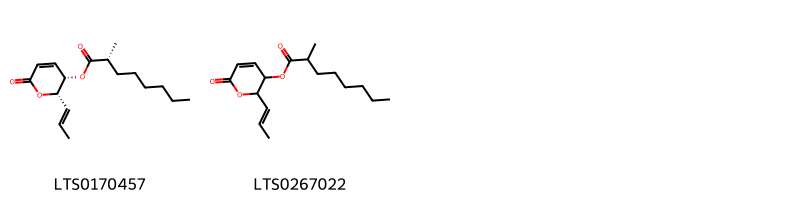{ width=100% }
    <figcaption>Hình ảnh cấu trúc hóa học của 2 hoạt chất thuộc nhóm Pyrans gồm ['(2s,3s)-6-oxo-2-[(1e)-prop-1-en-1-yl]-2,3-dihydropyran-3-yl (2r)-2-methyloctanoate (LTS0170457)', '6-oxo-2-(prop-1-en-1-yl)-2,3-dihydropyran-3-yl 2-methyloctanoate (LTS0267022)'].</figcaption>
</figure>
#### Nhóm Stilbenes
<figure markdown="span">
    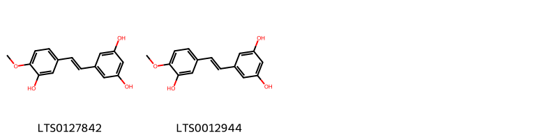{ width=100% }
    <figcaption>Hình ảnh cấu trúc hóa học của 2 hoạt chất thuộc nhóm Stilbenes gồm ['rhapontigenin (LTS0127842)', 'rhapontigenin (LTS0012944)'].</figcaption>
</figure>
#### Nhóm Unsaturated hydrocarbons
<figure markdown="span">
    { width=100% }
    <figcaption>Hình ảnh cấu trúc hóa học của 1 hoạt chất thuộc nhóm Unsaturated hydrocarbons gồm ['α terpinene (LTS0232891)'].</figcaption>
</figure>

---

### Dược dân tộc học

Danh sách các quốc gia có sử dụng *Larix laricina* trong điều trị các bệnh. 

| Country   | Disease                   | Bệnh                                   |
|:----------|:--------------------------|:---------------------------------------|
| US        | Laxative, Poultice, Tonic | Thuốc nhuận tràng, thuốc đắp, thuốc bổ |

---

---
## Larix sibirica
### Thông tin về thực vật

!!! info "Phân loại thực vật của *Larix sibirica* từ GIBF:"
    - **Kingdom:** Plantae
    - **Phylum:** Tracheophyta
    - **Order:** Pinales
    - **Family:** Pinaceae
    - **Genus:** Larix
    - **Species:** *Larix sibirica*

 

| Label (VI)   | Label (EN)   | Scientific Name   | Descriptions (VI)   | Descriptions (EN)   | Also Known As (VI)   | Also Known As (EN)                   |
|:-------------|:-------------|:------------------|:--------------------|:--------------------|:---------------------|:-------------------------------------|
| N/A          | N/A          | Larix sibirica    |                     | species of plant    | ['']                 | ['Larix siberica', 'Siberian Larch'] |

#### Phân bố trên thế giới

**Từ CSDL GIBF** Norway, Mongolia, Estonia, Sweden, Iceland, Russian Federation, Kazakhstan, Canada

#### Phân bố tại Việt Nam

**Từ CSDL GIBF**: Không có ghi nhận ở Việt Nam

---
### Thành phần hóa học
        
- Theo cơ sở dữ liệu lotus: Từ loài *Larix sibirica* đã phân lập và xác định được 143 hoạt chất thuộc về các nhóm Fatty Acyls, Heteroaromatic compounds, Benzene and substituted derivatives, Unsaturated hydrocarbons, Flavonoids, Dibenzylbutane lignans, Cinnamic acids and derivatives, Steroids and steroid derivatives, Furanoid lignans, Prenol lipids, Saturated hydrocarbons. 

|    | chemicalTaxonomyClassyfireClass     |   smiles_count |
|---:|:------------------------------------|---------------:|
|  0 | Benzene and substituted derivatives |              5 |
|  1 | Cinnamic acids and derivatives      |              4 |
|  2 | Dibenzylbutane lignans              |              2 |
|  3 | Fatty Acyls                         |             20 |
|  4 | Flavonoids                          |             23 |
|  5 | Furanoid lignans                    |              2 |
|  6 | Heteroaromatic compounds            |              1 |
|  7 | Prenol lipids                       |             76 |
|  8 | Saturated hydrocarbons              |              1 |
|  9 | Steroids and steroid derivatives    |              6 |
| 10 | Unsaturated hydrocarbons            |              3 |

#### Nhóm Benzene and substituted derivatives
<figure markdown="span">
    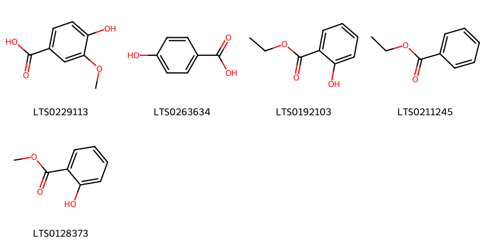{ width=100% }
    <figcaption>Hình ảnh cấu trúc hóa học của 5 hoạt chất thuộc nhóm Benzene and substituted derivatives gồm ['vanillic acid (LTS0229113)', 'p-hydroxybenzoic acid (LTS0263634)', 'ethyl salicylate (LTS0192103)', 'ethyl benzoate (LTS0211245)', 'methyl salicylate (LTS0128373)'].</figcaption>
</figure>
#### Nhóm Cinnamic acids and derivatives
<figure markdown="span">
    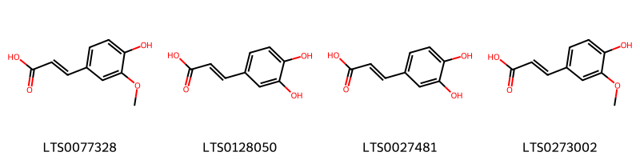{ width=100% }
    <figcaption>Hình ảnh cấu trúc hóa học của 4 hoạt chất thuộc nhóm Cinnamic acids and derivatives gồm ['ferulic acid (LTS0077328)', '3,4-dihydroxycinnamic acid (LTS0128050)', 'caffeic acid (LTS0027481)', 'ferulic acid (LTS0273002)'].</figcaption>
</figure>
#### Nhóm Dibenzylbutane lignans
<figure markdown="span">
    { width=100% }
    <figcaption>Hình ảnh cấu trúc hóa học của 2 hoạt chất thuộc nhóm Dibenzylbutane lignans gồm ['(2r,3s)-2,3-bis[(4-hydroxy-3-methoxyphenyl)methyl]butane-1,4-diol (LTS0201516)', 'secoisolariciresinol (LTS0111810)'].</figcaption>
</figure>
#### Nhóm Fatty Acyls
<figure markdown="span">
    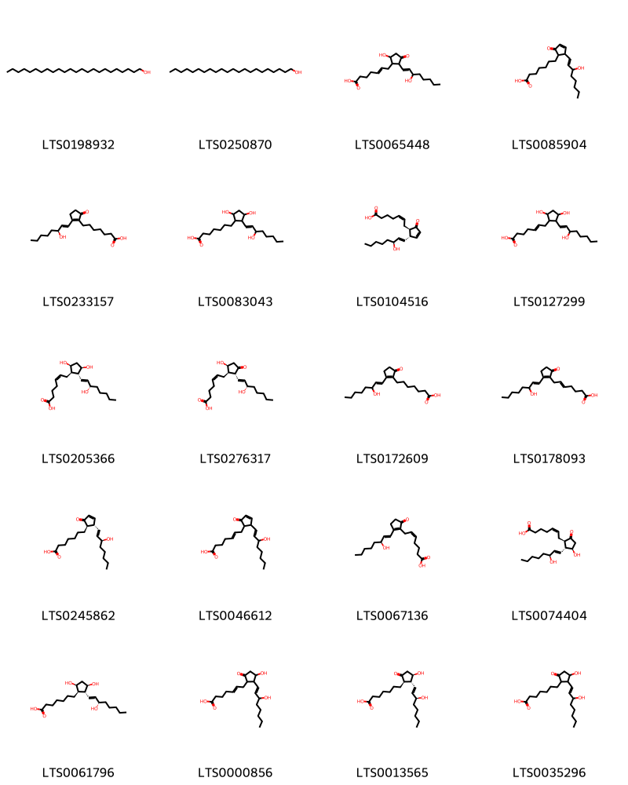{ width=100% }
    <figcaption>Hình ảnh cấu trúc hóa học của 20 hoạt chất thuộc nhóm Fatty Acyls gồm ['1-tetracosanol (LTS0198932)', 'docosanol (LTS0250870)', '7-[5-hydroxy-2-(3-hydroxyoct-1-en-1-yl)-3-oxocyclopentyl]hept-5-enoic acid (LTS0065448)', '7-[2-(3-hydroxyoct-1-en-1-yl)-5-oxocyclopent-3-en-1-yl]heptanoic acid (LTS0085904)', 'prostaglandin-b1 (LTS0233157)', '7-[3,5-dihydroxy-2-(3-hydroxyoct-1-en-1-yl)cyclopentyl]heptanoic acid (LTS0083043)', 'prostaglandin a2 (LTS0104516)', '7-[3,5-dihydroxy-2-(3-hydroxyoct-1-en-1-yl)cyclopentyl]hept-5-enoic acid (LTS0127299)', 'glandin (LTS0205366)', 'prostaglandin d2 (LTS0276317)', '7-[2-(3-hydroxyoct-1-en-1-yl)-5-oxocyclopent-1-en-1-yl]heptanoic acid (LTS0172609)', '7-[2-(3-hydroxyoct-1-en-1-yl)-5-oxocyclopent-1-en-1-yl]hept-5-enoic acid (LTS0178093)', 'prostaglandin a1 (LTS0245862)', '7-[2-(3-hydroxyoct-1-en-1-yl)-5-oxocyclopent-3-en-1-yl]hept-5-enoic acid (LTS0046612)', 'prostaglandin b2 (LTS0067136)', 'dinoprostone (LTS0074404)', 'prostaglandin f1α (LTS0061796)', 'prostaglandin e2 (LTS0000856)', 'alprostadil (LTS0013565)', 'prostaglandin e1 (LTS0035296)'].</figcaption>
</figure>
#### Nhóm Flavonoids
<figure markdown="span">
    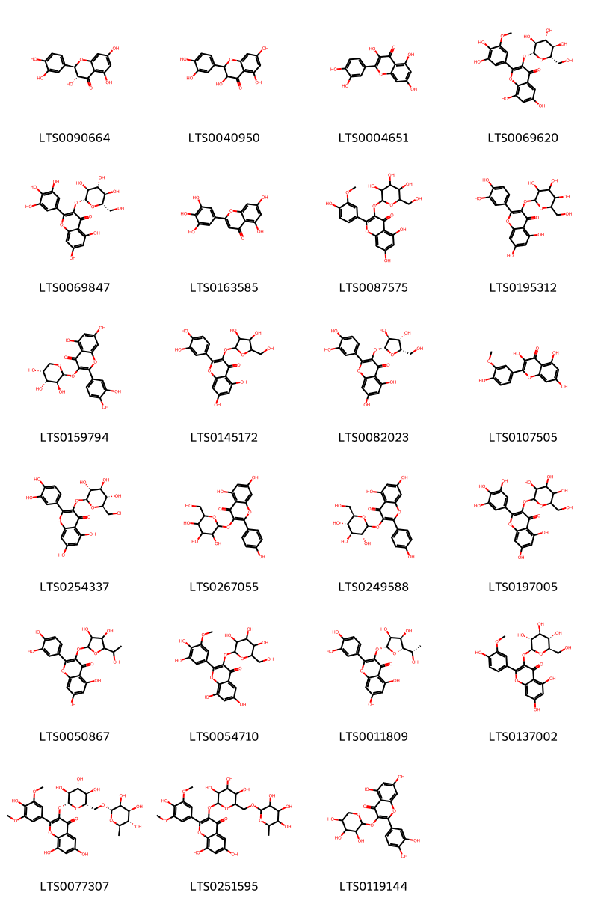{ width=100% }
    <figcaption>Hình ảnh cấu trúc hóa học của 23 hoạt chất thuộc nhóm Flavonoids gồm ['(+)-taxifolin (LTS0090664)', '2,3-dihydroquercetin (LTS0040950)', 'quercetin (LTS0004651)', '2-(3,4-dihydroxy-5-methoxyphenyl)-6,8-dihydroxy-3-{[(2r,3s,4r,5r,6s)-3,4,5-trihydroxy-6-(hydroxymethyl)oxan-2-yl]oxy}chromen-4-one (LTS0069620)', '5,7-dihydroxy-3-{[(2r,3s,4r,5r,6s)-3,4,5-trihydroxy-6-(hydroxymethyl)oxan-2-yl]oxy}-2-(3,4,5-trihydroxyphenyl)chromen-4-one (LTS0069847)', 'tricetin (LTS0163585)', 'isorhamnetin 3-galactoside (LTS0087575)', '2-(3,4-dihydroxyphenyl)-5,7-dihydroxy-3-{[3,4,5-trihydroxy-6-(hydroxymethyl)oxan-2-yl]oxy}chromen-4-one (LTS0195312)', '2-(3,4-dihydroxyphenyl)-5,7-dihydroxy-3-{[(2s,3s,4r,5r)-3,4,5-trihydroxyoxan-2-yl]oxy}chromen-4-one (LTS0159794)', '3-{[3,4-dihydroxy-5-(hydroxymethyl)oxolan-2-yl]oxy}-2-(3,4-dihydroxyphenyl)-5,7-dihydroxychromen-4-one (LTS0145172)', '3-{[(2r,3s,4s,5s)-3,4-dihydroxy-5-(hydroxymethyl)oxolan-2-yl]oxy}-2-(3,4-dihydroxyphenyl)-5,7-dihydroxychromen-4-one (LTS0082023)', 'isorhamnetin (LTS0107505)', 'isoquercetin (LTS0254337)', 'trifolin (LTS0267055)', 'astragalin (LTS0249588)', '5,7-dihydroxy-3-{[3,4,5-trihydroxy-6-(hydroxymethyl)oxan-2-yl]oxy}-2-(3,4,5-trihydroxyphenyl)chromen-4-one (LTS0197005)', '3-{[3,4-dihydroxy-5-(1-hydroxyethyl)oxolan-2-yl]oxy}-2-(3,4-dihydroxyphenyl)-5,7-dihydroxychromen-4-one (LTS0050867)', '2-(3,4-dihydroxy-5-methoxyphenyl)-6,8-dihydroxy-3-{[3,4,5-trihydroxy-6-(hydroxymethyl)oxan-2-yl]oxy}chromen-4-one (LTS0054710)', '3-{[(2r,3s,4r,5s)-3,4-dihydroxy-5-[(1s)-1-hydroxyethyl]oxolan-2-yl]oxy}-2-(3,4-dihydroxyphenyl)-5,7-dihydroxychromen-4-one (LTS0011809)', 'isorhamnetin 3-o-glucoside (LTS0137002)', '6,8-dihydroxy-2-(4-hydroxy-3,5-dimethoxyphenyl)-3-{[(2r,3s,4r,5r,6s)-3,4,5-trihydroxy-6-({[(2s,3s,4s,5s,6r)-3,4,5-trihydroxy-6-methyloxan-2-yl]oxy}methyl)oxan-2-yl]oxy}chromen-4-one (LTS0077307)', '6,8-dihydroxy-2-(4-hydroxy-3,5-dimethoxyphenyl)-3-[(3,4,5-trihydroxy-6-{[(3,4,5-trihydroxy-6-methyloxan-2-yl)oxy]methyl}oxan-2-yl)oxy]chromen-4-one (LTS0251595)', 'guaijaverin (LTS0119144)'].</figcaption>
</figure>
#### Nhóm Furanoid lignans
<figure markdown="span">
    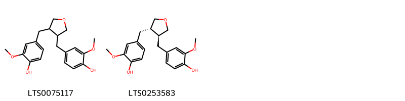{ width=100% }
    <figcaption>Hình ảnh cấu trúc hóa học của 2 hoạt chất thuộc nhóm Furanoid lignans gồm ['3,4-divanillyltetrahydrofuran (LTS0075117)', '4-{[(3s,4s)-4-[(4-hydroxy-3-methoxyphenyl)methyl]oxolan-3-yl]methyl}-2-methoxyphenol (LTS0253583)'].</figcaption>
</figure>
#### Nhóm Heteroaromatic compounds
<figure markdown="span">
    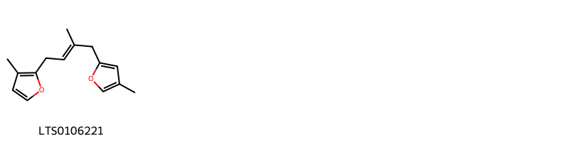{ width=100% }
    <figcaption>Hình ảnh cấu trúc hóa học của 1 hoạt chất thuộc nhóm Heteroaromatic compounds gồm ['3-methyl-2-[(2e)-3-methyl-4-(4-methylfuran-2-yl)but-2-en-1-yl]furan (LTS0106221)'].</figcaption>
</figure>
#### Nhóm Prenol lipids
<figure markdown="span">
    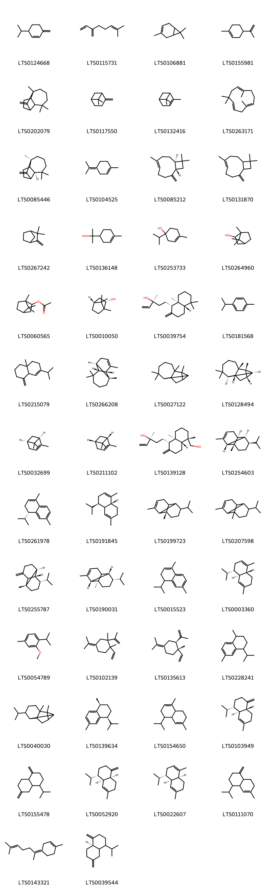{ width=100% }
    <figcaption>Hình ảnh cấu trúc hóa học của 76 hoạt chất thuộc nhóm Prenol lipids gồm ['β phellandrene (LTS0124668)', 'α-myrcene (LTS0115731)', 'monoterpenes (LTS0106881)', 'limonene,  (LTS0155981)', 'longifolene (LTS0202079)', 'β-pinene (LTS0117550)', 'α pinene (LTS0132416)', 'humulene (LTS0263171)', '(2s,7s)-3,3,7-trimethyl-8-methylidenetricyclo[5.4.0.0²,⁹]undecane (LTS0085446)', 'terpinolene (LTS0104525)', 'caryophyllene (LTS0085212)', 'caryophyllene (LTS0131870)', 'camphene (LTS0267242)', 'terpineol (LTS0136148)', '4-terpineol (LTS0253733)', 'borneol (LTS0264960)', 'bornyl acetate (LTS0060565)', '(2s,4r)-1,7,7-trimethylbicyclo[2.2.1]heptan-2-ol (LTS0010050)', '13-epi-manool (LTS0039754)', 'cymene (LTS0181568)', 'sibirene (LTS0215079)', '(1r,2r,7r,8r)-2,6,6,9-tetramethyltricyclo[5.4.0.0²,⁸]undec-9-ene (LTS0266208)', '2,6,6,9-tetramethyltetracyclo[5.4.0.0²,⁹.0⁸,¹⁰]undecane (LTS0027122)', '(1r,2s,7s,8s,9s,10s)-2,6,6,9-tetramethyltetracyclo[5.4.0.0²,⁹.0⁸,¹⁰]undecane (LTS0128494)', '(-)-α-pinene (LTS0032699)', '(+)-α-pinene (LTS0211102)', '(3s)-5-[(1s,4ar,5s,8ar)-5-(hydroxymethyl)-5,8a-dimethyl-2-methylidene-hexahydro-1h-naphthalen-1-yl]-3-methylpent-1-en-3-ol (LTS0139128)', 'α-ylangene (LTS0254603)', '(4s)-4-isopropyl-1,6-dimethyl-3,4-dihydronaphthalene (LTS0261978)', '(4r,8ar)-4-isopropyl-1,6-dimethyl-3,4,4a,7,8,8a-hexahydronaphthalene (LTS0191845)', '(1s)-8-isopropyl-1,3-dimethyltricyclo[4.4.0.0²,⁷]dec-3-ene (LTS0199723)', 'α-copaene (LTS0207598)', 'β-copaene (LTS0255787)', '(1r,2s,7s,8s)-8-isopropyl-1,3-dimethyltricyclo[4.4.0.0²,⁷]dec-3-ene (LTS0190031)', '3,4-dihydrocadalene (LTS0015523)', 'cadinene (LTS0003360)', '2-isopropyl-5-methylanisole (LTS0054789)', '1-ethenyl-1,2-dimethyl-2-(prop-1-en-2-yl)-4-(propan-2-ylidene)cyclohexane (LTS0102139)', '(1s,2s)-1-ethenyl-1-methyl-2-(prop-1-en-2-yl)-4-(propan-2-ylidene)cyclohexane (LTS0135613)', '(e)-calamene (LTS0228241)', '8-isopropyl-1,2-dimethyltetracyclo[4.4.0.0²,⁴.0³,⁷]decane (LTS0040030)', '(1s,4s)-4-isopropyl-1,6-dimethyl-1,2,3,4-tetrahydronaphthalene (LTS0139634)', '4-isopropyl-1,6-dimethyl-3,4,4a,7,8,8a-hexahydronaphthalene (LTS0154650)', '(+)-gamma-cadinene (LTS0103949)', '4-isopropyl-1,6-dimethylidene-octahydronaphthalene (LTS0155478)', 'gamma-muurolene (LTS0052920)', 'α-muurolene (LTS0022607)', '4-isopropyl-6-methyl-1-methylidene-3,4,4a,7,8,8a-hexahydro-2h-naphthalene (LTS0111070)', '(z)-γ-bisabolene (LTS0143321)', '(8ar)-4-isopropyl-1,6-dimethylidene-octahydronaphthalene (LTS0039544)', 'β-cadinene (LTS0049088)', '(4s,4as,8ar)-4-isopropyl-1,6-dimethylidene-octahydronaphthalene (LTS0046258)', '(1s,2r,4r,6s)-1,7,7-trimethyltricyclo[2.2.1.0²,⁶]heptane (LTS0080510)', '(+)-β-phellandrene (LTS0108574)', 'tricyclene (LTS0179930)', 'α-limonene (LTS0244943)', 'terpinene (LTS0136858)', '(1s,6r,8s)-8-isopropyl-1,3-dimethyltricyclo[4.4.0.0²,⁷]dec-3-ene (LTS0216620)', '4-ethenyl-1-isopropyl-4-methyl-3-(prop-1-en-2-yl)cyclohex-1-ene (LTS0080134)', '2,2,7,7-tetramethyltricyclo[6.2.1.0¹,⁶]undec-5-ene (LTS0100638)', '(-)-camphene (LTS0067556)', '(+)-borneol (LTS0189059)', 'camphor (LTS0091905)', '(1r,4ar,8as)-4-isopropyl-1,6-dimethyl-3,4,4a,7,8,8a-hexahydro-2h-naphthalen-1-ol (LTS0136437)', 'methyl abietate (LTS0130338)', '(1s,2s,7r,9r)-3,3,7-trimethyl-8-methylidenetricyclo[5.4.0.0²,⁹]undecane (LTS0206196)', '(4e,8e)-β-humulene (LTS0193661)', 'elemene (LTS0090837)', 'phellandrene (LTS0157173)', '(-)-β-pinene (LTS0108757)', '(+)-delta(3)-carene (LTS0250199)', '(1r,8s)-2,2,7,7-tetramethyltricyclo[6.2.1.0¹,⁶]undec-5-ene (LTS0255772)', '(4s,4ar,8as)-4-isopropyl-1,6-dimethylidene-octahydronaphthalene (LTS0223331)', '(1s,2r)-8-isopropyl-1,3-dimethyltricyclo[4.4.0.0²,⁷]dec-3-ene (LTS0167051)', 'delta-cadinol (LTS0008282)', 'β-humulene (LTS0207418)'].</figcaption>
</figure>
#### Nhóm Saturated hydrocarbons
<figure markdown="span">
    { width=100% }
    <figcaption>Hình ảnh cấu trúc hóa học của 1 hoạt chất thuộc nhóm Saturated hydrocarbons gồm ['3,3-dimethylpentane (LTS0047677)'].</figcaption>
</figure>
#### Nhóm Steroids and steroid derivatives
<figure markdown="span">
    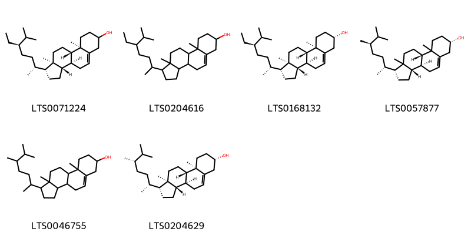{ width=100% }
    <figcaption>Hình ảnh cấu trúc hóa học của 6 hoạt chất thuộc nhóm Steroids and steroid derivatives gồm ['stigmast-5-en-3-ol (LTS0071224)', 'stigmast-5-en-3-ol, (3β)- (LTS0204616)', 'sitosterol (LTS0168132)', '(1r,3as,3bs,7s,9bs)-1-[(2r,5r)-5,6-dimethylheptan-2-yl]-9a,11a-dimethyl-1h,2h,3h,3ah,3bh,4h,6h,7h,8h,9h,9bh,10h,11h-cyclopenta[a]phenanthren-7-ol (LTS0057877)', 'campesterol (LTS0046755)', '22,23-dihydrobrassicasterol (LTS0204629)'].</figcaption>
</figure>
#### Nhóm Unsaturated hydrocarbons
<figure markdown="span">
    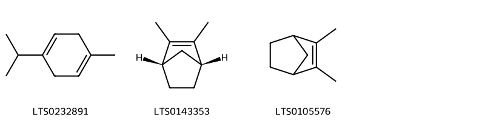{ width=100% }
    <figcaption>Hình ảnh cấu trúc hóa học của 3 hoạt chất thuộc nhóm Unsaturated hydrocarbons gồm ['α terpinene (LTS0232891)', '(1r,4s)-2,3-dimethylbicyclo[2.2.1]hept-2-ene (LTS0143353)', '2,3-dimethylbicyclo[2.2.1]hept-2-ene (LTS0105576)'].</figcaption>
</figure>

---

### Dược dân tộc học

Danh sách các quốc gia có sử dụng *Larix sibirica* trong điều trị các bệnh. 

| Country   | Disease                                                              | Bệnh                                                                               |
|:----------|:---------------------------------------------------------------------|:-----------------------------------------------------------------------------------|
| Turkey    | Antiseptic, Expectorant, Rubefacient, Stimulant, Vulnerary, Diuretic | Khử trùng, Thuốc long đờm, Rubefacient, Chất kích thích, Vulnerary, Thuốc lợi tiểu |

---

# Chi Pseudotsuga

??? note "Danh sách các dược liệu thuộc chi"
    
	 - *Pseudotsuga menziesii*

---
## Pseudotsuga menziesii
### Thông tin về thực vật

!!! info "Phân loại thực vật của *Pseudotsuga menziesii* từ GIBF:"
    - **Kingdom:** Plantae
    - **Phylum:** Tracheophyta
    - **Order:** Pinales
    - **Family:** Pinaceae
    - **Genus:** Pseudotsuga
    - **Species:** *Pseudotsuga menziesii*

 

| Label (VI)   | Label (EN)   | Scientific Name       | Descriptions (VI)   | Descriptions (EN)         | Also Known As (VI)        | Also Known As (EN)                                                                                                |
|:-------------|:-------------|:----------------------|:--------------------|:--------------------------|:--------------------------|:------------------------------------------------------------------------------------------------------------------|
| N/A          | N/A          | Pseudotsuga menziesii |                     | evergreen conifer species | ['Pseudotsuga menziesii'] | ['Pseudotsuga taxifolia', 'Douglas-fir', 'Pseudotsuga douglasii', 'Columbian pine', 'Douglas fir', 'Oregon pine'] |

#### Phân bố trên thế giới

**Từ CSDL GIBF** United States of America, United Kingdom of Great Britain and Northern Ireland, Netherlands, New Zealand, Canada, Germany, France, Poland

#### Phân bố tại Việt Nam

**Từ CSDL GIBF**: Không có ghi nhận ở Việt Nam

---
### Thành phần hóa học
        
- Theo cơ sở dữ liệu lotus: Từ loài *Pseudotsuga menziesii* đã phân lập và xác định được 105 hoạt chất thuộc về các nhóm Fatty Acyls, Flavonoids, Purine nucleosides, Carboxylic acids and derivatives, Imidazopyrimidines, Organooxygen compounds, Furanoid lignans, Prenol lipids, 2-arylbenzofuran flavonoids. 

|    | chemicalTaxonomyClassyfireClass   |   smiles_count |
|---:|:----------------------------------|---------------:|
|  0 | 2-arylbenzofuran flavonoids       |              8 |
|  1 | Carboxylic acids and derivatives  |             23 |
|  2 | Fatty Acyls                       |              2 |
|  3 | Flavonoids                        |             31 |
|  4 | Furanoid lignans                  |              4 |
|  5 | Imidazopyrimidines                |              1 |
|  6 | Organooxygen compounds            |              2 |
|  7 | Prenol lipids                     |             33 |
|  8 | Purine nucleosides                |              1 |

#### Nhóm 2-arylbenzofuran flavonoids
<figure markdown="span">
    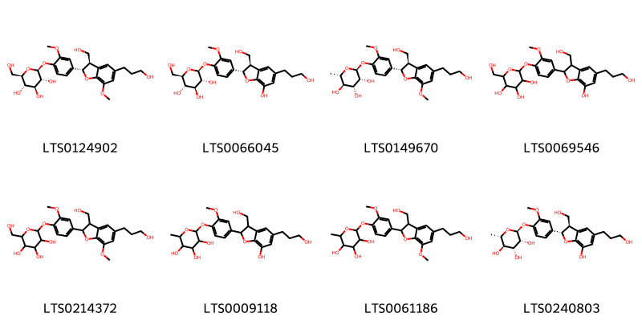{ width=100% }
    <figcaption>Hình ảnh cấu trúc hóa học của 8 hoạt chất thuộc nhóm 2-arylbenzofuran flavonoids gồm ['(2r,3s,4s,5r,6s)-2-(hydroxymethyl)-6-{4-[(2s,3r)-3-(hydroxymethyl)-5-(3-hydroxypropyl)-7-methoxy-2,3-dihydro-1-benzofuran-2-yl]-2-methoxyphenoxy}oxane-3,4,5-triol (LTS0124902)', '(2s,3r,4s,5s,6r)-2-{4-[(2s,3r)-7-hydroxy-3-(hydroxymethyl)-5-(3-hydroxypropyl)-2,3-dihydro-1-benzofuran-2-yl]-2-methoxyphenoxy}-6-(hydroxymethyl)oxane-3,4,5-triol (LTS0066045)', '(2s,3r,4r,5r,6s)-2-{4-[(2s,3r)-3-(hydroxymethyl)-5-(3-hydroxypropyl)-7-methoxy-2,3-dihydro-1-benzofuran-2-yl]-2-methoxyphenoxy}-6-methyloxane-3,4,5-triol (LTS0149670)', '2-{4-[7-hydroxy-3-(hydroxymethyl)-5-(3-hydroxypropyl)-2,3-dihydro-1-benzofuran-2-yl]-2-methoxyphenoxy}-6-(hydroxymethyl)oxane-3,4,5-triol (LTS0069546)', '2-(hydroxymethyl)-6-{4-[3-(hydroxymethyl)-5-(3-hydroxypropyl)-7-methoxy-2,3-dihydro-1-benzofuran-2-yl]-2-methoxyphenoxy}oxane-3,4,5-triol (LTS0214372)', '2-{4-[7-hydroxy-3-(hydroxymethyl)-5-(3-hydroxypropyl)-2,3-dihydro-1-benzofuran-2-yl]-2-methoxyphenoxy}-6-methyloxane-3,4,5-triol (LTS0009118)', '2-{4-[3-(hydroxymethyl)-5-(3-hydroxypropyl)-7-methoxy-2,3-dihydro-1-benzofuran-2-yl]-2-methoxyphenoxy}-6-methyloxane-3,4,5-triol (LTS0061186)', '(2s,3r,4r,5r,6s)-2-{4-[(2s,3r)-7-hydroxy-3-(hydroxymethyl)-5-(3-hydroxypropyl)-2,3-dihydro-1-benzofuran-2-yl]-2-methoxyphenoxy}-6-methyloxane-3,4,5-triol (LTS0240803)'].</figcaption>
</figure>
#### Nhóm Carboxylic acids and derivatives
<figure markdown="span">
    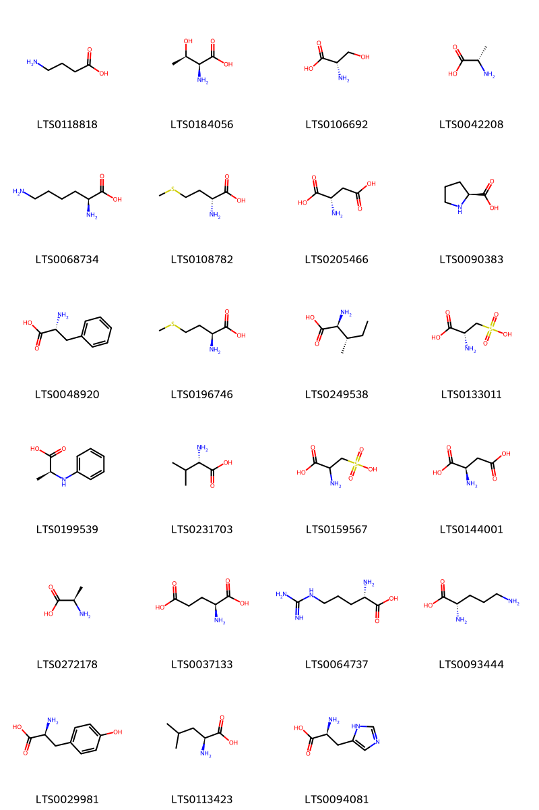{ width=100% }
    <figcaption>Hình ảnh cấu trúc hóa học của 23 hoạt chất thuộc nhóm Carboxylic acids and derivatives gồm ['gamma(amino)-butyric acid (LTS0118818)', 'l-threonine (LTS0184056)', 'l-serine (LTS0106692)', 'l-alanine (LTS0042208)', 'l-lysine (LTS0068734)', 'd-methionine (LTS0108782)', 'l-aspartic acid (LTS0205466)', 'l-proline (LTS0090383)', 'd-phenylalanine (LTS0048920)', 'l-methionine (LTS0196746)', 'l-isoleucine (LTS0249538)', 'cysteinesulfonic acid (LTS0133011)', '(2s)-2-(phenylamino)propanoic acid (LTS0199539)', 'l-valine (LTS0231703)', 'cysteic acid (LTS0159567)', 'd-aspartic acid (LTS0144001)', 'd-alanine (LTS0272178)', 'l-glutamic acid (LTS0037133)', 'l-arginine (LTS0064737)', 'l-ornithine (LTS0093444)', 'l-tyrosine (LTS0029981)', 'l-leucine (LTS0113423)', 'l-histidine (LTS0094081)'].</figcaption>
</figure>
#### Nhóm Fatty Acyls
<figure markdown="span">
    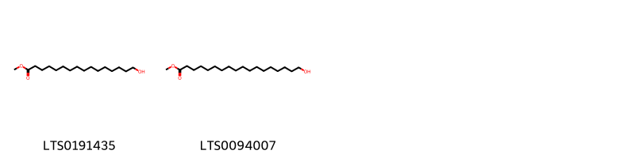{ width=100% }
    <figcaption>Hình ảnh cấu trúc hóa học của 2 hoạt chất thuộc nhóm Fatty Acyls gồm ['methyl 16-hydroxyhexadecanoate (LTS0191435)', 'methyl 18-hydroxyoctadecanoate (LTS0094007)'].</figcaption>
</figure>
#### Nhóm Flavonoids
<figure markdown="span">
    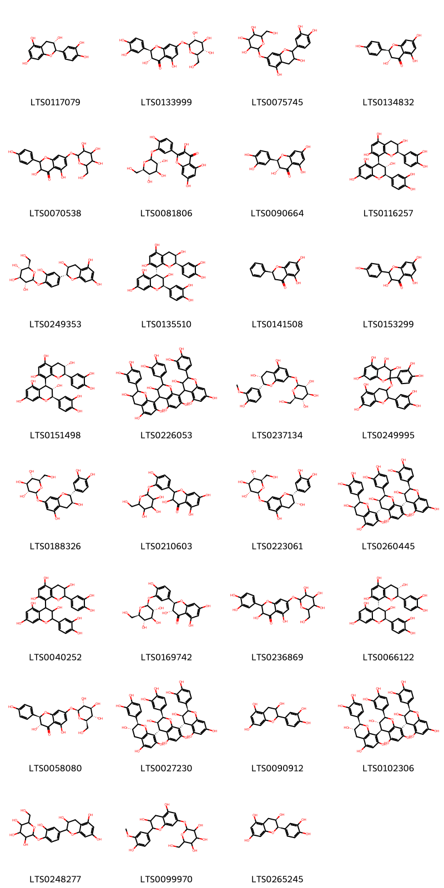{ width=100% }
    <figcaption>Hình ảnh cấu trúc hóa học của 31 hoạt chất thuộc nhóm Flavonoids gồm ['(+)-catechol (LTS0117079)', 'taxifolin 7-glucoside (LTS0133999)', '2-{[2-(3,4-dihydroxyphenyl)-3,5-dihydroxy-3,4-dihydro-2h-1-benzopyran-7-yl]oxy}-6-(hydroxymethyl)oxane-3,4,5-triol (LTS0075745)', '(+)-dihydrokaempferol (LTS0134832)', '3,5-dihydroxy-2-(4-hydroxyphenyl)-7-{[3,4,5-trihydroxy-6-(hydroxymethyl)oxan-2-yl]oxy}-2,3-dihydro-1-benzopyran-4-one (LTS0070538)', '3,5,7-trihydroxy-2-(4-hydroxy-3-{[(3r,4s,5s,6r)-3,4,5-trihydroxy-6-(hydroxymethyl)oxan-2-yl]oxy}phenyl)chromen-4-one (LTS0081806)', '(+)-taxifolin (LTS0090664)', '(2r,3s,4s)-2-(3,4-dihydroxyphenyl)-4-[(2r,3r)-2-(3,4-dihydroxyphenyl)-3,5,7-trihydroxy-3,4-dihydro-2h-1-benzopyran-8-yl]-3,4-dihydro-2h-1-benzopyran-3,5,7-triol (LTS0116257)', '(2r,3s)-2-(3-hydroxy-4-{[(2s,3r,4s,5s,6r)-3,4,5-trihydroxy-6-(hydroxymethyl)oxan-2-yl]oxy}phenyl)-3,4-dihydro-2h-1-benzopyran-3,5,7-triol (LTS0249353)', '(2r,3r,4r)-2-(3,4-dihydroxyphenyl)-4-[(2r,3r)-2-(3,4-dihydroxyphenyl)-3,5,7-trihydroxy-3,4-dihydro-2h-1-benzopyran-8-yl]-3,4-dihydro-2h-1-benzopyran-3,5,7-triol (LTS0135510)', 'pinocembrine (LTS0141508)', 'aromadendrin (LTS0153299)', '(2r,3s,4s)-2-(3,4-dihydroxyphenyl)-4-[(2r,3s)-2-(3,4-dihydroxyphenyl)-3,5,7-trihydroxy-3,4-dihydro-2h-1-benzopyran-8-yl]-3,4-dihydro-2h-1-benzopyran-3,5,7-triol (LTS0151498)', 'procyanidin c2 (LTS0226053)', '(2s,3r,4s,5s,6r)-2-{[(2r,3r)-3,5-dihydroxy-2-(4-hydroxy-3-methoxyphenyl)-3,4-dihydro-2h-1-benzopyran-7-yl]oxy}-6-(hydroxymethyl)oxane-3,4,5-triol (LTS0237134)', '2-(3,4-dihydroxyphenyl)-2-{[2-(3,4-dihydroxyphenyl)-5,7-dihydroxy-3,4-dihydro-2h-1-benzopyran-3-yl]oxy}-3,4-dihydro-1-benzopyran-3,4,5,7-tetrol (LTS0249995)', 'catechin-7-o-glucoside (LTS0188326)', '3,5,7-trihydroxy-2-(4-hydroxy-3-{[3,4,5-trihydroxy-6-(hydroxymethyl)oxan-2-yl]oxy}phenyl)-2,3-dihydro-1-benzopyran-4-one (LTS0210603)', '(2s,3r,4s,5s,6r)-2-{[(2r,3r)-2-(3,4-dihydroxyphenyl)-3,5-dihydroxy-3,4-dihydro-2h-1-benzopyran-7-yl]oxy}-6-(hydroxymethyl)oxane-3,4,5-triol (LTS0223061)', 'procyanidin c1 (LTS0260445)', '2-(3,4-dihydroxyphenyl)-4-[2-(3,4-dihydroxyphenyl)-3,5,7-trihydroxy-3,4-dihydro-2h-1-benzopyran-8-yl]-3,4-dihydro-2h-1-benzopyran-3,5,7-triol (LTS0040252)', "taxifolin 3'-glucoside (LTS0169742)", '2-(3,4-dihydroxyphenyl)-3,5-dihydroxy-7-{[3,4,5-trihydroxy-6-(hydroxymethyl)oxan-2-yl]oxy}-2,3-dihydro-1-benzopyran-4-one (LTS0236869)', '(2r,3r,4r)-2-(3,4-dihydroxyphenyl)-4-[(2r,3s)-2-(3,4-dihydroxyphenyl)-3,5,7-trihydroxy-3,4-dihydro-2h-1-benzopyran-8-yl]-3,4-dihydro-2h-1-benzopyran-3,5,7-triol (LTS0066122)', '(2r,3r)-3,5-dihydroxy-2-(4-hydroxyphenyl)-7-{[(2s,3r,4s,5s,6r)-3,4,5-trihydroxy-6-(hydroxymethyl)oxan-2-yl]oxy}-2,3-dihydro-1-benzopyran-4-one (LTS0058080)', '(2r,3r,4s)-2-(3,4-dihydroxyphenyl)-8-[(2r,3r,4r)-2-(3,4-dihydroxyphenyl)-3,5,7-trihydroxy-3,4-dihydro-2h-1-benzopyran-4-yl]-4-[(2r,3s)-2-(3,4-dihydroxyphenyl)-3,5,7-trihydroxy-3,4-dihydro-2h-1-benzopyran-8-yl]-3,4-dihydro-2h-1-benzopyran-3,5,7-triol (LTS0027230)', 'catechol (LTS0090912)', '(2r,3s,4r)-2-(3,4-dihydroxyphenyl)-8-[(2r,3r,4r)-2-(3,4-dihydroxyphenyl)-3,5,7-trihydroxy-3,4-dihydro-2h-1-benzopyran-4-yl]-4-[(2r,3s)-2-(3,4-dihydroxyphenyl)-3,5,7-trihydroxy-3,4-dihydro-2h-1-benzopyran-8-yl]-3,4-dihydro-2h-1-benzopyran-3,5,7-triol (LTS0102306)', '2-(3-hydroxy-4-{[3,4,5-trihydroxy-6-(hydroxymethyl)oxan-2-yl]oxy}phenyl)-3,4-dihydro-2h-1-benzopyran-3,5,7-triol (LTS0248277)', '2-{[3,5-dihydroxy-2-(4-hydroxy-3-methoxyphenyl)-3,4-dihydro-2h-1-benzopyran-7-yl]oxy}-6-(hydroxymethyl)oxane-3,4,5-triol (LTS0099970)', 'ent-epicatechin (LTS0265245)'].</figcaption>
</figure>
#### Nhóm Furanoid lignans
<figure markdown="span">
    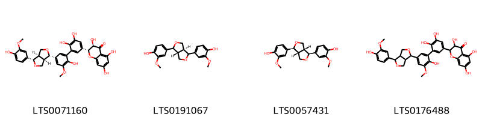{ width=100% }
    <figcaption>Hình ảnh cấu trúc hóa học của 4 hoạt chất thuộc nhóm Furanoid lignans gồm ["(2r,3r)-2-{5'-[(1s,3ar,4s,6ar)-4-(4-hydroxy-3-methoxyphenyl)-hexahydrofuro[3,4-c]furan-1-yl]-2',5,6-trihydroxy-3'-methoxy-[1,1'-biphenyl]-3-yl}-3,5,7-trihydroxy-2,3-dihydro-1-benzopyran-4-one (LTS0071160)", '4-[(3ar,6as)-4-(4-hydroxy-3-methoxyphenyl)-hexahydrofuro[3,4-c]furan-1-yl]-2-methoxyphenol (LTS0191067)', 'pinoresinol (LTS0057431)', "3,5,7-trihydroxy-2-{2',5,6-trihydroxy-5'-[4-(4-hydroxy-3-methoxyphenyl)-hexahydrofuro[3,4-c]furan-1-yl]-3'-methoxy-[1,1'-biphenyl]-3-yl}-2,3-dihydro-1-benzopyran-4-one (LTS0176488)"].</figcaption>
</figure>
#### Nhóm Imidazopyrimidines
<figure markdown="span">
    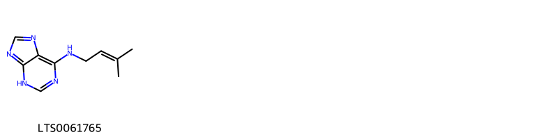{ width=100% }
    <figcaption>Hình ảnh cấu trúc hóa học của 1 hoạt chất thuộc nhóm Imidazopyrimidines gồm ['2ip (LTS0061765)'].</figcaption>
</figure>
#### Nhóm Organooxygen compounds
<figure markdown="span">
    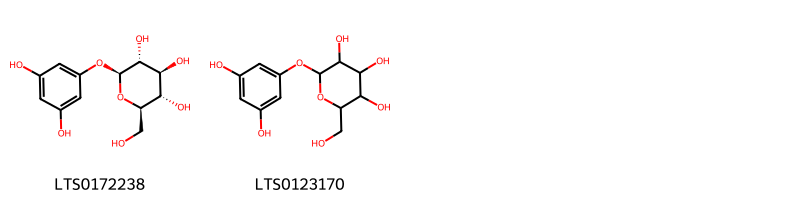{ width=100% }
    <figcaption>Hình ảnh cấu trúc hóa học của 2 hoạt chất thuộc nhóm Organooxygen compounds gồm ['(2s,3r,4s,5s,6r)-2-(3,5-dihydroxyphenoxy)-6-(hydroxymethyl)oxane-3,4,5-triol (LTS0172238)', '2-(3,5-dihydroxyphenoxy)-6-(hydroxymethyl)oxane-3,4,5-triol (LTS0123170)'].</figcaption>
</figure>
#### Nhóm Prenol lipids
<figure markdown="span">
    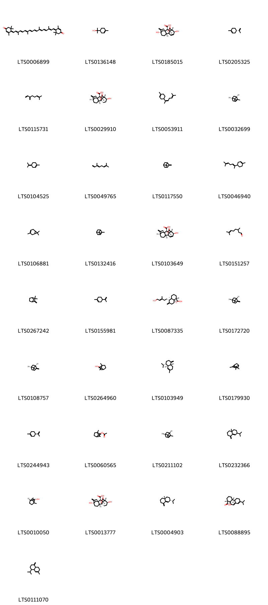{ width=100% }
    <figcaption>Hình ảnh cấu trúc hóa học của 33 hoạt chất thuộc nhóm Prenol lipids gồm ['rhodoxanthin (LTS0006899)', 'terpineol (LTS0136148)', 'gibberellin a3 (LTS0185015)', '(-)-limonene (LTS0205325)', 'α-myrcene (LTS0115731)', 'gibberellin a4 (LTS0029910)', '(z)-α-bisabolene (LTS0053911)', '(-)-α-pinene (LTS0032699)', 'terpinolene (LTS0104525)', 'trans-β-ocimene (LTS0049765)', 'β-pinene (LTS0117550)', '(e)-α-bisabolene (LTS0046940)', 'monoterpenes (LTS0106881)', 'α pinene (LTS0132416)', 'gibberellin a7 (LTS0103649)', 'citronella (LTS0151257)', 'camphene (LTS0267242)', 'limonene,  (LTS0155981)', 'isocupressic acid (LTS0087335)', '(+)-β-pinene (LTS0172720)', '(-)-β-pinene (LTS0108757)', 'borneol (LTS0264960)', '(+)-gamma-cadinene (LTS0103949)', 'tricyclene (LTS0179930)', 'α-limonene (LTS0244943)', 'bornyl acetate (LTS0060565)', '(+)-α-pinene (LTS0211102)', '7-isopropyl-4a-methyl-1-methylidene-2,3,4,5,6,7-hexahydronaphthalene (LTS0232366)', '(2s,4r)-1,7,7-trimethylbicyclo[2.2.1]heptan-2-ol (LTS0010050)', 'gibberellin a1 (LTS0013777)', '(4ar,7r)-7-isopropyl-4a-methyl-1-methylidene-2,3,4,5,6,7-hexahydronaphthalene (LTS0004903)', 'abietic acid (LTS0088895)', '4-isopropyl-6-methyl-1-methylidene-3,4,4a,7,8,8a-hexahydro-2h-naphthalene (LTS0111070)'].</figcaption>
</figure>
#### Nhóm Purine nucleosides
<figure markdown="span">
    { width=100% }
    <figcaption>Hình ảnh cấu trúc hóa học của 1 hoạt chất thuộc nhóm Purine nucleosides gồm ['zeatin riboside (LTS0254495)'].</figcaption>
</figure>

---

### Dược dân tộc học

Danh sách các quốc gia có sử dụng *Pseudotsuga menziesii* trong điều trị các bệnh. 

| Country   | Disease          | Bệnh               |
|:----------|:-----------------|:-------------------|
| Elsewhere | nan, Insecticide | nan, Thuốc trừ sâu |

---

# Chi Picea

??? note "Danh sách các dược liệu thuộc chi"
    
	 - *Picea abies*
	 - *Picea mariana*

---
## Picea abies
### Thông tin về thực vật

!!! info "Phân loại thực vật của *Picea abies* từ GIBF:"
    - **Kingdom:** Plantae
    - **Phylum:** Tracheophyta
    - **Order:** Pinales
    - **Family:** Pinaceae
    - **Genus:** Picea
    - **Species:** *Picea abies*

 

| Label (VI)   | Label (EN)   | Scientific Name   | Descriptions (VI)   | Descriptions (EN)   | Also Known As (VI)   | Also Known As (EN)   |
|:-------------|:-------------|:------------------|:--------------------|:--------------------|:---------------------|:---------------------|
| N/A          | N/A          | Picea abies       | loài thực vật       | species of plant    | ['']                 | ['Norway spruce']    |

#### Phân bố trên thế giới

**Từ CSDL GIBF** Sweden, Finland, Netherlands, Poland, Denmark, United States of America, Greece, Russian Federation, Lithuania, United Kingdom of Great Britain and Northern Ireland, Belgium, Luxembourg, Canada, Germany, Austria, Hungary, Ukraine, Italy, Switzerland, France

#### Phân bố tại Việt Nam

**Từ CSDL GIBF**: Không có ghi nhận ở Việt Nam

---
### Thành phần hóa học
        
- Theo cơ sở dữ liệu lotus: Từ loài *Picea abies* đã phân lập và xác định được 327 hoạt chất thuộc về các nhóm Fatty Acyls, Peptidomimetics, Piperidines, Unsaturated hydrocarbons, Carboxylic acids and derivatives, Phenols, Organooxygen compounds, Naphthopyrans, Lignan glycosides, Stilbenes, Dihydrofurans, Benzene and substituted derivatives, Cinnamic acids and derivatives, Steroids and steroid derivatives, Pyridines and derivatives, Furanoid lignans, 2-arylbenzofuran flavonoids, Flavonoids, Prenol lipids, Indoles and derivatives. 

|    | chemicalTaxonomyClassyfireClass     |   smiles_count |
|---:|:------------------------------------|---------------:|
|  0 |                                     |              2 |
|  1 | 2-arylbenzofuran flavonoids         |             19 |
|  2 | Benzene and substituted derivatives |              7 |
|  3 | Carboxylic acids and derivatives    |              1 |
|  4 | Cinnamic acids and derivatives      |              3 |
|  5 | Dihydrofurans                       |              1 |
|  6 | Fatty Acyls                         |             13 |
|  7 | Flavonoids                          |             65 |
|  8 | Furanoid lignans                    |              6 |
|  9 | Indoles and derivatives             |              3 |
| 10 | Lignan glycosides                   |             10 |
| 11 | Naphthopyrans                       |              2 |
| 12 | Organooxygen compounds              |             13 |
| 13 | Peptidomimetics                     |             15 |
| 14 | Phenols                             |              1 |
| 15 | Piperidines                         |              9 |
| 16 | Prenol lipids                       |            126 |
| 17 | Pyridines and derivatives           |              2 |
| 18 | Steroids and steroid derivatives    |              2 |
| 19 | Stilbenes                           |             24 |
| 20 | Unsaturated hydrocarbons            |              3 |

#### Nhóm 
<figure markdown="span">
    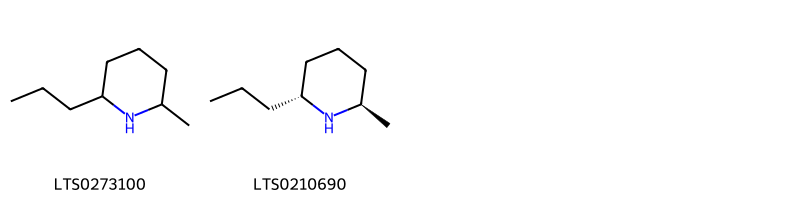{ width=100% }
    <figcaption>Hình ảnh cấu trúc hóa học của 2 hoạt chất thuộc nhóm  gồm ['2-methyl-6-propylpiperidine (LTS0273100)', '(2r,6r)-2-methyl-6-propylpiperidine (LTS0210690)'].</figcaption>
</figure>
#### Nhóm 2-arylbenzofuran flavonoids
<figure markdown="span">
    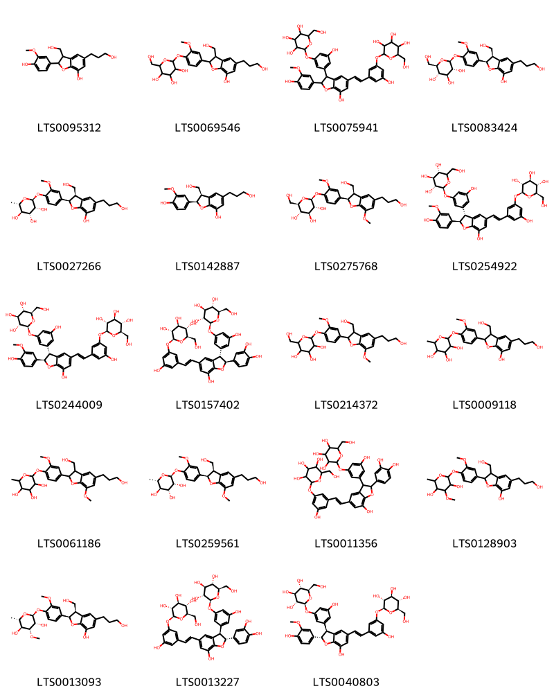{ width=100% }
    <figcaption>Hình ảnh cấu trúc hóa học của 19 hoạt chất thuộc nhóm 2-arylbenzofuran flavonoids gồm ['2-(4-hydroxy-3-methoxyphenyl)-3-(hydroxymethyl)-5-(3-hydroxypropyl)-2,3-dihydro-1-benzofuran-7-ol (LTS0095312)', '2-{4-[7-hydroxy-3-(hydroxymethyl)-5-(3-hydroxypropyl)-2,3-dihydro-1-benzofuran-2-yl]-2-methoxyphenoxy}-6-(hydroxymethyl)oxane-3,4,5-triol (LTS0069546)', '2-(3-hydroxy-5-{2-[7-hydroxy-2-(4-hydroxy-3-methoxyphenyl)-3-(3-hydroxy-5-{[3,4,5-trihydroxy-6-(hydroxymethyl)oxan-2-yl]oxy}phenyl)-2,3-dihydro-1-benzofuran-5-yl]ethenyl}phenoxy)-6-(hydroxymethyl)oxane-3,4,5-triol (LTS0075941)', '(2s,3r,4s,5s,6r)-2-{4-[(2r,3r)-7-hydroxy-3-(hydroxymethyl)-5-(3-hydroxypropyl)-2,3-dihydro-1-benzofuran-2-yl]-2-methoxyphenoxy}-6-(hydroxymethyl)oxane-3,4,5-triol (LTS0083424)', '(2s,3r,4r,5r,6s)-2-{4-[(2r,3r)-7-hydroxy-3-(hydroxymethyl)-5-(3-hydroxypropyl)-2,3-dihydro-1-benzofuran-2-yl]-2-methoxyphenoxy}-6-methyloxane-3,4,5-triol (LTS0027266)', '(2r,3r)-2-(4-hydroxy-3-methoxyphenyl)-3-(hydroxymethyl)-5-(3-hydroxypropyl)-2,3-dihydro-1-benzofuran-7-ol (LTS0142887)', '(2r,3s,4s,5r,6s)-2-(hydroxymethyl)-6-{4-[(2r,3r)-3-(hydroxymethyl)-5-(3-hydroxypropyl)-7-methoxy-2,3-dihydro-1-benzofuran-2-yl]-2-methoxyphenoxy}oxane-3,4,5-triol (LTS0275768)', '(2s,3r,4s,5s,6r)-2-{3-hydroxy-5-[(1e)-2-[(2r,3r)-7-hydroxy-2-(4-hydroxy-3-methoxyphenyl)-3-(3-hydroxy-5-{[(2s,3r,4s,5s)-3,4,5-trihydroxy-6-(hydroxymethyl)oxan-2-yl]oxy}phenyl)-2,3-dihydro-1-benzofuran-5-yl]ethenyl]phenoxy}-6-(hydroxymethyl)oxane-3,4,5-triol (LTS0254922)', '(2s,3r,4s,5s,6r)-2-{3-hydroxy-5-[(1e)-2-[(2r,3r)-7-hydroxy-2-(4-hydroxy-3-methoxyphenyl)-3-(3-hydroxy-5-{[(2s,3r,4s,5s,6r)-3,4,5-trihydroxy-6-(hydroxymethyl)oxan-2-yl]oxy}phenyl)-2,3-dihydro-1-benzofuran-5-yl]ethenyl]phenoxy}-6-(hydroxymethyl)oxane-3,4,5-triol (LTS0244009)', '(2s,3r,4s,5s,6r)-2-{3-[(1e)-2-[(2s,3s)-2-(3,4-dihydroxyphenyl)-7-hydroxy-3-(3-hydroxy-5-{[(2s,3r,4s,5s,6r)-3,4,5-trihydroxy-6-(hydroxymethyl)oxan-2-yl]oxy}phenyl)-2,3-dihydro-1-benzofuran-5-yl]ethenyl]-5-hydroxyphenoxy}-6-(hydroxymethyl)oxane-3,4,5-triol (LTS0157402)', '2-(hydroxymethyl)-6-{4-[3-(hydroxymethyl)-5-(3-hydroxypropyl)-7-methoxy-2,3-dihydro-1-benzofuran-2-yl]-2-methoxyphenoxy}oxane-3,4,5-triol (LTS0214372)', '2-{4-[7-hydroxy-3-(hydroxymethyl)-5-(3-hydroxypropyl)-2,3-dihydro-1-benzofuran-2-yl]-2-methoxyphenoxy}-6-methyloxane-3,4,5-triol (LTS0009118)', '2-{4-[3-(hydroxymethyl)-5-(3-hydroxypropyl)-7-methoxy-2,3-dihydro-1-benzofuran-2-yl]-2-methoxyphenoxy}-6-methyloxane-3,4,5-triol (LTS0061186)', '(2s,3r,4r,5r,6s)-2-{4-[(2r,3r)-3-(hydroxymethyl)-5-(3-hydroxypropyl)-7-methoxy-2,3-dihydro-1-benzofuran-2-yl]-2-methoxyphenoxy}-6-methyloxane-3,4,5-triol (LTS0259561)', '2-(3-{2-[2-(3,4-dihydroxyphenyl)-7-hydroxy-3-(3-hydroxy-5-{[3,4,5-trihydroxy-6-(hydroxymethyl)oxan-2-yl]oxy}phenyl)-2,3-dihydro-1-benzofuran-5-yl]ethenyl}-5-hydroxyphenoxy)-6-(hydroxymethyl)oxane-3,4,5-triol (LTS0011356)', '2-{4-[7-hydroxy-3-(hydroxymethyl)-5-(3-hydroxypropyl)-2,3-dihydro-1-benzofuran-2-yl]-2-methoxyphenoxy}-4-methoxy-6-methyloxane-3,5-diol (LTS0128903)', '(2s,3r,4r,5s,6s)-2-{4-[(2r,3r)-7-hydroxy-3-(hydroxymethyl)-5-(3-hydroxypropyl)-2,3-dihydro-1-benzofuran-2-yl]-2-methoxyphenoxy}-4-methoxy-6-methyloxane-3,5-diol (LTS0013093)', '(2s,3r,4s,5s,6r)-2-{3-[(1e)-2-[(2r,3r)-2-(3,4-dihydroxyphenyl)-7-hydroxy-3-(3-hydroxy-5-{[(2s,3r,4s,5s,6r)-3,4,5-trihydroxy-6-(hydroxymethyl)oxan-2-yl]oxy}phenyl)-2,3-dihydro-1-benzofuran-5-yl]ethenyl]-5-hydroxyphenoxy}-6-(hydroxymethyl)oxane-3,4,5-triol (LTS0013227)', '(2s,3r,4s,5s,6r)-2-{3-hydroxy-5-[(1e)-2-[(2s,3s)-7-hydroxy-2-(4-hydroxy-3-methoxyphenyl)-3-(3-hydroxy-5-{[(2s,3r,4s,5s,6r)-3,4,5-trihydroxy-6-(hydroxymethyl)oxan-2-yl]oxy}phenyl)-2,3-dihydro-1-benzofuran-5-yl]ethenyl]phenoxy}-6-(hydroxymethyl)oxane-3,4,5-triol (LTS0040803)'].</figcaption>
</figure>
#### Nhóm Benzene and substituted derivatives
<figure markdown="span">
    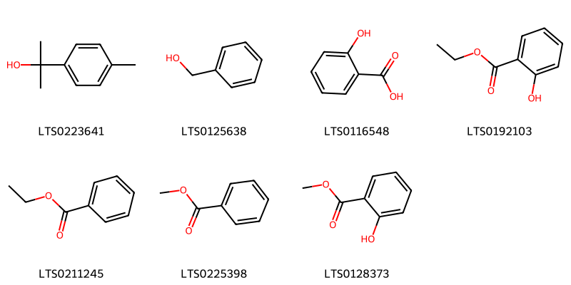{ width=100% }
    <figcaption>Hình ảnh cấu trúc hóa học của 7 hoạt chất thuộc nhóm Benzene and substituted derivatives gồm ['p-cymen-8-ol (LTS0223641)', 'benzyl alcohol (LTS0125638)', 'salicyclic acid (LTS0116548)', 'ethyl salicylate (LTS0192103)', 'ethyl benzoate (LTS0211245)', 'methyl benzoate (LTS0225398)', 'methyl salicylate (LTS0128373)'].</figcaption>
</figure>
#### Nhóm Carboxylic acids and derivatives
<figure markdown="span">
    { width=100% }
    <figcaption>Hình ảnh cấu trúc hóa học của 1 hoạt chất thuộc nhóm Carboxylic acids and derivatives gồm ['hexyl acetate (LTS0202355)'].</figcaption>
</figure>
#### Nhóm Cinnamic acids and derivatives
<figure markdown="span">
    { width=100% }
    <figcaption>Hình ảnh cấu trúc hóa học của 3 hoạt chất thuộc nhóm Cinnamic acids and derivatives gồm ['ferulic acid (LTS0077328)', 'para-coumaric acid (LTS0266252)', 'hydroxycinnamic acid (LTS0233023)'].</figcaption>
</figure>
#### Nhóm Dihydrofurans
<figure markdown="span">
    { width=100% }
    <figcaption>Hình ảnh cấu trúc hóa học của 1 hoạt chất thuộc nhóm Dihydrofurans gồm ['vitamin c (LTS0022555)'].</figcaption>
</figure>
#### Nhóm Fatty Acyls
<figure markdown="span">
    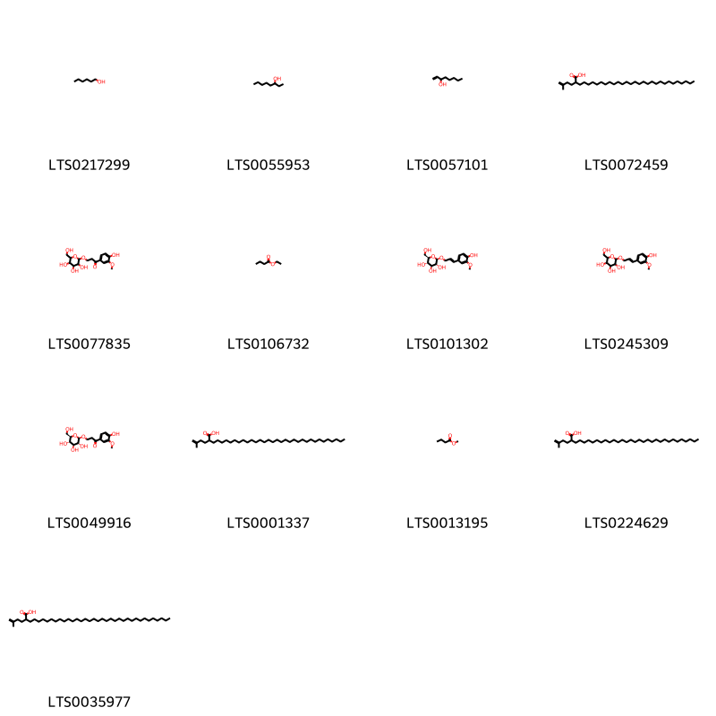{ width=100% }
    <figcaption>Hình ảnh cấu trúc hóa học của 13 hoạt chất thuộc nhóm Fatty Acyls gồm ['hexanol (LTS0217299)', '3-octanol (LTS0055953)', '1-octen-3-ol (LTS0057101)', '2-(3-methylbut-3-en-1-yl)triacontanoic acid (LTS0072459)', '1-(4-hydroxy-3-methoxyphenyl)-3-{[3,4,5-trihydroxy-6-(hydroxymethyl)oxan-2-yl]oxy}propan-1-one (LTS0077835)', 'ethyl butyrate (LTS0106732)', '(2r,3r,4s,5s,6r)-2-{[(2e)-3-(4-hydroxy-3-methoxyphenyl)prop-2-en-1-yl]oxy}-6-(hydroxymethyl)oxane-3,4,5-triol (LTS0101302)', '2-{[3-(4-hydroxy-3-methoxyphenyl)prop-2-en-1-yl]oxy}-6-(hydroxymethyl)oxane-3,4,5-triol (LTS0245309)', '1-(4-hydroxy-3-methoxyphenyl)-3-{[(2r,3r,4s,5s,6r)-3,4,5-trihydroxy-6-(hydroxymethyl)oxan-2-yl]oxy}propan-1-one (LTS0049916)', '2-(3-methylbut-3-en-1-yl)tetratriacontanoic acid (LTS0001337)', 'methyl butyrate (LTS0013195)', '2-(3-methylbut-3-en-1-yl)dotriacontanoic acid (LTS0224629)', '2-(3-methylbut-3-en-1-yl)hexatriacontanoic acid (LTS0035977)'].</figcaption>
</figure>
#### Nhóm Flavonoids
<figure markdown="span">
    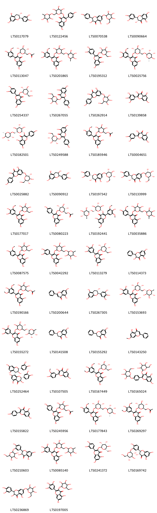{ width=100% }
    <figcaption>Hình ảnh cấu trúc hóa học của 65 hoạt chất thuộc nhóm Flavonoids gồm ['(+)-catechol (LTS0117079)', '5,7-dihydroxy-2-(4-hydroxyphenyl)-3-[(3,4,5-trihydroxy-6-{[(3,4,5-trihydroxy-6-methyloxan-2-yl)oxy]methyl}oxan-2-yl)oxy]chromen-4-one (LTS0122456)', '3,5-dihydroxy-2-(4-hydroxyphenyl)-7-{[3,4,5-trihydroxy-6-(hydroxymethyl)oxan-2-yl]oxy}-2,3-dihydro-1-benzopyran-4-one (LTS0070538)', '(+)-taxifolin (LTS0090664)', '[(2r,3s,4s,5r,6s)-6-{[5,7-dihydroxy-2-(4-hydroxy-3-methoxyphenyl)-4-oxochromen-3-yl]oxy}-3,4,5-trihydroxyoxan-2-yl]methyl acetate (LTS0113047)', '2-(3,4-dihydroxy-5-methoxyphenyl)-5,7-dihydroxy-3-[(3,4,5-trihydroxy-6-{[(3,4,5-trihydroxy-6-methyloxan-2-yl)oxy]methyl}oxan-2-yl)oxy]chromen-4-one (LTS0201865)', '2-(3,4-dihydroxyphenyl)-5,7-dihydroxy-3-{[3,4,5-trihydroxy-6-(hydroxymethyl)oxan-2-yl]oxy}chromen-4-one (LTS0195312)', '2-(3,4-dihydroxy-5-methoxyphenyl)-5,7-dihydroxy-3-{[(2s,3r,4s,5s,6r)-3,4,5-trihydroxy-6-({[(2r,3r,4r,5r,6s)-3,4,5-trihydroxy-6-methyloxan-2-yl]oxy}methyl)oxan-2-yl]oxy}chromen-4-one (LTS0025756)', 'isoquercetin (LTS0254337)', 'trifolin (LTS0267055)', '3,5-dihydroxy-2-(4-hydroxyphenyl)-7-{[3,4,5-trihydroxy-6-(hydroxymethyl)oxan-2-yl]oxy}chromen-4-one (LTS0262914)', 'myricetin (LTS0139858)', 'nictoflorin (LTS0182501)', 'astragalin (LTS0249588)', '(6-{[5,7-dihydroxy-2-(4-hydroxy-3-methoxyphenyl)-4-oxochromen-3-yl]oxy}-3,4,5-trihydroxyoxan-2-yl)methyl acetate (LTS0185946)', 'quercetin (LTS0004651)', 'kaempferol 7-o-glucoside (LTS0025882)', 'catechol (LTS0090912)', '(2s,3r)-2-(3,4-dihydroxyphenyl)-3,5-dihydroxy-7-{[(2s,3r,4s,5s,6r)-3,4,5-trihydroxy-6-(hydroxymethyl)oxan-2-yl]oxy}-2,3-dihydro-1-benzopyran-4-one (LTS0197342)', 'taxifolin 7-glucoside (LTS0133999)', '2-(3,4-dihydroxy-5-methoxyphenyl)-5,7-dihydroxy-3-{[3,4,5-trihydroxy-6-(hydroxymethyl)oxan-2-yl]oxy}chromen-4-one (LTS0177017)', '[(2r,3s,4s,5r,6s)-6-{[5,7-dihydroxy-2-(4-hydroxyphenyl)-4-oxochromen-3-yl]oxy}-3,4,5-trihydroxyoxan-2-yl]methyl acetate (LTS0080223)', '5-hydroxy-2-(4-hydroxy-3,5-dimethoxyphenyl)-7-methoxy-3-{[(2s,3r,4s,5s,6r)-3,4,5-trihydroxy-6-({[(2r,3r,4r,5r,6s)-3,4,5-trihydroxy-6-methyloxan-2-yl]oxy}methyl)oxan-2-yl]oxy}chromen-4-one (LTS0192441)', '5,7-dihydroxy-2-(4-hydroxy-3-methoxyphenyl)-3-[(3,4,5-trihydroxy-6-{[(3,4,5-trihydroxy-6-methyloxan-2-yl)oxy]methyl}oxan-2-yl)oxy]chromen-4-one (LTS0035886)', 'isorhamnetin 3-galactoside (LTS0087575)', 'rutin (LTS0042292)', '5,7-dihydroxy-3-{[(2s,3r,4s,5s,6r)-3,4,5-trihydroxy-6-(hydroxymethyl)oxan-2-yl]oxy}-2-(3,4,5-trihydroxyphenyl)chromen-4-one (LTS0113279)', '3,5,7-trihydroxyflavanone (LTS0114373)', '(6-{[5,7-dihydroxy-2-(4-hydroxy-3,5-dimethoxyphenyl)-4-oxochromen-3-yl]oxy}-3,4,5-trihydroxyoxan-2-yl)methyl acetate (LTS0190166)', 'chrysin (LTS0200644)', 'gallocatechol (LTS0267305)', '5,7-dihydroxy-3-{[(2s,3r,4s,5s,6r)-3,4,5-trihydroxy-6-({[(2r,3r,4r,5r,6s)-3,4,5-trihydroxy-6-methyloxan-2-yl]oxy}methyl)oxan-2-yl]oxy}-2-(3,4,5-trihydroxyphenyl)chromen-4-one (LTS0153693)', 'myricetin 3-rutinoside (LTS0155272)', 'pinocembrine (LTS0141508)', 'pinocembrin (LTS0155292)', 'tectochrysin (LTS0143250)', '(2r,3r)-2-(3,4-dihydroxyphenyl)-8-[(2r,3s,4s)-2-(3,4-dihydroxyphenyl)-3,5,7-trihydroxy-3,4-dihydro-2h-1-benzopyran-4-yl]-3,5,7-trihydroxy-2,3-dihydro-1-benzopyran-4-one (LTS0252464)', 'isorhamnetin (LTS0107505)', '5,7-dihydroxy-2-(4-hydroxy-3,5-dimethoxyphenyl)-3-{[(2s,3r,4s,5s,6r)-3,4,5-trihydroxy-6-(hydroxymethyl)oxan-2-yl]oxy}chromen-4-one (LTS0167449)', '5,7-dihydroxy-3-{[3,4,5-trihydroxy-6-(hydroxymethyl)oxan-2-yl]oxy}-2-(4-{[3,4,5-trihydroxy-6-(hydroxymethyl)oxan-2-yl]oxy}phenyl)chromen-4-one (LTS0165024)', 'kaempherol (LTS0155822)', '(6-{[5,7-dihydroxy-2-(4-hydroxyphenyl)-4-oxochromen-3-yl]oxy}-3,4,5-trihydroxyoxan-2-yl)methyl acetate (LTS0245956)', 'narcissin (LTS0177843)', '[(2r,3s,4s,5r,6s)-6-{[5,7-dihydroxy-2-(4-hydroxy-3,5-dimethoxyphenyl)-4-oxochromen-3-yl]oxy}-3,4,5-trihydroxyoxan-2-yl]methyl acetate (LTS0269297)', '3,5,7-trihydroxy-2-(4-hydroxy-3-{[3,4,5-trihydroxy-6-(hydroxymethyl)oxan-2-yl]oxy}phenyl)-2,3-dihydro-1-benzopyran-4-one (LTS0210603)', '5,7-dihydroxy-3-[(3,4,5-trihydroxy-6-{[(3,4,5-trihydroxy-6-methyloxan-2-yl)oxy]methyl}oxan-2-yl)oxy]-2-(3,4,5-trihydroxyphenyl)chromen-4-one (LTS0085140)', '2-(3,4-dihydroxyphenyl)-5,7-dihydroxy-3-{[(2s,3r,4r,5r,6s)-3,4,5-trihydroxy-6-(hydroxymethyl)oxan-2-yl]oxy}chromen-4-one (LTS0241372)', "taxifolin 3'-glucoside (LTS0169742)", '2-(3,4-dihydroxyphenyl)-3,5-dihydroxy-7-{[3,4,5-trihydroxy-6-(hydroxymethyl)oxan-2-yl]oxy}-2,3-dihydro-1-benzopyran-4-one (LTS0236869)', '5,7-dihydroxy-3-{[3,4,5-trihydroxy-6-(hydroxymethyl)oxan-2-yl]oxy}-2-(3,4,5-trihydroxyphenyl)chromen-4-one (LTS0197005)', '(2s,3r)-3,5-dihydroxy-7-{[(2s,3r,4s,5s,6r)-3,4,5-trihydroxy-6-(hydroxymethyl)oxan-2-yl]oxy}-2-(3,4,5-trihydroxyphenyl)-2,3-dihydro-1-benzopyran-4-one (LTS0067740)', 'isorhamnetin 3-o-glucoside (LTS0137002)', '3,5-dihydroxy-7-{[3,4,5-trihydroxy-6-(hydroxymethyl)oxan-2-yl]oxy}-2-(3,4,5-trihydroxyphenyl)-2,3-dihydro-1-benzopyran-4-one (LTS0067061)', '(2s,3r)-3,5-dihydroxy-2-(4-hydroxyphenyl)-7-{[(2s,3r,4s,5s,6r)-3,4,5-trihydroxy-6-(hydroxymethyl)oxan-2-yl]oxy}-2,3-dihydro-1-benzopyran-4-one (LTS0002736)', '(2r,3r)-2-(3,4-dihydroxyphenyl)-8-[(2r,3r,4r)-2-(3,4-dihydroxyphenyl)-3,5,7-trihydroxy-3,4-dihydro-2h-1-benzopyran-4-yl]-3,5,7-trihydroxy-2,3-dihydro-1-benzopyran-4-one (LTS0033614)', '2-(3,5-dihydroxy-4-{[(2s,3r,4s,5s,6r)-3,4,5-trihydroxy-6-(hydroxymethyl)oxan-2-yl]oxy}phenyl)-5,7-dihydroxy-3-{[(2s,3r,4s,5s,6r)-3,4,5-trihydroxy-6-(hydroxymethyl)oxan-2-yl]oxy}chromen-4-one (LTS0015836)', '3-rutinosyl quercetin (LTS0032845)', '2-{[3,5-dihydroxy-2-(4-hydroxy-3-methoxyphenyl)-3,4-dihydro-2h-1-benzopyran-7-yl]oxy}-6-(hydroxymethyl)oxane-3,4,5-triol (LTS0099970)', '(2s,3r,4s,5s,6r)-2-{[(2r,3s)-3,5-dihydroxy-2-(4-hydroxy-3-methoxyphenyl)-3,4-dihydro-2h-1-benzopyran-7-yl]oxy}-6-(hydroxymethyl)oxane-3,4,5-triol (LTS0028494)', '2-(3,4-dihydroxy-5-methoxyphenyl)-5,7-dihydroxy-3-{[(2s,3r,4s,5s,6r)-3,4,5-trihydroxy-6-(hydroxymethyl)oxan-2-yl]oxy}chromen-4-one (LTS0236188)', '2-(3,5-dihydroxy-4-{[3,4,5-trihydroxy-6-(hydroxymethyl)oxan-2-yl]oxy}phenyl)-5,7-dihydroxy-3-{[3,4,5-trihydroxy-6-(hydroxymethyl)oxan-2-yl]oxy}chromen-4-one (LTS0099996)', '2-(3,4-dihydroxyphenyl)-8-[2-(3,4-dihydroxyphenyl)-3,5,7-trihydroxy-3,4-dihydro-2h-1-benzopyran-4-yl]-3,5,7-trihydroxy-2,3-dihydro-1-benzopyran-4-one (LTS0023736)', 'pinobanksin (LTS0036850)', '5,7-dihydroxy-3-{[(2s,3r,4s,5s,6r)-3,4,5-trihydroxy-6-(hydroxymethyl)oxan-2-yl]oxy}-2-(4-{[(2s,3r,4s,5s,6r)-3,4,5-trihydroxy-6-(hydroxymethyl)oxan-2-yl]oxy}phenyl)chromen-4-one (LTS0048732)', 'ent-epicatechin (LTS0265245)'].</figcaption>
</figure>
#### Nhóm Furanoid lignans
<figure markdown="span">
    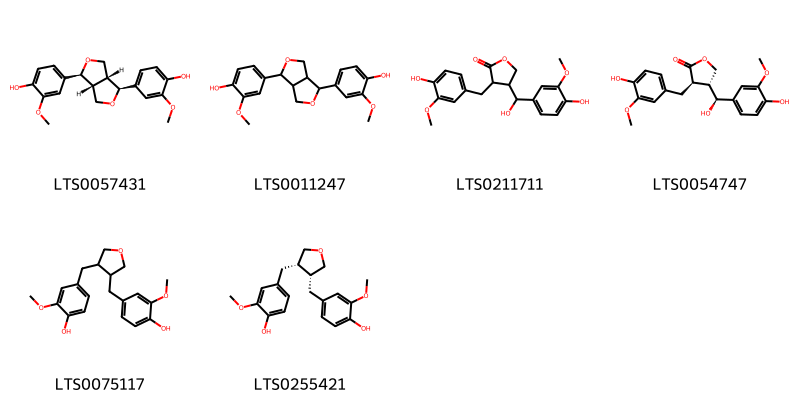{ width=100% }
    <figcaption>Hình ảnh cấu trúc hóa học của 6 hoạt chất thuộc nhóm Furanoid lignans gồm ['pinoresinol (LTS0057431)', 'pinoresinol (LTS0011247)', '4-[hydroxy(4-hydroxy-3-methoxyphenyl)methyl]-3-[(4-hydroxy-3-methoxyphenyl)methyl]oxolan-2-one (LTS0211711)', 'hydroxymatairesinol (LTS0054747)', '3,4-divanillyltetrahydrofuran (LTS0075117)', '4-{[(3s,4r)-4-[(4-hydroxy-3-methoxyphenyl)methyl]oxolan-3-yl]methyl}-2-methoxyphenol (LTS0255421)'].</figcaption>
</figure>
#### Nhóm Indoles and derivatives
<figure markdown="span">
    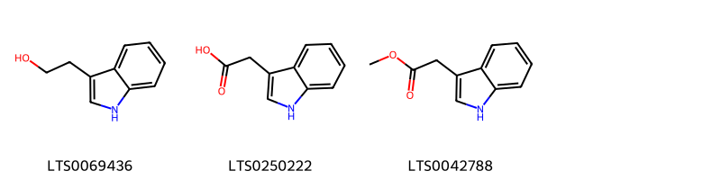{ width=100% }
    <figcaption>Hình ảnh cấu trúc hóa học của 3 hoạt chất thuộc nhóm Indoles and derivatives gồm ['tryptophol (LTS0069436)', 'β-indole-3-acetic acid (LTS0250222)', 'methyl indole-3-acetate (LTS0042788)'].</figcaption>
</figure>
#### Nhóm Lignan glycosides
<figure markdown="span">
    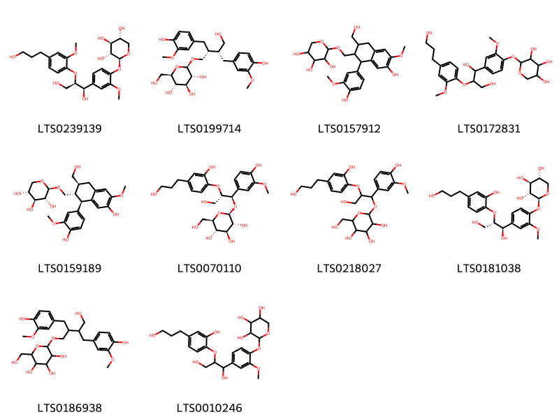{ width=100% }
    <figcaption>Hình ảnh cấu trúc hóa học của 10 hoạt chất thuộc nhóm Lignan glycosides gồm ['(2s,3r,4s,5r)-2-{4-[(1r,2r)-1,3-dihydroxy-2-[4-(3-hydroxypropyl)-2-methoxyphenoxy]propyl]-2-methoxyphenoxy}oxane-3,4,5-triol (LTS0239139)', '(2r,3r,4s,5s,6r)-2-[(2r,3r)-4-hydroxy-2,3-bis[(4-hydroxy-3-methoxyphenyl)methyl]butoxy]-6-(hydroxymethyl)oxane-3,4,5-triol (LTS0199714)', '2-{[7-hydroxy-1-(4-hydroxy-3-methoxyphenyl)-3-(hydroxymethyl)-6-methoxy-1,2,3,4-tetrahydronaphthalen-2-yl]methoxy}oxane-3,4,5-triol (LTS0157912)', '2-(4-{1,3-dihydroxy-2-[4-(3-hydroxypropyl)-2-methoxyphenoxy]propyl}-2-methoxyphenoxy)oxane-3,4,5-triol (LTS0172831)', '(2r,3r,4s,5r)-2-{[(1r,2s,3s)-7-hydroxy-1-(4-hydroxy-3-methoxyphenyl)-3-(hydroxymethyl)-6-methoxy-1,2,3,4-tetrahydronaphthalen-2-yl]methoxy}oxane-3,4,5-triol (LTS0159189)', '(2r,3r,4s,5s,6r)-2-[(1r,2s)-3-hydroxy-1-(4-hydroxy-3-methoxyphenyl)-2-[2-hydroxy-4-(3-hydroxypropyl)phenoxy]propoxy]-6-(hydroxymethyl)oxane-3,4,5-triol (LTS0070110)', '2-[3-hydroxy-1-(4-hydroxy-3-methoxyphenyl)-2-[2-hydroxy-4-(3-hydroxypropyl)phenoxy]propoxy]-6-(hydroxymethyl)oxane-3,4,5-triol (LTS0218027)', '(2s,3r,4s,5r)-2-{4-[(1r,2s)-1,3-dihydroxy-2-[2-hydroxy-4-(3-hydroxypropyl)phenoxy]propyl]-2-methoxyphenoxy}oxane-3,4,5-triol (LTS0181038)', '2-{4-hydroxy-2,3-bis[(4-hydroxy-3-methoxyphenyl)methyl]butoxy}-6-(hydroxymethyl)oxane-3,4,5-triol (LTS0186938)', '2-(4-{1,3-dihydroxy-2-[2-hydroxy-4-(3-hydroxypropyl)phenoxy]propyl}-2-methoxyphenoxy)oxane-3,4,5-triol (LTS0010246)'].</figcaption>
</figure>
#### Nhóm Naphthopyrans
<figure markdown="span">
    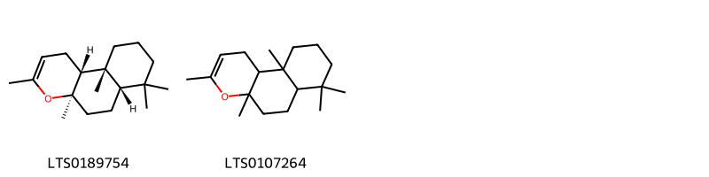{ width=100% }
    <figcaption>Hình ảnh cấu trúc hóa học của 2 hoạt chất thuộc nhóm Naphthopyrans gồm ['(4ar,6as,10ar,10br)-3,4a,7,7,10a-pentamethyl-1h,5h,6h,6ah,8h,9h,10h,10bh-cyclohexa[f]chromene (LTS0189754)', '3,4a,7,7,10a-pentamethyl-1h,5h,6h,6ah,8h,9h,10h,10bh-cyclohexa[f]chromene (LTS0107264)'].</figcaption>
</figure>
#### Nhóm Organooxygen compounds
<figure markdown="span">
    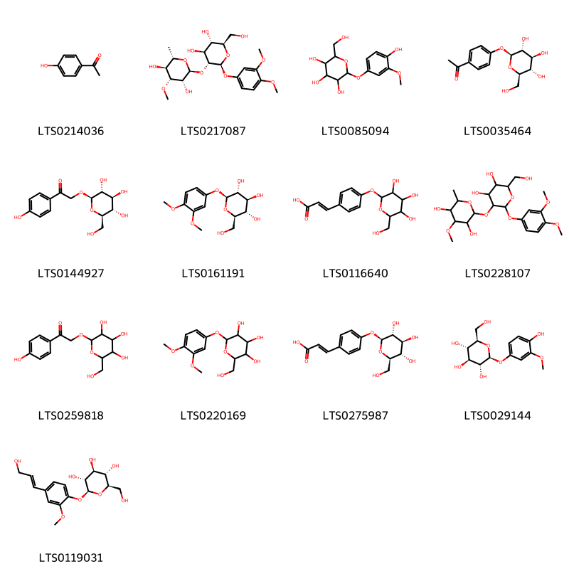{ width=100% }
    <figcaption>Hình ảnh cấu trúc hóa học của 13 hoạt chất thuộc nhóm Organooxygen compounds gồm ['hydroxyacetophenone (LTS0214036)', '(2r,3s,4s,5r,6s)-5-{[(2s,3r,4r,5s,6s)-3,5-dihydroxy-4-methoxy-6-methyloxan-2-yl]oxy}-6-(3,4-dimethoxyphenoxy)-2-(hydroxymethyl)oxane-3,4-diol (LTS0217087)', '2-(4-hydroxy-3-methoxyphenoxy)-6-(hydroxymethyl)oxane-3,4,5-triol (LTS0085094)', 'picein (LTS0035464)', '1-(4-hydroxyphenyl)-2-{[(2r,3r,4s,5s,6r)-3,4,5-trihydroxy-6-(hydroxymethyl)oxan-2-yl]oxy}ethanone (LTS0144927)', '(2s,3r,4s,5s,6r)-2-(3,4-dimethoxyphenoxy)-6-(hydroxymethyl)oxane-3,4,5-triol (LTS0161191)', '3-(4-{[3,4,5-trihydroxy-6-(hydroxymethyl)oxan-2-yl]oxy}phenyl)prop-2-enoic acid (LTS0116640)', '5-[(3,5-dihydroxy-4-methoxy-6-methyloxan-2-yl)oxy]-6-(3,4-dimethoxyphenoxy)-2-(hydroxymethyl)oxane-3,4-diol (LTS0228107)', '1-(4-hydroxyphenyl)-2-{[3,4,5-trihydroxy-6-(hydroxymethyl)oxan-2-yl]oxy}ethanone (LTS0259818)', '2-(3,4-dimethoxyphenoxy)-6-(hydroxymethyl)oxane-3,4,5-triol (LTS0220169)', 'p-coumaric acid glucoside (LTS0275987)', '(2s,3r,4s,5s,6r)-2-(4-hydroxy-3-methoxyphenoxy)-6-(hydroxymethyl)oxane-3,4,5-triol (LTS0029144)', 'coniferin (LTS0119031)'].</figcaption>
</figure>
#### Nhóm Peptidomimetics
<figure markdown="span">
    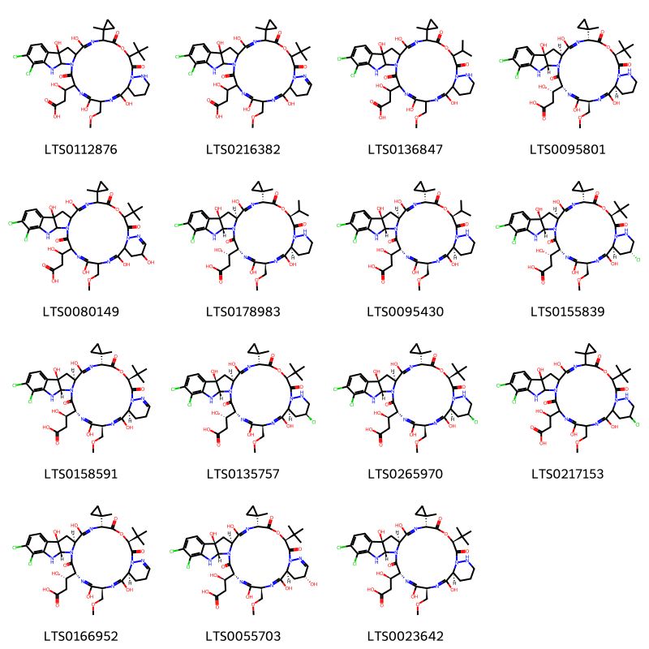{ width=100% }
    <figcaption>Hình ảnh cấu trúc hóa học của 15 hoạt chất thuộc nhóm Peptidomimetics gồm ['3-[7-tert-butyl-26,27-dichloro-2,15,18,31-tetrahydroxy-17-(methoxymethyl)-4-(1-methylcyclopropyl)-5,8,21-trioxo-6-oxa-3,9,10,16,19,22,24-heptaazapentacyclo[20.10.0.0⁹,¹⁴.0²³,³¹.0²⁵,³⁰]dotriaconta-2,15,18,25,27,29-hexaen-20-yl]-3-hydroxypropanoic acid (LTS0112876)', '3-[7-tert-butyl-26,27-dichloro-2,15,18,31-tetrahydroxy-17-(methoxymethyl)-4-(1-methylcyclopropyl)-5,8,21-trioxo-6-oxa-3,9,10,16,19,22,24-heptaazapentacyclo[20.10.0.0⁹,¹⁴.0²³,³¹.0²⁵,³⁰]dotriaconta-2,10,15,18,25,27,29-heptaen-20-yl]-3-hydroxypropanoic acid (LTS0216382)', '3-[26,27-dichloro-2,15,18,31-tetrahydroxy-7-isopropyl-17-(methoxymethyl)-4-(1-methylcyclopropyl)-5,8,21-trioxo-6-oxa-3,9,10,16,19,22,24-heptaazapentacyclo[20.10.0.0⁹,¹⁴.0²³,³¹.0²⁵,³⁰]dotriaconta-2,15,18,25,27,29-hexaen-20-yl]-3-hydroxypropanoic acid (LTS0136847)', '(3s)-3-[(1s,4r,7s,14s,17s,20r,23s,31r)-7-tert-butyl-26,27-dichloro-2,15,18,31-tetrahydroxy-17-(methoxymethyl)-4-(1-methylcyclopropyl)-5,8,21-trioxo-6-oxa-3,9,10,16,19,22,24-heptaazapentacyclo[20.10.0.0⁹,¹⁴.0²³,³¹.0²⁵,³⁰]dotriaconta-2,15,18,25,27,29-hexaen-20-yl]-3-hydroxypropanoic acid (LTS0095801)', '3-[7-tert-butyl-26,27-dichloro-2,12,15,18,31-pentahydroxy-17-(methoxymethyl)-4-(1-methylcyclopropyl)-5,8,21-trioxo-6-oxa-3,9,10,16,19,22,24-heptaazapentacyclo[20.10.0.0⁹,¹⁴.0²³,³¹.0²⁵,³⁰]dotriaconta-2,10,15,18,25,27,29-heptaen-20-yl]-3-hydroxypropanoic acid (LTS0080149)', '(3s)-3-[(1s,4r,7s,14s,17s,20r,23s,31r)-26,27-dichloro-2,15,18,31-tetrahydroxy-7-isopropyl-17-(methoxymethyl)-4-(1-methylcyclopropyl)-5,8,21-trioxo-6-oxa-3,9,10,16,19,22,24-heptaazapentacyclo[20.10.0.0⁹,¹⁴.0²³,³¹.0²⁵,³⁰]dotriaconta-2,15,18,25,27,29-hexaen-20-yl]-3-hydroxypropanoic acid (LTS0178983)', '(3r)-3-[(1s,4r,7s,14s,17s,20r,23s,31r)-26,27-dichloro-2,15,18,31-tetrahydroxy-7-isopropyl-17-(methoxymethyl)-4-(1-methylcyclopropyl)-5,8,21-trioxo-6-oxa-3,9,10,16,19,22,24-heptaazapentacyclo[20.10.0.0⁹,¹⁴.0²³,³¹.0²⁵,³⁰]dotriaconta-2,15,18,25,27,29-hexaen-20-yl]-3-hydroxypropanoic acid (LTS0095430)', '(3s)-3-[(1s,4r,7s,12r,14s,17s,20r,23s,31r)-7-tert-butyl-12,26,27-trichloro-2,15,18,31-tetrahydroxy-17-(methoxymethyl)-4-(1-methylcyclopropyl)-5,8,21-trioxo-6-oxa-3,9,10,16,19,22,24-heptaazapentacyclo[20.10.0.0⁹,¹⁴.0²³,³¹.0²⁵,³⁰]dotriaconta-2,15,18,25,27,29-hexaen-20-yl]-3-hydroxypropanoic acid (LTS0155839)', '(3r)-3-[(1s,4r,7s,14s,17s,20r,23s,31r)-7-tert-butyl-26,27-dichloro-2,15,18,31-tetrahydroxy-17-(methoxymethyl)-4-(1-methylcyclopropyl)-5,8,21-trioxo-6-oxa-3,9,10,16,19,22,24-heptaazapentacyclo[20.10.0.0⁹,¹⁴.0²³,³¹.0²⁵,³⁰]dotriaconta-2,10,15,18,25,27,29-heptaen-20-yl]-3-hydroxypropanoic acid (LTS0158591)', '(3s)-3-[(1s,4r,7s,12s,14s,17s,20r,23s,31r)-7-tert-butyl-12,26,27-trichloro-2,15,18,31-tetrahydroxy-17-(methoxymethyl)-4-(1-methylcyclopropyl)-5,8,21-trioxo-6-oxa-3,9,10,16,19,22,24-heptaazapentacyclo[20.10.0.0⁹,¹⁴.0²³,³¹.0²⁵,³⁰]dotriaconta-2,15,18,25,27,29-hexaen-20-yl]-3-hydroxypropanoic acid (LTS0135757)', '(3r)-3-[(1s,4r,7s,12s,14s,17s,20r,23s,31r)-7-tert-butyl-12,26,27-trichloro-2,15,18,31-tetrahydroxy-17-(methoxymethyl)-4-(1-methylcyclopropyl)-5,8,21-trioxo-6-oxa-3,9,10,16,19,22,24-heptaazapentacyclo[20.10.0.0⁹,¹⁴.0²³,³¹.0²⁵,³⁰]dotriaconta-2,15,18,25,27,29-hexaen-20-yl]-3-hydroxypropanoic acid (LTS0265970)', '3-[7-tert-butyl-12,26,27-trichloro-2,15,18,31-tetrahydroxy-17-(methoxymethyl)-4-(1-methylcyclopropyl)-5,8,21-trioxo-6-oxa-3,9,10,16,19,22,24-heptaazapentacyclo[20.10.0.0⁹,¹⁴.0²³,³¹.0²⁵,³⁰]dotriaconta-2,15,18,25,27,29-hexaen-20-yl]-3-hydroxypropanoic acid (LTS0217153)', '(3s)-3-[(1s,4r,7s,14s,17s,20r,23s,31r)-7-tert-butyl-26,27-dichloro-2,15,18,31-tetrahydroxy-17-(methoxymethyl)-4-(1-methylcyclopropyl)-5,8,21-trioxo-6-oxa-3,9,10,16,19,22,24-heptaazapentacyclo[20.10.0.0⁹,¹⁴.0²³,³¹.0²⁵,³⁰]dotriaconta-2,10,15,18,25,27,29-heptaen-20-yl]-3-hydroxypropanoic acid (LTS0166952)', '(3r)-3-[(1s,4r,7s,12r,14s,17s,20r,23s,31r)-7-tert-butyl-26,27-dichloro-2,12,15,18,31-pentahydroxy-17-(methoxymethyl)-4-(1-methylcyclopropyl)-5,8,21-trioxo-6-oxa-3,9,10,16,19,22,24-heptaazapentacyclo[20.10.0.0⁹,¹⁴.0²³,³¹.0²⁵,³⁰]dotriaconta-2,10,15,18,25,27,29-heptaen-20-yl]-3-hydroxypropanoic acid (LTS0055703)', '(3r)-3-[(1s,4r,7s,14s,17s,20r,23s,31r)-7-tert-butyl-26,27-dichloro-2,15,18,31-tetrahydroxy-17-(methoxymethyl)-4-(1-methylcyclopropyl)-5,8,21-trioxo-6-oxa-3,9,10,16,19,22,24-heptaazapentacyclo[20.10.0.0⁹,¹⁴.0²³,³¹.0²⁵,³⁰]dotriaconta-2,15,18,25,27,29-hexaen-20-yl]-3-hydroxypropanoic acid (LTS0023642)'].</figcaption>
</figure>
#### Nhóm Phenols
<figure markdown="span">
    { width=100% }
    <figcaption>Hình ảnh cấu trúc hóa học của 1 hoạt chất thuộc nhóm Phenols gồm ['coniferyl alcohol (LTS0152881)'].</figcaption>
</figure>
#### Nhóm Piperidines
<figure markdown="span">
    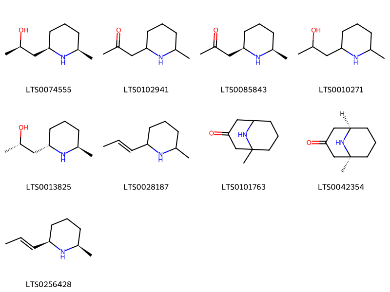{ width=100% }
    <figcaption>Hình ảnh cấu trúc hóa học của 9 hoạt chất thuộc nhóm Piperidines gồm ['(2r)-1-[(2r,6r)-6-methylpiperidin-2-yl]propan-2-ol (LTS0074555)', '1-(6-methylpiperidin-2-yl)propan-2-one (LTS0102941)', '(-)-pinidinone (LTS0085843)', '1-(6-methylpiperidin-2-yl)propan-2-ol (LTS0010271)', '(2s)-1-[(2s,6r)-6-methylpiperidin-2-yl]propan-2-ol (LTS0013825)', '2-methyl-6-(prop-1-en-1-yl)piperidine (LTS0028187)', '1-methyl-9-azabicyclo[3.3.1]nonan-3-one (LTS0101763)', '(1s,5r)-1-methyl-9-azabicyclo[3.3.1]nonan-3-one (LTS0042354)', 'pinidine (LTS0256428)'].</figcaption>
</figure>
#### Nhóm Prenol lipids
<figure markdown="span">
    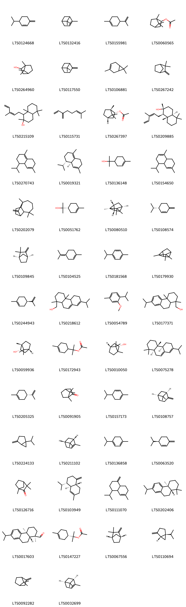{ width=100% }
    <figcaption>Hình ảnh cấu trúc hóa học của 126 hoạt chất thuộc nhóm Prenol lipids gồm ['β phellandrene (LTS0124668)', 'α pinene (LTS0132416)', 'limonene,  (LTS0155981)', 'bornyl acetate (LTS0060565)', 'borneol (LTS0264960)', 'β-pinene (LTS0117550)', 'monoterpenes (LTS0106881)', 'camphene (LTS0267242)', '2,5,5,8a-tetramethyl-1-(3-methylpenta-2,4-dien-1-yl)-hexahydro-1h-naphthalen-2-ol (LTS0215109)', 'α-myrcene (LTS0115731)', '(-)-bornyl acetate (LTS0267397)', 'cis-abienol (LTS0209885)', '4-isopropyl-1,6-dimethyl-2,3,4,4a,7,8-hexahydronaphthalene (LTS0270743)', 'delta-cadinene (LTS0019321)', 'terpineol (LTS0136148)', '4-isopropyl-1,6-dimethyl-3,4,4a,7,8,8a-hexahydronaphthalene (LTS0154650)', 'longifolene (LTS0202079)', 'lily of valley (LTS0051762)', '(1s,2r,4r,6s)-1,7,7-trimethyltricyclo[2.2.1.0²,⁶]heptane (LTS0080510)', '(+)-β-phellandrene (LTS0108574)', '(+)-camphene (LTS0109845)', 'terpinolene (LTS0104525)', 'cymene (LTS0181568)', 'tricyclene (LTS0179930)', 'α-limonene (LTS0244943)', 'abietyl alcohol (LTS0218612)', '2-isopropyl-5-methylanisole (LTS0054789)', '(7-isopropyl-1,4a-dimethyl-2,3,4,9,10,10a-hexahydrophenanthren-1-yl)methanol (LTS0177371)', '(+)-borneol (LTS0059936)', 'α-terpinyl acetate (LTS0172943)', '(2s,4r)-1,7,7-trimethylbicyclo[2.2.1]heptan-2-ol (LTS0010050)', '(-)-abietadiene (LTS0075278)', '(-)-limonene (LTS0205325)', 'camphor (LTS0091905)', 'phellandrene (LTS0157173)', '(-)-β-pinene (LTS0108757)', 'sabinene (LTS0224133)', '(+)-α-pinene (LTS0211102)', 'terpinene (LTS0136858)', '(-)-β-phellandrene (LTS0063520)', 'fenchone (LTS0126716)', '(+)-gamma-cadinene (LTS0103949)', '4-isopropyl-6-methyl-1-methylidene-3,4,4a,7,8,8a-hexahydro-2h-naphthalene (LTS0111070)', 'abietatriene (LTS0202406)', 'dehydroabietal (LTS0017603)', '(-)-α-terpinyl acetate (LTS0147227)', '(-)-camphene (LTS0067556)', '(+)-sabinene (LTS0110694)', '7,7-dimethyl-2-methylidenebicyclo[2.2.1]heptane (LTS0092282)', '(-)-α-pinene (LTS0032699)', '3,7-dimethyl-1,3,6-octatriene (LTS0172986)', 'fenchol (LTS0261470)', '(+)-longifolene (LTS0248662)', '(+)-β-pinene (LTS0172720)', '(+)-delta(3)-carene (LTS0250199)', '(+)-α-phellandrene (LTS0234318)', '(4ar,10as)-7-isopropyl-1,1,4a-trimethyl-2,3,4,9,10,10a-hexahydrophenanthrene (LTS0221834)', '7-isopropyl-1,1,4a-trimethyl-2,3,4,9,10,10a-hexahydrophenanthrene (LTS0210076)', '3,7,11,15-tetramethylhexadec-2-en-1-ol (LTS0056933)', 'β-ocimene (LTS0242381)', '(+)-fenchone (LTS0191800)', '(+)-caryophyllene (LTS0046179)', 'rhodoxanthin (LTS0006899)', 'd-camphor (LTS0002057)', '4,11,11-trimethyl-8-methylidenebicyclo[7.2.0]undec-4-ene (LTS0256716)', '(+)-α-fenchene (LTS0005155)', 'carvone (LTS0196605)', 'carotenoid (LTS0205297)', 'myrtenol (LTS0130529)', '[(1r,4ar,4bs,10as)-7-isopropyl-1,4a-dimethyl-2,3,4,4b,5,6,10,10a-octahydrophenanthren-1-yl]methanol (LTS0074197)', '(1s,6r)-3,7,7-trimethylbicyclo[4.1.0]hept-2-ene (LTS0208207)', '(+)-α-carotene (LTS0200789)', '6,6,7-trimethyltricyclo[3.2.0.0²,⁷]heptane (LTS0070032)', '(-)-carvone (LTS0223461)', '(1r,2s,5s)-2,6,6-trimethylbicyclo[3.1.1]heptan-3-one (LTS0072565)', 'gibberellin a12 (LTS0085731)', '(1r,5r)-6,6-dimethyl-2-methylidenebicyclo[3.1.1]heptan-3-one (LTS0043419)', '(3z,6z,10z)-14-isopropyl-3,7,11-trimethylcyclotetradeca-1,3,6,10-tetraene (LTS0096060)', '2,2-dimethyl-5-methylidenebicyclo[2.2.1]heptane (LTS0101851)', 'methyl 7-(2-hydroxypropan-2-yl)-1,4a-dimethyl-2,3,4,9,10,10a-hexahydrophenanthrene-1-carboxylate (LTS0074776)', '(2e,7s,11s)-3,7,11,15-tetramethylhexadec-2-en-1-ol (LTS0207261)', 'gibberellin a4 (LTS0029910)', '(1e)-14-isopropyl-3,7,11-trimethylcyclotetradeca-1,3,6,10-tetraene (LTS0042750)', 'trans-β-ocimene (LTS0049765)', '(s)-cis-verbenol (LTS0111421)', 'fenchyl alcohol (LTS0136060)', 'myrtenal (LTS0202475)', '(+)-campholenic aldehyde (LTS0142103)', 'gibberellin a7 (LTS0103649)', 'zeaxanthin (LTS0192928)', 'verbenol (LTS0140945)', 'myrtenal (LTS0147823)', 'gibberellin a29 (LTS0250023)', 'pinocarvone (LTS0084836)', '3,7,7-trimethylbicyclo[4.1.0]hept-2-ene (LTS0237770)', 'gibberellin a34 (LTS0181812)', 'campholenic aldehyde (LTS0261118)', 'methyl (1r,4as,10as)-7-isopropyl-1,4a-dimethyl-2,3,4,9,10,10a-hexahydrophenanthrene-1-carboxylate (LTS0039704)', 'verbenone (LTS0264577)', 'β-carotene (LTS0275716)', '(-)-myrtenol (LTS0097970)', '(4as,4br,10ar)-7-isopropyl-1,1,4a-trimethyl-2,3,4,4b,5,6,10,10a-octahydrophenanthrene (LTS0040333)', 'cuminaldehyde (LTS0037806)', '(1e,3z,6e,10e,14s)-14-isopropyl-3,7,11-trimethylcyclotetradeca-1,3,6,10-tetraene (LTS0164462)', '(-)-sabinene (LTS0224535)', '(e)-3-pinanone (LTS0254218)', '(10e)-2,6,11,15-tetramethylhexadeca-2,7,10,14-tetraen-6-ol (LTS0057371)', '7-isopropyl-1,1,4a-trimethyl-2,3,4,4b,5,6,10,10a-octahydrophenanthrene (LTS0048295)', 'methyl (1r,4as,10ar)-7-(2-hydroxypropan-2-yl)-1,4a-dimethyl-2,3,4,9,10,10a-hexahydrophenanthrene-1-carboxylate (LTS0067008)', 'gibberellin a51 (LTS0062532)', '(4s,4as,8as)-4-isopropyl-1,6-dimethyl-3,4,4a,7,8,8a-hexahydronaphthalene (LTS0014980)', '(1r,2r,5s,7r)-6,6,7-trimethyltricyclo[3.2.0.0²,⁷]heptane (LTS0262837)', 'cis-(+/-)-pinocarveol (LTS0019059)', 'α-carotene (LTS0224243)', 'pinocarveol (LTS0090950)', 'cuminol (LTS0021403)', '2,6,11,15-tetramethylhexadeca-2,7,10,14-tetraen-6-ol (LTS0092683)', '[(1r,4ar,10ar)-7-isopropyl-1,4a-dimethyl-2,3,4,9,10,10a-hexahydrophenanthren-1-yl]methanol (LTS0000316)', '(4s,4as,8as)-4-isopropyl-6-methyl-1-methylidene-3,4,4a,7,8,8a-hexahydro-2h-naphthalene (LTS0099302)', '(1r,4r)-2,2-dimethyl-5-methylidenebicyclo[2.2.1]heptane (LTS0092792)', 'gibberellin a20 (LTS0041124)', '(1e,3z,6e,10z)-14-isopropyl-3,7,11-trimethylcyclotetradeca-1,3,6,10-tetraene (LTS0034275)', 'gamma-carotene (LTS0108535)', 'levoverbenone (LTS0037738)', 'methyl abietate (LTS0244726)', '(1s,2r,5s,8s,9s,10s,11s)-11-methyl-6-methylidene-12-oxo-13-oxapentacyclo[9.3.3.1⁵,⁸.0¹,¹⁰.0²,⁸]octadecane-9-carboxylic acid (LTS0046848)'].</figcaption>
</figure>
#### Nhóm Pyridines and derivatives
<figure markdown="span">
    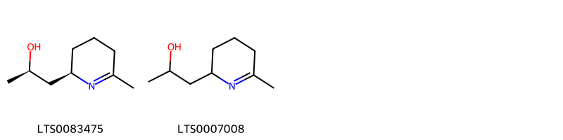{ width=100% }
    <figcaption>Hình ảnh cấu trúc hóa học của 2 hoạt chất thuộc nhóm Pyridines and derivatives gồm ['(2r)-1-[(2r)-6-methyl-2,3,4,5-tetrahydropyridin-2-yl]propan-2-ol (LTS0083475)', '1-(6-methyl-2,3,4,5-tetrahydropyridin-2-yl)propan-2-ol (LTS0007008)'].</figcaption>
</figure>
#### Nhóm Steroids and steroid derivatives
<figure markdown="span">
    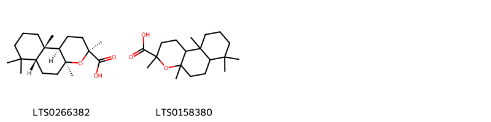{ width=100% }
    <figcaption>Hình ảnh cấu trúc hóa học của 2 hoạt chất thuộc nhóm Steroids and steroid derivatives gồm ['(3s,4as,6ar,10as,10br)-3,4a,7,7,10a-pentamethyl-octahydro-1h-naphtho[2,1-b]pyran-3-carboxylic acid (LTS0266382)', '3,4a,7,7,10a-pentamethyl-octahydro-1h-naphtho[2,1-b]pyran-3-carboxylic acid (LTS0158380)'].</figcaption>
</figure>
#### Nhóm Stilbenes
<figure markdown="span">
    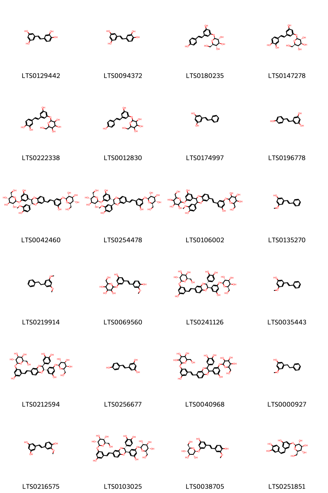{ width=100% }
    <figcaption>Hình ảnh cấu trúc hóa học của 24 hoạt chất thuộc nhóm Stilbenes gồm ['piceatannol (LTS0129442)', 'piceatannol (LTS0094372)', 'piceid (LTS0180235)', 'astringin (LTS0147278)', '2-{3-[2-(3,4-dihydroxyphenyl)ethenyl]-5-hydroxyphenoxy}-6-(hydroxymethyl)oxane-3,4,5-triol (LTS0222338)', '2-{3-hydroxy-5-[2-(4-hydroxyphenyl)ethenyl]phenoxy}-6-(hydroxymethyl)oxane-3,4,5-triol (LTS0012830)', 'pinosylvin (LTS0174997)', 'tocilizumab (LTS0196778)', '(2s,3r,4s,5s,6r)-2-{3-hydroxy-5-[(1e)-2-[(2r,3r)-3-(4-hydroxy-3-methoxyphenyl)-2-(3-hydroxy-5-{[(2s,3r,4s,5s,6r)-3,4,5-trihydroxy-6-(hydroxymethyl)oxan-2-yl]oxy}phenyl)-2,3-dihydro-1,4-benzodioxin-6-yl]ethenyl]phenoxy}-6-(hydroxymethyl)oxane-3,4,5-triol (LTS0042460)', '(2s,3r,4s,5s,6r)-2-{3-hydroxy-5-[(1e)-2-[(2s,3s)-3-(4-hydroxy-3-methoxyphenyl)-2-(3-hydroxy-5-{[(2s,3r,4s,5s,6r)-3,4,5-trihydroxy-6-(hydroxymethyl)oxan-2-yl]oxy}phenyl)-2,3-dihydro-1,4-benzodioxin-6-yl]ethenyl]phenoxy}-6-(hydroxymethyl)oxane-3,4,5-triol (LTS0254478)', '2-(3-hydroxy-5-{2-[3-(4-hydroxy-3-methoxyphenyl)-2-(3-hydroxy-5-{[3,4,5-trihydroxy-6-(hydroxymethyl)oxan-2-yl]oxy}phenyl)-2,3-dihydro-1,4-benzodioxin-6-yl]ethenyl}phenoxy)-6-(hydroxymethyl)oxane-3,4,5-triol (LTS0106002)', '5-methoxy-3-stilbenol (LTS0135270)', '1,3-dimethoxy-5-(2-phenylethyl)benzene (LTS0219914)', '2-{3-hydroxy-5-[2-(4-hydroxy-3-methoxyphenyl)ethenyl]phenoxy}-6-(hydroxymethyl)oxane-3,4,5-triol (LTS0069560)', '(2s,3r,4s,5r,6r)-2-{3-[(1e)-2-[(2r,3r)-3-(3,4-dihydroxyphenyl)-2-(3-hydroxy-5-{[(2s,3r,4s,5r,6r)-3,4,5-trihydroxy-6-(hydroxymethyl)oxan-2-yl]oxy}phenyl)-2,3-dihydro-1,4-benzodioxin-6-yl]ethenyl]-5-hydroxyphenoxy}-6-(hydroxymethyl)oxane-3,4,5-triol (LTS0241126)', 'pinosylvin methyl ether (LTS0035443)', '(2s,3r,4s,5r,6r)-2-{3-[(1e)-2-[(2s,3s)-3-(3,4-dihydroxyphenyl)-2-(3-hydroxy-5-{[(2s,3r,4s,5r,6r)-3,4,5-trihydroxy-6-(hydroxymethyl)oxan-2-yl]oxy}phenyl)-2,3-dihydro-1,4-benzodioxin-6-yl]ethenyl]-5-hydroxyphenoxy}-6-(hydroxymethyl)oxane-3,4,5-triol (LTS0212594)', 'resveratrol (LTS0256677)', '2-(3-{2-[3-(3,4-dihydroxyphenyl)-2-(3-hydroxy-5-{[3,4,5-trihydroxy-6-(hydroxymethyl)oxan-2-yl]oxy}phenyl)-2,3-dihydro-1,4-benzodioxin-6-yl]ethenyl}-5-hydroxyphenoxy)-6-(hydroxymethyl)oxane-3,4,5-triol (LTS0040968)', '3-methoxy-5-(2-phenylethyl)phenol (LTS0000927)', 'isorhapontigenin (LTS0216575)', '(2s,3r,4s,5s,6r)-2-{3-[(1e)-2-[(2r,3r)-3-(3,4-dihydroxyphenyl)-2-(3-hydroxy-5-{[(2s,3r,4s,5s,6r)-3,4,5-trihydroxy-6-(hydroxymethyl)oxan-2-yl]oxy}phenyl)-2,3-dihydro-1,4-benzodioxin-6-yl]ethenyl]-5-hydroxyphenoxy}-6-(hydroxymethyl)oxane-3,4,5-triol (LTS0103025)', 'isorhapontin (LTS0038705)', 'cis-astringin (LTS0251851)'].</figcaption>
</figure>
#### Nhóm Unsaturated hydrocarbons
<figure markdown="span">
    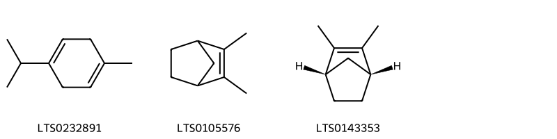{ width=100% }
    <figcaption>Hình ảnh cấu trúc hóa học của 3 hoạt chất thuộc nhóm Unsaturated hydrocarbons gồm ['α terpinene (LTS0232891)', '2,3-dimethylbicyclo[2.2.1]hept-2-ene (LTS0105576)', '(1r,4s)-2,3-dimethylbicyclo[2.2.1]hept-2-ene (LTS0143353)'].</figcaption>
</figure>

---

### Dược dân tộc học

Danh sách các quốc gia có sử dụng *Picea abies* trong điều trị các bệnh. 

| Country   | Disease                    | Bệnh                                   |
|:----------|:---------------------------|:---------------------------------------|
| Elsewhere | Counterirritant, Stimulant | Chất chống kích thích, chất kích thích |

---

---
## Picea mariana
### Thông tin về thực vật

!!! info "Phân loại thực vật của *Picea mariana* từ GIBF:"
    - **Kingdom:** Plantae
    - **Phylum:** Tracheophyta
    - **Order:** Pinales
    - **Family:** Pinaceae
    - **Genus:** Picea
    - **Species:** *Picea mariana*

 

| Label (VI)   | Label (EN)   | Scientific Name   | Descriptions (VI)   | Descriptions (EN)   | Also Known As (VI)   | Also Known As (EN)   |
|:-------------|:-------------|:------------------|:--------------------|:--------------------|:---------------------|:---------------------|
| N/A          | N/A          | Picea mariana     | loài thực vật       | species of plant    | ['']                 | ['black spruce']     |

#### Phân bố trên thế giới

**Từ CSDL GIBF** nan, Sweden, United States of America, Canada

#### Phân bố tại Việt Nam

**Từ CSDL GIBF**: Không có ghi nhận ở Việt Nam

---
### Thành phần hóa học
        
- Theo cơ sở dữ liệu lotus: Từ loài *Picea mariana* đã phân lập và xác định được 35 hoạt chất thuộc về các nhóm Fatty Acyls, Piperidines, Carboxylic acids and derivatives, Prenol lipids, Stilbenes. 

|    | chemicalTaxonomyClassyfireClass   |   smiles_count |
|---:|:----------------------------------|---------------:|
|  0 | Carboxylic acids and derivatives  |             21 |
|  1 | Fatty Acyls                       |              2 |
|  2 | Piperidines                       |              1 |
|  3 | Prenol lipids                     |              9 |
|  4 | Stilbenes                         |              2 |

#### Nhóm Carboxylic acids and derivatives
<figure markdown="span">
    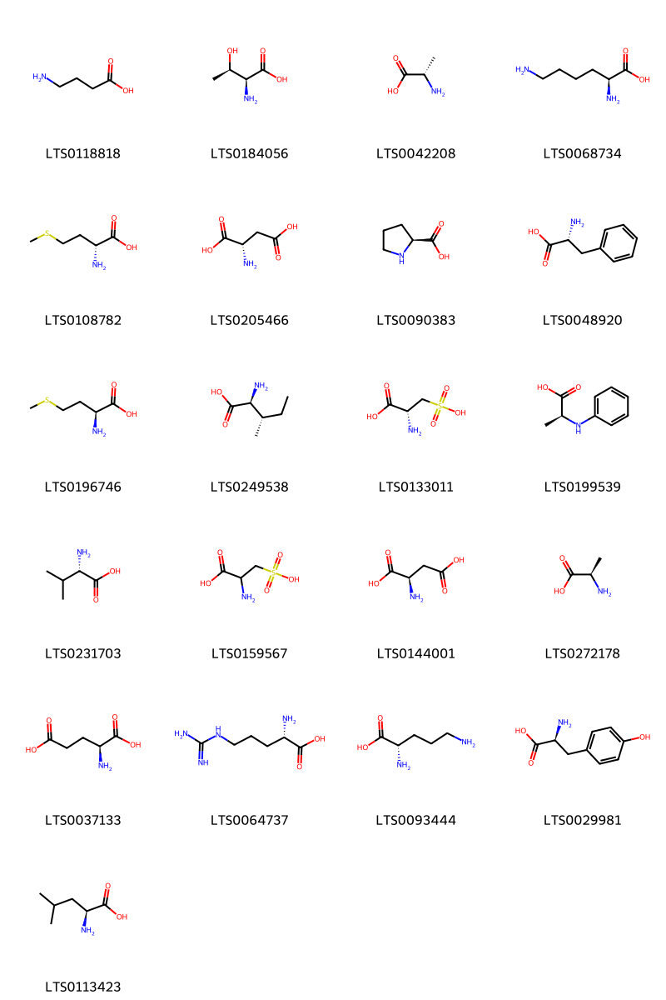{ width=100% }
    <figcaption>Hình ảnh cấu trúc hóa học của 21 hoạt chất thuộc nhóm Carboxylic acids and derivatives gồm ['gamma(amino)-butyric acid (LTS0118818)', 'l-threonine (LTS0184056)', 'l-alanine (LTS0042208)', 'l-lysine (LTS0068734)', 'd-methionine (LTS0108782)', 'l-aspartic acid (LTS0205466)', 'l-proline (LTS0090383)', 'd-phenylalanine (LTS0048920)', 'l-methionine (LTS0196746)', 'l-isoleucine (LTS0249538)', 'cysteinesulfonic acid (LTS0133011)', '(2s)-2-(phenylamino)propanoic acid (LTS0199539)', 'l-valine (LTS0231703)', 'cysteic acid (LTS0159567)', 'd-aspartic acid (LTS0144001)', 'd-alanine (LTS0272178)', 'l-glutamic acid (LTS0037133)', 'l-arginine (LTS0064737)', 'l-ornithine (LTS0093444)', 'l-tyrosine (LTS0029981)', 'l-leucine (LTS0113423)'].</figcaption>
</figure>
#### Nhóm Fatty Acyls
<figure markdown="span">
    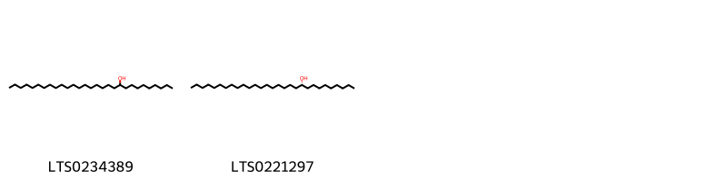{ width=100% }
    <figcaption>Hình ảnh cấu trúc hóa học của 2 hoạt chất thuộc nhóm Fatty Acyls gồm ['nonacosan-10-ol (LTS0234389)', '(r)-nonacosan-10-ol (LTS0221297)'].</figcaption>
</figure>
#### Nhóm Piperidines
<figure markdown="span">
    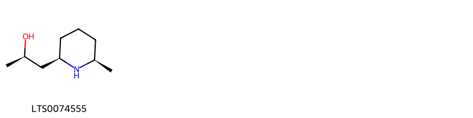{ width=100% }
    <figcaption>Hình ảnh cấu trúc hóa học của 1 hoạt chất thuộc nhóm Piperidines gồm ['(2r)-1-[(2r,6r)-6-methylpiperidin-2-yl]propan-2-ol (LTS0074555)'].</figcaption>
</figure>
#### Nhóm Prenol lipids
<figure markdown="span">
    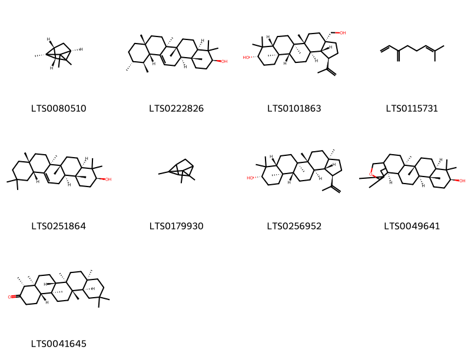{ width=100% }
    <figcaption>Hình ảnh cấu trúc hóa học của 9 hoạt chất thuộc nhóm Prenol lipids gồm ['(1s,2r,4r,6s)-1,7,7-trimethyltricyclo[2.2.1.0²,⁶]heptane (LTS0080510)', 'amyrin (LTS0222826)', 'betulin (LTS0101863)', 'α-myrcene (LTS0115731)', 'β-amyrin (LTS0251864)', 'tricyclene (LTS0179930)', 'lupeol (LTS0256952)', '(1r,4r,5r,8r,10s,13r,14r,18r)-4,5,9,9,13,20,20-heptamethyl-24-oxahexacyclo[17.3.2.0¹,¹⁸.0⁴,¹⁷.0⁵,¹⁴.0⁸,¹³]tetracosan-10-ol (LTS0049641)', '(-)-friedelin (LTS0041645)'].</figcaption>
</figure>
#### Nhóm Stilbenes
<figure markdown="span">
    { width=100% }
    <figcaption>Hình ảnh cấu trúc hóa học của 2 hoạt chất thuộc nhóm Stilbenes gồm ['piceatannol (LTS0129442)', 'piceatannol (LTS0094372)'].</figcaption>
</figure>

---

### Dược dân tộc học

Danh sách các quốc gia có sử dụng *Picea mariana* trong điều trị các bệnh. 

| Country        | Disease    | Bệnh         |
|:---------------|:-----------|:-------------|
| US(Amerindian) | Intoxicant | chất gây độc |

---

# Chi Pinus

??? note "Danh sách các dược liệu thuộc chi"
    
	 - *Pinus australis*
	 - *Pinus caribaea*
	 - *Pinus densiflora*
	 - *Pinus edulis*
	 - *Pinus gerardiana*
	 - *Pinus koraiensis*
	 - *Pinus lambertiana*
	 - *Pinus longifolia*
	 - *Pinus maritima*
	 - *Pinus montana*
	 - *Pinus mugo*
	 - *Pinus nigra*
	 - *Pinus occidentalis*
	 - *Pinus palustris*
	 - *Pinus pimilio*
	 - *Pinus pinaster*
	 - *Pinus ponderosa*
	 - *Pinus roxburghii*
	 - *Pinus silvestris*
	 - *Pinus strobus*
	 - *Pinus taeda*
	 - *Pinus teocote*
	 - *Pinus thunbergii*
	 - *Pinus wallichiana*

---
## Pinus australis
### Thông tin về thực vật

!!! info "Phân loại thực vật của *Pinus australis* từ GIBF:"
    - **Kingdom:** Plantae
    - **Phylum:** Tracheophyta
    - **Order:** Pinales
    - **Family:** Pinaceae
    - **Genus:** Pinus
    - **Species:** *Pinus australis*

 

| Label (VI)   | Label (EN)   | Scientific Name   | Descriptions (VI)   | Descriptions (EN)   | Also Known As (VI)   | Also Known As (EN)   |
|:-------------|:-------------|:------------------|:--------------------|:--------------------|:---------------------|:---------------------|
| N/A          | N/A          | Picea mariana     | loài thực vật       | species of plant    | ['']                 | ['black spruce']     |

#### Phân bố trên thế giới

**Từ CSDL GIBF** nan, United States of America

#### Phân bố tại Việt Nam

**Từ CSDL GIBF**: Không có ghi nhận ở Việt Nam

---
### Thành phần hóa học
        
- Theo cơ sở dữ liệu lotus: Từ loài *Pinus australis* đã phân lập và xác định được Chưa có hoạt chất nào được phân lập. hoạt chất thuộc về các nhóm Không có hoạt chất nào được phân lập. 

Không có hình ảnh nào được tạo ra

---

### Dược dân tộc học

Danh sách các quốc gia có sử dụng *Pinus australis* trong điều trị các bệnh. 

| Country   | Disease     | Bệnh                   |
|:----------|:------------|:-----------------------|
| German    | Rubefacient | Chất gây xung huyết da |
| US        | Diuretic    | Thuốc lợi tiêu         |

---

---
## Pinus caribaea
### Thông tin về thực vật

!!! info "Phân loại thực vật của *Pinus caribaea* từ GIBF:"
    - **Kingdom:** Plantae
    - **Phylum:** Tracheophyta
    - **Order:** Pinales
    - **Family:** Pinaceae
    - **Genus:** Pinus
    - **Species:** *Pinus caribaea*

 

| Label (VI)   | Label (EN)   | Scientific Name   | Descriptions (VI)   | Descriptions (EN)                | Also Known As (VI)   | Also Known As (EN)   |
|:-------------|:-------------|:------------------|:--------------------|:---------------------------------|:---------------------|:---------------------|
| N/A          | N/A          | Pinus caribaea    | loài thực vật       | species of plant, Caribbean pine | ['']                 | ['Caribbean pine']   |

#### Phân bố trên thế giới

**Từ CSDL GIBF** Uganda, Guadeloupe, New Caledonia, Honduras, French Polynesia, Trinidad and Tobago, Turks and Caicos Islands, Puerto Rico, Sri Lanka, United States of America, Seychelles, Wallis and Futuna, Dominican Republic, Colombia, Cuba, French Guiana, Fiji, Mexico, Vanuatu, El Salvador, Malaysia, Haiti, Panama, Singapore, Martinique, Cook Islands, Bahamas, Australia, Belize

#### Phân bố tại Việt Nam

**Từ CSDL GIBF**: Không có ghi nhận ở Việt Nam

---
### Thành phần hóa học
        
- Theo cơ sở dữ liệu lotus: Từ loài *Pinus caribaea* đã phân lập và xác định được 12 hoạt chất thuộc về các nhóm Prenol lipids, Stilbenes, Phenol ethers. 

|    | chemicalTaxonomyClassyfireClass   |   smiles_count |
|---:|:----------------------------------|---------------:|
|  0 | Phenol ethers                     |              1 |
|  1 | Prenol lipids                     |             10 |
|  2 | Stilbenes                         |              1 |

#### Nhóm Phenol ethers
<figure markdown="span">
    { width=100% }
    <figcaption>Hình ảnh cấu trúc hóa học của 1 hoạt chất thuộc nhóm Phenol ethers gồm ['tarragon (LTS0245226)'].</figcaption>
</figure>
#### Nhóm Prenol lipids
<figure markdown="span">
    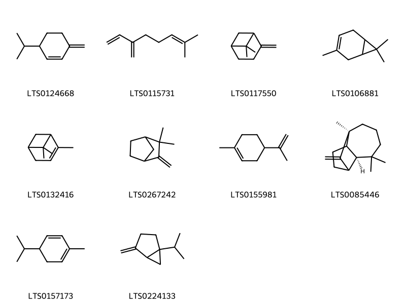{ width=100% }
    <figcaption>Hình ảnh cấu trúc hóa học của 10 hoạt chất thuộc nhóm Prenol lipids gồm ['β phellandrene (LTS0124668)', 'α-myrcene (LTS0115731)', 'β-pinene (LTS0117550)', 'monoterpenes (LTS0106881)', 'α pinene (LTS0132416)', 'camphene (LTS0267242)', 'limonene,  (LTS0155981)', '(2s,7s)-3,3,7-trimethyl-8-methylidenetricyclo[5.4.0.0²,⁹]undecane (LTS0085446)', 'phellandrene (LTS0157173)', 'sabinene (LTS0224133)'].</figcaption>
</figure>
#### Nhóm Stilbenes
<figure markdown="span">
    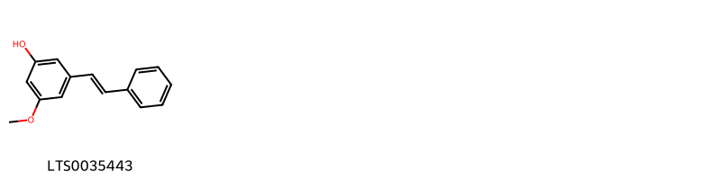{ width=100% }
    <figcaption>Hình ảnh cấu trúc hóa học của 1 hoạt chất thuộc nhóm Stilbenes gồm ['pinosylvin methyl ether (LTS0035443)'].</figcaption>
</figure>

---

### Dược dân tộc học

Danh sách các quốc gia có sử dụng *Pinus caribaea* trong điều trị các bệnh. 

| Country   | Disease     | Bệnh                   |
|:----------|:------------|:-----------------------|
| Haiti     | Rubefacient | Chất gây xung huyết da |

---

---
## Pinus densiflora
### Thông tin về thực vật

!!! info "Phân loại thực vật của *Pinus densiflora* từ GIBF:"
    - **Kingdom:** Plantae
    - **Phylum:** Tracheophyta
    - **Order:** Pinales
    - **Family:** Pinaceae
    - **Genus:** Pinus
    - **Species:** *Pinus densiflora*

 

| Label (VI)   | Label (EN)   | Scientific Name   | Descriptions (VI)   | Descriptions (EN)   | Also Known As (VI)   | Also Known As (EN)                                                                                    |
|:-------------|:-------------|:------------------|:--------------------|:--------------------|:---------------------|:------------------------------------------------------------------------------------------------------|
| N/A          | N/A          | Pinus densiflora  | loài thực vật       | species of plant    | ['']                 | ['Pinus funebris', 'Japanese red pine', 'Japanese umbrella pine', 'Korean red pine', 'tanyosho pine'] |

#### Phân bố trên thế giới

**Từ CSDL GIBF** nan, Japan, United States of America, Korea, Republic of, Sweden, China, Russian Federation, Germany, France

#### Phân bố tại Việt Nam

**Từ CSDL GIBF**: Không có ghi nhận ở Việt Nam

---
### Thành phần hóa học
        
- Theo cơ sở dữ liệu lotus: Từ loài *Pinus densiflora* đã phân lập và xác định được 127 hoạt chất thuộc về các nhóm Benzene and substituted derivatives, Unsaturated hydrocarbons, Carboxylic acids and derivatives, Cinnamic acids and derivatives, Phenols, Organooxygen compounds, Prenol lipids, Saturated hydrocarbons. 

|    | chemicalTaxonomyClassyfireClass     |   smiles_count |
|---:|:------------------------------------|---------------:|
|  0 | Benzene and substituted derivatives |              8 |
|  1 | Carboxylic acids and derivatives    |             19 |
|  2 | Cinnamic acids and derivatives      |              9 |
|  3 | Organooxygen compounds              |              3 |
|  4 | Phenols                             |              2 |
|  5 | Prenol lipids                       |             84 |
|  6 | Saturated hydrocarbons              |              1 |
|  7 | Unsaturated hydrocarbons            |              1 |

#### Nhóm Benzene and substituted derivatives
<figure markdown="span">
    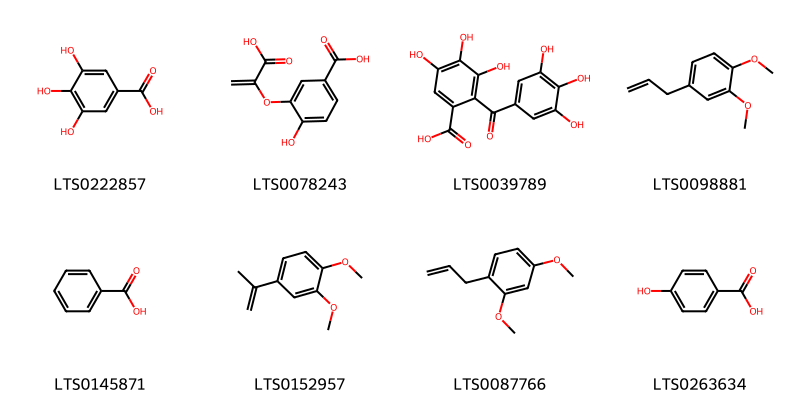{ width=100% }
    <figcaption>Hình ảnh cấu trúc hóa học của 8 hoạt chất thuộc nhóm Benzene and substituted derivatives gồm ['galop (LTS0222857)', '3-[(1-carboxyeth-1-en-1-yl)oxy]-4-hydroxybenzoic acid (LTS0078243)', '3,4,5-trihydroxy-2-(3,4,5-trihydroxybenzoyl)benzoic acid (LTS0039789)', 'methyl eugenol (LTS0098881)', 'benzoic acid (LTS0145871)', '1,2-dimethoxy-4-(prop-1-en-2-yl)benzene (LTS0152957)', '2,4-dimethoxy-1-(prop-2-en-1-yl)benzene (LTS0087766)', 'p-hydroxybenzoic acid (LTS0263634)'].</figcaption>
</figure>
#### Nhóm Carboxylic acids and derivatives
<figure markdown="span">
    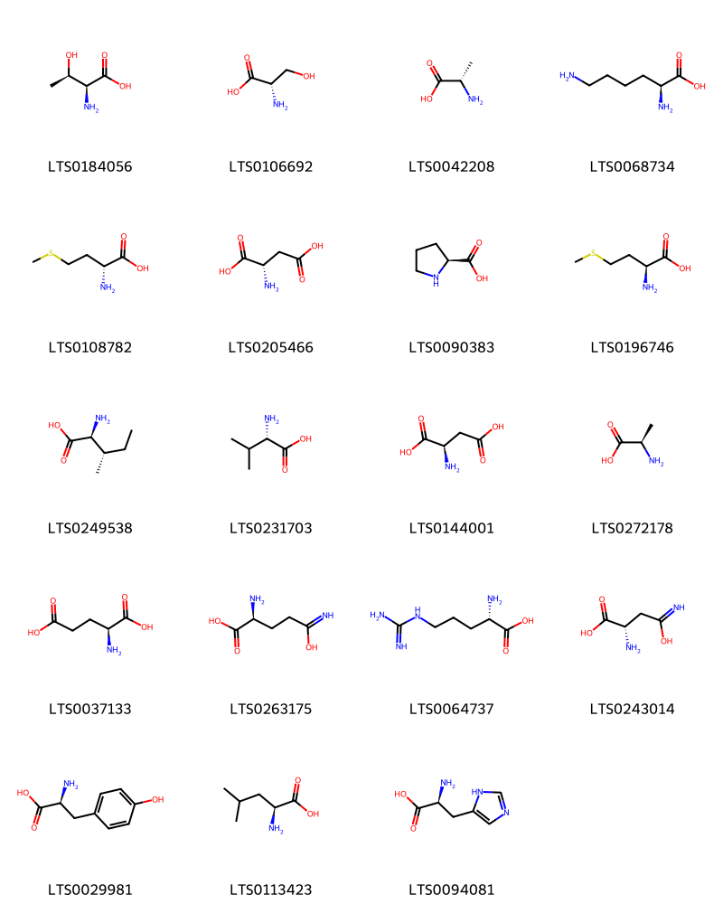{ width=100% }
    <figcaption>Hình ảnh cấu trúc hóa học của 19 hoạt chất thuộc nhóm Carboxylic acids and derivatives gồm ['l-threonine (LTS0184056)', 'l-serine (LTS0106692)', 'l-alanine (LTS0042208)', 'l-lysine (LTS0068734)', 'd-methionine (LTS0108782)', 'l-aspartic acid (LTS0205466)', 'l-proline (LTS0090383)', 'l-methionine (LTS0196746)', 'l-isoleucine (LTS0249538)', 'l-valine (LTS0231703)', 'd-aspartic acid (LTS0144001)', 'd-alanine (LTS0272178)', 'l-glutamic acid (LTS0037133)', 'l glutamine (LTS0263175)', 'l-arginine (LTS0064737)', 'aspartamate (LTS0243014)', 'l-tyrosine (LTS0029981)', 'l-leucine (LTS0113423)', 'l-histidine (LTS0094081)'].</figcaption>
</figure>
#### Nhóm Cinnamic acids and derivatives
<figure markdown="span">
    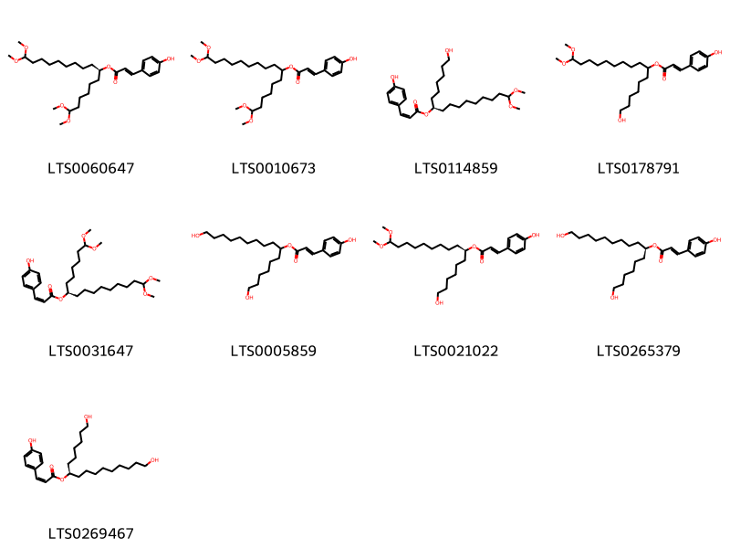{ width=100% }
    <figcaption>Hình ảnh cấu trúc hóa học của 9 hoạt chất thuộc nhóm Cinnamic acids and derivatives gồm ['(7r)-1,1,16,16-tetramethoxyhexadecan-7-yl (2e)-3-(4-hydroxyphenyl)prop-2-enoate (LTS0060647)', '1,1,16,16-tetramethoxyhexadecan-7-yl 3-(4-hydroxyphenyl)prop-2-enoate (LTS0010673)', '(7r)-1-hydroxy-16,16-dimethoxyhexadecan-7-yl (2z)-3-(4-hydroxyphenyl)prop-2-enoate (LTS0114859)', '1-hydroxy-16,16-dimethoxyhexadecan-7-yl 3-(4-hydroxyphenyl)prop-2-enoate (LTS0178791)', '(7r)-1,1,16,16-tetramethoxyhexadecan-7-yl (2z)-3-(4-hydroxyphenyl)prop-2-enoate (LTS0031647)', '1,16-dihydroxyhexadecan-7-yl 3-(4-hydroxyphenyl)prop-2-enoate (LTS0005859)', '(7r)-1-hydroxy-16,16-dimethoxyhexadecan-7-yl (2e)-3-(4-hydroxyphenyl)prop-2-enoate (LTS0021022)', '(7r)-1,16-dihydroxyhexadecan-7-yl (2e)-3-(4-hydroxyphenyl)prop-2-enoate (LTS0265379)', '(7r)-1,16-dihydroxyhexadecan-7-yl (2z)-3-(4-hydroxyphenyl)prop-2-enoate (LTS0269467)'].</figcaption>
</figure>
#### Nhóm Organooxygen compounds
<figure markdown="span">
    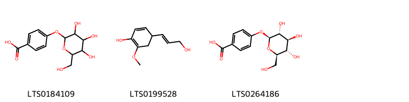{ width=100% }
    <figcaption>Hình ảnh cấu trúc hóa học của 3 hoạt chất thuộc nhóm Organooxygen compounds gồm ['4-{[3,4,5-trihydroxy-6-(hydroxymethyl)oxan-2-yl]oxy}benzoic acid (LTS0184109)', '4-[(1e)-3-hydroxyprop-1-en-1-yl]-2-methoxycyclohexa-1,5-dien-1-ol (LTS0199528)', '4-(β-d-glucosyloxy)benzoate (LTS0264186)'].</figcaption>
</figure>
#### Nhóm Phenols
<figure markdown="span">
    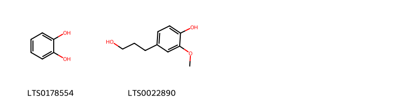{ width=100% }
    <figcaption>Hình ảnh cấu trúc hóa học của 2 hoạt chất thuộc nhóm Phenols gồm ['catechol (LTS0178554)', 'dihydroconiferyl alcohol (LTS0022890)'].</figcaption>
</figure>
#### Nhóm Prenol lipids
<figure markdown="span">
    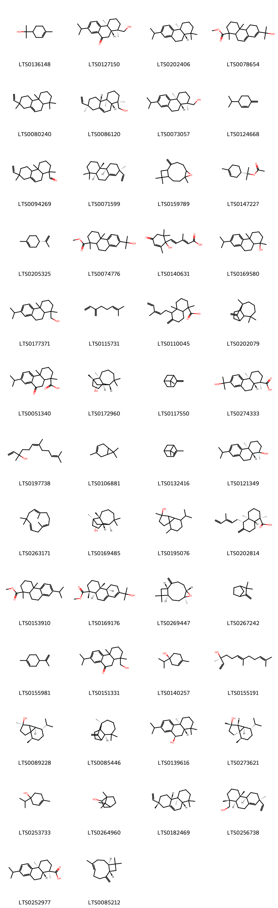{ width=100% }
    <figcaption>Hình ảnh cấu trúc hóa học của 84 hoạt chất thuộc nhóm Prenol lipids gồm ['terpineol (LTS0136148)', '(1r,4as,10ar)-1-(hydroxymethyl)-7-isopropyl-1,4a-dimethyl-3,4,10,10a-tetrahydro-2h-phenanthren-9-one (LTS0127150)', 'abietatriene (LTS0202406)', 'methyl 7-(2-hydroxypropan-2-yl)-1,4a-dimethyl-2,3,4,4b,5,6,10,10a-octahydrophenanthrene-1-carboxylate (LTS0078654)', '7-ethenyl-1,1,4a,7-tetramethyl-3,4,4b,5,6,8,10,10a-octahydro-2h-phenanthrene (LTS0080240)', 'isopimarinol (LTS0086120)', 'dehydroabietinol (LTS0073057)', 'β phellandrene (LTS0124668)', '7-ethenyl-1,4a,7-trimethyl-3,4,4b,5,6,8,10,10a-octahydro-2h-phenanthrene-1-carbaldehyde (LTS0094269)', 'pimaradiene (LTS0071599)', 'caryophyllene oxide (LTS0159789)', '(-)-α-terpinyl acetate (LTS0147227)', '(-)-limonene (LTS0205325)', 'methyl 7-(2-hydroxypropan-2-yl)-1,4a-dimethyl-2,3,4,9,10,10a-hexahydrophenanthrene-1-carboxylate (LTS0074776)', 'abscisic acid,  (LTS0140631)', '7-isopropyl-1,4a-dimethyl-2,3,4,9,10,10a-hexahydrophenanthren-1-ol (LTS0169580)', '(7-isopropyl-1,4a-dimethyl-2,3,4,9,10,10a-hexahydrophenanthren-1-yl)methanol (LTS0177371)', 'α-myrcene (LTS0115731)', '1,4a-dimethyl-6-methylidene-5-(3-methylpenta-2,4-dien-1-yl)-hexahydro-2h-naphthalene-1-carboxylic acid (LTS0110045)', 'longifolene (LTS0202079)', '7-isopropyl-1,4a-dimethyl-9-oxo-3,4,10,10a-tetrahydro-2h-phenanthrene-1-carboxylic acid (LTS0051340)', '(1r,2s,7r,8s,9r)-2,6,6,9-tetramethyltricyclo[5.4.0.0²,⁹]undecan-8-ol (LTS0172960)', 'β-pinene (LTS0117550)', '(1r,4as,10ar)-7-(2-hydroxypropan-2-yl)-1,4a-dimethyl-2,3,4,9,10,10a-hexahydrophenanthrene-1-carboxylic acid (LTS0274333)', 'nerolidol (LTS0197738)', 'monoterpenes (LTS0106881)', 'α pinene (LTS0132416)', '(1r,4as,10ar)-7-isopropyl-1,4a-dimethyl-2,3,4,9,10,10a-hexahydrophenanthren-1-ol (LTS0121349)', 'humulene (LTS0263171)', '(1s,2r,7s,8s,9s)-2,6,6,9-tetramethyltricyclo[5.4.0.0²,⁹]undecan-8-ol (LTS0169485)', '7-isopropyl-4,10-dimethyltricyclo[4.4.0.0¹,⁵]decan-4-ol (LTS0195076)', '(1r,4ar,5s,8ar)-1,4a-dimethyl-6-methylidene-5-[(2e)-3-methylpenta-2,4-dien-1-yl]-hexahydro-2h-naphthalene-1-carboxylic acid (LTS0202814)', 'methyl 7-isopropyl-1,4a-dimethyl-2,3,4,9,10,10a-hexahydrophenanthrene-1-carboxylate (LTS0153910)', 'methyl (1r,4ar,4br,10ar)-7-(2-hydroxypropan-2-yl)-1,4a-dimethyl-2,3,4,4b,5,6,10,10a-octahydrophenanthrene-1-carboxylate (LTS0169176)', '(1r,4s,6s,10s)-4,12,12-trimethyl-9-methylidene-5-oxatricyclo[8.2.0.0⁴,⁶]dodecane (LTS0269447)', 'camphene (LTS0267242)', 'limonene,  (LTS0155981)', '1-(hydroxymethyl)-7-isopropyl-1,4a-dimethyl-3,4,10,10a-tetrahydro-2h-phenanthren-9-one (LTS0151331)', '(+)-4-terpineol (LTS0140257)', 'nerolidol (LTS0155191)', '(4r,6r,7s,10r)-7-isopropyl-4,10-dimethyltricyclo[4.4.0.0¹,⁵]decan-4-ol (LTS0089228)', '(2s,7s)-3,3,7-trimethyl-8-methylidenetricyclo[5.4.0.0²,⁹]undecane (LTS0085446)', '(4as,9r,10as)-7-isopropyl-1,1,4a-trimethyl-2,3,4,9,10,10a-hexahydrophenanthren-9-ol (LTS0139616)', '(-)-cubebol (LTS0273621)', '4-terpineol (LTS0253733)', 'borneol (LTS0264960)', '(4as,4bs,7r,10as)-7-ethenyl-1,1,4a,7-tetramethyl-3,4,4b,5,6,8,10,10a-octahydro-2h-phenanthrene (LTS0182469)', '[(1r,4ar,4bs,7s,10ar)-7-ethenyl-1,4a,7-trimethyl-3,4,4b,5,6,9,10,10a-octahydro-2h-phenanthren-1-yl]methanol (LTS0256738)', '(-)-dehydroabietic acid (LTS0252977)', 'caryophyllene (LTS0085212)', 'isopimaral (LTS0053605)', '(1r)-7-isopropyl-1,4a-dimethyl-2,3,4,9,10,10a-hexahydrophenanthrene-1-carboxylic acid (LTS0267608)', '1,4a-dimethyl-5-(3-methyl-4-oxobut-2-en-1-yl)-6-methylidene-hexahydro-2h-naphthalene-1-carboxylic acid (LTS0057750)', '[(1r,4ar,4bs,7r,10ar)-7-ethenyl-1,4a,7-trimethyl-3,4,4b,5,6,8,10,10a-octahydro-2h-phenanthren-1-yl]methanol (LTS0245263)', 'bornyl acetate (LTS0060565)', '(1r,2s)-5-isopropyl-2-methylbicyclo[3.1.0]hexan-2-ol (LTS0265986)', '5-(2-hydroxypropan-2-yl)-2-methylcyclohex-2-en-1-one (LTS0230523)', 'β-caryophyllene oxide (LTS0213960)', '(1r,2r,7r,8r)-2,6,6,9-tetramethyltricyclo[5.4.0.0²,⁸]undec-9-ene (LTS0266208)', 'methyl dehydroabietate (LTS0080951)', '(1r,4s,6r,7s,10r)-7-isopropyl-4,10-dimethyltricyclo[4.4.0.0¹,⁵]decan-4-ol (LTS0223062)', 'sabinene hydrate (LTS0215494)', '2,6,6,9-tetramethyltricyclo[5.4.0.0²,⁹]undecan-8-ol (LTS0025924)', '7-oxodehydroabietic acid (LTS0229171)', '7-isopropyl-1,1,4a-trimethyl-2,3,4,9,10,10a-hexahydrophenanthren-9-ol (LTS0149356)', 'polyprenol (LTS0209244)', '7-isopropyl-1,1,4a-trimethyl-2,3,4,9,10,10a-hexahydrophenanthrene (LTS0210076)', 'methyl (1r,4ar,4bs,10ar)-7-(2-hydroxypropan-2-yl)-1,4a-dimethyl-2,3,4,4b,5,6,10,10a-octahydrophenanthrene-1-carboxylate (LTS0244302)', 'isopimara-7,15-diene (LTS0162801)', 'α-terpinyl acetate (LTS0172943)', '7-(2-hydroxypropan-2-yl)-1,4a-dimethyl-2,3,4,9,10,10a-hexahydrophenanthrene-1-carboxylic acid (LTS0054271)', '(1r,4ar,4bs,7r,10ar)-7-ethenyl-1,4a,7-trimethyl-3,4,4b,5,6,8,10,10a-octahydro-2h-phenanthrene-1-carbaldehyde (LTS0228062)', '(+)-α-terpineol (LTS0258249)', 'methyl (1r,4as,10ar)-7-(2-hydroxypropan-2-yl)-1,4a-dimethyl-2,3,4,9,10,10a-hexahydrophenanthrene-1-carboxylate (LTS0067008)', '(1r,2s,4r)-bornyl acetate (LTS0068000)', 'caryophyllene (LTS0131870)', '(1r,4ar,5s,8ar)-1,4a-dimethyl-5-[(2e)-3-methyl-4-oxobut-2-en-1-yl]-6-methylidene-hexahydro-2h-naphthalene-1-carboxylic acid (LTS0015954)', '(7-ethenyl-1,4a,7-trimethyl-3,4,4b,5,6,8,10,10a-octahydro-2h-phenanthren-1-yl)methanol (LTS0102281)', 'dehydroabietic acid (LTS0034017)', 'sabinene hydrate (LTS0236165)', 'abietic acid (LTS0088895)', '2,6,6,9-tetramethyltetracyclo[5.4.0.0²,⁹.0⁸,¹⁰]undecane (LTS0027122)', '(4e)-5-[(1s)-1-hydroxy-2,6,6-trimethyl-4-oxocyclohex-2-en-1-yl]-3-methylpenta-2,4-dienoic acid (LTS0268716)', '(1r,2s,7s,8s,9s,10s)-2,6,6,9-tetramethyltetracyclo[5.4.0.0²,⁹.0⁸,¹⁰]undecane (LTS0128494)'].</figcaption>
</figure>
#### Nhóm Saturated hydrocarbons
<figure markdown="span">
    { width=100% }
    <figcaption>Hình ảnh cấu trúc hóa học của 1 hoạt chất thuộc nhóm Saturated hydrocarbons gồm ['3,3-dimethylpentane (LTS0047677)'].</figcaption>
</figure>
#### Nhóm Unsaturated hydrocarbons
<figure markdown="span">
    { width=100% }
    <figcaption>Hình ảnh cấu trúc hóa học của 1 hoạt chất thuộc nhóm Unsaturated hydrocarbons gồm ['α terpinene (LTS0232891)'].</figcaption>
</figure>

---

### Dược dân tộc học

Danh sách các quốc gia có sử dụng *Pinus densiflora* trong điều trị các bệnh. 

| Country   | Disease     | Bệnh                   |
|:----------|:------------|:-----------------------|
| China     | Laxative    | Nhuận trường           |
| Japan*    | Rubefacient | Chất gây xung huyết da |

---

---
## Pinus edulis
### Thông tin về thực vật

!!! info "Phân loại thực vật của *Pinus edulis* từ GIBF:"
    - **Kingdom:** Plantae
    - **Phylum:** Tracheophyta
    - **Order:** Pinales
    - **Family:** Pinaceae
    - **Genus:** Pinus
    - **Species:** *Pinus edulis*

 

| Label (VI)   | Label (EN)   | Scientific Name   | Descriptions (VI)   | Descriptions (EN)   | Also Known As (VI)   | Also Known As (EN)                                              |
|:-------------|:-------------|:------------------|:--------------------|:--------------------|:---------------------|:----------------------------------------------------------------|
| N/A          | N/A          | Pinus edulis      | loài thực vật       | species of plant    | ['']                 | ['piñon', 'pinyon pine', 'Colorado pinyon', 'two-needle piñon'] |

#### Phân bố trên thế giới

**Từ CSDL GIBF** United States of America

#### Phân bố tại Việt Nam

**Từ CSDL GIBF**: Không có ghi nhận ở Việt Nam

---
### Thành phần hóa học
        
- Theo cơ sở dữ liệu lotus: Từ loài *Pinus edulis* đã phân lập và xác định được 21 hoạt chất thuộc về các nhóm Piperidines, Benzene and substituted derivatives, Cinnamic acids and derivatives, Pyridines and derivatives, Prenol lipids. 

|    | chemicalTaxonomyClassyfireClass     |   smiles_count |
|---:|:------------------------------------|---------------:|
|  0 | Benzene and substituted derivatives |              6 |
|  1 | Cinnamic acids and derivatives      |              2 |
|  2 | Piperidines                         |              9 |
|  3 | Prenol lipids                       |              2 |
|  4 | Pyridines and derivatives           |              2 |

#### Nhóm Benzene and substituted derivatives
<figure markdown="span">
    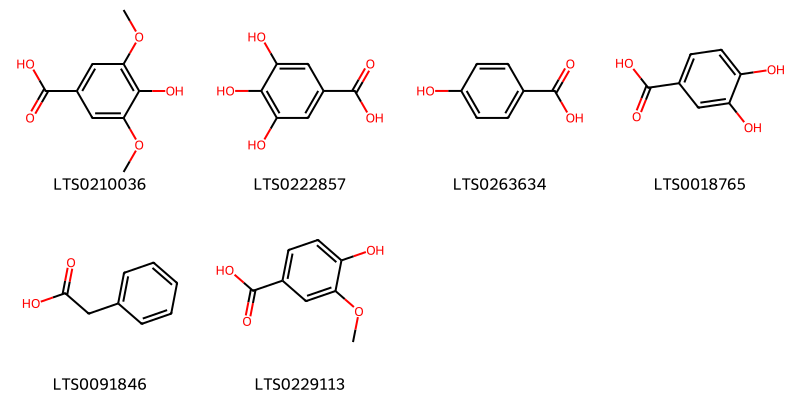{ width=100% }
    <figcaption>Hình ảnh cấu trúc hóa học của 6 hoạt chất thuộc nhóm Benzene and substituted derivatives gồm ['syringic acid (LTS0210036)', 'galop (LTS0222857)', 'p-hydroxybenzoic acid (LTS0263634)', '3,4-dihydroxybenzoic acid (LTS0018765)', 'ω-phenylacetic acid (LTS0091846)', 'vanillic acid (LTS0229113)'].</figcaption>
</figure>
#### Nhóm Cinnamic acids and derivatives
<figure markdown="span">
    { width=100% }
    <figcaption>Hình ảnh cấu trúc hóa học của 2 hoạt chất thuộc nhóm Cinnamic acids and derivatives gồm ['ferulic acid (LTS0077328)', '3,4-dihydroxycinnamic acid (LTS0128050)'].</figcaption>
</figure>
#### Nhóm Piperidines
<figure markdown="span">
    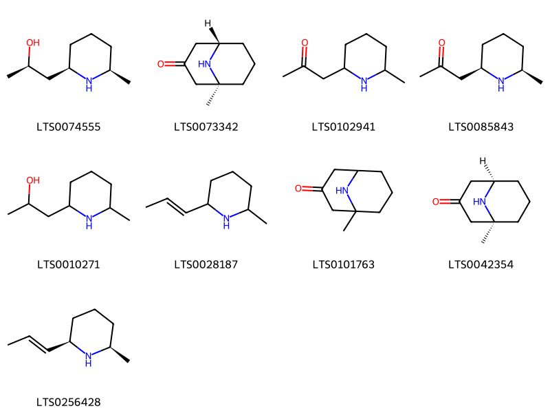{ width=100% }
    <figcaption>Hình ảnh cấu trúc hóa học của 9 hoạt chất thuộc nhóm Piperidines gồm ['(2r)-1-[(2r,6r)-6-methylpiperidin-2-yl]propan-2-ol (LTS0074555)', '(1s,5s)-1-methyl-9-azabicyclo[3.3.1]nonan-3-one (LTS0073342)', '1-(6-methylpiperidin-2-yl)propan-2-one (LTS0102941)', '(-)-pinidinone (LTS0085843)', '1-(6-methylpiperidin-2-yl)propan-2-ol (LTS0010271)', '2-methyl-6-(prop-1-en-1-yl)piperidine (LTS0028187)', '1-methyl-9-azabicyclo[3.3.1]nonan-3-one (LTS0101763)', '(1s,5r)-1-methyl-9-azabicyclo[3.3.1]nonan-3-one (LTS0042354)', 'pinidine (LTS0256428)'].</figcaption>
</figure>
#### Nhóm Prenol lipids
<figure markdown="span">
    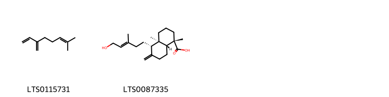{ width=100% }
    <figcaption>Hình ảnh cấu trúc hóa học của 2 hoạt chất thuộc nhóm Prenol lipids gồm ['α-myrcene (LTS0115731)', 'isocupressic acid (LTS0087335)'].</figcaption>
</figure>
#### Nhóm Pyridines and derivatives
<figure markdown="span">
    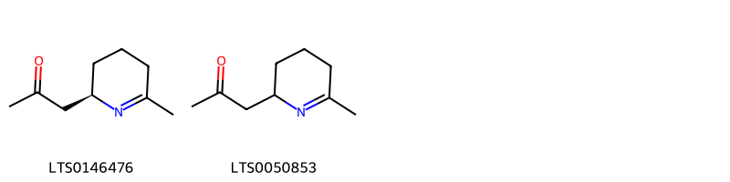{ width=100% }
    <figcaption>Hình ảnh cấu trúc hóa học của 2 hoạt chất thuộc nhóm Pyridines and derivatives gồm ['1-[(2r)-6-methyl-2,3,4,5-tetrahydropyridin-2-yl]propan-2-one (LTS0146476)', '1-(6-methyl-2,3,4,5-tetrahydropyridin-2-yl)propan-2-one (LTS0050853)'].</figcaption>
</figure>

---

### Dược dân tộc học

Danh sách các quốc gia có sử dụng *Pinus edulis* trong điều trị các bệnh. 

| Country        | Disease               | Bệnh               |
|:---------------|:----------------------|:-------------------|
| US             | Antiseptic            | Khử trùng          |
| US(Amerindian) | Poultice, Suppurative | Thuốc đắp, mưng mủ |

---

---
## Pinus gerardiana
### Thông tin về thực vật

!!! info "Phân loại thực vật của *Pinus gerardiana* từ GIBF:"
    - **Kingdom:** Plantae
    - **Phylum:** Tracheophyta
    - **Order:** Pinales
    - **Family:** Pinaceae
    - **Genus:** Pinus
    - **Species:** *Pinus gerardiana*

 

| Label (VI)   | Label (EN)   | Scientific Name   | Descriptions (VI)   | Descriptions (EN)   | Also Known As (VI)   | Also Known As (EN)   |
|:-------------|:-------------|:------------------|:--------------------|:--------------------|:---------------------|:---------------------|
| N/A          | N/A          | Pinus gerardiana  | loài thực vật       | species of plant    | ['Pinus gerardiana'] | ['Chilgoza Pine']    |

#### Phân bố trên thế giới

**Từ CSDL GIBF** nan, Afghanistan, United States of America, Korea, Republic of, United Kingdom of Great Britain and Northern Ireland, Pakistan, China, Russian Federation, Australia, New Zealand, Nigeria, India, Georgia, unknown or invalid, France

#### Phân bố tại Việt Nam

**Từ CSDL GIBF**: Không có ghi nhận ở Việt Nam

---
### Thành phần hóa học
        
- Theo cơ sở dữ liệu lotus: Từ loài *Pinus gerardiana* đã phân lập và xác định được Chưa có hoạt chất nào được phân lập. hoạt chất thuộc về các nhóm Không có hoạt chất nào được phân lập. 

Không có hình ảnh nào được tạo ra

---

### Dược dân tộc học

Danh sách các quốc gia có sử dụng *Pinus gerardiana* trong điều trị các bệnh. 

| Country   | Disease                             | Bệnh                      |
|:----------|:------------------------------------|:--------------------------|
| Elsewhere | Carminative, Expectorant, Stimulant | Thụ phấn, đờm, kích thích |

---

---
## Pinus koraiensis
### Thông tin về thực vật

!!! info "Phân loại thực vật của *Pinus koraiensis* từ GIBF:"
    - **Kingdom:** Plantae
    - **Phylum:** Tracheophyta
    - **Order:** Pinales
    - **Family:** Pinaceae
    - **Genus:** Pinus
    - **Species:** *Pinus koraiensis*

 

| Label (VI)   | Label (EN)   | Scientific Name   | Descriptions (VI)   | Descriptions (EN)   | Also Known As (VI)   | Also Known As (EN)   |
|:-------------|:-------------|:------------------|:--------------------|:--------------------|:---------------------|:---------------------|
| N/A          | N/A          | Pinus koraiensis  | loài thực vật       | species of plant    | ['']                 | ['Korean Pine']      |

#### Phân bố trên thế giới

**Từ CSDL GIBF** nan, United States of America, Korea, Republic of, Latvia, China, Russian Federation, Germany, France

#### Phân bố tại Việt Nam

**Từ CSDL GIBF**: Không có ghi nhận ở Việt Nam

---
### Thành phần hóa học
        
- Theo cơ sở dữ liệu lotus: Từ loài *Pinus koraiensis* đã phân lập và xác định được 63 hoạt chất thuộc về các nhóm Fatty Acyls, Phenanthrenes and derivatives, Organooxygen compounds, Prenol lipids, Saturated hydrocarbons, Stilbenes. 

|    | chemicalTaxonomyClassyfireClass   |   smiles_count |
|---:|:----------------------------------|---------------:|
|  0 | Fatty Acyls                       |              5 |
|  1 | Organooxygen compounds            |              2 |
|  2 | Phenanthrenes and derivatives     |              2 |
|  3 | Prenol lipids                     |             44 |
|  4 | Saturated hydrocarbons            |              1 |
|  5 | Stilbenes                         |              9 |

#### Nhóm Fatty Acyls
<figure markdown="span">
    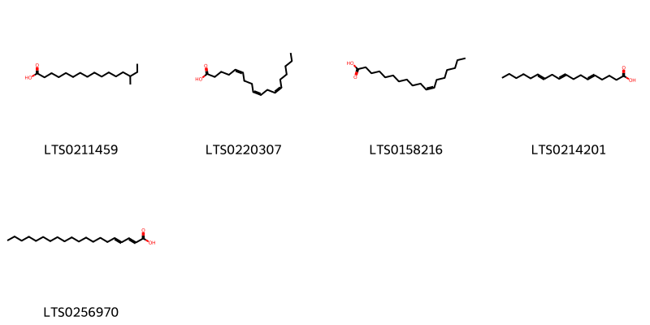{ width=100% }
    <figcaption>Hình ảnh cấu trúc hóa học của 5 hoạt chất thuộc nhóm Fatty Acyls gồm ['14-methyl palmitic acid (LTS0211459)', 'pinoleic acid (LTS0220307)', 'cis-vaccenic acid (LTS0158216)', 'pinolenic acid (LTS0214201)', 'icosa-2,4-dienoic acid (LTS0256970)'].</figcaption>
</figure>
#### Nhóm Organooxygen compounds
<figure markdown="span">
    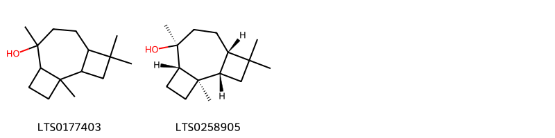{ width=100% }
    <figcaption>Hình ảnh cấu trúc hóa học của 2 hoạt chất thuộc nhóm Organooxygen compounds gồm ['2,6,10,10-tetramethyltricyclo[7.2.0.0²,⁵]undecan-6-ol (LTS0177403)', '(1s,2r,5s,6s,9s)-2,6,10,10-tetramethyltricyclo[7.2.0.0²,⁵]undecan-6-ol (LTS0258905)'].</figcaption>
</figure>
#### Nhóm Phenanthrenes and derivatives
<figure markdown="span">
    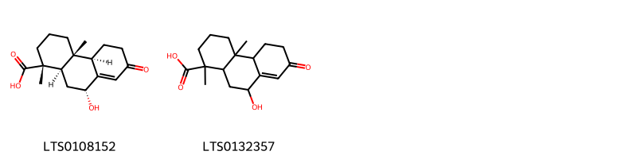{ width=100% }
    <figcaption>Hình ảnh cấu trúc hóa học của 2 hoạt chất thuộc nhóm Phenanthrenes and derivatives gồm ['(1r,4ar,4br,9r,10ar)-9-hydroxy-1,4a-dimethyl-7-oxo-3,4,4b,5,6,9,10,10a-octahydro-2h-phenanthrene-1-carboxylic acid (LTS0108152)', '9-hydroxy-1,4a-dimethyl-7-oxo-3,4,4b,5,6,9,10,10a-octahydro-2h-phenanthrene-1-carboxylic acid (LTS0132357)'].</figcaption>
</figure>
#### Nhóm Prenol lipids
<figure markdown="span">
    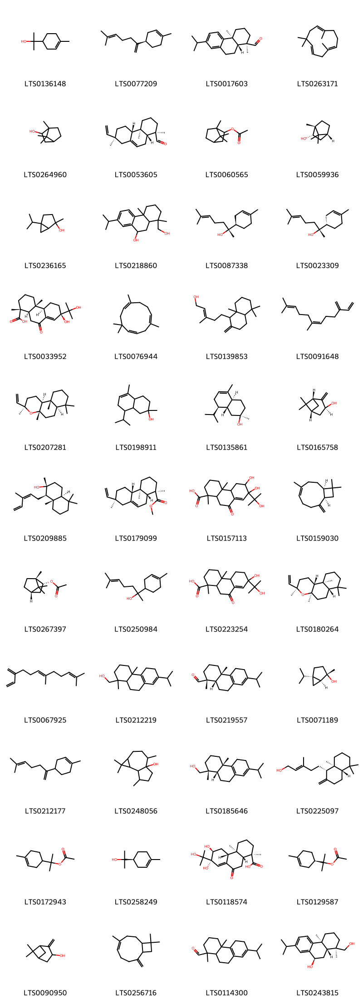{ width=100% }
    <figcaption>Hình ảnh cấu trúc hóa học của 44 hoạt chất thuộc nhóm Prenol lipids gồm ['terpineol (LTS0136148)', '(r)-β-bisabolene (LTS0077209)', 'dehydroabietal (LTS0017603)', 'humulene (LTS0263171)', 'borneol (LTS0264960)', 'isopimaral (LTS0053605)', 'bornyl acetate (LTS0060565)', '(+)-borneol (LTS0059936)', 'sabinene hydrate (LTS0236165)', '1-(hydroxymethyl)-7-isopropyl-1,4a-dimethyl-2,3,4,9,10,10a-hexahydrophenanthren-9-ol (LTS0218860)', '(2r)-6-methyl-2-[(1r)-4-methylcyclohex-3-en-1-yl]hept-5-en-2-ol (LTS0087338)', 'levomenol (LTS0023309)', '(1r,4ar,4br,7r,10ar)-7-hydroxy-7-(2-hydroxypropan-2-yl)-1,4a-dimethyl-9-oxo-2,3,4,4b,5,6,10,10a-octahydrophenanthrene-1-carboxylic acid (LTS0033952)', 'α-humulene (LTS0076944)', '5-(5,5,8a-trimethyl-2-methylidene-hexahydro-1h-naphthalen-1-yl)-3-methylpent-2-en-1-ol (LTS0139853)', 'β-farnesene (LTS0091648)', '(3r,4as,6ar,10ar,10bs)-3-ethenyl-3,4a,7,7,10a-pentamethyl-octahydro-1h-naphtho[2,1-b]pyran (LTS0207281)', '8-isopropyl-2,5-dimethyl-3,4,4a,7,8,8a-hexahydro-1h-naphthalen-2-ol (LTS0198911)', '(2r,4as,8r,8ar)-8-isopropyl-2,5-dimethyl-3,4,4a,7,8,8a-hexahydro-1h-naphthalen-2-ol (LTS0135861)', '(1r,3s,5r)-6,6-dimethyl-2-methylidenebicyclo[3.1.1]heptan-3-ol (LTS0165758)', 'cis-abienol (LTS0209885)', 'methyl (1r,4ar,4bs,7s,10ar)-7-ethenyl-1,4a,7-trimethyl-3,4,4b,5,6,8,10,10a-octahydro-2h-phenanthrene-1-carboxylate (LTS0179099)', '6,7-dihydroxy-7-(2-hydroxypropan-2-yl)-1,4a-dimethyl-9-oxo-2,3,4,4b,5,6,10,10a-octahydrophenanthrene-1-carboxylic acid (LTS0157113)', '(1r,4z,9r)-4,11,11-trimethyl-8-methylidenebicyclo[7.2.0]undec-4-ene (LTS0159030)', '(-)-bornyl acetate (LTS0267397)', 'α-bisabolol (LTS0250984)', '7-hydroxy-7-(2-hydroxypropan-2-yl)-1,4a-dimethyl-9-oxo-2,3,4,4b,5,6,10,10a-octahydrophenanthrene-1-carboxylic acid (LTS0223254)', '(3r,4ar,6as,10as,10br)-3-ethenyl-3,4a,7,7,10a-pentamethyl-octahydro-1h-naphtho[2,1-b]pyran (LTS0180264)', 'β-farnesene (LTS0067925)', '(7-isopropyl-1,4a-dimethyl-2,3,4,5,6,9,10,10a-octahydrophenanthren-1-yl)methanol (LTS0212219)', '(1r,4as,10as)-7-isopropyl-1,4a-dimethyl-2,3,4,5,6,9,10,10a-octahydrophenanthrene-1-carbaldehyde (LTS0219557)', '(1s,2s,5r)-5-isopropyl-2-methylbicyclo[3.1.0]hexan-2-ol (LTS0071189)', 'β-bisabolene (LTS0212177)', '1,1,4,7-tetramethyl-octahydro-1ah-cyclopropa[e]azulen-4a-ol (LTS0248056)', '[(1r,4as,10as)-7-isopropyl-1,4a-dimethyl-2,3,4,5,6,9,10,10a-octahydrophenanthren-1-yl]methanol (LTS0185646)', '(+)-copalol (LTS0225097)', 'α-terpinyl acetate (LTS0172943)', '(+)-α-terpineol (LTS0258249)', '(1r,4ar,4br,6s,7s,10ar)-6,7-dihydroxy-7-(2-hydroxypropan-2-yl)-1,4a-dimethyl-9-oxo-2,3,4,4b,5,6,10,10a-octahydrophenanthrene-1-carboxylic acid (LTS0118574)', '(+)-α-terpinyl acetate (LTS0129587)', 'pinocarveol (LTS0090950)', '4,11,11-trimethyl-8-methylidenebicyclo[7.2.0]undec-4-ene (LTS0256716)', '7-isopropyl-1,4a-dimethyl-2,3,4,5,6,9,10,10a-octahydrophenanthrene-1-carbaldehyde (LTS0114300)', '(1r,4as,9r,10ar)-1-(hydroxymethyl)-7-isopropyl-1,4a-dimethyl-2,3,4,9,10,10a-hexahydrophenanthren-9-ol (LTS0243815)'].</figcaption>
</figure>
#### Nhóm Saturated hydrocarbons
<figure markdown="span">
    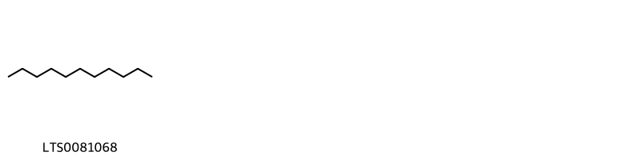{ width=100% }
    <figcaption>Hình ảnh cấu trúc hóa học của 1 hoạt chất thuộc nhóm Saturated hydrocarbons gồm ['undecane (LTS0081068)'].</figcaption>
</figure>
#### Nhóm Stilbenes
<figure markdown="span">
    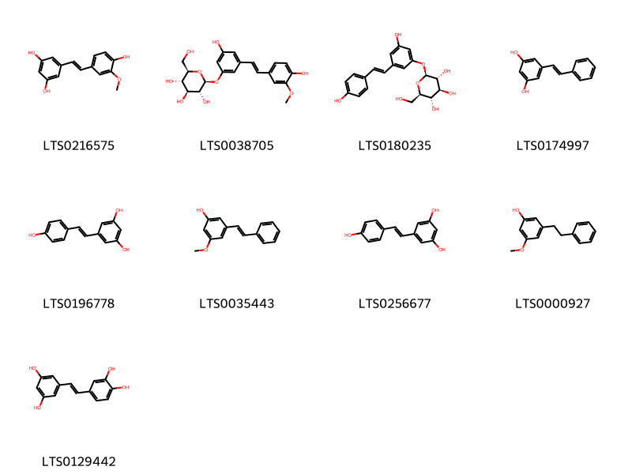{ width=100% }
    <figcaption>Hình ảnh cấu trúc hóa học của 9 hoạt chất thuộc nhóm Stilbenes gồm ['isorhapontigenin (LTS0216575)', 'isorhapontin (LTS0038705)', 'piceid (LTS0180235)', 'pinosylvin (LTS0174997)', 'tocilizumab (LTS0196778)', 'pinosylvin methyl ether (LTS0035443)', 'resveratrol (LTS0256677)', '3-methoxy-5-(2-phenylethyl)phenol (LTS0000927)', 'piceatannol (LTS0129442)'].</figcaption>
</figure>

---

### Dược dân tộc học

Danh sách các quốc gia có sử dụng *Pinus koraiensis* trong điều trị các bệnh. 

| Country   | Disease   | Bệnh               |
|:----------|:----------|:-------------------|
| Elsewhere | Tonic     | (thuộc) trương lực |

---

---
## Pinus lambertiana
### Thông tin về thực vật

!!! info "Phân loại thực vật của *Pinus lambertiana* từ GIBF:"
    - **Kingdom:** Plantae
    - **Phylum:** Tracheophyta
    - **Order:** Pinales
    - **Family:** Pinaceae
    - **Genus:** Pinus
    - **Species:** *Pinus lambertiana*

 

| Label (VI)   | Label (EN)   | Scientific Name   | Descriptions (VI)   | Descriptions (EN)         | Also Known As (VI)   | Also Known As (EN)   |
|:-------------|:-------------|:------------------|:--------------------|:--------------------------|:---------------------|:---------------------|
| N/A          | N/A          | Pinus lambertiana |                     | species of evergreen tree | ['']                 | ['Sugar Pine']       |

#### Phân bố trên thế giới

**Từ CSDL GIBF** Mexico, United States of America

#### Phân bố tại Việt Nam

**Từ CSDL GIBF**: Không có ghi nhận ở Việt Nam

---
### Thành phần hóa học
        
- Theo cơ sở dữ liệu lotus: Từ loài *Pinus lambertiana* đã phân lập và xác định được 25 hoạt chất thuộc về các nhóm Fatty Acyls, Phenanthrenes and derivatives, Flavonoids, Cinnamic acids and derivatives, Prenol lipids, Saturated hydrocarbons. 

|    | chemicalTaxonomyClassyfireClass   |   smiles_count |
|---:|:----------------------------------|---------------:|
|  0 | Cinnamic acids and derivatives    |              2 |
|  1 | Fatty Acyls                       |              4 |
|  2 | Flavonoids                        |              5 |
|  3 | Phenanthrenes and derivatives     |              2 |
|  4 | Prenol lipids                     |             11 |
|  5 | Saturated hydrocarbons            |              1 |

#### Nhóm Cinnamic acids and derivatives
<figure markdown="span">
    { width=100% }
    <figcaption>Hình ảnh cấu trúc hóa học của 2 hoạt chất thuộc nhóm Cinnamic acids and derivatives gồm ['cinnamic acid (LTS0128130)', 'phenylacrylic acid (LTS0097258)'].</figcaption>
</figure>
#### Nhóm Fatty Acyls
<figure markdown="span">
    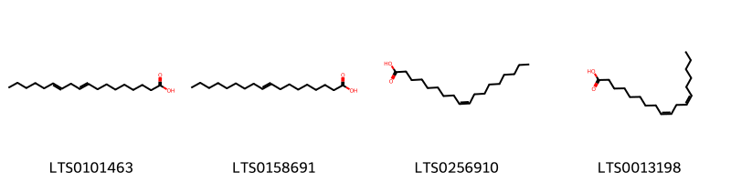{ width=100% }
    <figcaption>Hình ảnh cấu trúc hóa học của 4 hoạt chất thuộc nhóm Fatty Acyls gồm ['9,12-octadecadienoic acid (LTS0101463)', '9 octadecenoic acid (LTS0158691)', 'oleic acid (LTS0256910)', 'linoleic (LTS0013198)'].</figcaption>
</figure>
#### Nhóm Flavonoids
<figure markdown="span">
    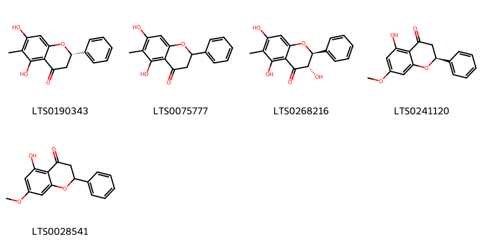{ width=100% }
    <figcaption>Hình ảnh cấu trúc hóa học của 5 hoạt chất thuộc nhóm Flavonoids gồm ['strobopinin (LTS0190343)', '5,7-dihydroxy-6-methyl-2-phenyl-2,3-dihydro-1-benzopyran-4-one (LTS0075777)', '(2s,3s)-3,5,7-trihydroxy-6-methyl-2-phenyl-2,3-dihydro-1-benzopyran-4-one (LTS0268216)', 'pinostrobin (LTS0241120)', 'pinostrobin (LTS0028541)'].</figcaption>
</figure>
#### Nhóm Phenanthrenes and derivatives
<figure markdown="span">
    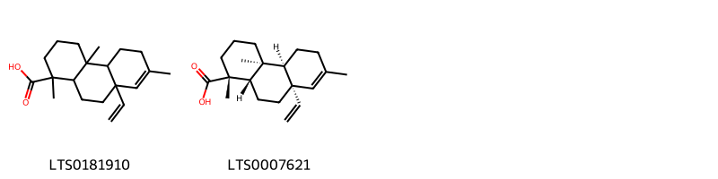{ width=100% }
    <figcaption>Hình ảnh cấu trúc hóa học của 2 hoạt chất thuộc nhóm Phenanthrenes and derivatives gồm ['8a-ethenyl-1,4a,7-trimethyl-3,4,4b,5,6,9,10,10a-octahydro-2h-phenanthrene-1-carboxylic acid (LTS0181910)', '(1r,4as,4br,8as,10as)-8a-ethenyl-1,4a,7-trimethyl-3,4,4b,5,6,9,10,10a-octahydro-2h-phenanthrene-1-carboxylic acid (LTS0007621)'].</figcaption>
</figure>
#### Nhóm Prenol lipids
<figure markdown="span">
    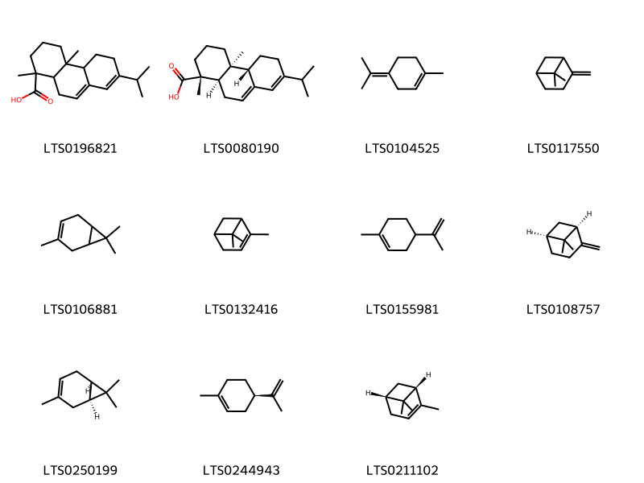{ width=100% }
    <figcaption>Hình ảnh cấu trúc hóa học của 11 hoạt chất thuộc nhóm Prenol lipids gồm ['abietic acid (LTS0196821)', '(1r,4as,4bs,10ar)-7-isopropyl-1,4a-dimethyl-2,3,4,4b,5,6,10,10a-octahydrophenanthrene-1-carboxylic acid (LTS0080190)', 'terpinolene (LTS0104525)', 'β-pinene (LTS0117550)', 'monoterpenes (LTS0106881)', 'α pinene (LTS0132416)', 'limonene,  (LTS0155981)', '(-)-β-pinene (LTS0108757)', '(+)-delta(3)-carene (LTS0250199)', 'α-limonene (LTS0244943)', '(+)-α-pinene (LTS0211102)'].</figcaption>
</figure>
#### Nhóm Saturated hydrocarbons
<figure markdown="span">
    { width=100% }
    <figcaption>Hình ảnh cấu trúc hóa học của 1 hoạt chất thuộc nhóm Saturated hydrocarbons gồm ['undecane (LTS0081068)'].</figcaption>
</figure>

---

### Dược dân tộc học

Danh sách các quốc gia có sử dụng *Pinus lambertiana* trong điều trị các bệnh. 

| Country   | Disease   | Bệnh         |
|:----------|:----------|:-------------|
| US        | Laxative  | Nhuận trường |

---

---
## Pinus longifolia
### Thông tin về thực vật

!!! info "Phân loại thực vật của *Pinus longifolia* từ GIBF:"
    - **Kingdom:** Plantae
    - **Phylum:** Tracheophyta
    - **Order:** Pinales
    - **Family:** Pinaceae
    - **Genus:** Pinus
    - **Species:** *Pinus longifolia*

 

| Label (VI)   | Label (EN)   | Scientific Name   | Descriptions (VI)   | Descriptions (EN)   | Also Known As (VI)   | Also Known As (EN)   |
|:-------------|:-------------|:------------------|:--------------------|:--------------------|:---------------------|:---------------------|
| N/A          | N/A          | Pinus longifolia  |                     |                     | ['']                 | ['']                 |

#### Phân bố trên thế giới

**Từ CSDL GIBF** nan, Brazil, United States of America, Australia, Russian Federation, Italy, India, unknown or invalid, Egypt

#### Phân bố tại Việt Nam

**Từ CSDL GIBF**: Không có ghi nhận ở Việt Nam

---
### Thành phần hóa học
        
- Theo cơ sở dữ liệu lotus: Từ loài *Pinus longifolia* đã phân lập và xác định được 6 hoạt chất thuộc về các nhóm Prenol lipids. 

|    | chemicalTaxonomyClassyfireClass   |   smiles_count |
|---:|:----------------------------------|---------------:|
|  0 | Prenol lipids                     |              6 |

#### Nhóm Prenol lipids
<figure markdown="span">
    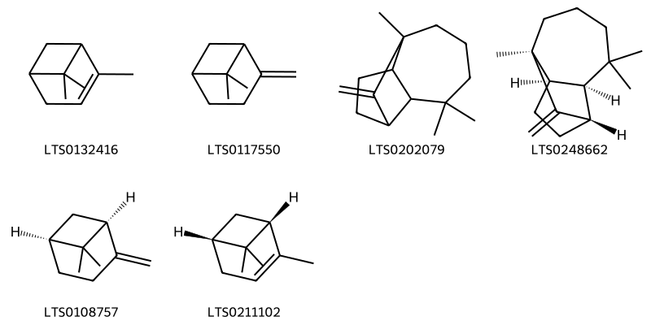{ width=100% }
    <figcaption>Hình ảnh cấu trúc hóa học của 6 hoạt chất thuộc nhóm Prenol lipids gồm ['α pinene (LTS0132416)', 'β-pinene (LTS0117550)', 'longifolene (LTS0202079)', '(+)-longifolene (LTS0248662)', '(-)-β-pinene (LTS0108757)', '(+)-α-pinene (LTS0211102)'].</figcaption>
</figure>

---

### Dược dân tộc học

Danh sách các quốc gia có sử dụng *Pinus longifolia* trong điều trị các bệnh. 

| Country   | Disease        | Bệnh                |
|:----------|:---------------|:--------------------|
| India     | nan, Fungicide | nan, Thuốc diệt nấm |

---

---
## Pinus maritima
### Thông tin về thực vật

!!! info "Phân loại thực vật của *N/A* từ GIBF:"
    - **Kingdom:** Plantae
    - **Phylum:** Tracheophyta
    - **Order:** Pinales
    - **Family:** Pinaceae
    - **Genus:** Pinus
    - **Species:** *N/A*

 

| Label (VI)   | Label (EN)   | Scientific Name   | Descriptions (VI)   | Descriptions (EN)   | Also Known As (VI)   | Also Known As (EN)   |
|:-------------|:-------------|:------------------|:--------------------|:--------------------|:---------------------|:---------------------|
| N/A          | N/A          | Pinus longifolia  |                     |                     | ['']                 | ['']                 |

#### Phân bố trên thế giới

**Từ CSDL GIBF** Viet Nam, Japan, Czechia, Sweden, Finland, Kazakhstan, Türkiye, Spain, Poland, Puerto Rico, United States of America, Greece, Russian Federation, Argentina, Mexico, United Kingdom of Great Britain and Northern Ireland, Canada, Hungary, Ukraine, South Africa, Australia, Italy, France, Ireland

#### Phân bố tại Việt Nam

**Từ CSDL GIBF**: Lâm Đồng

---
### Thành phần hóa học
        
- Theo cơ sở dữ liệu lotus: Từ loài *N/A* đã phân lập và xác định được Chưa có hoạt chất nào được phân lập. hoạt chất thuộc về các nhóm Không có hoạt chất nào được phân lập. 

Không có hình ảnh nào được tạo ra

---

### Dược dân tộc học

Danh sách các quốc gia có sử dụng *N/A* trong điều trị các bệnh. 

| Country   | Disease     | Bệnh                   |
|:----------|:------------|:-----------------------|
| French    | Rubefacient | Chất gây xung huyết da |
| Portugal  | Diuretic    | Thuốc lợi tiêu         |

---

---
## Pinus montana
### Thông tin về thực vật

!!! info "Phân loại thực vật của *Pinus montana* từ GIBF:"
    - **Kingdom:** Plantae
    - **Phylum:** Tracheophyta
    - **Order:** Pinales
    - **Family:** Pinaceae
    - **Genus:** Pinus
    - **Species:** *Pinus montana*

 

| Label (VI)   | Label (EN)   | Scientific Name   | Descriptions (VI)   | Descriptions (EN)    | Also Known As (VI)   | Also Known As (EN)   |
|:-------------|:-------------|:------------------|:--------------------|:---------------------|:---------------------|:---------------------|
| N/A          | N/A          | Pinus montana     |                     | species of Pinopsida | ['']                 | ['']                 |

#### Phân bố trên thế giới

**Từ CSDL GIBF** nan, Czechia, Sweden, Finland, Slovenia, Svalbard and Jan Mayen, Spain, Poland, United States of America, Romania, Albania, unknown or invalid, Germany, Austria, Hungary, Slovakia, Italy, Switzerland, Bulgaria, France

#### Phân bố tại Việt Nam

**Từ CSDL GIBF**: Không có ghi nhận ở Việt Nam

---
### Thành phần hóa học
        
- Theo cơ sở dữ liệu lotus: Từ loài *Pinus montana* đã phân lập và xác định được 6 hoạt chất thuộc về các nhóm Flavonoids, Stilbenes. 

|    | chemicalTaxonomyClassyfireClass   |   smiles_count |
|---:|:----------------------------------|---------------:|
|  0 | Flavonoids                        |              2 |
|  1 | Stilbenes                         |              4 |

#### Nhóm Flavonoids
<figure markdown="span">
    { width=100% }
    <figcaption>Hình ảnh cấu trúc hóa học của 2 hoạt chất thuộc nhóm Flavonoids gồm ['pinocembrine (LTS0141508)', 'pinocembrin (LTS0155292)'].</figcaption>
</figure>
#### Nhóm Stilbenes
<figure markdown="span">
    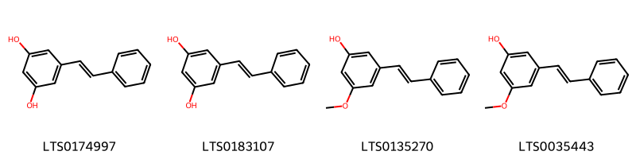{ width=100% }
    <figcaption>Hình ảnh cấu trúc hóa học của 4 hoạt chất thuộc nhóm Stilbenes gồm ['pinosylvin (LTS0174997)', 'pinosylvin (LTS0183107)', '5-methoxy-3-stilbenol (LTS0135270)', 'pinosylvin methyl ether (LTS0035443)'].</figcaption>
</figure>

---

### Dược dân tộc học

Danh sách các quốc gia có sử dụng *Pinus montana* trong điều trị các bệnh. 

| Country   | Disease                                      | Bệnh                                |
|:----------|:---------------------------------------------|:------------------------------------|
| Europe    | Antiseptic, Inhalant, Stimulant, Expectorant | Khử trùng, hít vào, kích thích, đờm |

---

---
## Pinus mugo
### Thông tin về thực vật

!!! info "Phân loại thực vật của *Pinus mugo* từ GIBF:"
    - **Kingdom:** Plantae
    - **Phylum:** Tracheophyta
    - **Order:** Pinales
    - **Family:** Pinaceae
    - **Genus:** Pinus
    - **Species:** *Pinus mugo*

 

| Label (VI)   | Label (EN)   | Scientific Name   | Descriptions (VI)   | Descriptions (EN)   | Also Known As (VI)   | Also Known As (EN)                                                                                                      |
|:-------------|:-------------|:------------------|:--------------------|:--------------------|:---------------------|:------------------------------------------------------------------------------------------------------------------------|
| N/A          | N/A          | Pinus mugo        | loài thực vật       | species of plant    | ['']                 | ['Mountain Pine', 'Pinus montana', 'creeping pine', 'dwarf mountainpine', 'scrub mountain pine', 'Swiss mountain pine'] |

#### Phân bố trên thế giới

**Từ CSDL GIBF** Czechia, Sweden, New Zealand, Slovenia, Poland, Denmark, Netherlands, United States of America, Romania, Russian Federation, Croatia, Estonia, Belarus, Norway, Belgium, Canada, Germany, Austria, Slovakia, Ukraine, Italy, Switzerland

#### Phân bố tại Việt Nam

**Từ CSDL GIBF**: Không có ghi nhận ở Việt Nam

---
### Thành phần hóa học
        
- Theo cơ sở dữ liệu lotus: Từ loài *Pinus mugo* đã phân lập và xác định được 34 hoạt chất thuộc về các nhóm Fatty Acyls, Benzene and substituted derivatives, Organic phosphoric acids and derivatives, Flavonoids, Phenol ethers, Prenol lipids, Stilbenes. 

|    | chemicalTaxonomyClassyfireClass          |   smiles_count |
|---:|:-----------------------------------------|---------------:|
|  0 | Benzene and substituted derivatives      |             10 |
|  1 | Fatty Acyls                              |              3 |
|  2 | Flavonoids                               |              2 |
|  3 | Organic phosphoric acids and derivatives |              1 |
|  4 | Phenol ethers                            |              2 |
|  5 | Prenol lipids                            |             12 |
|  6 | Stilbenes                                |              4 |

#### Nhóm Benzene and substituted derivatives
<figure markdown="span">
    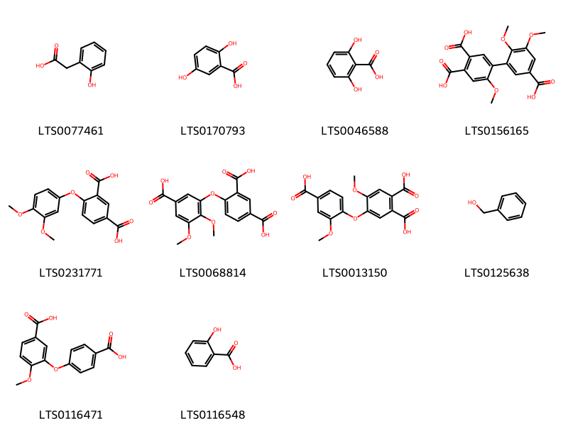{ width=100% }
    <figcaption>Hình ảnh cấu trúc hóa học của 10 hoạt chất thuộc nhóm Benzene and substituted derivatives gồm ['o-hydroxyphenylacetic acid (LTS0077461)', '2,5-dihydroxybenzoic acid (LTS0170793)', '2,6-dihydroxybenzoic acid (LTS0046588)', "5',6,6'-trimethoxy-[1,1'-biphenyl]-3,3',4-tricarboxylic acid (LTS0156165)", '4-(3,4-dimethoxyphenoxy)benzene-1,3-dicarboxylic acid (LTS0231771)', '4-(5-carboxy-2,3-dimethoxyphenoxy)benzene-1,3-dicarboxylic acid (LTS0068814)', '4-(4-carboxy-2-methoxyphenoxy)-5-methoxybenzene-1,2-dicarboxylic acid (LTS0013150)', 'benzyl alcohol (LTS0125638)', '3-(4-carboxyphenoxy)-4-methoxybenzoic acid (LTS0116471)', 'salicyclic acid (LTS0116548)'].</figcaption>
</figure>
#### Nhóm Fatty Acyls
<figure markdown="span">
    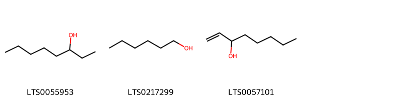{ width=100% }
    <figcaption>Hình ảnh cấu trúc hóa học của 3 hoạt chất thuộc nhóm Fatty Acyls gồm ['3-octanol (LTS0055953)', 'hexanol (LTS0217299)', '1-octen-3-ol (LTS0057101)'].</figcaption>
</figure>
#### Nhóm Flavonoids
<figure markdown="span">
    { width=100% }
    <figcaption>Hình ảnh cấu trúc hóa học của 2 hoạt chất thuộc nhóm Flavonoids gồm ['pinocembrine (LTS0141508)', 'pinocembrin (LTS0155292)'].</figcaption>
</figure>
#### Nhóm Organic phosphoric acids and derivatives
<figure markdown="span">
    { width=100% }
    <figcaption>Hình ảnh cấu trúc hóa học của 1 hoạt chất thuộc nhóm Organic phosphoric acids and derivatives gồm ['o-phosphoethanolamine; bis(nonane) (LTS0249963)'].</figcaption>
</figure>
#### Nhóm Phenol ethers
<figure markdown="span">
    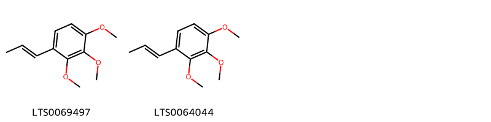{ width=100% }
    <figcaption>Hình ảnh cấu trúc hóa học của 2 hoạt chất thuộc nhóm Phenol ethers gồm ['1,2,3-trimethoxy-4-[(1e)-prop-1-en-1-yl]benzene (LTS0069497)', '1,2,3-trimethoxy-4-(prop-1-en-1-yl)benzene (LTS0064044)'].</figcaption>
</figure>
#### Nhóm Prenol lipids
<figure markdown="span">
    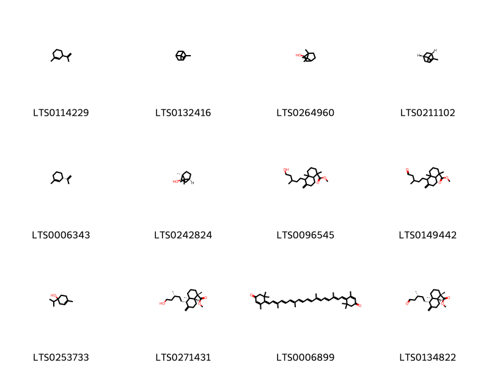{ width=100% }
    <figcaption>Hình ảnh cấu trúc hóa học của 12 hoạt chất thuộc nhóm Prenol lipids gồm ['1-methyl-3-(prop-1-en-2-yl)cyclohex-1-ene (LTS0114229)', 'α pinene (LTS0132416)', 'borneol (LTS0264960)', '(+)-α-pinene (LTS0211102)', '(3s)-1-methyl-3-(prop-1-en-2-yl)cyclohex-1-ene (LTS0006343)', '(-)-borneol (LTS0242824)', 'methyl 5-(5-hydroxy-3-methylpentyl)-1,4a-dimethyl-6-methylidene-hexahydro-2h-naphthalene-1-carboxylate (LTS0096545)', 'methyl 1,4a-dimethyl-5-(3-methyl-5-oxopentyl)-6-methylidene-hexahydro-2h-naphthalene-1-carboxylate (LTS0149442)', '4-terpineol (LTS0253733)', 'methyl (1s,4ar,5s,8ar)-5-[(3r)-5-hydroxy-3-methylpentyl]-1,4a-dimethyl-6-methylidene-hexahydro-2h-naphthalene-1-carboxylate (LTS0271431)', 'rhodoxanthin (LTS0006899)', 'methyl (1s,4ar,5s,8ar)-1,4a-dimethyl-5-[(3r)-3-methyl-5-oxopentyl]-6-methylidene-hexahydro-2h-naphthalene-1-carboxylate (LTS0134822)'].</figcaption>
</figure>
#### Nhóm Stilbenes
<figure markdown="span">
    { width=100% }
    <figcaption>Hình ảnh cấu trúc hóa học của 4 hoạt chất thuộc nhóm Stilbenes gồm ['pinosylvin (LTS0174997)', 'pinosylvin (LTS0183107)', '5-methoxy-3-stilbenol (LTS0135270)', 'pinosylvin methyl ether (LTS0035443)'].</figcaption>
</figure>

---

### Dược dân tộc học

Danh sách các quốc gia có sử dụng *Pinus mugo* trong điều trị các bệnh. 

| Country   | Disease     | Bệnh                   |
|:----------|:------------|:-----------------------|
| French    | Expectorant | Thuốc long đàm         |
| German    | Rubefacient | Chất gây xung huyết da |
| Italian   | Antiseptic  | Khử trùng              |

---

---
## Pinus nigra
### Thông tin về thực vật

!!! info "Phân loại thực vật của *Pinus nigra* từ GIBF:"
    - **Kingdom:** Plantae
    - **Phylum:** Tracheophyta
    - **Order:** Pinales
    - **Family:** Pinaceae
    - **Genus:** Pinus
    - **Species:** *Pinus nigra*

 

| Label (VI)   | Label (EN)   | Scientific Name   | Descriptions (VI)   | Descriptions (EN)   | Also Known As (VI)   | Also Known As (EN)                                     |
|:-------------|:-------------|:------------------|:--------------------|:--------------------|:---------------------|:-------------------------------------------------------|
| N/A          | N/A          | Pinus nigra       |                     | species of plant    | ['']                 | ['black pine', 'Austrian pine', 'European black pine'] |

#### Phân bố trên thế giới

**Từ CSDL GIBF** Czechia, Sweden, Kazakhstan, New Zealand, Slovenia, Spain, Poland, Netherlands, Denmark, United States of America, Russian Federation, Croatia, Cyprus, Norway, France, Belgium, Luxembourg, Canada, Germany, Austria, Hungary, Ukraine, Italy, Switzerland, United Kingdom of Great Britain and Northern Ireland

#### Phân bố tại Việt Nam

**Từ CSDL GIBF**: Không có ghi nhận ở Việt Nam

---
### Thành phần hóa học
        
- Theo cơ sở dữ liệu lotus: Từ loài *Pinus nigra* đã phân lập và xác định được 61 hoạt chất thuộc về các nhóm Fatty Acyls, Piperidines, Tetrapyrroles and derivatives, Pyridines and derivatives, Prenol lipids, Stilbenes. 

|    | chemicalTaxonomyClassyfireClass   |   smiles_count |
|---:|:----------------------------------|---------------:|
|  0 | Fatty Acyls                       |              2 |
|  1 | Piperidines                       |              3 |
|  2 | Prenol lipids                     |             49 |
|  3 | Pyridines and derivatives         |              4 |
|  4 | Stilbenes                         |              1 |
|  5 | Tetrapyrroles and derivatives     |              2 |

#### Nhóm Fatty Acyls
<figure markdown="span">
    { width=100% }
    <figcaption>Hình ảnh cấu trúc hóa học của 2 hoạt chất thuộc nhóm Fatty Acyls gồm ['nonacosan-10-ol (LTS0234389)', '(r)-nonacosan-10-ol (LTS0221297)'].</figcaption>
</figure>
#### Nhóm Piperidines
<figure markdown="span">
    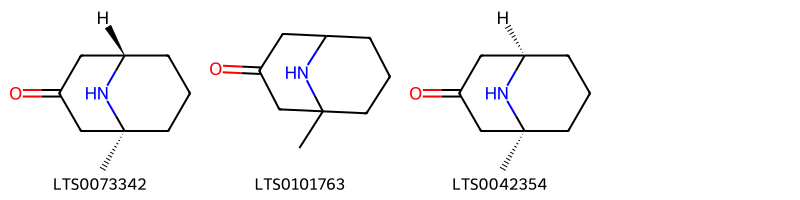{ width=100% }
    <figcaption>Hình ảnh cấu trúc hóa học của 3 hoạt chất thuộc nhóm Piperidines gồm ['(1s,5s)-1-methyl-9-azabicyclo[3.3.1]nonan-3-one (LTS0073342)', '1-methyl-9-azabicyclo[3.3.1]nonan-3-one (LTS0101763)', '(1s,5r)-1-methyl-9-azabicyclo[3.3.1]nonan-3-one (LTS0042354)'].</figcaption>
</figure>
#### Nhóm Prenol lipids
<figure markdown="span">
    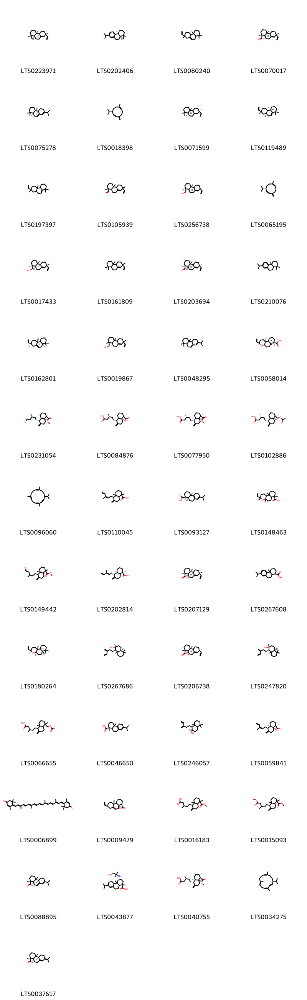{ width=100% }
    <figcaption>Hình ảnh cấu trúc hóa học của 49 hoạt chất thuộc nhóm Prenol lipids gồm ['(+)-sandaracopimaradiene (LTS0223971)', 'abietatriene (LTS0202406)', '7-ethenyl-1,1,4a,7-tetramethyl-3,4,4b,5,6,8,10,10a-octahydro-2h-phenanthrene (LTS0080240)', '(1r,4ar,4bs,7r,10ar)-7-ethenyl-1,4a,7-trimethyl-3,4,4b,5,6,9,10,10a-octahydro-2h-phenanthrene-1-carbaldehyde (LTS0070017)', '(-)-abietadiene (LTS0075278)', '8-isopropyl-1-methyl-5-methylidenecyclodeca-1,6-diene (LTS0018398)', 'pimaradiene (LTS0071599)', '(4as,4br,7r,8ar)-7-ethenyl-1,1,4b,7-tetramethyl-3,4,4a,5,6,8,8a,9-octahydro-2h-phenanthrene (LTS0119489)', '7-ethenyl-1,1,4b,7-tetramethyl-3,4,4a,5,6,8,8a,9-octahydro-2h-phenanthrene (LTS0197397)', '7-ethenyl-1,4a,7-trimethyl-3,4,4b,5,6,9,10,10a-octahydro-2h-phenanthrene-1-carbaldehyde (LTS0105939)', '[(1r,4ar,4bs,7s,10ar)-7-ethenyl-1,4a,7-trimethyl-3,4,4b,5,6,9,10,10a-octahydro-2h-phenanthren-1-yl]methanol (LTS0256738)', '(1z,6z,8s)-8-isopropyl-1-methyl-5-methylidenecyclodeca-1,6-diene (LTS0065195)', '[(1r,4ar,4bs,7r,10ar)-7-ethenyl-1,4a,7-trimethyl-3,4,4b,5,6,9,10,10a-octahydro-2h-phenanthren-1-yl]methanol (LTS0017433)', '7-ethenyl-1,1,4a,7-tetramethyl-3,4,4b,5,6,9,10,10a-octahydro-2h-phenanthrene (LTS0161809)', '(1r,4ar,4bs,7s,10ar)-7-ethenyl-1,4a,7-trimethyl-3,4,4b,5,6,9,10,10a-octahydro-2h-phenanthrene-1-carbaldehyde (LTS0203694)', '7-isopropyl-1,1,4a-trimethyl-2,3,4,9,10,10a-hexahydrophenanthrene (LTS0210076)', 'isopimara-7,15-diene (LTS0162801)', '(7-ethenyl-1,4a,7-trimethyl-3,4,4b,5,6,9,10,10a-octahydro-2h-phenanthren-1-yl)methanol (LTS0019867)', '7-isopropyl-1,1,4a-trimethyl-2,3,4,4b,5,6,10,10a-octahydrophenanthrene (LTS0048295)', '(3r,4ar,6ar,7s,10as,10br)-3-ethenyl-3,4a,7,10a-tetramethyl-octahydro-1h-naphtho[2,1-b]pyran-7-carboxylic acid (LTS0058014)', 'methyl (1r,4ar,5s,8ar)-1,4a-dimethyl-5-[(3s)-3-methyl-5-oxopentyl]-6-methylidene-hexahydro-2h-naphthalene-1-carboxylate (LTS0231054)', '(1r,4ar,5s,8ar)-5-[(3s)-4-carboxy-3-methylbutyl]-1,4a-dimethyl-6-methylidene-hexahydro-2h-naphthalene-1-carboxylic acid (LTS0084876)', 'methyl (1r,4ar,5s,8ar)-5-[(3r)-5-methoxy-3-methyl-5-oxopentyl]-1,4a-dimethyl-6-methylidene-hexahydro-2h-naphthalene-1-carboxylate (LTS0077950)', 'methyl (3r)-5-[(1s,4ar,5r,8ar)-5-[(acetyloxy)methyl]-5,8a-dimethyl-2-methylidene-hexahydro-1h-naphthalen-1-yl]-3-methylpentanoate (LTS0102886)', '(3z,6z,10z)-14-isopropyl-3,7,11-trimethylcyclotetradeca-1,3,6,10-tetraene (LTS0096060)', '1,4a-dimethyl-6-methylidene-5-(3-methylpenta-2,4-dien-1-yl)-hexahydro-2h-naphthalene-1-carboxylic acid (LTS0110045)', 'palustric acid (LTS0093127)', '3-ethenyl-3,4a,7,10a-tetramethyl-octahydro-1h-naphtho[2,1-b]pyran-7-carboxylic acid (LTS0148463)', 'methyl 1,4a-dimethyl-5-(3-methyl-5-oxopentyl)-6-methylidene-hexahydro-2h-naphthalene-1-carboxylate (LTS0149442)', '(1r,4ar,5s,8ar)-1,4a-dimethyl-6-methylidene-5-[(2e)-3-methylpenta-2,4-dien-1-yl]-hexahydro-2h-naphthalene-1-carboxylic acid (LTS0202814)', 'sandaracopimaric acid (LTS0207129)', '(1r)-7-isopropyl-1,4a-dimethyl-2,3,4,9,10,10a-hexahydrophenanthrene-1-carboxylic acid (LTS0267608)', '(3r,4ar,6as,10as,10br)-3-ethenyl-3,4a,7,7,10a-pentamethyl-octahydro-1h-naphtho[2,1-b]pyran (LTS0180264)', '(1r,2r,4as,8as)-2,5,5,8a-tetramethyl-1-(3-methylidenepent-4-en-1-yl)-hexahydro-1h-naphthalen-2-ol (LTS0267686)', 'pimaric acid (LTS0206738)', '(1r,2r,4ar,8as)-2,5,5,8a-tetramethyl-1-(3-methylidenepent-4-en-1-yl)-hexahydro-1h-naphthalen-2-ol (LTS0247820)', 'methyl 5-{5-[(acetyloxy)methyl]-5,8a-dimethyl-2-methylidene-hexahydro-1h-naphthalen-1-yl}-3-methylpentanoate (LTS0066655)', 'palustric acid (LTS0046650)', '2,5,5,8a-tetramethyl-1-(3-methylidenepent-4-en-1-yl)-hexahydro-1h-naphthalen-2-ol (LTS0246057)', '(1r,4ar,5r,8ar)-1,4a-dimethyl-6-methylidene-5-(3-methylpenta-2,4-dien-1-yl)-hexahydro-2h-naphthalene-1-carboxylic acid (LTS0059841)', 'rhodoxanthin (LTS0006899)', 'isopimaric acid (LTS0009479)', '5-[5-(methoxycarbonyl)-5,8a-dimethyl-2-methylidene-hexahydro-1h-naphthalen-1-yl]-3-methylpentanoic acid (LTS0016183)', 'methyl 5-(5-methoxy-3-methyl-5-oxopentyl)-1,4a-dimethyl-6-methylidene-hexahydro-2h-naphthalene-1-carboxylate (LTS0015093)', 'abietic acid (LTS0088895)', '2-amino-2-methyl-1-propanol; levopimaric acid (LTS0043877)', '(3s)-5-[(1s,4ar,5r,8ar)-5-(methoxycarbonyl)-5,8a-dimethyl-2-methylidene-hexahydro-1h-naphthalen-1-yl]-3-methylpentanoic acid (LTS0040755)', '(1e,3z,6e,10z)-14-isopropyl-3,7,11-trimethylcyclotetradeca-1,3,6,10-tetraene (LTS0034275)', 'neoabietic acid (LTS0037617)'].</figcaption>
</figure>
#### Nhóm Pyridines and derivatives
<figure markdown="span">
    { width=100% }
    <figcaption>Hình ảnh cấu trúc hóa học của 4 hoạt chất thuộc nhóm Pyridines and derivatives gồm ['1-[(2r)-6-methyl-2,3,4,5-tetrahydropyridin-2-yl]propan-2-one (LTS0146476)', '(2r)-1-[(2r)-6-methyl-2,3,4,5-tetrahydropyridin-2-yl]propan-2-ol (LTS0083475)', '1-(6-methyl-2,3,4,5-tetrahydropyridin-2-yl)propan-2-ol (LTS0007008)', '1-(6-methyl-2,3,4,5-tetrahydropyridin-2-yl)propan-2-one (LTS0050853)'].</figcaption>
</figure>
#### Nhóm Stilbenes
<figure markdown="span">
    { width=100% }
    <figcaption>Hình ảnh cấu trúc hóa học của 1 hoạt chất thuộc nhóm Stilbenes gồm ['pinosylvin methyl ether (LTS0035443)'].</figcaption>
</figure>
#### Nhóm Tetrapyrroles and derivatives
<figure markdown="span">
    { width=100% }
    <figcaption>Hình ảnh cấu trúc hóa học của 2 hoạt chất thuộc nhóm Tetrapyrroles and derivatives gồm ['methyl (3r,21s,22s)-16-ethenyl-11-ethyl-12,17,21,26-tetramethyl-4-oxo-22-(3-oxo-3-{[(2e,7r,11r)-3,7,11,15-tetramethylhexadec-2-en-1-yl]oxy}propyl)-7,23,24,25-tetraazahexacyclo[18.2.1.1⁵,⁸.1¹⁰,¹³.1¹⁵,¹⁸.0²,⁶]hexacosa-1(23),2(6),5(26),7,9,11,13,15,17,19-decaene-3-carboxylate (LTS0200273)', 'methyl (3r,21s,22s)-16-ethenyl-11-ethyl-12,17,21,26-tetramethyl-4-oxo-22-(3-oxo-3-{[(2e)-3,7,11,15-tetramethylhexadec-2-en-1-yl]oxy}propyl)-7,23,24,25-tetraazahexacyclo[18.2.1.1⁵,⁸.1¹⁰,¹³.1¹⁵,¹⁸.0²,⁶]hexacosa-1(23),2(6),5(26),7,9,11,13,15,17,19-decaene-3-carboxylate (LTS0272109)'].</figcaption>
</figure>

---

### Dược dân tộc học

Danh sách các quốc gia có sử dụng *Pinus nigra* trong điều trị các bệnh. 

| Country   | Disease   | Bệnh           |
|:----------|:----------|:---------------|
| German    | Vermifuge | Thuốc diệt sán |

---

---
## Pinus occidentalis
### Thông tin về thực vật

!!! info "Phân loại thực vật của *Pinus occidentalis* từ GIBF:"
    - **Kingdom:** Plantae
    - **Phylum:** Tracheophyta
    - **Order:** Pinales
    - **Family:** Pinaceae
    - **Genus:** Pinus
    - **Species:** *Pinus occidentalis*

 

| Label (VI)   | Label (EN)   | Scientific Name    | Descriptions (VI)   | Descriptions (EN)                  | Also Known As (VI)   | Also Known As (EN)   |
|:-------------|:-------------|:-------------------|:--------------------|:-----------------------------------|:---------------------|:---------------------|
| N/A          | N/A          | Pinus occidentalis | loài thực vật       | species of plant, Hispaniolan Pine | ['']                 | ['Hispaniolan pine'] |

#### Phân bố trên thế giới

**Từ CSDL GIBF** nan, Brazil, United States of America, Jamaica, Haiti, Dominican Republic, Colombia, Tanzania, United Republic of, Cuba, Canada, Puerto Rico

#### Phân bố tại Việt Nam

**Từ CSDL GIBF**: Không có ghi nhận ở Việt Nam

---
### Thành phần hóa học
        
- Theo cơ sở dữ liệu lotus: Từ loài *Pinus occidentalis* đã phân lập và xác định được 2 hoạt chất thuộc về các nhóm Stilbenes. 

|    | chemicalTaxonomyClassyfireClass   |   smiles_count |
|---:|:----------------------------------|---------------:|
|  0 | Stilbenes                         |              2 |

#### Nhóm Stilbenes
<figure markdown="span">
    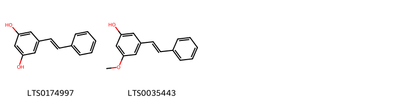{ width=100% }
    <figcaption>Hình ảnh cấu trúc hóa học của 2 hoạt chất thuộc nhóm Stilbenes gồm ['pinosylvin (LTS0174997)', 'pinosylvin methyl ether (LTS0035443)'].</figcaption>
</figure>

---

### Dược dân tộc học

Danh sách các quốc gia có sử dụng *Pinus occidentalis* trong điều trị các bệnh. 

| Country   | Disease     | Bệnh                   |
|:----------|:------------|:-----------------------|
| Haiti     | Rubefacient | Chất gây xung huyết da |

---

---
## Pinus palustris
### Thông tin về thực vật

!!! info "Phân loại thực vật của *Pinus palustris* từ GIBF:"
    - **Kingdom:** Plantae
    - **Phylum:** Tracheophyta
    - **Order:** Pinales
    - **Family:** Pinaceae
    - **Genus:** Pinus
    - **Species:** *Pinus palustris*

 

| Label (VI)   | Label (EN)   | Scientific Name   | Descriptions (VI)   | Descriptions (EN)   | Also Known As (VI)   | Also Known As (EN)   |
|:-------------|:-------------|:------------------|:--------------------|:--------------------|:---------------------|:---------------------|
| N/A          | N/A          | Pinus palustris   | loài thực vật       | species of plant    | ['']                 | ['longleaf pine']    |

#### Phân bố trên thế giới

**Từ CSDL GIBF** United States of America

#### Phân bố tại Việt Nam

**Từ CSDL GIBF**: Không có ghi nhận ở Việt Nam

---
### Thành phần hóa học
        
- Theo cơ sở dữ liệu lotus: Từ loài *Pinus palustris* đã phân lập và xác định được 23 hoạt chất thuộc về các nhóm Prenol lipids, Stilbenes. 

|    | chemicalTaxonomyClassyfireClass   |   smiles_count |
|---:|:----------------------------------|---------------:|
|  0 | Prenol lipids                     |             22 |
|  1 | Stilbenes                         |              1 |

#### Nhóm Prenol lipids
<figure markdown="span">
    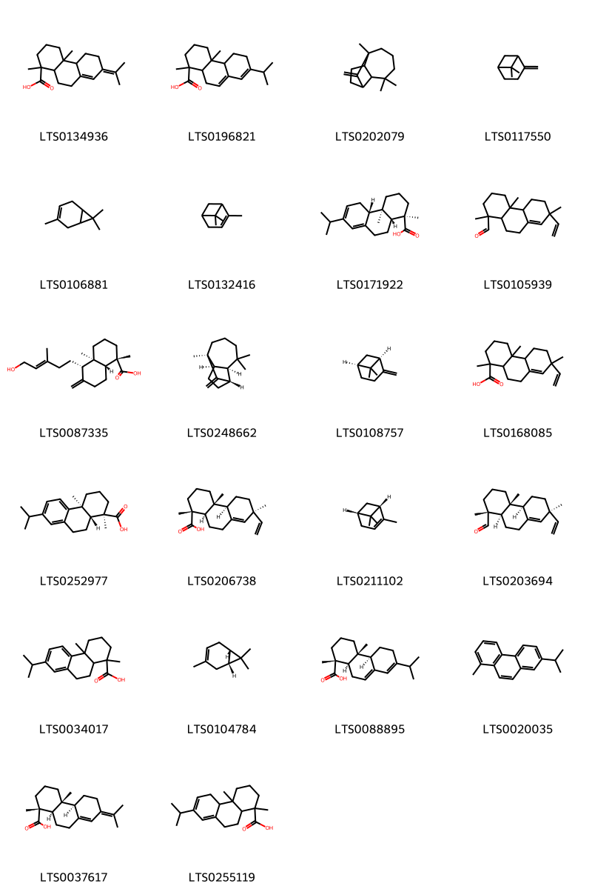{ width=100% }
    <figcaption>Hình ảnh cấu trúc hóa học của 22 hoạt chất thuộc nhóm Prenol lipids gồm ['1,4a-dimethyl-7-(propan-2-ylidene)-3,4,4b,5,6,9,10,10a-octahydro-2h-phenanthrene-1-carboxylic acid (LTS0134936)', 'abietic acid (LTS0196821)', 'longifolene (LTS0202079)', 'β-pinene (LTS0117550)', 'monoterpenes (LTS0106881)', 'α pinene (LTS0132416)', 'levopimaric acid (LTS0171922)', '7-ethenyl-1,4a,7-trimethyl-3,4,4b,5,6,9,10,10a-octahydro-2h-phenanthrene-1-carbaldehyde (LTS0105939)', 'isocupressic acid (LTS0087335)', '(+)-longifolene (LTS0248662)', '(-)-β-pinene (LTS0108757)', 'pimaric acid (LTS0168085)', '(-)-dehydroabietic acid (LTS0252977)', 'pimaric acid (LTS0206738)', '(+)-α-pinene (LTS0211102)', '(1r,4ar,4bs,7s,10ar)-7-ethenyl-1,4a,7-trimethyl-3,4,4b,5,6,9,10,10a-octahydro-2h-phenanthrene-1-carbaldehyde (LTS0203694)', 'dehydroabietic acid (LTS0034017)', '(-)-delta(3)-carene (LTS0104784)', 'abietic acid (LTS0088895)', 'reten (LTS0020035)', 'neoabietic acid (LTS0037617)', 'levopimaric acid (LTS0255119)'].</figcaption>
</figure>
#### Nhóm Stilbenes
<figure markdown="span">
    { width=100% }
    <figcaption>Hình ảnh cấu trúc hóa học của 1 hoạt chất thuộc nhóm Stilbenes gồm ['pinosylvin methyl ether (LTS0035443)'].</figcaption>
</figure>

---

### Dược dân tộc học

Danh sách các quốc gia có sử dụng *Pinus palustris* trong điều trị các bệnh. 

| Country   | Disease                                                                                                                      | Bệnh                                                                                                              |
|:----------|:-----------------------------------------------------------------------------------------------------------------------------|:------------------------------------------------------------------------------------------------------------------|
| Japan*    | Rubefacient                                                                                                                  | Chất gây xung huyết da                                                                                            |
| US        | Antiseptic, Carminative, Diuretic, Emmenagogue, Expectorant, Inhalant, Laxative, Rubefacient, Taenifuge, Vermifuge, Hemostat | Khử trùng, Carminative, lợi tiểu, Emmenagogue, đờm, hít, nhuận tràng, Rubefacient, Taenifuge, Vermifuge, Hemostat |

---

---
## Pinus pimilio
### Thông tin về thực vật

!!! info "Phân loại thực vật của *Pinus mugo* từ GIBF:"
    - **Kingdom:** Plantae
    - **Phylum:** Tracheophyta
    - **Order:** Pinales
    - **Family:** Pinaceae
    - **Genus:** Pinus
    - **Species:** *Pinus mugo*

 

| Label (VI)   | Label (EN)   | Scientific Name   | Descriptions (VI)   | Descriptions (EN)   | Also Known As (VI)   | Also Known As (EN)   |
|:-------------|:-------------|:------------------|:--------------------|:--------------------|:---------------------|:---------------------|
| N/A          | N/A          | Pinus palustris   | loài thực vật       | species of plant    | ['']                 | ['longleaf pine']    |

#### Phân bố trên thế giới

**Từ CSDL GIBF** nan, Austria, United States of America, Czechia, Italy, Switzerland, unknown or invalid, Estonia, Germany, France, Poland

#### Phân bố tại Việt Nam

**Từ CSDL GIBF**: Không có ghi nhận ở Việt Nam

---
### Thành phần hóa học
        
- Theo cơ sở dữ liệu lotus: Từ loài *Pinus mugo* đã phân lập và xác định được Chưa có hoạt chất nào được phân lập. hoạt chất thuộc về các nhóm Không có hoạt chất nào được phân lập. 

Không có hình ảnh nào được tạo ra

---

### Dược dân tộc học

Danh sách các quốc gia có sử dụng *Pinus mugo* trong điều trị các bệnh. 

| Country   | Disease    | Bệnh      |
|:----------|:-----------|:----------|
| Eurasia   | Antiseptic | Khử trùng |

---

---
## Pinus pinaster
### Thông tin về thực vật

!!! info "Phân loại thực vật của *Pinus pinaster* từ GIBF:"
    - **Kingdom:** Plantae
    - **Phylum:** Tracheophyta
    - **Order:** Pinales
    - **Family:** Pinaceae
    - **Genus:** Pinus
    - **Species:** *Pinus pinaster*

 

| Label (VI)   | Label (EN)   | Scientific Name   | Descriptions (VI)   | Descriptions (EN)   | Also Known As (VI)   | Also Known As (EN)   |
|:-------------|:-------------|:------------------|:--------------------|:--------------------|:---------------------|:---------------------|
| N/A          | N/A          | Pinus pinaster    | loài thực vật       | species of plant    | ['']                 | ['Maritime Pine']    |

#### Phân bố trên thế giới

**Từ CSDL GIBF** Portugal, Belgium, South Africa, Australia, New Zealand, Italy, Slovenia, France, Spain, Netherlands

#### Phân bố tại Việt Nam

**Từ CSDL GIBF**: Không có ghi nhận ở Việt Nam

---
### Thành phần hóa học
        
- Theo cơ sở dữ liệu lotus: Từ loài *Pinus pinaster* đã phân lập và xác định được 45 hoạt chất thuộc về các nhóm Fatty Acyls, Benzene and substituted derivatives, Flavonoids, Cinnamic acids and derivatives, Phenols, Organooxygen compounds, Prenol lipids, Stilbenes. 

|    | chemicalTaxonomyClassyfireClass     |   smiles_count |
|---:|:------------------------------------|---------------:|
|  0 | Benzene and substituted derivatives |              6 |
|  1 | Cinnamic acids and derivatives      |              3 |
|  2 | Fatty Acyls                         |              3 |
|  3 | Flavonoids                          |              2 |
|  4 | Organooxygen compounds              |              4 |
|  5 | Phenols                             |              1 |
|  6 | Prenol lipids                       |             24 |
|  7 | Stilbenes                           |              2 |

#### Nhóm Benzene and substituted derivatives
<figure markdown="span">
    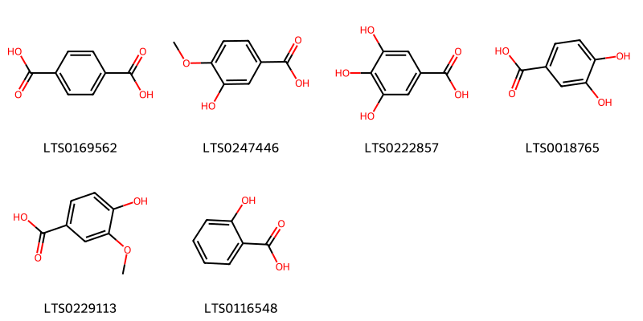{ width=100% }
    <figcaption>Hình ảnh cấu trúc hóa học của 6 hoạt chất thuộc nhóm Benzene and substituted derivatives gồm ['terephthalic acid (LTS0169562)', 'isovanillic acid (LTS0247446)', 'galop (LTS0222857)', '3,4-dihydroxybenzoic acid (LTS0018765)', 'vanillic acid (LTS0229113)', 'salicyclic acid (LTS0116548)'].</figcaption>
</figure>
#### Nhóm Cinnamic acids and derivatives
<figure markdown="span">
    { width=100% }
    <figcaption>Hình ảnh cấu trúc hóa học của 3 hoạt chất thuộc nhóm Cinnamic acids and derivatives gồm ['3,4-dihydroxycinnamic acid (LTS0128050)', 'ferulic acid (LTS0077328)', 'para-coumaric acid (LTS0266252)'].</figcaption>
</figure>
#### Nhóm Fatty Acyls
<figure markdown="span">
    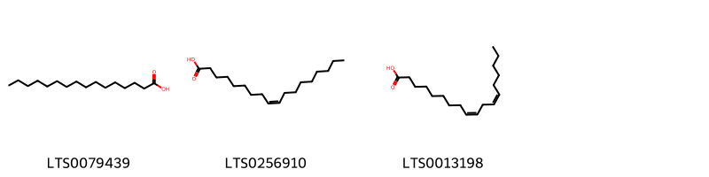{ width=100% }
    <figcaption>Hình ảnh cấu trúc hóa học của 3 hoạt chất thuộc nhóm Fatty Acyls gồm ['palmitic acid (LTS0079439)', 'oleic acid (LTS0256910)', 'linoleic (LTS0013198)'].</figcaption>
</figure>
#### Nhóm Flavonoids
<figure markdown="span">
    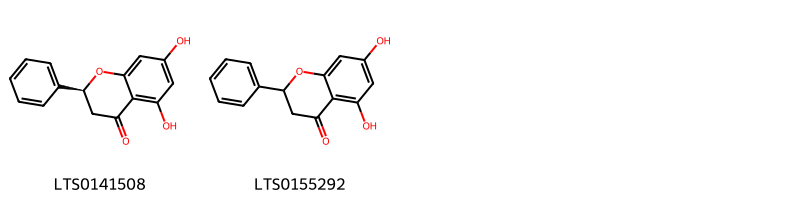{ width=100% }
    <figcaption>Hình ảnh cấu trúc hóa học của 2 hoạt chất thuộc nhóm Flavonoids gồm ['pinocembrine (LTS0141508)', 'pinocembrin (LTS0155292)'].</figcaption>
</figure>
#### Nhóm Organooxygen compounds
<figure markdown="span">
    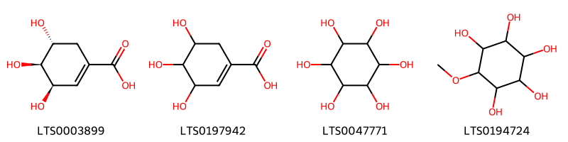{ width=100% }
    <figcaption>Hình ảnh cấu trúc hóa học của 4 hoạt chất thuộc nhóm Organooxygen compounds gồm ['(-)-shikimate (LTS0003899)', 'shikimate (LTS0197942)', '(-)-inositol (LTS0047771)', 'pinitol (LTS0194724)'].</figcaption>
</figure>
#### Nhóm Phenols
<figure markdown="span">
    { width=100% }
    <figcaption>Hình ảnh cấu trúc hóa học của 1 hoạt chất thuộc nhóm Phenols gồm ['4-hydroxyphenylacetic acid (LTS0272177)'].</figcaption>
</figure>
#### Nhóm Prenol lipids
<figure markdown="span">
    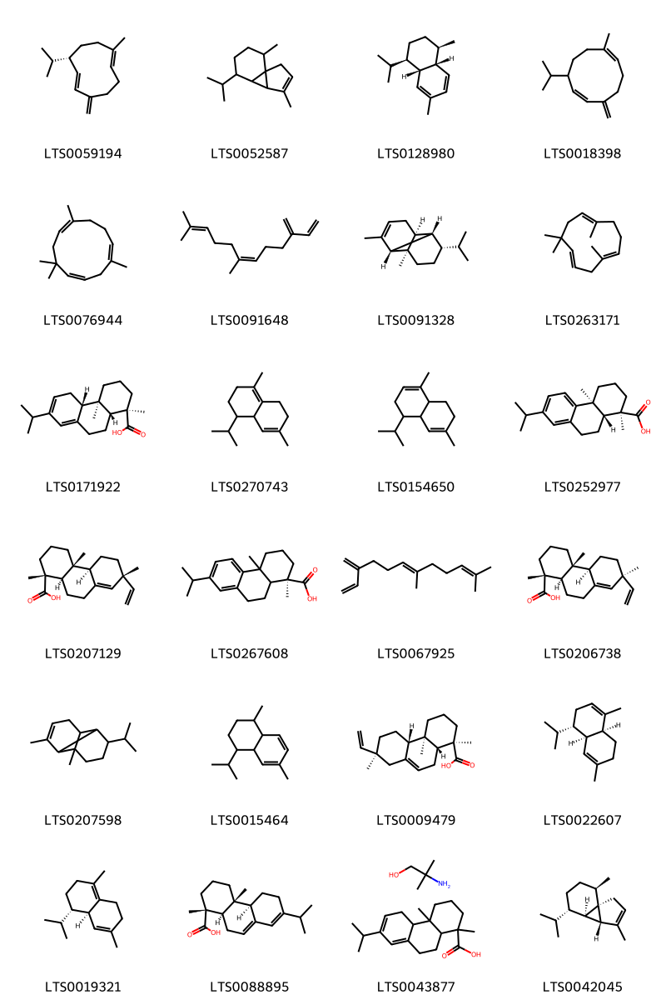{ width=100% }
    <figcaption>Hình ảnh cấu trúc hóa học của 24 hoạt chất thuộc nhóm Prenol lipids gồm ['(-)-germacrene d (LTS0059194)', '7-isopropyl-4,10-dimethyltricyclo[4.4.0.0¹,⁵]dec-3-ene (LTS0052587)', '(1r,4r,4ar,8ar)-4-isopropyl-1,6-dimethyl-1,2,3,4,4a,8a-hexahydronaphthalene (LTS0128980)', '8-isopropyl-1-methyl-5-methylidenecyclodeca-1,6-diene (LTS0018398)', 'α-humulene (LTS0076944)', 'β-farnesene (LTS0091648)', 'copaene (LTS0091328)', 'humulene (LTS0263171)', 'levopimaric acid (LTS0171922)', '4-isopropyl-1,6-dimethyl-2,3,4,4a,7,8-hexahydronaphthalene (LTS0270743)', '4-isopropyl-1,6-dimethyl-3,4,4a,7,8,8a-hexahydronaphthalene (LTS0154650)', '(-)-dehydroabietic acid (LTS0252977)', 'sandaracopimaric acid (LTS0207129)', '(1r)-7-isopropyl-1,4a-dimethyl-2,3,4,9,10,10a-hexahydrophenanthrene-1-carboxylic acid (LTS0267608)', 'β-farnesene (LTS0067925)', 'pimaric acid (LTS0206738)', 'α-copaene (LTS0207598)', '4-isopropyl-1,6-dimethyl-1,2,3,4,4a,8a-hexahydronaphthalene (LTS0015464)', 'isopimaric acid (LTS0009479)', 'α-muurolene (LTS0022607)', 'delta-cadinene (LTS0019321)', 'abietic acid (LTS0088895)', '2-amino-2-methyl-1-propanol; levopimaric acid (LTS0043877)', '(-)-α-cubebene (LTS0042045)'].</figcaption>
</figure>
#### Nhóm Stilbenes
<figure markdown="span">
    { width=100% }
    <figcaption>Hình ảnh cấu trúc hóa học của 2 hoạt chất thuộc nhóm Stilbenes gồm ['pinosylvin (LTS0174997)', 'pinosylvin methyl ether (LTS0035443)'].</figcaption>
</figure>

---

### Dược dân tộc học

Danh sách các quốc gia có sử dụng *Pinus pinaster* trong điều trị các bệnh. 

| Country   | Disease     | Bệnh                   |
|:----------|:------------|:-----------------------|
| Japan*    | Rubefacient | Chất gây xung huyết da |
| ain       | Inhalant    | (thuộc) hút vào        |

---

---
## Pinus ponderosa
### Thông tin về thực vật

!!! info "Phân loại thực vật của *Pinus ponderosa* từ GIBF:"
    - **Kingdom:** Plantae
    - **Phylum:** Tracheophyta
    - **Order:** Pinales
    - **Family:** Pinaceae
    - **Genus:** Pinus
    - **Species:** *Pinus ponderosa*

 

| Label (VI)   | Label (EN)   | Scientific Name   | Descriptions (VI)   | Descriptions (EN)                           | Also Known As (VI)   | Also Known As (EN)                                                                           |
|:-------------|:-------------|:------------------|:--------------------|:--------------------------------------------|:---------------------|:---------------------------------------------------------------------------------------------|
| N/A          | N/A          | Pinus ponderosa   |                     | species of large pine tree in North America | ['']                 | ['yellow pine', 'ponderosa pine', 'western yellow pine', 'bull pine', 'western yellow-pine'] |

#### Phân bố trên thế giới

**Từ CSDL GIBF** United States of America, Canada

#### Phân bố tại Việt Nam

**Từ CSDL GIBF**: Không có ghi nhận ở Việt Nam

---
### Thành phần hóa học
        
- Theo cơ sở dữ liệu lotus: Từ loài *Pinus ponderosa* đã phân lập và xác định được 109 hoạt chất thuộc về các nhóm Fatty Acyls, Piperidines, Indoles and derivatives, Benzene and substituted derivatives, Phenanthrenes and derivatives, Flavonoids, Carboxylic acids and derivatives, Pyridines and derivatives, Organooxygen compounds, Prenol lipids, Saturated hydrocarbons, Stilbenes. 

|    | chemicalTaxonomyClassyfireClass     |   smiles_count |
|---:|:------------------------------------|---------------:|
|  0 | Benzene and substituted derivatives |              2 |
|  1 | Carboxylic acids and derivatives    |             25 |
|  2 | Fatty Acyls                         |              4 |
|  3 | Flavonoids                          |              7 |
|  4 | Indoles and derivatives             |              1 |
|  5 | Organooxygen compounds              |              4 |
|  6 | Phenanthrenes and derivatives       |              2 |
|  7 | Piperidines                         |             10 |
|  8 | Prenol lipids                       |             45 |
|  9 | Pyridines and derivatives           |              4 |
| 10 | Saturated hydrocarbons              |              1 |
| 11 | Stilbenes                           |              4 |

#### Nhóm Benzene and substituted derivatives
<figure markdown="span">
    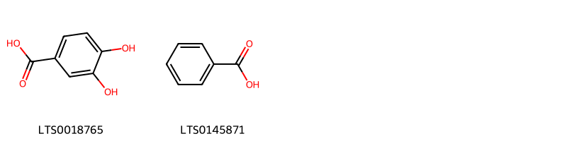{ width=100% }
    <figcaption>Hình ảnh cấu trúc hóa học của 2 hoạt chất thuộc nhóm Benzene and substituted derivatives gồm ['3,4-dihydroxybenzoic acid (LTS0018765)', 'benzoic acid (LTS0145871)'].</figcaption>
</figure>
#### Nhóm Carboxylic acids and derivatives
<figure markdown="span">
    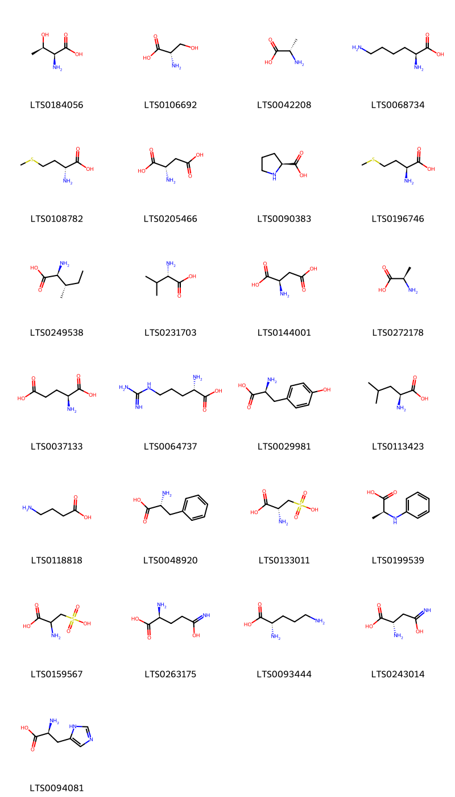{ width=100% }
    <figcaption>Hình ảnh cấu trúc hóa học của 25 hoạt chất thuộc nhóm Carboxylic acids and derivatives gồm ['l-threonine (LTS0184056)', 'l-serine (LTS0106692)', 'l-alanine (LTS0042208)', 'l-lysine (LTS0068734)', 'd-methionine (LTS0108782)', 'l-aspartic acid (LTS0205466)', 'l-proline (LTS0090383)', 'l-methionine (LTS0196746)', 'l-isoleucine (LTS0249538)', 'l-valine (LTS0231703)', 'd-aspartic acid (LTS0144001)', 'd-alanine (LTS0272178)', 'l-glutamic acid (LTS0037133)', 'l-arginine (LTS0064737)', 'l-tyrosine (LTS0029981)', 'l-leucine (LTS0113423)', 'gamma(amino)-butyric acid (LTS0118818)', 'd-phenylalanine (LTS0048920)', 'cysteinesulfonic acid (LTS0133011)', '(2s)-2-(phenylamino)propanoic acid (LTS0199539)', 'cysteic acid (LTS0159567)', 'l glutamine (LTS0263175)', 'l-ornithine (LTS0093444)', 'aspartamate (LTS0243014)', 'l-histidine (LTS0094081)'].</figcaption>
</figure>
#### Nhóm Fatty Acyls
<figure markdown="span">
    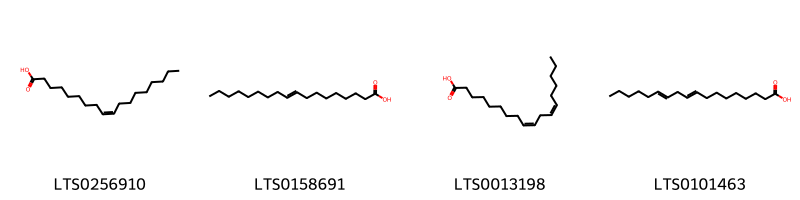{ width=100% }
    <figcaption>Hình ảnh cấu trúc hóa học của 4 hoạt chất thuộc nhóm Fatty Acyls gồm ['oleic acid (LTS0256910)', '9 octadecenoic acid (LTS0158691)', 'linoleic (LTS0013198)', '9,12-octadecadienoic acid (LTS0101463)'].</figcaption>
</figure>
#### Nhóm Flavonoids
<figure markdown="span">
    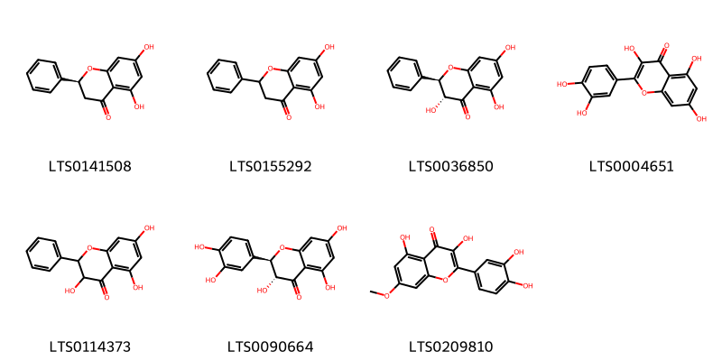{ width=100% }
    <figcaption>Hình ảnh cấu trúc hóa học của 7 hoạt chất thuộc nhóm Flavonoids gồm ['pinocembrine (LTS0141508)', 'pinocembrin (LTS0155292)', 'pinobanksin (LTS0036850)', 'quercetin (LTS0004651)', '3,5,7-trihydroxyflavanone (LTS0114373)', '(+)-taxifolin (LTS0090664)', 'rhamnetin (LTS0209810)'].</figcaption>
</figure>
#### Nhóm Indoles and derivatives
<figure markdown="span">
    { width=100% }
    <figcaption>Hình ảnh cấu trúc hóa học của 1 hoạt chất thuộc nhóm Indoles and derivatives gồm ['l-tryptophan (LTS0263809)'].</figcaption>
</figure>
#### Nhóm Organooxygen compounds
<figure markdown="span">
    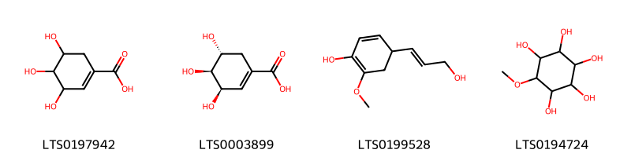{ width=100% }
    <figcaption>Hình ảnh cấu trúc hóa học của 4 hoạt chất thuộc nhóm Organooxygen compounds gồm ['shikimate (LTS0197942)', '(-)-shikimate (LTS0003899)', '4-[(1e)-3-hydroxyprop-1-en-1-yl]-2-methoxycyclohexa-1,5-dien-1-ol (LTS0199528)', 'pinitol (LTS0194724)'].</figcaption>
</figure>
#### Nhóm Phenanthrenes and derivatives
<figure markdown="span">
    { width=100% }
    <figcaption>Hình ảnh cấu trúc hóa học của 2 hoạt chất thuộc nhóm Phenanthrenes and derivatives gồm ['8a-ethenyl-1,4a,7-trimethyl-3,4,4b,5,6,9,10,10a-octahydro-2h-phenanthrene-1-carboxylic acid (LTS0181910)', '(1r,4as,4br,8as,10as)-8a-ethenyl-1,4a,7-trimethyl-3,4,4b,5,6,9,10,10a-octahydro-2h-phenanthrene-1-carboxylic acid (LTS0007621)'].</figcaption>
</figure>
#### Nhóm Piperidines
<figure markdown="span">
    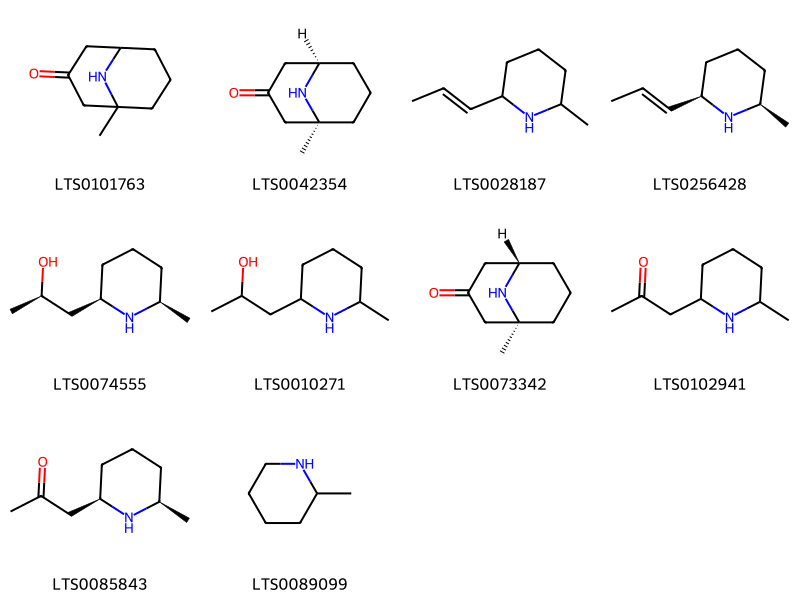{ width=100% }
    <figcaption>Hình ảnh cấu trúc hóa học của 10 hoạt chất thuộc nhóm Piperidines gồm ['1-methyl-9-azabicyclo[3.3.1]nonan-3-one (LTS0101763)', '(1s,5r)-1-methyl-9-azabicyclo[3.3.1]nonan-3-one (LTS0042354)', '2-methyl-6-(prop-1-en-1-yl)piperidine (LTS0028187)', 'pinidine (LTS0256428)', '(2r)-1-[(2r,6r)-6-methylpiperidin-2-yl]propan-2-ol (LTS0074555)', '1-(6-methylpiperidin-2-yl)propan-2-ol (LTS0010271)', '(1s,5s)-1-methyl-9-azabicyclo[3.3.1]nonan-3-one (LTS0073342)', '1-(6-methylpiperidin-2-yl)propan-2-one (LTS0102941)', '(-)-pinidinone (LTS0085843)', '2-methylpiperidine (LTS0089099)'].</figcaption>
</figure>
#### Nhóm Prenol lipids
<figure markdown="span">
    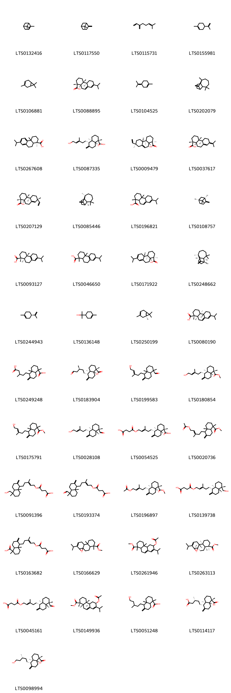{ width=100% }
    <figcaption>Hình ảnh cấu trúc hóa học của 45 hoạt chất thuộc nhóm Prenol lipids gồm ['α pinene (LTS0132416)', 'β-pinene (LTS0117550)', 'α-myrcene (LTS0115731)', 'limonene,  (LTS0155981)', 'monoterpenes (LTS0106881)', 'abietic acid (LTS0088895)', 'terpinolene (LTS0104525)', 'longifolene (LTS0202079)', '(1r)-7-isopropyl-1,4a-dimethyl-2,3,4,9,10,10a-hexahydrophenanthrene-1-carboxylic acid (LTS0267608)', 'isocupressic acid (LTS0087335)', 'isopimaric acid (LTS0009479)', 'neoabietic acid (LTS0037617)', 'sandaracopimaric acid (LTS0207129)', '(2s,7s)-3,3,7-trimethyl-8-methylidenetricyclo[5.4.0.0²,⁹]undecane (LTS0085446)', 'abietic acid (LTS0196821)', '(-)-β-pinene (LTS0108757)', 'palustric acid (LTS0093127)', 'palustric acid (LTS0046650)', 'levopimaric acid (LTS0171922)', '(+)-longifolene (LTS0248662)', 'α-limonene (LTS0244943)', 'terpineol (LTS0136148)', '(+)-delta(3)-carene (LTS0250199)', '(1r,4as,4bs,10ar)-7-isopropyl-1,4a-dimethyl-2,3,4,4b,5,6,10,10a-octahydrophenanthrene-1-carboxylic acid (LTS0080190)', '5-(4-carboxy-3-methylbutyl)-1,4a-dimethyl-6-methylidene-hexahydro-2h-naphthalene-1-carboxylic acid (LTS0249248)', '(1s,4ar,5s,8ar)-1,4a-dimethyl-5-[(3s)-3-methyl-5-oxopentyl]-6-methylidene-hexahydro-2h-naphthalene-1-carboxylic acid (LTS0183904)', '5-(5-hydroxy-3-methylpent-3-en-1-yl)-1,4a-dimethyl-6-methylidene-hexahydro-2h-naphthalene-1-carbaldehyde (LTS0199583)', 'methyl (1s,4ar,5s,8ar)-5-[(3e)-5-hydroxy-3-methylpent-3-en-1-yl]-1,4a-dimethyl-6-methylidene-hexahydro-2h-naphthalene-1-carboxylate (LTS0180854)', 'methyl 5-(5-hydroxy-3-methylpent-3-en-1-yl)-1,4a-dimethyl-6-methylidene-hexahydro-2h-naphthalene-1-carboxylate (LTS0175791)', '(1s,4ar,5s,8ar)-5-[(3e)-5-hydroxy-3-methylpent-3-en-1-yl]-1,4a-dimethyl-6-methylidene-hexahydro-2h-naphthalene-1-carbaldehyde (LTS0028108)', '(1s,4ar,5s,8ar)-5-[(3e)-5-[(3-carboxypropanoyl)oxy]-3-methylpent-3-en-1-yl]-1,4a-dimethyl-6-methylidene-hexahydro-2h-naphthalene-1-carboxylic acid (LTS0054525)', 'methyl 5-[5-(acetyloxy)-3-methylpent-3-en-1-yl]-1,4a-dimethyl-6-methylidene-hexahydro-2h-naphthalene-1-carboxylate (LTS0020736)', '4-({5-[5-(hydroxymethyl)-5,8a-dimethyl-2-methylidene-hexahydro-1h-naphthalen-1-yl]-3-methylpent-2-en-1-yl}oxy)-4-oxobutanoic acid (LTS0091396)', '4-{[5-(5-formyl-5,8a-dimethyl-2-methylidene-hexahydro-1h-naphthalen-1-yl)-3-methylpent-2-en-1-yl]oxy}-4-oxobutanoic acid (LTS0193374)', 'methyl (1s,4ar,5s,8ar)-5-[(3e)-5-(acetyloxy)-3-methylpent-3-en-1-yl]-1,4a-dimethyl-6-methylidene-hexahydro-2h-naphthalene-1-carboxylate (LTS0196897)', '4-{[(2e)-5-[(1s,4ar,5s,8ar)-5-(hydroxymethyl)-5,8a-dimethyl-2-methylidene-hexahydro-1h-naphthalen-1-yl]-3-methylpent-2-en-1-yl]oxy}-4-oxobutanoic acid (LTS0139738)', '5-{5-[(3-carboxypropanoyl)oxy]-3-methylpent-3-en-1-yl}-1,4a-dimethyl-6-methylidene-hexahydro-2h-naphthalene-1-carboxylic acid (LTS0163682)', 'methyl 7-isopropyl-1,4a-dimethyl-2h,3h,4h,4bh,5h,7ah,9h,10h,10ah-phenanthro[8,8a-b]oxirene-1-carboxylate (LTS0166629)', 'methyl 6-(acetyloxy)-7-isopropyl-1,4a-dimethyl-2,3,4,4b,5,6,10,10a-octahydrophenanthrene-1-carboxylate (LTS0261946)', 'methyl (1r,4as,4br,7as,8ar,10as)-7-isopropyl-1,4a-dimethyl-2h,3h,4h,4bh,5h,7ah,9h,10h,10ah-phenanthro[8,8a-b]oxirene-1-carboxylate (LTS0263113)', '4-{[(2e)-5-[(1s,4ar,5s,8ar)-5-formyl-5,8a-dimethyl-2-methylidene-hexahydro-1h-naphthalen-1-yl]-3-methylpent-2-en-1-yl]oxy}-4-oxobutanoic acid (LTS0045161)', 'methyl (1r,4ar,4br,6r,10as)-6-(acetyloxy)-7-isopropyl-1,4a-dimethyl-2,3,4,4b,5,6,10,10a-octahydrophenanthrene-1-carboxylate (LTS0149936)', '5-(5-hydroxy-3-methylpentyl)-1,4a-dimethyl-6-methylidene-hexahydro-2h-naphthalene-1-carboxylic acid (LTS0051248)', '(1s,4ar,5s,8ar)-5-[(3r)-4-carboxy-3-methylbutyl]-1,4a-dimethyl-6-methylidene-hexahydro-2h-naphthalene-1-carboxylic acid (LTS0114117)', '(1s,4ar,5s,8ar)-5-[(3r)-5-hydroxy-3-methylpentyl]-1,4a-dimethyl-6-methylidene-hexahydro-2h-naphthalene-1-carboxylic acid (LTS0098994)'].</figcaption>
</figure>
#### Nhóm Pyridines and derivatives
<figure markdown="span">
    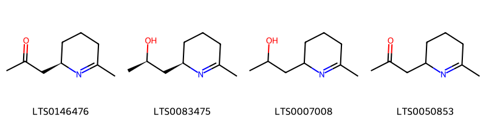{ width=100% }
    <figcaption>Hình ảnh cấu trúc hóa học của 4 hoạt chất thuộc nhóm Pyridines and derivatives gồm ['1-[(2r)-6-methyl-2,3,4,5-tetrahydropyridin-2-yl]propan-2-one (LTS0146476)', '(2r)-1-[(2r)-6-methyl-2,3,4,5-tetrahydropyridin-2-yl]propan-2-ol (LTS0083475)', '1-(6-methyl-2,3,4,5-tetrahydropyridin-2-yl)propan-2-ol (LTS0007008)', '1-(6-methyl-2,3,4,5-tetrahydropyridin-2-yl)propan-2-one (LTS0050853)'].</figcaption>
</figure>
#### Nhóm Saturated hydrocarbons
<figure markdown="span">
    { width=100% }
    <figcaption>Hình ảnh cấu trúc hóa học của 1 hoạt chất thuộc nhóm Saturated hydrocarbons gồm ['undecane (LTS0081068)'].</figcaption>
</figure>
#### Nhóm Stilbenes
<figure markdown="span">
    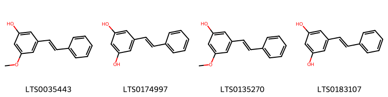{ width=100% }
    <figcaption>Hình ảnh cấu trúc hóa học của 4 hoạt chất thuộc nhóm Stilbenes gồm ['pinosylvin methyl ether (LTS0035443)', 'pinosylvin (LTS0174997)', '5-methoxy-3-stilbenol (LTS0135270)', 'pinosylvin (LTS0183107)'].</figcaption>
</figure>

---

### Dược dân tộc học

Danh sách các quốc gia có sử dụng *Pinus ponderosa* trong điều trị các bệnh. 

| Country   | Disease               | Bệnh               |
|:----------|:----------------------|:-------------------|
| US        | Abortifacient, Poison | Ngừa thai, Ngộ độc |

---

---
## Pinus roxburghii
### Thông tin về thực vật

!!! info "Phân loại thực vật của *Pinus roxburghii* từ GIBF:"
    - **Kingdom:** Plantae
    - **Phylum:** Tracheophyta
    - **Order:** Pinales
    - **Family:** Pinaceae
    - **Genus:** Pinus
    - **Species:** *Pinus roxburghii*

 

| Label (VI)   | Label (EN)   | Scientific Name   | Descriptions (VI)   | Descriptions (EN)   | Also Known As (VI)   | Also Known As (EN)                                                                                                                 |
|:-------------|:-------------|:------------------|:--------------------|:--------------------|:---------------------|:-----------------------------------------------------------------------------------------------------------------------------------|
| N/A          | N/A          | Pinus roxburghii  |                     | species of plant    | ['']                 | ['Pinus longifolia', 'cheer pine', 'chir', 'chir pine', 'Indian longleaf pine', 'long-leaved Indian pine', 'longleaf Indian pine'] |

#### Phân bố trên thế giới

**Từ CSDL GIBF** nan, Brazil, Nepal, China, Chile, New Zealand, Zimbabwe, Tanzania, United Republic of, Spain, United States of America, Korea, Republic of, Bhutan, Indonesia, Pakistan, Russian Federation, Saint Helena, Ascension and Tristan da Cunha, unknown or invalid, Cuba, Afghanistan, Belgium, Malaysia, Canada, Germany, South Africa, Australia, Italy, India

#### Phân bố tại Việt Nam

**Từ CSDL GIBF**: Không có ghi nhận ở Việt Nam

---
### Thành phần hóa học
        
- Theo cơ sở dữ liệu lotus: Từ loài *Pinus roxburghii* đã phân lập và xác định được 2 hoạt chất thuộc về các nhóm Cinnamic acids and derivatives. 

|    | chemicalTaxonomyClassyfireClass   |   smiles_count |
|---:|:----------------------------------|---------------:|
|  0 | Cinnamic acids and derivatives    |              2 |

#### Nhóm Cinnamic acids and derivatives
<figure markdown="span">
    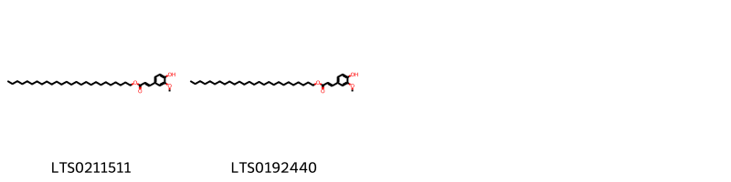{ width=100% }
    <figcaption>Hình ảnh cấu trúc hóa học của 2 hoạt chất thuộc nhóm Cinnamic acids and derivatives gồm ['hexacosyl (2e)-3-(4-hydroxy-3-methoxyphenyl)prop-2-enoate (LTS0211511)', 'hexacosyl 3-(4-hydroxy-3-methoxyphenyl)prop-2-enoate (LTS0192440)'].</figcaption>
</figure>

---

### Dược dân tộc học

Danh sách các quốc gia có sử dụng *Pinus roxburghii* trong điều trị các bệnh. 

| Country   | Disease                                                           | Bệnh                                                             |
|:----------|:------------------------------------------------------------------|:-----------------------------------------------------------------|
| Elsewhere | nan, Carminative, Expectorant, Rubefacient, Vermicide, Antiseptic | nan, Carminative, Expectorant, Rubefacient, Vermicide, Khử trùng |
| Nepal     | Stimulant, Stimulant, Stomachic, Stomachic                        | Chất kích thích, Chất kích thích, Dạ dày, Dạ dày                 |

---

---
## Pinus silvestris
### Thông tin về thực vật

!!! info "Phân loại thực vật của *Pinus sylvestris* từ GIBF:"
    - **Kingdom:** Plantae
    - **Phylum:** Tracheophyta
    - **Order:** Pinales
    - **Family:** Pinaceae
    - **Genus:** Pinus
    - **Species:** *Pinus sylvestris*

 

| Label (VI)   | Label (EN)   | Scientific Name   | Descriptions (VI)   | Descriptions (EN)   | Also Known As (VI)   | Also Known As (EN)                                                                                                                 |
|:-------------|:-------------|:------------------|:--------------------|:--------------------|:---------------------|:-----------------------------------------------------------------------------------------------------------------------------------|
| N/A          | N/A          | Pinus roxburghii  |                     | species of plant    | ['']                 | ['Pinus longifolia', 'cheer pine', 'chir', 'chir pine', 'Indian longleaf pine', 'long-leaved Indian pine', 'longleaf Indian pine'] |

#### Phân bố trên thế giới

**Từ CSDL GIBF** Czechia, Mongolia, Sweden, Finland, New Zealand, Spain, Poland, Denmark, United States of America, Russian Federation, Belarus, Norway, United Kingdom of Great Britain and Northern Ireland, Luxembourg, Canada, Germany, Austria, Hungary, Latvia, Ukraine, Italy, France, Ireland

#### Phân bố tại Việt Nam

**Từ CSDL GIBF**: Không có ghi nhận ở Việt Nam

---
### Thành phần hóa học
        
- Theo cơ sở dữ liệu lotus: Từ loài *Pinus sylvestris* đã phân lập và xác định được Chưa có hoạt chất nào được phân lập. hoạt chất thuộc về các nhóm Không có hoạt chất nào được phân lập. 

Không có hình ảnh nào được tạo ra

---

### Dược dân tộc học

Danh sách các quốc gia có sử dụng *Pinus sylvestris* trong điều trị các bệnh. 

| Country   | Disease     | Bệnh                   |
|:----------|:------------|:-----------------------|
| Japan*    | Rubefacient | Chất gây xung huyết da |
| ain       | Inhalant    | (thuộc) hút vào        |

---

---
## Pinus strobus
### Thông tin về thực vật

!!! info "Phân loại thực vật của *Pinus strobus* từ GIBF:"
    - **Kingdom:** Plantae
    - **Phylum:** Tracheophyta
    - **Order:** Pinales
    - **Family:** Pinaceae
    - **Genus:** Pinus
    - **Species:** *Pinus strobus*

 

| Label (VI)   | Label (EN)   | Scientific Name   | Descriptions (VI)   | Descriptions (EN)   | Also Known As (VI)   | Also Known As (EN)                                                                        |
|:-------------|:-------------|:------------------|:--------------------|:--------------------|:---------------------|:------------------------------------------------------------------------------------------|
| N/A          | N/A          | Pinus strobus     | loài thực vật       | species of plant    | ['']                 | ['white pine', 'eastern white pine', 'northern white pine', 'soft pine', 'Weymouth pine'] |

#### Phân bố trên thế giới

**Từ CSDL GIBF** Mexico, United States of America, Czechia, Italy, Canada, Germany, Poland

#### Phân bố tại Việt Nam

**Từ CSDL GIBF**: Không có ghi nhận ở Việt Nam

---
### Thành phần hóa học
        
- Theo cơ sở dữ liệu lotus: Từ loài *Pinus strobus* đã phân lập và xác định được 73 hoạt chất thuộc về các nhóm Fatty Acyls, Benzene and substituted derivatives, Organic oxides, Flavonoids, Carboxylic acids and derivatives, Phenols, Organooxygen compounds, Macrolides and analogues, Prenol lipids, Stilbenes. 

|    | chemicalTaxonomyClassyfireClass     |   smiles_count |
|---:|:------------------------------------|---------------:|
|  0 | Benzene and substituted derivatives |              1 |
|  1 | Carboxylic acids and derivatives    |              4 |
|  2 | Fatty Acyls                         |             13 |
|  3 | Flavonoids                          |             13 |
|  4 | Macrolides and analogues            |              2 |
|  5 | Organic oxides                      |              2 |
|  6 | Organooxygen compounds              |              2 |
|  7 | Phenols                             |              2 |
|  8 | Prenol lipids                       |             31 |
|  9 | Stilbenes                           |              3 |

#### Nhóm Benzene and substituted derivatives
<figure markdown="span">
    { width=100% }
    <figcaption>Hình ảnh cấu trúc hóa học của 1 hoạt chất thuộc nhóm Benzene and substituted derivatives gồm ['benzyl alcohol (LTS0125638)'].</figcaption>
</figure>
#### Nhóm Carboxylic acids and derivatives
<figure markdown="span">
    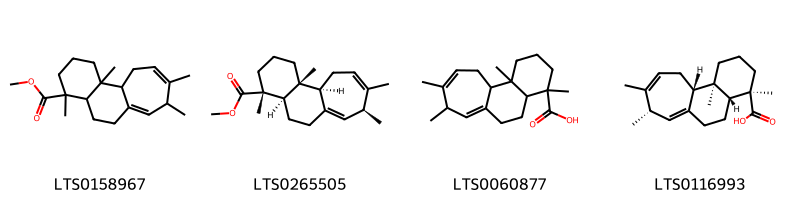{ width=100% }
    <figcaption>Hình ảnh cấu trúc hóa học của 4 hoạt chất thuộc nhóm Carboxylic acids and derivatives gồm ['methyl 4,8,9,11b-tetramethyl-1h,2h,3h,4ah,5h,6h,8h,11h,11ah-cyclohepta[a]naphthalene-4-carboxylate (LTS0158967)', 'methyl (4r,4ar,8s,11as,11br)-4,8,9,11b-tetramethyl-1h,2h,3h,4ah,5h,6h,8h,11h,11ah-cyclohepta[a]naphthalene-4-carboxylate (LTS0265505)', '4,8,9,11b-tetramethyl-1h,2h,3h,4ah,5h,6h,8h,11h,11ah-cyclohepta[a]naphthalene-4-carboxylic acid (LTS0060877)', '(4r,4ar,8s,11as,11br)-4,8,9,11b-tetramethyl-1h,2h,3h,4ah,5h,6h,8h,11h,11ah-cyclohepta[a]naphthalene-4-carboxylic acid (LTS0116993)'].</figcaption>
</figure>
#### Nhóm Fatty Acyls
<figure markdown="span">
    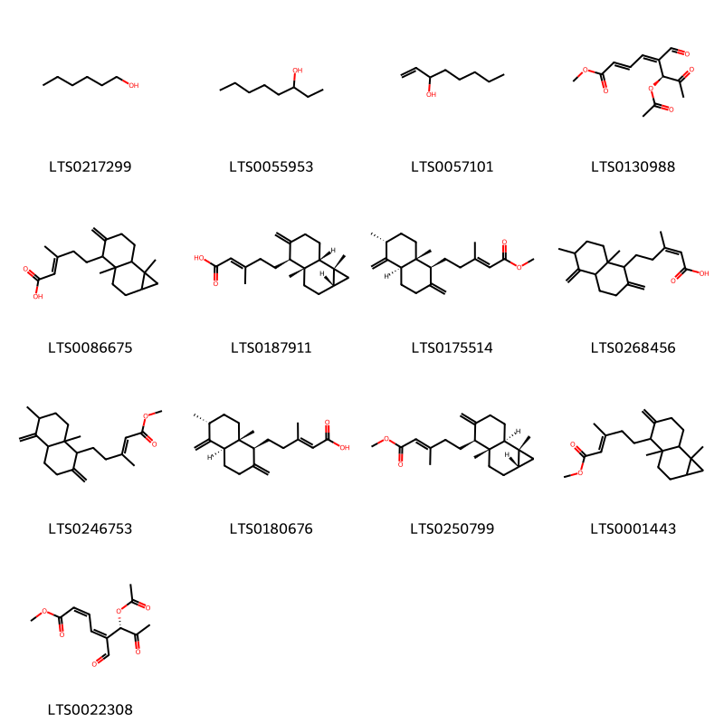{ width=100% }
    <figcaption>Hình ảnh cấu trúc hóa học của 13 hoạt chất thuộc nhóm Fatty Acyls gồm ['hexanol (LTS0217299)', '3-octanol (LTS0055953)', '1-octen-3-ol (LTS0057101)', 'methyl (4e,6s)-6-(acetyloxy)-5-formyl-7-oxoocta-2,4-dienoate (LTS0130988)', '5-{3a,7b-dimethyl-5-methylidene-octahydrocyclopropa[a]naphthalen-4-yl}-3-methylpent-2-enoic acid (LTS0086675)', '(2e)-5-[(1as,3ar,4s,7ar,7br)-3a,7b-dimethyl-5-methylidene-octahydrocyclopropa[a]naphthalen-4-yl]-3-methylpent-2-enoic acid (LTS0187911)', 'methyl (2e)-5-[(1s,4as,6r,8ar)-6,8a-dimethyl-2,5-dimethylidene-hexahydro-1h-naphthalen-1-yl]-3-methylpent-2-enoate (LTS0175514)', '(2z)-5-(6,8a-dimethyl-2,5-dimethylidene-hexahydro-1h-naphthalen-1-yl)-3-methylpent-2-enoic acid (LTS0268456)', 'methyl 5-(6,8a-dimethyl-2,5-dimethylidene-hexahydro-1h-naphthalen-1-yl)-3-methylpent-2-enoate (LTS0246753)', '(2e)-5-[(1s,4as,6r,8ar)-6,8a-dimethyl-2,5-dimethylidene-hexahydro-1h-naphthalen-1-yl]-3-methylpent-2-enoic acid (LTS0180676)', 'methyl (2e)-5-[(1as,3ar,4s,7as,7br)-3a,7b-dimethyl-5-methylidene-octahydrocyclopropa[a]naphthalen-4-yl]-3-methylpent-2-enoate (LTS0250799)', 'methyl 5-{3a,7b-dimethyl-5-methylidene-octahydrocyclopropa[a]naphthalen-4-yl}-3-methylpent-2-enoate (LTS0001443)', 'methyl (2z,4e,6s)-6-(acetyloxy)-5-formyl-7-oxoocta-2,4-dienoate (LTS0022308)'].</figcaption>
</figure>
#### Nhóm Flavonoids
<figure markdown="span">
    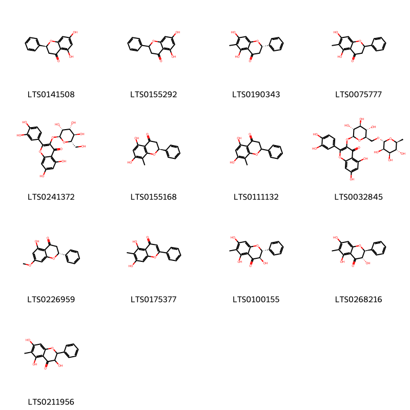{ width=100% }
    <figcaption>Hình ảnh cấu trúc hóa học của 13 hoạt chất thuộc nhóm Flavonoids gồm ['pinocembrine (LTS0141508)', 'pinocembrin (LTS0155292)', 'strobopinin (LTS0190343)', '5,7-dihydroxy-6-methyl-2-phenyl-2,3-dihydro-1-benzopyran-4-one (LTS0075777)', '2-(3,4-dihydroxyphenyl)-5,7-dihydroxy-3-{[(2s,3r,4r,5r,6s)-3,4,5-trihydroxy-6-(hydroxymethyl)oxan-2-yl]oxy}chromen-4-one (LTS0241372)', '(2s)-8-methylpinocembrin (LTS0155168)', 'cryptostrobin (LTS0111132)', '3-rutinosyl quercetin (LTS0032845)', '(2r)-5-hydroxy-7-methoxy-2-phenyl-2,3-dihydro-1-benzopyran-4-one (LTS0226959)', 'strobochrysin (LTS0175377)', '(2r,3r)-3,5,7-trihydroxy-6-methyl-2-phenyl-2,3-dihydro-1-benzopyran-4-one (LTS0100155)', '(2s,3s)-3,5,7-trihydroxy-6-methyl-2-phenyl-2,3-dihydro-1-benzopyran-4-one (LTS0268216)', '3,5,7-trihydroxy-6-methyl-2-phenyl-2,3-dihydro-1-benzopyran-4-one (LTS0211956)'].</figcaption>
</figure>
#### Nhóm Macrolides and analogues
<figure markdown="span">
    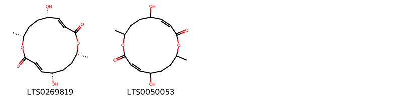{ width=100% }
    <figcaption>Hình ảnh cấu trúc hóa học của 2 hoạt chất thuộc nhóm Macrolides and analogues gồm ['(3e,5s,8r,11e,13s,16r)-5,13-dihydroxy-8,16-dimethyl-1,9-dioxacyclohexadeca-3,11-diene-2,10-dione (LTS0269819)', '5,13-dihydroxy-8,16-dimethyl-1,9-dioxacyclohexadeca-3,11-diene-2,10-dione (LTS0050053)'].</figcaption>
</figure>
#### Nhóm Organic oxides
<figure markdown="span">
    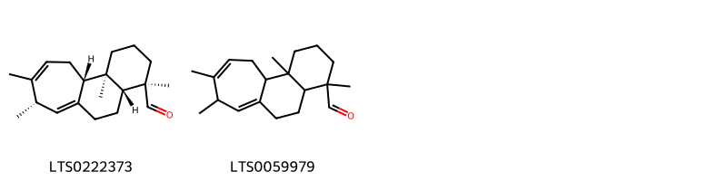{ width=100% }
    <figcaption>Hình ảnh cấu trúc hóa học của 2 hoạt chất thuộc nhóm Organic oxides gồm ['(4r,4ar,8s,11as,11br)-4,8,9,11b-tetramethyl-1h,2h,3h,4ah,5h,6h,8h,11h,11ah-cyclohepta[a]naphthalene-4-carbaldehyde (LTS0222373)', '4,8,9,11b-tetramethyl-1h,2h,3h,4ah,5h,6h,8h,11h,11ah-cyclohepta[a]naphthalene-4-carbaldehyde (LTS0059979)'].</figcaption>
</figure>
#### Nhóm Organooxygen compounds
<figure markdown="span">
    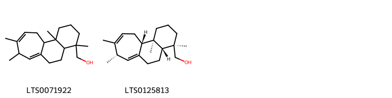{ width=100% }
    <figcaption>Hình ảnh cấu trúc hóa học của 2 hoạt chất thuộc nhóm Organooxygen compounds gồm ['{4,8,9,11b-tetramethyl-1h,2h,3h,4ah,5h,6h,8h,11h,11ah-cyclohepta[a]naphthalen-4-yl}methanol (LTS0071922)', '[(4r,4ar,8s,11as,11br)-4,8,9,11b-tetramethyl-1h,2h,3h,4ah,5h,6h,8h,11h,11ah-cyclohepta[a]naphthalen-4-yl]methanol (LTS0125813)'].</figcaption>
</figure>
#### Nhóm Phenols
<figure markdown="span">
    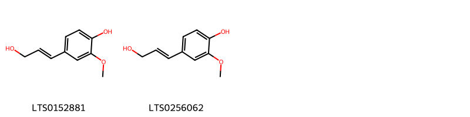{ width=100% }
    <figcaption>Hình ảnh cấu trúc hóa học của 2 hoạt chất thuộc nhóm Phenols gồm ['coniferyl alcohol (LTS0152881)', '4-(3-hydroxyprop-1-en-1-yl)-2-methoxyphenol (LTS0256062)'].</figcaption>
</figure>
#### Nhóm Prenol lipids
<figure markdown="span">
    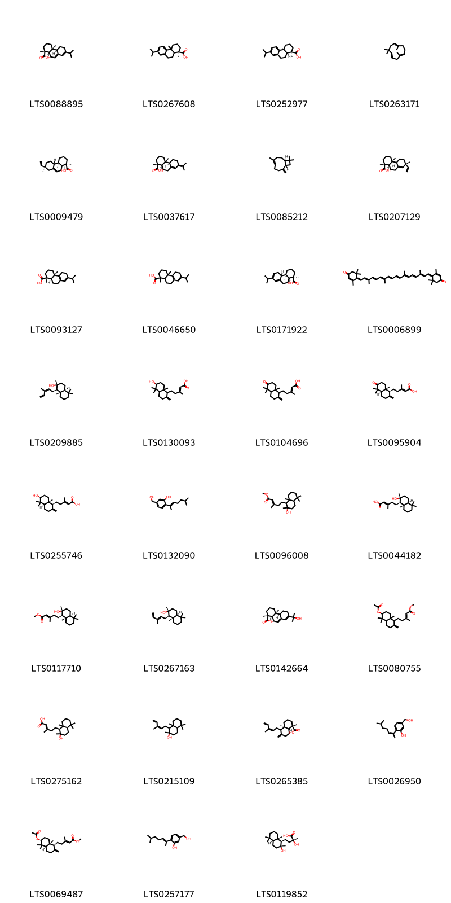{ width=100% }
    <figcaption>Hình ảnh cấu trúc hóa học của 31 hoạt chất thuộc nhóm Prenol lipids gồm ['abietic acid (LTS0088895)', '(1r)-7-isopropyl-1,4a-dimethyl-2,3,4,9,10,10a-hexahydrophenanthrene-1-carboxylic acid (LTS0267608)', '(-)-dehydroabietic acid (LTS0252977)', 'humulene (LTS0263171)', 'isopimaric acid (LTS0009479)', 'neoabietic acid (LTS0037617)', 'caryophyllene (LTS0085212)', 'sandaracopimaric acid (LTS0207129)', 'palustric acid (LTS0093127)', 'palustric acid (LTS0046650)', 'levopimaric acid (LTS0171922)', 'rhodoxanthin (LTS0006899)', 'cis-abienol (LTS0209885)', '5-(6-hydroxy-5,5,8a-trimethyl-2-methylidene-hexahydro-1h-naphthalen-1-yl)-3-methylpent-2-enoic acid (LTS0130093)', '5-(5,5,8a-trimethyl-2-methylidene-6-oxo-hexahydronaphthalen-1-yl)-3-methylpent-2-enoic acid (LTS0104696)', '(2e)-5-[(1s,4ar,8ar)-5,5,8a-trimethyl-2-methylidene-6-oxo-hexahydronaphthalen-1-yl]-3-methylpent-2-enoic acid (LTS0095904)', '(2e)-5-[(1s,4ar,6s,8ar)-6-hydroxy-5,5,8a-trimethyl-2-methylidene-hexahydro-1h-naphthalen-1-yl]-3-methylpent-2-enoic acid (LTS0255746)', '5-(hydroxymethyl)-2-(6-methylhept-2-en-2-yl)phenol (LTS0132090)', 'methyl 5-(2-hydroxy-2,5,5,8a-tetramethyl-hexahydro-1h-naphthalen-1-yl)-3-methylpent-2-enoate (LTS0096008)', '(2e)-5-[(1r,2r,4as,8as)-2-hydroxy-2,5,5,8a-tetramethyl-hexahydro-1h-naphthalen-1-yl]-3-methylpent-2-enoic acid (LTS0044182)', 'methyl (2e)-5-[(1r,2r,4as,8as)-2-hydroxy-2,5,5,8a-tetramethyl-hexahydro-1h-naphthalen-1-yl]-3-methylpent-2-enoate (LTS0117710)', '(1r,2r,4as,8as)-2,5,5,8a-tetramethyl-1-[(2e)-3-methylpenta-2,4-dien-1-yl]-hexahydro-1h-naphthalen-2-ol (LTS0267163)', '(1r,4ar,4br,10ar)-7-(2-hydroxypropan-2-yl)-1,4a-dimethyl-2,3,4,4b,5,6,10,10a-octahydrophenanthrene-1-carboxylic acid (LTS0142664)', 'methyl 5-[6-(acetyloxy)-5,5,8a-trimethyl-2-methylidene-hexahydro-1h-naphthalen-1-yl]-3-methylpent-2-enoate (LTS0080755)', '5-(2-hydroxy-2,5,5,8a-tetramethyl-hexahydro-1h-naphthalen-1-yl)-3-methylpent-2-enoic acid (LTS0275162)', '2,5,5,8a-tetramethyl-1-(3-methylpenta-2,4-dien-1-yl)-hexahydro-1h-naphthalen-2-ol (LTS0215109)', '(1s,4ar,8ar)-1,4a-dimethyl-6-methylidene-5-(3-methylpenta-2,4-dien-1-yl)-hexahydro-2h-naphthalene-1-carboxylic acid (LTS0265385)', '5-(hydroxymethyl)-2-[(2z)-6-methylhept-2-en-2-yl]phenol (LTS0026950)', 'methyl (2e)-5-[(1s,4ar,6s,8ar)-6-(acetyloxy)-5,5,8a-trimethyl-2-methylidene-hexahydro-1h-naphthalen-1-yl]-3-methylpent-2-enoate (LTS0069487)', 'aspergillusene a (LTS0257177)', '(2r)-4-[(1r,2r,4as,8as)-2-hydroxy-2,5,5,8a-tetramethyl-hexahydro-1h-naphthalen-1-yl]-2-hydroxy-2-methylbutanoic acid (LTS0119852)'].</figcaption>
</figure>
#### Nhóm Stilbenes
<figure markdown="span">
    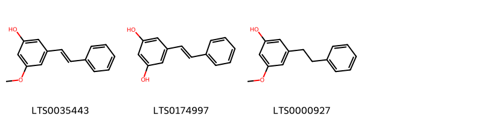{ width=100% }
    <figcaption>Hình ảnh cấu trúc hóa học của 3 hoạt chất thuộc nhóm Stilbenes gồm ['pinosylvin methyl ether (LTS0035443)', 'pinosylvin (LTS0174997)', '3-methoxy-5-(2-phenylethyl)phenol (LTS0000927)'].</figcaption>
</figure>

---

### Dược dân tộc học

Danh sách các quốc gia có sử dụng *Pinus strobus* trong điều trị các bệnh. 

| Country   | Disease               | Bệnh                              |
|:----------|:----------------------|:----------------------------------|
| Dutch     | Expectorant           | Thuốc long đàm                    |
| Elsewhere | Antitussive           | Chống ho                          |
| French    | Diuretic              | Thuốc lợi tiêu                    |
| German    | Demulcent             | dịu, giảm kích thích              |
| US        | Laxative, Expectorant | Thuốc nhuận tràng, thuốc long đờm |

---

---
## Pinus taeda
### Thông tin về thực vật

!!! info "Phân loại thực vật của *Pinus taeda* từ GIBF:"
    - **Kingdom:** Plantae
    - **Phylum:** Tracheophyta
    - **Order:** Pinales
    - **Family:** Pinaceae
    - **Genus:** Pinus
    - **Species:** *Pinus taeda*

 

| Label (VI)   | Label (EN)   | Scientific Name   | Descriptions (VI)   | Descriptions (EN)   | Also Known As (VI)   | Also Known As (EN)   |
|:-------------|:-------------|:------------------|:--------------------|:--------------------|:---------------------|:---------------------|
| N/A          | N/A          | Pinus taeda       | loài thực vật       | species of plant    | ['']                 | ['loblolly pine']    |

#### Phân bố trên thế giới

**Từ CSDL GIBF** United States of America

#### Phân bố tại Việt Nam

**Từ CSDL GIBF**: Không có ghi nhận ở Việt Nam

---
### Thành phần hóa học
        
- Theo cơ sở dữ liệu lotus: Từ loài *Pinus taeda* đã phân lập và xác định được 56 hoạt chất thuộc về các nhóm Fatty Acyls, Benzene and substituted derivatives, Flavonoids, Dibenzylbutane lignans, Carboxylic acids and derivatives, Cinnamic acids and derivatives, Steroids and steroid derivatives, Phenols, Prenol lipids, 2-arylbenzofuran flavonoids, Stilbenes. 

|    | chemicalTaxonomyClassyfireClass     |   smiles_count |
|---:|:------------------------------------|---------------:|
|  0 | 2-arylbenzofuran flavonoids         |              3 |
|  1 | Benzene and substituted derivatives |              4 |
|  2 | Carboxylic acids and derivatives    |              7 |
|  3 | Cinnamic acids and derivatives      |              1 |
|  4 | Dibenzylbutane lignans              |              2 |
|  5 | Fatty Acyls                         |              1 |
|  6 | Flavonoids                          |              3 |
|  7 | Phenols                             |              1 |
|  8 | Prenol lipids                       |             12 |
|  9 | Steroids and steroid derivatives    |              3 |
| 10 | Stilbenes                           |             19 |

#### Nhóm 2-arylbenzofuran flavonoids
<figure markdown="span">
    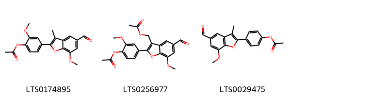{ width=100% }
    <figcaption>Hình ảnh cấu trúc hóa học của 3 hoạt chất thuộc nhóm 2-arylbenzofuran flavonoids gồm ['4-(5-formyl-7-methoxy-3-methyl-1-benzofuran-2-yl)-2-methoxyphenyl acetate (LTS0174895)', '{2-[4-(acetyloxy)-3-methoxyphenyl]-5-formyl-7-methoxy-1-benzofuran-3-yl}methyl acetate (LTS0256977)', '4-(5-formyl-7-methoxy-3-methyl-1-benzofuran-2-yl)phenyl acetate (LTS0029475)'].</figcaption>
</figure>
#### Nhóm Benzene and substituted derivatives
<figure markdown="span">
    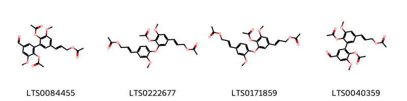{ width=100% }
    <figcaption>Hình ảnh cấu trúc hóa học của 4 hoạt chất thuộc nhóm Benzene and substituted derivatives gồm ["(2e)-3-[2',6-bis(acetyloxy)-5'-formyl-3',5-dimethoxy-[1,1'-biphenyl]-3-yl]prop-2-en-1-yl acetate (LTS0084455)", '3-{4-[2-(acetyloxy)-5-[3-(acetyloxy)prop-1-en-1-yl]-3-methoxyphenoxy]-3-methoxyphenyl}prop-2-en-1-yl acetate (LTS0222677)', '(2e)-3-{4-[2-(acetyloxy)-5-[(1e)-3-(acetyloxy)prop-1-en-1-yl]-3-methoxyphenoxy]-3-methoxyphenyl}prop-2-en-1-yl acetate (LTS0171859)', "3-[2',6-bis(acetyloxy)-5'-formyl-3',5-dimethoxy-[1,1'-biphenyl]-3-yl]prop-2-en-1-yl acetate (LTS0040359)"].</figcaption>
</figure>
#### Nhóm Carboxylic acids and derivatives
<figure markdown="span">
    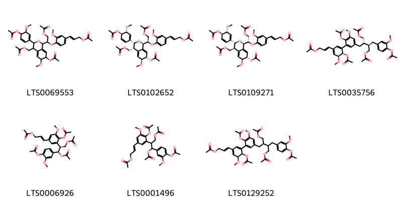{ width=100% }
    <figcaption>Hình ảnh cấu trúc hóa học của 7 hoạt chất thuộc nhóm Carboxylic acids and derivatives gồm ['2-[7-(acetyloxy)-3-[4-(acetyloxy)-3-methoxycyclohexa-1,5-dien-1-yl]-4-[(acetyloxy)methyl]-6-methoxy-3,4,6,7-tetrahydro-1h-2-benzopyran-1-yl]-2-{4-[3-(acetyloxy)prop-1-en-1-yl]-2-methoxyphenoxy}ethyl acetate (LTS0069553)', '(2e)-3-{4-[(1r)-2-(acetyloxy)-1-[(1r,3r,4r,6s,7s)-7-(acetyloxy)-3-[(3r,4r)-4-(acetyloxy)-3-methoxycyclohexa-1,5-dien-1-yl]-4-[(acetyloxy)methyl]-6-methoxy-3,4,6,7-tetrahydro-1h-2-benzopyran-1-yl]ethoxy]-3-methoxyphenyl}prop-2-en-1-yl acetate (LTS0102652)', '(2e)-3-{4-[(1s)-2-(acetyloxy)-1-[(1r,3r,4s,6s,7s)-7-(acetyloxy)-3-[(3r,4r)-4-(acetyloxy)-3-methoxycyclohexa-1,5-dien-1-yl]-4-[(acetyloxy)methyl]-6-methoxy-3,4,6,7-tetrahydro-1h-2-benzopyran-1-yl]ethoxy]-3-methoxyphenyl}prop-2-en-1-yl acetate (LTS0109271)', '(2e)-3-[(3s,4r)-4-(acetyloxy)-5-[2-(acetyloxy)-5-[(2s,3r)-4-(acetyloxy)-3-{[4-(acetyloxy)-3-methoxyphenyl]methyl}-2-[(acetyloxy)methyl]butyl]-3-methoxyphenyl]-3-methoxycyclohexa-1,5-dien-1-yl]prop-2-en-1-yl acetate (LTS0035756)', '(2e)-3-[4-(acetyloxy)-3-[(1s,2r)-2-(acetyloxy)-2-[4-(acetyloxy)-3-methoxyphenyl]-1-[(acetyloxy)methyl]ethyl]-5-methoxyphenyl]prop-2-en-1-yl acetate (LTS0006926)', '3-(acetyloxy)-1-[4-(acetyloxy)-3-methoxyphenyl]-2-[2-(acetyloxy)-5-[3-(acetyloxy)prop-1-en-1-yl]-3-methoxyphenyl]propyl acetate (LTS0001496)', '4-(acetyloxy)-3-{[4-(acetyloxy)-3-[6-(acetyloxy)-3-[3-(acetyloxy)prop-1-en-1-yl]-5-methoxycyclohexa-1,3-dien-1-yl]-5-methoxyphenyl]methyl}-2-{[4-(acetyloxy)-3-methoxyphenyl]methyl}butyl acetate (LTS0129252)'].</figcaption>
</figure>
#### Nhóm Cinnamic acids and derivatives
<figure markdown="span">
    { width=100% }
    <figcaption>Hình ảnh cấu trúc hóa học của 1 hoạt chất thuộc nhóm Cinnamic acids and derivatives gồm ['para-coumaric acid (LTS0266252)'].</figcaption>
</figure>
#### Nhóm Dibenzylbutane lignans
<figure markdown="span">
    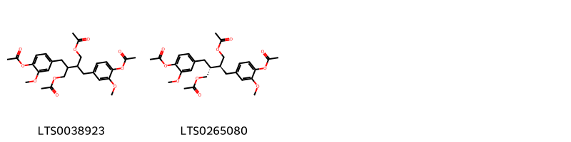{ width=100% }
    <figcaption>Hình ảnh cấu trúc hóa học của 2 hoạt chất thuộc nhóm Dibenzylbutane lignans gồm ['4-(acetyloxy)-2,3-bis({[4-(acetyloxy)-3-methoxyphenyl]methyl})butyl acetate (LTS0038923)', '(2s,3r)-4-(acetyloxy)-2,3-bis({[4-(acetyloxy)-3-methoxyphenyl]methyl})butyl acetate (LTS0265080)'].</figcaption>
</figure>
#### Nhóm Fatty Acyls
<figure markdown="span">
    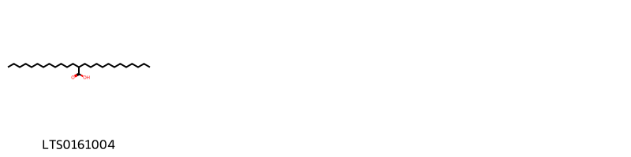{ width=100% }
    <figcaption>Hình ảnh cấu trúc hóa học của 1 hoạt chất thuộc nhóm Fatty Acyls gồm ['2-dodecyltetradecanoic acid (LTS0161004)'].</figcaption>
</figure>
#### Nhóm Flavonoids
<figure markdown="span">
    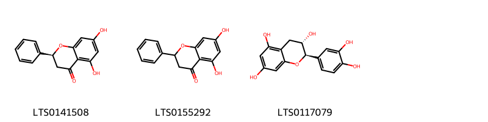{ width=100% }
    <figcaption>Hình ảnh cấu trúc hóa học của 3 hoạt chất thuộc nhóm Flavonoids gồm ['pinocembrine (LTS0141508)', 'pinocembrin (LTS0155292)', '(+)-catechol (LTS0117079)'].</figcaption>
</figure>
#### Nhóm Phenols
<figure markdown="span">
    { width=100% }
    <figcaption>Hình ảnh cấu trúc hóa học của 1 hoạt chất thuộc nhóm Phenols gồm ['coniferyl alcohol (LTS0152881)'].</figcaption>
</figure>
#### Nhóm Prenol lipids
<figure markdown="span">
    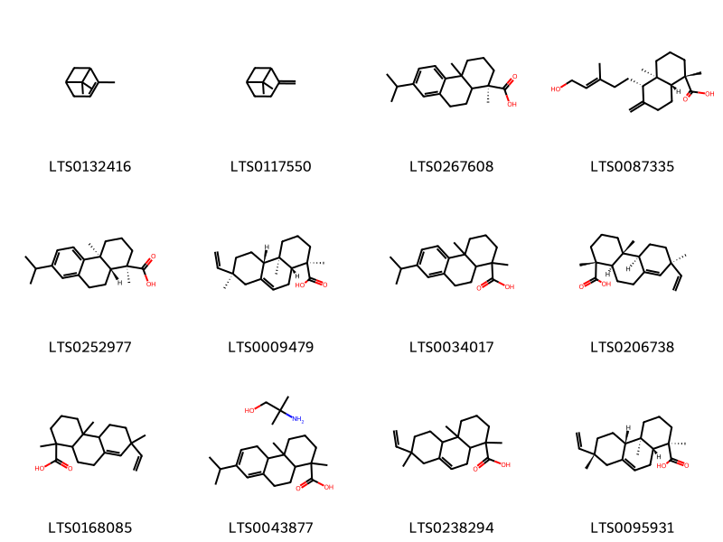{ width=100% }
    <figcaption>Hình ảnh cấu trúc hóa học của 12 hoạt chất thuộc nhóm Prenol lipids gồm ['α pinene (LTS0132416)', 'β-pinene (LTS0117550)', '(1r)-7-isopropyl-1,4a-dimethyl-2,3,4,9,10,10a-hexahydrophenanthrene-1-carboxylic acid (LTS0267608)', 'isocupressic acid (LTS0087335)', '(-)-dehydroabietic acid (LTS0252977)', 'isopimaric acid (LTS0009479)', 'dehydroabietic acid (LTS0034017)', 'pimaric acid (LTS0206738)', 'pimaric acid (LTS0168085)', '2-amino-2-methyl-1-propanol; levopimaric acid (LTS0043877)', 'isopimaric acid (LTS0238294)', '(1r,4ar,4bs,7r,10ar)-7-ethenyl-1,4a,7-trimethyl-3,4,4b,5,6,8,10,10a-octahydro-2h-phenanthrene-1-carboxylic acid (LTS0095931)'].</figcaption>
</figure>
#### Nhóm Steroids and steroid derivatives
<figure markdown="span">
    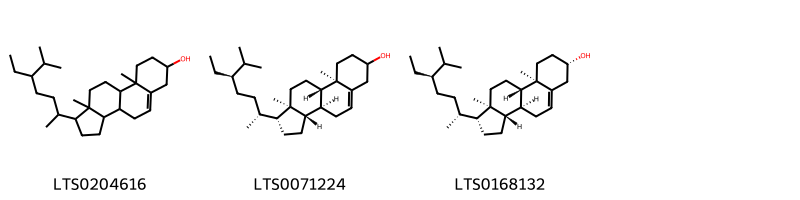{ width=100% }
    <figcaption>Hình ảnh cấu trúc hóa học của 3 hoạt chất thuộc nhóm Steroids and steroid derivatives gồm ['stigmast-5-en-3-ol, (3β)- (LTS0204616)', 'stigmast-5-en-3-ol (LTS0071224)', 'sitosterol (LTS0168132)'].</figcaption>
</figure>
#### Nhóm Stilbenes
<figure markdown="span">
    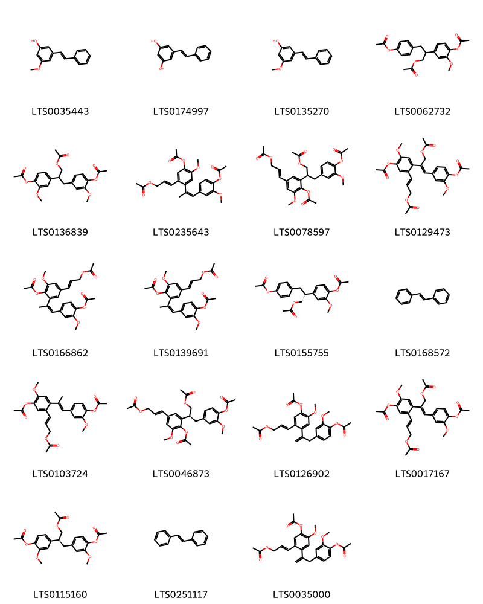{ width=100% }
    <figcaption>Hình ảnh cấu trúc hóa học của 19 hoạt chất thuộc nhóm Stilbenes gồm ['pinosylvin methyl ether (LTS0035443)', 'pinosylvin (LTS0174997)', '5-methoxy-3-stilbenol (LTS0135270)', '2-[4-(acetyloxy)-3-methoxyphenyl]-3-[4-(acetyloxy)phenyl]propyl acetate (LTS0062732)', '2,3-bis[4-(acetyloxy)-3-methoxyphenyl]propyl acetate (LTS0136839)', '3-[5-(acetyloxy)-2-{1-[4-(acetyloxy)-3-methoxyphenyl]prop-1-en-2-yl}-4-methoxyphenyl]prop-2-en-1-yl acetate (LTS0235643)', '3-[4-(acetyloxy)-3-[1-(acetyloxy)-3-[4-(acetyloxy)-3-methoxyphenyl]propan-2-yl]-5-methoxyphenyl]prop-2-en-1-yl acetate (LTS0078597)', '(2e)-3-[5-(acetyloxy)-2-[(1z)-3-(acetyloxy)-1-[4-(acetyloxy)-3-methoxyphenyl]prop-1-en-2-yl]-4-methoxyphenyl]prop-2-en-1-yl acetate (LTS0129473)', '3-[4-(acetyloxy)-3-{1-[4-(acetyloxy)-3-methoxyphenyl]prop-1-en-2-yl}-5-methoxyphenyl]prop-2-en-1-yl acetate (LTS0166862)', '(2e)-3-[4-(acetyloxy)-3-[(1z)-1-[4-(acetyloxy)-3-methoxyphenyl]prop-1-en-2-yl]-5-methoxyphenyl]prop-2-en-1-yl acetate (LTS0139691)', '(2r)-2-[4-(acetyloxy)-3-methoxyphenyl]-3-[4-(acetyloxy)phenyl]propyl acetate (LTS0155755)', 'stilbene (LTS0168572)', '(2e)-3-[5-(acetyloxy)-2-[(1e)-1-[4-(acetyloxy)-3-methoxyphenyl]prop-1-en-2-yl]-4-methoxyphenyl]prop-2-en-1-yl acetate (LTS0103724)', '(2e)-3-[4-(acetyloxy)-3-[(2s)-1-(acetyloxy)-3-[4-(acetyloxy)-3-methoxyphenyl]propan-2-yl]-5-methoxyphenyl]prop-2-en-1-yl acetate (LTS0046873)', '3-[5-(acetyloxy)-2-{3-[4-(acetyloxy)-3-methoxyphenyl]prop-1-en-2-yl}-4-methoxyphenyl]prop-2-en-1-yl acetate (LTS0126902)', '2-[4-(acetyloxy)-2-[3-(acetyloxy)prop-1-en-1-yl]-5-methoxyphenyl]-3-[4-(acetyloxy)-3-methoxyphenyl]prop-2-en-1-yl acetate (LTS0017167)', '(2s)-2,3-bis[4-(acetyloxy)-3-methoxyphenyl]propyl acetate (LTS0115160)', 'trans-stilbene (LTS0251117)', '(2e)-3-[5-(acetyloxy)-2-{3-[4-(acetyloxy)-3-methoxyphenyl]prop-1-en-2-yl}-4-methoxyphenyl]prop-2-en-1-yl acetate (LTS0035000)'].</figcaption>
</figure>

---

### Dược dân tộc học

Danh sách các quốc gia có sử dụng *Pinus taeda* trong điều trị các bệnh. 

| Country   | Disease                                          | Bệnh                                                                    |
|:----------|:-------------------------------------------------|:------------------------------------------------------------------------|
| US        | Laxative, Poison, Stimulant, Vermifuge, Diuretic | Thuốc nhuận tràng, chất độc, chất kích thích, Vermifuge, thuốc lợi tiểu |

---

---
## Pinus teocote
### Thông tin về thực vật

!!! info "Phân loại thực vật của *Pinus teocote* từ GIBF:"
    - **Kingdom:** Plantae
    - **Phylum:** Tracheophyta
    - **Order:** Pinales
    - **Family:** Pinaceae
    - **Genus:** Pinus
    - **Species:** *Pinus teocote*

 

| Label (VI)   | Label (EN)   | Scientific Name   | Descriptions (VI)   | Descriptions (EN)   | Also Known As (VI)   | Also Known As (EN)   |
|:-------------|:-------------|:------------------|:--------------------|:--------------------|:---------------------|:---------------------|
| N/A          | N/A          | Pinus teocote     | loài thực vật       | species of plant    | ['']                 | ['']                 |

#### Phân bố trên thế giới

**Từ CSDL GIBF** Mexico, United States of America

#### Phân bố tại Việt Nam

**Từ CSDL GIBF**: Không có ghi nhận ở Việt Nam

---
### Thành phần hóa học
        
- Theo cơ sở dữ liệu lotus: Từ loài *Pinus teocote* đã phân lập và xác định được Chưa có hoạt chất nào được phân lập. hoạt chất thuộc về các nhóm Không có hoạt chất nào được phân lập. 

Không có hình ảnh nào được tạo ra

---

### Dược dân tộc học

Danh sách các quốc gia có sử dụng *Pinus teocote* trong điều trị các bệnh. 

| Country   | Disease   | Bệnh            |
|:----------|:----------|:----------------|
| Mexico    | Stimulant | Chất kích thích |

---

---
## Pinus thunbergii
### Thông tin về thực vật

!!! info "Phân loại thực vật của *Pinus thunbergii* từ GIBF:"
    - **Kingdom:** Plantae
    - **Phylum:** Tracheophyta
    - **Order:** Pinales
    - **Family:** Pinaceae
    - **Genus:** Pinus
    - **Species:** *Pinus thunbergii*

 

| Label (VI)   | Label (EN)   | Scientific Name   | Descriptions (VI)   | Descriptions (EN)   | Also Known As (VI)   | Also Known As (EN)                            |
|:-------------|:-------------|:------------------|:--------------------|:--------------------|:---------------------|:----------------------------------------------|
| N/A          | N/A          | Pinus thunbergii  | loài thực vật       | species of plant    | ['']                 | ['Pinus thunbergiana', 'Japanese black pine'] |

#### Phân bố trên thế giới

**Từ CSDL GIBF** nan, Hong Kong, United States of America, Japan, Korea, Republic of, United Kingdom of Great Britain and Northern Ireland, Armenia, Chinese Taipei, China, New Zealand, Korea (Democratic People’s Republic of), Germany, France

#### Phân bố tại Việt Nam

**Từ CSDL GIBF**: Không có ghi nhận ở Việt Nam

---
### Thành phần hóa học
        
- Theo cơ sở dữ liệu lotus: Từ loài *Pinus thunbergii* đã phân lập và xác định được 7 hoạt chất thuộc về các nhóm Prenol lipids, Steroids and steroid derivatives. 

|    | chemicalTaxonomyClassyfireClass   |   smiles_count |
|---:|:----------------------------------|---------------:|
|  0 | Prenol lipids                     |              4 |
|  1 | Steroids and steroid derivatives  |              2 |

#### Nhóm Prenol lipids
<figure markdown="span">
    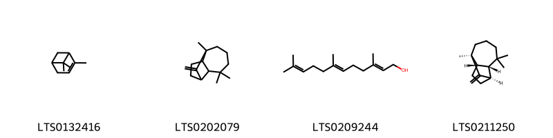{ width=100% }
    <figcaption>Hình ảnh cấu trúc hóa học của 4 hoạt chất thuộc nhóm Prenol lipids gồm ['α pinene (LTS0132416)', 'longifolene (LTS0202079)', 'polyprenol (LTS0209244)', '(-)-longifolene (LTS0211250)'].</figcaption>
</figure>
#### Nhóm Steroids and steroid derivatives
<figure markdown="span">
    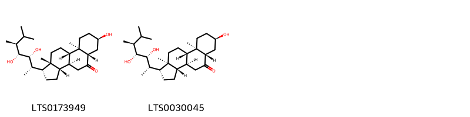{ width=100% }
    <figcaption>Hình ảnh cấu trúc hóa học của 2 hoạt chất thuộc nhóm Steroids and steroid derivatives gồm ['(1r,3as,3bs,5as,7r,9ar,9bs,11ar)-1-[(2s,3r,4r,5s)-3,4-dihydroxy-5,6-dimethylheptan-2-yl]-7-hydroxy-9a,11a-dimethyl-tetradecahydrocyclopenta[a]phenanthren-5-one (LTS0173949)', 'typhasterol (LTS0030045)'].</figcaption>
</figure>

---

### Dược dân tộc học

Danh sách các quốc gia có sử dụng *Pinus thunbergii* trong điều trị các bệnh. 

| Country   | Disease     | Bệnh                   |
|:----------|:------------|:-----------------------|
| Japan*    | Rubefacient | Chất gây xung huyết da |

---

---
## Pinus wallichiana
### Thông tin về thực vật

!!! info "Phân loại thực vật của *Pinus wallichiana* từ GIBF:"
    - **Kingdom:** Plantae
    - **Phylum:** Tracheophyta
    - **Order:** Pinales
    - **Family:** Pinaceae
    - **Genus:** Pinus
    - **Species:** *Pinus wallichiana*

 

| Label (VI)   | Label (EN)   | Scientific Name   | Descriptions (VI)   | Descriptions (EN)   | Also Known As (VI)    | Also Known As (EN)                                                                      |
|:-------------|:-------------|:------------------|:--------------------|:--------------------|:----------------------|:----------------------------------------------------------------------------------------|
| N/A          | N/A          | Pinus wallichiana | loài thực vật       | species of plant    | ['Pinus wallichiana'] | ['Pinus excelsa', 'Bhutan pine', 'blue pine', 'Himalayan pine', 'Himalayan white pine'] |

#### Phân bố trên thế giới

**Từ CSDL GIBF** nan, Sweden, Nepal, New Zealand, Netherlands, Poland, United States of America, Bhutan, Pakistan, Russian Federation, Estonia, United Kingdom of Great Britain and Northern Ireland, Belgium, Serbia, Germany, Austria, Latvia, Slovakia, South Africa, Italy, India, France

#### Phân bố tại Việt Nam

**Từ CSDL GIBF**: Không có ghi nhận ở Việt Nam

---
### Thành phần hóa học
        
- Theo cơ sở dữ liệu lotus: Từ loài *Pinus wallichiana* đã phân lập và xác định được 19 hoạt chất thuộc về các nhóm Fatty Acyls, Flavonoids, Steroids and steroid derivatives, Phenols, Organooxygen compounds, Prenol lipids. 

|    | chemicalTaxonomyClassyfireClass   |   smiles_count |
|---:|:----------------------------------|---------------:|
|  0 | Fatty Acyls                       |              2 |
|  1 | Flavonoids                        |              2 |
|  2 | Organooxygen compounds            |              1 |
|  3 | Phenols                           |              3 |
|  4 | Prenol lipids                     |              2 |
|  5 | Steroids and steroid derivatives  |              9 |

#### Nhóm Fatty Acyls
<figure markdown="span">
    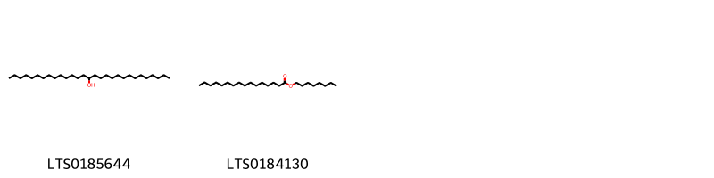{ width=100% }
    <figcaption>Hình ảnh cấu trúc hóa học của 2 hoạt chất thuộc nhóm Fatty Acyls gồm ['nonacosan-15-ol (LTS0185644)', 'octyl palmitate (LTS0184130)'].</figcaption>
</figure>
#### Nhóm Flavonoids
<figure markdown="span">
    { width=100% }
    <figcaption>Hình ảnh cấu trúc hóa học của 2 hoạt chất thuộc nhóm Flavonoids gồm ['pinocembrine (LTS0141508)', 'pinocembrin (LTS0155292)'].</figcaption>
</figure>
#### Nhóm Organooxygen compounds
<figure markdown="span">
    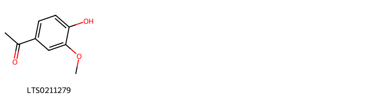{ width=100% }
    <figcaption>Hình ảnh cấu trúc hóa học của 1 hoạt chất thuộc nhóm Organooxygen compounds gồm ['apocynin (LTS0211279)'].</figcaption>
</figure>
#### Nhóm Phenols
<figure markdown="span">
    { width=100% }
    <figcaption>Hình ảnh cấu trúc hóa học của 3 hoạt chất thuộc nhóm Phenols gồm ['vanillin (LTS0136163)', 'coniferyl aldehyde (LTS0140691)', 'coniferaldehyde (LTS0009773)'].</figcaption>
</figure>
#### Nhóm Prenol lipids
<figure markdown="span">
    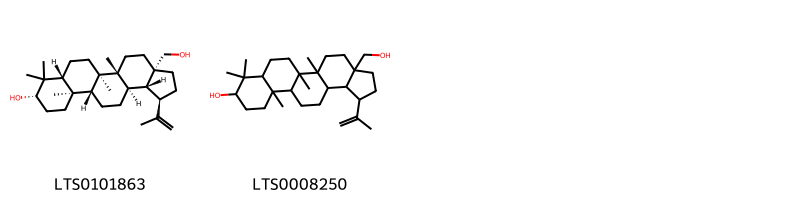{ width=100% }
    <figcaption>Hình ảnh cấu trúc hóa học của 2 hoạt chất thuộc nhóm Prenol lipids gồm ['betulin (LTS0101863)', '3a-(hydroxymethyl)-5a,5b,8,8,11a-pentamethyl-1-(prop-1-en-2-yl)-hexadecahydrocyclopenta[a]chrysen-9-ol (LTS0008250)'].</figcaption>
</figure>
#### Nhóm Steroids and steroid derivatives
<figure markdown="span">
    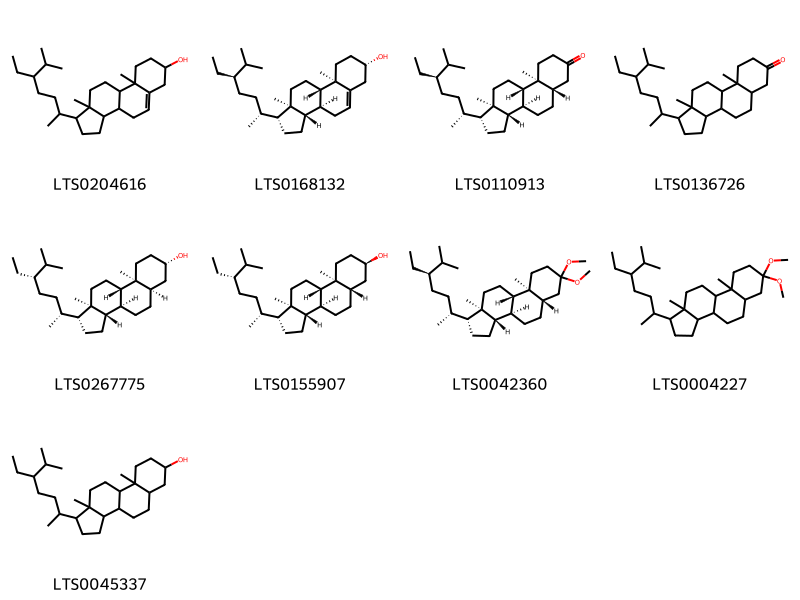{ width=100% }
    <figcaption>Hình ảnh cấu trúc hóa học của 9 hoạt chất thuộc nhóm Steroids and steroid derivatives gồm ['stigmast-5-en-3-ol, (3β)- (LTS0204616)', 'sitosterol (LTS0168132)', '(1r,3as,3br,5as,9as,9bs,11ar)-1-[(2r,5r)-5-ethyl-6-methylheptan-2-yl]-9a,11a-dimethyl-tetradecahydrocyclopenta[a]phenanthren-7-one (LTS0110913)', '1-(5-ethyl-6-methylheptan-2-yl)-9a,11a-dimethyl-tetradecahydrocyclopenta[a]phenanthren-7-one (LTS0136726)', '(1r,3as,3br,5ar,7s,9as,9bs,11ar)-1-[(2r,5s)-5-ethyl-6-methylheptan-2-yl]-9a,11a-dimethyl-tetradecahydro-1h-cyclopenta[a]phenanthren-7-ol (LTS0267775)', '(1r,3as,3br,5as,7r,9as,9bs,11ar)-1-[(2r,5s)-5-ethyl-6-methylheptan-2-yl]-9a,11a-dimethyl-tetradecahydro-1h-cyclopenta[a]phenanthren-7-ol (LTS0155907)', '(1r,3as,3br,5as,9as,9bs,11ar)-1-[(2r,5r)-5-ethyl-6-methylheptan-2-yl]-7,7-dimethoxy-9a,11a-dimethyl-tetradecahydrocyclopenta[a]phenanthrene (LTS0042360)', '1-(5-ethyl-6-methylheptan-2-yl)-7,7-dimethoxy-9a,11a-dimethyl-tetradecahydrocyclopenta[a]phenanthrene (LTS0004227)', '24-ethyl coprostanol (LTS0045337)'].</figcaption>
</figure>

---

### Dược dân tộc học

Danh sách các quốc gia có sử dụng *Pinus wallichiana* trong điều trị các bệnh. 

| Country   |   Disease | Bệnh   |
|:----------|----------:|:-------|
| Elsewhere |       nan | Ở đây  |

---

# Chi Abies

??? note "Danh sách các dược liệu thuộc chi"
    
	 - *Abies alba*
	 - *Abies canadensis*
	 - *Abies ectabilis*
	 - *Abies fraseri*
	 - *Abies grandis*
	 - *Abies lasiocarpa*
	 - *Abies pectinata*
	 - *Abies sibirica*
	 - *Abies webbiana*

---
## Abies alba
### Thông tin về thực vật

!!! info "Phân loại thực vật của *Abies alba* từ GIBF:"
    - **Kingdom:** Plantae
    - **Phylum:** Tracheophyta
    - **Order:** Pinales
    - **Family:** Pinaceae
    - **Genus:** Abies
    - **Species:** *Abies alba*

 

| Label (VI)   | Label (EN)   | Scientific Name   | Descriptions (VI)   | Descriptions (EN)   | Also Known As (VI)   | Also Known As (EN)                                       |
|:-------------|:-------------|:------------------|:--------------------|:--------------------|:---------------------|:---------------------------------------------------------|
| N/A          | N/A          | Abies alba        |                     | species of plant    | ['']                 | ['silver fir', 'Abies pectinata', 'European silver fir'] |

#### Phân bố trên thế giới

**Từ CSDL GIBF** Czechia, Sweden, Slovenia, Spain, Poland, Denmark, Netherlands, Lithuania, Belarus, Norway, Belgium, Germany, Austria, Hungary, Slovakia, Ukraine, Italy, Switzerland, France

#### Phân bố tại Việt Nam

**Từ CSDL GIBF**: Không có ghi nhận ở Việt Nam

---
### Thành phần hóa học
        
- Theo cơ sở dữ liệu lotus: Từ loài *Abies alba* đã phân lập và xác định được 86 hoạt chất thuộc về các nhóm Fatty Acyls, Benzene and substituted derivatives, Unsaturated hydrocarbons, Steroids and steroid derivatives, Prenol lipids, Stilbenes. 

|    | chemicalTaxonomyClassyfireClass     |   smiles_count |
|---:|:------------------------------------|---------------:|
|  0 | Benzene and substituted derivatives |              2 |
|  1 | Fatty Acyls                         |              3 |
|  2 | Prenol lipids                       |             74 |
|  3 | Steroids and steroid derivatives    |              2 |
|  4 | Stilbenes                           |              2 |
|  5 | Unsaturated hydrocarbons            |              3 |

#### Nhóm Benzene and substituted derivatives
<figure markdown="span">
    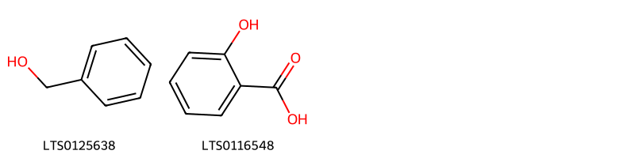{ width=100% }
    <figcaption>Hình ảnh cấu trúc hóa học của 2 hoạt chất thuộc nhóm Benzene and substituted derivatives gồm ['benzyl alcohol (LTS0125638)', 'salicyclic acid (LTS0116548)'].</figcaption>
</figure>
#### Nhóm Fatty Acyls
<figure markdown="span">
    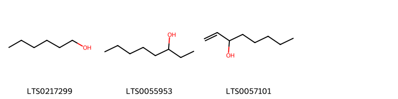{ width=100% }
    <figcaption>Hình ảnh cấu trúc hóa học của 3 hoạt chất thuộc nhóm Fatty Acyls gồm ['hexanol (LTS0217299)', '3-octanol (LTS0055953)', '1-octen-3-ol (LTS0057101)'].</figcaption>
</figure>
#### Nhóm Prenol lipids
<figure markdown="span">
    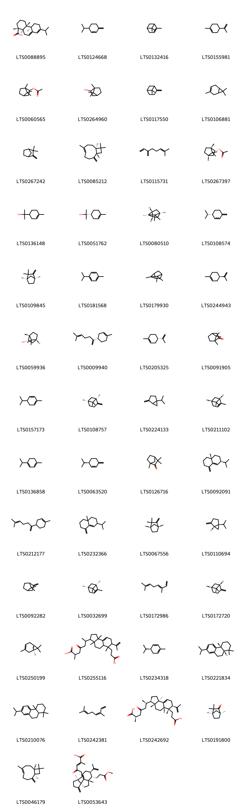{ width=100% }
    <figcaption>Hình ảnh cấu trúc hóa học của 74 hoạt chất thuộc nhóm Prenol lipids gồm ['abietic acid (LTS0088895)', 'β phellandrene (LTS0124668)', 'α pinene (LTS0132416)', 'limonene,  (LTS0155981)', 'bornyl acetate (LTS0060565)', 'borneol (LTS0264960)', 'β-pinene (LTS0117550)', 'monoterpenes (LTS0106881)', 'camphene (LTS0267242)', 'caryophyllene (LTS0085212)', 'α-myrcene (LTS0115731)', '(-)-bornyl acetate (LTS0267397)', 'terpineol (LTS0136148)', 'lily of valley (LTS0051762)', '(1s,2r,4r,6s)-1,7,7-trimethyltricyclo[2.2.1.0²,⁶]heptane (LTS0080510)', '(+)-β-phellandrene (LTS0108574)', '(+)-camphene (LTS0109845)', 'cymene (LTS0181568)', 'tricyclene (LTS0179930)', 'α-limonene (LTS0244943)', '(+)-borneol (LTS0059936)', '(-)-β-bisabolene (LTS0009940)', '(-)-limonene (LTS0205325)', 'camphor (LTS0091905)', 'phellandrene (LTS0157173)', '(-)-β-pinene (LTS0108757)', 'sabinene (LTS0224133)', '(+)-α-pinene (LTS0211102)', 'terpinene (LTS0136858)', '(-)-β-phellandrene (LTS0063520)', 'fenchone (LTS0126716)', '(4ar,7s)-7-isopropyl-4a-methyl-1-methylidene-2,3,4,5,6,7-hexahydronaphthalene (LTS0092091)', 'β-bisabolene (LTS0212177)', '7-isopropyl-4a-methyl-1-methylidene-2,3,4,5,6,7-hexahydronaphthalene (LTS0232366)', '(-)-camphene (LTS0067556)', '(+)-sabinene (LTS0110694)', '7,7-dimethyl-2-methylidenebicyclo[2.2.1]heptane (LTS0092282)', '(-)-α-pinene (LTS0032699)', '3,7-dimethyl-1,3,6-octatriene (LTS0172986)', '(+)-β-pinene (LTS0172720)', '(+)-delta(3)-carene (LTS0250199)', '6-[6-(2-carboxyethyl)-3a,6,9b-trimethyl-7-(prop-1-en-2-yl)-1h,2h,3h,4h,5h,5ah,7h,8h-cyclopenta[a]naphthalen-3-yl]-2-methyl-4-oxoheptanoic acid (LTS0255116)', '(+)-α-phellandrene (LTS0234318)', '(4ar,10as)-7-isopropyl-1,1,4a-trimethyl-2,3,4,9,10,10a-hexahydrophenanthrene (LTS0221834)', '7-isopropyl-1,1,4a-trimethyl-2,3,4,9,10,10a-hexahydrophenanthrene (LTS0210076)', 'β-ocimene (LTS0242381)', '(2r,6r)-6-[(3r,3ar,5as,6s,7s,9br)-6-(2-carboxyethyl)-3a,6,9b-trimethyl-7-(prop-1-en-2-yl)-1h,2h,3h,4h,5h,5ah,7h,8h-cyclopenta[a]naphthalen-3-yl]-2-methyl-4-oxoheptanoic acid (LTS0242692)', '(+)-fenchone (LTS0191800)', '(+)-caryophyllene (LTS0046179)', "(2e)-6-[(1s,2s,3'as,4's,5'r)-4'-(3-methoxy-3-oxopropyl)-2-methyl-5-methylidene-5'-(prop-1-en-2-yl)-2',3',3'a,4',5',6'-hexahydrospiro[cyclopentane-1,1'-inden]-2-yl]-2-methyl-4-oxohex-2-enoic acid (LTS0053643)", 'd-camphor (LTS0002057)', '4,11,11-trimethyl-8-methylidenebicyclo[7.2.0]undec-4-ene (LTS0256716)', '(+)-α-fenchene (LTS0005155)', '2,5,9,9-tetramethyl-4,4a,6,7,8,9a-hexahydro-3h-benzo[7]annulen-5-ol (LTS0214945)', '(2r)-2,5,7,8-tetramethyl-2-[(4s,8s)-4,8,12-trimethyltridecyl]-3,4-dihydro-1-benzopyran-6-ol (LTS0130040)', "(2r,6r)-6-[(1r,2s,3'ar,4's,5's)-4'-(2-carboxyethyl)-2,4'-dimethyl-5-methylidene-5'-(prop-1-en-2-yl)-3',3'a,5',6'-tetrahydro-1'h-spiro[cyclopentane-1,2'-inden]-2-yl]-2-methyl-4-oxoheptanoic acid (LTS0034838)", "6-[4'-(2-carboxyethyl)-2,4'-dimethyl-5-methylidene-5'-(prop-1-en-2-yl)-3',3'a,5',6'-tetrahydro-1'h-spiro[cyclopentane-1,2'-inden]-2-yl]-2-methyl-4-oxoheptanoic acid (LTS0034190)", '(1s,4as,8as)-7-isopropyl-1,4a-dimethyl-2,3,4,5,6,8a-hexahydronaphthalen-1-ol (LTS0089691)', '(s)-β-himachalene (LTS0141719)', '(1s,2e,8e)-1,4,4,8-tetramethylcycloundeca-2,8-dien-1-ol (LTS0170450)', '7-isopropyl-1,1,4a-trimethyl-3,4,10,10a-tetrahydro-2h-phenanthren-9-one (LTS0049518)', 'β-himachalene (LTS0059378)', '(4as,5s)-2,5,9,9-tetramethyl-4,4a,5,6,7,8-hexahydrobenzo[7]annulene (LTS0017964)', '(4as,5s)-5,9,9-trimethyl-2-methylidene-4,4a,5,6,7,8-hexahydro-3h-benzo[7]annulene (LTS0065833)', '(1s,6r)-α-himachalene (LTS0024060)', '7-isopropyl-1,4a-dimethyl-2,3,4,5,6,8a-hexahydronaphthalen-1-ol (LTS0044461)', '(1s,4as,7r,8as)-1,4a-dimethyl-7-(prop-1-en-2-yl)-octahydronaphthalen-1-ol (LTS0015028)', '5,9,9-trimethyl-2-methylidene-4,4a,5,6,7,8-hexahydro-3h-benzo[7]annulene (LTS0011779)', '1,4a-dimethyl-7-(prop-1-en-2-yl)-octahydronaphthalen-1-ol (LTS0000681)', '1,4,4,8-tetramethylcycloundeca-2,8-dien-1-ol (LTS0001585)', 'α-himachalene (LTS0208037)', '2,5,9,9-tetramethyl-4,4a,5,6,7,8-hexahydrobenzo[7]annulene (LTS0230285)', 'himachalol (LTS0019413)', '(4ar,10as)-7-isopropyl-1,1,4a-trimethyl-3,4,10,10a-tetrahydro-2h-phenanthren-9-one (LTS0035059)'].</figcaption>
</figure>
#### Nhóm Steroids and steroid derivatives
<figure markdown="span">
    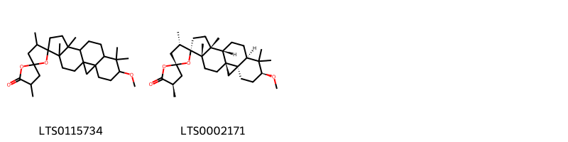{ width=100% }
    <figcaption>Hình ảnh cấu trúc hóa học của 2 hoạt chất thuộc nhóm Steroids and steroid derivatives gồm ["6''-methoxy-4,4',7'',7'',12'',16''-hexamethyldispiro[bis(oxolane)-2,2':5',15''-pentacyclo[9.7.0.0¹,³.0³,⁸.0¹²,¹⁶]octadecan]-5-one (LTS0115734)", "(1''s,2s,3''r,4r,4's,5's,6''s,8''r,11''s,12''r,16''s)-6''-methoxy-4,4',7'',7'',12'',16''-hexamethyldispiro[bis(oxolane)-2,2':5',15''-pentacyclo[9.7.0.0¹,³.0³,⁸.0¹²,¹⁶]octadecan]-5-one (LTS0002171)"].</figcaption>
</figure>
#### Nhóm Stilbenes
<figure markdown="span">
    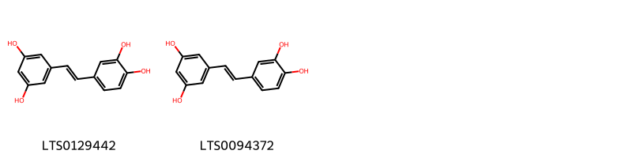{ width=100% }
    <figcaption>Hình ảnh cấu trúc hóa học của 2 hoạt chất thuộc nhóm Stilbenes gồm ['piceatannol (LTS0129442)', 'piceatannol (LTS0094372)'].</figcaption>
</figure>
#### Nhóm Unsaturated hydrocarbons
<figure markdown="span">
    { width=100% }
    <figcaption>Hình ảnh cấu trúc hóa học của 3 hoạt chất thuộc nhóm Unsaturated hydrocarbons gồm ['α terpinene (LTS0232891)', '2,3-dimethylbicyclo[2.2.1]hept-2-ene (LTS0105576)', '(1r,4s)-2,3-dimethylbicyclo[2.2.1]hept-2-ene (LTS0143353)'].</figcaption>
</figure>

---

### Dược dân tộc học

Danh sách các quốc gia có sử dụng *Abies alba* trong điều trị các bệnh. 

| Country   | Disease                       | Bệnh                                          |
|:----------|:------------------------------|:----------------------------------------------|
| Dutch     | Diuretic                      | Thuốc lợi tiêu                                |
| German    | Expectorant                   | Thuốc long đàm                                |
| Italian   | Rubefacient                   | Chất gây xung huyết da                        |
| ain       | Diuretic, Laxative, Vulnerary | Thuốc lợi tiểu, nhuận tràng, dễ bị tổn thương |

---

---
## Abies canadensis
### Thông tin về thực vật

!!! info "Phân loại thực vật của *N/A* từ GIBF:"
    - **Kingdom:** Plantae
    - **Phylum:** Tracheophyta
    - **Order:** Pinales
    - **Family:** Pinaceae
    - **Genus:** N/A
    - **Species:** *N/A*

 

| Label (VI)   | Label (EN)   | Scientific Name   | Descriptions (VI)   | Descriptions (EN)   | Also Known As (VI)   | Also Known As (EN)   |
|:-------------|:-------------|:------------------|:--------------------|:--------------------|:---------------------|:---------------------|
| N/A          | N/A          | Abies canadensis  |                     |                     | ['']                 | ['']                 |

#### Phân bố trên thế giới

**Từ CSDL GIBF** Viet Nam, Czechia, Sweden, Finland, New Zealand, Spain, Poland, Denmark, Puerto Rico, United States of America, Greece, Russian Federation, Argentina, United Kingdom of Great Britain and Northern Ireland, Canada, Germany, Hungary, Ukraine, Australia, Italy, France, Ireland

#### Phân bố tại Việt Nam

**Từ CSDL GIBF**: Lâm Đồng

---
### Thành phần hóa học
        
- Theo cơ sở dữ liệu lotus: Từ loài *N/A* đã phân lập và xác định được Chưa có hoạt chất nào được phân lập. hoạt chất thuộc về các nhóm Không có hoạt chất nào được phân lập. 

Không có hình ảnh nào được tạo ra

---

### Dược dân tộc học

Danh sách các quốc gia có sử dụng *N/A* trong điều trị các bệnh. 

| Country   | Disease    | Bệnh               |
|:----------|:-----------|:-------------------|
| English   | Tonic      | (thuộc) trương lực |
| Turkey    | Astringent | Lam se da          |

---

---
## Abies ectabilis
### Thông tin về thực vật

!!! info "Phân loại thực vật của *N/A* từ GIBF:"
    - **Kingdom:** Plantae
    - **Phylum:** Tracheophyta
    - **Order:** Pinales
    - **Family:** Pinaceae
    - **Genus:** Abies
    - **Species:** *N/A*

 

| Label (VI)   | Label (EN)   | Scientific Name   | Descriptions (VI)   | Descriptions (EN)   | Also Known As (VI)   | Also Known As (EN)   |
|:-------------|:-------------|:------------------|:--------------------|:--------------------|:---------------------|:---------------------|
| N/A          | N/A          | Abies canadensis  |                     |                     | ['']                 | ['']                 |

#### Phân bố trên thế giới

**Từ CSDL GIBF** Mexico, Austria, United States of America, Japan, Czechia, Mongolia, United Kingdom of Great Britain and Northern Ireland, Chinese Taipei, Russian Federation, Italy, Switzerland, Canada, Germany, Lithuania, France, Spain

#### Phân bố tại Việt Nam

**Từ CSDL GIBF**: Không có ghi nhận ở Việt Nam

---
### Thành phần hóa học
        
- Theo cơ sở dữ liệu lotus: Từ loài *N/A* đã phân lập và xác định được Chưa có hoạt chất nào được phân lập. hoạt chất thuộc về các nhóm Không có hoạt chất nào được phân lập. 

Không có hình ảnh nào được tạo ra

---

### Dược dân tộc học

Danh sách các quốc gia có sử dụng *N/A* trong điều trị các bệnh. 

| Country   | Disease              | Bệnh           |
|:----------|:---------------------|:---------------|
| Nepal     | Stomachic, Stomachic | Dạ dày, Dạ dày |

---

---
## Abies fraseri
### Thông tin về thực vật

!!! info "Phân loại thực vật của *Abies fraseri* từ GIBF:"
    - **Kingdom:** Plantae
    - **Phylum:** Tracheophyta
    - **Order:** Pinales
    - **Family:** Pinaceae
    - **Genus:** Abies
    - **Species:** *Abies fraseri*

 

| Label (VI)   | Label (EN)   | Scientific Name   | Descriptions (VI)   | Descriptions (EN)   | Also Known As (VI)   | Also Known As (EN)   |
|:-------------|:-------------|:------------------|:--------------------|:--------------------|:---------------------|:---------------------|
| N/A          | N/A          | Abies fraseri     |                     | species of conifer  | ['']                 | ['Fraser fir']       |

#### Phân bố trên thế giới

**Từ CSDL GIBF** nan, Germany, United States of America

#### Phân bố tại Việt Nam

**Từ CSDL GIBF**: Không có ghi nhận ở Việt Nam

---
### Thành phần hóa học
        
- Theo cơ sở dữ liệu lotus: Từ loài *Abies fraseri* đã phân lập và xác định được Chưa có hoạt chất nào được phân lập. hoạt chất thuộc về các nhóm Không có hoạt chất nào được phân lập. 

Không có hình ảnh nào được tạo ra

---

### Dược dân tộc học

Danh sách các quốc gia có sử dụng *Abies fraseri* trong điều trị các bệnh. 

| Country   | Disease                        | Bệnh                                                  |
|:----------|:-------------------------------|:------------------------------------------------------|
| US        | Diuretic, Stimulant, Vermifuge | Thuốc lợi tiểu, thuốc kích thích, thuốc diệt giun sán |

---

---
## Abies grandis
### Thông tin về thực vật

!!! info "Phân loại thực vật của *Abies grandis* từ GIBF:"
    - **Kingdom:** Plantae
    - **Phylum:** Tracheophyta
    - **Order:** Pinales
    - **Family:** Pinaceae
    - **Genus:** Abies
    - **Species:** *Abies grandis*

 

| Label (VI)   | Label (EN)   | Scientific Name   | Descriptions (VI)   | Descriptions (EN)         | Also Known As (VI)   | Also Known As (EN)                                                                                                                                                          |
|:-------------|:-------------|:------------------|:--------------------|:--------------------------|:---------------------|:----------------------------------------------------------------------------------------------------------------------------------------------------------------------------|
| N/A          | N/A          | Abies grandis     | loài thực vật       | species of evergreen tree | ['']                 | ['coast grand fir', 'giant fir', 'grand fir', 'great silver fir', 'hem fir', 'interior grand fir', 'lowland white fir', 'Oregon fir', 'Vancouver fir', 'western white fir'] |

#### Phân bố trên thế giới

**Từ CSDL GIBF** United States of America, Sweden, Belgium, Denmark, Canada, Germany, United Kingdom of Great Britain and Northern Ireland, Netherlands

#### Phân bố tại Việt Nam

**Từ CSDL GIBF**: Không có ghi nhận ở Việt Nam

---
### Thành phần hóa học
        
- Theo cơ sở dữ liệu lotus: Từ loài *Abies grandis* đã phân lập và xác định được 13 hoạt chất thuộc về các nhóm Prenol lipids, Steroids and steroid derivatives. 

|    | chemicalTaxonomyClassyfireClass   |   smiles_count |
|---:|:----------------------------------|---------------:|
|  0 | Prenol lipids                     |             10 |
|  1 | Steroids and steroid derivatives  |              3 |

#### Nhóm Prenol lipids
<figure markdown="span">
    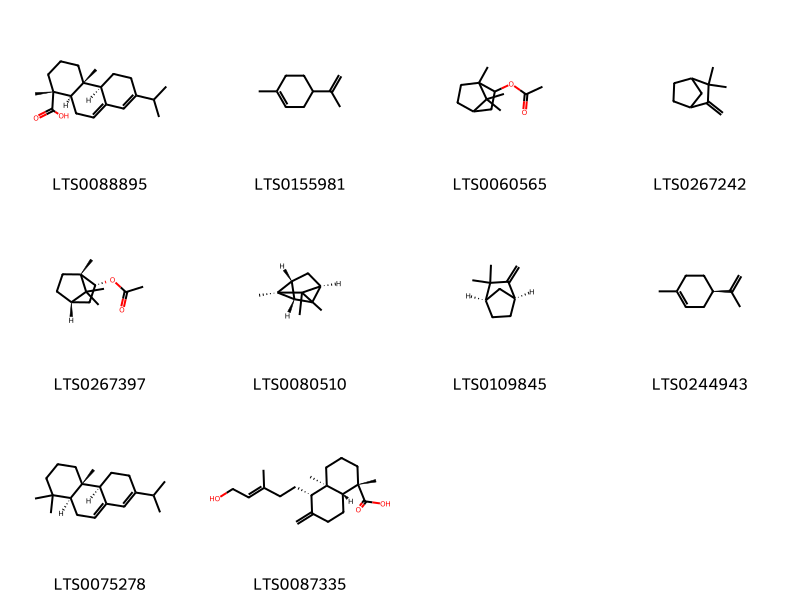{ width=100% }
    <figcaption>Hình ảnh cấu trúc hóa học của 10 hoạt chất thuộc nhóm Prenol lipids gồm ['abietic acid (LTS0088895)', 'limonene,  (LTS0155981)', 'bornyl acetate (LTS0060565)', 'camphene (LTS0267242)', '(-)-bornyl acetate (LTS0267397)', '(1s,2r,4r,6s)-1,7,7-trimethyltricyclo[2.2.1.0²,⁶]heptane (LTS0080510)', '(+)-camphene (LTS0109845)', 'α-limonene (LTS0244943)', '(-)-abietadiene (LTS0075278)', 'isocupressic acid (LTS0087335)'].</figcaption>
</figure>
#### Nhóm Steroids and steroid derivatives
<figure markdown="span">
    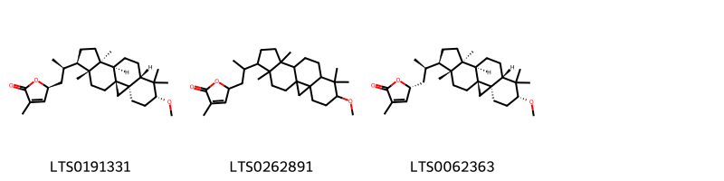{ width=100% }
    <figcaption>Hình ảnh cấu trúc hóa học của 3 hoạt chất thuộc nhóm Steroids and steroid derivatives gồm ['(5s)-5-[(2r)-2-[(1s,3r,6r,8s,11r,12s,15r,16r)-6-methoxy-7,7,12,16-tetramethylpentacyclo[9.7.0.0¹,³.0³,⁸.0¹²,¹⁶]octadecan-15-yl]propyl]-3-methyl-5h-furan-2-one (LTS0191331)', '5-(2-{6-methoxy-7,7,12,16-tetramethylpentacyclo[9.7.0.0¹,³.0³,⁸.0¹²,¹⁶]octadecan-15-yl}propyl)-3-methyl-5h-furan-2-one (LTS0262891)', '(5r)-5-[(2r)-2-[(1s,3r,6r,8s,11r,12s,15r,16r)-6-methoxy-7,7,12,16-tetramethylpentacyclo[9.7.0.0¹,³.0³,⁸.0¹²,¹⁶]octadecan-15-yl]propyl]-3-methyl-5h-furan-2-one (LTS0062363)'].</figcaption>
</figure>

---

### Dược dân tộc học

Danh sách các quốc gia có sử dụng *Abies grandis* trong điều trị các bệnh. 

| Country          | Disease         | Bệnh                        |
|:-----------------|:----------------|:----------------------------|
| Canada(Kwakiutl) | Laxative, Tonic | Thuốc nhuận tràng, Thuốc bổ |
| US(Flathead)     | Collyrium       | Collyrium                   |

---

---
## Abies lasiocarpa
### Thông tin về thực vật

!!! info "Phân loại thực vật của *Abies lasiocarpa* từ GIBF:"
    - **Kingdom:** Plantae
    - **Phylum:** Tracheophyta
    - **Order:** Pinales
    - **Family:** Pinaceae
    - **Genus:** Abies
    - **Species:** *Abies lasiocarpa*

 

| Label (VI)   | Label (EN)   | Scientific Name   | Descriptions (VI)   | Descriptions (EN)   | Also Known As (VI)   | Also Known As (EN)              |
|:-------------|:-------------|:------------------|:--------------------|:--------------------|:---------------------|:--------------------------------|
| N/A          | N/A          | Abies lasiocarpa  | loài thực vật       | species of plant    | ['']                 | ['subalpine fir', 'alpine fir'] |

#### Phân bố trên thế giới

**Từ CSDL GIBF** Sweden, United States of America, Canada

#### Phân bố tại Việt Nam

**Từ CSDL GIBF**: Không có ghi nhận ở Việt Nam

---
### Thành phần hóa học
        
- Theo cơ sở dữ liệu lotus: Từ loài *Abies lasiocarpa* đã phân lập và xác định được 7 hoạt chất thuộc về các nhóm Prenol lipids. 

|    | chemicalTaxonomyClassyfireClass   |   smiles_count |
|---:|:----------------------------------|---------------:|
|  0 | Prenol lipids                     |              7 |

#### Nhóm Prenol lipids
<figure markdown="span">
    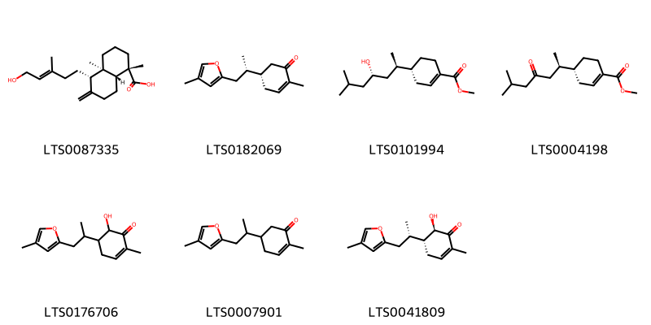{ width=100% }
    <figcaption>Hình ảnh cấu trúc hóa học của 7 hoạt chất thuộc nhóm Prenol lipids gồm ['isocupressic acid (LTS0087335)', '(5s)-2-methyl-5-[(2s)-1-(4-methylfuran-2-yl)propan-2-yl]cyclohex-2-en-1-one (LTS0182069)', 'methyl (4r)-4-[(2r,4s)-4-hydroxy-6-methylheptan-2-yl]cyclohex-1-ene-1-carboxylate (LTS0101994)', 'juvabione (LTS0004198)', '6-hydroxy-2-methyl-5-[1-(4-methylfuran-2-yl)propan-2-yl]cyclohex-2-en-1-one (LTS0176706)', '2-methyl-5-[1-(4-methylfuran-2-yl)propan-2-yl]cyclohex-2-en-1-one (LTS0007901)', '(5r,6r)-6-hydroxy-2-methyl-5-[(2s)-1-(4-methylfuran-2-yl)propan-2-yl]cyclohex-2-en-1-one (LTS0041809)'].</figcaption>
</figure>

---

### Dược dân tộc học

Danh sách các quốc gia có sử dụng *Abies lasiocarpa* trong điều trị các bệnh. 

| Country       | Disease              | Bệnh                       |
|:--------------|:---------------------|:---------------------------|
| Elsewhere     | Antiseptic           | Khử trùng                  |
| US(Blackfoot) | Antiseptic, Poultice | Thuốc sát trùng, thuốc đắp |

---

---
## Abies pectinata
### Thông tin về thực vật

!!! info "Phân loại thực vật của *N/A* từ GIBF:"
    - **Kingdom:** Plantae
    - **Phylum:** Tracheophyta
    - **Order:** Pinales
    - **Family:** Pinaceae
    - **Genus:** N/A
    - **Species:** *N/A*

 

| Label (VI)   | Label (EN)   | Scientific Name   | Descriptions (VI)   | Descriptions (EN)   | Also Known As (VI)   | Also Known As (EN)   |
|:-------------|:-------------|:------------------|:--------------------|:--------------------|:---------------------|:---------------------|
| N/A          | N/A          | Abies pectinata   | loài thực vật       | species of plant    | ['']                 | ['']                 |

#### Phân bố trên thế giới

**Từ CSDL GIBF** Viet Nam, Czechia, Sweden, Finland, New Zealand, Spain, Poland, Denmark, Puerto Rico, United States of America, Greece, Russian Federation, Argentina, United Kingdom of Great Britain and Northern Ireland, Canada, Germany, Hungary, Ukraine, Australia, Italy, France, Ireland

#### Phân bố tại Việt Nam

**Từ CSDL GIBF**: Lâm Đồng

---
### Thành phần hóa học
        
- Theo cơ sở dữ liệu lotus: Từ loài *N/A* đã phân lập và xác định được Chưa có hoạt chất nào được phân lập. hoạt chất thuộc về các nhóm Không có hoạt chất nào được phân lập. 

Không có hình ảnh nào được tạo ra

---

### Dược dân tộc học

Danh sách các quốc gia có sử dụng *N/A* trong điều trị các bệnh. 

| Country   | Disease    | Bệnh      |
|:----------|:-----------|:----------|
| Elsewhere | Antiseptic | Khử trùng |

---

---
## Abies sibirica
### Thông tin về thực vật

!!! info "Phân loại thực vật của *Abies sibirica* từ GIBF:"
    - **Kingdom:** Plantae
    - **Phylum:** Tracheophyta
    - **Order:** Pinales
    - **Family:** Pinaceae
    - **Genus:** Abies
    - **Species:** *Abies sibirica*

 

| Label (VI)   | Label (EN)   | Scientific Name   | Descriptions (VI)   | Descriptions (EN)   | Also Known As (VI)   | Also Known As (EN)   |
|:-------------|:-------------|:------------------|:--------------------|:--------------------|:---------------------|:---------------------|
| N/A          | N/A          | Abies sibirica    |                     | species of plant    | ['']                 | ['Siberian Fir']     |

#### Phân bố trên thế giới

**Từ CSDL GIBF** Russian Federation, Mongolia, Sweden, Finland

#### Phân bố tại Việt Nam

**Từ CSDL GIBF**: Không có ghi nhận ở Việt Nam

---
### Thành phần hóa học
        
- Theo cơ sở dữ liệu lotus: Từ loài *Abies sibirica* đã phân lập và xác định được 197 hoạt chất thuộc về các nhóm Fatty Acyls, Benzene and substituted derivatives, Unsaturated hydrocarbons, Cinnamic acids and derivatives, Steroids and steroid derivatives, Pyrans, Phenols, Dioxanes, Prenol lipids, Saturated hydrocarbons, Epoxides. 

|    | chemicalTaxonomyClassyfireClass     |   smiles_count |
|---:|:------------------------------------|---------------:|
|  0 | Benzene and substituted derivatives |              7 |
|  1 | Cinnamic acids and derivatives      |              4 |
|  2 | Dioxanes                            |              2 |
|  3 | Epoxides                            |              1 |
|  4 | Fatty Acyls                         |              2 |
|  5 | Phenols                             |              1 |
|  6 | Prenol lipids                       |            126 |
|  7 | Pyrans                              |              1 |
|  8 | Saturated hydrocarbons              |              1 |
|  9 | Steroids and steroid derivatives    |             39 |
| 10 | Unsaturated hydrocarbons            |              5 |

#### Nhóm Benzene and substituted derivatives
<figure markdown="span">
    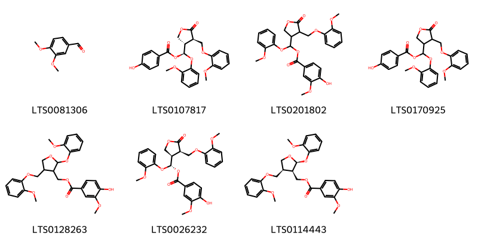{ width=100% }
    <figcaption>Hình ảnh cấu trúc hóa học của 7 hoạt chất thuộc nhóm Benzene and substituted derivatives gồm ['veratraldehyde (LTS0081306)', '(s)-2-methoxyphenoxy[(3s,4r)-4-(2-methoxyphenoxymethyl)-5-oxooxolan-3-yl]methyl 4-hydroxybenzoate (LTS0107817)', '2-methoxyphenoxy[4-(2-methoxyphenoxymethyl)-5-oxooxolan-3-yl]methyl 4-hydroxy-3-methoxybenzoate (LTS0201802)', '2-methoxyphenoxy[4-(2-methoxyphenoxymethyl)-5-oxooxolan-3-yl]methyl 4-hydroxybenzoate (LTS0170925)', '[2-(2-methoxyphenoxy)-4-(2-methoxyphenoxymethyl)oxolan-3-yl]methyl 4-hydroxy-3-methoxybenzoate (LTS0128263)', '(s)-2-methoxyphenoxy[(3r,4r)-4-(2-methoxyphenoxymethyl)-5-oxooxolan-3-yl]methyl 4-hydroxy-3-methoxybenzoate (LTS0026232)', '[(2s,3r,4s)-2-(2-methoxyphenoxy)-4-(2-methoxyphenoxymethyl)oxolan-3-yl]methyl 4-hydroxy-3-methoxybenzoate (LTS0114443)'].</figcaption>
</figure>
#### Nhóm Cinnamic acids and derivatives
<figure markdown="span">
    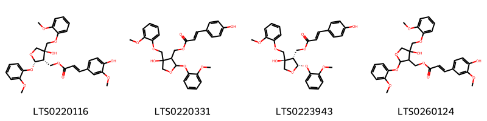{ width=100% }
    <figcaption>Hình ảnh cấu trúc hóa học của 4 hoạt chất thuộc nhóm Cinnamic acids and derivatives gồm ['[(2s,3s,4r)-4-hydroxy-2-(2-methoxyphenoxy)-4-(2-methoxyphenoxymethyl)oxolan-3-yl]methyl (2e)-3-(4-hydroxy-3-methoxyphenyl)prop-2-enoate (LTS0220116)', '[4-hydroxy-2-(2-methoxyphenoxy)-4-(2-methoxyphenoxymethyl)oxolan-3-yl]methyl 3-(4-hydroxyphenyl)prop-2-enoate (LTS0220331)', '[(2s,3s,4r)-4-hydroxy-2-(2-methoxyphenoxy)-4-(2-methoxyphenoxymethyl)oxolan-3-yl]methyl (2e)-3-(4-hydroxyphenyl)prop-2-enoate (LTS0223943)', '[4-hydroxy-2-(2-methoxyphenoxy)-4-(2-methoxyphenoxymethyl)oxolan-3-yl]methyl 3-(4-hydroxy-3-methoxyphenyl)prop-2-enoate (LTS0260124)'].</figcaption>
</figure>
#### Nhóm Dioxanes
<figure markdown="span">
    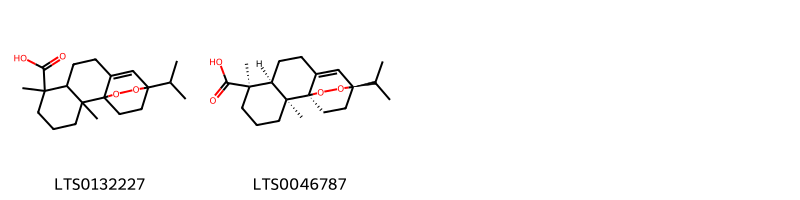{ width=100% }
    <figcaption>Hình ảnh cấu trúc hóa học của 2 hoạt chất thuộc nhóm Dioxanes gồm ['12-isopropyl-2,6-dimethyl-13,14-dioxatetracyclo[10.2.2.0¹,¹⁰.0²,⁷]hexadec-10-ene-6-carboxylic acid (LTS0132227)', '(1r,2s,6r,7s,12r)-12-isopropyl-2,6-dimethyl-13,14-dioxatetracyclo[10.2.2.0¹,¹⁰.0²,⁷]hexadec-10-ene-6-carboxylic acid (LTS0046787)'].</figcaption>
</figure>
#### Nhóm Epoxides
<figure markdown="span">
    { width=100% }
    <figcaption>Hình ảnh cấu trúc hóa học của 1 hoạt chất thuộc nhóm Epoxides gồm ['(4z,7z)-1,5,9,9-tetramethyl-12-oxabicyclo[9.1.0]dodeca-4,7-diene (LTS0242379)'].</figcaption>
</figure>
#### Nhóm Fatty Acyls
<figure markdown="span">
    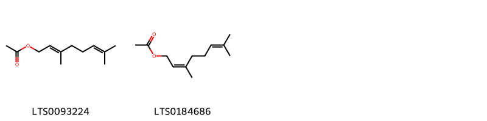{ width=100% }
    <figcaption>Hình ảnh cấu trúc hóa học của 2 hoạt chất thuộc nhóm Fatty Acyls gồm ['geranyl acetate (LTS0093224)', '3,7-dimethylocta-2,6-dien-1-yl acetate (LTS0184686)'].</figcaption>
</figure>
#### Nhóm Phenols
<figure markdown="span">
    { width=100% }
    <figcaption>Hình ảnh cấu trúc hóa học của 1 hoạt chất thuộc nhóm Phenols gồm ['vanillin (LTS0136163)'].</figcaption>
</figure>
#### Nhóm Prenol lipids
<figure markdown="span">
    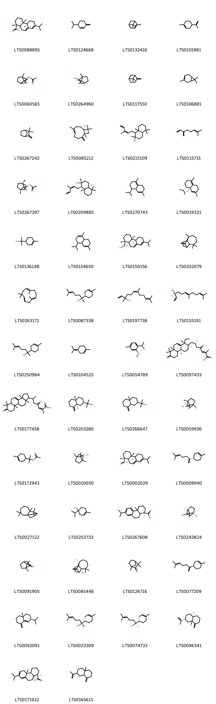{ width=100% }
    <figcaption>Hình ảnh cấu trúc hóa học của 126 hoạt chất thuộc nhóm Prenol lipids gồm ['abietic acid (LTS0088895)', 'β phellandrene (LTS0124668)', 'α pinene (LTS0132416)', 'limonene,  (LTS0155981)', 'bornyl acetate (LTS0060565)', 'borneol (LTS0264960)', 'β-pinene (LTS0117550)', 'monoterpenes (LTS0106881)', 'camphene (LTS0267242)', 'caryophyllene (LTS0085212)', '2,5,5,8a-tetramethyl-1-(3-methylpenta-2,4-dien-1-yl)-hexahydro-1h-naphthalen-2-ol (LTS0215109)', 'α-myrcene (LTS0115731)', '(-)-bornyl acetate (LTS0267397)', 'cis-abienol (LTS0209885)', '4-isopropyl-1,6-dimethyl-2,3,4,4a,7,8-hexahydronaphthalene (LTS0270743)', 'delta-cadinene (LTS0019321)', 'terpineol (LTS0136148)', '4-isopropyl-1,6-dimethyl-3,4,4a,7,8,8a-hexahydronaphthalene (LTS0154650)', 'abietyl alcohol (LTS0150156)', 'longifolene (LTS0202079)', 'humulene (LTS0263171)', '(2r)-6-methyl-2-[(1r)-4-methylcyclohex-3-en-1-yl]hept-5-en-2-ol (LTS0087338)', 'nerolidol (LTS0197738)', 'nerolidol (LTS0155191)', 'α-bisabolol (LTS0250984)', 'terpinolene (LTS0104525)', '2-isopropyl-5-methylanisole (LTS0054789)', '(2e,6r)-6-[(1r,3ar,5ar,9ar,9bs,11ar)-3a,6,6,9a,11a-pentamethyl-7-oxo-1h,2h,3h,5h,5ah,8h,9h,9bh,10h,11h-cyclopenta[a]phenanthren-1-yl]-2-methyl-4-oxohept-2-enoic acid (LTS0097433)', '6-{3a,6,6,9a,11a-pentamethyl-7-oxo-1h,2h,3h,5h,5ah,8h,9h,9bh,10h,11h-cyclopenta[a]phenanthren-1-yl}-2-methyl-4-oxohept-2-enoic acid (LTS0177458)', 'β-eudesmol (LTS0203280)', 'β-eudesmol (LTS0266647)', '(+)-borneol (LTS0059936)', 'α-terpinyl acetate (LTS0172943)', '(2s,4r)-1,7,7-trimethylbicyclo[2.2.1]heptan-2-ol (LTS0010050)', 'abietadienal (LTS0002029)', '(-)-β-bisabolene (LTS0009940)', '2,6,6,9-tetramethyltetracyclo[5.4.0.0²,⁹.0⁸,¹⁰]undecane (LTS0027122)', '4-terpineol (LTS0253733)', '(1r)-7-isopropyl-1,4a-dimethyl-2,3,4,9,10,10a-hexahydrophenanthrene-1-carboxylic acid (LTS0267608)', '(-)-borneol (LTS0242824)', 'camphor (LTS0091905)', '(2s,7s)-3,3,7-trimethyl-8-methylidenetricyclo[5.4.0.0²,⁹]undecane (LTS0085446)', 'fenchone (LTS0126716)', '(r)-β-bisabolene (LTS0077209)', '(4ar,7s)-7-isopropyl-4a-methyl-1-methylidene-2,3,4,5,6,7-hexahydronaphthalene (LTS0092091)', 'levomenol (LTS0023309)', 'bisabolol (LTS0074733)', 'β-selinene (LTS0096341)', 'levopimaric acid (LTS0171922)', '4a-methyl-1-methylidene-7-(prop-1-en-2-yl)-octahydronaphthalene (LTS0165615)', '(3r,6e)-nerolidol (LTS0145065)', 'α-ylangene (LTS0254603)', '(1s)-8-isopropyl-1,3-dimethyltricyclo[4.4.0.0²,⁷]dec-3-ene (LTS0199723)', 'sibirene (LTS0215079)', 'α-copaene (LTS0207598)', 'β-bisabolene (LTS0212177)', '7-isopropyl-4a-methyl-1-methylidene-2,3,4,5,6,7-hexahydronaphthalene (LTS0232366)', '(1r,2s,7s,8s)-8-isopropyl-1,3-dimethyltricyclo[4.4.0.0²,⁷]dec-3-ene (LTS0190031)', 'isopimaric acid (LTS0009479)', 'caryophyllene (LTS0131870)', '(1r,2s,7s,8s,9s,10s)-2,6,6,9-tetramethyltetracyclo[5.4.0.0²,⁹.0⁸,¹⁰]undecane (LTS0128494)', '16-isopropyl-5,9-dimethyl-13,14-dioxatetracyclo[10.2.2.0¹,¹⁰.0⁴,⁹]hexadec-15-ene-5-carboxylic acid (LTS0043549)', '6-{3a,6,6,9a,11a-pentamethyl-7-oxo-1h,2h,3h,5h,5ah,8h,9h,9bh,10h,11h-cyclopenta[a]phenanthren-1-yl}-2-methylidene-4-oxoheptanoic acid (LTS0201405)', '(-)-α-terpinyl acetate (LTS0147227)', '1-[(1r,4as,10ar)-7-isopropyl-1,4a-dimethyl-2,3,4,9,10,10a-hexahydrophenanthren-1-yl]methyl 4-methyl butanedioate (LTS0149977)', 'fenchol (LTS0261470)', '3-{3a,6,9b-trimethyl-3-[1-(4-methyl-5-oxooxolan-2-yl)propan-2-yl]-7-(prop-1-en-2-yl)-1h,2h,3h,4h,5h,5ah,7h,8h-cyclopenta[a]naphthalen-6-yl}propanoic acid (LTS0135084)', '3-{3,3a,6-trimethyl-3-[1-(4-methyl-5-oxofuran-2-ylidene)propan-2-yl]-7-(prop-1-en-2-yl)-1h,2h,4h,5h,5ah,7h-cyclopenta[a]naphthalen-6-yl}propanoic acid (LTS0204318)', '1-(7-isopropyl-1,4a-dimethyl-2,3,4,9,10,10a-hexahydrophenanthren-1-yl)methyl 4-methyl butanedioate (LTS0165106)', 'α-eudesmol (LTS0222498)', "(2e)-6-[(1s,2s,3'as,4's,5'r)-4'-(3-methoxy-3-oxopropyl)-2-methyl-5-methylidene-5'-(prop-1-en-2-yl)-2',3',3'a,4',5',6'-hexahydrospiro[cyclopentane-1,1'-inden]-2-yl]-2-methyl-4-oxohex-2-enoic acid (LTS0053643)", '3-[(3r,3ar,5as,6s,7s,9br)-3a,6,9b-trimethyl-3-[(2r)-1-[(2r,4r)-4-methyl-5-oxooxolan-2-yl]propan-2-yl]-7-(prop-1-en-2-yl)-1h,2h,3h,4h,5h,5ah,7h,8h-cyclopenta[a]naphthalen-6-yl]propanoic acid (LTS0055631)', '(6r)-6-[(1r,3ar,5ar,9ar,9bs,11ar)-3a,6,6,9a,11a-pentamethyl-7-oxo-1h,2h,3h,5h,5ah,8h,9h,9bh,10h,11h-cyclopenta[a]phenanthren-1-yl]-2-methylidene-4-oxoheptanoic acid (LTS0260863)', '3-ethenyl-3,4a,7,7,10a-pentamethyl-octahydro-1h-naphtho[2,1-b]pyran (LTS0226873)', '(2s)-6-methyl-2-(4-methylcyclohex-3-en-1-yl)hept-5-en-2-ol (LTS0060431)', '3,7-dimethyl-2,6-octadien-1-ol (LTS0215566)', '(z)-α-bisabolene (LTS0053911)', 'palustric acid (LTS0093127)', '(e)-α-bisabolene (LTS0046940)', '7-isopropyl-4,10-dimethyltricyclo[4.4.0.0¹,⁵]decan-4-ol (LTS0195076)', '(4r,6r,7s,10r)-7-isopropyl-4,10-dimethyltricyclo[4.4.0.0¹,⁵]decan-4-ol (LTS0089228)', '(z)-γ-bisabolene (LTS0143321)', '(-)-cubebol (LTS0273621)', 'sandaracopimaric acid (LTS0207129)', '(1r,2r,7r,8r)-2,6,6,9-tetramethyltricyclo[5.4.0.0²,⁸]undec-9-ene (LTS0266208)', '(1r,4s,6r,7s,10r)-7-isopropyl-4,10-dimethyltricyclo[4.4.0.0¹,⁵]decan-4-ol (LTS0223062)', 'geraniol (LTS0258838)', 'palustric acid (LTS0046650)', '(4r,4as,8as)-4-isopropyl-1,6-dimethyl-3,4,4a,7,8,8a-hexahydronaphthalene (LTS0104041)', '(1r,2s,4r)-bornyl acetate (LTS0068000)', '7-isopropyl-1,4a-dimethyl-2,3,4,5,6,9,10,10a-octahydrophenanthrene-1-carbaldehyde (LTS0114300)', 'neoabietic acid (LTS0037617)', '2,5,5,8a-tetramethyl-1-(3-methylpenta-1,3-dien-1-yl)-hexahydro-1h-naphthalen-2-ol (LTS0063277)', '1,5,5-trimethylbicyclo[2.2.1]heptan-2-one (LTS0131523)', '(3s,4as,6ar,10as,10br)-3-ethenyl-3,4a,7,7,10a-pentamethyl-octahydro-1h-naphtho[2,1-b]pyran (LTS0130756)', '(1r,2r,4as,8ar)-2,5,5,8a-tetramethyl-1-[(1e,3e)-3-methylpenta-1,3-dien-1-yl]-hexahydro-1h-naphthalen-2-ol (LTS0074243)', 'methyl 2-[(4ar,4bs,6ar,6bs,7r,10z,10ar,11ar,13ar)-1,1,4a,6a,7,11a-hexamethyl-2,9-dioxo-3h,4h,4bh,5h,6h,6bh,7h,8h,10ah,11h,13h,13ah-indeno[2,1-a]phenanthren-10-ylidene]propanoate (LTS0069479)', '6-{3a,6,6,9a,11a-pentamethyl-7-oxo-1h,2h,3h,4h,5h,5ah,8h,9h,10h,11h-cyclopenta[a]phenanthren-1-yl}-2-methyl-4-oxohept-2-enoic acid (LTS0083987)', '(+)-epi-α-bisabolol (LTS0121544)', '(1r,2r,4as,8as)-2,5,5,8a-tetramethyl-1-[(1z,3e)-3-methylpenta-1,3-dien-1-yl]-hexahydro-1h-naphthalen-2-ol (LTS0074040)', '(1s,5r,9r)-10,10-dimethyl-2,6-dimethylidenebicyclo[7.2.0]undecan-5-ol (LTS0065243)', '(+)-borneol (LTS0189059)', "(2's,3r,5ar,9as)-2',6,6,9a-tetramethyl-5'-methylidene-2'-[(2r)-4-oxopentan-2-yl]-2,4,5,5a,8,9-hexahydro-1h-spiro[cyclopenta[a]naphthalene-3,1'-cyclopentan]-7-one (LTS0185141)", 'terpineols (LTS0139391)', '(4r)-4-[(1s,3as,5ar,7r,9as)-7-hydroxy-1,3a,6,6,9a-pentamethyl-2h,3h,4h,5h,5ah,7h,8h,9h,10h-cyclopenta[a]phenanthren-1-yl]pentan-2-one (LTS0154781)', '3-[(3s,3as,5as,6r,7s)-3,3a,6-trimethyl-3-[(2r)-1-[(2z)-4-methyl-5-oxofuran-2-ylidene]propan-2-yl]-7-(prop-1-en-2-yl)-1h,2h,4h,5h,5ah,7h-cyclopenta[a]naphthalen-6-yl]propanoic acid (LTS0144594)', '(1r,4s,6s,10s)-4,12,12-trimethyl-9-methylidene-5-oxatricyclo[8.2.0.0⁴,⁶]dodecane (LTS0269447)', '(2e,6r)-6-[(1r,3ar,5ar,9as,11ar)-3a,6,6,9a,11a-pentamethyl-7-oxo-1h,2h,3h,4h,5h,5ah,8h,9h,10h,11h-cyclopenta[a]phenanthren-1-yl]-2-methyl-4-oxohept-2-enoic acid (LTS0152274)', '(4e,8e)-β-humulene (LTS0193661)', 'methyl 3-[(1s,4r,5r,8s,9s,12s,13r)-4,8-dimethyl-5-[(2r)-6-methyl-5-methylideneheptan-2-yl]-12-(prop-1-en-2-yl)tetracyclo[7.5.0.0¹,¹³.0⁴,⁸]tetradecan-13-yl]propanoate (LTS0113044)', '(2r)-6-methyl-2-(4-methylcyclohex-3-en-1-yl)hept-5-en-2-ol (LTS0088859)', '4-{7-hydroxy-1,3a,6,6,9a-pentamethyl-2h,3h,4h,5h,5ah,7h,8h,9h,10h-cyclopenta[a]phenanthren-1-yl}pentan-2-one (LTS0246245)', '3-[(3r,3ar,5as,6s,7s,9br)-3a,6,9b-trimethyl-3-[(2r)-1-[(4r)-4-methyl-5-oxooxolan-2-yl]propan-2-yl]-7-(prop-1-en-2-yl)-1h,2h,3h,4h,5h,5ah,7h,8h-cyclopenta[a]naphthalen-6-yl]propanoic acid (LTS0251410)', 'methyl 2-{1,1,4a,6a,7,11a-hexamethyl-2,9-dioxo-3h,4h,4bh,5h,6h,6bh,7h,8h,10ah,11h,13h,13ah-indeno[2,1-a]phenanthren-10-ylidene}propanoate (LTS0249975)', '(1r,2s)-5-isopropyl-2-methylbicyclo[3.1.0]hexan-2-ol (LTS0265986)', 'methyl 3-[4,8-dimethyl-5-(6-methyl-5-methylideneheptan-2-yl)-12-(prop-1-en-2-yl)tetracyclo[7.5.0.0¹,¹³.0⁴,⁸]tetradecan-13-yl]propanoate (LTS0207915)', "2',6,6,9a-tetramethyl-5'-methylidene-2'-(4-oxopentan-2-yl)-2,4,5,5a,8,9-hexahydro-1h-spiro[cyclopenta[a]naphthalene-3,1'-cyclopentan]-7-one (LTS0181413)", '(2e,6r)-6-[(3s,3as,5as,6r,7r)-6-(2-carboxyethyl)-3,3a,6-trimethyl-7-(prop-1-en-2-yl)-1h,2h,4h,5h,5ah,7h-cyclopenta[a]naphthalen-3-yl]-2-methyl-4-oxohept-2-enoic acid (LTS0238838)', '(1s,4s,5r,9s,10r,12s)-16-isopropyl-5,9-dimethyl-13,14-dioxatetracyclo[10.2.2.0¹,¹⁰.0⁴,⁹]hexadec-15-ene-5-carboxylic acid (LTS0026154)', 'β-humulene (LTS0207418)', 'γ-terpineol (LTS0175059)', '4-isopropyl-1,6-dimethylidene-octahydronaphthalene (LTS0155478)', '10,10-dimethyl-2,6-dimethylidenebicyclo[7.2.0]undecan-5-ol (LTS0267390)', '6-[6-(2-carboxyethyl)-3,3a,6-trimethyl-7-(prop-1-en-2-yl)-1h,2h,4h,5h,5ah,7h-cyclopenta[a]naphthalen-3-yl]-2-methyl-4-oxohept-2-enoic acid (LTS0021152)', 'citronellol, (+-)- (LTS0090925)', 'sabinene hydrate (LTS0236165)'].</figcaption>
</figure>
#### Nhóm Pyrans
<figure markdown="span">
    { width=100% }
    <figcaption>Hình ảnh cấu trúc hóa học của 1 hoạt chất thuộc nhóm Pyrans gồm ['talmon (LTS0152081)'].</figcaption>
</figure>
#### Nhóm Saturated hydrocarbons
<figure markdown="span">
    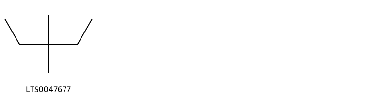{ width=100% }
    <figcaption>Hình ảnh cấu trúc hóa học của 1 hoạt chất thuộc nhóm Saturated hydrocarbons gồm ['3,3-dimethylpentane (LTS0047677)'].</figcaption>
</figure>
#### Nhóm Steroids and steroid derivatives
<figure markdown="span">
    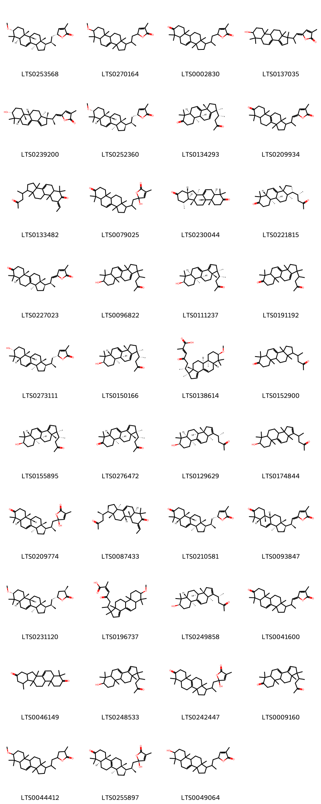{ width=100% }
    <figcaption>Hình ảnh cấu trúc hóa học của 39 hoạt chất thuộc nhóm Steroids and steroid derivatives gồm ['(-)-abieslactone (LTS0253568)', '5-(2-{7-methoxy-3a,6,6,9a,11a-pentamethyl-1h,2h,3h,5h,5ah,7h,8h,9h,9bh,10h,11h-cyclopenta[a]phenanthren-1-yl}propyl)-3-methyl-5h-furan-2-one (LTS0270164)', '5-(2-{3a,6,6,9a,11a-pentamethyl-7-oxo-1h,2h,3h,5h,5ah,8h,9h,9bh,10h,11h-cyclopenta[a]phenanthren-1-yl}propyl)-3-methyl-5h-furan-2-one (LTS0002830)', '5-(2-{7-hydroxy-1,6,6,9a,11a-pentamethyl-2h,5h,5ah,7h,8h,9h,9bh,10h,11h-cyclopenta[a]phenanthren-1-yl}propylidene)-3-methylfuran-2-one (LTS0137035)', '(5z)-5-[(2r)-2-[(1s,5as,7r,9ar,9bs,11as)-7-hydroxy-1,6,6,9a,11a-pentamethyl-2h,5h,5ah,7h,8h,9h,9bh,10h,11h-cyclopenta[a]phenanthren-1-yl]propylidene]-3-methylfuran-2-one (LTS0239200)', '(5r)-5-[(2r)-2-[(1r,3ar,5as,7r,9ar,9bs,11ar)-7-methoxy-3a,6,6,9a,11a-pentamethyl-1h,2h,3h,5h,5ah,7h,8h,9h,9bh,10h,11h-cyclopenta[a]phenanthren-1-yl]propyl]-3-methyl-5h-furan-2-one (LTS0252360)', '(1s,3as,5as,9ar,9bs)-1,3a,6,6,9a-pentamethyl-1-[(2r)-4-oxopentan-2-yl]-2h,3h,5h,5ah,8h,9h,9bh,10h-cyclopenta[a]phenanthren-7-one (LTS0134293)', '5-(2-{3a,6,6,9a,11a-pentamethyl-7-oxo-1h,2h,3h,4h,5h,5ah,8h,9h,10h,11h-cyclopenta[a]phenanthren-1-yl}propylidene)-3-methylfuran-2-one (LTS0209934)', '8-ethylidene-3a,6,6,9a,11a-pentamethyl-1-(4-oxopentan-2-yl)-1h,2h,3h,5h,5ah,9h,9bh,10h,11h-cyclopenta[a]phenanthren-7-one (LTS0133482)', '5-(2-{3a,6,6,9a,11a-pentamethyl-7-oxo-1h,2h,3h,5h,5ah,8h,9h,9bh,10h,11h-cyclopenta[a]phenanthren-1-yl}propyl)-5-hydroxy-3-methylfuran-2-one (LTS0079025)', '(4ar,4bs,6ar,6bs,7r,10as,11ar,13ar)-1,1,4a,6a,7,11a-hexamethyl-3h,4h,4bh,5h,6h,6bh,7h,8h,10h,10ah,11h,13h,13ah-indeno[2,1-a]phenanthrene-2,9-dione (LTS0230044)', '(1r,3ar,5ar,9ar,9bs,11ar)-3a,6,6,9a,11a-pentamethyl-1-[(2r)-4-oxopentan-2-yl]-1h,2h,3h,5h,5ah,8h,9h,9bh,10h,11h-cyclopenta[a]phenanthren-7-one (LTS0221815)', '(5z)-5-[(2s)-2-[(1r,3ar,5as,9as,11ar)-3a,6,6,9a,11a-pentamethyl-7-oxo-1h,2h,3h,4h,5h,5ah,8h,9h,10h,11h-cyclopenta[a]phenanthren-1-yl]propylidene]-3-methylfuran-2-one (LTS0227023)', '4-{7-hydroxy-1,3a,6,6,9a-pentamethyl-2h,3h,5h,5ah,7h,8h,9h,9bh,10h-cyclopenta[a]phenanthren-1-yl}pentan-2-one (LTS0096822)', '(4r)-4-[(1s,5as,7r,9ar,9bs,11as)-7-hydroxy-1,6,6,9a,11a-pentamethyl-2h,5h,5ah,7h,8h,9h,9bh,10h,11h-cyclopenta[a]phenanthren-1-yl]pentan-2-one (LTS0111237)', '1,3a,6,6,9a-pentamethyl-1-(4-oxopentan-2-yl)-2h,3h,5h,5ah,8h,9h,9bh,10h-cyclopenta[a]phenanthren-7-one (LTS0191192)', '(5r)-5-[(2r)-2-[(1r,3ar,5as,7r,9ar,9bs,11ar)-7-hydroxy-3a,6,6,9a,11a-pentamethyl-1h,2h,3h,5h,5ah,7h,8h,9h,9bh,10h,11h-cyclopenta[a]phenanthren-1-yl]propyl]-3-methyl-5h-furan-2-one (LTS0273111)', '(4r)-4-[(1s,3as,5ar,7r,9ar,9bs)-7-hydroxy-1,3a,6,6,9a-pentamethyl-2h,3h,5h,5ah,7h,8h,9h,9bh,10h-cyclopenta[a]phenanthren-1-yl]pentan-2-one (LTS0150166)', '(2e,6r)-6-[(1s,5ar,7r,9ar,9bs,11as)-7-methoxy-1,6,6,9a,11a-pentamethyl-2h,5h,5ah,7h,8h,9h,9bh,10h,11h-cyclopenta[a]phenanthren-1-yl]-2-methyl-4-oxohept-2-enoic acid (LTS0138614)', '3a,6,6,9a,11a-pentamethyl-1-(4-oxopentan-2-yl)-1h,2h,3h,5h,5ah,8h,9h,9bh,10h,11h-cyclopenta[a]phenanthren-7-one (LTS0152900)', '(4r)-4-[(1s,5ar,7r,9ar,9bs,11as)-7-hydroxy-1,6,6,9a,11a-pentamethyl-2h,5h,5ah,7h,8h,9h,9bh,10h,11h-cyclopenta[a]phenanthren-1-yl]pentan-2-one (LTS0155895)', '(1s,5ar,9ar,9bs,11as)-1,6,6,9a,11a-pentamethyl-1-[(2r)-4-oxopentan-2-yl]-2h,5h,5ah,8h,9h,9bh,10h,11h-cyclopenta[a]phenanthren-7-one (LTS0276472)', '(4r)-4-[(3as,3bs,5as,7r,9as,11as)-7-hydroxy-3a,6,6,9a,11a-pentamethyl-3h,3bh,4h,5h,5ah,7h,8h,9h,11h-cyclopenta[a]phenanthren-1-yl]pentan-2-one (LTS0129629)', '4-{7-hydroxy-3a,6,6,9a,11a-pentamethyl-3h,3bh,4h,5h,5ah,7h,8h,9h,11h-cyclopenta[a]phenanthren-1-yl}pentan-2-one (LTS0174844)', '(5s)-5-[(2r)-2-[(1r,3ar,5as,9ar,9bs,11ar)-3a,6,6,9a,11a-pentamethyl-7-oxo-1h,2h,3h,5h,5ah,8h,9h,9bh,10h,11h-cyclopenta[a]phenanthren-1-yl]propyl]-5-hydroxy-3-methylfuran-2-one (LTS0209774)', '(1r,3ar,5ar,8e,9ar,9bs,11ar)-8-ethylidene-3a,6,6,9a,11a-pentamethyl-1-[(2r)-4-oxopentan-2-yl]-1h,2h,3h,5h,5ah,9h,9bh,10h,11h-cyclopenta[a]phenanthren-7-one (LTS0087433)', '(5r)-5-[(2r)-2-[(1r,3ar,5as,9ar,9bs,11ar)-3a,6,6,9a,11a-pentamethyl-7-oxo-1h,2h,3h,5h,5ah,8h,9h,9bh,10h,11h-cyclopenta[a]phenanthren-1-yl]propyl]-3-methyl-5h-furan-2-one (LTS0210581)', '(5z)-5-[(2s)-2-[(1r,3ar,5as,9ar,9bs,11ar)-3a,6,6,9a,11a-pentamethyl-7-oxo-1h,2h,3h,5h,5ah,8h,9h,9bh,10h,11h-cyclopenta[a]phenanthren-1-yl]propylidene]-3-methylfuran-2-one (LTS0093847)', '(3r,5r)-5-[(2r)-2-[(1r,3ar,5as,7r,9ar,9bs,11ar)-7-methoxy-3a,6,6,9a,11a-pentamethyl-1h,2h,3h,5h,5ah,7h,8h,9h,9bh,10h,11h-cyclopenta[a]phenanthren-1-yl]propyl]-3-methyloxolan-2-one (LTS0231120)', '6-{7-methoxy-1,6,6,9a,11a-pentamethyl-2h,5h,5ah,7h,8h,9h,9bh,10h,11h-cyclopenta[a]phenanthren-1-yl}-2-methyl-4-oxohept-2-enoic acid (LTS0196737)', '(4r)-4-[(3as,3bs,5ar,7r,9as,11as)-7-hydroxy-3a,6,6,9a,11a-pentamethyl-3h,3bh,4h,5h,5ah,7h,8h,9h,11h-cyclopenta[a]phenanthren-1-yl]pentan-2-one (LTS0249858)', '5-(2-{3a,6,6,9a,11a-pentamethyl-7-oxo-1h,2h,3h,5h,5ah,8h,9h,9bh,10h,11h-cyclopenta[a]phenanthren-1-yl}propylidene)-3-methylfuran-2-one (LTS0041600)', '1,1,4a,6a,7,11a-hexamethyl-3h,4h,4bh,5h,6h,6bh,7h,8h,10h,10ah,11h,13h,13ah-indeno[2,1-a]phenanthrene-2,9-dione (LTS0046149)', '4-{7-hydroxy-1,6,6,9a,11a-pentamethyl-2h,5h,5ah,7h,8h,9h,9bh,10h,11h-cyclopenta[a]phenanthren-1-yl}pentan-2-one (LTS0248533)', '5-(2-{3a,6,6,9a,11a-pentamethyl-7-oxo-1h,2h,3h,4h,5h,5ah,8h,9h,10h,11h-cyclopenta[a]phenanthren-1-yl}propyl)-5-hydroxy-3-methylfuran-2-one (LTS0242447)', '1,6,6,9a,11a-pentamethyl-1-(4-oxopentan-2-yl)-2h,5h,5ah,8h,9h,9bh,10h,11h-cyclopenta[a]phenanthren-7-one (LTS0009160)', '5-(2-{7-methoxy-3a,6,6,9a,11a-pentamethyl-1h,2h,3h,5h,5ah,7h,8h,9h,9bh,10h,11h-cyclopenta[a]phenanthren-1-yl}propyl)-3-methyloxolan-2-one (LTS0044412)', '(5s)-5-[(2r)-2-[(1r,3ar,5ar,9as,11ar)-3a,6,6,9a,11a-pentamethyl-7-oxo-1h,2h,3h,4h,5h,5ah,8h,9h,10h,11h-cyclopenta[a]phenanthren-1-yl]propyl]-5-hydroxy-3-methylfuran-2-one (LTS0255897)', '5-(2-{7-hydroxy-3a,6,6,9a,11a-pentamethyl-1h,2h,3h,5h,5ah,7h,8h,9h,9bh,10h,11h-cyclopenta[a]phenanthren-1-yl}propyl)-3-methyl-5h-furan-2-one (LTS0049064)'].</figcaption>
</figure>
#### Nhóm Unsaturated hydrocarbons
<figure markdown="span">
    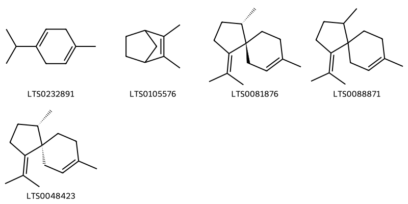{ width=100% }
    <figcaption>Hình ảnh cấu trúc hóa học của 5 hoạt chất thuộc nhóm Unsaturated hydrocarbons gồm ['α terpinene (LTS0232891)', '2,3-dimethylbicyclo[2.2.1]hept-2-ene (LTS0105576)', '(1s,5r)-1,8-dimethyl-4-(propan-2-ylidene)spiro[4.5]dec-7-ene (LTS0081876)', '1,8-dimethyl-4-(propan-2-ylidene)spiro[4.5]dec-7-ene (LTS0088871)', '(1s,5s)-1,8-dimethyl-4-(propan-2-ylidene)spiro[4.5]dec-7-ene (LTS0048423)'].</figcaption>
</figure>

---

### Dược dân tộc học

Danh sách các quốc gia có sử dụng *Abies sibirica* trong điều trị các bệnh. 

| Country   | Disease                            | Bệnh                       |
|:----------|:-----------------------------------|:---------------------------|
| Elsewhere | Antiseptic, Expectorant, Stimulant | Khử trùng, đờm, kích thích |

---

---
## Abies webbiana
### Thông tin về thực vật

!!! info "Phân loại thực vật của *Abies spectabilis* từ GIBF:"
    - **Kingdom:** Plantae
    - **Phylum:** Tracheophyta
    - **Order:** Pinales
    - **Family:** Pinaceae
    - **Genus:** Abies
    - **Species:** *Abies spectabilis*

 

| Label (VI)   | Label (EN)   | Scientific Name   | Descriptions (VI)   | Descriptions (EN)   | Also Known As (VI)   | Also Known As (EN)   |
|:-------------|:-------------|:------------------|:--------------------|:--------------------|:---------------------|:---------------------|
| N/A          | N/A          | Abies webbiana    |                     | species of plant    | ['']                 | ['']                 |

#### Phân bố trên thế giới

**Từ CSDL GIBF** nan, Japan, Nepal, Pakistan, Italy, India, Germany, France, Spain

#### Phân bố tại Việt Nam

**Từ CSDL GIBF**: Không có ghi nhận ở Việt Nam

---
### Thành phần hóa học
        
- Theo cơ sở dữ liệu lotus: Từ loài *Abies spectabilis* đã phân lập và xác định được Chưa có hoạt chất nào được phân lập. hoạt chất thuộc về các nhóm Không có hoạt chất nào được phân lập. 

Không có hình ảnh nào được tạo ra

---

### Dược dân tộc học

Danh sách các quốc gia có sử dụng *Abies spectabilis* trong điều trị các bệnh. 

| Country   | Disease     | Bệnh                   |
|:----------|:------------|:-----------------------|
| Elsewhere | Carminative | Gây ô nhiễm môi trường |

---

