!!! abstract "Tóm tắt"

    Họ Piperaceae gồm khoảng 3 chi và 49 loài được một số cộng đồng tại các quốc gia như Trinidad, Italian, Guatemala, Asia, Indochina, Zaire, Nepal, China, New Zealand, Ecuador, Java, Turkey, Ghana, English, Panama(Cuna), anish, Dominican Republic, Southseas, Africa, Tjabea alas, Fiji, Panama(Choco), Latin America, Mexico, New Guinea, Tjabean, India(Bengal), Hainan, Haiti, Malaysia, Bourbon, Upper Volta, Panama, Egypt, Salvador, Solomon I, Oceania, Elsewhere, Sikkim, Malaya, India, Samoa, Society I sử dụng trong một số trường hợp QUERY LENGTH LIMIT EXCEEDED. MAX ALLOWED QUERY : 500 CHARS QUERY LENGTH LIMIT EXCEEDED. MAX ALLOWED QUERY : 500 CHARS QUERY LENGTH LIMIT EXCEEDED. MAX ALLOWED QUERY : 500 CHARS.

!!! info "DrDuke"

    James A. Duke sinh năm 1929-2017 là một nhà thực vật học người Mỹ. Đây là một trong những tác giả hàng đầu trong lĩnh vực dược dân tộc học với cuốn *CRC Handbook of Medicinal Herbs* và chính là người xây dựng lên cơ sở dữ liệu về hợp chất tự nhiên và dược dân tộc học tại Bộ nông nghiệp Hoa Kỳ. Các thông tin được đăng tải tại website [Dr. Duke's Phytochemical and Ethnobotanical Databases](https://phytochem.nal.usda.gov/). 
    Trong suốt thập niên 1970, ông lãnh đạo the Plant Taxonomy Laboratory, Plant Genetics and Germplasm Institute of the Agricultural Research Service, U.S. Department of Agriculture.
    Trong tài liệu này, các thông tin về dược dân tộc của các dược liệu được trích dẫn từ tài liệu của James A. Ducke với sự trợ giúp của phần mềm dịch thuật từ tiếng Anh sang tiếng Việt.
   

# Chi Pothomorphe

??? note "Danh sách các dược liệu thuộc chi"
    
	 - *Pothomorphe peltata*
	 - *Pothomorphe umbellata*

---
## Pothomorphe peltata
### Thông tin về thực vật

!!! info "Phân loại thực vật của *Piper peltatum* từ GIBF:"
    - **Kingdom:** Plantae
    - **Phylum:** Tracheophyta
    - **Order:** Piperales
    - **Family:** Piperaceae
    - **Genus:** Piper
    - **Species:** *Piper peltatum*

 

| Label (VI)   | Label (EN)   | Scientific Name     | Descriptions (VI)   | Descriptions (EN)   | Also Known As (VI)   | Also Known As (EN)   |
|:-------------|:-------------|:--------------------|:--------------------|:--------------------|:---------------------|:---------------------|
| N/A          | N/A          | Pothomorphe peltata |                     | species of plant    | ['']                 | ['']                 |

#### Phân bố trên thế giới

**Từ CSDL GIBF** Brazil, Guatemala, Honduras, Ecuador, Puerto Rico, Jamaica, Indonesia, Costa Rica, Dominican Republic, Colombia, French Guiana, Mexico, El Salvador, Panama, Belize, Bonaire, Sint Eustatius and Saba, Peru, Bolivia (Plurinational State of), Guyana, Venezuela (Bolivarian Republic of)

#### Phân bố tại Việt Nam

**Từ CSDL GIBF**: Không có ghi nhận ở Việt Nam

---
### Thành phần hóa học
        
- Theo cơ sở dữ liệu lotus: Từ loài *Piper peltatum* đã phân lập và xác định được Chưa có hoạt chất nào được phân lập. hoạt chất thuộc về các nhóm Không có hoạt chất nào được phân lập. 

Không có hình ảnh nào được tạo ra

---

### Dược dân tộc học

Danh sách các quốc gia có sử dụng *Piper peltatum* trong điều trị các bệnh. 

| Country            | Disease      | Bệnh                                                                                                                                                                                                |
|:-------------------|:-------------|:----------------------------------------------------------------------------------------------------------------------------------------------------------------------------------------------------|
| Dominican Republic | Diuretic     | MYMEMORY WARNING: YOU USED ALL AVAILABLE FREE TRANSLATIONS FOR TODAY. NEXT AVAILABLE IN  08 HOURS 17 MINUTES 32 SECONDS VISIT HTTPS://MYMEMORY.TRANSLATED.NET/DOC/USAGELIMITS.PHP TO TRANSLATE MORE |
| Elsewhere          | Sudorific    | MYMEMORY WARNING: YOU USED ALL AVAILABLE FREE TRANSLATIONS FOR TODAY. NEXT AVAILABLE IN  08 HOURS 17 MINUTES 29 SECONDS VISIT HTTPS://MYMEMORY.TRANSLATED.NET/DOC/USAGELIMITS.PHP TO TRANSLATE MORE |
| Panama(Cuna)       | Pediculicide | MYMEMORY WARNING: YOU USED ALL AVAILABLE FREE TRANSLATIONS FOR TODAY. NEXT AVAILABLE IN  08 HOURS 17 MINUTES 27 SECONDS VISIT HTTPS://MYMEMORY.TRANSLATED.NET/DOC/USAGELIMITS.PHP TO TRANSLATE MORE |

---

---
## Pothomorphe umbellata
### Thông tin về thực vật

!!! info "Phân loại thực vật của *Piper umbellatum* từ GIBF:"
    - **Kingdom:** Plantae
    - **Phylum:** Tracheophyta
    - **Order:** Piperales
    - **Family:** Piperaceae
    - **Genus:** Piper
    - **Species:** *Piper umbellatum*

 

| Label (VI)   | Label (EN)   | Scientific Name       | Descriptions (VI)   | Descriptions (EN)   | Also Known As (VI)   | Also Known As (EN)   |
|:-------------|:-------------|:----------------------|:--------------------|:--------------------|:---------------------|:---------------------|
| N/A          | N/A          | Pothomorphe umbellata | loài thực vật       | species of plant    | ['']                 | ['']                 |

#### Phân bố trên thế giới

**Từ CSDL GIBF** nan, Brazil, Ecuador, Puerto Rico, United States of America, Jamaica, Costa Rica, Dominican Republic, Colombia, Equatorial Guinea, Mexico, El Salvador, Philippines, Malaysia, Côte d’Ivoire, Congo, India, Peru, Bolivia (Plurinational State of), Guyana, Venezuela (Bolivarian Republic of)

#### Phân bố tại Việt Nam

**Từ CSDL GIBF**: Không có ghi nhận ở Việt Nam

---
### Thành phần hóa học
        
- Theo cơ sở dữ liệu lotus: Từ loài *Piper umbellatum* đã phân lập và xác định được Chưa có hoạt chất nào được phân lập. hoạt chất thuộc về các nhóm Không có hoạt chất nào được phân lập. 

Không có hình ảnh nào được tạo ra

---

### Dược dân tộc học

Danh sách các quốc gia có sử dụng *Piper umbellatum* trong điều trị các bệnh. 

| Country   | Disease             | Bệnh                                                                                                                                                                                                |
|:----------|:--------------------|:----------------------------------------------------------------------------------------------------------------------------------------------------------------------------------------------------|
| Elsewhere | Stimulant, Diuretic | MYMEMORY WARNING: YOU USED ALL AVAILABLE FREE TRANSLATIONS FOR TODAY. NEXT AVAILABLE IN  08 HOURS 17 MINUTES 05 SECONDS VISIT HTTPS://MYMEMORY.TRANSLATED.NET/DOC/USAGELIMITS.PHP TO TRANSLATE MORE |
| Haiti     | Diuretic            | MYMEMORY WARNING: YOU USED ALL AVAILABLE FREE TRANSLATIONS FOR TODAY. NEXT AVAILABLE IN  08 HOURS 17 MINUTES 02 SECONDS VISIT HTTPS://MYMEMORY.TRANSLATED.NET/DOC/USAGELIMITS.PHP TO TRANSLATE MORE |
| Salvador  | Acaricide           | MYMEMORY WARNING: YOU USED ALL AVAILABLE FREE TRANSLATIONS FOR TODAY. NEXT AVAILABLE IN  08 HOURS 17 MINUTES 00 SECONDS VISIT HTTPS://MYMEMORY.TRANSLATED.NET/DOC/USAGELIMITS.PHP TO TRANSLATE MORE |

---

# Chi Piper

??? note "Danh sách các dược liệu thuộc chi"
    
	 - *Piper aduncum*
	 - *Piper amalago*
	 - *Piper angustifolia*
	 - *Piper angustifolium*
	 - *Piper attenuatum*
	 - *Piper baccatum*
	 - *Piper bantamense*
	 - *Piper betel*
	 - *Piper betle*
	 - *Piper borbonesnse*
	 - *Piper clusii*
	 - *Piper cubeba*
	 - *Piper darienense*
	 - *Piper darienensis*
	 - *Piper elongatum*
	 - *Piper excelsum*
	 - *Piper exorcista*
	 - *Piper forstenii*
	 - *Piper fragile*
	 - *Piper guineense*
	 - *Piper hiidum*
	 - *Piper laetiicum*
	 - *Piper leucophyllum*
	 - *Piper longum*
	 - *Piper marginatum*
	 - *Piper medium*
	 - *Piper methystichum*
	 - *Piper methysticum*
	 - *Piper nigrum*
	 - *Piper palmeri*
	 - *Piper pedicellosum*
	 - *Piper peepuloides*
	 - *Piper puberulum*
	 - *Piper retrofractum*
	 - *Piper sacntum*
	 - *Piper sanctum*
	 - *Piper sumatranum*
	 - *Piper sylvaticum*
	 - *Piper thomsoni*
	 - *Piper tricue*
	 - *Piper tristachyon*
	 - *Piper tutuilae*
	 - *Piper umbellatum*
	 - *Piper wallichii*

---
## Piper aduncum
### Thông tin về thực vật

!!! info "Phân loại thực vật của *Piper aduncum* từ GIBF:"
    - **Kingdom:** Plantae
    - **Phylum:** Tracheophyta
    - **Order:** Piperales
    - **Family:** Piperaceae
    - **Genus:** Piper
    - **Species:** *Piper aduncum*

 

| Label (VI)   | Label (EN)   | Scientific Name   | Descriptions (VI)   | Descriptions (EN)   | Also Known As (VI)   | Also Known As (EN)   |
|:-------------|:-------------|:------------------|:--------------------|:--------------------|:---------------------|:---------------------|
| N/A          | N/A          | Piper aduncum     | loài thực vật       | species of plant    | ['']                 | ['']                 |

#### Phân bố trên thế giới

**Từ CSDL GIBF** Brazil, Guatemala, Suriname, Ecuador, Puerto Rico, United States of America, Indonesia, Costa Rica, Dominican Republic, Colombia, Cuba, Argentina, French Guiana, Fiji, Mexico, El Salvador, Philippines, Chinese Taipei, Malaysia, Singapore, Peru, Bolivia (Plurinational State of), Venezuela (Bolivarian Republic of)

#### Phân bố tại Việt Nam

**Từ CSDL GIBF**: Không có ghi nhận ở Việt Nam

---
### Thành phần hóa học
        
- Theo cơ sở dữ liệu lotus: Từ loài *Piper aduncum* đã phân lập và xác định được 189 hoạt chất thuộc về các nhóm Fatty Acyls, Benzene and substituted derivatives, Linear 1,3-diarylpropanoids, Unsaturated hydrocarbons, Flavonoids, Benzodioxoles, Coumarans, Steroids and steroid derivatives, Phenols, Organooxygen compounds, Phenol ethers, Phenol esters, Prenol lipids, Diarylheptanoids, Benzopyrans. 

|    | chemicalTaxonomyClassyfireClass     |   smiles_count |
|---:|:------------------------------------|---------------:|
|  0 | Benzene and substituted derivatives |             25 |
|  1 | Benzodioxoles                       |              5 |
|  2 | Benzopyrans                         |             13 |
|  3 | Coumarans                           |              1 |
|  4 | Diarylheptanoids                    |              7 |
|  5 | Fatty Acyls                         |              7 |
|  6 | Flavonoids                          |              8 |
|  7 | Linear 1,3-diarylpropanoids         |             21 |
|  8 | Organooxygen compounds              |              3 |
|  9 | Phenol esters                       |              1 |
| 10 | Phenol ethers                       |              1 |
| 11 | Phenols                             |              1 |
| 12 | Prenol lipids                       |             90 |
| 13 | Steroids and steroid derivatives    |              5 |
| 14 | Unsaturated hydrocarbons            |              1 |

#### Nhóm Benzene and substituted derivatives
<figure markdown="span">
    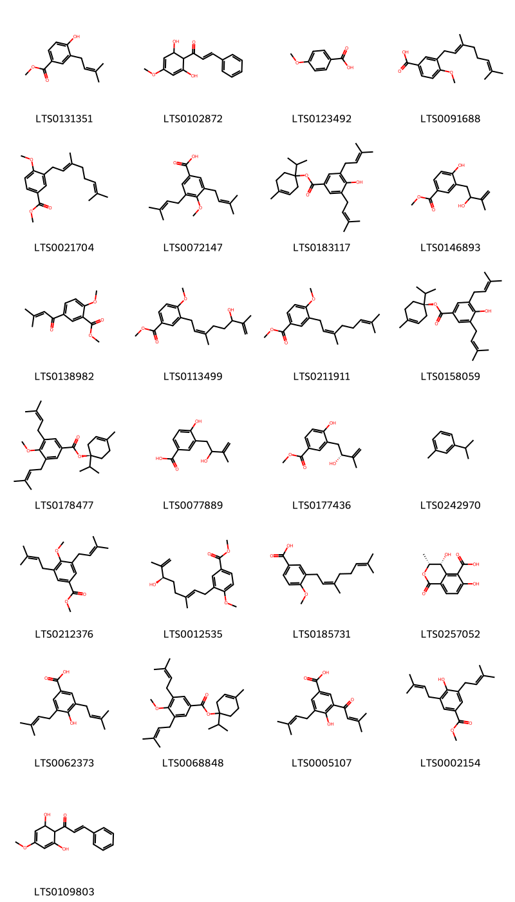{ width=100% }
    <figcaption>Hình ảnh cấu trúc hóa học của 25 hoạt chất thuộc nhóm Benzene and substituted derivatives gồm ['methyl 4-hydroxy-3-(3-methylbut-2-en-1-yl)benzoate (LTS0131351)', '1-(2,6-dihydroxy-4-methoxycyclohexa-2,4-dien-1-yl)-3-phenylprop-2-en-1-one (LTS0102872)', 'p-anisic acid (LTS0123492)', '3-[(2e)-3,7-dimethylocta-2,6-dien-1-yl]-4-methoxybenzoic acid (LTS0091688)', 'methyl 3-[(2e)-3,7-dimethylocta-2,6-dien-1-yl]-4-methoxybenzoate (LTS0021704)', '4-methoxy-3,5-bis(3-methylbut-2-en-1-yl)benzoic acid (LTS0072147)', '1-isopropyl-4-methylcyclohex-3-en-1-yl 4-hydroxy-3,5-bis(3-methylbut-2-en-1-yl)benzoate (LTS0183117)', 'methyl 4-hydroxy-3-(2-hydroxy-3-methylbut-3-en-1-yl)benzoate (LTS0146893)', 'methyl 2-methoxy-5-(3-methylbut-2-enoyl)benzoate (LTS0138982)', 'methyl 3-(6-hydroxy-3,7-dimethylocta-2,7-dien-1-yl)-4-methoxybenzoate (LTS0113499)', 'methyl 3-(3,7-dimethylocta-2,6-dien-1-yl)-4-methoxybenzoate (LTS0211911)', '(1r)-1-isopropyl-4-methylcyclohex-3-en-1-yl 4-hydroxy-3,5-bis(3-methylbut-2-en-1-yl)benzoate (LTS0158059)', '(1r)-1-isopropyl-4-methylcyclohex-3-en-1-yl 4-methoxy-3,5-bis(3-methylbut-2-en-1-yl)benzoate (LTS0178477)', '4-hydroxy-3-(2-hydroxy-3-methylbut-3-en-1-yl)benzoic acid (LTS0077889)', 'methyl 4-hydroxy-3-[(2r)-2-hydroxy-3-methylbut-3-en-1-yl]benzoate (LTS0177436)', 'm-cymene (LTS0242970)', 'methyl 4-methoxy-3,5-bis(3-methylbut-2-en-1-yl)benzoate (LTS0212376)', 'methyl 3-[(2e,6r)-6-hydroxy-3,7-dimethylocta-2,7-dien-1-yl]-4-methoxybenzoate (LTS0012535)', '3-(3,7-dimethylocta-2,6-dien-1-yl)-4-methoxybenzoic acid (LTS0185731)', '(3r,4r)-4,6-dihydroxy-3-methyl-1-oxo-3,4-dihydro-2-benzopyran-5-carboxylic acid (LTS0257052)', '4-hydroxy-3,5-bis(3-methylbut-2-en-1-yl)benzoic acid (LTS0062373)', '1-isopropyl-4-methylcyclohex-3-en-1-yl 4-methoxy-3,5-bis(3-methylbut-2-en-1-yl)benzoate (LTS0068848)', '4-hydroxy-3-(3-methylbut-2-en-1-yl)-5-(3-methylbut-2-enoyl)benzoic acid (LTS0005107)', 'methyl 4-hydroxy-3,5-bis(3-methylbut-2-en-1-yl)benzoate (LTS0002154)', '(2e)-1-(2,6-dihydroxy-4-methoxycyclohexa-2,4-dien-1-yl)-3-phenylprop-2-en-1-one (LTS0109803)'].</figcaption>
</figure>
#### Nhóm Benzodioxoles
<figure markdown="span">
    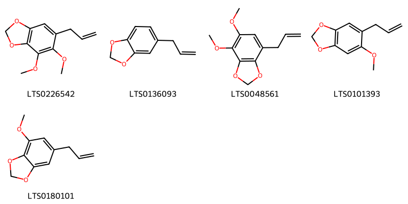{ width=100% }
    <figcaption>Hình ảnh cấu trúc hóa học của 5 hoạt chất thuộc nhóm Benzodioxoles gồm ['dillapiol (LTS0226542)', 'sassafras (LTS0136093)', '4,5-dimethoxy-7-(prop-2-en-1-yl)-2h-1,3-benzodioxole (LTS0048561)', 'sarisan (LTS0101393)', 'myristicin (LTS0180101)'].</figcaption>
</figure>
#### Nhóm Benzopyrans
<figure markdown="span">
    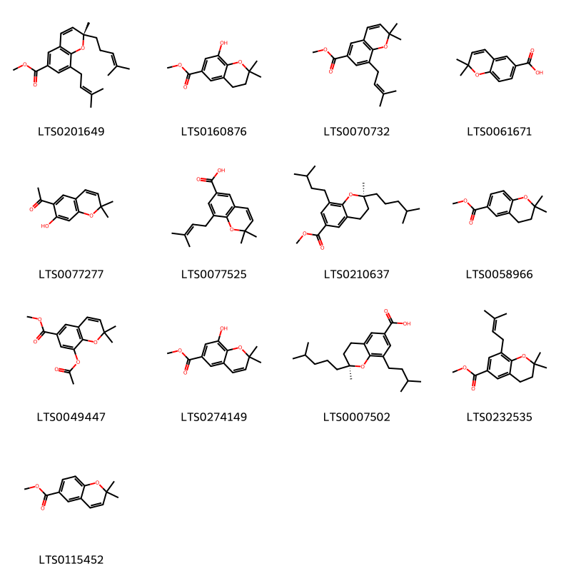{ width=100% }
    <figcaption>Hình ảnh cấu trúc hóa học của 13 hoạt chất thuộc nhóm Benzopyrans gồm ['methyl (2s)-2-methyl-8-(3-methylbut-2-en-1-yl)-2-(4-methylpent-3-en-1-yl)chromene-6-carboxylate (LTS0201649)', 'methyl 8-hydroxy-2,2-dimethyl-3,4-dihydro-1-benzopyran-6-carboxylate (LTS0160876)', 'methyl 2,2-dimethyl-8-(3-methylbut-2-en-1-yl)chromene-6-carboxylate (LTS0070732)', '2,2-dimethylchromene-6-carboxylic acid (LTS0061671)', 'eupatoriochromene (LTS0077277)', '2,2-dimethyl-8-(3-methylbut-2-en-1-yl)chromene-6-carboxylic acid (LTS0077525)', 'methyl (2s)-2-methyl-8-(3-methylbutyl)-2-(4-methylpentyl)-3,4-dihydro-1-benzopyran-6-carboxylate (LTS0210637)', 'methyl 2,2-dimethyl-3,4-dihydro-1-benzopyran-6-carboxylate (LTS0058966)', 'methyl 8-(acetyloxy)-2,2-dimethylchromene-6-carboxylate (LTS0049447)', 'methyl 8-hydroxy-2,2-dimethylchromene-6-carboxylate (LTS0274149)', '(2s)-2-methyl-8-(3-methylbutyl)-2-(4-methylpentyl)-3,4-dihydro-1-benzopyran-6-carboxylic acid (LTS0007502)', 'methyl 2,2-dimethyl-8-(3-methylbut-2-en-1-yl)-3,4-dihydro-1-benzopyran-6-carboxylate (LTS0232535)', 'methyl 2,2-dimethylchromene-6-carboxylate (LTS0115452)'].</figcaption>
</figure>
#### Nhóm Coumarans
<figure markdown="span">
    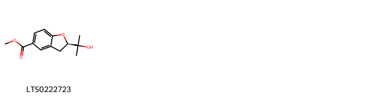{ width=100% }
    <figcaption>Hình ảnh cấu trúc hóa học của 1 hoạt chất thuộc nhóm Coumarans gồm ['methyl (2r)-2-(2-hydroxypropan-2-yl)-2,3-dihydro-1-benzofuran-5-carboxylate (LTS0222723)'].</figcaption>
</figure>
#### Nhóm Diarylheptanoids
<figure markdown="span">
    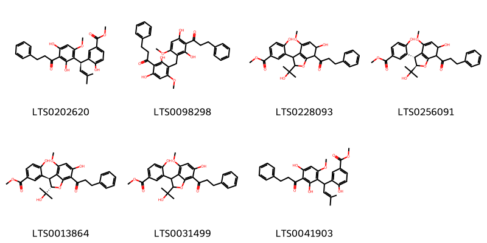{ width=100% }
    <figcaption>Hình ảnh cấu trúc hóa học của 7 hoạt chất thuộc nhóm Diarylheptanoids gồm ['methyl 3-[(1r)-1-[2,4-dihydroxy-6-methoxy-3-(3-phenylpropanoyl)phenyl]-3-methylbut-2-en-1-yl]-4-hydroxybenzoate (LTS0202620)', '1-(3-{[2,4-dihydroxy-6-methoxy-3-(3-phenylpropanoyl)phenyl]methyl}-2,6-dihydroxy-4-methoxyphenyl)-3-phenylpropan-1-one (LTS0098298)', 'methyl 4-hydroxy-3-[6-hydroxy-2-(2-hydroxypropan-2-yl)-4-methoxy-7-(3-phenylpropanoyl)-2,3,6,7-tetrahydro-1-benzofuran-3-yl]benzoate (LTS0228093)', 'methyl 4-hydroxy-3-[(2r,3r)-6-hydroxy-2-(2-hydroxypropan-2-yl)-4-methoxy-7-(3-phenylpropanoyl)-2,3,6,7-tetrahydro-1-benzofuran-3-yl]benzoate (LTS0256091)', 'piperaduncin b (LTS0013864)', 'methyl 4-hydroxy-3-[6-hydroxy-2-(2-hydroxypropan-2-yl)-4-methoxy-7-(3-phenylpropanoyl)-2,3-dihydro-1-benzofuran-3-yl]benzoate (LTS0031499)', 'piperaduncin a (LTS0041903)'].</figcaption>
</figure>
#### Nhóm Fatty Acyls
<figure markdown="span">
    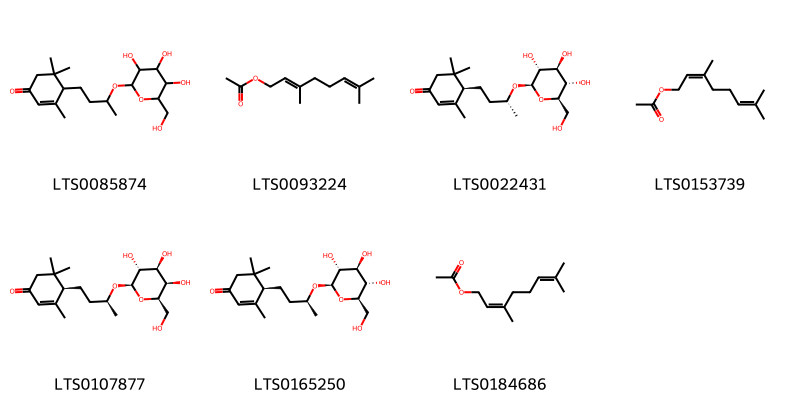{ width=100% }
    <figcaption>Hình ảnh cấu trúc hóa học của 7 hoạt chất thuộc nhóm Fatty Acyls gồm ['3,5,5-trimethyl-4-(3-{[3,4,5-trihydroxy-6-(hydroxymethyl)oxan-2-yl]oxy}butyl)cyclohex-2-en-1-one (LTS0085874)', 'geranyl acetate (LTS0093224)', 'byzantionoside b (LTS0022431)', 'neryl acetate (LTS0153739)', '(4r)-3,5,5-trimethyl-4-[(3s)-3-{[(2r,3r,4s,5r,6r)-3,4,5-trihydroxy-6-(hydroxymethyl)oxan-2-yl]oxy}butyl]cyclohex-2-en-1-one (LTS0107877)', '(4r)-3,5,5-trimethyl-4-[(3s)-3-{[(2r,3r,4s,5s,6r)-3,4,5-trihydroxy-6-(hydroxymethyl)oxan-2-yl]oxy}butyl]cyclohex-2-en-1-one (LTS0165250)', '3,7-dimethylocta-2,6-dien-1-yl acetate (LTS0184686)'].</figcaption>
</figure>
#### Nhóm Flavonoids
<figure markdown="span">
    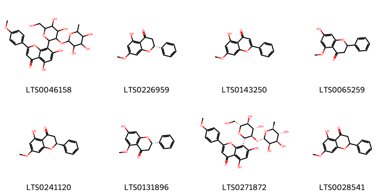{ width=100% }
    <figcaption>Hình ảnh cấu trúc hóa học của 8 hoạt chất thuộc nhóm Flavonoids gồm ['8-[4,5-dihydroxy-6-(hydroxymethyl)-3-[(3,4,5-trihydroxy-6-methyloxan-2-yl)oxy]oxan-2-yl]-5,7-dihydroxy-2-(4-methoxyphenyl)chromen-4-one (LTS0046158)', '(2r)-5-hydroxy-7-methoxy-2-phenyl-2,3-dihydro-1-benzopyran-4-one (LTS0226959)', 'tectochrysin (LTS0143250)', 'alpinetin (LTS0065259)', 'pinostrobin (LTS0241120)', 'alpinetin (LTS0131896)', 'acacetin-8-c-neohesperidoside (LTS0271872)', 'pinostrobin (LTS0028541)'].</figcaption>
</figure>
#### Nhóm Linear 1_3-diarylpropanoids
<figure markdown="span">
    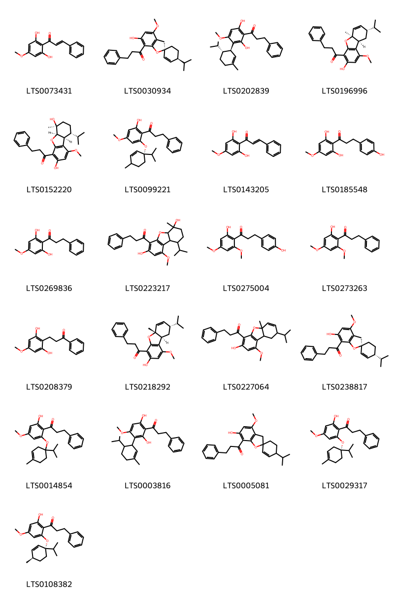{ width=100% }
    <figcaption>Hình ảnh cấu trúc hóa học của Không tìm thấy chú thích hoạt chất thuộc nhóm Linear 1_3-diarylpropanoids gồm Không tìm thấy chú thích.</figcaption>
</figure>
#### Nhóm Organooxygen compounds
<figure markdown="span">
    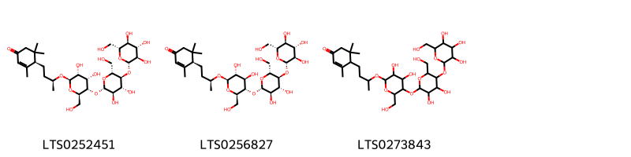{ width=100% }
    <figcaption>Hình ảnh cấu trúc hóa học của 3 hoạt chất thuộc nhóm Organooxygen compounds gồm ['(4r)-4-[(3s)-3-{[(2r,3r,4s,5s,6r)-5-{[(2s,3r,4r,5s,6r)-3,4-dihydroxy-6-(hydroxymethyl)-5-{[(2s,3r,4s,5s,6r)-3,4,5-trihydroxy-6-(hydroxymethyl)oxan-2-yl]oxy}oxan-2-yl]oxy}-3,4-dihydroxy-6-(hydroxymethyl)oxan-2-yl]oxy}butyl]-3,5,5-trimethylcyclohex-2-en-1-one (LTS0252451)', '(4r)-4-[(3s)-3-{[(2r,3r,4r,5s,6r)-5-{[(2s,3r,4r,5s,6r)-3,4-dihydroxy-6-(hydroxymethyl)-5-{[(2s,3r,4s,5s,6r)-3,4,5-trihydroxy-6-(hydroxymethyl)oxan-2-yl]oxy}oxan-2-yl]oxy}-3,4-dihydroxy-6-(hydroxymethyl)oxan-2-yl]oxy}butyl]-3,5,5-trimethylcyclohex-2-en-1-one (LTS0256827)', '4-{3-[(5-{[3,4-dihydroxy-6-(hydroxymethyl)-5-{[3,4,5-trihydroxy-6-(hydroxymethyl)oxan-2-yl]oxy}oxan-2-yl]oxy}-3,4-dihydroxy-6-(hydroxymethyl)oxan-2-yl)oxy]butyl}-3,5,5-trimethylcyclohex-2-en-1-one (LTS0273843)'].</figcaption>
</figure>
#### Nhóm Phenol esters
<figure markdown="span">
    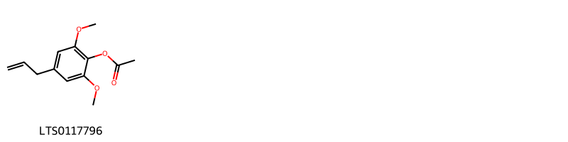{ width=100% }
    <figcaption>Hình ảnh cấu trúc hóa học của 1 hoạt chất thuộc nhóm Phenol esters gồm ['2,6-dimethoxy-4-(prop-2-en-1-yl)phenyl acetate (LTS0117796)'].</figcaption>
</figure>
#### Nhóm Phenol ethers
<figure markdown="span">
    { width=100% }
    <figcaption>Hình ảnh cấu trúc hóa học của 1 hoạt chất thuộc nhóm Phenol ethers gồm ['elemicin (LTS0188875)'].</figcaption>
</figure>
#### Nhóm Phenols
<figure markdown="span">
    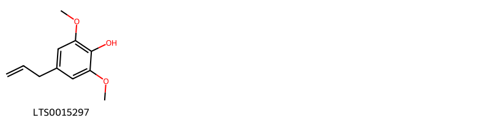{ width=100% }
    <figcaption>Hình ảnh cấu trúc hóa học của 1 hoạt chất thuộc nhóm Phenols gồm ['4-allyl-2,6-dimethoxyphenol (LTS0015297)'].</figcaption>
</figure>
#### Nhóm Prenol lipids
<figure markdown="span">
    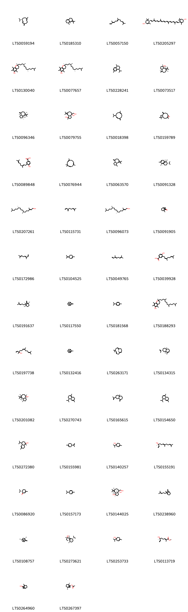{ width=100% }
    <figcaption>Hình ảnh cấu trúc hóa học của 90 hoạt chất thuộc nhóm Prenol lipids gồm ['(-)-germacrene d (LTS0059194)', '1,1,7,7a-tetramethyl-1ah,2h,3h,5h,6h,7h,7bh-cyclopropa[a]naphthalene (LTS0185310)', 'farnesene (LTS0057150)', 'carotenoid (LTS0205297)', '(2r)-2,5,7,8-tetramethyl-2-[(4s,8s)-4,8,12-trimethyltridecyl]-3,4-dihydro-1-benzopyran-6-ol (LTS0130040)', '(-)-α-tocopherol (LTS0077657)', '(e)-calamene (LTS0228241)', '(1as,4as,7s,7ar,7bs)-1,1,7-trimethyl-4-methylidene-octahydrocyclopropa[e]azulen-7-ol (LTS0073517)', '(1ar,4ar,7r,7ar,7bs)-1,1,7-trimethyl-4-methylidene-octahydro-1ah-cyclopropa[e]azulene (LTS0096346)', '4-(hydroxymethyl)-1,1,7-trimethyl-octahydrocyclopropa[e]azulene-4,7-diol (LTS0079755)', '8-isopropyl-1-methyl-5-methylidenecyclodeca-1,6-diene (LTS0018398)', 'caryophyllene oxide (LTS0159789)', '4-hydroxy-3-polyprenylbenzoate (LTS0089848)', 'α-humulene (LTS0076944)', '1,1,7-trimethyl-4-methylidene-octahydro-1ah-cyclopropa[e]azulene (LTS0063570)', 'copaene (LTS0091328)', '(2e,7s,11s)-3,7,11,15-tetramethylhexadec-2-en-1-ol (LTS0207261)', 'α-myrcene (LTS0115731)', 'phytol (LTS0096073)', 'camphor (LTS0091905)', '3,7-dimethyl-1,3,6-octatriene (LTS0172986)', 'terpinolene (LTS0104525)', 'trans-β-ocimene (LTS0049765)', '3-(3,7-dimethylocta-2,6-dien-1-yl)-4-hydroxybenzoic acid (LTS0039928)', 'β-santalene (LTS0191637)', 'β-pinene (LTS0117550)', 'cymene (LTS0181568)', 'vita e (LTS0188293)', 'nerolidol (LTS0197738)', 'α pinene (LTS0132416)', 'humulene (LTS0263171)', 'selinene (LTS0134315)', '(+)-ledol (LTS0201082)', '4-isopropyl-1,6-dimethyl-2,3,4,4a,7,8-hexahydronaphthalene (LTS0270743)', '4a-methyl-1-methylidene-7-(prop-1-en-2-yl)-octahydronaphthalene (LTS0165615)', '4-isopropyl-1,6-dimethyl-3,4,4a,7,8,8a-hexahydronaphthalene (LTS0154650)', 'delta-cadinol (LTS0272380)', 'limonene,  (LTS0155981)', '(+)-4-terpineol (LTS0140257)', 'nerolidol (LTS0155191)', 'α-piperitone (LTS0086920)', 'phellandrene (LTS0157173)', '(1as,4s,4as,7r,7as,7bs)-4-(hydroxymethyl)-1,1,7-trimethyl-octahydrocyclopropa[e]azulene-4,7-diol (LTS0144025)', 'β-santalene (LTS0238960)', '(-)-β-pinene (LTS0108757)', '(-)-cubebol (LTS0273621)', '4-terpineol (LTS0253733)', 'methyl (2e,6s)-6-hydroxy-2,6-dimethylocta-2,7-dienoate (LTS0113719)', 'borneol (LTS0264960)', '(-)-bornyl acetate (LTS0267397)', 'caryophyllene (LTS0085212)', 'piperitone (LTS0273145)', 'α-limonene (LTS0244943)', 'vitamin e (LTS0263269)', '(+)-α-phellandrene (LTS0234318)', 'bornyl acetate (LTS0060565)', '(1z,6z,8s)-8-isopropyl-1-methyl-5-methylidenecyclodeca-1,6-diene (LTS0065195)', '(1as,4s,4as,7r,7ar,7bs)-4-(hydroxymethyl)-1,1,7-trimethyl-octahydrocyclopropa[e]azulene-4,7-diol (LTS0215626)', 'β-caryophyllene oxide (LTS0213960)', 'selinene (LTS0197809)', 'β-elemene (LTS0260361)', 'α-copaene (LTS0207598)', '(+)-α-pinene (LTS0211102)', '(1ar,7r,7ar,7bs)-1,1,7,7a-tetramethyl-1ah,2h,3h,5h,6h,7h,7bh-cyclopropa[a]naphthalene (LTS0234436)', 'viridiflorol (LTS0183129)', 'gamma-cadinene (LTS0234452)', 'spathulenol (LTS0235578)', 'α-thujene (LTS0185078)', '(1s,2r,4s)-1-ethenyl-1-methyl-2,4-bis(prop-1-en-2-yl)cyclohexane (LTS0234249)', '3,7,11,15-tetramethylhexadec-2-en-1-ol (LTS0056933)', 'α-cadinol (LTS0178794)', 'β-ocimene (LTS0242381)', '(1z,6z,8r)-8-isopropyl-1-methyl-5-methylidenecyclodeca-1,6-diene (LTS0183938)', '(1r,2s,7s,8s)-8-isopropyl-1,3-dimethyltricyclo[4.4.0.0²,⁷]dec-3-ene (LTS0190031)', 'ledol (LTS0243935)', 'α-farnesene (LTS0276082)', 'terpinene (LTS0136858)', '(1r,4r)-4-isopropyl-1,6-dimethyl-1,2,3,4-tetrahydronaphthalene (LTS0012083)', 'caryophyllene (LTS0131870)', 'α-muurolene (LTS0022607)', 'methyl 6-hydroxy-2,6-dimethylocta-2,7-dienoate (LTS0273875)', 'spathulenol (LTS0011974)', 'α-multijugenol (LTS0240518)', 'delta-cadinene (LTS0019321)', '(7ar)-1,1,7-trimethyl-4-methylidene-octahydrocyclopropa[e]azulen-7-ol (LTS0091612)', '4,11,11-trimethyl-8-methylidenebicyclo[7.2.0]undec-4-ene (LTS0256716)', '(4as,7s,8as)-4a-methyl-1-methylidene-7-(prop-1-en-2-yl)-octahydronaphthalene (LTS0244362)', '(+)-α-thujene (LTS0272912)', '4-isopropyl-6-methyl-1-methylidene-3,4,4a,7,8,8a-hexahydro-2h-naphthalene (LTS0111070)', '(1ar,4r,4ar,7s,7as,7bs)-1,1,4,7-tetramethyl-octahydro-1ah-cyclopropa[e]azulen-4-ol (LTS0116727)'].</figcaption>
</figure>
#### Nhóm Steroids and steroid derivatives
<figure markdown="span">
    { width=100% }
    <figcaption>Hình ảnh cấu trúc hóa học của 5 hoạt chất thuộc nhóm Steroids and steroid derivatives gồm ['stigmast-5-en-3-ol (LTS0071224)', 'sitosterol (LTS0168132)', 'stigmast-5-en-3-ol, (3β)- (LTS0204616)', 'phytosterol (LTS0029311)', 'stigmasterol (LTS0024262)'].</figcaption>
</figure>
#### Nhóm Unsaturated hydrocarbons
<figure markdown="span">
    { width=100% }
    <figcaption>Hình ảnh cấu trúc hóa học của 1 hoạt chất thuộc nhóm Unsaturated hydrocarbons gồm ['α terpinene (LTS0232891)'].</figcaption>
</figure>

---

### Dược dân tộc học

Danh sách các quốc gia có sử dụng *Piper aduncum* trong điều trị các bệnh. 

| Country            | Disease                                                          | Bệnh                                                                                                                                                                                                |
|:-------------------|:-----------------------------------------------------------------|:----------------------------------------------------------------------------------------------------------------------------------------------------------------------------------------------------|
| Dominican Republic | Astringent, Diuretic, Stimulant, Stomachic                       | MYMEMORY WARNING: YOU USED ALL AVAILABLE FREE TRANSLATIONS FOR TODAY. NEXT AVAILABLE IN  08 HOURS 16 MINUTES 37 SECONDS VISIT HTTPS://MYMEMORY.TRANSLATED.NET/DOC/USAGELIMITS.PHP TO TRANSLATE MORE |
| Haiti              | Hemostat, Aphrodisiac                                            | MYMEMORY WARNING: YOU USED ALL AVAILABLE FREE TRANSLATIONS FOR TODAY. NEXT AVAILABLE IN  08 HOURS 16 MINUTES 35 SECONDS VISIT HTTPS://MYMEMORY.TRANSLATED.NET/DOC/USAGELIMITS.PHP TO TRANSLATE MORE |
| Latin America      | Astringent, Diuretic, Stimulant                                  | MYMEMORY WARNING: YOU USED ALL AVAILABLE FREE TRANSLATIONS FOR TODAY. NEXT AVAILABLE IN  08 HOURS 16 MINUTES 32 SECONDS VISIT HTTPS://MYMEMORY.TRANSLATED.NET/DOC/USAGELIMITS.PHP TO TRANSLATE MORE |
| Mexico             | Astringent, Diuretic, Stimulant, Astringent, Diuretic, Stimulant | MYMEMORY WARNING: YOU USED ALL AVAILABLE FREE TRANSLATIONS FOR TODAY. NEXT AVAILABLE IN  08 HOURS 16 MINUTES 29 SECONDS VISIT HTTPS://MYMEMORY.TRANSLATED.NET/DOC/USAGELIMITS.PHP TO TRANSLATE MORE |

---

---
## Piper amalago
### Thông tin về thực vật

!!! info "Phân loại thực vật của *Piper amalago* từ GIBF:"
    - **Kingdom:** Plantae
    - **Phylum:** Tracheophyta
    - **Order:** Piperales
    - **Family:** Piperaceae
    - **Genus:** Piper
    - **Species:** *Piper amalago*

 

| Label (VI)   | Label (EN)   | Scientific Name   | Descriptions (VI)   | Descriptions (EN)   | Also Known As (VI)   | Also Known As (EN)   |
|:-------------|:-------------|:------------------|:--------------------|:--------------------|:---------------------|:---------------------|
| N/A          | N/A          | Piper amalago     | loài thực vật       | species of plant    | ['']                 | ['taxon']            |

#### Phân bố trên thế giới

**Từ CSDL GIBF** Brazil, Mexico, Saint Kitts and Nevis, Jamaica, El Salvador, Virgin Islands (U.S.), Venezuela (Bolivarian Republic of), Guadeloupe, Costa Rica, South Africa, Dominican Republic, Colombia, Saint Lucia, Argentina, Ecuador, Puerto Rico

#### Phân bố tại Việt Nam

**Từ CSDL GIBF**: Không có ghi nhận ở Việt Nam

---
### Thành phần hóa học
        
- Theo cơ sở dữ liệu lotus: Từ loài *Piper amalago* đã phân lập và xác định được 24 hoạt chất thuộc về các nhóm Benzene and substituted derivatives, Benzodioxoles, Cinnamic acids and derivatives, Pyrrolidines, Steroids and steroid derivatives, Prenol lipids. 

|    | chemicalTaxonomyClassyfireClass     |   smiles_count |
|---:|:------------------------------------|---------------:|
|  0 | Benzene and substituted derivatives |              1 |
|  1 | Benzodioxoles                       |              7 |
|  2 | Cinnamic acids and derivatives      |              5 |
|  3 | Prenol lipids                       |              2 |
|  4 | Pyrrolidines                        |              7 |
|  5 | Steroids and steroid derivatives    |              2 |

#### Nhóm Benzene and substituted derivatives
<figure markdown="span">
    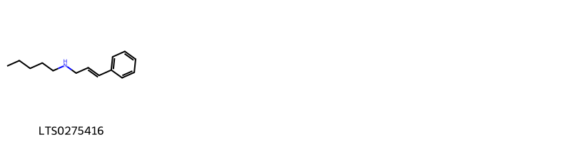{ width=100% }
    <figcaption>Hình ảnh cấu trúc hóa học của 1 hoạt chất thuộc nhóm Benzene and substituted derivatives gồm ['pentyl(3-phenylprop-2-en-1-yl)amine (LTS0275416)'].</figcaption>
</figure>
#### Nhóm Benzodioxoles
<figure markdown="span">
    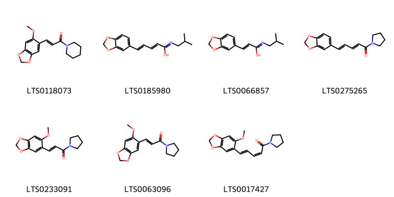{ width=100% }
    <figcaption>Hình ảnh cấu trúc hóa học của 7 hoạt chất thuộc nhóm Benzodioxoles gồm ['3-(6-methoxy-2h-1,3-benzodioxol-5-yl)-1-(piperidin-1-yl)prop-2-en-1-one (LTS0118073)', '(2e,4e)-5-(2h-1,3-benzodioxol-5-yl)-n-(2-methylpropyl)penta-2,4-dienimidic acid (LTS0185980)', '(2e)-3-(2h-1,3-benzodioxol-5-yl)-n-(2-methylpropyl)prop-2-enimidic acid (LTS0066857)', 'piperyline (LTS0275265)', '(2e)-3-(6-methoxy-2h-1,3-benzodioxol-5-yl)-1-(pyrrolidin-1-yl)prop-2-en-1-one (LTS0233091)', '3-(6-methoxy-2h-1,3-benzodioxol-5-yl)-1-(pyrrolidin-1-yl)prop-2-en-1-one (LTS0063096)', '(2z,4e)-5-(6-methoxy-2h-1,3-benzodioxol-5-yl)-1-(pyrrolidin-1-yl)penta-2,4-dien-1-one (LTS0017427)'].</figcaption>
</figure>
#### Nhóm Cinnamic acids and derivatives
<figure markdown="span">
    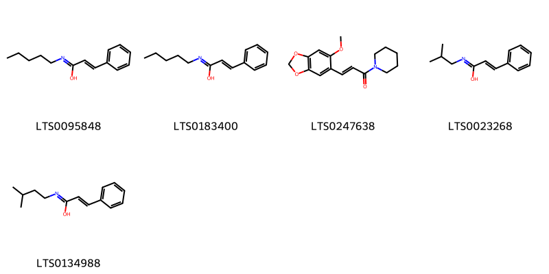{ width=100% }
    <figcaption>Hình ảnh cấu trúc hóa học của 5 hoạt chất thuộc nhóm Cinnamic acids and derivatives gồm ['n-pentyl-3-phenylprop-2-enimidic acid (LTS0095848)', '(2e)-n-pentyl-3-phenylprop-2-enimidic acid (LTS0183400)', '(2e)-3-(6-methoxy-2h-1,3-benzodioxol-5-yl)-1-(piperidin-1-yl)prop-2-en-1-one (LTS0247638)', 'n-(2-methylpropyl)-3-phenylprop-2-enimidic acid (LTS0023268)', 'n-(3-methylbutyl)-3-phenylprop-2-enimidic acid (LTS0134988)'].</figcaption>
</figure>
#### Nhóm Prenol lipids
<figure markdown="span">
    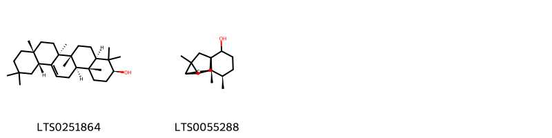{ width=100% }
    <figcaption>Hình ảnh cấu trúc hóa học của 2 hoạt chất thuộc nhóm Prenol lipids gồm ['β-amyrin (LTS0251864)', '(5r,6s)-5,6,9-trimethyltetracyclo[7.2.1.0¹,⁶.0⁸,¹⁰]dodecan-2-ol (LTS0055288)'].</figcaption>
</figure>
#### Nhóm Pyrrolidines
<figure markdown="span">
    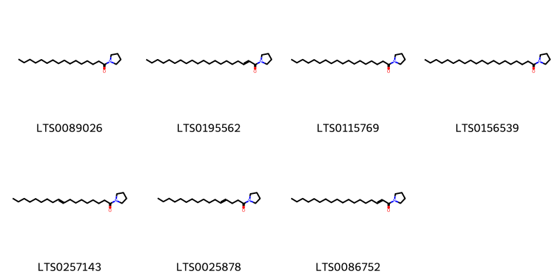{ width=100% }
    <figcaption>Hình ảnh cấu trúc hóa học của 7 hoạt chất thuộc nhóm Pyrrolidines gồm ['1-(pyrrolidin-1-yl)hexadecan-1-one (LTS0089026)', '1-(pyrrolidin-1-yl)icos-2-en-1-one (LTS0195562)', '1-(pyrrolidin-1-yl)octadecan-1-one (LTS0115769)', '1-(pyrrolidin-1-yl)icosan-1-one (LTS0156539)', '1-(pyrrolidin-1-yl)octadec-9-en-1-one (LTS0257143)', '1-(pyrrolidin-1-yl)hexadec-4-en-1-one (LTS0025878)', '1-(pyrrolidin-1-yl)octadec-2-en-1-one (LTS0086752)'].</figcaption>
</figure>
#### Nhóm Steroids and steroid derivatives
<figure markdown="span">
    { width=100% }
    <figcaption>Hình ảnh cấu trúc hóa học của 2 hoạt chất thuộc nhóm Steroids and steroid derivatives gồm ['stigmast-5-en-3-ol (LTS0071224)', 'stigmast-5-en-3-ol, (3β)- (LTS0204616)'].</figcaption>
</figure>

---

### Dược dân tộc học

Danh sách các quốc gia có sử dụng *Piper amalago* trong điều trị các bệnh. 

| Country            | Disease                                                                   | Bệnh                                                                                                                                                                                                |
|:-------------------|:--------------------------------------------------------------------------|:----------------------------------------------------------------------------------------------------------------------------------------------------------------------------------------------------|
| Dominican Republic | Carminative                                                               | MYMEMORY WARNING: YOU USED ALL AVAILABLE FREE TRANSLATIONS FOR TODAY. NEXT AVAILABLE IN  08 HOURS 15 MINUTES 51 SECONDS VISIT HTTPS://MYMEMORY.TRANSLATED.NET/DOC/USAGELIMITS.PHP TO TRANSLATE MORE |
| Haiti              | Aphrodisiac, Carminative, Emmenagogue, Stimulant, Tonic, Digestive, Tonic | MYMEMORY WARNING: YOU USED ALL AVAILABLE FREE TRANSLATIONS FOR TODAY. NEXT AVAILABLE IN  08 HOURS 15 MINUTES 49 SECONDS VISIT HTTPS://MYMEMORY.TRANSLATED.NET/DOC/USAGELIMITS.PHP TO TRANSLATE MORE |

---

---
## Piper angustifolia
### Thông tin về thực vật

!!! info "Phân loại thực vật của *N/A* từ GIBF:"
    - **Kingdom:** Plantae
    - **Phylum:** Tracheophyta
    - **Order:** Piperales
    - **Family:** Piperaceae
    - **Genus:** Piper
    - **Species:** *N/A*

 

| Label (VI)   | Label (EN)   | Scientific Name   | Descriptions (VI)   | Descriptions (EN)   | Also Known As (VI)   | Also Known As (EN)   |
|:-------------|:-------------|:------------------|:--------------------|:--------------------|:---------------------|:---------------------|
| N/A          | N/A          | Piper amalago     | loài thực vật       | species of plant    | ['']                 | ['taxon']            |

#### Phân bố trên thế giới

**Từ CSDL GIBF** Brazil, Guatemala, Uganda, Japan, New Caledonia, China, Ecuador, Thailand, Puerto Rico, Sri Lanka, United States of America, Jamaica, Indonesia, Costa Rica, Dominican Republic, Colombia, Argentina, French Guiana, Mexico, Kenya, Rwanda, El Salvador, Chinese Taipei, Malaysia, Haiti, Gabon, Panama, Nicaragua, Singapore, Cambodia, Australia, India, Peru

#### Phân bố tại Việt Nam

**Từ CSDL GIBF**: Không có ghi nhận ở Việt Nam

---
### Thành phần hóa học
        
- Theo cơ sở dữ liệu lotus: Từ loài *N/A* đã phân lập và xác định được Chưa có hoạt chất nào được phân lập. hoạt chất thuộc về các nhóm Không có hoạt chất nào được phân lập. 

Không có hình ảnh nào được tạo ra

---

### Dược dân tộc học

Danh sách các quốc gia có sử dụng *N/A* trong điều trị các bệnh. 

| Country       | Disease                                               | Bệnh                                                                                                                                                                                                |
|:--------------|:------------------------------------------------------|:----------------------------------------------------------------------------------------------------------------------------------------------------------------------------------------------------|
| Latin America | Antiseptic, Astringent, Vulnerary, Styptic, Stimulant | MYMEMORY WARNING: YOU USED ALL AVAILABLE FREE TRANSLATIONS FOR TODAY. NEXT AVAILABLE IN  08 HOURS 15 MINUTES 23 SECONDS VISIT HTTPS://MYMEMORY.TRANSLATED.NET/DOC/USAGELIMITS.PHP TO TRANSLATE MORE |

---

---
## Piper angustifolium
### Thông tin về thực vật

!!! info "Phân loại thực vật của *N/A* từ GIBF:"
    - **Kingdom:** Plantae
    - **Phylum:** Tracheophyta
    - **Order:** Piperales
    - **Family:** Piperaceae
    - **Genus:** Piper
    - **Species:** *N/A*

 

| Label (VI)   | Label (EN)   | Scientific Name     | Descriptions (VI)   | Descriptions (EN)   | Also Known As (VI)   | Also Known As (EN)   |
|:-------------|:-------------|:--------------------|:--------------------|:--------------------|:---------------------|:---------------------|
| N/A          | N/A          | Piper angustifolium | loài thực vật       | species of plant    | ['']                 | ['']                 |

#### Phân bố trên thế giới

**Từ CSDL GIBF** Brazil, Guatemala, Uganda, Japan, New Caledonia, China, Ecuador, Thailand, Puerto Rico, Sri Lanka, United States of America, Jamaica, Indonesia, Costa Rica, Dominican Republic, Colombia, Argentina, French Guiana, Mexico, Kenya, Rwanda, El Salvador, Chinese Taipei, Malaysia, Haiti, Gabon, Panama, Nicaragua, Singapore, Cambodia, Australia, India, Peru

#### Phân bố tại Việt Nam

**Từ CSDL GIBF**: Không có ghi nhận ở Việt Nam

---
### Thành phần hóa học
        
- Theo cơ sở dữ liệu lotus: Từ loài *N/A* đã phân lập và xác định được 23 hoạt chất thuộc về các nhóm Prenol lipids, Benzodioxoles. 

|    | chemicalTaxonomyClassyfireClass   |   smiles_count |
|---:|:----------------------------------|---------------:|
|  0 | Benzodioxoles                     |              1 |
|  1 | Prenol lipids                     |             22 |

#### Nhóm Benzodioxoles
<figure markdown="span">
    { width=100% }
    <figcaption>Hình ảnh cấu trúc hóa học của 1 hoạt chất thuộc nhóm Benzodioxoles gồm ['myristicin (LTS0180101)'].</figcaption>
</figure>
#### Nhóm Prenol lipids
<figure markdown="span">
    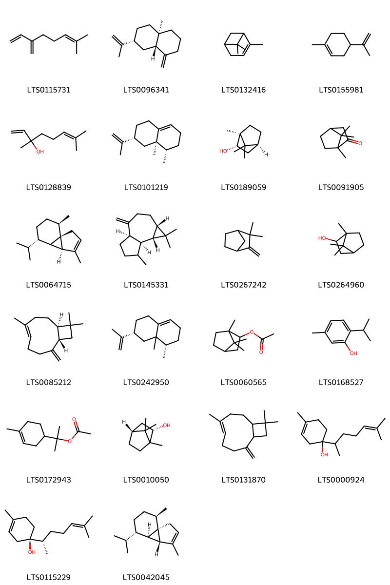{ width=100% }
    <figcaption>Hình ảnh cấu trúc hóa học của 22 hoạt chất thuộc nhóm Prenol lipids gồm ['α-myrcene (LTS0115731)', 'β-selinene (LTS0096341)', 'α pinene (LTS0132416)', 'limonene,  (LTS0155981)', 'linalool, (+-)- (LTS0128839)', 'eremophilene (LTS0101219)', '(+)-borneol (LTS0189059)', 'camphor (LTS0091905)', '(1s,5r,7s,10r)-7-isopropyl-4,10-dimethyltricyclo[4.4.0.0¹,⁵]dec-3-ene (LTS0064715)', '(1as,4ar,7as,7br)-1,1,7-trimethyl-4-methylidene-octahydro-1ah-cyclopropa[e]azulene (LTS0145331)', 'camphene (LTS0267242)', 'borneol (LTS0264960)', 'caryophyllene (LTS0085212)', '(1s,7r)-1,8a-dimethyl-7-(prop-1-en-2-yl)-2,3,5,6,7,8-hexahydro-1h-naphthalene (LTS0242950)', 'bornyl acetate (LTS0060565)', 'thymol (LTS0168527)', 'α-terpinyl acetate (LTS0172943)', '(2s,4r)-1,7,7-trimethylbicyclo[2.2.1]heptan-2-ol (LTS0010050)', 'caryophyllene (LTS0131870)', '4-methyl-1-(6-methylhept-5-en-2-yl)cyclohex-3-en-1-ol (LTS0000924)', 'β-bisabolol (LTS0115229)', '(-)-α-cubebene (LTS0042045)'].</figcaption>
</figure>

---

### Dược dân tộc học

Danh sách các quốc gia có sử dụng *N/A* trong điều trị các bệnh. 

| Country       | Disease              | Bệnh                                                                                                                                                                                                |
|:--------------|:---------------------|:----------------------------------------------------------------------------------------------------------------------------------------------------------------------------------------------------|
| English       | Astringent           | MYMEMORY WARNING: YOU USED ALL AVAILABLE FREE TRANSLATIONS FOR TODAY. NEXT AVAILABLE IN  08 HOURS 15 MINUTES 00 SECONDS VISIT HTTPS://MYMEMORY.TRANSLATED.NET/DOC/USAGELIMITS.PHP TO TRANSLATE MORE |
| Italian       | Hemostat             | MYMEMORY WARNING: YOU USED ALL AVAILABLE FREE TRANSLATIONS FOR TODAY. NEXT AVAILABLE IN  08 HOURS 14 MINUTES 58 SECONDS VISIT HTTPS://MYMEMORY.TRANSLATED.NET/DOC/USAGELIMITS.PHP TO TRANSLATE MORE |
| Latin America | Stimulant            | MYMEMORY WARNING: YOU USED ALL AVAILABLE FREE TRANSLATIONS FOR TODAY. NEXT AVAILABLE IN  08 HOURS 14 MINUTES 56 SECONDS VISIT HTTPS://MYMEMORY.TRANSLATED.NET/DOC/USAGELIMITS.PHP TO TRANSLATE MORE |
| Mexico        | Stimulant, Styptic   | MYMEMORY WARNING: YOU USED ALL AVAILABLE FREE TRANSLATIONS FOR TODAY. NEXT AVAILABLE IN  08 HOURS 14 MINUTES 54 SECONDS VISIT HTTPS://MYMEMORY.TRANSLATED.NET/DOC/USAGELIMITS.PHP TO TRANSLATE MORE |
| anish         | Antiseptic, Diuretic | MYMEMORY WARNING: YOU USED ALL AVAILABLE FREE TRANSLATIONS FOR TODAY. NEXT AVAILABLE IN  08 HOURS 14 MINUTES 51 SECONDS VISIT HTTPS://MYMEMORY.TRANSLATED.NET/DOC/USAGELIMITS.PHP TO TRANSLATE MORE |

---

---
## Piper attenuatum
### Thông tin về thực vật

!!! info "Phân loại thực vật của *Piper attenuatum* từ GIBF:"
    - **Kingdom:** Plantae
    - **Phylum:** Tracheophyta
    - **Order:** Piperales
    - **Family:** Piperaceae
    - **Genus:** Piper
    - **Species:** *Piper attenuatum*

 

| Label (VI)   | Label (EN)   | Scientific Name   | Descriptions (VI)   | Descriptions (EN)   | Also Known As (VI)   | Also Known As (EN)   |
|:-------------|:-------------|:------------------|:--------------------|:--------------------|:---------------------|:---------------------|
| N/A          | N/A          | Piper attenuatum  | loài thực vật       | species of plant    | ['']                 | ['']                 |

#### Phân bố trên thế giới

**Từ CSDL GIBF** nan, Brazil, Singapore, Bhutan, Indonesia, Bangladesh, China, Myanmar, India, unknown or invalid

#### Phân bố tại Việt Nam

**Từ CSDL GIBF**: Không có ghi nhận ở Việt Nam

---
### Thành phần hóa học
        
- Theo cơ sở dữ liệu lotus: Từ loài *Piper attenuatum* đã phân lập và xác định được 17 hoạt chất thuộc về các nhóm Fatty Acyls, Benzene and substituted derivatives, Benzodioxoles, Steroids and steroid derivatives, Aristolactams, Furanoid lignans. 

|    | chemicalTaxonomyClassyfireClass     |   smiles_count |
|---:|:------------------------------------|---------------:|
|  0 |                                     |              1 |
|  1 | Aristolactams                       |              2 |
|  2 | Benzene and substituted derivatives |              3 |
|  3 | Benzodioxoles                       |              5 |
|  4 | Fatty Acyls                         |              2 |
|  5 | Furanoid lignans                    |              1 |
|  6 | Steroids and steroid derivatives    |              3 |

#### Nhóm 
<figure markdown="span">
    { width=100% }
    <figcaption>Hình ảnh cấu trúc hóa học của 1 hoạt chất thuộc nhóm  gồm ['piperine (LTS0014461)'].</figcaption>
</figure>
#### Nhóm Aristolactams
<figure markdown="span">
    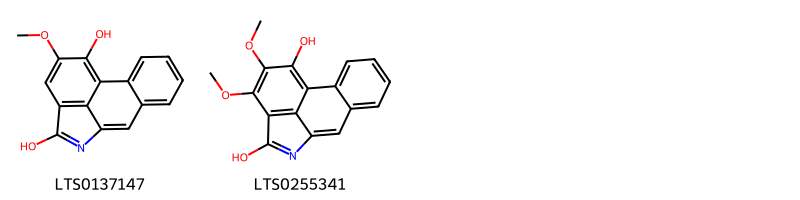{ width=100% }
    <figcaption>Hình ảnh cấu trúc hóa học của 2 hoạt chất thuộc nhóm Aristolactams gồm ['14-methoxy-10-azatetracyclo[7.6.1.0²,⁷.0¹²,¹⁶]hexadeca-1(16),2(7),3,5,8,10,12,14-octaene-11,15-diol (LTS0137147)', '13,14-dimethoxy-10-azatetracyclo[7.6.1.0²,⁷.0¹²,¹⁶]hexadeca-1(16),2(7),3,5,8,10,12,14-octaene-11,15-diol (LTS0255341)'].</figcaption>
</figure>
#### Nhóm Benzene and substituted derivatives
<figure markdown="span">
    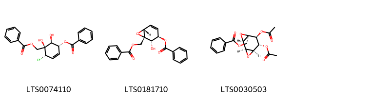{ width=100% }
    <figcaption>Hình ảnh cấu trúc hóa học của 3 hoạt chất thuộc nhóm Benzene and substituted derivatives gồm ['(1r,4s,5s,6s)-5-[(benzoyloxy)methyl]-4-chloro-5,6-dihydroxycyclohex-2-en-1-yl benzoate (LTS0074110)', '(1s,2s,3r,6r)-1-[(benzoyloxy)methyl]-2-hydroxy-7-oxabicyclo[4.1.0]hept-4-en-3-yl benzoate (LTS0181710)', '[(1r,2r,4r,5s,6r,7s)-5,6-bis(acetyloxy)-3,8-dioxatricyclo[5.1.0.0²,⁴]octan-4-yl]methyl benzoate (LTS0030503)'].</figcaption>
</figure>
#### Nhóm Benzodioxoles
<figure markdown="span">
    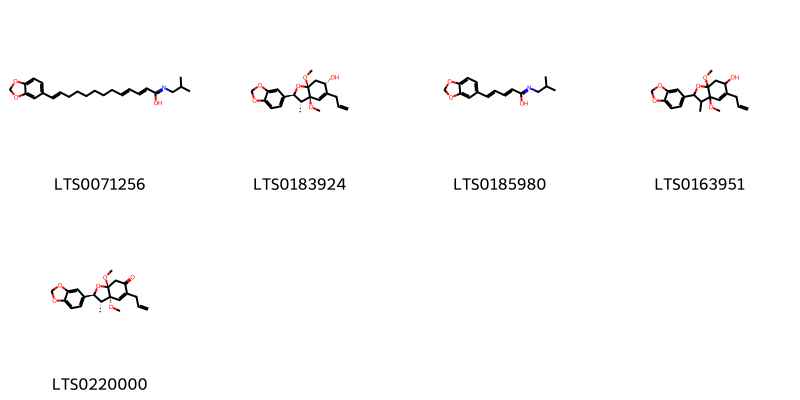{ width=100% }
    <figcaption>Hình ảnh cấu trúc hóa học của 5 hoạt chất thuộc nhóm Benzodioxoles gồm ['(2e,4e,12e)-13-(2h-1,3-benzodioxol-5-yl)-n-(2-methylpropyl)trideca-2,4,12-trienimidic acid (LTS0071256)', '(2s,3r,3as,6s,7ar)-2-(2h-1,3-benzodioxol-5-yl)-3a,7a-dimethoxy-3-methyl-5-(prop-2-en-1-yl)-2,3,6,7-tetrahydro-1-benzofuran-6-ol (LTS0183924)', '(2e,4e)-5-(2h-1,3-benzodioxol-5-yl)-n-(2-methylpropyl)penta-2,4-dienimidic acid (LTS0185980)', '2-(2h-1,3-benzodioxol-5-yl)-3a,7a-dimethoxy-3-methyl-5-(prop-2-en-1-yl)-2,3,6,7-tetrahydro-1-benzofuran-6-ol (LTS0163951)', '(2s,3r,3ar,7ar)-2-(2h-1,3-benzodioxol-5-yl)-3a,7a-dimethoxy-3-methyl-5-(prop-2-en-1-yl)-3,7-dihydro-2h-1-benzofuran-6-one (LTS0220000)'].</figcaption>
</figure>
#### Nhóm Fatty Acyls
<figure markdown="span">
    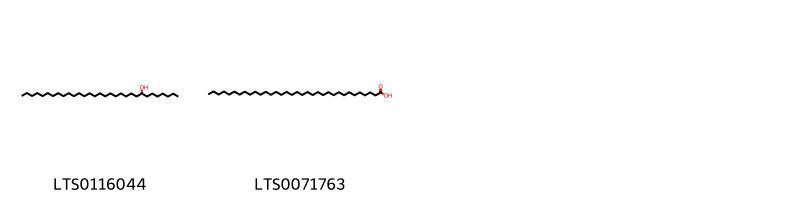{ width=100% }
    <figcaption>Hình ảnh cấu trúc hóa học của 2 hoạt chất thuộc nhóm Fatty Acyls gồm ['hentriacontan-8-ol (LTS0116044)', 'tetratriacontanoic acid (LTS0071763)'].</figcaption>
</figure>
#### Nhóm Furanoid lignans
<figure markdown="span">
    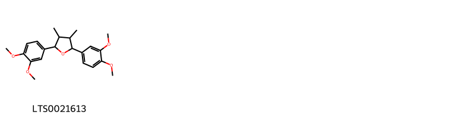{ width=100% }
    <figcaption>Hình ảnh cấu trúc hóa học của 1 hoạt chất thuộc nhóm Furanoid lignans gồm ['2,5-bis(3,4-dimethoxyphenyl)-3,4-dimethyloxolane (LTS0021613)'].</figcaption>
</figure>
#### Nhóm Steroids and steroid derivatives
<figure markdown="span">
    { width=100% }
    <figcaption>Hình ảnh cấu trúc hóa học của 3 hoạt chất thuộc nhóm Steroids and steroid derivatives gồm ['stigmast-5-en-3-ol (LTS0071224)', 'sitosterol (LTS0168132)', 'stigmast-5-en-3-ol, (3β)- (LTS0204616)'].</figcaption>
</figure>

---

### Dược dân tộc học

Danh sách các quốc gia có sử dụng *Piper attenuatum* trong điều trị các bệnh. 

| Country   | Disease   | Bệnh                                                                                                                                                                                                |
|:----------|:----------|:----------------------------------------------------------------------------------------------------------------------------------------------------------------------------------------------------|
| India     | Diuretic  | MYMEMORY WARNING: YOU USED ALL AVAILABLE FREE TRANSLATIONS FOR TODAY. NEXT AVAILABLE IN  08 HOURS 14 MINUTES 23 SECONDS VISIT HTTPS://MYMEMORY.TRANSLATED.NET/DOC/USAGELIMITS.PHP TO TRANSLATE MORE |

---

---
## Piper baccatum
### Thông tin về thực vật

!!! info "Phân loại thực vật của *Piper baccatum* từ GIBF:"
    - **Kingdom:** Plantae
    - **Phylum:** Tracheophyta
    - **Order:** Piperales
    - **Family:** Piperaceae
    - **Genus:** Piper
    - **Species:** *Piper baccatum*

 

| Label (VI)   | Label (EN)   | Scientific Name   | Descriptions (VI)   | Descriptions (EN)   | Also Known As (VI)   | Also Known As (EN)   |
|:-------------|:-------------|:------------------|:--------------------|:--------------------|:---------------------|:---------------------|
| N/A          | N/A          | Piper baccatum    | loài thực vật       | species of plant    | ['']                 | ['']                 |

#### Phân bố trên thế giới

**Từ CSDL GIBF** Sri Lanka, nan, Singapore, Madagascar, Indonesia, Malaysia, Philippines, China, India, unknown or invalid, Thailand

#### Phân bố tại Việt Nam

**Từ CSDL GIBF**: Không có ghi nhận ở Việt Nam

---
### Thành phần hóa học
        
- Theo cơ sở dữ liệu lotus: Từ loài *Piper baccatum* đã phân lập và xác định được Chưa có hoạt chất nào được phân lập. hoạt chất thuộc về các nhóm Không có hoạt chất nào được phân lập. 

Không có hình ảnh nào được tạo ra

---

### Dược dân tộc học

Danh sách các quốc gia có sử dụng *Piper baccatum* trong điều trị các bệnh. 

| Country   | Disease   | Bệnh                                                                                                                                                                                                |
|:----------|:----------|:----------------------------------------------------------------------------------------------------------------------------------------------------------------------------------------------------|
| Java      | Tonic     | MYMEMORY WARNING: YOU USED ALL AVAILABLE FREE TRANSLATIONS FOR TODAY. NEXT AVAILABLE IN  08 HOURS 13 MINUTES 58 SECONDS VISIT HTTPS://MYMEMORY.TRANSLATED.NET/DOC/USAGELIMITS.PHP TO TRANSLATE MORE |

---

---
## Piper bantamense
### Thông tin về thực vật

!!! info "Phân loại thực vật của *Piper bantamense* từ GIBF:"
    - **Kingdom:** Plantae
    - **Phylum:** Tracheophyta
    - **Order:** Piperales
    - **Family:** Piperaceae
    - **Genus:** Piper
    - **Species:** *Piper bantamense*

 

| Label (VI)   | Label (EN)   | Scientific Name   | Descriptions (VI)   | Descriptions (EN)   | Also Known As (VI)   | Also Known As (EN)   |
|:-------------|:-------------|:------------------|:--------------------|:--------------------|:---------------------|:---------------------|
| N/A          | N/A          | Piper bantamense  | loài thực vật       | species of plant    | ['']                 | ['']                 |

#### Phân bố trên thế giới

**Từ CSDL GIBF** nan, Sri Lanka, Singapore, Cambodia, Indonesia, Malaysia, Bangladesh, China, India, Solomon Islands, unknown or invalid, France

#### Phân bố tại Việt Nam

**Từ CSDL GIBF**: Không có ghi nhận ở Việt Nam

---
### Thành phần hóa học
        
- Theo cơ sở dữ liệu lotus: Từ loài *Piper bantamense* đã phân lập và xác định được Chưa có hoạt chất nào được phân lập. hoạt chất thuộc về các nhóm Không có hoạt chất nào được phân lập. 

Không có hình ảnh nào được tạo ra

---

### Dược dân tộc học

Danh sách các quốc gia có sử dụng *Piper bantamense* trong điều trị các bệnh. 

| Country   | Disease               | Bệnh                                                                                                                                                                                                |
|:----------|:----------------------|:----------------------------------------------------------------------------------------------------------------------------------------------------------------------------------------------------|
| Malaya    | Soap                  | MYMEMORY WARNING: YOU USED ALL AVAILABLE FREE TRANSLATIONS FOR TODAY. NEXT AVAILABLE IN  08 HOURS 13 MINUTES 36 SECONDS VISIT HTTPS://MYMEMORY.TRANSLATED.NET/DOC/USAGELIMITS.PHP TO TRANSLATE MORE |
| Malaysia  | Diuretic, Rubefacient | MYMEMORY WARNING: YOU USED ALL AVAILABLE FREE TRANSLATIONS FOR TODAY. NEXT AVAILABLE IN  08 HOURS 13 MINUTES 34 SECONDS VISIT HTTPS://MYMEMORY.TRANSLATED.NET/DOC/USAGELIMITS.PHP TO TRANSLATE MORE |

---

---
## Piper betel
### Thông tin về thực vật

!!! info "Phân loại thực vật của *Piper betle* từ GIBF:"
    - **Kingdom:** Plantae
    - **Phylum:** Tracheophyta
    - **Order:** Piperales
    - **Family:** Piperaceae
    - **Genus:** Piper
    - **Species:** *Piper betle*

 

| Label (VI)   | Label (EN)   | Scientific Name   | Descriptions (VI)   | Descriptions (EN)   | Also Known As (VI)   | Also Known As (EN)   |
|:-------------|:-------------|:------------------|:--------------------|:--------------------|:---------------------|:---------------------|
| N/A          | N/A          | Piper betel       |                     | species of plant    | ['']                 | ['']                 |

#### Phân bố trên thế giới

**Từ CSDL GIBF** nan, India, United States of America

#### Phân bố tại Việt Nam

**Từ CSDL GIBF**: Không có ghi nhận ở Việt Nam

---
### Thành phần hóa học
        
- Theo cơ sở dữ liệu lotus: Từ loài *Piper betle* đã phân lập và xác định được Chưa có hoạt chất nào được phân lập. hoạt chất thuộc về các nhóm Không có hoạt chất nào được phân lập. 

Không có hình ảnh nào được tạo ra

---

### Dược dân tộc học

Danh sách các quốc gia có sử dụng *Piper betle* trong điều trị các bệnh. 

| Country   | Disease                                                                    | Bệnh                                                                                                                                                                                                |
|:----------|:---------------------------------------------------------------------------|:----------------------------------------------------------------------------------------------------------------------------------------------------------------------------------------------------|
| Asia      | Stimulant, Inhalant                                                        | MYMEMORY WARNING: YOU USED ALL AVAILABLE FREE TRANSLATIONS FOR TODAY. NEXT AVAILABLE IN  08 HOURS 13 MINUTES 14 SECONDS VISIT HTTPS://MYMEMORY.TRANSLATED.NET/DOC/USAGELIMITS.PHP TO TRANSLATE MORE |
| China     | Stimulant, Carminative, Carminative, Stimulant                             | MYMEMORY WARNING: YOU USED ALL AVAILABLE FREE TRANSLATIONS FOR TODAY. NEXT AVAILABLE IN  08 HOURS 13 MINUTES 11 SECONDS VISIT HTTPS://MYMEMORY.TRANSLATED.NET/DOC/USAGELIMITS.PHP TO TRANSLATE MORE |
| Egypt     | Antiseptic, Aphrodisiac, Astringent, Carminative, Contraceptive, Stimulant | MYMEMORY WARNING: YOU USED ALL AVAILABLE FREE TRANSLATIONS FOR TODAY. NEXT AVAILABLE IN  08 HOURS 13 MINUTES 09 SECONDS VISIT HTTPS://MYMEMORY.TRANSLATED.NET/DOC/USAGELIMITS.PHP TO TRANSLATE MORE |
| Elsewhere | Antioxidant, nan, Carminative, Fungicide, Stimulant, Antiseptic, Digestive | MYMEMORY WARNING: YOU USED ALL AVAILABLE FREE TRANSLATIONS FOR TODAY. NEXT AVAILABLE IN  08 HOURS 13 MINUTES 06 SECONDS VISIT HTTPS://MYMEMORY.TRANSLATED.NET/DOC/USAGELIMITS.PHP TO TRANSLATE MORE |
| Turkey    | Antiseptic, Astringent, Stimulant                                          | MYMEMORY WARNING: YOU USED ALL AVAILABLE FREE TRANSLATIONS FOR TODAY. NEXT AVAILABLE IN  08 HOURS 13 MINUTES 04 SECONDS VISIT HTTPS://MYMEMORY.TRANSLATED.NET/DOC/USAGELIMITS.PHP TO TRANSLATE MORE |

---

---
## Piper betle
### Thông tin về thực vật

!!! info "Phân loại thực vật của *Piper betle* từ GIBF:"
    - **Kingdom:** Plantae
    - **Phylum:** Tracheophyta
    - **Order:** Piperales
    - **Family:** Piperaceae
    - **Genus:** Piper
    - **Species:** *Piper betle*

 

| Label (VI)   | Label (EN)   | Scientific Name   | Descriptions (VI)   | Descriptions (EN)                               | Also Known As (VI)                  | Also Known As (EN)   |
|:-------------|:-------------|:------------------|:--------------------|:------------------------------------------------|:------------------------------------|:---------------------|
| N/A          | N/A          | Piper betle       | loài thực vật       | mild stimulant, similar to caffeine or nicotine | ['Trầu', 'Piper betle', 'P. betle'] | ['betel']            |

#### Phân bố trên thế giới

**Từ CSDL GIBF** Singapore, United States of America, Indonesia, Malaysia, Chinese Taipei, Mayotte, Mauritius, India, Thailand

#### Phân bố tại Việt Nam

**Từ CSDL GIBF**: Không có ghi nhận ở Việt Nam

---
### Thành phần hóa học
        
- Theo cơ sở dữ liệu lotus: Từ loài *Piper betle* đã phân lập và xác định được 41 hoạt chất thuộc về các nhóm Fatty Acyls, Aporphines, Benzene and substituted derivatives, Sphingolipids, Benzodioxoles, Steroids and steroid derivatives, Phenols, Organooxygen compounds, Prenol lipids, Saturated hydrocarbons. 

|    | chemicalTaxonomyClassyfireClass     |   smiles_count |
|---:|:------------------------------------|---------------:|
|  0 |                                     |              3 |
|  1 | Aporphines                          |              1 |
|  2 | Benzene and substituted derivatives |              6 |
|  3 | Benzodioxoles                       |              3 |
|  4 | Fatty Acyls                         |              2 |
|  5 | Organooxygen compounds              |              1 |
|  6 | Phenols                             |              7 |
|  7 | Prenol lipids                       |             10 |
|  8 | Saturated hydrocarbons              |              2 |
|  9 | Sphingolipids                       |              3 |
| 10 | Steroids and steroid derivatives    |              3 |

#### Nhóm 
<figure markdown="span">
    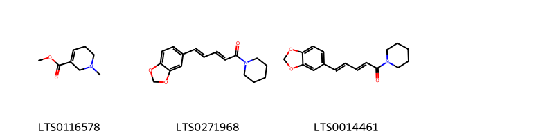{ width=100% }
    <figcaption>Hình ảnh cấu trúc hóa học của 3 hoạt chất thuộc nhóm  gồm ['arecoline (LTS0116578)', '5-(2h-1,3-benzodioxol-5-yl)-1-(piperidin-1-yl)penta-2,4-dien-1-one (LTS0271968)', 'piperine (LTS0014461)'].</figcaption>
</figure>
#### Nhóm Aporphines
<figure markdown="span">
    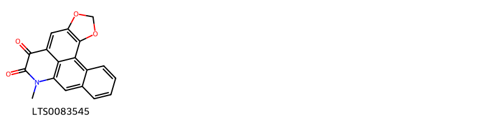{ width=100% }
    <figcaption>Hình ảnh cấu trúc hóa học của 1 hoạt chất thuộc nhóm Aporphines gồm ['11-methyl-3,5-dioxa-11-azapentacyclo[10.7.1.0²,⁶.0⁸,²⁰.0¹⁴,¹⁹]icosa-1(20),2(6),7,12,14(19),15,17-heptaene-9,10-dione (LTS0083545)'].</figcaption>
</figure>
#### Nhóm Benzene and substituted derivatives
<figure markdown="span">
    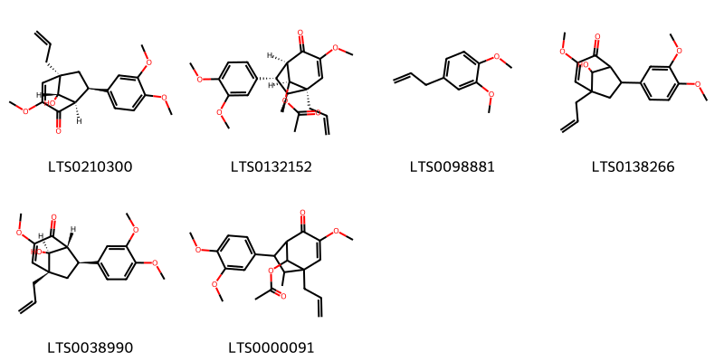{ width=100% }
    <figcaption>Hình ảnh cấu trúc hóa học của 6 hoạt chất thuộc nhóm Benzene and substituted derivatives gồm ['(1r,5r,7r,8s)-7-(3,4-dimethoxyphenyl)-8-hydroxy-3-methoxy-5-(prop-2-en-1-yl)bicyclo[3.2.1]oct-3-en-2-one (LTS0210300)', '(1r,5r,6s,7s,8s)-6-(3,4-dimethoxyphenyl)-3-methoxy-7-methyl-4-oxo-1-(prop-2-en-1-yl)bicyclo[3.2.1]oct-2-en-8-yl acetate (LTS0132152)', 'methyl eugenol (LTS0098881)', '7-(3,4-dimethoxyphenyl)-8-hydroxy-3-methoxy-5-(prop-2-en-1-yl)bicyclo[3.2.1]oct-3-en-2-one (LTS0138266)', '(1r,5r,7s,8s)-7-(3,4-dimethoxyphenyl)-8-hydroxy-3-methoxy-5-(prop-2-en-1-yl)bicyclo[3.2.1]oct-3-en-2-one (LTS0038990)', '6-(3,4-dimethoxyphenyl)-3-methoxy-7-methyl-4-oxo-1-(prop-2-en-1-yl)bicyclo[3.2.1]oct-2-en-8-yl acetate (LTS0000091)'].</figcaption>
</figure>
#### Nhóm Benzodioxoles
<figure markdown="span">
    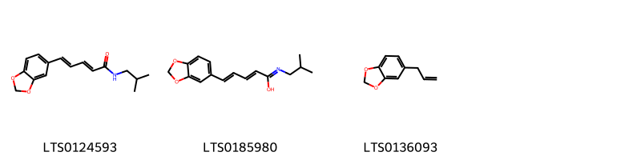{ width=100% }
    <figcaption>Hình ảnh cấu trúc hóa học của 3 hoạt chất thuộc nhóm Benzodioxoles gồm ['5-(2h-1,3-benzodioxol-5-yl)-n-(2-methylpropyl)penta-2,4-dienamide (LTS0124593)', '(2e,4e)-5-(2h-1,3-benzodioxol-5-yl)-n-(2-methylpropyl)penta-2,4-dienimidic acid (LTS0185980)', 'sassafras (LTS0136093)'].</figcaption>
</figure>
#### Nhóm Fatty Acyls
<figure markdown="span">
    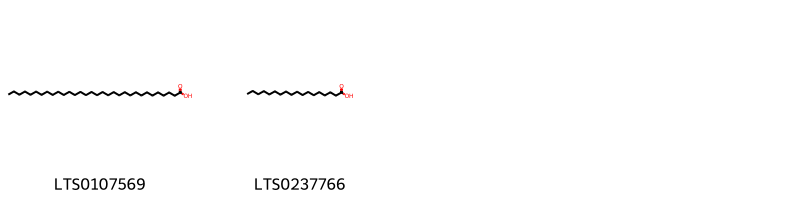{ width=100% }
    <figcaption>Hình ảnh cấu trúc hóa học của 2 hoạt chất thuộc nhóm Fatty Acyls gồm ['lacceroic acid (LTS0107569)', 'stearic acid (LTS0237766)'].</figcaption>
</figure>
#### Nhóm Organooxygen compounds
<figure markdown="span">
    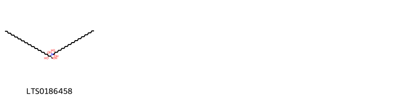{ width=100% }
    <figcaption>Hình ảnh cấu trúc hóa học của 1 hoạt chất thuộc nhóm Organooxygen compounds gồm ['(2r)-2-hydroxy-n-[(2s,3s,4r)-1,3,4-trihydroxynonacosan-2-yl]pentacosanimidic acid (LTS0186458)'].</figcaption>
</figure>
#### Nhóm Phenols
<figure markdown="span">
    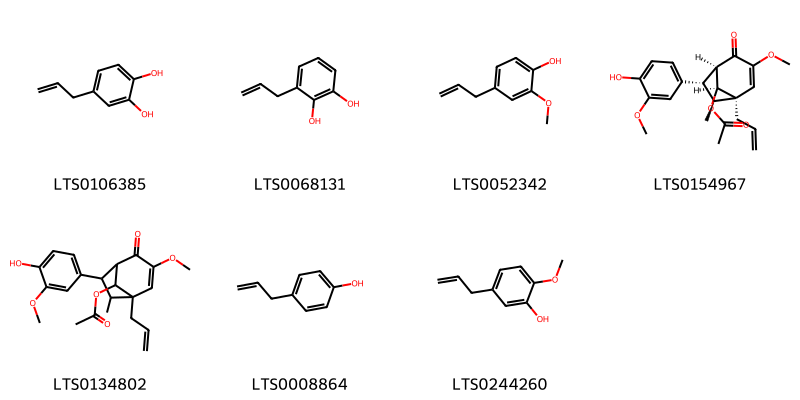{ width=100% }
    <figcaption>Hình ảnh cấu trúc hóa học của 7 hoạt chất thuộc nhóm Phenols gồm ['4-allylpyrocatechol (LTS0106385)', '3-(prop-2-en-1-yl)benzene-1,2-diol (LTS0068131)', 'eugenol (LTS0052342)', '(1r,5r,6s,7s,8s)-6-(4-hydroxy-3-methoxyphenyl)-3-methoxy-7-methyl-4-oxo-1-(prop-2-en-1-yl)bicyclo[3.2.1]oct-2-en-8-yl acetate (LTS0154967)', '6-(4-hydroxy-3-methoxyphenyl)-3-methoxy-7-methyl-4-oxo-1-(prop-2-en-1-yl)bicyclo[3.2.1]oct-2-en-8-yl acetate (LTS0134802)', 'chavicol (LTS0008864)', 'chavibetol (LTS0244260)'].</figcaption>
</figure>
#### Nhóm Prenol lipids
<figure markdown="span">
    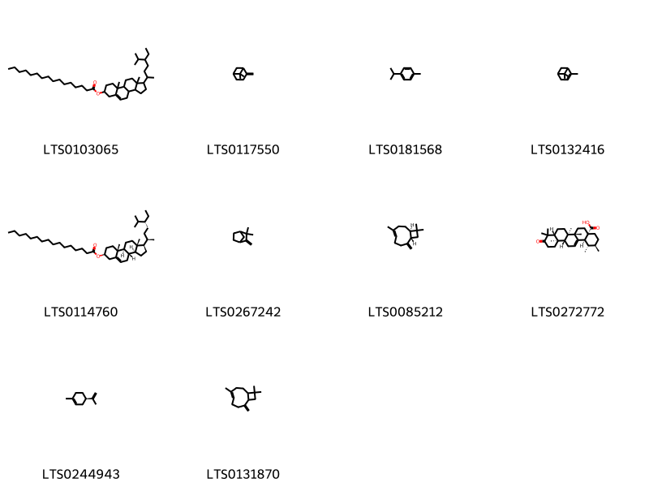{ width=100% }
    <figcaption>Hình ảnh cấu trúc hóa học của 10 hoạt chất thuộc nhóm Prenol lipids gồm ['1-(5-ethyl-6-methylheptan-2-yl)-9a,11a-dimethyl-1h,2h,3h,3ah,3bh,4h,6h,7h,8h,9h,9bh,10h,11h-cyclopenta[a]phenanthren-7-yl hexadecanoate (LTS0103065)', 'β-pinene (LTS0117550)', 'cymene (LTS0181568)', 'α pinene (LTS0132416)', 'β-sitosteryl palmitate (LTS0114760)', 'camphene (LTS0267242)', 'caryophyllene (LTS0085212)', '(1s,2r,4as,6as,6br,8ar,12ar,12br,14bs)-1,2,6a,6b,9,9,12a-heptamethyl-10-oxo-1,2,3,4,5,6,7,8,8a,11,12,12b,13,14b-tetradecahydropicene-4a-carboxylic acid (LTS0272772)', 'α-limonene (LTS0244943)', 'caryophyllene (LTS0131870)'].</figcaption>
</figure>
#### Nhóm Saturated hydrocarbons
<figure markdown="span">
    { width=100% }
    <figcaption>Hình ảnh cấu trúc hóa học của 2 hoạt chất thuộc nhóm Saturated hydrocarbons gồm ['tritriacontane (LTS0203319)', 'triacontane (LTS0250709)'].</figcaption>
</figure>
#### Nhóm Sphingolipids
<figure markdown="span">
    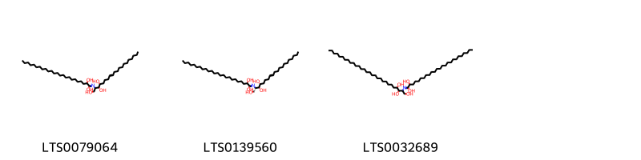{ width=100% }
    <figcaption>Hình ảnh cấu trúc hóa học của 3 hoạt chất thuộc nhóm Sphingolipids gồm ['2-hydroxy-n-(1,3,4-trihydroxyicos-8-en-2-yl)tetracosanimidic acid (LTS0079064)', '(2r)-2-hydroxy-n-[(2s,3s,4r,8e)-1,3,4-trihydroxyicos-8-en-2-yl]tetracosanimidic acid (LTS0139560)', '2-hydroxy-n-(1,3,4-trihydroxynonacosan-2-yl)pentacosanimidic acid (LTS0032689)'].</figcaption>
</figure>
#### Nhóm Steroids and steroid derivatives
<figure markdown="span">
    { width=100% }
    <figcaption>Hình ảnh cấu trúc hóa học của 3 hoạt chất thuộc nhóm Steroids and steroid derivatives gồm ['stigmast-5-en-3-ol (LTS0071224)', 'sitosterol (LTS0168132)', 'stigmast-5-en-3-ol, (3β)- (LTS0204616)'].</figcaption>
</figure>

---

### Dược dân tộc học

Danh sách các quốc gia có sử dụng *Piper betle* trong điều trị các bệnh. 

| Country   | Disease                          | Bệnh                                                                                                                                                                                                |
|:----------|:---------------------------------|:----------------------------------------------------------------------------------------------------------------------------------------------------------------------------------------------------|
| China     | Carminative                      | MYMEMORY WARNING: YOU USED ALL AVAILABLE FREE TRANSLATIONS FOR TODAY. NEXT AVAILABLE IN  08 HOURS 12 MINUTES 47 SECONDS VISIT HTTPS://MYMEMORY.TRANSLATED.NET/DOC/USAGELIMITS.PHP TO TRANSLATE MORE |
| Elsewhere | Expectorant, Stomachic           | MYMEMORY WARNING: YOU USED ALL AVAILABLE FREE TRANSLATIONS FOR TODAY. NEXT AVAILABLE IN  08 HOURS 12 MINUTES 45 SECONDS VISIT HTTPS://MYMEMORY.TRANSLATED.NET/DOC/USAGELIMITS.PHP TO TRANSLATE MORE |
| Java      | Antiseptic, Lactafuge, Stimulant | MYMEMORY WARNING: YOU USED ALL AVAILABLE FREE TRANSLATIONS FOR TODAY. NEXT AVAILABLE IN  08 HOURS 12 MINUTES 42 SECONDS VISIT HTTPS://MYMEMORY.TRANSLATED.NET/DOC/USAGELIMITS.PHP TO TRANSLATE MORE |

---

---
## Piper borbonesnse
### Thông tin về thực vật

!!! info "Phân loại thực vật của *Piper borbonense* từ GIBF:"
    - **Kingdom:** Plantae
    - **Phylum:** Tracheophyta
    - **Order:** Piperales
    - **Family:** Piperaceae
    - **Genus:** Piper
    - **Species:** *Piper borbonense*

 

| Label (VI)   | Label (EN)   | Scientific Name   | Descriptions (VI)   | Descriptions (EN)                               | Also Known As (VI)                  | Also Known As (EN)   |
|:-------------|:-------------|:------------------|:--------------------|:------------------------------------------------|:------------------------------------|:---------------------|
| N/A          | N/A          | Piper betle       | loài thực vật       | mild stimulant, similar to caffeine or nicotine | ['Trầu', 'Piper betle', 'P. betle'] | ['betel']            |

#### Phân bố trên thế giới

**Từ CSDL GIBF** Mauritius, Réunion, Madagascar

#### Phân bố tại Việt Nam

**Từ CSDL GIBF**: Không có ghi nhận ở Việt Nam

---
### Thành phần hóa học
        
- Theo cơ sở dữ liệu lotus: Từ loài *Piper borbonense* đã phân lập và xác định được Chưa có hoạt chất nào được phân lập. hoạt chất thuộc về các nhóm Không có hoạt chất nào được phân lập. 

Không có hình ảnh nào được tạo ra

---

### Dược dân tộc học

Danh sách các quốc gia có sử dụng *Piper borbonense* trong điều trị các bệnh. 

| Country   | Disease                                                   | Bệnh                                                                                                                                                                                                |
|:----------|:----------------------------------------------------------|:----------------------------------------------------------------------------------------------------------------------------------------------------------------------------------------------------|
| Bourbon   | Antiseptic, Carminative, Expectorant, Stimulant, Diuretic | MYMEMORY WARNING: YOU USED ALL AVAILABLE FREE TRANSLATIONS FOR TODAY. NEXT AVAILABLE IN  08 HOURS 12 MINUTES 13 SECONDS VISIT HTTPS://MYMEMORY.TRANSLATED.NET/DOC/USAGELIMITS.PHP TO TRANSLATE MORE |

---

---
## Piper clusii
### Thông tin về thực vật

!!! info "Phân loại thực vật của *Piper guineense* từ GIBF:"
    - **Kingdom:** Plantae
    - **Phylum:** Tracheophyta
    - **Order:** Piperales
    - **Family:** Piperaceae
    - **Genus:** Piper
    - **Species:** *Piper guineense*

 

| Label (VI)   | Label (EN)   | Scientific Name   | Descriptions (VI)   | Descriptions (EN)   | Also Known As (VI)   | Also Known As (EN)   |
|:-------------|:-------------|:------------------|:--------------------|:--------------------|:---------------------|:---------------------|
| N/A          | N/A          | Piper clusii      |                     | species of plant    | ['']                 | ['']                 |

#### Phân bố trên thế giới

**Từ CSDL GIBF** nan, Congo, Democratic Republic of the, Kenya, Equatorial Guinea, South Africa, Sierra Leone, Madagascar, Guinea, Malawi

#### Phân bố tại Việt Nam

**Từ CSDL GIBF**: Không có ghi nhận ở Việt Nam

---
### Thành phần hóa học
        
- Theo cơ sở dữ liệu lotus: Từ loài *Piper guineense* đã phân lập và xác định được Chưa có hoạt chất nào được phân lập. hoạt chất thuộc về các nhóm Không có hoạt chất nào được phân lập. 

Không có hình ảnh nào được tạo ra

---

### Dược dân tộc học

Danh sách các quốc gia có sử dụng *Piper guineense* trong điều trị các bệnh. 

| Country   | Disease                                                   | Bệnh                                                                                                                                                                                                |
|:----------|:----------------------------------------------------------|:----------------------------------------------------------------------------------------------------------------------------------------------------------------------------------------------------|
| Africa    | Antiseptic, Diuretic, Stimulant, Carminative, Expectorant | MYMEMORY WARNING: YOU USED ALL AVAILABLE FREE TRANSLATIONS FOR TODAY. NEXT AVAILABLE IN  08 HOURS 11 MINUTES 51 SECONDS VISIT HTTPS://MYMEMORY.TRANSLATED.NET/DOC/USAGELIMITS.PHP TO TRANSLATE MORE |

---

---
## Piper cubeba
### Thông tin về thực vật

!!! info "Phân loại thực vật của *Piper cubeba* từ GIBF:"
    - **Kingdom:** Plantae
    - **Phylum:** Tracheophyta
    - **Order:** Piperales
    - **Family:** Piperaceae
    - **Genus:** Piper
    - **Species:** *Piper cubeba*

 

| Label (VI)   | Label (EN)   | Scientific Name   | Descriptions (VI)   | Descriptions (EN)   | Also Known As (VI)                | Also Known As (EN)   |
|:-------------|:-------------|:------------------|:--------------------|:--------------------|:----------------------------------|:---------------------|
| N/A          | N/A          | Piper cubeba      | loài thực vật       | species of plant    | ['Piper cubeba', 'Hồ tiêu thuốc'] | ['Cubeb']            |

#### Phân bố trên thế giới

**Từ CSDL GIBF** nan, Brazil, Viet Nam, Japan, Nepal, China, Guinea, Sri Lanka, United States of America, Jamaica, Indonesia, unknown or invalid, Ethiopia, Malaysia, Mauritius, Iraq, Canada, Egypt, Singapore, India, France, Guyana

#### Phân bố tại Việt Nam

**Từ CSDL GIBF**: Không có ghi nhận ở Việt Nam

---
### Thành phần hóa học
        
- Theo cơ sở dữ liệu lotus: Từ loài *Piper cubeba* đã phân lập và xác định được 99 hoạt chất thuộc về các nhóm Dihydrofurans, Cyclobutane lignans, Benzene and substituted derivatives, Linear 1,3-diarylpropanoids, Dibenzylbutane lignans, Flavonoids, Benzodioxoles, Pyrrolidines, Kavalactones, Carboxylic acids and derivatives, Phenol ethers, Furanoid lignans, Phenol esters, Prenol lipids, Diarylheptanoids. 

|    | chemicalTaxonomyClassyfireClass     |   smiles_count |
|---:|:------------------------------------|---------------:|
|  0 |                                     |              6 |
|  1 | Benzene and substituted derivatives |             13 |
|  2 | Benzodioxoles                       |              1 |
|  3 | Carboxylic acids and derivatives    |              2 |
|  4 | Cyclobutane lignans                 |              4 |
|  5 | Diarylheptanoids                    |              2 |
|  6 | Dibenzylbutane lignans              |              8 |
|  7 | Dihydrofurans                       |              2 |
|  8 | Flavonoids                          |              5 |
|  9 | Furanoid lignans                    |             43 |
| 10 | Kavalactones                        |              2 |
| 11 | Linear 1,3-diarylpropanoids         |              2 |
| 12 | Phenol esters                       |              2 |
| 13 | Phenol ethers                       |              3 |
| 14 | Prenol lipids                       |              2 |
| 15 | Pyrrolidines                        |              1 |

#### Nhóm 
<figure markdown="span">
    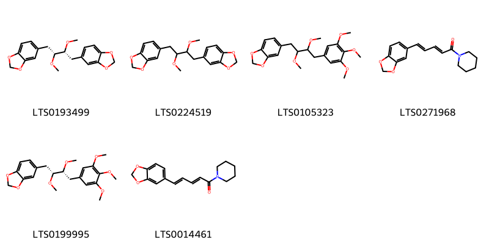{ width=100% }
    <figcaption>Hình ảnh cấu trúc hóa học của 6 hoạt chất thuộc nhóm  gồm ['5-[(2r,3r)-4-(2h-1,3-benzodioxol-5-yl)-2,3-dimethoxybutyl]-2h-1,3-benzodioxole (LTS0193499)', '5-[4-(2h-1,3-benzodioxol-5-yl)-2,3-dimethoxybutyl]-2h-1,3-benzodioxole (LTS0224519)', '5-[2,3-dimethoxy-4-(3,4,5-trimethoxyphenyl)butyl]-2h-1,3-benzodioxole (LTS0105323)', '5-(2h-1,3-benzodioxol-5-yl)-1-(piperidin-1-yl)penta-2,4-dien-1-one (LTS0271968)', '5-[(2r,3r)-2,3-dimethoxy-4-(3,4,5-trimethoxyphenyl)butyl]-2h-1,3-benzodioxole (LTS0199995)', 'piperine (LTS0014461)'].</figcaption>
</figure>
#### Nhóm Benzene and substituted derivatives
<figure markdown="span">
    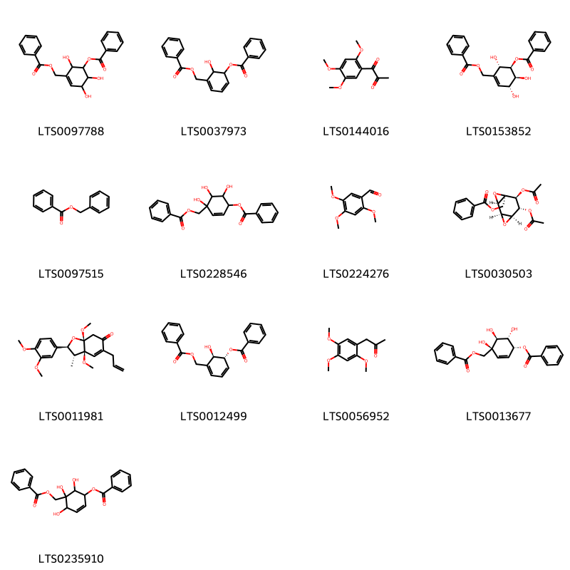{ width=100% }
    <figcaption>Hình ảnh cấu trúc hóa học của 13 hoạt chất thuộc nhóm Benzene and substituted derivatives gồm ['3-[(benzoyloxy)methyl]-2,5,6-trihydroxycyclohex-3-en-1-yl benzoate (LTS0097788)', '5-[(benzoyloxy)methyl]-6-hydroxycyclohexa-2,4-dien-1-yl benzoate (LTS0037973)', '1-(2,4,5-trimethoxyphenyl)propane-1,2-dione (LTS0144016)', '(1r,2s,5r,6s)-3-[(benzoyloxy)methyl]-2,5,6-trihydroxycyclohex-3-en-1-yl benzoate (LTS0153852)', 'benzyl benzoate (LTS0097515)', '4-[(benzoyloxy)methyl]-4,5,6-trihydroxycyclohex-2-en-1-yl benzoate (LTS0228546)', '2,4,5-trimethoxybenzaldehyde (LTS0224276)', '[(1r,2r,4r,5s,6r,7s)-5,6-bis(acetyloxy)-3,8-dioxatricyclo[5.1.0.0²,⁴]octan-4-yl]methyl benzoate (LTS0030503)', '(2s,3r,3as,7ar)-2-(3,4-dimethoxyphenyl)-3a,7a-dimethoxy-3-methyl-5-(prop-2-en-1-yl)-3,7-dihydro-2h-1-benzofuran-6-one (LTS0011981)', '(1r,6r)-5-[(benzoyloxy)methyl]-6-hydroxycyclohexa-2,4-dien-1-yl benzoate (LTS0012499)', '1-(2,4,5-trimethoxyphenyl)propan-2-one (LTS0056952)', '(1r,4s,5s,6s)-4-[(benzoyloxy)methyl]-4,5,6-trihydroxycyclohex-2-en-1-yl benzoate (LTS0013677)', '5-[(benzoyloxy)methyl]-4,5,6-trihydroxycyclohex-2-en-1-yl benzoate (LTS0235910)'].</figcaption>
</figure>
#### Nhóm Benzodioxoles
<figure markdown="span">
    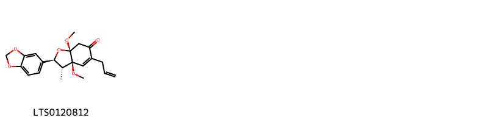{ width=100% }
    <figcaption>Hình ảnh cấu trúc hóa học của 1 hoạt chất thuộc nhóm Benzodioxoles gồm ['kadsurin a (LTS0120812)'].</figcaption>
</figure>
#### Nhóm Carboxylic acids and derivatives
<figure markdown="span">
    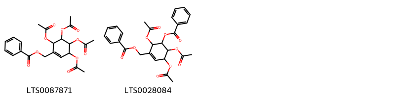{ width=100% }
    <figcaption>Hình ảnh cấu trúc hóa học của 2 hoạt chất thuộc nhóm Carboxylic acids and derivatives gồm ['[3,4,5,6-tetrakis(acetyloxy)cyclohex-1-en-1-yl]methyl benzoate (LTS0087871)', '[3,4,6-tris(acetyloxy)-5-(benzoyloxy)cyclohex-1-en-1-yl]methyl benzoate (LTS0028084)'].</figcaption>
</figure>
#### Nhóm Cyclobutane lignans
<figure markdown="span">
    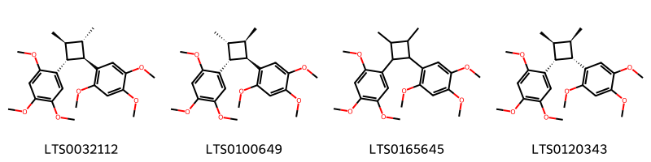{ width=100% }
    <figcaption>Hình ảnh cấu trúc hóa học của 4 hoạt chất thuộc nhóm Cyclobutane lignans gồm ['1-[(1r,2s,3s,4r)-2,3-dimethyl-4-(2,4,5-trimethoxyphenyl)cyclobutyl]-2,4,5-trimethoxybenzene (LTS0032112)', 'magnosalin (LTS0100649)', '1-[2,3-dimethyl-4-(2,4,5-trimethoxyphenyl)cyclobutyl]-2,4,5-trimethoxybenzene (LTS0165645)', '1-[(1s,2r,3s,4r)-2,3-dimethyl-4-(2,4,5-trimethoxyphenyl)cyclobutyl]-2,4,5-trimethoxybenzene (LTS0120343)'].</figcaption>
</figure>
#### Nhóm Diarylheptanoids
<figure markdown="span">
    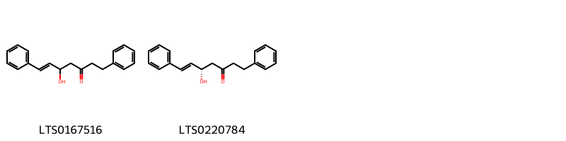{ width=100% }
    <figcaption>Hình ảnh cấu trúc hóa học của 2 hoạt chất thuộc nhóm Diarylheptanoids gồm ['5-hydroxy-1,7-diphenylhept-6-en-3-one (LTS0167516)', '(5s,6e)-5-hydroxy-1,7-diphenylhept-6-en-3-one (LTS0220784)'].</figcaption>
</figure>
#### Nhóm Dibenzylbutane lignans
<figure markdown="span">
    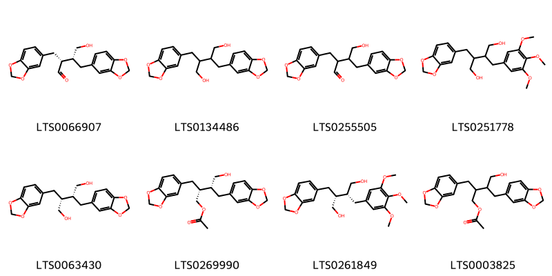{ width=100% }
    <figcaption>Hình ảnh cấu trúc hóa học của 8 hoạt chất thuộc nhóm Dibenzylbutane lignans gồm ['(2r,3r)-2,3-bis(2h-1,3-benzodioxol-5-ylmethyl)-4-hydroxybutanal (LTS0066907)', '2,3-bis(2h-1,3-benzodioxol-5-ylmethyl)butane-1,4-diol (LTS0134486)', '2,3-bis(2h-1,3-benzodioxol-5-ylmethyl)-4-hydroxybutanal (LTS0255505)', '2-(2h-1,3-benzodioxol-5-ylmethyl)-3-[(3,4,5-trimethoxyphenyl)methyl]butane-1,4-diol (LTS0251778)', 'dihydrocubebin (LTS0063430)', '(2r,3r)-2,3-bis(2h-1,3-benzodioxol-5-ylmethyl)-4-hydroxybutyl acetate (LTS0269990)', '(2r,3r)-2-(2h-1,3-benzodioxol-5-ylmethyl)-3-[(3,4,5-trimethoxyphenyl)methyl]butane-1,4-diol (LTS0261849)', '2,3-bis(2h-1,3-benzodioxol-5-ylmethyl)-4-hydroxybutyl acetate (LTS0003825)'].</figcaption>
</figure>
#### Nhóm Dihydrofurans
<figure markdown="span">
    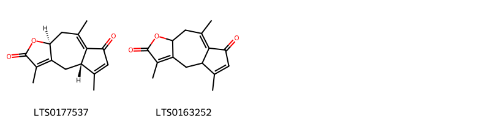{ width=100% }
    <figcaption>Hình ảnh cấu trúc hóa học của 2 hoạt chất thuộc nhóm Dihydrofurans gồm ['(4as,9as)-3,5,8-trimethyl-4h,4ah,9h,9ah-azuleno[6,5-b]furan-2,7-dione (LTS0177537)', '3,5,8-trimethyl-4h,4ah,9h,9ah-azuleno[6,5-b]furan-2,7-dione (LTS0163252)'].</figcaption>
</figure>
#### Nhóm Flavonoids
<figure markdown="span">
    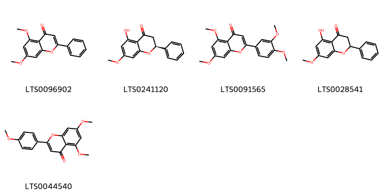{ width=100% }
    <figcaption>Hình ảnh cấu trúc hóa học của 5 hoạt chất thuộc nhóm Flavonoids gồm ['5,7-dimethoxyflavone (LTS0096902)', 'pinostrobin (LTS0241120)', '2-(3,4-dimethoxyphenyl)-5,7-dimethoxychromen-4-one (LTS0091565)', 'pinostrobin (LTS0028541)', 'apigenin trimethyl ether (LTS0044540)'].</figcaption>
</figure>
#### Nhóm Furanoid lignans
<figure markdown="span">
    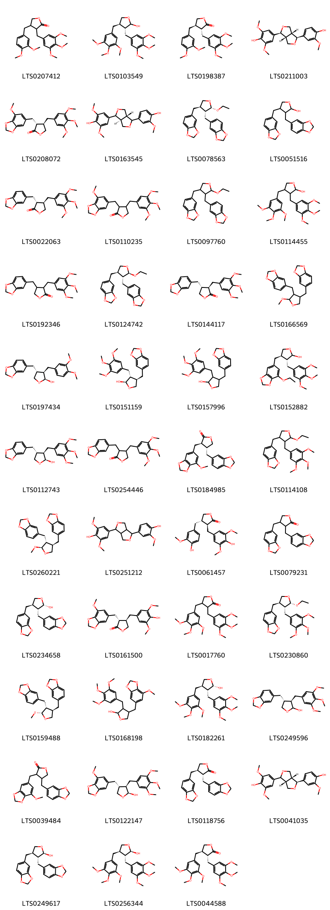{ width=100% }
    <figcaption>Hình ảnh cấu trúc hóa học của 43 hoạt chất thuộc nhóm Furanoid lignans gồm ['4-[(3,4-dimethoxyphenyl)methyl]-3-[(3,4,5-trimethoxyphenyl)methyl]oxolan-2-one (LTS0207412)', '(3r,4r)-3,4-bis[(3,4,5-trimethoxyphenyl)methyl]oxolan-2-ol (LTS0103549)', '(3r,4r)-4-[(3,4-dimethoxyphenyl)methyl]-3-[(3,4,5-trimethoxyphenyl)methyl]oxolan-2-one (LTS0198387)', '(-)-medioresinol (LTS0211003)', '(3r,4r)-3-[(7-methoxy-2h-1,3-benzodioxol-5-yl)methyl]-4-[(3,4,5-trimethoxyphenyl)methyl]oxolan-2-one (LTS0208072)', '4-[(3ar,6as)-4-(4-hydroxy-3-methoxyphenyl)-hexahydrofuro[3,4-c]furan-1-yl]-2,6-dimethoxyphenol (LTS0163545)', '5-{[(3r,4r,5s)-4-(2h-1,3-benzodioxol-5-ylmethyl)-5-ethoxyoxolan-3-yl]methyl}-2h-1,3-benzodioxole (LTS0078563)', '3,4-bis(2h-1,3-benzodioxol-5-ylmethyl)oxolan-2-ol (LTS0051516)', '(3r,4r)-3-(2h-1,3-benzodioxol-5-ylmethyl)-4-[(3,4,5-trimethoxyphenyl)methyl]oxolan-2-one (LTS0022063)', '3-[(7-methoxy-2h-1,3-benzodioxol-5-yl)methyl]-4-[(3,4,5-trimethoxyphenyl)methyl]oxolan-2-one (LTS0110235)', '5-{[4-(2h-1,3-benzodioxol-5-ylmethyl)-5-ethoxyoxolan-3-yl]methyl}-2h-1,3-benzodioxole (LTS0097760)', '3,4-bis[(3,4,5-trimethoxyphenyl)methyl]oxolan-2-ol (LTS0114455)', '4-(2h-1,3-benzodioxol-5-ylmethyl)-3-[(3,4,5-trimethoxyphenyl)methyl]oxolan-2-one (LTS0192346)', '5-{[(3r,4r,5r)-4-(2h-1,3-benzodioxol-5-ylmethyl)-5-ethoxyoxolan-3-yl]methyl}-2h-1,3-benzodioxole (LTS0124742)', 'yatein (LTS0144117)', '5-{[4-(2h-1,3-benzodioxol-5-ylmethyl)-5-methoxyoxolan-3-yl]methyl}-2h-1,3-benzodioxole (LTS0166569)', '(2s,3r,4r)-4-(2h-1,3-benzodioxol-5-ylmethyl)-3-[(3,4-dimethoxyphenyl)methyl]oxolan-2-ol (LTS0197434)', '(2r,3r,4r)-4-(2h-1,3-benzodioxol-5-ylmethyl)-3-[(3,4,5-trimethoxyphenyl)methyl]oxolan-2-ol (LTS0151159)', '4-(2h-1,3-benzodioxol-5-ylmethyl)-3-[(3,4,5-trimethoxyphenyl)methyl]oxolan-2-ol (LTS0157996)', '(3r,4r)-4-[(7-ethoxy-2h-1,3-benzodioxol-5-yl)methyl]-3-[(3,4,5-trimethoxyphenyl)methyl]oxolan-2-ol (LTS0152882)', '(2s,3r,4r)-4-(2h-1,3-benzodioxol-5-ylmethyl)-3-[(3,4,5-trimethoxyphenyl)methyl]oxolan-2-ol (LTS0112743)', '3-(2h-1,3-benzodioxol-5-ylmethyl)-4-[(3,4,5-trimethoxyphenyl)methyl]oxolan-2-one (LTS0254446)', '(3r,4r)-4-(2h-1,3-benzodioxol-5-ylmethyl)-3-[(7-methoxy-2h-1,3-benzodioxol-5-yl)methyl]oxolan-2-one (LTS0184985)', '5-({5-ethoxy-4-[(3,4,5-trimethoxyphenyl)methyl]oxolan-3-yl}methyl)-2h-1,3-benzodioxole (LTS0114108)', '5-{[(3r,4r,5r)-4-(2h-1,3-benzodioxol-5-ylmethyl)-5-methoxyoxolan-3-yl]methyl}-2h-1,3-benzodioxole (LTS0260221)', '4-[4-(4-hydroxy-3-methoxyphenyl)-hexahydrofuro[3,4-c]furan-1-yl]-2,6-dimethoxyphenol (LTS0251212)', 'thujaplicatin methyl ether (LTS0061457)', '3,4-bis(2h-1,3-benzodioxol-5-ylmethyl)oxolan-2-one (LTS0079231)', 'cubebin (LTS0234658)', '(3r,4r)-4-[(4-hydroxy-3,5-dimethoxyphenyl)methyl]-3-[(7-methoxy-2h-1,3-benzodioxol-5-yl)methyl]oxolan-2-one (LTS0161500)', '3,4-bis[(3,4,5-trimethoxyphenyl)methyl]oxolan-2-one (LTS0017760)', '5-{[(3r,4r,5s)-5-ethoxy-4-[(3,4,5-trimethoxyphenyl)methyl]oxolan-3-yl]methyl}-2h-1,3-benzodioxole (LTS0230860)', '5-{[(3r,4r,5s)-4-(2h-1,3-benzodioxol-5-ylmethyl)-5-methoxyoxolan-3-yl]methyl}-2h-1,3-benzodioxole (LTS0159488)', '4-[(7-methoxy-2h-1,3-benzodioxol-5-yl)methyl]-3-[(3,4,5-trimethoxyphenyl)methyl]oxolan-2-ol (LTS0168198)', '(2s,3r,4r)-3,4-bis[(3,4,5-trimethoxyphenyl)methyl]oxolan-2-ol (LTS0182261)', '(3r,4r)-4-(2h-1,3-benzodioxol-5-ylmethyl)-3-[(3,4,5-trimethoxyphenyl)methyl]oxolan-2-ol (LTS0249596)', '4-(2h-1,3-benzodioxol-5-ylmethyl)-3-[(7-methoxy-2h-1,3-benzodioxol-5-yl)methyl]oxolan-2-one (LTS0039484)', '(2s,3r,4r)-4-[(7-methoxy-2h-1,3-benzodioxol-5-yl)methyl]-3-[(3,4,5-trimethoxyphenyl)methyl]oxolan-2-ol (LTS0122147)', 'hinokinin (LTS0118756)', '4-[(3ar,4s,6ar)-4-(4-hydroxy-3-methoxyphenyl)-hexahydrofuro[3,4-c]furan-1-yl]-2,6-dimethoxyphenol (LTS0041035)', 'α-cubebin (LTS0249617)', '(2r,3r,4r)-3,4-bis[(3,4,5-trimethoxyphenyl)methyl]oxolan-2-ol (LTS0256344)', '(3r,4r)-3,4-bis[(3,4,5-trimethoxyphenyl)methyl]oxolan-2-one (LTS0044588)'].</figcaption>
</figure>
#### Nhóm Kavalactones
<figure markdown="span">
    { width=100% }
    <figcaption>Hình ảnh cấu trúc hóa học của 2 hoạt chất thuộc nhóm Kavalactones gồm ['5,6-dehydrokawain (LTS0123788)', 'desmethoxyyangonin (LTS0009498)'].</figcaption>
</figure>
#### Nhóm Linear 1_3-diarylpropanoids
<figure markdown="span">
    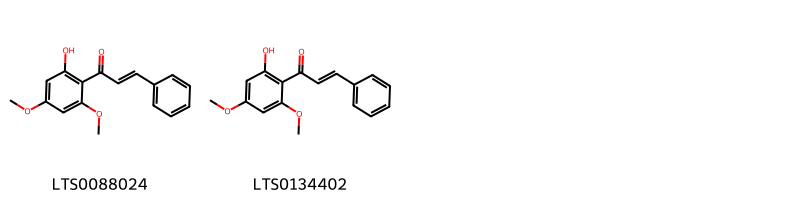{ width=100% }
    <figcaption>Hình ảnh cấu trúc hóa học của Không tìm thấy chú thích hoạt chất thuộc nhóm Linear 1_3-diarylpropanoids gồm Không tìm thấy chú thích.</figcaption>
</figure>
#### Nhóm Phenol esters
<figure markdown="span">
    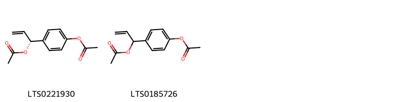{ width=100% }
    <figcaption>Hình ảnh cấu trúc hóa học của 2 hoạt chất thuộc nhóm Phenol esters gồm ["(+)-1'-acetoxychavicol acetate (LTS0221930)", '1-[4-(acetyloxy)phenyl]prop-2-en-1-yl acetate (LTS0185726)'].</figcaption>
</figure>
#### Nhóm Phenol ethers
<figure markdown="span">
    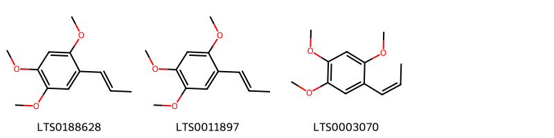{ width=100% }
    <figcaption>Hình ảnh cấu trúc hóa học của 3 hoạt chất thuộc nhóm Phenol ethers gồm ['cis-asarone (LTS0188628)', '1,2,4-trimethoxy-5-(prop-1-en-1-yl)benzene (LTS0011897)', 'β-asarone (LTS0003070)'].</figcaption>
</figure>
#### Nhóm Prenol lipids
<figure markdown="span">
    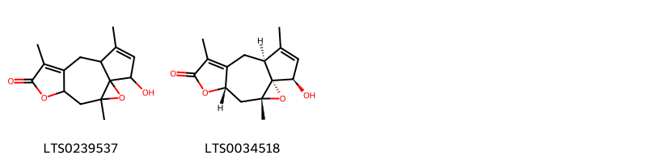{ width=100% }
    <figcaption>Hình ảnh cấu trúc hóa học của 2 hoạt chất thuộc nhóm Prenol lipids gồm ['14-hydroxy-3,8,12-trimethyl-2,6-dioxatetracyclo[9.3.0.0¹,³.0⁵,⁹]tetradeca-8,12-dien-7-one (LTS0239537)', '(1r,3r,5s,11s,14r)-14-hydroxy-3,8,12-trimethyl-2,6-dioxatetracyclo[9.3.0.0¹,³.0⁵,⁹]tetradeca-8,12-dien-7-one (LTS0034518)'].</figcaption>
</figure>
#### Nhóm Pyrrolidines
<figure markdown="span">
    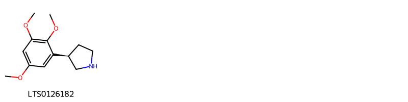{ width=100% }
    <figcaption>Hình ảnh cấu trúc hóa học của 1 hoạt chất thuộc nhóm Pyrrolidines gồm ['(3r)-3-(2,3,5-trimethoxyphenyl)pyrrolidine (LTS0126182)'].</figcaption>
</figure>

---

### Dược dân tộc học

Danh sách các quốc gia có sử dụng *Piper cubeba* trong điều trị các bệnh. 

| Country   | Disease                                                                       | Bệnh                                                                                                                                                                                                |
|:----------|:------------------------------------------------------------------------------|:----------------------------------------------------------------------------------------------------------------------------------------------------------------------------------------------------|
| China     | Antiseptic, Stomachic, Carminative                                            | MYMEMORY WARNING: YOU USED ALL AVAILABLE FREE TRANSLATIONS FOR TODAY. NEXT AVAILABLE IN  08 HOURS 11 MINUTES 34 SECONDS VISIT HTTPS://MYMEMORY.TRANSLATED.NET/DOC/USAGELIMITS.PHP TO TRANSLATE MORE |
| Egypt     | Antiseptic, Aphrodisiac, Carminative, Diuretic, Expectorant                   | MYMEMORY WARNING: YOU USED ALL AVAILABLE FREE TRANSLATIONS FOR TODAY. NEXT AVAILABLE IN  08 HOURS 11 MINUTES 31 SECONDS VISIT HTTPS://MYMEMORY.TRANSLATED.NET/DOC/USAGELIMITS.PHP TO TRANSLATE MORE |
| Elsewhere | Antiseptic, nan, Carminative, Expectorant, Sedative, nan, Stimulant, Diuretic | MYMEMORY WARNING: YOU USED ALL AVAILABLE FREE TRANSLATIONS FOR TODAY. NEXT AVAILABLE IN  08 HOURS 11 MINUTES 29 SECONDS VISIT HTTPS://MYMEMORY.TRANSLATED.NET/DOC/USAGELIMITS.PHP TO TRANSLATE MORE |
| Java      | Aphrodisiac, Diuretic, Stimulant                                              | MYMEMORY WARNING: YOU USED ALL AVAILABLE FREE TRANSLATIONS FOR TODAY. NEXT AVAILABLE IN  08 HOURS 11 MINUTES 27 SECONDS VISIT HTTPS://MYMEMORY.TRANSLATED.NET/DOC/USAGELIMITS.PHP TO TRANSLATE MORE |
| Malaya    | Carminative, Expectorant, Stimulant                                           | MYMEMORY WARNING: YOU USED ALL AVAILABLE FREE TRANSLATIONS FOR TODAY. NEXT AVAILABLE IN  08 HOURS 11 MINUTES 24 SECONDS VISIT HTTPS://MYMEMORY.TRANSLATED.NET/DOC/USAGELIMITS.PHP TO TRANSLATE MORE |
| Turkey    | Antiseptic, Carminative, Diuretic, Expectorant, Stimulant                     | MYMEMORY WARNING: YOU USED ALL AVAILABLE FREE TRANSLATIONS FOR TODAY. NEXT AVAILABLE IN  08 HOURS 11 MINUTES 22 SECONDS VISIT HTTPS://MYMEMORY.TRANSLATED.NET/DOC/USAGELIMITS.PHP TO TRANSLATE MORE |

---

---
## Piper darienense
### Thông tin về thực vật

!!! info "Phân loại thực vật của *Piper darienense* từ GIBF:"
    - **Kingdom:** Plantae
    - **Phylum:** Tracheophyta
    - **Order:** Piperales
    - **Family:** Piperaceae
    - **Genus:** Piper
    - **Species:** *Piper darienense*

 

| Label (VI)   | Label (EN)   | Scientific Name   | Descriptions (VI)   | Descriptions (EN)   | Also Known As (VI)   | Also Known As (EN)   |
|:-------------|:-------------|:------------------|:--------------------|:--------------------|:---------------------|:---------------------|
| N/A          | N/A          | Piper darienense  | loài thực vật       | species of plant    | ['']                 | ['']                 |

#### Phân bố trên thế giới

**Từ CSDL GIBF** Nicaragua, Venezuela (Bolivarian Republic of), Costa Rica, Colombia, Ecuador, Peru, Panama, Bolivia (Plurinational State of)

#### Phân bố tại Việt Nam

**Từ CSDL GIBF**: Không có ghi nhận ở Việt Nam

---
### Thành phần hóa học
        
- Theo cơ sở dữ liệu lotus: Từ loài *Piper darienense* đã phân lập và xác định được Chưa có hoạt chất nào được phân lập. hoạt chất thuộc về các nhóm Không có hoạt chất nào được phân lập. 

Không có hình ảnh nào được tạo ra

---

### Dược dân tộc học

Danh sách các quốc gia có sử dụng *Piper darienense* trong điều trị các bệnh. 

| Country       | Disease   | Bệnh                                                                                                                                                                                                |
|:--------------|:----------|:----------------------------------------------------------------------------------------------------------------------------------------------------------------------------------------------------|
| Elsewhere     | Piscicide | MYMEMORY WARNING: YOU USED ALL AVAILABLE FREE TRANSLATIONS FOR TODAY. NEXT AVAILABLE IN  08 HOURS 10 MINUTES 56 SECONDS VISIT HTTPS://MYMEMORY.TRANSLATED.NET/DOC/USAGELIMITS.PHP TO TRANSLATE MORE |
| Panama(Choco) | Piscicide | MYMEMORY WARNING: YOU USED ALL AVAILABLE FREE TRANSLATIONS FOR TODAY. NEXT AVAILABLE IN  08 HOURS 10 MINUTES 54 SECONDS VISIT HTTPS://MYMEMORY.TRANSLATED.NET/DOC/USAGELIMITS.PHP TO TRANSLATE MORE |

---

---
## Piper darienensis
### Thông tin về thực vật

!!! info "Phân loại thực vật của *Piper darienense* từ GIBF:"
    - **Kingdom:** Plantae
    - **Phylum:** Tracheophyta
    - **Order:** Piperales
    - **Family:** Piperaceae
    - **Genus:** Piper
    - **Species:** *Piper darienense*

 

| Label (VI)   | Label (EN)   | Scientific Name   | Descriptions (VI)   | Descriptions (EN)   | Also Known As (VI)   | Also Known As (EN)   |
|:-------------|:-------------|:------------------|:--------------------|:--------------------|:---------------------|:---------------------|
| N/A          | N/A          | Piper darienense  | loài thực vật       | species of plant    | ['']                 | ['']                 |

#### Phân bố trên thế giới

**Từ CSDL GIBF** Nicaragua, Venezuela (Bolivarian Republic of), Costa Rica, Colombia, Ecuador, Peru, Panama, Bolivia (Plurinational State of)

#### Phân bố tại Việt Nam

**Từ CSDL GIBF**: Không có ghi nhận ở Việt Nam

---
### Thành phần hóa học
        
- Theo cơ sở dữ liệu lotus: Từ loài *Piper darienense* đã phân lập và xác định được Chưa có hoạt chất nào được phân lập. hoạt chất thuộc về các nhóm Không có hoạt chất nào được phân lập. 

Không có hình ảnh nào được tạo ra

---

### Dược dân tộc học

Danh sách các quốc gia có sử dụng *Piper darienense* trong điều trị các bệnh. 

| Country   | Disease   | Bệnh                                                                                                                                                                                                |
|:----------|:----------|:----------------------------------------------------------------------------------------------------------------------------------------------------------------------------------------------------|
| Panama    | Piscicide | MYMEMORY WARNING: YOU USED ALL AVAILABLE FREE TRANSLATIONS FOR TODAY. NEXT AVAILABLE IN  08 HOURS 10 MINUTES 33 SECONDS VISIT HTTPS://MYMEMORY.TRANSLATED.NET/DOC/USAGELIMITS.PHP TO TRANSLATE MORE |

---

---
## Piper elongatum
### Thông tin về thực vật

!!! info "Phân loại thực vật của *Piper elongatum* từ GIBF:"
    - **Kingdom:** Plantae
    - **Phylum:** Tracheophyta
    - **Order:** Piperales
    - **Family:** Piperaceae
    - **Genus:** Piper
    - **Species:** *Piper elongatum*

 

| Label (VI)   | Label (EN)   | Scientific Name   | Descriptions (VI)   | Descriptions (EN)   | Also Known As (VI)   | Also Known As (EN)   |
|:-------------|:-------------|:------------------|:--------------------|:--------------------|:---------------------|:---------------------|
| N/A          | N/A          | Piper darienense  | loài thực vật       | species of plant    | ['']                 | ['']                 |

#### Phân bố trên thế giới

**Từ CSDL GIBF** Brazil, United States of America, Argentina, Peru, Ecuador, Bolivia (Plurinational State of)

#### Phân bố tại Việt Nam

**Từ CSDL GIBF**: Không có ghi nhận ở Việt Nam

---
### Thành phần hóa học
        
- Theo cơ sở dữ liệu lotus: Từ loài *Piper elongatum* đã phân lập và xác định được Chưa có hoạt chất nào được phân lập. hoạt chất thuộc về các nhóm Không có hoạt chất nào được phân lập. 

Không có hình ảnh nào được tạo ra

---

### Dược dân tộc học

Danh sách các quốc gia có sử dụng *Piper elongatum* trong điều trị các bệnh. 

| Country       | Disease   | Bệnh                                                                                                                                                                                                |
|:--------------|:----------|:----------------------------------------------------------------------------------------------------------------------------------------------------------------------------------------------------|
| Panama(Choco) | Stimulant | MYMEMORY WARNING: YOU USED ALL AVAILABLE FREE TRANSLATIONS FOR TODAY. NEXT AVAILABLE IN  08 HOURS 10 MINUTES 12 SECONDS VISIT HTTPS://MYMEMORY.TRANSLATED.NET/DOC/USAGELIMITS.PHP TO TRANSLATE MORE |

---

---
## Piper excelsum
### Thông tin về thực vật

!!! info "Phân loại thực vật của *Macropiper excelsum* từ GIBF:"
    - **Kingdom:** Plantae
    - **Phylum:** Tracheophyta
    - **Order:** Piperales
    - **Family:** Piperaceae
    - **Genus:** Macropiper
    - **Species:** *Macropiper excelsum*

 

| Label (VI)   | Label (EN)   | Scientific Name   | Descriptions (VI)   | Descriptions (EN)   | Also Known As (VI)   | Also Known As (EN)   |
|:-------------|:-------------|:------------------|:--------------------|:--------------------|:---------------------|:---------------------|
| N/A          | N/A          | Piper excelsum    | loài thực vật       | species of plant    | ['']                 | ['']                 |

#### Phân bố trên thế giới

**Từ CSDL GIBF** nan, New Zealand

#### Phân bố tại Việt Nam

**Từ CSDL GIBF**: Không có ghi nhận ở Việt Nam

---
### Thành phần hóa học
        
- Theo cơ sở dữ liệu lotus: Từ loài *Macropiper excelsum* đã phân lập và xác định được 1 hoạt chất thuộc về các nhóm Benzodioxoles. 

|    | chemicalTaxonomyClassyfireClass   |   smiles_count |
|---:|:----------------------------------|---------------:|
|  0 | Benzodioxoles                     |              1 |

#### Nhóm Benzodioxoles
<figure markdown="span">
    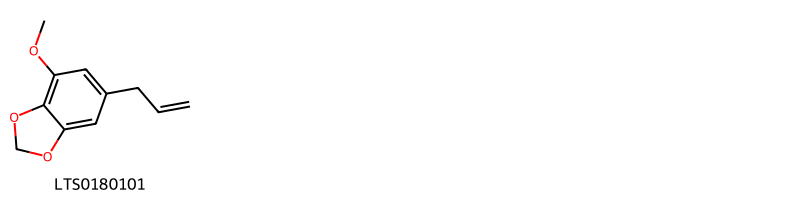{ width=100% }
    <figcaption>Hình ảnh cấu trúc hóa học của 1 hoạt chất thuộc nhóm Benzodioxoles gồm ['myristicin (LTS0180101)'].</figcaption>
</figure>

---

### Dược dân tộc học

Danh sách các quốc gia có sử dụng *Macropiper excelsum* trong điều trị các bệnh. 

| Country     | Disease                           | Bệnh                                                                                                                                                                                                |
|:------------|:----------------------------------|:----------------------------------------------------------------------------------------------------------------------------------------------------------------------------------------------------|
| New Zealand | Aphrodisiac, Sialogogue, Diuretic | MYMEMORY WARNING: YOU USED ALL AVAILABLE FREE TRANSLATIONS FOR TODAY. NEXT AVAILABLE IN  08 HOURS 09 MINUTES 50 SECONDS VISIT HTTPS://MYMEMORY.TRANSLATED.NET/DOC/USAGELIMITS.PHP TO TRANSLATE MORE |

---

---
## Piper exorcista
### Thông tin về thực vật

!!! info "Phân loại thực vật của *N/A* từ GIBF:"
    - **Kingdom:** Plantae
    - **Phylum:** Tracheophyta
    - **Order:** Piperales
    - **Family:** Piperaceae
    - **Genus:** Piper
    - **Species:** *N/A*

 

| Label (VI)   | Label (EN)   | Scientific Name   | Descriptions (VI)   | Descriptions (EN)   | Also Known As (VI)   | Also Known As (EN)   |
|:-------------|:-------------|:------------------|:--------------------|:--------------------|:---------------------|:---------------------|
| N/A          | N/A          | Piper excelsum    | loài thực vật       | species of plant    | ['']                 | ['']                 |

#### Phân bố trên thế giới

**Từ CSDL GIBF** Brazil, Guatemala, Uganda, Japan, New Caledonia, China, Ecuador, Thailand, Puerto Rico, Sri Lanka, United States of America, Jamaica, Indonesia, Costa Rica, Dominican Republic, Colombia, Argentina, French Guiana, Mexico, Kenya, Rwanda, El Salvador, Chinese Taipei, Malaysia, Haiti, Gabon, Panama, Nicaragua, Singapore, Cambodia, Australia, India, Peru

#### Phân bố tại Việt Nam

**Từ CSDL GIBF**: Không có ghi nhận ở Việt Nam

---
### Thành phần hóa học
        
- Theo cơ sở dữ liệu lotus: Từ loài *N/A* đã phân lập và xác định được Chưa có hoạt chất nào được phân lập. hoạt chất thuộc về các nhóm Không có hoạt chất nào được phân lập. 

Không có hình ảnh nào được tạo ra

---

### Dược dân tộc học

Danh sách các quốc gia có sử dụng *N/A* trong điều trị các bệnh. 

| Country   | Disease   | Bệnh                                                                                                                                                                                                |
|:----------|:----------|:----------------------------------------------------------------------------------------------------------------------------------------------------------------------------------------------------|
| Solomon I | Antidote  | MYMEMORY WARNING: YOU USED ALL AVAILABLE FREE TRANSLATIONS FOR TODAY. NEXT AVAILABLE IN  08 HOURS 09 MINUTES 26 SECONDS VISIT HTTPS://MYMEMORY.TRANSLATED.NET/DOC/USAGELIMITS.PHP TO TRANSLATE MORE |

---

---
## Piper forstenii
### Thông tin về thực vật

!!! info "Phân loại thực vật của *Piper forstenii* từ GIBF:"
    - **Kingdom:** Plantae
    - **Phylum:** Tracheophyta
    - **Order:** Piperales
    - **Family:** Piperaceae
    - **Genus:** Piper
    - **Species:** *Piper forstenii*

 

| Label (VI)   | Label (EN)   | Scientific Name   | Descriptions (VI)   | Descriptions (EN)   | Also Known As (VI)   | Also Known As (EN)   |
|:-------------|:-------------|:------------------|:--------------------|:--------------------|:---------------------|:---------------------|
| N/A          | N/A          | Piper forstenii   | loài thực vật       | species of plant    | ['']                 | ['']                 |

#### Phân bố trên thế giới

**Từ CSDL GIBF** nan, Indonesia, Philippines

#### Phân bố tại Việt Nam

**Từ CSDL GIBF**: Không có ghi nhận ở Việt Nam

---
### Thành phần hóa học
        
- Theo cơ sở dữ liệu lotus: Từ loài *Piper forstenii* đã phân lập và xác định được Chưa có hoạt chất nào được phân lập. hoạt chất thuộc về các nhóm Không có hoạt chất nào được phân lập. 

Không có hình ảnh nào được tạo ra

---

### Dược dân tộc học

Danh sách các quốc gia có sử dụng *Piper forstenii* trong điều trị các bệnh. 

| Country   | Disease     | Bệnh                                                                                                                                                                                                |
|:----------|:------------|:----------------------------------------------------------------------------------------------------------------------------------------------------------------------------------------------------|
| Java      | Rubefacient | MYMEMORY WARNING: YOU USED ALL AVAILABLE FREE TRANSLATIONS FOR TODAY. NEXT AVAILABLE IN  08 HOURS 09 MINUTES 03 SECONDS VISIT HTTPS://MYMEMORY.TRANSLATED.NET/DOC/USAGELIMITS.PHP TO TRANSLATE MORE |

---

---
## Piper fragile
### Thông tin về thực vật

!!! info "Phân loại thực vật của *Piper fragile* từ GIBF:"
    - **Kingdom:** Plantae
    - **Phylum:** Tracheophyta
    - **Order:** Piperales
    - **Family:** Piperaceae
    - **Genus:** Piper
    - **Species:** *Piper fragile*

 

| Label (VI)   | Label (EN)   | Scientific Name   | Descriptions (VI)   | Descriptions (EN)   | Also Known As (VI)   | Also Known As (EN)   |
|:-------------|:-------------|:------------------|:--------------------|:--------------------|:---------------------|:---------------------|
| N/A          | N/A          | Piper fragile     | loài thực vật       | species of plant    | ['']                 | ['']                 |

#### Phân bố trên thế giới

**Từ CSDL GIBF** nan, Indonesia, Philippines, Malaysia, Palau, Micronesia (Federated States of), Solomon Islands, unknown or invalid, Papua New Guinea

#### Phân bố tại Việt Nam

**Từ CSDL GIBF**: Không có ghi nhận ở Việt Nam

---
### Thành phần hóa học
        
- Theo cơ sở dữ liệu lotus: Từ loài *Piper fragile* đã phân lập và xác định được Chưa có hoạt chất nào được phân lập. hoạt chất thuộc về các nhóm Không có hoạt chất nào được phân lập. 

Không có hình ảnh nào được tạo ra

---

### Dược dân tộc học

Danh sách các quốc gia có sử dụng *Piper fragile* trong điều trị các bệnh. 

| Country   | Disease   | Bệnh                                                                                                                                                                                                |
|:----------|:----------|:----------------------------------------------------------------------------------------------------------------------------------------------------------------------------------------------------|
| Java      | Vermifuge | MYMEMORY WARNING: YOU USED ALL AVAILABLE FREE TRANSLATIONS FOR TODAY. NEXT AVAILABLE IN  08 HOURS 08 MINUTES 46 SECONDS VISIT HTTPS://MYMEMORY.TRANSLATED.NET/DOC/USAGELIMITS.PHP TO TRANSLATE MORE |

---

---
## Piper guineense
### Thông tin về thực vật

!!! info "Phân loại thực vật của *Piper guineense* từ GIBF:"
    - **Kingdom:** Plantae
    - **Phylum:** Tracheophyta
    - **Order:** Piperales
    - **Family:** Piperaceae
    - **Genus:** Piper
    - **Species:** *Piper guineense*

 

| Label (VI)   | Label (EN)   | Scientific Name   | Descriptions (VI)   | Descriptions (EN)   | Also Known As (VI)   | Also Known As (EN)   |
|:-------------|:-------------|:------------------|:--------------------|:--------------------|:---------------------|:---------------------|
| N/A          | N/A          | Piper guineense   | loài thực vật       | species of plant    | ['']                 | ['Piper guineense']  |

#### Phân bố trên thế giới

**Từ CSDL GIBF** nan, Uganda, Madagascar, Guinea, Ghana, Nigeria, Sao Tome and Principe, Togo, Equatorial Guinea, Benin, Congo, Democratic Republic of the, Kenya, Belgium, Gabon, Liberia, Côte d’Ivoire, Congo, Angola, Cameroon

#### Phân bố tại Việt Nam

**Từ CSDL GIBF**: Không có ghi nhận ở Việt Nam

---
### Thành phần hóa học
        
- Theo cơ sở dữ liệu lotus: Từ loài *Piper guineense* đã phân lập và xác định được 162 hoạt chất thuộc về các nhóm Fatty Acyls, Piperidines, Benzene and substituted derivatives, Unsaturated hydrocarbons, Dibenzylbutane lignans, Benzodioxoles, Pyrrolidines, Steroids and steroid derivatives, Phenols, Organooxygen compounds, Cinnamaldehydes, Furanoid lignans, Phenol ethers, Prenol lipids. 

|    | chemicalTaxonomyClassyfireClass     |   smiles_count |
|---:|:------------------------------------|---------------:|
|  0 |                                     |              5 |
|  1 | Benzene and substituted derivatives |              9 |
|  2 | Benzodioxoles                       |             31 |
|  3 | Cinnamaldehydes                     |              2 |
|  4 | Dibenzylbutane lignans              |              2 |
|  5 | Fatty Acyls                         |              8 |
|  6 | Furanoid lignans                    |             20 |
|  7 | Organooxygen compounds              |              1 |
|  8 | Phenol ethers                       |              2 |
|  9 | Phenols                             |              1 |
| 10 | Piperidines                         |              2 |
| 11 | Prenol lipids                       |             68 |
| 12 | Pyrrolidines                        |              4 |
| 13 | Steroids and steroid derivatives    |              6 |
| 14 | Unsaturated hydrocarbons            |              1 |

#### Nhóm 
<figure markdown="span">
    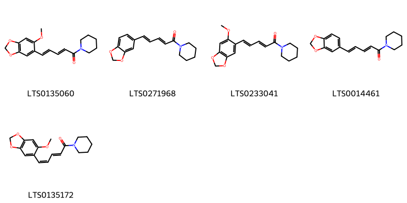{ width=100% }
    <figcaption>Hình ảnh cấu trúc hóa học của 5 hoạt chất thuộc nhóm  gồm ['(2e,4e)-5-(6-methoxy-2h-1,3-benzodioxol-5-yl)-1-(piperidin-1-yl)penta-2,4-dien-1-one (LTS0135060)', '5-(2h-1,3-benzodioxol-5-yl)-1-(piperidin-1-yl)penta-2,4-dien-1-one (LTS0271968)', '5-(6-methoxy-2h-1,3-benzodioxol-5-yl)-1-(piperidin-1-yl)penta-2,4-dien-1-one (LTS0233041)', 'piperine (LTS0014461)', '(2e,4z)-5-(6-methoxy-2h-1,3-benzodioxol-5-yl)-1-(piperidin-1-yl)penta-2,4-dien-1-one (LTS0135172)'].</figcaption>
</figure>
#### Nhóm Benzene and substituted derivatives
<figure markdown="span">
    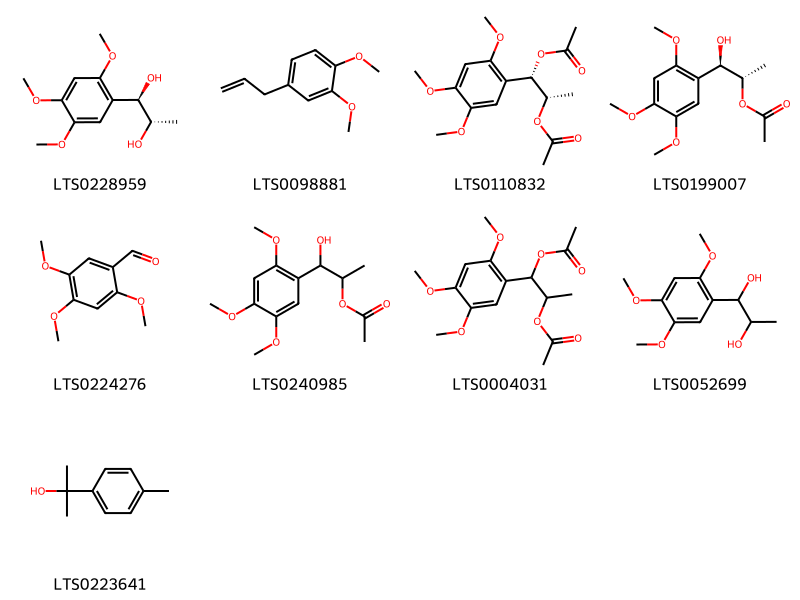{ width=100% }
    <figcaption>Hình ảnh cấu trúc hóa học của 9 hoạt chất thuộc nhóm Benzene and substituted derivatives gồm ['(1r,2s)-1-(2,4,5-trimethoxyphenyl)propane-1,2-diol (LTS0228959)', 'methyl eugenol (LTS0098881)', '(1s,2s)-1-(acetyloxy)-1-(2,4,5-trimethoxyphenyl)propan-2-yl acetate (LTS0110832)', '(1r,2s)-1-hydroxy-1-(2,4,5-trimethoxyphenyl)propan-2-yl acetate (LTS0199007)', '2,4,5-trimethoxybenzaldehyde (LTS0224276)', '1-hydroxy-1-(2,4,5-trimethoxyphenyl)propan-2-yl acetate (LTS0240985)', '1-(acetyloxy)-1-(2,4,5-trimethoxyphenyl)propan-2-yl acetate (LTS0004031)', '1-(2,4,5-trimethoxyphenyl)propane-1,2-diol (LTS0052699)', 'p-cymen-8-ol (LTS0223641)'].</figcaption>
</figure>
#### Nhóm Benzodioxoles
<figure markdown="span">
    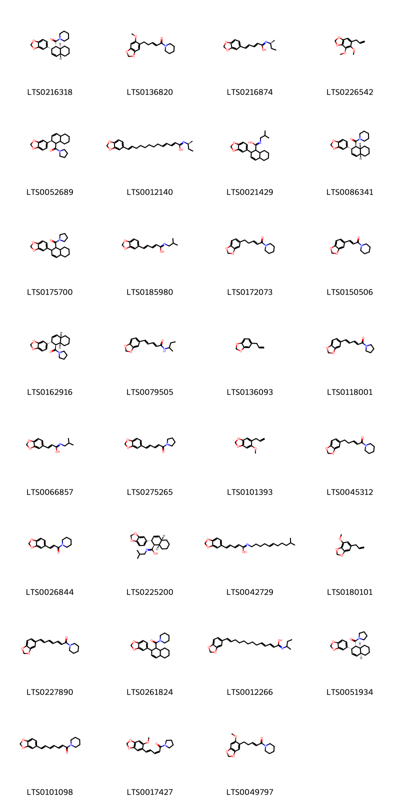{ width=100% }
    <figcaption>Hình ảnh cấu trúc hóa học của 31 hoạt chất thuộc nhóm Benzodioxoles gồm ['1-[(1r,2s,4ar,8as)-2-(2h-1,3-benzodioxol-5-yl)-1,2,4a,5,6,7,8,8a-octahydronaphthalene-1-carbonyl]piperidine (LTS0216318)', '5-(6-methoxy-2h-1,3-benzodioxol-5-yl)-1-(piperidin-1-yl)pent-2-en-1-one (LTS0136820)', '(2e,4e)-5-(2h-1,3-benzodioxol-5-yl)-n-[(2s)-butan-2-yl]penta-2,4-dienimidic acid (LTS0216874)', 'dillapiol (LTS0226542)', '1-[(2s)-2-(2h-1,3-benzodioxol-5-yl)-1,2,4a,5,6,7,8,8a-octahydronaphthalene-1-carbonyl]pyrrolidine (LTS0052689)', '(2e,4e,12e)-13-(2h-1,3-benzodioxol-5-yl)-n-[(2s)-butan-2-yl]trideca-2,4,12-trienimidic acid (LTS0012140)', '2-(2h-1,3-benzodioxol-5-yl)-n-(2-methylpropyl)-1,2,4a,5,6,7,8,8a-octahydronaphthalene-1-carboximidic acid (LTS0021429)', '1-[(1s,2s,4ar,8ar)-2-(2h-1,3-benzodioxol-5-yl)-1,2,4a,5,6,7,8,8a-octahydronaphthalene-1-carbonyl]piperidine (LTS0086341)', '1-[2-(2h-1,3-benzodioxol-5-yl)-1,2,4a,5,6,7,8,8a-octahydronaphthalene-1-carbonyl]pyrrolidine (LTS0175700)', '(2e,4e)-5-(2h-1,3-benzodioxol-5-yl)-n-(2-methylpropyl)penta-2,4-dienimidic acid (LTS0185980)', '5-(2h-1,3-benzodioxol-5-yl)-1-(piperidin-1-yl)pent-2-en-1-one (LTS0172073)', '3-(2h-1,3-benzodioxol-5-yl)-1-(piperidin-1-yl)prop-2-en-1-one (LTS0150506)', '1-[(1r,2r,4as,8as)-2-(2h-1,3-benzodioxol-5-yl)-1,2,4a,5,6,7,8,8a-octahydronaphthalene-1-carbonyl]pyrrolidine (LTS0162916)', '5-(2h-1,3-benzodioxol-5-yl)-n-(sec-butyl)penta-2,4-dienamide (LTS0079505)', 'sassafras (LTS0136093)', '5-(2h-1,3-benzodioxol-5-yl)-1-(pyrrolidin-1-yl)penta-2,4-dien-1-one (LTS0118001)', '(2e)-3-(2h-1,3-benzodioxol-5-yl)-n-(2-methylpropyl)prop-2-enimidic acid (LTS0066857)', 'piperyline (LTS0275265)', 'sarisan (LTS0101393)', '(2e)-5-(2h-1,3-benzodioxol-5-yl)-1-(piperidin-1-yl)pent-2-en-1-one (LTS0045312)', 'ilepcimide (LTS0026844)', '(1r,2r,4as,8as)-2-(2h-1,3-benzodioxol-5-yl)-n-(2-methylpropyl)-1,2,4a,5,6,7,8,8a-octahydronaphthalene-1-carboximidic acid (LTS0225200)', '(2e,4e)-5-(2h-1,3-benzodioxol-5-yl)-n-[(5e)-10-methylundec-5-en-1-yl]penta-2,4-dienimidic acid (LTS0042729)', 'myristicin (LTS0180101)', '7-(2h-1,3-benzodioxol-5-yl)-1-(piperidin-1-yl)hepta-2,4,6-trien-1-one (LTS0227890)', '1-[2-(2h-1,3-benzodioxol-5-yl)-1,2,4a,5,6,7,8,8a-octahydronaphthalene-1-carbonyl]piperidine (LTS0261824)', '13-(2h-1,3-benzodioxol-5-yl)-n-(sec-butyl)trideca-2,4,12-trienimidic acid (LTS0012266)', '1-[(1r,2s,4as,8as)-2-(2h-1,3-benzodioxol-5-yl)-1,2,4a,5,6,7,8,8a-octahydronaphthalene-1-carbonyl]pyrrolidine (LTS0051934)', '(2e,4e,6e)-7-(2h-1,3-benzodioxol-5-yl)-1-(piperidin-1-yl)hepta-2,4,6-trien-1-one (LTS0101098)', '(2z,4e)-5-(6-methoxy-2h-1,3-benzodioxol-5-yl)-1-(pyrrolidin-1-yl)penta-2,4-dien-1-one (LTS0017427)', '(2e)-5-(6-methoxy-2h-1,3-benzodioxol-5-yl)-1-(piperidin-1-yl)pent-2-en-1-one (LTS0049797)'].</figcaption>
</figure>
#### Nhóm Cinnamaldehydes
<figure markdown="span">
    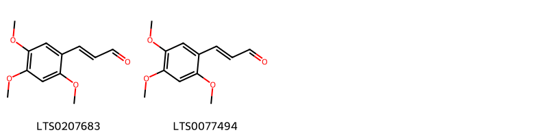{ width=100% }
    <figcaption>Hình ảnh cấu trúc hóa học của 2 hoạt chất thuộc nhóm Cinnamaldehydes gồm ['3-(2,4,5-trimethoxyphenyl)prop-2-enal (LTS0207683)', '(2e)-3-(2,4,5-trimethoxyphenyl)prop-2-enal (LTS0077494)'].</figcaption>
</figure>
#### Nhóm Dibenzylbutane lignans
<figure markdown="span">
    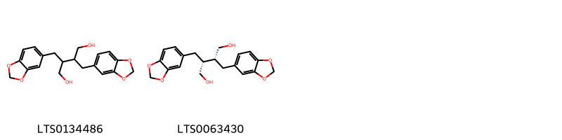{ width=100% }
    <figcaption>Hình ảnh cấu trúc hóa học của 2 hoạt chất thuộc nhóm Dibenzylbutane lignans gồm ['2,3-bis(2h-1,3-benzodioxol-5-ylmethyl)butane-1,4-diol (LTS0134486)', 'dihydrocubebin (LTS0063430)'].</figcaption>
</figure>
#### Nhóm Fatty Acyls
<figure markdown="span">
    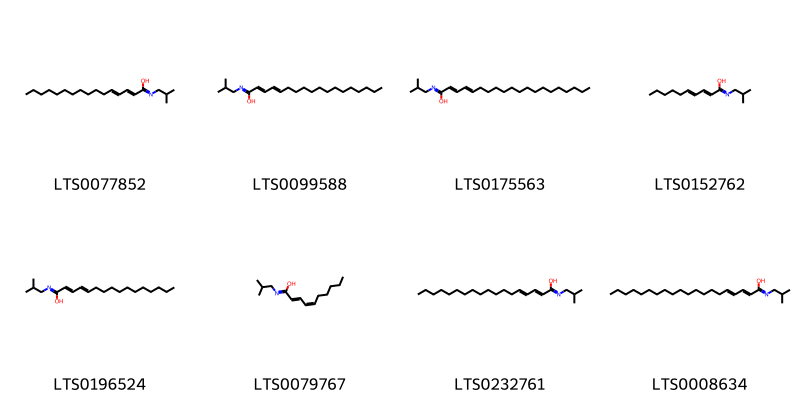{ width=100% }
    <figcaption>Hình ảnh cấu trúc hóa học của 8 hoạt chất thuộc nhóm Fatty Acyls gồm ['(2e,4e)-n-(2-methylpropyl)hexadeca-2,4-dienimidic acid (LTS0077852)', 'n-(2-methylpropyl)octadeca-2,4-dienimidic acid (LTS0099588)', 'n-(2-methylpropyl)icosa-2,4-dienimidic acid (LTS0175563)', '(2e,4e)-n-(2-methylpropyl)deca-2,4-dienimidic acid (LTS0152762)', 'n-(2-methylpropyl)hexadeca-2,4-dienimidic acid (LTS0196524)', '(2e,4z)-n-(2-methylpropyl)deca-2,4-dienimidic acid (LTS0079767)', '(2e,4e)-n-(2-methylpropyl)octadeca-2,4-dienimidic acid (LTS0232761)', '(2e,4e)-n-(2-methylpropyl)icosa-2,4-dienimidic acid (LTS0008634)'].</figcaption>
</figure>
#### Nhóm Furanoid lignans
<figure markdown="span">
    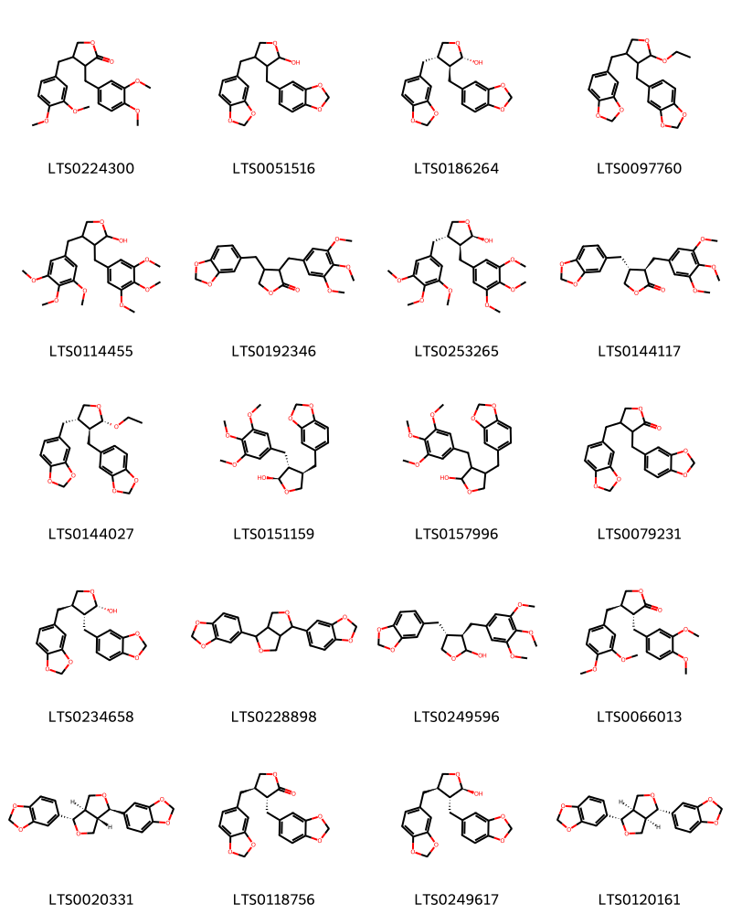{ width=100% }
    <figcaption>Hình ảnh cấu trúc hóa học của 20 hoạt chất thuộc nhóm Furanoid lignans gồm ['3,4-bis[(3,4-dimethoxyphenyl)methyl]oxolan-2-one (LTS0224300)', '3,4-bis(2h-1,3-benzodioxol-5-ylmethyl)oxolan-2-ol (LTS0051516)', '(2s,3s,4s)-3,4-bis(2h-1,3-benzodioxol-5-ylmethyl)oxolan-2-ol (LTS0186264)', '5-{[4-(2h-1,3-benzodioxol-5-ylmethyl)-5-ethoxyoxolan-3-yl]methyl}-2h-1,3-benzodioxole (LTS0097760)', '3,4-bis[(3,4,5-trimethoxyphenyl)methyl]oxolan-2-ol (LTS0114455)', '4-(2h-1,3-benzodioxol-5-ylmethyl)-3-[(3,4,5-trimethoxyphenyl)methyl]oxolan-2-one (LTS0192346)', '(2r,3s,4s)-3,4-bis[(3,4,5-trimethoxyphenyl)methyl]oxolan-2-ol (LTS0253265)', 'yatein (LTS0144117)', '5-{[(3s,4s,5s)-4-(2h-1,3-benzodioxol-5-ylmethyl)-5-ethoxyoxolan-3-yl]methyl}-2h-1,3-benzodioxole (LTS0144027)', '(2r,3r,4r)-4-(2h-1,3-benzodioxol-5-ylmethyl)-3-[(3,4,5-trimethoxyphenyl)methyl]oxolan-2-ol (LTS0151159)', '4-(2h-1,3-benzodioxol-5-ylmethyl)-3-[(3,4,5-trimethoxyphenyl)methyl]oxolan-2-ol (LTS0157996)', '3,4-bis(2h-1,3-benzodioxol-5-ylmethyl)oxolan-2-one (LTS0079231)', 'cubebin (LTS0234658)', 'sesamin (LTS0228898)', '(3r,4r)-4-(2h-1,3-benzodioxol-5-ylmethyl)-3-[(3,4,5-trimethoxyphenyl)methyl]oxolan-2-ol (LTS0249596)', 'arctigenin methyl ether (LTS0066013)', '5-[(1s,3as,4r,6ar)-4-(2h-1,3-benzodioxol-5-yl)-hexahydrofuro[3,4-c]furan-1-yl]-2h-1,3-benzodioxole (LTS0020331)', 'hinokinin (LTS0118756)', 'α-cubebin (LTS0249617)', 'sesamin (LTS0120161)'].</figcaption>
</figure>
#### Nhóm Organooxygen compounds
<figure markdown="span">
    { width=100% }
    <figcaption>Hình ảnh cấu trúc hóa học của 1 hoạt chất thuộc nhóm Organooxygen compounds gồm ['3,4,5,8-tetrahydro-2h-cuban-1-ol (LTS0243338)'].</figcaption>
</figure>
#### Nhóm Phenol ethers
<figure markdown="span">
    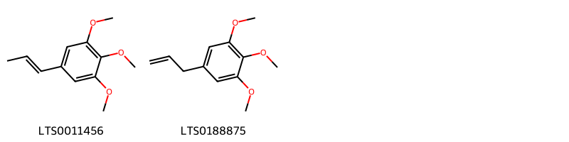{ width=100% }
    <figcaption>Hình ảnh cấu trúc hóa học của 2 hoạt chất thuộc nhóm Phenol ethers gồm ['isoelemicin (LTS0011456)', 'elemicin (LTS0188875)'].</figcaption>
</figure>
#### Nhóm Phenols
<figure markdown="span">
    { width=100% }
    <figcaption>Hình ảnh cấu trúc hóa học của 1 hoạt chất thuộc nhóm Phenols gồm ['eugenol (LTS0052342)'].</figcaption>
</figure>
#### Nhóm Piperidines
<figure markdown="span">
    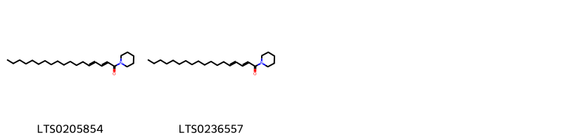{ width=100% }
    <figcaption>Hình ảnh cấu trúc hóa học của 2 hoạt chất thuộc nhóm Piperidines gồm ['(2e,4e)-1-(piperidin-1-yl)octadeca-2,4-dien-1-one (LTS0205854)', '1-(piperidin-1-yl)octadeca-2,4-dien-1-one (LTS0236557)'].</figcaption>
</figure>
#### Nhóm Prenol lipids
<figure markdown="span">
    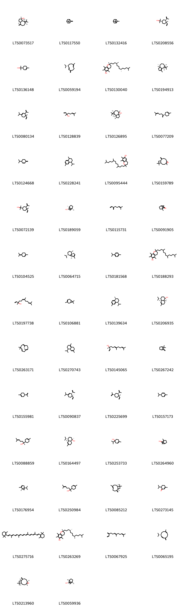{ width=100% }
    <figcaption>Hình ảnh cấu trúc hóa học của 68 hoạt chất thuộc nhóm Prenol lipids gồm ['(1as,4as,7s,7ar,7bs)-1,1,7-trimethyl-4-methylidene-octahydrocyclopropa[e]azulen-7-ol (LTS0073517)', 'β-pinene (LTS0117550)', 'α pinene (LTS0132416)', 'elemol (LTS0208556)', 'terpineol (LTS0136148)', '(-)-germacrene d (LTS0059194)', '(2r)-2,5,7,8-tetramethyl-2-[(4s,8s)-4,8,12-trimethyltridecyl]-3,4-dihydro-1-benzopyran-6-ol (LTS0130040)', '(-)-α-gurjunene (LTS0194913)', '4-ethenyl-1-isopropyl-4-methyl-3-(prop-1-en-2-yl)cyclohex-1-ene (LTS0080134)', 'linalool, (+-)- (LTS0128839)', '(1as,4s,4ar,7r,7ar,7br)-1,1,4,7-tetramethyl-octahydro-1ah-cyclopropa[e]azulen-4-ol (LTS0126895)', '(r)-β-bisabolene (LTS0077209)', 'β phellandrene (LTS0124668)', '(e)-calamene (LTS0228241)', '2,7,8-trimethyl-2-(4,8,12-trimethyltridecyl)-3,4-dihydro-1-benzopyran-6-ol (LTS0095444)', 'caryophyllene oxide (LTS0159789)', '2-[4-ethenyl-4-methyl-3-(prop-1-en-2-yl)cyclohexyl]propan-2-ol (LTS0072139)', '(+)-borneol (LTS0189059)', 'α-myrcene (LTS0115731)', 'camphor (LTS0091905)', 'terpinolene (LTS0104525)', '(1s,5r,7s,10r)-7-isopropyl-4,10-dimethyltricyclo[4.4.0.0¹,⁵]dec-3-ene (LTS0064715)', 'cymene (LTS0181568)', 'vita e (LTS0188293)', 'nerolidol (LTS0197738)', 'monoterpenes (LTS0106881)', '(1s,4s)-4-isopropyl-1,6-dimethyl-1,2,3,4-tetrahydronaphthalene (LTS0139634)', 'α-cadinol (LTS0206935)', 'humulene (LTS0263171)', '4-isopropyl-1,6-dimethyl-2,3,4,4a,7,8-hexahydronaphthalene (LTS0270743)', '(3r,6e)-nerolidol (LTS0145065)', 'camphene (LTS0267242)', 'limonene,  (LTS0155981)', 'elemene (LTS0090837)', 'β-elemene (LTS0225699)', 'phellandrene (LTS0157173)', '(2r)-6-methyl-2-(4-methylcyclohex-3-en-1-yl)hept-5-en-2-ol (LTS0088859)', '(1r,4s,4ar)-4-isopropyl-1,6-dimethyl-3,4,4a,7,8,8a-hexahydro-2h-naphthalen-1-ol (LTS0164497)', '4-terpineol (LTS0253733)', 'borneol (LTS0264960)', 'α-thujene (LTS0176954)', 'α-bisabolol (LTS0250984)', 'caryophyllene (LTS0085212)', 'piperitone (LTS0273145)', 'β-carotene (LTS0275716)', 'vitamin e (LTS0263269)', 'β-farnesene (LTS0067925)', '(1z,6z,8s)-8-isopropyl-1-methyl-5-methylidenecyclodeca-1,6-diene (LTS0065195)', 'β-caryophyllene oxide (LTS0213960)', '(+)-borneol (LTS0059936)', 'α-copaene (LTS0207598)', 'sabinene (LTS0224133)', 'α-thujene (LTS0185078)', '(1as,4s,7r,7br)-1,1,4,7-tetramethyl-octahydro-1ah-cyclopropa[e]azulen-4-ol (LTS0037481)', '(-)-trans-α-bergamotene (LTS0239937)', 'β-ocimene (LTS0242381)', '(1r,2s,7s,8s)-8-isopropyl-1,3-dimethyltricyclo[4.4.0.0²,⁷]dec-3-ene (LTS0190031)', 'ledol (LTS0243935)', '(1as,4s,7br)-1,1,4,7-tetramethyl-octahydro-1ah-cyclopropa[e]azulen-4-ol (LTS0037542)', 'gamma-tocopherol (LTS0058127)', '(-)-β-bisabolene (LTS0009940)', '2-(3,8-dimethyl-1,2,3,3a,4,5,6,7-octahydroazulen-5-yl)propan-2-ol (LTS0006790)', 'delta-cadinol (LTS0013807)', '(1s,4r,4ar,8ar)-1-isopropyl-4,7-dimethyl-2,3,4,5,6,8a-hexahydro-1h-naphthalen-4a-ol (LTS0018576)', 'delta-cadinene (LTS0019321)', '(7ar)-1,1,7-trimethyl-4-methylidene-octahydrocyclopropa[e]azulen-7-ol (LTS0091612)', '(2s)-2,7,8-trimethyl-2-[(4s,8s)-4,8,12-trimethyltridecyl]-3,4-dihydro-1-benzopyran-6-ol (LTS0017344)', '(-)-α-cubebene (LTS0042045)'].</figcaption>
</figure>
#### Nhóm Pyrrolidines
<figure markdown="span">
    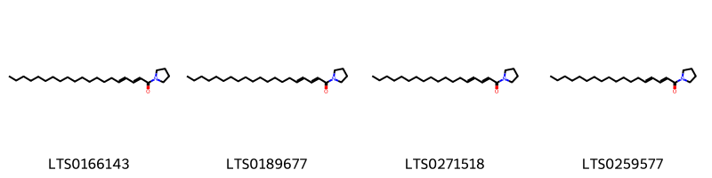{ width=100% }
    <figcaption>Hình ảnh cấu trúc hóa học của 4 hoạt chất thuộc nhóm Pyrrolidines gồm ['(2e,4e)-1-(pyrrolidin-1-yl)icosa-2,4-dien-1-one (LTS0166143)', '1-(pyrrolidin-1-yl)icosa-2,4-dien-1-one (LTS0189677)', '(2e,4e)-1-(pyrrolidin-1-yl)octadeca-2,4-dien-1-one (LTS0271518)', '1-(pyrrolidin-1-yl)octadeca-2,4-dien-1-one (LTS0259577)'].</figcaption>
</figure>
#### Nhóm Steroids and steroid derivatives
<figure markdown="span">
    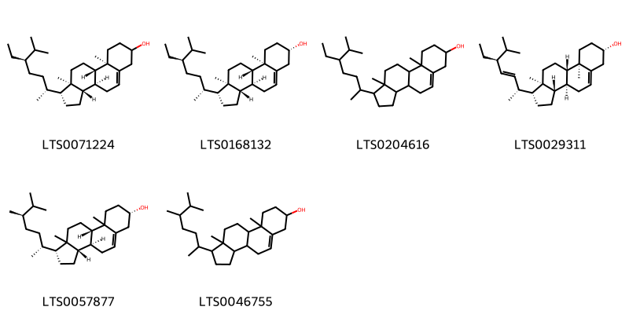{ width=100% }
    <figcaption>Hình ảnh cấu trúc hóa học của 6 hoạt chất thuộc nhóm Steroids and steroid derivatives gồm ['stigmast-5-en-3-ol (LTS0071224)', 'sitosterol (LTS0168132)', 'stigmast-5-en-3-ol, (3β)- (LTS0204616)', 'phytosterol (LTS0029311)', '(1r,3as,3bs,7s,9bs)-1-[(2r,5r)-5,6-dimethylheptan-2-yl]-9a,11a-dimethyl-1h,2h,3h,3ah,3bh,4h,6h,7h,8h,9h,9bh,10h,11h-cyclopenta[a]phenanthren-7-ol (LTS0057877)', 'campesterol (LTS0046755)'].</figcaption>
</figure>
#### Nhóm Unsaturated hydrocarbons
<figure markdown="span">
    { width=100% }
    <figcaption>Hình ảnh cấu trúc hóa học của 1 hoạt chất thuộc nhóm Unsaturated hydrocarbons gồm ['α terpinene (LTS0232891)'].</figcaption>
</figure>

---

### Dược dân tộc học

Danh sách các quốc gia có sử dụng *Piper guineense* trong điều trị các bệnh. 

| Country     | Disease                             | Bệnh                                                                                                                                                                                                |
|:------------|:------------------------------------|:----------------------------------------------------------------------------------------------------------------------------------------------------------------------------------------------------|
| Africa      | Insecticide, Stomachic, Carminative | MYMEMORY WARNING: YOU USED ALL AVAILABLE FREE TRANSLATIONS FOR TODAY. NEXT AVAILABLE IN  08 HOURS 08 MINUTES 25 SECONDS VISIT HTTPS://MYMEMORY.TRANSLATED.NET/DOC/USAGELIMITS.PHP TO TRANSLATE MORE |
| Ghana       | Dentifrice, Hemostat                | MYMEMORY WARNING: YOU USED ALL AVAILABLE FREE TRANSLATIONS FOR TODAY. NEXT AVAILABLE IN  08 HOURS 08 MINUTES 22 SECONDS VISIT HTTPS://MYMEMORY.TRANSLATED.NET/DOC/USAGELIMITS.PHP TO TRANSLATE MORE |
| Upper Volta | Aphrodisiac, Hemostat               | MYMEMORY WARNING: YOU USED ALL AVAILABLE FREE TRANSLATIONS FOR TODAY. NEXT AVAILABLE IN  08 HOURS 08 MINUTES 20 SECONDS VISIT HTTPS://MYMEMORY.TRANSLATED.NET/DOC/USAGELIMITS.PHP TO TRANSLATE MORE |

---

---
## Piper hiidum
### Thông tin về thực vật

!!! info "Phân loại thực vật của *N/A* từ GIBF:"
    - **Kingdom:** Plantae
    - **Phylum:** Tracheophyta
    - **Order:** Piperales
    - **Family:** Piperaceae
    - **Genus:** Piper
    - **Species:** *N/A*

 

| Label (VI)   | Label (EN)   | Scientific Name   | Descriptions (VI)   | Descriptions (EN)   | Also Known As (VI)   | Also Known As (EN)   |
|:-------------|:-------------|:------------------|:--------------------|:--------------------|:---------------------|:---------------------|
| N/A          | N/A          | Piper guineense   | loài thực vật       | species of plant    | ['']                 | ['Piper guineense']  |

#### Phân bố trên thế giới

**Từ CSDL GIBF** Brazil, Guatemala, Uganda, Japan, New Caledonia, China, Ecuador, Thailand, Puerto Rico, Sri Lanka, United States of America, Jamaica, Indonesia, Costa Rica, Dominican Republic, Colombia, Argentina, French Guiana, Mexico, Kenya, Rwanda, El Salvador, Chinese Taipei, Malaysia, Haiti, Gabon, Panama, Nicaragua, Singapore, Cambodia, Australia, India, Peru

#### Phân bố tại Việt Nam

**Từ CSDL GIBF**: Không có ghi nhận ở Việt Nam

---
### Thành phần hóa học
        
- Theo cơ sở dữ liệu lotus: Từ loài *N/A* đã phân lập và xác định được Chưa có hoạt chất nào được phân lập. hoạt chất thuộc về các nhóm Không có hoạt chất nào được phân lập. 

Không có hình ảnh nào được tạo ra

---

### Dược dân tộc học

Danh sách các quốc gia có sử dụng *N/A* trong điều trị các bệnh. 

| Country   | Disease      | Bệnh                                                                                                                                                                                                |
|:----------|:-------------|:----------------------------------------------------------------------------------------------------------------------------------------------------------------------------------------------------|
| Ecuador   | Pediculicide | MYMEMORY WARNING: YOU USED ALL AVAILABLE FREE TRANSLATIONS FOR TODAY. NEXT AVAILABLE IN  08 HOURS 07 MINUTES 43 SECONDS VISIT HTTPS://MYMEMORY.TRANSLATED.NET/DOC/USAGELIMITS.PHP TO TRANSLATE MORE |

---

---
## Piper laetiicum
### Thông tin về thực vật

!!! info "Phân loại thực vật của *Piper villiramulum* từ GIBF:"
    - **Kingdom:** Plantae
    - **Phylum:** Tracheophyta
    - **Order:** Piperales
    - **Family:** Piperaceae
    - **Genus:** Piper
    - **Species:** *Piper villiramulum*

 

| Label (VI)   | Label (EN)   | Scientific Name   | Descriptions (VI)   | Descriptions (EN)   | Also Known As (VI)   | Also Known As (EN)   |
|:-------------|:-------------|:------------------|:--------------------|:--------------------|:---------------------|:---------------------|
| N/A          | N/A          | Piper guineense   | loài thực vật       | species of plant    | ['']                 | ['Piper guineense']  |

#### Phân bố trên thế giới

**Từ CSDL GIBF** Brazil, Guatemala, Uganda, Japan, New Caledonia, China, Ecuador, Thailand, Puerto Rico, Sri Lanka, United States of America, Jamaica, Indonesia, Costa Rica, Dominican Republic, Colombia, Argentina, French Guiana, Mexico, Kenya, Rwanda, El Salvador, Chinese Taipei, Malaysia, Haiti, Gabon, Panama, Nicaragua, Singapore, Cambodia, Australia, India, Peru

#### Phân bố tại Việt Nam

**Từ CSDL GIBF**: Không có ghi nhận ở Việt Nam

---
### Thành phần hóa học
        
- Theo cơ sở dữ liệu lotus: Từ loài *Piper villiramulum* đã phân lập và xác định được Chưa có hoạt chất nào được phân lập. hoạt chất thuộc về các nhóm Không có hoạt chất nào được phân lập. 

Không có hình ảnh nào được tạo ra

---

### Dược dân tộc học

Danh sách các quốc gia có sử dụng *Piper villiramulum* trong điều trị các bệnh. 

| Country   | Disease   | Bệnh                                                                                                                                                                                                |
|:----------|:----------|:----------------------------------------------------------------------------------------------------------------------------------------------------------------------------------------------------|
| Hainan    | Poison    | MYMEMORY WARNING: YOU USED ALL AVAILABLE FREE TRANSLATIONS FOR TODAY. NEXT AVAILABLE IN  08 HOURS 07 MINUTES 22 SECONDS VISIT HTTPS://MYMEMORY.TRANSLATED.NET/DOC/USAGELIMITS.PHP TO TRANSLATE MORE |

---

---
## Piper leucophyllum
### Thông tin về thực vật

!!! info "Phân loại thực vật của *Piper leucophyllum* từ GIBF:"
    - **Kingdom:** Plantae
    - **Phylum:** Tracheophyta
    - **Order:** Piperales
    - **Family:** Piperaceae
    - **Genus:** Piper
    - **Species:** *Piper leucophyllum*

 

| Label (VI)   | Label (EN)   | Scientific Name    | Descriptions (VI)   | Descriptions (EN)   | Also Known As (VI)   | Also Known As (EN)   |
|:-------------|:-------------|:-------------------|:--------------------|:--------------------|:---------------------|:---------------------|
| N/A          | N/A          | Piper leucophyllum | loài thực vật       | species of plant    | ['']                 | ['']                 |

#### Phân bố trên thế giới

**Từ CSDL GIBF** nan, Mexico, Honduras, Colombia

#### Phân bố tại Việt Nam

**Từ CSDL GIBF**: Không có ghi nhận ở Việt Nam

---
### Thành phần hóa học
        
- Theo cơ sở dữ liệu lotus: Từ loài *Piper leucophyllum* đã phân lập và xác định được Chưa có hoạt chất nào được phân lập. hoạt chất thuộc về các nhóm Không có hoạt chất nào được phân lập. 

Không có hình ảnh nào được tạo ra

---

### Dược dân tộc học

Danh sách các quốc gia có sử dụng *Piper leucophyllum* trong điều trị các bệnh. 

| Country   | Disease                    | Bệnh                                                                                                                                                                                                |
|:----------|:---------------------------|:----------------------------------------------------------------------------------------------------------------------------------------------------------------------------------------------------|
| Mexico    | Pediculicide, Pediculicide | MYMEMORY WARNING: YOU USED ALL AVAILABLE FREE TRANSLATIONS FOR TODAY. NEXT AVAILABLE IN  08 HOURS 07 MINUTES 03 SECONDS VISIT HTTPS://MYMEMORY.TRANSLATED.NET/DOC/USAGELIMITS.PHP TO TRANSLATE MORE |

---

---
## Piper longum
### Thông tin về thực vật

!!! info "Phân loại thực vật của *Piper longum* từ GIBF:"
    - **Kingdom:** Plantae
    - **Phylum:** Tracheophyta
    - **Order:** Piperales
    - **Family:** Piperaceae
    - **Genus:** Piper
    - **Species:** *Piper longum*

 

| Label (VI)   | Label (EN)   | Scientific Name   | Descriptions (VI)   | Descriptions (EN)   | Also Known As (VI)   | Also Known As (EN)   |
|:-------------|:-------------|:------------------|:--------------------|:--------------------|:---------------------|:---------------------|
| N/A          | N/A          | Piper longum      | loài thực vật       | species of plant    | ['']                 | ['Long pepper']      |

#### Phân bố trên thế giới

**Từ CSDL GIBF** nan, Brazil, Viet Nam, Bangladesh, Nepal, China, Türkiye, Trinidad and Tobago, Thailand, Sri Lanka, United States of America, Indonesia, unknown or invalid, Ethiopia, Lao People’s Democratic Republic, Fiji, Belgium, Malaysia, Haiti, Philippines, Egypt, Singapore, Australia, Myanmar, India, Guyana

#### Phân bố tại Việt Nam

**Từ CSDL GIBF**: Đà Nẵng, Kiên Giang, Quang Tri, Hà Tây, Hồ Chí Minh

---
### Thành phần hóa học
        
- Theo cơ sở dữ liệu lotus: Từ loài *Piper longum* đã phân lập và xác định được 81 hoạt chất thuộc về các nhóm Aporphines, Piperidines, Fatty Acyls, Benzodioxoles, Cinnamic acids and derivatives, Carboxylic acids and derivatives, Steroids and steroid derivatives, Pyrrolidines, Carboximidic acids and derivatives, Phenylpropanoic acids, Aristolactams, Furanoid lignans, Prenol lipids. 

|    | chemicalTaxonomyClassyfireClass    |   smiles_count |
|---:|:-----------------------------------|---------------:|
|  0 |                                    |              2 |
|  1 | Aporphines                         |              4 |
|  2 | Aristolactams                      |              3 |
|  3 | Benzodioxoles                      |             27 |
|  4 | Carboximidic acids and derivatives |              4 |
|  5 | Carboxylic acids and derivatives   |              2 |
|  6 | Cinnamic acids and derivatives     |              5 |
|  7 | Fatty Acyls                        |             15 |
|  8 | Furanoid lignans                   |              9 |
|  9 | Phenylpropanoic acids              |              1 |
| 10 | Piperidines                        |              3 |
| 11 | Prenol lipids                      |              1 |
| 12 | Pyrrolidines                       |              2 |
| 13 | Steroids and steroid derivatives   |              3 |

#### Nhóm 
<figure markdown="span">
    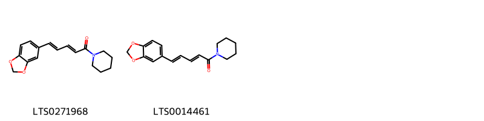{ width=100% }
    <figcaption>Hình ảnh cấu trúc hóa học của 2 hoạt chất thuộc nhóm  gồm ['5-(2h-1,3-benzodioxol-5-yl)-1-(piperidin-1-yl)penta-2,4-dien-1-one (LTS0271968)', 'piperine (LTS0014461)'].</figcaption>
</figure>
#### Nhóm Aporphines
<figure markdown="span">
    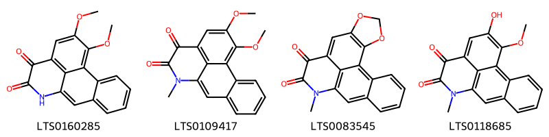{ width=100% }
    <figcaption>Hình ảnh cấu trúc hóa học của 4 hoạt chất thuộc nhóm Aporphines gồm ['15,16-dimethoxy-10-azatetracyclo[7.7.1.0²,⁷.0¹³,¹⁷]heptadeca-1(17),2(7),3,5,8,13,15-heptaene-11,12-dione (LTS0160285)', '15,16-dimethoxy-10-methyl-10-azatetracyclo[7.7.1.0²,⁷.0¹³,¹⁷]heptadeca-1(17),2(7),3,5,8,13,15-heptaene-11,12-dione (LTS0109417)', '11-methyl-3,5-dioxa-11-azapentacyclo[10.7.1.0²,⁶.0⁸,²⁰.0¹⁴,¹⁹]icosa-1(20),2(6),7,12,14(19),15,17-heptaene-9,10-dione (LTS0083545)', '15-hydroxy-16-methoxy-10-methyl-10-azatetracyclo[7.7.1.0²,⁷.0¹³,¹⁷]heptadeca-1(17),2(7),3,5,8,13,15-heptaene-11,12-dione (LTS0118685)'].</figcaption>
</figure>
#### Nhóm Aristolactams
<figure markdown="span">
    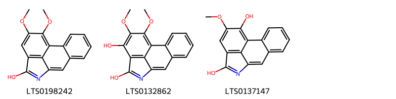{ width=100% }
    <figcaption>Hình ảnh cấu trúc hóa học của 3 hoạt chất thuộc nhóm Aristolactams gồm ['14,15-dimethoxy-10-azatetracyclo[7.6.1.0²,⁷.0¹²,¹⁶]hexadeca-1(16),2(7),3,5,8,10,12,14-octaen-11-ol (LTS0198242)', '14,15-dimethoxy-10-azatetracyclo[7.6.1.0²,⁷.0¹²,¹⁶]hexadeca-1(16),2(7),3,5,8,10,12,14-octaene-11,13-diol (LTS0132862)', '14-methoxy-10-azatetracyclo[7.6.1.0²,⁷.0¹²,¹⁶]hexadeca-1(16),2(7),3,5,8,10,12,14-octaene-11,15-diol (LTS0137147)'].</figcaption>
</figure>
#### Nhóm Benzodioxoles
<figure markdown="span">
    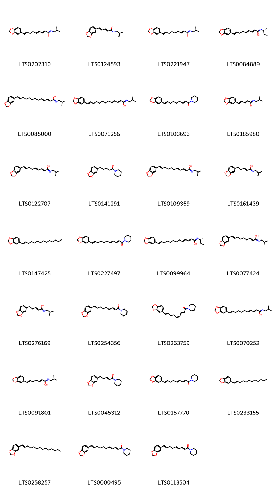{ width=100% }
    <figcaption>Hình ảnh cấu trúc hóa học của 27 hoạt chất thuộc nhóm Benzodioxoles gồm ['(2e,4e,8e)-9-(2h-1,3-benzodioxol-5-yl)-n-(2-methylpropyl)nona-2,4,8-trienimidic acid (LTS0202310)', '5-(2h-1,3-benzodioxol-5-yl)-n-(2-methylpropyl)penta-2,4-dienamide (LTS0124593)', '(2e,8e)-9-(2h-1,3-benzodioxol-5-yl)-n-(2-methylpropyl)nona-2,8-dienimidic acid (LTS0221947)', '(2e,4e,8e)-9-(2h-1,3-benzodioxol-5-yl)-n-[(2r)-butan-2-yl]nona-2,4,8-trienimidic acid (LTS0084889)', '13-(2h-1,3-benzodioxol-5-yl)-n-(2-methylpropyl)trideca-2,4,12-trienimidic acid (LTS0085000)', '(2e,4e,12e)-13-(2h-1,3-benzodioxol-5-yl)-n-(2-methylpropyl)trideca-2,4,12-trienimidic acid (LTS0071256)', '(2e,8e)-9-(2h-1,3-benzodioxol-5-yl)-1-(piperidin-1-yl)nona-2,8-dien-1-one (LTS0103693)', '(2e,4e)-5-(2h-1,3-benzodioxol-5-yl)-n-(2-methylpropyl)penta-2,4-dienimidic acid (LTS0185980)', '9-(2h-1,3-benzodioxol-5-yl)-n-(2-methylpropyl)nona-2,4,8-trienimidic acid (LTS0122707)', 'tetrahydropiperine (LTS0141291)', '11-(2h-1,3-benzodioxol-5-yl)-n-(2-methylpropyl)undeca-2,4,10-trienimidic acid (LTS0109359)', '(2e)-5-(2h-1,3-benzodioxol-5-yl)-n-(2-methylpropyl)pent-2-enimidic acid (LTS0161439)', '5-[(1e)-tetradec-1-en-1-yl]-2h-1,3-benzodioxole (LTS0147425)', '(2e,4e,10e)-11-(2h-1,3-benzodioxol-5-yl)-1-(piperidin-1-yl)undeca-2,4,10-trien-1-one (LTS0227497)', '(2e,4e,12e)-13-(2h-1,3-benzodioxol-5-yl)-n-[(2r)-butan-2-yl]trideca-2,4,12-trienimidic acid (LTS0099964)', '9-(2h-1,3-benzodioxol-5-yl)-n-(2-methylpropyl)nona-2,8-dienimidic acid (LTS0077424)', '5-(2h-1,3-benzodioxol-5-yl)-n-(2-methylpropyl)pent-2-enimidic acid (LTS0276169)', '9-(2h-1,3-benzodioxol-5-yl)-1-(piperidin-1-yl)nona-2,8-dien-1-one (LTS0254356)', '(2e,4z,8e)-9-(2h-1,3-benzodioxol-5-yl)-1-(piperidin-1-yl)nona-2,4,8-trien-1-one (LTS0263759)', '(2e,4e,10e)-11-(2h-1,3-benzodioxol-5-yl)-n-(2-methylpropyl)undeca-2,4,10-trienimidic acid (LTS0070252)', '(2e,6e)-7-(2h-1,3-benzodioxol-5-yl)-n-(2-methylpropyl)hepta-2,6-dienimidic acid (LTS0091801)', '(2e)-5-(2h-1,3-benzodioxol-5-yl)-1-(piperidin-1-yl)pent-2-en-1-one (LTS0045312)', '(2e,4e,8e)-9-(2h-1,3-benzodioxol-5-yl)-1-(piperidin-1-yl)nona-2,4,8-trien-1-one (LTS0157770)', '5-[(1e)-dodec-1-en-1-yl]-2h-1,3-benzodioxole (LTS0233155)', '5-(tetradec-1-en-1-yl)-2h-1,3-benzodioxole (LTS0258257)', '11-(2h-1,3-benzodioxol-5-yl)-1-(piperidin-1-yl)undeca-2,4,10-trien-1-one (LTS0000495)', '9-(2h-1,3-benzodioxol-5-yl)-1-(piperidin-1-yl)nona-2,4,8-trien-1-one (LTS0113504)'].</figcaption>
</figure>
#### Nhóm Carboximidic acids and derivatives
<figure markdown="span">
    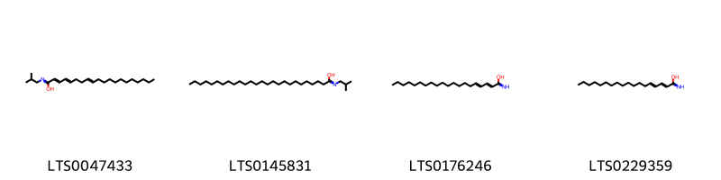{ width=100% }
    <figcaption>Hình ảnh cấu trúc hóa học của 4 hoạt chất thuộc nhóm Carboximidic acids and derivatives gồm ['n-(2-methylpropyl)icosa-2,4,8-trienimidic acid (LTS0047433)', 'n-(2-methylpropyl)hexacosanimidic acid (LTS0145831)', 'icosa-2,4-dienimidic acid (LTS0176246)', 'octadeca-2,4-dienimidic acid (LTS0229359)'].</figcaption>
</figure>
#### Nhóm Carboxylic acids and derivatives
<figure markdown="span">
    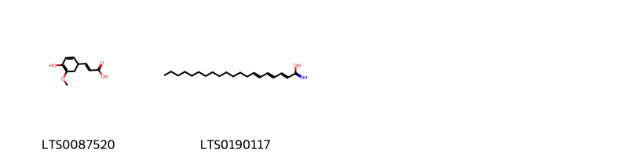{ width=100% }
    <figcaption>Hình ảnh cấu trúc hóa học của 2 hoạt chất thuộc nhóm Carboxylic acids and derivatives gồm ['(2e)-3-(4-hydroxy-5-methoxycyclohexa-2,4-dien-1-yl)prop-2-enoic acid (LTS0087520)', 'icosa-2,4,6-trienimidic acid (LTS0190117)'].</figcaption>
</figure>
#### Nhóm Cinnamic acids and derivatives
<figure markdown="span">
    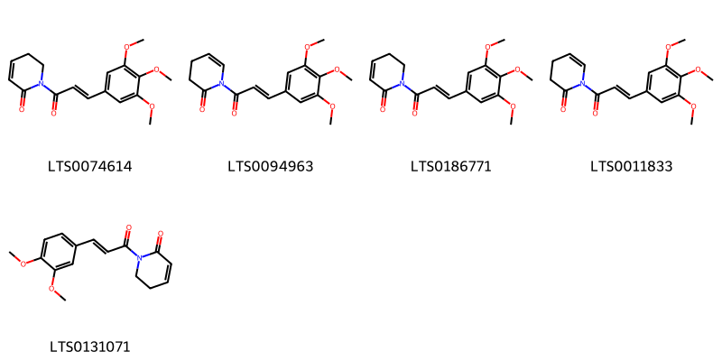{ width=100% }
    <figcaption>Hình ảnh cấu trúc hóa học của 5 hoạt chất thuộc nhóm Cinnamic acids and derivatives gồm ['piperlongumine (LTS0074614)', '1-[3-(3,4,5-trimethoxyphenyl)prop-2-enoyl]-3,4-dihydropyridin-2-one (LTS0094963)', '1-[3-(3,4,5-trimethoxyphenyl)prop-2-enoyl]-5,6-dihydropyridin-2-one (LTS0186771)', '1-[(2e)-3-(3,4,5-trimethoxyphenyl)prop-2-enoyl]-3,4-dihydropyridin-2-one (LTS0011833)', '1-[(2e)-3-(3,4-dimethoxyphenyl)prop-2-enoyl]-5,6-dihydropyridin-2-one (LTS0131071)'].</figcaption>
</figure>
#### Nhóm Fatty Acyls
<figure markdown="span">
    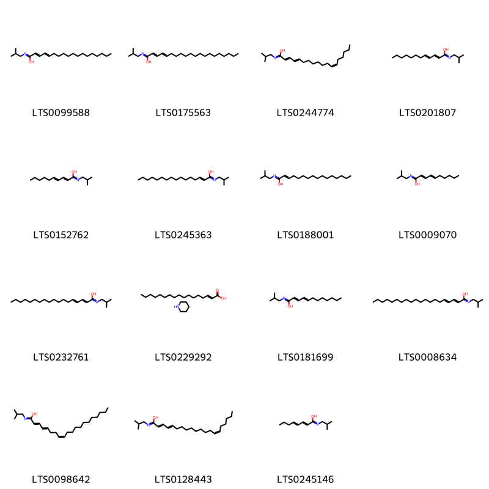{ width=100% }
    <figcaption>Hình ảnh cấu trúc hóa học của 15 hoạt chất thuộc nhóm Fatty Acyls gồm ['n-(2-methylpropyl)octadeca-2,4-dienimidic acid (LTS0099588)', 'n-(2-methylpropyl)icosa-2,4-dienimidic acid (LTS0175563)', '(2e,4e,12z)-n-(2-methylpropyl)octadeca-2,4,12-trienimidic acid (LTS0244774)', '(2e,4e)-n-(2-methylpropyl)dodeca-2,4-dienimidic acid (LTS0201807)', '(2e,4e)-n-(2-methylpropyl)deca-2,4-dienimidic acid (LTS0152762)', '(2e)-n-(2-methylpropyl)hexadec-2-enimidic acid (LTS0245363)', 'n-(2-methylpropyl)hexadec-2-enimidic acid (LTS0188001)', 'n-(2-methylpropyl)deca-2,4-dienimidic acid (LTS0009070)', '(2e,4e)-n-(2-methylpropyl)octadeca-2,4-dienimidic acid (LTS0232761)', '2-heptadecylenic acid; piperidine (LTS0229292)', 'n-(2-methylpropyl)dodeca-2,4-dienimidic acid (LTS0181699)', '(2e,4e)-n-(2-methylpropyl)icosa-2,4-dienimidic acid (LTS0008634)', '(2e,4e,8z)-n-(2-methylpropyl)icosa-2,4,8-trienimidic acid (LTS0098642)', '(2e,4e,14z)-n-(2-methylpropyl)icosa-2,4,14-trienimidic acid (LTS0128443)', '(2e,4e)-n-(2-methylpropyl)octa-2,4-dienimidic acid (LTS0245146)'].</figcaption>
</figure>
#### Nhóm Furanoid lignans
<figure markdown="span">
    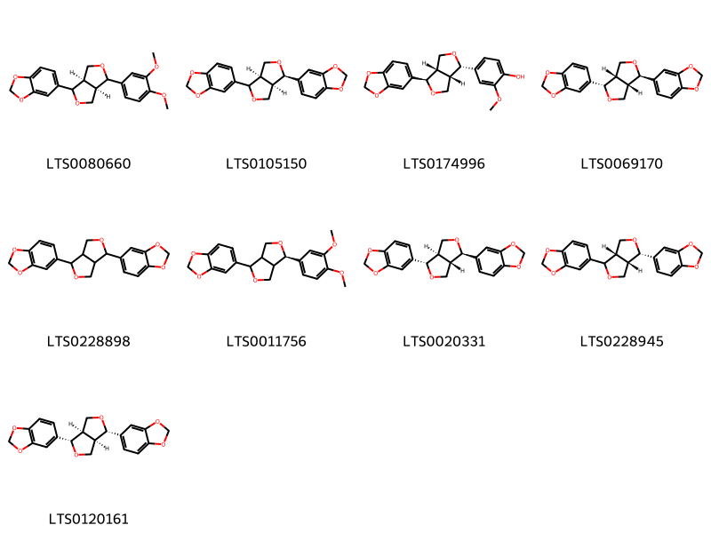{ width=100% }
    <figcaption>Hình ảnh cấu trúc hóa học của 9 hoạt chất thuộc nhóm Furanoid lignans gồm ['5-[(3ar,6ar)-4-(3,4-dimethoxyphenyl)-hexahydrofuro[3,4-c]furan-1-yl]-2h-1,3-benzodioxole (LTS0080660)', '5-[(3ar,4r,6ar)-4-(2h-1,3-benzodioxol-5-yl)-hexahydrofuro[3,4-c]furan-1-yl]-2h-1,3-benzodioxole (LTS0105150)', 'pluviatilol (LTS0174996)', 'asarinin (LTS0069170)', 'sesamin (LTS0228898)', '5-[(4r)-4-(3,4-dimethoxyphenyl)-hexahydrofuro[3,4-c]furan-1-yl]-2h-1,3-benzodioxole (LTS0011756)', '5-[(1s,3as,4r,6ar)-4-(2h-1,3-benzodioxol-5-yl)-hexahydrofuro[3,4-c]furan-1-yl]-2h-1,3-benzodioxole (LTS0020331)', '5-[(3as,4s,6as)-4-(2h-1,3-benzodioxol-5-yl)-hexahydrofuro[3,4-c]furan-1-yl]-2h-1,3-benzodioxole (LTS0228945)', 'sesamin (LTS0120161)'].</figcaption>
</figure>
#### Nhóm Phenylpropanoic acids
<figure markdown="span">
    { width=100% }
    <figcaption>Hình ảnh cấu trúc hóa học của 1 hoạt chất thuộc nhóm Phenylpropanoic acids gồm ['3-(3,4,5-trimethoxyphenyl)propanoic acid (LTS0219755)'].</figcaption>
</figure>
#### Nhóm Piperidines
<figure markdown="span">
    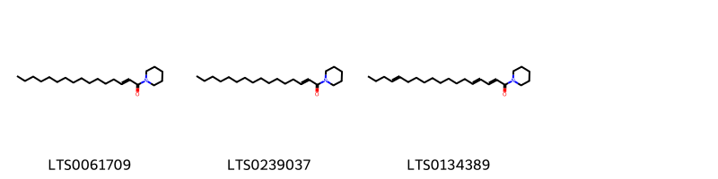{ width=100% }
    <figcaption>Hình ảnh cấu trúc hóa học của 3 hoạt chất thuộc nhóm Piperidines gồm ['1-(piperidin-1-yl)hexadec-2-en-1-one (LTS0061709)', '(2e)-1-(piperidin-1-yl)hexadec-2-en-1-one (LTS0239037)', '(2e,4e,14e)-1-(piperidin-1-yl)octadeca-2,4,14-trien-1-one (LTS0134389)'].</figcaption>
</figure>
#### Nhóm Prenol lipids
<figure markdown="span">
    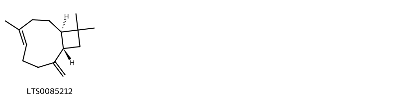{ width=100% }
    <figcaption>Hình ảnh cấu trúc hóa học của 1 hoạt chất thuộc nhóm Prenol lipids gồm ['caryophyllene (LTS0085212)'].</figcaption>
</figure>
#### Nhóm Pyrrolidines
<figure markdown="span">
    { width=100% }
    <figcaption>Hình ảnh cấu trúc hóa học của 2 hoạt chất thuộc nhóm Pyrrolidines gồm ['iyeremide a (LTS0276326)', '1-(pyrrolidin-1-yl)deca-2,4-dien-1-one (LTS0131584)'].</figcaption>
</figure>
#### Nhóm Steroids and steroid derivatives
<figure markdown="span">
    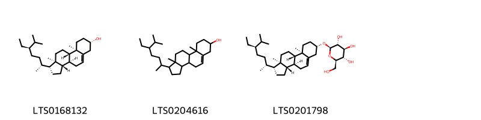{ width=100% }
    <figcaption>Hình ảnh cấu trúc hóa học của 3 hoạt chất thuộc nhóm Steroids and steroid derivatives gồm ['sitosterol (LTS0168132)', 'stigmast-5-en-3-ol, (3β)- (LTS0204616)', 'sitogluside (LTS0201798)'].</figcaption>
</figure>

---

### Dược dân tộc học

Danh sách các quốc gia có sử dụng *Piper longum* trong điều trị các bệnh. 

| Country   | Disease                                                                                                    | Bệnh                                                                                                                                                                                                |
|:----------|:-----------------------------------------------------------------------------------------------------------|:----------------------------------------------------------------------------------------------------------------------------------------------------------------------------------------------------|
| Asia      | Diuretic, Stimulant, Sudorific                                                                             | MYMEMORY WARNING: YOU USED ALL AVAILABLE FREE TRANSLATIONS FOR TODAY. NEXT AVAILABLE IN  08 HOURS 06 MINUTES 43 SECONDS VISIT HTTPS://MYMEMORY.TRANSLATED.NET/DOC/USAGELIMITS.PHP TO TRANSLATE MORE |
| China     | Analgesic, Carminative, Astringent, Stomachic, Carminative, Stomachic, Stimulant                           | MYMEMORY WARNING: YOU USED ALL AVAILABLE FREE TRANSLATIONS FOR TODAY. NEXT AVAILABLE IN  08 HOURS 06 MINUTES 40 SECONDS VISIT HTTPS://MYMEMORY.TRANSLATED.NET/DOC/USAGELIMITS.PHP TO TRANSLATE MORE |
| Egypt     | Carminative, Diuretic, Stimulant, Tonic, Vermifuge, Sudorific                                              | MYMEMORY WARNING: YOU USED ALL AVAILABLE FREE TRANSLATIONS FOR TODAY. NEXT AVAILABLE IN  08 HOURS 06 MINUTES 38 SECONDS VISIT HTTPS://MYMEMORY.TRANSLATED.NET/DOC/USAGELIMITS.PHP TO TRANSLATE MORE |
| Elsewhere | Analgesic, nan, Carminative, Cholagogue, Emmenagogue, Larvicide, Sedative, Vermifuge, Tonic, Abortifacient | MYMEMORY WARNING: YOU USED ALL AVAILABLE FREE TRANSLATIONS FOR TODAY. NEXT AVAILABLE IN  08 HOURS 06 MINUTES 35 SECONDS VISIT HTTPS://MYMEMORY.TRANSLATED.NET/DOC/USAGELIMITS.PHP TO TRANSLATE MORE |
| Nepal     | Tonic, Tonic                                                                                               | MYMEMORY WARNING: YOU USED ALL AVAILABLE FREE TRANSLATIONS FOR TODAY. NEXT AVAILABLE IN  08 HOURS 06 MINUTES 33 SECONDS VISIT HTTPS://MYMEMORY.TRANSLATED.NET/DOC/USAGELIMITS.PHP TO TRANSLATE MORE |
| Turkey    | Aphrodisiac, Sudorific, Vermifuge, Diuretic, Emmenagogue, Stimulant, Carminative                           | MYMEMORY WARNING: YOU USED ALL AVAILABLE FREE TRANSLATIONS FOR TODAY. NEXT AVAILABLE IN  08 HOURS 06 MINUTES 30 SECONDS VISIT HTTPS://MYMEMORY.TRANSLATED.NET/DOC/USAGELIMITS.PHP TO TRANSLATE MORE |

---

---
## Piper marginatum
### Thông tin về thực vật

!!! info "Phân loại thực vật của *Piper marginatum* từ GIBF:"
    - **Kingdom:** Plantae
    - **Phylum:** Tracheophyta
    - **Order:** Piperales
    - **Family:** Piperaceae
    - **Genus:** Piper
    - **Species:** *Piper marginatum*

 

| Label (VI)   | Label (EN)   | Scientific Name   | Descriptions (VI)   | Descriptions (EN)   | Also Known As (VI)   | Also Known As (EN)   |
|:-------------|:-------------|:------------------|:--------------------|:--------------------|:---------------------|:---------------------|
| N/A          | N/A          | Piper marginatum  | loài thực vật       | species of plant    | ['']                 | ['']                 |

#### Phân bố trên thế giới

**Từ CSDL GIBF** nan, Mexico, Nicaragua, Brazil, Guatemala, El Salvador, Haiti, Costa Rica, Suriname, Dominican Republic, Colombia, Honduras, Ecuador, Venezuela (Bolivarian Republic of), French Guiana, Trinidad and Tobago, Panama, Puerto Rico

#### Phân bố tại Việt Nam

**Từ CSDL GIBF**: Không có ghi nhận ở Việt Nam

---
### Thành phần hóa học
        
- Theo cơ sở dữ liệu lotus: Từ loài *Piper marginatum* đã phân lập và xác định được 72 hoạt chất thuộc về các nhóm Fatty Acyls, Benzene and substituted derivatives, Unsaturated hydrocarbons, Flavonoids, Benzodioxoles, Cinnamic acids and derivatives, Phenol ethers, Prenol lipids, Saturated hydrocarbons. 

|    | chemicalTaxonomyClassyfireClass     |   smiles_count |
|---:|:------------------------------------|---------------:|
|  0 | Benzene and substituted derivatives |              2 |
|  1 | Benzodioxoles                       |              9 |
|  2 | Cinnamic acids and derivatives      |              2 |
|  3 | Fatty Acyls                         |              1 |
|  4 | Flavonoids                          |              5 |
|  5 | Phenol ethers                       |              8 |
|  6 | Prenol lipids                       |             43 |
|  7 | Saturated hydrocarbons              |              1 |
|  8 | Unsaturated hydrocarbons            |              1 |

#### Nhóm Benzene and substituted derivatives
<figure markdown="span">
    { width=100% }
    <figcaption>Hình ảnh cấu trúc hóa học của 2 hoạt chất thuộc nhóm Benzene and substituted derivatives gồm ['methyl eugenol (LTS0098881)', 'm-cymene (LTS0242970)'].</figcaption>
</figure>
#### Nhóm Benzodioxoles
<figure markdown="span">
    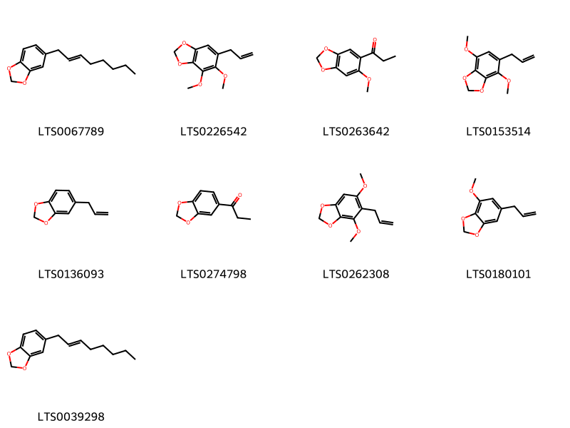{ width=100% }
    <figcaption>Hình ảnh cấu trúc hóa học của 9 hoạt chất thuộc nhóm Benzodioxoles gồm ['5-(oct-2-en-1-yl)-2h-1,3-benzodioxole (LTS0067789)', 'dillapiol (LTS0226542)', '1-(6-methoxy-2h-1,3-benzodioxol-5-yl)propan-1-one (LTS0263642)', 'apiol (LTS0153514)', 'sassafras (LTS0136093)', '1-(2h-1,3-benzodioxol-5-yl)propan-1-one (LTS0274798)', '4,6-dimethoxy-5-(prop-2-en-1-yl)-2h-1,3-benzodioxole (LTS0262308)', 'myristicin (LTS0180101)', '5-[(2e)-oct-2-en-1-yl]-2h-1,3-benzodioxole (LTS0039298)'].</figcaption>
</figure>
#### Nhóm Cinnamic acids and derivatives
<figure markdown="span">
    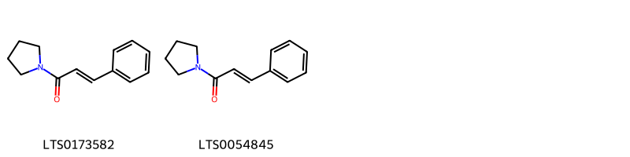{ width=100% }
    <figcaption>Hình ảnh cấu trúc hóa học của 2 hoạt chất thuộc nhóm Cinnamic acids and derivatives gồm ['3-phenyl-1-(pyrrolidin-1-yl)prop-2-en-1-one (LTS0173582)', '(2e)-3-phenyl-1-(pyrrolidin-1-yl)prop-2-en-1-one (LTS0054845)'].</figcaption>
</figure>
#### Nhóm Fatty Acyls
<figure markdown="span">
    { width=100% }
    <figcaption>Hình ảnh cấu trúc hóa học của 1 hoạt chất thuộc nhóm Fatty Acyls gồm ['stearic acid (LTS0237766)'].</figcaption>
</figure>
#### Nhóm Flavonoids
<figure markdown="span">
    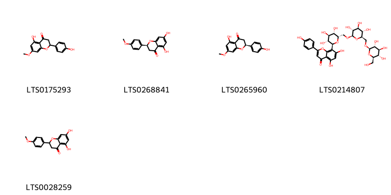{ width=100% }
    <figcaption>Hình ảnh cấu trúc hóa học của 5 hoạt chất thuộc nhóm Flavonoids gồm ['sakuranetin (LTS0175293)', 'isosakuranetin (LTS0268841)', 'sakuranetin (LTS0265960)', '5,7-dihydroxy-2-(4-hydroxyphenyl)-8-[(2s,3r,4r,5s,6s)-3,4,5-trihydroxy-6-({[(2r,3r,4s,5s,6r)-3,4,5-trihydroxy-6-({[(2r,3r,4s,5s,6r)-3,4,5-trihydroxy-6-(hydroxymethyl)oxan-2-yl]oxy}methyl)oxan-2-yl]oxy}methyl)oxan-2-yl]chromen-4-one (LTS0214807)', 'isosakuranetin (LTS0028259)'].</figcaption>
</figure>
#### Nhóm Phenol ethers
<figure markdown="span">
    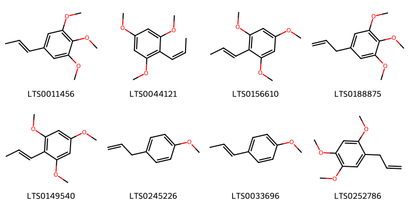{ width=100% }
    <figcaption>Hình ảnh cấu trúc hóa học của 8 hoạt chất thuộc nhóm Phenol ethers gồm ['isoelemicin (LTS0011456)', '1,3,5-trimethoxy-2-[(1z)-prop-1-en-1-yl]benzene (LTS0044121)', '1,3,5-trimethoxy-2-[(1e)-prop-1-en-1-yl]benzene (LTS0156610)', 'elemicin (LTS0188875)', '1,3,5-trimethoxy-2-(prop-1-en-1-yl)benzene (LTS0149540)', 'tarragon (LTS0245226)', 'anethole (LTS0033696)', '1,2,4-trimethoxy-5-(prop-2-en-1-yl)benzene (LTS0252786)'].</figcaption>
</figure>
#### Nhóm Prenol lipids
<figure markdown="span">
    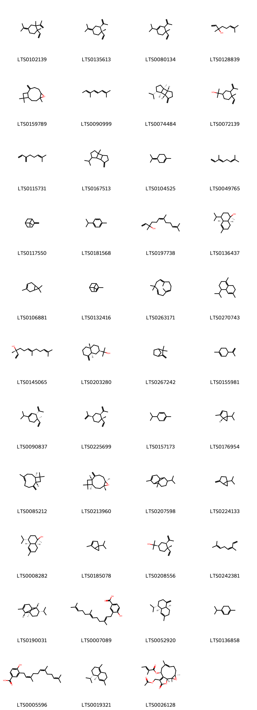{ width=100% }
    <figcaption>Hình ảnh cấu trúc hóa học của 43 hoạt chất thuộc nhóm Prenol lipids gồm ['1-ethenyl-1,2-dimethyl-2-(prop-1-en-2-yl)-4-(propan-2-ylidene)cyclohexane (LTS0102139)', '(1s,2s)-1-ethenyl-1-methyl-2-(prop-1-en-2-yl)-4-(propan-2-ylidene)cyclohexane (LTS0135613)', '4-ethenyl-1-isopropyl-4-methyl-3-(prop-1-en-2-yl)cyclohex-1-ene (LTS0080134)', 'linalool, (+-)- (LTS0128839)', 'caryophyllene oxide (LTS0159789)', 'allo-ocimene (LTS0090999)', 'β-bourbonene (LTS0074484)', '2-[4-ethenyl-4-methyl-3-(prop-1-en-2-yl)cyclohexyl]propan-2-ol (LTS0072139)', 'α-myrcene (LTS0115731)', 'β-bourbonene (LTS0167513)', 'terpinolene (LTS0104525)', 'trans-β-ocimene (LTS0049765)', 'β-pinene (LTS0117550)', 'cymene (LTS0181568)', 'nerolidol (LTS0197738)', '(1r,4ar,8as)-4-isopropyl-1,6-dimethyl-3,4,4a,7,8,8a-hexahydro-2h-naphthalen-1-ol (LTS0136437)', 'monoterpenes (LTS0106881)', 'α pinene (LTS0132416)', 'humulene (LTS0263171)', '4-isopropyl-1,6-dimethyl-2,3,4,4a,7,8-hexahydronaphthalene (LTS0270743)', '(3r,6e)-nerolidol (LTS0145065)', 'β-eudesmol (LTS0203280)', 'camphene (LTS0267242)', 'limonene,  (LTS0155981)', 'elemene (LTS0090837)', 'β-elemene (LTS0225699)', 'phellandrene (LTS0157173)', 'α-thujene (LTS0176954)', 'caryophyllene (LTS0085212)', 'β-caryophyllene oxide (LTS0213960)', 'α-copaene (LTS0207598)', 'sabinene (LTS0224133)', 'delta-cadinol (LTS0008282)', 'α-thujene (LTS0185078)', 'elemol (LTS0208556)', 'β-ocimene (LTS0242381)', '(1r,2s,7s,8s)-8-isopropyl-1,3-dimethyltricyclo[4.4.0.0²,⁷]dec-3-ene (LTS0190031)', '4-hydroxy-3-[(2e,6e)-3,7,11-trimethyldodeca-2,6,10-trien-1-yl]benzoic acid (LTS0007089)', 'gamma-muurolene (LTS0052920)', 'terpinene (LTS0136858)', '4-hydroxy-3-(3,7,11-trimethyldodeca-2,6,10-trien-1-yl)benzoic acid (LTS0005596)', 'delta-cadinene (LTS0019321)', '(1s,2r,4r,7e,10s)-12-[(acetyloxy)methyl]-4,8-dimethyl-13-oxo-3,14-dioxatricyclo[9.3.0.0²,⁴]tetradeca-7,11-dien-10-yl (2e)-2-methylbut-2-enoate (LTS0026128)'].</figcaption>
</figure>
#### Nhóm Saturated hydrocarbons
<figure markdown="span">
    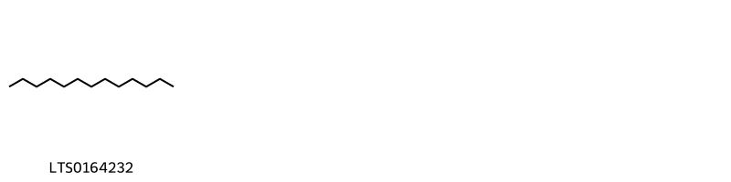{ width=100% }
    <figcaption>Hình ảnh cấu trúc hóa học của 1 hoạt chất thuộc nhóm Saturated hydrocarbons gồm ['tridecane (LTS0164232)'].</figcaption>
</figure>
#### Nhóm Unsaturated hydrocarbons
<figure markdown="span">
    { width=100% }
    <figcaption>Hình ảnh cấu trúc hóa học của 1 hoạt chất thuộc nhóm Unsaturated hydrocarbons gồm ['α terpinene (LTS0232891)'].</figcaption>
</figure>

---

### Dược dân tộc học

Danh sách các quốc gia có sử dụng *Piper marginatum* trong điều trị các bệnh. 

| Country   | Disease                                               | Bệnh                                                                                                                                                                                                |
|:----------|:------------------------------------------------------|:----------------------------------------------------------------------------------------------------------------------------------------------------------------------------------------------------|
| Panama    | Apertif, Carminative, Emmenagogue, Diuretic, Hemostat | MYMEMORY WARNING: YOU USED ALL AVAILABLE FREE TRANSLATIONS FOR TODAY. NEXT AVAILABLE IN  08 HOURS 06 MINUTES 02 SECONDS VISIT HTTPS://MYMEMORY.TRANSLATED.NET/DOC/USAGELIMITS.PHP TO TRANSLATE MORE |

---

---
## Piper medium
### Thông tin về thực vật

!!! info "Phân loại thực vật của *Piper amalago* từ GIBF:"
    - **Kingdom:** Plantae
    - **Phylum:** Tracheophyta
    - **Order:** Piperales
    - **Family:** Piperaceae
    - **Genus:** Piper
    - **Species:** *Piper amalago*

 

| Label (VI)   | Label (EN)   | Scientific Name   | Descriptions (VI)   | Descriptions (EN)   | Also Known As (VI)   | Also Known As (EN)   |
|:-------------|:-------------|:------------------|:--------------------|:--------------------|:---------------------|:---------------------|
| N/A          | N/A          | Piper marginatum  | loài thực vật       | species of plant    | ['']                 | ['']                 |

#### Phân bố trên thế giới

**Từ CSDL GIBF** nan, Brazil, Guatemala, Guadeloupe, Puerto Rico, Virgin Islands (U.S.), Dominican Republic, Colombia, Cuba, Argentina, unknown or invalid, Mexico, Norway, Haiti, Panama, Nicaragua, Bonaire, Sint Eustatius and Saba, Paraguay, Peru, Bolivia (Plurinational State of), Belize, Venezuela (Bolivarian Republic of)

#### Phân bố tại Việt Nam

**Từ CSDL GIBF**: Không có ghi nhận ở Việt Nam

---
### Thành phần hóa học
        
- Theo cơ sở dữ liệu lotus: Từ loài *Piper amalago* đã phân lập và xác định được Chưa có hoạt chất nào được phân lập. hoạt chất thuộc về các nhóm Không có hoạt chất nào được phân lập. 

Không có hình ảnh nào được tạo ra

---

### Dược dân tộc học

Danh sách các quốc gia có sử dụng *Piper amalago* trong điều trị các bệnh. 

| Country   | Disease     | Bệnh                                                                                                                                                                                                |
|:----------|:------------|:----------------------------------------------------------------------------------------------------------------------------------------------------------------------------------------------------|
| Haiti     | Carminative | MYMEMORY WARNING: YOU USED ALL AVAILABLE FREE TRANSLATIONS FOR TODAY. NEXT AVAILABLE IN  08 HOURS 05 MINUTES 31 SECONDS VISIT HTTPS://MYMEMORY.TRANSLATED.NET/DOC/USAGELIMITS.PHP TO TRANSLATE MORE |

---

---
## Piper methystichum
### Thông tin về thực vật

!!! info "Phân loại thực vật của *N/A* từ GIBF:"
    - **Kingdom:** Plantae
    - **Phylum:** Tracheophyta
    - **Order:** Piperales
    - **Family:** Piperaceae
    - **Genus:** N/A
    - **Species:** *N/A*

 

| Label (VI)   | Label (EN)   | Scientific Name   | Descriptions (VI)   | Descriptions (EN)   | Also Known As (VI)   | Also Known As (EN)   |
|:-------------|:-------------|:------------------|:--------------------|:--------------------|:---------------------|:---------------------|
| N/A          | N/A          | Piper marginatum  | loài thực vật       | species of plant    | ['']                 | ['']                 |

#### Phân bố trên thế giới

**Từ CSDL GIBF** Brazil, Japan, New Zealand, Honduras, Ecuador, Thailand, Puerto Rico, Sri Lanka, United States of America, Jamaica, Indonesia, Costa Rica, Dominican Republic, Colombia, Argentina, French Guiana, Mexico, Rwanda, Niue, Chinese Taipei, Malaysia, Philippines, Panama, Nicaragua, Singapore, Cambodia, Bonaire, Sint Eustatius and Saba, South Africa, Australia, India, Peru, Bolivia (Plurinational State of)

#### Phân bố tại Việt Nam

**Từ CSDL GIBF**: Không có ghi nhận ở Việt Nam

---
### Thành phần hóa học
        
- Theo cơ sở dữ liệu lotus: Từ loài *N/A* đã phân lập và xác định được Chưa có hoạt chất nào được phân lập. hoạt chất thuộc về các nhóm Không có hoạt chất nào được phân lập. 

Không có hình ảnh nào được tạo ra

---

### Dược dân tộc học

Danh sách các quốc gia có sử dụng *N/A* trong điều trị các bệnh. 

| Country    | Disease                                  | Bệnh                                                                                                                                                                                                |
|:-----------|:-----------------------------------------|:----------------------------------------------------------------------------------------------------------------------------------------------------------------------------------------------------|
| Fiji       | Sedative                                 | MYMEMORY WARNING: YOU USED ALL AVAILABLE FREE TRANSLATIONS FOR TODAY. NEXT AVAILABLE IN  08 HOURS 05 MINUTES 09 SECONDS VISIT HTTPS://MYMEMORY.TRANSLATED.NET/DOC/USAGELIMITS.PHP TO TRANSLATE MORE |
| New Guinea | Soporific, Tonic                         | MYMEMORY WARNING: YOU USED ALL AVAILABLE FREE TRANSLATIONS FOR TODAY. NEXT AVAILABLE IN  08 HOURS 05 MINUTES 07 SECONDS VISIT HTTPS://MYMEMORY.TRANSLATED.NET/DOC/USAGELIMITS.PHP TO TRANSLATE MORE |
| Samoa      | Aphrodisiac, Stimulant, Sudorific, Tonic | MYMEMORY WARNING: YOU USED ALL AVAILABLE FREE TRANSLATIONS FOR TODAY. NEXT AVAILABLE IN  08 HOURS 05 MINUTES 04 SECONDS VISIT HTTPS://MYMEMORY.TRANSLATED.NET/DOC/USAGELIMITS.PHP TO TRANSLATE MORE |

---

---
## Piper methysticum
### Thông tin về thực vật

!!! info "Phân loại thực vật của *N/A* từ GIBF:"
    - **Kingdom:** Plantae
    - **Phylum:** Tracheophyta
    - **Order:** Piperales
    - **Family:** Piperaceae
    - **Genus:** N/A
    - **Species:** *N/A*

 

| Label (VI)   | Label (EN)   | Scientific Name   | Descriptions (VI)   | Descriptions (EN)   | Also Known As (VI)   | Also Known As (EN)    |
|:-------------|:-------------|:------------------|:--------------------|:--------------------|:---------------------|:----------------------|
| N/A          | N/A          | Piper methysticum |                     | species of plant    | ['']                 | ['kava', 'kava kava'] |

#### Phân bố trên thế giới

**Từ CSDL GIBF** Brazil, Japan, New Zealand, Honduras, Ecuador, Thailand, Puerto Rico, Sri Lanka, United States of America, Jamaica, Indonesia, Costa Rica, Dominican Republic, Colombia, Argentina, French Guiana, Mexico, Rwanda, Niue, Chinese Taipei, Malaysia, Philippines, Panama, Nicaragua, Singapore, Cambodia, Bonaire, Sint Eustatius and Saba, South Africa, Australia, India, Peru, Bolivia (Plurinational State of)

#### Phân bố tại Việt Nam

**Từ CSDL GIBF**: Không có ghi nhận ở Việt Nam

---
### Thành phần hóa học
        
- Theo cơ sở dữ liệu lotus: Từ loài *N/A* đã phân lập và xác định được 63 hoạt chất thuộc về các nhóm Aporphines, Piperidines, Linear 1,3-diarylpropanoids, Flavonoids, Kavalactones, Cinnamic acids and derivatives, Steroids and steroid derivatives, Benzodioxoles, Pyridines and derivatives, Phenol ethers. 

|    | chemicalTaxonomyClassyfireClass   |   smiles_count |
|---:|:----------------------------------|---------------:|
|  0 | Aporphines                        |              1 |
|  1 | Benzodioxoles                     |              2 |
|  2 | Cinnamic acids and derivatives    |              9 |
|  3 | Flavonoids                        |              5 |
|  4 | Kavalactones                      |             25 |
|  5 | Linear 1,3-diarylpropanoids       |              7 |
|  6 | Phenol ethers                     |              2 |
|  7 | Piperidines                       |              2 |
|  8 | Pyridines and derivatives         |              6 |
|  9 | Steroids and steroid derivatives  |              3 |

#### Nhóm Aporphines
<figure markdown="span">
    { width=100% }
    <figcaption>Hình ảnh cấu trúc hóa học của 1 hoạt chất thuộc nhóm Aporphines gồm ['11-methyl-3,5-dioxa-11-azapentacyclo[10.7.1.0²,⁶.0⁸,²⁰.0¹⁴,¹⁹]icosa-1(20),2(6),7,12,14(19),15,17-heptaene-9,10-dione (LTS0083545)'].</figcaption>
</figure>
#### Nhóm Benzodioxoles
<figure markdown="span">
    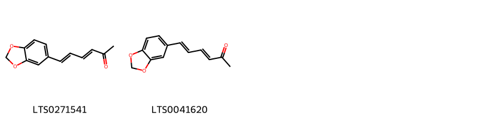{ width=100% }
    <figcaption>Hình ảnh cấu trúc hóa học của 2 hoạt chất thuộc nhóm Benzodioxoles gồm ['(3e,5e)-6-(2h-1,3-benzodioxol-5-yl)hexa-3,5-dien-2-one (LTS0271541)', '6-(2h-1,3-benzodioxol-5-yl)hexa-3,5-dien-2-one (LTS0041620)'].</figcaption>
</figure>
#### Nhóm Cinnamic acids and derivatives
<figure markdown="span">
    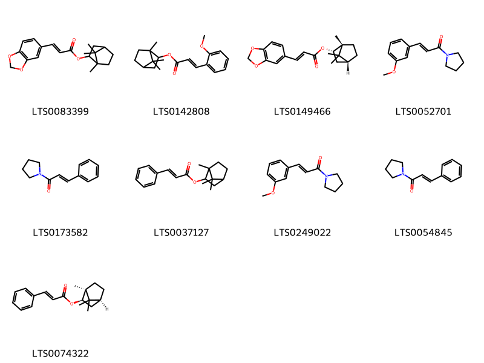{ width=100% }
    <figcaption>Hình ảnh cấu trúc hóa học của 9 hoạt chất thuộc nhóm Cinnamic acids and derivatives gồm ['1,7,7-trimethylbicyclo[2.2.1]heptan-2-yl 3-(2h-1,3-benzodioxol-5-yl)prop-2-enoate (LTS0083399)', '1,7,7-trimethylbicyclo[2.2.1]heptan-2-yl 3-(2-methoxyphenyl)prop-2-enoate (LTS0142808)', '(1r,2s,4r)-1,7,7-trimethylbicyclo[2.2.1]heptan-2-yl (2e)-3-(2h-1,3-benzodioxol-5-yl)prop-2-enoate (LTS0149466)', '(2e)-3-(3-methoxyphenyl)-1-(pyrrolidin-1-yl)prop-2-en-1-one (LTS0052701)', '3-phenyl-1-(pyrrolidin-1-yl)prop-2-en-1-one (LTS0173582)', '1,7,7-trimethylbicyclo[2.2.1]heptan-2-yl 3-phenylprop-2-enoate (LTS0037127)', '3-(3-methoxyphenyl)-1-(pyrrolidin-1-yl)prop-2-en-1-one (LTS0249022)', '(2e)-3-phenyl-1-(pyrrolidin-1-yl)prop-2-en-1-one (LTS0054845)', '(1s,2r,4s)-1,7,7-trimethylbicyclo[2.2.1]heptan-2-yl (2e)-3-phenylprop-2-enoate (LTS0074322)'].</figcaption>
</figure>
#### Nhóm Flavonoids
<figure markdown="span">
    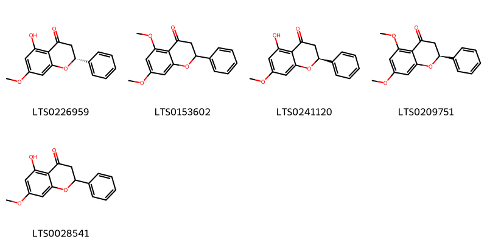{ width=100% }
    <figcaption>Hình ảnh cấu trúc hóa học của 5 hoạt chất thuộc nhóm Flavonoids gồm ['(2r)-5-hydroxy-7-methoxy-2-phenyl-2,3-dihydro-1-benzopyran-4-one (LTS0226959)', 'pinocembrin 5,7-dimethyl ether (LTS0153602)', 'pinostrobin (LTS0241120)', '(2s)-5,7-dimethoxy-2-phenyl-2,3-dihydro-1-benzopyran-4-one (LTS0209751)', 'pinostrobin (LTS0028541)'].</figcaption>
</figure>
#### Nhóm Kavalactones
<figure markdown="span">
    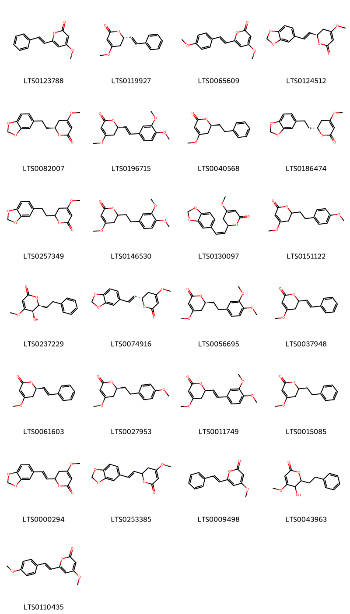{ width=100% }
    <figcaption>Hình ảnh cấu trúc hóa học của 25 hoạt chất thuộc nhóm Kavalactones gồm ['5,6-dehydrokawain (LTS0123788)', '(-)-kawain (LTS0119927)', '4-methoxy-6-[2-(4-methoxyphenyl)ethenyl]pyran-2-one (LTS0065609)', 'methysticin (LTS0124512)', '7,8-dihydromethysticin (LTS0082007)', '(6r)-6-[(1e)-2-(3,4-dimethoxyphenyl)ethenyl]-4-methoxy-5,6-dihydropyran-2-one (LTS0196715)', 'dihydrokawain (LTS0040568)', '(r)-dihydromethysticin (LTS0186474)', 'dihydromethysticin (LTS0257349)', '6-[2-(3,4-dimethoxyphenyl)ethyl]-4-methoxy-5,6-dihydropyran-2-one (LTS0146530)', '6-[(1z)-2-(2h-1,3-benzodioxol-5-yl)ethenyl]-4-methoxy-5,6-dihydropyran-2-one (LTS0130097)', '4-methoxy-6-[2-(4-methoxyphenyl)ethyl]-5,6-dihydropyran-2-one (LTS0151122)', '(5r,6s)-5-hydroxy-4-methoxy-6-(2-phenylethyl)-5,6-dihydropyran-2-one (LTS0237229)', '(6s)-6-[(1e)-2-(2h-1,3-benzodioxol-5-yl)ethenyl]-4-methoxy-5,6-dihydropyran-2-one (LTS0074916)', '(6s)-6-[2-(3,4-dimethoxyphenyl)ethyl]-4-methoxy-5,6-dihydropyran-2-one (LTS0056695)', '4-methoxy-6-(2-phenylethenyl)-5,6-dihydropyran-2-one (LTS0037948)', 'kawain (LTS0061603)', '(6s)-4-methoxy-6-[2-(4-methoxyphenyl)ethyl]-5,6-dihydropyran-2-one (LTS0027953)', '6-[2-(3,4-dimethoxyphenyl)ethenyl]-4-methoxy-5,6-dihydropyran-2-one (LTS0011749)', 'dihydrokavain (LTS0015085)', '6-[2-(2h-1,3-benzodioxol-5-yl)ethenyl]-4-methoxy-5,6-dihydropyran-2-one (LTS0000294)', 'methysticin (LTS0253385)', 'desmethoxyyangonin (LTS0009498)', '5-hydroxy-4-methoxy-6-(2-phenylethyl)-5,6-dihydropyran-2-one (LTS0043963)', 'yangonin (LTS0110435)'].</figcaption>
</figure>
#### Nhóm Linear 1_3-diarylpropanoids
<figure markdown="span">
    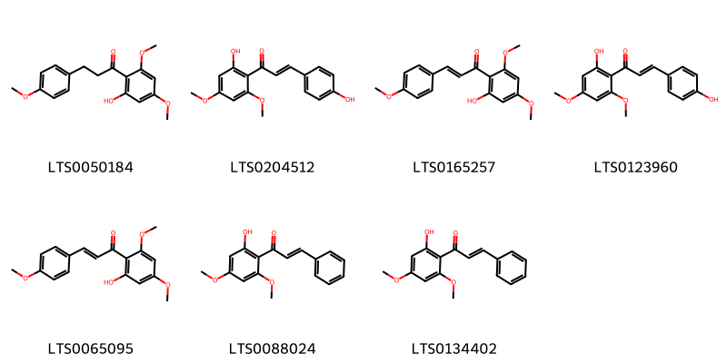{ width=100% }
    <figcaption>Hình ảnh cấu trúc hóa học của Không tìm thấy chú thích hoạt chất thuộc nhóm Linear 1_3-diarylpropanoids gồm Không tìm thấy chú thích.</figcaption>
</figure>
#### Nhóm Phenol ethers
<figure markdown="span">
    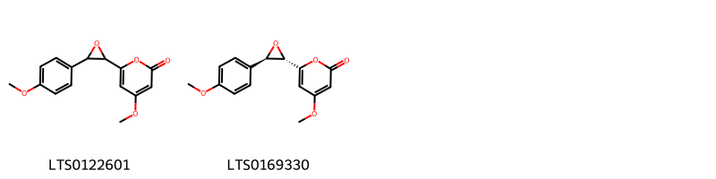{ width=100% }
    <figcaption>Hình ảnh cấu trúc hóa học của 2 hoạt chất thuộc nhóm Phenol ethers gồm ['4-methoxy-6-[3-(4-methoxyphenyl)oxiran-2-yl]pyran-2-one (LTS0122601)', '4-methoxy-6-[(2s,3r)-3-(4-methoxyphenyl)oxiran-2-yl]pyran-2-one (LTS0169330)'].</figcaption>
</figure>
#### Nhóm Piperidines
<figure markdown="span">
    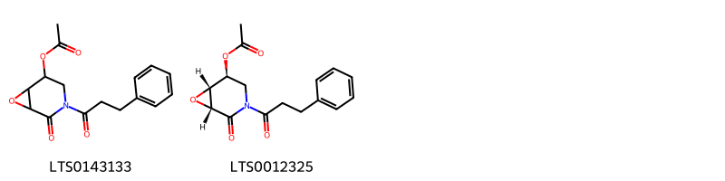{ width=100% }
    <figcaption>Hình ảnh cấu trúc hóa học của 2 hoạt chất thuộc nhóm Piperidines gồm ['2-oxo-3-(3-phenylpropanoyl)-7-oxa-3-azabicyclo[4.1.0]heptan-5-yl acetate (LTS0143133)', '(1r,5s,6r)-2-oxo-3-(3-phenylpropanoyl)-7-oxa-3-azabicyclo[4.1.0]heptan-5-yl acetate (LTS0012325)'].</figcaption>
</figure>
#### Nhóm Pyridines and derivatives
<figure markdown="span">
    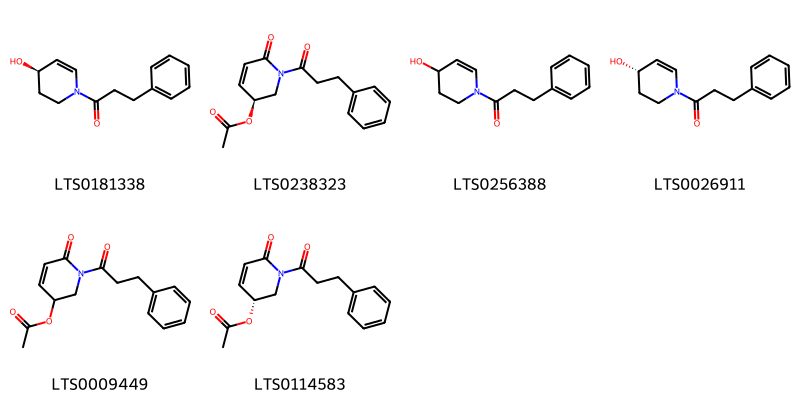{ width=100% }
    <figcaption>Hình ảnh cấu trúc hóa học của 6 hoạt chất thuộc nhóm Pyridines and derivatives gồm ['1-[(4r)-4-hydroxy-3,4-dihydro-2h-pyridin-1-yl]-3-phenylpropan-1-one (LTS0181338)', 'pipermethystine (LTS0238323)', '1-(4-hydroxy-3,4-dihydro-2h-pyridin-1-yl)-3-phenylpropan-1-one (LTS0256388)', '1-[(4s)-4-hydroxy-3,4-dihydro-2h-pyridin-1-yl]-3-phenylpropan-1-one (LTS0026911)', 'pipermethystine (LTS0009449)', '(3r)-6-oxo-1-(3-phenylpropanoyl)-2,3-dihydropyridin-3-yl acetate (LTS0114583)'].</figcaption>
</figure>
#### Nhóm Steroids and steroid derivatives
<figure markdown="span">
    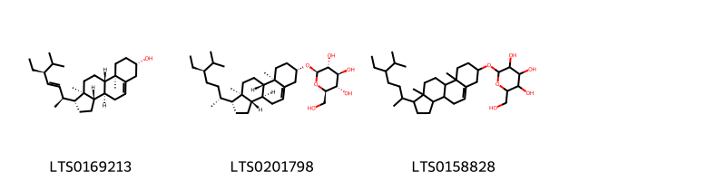{ width=100% }
    <figcaption>Hình ảnh cấu trúc hóa học của 3 hoạt chất thuộc nhóm Steroids and steroid derivatives gồm ['(1r,3as,3bs,7s,9ar,9bs,11ar)-1-[(2s,3e,5s)-5-ethyl-6-methylhept-3-en-2-yl]-9a,11a-dimethyl-1h,2h,3h,3ah,3bh,4h,6h,7h,8h,9h,9bh,10h,11h-cyclopenta[a]phenanthren-7-ol (LTS0169213)', 'sitogluside (LTS0201798)', '2-{[1-(5-ethyl-6-methylheptan-2-yl)-9a,11a-dimethyl-1h,2h,3h,3ah,3bh,4h,6h,7h,8h,9h,9bh,10h,11h-cyclopenta[a]phenanthren-7-yl]oxy}-6-(hydroxymethyl)oxane-3,4,5-triol (LTS0158828)'].</figcaption>
</figure>

---

### Dược dân tộc học

Danh sách các quốc gia có sử dụng *N/A* trong điều trị các bệnh. 

| Country   | Disease                                                                    | Bệnh                                                                                                                                                                                                |
|:----------|:---------------------------------------------------------------------------|:----------------------------------------------------------------------------------------------------------------------------------------------------------------------------------------------------|
| Elsewhere | Diuretic                                                                   | MYMEMORY WARNING: YOU USED ALL AVAILABLE FREE TRANSLATIONS FOR TODAY. NEXT AVAILABLE IN  08 HOURS 04 MINUTES 42 SECONDS VISIT HTTPS://MYMEMORY.TRANSLATED.NET/DOC/USAGELIMITS.PHP TO TRANSLATE MORE |
| Oceania   | Antiseptic, Diuretic, Expectorant, Narcotic, Stimulant                     | MYMEMORY WARNING: YOU USED ALL AVAILABLE FREE TRANSLATIONS FOR TODAY. NEXT AVAILABLE IN  08 HOURS 04 MINUTES 40 SECONDS VISIT HTTPS://MYMEMORY.TRANSLATED.NET/DOC/USAGELIMITS.PHP TO TRANSLATE MORE |
| Southseas | Sedative                                                                   | MYMEMORY WARNING: YOU USED ALL AVAILABLE FREE TRANSLATIONS FOR TODAY. NEXT AVAILABLE IN  08 HOURS 04 MINUTES 37 SECONDS VISIT HTTPS://MYMEMORY.TRANSLATED.NET/DOC/USAGELIMITS.PHP TO TRANSLATE MORE |
| Turkey    | Antiseptic, Aphrodisiac, Diuretic, Intoxicant, Tonic, Sudorific, Stimulant | MYMEMORY WARNING: YOU USED ALL AVAILABLE FREE TRANSLATIONS FOR TODAY. NEXT AVAILABLE IN  08 HOURS 04 MINUTES 35 SECONDS VISIT HTTPS://MYMEMORY.TRANSLATED.NET/DOC/USAGELIMITS.PHP TO TRANSLATE MORE |

---

---
## Piper nigrum
### Thông tin về thực vật

!!! info "Phân loại thực vật của *Piper nigrum* từ GIBF:"
    - **Kingdom:** Plantae
    - **Phylum:** Tracheophyta
    - **Order:** Piperales
    - **Family:** Piperaceae
    - **Genus:** Piper
    - **Species:** *Piper nigrum*

 

| Label (VI)   | Label (EN)   | Scientific Name   | Descriptions (VI)   | Descriptions (EN)   | Also Known As (VI)                                                                          | Also Known As (EN)   |
|:-------------|:-------------|:------------------|:--------------------|:--------------------|:--------------------------------------------------------------------------------------------|:---------------------|
| N/A          | N/A          | Piper nigrum      | loài thực vật       | species of plant    | ['Piper nigrum', 'Hạt tiêu', 'Hắc cổ nguyệt', 'Cổ nguyệt', 'Cây hồ tiêu', 'Bạch cổ nguyệt'] | ['peppercorn']       |

#### Phân bố trên thế giới

**Từ CSDL GIBF** Brazil, Viet Nam, Guadeloupe, Honduras, Trinidad and Tobago, Madagascar, Thailand, Sri Lanka, Réunion, United States of America, Jamaica, Indonesia, Seychelles, Costa Rica, Dominican Republic, Colombia, Sao Tome and Principe, French Guiana, Lao People’s Democratic Republic, Mexico, Benin, El Salvador, Malaysia, Chinese Taipei, Philippines, Panama, Cambodia, Martinique, Micronesia (Federated States of), India, Switzerland, Cameroon

#### Phân bố tại Việt Nam

**Từ CSDL GIBF**: Đồng Nai, Đăk Nông

---
### Thành phần hóa học
        
- Theo cơ sở dữ liệu lotus: Từ loài *Piper nigrum* đã phân lập và xác định được 316 hoạt chất thuộc về các nhóm Fatty Acyls, Piperidines, Unsaturated hydrocarbons, Carboxylic acids and derivatives, Phenols, Organooxygen compounds, Phenol ethers, Benzofurans, Carboximidic acids and derivatives, Cinnamaldehydes, Stilbenes, Aporphines, Benzene and substituted derivatives, Cinnamic acids and derivatives, Steroids and steroid derivatives, Pyridines and derivatives, Furanoid lignans, Phenol esters, Organonitrogen compounds, Flavonoids, Benzodioxoles, Pyrrolidines, Aristolactams, Prenol lipids. 

|    | chemicalTaxonomyClassyfireClass     |   smiles_count |
|---:|:------------------------------------|---------------:|
|  0 |                                     |              9 |
|  1 | Aporphines                          |              1 |
|  2 | Aristolactams                       |              1 |
|  3 | Benzene and substituted derivatives |              5 |
|  4 | Benzodioxoles                       |            132 |
|  5 | Benzofurans                         |              1 |
|  6 | Carboximidic acids and derivatives  |              7 |
|  7 | Carboxylic acids and derivatives    |              4 |
|  8 | Cinnamaldehydes                     |              1 |
|  9 | Cinnamic acids and derivatives      |             19 |
| 10 | Fatty Acyls                         |             26 |
| 11 | Flavonoids                          |              3 |
| 12 | Furanoid lignans                    |             10 |
| 13 | Organonitrogen compounds            |              2 |
| 14 | Organooxygen compounds              |              5 |
| 15 | Phenol esters                       |              1 |
| 16 | Phenol ethers                       |              3 |
| 17 | Phenols                             |              7 |
| 18 | Piperidines                         |             14 |
| 19 | Prenol lipids                       |             36 |
| 20 | Pyridines and derivatives           |              1 |
| 21 | Pyrrolidines                        |              9 |
| 22 | Steroids and steroid derivatives    |             12 |
| 23 | Stilbenes                           |              2 |
| 24 | Unsaturated hydrocarbons            |              1 |

#### Nhóm 
<figure markdown="span">
    { width=100% }
    <figcaption>Hình ảnh cấu trúc hóa học của 9 hoạt chất thuộc nhóm  gồm ['bioperine (LTS0038631)', '5-(7-{6-[5-oxo-5-(piperidin-1-yl)pent-3-en-1-yl]-2h-1,3-benzodioxol-4-yl}-2h-1,3-benzodioxol-5-yl)-1-(piperidin-1-yl)penta-2,4-dien-1-one (LTS0144957)', '(2e,4e)-5-(4-{6-[(3e)-5-oxo-5-(piperidin-1-yl)pent-3-en-1-yl]-2h-1,3-benzodioxol-4-yl}-2h-1,3-benzodioxol-5-yl)-1-(piperidin-1-yl)penta-2,4-dien-1-one (LTS0118295)', '5-(4-{6-[5-oxo-5-(piperidin-1-yl)pent-3-en-1-yl]-2h-1,3-benzodioxol-4-yl}-2h-1,3-benzodioxol-5-yl)-1-(piperidin-1-yl)penta-2,4-dien-1-one (LTS0254843)', '5-(2h-1,3-benzodioxol-5-yl)-1-(piperidin-1-yl)penta-2,4-dien-1-one (LTS0271968)', 'isochavicine (LTS0208999)', '(2e,4e)-5-(7-{6-[(3e)-5-oxo-5-(piperidin-1-yl)pent-3-en-1-yl]-2h-1,3-benzodioxol-4-yl}-2h-1,3-benzodioxol-5-yl)-1-(piperidin-1-yl)penta-2,4-dien-1-one (LTS0167100)', 'piperine (LTS0014461)', '(4e)-5-(2h-1,3-benzodioxol-5-yl)-1-(piperidin-1-yl)penta-2,4-dien-1-one (LTS0217173)'].</figcaption>
</figure>
#### Nhóm Aporphines
<figure markdown="span">
    { width=100% }
    <figcaption>Hình ảnh cấu trúc hóa học của 1 hoạt chất thuộc nhóm Aporphines gồm ['11-methyl-3,5-dioxa-11-azapentacyclo[10.7.1.0²,⁶.0⁸,²⁰.0¹⁴,¹⁹]icosa-1(20),2(6),7,12,14(19),15,17-heptaene-9,10-dione (LTS0083545)'].</figcaption>
</figure>
#### Nhóm Aristolactams
<figure markdown="span">
    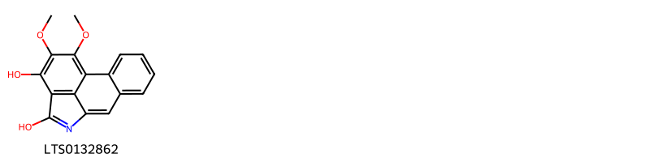{ width=100% }
    <figcaption>Hình ảnh cấu trúc hóa học của 1 hoạt chất thuộc nhóm Aristolactams gồm ['14,15-dimethoxy-10-azatetracyclo[7.6.1.0²,⁷.0¹²,¹⁶]hexadeca-1(16),2(7),3,5,8,10,12,14-octaene-11,13-diol (LTS0132862)'].</figcaption>
</figure>
#### Nhóm Benzene and substituted derivatives
<figure markdown="span">
    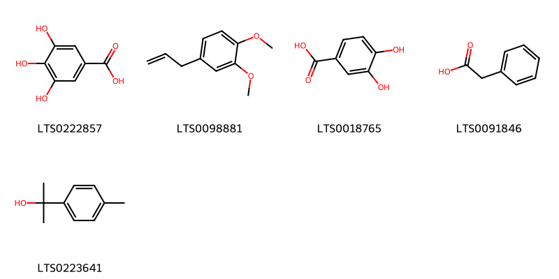{ width=100% }
    <figcaption>Hình ảnh cấu trúc hóa học của 5 hoạt chất thuộc nhóm Benzene and substituted derivatives gồm ['galop (LTS0222857)', 'methyl eugenol (LTS0098881)', '3,4-dihydroxybenzoic acid (LTS0018765)', 'ω-phenylacetic acid (LTS0091846)', 'p-cymen-8-ol (LTS0223641)'].</figcaption>
</figure>
#### Nhóm Benzodioxoles
<figure markdown="span">
    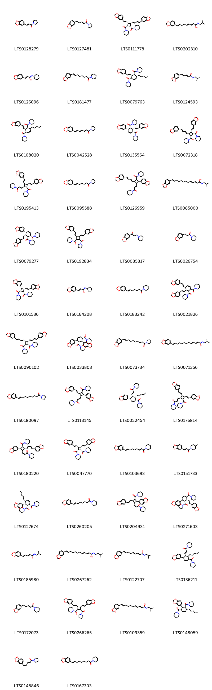{ width=100% }
    <figcaption>Hình ảnh cấu trúc hóa học của 132 hoạt chất thuộc nhóm Benzodioxoles gồm ['(2e)-3-(2h-1,3-benzodioxol-5-yl)-1-(pyrrolidin-1-yl)prop-2-en-1-one (LTS0128279)', '(2e)-5-(2h-1,3-benzodioxol-5-yl)-1-(pyrrolidin-1-yl)pent-2-en-1-one (LTS0127481)', '1-[(1s,2r,3r,4s)-3-[(1e,3e)-4-(2h-1,3-benzodioxol-5-yl)buta-1,3-dien-1-yl]-2-[(1e)-2-(2h-1,3-benzodioxol-5-yl)ethenyl]-4-(piperidine-1-carbonyl)cyclobutanecarbonyl]piperidine (LTS0111778)', '(2e,4e,8e)-9-(2h-1,3-benzodioxol-5-yl)-n-(2-methylpropyl)nona-2,4,8-trienimidic acid (LTS0202310)', '(2e)-3-(2h-1,3-benzodioxol-5-yl)-n-cyclohexylprop-2-enimidic acid (LTS0126096)', '8-(2h-1,3-benzodioxol-5-yl)-1-(piperidin-1-yl)oct-7-en-1-one (LTS0181477)', '1-[(1r,4s,5r,6r)-6-[(1e)-2-(2h-1,3-benzodioxol-5-yl)ethenyl]-4-pentyl-5-(piperidine-1-carbonyl)cyclohex-2-ene-1-carbonyl]piperidine (LTS0079763)', '5-(2h-1,3-benzodioxol-5-yl)-n-(2-methylpropyl)penta-2,4-dienamide (LTS0124593)', '1-{6-[2-(2h-1,3-benzodioxol-5-yl)ethenyl]-4-pentyl-5-(piperidine-1-carbonyl)cyclohex-2-ene-1-carbonyl}piperidine (LTS0108020)', '(2e,4e,6e)-7-(2h-1,3-benzodioxol-5-yl)-1-(pyrrolidin-1-yl)hepta-2,4,6-trien-1-one (LTS0042528)', '1-[(1r,4s,5s,6r)-4-(2h-1,3-benzodioxol-5-yl)-6-[(1e)-2-(2h-1,3-benzodioxol-5-yl)ethenyl]-5-(piperidine-1-carbonyl)cyclohex-2-ene-1-carbonyl]piperidine (LTS0135564)', '1-{3-[4-(2h-1,3-benzodioxol-5-yl)buta-1,3-dien-1-yl]-2-[2-(2h-1,3-benzodioxol-5-yl)ethenyl]-4-(piperidine-1-carbonyl)cyclobutanecarbonyl}piperidine (LTS0072318)', '3-{2,3-bis[2-(2h-1,3-benzodioxol-5-yl)ethenyl]-4-(piperidine-1-carbonyl)cyclobutyl}-1-(piperidin-1-yl)prop-2-en-1-one (LTS0195413)', '(6e)-7-(2h-1,3-benzodioxol-5-yl)-1-(pyrrolidin-1-yl)hept-6-en-1-one (LTS0095588)', '3-[2-(2h-1,3-benzodioxol-5-yl)-4-[4-(2h-1,3-benzodioxol-5-yl)buta-1,3-dien-1-yl]-3-(piperidine-1-carbonyl)cyclobutyl]-1-(piperidin-1-yl)prop-2-en-1-one (LTS0126959)', '13-(2h-1,3-benzodioxol-5-yl)-n-(2-methylpropyl)trideca-2,4,12-trienimidic acid (LTS0085000)', '1-[(1s,2s,5r,6r)-5-(2h-1,3-benzodioxol-5-yl)-6-[(1e)-2-(2h-1,3-benzodioxol-5-yl)ethenyl]-2-(piperidine-1-carbonyl)cyclohex-3-ene-1-carbonyl]piperidine (LTS0079277)', '1-{2,3-bis[2-(2h-1,3-benzodioxol-5-yl)ethenyl]-4-(pyrrolidine-1-carbonyl)cyclobutanecarbonyl}piperidine (LTS0192834)', '1-(2h-1,3-benzodioxol-5-yl)-3-(piperidin-1-yl)propan-1-one (LTS0085817)', '3-(2h-1,3-benzodioxol-5-yl)-1-(piperidin-1-yl)propan-1-one (LTS0026754)', '1-[(1s,2r,3r,4s)-2-(2h-1,3-benzodioxol-5-yl)-3-[(1e)-2-(2h-1,3-benzodioxol-5-yl)ethenyl]-4-(piperidine-1-carbonyl)cyclobutanecarbonyl]piperidine (LTS0101586)', '(2e)-3-(2h-1,3-benzodioxol-5-yl)-n-cyclopentylprop-2-enimidic acid (LTS0164208)', 'piperettine (LTS0183242)', '1-{5,6-bis[2-(2h-1,3-benzodioxol-5-yl)ethenyl]-2-(piperidine-1-carbonyl)cyclohex-3-ene-1-carbonyl}piperidine (LTS0021826)', '1-[(1s,2r,3r,4s)-2,3-bis[(1e,3e)-4-(2h-1,3-benzodioxol-5-yl)buta-1,3-dien-1-yl]-4-(piperidine-1-carbonyl)cyclobutanecarbonyl]piperidine (LTS0090102)', '1-[(1r,2s,5r,6r)-2,6-bis(2h-1,3-benzodioxol-5-yl)-5-(piperidine-1-carbonyl)cyclohex-3-ene-1-carbonyl]piperidine (LTS0033803)', '10-(2h-1,3-benzodioxol-5-yl)-1-(pyrrolidin-1-yl)dec-9-en-1-one (LTS0073734)', '(2e,4e,12e)-13-(2h-1,3-benzodioxol-5-yl)-n-(2-methylpropyl)trideca-2,4,12-trienimidic acid (LTS0071256)', '(9e)-10-(2h-1,3-benzodioxol-5-yl)-1-(pyrrolidin-1-yl)dec-9-en-1-one (LTS0180097)', '3-[2-(2h-1,3-benzodioxol-5-yl)-4-[2-(2h-1,3-benzodioxol-5-yl)ethenyl]-3-(piperidine-1-carbonyl)cyclobutyl]-1-(piperidin-1-yl)prop-2-en-1-one (LTS0113145)', '(2e)-3-[(1s,2s,5r,6s)-2-(2h-1,3-benzodioxol-5-yl)-6-pentyl-5-(piperidine-1-carbonyl)cyclohex-3-en-1-yl]-1-(piperidin-1-yl)prop-2-en-1-one (LTS0022454)', '(2e)-3-{2,3-bis[(1e)-2-(2h-1,3-benzodioxol-5-yl)ethenyl]-4-(piperidine-1-carbonyl)cyclobutyl}-1-(piperidin-1-yl)prop-2-en-1-one (LTS0176814)', '(2z)-3-[(1r,2s,3s,4r)-2-(2h-1,3-benzodioxol-5-yl)-4-[(1e,3e)-4-(2h-1,3-benzodioxol-5-yl)buta-1,3-dien-1-yl]-3-(piperidine-1-carbonyl)cyclobutyl]-1-(piperidin-1-yl)prop-2-en-1-one (LTS0180220)', '1-[(1s,2r,3r,4s)-2,3-bis[(1e)-2-(2h-1,3-benzodioxol-5-yl)ethenyl]-4-(piperidine-1-carbonyl)cyclobutanecarbonyl]piperidine (LTS0047770)', '(2e,8e)-9-(2h-1,3-benzodioxol-5-yl)-1-(piperidin-1-yl)nona-2,8-dien-1-one (LTS0103693)', '(2e)-3-(2h-1,3-benzodioxol-5-yl)-1-(4-methylpiperidin-1-yl)prop-2-en-1-one (LTS0151733)', '1-[(1s,4r,5r,6s)-5-(2h-1,3-benzodioxol-5-yl)-4-pentyl-6-(piperidine-1-carbonyl)cyclohex-2-ene-1-carbonyl]piperidine (LTS0127674)', '(7e)-8-(2h-1,3-benzodioxol-5-yl)-1-(piperidin-1-yl)oct-7-en-1-one (LTS0260205)', '(2z)-3-[2-(2h-1,3-benzodioxol-5-yl)-4-[(1e)-2-(2h-1,3-benzodioxol-5-yl)ethenyl]-3-(piperidine-1-carbonyl)cyclobutyl]-1-(piperidin-1-yl)prop-2-en-1-one (LTS0204931)', '1-[(1r,4s,5s,6r)-4-(2h-1,3-benzodioxol-5-yl)-6-[2-(2h-1,3-benzodioxol-5-yl)ethyl]-5-(pyrrolidine-1-carbonyl)cyclohex-2-ene-1-carbonyl]piperidine (LTS0271603)', '(2e,4e)-5-(2h-1,3-benzodioxol-5-yl)-n-(2-methylpropyl)penta-2,4-dienimidic acid (LTS0185980)', '12-(2h-1,3-benzodioxol-5-yl)-n-(3-methylbutyl)dodeca-2,4,11-trienimidic acid (LTS0267262)', '9-(2h-1,3-benzodioxol-5-yl)-n-(2-methylpropyl)nona-2,4,8-trienimidic acid (LTS0122707)', '3-[2-(2h-1,3-benzodioxol-5-yl)-6-pentyl-5-(piperidine-1-carbonyl)cyclohex-3-en-1-yl]-1-(piperidin-1-yl)prop-2-en-1-one (LTS0136211)', '5-(2h-1,3-benzodioxol-5-yl)-1-(piperidin-1-yl)pent-2-en-1-one (LTS0172073)', '1-{2,3-bis[(1e)-2-(2h-1,3-benzodioxol-5-yl)ethenyl]-4-(pyrrolidine-1-carbonyl)cyclobutanecarbonyl}piperidine (LTS0266265)', '11-(2h-1,3-benzodioxol-5-yl)-n-(2-methylpropyl)undeca-2,4,10-trienimidic acid (LTS0109359)', '1-[6-(2h-1,3-benzodioxol-5-yl)-4-pentyl-5-(piperidine-1-carbonyl)cyclohex-2-ene-1-carbonyl]piperidine (LTS0148059)', '(2e,4z)-5-(2h-1,3-benzodioxol-5-yl)-1-(pyrrolidin-1-yl)penta-2,4-dien-1-one (LTS0148846)', '(8e)-9-(2h-1,3-benzodioxol-5-yl)-1-(piperidin-1-yl)non-8-en-1-one (LTS0167303)', '(2e,4e,11e)-12-(2h-1,3-benzodioxol-5-yl)-n-(3-methylbutyl)dodeca-2,4,11-trienimidic acid (LTS0140616)', '3-(2h-1,3-benzodioxol-5-yl)-1-(piperidin-1-yl)prop-2-en-1-one (LTS0150506)', '1-[2-(2h-1,3-benzodioxol-5-yl)-6-[2-(2h-1,3-benzodioxol-5-yl)ethenyl]-5-(piperidine-1-carbonyl)cyclohex-3-ene-1-carbonyl]piperidine (LTS0167560)', '1-[2-(2h-1,3-benzodioxol-5-yl)-3-[2-(2h-1,3-benzodioxol-5-yl)ethenyl]-4-(piperidine-1-carbonyl)cyclobutanecarbonyl]piperidine (LTS0142411)', '7-(2h-1,3-benzodioxol-5-yl)-1-(piperidin-1-yl)hept-6-en-1-one (LTS0149354)', '5-[(1e)-tetradec-1-en-1-yl]-2h-1,3-benzodioxole (LTS0147425)', '1-[(1r,4s,5r,6r)-6-(2h-1,3-benzodioxol-5-yl)-4-pentyl-5-(piperidine-1-carbonyl)cyclohex-2-ene-1-carbonyl]piperidine (LTS0239348)', '(2e)-3-[2,4-bis(2h-1,3-benzodioxol-5-yl)-3-[(1e)-3-oxo-3-(piperidin-1-yl)prop-1-en-1-yl]cyclobutyl]-1-(piperidin-1-yl)prop-2-en-1-one (LTS0086636)', 'sassafras (LTS0136093)', '(2e,4e,12e)-13-(2h-1,3-benzodioxol-5-yl)-1-(pyrrolidin-1-yl)trideca-2,4,12-trien-1-one (LTS0228827)', '(2e,11e)-12-(2h-1,3-benzodioxol-5-yl)-n-(2-methylpropyl)dodeca-2,11-dienimidic acid (LTS0092445)', '1-[(1s,2s,5r,6r)-5-(2h-1,3-benzodioxol-5-yl)-6-[(1e,3e)-4-(2h-1,3-benzodioxol-5-yl)buta-1,3-dien-1-yl]-2-(piperidine-1-carbonyl)cyclohex-3-ene-1-carbonyl]piperidine (LTS0235666)', '3-[2,4-bis(2h-1,3-benzodioxol-5-yl)-3-(piperidine-1-carbonyl)cyclobutyl]-1-(piperidin-1-yl)prop-2-en-1-one (LTS0237437)', '7-(2h-1,3-benzodioxol-5-yl)-1-(piperidin-1-yl)hepta-2,6-dien-1-one (LTS0183088)', '(1s,2s,5r,6s)-2-(2h-1,3-benzodioxol-5-yl)-6-[(1e)-hept-1-en-1-yl]-n-(2-methylpropyl)-5-(piperidine-1-carbonyl)cyclohex-3-ene-1-carboximidic acid (LTS0156706)', '(2e,4e,8e)-9-(2h-1,3-benzodioxol-5-yl)-1-(pyrrolidin-1-yl)nona-2,4,8-trien-1-one (LTS0175728)', '5-(2h-1,3-benzodioxol-5-yl)-1-(pyrrolidin-1-yl)penta-2,4-dien-1-one (LTS0118001)', '9-(2h-1,3-benzodioxol-5-yl)-1-(piperidin-1-yl)nona-2,8-dien-1-one (LTS0254356)', '(2e)-3-(2h-1,3-benzodioxol-5-yl)-n-(2-methylpropyl)prop-2-enimidic acid (LTS0066857)', 'piperyline (LTS0275265)', '1-[2-(2h-1,3-benzodioxol-5-yl)-6-[2-(2h-1,3-benzodioxol-5-yl)ethyl]-5-(piperidine-1-carbonyl)cyclohex-3-ene-1-carbonyl]piperidine (LTS0064571)', '(2e)-3-[(1s,2r,5s,6s)-2-(2h-1,3-benzodioxol-5-yl)-6-pentyl-5-(piperidine-1-carbonyl)cyclohex-3-en-1-yl]-1-(pyrrolidin-1-yl)prop-2-en-1-one (LTS0199588)', 'pipercyclobutanamide a(rel) (LTS0202321)', '(2e)-3-[(1r,2r,3s,4r)-2,4-bis(2h-1,3-benzodioxol-5-yl)-3-(piperidine-1-carbonyl)cyclobutyl]-1-(piperidin-1-yl)prop-2-en-1-one (LTS0265786)', '5-(2h-1,3-benzodioxol-5-yl)-n-(2-methylpropyl)-4-pentyl-6-(piperidine-1-carbonyl)cyclohex-2-ene-1-carboximidic acid (LTS0053846)', 'trichostachine (LTS0259692)', '12-(2h-1,3-benzodioxol-5-yl)-n-(2-methylpropyl)dodeca-2,11-dienimidic acid (LTS0267849)', '1-(2h-1,3-benzodioxole-5-carbonyl)azepane (LTS0268707)', '(2e,8e)-9-(2h-1,3-benzodioxol-5-yl)-1-(pyrrolidin-1-yl)nona-2,8-dien-1-one (LTS0200151)', '(2e,4e)-8-(2h-1,3-benzodioxol-5-yl)-n-(3-methylbutyl)octa-2,4-dienimidic acid (LTS0196301)', '1-(2h-1,3-benzodioxole-5-carbothioyl)piperidine (LTS0210283)', '8-(2h-1,3-benzodioxol-5-yl)-n-(3-methylbutyl)octa-2,4-dienimidic acid (LTS0269066)', '(8e)-9-(2h-1,3-benzodioxol-5-yl)-1-(pyrrolidin-1-yl)non-8-en-1-one (LTS0231835)', '(4e)-5-(2h-1,3-benzodioxol-5-yl)-1-(pyrrolidin-1-yl)penta-2,4-dien-1-one (LTS0216899)', '7-(2h-1,3-benzodioxol-5-yl)-1-(pyrrolidin-1-yl)hept-6-en-1-one (LTS0219104)', 'piperonal (LTS0194867)', '(2e)-3-[(1s,2r,3s,4s)-2,3-bis[(1e)-2-(2h-1,3-benzodioxol-5-yl)ethenyl]-4-(piperidine-1-carbonyl)cyclobutyl]-1-(piperidin-1-yl)prop-2-en-1-one (LTS0273625)', '1-[5-(2h-1,3-benzodioxol-5-yl)-6-[4-(2h-1,3-benzodioxol-5-yl)buta-1,3-dien-1-yl]-2-(piperidine-1-carbonyl)cyclohex-3-ene-1-carbonyl]piperidine (LTS0081571)', '(2e)-3-[(1s,2r,3r,4s)-2-(2h-1,3-benzodioxol-5-yl)-4-[(1e)-2-(2h-1,3-benzodioxol-5-yl)ethenyl]-3-(piperidine-1-carbonyl)cyclobutyl]-1-(piperidin-1-yl)prop-2-en-1-one (LTS0224005)', '(2e)-3-[2-(2h-1,3-benzodioxol-5-yl)-4-[(1e)-2-(2h-1,3-benzodioxol-5-yl)ethenyl]-3-(piperidine-1-carbonyl)cyclobutyl]-1-(piperidin-1-yl)prop-2-en-1-one (LTS0052755)', '(2e,4e,10e)-11-(2h-1,3-benzodioxol-5-yl)-n-(2-methylpropyl)undeca-2,4,10-trienimidic acid (LTS0070252)', '9-(2h-1,3-benzodioxol-5-yl)-1-(piperidin-1-yl)non-8-en-1-one (LTS0071589)', '1-{2,3-bis[4-(2h-1,3-benzodioxol-5-yl)buta-1,3-dien-1-yl]-4-(piperidine-1-carbonyl)cyclobutanecarbonyl}piperidine (LTS0082323)', '3-[2,4-bis(2h-1,3-benzodioxol-5-yl)-3-[3-oxo-3-(piperidin-1-yl)prop-1-en-1-yl]cyclobutyl]-1-(piperidin-1-yl)prop-2-en-1-one (LTS0088515)', '13-(2h-1,3-benzodioxol-5-yl)-1-(pyrrolidin-1-yl)trideca-2,4,12-trien-1-one (LTS0041655)', '3-(2h-1,3-benzodioxol-5-yl)-n-(2-methylpropyl)prop-2-enimidic acid (LTS0042226)', '11-(2h-1,3-benzodioxol-5-yl)-n-(2-methylpropyl)undeca-2,10-dienimidic acid (LTS0230349)', '(2e)-3-[(1s,2r,3s,4r)-2-(2h-1,3-benzodioxol-5-yl)-4-[(1e)-2-(2h-1,3-benzodioxol-5-yl)ethenyl]-3-(piperidine-1-carbonyl)cyclobutyl]-1-(piperidin-1-yl)prop-2-en-1-one (LTS0018678)', '(2e)-5-(2h-1,3-benzodioxol-5-yl)-1-(piperidin-1-yl)pent-2-en-1-one (LTS0045312)', 'ilepcimide (LTS0026844)', '7-(2h-1,3-benzodioxol-5-yl)-1-(pyrrolidin-1-yl)hepta-2,4,6-trien-1-one (LTS0237875)', '1-[4-(2h-1,3-benzodioxol-5-yl)-6-[2-(2h-1,3-benzodioxol-5-yl)ethyl]-5-(pyrrolidine-1-carbonyl)cyclohex-2-ene-1-carbonyl]piperidine (LTS0172168)', '(2e)-1-(piperidin-1-yl)-3-[(1r,2r,3r,4r)-2,4-bis(2h-1,3-benzodioxol-5-yl)-3-[(1e)-3-oxo-3-(piperidin-1-yl)prop-1-en-1-yl]cyclobutyl]prop-2-en-1-one (LTS0231840)', '(2e,4e,8e)-9-(2h-1,3-benzodioxol-5-yl)-1-(piperidin-1-yl)nona-2,4,8-trien-1-one (LTS0157770)', '9-(2h-1,3-benzodioxol-5-yl)-n-(2-methylpropyl)non-8-enimidic acid (LTS0020388)', '3-[2-(2h-1,3-benzodioxol-5-yl)-6-pentyl-5-(piperidine-1-carbonyl)cyclohex-3-en-1-yl]-1-(pyrrolidin-1-yl)prop-2-en-1-one (LTS0146640)', '(2e,10e)-11-(2h-1,3-benzodioxol-5-yl)-n-(2-methylpropyl)undeca-2,10-dienimidic acid (LTS0050406)', '1-[(1s,2s,5r,6r)-2-(2h-1,3-benzodioxol-5-yl)-6-[2-(2h-1,3-benzodioxol-5-yl)ethyl]-5-(piperidine-1-carbonyl)cyclohex-3-ene-1-carbonyl]piperidine (LTS0257375)', '2-(2h-1,3-benzodioxol-5-yl)-6-(hept-1-en-1-yl)-n-(2-methylpropyl)-5-(piperidine-1-carbonyl)cyclohex-3-ene-1-carboximidic acid (LTS0042643)', '(2e)-5-(2h-1,3-benzodioxol-5-yl)-1-(piperidin-1-yl)pent-2-ene-1,5-dione (LTS0167519)', '1-{2,3-bis[2-(2h-1,3-benzodioxol-5-yl)ethenyl]-4-(piperidine-1-carbonyl)cyclobutanecarbonyl}piperidine (LTS0252659)', 'myristicin (LTS0180101)', '(8e)-9-(2h-1,3-benzodioxol-5-yl)-n-(2-methylpropyl)non-8-enimidic acid (LTS0256845)', '7-(2h-1,3-benzodioxol-5-yl)-1-(piperidin-1-yl)hepta-2,4,6-trien-1-one (LTS0227890)', '9-(2h-1,3-benzodioxol-5-yl)-1-(pyrrolidin-1-yl)non-8-en-1-one (LTS0172884)', '(2e)-3-(2h-1,3-benzodioxol-5-yl)-1-(morpholin-4-yl)prop-2-en-1-one (LTS0067355)', '5-(tetradec-1-en-1-yl)-2h-1,3-benzodioxole (LTS0258257)', '1-[(1s,2r,3r,4s)-2,3-bis[(1e)-2-(2h-1,3-benzodioxol-5-yl)ethenyl]-4-(pyrrolidine-1-carbonyl)cyclobutanecarbonyl]piperidine (LTS0068892)', '(2z)-3-[2-(2h-1,3-benzodioxol-5-yl)-4-[(1e,3e)-4-(2h-1,3-benzodioxol-5-yl)buta-1,3-dien-1-yl]-3-(piperidine-1-carbonyl)cyclobutyl]-1-(piperidin-1-yl)prop-2-en-1-one (LTS0001060)', '1-[5-(2h-1,3-benzodioxol-5-yl)-6-[2-(2h-1,3-benzodioxol-5-yl)ethenyl]-2-(piperidine-1-carbonyl)cyclohex-3-ene-1-carbonyl]piperidine (LTS0037283)', '9-(2h-1,3-benzodioxol-5-yl)-1-(pyrrolidin-1-yl)nona-2,8-dien-1-one (LTS0271250)', '(2e,6e)-7-(2h-1,3-benzodioxol-5-yl)-1-(piperidin-1-yl)hepta-2,6-dien-1-one (LTS0263734)', '(2e,4e,10e)-11-(2h-1,3-benzodioxol-4-yl)-n-(2-methylpropyl)undeca-2,4,10-trienimidic acid (LTS0006185)', '(2e,4e,6e)-7-(2h-1,3-benzodioxol-5-yl)-1-(piperidin-1-yl)hepta-2,4,6-trien-1-one (LTS0101098)', '9-(2h-1,3-benzodioxol-5-yl)-1-(pyrrolidin-1-yl)nona-2,4,8-trien-1-one (LTS0027027)', '9-(2h-1,3-benzodioxol-5-yl)-1-(piperidin-1-yl)nona-2,4,8-trien-1-one (LTS0113504)', '1-(2h-1,3-benzodioxol-5-yl)-2-(piperidin-1-yl)ethanone (LTS0032014)', '(1s,4r,5r,6s)-5-(2h-1,3-benzodioxol-5-yl)-n-(2-methylpropyl)-4-pentyl-6-(piperidine-1-carbonyl)cyclohex-2-ene-1-carboximidic acid (LTS0240119)', '1-[(1s,2s,5s,6r)-5,6-bis[(1e)-2-(2h-1,3-benzodioxol-5-yl)ethenyl]-2-(piperidine-1-carbonyl)cyclohex-3-ene-1-carbonyl]piperidine (LTS0110934)', '1-[5-(2h-1,3-benzodioxol-5-yl)-4-pentyl-6-(piperidine-1-carbonyl)cyclohex-2-ene-1-carbonyl]piperidine (LTS0127655)', '1-[2,6-bis(2h-1,3-benzodioxol-5-yl)-5-(piperidine-1-carbonyl)cyclohex-3-ene-1-carbonyl]piperidine (LTS0111985)', '5-(2h-1,3-benzodioxol-5-yl)-1-(pyrrolidin-1-yl)pent-2-en-1-one (LTS0114512)'].</figcaption>
</figure>
#### Nhóm Benzofurans
<figure markdown="span">
    { width=100% }
    <figcaption>Hình ảnh cấu trúc hóa học của 1 hoạt chất thuộc nhóm Benzofurans gồm ["7-hydroxy-6-isopropyl-3',3'-dimethyl-2-oxospiro[1-benzofuran-3,1'-cyclohexane]-2',4-dicarbaldehyde (LTS0255026)"].</figcaption>
</figure>
#### Nhóm Carboximidic acids and derivatives
<figure markdown="span">
    { width=100% }
    <figcaption>Hình ảnh cấu trúc hóa học của 7 hoạt chất thuộc nhóm Carboximidic acids and derivatives gồm ['(2e)-n-(2-methylpropyl)octadeca-2,4-dienimidic acid (LTS0137318)', 'n-(2-methylpropyl)tetradeca-2,4-dienimidic acid (LTS0234972)', 'n-(2-methylpropyl)octa-2,4-dienimidic acid (LTS0002796)', 'n-(2-methylpropyl)icosa-2,4,8-trienimidic acid (LTS0047433)', 'n-(3-methylbutyl)octadeca-2,4,12-trienimidic acid (LTS0199290)', '(2e,4e,12z)-n-(3-methylbutyl)octadeca-2,4,12-trienimidic acid (LTS0248983)', 'n-(4-methylpentyl)octadeca-2,4,12-trienimidic acid (LTS0045805)'].</figcaption>
</figure>
#### Nhóm Carboxylic acids and derivatives
<figure markdown="span">
    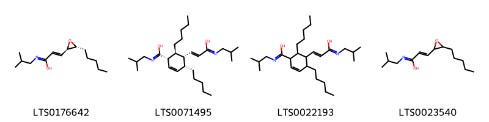{ width=100% }
    <figcaption>Hình ảnh cấu trúc hóa học của 4 hoạt chất thuộc nhóm Carboxylic acids and derivatives gồm ['(2e)-n-(2-methylpropyl)-3-[(2r,3r)-3-pentyloxiran-2-yl]prop-2-enimidic acid (LTS0176642)', '(1s,4r,5r,6s)-n-(2-methylpropyl)-5-[(1e)-2-[(2-methylpropyl)-c-hydroxycarbonimidoyl]eth-1-en-1-yl]-4,6-dipentylcyclohex-2-ene-1-carboximidic acid (LTS0071495)', 'n-(2-methylpropyl)-5-{2-[(2-methylpropyl)-c-hydroxycarbonimidoyl]eth-1-en-1-yl}-4,6-dipentylcyclohex-2-ene-1-carboximidic acid (LTS0022193)', 'n-(2-methylpropyl)-3-(3-pentyloxiran-2-yl)prop-2-enimidic acid (LTS0023540)'].</figcaption>
</figure>
#### Nhóm Cinnamaldehydes
<figure markdown="span">
    { width=100% }
    <figcaption>Hình ảnh cấu trúc hóa học của 1 hoạt chất thuộc nhóm Cinnamaldehydes gồm ['3-[3-(2h-1,3-benzodioxol-5-yl)phenyl]prop-2-enal (LTS0244098)'].</figcaption>
</figure>
#### Nhóm Cinnamic acids and derivatives
<figure markdown="span">
    { width=100% }
    <figcaption>Hình ảnh cấu trúc hóa học của 19 hoạt chất thuộc nhóm Cinnamic acids and derivatives gồm ['3,4-dihydroxycinnamic acid (LTS0128050)', '3-phenyl-1-(piperidin-1-yl)prop-2-en-1-one (LTS0108963)', '3-(4-hydroxy-3-methoxyphenyl)-n-[2-(4-hydroxyphenyl)ethyl]prop-2-enimidic acid (LTS0240896)', 'para-coumaric acid (LTS0266252)', '3-(2h-1,3-benzodioxol-5-yl)-1-(pyrrolidin-1-yl)prop-2-en-1-one (LTS0128254)', '3-(4-hydroxy-3-methoxyphenyl)-n-[2-(4-hydroxy-3-methoxyphenyl)ethyl]prop-2-enimidic acid (LTS0159666)', '3-(4-hydroxyphenyl)-n-[2-(4-hydroxyphenyl)ethyl]prop-2-enimidic acid (LTS0104591)', '(2e)-3-phenyl-1-(piperidin-1-yl)prop-2-en-1-one (LTS0273866)', '(2z)-3-(2h-1,3-benzodioxol-5-yl)-1-(piperidin-1-yl)prop-2-en-1-one (LTS0233107)', '(2e)-3-(4-hydroxy-3-methoxyphenyl)-n-[2-(4-hydroxy-3-methoxyphenyl)ethyl]prop-2-enimidic acid (LTS0045899)', '(2e)-3-(4-hydroxyphenyl)-n-[2-(4-hydroxyphenyl)ethyl]prop-2-enimidic acid (LTS0067822)', 'rosemary acid (LTS0207820)', '3-phenyl-1-(pyrrolidin-1-yl)prop-2-en-1-one (LTS0173582)', 'hydroxycinnamic acid (LTS0233023)', '(2e)-3-phenyl-1-(pyrrolidin-1-yl)prop-2-en-1-one (LTS0054845)', '(2z)-3-(7-methoxy-2h-1,3-benzodioxol-5-yl)-1-(piperidin-1-yl)prop-2-en-1-one (LTS0129612)', '(2e)-3-(4-hydroxy-3-methoxyphenyl)-1-(piperidin-1-yl)prop-2-en-1-one (LTS0018775)', '3-(4-hydroxy-3-methoxyphenyl)-1-(piperidin-1-yl)prop-2-en-1-one (LTS0240393)', '3-(7-methoxy-2h-1,3-benzodioxol-5-yl)-1-(piperidin-1-yl)prop-2-en-1-one (LTS0251163)'].</figcaption>
</figure>
#### Nhóm Fatty Acyls
<figure markdown="span">
    { width=100% }
    <figcaption>Hình ảnh cấu trúc hóa học của 26 hoạt chất thuộc nhóm Fatty Acyls gồm ['(2e,4e)-n-(2-methylpropyl)deca-2,4-dienimidic acid (LTS0152762)', '(2e,4e)-n-(2-methylpropyl)tetradeca-2,4-dienimidic acid (LTS0252670)', 'palmitic acid (LTS0079439)', '(2e,4e)-n-[(2r)-butan-2-yl]deca-2,4-dienimidic acid (LTS0052769)', 'n-(2-methylpropyl)octadeca-2,4,12-trienimidic acid (LTS0069416)', '4,5-dihydroxy-n-(2-methylpropyl)dec-2-enimidic acid (LTS0100055)', 'n-(4-methylpentyl)octadeca-2,12-dienimidic acid (LTS0041080)', 'n-(2-methylpropyl)octadeca-2,4-dienimidic acid (LTS0099588)', 'n-(2-methylpropyl)icosa-2,4-dienimidic acid (LTS0175563)', '(2e,4e,12z)-n-(2-methylpropyl)octadeca-2,4,12-trienimidic acid (LTS0244774)', '5-hydroxy-1-(4-hydroxy-3-methoxycyclohexyl)decan-3-one (LTS0255317)', '(2e,4e)-n-(2-methylpropyl)dodeca-2,4-dienimidic acid (LTS0201807)', '(2e,4e,12z)-n-(4-methylpentyl)octadeca-2,4,12-trienimidic acid (LTS0218287)', 'ethyl palmitate (LTS0111042)', '4-hydroxy-n-(2-methylpropyl)hex-2-enimidic acid (LTS0246359)', '4,5-dihydroxy-n-(2-methylpropyl)oct-2-enimidic acid (LTS0264931)', 'n-(2-methylpropyl)deca-2,4-dienimidic acid (LTS0009070)', '(2e,4e)-n-(2-methylpropyl)octadeca-2,4-dienimidic acid (LTS0232761)', '(2e,12z)-n-(4-methylpentyl)octadeca-2,12-dienimidic acid (LTS0139795)', 'n-(2-methylpropyl)dodeca-2,4-dienimidic acid (LTS0181699)', '(2e,4e)-n-(2-methylpropyl)icosa-2,4-dienimidic acid (LTS0008634)', '(2e,4r,5r)-4,5-dihydroxy-n-(2-methylpropyl)oct-2-enimidic acid (LTS0264591)', '(2e,4z)-n-(2-methylpropyl)octadeca-2,4-dienimidic acid (LTS0023771)', '(2e,4e,8z)-n-(2-methylpropyl)icosa-2,4,8-trienimidic acid (LTS0098642)', 'stearic acid (LTS0237766)', '(2e,4e)-n-(2-methylpropyl)octa-2,4-dienimidic acid (LTS0245146)'].</figcaption>
</figure>
#### Nhóm Flavonoids
<figure markdown="span">
    { width=100% }
    <figcaption>Hình ảnh cấu trúc hóa học của 3 hoạt chất thuộc nhóm Flavonoids gồm ['kaempherol (LTS0155822)', 'quercetin (LTS0004651)', '(+)-catechol (LTS0117079)'].</figcaption>
</figure>
#### Nhóm Furanoid lignans
<figure markdown="span">
    { width=100% }
    <figcaption>Hình ảnh cấu trúc hóa học của 10 hoạt chất thuộc nhóm Furanoid lignans gồm ['(2r,3r,4r)-3-(2h-1,3-benzodioxol-5-ylmethyl)-4-[(3,4-dimethoxyphenyl)methyl]oxolan-2-ol (LTS0204611)', '3,4-bis(2h-1,3-benzodioxol-5-ylmethyl)oxolan-2-ol (LTS0051516)', '4-[(3,4-dimethoxyphenyl)methyl]-3-[(3,4,5-trimethoxyphenyl)methyl]oxolan-2-ol (LTS0041312)', '(3s,4s)-3,4-bis(2h-1,3-benzodioxol-5-ylmethyl)oxolan-2-one (LTS0115450)', '3,4-bis(2h-1,3-benzodioxol-5-ylmethyl)oxolan-2-one (LTS0079231)', 'cubebin (LTS0234658)', '(2r,3s,4s)-4-[(3,4-dimethoxyphenyl)methyl]-3-[(3,4,5-trimethoxyphenyl)methyl]oxolan-2-ol (LTS0018787)', 'hinokinin (LTS0118756)', 'α-cubebin (LTS0249617)', '3-(2h-1,3-benzodioxol-5-ylmethyl)-4-[(3,4-dimethoxyphenyl)methyl]oxolan-2-ol (LTS0044643)'].</figcaption>
</figure>
#### Nhóm Organonitrogen compounds
<figure markdown="span">
    { width=100% }
    <figcaption>Hình ảnh cấu trúc hóa học của 2 hoạt chất thuộc nhóm Organonitrogen compounds gồm ['choline (LTS0170307)', 'acetylcholine (LTS0185507)'].</figcaption>
</figure>
#### Nhóm Organooxygen compounds
<figure markdown="span">
    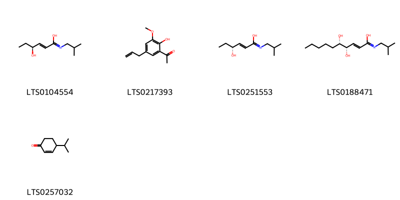{ width=100% }
    <figcaption>Hình ảnh cấu trúc hóa học của 5 hoạt chất thuộc nhóm Organooxygen compounds gồm ['(2e,4s)-4-hydroxy-n-(2-methylpropyl)hex-2-enimidic acid (LTS0104554)', '1-[2-hydroxy-3-methoxy-5-(prop-2-en-1-yl)phenyl]ethanone (LTS0217393)', '(2e,4r)-4-hydroxy-n-(2-methylpropyl)hex-2-enimidic acid (LTS0251553)', '(2e,4s,5s)-4,5-dihydroxy-n-(2-methylpropyl)dec-2-enimidic acid (LTS0188471)', '4-isopropyl-2-cyclohexenone (LTS0257032)'].</figcaption>
</figure>
#### Nhóm Phenol esters
<figure markdown="span">
    { width=100% }
    <figcaption>Hình ảnh cấu trúc hóa học của 1 hoạt chất thuộc nhóm Phenol esters gồm ['eugenyl acetate (LTS0165886)'].</figcaption>
</figure>
#### Nhóm Phenol ethers
<figure markdown="span">
    { width=100% }
    <figcaption>Hình ảnh cấu trúc hóa học của 3 hoạt chất thuộc nhóm Phenol ethers gồm ['p-propenylanisole (LTS0177188)', 'tarragon (LTS0245226)', 'anethole (LTS0033696)'].</figcaption>
</figure>
#### Nhóm Phenols
<figure markdown="span">
    { width=100% }
    <figcaption>Hình ảnh cấu trúc hóa học của 7 hoạt chất thuộc nhóm Phenols gồm ['(2e)-3-(4-hydroxy-3-methoxyphenyl)-n-[2-(4-hydroxyphenyl)ethyl]prop-2-enimidic acid (LTS0187051)', '(2e,4e)-5-(4-hydroxy-3-methoxyphenyl)-1-(piperidin-1-yl)penta-2,4-dien-1-one (LTS0138045)', '(2e)-5-(4-hydroxy-3-methoxyphenyl)-1-(piperidin-1-yl)pent-2-en-1-one (LTS0083326)', 'eugenol (LTS0052342)', 'gingerol (LTS0171573)', '5-(4-hydroxy-3-methoxyphenyl)-1-(piperidin-1-yl)pent-2-en-1-one (LTS0011454)', '5-(4-hydroxy-3-methoxyphenyl)-1-(piperidin-1-yl)penta-2,4-dien-1-one (LTS0034042)'].</figcaption>
</figure>
#### Nhóm Piperidines
<figure markdown="span">
    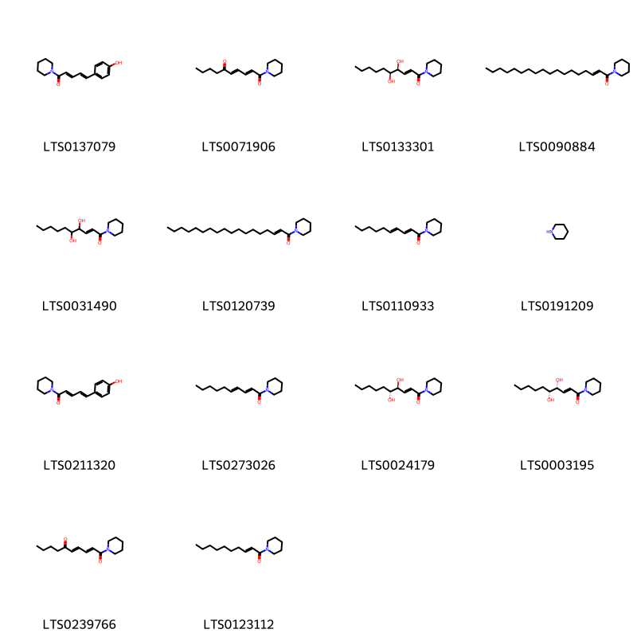{ width=100% }
    <figcaption>Hình ảnh cấu trúc hóa học của 14 hoạt chất thuộc nhóm Piperidines gồm ['coumaperine (LTS0137079)', '1-(piperidin-1-yl)deca-2,4-diene-1,6-dione (LTS0071906)', '(2e,4s,5s)-4,5-dihydroxy-1-(piperidin-1-yl)dec-2-en-1-one (LTS0133301)', '1-(piperidin-1-yl)octadec-2-en-1-one (LTS0090884)', '4,5-dihydroxy-1-(piperidin-1-yl)dec-2-en-1-one (LTS0031490)', '(2e)-1-(piperidin-1-yl)octadec-2-en-1-one (LTS0120739)', '1-(piperidin-1-yl)deca-2,4-dien-1-one (LTS0110933)', 'piperidine (LTS0191209)', '5-(4-hydroxyphenyl)-1-(piperidin-1-yl)penta-2,4-dien-1-one (LTS0211320)', '(2e,4e)-1-(piperidin-1-yl)deca-2,4-dien-1-one (LTS0273026)', '(2e,4s,5r)-4,5-dihydroxy-1-(piperidin-1-yl)dec-2-en-1-one (LTS0024179)', '(2e,4r,5r)-4,5-dihydroxy-1-(piperidin-1-yl)dec-2-en-1-one (LTS0003195)', '(2e,4e)-1-(piperidin-1-yl)deca-2,4-diene-1,6-dione (LTS0239766)', '(2e)-1-(piperidin-1-yl)dec-2-en-1-one (LTS0123112)'].</figcaption>
</figure>
#### Nhóm Prenol lipids
<figure markdown="span">
    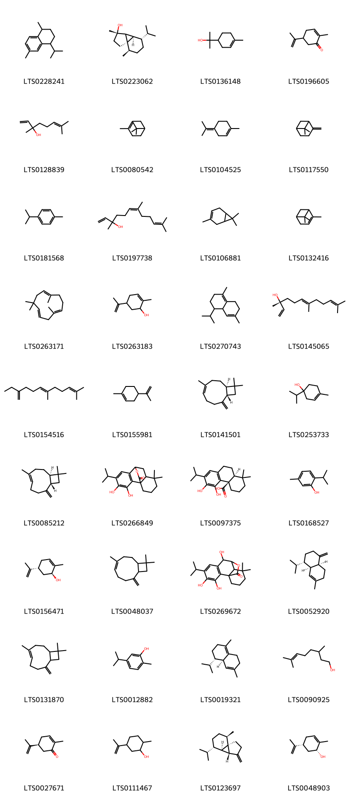{ width=100% }
    <figcaption>Hình ảnh cấu trúc hóa học của 36 hoạt chất thuộc nhóm Prenol lipids gồm ['(e)-calamene (LTS0228241)', '(1r,4s,6r,7s,10r)-7-isopropyl-4,10-dimethyltricyclo[4.4.0.0¹,⁵]decan-4-ol (LTS0223062)', 'terpineol (LTS0136148)', 'carvone (LTS0196605)', 'linalool, (+-)- (LTS0128839)', '2,6,6-trimethylbicyclo[3.1.1]hept-1-ene (LTS0080542)', 'terpinolene (LTS0104525)', 'β-pinene (LTS0117550)', 'cymene (LTS0181568)', 'nerolidol (LTS0197738)', 'monoterpenes (LTS0106881)', 'α pinene (LTS0132416)', 'humulene (LTS0263171)', 'carveol (LTS0263183)', '4-isopropyl-1,6-dimethyl-2,3,4,4a,7,8-hexahydronaphthalene (LTS0270743)', '(3r,6e)-nerolidol (LTS0145065)', '(6e)-2,6-dimethyl-10-methylidenedodeca-2,6-diene (LTS0154516)', 'limonene,  (LTS0155981)', 'β-caryophyllen (LTS0141501)', '4-terpineol (LTS0253733)', 'caryophyllene (LTS0085212)', '3,4-dihydroxy-5-isopropyl-11,11-dimethyl-16-oxatetracyclo[6.6.2.0¹,¹⁰.0²,⁷]hexadeca-2(7),3,5-trien-15-one (LTS0266849)', 'carnosic acid (LTS0097375)', 'thymol (LTS0168527)', '(-)-trans-carveol (LTS0156471)', 'caryophyllene (LTS0048037)', '3,4,8-trihydroxy-5-isopropyl-11,11-dimethyl-16-oxatetracyclo[7.5.2.0¹,¹⁰.0²,⁷]hexadeca-2(7),3,5-trien-15-one (LTS0269672)', 'gamma-muurolene (LTS0052920)', 'caryophyllene (LTS0131870)', 'carvacrol (LTS0012882)', 'delta-cadinene (LTS0019321)', 'citronellol, (+-)- (LTS0090925)', 'carvone, (+)- (LTS0027671)', 'dihydrocarveol (LTS0111467)', '(-)-β-cubebene (LTS0123697)', '(-)-cis-carveol (LTS0048903)'].</figcaption>
</figure>
#### Nhóm Pyridines and derivatives
<figure markdown="span">
    { width=100% }
    <figcaption>Hình ảnh cấu trúc hóa học của 1 hoạt chất thuộc nhóm Pyridines and derivatives gồm ['nicotine (LTS0177379)'].</figcaption>
</figure>
#### Nhóm Pyrrolidines
<figure markdown="span">
    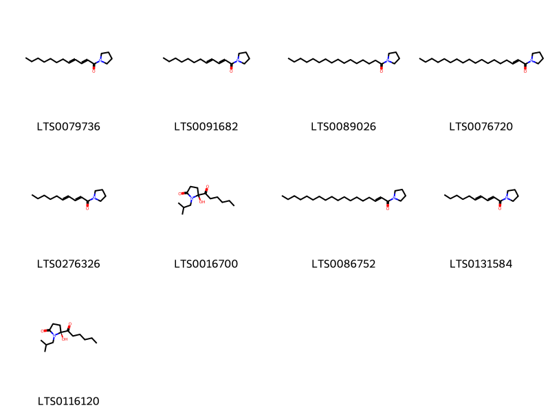{ width=100% }
    <figcaption>Hình ảnh cấu trúc hóa học của 9 hoạt chất thuộc nhóm Pyrrolidines gồm ['1-(pyrrolidin-1-yl)dodeca-2,4-dien-1-one (LTS0079736)', '(2e,4e)-1-(pyrrolidin-1-yl)dodeca-2,4-dien-1-one (LTS0091682)', '1-(pyrrolidin-1-yl)hexadecan-1-one (LTS0089026)', '(2e)-1-(pyrrolidin-1-yl)octadec-2-en-1-one (LTS0076720)', 'iyeremide a (LTS0276326)', '5-hexanoyl-5-hydroxy-1-(2-methylpropyl)pyrrolidin-2-one (LTS0016700)', '1-(pyrrolidin-1-yl)octadec-2-en-1-one (LTS0086752)', '1-(pyrrolidin-1-yl)deca-2,4-dien-1-one (LTS0131584)', '(5s)-5-hexanoyl-5-hydroxy-1-(2-methylpropyl)pyrrolidin-2-one (LTS0116120)'].</figcaption>
</figure>
#### Nhóm Steroids and steroid derivatives
<figure markdown="span">
    { width=100% }
    <figcaption>Hình ảnh cấu trúc hóa học của 12 hoạt chất thuộc nhóm Steroids and steroid derivatives gồm ['stigmast-5-en-3-ol (LTS0071224)', 'sitosterol (LTS0168132)', 'stigmast-5-en-3-ol, (3β)- (LTS0204616)', 'phytosterol (LTS0029311)', '(2r,3r,4s,5s,6r)-2-{[(1r,3as,3bs,7s,9ar,9bs,11ar)-1-[(2r,3e,5s)-5-ethyl-6-methylhept-3-en-2-yl]-9a,11a-dimethyl-1h,2h,3h,3ah,3bh,4h,6h,7h,8h,9h,9bh,10h,11h-cyclopenta[a]phenanthren-7-yl]oxy}-6-(hydroxymethyl)oxane-3,4,5-triol (LTS0088971)', 'sitogluside (LTS0201798)', '2-{[1-(5-ethyl-6-methylheptan-2-yl)-9a,11a-dimethyl-1h,2h,3h,3ah,3bh,4h,6h,7h,8h,9h,9bh,10h,11h-cyclopenta[a]phenanthren-7-yl]oxy}-6-(hydroxymethyl)oxane-3,4,5-triol (LTS0158828)', '(2r,3r,4s,5s,6s)-2-{[(1r,3as,3bs,7s,9ar,9bs,11ar)-1-[(2r,5r)-5-ethyl-6-methylheptan-2-yl]-9a,11a-dimethyl-1h,2h,3h,3ah,3bh,4h,6h,7h,8h,9h,9bh,10h,11h-cyclopenta[a]phenanthren-7-yl]oxy}-6-(hydroxymethyl)oxane-3,4,5-triol (LTS0076809)', '(3s,6r)-6-[(1r,3as,3br,9as,9bs,11ar)-9a,11a-dimethyl-tetradecahydro-1h-cyclopenta[a]phenanthren-1-yl]-3-isopropylheptan-1-ol (LTS0063219)', '(1r,3as,3bs,5as,7s,9as,9bs,11ar)-1-[(2r,5r)-5-ethyl-6-methylheptan-2-yl]-9a,11a-dimethyl-tetradecahydro-1h-cyclopenta[a]phenanthren-7-ol (LTS0213187)', '(1r,3as,3bs,7s,9ar,9bs,11ar)-1-[(2s,3e,5s)-5-ethyl-6-methylhept-3-en-2-yl]-9a,11a-dimethyl-1h,2h,3h,3ah,3bh,4h,6h,7h,8h,9h,9bh,10h,11h-cyclopenta[a]phenanthren-7-ol (LTS0169213)', '(1r,5as,7s,9as,9bs,11ar)-1-[(2r)-5-ethyl-6-methylheptan-2-yl]-9a,11a-dimethyl-tetradecahydro-1h-cyclopenta[a]phenanthren-7-ol (LTS0024392)'].</figcaption>
</figure>
#### Nhóm Stilbenes
<figure markdown="span">
    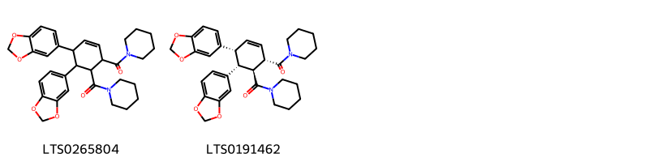{ width=100% }
    <figcaption>Hình ảnh cấu trúc hóa học của 2 hoạt chất thuộc nhóm Stilbenes gồm ['1-[5,6-bis(2h-1,3-benzodioxol-5-yl)-2-(piperidine-1-carbonyl)cyclohex-3-ene-1-carbonyl]piperidine (LTS0265804)', '1-[(1s,2s,5r,6r)-5,6-bis(2h-1,3-benzodioxol-5-yl)-2-(piperidine-1-carbonyl)cyclohex-3-ene-1-carbonyl]piperidine (LTS0191462)'].</figcaption>
</figure>
#### Nhóm Unsaturated hydrocarbons
<figure markdown="span">
    { width=100% }
    <figcaption>Hình ảnh cấu trúc hóa học của 1 hoạt chất thuộc nhóm Unsaturated hydrocarbons gồm ['1-eicosene (LTS0153664)'].</figcaption>
</figure>

---

### Dược dân tộc học

Danh sách các quốc gia có sử dụng *Piper nigrum* trong điều trị các bệnh. 

| Country   | Disease                                               | Bệnh                                                                                                                                                                                                |
|:----------|:------------------------------------------------------|:----------------------------------------------------------------------------------------------------------------------------------------------------------------------------------------------------|
| Asia      | Stimulant, Tonic                                      | MYMEMORY WARNING: YOU USED ALL AVAILABLE FREE TRANSLATIONS FOR TODAY. NEXT AVAILABLE IN  08 HOURS 04 MINUTES 09 SECONDS VISIT HTTPS://MYMEMORY.TRANSLATED.NET/DOC/USAGELIMITS.PHP TO TRANSLATE MORE |
| China     | Stimulant, Carminative, Carminative, Stomachic, Tonic | MYMEMORY WARNING: YOU USED ALL AVAILABLE FREE TRANSLATIONS FOR TODAY. NEXT AVAILABLE IN  08 HOURS 04 MINUTES 07 SECONDS VISIT HTTPS://MYMEMORY.TRANSLATED.NET/DOC/USAGELIMITS.PHP TO TRANSLATE MORE |
| Egypt     | Digestive, Stimulant, Tonic                           | MYMEMORY WARNING: YOU USED ALL AVAILABLE FREE TRANSLATIONS FOR TODAY. NEXT AVAILABLE IN  08 HOURS 04 MINUTES 04 SECONDS VISIT HTTPS://MYMEMORY.TRANSLATED.NET/DOC/USAGELIMITS.PHP TO TRANSLATE MORE |
| Elsewhere | Antioxidant, nan, Carminative, Fungicide, Stomachic   | MYMEMORY WARNING: YOU USED ALL AVAILABLE FREE TRANSLATIONS FOR TODAY. NEXT AVAILABLE IN  08 HOURS 04 MINUTES 01 SECONDS VISIT HTTPS://MYMEMORY.TRANSLATED.NET/DOC/USAGELIMITS.PHP TO TRANSLATE MORE |
| India     | Rubefacient, Poison, Stimulant                        | MYMEMORY WARNING: YOU USED ALL AVAILABLE FREE TRANSLATIONS FOR TODAY. NEXT AVAILABLE IN  08 HOURS 03 MINUTES 58 SECONDS VISIT HTTPS://MYMEMORY.TRANSLATED.NET/DOC/USAGELIMITS.PHP TO TRANSLATE MORE |
| Malaya    | Abortifacient                                         | MYMEMORY WARNING: YOU USED ALL AVAILABLE FREE TRANSLATIONS FOR TODAY. NEXT AVAILABLE IN  08 HOURS 03 MINUTES 56 SECONDS VISIT HTTPS://MYMEMORY.TRANSLATED.NET/DOC/USAGELIMITS.PHP TO TRANSLATE MORE |
| Turkey    | Apertif, Carminative, Digestive, Stimulant, Stomachic | MYMEMORY WARNING: YOU USED ALL AVAILABLE FREE TRANSLATIONS FOR TODAY. NEXT AVAILABLE IN  08 HOURS 03 MINUTES 53 SECONDS VISIT HTTPS://MYMEMORY.TRANSLATED.NET/DOC/USAGELIMITS.PHP TO TRANSLATE MORE |

---

---
## Piper palmeri
### Thông tin về thực vật

!!! info "Phân loại thực vật của *Piper palmeri* từ GIBF:"
    - **Kingdom:** Plantae
    - **Phylum:** Tracheophyta
    - **Order:** Piperales
    - **Family:** Piperaceae
    - **Genus:** Piper
    - **Species:** *Piper palmeri*

 

| Label (VI)   | Label (EN)   | Scientific Name   | Descriptions (VI)   | Descriptions (EN)   | Also Known As (VI)   | Also Known As (EN)   |
|:-------------|:-------------|:------------------|:--------------------|:--------------------|:---------------------|:---------------------|
| N/A          | N/A          | Piper palmeri     | loài thực vật       | species of plant    | ['']                 | ['']                 |

#### Phân bố trên thế giới

**Từ CSDL GIBF** nan, Mexico

#### Phân bố tại Việt Nam

**Từ CSDL GIBF**: Không có ghi nhận ở Việt Nam

---
### Thành phần hóa học
        
- Theo cơ sở dữ liệu lotus: Từ loài *Piper palmeri* đã phân lập và xác định được Chưa có hoạt chất nào được phân lập. hoạt chất thuộc về các nhóm Không có hoạt chất nào được phân lập. 

Không có hình ảnh nào được tạo ra

---

### Dược dân tộc học

Danh sách các quốc gia có sử dụng *Piper palmeri* trong điều trị các bệnh. 

| Country   | Disease   | Bệnh                                                                                                                                                                                                |
|:----------|:----------|:----------------------------------------------------------------------------------------------------------------------------------------------------------------------------------------------------|
| Mexico    | Soap      | MYMEMORY WARNING: YOU USED ALL AVAILABLE FREE TRANSLATIONS FOR TODAY. NEXT AVAILABLE IN  08 HOURS 03 MINUTES 15 SECONDS VISIT HTTPS://MYMEMORY.TRANSLATED.NET/DOC/USAGELIMITS.PHP TO TRANSLATE MORE |

---

---
## Piper pedicellosum
### Thông tin về thực vật

!!! info "Phân loại thực vật của *Piper crassipes* từ GIBF:"
    - **Kingdom:** Plantae
    - **Phylum:** Tracheophyta
    - **Order:** Piperales
    - **Family:** Piperaceae
    - **Genus:** Piper
    - **Species:** *Piper crassipes*

 

| Label (VI)   | Label (EN)   | Scientific Name    | Descriptions (VI)   | Descriptions (EN)   | Also Known As (VI)   | Also Known As (EN)   |
|:-------------|:-------------|:-------------------|:--------------------|:--------------------|:---------------------|:---------------------|
| N/A          | N/A          | Piper pedicellosum | loài thực vật       | species of plant    | ['']                 | ['']                 |

#### Phân bố trên thế giới

**Từ CSDL GIBF** nan, Mexico

#### Phân bố tại Việt Nam

**Từ CSDL GIBF**: Không có ghi nhận ở Việt Nam

---
### Thành phần hóa học
        
- Theo cơ sở dữ liệu lotus: Từ loài *Piper crassipes* đã phân lập và xác định được 10 hoạt chất thuộc về các nhóm Fatty Acyls, Aporphines, Quinolines and derivatives, Benzodioxoles, Steroids and steroid derivatives. 

|    | chemicalTaxonomyClassyfireClass   |   smiles_count |
|---:|:----------------------------------|---------------:|
|  0 | Aporphines                        |              1 |
|  1 | Benzodioxoles                     |              3 |
|  2 | Fatty Acyls                       |              3 |
|  3 | Quinolines and derivatives        |              1 |
|  4 | Steroids and steroid derivatives  |              2 |

#### Nhóm Aporphines
<figure markdown="span">
    { width=100% }
    <figcaption>Hình ảnh cấu trúc hóa học của 1 hoạt chất thuộc nhóm Aporphines gồm ['11-methyl-3,5-dioxa-11-azapentacyclo[10.7.1.0²,⁶.0⁸,²⁰.0¹⁴,¹⁹]icosa-1(20),2(6),7,12,14(19),15,17-heptaene-9,10-dione (LTS0083545)'].</figcaption>
</figure>
#### Nhóm Benzodioxoles
<figure markdown="span">
    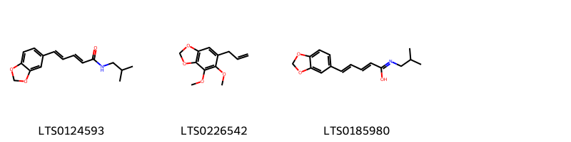{ width=100% }
    <figcaption>Hình ảnh cấu trúc hóa học của 3 hoạt chất thuộc nhóm Benzodioxoles gồm ['5-(2h-1,3-benzodioxol-5-yl)-n-(2-methylpropyl)penta-2,4-dienamide (LTS0124593)', 'dillapiol (LTS0226542)', '(2e,4e)-5-(2h-1,3-benzodioxol-5-yl)-n-(2-methylpropyl)penta-2,4-dienimidic acid (LTS0185980)'].</figcaption>
</figure>
#### Nhóm Fatty Acyls
<figure markdown="span">
    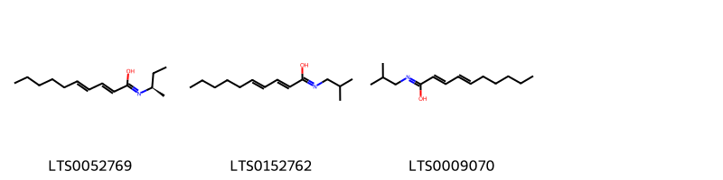{ width=100% }
    <figcaption>Hình ảnh cấu trúc hóa học của 3 hoạt chất thuộc nhóm Fatty Acyls gồm ['(2e,4e)-n-[(2r)-butan-2-yl]deca-2,4-dienimidic acid (LTS0052769)', '(2e,4e)-n-(2-methylpropyl)deca-2,4-dienimidic acid (LTS0152762)', 'n-(2-methylpropyl)deca-2,4-dienimidic acid (LTS0009070)'].</figcaption>
</figure>
#### Nhóm Quinolines and derivatives
<figure markdown="span">
    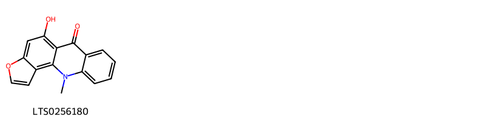{ width=100% }
    <figcaption>Hình ảnh cấu trúc hóa học của 1 hoạt chất thuộc nhóm Quinolines and derivatives gồm ['furofoline i (LTS0256180)'].</figcaption>
</figure>
#### Nhóm Steroids and steroid derivatives
<figure markdown="span">
    { width=100% }
    <figcaption>Hình ảnh cấu trúc hóa học của 2 hoạt chất thuộc nhóm Steroids and steroid derivatives gồm ['sitosterol (LTS0168132)', 'stigmast-5-en-3-ol, (3β)- (LTS0204616)'].</figcaption>
</figure>

---

### Dược dân tộc học

Danh sách các quốc gia có sử dụng *Piper crassipes* trong điều trị các bệnh. 

| Country   | Disease                                                   | Bệnh                                                                                                                                                                                                |
|:----------|:----------------------------------------------------------|:----------------------------------------------------------------------------------------------------------------------------------------------------------------------------------------------------|
| Indochina | Antiseptic, Carminative, Expectorant, Stimulant, Diuretic | MYMEMORY WARNING: YOU USED ALL AVAILABLE FREE TRANSLATIONS FOR TODAY. NEXT AVAILABLE IN  08 HOURS 02 MINUTES 57 SECONDS VISIT HTTPS://MYMEMORY.TRANSLATED.NET/DOC/USAGELIMITS.PHP TO TRANSLATE MORE |

---

---
## Piper peepuloides
### Thông tin về thực vật

!!! info "Phân loại thực vật của *Piper peepuloides* từ GIBF:"
    - **Kingdom:** Plantae
    - **Phylum:** Tracheophyta
    - **Order:** Piperales
    - **Family:** Piperaceae
    - **Genus:** Piper
    - **Species:** *Piper peepuloides*

 

| Label (VI)   | Label (EN)   | Scientific Name   | Descriptions (VI)   | Descriptions (EN)   | Also Known As (VI)   | Also Known As (EN)   |
|:-------------|:-------------|:------------------|:--------------------|:--------------------|:---------------------|:---------------------|
| N/A          | N/A          | Piper peepuloides | loài thực vật       | species of plant    | ['']                 | ['']                 |

#### Phân bố trên thế giới

**Từ CSDL GIBF** nan, Bhutan, Bangladesh, Nepal, China, India, unknown or invalid, Thailand

#### Phân bố tại Việt Nam

**Từ CSDL GIBF**: Không có ghi nhận ở Việt Nam

---
### Thành phần hóa học
        
- Theo cơ sở dữ liệu lotus: Từ loài *Piper peepuloides* đã phân lập và xác định được 21 hoạt chất thuộc về các nhóm Fatty Acyls, Flavonoids, Benzodioxoles, Cinnamic acids and derivatives, Steroids and steroid derivatives, Furanoid lignans. 

|    | chemicalTaxonomyClassyfireClass   |   smiles_count |
|---:|:----------------------------------|---------------:|
|  0 |                                   |              2 |
|  1 | Benzodioxoles                     |              3 |
|  2 | Cinnamic acids and derivatives    |              3 |
|  3 | Fatty Acyls                       |              2 |
|  4 | Flavonoids                        |              2 |
|  5 | Furanoid lignans                  |              4 |
|  6 | Steroids and steroid derivatives  |              5 |

#### Nhóm 
<figure markdown="span">
    { width=100% }
    <figcaption>Hình ảnh cấu trúc hóa học của 2 hoạt chất thuộc nhóm  gồm ['5-(2h-1,3-benzodioxol-5-yl)-1-(piperidin-1-yl)penta-2,4-dien-1-one (LTS0271968)', 'piperine (LTS0014461)'].</figcaption>
</figure>
#### Nhóm Benzodioxoles
<figure markdown="span">
    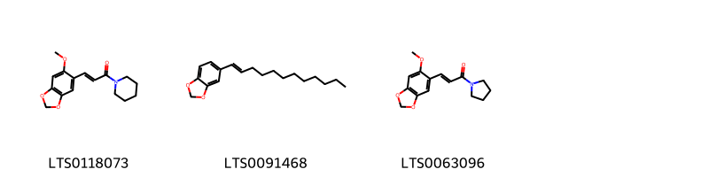{ width=100% }
    <figcaption>Hình ảnh cấu trúc hóa học của 3 hoạt chất thuộc nhóm Benzodioxoles gồm ['3-(6-methoxy-2h-1,3-benzodioxol-5-yl)-1-(piperidin-1-yl)prop-2-en-1-one (LTS0118073)', '5-(dodec-1-en-1-yl)-2h-1,3-benzodioxole (LTS0091468)', '3-(6-methoxy-2h-1,3-benzodioxol-5-yl)-1-(pyrrolidin-1-yl)prop-2-en-1-one (LTS0063096)'].</figcaption>
</figure>
#### Nhóm Cinnamic acids and derivatives
<figure markdown="span">
    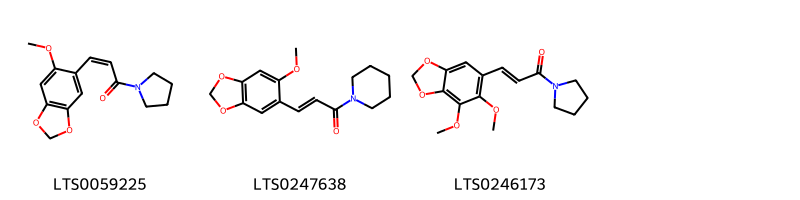{ width=100% }
    <figcaption>Hình ảnh cấu trúc hóa học của 3 hoạt chất thuộc nhóm Cinnamic acids and derivatives gồm ['(2z)-3-(6-methoxy-2h-1,3-benzodioxol-5-yl)-1-(pyrrolidin-1-yl)prop-2-en-1-one (LTS0059225)', '(2e)-3-(6-methoxy-2h-1,3-benzodioxol-5-yl)-1-(piperidin-1-yl)prop-2-en-1-one (LTS0247638)', '(2e)-3-(6,7-dimethoxy-2h-1,3-benzodioxol-5-yl)-1-(pyrrolidin-1-yl)prop-2-en-1-one (LTS0246173)'].</figcaption>
</figure>
#### Nhóm Fatty Acyls
<figure markdown="span">
    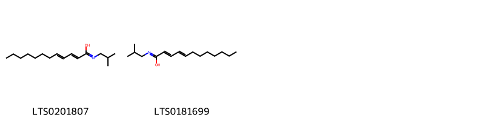{ width=100% }
    <figcaption>Hình ảnh cấu trúc hóa học của 2 hoạt chất thuộc nhóm Fatty Acyls gồm ['(2e,4e)-n-(2-methylpropyl)dodeca-2,4-dienimidic acid (LTS0201807)', 'n-(2-methylpropyl)dodeca-2,4-dienimidic acid (LTS0181699)'].</figcaption>
</figure>
#### Nhóm Flavonoids
<figure markdown="span">
    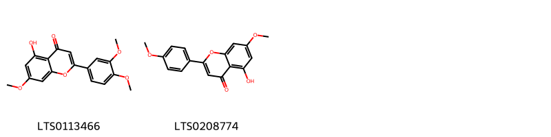{ width=100% }
    <figcaption>Hình ảnh cấu trúc hóa học của 2 hoạt chất thuộc nhóm Flavonoids gồm ['2-(3,4-dimethoxyphenyl)-5-hydroxy-7-methoxychromen-4-one (LTS0113466)', "apigenin 7,4'-dimethyl ether (LTS0208774)"].</figcaption>
</figure>
#### Nhóm Furanoid lignans
<figure markdown="span">
    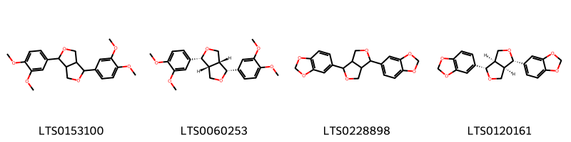{ width=100% }
    <figcaption>Hình ảnh cấu trúc hóa học của 4 hoạt chất thuộc nhóm Furanoid lignans gồm ['1,4-bis(3,4-dimethoxyphenyl)-hexahydrofuro[3,4-c]furan (LTS0153100)', '(1r,3ar,4r,6ar)-1,4-bis(3,4-dimethoxyphenyl)-hexahydrofuro[3,4-c]furan (LTS0060253)', 'sesamin (LTS0228898)', 'sesamin (LTS0120161)'].</figcaption>
</figure>
#### Nhóm Steroids and steroid derivatives
<figure markdown="span">
    { width=100% }
    <figcaption>Hình ảnh cấu trúc hóa học của 5 hoạt chất thuộc nhóm Steroids and steroid derivatives gồm ['stigmast-5-en-3-ol (LTS0071224)', 'sitosterol (LTS0168132)', 'stigmast-5-en-3-ol, (3β)- (LTS0204616)', 'sitogluside (LTS0201798)', '2-{[1-(5-ethyl-6-methylheptan-2-yl)-9a,11a-dimethyl-1h,2h,3h,3ah,3bh,4h,6h,7h,8h,9h,9bh,10h,11h-cyclopenta[a]phenanthren-7-yl]oxy}-6-(hydroxymethyl)oxane-3,4,5-triol (LTS0158828)'].</figcaption>
</figure>

---

### Dược dân tộc học

Danh sách các quốc gia có sử dụng *Piper peepuloides* trong điều trị các bệnh. 

| Country   | Disease    | Bệnh                                                                                                                                                                                                |
|:----------|:-----------|:----------------------------------------------------------------------------------------------------------------------------------------------------------------------------------------------------|
| Elsewhere | Sialogogue | MYMEMORY WARNING: YOU USED ALL AVAILABLE FREE TRANSLATIONS FOR TODAY. NEXT AVAILABLE IN  08 HOURS 02 MINUTES 35 SECONDS VISIT HTTPS://MYMEMORY.TRANSLATED.NET/DOC/USAGELIMITS.PHP TO TRANSLATE MORE |

---

---
## Piper puberulum
### Thông tin về thực vật

!!! info "Phân loại thực vật của *Piper puberulum* từ GIBF:"
    - **Kingdom:** Plantae
    - **Phylum:** Tracheophyta
    - **Order:** Piperales
    - **Family:** Piperaceae
    - **Genus:** Piper
    - **Species:** *Piper puberulum*

 

| Label (VI)   | Label (EN)   | Scientific Name   | Descriptions (VI)   | Descriptions (EN)   | Also Known As (VI)   | Also Known As (EN)   |
|:-------------|:-------------|:------------------|:--------------------|:--------------------|:---------------------|:---------------------|
| N/A          | N/A          | Piper puberulum   | loài thực vật       | species of plant    | ['']                 | ['']                 |

#### Phân bố trên thế giới

**Từ CSDL GIBF** nan, Niue, Tonga, China, Wallis and Futuna, Colombia, French Polynesia, unknown or invalid, Samoa, Fiji

#### Phân bố tại Việt Nam

**Từ CSDL GIBF**: Không có ghi nhận ở Việt Nam

---
### Thành phần hóa học
        
- Theo cơ sở dữ liệu lotus: Từ loài *Piper puberulum* đã phân lập và xác định được 6 hoạt chất thuộc về các nhóm Benzene and substituted derivatives, Benzodioxoles, Cinnamic acids and derivatives, Phenols, Aristolactams. 

|    | chemicalTaxonomyClassyfireClass     |   smiles_count |
|---:|:------------------------------------|---------------:|
|  0 | Aristolactams                       |              1 |
|  1 | Benzene and substituted derivatives |              1 |
|  2 | Benzodioxoles                       |              2 |
|  3 | Cinnamic acids and derivatives      |              1 |
|  4 | Phenols                             |              1 |

#### Nhóm Aristolactams
<figure markdown="span">
    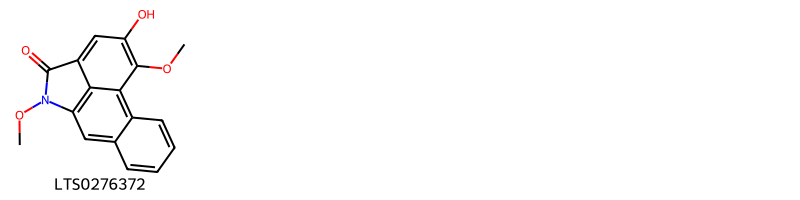{ width=100% }
    <figcaption>Hình ảnh cấu trúc hóa học của 1 hoạt chất thuộc nhóm Aristolactams gồm ['14-hydroxy-10,15-dimethoxy-10-azatetracyclo[7.6.1.0²,⁷.0¹²,¹⁶]hexadeca-1(16),2(7),3,5,8,12,14-heptaen-11-one (LTS0276372)'].</figcaption>
</figure>
#### Nhóm Benzene and substituted derivatives
<figure markdown="span">
    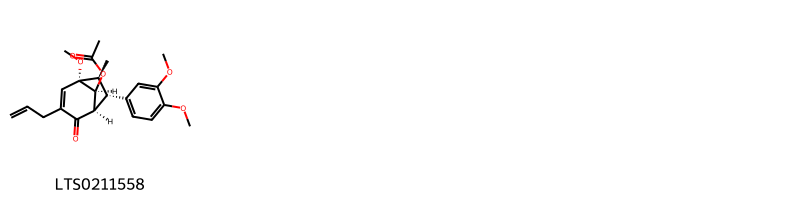{ width=100% }
    <figcaption>Hình ảnh cấu trúc hóa học của 1 hoạt chất thuộc nhóm Benzene and substituted derivatives gồm ['(1s,5r,6s,7s,8s)-6-(3,4-dimethoxyphenyl)-1-methoxy-7-methyl-4-oxo-3-(prop-2-en-1-yl)bicyclo[3.2.1]oct-2-en-8-yl acetate (LTS0211558)'].</figcaption>
</figure>
#### Nhóm Benzodioxoles
<figure markdown="span">
    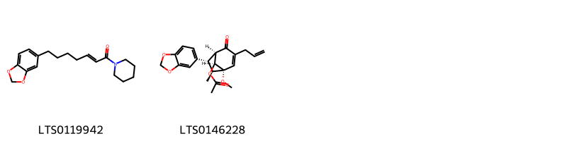{ width=100% }
    <figcaption>Hình ảnh cấu trúc hóa học của 2 hoạt chất thuộc nhóm Benzodioxoles gồm ['(2e)-7-(2h-1,3-benzodioxol-5-yl)-1-(piperidin-1-yl)hept-2-en-1-one (LTS0119942)', '(1s,5r,6s,7s,8s)-6-(2h-1,3-benzodioxol-5-yl)-1-methoxy-7-methyl-4-oxo-3-(prop-2-en-1-yl)bicyclo[3.2.1]oct-2-en-8-yl acetate (LTS0146228)'].</figcaption>
</figure>
#### Nhóm Cinnamic acids and derivatives
<figure markdown="span">
    { width=100% }
    <figcaption>Hình ảnh cấu trúc hóa học của 1 hoạt chất thuộc nhóm Cinnamic acids and derivatives gồm ['piperlongumine (LTS0074614)'].</figcaption>
</figure>
#### Nhóm Phenols
<figure markdown="span">
    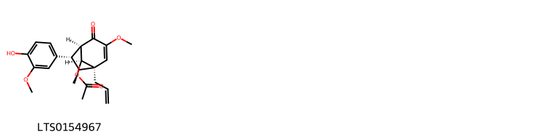{ width=100% }
    <figcaption>Hình ảnh cấu trúc hóa học của 1 hoạt chất thuộc nhóm Phenols gồm ['(1r,5r,6s,7s,8s)-6-(4-hydroxy-3-methoxyphenyl)-3-methoxy-7-methyl-4-oxo-1-(prop-2-en-1-yl)bicyclo[3.2.1]oct-2-en-8-yl acetate (LTS0154967)'].</figcaption>
</figure>

---

### Dược dân tộc học

Danh sách các quốc gia có sử dụng *Piper puberulum* trong điều trị các bệnh. 

| Country   | Disease   | Bệnh                                                                                                                                                                                                |
|:----------|:----------|:----------------------------------------------------------------------------------------------------------------------------------------------------------------------------------------------------|
| Fiji      | Hemostat  | MYMEMORY WARNING: YOU USED ALL AVAILABLE FREE TRANSLATIONS FOR TODAY. NEXT AVAILABLE IN  08 HOURS 02 MINUTES 11 SECONDS VISIT HTTPS://MYMEMORY.TRANSLATED.NET/DOC/USAGELIMITS.PHP TO TRANSLATE MORE |

---

---
## Piper retrofractum
### Thông tin về thực vật

!!! info "Phân loại thực vật của *Piper retrofractum* từ GIBF:"
    - **Kingdom:** Plantae
    - **Phylum:** Tracheophyta
    - **Order:** Piperales
    - **Family:** Piperaceae
    - **Genus:** Piper
    - **Species:** *Piper retrofractum*

 

| Label (VI)   | Label (EN)   | Scientific Name    | Descriptions (VI)   | Descriptions (EN)   | Also Known As (VI)   | Also Known As (EN)   |
|:-------------|:-------------|:-------------------|:--------------------|:--------------------|:---------------------|:---------------------|
| N/A          | N/A          | Piper retrofractum | loài thực vật       | species of plant    | ['']                 | ['']                 |

#### Phân bố trên thế giới

**Từ CSDL GIBF** nan, Brazil, Viet Nam, Japan, Cambodia, United States of America, Martinique, Indonesia, Nepal, Philippines, Timor-Leste, Malaysia, China, Chinese Taipei, Tanzania, United Republic of, unknown or invalid, Thailand, Lao People’s Democratic Republic

#### Phân bố tại Việt Nam

**Từ CSDL GIBF**: Ha Tinh

---
### Thành phần hóa học
        
- Theo cơ sở dữ liệu lotus: Từ loài *Piper retrofractum* đã phân lập và xác định được 86 hoạt chất thuộc về các nhóm Fatty Acyls, Piperidines, Benzene and substituted derivatives, Benzodioxoles, Cinnamic acids and derivatives, Steroids and steroid derivatives, Saccharolipids, Phenols, Carboximidic acids and derivatives, Phenylpropanoic acids, Organooxygen compounds, Furanoid lignans, Phenol ethers, Prenol lipids. 

|    | chemicalTaxonomyClassyfireClass     |   smiles_count |
|---:|:------------------------------------|---------------:|
|  0 |                                     |              2 |
|  1 | Benzene and substituted derivatives |              1 |
|  2 | Benzodioxoles                       |             25 |
|  3 | Carboximidic acids and derivatives  |              3 |
|  4 | Cinnamic acids and derivatives      |              2 |
|  5 | Fatty Acyls                         |             17 |
|  6 | Furanoid lignans                    |              3 |
|  7 | Organooxygen compounds              |              9 |
|  8 | Phenol ethers                       |              1 |
|  9 | Phenols                             |              2 |
| 10 | Phenylpropanoic acids               |              1 |
| 11 | Piperidines                         |             15 |
| 12 | Prenol lipids                       |              3 |
| 13 | Saccharolipids                      |              1 |
| 14 | Steroids and steroid derivatives    |              1 |

#### Nhóm 
<figure markdown="span">
    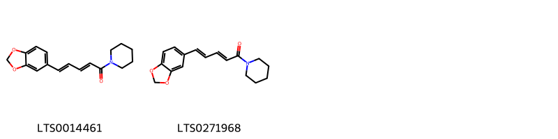{ width=100% }
    <figcaption>Hình ảnh cấu trúc hóa học của 2 hoạt chất thuộc nhóm  gồm ['piperine (LTS0014461)', '5-(2h-1,3-benzodioxol-5-yl)-1-(piperidin-1-yl)penta-2,4-dien-1-one (LTS0271968)'].</figcaption>
</figure>
#### Nhóm Benzene and substituted derivatives
<figure markdown="span">
    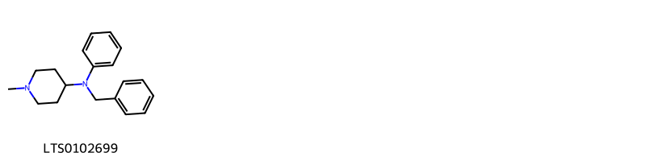{ width=100% }
    <figcaption>Hình ảnh cấu trúc hóa học của 1 hoạt chất thuộc nhóm Benzene and substituted derivatives gồm ['bamipine (LTS0102699)'].</figcaption>
</figure>
#### Nhóm Benzodioxoles
<figure markdown="span">
    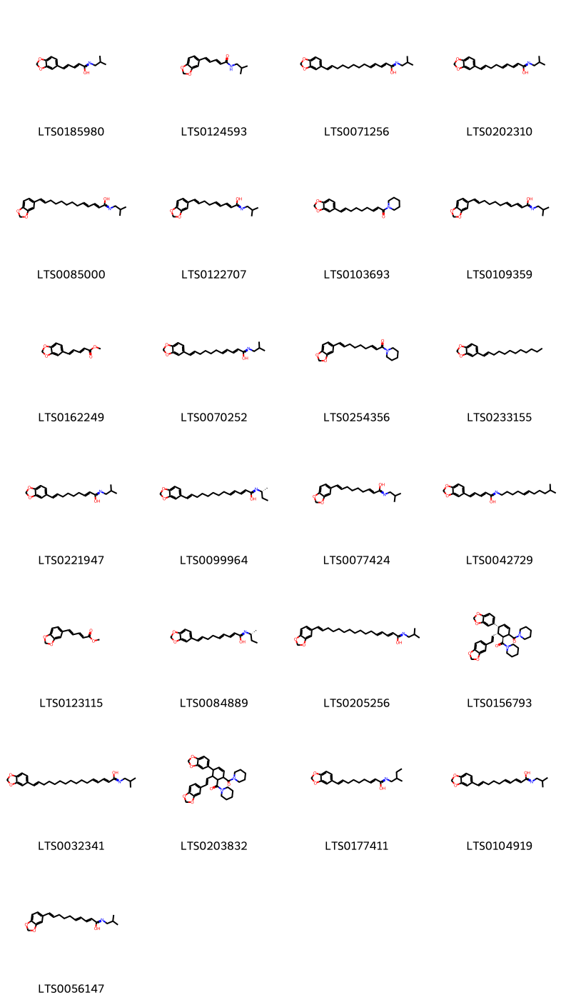{ width=100% }
    <figcaption>Hình ảnh cấu trúc hóa học của 25 hoạt chất thuộc nhóm Benzodioxoles gồm ['(2e,4e)-5-(2h-1,3-benzodioxol-5-yl)-n-(2-methylpropyl)penta-2,4-dienimidic acid (LTS0185980)', '5-(2h-1,3-benzodioxol-5-yl)-n-(2-methylpropyl)penta-2,4-dienamide (LTS0124593)', '(2e,4e,12e)-13-(2h-1,3-benzodioxol-5-yl)-n-(2-methylpropyl)trideca-2,4,12-trienimidic acid (LTS0071256)', '(2e,4e,8e)-9-(2h-1,3-benzodioxol-5-yl)-n-(2-methylpropyl)nona-2,4,8-trienimidic acid (LTS0202310)', '13-(2h-1,3-benzodioxol-5-yl)-n-(2-methylpropyl)trideca-2,4,12-trienimidic acid (LTS0085000)', '9-(2h-1,3-benzodioxol-5-yl)-n-(2-methylpropyl)nona-2,4,8-trienimidic acid (LTS0122707)', '(2e,8e)-9-(2h-1,3-benzodioxol-5-yl)-1-(piperidin-1-yl)nona-2,8-dien-1-one (LTS0103693)', '11-(2h-1,3-benzodioxol-5-yl)-n-(2-methylpropyl)undeca-2,4,10-trienimidic acid (LTS0109359)', 'methyl (2e,4e)-5-(2h-1,3-benzodioxol-5-yl)penta-2,4-dienoate (LTS0162249)', '(2e,4e,10e)-11-(2h-1,3-benzodioxol-5-yl)-n-(2-methylpropyl)undeca-2,4,10-trienimidic acid (LTS0070252)', '9-(2h-1,3-benzodioxol-5-yl)-1-(piperidin-1-yl)nona-2,8-dien-1-one (LTS0254356)', '5-[(1e)-dodec-1-en-1-yl]-2h-1,3-benzodioxole (LTS0233155)', '(2e,8e)-9-(2h-1,3-benzodioxol-5-yl)-n-(2-methylpropyl)nona-2,8-dienimidic acid (LTS0221947)', '(2e,4e,12e)-13-(2h-1,3-benzodioxol-5-yl)-n-[(2r)-butan-2-yl]trideca-2,4,12-trienimidic acid (LTS0099964)', '9-(2h-1,3-benzodioxol-5-yl)-n-(2-methylpropyl)nona-2,8-dienimidic acid (LTS0077424)', '(2e,4e)-5-(2h-1,3-benzodioxol-5-yl)-n-[(5e)-10-methylundec-5-en-1-yl]penta-2,4-dienimidic acid (LTS0042729)', 'methyl 5-(2h-1,3-benzodioxol-5-yl)penta-2,4-dienoate (LTS0123115)', '(2e,4e,8e)-9-(2h-1,3-benzodioxol-5-yl)-n-[(2r)-butan-2-yl]nona-2,4,8-trienimidic acid (LTS0084889)', '16-(2h-1,3-benzodioxol-5-yl)-n-(2-methylpropyl)hexadeca-2,4,15-trienimidic acid (LTS0205256)', '1-[(1s,5r,6r)-5-(2h-1,3-benzodioxol-5-yl)-6-[(1e)-2-(2h-1,3-benzodioxol-5-yl)ethenyl]-2-(piperidine-1-carbonyl)cyclohex-3-ene-1-carbonyl]piperidine (LTS0156793)', '(2e,4e,15e)-16-(2h-1,3-benzodioxol-5-yl)-n-(2-methylpropyl)hexadeca-2,4,15-trienimidic acid (LTS0032341)', '1-[5-(2h-1,3-benzodioxol-5-yl)-6-[(1e)-2-(2h-1,3-benzodioxol-5-yl)ethenyl]-2-(piperidine-1-carbonyl)cyclohex-3-ene-1-carbonyl]piperidine (LTS0203832)', '(2e,8e)-9-(2h-1,3-benzodioxol-5-yl)-n-(2-methylbutyl)nona-2,8-dienimidic acid (LTS0177411)', '(2e,4e,9e)-10-(2h-1,3-benzodioxol-5-yl)-n-(2-methylpropyl)deca-2,4,9-trienimidic acid (LTS0104919)', '10-(2h-1,3-benzodioxol-5-yl)-n-(2-methylpropyl)deca-2,4,9-trienimidic acid (LTS0056147)'].</figcaption>
</figure>
#### Nhóm Carboximidic acids and derivatives
<figure markdown="span">
    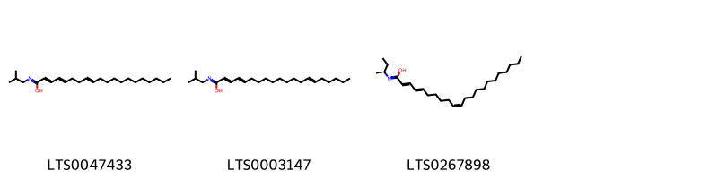{ width=100% }
    <figcaption>Hình ảnh cấu trúc hóa học của 3 hoạt chất thuộc nhóm Carboximidic acids and derivatives gồm ['n-(2-methylpropyl)icosa-2,4,8-trienimidic acid (LTS0047433)', 'n-(2-methylpropyl)icosa-2,4,14-trienimidic acid (LTS0003147)', '(2e,4e,10z)-n-[(2s)-butan-2-yl]docosa-2,4,10-trienimidic acid (LTS0267898)'].</figcaption>
</figure>
#### Nhóm Cinnamic acids and derivatives
<figure markdown="span">
    { width=100% }
    <figcaption>Hình ảnh cấu trúc hóa học của 2 hoạt chất thuộc nhóm Cinnamic acids and derivatives gồm ['piperlongumine (LTS0074614)', '1-[3-(3,4,5-trimethoxyphenyl)prop-2-enoyl]-5,6-dihydropyridin-2-one (LTS0186771)'].</figcaption>
</figure>
#### Nhóm Fatty Acyls
<figure markdown="span">
    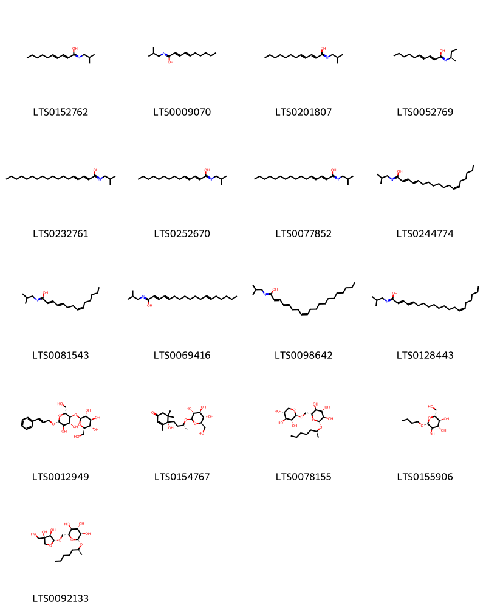{ width=100% }
    <figcaption>Hình ảnh cấu trúc hóa học của 17 hoạt chất thuộc nhóm Fatty Acyls gồm ['(2e,4e)-n-(2-methylpropyl)deca-2,4-dienimidic acid (LTS0152762)', 'n-(2-methylpropyl)deca-2,4-dienimidic acid (LTS0009070)', '(2e,4e)-n-(2-methylpropyl)dodeca-2,4-dienimidic acid (LTS0201807)', '(2e,4e)-n-[(2r)-butan-2-yl]deca-2,4-dienimidic acid (LTS0052769)', '(2e,4e)-n-(2-methylpropyl)octadeca-2,4-dienimidic acid (LTS0232761)', '(2e,4e)-n-(2-methylpropyl)tetradeca-2,4-dienimidic acid (LTS0252670)', '(2e,4e)-n-(2-methylpropyl)hexadeca-2,4-dienimidic acid (LTS0077852)', '(2e,4e,12z)-n-(2-methylpropyl)octadeca-2,4,12-trienimidic acid (LTS0244774)', '(2e,4e,8z)-n-(2-methylpropyl)tetradeca-2,4,8-trienimidic acid (LTS0081543)', 'n-(2-methylpropyl)octadeca-2,4,12-trienimidic acid (LTS0069416)', '(2e,4e,8z)-n-(2-methylpropyl)icosa-2,4,8-trienimidic acid (LTS0098642)', '(2e,4e,14z)-n-(2-methylpropyl)icosa-2,4,14-trienimidic acid (LTS0128443)', '(2s,3r,4s,5s,6r)-2-{[(2r,3s,4r,5r,6r)-4,5-dihydroxy-2-(hydroxymethyl)-6-{[(2e)-3-phenylprop-2-en-1-yl]oxy}oxan-3-yl]oxy}-6-(hydroxymethyl)oxane-3,4,5-triol (LTS0012949)', '(4s)-4-hydroxy-3,5,5-trimethyl-4-[(3r)-3-{[(2r,3r,4s,5s,6r)-3,4,5-trihydroxy-6-(hydroxymethyl)oxan-2-yl]oxy}butyl]cyclohex-2-en-1-one (LTS0154767)', '(2r,3r,4s,5s,6r)-2-[(2s)-heptan-2-yloxy]-6-({[(2s,3r,4s,5r)-3,4,5-trihydroxyoxan-2-yl]oxy}methyl)oxane-3,4,5-triol (LTS0078155)', 'butyl β-d-glucopyranoside (LTS0155906)', '(2r,3s,4s,5r,6r)-2-({[(2r,3r,4r)-3,4-dihydroxy-4-(hydroxymethyl)oxolan-2-yl]oxy}methyl)-6-[(2s)-heptan-2-yloxy]oxane-3,4,5-triol (LTS0092133)'].</figcaption>
</figure>
#### Nhóm Furanoid lignans
<figure markdown="span">
    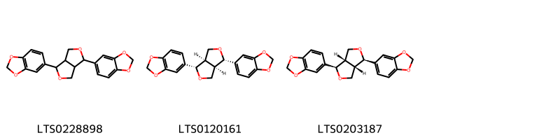{ width=100% }
    <figcaption>Hình ảnh cấu trúc hóa học của 3 hoạt chất thuộc nhóm Furanoid lignans gồm ['sesamin (LTS0228898)', 'sesamin (LTS0120161)', '(-)-sesamin (LTS0203187)'].</figcaption>
</figure>
#### Nhóm Organooxygen compounds
<figure markdown="span">
    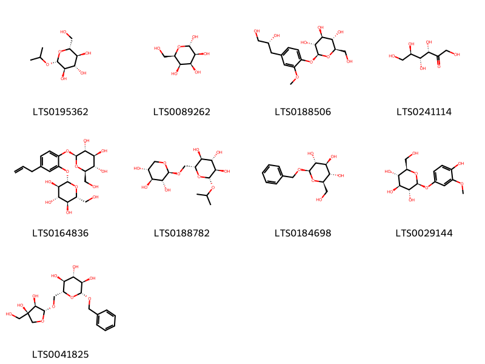{ width=100% }
    <figcaption>Hình ảnh cấu trúc hóa học của 9 hoạt chất thuộc nhóm Organooxygen compounds gồm ['(2r,3s,4s,5r,6r)-2-(hydroxymethyl)-6-isopropoxyoxane-3,4,5-triol (LTS0195362)', '(2s,3s,4s,5r,6r)-6-(hydroxymethyl)oxane-2,3,4,5-tetrol (LTS0089262)', '(2s,3r,4s,5s,6r)-2-{4-[(2r)-2,3-dihydroxypropyl]-2-methoxyphenoxy}-6-(hydroxymethyl)oxane-3,4,5-triol (LTS0188506)', 'keto-d-fructose (LTS0241114)', '(2r,3s,4s,5r,6s)-2-(hydroxymethyl)-6-[4-(prop-2-en-1-yl)-2-{[(2s,3r,4s,5s,6r)-3,4,5-trihydroxy-6-(hydroxymethyl)oxan-2-yl]oxy}phenoxy]oxane-3,4,5-triol (LTS0164836)', '(2r,3r,4s,5s,6r)-2-isopropoxy-6-({[(2s,3r,4s,5r)-3,4,5-trihydroxyoxan-2-yl]oxy}methyl)oxane-3,4,5-triol (LTS0188782)', 'benzyl β-d-glucoside (LTS0184698)', '(2s,3r,4s,5s,6r)-2-(4-hydroxy-3-methoxyphenoxy)-6-(hydroxymethyl)oxane-3,4,5-triol (LTS0029144)', '(2r,3r,4s,5s,6r)-2-(benzyloxy)-6-({[(2r,3r,4r)-3,4-dihydroxy-4-(hydroxymethyl)oxolan-2-yl]oxy}methyl)oxane-3,4,5-triol (LTS0041825)'].</figcaption>
</figure>
#### Nhóm Phenol ethers
<figure markdown="span">
    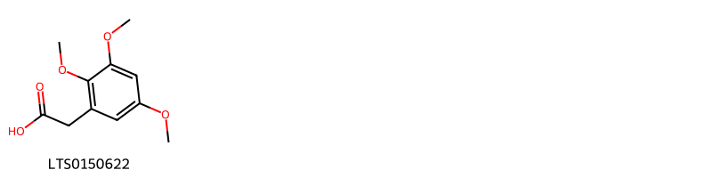{ width=100% }
    <figcaption>Hình ảnh cấu trúc hóa học của 1 hoạt chất thuộc nhóm Phenol ethers gồm ['(2,3,5-trimethoxyphenyl)acetic acid (LTS0150622)'].</figcaption>
</figure>
#### Nhóm Phenols
<figure markdown="span">
    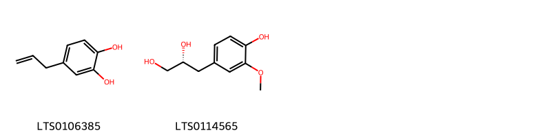{ width=100% }
    <figcaption>Hình ảnh cấu trúc hóa học của 2 hoạt chất thuộc nhóm Phenols gồm ['4-allylpyrocatechol (LTS0106385)', '(2r)-3-(4-hydroxy-3-methoxyphenyl)propane-1,2-diol (LTS0114565)'].</figcaption>
</figure>
#### Nhóm Phenylpropanoic acids
<figure markdown="span">
    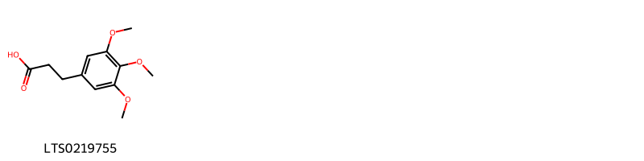{ width=100% }
    <figcaption>Hình ảnh cấu trúc hóa học của 1 hoạt chất thuộc nhóm Phenylpropanoic acids gồm ['3-(3,4,5-trimethoxyphenyl)propanoic acid (LTS0219755)'].</figcaption>
</figure>
#### Nhóm Piperidines
<figure markdown="span">
    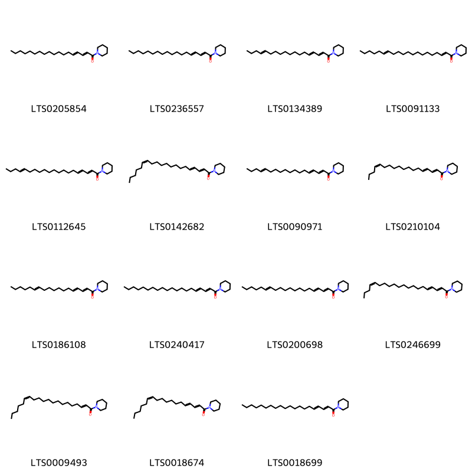{ width=100% }
    <figcaption>Hình ảnh cấu trúc hóa học của 15 hoạt chất thuộc nhóm Piperidines gồm ['(2e,4e)-1-(piperidin-1-yl)octadeca-2,4-dien-1-one (LTS0205854)', '1-(piperidin-1-yl)octadeca-2,4-dien-1-one (LTS0236557)', '(2e,4e,14e)-1-(piperidin-1-yl)octadeca-2,4,14-trien-1-one (LTS0134389)', '1-(piperidin-1-yl)icosa-2,14-dien-1-one (LTS0091133)', '1-(piperidin-1-yl)icosa-2,4,16-trien-1-one (LTS0112645)', '(2e,4e,14z)-1-(piperidin-1-yl)icosa-2,4,14-trien-1-one (LTS0142682)', '1-(piperidin-1-yl)octadeca-2,4,14-trien-1-one (LTS0090971)', '(2e,4e,14z)-1-(piperidin-1-yl)octadeca-2,4,14-trien-1-one (LTS0210104)', '1-(piperidin-1-yl)octadeca-2,4,12-trien-1-one (LTS0186108)', '1-(piperidin-1-yl)icosa-2,4-dien-1-one (LTS0240417)', '1-(piperidin-1-yl)icosa-2,4,14-trien-1-one (LTS0200698)', '(2e,4e,16z)-1-(piperidin-1-yl)icosa-2,4,16-trien-1-one (LTS0246699)', '(2e,14z)-1-(piperidin-1-yl)icosa-2,14-dien-1-one (LTS0009493)', '(2e,4e,12z)-1-(piperidin-1-yl)octadeca-2,4,12-trien-1-one (LTS0018674)', '(2e,4e)-1-(piperidin-1-yl)icosa-2,4-dien-1-one (LTS0018699)'].</figcaption>
</figure>
#### Nhóm Prenol lipids
<figure markdown="span">
    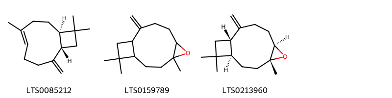{ width=100% }
    <figcaption>Hình ảnh cấu trúc hóa học của 3 hoạt chất thuộc nhóm Prenol lipids gồm ['caryophyllene (LTS0085212)', 'caryophyllene oxide (LTS0159789)', 'β-caryophyllene oxide (LTS0213960)'].</figcaption>
</figure>
#### Nhóm Saccharolipids
<figure markdown="span">
    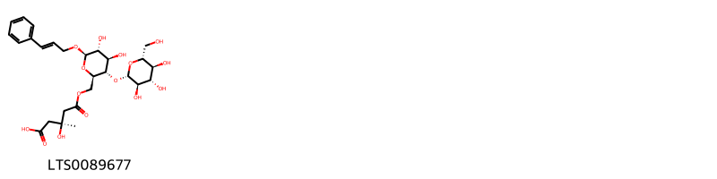{ width=100% }
    <figcaption>Hình ảnh cấu trúc hóa học của 1 hoạt chất thuộc nhóm Saccharolipids gồm ['(3s)-5-{[(2r,3s,4r,5r,6r)-4,5-dihydroxy-6-{[(2e)-3-phenylprop-2-en-1-yl]oxy}-3-{[(2s,3r,4s,5s,6r)-3,4,5-trihydroxy-6-(hydroxymethyl)oxan-2-yl]oxy}oxan-2-yl]methoxy}-3-hydroxy-3-methyl-5-oxopentanoic acid (LTS0089677)'].</figcaption>
</figure>
#### Nhóm Steroids and steroid derivatives
<figure markdown="span">
    { width=100% }
    <figcaption>Hình ảnh cấu trúc hóa học của 1 hoạt chất thuộc nhóm Steroids and steroid derivatives gồm ['sitosterol (LTS0168132)'].</figcaption>
</figure>

---

### Dược dân tộc học

Danh sách các quốc gia có sử dụng *Piper retrofractum* trong điều trị các bệnh. 

| Country     | Disease                | Bệnh                                                                                                                                                                                                |
|:------------|:-----------------------|:----------------------------------------------------------------------------------------------------------------------------------------------------------------------------------------------------|
| Elsewhere   | Stimulant, Carminative | MYMEMORY WARNING: YOU USED ALL AVAILABLE FREE TRANSLATIONS FOR TODAY. NEXT AVAILABLE IN  08 HOURS 01 MINUTES 51 SECONDS VISIT HTTPS://MYMEMORY.TRANSLATED.NET/DOC/USAGELIMITS.PHP TO TRANSLATE MORE |
| Malaysia    | Digestive, Tonic       | MYMEMORY WARNING: YOU USED ALL AVAILABLE FREE TRANSLATIONS FOR TODAY. NEXT AVAILABLE IN  08 HOURS 01 MINUTES 48 SECONDS VISIT HTTPS://MYMEMORY.TRANSLATED.NET/DOC/USAGELIMITS.PHP TO TRANSLATE MORE |
| Tjabea alas | Diaphoretic            | MYMEMORY WARNING: YOU USED ALL AVAILABLE FREE TRANSLATIONS FOR TODAY. NEXT AVAILABLE IN  08 HOURS 01 MINUTES 46 SECONDS VISIT HTTPS://MYMEMORY.TRANSLATED.NET/DOC/USAGELIMITS.PHP TO TRANSLATE MORE |
| Tjabean     | Aphrodisiac            | MYMEMORY WARNING: YOU USED ALL AVAILABLE FREE TRANSLATIONS FOR TODAY. NEXT AVAILABLE IN  08 HOURS 01 MINUTES 43 SECONDS VISIT HTTPS://MYMEMORY.TRANSLATED.NET/DOC/USAGELIMITS.PHP TO TRANSLATE MORE |

---

---
## Piper sacntum
### Thông tin về thực vật

!!! info "Phân loại thực vật của *Piper sanctum* từ GIBF:"
    - **Kingdom:** Plantae
    - **Phylum:** Tracheophyta
    - **Order:** Piperales
    - **Family:** Piperaceae
    - **Genus:** Piper
    - **Species:** *Piper sanctum*

 

| Label (VI)   | Label (EN)   | Scientific Name    | Descriptions (VI)   | Descriptions (EN)   | Also Known As (VI)   | Also Known As (EN)   |
|:-------------|:-------------|:-------------------|:--------------------|:--------------------|:---------------------|:---------------------|
| N/A          | N/A          | Piper retrofractum | loài thực vật       | species of plant    | ['']                 | ['']                 |

#### Phân bố trên thế giới

**Từ CSDL GIBF** nan, Mexico, Guatemala, Nicaragua, Malaysia, Costa Rica, China, Honduras, Croatia, Argentina, Panama, Belize

#### Phân bố tại Việt Nam

**Từ CSDL GIBF**: Không có ghi nhận ở Việt Nam

---
### Thành phần hóa học
        
- Theo cơ sở dữ liệu lotus: Từ loài *Piper sanctum* đã phân lập và xác định được Chưa có hoạt chất nào được phân lập. hoạt chất thuộc về các nhóm Không có hoạt chất nào được phân lập. 

Không có hình ảnh nào được tạo ra

---

### Dược dân tộc học

Danh sách các quốc gia có sử dụng *Piper sanctum* trong điều trị các bệnh. 

| Country   | Disease   | Bệnh                                                                                                                                                                                                |
|:----------|:----------|:----------------------------------------------------------------------------------------------------------------------------------------------------------------------------------------------------|
| Mexico    | Stimulant | MYMEMORY WARNING: YOU USED ALL AVAILABLE FREE TRANSLATIONS FOR TODAY. NEXT AVAILABLE IN  08 HOURS 01 MINUTES 17 SECONDS VISIT HTTPS://MYMEMORY.TRANSLATED.NET/DOC/USAGELIMITS.PHP TO TRANSLATE MORE |

---

---
## Piper sanctum
### Thông tin về thực vật

!!! info "Phân loại thực vật của *Piper sanctum* từ GIBF:"
    - **Kingdom:** Plantae
    - **Phylum:** Tracheophyta
    - **Order:** Piperales
    - **Family:** Piperaceae
    - **Genus:** Piper
    - **Species:** *Piper sanctum*

 

| Label (VI)   | Label (EN)   | Scientific Name   | Descriptions (VI)   | Descriptions (EN)   | Also Known As (VI)   | Also Known As (EN)   |
|:-------------|:-------------|:------------------|:--------------------|:--------------------|:---------------------|:---------------------|
| N/A          | N/A          | Piper sanctum     |                     | species of plant    | ['']                 | ['']                 |

#### Phân bố trên thế giới

**Từ CSDL GIBF** nan, Mexico, Guatemala, Nicaragua, Malaysia, Costa Rica, China, Honduras, Croatia, Argentina, Panama, Belize

#### Phân bố tại Việt Nam

**Từ CSDL GIBF**: Không có ghi nhận ở Việt Nam

---
### Thành phần hóa học
        
- Theo cơ sở dữ liệu lotus: Từ loài *Piper sanctum* đã phân lập và xác định được 55 hoạt chất thuộc về các nhóm Aporphines, Dihydrofurans, Benzene and substituted derivatives, Oxolanes, Benzodioxoles, Cinnamic acids and derivatives, Kavalactones, Phenols, Oxanes, Aristolactams. 

|    | chemicalTaxonomyClassyfireClass     |   smiles_count |
|---:|:------------------------------------|---------------:|
|  0 | Aporphines                          |              2 |
|  1 | Aristolactams                       |              2 |
|  2 | Benzene and substituted derivatives |              7 |
|  3 | Benzodioxoles                       |             19 |
|  4 | Cinnamic acids and derivatives      |              3 |
|  5 | Dihydrofurans                       |              5 |
|  6 | Kavalactones                        |              9 |
|  7 | Oxanes                              |              4 |
|  8 | Oxolanes                            |              2 |
|  9 | Phenols                             |              2 |

#### Nhóm Aporphines
<figure markdown="span">
    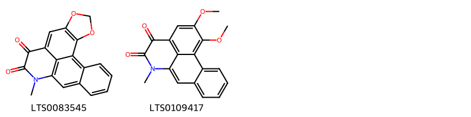{ width=100% }
    <figcaption>Hình ảnh cấu trúc hóa học của 2 hoạt chất thuộc nhóm Aporphines gồm ['11-methyl-3,5-dioxa-11-azapentacyclo[10.7.1.0²,⁶.0⁸,²⁰.0¹⁴,¹⁹]icosa-1(20),2(6),7,12,14(19),15,17-heptaene-9,10-dione (LTS0083545)', '15,16-dimethoxy-10-methyl-10-azatetracyclo[7.7.1.0²,⁷.0¹³,¹⁷]heptadeca-1(17),2(7),3,5,8,13,15-heptaene-11,12-dione (LTS0109417)'].</figcaption>
</figure>
#### Nhóm Aristolactams
<figure markdown="span">
    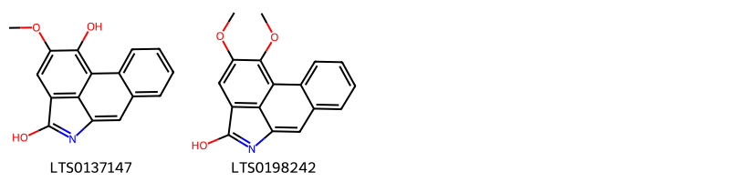{ width=100% }
    <figcaption>Hình ảnh cấu trúc hóa học của 2 hoạt chất thuộc nhóm Aristolactams gồm ['14-methoxy-10-azatetracyclo[7.6.1.0²,⁷.0¹²,¹⁶]hexadeca-1(16),2(7),3,5,8,10,12,14-octaene-11,15-diol (LTS0137147)', '14,15-dimethoxy-10-azatetracyclo[7.6.1.0²,⁷.0¹²,¹⁶]hexadeca-1(16),2(7),3,5,8,10,12,14-octaen-11-ol (LTS0198242)'].</figcaption>
</figure>
#### Nhóm Benzene and substituted derivatives
<figure markdown="span">
    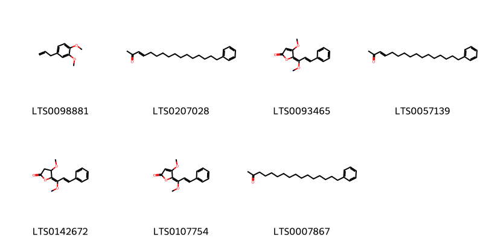{ width=100% }
    <figcaption>Hình ảnh cấu trúc hóa học của 7 hoạt chất thuộc nhóm Benzene and substituted derivatives gồm ['methyl eugenol (LTS0098881)', '(3e)-16-phenylhexadec-3-en-2-one (LTS0207028)', '4-methoxy-5-(1-methoxy-3-phenylprop-2-en-1-ylidene)furan-2-one (LTS0093465)', '16-phenylhexadec-3-en-2-one (LTS0057139)', '(5z)-4-methoxy-5-[(2e)-1-methoxy-3-phenylprop-2-en-1-ylidene]oxolan-2-one (LTS0142672)', '(5z)-4-methoxy-5-[(2e)-1-methoxy-3-phenylprop-2-en-1-ylidene]furan-2-one (LTS0107754)', '16-phenylhexadecan-2-one (LTS0007867)'].</figcaption>
</figure>
#### Nhóm Benzodioxoles
<figure markdown="span">
    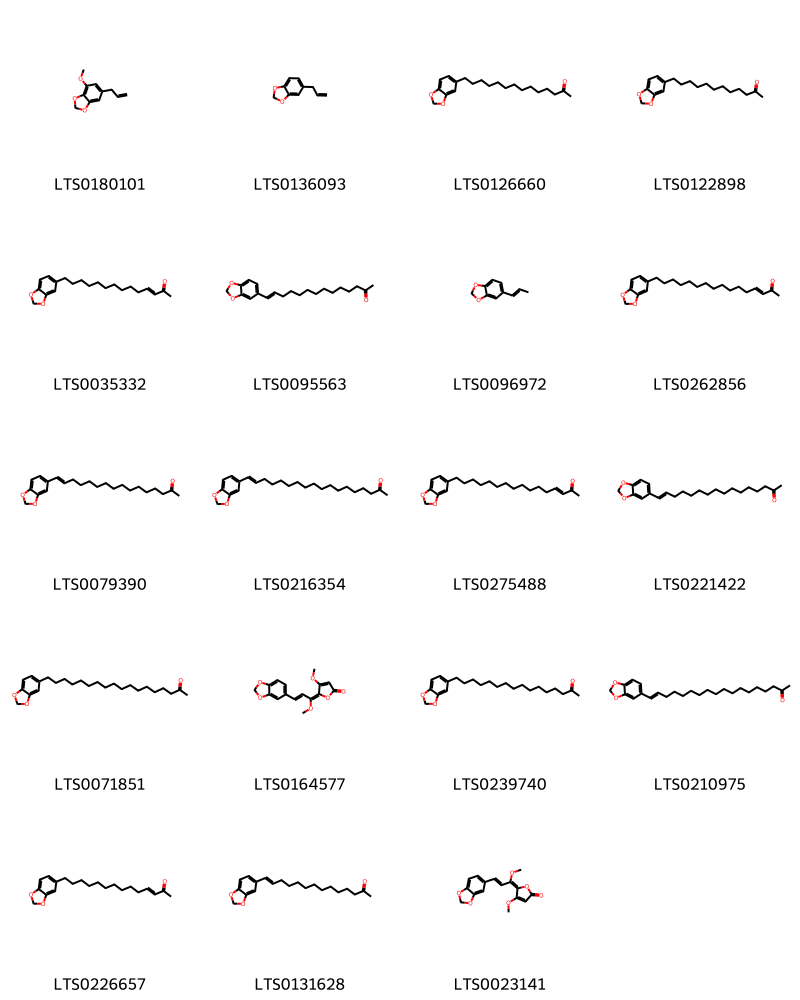{ width=100% }
    <figcaption>Hình ảnh cấu trúc hóa học của 19 hoạt chất thuộc nhóm Benzodioxoles gồm ['myristicin (LTS0180101)', 'sassafras (LTS0136093)', '14-(2h-1,3-benzodioxol-5-yl)tetradecan-2-one (LTS0126660)', '12-(2h-1,3-benzodioxol-5-yl)dodecan-2-one (LTS0122898)', '14-(2h-1,3-benzodioxol-5-yl)tetradec-3-en-2-one (LTS0035332)', '(13e)-14-(2h-1,3-benzodioxol-5-yl)tetradec-13-en-2-one (LTS0095563)', 'isosafrole (LTS0096972)', '(3e)-16-(2h-1,3-benzodioxol-5-yl)hexadec-3-en-2-one (LTS0262856)', '16-(2h-1,3-benzodioxol-5-yl)hexadec-15-en-2-one (LTS0079390)', '18-(2h-1,3-benzodioxol-5-yl)octadec-17-en-2-one (LTS0216354)', '16-(2h-1,3-benzodioxol-5-yl)hexadec-3-en-2-one (LTS0275488)', '(15e)-16-(2h-1,3-benzodioxol-5-yl)hexadec-15-en-2-one (LTS0221422)', '18-(2h-1,3-benzodioxol-5-yl)octadecan-2-one (LTS0071851)', '(5z)-5-[(2e)-3-(2h-1,3-benzodioxol-5-yl)-1-methoxyprop-2-en-1-ylidene]-4-methoxyfuran-2-one (LTS0164577)', '16-(2h-1,3-benzodioxol-5-yl)hexadecan-2-one (LTS0239740)', '(17e)-18-(2h-1,3-benzodioxol-5-yl)octadec-17-en-2-one (LTS0210975)', '(3e)-14-(2h-1,3-benzodioxol-5-yl)tetradec-3-en-2-one (LTS0226657)', '14-(2h-1,3-benzodioxol-5-yl)tetradec-13-en-2-one (LTS0131628)', '5-[3-(2h-1,3-benzodioxol-5-yl)-1-methoxyprop-2-en-1-ylidene]-4-methoxyfuran-2-one (LTS0023141)'].</figcaption>
</figure>
#### Nhóm Cinnamic acids and derivatives
<figure markdown="span">
    { width=100% }
    <figcaption>Hình ảnh cấu trúc hóa học của 3 hoạt chất thuộc nhóm Cinnamic acids and derivatives gồm ['3-(4-hydroxy-3-methoxyphenyl)-n-[2-(4-hydroxyphenyl)ethyl]prop-2-enimidic acid (LTS0240896)', '3-(4-hydroxyphenyl)-n-[2-(4-hydroxyphenyl)ethyl]prop-2-enimidic acid (LTS0104591)', '(2e)-3-(4-hydroxyphenyl)-n-[2-(4-hydroxyphenyl)ethyl]prop-2-enimidic acid (LTS0067822)'].</figcaption>
</figure>
#### Nhóm Dihydrofurans
<figure markdown="span">
    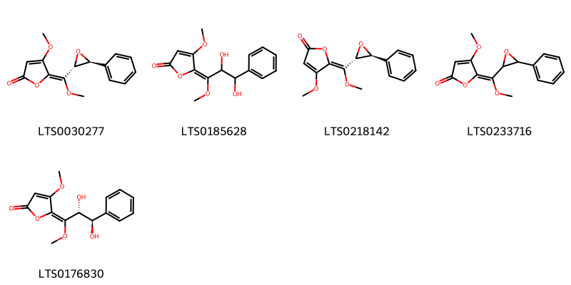{ width=100% }
    <figcaption>Hình ảnh cấu trúc hóa học của 5 hoạt chất thuộc nhóm Dihydrofurans gồm ['(5z)-4-methoxy-5-{methoxy[(2r,3s)-3-phenyloxiran-2-yl]methylidene}furan-2-one (LTS0030277)', '5-(2,3-dihydroxy-1-methoxy-3-phenylpropylidene)-4-methoxyfuran-2-one (LTS0185628)', '(5e)-4-methoxy-5-{methoxy[(2r,3s)-3-phenyloxiran-2-yl]methylidene}furan-2-one (LTS0218142)', '4-methoxy-5-[methoxy(3-phenyloxiran-2-yl)methylidene]furan-2-one (LTS0233716)', '(5z)-5-[(2r,3r)-2,3-dihydroxy-1-methoxy-3-phenylpropylidene]-4-methoxyfuran-2-one (LTS0176830)'].</figcaption>
</figure>
#### Nhóm Kavalactones
<figure markdown="span">
    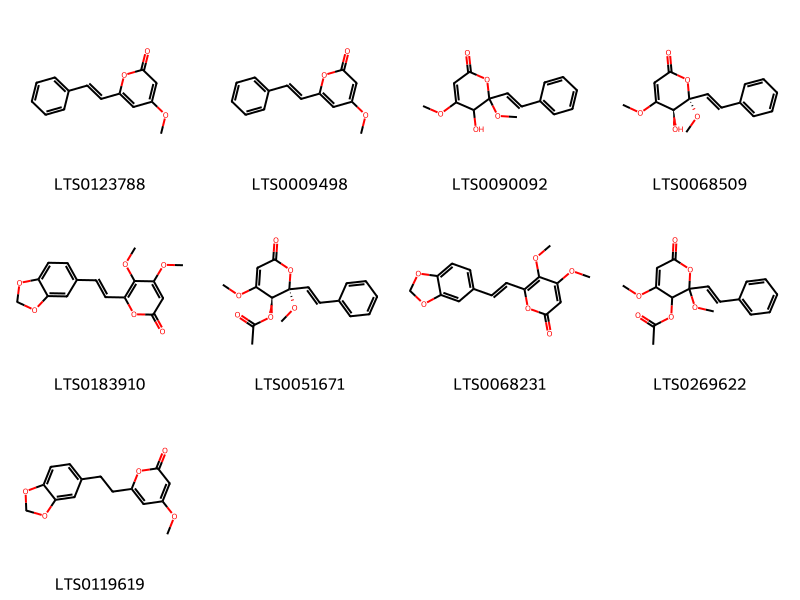{ width=100% }
    <figcaption>Hình ảnh cấu trúc hóa học của 9 hoạt chất thuộc nhóm Kavalactones gồm ['5,6-dehydrokawain (LTS0123788)', 'desmethoxyyangonin (LTS0009498)', '5-hydroxy-4,6-dimethoxy-6-(2-phenylethenyl)-5h-pyran-2-one (LTS0090092)', '(5s,6s)-5-hydroxy-4,6-dimethoxy-6-[(1e)-2-phenylethenyl]-5h-pyran-2-one (LTS0068509)', '6-[2-(2h-1,3-benzodioxol-5-yl)ethenyl]-4,5-dimethoxypyran-2-one (LTS0183910)', '(2s,3s)-2,4-dimethoxy-6-oxo-2-[(1e)-2-phenylethenyl]-3h-pyran-3-yl acetate (LTS0051671)', '6-[(1e)-2-(2h-1,3-benzodioxol-5-yl)ethenyl]-4,5-dimethoxypyran-2-one (LTS0068231)', '2,4-dimethoxy-6-oxo-2-(2-phenylethenyl)-3h-pyran-3-yl acetate (LTS0269622)', '6-[2-(2h-1,3-benzodioxol-5-yl)ethyl]-4-methoxypyran-2-one (LTS0119619)'].</figcaption>
</figure>
#### Nhóm Oxanes
<figure markdown="span">
    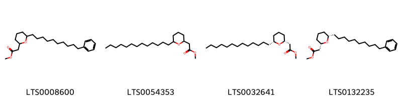{ width=100% }
    <figcaption>Hình ảnh cấu trúc hóa học của 4 hoạt chất thuộc nhóm Oxanes gồm ['methyl 2-[6-(10-phenyldecyl)oxan-2-yl]acetate (LTS0008600)', 'methyl 2-(6-tridecyloxan-2-yl)acetate (LTS0054353)', 'methyl 2-[(2r,6r)-6-tridecyloxan-2-yl]acetate (LTS0032641)', 'methyl 2-[(2s,6s)-6-(10-phenyldecyl)oxan-2-yl]acetate (LTS0132235)'].</figcaption>
</figure>
#### Nhóm Oxolanes
<figure markdown="span">
    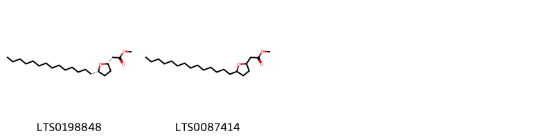{ width=100% }
    <figcaption>Hình ảnh cấu trúc hóa học của 2 hoạt chất thuộc nhóm Oxolanes gồm ['methyl 2-[(2s,5s)-5-tetradecyloxolan-2-yl]acetate (LTS0198848)', 'methyl 2-(5-tetradecyloxolan-2-yl)acetate (LTS0087414)'].</figcaption>
</figure>
#### Nhóm Phenols
<figure markdown="span">
    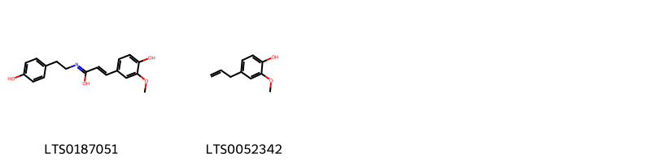{ width=100% }
    <figcaption>Hình ảnh cấu trúc hóa học của 2 hoạt chất thuộc nhóm Phenols gồm ['(2e)-3-(4-hydroxy-3-methoxyphenyl)-n-[2-(4-hydroxyphenyl)ethyl]prop-2-enimidic acid (LTS0187051)', 'eugenol (LTS0052342)'].</figcaption>
</figure>

---

### Dược dân tộc học

Danh sách các quốc gia có sử dụng *Piper sanctum* trong điều trị các bệnh. 

| Country   | Disease                                     | Bệnh                                                                                                                                                                                                |
|:----------|:--------------------------------------------|:----------------------------------------------------------------------------------------------------------------------------------------------------------------------------------------------------|
| Mexico    | Analgesic, Anesthetic, Stimulant, Stomachic | MYMEMORY WARNING: YOU USED ALL AVAILABLE FREE TRANSLATIONS FOR TODAY. NEXT AVAILABLE IN  08 HOURS 00 MINUTES 58 SECONDS VISIT HTTPS://MYMEMORY.TRANSLATED.NET/DOC/USAGELIMITS.PHP TO TRANSLATE MORE |

---

---
## Piper sumatranum
### Thông tin về thực vật

!!! info "Phân loại thực vật của *Piper ribesioides* từ GIBF:"
    - **Kingdom:** Plantae
    - **Phylum:** Tracheophyta
    - **Order:** Piperales
    - **Family:** Piperaceae
    - **Genus:** Piper
    - **Species:** *Piper ribesioides*

 

| Label (VI)   | Label (EN)   | Scientific Name   | Descriptions (VI)   | Descriptions (EN)   | Also Known As (VI)   | Also Known As (EN)   |
|:-------------|:-------------|:------------------|:--------------------|:--------------------|:---------------------|:---------------------|
| N/A          | N/A          | Piper sumatranum  | loài thực vật       | species of plant    | ['']                 | ['']                 |

#### Phân bố trên thế giới

**Từ CSDL GIBF** nan, Indonesia, Malaysia, India

#### Phân bố tại Việt Nam

**Từ CSDL GIBF**: Không có ghi nhận ở Việt Nam

---
### Thành phần hóa học
        
- Theo cơ sở dữ liệu lotus: Từ loài *Piper ribesioides* đã phân lập và xác định được 15 hoạt chất thuộc về các nhóm Cyclobutane lignans, Benzene and substituted derivatives, Benzodioxoles, Steroids and steroid derivatives, Furanoid lignans, Phenol ethers, Saturated hydrocarbons. 

|    | chemicalTaxonomyClassyfireClass     |   smiles_count |
|---:|:------------------------------------|---------------:|
|  0 | Benzene and substituted derivatives |              3 |
|  1 | Benzodioxoles                       |              2 |
|  2 | Cyclobutane lignans                 |              3 |
|  3 | Furanoid lignans                    |              2 |
|  4 | Phenol ethers                       |              2 |
|  5 | Saturated hydrocarbons              |              1 |
|  6 | Steroids and steroid derivatives    |              2 |

#### Nhóm Benzene and substituted derivatives
<figure markdown="span">
    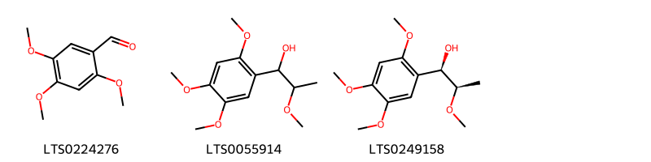{ width=100% }
    <figcaption>Hình ảnh cấu trúc hóa học của 3 hoạt chất thuộc nhóm Benzene and substituted derivatives gồm ['2,4,5-trimethoxybenzaldehyde (LTS0224276)', '2-methoxy-1-(2,4,5-trimethoxyphenyl)propan-1-ol (LTS0055914)', '(1r,2r)-2-methoxy-1-(2,4,5-trimethoxyphenyl)propan-1-ol (LTS0249158)'].</figcaption>
</figure>
#### Nhóm Benzodioxoles
<figure markdown="span">
    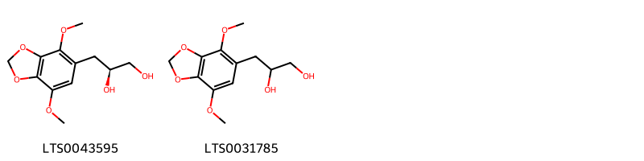{ width=100% }
    <figcaption>Hình ảnh cấu trúc hóa học của 2 hoạt chất thuộc nhóm Benzodioxoles gồm ['(2s)-3-(4,7-dimethoxy-2h-1,3-benzodioxol-5-yl)propane-1,2-diol (LTS0043595)', '3-(4,7-dimethoxy-2h-1,3-benzodioxol-5-yl)propane-1,2-diol (LTS0031785)'].</figcaption>
</figure>
#### Nhóm Cyclobutane lignans
<figure markdown="span">
    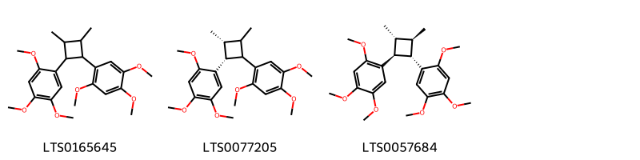{ width=100% }
    <figcaption>Hình ảnh cấu trúc hóa học của 3 hoạt chất thuộc nhóm Cyclobutane lignans gồm ['1-[2,3-dimethyl-4-(2,4,5-trimethoxyphenyl)cyclobutyl]-2,4,5-trimethoxybenzene (LTS0165645)', '1-[(3r,4r)-2,3-dimethyl-4-(2,4,5-trimethoxyphenyl)cyclobutyl]-2,4,5-trimethoxybenzene (LTS0077205)', '1-[(1s,2r,3r,4s)-2,3-dimethyl-4-(2,4,5-trimethoxyphenyl)cyclobutyl]-2,4,5-trimethoxybenzene (LTS0057684)'].</figcaption>
</figure>
#### Nhóm Furanoid lignans
<figure markdown="span">
    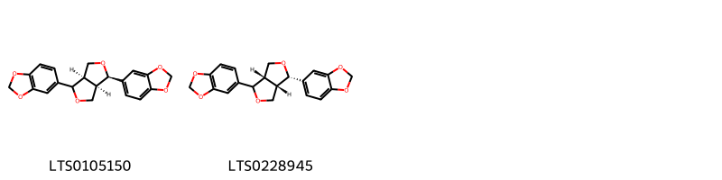{ width=100% }
    <figcaption>Hình ảnh cấu trúc hóa học của 2 hoạt chất thuộc nhóm Furanoid lignans gồm ['5-[(3ar,4r,6ar)-4-(2h-1,3-benzodioxol-5-yl)-hexahydrofuro[3,4-c]furan-1-yl]-2h-1,3-benzodioxole (LTS0105150)', '5-[(3as,4s,6as)-4-(2h-1,3-benzodioxol-5-yl)-hexahydrofuro[3,4-c]furan-1-yl]-2h-1,3-benzodioxole (LTS0228945)'].</figcaption>
</figure>
#### Nhóm Phenol ethers
<figure markdown="span">
    { width=100% }
    <figcaption>Hình ảnh cấu trúc hóa học của 2 hoạt chất thuộc nhóm Phenol ethers gồm ['cis-asarone (LTS0188628)', 'β-asarone (LTS0003070)'].</figcaption>
</figure>
#### Nhóm Saturated hydrocarbons
<figure markdown="span">
    { width=100% }
    <figcaption>Hình ảnh cấu trúc hóa học của 1 hoạt chất thuộc nhóm Saturated hydrocarbons gồm ['triacontane (LTS0250709)'].</figcaption>
</figure>
#### Nhóm Steroids and steroid derivatives
<figure markdown="span">
    { width=100% }
    <figcaption>Hình ảnh cấu trúc hóa học của 2 hoạt chất thuộc nhóm Steroids and steroid derivatives gồm ['stigmast-5-en-3-ol, (3β)- (LTS0204616)', 'stigmast-5-en-3-ol (LTS0071224)'].</figcaption>
</figure>

---

### Dược dân tộc học

Danh sách các quốc gia có sử dụng *Piper ribesioides* trong điều trị các bệnh. 

| Country   | Disease                                                   | Bệnh                                                                                                                                                                                                |
|:----------|:----------------------------------------------------------|:----------------------------------------------------------------------------------------------------------------------------------------------------------------------------------------------------|
| Malaya    | Antiseptic, Carminative, Diuretic, Expectorant, Stimulant | MYMEMORY WARNING: YOU USED ALL AVAILABLE FREE TRANSLATIONS FOR TODAY. NEXT AVAILABLE IN  08 HOURS 00 MINUTES 36 SECONDS VISIT HTTPS://MYMEMORY.TRANSLATED.NET/DOC/USAGELIMITS.PHP TO TRANSLATE MORE |

---

---
## Piper sylvaticum
### Thông tin về thực vật

!!! info "Phân loại thực vật của *Piper sylvaticum* từ GIBF:"
    - **Kingdom:** Plantae
    - **Phylum:** Tracheophyta
    - **Order:** Piperales
    - **Family:** Piperaceae
    - **Genus:** Piper
    - **Species:** *Piper sylvaticum*

 

| Label (VI)   | Label (EN)   | Scientific Name   | Descriptions (VI)   | Descriptions (EN)   | Also Known As (VI)   | Also Known As (EN)   |
|:-------------|:-------------|:------------------|:--------------------|:--------------------|:---------------------|:---------------------|
| N/A          | N/A          | Piper sylvaticum  |                     | species of plant    | ['']                 | ['']                 |

#### Phân bố trên thế giới

**Từ CSDL GIBF** nan, Bhutan, Indonesia, Belgium, Bangladesh, China, Nepal, Latvia, Myanmar, South Africa, India, Thailand

#### Phân bố tại Việt Nam

**Từ CSDL GIBF**: Không có ghi nhận ở Việt Nam

---
### Thành phần hóa học
        
- Theo cơ sở dữ liệu lotus: Từ loài *Piper sylvaticum* đã phân lập và xác định được 22 hoạt chất thuộc về các nhóm Fatty Acyls, Flavonoids, Benzodioxoles, Cinnamic acids and derivatives, Steroids and steroid derivatives, Organooxygen compounds, Furanoid lignans. 

|    | chemicalTaxonomyClassyfireClass   |   smiles_count |
|---:|:----------------------------------|---------------:|
|  0 |                                   |              1 |
|  1 | Benzodioxoles                     |              3 |
|  2 | Cinnamic acids and derivatives    |              2 |
|  3 | Fatty Acyls                       |              4 |
|  4 | Flavonoids                        |              3 |
|  5 | Furanoid lignans                  |              5 |
|  6 | Organooxygen compounds            |              1 |
|  7 | Steroids and steroid derivatives  |              3 |

#### Nhóm 
<figure markdown="span">
    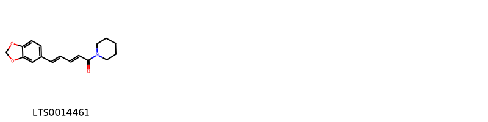{ width=100% }
    <figcaption>Hình ảnh cấu trúc hóa học của 1 hoạt chất thuộc nhóm  gồm ['piperine (LTS0014461)'].</figcaption>
</figure>
#### Nhóm Benzodioxoles
<figure markdown="span">
    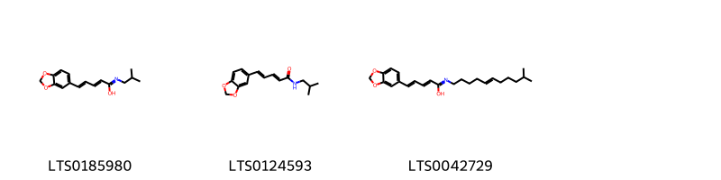{ width=100% }
    <figcaption>Hình ảnh cấu trúc hóa học của 3 hoạt chất thuộc nhóm Benzodioxoles gồm ['(2e,4e)-5-(2h-1,3-benzodioxol-5-yl)-n-(2-methylpropyl)penta-2,4-dienimidic acid (LTS0185980)', '5-(2h-1,3-benzodioxol-5-yl)-n-(2-methylpropyl)penta-2,4-dienamide (LTS0124593)', '(2e,4e)-5-(2h-1,3-benzodioxol-5-yl)-n-[(5e)-10-methylundec-5-en-1-yl]penta-2,4-dienimidic acid (LTS0042729)'].</figcaption>
</figure>
#### Nhóm Cinnamic acids and derivatives
<figure markdown="span">
    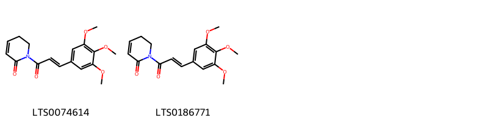{ width=100% }
    <figcaption>Hình ảnh cấu trúc hóa học của 2 hoạt chất thuộc nhóm Cinnamic acids and derivatives gồm ['piperlongumine (LTS0074614)', '1-[3-(3,4,5-trimethoxyphenyl)prop-2-enoyl]-5,6-dihydropyridin-2-one (LTS0186771)'].</figcaption>
</figure>
#### Nhóm Fatty Acyls
<figure markdown="span">
    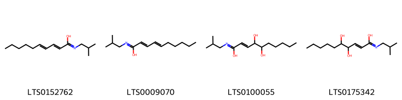{ width=100% }
    <figcaption>Hình ảnh cấu trúc hóa học của 4 hoạt chất thuộc nhóm Fatty Acyls gồm ['(2e,4e)-n-(2-methylpropyl)deca-2,4-dienimidic acid (LTS0152762)', 'n-(2-methylpropyl)deca-2,4-dienimidic acid (LTS0009070)', '4,5-dihydroxy-n-(2-methylpropyl)dec-2-enimidic acid (LTS0100055)', '(2e)-4,5-dihydroxy-n-(2-methylpropyl)dec-2-enimidic acid (LTS0175342)'].</figcaption>
</figure>
#### Nhóm Flavonoids
<figure markdown="span">
    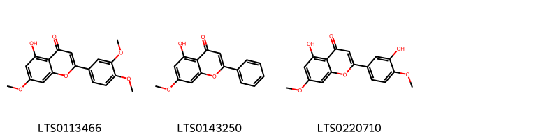{ width=100% }
    <figcaption>Hình ảnh cấu trúc hóa học của 3 hoạt chất thuộc nhóm Flavonoids gồm ['2-(3,4-dimethoxyphenyl)-5-hydroxy-7-methoxychromen-4-one (LTS0113466)', 'tectochrysin (LTS0143250)', 'pilloin (LTS0220710)'].</figcaption>
</figure>
#### Nhóm Furanoid lignans
<figure markdown="span">
    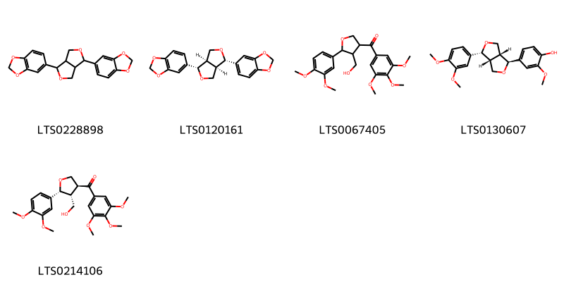{ width=100% }
    <figcaption>Hình ảnh cấu trúc hóa học của 5 hoạt chất thuộc nhóm Furanoid lignans gồm ['sesamin (LTS0228898)', 'sesamin (LTS0120161)', '[2-(3,4-dimethoxyphenyl)-4-(3,4,5-trimethoxybenzoyl)oxolan-3-yl]methanol (LTS0067405)', 'sylvatesmin (LTS0130607)', '[(2r,3r,4s)-2-(3,4-dimethoxyphenyl)-4-(3,4,5-trimethoxybenzoyl)oxolan-3-yl]methanol (LTS0214106)'].</figcaption>
</figure>
#### Nhóm Organooxygen compounds
<figure markdown="span">
    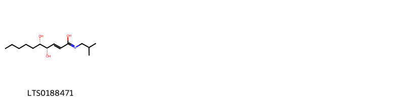{ width=100% }
    <figcaption>Hình ảnh cấu trúc hóa học của 1 hoạt chất thuộc nhóm Organooxygen compounds gồm ['(2e,4s,5s)-4,5-dihydroxy-n-(2-methylpropyl)dec-2-enimidic acid (LTS0188471)'].</figcaption>
</figure>
#### Nhóm Steroids and steroid derivatives
<figure markdown="span">
    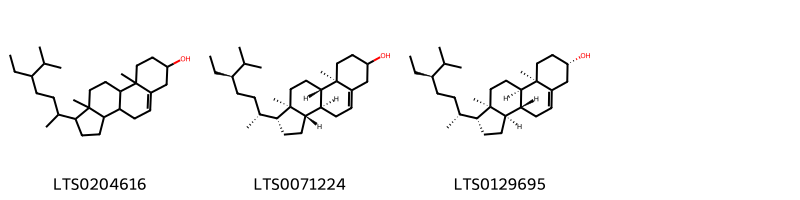{ width=100% }
    <figcaption>Hình ảnh cấu trúc hóa học của 3 hoạt chất thuộc nhóm Steroids and steroid derivatives gồm ['stigmast-5-en-3-ol, (3β)- (LTS0204616)', 'stigmast-5-en-3-ol (LTS0071224)', '(1r,3ar,3br,7s,9ar,9br,11ar)-1-[(2r,5r)-5-ethyl-6-methylheptan-2-yl]-9a,11a-dimethyl-1h,2h,3h,3ah,3bh,4h,6h,7h,8h,9h,9bh,10h,11h-cyclopenta[a]phenanthren-7-ol (LTS0129695)'].</figcaption>
</figure>

---

### Dược dân tộc học

Danh sách các quốc gia có sử dụng *Piper sylvaticum* trong điều trị các bệnh. 

| Country       | Disease     | Bệnh                                                                                                                                                                                                |
|:--------------|:------------|:----------------------------------------------------------------------------------------------------------------------------------------------------------------------------------------------------|
| India(Bengal) | Carminative | MYMEMORY WARNING: YOU USED ALL AVAILABLE FREE TRANSLATIONS FOR TODAY. NEXT AVAILABLE IN  08 HOURS 00 MINUTES 15 SECONDS VISIT HTTPS://MYMEMORY.TRANSLATED.NET/DOC/USAGELIMITS.PHP TO TRANSLATE MORE |

---

---
## Piper thomsoni
### Thông tin về thực vật

!!! info "Phân loại thực vật của *Piper thomsonii* từ GIBF:"
    - **Kingdom:** Plantae
    - **Phylum:** Tracheophyta
    - **Order:** Piperales
    - **Family:** Piperaceae
    - **Genus:** Piper
    - **Species:** *Piper thomsonii*

 

| Label (VI)   | Label (EN)   | Scientific Name   | Descriptions (VI)   | Descriptions (EN)   | Also Known As (VI)   | Also Known As (EN)   |
|:-------------|:-------------|:------------------|:--------------------|:--------------------|:---------------------|:---------------------|
| N/A          | N/A          | Piper sylvaticum  |                     | species of plant    | ['']                 | ['']                 |

#### Phân bố trên thế giới

**Từ CSDL GIBF** Thailand, India, Viet Nam, China

#### Phân bố tại Việt Nam

**Từ CSDL GIBF**: Vinh Phuc, Hoa Binh, Ninh Binh

---
### Thành phần hóa học
        
- Theo cơ sở dữ liệu lotus: Từ loài *Piper thomsonii* đã phân lập và xác định được 6 hoạt chất thuộc về các nhóm Fatty Acyls, Aporphines, Steroids and steroid derivatives. 

|    | chemicalTaxonomyClassyfireClass   |   smiles_count |
|---:|:----------------------------------|---------------:|
|  0 |                                   |              2 |
|  1 | Aporphines                        |              1 |
|  2 | Fatty Acyls                       |              2 |
|  3 | Steroids and steroid derivatives  |              1 |

#### Nhóm 
<figure markdown="span">
    { width=100% }
    <figcaption>Hình ảnh cấu trúc hóa học của 2 hoạt chất thuộc nhóm  gồm ['piperine (LTS0014461)', '5-(2h-1,3-benzodioxol-5-yl)-1-(piperidin-1-yl)penta-2,4-dien-1-one (LTS0271968)'].</figcaption>
</figure>
#### Nhóm Aporphines
<figure markdown="span">
    { width=100% }
    <figcaption>Hình ảnh cấu trúc hóa học của 1 hoạt chất thuộc nhóm Aporphines gồm ['11-methyl-3,5-dioxa-11-azapentacyclo[10.7.1.0²,⁶.0⁸,²⁰.0¹⁴,¹⁹]icosa-1(20),2(6),7,12,14(19),15,17-heptaene-9,10-dione (LTS0083545)'].</figcaption>
</figure>
#### Nhóm Fatty Acyls
<figure markdown="span">
    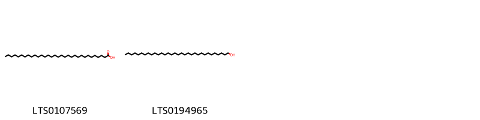{ width=100% }
    <figcaption>Hình ảnh cấu trúc hóa học của 2 hoạt chất thuộc nhóm Fatty Acyls gồm ['lacceroic acid (LTS0107569)', 'dotriacontanol (LTS0194965)'].</figcaption>
</figure>
#### Nhóm Steroids and steroid derivatives
<figure markdown="span">
    { width=100% }
    <figcaption>Hình ảnh cấu trúc hóa học của 1 hoạt chất thuộc nhóm Steroids and steroid derivatives gồm ['sitosterol (LTS0168132)'].</figcaption>
</figure>

---

### Dược dân tộc học

Danh sách các quốc gia có sử dụng *Piper thomsonii* trong điều trị các bệnh. 

| Country   | Disease   | Bệnh                                                                                                                                                                                                |
|:----------|:----------|:----------------------------------------------------------------------------------------------------------------------------------------------------------------------------------------------------|
| Sikkim    | Diuretic  | MYMEMORY WARNING: YOU USED ALL AVAILABLE FREE TRANSLATIONS FOR TODAY. NEXT AVAILABLE IN  07 HOURS 59 MINUTES 53 SECONDS VISIT HTTPS://MYMEMORY.TRANSLATED.NET/DOC/USAGELIMITS.PHP TO TRANSLATE MORE |

---

---
## Piper tricue
### Thông tin về thực vật

!!! info "Phân loại thực vật của *Piper tricuspe* từ GIBF:"
    - **Kingdom:** Plantae
    - **Phylum:** Tracheophyta
    - **Order:** Piperales
    - **Family:** Piperaceae
    - **Genus:** Piper
    - **Species:** *Piper tricuspe*

 

| Label (VI)   | Label (EN)   | Scientific Name   | Descriptions (VI)   | Descriptions (EN)   | Also Known As (VI)   | Also Known As (EN)   |
|:-------------|:-------------|:------------------|:--------------------|:--------------------|:---------------------|:---------------------|
| N/A          | N/A          | Piper sylvaticum  |                     | species of plant    | ['']                 | ['']                 |

#### Phân bố trên thế giới

**Từ CSDL GIBF** nan, Colombia, Panama, Ecuador

#### Phân bố tại Việt Nam

**Từ CSDL GIBF**: Không có ghi nhận ở Việt Nam

---
### Thành phần hóa học
        
- Theo cơ sở dữ liệu lotus: Từ loài *Piper tricuspe* đã phân lập và xác định được Chưa có hoạt chất nào được phân lập. hoạt chất thuộc về các nhóm Không có hoạt chất nào được phân lập. 

Không có hình ảnh nào được tạo ra

---

### Dược dân tộc học

Danh sách các quốc gia có sử dụng *Piper tricuspe* trong điều trị các bệnh. 

| Country       | Disease   | Bệnh                                                                                                                                                                                                |
|:--------------|:----------|:----------------------------------------------------------------------------------------------------------------------------------------------------------------------------------------------------|
| Panama(Choco) | Vermifuge | MYMEMORY WARNING: YOU USED ALL AVAILABLE FREE TRANSLATIONS FOR TODAY. NEXT AVAILABLE IN  07 HOURS 59 MINUTES 28 SECONDS VISIT HTTPS://MYMEMORY.TRANSLATED.NET/DOC/USAGELIMITS.PHP TO TRANSLATE MORE |

---

---
## Piper tristachyon
### Thông tin về thực vật

!!! info "Phân loại thực vật của *Macropiper latifolium* từ GIBF:"
    - **Kingdom:** Plantae
    - **Phylum:** Tracheophyta
    - **Order:** Piperales
    - **Family:** Piperaceae
    - **Genus:** Macropiper
    - **Species:** *Macropiper latifolium*

 

| Label (VI)   | Label (EN)   | Scientific Name   | Descriptions (VI)   | Descriptions (EN)   | Also Known As (VI)   | Also Known As (EN)   |
|:-------------|:-------------|:------------------|:--------------------|:--------------------|:---------------------|:---------------------|
| N/A          | N/A          | Piper tristachyon |                     |                     | ['']                 | ['']                 |

#### Phân bố trên thế giới

**Từ CSDL GIBF** nan, Colombia, Panama, Ecuador

#### Phân bố tại Việt Nam

**Từ CSDL GIBF**: Không có ghi nhận ở Việt Nam

---
### Thành phần hóa học
        
- Theo cơ sở dữ liệu lotus: Từ loài *Macropiper latifolium* đã phân lập và xác định được Chưa có hoạt chất nào được phân lập. hoạt chất thuộc về các nhóm Không có hoạt chất nào được phân lập. 

Không có hình ảnh nào được tạo ra

---

### Dược dân tộc học

Danh sách các quốc gia có sử dụng *Macropiper latifolium* trong điều trị các bệnh. 

| Country   | Disease    | Bệnh                                                                                                                                                                                                |
|:----------|:-----------|:----------------------------------------------------------------------------------------------------------------------------------------------------------------------------------------------------|
| Society I | Intoxicant | MYMEMORY WARNING: YOU USED ALL AVAILABLE FREE TRANSLATIONS FOR TODAY. NEXT AVAILABLE IN  07 HOURS 59 MINUTES 09 SECONDS VISIT HTTPS://MYMEMORY.TRANSLATED.NET/DOC/USAGELIMITS.PHP TO TRANSLATE MORE |

---

---
## Piper tutuilae
### Thông tin về thực vật

!!! info "Phân loại thực vật của *Piper tutuilae* từ GIBF:"
    - **Kingdom:** Plantae
    - **Phylum:** Tracheophyta
    - **Order:** Piperales
    - **Family:** Piperaceae
    - **Genus:** Piper
    - **Species:** *Piper tutuilae*

 

| Label (VI)   | Label (EN)   | Scientific Name   | Descriptions (VI)   | Descriptions (EN)   | Also Known As (VI)   | Also Known As (EN)   |
|:-------------|:-------------|:------------------|:--------------------|:--------------------|:---------------------|:---------------------|
| N/A          | N/A          | Piper tutuilae    |                     | species of plant    | ['']                 | ['']                 |

#### Phân bố trên thế giới

**Từ CSDL GIBF** nan, Colombia, Panama, Ecuador

#### Phân bố tại Việt Nam

**Từ CSDL GIBF**: Không có ghi nhận ở Việt Nam

---
### Thành phần hóa học
        
- Theo cơ sở dữ liệu lotus: Từ loài *Piper tutuilae* đã phân lập và xác định được Chưa có hoạt chất nào được phân lập. hoạt chất thuộc về các nhóm Không có hoạt chất nào được phân lập. 

Không có hình ảnh nào được tạo ra

---

### Dược dân tộc học

Danh sách các quốc gia có sử dụng *Piper tutuilae* trong điều trị các bệnh. 

| Country   | Disease   | Bệnh                                                                                                                                                                                                |
|:----------|:----------|:----------------------------------------------------------------------------------------------------------------------------------------------------------------------------------------------------|
| Samoa     | Laxative  | MYMEMORY WARNING: YOU USED ALL AVAILABLE FREE TRANSLATIONS FOR TODAY. NEXT AVAILABLE IN  07 HOURS 58 MINUTES 53 SECONDS VISIT HTTPS://MYMEMORY.TRANSLATED.NET/DOC/USAGELIMITS.PHP TO TRANSLATE MORE |

---

---
## Piper umbellatum
### Thông tin về thực vật

!!! info "Phân loại thực vật của *Piper umbellatum* từ GIBF:"
    - **Kingdom:** Plantae
    - **Phylum:** Tracheophyta
    - **Order:** Piperales
    - **Family:** Piperaceae
    - **Genus:** Piper
    - **Species:** *Piper umbellatum*

 

| Label (VI)   | Label (EN)   | Scientific Name   | Descriptions (VI)   | Descriptions (EN)   | Also Known As (VI)   | Also Known As (EN)   |
|:-------------|:-------------|:------------------|:--------------------|:--------------------|:---------------------|:---------------------|
| N/A          | N/A          | Piper umbellatum  | loài thực vật       | species of plant    | ['Piper umbellatum'] | ['']                 |

#### Phân bố trên thế giới

**Từ CSDL GIBF** Brazil, Guatemala, Uganda, Honduras, Tanzania, United Republic of, Ecuador, Madagascar, Puerto Rico, Ghana, Indonesia, Costa Rica, Dominican Republic, Colombia, Cuba, Sao Tome and Principe, Mexico, Kenya, El Salvador, Chinese Taipei, Haiti, Gabon, Mauritius, Panama, Australia, India, Belize, Venezuela (Bolivarian Republic of)

#### Phân bố tại Việt Nam

**Từ CSDL GIBF**: Không có ghi nhận ở Việt Nam

---
### Thành phần hóa học
        
- Theo cơ sở dữ liệu lotus: Từ loài *Piper umbellatum* đã phân lập và xác định được 55 hoạt chất thuộc về các nhóm Fatty Acyls, Benzene and substituted derivatives, Linear 1,3-diarylpropanoids, Dibenzylbutane lignans, Flavonoids, Cinnamic acids and derivatives, Steroids and steroid derivatives, Phenols, Aristolactams, Prenol lipids. 

|    | chemicalTaxonomyClassyfireClass     |   smiles_count |
|---:|:------------------------------------|---------------:|
|  0 | Aristolactams                       |              5 |
|  1 | Benzene and substituted derivatives |              1 |
|  2 | Cinnamic acids and derivatives      |              5 |
|  3 | Dibenzylbutane lignans              |              2 |
|  4 | Fatty Acyls                         |              2 |
|  5 | Flavonoids                          |             19 |
|  6 | Linear 1,3-diarylpropanoids         |              1 |
|  7 | Phenols                             |              1 |
|  8 | Prenol lipids                       |             10 |
|  9 | Steroids and steroid derivatives    |              9 |

#### Nhóm Aristolactams
<figure markdown="span">
    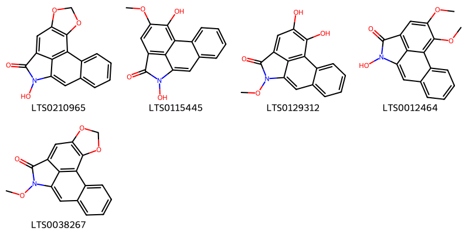{ width=100% }
    <figcaption>Hình ảnh cấu trúc hóa học của 5 hoạt chất thuộc nhóm Aristolactams gồm ['10-hydroxy-3,5-dioxa-10-azapentacyclo[9.7.1.0²,⁶.0⁸,¹⁹.0¹³,¹⁸]nonadeca-1(19),2(6),7,11,13(18),14,16-heptaen-9-one (LTS0210965)', '10,15-dihydroxy-14-methoxy-10-azatetracyclo[7.6.1.0²,⁷.0¹²,¹⁶]hexadeca-1(16),2(7),3,5,8,12,14-heptaen-11-one (LTS0115445)', '14,15-dihydroxy-10-methoxy-10-azatetracyclo[7.6.1.0²,⁷.0¹²,¹⁶]hexadeca-1(16),2(7),3,5,8,12,14-heptaen-11-one (LTS0129312)', '10-hydroxy-14,15-dimethoxy-10-azatetracyclo[7.6.1.0²,⁷.0¹²,¹⁶]hexadeca-1(16),2(7),3,5,8,12,14-heptaen-11-one (LTS0012464)', '10-methoxy-3,5-dioxa-10-azapentacyclo[9.7.1.0²,⁶.0⁸,¹⁹.0¹³,¹⁸]nonadeca-1(19),2(6),7,11,13(18),14,16-heptaen-9-one (LTS0038267)'].</figcaption>
</figure>
#### Nhóm Benzene and substituted derivatives
<figure markdown="span">
    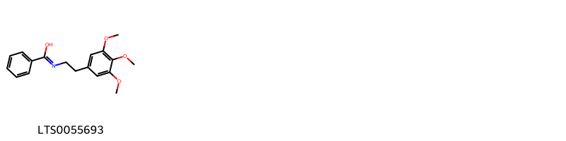{ width=100% }
    <figcaption>Hình ảnh cấu trúc hóa học của 1 hoạt chất thuộc nhóm Benzene and substituted derivatives gồm ['n-[2-(3,4,5-trimethoxyphenyl)ethyl]benzenecarboximidic acid (LTS0055693)'].</figcaption>
</figure>
#### Nhóm Cinnamic acids and derivatives
<figure markdown="span">
    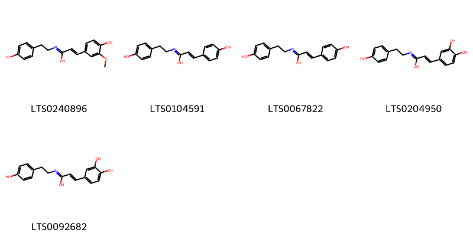{ width=100% }
    <figcaption>Hình ảnh cấu trúc hóa học của 5 hoạt chất thuộc nhóm Cinnamic acids and derivatives gồm ['3-(4-hydroxy-3-methoxyphenyl)-n-[2-(4-hydroxyphenyl)ethyl]prop-2-enimidic acid (LTS0240896)', '3-(4-hydroxyphenyl)-n-[2-(4-hydroxyphenyl)ethyl]prop-2-enimidic acid (LTS0104591)', '(2e)-3-(4-hydroxyphenyl)-n-[2-(4-hydroxyphenyl)ethyl]prop-2-enimidic acid (LTS0067822)', '3-(3,4-dihydroxyphenyl)-n-[2-(4-hydroxyphenyl)ethyl]prop-2-enimidic acid (LTS0204950)', '(2e)-3-(3,4-dihydroxyphenyl)-n-[2-(4-hydroxyphenyl)ethyl]prop-2-enimidic acid (LTS0092682)'].</figcaption>
</figure>
#### Nhóm Dibenzylbutane lignans
<figure markdown="span">
    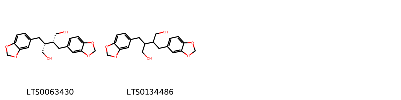{ width=100% }
    <figcaption>Hình ảnh cấu trúc hóa học của 2 hoạt chất thuộc nhóm Dibenzylbutane lignans gồm ['dihydrocubebin (LTS0063430)', '2,3-bis(2h-1,3-benzodioxol-5-ylmethyl)butane-1,4-diol (LTS0134486)'].</figcaption>
</figure>
#### Nhóm Fatty Acyls
<figure markdown="span">
    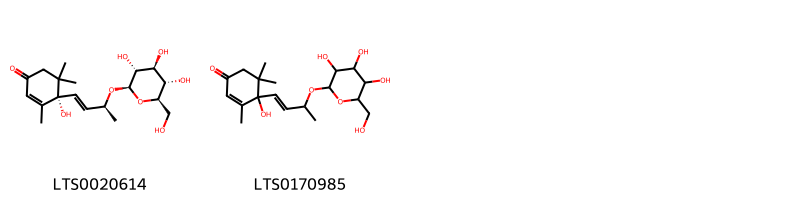{ width=100% }
    <figcaption>Hình ảnh cấu trúc hóa học của 2 hoạt chất thuộc nhóm Fatty Acyls gồm ['(4s)-4-hydroxy-3,5,5-trimethyl-4-[(1e,3s)-3-{[(2r,3r,4s,5s,6r)-3,4,5-trihydroxy-6-(hydroxymethyl)oxan-2-yl]oxy}but-1-en-1-yl]cyclohex-2-en-1-one (LTS0020614)', '4-hydroxy-3,5,5-trimethyl-4-(3-{[3,4,5-trihydroxy-6-(hydroxymethyl)oxan-2-yl]oxy}but-1-en-1-yl)cyclohex-2-en-1-one (LTS0170985)'].</figcaption>
</figure>
#### Nhóm Flavonoids
<figure markdown="span">
    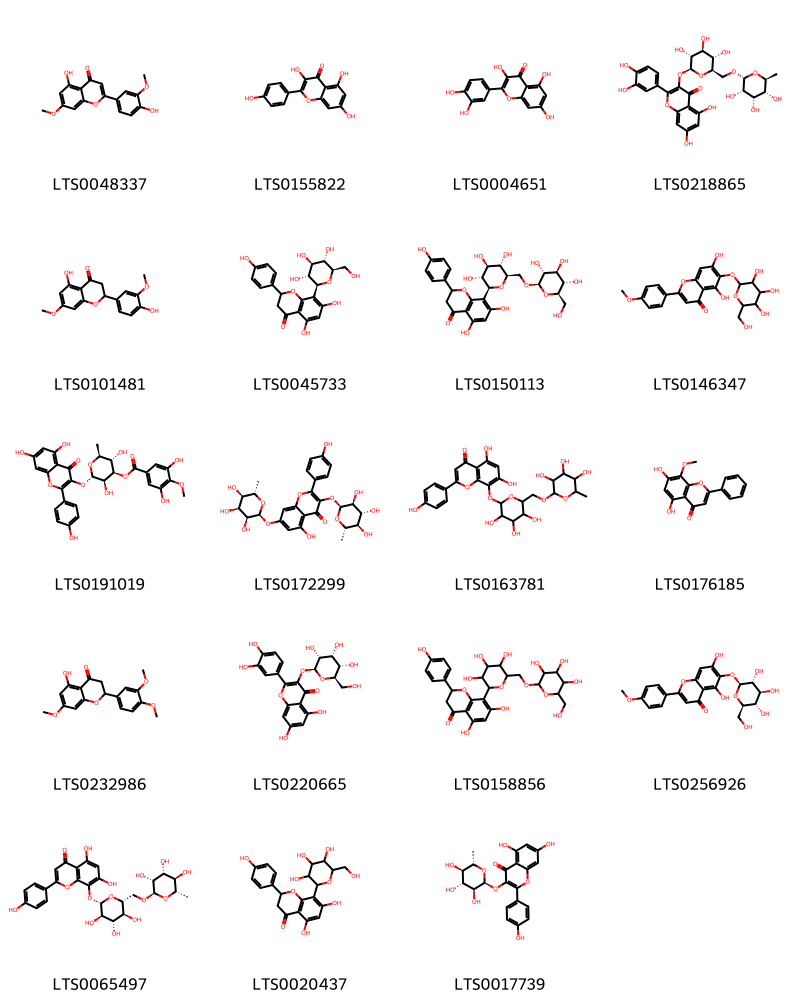{ width=100% }
    <figcaption>Hình ảnh cấu trúc hóa học của 19 hoạt chất thuộc nhóm Flavonoids gồm ['velutin (LTS0048337)', 'kaempherol (LTS0155822)', 'quercetin (LTS0004651)', '2-(3,4-dihydroxyphenyl)-5,7-dihydroxy-3-{[(2s,3r,4s,5s,6r)-3,4,5-trihydroxy-6-({[(2r,3s,4s,5r,6s)-3,4,5-trihydroxy-6-methyloxan-2-yl]oxy}methyl)oxan-2-yl]oxy}chromen-4-one (LTS0218865)', '5-hydroxy-2-(4-hydroxy-3-methoxyphenyl)-7-methoxy-2,3-dihydro-1-benzopyran-4-one (LTS0101481)', '5,7-dihydroxy-2-(4-hydroxyphenyl)-8-[(2s,3r,4r,5s,6r)-3,4,5-trihydroxy-6-(hydroxymethyl)oxan-2-yl]-2,3-dihydro-1-benzopyran-4-one (LTS0045733)', '5,7-dihydroxy-2-(4-hydroxyphenyl)-8-[(2s,3r,4r,5s,6r)-3,4,5-trihydroxy-6-({[(2r,3r,4s,5s,6r)-3,4,5-trihydroxy-6-(hydroxymethyl)oxan-2-yl]oxy}methyl)oxan-2-yl]-2,3-dihydro-1-benzopyran-4-one (LTS0150113)', '5,7-dihydroxy-2-(4-methoxyphenyl)-6-{[3,4,5-trihydroxy-6-(hydroxymethyl)oxan-2-yl]oxy}chromen-4-one (LTS0146347)', '(2s,3r,4r,5s,6s)-2-{[5,7-dihydroxy-2-(4-hydroxyphenyl)-4-oxochromen-3-yl]oxy}-3,5-dihydroxy-6-methyloxan-4-yl 3,5-dihydroxy-4-methoxybenzoate (LTS0191019)', '5-hydroxy-2-(4-hydroxyphenyl)-3-{[(2s,3s,4r,5r,6s)-3,4,5-trihydroxy-6-methyloxan-2-yl]oxy}-7-{[(2s,3s,4s,5r,6s)-3,4,5-trihydroxy-6-methyloxan-2-yl]oxy}chromen-4-one (LTS0172299)', '5,7-dihydroxy-2-(4-hydroxyphenyl)-8-[(3,4,5-trihydroxy-6-{[(3,4,5-trihydroxy-6-methyloxan-2-yl)oxy]methyl}oxan-2-yl)oxy]chromen-4-one (LTS0163781)', 'wogonin (LTS0176185)', '2-(3,4-dimethoxyphenyl)-5-hydroxy-7-methoxy-2,3-dihydro-1-benzopyran-4-one (LTS0232986)', '2-(3,4-dihydroxyphenyl)-5,7-dihydroxy-3-{[(2s,3r,4r,5s,6r)-3,4,5-trihydroxy-6-(hydroxymethyl)oxan-2-yl]oxy}chromen-4-one (LTS0220665)', '5,7-dihydroxy-2-(4-hydroxyphenyl)-8-[3,4,5-trihydroxy-6-({[3,4,5-trihydroxy-6-(hydroxymethyl)oxan-2-yl]oxy}methyl)oxan-2-yl]-2,3-dihydro-1-benzopyran-4-one (LTS0158856)', '5,7-dihydroxy-2-(4-methoxyphenyl)-6-{[(2s,3r,4s,5s,6r)-3,4,5-trihydroxy-6-(hydroxymethyl)oxan-2-yl]oxy}chromen-4-one (LTS0256926)', '5,7-dihydroxy-2-(4-hydroxyphenyl)-8-{[(2s,3r,4s,5s,6r)-3,4,5-trihydroxy-6-({[(2r,3r,4r,5r,6s)-3,4,5-trihydroxy-6-methyloxan-2-yl]oxy}methyl)oxan-2-yl]oxy}chromen-4-one (LTS0065497)', '5,7-dihydroxy-2-(4-hydroxyphenyl)-8-[3,4,5-trihydroxy-6-(hydroxymethyl)oxan-2-yl]-2,3-dihydro-1-benzopyran-4-one (LTS0020437)', '5,7-dihydroxy-2-(4-hydroxyphenyl)-3-{[(2s,3s,4r,5r,6s)-3,4,5-trihydroxy-6-methyloxan-2-yl]oxy}chromen-4-one (LTS0017739)'].</figcaption>
</figure>
#### Nhóm Linear 1_3-diarylpropanoids
<figure markdown="span">
    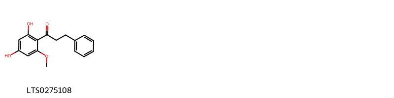{ width=100% }
    <figcaption>Hình ảnh cấu trúc hóa học của Không tìm thấy chú thích hoạt chất thuộc nhóm Linear 1_3-diarylpropanoids gồm Không tìm thấy chú thích.</figcaption>
</figure>
#### Nhóm Phenols
<figure markdown="span">
    { width=100% }
    <figcaption>Hình ảnh cấu trúc hóa học của 1 hoạt chất thuộc nhóm Phenols gồm ['(2e)-3-(4-hydroxy-3-methoxyphenyl)-n-[2-(4-hydroxyphenyl)ethyl]prop-2-enimidic acid (LTS0187051)'].</figcaption>
</figure>
#### Nhóm Prenol lipids
<figure markdown="span">
    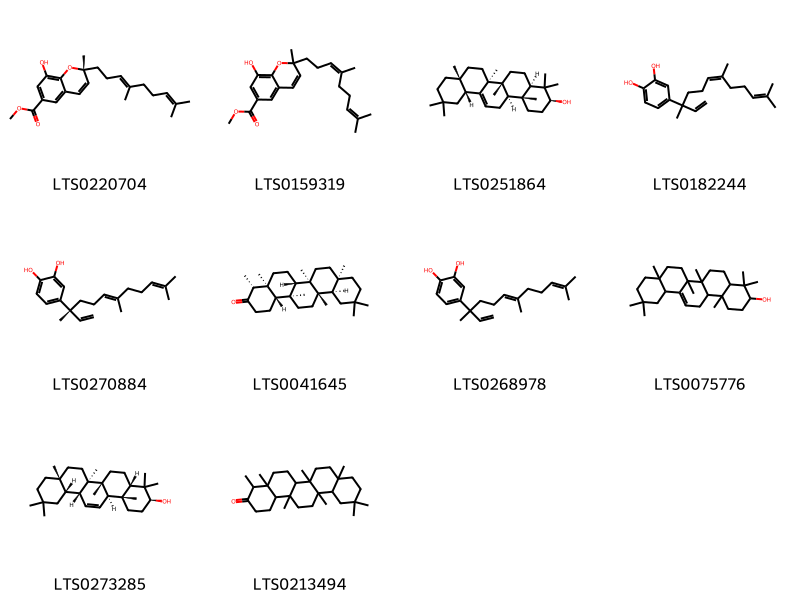{ width=100% }
    <figcaption>Hình ảnh cấu trúc hóa học của 10 hoạt chất thuộc nhóm Prenol lipids gồm ['methyl (2r)-2-[(3e)-4,8-dimethylnona-3,7-dien-1-yl]-8-hydroxy-2-methylchromene-6-carboxylate (LTS0220704)', 'methyl 2-(4,8-dimethylnona-3,7-dien-1-yl)-8-hydroxy-2-methylchromene-6-carboxylate (LTS0159319)', 'β-amyrin (LTS0251864)', '4-(3,7,11-trimethyldodeca-1,6,10-trien-3-yl)benzene-1,2-diol (LTS0182244)', '4-[(3r,6e)-3,7,11-trimethyldodeca-1,6,10-trien-3-yl]benzene-1,2-diol (LTS0270884)', '(-)-friedelin (LTS0041645)', '4-[(6e)-3,7,11-trimethyldodeca-1,6,10-trien-3-yl]benzene-1,2-diol (LTS0268978)', 'β-amyrin (LTS0075776)', '(3s,4as,6ar,6br,8ar,12as,12br,14ar,14bs)-4,4,6a,6b,8a,11,11,14b-octamethyl-1,2,3,4a,5,6,7,8,9,10,12,12a,12b,14a-tetradecahydropicen-3-ol (LTS0273285)', 'friedelin (LTS0213494)'].</figcaption>
</figure>
#### Nhóm Steroids and steroid derivatives
<figure markdown="span">
    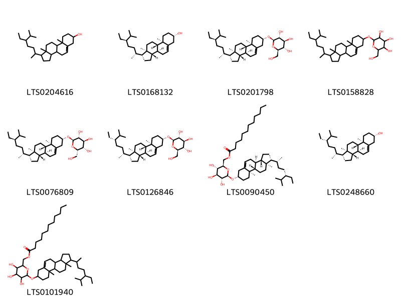{ width=100% }
    <figcaption>Hình ảnh cấu trúc hóa học của 9 hoạt chất thuộc nhóm Steroids and steroid derivatives gồm ['stigmast-5-en-3-ol, (3β)- (LTS0204616)', 'sitosterol (LTS0168132)', 'sitogluside (LTS0201798)', '2-{[1-(5-ethyl-6-methylheptan-2-yl)-9a,11a-dimethyl-1h,2h,3h,3ah,3bh,4h,6h,7h,8h,9h,9bh,10h,11h-cyclopenta[a]phenanthren-7-yl]oxy}-6-(hydroxymethyl)oxane-3,4,5-triol (LTS0158828)', '(2r,3r,4s,5s,6s)-2-{[(1r,3as,3bs,7s,9ar,9bs,11ar)-1-[(2r,5r)-5-ethyl-6-methylheptan-2-yl]-9a,11a-dimethyl-1h,2h,3h,3ah,3bh,4h,6h,7h,8h,9h,9bh,10h,11h-cyclopenta[a]phenanthren-7-yl]oxy}-6-(hydroxymethyl)oxane-3,4,5-triol (LTS0076809)', '(2r,3r,4s,5s,6r)-2-{[(1r,3as,3bs,7s,9ar,9bs,11ar)-1-[(2r,5s)-5-ethyl-6-methylheptan-2-yl]-9a,11a-dimethyl-1h,2h,3h,3ah,3bh,4h,6h,7h,8h,9h,9bh,10h,11h-cyclopenta[a]phenanthren-7-yl]oxy}-6-(hydroxymethyl)oxane-3,4,5-triol (LTS0126846)', '[(2r,3s,4s,5r,6r)-6-{[(1r,3as,3bs,7s,9ar,9bs,11ar)-1-[(2r,5s)-5-ethyl-6-methylheptan-2-yl]-9a,11a-dimethyl-1h,2h,3h,3ah,3bh,4h,6h,7h,8h,9h,9bh,10h,11h-cyclopenta[a]phenanthren-7-yl]oxy}-3,4,5-trihydroxyoxan-2-yl]methyl dodecanoate (LTS0090450)', 'clionasterol (LTS0248660)', '(6-{[1-(5-ethyl-6-methylheptan-2-yl)-9a,11a-dimethyl-1h,2h,3h,3ah,3bh,4h,6h,7h,8h,9h,9bh,10h,11h-cyclopenta[a]phenanthren-7-yl]oxy}-3,4,5-trihydroxyoxan-2-yl)methyl dodecanoate (LTS0101940)'].</figcaption>
</figure>

---

### Dược dân tộc học

Danh sách các quốc gia có sử dụng *Piper umbellatum* trong điều trị các bệnh. 

| Country     | Disease               | Bệnh                                                                                                                                                                                                |
|:------------|:----------------------|:----------------------------------------------------------------------------------------------------------------------------------------------------------------------------------------------------|
| Ghana       | Laxative              | MYMEMORY WARNING: YOU USED ALL AVAILABLE FREE TRANSLATIONS FOR TODAY. NEXT AVAILABLE IN  07 HOURS 58 MINUTES 37 SECONDS VISIT HTTPS://MYMEMORY.TRANSLATED.NET/DOC/USAGELIMITS.PHP TO TRANSLATE MORE |
| Guatemala   | Lactagogue            | MYMEMORY WARNING: YOU USED ALL AVAILABLE FREE TRANSLATIONS FOR TODAY. NEXT AVAILABLE IN  07 HOURS 58 MINUTES 34 SECONDS VISIT HTTPS://MYMEMORY.TRANSLATED.NET/DOC/USAGELIMITS.PHP TO TRANSLATE MORE |
| Upper Volta | Antiemetic, Purgative | MYMEMORY WARNING: YOU USED ALL AVAILABLE FREE TRANSLATIONS FOR TODAY. NEXT AVAILABLE IN  07 HOURS 58 MINUTES 31 SECONDS VISIT HTTPS://MYMEMORY.TRANSLATED.NET/DOC/USAGELIMITS.PHP TO TRANSLATE MORE |
| Zaire       | Diuretic, Vermifuge   | MYMEMORY WARNING: YOU USED ALL AVAILABLE FREE TRANSLATIONS FOR TODAY. NEXT AVAILABLE IN  07 HOURS 58 MINUTES 29 SECONDS VISIT HTTPS://MYMEMORY.TRANSLATED.NET/DOC/USAGELIMITS.PHP TO TRANSLATE MORE |

---

---
## Piper wallichii
### Thông tin về thực vật

!!! info "Phân loại thực vật của *Piper wallichii* từ GIBF:"
    - **Kingdom:** Plantae
    - **Phylum:** Tracheophyta
    - **Order:** Piperales
    - **Family:** Piperaceae
    - **Genus:** Piper
    - **Species:** *Piper wallichii*

 

| Label (VI)   | Label (EN)   | Scientific Name   | Descriptions (VI)   | Descriptions (EN)   | Also Known As (VI)   | Also Known As (EN)   |
|:-------------|:-------------|:------------------|:--------------------|:--------------------|:---------------------|:---------------------|
| N/A          | N/A          | Piper wallichii   | loài thực vật       | species of plant    | ['']                 | ['']                 |

#### Phân bố trên thế giới

**Từ CSDL GIBF** United States of America, Nepal, Costa Rica, China, Thailand

#### Phân bố tại Việt Nam

**Từ CSDL GIBF**: Không có ghi nhận ở Việt Nam

---
### Thành phần hóa học
        
- Theo cơ sở dữ liệu lotus: Từ loài *Piper wallichii* đã phân lập và xác định được 9 hoạt chất thuộc về các nhóm Benzodioxoles, Carboxylic acids and derivatives, Furanoid lignans. 

|    | chemicalTaxonomyClassyfireClass   |   smiles_count |
|---:|:----------------------------------|---------------:|
|  0 | Benzodioxoles                     |              4 |
|  1 | Carboxylic acids and derivatives  |              4 |
|  2 | Furanoid lignans                  |              1 |

#### Nhóm Benzodioxoles
<figure markdown="span">
    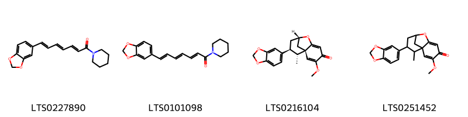{ width=100% }
    <figcaption>Hình ảnh cấu trúc hóa học của 4 hoạt chất thuộc nhóm Benzodioxoles gồm ['7-(2h-1,3-benzodioxol-5-yl)-1-(piperidin-1-yl)hepta-2,4,6-trien-1-one (LTS0227890)', '(2e,4e,6e)-7-(2h-1,3-benzodioxol-5-yl)-1-(piperidin-1-yl)hepta-2,4,6-trien-1-one (LTS0101098)', '(1s,8s,10s,11r)-10-(2h-1,3-benzodioxol-5-yl)-3-methoxy-11-methyl-7-oxatricyclo[6.3.1.0¹,⁶]dodeca-2,5-dien-4-one (LTS0216104)', '10-(2h-1,3-benzodioxol-5-yl)-3-methoxy-11-methyl-7-oxatricyclo[6.3.1.0¹,⁶]dodeca-2,5-dien-4-one (LTS0251452)'].</figcaption>
</figure>
#### Nhóm Carboxylic acids and derivatives
<figure markdown="span">
    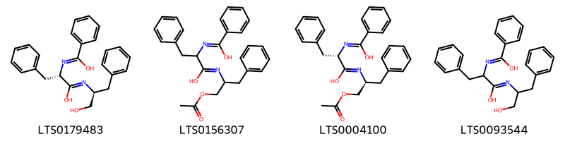{ width=100% }
    <figcaption>Hình ảnh cấu trúc hóa học của 4 hoạt chất thuộc nhóm Carboxylic acids and derivatives gồm ['(2s)-2-{[hydroxy(phenyl)methylidene]amino}-n-[(2s)-1-hydroxy-3-phenylpropan-2-yl]-3-phenylpropanimidic acid (LTS0179483)', 'n-[1-(acetyloxy)-3-phenylpropan-2-yl]-2-{[hydroxy(phenyl)methylidene]amino}-3-phenylpropanimidic acid (LTS0156307)', '(2s)-n-[(2s)-1-(acetyloxy)-3-phenylpropan-2-yl]-2-{[hydroxy(phenyl)methylidene]amino}-3-phenylpropanimidic acid (LTS0004100)', '2-{[hydroxy(phenyl)methylidene]amino}-n-(1-hydroxy-3-phenylpropan-2-yl)-3-phenylpropanimidic acid (LTS0093544)'].</figcaption>
</figure>
#### Nhóm Furanoid lignans
<figure markdown="span">
    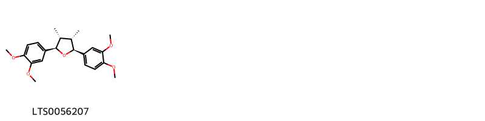{ width=100% }
    <figcaption>Hình ảnh cấu trúc hóa học của 1 hoạt chất thuộc nhóm Furanoid lignans gồm ['(2r,3r,4s,5s)-2,5-bis(3,4-dimethoxyphenyl)-3,4-dimethyloxolane (LTS0056207)'].</figcaption>
</figure>

---

### Dược dân tộc học

Danh sách các quốc gia có sử dụng *Piper wallichii* trong điều trị các bệnh. 

| Country   | Disease                        | Bệnh                                                                                                                                                                                                |
|:----------|:-------------------------------|:----------------------------------------------------------------------------------------------------------------------------------------------------------------------------------------------------|
| Elsewhere | Refrigerant, Tonic, Uterotonic | MYMEMORY WARNING: YOU USED ALL AVAILABLE FREE TRANSLATIONS FOR TODAY. NEXT AVAILABLE IN  07 HOURS 57 MINUTES 43 SECONDS VISIT HTTPS://MYMEMORY.TRANSLATED.NET/DOC/USAGELIMITS.PHP TO TRANSLATE MORE |

---

# Chi Peperomia

??? note "Danh sách các dược liệu thuộc chi"
    
	 - *Peperomia pellucida*
	 - *Peperomia quadrifolia*
	 - *Peperomia reflexa*

---
## Peperomia pellucida
### Thông tin về thực vật

!!! info "Phân loại thực vật của *Peperomia pellucida* từ GIBF:"
    - **Kingdom:** Plantae
    - **Phylum:** Tracheophyta
    - **Order:** Piperales
    - **Family:** Piperaceae
    - **Genus:** Peperomia
    - **Species:** *Peperomia pellucida*

 

| Label (VI)   | Label (EN)   | Scientific Name     | Descriptions (VI)   | Descriptions (EN)   | Also Known As (VI)                  | Also Known As (EN)   |
|:-------------|:-------------|:--------------------|:--------------------|:--------------------|:------------------------------------|:---------------------|
| N/A          | N/A          | Peperomia pellucida | loài thực vật       | species of plant    | ['Rau tiêu', 'Peperomia pellucida'] | ['']                 |

#### Phân bố trên thế giới

**Từ CSDL GIBF** Brazil, Viet Nam, Guadeloupe, Nepal, China, Honduras, Ecuador, French Polynesia, Thailand, Puerto Rico, Réunion, United States of America, Jamaica, Indonesia, Costa Rica, Dominican Republic, Colombia, Nigeria, Sao Tome and Principe, French Guiana, Hong Kong, Mexico, Montserrat, Malaysia, Chinese Taipei, Philippines, Panama, Singapore, Cambodia, Saint Vincent and the Grenadines, India, Peru, Samoa

#### Phân bố tại Việt Nam

**Từ CSDL GIBF**: Đồng Nai, Quảng Nam, Hòa Bình, Hà Nội, Đắk Lắk, Hồ Chí Minh city

---
### Thành phần hóa học
        
- Theo cơ sở dữ liệu lotus: Từ loài *Peperomia pellucida* đã phân lập và xác định được 32 hoạt chất thuộc về các nhóm Benzene and substituted derivatives, Flavonoids, Benzodioxoles, Steroids and steroid derivatives, Phenols, Tetralins, Furanoid lignans, Prenol lipids, Stilbenes. 

|    | chemicalTaxonomyClassyfireClass     |   smiles_count |
|---:|:------------------------------------|---------------:|
|  0 | Benzene and substituted derivatives |              2 |
|  1 | Benzodioxoles                       |             10 |
|  2 | Flavonoids                          |              2 |
|  3 | Furanoid lignans                    |              6 |
|  4 | Phenols                             |              2 |
|  5 | Prenol lipids                       |              1 |
|  6 | Steroids and steroid derivatives    |              5 |
|  7 | Stilbenes                           |              2 |
|  8 | Tetralins                           |              2 |

#### Nhóm Benzene and substituted derivatives
<figure markdown="span">
    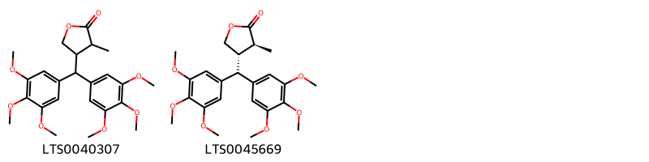{ width=100% }
    <figcaption>Hình ảnh cấu trúc hóa học của 2 hoạt chất thuộc nhóm Benzene and substituted derivatives gồm ['4-[bis(3,4,5-trimethoxyphenyl)methyl]-3-methyloxolan-2-one (LTS0040307)', '(3s,4s)-4-[bis(3,4,5-trimethoxyphenyl)methyl]-3-methyloxolan-2-one (LTS0045669)'].</figcaption>
</figure>
#### Nhóm Benzodioxoles
<figure markdown="span">
    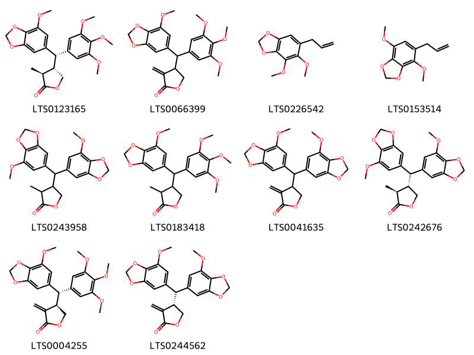{ width=100% }
    <figcaption>Hình ảnh cấu trúc hóa học của 10 hoạt chất thuộc nhóm Benzodioxoles gồm ['(3s,4s)-4-[(s)-(7-methoxy-2h-1,3-benzodioxol-5-yl)(3,4,5-trimethoxyphenyl)methyl]-3-methyloxolan-2-one (LTS0123165)', '4-[(7-methoxy-2h-1,3-benzodioxol-5-yl)(3,4,5-trimethoxyphenyl)methyl]-3-methylideneoxolan-2-one (LTS0066399)', 'dillapiol (LTS0226542)', 'apiol (LTS0153514)', '4-[bis(7-methoxy-2h-1,3-benzodioxol-5-yl)methyl]-3-methyloxolan-2-one (LTS0243958)', '4-[(7-methoxy-2h-1,3-benzodioxol-5-yl)(3,4,5-trimethoxyphenyl)methyl]-3-methyloxolan-2-one (LTS0183418)', '4-[bis(7-methoxy-2h-1,3-benzodioxol-5-yl)methyl]-3-methylideneoxolan-2-one (LTS0041635)', '(3s,4s)-4-[bis(7-methoxy-2h-1,3-benzodioxol-5-yl)methyl]-3-methyloxolan-2-one (LTS0242676)', '(4r)-4-[(s)-(7-methoxy-2h-1,3-benzodioxol-5-yl)(3,4,5-trimethoxyphenyl)methyl]-3-methylideneoxolan-2-one (LTS0004255)', '(4s)-4-[bis(7-methoxy-2h-1,3-benzodioxol-5-yl)methyl]-3-methylideneoxolan-2-one (LTS0244562)'].</figcaption>
</figure>
#### Nhóm Flavonoids
<figure markdown="span">
    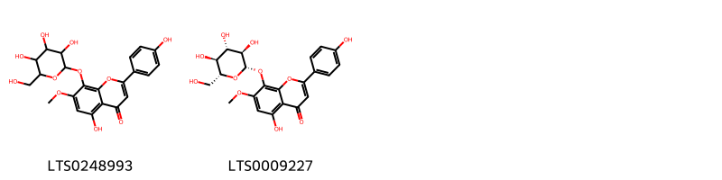{ width=100% }
    <figcaption>Hình ảnh cấu trúc hóa học của 2 hoạt chất thuộc nhóm Flavonoids gồm ['5-hydroxy-2-(4-hydroxyphenyl)-7-methoxy-8-{[3,4,5-trihydroxy-6-(hydroxymethyl)oxan-2-yl]oxy}chromen-4-one (LTS0248993)', '5-hydroxy-2-(4-hydroxyphenyl)-7-methoxy-8-{[(2s,3r,4s,5s,6r)-3,4,5-trihydroxy-6-(hydroxymethyl)oxan-2-yl]oxy}chromen-4-one (LTS0009227)'].</figcaption>
</figure>
#### Nhóm Furanoid lignans
<figure markdown="span">
    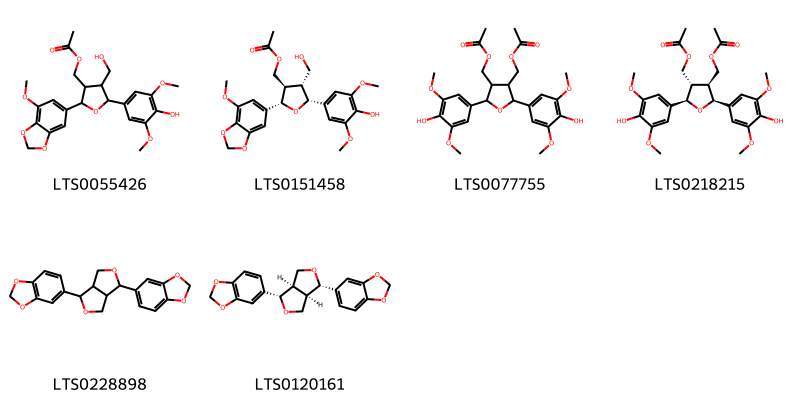{ width=100% }
    <figcaption>Hình ảnh cấu trúc hóa học của 6 hoạt chất thuộc nhóm Furanoid lignans gồm ['[5-(4-hydroxy-3,5-dimethoxyphenyl)-4-(hydroxymethyl)-2-(7-methoxy-2h-1,3-benzodioxol-5-yl)oxolan-3-yl]methyl acetate (LTS0055426)', '[(2s,3r,4r,5r)-5-(4-hydroxy-3,5-dimethoxyphenyl)-4-(hydroxymethyl)-2-(7-methoxy-2h-1,3-benzodioxol-5-yl)oxolan-3-yl]methyl acetate (LTS0151458)', '{4-[(acetyloxy)methyl]-2,5-bis(4-hydroxy-3,5-dimethoxyphenyl)oxolan-3-yl}methyl acetate (LTS0077755)', '[(2r,3s,4s,5s)-4-[(acetyloxy)methyl]-2,5-bis(4-hydroxy-3,5-dimethoxyphenyl)oxolan-3-yl]methyl acetate (LTS0218215)', 'sesamin (LTS0228898)', 'sesamin (LTS0120161)'].</figcaption>
</figure>
#### Nhóm Phenols
<figure markdown="span">
    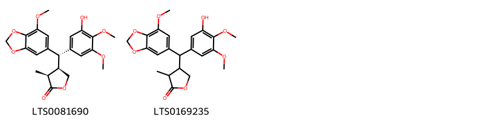{ width=100% }
    <figcaption>Hình ảnh cấu trúc hóa học của 2 hoạt chất thuộc nhóm Phenols gồm ['(3s,4r)-4-[(s)-(3-hydroxy-4,5-dimethoxyphenyl)(7-methoxy-2h-1,3-benzodioxol-5-yl)methyl]-3-methyloxolan-2-one (LTS0081690)', '4-[(3-hydroxy-4,5-dimethoxyphenyl)(7-methoxy-2h-1,3-benzodioxol-5-yl)methyl]-3-methyloxolan-2-one (LTS0169235)'].</figcaption>
</figure>
#### Nhóm Prenol lipids
<figure markdown="span">
    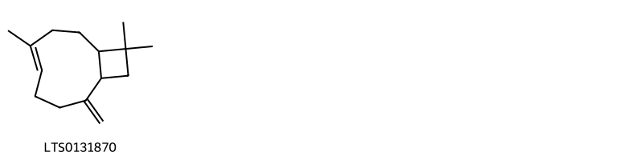{ width=100% }
    <figcaption>Hình ảnh cấu trúc hóa học của 1 hoạt chất thuộc nhóm Prenol lipids gồm ['caryophyllene (LTS0131870)'].</figcaption>
</figure>
#### Nhóm Steroids and steroid derivatives
<figure markdown="span">
    { width=100% }
    <figcaption>Hình ảnh cấu trúc hóa học của 5 hoạt chất thuộc nhóm Steroids and steroid derivatives gồm ['stigmast-5-en-3-ol (LTS0071224)', 'stigmast-5-en-3-ol, (3β)- (LTS0204616)', 'phytosterol (LTS0029311)', '(1r,3as,3bs,7s,9bs)-1-[(2r,5r)-5,6-dimethylheptan-2-yl]-9a,11a-dimethyl-1h,2h,3h,3ah,3bh,4h,6h,7h,8h,9h,9bh,10h,11h-cyclopenta[a]phenanthren-7-ol (LTS0057877)', 'campesterol (LTS0046755)'].</figcaption>
</figure>
#### Nhóm Stilbenes
<figure markdown="span">
    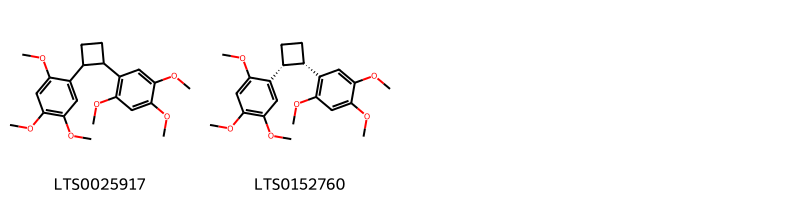{ width=100% }
    <figcaption>Hình ảnh cấu trúc hóa học của 2 hoạt chất thuộc nhóm Stilbenes gồm ['1,2,4-trimethoxy-5-[2-(2,4,5-trimethoxyphenyl)cyclobutyl]benzene (LTS0025917)', '1,2,4-trimethoxy-5-[(1s,2r)-2-(2,4,5-trimethoxyphenyl)cyclobutyl]benzene (LTS0152760)'].</figcaption>
</figure>
#### Nhóm Tetralins
<figure markdown="span">
    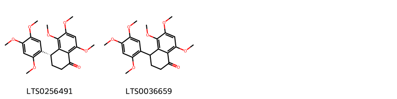{ width=100% }
    <figcaption>Hình ảnh cấu trúc hóa học của 2 hoạt chất thuộc nhóm Tetralins gồm ['(4r)-5,6,8-trimethoxy-4-(2,4,5-trimethoxyphenyl)-3,4-dihydro-2h-naphthalen-1-one (LTS0256491)', '5,6,8-trimethoxy-4-(2,4,5-trimethoxyphenyl)-3,4-dihydro-2h-naphthalen-1-one (LTS0036659)'].</figcaption>
</figure>

---

### Dược dân tộc học

Danh sách các quốc gia có sử dụng *Peperomia pellucida* trong điều trị các bệnh. 

| Country   | Disease     | Bệnh                                                                                                                                                                                                |
|:----------|:------------|:----------------------------------------------------------------------------------------------------------------------------------------------------------------------------------------------------|
| Elsewhere | nan         | MYMEMORY WARNING: YOU USED ALL AVAILABLE FREE TRANSLATIONS FOR TODAY. NEXT AVAILABLE IN  07 HOURS 57 MINUTES 22 SECONDS VISIT HTTPS://MYMEMORY.TRANSLATED.NET/DOC/USAGELIMITS.PHP TO TRANSLATE MORE |
| Trinidad  | Refrigerant | MYMEMORY WARNING: YOU USED ALL AVAILABLE FREE TRANSLATIONS FOR TODAY. NEXT AVAILABLE IN  07 HOURS 57 MINUTES 19 SECONDS VISIT HTTPS://MYMEMORY.TRANSLATED.NET/DOC/USAGELIMITS.PHP TO TRANSLATE MORE |

---

---
## Peperomia quadrifolia
### Thông tin về thực vật

!!! info "Phân loại thực vật của *Peperomia quadrifolia* từ GIBF:"
    - **Kingdom:** Plantae
    - **Phylum:** Tracheophyta
    - **Order:** Piperales
    - **Family:** Piperaceae
    - **Genus:** Peperomia
    - **Species:** *Peperomia quadrifolia*

 

| Label (VI)   | Label (EN)   | Scientific Name       | Descriptions (VI)   | Descriptions (EN)   | Also Known As (VI)   | Also Known As (EN)   |
|:-------------|:-------------|:----------------------|:--------------------|:--------------------|:---------------------|:---------------------|
| N/A          | N/A          | Peperomia quadrifolia | loài thực vật       | species of plant    | ['']                 | ['']                 |

#### Phân bố trên thế giới

**Từ CSDL GIBF** Mexico, Nicaragua, Brazil, Guatemala, El Salvador, Belgium, Costa Rica, Dominican Republic, Colombia, Honduras, Ecuador, Peru, Panama

#### Phân bố tại Việt Nam

**Từ CSDL GIBF**: Không có ghi nhận ở Việt Nam

---
### Thành phần hóa học
        
- Theo cơ sở dữ liệu lotus: Từ loài *Peperomia quadrifolia* đã phân lập và xác định được Chưa có hoạt chất nào được phân lập. hoạt chất thuộc về các nhóm Không có hoạt chất nào được phân lập. 

Không có hình ảnh nào được tạo ra

---

### Dược dân tộc học

Danh sách các quốc gia có sử dụng *Peperomia quadrifolia* trong điều trị các bệnh. 

| Country   | Disease    | Bệnh                                                                                                                                                                                                |
|:----------|:-----------|:----------------------------------------------------------------------------------------------------------------------------------------------------------------------------------------------------|
| Mexico    | Antilithic | MYMEMORY WARNING: YOU USED ALL AVAILABLE FREE TRANSLATIONS FOR TODAY. NEXT AVAILABLE IN  07 HOURS 56 MINUTES 43 SECONDS VISIT HTTPS://MYMEMORY.TRANSLATED.NET/DOC/USAGELIMITS.PHP TO TRANSLATE MORE |

---

---
## Peperomia reflexa
### Thông tin về thực vật

!!! info "Phân loại thực vật của *Peperomia reflexa* từ GIBF:"
    - **Kingdom:** Plantae
    - **Phylum:** Tracheophyta
    - **Order:** Piperales
    - **Family:** Piperaceae
    - **Genus:** Peperomia
    - **Species:** *Peperomia reflexa*

 

| Label (VI)   | Label (EN)   | Scientific Name   | Descriptions (VI)   | Descriptions (EN)   | Also Known As (VI)   | Also Known As (EN)   |
|:-------------|:-------------|:------------------|:--------------------|:--------------------|:---------------------|:---------------------|
| N/A          | N/A          | Peperomia reflexa | loài thực vật       | species of plant    | ['']                 | ['']                 |

#### Phân bố trên thế giới

**Từ CSDL GIBF** nan, Brazil, Guatemala, Nepal, New Caledonia, China, Zimbabwe, Honduras, Mozambique, French Polynesia, Ecuador, Papua New Guinea, Tanzania, United Republic of, United States of America, Jamaica, Indonesia, Costa Rica, Dominican Republic, Colombia, Cuba, Argentina, Malawi, Mexico, Congo, Democratic Republic of the, Haiti, Chinese Taipei, Philippines, Mauritius, Martinique, Paraguay, South Africa, Australia, India, Peru, Bolivia (Plurinational State of)

#### Phân bố tại Việt Nam

**Từ CSDL GIBF**: Không có ghi nhận ở Việt Nam

---
### Thành phần hóa học
        
- Theo cơ sở dữ liệu lotus: Từ loài *Peperomia reflexa* đã phân lập và xác định được Chưa có hoạt chất nào được phân lập. hoạt chất thuộc về các nhóm Không có hoạt chất nào được phân lập. 

Không có hình ảnh nào được tạo ra

---

### Dược dân tộc học

Danh sách các quốc gia có sử dụng *Peperomia reflexa* trong điều trị các bệnh. 

| Country   | Disease   | Bệnh                                                                                                                                                                                                |
|:----------|:----------|:----------------------------------------------------------------------------------------------------------------------------------------------------------------------------------------------------|
| Elsewhere | Tonic     | MYMEMORY WARNING: YOU USED ALL AVAILABLE FREE TRANSLATIONS FOR TODAY. NEXT AVAILABLE IN  07 HOURS 56 MINUTES 22 SECONDS VISIT HTTPS://MYMEMORY.TRANSLATED.NET/DOC/USAGELIMITS.PHP TO TRANSLATE MORE |
| Guatemala | Antidote  | MYMEMORY WARNING: YOU USED ALL AVAILABLE FREE TRANSLATIONS FOR TODAY. NEXT AVAILABLE IN  07 HOURS 56 MINUTES 19 SECONDS VISIT HTTPS://MYMEMORY.TRANSLATED.NET/DOC/USAGELIMITS.PHP TO TRANSLATE MORE |

---

