!!! abstract "Tóm tắt"

    Họ Plantaginaceae gồm khoảng 1 chi và 12 loài được một số cộng đồng tại các quốc gia như Trinidad, Japan*, Japan, China, Iraq, Java, Turkey, Egypt, Kurdistan, US(Appalachia), ain, India(Hindu), Venezuela, Elsewhere, Dominican Republic, US(Flathead), Mediterranean sử dụng trong một số trường hợp QUERY LENGTH LIMIT EXCEEDED. MAX ALLOWED QUERY : 500 CHARS MYMEMORY WARNING: YOU USED ALL AVAILABLE FREE TRANSLATIONS FOR TODAY. NEXT AVAILABLE IN  05 HOURS 51 MINUTES 14 SECONDS VISIT HTTPS://MYMEMORY.TRANSLATED.NET/DOC/USAGELIMITS.PHP TO TRANSLATE MORE.

!!! info "DrDuke"

    James A. Duke sinh năm 1929-2017 là một nhà thực vật học người Mỹ. Đây là một trong những tác giả hàng đầu trong lĩnh vực dược dân tộc học với cuốn *CRC Handbook of Medicinal Herbs* và chính là người xây dựng lên cơ sở dữ liệu về hợp chất tự nhiên và dược dân tộc học tại Bộ nông nghiệp Hoa Kỳ. Các thông tin được đăng tải tại website [Dr. Duke's Phytochemical and Ethnobotanical Databases](https://phytochem.nal.usda.gov/). 
    Trong suốt thập niên 1970, ông lãnh đạo the Plant Taxonomy Laboratory, Plant Genetics and Germplasm Institute of the Agricultural Research Service, U.S. Department of Agriculture.
    Trong tài liệu này, các thông tin về dược dân tộc của các dược liệu được trích dẫn từ tài liệu của James A. Ducke với sự trợ giúp của phần mềm dịch thuật từ tiếng Anh sang tiếng Việt.
   

# Chi Plantago

??? note "Danh sách các dược liệu thuộc chi"
    
	 - *Plantago amplexicaulis*
	 - *Plantago asiatica*
	 - *Plantago ciliata*
	 - *Plantago coronopus*
	 - *Plantago cynops*
	 - *Plantago depressa*
	 - *Plantago erosa*
	 - *Plantago lanceolata*
	 - *Plantago major*
	 - *Plantago ovata*
	 - *Plantago psyllium*
	 - *Plantago rugelii*

---
## Plantago amplexicaulis
### Thông tin về thực vật

!!! info "Phân loại thực vật của *Plantago amplexicaulis* từ GIBF:"
    - **Kingdom:** Plantae
    - **Phylum:** Tracheophyta
    - **Order:** Lamiales
    - **Family:** Plantaginaceae
    - **Genus:** Plantago
    - **Species:** *Plantago amplexicaulis*

 

| Label (VI)   | Label (EN)   | Scientific Name        | Descriptions (VI)   | Descriptions (EN)   | Also Known As (VI)   | Also Known As (EN)   |
|:-------------|:-------------|:-----------------------|:--------------------|:--------------------|:---------------------|:---------------------|
| N/A          | N/A          | Plantago amplexicaulis | loài thực vật       | species of plant    | ['']                 | ['Plantain']         |

#### Phân bố trên thế giới

**Từ CSDL GIBF** Morocco, United Arab Emirates, Algeria, Germany, Greece, Saudi Arabia, Pakistan, Kuwait, Israel, Tunisia, Oman, Cyprus, Yemen, Spain

#### Phân bố tại Việt Nam

**Từ CSDL GIBF**: Không có ghi nhận ở Việt Nam

---
### Thành phần hóa học
        
- Theo cơ sở dữ liệu lotus: Từ loài *Plantago amplexicaulis* đã phân lập và xác định được 7 hoạt chất thuộc về các nhóm Prenol lipids, Organooxygen compounds. 

|    | chemicalTaxonomyClassyfireClass   |   smiles_count |
|---:|:----------------------------------|---------------:|
|  0 | Organooxygen compounds            |              4 |
|  1 | Prenol lipids                     |              3 |

#### Nhóm Organooxygen compounds
<figure markdown="span">
    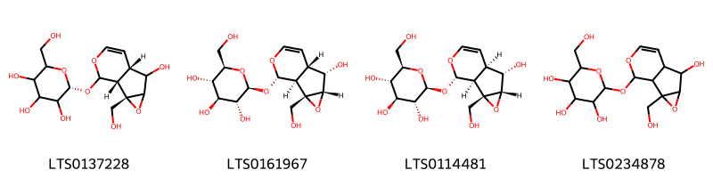{ width=100% }
    <figcaption>Hình ảnh cấu trúc hóa học của 4 hoạt chất thuộc nhóm Organooxygen compounds gồm ['(2r)-2-{[(1r,2s,6s)-5-hydroxy-2-(hydroxymethyl)-3,9-dioxatricyclo[4.4.0.0²,⁴]dec-7-en-10-yl]oxy}-6-(hydroxymethyl)oxane-3,4,5-triol (LTS0137228)', '(2s,3r,4s,5s,6r)-2-{[(1s,2s,4s,5s,6s,10s)-5-hydroxy-2-(hydroxymethyl)-3,9-dioxatricyclo[4.4.0.0²,⁴]dec-7-en-10-yl]oxy}-6-(hydroxymethyl)oxane-3,4,5-triol (LTS0161967)', 'catalpol (LTS0114481)', 'catalpol (LTS0234878)'].</figcaption>
</figure>
#### Nhóm Prenol lipids
<figure markdown="span">
    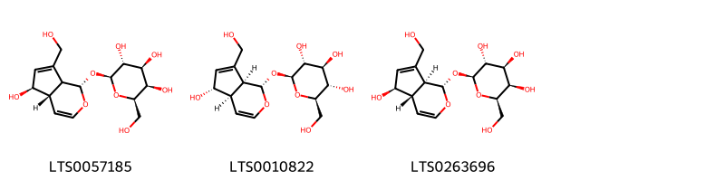{ width=100% }
    <figcaption>Hình ảnh cấu trúc hóa học của 3 hoạt chất thuộc nhóm Prenol lipids gồm ['(2s,3r,4s,5r,6r)-2-{[(1s,4as,5r)-5-hydroxy-7-(hydroxymethyl)-1h,4ah,5h,7ah-cyclopenta[c]pyran-1-yl]oxy}-6-(hydroxymethyl)oxane-3,4,5-triol (LTS0057185)', 'aucubin (LTS0010822)', '(2s,3r,4s,5r,6r)-2-{[(1s,4as,5r,7as)-5-hydroxy-7-(hydroxymethyl)-1h,4ah,5h,7ah-cyclopenta[c]pyran-1-yl]oxy}-6-(hydroxymethyl)oxane-3,4,5-triol (LTS0263696)'].</figcaption>
</figure>

---

### Dược dân tộc học

Danh sách các quốc gia có sử dụng *Plantago amplexicaulis* trong điều trị các bệnh. 

| Country      | Disease                 | Bệnh                                                                                                                                                                                                |
|:-------------|:------------------------|:----------------------------------------------------------------------------------------------------------------------------------------------------------------------------------------------------|
| Elsewhere    | Refrigerant, Astringent | MYMEMORY WARNING: YOU USED ALL AVAILABLE FREE TRANSLATIONS FOR TODAY. NEXT AVAILABLE IN  05 HOURS 51 MINUTES 10 SECONDS VISIT HTTPS://MYMEMORY.TRANSLATED.NET/DOC/USAGELIMITS.PHP TO TRANSLATE MORE |
| India(Hindu) | Astringent              | MYMEMORY WARNING: YOU USED ALL AVAILABLE FREE TRANSLATIONS FOR TODAY. NEXT AVAILABLE IN  05 HOURS 51 MINUTES 05 SECONDS VISIT HTTPS://MYMEMORY.TRANSLATED.NET/DOC/USAGELIMITS.PHP TO TRANSLATE MORE |

---

---
## Plantago asiatica
### Thông tin về thực vật

!!! info "Phân loại thực vật của *Plantago asiatica* từ GIBF:"
    - **Kingdom:** Plantae
    - **Phylum:** Tracheophyta
    - **Order:** Lamiales
    - **Family:** Plantaginaceae
    - **Genus:** Plantago
    - **Species:** *Plantago asiatica*

 

| Label (VI)   | Label (EN)   | Scientific Name   | Descriptions (VI)   | Descriptions (EN)   | Also Known As (VI)               | Also Known As (EN)   |
|:-------------|:-------------|:------------------|:--------------------|:--------------------|:---------------------------------|:---------------------|
| N/A          | N/A          | Plantago asiatica | loài thực vật       | species of plant    | ['Plantago asiatica', 'Mã đề á'] | ['']                 |

#### Phân bố trên thế giới

**Từ CSDL GIBF** Hong Kong, Japan, Korea, Republic of, Chinese Taipei, China, Russian Federation

#### Phân bố tại Việt Nam

**Từ CSDL GIBF**: Không có ghi nhận ở Việt Nam

---
### Thành phần hóa học
        
- Theo cơ sở dữ liệu lotus: Từ loài *Plantago asiatica* đã phân lập và xác định được 83 hoạt chất thuộc về các nhóm Flavonoids, Cinnamic acids and derivatives, Steroids and steroid derivatives, Prenol lipids, Saturated hydrocarbons. 

|    | chemicalTaxonomyClassyfireClass   |   smiles_count |
|---:|:----------------------------------|---------------:|
|  0 | Cinnamic acids and derivatives    |             42 |
|  1 | Flavonoids                        |             10 |
|  2 | Prenol lipids                     |             15 |
|  3 | Saturated hydrocarbons            |             10 |
|  4 | Steroids and steroid derivatives  |              5 |

#### Nhóm Cinnamic acids and derivatives
<figure markdown="span">
    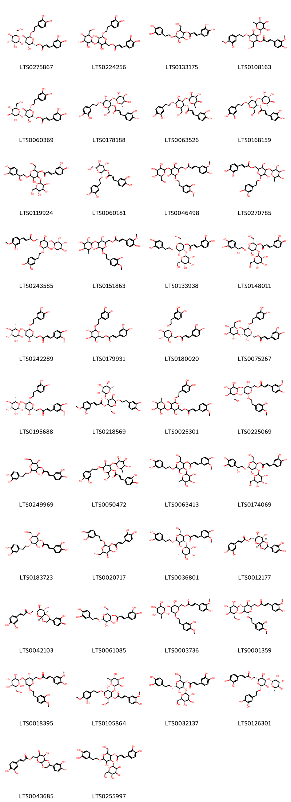{ width=100% }
    <figcaption>Hình ảnh cấu trúc hóa học của 42 hoạt chất thuộc nhóm Cinnamic acids and derivatives gồm ['[(2r,3s,4s,5r,6s)-6-[2-(3,4-dihydroxyphenyl)ethoxy]-3,5-dihydroxy-4-{[(2s,3s,4r,5r,6s)-3,4,5-trihydroxy-6-(hydroxymethyl)oxan-2-yl]oxy}oxan-2-yl]methyl (2e)-3-(3,4-dihydroxyphenyl)prop-2-enoate (LTS0275867)', '{6-[2-(3,4-dihydroxyphenyl)ethoxy]-3,5-dihydroxy-4-{[3,4,5-trihydroxy-6-(hydroxymethyl)oxan-2-yl]oxy}oxan-2-yl}methyl 3-(3,4-dihydroxyphenyl)prop-2-enoate (LTS0224256)', '6-[2-(3,4-dihydroxyphenyl)ethoxy]-4,5-dihydroxy-2-(hydroxymethyl)oxan-3-yl 3-(3,4-dihydroxyphenyl)prop-2-enoate (LTS0133175)', '5-hydroxy-6-[2-(3-hydroxy-4-methoxyphenyl)ethoxy]-2-(hydroxymethyl)-4-[(3,4,5-trihydroxy-6-methyloxan-2-yl)oxy]oxan-3-yl 3-(4-hydroxy-3-methoxyphenyl)prop-2-enoate (LTS0108163)', '[(2r,3r,4s,5r,6r)-6-[2-(3,4-dihydroxyphenyl)ethoxy]-3,5-dihydroxy-4-{[(2r,3r,4s,5s,6r)-3,4,5-trihydroxy-6-(hydroxymethyl)oxan-2-yl]oxy}oxan-2-yl]methyl (2e)-3-(3,4-dihydroxyphenyl)prop-2-enoate (LTS0060369)', '(2r,3r,4r,5r,6r)-6-[2-(3,4-dihydroxyphenyl)ethoxy]-5-hydroxy-2-(hydroxymethyl)-4-{[(2s,3r,4s,5r,6s)-3,4,5-trihydroxy-6-methyloxan-2-yl]oxy}oxan-3-yl (2e)-3-(3,4-dihydroxyphenyl)prop-2-enoate (LTS0178188)', '(3r,4r,6r)-6-[2-(3,4-dihydroxyphenyl)ethoxy]-5-hydroxy-2-(hydroxymethyl)-4-{[(2s,3s,5r)-3,4,5-trihydroxy-6-methyloxan-2-yl]oxy}oxan-3-yl (2e)-3-(3,4-dihydroxyphenyl)prop-2-enoate (LTS0063526)', 'verbascoside (LTS0168159)', '6-[2-(3,4-dihydroxyphenyl)-2-hydroxyethoxy]-5-hydroxy-2-(hydroxymethyl)-4-{[3,4,5-trihydroxy-6-(hydroxymethyl)oxan-2-yl]oxy}oxan-3-yl 3-(3,4-dihydroxyphenyl)prop-2-enoate (LTS0119924)', '(2r,3r,4s,5s,6r)-2-[2-(3,4-dihydroxyphenyl)ethoxy]-4,5-dihydroxy-6-(hydroxymethyl)oxan-3-yl (2e)-3-(3,4-dihydroxyphenyl)prop-2-enoate (LTS0060181)', '{3,5-dihydroxy-6-[2-(3-hydroxy-4-methoxyphenyl)ethoxy]-4-{[3,4,5-trihydroxy-6-(hydroxymethyl)oxan-2-yl]oxy}oxan-2-yl}methyl 3-(4-hydroxy-3-methoxyphenyl)prop-2-enoate (LTS0046498)', '{6-[2-(3,4-dihydroxyphenyl)ethoxy]-3,5-dihydroxy-4-[(3,4,5-trihydroxy-6-methyloxan-2-yl)oxy]oxan-2-yl}methyl 3-(3,4-dihydroxyphenyl)prop-2-enoate (LTS0270785)', '[(2r,3r,4s,5r,6r)-6-[2-(3,4-dihydroxyphenyl)ethoxy]-3,5-dihydroxy-4-{[(2s,3r,4r,5r,6s)-3,4,5-trihydroxy-6-methyloxan-2-yl]oxy}oxan-2-yl]methyl (2e)-3-(3-hydroxy-4-methoxyphenyl)prop-2-enoate (LTS0243585)', '{3,5-dihydroxy-6-[2-(3-hydroxy-4-methoxyphenyl)ethoxy]-4-[(3,4,5-trihydroxy-6-methyloxan-2-yl)oxy]oxan-2-yl}methyl 3-(4-hydroxy-3-methoxyphenyl)prop-2-enoate (LTS0151863)', '(2r,3r,4r,5r,6r)-6-[2-(3,4-dihydroxyphenyl)ethoxy]-5-hydroxy-2-(hydroxymethyl)-4-{[(2r,3r,4s,5s,6r)-3,4,5-trihydroxy-6-(hydroxymethyl)oxan-2-yl]oxy}oxan-3-yl (2e)-3-(3,4-dihydroxyphenyl)prop-2-enoate (LTS0133938)', '(2r,3r,4r,5r,6r)-6-[(2r)-2-(3,4-dihydroxyphenyl)-2-hydroxyethoxy]-5-hydroxy-2-(hydroxymethyl)-4-{[(2s,3r,4s,5s,6r)-3,4,5-trihydroxy-6-(hydroxymethyl)oxan-2-yl]oxy}oxan-3-yl (2e)-3-(3,4-dihydroxyphenyl)prop-2-enoate (LTS0148011)', '[(2r,3r,4s,5r,6r)-6-[2-(3,4-dihydroxyphenyl)ethoxy]-3,5-dihydroxy-4-{[(2s,3r,4r,5r,6s)-3,4,5-trihydroxy-6-methyloxan-2-yl]oxy}oxan-2-yl]methyl (2e)-3-(4-hydroxy-3-methoxyphenyl)prop-2-enoate (LTS0242289)', '{6-[2-(3,4-dihydroxyphenyl)ethoxy]-3,4,5-trihydroxyoxan-2-yl}methyl 3-(3,4-dihydroxyphenyl)prop-2-enoate (LTS0179931)', 'calceolarioside b (LTS0180020)', '[(2r,3r,4s,5r,6r)-6-[2-(3,4-dihydroxyphenyl)ethoxy]-3,5-dihydroxy-4-{[(2s,3r,4s,5s,6r)-3,4,5-trihydroxy-6-(hydroxymethyl)oxan-2-yl]oxy}oxan-2-yl]methyl (2e)-3-(3,4-dihydroxyphenyl)prop-2-enoate (LTS0075267)', '[(2r,3r,4s,5r,6r)-6-[2-(3,4-dihydroxyphenyl)ethoxy]-3,5-dihydroxy-4-{[(2r,3r,4r,5r,6s)-3,4,5-trihydroxy-6-methyloxan-2-yl]oxy}oxan-2-yl]methyl (2e)-3-(4-hydroxy-3-methoxyphenyl)prop-2-enoate (LTS0195688)', '(2r,3r,4r,5r,6r)-6-[2-(3,4-dihydroxyphenyl)ethoxy]-5-hydroxy-2-(hydroxymethyl)-4-{[(2s,3r,4r,5r,6s)-3,4,5-trihydroxy-6-methyloxan-2-yl]oxy}oxan-3-yl (2e)-3-(3-hydroxy-4-methoxyphenyl)prop-2-enoate (LTS0218569)', '{6-[2-(3,4-dihydroxyphenyl)ethoxy]-3,5-dihydroxy-4-[(3,4,5-trihydroxy-6-methyloxan-2-yl)oxy]oxan-2-yl}methyl 3-(4-hydroxy-3-methoxyphenyl)prop-2-enoate (LTS0025301)', '[(2r,3r,4s,5r,6r)-3,5-dihydroxy-6-[2-(3-hydroxy-4-methoxyphenyl)ethoxy]-4-{[(2r,3r,4r,5s,6r)-3,4,5-trihydroxy-6-(hydroxymethyl)oxan-2-yl]oxy}oxan-2-yl]methyl (2e)-3-(4-hydroxy-3-methoxyphenyl)prop-2-enoate (LTS0225069)', '2-[2-(3,4-dihydroxyphenyl)ethoxy]-3,5-dihydroxy-6-(hydroxymethyl)oxan-4-yl 3-(3,4-dihydroxyphenyl)prop-2-enoate (LTS0249969)', '6-[2-(3,4-dihydroxyphenyl)ethoxy]-5-hydroxy-2-(hydroxymethyl)-4-[(3,4,5-trihydroxy-6-methyloxan-2-yl)oxy]oxan-3-yl 3-(3,4-dihydroxyphenyl)prop-2-enoate (LTS0050472)', '6-[2-(3,4-dihydroxyphenyl)ethoxy]-5-hydroxy-2-(hydroxymethyl)-4-[(3,4,5-trihydroxy-6-methyloxan-2-yl)oxy]oxan-3-yl 3-(4-hydroxy-3-methoxyphenyl)prop-2-enoate (LTS0063413)', 'hellicoside (LTS0174069)', '(2r,3r,4s,5r,6r)-2-[2-(3,4-dihydroxyphenyl)ethoxy]-3,5-dihydroxy-6-(hydroxymethyl)oxan-4-yl (2e)-3-(3,4-dihydroxyphenyl)prop-2-enoate (LTS0183723)', '2-[2-(3,4-dihydroxyphenyl)ethoxy]-4,5-dihydroxy-6-(hydroxymethyl)oxan-3-yl 3-(3,4-dihydroxyphenyl)prop-2-enoate (LTS0020717)', '(2r,3r,4r,5r,6r)-6-[2-(3,4-dihydroxyphenyl)ethoxy]-5-hydroxy-2-(hydroxymethyl)-4-{[(2r,3r,4r,5r,6s)-3,4,5-trihydroxy-6-methyloxan-2-yl]oxy}oxan-3-yl (2e)-3-(4-hydroxy-3-methoxyphenyl)prop-2-enoate (LTS0036801)', '[(2s,4ar,6r,7s,8s,8ar)-2-(3,4-dihydroxyphenyl)-7,8-dihydroxy-hexahydro-2h-pyrano[2,3-b][1,4]dioxin-6-yl]methyl (2e)-3-(3,4-dihydroxyphenyl)prop-2-enoate (LTS0012177)', '[(4ar,6r,7s,8s,8ar)-2-(3,4-dihydroxyphenyl)-7,8-dihydroxy-hexahydro-2h-pyrano[2,3-b][1,4]dioxin-6-yl]methyl (2e)-3-(3,4-dihydroxyphenyl)prop-2-enoate (LTS0042103)', '(2r,3s,4r,5r,6r)-6-[2-(3,4-dihydroxyphenyl)ethoxy]-4,5-dihydroxy-2-(hydroxymethyl)oxan-3-yl (2e)-3-(3,4-dihydroxyphenyl)prop-2-enoate (LTS0061085)', '[(2r,3r,4s,5r,6r)-3,5-dihydroxy-6-[2-(3-hydroxy-4-methoxyphenyl)ethoxy]-4-{[(2s,3r,4r,5r,6s)-3,4,5-trihydroxy-6-methyloxan-2-yl]oxy}oxan-2-yl]methyl (2e)-3-(4-hydroxy-3-methoxyphenyl)prop-2-enoate (LTS0003736)', '[(2r,3s,4s,5s,6s)-3,5-dihydroxy-6-[2-(3-hydroxy-4-methoxyphenyl)ethoxy]-4-{[(2r,3s,4s,5s,6s)-3,4,5-trihydroxy-6-(hydroxymethyl)oxan-2-yl]oxy}oxan-2-yl]methyl (2e)-3-(4-hydroxy-3-methoxyphenyl)prop-2-enoate (LTS0001359)', '[(2r,3r,4s,5r,6r)-3,5-dihydroxy-6-[2-(3-hydroxy-4-methoxyphenyl)ethoxy]-4-{[(2r,3r,4s,5s,6r)-3,4,5-trihydroxy-6-(hydroxymethyl)oxan-2-yl]oxy}oxan-2-yl]methyl (2e)-3-(4-hydroxy-3-methoxyphenyl)prop-2-enoate (LTS0018395)', '(2r,3r,4r,5r,6r)-5-hydroxy-6-[2-(3-hydroxy-4-methoxyphenyl)ethoxy]-2-(hydroxymethyl)-4-{[(2s,3r,4r,5r,6s)-3,4,5-trihydroxy-6-methyloxan-2-yl]oxy}oxan-3-yl (2e)-3-(4-hydroxy-3-methoxyphenyl)prop-2-enoate (LTS0105864)', 'plantamajoside (LTS0032137)', '[(2r,3r,4s,5r,6r)-6-[2-(3,4-dihydroxyphenyl)ethoxy]-3,5-dihydroxy-4-{[(2r,3r,4r,5r,6s)-3,4,5-trihydroxy-6-methyloxan-2-yl]oxy}oxan-2-yl]methyl (2e)-3-(3,4-dihydroxyphenyl)prop-2-enoate (LTS0126301)', '[2-(3,4-dihydroxyphenyl)-7,8-dihydroxy-hexahydro-2h-pyrano[2,3-b][1,4]dioxin-6-yl]methyl 3-(3,4-dihydroxyphenyl)prop-2-enoate (LTS0043685)', '6-[2-(3,4-dihydroxyphenyl)ethoxy]-5-hydroxy-2-(hydroxymethyl)-4-{[3,4,5-trihydroxy-6-(hydroxymethyl)oxan-2-yl]oxy}oxan-3-yl 3-(3,4-dihydroxyphenyl)prop-2-enoate (LTS0255997)'].</figcaption>
</figure>
#### Nhóm Flavonoids
<figure markdown="span">
    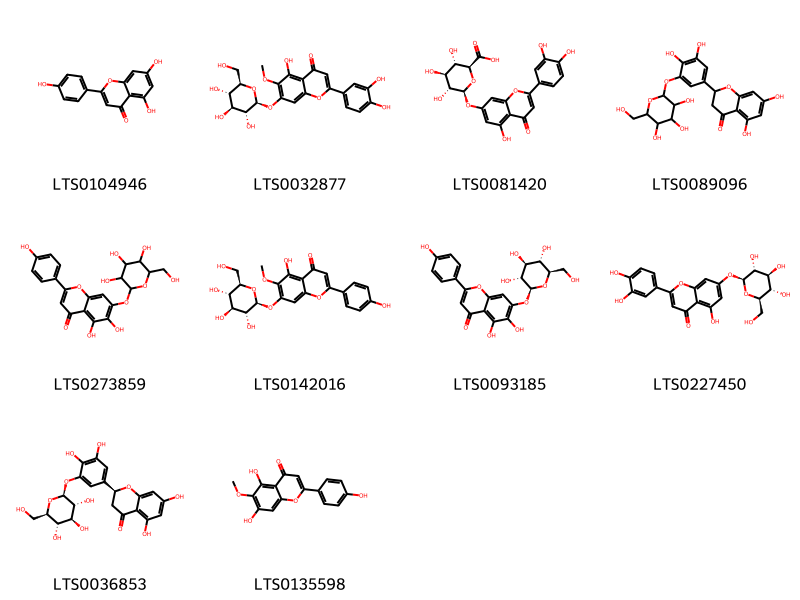{ width=100% }
    <figcaption>Hình ảnh cấu trúc hóa học của 10 hoạt chất thuộc nhóm Flavonoids gồm ['chamomile (LTS0104946)', 'nepitrin (LTS0032877)', 'luteolin 7-o-glucuronide (LTS0081420)', 'plantagoside (LTS0089096)', '5,6-dihydroxy-2-(4-hydroxyphenyl)-7-{[3,4,5-trihydroxy-6-(hydroxymethyl)oxan-2-yl]oxy}chromen-4-one (LTS0273859)', 'homoplantaginin (LTS0142016)', 'plantaginin (LTS0093185)', 'luteolin 7-o-glucoside (LTS0227450)', 'plantagoside (LTS0036853)', 'hispidulin (LTS0135598)'].</figcaption>
</figure>
#### Nhóm Prenol lipids
<figure markdown="span">
    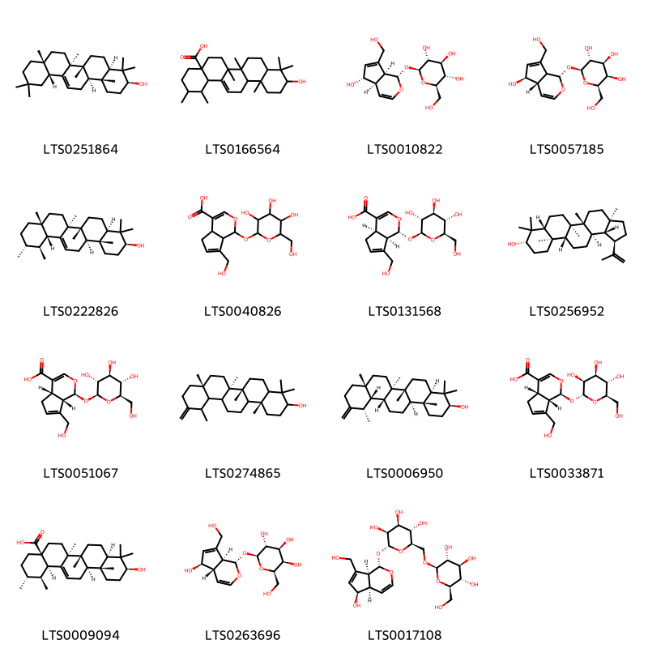{ width=100% }
    <figcaption>Hình ảnh cấu trúc hóa học của 15 hoạt chất thuộc nhóm Prenol lipids gồm ['β-amyrin (LTS0251864)', '10-hydroxy-1,2,6a,6b,9,9,12a-heptamethyl-2,3,4,5,6,7,8,8a,10,11,12,12b,13,14b-tetradecahydro-1h-picene-4a-carboxylic acid (LTS0166564)', 'aucubin (LTS0010822)', '(2s,3r,4s,5r,6r)-2-{[(1s,4as,5r)-5-hydroxy-7-(hydroxymethyl)-1h,4ah,5h,7ah-cyclopenta[c]pyran-1-yl]oxy}-6-(hydroxymethyl)oxane-3,4,5-triol (LTS0057185)', 'amyrin (LTS0222826)', '7-(hydroxymethyl)-1-{[3,4,5-trihydroxy-6-(hydroxymethyl)oxan-2-yl]oxy}-1h,4ah,5h,7ah-cyclopenta[c]pyran-4-carboxylic acid (LTS0040826)', '(1r,4ar,7ar)-7-(hydroxymethyl)-1-{[(2s,3r,4s,5s,6r)-3,4,5-trihydroxy-6-(hydroxymethyl)oxan-2-yl]oxy}-1h,4ah,5h,7ah-cyclopenta[c]pyran-4-carboxylic acid (LTS0131568)', 'lupeol (LTS0256952)', 'geniposidic acid (LTS0051067)', '(6ar,6br,8ar,14br)-4,4,6a,6b,8a,12,14b-heptamethyl-11-methylidene-hexadecahydropicen-3-ol (LTS0274865)', 'taraxasterol (LTS0006950)', '(1s,4as,7as)-7-(hydroxymethyl)-1-{[(2r,3s,4s,5s,6r)-3,4,5-trihydroxy-6-(hydroxymethyl)oxan-2-yl]oxy}-1h,4ah,5h,7ah-cyclopenta[c]pyran-4-carboxylic acid (LTS0033871)', '(1s,2r,4as,6as,6br,8ar,10s,12ar,12br,14br)-10-hydroxy-1,2,6a,6b,9,9,12a-heptamethyl-2,3,4,5,6,7,8,8a,10,11,12,12b,13,14b-tetradecahydro-1h-picene-4a-carboxylic acid (LTS0009094)', '(2s,3r,4s,5r,6r)-2-{[(1s,4as,5r,7as)-5-hydroxy-7-(hydroxymethyl)-1h,4ah,5h,7ah-cyclopenta[c]pyran-1-yl]oxy}-6-(hydroxymethyl)oxane-3,4,5-triol (LTS0263696)', '(2r,3s,4s,5s,6r)-2-{[(1s,4ar,5r,7as)-5-hydroxy-7-(hydroxymethyl)-1h,4ah,5h,7ah-cyclopenta[c]pyran-1-yl]oxy}-6-({[(2r,3r,4s,5s,6r)-3,4,5-trihydroxy-6-(hydroxymethyl)oxan-2-yl]oxy}methyl)oxane-3,4,5-triol (LTS0017108)'].</figcaption>
</figure>
#### Nhóm Saturated hydrocarbons
<figure markdown="span">
    { width=100% }
    <figcaption>Hình ảnh cấu trúc hóa học của 10 hoạt chất thuộc nhóm Saturated hydrocarbons gồm ['hexacosane (LTS0079361)', 'nonacosane (LTS0062747)', 'tritriacontane (LTS0203319)', 'tetratriacontane (LTS0215630)', 'pentacosane (LTS0080764)', 'dotriacontane (LTS0101459)', 'heptacosane (LTS0150428)', 'triacontane (LTS0250709)', 'hentriacontane (LTS0046415)', 'octacosane (LTS0242387)'].</figcaption>
</figure>
#### Nhóm Steroids and steroid derivatives
<figure markdown="span">
    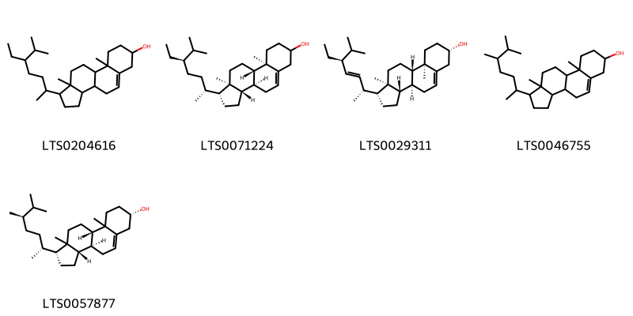{ width=100% }
    <figcaption>Hình ảnh cấu trúc hóa học của 5 hoạt chất thuộc nhóm Steroids and steroid derivatives gồm ['stigmast-5-en-3-ol, (3β)- (LTS0204616)', 'stigmast-5-en-3-ol (LTS0071224)', 'phytosterol (LTS0029311)', 'campesterol (LTS0046755)', '(1r,3as,3bs,7s,9bs)-1-[(2r,5r)-5,6-dimethylheptan-2-yl]-9a,11a-dimethyl-1h,2h,3h,3ah,3bh,4h,6h,7h,8h,9h,9bh,10h,11h-cyclopenta[a]phenanthren-7-ol (LTS0057877)'].</figcaption>
</figure>

---

### Dược dân tộc học

Danh sách các quốc gia có sử dụng *Plantago asiatica* trong điều trị các bệnh. 

| Country   | Disease                                                                               | Bệnh                                                                                                                                                                                                |
|:----------|:--------------------------------------------------------------------------------------|:----------------------------------------------------------------------------------------------------------------------------------------------------------------------------------------------------|
| China     | Diuretic                                                                              | MYMEMORY WARNING: YOU USED ALL AVAILABLE FREE TRANSLATIONS FOR TODAY. NEXT AVAILABLE IN  05 HOURS 50 MINUTES 39 SECONDS VISIT HTTPS://MYMEMORY.TRANSLATED.NET/DOC/USAGELIMITS.PHP TO TRANSLATE MORE |
| Elsewhere | Astringent, Demulcent, Refrigerant, Stimulant, Suppurative, Tonic, Diuretic, Hemostat | MYMEMORY WARNING: YOU USED ALL AVAILABLE FREE TRANSLATIONS FOR TODAY. NEXT AVAILABLE IN  05 HOURS 50 MINUTES 36 SECONDS VISIT HTTPS://MYMEMORY.TRANSLATED.NET/DOC/USAGELIMITS.PHP TO TRANSLATE MORE |
| Japan     | Antitussive, Diuretic, Hemostatic                                                     | MYMEMORY WARNING: YOU USED ALL AVAILABLE FREE TRANSLATIONS FOR TODAY. NEXT AVAILABLE IN  05 HOURS 50 MINUTES 34 SECONDS VISIT HTTPS://MYMEMORY.TRANSLATED.NET/DOC/USAGELIMITS.PHP TO TRANSLATE MORE |

---

---
## Plantago ciliata
### Thông tin về thực vật

!!! info "Phân loại thực vật của *Plantago ciliata* từ GIBF:"
    - **Kingdom:** Plantae
    - **Phylum:** Tracheophyta
    - **Order:** Lamiales
    - **Family:** Plantaginaceae
    - **Genus:** Plantago
    - **Species:** *Plantago ciliata*

 

| Label (VI)   | Label (EN)   | Scientific Name   | Descriptions (VI)   | Descriptions (EN)   | Also Known As (VI)   | Also Known As (EN)   |
|:-------------|:-------------|:------------------|:--------------------|:--------------------|:---------------------|:---------------------|
| N/A          | N/A          | Plantago ciliata  | loài thực vật       | species of plant    | ['']                 | ['']                 |

#### Phân bố trên thế giới

**Từ CSDL GIBF** Morocco, United Arab Emirates, Saudi Arabia, Pakistan, Israel

#### Phân bố tại Việt Nam

**Từ CSDL GIBF**: Không có ghi nhận ở Việt Nam

---
### Thành phần hóa học
        
- Theo cơ sở dữ liệu lotus: Từ loài *Plantago ciliata* đã phân lập và xác định được Chưa có hoạt chất nào được phân lập. hoạt chất thuộc về các nhóm Không có hoạt chất nào được phân lập. 

Không có hình ảnh nào được tạo ra

---

### Dược dân tộc học

Danh sách các quốc gia có sử dụng *Plantago ciliata* trong điều trị các bệnh. 

| Country   | Disease   | Bệnh                                                                                                                                                                                                |
|:----------|:----------|:----------------------------------------------------------------------------------------------------------------------------------------------------------------------------------------------------|
| Egypt     | Rennet    | MYMEMORY WARNING: YOU USED ALL AVAILABLE FREE TRANSLATIONS FOR TODAY. NEXT AVAILABLE IN  05 HOURS 49 MINUTES 50 SECONDS VISIT HTTPS://MYMEMORY.TRANSLATED.NET/DOC/USAGELIMITS.PHP TO TRANSLATE MORE |

---

---
## Plantago coronopus
### Thông tin về thực vật

!!! info "Phân loại thực vật của *Plantago coronopus* từ GIBF:"
    - **Kingdom:** Plantae
    - **Phylum:** Tracheophyta
    - **Order:** Lamiales
    - **Family:** Plantaginaceae
    - **Genus:** Plantago
    - **Species:** *Plantago coronopus*

 

| Label (VI)   | Label (EN)   | Scientific Name    | Descriptions (VI)   | Descriptions (EN)   | Also Known As (VI)   | Also Known As (EN)     |
|:-------------|:-------------|:-------------------|:--------------------|:--------------------|:---------------------|:-----------------------|
| N/A          | N/A          | Plantago coronopus | loài thực vật       | species of plant    | ['']                 | ['buckshorn plantain'] |

#### Phân bố trên thế giới

**Từ CSDL GIBF** United States of America, Portugal, Greece, France, Netherlands, Sweden, Australia, New Zealand, Italy, Spain, Germany, United Kingdom of Great Britain and Northern Ireland, Ireland, Denmark

#### Phân bố tại Việt Nam

**Từ CSDL GIBF**: Không có ghi nhận ở Việt Nam

---
### Thành phần hóa học
        
- Theo cơ sở dữ liệu lotus: Từ loài *Plantago coronopus* đã phân lập và xác định được 9 hoạt chất thuộc về các nhóm Prenol lipids, Organooxygen compounds, Cinnamic acids and derivatives. 

|    | chemicalTaxonomyClassyfireClass   |   smiles_count |
|---:|:----------------------------------|---------------:|
|  0 | Cinnamic acids and derivatives    |              2 |
|  1 | Organooxygen compounds            |              1 |
|  2 | Prenol lipids                     |              5 |

#### Nhóm Cinnamic acids and derivatives
<figure markdown="span">
    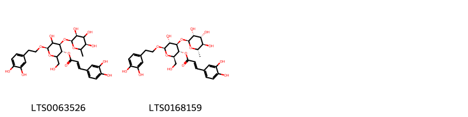{ width=100% }
    <figcaption>Hình ảnh cấu trúc hóa học của 2 hoạt chất thuộc nhóm Cinnamic acids and derivatives gồm ['(3r,4r,6r)-6-[2-(3,4-dihydroxyphenyl)ethoxy]-5-hydroxy-2-(hydroxymethyl)-4-{[(2s,3s,5r)-3,4,5-trihydroxy-6-methyloxan-2-yl]oxy}oxan-3-yl (2e)-3-(3,4-dihydroxyphenyl)prop-2-enoate (LTS0063526)', 'verbascoside (LTS0168159)'].</figcaption>
</figure>
#### Nhóm Organooxygen compounds
<figure markdown="span">
    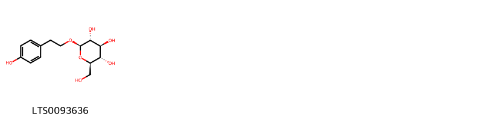{ width=100% }
    <figcaption>Hình ảnh cấu trúc hóa học của 1 hoạt chất thuộc nhóm Organooxygen compounds gồm ['salidroside (LTS0093636)'].</figcaption>
</figure>
#### Nhóm Prenol lipids
<figure markdown="span">
    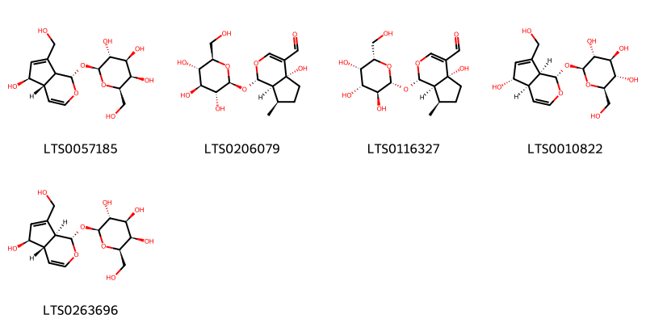{ width=100% }
    <figcaption>Hình ảnh cấu trúc hóa học của 5 hoạt chất thuộc nhóm Prenol lipids gồm ['(2s,3r,4s,5r,6r)-2-{[(1s,4as,5r)-5-hydroxy-7-(hydroxymethyl)-1h,4ah,5h,7ah-cyclopenta[c]pyran-1-yl]oxy}-6-(hydroxymethyl)oxane-3,4,5-triol (LTS0057185)', 'plantarenaloside (LTS0206079)', '(1s,4ar,7r,7ar)-4a-hydroxy-7-methyl-1-{[(2r,3s,4r,5s,6s)-3,4,5-trihydroxy-6-(hydroxymethyl)oxan-2-yl]oxy}-1h,5h,6h,7h,7ah-cyclopenta[c]pyran-4-carbaldehyde (LTS0116327)', 'aucubin (LTS0010822)', '(2s,3r,4s,5r,6r)-2-{[(1s,4as,5r,7as)-5-hydroxy-7-(hydroxymethyl)-1h,4ah,5h,7ah-cyclopenta[c]pyran-1-yl]oxy}-6-(hydroxymethyl)oxane-3,4,5-triol (LTS0263696)'].</figcaption>
</figure>

---

### Dược dân tộc học

Danh sách các quốc gia có sử dụng *Plantago coronopus* trong điều trị các bệnh. 

| Country   | Disease   | Bệnh                                                                                                                                                                                                |
|:----------|:----------|:----------------------------------------------------------------------------------------------------------------------------------------------------------------------------------------------------|
| ain       | Diuretic  | MYMEMORY WARNING: YOU USED ALL AVAILABLE FREE TRANSLATIONS FOR TODAY. NEXT AVAILABLE IN  05 HOURS 49 MINUTES 21 SECONDS VISIT HTTPS://MYMEMORY.TRANSLATED.NET/DOC/USAGELIMITS.PHP TO TRANSLATE MORE |

---

---
## Plantago cynops
### Thông tin về thực vật

!!! info "Phân loại thực vật của *N/A* từ GIBF:"
    - **Kingdom:** Plantae
    - **Phylum:** Tracheophyta
    - **Order:** Lamiales
    - **Family:** Plantaginaceae
    - **Genus:** Plantago
    - **Species:** *N/A*

 

| Label (VI)   | Label (EN)   | Scientific Name   | Descriptions (VI)   | Descriptions (EN)   | Also Known As (VI)   | Also Known As (EN)   |
|:-------------|:-------------|:------------------|:--------------------|:--------------------|:---------------------|:---------------------|
| N/A          | N/A          | Plantago cynops   | loài thực vật       | species of plant    | ['']                 | ['']                 |

#### Phân bố trên thế giới

**Từ CSDL GIBF** Brazil, China, Israel, Chile, New Zealand, Ecuador, Uruguay, Spain, Netherlands, Denmark, United States of America, Greece, Russian Federation, Argentina, Mexico, United Kingdom of Great Britain and Northern Ireland, Chinese Taipei, Canada, Germany, Austria, Portugal, Ukraine, South Africa, Australia, Italy, France, Ireland

#### Phân bố tại Việt Nam

**Từ CSDL GIBF**: Không có ghi nhận ở Việt Nam

---
### Thành phần hóa học
        
- Theo cơ sở dữ liệu lotus: Từ loài *N/A* đã phân lập và xác định được Chưa có hoạt chất nào được phân lập. hoạt chất thuộc về các nhóm Không có hoạt chất nào được phân lập. 

Không có hình ảnh nào được tạo ra

---

### Dược dân tộc học

Danh sách các quốc gia có sử dụng *N/A* trong điều trị các bệnh. 

| Country   | Disease   | Bệnh                                                                                                                                                                                                |
|:----------|:----------|:----------------------------------------------------------------------------------------------------------------------------------------------------------------------------------------------------|
| ain       | Laxative  | MYMEMORY WARNING: YOU USED ALL AVAILABLE FREE TRANSLATIONS FOR TODAY. NEXT AVAILABLE IN  05 HOURS 48 MINUTES 52 SECONDS VISIT HTTPS://MYMEMORY.TRANSLATED.NET/DOC/USAGELIMITS.PHP TO TRANSLATE MORE |

---

---
## Plantago depressa
### Thông tin về thực vật

!!! info "Phân loại thực vật của *Plantago depressa* từ GIBF:"
    - **Kingdom:** Plantae
    - **Phylum:** Tracheophyta
    - **Order:** Lamiales
    - **Family:** Plantaginaceae
    - **Genus:** Plantago
    - **Species:** *Plantago depressa*

 

| Label (VI)   | Label (EN)   | Scientific Name   | Descriptions (VI)   | Descriptions (EN)   | Also Known As (VI)   | Also Known As (EN)   |
|:-------------|:-------------|:------------------|:--------------------|:--------------------|:---------------------|:---------------------|
| N/A          | N/A          | Plantago depressa | loài thực vật       | species of plant    | ['']                 | ['']                 |

#### Phân bố trên thế giới

**Từ CSDL GIBF** Mongolia, Kazakhstan, Russian Federation, China

#### Phân bố tại Việt Nam

**Từ CSDL GIBF**: Không có ghi nhận ở Việt Nam

---
### Thành phần hóa học
        
- Theo cơ sở dữ liệu lotus: Từ loài *Plantago depressa* đã phân lập và xác định được 28 hoạt chất thuộc về các nhóm Fatty Acyls, Flavonoids, Cinnamic acids and derivatives, Organooxygen compounds. 

|    | chemicalTaxonomyClassyfireClass   |   smiles_count |
|---:|:----------------------------------|---------------:|
|  0 | Cinnamic acids and derivatives    |             16 |
|  1 | Fatty Acyls                       |              1 |
|  2 | Flavonoids                        |              2 |
|  3 | Organooxygen compounds            |              6 |

#### Nhóm Cinnamic acids and derivatives
<figure markdown="span">
    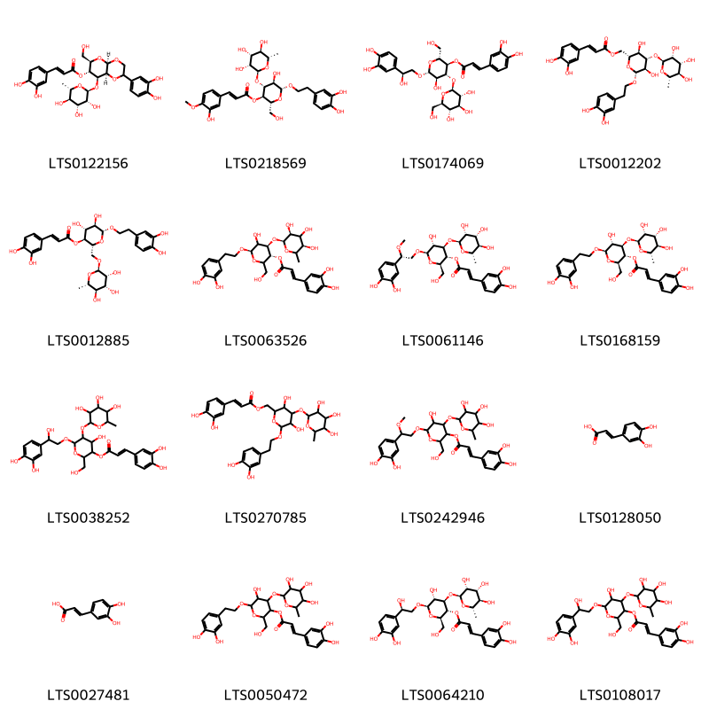{ width=100% }
    <figcaption>Hình ảnh cấu trúc hóa học của 16 hoạt chất thuộc nhóm Cinnamic acids and derivatives gồm ['(4ar,6r,7r,8s,8as)-2-(3,4-dihydroxyphenyl)-6-(hydroxymethyl)-8-{[(2s,3r,4r,5r,6s)-3,4,5-trihydroxy-6-methyloxan-2-yl]oxy}-hexahydro-2h-pyrano[2,3-b][1,4]dioxin-7-yl (2e)-3-(3,4-dihydroxyphenyl)prop-2-enoate (LTS0122156)', '(2r,3r,4r,5r,6r)-6-[2-(3,4-dihydroxyphenyl)ethoxy]-5-hydroxy-2-(hydroxymethyl)-4-{[(2s,3r,4r,5r,6s)-3,4,5-trihydroxy-6-methyloxan-2-yl]oxy}oxan-3-yl (2e)-3-(3-hydroxy-4-methoxyphenyl)prop-2-enoate (LTS0218569)', 'hellicoside (LTS0174069)', 'isoacteoside (LTS0012202)', 'forsythiaside (LTS0012885)', '(3r,4r,6r)-6-[2-(3,4-dihydroxyphenyl)ethoxy]-5-hydroxy-2-(hydroxymethyl)-4-{[(2s,3s,5r)-3,4,5-trihydroxy-6-methyloxan-2-yl]oxy}oxan-3-yl (2e)-3-(3,4-dihydroxyphenyl)prop-2-enoate (LTS0063526)', '(2r,3r,4r,5r,6r)-6-[(2s)-2-(3,4-dihydroxyphenyl)-2-methoxyethoxy]-5-hydroxy-2-(hydroxymethyl)-4-{[(2s,3r,4r,5r,6s)-3,4,5-trihydroxy-6-methyloxan-2-yl]oxy}oxan-3-yl (2e)-3-(3,4-dihydroxyphenyl)prop-2-enoate (LTS0061146)', 'verbascoside (LTS0168159)', '6-[2-(3,4-dihydroxyphenyl)-2-hydroxyethoxy]-4-hydroxy-2-(hydroxymethyl)-5-[(3,4,5-trihydroxy-6-methyloxan-2-yl)oxy]oxan-3-yl 3-(3,4-dihydroxyphenyl)prop-2-enoate (LTS0038252)', '{6-[2-(3,4-dihydroxyphenyl)ethoxy]-3,5-dihydroxy-4-[(3,4,5-trihydroxy-6-methyloxan-2-yl)oxy]oxan-2-yl}methyl 3-(3,4-dihydroxyphenyl)prop-2-enoate (LTS0270785)', '6-[2-(3,4-dihydroxyphenyl)-2-methoxyethoxy]-5-hydroxy-2-(hydroxymethyl)-4-[(3,4,5-trihydroxy-6-methyloxan-2-yl)oxy]oxan-3-yl 3-(3,4-dihydroxyphenyl)prop-2-enoate (LTS0242946)', '3,4-dihydroxycinnamic acid (LTS0128050)', 'caffeic acid (LTS0027481)', '6-[2-(3,4-dihydroxyphenyl)ethoxy]-5-hydroxy-2-(hydroxymethyl)-4-[(3,4,5-trihydroxy-6-methyloxan-2-yl)oxy]oxan-3-yl 3-(3,4-dihydroxyphenyl)prop-2-enoate (LTS0050472)', '(2r,3r,4r,5r,6r)-6-[(2r)-2-(3,4-dihydroxyphenyl)-2-hydroxyethoxy]-5-hydroxy-2-(hydroxymethyl)-4-{[(2s,3r,4r,5r,6s)-3,4,5-trihydroxy-6-methyloxan-2-yl]oxy}oxan-3-yl (2e)-3-(3,4-dihydroxyphenyl)prop-2-enoate (LTS0064210)', '6-[2-(3,4-dihydroxyphenyl)-2-hydroxyethoxy]-5-hydroxy-2-(hydroxymethyl)-4-[(3,4,5-trihydroxy-6-methyloxan-2-yl)oxy]oxan-3-yl 3-(3,4-dihydroxyphenyl)prop-2-enoate (LTS0108017)'].</figcaption>
</figure>
#### Nhóm Fatty Acyls
<figure markdown="span">
    { width=100% }
    <figcaption>Hình ảnh cấu trúc hóa học của 1 hoạt chất thuộc nhóm Fatty Acyls gồm ['(2r,3r,4r,5r)-1,2,5-trihydroxy-6-oxo-4-{[(2s,3r,4r,5r,6s)-3,4,5-trihydroxy-6-methyloxan-2-yl]oxy}hexan-3-yl (2e)-3-(3,4-dihydroxyphenyl)prop-2-enoate (LTS0248847)'].</figcaption>
</figure>
#### Nhóm Flavonoids
<figure markdown="span">
    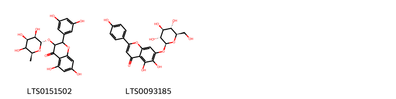{ width=100% }
    <figcaption>Hình ảnh cấu trúc hóa học của 2 hoạt chất thuộc nhóm Flavonoids gồm ['2-(3,5-dihydroxyphenyl)-5,7-dihydroxy-3-{[(2s,3r,4r,6s)-3,4,5-trihydroxy-6-methyloxan-2-yl]oxy}-2,3-dihydro-1-benzopyran-4-one (LTS0151502)', 'plantaginin (LTS0093185)'].</figcaption>
</figure>
#### Nhóm Organooxygen compounds
<figure markdown="span">
    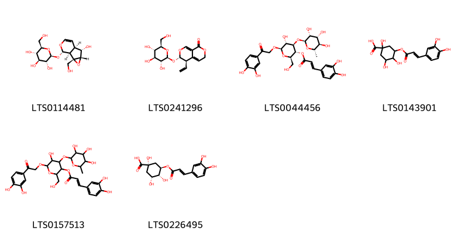{ width=100% }
    <figcaption>Hình ảnh cấu trúc hóa học của 6 hoạt chất thuộc nhóm Organooxygen compounds gồm ['catalpol (LTS0114481)', 'gentiopicroside (LTS0241296)', '(2r,3r,4r,5r,6r)-6-[2-(3,4-dihydroxyphenyl)-2-oxoethoxy]-5-hydroxy-2-(hydroxymethyl)-4-{[(2s,3r,4r,5r,6s)-3,4,5-trihydroxy-6-methyloxan-2-yl]oxy}oxan-3-yl (2e)-3-(3,4-dihydroxyphenyl)prop-2-enoate (LTS0044456)', '3-{[3-(3,4-dihydroxyphenyl)prop-2-enoyl]oxy}-1,4,5-trihydroxycyclohexane-1-carboxylic acid (LTS0143901)', '6-[2-(3,4-dihydroxyphenyl)-2-oxoethoxy]-5-hydroxy-2-(hydroxymethyl)-4-[(3,4,5-trihydroxy-6-methyloxan-2-yl)oxy]oxan-3-yl 3-(3,4-dihydroxyphenyl)prop-2-enoate (LTS0157513)', 'chlorogenic acid (LTS0226495)'].</figcaption>
</figure>

---

### Dược dân tộc học

Danh sách các quốc gia có sử dụng *Plantago depressa* trong điều trị các bệnh. 

| Country   | Disease   | Bệnh                                                                                                                                                                                                |
|:----------|:----------|:----------------------------------------------------------------------------------------------------------------------------------------------------------------------------------------------------|
| China     | Diuretic  | MYMEMORY WARNING: YOU USED ALL AVAILABLE FREE TRANSLATIONS FOR TODAY. NEXT AVAILABLE IN  05 HOURS 48 MINUTES 24 SECONDS VISIT HTTPS://MYMEMORY.TRANSLATED.NET/DOC/USAGELIMITS.PHP TO TRANSLATE MORE |

---

---
## Plantago erosa
### Thông tin về thực vật

!!! info "Phân loại thực vật của *Plantago centralis* từ GIBF:"
    - **Kingdom:** Plantae
    - **Phylum:** Tracheophyta
    - **Order:** Lamiales
    - **Family:** Plantaginaceae
    - **Genus:** Plantago
    - **Species:** *Plantago centralis*

 

| Label (VI)   | Label (EN)   | Scientific Name   | Descriptions (VI)   | Descriptions (EN)   | Also Known As (VI)   | Also Known As (EN)   |
|:-------------|:-------------|:------------------|:--------------------|:--------------------|:---------------------|:---------------------|
| N/A          | N/A          | Plantago erosa    | loài thực vật       | species of plant    | ['']                 | ['']                 |

#### Phân bố trên thế giới

**Từ CSDL GIBF** Sri Lanka, nan, Viet Nam, United States of America, Bhutan, Nepal, Pakistan, China, India

#### Phân bố tại Việt Nam

**Từ CSDL GIBF**: Không có ghi nhận ở Việt Nam

---
### Thành phần hóa học
        
- Theo cơ sở dữ liệu lotus: Từ loài *Plantago centralis* đã phân lập và xác định được Chưa có hoạt chất nào được phân lập. hoạt chất thuộc về các nhóm Không có hoạt chất nào được phân lập. 

Không có hình ảnh nào được tạo ra

---

### Dược dân tộc học

Danh sách các quốc gia có sử dụng *Plantago centralis* trong điều trị các bệnh. 

| Country   | Disease                                                                               | Bệnh                                                                                                                                                                                                |
|:----------|:--------------------------------------------------------------------------------------|:----------------------------------------------------------------------------------------------------------------------------------------------------------------------------------------------------|
| Elsewhere | Astringent, Demulcent, Diuretic, Hemostat, Refrigerant, Stimulant, Suppurative, Tonic | MYMEMORY WARNING: YOU USED ALL AVAILABLE FREE TRANSLATIONS FOR TODAY. NEXT AVAILABLE IN  05 HOURS 47 MINUTES 47 SECONDS VISIT HTTPS://MYMEMORY.TRANSLATED.NET/DOC/USAGELIMITS.PHP TO TRANSLATE MORE |

---

---
## Plantago lanceolata
### Thông tin về thực vật

!!! info "Phân loại thực vật của *Plantago lanceolata* từ GIBF:"
    - **Kingdom:** Plantae
    - **Phylum:** Tracheophyta
    - **Order:** Lamiales
    - **Family:** Plantaginaceae
    - **Genus:** Plantago
    - **Species:** *Plantago lanceolata*

 

| Label (VI)   | Label (EN)   | Scientific Name     | Descriptions (VI)   | Descriptions (EN)   | Also Known As (VI)   | Also Known As (EN)   |
|:-------------|:-------------|:--------------------|:--------------------|:--------------------|:---------------------|:---------------------|
| N/A          | N/A          | Plantago lanceolata | loài thực vật       | species of plant    | ['']                 | ['Ribwort Plantain'] |

#### Phân bố trên thế giới

**Từ CSDL GIBF** Uzbekistan, Chile, New Zealand, Ecuador, Uruguay, Spain, Netherlands, United States of America, Russian Federation, Argentina, United Kingdom of Great Britain and Northern Ireland, Canada, Germany, Austria, Portugal, Ukraine, South Africa, Australia, Italy, France, Ireland

#### Phân bố tại Việt Nam

**Từ CSDL GIBF**: Không có ghi nhận ở Việt Nam

---
### Thành phần hóa học
        
- Theo cơ sở dữ liệu lotus: Từ loài *Plantago lanceolata* đã phân lập và xác định được 69 hoạt chất thuộc về các nhóm Fatty Acyls, Benzene and substituted derivatives, Flavonoids, Tannins, Anthracenes, Cinnamic acids and derivatives, Organooxygen compounds, Prenol lipids. 

|    | chemicalTaxonomyClassyfireClass     |   smiles_count |
|---:|:------------------------------------|---------------:|
|  0 | Anthracenes                         |              3 |
|  1 | Benzene and substituted derivatives |              3 |
|  2 | Cinnamic acids and derivatives      |             23 |
|  3 | Fatty Acyls                         |              2 |
|  4 | Flavonoids                          |              6 |
|  5 | Organooxygen compounds              |             23 |
|  6 | Prenol lipids                       |              6 |
|  7 | Tannins                             |              2 |

#### Nhóm Anthracenes
<figure markdown="span">
    { width=100% }
    <figcaption>Hình ảnh cấu trúc hóa học của 3 hoạt chất thuộc nhóm Anthracenes gồm ['emodin (LTS0163480)', 'turkey rhubarb (LTS0160968)', 'physcion (LTS0052688)'].</figcaption>
</figure>
#### Nhóm Benzene and substituted derivatives
<figure markdown="span">
    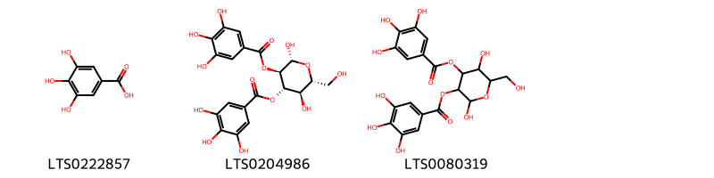{ width=100% }
    <figcaption>Hình ảnh cấu trúc hóa học của 3 hoạt chất thuộc nhóm Benzene and substituted derivatives gồm ['galop (LTS0222857)', '(2r,3r,4s,5r,6r)-2,5-dihydroxy-6-(hydroxymethyl)-4-(3,4,5-trihydroxybenzoyloxy)oxan-3-yl 3,4,5-trihydroxybenzoate (LTS0204986)', '2,5-dihydroxy-6-(hydroxymethyl)-3-(3,4,5-trihydroxybenzoyloxy)oxan-4-yl 3,4,5-trihydroxybenzoate (LTS0080319)'].</figcaption>
</figure>
#### Nhóm Cinnamic acids and derivatives
<figure markdown="span">
    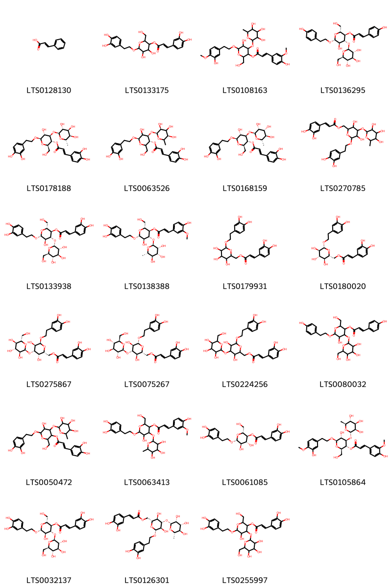{ width=100% }
    <figcaption>Hình ảnh cấu trúc hóa học của 23 hoạt chất thuộc nhóm Cinnamic acids and derivatives gồm ['cinnamic acid (LTS0128130)', '6-[2-(3,4-dihydroxyphenyl)ethoxy]-4,5-dihydroxy-2-(hydroxymethyl)oxan-3-yl 3-(3,4-dihydroxyphenyl)prop-2-enoate (LTS0133175)', '5-hydroxy-6-[2-(3-hydroxy-4-methoxyphenyl)ethoxy]-2-(hydroxymethyl)-4-[(3,4,5-trihydroxy-6-methyloxan-2-yl)oxy]oxan-3-yl 3-(4-hydroxy-3-methoxyphenyl)prop-2-enoate (LTS0108163)', '(2r,3r,4r,5r,6r)-5-hydroxy-2-(hydroxymethyl)-6-[2-(4-hydroxyphenyl)ethoxy]-4-{[(2s,3r,4s,5s,6r)-3,4,5-trihydroxy-6-(hydroxymethyl)oxan-2-yl]oxy}oxan-3-yl (2e)-3-(4-hydroxyphenyl)prop-2-enoate (LTS0136295)', '(2r,3r,4r,5r,6r)-6-[2-(3,4-dihydroxyphenyl)ethoxy]-5-hydroxy-2-(hydroxymethyl)-4-{[(2s,3r,4s,5r,6s)-3,4,5-trihydroxy-6-methyloxan-2-yl]oxy}oxan-3-yl (2e)-3-(3,4-dihydroxyphenyl)prop-2-enoate (LTS0178188)', '(3r,4r,6r)-6-[2-(3,4-dihydroxyphenyl)ethoxy]-5-hydroxy-2-(hydroxymethyl)-4-{[(2s,3s,5r)-3,4,5-trihydroxy-6-methyloxan-2-yl]oxy}oxan-3-yl (2e)-3-(3,4-dihydroxyphenyl)prop-2-enoate (LTS0063526)', 'verbascoside (LTS0168159)', '{6-[2-(3,4-dihydroxyphenyl)ethoxy]-3,5-dihydroxy-4-[(3,4,5-trihydroxy-6-methyloxan-2-yl)oxy]oxan-2-yl}methyl 3-(3,4-dihydroxyphenyl)prop-2-enoate (LTS0270785)', '(2r,3r,4r,5r,6r)-6-[2-(3,4-dihydroxyphenyl)ethoxy]-5-hydroxy-2-(hydroxymethyl)-4-{[(2r,3r,4s,5s,6r)-3,4,5-trihydroxy-6-(hydroxymethyl)oxan-2-yl]oxy}oxan-3-yl (2e)-3-(3,4-dihydroxyphenyl)prop-2-enoate (LTS0133938)', '(2r,3r,4r,5r,6r)-6-[2-(3,4-dihydroxyphenyl)ethoxy]-5-hydroxy-2-(hydroxymethyl)-4-{[(2s,3r,4r,5r,6s)-3,4,5-trihydroxy-6-methyloxan-2-yl]oxy}oxan-3-yl (2e)-3-(4-hydroxy-3-methoxyphenyl)prop-2-enoate (LTS0138388)', '{6-[2-(3,4-dihydroxyphenyl)ethoxy]-3,4,5-trihydroxyoxan-2-yl}methyl 3-(3,4-dihydroxyphenyl)prop-2-enoate (LTS0179931)', 'calceolarioside b (LTS0180020)', '[(2r,3s,4s,5r,6s)-6-[2-(3,4-dihydroxyphenyl)ethoxy]-3,5-dihydroxy-4-{[(2s,3s,4r,5r,6s)-3,4,5-trihydroxy-6-(hydroxymethyl)oxan-2-yl]oxy}oxan-2-yl]methyl (2e)-3-(3,4-dihydroxyphenyl)prop-2-enoate (LTS0275867)', '[(2r,3r,4s,5r,6r)-6-[2-(3,4-dihydroxyphenyl)ethoxy]-3,5-dihydroxy-4-{[(2s,3r,4s,5s,6r)-3,4,5-trihydroxy-6-(hydroxymethyl)oxan-2-yl]oxy}oxan-2-yl]methyl (2e)-3-(3,4-dihydroxyphenyl)prop-2-enoate (LTS0075267)', '{6-[2-(3,4-dihydroxyphenyl)ethoxy]-3,5-dihydroxy-4-{[3,4,5-trihydroxy-6-(hydroxymethyl)oxan-2-yl]oxy}oxan-2-yl}methyl 3-(3,4-dihydroxyphenyl)prop-2-enoate (LTS0224256)', '5-hydroxy-2-(hydroxymethyl)-6-[2-(4-hydroxyphenyl)ethoxy]-4-{[3,4,5-trihydroxy-6-(hydroxymethyl)oxan-2-yl]oxy}oxan-3-yl 3-(4-hydroxyphenyl)prop-2-enoate (LTS0080032)', '6-[2-(3,4-dihydroxyphenyl)ethoxy]-5-hydroxy-2-(hydroxymethyl)-4-[(3,4,5-trihydroxy-6-methyloxan-2-yl)oxy]oxan-3-yl 3-(3,4-dihydroxyphenyl)prop-2-enoate (LTS0050472)', '6-[2-(3,4-dihydroxyphenyl)ethoxy]-5-hydroxy-2-(hydroxymethyl)-4-[(3,4,5-trihydroxy-6-methyloxan-2-yl)oxy]oxan-3-yl 3-(4-hydroxy-3-methoxyphenyl)prop-2-enoate (LTS0063413)', '(2r,3s,4r,5r,6r)-6-[2-(3,4-dihydroxyphenyl)ethoxy]-4,5-dihydroxy-2-(hydroxymethyl)oxan-3-yl (2e)-3-(3,4-dihydroxyphenyl)prop-2-enoate (LTS0061085)', '(2r,3r,4r,5r,6r)-5-hydroxy-6-[2-(3-hydroxy-4-methoxyphenyl)ethoxy]-2-(hydroxymethyl)-4-{[(2s,3r,4r,5r,6s)-3,4,5-trihydroxy-6-methyloxan-2-yl]oxy}oxan-3-yl (2e)-3-(4-hydroxy-3-methoxyphenyl)prop-2-enoate (LTS0105864)', 'plantamajoside (LTS0032137)', '[(2r,3r,4s,5r,6r)-6-[2-(3,4-dihydroxyphenyl)ethoxy]-3,5-dihydroxy-4-{[(2r,3r,4r,5r,6s)-3,4,5-trihydroxy-6-methyloxan-2-yl]oxy}oxan-2-yl]methyl (2e)-3-(3,4-dihydroxyphenyl)prop-2-enoate (LTS0126301)', '6-[2-(3,4-dihydroxyphenyl)ethoxy]-5-hydroxy-2-(hydroxymethyl)-4-{[3,4,5-trihydroxy-6-(hydroxymethyl)oxan-2-yl]oxy}oxan-3-yl 3-(3,4-dihydroxyphenyl)prop-2-enoate (LTS0255997)'].</figcaption>
</figure>
#### Nhóm Fatty Acyls
<figure markdown="span">
    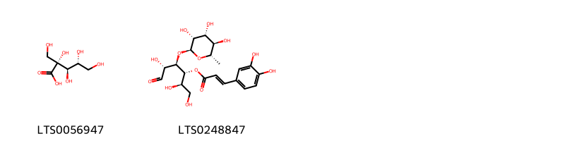{ width=100% }
    <figcaption>Hình ảnh cấu trúc hóa học của 2 hoạt chất thuộc nhóm Fatty Acyls gồm ['2-carboxy-d-arabinitol (LTS0056947)', '(2r,3r,4r,5r)-1,2,5-trihydroxy-6-oxo-4-{[(2s,3r,4r,5r,6s)-3,4,5-trihydroxy-6-methyloxan-2-yl]oxy}hexan-3-yl (2e)-3-(3,4-dihydroxyphenyl)prop-2-enoate (LTS0248847)'].</figcaption>
</figure>
#### Nhóm Flavonoids
<figure markdown="span">
    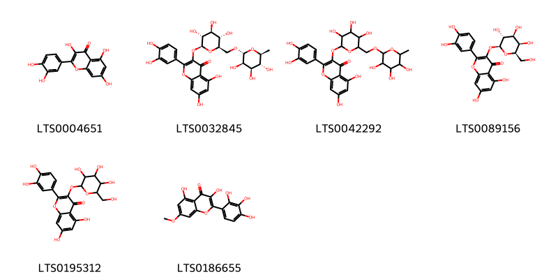{ width=100% }
    <figcaption>Hình ảnh cấu trúc hóa học của 6 hoạt chất thuộc nhóm Flavonoids gồm ['quercetin (LTS0004651)', '3-rutinosyl quercetin (LTS0032845)', 'rutin (LTS0042292)', 'hyperoside (LTS0089156)', '2-(3,4-dihydroxyphenyl)-5,7-dihydroxy-3-{[3,4,5-trihydroxy-6-(hydroxymethyl)oxan-2-yl]oxy}chromen-4-one (LTS0195312)', '3,5-dihydroxy-7-methoxy-2-(2,3,4-trihydroxyphenyl)chromen-4-one (LTS0186655)'].</figcaption>
</figure>
#### Nhóm Organooxygen compounds
<figure markdown="span">
    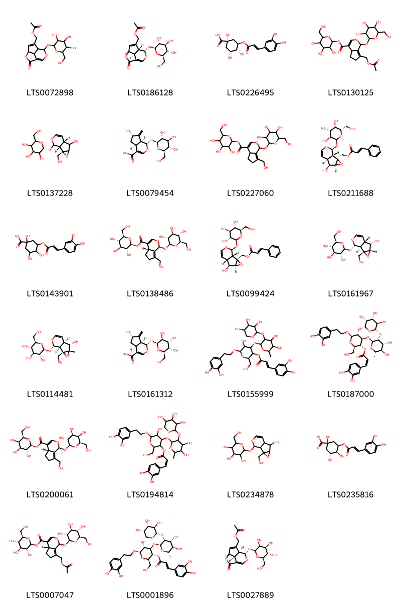{ width=100% }
    <figcaption>Hình ảnh cấu trúc hóa học của 23 hoạt chất thuộc nhóm Organooxygen compounds gồm ['asperuloside (LTS0072898)', 'asperuloside (LTS0186128)', 'chlorogenic acid (LTS0226495)', '3,4,5-trihydroxy-6-(hydroxymethyl)oxan-2-yl 7-[(acetyloxy)methyl]-1-{[3,4,5-trihydroxy-6-(hydroxymethyl)oxan-2-yl]oxy}-1h,4ah,5h,6h-cyclopenta[c]pyran-4-carboxylate (LTS0130125)', '(2r)-2-{[(1r,2s,6s)-5-hydroxy-2-(hydroxymethyl)-3,9-dioxatricyclo[4.4.0.0²,⁴]dec-7-en-10-yl]oxy}-6-(hydroxymethyl)oxane-3,4,5-triol (LTS0137228)', 'gardoside (LTS0079454)', '3,4,5-trihydroxy-6-(hydroxymethyl)oxan-2-yl 7-(hydroxymethyl)-1-{[3,4,5-trihydroxy-6-(hydroxymethyl)oxan-2-yl]oxy}-1h,4ah,5h,6h-cyclopenta[c]pyran-4-carboxylate (LTS0227060)', '[(1s,2s,4s,5s,6s,10s)-5-hydroxy-10-{[(2s,3s,4r,5r,6s)-3,4,5-trihydroxy-6-(hydroxymethyl)oxan-2-yl]oxy}-3,9-dioxatricyclo[4.4.0.0²,⁴]dec-7-en-2-yl]methyl (2e)-3-phenylprop-2-enoate (LTS0211688)', '3-{[3-(3,4-dihydroxyphenyl)prop-2-enoyl]oxy}-1,4,5-trihydroxycyclohexane-1-carboxylic acid (LTS0143901)', '(2s,3r,4s,5s,6r)-3,4,5-trihydroxy-6-(hydroxymethyl)oxan-2-yl (1s,4as)-7-(hydroxymethyl)-1-{[(2s,3r,4s,5s,6r)-3,4,5-trihydroxy-6-(hydroxymethyl)oxan-2-yl]oxy}-1h,4ah,5h,6h-cyclopenta[c]pyran-4-carboxylate (LTS0138486)', '[(1s,2s,4s,5s,6r,10s)-5-hydroxy-10-{[(2s,3r,4s,5s,6r)-3,4,5-trihydroxy-6-(hydroxymethyl)oxan-2-yl]oxy}-3,9-dioxatricyclo[4.4.0.0²,⁴]dec-7-en-2-yl]methyl (2e)-3-phenylprop-2-enoate (LTS0099424)', '(2s,3r,4s,5s,6r)-2-{[(1s,2s,4s,5s,6s,10s)-5-hydroxy-2-(hydroxymethyl)-3,9-dioxatricyclo[4.4.0.0²,⁴]dec-7-en-10-yl]oxy}-6-(hydroxymethyl)oxane-3,4,5-triol (LTS0161967)', 'catalpol (LTS0114481)', '(1s,4as,6s,7as)-6-hydroxy-7-methylidene-1-{[(2s,3s,4r,5s,6r)-3,4,5-trihydroxy-6-(hydroxymethyl)oxan-2-yl]oxy}-1h,4ah,5h,6h,7ah-cyclopenta[c]pyran-4-carboxylic acid (LTS0161312)', '4-({4,5-dihydroxy-6-methyl-3-[(3,4,5-trihydroxyoxan-2-yl)oxy]oxan-2-yl}oxy)-6-[2-(3,4-dihydroxyphenyl)ethoxy]-5-hydroxy-2-(hydroxymethyl)oxan-3-yl 3-(3,4-dihydroxyphenyl)prop-2-enoate (LTS0155999)', '(2r,3r,4r,5r,6r)-4-{[(2s,3r,4r,5r,6s)-4,5-dihydroxy-6-methyl-3-{[(2s,3r,4s,5s)-3,4,5-trihydroxyoxan-2-yl]oxy}oxan-2-yl]oxy}-6-[2-(3,4-dihydroxyphenyl)ethoxy]-5-hydroxy-2-(hydroxymethyl)oxan-3-yl (2z)-3-(3,4-dihydroxyphenyl)prop-2-enoate (LTS0187000)', '(2s,3r,4s,5r,6r)-3,4,5-trihydroxy-6-(hydroxymethyl)oxan-2-yl (1s,4as)-7-(hydroxymethyl)-1-{[(2s,3r,4s,5r,6r)-3,4,5-trihydroxy-6-(hydroxymethyl)oxan-2-yl]oxy}-1h,4ah,5h,6h-cyclopenta[c]pyran-4-carboxylate (LTS0200061)', '4-({4,5-dihydroxy-6-methyl-3-[(3,4,5-trihydroxyoxan-2-yl)oxy]oxan-2-yl}oxy)-6-[2-(3,4-dihydroxyphenyl)ethoxy]-5-hydroxy-2-(hydroxymethyl)oxan-3-yl (2z)-3-(3,4-dihydroxyphenyl)prop-2-enoate (LTS0194814)', 'catalpol (LTS0234878)', 'neochlorogenic acid (LTS0235816)', '(2s,3r,4s,5s,6r)-3,4,5-trihydroxy-6-(hydroxymethyl)oxan-2-yl (1s,4as)-7-[(acetyloxy)methyl]-1-{[(2s,3r,4s,5s,6r)-3,4,5-trihydroxy-6-(hydroxymethyl)oxan-2-yl]oxy}-1h,4ah,5h,6h-cyclopenta[c]pyran-4-carboxylate (LTS0007047)', '(2r,3r,4r,5r,6r)-4-{[(2s,3r,4r,5r,6s)-4,5-dihydroxy-6-methyl-3-{[(2s,3r,4s,5s)-3,4,5-trihydroxyoxan-2-yl]oxy}oxan-2-yl]oxy}-6-[2-(3,4-dihydroxyphenyl)ethoxy]-5-hydroxy-2-(hydroxymethyl)oxan-3-yl (2e)-3-(3,4-dihydroxyphenyl)prop-2-enoate (LTS0001896)', '[(4r,7s,8s,11s)-2-oxo-8-{[(2s,3s,4s,5s,6r)-3,4,5-trihydroxy-6-(hydroxymethyl)oxan-2-yl]oxy}-3,9-dioxatricyclo[5.3.1.0⁴,¹¹]undeca-1(10),5-dien-6-yl]methyl acetate (LTS0027889)'].</figcaption>
</figure>
#### Nhóm Prenol lipids
<figure markdown="span">
    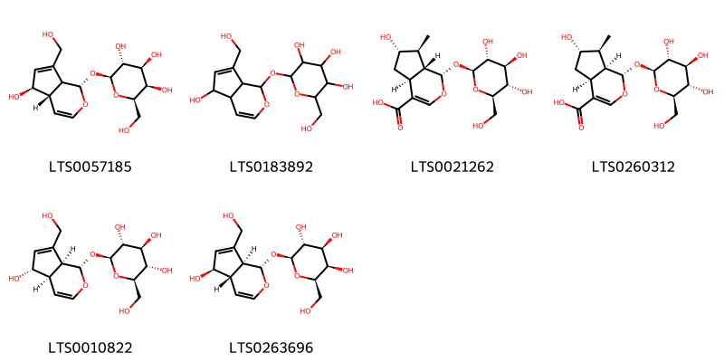{ width=100% }
    <figcaption>Hình ảnh cấu trúc hóa học của 6 hoạt chất thuộc nhóm Prenol lipids gồm ['(2s,3r,4s,5r,6r)-2-{[(1s,4as,5r)-5-hydroxy-7-(hydroxymethyl)-1h,4ah,5h,7ah-cyclopenta[c]pyran-1-yl]oxy}-6-(hydroxymethyl)oxane-3,4,5-triol (LTS0057185)', 'aucubin (LTS0183892)', '(1s,4as,6s,7s,7ar)-6-hydroxy-7-methyl-1-{[(2s,3r,4s,5s,6r)-3,4,5-trihydroxy-6-(hydroxymethyl)oxan-2-yl]oxy}-1h,4ah,5h,6h,7h,7ah-cyclopenta[c]pyran-4-carboxylic acid (LTS0021262)', '(1s,4as,6s,7s,7as)-6-hydroxy-7-methyl-1-{[(2s,3r,4s,5s,6r)-3,4,5-trihydroxy-6-(hydroxymethyl)oxan-2-yl]oxy}-1h,4ah,5h,6h,7h,7ah-cyclopenta[c]pyran-4-carboxylic acid (LTS0260312)', 'aucubin (LTS0010822)', '(2s,3r,4s,5r,6r)-2-{[(1s,4as,5r,7as)-5-hydroxy-7-(hydroxymethyl)-1h,4ah,5h,7ah-cyclopenta[c]pyran-1-yl]oxy}-6-(hydroxymethyl)oxane-3,4,5-triol (LTS0263696)'].</figcaption>
</figure>
#### Nhóm Tannins
<figure markdown="span">
    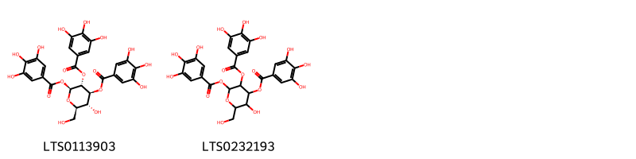{ width=100% }
    <figcaption>Hình ảnh cấu trúc hóa học của 2 hoạt chất thuộc nhóm Tannins gồm ['(2r,3r,4s,5r,6s)-3-hydroxy-2-(hydroxymethyl)-5,6-bis(3,4,5-trihydroxybenzoyloxy)oxan-4-yl 3,4,5-trihydroxybenzoate (LTS0113903)', '3-hydroxy-2-(hydroxymethyl)-5,6-bis(3,4,5-trihydroxybenzoyloxy)oxan-4-yl 3,4,5-trihydroxybenzoate (LTS0232193)'].</figcaption>
</figure>

---

### Dược dân tộc học

Danh sách các quốc gia có sử dụng *Plantago lanceolata* trong điều trị các bệnh. 

| Country   | Disease                                                                  | Bệnh                                                                                                                                                                                                |
|:----------|:-------------------------------------------------------------------------|:----------------------------------------------------------------------------------------------------------------------------------------------------------------------------------------------------|
| Elsewhere | Astringent, Diuretic, Hemostat, Purgative, Contraceptive, Vulnerary, nan | MYMEMORY WARNING: YOU USED ALL AVAILABLE FREE TRANSLATIONS FOR TODAY. NEXT AVAILABLE IN  05 HOURS 47 MINUTES 24 SECONDS VISIT HTTPS://MYMEMORY.TRANSLATED.NET/DOC/USAGELIMITS.PHP TO TRANSLATE MORE |
| Iraq      | Apertif, Refrigerant                                                     | MYMEMORY WARNING: YOU USED ALL AVAILABLE FREE TRANSLATIONS FOR TODAY. NEXT AVAILABLE IN  05 HOURS 47 MINUTES 21 SECONDS VISIT HTTPS://MYMEMORY.TRANSLATED.NET/DOC/USAGELIMITS.PHP TO TRANSLATE MORE |
| Turkey    | Diuretic, Expectorant, Vulnerary                                         | MYMEMORY WARNING: YOU USED ALL AVAILABLE FREE TRANSLATIONS FOR TODAY. NEXT AVAILABLE IN  05 HOURS 47 MINUTES 17 SECONDS VISIT HTTPS://MYMEMORY.TRANSLATED.NET/DOC/USAGELIMITS.PHP TO TRANSLATE MORE |
| ain       | Emollient                                                                | MYMEMORY WARNING: YOU USED ALL AVAILABLE FREE TRANSLATIONS FOR TODAY. NEXT AVAILABLE IN  05 HOURS 47 MINUTES 11 SECONDS VISIT HTTPS://MYMEMORY.TRANSLATED.NET/DOC/USAGELIMITS.PHP TO TRANSLATE MORE |

---

---
## Plantago major
### Thông tin về thực vật

!!! info "Phân loại thực vật của *Plantago major* từ GIBF:"
    - **Kingdom:** Plantae
    - **Phylum:** Tracheophyta
    - **Order:** Lamiales
    - **Family:** Plantaginaceae
    - **Genus:** Plantago
    - **Species:** *Plantago major*

 

| Label (VI)   | Label (EN)   | Scientific Name   | Descriptions (VI)   | Descriptions (EN)   | Also Known As (VI)   | Also Known As (EN)                                                             |
|:-------------|:-------------|:------------------|:--------------------|:--------------------|:---------------------|:-------------------------------------------------------------------------------|
| N/A          | N/A          | Plantago major    | loài thực vật       | species of plant    | ['Plantago major']   | ['broadleaf plantain', 'greater plantain', 'wayburn leaf', "white man's foot"] |

#### Phân bố trên thế giới

**Từ CSDL GIBF** Brazil, Sweden, China, Chile, New Zealand, Honduras, Ecuador, Thailand, Spain, Denmark, Netherlands, Puerto Rico, United States of America, Greece, Russian Federation, Colombia, Argentina, Hong Kong, Mexico, Norway, Chinese Taipei, Haiti, Canada, Germany, Austria, Portugal, Ukraine, South Africa, Australia, Switzerland, United Kingdom of Great Britain and Northern Ireland

#### Phân bố tại Việt Nam

**Từ CSDL GIBF**: Không có ghi nhận ở Việt Nam

---
### Thành phần hóa học
        
- Theo cơ sở dữ liệu lotus: Từ loài *Plantago major* đã phân lập và xác định được 159 hoạt chất thuộc về các nhóm Fatty Acyls, Benzofurans, Benzene and substituted derivatives, Flavonoids, Tannins, Carboxylic acids and derivatives, Cinnamic acids and derivatives, Steroids and steroid derivatives, Phenols, Organooxygen compounds, Hydroxy acids and derivatives, Prenol lipids, Saturated hydrocarbons. 

|    | chemicalTaxonomyClassyfireClass     |   smiles_count |
|---:|:------------------------------------|---------------:|
|  0 | Benzene and substituted derivatives |              7 |
|  1 | Benzofurans                         |              2 |
|  2 | Carboxylic acids and derivatives    |              5 |
|  3 | Cinnamic acids and derivatives      |             52 |
|  4 | Fatty Acyls                         |              2 |
|  5 | Flavonoids                          |             19 |
|  6 | Hydroxy acids and derivatives       |              2 |
|  7 | Organooxygen compounds              |             20 |
|  8 | Phenols                             |              1 |
|  9 | Prenol lipids                       |             25 |
| 10 | Saturated hydrocarbons              |             10 |
| 11 | Steroids and steroid derivatives    |              5 |
| 12 | Tannins                             |              7 |

#### Nhóm Benzene and substituted derivatives
<figure markdown="span">
    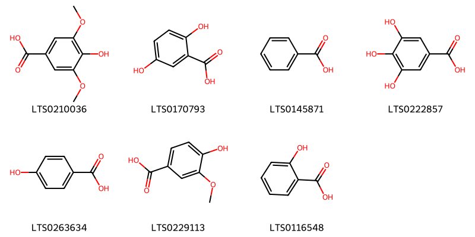{ width=100% }
    <figcaption>Hình ảnh cấu trúc hóa học của 7 hoạt chất thuộc nhóm Benzene and substituted derivatives gồm ['syringic acid (LTS0210036)', '2,5-dihydroxybenzoic acid (LTS0170793)', 'benzoic acid (LTS0145871)', 'galop (LTS0222857)', 'p-hydroxybenzoic acid (LTS0263634)', 'vanillic acid (LTS0229113)', 'salicyclic acid (LTS0116548)'].</figcaption>
</figure>
#### Nhóm Benzofurans
<figure markdown="span">
    { width=100% }
    <figcaption>Hình ảnh cấu trúc hóa học của 2 hoạt chất thuộc nhóm Benzofurans gồm ['loliolide (LTS0254454)', 'loliolide (LTS0119422)'].</figcaption>
</figure>
#### Nhóm Carboxylic acids and derivatives
<figure markdown="span">
    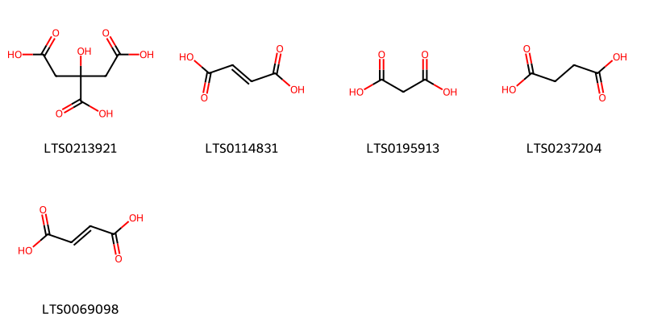{ width=100% }
    <figcaption>Hình ảnh cấu trúc hóa học của 5 hoạt chất thuộc nhóm Carboxylic acids and derivatives gồm ['citric acid (LTS0213921)', 'fumaric acid (LTS0114831)', 'malonic acid (LTS0195913)', 'succinic acid (LTS0237204)', 'butenedioic acid (LTS0069098)'].</figcaption>
</figure>
#### Nhóm Cinnamic acids and derivatives
<figure markdown="span">
    { width=100% }
    <figcaption>Hình ảnh cấu trúc hóa học của 52 hoạt chất thuộc nhóm Cinnamic acids and derivatives gồm ['(2r,3r,4r,5r,6r)-6-[2-(3,4-dihydroxyphenyl)ethoxy]-5-hydroxy-2-(hydroxymethyl)-4-{[(2r,3r,4s,5s,6r)-3,4,5-trihydroxy-6-(hydroxymethyl)oxan-2-yl]oxy}oxan-3-yl (2e)-3-(3,4-dihydroxyphenyl)prop-2-enoate (LTS0133938)', '6-[2-(3,4-dihydroxyphenyl)ethoxy]-5-hydroxy-2-(hydroxymethyl)-4-{[3,4,5-trihydroxy-6-(hydroxymethyl)oxan-2-yl]oxy}oxan-3-yl 3-(3,4-dihydroxyphenyl)prop-2-enoate (LTS0255997)', 'methyl 3-(3,4-dihydroxyphenyl)prop-2-enoate (LTS0080306)', '6-[2-(3,4-dihydroxyphenyl)ethoxy]-4,5-dihydroxy-2-(hydroxymethyl)oxan-3-yl 3-(3,4-dihydroxyphenyl)prop-2-enoate (LTS0133175)', '5-hydroxy-6-[2-(3-hydroxy-4-methoxyphenyl)ethoxy]-2-(hydroxymethyl)-4-[(3,4,5-trihydroxy-6-methyloxan-2-yl)oxy]oxan-3-yl 3-(4-hydroxy-3-methoxyphenyl)prop-2-enoate (LTS0108163)', '[(2r,3r,4s,5r,6r)-6-[2-(3,4-dihydroxyphenyl)ethoxy]-3,5-dihydroxy-4-{[(2r,3r,4s,5s,6r)-3,4,5-trihydroxy-6-(hydroxymethyl)oxan-2-yl]oxy}oxan-2-yl]methyl (2e)-3-(3,4-dihydroxyphenyl)prop-2-enoate (LTS0060369)', 'ferulic acid (LTS0077328)', '(2r,3r,4r,5r,6r)-6-[2-(3,4-dihydroxyphenyl)ethoxy]-5-hydroxy-2-(hydroxymethyl)-4-{[(2s,3r,4s,5r,6s)-3,4,5-trihydroxy-6-methyloxan-2-yl]oxy}oxan-3-yl (2e)-3-(3,4-dihydroxyphenyl)prop-2-enoate (LTS0178188)', '(3r,4r,6r)-6-[2-(3,4-dihydroxyphenyl)ethoxy]-5-hydroxy-2-(hydroxymethyl)-4-{[(2s,3s,5r)-3,4,5-trihydroxy-6-methyloxan-2-yl]oxy}oxan-3-yl (2e)-3-(3,4-dihydroxyphenyl)prop-2-enoate (LTS0063526)', 'verbascoside (LTS0168159)', '6-[2-(3,4-dihydroxyphenyl)-2-hydroxyethoxy]-5-hydroxy-2-(hydroxymethyl)-4-{[3,4,5-trihydroxy-6-(hydroxymethyl)oxan-2-yl]oxy}oxan-3-yl 3-(3,4-dihydroxyphenyl)prop-2-enoate (LTS0119924)', '(2r,3r,4s,5s,6r)-2-[2-(3,4-dihydroxyphenyl)ethoxy]-4,5-dihydroxy-6-(hydroxymethyl)oxan-3-yl (2e)-3-(3,4-dihydroxyphenyl)prop-2-enoate (LTS0060181)', '{3,5-dihydroxy-6-[2-(3-hydroxy-4-methoxyphenyl)ethoxy]-4-{[3,4,5-trihydroxy-6-(hydroxymethyl)oxan-2-yl]oxy}oxan-2-yl}methyl 3-(4-hydroxy-3-methoxyphenyl)prop-2-enoate (LTS0046498)', 'cinnamic acid (LTS0128130)', '{6-[2-(3,4-dihydroxyphenyl)ethoxy]-3,5-dihydroxy-4-[(3,4,5-trihydroxy-6-methyloxan-2-yl)oxy]oxan-2-yl}methyl 3-(3,4-dihydroxyphenyl)prop-2-enoate (LTS0270785)', '[(2r,3r,4s,5r,6r)-6-[2-(3,4-dihydroxyphenyl)ethoxy]-3,5-dihydroxy-4-{[(2s,3r,4r,5r,6s)-3,4,5-trihydroxy-6-methyloxan-2-yl]oxy}oxan-2-yl]methyl (2e)-3-(3-hydroxy-4-methoxyphenyl)prop-2-enoate (LTS0243585)', '{3,5-dihydroxy-6-[2-(3-hydroxy-4-methoxyphenyl)ethoxy]-4-[(3,4,5-trihydroxy-6-methyloxan-2-yl)oxy]oxan-2-yl}methyl 3-(4-hydroxy-3-methoxyphenyl)prop-2-enoate (LTS0151863)', 'ethyl caffeate (LTS0147324)', '(2r,3r,4r,5r,6r)-6-[(2r)-2-(3,4-dihydroxyphenyl)-2-hydroxyethoxy]-5-hydroxy-2-(hydroxymethyl)-4-{[(2s,3r,4s,5s,6r)-3,4,5-trihydroxy-6-(hydroxymethyl)oxan-2-yl]oxy}oxan-3-yl (2e)-3-(3,4-dihydroxyphenyl)prop-2-enoate (LTS0148011)', 'methyl caffeate (LTS0163009)', '[(2r,3r,4s,5r,6r)-6-[2-(3,4-dihydroxyphenyl)ethoxy]-3,5-dihydroxy-4-{[(2s,3r,4r,5r,6s)-3,4,5-trihydroxy-6-methyloxan-2-yl]oxy}oxan-2-yl]methyl (2e)-3-(4-hydroxy-3-methoxyphenyl)prop-2-enoate (LTS0242289)', 'phenylacrylic acid (LTS0097258)', '{6-[2-(3,4-dihydroxyphenyl)ethoxy]-3,4,5-trihydroxyoxan-2-yl}methyl 3-(3,4-dihydroxyphenyl)prop-2-enoate (LTS0179931)', 'calceolarioside b (LTS0180020)', '[(2r,3s,4s,5r,6s)-6-[2-(3,4-dihydroxyphenyl)ethoxy]-3,5-dihydroxy-4-{[(2s,3s,4r,5r,6s)-3,4,5-trihydroxy-6-(hydroxymethyl)oxan-2-yl]oxy}oxan-2-yl]methyl (2e)-3-(3,4-dihydroxyphenyl)prop-2-enoate (LTS0275867)', 'ethyl 3-(3,4-dihydroxyphenyl)prop-2-enoate (LTS0196241)', '[(2r,3r,4s,5r,6r)-6-[2-(3,4-dihydroxyphenyl)ethoxy]-3,5-dihydroxy-4-{[(2s,3r,4s,5s,6r)-3,4,5-trihydroxy-6-(hydroxymethyl)oxan-2-yl]oxy}oxan-2-yl]methyl (2e)-3-(3,4-dihydroxyphenyl)prop-2-enoate (LTS0075267)', '{6-[2-(3,4-dihydroxyphenyl)ethoxy]-3,5-dihydroxy-4-{[3,4,5-trihydroxy-6-(hydroxymethyl)oxan-2-yl]oxy}oxan-2-yl}methyl 3-(3,4-dihydroxyphenyl)prop-2-enoate (LTS0224256)', '[(2r,3r,4s,5r,6r)-6-[2-(3,4-dihydroxyphenyl)ethoxy]-3,5-dihydroxy-4-{[(2r,3r,4r,5r,6s)-3,4,5-trihydroxy-6-methyloxan-2-yl]oxy}oxan-2-yl]methyl (2e)-3-(4-hydroxy-3-methoxyphenyl)prop-2-enoate (LTS0195688)', 'para-coumaric acid (LTS0266252)', '(2r,3r,4r,5r,6r)-6-[2-(3,4-dihydroxyphenyl)ethoxy]-5-hydroxy-2-(hydroxymethyl)-4-{[(2s,3r,4r,5r,6s)-3,4,5-trihydroxy-6-methyloxan-2-yl]oxy}oxan-3-yl (2e)-3-(3-hydroxy-4-methoxyphenyl)prop-2-enoate (LTS0218569)', '{6-[2-(3,4-dihydroxyphenyl)ethoxy]-3,5-dihydroxy-4-[(3,4,5-trihydroxy-6-methyloxan-2-yl)oxy]oxan-2-yl}methyl 3-(4-hydroxy-3-methoxyphenyl)prop-2-enoate (LTS0025301)', '[(2r,3r,4s,5r,6r)-3,5-dihydroxy-6-[2-(3-hydroxy-4-methoxyphenyl)ethoxy]-4-{[(2r,3r,4r,5s,6r)-3,4,5-trihydroxy-6-(hydroxymethyl)oxan-2-yl]oxy}oxan-2-yl]methyl (2e)-3-(4-hydroxy-3-methoxyphenyl)prop-2-enoate (LTS0225069)', '2-[2-(3,4-dihydroxyphenyl)ethoxy]-3,5-dihydroxy-6-(hydroxymethyl)oxan-4-yl 3-(3,4-dihydroxyphenyl)prop-2-enoate (LTS0249969)', '6-[2-(3,4-dihydroxyphenyl)ethoxy]-5-hydroxy-2-(hydroxymethyl)-4-[(3,4,5-trihydroxy-6-methyloxan-2-yl)oxy]oxan-3-yl 3-(3,4-dihydroxyphenyl)prop-2-enoate (LTS0050472)', '6-[2-(3,4-dihydroxyphenyl)ethoxy]-5-hydroxy-2-(hydroxymethyl)-4-[(3,4,5-trihydroxy-6-methyloxan-2-yl)oxy]oxan-3-yl 3-(4-hydroxy-3-methoxyphenyl)prop-2-enoate (LTS0063413)', 'hellicoside (LTS0174069)', '(2r,3r,4s,5r,6r)-2-[2-(3,4-dihydroxyphenyl)ethoxy]-3,5-dihydroxy-6-(hydroxymethyl)oxan-4-yl (2e)-3-(3,4-dihydroxyphenyl)prop-2-enoate (LTS0183723)', 'hydroxycinnamic acid (LTS0233023)', '2-[2-(3,4-dihydroxyphenyl)ethoxy]-4,5-dihydroxy-6-(hydroxymethyl)oxan-3-yl 3-(3,4-dihydroxyphenyl)prop-2-enoate (LTS0020717)', '(2r,3r,4r,5r,6r)-6-[2-(3,4-dihydroxyphenyl)ethoxy]-5-hydroxy-2-(hydroxymethyl)-4-{[(2r,3r,4r,5r,6s)-3,4,5-trihydroxy-6-methyloxan-2-yl]oxy}oxan-3-yl (2e)-3-(4-hydroxy-3-methoxyphenyl)prop-2-enoate (LTS0036801)', '[(2s,4ar,6r,7s,8s,8ar)-2-(3,4-dihydroxyphenyl)-7,8-dihydroxy-hexahydro-2h-pyrano[2,3-b][1,4]dioxin-6-yl]methyl (2e)-3-(3,4-dihydroxyphenyl)prop-2-enoate (LTS0012177)', '[(4ar,6r,7s,8s,8ar)-2-(3,4-dihydroxyphenyl)-7,8-dihydroxy-hexahydro-2h-pyrano[2,3-b][1,4]dioxin-6-yl]methyl (2e)-3-(3,4-dihydroxyphenyl)prop-2-enoate (LTS0042103)', '(2r,3s,4r,5r,6r)-6-[2-(3,4-dihydroxyphenyl)ethoxy]-4,5-dihydroxy-2-(hydroxymethyl)oxan-3-yl (2e)-3-(3,4-dihydroxyphenyl)prop-2-enoate (LTS0061085)', '[(2r,3r,4s,5r,6r)-3,5-dihydroxy-6-[2-(3-hydroxy-4-methoxyphenyl)ethoxy]-4-{[(2s,3r,4r,5r,6s)-3,4,5-trihydroxy-6-methyloxan-2-yl]oxy}oxan-2-yl]methyl (2e)-3-(4-hydroxy-3-methoxyphenyl)prop-2-enoate (LTS0003736)', '[(2r,3s,4s,5s,6s)-3,5-dihydroxy-6-[2-(3-hydroxy-4-methoxyphenyl)ethoxy]-4-{[(2r,3s,4s,5s,6s)-3,4,5-trihydroxy-6-(hydroxymethyl)oxan-2-yl]oxy}oxan-2-yl]methyl (2e)-3-(4-hydroxy-3-methoxyphenyl)prop-2-enoate (LTS0001359)', '[(2r,3r,4s,5r,6r)-3,5-dihydroxy-6-[2-(3-hydroxy-4-methoxyphenyl)ethoxy]-4-{[(2r,3r,4s,5s,6r)-3,4,5-trihydroxy-6-(hydroxymethyl)oxan-2-yl]oxy}oxan-2-yl]methyl (2e)-3-(4-hydroxy-3-methoxyphenyl)prop-2-enoate (LTS0018395)', '(2r,3r,4r,5r,6r)-5-hydroxy-6-[2-(3-hydroxy-4-methoxyphenyl)ethoxy]-2-(hydroxymethyl)-4-{[(2s,3r,4r,5r,6s)-3,4,5-trihydroxy-6-methyloxan-2-yl]oxy}oxan-3-yl (2e)-3-(4-hydroxy-3-methoxyphenyl)prop-2-enoate (LTS0105864)', 'ferulic acid (LTS0273002)', 'plantamajoside (LTS0032137)', '[(2r,3r,4s,5r,6r)-6-[2-(3,4-dihydroxyphenyl)ethoxy]-3,5-dihydroxy-4-{[(2r,3r,4r,5r,6s)-3,4,5-trihydroxy-6-methyloxan-2-yl]oxy}oxan-2-yl]methyl (2e)-3-(3,4-dihydroxyphenyl)prop-2-enoate (LTS0126301)', '[2-(3,4-dihydroxyphenyl)-7,8-dihydroxy-hexahydro-2h-pyrano[2,3-b][1,4]dioxin-6-yl]methyl 3-(3,4-dihydroxyphenyl)prop-2-enoate (LTS0043685)'].</figcaption>
</figure>
#### Nhóm Fatty Acyls
<figure markdown="span">
    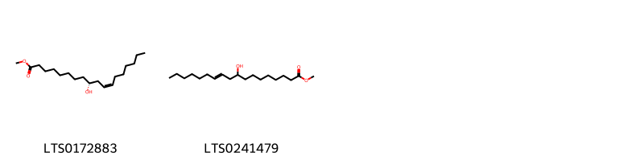{ width=100% }
    <figcaption>Hình ảnh cấu trúc hóa học của 2 hoạt chất thuộc nhóm Fatty Acyls gồm ['methyl (9r,11z)-9-hydroxyoctadec-11-enoate (LTS0172883)', 'methyl 9-hydroxyoctadec-11-enoate (LTS0241479)'].</figcaption>
</figure>
#### Nhóm Flavonoids
<figure markdown="span">
    { width=100% }
    <figcaption>Hình ảnh cấu trúc hóa học của 19 hoạt chất thuộc nhóm Flavonoids gồm ['quercetin (LTS0004651)', '(2s)-2-(3,4-dihydroxy-5-{[(2s,3s,4s,5s,6r)-3,4,5-trihydroxy-6-(hydroxymethyl)oxan-2-yl]oxy}phenyl)-5,7-dihydroxy-2,3-dihydro-1-benzopyran-4-one (LTS0132976)', 'nepitrin (LTS0032877)', 'luteolin 7-o-glucuronide (LTS0081420)', 'rutin (LTS0042292)', 'hyperoside (LTS0089156)', 'plantagoside (LTS0089096)', '2-(3,4-dihydroxyphenyl)-5,7-dihydroxy-3-{[3,4,5-trihydroxy-6-(hydroxymethyl)oxan-2-yl]oxy}chromen-4-one (LTS0195312)', 'chamomile (LTS0104946)', '5,6-dihydroxy-2-(4-hydroxyphenyl)-7-{[3,4,5-trihydroxy-6-(hydroxymethyl)oxan-2-yl]oxy}chromen-4-one (LTS0273859)', 'homoplantaginin (LTS0142016)', 'isorhamnetin (LTS0107505)', 'plantaginin (LTS0093185)', 'luteolin 7-o-glucoside (LTS0227450)', 'plantagoside (LTS0036853)', 'hispidulin (LTS0135598)', 'luteolin (LTS0017052)', '3-rutinosyl quercetin (LTS0032845)', 'scutellarein (LTS0136843)'].</figcaption>
</figure>
#### Nhóm Hydroxy acids and derivatives
<figure markdown="span">
    { width=100% }
    <figcaption>Hình ảnh cấu trúc hóa học của 2 hoạt chất thuộc nhóm Hydroxy acids and derivatives gồm ['(-)-malic acid (LTS0128885)', 'malic acid (LTS0216520)'].</figcaption>
</figure>
#### Nhóm Organooxygen compounds
<figure markdown="span">
    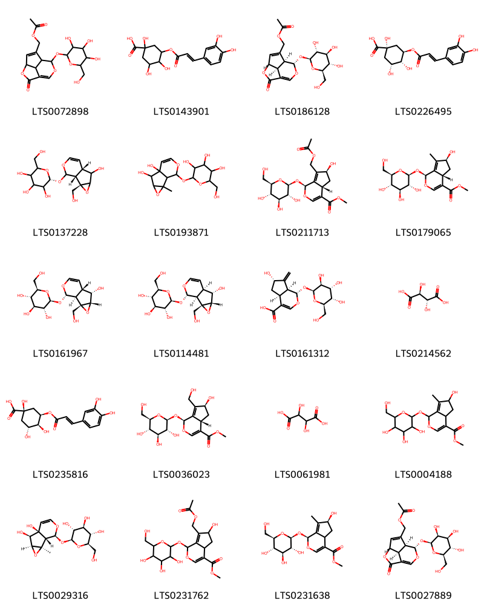{ width=100% }
    <figcaption>Hình ảnh cấu trúc hóa học của 20 hoạt chất thuộc nhóm Organooxygen compounds gồm ['asperuloside (LTS0072898)', '3-{[3-(3,4-dihydroxyphenyl)prop-2-enoyl]oxy}-1,4,5-trihydroxycyclohexane-1-carboxylic acid (LTS0143901)', 'asperuloside (LTS0186128)', 'chlorogenic acid (LTS0226495)', '(2r)-2-{[(1r,2s,6s)-5-hydroxy-2-(hydroxymethyl)-3,9-dioxatricyclo[4.4.0.0²,⁴]dec-7-en-10-yl]oxy}-6-(hydroxymethyl)oxane-3,4,5-triol (LTS0137228)', '2-({5,6-dihydroxy-2-methyl-3,9-dioxatricyclo[4.4.0.0²,⁴]dec-7-en-10-yl}oxy)-6-(hydroxymethyl)oxane-3,4,5-triol (LTS0193871)', 'methyl (1s,4as,6s)-7-[(acetyloxy)methyl]-6-hydroxy-1-{[(2s,3r,4s,5s,6r)-3,4,5-trihydroxy-6-(hydroxymethyl)oxan-2-yl]oxy}-1h,4ah,5h,6h-cyclopenta[c]pyran-4-carboxylate (LTS0211713)', 'methyl (1s,4as,6s)-6-hydroxy-7-methyl-1-{[(2s,3r,4s,5s,6r)-3,4,5-trihydroxy-6-(hydroxymethyl)oxan-2-yl]oxy}-1h,4ah,5h,6h-cyclopenta[c]pyran-4-carboxylate (LTS0179065)', '(2s,3r,4s,5s,6r)-2-{[(1s,2s,4s,5s,6s,10s)-5-hydroxy-2-(hydroxymethyl)-3,9-dioxatricyclo[4.4.0.0²,⁴]dec-7-en-10-yl]oxy}-6-(hydroxymethyl)oxane-3,4,5-triol (LTS0161967)', 'catalpol (LTS0114481)', '(1s,4as,6s,7as)-6-hydroxy-7-methylidene-1-{[(2s,3s,4r,5s,6r)-3,4,5-trihydroxy-6-(hydroxymethyl)oxan-2-yl]oxy}-1h,4ah,5h,6h,7ah-cyclopenta[c]pyran-4-carboxylic acid (LTS0161312)', '(-)-tartaric acid (LTS0214562)', 'neochlorogenic acid (LTS0235816)', 'methyl (1s,4as,6s)-6-hydroxy-7-(hydroxymethyl)-1-{[(2s,3r,4s,5s,6r)-3,4,5-trihydroxy-6-(hydroxymethyl)oxan-2-yl]oxy}-1h,4ah,5h,6h-cyclopenta[c]pyran-4-carboxylate (LTS0036023)', '(.+-.)-tartaric acid (LTS0061981)', 'methyl 6-hydroxy-7-methyl-1-{[3,4,5-trihydroxy-6-(hydroxymethyl)oxan-2-yl]oxy}-1h,4ah,5h,6h-cyclopenta[c]pyran-4-carboxylate (LTS0004188)', 'antirrhinoside (LTS0029316)', 'methyl 7-[(acetyloxy)methyl]-6-hydroxy-1-{[3,4,5-trihydroxy-6-(hydroxymethyl)oxan-2-yl]oxy}-1h,4ah,5h,6h-cyclopenta[c]pyran-4-carboxylate (LTS0231762)', 'methyl (1s,6s)-6-hydroxy-7-methyl-1-{[(2s,3r,4s,5s,6r)-3,4,5-trihydroxy-6-(hydroxymethyl)oxan-2-yl]oxy}-1h,4ah,5h,6h-cyclopenta[c]pyran-4-carboxylate (LTS0231638)', '[(4r,7s,8s,11s)-2-oxo-8-{[(2s,3s,4s,5s,6r)-3,4,5-trihydroxy-6-(hydroxymethyl)oxan-2-yl]oxy}-3,9-dioxatricyclo[5.3.1.0⁴,¹¹]undeca-1(10),5-dien-6-yl]methyl acetate (LTS0027889)'].</figcaption>
</figure>
#### Nhóm Phenols
<figure markdown="span">
    { width=100% }
    <figcaption>Hình ảnh cấu trúc hóa học của 1 hoạt chất thuộc nhóm Phenols gồm ['tyrosol (LTS0132195)'].</figcaption>
</figure>
#### Nhóm Prenol lipids
<figure markdown="span">
    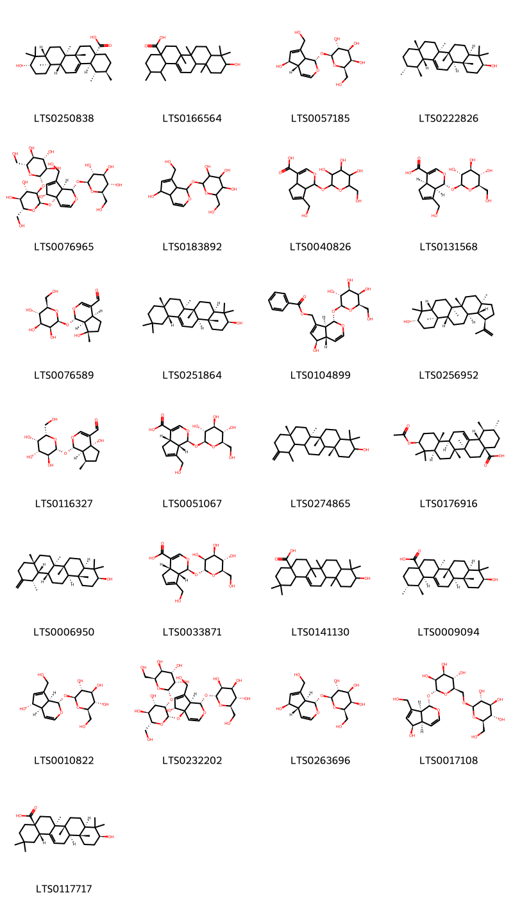{ width=100% }
    <figcaption>Hình ảnh cấu trúc hóa học của 25 hoạt chất thuộc nhóm Prenol lipids gồm ['ursolic acid (LTS0250838)', '10-hydroxy-1,2,6a,6b,9,9,12a-heptamethyl-2,3,4,5,6,7,8,8a,10,11,12,12b,13,14b-tetradecahydro-1h-picene-4a-carboxylic acid (LTS0166564)', '(2s,3r,4s,5r,6r)-2-{[(1s,4as,5r)-5-hydroxy-7-(hydroxymethyl)-1h,4ah,5h,7ah-cyclopenta[c]pyran-1-yl]oxy}-6-(hydroxymethyl)oxane-3,4,5-triol (LTS0057185)', 'amyrin (LTS0222826)', '(2s,3r,4s,5s,6r)-2-{[(2r,3r,4s,5s,6r)-2-{[(1s,4as,5r,7ar)-5-hydroxy-7-(hydroxymethyl)-1-{[(2s,3r,4s,5s,6r)-3,4,5-trihydroxy-6-(hydroxymethyl)oxan-2-yl]oxy}-1h,5h,7ah-cyclopenta[c]pyran-4a-yl]oxy}-4,5-dihydroxy-6-(hydroxymethyl)oxan-3-yl]oxy}-6-(hydroxymethyl)oxane-3,4,5-triol (LTS0076965)', 'aucubin (LTS0183892)', '7-(hydroxymethyl)-1-{[3,4,5-trihydroxy-6-(hydroxymethyl)oxan-2-yl]oxy}-1h,4ah,5h,7ah-cyclopenta[c]pyran-4-carboxylic acid (LTS0040826)', '(1r,4ar,7ar)-7-(hydroxymethyl)-1-{[(2s,3r,4s,5s,6r)-3,4,5-trihydroxy-6-(hydroxymethyl)oxan-2-yl]oxy}-1h,4ah,5h,7ah-cyclopenta[c]pyran-4-carboxylic acid (LTS0131568)', '(1s,4as,7s,7as)-7-hydroxy-7-methyl-1-{[(2s,3s,4s,5s,6r)-3,4,5-trihydroxy-6-(hydroxymethyl)oxan-2-yl]oxy}-1h,4ah,5h,6h,7ah-cyclopenta[c]pyran-4-carbaldehyde (LTS0076589)', 'β-amyrin (LTS0251864)', '[(1s,4as,5r,7as)-5-hydroxy-1-{[(2s,3r,4s,5r,6r)-3,4,5-trihydroxy-6-(hydroxymethyl)oxan-2-yl]oxy}-1h,4ah,5h,7ah-cyclopenta[c]pyran-7-yl]methyl benzoate (LTS0104899)', 'lupeol (LTS0256952)', '(1s,4ar,7r,7ar)-4a-hydroxy-7-methyl-1-{[(2r,3s,4r,5s,6s)-3,4,5-trihydroxy-6-(hydroxymethyl)oxan-2-yl]oxy}-1h,5h,6h,7h,7ah-cyclopenta[c]pyran-4-carbaldehyde (LTS0116327)', 'geniposidic acid (LTS0051067)', '(6ar,6br,8ar,14br)-4,4,6a,6b,8a,12,14b-heptamethyl-11-methylidene-hexadecahydropicen-3-ol (LTS0274865)', '(1s,2r,4as,6as,6br,8ar,10s,12ar,12br,14bs)-10-(acetyloxy)-1,2,6a,6b,9,9,12a-heptamethyl-2,3,4,5,6,7,8,8a,10,11,12,12b,13,14b-tetradecahydro-1h-picene-4a-carboxylic acid (LTS0176916)', 'taraxasterol (LTS0006950)', '(1s,4as,7as)-7-(hydroxymethyl)-1-{[(2r,3s,4s,5s,6r)-3,4,5-trihydroxy-6-(hydroxymethyl)oxan-2-yl]oxy}-1h,4ah,5h,7ah-cyclopenta[c]pyran-4-carboxylic acid (LTS0033871)', 'oleanolic acid (LTS0141130)', '(1s,2r,4as,6as,6br,8ar,10s,12ar,12br,14br)-10-hydroxy-1,2,6a,6b,9,9,12a-heptamethyl-2,3,4,5,6,7,8,8a,10,11,12,12b,13,14b-tetradecahydro-1h-picene-4a-carboxylic acid (LTS0009094)', 'aucubin (LTS0010822)', '(2s,3s,4s,5s,6s)-2-{[(2s,3s,4s,5s,6r)-2-{[(1s,4ar,5r,7ar)-5-hydroxy-7-(hydroxymethyl)-1-{[(2r,3s,4s,5s,6r)-3,4,5-trihydroxy-6-(hydroxymethyl)oxan-2-yl]oxy}-1h,5h,7ah-cyclopenta[c]pyran-4a-yl]oxy}-4,5-dihydroxy-6-(hydroxymethyl)oxan-3-yl]oxy}-6-(hydroxymethyl)oxane-3,4,5-triol (LTS0232202)', '(2s,3r,4s,5r,6r)-2-{[(1s,4as,5r,7as)-5-hydroxy-7-(hydroxymethyl)-1h,4ah,5h,7ah-cyclopenta[c]pyran-1-yl]oxy}-6-(hydroxymethyl)oxane-3,4,5-triol (LTS0263696)', '(2r,3s,4s,5s,6r)-2-{[(1s,4ar,5r,7as)-5-hydroxy-7-(hydroxymethyl)-1h,4ah,5h,7ah-cyclopenta[c]pyran-1-yl]oxy}-6-({[(2r,3r,4s,5s,6r)-3,4,5-trihydroxy-6-(hydroxymethyl)oxan-2-yl]oxy}methyl)oxane-3,4,5-triol (LTS0017108)', 'oleanolic acid (LTS0117717)'].</figcaption>
</figure>
#### Nhóm Saturated hydrocarbons
<figure markdown="span">
    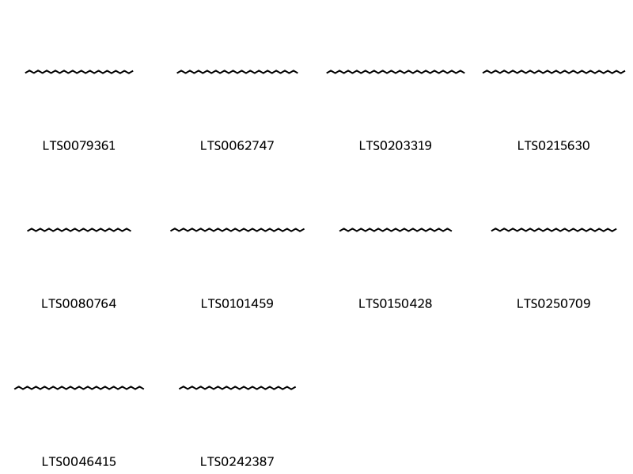{ width=100% }
    <figcaption>Hình ảnh cấu trúc hóa học của 10 hoạt chất thuộc nhóm Saturated hydrocarbons gồm ['hexacosane (LTS0079361)', 'nonacosane (LTS0062747)', 'tritriacontane (LTS0203319)', 'tetratriacontane (LTS0215630)', 'pentacosane (LTS0080764)', 'dotriacontane (LTS0101459)', 'heptacosane (LTS0150428)', 'triacontane (LTS0250709)', 'hentriacontane (LTS0046415)', 'octacosane (LTS0242387)'].</figcaption>
</figure>
#### Nhóm Steroids and steroid derivatives
<figure markdown="span">
    { width=100% }
    <figcaption>Hình ảnh cấu trúc hóa học của 5 hoạt chất thuộc nhóm Steroids and steroid derivatives gồm ['stigmast-5-en-3-ol, (3β)- (LTS0204616)', 'stigmast-5-en-3-ol (LTS0071224)', 'phytosterol (LTS0029311)', '(1r,3as,3bs,7s,9bs)-1-[(2r,5r)-5,6-dimethylheptan-2-yl]-9a,11a-dimethyl-1h,2h,3h,3ah,3bh,4h,6h,7h,8h,9h,9bh,10h,11h-cyclopenta[a]phenanthren-7-ol (LTS0057877)', 'campesterol (LTS0046755)'].</figcaption>
</figure>
#### Nhóm Tannins
<figure markdown="span">
    { width=100% }
    <figcaption>Hình ảnh cấu trúc hóa học của 7 hoạt chất thuộc nhóm Tannins gồm ['3-hydroxy-4,5-bis(3,4,5-trihydroxybenzoyloxy)-6-[(3,4,5-trihydroxybenzoyloxy)methyl]oxan-2-yl 3,4,5-trihydroxybenzoate (LTS0076562)', '(2r,3r,4s,5r,6s)-3-hydroxy-2-(hydroxymethyl)-5,6-bis(3,4,5-trihydroxybenzoyloxy)oxan-4-yl 3,4,5-trihydroxybenzoate (LTS0113903)', '3-hydroxy-2-(hydroxymethyl)-5,6-bis(3,4,5-trihydroxybenzoyloxy)oxan-4-yl 3,4,5-trihydroxybenzoate (LTS0232193)', '(2s,3r,4s,5r,6r)-3,4,5-tris(3,4,5-trihydroxybenzoyloxy)-6-[(3,4,5-trihydroxybenzoyloxy)methyl]oxan-2-yl 3,4,5-trihydroxybenzoate (LTS0216134)', '(2s,4s,5s,10s)-2-(hydroxymethyl)-10-{[(2s,3r,4s,5s,6r)-3,4,5-trihydroxy-6-(hydroxymethyl)oxan-2-yl]oxy}-3,9-dioxatricyclo[4.4.0.0²,⁴]dec-7-en-5-yl 4-hydroxy-3-methoxybenzoate (LTS0146787)', '3,4,5-tris(3,4,5-trihydroxybenzoyloxy)-6-[(3,4,5-trihydroxybenzoyloxy)methyl]oxan-2-yl 3,4,5-trihydroxybenzoate (LTS0226232)', '(2s,3r,4r,5r,6r)-3-hydroxy-4,5-bis(3,4,5-trihydroxybenzoyloxy)-6-[(3,4,5-trihydroxybenzoyloxy)methyl]oxan-2-yl 3,4,5-trihydroxybenzoate (LTS0245464)'].</figcaption>
</figure>

---

### Dược dân tộc học

Danh sách các quốc gia có sử dụng *Plantago major* trong điều trị các bệnh. 

| Country            | Disease                                                                                                                | Bệnh                                                                                                                                                                                                |
|:-------------------|:-----------------------------------------------------------------------------------------------------------------------|:----------------------------------------------------------------------------------------------------------------------------------------------------------------------------------------------------|
| China              | Alexiteric, Aphrodisiac, Astringent, Diuretic, Diuretic, Expectorant, Refrigerant, Tonic, Diuretic, Diuretic, Sedative | MYMEMORY WARNING: YOU USED ALL AVAILABLE FREE TRANSLATIONS FOR TODAY. NEXT AVAILABLE IN  05 HOURS 46 MINUTES 24 SECONDS VISIT HTTPS://MYMEMORY.TRANSLATED.NET/DOC/USAGELIMITS.PHP TO TRANSLATE MORE |
| Dominican Republic | Collyrium, Diuretic, Hemostat                                                                                          | MYMEMORY WARNING: YOU USED ALL AVAILABLE FREE TRANSLATIONS FOR TODAY. NEXT AVAILABLE IN  05 HOURS 46 MINUTES 20 SECONDS VISIT HTTPS://MYMEMORY.TRANSLATED.NET/DOC/USAGELIMITS.PHP TO TRANSLATE MORE |
| Elsewhere          | Demulcent, Protisticide, Refrigerant, Stimulant, Tonic, Hemostat                                                       | MYMEMORY WARNING: YOU USED ALL AVAILABLE FREE TRANSLATIONS FOR TODAY. NEXT AVAILABLE IN  05 HOURS 46 MINUTES 17 SECONDS VISIT HTTPS://MYMEMORY.TRANSLATED.NET/DOC/USAGELIMITS.PHP TO TRANSLATE MORE |
| Iraq               | Laxative, Poultice                                                                                                     | MYMEMORY WARNING: YOU USED ALL AVAILABLE FREE TRANSLATIONS FOR TODAY. NEXT AVAILABLE IN  05 HOURS 46 MINUTES 14 SECONDS VISIT HTTPS://MYMEMORY.TRANSLATED.NET/DOC/USAGELIMITS.PHP TO TRANSLATE MORE |
| Japan*             | Antidiarrheic, Antiphlogistic, Antitussive, Diuretic                                                                   | MYMEMORY WARNING: YOU USED ALL AVAILABLE FREE TRANSLATIONS FOR TODAY. NEXT AVAILABLE IN  05 HOURS 46 MINUTES 11 SECONDS VISIT HTTPS://MYMEMORY.TRANSLATED.NET/DOC/USAGELIMITS.PHP TO TRANSLATE MORE |
| Java               | Vermifuge, Diuretic                                                                                                    | MYMEMORY WARNING: YOU USED ALL AVAILABLE FREE TRANSLATIONS FOR TODAY. NEXT AVAILABLE IN  05 HOURS 46 MINUTES 08 SECONDS VISIT HTTPS://MYMEMORY.TRANSLATED.NET/DOC/USAGELIMITS.PHP TO TRANSLATE MORE |
| Kurdistan          | Apertif                                                                                                                | MYMEMORY WARNING: YOU USED ALL AVAILABLE FREE TRANSLATIONS FOR TODAY. NEXT AVAILABLE IN  05 HOURS 46 MINUTES 05 SECONDS VISIT HTTPS://MYMEMORY.TRANSLATED.NET/DOC/USAGELIMITS.PHP TO TRANSLATE MORE |
| Trinidad           | Collyrium, Collyrium, Protisticide                                                                                     | MYMEMORY WARNING: YOU USED ALL AVAILABLE FREE TRANSLATIONS FOR TODAY. NEXT AVAILABLE IN  05 HOURS 46 MINUTES 02 SECONDS VISIT HTTPS://MYMEMORY.TRANSLATED.NET/DOC/USAGELIMITS.PHP TO TRANSLATE MORE |
| Turkey             | Demulcent, Diuretic, Expectorant, Refrigerant, Vulnerary, Astringent                                                   | MYMEMORY WARNING: YOU USED ALL AVAILABLE FREE TRANSLATIONS FOR TODAY. NEXT AVAILABLE IN  05 HOURS 45 MINUTES 59 SECONDS VISIT HTTPS://MYMEMORY.TRANSLATED.NET/DOC/USAGELIMITS.PHP TO TRANSLATE MORE |
| US(Appalachia)     | Poultice                                                                                                               | MYMEMORY WARNING: YOU USED ALL AVAILABLE FREE TRANSLATIONS FOR TODAY. NEXT AVAILABLE IN  05 HOURS 45 MINUTES 55 SECONDS VISIT HTTPS://MYMEMORY.TRANSLATED.NET/DOC/USAGELIMITS.PHP TO TRANSLATE MORE |
| US(Flathead)       | Poultice, Suppurative                                                                                                  | MYMEMORY WARNING: YOU USED ALL AVAILABLE FREE TRANSLATIONS FOR TODAY. NEXT AVAILABLE IN  05 HOURS 45 MINUTES 52 SECONDS VISIT HTTPS://MYMEMORY.TRANSLATED.NET/DOC/USAGELIMITS.PHP TO TRANSLATE MORE |
| Venezuela          | Astringent, Diuretic, Hemostat                                                                                         | MYMEMORY WARNING: YOU USED ALL AVAILABLE FREE TRANSLATIONS FOR TODAY. NEXT AVAILABLE IN  05 HOURS 45 MINUTES 49 SECONDS VISIT HTTPS://MYMEMORY.TRANSLATED.NET/DOC/USAGELIMITS.PHP TO TRANSLATE MORE |

---

---
## Plantago ovata
### Thông tin về thực vật

!!! info "Phân loại thực vật của *Plantago ovata* từ GIBF:"
    - **Kingdom:** Plantae
    - **Phylum:** Tracheophyta
    - **Order:** Lamiales
    - **Family:** Plantaginaceae
    - **Genus:** Plantago
    - **Species:** *Plantago ovata*

 

| Label (VI)   | Label (EN)   | Scientific Name   | Descriptions (VI)   | Descriptions (EN)   | Also Known As (VI)   | Also Known As (EN)                                                    |
|:-------------|:-------------|:------------------|:--------------------|:--------------------|:---------------------|:----------------------------------------------------------------------|
| N/A          | N/A          | Plantago ovata    | loài thực vật       | species of plant    | ['']                 | ['blond plantain', 'blond psyllium', 'Desert indianwheat', 'ispagol'] |

#### Phân bố trên thế giới

**Từ CSDL GIBF** Israel, Mexico, United States of America

#### Phân bố tại Việt Nam

**Từ CSDL GIBF**: Không có ghi nhận ở Việt Nam

---
### Thành phần hóa học
        
- Theo cơ sở dữ liệu lotus: Từ loài *Plantago ovata* đã phân lập và xác định được 60 hoạt chất thuộc về các nhóm Fatty Acyls, Cinnamic acids and derivatives, Organooxygen compounds, Prenol lipids, Saturated hydrocarbons. 

|    | chemicalTaxonomyClassyfireClass   |   smiles_count |
|---:|:----------------------------------|---------------:|
|  0 | Cinnamic acids and derivatives    |              5 |
|  1 | Fatty Acyls                       |             12 |
|  2 | Organooxygen compounds            |             11 |
|  3 | Prenol lipids                     |              6 |
|  4 | Saturated hydrocarbons            |             25 |

#### Nhóm Cinnamic acids and derivatives
<figure markdown="span">
    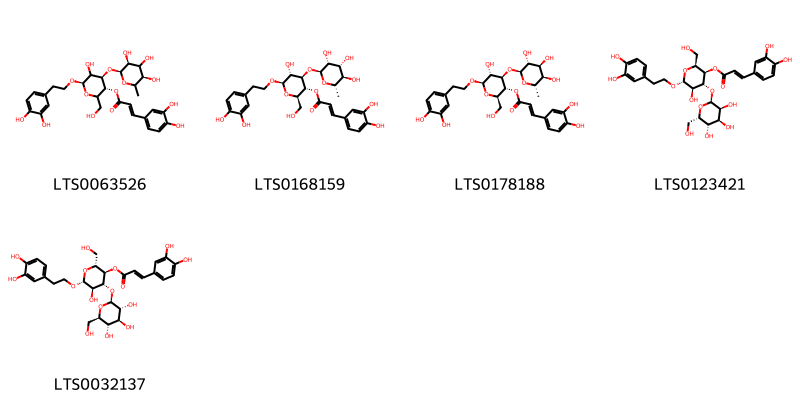{ width=100% }
    <figcaption>Hình ảnh cấu trúc hóa học của 5 hoạt chất thuộc nhóm Cinnamic acids and derivatives gồm ['(3r,4r,6r)-6-[2-(3,4-dihydroxyphenyl)ethoxy]-5-hydroxy-2-(hydroxymethyl)-4-{[(2s,3s,5r)-3,4,5-trihydroxy-6-methyloxan-2-yl]oxy}oxan-3-yl (2e)-3-(3,4-dihydroxyphenyl)prop-2-enoate (LTS0063526)', 'verbascoside (LTS0168159)', '(2r,3r,4r,5r,6r)-6-[2-(3,4-dihydroxyphenyl)ethoxy]-5-hydroxy-2-(hydroxymethyl)-4-{[(2s,3r,4s,5r,6s)-3,4,5-trihydroxy-6-methyloxan-2-yl]oxy}oxan-3-yl (2e)-3-(3,4-dihydroxyphenyl)prop-2-enoate (LTS0178188)', '(2s,3r,4r,5r,6r)-6-[2-(3,4-dihydroxyphenyl)ethoxy]-5-hydroxy-2-(hydroxymethyl)-4-{[(2s,3s,4s,5s,6s)-3,4,5-trihydroxy-6-(hydroxymethyl)oxan-2-yl]oxy}oxan-3-yl (2e)-3-(3,4-dihydroxyphenyl)prop-2-enoate (LTS0123421)', 'plantamajoside (LTS0032137)'].</figcaption>
</figure>
#### Nhóm Fatty Acyls
<figure markdown="span">
    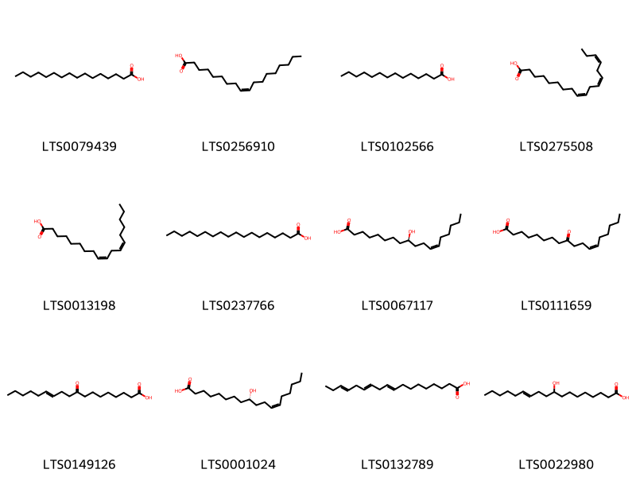{ width=100% }
    <figcaption>Hình ảnh cấu trúc hóa học của 12 hoạt chất thuộc nhóm Fatty Acyls gồm ['palmitic acid (LTS0079439)', 'oleic acid (LTS0256910)', 'myristic acid (LTS0102566)', 'α-linolenic acid (LTS0275508)', 'linoleic (LTS0013198)', 'stearic acid (LTS0237766)', '(9r,12z)-9-hydroxyoctadec-12-enoic acid (LTS0067117)', '(12z)-9-oxooctadec-12-enoic acid (LTS0111659)', '9-oxooctadec-12-enoic acid (LTS0149126)', '(9s,12z)-9-hydroxyoctadec-12-enoic acid (LTS0001024)', 'α linolenic acid (LTS0132789)', '9-hydroxyoctadec-12-enoic acid (LTS0022980)'].</figcaption>
</figure>
#### Nhóm Organooxygen compounds
<figure markdown="span">
    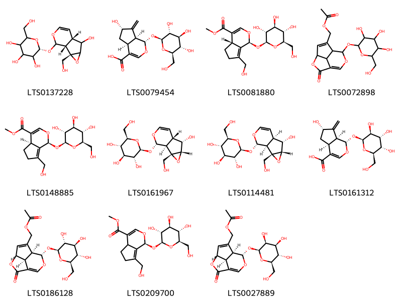{ width=100% }
    <figcaption>Hình ảnh cấu trúc hóa học của 11 hoạt chất thuộc nhóm Organooxygen compounds gồm ['(2r)-2-{[(1r,2s,6s)-5-hydroxy-2-(hydroxymethyl)-3,9-dioxatricyclo[4.4.0.0²,⁴]dec-7-en-10-yl]oxy}-6-(hydroxymethyl)oxane-3,4,5-triol (LTS0137228)', 'gardoside (LTS0079454)', 'methyl (1s,4as)-7-(hydroxymethyl)-1-{[(2s,3r,4s,5s,6r)-3,4,5-trihydroxy-6-(hydroxymethyl)oxan-2-yl]oxy}-1h,4ah,5h,6h-cyclopenta[c]pyran-4-carboxylate (LTS0081880)', 'asperuloside (LTS0072898)', 'methyl (1s,4ar)-7-(hydroxymethyl)-1-{[(2s,3r,4s,5s,6r)-3,4,5-trihydroxy-6-(hydroxymethyl)oxan-2-yl]oxy}-1h,4ah,5h,6h-cyclopenta[c]pyran-4-carboxylate (LTS0148885)', '(2s,3r,4s,5s,6r)-2-{[(1s,2s,4s,5s,6s,10s)-5-hydroxy-2-(hydroxymethyl)-3,9-dioxatricyclo[4.4.0.0²,⁴]dec-7-en-10-yl]oxy}-6-(hydroxymethyl)oxane-3,4,5-triol (LTS0161967)', 'catalpol (LTS0114481)', '(1s,4as,6s,7as)-6-hydroxy-7-methylidene-1-{[(2s,3s,4r,5s,6r)-3,4,5-trihydroxy-6-(hydroxymethyl)oxan-2-yl]oxy}-1h,4ah,5h,6h,7ah-cyclopenta[c]pyran-4-carboxylic acid (LTS0161312)', 'asperuloside (LTS0186128)', 'methyl (1s)-7-(hydroxymethyl)-1-{[(2s,3r,4s,5s,6r)-3,4,5-trihydroxy-6-(hydroxymethyl)oxan-2-yl]oxy}-1h,4ah,5h,6h-cyclopenta[c]pyran-4-carboxylate (LTS0209700)', '[(4r,7s,8s,11s)-2-oxo-8-{[(2s,3s,4s,5s,6r)-3,4,5-trihydroxy-6-(hydroxymethyl)oxan-2-yl]oxy}-3,9-dioxatricyclo[5.3.1.0⁴,¹¹]undeca-1(10),5-dien-6-yl]methyl acetate (LTS0027889)'].</figcaption>
</figure>
#### Nhóm Prenol lipids
<figure markdown="span">
    { width=100% }
    <figcaption>Hình ảnh cấu trúc hóa học của 6 hoạt chất thuộc nhóm Prenol lipids gồm ['(2s,3r,4s,5r,6r)-2-{[(1s,4as,5r)-5-hydroxy-7-(hydroxymethyl)-1h,4ah,5h,7ah-cyclopenta[c]pyran-1-yl]oxy}-6-(hydroxymethyl)oxane-3,4,5-triol (LTS0057185)', 'aucubin (LTS0183892)', '(1s,4as,6s,7s,7ar)-6-hydroxy-7-methyl-1-{[(2s,3r,4s,5s,6r)-3,4,5-trihydroxy-6-(hydroxymethyl)oxan-2-yl]oxy}-1h,4ah,5h,6h,7h,7ah-cyclopenta[c]pyran-4-carboxylic acid (LTS0021262)', '(1s,4as,6s,7s,7as)-6-hydroxy-7-methyl-1-{[(2s,3r,4s,5s,6r)-3,4,5-trihydroxy-6-(hydroxymethyl)oxan-2-yl]oxy}-1h,4ah,5h,6h,7h,7ah-cyclopenta[c]pyran-4-carboxylic acid (LTS0260312)', 'aucubin (LTS0010822)', '(2s,3r,4s,5r,6r)-2-{[(1s,4as,5r,7as)-5-hydroxy-7-(hydroxymethyl)-1h,4ah,5h,7ah-cyclopenta[c]pyran-1-yl]oxy}-6-(hydroxymethyl)oxane-3,4,5-triol (LTS0263696)'].</figcaption>
</figure>
#### Nhóm Saturated hydrocarbons
<figure markdown="span">
    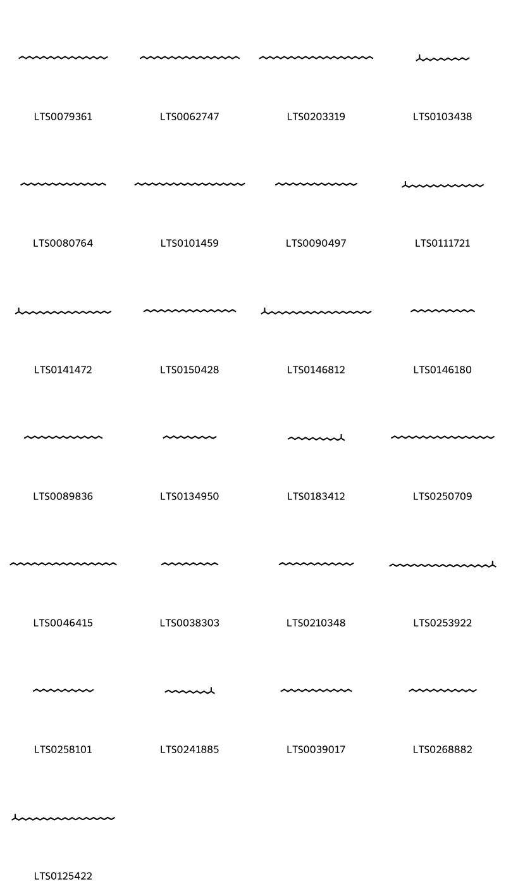{ width=100% }
    <figcaption>Hình ảnh cấu trúc hóa học của 25 hoạt chất thuộc nhóm Saturated hydrocarbons gồm ['hexacosane (LTS0079361)', 'nonacosane (LTS0062747)', 'tritriacontane (LTS0203319)', '2-methylhexadecane (LTS0103438)', 'pentacosane (LTS0080764)', 'dotriacontane (LTS0101459)', 'tetracosane (LTS0090497)', '2-methyltetracosane (LTS0111721)', '2-methyloctacosane (LTS0141472)', 'heptacosane (LTS0150428)', '2-methyldotriacontane (LTS0146812)', 'nonadecane (LTS0146180)', 'tricosane (LTS0089836)', 'cetane (LTS0134950)', 'heptadecane, 2-methyl- (LTS0183412)', 'triacontane (LTS0250709)', 'hentriacontane (LTS0046415)', 'heptadecane (LTS0038303)', 'docosane (LTS0210348)', '2-methylhentriacontane (LTS0253922)', 'octadecane (LTS0258101)', 'isocetane (LTS0241885)', 'heneicosane (LTS0039017)', 'eicosane (LTS0268882)', '2-methyl-triacotane (LTS0125422)'].</figcaption>
</figure>

---

### Dược dân tộc học

Danh sách các quốc gia có sử dụng *Plantago ovata* trong điều trị các bệnh. 

| Country   | Disease                                 | Bệnh                                                                                                                                                                                                |
|:----------|:----------------------------------------|:----------------------------------------------------------------------------------------------------------------------------------------------------------------------------------------------------|
| Elsewhere | Demulcent, Emollient, Styptic, Laxative | MYMEMORY WARNING: YOU USED ALL AVAILABLE FREE TRANSLATIONS FOR TODAY. NEXT AVAILABLE IN  05 HOURS 44 MINUTES 54 SECONDS VISIT HTTPS://MYMEMORY.TRANSLATED.NET/DOC/USAGELIMITS.PHP TO TRANSLATE MORE |
| Iraq      | Laxative, Poultice                      | MYMEMORY WARNING: YOU USED ALL AVAILABLE FREE TRANSLATIONS FOR TODAY. NEXT AVAILABLE IN  05 HOURS 44 MINUTES 52 SECONDS VISIT HTTPS://MYMEMORY.TRANSLATED.NET/DOC/USAGELIMITS.PHP TO TRANSLATE MORE |

---

---
## Plantago psyllium
### Thông tin về thực vật

!!! info "Phân loại thực vật của *Plantago psyllium* từ GIBF:"
    - **Kingdom:** Plantae
    - **Phylum:** Tracheophyta
    - **Order:** Lamiales
    - **Family:** Plantaginaceae
    - **Genus:** Plantago
    - **Species:** *Plantago psyllium*

 

| Label (VI)   | Label (EN)   | Scientific Name   | Descriptions (VI)   | Descriptions (EN)   | Also Known As (VI)   | Also Known As (EN)   |
|:-------------|:-------------|:------------------|:--------------------|:--------------------|:---------------------|:---------------------|
| N/A          | N/A          | Plantago psyllium | loài thực vật       | species of plant    | ['']                 | ['']                 |

#### Phân bố trên thế giới

**Từ CSDL GIBF** nan, Brazil, New Zealand, Spain, Bolivia (Plurinational State of), United States of America, Greece, Tunisia, Russian Federation, Colombia, Croatia, Cyprus, Ethiopia, Morocco, Algeria, Norway, Saudi Arabia, United Kingdom of Great Britain and Northern Ireland, Canada, Egypt, Portugal, Italy, France

#### Phân bố tại Việt Nam

**Từ CSDL GIBF**: Không có ghi nhận ở Việt Nam

---
### Thành phần hóa học
        
- Theo cơ sở dữ liệu lotus: Từ loài *Plantago psyllium* đã phân lập và xác định được 3 hoạt chất thuộc về các nhóm Prenol lipids, Cinnamic acids and derivatives. 

|    | chemicalTaxonomyClassyfireClass   |   smiles_count |
|---:|:----------------------------------|---------------:|
|  0 | Cinnamic acids and derivatives    |              1 |
|  1 | Prenol lipids                     |              2 |

#### Nhóm Cinnamic acids and derivatives
<figure markdown="span">
    { width=100% }
    <figcaption>Hình ảnh cấu trúc hóa học của 1 hoạt chất thuộc nhóm Cinnamic acids and derivatives gồm ['(2r,3r,4r,5r,6r)-6-[2-(3,4-dihydroxyphenyl)ethoxy]-5-hydroxy-2-(hydroxymethyl)-4-{[(2s,3r,4s,5r,6s)-3,4,5-trihydroxy-6-methyloxan-2-yl]oxy}oxan-3-yl (2e)-3-(3,4-dihydroxyphenyl)prop-2-enoate (LTS0178188)'].</figcaption>
</figure>
#### Nhóm Prenol lipids
<figure markdown="span">
    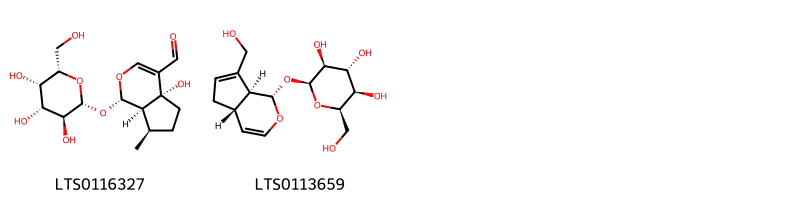{ width=100% }
    <figcaption>Hình ảnh cấu trúc hóa học của 2 hoạt chất thuộc nhóm Prenol lipids gồm ['(1s,4ar,7r,7ar)-4a-hydroxy-7-methyl-1-{[(2r,3s,4r,5s,6s)-3,4,5-trihydroxy-6-(hydroxymethyl)oxan-2-yl]oxy}-1h,5h,6h,7h,7ah-cyclopenta[c]pyran-4-carbaldehyde (LTS0116327)', '(2s,3s,4r,5r,6r)-2-{[(1s,4as,7as)-7-(hydroxymethyl)-1h,4ah,5h,7ah-cyclopenta[c]pyran-1-yl]oxy}-6-(hydroxymethyl)oxane-3,4,5-triol (LTS0113659)'].</figcaption>
</figure>

---

### Dược dân tộc học

Danh sách các quốc gia có sử dụng *Plantago psyllium* trong điều trị các bệnh. 

| Country       | Disease                                                      | Bệnh                                                                                                                                                                                                |
|:--------------|:-------------------------------------------------------------|:----------------------------------------------------------------------------------------------------------------------------------------------------------------------------------------------------|
| Elsewhere     | Antitussive, Expectorant, Laxative, Antidiarrheic, Demulcent | MYMEMORY WARNING: YOU USED ALL AVAILABLE FREE TRANSLATIONS FOR TODAY. NEXT AVAILABLE IN  05 HOURS 44 MINUTES 19 SECONDS VISIT HTTPS://MYMEMORY.TRANSLATED.NET/DOC/USAGELIMITS.PHP TO TRANSLATE MORE |
| Iraq          | Laxative, Purgative                                          | MYMEMORY WARNING: YOU USED ALL AVAILABLE FREE TRANSLATIONS FOR TODAY. NEXT AVAILABLE IN  05 HOURS 44 MINUTES 16 SECONDS VISIT HTTPS://MYMEMORY.TRANSLATED.NET/DOC/USAGELIMITS.PHP TO TRANSLATE MORE |
| Mediterranean | Laxative                                                     | MYMEMORY WARNING: YOU USED ALL AVAILABLE FREE TRANSLATIONS FOR TODAY. NEXT AVAILABLE IN  05 HOURS 44 MINUTES 11 SECONDS VISIT HTTPS://MYMEMORY.TRANSLATED.NET/DOC/USAGELIMITS.PHP TO TRANSLATE MORE |
| Turkey        | Emollient, Laxative                                          | MYMEMORY WARNING: YOU USED ALL AVAILABLE FREE TRANSLATIONS FOR TODAY. NEXT AVAILABLE IN  05 HOURS 44 MINUTES 07 SECONDS VISIT HTTPS://MYMEMORY.TRANSLATED.NET/DOC/USAGELIMITS.PHP TO TRANSLATE MORE |
| ain           | Laxative                                                     | MYMEMORY WARNING: YOU USED ALL AVAILABLE FREE TRANSLATIONS FOR TODAY. NEXT AVAILABLE IN  05 HOURS 44 MINUTES 04 SECONDS VISIT HTTPS://MYMEMORY.TRANSLATED.NET/DOC/USAGELIMITS.PHP TO TRANSLATE MORE |

---

---
## Plantago rugelii
### Thông tin về thực vật

!!! info "Phân loại thực vật của *Plantago rugelii* từ GIBF:"
    - **Kingdom:** Plantae
    - **Phylum:** Tracheophyta
    - **Order:** Lamiales
    - **Family:** Plantaginaceae
    - **Genus:** Plantago
    - **Species:** *Plantago rugelii*

 

| Label (VI)   | Label (EN)   | Scientific Name   | Descriptions (VI)   | Descriptions (EN)   | Also Known As (VI)   | Also Known As (EN)   |
|:-------------|:-------------|:------------------|:--------------------|:--------------------|:---------------------|:---------------------|
| N/A          | N/A          | Plantago rugelii  | loài thực vật       | species of plant    | ['']                 | ['']                 |

#### Phân bố trên thế giới

**Từ CSDL GIBF** United States of America, Canada

#### Phân bố tại Việt Nam

**Từ CSDL GIBF**: Không có ghi nhận ở Việt Nam

---
### Thành phần hóa học
        
- Theo cơ sở dữ liệu lotus: Từ loài *Plantago rugelii* đã phân lập và xác định được 1 hoạt chất thuộc về các nhóm Organonitrogen compounds. 

|    | chemicalTaxonomyClassyfireClass   |   smiles_count |
|---:|:----------------------------------|---------------:|
|  0 | Organonitrogen compounds          |              1 |

#### Nhóm Organonitrogen compounds
<figure markdown="span">
    { width=100% }
    <figcaption>Hình ảnh cấu trúc hóa học của 1 hoạt chất thuộc nhóm Organonitrogen compounds gồm ['β-methylacetylcholine (LTS0076017)'].</figcaption>
</figure>

---

### Dược dân tộc học

Danh sách các quốc gia có sử dụng *Plantago rugelii* trong điều trị các bệnh. 

| Country        | Disease   | Bệnh                                                                                                                                                                                                |
|:---------------|:----------|:----------------------------------------------------------------------------------------------------------------------------------------------------------------------------------------------------|
| US(Appalachia) | Poultice  | MYMEMORY WARNING: YOU USED ALL AVAILABLE FREE TRANSLATIONS FOR TODAY. NEXT AVAILABLE IN  05 HOURS 43 MINUTES 37 SECONDS VISIT HTTPS://MYMEMORY.TRANSLATED.NET/DOC/USAGELIMITS.PHP TO TRANSLATE MORE |

---

