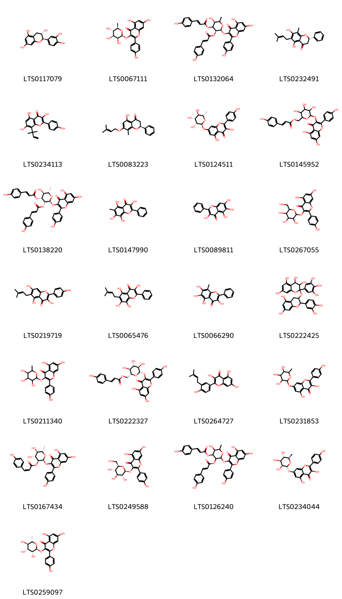
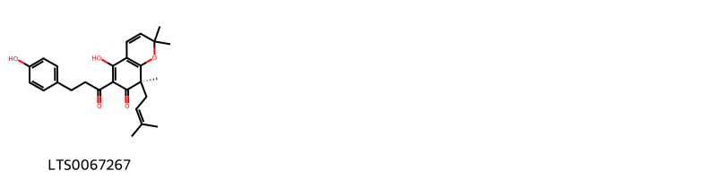
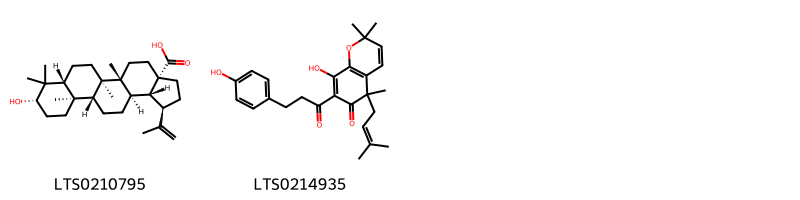
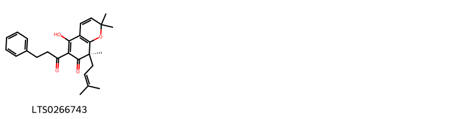
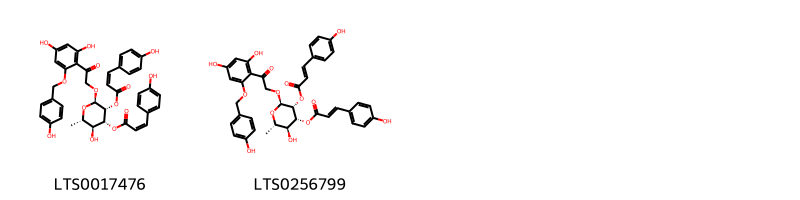
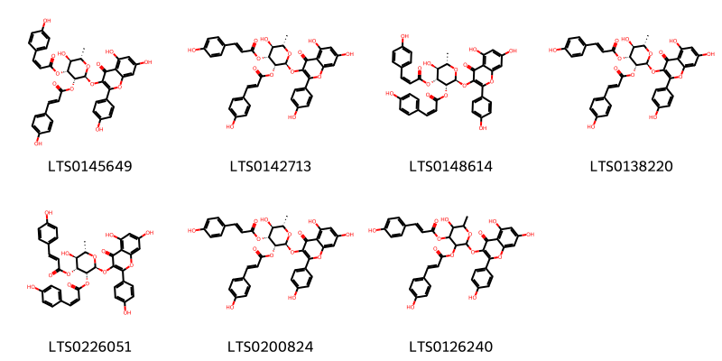
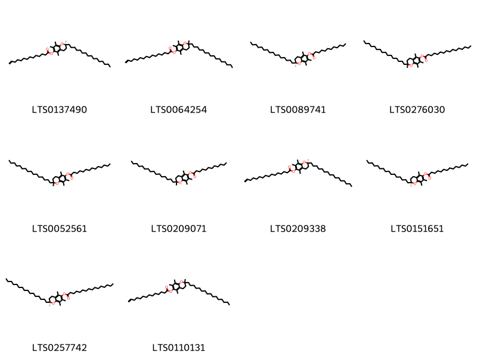
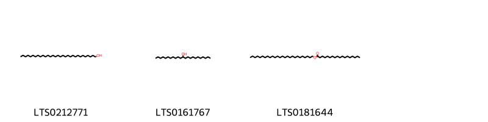
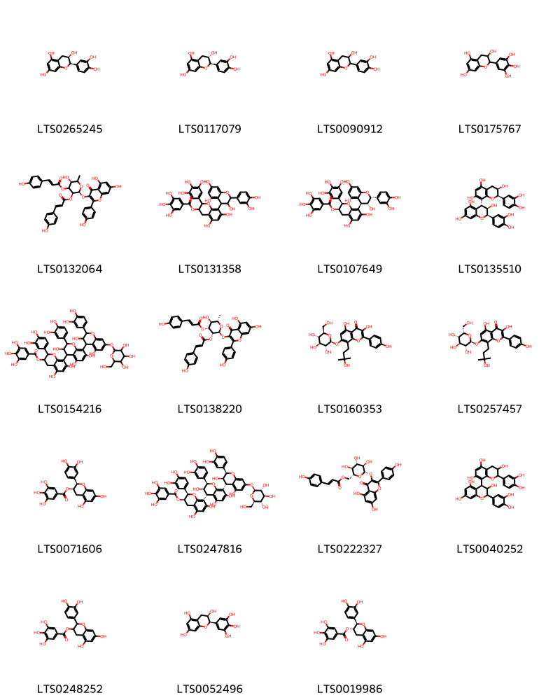

!!! abstract "Tóm tắt"

    Họ Platanaceae gồm khoảng 1 chi và 3 loài được một số cộng đồng tại các quốc gia như Italian, Turkey, Iraq, Mexico(Kickapoo), Portuguese sử dụng trong một số trường hợp MYMEMORY WARNING: YOU USED ALL AVAILABLE FREE TRANSLATIONS FOR TODAY. NEXT AVAILABLE IN  17 HOURS 04 MINUTES 09 SECONDS VISIT HTTPS://MYMEMORY.TRANSLATED.NET/DOC/USAGELIMITS.PHP TO TRANSLATE MORE.

!!! info "DrDuke"

    James A. Duke sinh năm 1929-2017 là một nhà thực vật học người Mỹ. Đây là một trong những tác giả hàng đầu trong lĩnh vực dược dân tộc học với cuốn *CRC Handbook of Medicinal Herbs* và chính là người xây dựng lên cơ sở dữ liệu về hợp chất tự nhiên và dược dân tộc học tại Bộ nông nghiệp Hoa Kỳ. Các thông tin được đăng tải tại website [Dr. Duke's Phytochemical and Ethnobotanical Databases](https://phytochem.nal.usda.gov/). 
    Trong suốt thập niên 1970, ông lãnh đạo the Plant Taxonomy Laboratory, Plant Genetics and Germplasm Institute of the Agricultural Research Service, U.S. Department of Agriculture.
    Trong tài liệu này, các thông tin về dược dân tộc của các dược liệu được trích dẫn từ tài liệu của James A. Ducke với sự trợ giúp của phần mềm dịch thuật từ tiếng Anh sang tiếng Việt.
   

# Chi Platanus

??? note "Danh sách các dược liệu thuộc chi"
    
	 - *Platanus acerifolia*
	 - *Platanus occidentalis*
	 - *Platanus orientalis*

---
## Platanus acerifolia
### Thông tin về thực vật

!!! info "Phân loại thực vật của *Platanus hispanica* từ GIBF:"
    - **Kingdom:** Plantae
    - **Phylum:** Tracheophyta
    - **Order:** Proteales
    - **Family:** Platanaceae
    - **Genus:** Platanus
    - **Species:** *Platanus hispanica*

 

| Label (VI)   | Label (EN)   | Scientific Name   | Descriptions (VI)   | Descriptions (EN)   | Also Known As (VI)   | Also Known As (EN)   |
|:-------------|:-------------|:------------------|:--------------------|:--------------------|:---------------------|:---------------------|
| N/A          | N/A          | Kadsura peltigera |                     |                     | ['']                 | ['']                 |

#### Phân bố trên thế giới

**Từ CSDL GIBF** Colombia, Japan, Brazil, France, Spain, Poland, Germany, Russian Federation, Ecuador, United States of America, Italy, China

#### Phân bố tại Việt Nam

**Từ CSDL GIBF**: Không có ghi nhận ở Việt Nam

---
### Thành phần hóa học
        
- Theo cơ sở dữ liệu lotus: Từ loài *Platanus hispanica* đã phân lập và xác định được 32 hoạt chất thuộc về các nhóm Flavonoids, Coumarins and derivatives, Prenol lipids, Fatty Acyls, Phenols, Pyrans. 

|    | chemicalTaxonomyClassyfireClass   |   smiles_count |
|---:|:----------------------------------|---------------:|
|  0 | Coumarins and derivatives         |              2 |
|  1 | Fatty Acyls                       |              1 |
|  2 | Flavonoids                        |             25 |
|  3 | Phenols                           |              1 |
|  4 | Prenol lipids                     |              2 |
|  5 | Pyrans                            |              1 |

#### Nhóm Coumarins and derivatives
<figure markdown="span">
    { width=100% }
    <figcaption>Hình ảnh cấu trúc hóa học của 2 hoạt chất thuộc nhóm Coumarins and derivatives gồm ['umbelliferone (LTS0162728)', 'scopoletin (LTS0193112)'].</figcaption>
</figure>
#### Nhóm Fatty Acyls
<figure markdown="span">
    { width=100% }
    <figcaption>Hình ảnh cấu trúc hóa học của 1 hoạt chất thuộc nhóm Fatty Acyls gồm ['2-carboxy-d-arabinitol (LTS0056947)'].</figcaption>
</figure>
#### Nhóm Flavonoids
<figure markdown="span">
    { width=100% }
    <figcaption>Hình ảnh cấu trúc hóa học của 25 hoạt chất thuộc nhóm Flavonoids gồm ['(+)-catechol (LTS0117079)', '5,7-dihydroxy-2-(4-hydroxyphenyl)-3-{[(2s,3s,4s,5s,6r)-3,4,5-trihydroxy-6-methyloxan-2-yl]oxy}chromen-4-one (LTS0067111)', 'platanoside (LTS0132064)', '(2s)-5,7-dihydroxy-8-methyl-6-(3-methylbut-2-en-1-yl)-2-phenyl-2,3-dihydro-1-benzopyran-4-one (LTS0232491)', '3,5,7-trihydroxy-2-(4-hydroxyphenyl)-8-(2-methylbut-3-en-2-yl)chromen-4-one (LTS0234113)', '(2s)-5-hydroxy-8-methyl-7-[(3-methylbut-2-en-1-yl)oxy]-2-phenyl-2,3-dihydro-1-benzopyran-4-one (LTS0083223)', 'kaempferol-7-rhamnoside (LTS0124511)', '(6-{[5,7-dihydroxy-2-(4-hydroxyphenyl)-4-oxochromen-3-yl]oxy}-3,4,5-trihydroxyoxan-2-yl)methyl 3-(4-hydroxyphenyl)prop-2-enoate (LTS0145952)', '(2s,3r,4r,5s,6s)-2-{[5,7-dihydroxy-2-(4-hydroxyphenyl)-4-oxochromen-3-yl]oxy}-5-hydroxy-4-{[(2e)-3-(4-hydroxyphenyl)prop-2-enoyl]oxy}-6-methyloxan-3-yl (2e)-3-(4-hydroxyphenyl)prop-2-enoate (LTS0138220)', 'platanin (LTS0147990)', '6-hydroxygalangin (LTS0089811)', 'trifolin (LTS0267055)', 'licoflavonol (LTS0219719)', 'platanetin (LTS0065476)', 'isoplatanin (LTS0066290)', '2-{[2-(3,4-dihydroxyphenyl)-5,7-dihydroxy-3,4-dihydro-2h-1-benzopyran-3-yl]oxy}-2-(3,4,5-trihydroxyphenyl)-3,4-dihydro-1-benzopyran-3,4,5,7-tetrol (LTS0222425)', '5,7-dihydroxy-2-(4-hydroxyphenyl)-3-[(3,4,5-trihydroxy-6-methyloxan-2-yl)oxy]chromen-4-one (LTS0211340)', 'tiliroside (LTS0222327)', 'isolicoflavonol (LTS0264727)', '3,5-dihydroxy-2-(4-hydroxyphenyl)-7-[(3,4,5-trihydroxy-6-methyloxan-2-yl)oxy]chromen-4-one (LTS0231853)', '(2s,3s,4r,5r,6s)-2-{[5,7-dihydroxy-2-(4-hydroxyphenyl)-4-oxochromen-3-yl]oxy}-4,5-dihydroxy-6-methyloxan-3-yl (2z)-3-(4-hydroxyphenyl)prop-2-enoate (LTS0167434)', 'astragalin (LTS0249588)', '2-{[5,7-dihydroxy-2-(4-hydroxyphenyl)-4-oxochromen-3-yl]oxy}-5-hydroxy-4-{[3-(4-hydroxyphenyl)prop-2-enoyl]oxy}-6-methyloxan-3-yl 3-(4-hydroxyphenyl)prop-2-enoate (LTS0126240)', '3,5-dihydroxy-2-(4-hydroxyphenyl)-7-{[(2r,3s,4s,5s,6r)-3,4,5-trihydroxy-6-methyloxan-2-yl]oxy}chromen-4-one (LTS0234044)', 'afzelin (LTS0259097)'].</figcaption>
</figure>
#### Nhóm Phenols
<figure markdown="span">
    { width=100% }
    <figcaption>Hình ảnh cấu trúc hóa học của 1 hoạt chất thuộc nhóm Phenols gồm ['(8r)-5-hydroxy-6-[3-(4-hydroxyphenyl)propanoyl]-2,2,8-trimethyl-8-(3-methylbut-2-en-1-yl)chromen-7-one (LTS0067267)'].</figcaption>
</figure>
#### Nhóm Prenol lipids
<figure markdown="span">
    { width=100% }
    <figcaption>Hình ảnh cấu trúc hóa học của 2 hoạt chất thuộc nhóm Prenol lipids gồm ['betulinic acid (LTS0210795)', '8-hydroxy-7-[3-(4-hydroxyphenyl)propanoyl]-2,2,5-trimethyl-5-(3-methylbut-2-en-1-yl)chromen-6-one (LTS0214935)'].</figcaption>
</figure>
#### Nhóm Pyrans
<figure markdown="span">
    { width=100% }
    <figcaption>Hình ảnh cấu trúc hóa học của 1 hoạt chất thuộc nhóm Pyrans gồm ['(8r)-5-hydroxy-2,2,8-trimethyl-8-(3-methylbut-2-en-1-yl)-6-(3-phenylpropanoyl)chromen-7-one (LTS0266743)'].</figcaption>
</figure>

---

### Dược dân tộc học

Danh sách các quốc gia có sử dụng *Platanus hispanica* trong điều trị các bệnh. 

| Country    | Disease   | Bệnh                                                                                                                                                                                                |
|:-----------|:----------|:----------------------------------------------------------------------------------------------------------------------------------------------------------------------------------------------------|
| Portuguese | Tonic     | MYMEMORY WARNING: YOU USED ALL AVAILABLE FREE TRANSLATIONS FOR TODAY. NEXT AVAILABLE IN  17 HOURS 04 MINUTES 06 SECONDS VISIT HTTPS://MYMEMORY.TRANSLATED.NET/DOC/USAGELIMITS.PHP TO TRANSLATE MORE |

---

---
## Platanus occidentalis
### Thông tin về thực vật

!!! info "Phân loại thực vật của *Platanus occidentalis* từ GIBF:"
    - **Kingdom:** Plantae
    - **Phylum:** Tracheophyta
    - **Order:** Proteales
    - **Family:** Platanaceae
    - **Genus:** Platanus
    - **Species:** *Platanus occidentalis*

 

| Label (VI)   | Label (EN)   | Scientific Name       | Descriptions (VI)   | Descriptions (EN)   | Also Known As (VI)   | Also Known As (EN)                                                            |
|:-------------|:-------------|:----------------------|:--------------------|:--------------------|:---------------------|:------------------------------------------------------------------------------|
| N/A          | N/A          | Platanus occidentalis |                     | species of plant    | ['']                 | ['American sycamore', 'American planetree', 'buttonwood', 'occidental plane'] |

#### Phân bố trên thế giới

**Từ CSDL GIBF** Canada, United States of America, Korea, Republic of

#### Phân bố tại Việt Nam

**Từ CSDL GIBF**: Không có ghi nhận ở Việt Nam

---
### Thành phần hóa học
        
- Theo cơ sở dữ liệu lotus: Từ loài *Platanus occidentalis* đã phân lập và xác định được 9 hoạt chất thuộc về các nhóm Flavonoids, Cinnamic acids and derivatives. 

|    | chemicalTaxonomyClassyfireClass   |   smiles_count |
|---:|:----------------------------------|---------------:|
|  0 | Cinnamic acids and derivatives    |              2 |
|  1 | Flavonoids                        |              7 |

#### Nhóm Cinnamic acids and derivatives
<figure markdown="span">
    { width=100% }
    <figcaption>Hình ảnh cấu trúc hóa học của 2 hoạt chất thuộc nhóm Cinnamic acids and derivatives gồm ['(2r,3r,4r,5s,6s)-2-(2-{2,4-dihydroxy-6-[(4-hydroxyphenyl)methoxy]phenyl}-2-oxoethoxy)-5-hydroxy-4-{[(2z)-3-(4-hydroxyphenyl)prop-2-enoyl]oxy}-6-methyloxan-3-yl (2z)-3-(4-hydroxyphenyl)prop-2-enoate (LTS0017476)', '(2r,3r,4r,5s,6s)-2-(2-{2,4-dihydroxy-6-[(4-hydroxyphenyl)methoxy]phenyl}-2-oxoethoxy)-5-hydroxy-4-{[3-(4-hydroxyphenyl)prop-2-enoyl]oxy}-6-methyloxan-3-yl 3-(4-hydroxyphenyl)prop-2-enoate (LTS0256799)'].</figcaption>
</figure>
#### Nhóm Flavonoids
<figure markdown="span">
    { width=100% }
    <figcaption>Hình ảnh cấu trúc hóa học của 7 hoạt chất thuộc nhóm Flavonoids gồm ['(2s,3r,4r,5s,6s)-2-{[5,7-dihydroxy-2-(4-hydroxyphenyl)-4-oxochromen-3-yl]oxy}-5-hydroxy-4-{[(2z)-3-(4-hydroxyphenyl)prop-2-enoyl]oxy}-6-methyloxan-3-yl (2e)-3-(4-hydroxyphenyl)prop-2-enoate (LTS0145649)', '(2s,3r,4r,5s,6s)-2-{[5,7-dihydroxy-2-(4-hydroxyphenyl)-4-oxochromen-3-yl]oxy}-5-hydroxy-4-{[(2e)-3-(4-hydroxyphenyl)prop-2-enoyl]oxy}-6-methyloxan-3-yl 3-(4-hydroxyphenyl)prop-2-enoate (LTS0142713)', '(2s,3r,4r,5s,6s)-2-{[5,7-dihydroxy-2-(4-hydroxyphenyl)-4-oxochromen-3-yl]oxy}-5-hydroxy-4-{[(2z)-3-(4-hydroxyphenyl)prop-2-enoyl]oxy}-6-methyloxan-3-yl (2z)-3-(4-hydroxyphenyl)prop-2-enoate (LTS0148614)', '(2s,3r,4r,5s,6s)-2-{[5,7-dihydroxy-2-(4-hydroxyphenyl)-4-oxochromen-3-yl]oxy}-5-hydroxy-4-{[(2e)-3-(4-hydroxyphenyl)prop-2-enoyl]oxy}-6-methyloxan-3-yl (2e)-3-(4-hydroxyphenyl)prop-2-enoate (LTS0138220)', '(2s,3r,4r,5s,6s)-2-{[5,7-dihydroxy-2-(4-hydroxyphenyl)-4-oxochromen-3-yl]oxy}-5-hydroxy-4-{[(2e)-3-(4-hydroxyphenyl)prop-2-enoyl]oxy}-6-methyloxan-3-yl (2z)-3-(4-hydroxyphenyl)prop-2-enoate (LTS0226051)', '(2s,3r,4r,5s,6s)-2-{[5,7-dihydroxy-2-(4-hydroxyphenyl)-4-oxochromen-3-yl]oxy}-5-hydroxy-4-{[3-(4-hydroxyphenyl)prop-2-enoyl]oxy}-6-methyloxan-3-yl (2e)-3-(4-hydroxyphenyl)prop-2-enoate (LTS0200824)', '2-{[5,7-dihydroxy-2-(4-hydroxyphenyl)-4-oxochromen-3-yl]oxy}-5-hydroxy-4-{[3-(4-hydroxyphenyl)prop-2-enoyl]oxy}-6-methyloxan-3-yl 3-(4-hydroxyphenyl)prop-2-enoate (LTS0126240)'].</figcaption>
</figure>

---

### Dược dân tộc học

Danh sách các quốc gia có sử dụng *Platanus occidentalis* trong điều trị các bệnh. 

| Country          | Disease     | Bệnh                                                                                                                                                                                                |
|:-----------------|:------------|:----------------------------------------------------------------------------------------------------------------------------------------------------------------------------------------------------|
| Italian          | Tonic       | MYMEMORY WARNING: YOU USED ALL AVAILABLE FREE TRANSLATIONS FOR TODAY. NEXT AVAILABLE IN  17 HOURS 03 MINUTES 19 SECONDS VISIT HTTPS://MYMEMORY.TRANSLATED.NET/DOC/USAGELIMITS.PHP TO TRANSLATE MORE |
| Mexico(Kickapoo) | Emmenagogue | MYMEMORY WARNING: YOU USED ALL AVAILABLE FREE TRANSLATIONS FOR TODAY. NEXT AVAILABLE IN  17 HOURS 03 MINUTES 16 SECONDS VISIT HTTPS://MYMEMORY.TRANSLATED.NET/DOC/USAGELIMITS.PHP TO TRANSLATE MORE |

---

---
## Platanus orientalis
### Thông tin về thực vật

!!! info "Phân loại thực vật của *Platanus orientalis* từ GIBF:"
    - **Kingdom:** Plantae
    - **Phylum:** Tracheophyta
    - **Order:** Proteales
    - **Family:** Platanaceae
    - **Genus:** Platanus
    - **Species:** *Platanus orientalis*

 

| Label (VI)   | Label (EN)   | Scientific Name     | Descriptions (VI)   | Descriptions (EN)   | Also Known As (VI)   | Also Known As (EN)           |
|:-------------|:-------------|:--------------------|:--------------------|:--------------------|:---------------------|:-----------------------------|
| N/A          | N/A          | Platanus orientalis | loài thực vật       | species of plant    | ['']                 | ['Chinar', 'Oriental Plane'] |

#### Phân bố trên thế giới

**Từ CSDL GIBF** Georgia, Spain, Azerbaijan, Austria, Albania, Pakistan, Uzbekistan, Poland, India, Montenegro, Iraq, Belgium, Netherlands, Türkiye, North Macedonia, Japan, Brazil, Lebanon, Bulgaria, China, Ireland, Switzerland, United Kingdom of Great Britain and Northern Ireland, Iran (Islamic Republic of), South Africa, France, Syrian Arab Republic, Tajikistan, New Zealand, Cyprus, Russian Federation, Italy, Israel, Greece, Croatia, Ukraine

#### Phân bố tại Việt Nam

**Từ CSDL GIBF**: Không có ghi nhận ở Việt Nam

---
### Thành phần hóa học
        
- Theo cơ sở dữ liệu lotus: Từ loài *Platanus orientalis* đã phân lập và xác định được 35 hoạt chất thuộc về các nhóm Organooxygen compounds, Benzopyrans, Flavonoids, Saturated hydrocarbons, Fatty Acyls, Cinnamic acids and derivatives. 

|    | chemicalTaxonomyClassyfireClass   |   smiles_count |
|---:|:----------------------------------|---------------:|
|  0 | Benzopyrans                       |             10 |
|  1 | Cinnamic acids and derivatives    |              1 |
|  2 | Fatty Acyls                       |              3 |
|  3 | Flavonoids                        |             19 |
|  4 | Organooxygen compounds            |              1 |
|  5 | Saturated hydrocarbons            |              1 |

#### Nhóm Benzopyrans
<figure markdown="span">
    { width=100% }
    <figcaption>Hình ảnh cấu trúc hóa học của 10 hoạt chất thuộc nhóm Benzopyrans gồm ['(2s)-2-hexadecyl-2,5,7,8-tetramethyl-3,4-dihydro-1-benzopyran-6-yl tetradec-13-enoate (LTS0137490)', '2-hexadecyl-2,5,7,8-tetramethyl-3,4-dihydro-1-benzopyran-6-yl hexadec-15-enoate (LTS0064254)', '(2s)-2-hexadecyl-2,5,7,8-tetramethyl-3,4-dihydro-1-benzopyran-6-yl dodecanoate (LTS0089741)', '2-hexadecyl-2,5,7,8-tetramethyl-3,4-dihydro-1-benzopyran-6-yl hexadecanoate (LTS0276030)', '2-hexadecyl-2,5,7,8-tetramethyl-3,4-dihydro-1-benzopyran-6-yl tetradecanoate (LTS0052561)', '2-hexadecyl-2,5,7,8-tetramethyl-3,4-dihydro-1-benzopyran-6-yl dodecanoate (LTS0209071)', '(2s)-2-hexadecyl-2,5,7,8-tetramethyl-3,4-dihydro-1-benzopyran-6-yl hexadec-15-enoate (LTS0209338)', '(2s)-2-hexadecyl-2,5,7,8-tetramethyl-3,4-dihydro-1-benzopyran-6-yl tetradecanoate (LTS0151651)', '(2s)-2-hexadecyl-2,5,7,8-tetramethyl-3,4-dihydro-1-benzopyran-6-yl hexadecanoate (LTS0257742)', '2-hexadecyl-2,5,7,8-tetramethyl-3,4-dihydro-1-benzopyran-6-yl tetradec-13-enoate (LTS0110131)'].</figcaption>
</figure>
#### Nhóm Cinnamic acids and derivatives
<figure markdown="span">
    { width=100% }
    <figcaption>Hình ảnh cấu trúc hóa học của 1 hoạt chất thuộc nhóm Cinnamic acids and derivatives gồm ['3,4-dihydroxycinnamic acid (LTS0128050)'].</figcaption>
</figure>
#### Nhóm Fatty Acyls
<figure markdown="span">
    { width=100% }
    <figcaption>Hình ảnh cấu trúc hóa học của 3 hoạt chất thuộc nhóm Fatty Acyls gồm ['n-hentriacontanol (LTS0212771)', 'tricosan-12-ol (LTS0161767)', 'hexacosyl octadecanoate (LTS0181644)'].</figcaption>
</figure>
#### Nhóm Flavonoids
<figure markdown="span">
    { width=100% }
    <figcaption>Hình ảnh cấu trúc hóa học của 19 hoạt chất thuộc nhóm Flavonoids gồm ['ent-epicatechin (LTS0265245)', '(+)-catechol (LTS0117079)', 'catechol (LTS0090912)', 'epigallocatechin (LTS0175767)', 'platanoside (LTS0132064)', '8-[2-(3,4-dihydroxyphenyl)-3,5,7-trihydroxy-3,4-dihydro-2h-1-benzopyran-4-yl]-5,7-dihydroxy-2-(3,4,5-trihydroxyphenyl)-3,4-dihydro-2h-1-benzopyran-3-yl 3,4,5-trihydroxybenzoate (LTS0131358)', '(2r,3r)-8-[(2r,3r,4r)-2-(3,4-dihydroxyphenyl)-3,5,7-trihydroxy-3,4-dihydro-2h-1-benzopyran-4-yl]-5,7-dihydroxy-2-(3,4,5-trihydroxyphenyl)-3,4-dihydro-2h-1-benzopyran-3-yl 3,4,5-trihydroxybenzoate (LTS0107649)', '(2r,3r,4r)-2-(3,4-dihydroxyphenyl)-4-[(2r,3r)-2-(3,4-dihydroxyphenyl)-3,5,7-trihydroxy-3,4-dihydro-2h-1-benzopyran-8-yl]-3,4-dihydro-2h-1-benzopyran-3,5,7-triol (LTS0135510)', '2-(3,4-dihydroxyphenyl)-8-[2-(3,4-dihydroxyphenyl)-8-[2-(3,4-dihydroxyphenyl)-3,5-dihydroxy-7-{[3,4,5-trihydroxy-6-(hydroxymethyl)oxan-2-yl]oxy}-3,4-dihydro-2h-1-benzopyran-4-yl]-3,5,7-trihydroxy-3,4-dihydro-2h-1-benzopyran-4-yl]-5,7-dihydroxy-3,4-dihydro-2h-1-benzopyran-3-yl 3,4,5-trihydroxybenzoate (LTS0154216)', '(2s,3r,4r,5s,6s)-2-{[5,7-dihydroxy-2-(4-hydroxyphenyl)-4-oxochromen-3-yl]oxy}-5-hydroxy-4-{[(2e)-3-(4-hydroxyphenyl)prop-2-enoyl]oxy}-6-methyloxan-3-yl (2e)-3-(4-hydroxyphenyl)prop-2-enoate (LTS0138220)', 'amurensin (flavonol) (LTS0160353)', '3,5-dihydroxy-8-(3-hydroxy-3-methylbutyl)-2-(4-hydroxyphenyl)-7-{[(2s,3r,4s,5s,6s)-3,4,5-trihydroxy-6-(hydroxymethyl)oxan-2-yl]oxy}chromen-4-one (LTS0257457)', 'epicatechin gallate (LTS0071606)', '(2r,3r)-2-(3,4-dihydroxyphenyl)-8-[(2r,3r,4s)-2-(3,4-dihydroxyphenyl)-8-[(2r,3r,4r)-2-(3,4-dihydroxyphenyl)-3,5-dihydroxy-7-{[(2s,3r,4s,5s,6r)-3,4,5-trihydroxy-6-(hydroxymethyl)oxan-2-yl]oxy}-3,4-dihydro-2h-1-benzopyran-4-yl]-3,5,7-trihydroxy-3,4-dihydro-2h-1-benzopyran-4-yl]-5,7-dihydroxy-3,4-dihydro-2h-1-benzopyran-3-yl 3,4,5-trihydroxybenzoate (LTS0247816)', 'tiliroside (LTS0222327)', '2-(3,4-dihydroxyphenyl)-4-[2-(3,4-dihydroxyphenyl)-3,5,7-trihydroxy-3,4-dihydro-2h-1-benzopyran-8-yl]-3,4-dihydro-2h-1-benzopyran-3,5,7-triol (LTS0040252)', '2-(3,4-dihydroxyphenyl)-5,7-dihydroxy-3,4-dihydro-2h-1-benzopyran-3-yl 3,4,5-trihydroxybenzoate (LTS0248252)', 'epigallocatechin (LTS0052496)', 'catechin 3-o-gallate (LTS0019986)'].</figcaption>
</figure>
#### Nhóm Organooxygen compounds
<figure markdown="span">
    { width=100% }
    <figcaption>Hình ảnh cấu trúc hóa học của 1 hoạt chất thuộc nhóm Organooxygen compounds gồm ['palmitone (LTS0070345)'].</figcaption>
</figure>
#### Nhóm Saturated hydrocarbons
<figure markdown="span">
    { width=100% }
    <figcaption>Hình ảnh cấu trúc hóa học của 1 hoạt chất thuộc nhóm Saturated hydrocarbons gồm ['hentriacontane (LTS0046415)'].</figcaption>
</figure>

---

### Dược dân tộc học

Danh sách các quốc gia có sử dụng *Platanus orientalis* trong điều trị các bệnh. 

| Country   | Disease   | Bệnh                                                                                                                                                                                                |
|:----------|:----------|:----------------------------------------------------------------------------------------------------------------------------------------------------------------------------------------------------|
| Iraq      | Tonic     | MYMEMORY WARNING: YOU USED ALL AVAILABLE FREE TRANSLATIONS FOR TODAY. NEXT AVAILABLE IN  17 HOURS 02 MINUTES 48 SECONDS VISIT HTTPS://MYMEMORY.TRANSLATED.NET/DOC/USAGELIMITS.PHP TO TRANSLATE MORE |
| Turkey    | Tonic     | MYMEMORY WARNING: YOU USED ALL AVAILABLE FREE TRANSLATIONS FOR TODAY. NEXT AVAILABLE IN  17 HOURS 02 MINUTES 46 SECONDS VISIT HTTPS://MYMEMORY.TRANSLATED.NET/DOC/USAGELIMITS.PHP TO TRANSLATE MORE |

---

