!!! abstract "Tóm tắt"

    Họ Plumbaginaceae gồm khoảng 4 chi và 12 loài được một số cộng đồng tại các quốc gia như Turkey, Africa, Ghana, Japan, India(Ayurvedic), US, Tanzania, Dutch, Mexico, Dominican Republic, W Africa, anish, Europe, Nigeria, Haiti, English, Sudan, Elsewhere, India, Java, Venezuela, Mediterranean, Paraguay, Malaysia sử dụng trong một số trường hợp QUERY LENGTH LIMIT EXCEEDED. MAX ALLOWED QUERY : 500 CHARS.

!!! info "DrDuke"

    James A. Duke sinh năm 1929-2017 là một nhà thực vật học người Mỹ. Đây là một trong những tác giả hàng đầu trong lĩnh vực dược dân tộc học với cuốn *CRC Handbook of Medicinal Herbs* và chính là người xây dựng lên cơ sở dữ liệu về hợp chất tự nhiên và dược dân tộc học tại Bộ nông nghiệp Hoa Kỳ. Các thông tin được đăng tải tại website [Dr. Duke's Phytochemical and Ethnobotanical Databases](https://phytochem.nal.usda.gov/). 
    Trong suốt thập niên 1970, ông lãnh đạo the Plant Taxonomy Laboratory, Plant Genetics and Germplasm Institute of the Agricultural Research Service, U.S. Department of Agriculture.
    Trong tài liệu này, các thông tin về dược dân tộc của các dược liệu được trích dẫn từ tài liệu của James A. Ducke với sự trợ giúp của phần mềm dịch thuật từ tiếng Anh sang tiếng Việt.
   

# Chi Plumbago

??? note "Danh sách các dược liệu thuộc chi"
    
	 - *Plumbago auriculata*
	 - *Plumbago europaea*
	 - *Plumbago indica*
	 - *Plumbago pulchella*
	 - *Plumbago rosea*
	 - *Plumbago scandens*
	 - *Plumbago zeylanica*

---
## Plumbago auriculata
### Thông tin về thực vật

!!! info "Phân loại thực vật của *Plumbago auriculata* từ GIBF:"
    - **Kingdom:** Plantae
    - **Phylum:** Tracheophyta
    - **Order:** Caryophyllales
    - **Family:** Plumbaginaceae
    - **Genus:** Plumbago
    - **Species:** *Plumbago auriculata*

 

| Label (VI)   | Label (EN)   | Scientific Name     | Descriptions (VI)   | Descriptions (EN)   | Also Known As (VI)   | Also Known As (EN)   |
|:-------------|:-------------|:--------------------|:--------------------|:--------------------|:---------------------|:---------------------|
| N/A          | N/A          | Plumbago auriculata | loài thực vật       | species of plant    | ['']                 | ['cape leadwort']    |

#### Phân bố trên thế giới

**Từ CSDL GIBF** Virgin Islands (U.S.), nan, Sri Lanka, Australia, Japan, Argentina, Philippines, Jordan, Puerto Rico, Senegal, Spain, Türkiye, Portugal, Jamaica, United States of America, Chile, Greece, South Africa, Hong Kong, Thailand, Martinique, Brazil, Egypt, Bahamas, Peru, Mexico, Dominican Republic, Singapore, China, Ecuador, Colombia, Costa Rica, India, Kenya, Malaysia, New Zealand

#### Phân bố tại Việt Nam

**Từ CSDL GIBF**: Không có ghi nhận ở Việt Nam

---
### Thành phần hóa học
        
- Theo cơ sở dữ liệu lotus: Từ loài *Plumbago auriculata* đã phân lập và xác định được 10 hoạt chất thuộc về các nhóm Naphthalenes, Tetralins, Benzene and substituted derivatives. 

|    | chemicalTaxonomyClassyfireClass     |   smiles_count |
|---:|:------------------------------------|---------------:|
|  0 |                                     |              1 |
|  1 | Benzene and substituted derivatives |              1 |
|  2 | Naphthalenes                        |              4 |
|  3 | Tetralins                           |              4 |

#### Nhóm 
<figure markdown="span">
    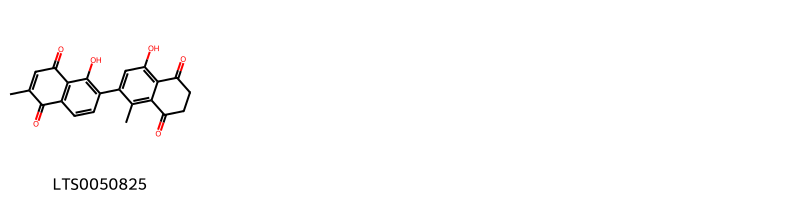{ width=100% }
    <figcaption>Hình ảnh cấu trúc hóa học của 1 hoạt chất thuộc nhóm  gồm ["1',4-dihydroxy-1,6'-dimethyl-6,7-dihydro-[2,2'-binaphthalene]-5,5',8,8'-tetrone (LTS0050825)"].</figcaption>
</figure>
#### Nhóm Benzene and substituted derivatives
<figure markdown="span">
    { width=100% }
    <figcaption>Hình ảnh cấu trúc hóa học của 1 hoạt chất thuộc nhóm Benzene and substituted derivatives gồm ['maritinone (LTS0126003)'].</figcaption>
</figure>
#### Nhóm Naphthalenes
<figure markdown="span">
    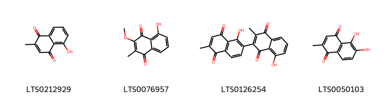{ width=100% }
    <figcaption>Hình ảnh cấu trúc hóa học của 4 hoạt chất thuộc nhóm Naphthalenes gồm ['plumbagin (LTS0212929)', '5-hydroxy-3-methoxy-2-methylnaphthalene-1,4-dione (LTS0076957)', "1',8-dihydroxy-3,6'-dimethyl-[2,2'-binaphthalene]-1,4,5',8'-tetrone (LTS0126254)", '5,6-dihydroxy-2-methylnaphthalene-1,4-dione (LTS0050103)'].</figcaption>
</figure>
#### Nhóm Tetralins
<figure markdown="span">
    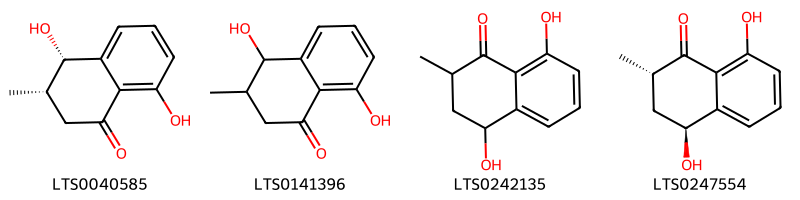{ width=100% }
    <figcaption>Hình ảnh cấu trúc hóa học của 4 hoạt chất thuộc nhóm Tetralins gồm ['(3s,4s)-4,8-dihydroxy-3-methyl-3,4-dihydro-2h-naphthalen-1-one (LTS0040585)', '4,8-dihydroxy-3-methyl-3,4-dihydro-2h-naphthalen-1-one (LTS0141396)', '4,8-dihydroxy-2-methyl-3,4-dihydro-2h-naphthalen-1-one (LTS0242135)', '(2s,4s)-4,8-dihydroxy-2-methyl-3,4-dihydro-2h-naphthalen-1-one (LTS0247554)'].</figcaption>
</figure>

---

### Dược dân tộc học

Danh sách các quốc gia có sử dụng *Plumbago auriculata* trong điều trị các bệnh. 

| Country   | Disease         | Bệnh            |
|:----------|:----------------|:----------------|
| Africa    | Poison          | Chất độc        |
| Elsewhere | Emetic, Styptic | Emetic, Styptic |

---

---
## Plumbago europaea
### Thông tin về thực vật

!!! info "Phân loại thực vật của *Plumbago europaea* từ GIBF:"
    - **Kingdom:** Plantae
    - **Phylum:** Tracheophyta
    - **Order:** Caryophyllales
    - **Family:** Plumbaginaceae
    - **Genus:** Plumbago
    - **Species:** *Plumbago europaea*

 

| Label (VI)   | Label (EN)   | Scientific Name   | Descriptions (VI)   | Descriptions (EN)   | Also Known As (VI)   | Also Known As (EN)   |
|:-------------|:-------------|:------------------|:--------------------|:--------------------|:---------------------|:---------------------|
| N/A          | N/A          | Plumbago europaea |                     | species of plant    | ['']                 | ['']                 |

#### Phân bố trên thế giới

**Từ CSDL GIBF** Italy, Bulgaria, Georgia, Palestine, State of, Israel, Cyprus, Spain, Türkiye, Portugal, Algeria, Albania, Morocco, Bosnia and Herzegovina, Croatia, Greece, Montenegro, North Macedonia, Armenia, France, Syrian Arab Republic, Iraq, Serbia

#### Phân bố tại Việt Nam

**Từ CSDL GIBF**: Không có ghi nhận ở Việt Nam

---
### Thành phần hóa học
        
- Theo cơ sở dữ liệu lotus: Từ loài *Plumbago europaea* đã phân lập và xác định được 5 hoạt chất thuộc về các nhóm Naphthalenes, Flavonoids, Organooxygen compounds. 

|    | chemicalTaxonomyClassyfireClass   |   smiles_count |
|---:|:----------------------------------|---------------:|
|  0 | Flavonoids                        |              2 |
|  1 | Naphthalenes                      |              1 |
|  2 | Organooxygen compounds            |              2 |

#### Nhóm Flavonoids
<figure markdown="span">
    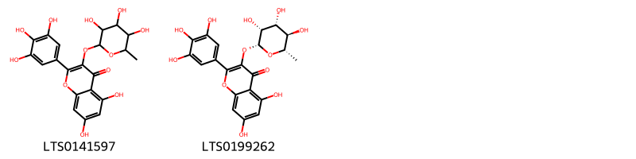{ width=100% }
    <figcaption>Hình ảnh cấu trúc hóa học của 2 hoạt chất thuộc nhóm Flavonoids gồm ['myricitrin (LTS0141597)', '5,7-dihydroxy-3-{[(2r,3r,4r,5r,6s)-3,4,5-trihydroxy-6-methyloxan-2-yl]oxy}-2-(3,4,5-trihydroxyphenyl)chromen-4-one (LTS0199262)'].</figcaption>
</figure>
#### Nhóm Naphthalenes
<figure markdown="span">
    { width=100% }
    <figcaption>Hình ảnh cấu trúc hóa học của 1 hoạt chất thuộc nhóm Naphthalenes gồm ['plumbagin (LTS0212929)'].</figcaption>
</figure>
#### Nhóm Organooxygen compounds
<figure markdown="span">
    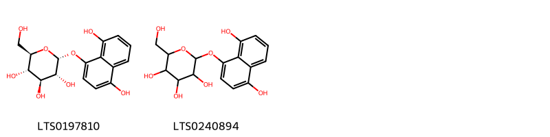{ width=100% }
    <figcaption>Hình ảnh cấu trúc hóa học của 2 hoạt chất thuộc nhóm Organooxygen compounds gồm ['(2r,3r,4s,5s,6r)-2-[(4,8-dihydroxynaphthalen-1-yl)oxy]-6-(hydroxymethyl)oxane-3,4,5-triol (LTS0197810)', '2-[(4,8-dihydroxynaphthalen-1-yl)oxy]-6-(hydroxymethyl)oxane-3,4,5-triol (LTS0240894)'].</figcaption>
</figure>

---

### Dược dân tộc học

Danh sách các quốc gia có sử dụng *Plumbago europaea* trong điều trị các bệnh. 

| Country       | Disease                                           | Bệnh                                              |
|:--------------|:--------------------------------------------------|:--------------------------------------------------|
| Europe        | Emetic, Rubefacient, Vesicant, Sialogogue, Poison | Emetic, Rubefacient, Vesicant, Sialogogue, Poison |
| Mediterranean | Emetic, Cathartic, Sialogogue                     | Emetic, Cathartic, Sialogogue                     |

---

---
## Plumbago indica
### Thông tin về thực vật

!!! info "Phân loại thực vật của *Plumbago indica* từ GIBF:"
    - **Kingdom:** Plantae
    - **Phylum:** Tracheophyta
    - **Order:** Caryophyllales
    - **Family:** Plumbaginaceae
    - **Genus:** Plumbago
    - **Species:** *Plumbago indica*

 

| Label (VI)   | Label (EN)   | Scientific Name   | Descriptions (VI)   | Descriptions (EN)          | Also Known As (VI)   | Also Known As (EN)                                          |
|:-------------|:-------------|:------------------|:--------------------|:---------------------------|:---------------------|:------------------------------------------------------------|
| N/A          | N/A          | Plumbago indica   |                     | species of flowering plant | ['']                 | ['Indian leadwort', 'Scarlet leadwort', 'Whorled plantain'] |

#### Phân bố trên thế giới

**Từ CSDL GIBF** nan, Sri Lanka, Guadeloupe, Lao People’s Democratic Republic, Cambodia, Myanmar, unknown or invalid, Papua New Guinea, Jamaica, Bangladesh, United States of America, Trinidad and Tobago, Fiji, South Africa, Hong Kong, Thailand, Martinique, Switzerland, New Caledonia, Cuba, Mexico, Dominican Republic, France, Singapore, Viet Nam, China, French Polynesia, India, Indonesia, Samoa, Philippines, Brunei Darussalam

#### Phân bố tại Việt Nam

**Từ CSDL GIBF**: Đồng Nai, Ninh Thuận

---
### Thành phần hóa học
        
- Theo cơ sở dữ liệu lotus: Từ loài *Plumbago indica* đã phân lập và xác định được 18 hoạt chất thuộc về các nhóm Naphthalenes, Flavonoids, Steroids and steroid derivatives, Organooxygen compounds, Benzopyrans. 

|    | chemicalTaxonomyClassyfireClass   |   smiles_count |
|---:|:----------------------------------|---------------:|
|  0 | Benzopyrans                       |              1 |
|  1 | Flavonoids                        |              5 |
|  2 | Naphthalenes                      |              4 |
|  3 | Organooxygen compounds            |              3 |
|  4 | Steroids and steroid derivatives  |              5 |

#### Nhóm Benzopyrans
<figure markdown="span">
    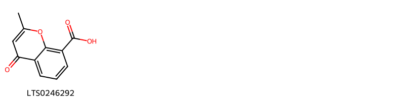{ width=100% }
    <figcaption>Hình ảnh cấu trúc hóa học của 1 hoạt chất thuộc nhóm Benzopyrans gồm ['2-methyl-4-oxochromene-8-carboxylic acid (LTS0246292)'].</figcaption>
</figure>
#### Nhóm Flavonoids
<figure markdown="span">
    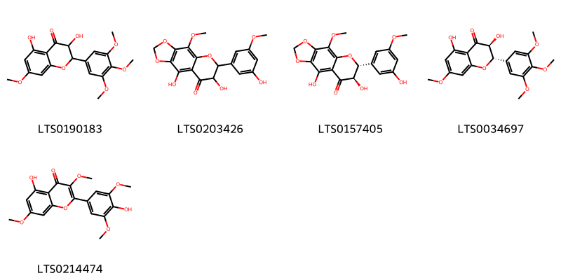{ width=100% }
    <figcaption>Hình ảnh cấu trúc hóa học của 5 hoạt chất thuộc nhóm Flavonoids gồm ['3,5-dihydroxy-7-methoxy-2-(3,4,5-trimethoxyphenyl)-2,3-dihydro-1-benzopyran-4-one (LTS0190183)', '2,12-dihydroxy-11-(3-hydroxy-5-methoxyphenyl)-8-methoxy-4,6,10-trioxatricyclo[7.4.0.0³,⁷]trideca-1,3(7),8-trien-13-one (LTS0203426)', '(11r,12r)-2,12-dihydroxy-11-(3-hydroxy-5-methoxyphenyl)-8-methoxy-4,6,10-trioxatricyclo[7.4.0.0³,⁷]trideca-1,3(7),8-trien-13-one (LTS0157405)', '(2s,3s)-3,5-dihydroxy-7-methoxy-2-(3,4,5-trimethoxyphenyl)-2,3-dihydro-1-benzopyran-4-one (LTS0034697)', '5-hydroxy-2-(4-hydroxy-3,5-dimethoxyphenyl)-3,7-dimethoxychromen-4-one (LTS0214474)'].</figcaption>
</figure>
#### Nhóm Naphthalenes
<figure markdown="span">
    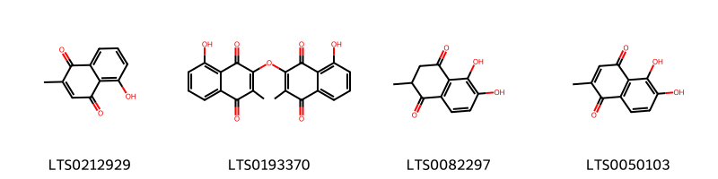{ width=100% }
    <figcaption>Hình ảnh cấu trúc hóa học của 4 hoạt chất thuộc nhóm Naphthalenes gồm ['plumbagin (LTS0212929)', '5-hydroxy-3-[(8-hydroxy-3-methyl-1,4-dioxonaphthalen-2-yl)oxy]-2-methylnaphthalene-1,4-dione (LTS0193370)', '5,6-dihydroxy-2-methyl-2,3-dihydronaphthalene-1,4-dione (LTS0082297)', '5,6-dihydroxy-2-methylnaphthalene-1,4-dione (LTS0050103)'].</figcaption>
</figure>
#### Nhóm Organooxygen compounds
<figure markdown="span">
    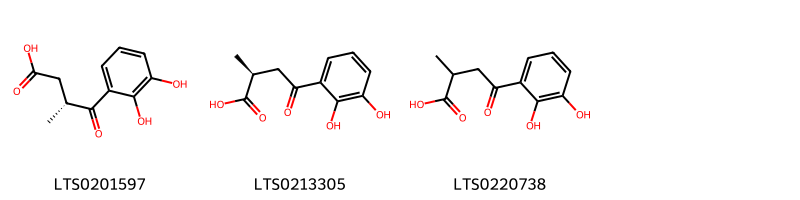{ width=100% }
    <figcaption>Hình ảnh cấu trúc hóa học của 3 hoạt chất thuộc nhóm Organooxygen compounds gồm ['(3r)-4-(2,3-dihydroxyphenyl)-3-methyl-4-oxobutanoic acid (LTS0201597)', '(2s)-4-(2,3-dihydroxyphenyl)-2-methyl-4-oxobutanoic acid (LTS0213305)', '4-(2,3-dihydroxyphenyl)-2-methyl-4-oxobutanoic acid (LTS0220738)'].</figcaption>
</figure>
#### Nhóm Steroids and steroid derivatives
<figure markdown="span">
    { width=100% }
    <figcaption>Hình ảnh cấu trúc hóa học của 5 hoạt chất thuộc nhóm Steroids and steroid derivatives gồm ['stigmast-5-en-3-ol, (3β)- (LTS0204616)', 'stigmast-5-en-3-ol (LTS0071224)', 'phytosterol (LTS0029311)', 'campesterol (LTS0046755)', '(1r,3as,3bs,7s,9bs)-1-[(2r,5r)-5,6-dimethylheptan-2-yl]-9a,11a-dimethyl-1h,2h,3h,3ah,3bh,4h,6h,7h,8h,9h,9bh,10h,11h-cyclopenta[a]phenanthren-7-ol (LTS0057877)'].</figcaption>
</figure>

---

### Dược dân tộc học

Danh sách các quốc gia có sử dụng *Plumbago indica* trong điều trị các bệnh. 

| Country   | Disease                                                                   | Bệnh                                                                        |
|:----------|:--------------------------------------------------------------------------|:----------------------------------------------------------------------------|
| Elsewhere | Antiseptic, Diaphoretic, Diuretic, Narcotic, Apertif, Fungicide, Oxytoxic | Khử trùng, Diaphoretic, lợi tiểu, ma túy, Apertif, thuốc diệt nấm, oxytoxic |

---

---
## Plumbago pulchella
### Thông tin về thực vật

!!! info "Phân loại thực vật của *Plumbago pulchella* từ GIBF:"
    - **Kingdom:** Plantae
    - **Phylum:** Tracheophyta
    - **Order:** Caryophyllales
    - **Family:** Plumbaginaceae
    - **Genus:** Plumbago
    - **Species:** *Plumbago pulchella*

 

| Label (VI)   | Label (EN)   | Scientific Name    | Descriptions (VI)   | Descriptions (EN)   | Also Known As (VI)   | Also Known As (EN)   |
|:-------------|:-------------|:-------------------|:--------------------|:--------------------|:---------------------|:---------------------|
| N/A          | N/A          | Plumbago pulchella | loài thực vật       | species of plant    | ['']                 | ['']                 |

#### Phân bố trên thế giới

**Từ CSDL GIBF** Mexico

#### Phân bố tại Việt Nam

**Từ CSDL GIBF**: Không có ghi nhận ở Việt Nam

---
### Thành phần hóa học
        
- Theo cơ sở dữ liệu lotus: Từ loài *Plumbago pulchella* đã phân lập và xác định được Chưa có hoạt chất nào được phân lập. hoạt chất thuộc về các nhóm Không có hoạt chất nào được phân lập. 

Không có hình ảnh nào được tạo ra

---

### Dược dân tộc học

Danh sách các quốc gia có sử dụng *Plumbago pulchella* trong điều trị các bệnh. 

| Country   | Disease                                                    | Bệnh                                                       |
|:----------|:-----------------------------------------------------------|:-----------------------------------------------------------|
| Mexico    | Emetic, Poison, Rubefacient, Vesicant, Purgative, Vesicant | Emetic, Poison, Rubefacient, Vesicant, Purgative, Vesicant |

---

---
## Plumbago rosea
### Thông tin về thực vật

!!! info "Phân loại thực vật của *Plumbago indica* từ GIBF:"
    - **Kingdom:** Plantae
    - **Phylum:** Tracheophyta
    - **Order:** Caryophyllales
    - **Family:** Plumbaginaceae
    - **Genus:** Plumbago
    - **Species:** *Plumbago indica*

 

| Label (VI)   | Label (EN)   | Scientific Name   | Descriptions (VI)   | Descriptions (EN)   | Also Known As (VI)   | Also Known As (EN)   |
|:-------------|:-------------|:------------------|:--------------------|:--------------------|:---------------------|:---------------------|
| N/A          | N/A          | Plumbago rosea    |                     |                     | ['']                 | ['']                 |

#### Phân bố trên thế giới

**Từ CSDL GIBF** nan, Sri Lanka, South Africa, Lao People’s Democratic Republic, Cambodia, Myanmar, India, Indonesia, Bangladesh, unknown or invalid, China, Mexico, France, Philippines, Singapore, Brunei Darussalam

#### Phân bố tại Việt Nam

**Từ CSDL GIBF**: Không có ghi nhận ở Việt Nam

---
### Thành phần hóa học
        
- Theo cơ sở dữ liệu lotus: Từ loài *Plumbago indica* đã phân lập và xác định được Chưa có hoạt chất nào được phân lập. hoạt chất thuộc về các nhóm Không có hoạt chất nào được phân lập. 

Không có hình ảnh nào được tạo ra

---

### Dược dân tộc học

Danh sách các quốc gia có sử dụng *Plumbago indica* trong điều trị các bệnh. 

| Country   | Disease                                          | Bệnh                                             |
|:----------|:-------------------------------------------------|:-------------------------------------------------|
| India     | Sudorific, Vesicant                              | Làm chết ngạt, gây ra vảy nến                    |
| Turkey    | Apertif, Astringent, Narcotic, Poison, Purgative | Apertif, Astringent, Narcotic, Poison, Purgative |

---

---
## Plumbago scandens
### Thông tin về thực vật

!!! info "Phân loại thực vật của *Plumbago zeylanica* từ GIBF:"
    - **Kingdom:** Plantae
    - **Phylum:** Tracheophyta
    - **Order:** Caryophyllales
    - **Family:** Plumbaginaceae
    - **Genus:** Plumbago
    - **Species:** *Plumbago zeylanica*

 

| Label (VI)   | Label (EN)   | Scientific Name   | Descriptions (VI)   | Descriptions (EN)   | Also Known As (VI)   | Also Known As (EN)   |
|:-------------|:-------------|:------------------|:--------------------|:--------------------|:---------------------|:---------------------|
| N/A          | N/A          | Plumbago scandens | loài thực vật       | species of plant    | ['']                 | ['']                 |

#### Phân bố trên thế giới

**Từ CSDL GIBF** Curaçao, Ecuador, Saint Martin (French part), Puerto Rico, Guadeloupe, Brazil, United States of America, Mexico, Bonaire, Sint Eustatius and Saba, El Salvador

#### Phân bố tại Việt Nam

**Từ CSDL GIBF**: Không có ghi nhận ở Việt Nam

---
### Thành phần hóa học
        
- Theo cơ sở dữ liệu lotus: Từ loài *Plumbago zeylanica* đã phân lập và xác định được 8 hoạt chất thuộc về các nhóm Naphthalenes, Tetralins, Steroids and steroid derivatives. 

|    | chemicalTaxonomyClassyfireClass   |   smiles_count |
|---:|:----------------------------------|---------------:|
|  0 | Naphthalenes                      |              1 |
|  1 | Steroids and steroid derivatives  |              3 |
|  2 | Tetralins                         |              4 |

#### Nhóm Naphthalenes
<figure markdown="span">
    { width=100% }
    <figcaption>Hình ảnh cấu trúc hóa học của 1 hoạt chất thuộc nhóm Naphthalenes gồm ['plumbagin (LTS0212929)'].</figcaption>
</figure>
#### Nhóm Steroids and steroid derivatives
<figure markdown="span">
    { width=100% }
    <figcaption>Hình ảnh cấu trúc hóa học của 3 hoạt chất thuộc nhóm Steroids and steroid derivatives gồm ['stigmast-5-en-3-ol (LTS0071224)', 'stigmast-5-en-3-ol, (3β)- (LTS0204616)', 'sitosterol (LTS0168132)'].</figcaption>
</figure>
#### Nhóm Tetralins
<figure markdown="span">
    { width=100% }
    <figcaption>Hình ảnh cấu trúc hóa học của 4 hoạt chất thuộc nhóm Tetralins gồm ['(3s,4s)-4,8-dihydroxy-3-methyl-3,4-dihydro-2h-naphthalen-1-one (LTS0040585)', '4,8-dihydroxy-3-methyl-3,4-dihydro-2h-naphthalen-1-one (LTS0141396)', '(3s,4r)-4,8-dihydroxy-3-methyl-3,4-dihydro-2h-naphthalen-1-one (LTS0091988)', 'isoshinanolone (LTS0209897)'].</figcaption>
</figure>

---

### Dược dân tộc học

Danh sách các quốc gia có sử dụng *Plumbago zeylanica* trong điều trị các bệnh. 

| Country            | Disease                       | Bệnh                                             |
|:-------------------|:------------------------------|:-------------------------------------------------|
| Dominican Republic | Vesicant                      | Chất gây bọng mắt                                |
| Elsewhere          | Emetic, Purgative             | Emetic, Purgative                                |
| Haiti              | Sialogogue, Vesicant          | Chất kích thích tiết nước bọt, chất gây bọng mắt |
| Mexico             | Poison, Vesicant, Rubefacient | Chất Độc, Chất Gây Vọng, Chất Rubefacient        |
| Paraguay           | Vesicant                      | Chất gây bọng mắt                                |
| Venezuela          | Rubefacient                   | Chất gây xung huyết da                           |

---

---
## Plumbago zeylanica
### Thông tin về thực vật

!!! info "Phân loại thực vật của *Plumbago zeylanica* từ GIBF:"
    - **Kingdom:** Plantae
    - **Phylum:** Tracheophyta
    - **Order:** Caryophyllales
    - **Family:** Plumbaginaceae
    - **Genus:** Plumbago
    - **Species:** *Plumbago zeylanica*

 

| Label (VI)   | Label (EN)   | Scientific Name    | Descriptions (VI)   | Descriptions (EN)   | Also Known As (VI)                        | Also Known As (EN)                                                    |
|:-------------|:-------------|:-------------------|:--------------------|:--------------------|:------------------------------------------|:----------------------------------------------------------------------|
| N/A          | N/A          | Plumbago zeylanica | loài thực vật       | species of plant    | ['Đuôi công hoa trắng', 'Bạch tuyết hoa'] | ['wild leadwort', 'white leadwort', 'white plumbago', 'doctor brush'] |

#### Phân bố trên thế giới

**Từ CSDL GIBF** Australia, Guadeloupe, Mauritius, Argentina, Rwanda, Nicaragua, French Guiana, Puerto Rico, Senegal, Namibia, Chinese Taipei, Jamaica, United States of America, Zimbabwe, El Salvador, South Africa, Hong Kong, Thailand, Brazil, Guam, Mexico, Peru, Dominican Republic, Viet Nam, China, Ecuador, Costa Rica, Botswana, India, Gambia, Antigua and Barbuda, Sint Maarten (Dutch part), Northern Mariana Islands, Nepal

#### Phân bố tại Việt Nam

**Từ CSDL GIBF**: Quảng Bình

---
### Thành phần hóa học
        
- Theo cơ sở dữ liệu lotus: Từ loài *Plumbago zeylanica* đã phân lập và xác định được 64 hoạt chất thuộc về các nhóm Naphthalenes, Prenol lipids, Steroids and steroid derivatives, Pyrrolidines, Azoles, Tetralins, Benzene and substituted derivatives, Hydroxy acids and derivatives, Naphthofurans, Organooxygen compounds, Saccharolipids, Glycerolipids, Coumarins and derivatives. 

|    | chemicalTaxonomyClassyfireClass     |   smiles_count |
|---:|:------------------------------------|---------------:|
|  0 |                                     |              1 |
|  1 | Azoles                              |              4 |
|  2 | Benzene and substituted derivatives |              1 |
|  3 | Coumarins and derivatives           |              5 |
|  4 | Glycerolipids                       |              2 |
|  5 | Hydroxy acids and derivatives       |              4 |
|  6 | Naphthalenes                        |             13 |
|  7 | Naphthofurans                       |              3 |
|  8 | Organooxygen compounds              |              9 |
|  9 | Prenol lipids                       |              5 |
| 10 | Pyrrolidines                        |              2 |
| 11 | Saccharolipids                      |              3 |
| 12 | Steroids and steroid derivatives    |              7 |
| 13 | Tetralins                           |              4 |

#### Nhóm 
<figure markdown="span">
    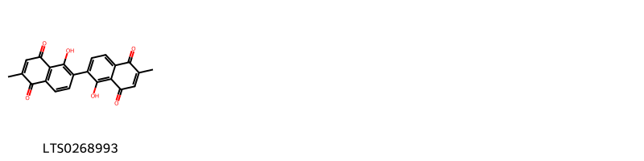{ width=100% }
    <figcaption>Hình ảnh cấu trúc hóa học của 1 hoạt chất thuộc nhóm  gồm ['elliptinone (LTS0268993)'].</figcaption>
</figure>
#### Nhóm Azoles
<figure markdown="span">
    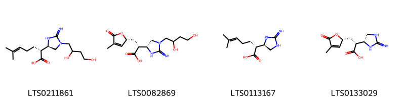{ width=100% }
    <figcaption>Hình ảnh cấu trúc hóa học của 4 hoạt chất thuộc nhóm Azoles gồm ['(2r)-2-[(4r)-1-(2,4-dihydroxybutyl)-2-iminoimidazolidin-4-yl]-6-methylhept-5-enoic acid (LTS0211861)', '(2r)-2-[(4r)-1-(2,4-dihydroxybutyl)-2-iminoimidazolidin-4-yl]-3-[(2r)-4-methyl-5-oxo-2h-furan-2-yl]propanoic acid (LTS0082869)', '(2r)-2-[(4r)-2-iminoimidazolidin-4-yl]-6-methylhept-5-enoic acid (LTS0113167)', '(2r)-2-[(4r)-2-iminoimidazolidin-4-yl]-3-[(2r)-4-methyl-5-oxo-2h-furan-2-yl]propanoic acid (LTS0133029)'].</figcaption>
</figure>
#### Nhóm Benzene and substituted derivatives
<figure markdown="span">
    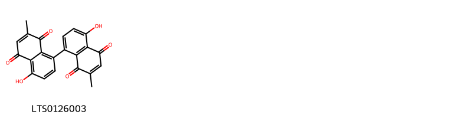{ width=100% }
    <figcaption>Hình ảnh cấu trúc hóa học của 1 hoạt chất thuộc nhóm Benzene and substituted derivatives gồm ['maritinone (LTS0126003)'].</figcaption>
</figure>
#### Nhóm Coumarins and derivatives
<figure markdown="span">
    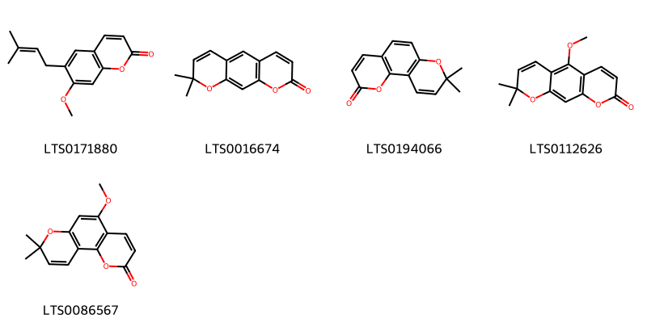{ width=100% }
    <figcaption>Hình ảnh cấu trúc hóa học của 5 hoạt chất thuộc nhóm Coumarins and derivatives gồm ['suberosin (LTS0171880)', 'xanthyletin (LTS0016674)', 'seselin (LTS0194066)', 'xanthoxyletin (LTS0112626)', '5-methoxy-8,8-dimethylpyrano[2,3-f]chromen-2-one (LTS0086567)'].</figcaption>
</figure>
#### Nhóm Glycerolipids
<figure markdown="span">
    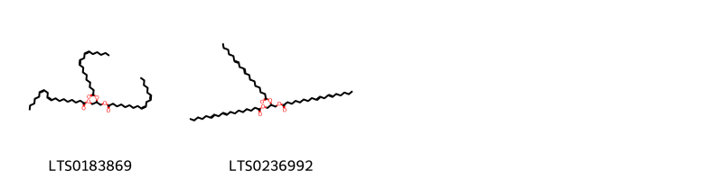{ width=100% }
    <figcaption>Hình ảnh cấu trúc hóa học của 2 hoạt chất thuộc nhóm Glycerolipids gồm ['linolein (LTS0183869)', 'trilinolein (LTS0236992)'].</figcaption>
</figure>
#### Nhóm Hydroxy acids and derivatives
<figure markdown="span">
    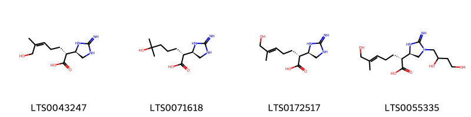{ width=100% }
    <figcaption>Hình ảnh cấu trúc hóa học của 4 hoạt chất thuộc nhóm Hydroxy acids and derivatives gồm ['(2r)-7-hydroxy-2-[(4r)-2-iminoimidazolidin-4-yl]-6-methylhept-5-enoic acid (LTS0043247)', '(2r)-6-hydroxy-2-[(4r)-2-iminoimidazolidin-4-yl]-6-methylheptanoic acid (LTS0071618)', '(2r,5e)-7-hydroxy-2-[(4r)-2-iminoimidazolidin-4-yl]-6-methylhept-5-enoic acid (LTS0172517)', '(2r,5e)-2-[(4r)-1-(2,4-dihydroxybutyl)-2-iminoimidazolidin-4-yl]-7-hydroxy-6-methylhept-5-enoic acid (LTS0055335)'].</figcaption>
</figure>
#### Nhóm Naphthalenes
<figure markdown="span">
    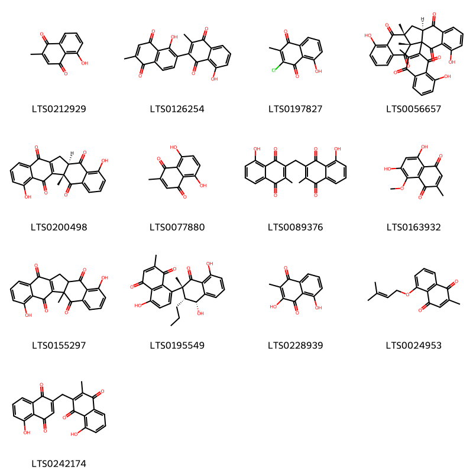{ width=100% }
    <figcaption>Hình ảnh cấu trúc hóa học của 13 hoạt chất thuộc nhóm Naphthalenes gồm ['plumbagin (LTS0212929)', "1',8-dihydroxy-3,6'-dimethyl-[2,2'-binaphthalene]-1,4,5',8'-tetrone (LTS0126254)", '3-chloro-5-hydroxy-2-methylnaphthalene-1,4-dione (LTS0197827)', '(1r,11r,13r)-5,16-dihydroxy-2-(8-hydroxy-3-methyl-1,4-dioxonaphthalen-2-yl)-1,13-dimethylpentacyclo[11.8.0.0²,¹¹.0⁴,⁹.0¹⁵,²⁰]henicosa-4,6,8,15,17,19-hexaene-3,10,14,21-tetrone (LTS0056657)', '(2s,11r)-8,19-dihydroxy-2-methylpentacyclo[11.8.0.0²,¹¹.0⁴,⁹.0¹⁵,²⁰]henicosa-1(13),4,6,8,15,17,19-heptaene-3,10,14,21-tetrone (LTS0200498)', '5,8-dihydroxy-2-methylnaphthalene-1,4-dione (LTS0077880)', '5-hydroxy-3-[(8-hydroxy-3-methyl-1,4-dioxonaphthalen-2-yl)methyl]-2-methylnaphthalene-1,4-dione (LTS0089376)', '5,7-dihydroxy-8-methoxy-2-methylnaphthalene-1,4-dione (LTS0163932)', '8,19-dihydroxy-2-methylpentacyclo[11.8.0.0²,¹¹.0⁴,⁹.0¹⁵,²⁰]henicosa-1(13),4,6,8,15,17,19-heptaene-3,10,14,21-tetrone (LTS0155297)', "(2'r,3'r,4'r)-4,4',8'-trihydroxy-2',7-dimethyl-3'-propyl-3',4'-dihydro-[1,2'-binaphthalene]-1',5,8-trione (LTS0195549)", 'droserone (LTS0228939)', '2-methyl-5-[(3-methylbut-2-en-1-yl)oxy]naphthalene-1,4-dione (LTS0024953)', '5-hydroxy-3-[(5-hydroxy-1,4-dioxonaphthalen-2-yl)methyl]-2-methylnaphthalene-1,4-dione (LTS0242174)'].</figcaption>
</figure>
#### Nhóm Naphthofurans
<figure markdown="span">
    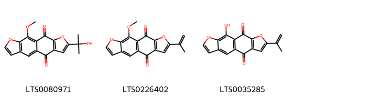{ width=100% }
    <figcaption>Hình ảnh cấu trúc hóa học của 3 hoạt chất thuộc nhóm Naphthofurans gồm ['5-(2-hydroxypropan-2-yl)-16-methoxy-4,14-dioxatetracyclo[7.7.0.0³,⁷.0¹¹,¹⁵]hexadeca-1(9),3(7),5,10,12,15-hexaene-2,8-dione (LTS0080971)', '16-methoxy-5-(prop-1-en-2-yl)-4,14-dioxatetracyclo[7.7.0.0³,⁷.0¹¹,¹⁵]hexadeca-1(9),3(7),5,10,12,15-hexaene-2,8-dione (LTS0226402)', '16-hydroxy-5-(prop-1-en-2-yl)-4,14-dioxatetracyclo[7.7.0.0³,⁷.0¹¹,¹⁵]hexadeca-1(9),3(7),5,10,12,15-hexaene-2,8-dione (LTS0035285)'].</figcaption>
</figure>
#### Nhóm Organooxygen compounds
<figure markdown="span">
    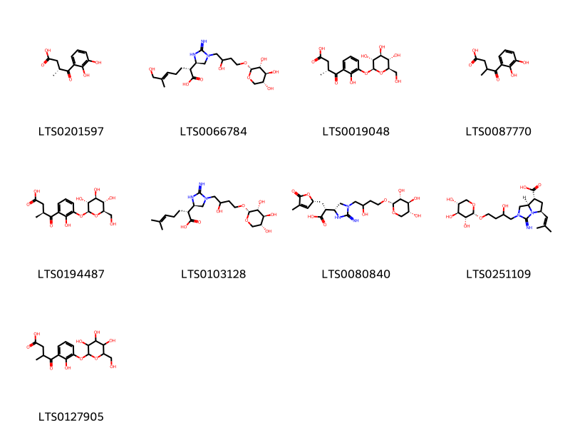{ width=100% }
    <figcaption>Hình ảnh cấu trúc hóa học của 9 hoạt chất thuộc nhóm Organooxygen compounds gồm ['(3r)-4-(2,3-dihydroxyphenyl)-3-methyl-4-oxobutanoic acid (LTS0201597)', '(2r,5e)-7-hydroxy-2-[(4r)-1-(2-hydroxy-4-{[(2s,3r,4s,5r)-3,4,5-trihydroxyoxan-2-yl]oxy}butyl)-2-iminoimidazolidin-4-yl]-6-methylhept-5-enoic acid (LTS0066784)', '(3r)-4-(2-hydroxy-3-{[(2s,3r,4s,5s,6r)-3,4,5-trihydroxy-6-(hydroxymethyl)oxan-2-yl]oxy}phenyl)-3-methyl-4-oxobutanoic acid (LTS0019048)', '4-(2,3-dihydroxyphenyl)-3-methyl-4-oxobutanoic acid (LTS0087770)', '(3s)-4-(2-hydroxy-3-{[(2s,3r,4s,5s,6r)-3,4,5-trihydroxy-6-(hydroxymethyl)oxan-2-yl]oxy}phenyl)-3-methyl-4-oxobutanoic acid (LTS0194487)', '(2r)-2-[(4r)-1-(2-hydroxy-4-{[(2s,3r,4s,5r)-3,4,5-trihydroxyoxan-2-yl]oxy}butyl)-2-iminoimidazolidin-4-yl]-6-methylhept-5-enoic acid (LTS0103128)', '(2r)-2-[(4r)-1-(2-hydroxy-4-{[(2s,3r,4s,5r)-3,4,5-trihydroxyoxan-2-yl]oxy}butyl)-2-iminoimidazolidin-4-yl]-3-[(2r)-4-methyl-5-oxo-2h-furan-2-yl]propanoic acid (LTS0080840)', '(5s,7r,7ar)-2-(2-hydroxy-4-{[(2s,3r,4s,5r)-3,4,5-trihydroxyoxan-2-yl]oxy}butyl)-3-imino-5-(2-methylprop-1-en-1-yl)-tetrahydro-1h-pyrrolo[1,2-c]imidazole-7-carboxylic acid (LTS0251109)', '4-(2-hydroxy-3-{[3,4,5-trihydroxy-6-(hydroxymethyl)oxan-2-yl]oxy}phenyl)-3-methyl-4-oxobutanoic acid (LTS0127905)'].</figcaption>
</figure>
#### Nhóm Prenol lipids
<figure markdown="span">
    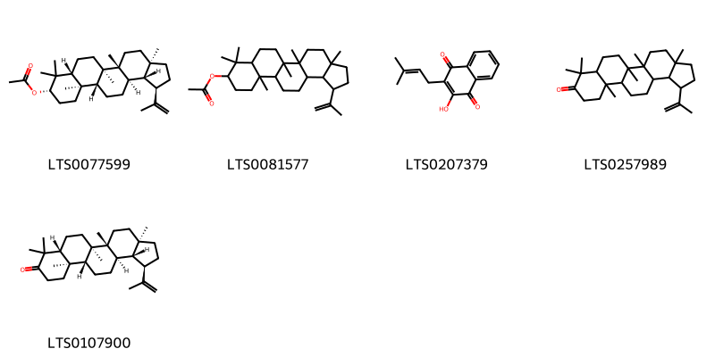{ width=100% }
    <figcaption>Hình ảnh cấu trúc hóa học của 5 hoạt chất thuộc nhóm Prenol lipids gồm ['lupeol acetate (LTS0077599)', '3a,5a,5b,8,8,11a-hexamethyl-1-(prop-1-en-2-yl)-hexadecahydrocyclopenta[a]chrysen-9-yl acetate (LTS0081577)', 'tecomin (LTS0207379)', '3a,5a,5b,8,8,11a-hexamethyl-1-(prop-1-en-2-yl)-tetradecahydro-1h-cyclopenta[a]chrysen-9-one (LTS0257989)', 'lupenone (LTS0107900)'].</figcaption>
</figure>
#### Nhóm Pyrrolidines
<figure markdown="span">
    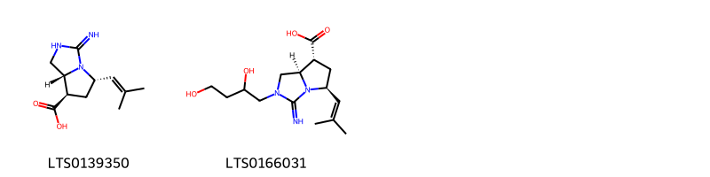{ width=100% }
    <figcaption>Hình ảnh cấu trúc hóa học của 2 hoạt chất thuộc nhóm Pyrrolidines gồm ['(5s,7r,7ar)-3-imino-5-(2-methylprop-1-en-1-yl)-hexahydropyrrolo[1,2-c]imidazole-7-carboxylic acid (LTS0139350)', '(5s,7r,7ar)-2-(2,4-dihydroxybutyl)-3-imino-5-(2-methylprop-1-en-1-yl)-tetrahydro-1h-pyrrolo[1,2-c]imidazole-7-carboxylic acid (LTS0166031)'].</figcaption>
</figure>
#### Nhóm Saccharolipids
<figure markdown="span">
    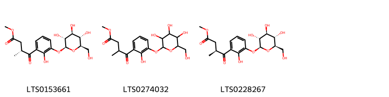{ width=100% }
    <figcaption>Hình ảnh cấu trúc hóa học của 3 hoạt chất thuộc nhóm Saccharolipids gồm ['methyl (3r)-4-(2-hydroxy-3-{[(2s,3r,4s,5s,6r)-3,4,5-trihydroxy-6-(hydroxymethyl)oxan-2-yl]oxy}phenyl)-3-methyl-4-oxobutanoate (LTS0153661)', 'methyl 4-(2-hydroxy-3-{[3,4,5-trihydroxy-6-(hydroxymethyl)oxan-2-yl]oxy}phenyl)-3-methyl-4-oxobutanoate (LTS0274032)', 'methyl (3s)-4-(2-hydroxy-3-{[(2s,3r,4s,5s,6r)-3,4,5-trihydroxy-6-(hydroxymethyl)oxan-2-yl]oxy}phenyl)-3-methyl-4-oxobutanoate (LTS0228267)'].</figcaption>
</figure>
#### Nhóm Steroids and steroid derivatives
<figure markdown="span">
    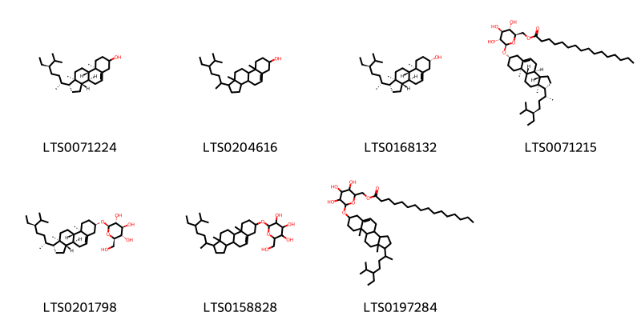{ width=100% }
    <figcaption>Hình ảnh cấu trúc hóa học của 7 hoạt chất thuộc nhóm Steroids and steroid derivatives gồm ['stigmast-5-en-3-ol (LTS0071224)', 'stigmast-5-en-3-ol, (3β)- (LTS0204616)', 'sitosterol (LTS0168132)', 'sitoindoside i (LTS0071215)', 'sitogluside (LTS0201798)', '2-{[1-(5-ethyl-6-methylheptan-2-yl)-9a,11a-dimethyl-1h,2h,3h,3ah,3bh,4h,6h,7h,8h,9h,9bh,10h,11h-cyclopenta[a]phenanthren-7-yl]oxy}-6-(hydroxymethyl)oxane-3,4,5-triol (LTS0158828)', '(6-{[1-(5-ethyl-6-methylheptan-2-yl)-9a,11a-dimethyl-1h,2h,3h,3ah,3bh,4h,6h,7h,8h,9h,9bh,10h,11h-cyclopenta[a]phenanthren-7-yl]oxy}-3,4,5-trihydroxyoxan-2-yl)methyl hexadecanoate (LTS0197284)'].</figcaption>
</figure>
#### Nhóm Tetralins
<figure markdown="span">
    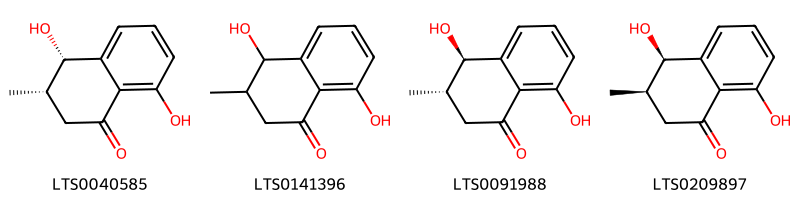{ width=100% }
    <figcaption>Hình ảnh cấu trúc hóa học của 4 hoạt chất thuộc nhóm Tetralins gồm ['(3s,4s)-4,8-dihydroxy-3-methyl-3,4-dihydro-2h-naphthalen-1-one (LTS0040585)', '4,8-dihydroxy-3-methyl-3,4-dihydro-2h-naphthalen-1-one (LTS0141396)', '(3s,4r)-4,8-dihydroxy-3-methyl-3,4-dihydro-2h-naphthalen-1-one (LTS0091988)', 'isoshinanolone (LTS0209897)'].</figcaption>
</figure>

---

### Dược dân tộc học

Danh sách các quốc gia có sử dụng *Plumbago zeylanica* trong điều trị các bệnh. 

| Country          | Disease                                  | Bệnh                                                |
|:-----------------|:-----------------------------------------|:----------------------------------------------------|
| Elsewhere        | Diuretic, Emmenagogue, Expectorant, nan  | Thuốc lợi tiểu, Thuốc lợi tiểu, Thuốc long đờm, nan |
| Ghana            | Abortifacient, Counterirritant, Vesicant | Abortifacient, Counterirritant, Vesicant            |
| India            | Fungicide, Emmenagogue                   | Thuốc diệt nấm, Thuốc diệt nấm                      |
| India(Ayurvedic) | Digestive                                | tiêu                                                |
| Japan            | Abortifacient                            | Thuốc gây sẩy thai                                  |
| Java             | Emmenagogue                              | Emmenagogue                                         |
| Malaysia         | Abortifacient                            | Thuốc gây sẩy thai                                  |
| Nigeria          | Vermifuge                                | Thuốc diệt sán                                      |
| Sudan            | Tonic, Vesicant                          | Thuốc bổ, chất gây đau nhức                         |
| Tanzania         | Vesicant                                 | Chất gây bọng mắt                                   |
| W Africa         | Vesicant                                 | Chất gây bọng mắt                                   |

---

# Chi Limonium

??? note "Danh sách các dược liệu thuộc chi"
    
	 - *Limonium carolinianum*
	 - *Limonium vulgare*

---
## Limonium carolinianum
### Thông tin về thực vật

!!! info "Phân loại thực vật của *Limonium carolinianum* từ GIBF:"
    - **Kingdom:** Plantae
    - **Phylum:** Tracheophyta
    - **Order:** Caryophyllales
    - **Family:** Plumbaginaceae
    - **Genus:** Limonium
    - **Species:** *Limonium carolinianum*

 

| Label (VI)   | Label (EN)   | Scientific Name       | Descriptions (VI)   | Descriptions (EN)   | Also Known As (VI)   | Also Known As (EN)                                                                                                                                                                                                                                                                                                                      |
|:-------------|:-------------|:----------------------|:--------------------|:--------------------|:---------------------|:----------------------------------------------------------------------------------------------------------------------------------------------------------------------------------------------------------------------------------------------------------------------------------------------------------------------------------------|
| N/A          | N/A          | Limonium carolinianum | loài thực vật       | species of plant    | ['']                 | ['Limonium obtusilobum', 'Limonium nashii', 'Limonium angustatum', 'American thrift', 'canker root', 'Carolina sea lavender', 'Carolina sea-lavender', 'Carolina sealavender', 'ink root', 'lavender thrift', 'Limonium trichogonum', 'marsh root', 'sea-lavendar', 'sea-lavender', 'seaside thrift', 'statice', 'Statice caroliniana'] |

#### Phân bố trên thế giới

**Từ CSDL GIBF** United States of America, Canada

#### Phân bố tại Việt Nam

**Từ CSDL GIBF**: Không có ghi nhận ở Việt Nam

---
### Thành phần hóa học
        
- Theo cơ sở dữ liệu lotus: Từ loài *Limonium carolinianum* đã phân lập và xác định được Chưa có hoạt chất nào được phân lập. hoạt chất thuộc về các nhóm Không có hoạt chất nào được phân lập. 

Không có hình ảnh nào được tạo ra

---

### Dược dân tộc học

Danh sách các quốc gia có sử dụng *Limonium carolinianum* trong điều trị các bệnh. 

| Country   | Disease           | Bệnh                  |
|:----------|:------------------|:----------------------|
| Turkey    | Astringent, Tonic | Chất làm se, Thuốc bổ |

---

---
## Limonium vulgare
### Thông tin về thực vật

!!! info "Phân loại thực vật của *Limonium vulgare* từ GIBF:"
    - **Kingdom:** Plantae
    - **Phylum:** Tracheophyta
    - **Order:** Caryophyllales
    - **Family:** Plumbaginaceae
    - **Genus:** Limonium
    - **Species:** *Limonium vulgare*

 

| Label (VI)   | Label (EN)   | Scientific Name   | Descriptions (VI)   | Descriptions (EN)                     | Also Known As (VI)   | Also Known As (EN)      |
|:-------------|:-------------|:------------------|:--------------------|:--------------------------------------|:---------------------|:------------------------|
| N/A          | N/A          | Limonium vulgare  |                     | species of herbaceous perennial plant | ['']                 | ['common sea-lavender'] |

#### Phân bố trên thế giới

**Từ CSDL GIBF** Denmark, Netherlands, Germany, Albania, Sweden, France, United Kingdom of Great Britain and Northern Ireland

#### Phân bố tại Việt Nam

**Từ CSDL GIBF**: Không có ghi nhận ở Việt Nam

---
### Thành phần hóa học
        
- Theo cơ sở dữ liệu lotus: Từ loài *Limonium vulgare* đã phân lập và xác định được 1 hoạt chất thuộc về các nhóm Organonitrogen compounds. 

|    | chemicalTaxonomyClassyfireClass   |   smiles_count |
|---:|:----------------------------------|---------------:|
|  0 | Organonitrogen compounds          |              1 |

#### Nhóm Organonitrogen compounds
<figure markdown="span">
    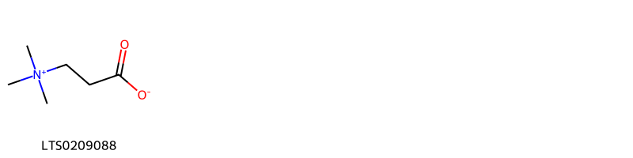{ width=100% }
    <figcaption>Hình ảnh cấu trúc hóa học của 1 hoạt chất thuộc nhóm Organonitrogen compounds gồm ['β-alaninebetaine (LTS0209088)'].</figcaption>
</figure>

---

### Dược dân tộc học

Danh sách các quốc gia có sử dụng *Limonium vulgare* trong điều trị các bệnh. 

| Country   | Disease              | Bệnh                  |
|:----------|:---------------------|:----------------------|
| Turkey    | Astringent, Hemostat | Chất làm se, Hemostat |

---

# Chi Armeria

??? note "Danh sách các dược liệu thuộc chi"
    
	 - *Armeria vulgaris*

---
## Armeria vulgaris
### Thông tin về thực vật

!!! info "Phân loại thực vật của *N/A* từ GIBF:"
    - **Kingdom:** Plantae
    - **Phylum:** Tracheophyta
    - **Order:** Caryophyllales
    - **Family:** Plumbaginaceae
    - **Genus:** Armeria
    - **Species:** *N/A*

 

| Label (VI)   | Label (EN)   | Scientific Name   | Descriptions (VI)   | Descriptions (EN)                     | Also Known As (VI)   | Also Known As (EN)      |
|:-------------|:-------------|:------------------|:--------------------|:--------------------------------------|:---------------------|:------------------------|
| N/A          | N/A          | Limonium vulgare  |                     | species of herbaceous perennial plant | ['']                 | ['common sea-lavender'] |

#### Phân bố trên thế giới

**Từ CSDL GIBF** Italy, Belgium, Argentina, Norway, Canada, Denmark, Netherlands, Iceland, Spain, Portugal, Algeria, United States of America, Sweden, Chile, Germany, Austria, France, United Kingdom of Great Britain and Northern Ireland, Ireland, New Zealand

#### Phân bố tại Việt Nam

**Từ CSDL GIBF**: Không có ghi nhận ở Việt Nam

---
### Thành phần hóa học
        
- Theo cơ sở dữ liệu lotus: Từ loài *N/A* đã phân lập và xác định được Chưa có hoạt chất nào được phân lập. hoạt chất thuộc về các nhóm Không có hoạt chất nào được phân lập. 

Không có hình ảnh nào được tạo ra

---

### Dược dân tộc học

Danh sách các quốc gia có sử dụng *N/A* trong điều trị các bệnh. 

| Country   | Disease    | Bệnh           |
|:----------|:-----------|:---------------|
| Dutch     | Diuretic   | Thuốc lợi tiêu |
| anish     | Astringent | Lam se da      |

---

# Chi Statice

??? note "Danh sách các dược liệu thuộc chi"
    
	 - *Statice caroliniana*
	 - *Statice limonium*

---
## Statice caroliniana
### Thông tin về thực vật

!!! info "Phân loại thực vật của *Limonium carolinianum* từ GIBF:"
    - **Kingdom:** Plantae
    - **Phylum:** Tracheophyta
    - **Order:** Caryophyllales
    - **Family:** Plumbaginaceae
    - **Genus:** Limonium
    - **Species:** *Limonium carolinianum*

 

| Label (VI)   | Label (EN)   | Scientific Name     | Descriptions (VI)   | Descriptions (EN)   | Also Known As (VI)   | Also Known As (EN)   |
|:-------------|:-------------|:--------------------|:--------------------|:--------------------|:---------------------|:---------------------|
| N/A          | N/A          | Statice caroliniana | loài thực vật       | species of plant    | ['']                 | ['']                 |

#### Phân bố trên thế giới

**Từ CSDL GIBF** nan, United States of America

#### Phân bố tại Việt Nam

**Từ CSDL GIBF**: Không có ghi nhận ở Việt Nam

---
### Thành phần hóa học
        
- Theo cơ sở dữ liệu lotus: Từ loài *Limonium carolinianum* đã phân lập và xác định được Chưa có hoạt chất nào được phân lập. hoạt chất thuộc về các nhóm Không có hoạt chất nào được phân lập. 

Không có hình ảnh nào được tạo ra

---

### Dược dân tộc học

Danh sách các quốc gia có sử dụng *Limonium carolinianum* trong điều trị các bệnh. 

| Country   | Disease    | Bệnh               |
|:----------|:-----------|:-------------------|
| Dutch     | Tonic      | (thuộc) trương lực |
| English   | Astringent | Lam se da          |

---

---
## Statice limonium
### Thông tin về thực vật

!!! info "Phân loại thực vật của *N/A* từ GIBF:"
    - **Kingdom:** Plantae
    - **Phylum:** Tracheophyta
    - **Order:** Caryophyllales
    - **Family:** Plumbaginaceae
    - **Genus:** Limonium
    - **Species:** *N/A*

 

| Label (VI)   | Label (EN)   | Scientific Name   | Descriptions (VI)   | Descriptions (EN)   | Also Known As (VI)   | Also Known As (EN)   |
|:-------------|:-------------|:------------------|:--------------------|:--------------------|:---------------------|:---------------------|
| N/A          | N/A          | Statice limonium  |                     | species of plant    | ['']                 | ['']                 |

#### Phân bố trên thế giới

**Từ CSDL GIBF** Italy, Australia, Japan, Argentina, Palestine, State of, Gibraltar, Yemen, Israel, Ukraine, Netherlands, Cyprus, Namibia, Chinese Taipei, Spain, Hungary, Portugal, Morocco, United States of America, Sweden, Uruguay, Chile, Greece, South Africa, Hong Kong, Brazil, Mexico, France

#### Phân bố tại Việt Nam

**Từ CSDL GIBF**: Không có ghi nhận ở Việt Nam

---
### Thành phần hóa học
        
- Theo cơ sở dữ liệu lotus: Từ loài *N/A* đã phân lập và xác định được Chưa có hoạt chất nào được phân lập. hoạt chất thuộc về các nhóm Không có hoạt chất nào được phân lập. 

Không có hình ảnh nào được tạo ra

---

### Dược dân tộc học

Danh sách các quốc gia có sử dụng *N/A* trong điều trị các bệnh. 

| Country   | Disease    | Bệnh      |
|:----------|:-----------|:----------|
| US        | Astringent | Lam se da |

---

