!!! abstract "Tóm tắt"

    Họ Poaceae gồm khoảng 54 chi và 101 loài được một số cộng đồng tại các quốc gia như USSR, Ghana, Japan, Dutch, Kashmir, Italian, Panama, Sudan, Mexico(Chinantec), Sumatra, Honduras, Lesotho, ain, Ethiopia, Perak, Paraguay, Turkey, South Africa, US(Blackfoot), Bahamas, Egypt, Brazil, French, US, Cuba, Dominican Republic, Mexico, Malaya, China, Hindu, Voodoo, Trinidad, Europe, Iraq, Haiti, Kenya, German, Mexico(Seri), Elsewhere, India, Java, Venezuela, Kurdistan, Japan*, Samoa, Philippines, Malaysia, Nepal sử dụng trong một số trường hợp QUERY LENGTH LIMIT EXCEEDED. MAX ALLOWED QUERY : 500 CHARS QUERY LENGTH LIMIT EXCEEDED. MAX ALLOWED QUERY : 500 CHARS QUERY LENGTH LIMIT EXCEEDED. MAX ALLOWED QUERY : 500 CHARS MYMEMORY WARNING: YOU USED ALL AVAILABLE FREE TRANSLATIONS FOR TODAY. NEXT AVAILABLE IN  01 HOURS 29 MINUTES 39 SECONDS VISIT HTTPS://MYMEMORY.TRANSLATED.NET/DOC/USAGELIMITS.PHP TO TRANSLATE MORE.

!!! info "DrDuke"

    James A. Duke sinh năm 1929-2017 là một nhà thực vật học người Mỹ. Đây là một trong những tác giả hàng đầu trong lĩnh vực dược dân tộc học với cuốn *CRC Handbook of Medicinal Herbs* và chính là người xây dựng lên cơ sở dữ liệu về hợp chất tự nhiên và dược dân tộc học tại Bộ nông nghiệp Hoa Kỳ. Các thông tin được đăng tải tại website [Dr. Duke's Phytochemical and Ethnobotanical Databases](https://phytochem.nal.usda.gov/). 
    Trong suốt thập niên 1970, ông lãnh đạo the Plant Taxonomy Laboratory, Plant Genetics and Germplasm Institute of the Agricultural Research Service, U.S. Department of Agriculture.
    Trong tài liệu này, các thông tin về dược dân tộc của các dược liệu được trích dẫn từ tài liệu của James A. Ducke với sự trợ giúp của phần mềm dịch thuật từ tiếng Anh sang tiếng Việt.
   

# Chi Coix

??? note "Danh sách các dược liệu thuộc chi"
    
	 - *Coix lachryma-jobi*
	 - *Coix lacryma-jobi*
	 - *Coix lacrymajobi*

---
## Coix lachrymajobi
### Thông tin về thực vật

!!! info "Phân loại thực vật của *Coix lacryma-jobi* từ GIBF:"
    - **Kingdom:** Plantae
    - **Phylum:** Tracheophyta
    - **Order:** Poales
    - **Family:** Poaceae
    - **Genus:** Coix
    - **Species:** *Coix lacryma-jobi*

 

| Label (VI)   | Label (EN)   | Scientific Name      | Descriptions (VI)   | Descriptions (EN)   | Also Known As (VI)   | Also Known As (EN)         |
|:-------------|:-------------|:---------------------|:--------------------|:--------------------|:---------------------|:---------------------------|
| N/A          | N/A          | Menziesia ferruginea | loài thực vật       | species of plant    | ['']                 | ['Rhododendron menziesii'] |

#### Phân bố trên thế giới

**Từ CSDL GIBF** Australia, Japan, Lao People’s Democratic Republic, Mauritius, Argentina, Benin, French Guiana, Panama, Puerto Rico, Réunion, Chinese Taipei, Jamaica, United States of America, Uruguay, South Africa, Hong Kong, Thailand, Brazil, Viet Nam, China, Ecuador, Costa Rica, India, Indonesia, Philippines, Malaysia, New Zealand

#### Phân bố tại Việt Nam

**Từ CSDL GIBF**: Hòa Bình

---
### Thành phần hóa học
        
- Theo cơ sở dữ liệu lotus: Từ loài *Coix lacryma-jobi* đã phân lập và xác định được Chưa có hoạt chất nào được phân lập. hoạt chất thuộc về các nhóm Không có hoạt chất nào được phân lập. 

Không có hình ảnh nào được tạo ra

---

### Dược dân tộc học

Danh sách các quốc gia có sử dụng *Coix lacryma-jobi* trong điều trị các bệnh. 

| Country   | Disease   | Bệnh                                                                                                                                                                                                |
|:----------|:----------|:----------------------------------------------------------------------------------------------------------------------------------------------------------------------------------------------------|
| Perak     | Vermifuge | MYMEMORY WARNING: YOU USED ALL AVAILABLE FREE TRANSLATIONS FOR TODAY. NEXT AVAILABLE IN  01 HOURS 29 MINUTES 37 SECONDS VISIT HTTPS://MYMEMORY.TRANSLATED.NET/DOC/USAGELIMITS.PHP TO TRANSLATE MORE |

---

---
## Coix lacrymajobi
### Thông tin về thực vật

!!! info "Phân loại thực vật của *Coix lacryma-jobi* từ GIBF:"
    - **Kingdom:** Plantae
    - **Phylum:** Tracheophyta
    - **Order:** Poales
    - **Family:** Poaceae
    - **Genus:** Coix
    - **Species:** *Coix lacryma-jobi*

 

| Label (VI)   | Label (EN)   | Scientific Name      | Descriptions (VI)   | Descriptions (EN)   | Also Known As (VI)   | Also Known As (EN)         |
|:-------------|:-------------|:---------------------|:--------------------|:--------------------|:---------------------|:---------------------------|
| N/A          | N/A          | Menziesia ferruginea | loài thực vật       | species of plant    | ['']                 | ['Rhododendron menziesii'] |

#### Phân bố trên thế giới

**Từ CSDL GIBF** Australia, Japan, Lao People’s Democratic Republic, Mauritius, Argentina, Benin, French Guiana, Panama, Puerto Rico, Réunion, Chinese Taipei, Jamaica, United States of America, Uruguay, South Africa, Hong Kong, Thailand, Brazil, Viet Nam, China, Ecuador, Costa Rica, India, Indonesia, Philippines, Malaysia, New Zealand

#### Phân bố tại Việt Nam

**Từ CSDL GIBF**: Hòa Bình

---
### Thành phần hóa học
        
- Theo cơ sở dữ liệu lotus: Từ loài *Coix lacryma-jobi* đã phân lập và xác định được Chưa có hoạt chất nào được phân lập. hoạt chất thuộc về các nhóm Không có hoạt chất nào được phân lập. 

Không có hình ảnh nào được tạo ra

---

### Dược dân tộc học

Danh sách các quốc gia có sử dụng *Coix lacryma-jobi* trong điều trị các bệnh. 

| Country   | Disease                                                                   | Bệnh                                                                                                                                                                                                |
|:----------|:--------------------------------------------------------------------------|:----------------------------------------------------------------------------------------------------------------------------------------------------------------------------------------------------|
| China     | Diuretic, Intoxicant, Stimulant, Vermifuge, Demulcent, Tonic, Refrigerant | MYMEMORY WARNING: YOU USED ALL AVAILABLE FREE TRANSLATIONS FOR TODAY. NEXT AVAILABLE IN  01 HOURS 29 MINUTES 16 SECONDS VISIT HTTPS://MYMEMORY.TRANSLATED.NET/DOC/USAGELIMITS.PHP TO TRANSLATE MORE |
| Egypt     | Diuretic                                                                  | MYMEMORY WARNING: YOU USED ALL AVAILABLE FREE TRANSLATIONS FOR TODAY. NEXT AVAILABLE IN  01 HOURS 29 MINUTES 13 SECONDS VISIT HTTPS://MYMEMORY.TRANSLATED.NET/DOC/USAGELIMITS.PHP TO TRANSLATE MORE |
| Elsewhere | Antiphlogistic, Diuretic                                                  | MYMEMORY WARNING: YOU USED ALL AVAILABLE FREE TRANSLATIONS FOR TODAY. NEXT AVAILABLE IN  01 HOURS 29 MINUTES 12 SECONDS VISIT HTTPS://MYMEMORY.TRANSLATED.NET/DOC/USAGELIMITS.PHP TO TRANSLATE MORE |
| German    | Cathartic                                                                 | MYMEMORY WARNING: YOU USED ALL AVAILABLE FREE TRANSLATIONS FOR TODAY. NEXT AVAILABLE IN  01 HOURS 29 MINUTES 09 SECONDS VISIT HTTPS://MYMEMORY.TRANSLATED.NET/DOC/USAGELIMITS.PHP TO TRANSLATE MORE |
| Haiti     | Diuretic, Diuretic                                                        | MYMEMORY WARNING: YOU USED ALL AVAILABLE FREE TRANSLATIONS FOR TODAY. NEXT AVAILABLE IN  01 HOURS 29 MINUTES 07 SECONDS VISIT HTTPS://MYMEMORY.TRANSLATED.NET/DOC/USAGELIMITS.PHP TO TRANSLATE MORE |
| India     | Litholytic                                                                | MYMEMORY WARNING: YOU USED ALL AVAILABLE FREE TRANSLATIONS FOR TODAY. NEXT AVAILABLE IN  01 HOURS 29 MINUTES 04 SECONDS VISIT HTTPS://MYMEMORY.TRANSLATED.NET/DOC/USAGELIMITS.PHP TO TRANSLATE MORE |
| Japan     | Tonic, Antiphlogistic, Diuretic                                           | MYMEMORY WARNING: YOU USED ALL AVAILABLE FREE TRANSLATIONS FOR TODAY. NEXT AVAILABLE IN  01 HOURS 29 MINUTES 02 SECONDS VISIT HTTPS://MYMEMORY.TRANSLATED.NET/DOC/USAGELIMITS.PHP TO TRANSLATE MORE |

---

---
## Coix lacrymajobi
### Thông tin về thực vật

!!! info "Phân loại thực vật của *Coix lacryma-jobi* từ GIBF:"
    - **Kingdom:** Plantae
    - **Phylum:** Tracheophyta
    - **Order:** Poales
    - **Family:** Poaceae
    - **Genus:** Coix
    - **Species:** *Coix lacryma-jobi*

 

| Label (VI)   | Label (EN)   | Scientific Name      | Descriptions (VI)   | Descriptions (EN)   | Also Known As (VI)   | Also Known As (EN)         |
|:-------------|:-------------|:---------------------|:--------------------|:--------------------|:---------------------|:---------------------------|
| N/A          | N/A          | Menziesia ferruginea | loài thực vật       | species of plant    | ['']                 | ['Rhododendron menziesii'] |

#### Phân bố trên thế giới

**Từ CSDL GIBF** Australia, Japan, Lao People’s Democratic Republic, Mauritius, Argentina, Benin, French Guiana, Panama, Puerto Rico, Réunion, Chinese Taipei, Jamaica, United States of America, Uruguay, South Africa, Hong Kong, Thailand, Brazil, Viet Nam, China, Ecuador, Costa Rica, India, Indonesia, Philippines, Malaysia, New Zealand

#### Phân bố tại Việt Nam

**Từ CSDL GIBF**: Hòa Bình

---
### Thành phần hóa học
        
- Theo cơ sở dữ liệu lotus: Từ loài *Coix lacryma-jobi* đã phân lập và xác định được Chưa có hoạt chất nào được phân lập. hoạt chất thuộc về các nhóm Không có hoạt chất nào được phân lập. 

Không có hình ảnh nào được tạo ra

---

### Dược dân tộc học

Danh sách các quốc gia có sử dụng *Coix lacryma-jobi* trong điều trị các bệnh. 

| Country   | Disease         | Bệnh                                                                                                                                                                                                |
|:----------|:----------------|:----------------------------------------------------------------------------------------------------------------------------------------------------------------------------------------------------|
| India     | Diuretic, Tonic | MYMEMORY WARNING: YOU USED ALL AVAILABLE FREE TRANSLATIONS FOR TODAY. NEXT AVAILABLE IN  01 HOURS 28 MINUTES 42 SECONDS VISIT HTTPS://MYMEMORY.TRANSLATED.NET/DOC/USAGELIMITS.PHP TO TRANSLATE MORE |

---

# Chi Echinochloa

??? note "Danh sách các dược liệu thuộc chi"
    
	 - *Echinochloa crusgalli*
	 - *Echinochloa stagnina*

---
## Echinochloa crusgalli
### Thông tin về thực vật

!!! info "Phân loại thực vật của *N/A* từ GIBF:"
    - **Kingdom:** Plantae
    - **Phylum:** Tracheophyta
    - **Order:** Poales
    - **Family:** Poaceae
    - **Genus:** Echinochloa
    - **Species:** *N/A*

 

| Label (VI)   | Label (EN)   | Scientific Name      | Descriptions (VI)   | Descriptions (EN)   | Also Known As (VI)   | Also Known As (EN)         |
|:-------------|:-------------|:---------------------|:--------------------|:--------------------|:---------------------|:---------------------------|
| N/A          | N/A          | Menziesia ferruginea | loài thực vật       | species of plant    | ['']                 | ['Rhododendron menziesii'] |

#### Phân bố trên thế giới

**Từ CSDL GIBF** Australia, Belgium, Argentina, French Guiana, Puerto Rico, Netherlands, Chinese Taipei, Portugal, Algeria, United States of America, Sweden, Chile, Zimbabwe, South Africa, Hong Kong, Martinique, Brazil, Switzerland, Mexico, Peru, China, Indonesia, Antigua and Barbuda, Cameroon, New Zealand

#### Phân bố tại Việt Nam

**Từ CSDL GIBF**: Không có ghi nhận ở Việt Nam

---
### Thành phần hóa học
        
- Theo cơ sở dữ liệu lotus: Từ loài *N/A* đã phân lập và xác định được Chưa có hoạt chất nào được phân lập. hoạt chất thuộc về các nhóm Không có hoạt chất nào được phân lập. 

Không có hình ảnh nào được tạo ra

---

### Dược dân tộc học

Danh sách các quốc gia có sử dụng *N/A* trong điều trị các bệnh. 

| Country   | Disease   | Bệnh                                                                                                                                                                                                |
|:----------|:----------|:----------------------------------------------------------------------------------------------------------------------------------------------------------------------------------------------------|
| China     | Tonic     | MYMEMORY WARNING: YOU USED ALL AVAILABLE FREE TRANSLATIONS FOR TODAY. NEXT AVAILABLE IN  01 HOURS 28 MINUTES 22 SECONDS VISIT HTTPS://MYMEMORY.TRANSLATED.NET/DOC/USAGELIMITS.PHP TO TRANSLATE MORE |

---

---
## Echinochloa stagnina
### Thông tin về thực vật

!!! info "Phân loại thực vật của *Echinochloa stagnina* từ GIBF:"
    - **Kingdom:** Plantae
    - **Phylum:** Tracheophyta
    - **Order:** Poales
    - **Family:** Poaceae
    - **Genus:** Echinochloa
    - **Species:** *Echinochloa stagnina*

 

| Label (VI)   | Label (EN)   | Scientific Name      | Descriptions (VI)   | Descriptions (EN)   | Also Known As (VI)   | Also Known As (EN)   |
|:-------------|:-------------|:---------------------|:--------------------|:--------------------|:---------------------|:---------------------|
| N/A          | N/A          | Echinochloa stagnina | loài thực vật       | species of plant    | ['']                 | ['Burgu millet']     |

#### Phân bố trên thế giới

**Từ CSDL GIBF** nan, Ghana, Gabon, Angola, Somalia, Philippines, Benin, Congo, Tanzania, United Republic of, Zambia, Mali, Senegal, Nigeria, Namibia, Chad, Sweden, Congo, Democratic Republic of the, Solomon Islands, South Africa, Guinea-Bissau, Suriname, Thailand, Niger, Madagascar, Cabo Verde, Botswana, India, Indonesia, Gambia, Burkina Faso, Kenya, Cameroon, Mauritania, Ethiopia

#### Phân bố tại Việt Nam

**Từ CSDL GIBF**: Không có ghi nhận ở Việt Nam

---
### Thành phần hóa học
        
- Theo cơ sở dữ liệu lotus: Từ loài *Echinochloa stagnina* đã phân lập và xác định được Chưa có hoạt chất nào được phân lập. hoạt chất thuộc về các nhóm Không có hoạt chất nào được phân lập. 

Không có hình ảnh nào được tạo ra

---

### Dược dân tộc học

Danh sách các quốc gia có sử dụng *Echinochloa stagnina* trong điều trị các bệnh. 

| Country     | Disease   | Bệnh                                                                                                                                                                                                |
|:------------|:----------|:----------------------------------------------------------------------------------------------------------------------------------------------------------------------------------------------------|
| Philippines | Diuretic  | MYMEMORY WARNING: YOU USED ALL AVAILABLE FREE TRANSLATIONS FOR TODAY. NEXT AVAILABLE IN  01 HOURS 28 MINUTES 00 SECONDS VISIT HTTPS://MYMEMORY.TRANSLATED.NET/DOC/USAGELIMITS.PHP TO TRANSLATE MORE |

---

# Chi Setaria

??? note "Danh sách các dược liệu thuộc chi"
    
	 - *Setaria glauca*
	 - *Setaria italica*
	 - *Setaria plicata*
	 - *Setaria verticillata*

---
## Setaria glauca
### Thông tin về thực vật

!!! info "Phân loại thực vật của *Setaria glauca* từ GIBF:"
    - **Kingdom:** Plantae
    - **Phylum:** Tracheophyta
    - **Order:** Poales
    - **Family:** Poaceae
    - **Genus:** Setaria
    - **Species:** *Setaria glauca*

 

| Label (VI)   | Label (EN)   | Scientific Name   | Descriptions (VI)   | Descriptions (EN)   | Also Known As (VI)   | Also Known As (EN)                |
|:-------------|:-------------|:------------------|:--------------------|:--------------------|:---------------------|:----------------------------------|
| N/A          | N/A          | Setaria glauca    | loài thực vật       | species of plant    | ['']                 | ['Green Fox Tail', 'Wild Millet'] |

#### Phân bố trên thế giới

**Từ CSDL GIBF** nan, Faroe Islands, Israel, Italy, Japan, Germany, United Kingdom of Great Britain and Northern Ireland, Korea, Republic of, Thailand, India, United States of America, Poland, France, China, Canada, Nepal

#### Phân bố tại Việt Nam

**Từ CSDL GIBF**: Không có ghi nhận ở Việt Nam

---
### Thành phần hóa học
        
- Theo cơ sở dữ liệu lotus: Từ loài *Setaria glauca* đã phân lập và xác định được 5 hoạt chất thuộc về các nhóm Steroids and steroid derivatives. 

|    | chemicalTaxonomyClassyfireClass   |   smiles_count |
|---:|:----------------------------------|---------------:|
|  0 | Steroids and steroid derivatives  |              5 |

#### Nhóm Steroids and steroid derivatives
<figure markdown="span">
    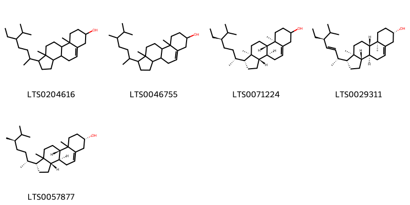{ width=100% }
    <figcaption>Hình ảnh cấu trúc hóa học của 5 hoạt chất thuộc nhóm Steroids and steroid derivatives gồm ['stigmast-5-en-3-ol, (3β)- (LTS0204616)', 'campesterol (LTS0046755)', 'stigmast-5-en-3-ol (LTS0071224)', 'phytosterol (LTS0029311)', '(1r,3as,3bs,7s,9bs)-1-[(2r,5r)-5,6-dimethylheptan-2-yl]-9a,11a-dimethyl-1h,2h,3h,3ah,3bh,4h,6h,7h,8h,9h,9bh,10h,11h-cyclopenta[a]phenanthren-7-ol (LTS0057877)'].</figcaption>
</figure>

---

### Dược dân tộc học

Danh sách các quốc gia có sử dụng *Setaria glauca* trong điều trị các bệnh. 

| Country   | Disease                | Bệnh                                                                                                                                                                                                |
|:----------|:-----------------------|:----------------------------------------------------------------------------------------------------------------------------------------------------------------------------------------------------|
| USSR      | Intoxicant, Intoxicant | MYMEMORY WARNING: YOU USED ALL AVAILABLE FREE TRANSLATIONS FOR TODAY. NEXT AVAILABLE IN  01 HOURS 27 MINUTES 41 SECONDS VISIT HTTPS://MYMEMORY.TRANSLATED.NET/DOC/USAGELIMITS.PHP TO TRANSLATE MORE |

---

---
## Setaria italica
### Thông tin về thực vật

!!! info "Phân loại thực vật của *Setaria italica* từ GIBF:"
    - **Kingdom:** Plantae
    - **Phylum:** Tracheophyta
    - **Order:** Poales
    - **Family:** Poaceae
    - **Genus:** Setaria
    - **Species:** *Setaria italica*

 

| Label (VI)   | Label (EN)   | Scientific Name   | Descriptions (VI)   | Descriptions (EN)   | Also Known As (VI)   | Also Known As (EN)                                                                         |
|:-------------|:-------------|:------------------|:--------------------|:--------------------|:---------------------|:-------------------------------------------------------------------------------------------|
| N/A          | N/A          | Setaria italica   | loài thực vật       | species of plant    | ['']                 | ['Foxtail millet', 'German millet', 'green foxtail', 'Hungarian millet', 'Italian millet'] |

#### Phân bố trên thế giới

**Từ CSDL GIBF** Italy, Australia, Belgium, Estonia, Norway, Canada, Ukraine, Denmark, Netherlands, Luxembourg, Chinese Taipei, Spain, Hungary, Russian Federation, United States of America, Sweden, Finland, Czechia, Germany, Switzerland, Austria, France, China, United Kingdom of Great Britain and Northern Ireland, India, Poland

#### Phân bố tại Việt Nam

**Từ CSDL GIBF**: Không có ghi nhận ở Việt Nam

---
### Thành phần hóa học
        
- Theo cơ sở dữ liệu lotus: Từ loài *Setaria italica* đã phân lập và xác định được 66 hoạt chất thuộc về các nhóm Flavonoids, Steroids and steroid derivatives, Coumarins and derivatives. 

|    | chemicalTaxonomyClassyfireClass   |   smiles_count |
|---:|:----------------------------------|---------------:|
|  0 | Coumarins and derivatives         |              1 |
|  1 | Flavonoids                        |             49 |
|  2 | Steroids and steroid derivatives  |             15 |

#### Nhóm Coumarins and derivatives
<figure markdown="span">
    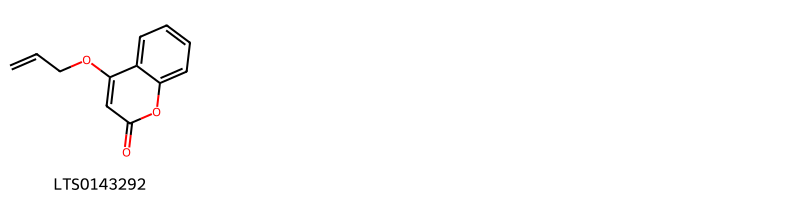{ width=100% }
    <figcaption>Hình ảnh cấu trúc hóa học của 1 hoạt chất thuộc nhóm Coumarins and derivatives gồm ['4-(prop-2-en-1-yloxy)chromen-2-one (LTS0143292)'].</figcaption>
</figure>
#### Nhóm Flavonoids
<figure markdown="span">
    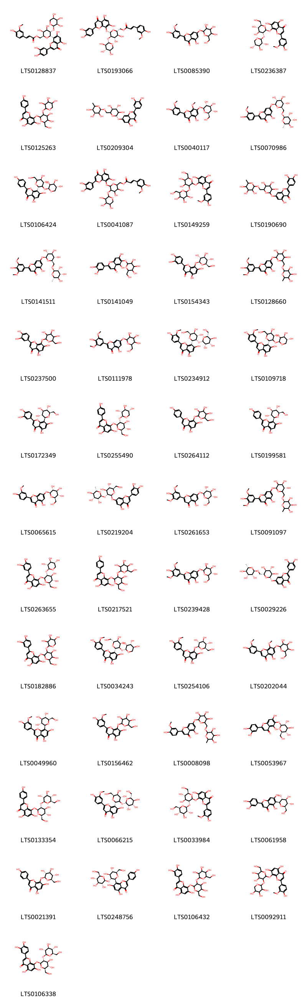{ width=100% }
    <figcaption>Hình ảnh cấu trúc hóa học của 49 hoạt chất thuộc nhóm Flavonoids gồm ['[(2s,3s,4r,5s,6s)-6-[2-(3,4-dihydroxyphenyl)-5,7-dihydroxy-4-oxochromen-8-yl]-3,4-dihydroxy-5-{[(2r,3r,4r,5r)-3,4,5-trihydroxyoxan-2-yl]oxy}oxan-2-yl]methyl (2e)-3-(4-hydroxy-3-methoxyphenyl)prop-2-enoate (LTS0128837)', '[(2r,3s,4s,5r,6s)-6-{[2-(3,4-dihydroxyphenyl)-5,7-dihydroxy-4-oxochromen-8-yl]oxy}-3,4-dihydroxy-5-{[(2s,3r,4s,5r)-3,4,5-trihydroxyoxan-2-yl]oxy}oxan-2-yl]methyl (2e)-3-(4-hydroxy-3-methoxyphenyl)prop-2-enoate (LTS0193066)', '5-hydroxy-2-(4-hydroxy-3-methoxyphenyl)-7-{[3,4,5-trihydroxy-6-(hydroxymethyl)oxan-2-yl]oxy}chromen-4-one (LTS0085390)', '8-{[(2s,3r,4s,5s,6r)-4,5-dihydroxy-6-(hydroxymethyl)-3-{[(2s,3r,4s,5r)-3,4,5-trihydroxyoxan-2-yl]oxy}oxan-2-yl]oxy}-5,7-dihydroxy-2-(4-hydroxy-3-methoxyphenyl)chromen-4-one (LTS0236387)', '8-{[4,5-dihydroxy-6-(hydroxymethyl)-3-[(3,4,5-trihydroxyoxan-2-yl)oxy]oxan-2-yl]oxy}-5,7-dihydroxy-2-(4-hydroxyphenyl)chromen-4-one (LTS0125263)', 'luteolin 7-rutinoside (LTS0209304)', '5-hydroxy-2-(4-hydroxy-3-methoxyphenyl)-8-methoxy-7-{[(2s,3r,4s,5s,6r)-3,4,5-trihydroxy-6-(hydroxymethyl)oxan-2-yl]oxy}chromen-4-one (LTS0040117)', '5-hydroxy-2-(4-hydroxy-3-methoxyphenyl)-7-{[(2s,3r,4s,5s,6r)-3,4,5-trihydroxy-6-({[(2r,3r,4r,5r,6s)-3,4,5-trihydroxy-6-methyloxan-2-yl]oxy}methyl)oxan-2-yl]oxy}chromen-4-one (LTS0070986)', "vitexin 2''-o-xyloside (LTS0106424)", '(6-{[2-(3,4-dihydroxyphenyl)-5,7-dihydroxy-4-oxochromen-8-yl]oxy}-3,4-dihydroxy-5-[(3,4,5-trihydroxyoxan-2-yl)oxy]oxan-2-yl)methyl 3-(4-hydroxy-3-methoxyphenyl)prop-2-enoate (LTS0041087)', '8-{[4,5-dihydroxy-6-(hydroxymethyl)-3-{[3,4,5-trihydroxy-6-(hydroxymethyl)oxan-2-yl]oxy}oxan-2-yl]oxy}-5,7-dihydroxy-2-(4-hydroxy-3-methoxyphenyl)chromen-4-one (LTS0149259)', '2-(3,4-dihydroxyphenyl)-5-hydroxy-7-[(3,4,5-trihydroxy-6-{[(3,4,5-trihydroxy-6-methyloxan-2-yl)oxy]methyl}oxan-2-yl)oxy]chromen-4-one (LTS0190690)', '5-hydroxy-2-(4-hydroxy-3,5-dimethoxyphenyl)-7-{[(2s,3r,4s,5s,6r)-3,4,5-trihydroxy-6-({[(2r,3r,4r,5r,6s)-3,4,5-trihydroxy-6-methyloxan-2-yl]oxy}methyl)oxan-2-yl]oxy}chromen-4-one (LTS0141511)', '2-(3,4-dihydroxyphenyl)-5,7-dihydroxy-6-{[3,4,5-trihydroxy-6-(hydroxymethyl)oxan-2-yl]oxy}chromen-4-one (LTS0141049)', 'hypolaetin-8-glucoside (LTS0154343)', '5-hydroxy-2-(4-hydroxy-3,5-dimethoxyphenyl)-7-[(3,4,5-trihydroxy-6-{[(3,4,5-trihydroxy-6-methyloxan-2-yl)oxy]methyl}oxan-2-yl)oxy]chromen-4-one (LTS0128660)', '2-(3,4-dihydroxyphenyl)-5,7-dihydroxy-8-{[3,4,5-trihydroxy-6-(hydroxymethyl)oxan-2-yl]oxy}chromen-4-one (LTS0237500)', '5-hydroxy-2-(4-hydroxy-3,5-dimethoxyphenyl)-7-{[3,4,5-trihydroxy-6-(hydroxymethyl)oxan-2-yl]oxy}chromen-4-one (LTS0111978)', '8-[(2s,3s,4s,5s,6s)-4,5-dihydroxy-6-(hydroxymethyl)-3-{[(2s,3s,4s,5s,6r)-3,4,5-trihydroxy-6-(hydroxymethyl)oxan-2-yl]oxy}oxan-2-yl]-5,7-dihydroxy-2-(4-hydroxy-3-methoxyphenyl)chromen-4-one (LTS0234912)', "scoparin 2''-o-xyloside (LTS0109718)", 'orientin (LTS0172349)', '8-{[(2s,3r,4s,5s,6r)-4,5-dihydroxy-6-(hydroxymethyl)-3-{[(2s,3r,4s,5r)-3,4,5-trihydroxyoxan-2-yl]oxy}oxan-2-yl]oxy}-5,7-dihydroxy-2-(4-hydroxyphenyl)chromen-4-one (LTS0255490)', '5,7-dihydroxy-2-(4-hydroxyphenyl)-8-{[3,4,5-trihydroxy-6-(hydroxymethyl)oxan-2-yl]oxy}chromen-4-one (LTS0264112)', 'vitexin (LTS0199581)', '5-hydroxy-2-(4-hydroxy-3-methoxyphenyl)-7-{[(2s,3r,4s,5s,6r)-3,4,5-trihydroxy-6-(hydroxymethyl)oxan-2-yl]oxy}chromen-4-one (LTS0065615)', 'lonicerin (LTS0219204)', '5-hydroxy-2-(4-hydroxy-3,5-dimethoxyphenyl)-7-{[(2s,3r,4s,5s,6r)-3,4,5-trihydroxy-6-(hydroxymethyl)oxan-2-yl]oxy}chromen-4-one (LTS0261653)', 'tricin 7-rutinoside (LTS0091097)', '8-{[(2s,3r,4s,5s,6r)-4,5-dihydroxy-6-(hydroxymethyl)-3-{[(2s,3r,4s,5r)-3,4,5-trihydroxyoxan-2-yl]oxy}oxan-2-yl]oxy}-2-(3,4-dihydroxyphenyl)-5,7-dihydroxychromen-4-one (LTS0263655)', '8-{[4,5-dihydroxy-6-(hydroxymethyl)-3-{[3,4,5-trihydroxy-6-(hydroxymethyl)oxan-2-yl]oxy}oxan-2-yl]oxy}-5,7-dihydroxy-2-(4-hydroxyphenyl)chromen-4-one (LTS0217521)', 'tricin 7-glucoside (LTS0239428)', '2-(3,4-dihydroxyphenyl)-5-hydroxy-7-{[(2s,3r,4s,5s,6r)-3,4,5-trihydroxy-6-({[(2r,3r,4r,5r,6s)-3,4,5-trihydroxy-6-methyloxan-2-yl]oxy}methyl)oxan-2-yl]oxy}chromen-4-one (LTS0029226)', '8-{[4,5-dihydroxy-6-(hydroxymethyl)-3-[(3,4,5-trihydroxyoxan-2-yl)oxy]oxan-2-yl]oxy}-2-(3,4-dihydroxyphenyl)-5,7-dihydroxychromen-4-one (LTS0182886)', '8-[(2s,3r,4s,5s,6r)-4,5-dihydroxy-6-(hydroxymethyl)-3-{[(2r,3r,4r,5s)-3,4,5-trihydroxyoxan-2-yl]oxy}oxan-2-yl]-5,7-dihydroxy-2-(4-hydroxy-3-methoxyphenyl)chromen-4-one (LTS0034243)', '5,7-dihydroxy-2-(4-hydroxy-3-methoxyphenyl)-8-{[(2s,3r,4s,5s,6r)-3,4,5-trihydroxy-6-(hydroxymethyl)oxan-2-yl]oxy}chromen-4-one (LTS0254106)', '5-hydroxy-2-(4-hydroxy-3-methoxyphenyl)-8-methoxy-7-{[3,4,5-trihydroxy-6-(hydroxymethyl)oxan-2-yl]oxy}chromen-4-one (LTS0202044)', 'scoparin (LTS0049960)', '5,7-dihydroxy-2-(4-hydroxy-3-methoxyphenyl)-8-{[3,4,5-trihydroxy-6-(hydroxymethyl)oxan-2-yl]oxy}chromen-4-one (LTS0156462)', '5-hydroxy-2-(4-hydroxy-3-methoxyphenyl)-7-[(3,4,5-trihydroxy-6-{[(3,4,5-trihydroxy-6-methyloxan-2-yl)oxy]methyl}oxan-2-yl)oxy]chromen-4-one (LTS0008098)', '2-(3,4-dihydroxyphenyl)-5,7-dihydroxy-6-{[(2s,3r,4s,5s,6r)-3,4,5-trihydroxy-6-(hydroxymethyl)oxan-2-yl]oxy}chromen-4-one (LTS0053967)', '8-{[(2s,3r,4s,5s,6r)-4,5-dihydroxy-6-(hydroxymethyl)-3-{[(2s,3r,4s,5s,6r)-3,4,5-trihydroxy-6-(hydroxymethyl)oxan-2-yl]oxy}oxan-2-yl]oxy}-5,7-dihydroxy-2-(4-hydroxyphenyl)chromen-4-one (LTS0133354)', '8-[(2s,4s,5s,6s)-4,5-dihydroxy-6-(hydroxymethyl)-3-{[(2s,3s,4s,5s,6r)-3,4,5-trihydroxy-6-(hydroxymethyl)oxan-2-yl]oxy}oxan-2-yl]-5,7-dihydroxy-2-(4-hydroxy-3-methoxyphenyl)chromen-4-one (LTS0066215)', '8-{[(2s,3r,4s,5s,6r)-4,5-dihydroxy-6-(hydroxymethyl)-3-{[(2s,3r,4s,5s,6r)-3,4,5-trihydroxy-6-(hydroxymethyl)oxan-2-yl]oxy}oxan-2-yl]oxy}-5,7-dihydroxy-2-(4-hydroxy-3-methoxyphenyl)chromen-4-one (LTS0033984)', 'isoorientin (LTS0061958)', '5,7-dihydroxy-2-(4-hydroxyphenyl)-8-{[(2s,3r,4s,5s,6r)-3,4,5-trihydroxy-6-(hydroxymethyl)oxan-2-yl]oxy}chromen-4-one (LTS0021391)', "2''-o-glucosylvitexin (LTS0248756)", '8-{[4,5-dihydroxy-6-(hydroxymethyl)-3-{[3,4,5-trihydroxy-6-(hydroxymethyl)oxan-2-yl]oxy}oxan-2-yl]oxy}-2-(3,4-dihydroxyphenyl)-5,7-dihydroxychromen-4-one (LTS0106432)', '8-{[4,5-dihydroxy-6-(hydroxymethyl)-3-[(3,4,5-trihydroxyoxan-2-yl)oxy]oxan-2-yl]oxy}-5,7-dihydroxy-2-(4-hydroxy-3-methoxyphenyl)chromen-4-one (LTS0092911)', '8-{[(2s,3r,4s,5s,6r)-4,5-dihydroxy-6-(hydroxymethyl)-3-{[(2s,3r,4s,5s,6r)-3,4,5-trihydroxy-6-(hydroxymethyl)oxan-2-yl]oxy}oxan-2-yl]oxy}-2-(3,4-dihydroxyphenyl)-5,7-dihydroxychromen-4-one (LTS0106338)'].</figcaption>
</figure>
#### Nhóm Steroids and steroid derivatives
<figure markdown="span">
    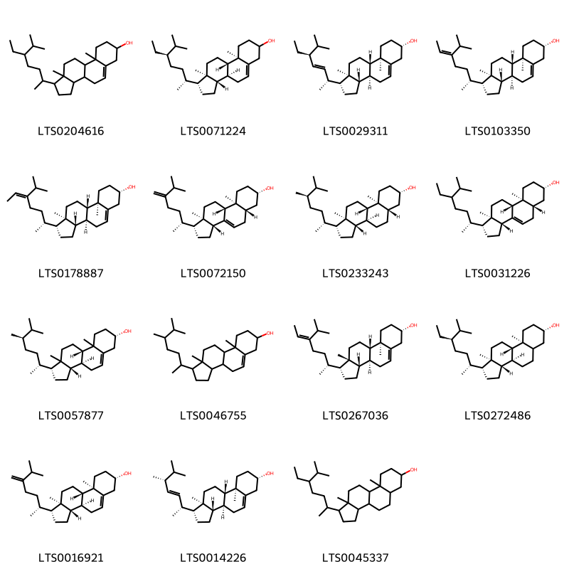{ width=100% }
    <figcaption>Hình ảnh cấu trúc hóa học của 15 hoạt chất thuộc nhóm Steroids and steroid derivatives gồm ['stigmast-5-en-3-ol, (3β)- (LTS0204616)', 'stigmast-5-en-3-ol (LTS0071224)', 'phytosterol (LTS0029311)', 'avenasterol (LTS0103350)', 'fucosterol (LTS0178887)', 'episterol (LTS0072150)', 'campestanol (LTS0233243)', '(1r,3ar,5as,7s,9as,9br,11ar)-1-[(2r)-5-ethyl-6-methylheptan-2-yl]-9a,11a-dimethyl-1h,2h,3h,3ah,5h,5ah,6h,7h,8h,9h,9bh,10h,11h-cyclopenta[a]phenanthren-7-ol (LTS0031226)', '(1r,3as,3bs,7s,9bs)-1-[(2r,5r)-5,6-dimethylheptan-2-yl]-9a,11a-dimethyl-1h,2h,3h,3ah,3bh,4h,6h,7h,8h,9h,9bh,10h,11h-cyclopenta[a]phenanthren-7-ol (LTS0057877)', 'campesterol (LTS0046755)', '(1r,3as,3bs,7s,9ar,9bs,11as)-1-[(2r,5z)-5-isopropylhept-5-en-2-yl]-9a,11a-dimethyl-1h,2h,3h,3ah,3bh,4h,6h,7h,8h,9h,9bh,10h,11h-cyclopenta[a]phenanthren-7-ol (LTS0267036)', '(1r,3as,3br,7s,9as,9bs,11ar)-1-[(2r,5r)-5-ethyl-6-methylheptan-2-yl]-9a,11a-dimethyl-tetradecahydro-1h-cyclopenta[a]phenanthren-7-ol (LTS0272486)', '24-methylenecholesterol (LTS0016921)', 'brassicasterol (LTS0014226)', '24-ethyl coprostanol (LTS0045337)'].</figcaption>
</figure>

---

### Dược dân tộc học

Danh sách các quốc gia có sử dụng *Setaria italica* trong điều trị các bệnh. 

| Country   | Disease                                                  | Bệnh                                                                                                                                                                                                |
|:----------|:---------------------------------------------------------|:----------------------------------------------------------------------------------------------------------------------------------------------------------------------------------------------------|
| China     | Astringent, Diuretic, Intoxicant, Refrigerant, Emollient | MYMEMORY WARNING: YOU USED ALL AVAILABLE FREE TRANSLATIONS FOR TODAY. NEXT AVAILABLE IN  01 HOURS 27 MINUTES 02 SECONDS VISIT HTTPS://MYMEMORY.TRANSLATED.NET/DOC/USAGELIMITS.PHP TO TRANSLATE MORE |
| Elsewhere | Abortifacient, Diuretic, Sedative, Aphrodisiac, Laxative | MYMEMORY WARNING: YOU USED ALL AVAILABLE FREE TRANSLATIONS FOR TODAY. NEXT AVAILABLE IN  01 HOURS 27 MINUTES 00 SECONDS VISIT HTTPS://MYMEMORY.TRANSLATED.NET/DOC/USAGELIMITS.PHP TO TRANSLATE MORE |

---

---
## Setaria plicata
### Thông tin về thực vật

!!! info "Phân loại thực vật của *Setaria plicata* từ GIBF:"
    - **Kingdom:** Plantae
    - **Phylum:** Tracheophyta
    - **Order:** Poales
    - **Family:** Poaceae
    - **Genus:** Setaria
    - **Species:** *Setaria plicata*

 

| Label (VI)   | Label (EN)   | Scientific Name   | Descriptions (VI)   | Descriptions (EN)   | Also Known As (VI)   | Also Known As (EN)   |
|:-------------|:-------------|:------------------|:--------------------|:--------------------|:---------------------|:---------------------|
| N/A          | N/A          | Setaria plicata   | loài thực vật       | species of plant    | ['']                 | ['']                 |

#### Phân bố trên thế giới

**Từ CSDL GIBF** nan, South Africa, Saint Helena, Ascension and Tristan da Cunha, Hong Kong, Australia, Japan, Thailand, Chinese Taipei, Papua New Guinea, Burundi, Indonesia, United States of America, Timor-Leste, Philippines, Viet Nam, China, Nepal

#### Phân bố tại Việt Nam

**Từ CSDL GIBF**: Không có ghi nhận ở Việt Nam

---
### Thành phần hóa học
        
- Theo cơ sở dữ liệu lotus: Từ loài *Setaria plicata* đã phân lập và xác định được Chưa có hoạt chất nào được phân lập. hoạt chất thuộc về các nhóm Không có hoạt chất nào được phân lập. 

Không có hình ảnh nào được tạo ra

---

### Dược dân tộc học

Danh sách các quốc gia có sử dụng *Setaria plicata* trong điều trị các bệnh. 

| Country   | Disease             | Bệnh                                                                                                                                                                                                |
|:----------|:--------------------|:----------------------------------------------------------------------------------------------------------------------------------------------------------------------------------------------------|
| Elsewhere | Emollient, Diuretic | MYMEMORY WARNING: YOU USED ALL AVAILABLE FREE TRANSLATIONS FOR TODAY. NEXT AVAILABLE IN  01 HOURS 26 MINUTES 23 SECONDS VISIT HTTPS://MYMEMORY.TRANSLATED.NET/DOC/USAGELIMITS.PHP TO TRANSLATE MORE |

---

---
## Setaria verticillata
### Thông tin về thực vật

!!! info "Phân loại thực vật của *Setaria verticillata* từ GIBF:"
    - **Kingdom:** Plantae
    - **Phylum:** Tracheophyta
    - **Order:** Poales
    - **Family:** Poaceae
    - **Genus:** Setaria
    - **Species:** *Setaria verticillata*

 

| Label (VI)   | Label (EN)   | Scientific Name      | Descriptions (VI)   | Descriptions (EN)   | Also Known As (VI)   | Also Known As (EN)                                                                                              |
|:-------------|:-------------|:---------------------|:--------------------|:--------------------|:---------------------|:----------------------------------------------------------------------------------------------------------------|
| N/A          | N/A          | Setaria verticillata | loài thực vật       | species of plant    | ['']                 | ['Bristly Foxtail ', 'bur bristle grass', 'bur grass', 'foxtail', 'hooked bristlegrass', 'Hooked bristlegrass'] |

#### Phân bố trên thế giới

**Từ CSDL GIBF** Italy, Australia, Belgium, Slovakia, Argentina, Israel, Ukraine, Denmark, Netherlands, Namibia, Chinese Taipei, Malta, Spain, Hungary, Algeria, Russian Federation, Croatia, Saudi Arabia, South Africa, Hong Kong, Czechia, Germany, Romania, Switzerland, Austria, France, Botswana, India, New Zealand

#### Phân bố tại Việt Nam

**Từ CSDL GIBF**: Không có ghi nhận ở Việt Nam

---
### Thành phần hóa học
        
- Theo cơ sở dữ liệu lotus: Từ loài *Setaria verticillata* đã phân lập và xác định được Chưa có hoạt chất nào được phân lập. hoạt chất thuộc về các nhóm Không có hoạt chất nào được phân lập. 

Không có hình ảnh nào được tạo ra

---

### Dược dân tộc học

Danh sách các quốc gia có sử dụng *Setaria verticillata* trong điều trị các bệnh. 

| Country   | Disease   | Bệnh                                                                                                                                                                                                |
|:----------|:----------|:----------------------------------------------------------------------------------------------------------------------------------------------------------------------------------------------------|
| India     | Poison    | MYMEMORY WARNING: YOU USED ALL AVAILABLE FREE TRANSLATIONS FOR TODAY. NEXT AVAILABLE IN  01 HOURS 26 MINUTES 03 SECONDS VISIT HTTPS://MYMEMORY.TRANSLATED.NET/DOC/USAGELIMITS.PHP TO TRANSLATE MORE |

---

# Chi Imperata

??? note "Danh sách các dược liệu thuộc chi"
    
	 - *Imperata cylindrica*
	 - *Imperata koenigii*

---
## Imperata cylindrica
### Thông tin về thực vật

!!! info "Phân loại thực vật của *Imperata cylindrica* từ GIBF:"
    - **Kingdom:** Plantae
    - **Phylum:** Tracheophyta
    - **Order:** Poales
    - **Family:** Poaceae
    - **Genus:** Imperata
    - **Species:** *Imperata cylindrica*

 

| Label (VI)   | Label (EN)   | Scientific Name     | Descriptions (VI)   | Descriptions (EN)                      | Also Known As (VI)      | Also Known As (EN)                                                                                                                                                                 |
|:-------------|:-------------|:--------------------|:--------------------|:---------------------------------------|:------------------------|:-----------------------------------------------------------------------------------------------------------------------------------------------------------------------------------|
| N/A          | N/A          | Imperata cylindrica |                     | species of grass in the family Poaceae | ['Imperata cylindrica'] | ['alang-alang', 'Blady Grass', 'Cogon Grass', 'Cogon grass', 'Cotton grass', 'Thatch grass', 'cotton wool grass', 'Japanese bloodgrass', 'Kunai Grass', 'kura-kura', 'Satin Tail'] |

#### Phân bố trên thế giới

**Từ CSDL GIBF** South Africa, Sri Lanka, Hong Kong, Australia, Madagascar, Thailand, Iraq, Chinese Taipei, Honduras, Algeria, Indonesia, India, United States of America, Peru, Philippines, Singapore, Malaysia, China

#### Phân bố tại Việt Nam

**Từ CSDL GIBF**: Không có ghi nhận ở Việt Nam

---
### Thành phần hóa học
        
- Theo cơ sở dữ liệu lotus: Từ loài *Imperata cylindrica* đã phân lập và xác định được 44 hoạt chất thuộc về các nhóm Coumarans, Flavonoids, Steroids and steroid derivatives, Linear 1,3-diarylpropanoids, Quinolines and derivatives, Cinnamic acids and derivatives, Lignan lactones, Benzene and substituted derivatives, Indanes, Organooxygen compounds, Phenols, Coumarins and derivatives, Amaryllidaceae alkaloids, Carboxylic acids and derivatives, Benzopyrans. 

|    | chemicalTaxonomyClassyfireClass     |   smiles_count |
|---:|:------------------------------------|---------------:|
|  0 |                                     |              1 |
|  1 | Amaryllidaceae alkaloids            |              2 |
|  2 | Benzene and substituted derivatives |              5 |
|  3 | Benzopyrans                         |              5 |
|  4 | Carboxylic acids and derivatives    |              2 |
|  5 | Cinnamic acids and derivatives      |              2 |
|  6 | Coumarans                           |              1 |
|  7 | Coumarins and derivatives           |              1 |
|  8 | Flavonoids                          |              6 |
|  9 | Indanes                             |              1 |
| 10 | Lignan lactones                     |              2 |
| 11 | Linear 1,3-diarylpropanoids         |              2 |
| 12 | Organooxygen compounds              |              2 |
| 13 | Phenols                             |              2 |
| 14 | Quinolines and derivatives          |              4 |
| 15 | Steroids and steroid derivatives    |              1 |

#### Nhóm 
<figure markdown="span">
    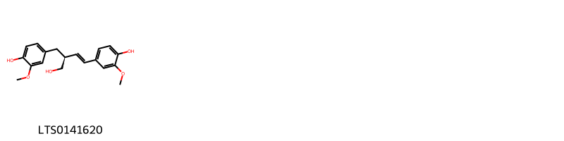{ width=100% }
    <figcaption>Hình ảnh cấu trúc hóa học của 1 hoạt chất thuộc nhóm  gồm ['4-[(1e,3s)-4-hydroxy-3-[(4-hydroxy-3-methoxyphenyl)methyl]but-1-en-1-yl]-2-methoxyphenol (LTS0141620)'].</figcaption>
</figure>
#### Nhóm Amaryllidaceae alkaloids
<figure markdown="span">
    { width=100% }
    <figcaption>Hình ảnh cấu trúc hóa học của 2 hoạt chất thuộc nhóm Amaryllidaceae alkaloids gồm ['lycorine (LTS0186544)', 'lycorine (LTS0250349)'].</figcaption>
</figure>
#### Nhóm Benzene and substituted derivatives
<figure markdown="span">
    { width=100% }
    <figcaption>Hình ảnh cấu trúc hóa học của 5 hoạt chất thuộc nhóm Benzene and substituted derivatives gồm ['cylindol a (LTS0058199)', 'methyl 2-hydroxy-5-[4-hydroxy-3-(methoxycarbonyl)phenoxy]benzoate (LTS0233337)', 'isovanillic acid (LTS0247446)', 'ethylparaben (LTS0259455)', 'p-hydroxybenzoic acid (LTS0263634)'].</figcaption>
</figure>
#### Nhóm Benzopyrans
<figure markdown="span">
    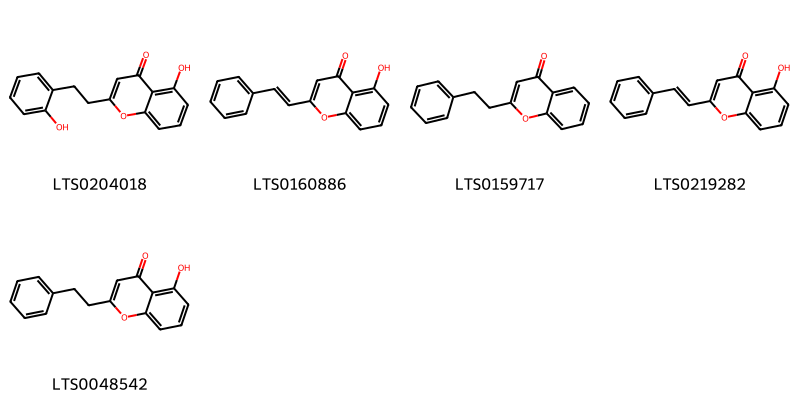{ width=100% }
    <figcaption>Hình ảnh cấu trúc hóa học của 5 hoạt chất thuộc nhóm Benzopyrans gồm ['5-hydroxy-2-[2-(2-hydroxyphenyl)ethyl]chromen-4-one (LTS0204018)', '5-hydroxy-2-(2-phenylethenyl)chromen-4-one (LTS0160886)', '2-(2-phenylethyl)chromone (LTS0159717)', '5-hydroxy-2-[(1e)-2-phenylethenyl]chromen-4-one (LTS0219282)', '5-hydroxy-2-(2-phenylethyl)chromen-4-one (LTS0048542)'].</figcaption>
</figure>
#### Nhóm Carboxylic acids and derivatives
<figure markdown="span">
    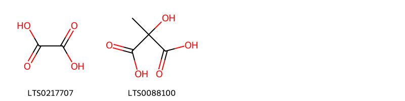{ width=100% }
    <figcaption>Hình ảnh cấu trúc hóa học của 2 hoạt chất thuộc nhóm Carboxylic acids and derivatives gồm ['oxalic acid (LTS0217707)', '2-hydroxy-2-methylpropanedioic acid (LTS0088100)'].</figcaption>
</figure>
#### Nhóm Cinnamic acids and derivatives
<figure markdown="span">
    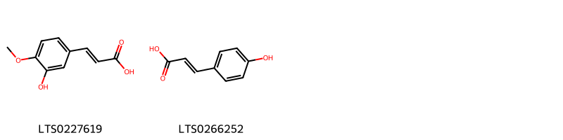{ width=100% }
    <figcaption>Hình ảnh cấu trúc hóa học của 2 hoạt chất thuộc nhóm Cinnamic acids and derivatives gồm ['isoferulic acid (LTS0227619)', 'para-coumaric acid (LTS0266252)'].</figcaption>
</figure>
#### Nhóm Coumarans
<figure markdown="span">
    { width=100% }
    <figcaption>Hình ảnh cấu trúc hóa học của 1 hoạt chất thuộc nhóm Coumarans gồm ['coumaran (LTS0098724)'].</figcaption>
</figure>
#### Nhóm Coumarins and derivatives
<figure markdown="span">
    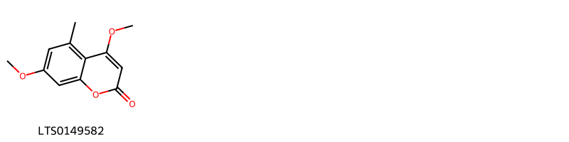{ width=100% }
    <figcaption>Hình ảnh cấu trúc hóa học của 1 hoạt chất thuộc nhóm Coumarins and derivatives gồm ['siderin (LTS0149582)'].</figcaption>
</figure>
#### Nhóm Flavonoids
<figure markdown="span">
    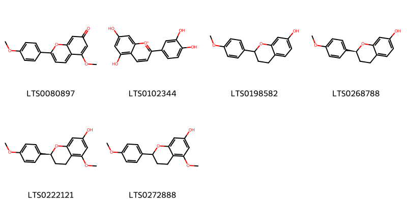{ width=100% }
    <figcaption>Hình ảnh cấu trúc hóa học của 6 hoạt chất thuộc nhóm Flavonoids gồm ['5-methoxy-2-(4-methoxyphenyl)chromen-7-one (LTS0080897)', 'luteolinidin (LTS0102344)', "7-hydroxy-4'-methoxyflavan (LTS0198582)", 'broussin (LTS0268788)', '(2s)-5-methoxy-2-(4-methoxyphenyl)-3,4-dihydro-2h-1-benzopyran-7-ol (LTS0222121)', '5-methoxy-2-(4-methoxyphenyl)-3,4-dihydro-2h-1-benzopyran-7-ol (LTS0272888)'].</figcaption>
</figure>
#### Nhóm Indanes
<figure markdown="span">
    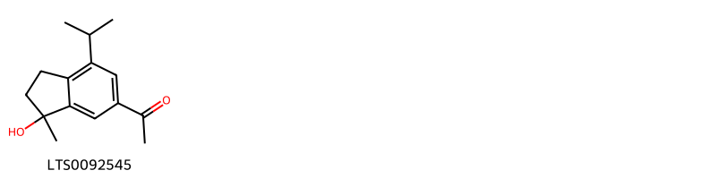{ width=100% }
    <figcaption>Hình ảnh cấu trúc hóa học của 1 hoạt chất thuộc nhóm Indanes gồm ['1-(3-hydroxy-7-isopropyl-3-methyl-1,2-dihydroinden-5-yl)ethanone (LTS0092545)'].</figcaption>
</figure>
#### Nhóm Lignan lactones
<figure markdown="span">
    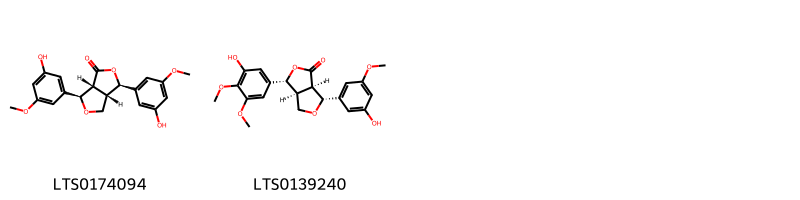{ width=100% }
    <figcaption>Hình ảnh cấu trúc hóa học của 2 hoạt chất thuộc nhóm Lignan lactones gồm ['(3r,3as,6r,6ar)-3,6-bis(3-hydroxy-5-methoxyphenyl)-tetrahydro-3h-furo[3,4-c]furan-1-one (LTS0174094)', 'graminone b (LTS0139240)'].</figcaption>
</figure>
#### Nhóm Linear 1_3-diarylpropanoids
<figure markdown="span">
    { width=100% }
    <figcaption>Hình ảnh cấu trúc hóa học của Không tìm thấy chú thích hoạt chất thuộc nhóm Linear 1_3-diarylpropanoids gồm Không tìm thấy chú thích.</figcaption>
</figure>
#### Nhóm Organooxygen compounds
<figure markdown="span">
    { width=100% }
    <figcaption>Hình ảnh cấu trúc hóa học của 2 hoạt chất thuộc nhóm Organooxygen compounds gồm ['salicin (LTS0129975)', 'apocynin (LTS0211279)'].</figcaption>
</figure>
#### Nhóm Phenols
<figure markdown="span">
    { width=100% }
    <figcaption>Hình ảnh cấu trúc hóa học của 2 hoạt chất thuộc nhóm Phenols gồm ['syringaldehyde (LTS0201406)', '5-ethenyl-2-methoxyphenol (LTS0076260)'].</figcaption>
</figure>
#### Nhóm Quinolines and derivatives
<figure markdown="span">
    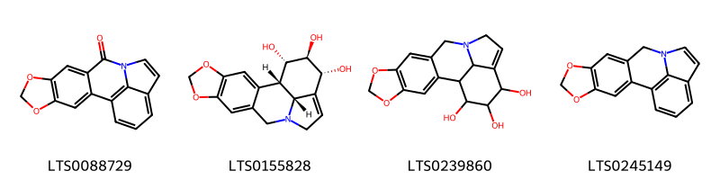{ width=100% }
    <figcaption>Hình ảnh cấu trúc hóa học của 4 hoạt chất thuộc nhóm Quinolines and derivatives gồm ['5,7-dioxa-12-azapentacyclo[10.6.1.0²,¹⁰.0⁴,⁸.0¹⁵,¹⁹]nonadeca-1(19),2(10),3,8,13,15,17-heptaen-11-one (LTS0088729)', '(1s,16r,17r,18s,19r)-5,7-dioxa-12-azapentacyclo[10.6.1.0²,¹⁰.0⁴,⁸.0¹⁵,¹⁹]nonadeca-2,4(8),9,14-tetraene-16,17,18-triol (LTS0155828)', '5,7-dioxa-12-azapentacyclo[10.6.1.0²,¹⁰.0⁴,⁸.0¹⁵,¹⁹]nonadeca-2,4(8),9,14-tetraene-16,17,18-triol (LTS0239860)', '5,7-dioxa-12-azapentacyclo[10.6.1.0²,¹⁰.0⁴,⁸.0¹⁵,¹⁹]nonadeca-1(19),2,4(8),9,13,15,17-heptaene (LTS0245149)'].</figcaption>
</figure>
#### Nhóm Steroids and steroid derivatives
<figure markdown="span">
    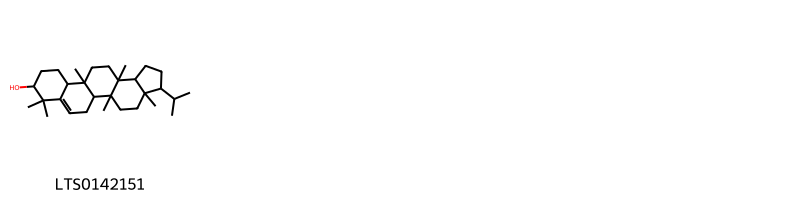{ width=100% }
    <figcaption>Hình ảnh cấu trúc hóa học của 1 hoạt chất thuộc nhóm Steroids and steroid derivatives gồm ['3-isopropyl-3a,5a,8,8,11b,13a-hexamethyl-1h,2h,3h,4h,5h,5bh,6h,9h,10h,11h,11ah,12h,13h,13bh-cyclopenta[a]chrysen-9-ol (LTS0142151)'].</figcaption>
</figure>

---

### Dược dân tộc học

Danh sách các quốc gia có sử dụng *Imperata cylindrica* trong điều trị các bệnh. 

| Country     | Disease                                                                                             | Bệnh                                                                                                                                                                                                |
|:------------|:----------------------------------------------------------------------------------------------------|:----------------------------------------------------------------------------------------------------------------------------------------------------------------------------------------------------|
| China       | Diuretic, Refrigerant, Tonic, Viristat, Astringent, Diuretic, Antivinous, Diuretic, Hemostat, Tonic | MYMEMORY WARNING: YOU USED ALL AVAILABLE FREE TRANSLATIONS FOR TODAY. NEXT AVAILABLE IN  01 HOURS 25 MINUTES 41 SECONDS VISIT HTTPS://MYMEMORY.TRANSLATED.NET/DOC/USAGELIMITS.PHP TO TRANSLATE MORE |
| India       | Hemostat, Vulnerary                                                                                 | MYMEMORY WARNING: YOU USED ALL AVAILABLE FREE TRANSLATIONS FOR TODAY. NEXT AVAILABLE IN  01 HOURS 25 MINUTES 39 SECONDS VISIT HTTPS://MYMEMORY.TRANSLATED.NET/DOC/USAGELIMITS.PHP TO TRANSLATE MORE |
| Japan       | Analeptic, Diuretic, Hemostatic                                                                     | MYMEMORY WARNING: YOU USED ALL AVAILABLE FREE TRANSLATIONS FOR TODAY. NEXT AVAILABLE IN  01 HOURS 25 MINUTES 37 SECONDS VISIT HTTPS://MYMEMORY.TRANSLATED.NET/DOC/USAGELIMITS.PHP TO TRANSLATE MORE |
| Japan*      | Hemostatic                                                                                          | MYMEMORY WARNING: YOU USED ALL AVAILABLE FREE TRANSLATIONS FOR TODAY. NEXT AVAILABLE IN  01 HOURS 25 MINUTES 35 SECONDS VISIT HTTPS://MYMEMORY.TRANSLATED.NET/DOC/USAGELIMITS.PHP TO TRANSLATE MORE |
| Malaysia    | Hemostat, Intoxicant                                                                                | MYMEMORY WARNING: YOU USED ALL AVAILABLE FREE TRANSLATIONS FOR TODAY. NEXT AVAILABLE IN  01 HOURS 25 MINUTES 32 SECONDS VISIT HTTPS://MYMEMORY.TRANSLATED.NET/DOC/USAGELIMITS.PHP TO TRANSLATE MORE |
| Philippines | Sedative                                                                                            | MYMEMORY WARNING: YOU USED ALL AVAILABLE FREE TRANSLATIONS FOR TODAY. NEXT AVAILABLE IN  01 HOURS 25 MINUTES 30 SECONDS VISIT HTTPS://MYMEMORY.TRANSLATED.NET/DOC/USAGELIMITS.PHP TO TRANSLATE MORE |
| Sumatra     | Diuretic                                                                                            | MYMEMORY WARNING: YOU USED ALL AVAILABLE FREE TRANSLATIONS FOR TODAY. NEXT AVAILABLE IN  01 HOURS 25 MINUTES 28 SECONDS VISIT HTTPS://MYMEMORY.TRANSLATED.NET/DOC/USAGELIMITS.PHP TO TRANSLATE MORE |

---

---
## Imperata koenigii
### Thông tin về thực vật

!!! info "Phân loại thực vật của *Imperata cylindrica* từ GIBF:"
    - **Kingdom:** Plantae
    - **Phylum:** Tracheophyta
    - **Order:** Poales
    - **Family:** Poaceae
    - **Genus:** Imperata
    - **Species:** *Imperata cylindrica*

 

| Label (VI)   | Label (EN)   | Scientific Name   | Descriptions (VI)   | Descriptions (EN)   | Also Known As (VI)   | Also Known As (EN)   |
|:-------------|:-------------|:------------------|:--------------------|:--------------------|:---------------------|:---------------------|
| N/A          | N/A          | Imperata koenigii | loài thực vật       | species of plant    | ['']                 | ['']                 |

#### Phân bố trên thế giới

**Từ CSDL GIBF** nan, South Africa, Japan, Korea, Republic of, Brazil, India, Indonesia, unknown or invalid, Philippines, China

#### Phân bố tại Việt Nam

**Từ CSDL GIBF**: Không có ghi nhận ở Việt Nam

---
### Thành phần hóa học
        
- Theo cơ sở dữ liệu lotus: Từ loài *Imperata cylindrica* đã phân lập và xác định được Chưa có hoạt chất nào được phân lập. hoạt chất thuộc về các nhóm Không có hoạt chất nào được phân lập. 

Không có hình ảnh nào được tạo ra

---

### Dược dân tộc học

Danh sách các quốc gia có sử dụng *Imperata cylindrica* trong điều trị các bệnh. 

| Country   | Disease   | Bệnh                                                                                                                                                                                                |
|:----------|:----------|:----------------------------------------------------------------------------------------------------------------------------------------------------------------------------------------------------|
| Japan     | Diuretic  | MYMEMORY WARNING: YOU USED ALL AVAILABLE FREE TRANSLATIONS FOR TODAY. NEXT AVAILABLE IN  01 HOURS 24 MINUTES 55 SECONDS VISIT HTTPS://MYMEMORY.TRANSLATED.NET/DOC/USAGELIMITS.PHP TO TRANSLATE MORE |

---

# Chi Avena

??? note "Danh sách các dược liệu thuộc chi"
    
	 - *Avena fatua*
	 - *Avena satica*
	 - *Avena sativa*

---
## Avena fatua
### Thông tin về thực vật

!!! info "Phân loại thực vật của *Avena fatua* từ GIBF:"
    - **Kingdom:** Plantae
    - **Phylum:** Tracheophyta
    - **Order:** Poales
    - **Family:** Poaceae
    - **Genus:** Avena
    - **Species:** *Avena fatua*

 

| Label (VI)   | Label (EN)   | Scientific Name   | Descriptions (VI)   | Descriptions (EN)          | Also Known As (VI)   | Also Known As (EN)   |
|:-------------|:-------------|:------------------|:--------------------|:---------------------------|:---------------------|:---------------------|
| N/A          | N/A          | Avena fatua       |                     | species of plant, wild oat | ['']                 | ['Common wild oat']  |

#### Phân bố trên thế giới

**Từ CSDL GIBF** Ukraine, South Africa, Italy, Australia, Japan, Spain, Bolivia (Plurinational State of), Portugal, Switzerland, Russian Federation, United States of America, Chile, Greece, Canada, Uzbekistan

#### Phân bố tại Việt Nam

**Từ CSDL GIBF**: Không có ghi nhận ở Việt Nam

---
### Thành phần hóa học
        
- Theo cơ sở dữ liệu lotus: Từ loài *Avena fatua* đã phân lập và xác định được 14 hoạt chất thuộc về các nhóm Coumarins and derivatives, Prenol lipids, Benzene and substituted derivatives. 

|    | chemicalTaxonomyClassyfireClass     |   smiles_count |
|---:|:------------------------------------|---------------:|
|  0 | Benzene and substituted derivatives |              2 |
|  1 | Coumarins and derivatives           |              2 |
|  2 | Prenol lipids                       |             10 |

#### Nhóm Benzene and substituted derivatives
<figure markdown="span">
    { width=100% }
    <figcaption>Hình ảnh cấu trúc hóa học của 2 hoạt chất thuộc nhóm Benzene and substituted derivatives gồm ['p-hydroxybenzoic acid (LTS0263634)', 'vanillic acid (LTS0229113)'].</figcaption>
</figure>
#### Nhóm Coumarins and derivatives
<figure markdown="span">
    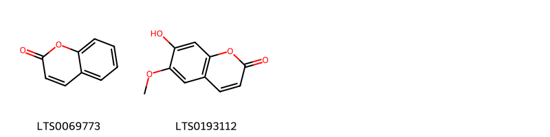{ width=100% }
    <figcaption>Hình ảnh cấu trúc hóa học của 2 hoạt chất thuộc nhóm Coumarins and derivatives gồm ['2h-1-benzopyran-2-one (LTS0069773)', 'scopoletin (LTS0193112)'].</figcaption>
</figure>
#### Nhóm Prenol lipids
<figure markdown="span">
    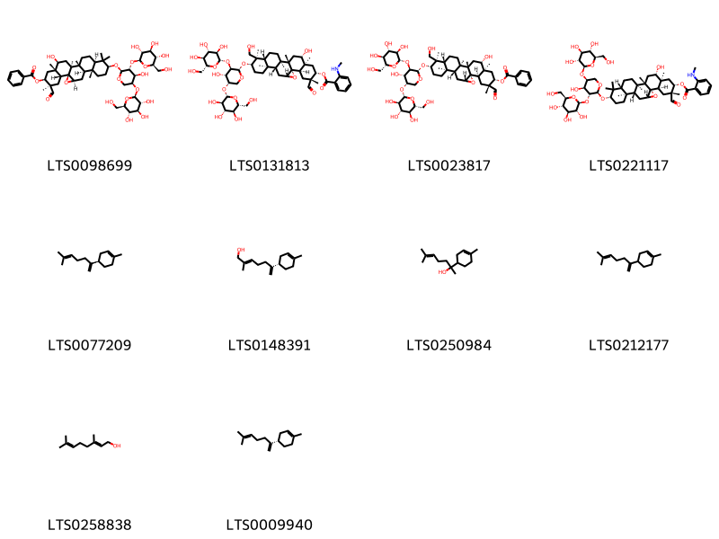{ width=100% }
    <figcaption>Hình ảnh cấu trúc hóa học của 10 hoạt chất thuộc nhóm Prenol lipids gồm ['avenacin b-2 (LTS0098699)', 'avenacin a-1 (LTS0131813)', '(2s,3r,4ar,4bs,5ar,6ar,6br,9s,10r,10ar,12ar,12bs,14s,14as)-3-formyl-14-hydroxy-9-{[(2s,3r,4s,5s)-4-hydroxy-3,5-bis({[(2s,3r,4s,5s,6r)-3,4,5-trihydroxy-6-(hydroxymethyl)oxan-2-yl]oxy})oxan-2-yl]oxy}-10-(hydroxymethyl)-3,6b,10,12a,12b,14a-hexamethyl-tetradecahydro-1h-piceno[13,12b-b]oxiren-2-yl benzoate (LTS0023817)', '(2s,3r,4ar,4bs,5ar,6ar,6br,9s,10ar,12ar,12bs,14s,14as)-3-formyl-14-hydroxy-9-{[(2s,3r,4s,5s)-4-hydroxy-3,5-bis({[(2s,3r,4s,5s,6r)-3,4,5-trihydroxy-6-(hydroxymethyl)oxan-2-yl]oxy})oxan-2-yl]oxy}-3,6b,10,10,12a,12b,14a-heptamethyl-tetradecahydro-1h-piceno[13,12b-b]oxiren-2-yl 2-(methylamino)benzoate (LTS0221117)', '(r)-β-bisabolene (LTS0077209)', '(2e)-2-methyl-6-[(1s)-4-methylcyclohex-3-en-1-yl]hepta-2,6-dien-1-ol (LTS0148391)', 'α-bisabolol (LTS0250984)', 'β-bisabolene (LTS0212177)', 'geraniol (LTS0258838)', '(-)-β-bisabolene (LTS0009940)'].</figcaption>
</figure>

---

### Dược dân tộc học

Danh sách các quốc gia có sử dụng *Avena fatua* trong điều trị các bệnh. 

| Country   | Disease    | Bệnh                                                                                                                                                                                                |
|:----------|:-----------|:----------------------------------------------------------------------------------------------------------------------------------------------------------------------------------------------------|
| China     | Uterotonic | MYMEMORY WARNING: YOU USED ALL AVAILABLE FREE TRANSLATIONS FOR TODAY. NEXT AVAILABLE IN  01 HOURS 24 MINUTES 37 SECONDS VISIT HTTPS://MYMEMORY.TRANSLATED.NET/DOC/USAGELIMITS.PHP TO TRANSLATE MORE |

---

---
## Avena satica
### Thông tin về thực vật

!!! info "Phân loại thực vật của *Avena sativa* từ GIBF:"
    - **Kingdom:** Plantae
    - **Phylum:** Tracheophyta
    - **Order:** Poales
    - **Family:** Poaceae
    - **Genus:** Avena
    - **Species:** *Avena sativa*

 

| Label (VI)   | Label (EN)   | Scientific Name   | Descriptions (VI)   | Descriptions (EN)          | Also Known As (VI)   | Also Known As (EN)   |
|:-------------|:-------------|:------------------|:--------------------|:---------------------------|:---------------------|:---------------------|
| N/A          | N/A          | Avena fatua       |                     | species of plant, wild oat | ['']                 | ['Common wild oat']  |

#### Phân bố trên thế giới

**Từ CSDL GIBF** nan, Italy, Australia, Belgium, Estonia, Argentina, Palestine, State of, Norway, Canada, Ukraine, Denmark, Netherlands, Spain, Portugal, Albania, Russian Federation, United States of America, Sweden, Croatia, Czechia, Germany, Switzerland, Mexico, France, Austria, United Kingdom of Great Britain and Northern Ireland, Ecuador, Ireland, Serbia, Poland, New Zealand

#### Phân bố tại Việt Nam

**Từ CSDL GIBF**: Không có ghi nhận ở Việt Nam

---
### Thành phần hóa học
        
- Theo cơ sở dữ liệu lotus: Từ loài *Avena sativa* đã phân lập và xác định được Chưa có hoạt chất nào được phân lập. hoạt chất thuộc về các nhóm Không có hoạt chất nào được phân lập. 

Không có hình ảnh nào được tạo ra

---

### Dược dân tộc học

Danh sách các quốc gia có sử dụng *Avena sativa* trong điều trị các bệnh. 

| Country   | Disease   | Bệnh                                                                                                                                                                                                |
|:----------|:----------|:----------------------------------------------------------------------------------------------------------------------------------------------------------------------------------------------------|
| Turkey    | Demulcent | MYMEMORY WARNING: YOU USED ALL AVAILABLE FREE TRANSLATIONS FOR TODAY. NEXT AVAILABLE IN  01 HOURS 24 MINUTES 04 SECONDS VISIT HTTPS://MYMEMORY.TRANSLATED.NET/DOC/USAGELIMITS.PHP TO TRANSLATE MORE |

---

---
## Avena sativa
### Thông tin về thực vật

!!! info "Phân loại thực vật của *Avena sativa* từ GIBF:"
    - **Kingdom:** Plantae
    - **Phylum:** Tracheophyta
    - **Order:** Poales
    - **Family:** Poaceae
    - **Genus:** Avena
    - **Species:** *Avena sativa*

 

| Label (VI)   | Label (EN)   | Scientific Name   | Descriptions (VI)   | Descriptions (EN)   | Also Known As (VI)   | Also Known As (EN)     |
|:-------------|:-------------|:------------------|:--------------------|:--------------------|:---------------------|:-----------------------|
| N/A          | N/A          | Avena sativa      |                     | type of cereal      | ['']                 | ['oats', 'Common Oat'] |

#### Phân bố trên thế giới

**Từ CSDL GIBF** nan, Italy, Australia, Belgium, Estonia, Argentina, Palestine, State of, Norway, Canada, Ukraine, Denmark, Netherlands, Spain, Portugal, Albania, Russian Federation, United States of America, Sweden, Croatia, Czechia, Germany, Switzerland, Mexico, France, Austria, United Kingdom of Great Britain and Northern Ireland, Ecuador, Ireland, Serbia, Poland, New Zealand

#### Phân bố tại Việt Nam

**Từ CSDL GIBF**: Không có ghi nhận ở Việt Nam

---
### Thành phần hóa học
        
- Theo cơ sở dữ liệu lotus: Từ loài *Avena sativa* đã phân lập và xác định được 117 hoạt chất thuộc về các nhóm Fatty Acyls, Flavonoids, Prenol lipids, Steroids and steroid derivatives, Organic oxides, Cinnamic acids and derivatives, Benzoxazines, Dibenzylbutane lignans, Organonitrogen compounds, Benzene and substituted derivatives, Organooxygen compounds, Phenols, Pyrrolines, Furanoid lignans, Carboxylic acids and derivatives, Benzopyrans. 

|    | chemicalTaxonomyClassyfireClass     |   smiles_count |
|---:|:------------------------------------|---------------:|
|  0 | Benzene and substituted derivatives |              8 |
|  1 | Benzopyrans                         |              2 |
|  2 | Benzoxazines                        |              1 |
|  3 | Carboxylic acids and derivatives    |              7 |
|  4 | Cinnamic acids and derivatives      |             14 |
|  5 | Dibenzylbutane lignans              |              2 |
|  6 | Fatty Acyls                         |              5 |
|  7 | Flavonoids                          |              7 |
|  8 | Furanoid lignans                    |              5 |
|  9 | Organic oxides                      |              1 |
| 10 | Organonitrogen compounds            |              3 |
| 11 | Organooxygen compounds              |             13 |
| 12 | Phenols                             |             10 |
| 13 | Prenol lipids                       |             16 |
| 14 | Pyrrolines                          |              1 |
| 15 | Steroids and steroid derivatives    |             22 |

#### Nhóm Benzene and substituted derivatives
<figure markdown="span">
    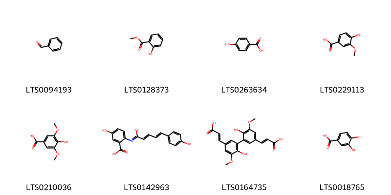{ width=100% }
    <figcaption>Hình ảnh cấu trúc hóa học của 8 hoạt chất thuộc nhóm Benzene and substituted derivatives gồm ['benzaldehyde (LTS0094193)', 'methyl salicylate (LTS0128373)', 'p-hydroxybenzoic acid (LTS0263634)', 'vanillic acid (LTS0229113)', 'syringic acid (LTS0210036)', '5-hydroxy-2-{[(2e,4e)-1-hydroxy-5-(4-hydroxyphenyl)penta-2,4-dien-1-ylidene]amino}benzoic acid (LTS0142963)', 'diferulic acid (LTS0164735)', '3,4-dihydroxybenzoic acid (LTS0018765)'].</figcaption>
</figure>
#### Nhóm Benzopyrans
<figure markdown="span">
    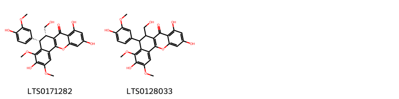{ width=100% }
    <figcaption>Hình ảnh cấu trúc hóa học của 2 hoạt chất thuộc nhóm Benzopyrans gồm ['(10s,11s)-1,3,8-trihydroxy-10-(4-hydroxy-3-methoxyphenyl)-11-(hydroxymethyl)-7,9-dimethoxy-10,11-dihydro-5-oxatetraphen-12-one (LTS0171282)', '1,3,8-trihydroxy-10-(4-hydroxy-3-methoxyphenyl)-11-(hydroxymethyl)-7,9-dimethoxy-10,11-dihydro-5-oxatetraphen-12-one (LTS0128033)'].</figcaption>
</figure>
#### Nhóm Benzoxazines
<figure markdown="span">
    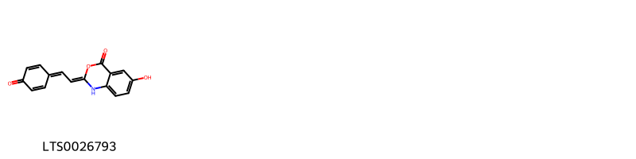{ width=100% }
    <figcaption>Hình ảnh cấu trúc hóa học của 1 hoạt chất thuộc nhóm Benzoxazines gồm ['(2z)-6-hydroxy-2-[2-(4-oxocyclohexa-2,5-dien-1-ylidene)ethylidene]-1h-3,1-benzoxazin-4-one (LTS0026793)'].</figcaption>
</figure>
#### Nhóm Carboxylic acids and derivatives
<figure markdown="span">
    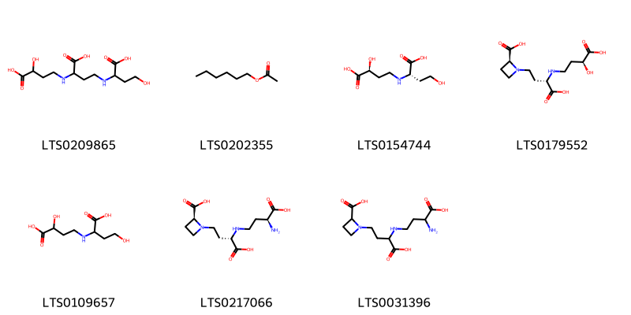{ width=100% }
    <figcaption>Hình ảnh cấu trúc hóa học của 7 hoạt chất thuộc nhóm Carboxylic acids and derivatives gồm ['avenic acid a (LTS0209865)', 'hexyl acetate (LTS0202355)', 'avenic acid b (LTS0154744)', "2'-deoxymugineic acid (LTS0179552)", '4-[(1-carboxy-3-hydroxypropyl)amino]-2-hydroxybutanoic acid (LTS0109657)', 'nicotianamine (LTS0217066)', 'nicotianamine (LTS0031396)'].</figcaption>
</figure>
#### Nhóm Cinnamic acids and derivatives
<figure markdown="span">
    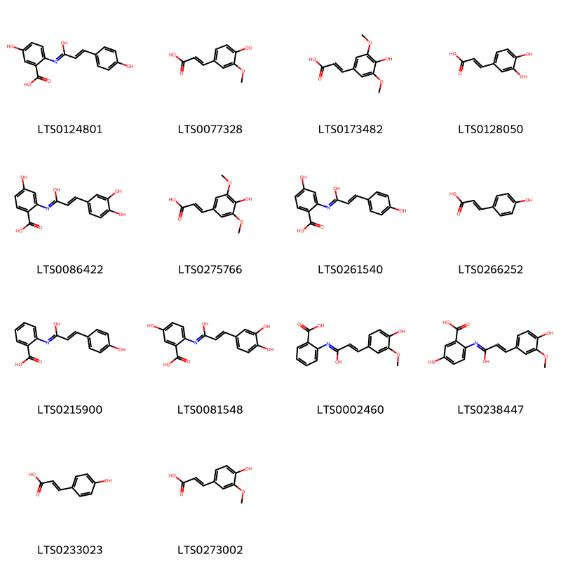{ width=100% }
    <figcaption>Hình ảnh cấu trúc hóa học của 14 hoạt chất thuộc nhóm Cinnamic acids and derivatives gồm ['5-hydroxy-2-{[(2e)-1-hydroxy-3-(4-hydroxyphenyl)prop-2-en-1-ylidene]amino}benzoic acid (LTS0124801)', 'ferulic acid (LTS0077328)', 'sinapinate (LTS0173482)', '3,4-dihydroxycinnamic acid (LTS0128050)', '2-{[(2e)-3-(3,4-dihydroxyphenyl)-1-hydroxyprop-2-en-1-ylidene]amino}-4-hydroxybenzoic acid (LTS0086422)', 'sinapoyl alcohol (LTS0275766)', '4-hydroxy-2-{[(2e)-1-hydroxy-3-(4-hydroxyphenyl)prop-2-en-1-ylidene]amino}benzoic acid (LTS0261540)', 'para-coumaric acid (LTS0266252)', '2-{[(2e)-1-hydroxy-3-(4-hydroxyphenyl)prop-2-en-1-ylidene]amino}benzoic acid (LTS0215900)', '2-{[(2e)-3-(3,4-dihydroxyphenyl)-1-hydroxyprop-2-en-1-ylidene]amino}-5-hydroxybenzoic acid (LTS0081548)', '2-{[(2e)-1-hydroxy-3-(4-hydroxy-3-methoxyphenyl)prop-2-en-1-ylidene]amino}benzoic acid (LTS0002460)', '5-hydroxy-2-{[(2e)-1-hydroxy-3-(4-hydroxy-3-methoxyphenyl)prop-2-en-1-ylidene]amino}benzoic acid (LTS0238447)', 'hydroxycinnamic acid (LTS0233023)', 'ferulic acid (LTS0273002)'].</figcaption>
</figure>
#### Nhóm Dibenzylbutane lignans
<figure markdown="span">
    { width=100% }
    <figcaption>Hình ảnh cấu trúc hóa học của 2 hoạt chất thuộc nhóm Dibenzylbutane lignans gồm ['(2s,3r)-2,3-bis[(4-hydroxy-3-methoxyphenyl)(¹³c)methyl](1-¹³c)butane-1,4-diol (LTS0268699)', 'secoisolariciresinol (LTS0086727)'].</figcaption>
</figure>
#### Nhóm Fatty Acyls
<figure markdown="span">
    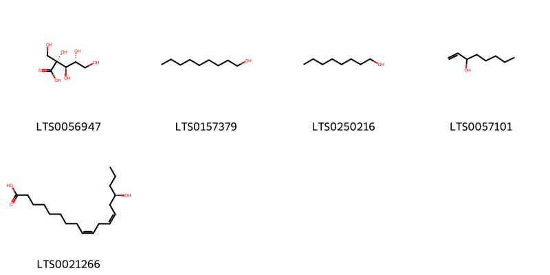{ width=100% }
    <figcaption>Hình ảnh cấu trúc hóa học của 5 hoạt chất thuộc nhóm Fatty Acyls gồm ['2-carboxy-d-arabinitol (LTS0056947)', 'nonan-1-ol (LTS0157379)', 'octanol (LTS0250216)', '1-octen-3-ol (LTS0057101)', 'avenoleic acid (LTS0021266)'].</figcaption>
</figure>
#### Nhóm Flavonoids
<figure markdown="span">
    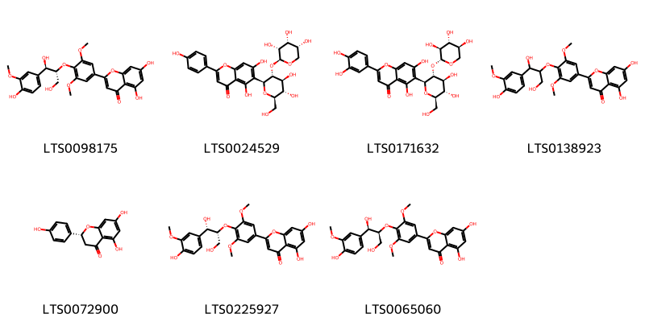{ width=100% }
    <figcaption>Hình ảnh cấu trúc hóa học của 7 hoạt chất thuộc nhóm Flavonoids gồm ['2-(4-{[(1r,2r)-1,3-dihydroxy-1-(4-hydroxy-3-methoxyphenyl)propan-2-yl]oxy}-3,5-dimethoxyphenyl)-5,7-dihydroxychromen-4-one (LTS0098175)', '6-[(2s,3r,4s,5s,6r)-4,5-dihydroxy-6-(hydroxymethyl)-3-{[(2s,3r,4r,5r)-3,4,5-trihydroxyoxan-2-yl]oxy}oxan-2-yl]-5,7-dihydroxy-2-(4-hydroxyphenyl)chromen-4-one (LTS0024529)', '6-[(2s,3r,4s,5s,6r)-4,5-dihydroxy-6-(hydroxymethyl)-3-{[(2r,3s,4r,5s)-3,4,5-trihydroxyoxan-2-yl]oxy}oxan-2-yl]-2-(3,4-dihydroxyphenyl)-5,7-dihydroxychromen-4-one (LTS0171632)', '2-(4-{[1,3-dihydroxy-1-(4-hydroxy-3-methoxyphenyl)propan-2-yl]oxy}-3,5-dimethoxyphenyl)-5,7-dihydroxychromen-4-one (LTS0138923)', '(-)-naringenin (LTS0072900)', '2-(4-{[(1s,2r)-1,3-dihydroxy-1-(4-hydroxy-3-methoxyphenyl)propan-2-yl]oxy}-3,5-dimethoxyphenyl)-5,7-dihydroxychromen-4-one (LTS0225927)', '2-(4-{[(1r,2s)-1,3-dihydroxy-1-(4-hydroxy-3-methoxyphenyl)propan-2-yl]oxy}-3,5-dimethoxyphenyl)-5,7-dihydroxychromen-4-one (LTS0065060)'].</figcaption>
</figure>
#### Nhóm Furanoid lignans
<figure markdown="span">
    { width=100% }
    <figcaption>Hình ảnh cấu trúc hóa học của 5 hoạt chất thuộc nhóm Furanoid lignans gồm ['syringaresinol (LTS0116280)', 'pinoresinol (LTS0057431)', 'matairesinol (LTS0193475)', 'lariciresinol (LTS0010950)', '4-[(3ar,4s,6ar)-4-(4-hydroxy-3-methoxyphenyl)-hexahydrofuro[3,4-c]furan-1-yl]-2,6-dimethoxyphenol (LTS0041035)'].</figcaption>
</figure>
#### Nhóm Organic oxides
<figure markdown="span">
    { width=100% }
    <figcaption>Hình ảnh cấu trúc hóa học của 1 hoạt chất thuộc nhóm Organic oxides gồm ['β-cyclocitral (LTS0195727)'].</figcaption>
</figure>
#### Nhóm Organonitrogen compounds
<figure markdown="span">
    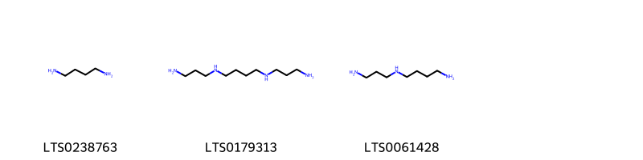{ width=100% }
    <figcaption>Hình ảnh cấu trúc hóa học của 3 hoạt chất thuộc nhóm Organonitrogen compounds gồm ['putrescine (LTS0238763)', 'spermine (LTS0179313)', 'spermidine (LTS0061428)'].</figcaption>
</figure>
#### Nhóm Organooxygen compounds
<figure markdown="span">
    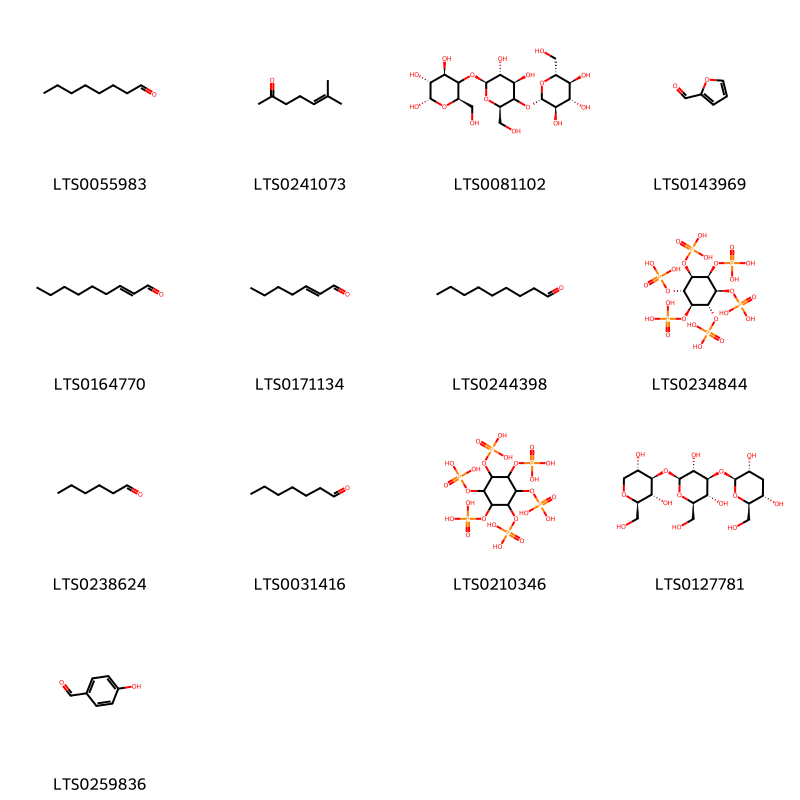{ width=100% }
    <figcaption>Hình ảnh cấu trúc hóa học của 13 hoạt chất thuộc nhóm Organooxygen compounds gồm ['octanal (LTS0055983)', '6-methyl-5-hepten-2-one (LTS0241073)', '(2s,3r,4r,6r)-5-{[(2s,3r,4r,6r)-3,4-dihydroxy-6-(hydroxymethyl)-5-{[(2s,3r,4s,5s,6r)-3,4,5-trihydroxy-6-(hydroxymethyl)oxan-2-yl]oxy}oxan-2-yl]oxy}-6-(hydroxymethyl)oxane-2,3,4-triol (LTS0081102)', 'bran oil (LTS0143969)', '(2e)-2-nonenal (LTS0164770)', '2-heptenal, (2e)- (LTS0171134)', 'nonanal (LTS0244398)', '[(1r,2r,3s,4r,5s,6s)-2,3,4,5,6-pentakis(phosphonooxy)cyclohexyl]oxyphosphonic acid (LTS0234844)', 'hexanal (LTS0238624)', 'heptanal (LTS0031416)', 'phytic acid (LTS0210346)', '(2s,3r,4s,5r,6r)-2-{[(2r,3r,4r,5s)-3,5-dihydroxy-2-(hydroxymethyl)oxan-4-yl]oxy}-4-{[(2s,3r,5s,6r)-3,5-dihydroxy-6-(hydroxymethyl)oxan-2-yl]oxy}-6-(hydroxymethyl)oxane-3,5-diol (LTS0127781)', 'p-hydroxybenzaldehyde (LTS0259836)'].</figcaption>
</figure>
#### Nhóm Phenols
<figure markdown="span">
    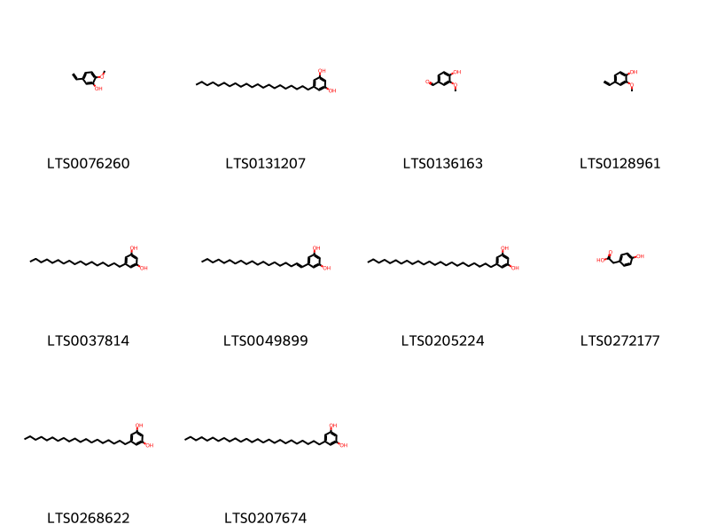{ width=100% }
    <figcaption>Hình ảnh cấu trúc hóa học của 10 hoạt chất thuộc nhóm Phenols gồm ['5-ethenyl-2-methoxyphenol (LTS0076260)', '5-henicosylbenzene-1,3-diol (LTS0131207)', 'vanillin (LTS0136163)', '2-methoxy-4-vinyl-phenol (LTS0128961)', '5-heptadecylbenzene-1,3-diol (LTS0037814)', '5-(nonadec-1-en-1-yl)benzene-1,3-diol (LTS0049899)', '5-tricosylbenzene-1,3-diol (LTS0205224)', '4-hydroxyphenylacetic acid (LTS0272177)', '5-nonadecylbenzene-1,3-diol (LTS0268622)', '5-pentacosylbenzene-1,3-diol (LTS0207674)'].</figcaption>
</figure>
#### Nhóm Prenol lipids
<figure markdown="span">
    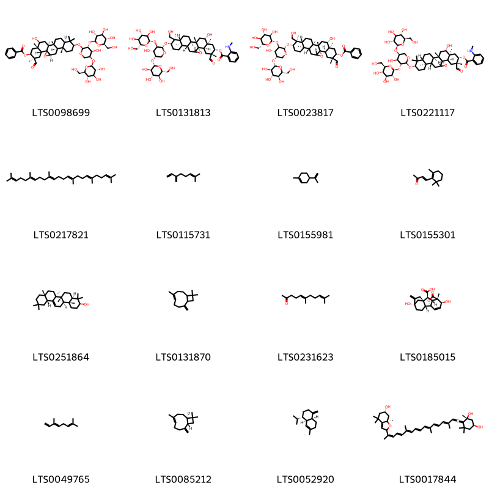{ width=100% }
    <figcaption>Hình ảnh cấu trúc hóa học của 16 hoạt chất thuộc nhóm Prenol lipids gồm ['avenacin b-2 (LTS0098699)', 'avenacin a-1 (LTS0131813)', '(2s,3r,4ar,4bs,5ar,6ar,6br,9s,10r,10ar,12ar,12bs,14s,14as)-3-formyl-14-hydroxy-9-{[(2s,3r,4s,5s)-4-hydroxy-3,5-bis({[(2s,3r,4s,5s,6r)-3,4,5-trihydroxy-6-(hydroxymethyl)oxan-2-yl]oxy})oxan-2-yl]oxy}-10-(hydroxymethyl)-3,6b,10,12a,12b,14a-hexamethyl-tetradecahydro-1h-piceno[13,12b-b]oxiren-2-yl benzoate (LTS0023817)', '(2s,3r,4ar,4bs,5ar,6ar,6br,9s,10ar,12ar,12bs,14s,14as)-3-formyl-14-hydroxy-9-{[(2s,3r,4s,5s)-4-hydroxy-3,5-bis({[(2s,3r,4s,5s,6r)-3,4,5-trihydroxy-6-(hydroxymethyl)oxan-2-yl]oxy})oxan-2-yl]oxy}-3,6b,10,10,12a,12b,14a-heptamethyl-tetradecahydro-1h-piceno[13,12b-b]oxiren-2-yl 2-(methylamino)benzoate (LTS0221117)', 'squalene (LTS0217821)', 'α-myrcene (LTS0115731)', 'limonene,  (LTS0155981)', 'β-ionone (LTS0155301)', 'β-amyrin (LTS0251864)', 'caryophyllene (LTS0131870)', 'geranylacetone (LTS0231623)', 'gibberellin a3 (LTS0185015)', 'trans-β-ocimene (LTS0049765)', 'caryophyllene (LTS0085212)', 'gamma-muurolene (LTS0052920)', '(1r,3s)-6-[(3e,5e,7e,9e,11e,13e,15z)-16-[(6s,7ar)-6-hydroxy-4,4,7a-trimethyl-2,5,6,7-tetrahydro-1-benzofuran-2-yl]-3,7,12-trimethylheptadeca-1,3,5,7,9,11,13,15-octaen-1-ylidene]-1,5,5-trimethylcyclohexane-1,3-diol (LTS0017844)'].</figcaption>
</figure>
#### Nhóm Pyrrolines
<figure markdown="span">
    { width=100% }
    <figcaption>Hình ảnh cấu trúc hóa học của 1 hoạt chất thuộc nhóm Pyrrolines gồm ['3-(2,3-dihydropyrrol-1-yl)propan-1-amine (LTS0060475)'].</figcaption>
</figure>
#### Nhóm Steroids and steroid derivatives
<figure markdown="span">
    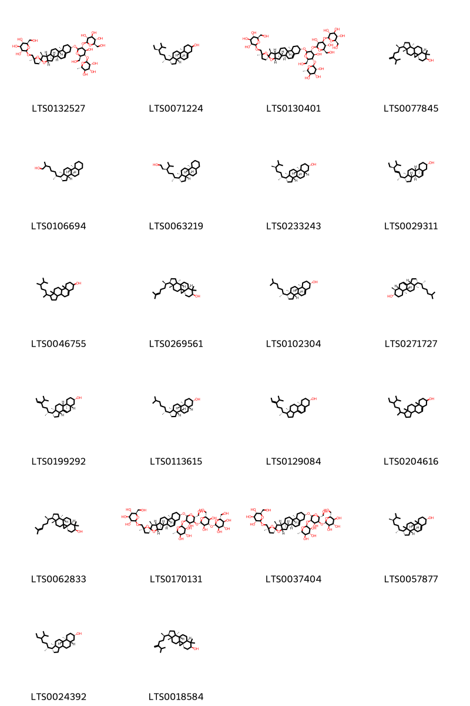{ width=100% }
    <figcaption>Hình ảnh cấu trúc hóa học của 22 hoạt chất thuộc nhóm Steroids and steroid derivatives gồm ["(2s,3r,4r,5r,6s)-2-{[(2r,3s,4s,5r,6r)-4-hydroxy-2-(hydroxymethyl)-6-[(1's,2s,2's,4's,5s,7's,8'r,9's,12's,13'r,16's)-5,7',9',13'-tetramethyl-5-({[(2r,3r,4s,5s,6r)-3,4,5-trihydroxy-6-(hydroxymethyl)oxan-2-yl]oxy}methyl)-5'-oxaspiro[oxolane-2,6'-pentacyclo[10.8.0.0²,⁹.0⁴,⁸.0¹³,¹⁸]icosan]-18'-eneoxy]-5-{[(2s,3r,4s,5s,6r)-3,4,5-trihydroxy-6-(hydroxymethyl)oxan-2-yl]oxy}oxan-3-yl]oxy}-6-methyloxane-3,4,5-triol (LTS0132527)", 'stigmast-5-en-3-ol (LTS0071224)', "(2s,3r,4r,5r,6s)-2-{[(2r,3s,4s,5r,6r)-5-{[(2s,3r,4s,5r,6r)-3,5-dihydroxy-6-(hydroxymethyl)-4-{[(2s,3r,4s,5s,6r)-3,4,5-trihydroxy-6-(hydroxymethyl)oxan-2-yl]oxy}oxan-2-yl]oxy}-4-hydroxy-2-(hydroxymethyl)-6-[(1's,2s,2's,4's,5s,7's,8'r,9's,12's,13'r,16's)-5,7',9',13'-tetramethyl-5-({[(2r,3r,4s,5s,6r)-3,4,5-trihydroxy-6-(hydroxymethyl)oxan-2-yl]oxy}methyl)-5'-oxaspiro[oxolane-2,6'-pentacyclo[10.8.0.0²,⁹.0⁴,⁸.0¹³,¹⁸]icosan]-18'-eneoxy]oxan-3-yl]oxy}-6-methyloxane-3,4,5-triol (LTS0130401)", '24-methylene-cycloartanol (LTS0077845)', '(6r)-6-[(1r,3as,3br,9as,9bs,11ar)-9a,11a-dimethyl-tetradecahydro-1h-cyclopenta[a]phenanthren-1-yl]-2-methylheptan-1-ol (LTS0106694)', '(3s,6r)-6-[(1r,3as,3br,9as,9bs,11ar)-9a,11a-dimethyl-tetradecahydro-1h-cyclopenta[a]phenanthren-1-yl]-3-isopropylheptan-1-ol (LTS0063219)', 'campestanol (LTS0233243)', 'phytosterol (LTS0029311)', 'campesterol (LTS0046755)', 'cycloartenol (LTS0269561)', 'cholesterol (LTS0102304)', 'lophenol (LTS0271727)', 'delta7-avenasterol (LTS0199292)', '(1r,3as,3bs,5as,7s,9as,9bs,11ar)-9a,11a-dimethyl-1-[(2r)-6-methylheptan-2-yl]-tetradecahydro-1h-cyclopenta[a]phenanthren-7-ol (LTS0113615)', '5-dehydroavenasterol (LTS0129084)', 'stigmast-5-en-3-ol, (3β)- (LTS0204616)', '(3r,6s,8r,11s,12s,15r,16r)-7,7,12,16-tetramethyl-15-[(2r)-6-methylhept-5-en-2-yl]pentacyclo[9.7.0.0¹,³.0³,⁸.0¹²,¹⁶]octadecan-6-ol (LTS0062833)', "(2s,3r,4r,5r,6s)-2-{[(2r,3r,4s,5s,6r)-5-{[(2s,3r,4s,5r,6r)-3,5-dihydroxy-6-(hydroxymethyl)-4-{[(2s,3r,4s,5s,6r)-3,4,5-trihydroxy-6-(hydroxymethyl)oxan-2-yl]oxy}oxan-2-yl]oxy}-4-hydroxy-6-(hydroxymethyl)-2-[(1's,2s,2's,4's,5s,7's,8'r,9's,12's,13'r,16's)-5,7',9',13'-tetramethyl-5-({[(2r,3r,4s,5s,6r)-3,4,5-trihydroxy-6-(hydroxymethyl)oxan-2-yl]oxy}methyl)-5'-oxaspiro[oxolane-2,6'-pentacyclo[10.8.0.0²,⁹.0⁴,⁸.0¹³,¹⁸]icosan]-18'-eneoxy]oxan-3-yl]oxy}-6-methyloxane-3,4,5-triol (LTS0170131)", "(2s,3r,4r,5r,6s)-2-{[(2r,3r,4s,5s,6r)-4-hydroxy-6-(hydroxymethyl)-2-[(1's,2s,2's,4's,5s,7's,8'r,9's,12's,13'r,16's)-5,7',9',13'-tetramethyl-5-({[(2r,3r,4s,5s,6r)-3,4,5-trihydroxy-6-(hydroxymethyl)oxan-2-yl]oxy}methyl)-5'-oxaspiro[oxolane-2,6'-pentacyclo[10.8.0.0²,⁹.0⁴,⁸.0¹³,¹⁸]icosan]-18'-eneoxy]-5-{[(2s,3r,4s,5s,6r)-3,4,5-trihydroxy-6-(hydroxymethyl)oxan-2-yl]oxy}oxan-3-yl]oxy}-6-methyloxane-3,4,5-triol (LTS0037404)", '(1r,3as,3bs,7s,9bs)-1-[(2r,5r)-5,6-dimethylheptan-2-yl]-9a,11a-dimethyl-1h,2h,3h,3ah,3bh,4h,6h,7h,8h,9h,9bh,10h,11h-cyclopenta[a]phenanthren-7-ol (LTS0057877)', '(1r,5as,7s,9as,9bs,11ar)-1-[(2r)-5-ethyl-6-methylheptan-2-yl]-9a,11a-dimethyl-tetradecahydro-1h-cyclopenta[a]phenanthren-7-ol (LTS0024392)', '24-methylenecycloartanol (LTS0018584)'].</figcaption>
</figure>

---

### Dược dân tộc học

Danh sách các quốc gia có sử dụng *Avena sativa* trong điều trị các bệnh. 

| Country   | Disease                                        | Bệnh                                                                                                                                                                                                |
|:----------|:-----------------------------------------------|:----------------------------------------------------------------------------------------------------------------------------------------------------------------------------------------------------|
| Iraq      | Demulcent                                      | MYMEMORY WARNING: YOU USED ALL AVAILABLE FREE TRANSLATIONS FOR TODAY. NEXT AVAILABLE IN  01 HOURS 23 MINUTES 43 SECONDS VISIT HTTPS://MYMEMORY.TRANSLATED.NET/DOC/USAGELIMITS.PHP TO TRANSLATE MORE |
| Turkey    | Diuretic, Nervine, Stimulant, Tonic, Vulnerary | MYMEMORY WARNING: YOU USED ALL AVAILABLE FREE TRANSLATIONS FOR TODAY. NEXT AVAILABLE IN  01 HOURS 23 MINUTES 41 SECONDS VISIT HTTPS://MYMEMORY.TRANSLATED.NET/DOC/USAGELIMITS.PHP TO TRANSLATE MORE |
| US        | Poison                                         | MYMEMORY WARNING: YOU USED ALL AVAILABLE FREE TRANSLATIONS FOR TODAY. NEXT AVAILABLE IN  01 HOURS 23 MINUTES 38 SECONDS VISIT HTTPS://MYMEMORY.TRANSLATED.NET/DOC/USAGELIMITS.PHP TO TRANSLATE MORE |
| ain       | Diuretic                                       | MYMEMORY WARNING: YOU USED ALL AVAILABLE FREE TRANSLATIONS FOR TODAY. NEXT AVAILABLE IN  01 HOURS 23 MINUTES 36 SECONDS VISIT HTTPS://MYMEMORY.TRANSLATED.NET/DOC/USAGELIMITS.PHP TO TRANSLATE MORE |

---

# Chi Themeda

??? note "Danh sách các dược liệu thuộc chi"
    
	 - *Themeda anathera*

---
## Themeda anathera
### Thông tin về thực vật

!!! info "Phân loại thực vật của *Themeda anathera* từ GIBF:"
    - **Kingdom:** Plantae
    - **Phylum:** Tracheophyta
    - **Order:** Poales
    - **Family:** Poaceae
    - **Genus:** Themeda
    - **Species:** *Themeda anathera*

 

| Label (VI)   | Label (EN)   | Scientific Name   | Descriptions (VI)   | Descriptions (EN)   | Also Known As (VI)   | Also Known As (EN)   |
|:-------------|:-------------|:------------------|:--------------------|:--------------------|:---------------------|:---------------------|
| N/A          | N/A          | Themeda anathera  | loài thực vật       | species of plant    | ['']                 | ['']                 |

#### Phân bố trên thế giới

**Từ CSDL GIBF** nan, Pakistan, Afghanistan, India, unknown or invalid, United States of America, China, Nepal

#### Phân bố tại Việt Nam

**Từ CSDL GIBF**: Không có ghi nhận ở Việt Nam

---
### Thành phần hóa học
        
- Theo cơ sở dữ liệu lotus: Từ loài *Themeda anathera* đã phân lập và xác định được Chưa có hoạt chất nào được phân lập. hoạt chất thuộc về các nhóm Không có hoạt chất nào được phân lập. 

Không có hình ảnh nào được tạo ra

---

### Dược dân tộc học

Danh sách các quốc gia có sử dụng *Themeda anathera* trong điều trị các bệnh. 

| Country   | Disease   | Bệnh                                                                                                                                                                                                |
|:----------|:----------|:----------------------------------------------------------------------------------------------------------------------------------------------------------------------------------------------------|
| Elsewhere | Poison    | MYMEMORY WARNING: YOU USED ALL AVAILABLE FREE TRANSLATIONS FOR TODAY. NEXT AVAILABLE IN  01 HOURS 22 MINUTES 26 SECONDS VISIT HTTPS://MYMEMORY.TRANSLATED.NET/DOC/USAGELIMITS.PHP TO TRANSLATE MORE |

---

# Chi Calamagrostis

??? note "Danh sách các dược liệu thuộc chi"
    
	 - *Calamagrostis lanceolata*

---
## Calamagrostis lanceolata
### Thông tin về thực vật

!!! info "Phân loại thực vật của *N/A* từ GIBF:"
    - **Kingdom:** Plantae
    - **Phylum:** Tracheophyta
    - **Order:** Poales
    - **Family:** Poaceae
    - **Genus:** Calamagrostis
    - **Species:** *N/A*

 

| Label (VI)   | Label (EN)   | Scientific Name          | Descriptions (VI)   | Descriptions (EN)   | Also Known As (VI)   | Also Known As (EN)   |
|:-------------|:-------------|:-------------------------|:--------------------|:--------------------|:---------------------|:---------------------|
| N/A          | N/A          | Calamagrostis lanceolata |                     |                     | ['']                 | ['']                 |

#### Phân bố trên thế giới

**Từ CSDL GIBF** Italy, Australia, Norway, Canada, Ukraine, Denmark, Netherlands, Spain, Russian Federation, United States of America, Sweden, Falkland Islands (Malvinas), South Africa, Germany, Switzerland, Austria, France, United Kingdom of Great Britain and Northern Ireland, Ireland, Poland, New Zealand

#### Phân bố tại Việt Nam

**Từ CSDL GIBF**: Không có ghi nhận ở Việt Nam

---
### Thành phần hóa học
        
- Theo cơ sở dữ liệu lotus: Từ loài *N/A* đã phân lập và xác định được Chưa có hoạt chất nào được phân lập. hoạt chất thuộc về các nhóm Không có hoạt chất nào được phân lập. 

Không có hình ảnh nào được tạo ra

---

### Dược dân tộc học

Danh sách các quốc gia có sử dụng *N/A* trong điều trị các bệnh. 

| Country   | Disease   | Bệnh                                                                                                                                                                                                |
|:----------|:----------|:----------------------------------------------------------------------------------------------------------------------------------------------------------------------------------------------------|
| German    | Diuretic  | MYMEMORY WARNING: YOU USED ALL AVAILABLE FREE TRANSLATIONS FOR TODAY. NEXT AVAILABLE IN  01 HOURS 22 MINUTES 05 SECONDS VISIT HTTPS://MYMEMORY.TRANSLATED.NET/DOC/USAGELIMITS.PHP TO TRANSLATE MORE |

---

# Chi Pennisetum

??? note "Danh sách các dược liệu thuộc chi"
    
	 - *Pennisetum alopecuroides*
	 - *Pennisetum americanum*
	 - *Pennisetum glaucum*
	 - *Pennisetum orientale*

---
## Pennisetum alopecuroides
### Thông tin về thực vật

!!! info "Phân loại thực vật của *N/A* từ GIBF:"
    - **Kingdom:** Plantae
    - **Phylum:** Tracheophyta
    - **Order:** Poales
    - **Family:** Poaceae
    - **Genus:** Cenchrus
    - **Species:** *N/A*

 

| Label (VI)   | Label (EN)   | Scientific Name          | Descriptions (VI)   | Descriptions (EN)   | Also Known As (VI)   | Also Known As (EN)   |
|:-------------|:-------------|:-------------------------|:--------------------|:--------------------|:---------------------|:---------------------|
| N/A          | N/A          | Pennisetum alopecuroides | loài thực vật       | species of plant    | ['']                 | ['']                 |

#### Phân bố trên thế giới

**Từ CSDL GIBF** Sri Lanka, Italy, Australia, Myanmar, Argentina, Benin, Israel, French Guiana, Puerto Rico, Chinese Taipei, Spain, Portugal, United States of America, Uruguay, South Africa, Thailand, Brazil, Bahamas, Mexico, France, Viet Nam, Ecuador, Malaysia, New Zealand

#### Phân bố tại Việt Nam

**Từ CSDL GIBF**: Hồ Chí Minh city

---
### Thành phần hóa học
        
- Theo cơ sở dữ liệu lotus: Từ loài *N/A* đã phân lập và xác định được Chưa có hoạt chất nào được phân lập. hoạt chất thuộc về các nhóm Không có hoạt chất nào được phân lập. 

Không có hình ảnh nào được tạo ra

---

### Dược dân tộc học

Danh sách các quốc gia có sử dụng *N/A* trong điều trị các bệnh. 

| Country   | Disease   | Bệnh                                                                                                                                                                                                |
|:----------|:----------|:----------------------------------------------------------------------------------------------------------------------------------------------------------------------------------------------------|
| China     | Tonic     | MYMEMORY WARNING: YOU USED ALL AVAILABLE FREE TRANSLATIONS FOR TODAY. NEXT AVAILABLE IN  01 HOURS 21 MINUTES 43 SECONDS VISIT HTTPS://MYMEMORY.TRANSLATED.NET/DOC/USAGELIMITS.PHP TO TRANSLATE MORE |

---

---
## Pennisetum americanum
### Thông tin về thực vật

!!! info "Phân loại thực vật của *Cenchrus americanus* từ GIBF:"
    - **Kingdom:** Plantae
    - **Phylum:** Tracheophyta
    - **Order:** Poales
    - **Family:** Poaceae
    - **Genus:** Cenchrus
    - **Species:** *Cenchrus americanus*

 

| Label (VI)   | Label (EN)   | Scientific Name       | Descriptions (VI)   | Descriptions (EN)   | Also Known As (VI)   | Also Known As (EN)   |
|:-------------|:-------------|:----------------------|:--------------------|:--------------------|:---------------------|:---------------------|
| N/A          | N/A          | Pennisetum americanum |                     |                     | ['']                 | ['']                 |

#### Phân bố trên thế giới

**Từ CSDL GIBF** nan, Libya, Ghana, Sri Lanka, Mozambique, unknown or invalid, Benin, Tanzania, United Republic of, Togo, Pakistan, Senegal, Nigeria, Chinese Taipei, Spain, Sudan, United States of America, Sweden, Congo, Democratic Republic of the, South Africa, Niger, Brazil, Egypt, Côte d’Ivoire, China, Madagascar, India, Burkina Faso, Cameroon

#### Phân bố tại Việt Nam

**Từ CSDL GIBF**: Không có ghi nhận ở Việt Nam

---
### Thành phần hóa học
        
- Theo cơ sở dữ liệu lotus: Từ loài *Cenchrus americanus* đã phân lập và xác định được Chưa có hoạt chất nào được phân lập. hoạt chất thuộc về các nhóm Không có hoạt chất nào được phân lập. 

Không có hình ảnh nào được tạo ra

---

### Dược dân tộc học

Danh sách các quốc gia có sử dụng *Cenchrus americanus* trong điều trị các bệnh. 

| Country   | Disease    | Bệnh                                                                                                                                                                                                |
|:----------|:-----------|:----------------------------------------------------------------------------------------------------------------------------------------------------------------------------------------------------|
| Kenya     | Intoxicant | MYMEMORY WARNING: YOU USED ALL AVAILABLE FREE TRANSLATIONS FOR TODAY. NEXT AVAILABLE IN  01 HOURS 21 MINUTES 23 SECONDS VISIT HTTPS://MYMEMORY.TRANSLATED.NET/DOC/USAGELIMITS.PHP TO TRANSLATE MORE |

---

---
## Pennisetum glaucum
### Thông tin về thực vật

!!! info "Phân loại thực vật của *Cenchrus americanus* từ GIBF:"
    - **Kingdom:** Plantae
    - **Phylum:** Tracheophyta
    - **Order:** Poales
    - **Family:** Poaceae
    - **Genus:** Cenchrus
    - **Species:** *Cenchrus americanus*

 

| Label (VI)   | Label (EN)   | Scientific Name    | Descriptions (VI)   | Descriptions (EN)   | Also Known As (VI)   | Also Known As (EN)                                                                            |
|:-------------|:-------------|:-------------------|:--------------------|:--------------------|:---------------------|:----------------------------------------------------------------------------------------------|
| N/A          | N/A          | Pennisetum glaucum | loài thực vật       | species of plant    | ['']                 | ['Bajra', 'bulrush millet', 'candle millet', 'cattail millet', 'dark millet', 'Pearl millet'] |

#### Phân bố trên thế giới

**Từ CSDL GIBF** nan, Australia, Belgium, Gabon, Benin, Tunisia, Canada, Pakistan, Zambia, Senegal, Nigeria, Namibia, Korea, Republic of, Chinese Taipei, Morocco, United States of America, Guinea, Zimbabwe, South Africa, Thailand, Brazil, Egypt, Mayotte, China, India, Burkina Faso, Poland, Cameroon, Ethiopia

#### Phân bố tại Việt Nam

**Từ CSDL GIBF**: Không có ghi nhận ở Việt Nam

---
### Thành phần hóa học
        
- Theo cơ sở dữ liệu lotus: Từ loài *Cenchrus americanus* đã phân lập và xác định được Chưa có hoạt chất nào được phân lập. hoạt chất thuộc về các nhóm Không có hoạt chất nào được phân lập. 

Không có hình ảnh nào được tạo ra

---

### Dược dân tộc học

Danh sách các quốc gia có sử dụng *Cenchrus americanus* trong điều trị các bệnh. 

| Country   | Disease    | Bệnh                                                                                                                                                                                                |
|:----------|:-----------|:----------------------------------------------------------------------------------------------------------------------------------------------------------------------------------------------------|
| Haiti     | Antiseptic | MYMEMORY WARNING: YOU USED ALL AVAILABLE FREE TRANSLATIONS FOR TODAY. NEXT AVAILABLE IN  01 HOURS 21 MINUTES 05 SECONDS VISIT HTTPS://MYMEMORY.TRANSLATED.NET/DOC/USAGELIMITS.PHP TO TRANSLATE MORE |

---

---
## Pennisetum orientale
### Thông tin về thực vật

!!! info "Phân loại thực vật của *Cenchrus orientalis* từ GIBF:"
    - **Kingdom:** Plantae
    - **Phylum:** Tracheophyta
    - **Order:** Poales
    - **Family:** Poaceae
    - **Genus:** Cenchrus
    - **Species:** *Cenchrus orientalis*

 

| Label (VI)   | Label (EN)   | Scientific Name      | Descriptions (VI)   | Descriptions (EN)   | Also Known As (VI)   | Also Known As (EN)                                                                                                  |
|:-------------|:-------------|:---------------------|:--------------------|:--------------------|:---------------------|:--------------------------------------------------------------------------------------------------------------------|
| N/A          | N/A          | Pennisetum orientale | loài thực vật       | species of plant    | ['']                 | ['pink fountain grass', 'fountain grass', 'Oriental fountain grass', 'Oriental pennisetum', 'white fountain grass'] |

#### Phân bố trên thế giới

**Từ CSDL GIBF** nan, Sri Lanka, Turkmenistan, Palestine, State of, Argentina, unknown or invalid, Jordan, Venezuela (Bolivarian Republic of), Yemen, Israel, Canada, Tajikistan, Pakistan, Netherlands, Korea, Republic of, Afghanistan, Bahrain, Spain, Azerbaijan, Türkiye, United States of America, Zimbabwe, Saudi Arabia, Oman, Iran (Islamic Republic of), Egypt, Bhutan, Armenia, China, India, Indonesia, Nepal

#### Phân bố tại Việt Nam

**Từ CSDL GIBF**: Không có ghi nhận ở Việt Nam

---
### Thành phần hóa học
        
- Theo cơ sở dữ liệu lotus: Từ loài *Cenchrus orientalis* đã phân lập và xác định được Chưa có hoạt chất nào được phân lập. hoạt chất thuộc về các nhóm Không có hoạt chất nào được phân lập. 

Không có hình ảnh nào được tạo ra

---

### Dược dân tộc học

Danh sách các quốc gia có sử dụng *Cenchrus orientalis* trong điều trị các bệnh. 

| Country   | Disease    | Bệnh                                                                                                                                                                                                |
|:----------|:-----------|:----------------------------------------------------------------------------------------------------------------------------------------------------------------------------------------------------|
| USSR      | Intoxicant | MYMEMORY WARNING: YOU USED ALL AVAILABLE FREE TRANSLATIONS FOR TODAY. NEXT AVAILABLE IN  01 HOURS 20 MINUTES 46 SECONDS VISIT HTTPS://MYMEMORY.TRANSLATED.NET/DOC/USAGELIMITS.PHP TO TRANSLATE MORE |

---

# Chi Zizania

??? note "Danh sách các dược liệu thuộc chi"
    
	 - *Zizania aquatica*
	 - *Zizania caduciflora*

---
## Zizania aquatica
### Thông tin về thực vật

!!! info "Phân loại thực vật của *Zizania aquatica* từ GIBF:"
    - **Kingdom:** Plantae
    - **Phylum:** Tracheophyta
    - **Order:** Poales
    - **Family:** Poaceae
    - **Genus:** Zizania
    - **Species:** *Zizania aquatica*

 

| Label (VI)   | Label (EN)   | Scientific Name   | Descriptions (VI)   | Descriptions (EN)   | Also Known As (VI)   | Also Known As (EN)                                                                              |
|:-------------|:-------------|:------------------|:--------------------|:--------------------|:---------------------|:------------------------------------------------------------------------------------------------|
| N/A          | N/A          | Zizania aquatica  | loài thực vật       | species of plant    | ['']                 | ['annual wild rice', 'annual wildrice', 'Indian wild rice', 'southern wild rice', 'water oats'] |

#### Phân bố trên thế giới

**Từ CSDL GIBF** Russian Federation, United States of America, Canada

#### Phân bố tại Việt Nam

**Từ CSDL GIBF**: Không có ghi nhận ở Việt Nam

---
### Thành phần hóa học
        
- Theo cơ sở dữ liệu lotus: Từ loài *Zizania aquatica* đã phân lập và xác định được 6 hoạt chất thuộc về các nhóm Phenol ethers, Organooxygen compounds, Phenols. 

|    | chemicalTaxonomyClassyfireClass   |   smiles_count |
|---:|:----------------------------------|---------------:|
|  0 | Organooxygen compounds            |              3 |
|  1 | Phenol ethers                     |              1 |
|  2 | Phenols                           |              2 |

#### Nhóm Organooxygen compounds
<figure markdown="span">
    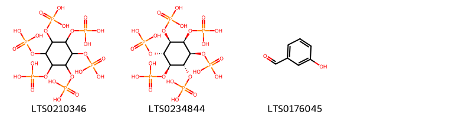{ width=100% }
    <figcaption>Hình ảnh cấu trúc hóa học của 3 hoạt chất thuộc nhóm Organooxygen compounds gồm ['phytic acid (LTS0210346)', '[(1r,2r,3s,4r,5s,6s)-2,3,4,5,6-pentakis(phosphonooxy)cyclohexyl]oxyphosphonic acid (LTS0234844)', '3-hydroxybenzaldehyde (LTS0176045)'].</figcaption>
</figure>
#### Nhóm Phenol ethers
<figure markdown="span">
    { width=100% }
    <figcaption>Hình ảnh cấu trúc hóa học của 1 hoạt chất thuộc nhóm Phenol ethers gồm ['anisole (LTS0013639)'].</figcaption>
</figure>
#### Nhóm Phenols
<figure markdown="span">
    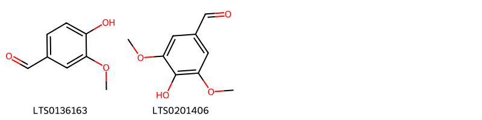{ width=100% }
    <figcaption>Hình ảnh cấu trúc hóa học của 2 hoạt chất thuộc nhóm Phenols gồm ['vanillin (LTS0136163)', 'syringaldehyde (LTS0201406)'].</figcaption>
</figure>

---

### Dược dân tộc học

Danh sách các quốc gia có sử dụng *Zizania aquatica* trong điều trị các bệnh. 

| Country   | Disease               | Bệnh                                                                                                                                                                                                |
|:----------|:----------------------|:----------------------------------------------------------------------------------------------------------------------------------------------------------------------------------------------------|
| China     | Diuretic, Refrigerant | MYMEMORY WARNING: YOU USED ALL AVAILABLE FREE TRANSLATIONS FOR TODAY. NEXT AVAILABLE IN  01 HOURS 20 MINUTES 27 SECONDS VISIT HTTPS://MYMEMORY.TRANSLATED.NET/DOC/USAGELIMITS.PHP TO TRANSLATE MORE |

---

---
## Zizania caduciflora
### Thông tin về thực vật

!!! info "Phân loại thực vật của *Zizania latifolia* từ GIBF:"
    - **Kingdom:** Plantae
    - **Phylum:** Tracheophyta
    - **Order:** Poales
    - **Family:** Poaceae
    - **Genus:** Zizania
    - **Species:** *Zizania latifolia*

 

| Label (VI)   | Label (EN)   | Scientific Name     | Descriptions (VI)   | Descriptions (EN)   | Also Known As (VI)   | Also Known As (EN)   |
|:-------------|:-------------|:--------------------|:--------------------|:--------------------|:---------------------|:---------------------|
| N/A          | N/A          | Zizania caduciflora |                     |                     | ['']                 | ['']                 |

#### Phân bố trên thế giới

**Từ CSDL GIBF** nan, Japan, Korea, Republic of, United States of America, China

#### Phân bố tại Việt Nam

**Từ CSDL GIBF**: Không có ghi nhận ở Việt Nam

---
### Thành phần hóa học
        
- Theo cơ sở dữ liệu lotus: Từ loài *Zizania latifolia* đã phân lập và xác định được Chưa có hoạt chất nào được phân lập. hoạt chất thuộc về các nhóm Không có hoạt chất nào được phân lập. 

Không có hình ảnh nào được tạo ra

---

### Dược dân tộc học

Danh sách các quốc gia có sử dụng *Zizania latifolia* trong điều trị các bệnh. 

| Country   | Disease   | Bệnh                                                                                                                                                                                                |
|:----------|:----------|:----------------------------------------------------------------------------------------------------------------------------------------------------------------------------------------------------|
| China     | Diuretic  | MYMEMORY WARNING: YOU USED ALL AVAILABLE FREE TRANSLATIONS FOR TODAY. NEXT AVAILABLE IN  01 HOURS 20 MINUTES 02 SECONDS VISIT HTTPS://MYMEMORY.TRANSLATED.NET/DOC/USAGELIMITS.PHP TO TRANSLATE MORE |

---

# Chi Oryza

??? note "Danh sách các dược liệu thuộc chi"
    
	 - *Oryza sativa*

---
## Oryza sativa
### Thông tin về thực vật

!!! info "Phân loại thực vật của *Oryza sativa* từ GIBF:"
    - **Kingdom:** Plantae
    - **Phylum:** Tracheophyta
    - **Order:** Poales
    - **Family:** Poaceae
    - **Genus:** Oryza
    - **Species:** *Oryza sativa*

 

| Label (VI)   | Label (EN)   | Scientific Name   | Descriptions (VI)   | Descriptions (EN)                         | Also Known As (VI)                                 | Also Known As (EN)   |
|:-------------|:-------------|:------------------|:--------------------|:------------------------------------------|:---------------------------------------------------|:---------------------|
| N/A          | N/A          | Oryza sativa      | loài thực vật       | species of plant (for the food see Q5090) | ['Oryza sativa', 'Lúa nước', 'Lúa gạo', 'Cây lúa'] | ['paddy', 'Rice']    |

#### Phân bố trên thế giới

**Từ CSDL GIBF** Italy, Bulgaria, Australia, Japan, Cambodia, Mozambique, unknown or invalid, Benin, Panama, Pakistan, Korea, Republic of, Chad, Chinese Taipei, Spain, Hungary, Portugal, Bangladesh, United States of America, Greece, Uzbekistan, Hong Kong, Czechia, Thailand, Brazil, Switzerland, Mexico, Austria, France, Peru, Viet Nam, Mayotte, China, Ecuador, Madagascar, Iraq, Colombia, India, Indonesia, Philippines, Malaysia, Nepal

#### Phân bố tại Việt Nam

**Từ CSDL GIBF**: Hồ Chí Minh city, Hòa Bình, Ninh Bình

---
### Thành phần hóa học
        
- Theo cơ sở dữ liệu lotus: Từ loài *Oryza sativa* đã phân lập và xác định được 239 hoạt chất thuộc về các nhóm Phenols, Pyrrolines, Naphthopyrans, Carboxylic acids and derivatives, Benzodiazepines, Fatty Acyls, Indoles and derivatives, Cinnamic acids and derivatives, Oxanes, Diazanaphthalenes, Saturated hydrocarbons, Glycerolipids, Diazines, Prenol lipids, Quinolines and derivatives, Phenanthrenes and derivatives, Sphingolipids, Benzene and substituted derivatives, Organooxygen compounds, Flavonoids, Steroids and steroid derivatives, Organonitrogen compounds, 2-arylbenzofuran flavonoids, Imidazopyrimidines. 

|    | chemicalTaxonomyClassyfireClass     |   smiles_count |
|---:|:------------------------------------|---------------:|
|  0 | 2-arylbenzofuran flavonoids         |              1 |
|  1 | Benzene and substituted derivatives |              9 |
|  2 | Benzodiazepines                     |              2 |
|  3 | Carboxylic acids and derivatives    |              9 |
|  4 | Cinnamic acids and derivatives      |              7 |
|  5 | Diazanaphthalenes                   |             16 |
|  6 | Diazines                            |              1 |
|  7 | Fatty Acyls                         |             17 |
|  8 | Flavonoids                          |             28 |
|  9 | Glycerolipids                       |              2 |
| 10 | Imidazopyrimidines                  |              2 |
| 11 | Indoles and derivatives             |              1 |
| 12 | Naphthopyrans                       |              8 |
| 13 | Organonitrogen compounds            |              1 |
| 14 | Organooxygen compounds              |              4 |
| 15 | Oxanes                              |              1 |
| 16 | Phenanthrenes and derivatives       |              3 |
| 17 | Phenols                             |              5 |
| 18 | Prenol lipids                       |             67 |
| 19 | Pyrrolines                          |              1 |
| 20 | Quinolines and derivatives          |              3 |
| 21 | Saturated hydrocarbons              |              1 |
| 22 | Sphingolipids                       |              1 |
| 23 | Steroids and steroid derivatives    |             48 |

#### Nhóm 2-arylbenzofuran flavonoids
<figure markdown="span">
    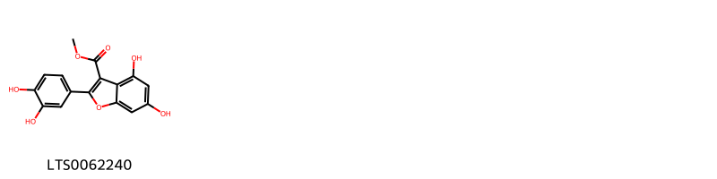{ width=100% }
    <figcaption>Hình ảnh cấu trúc hóa học của 1 hoạt chất thuộc nhóm 2-arylbenzofuran flavonoids gồm ['oryzafuran (LTS0062240)'].</figcaption>
</figure>
#### Nhóm Benzene and substituted derivatives
<figure markdown="span">
    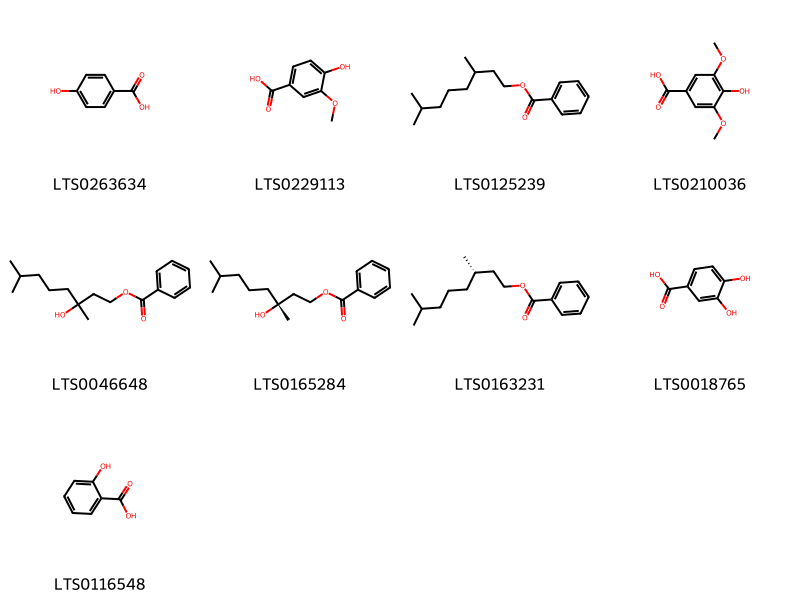{ width=100% }
    <figcaption>Hình ảnh cấu trúc hóa học của 9 hoạt chất thuộc nhóm Benzene and substituted derivatives gồm ['p-hydroxybenzoic acid (LTS0263634)', 'vanillic acid (LTS0229113)', '3,7-dimethyloctyl benzoate (LTS0125239)', 'syringic acid (LTS0210036)', '3-hydroxy-3,7-dimethyloctyl benzoate (LTS0046648)', '(3r)-3-hydroxy-3,7-dimethyloctyl benzoate (LTS0165284)', '(3s)-3,7-dimethyloctyl benzoate (LTS0163231)', '3,4-dihydroxybenzoic acid (LTS0018765)', 'salicyclic acid (LTS0116548)'].</figcaption>
</figure>
#### Nhóm Benzodiazepines
<figure markdown="span">
    { width=100% }
    <figcaption>Hình ảnh cấu trúc hóa học của 2 hoạt chất thuộc nhóm Benzodiazepines gồm ['diazepam (LTS0079460)', 'lomax (LTS0185942)'].</figcaption>
</figure>
#### Nhóm Carboxylic acids and derivatives
<figure markdown="span">
    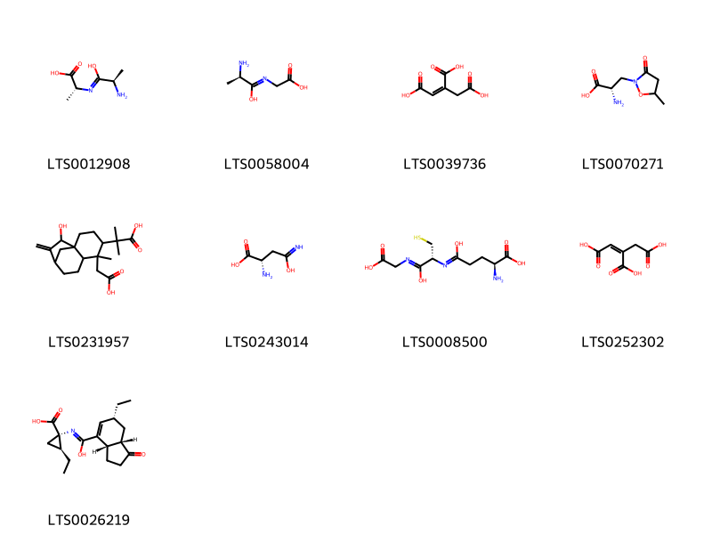{ width=100% }
    <figcaption>Hình ảnh cấu trúc hóa học của 9 hoạt chất thuộc nhóm Carboxylic acids and derivatives gồm ['(2r)-2-{[(2r)-2-amino-1-hydroxypropylidene]amino}propanoic acid (LTS0012908)', '{[(2r)-2-amino-1-hydroxypropylidene]amino}acetic acid (LTS0058004)', 'aconitic acid (LTS0039736)', '(2s)-2-amino-3-(5-methyl-3-oxo-1,2-oxazolidin-2-yl)propanoic acid (LTS0070271)', '2-[5-(carboxymethyl)-11-hydroxy-5-methyl-10-methylidenetricyclo[7.2.1.0¹,⁶]dodecan-4-yl]-2-methylpropanoic acid (LTS0231957)', 'aspartamate (LTS0243014)', '(2s)-2-amino-4-{[(1r)-1-(carboxymethyl-c-hydroxycarbonimidoyl)-2-sulfanylethyl]-c-hydroxycarbonimidoyl}butanoic acid (LTS0008500)', 'aconitate (LTS0252302)', '(1s,2s)-1-({[(3as,6r,7as)-6-ethyl-1-oxo-2,3,3a,6,7,7a-hexahydroinden-4-yl](hydroxy)methylidene}amino)-2-ethylcyclopropane-1-carboxylic acid (LTS0026219)'].</figcaption>
</figure>
#### Nhóm Cinnamic acids and derivatives
<figure markdown="span">
    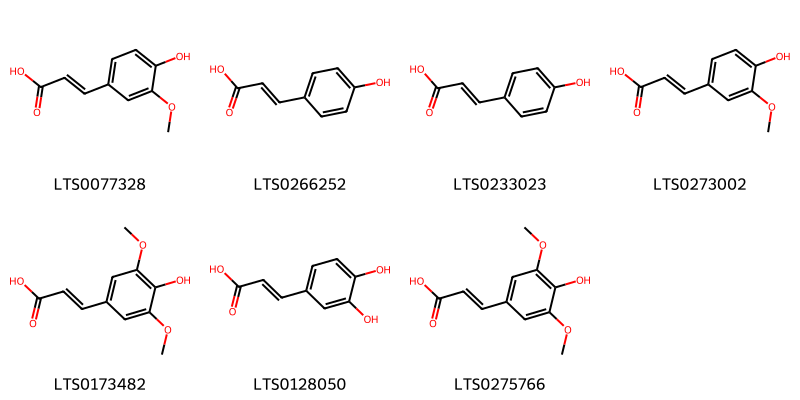{ width=100% }
    <figcaption>Hình ảnh cấu trúc hóa học của 7 hoạt chất thuộc nhóm Cinnamic acids and derivatives gồm ['ferulic acid (LTS0077328)', 'para-coumaric acid (LTS0266252)', 'hydroxycinnamic acid (LTS0233023)', 'ferulic acid (LTS0273002)', 'sinapinate (LTS0173482)', '3,4-dihydroxycinnamic acid (LTS0128050)', 'sinapoyl alcohol (LTS0275766)'].</figcaption>
</figure>
#### Nhóm Diazanaphthalenes
<figure markdown="span">
    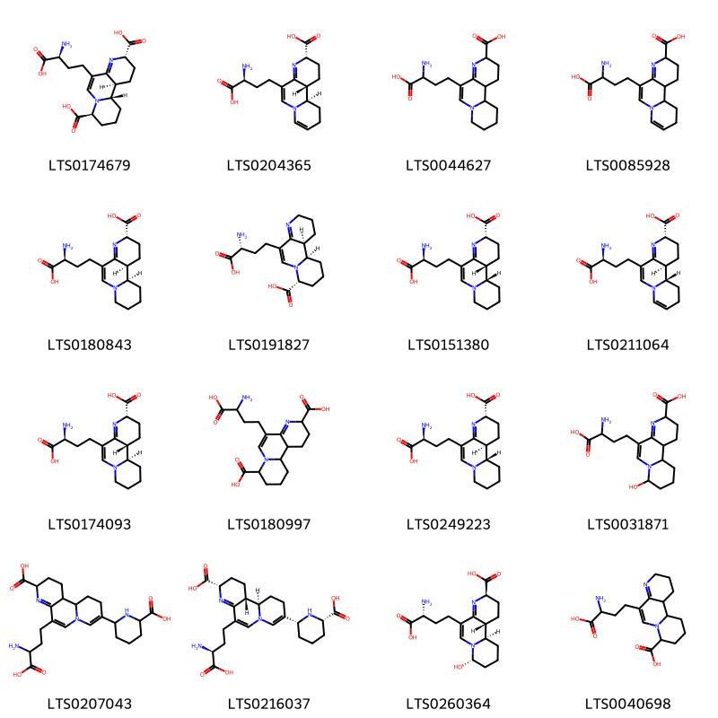{ width=100% }
    <figcaption>Hình ảnh cấu trúc hóa học của 16 hoạt chất thuộc nhóm Diazanaphthalenes gồm ['(3s,8s,11as,11bs)-5-[(3s)-3-amino-3-carboxypropyl]-1h,2h,3h,8h,9h,10h,11h,11ah,11bh-pyrido[2,1-f]1,6-naphthyridine-3,8-dicarboxylic acid (LTS0174679)', '(3s,11ar,11br)-5-[(3s)-3-amino-3-carboxypropyl]-1h,2h,3h,10h,11h,11ah,11bh-pyrido[2,1-f]1,6-naphthyridine-3-carboxylic acid (LTS0204365)', '5-(3-amino-3-carboxypropyl)-1h,2h,3h,8h,9h,10h,11h,11ah,11bh-pyrido[2,1-f]1,6-naphthyridine-3-carboxylic acid (LTS0044627)', '5-(3-amino-3-carboxypropyl)-1h,2h,3h,10h,11h,11ah,11bh-pyrido[2,1-f]1,6-naphthyridine-3-carboxylic acid (LTS0085928)', '(3s,11ar,11bs)-5-[(3s)-3-amino-3-carboxypropyl]-1h,2h,3h,8h,9h,10h,11h,11ah,11bh-pyrido[2,1-f]1,6-naphthyridine-3-carboxylic acid (LTS0180843)', '(8r,11ar,11bs)-5-[(3r)-3-amino-3-carboxypropyl]-1h,2h,3h,8h,9h,10h,11h,11ah,11bh-pyrido[2,1-f]1,6-naphthyridine-8-carboxylic acid (LTS0191827)', '(3s,11as,11br)-5-[(3s)-3-amino-3-carboxypropyl]-1h,2h,3h,8h,9h,10h,11h,11ah,11bh-pyrido[2,1-f]1,6-naphthyridine-3-carboxylic acid (LTS0151380)', '(3s,11as,11bs)-5-[(3s)-3-amino-3-carboxypropyl]-1h,2h,3h,10h,11h,11ah,11bh-pyrido[2,1-f]1,6-naphthyridine-3-carboxylic acid (LTS0211064)', '(3s,11ar,11br)-5-[(3s)-3-amino-3-carboxypropyl]-1h,2h,3h,8h,9h,10h,11h,11ah,11bh-pyrido[2,1-f]1,6-naphthyridine-3-carboxylic acid (LTS0174093)', '5-(3-amino-3-carboxypropyl)-1h,2h,3h,8h,9h,10h,11h,11ah,11bh-pyrido[2,1-f]1,6-naphthyridine-3,8-dicarboxylic acid (LTS0180997)', '(3s,11as,11bs)-5-[(3s)-3-amino-3-carboxypropyl]-1h,2h,3h,8h,9h,10h,11h,11ah,11bh-pyrido[2,1-f]1,6-naphthyridine-3-carboxylic acid (LTS0249223)', '5-(3-amino-3-carboxypropyl)-8-hydroxy-1h,2h,3h,8h,9h,10h,11h,11ah,11bh-pyrido[2,1-f]1,6-naphthyridine-3-carboxylic acid (LTS0031871)', '6-[5-(3-amino-3-carboxypropyl)-3-carboxy-1h,2h,3h,10h,11h,11ah,11bh-pyrido[2,1-f]1,6-naphthyridin-9-yl]piperidine-2-carboxylic acid (LTS0207043)', '(2s,6r)-6-[(3s,11ar,11br)-5-[(3s)-3-amino-3-carboxypropyl]-3-carboxy-1h,2h,3h,10h,11h,11ah,11bh-pyrido[2,1-f]1,6-naphthyridin-9-yl]piperidine-2-carboxylic acid (LTS0216037)', '(3r,8s,11ar,11br)-5-[(3r)-3-amino-3-carboxypropyl]-8-hydroxy-1h,2h,3h,8h,9h,10h,11h,11ah,11bh-pyrido[2,1-f]1,6-naphthyridine-3-carboxylic acid (LTS0260364)', '5-(3-amino-3-carboxypropyl)-1h,2h,3h,8h,9h,10h,11h,11ah,11bh-pyrido[2,1-f]1,6-naphthyridine-8-carboxylic acid (LTS0040698)'].</figcaption>
</figure>
#### Nhóm Diazines
<figure markdown="span">
    { width=100% }
    <figcaption>Hình ảnh cấu trúc hóa học của 1 hoạt chất thuộc nhóm Diazines gồm ['β-amin (LTS0030620)'].</figcaption>
</figure>
#### Nhóm Fatty Acyls
<figure markdown="span">
    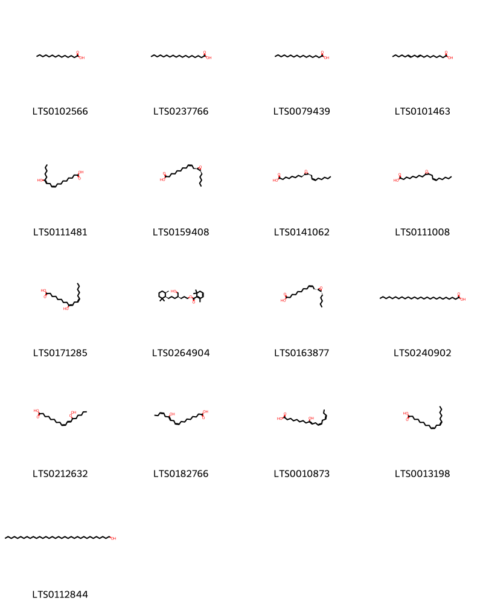{ width=100% }
    <figcaption>Hình ảnh cấu trúc hóa học của 17 hoạt chất thuộc nhóm Fatty Acyls gồm ['myristic acid (LTS0102566)', 'stearic acid (LTS0237766)', 'palmitic acid (LTS0079439)', '9,12-octadecadienoic acid (LTS0101463)', '(9z,12e)-13-hydroxyoctadeca-9,12-dienoic acid (LTS0111481)', '(-)-vernolic acid (LTS0159408)', 'coronaric acid (LTS0141062)', 'coronaric acid (LTS0111008)', '9-hydroxylinoleic acid (LTS0171285)', '(4r)-5-hydroxy-4-{3-[(1r,6r)-2,2,6-trimethylcyclohexyl]propyl}pentyl 2,6,6-trimethylcyclohexa-1,3-diene-1-carboxylate (LTS0264904)', '(+)-vernolic acid (LTS0163877)', 'hexacosanoic acid (LTS0240902)', '13-hpode (LTS0212632)', '(9z,12z,15z)-13-hydroxyoctadeca-9,12,15-trienoic acid (LTS0182766)', '(9z,12z,15z)-9-hydroxyoctadeca-9,12,15-trienoic acid (LTS0010873)', 'linoleic (LTS0013198)', 'geddyl alcohol (LTS0112844)'].</figcaption>
</figure>
#### Nhóm Flavonoids
<figure markdown="span">
    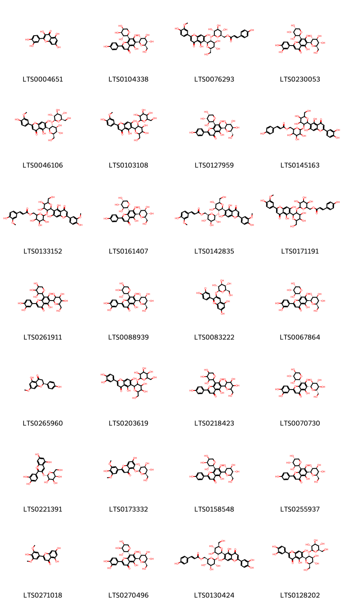{ width=100% }
    <figcaption>Hình ảnh cấu trúc hóa học của 28 hoạt chất thuộc nhóm Flavonoids gồm ['quercetin (LTS0004651)', 'schaftoside (LTS0104338)', '[(2r,3s,4s,5r,6s)-6-{[(2s,3r,4s,5s,6r)-2-[5,7-dihydroxy-2-(4-hydroxy-3-methoxyphenyl)-4-oxochromen-6-yl]-4,5-dihydroxy-6-(hydroxymethyl)oxan-3-yl]oxy}-3,4,5-trihydroxyoxan-2-yl]methyl (2e)-3-(4-hydroxyphenyl)prop-2-enoate (LTS0076293)', '2-(3,4-dihydroxyphenyl)-5,7-dihydroxy-6-[(2s,3r,4r,5s,6r)-3,4,5-trihydroxy-6-(hydroxymethyl)oxan-2-yl]-8-[(2s,3s,4r,5r)-3,4,5-trihydroxyoxan-2-yl]chromen-4-one (LTS0230053)', '6-[(2s,3r,4s,5s,6r)-4,5-dihydroxy-6-(hydroxymethyl)-3-{[(2s,3r,4s,5s,6r)-3,4,5-trihydroxy-6-(hydroxymethyl)oxan-2-yl]oxy}oxan-2-yl]-5,7-dihydroxy-2-(4-hydroxy-3-methoxyphenyl)chromen-4-one (LTS0046106)', '6-[4,5-dihydroxy-6-(hydroxymethyl)-3-{[3,4,5-trihydroxy-6-(hydroxymethyl)oxan-2-yl]oxy}oxan-2-yl]-5,7-dihydroxy-2-(4-hydroxy-3-methoxyphenyl)chromen-4-one (LTS0103108)', '5,7-dihydroxy-2-(4-hydroxyphenyl)-6-[(2s,3s,4s,5r,6s)-3,4,5-trihydroxy-6-(hydroxymethyl)oxan-2-yl]-8-[(2s,3s,4r,5r)-3,4,5-trihydroxyoxan-2-yl]chromen-4-one (LTS0127959)', '[6-({2-[2-(3,4-dihydroxyphenyl)-5,7-dihydroxy-4-oxochromen-6-yl]-4,5-dihydroxy-6-(hydroxymethyl)oxan-3-yl}oxy)-3,4,5-trihydroxyoxan-2-yl]methyl 3-(4-hydroxyphenyl)prop-2-enoate (LTS0145163)', '[6-({2-[5,7-dihydroxy-2-(4-hydroxy-3-methoxyphenyl)-4-oxochromen-6-yl]-4,5-dihydroxy-6-(hydroxymethyl)oxan-3-yl}oxy)-3,4,5-trihydroxyoxan-2-yl]methyl 3-(4-hydroxy-3-methoxyphenyl)prop-2-enoate (LTS0133152)', '5,7-dihydroxy-2-(4-hydroxyphenyl)-6-[(2s,3r,4r,5s,6r)-3,4,5-trihydroxy-6-(hydroxymethyl)oxan-2-yl]-8-[(2r,3s,4r,5r)-3,4,5-trihydroxyoxan-2-yl]chromen-4-one (LTS0161407)', '[(2r,3s,4s,5r,6r)-6-{[(2s,3r,4s,5s,6r)-2-[5,7-dihydroxy-2-(4-hydroxy-3-methoxyphenyl)-4-oxochromen-6-yl]-4,5-dihydroxy-6-(hydroxymethyl)oxan-3-yl]oxy}-3,4,5-trihydroxyoxan-2-yl]methyl (2e)-3-(4-hydroxy-3-methoxyphenyl)prop-2-enoate (LTS0142835)', '[6-({2-[5,7-dihydroxy-2-(4-hydroxy-3-methoxyphenyl)-4-oxochromen-6-yl]-4,5-dihydroxy-6-(hydroxymethyl)oxan-3-yl}oxy)-3,4,5-trihydroxyoxan-2-yl]methyl 3-(4-hydroxyphenyl)prop-2-enoate (LTS0171191)', '2-(3,4-dihydroxyphenyl)-5,7-dihydroxy-6-[3,4,5-trihydroxy-6-(hydroxymethyl)oxan-2-yl]-8-(3,4,5-trihydroxyoxan-2-yl)chromen-4-one (LTS0261911)', 'carlinoside (LTS0088939)', '5,7-dihydroxy-2-(4-hydroxy-3-oxidophenyl)-3-{[(2s,3r,4s,5s,6r)-3,4,5-trihydroxy-6-(hydroxymethyl)oxan-2-yl]oxy}-1λ⁴-chromen-1-ylium (LTS0083222)', '2-(3,4-dihydroxyphenyl)-5,7-dihydroxy-6-[(2s,3r,4r,5s,6r)-3,4,5-trihydroxy-6-(hydroxymethyl)oxan-2-yl]-8-[(2r,3s,4r,5r)-3,4,5-trihydroxyoxan-2-yl]chromen-4-one (LTS0067864)', 'sakuranetin (LTS0265960)', '6-[4,5-dihydroxy-6-(hydroxymethyl)-3-{[3,4,5-trihydroxy-6-(hydroxymethyl)oxan-2-yl]oxy}oxan-2-yl]-2-(3,4-dihydroxyphenyl)-5,7-dihydroxychromen-4-one (LTS0203619)', '5,7-dihydroxy-2-(4-hydroxyphenyl)-6-[3,4,5-trihydroxy-6-(hydroxymethyl)oxan-2-yl]-8-(3,4,5-trihydroxyoxan-2-yl)chromen-4-one (LTS0218423)', '2-(3,4-dihydroxyphenyl)-5,7-dihydroxy-6-[(2r,3s,4s,5r,6s)-3,4,5-trihydroxy-6-(hydroxymethyl)oxan-2-yl]-8-[(2r,3s,4r,5s)-3,4,5-trihydroxyoxan-2-yl]chromen-4-one (LTS0070730)', 'chrysanthemin (LTS0221391)', '7-hydroxy-2-(4-hydroxy-3,5-dimethoxyphenyl)-5-{[(2s,3r,4s,5s,6r)-3,4,5-trihydroxy-6-(hydroxymethyl)oxan-2-yl]oxy}chromen-4-one (LTS0173332)', '5,7-dihydroxy-2-(4-hydroxyphenyl)-6-[(3r,4r,5s,6r)-3,4,5-trihydroxy-6-(hydroxymethyl)oxan-2-yl]-8-[(2s,3r,4s,5s)-3,4,5-trihydroxyoxan-2-yl]chromen-4-one (LTS0158548)', '5,7-dihydroxy-2-(4-hydroxyphenyl)-6-[(2s,3r,4r,5s,6r)-3,4,5-trihydroxy-6-(hydroxymethyl)oxan-2-yl]-8-[(2s,3s,4r,5r)-3,4,5-trihydroxyoxan-2-yl]chromen-4-one (LTS0255937)', 'tricin (LTS0271018)', 'neocarlinoside (LTS0270496)', '[(2r,3s,4s,5r,6s)-6-{[(2s,3r,4s,5s,6r)-2-[2-(3,4-dihydroxyphenyl)-5,7-dihydroxy-4-oxochromen-6-yl]-4,5-dihydroxy-6-(hydroxymethyl)oxan-3-yl]oxy}-3,4,5-trihydroxyoxan-2-yl]methyl (2e)-3-(4-hydroxyphenyl)prop-2-enoate (LTS0130424)', '6-[(2s,3r,4s,5s,6r)-4,5-dihydroxy-6-(hydroxymethyl)-3-{[(2s,3r,4s,5s,6r)-3,4,5-trihydroxy-6-(hydroxymethyl)oxan-2-yl]oxy}oxan-2-yl]-2-(3,4-dihydroxyphenyl)-5,7-dihydroxychromen-4-one (LTS0128202)'].</figcaption>
</figure>
#### Nhóm Glycerolipids
<figure markdown="span">
    { width=100% }
    <figcaption>Hình ảnh cấu trúc hóa học của 2 hoạt chất thuộc nhóm Glycerolipids gồm ['oleoyl glycerol (LTS0013965)', 'glyceryl palmitate (LTS0073260)'].</figcaption>
</figure>
#### Nhóm Imidazopyrimidines
<figure markdown="span">
    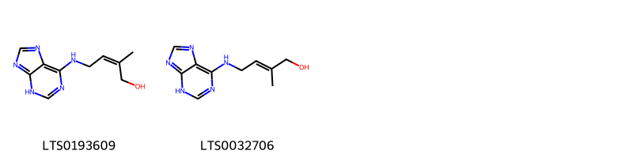{ width=100% }
    <figcaption>Hình ảnh cấu trúc hóa học của 2 hoạt chất thuộc nhóm Imidazopyrimidines gồm ['cis-zeatin (LTS0193609)', 'zeatine (LTS0032706)'].</figcaption>
</figure>
#### Nhóm Indoles and derivatives
<figure markdown="span">
    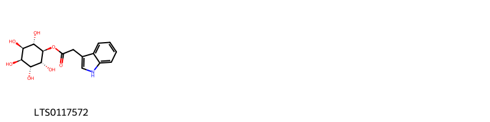{ width=100% }
    <figcaption>Hình ảnh cấu trúc hóa học của 1 hoạt chất thuộc nhóm Indoles and derivatives gồm ['(1r,2r,3r,4s,5r,6s)-2,3,4,5,6-pentahydroxycyclohexyl 2-(1h-indol-3-yl)acetate (LTS0117572)'].</figcaption>
</figure>
#### Nhóm Naphthopyrans
<figure markdown="span">
    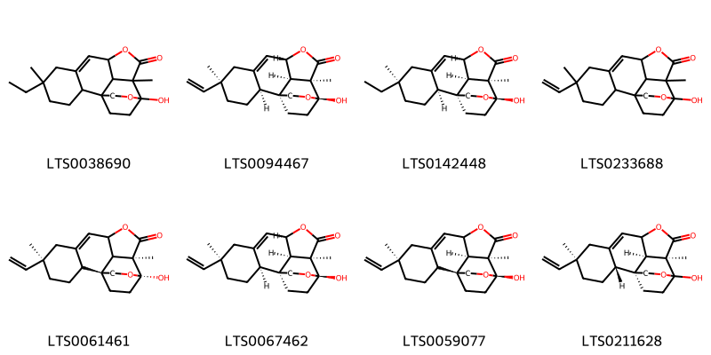{ width=100% }
    <figcaption>Hình ảnh cấu trúc hóa học của 8 hoạt chất thuộc nhóm Naphthopyrans gồm ['5-ethyl-13-hydroxy-5,12-dimethyl-10,14-dioxapentacyclo[11.2.2.1¹,⁹.0²,⁷.0¹²,¹⁸]octadec-7-en-11-one (LTS0038690)', '(1s,2s,5r,9s,12r,13s,18r)-5-ethenyl-13-hydroxy-5,12-dimethyl-10,14-dioxapentacyclo[11.2.2.1¹,⁹.0²,⁷.0¹²,¹⁸]octadec-7-en-11-one (LTS0094467)', '(1s,2s,5r,9r,12r,13s,18r)-5-ethyl-13-hydroxy-5,12-dimethyl-10,14-dioxapentacyclo[11.2.2.1¹,⁹.0²,⁷.0¹²,¹⁸]octadec-7-en-11-one (LTS0142448)', '5-ethenyl-13-hydroxy-5,12-dimethyl-10,14-dioxapentacyclo[11.2.2.1¹,⁹.0²,⁷.0¹²,¹⁸]octadec-7-en-11-one (LTS0233688)', '(1s,5r,12r,13r)-5-ethenyl-13-hydroxy-5,12-dimethyl-10,14-dioxapentacyclo[11.2.2.1¹,⁹.0²,⁷.0¹²,¹⁸]octadec-7-en-11-one (LTS0061461)', '(1s,2s,5r,9r,12r,13s,18r)-5-ethenyl-13-hydroxy-5,12-dimethyl-10,14-dioxapentacyclo[11.2.2.1¹,⁹.0²,⁷.0¹²,¹⁸]octadec-7-en-11-one (LTS0067462)', '(1s,5r,12r,13s,18r)-5-ethenyl-13-hydroxy-5,12-dimethyl-10,14-dioxapentacyclo[11.2.2.1¹,⁹.0²,⁷.0¹²,¹⁸]octadec-7-en-11-one (LTS0059077)', 'momilactone b (LTS0211628)'].</figcaption>
</figure>
#### Nhóm Organonitrogen compounds
<figure markdown="span">
    { width=100% }
    <figcaption>Hình ảnh cấu trúc hóa học của 1 hoạt chất thuộc nhóm Organonitrogen compounds gồm ['putrescine (LTS0238763)'].</figcaption>
</figure>
#### Nhóm Organooxygen compounds
<figure markdown="span">
    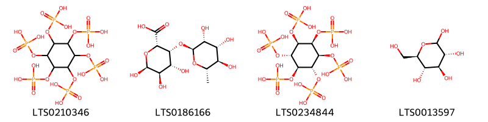{ width=100% }
    <figcaption>Hình ảnh cấu trúc hóa học của 4 hoạt chất thuộc nhóm Organooxygen compounds gồm ['phytic acid (LTS0210346)', '(2s,3r,4r,5r,6s)-4,5,6-trihydroxy-3-{[(2s,3r,4r,5r,6s)-3,4,5-trihydroxy-6-methyloxan-2-yl]oxy}oxane-2-carboxylic acid (LTS0186166)', '[(1r,2r,3s,4r,5s,6s)-2,3,4,5,6-pentakis(phosphonooxy)cyclohexyl]oxyphosphonic acid (LTS0234844)', 'glucose (LTS0013597)'].</figcaption>
</figure>
#### Nhóm Oxanes
<figure markdown="span">
    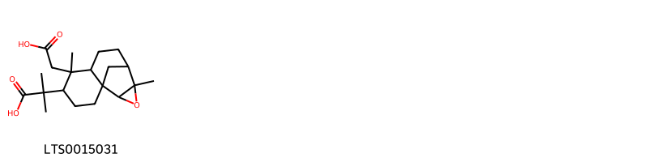{ width=100% }
    <figcaption>Hình ảnh cấu trúc hóa học của 1 hoạt chất thuộc nhóm Oxanes gồm ['2-[5-(carboxymethyl)-5,10-dimethyl-11-oxatetracyclo[7.3.1.0¹,⁶.0¹⁰,¹²]tridecan-4-yl]-2-methylpropanoic acid (LTS0015031)'].</figcaption>
</figure>
#### Nhóm Phenanthrenes and derivatives
<figure markdown="span">
    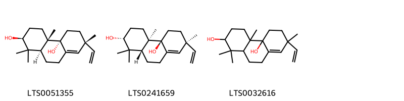{ width=100% }
    <figcaption>Hình ảnh cấu trúc hóa học của 3 hoạt chất thuộc nhóm Phenanthrenes and derivatives gồm ['(2s,4as,4br,7r,10as)-7-ethenyl-1,1,4a,7-tetramethyl-2,3,4,5,6,9,10,10a-octahydrophenanthrene-2,4b-diol (LTS0051355)', 'oryzalexin e (LTS0241659)', '7-ethenyl-1,1,4a,7-tetramethyl-2,3,4,5,6,9,10,10a-octahydrophenanthrene-2,4b-diol (LTS0032616)'].</figcaption>
</figure>
#### Nhóm Phenols
<figure markdown="span">
    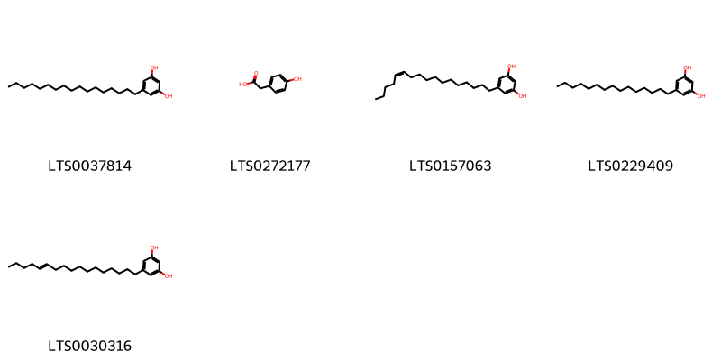{ width=100% }
    <figcaption>Hình ảnh cấu trúc hóa học của 5 hoạt chất thuộc nhóm Phenols gồm ['5-heptadecylbenzene-1,3-diol (LTS0037814)', '4-hydroxyphenylacetic acid (LTS0272177)', '5-(heptadec-12-enyl)resorcinol (LTS0157063)', 'cardol (LTS0229409)', '5-(heptadec-12-enyl)resorcinol (LTS0030316)'].</figcaption>
</figure>
#### Nhóm Prenol lipids
<figure markdown="span">
    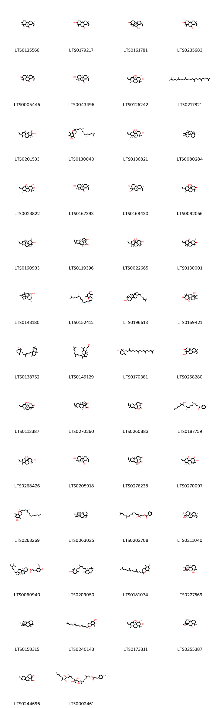{ width=100% }
    <figcaption>Hình ảnh cấu trúc hóa học của 67 hoạt chất thuộc nhóm Prenol lipids gồm ['oryzalexin c (LTS0125566)', '7-ethenyl-2-hydroxy-1,1,4a,7-tetramethyl-2,3,4,4b,5,6,10,10a-octahydrophenanthren-9-one (LTS0179217)', 'oryzalexin b (LTS0161781)', '7-ethenyl-9-hydroxy-1,1,4a,7-tetramethyl-3,4,4b,5,6,9,10,10a-octahydrophenanthren-2-one (LTS0235683)', '7-ethenyl-1,1,4a,7-tetramethyl-4,4b,5,6,10,10a-hexahydro-3h-phenanthrene-2,9-dione (LTS0005446)', 'oryzalexin a (LTS0043496)', '(+)-phytocassane b (LTS0126242)', 'squalene (LTS0217821)', '7-ethenyl-2-hydroxy-1,1,4a,8-tetramethyl-2,4,4b,8,8a,9,10,10a-octahydrophenanthrene-3,5-dione (LTS0201533)', '(2r)-2,5,7,8-tetramethyl-2-[(4s,8s)-4,8,12-trimethyltridecyl]-3,4-dihydro-1-benzopyran-6-ol (LTS0130040)', '(+)-phytocassane c (LTS0136821)', 'stemar-13-ene (LTS0080284)', '(3r,4ar,4br,8s,10as)-7-ethenyl-3-hydroxy-1,1,4a,8-tetramethyl-3,4,4b,8,8a,9,10,10a-octahydrophenanthrene-2,5-dione (LTS0023822)', '(2s,4as,4br,7r,10ar)-7-ethenyl-2-hydroxy-1,1,4a,7-tetramethyl-2,3,4,4b,5,6,10,10a-octahydrophenanthren-9-one (LTS0167393)', '(2r,4as,4br,7s,10as)-7-ethenyl-1-(hydroxymethyl)-1,4a,7-trimethyl-3,4,4b,5,6,9,10,10a-octahydro-2h-phenanthren-2-ol (LTS0168430)', '7-ethenyl-4-hydroxy-1,1,4a,8-tetramethyl-3,4,4b,8,8a,9,10,10a-octahydrophenanthrene-2,5-dione (LTS0092056)', '(2s,4ar,4br,8s,10as)-7-ethenyl-2-hydroxy-1,1,4a,8-tetramethyl-2,4,4b,8,8a,9,10,10a-octahydrophenanthrene-3,5-dione (LTS0160933)', 'momilactone a (LTS0119396)', '(+)-phytocassane e (LTS0022665)', '(3s,4as,8as)-7-ethenyl-3-hydroxy-1,1,4a,8-tetramethyl-3,4,4b,8,8a,9,10,10a-octahydrophenanthrene-2,5-dione (LTS0130001)', '(1r,2s,4r,6s,7r,10s,13r)-6-(hydroxymethyl)-2,6,12-trimethyltetracyclo[11.2.1.0¹,¹⁰.0²,⁷]hexadec-11-en-4-ol (LTS0143180)', 'β-tocopherol (LTS0152412)', 'parkeol (LTS0196613)', '(1r,8r,9s,13r,15s)-8,15-dihydroxy-5,5,9-trimethyl-14-methylidene-7-oxatetracyclo[11.2.1.0¹,¹⁰.0⁴,⁹]hexadecan-6-one (LTS0169421)', '(1r,3s)-3-[(3e)-6-[(4ar,8ar)-2,4a,7,7-tetramethyl-3,4,5,6,8,8a-hexahydronaphthalen-1-yl]-3-methylhex-3-en-1-yl]-2,2-dimethyl-4-methylidenecyclohexan-1-ol (LTS0138752)', '3-[(1r,3ar,4s)-1-[(5e)-6,10-dimethylundeca-5,9-dien-2-yl]-1,3a-dimethyl-5-(propan-2-ylidene)-hexahydroinden-4-yl]propan-1-ol (LTS0149129)', '(1s,3r)-2,2-dimethyl-4-methylidene-3-[(3e,7e,11e)-3,8,12,16-tetramethylheptadeca-3,7,11,15-tetraen-1-yl]cyclohexan-1-ol (LTS0170381)', '7-ethenyl-1-(hydroxymethyl)-1,4a,7-trimethyl-3,4,4b,5,6,9,10,10a-octahydro-2h-phenanthren-2-ol (LTS0258280)', '(4s,4ar,4br,8s,8ar,10as)-7-ethenyl-4-hydroxy-1,1,4a,8-tetramethyl-3,4,4b,8,8a,9,10,10a-octahydrophenanthrene-2,5-dione (LTS0113387)', '(1r,2s,5r,9s,12r,16r)-5-ethenyl-1,5,12-trimethyl-10-oxatetracyclo[7.6.1.0²,⁷.0¹²,¹⁶]hexadec-7-ene-11,13-dione (LTS0270260)', '5-ethenyl-1,5,12-trimethyl-10-oxatetracyclo[7.6.1.0²,⁷.0¹²,¹⁶]hexadec-7-ene-11,13-dione (LTS0260883)', '(3r,7s,10r,11r)-10-hydroxy-3,7,11-trimethylhexadecyl benzoate (LTS0187759)', '2-ethenyl-5,7-dihydroxy-1,4b,8,8-tetramethyl-4a,5,6,7,8a,9,10,10a-octahydro-1h-phenanthren-4-one (LTS0268426)', 'oryzalexin d (LTS0205918)', '(1r,2s,5r,9s,16r)-5-ethenyl-1,5,12-trimethyl-10-oxatetracyclo[7.6.1.0²,⁷.0¹²,¹⁶]hexadec-7-ene-11,13-dione (LTS0276238)', '(+)-phytocassane d (LTS0270097)', 'vitamin e (LTS0263269)', 'ent-kaurene (LTS0063025)', '(3r,7s,11s)-3-hydroxy-3,7,11,15-tetramethylhexadecyl benzoate (LTS0202708)', '(1s,2r,4as,4br,7s,10ar)-7-ethenyl-1-(hydroxymethyl)-1,4a,7-trimethyl-3,4,4b,5,6,9,10,10a-octahydro-2h-phenanthren-2-ol (LTS0211040)', 'stigmasteryl ferulate (LTS0060940)', '(1r,3s)-3-{6-[(4ar,8ar)-2,4a,7,7-tetramethyl-3,4,5,6,8,8a-hexahydronaphthalen-1-yl]-3-methylhex-3-en-1-yl}-2,2-dimethyl-4-methylidenecyclohexan-1-ol (LTS0209050)', 'β-tocotrienol (LTS0181074)', '(1r,3s,4r,9s,10s,13r,16s)-5,5,9,14-tetramethyltetracyclo[11.2.1.0¹,¹⁰.0⁴,⁹]hexadec-14-ene-3,16-diol (LTS0227569)', 'ent-isokaurene (LTS0158315)', 'γ-tocotrienol (LTS0240143)', '2-ethenyl-5,6,7-trihydroxy-1,4b,8,8-tetramethyl-4a,5,6,7,8a,9,10,10a-octahydro-1h-phenanthren-4-one (LTS0173811)', '5,5,9,14-tetramethyltetracyclo[11.2.1.0¹,¹⁰.0⁴,⁹]hexadec-14-ene-3,16-diol (LTS0255387)', '5-ethyl-1,5,12-trimethyl-10-oxatetracyclo[7.6.1.0²,⁷.0¹²,¹⁶]hexadec-7-ene-11,13-dione (LTS0244696)', '9,10,11,17,18-pentahydroxy-3,7,11,15,19-pentamethyltetracosyl 3-(4-hydroxyphenyl)propanoate (LTS0002461)', '(1s,4ar,4br,5r,6s,7s,8ar,10ar)-2-ethenyl-5,6,7-trihydroxy-1,4b,8,8-tetramethyl-4a,5,6,7,8a,9,10,10a-octahydro-1h-phenanthren-4-one (LTS0275621)', 'gamma-tocopherol (LTS0058127)', '7-ethenyl-3-hydroxy-1,1,4a,8-tetramethyl-3,4,4b,8,8a,9,10,10a-octahydrophenanthrene-2,5-dione (LTS0065171)', 'α-tocotrienol (LTS0005247)', '(2r)-2,5,8-trimethyl-2-(4,8,12-trimethyltridecyl)-3,4-dihydro-1-benzopyran-6-ol (LTS0030802)', '(3s,7r,9s,10r,11r,15r,17s,18s,19s)-9,10,11,17,18-pentahydroxy-3,7,11,15,19-pentamethyltetracosyl 3-(4-hydroxyphenyl)propanoate (LTS0005185)', '(1s,4ar,4br,5s,7r,8ar,10ar)-2-ethenyl-5,7-dihydroxy-1,4b,8,8-tetramethyl-4a,5,6,7,8a,9,10,10a-octahydro-1h-phenanthren-4-one (LTS0263697)', 'prolycopene (LTS0065016)', '(1r,4s,8r,9s,10r,13r,14s)-8-hydroxy-5,5,9,14-tetramethyl-7,15-dioxapentacyclo[11.3.1.0¹,¹⁰.0⁴,⁹.0¹⁴,¹⁶]heptadecan-6-one (LTS0022534)', '3-hydroxy-3,7,11,15-tetramethylhexadecyl benzoate (LTS0251277)', '3a,6,6,9a,11a-pentamethyl-1-(6-methylhept-5-en-2-yl)-1h,2h,3h,3bh,4h,5h,5ah,7h,8h,9h,11h-cyclopenta[a]phenanthren-7-ol (LTS0017302)', '10-hydroxy-3,7,11-trimethylhexadecyl benzoate (LTS0032674)', 'delta-tocopherol (LTS0005408)', '(4e)-5-[(1s)-1-hydroxy-2,6,6-trimethyl-4-oxocyclohex-2-en-1-yl]-3-methylpenta-2,4-dienoic acid (LTS0268716)', '(+)-phytocassane a (LTS0252782)', 'delta-tocotrienol (LTS0255585)', '(1r,2r,5r,9r,12r,16r)-5-ethyl-1,5,12-trimethyl-10-oxatetracyclo[7.6.1.0²,⁷.0¹²,¹⁶]hexadec-7-ene-11,13-dione (LTS0265628)'].</figcaption>
</figure>
#### Nhóm Pyrrolines
<figure markdown="span">
    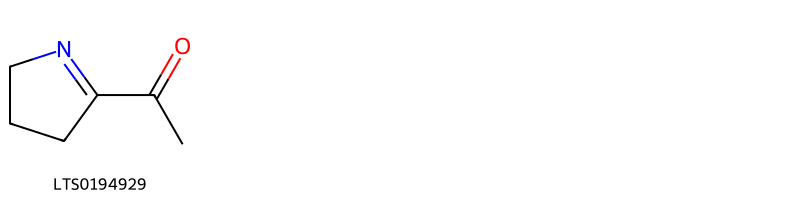{ width=100% }
    <figcaption>Hình ảnh cấu trúc hóa học của 1 hoạt chất thuộc nhóm Pyrrolines gồm ['2-acetyl-1-pyrroline (LTS0194929)'].</figcaption>
</figure>
#### Nhóm Quinolines and derivatives
<figure markdown="span">
    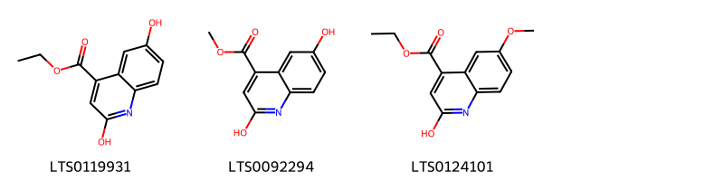{ width=100% }
    <figcaption>Hình ảnh cấu trúc hóa học của 3 hoạt chất thuộc nhóm Quinolines and derivatives gồm ['ethyl 2,6-dihydroxyquinoline-4-carboxylate (LTS0119931)', 'methyl 2,6-dihydroxyquinoline-4-carboxylate (LTS0092294)', 'ethyl 2-hydroxy-6-methoxyquinoline-4-carboxylate (LTS0124101)'].</figcaption>
</figure>
#### Nhóm Saturated hydrocarbons
<figure markdown="span">
    { width=100% }
    <figcaption>Hình ảnh cấu trúc hóa học của 1 hoạt chất thuộc nhóm Saturated hydrocarbons gồm ['hentriacontane (LTS0046415)'].</figcaption>
</figure>
#### Nhóm Sphingolipids
<figure markdown="span">
    { width=100% }
    <figcaption>Hình ảnh cấu trúc hóa học của 1 hoạt chất thuộc nhóm Sphingolipids gồm ['2-hydroxy-n-(3-hydroxy-1-{[3,4,5-trihydroxy-6-(hydroxymethyl)oxan-2-yl]oxy}docos-4-en-2-yl)hexadecanimidic acid (LTS0020710)'].</figcaption>
</figure>
#### Nhóm Steroids and steroid derivatives
<figure markdown="span">
    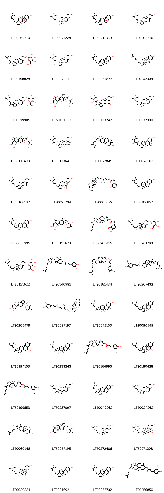{ width=100% }
    <figcaption>Hình ảnh cấu trúc hóa học của 48 hoạt chất thuộc nhóm Steroids and steroid derivatives gồm ['ergosterol peroxide (LTS0264710)', 'stigmast-5-en-3-ol (LTS0071224)', '5-(5,6-dimethylhept-3-en-2-yl)-6,10-dimethyl-16,17-dioxapentacyclo[13.2.2.0¹,⁹.0²,⁶.0¹⁰,¹⁵]nonadec-18-en-13-ol (LTS0211330)', 'stigmast-5-en-3-ol, (3β)- (LTS0204616)', '2-{[1-(5-ethyl-6-methylheptan-2-yl)-9a,11a-dimethyl-1h,2h,3h,3ah,3bh,4h,6h,7h,8h,9h,9bh,10h,11h-cyclopenta[a]phenanthren-7-yl]oxy}-6-(hydroxymethyl)oxane-3,4,5-triol (LTS0158828)', 'phytosterol (LTS0029311)', '(1r,3as,3bs,7s,9bs)-1-[(2r,5r)-5,6-dimethylheptan-2-yl]-9a,11a-dimethyl-1h,2h,3h,3ah,3bh,4h,6h,7h,8h,9h,9bh,10h,11h-cyclopenta[a]phenanthren-7-ol (LTS0057877)', 'cholesterol (LTS0102304)', '6-{[1-(5-ethyl-6-methylheptan-2-yl)-9a,11a-dimethyl-1h,2h,3h,3ah,3bh,4h,6h,7h,8h,9h,9bh,10h,11h-cyclopenta[a]phenanthren-7-yl]oxy}-3,4,5-trihydroxyoxane-2-carboxylic acid (LTS0199905)', '(1r,3as,3bs,5as,7r,8r,9ar,9bs,11as)-1-[(2s,3r,4r,5s)-3,4-dihydroxy-5,6-dimethylheptan-2-yl]-7,8-dihydroxy-9a,11a-dimethyl-tetradecahydrocyclopenta[a]phenanthren-5-one (LTS0131159)', '1-(5-ethyl-3,4-dihydroxy-6-methylheptan-2-yl)-7-hydroxy-9a,11a-dimethyl-tetradecahydrocyclopenta[a]phenanthren-5-one (LTS0123242)', '1-(5-ethyl-6-methylheptan-2-yl)-7-hydroxy-9a,11a-dimethyl-1h,2h,3h,3ah,3bh,6h,7h,8h,9h,9bh,10h,11h-cyclopenta[a]phenanthren-4-one (LTS0132900)', 'castasterone (LTS0111493)', '(1r,3as,3bs,5as,7s,9ar,9bs,11as)-1-[(2s,3r,4r,5s)-5-ethyl-3,4-dihydroxy-6-methylheptan-2-yl]-7-hydroxy-9a,11a-dimethyl-tetradecahydrocyclopenta[a]phenanthren-5-one (LTS0173641)', '24-methylene-cycloartanol (LTS0077845)', 'teasterone (LTS0028563)', 'sitosterol (LTS0168132)', '(1r,3as,3bs,7s,9ar,9bs,11ar)-1-[(2r,3e,5s)-5-ethyl-6-methylhept-3-en-2-yl]-7-hydroxy-9a,11a-dimethyl-1h,2h,3h,3ah,3bh,6h,7h,8h,9h,9bh,10h,11h-cyclopenta[a]phenanthren-4-one (LTS0025704)', '(3s,6r)-6-[(1r,3as,3br,9as,9bs,11ar)-9a,11a-dimethyl-tetradecahydro-1h-cyclopenta[a]phenanthren-1-yl]-3-isopropylheptyl (2z)-3-(4-hydroxy-3-methoxyphenyl)prop-2-enoate (LTS0006072)', '24-α-methylcholesterol (LTS0106857)', '(1r,3bs,5as,7s,9ar,9bs,11as)-1-[(2s,3r,4r,5s)-3,4-dihydroxy-5,6-dimethylheptan-2-yl]-7-hydroxy-9a,11a-dimethyl-tetradecahydrocyclopenta[a]phenanthren-5-one (LTS0053235)', '(1r,7s,8r)-1-[(2s,3r,4r)-3,4-dihydroxy-6-methyl-5-methylideneheptan-2-yl]-7,8-dihydroxy-9a,11a-dimethyl-tetradecahydrocyclopenta[a]phenanthren-5-one (LTS0135678)', '(1s,3r,6s,8r,11s,12s,15r,16r)-7,7,12,16-tetramethyl-15-[(2r)-6-methylheptan-2-yl]pentacyclo[9.7.0.0¹,³.0³,⁸.0¹²,¹⁶]octadecan-6-yl (2z)-3-(4-hydroxy-3-methoxyphenyl)prop-2-enoate (LTS0205415)', 'sitogluside (LTS0201798)', '(2s,3s,4s,5r,6r)-6-{[(1r,3as,3bs,7s,9ar,9bs,11ar)-1-[(2r,5r)-5-ethyl-6-methylheptan-2-yl]-9a,11a-dimethyl-1h,2h,3h,3ah,3bh,4h,6h,7h,8h,9h,9bh,10h,11h-cyclopenta[a]phenanthren-7-yl]oxy}-3,4,5-trihydroxyoxane-2-carboxylic acid (LTS0121622)', '(1s,3r,6s,12s,15r,16r)-7,7,12,16-tetramethyl-15-(6-methylhept-5-en-2-yl)pentacyclo[9.7.0.0¹,³.0³,⁸.0¹²,¹⁶]octadecan-6-yl (2e)-3-(4-hydroxy-3-methoxyphenyl)prop-2-enoate (LTS0140981)', '2-methoxy-4-[(1e)-3-{[(6s,8r,11s,12s,15r,16r)-7,7,12,16-tetramethyl-15-[(2r)-6-methylhept-5-en-2-yl]pentacyclo[9.7.0.0¹,³.0³,⁸.0¹²,¹⁶]octadecan-6-yl]oxy}buta-1,3-dien-1-yl]phenol (LTS0161434)', '(1r,3as,3br,7s,9ar,9bs,11ar)-1-[(2r,5r)-5,6-dimethylheptan-2-yl]-9a,11a-dimethyl-1h,2h,3h,3ah,3bh,4h,6h,7h,8h,9h,9bh,10h,11h-cyclopenta[a]phenanthren-7-yl 3-(4-hydroxy-3-methoxyphenyl)prop-2-enoate (LTS0267432)', '2-{7,8-dihydroxy-9a,11a-dimethyl-tetradecahydro-1h-cyclopenta[a]phenanthren-1-yl}-5,6-dimethylheptane-3,4-diol (LTS0205479)', '(3s,6r)-6-[(1r,3as,3br,9as,9bs,11ar)-9a,11a-dimethyl-tetradecahydro-1h-cyclopenta[a]phenanthren-1-yl]-3-isopropylheptyl (2e)-3-(4-hydroxy-3-methoxyphenyl)prop-2-enoate (LTS0097197)', 'episterol (LTS0072150)', '(1r,3as,3bs,5r,9ar,9bs,11ar)-1-[(2r,3e,5s)-5-ethyl-6-methylhept-3-en-2-yl]-5-hydroxy-9a,11a-dimethyl-1h,2h,3h,3ah,3bh,4h,5h,8h,9h,9bh,10h,11h-cyclopenta[a]phenanthren-7-one (LTS0090549)', '1-(5-ethyl-6-methylhept-3-en-2-yl)-5-hydroxy-9a,11a-dimethyl-1h,2h,3h,3ah,3bh,4h,5h,8h,9h,9bh,10h,11h-cyclopenta[a]phenanthren-7-one (LTS0194153)', 'campestanol (LTS0233243)', '(3r,6s,8r,11s,12s,16r)-7,7,12,16-tetramethyl-15-(6-methylhept-5-en-2-yl)pentacyclo[9.7.0.0¹,³.0³,⁸.0¹²,¹⁶]octadecan-6-yl (2e)-3-(4-hydroxy-3-methoxyphenyl)prop-2-enoate (LTS0166995)', '(1r,3as,3bs,5s,9ar,9bs,11ar)-1-[(2r,3e,5s)-5-ethyl-6-methylhept-3-en-2-yl]-5-hydroxy-9a,11a-dimethyl-1h,2h,3h,3ah,3bh,4h,5h,8h,9h,9bh,10h,11h-cyclopenta[a]phenanthren-7-one (LTS0180428)', 'oryzanol a (LTS0199553)', '1-(5-ethyl-6-methylhept-3-en-2-yl)-7-hydroxy-9a,11a-dimethyl-1h,2h,3h,3ah,3bh,6h,7h,8h,9h,9bh,10h,11h-cyclopenta[a]phenanthren-4-one (LTS0237097)', '5-(5,6-dimethylheptan-2-yl)-6,10-dimethyl-16,17-dioxapentacyclo[13.2.2.0¹,⁹.0²,⁶.0¹⁰,¹⁵]nonadec-18-en-13-ol (LTS0049262)', 'stigmasterol (LTS0024262)', '(1s,3r,6s,7s,8s,11s,12s,15r,16r)-7,12,16-trimethyl-15-[(2r)-6-methylhept-5-en-2-yl]pentacyclo[9.7.0.0¹,³.0³,⁸.0¹²,¹⁶]octadecan-6-ol (LTS0060148)', '6-deoxocastasterone (LTS0057195)', '(1r,3as,3br,7s,9as,9bs,11ar)-1-[(2r,5r)-5-ethyl-6-methylheptan-2-yl]-9a,11a-dimethyl-tetradecahydro-1h-cyclopenta[a]phenanthren-7-ol (LTS0272486)', '(1r,3as,3bs,5as,7r,9ar,9bs,11as)-1-[(2s,3r,4r,5s)-5-ethyl-3,4-dihydroxy-6-methylheptan-2-yl]-7-hydroxy-9a,11a-dimethyl-tetradecahydrocyclopenta[a]phenanthren-5-one (LTS0271208)', '(1r,3as,3bs,7s,9ar,9bs,11ar)-1-[(2r,5r)-5-ethyl-6-methylheptan-2-yl]-7-hydroxy-9a,11a-dimethyl-1h,2h,3h,3ah,3bh,6h,7h,8h,9h,9bh,10h,11h-cyclopenta[a]phenanthren-4-one (LTS0030881)', '24-methylenecholesterol (LTS0016921)', '(1s,2r,5r,6r,9r,10r,13s,15s)-5-[(2r,5r)-5,6-dimethylheptan-2-yl]-6,10-dimethyl-16,17-dioxapentacyclo[13.2.2.0¹,⁹.0²,⁶.0¹⁰,¹⁵]nonadec-18-en-13-ol (LTS0055732)', '(7s,9bs,11ar)-9b-ethyl-3a,6,6,11a-tetramethyl-1-(6-methylheptan-2-yl)-dodecahydro-1h-cyclopenta[a]phenanthren-7-yl (2e)-3-(4-hydroxy-3-methoxyphenyl)prop-2-enoate (LTS0256850)'].</figcaption>
</figure>

---

### Dược dân tộc học

Danh sách các quốc gia có sử dụng *Oryza sativa* trong điều trị các bệnh. 

| Country   | Disease                                                                              | Bệnh                                                                                                                                                                                                |
|:----------|:-------------------------------------------------------------------------------------|:----------------------------------------------------------------------------------------------------------------------------------------------------------------------------------------------------|
| China     | Astringent, Cosmetic, Dentifrice, Diuretic, Stomachic, Tonic, Refrigerant, Vermifuge | MYMEMORY WARNING: YOU USED ALL AVAILABLE FREE TRANSLATIONS FOR TODAY. NEXT AVAILABLE IN  01 HOURS 19 MINUTES 44 SECONDS VISIT HTTPS://MYMEMORY.TRANSLATED.NET/DOC/USAGELIMITS.PHP TO TRANSLATE MORE |
| India     | Intoxicant, Larvicide                                                                | MYMEMORY WARNING: YOU USED ALL AVAILABLE FREE TRANSLATIONS FOR TODAY. NEXT AVAILABLE IN  01 HOURS 19 MINUTES 41 SECONDS VISIT HTTPS://MYMEMORY.TRANSLATED.NET/DOC/USAGELIMITS.PHP TO TRANSLATE MORE |
| Iraq      | Refrigerant                                                                          | MYMEMORY WARNING: YOU USED ALL AVAILABLE FREE TRANSLATIONS FOR TODAY. NEXT AVAILABLE IN  01 HOURS 19 MINUTES 39 SECONDS VISIT HTTPS://MYMEMORY.TRANSLATED.NET/DOC/USAGELIMITS.PHP TO TRANSLATE MORE |
| Japan     | Intoxicant                                                                           | MYMEMORY WARNING: YOU USED ALL AVAILABLE FREE TRANSLATIONS FOR TODAY. NEXT AVAILABLE IN  01 HOURS 19 MINUTES 37 SECONDS VISIT HTTPS://MYMEMORY.TRANSLATED.NET/DOC/USAGELIMITS.PHP TO TRANSLATE MORE |
| Turkey    | Demulcent                                                                            | MYMEMORY WARNING: YOU USED ALL AVAILABLE FREE TRANSLATIONS FOR TODAY. NEXT AVAILABLE IN  01 HOURS 19 MINUTES 35 SECONDS VISIT HTTPS://MYMEMORY.TRANSLATED.NET/DOC/USAGELIMITS.PHP TO TRANSLATE MORE |

---

# Chi Bambusa

??? note "Danh sách các dược liệu thuộc chi"
    
	 - *Bambusa argentea-striata*
	 - *Bambusa arundinacea*
	 - *Bambusa glaucescens*
	 - *Bambusa inosa*
	 - *Bambusa vulgaris*

---
## Bambusa argenteastriata
### Thông tin về thực vật

!!! info "Phân loại thực vật của *Pleioblastus argenteostriatus* từ GIBF:"
    - **Kingdom:** Plantae
    - **Phylum:** Tracheophyta
    - **Order:** Poales
    - **Family:** Poaceae
    - **Genus:** Pleioblastus
    - **Species:** *Pleioblastus argenteostriatus*

 

| Label (VI)   | Label (EN)   | Scientific Name   | Descriptions (VI)   | Descriptions (EN)                         | Also Known As (VI)                                 | Also Known As (EN)   |
|:-------------|:-------------|:------------------|:--------------------|:------------------------------------------|:---------------------------------------------------|:---------------------|
| N/A          | N/A          | Oryza sativa      | loài thực vật       | species of plant (for the food see Q5090) | ['Oryza sativa', 'Lúa nước', 'Lúa gạo', 'Cây lúa'] | ['paddy', 'Rice']    |

#### Phân bố trên thế giới

**Từ CSDL GIBF** nan, United States of America

#### Phân bố tại Việt Nam

**Từ CSDL GIBF**: Không có ghi nhận ở Việt Nam

---
### Thành phần hóa học
        
- Theo cơ sở dữ liệu lotus: Từ loài *Pleioblastus argenteostriatus* đã phân lập và xác định được Chưa có hoạt chất nào được phân lập. hoạt chất thuộc về các nhóm Không có hoạt chất nào được phân lập. 

Không có hình ảnh nào được tạo ra

---

### Dược dân tộc học

Danh sách các quốc gia có sử dụng *Pleioblastus argenteostriatus* trong điều trị các bệnh. 

| Country   | Disease                                                            | Bệnh                                                                                                                                                                                                |
|:----------|:-------------------------------------------------------------------|:----------------------------------------------------------------------------------------------------------------------------------------------------------------------------------------------------|
| Iraq      | Aphrodisiac, Emmenagogue, Refrigerant, Stimulant, Tonic, Vermifuge | MYMEMORY WARNING: YOU USED ALL AVAILABLE FREE TRANSLATIONS FOR TODAY. NEXT AVAILABLE IN  01 HOURS 18 MINUTES 23 SECONDS VISIT HTTPS://MYMEMORY.TRANSLATED.NET/DOC/USAGELIMITS.PHP TO TRANSLATE MORE |

---

---
## Bambusa arundinacea
### Thông tin về thực vật

!!! info "Phân loại thực vật của *Bambusa arundinacea* từ GIBF:"
    - **Kingdom:** Plantae
    - **Phylum:** Tracheophyta
    - **Order:** Poales
    - **Family:** Poaceae
    - **Genus:** Bambusa
    - **Species:** *Bambusa arundinacea*

 

| Label (VI)   | Label (EN)   | Scientific Name     | Descriptions (VI)   | Descriptions (EN)   | Also Known As (VI)   | Also Known As (EN)                                                                                         |
|:-------------|:-------------|:--------------------|:--------------------|:--------------------|:---------------------|:-----------------------------------------------------------------------------------------------------------|
| N/A          | N/A          | Bambusa arundinacea | loài thực vật       | species of plant    | ['']                 | ['Nepalese bamboos', 'Spiny bamboo', 'Thorny bamboo', 'Giant reed-bamboo', 'Indian bamboo', 'Reed bamboo'] |

#### Phân bố trên thế giới

**Từ CSDL GIBF** nan, Italy, Australia, Thailand, Brazil, Spain, Switzerland, India, unknown or invalid, United States of America, Philippines, China

#### Phân bố tại Việt Nam

**Từ CSDL GIBF**: Không có ghi nhận ở Việt Nam

---
### Thành phần hóa học
        
- Theo cơ sở dữ liệu lotus: Từ loài *Bambusa arundinacea* đã phân lập và xác định được Chưa có hoạt chất nào được phân lập. hoạt chất thuộc về các nhóm Không có hoạt chất nào được phân lập. 

Không có hình ảnh nào được tạo ra

---

### Dược dân tộc học

Danh sách các quốc gia có sử dụng *Bambusa arundinacea* trong điều trị các bệnh. 

| Country   | Disease                                           | Bệnh                                                                                                                                                                                                |
|:----------|:--------------------------------------------------|:----------------------------------------------------------------------------------------------------------------------------------------------------------------------------------------------------|
| Elsewhere | Aphrodisiac, Demulcent, Poison, Poison, Larvicide | MYMEMORY WARNING: YOU USED ALL AVAILABLE FREE TRANSLATIONS FOR TODAY. NEXT AVAILABLE IN  01 HOURS 17 MINUTES 46 SECONDS VISIT HTTPS://MYMEMORY.TRANSLATED.NET/DOC/USAGELIMITS.PHP TO TRANSLATE MORE |

---

---
## Bambusa glaucescens
### Thông tin về thực vật

!!! info "Phân loại thực vật của *Bambusa multiplex* từ GIBF:"
    - **Kingdom:** Plantae
    - **Phylum:** Tracheophyta
    - **Order:** Poales
    - **Family:** Poaceae
    - **Genus:** Bambusa
    - **Species:** *Bambusa multiplex*

 

| Label (VI)   | Label (EN)   | Scientific Name     | Descriptions (VI)   | Descriptions (EN)   | Also Known As (VI)   | Also Known As (EN)   |
|:-------------|:-------------|:--------------------|:--------------------|:--------------------|:---------------------|:---------------------|
| N/A          | N/A          | Bambusa glaucescens | loài thực vật       | species of plant    | ['']                 | ['']                 |

#### Phân bố trên thế giới

**Từ CSDL GIBF** nan, Ghana, Sri Lanka, Italy, Japan, Cook Islands, Argentina, unknown or invalid, Bermuda, Tanzania, United Republic of, Sierra Leone, Panama, Pakistan, Puerto Rico, Chinese Taipei, Papua New Guinea, Russian Federation, Jamaica, United States of America, Bangladesh, Solomon Islands, Zimbabwe, Liberia, El Salvador, Trinidad and Tobago, Uganda, Hong Kong, Thailand, Martinique, Brazil, Guam, New Zealand, New Caledonia, Cuba, Peru, Dominican Republic, China, United Kingdom of Great Britain and Northern Ireland, Ecuador, French Polynesia, Haiti, Kenya, India, Indonesia, Philippines, Malaysia, Brunei Darussalam

#### Phân bố tại Việt Nam

**Từ CSDL GIBF**: Không có ghi nhận ở Việt Nam

---
### Thành phần hóa học
        
- Theo cơ sở dữ liệu lotus: Từ loài *Bambusa multiplex* đã phân lập và xác định được Chưa có hoạt chất nào được phân lập. hoạt chất thuộc về các nhóm Không có hoạt chất nào được phân lập. 

Không có hình ảnh nào được tạo ra

---

### Dược dân tộc học

Danh sách các quốc gia có sử dụng *Bambusa multiplex* trong điều trị các bệnh. 

| Country   | Disease       | Bệnh                                                                                                                                                                                                |
|:----------|:--------------|:----------------------------------------------------------------------------------------------------------------------------------------------------------------------------------------------------|
| Malaya    | Abortifacient | MYMEMORY WARNING: YOU USED ALL AVAILABLE FREE TRANSLATIONS FOR TODAY. NEXT AVAILABLE IN  01 HOURS 17 MINUTES 24 SECONDS VISIT HTTPS://MYMEMORY.TRANSLATED.NET/DOC/USAGELIMITS.PHP TO TRANSLATE MORE |

---

---
## Bambusa inosa
### Thông tin về thực vật

!!! info "Phân loại thực vật của *N/A* từ GIBF:"
    - **Kingdom:** Plantae
    - **Phylum:** Tracheophyta
    - **Order:** Poales
    - **Family:** Poaceae
    - **Genus:** Bambusa
    - **Species:** *N/A*

 

| Label (VI)   | Label (EN)   | Scientific Name     | Descriptions (VI)   | Descriptions (EN)   | Also Known As (VI)   | Also Known As (EN)   |
|:-------------|:-------------|:--------------------|:--------------------|:--------------------|:---------------------|:---------------------|
| N/A          | N/A          | Bambusa glaucescens | loài thực vật       | species of plant    | ['']                 | ['']                 |

#### Phân bố trên thế giới

**Từ CSDL GIBF** Ghana, Australia, Japan, Guadeloupe, Guatemala, Grenada, Saint Lucia, French Guiana, Puerto Rico, Nigeria, Luxembourg, Chinese Taipei, Spain, Jamaica, United States of America, Trinidad and Tobago, South Africa, Hong Kong, Barbados, Germany, Thailand, Northern Mariana Islands, Martinique, Brazil, Côte d’Ivoire, Switzerland, Cuba, Mexico, Dominican Republic, Viet Nam, China, United Kingdom of Great Britain and Northern Ireland, Saint Kitts and Nevis, Niue, Madagascar, Haiti, Colombia, Montserrat, Costa Rica, India, Indonesia, Philippines, Malaysia, New Zealand

#### Phân bố tại Việt Nam

**Từ CSDL GIBF**: Hậu Giang, Ninh Bình

---
### Thành phần hóa học
        
- Theo cơ sở dữ liệu lotus: Từ loài *N/A* đã phân lập và xác định được Chưa có hoạt chất nào được phân lập. hoạt chất thuộc về các nhóm Không có hoạt chất nào được phân lập. 

Không có hình ảnh nào được tạo ra

---

### Dược dân tộc học

Danh sách các quốc gia có sử dụng *N/A* trong điều trị các bệnh. 

| Country   | Disease                                                                 | Bệnh                                                                                                                                                                                                |
|:----------|:------------------------------------------------------------------------|:----------------------------------------------------------------------------------------------------------------------------------------------------------------------------------------------------|
| China     | Antidote, Poison, Refrigerant, Stomachic, Vermifuge, Carminative, Tonic | MYMEMORY WARNING: YOU USED ALL AVAILABLE FREE TRANSLATIONS FOR TODAY. NEXT AVAILABLE IN  01 HOURS 17 MINUTES 04 SECONDS VISIT HTTPS://MYMEMORY.TRANSLATED.NET/DOC/USAGELIMITS.PHP TO TRANSLATE MORE |

---

---
## Bambusa vulgaris
### Thông tin về thực vật

!!! info "Phân loại thực vật của *Bambusa vulgaris* từ GIBF:"
    - **Kingdom:** Plantae
    - **Phylum:** Tracheophyta
    - **Order:** Poales
    - **Family:** Poaceae
    - **Genus:** Bambusa
    - **Species:** *Bambusa vulgaris*

 

| Label (VI)   | Label (EN)   | Scientific Name   | Descriptions (VI)   | Descriptions (EN)   | Also Known As (VI)   | Also Known As (EN)                                                                                                                                                                                                                                                                                                                                                                                            |
|:-------------|:-------------|:------------------|:--------------------|:--------------------|:---------------------|:--------------------------------------------------------------------------------------------------------------------------------------------------------------------------------------------------------------------------------------------------------------------------------------------------------------------------------------------------------------------------------------------------------------|
| N/A          | N/A          | Bambusa vulgaris  | loài thực vật       | species of plant    | ['tre mỡ']           | ['Nepalese bamboos', 'bamboo', 'golden bamboo', "Buddha's common bamboo", 'common bamboo', 'Wamin bamboo', 'dragon-head bamboo', 'feathery bamboo', 'giant golden bamboo', 'giant green-striped bamboo', 'golden common bamboo', 'green stripe common bamboo', 'green-striped bamboo', 'ivory bamboo', 'ornamental giant bamboo', 'painted bamboo', 'tiger stripe bamboo', 'unarmed bamboo', 'yellow bamboo'] |

#### Phân bố trên thế giới

**Từ CSDL GIBF** Ghana, Guadeloupe, Guatemala, Grenada, Saint Lucia, Rwanda, Venezuela (Bolivarian Republic of), French Guiana, Panama, Puerto Rico, Nigeria, Luxembourg, Chinese Taipei, Spain, Bolivia (Plurinational State of), Portugal, Honduras, Jamaica, United States of America, Trinidad and Tobago, South Africa, Hong Kong, Barbados, Thailand, Germany, Northern Mariana Islands, Martinique, Côte d’Ivoire, Brazil, Cuba, Mexico, Dominican Republic, Singapore, Viet Nam, China, Ecuador, Saint Kitts and Nevis, Madagascar, Haiti, Colombia, Montserrat, Macao, Costa Rica, India, Indonesia, Philippines, Malaysia, New Zealand

#### Phân bố tại Việt Nam

**Từ CSDL GIBF**: Hậu Giang, Hòa Bình, Ninh Bình

---
### Thành phần hóa học
        
- Theo cơ sở dữ liệu lotus: Từ loài *Bambusa vulgaris* đã phân lập và xác định được 7 hoạt chất thuộc về các nhóm Carboxylic acids and derivatives, Organooxygen compounds, Steroids and steroid derivatives. 

|    | chemicalTaxonomyClassyfireClass   |   smiles_count |
|---:|:----------------------------------|---------------:|
|  0 | Carboxylic acids and derivatives  |              2 |
|  1 | Organooxygen compounds            |              3 |
|  2 | Steroids and steroid derivatives  |              2 |

#### Nhóm Carboxylic acids and derivatives
<figure markdown="span">
    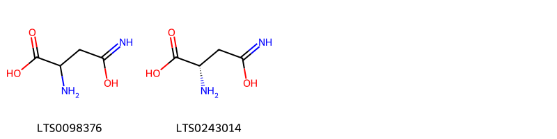{ width=100% }
    <figcaption>Hình ảnh cấu trúc hóa học của 2 hoạt chất thuộc nhóm Carboxylic acids and derivatives gồm ['asparagine (LTS0098376)', 'aspartamate (LTS0243014)'].</figcaption>
</figure>
#### Nhóm Organooxygen compounds
<figure markdown="span">
    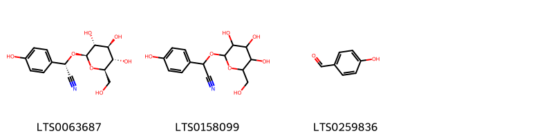{ width=100% }
    <figcaption>Hình ảnh cấu trúc hóa học của 3 hoạt chất thuộc nhóm Organooxygen compounds gồm ['dhurrin (LTS0063687)', 'dhurrin (LTS0158099)', 'p-hydroxybenzaldehyde (LTS0259836)'].</figcaption>
</figure>
#### Nhóm Steroids and steroid derivatives
<figure markdown="span">
    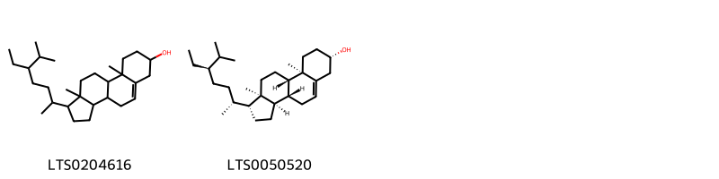{ width=100% }
    <figcaption>Hình ảnh cấu trúc hóa học của 2 hoạt chất thuộc nhóm Steroids and steroid derivatives gồm ['stigmast-5-en-3-ol, (3β)- (LTS0204616)', '(1r,3ar,3br,7s,9ar,9bs,11ar)-1-[(2r,5r)-5-ethyl-6-methylheptan-2-yl]-9a,11a-dimethyl-1h,2h,3h,3ah,3bh,4h,6h,7h,8h,9h,9bh,10h,11h-cyclopenta[a]phenanthren-7-ol (LTS0050520)'].</figcaption>
</figure>

---

### Dược dân tộc học

Danh sách các quốc gia có sử dụng *Bambusa vulgaris* trong điều trị các bệnh. 

| Country   | Disease                                                            | Bệnh                                                                                                                                                                                                |
|:----------|:-------------------------------------------------------------------|:----------------------------------------------------------------------------------------------------------------------------------------------------------------------------------------------------|
| Perak     | Insectifuge                                                        | MYMEMORY WARNING: YOU USED ALL AVAILABLE FREE TRANSLATIONS FOR TODAY. NEXT AVAILABLE IN  01 HOURS 16 MINUTES 43 SECONDS VISIT HTTPS://MYMEMORY.TRANSLATED.NET/DOC/USAGELIMITS.PHP TO TRANSLATE MORE |
| Trinidad  | Abortifacient, Abortifacient, Purgative, Purgative                 | MYMEMORY WARNING: YOU USED ALL AVAILABLE FREE TRANSLATIONS FOR TODAY. NEXT AVAILABLE IN  01 HOURS 16 MINUTES 41 SECONDS VISIT HTTPS://MYMEMORY.TRANSLATED.NET/DOC/USAGELIMITS.PHP TO TRANSLATE MORE |
| Turkey    | Aphrodisiac, Emmenagogue, Refrigerant, Stimulant, Tonic, Vermifuge | MYMEMORY WARNING: YOU USED ALL AVAILABLE FREE TRANSLATIONS FOR TODAY. NEXT AVAILABLE IN  01 HOURS 16 MINUTES 39 SECONDS VISIT HTTPS://MYMEMORY.TRANSLATED.NET/DOC/USAGELIMITS.PHP TO TRANSLATE MORE |

---

# Chi Phalaris

??? note "Danh sách các dược liệu thuộc chi"
    
	 - *Phalaris canariensis*

---
## Phalaris canariensis
### Thông tin về thực vật

!!! info "Phân loại thực vật của *Phalaris canariensis* từ GIBF:"
    - **Kingdom:** Plantae
    - **Phylum:** Tracheophyta
    - **Order:** Poales
    - **Family:** Poaceae
    - **Genus:** Phalaris
    - **Species:** *Phalaris canariensis*

 

| Label (VI)   | Label (EN)   | Scientific Name      | Descriptions (VI)   | Descriptions (EN)   | Also Known As (VI)   | Also Known As (EN)   |
|:-------------|:-------------|:---------------------|:--------------------|:--------------------|:---------------------|:---------------------|
| N/A          | N/A          | Phalaris canariensis | loài thực vật       | species of plant    | ['']                 | ['Canary grass']     |

#### Phân bố trên thế giới

**Từ CSDL GIBF** Italy, Australia, Belgium, Norway, Canada, Denmark, Netherlands, Chinese Taipei, Malta, Spain, Hungary, Russian Federation, Morocco, United States of America, Sweden, Czechia, Germany, Mexico, France, Austria, United Kingdom of Great Britain and Northern Ireland, Colombia, New Zealand

#### Phân bố tại Việt Nam

**Từ CSDL GIBF**: Không có ghi nhận ở Việt Nam

---
### Thành phần hóa học
        
- Theo cơ sở dữ liệu lotus: Từ loài *Phalaris canariensis* đã phân lập và xác định được Chưa có hoạt chất nào được phân lập. hoạt chất thuộc về các nhóm Không có hoạt chất nào được phân lập. 

Không có hình ảnh nào được tạo ra

---

### Dược dân tộc học

Danh sách các quốc gia có sử dụng *Phalaris canariensis* trong điều trị các bệnh. 

| Country   | Disease   | Bệnh                                                                                                                                                                                                |
|:----------|:----------|:----------------------------------------------------------------------------------------------------------------------------------------------------------------------------------------------------|
| Elsewhere | Diuretic  | MYMEMORY WARNING: YOU USED ALL AVAILABLE FREE TRANSLATIONS FOR TODAY. NEXT AVAILABLE IN  01 HOURS 16 MINUTES 08 SECONDS VISIT HTTPS://MYMEMORY.TRANSLATED.NET/DOC/USAGELIMITS.PHP TO TRANSLATE MORE |
| Turkey    | Diuretic  | MYMEMORY WARNING: YOU USED ALL AVAILABLE FREE TRANSLATIONS FOR TODAY. NEXT AVAILABLE IN  01 HOURS 16 MINUTES 06 SECONDS VISIT HTTPS://MYMEMORY.TRANSLATED.NET/DOC/USAGELIMITS.PHP TO TRANSLATE MORE |

---

# Chi Agropyron

??? note "Danh sách các dược liệu thuộc chi"
    
	 - *Agropyron repens*

---
## Agropyron repens
### Thông tin về thực vật

!!! info "Phân loại thực vật của *Elymus repens* từ GIBF:"
    - **Kingdom:** Plantae
    - **Phylum:** Tracheophyta
    - **Order:** Poales
    - **Family:** Poaceae
    - **Genus:** Elymus
    - **Species:** *Elymus repens*

 

| Label (VI)   | Label (EN)   | Scientific Name   | Descriptions (VI)   | Descriptions (EN)                       | Also Known As (VI)   | Also Known As (EN)   |
|:-------------|:-------------|:------------------|:--------------------|:----------------------------------------|:---------------------|:---------------------|
| N/A          | N/A          | Agropyron repens  |                     | species of plant in the genus Agropyron | ['']                 | ['']                 |

#### Phân bố trên thế giới

**Từ CSDL GIBF** Tajikistan, Luxembourg, Germany, Korea, Republic of, Kyrgyzstan, United States of America, Poland, France, Kazakhstan, Canada

#### Phân bố tại Việt Nam

**Từ CSDL GIBF**: Không có ghi nhận ở Việt Nam

---
### Thành phần hóa học
        
- Theo cơ sở dữ liệu lotus: Từ loài *Elymus repens* đã phân lập và xác định được Chưa có hoạt chất nào được phân lập. hoạt chất thuộc về các nhóm Không có hoạt chất nào được phân lập. 

Không có hình ảnh nào được tạo ra

---

### Dược dân tộc học

Danh sách các quốc gia có sử dụng *Elymus repens* trong điều trị các bệnh. 

| Country   | Disease                                             | Bệnh                                                                                                                                                                                                |
|:----------|:----------------------------------------------------|:----------------------------------------------------------------------------------------------------------------------------------------------------------------------------------------------------|
| Dutch     | Sedative                                            | MYMEMORY WARNING: YOU USED ALL AVAILABLE FREE TRANSLATIONS FOR TODAY. NEXT AVAILABLE IN  01 HOURS 15 MINUTES 44 SECONDS VISIT HTTPS://MYMEMORY.TRANSLATED.NET/DOC/USAGELIMITS.PHP TO TRANSLATE MORE |
| Elsewhere | Diuretic, Demulcent                                 | MYMEMORY WARNING: YOU USED ALL AVAILABLE FREE TRANSLATIONS FOR TODAY. NEXT AVAILABLE IN  01 HOURS 15 MINUTES 42 SECONDS VISIT HTTPS://MYMEMORY.TRANSLATED.NET/DOC/USAGELIMITS.PHP TO TRANSLATE MORE |
| French    | Astringent, Diuretic                                | MYMEMORY WARNING: YOU USED ALL AVAILABLE FREE TRANSLATIONS FOR TODAY. NEXT AVAILABLE IN  01 HOURS 15 MINUTES 40 SECONDS VISIT HTTPS://MYMEMORY.TRANSLATED.NET/DOC/USAGELIMITS.PHP TO TRANSLATE MORE |
| German    | Diuretic, Emmenagogue                               | MYMEMORY WARNING: YOU USED ALL AVAILABLE FREE TRANSLATIONS FOR TODAY. NEXT AVAILABLE IN  01 HOURS 15 MINUTES 38 SECONDS VISIT HTTPS://MYMEMORY.TRANSLATED.NET/DOC/USAGELIMITS.PHP TO TRANSLATE MORE |
| Iraq      | Demulcent, Diuretic, Emollient, Sudorific, Aperient | MYMEMORY WARNING: YOU USED ALL AVAILABLE FREE TRANSLATIONS FOR TODAY. NEXT AVAILABLE IN  01 HOURS 15 MINUTES 35 SECONDS VISIT HTTPS://MYMEMORY.TRANSLATED.NET/DOC/USAGELIMITS.PHP TO TRANSLATE MORE |
| Italian   | Sudorific                                           | MYMEMORY WARNING: YOU USED ALL AVAILABLE FREE TRANSLATIONS FOR TODAY. NEXT AVAILABLE IN  01 HOURS 15 MINUTES 33 SECONDS VISIT HTTPS://MYMEMORY.TRANSLATED.NET/DOC/USAGELIMITS.PHP TO TRANSLATE MORE |
| Turkey    | Demulcent                                           | MYMEMORY WARNING: YOU USED ALL AVAILABLE FREE TRANSLATIONS FOR TODAY. NEXT AVAILABLE IN  01 HOURS 15 MINUTES 31 SECONDS VISIT HTTPS://MYMEMORY.TRANSLATED.NET/DOC/USAGELIMITS.PHP TO TRANSLATE MORE |
| US        | Emollient                                           | MYMEMORY WARNING: YOU USED ALL AVAILABLE FREE TRANSLATIONS FOR TODAY. NEXT AVAILABLE IN  01 HOURS 15 MINUTES 28 SECONDS VISIT HTTPS://MYMEMORY.TRANSLATED.NET/DOC/USAGELIMITS.PHP TO TRANSLATE MORE |
| ain       | Diuretic                                            | MYMEMORY WARNING: YOU USED ALL AVAILABLE FREE TRANSLATIONS FOR TODAY. NEXT AVAILABLE IN  01 HOURS 15 MINUTES 26 SECONDS VISIT HTTPS://MYMEMORY.TRANSLATED.NET/DOC/USAGELIMITS.PHP TO TRANSLATE MORE |

---

# Chi Trichoneura

??? note "Danh sách các dược liệu thuộc chi"
    
	 - *Trichoneura grandiglumis*

---
## Trichoneura grandiglumis
### Thông tin về thực vật

!!! info "Phân loại thực vật của *Trichoneura grandiglumis* từ GIBF:"
    - **Kingdom:** Plantae
    - **Phylum:** Tracheophyta
    - **Order:** Poales
    - **Family:** Poaceae
    - **Genus:** Trichoneura
    - **Species:** *Trichoneura grandiglumis*

 

| Label (VI)   | Label (EN)   | Scientific Name          | Descriptions (VI)   | Descriptions (EN)   | Also Known As (VI)   | Also Known As (EN)   |
|:-------------|:-------------|:-------------------------|:--------------------|:--------------------|:---------------------|:---------------------|
| N/A          | N/A          | Trichoneura grandiglumis | loài thực vật       | species of plant    | ['']                 | ['']                 |

#### Phân bố trên thế giới

**Từ CSDL GIBF** nan, Zambia, South Africa, Namibia, Angola, Mozambique, Botswana, Lesotho, unknown or invalid, Zimbabwe, Eswatini

#### Phân bố tại Việt Nam

**Từ CSDL GIBF**: Không có ghi nhận ở Việt Nam

---
### Thành phần hóa học
        
- Theo cơ sở dữ liệu lotus: Từ loài *Trichoneura grandiglumis* đã phân lập và xác định được Chưa có hoạt chất nào được phân lập. hoạt chất thuộc về các nhóm Không có hoạt chất nào được phân lập. 

Không có hình ảnh nào được tạo ra

---

### Dược dân tộc học

Danh sách các quốc gia có sử dụng *Trichoneura grandiglumis* trong điều trị các bệnh. 

| Country   | Disease   | Bệnh                                                                                                                                                                                                |
|:----------|:----------|:----------------------------------------------------------------------------------------------------------------------------------------------------------------------------------------------------|
| Lesotho   | Poison    | MYMEMORY WARNING: YOU USED ALL AVAILABLE FREE TRANSLATIONS FOR TODAY. NEXT AVAILABLE IN  01 HOURS 15 MINUTES 05 SECONDS VISIT HTTPS://MYMEMORY.TRANSLATED.NET/DOC/USAGELIMITS.PHP TO TRANSLATE MORE |

---

# Chi Alopecurus

??? note "Danh sách các dược liệu thuộc chi"
    
	 - *Alopecurus aequalis*

---
## Alopecurus aequalis
### Thông tin về thực vật

!!! info "Phân loại thực vật của *Alopecurus aequalis* từ GIBF:"
    - **Kingdom:** Plantae
    - **Phylum:** Tracheophyta
    - **Order:** Poales
    - **Family:** Poaceae
    - **Genus:** Alopecurus
    - **Species:** *Alopecurus aequalis*

 

| Label (VI)   | Label (EN)   | Scientific Name     | Descriptions (VI)   | Descriptions (EN)   | Also Known As (VI)   | Also Known As (EN)                                                                  |
|:-------------|:-------------|:--------------------|:--------------------|:--------------------|:---------------------|:------------------------------------------------------------------------------------|
| N/A          | N/A          | Alopecurus aequalis | loài thực vật       | species of plant    | ['']                 | ['orange foxtail', 'shortawn foxtail', 'short foxtail', 'short-awn meadow-foxtail'] |

#### Phân bố trên thế giới

**Từ CSDL GIBF** Japan, Slovakia, Estonia, Canada, Ukraine, Denmark, Netherlands, Lithuania, Belarus, Korea, Republic of, Chinese Taipei, Hungary, Russian Federation, United States of America, Sweden, Finland, Kazakhstan, Croatia, Czechia, Germany, Romania, Switzerland, Austria, China, United Kingdom of Great Britain and Northern Ireland

#### Phân bố tại Việt Nam

**Từ CSDL GIBF**: Không có ghi nhận ở Việt Nam

---
### Thành phần hóa học
        
- Theo cơ sở dữ liệu lotus: Từ loài *Alopecurus aequalis* đã phân lập và xác định được Chưa có hoạt chất nào được phân lập. hoạt chất thuộc về các nhóm Không có hoạt chất nào được phân lập. 

Không có hình ảnh nào được tạo ra

---

### Dược dân tộc học

Danh sách các quốc gia có sử dụng *Alopecurus aequalis* trong điều trị các bệnh. 

| Country   | Disease              | Bệnh                                                                                                                                                                                                |
|:----------|:---------------------|:----------------------------------------------------------------------------------------------------------------------------------------------------------------------------------------------------|
| China     | Alexiteric, Diuretic | MYMEMORY WARNING: YOU USED ALL AVAILABLE FREE TRANSLATIONS FOR TODAY. NEXT AVAILABLE IN  01 HOURS 14 MINUTES 43 SECONDS VISIT HTTPS://MYMEMORY.TRANSLATED.NET/DOC/USAGELIMITS.PHP TO TRANSLATE MORE |

---

# Chi Stenotaphrum

??? note "Danh sách các dược liệu thuộc chi"
    
	 - *Stenotaphrum dimidiatum*
	 - *Stenotaphrum helferi*

---
## Stenotaphrum dimidiatum
### Thông tin về thực vật

!!! info "Phân loại thực vật của *Stenotaphrum dimidiatum* từ GIBF:"
    - **Kingdom:** Plantae
    - **Phylum:** Tracheophyta
    - **Order:** Poales
    - **Family:** Poaceae
    - **Genus:** Stenotaphrum
    - **Species:** *Stenotaphrum dimidiatum*

 

| Label (VI)   | Label (EN)   | Scientific Name         | Descriptions (VI)   | Descriptions (EN)   | Also Known As (VI)   | Also Known As (EN)   |
|:-------------|:-------------|:------------------------|:--------------------|:--------------------|:---------------------|:---------------------|
| N/A          | N/A          | Stenotaphrum dimidiatum | loài thực vật       | species of plant    | ['']                 | ['Pemba Grass']      |

#### Phân bố trên thế giới

**Từ CSDL GIBF** South Africa, Réunion, Comoros, Madagascar, Seychelles, Mauritius, Mozambique, Argentina, New Caledonia, Mayotte, Tanzania, United Republic of, Kenya, British Indian Ocean Territory

#### Phân bố tại Việt Nam

**Từ CSDL GIBF**: Không có ghi nhận ở Việt Nam

---
### Thành phần hóa học
        
- Theo cơ sở dữ liệu lotus: Từ loài *Stenotaphrum dimidiatum* đã phân lập và xác định được Chưa có hoạt chất nào được phân lập. hoạt chất thuộc về các nhóm Không có hoạt chất nào được phân lập. 

Không có hình ảnh nào được tạo ra

---

### Dược dân tộc học

Danh sách các quốc gia có sử dụng *Stenotaphrum dimidiatum* trong điều trị các bệnh. 

| Country   | Disease             | Bệnh                                                                                                                                                                                                |
|:----------|:--------------------|:----------------------------------------------------------------------------------------------------------------------------------------------------------------------------------------------------|
| Brazil    | Diuretic, Sudorific | MYMEMORY WARNING: YOU USED ALL AVAILABLE FREE TRANSLATIONS FOR TODAY. NEXT AVAILABLE IN  01 HOURS 14 MINUTES 22 SECONDS VISIT HTTPS://MYMEMORY.TRANSLATED.NET/DOC/USAGELIMITS.PHP TO TRANSLATE MORE |

---

---
## Stenotaphrum helferi
### Thông tin về thực vật

!!! info "Phân loại thực vật của *Stenotaphrum helferi* từ GIBF:"
    - **Kingdom:** Plantae
    - **Phylum:** Tracheophyta
    - **Order:** Poales
    - **Family:** Poaceae
    - **Genus:** Stenotaphrum
    - **Species:** *Stenotaphrum helferi*

 

| Label (VI)   | Label (EN)   | Scientific Name      | Descriptions (VI)   | Descriptions (EN)   | Also Known As (VI)   | Also Known As (EN)   |
|:-------------|:-------------|:---------------------|:--------------------|:--------------------|:---------------------|:---------------------|
| N/A          | N/A          | Stenotaphrum helferi | loài thực vật       | species of plant    | ['']                 | ['']                 |

#### Phân bố trên thế giới

**Từ CSDL GIBF** nan, Malaysia, Hong Kong, Thailand, Myanmar, unknown or invalid, India, Cuba, Viet Nam, China

#### Phân bố tại Việt Nam

**Từ CSDL GIBF**: Hoa Binh

---
### Thành phần hóa học
        
- Theo cơ sở dữ liệu lotus: Từ loài *Stenotaphrum helferi* đã phân lập và xác định được Chưa có hoạt chất nào được phân lập. hoạt chất thuộc về các nhóm Không có hoạt chất nào được phân lập. 

Không có hình ảnh nào được tạo ra

---

### Dược dân tộc học

Danh sách các quốc gia có sử dụng *Stenotaphrum helferi* trong điều trị các bệnh. 

| Country   | Disease   | Bệnh                                                                                                                                                                                                |
|:----------|:----------|:----------------------------------------------------------------------------------------------------------------------------------------------------------------------------------------------------|
| Perak     | Hemostat  | MYMEMORY WARNING: YOU USED ALL AVAILABLE FREE TRANSLATIONS FOR TODAY. NEXT AVAILABLE IN  01 HOURS 14 MINUTES 02 SECONDS VISIT HTTPS://MYMEMORY.TRANSLATED.NET/DOC/USAGELIMITS.PHP TO TRANSLATE MORE |

---

# Chi Miscanthus

??? note "Danh sách các dược liệu thuộc chi"
    
	 - *Miscanthus sinensis*

---
## Miscanthus sinensis
### Thông tin về thực vật

!!! info "Phân loại thực vật của *Miscanthus sinensis* từ GIBF:"
    - **Kingdom:** Plantae
    - **Phylum:** Tracheophyta
    - **Order:** Poales
    - **Family:** Poaceae
    - **Genus:** Miscanthus
    - **Species:** *Miscanthus sinensis*

 

| Label (VI)   | Label (EN)   | Scientific Name     | Descriptions (VI)   | Descriptions (EN)   | Also Known As (VI)   | Also Known As (EN)     |
|:-------------|:-------------|:--------------------|:--------------------|:--------------------|:---------------------|:-----------------------|
| N/A          | N/A          | Miscanthus sinensis | loài thực vật       | species of plant    | ['']                 | ['maiden silvergrass'] |

#### Phân bố trên thế giới

**Từ CSDL GIBF** Australia, Japan, Belgium, Canada, Denmark, Netherlands, Chinese Taipei, Russian Federation, United States of America, Sweden, Hong Kong, Czechia, Germany, Switzerland, Austria, France, China, Colombia, Macao, Indonesia, New Zealand

#### Phân bố tại Việt Nam

**Từ CSDL GIBF**: Không có ghi nhận ở Việt Nam

---
### Thành phần hóa học
        
- Theo cơ sở dữ liệu lotus: Từ loài *Miscanthus sinensis* đã phân lập và xác định được Chưa có hoạt chất nào được phân lập. hoạt chất thuộc về các nhóm Không có hoạt chất nào được phân lập. 

Không có hình ảnh nào được tạo ra

---

### Dược dân tộc học

Danh sách các quốc gia có sử dụng *Miscanthus sinensis* trong điều trị các bệnh. 

| Country   | Disease   | Bệnh                                                                                                                                                                                                |
|:----------|:----------|:----------------------------------------------------------------------------------------------------------------------------------------------------------------------------------------------------|
| China     | Laxative  | MYMEMORY WARNING: YOU USED ALL AVAILABLE FREE TRANSLATIONS FOR TODAY. NEXT AVAILABLE IN  01 HOURS 13 MINUTES 44 SECONDS VISIT HTTPS://MYMEMORY.TRANSLATED.NET/DOC/USAGELIMITS.PHP TO TRANSLATE MORE |
| Japan     | Diuretic  | MYMEMORY WARNING: YOU USED ALL AVAILABLE FREE TRANSLATIONS FOR TODAY. NEXT AVAILABLE IN  01 HOURS 13 MINUTES 42 SECONDS VISIT HTTPS://MYMEMORY.TRANSLATED.NET/DOC/USAGELIMITS.PHP TO TRANSLATE MORE |

---

# Chi Olyra

??? note "Danh sách các dược liệu thuộc chi"
    
	 - *Olyra latifolia*

---
## Olyra latifolia
### Thông tin về thực vật

!!! info "Phân loại thực vật của *Olyra latifolia* từ GIBF:"
    - **Kingdom:** Plantae
    - **Phylum:** Tracheophyta
    - **Order:** Poales
    - **Family:** Poaceae
    - **Genus:** Olyra
    - **Species:** *Olyra latifolia*

 

| Label (VI)   | Label (EN)   | Scientific Name   | Descriptions (VI)   | Descriptions (EN)   | Also Known As (VI)   | Also Known As (EN)   |
|:-------------|:-------------|:------------------|:--------------------|:--------------------|:---------------------|:---------------------|
| N/A          | N/A          | Olyra latifolia   | loài thực vật       | species of plant    | ['']                 | ['']                 |

#### Phân bố trên thế giới

**Từ CSDL GIBF** Ghana, Guadeloupe, Gabon, Benin, Sierra Leone, Panama, French Guiana, Puerto Rico, Guinea, Liberia, El Salvador, Saint Martin (French part), Uganda, South Africa, Sao Tome and Principe, Martinique, Brazil, Cuba, Mexico, Dominican Republic, Mayotte, Madagascar, Colombia, Costa Rica, Antigua and Barbuda

#### Phân bố tại Việt Nam

**Từ CSDL GIBF**: Không có ghi nhận ở Việt Nam

---
### Thành phần hóa học
        
- Theo cơ sở dữ liệu lotus: Từ loài *Olyra latifolia* đã phân lập và xác định được Chưa có hoạt chất nào được phân lập. hoạt chất thuộc về các nhóm Không có hoạt chất nào được phân lập. 

Không có hình ảnh nào được tạo ra

---

### Dược dân tộc học

Danh sách các quốc gia có sử dụng *Olyra latifolia* trong điều trị các bệnh. 

| Country   | Disease   | Bệnh                                                                                                                                                                                                |
|:----------|:----------|:----------------------------------------------------------------------------------------------------------------------------------------------------------------------------------------------------|
| Ghana     | Laxative  | MYMEMORY WARNING: YOU USED ALL AVAILABLE FREE TRANSLATIONS FOR TODAY. NEXT AVAILABLE IN  01 HOURS 13 MINUTES 21 SECONDS VISIT HTTPS://MYMEMORY.TRANSLATED.NET/DOC/USAGELIMITS.PHP TO TRANSLATE MORE |

---

# Chi Lolium

??? note "Danh sách các dược liệu thuộc chi"
    
	 - *Lolium perenne*
	 - *Lolium tementulum*
	 - *Lolium temulentum*

---
## Lolium perenne
### Thông tin về thực vật

!!! info "Phân loại thực vật của *Lolium perenne* từ GIBF:"
    - **Kingdom:** Plantae
    - **Phylum:** Tracheophyta
    - **Order:** Poales
    - **Family:** Poaceae
    - **Genus:** Lolium
    - **Species:** *Lolium perenne*

 

| Label (VI)   | Label (EN)   | Scientific Name   | Descriptions (VI)   | Descriptions (EN)   | Also Known As (VI)   | Also Known As (EN)                         |
|:-------------|:-------------|:------------------|:--------------------|:--------------------|:---------------------|:-------------------------------------------|
| N/A          | N/A          | Lolium perenne    | loài thực vật       | species of plant    | ['']                 | ['English ryegrass', 'Perennial Ryegrass'] |

#### Phân bố trên thế giới

**Từ CSDL GIBF** Italy, Australia, Belgium, Israel, Denmark, Netherlands, Spain, Hungary, United States of America, Sweden, Chile, Slovenia, South Africa, Germany, Switzerland, Austria, France, United Kingdom of Great Britain and Northern Ireland, Faroe Islands, New Zealand

#### Phân bố tại Việt Nam

**Từ CSDL GIBF**: Không có ghi nhận ở Việt Nam

---
### Thành phần hóa học
        
- Theo cơ sở dữ liệu lotus: Từ loài *Lolium perenne* đã phân lập và xác định được 45 hoạt chất thuộc về các nhóm Fatty Acyls, Prenol lipids, Steroids and steroid derivatives, Harmala alkaloids, Benzofurans, Stilbenes, Organooxygen compounds, Pyrrolopyrazines, Naphthopyrans. 

|    | chemicalTaxonomyClassyfireClass   |   smiles_count |
|---:|:----------------------------------|---------------:|
|  0 | Benzofurans                       |              1 |
|  1 | Fatty Acyls                       |              4 |
|  2 | Harmala alkaloids                 |              1 |
|  3 | Naphthopyrans                     |             20 |
|  4 | Organooxygen compounds            |              4 |
|  5 | Prenol lipids                     |              9 |
|  6 | Pyrrolopyrazines                  |              1 |
|  7 | Steroids and steroid derivatives  |              3 |
|  8 | Stilbenes                         |              2 |

#### Nhóm Benzofurans
<figure markdown="span">
    { width=100% }
    <figcaption>Hình ảnh cấu trúc hóa học của 1 hoạt chất thuộc nhóm Benzofurans gồm ['loliolide (LTS0254454)'].</figcaption>
</figure>
#### Nhóm Fatty Acyls
<figure markdown="span">
    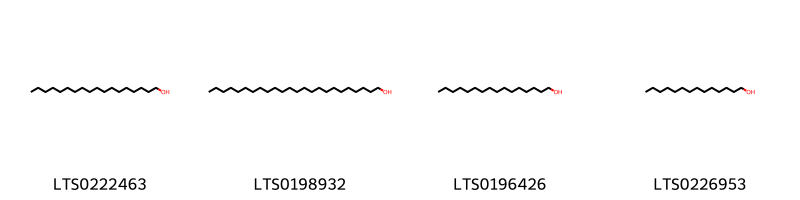{ width=100% }
    <figcaption>Hình ảnh cấu trúc hóa học của 4 hoạt chất thuộc nhóm Fatty Acyls gồm ['stearyl alcohol (LTS0222463)', '1-tetracosanol (LTS0198932)', 'cetyl alcohol (LTS0196426)', 'myristyl alcohol (LTS0226953)'].</figcaption>
</figure>
#### Nhóm Harmala alkaloids
<figure markdown="span">
    { width=100% }
    <figcaption>Hình ảnh cấu trúc hóa học của 1 hoạt chất thuộc nhóm Harmala alkaloids gồm ['perlolyrine (LTS0026035)'].</figcaption>
</figure>
#### Nhóm Naphthopyrans
<figure markdown="span">
    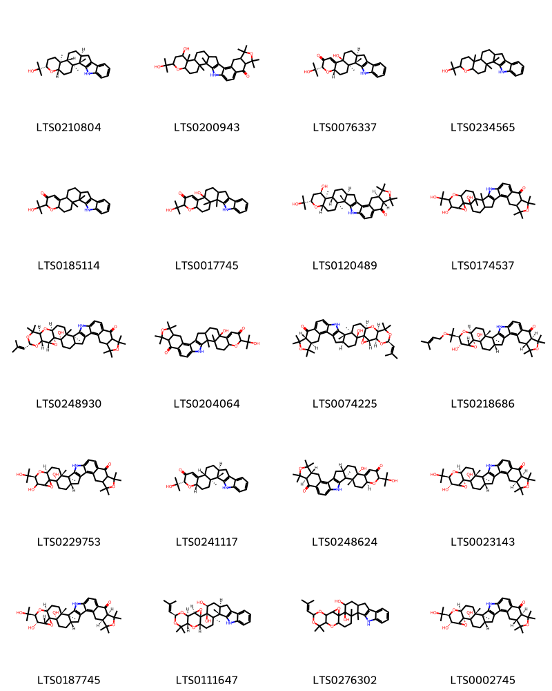{ width=100% }
    <figcaption>Hình ảnh cấu trúc hóa học của 20 hoạt chất thuộc nhóm Naphthopyrans gồm ['2-[(1s,2s,5s,7s,10s,11r,14s)-1,2,10-trimethyl-6-oxa-23-azahexacyclo[12.10.0.0²,¹¹.0⁵,¹⁰.0¹⁶,²⁴.0¹⁷,²²]tetracosa-16(24),17,19,21-tetraen-7-yl]propan-2-ol (LTS0210804)', '10-hydroxy-8-(2-hydroxypropan-2-yl)-2,3,11,22,22,24,24-heptamethyl-7,23-dioxa-31-azaoctacyclo[15.14.0.0²,¹⁵.0³,¹².0⁶,¹¹.0¹⁸,³⁰.0¹⁹,²⁷.0²¹,²⁵]hentriaconta-1(17),18,27,29-tetraen-26-one (LTS0200943)', 'paxilline (LTS0076337)', '2-{1,2,10-trimethyl-6-oxa-23-azahexacyclo[12.10.0.0²,¹¹.0⁵,¹⁰.0¹⁶,²⁴.0¹⁷,²²]tetracosa-16(24),17,19,21-tetraen-7-yl}propan-2-ol (LTS0234565)', '7-(2-hydroxypropan-2-yl)-1,2-dimethyl-6-oxa-23-azahexacyclo[12.10.0.0²,¹¹.0⁵,¹⁰.0¹⁶,²⁴.0¹⁷,²²]tetracosa-9,16(24),17,19,21-pentaen-8-one (LTS0185114)', '11-hydroxy-7-(2-hydroxypropan-2-yl)-1,2-dimethyl-6-oxa-23-azahexacyclo[12.10.0.0²,¹¹.0⁵,¹⁰.0¹⁶,²⁴.0¹⁷,²²]tetracosa-9,16(24),17,19,21-pentaen-8-one (LTS0017745)', '(2s,3s,6s,8s,10r,11r,12r,15s,21r,25r)-10-hydroxy-8-(2-hydroxypropan-2-yl)-2,3,11,22,22,24,24-heptamethyl-7,23-dioxa-31-azaoctacyclo[15.14.0.0²,¹⁵.0³,¹².0⁶,¹¹.0¹⁸,³⁰.0¹⁹,²⁷.0²¹,²⁵]hentriaconta-1(17),18,27,29-tetraen-26-one (LTS0120489)', '9,13-dihydroxy-8-(2-hydroxypropan-2-yl)-2,3,23,23,25,25-hexamethyl-7,11,24-trioxa-32-azanonacyclo[16.14.0.0²,¹⁶.0³,¹³.0⁶,¹².0¹⁰,¹².0¹⁹,³¹.0²⁰,²⁸.0²²,²⁶]dotriaconta-1(18),19,28,30-tetraen-27-one (LTS0174537)', '(1s,22s,23s,25r,26r,28s,31s,33s)-22-hydroxy-1,10,10,12,12,30,30,36-octamethyl-28-(2-methylprop-1-en-1-yl)-11,24,27,29,32-pentaoxa-3-azadecacyclo[17.17.0.0²,¹⁷.0⁴,¹⁶.0⁷,¹⁵.0⁹,¹³.0²²,³⁶.0²³,²⁵.0²³,³³.0²⁶,³¹]hexatriaconta-2(17),4,6,15-tetraen-8-one (LTS0248930)', '12-hydroxy-8-(2-hydroxypropan-2-yl)-2,3,22,22,24,24-hexamethyl-7,23-dioxa-31-azaoctacyclo[15.14.0.0²,¹⁵.0³,¹².0⁶,¹¹.0¹⁸,³⁰.0¹⁹,²⁷.0²¹,²⁵]hentriaconta-1(17),10,18,27,29-pentaene-9,26-dione (LTS0204064)', '(1s,9r,13r,19s,22s,23s,25s,26r,28s,31r,33r,36r)-22-hydroxy-1,10,10,12,12,30,30,36-octamethyl-28-(2-methylprop-1-en-1-yl)-11,24,27,29,32-pentaoxa-3-azadecacyclo[17.17.0.0²,¹⁷.0⁴,¹⁶.0⁷,¹⁵.0⁹,¹³.0²²,³⁶.0²³,²⁵.0²³,³³.0²⁶,³¹]hexatriaconta-2(17),4,6,15-tetraen-8-one (LTS0074225)', '(2s,3r,6s,8s,9r,10r,12s,13s,16s,22r,26r)-9,13-dihydroxy-2,3,23,23,25,25-hexamethyl-8-{2-[(3-methylbut-2-en-1-yl)oxy]propan-2-yl}-7,11,24-trioxa-32-azanonacyclo[16.14.0.0²,¹⁶.0³,¹³.0⁶,¹².0¹⁰,¹².0¹⁹,³¹.0²⁰,²⁸.0²²,²⁶]dotriaconta-1(18),19,28,30-tetraen-27-one (LTS0218686)', '(2s,3r,6s,8s,13s,16s)-9,13-dihydroxy-8-(2-hydroxypropan-2-yl)-2,3,23,23,25,25-hexamethyl-7,11,24-trioxa-32-azanonacyclo[16.14.0.0²,¹⁶.0³,¹³.0⁶,¹².0¹⁰,¹².0¹⁹,³¹.0²⁰,²⁸.0²²,²⁶]dotriaconta-1(18),19,28,30-tetraen-27-one (LTS0229753)', '(1s,2s,5s,7r,11r,14s)-7-(2-hydroxypropan-2-yl)-1,2-dimethyl-6-oxa-23-azahexacyclo[12.10.0.0²,¹¹.0⁵,¹⁰.0¹⁶,²⁴.0¹⁷,²²]tetracosa-9,16(24),17,19,21-pentaen-8-one (LTS0241117)', '(2s,3r,6s,8r,12s,15s,21r,25r)-12-hydroxy-8-(2-hydroxypropan-2-yl)-2,3,22,22,24,24-hexamethyl-7,23-dioxa-31-azaoctacyclo[15.14.0.0²,¹⁵.0³,¹².0⁶,¹¹.0¹⁸,³⁰.0¹⁹,²⁷.0²¹,²⁵]hentriaconta-1(17),10,18,27,29-pentaene-9,26-dione (LTS0248624)', '(2s,3r,6s,8s,9r,12s,13s,16s,22s,26r)-9,13-dihydroxy-8-(2-hydroxypropan-2-yl)-2,3,23,23,25,25-hexamethyl-7,11,24-trioxa-32-azanonacyclo[16.14.0.0²,¹⁶.0³,¹³.0⁶,¹².0¹⁰,¹².0¹⁹,³¹.0²⁰,²⁸.0²²,²⁶]dotriaconta-1(18),19,28,30-tetraen-27-one (LTS0023143)', '(2s,3r,6s,8s,9r,10r,12r,13s,16s,22s,26r)-9,13-dihydroxy-8-(2-hydroxypropan-2-yl)-2,3,23,23,25,25-hexamethyl-7,11,24-trioxa-32-azanonacyclo[16.14.0.0²,¹⁶.0³,¹³.0⁶,¹².0¹⁰,¹².0¹⁹,³¹.0²⁰,²⁸.0²²,²⁶]dotriaconta-1(18),19,28,30-tetraen-27-one (LTS0187745)', '(1r,2s,13r,15s,16r,17s,19r,20r,22s,25s,27s)-1,2,24,24-tetramethyl-22-(2-methylprop-1-en-1-yl)-18,21,23,26-tetraoxa-4-azaoctacyclo[14.13.0.0²,¹³.0³,¹¹.0⁵,¹⁰.0¹⁷,¹⁹.0¹⁷,²⁷.0²⁰,²⁵]nonacosa-3(11),5,7,9-tetraene-15,16-diol (LTS0111647)', '1,2,24,24-tetramethyl-22-(2-methylprop-1-en-1-yl)-18,21,23,26-tetraoxa-4-azaoctacyclo[14.13.0.0²,¹³.0³,¹¹.0⁵,¹⁰.0¹⁷,¹⁹.0¹⁷,²⁷.0²⁰,²⁵]nonacosa-3(11),5,7,9-tetraene-15,16-diol (LTS0276302)', '(2s,3r,6s,8s,9r,12s,13s,16s,22r,26r)-9,13-dihydroxy-8-(2-hydroxypropan-2-yl)-2,3,23,23,25,25-hexamethyl-7,11,24-trioxa-32-azanonacyclo[16.14.0.0²,¹⁶.0³,¹³.0⁶,¹².0¹⁰,¹².0¹⁹,³¹.0²⁰,²⁸.0²²,²⁶]dotriaconta-1(18),19,28,30-tetraen-27-one (LTS0002745)'].</figcaption>
</figure>
#### Nhóm Organooxygen compounds
<figure markdown="span">
    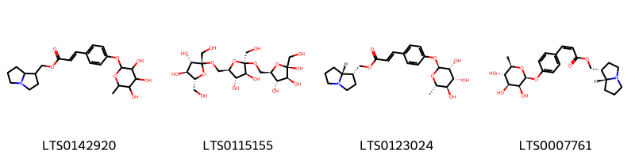{ width=100% }
    <figcaption>Hình ảnh cấu trúc hóa học của 4 hoạt chất thuộc nhóm Organooxygen compounds gồm ['hexahydro-1h-pyrrolizin-1-ylmethyl 3-{4-[(3,4,5-trihydroxy-6-methyloxan-2-yl)oxy]phenyl}prop-2-enoate (LTS0142920)', 'levan polysaccharide (LTS0115155)', '(1r,7ar)-hexahydro-1h-pyrrolizin-1-ylmethyl (2e)-3-(4-{[(2s,3r,4r,5r,6s)-3,4,5-trihydroxy-6-methyloxan-2-yl]oxy}phenyl)prop-2-enoate (LTS0123024)', '(1r,7ar)-hexahydro-1h-pyrrolizin-1-ylmethyl (2z)-3-(4-{[(2s,3s,4s,5s,6r)-3,4,5-trihydroxy-6-methyloxan-2-yl]oxy}phenyl)prop-2-enoate (LTS0007761)'].</figcaption>
</figure>
#### Nhóm Prenol lipids
<figure markdown="span">
    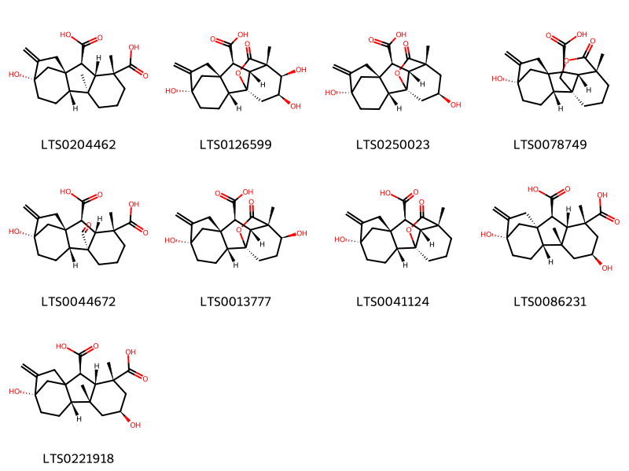{ width=100% }
    <figcaption>Hình ảnh cấu trúc hóa học của 9 hoạt chất thuộc nhóm Prenol lipids gồm ['gibberellin a53 (LTS0204462)', 'gibberellin a8 (LTS0126599)', 'gibberellin a29 (LTS0250023)', 'gibberellin a44 (LTS0078749)', 'gibberellin a19 (LTS0044672)', 'gibberellin a1 (LTS0013777)', 'gibberellin a20 (LTS0041124)', '(1r,2s,3s,4r,6s,8r,9s,12s)-6,12-dihydroxy-4,8-dimethyl-13-methylidenetetracyclo[10.2.1.0¹,⁹.0³,⁸]pentadecane-2,4-dicarboxylic acid (LTS0086231)', '(2s,3s,4r,6s,8r,9s,12s)-6,12-dihydroxy-4,8-dimethyl-13-methylidenetetracyclo[10.2.1.0¹,⁹.0³,⁸]pentadecane-2,4-dicarboxylic acid (LTS0221918)'].</figcaption>
</figure>
#### Nhóm Pyrrolopyrazines
<figure markdown="span">
    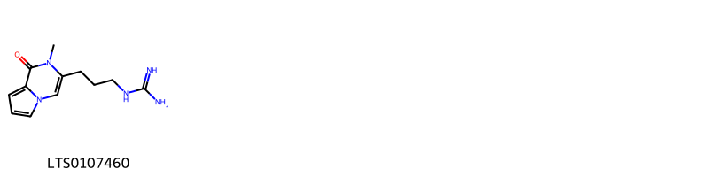{ width=100% }
    <figcaption>Hình ảnh cấu trúc hóa học của 1 hoạt chất thuộc nhóm Pyrrolopyrazines gồm ['n-(3-{2-methyl-1-oxopyrrolo[1,2-a]pyrazin-3-yl}propyl)guanidine (LTS0107460)'].</figcaption>
</figure>
#### Nhóm Steroids and steroid derivatives
<figure markdown="span">
    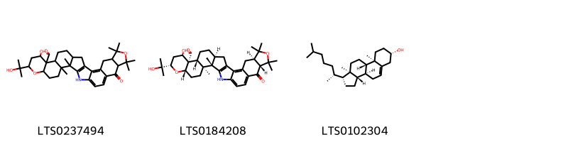{ width=100% }
    <figcaption>Hình ảnh cấu trúc hóa học của 3 hoạt chất thuộc nhóm Steroids and steroid derivatives gồm ['10-hydroxy-8-(2-hydroxypropan-2-yl)-2,3,22,22,24,24-hexamethyl-26-oxo-7,23-dioxa-31-azaoctacyclo[15.14.0.0²,¹⁵.0³,¹².0⁶,¹¹.0¹⁸,³⁰.0¹⁹,²⁷.0²¹,²⁵]hentriaconta-1(17),18,27,29-tetraene-11-carbaldehyde (LTS0237494)', '(2s,3s,6s,8s,10r,11s,12r,15s,21r,25r)-10-hydroxy-8-(2-hydroxypropan-2-yl)-2,3,22,22,24,24-hexamethyl-26-oxo-7,23-dioxa-31-azaoctacyclo[15.14.0.0²,¹⁵.0³,¹².0⁶,¹¹.0¹⁸,³⁰.0¹⁹,²⁷.0²¹,²⁵]hentriaconta-1(17),18,27,29-tetraene-11-carbaldehyde (LTS0184208)', 'cholesterol (LTS0102304)'].</figcaption>
</figure>
#### Nhóm Stilbenes
<figure markdown="span">
    { width=100% }
    <figcaption>Hình ảnh cấu trúc hóa học của 2 hoạt chất thuộc nhóm Stilbenes gồm ['tocilizumab (LTS0196778)', 'resveratrol (LTS0256677)'].</figcaption>
</figure>

---

### Dược dân tộc học

Danh sách các quốc gia có sử dụng *Lolium perenne* trong điều trị các bệnh. 

| Country   | Disease   | Bệnh                                                                                                                                                                                                |
|:----------|:----------|:----------------------------------------------------------------------------------------------------------------------------------------------------------------------------------------------------|
| Elsewhere | Poison    | MYMEMORY WARNING: YOU USED ALL AVAILABLE FREE TRANSLATIONS FOR TODAY. NEXT AVAILABLE IN  01 HOURS 13 MINUTES 01 SECONDS VISIT HTTPS://MYMEMORY.TRANSLATED.NET/DOC/USAGELIMITS.PHP TO TRANSLATE MORE |

---

---
## Lolium tementulum
### Thông tin về thực vật

!!! info "Phân loại thực vật của *N/A* từ GIBF:"
    - **Kingdom:** Plantae
    - **Phylum:** Tracheophyta
    - **Order:** Poales
    - **Family:** Poaceae
    - **Genus:** Lolium
    - **Species:** *N/A*

 

| Label (VI)   | Label (EN)   | Scientific Name   | Descriptions (VI)   | Descriptions (EN)   | Also Known As (VI)   | Also Known As (EN)                         |
|:-------------|:-------------|:------------------|:--------------------|:--------------------|:---------------------|:-------------------------------------------|
| N/A          | N/A          | Lolium perenne    | loài thực vật       | species of plant    | ['']                 | ['English ryegrass', 'Perennial Ryegrass'] |

#### Phân bố trên thế giới

**Từ CSDL GIBF** Australia, Belgium, Israel, Ukraine, Denmark, Netherlands, Chinese Taipei, Russian Federation, United States of America, Sweden, South Africa, Germany, Switzerland, Mexico, France, Austria, United Kingdom of Great Britain and Northern Ireland, Madagascar, New Zealand

#### Phân bố tại Việt Nam

**Từ CSDL GIBF**: Không có ghi nhận ở Việt Nam

---
### Thành phần hóa học
        
- Theo cơ sở dữ liệu lotus: Từ loài *N/A* đã phân lập và xác định được Chưa có hoạt chất nào được phân lập. hoạt chất thuộc về các nhóm Không có hoạt chất nào được phân lập. 

Không có hình ảnh nào được tạo ra

---

### Dược dân tộc học

Danh sách các quốc gia có sử dụng *N/A* trong điều trị các bệnh. 

| Country   | Disease   | Bệnh                                                                                                                                                                                                |
|:----------|:----------|:----------------------------------------------------------------------------------------------------------------------------------------------------------------------------------------------------|
| Egypt     | Poison    | MYMEMORY WARNING: YOU USED ALL AVAILABLE FREE TRANSLATIONS FOR TODAY. NEXT AVAILABLE IN  01 HOURS 12 MINUTES 32 SECONDS VISIT HTTPS://MYMEMORY.TRANSLATED.NET/DOC/USAGELIMITS.PHP TO TRANSLATE MORE |

---

---
## Lolium temulentum
### Thông tin về thực vật

!!! info "Phân loại thực vật của *Lolium temulentum* từ GIBF:"
    - **Kingdom:** Plantae
    - **Phylum:** Tracheophyta
    - **Order:** Poales
    - **Family:** Poaceae
    - **Genus:** Lolium
    - **Species:** *Lolium temulentum*

 

| Label (VI)   | Label (EN)   | Scientific Name   | Descriptions (VI)   | Descriptions (EN)   | Also Known As (VI)   | Also Known As (EN)                             |
|:-------------|:-------------|:------------------|:--------------------|:--------------------|:---------------------|:-----------------------------------------------|
| N/A          | N/A          | Lolium temulentum | loài thực vật       | species of plant    | ['']                 | ['Darnel Ryegrass', 'Bearded Darnel', 'Tares'] |

#### Phân bố trên thế giới

**Từ CSDL GIBF** Italy, Australia, Japan, Belgium, Palestine, State of, Norway, Canada, Tajikistan, Pakistan, Denmark, Netherlands, Kyrgyzstan, Spain, Türkiye, Portugal, Albania, Morocco, United States of America, Sweden, Finland, Åland Islands, Greece, Uzbekistan, Germany, Brazil, Egypt, Switzerland, Mexico, France, United Kingdom of Great Britain and Northern Ireland, China, Madagascar, Poland, New Zealand

#### Phân bố tại Việt Nam

**Từ CSDL GIBF**: Không có ghi nhận ở Việt Nam

---
### Thành phần hóa học
        
- Theo cơ sở dữ liệu lotus: Từ loài *Lolium temulentum* đã phân lập và xác định được 28 hoạt chất thuộc về các nhóm Loline alkaloids and derivatives, Stilbenes, Prenol lipids, Pyrrolizidines. 

|    | chemicalTaxonomyClassyfireClass   |   smiles_count |
|---:|:----------------------------------|---------------:|
|  0 | Loline alkaloids and derivatives  |             17 |
|  1 | Prenol lipids                     |              8 |
|  2 | Pyrrolizidines                    |              1 |
|  3 | Stilbenes                         |              2 |

#### Nhóm Loline alkaloids and derivatives
<figure markdown="span">
    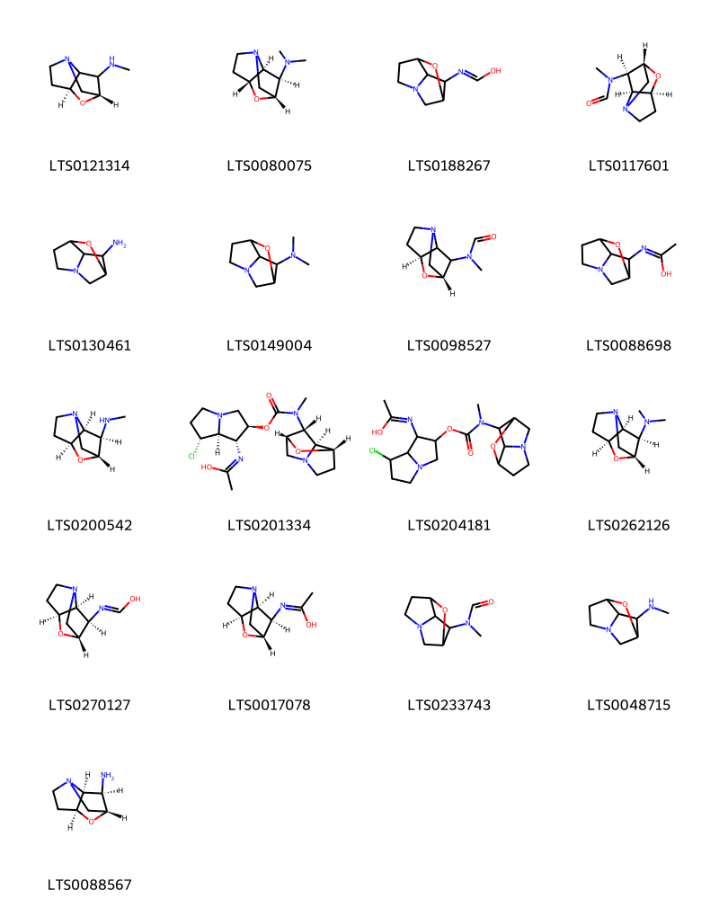{ width=100% }
    <figcaption>Hình ảnh cấu trúc hóa học của 17 hoạt chất thuộc nhóm Loline alkaloids and derivatives gồm ['(1r,3s)-n-methyl-2-oxa-6-azatricyclo[4.2.1.0³,⁷]nonan-8-amine (LTS0121314)', '(1r,3r,7s,8r)-n,n-dimethyl-2-oxa-6-azatricyclo[4.2.1.0³,⁷]nonan-8-amine (LTS0080075)', 'n-{2-oxa-6-azatricyclo[4.2.1.0³,⁷]nonan-8-yl}carboximidic acid (LTS0188267)', 'n-methyl-n-[(1r,3s,7s,8r)-2-oxa-6-azatricyclo[4.2.1.0³,⁷]nonan-8-yl]formamide (LTS0117601)', '2-oxa-6-azatricyclo[4.2.1.0³,⁷]nonan-8-amine (LTS0130461)', 'n,n-dimethyl-2-oxa-6-azatricyclo[4.2.1.0³,⁷]nonan-8-amine (LTS0149004)', 'n-methyl-n-[(1r,3s)-2-oxa-6-azatricyclo[4.2.1.0³,⁷]nonan-8-yl]formamide (LTS0098527)', 'n-{2-oxa-6-azatricyclo[4.2.1.0³,⁷]nonan-8-yl}ethanimidic acid (LTS0088698)', 'loline (LTS0200542)', 'n-[(1r,2r,7r,7as)-7-chloro-2-({methyl[(1r,3s,7s,8r)-2-oxa-6-azatricyclo[4.2.1.0³,⁷]nonan-8-yl]carbamoyl}oxy)-hexahydro-1h-pyrrolizin-1-yl]ethanimidic acid (LTS0201334)', 'n-(7-chloro-2-{[methyl({2-oxa-6-azatricyclo[4.2.1.0³,⁷]nonan-8-yl})carbamoyl]oxy}-hexahydro-1h-pyrrolizin-1-yl)ethanimidic acid (LTS0204181)', '(1r,3s,7s,8r)-n,n-dimethyl-2-oxa-6-azatricyclo[4.2.1.0³,⁷]nonan-8-amine (LTS0262126)', 'n-[(1r,3s,7s,8r)-2-oxa-6-azatricyclo[4.2.1.0³,⁷]nonan-8-yl]carboximidic acid (LTS0270127)', 'n-[(1r,3s,7s,8r)-2-oxa-6-azatricyclo[4.2.1.0³,⁷]nonan-8-yl]ethanimidic acid (LTS0017078)', 'n-methyl-n-{2-oxa-6-azatricyclo[4.2.1.0³,⁷]nonan-8-yl}formamide (LTS0233743)', 'n-methyl-2-oxa-6-azatricyclo[4.2.1.0³,⁷]nonan-8-amine (LTS0048715)', '(1r,3s,7s,8r)-2-oxa-6-azatricyclo[4.2.1.0³,⁷]nonan-8-amine (LTS0088567)'].</figcaption>
</figure>
#### Nhóm Prenol lipids
<figure markdown="span">
    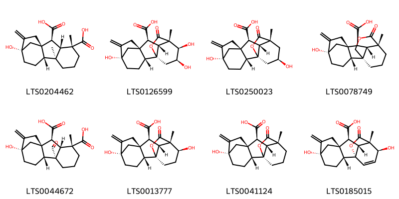{ width=100% }
    <figcaption>Hình ảnh cấu trúc hóa học của 8 hoạt chất thuộc nhóm Prenol lipids gồm ['gibberellin a53 (LTS0204462)', 'gibberellin a8 (LTS0126599)', 'gibberellin a29 (LTS0250023)', 'gibberellin a44 (LTS0078749)', 'gibberellin a19 (LTS0044672)', 'gibberellin a1 (LTS0013777)', 'gibberellin a20 (LTS0041124)', 'gibberellin a3 (LTS0185015)'].</figcaption>
</figure>
#### Nhóm Pyrrolizidines
<figure markdown="span">
    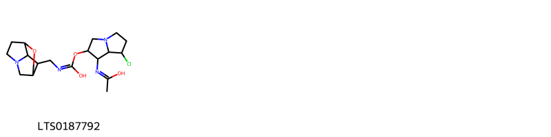{ width=100% }
    <figcaption>Hình ảnh cấu trúc hóa học của 1 hoạt chất thuộc nhóm Pyrrolizidines gồm ['n-{7-chloro-2-[({2-oxa-6-azatricyclo[4.2.1.0³,⁷]nonan-8-ylmethyl}-c-hydroxycarbonimidoyl)oxy]-hexahydro-1h-pyrrolizin-1-yl}ethanimidic acid (LTS0187792)'].</figcaption>
</figure>
#### Nhóm Stilbenes
<figure markdown="span">
    { width=100% }
    <figcaption>Hình ảnh cấu trúc hóa học của 2 hoạt chất thuộc nhóm Stilbenes gồm ['tocilizumab (LTS0196778)', 'resveratrol (LTS0256677)'].</figcaption>
</figure>

---

### Dược dân tộc học

Danh sách các quốc gia có sử dụng *Lolium temulentum* trong điều trị các bệnh. 

| Country   | Disease                    | Bệnh                                                                                                                                                                                                |
|:----------|:---------------------------|:----------------------------------------------------------------------------------------------------------------------------------------------------------------------------------------------------|
| Elsewhere | Poison                     | MYMEMORY WARNING: YOU USED ALL AVAILABLE FREE TRANSLATIONS FOR TODAY. NEXT AVAILABLE IN  01 HOURS 12 MINUTES 11 SECONDS VISIT HTTPS://MYMEMORY.TRANSLATED.NET/DOC/USAGELIMITS.PHP TO TRANSLATE MORE |
| Europe    | Intoxicant, Poison, Poison | MYMEMORY WARNING: YOU USED ALL AVAILABLE FREE TRANSLATIONS FOR TODAY. NEXT AVAILABLE IN  01 HOURS 12 MINUTES 09 SECONDS VISIT HTTPS://MYMEMORY.TRANSLATED.NET/DOC/USAGELIMITS.PHP TO TRANSLATE MORE |
| Iraq      | Intoxicant                 | MYMEMORY WARNING: YOU USED ALL AVAILABLE FREE TRANSLATIONS FOR TODAY. NEXT AVAILABLE IN  01 HOURS 12 MINUTES 08 SECONDS VISIT HTTPS://MYMEMORY.TRANSLATED.NET/DOC/USAGELIMITS.PHP TO TRANSLATE MORE |
| Turkey    | Narcotic                   | MYMEMORY WARNING: YOU USED ALL AVAILABLE FREE TRANSLATIONS FOR TODAY. NEXT AVAILABLE IN  01 HOURS 12 MINUTES 05 SECONDS VISIT HTTPS://MYMEMORY.TRANSLATED.NET/DOC/USAGELIMITS.PHP TO TRANSLATE MORE |
| ain       | Poison                     | MYMEMORY WARNING: YOU USED ALL AVAILABLE FREE TRANSLATIONS FOR TODAY. NEXT AVAILABLE IN  01 HOURS 12 MINUTES 03 SECONDS VISIT HTTPS://MYMEMORY.TRANSLATED.NET/DOC/USAGELIMITS.PHP TO TRANSLATE MORE |

---

# Chi Eragrostis

??? note "Danh sách các dược liệu thuộc chi"
    
	 - *Eragrostis gummiflua*

---
## Eragrostis gummiflua
### Thông tin về thực vật

!!! info "Phân loại thực vật của *Eragrostis gummiflua* từ GIBF:"
    - **Kingdom:** Plantae
    - **Phylum:** Tracheophyta
    - **Order:** Poales
    - **Family:** Poaceae
    - **Genus:** Eragrostis
    - **Species:** *Eragrostis gummiflua*

 

| Label (VI)   | Label (EN)   | Scientific Name      | Descriptions (VI)   | Descriptions (EN)   | Also Known As (VI)   | Also Known As (EN)   |
|:-------------|:-------------|:---------------------|:--------------------|:--------------------|:---------------------|:---------------------|
| N/A          | N/A          | Eragrostis gummiflua |                     | species of plant    | ['']                 | ['']                 |

#### Phân bố trên thế giới

**Từ CSDL GIBF** South Africa, Mozambique, Botswana, Lesotho, Zimbabwe, Eswatini

#### Phân bố tại Việt Nam

**Từ CSDL GIBF**: Không có ghi nhận ở Việt Nam

---
### Thành phần hóa học
        
- Theo cơ sở dữ liệu lotus: Từ loài *Eragrostis gummiflua* đã phân lập và xác định được Chưa có hoạt chất nào được phân lập. hoạt chất thuộc về các nhóm Không có hoạt chất nào được phân lập. 

Không có hình ảnh nào được tạo ra

---

### Dược dân tộc học

Danh sách các quốc gia có sử dụng *Eragrostis gummiflua* trong điều trị các bệnh. 

| Country   | Disease   | Bệnh                                                                                                                                                                                                |
|:----------|:----------|:----------------------------------------------------------------------------------------------------------------------------------------------------------------------------------------------------|
| Lesotho   | Stimulant | MYMEMORY WARNING: YOU USED ALL AVAILABLE FREE TRANSLATIONS FOR TODAY. NEXT AVAILABLE IN  01 HOURS 11 MINUTES 32 SECONDS VISIT HTTPS://MYMEMORY.TRANSLATED.NET/DOC/USAGELIMITS.PHP TO TRANSLATE MORE |

---

# Chi orobolus

??? note "Danh sách các dược liệu thuộc chi"
    
	 - *orobolus indicus*

---
## orobolus indicus
### Thông tin về thực vật

!!! info "Phân loại thực vật của *N/A* từ GIBF:"
    - **Kingdom:** N/A
    - **Phylum:** N/A
    - **Order:** N/A
    - **Family:** N/A
    - **Genus:** N/A
    - **Species:** *N/A*

 

| Label (VI)   | Label (EN)   | Scientific Name      | Descriptions (VI)   | Descriptions (EN)   | Also Known As (VI)   | Also Known As (EN)   |
|:-------------|:-------------|:---------------------|:--------------------|:--------------------|:---------------------|:---------------------|
| N/A          | N/A          | Eragrostis gummiflua |                     | species of plant    | ['']                 | ['']                 |

#### Phân bố trên thế giới

**Từ CSDL GIBF** Không có kết quả phù hợp

#### Phân bố tại Việt Nam

**Từ CSDL GIBF**: Không có ghi nhận ở Việt Nam

---
### Thành phần hóa học
        
- Theo cơ sở dữ liệu lotus: Từ loài *N/A* đã phân lập và xác định được Chưa có hoạt chất nào được phân lập. hoạt chất thuộc về các nhóm Không có hoạt chất nào được phân lập. 

Không có hình ảnh nào được tạo ra

---

### Dược dân tộc học

Danh sách các quốc gia có sử dụng *N/A* trong điều trị các bệnh. 

| Country   | Disease       | Bệnh                                                                                                                                                                                                |
|:----------|:--------------|:----------------------------------------------------------------------------------------------------------------------------------------------------------------------------------------------------|
| Paraguay  | Antifertility | MYMEMORY WARNING: YOU USED ALL AVAILABLE FREE TRANSLATIONS FOR TODAY. NEXT AVAILABLE IN  01 HOURS 11 MINUTES 11 SECONDS VISIT HTTPS://MYMEMORY.TRANSLATED.NET/DOC/USAGELIMITS.PHP TO TRANSLATE MORE |

---

# Chi Paalum

??? note "Danh sách các dược liệu thuộc chi"
    
	 - *Paalum conjugatum*
	 - *Paalum conjugatum?*
	 - *Paalum scrobiculatum*
	 - *Paalum vaginatum*

---
## Paalum conjugatum
### Thông tin về thực vật

!!! info "Phân loại thực vật của *N/A* từ GIBF:"
    - **Kingdom:** N/A
    - **Phylum:** N/A
    - **Order:** N/A
    - **Family:** N/A
    - **Genus:** N/A
    - **Species:** *N/A*

 

| Label (VI)   | Label (EN)   | Scientific Name      | Descriptions (VI)   | Descriptions (EN)   | Also Known As (VI)   | Also Known As (EN)   |
|:-------------|:-------------|:---------------------|:--------------------|:--------------------|:---------------------|:---------------------|
| N/A          | N/A          | Eragrostis gummiflua |                     | species of plant    | ['']                 | ['']                 |

#### Phân bố trên thế giới

**Từ CSDL GIBF** Không có kết quả phù hợp

#### Phân bố tại Việt Nam

**Từ CSDL GIBF**: Không có ghi nhận ở Việt Nam

---
### Thành phần hóa học
        
- Theo cơ sở dữ liệu lotus: Từ loài *N/A* đã phân lập và xác định được Chưa có hoạt chất nào được phân lập. hoạt chất thuộc về các nhóm Không có hoạt chất nào được phân lập. 

Không có hình ảnh nào được tạo ra

---

### Dược dân tộc học

Danh sách các quốc gia có sử dụng *N/A* trong điều trị các bệnh. 

| Country   | Disease   | Bệnh                                                                                                                                                                                                |
|:----------|:----------|:----------------------------------------------------------------------------------------------------------------------------------------------------------------------------------------------------|
| Elsewhere | Hemostat  | MYMEMORY WARNING: YOU USED ALL AVAILABLE FREE TRANSLATIONS FOR TODAY. NEXT AVAILABLE IN  01 HOURS 11 MINUTES 00 SECONDS VISIT HTTPS://MYMEMORY.TRANSLATED.NET/DOC/USAGELIMITS.PHP TO TRANSLATE MORE |

---

---
## Paalum conjugatum
### Thông tin về thực vật

!!! info "Phân loại thực vật của *N/A* từ GIBF:"
    - **Kingdom:** N/A
    - **Phylum:** N/A
    - **Order:** N/A
    - **Family:** N/A
    - **Genus:** N/A
    - **Species:** *N/A*

 

| Label (VI)   | Label (EN)   | Scientific Name      | Descriptions (VI)   | Descriptions (EN)   | Also Known As (VI)   | Also Known As (EN)   |
|:-------------|:-------------|:---------------------|:--------------------|:--------------------|:---------------------|:---------------------|
| N/A          | N/A          | Eragrostis gummiflua |                     | species of plant    | ['']                 | ['']                 |

#### Phân bố trên thế giới

**Từ CSDL GIBF** Không có kết quả phù hợp

#### Phân bố tại Việt Nam

**Từ CSDL GIBF**: Không có ghi nhận ở Việt Nam

---
### Thành phần hóa học
        
- Theo cơ sở dữ liệu lotus: Từ loài *N/A* đã phân lập và xác định được Chưa có hoạt chất nào được phân lập. hoạt chất thuộc về các nhóm Không có hoạt chất nào được phân lập. 

Không có hình ảnh nào được tạo ra

---

### Dược dân tộc học

Danh sách các quốc gia có sử dụng *N/A* trong điều trị các bệnh. 

| Country   | Disease     | Bệnh                                                                                                                                                                                                |
|:----------|:------------|:----------------------------------------------------------------------------------------------------------------------------------------------------------------------------------------------------|
| Bahamas   | Expectorant | MYMEMORY WARNING: YOU USED ALL AVAILABLE FREE TRANSLATIONS FOR TODAY. NEXT AVAILABLE IN  01 HOURS 10 MINUTES 51 SECONDS VISIT HTTPS://MYMEMORY.TRANSLATED.NET/DOC/USAGELIMITS.PHP TO TRANSLATE MORE |

---

---
## Paalum scrobiculatum
### Thông tin về thực vật

!!! info "Phân loại thực vật của *N/A* từ GIBF:"
    - **Kingdom:** N/A
    - **Phylum:** N/A
    - **Order:** N/A
    - **Family:** N/A
    - **Genus:** N/A
    - **Species:** *N/A*

 

| Label (VI)   | Label (EN)   | Scientific Name      | Descriptions (VI)   | Descriptions (EN)   | Also Known As (VI)   | Also Known As (EN)   |
|:-------------|:-------------|:---------------------|:--------------------|:--------------------|:---------------------|:---------------------|
| N/A          | N/A          | Eragrostis gummiflua |                     | species of plant    | ['']                 | ['']                 |

#### Phân bố trên thế giới

**Từ CSDL GIBF** Không có kết quả phù hợp

#### Phân bố tại Việt Nam

**Từ CSDL GIBF**: Không có ghi nhận ở Việt Nam

---
### Thành phần hóa học
        
- Theo cơ sở dữ liệu lotus: Từ loài *N/A* đã phân lập và xác định được Chưa có hoạt chất nào được phân lập. hoạt chất thuộc về các nhóm Không có hoạt chất nào được phân lập. 

Không có hình ảnh nào được tạo ra

---

### Dược dân tộc học

Danh sách các quốc gia có sử dụng *N/A* trong điều trị các bệnh. 

| Country   | Disease          | Bệnh                                                                                                                                                                                                |
|:----------|:-----------------|:----------------------------------------------------------------------------------------------------------------------------------------------------------------------------------------------------|
| Elsewhere | Narcotic, Poison | MYMEMORY WARNING: YOU USED ALL AVAILABLE FREE TRANSLATIONS FOR TODAY. NEXT AVAILABLE IN  01 HOURS 10 MINUTES 40 SECONDS VISIT HTTPS://MYMEMORY.TRANSLATED.NET/DOC/USAGELIMITS.PHP TO TRANSLATE MORE |
| India     | Poison           | MYMEMORY WARNING: YOU USED ALL AVAILABLE FREE TRANSLATIONS FOR TODAY. NEXT AVAILABLE IN  01 HOURS 10 MINUTES 37 SECONDS VISIT HTTPS://MYMEMORY.TRANSLATED.NET/DOC/USAGELIMITS.PHP TO TRANSLATE MORE |
| Samoa     | Poison           | MYMEMORY WARNING: YOU USED ALL AVAILABLE FREE TRANSLATIONS FOR TODAY. NEXT AVAILABLE IN  01 HOURS 10 MINUTES 35 SECONDS VISIT HTTPS://MYMEMORY.TRANSLATED.NET/DOC/USAGELIMITS.PHP TO TRANSLATE MORE |

---

---
## Paalum vaginatum
### Thông tin về thực vật

!!! info "Phân loại thực vật của *N/A* từ GIBF:"
    - **Kingdom:** N/A
    - **Phylum:** N/A
    - **Order:** N/A
    - **Family:** N/A
    - **Genus:** N/A
    - **Species:** *N/A*

 

| Label (VI)   | Label (EN)   | Scientific Name      | Descriptions (VI)   | Descriptions (EN)   | Also Known As (VI)   | Also Known As (EN)   |
|:-------------|:-------------|:---------------------|:--------------------|:--------------------|:---------------------|:---------------------|
| N/A          | N/A          | Eragrostis gummiflua |                     | species of plant    | ['']                 | ['']                 |

#### Phân bố trên thế giới

**Từ CSDL GIBF** Không có kết quả phù hợp

#### Phân bố tại Việt Nam

**Từ CSDL GIBF**: Không có ghi nhận ở Việt Nam

---
### Thành phần hóa học
        
- Theo cơ sở dữ liệu lotus: Từ loài *N/A* đã phân lập và xác định được Chưa có hoạt chất nào được phân lập. hoạt chất thuộc về các nhóm Không có hoạt chất nào được phân lập. 

Không có hình ảnh nào được tạo ra

---

### Dược dân tộc học

Danh sách các quốc gia có sử dụng *N/A* trong điều trị các bệnh. 

| Country   | Disease   | Bệnh                                                                                                                                                                                                |
|:----------|:----------|:----------------------------------------------------------------------------------------------------------------------------------------------------------------------------------------------------|
| Venezuela | Diuretic  | MYMEMORY WARNING: YOU USED ALL AVAILABLE FREE TRANSLATIONS FOR TODAY. NEXT AVAILABLE IN  01 HOURS 10 MINUTES 24 SECONDS VISIT HTTPS://MYMEMORY.TRANSLATED.NET/DOC/USAGELIMITS.PHP TO TRANSLATE MORE |

---

# Chi Phragmites

??? note "Danh sách các dược liệu thuộc chi"
    
	 - *Phragmites australis*
	 - *Phragmites communis*
	 - *Phragmites kharka*

---
## Phragmites australis
### Thông tin về thực vật

!!! info "Phân loại thực vật của *Phragmites australis* từ GIBF:"
    - **Kingdom:** Plantae
    - **Phylum:** Tracheophyta
    - **Order:** Poales
    - **Family:** Poaceae
    - **Genus:** Phragmites
    - **Species:** *Phragmites australis*

 

| Label (VI)   | Label (EN)   | Scientific Name      | Descriptions (VI)   | Descriptions (EN)             | Also Known As (VI)   | Also Known As (EN)                     |
|:-------------|:-------------|:---------------------|:--------------------|:------------------------------|:---------------------|:---------------------------------------|
| N/A          | N/A          | Phragmites australis | loài thực vật       | species of plant (Phragmites) | ['']                 | ['common reed', 'Phragmites communis'] |

#### Phân bố trên thế giới

**Từ CSDL GIBF** Italy, Australia, Belgium, Latvia, Israel, Canada, Tajikistan, Denmark, Ukraine, Netherlands, Chinese Taipei, Spain, Türkiye, Albania, Algeria, Russian Federation, Hungary, United States of America, Portugal, Finland, South Africa, Hong Kong, Germany, Switzerland, Austria, France, Qatar, United Kingdom of Great Britain and Northern Ireland, China, Ireland, New Zealand

#### Phân bố tại Việt Nam

**Từ CSDL GIBF**: Không có ghi nhận ở Việt Nam

---
### Thành phần hóa học
        
- Theo cơ sở dữ liệu lotus: Từ loài *Phragmites australis* đã phân lập và xác định được 27 hoạt chất thuộc về các nhóm Cinnamic acids and derivatives, Flavonoids, Organooxygen compounds, Benzene and substituted derivatives. 

|    | chemicalTaxonomyClassyfireClass     |   smiles_count |
|---:|:------------------------------------|---------------:|
|  0 | Benzene and substituted derivatives |              1 |
|  1 | Cinnamic acids and derivatives      |              4 |
|  2 | Flavonoids                          |             20 |
|  3 | Organooxygen compounds              |              2 |

#### Nhóm Benzene and substituted derivatives
<figure markdown="span">
    { width=100% }
    <figcaption>Hình ảnh cấu trúc hóa học của 1 hoạt chất thuộc nhóm Benzene and substituted derivatives gồm ['vanillic acid (LTS0229113)'].</figcaption>
</figure>
#### Nhóm Cinnamic acids and derivatives
<figure markdown="span">
    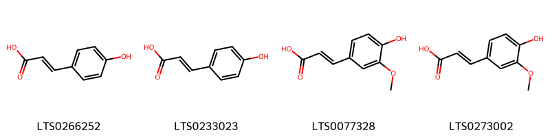{ width=100% }
    <figcaption>Hình ảnh cấu trúc hóa học của 4 hoạt chất thuộc nhóm Cinnamic acids and derivatives gồm ['para-coumaric acid (LTS0266252)', 'hydroxycinnamic acid (LTS0233023)', 'ferulic acid (LTS0077328)', 'ferulic acid (LTS0273002)'].</figcaption>
</figure>
#### Nhóm Flavonoids
<figure markdown="span">
    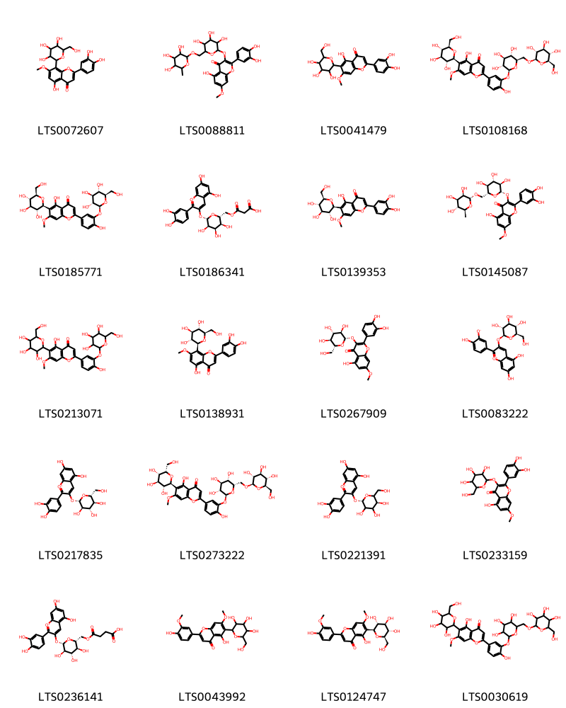{ width=100% }
    <figcaption>Hình ảnh cấu trúc hóa học của 20 hoạt chất thuộc nhóm Flavonoids gồm ['2-(3,4-dihydroxyphenyl)-5-hydroxy-7-methoxy-8-[3,4,5-trihydroxy-6-(hydroxymethyl)oxan-2-yl]chromen-4-one (LTS0072607)', '2-(3,4-dihydroxyphenyl)-5-hydroxy-7-methoxy-3-[(3,4,5-trihydroxy-6-{[(3,4,5-trihydroxy-6-methyloxan-2-yl)oxy]methyl}oxan-2-yl)oxy]chromen-4-one (LTS0088811)', '2-(3,4-dihydroxyphenyl)-5-hydroxy-7-methoxy-6-[3,4,5-trihydroxy-6-(hydroxymethyl)oxan-2-yl]chromen-4-one (LTS0041479)', '5-hydroxy-2-(4-hydroxy-3-{[(2s,3r,4s,5s,6r)-3,4,5-trihydroxy-6-({[(2r,3r,4s,5s,6r)-3,4,5-trihydroxy-6-(hydroxymethyl)oxan-2-yl]oxy}methyl)oxan-2-yl]oxy}phenyl)-7-methoxy-6-[(2s,3r,4r,5s,6r)-3,4,5-trihydroxy-6-(hydroxymethyl)oxan-2-yl]chromen-4-one (LTS0108168)', '5-hydroxy-2-(4-hydroxy-3-{[(2s,3r,4s,5s,6r)-3,4,5-trihydroxy-6-(hydroxymethyl)oxan-2-yl]oxy}phenyl)-7-methoxy-6-[(2s,3r,4r,5s,6r)-3,4,5-trihydroxy-6-(hydroxymethyl)oxan-2-yl]chromen-4-one (LTS0185771)', '3-{[(2s,3r,4r,5s,6r)-6-{[(2-carboxyacetyl)oxy]methyl}-3,4,5-trihydroxyoxan-2-yl]oxy}-2-(3,4-dihydroxyphenyl)-5,7-dihydroxy-1λ⁴-chromen-1-ylium (LTS0186341)', 'swertiajaponin (LTS0139353)', '2-(3,4-dihydroxyphenyl)-5-hydroxy-7-methoxy-3-{[(2s,3r,4s,5s,6r)-3,4,5-trihydroxy-6-({[(2r,3r,4r,5r,6s)-3,4,5-trihydroxy-6-methyloxan-2-yl]oxy}methyl)oxan-2-yl]oxy}chromen-4-one (LTS0145087)', '5-hydroxy-2-(4-hydroxy-3-{[3,4,5-trihydroxy-6-(hydroxymethyl)oxan-2-yl]oxy}phenyl)-7-methoxy-6-[3,4,5-trihydroxy-6-(hydroxymethyl)oxan-2-yl]chromen-4-one (LTS0213071)', '2-(3,4-dihydroxyphenyl)-5-hydroxy-7-methoxy-8-[(2s,3r,4r,5s,6r)-3,4,5-trihydroxy-6-(hydroxymethyl)oxan-2-yl]chromen-4-one (LTS0138931)', '2-(3,4-dihydroxyphenyl)-5-hydroxy-7-methoxy-3-{[(2s,3r,4s,5s,6r)-3,4,5-trihydroxy-6-(hydroxymethyl)oxan-2-yl]oxy}chromen-4-one (LTS0267909)', '5,7-dihydroxy-2-(4-hydroxy-3-oxidophenyl)-3-{[(2s,3r,4s,5s,6r)-3,4,5-trihydroxy-6-(hydroxymethyl)oxan-2-yl]oxy}-1λ⁴-chromen-1-ylium (LTS0083222)', 'cyanidin 3-glucoside (LTS0217835)', '5-hydroxy-2-(4-hydroxy-3-{[(2s,3r,4s,5s,6s)-3,4,5-trihydroxy-6-({[(2r,3r,4s,5s,6r)-3,4,5-trihydroxy-6-(hydroxymethyl)oxan-2-yl]oxy}methyl)oxan-2-yl]oxy}phenyl)-7-methoxy-6-[(2s,3r,4r,5s,6s)-3,4,5-trihydroxy-6-(hydroxymethyl)oxan-2-yl]chromen-4-one (LTS0273222)', 'chrysanthemin (LTS0221391)', '2-(3,4-dihydroxyphenyl)-5-hydroxy-7-methoxy-3-{[3,4,5-trihydroxy-6-(hydroxymethyl)oxan-2-yl]oxy}chromen-4-one (LTS0233159)', '3-{[(2s,3r,4s,5s,6r)-6-{[(3-carboxypropanoyl)oxy]methyl}-3,4,5-trihydroxyoxan-2-yl]oxy}-2-(3,4-dihydroxyphenyl)-5,7-dihydroxy-1λ⁴-chromen-1-ylium (LTS0236141)', '5-hydroxy-2-(4-hydroxy-3-methoxyphenyl)-7-methoxy-6-[3,4,5-trihydroxy-6-(hydroxymethyl)oxan-2-yl]chromen-4-one (LTS0043992)', '5-hydroxy-2-(4-hydroxy-3-methoxyphenyl)-7-methoxy-6-[(2s,3r,4r,5s,6r)-3,4,5-trihydroxy-6-(hydroxymethyl)oxan-2-yl]chromen-4-one (LTS0124747)', '5-hydroxy-2-(4-hydroxy-3-{[3,4,5-trihydroxy-6-({[3,4,5-trihydroxy-6-(hydroxymethyl)oxan-2-yl]oxy}methyl)oxan-2-yl]oxy}phenyl)-7-methoxy-6-[3,4,5-trihydroxy-6-(hydroxymethyl)oxan-2-yl]chromen-4-one (LTS0030619)'].</figcaption>
</figure>
#### Nhóm Organooxygen compounds
<figure markdown="span">
    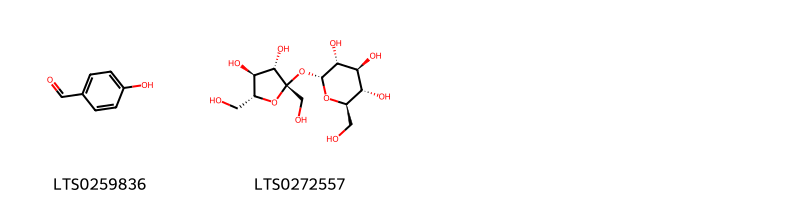{ width=100% }
    <figcaption>Hình ảnh cấu trúc hóa học của 2 hoạt chất thuộc nhóm Organooxygen compounds gồm ['p-hydroxybenzaldehyde (LTS0259836)', 'sucrose (LTS0272557)'].</figcaption>
</figure>

---

### Dược dân tộc học

Danh sách các quốc gia có sử dụng *Phragmites australis* trong điều trị các bệnh. 

| Country       | Disease                          | Bệnh                                                                                                                                                                                                |
|:--------------|:---------------------------------|:----------------------------------------------------------------------------------------------------------------------------------------------------------------------------------------------------|
| China         | Diuretic, Refrigerant, Antidote  | MYMEMORY WARNING: YOU USED ALL AVAILABLE FREE TRANSLATIONS FOR TODAY. NEXT AVAILABLE IN  01 HOURS 10 MINUTES 13 SECONDS VISIT HTTPS://MYMEMORY.TRANSLATED.NET/DOC/USAGELIMITS.PHP TO TRANSLATE MORE |
| Elsewhere     | Diaphoretic, Diuretic, Diuretic  | MYMEMORY WARNING: YOU USED ALL AVAILABLE FREE TRANSLATIONS FOR TODAY. NEXT AVAILABLE IN  01 HOURS 10 MINUTES 11 SECONDS VISIT HTTPS://MYMEMORY.TRANSLATED.NET/DOC/USAGELIMITS.PHP TO TRANSLATE MORE |
| Turkey        | Diuretic, Refrigerant, Sudorific | MYMEMORY WARNING: YOU USED ALL AVAILABLE FREE TRANSLATIONS FOR TODAY. NEXT AVAILABLE IN  01 HOURS 10 MINUTES 09 SECONDS VISIT HTTPS://MYMEMORY.TRANSLATED.NET/DOC/USAGELIMITS.PHP TO TRANSLATE MORE |
| US(Blackfoot) | Emetic                           | MYMEMORY WARNING: YOU USED ALL AVAILABLE FREE TRANSLATIONS FOR TODAY. NEXT AVAILABLE IN  01 HOURS 10 MINUTES 06 SECONDS VISIT HTTPS://MYMEMORY.TRANSLATED.NET/DOC/USAGELIMITS.PHP TO TRANSLATE MORE |

---

---
## Phragmites communis
### Thông tin về thực vật

!!! info "Phân loại thực vật của *Phragmites australis* từ GIBF:"
    - **Kingdom:** Plantae
    - **Phylum:** Tracheophyta
    - **Order:** Poales
    - **Family:** Poaceae
    - **Genus:** Phragmites
    - **Species:** *Phragmites australis*

 

| Label (VI)   | Label (EN)   | Scientific Name     | Descriptions (VI)   | Descriptions (EN)   | Also Known As (VI)   | Also Known As (EN)        |
|:-------------|:-------------|:--------------------|:--------------------|:--------------------|:---------------------|:--------------------------|
| N/A          | N/A          | Phragmites communis |                     |                     | ['']                 | ['common reed', 'kamish'] |

#### Phân bố trên thế giới

**Từ CSDL GIBF** nan, Czechia, Germany, Korea, Republic of, Spain, Russian Federation, United States of America, Poland, France, Mexico, Latvia

#### Phân bố tại Việt Nam

**Từ CSDL GIBF**: Không có ghi nhận ở Việt Nam

---
### Thành phần hóa học
        
- Theo cơ sở dữ liệu lotus: Từ loài *Phragmites australis* đã phân lập và xác định được Chưa có hoạt chất nào được phân lập. hoạt chất thuộc về các nhóm Không có hoạt chất nào được phân lập. 

Không có hình ảnh nào được tạo ra

---

### Dược dân tộc học

Danh sách các quốc gia có sử dụng *Phragmites australis* trong điều trị các bệnh. 

| Country   | Disease                                     | Bệnh                                                                                                                                                                                                |
|:----------|:--------------------------------------------|:----------------------------------------------------------------------------------------------------------------------------------------------------------------------------------------------------|
| China     | Alexiteric, Diuretic, Sialogogue, Stomachic | MYMEMORY WARNING: YOU USED ALL AVAILABLE FREE TRANSLATIONS FOR TODAY. NEXT AVAILABLE IN  01 HOURS 09 MINUTES 32 SECONDS VISIT HTTPS://MYMEMORY.TRANSLATED.NET/DOC/USAGELIMITS.PHP TO TRANSLATE MORE |

---

---
## Phragmites kharka
### Thông tin về thực vật

!!! info "Phân loại thực vật của *N/A* từ GIBF:"
    - **Kingdom:** Plantae
    - **Phylum:** Tracheophyta
    - **Order:** Poales
    - **Family:** Poaceae
    - **Genus:** Phragmites
    - **Species:** *N/A*

 

| Label (VI)   | Label (EN)   | Scientific Name     | Descriptions (VI)   | Descriptions (EN)   | Also Known As (VI)   | Also Known As (EN)        |
|:-------------|:-------------|:--------------------|:--------------------|:--------------------|:---------------------|:--------------------------|
| N/A          | N/A          | Phragmites communis |                     |                     | ['']                 | ['common reed', 'kamish'] |

#### Phân bố trên thế giới

**Từ CSDL GIBF** Italy, Australia, Belgium, Latvia, Israel, Canada, Tajikistan, Denmark, Ukraine, Netherlands, Chinese Taipei, Spain, Türkiye, Albania, Algeria, Russian Federation, Hungary, United States of America, Portugal, Finland, South Africa, Hong Kong, Germany, Switzerland, Austria, France, Qatar, United Kingdom of Great Britain and Northern Ireland, China, Ireland, New Zealand

#### Phân bố tại Việt Nam

**Từ CSDL GIBF**: Không có ghi nhận ở Việt Nam

---
### Thành phần hóa học
        
- Theo cơ sở dữ liệu lotus: Từ loài *N/A* đã phân lập và xác định được Chưa có hoạt chất nào được phân lập. hoạt chất thuộc về các nhóm Không có hoạt chất nào được phân lập. 

Không có hình ảnh nào được tạo ra

---

### Dược dân tộc học

Danh sách các quốc gia có sử dụng *N/A* trong điều trị các bệnh. 

| Country   | Disease               | Bệnh                                                                                                                                                                                                |
|:----------|:----------------------|:----------------------------------------------------------------------------------------------------------------------------------------------------------------------------------------------------|
| Elsewhere | Diaphoretic, Diuretic | MYMEMORY WARNING: YOU USED ALL AVAILABLE FREE TRANSLATIONS FOR TODAY. NEXT AVAILABLE IN  01 HOURS 09 MINUTES 13 SECONDS VISIT HTTPS://MYMEMORY.TRANSLATED.NET/DOC/USAGELIMITS.PHP TO TRANSLATE MORE |

---

# Chi Vetiveria

??? note "Danh sách các dược liệu thuộc chi"
    
	 - *Vetiveria nigritana*
	 - *Vetiveria zizanioides*

---
## Vetiveria nigritana
### Thông tin về thực vật

!!! info "Phân loại thực vật của *Chrysopogon nigritanus* từ GIBF:"
    - **Kingdom:** Plantae
    - **Phylum:** Tracheophyta
    - **Order:** Poales
    - **Family:** Poaceae
    - **Genus:** Chrysopogon
    - **Species:** *Chrysopogon nigritanus*

 

| Label (VI)   | Label (EN)   | Scientific Name     | Descriptions (VI)   | Descriptions (EN)   | Also Known As (VI)   | Also Known As (EN)   |
|:-------------|:-------------|:--------------------|:--------------------|:--------------------|:---------------------|:---------------------|
| N/A          | N/A          | Vetiveria nigritana | loài thực vật       | species of plant    | ['']                 | ['']                 |

#### Phân bố trên thế giới

**Từ CSDL GIBF** nan, Ghana, Central African Republic, Angola, Mozambique, Benin, Congo, South Sudan, Tanzania, United Republic of, Togo, Malawi, Zambia, Mali, Senegal, Nigeria, Namibia, Chad, Congo, Democratic Republic of the, Zimbabwe, South Africa, Niger, Côte d’Ivoire, Botswana, Gambia, Burkina Faso, Kenya, Cameroon, Mauritania

#### Phân bố tại Việt Nam

**Từ CSDL GIBF**: Không có ghi nhận ở Việt Nam

---
### Thành phần hóa học
        
- Theo cơ sở dữ liệu lotus: Từ loài *Chrysopogon nigritanus* đã phân lập và xác định được Chưa có hoạt chất nào được phân lập. hoạt chất thuộc về các nhóm Không có hoạt chất nào được phân lập. 

Không có hình ảnh nào được tạo ra

---

### Dược dân tộc học

Danh sách các quốc gia có sử dụng *Chrysopogon nigritanus* trong điều trị các bệnh. 

| Country   | Disease   | Bệnh                                                                                                                                                                                                |
|:----------|:----------|:----------------------------------------------------------------------------------------------------------------------------------------------------------------------------------------------------|
| Sudan     | Perfume   | MYMEMORY WARNING: YOU USED ALL AVAILABLE FREE TRANSLATIONS FOR TODAY. NEXT AVAILABLE IN  01 HOURS 08 MINUTES 52 SECONDS VISIT HTTPS://MYMEMORY.TRANSLATED.NET/DOC/USAGELIMITS.PHP TO TRANSLATE MORE |

---

---
## Vetiveria zizanioides
### Thông tin về thực vật

!!! info "Phân loại thực vật của *Vetiveria zizanioides* từ GIBF:"
    - **Kingdom:** Plantae
    - **Phylum:** Tracheophyta
    - **Order:** Poales
    - **Family:** Poaceae
    - **Genus:** Vetiveria
    - **Species:** *Vetiveria zizanioides*

 

| Label (VI)   | Label (EN)   | Scientific Name       | Descriptions (VI)   | Descriptions (EN)   | Also Known As (VI)   | Also Known As (EN)   |
|:-------------|:-------------|:----------------------|:--------------------|:--------------------|:---------------------|:---------------------|
| N/A          | N/A          | Vetiveria zizanioides | loài thực vật       | species of plant    | ['']                 | ['']                 |

#### Phân bố trên thế giới

**Từ CSDL GIBF** nan, Ghana, Sri Lanka, Japan, Mauritius, Grenada, Myanmar, Panama, Pakistan, Puerto Rico, Nigeria, Chinese Taipei, Honduras, Jamaica, United States of America, Maldives, Belize, Trinidad and Tobago, Barbados, Saint Vincent and the Grenadines, Brazil, Guyana, Cuba, Dominican Republic, China, Colombia, Costa Rica, India, Indonesia, Philippines, New Zealand, Nepal

#### Phân bố tại Việt Nam

**Từ CSDL GIBF**: Không có ghi nhận ở Việt Nam

---
### Thành phần hóa học
        
- Theo cơ sở dữ liệu lotus: Từ loài *Vetiveria zizanioides* đã phân lập và xác định được Chưa có hoạt chất nào được phân lập. hoạt chất thuộc về các nhóm Không có hoạt chất nào được phân lập. 

Không có hình ảnh nào được tạo ra

---

### Dược dân tộc học

Danh sách các quốc gia có sử dụng *Vetiveria zizanioides* trong điều trị các bệnh. 

| Country   | Disease   | Bệnh                                                                                                                                                                                                |
|:----------|:----------|:----------------------------------------------------------------------------------------------------------------------------------------------------------------------------------------------------|
| Java      | Cosmetic  | MYMEMORY WARNING: YOU USED ALL AVAILABLE FREE TRANSLATIONS FOR TODAY. NEXT AVAILABLE IN  01 HOURS 08 MINUTES 33 SECONDS VISIT HTTPS://MYMEMORY.TRANSLATED.NET/DOC/USAGELIMITS.PHP TO TRANSLATE MORE |

---

# Chi Zea

??? note "Danh sách các dược liệu thuộc chi"
    
	 - *Zea mays*

---
## Zea mays
### Thông tin về thực vật

!!! info "Phân loại thực vật của *Zea mays* từ GIBF:"
    - **Kingdom:** Plantae
    - **Phylum:** Tracheophyta
    - **Order:** Poales
    - **Family:** Poaceae
    - **Genus:** Zea
    - **Species:** *Zea mays*

 

| Label (VI)   | Label (EN)   | Scientific Name   | Descriptions (VI)   | Descriptions (EN)                          | Also Known As (VI)   | Also Known As (EN)                                |
|:-------------|:-------------|:------------------|:--------------------|:-------------------------------------------|:---------------------|:--------------------------------------------------|
| N/A          | N/A          | Zea mays          | loài thực vật       | species of grass cultivated as a food crop | ['']                 | ['corn', 'corn plant', 'maize plant', 'Zea mays'] |

#### Phân bố trên thế giới

**Từ CSDL GIBF** nan, Australia, Belgium, Estonia, Slovakia, Guatemala, Argentina, Mozambique, Benin, Norway, French Guiana, Canada, Ukraine, Denmark, Panama, Netherlands, Belarus, Luxembourg, Kyrgyzstan, Chinese Taipei, Spain, Bolivia (Plurinational State of), Türkiye, Hungary, Portugal, Russian Federation, United States of America, Sweden, Finland, Czechia, Germany, Thailand, Romania, Switzerland, Mexico, Austria, France, Peru, China, United Kingdom of Great Britain and Northern Ireland, Ecuador, Colombia, Costa Rica, India, Indonesia, Poland, Kenya, Ethiopia

#### Phân bố tại Việt Nam

**Từ CSDL GIBF**: Không có ghi nhận ở Việt Nam

---
### Thành phần hóa học
        
- Theo cơ sở dữ liệu lotus: Từ loài *Zea mays* đã phân lập và xác định được 497 hoạt chất thuộc về các nhóm Naphthalenes, Benzoxazoles, Polycyclic hydrocarbons, Stilbenes, Phenols, Naphthopyrans, Pyrrolines, Carboxylic acids and derivatives, Benzodiazepines, Fatty Acyls, Indoles and derivatives, Pteridines and derivatives, Cinnamic acids and derivatives, Benzoxazines, Glycerophospholipids, Dibenzylbutane lignans, Heteroaromatic compounds, Diazines, Prenol lipids, Quinolines and derivatives, Purine nucleosides, Benzene and substituted derivatives, Organic phosphoric acids and derivatives, Organooxygen compounds, Fluorenes, Furanoid lignans, Flavonoids, Steroids and steroid derivatives, Isoflavonoids, Organonitrogen compounds, Pyrans, Unsaturated hydrocarbons, 2-arylbenzofuran flavonoids, Lactones, Coumarins and derivatives, Imidazopyrimidines. 

|    | chemicalTaxonomyClassyfireClass          |   smiles_count |
|---:|:-----------------------------------------|---------------:|
|  0 |                                          |              1 |
|  1 | 2-arylbenzofuran flavonoids              |              1 |
|  2 | Benzene and substituted derivatives      |             22 |
|  3 | Benzodiazepines                          |              2 |
|  4 | Benzoxazines                             |              4 |
|  5 | Benzoxazoles                             |              5 |
|  6 | Carboxylic acids and derivatives         |             16 |
|  7 | Cinnamic acids and derivatives           |             19 |
|  8 | Coumarins and derivatives                |              2 |
|  9 | Diazines                                 |              1 |
| 10 | Dibenzylbutane lignans                   |              2 |
| 11 | Fatty Acyls                              |             30 |
| 12 | Flavonoids                               |             42 |
| 13 | Fluorenes                                |              1 |
| 14 | Furanoid lignans                         |              3 |
| 15 | Glycerophospholipids                     |              1 |
| 16 | Heteroaromatic compounds                 |              1 |
| 17 | Imidazopyrimidines                       |              6 |
| 18 | Indoles and derivatives                  |             18 |
| 19 | Isoflavonoids                            |              1 |
| 20 | Lactones                                 |              4 |
| 21 | Naphthalenes                             |              2 |
| 22 | Naphthopyrans                            |              2 |
| 23 | Organic phosphoric acids and derivatives |              1 |
| 24 | Organonitrogen compounds                 |              3 |
| 25 | Organooxygen compounds                   |             51 |
| 26 | Phenols                                  |              8 |
| 27 | Polycyclic hydrocarbons                  |              1 |
| 28 | Prenol lipids                            |            101 |
| 29 | Pteridines and derivatives               |              1 |
| 30 | Purine nucleosides                       |             10 |
| 31 | Pyrans                                   |              1 |
| 32 | Pyrrolines                               |              1 |
| 33 | Quinolines and derivatives               |              1 |
| 34 | Steroids and steroid derivatives         |            129 |
| 35 | Stilbenes                                |              1 |
| 36 | Unsaturated hydrocarbons                 |              1 |

#### Nhóm 
<figure markdown="span">
    { width=100% }
    <figcaption>Hình ảnh cấu trúc hóa học của 1 hoạt chất thuộc nhóm  gồm ['trigonelline (LTS0040106)'].</figcaption>
</figure>
#### Nhóm 2-arylbenzofuran flavonoids
<figure markdown="span">
    { width=100% }
    <figcaption>Hình ảnh cấu trúc hóa học của 1 hoạt chất thuộc nhóm 2-arylbenzofuran flavonoids gồm ['5-[(1e)-2-carboxyeth-1-en-1-yl]-2-(4-hydroxy-3-methoxyphenyl)-7-methoxy-2,3-dihydro-1-benzofuran-3-carboxylic acid (LTS0254386)'].</figcaption>
</figure>
#### Nhóm Benzene and substituted derivatives
<figure markdown="span">
    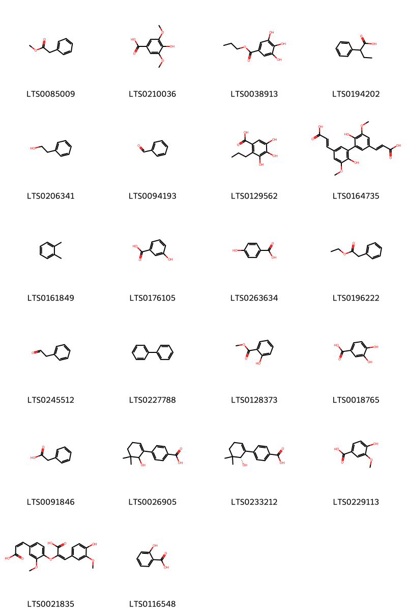{ width=100% }
    <figcaption>Hình ảnh cấu trúc hóa học của 22 hoạt chất thuộc nhóm Benzene and substituted derivatives gồm ['methyl phenylacetate (LTS0085009)', 'syringic acid (LTS0210036)', 'propyl gallate (LTS0038913)', 'α-phenylbutyric acid (LTS0194202)', '2-phenyl-ethanol (LTS0206341)', 'benzaldehyde (LTS0094193)', '3,4,5-trihydroxy-2-propylbenzoic acid (LTS0129562)', 'diferulic acid (LTS0164735)', 'ortho-xylene (LTS0161849)', '3-hydroxybenzoic acid (LTS0176105)', 'p-hydroxybenzoic acid (LTS0263634)', 'ethyl phenylacetate (LTS0196222)', 'phenylacetaldehyde (LTS0245512)', 'diphenyl (LTS0227788)', 'methyl salicylate (LTS0128373)', '3,4-dihydroxybenzoic acid (LTS0018765)', 'ω-phenylacetic acid (LTS0091846)', '4-(6-hydroxy-5,5-dimethylcyclohex-1-en-1-yl)benzoic acid (LTS0026905)', '4-[(6r)-6-hydroxy-5,5-dimethylcyclohex-1-en-1-yl]benzoic acid (LTS0233212)', 'vanillic acid (LTS0229113)', '(2e)-2-{4-[(1z)-2-carboxyeth-1-en-1-yl]-2-methoxyphenoxy}-3-(4-hydroxy-3-methoxyphenyl)prop-2-enoic acid (LTS0021835)', 'salicyclic acid (LTS0116548)'].</figcaption>
</figure>
#### Nhóm Benzodiazepines
<figure markdown="span">
    { width=100% }
    <figcaption>Hình ảnh cấu trúc hóa học của 2 hoạt chất thuộc nhóm Benzodiazepines gồm ['diazepam (LTS0079460)', 'lomax (LTS0185942)'].</figcaption>
</figure>
#### Nhóm Benzoxazines
<figure markdown="span">
    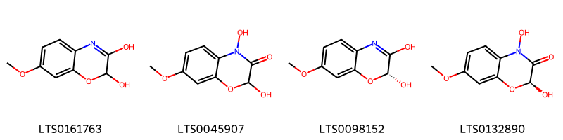{ width=100% }
    <figcaption>Hình ảnh cấu trúc hóa học của 4 hoạt chất thuộc nhóm Benzoxazines gồm ['7-methoxy-2h-1,4-benzoxazine-2,3-diol (LTS0161763)', 'dimboa (LTS0045907)', '(2r)-7-methoxy-2h-1,4-benzoxazine-2,3-diol (LTS0098152)', '(2s)-2,4-dihydroxy-7-methoxy-2h-1,4-benzoxazin-3-one (LTS0132890)'].</figcaption>
</figure>
#### Nhóm Benzoxazoles
<figure markdown="span">
    { width=100% }
    <figcaption>Hình ảnh cấu trúc hóa học của 5 hoạt chất thuộc nhóm Benzoxazoles gồm ['6,7-dimethoxy-1,3-benzoxazol-2-ol (LTS0102483)', '4-chloro-6,7-dimethoxy-1,3-benzoxazol-2-ol (LTS0184548)', '6-methoxy-1,3-benzoxazol-2-ol (LTS0151051)', '4-acetyl-3h-1,3-benzoxazol-2-one (LTS0105519)', '1,3-benzoxazol-2-ol (LTS0129691)'].</figcaption>
</figure>
#### Nhóm Carboxylic acids and derivatives
<figure markdown="span">
    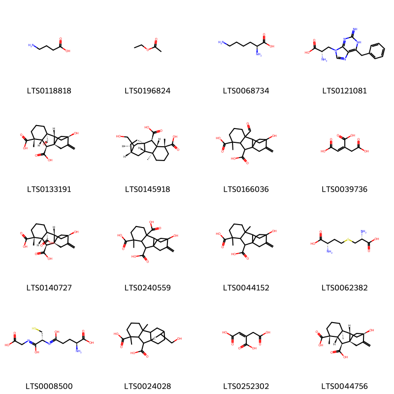{ width=100% }
    <figcaption>Hình ảnh cấu trúc hóa học của 16 hoạt chất thuộc nhóm Carboxylic acids and derivatives gồm ['gamma(amino)-butyric acid (LTS0118818)', 'ethyl acetate (LTS0196824)', 'l-lysine (LTS0068734)', '(2s)-2-amino-3-(6-benzyl-2-imino-1h-purin-9-yl)propanoic acid (LTS0121081)', '(1r,2s,3s,4r,8r,9r,11r)-8-formyl-11-hydroxy-4-methyl-12-methylidenetetracyclo[9.2.2.0¹,⁹.0³,⁸]pentadecane-2,4-dicarboxylic acid (LTS0133191)', '(1r,2s,3s,4r,8s,9s,11s,12s)-12-(hydroxymethyl)-4,8-dimethyltetracyclo[9.2.2.0¹,⁹.0³,⁸]pentadecane-2,4-dicarboxylic acid (LTS0145918)', '8-formyl-11-hydroxy-4-methyl-12-methylidenetetracyclo[9.2.2.0¹,⁹.0³,⁸]pentadecane-2,4-dicarboxylic acid (LTS0166036)', 'aconitic acid (LTS0039736)', '(1r,2s,3r,4r,8r,9r,11r)-11-hydroxy-4-methyl-12-methylidenetetracyclo[9.2.2.0¹,⁹.0³,⁸]pentadecane-2,4,8-tricarboxylic acid (LTS0140727)', '11-hydroxy-4-methyl-12-methylidenetetracyclo[9.2.2.0¹,⁹.0³,⁸]pentadecane-2,4,8-tricarboxylic acid (LTS0240559)', '11-hydroxy-4,8-dimethyl-12-methylidenetetracyclo[9.2.2.0¹,⁹.0³,⁸]pentadecane-2,4-dicarboxylic acid (LTS0044152)', 'l-cystathionine (LTS0062382)', '(2s)-2-amino-4-{[(1r)-1-(carboxymethyl-c-hydroxycarbonimidoyl)-2-sulfanylethyl]-c-hydroxycarbonimidoyl}butanoic acid (LTS0008500)', '12-(hydroxymethyl)-4,8-dimethyltetracyclo[9.2.2.0¹,⁹.0³,⁸]pentadecane-2,4-dicarboxylic acid (LTS0024028)', 'aconitate (LTS0252302)', '(1r,2s,3s,4r,8s,9s,11r)-11-hydroxy-4,8-dimethyl-12-methylidenetetracyclo[9.2.2.0¹,⁹.0³,⁸]pentadecane-2,4-dicarboxylic acid (LTS0044756)'].</figcaption>
</figure>
#### Nhóm Cinnamic acids and derivatives
<figure markdown="span">
    { width=100% }
    <figcaption>Hình ảnh cấu trúc hóa học của 19 hoạt chất thuộc nhóm Cinnamic acids and derivatives gồm ['ferulic acid (LTS0077328)', '(2e)-3-(4-hydroxyphenyl)-n-[2-(1h-indol-3-yl)ethyl]prop-2-enimidic acid (LTS0176591)', 'sinapinate (LTS0173482)', '3-(4-hydroxyphenyl)-n-[2-(1h-indol-3-yl)ethyl]prop-2-enimidic acid (LTS0106364)', '3,4-dihydroxycinnamic acid (LTS0128050)', '5-hydroxyferulate (LTS0159766)', '(2z)-3-(3,4-dihydroxy-5-methoxyphenyl)prop-2-enoic acid (LTS0149067)', '(2e)-3-(4-hydroxy-3-methoxyphenyl)-n-[2-(1h-indol-3-yl)ethyl]prop-2-enimidic acid (LTS0119446)', 'cis-p-coumaric acid (LTS0181455)', 'sinapoyl alcohol (LTS0275766)', 'para-coumaric acid (LTS0266252)', '(z)-sinapic acid (LTS0163988)', '5-hydroxyferulic acid (LTS0186587)', 'cis-ferulic acid (LTS0160926)', 'hydroxycinnamic acid (LTS0233023)', '3-(4-hydroxy-3-methoxyphenyl)-n-[2-(1h-indol-3-yl)ethyl]prop-2-enimidic acid (LTS0000934)', 'ethyl 3-phenylprop-2-enoate (LTS0005299)', 'ethyl cinnamate (LTS0031825)', 'ferulic acid (LTS0273002)'].</figcaption>
</figure>
#### Nhóm Coumarins and derivatives
<figure markdown="span">
    { width=100% }
    <figcaption>Hình ảnh cấu trúc hóa học của 2 hoạt chất thuộc nhóm Coumarins and derivatives gồm ['methoxsalen (LTS0260944)', 'aflatoxin (LTS0104763)'].</figcaption>
</figure>
#### Nhóm Diazines
<figure markdown="span">
    { width=100% }
    <figcaption>Hình ảnh cấu trúc hóa học của 1 hoạt chất thuộc nhóm Diazines gồm ['pirod (LTS0008205)'].</figcaption>
</figure>
#### Nhóm Dibenzylbutane lignans
<figure markdown="span">
    { width=100% }
    <figcaption>Hình ảnh cấu trúc hóa học của 2 hoạt chất thuộc nhóm Dibenzylbutane lignans gồm ['(2s,3r)-2,3-bis[(4-hydroxy-3-methoxyphenyl)(¹³c)methyl](1-¹³c)butane-1,4-diol (LTS0268699)', 'secoisolariciresinol (LTS0086727)'].</figcaption>
</figure>
#### Nhóm Fatty Acyls
<figure markdown="span">
    { width=100% }
    <figcaption>Hình ảnh cấu trúc hóa học của 30 hoạt chất thuộc nhóm Fatty Acyls gồm ['ethyl octadeca-9,12-dienoate (LTS0121886)', '2-carboxy-d-arabinitol (LTS0056947)', 'palmitic acid (LTS0079439)', 'tridecanal (LTS0239223)', 'hexadecanoic acid, propylester (LTS0019712)', '1-heptadecanol (LTS0166925)', 'nonadecanol (LTS0190286)', 'dotriacontanol (LTS0194965)', '2-heptanol (LTS0147404)', 'heptanol (LTS0150821)', '(4e)-hept-4-en-2-ol (LTS0141720)', 'nonan-1-ol (LTS0157379)', '2-undecanol (LTS0141928)', '(3s,3as,7ar)-2-hydroxy-7-{[(2s,3r,4s,5s,6r)-3,4,5-trihydroxy-6-(hydroxymethyl)oxan-2-yl]oxy}-3a,7a-dihydro-3h-indole-3-carboxylic acid (LTS0225152)', 'ethyl palmitate (LTS0111042)', 'propyl linoleate (LTS0162982)', '2-ethylhexanol (LTS0180984)', 'ethyl linoleate (LTS0262009)', '2-nonanol (LTS0264829)', 'octanol (LTS0250216)', '2-octanol (LTS0265860)', 'hept-4-en-2-ol (LTS0085604)', 'decanol (LTS0219777)', 'hexanol (LTS0217299)', 'propyl octadeca-9,12-dienoate (LTS0185171)', '1-octen-3-ol (LTS0057101)', 'decan-2-ol (LTS0243789)', '2-hydroxy-7-{[3,4,5-trihydroxy-6-(hydroxymethyl)oxan-2-yl]oxy}-3a,7a-dihydro-3h-indole-3-carboxylic acid (LTS0009441)', 'linoleic (LTS0013198)', 'stearic acid (LTS0237766)'].</figcaption>
</figure>
#### Nhóm Flavonoids
<figure markdown="span">
    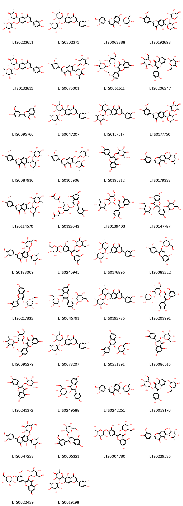{ width=100% }
    <figcaption>Hình ảnh cấu trúc hóa học của 42 hoạt chất thuộc nhóm Flavonoids gồm ['2-(3,4-dihydroxyphenyl)-5,7-dihydroxy-6-[(2r,3s,4s,6s)-4-hydroxy-6-methyl-5-oxo-3-{[(2s,3r,4r,5r,6s)-3,4,5-trihydroxy-6-methyloxan-2-yl]oxy}oxan-2-yl]chromen-4-one (LTS0223651)', '6-[(2r,3s,4r,5s,6s)-4,5-dihydroxy-6-methyl-3-{[(2s,3r,4r,5r,6s)-3,4,5-trihydroxy-6-methyloxan-2-yl]oxy}oxan-2-yl]-2-(3,4-dihydroxyphenyl)-5,7-dihydroxychromen-4-one (LTS0202371)', '6-[(2r,4r,5s,6s)-4,5-dihydroxy-6-methyloxan-2-yl]-5,7-dihydroxy-2-(3-hydroxy-4-methoxyphenyl)chromen-4-one (LTS0063888)', '5,7-dihydroxy-2-(4-hydroxy-3-methoxyphenyl)-6-[(2s,3r,4r,6s)-4-hydroxy-6-methyl-5-oxo-3-{[(2s,3r,4r,5r,6s)-3,4,5-trihydroxy-6-methyloxan-2-yl]oxy}oxan-2-yl]chromen-4-one (LTS0192698)', 'maysin (LTS0132611)', '5,7-dihydroxy-2-(4-hydroxy-3-methoxyphenyl)-6-{4-hydroxy-6-methyl-5-oxo-3-[(3,4,5-trihydroxy-6-methyloxan-2-yl)oxy]oxan-2-yl}chromen-4-one (LTS0076001)', '3-{[(2s,3r,4s,5s,6r)-4,5-dihydroxy-6-(hydroxymethyl)-3-{[(2s,3r,4r,5r,6s)-3,4,5-trihydroxy-6-methyloxan-2-yl]oxy}oxan-2-yl]oxy}-5,7-dihydroxy-2-(4-hydroxy-3-methoxyphenyl)chromen-4-one (LTS0061611)', '2-(3,4-dihydroxyphenyl)-5-hydroxy-3,7-bis({[3,4,5-trihydroxy-6-(hydroxymethyl)oxan-2-yl]oxy})chromen-4-one (LTS0206247)', 'chrysoeriol (LTS0095766)', '6-[(2s,3s,4r,5r,6r)-4,5-dihydroxy-6-methyl-3-{[(2s,3s,4r,5r,6s)-3,4,5-trihydroxy-6-methyloxan-2-yl]oxy}oxan-2-yl]-2-(3,4-dihydroxyphenyl)-5,7-dihydroxychromen-4-one (LTS0047207)', '6-{4,5-dihydroxy-6-methyl-3-[(3,4,5-trihydroxy-6-methyloxan-2-yl)oxy]oxan-2-yl}-2-(3,4-dihydroxyphenyl)-5,7-dihydroxychromen-4-one (LTS0157517)', '6-{4,5-dihydroxy-6-methyl-3-[(3,4,5-trihydroxy-6-methyloxan-2-yl)oxy]oxan-2-yl}-5,7-dihydroxy-2-(4-hydroxy-3-methoxyphenyl)chromen-4-one (LTS0177750)', '6-[(2r,3s,4r,5s,6s)-4,5-dihydroxy-6-methyl-3-{[(2s,3r,4r,5r,6s)-3,4,5-trihydroxy-6-methyloxan-2-yl]oxy}oxan-2-yl]-5,7-dihydroxy-2-(4-hydroxy-3-methoxyphenyl)chromen-4-one (LTS0087910)', '5,7-dihydroxy-2-(4-hydroxy-3-methoxyphenyl)-6-[(2r,3s,4s,6s)-4-hydroxy-6-methyl-5-oxo-3-{[(2s,3r,4r,5r,6s)-3,4,5-trihydroxy-6-methyloxan-2-yl]oxy}oxan-2-yl]chromen-4-one (LTS0105906)', '2-(3,4-dihydroxyphenyl)-5,7-dihydroxy-3-{[3,4,5-trihydroxy-6-(hydroxymethyl)oxan-2-yl]oxy}chromen-4-one (LTS0195312)', '5,7-dihydroxy-2-(4-hydroxy-3-methoxyphenyl)-6-(3,4,5-trihydroxy-6-methyloxan-2-yl)chromen-4-one (LTS0179333)', '6-[(2s,3s,4s,5s,6r)-4,5-dihydroxy-6-methyl-3-{[(2s,3s,4r,5r,6r)-3,4,5-trihydroxy-6-methyloxan-2-yl]oxy}oxan-2-yl]-5,7-dihydroxy-2-(4-hydroxy-3-methoxyphenyl)chromen-4-one (LTS0114570)', '3-{[(2s,3r,4s,5r,6r)-4-[(2-carboxyacetyl)oxy]-6-{[(2-carboxyacetyl)oxy]methyl}-3,5-dihydroxyoxan-2-yl]oxy}-2-(3,4-dihydroxyphenyl)-5,7-dihydroxy-1λ⁴-chromen-1-ylium (LTS0132043)', '3-{[4,5-dihydroxy-6-(hydroxymethyl)-3-[(3,4,5-trihydroxy-6-methyloxan-2-yl)oxy]oxan-2-yl]oxy}-2-(3,4-dihydroxyphenyl)-5,7-dihydroxychromen-4-one (LTS0139403)', '5,7-dihydroxy-2-(4-hydroxy-3-{[3,4,5-trihydroxy-6-(hydroxymethyl)oxan-2-yl]oxy}phenyl)-3-{[3,4,5-trihydroxy-6-(hydroxymethyl)oxan-2-yl]oxy}chromen-4-one (LTS0147787)', '6-[(2r,4r,5s,6s)-4,5-dihydroxy-6-methyloxan-2-yl]-5-hydroxy-2-(3-hydroxy-4-methoxyphenyl)-7-{[(2s,3r,4s,5s,6r)-3,4,5-trihydroxy-6-(hydroxymethyl)oxan-2-yl]oxy}chromen-4-one (LTS0188009)', '5,7-dihydroxy-2-(3-methoxy-4-{[3,4,5-trihydroxy-6-(hydroxymethyl)oxan-2-yl]oxy}phenyl)-3-{[3,4,5-trihydroxy-6-(hydroxymethyl)oxan-2-yl]oxy}chromen-4-one (LTS0245945)', '6-[(2r,3s,4r,5r,6s)-4,5-dihydroxy-6-methyl-3-{[(2s,3r,4r,5r,6s)-3,4,5-trihydroxy-6-methyloxan-2-yl]oxy}oxan-2-yl]-2-(3,4-dihydroxyphenyl)-5,7-dihydroxychromen-4-one (LTS0176895)', '5,7-dihydroxy-2-(4-hydroxy-3-oxidophenyl)-3-{[(2s,3r,4s,5s,6r)-3,4,5-trihydroxy-6-(hydroxymethyl)oxan-2-yl]oxy}-1λ⁴-chromen-1-ylium (LTS0083222)', 'cyanidin 3-glucoside (LTS0217835)', '5,7-dihydroxy-2-(4-hydroxy-3-{[(2s,3r,4s,5s,6r)-3,4,5-trihydroxy-6-(hydroxymethyl)oxan-2-yl]oxy}phenyl)-3-{[(2s,3r,4s,5s,6r)-3,4,5-trihydroxy-6-(hydroxymethyl)oxan-2-yl]oxy}chromen-4-one (LTS0045791)', '6-[(2s,3s,4s,5s,6r)-4,5-dihydroxy-6-methyl-3-{[(2s,3s,4r,5r,6s)-3,4,5-trihydroxy-6-methyloxan-2-yl]oxy}oxan-2-yl]-2-(3,4-dihydroxyphenyl)-5,7-dihydroxychromen-4-one (LTS0192785)', '3-{[(2s,3r,4s,5s,6r)-4,5-dihydroxy-6-(hydroxymethyl)-3-{[(2s,3r,4r,5r,6s)-3,4,5-trihydroxy-6-methyloxan-2-yl]oxy}oxan-2-yl]oxy}-2-(3,4-dihydroxyphenyl)-5,7-dihydroxychromen-4-one (LTS0203991)', '3-{[4,5-dihydroxy-6-(hydroxymethyl)-3-[(3,4,5-trihydroxy-6-methyloxan-2-yl)oxy]oxan-2-yl]oxy}-5,7-dihydroxy-2-(4-hydroxy-3-methoxyphenyl)chromen-4-one (LTS0095279)', '6-[(2r,3s,5s)-4,5-dihydroxy-6-methyl-3-{[(2s,3s,5r)-3,4,5-trihydroxy-6-methyloxan-2-yl]oxy}oxan-2-yl]-2-(3,4-dihydroxyphenyl)-5,7-dihydroxychromen-4-one (LTS0073207)', 'chrysanthemin (LTS0221391)', '2-(3,4-dihydroxyphenyl)-5,7-dihydroxy-3-{[(2r,3r,4s,5s,6r)-3,4,5-trihydroxy-6-(hydroxymethyl)oxan-2-yl]oxy}chromen-4-one (LTS0086516)', '2-(3,4-dihydroxyphenyl)-5,7-dihydroxy-3-{[(2s,3r,4r,5r,6s)-3,4,5-trihydroxy-6-(hydroxymethyl)oxan-2-yl]oxy}chromen-4-one (LTS0241372)', 'astragalin (LTS0249588)', '6-(4,5-dihydroxy-6-methyloxan-2-yl)-5,7-dihydroxy-2-(3-hydroxy-4-methoxyphenyl)chromen-4-one (LTS0242251)', 'quercetin 3,7-diglucoside (LTS0059170)', '6-(4,5-dihydroxy-6-methyloxan-2-yl)-5-hydroxy-2-(3-hydroxy-4-methoxyphenyl)-7-{[3,4,5-trihydroxy-6-(hydroxymethyl)oxan-2-yl]oxy}chromen-4-one (LTS0047223)', '5,7-dihydroxy-2-(4-hydroxy-3-methoxyphenyl)-3-{[(2s,3r,4r,5s,6r)-3,4,5-trihydroxy-6-(hydroxymethyl)oxan-2-yl]oxy}-1λ⁴-chromen-1-ylium (LTS0005321)', '5,7-dihydroxy-2-(3-methoxy-4-{[(2s,3r,4s,5s,6r)-3,4,5-trihydroxy-6-(hydroxymethyl)oxan-2-yl]oxy}phenyl)-3-{[(2s,3r,4r,5s,6r)-3,4,5-trihydroxy-6-(hydroxymethyl)oxan-2-yl]oxy}chromen-4-one (LTS0004780)', '5,7-dihydroxy-2-(4-hydroxy-3-methoxyphenyl)-6-[(2r,3s,4r,5s,6s)-3,4,5-trihydroxy-6-methyloxan-2-yl]chromen-4-one (LTS0229536)', '5,7-dihydroxy-2-(3-methoxy-4-{[(2s,3r,4s,5s,6r)-3,4,5-trihydroxy-6-(hydroxymethyl)oxan-2-yl]oxy}phenyl)-3-{[(2s,3r,4s,5s,6r)-3,4,5-trihydroxy-6-(hydroxymethyl)oxan-2-yl]oxy}chromen-4-one (LTS0022429)', '2-(3,4-dihydroxyphenyl)-5,7-dihydroxy-6-{4-hydroxy-6-methyl-5-oxo-3-[(3,4,5-trihydroxy-6-methyloxan-2-yl)oxy]oxan-2-yl}chromen-4-one (LTS0019198)'].</figcaption>
</figure>
#### Nhóm Fluorenes
<figure markdown="span">
    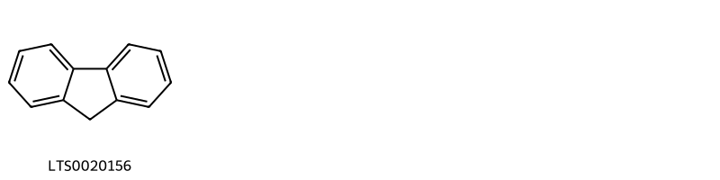{ width=100% }
    <figcaption>Hình ảnh cấu trúc hóa học của 1 hoạt chất thuộc nhóm Fluorenes gồm ['fluorene (LTS0020156)'].</figcaption>
</figure>
#### Nhóm Furanoid lignans
<figure markdown="span">
    { width=100% }
    <figcaption>Hình ảnh cấu trúc hóa học của 3 hoạt chất thuộc nhóm Furanoid lignans gồm ['pinoresinol (LTS0057431)', 'matairesinol (LTS0193475)', 'lariciresinol (LTS0010950)'].</figcaption>
</figure>
#### Nhóm Glycerophospholipids
<figure markdown="span">
    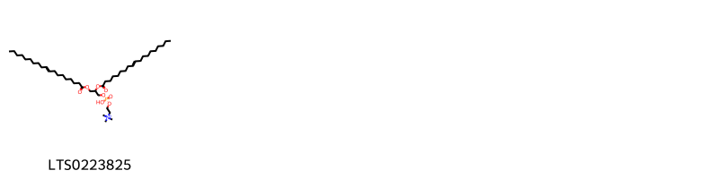{ width=100% }
    <figcaption>Hình ảnh cấu trúc hóa học của 1 hoạt chất thuộc nhóm Glycerophospholipids gồm ['2,3-bis[(9e)-nonadec-9-enoyloxy]propoxy(2-(trimethylammonio)ethoxy)phosphinic acid (LTS0223825)'].</figcaption>
</figure>
#### Nhóm Heteroaromatic compounds
<figure markdown="span">
    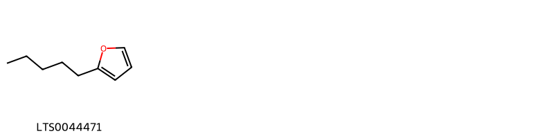{ width=100% }
    <figcaption>Hình ảnh cấu trúc hóa học của 1 hoạt chất thuộc nhóm Heteroaromatic compounds gồm ['amylfuran (LTS0044471)'].</figcaption>
</figure>
#### Nhóm Imidazopyrimidines
<figure markdown="span">
    { width=100% }
    <figcaption>Hình ảnh cấu trúc hóa học của 6 hoạt chất thuộc nhóm Imidazopyrimidines gồm ['2-methyl-4-(3h-purin-6-ylamino)but-2-en-1-ol (LTS0112277)', '6-{[(2e)-4-hydroxy-3-methylbut-2-en-1-yl]amino}-3h-purin-2-ol (LTS0261383)', '2-methyl-4-(3h-purin-6-ylamino)butane-1,2,3-triol (LTS0208292)', '(2r,3r)-2-methyl-4-(3h-purin-6-ylamino)butane-1,2,3-triol (LTS0209841)', '6-[(4-hydroxy-3-methylbut-2-en-1-yl)amino]-3h-purin-2-ol (LTS0048177)', 'zeatine (LTS0032706)'].</figcaption>
</figure>
#### Nhóm Indoles and derivatives
<figure markdown="span">
    { width=100% }
    <figcaption>Hình ảnh cấu trúc hóa học của 18 hoạt chất thuộc nhóm Indoles and derivatives gồm ['[1-(trimethylsilyl)indol-3-yl]methyl 2-[(2r,3r,4s,5r,6r)-3,4,5,6-tetrakis[(trimethylsilyl)oxy]oxan-2-yl]acetate (LTS0096037)', '1-(2-{[(1r,2r,3s,4s,5r,6s)-2,3,4,5,6-pentahydroxycyclohexyl]oxy}indol-1-yl)ethanone (LTS0213718)', '(2-hydroxy-3h-indol-3-yl)acetic acid (LTS0094655)', '[(3s)-2,7-dihydroxy-3h-indol-3-yl]acetic acid (LTS0164506)', '[1-(trimethylsilyl)indol-3-yl]methyl 4,5,6-tris[(trimethylsilyl)oxy]-2-{[(trimethylsilyl)oxy]methyl}oxane-3-carboxylate (LTS0057975)', 'indole (LTS0185357)', '[1-(trimethylsilyl)indol-3-yl]methyl (2s,3r,4s,5r,6s)-4,5,6-tris[(trimethylsilyl)oxy]-2-{[(trimethylsilyl)oxy]methyl}oxane-3-carboxylate (LTS0121700)', 'β-indole-3-acetic acid (LTS0250222)', 'l-tryptophan (LTS0263809)', '1-{2-[(2,3,4,5,6-pentahydroxycyclohexyl)oxy]indol-1-yl}ethanone (LTS0209659)', '[1-(trimethylsilyl)indol-3-yl]methyl 2-{3,4,5,6-tetrakis[(trimethylsilyl)oxy]oxan-2-yl}acetate (LTS0242181)', '(1r,2r,3s,4s,5r,6s)-2,3,4,5,6-pentahydroxycyclohexyl 2-(1h-indol-2-yl)acetate (LTS0244797)', '2,4,5-tris[(trimethylsilyl)oxy]-6-{[(trimethylsilyl)oxy]methyl}oxan-3-yl 2-[1-(trimethylsilyl)indol-3-yl]acetate (LTS0133986)', '3-indolebutyric acid (LTS0033298)', '(2s,3r,4r,5r,6r)-2,4,5-tris[(trimethylsilyl)oxy]-6-{[(trimethylsilyl)oxy]methyl}oxan-3-yl 2-[1-(trimethylsilyl)indol-3-yl]acetate (LTS0015298)', '(2,7-dihydroxy-3h-indol-3-yl)acetic acid (LTS0226048)', '2,3,4,5,6-pentahydroxycyclohexyl 2-(1h-indol-2-yl)acetate (LTS0109219)', '(2-oxoindol-3-yl)acetic acid (LTS0048565)'].</figcaption>
</figure>
#### Nhóm Isoflavonoids
<figure markdown="span">
    { width=100% }
    <figcaption>Hình ảnh cấu trúc hóa học của 1 hoạt chất thuộc nhóm Isoflavonoids gồm ['genistein (LTS0106538)'].</figcaption>
</figure>
#### Nhóm Lactones
<figure markdown="span">
    { width=100% }
    <figcaption>Hình ảnh cấu trúc hóa học của 4 hoạt chất thuộc nhóm Lactones gồm ['aldehyde c-18 (LTS0034678)', 'gamma-nonalactone (LTS0096823)', '(1r,2r,4r,7r,8s,9s,10s)-4-hydroxy-10-methyl-5-methylidene-11-oxo-12-oxapentacyclo[8.3.3.2⁴,⁷.0¹,⁹.0²,⁷]octadecane-8-carboxylic acid (LTS0212256)', '4-hydroxy-10-methyl-5-methylidene-11-oxo-12-oxapentacyclo[8.3.3.2⁴,⁷.0¹,⁹.0²,⁷]octadecane-8-carboxylic acid (LTS0045086)'].</figcaption>
</figure>
#### Nhóm Naphthalenes
<figure markdown="span">
    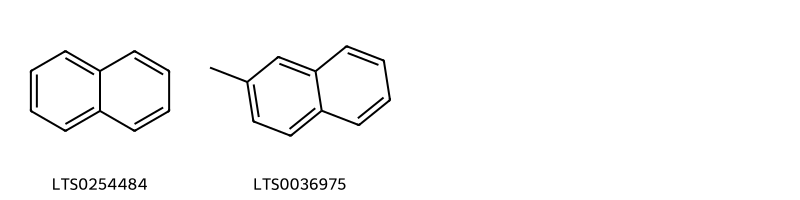{ width=100% }
    <figcaption>Hình ảnh cấu trúc hóa học của 2 hoạt chất thuộc nhóm Naphthalenes gồm ['naphthalene (LTS0254484)', '2-methylnaphthalene (LTS0036975)'].</figcaption>
</figure>
#### Nhóm Naphthopyrans
<figure markdown="span">
    { width=100% }
    <figcaption>Hình ảnh cấu trúc hóa học của 2 hoạt chất thuộc nhóm Naphthopyrans gồm ['(1r,4r,5r,7s,9r,10r,12r)-7-(acetyloxy)-12-(furan-2-yl)-4,10-dimethyl-8,14-dioxo-13-oxatetracyclo[10.2.1.0¹,¹⁰.0⁴,⁹]pentadecan-5-yl acetate (LTS0216247)', '7-(acetyloxy)-12-(furan-2-yl)-4,10-dimethyl-8,14-dioxo-13-oxatetracyclo[10.2.1.0¹,¹⁰.0⁴,⁹]pentadecan-5-yl acetate (LTS0233507)'].</figcaption>
</figure>
#### Nhóm Organic phosphoric acids and derivatives
<figure markdown="span">
    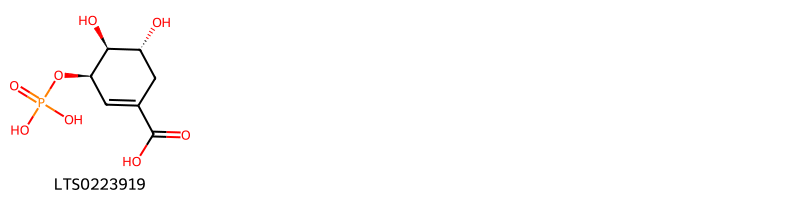{ width=100% }
    <figcaption>Hình ảnh cấu trúc hóa học của 1 hoạt chất thuộc nhóm Organic phosphoric acids and derivatives gồm ['3-phosphoshikimic acid (LTS0223919)'].</figcaption>
</figure>
#### Nhóm Organonitrogen compounds
<figure markdown="span">
    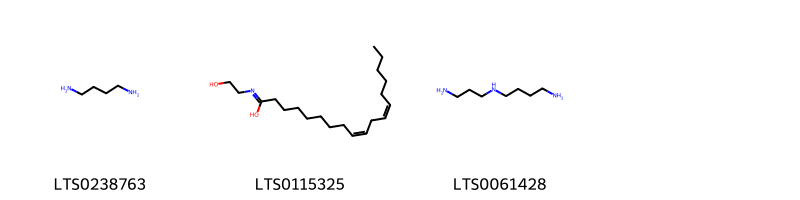{ width=100% }
    <figcaption>Hình ảnh cấu trúc hóa học của 3 hoạt chất thuộc nhóm Organonitrogen compounds gồm ['putrescine (LTS0238763)', '(9z,12z)-n-(2-hydroxyethyl)octadeca-9,12-dienimidic acid (LTS0115325)', 'spermidine (LTS0061428)'].</figcaption>
</figure>
#### Nhóm Organooxygen compounds
<figure markdown="span">
    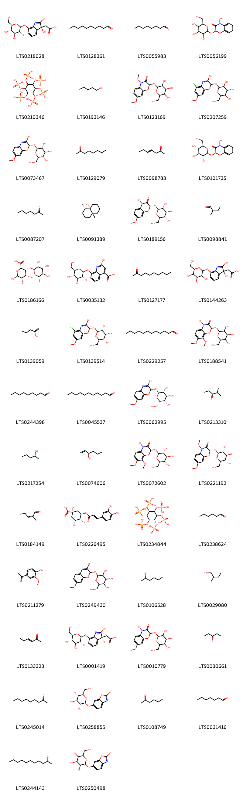{ width=100% }
    <figcaption>Hình ảnh cấu trúc hóa học của 51 hoạt chất thuộc nhóm Organooxygen compounds gồm ['[(3s)-2,3-dihydroxy-7-{[(2s,3r,4s,5s,6r)-3,4,5-trihydroxy-6-(hydroxymethyl)oxan-2-yl]oxy}indol-3-yl]acetic acid (LTS0218028)', 'decanal (LTS0128361)', 'octanal (LTS0055983)', '4-hydroxy-2-{[3,4,5-trihydroxy-6-(hydroxymethyl)oxan-2-yl]oxy}-2h-1,4-benzoxazin-3-one (LTS0056199)', 'phytic acid (LTS0210346)', 'amyl alcohol (LTS0193146)', '4,7-dimethoxy-2-{[3,4,5-trihydroxy-6-(hydroxymethyl)oxan-2-yl]oxy}-2h-1,4-benzoxazin-3-one (LTS0123169)', '2-[(5-chloro-3-hydroxy-7-methoxy-2h-1,4-benzoxazin-2-yl)oxy]-6-(hydroxymethyl)oxane-3,4,5-triol (LTS0207259)', '(2s,3r,4s,5s,6r)-2-{[(2s)-3-hydroxy-7-methoxy-2h-1,4-benzoxazin-2-yl]oxy}-6-(hydroxymethyl)oxane-3,4,5-triol (LTS0073467)', '2-octanone (LTS0129079)', 'hept-4-en-2-one (LTS0098783)', 'diboa-glucoside (LTS0101735)', '2-heptanone (LTS0087207)', 'geosmin (LTS0091389)', 'dimboa-glucoside (LTS0189156)', '2-methylbutanal (LTS0098841)', '(2s,3r,4r,5r,6s)-4,5,6-trihydroxy-3-{[(2s,3r,4r,5r,6s)-3,4,5-trihydroxy-6-methyloxan-2-yl]oxy}oxane-2-carboxylic acid (LTS0186166)', '2-hydroxy-8-{[(2s,3r,4s,5s,6r)-3,4,5-trihydroxy-6-(hydroxymethyl)oxan-2-yl]oxy}quinoline-4-carboxylic acid (LTS0035132)', '2-decanone (LTS0127177)', '(2,3-dihydroxy-7-{[3,4,5-trihydroxy-6-(hydroxymethyl)oxan-2-yl]oxy}indol-3-yl)acetic acid (LTS0144263)', 'pent-1-en-2-ol (LTS0139059)', '(2s,3r,4s,5s,6r)-2-{[(2s)-5-chloro-3-hydroxy-7-methoxy-2h-1,4-benzoxazin-2-yl]oxy}-6-(hydroxymethyl)oxane-3,4,5-triol (LTS0139514)', 'dodecanal (LTS0229257)', '4-hydroxy-7,8-dimethoxy-2-{[3,4,5-trihydroxy-6-(hydroxymethyl)oxan-2-yl]oxy}-2h-1,4-benzoxazin-3-one (LTS0188541)', 'nonanal (LTS0244398)', 'aldehyde c11 (LTS0045537)', '(2r,3r,4s,5s,6s)-2-{[(2r)-3-hydroxy-7-methoxy-2h-1,4-benzoxazin-2-yl]oxy}-6-(hydroxymethyl)oxane-3,4,5-triol (LTS0062995)', '4-methyl-3-pentanone (LTS0213310)', '2-pentanol (LTS0217254)', '1-hexen-3-ol (LTS0074606)', '(2r)-4-hydroxy-7,8-dimethoxy-2-{[(2s,3r,4s,5s,6r)-3,4,5-trihydroxy-6-(hydroxymethyl)oxan-2-yl]oxy}-2h-1,4-benzoxazin-3-one (LTS0072602)', '(2s)-4,7-dimethoxy-2-{[(2s,3r,4s,5s,6r)-3,4,5-trihydroxy-6-(hydroxymethyl)oxan-2-yl]oxy}-2h-1,4-benzoxazin-3-one (LTS0221192)', '2-pentenal, 2-methyl- (LTS0184149)', 'chlorogenic acid (LTS0226495)', '[(1r,2r,3s,4r,5s,6s)-2,3,4,5,6-pentakis(phosphonooxy)cyclohexyl]oxyphosphonic acid (LTS0234844)', 'hexanal (LTS0238624)', 'apocynin (LTS0211279)', '2-[(3-hydroxy-7-methoxy-2h-1,4-benzoxazin-2-yl)oxy]-6-(hydroxymethyl)oxane-3,4,5-triol (LTS0249430)', '2-hexanol (LTS0106528)', '2-methyl-1-butanol (LTS0029080)', '3-hexen-2-one (LTS0133323)', '[(3r)-2,3-dihydroxy-7-{[(2s,3r,4s,5s,6r)-3,4,5-trihydroxy-6-(hydroxymethyl)oxan-2-yl]oxy}indol-3-yl]acetic acid (LTS0001419)', '4-hydroxy-7-methoxy-2-{[3,4,5-trihydroxy-6-(hydroxymethyl)oxan-2-yl]oxy}-2h-1,4-benzoxazin-3-one (LTS0010779)', '3-pentanone (LTS0030661)', '2-nonanone (LTS0245014)', '(2s,3r,4s,5s,6r)-2-[(2-hydroxy-1,3-benzoxazol-6-yl)oxy]-6-(hydroxymethyl)oxane-3,4,5-triol (LTS0258855)', 'hexanone (LTS0108749)', 'heptanal (LTS0031416)', 'undecan-2-one (LTS0244143)', '2-[(2-hydroxy-1,3-benzoxazol-6-yl)oxy]-6-(hydroxymethyl)oxane-3,4,5-triol (LTS0250498)', 'isoamyl alcohol (LTS0112297)'].</figcaption>
</figure>
#### Nhóm Phenols
<figure markdown="span">
    { width=100% }
    <figcaption>Hình ảnh cấu trúc hóa học của 8 hoạt chất thuộc nhóm Phenols gồm ['vanillin (LTS0136163)', '6,7-dihydroxy-3-(2-hydroxy-4-methoxyphenyl)-5-(hydroxymethyl)-tetrahydro-3ah-pyrano[2,3-d][1,3]oxazol-2-one (LTS0077839)', '2-methoxy-4-vinyl-phenol (LTS0128961)', '3-{[(3ar,5r,6s,7s,7ar)-6,7-dihydroxy-3-(2-hydroxyphenyl)-2-oxo-tetrahydro-3ah-pyrano[2,3-d][1,3]oxazol-5-yl]methoxy}-3-oxopropanoic acid (LTS0266063)', '4-hydroxyphenylacetic acid (LTS0272177)', '3-{[6,7-dihydroxy-3-(2-hydroxyphenyl)-2-oxo-tetrahydro-3ah-pyrano[2,3-d][1,3]oxazol-5-yl]methoxy}-3-oxopropanoic acid (LTS0250262)', '(3ar,5r,6s,7s,7ar)-6,7-dihydroxy-3-(2-hydroxy-4-methoxyphenyl)-5-(hydroxymethyl)-tetrahydro-3ah-pyrano[2,3-d][1,3]oxazol-2-one (LTS0037456)', '5-ethenyl-2-methoxyphenol (LTS0076260)'].</figcaption>
</figure>
#### Nhóm Polycyclic hydrocarbons
<figure markdown="span">
    { width=100% }
    <figcaption>Hình ảnh cấu trúc hóa học của 1 hoạt chất thuộc nhóm Polycyclic hydrocarbons gồm ['carene (LTS0063902)'].</figcaption>
</figure>
#### Nhóm Prenol lipids
<figure markdown="span">
    { width=100% }
    <figcaption>Hình ảnh cấu trúc hóa học của 101 hoạt chất thuộc nhóm Prenol lipids gồm ['terpineol (LTS0136148)', '1-(5-ethyl-6-methylheptan-2-yl)-9a,11a-dimethyl-1h,2h,3h,3ah,3bh,4h,6h,7h,8h,9h,9bh,10h,11h-cyclopenta[a]phenanthren-7-yl acetate (LTS0123886)', 'β-amyrin (LTS0075776)', 'carotenoid (LTS0205297)', 'xanthoxin (LTS0200970)', '(2r)-2,5,7,8-tetramethyl-2-[(4s,8s)-4,8,12-trimethyltridecyl]-3,4-dihydro-1-benzopyran-6-ol (LTS0130040)', 'stigmastanol acetate (LTS0067968)', '(+)-α-carotene (LTS0200789)', 'linalool, (+-)- (LTS0128839)', '1-(5-ethyl-6-methylhept-3-en-2-yl)-9a,11a-dimethyl-tetradecahydro-1h-cyclopenta[a]phenanthren-7-yl acetate (LTS0073222)', 'amyrin (LTS0222826)', '1-(5-ethyl-6-methylheptan-2-yl)-6,9a,11a-trimethyl-1h,2h,3h,3ah,5h,5ah,6h,7h,8h,9h,9bh,10h,11h-cyclopenta[a]phenanthren-7-yl acetate (LTS0127907)', '1-(5,6-dimethylhept-4-en-2-yl)-3a,6,6,9a,11a-pentamethyl-dodecahydro-1h-cyclopenta[a]phenanthren-7-yl acetate (LTS0171451)', 'violaxanthin (LTS0102265)', 'β-sitosteryl acetate (LTS0098695)', '(1r,3as,3br,5ar,7r,9ar,9bs,11ar)-1-[(2r,4e)-5,6-dimethylhept-4-en-2-yl]-3a,6,6,9a,11a-pentamethyl-dodecahydro-1h-cyclopenta[a]phenanthren-7-yl acetate (LTS0180903)', '5-{3,8-dihydroxy-1,5-dimethyl-6-oxabicyclo[3.2.1]octan-8-yl}-3-methylpenta-2,4-dienoic acid (LTS0171655)', 'abscisic acid,  (LTS0140631)', 'stigmasteryl acetate (LTS0026812)', '4-[(9e,11e,13e,15e,17e)-18-(4-hydroxy-2,6,6-trimethylcyclohex-1-en-1-yl)-3,7,12,16-tetramethyloctadeca-1,3,5,7,9,11,13,15,17-nonaen-1-yl]-3,5,5-trimethylcyclohex-3-en-1-ol (LTS0095534)', 'α-myrcene (LTS0115731)', 'longifolene (LTS0202079)', '8-isopropyl-1,2-dimethyltetracyclo[4.4.0.0²,⁴.0³,⁷]decane (LTS0040030)', '5-[1-hydroxy-6-(hydroxymethyl)-2,6-dimethyl-4-oxocyclohex-2-en-1-yl]-3-methylpenta-2,4-dienoic acid (LTS0189172)', 'β-pinene (LTS0117550)', '(1r,3as,3bs,7s,9ar,9bs,11ar)-1-[(2r,5e)-5-isopropylhept-5-en-2-yl]-9a,11a-dimethyl-1h,2h,3h,3ah,3bh,4h,6h,7h,8h,9h,9bh,10h,11h-cyclopenta[a]phenanthren-7-yl acetate (LTS0206061)', 'α pinene (LTS0132416)', '(1r,3as,3br,5ar,7r,9ar,9bs,11ar)-1-[(2r,5s)-5,6-dimethylhept-6-en-2-yl]-3a,6,6,9a,11a-pentamethyl-dodecahydro-1h-cyclopenta[a]phenanthren-7-yl acetate (LTS0146534)', 'β-amyrin acetate (LTS0137234)', 'zeaxanthin (LTS0192928)', '1-(5-isopropylhept-5-en-2-yl)-9a,11a-dimethyl-1h,2h,3h,3ah,3bh,4h,6h,7h,8h,9h,9bh,10h,11h-cyclopenta[a]phenanthren-7-yl acetate (LTS0135630)', '4-isopropyl-1,6-dimethyl-2,3,4,4a,7,8-hexahydronaphthalene (LTS0270743)', '4-isopropyl-1,6-dimethyl-3,4,4a,7,8,8a-hexahydronaphthalene (LTS0154650)', '1-(5-ethyl-6-methylhept-5-en-2-yl)-9a,11a-dimethyl-1h,2h,3h,3ah,3bh,4h,6h,7h,8h,9h,9bh,10h,11h-cyclopenta[a]phenanthren-7-yl acetate (LTS0148694)', 'limonene,  (LTS0155981)', '(1r,3ar,5as,6s,7s,9as,9br,11ar)-1-[(2r,5r)-5-ethyl-6-methylheptan-2-yl]-6,9a,11a-trimethyl-1h,2h,3h,3ah,5h,5ah,6h,7h,8h,9h,9bh,10h,11h-cyclopenta[a]phenanthren-7-yl acetate (LTS0192163)', '(2z,4e)-5-[(1s,5s,8s)-8-hydroxy-1,5-dimethyl-3-oxo-6-oxabicyclo[3.2.1]octan-8-yl]-3-methylpenta-2,4-dienoic acid (LTS0140493)', 'β-ionone (LTS0155301)', 'gibberellin a29 (LTS0250023)', 'β-amyrin (LTS0251864)', 'α-ylangene (LTS0254603)', '(2s,7s)-3,3,7-trimethyl-8-methylidenetricyclo[5.4.0.0²,⁹]undecane (LTS0085446)', 'β,β-carotene (LTS0168447)', '(1s)-1-[(2s,4as,4br,5r,8as,10as)-5-hydroxy-2,4b,8,8-tetramethyl-decahydro-1h-phenanthren-2-yl]ethane-1,2-diol (LTS0131719)', '5-{8-hydroxy-1,5-dimethyl-3-oxo-6-oxabicyclo[3.2.1]octan-8-yl}-3-methylpenta-2,4-dienoic acid (LTS0104572)', 'crocetin (LTS0129423)', '4,4,6a,6b,8a,11,12,14b-octamethyl-2,3,4a,5,6,7,8,9,10,11,12,12a,14,14a-tetradecahydro-1h-picen-3-yl acetate (LTS0185406)', '6,6-dimethyl-4-methylidenebicyclo[3.1.1]hept-2-ene (LTS0256331)', '1-(5,6-dimethylhept-6-en-2-yl)-3a,6,6,9a,11a-pentamethyl-dodecahydro-1h-cyclopenta[a]phenanthren-7-yl acetate (LTS0084434)', 'caryophyllene (LTS0085212)', '2,4a,8,8-tetramethyl-1h,1ah,4h,5h-cyclopropa[e]naphthalene (LTS0267234)', '1-(5-isopropylhept-5-en-2-yl)-9a,11a-dimethyl-1h,2h,3h,3ah,5h,5ah,6h,7h,8h,9h,9bh,10h,11h-cyclopenta[a]phenanthren-7-yl acetate (LTS0265077)', 'β-carotene (LTS0275716)', '1-(5-ethyl-6-methylhept-3-en-2-yl)-9a,11a-dimethyl-1h,2h,3h,3ah,3bh,4h,6h,7h,8h,9h,9bh,10h,11h-cyclopenta[a]phenanthren-7-yl acetate (LTS0242194)', '(1r,3as,3bs,7s,9ar,9bs,11ar)-1-[(2r,5z)-5-isopropylhept-5-en-2-yl]-9a,11a-dimethyl-1h,2h,3h,3ah,3bh,4h,6h,7h,8h,9h,9bh,10h,11h-cyclopenta[a]phenanthren-7-yl acetate (LTS0195939)', 'vitamin e (LTS0263269)', '(1s)-8-isopropyl-1,3-dimethyltricyclo[4.4.0.0²,⁷]dec-3-ene (LTS0199723)', 'β-farnesene (LTS0067925)', 'abscisic acid (LTS0200774)', 'antheraxanthin (LTS0210072)', "(+)-8'-hydroxyabscisic acid (LTS0241618)", '(s)-(+)-abscisic acid (LTS0260851)', '(2z,4e)-5-[(1s,3r,5s,8s)-3,8-dihydroxy-1,5-dimethyl-6-oxabicyclo[3.2.1]octan-8-yl]-3-methylpenta-2,4-dienoic acid (LTS0208352)', '(1r,3ar,5as,7s,9as,9br,11ar)-1-[(2r,5r)-5-ethyl-6-methylheptan-2-yl]-9a,11a-dimethyl-1h,2h,3h,3ah,5h,5ah,6h,7h,8h,9h,9bh,10h,11h-cyclopenta[a]phenanthren-7-yl acetate (LTS0232290)', 'α-copaene (LTS0207598)', '3a,6,6,9a,11a-pentamethyl-1-(6-methyl-5-methylideneheptan-2-yl)-dodecahydro-1h-cyclopenta[a]phenanthren-7-yl acetate (LTS0220832)', '4,4,6a,6b,8a,11,11,14b-octamethyl-1,2,3,4a,5,6,7,8,9,10,12,12a,14,14a-tetradecahydropicen-3-yl acetate (LTS0153642)', 'thymol (LTS0168527)', 'neoxanthin (LTS0227522)', '(1r,3as,3bs,7s,9ar,9bs,11ar)-1-[(2r)-5-ethyl-6-methylhept-5-en-2-yl]-9a,11a-dimethyl-1h,2h,3h,3ah,3bh,4h,6h,7h,8h,9h,9bh,10h,11h-cyclopenta[a]phenanthren-7-yl acetate (LTS0240784)', '(1r,5as,7s,9as,11ar)-1-[(2r,5r)-5-ethyl-6-methylheptan-2-yl]-9a,11a-dimethyl-tetradecahydro-1h-cyclopenta[a]phenanthren-7-yl (2e)-3-(4-hydroxy-3-methoxyphenyl)prop-2-enoate (LTS0029467)', '(9z)-β-carotene (LTS0252839)', '(1r,3as,3br,5ar,7r,9ar,9bs,11ar)-3a,6,6,9a,11a-pentamethyl-1-[(2r)-6-methyl-5-methylideneheptan-2-yl]-dodecahydro-1h-cyclopenta[a]phenanthren-7-yl acetate (LTS0241348)', 'β-copaene (LTS0255787)', 'geraniol (LTS0258838)', '1-(5-ethyl-6-methylhept-6-en-2-yl)-9a,11a-dimethyl-1h,2h,3h,3ah,3bh,4h,6h,7h,8h,9h,9bh,10h,11h-cyclopenta[a]phenanthren-7-yl acetate (LTS0050233)', '1-(5-ethyl-6-methylheptan-2-yl)-9a,11a-dimethyl-1h,2h,3h,3ah,5h,5ah,6h,7h,8h,9h,9bh,10h,11h-cyclopenta[a]phenanthren-7-yl acetate (LTS0159669)', '(1r,2s,7s,8s)-8-isopropyl-1,3-dimethyltricyclo[4.4.0.0²,⁷]dec-3-ene (LTS0190031)', 'phytoene (LTS0186029)', 'all-trans-phytofluene (LTS0269894)', 'caryophyllene (LTS0131870)', '1-(5-ethyl-6-methylheptan-2-yl)-9a,11a-dimethyl-tetradecahydro-1h-cyclopenta[a]phenanthren-7-yl acetate (LTS0263148)', 'α-muurolene (LTS0022607)', 'neoxanthin (LTS0000701)', '(6e,10e,14e,18e,22e,26e)-2,6,10,14,19,23,27,31-octamethyldotriaconta-2,6,10,14,18,22,26,30-octaene (LTS0007754)', 'carvacrol (LTS0012882)', '(1r,3ar,5as,7s,9as,9br,11ar)-1-[(2r,5z)-5-isopropylhept-5-en-2-yl]-9a,11a-dimethyl-1h,2h,3h,3ah,5h,5ah,6h,7h,8h,9h,9bh,10h,11h-cyclopenta[a]phenanthren-7-yl acetate (LTS0012138)', '1-(5-hydroxy-2,4b,8,8-tetramethyl-decahydro-1h-phenanthren-2-yl)ethane-1,2-diol (LTS0223614)', '(1r,3as,3bs,7s,9ar,9bs,11ar)-1-[(2r,5s)-5-ethyl-6-methylhept-6-en-2-yl]-9a,11a-dimethyl-1h,2h,3h,3ah,3bh,4h,6h,7h,8h,9h,9bh,10h,11h-cyclopenta[a]phenanthren-7-yl acetate (LTS0254936)', 'delta-cadinene (LTS0019321)', 'α-amyrin acetate (LTS0224810)', 'α-amyrin (LTS0088267)', 'epsilon-carotene (LTS0100429)', '2-trans,4-trans-xanthoxin (LTS0019226)', '(4e)-5-[(1s)-1-hydroxy-2,6,6-trimethyl-4-oxocyclohex-2-en-1-yl]-3-methylpenta-2,4-dienoic acid (LTS0268716)', 'α-citral (LTS0246122)', '4-[18-(4-hydroxy-2,6,6-trimethylcyclohex-1-en-1-yl)-3,7,12,16-tetramethyloctadeca-1,3,5,7,9,11,13,15,17-nonaen-1-yl]-3,5,5-trimethylcyclohex-3-en-1-ol (LTS0119930)', 'geranylacetone (LTS0231623)', '(1r,3as,3br,5as,7s,9as,9bs,11ar)-1-[(2r,3e,5s)-5-ethyl-6-methylhept-3-en-2-yl]-9a,11a-dimethyl-tetradecahydro-1h-cyclopenta[a]phenanthren-7-yl acetate (LTS0017316)', '5-(1-hydroxy-2,6,6-trimethyl-4-oxocyclohex-2-en-1-yl)-3-methylpenta-2,4-dienoic acid (LTS0021517)', 'neurosporene (LTS0117305)'].</figcaption>
</figure>
#### Nhóm Pteridines and derivatives
<figure markdown="span">
    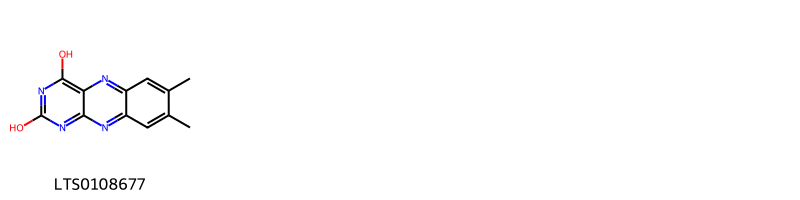{ width=100% }
    <figcaption>Hình ảnh cấu trúc hóa học của 1 hoạt chất thuộc nhóm Pteridines and derivatives gồm ['7,8-dimethylbenzo[g]pteridine-2,4-diol (LTS0108677)'].</figcaption>
</figure>
#### Nhóm Purine nucleosides
<figure markdown="span">
    { width=100% }
    <figcaption>Hình ảnh cấu trúc hóa học của 10 hoạt chất thuộc nhóm Purine nucleosides gồm ['(2r,3s,4r,5s)-2-(6-aminopurin-9-yl)-5-(hydroxymethyl)oxolane-3,4-diol (LTS0178532)', 'zeatin riboside (LTS0254495)', 'atp - adenosine triphosphate (LTS0176098)', 'adenosine (LTS0052576)', '2-(6-hydroxy-2-imino-3h-purin-9-yl)-5-(hydroxymethyl)oxolane-3,4-diol (LTS0005186)', '2-{6-[(4-hydroxy-3-methylbut-2-en-1-yl)amino]purin-9-yl}-5-(hydroxymethyl)oxolane-3,4-diol (LTS0002750)', 'adenosine (LTS0014061)', '2-({9-[3,4-dihydroxy-5-(hydroxymethyl)oxolan-2-yl]purin-6-yl}amino)butanedioic acid (LTS0031850)', '(2s,3r,4s,5s)-2-(6-hydroxy-2-imino-3h-purin-9-yl)-5-(hydroxymethyl)oxolane-3,4-diol (LTS0090448)', 'ribonucleoside (LTS0044502)'].</figcaption>
</figure>
#### Nhóm Pyrans
<figure markdown="span">
    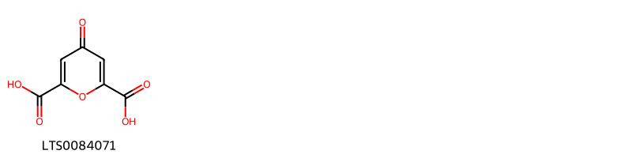{ width=100% }
    <figcaption>Hình ảnh cấu trúc hóa học của 1 hoạt chất thuộc nhóm Pyrans gồm ['chelidonic acid (LTS0084071)'].</figcaption>
</figure>
#### Nhóm Pyrrolines
<figure markdown="span">
    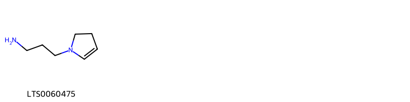{ width=100% }
    <figcaption>Hình ảnh cấu trúc hóa học của 1 hoạt chất thuộc nhóm Pyrrolines gồm ['3-(2,3-dihydropyrrol-1-yl)propan-1-amine (LTS0060475)'].</figcaption>
</figure>
#### Nhóm Quinolines and derivatives
<figure markdown="span">
    { width=100% }
    <figcaption>Hình ảnh cấu trúc hóa học của 1 hoạt chất thuộc nhóm Quinolines and derivatives gồm ['2,8-dihydroxyquinoline-4-carboxylic acid (LTS0147618)'].</figcaption>
</figure>
#### Nhóm Steroids and steroid derivatives
<figure markdown="span">
    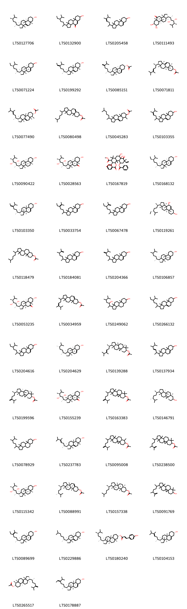{ width=100% }
    <figcaption>Hình ảnh cấu trúc hóa học của 129 hoạt chất thuộc nhóm Steroids and steroid derivatives gồm ['(1r,3ar,5as,7s,9as,9br,11ar)-1-[(2r,5r)-5,6-dimethylheptan-2-yl]-9a,11a-dimethyl-1h,2h,3h,3ah,5h,5ah,6h,7h,8h,9h,9bh,10h,11h-cyclopenta[a]phenanthren-7-ol (LTS0127706)', '1-(5-ethyl-6-methylheptan-2-yl)-7-hydroxy-9a,11a-dimethyl-1h,2h,3h,3ah,3bh,6h,7h,8h,9h,9bh,10h,11h-cyclopenta[a]phenanthren-4-one (LTS0132900)', '1-(5,6-dimethylhept-4-en-2-yl)-9a,11a-dimethyl-1h,2h,3h,3ah,3bh,4h,6h,7h,8h,9h,9bh,10h,11h-cyclopenta[a]phenanthren-7-ol (LTS0205458)', 'castasterone (LTS0111493)', 'stigmast-5-en-3-ol (LTS0071224)', 'delta7-avenasterol (LTS0199292)', '(1r,3as,3bs,7s,9ar,9bs,11ar)-9a,11a-dimethyl-1-[(2r)-6-methyl-5-methylideneheptan-2-yl]-1h,2h,3h,3ah,3bh,4h,6h,7h,8h,9h,9bh,10h,11h-cyclopenta[a]phenanthren-7-yl acetate (LTS0085151)', '(1r,3ar,5as,7s,9as,9br,11ar)-1-[(2r,4e)-5,6-dimethylhept-4-en-2-yl]-9a,11a-dimethyl-1h,2h,3h,3ah,5h,5ah,6h,7h,8h,9h,9bh,10h,11h-cyclopenta[a]phenanthren-7-yl acetate (LTS0071811)', '(1r,3ar,5as,6s,7s,9as,9br,11ar)-1-[(2r,4e)-5,6-dimethylhept-4-en-2-yl]-6,9a,11a-trimethyl-1h,2h,3h,3ah,5h,5ah,6h,7h,8h,9h,9bh,10h,11h-cyclopenta[a]phenanthren-7-yl acetate (LTS0077490)', 'cholesteryl acetate (LTS0080498)', '6,9a,11a-trimethyl-1-(6-methylheptan-2-yl)-1h,2h,3h,3ah,5h,5ah,6h,7h,8h,9h,9bh,10h,11h-cyclopenta[a]phenanthren-7-yl acetate (LTS0045283)', '1-(5,6-dimethylhept-4-en-2-yl)-9a,11a-dimethyl-1h,2h,3h,3ah,5h,5ah,6h,7h,8h,9h,9bh,10h,11h-cyclopenta[a]phenanthren-7-ol (LTS0103355)', '6-deoxoteasterone (LTS0090422)', 'teasterone (LTS0028563)', '2,3-dimethyl 4,5-bis(benzoyloxy)-7-ethenyl-8a,9-dihydroxy-1,1,4a,7-tetramethyl-8-oxo-octahydro-2h-phenanthrene-2,3-dicarboxylate (LTS0167819)', 'sitosterol (LTS0168132)', 'avenasterol (LTS0103350)', '1-(5-ethyl-6-methylhept-5-en-2-yl)-9a,11a-dimethyl-1h,2h,3h,3ah,3bh,4h,6h,7h,8h,9h,9bh,10h,11h-cyclopenta[a]phenanthren-7-ol (LTS0033754)', '1-(5-ethyl-6-methylhept-6-en-2-yl)-9a,11a-dimethyl-1h,2h,3h,3ah,3bh,4h,6h,7h,8h,9h,9bh,10h,11h-cyclopenta[a]phenanthren-7-ol (LTS0067478)', '7β-hydroxysitosterol (LTS0119261)', '9a,11a-dimethyl-1-(6-methylheptan-2-yl)-tetradecahydro-1h-cyclopenta[a]phenanthren-7-yl acetate (LTS0118479)', '1-(5,6-dimethylhept-6-en-2-yl)-9a,11a-dimethyl-1h,2h,3h,3ah,3bh,4h,6h,7h,8h,9h,9bh,10h,11h-cyclopenta[a]phenanthren-7-ol (LTS0184081)', '9a,11a-dimethyl-1-(6-methyl-5-methylideneheptan-2-yl)-1h,2h,3h,3ah,3bh,4h,6h,7h,8h,9h,9bh,10h,11h-cyclopenta[a]phenanthren-7-ol (LTS0204366)', '24-α-methylcholesterol (LTS0106857)', '(1r,3bs,5as,7s,9ar,9bs,11as)-1-[(2s,3r,4r,5s)-3,4-dihydroxy-5,6-dimethylheptan-2-yl]-7-hydroxy-9a,11a-dimethyl-tetradecahydrocyclopenta[a]phenanthren-5-one (LTS0053235)', '1-(5,6-dimethylhept-4-en-2-yl)-9a,11a-dimethyl-1h,2h,3h,3ah,3bh,4h,6h,7h,8h,9h,9bh,10h,11h-cyclopenta[a]phenanthren-7-yl acetate (LTS0034959)', '2-{7-hydroxy-9a,11a-dimethyl-tetradecahydro-1h-cyclopenta[a]phenanthren-1-yl}-5,6-dimethylheptan-3-ol (LTS0249062)', '1-(5-ethyl-6-methylheptan-2-yl)-9a,11a-dimethyl-1h,2h,3h,3ah,5h,5ah,6h,7h,8h,9h,9bh,10h,11h-cyclopenta[a]phenanthren-7-ol (LTS0266132)', 'stigmast-5-en-3-ol, (3β)- (LTS0204616)', '22,23-dihydrobrassicasterol (LTS0204629)', '(1s,3r,6s,8r,11s,12s,15r,16r)-15-[(2r,4e)-5,6-dimethylhept-4-en-2-yl]-7,7,12,16-tetramethylpentacyclo[9.7.0.0¹,³.0³,⁸.0¹²,¹⁶]octadecan-6-yl acetate (LTS0139288)', '1-(5,6-dimethylhept-3-en-2-yl)-9a,11a-dimethyl-1h,2h,3h,3ah,3bh,4h,6h,7h,8h,9h,9bh,10h,11h-cyclopenta[a]phenanthren-7-ol (LTS0137934)', '(1s,3r,6s,8r,11s,12s,15r,16r)-7,7,12,16-tetramethyl-15-[(2r)-6-methyl-5-methylideneheptan-2-yl]pentacyclo[9.7.0.0¹,³.0³,⁸.0¹²,¹⁶]octadecan-6-yl acetate (LTS0199596)', '(1r,3as,3bs,5as,7s,9ar,9bs,11ar)-1-[(2s,3r,4r,5s)-3,4-dihydroxy-5,6-dimethylheptan-2-yl]-7-hydroxy-9a,11a-dimethyl-tetradecahydrocyclopenta[a]phenanthren-5-one (LTS0155239)', '7,7,12,16-tetramethyl-15-(6-methyl-5-methylideneheptan-2-yl)pentacyclo[9.7.0.0¹,³.0³,⁸.0¹²,¹⁶]octadecan-6-yl acetate (LTS0163383)', '(1s,3r,6s,8s,11s,12s,15r,16r)-15-[(2r,5r)-5,6-dimethylheptan-2-yl]-12,16-dimethylpentacyclo[9.7.0.0¹,³.0³,⁸.0¹²,¹⁶]octadecan-6-ol (LTS0146791)', '1-(5,6-dimethylheptan-2-yl)-9a,11a-dimethyl-tetradecahydro-1h-cyclopenta[a]phenanthren-7-ol (LTS0078929)', '(1r,3ar,5as,7s,9as,9br,11ar)-1-[(2r,4e)-5,6-dimethylhept-4-en-2-yl]-9a,11a-dimethyl-1h,2h,3h,3ah,5h,5ah,6h,7h,8h,9h,9bh,10h,11h-cyclopenta[a]phenanthren-7-ol (LTS0237783)', '7,12,16-trimethyl-15-(6-methyl-5-methylideneheptan-2-yl)pentacyclo[9.7.0.0¹,³.0³,⁸.0¹²,¹⁶]octadecan-6-yl acetate (LTS0095008)', '15-(5,6-dimethylhept-6-en-2-yl)-7,7,12,16-tetramethylpentacyclo[9.7.0.0¹,³.0³,⁸.0¹²,¹⁶]octadecan-6-yl acetate (LTS0238500)', '6-deoxotyphasterol (LTS0115342)', 'campesteryl acetate (LTS0088991)', '(1r,3as,3br,5as,7s,9as,9bs,11ar)-9a,11a-dimethyl-1-[(2r)-6-methylheptan-2-yl]-tetradecahydro-1h-cyclopenta[a]phenanthren-7-yl acetate (LTS0157338)', '15-(5,6-dimethylhept-6-en-2-yl)-7,7,12,16-tetramethylpentacyclo[9.7.0.0¹,³.0³,⁸.0¹²,¹⁶]octadecan-6-ol (LTS0091769)', 'stigmasta-5,24-dien-3β-ol (LTS0089699)', 'lathosterol (LTS0229886)', '(1r,3as,3br,5as,7s,9as,9bs,11ar)-1-[(2r,5r)-5,6-dimethylheptan-2-yl]-9a,11a-dimethyl-tetradecahydro-1h-cyclopenta[a]phenanthren-7-yl (2e)-3-(4-hydroxyphenyl)prop-2-enoate (LTS0180240)', '(1r,3as,3bs,7s,9ar,9bs,11ar)-1-[(2r,4e)-5,6-dimethylhept-4-en-2-yl]-9a,11a-dimethyl-1h,2h,3h,3ah,3bh,4h,6h,7h,8h,9h,9bh,10h,11h-cyclopenta[a]phenanthren-7-ol (LTS0104153)', '(1r,3ar,5as,6s,7s,9as,11ar)-3a,6,9a,11a-tetramethyl-1-[(2r)-6-methyl-5-methylideneheptan-2-yl]-1h,2h,3h,4h,5h,5ah,6h,7h,8h,9h,10h,11h-cyclopenta[a]phenanthren-7-yl acetate (LTS0265517)', 'fucosterol (LTS0178887)', '(3ar,3br,9ar,9bs,11ar)-1-(5-ethyl-6-methylheptan-2-yl)-9a,11a-dimethyl-1h,2h,3h,3ah,3bh,4h,6h,7h,8h,9h,9bh,10h,11h-cyclopenta[a]phenanthren-7-ol (LTS0126002)', '(1r,3as,3bs,5as,7r,9ar,9bs,11ar)-1-[(2s,3r,4r,5s)-3,4-dihydroxy-5,6-dimethylheptan-2-yl]-7-hydroxy-9a,11a-dimethyl-tetradecahydrocyclopenta[a]phenanthren-5-one (LTS0173949)', 'cycloartanol (LTS0176903)', '(1r,3ar,5as,7s,9as,9br,11ar)-9a,11a-dimethyl-1-[(2r)-6-methyl-5-methylideneheptan-2-yl]-1h,2h,3h,3ah,5h,5ah,6h,7h,8h,9h,9bh,10h,11h-cyclopenta[a]phenanthren-7-yl acetate (LTS0090612)', '7,7,12,16-tetramethyl-15-(6-methyl-5-methylideneheptan-2-yl)pentacyclo[9.7.0.0¹,³.0³,⁸.0¹²,¹⁶]octadec-8-en-6-ol (LTS0259188)', 'fecosterol (LTS0185843)', '3a,6,9a,11a-tetramethyl-1-(6-methyl-5-methylideneheptan-2-yl)-1h,2h,3h,4h,5h,5ah,6h,7h,8h,9h,10h,11h-cyclopenta[a]phenanthren-7-yl acetate (LTS0190745)', '1-(5,6-dimethylhept-4-en-2-yl)-9a,11a-dimethyl-1h,2h,3h,3ah,5h,5ah,6h,7h,8h,9h,9bh,10h,11h-cyclopenta[a]phenanthren-7-yl acetate (LTS0190875)', '1-(5,6-dimethylhept-6-en-2-yl)-9a,11a-dimethyl-1h,2h,3h,3ah,3bh,4h,6h,7h,8h,9h,9bh,10h,11h-cyclopenta[a]phenanthren-7-yl acetate (LTS0261913)', '(1r,3as,3bs,7s,9ar,9bs,11ar)-1-[(2r,5s)-5-ethyl-6-methylhept-6-en-2-yl]-9a,11a-dimethyl-1h,2h,3h,3ah,3bh,4h,6h,7h,8h,9h,9bh,10h,11h-cyclopenta[a]phenanthren-7-ol (LTS0190573)', '(3r,6s,8r,11s,12s,15r,16r)-7,7,12,16-tetramethyl-15-[(2r)-6-methylhept-5-en-2-yl]pentacyclo[9.7.0.0¹,³.0³,⁸.0¹²,¹⁶]octadecan-6-ol (LTS0062833)', '2-{7-hydroxy-9a,11a-dimethyl-tetradecahydro-1h-cyclopenta[a]phenanthren-1-yl}-5,6-dimethylheptane-3,4-diol (LTS0234823)', '1-(5,6-dimethylhept-5-en-2-yl)-9a,11a-dimethyl-1h,2h,3h,3ah,3bh,4h,6h,7h,8h,9h,9bh,10h,11h-cyclopenta[a]phenanthren-7-yl acetate (LTS0102962)', '2,3-dimethyl (2r,3s,4s,4as,4bs,5r,7r,8ar,9r,10as)-4,5-bis(benzoyloxy)-7-ethenyl-8a,9-dihydroxy-1,1,4a,7-tetramethyl-8-oxo-octahydro-2h-phenanthrene-2,3-dicarboxylate (LTS0214933)', 'episterol (LTS0072150)', '1-(5-ethyl-6-methylheptan-2-yl)-9a,11a-dimethyl-1h,2h,3h,3ah,3bh,4h,5h,8h,9h,9bh,10h,11h-cyclopenta[a]phenanthren-7-one (LTS0212002)', '24-α-ethylcholesterol (LTS0232294)', 'cycloartenol (LTS0060131)', '7,7,12,16-tetramethyl-15-(6-methyl-5-methylideneheptan-2-yl)pentacyclo[9.7.0.0¹,³.0³,⁸.0¹²,¹⁶]octadecan-6-ol (LTS0084326)', '1-(5-isopropylhept-5-en-2-yl)-9a,11a-dimethyl-1h,2h,3h,3ah,3bh,4h,6h,7h,8h,9h,9bh,10h,11h-cyclopenta[a]phenanthren-7-ol (LTS0210884)', '(1s,3r,6s,8r,11s,12s,15r,16r)-7,7,12,16-tetramethyl-15-[(2r)-6-methylhept-5-en-2-yl]pentacyclo[9.7.0.0¹,³.0³,⁸.0¹²,¹⁶]octadecan-6-yl acetate (LTS0217131)', '(1s,3r,6s,7s,8s,11s,12s,15r,16r)-7,12,16-trimethyl-15-[(2r)-6-methyl-5-methylideneheptan-2-yl]pentacyclo[9.7.0.0¹,³.0³,⁸.0¹²,¹⁶]octadecan-6-yl acetate (LTS0230221)', '9a,11a-dimethyl-1-(6-methyl-5-methylideneheptan-2-yl)-1h,2h,3h,3ah,5h,5ah,6h,7h,8h,9h,9bh,10h,11h-cyclopenta[a]phenanthren-7-yl acetate (LTS0211208)', 'campestanyl ferulate (LTS0219822)', '1-(5,6-dimethylhept-3-en-2-yl)-9a,11a-dimethyl-1h,2h,3h,3ah,3bh,4h,6h,7h,8h,9h,9bh,10h,11h-cyclopenta[a]phenanthren-7-yl acetate (LTS0221626)', 'cyclolaudenol (LTS0231558)', 'coprostanol (LTS0165323)', '1-(5-ethyl-6-methylhept-3-en-2-yl)-9a,11a-dimethyl-tetradecahydro-1h-cyclopenta[a]phenanthren-7-ol (LTS0217688)', 'β-sitostenone (LTS0049492)', '(1s,3r,6s,8r,11s,12s,15r,16r)-15-[(2r,5s)-5,6-dimethylhept-6-en-2-yl]-7,7,12,16-tetramethylpentacyclo[9.7.0.0¹,³.0³,⁸.0¹²,¹⁶]octadecan-6-yl acetate (LTS0230214)', '(1s,3r,6s,8s,11s,12s,15r,16r)-12,16-dimethyl-15-(6-methyl-5-methylideneheptan-2-yl)pentacyclo[9.7.0.0¹,³.0³,⁸.0¹²,¹⁶]octadecan-6-ol (LTS0232772)', 'campestanol (LTS0233243)', '9a,11a-dimethyl-1-(6-methyl-5-methylideneheptan-2-yl)-1h,2h,3h,3ah,3bh,4h,6h,7h,8h,9h,9bh,10h,11h-cyclopenta[a]phenanthren-7-yl acetate (LTS0231831)', '(1r,3as,3bs,7s,9ar,9bs,11ar)-1-[(2r,5s)-5,6-dimethylhept-6-en-2-yl]-9a,11a-dimethyl-1h,2h,3h,3ah,3bh,4h,6h,7h,8h,9h,9bh,10h,11h-cyclopenta[a]phenanthren-7-ol (LTS0000507)', '1-(5-ethyl-6-methylheptan-2-yl)-9a,11a-dimethyl-1h,2h,3h,3ah,3bh,4h,6h,7h,8h,9h,9bh,10h,11h-cyclopenta[a]phenanthrene-4,7-diol (LTS0170874)', '(1r,3as,3bs,7s,9ar,9bs,11ar)-1-[(2s,3e,5s)-5-ethyl-6-methylhept-3-en-2-yl]-9a,11a-dimethyl-1h,2h,3h,3ah,3bh,4h,6h,7h,8h,9h,9bh,10h,11h-cyclopenta[a]phenanthren-7-ol (LTS0169213)', '(1r,3as,3bs,7s,9ar,9bs,11ar)-1-[(2r,4e)-5,6-dimethylhept-4-en-2-yl]-9a,11a-dimethyl-1h,2h,3h,3ah,3bh,4h,6h,7h,8h,9h,9bh,10h,11h-cyclopenta[a]phenanthren-7-yl acetate (LTS0168064)', 'cholesteryl acetate (LTS0004289)', 'campesterol (LTS0029429)', '1-(5,6-dimethylhept-4-en-2-yl)-6,9a,11a-trimethyl-1h,2h,3h,3ah,5h,5ah,6h,7h,8h,9h,9bh,10h,11h-cyclopenta[a]phenanthren-7-yl acetate (LTS0043893)', 'avenasterol (LTS0237196)', '9a,11a-dimethyl-1-(6-methyl-5-methylideneheptan-2-yl)-1h,2h,3h,3ah,5h,5ah,6h,7h,8h,9h,9bh,10h,11h-cyclopenta[a]phenanthren-7-ol (LTS0055082)', 'phytosterol (LTS0029311)', '(1r,3as,3bs,7s,9ar,9bs,11ar)-1-[(2r,5s)-5,6-dimethylhept-6-en-2-yl]-9a,11a-dimethyl-1h,2h,3h,3ah,3bh,4h,6h,7h,8h,9h,9bh,10h,11h-cyclopenta[a]phenanthren-7-yl acetate (LTS0250493)', 'typhasterol (LTS0030045)', '(1r,3as,3bs,7s,9ar,9bs,11ar)-1-[(2r,3e,5r)-5,6-dimethylhept-3-en-2-yl]-9a,11a-dimethyl-1h,2h,3h,3ah,3bh,4h,6h,7h,8h,9h,9bh,10h,11h-cyclopenta[a]phenanthren-7-yl acetate (LTS0173928)', 'stigmasterol (LTS0024262)', '(1r,3as,3bs,7s,9ar,9bs,11ar)-1-[(2r,5s)-5,6-dimethylheptan-2-yl]-9a,11a-dimethyl-1h,2h,3h,3ah,3bh,4h,6h,7h,8h,9h,9bh,10h,11h-cyclopenta[a]phenanthren-7-yl acetate (LTS0243478)', 'dihydrocholesterol (LTS0048168)', '(3β,5α)-stigmast-7-en-3-ol (LTS0245097)', '(1r,3as,3br,5as,7s,9as,9bs,11ar)-1-[(2r,3e,5s)-5-ethyl-6-methylhept-3-en-2-yl]-9a,11a-dimethyl-tetradecahydro-1h-cyclopenta[a]phenanthren-7-ol (LTS0245732)', '(1r,3as,3bs,7s,9bs)-1-[(2r,5r)-5,6-dimethylheptan-2-yl]-9a,11a-dimethyl-1h,2h,3h,3ah,3bh,4h,6h,7h,8h,9h,9bh,10h,11h-cyclopenta[a]phenanthren-7-ol (LTS0057877)', 'campesterol (LTS0046755)', 'cycloartenol (LTS0269561)', '(1r,3as,3bs,7s,9ar,9bs,11ar)-1-[(2r)-5,6-dimethylhept-5-en-2-yl]-9a,11a-dimethyl-1h,2h,3h,3ah,3bh,4h,6h,7h,8h,9h,9bh,10h,11h-cyclopenta[a]phenanthren-7-yl acetate (LTS0039572)', '6-deoxocathasterone (LTS0015048)', '(1r,3ar,5as,6s,7s,9as,9br,11ar)-1-[(2r,5r)-5,6-dimethylheptan-2-yl]-6,9a,11a-trimethyl-1h,2h,3h,3ah,5h,5ah,6h,7h,8h,9h,9bh,10h,11h-cyclopenta[a]phenanthren-7-yl acetate (LTS0031913)', '(1r,3as,3bs,7s,9ar,9bs,11ar)-1-[(2r,5r)-5-ethyl-6-methylheptan-2-yl]-7-hydroxy-9a,11a-dimethyl-1h,2h,3h,3ah,3bh,6h,7h,8h,9h,9bh,10h,11h-cyclopenta[a]phenanthren-4-one (LTS0030881)', '15-(5,6-dimethylhept-4-en-2-yl)-7,7,12,16-tetramethylpentacyclo[9.7.0.0¹,³.0³,⁸.0¹²,¹⁶]octadecan-6-ol (LTS0063057)', '(1r,3ar,5as,6s,7s,9as,9br,11ar)-6,9a,11a-trimethyl-1-[(2r)-6-methylheptan-2-yl]-1h,2h,3h,3ah,5h,5ah,6h,7h,8h,9h,9bh,10h,11h-cyclopenta[a]phenanthren-7-yl acetate (LTS0014587)', '1-(5,6-dimethylheptan-2-yl)-9a,11a-dimethyl-tetradecahydro-1h-cyclopenta[a]phenanthren-7-yl acetate (LTS0003789)', '24-methylenecholesterol (LTS0016921)', 'brassicasterol (LTS0014226)', '1-(3,4-dihydroxy-5,6-dimethylheptan-2-yl)-7,8-dihydroxy-9a,11a-dimethyl-tetradecahydrocyclopenta[a]phenanthren-5-one (LTS0020071)', 'epicholestrol (LTS0000908)', 'fungisterol (LTS0020786)', '1-(5,6-dimethylheptan-2-yl)-9a,11a-dimethyl-1h,2h,3h,3ah,3bh,4h,6h,7h,8h,9h,9bh,10h,11h-cyclopenta[a]phenanthren-7-yl acetate (LTS0239510)', '24-methylenecycloartanol (LTS0018584)', '1-(5,6-dimethylheptan-2-yl)-6,9a,11a-trimethyl-1h,2h,3h,3ah,5h,5ah,6h,7h,8h,9h,9bh,10h,11h-cyclopenta[a]phenanthren-7-yl acetate (LTS0233166)', '15-(5,6-dimethylhept-4-en-2-yl)-7,7,12,16-tetramethylpentacyclo[9.7.0.0¹,³.0³,⁸.0¹²,¹⁶]octadecan-6-yl acetate (LTS0235740)', 'cholesterol (LTS0102304)', '(1r,3as,3br,5as,7s,9as,9bs,11ar)-1-[(2r,5r)-5,6-dimethylheptan-2-yl]-9a,11a-dimethyl-tetradecahydro-1h-cyclopenta[a]phenanthren-7-yl acetate (LTS0257745)', '7,7,12,16-tetramethyl-15-(6-methylhept-5-en-2-yl)pentacyclo[9.7.0.0¹,³.0³,⁸.0¹²,¹⁶]octadecan-6-yl acetate (LTS0026455)', '24-ethyl coprostanol (LTS0045337)', 'stigmastanol (LTS0110500)', 'cycloeucalenol (LTS0125739)', '(1s,3r,6s,8r,11s,12s,15r,16r)-15-[(2r,4e)-5,6-dimethylhept-4-en-2-yl]-7,7,12,16-tetramethylpentacyclo[9.7.0.0¹,³.0³,⁸.0¹²,¹⁶]octadecan-6-ol (LTS0245021)', '(1r,3ar,5as,6s,7s,9as,11ar)-3a,6,9a,11a-tetramethyl-1-[(2r)-6-methyl-5-methylideneheptan-2-yl]-1h,2h,3h,4h,5h,5ah,6h,7h,8h,9h,10h,11h-cyclopenta[a]phenanthren-7-ol (LTS0243203)', '(1r,3as,3bs,4s,7s,9ar,9bs,11ar)-1-[(2r,5r)-5-ethyl-6-methylheptan-2-yl]-9a,11a-dimethyl-1h,2h,3h,3ah,3bh,4h,6h,7h,8h,9h,9bh,10h,11h-cyclopenta[a]phenanthrene-4,7-diol (LTS0256662)'].</figcaption>
</figure>
#### Nhóm Stilbenes
<figure markdown="span">
    { width=100% }
    <figcaption>Hình ảnh cấu trúc hóa học của 1 hoạt chất thuộc nhóm Stilbenes gồm ['(2e)-2-{5-[(1z)-2-carboxyeth-1-en-1-yl]-2-hydroxy-3-methoxyphenyl}-3-(4-hydroxy-3-methoxyphenyl)prop-2-enoic acid (LTS0228329)'].</figcaption>
</figure>
#### Nhóm Unsaturated hydrocarbons
<figure markdown="span">
    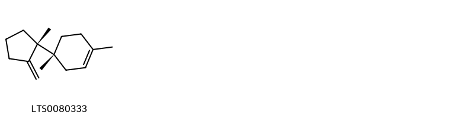{ width=100% }
    <figcaption>Hình ảnh cấu trúc hóa học của 1 hoạt chất thuộc nhóm Unsaturated hydrocarbons gồm ['bazzanene (LTS0080333)'].</figcaption>
</figure>

---

### Dược dân tộc học

Danh sách các quốc gia có sử dụng *Zea mays* trong điều trị các bệnh. 

| Country            | Disease                                                              | Bệnh                                                                                                                                                                                                |
|:-------------------|:---------------------------------------------------------------------|:----------------------------------------------------------------------------------------------------------------------------------------------------------------------------------------------------|
| China              | Diuretic, Diuretic, Stomachic                                        | MYMEMORY WARNING: YOU USED ALL AVAILABLE FREE TRANSLATIONS FOR TODAY. NEXT AVAILABLE IN  01 HOURS 08 MINUTES 16 SECONDS VISIT HTTPS://MYMEMORY.TRANSLATED.NET/DOC/USAGELIMITS.PHP TO TRANSLATE MORE |
| Dominican Republic | Diuretic                                                             | MYMEMORY WARNING: YOU USED ALL AVAILABLE FREE TRANSLATIONS FOR TODAY. NEXT AVAILABLE IN  01 HOURS 08 MINUTES 14 SECONDS VISIT HTTPS://MYMEMORY.TRANSLATED.NET/DOC/USAGELIMITS.PHP TO TRANSLATE MORE |
| Elsewhere          | Analgesic, Antiseptic, Astringent, Diuretic, Diuretic                | MYMEMORY WARNING: YOU USED ALL AVAILABLE FREE TRANSLATIONS FOR TODAY. NEXT AVAILABLE IN  01 HOURS 08 MINUTES 12 SECONDS VISIT HTTPS://MYMEMORY.TRANSLATED.NET/DOC/USAGELIMITS.PHP TO TRANSLATE MORE |
| Haiti              | Cardiac, Intoxicant, Intoxicant, Soap, Alexiteric, Cardiac, Diuretic | MYMEMORY WARNING: YOU USED ALL AVAILABLE FREE TRANSLATIONS FOR TODAY. NEXT AVAILABLE IN  01 HOURS 08 MINUTES 09 SECONDS VISIT HTTPS://MYMEMORY.TRANSLATED.NET/DOC/USAGELIMITS.PHP TO TRANSLATE MORE |
| Iraq               | Litholytic                                                           | MYMEMORY WARNING: YOU USED ALL AVAILABLE FREE TRANSLATIONS FOR TODAY. NEXT AVAILABLE IN  01 HOURS 08 MINUTES 07 SECONDS VISIT HTTPS://MYMEMORY.TRANSLATED.NET/DOC/USAGELIMITS.PHP TO TRANSLATE MORE |
| Java               | Diuretic                                                             | MYMEMORY WARNING: YOU USED ALL AVAILABLE FREE TRANSLATIONS FOR TODAY. NEXT AVAILABLE IN  01 HOURS 08 MINUTES 05 SECONDS VISIT HTTPS://MYMEMORY.TRANSLATED.NET/DOC/USAGELIMITS.PHP TO TRANSLATE MORE |
| Trinidad           | Analgesic, Antiseptic, Diuretic                                      | MYMEMORY WARNING: YOU USED ALL AVAILABLE FREE TRANSLATIONS FOR TODAY. NEXT AVAILABLE IN  01 HOURS 08 MINUTES 02 SECONDS VISIT HTTPS://MYMEMORY.TRANSLATED.NET/DOC/USAGELIMITS.PHP TO TRANSLATE MORE |
| Turkey             | Demulcent, Litholytic, Stimulant, Stomachic, Diuretic                | MYMEMORY WARNING: YOU USED ALL AVAILABLE FREE TRANSLATIONS FOR TODAY. NEXT AVAILABLE IN  01 HOURS 08 MINUTES 00 SECONDS VISIT HTTPS://MYMEMORY.TRANSLATED.NET/DOC/USAGELIMITS.PHP TO TRANSLATE MORE |
| US                 | Soap                                                                 | MYMEMORY WARNING: YOU USED ALL AVAILABLE FREE TRANSLATIONS FOR TODAY. NEXT AVAILABLE IN  01 HOURS 07 MINUTES 57 SECONDS VISIT HTTPS://MYMEMORY.TRANSLATED.NET/DOC/USAGELIMITS.PHP TO TRANSLATE MORE |
| ain                | Diuretic                                                             | MYMEMORY WARNING: YOU USED ALL AVAILABLE FREE TRANSLATIONS FOR TODAY. NEXT AVAILABLE IN  01 HOURS 07 MINUTES 55 SECONDS VISIT HTTPS://MYMEMORY.TRANSLATED.NET/DOC/USAGELIMITS.PHP TO TRANSLATE MORE |

---

# Chi Hilaria

??? note "Danh sách các dược liệu thuộc chi"
    
	 - *Hilaria rigida*

---
## Hilaria rigida
### Thông tin về thực vật

!!! info "Phân loại thực vật của *Hilaria rigida* từ GIBF:"
    - **Kingdom:** Plantae
    - **Phylum:** Tracheophyta
    - **Order:** Poales
    - **Family:** Poaceae
    - **Genus:** Hilaria
    - **Species:** *Hilaria rigida*

 

| Label (VI)   | Label (EN)   | Scientific Name   | Descriptions (VI)   | Descriptions (EN)   | Also Known As (VI)   | Also Known As (EN)   |
|:-------------|:-------------|:------------------|:--------------------|:--------------------|:---------------------|:---------------------|
| N/A          | N/A          | Hilaria rigida    | loài thực vật       | species of plant    | ['']                 | ['']                 |

#### Phân bố trên thế giới

**Từ CSDL GIBF** nan, United States of America, Mexico

#### Phân bố tại Việt Nam

**Từ CSDL GIBF**: Không có ghi nhận ở Việt Nam

---
### Thành phần hóa học
        
- Theo cơ sở dữ liệu lotus: Từ loài *Hilaria rigida* đã phân lập và xác định được Chưa có hoạt chất nào được phân lập. hoạt chất thuộc về các nhóm Không có hoạt chất nào được phân lập. 

Không có hình ảnh nào được tạo ra

---

### Dược dân tộc học

Danh sách các quốc gia có sử dụng *Hilaria rigida* trong điều trị các bệnh. 

| Country   | Disease   | Bệnh                                                                                                                                                                                                |
|:----------|:----------|:----------------------------------------------------------------------------------------------------------------------------------------------------------------------------------------------------|
| US        | Poison    | MYMEMORY WARNING: YOU USED ALL AVAILABLE FREE TRANSLATIONS FOR TODAY. NEXT AVAILABLE IN  01 HOURS 06 MINUTES 24 SECONDS VISIT HTTPS://MYMEMORY.TRANSLATED.NET/DOC/USAGELIMITS.PHP TO TRANSLATE MORE |

---

# Chi Arundinaria

??? note "Danh sách các dược liệu thuộc chi"
    
	 - *Arundinaria japonica*

# Chi Stipa

??? note "Danh sách các dược liệu thuộc chi"
    
	 - *Stipa robusta*
	 - *Stipa sibirica*

# Chi Dactyloctenium

??? note "Danh sách các dược liệu thuộc chi"
    
	 - *Dactyloctenium aegyptium*

# Chi Digitaria

??? note "Danh sách các dược liệu thuộc chi"
    
	 - *Digitaria horizontalis*

# Chi Gynerium

??? note "Danh sách các dược liệu thuộc chi"
    
	 - *Gynerium sagittatum*

# Chi Heteropogon

??? note "Danh sách các dược liệu thuộc chi"
    
	 - *Heteropogon contortus*

# Chi Hierochloe

??? note "Danh sách các dược liệu thuộc chi"
    
	 - *Hierochloe borealis*

# Chi Panicum

??? note "Danh sách các dược liệu thuộc chi"
    
	 - *Panicum antidotale*
	 - *Panicum incomptum*
	 - *Panicum maximum*
	 - *Panicum miliaceum*
	 - *Panicum psilopodium*
	 - *Panicum sarmentosum*
	 - *Panicum tricanthum*
	 - *Panicum trichanthum*

# Chi Anthoxanthum

??? note "Danh sách các dược liệu thuộc chi"
    
	 - *Anthoxanthum odoratum*

# Chi Pogonatherum

??? note "Danh sách các dược liệu thuộc chi"
    
	 - *Pogonatherum crinitum*

# Chi Phyllostachys

??? note "Danh sách các dược liệu thuộc chi"
    
	 - *Phyllostachys nigra*

# Chi Arundo

??? note "Danh sách các dược liệu thuộc chi"
    
	 - *Arundo donax*

# Chi Trichachne

??? note "Danh sách các dược liệu thuộc chi"
    
	 - *Trichachne insularis*

# Chi Secale

??? note "Danh sách các dược liệu thuộc chi"
    
	 - *Secale cereale*

# Chi Thysanolaena

??? note "Danh sách các dược liệu thuộc chi"
    
	 - *Thysanolaena maxima*

# Chi Capriola

??? note "Danh sách các dược liệu thuộc chi"
    
	 - *Capriola dactylon*

# Chi Triticum

??? note "Danh sách các dược liệu thuộc chi"
    
	 - *Triticum aestivum*

# Chi Eleusine

??? note "Danh sách các dược liệu thuộc chi"
    
	 - *Eleusine indica*

# Chi Sorghum

??? note "Danh sách các dược liệu thuộc chi"
    
	 - *Sorghum bicolor*
	 - *Sorghum dochna*
	 - *Sorghum halepense*
	 - *Sorghum sudanense*

# Chi Hordeum

??? note "Danh sách các dược liệu thuộc chi"
    
	 - *Hordeum distichon*
	 - *Hordeum vulgare*

# Chi Lophatherum

??? note "Danh sách các dược liệu thuộc chi"
    
	 - *Lophatherum elatum*
	 - *Lophatherum gracile*

# Chi Cenchrus

??? note "Danh sách các dược liệu thuộc chi"
    
	 - *Cenchrus brownei*
	 - *Cenchrus myosuroides*
	 - *Cenchrus palmeri*
	 - *Cenchrus pauciflorus*

# Chi Cymbopogon

??? note "Danh sách các dược liệu thuộc chi"
    
	 - *Cymbopogon citratus*
	 - *Cymbopogon jwarancusa*
	 - *Cymbopogon martini*
	 - *Cymbopogon nardus*
	 - *Cymbopogon schoenanthus*

# Chi Erianthus

??? note "Danh sách các dược liệu thuộc chi"
    
	 - *Erianthus officinarum*
	 - *Erianthus ontaneum*

# Chi Dinochloa

??? note "Danh sách các dược liệu thuộc chi"
    
	 - *Dinochloa andamanica*

# Chi Cynodon

??? note "Danh sách các dược liệu thuộc chi"
    
	 - *Cynodon dactylon*
	 - *Cynodon dasctylon*

# Chi Desmostachya

??? note "Danh sách các dược liệu thuộc chi"
    
	 - *Desmostachya bipinnata*

# Chi Bromus

??? note "Danh sách các dược liệu thuộc chi"
    
	 - *Bromus catharticus*
	 - *Bromus mollis*

