!!! abstract "Tóm tắt"

    Họ Polygalaceae gồm khoảng 4 chi và 24 loài được một số cộng đồng tại các quốc gia như Turkey, Africa, Ghana, Guinea, Senegal, Guatemala, German, Sumatra, Costa Rica, Lesotho, Elsewhere, Philippines, ain, Mexico, Japan*, Asia, China, Ethiopia sử dụng trong một số trường hợp Sát trùng, tán huyết, nôn, đờm, lợi tiểu, Dentifrice, xà phòng, tẩy tế bào chết, thuốc bổ, lợi tiểu, đờm, đờm, thần kinh, gây ngủ, thuốc bổ, dạ dày, chất làm ngọt, xà phòng, đờm, Carminative, lợi tiểu, emetic, đờm, gây ngủ, kích thích, dạ dày, Vermifuge, emetic, chất độc, thuốc bổ, đờm, cardiotonic, đờm, thần kinh, đờm, thuốc bổ, thuốc bổ, thuốc bổ, thuốc bổ, gây ngủ.

!!! info "DrDuke"

    James A. Duke sinh năm 1929-2017 là một nhà thực vật học người Mỹ. Đây là một trong những tác giả hàng đầu trong lĩnh vực dược dân tộc học với cuốn *CRC Handbook of Medicinal Herbs* và chính là người xây dựng lên cơ sở dữ liệu về hợp chất tự nhiên và dược dân tộc học tại Bộ nông nghiệp Hoa Kỳ. Các thông tin được đăng tải tại website [Dr. Duke's Phytochemical and Ethnobotanical Databases](https://phytochem.nal.usda.gov/). 
    Trong suốt thập niên 1970, ông lãnh đạo the Plant Taxonomy Laboratory, Plant Genetics and Germplasm Institute of the Agricultural Research Service, U.S. Department of Agriculture.
    Trong tài liệu này, các thông tin về dược dân tộc của các dược liệu được trích dẫn từ tài liệu của James A. Ducke với sự trợ giúp của phần mềm dịch thuật từ tiếng Anh sang tiếng Việt.
   

# Chi Carpolobia

??? note "Danh sách các dược liệu thuộc chi"
    
	 - *Carpolobia lutea*

---
## Carpolobia lutea
### Thông tin về thực vật

!!! info "Phân loại thực vật của *Carpolobia lutea* từ GIBF:"
    - **Kingdom:** Plantae
    - **Phylum:** Tracheophyta
    - **Order:** Fabales
    - **Family:** Polygalaceae
    - **Genus:** Carpolobia
    - **Species:** *Carpolobia lutea*

 

| Label (VI)   | Label (EN)   | Scientific Name   | Descriptions (VI)   | Descriptions (EN)   | Also Known As (VI)   | Also Known As (EN)   |
|:-------------|:-------------|:------------------|:--------------------|:--------------------|:---------------------|:---------------------|
| N/A          | N/A          | Carpolobia lutea  | loài thực vật       | species of plant    | ['']                 | ['']                 |

#### Phân bố trên thế giới

**Từ CSDL GIBF** nan, Nigeria, Côte d’Ivoire, Benin, Guinea, Liberia, Sierra Leone, Cameroon, Togo

#### Phân bố tại Việt Nam

**Từ CSDL GIBF**: Không có ghi nhận ở Việt Nam

---
### Thành phần hóa học
        
- Theo cơ sở dữ liệu lotus: Từ loài *Carpolobia lutea* đã phân lập và xác định được 2 hoạt chất thuộc về các nhóm Prenol lipids. 

|    | chemicalTaxonomyClassyfireClass   |   smiles_count |
|---:|:----------------------------------|---------------:|
|  0 | Prenol lipids                     |              2 |

#### Nhóm Prenol lipids
<figure markdown="span">
    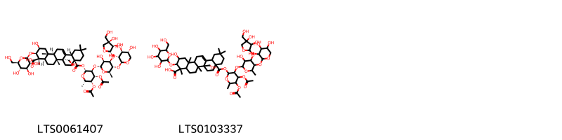{ width=100% }
    <figcaption>Hình ảnh cấu trúc hóa học của 2 hoạt chất thuộc nhóm Prenol lipids gồm ['(2s,3r,4s,4ar,6ar,6br,8as,12as,14ar,14br)-8a-({[(2r,3s,4r,5r,6s)-4,5-bis(acetyloxy)-3-{[(2r,3s,4r,5r,6r)-4-{[(2s,3r,4r)-3,4-dihydroxy-4-(hydroxymethyl)oxolan-2-yl]oxy}-3-hydroxy-6-methyl-5-{[(2s,3r,4s,5r)-3,4,5-trihydroxyoxan-2-yl]oxy}oxan-2-yl]oxy}-6-methyloxan-2-yl]oxy}carbonyl)-2-hydroxy-6b-(hydroxymethyl)-4,6a,11,11,14b-pentamethyl-3-{[(2r,3r,4s,5s,6r)-3,4,5-trihydroxy-6-(hydroxymethyl)oxan-2-yl]oxy}-1,2,3,4a,5,6,7,8,9,10,12,12a,14,14a-tetradecahydropicene-4-carboxylic acid (LTS0061407)', '8a-({[4,5-bis(acetyloxy)-3-[(4-{[3,4-dihydroxy-4-(hydroxymethyl)oxolan-2-yl]oxy}-3-hydroxy-6-methyl-5-[(3,4,5-trihydroxyoxan-2-yl)oxy]oxan-2-yl)oxy]-6-methyloxan-2-yl]oxy}carbonyl)-2-hydroxy-6b-(hydroxymethyl)-4,6a,11,11,14b-pentamethyl-3-{[3,4,5-trihydroxy-6-(hydroxymethyl)oxan-2-yl]oxy}-1,2,3,4a,5,6,7,8,9,10,12,12a,14,14a-tetradecahydropicene-4-carboxylic acid (LTS0103337)'].</figcaption>
</figure>

---

### Dược dân tộc học

Danh sách các quốc gia có sử dụng *Carpolobia lutea* trong điều trị các bệnh. 

| Country   | Disease   | Bệnh          |
|:----------|:----------|:--------------|
| Elsewhere | Sweetener | tiền trà nước |

---

# Chi Securidaca

??? note "Danh sách các dược liệu thuộc chi"
    
	 - *Securidaca longipedunculata*
	 - *Securidaca philippensis*

---
## Securidaca longipedunculata
### Thông tin về thực vật

!!! info "Phân loại thực vật của *Securidaca longipedunculata* từ GIBF:"
    - **Kingdom:** Plantae
    - **Phylum:** Tracheophyta
    - **Order:** Fabales
    - **Family:** Polygalaceae
    - **Genus:** Securidaca
    - **Species:** *Securidaca longipedunculata*

 

| Label (VI)   | Label (EN)   | Scientific Name   | Descriptions (VI)   | Descriptions (EN)   | Also Known As (VI)   | Also Known As (EN)   |
|:-------------|:-------------|:------------------|:--------------------|:--------------------|:---------------------|:---------------------|
| N/A          | N/A          | Carpolobia lutea  | loài thực vật       | species of plant    | ['']                 | ['']                 |

#### Phân bố trên thế giới

**Từ CSDL GIBF** Ghana, Angola, Mozambique, Benin, Tanzania, United Republic of, Togo, Malawi, Zambia, Mali, Senegal, Nigeria, Namibia, Chad, Congo, Democratic Republic of the, Guinea, Uganda, South Africa, Niger, Côte d’Ivoire, Burundi, Burkina Faso, Kenya, Cameroon, Ethiopia

#### Phân bố tại Việt Nam

**Từ CSDL GIBF**: Không có ghi nhận ở Việt Nam

---
### Thành phần hóa học
        
- Theo cơ sở dữ liệu lotus: Từ loài *Securidaca longipedunculata* đã phân lập và xác định được 5 hoạt chất thuộc về các nhóm Quinolines and derivatives, Flavonoids, Steroids and steroid derivatives. 

|    | chemicalTaxonomyClassyfireClass   |   smiles_count |
|---:|:----------------------------------|---------------:|
|  0 | Flavonoids                        |              2 |
|  1 | Quinolines and derivatives        |              1 |
|  2 | Steroids and steroid derivatives  |              2 |

#### Nhóm Flavonoids
<figure markdown="span">
    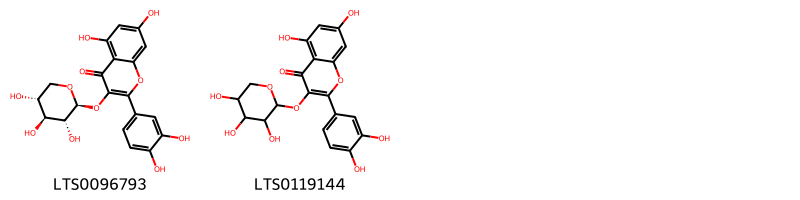{ width=100% }
    <figcaption>Hình ảnh cấu trúc hóa học của 2 hoạt chất thuộc nhóm Flavonoids gồm ['2-(3,4-dihydroxyphenyl)-5,7-dihydroxy-3-{[(2s,3r,4s,5r)-3,4,5-trihydroxyoxan-2-yl]oxy}chromen-4-one (LTS0096793)', 'guaijaverin (LTS0119144)'].</figcaption>
</figure>
#### Nhóm Quinolines and derivatives
<figure markdown="span">
    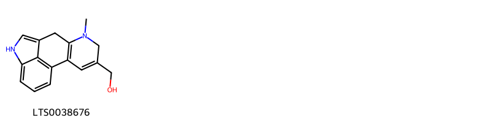{ width=100% }
    <figcaption>Hình ảnh cấu trúc hóa học của 1 hoạt chất thuộc nhóm Quinolines and derivatives gồm ['{6-methyl-6,11-diazatetracyclo[7.6.1.0²,⁷.0¹²,¹⁶]hexadeca-1(16),2(7),3,9,12,14-hexaen-4-yl}methanol (LTS0038676)'].</figcaption>
</figure>
#### Nhóm Steroids and steroid derivatives
<figure markdown="span">
    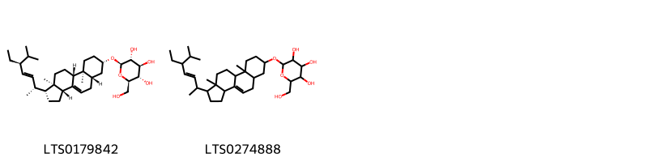{ width=100% }
    <figcaption>Hình ảnh cấu trúc hóa học của 2 hoạt chất thuộc nhóm Steroids and steroid derivatives gồm ['(2r,3r,4s,5s,6r)-2-{[(1r,3ar,5as,7s,9as,9br,11ar)-1-[(2r,3e,5s)-5-ethyl-6-methylhept-3-en-2-yl]-9a,11a-dimethyl-1h,2h,3h,3ah,5h,5ah,6h,7h,8h,9h,9bh,10h,11h-cyclopenta[a]phenanthren-7-yl]oxy}-6-(hydroxymethyl)oxane-3,4,5-triol (LTS0179842)', '2-{[1-(5-ethyl-6-methylhept-3-en-2-yl)-9a,11a-dimethyl-1h,2h,3h,3ah,5h,5ah,6h,7h,8h,9h,9bh,10h,11h-cyclopenta[a]phenanthren-7-yl]oxy}-6-(hydroxymethyl)oxane-3,4,5-triol (LTS0274888)'].</figcaption>
</figure>

---

### Dược dân tộc học

Danh sách các quốc gia có sử dụng *Securidaca longipedunculata* trong điều trị các bệnh. 

| Country   | Disease   | Bệnh           |
|:----------|:----------|:---------------|
| Africa    | Stomachic | Sững sờ        |
| Ethiopia  | Purgative | Thuốc xổ       |
| Ghana     | Purgative | Thuốc xổ       |
| Guinea    | Vermifuge | Thuốc diệt sán |
| Senegal   | Vermifuge | Thuốc diệt sán |

---

---
## Securidaca philippensis
### Thông tin về thực vật

!!! info "Phân loại thực vật của *Securidaca philippinensis* từ GIBF:"
    - **Kingdom:** Plantae
    - **Phylum:** Tracheophyta
    - **Order:** Fabales
    - **Family:** Polygalaceae
    - **Genus:** Securidaca
    - **Species:** *Securidaca philippinensis*

 

| Label (VI)   | Label (EN)   | Scientific Name   | Descriptions (VI)   | Descriptions (EN)   | Also Known As (VI)   | Also Known As (EN)   |
|:-------------|:-------------|:------------------|:--------------------|:--------------------|:---------------------|:---------------------|
| N/A          | N/A          | Carpolobia lutea  | loài thực vật       | species of plant    | ['']                 | ['']                 |

#### Phân bố trên thế giới

**Từ CSDL GIBF** nan, Papua New Guinea, unknown or invalid, Indonesia, Philippines, Singapore, Malaysia

#### Phân bố tại Việt Nam

**Từ CSDL GIBF**: Không có ghi nhận ở Việt Nam

---
### Thành phần hóa học
        
- Theo cơ sở dữ liệu lotus: Từ loài *Securidaca philippinensis* đã phân lập và xác định được Chưa có hoạt chất nào được phân lập. hoạt chất thuộc về các nhóm Không có hoạt chất nào được phân lập. 

Không có hình ảnh nào được tạo ra

---

### Dược dân tộc học

Danh sách các quốc gia có sử dụng *Securidaca philippinensis* trong điều trị các bệnh. 

| Country     | Disease   | Bệnh     |
|:------------|:----------|:---------|
| Philippines | Soap      | Xà phòng |

---

# Chi Xanthophyllum

??? note "Danh sách các dược liệu thuộc chi"
    
	 - *Xanthophyllum lanceolatum*

---
## Xanthophyllum lanceolatum
### Thông tin về thực vật

!!! info "Phân loại thực vật của *Xanthophyllum lanceolatum* từ GIBF:"
    - **Kingdom:** Plantae
    - **Phylum:** Tracheophyta
    - **Order:** Fabales
    - **Family:** Polygalaceae
    - **Genus:** Xanthophyllum
    - **Species:** *Xanthophyllum lanceolatum*

 

| Label (VI)   | Label (EN)   | Scientific Name   | Descriptions (VI)   | Descriptions (EN)   | Also Known As (VI)   | Also Known As (EN)   |
|:-------------|:-------------|:------------------|:--------------------|:--------------------|:---------------------|:---------------------|
| N/A          | N/A          | Carpolobia lutea  | loài thực vật       | species of plant    | ['']                 | ['']                 |

#### Phân bố trên thế giới

**Từ CSDL GIBF** nan, Papua New Guinea, unknown or invalid, Indonesia, Philippines, Singapore, Malaysia

#### Phân bố tại Việt Nam

**Từ CSDL GIBF**: Không có ghi nhận ở Việt Nam

---
### Thành phần hóa học
        
- Theo cơ sở dữ liệu lotus: Từ loài *Xanthophyllum lanceolatum* đã phân lập và xác định được Chưa có hoạt chất nào được phân lập. hoạt chất thuộc về các nhóm Không có hoạt chất nào được phân lập. 

Không có hình ảnh nào được tạo ra

---

### Dược dân tộc học

Danh sách các quốc gia có sử dụng *Xanthophyllum lanceolatum* trong điều trị các bệnh. 

| Country   | Disease   | Bệnh     |
|:----------|:----------|:---------|
| Sumatra   | Soap      | Xà phòng |

---

# Chi Polygala

??? note "Danh sách các dược liệu thuộc chi"
    
	 - *Polygala abyssinica*
	 - *Polygala amara*
	 - *Polygala amatymbica*
	 - *Polygala arillata*
	 - *Polygala bakeriana*
	 - *Polygala chamaebuxus*
	 - *Polygala chinensis*
	 - *Polygala costaricensis*
	 - *Polygala crotalarioides*
	 - *Polygala floribunda*
	 - *Polygala glomerata*
	 - *Polygala japonica*
	 - *Polygala reinii*
	 - *Polygala rupestris*
	 - *Polygala scoparia*
	 - *Polygala senega*
	 - *Polygala siberica*
	 - *Polygala sibirica*
	 - *Polygala tenuifolia*
	 - *Polygala vulgaris*

---
## Polygala abyssinica
### Thông tin về thực vật

!!! info "Phân loại thực vật của *Polygala abyssinica* từ GIBF:"
    - **Kingdom:** Plantae
    - **Phylum:** Tracheophyta
    - **Order:** Fabales
    - **Family:** Polygalaceae
    - **Genus:** Polygala
    - **Species:** *Polygala abyssinica*

 

| Label (VI)   | Label (EN)   | Scientific Name     | Descriptions (VI)   | Descriptions (EN)   | Also Known As (VI)   | Also Known As (EN)   |
|:-------------|:-------------|:--------------------|:--------------------|:--------------------|:---------------------|:---------------------|
| N/A          | N/A          | Polygala abyssinica | loài thực vật       | species of plant    | ['']                 | ['']                 |

#### Phân bố trên thế giới

**Từ CSDL GIBF** nan, Papua New Guinea, unknown or invalid, Indonesia, Philippines, Singapore, Malaysia

#### Phân bố tại Việt Nam

**Từ CSDL GIBF**: Không có ghi nhận ở Việt Nam

---
### Thành phần hóa học
        
- Theo cơ sở dữ liệu lotus: Từ loài *Polygala abyssinica* đã phân lập và xác định được Chưa có hoạt chất nào được phân lập. hoạt chất thuộc về các nhóm Không có hoạt chất nào được phân lập. 

Không có hình ảnh nào được tạo ra

---

### Dược dân tộc học

Danh sách các quốc gia có sử dụng *Polygala abyssinica* trong điều trị các bệnh. 

| Country   | Disease   | Bệnh    |
|:----------|:----------|:--------|
| Elsewhere | Hemolytic | Tan máu |

---

---
## Polygala amara
### Thông tin về thực vật

!!! info "Phân loại thực vật của *Polygala amara* từ GIBF:"
    - **Kingdom:** Plantae
    - **Phylum:** Tracheophyta
    - **Order:** Fabales
    - **Family:** Polygalaceae
    - **Genus:** Polygala
    - **Species:** *Polygala amara*

 

| Label (VI)   | Label (EN)   | Scientific Name   | Descriptions (VI)   | Descriptions (EN)   | Also Known As (VI)   | Also Known As (EN)   |
|:-------------|:-------------|:------------------|:--------------------|:--------------------|:---------------------|:---------------------|
| N/A          | N/A          | Polygala amara    | loài thực vật       | species of plant    | ['']                 | ['Polygala amara']   |

#### Phân bố trên thế giới

**Từ CSDL GIBF** Ukraine, nan, Italy, Germany, Slovakia, Estonia, Poland, Hungary, Switzerland, Austria, France, Slovenia

#### Phân bố tại Việt Nam

**Từ CSDL GIBF**: Không có ghi nhận ở Việt Nam

---
### Thành phần hóa học
        
- Theo cơ sở dữ liệu lotus: Từ loài *Polygala amara* đã phân lập và xác định được Chưa có hoạt chất nào được phân lập. hoạt chất thuộc về các nhóm Không có hoạt chất nào được phân lập. 

Không có hình ảnh nào được tạo ra

---

### Dược dân tộc học

Danh sách các quốc gia có sử dụng *Polygala amara* trong điều trị các bệnh. 

| Country   | Disease                                                     | Bệnh                                                                  |
|:----------|:------------------------------------------------------------|:----------------------------------------------------------------------|
| Turkey    | Diuretic, Expectorant, Nervine, Sudorific, Tonic, Stomachic | Thuốc lợi tiểu, thuốc long đờm, thần kinh, gây ngạt, thuốc bổ, dạ dày |

---

---
## Polygala amatymbica
### Thông tin về thực vật

!!! info "Phân loại thực vật của *Polygala amatymbica* từ GIBF:"
    - **Kingdom:** Plantae
    - **Phylum:** Tracheophyta
    - **Order:** Fabales
    - **Family:** Polygalaceae
    - **Genus:** Polygala
    - **Species:** *Polygala amatymbica*

 

| Label (VI)   | Label (EN)   | Scientific Name     | Descriptions (VI)   | Descriptions (EN)   | Also Known As (VI)   | Also Known As (EN)   |
|:-------------|:-------------|:--------------------|:--------------------|:--------------------|:---------------------|:---------------------|
| N/A          | N/A          | Polygala amatymbica | loài thực vật       | species of plant    | ['']                 | ['']                 |

#### Phân bố trên thế giới

**Từ CSDL GIBF** nan, South Africa, Brazil, Bolivia (Plurinational State of), Lesotho, unknown or invalid, Peru, Eswatini

#### Phân bố tại Việt Nam

**Từ CSDL GIBF**: Không có ghi nhận ở Việt Nam

---
### Thành phần hóa học
        
- Theo cơ sở dữ liệu lotus: Từ loài *Polygala amatymbica* đã phân lập và xác định được Chưa có hoạt chất nào được phân lập. hoạt chất thuộc về các nhóm Không có hoạt chất nào được phân lập. 

Không có hình ảnh nào được tạo ra

---

### Dược dân tộc học

Danh sách các quốc gia có sử dụng *Polygala amatymbica* trong điều trị các bệnh. 

| Country   | Disease   | Bệnh            |
|:----------|:----------|:----------------|
| Lesotho   | Stimulant | Chất kích thích |

---

---
## Polygala arillata
### Thông tin về thực vật

!!! info "Phân loại thực vật của *Polygala arillata* từ GIBF:"
    - **Kingdom:** Plantae
    - **Phylum:** Tracheophyta
    - **Order:** Fabales
    - **Family:** Polygalaceae
    - **Genus:** Polygala
    - **Species:** *Polygala arillata*

 

| Label (VI)   | Label (EN)   | Scientific Name   | Descriptions (VI)   | Descriptions (EN)   | Also Known As (VI)   | Also Known As (EN)   |
|:-------------|:-------------|:------------------|:--------------------|:--------------------|:---------------------|:---------------------|
| N/A          | N/A          | Polygala arillata | loài thực vật       | species of plant    | ['']                 | ['']                 |

#### Phân bố trên thế giới

**Từ CSDL GIBF** Sri Lanka, Thailand, Myanmar, Bhutan, India, Viet Nam, China, Nepal

#### Phân bố tại Việt Nam

**Từ CSDL GIBF**: Kon Tum, Lai Chau, Ninh Bình, Lam Dong, Lâm Đồng

---
### Thành phần hóa học
        
- Theo cơ sở dữ liệu lotus: Từ loài *Polygala arillata* đã phân lập và xác định được 24 hoạt chất thuộc về các nhóm Cinnamic acids and derivatives, Organooxygen compounds, Macrolides and analogues, Saccharolipids, Lignan glycosides. 

|    | chemicalTaxonomyClassyfireClass   |   smiles_count |
|---:|:----------------------------------|---------------:|
|  0 | Cinnamic acids and derivatives    |              8 |
|  1 | Lignan glycosides                 |              2 |
|  2 | Macrolides and analogues          |              1 |
|  3 | Organooxygen compounds            |             12 |
|  4 | Saccharolipids                    |              1 |

#### Nhóm Cinnamic acids and derivatives
<figure markdown="span">
    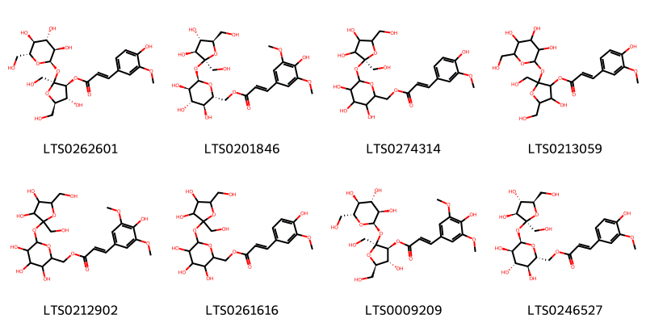{ width=100% }
    <figcaption>Hình ảnh cấu trúc hóa học của 8 hoạt chất thuộc nhóm Cinnamic acids and derivatives gồm ['(2s,3s,4r,5r)-4-hydroxy-2,5-bis(hydroxymethyl)-2-{[(2r,3r,4s,5s,6r)-3,4,5-trihydroxy-6-(hydroxymethyl)oxan-2-yl]oxy}oxolan-3-yl (2e)-3-(4-hydroxy-3-methoxyphenyl)prop-2-enoate (LTS0262601)', '[(2r,3s,4s,5r,6r)-6-{[(2s,3s,4s,5r)-3,4-dihydroxy-2,5-bis(hydroxymethyl)oxolan-2-yl]oxy}-3,4,5-trihydroxyoxan-2-yl]methyl (2e)-3-(4-hydroxy-3,5-dimethoxyphenyl)prop-2-enoate (LTS0201846)', '(6-{[(2s)-3,4-dihydroxy-2,5-bis(hydroxymethyl)oxolan-2-yl]oxy}-3,4,5-trihydroxyoxan-2-yl)methyl 3-(4-hydroxy-3-methoxyphenyl)prop-2-enoate (LTS0274314)', '4-hydroxy-2,5-bis(hydroxymethyl)-2-{[3,4,5-trihydroxy-6-(hydroxymethyl)oxan-2-yl]oxy}oxolan-3-yl 3-(4-hydroxy-3-methoxyphenyl)prop-2-enoate (LTS0213059)', '(6-{[3,4-dihydroxy-2,5-bis(hydroxymethyl)oxolan-2-yl]oxy}-3,4,5-trihydroxyoxan-2-yl)methyl 3-(4-hydroxy-3,5-dimethoxyphenyl)prop-2-enoate (LTS0212902)', '(6-{[3,4-dihydroxy-2,5-bis(hydroxymethyl)oxolan-2-yl]oxy}-3,4,5-trihydroxyoxan-2-yl)methyl 3-(4-hydroxy-3-methoxyphenyl)prop-2-enoate (LTS0261616)', '(2s,3s,4r,5r)-4-hydroxy-2,5-bis(hydroxymethyl)-2-{[(2r,3r,4s,5s,6r)-3,4,5-trihydroxy-6-(hydroxymethyl)oxan-2-yl]oxy}oxolan-3-yl (2e)-3-(4-hydroxy-3,5-dimethoxyphenyl)prop-2-enoate (LTS0009209)', '[(2r,3s,4s,5r,6r)-6-{[(2s,3s,4s,5r)-3,4-dihydroxy-2,5-bis(hydroxymethyl)oxolan-2-yl]oxy}-3,4,5-trihydroxyoxan-2-yl]methyl (2e)-3-(4-hydroxy-3-methoxyphenyl)prop-2-enoate (LTS0246527)'].</figcaption>
</figure>
#### Nhóm Lignan glycosides
<figure markdown="span">
    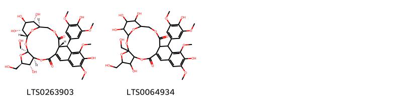{ width=100% }
    <figcaption>Hình ảnh cấu trúc hóa học của 2 hoạt chất thuộc nhóm Lignan glycosides gồm ['(1r,3s,5r,6r,7s,18s,19r,23r,24s,25s,26r)-6,15,24,25,26-pentahydroxy-18-(4-hydroxy-3,5-dimethoxyphenyl)-3,5-bis(hydroxymethyl)-14,16-dimethoxy-2,4,8,21,27-pentaoxapentacyclo[21.3.1.0³,⁷.0¹⁰,¹⁹.0¹²,¹⁷]heptacosa-10,12(17),13,15-tetraene-9,20-dione (LTS0263903)', '6,15,24,25,26-pentahydroxy-18-(4-hydroxy-3,5-dimethoxyphenyl)-3,5-bis(hydroxymethyl)-14,16-dimethoxy-2,4,8,21,27-pentaoxapentacyclo[21.3.1.0³,⁷.0¹⁰,¹⁹.0¹²,¹⁷]heptacosa-10,12(17),13,15-tetraene-9,20-dione (LTS0064934)'].</figcaption>
</figure>
#### Nhóm Macrolides and analogues
<figure markdown="span">
    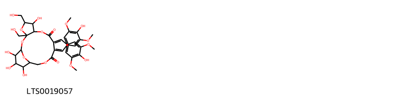{ width=100% }
    <figcaption>Hình ảnh cấu trúc hóa học của 1 hoạt chất thuộc nhóm Macrolides and analogues gồm ['(10e,11e)-6,16,17,18-tetrahydroxy-10,11-bis[(4-hydroxy-3,5-dimethoxyphenyl)methylidene]-3,5-bis(hydroxymethyl)-2,4,8,13,19-pentaoxatricyclo[13.3.1.0³,⁷]nonadecane-9,12-dione (LTS0019057)'].</figcaption>
</figure>
#### Nhóm Organooxygen compounds
<figure markdown="span">
    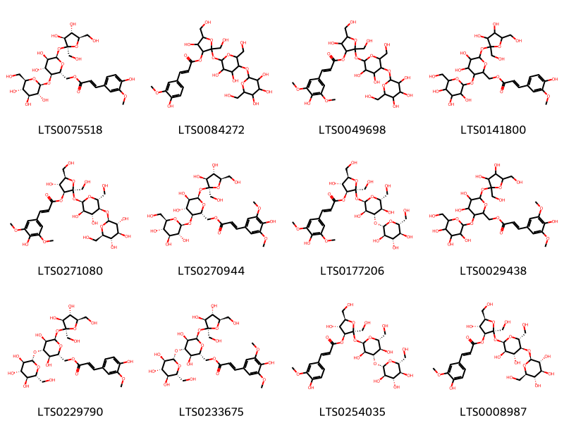{ width=100% }
    <figcaption>Hình ảnh cấu trúc hóa học của 12 hoạt chất thuộc nhóm Organooxygen compounds gồm ['[(2r,3s,4r,5r,6r)-6-{[(2s,3s,4s,5r)-3,4-dihydroxy-2,5-bis(hydroxymethyl)oxolan-2-yl]oxy}-4,5-dihydroxy-3-{[(2s,3r,4s,5s,6r)-3,4,5-trihydroxy-6-(hydroxymethyl)oxan-2-yl]oxy}oxan-2-yl]methyl (2e)-3-(4-hydroxy-3-methoxyphenyl)prop-2-enoate (LTS0075518)', '2-{[3,4-dihydroxy-6-(hydroxymethyl)-5-{[3,4,5-trihydroxy-6-(hydroxymethyl)oxan-2-yl]oxy}oxan-2-yl]oxy}-4-hydroxy-2,5-bis(hydroxymethyl)oxolan-3-yl 3-(4-hydroxy-3-methoxyphenyl)prop-2-enoate (LTS0084272)', '2-{[3,4-dihydroxy-6-(hydroxymethyl)-5-{[3,4,5-trihydroxy-6-(hydroxymethyl)oxan-2-yl]oxy}oxan-2-yl]oxy}-4-hydroxy-2,5-bis(hydroxymethyl)oxolan-3-yl 3-(4-hydroxy-3,5-dimethoxyphenyl)prop-2-enoate (LTS0049698)', '(6-{[3,4-dihydroxy-2,5-bis(hydroxymethyl)oxolan-2-yl]oxy}-4,5-dihydroxy-3-{[3,4,5-trihydroxy-6-(hydroxymethyl)oxan-2-yl]oxy}oxan-2-yl)methyl 3-(4-hydroxy-3-methoxyphenyl)prop-2-enoate (LTS0141800)', '(2s,3s,4r,5r)-2-{[(2r,3r,4r,5s,6r)-3,4-dihydroxy-6-(hydroxymethyl)-5-{[(2s,3r,4s,5s,6r)-3,4,5-trihydroxy-6-(hydroxymethyl)oxan-2-yl]oxy}oxan-2-yl]oxy}-4-hydroxy-2,5-bis(hydroxymethyl)oxolan-3-yl (2e)-3-(4-hydroxy-3,5-dimethoxyphenyl)prop-2-enoate (LTS0271080)', '[(2r,3s,4r,5r,6r)-6-{[(2s,3s,4s,5r)-3,4-dihydroxy-2,5-bis(hydroxymethyl)oxolan-2-yl]oxy}-4,5-dihydroxy-3-{[(2s,3r,4s,5s,6r)-3,4,5-trihydroxy-6-(hydroxymethyl)oxan-2-yl]oxy}oxan-2-yl]methyl (2e)-3-(4-hydroxy-3,5-dimethoxyphenyl)prop-2-enoate (LTS0270944)', '(2s,3s,4r,5r)-2-{[(2r,3r,4s,5r,6r)-3,5-dihydroxy-6-(hydroxymethyl)-4-{[(2s,3r,4s,5s,6r)-3,4,5-trihydroxy-6-(hydroxymethyl)oxan-2-yl]oxy}oxan-2-yl]oxy}-4-hydroxy-2,5-bis(hydroxymethyl)oxolan-3-yl (2e)-3-(4-hydroxy-3,5-dimethoxyphenyl)prop-2-enoate (LTS0177206)', '(6-{[3,4-dihydroxy-2,5-bis(hydroxymethyl)oxolan-2-yl]oxy}-4,5-dihydroxy-3-{[3,4,5-trihydroxy-6-(hydroxymethyl)oxan-2-yl]oxy}oxan-2-yl)methyl 3-(4-hydroxy-3,5-dimethoxyphenyl)prop-2-enoate (LTS0029438)', '[(2r,3r,4s,5r,6r)-6-{[(2s,3s,4s,5r)-3,4-dihydroxy-2,5-bis(hydroxymethyl)oxolan-2-yl]oxy}-3,5-dihydroxy-4-{[(2s,3r,4s,5s,6r)-3,4,5-trihydroxy-6-(hydroxymethyl)oxan-2-yl]oxy}oxan-2-yl]methyl (2e)-3-(4-hydroxy-3-methoxyphenyl)prop-2-enoate (LTS0229790)', '[(2r,3r,4s,5r,6r)-6-{[(2s,3s,4s,5r)-3,4-dihydroxy-2,5-bis(hydroxymethyl)oxolan-2-yl]oxy}-3,5-dihydroxy-4-{[(2s,3r,4s,5s,6r)-3,4,5-trihydroxy-6-(hydroxymethyl)oxan-2-yl]oxy}oxan-2-yl]methyl (2e)-3-(4-hydroxy-3,5-dimethoxyphenyl)prop-2-enoate (LTS0233675)', '(2s,3s,4r,5r)-2-{[(2r,3r,4s,5r,6r)-3,5-dihydroxy-6-(hydroxymethyl)-4-{[(2s,3r,4s,5s,6r)-3,4,5-trihydroxy-6-(hydroxymethyl)oxan-2-yl]oxy}oxan-2-yl]oxy}-4-hydroxy-2,5-bis(hydroxymethyl)oxolan-3-yl (2e)-3-(4-hydroxy-3-methoxyphenyl)prop-2-enoate (LTS0254035)', '(2s,3s,4r,5r)-2-{[(2r,3r,4r,5s,6r)-3,4-dihydroxy-6-(hydroxymethyl)-5-{[(2s,3r,4s,5s,6r)-3,4,5-trihydroxy-6-(hydroxymethyl)oxan-2-yl]oxy}oxan-2-yl]oxy}-4-hydroxy-2,5-bis(hydroxymethyl)oxolan-3-yl (2e)-3-(4-hydroxy-3-methoxyphenyl)prop-2-enoate (LTS0008987)'].</figcaption>
</figure>
#### Nhóm Saccharolipids
<figure markdown="span">
    { width=100% }
    <figcaption>Hình ảnh cấu trúc hóa học của 1 hoạt chất thuộc nhóm Saccharolipids gồm ['(1r,3s,5r,6r,7s,10e,11e,15r,16s,17s,18r)-6,16,17,18-tetrahydroxy-10-[(4-hydroxy-2,3-dimethoxyphenyl)methylidene]-11-[(4-hydroxy-3,5-dimethoxyphenyl)methylidene]-3,5-bis(hydroxymethyl)-2,4,8,13,19-pentaoxatricyclo[13.3.1.0³,⁷]nonadecane-9,12-dione (LTS0038372)'].</figcaption>
</figure>

---

### Dược dân tộc học

Danh sách các quốc gia có sử dụng *Polygala arillata* trong điều trị các bệnh. 

| Country   | Disease   | Bệnh     |
|:----------|:----------|:---------|
| Elsewhere | Purgative | Thuốc xổ |

---

---
## Polygala bakeriana
### Thông tin về thực vật

!!! info "Phân loại thực vật của *Polygala bakeriana* từ GIBF:"
    - **Kingdom:** Plantae
    - **Phylum:** Tracheophyta
    - **Order:** Fabales
    - **Family:** Polygalaceae
    - **Genus:** Polygala
    - **Species:** *Polygala bakeriana*

 

| Label (VI)   | Label (EN)   | Scientific Name    | Descriptions (VI)   | Descriptions (EN)   | Also Known As (VI)   | Also Known As (EN)   |
|:-------------|:-------------|:-------------------|:--------------------|:--------------------|:---------------------|:---------------------|
| N/A          | N/A          | Polygala bakeriana |                     | species of plant    | ['']                 | ['']                 |

#### Phân bố trên thế giới

**Từ CSDL GIBF** nan, Uganda, Burundi, Rwanda, Congo, Congo, Democratic Republic of the, Tanzania, United Republic of

#### Phân bố tại Việt Nam

**Từ CSDL GIBF**: Không có ghi nhận ở Việt Nam

---
### Thành phần hóa học
        
- Theo cơ sở dữ liệu lotus: Từ loài *Polygala bakeriana* đã phân lập và xác định được Chưa có hoạt chất nào được phân lập. hoạt chất thuộc về các nhóm Không có hoạt chất nào được phân lập. 

Không có hình ảnh nào được tạo ra

---

### Dược dân tộc học

Danh sách các quốc gia có sử dụng *Polygala bakeriana* trong điều trị các bệnh. 

| Country   | Disease   | Bệnh           |
|:----------|:----------|:---------------|
| Africa    | Vermifuge | Thuốc diệt sán |

---

---
## Polygala chamaebuxus
### Thông tin về thực vật

!!! info "Phân loại thực vật của *Polygaloides chamaebuxus* từ GIBF:"
    - **Kingdom:** Plantae
    - **Phylum:** Tracheophyta
    - **Order:** Fabales
    - **Family:** Polygalaceae
    - **Genus:** Polygaloides
    - **Species:** *Polygaloides chamaebuxus*

 

| Label (VI)   | Label (EN)   | Scientific Name      | Descriptions (VI)   | Descriptions (EN)   | Also Known As (VI)   | Also Known As (EN)   |
|:-------------|:-------------|:---------------------|:--------------------|:--------------------|:---------------------|:---------------------|
| N/A          | N/A          | Polygala chamaebuxus |                     | species of plant    | ['']                 | ['shrubby milkwort'] |

#### Phân bố trên thế giới

**Từ CSDL GIBF** Germany, Switzerland, Austria

#### Phân bố tại Việt Nam

**Từ CSDL GIBF**: Không có ghi nhận ở Việt Nam

---
### Thành phần hóa học
        
- Theo cơ sở dữ liệu lotus: Từ loài *Polygaloides chamaebuxus* đã phân lập và xác định được 17 hoạt chất thuộc về các nhóm Flavonoids, Prenol lipids, Cinnamic acids and derivatives, Organooxygen compounds. 

|    | chemicalTaxonomyClassyfireClass   |   smiles_count |
|---:|:----------------------------------|---------------:|
|  0 | Cinnamic acids and derivatives    |              6 |
|  1 | Flavonoids                        |              1 |
|  2 | Organooxygen compounds            |              2 |
|  3 | Prenol lipids                     |              7 |

#### Nhóm Cinnamic acids and derivatives
<figure markdown="span">
    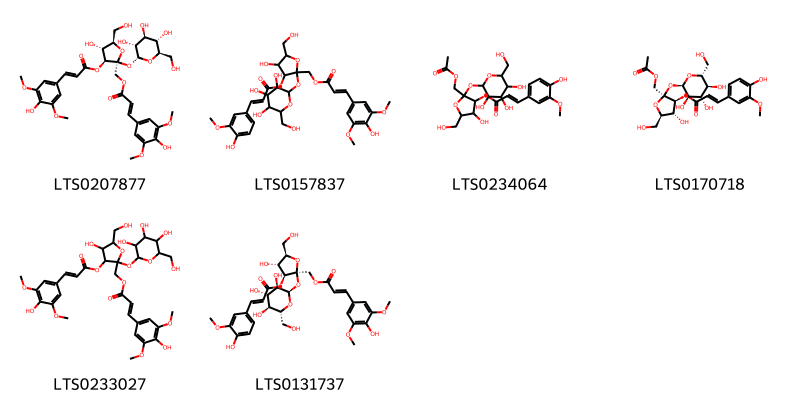{ width=100% }
    <figcaption>Hình ảnh cấu trúc hóa học của 6 hoạt chất thuộc nhóm Cinnamic acids and derivatives gồm ['[(2s,3s,4r,5r)-4-hydroxy-3-{[(2e)-3-(4-hydroxy-3,5-dimethoxyphenyl)prop-2-enoyl]oxy}-5-(hydroxymethyl)-2-{[(2r,3r,4s,5s,6r)-3,4,5-trihydroxy-6-(hydroxymethyl)oxan-2-yl]oxy}oxolan-2-yl]methyl (2e)-3-(4-hydroxy-3,5-dimethoxyphenyl)prop-2-enoate (LTS0207877)', '(4-hydroxy-3-{[3-(4-hydroxy-3-methoxyphenyl)prop-2-enoyl]oxy}-5-(hydroxymethyl)-2-{[3,4,5-trihydroxy-6-(hydroxymethyl)oxan-2-yl]oxy}oxolan-2-yl)methyl 3-(4-hydroxy-3,5-dimethoxyphenyl)prop-2-enoate (LTS0157837)', '2-[(acetyloxy)methyl]-4-hydroxy-5-(hydroxymethyl)-2-{[3,4,5-trihydroxy-6-(hydroxymethyl)oxan-2-yl]oxy}oxolan-3-yl 3-(4-hydroxy-3-methoxyphenyl)prop-2-enoate (LTS0234064)', '(2s,3s,4r,5r)-2-[(acetyloxy)methyl]-4-hydroxy-5-(hydroxymethyl)-2-{[(2r,3r,4s,5s,6r)-3,4,5-trihydroxy-6-(hydroxymethyl)oxan-2-yl]oxy}oxolan-3-yl (2e)-3-(4-hydroxy-3-methoxyphenyl)prop-2-enoate (LTS0170718)', '(4-hydroxy-3-{[3-(4-hydroxy-3,5-dimethoxyphenyl)prop-2-enoyl]oxy}-5-(hydroxymethyl)-2-{[3,4,5-trihydroxy-6-(hydroxymethyl)oxan-2-yl]oxy}oxolan-2-yl)methyl 3-(4-hydroxy-3,5-dimethoxyphenyl)prop-2-enoate (LTS0233027)', '[(2s,3s,4r,5r)-4-hydroxy-3-{[(2e)-3-(4-hydroxy-3-methoxyphenyl)prop-2-enoyl]oxy}-5-(hydroxymethyl)-2-{[(2r,3r,4s,5s,6r)-3,4,5-trihydroxy-6-(hydroxymethyl)oxan-2-yl]oxy}oxolan-2-yl]methyl (2e)-3-(4-hydroxy-3,5-dimethoxyphenyl)prop-2-enoate (LTS0131737)'].</figcaption>
</figure>
#### Nhóm Flavonoids
<figure markdown="span">
    { width=100% }
    <figcaption>Hình ảnh cấu trúc hóa học của 1 hoạt chất thuộc nhóm Flavonoids gồm ['3-rutinosyl quercetin (LTS0032845)'].</figcaption>
</figure>
#### Nhóm Organooxygen compounds
<figure markdown="span">
    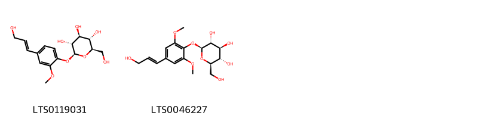{ width=100% }
    <figcaption>Hình ảnh cấu trúc hóa học của 2 hoạt chất thuộc nhóm Organooxygen compounds gồm ['coniferin (LTS0119031)', 'syringin (LTS0046227)'].</figcaption>
</figure>
#### Nhóm Prenol lipids
<figure markdown="span">
    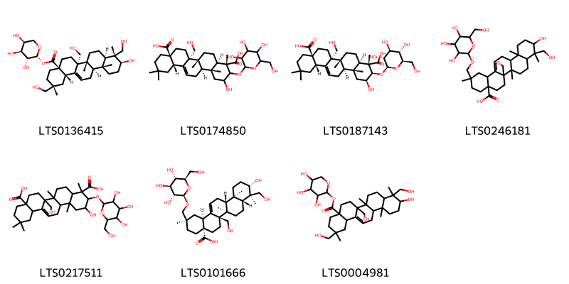{ width=100% }
    <figcaption>Hình ảnh cấu trúc hóa học của 7 hoạt chất thuộc nhóm Prenol lipids gồm ['(2r,3r,4s,5s)-3,4,5-trihydroxyoxan-2-yl (2r,4as,6ar,6br,8ar,9r,10s,12ar,12br,14bs)-10-hydroxy-2,6a,9-tris(hydroxymethyl)-2,6b,9,12a-tetramethyl-1,3,4,5,6,7,8,8a,10,11,12,12b,13,14b-tetradecahydropicene-4a-carboxylate (LTS0136415)', '(4s,4ar,6ar,6br,8as,12as,14ar,14br)-2-hydroxy-6b-(hydroxymethyl)-4,6a,11,11,14b-pentamethyl-3-{[3,4,5-trihydroxy-6-(hydroxymethyl)oxan-2-yl]oxy}-1,2,3,4a,5,6,7,8,9,10,12,12a,14,14a-tetradecahydropicene-4,8a-dicarboxylic acid (LTS0174850)', '(2s,3r,4s,4ar,6ar,6br,8as,12as,14ar,14br)-2-hydroxy-6b-(hydroxymethyl)-4,6a,11,11,14b-pentamethyl-3-{[(2r,3r,4s,5s,6r)-3,4,5-trihydroxy-6-(hydroxymethyl)oxan-2-yl]oxy}-1,2,3,4a,5,6,7,8,9,10,12,12a,14,14a-tetradecahydropicene-4,8a-dicarboxylic acid (LTS0187143)', '10-hydroxy-6a,9-bis(hydroxymethyl)-2,6b,9,12a-tetramethyl-2-({[3,4,5-trihydroxy-6-(hydroxymethyl)oxan-2-yl]oxy}methyl)-1,3,4,5,6,7,8,8a,10,11,12,12b,13,14b-tetradecahydropicene-4a-carboxylic acid (LTS0246181)', '2-hydroxy-6b-(hydroxymethyl)-4,6a,11,11,14b-pentamethyl-3-{[3,4,5-trihydroxy-6-(hydroxymethyl)oxan-2-yl]oxy}-1,2,3,4a,5,6,7,8,9,10,12,12a,14,14a-tetradecahydropicene-4,8a-dicarboxylic acid (LTS0217511)', '(2r,4as,6ar,6br,8ar,9r,10s,12ar,12br,14bs)-10-hydroxy-6a,9-bis(hydroxymethyl)-2,6b,9,12a-tetramethyl-2-({[(2r,3r,4s,5s,6r)-3,4,5-trihydroxy-6-(hydroxymethyl)oxan-2-yl]oxy}methyl)-1,3,4,5,6,7,8,8a,10,11,12,12b,13,14b-tetradecahydropicene-4a-carboxylic acid (LTS0101666)', '3,4,5-trihydroxyoxan-2-yl 10-hydroxy-2,6a,9-tris(hydroxymethyl)-2,6b,9,12a-tetramethyl-1,3,4,5,6,7,8,8a,10,11,12,12b,13,14b-tetradecahydropicene-4a-carboxylate (LTS0004981)'].</figcaption>
</figure>

---

### Dược dân tộc học

Danh sách các quốc gia có sử dụng *Polygaloides chamaebuxus* trong điều trị các bệnh. 

| Country   | Disease     | Bệnh           |
|:----------|:------------|:---------------|
| German    | Expectorant | Thuốc long đàm |

---

---
## Polygala chinensis
### Thông tin về thực vật

!!! info "Phân loại thực vật của *Polygala glomerata* từ GIBF:"
    - **Kingdom:** Plantae
    - **Phylum:** Tracheophyta
    - **Order:** Fabales
    - **Family:** Polygalaceae
    - **Genus:** Polygala
    - **Species:** *Polygala glomerata*

 

| Label (VI)   | Label (EN)   | Scientific Name    | Descriptions (VI)   | Descriptions (EN)   | Also Known As (VI)   | Also Known As (EN)     |
|:-------------|:-------------|:-------------------|:--------------------|:--------------------|:---------------------|:-----------------------|
| N/A          | N/A          | Polygala chinensis | loài thực vật       | species of plant    | ['']                 | ['Polygala glomerata'] |

#### Phân bố trên thế giới

**Từ CSDL GIBF** nan, Sri Lanka, Malaysia, Hong Kong, Australia, Micronesia (Federated States of), Thailand, Lao People’s Democratic Republic, Cambodia, Japan, Chinese Taipei, Papua New Guinea, India, Indonesia, Philippines, Solomon Islands, Viet Nam, China

#### Phân bố tại Việt Nam

**Từ CSDL GIBF**: Lam Dong (林同省)

---
### Thành phần hóa học
        
- Theo cơ sở dữ liệu lotus: Từ loài *Polygala glomerata* đã phân lập và xác định được 2 hoạt chất thuộc về các nhóm Arylnaphthalene lignans, Naphthofurans. 

|    | chemicalTaxonomyClassyfireClass   |   smiles_count |
|---:|:----------------------------------|---------------:|
|  0 | Arylnaphthalene lignans           |              1 |
|  1 | Naphthofurans                     |              1 |

#### Nhóm Arylnaphthalene lignans
<figure markdown="span">
    { width=100% }
    <figcaption>Hình ảnh cấu trúc hóa học của 1 hoạt chất thuộc nhóm Arylnaphthalene lignans gồm ['10-(3,4-dimethoxyphenyl)-16-hydroxy-4,6,13-trioxatetracyclo[7.7.0.0³,⁷.0¹¹,¹⁵]hexadeca-1,3(7),8,10,15-pentaen-12-one (LTS0052024)'].</figcaption>
</figure>
#### Nhóm Naphthofurans
<figure markdown="span">
    { width=100% }
    <figcaption>Hình ảnh cấu trúc hóa học của 1 hoạt chất thuộc nhóm Naphthofurans gồm ['8-(3,4-dimethoxyphenyl)-4,6,13-trioxatetracyclo[7.7.0.0³,⁷.0¹¹,¹⁵]hexadeca-1(16),2,7,9,11(15)-pentaen-12-one (LTS0211900)'].</figcaption>
</figure>

---

### Dược dân tộc học

Danh sách các quốc gia có sử dụng *Polygala glomerata* trong điều trị các bệnh. 

| Country   | Disease    | Bệnh      |
|:----------|:-----------|:----------|
| Elsewhere | Antiseptic | Khử trùng |

---

---
## Polygala costaricensis
### Thông tin về thực vật

!!! info "Phân loại thực vật của *Hebecarpa costaricensis* từ GIBF:"
    - **Kingdom:** Plantae
    - **Phylum:** Tracheophyta
    - **Order:** Fabales
    - **Family:** Polygalaceae
    - **Genus:** Hebecarpa
    - **Species:** *Hebecarpa costaricensis*

 

| Label (VI)   | Label (EN)   | Scientific Name        | Descriptions (VI)   | Descriptions (EN)   | Also Known As (VI)   | Also Known As (EN)   |
|:-------------|:-------------|:-----------------------|:--------------------|:--------------------|:---------------------|:---------------------|
| N/A          | N/A          | Polygala costaricensis | loài thực vật       | species of plant    | ['']                 | ['']                 |

#### Phân bố trên thế giới

**Từ CSDL GIBF** nan, Guatemala, Costa Rica, Honduras, Nicaragua, Mexico

#### Phân bố tại Việt Nam

**Từ CSDL GIBF**: Không có ghi nhận ở Việt Nam

---
### Thành phần hóa học
        
- Theo cơ sở dữ liệu lotus: Từ loài *Hebecarpa costaricensis* đã phân lập và xác định được Chưa có hoạt chất nào được phân lập. hoạt chất thuộc về các nhóm Không có hoạt chất nào được phân lập. 

Không có hình ảnh nào được tạo ra

---

### Dược dân tộc học

Danh sách các quốc gia có sử dụng *Hebecarpa costaricensis* trong điều trị các bệnh. 

| Country    | Disease   | Bệnh   |
|:-----------|:----------|:-------|
| Costa Rica | Emetic    | Phôi   |

---

---
## Polygala crotalarioides
### Thông tin về thực vật

!!! info "Phân loại thực vật của *Polygala crotalarioides* từ GIBF:"
    - **Kingdom:** Plantae
    - **Phylum:** Tracheophyta
    - **Order:** Fabales
    - **Family:** Polygalaceae
    - **Genus:** Polygala
    - **Species:** *Polygala crotalarioides*

 

| Label (VI)   | Label (EN)   | Scientific Name         | Descriptions (VI)   | Descriptions (EN)   | Also Known As (VI)   | Also Known As (EN)   |
|:-------------|:-------------|:------------------------|:--------------------|:--------------------|:---------------------|:---------------------|
| N/A          | N/A          | Polygala crotalarioides | loài thực vật       | species of plant    | ['']                 | ['']                 |

#### Phân bố trên thế giới

**Từ CSDL GIBF** nan, Pakistan, Thailand, Myanmar, Bhutan, India, unknown or invalid, China, Yemen, Nepal

#### Phân bố tại Việt Nam

**Từ CSDL GIBF**: Không có ghi nhận ở Việt Nam

---
### Thành phần hóa học
        
- Theo cơ sở dữ liệu lotus: Từ loài *Polygala crotalarioides* đã phân lập và xác định được Chưa có hoạt chất nào được phân lập. hoạt chất thuộc về các nhóm Không có hoạt chất nào được phân lập. 

Không có hình ảnh nào được tạo ra

---

### Dược dân tộc học

Danh sách các quốc gia có sử dụng *Polygala crotalarioides* trong điều trị các bệnh. 

| Country   | Disease    | Bệnh      |
|:----------|:-----------|:----------|
| Elsewhere | Antiseptic | Khử trùng |

---

---
## Polygala floribunda
### Thông tin về thực vật

!!! info "Phân loại thực vật của *N/A* từ GIBF:"
    - **Kingdom:** Plantae
    - **Phylum:** Tracheophyta
    - **Order:** Fabales
    - **Family:** Polygalaceae
    - **Genus:** N/A
    - **Species:** *N/A*

 

| Label (VI)   | Label (EN)   | Scientific Name     | Descriptions (VI)   | Descriptions (EN)   | Also Known As (VI)   | Also Known As (EN)   |
|:-------------|:-------------|:--------------------|:--------------------|:--------------------|:---------------------|:---------------------|
| N/A          | N/A          | Polygala floribunda |                     | species of plant    | ['']                 | ['']                 |

#### Phân bố trên thế giới

**Từ CSDL GIBF** nan, Sri Lanka, Italy, Australia, Argentina, Rwanda, French Guiana, Canada, Puerto Rico, Namibia, Chinese Taipei, Spain, United States of America, Uruguay, Chile, South Africa, Germany, Brazil, Austria, Mexico, Dominican Republic, Colombia, New Zealand

#### Phân bố tại Việt Nam

**Từ CSDL GIBF**: Không có ghi nhận ở Việt Nam

---
### Thành phần hóa học
        
- Theo cơ sở dữ liệu lotus: Từ loài *N/A* đã phân lập và xác định được Chưa có hoạt chất nào được phân lập. hoạt chất thuộc về các nhóm Không có hoạt chất nào được phân lập. 

Không có hình ảnh nào được tạo ra

---

### Dược dân tộc học

Danh sách các quốc gia có sử dụng *N/A* trong điều trị các bệnh. 

| Country   | Disease          | Bệnh                    |
|:----------|:-----------------|:------------------------|
| Guatemala | Dentifrice, Soap | Kem đánh răng, xà phòng |

---

---
## Polygala glomerata
### Thông tin về thực vật

!!! info "Phân loại thực vật của *Polygala glomerata* từ GIBF:"
    - **Kingdom:** Plantae
    - **Phylum:** Tracheophyta
    - **Order:** Fabales
    - **Family:** Polygalaceae
    - **Genus:** Polygala
    - **Species:** *Polygala glomerata*

 

| Label (VI)   | Label (EN)   | Scientific Name    | Descriptions (VI)   | Descriptions (EN)   | Also Known As (VI)   | Also Known As (EN)   |
|:-------------|:-------------|:-------------------|:--------------------|:--------------------|:---------------------|:---------------------|
| N/A          | N/A          | Polygala glomerata |                     | species of plant    | ['']                 | ['']                 |

#### Phân bố trên thế giới

**Từ CSDL GIBF** nan, Sri Lanka, Micronesia (Federated States of), Australia, Japan, Lao People’s Democratic Republic, Cambodia, Chinese Taipei, Papua New Guinea, United States of America, Saudi Arabia, Hong Kong, Oman, Thailand, Brazil, Dominican Republic, Mexico, Viet Nam, China, India, Indonesia, Philippines, Malaysia

#### Phân bố tại Việt Nam

**Từ CSDL GIBF**: Lam Dong (林同省)

---
### Thành phần hóa học
        
- Theo cơ sở dữ liệu lotus: Từ loài *Polygala glomerata* đã phân lập và xác định được 39 hoạt chất thuộc về các nhóm Prenol lipids, Cinnamic acids and derivatives, Arylnaphthalene lignans, Naphthofurans, Organooxygen compounds, Macrolides and analogues, Saccharolipids. 

|    | chemicalTaxonomyClassyfireClass   |   smiles_count |
|---:|:----------------------------------|---------------:|
|  0 | Arylnaphthalene lignans           |              1 |
|  1 | Cinnamic acids and derivatives    |             15 |
|  2 | Macrolides and analogues          |              2 |
|  3 | Naphthofurans                     |              1 |
|  4 | Organooxygen compounds            |              5 |
|  5 | Prenol lipids                     |             14 |
|  6 | Saccharolipids                    |              1 |

#### Nhóm Arylnaphthalene lignans
<figure markdown="span">
    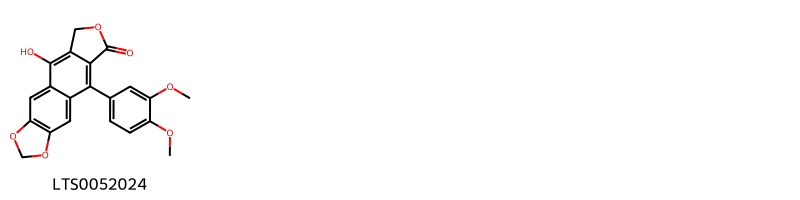{ width=100% }
    <figcaption>Hình ảnh cấu trúc hóa học của 1 hoạt chất thuộc nhóm Arylnaphthalene lignans gồm ['10-(3,4-dimethoxyphenyl)-16-hydroxy-4,6,13-trioxatetracyclo[7.7.0.0³,⁷.0¹¹,¹⁵]hexadeca-1,3(7),8,10,15-pentaen-12-one (LTS0052024)'].</figcaption>
</figure>
#### Nhóm Cinnamic acids and derivatives
<figure markdown="span">
    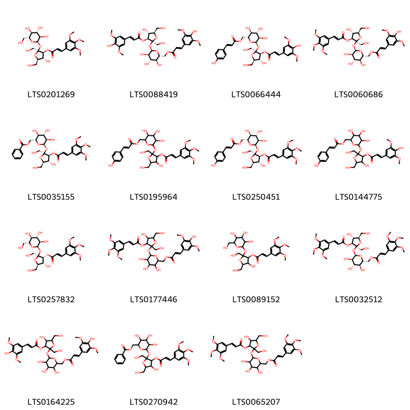{ width=100% }
    <figcaption>Hình ảnh cấu trúc hóa học của 15 hoạt chất thuộc nhóm Cinnamic acids and derivatives gồm ['(2s,3s,4r,5r)-4-hydroxy-2,5-bis(hydroxymethyl)-2-{[(2r,3r,4s,5s,6r)-3,4,5-trihydroxy-6-(hydroxymethyl)oxan-2-yl]oxy}oxolan-3-yl (2e)-3-(3,4,5-trimethoxyphenyl)prop-2-enoate (LTS0201269)', '[(2r,3s,4s,5r,6r)-3,4,5-trihydroxy-6-{[(2s,3s,4r,5r)-4-hydroxy-3-{[(2e)-3-(4-hydroxy-3,5-dimethoxyphenyl)prop-2-enoyl]oxy}-2,5-bis(hydroxymethyl)oxolan-2-yl]oxy}oxan-2-yl]methyl (2e)-3-(4-hydroxy-3,5-dimethoxyphenyl)prop-2-enoate (LTS0088419)', '[(2r,3s,4s,5r,6r)-3,4,5-trihydroxy-6-{[(2s,3s,4r,5r)-4-hydroxy-3-{[(2e)-3-(4-hydroxy-3,5-dimethoxyphenyl)prop-2-enoyl]oxy}-2,5-bis(hydroxymethyl)oxolan-2-yl]oxy}oxan-2-yl]methyl (2e)-3-(4-hydroxyphenyl)prop-2-enoate (LTS0066444)', 'tenuifoliside c (LTS0060686)', '[(2r,3s,4s,5r,6r)-3,4,5-trihydroxy-6-{[(2s,3s,4r,5r)-4-hydroxy-2,5-bis(hydroxymethyl)-3-{[(2e)-3-(3,4,5-trimethoxyphenyl)prop-2-enoyl]oxy}oxolan-2-yl]oxy}oxan-2-yl]methyl benzoate (LTS0035155)', '(3,4,5-trihydroxy-6-{[4-hydroxy-2,5-bis(hydroxymethyl)-3-{[3-(3,4,5-trimethoxyphenyl)prop-2-enoyl]oxy}oxolan-2-yl]oxy}oxan-2-yl)methyl 3-(4-hydroxyphenyl)prop-2-enoate (LTS0195964)', '[(2r,3s,4s,5r,6r)-3,4,5-trihydroxy-6-{[(2s,3s,4r,5r)-4-hydroxy-2,5-bis(hydroxymethyl)-3-{[(2e)-3-(3,4,5-trimethoxyphenyl)prop-2-enoyl]oxy}oxolan-2-yl]oxy}oxan-2-yl]methyl (2e)-3-(4-hydroxyphenyl)prop-2-enoate (LTS0250451)', '{3,4,5-trihydroxy-6-[(4-hydroxy-3-{[3-(4-hydroxy-3,5-dimethoxyphenyl)prop-2-enoyl]oxy}-2,5-bis(hydroxymethyl)oxolan-2-yl)oxy]oxan-2-yl}methyl 3-(4-hydroxyphenyl)prop-2-enoate (LTS0144775)', '(2s,3r,4r,5r)-4-hydroxy-2,5-bis(hydroxymethyl)-2-{[(2r,3r,4s,5s,6r)-3,4,5-trihydroxy-6-(hydroxymethyl)oxan-2-yl]oxy}oxolan-3-yl (2e)-3-(3,4,5-trimethoxyphenyl)prop-2-enoate (LTS0257832)', '(3,4,5-trihydroxy-6-{[4-hydroxy-2,5-bis(hydroxymethyl)-3-{[3-(3,4,5-trimethoxyphenyl)prop-2-enoyl]oxy}oxolan-2-yl]oxy}oxan-2-yl)methyl 3-(4-hydroxy-3,5-dimethoxyphenyl)prop-2-enoate (LTS0177446)', '4-hydroxy-2,5-bis(hydroxymethyl)-2-{[3,4,5-trihydroxy-6-(hydroxymethyl)oxan-2-yl]oxy}oxolan-3-yl 3-(3,4,5-trimethoxyphenyl)prop-2-enoate (LTS0089152)', '[(2r,3s,4s,5r,6r)-3,4,5-trihydroxy-6-{[(2s,3s,4r,5r)-4-hydroxy-2,5-bis(hydroxymethyl)-3-{[(2e)-3-(3,4,5-trimethoxyphenyl)prop-2-enoyl]oxy}oxolan-2-yl]oxy}oxan-2-yl]methyl (2e)-3-(3,4,5-trimethoxyphenyl)prop-2-enoate (LTS0032512)', '{3,4,5-trihydroxy-6-[(4-hydroxy-3-{[3-(4-hydroxy-3,5-dimethoxyphenyl)prop-2-enoyl]oxy}-2,5-bis(hydroxymethyl)oxolan-2-yl)oxy]oxan-2-yl}methyl 3-(4-hydroxy-3,5-dimethoxyphenyl)prop-2-enoate (LTS0164225)', '(3,4,5-trihydroxy-6-{[4-hydroxy-2,5-bis(hydroxymethyl)-3-{[3-(3,4,5-trimethoxyphenyl)prop-2-enoyl]oxy}oxolan-2-yl]oxy}oxan-2-yl)methyl benzoate (LTS0270942)', '(3,4,5-trihydroxy-6-{[4-hydroxy-2,5-bis(hydroxymethyl)-3-{[3-(3,4,5-trimethoxyphenyl)prop-2-enoyl]oxy}oxolan-2-yl]oxy}oxan-2-yl)methyl 3-(3,4,5-trimethoxyphenyl)prop-2-enoate (LTS0065207)'].</figcaption>
</figure>
#### Nhóm Macrolides and analogues
<figure markdown="span">
    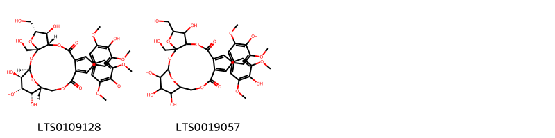{ width=100% }
    <figcaption>Hình ảnh cấu trúc hóa học của 2 hoạt chất thuộc nhóm Macrolides and analogues gồm ['(1r,3s,5r,6r,7s,10e,11e,15r,16r,17s,18r)-6,16,17,18-tetrahydroxy-10,11-bis[(4-hydroxy-3,5-dimethoxyphenyl)methylidene]-3,5-bis(hydroxymethyl)-2,4,8,13,19-pentaoxatricyclo[13.3.1.0³,⁷]nonadecane-9,12-dione (LTS0109128)', '(10e,11e)-6,16,17,18-tetrahydroxy-10,11-bis[(4-hydroxy-3,5-dimethoxyphenyl)methylidene]-3,5-bis(hydroxymethyl)-2,4,8,13,19-pentaoxatricyclo[13.3.1.0³,⁷]nonadecane-9,12-dione (LTS0019057)'].</figcaption>
</figure>
#### Nhóm Naphthofurans
<figure markdown="span">
    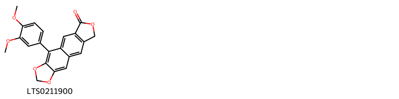{ width=100% }
    <figcaption>Hình ảnh cấu trúc hóa học của 1 hoạt chất thuộc nhóm Naphthofurans gồm ['8-(3,4-dimethoxyphenyl)-4,6,13-trioxatetracyclo[7.7.0.0³,⁷.0¹¹,¹⁵]hexadeca-1(16),2,7,9,11(15)-pentaen-12-one (LTS0211900)'].</figcaption>
</figure>
#### Nhóm Organooxygen compounds
<figure markdown="span">
    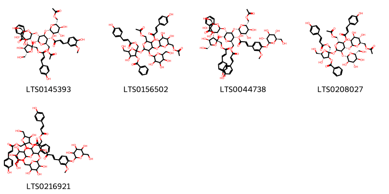{ width=100% }
    <figcaption>Hình ảnh cấu trúc hóa học của 5 hoạt chất thuộc nhóm Organooxygen compounds gồm ['(2s,3s,4r,5r)-2-{[(2r,3r,4s,5r,6r)-6-[(acetyloxy)methyl]-4-{[(2s,3r,4s,5s,6r)-6-[(acetyloxy)methyl]-3,4,5-trihydroxyoxan-2-yl]oxy}-5-{[(2e)-3-(4-hydroxy-3-methoxyphenyl)prop-2-enoyl]oxy}-3-{[(2s,3r,4s,5s,6r)-3,4,5-trihydroxy-6-(hydroxymethyl)oxan-2-yl]oxy}oxan-2-yl]oxy}-4-hydroxy-5-(hydroxymethyl)-2-({[(2e)-3-(4-hydroxyphenyl)prop-2-enoyl]oxy}methyl)oxolan-3-yl benzoate (LTS0145393)', '2-({6-[(acetyloxy)methyl]-4-({6-[(acetyloxy)methyl]-3,4,5-trihydroxyoxan-2-yl}oxy)-5-{[3-(4-hydroxyphenyl)prop-2-enoyl]oxy}-3-{[3,4,5-trihydroxy-6-(hydroxymethyl)oxan-2-yl]oxy}oxan-2-yl}oxy)-4-hydroxy-5-(hydroxymethyl)-2-({[3-(4-hydroxyphenyl)prop-2-enoyl]oxy}methyl)oxolan-3-yl benzoate (LTS0156502)', '(2s,3s,4r,5r)-2-{[(2r,3r,4s,5r,6r)-4-{[(2s,3r,4s,5s,6r)-6-[(acetyloxy)methyl]-3,4,5-trihydroxyoxan-2-yl]oxy}-6-({[(2e)-3-(4-hydroxyphenyl)prop-2-enoyl]oxy}methyl)-5-{[(2e)-3-(3-methoxy-4-{[(2s,3r,4s,5s,6r)-3,4,5-trihydroxy-6-(hydroxymethyl)oxan-2-yl]oxy}phenyl)prop-2-enoyl]oxy}-3-{[(2s,3r,4s,5s,6r)-3,4,5-trihydroxy-6-(hydroxymethyl)oxan-2-yl]oxy}oxan-2-yl]oxy}-4-hydroxy-5-(hydroxymethyl)-2-({[(2e)-3-(4-hydroxyphenyl)prop-2-enoyl]oxy}methyl)oxolan-3-yl benzoate (LTS0044738)', '(2s,3s,4r,5r)-2-{[(2r,3r,4s,5r,6r)-6-[(acetyloxy)methyl]-4-{[(2s,3r,4s,5s,6r)-6-[(acetyloxy)methyl]-3,4,5-trihydroxyoxan-2-yl]oxy}-5-{[(2e)-3-(4-hydroxyphenyl)prop-2-enoyl]oxy}-3-{[(2s,3r,4s,5s,6r)-3,4,5-trihydroxy-6-(hydroxymethyl)oxan-2-yl]oxy}oxan-2-yl]oxy}-4-hydroxy-5-(hydroxymethyl)-2-({[(2e)-3-(4-hydroxyphenyl)prop-2-enoyl]oxy}methyl)oxolan-3-yl benzoate (LTS0208027)', '2-{[4-({6-[(acetyloxy)methyl]-3,4,5-trihydroxyoxan-2-yl}oxy)-6-({[3-(4-hydroxyphenyl)prop-2-enoyl]oxy}methyl)-5-{[3-(3-methoxy-4-{[3,4,5-trihydroxy-6-(hydroxymethyl)oxan-2-yl]oxy}phenyl)prop-2-enoyl]oxy}-3-{[3,4,5-trihydroxy-6-(hydroxymethyl)oxan-2-yl]oxy}oxan-2-yl]oxy}-4-hydroxy-5-(hydroxymethyl)-2-({[3-(4-hydroxyphenyl)prop-2-enoyl]oxy}methyl)oxolan-3-yl benzoate (LTS0216921)'].</figcaption>
</figure>
#### Nhóm Prenol lipids
<figure markdown="span">
    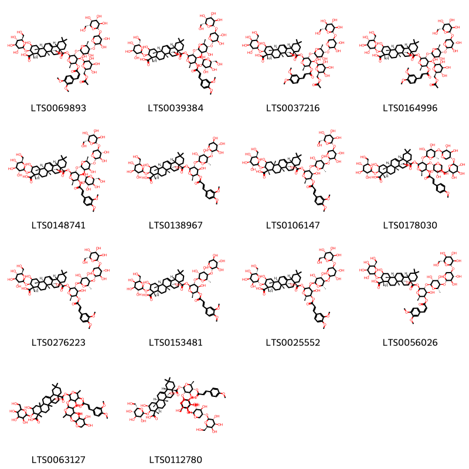{ width=100% }
    <figcaption>Hình ảnh cấu trúc hóa học của 14 hoạt chất thuộc nhóm Prenol lipids gồm ['(2s,3r,4s,4ar,6ar,6br,8as,12as,14ar,14br)-8a-({[(2s,3r,4s,5s,6r)-4-{[(2s,3r,4s,5s,6r)-6-[(acetyloxy)methyl]-3,4,5-trihydroxyoxan-2-yl]oxy}-3-{[(2s,3r,4s,5r,6s)-5-{[(2s,3r,4r,5r)-3,4-dihydroxy-5-{[(2s,3r,4s,5r,6r)-3,4,5-trihydroxy-6-(hydroxymethyl)oxan-2-yl]oxy}oxan-2-yl]oxy}-3,4-dihydroxy-6-methyloxan-2-yl]oxy}-5-{[(2z)-3-(3,4-dimethoxyphenyl)prop-2-enoyl]oxy}-6-methyloxan-2-yl]oxy}carbonyl)-2-hydroxy-6b-(hydroxymethyl)-4,6a,11,11,14b-pentamethyl-3-{[(2r,3r,4s,5s,6r)-3,4,5-trihydroxy-6-(hydroxymethyl)oxan-2-yl]oxy}-1,2,3,4a,5,6,7,8,9,10,12,12a,14,14a-tetradecahydropicene-4-carboxylic acid (LTS0069893)', '(2s,3r,4s,4ar,6ar,6br,8as,12as,14ar,14br)-8a-({[(2s,3r,4s,5s,6r)-3-{[(2s,3r,4r,5r,6s)-5-{[(2s,3r,4r,5r)-3,4-dihydroxy-5-{[(2s,3r,4s,5r,6r)-3,4,5-trihydroxy-6-(hydroxymethyl)oxan-2-yl]oxy}oxan-2-yl]oxy}-3,4-dihydroxy-6-methyloxan-2-yl]oxy}-5-{[(2e)-3-(3,4-dimethoxyphenyl)prop-2-enoyl]oxy}-6-methyl-4-{[(2s,3r,4s,5s,6r)-3,4,5-trihydroxy-6-(hydroxymethyl)oxan-2-yl]oxy}oxan-2-yl]oxy}carbonyl)-2-hydroxy-6b-(hydroxymethyl)-4,6a,11,11,14b-pentamethyl-3-{[(2r,3r,4s,5s,6s)-3,4,5-trihydroxy-6-(hydroxymethyl)oxan-2-yl]oxy}-1,2,3,4a,5,6,7,8,9,10,12,12a,14,14a-tetradecahydropicene-4-carboxylic acid (LTS0039384)', '(2s,3r,4s,4ar,6ar,6br,8as,12as,14ar,14br)-8a-({[(2s,3r,4s,5s,6r)-4-{[(2s,3r,4s,5r,6r)-6-[(acetyloxy)methyl]-3,4,5-trihydroxyoxan-2-yl]oxy}-3-{[(2s,3r,4s,5r,6s)-5-{[(2s,3r,4r,5r)-3,4-dihydroxy-5-{[(2s,3r,4s,5s,6r)-3,4,5-trihydroxy-6-(hydroxymethyl)oxan-2-yl]oxy}oxan-2-yl]oxy}-3,4-dihydroxy-6-methyloxan-2-yl]oxy}-5-{[(2e)-3-(3,4-dimethoxyphenyl)prop-2-enoyl]oxy}-6-methyloxan-2-yl]oxy}carbonyl)-2-hydroxy-6b-(hydroxymethyl)-4,6a,11,11,14b-pentamethyl-3-{[(2r,3r,4s,5r,6r)-3,4,5-trihydroxy-6-(hydroxymethyl)oxan-2-yl]oxy}-1,2,3,4a,5,6,7,8,9,10,12,12a,14,14a-tetradecahydropicene-4-carboxylic acid (LTS0037216)', '(2s,3r,4s,4ar,6ar,6br,8as,12as,14ar,14br)-8a-({[(2s,3r,4s,5s,6r)-4-{[(2s,3r,4s,5s,6r)-6-[(acetyloxy)methyl]-3,4,5-trihydroxyoxan-2-yl]oxy}-3-{[(2s,3r,4s,5r,6s)-5-{[(2s,3r,4r,5r)-3,4-dihydroxy-5-{[(2s,3r,4s,5r,6r)-3,4,5-trihydroxy-6-(hydroxymethyl)oxan-2-yl]oxy}oxan-2-yl]oxy}-3,4-dihydroxy-6-methyloxan-2-yl]oxy}-5-{[(2e)-3-(3,4-dimethoxyphenyl)prop-2-enoyl]oxy}-6-methyloxan-2-yl]oxy}carbonyl)-2-hydroxy-6b-(hydroxymethyl)-4,6a,11,11,14b-pentamethyl-3-{[(2r,3r,4s,5s,6r)-3,4,5-trihydroxy-6-(hydroxymethyl)oxan-2-yl]oxy}-1,2,3,4a,5,6,7,8,9,10,12,12a,14,14a-tetradecahydropicene-4-carboxylic acid (LTS0164996)', '(2s,3r,4s,4ar,6ar,6br,8as,12as,14ar,14br)-8a-({[(2s,3r,4s,5s,6r)-3-{[(2s,3r,4s,5r,6s)-5-{[(2s,3r,4r,5r)-3,4-dihydroxy-5-{[(2s,3r,4s,5r,6r)-3,4,5-trihydroxy-6-(hydroxymethyl)oxan-2-yl]oxy}oxan-2-yl]oxy}-3,4-dihydroxy-6-methyloxan-2-yl]oxy}-5-{[(2e)-3-(3,4-dimethoxyphenyl)prop-2-enoyl]oxy}-6-methyl-4-{[(2s,3r,4s,5s,6r)-3,4,5-trihydroxy-6-(hydroxymethyl)oxan-2-yl]oxy}oxan-2-yl]oxy}carbonyl)-2-hydroxy-6b-(hydroxymethyl)-4,6a,11,11,14b-pentamethyl-3-{[(2r,3r,4s,5s,6r)-3,4,5-trihydroxy-6-(hydroxymethyl)oxan-2-yl]oxy}-1,2,3,4a,5,6,7,8,9,10,12,12a,14,14a-tetradecahydropicene-4-carboxylic acid (LTS0148741)', '(2s,3r,4s,4ar,6ar,6br,8as,12as,14ar,14br)-8a-({[(2s,3r,4s,5r,6r)-3-{[(2s,3r,4s,5r,6s)-3,4-dihydroxy-6-methyl-5-{[(2s,3r,4s,5r)-3,4,5-trihydroxyoxan-2-yl]oxy}oxan-2-yl]oxy}-5-{[(2e)-3-(3,4-dimethoxyphenyl)prop-2-enoyl]oxy}-4-hydroxy-6-methyloxan-2-yl]oxy}carbonyl)-2-hydroxy-6b-(hydroxymethyl)-4,6a,11,11,14b-pentamethyl-3-{[(2r,3r,4s,5s,6r)-3,4,5-trihydroxy-6-(hydroxymethyl)oxan-2-yl]oxy}-1,2,3,4a,5,6,7,8,9,10,12,12a,14,14a-tetradecahydropicene-4-carboxylic acid (LTS0138967)', '(2s,3r,4s,6ar,6br,8as,12as,14br)-8a-({[(2s,3r,4s,5r,6r)-3-{[(2s,3r,4s,5r,6s)-5-{[(2s,3r,4r,5r)-3,4-dihydroxy-5-{[(2s,3r,4s,5r,6r)-3,4,5-trihydroxy-6-(hydroxymethyl)oxan-2-yl]oxy}oxan-2-yl]oxy}-3,4-dihydroxy-6-methyloxan-2-yl]oxy}-5-{[(2e)-3-(3,4-dimethoxyphenyl)prop-2-enoyl]oxy}-4-hydroxy-6-methyloxan-2-yl]oxy}carbonyl)-2-hydroxy-6b-(hydroxymethyl)-4,6a,11,11,14b-pentamethyl-3-{[(2r,3r,4s,5s,6r)-3,4,5-trihydroxy-6-(hydroxymethyl)oxan-2-yl]oxy}-1,2,3,4a,5,6,7,8,9,10,12,12a,14,14a-tetradecahydropicene-4-carboxylic acid (LTS0106147)', '(2s,3r,4s,4ar,6ar,6br,8as,12as,14ar,14br)-8a-({[(2s,3r,4s,5s,6r)-3-{[(2s,3r,4s,5r,6s)-5-{[(2s,3r,4r,5r)-3,4-dihydroxy-5-{[(2s,3r,4s,5r,6r)-3,4,5-trihydroxy-6-(hydroxymethyl)oxan-2-yl]oxy}oxan-2-yl]oxy}-3,4-dihydroxy-6-methyloxan-2-yl]oxy}-5-{[(2e)-3-(4-methoxyphenyl)prop-2-enoyl]oxy}-6-methyl-4-{[(2s,3r,4s,5s)-3,4,5-trihydroxyoxan-2-yl]oxy}oxan-2-yl]oxy}carbonyl)-2-hydroxy-6b-(hydroxymethyl)-4,6a,11,11,14b-pentamethyl-3-{[(2r,3r,4s,5s,6r)-3,4,5-trihydroxy-6-(hydroxymethyl)oxan-2-yl]oxy}-1,2,3,4a,5,6,7,8,9,10,12,12a,14,14a-tetradecahydropicene-4-carboxylic acid (LTS0178030)', 'senegin ii (LTS0276223)', '(2s,3r,4s,4ar,6ar,6br,8as,12as,14ar,14br)-8a-({[(2s,3r,4s,5r,6r)-3-{[(2s,3r,4s,5r,6s)-3,4-dihydroxy-6-methyl-5-{[(2s,3r,4s,5r)-3,4,5-trihydroxyoxan-2-yl]oxy}oxan-2-yl]oxy}-5-{[(2e)-3-(3,4-dimethoxyphenyl)prop-2-enoyl]oxy}-4-hydroxy-6-methyloxan-2-yl]oxy}carbonyl)-2-hydroxy-6b-(hydroxymethyl)-4,6a,11,11,14b-pentamethyl-3-{[(2r,3r,4s,5r,6r)-3,4,5-trihydroxy-6-(hydroxymethyl)oxan-2-yl]oxy}-1,2,3,4a,5,6,7,8,9,10,12,12a,14,14a-tetradecahydropicene-4-carboxylic acid (LTS0153481)', '(2s,3r,4s,4ar,6ar,6br,8as,12as,14ar,14br)-8a-({[(2s,3s,4s,5r,6r)-3-{[(2s,3r,4s,5r,6s)-5-{[(2r,3s,4r,5r)-3,4-dihydroxy-5-{[(2s,3r,4s,5r,6s)-3,4,5-trihydroxy-6-(hydroxymethyl)oxan-2-yl]oxy}oxan-2-yl]oxy}-3,4-dihydroxy-6-methyloxan-2-yl]oxy}-5-{[(2e)-3-(3,4-dimethoxyphenyl)prop-2-enoyl]oxy}-4-hydroxy-6-methyloxan-2-yl]oxy}carbonyl)-2-hydroxy-6b-(hydroxymethyl)-4,6a,11,11,14b-pentamethyl-3-{[(2s,3s,4s,5r,6s)-3,4,5-trihydroxy-6-(hydroxymethyl)oxan-2-yl]oxy}-1,2,3,4a,5,6,7,8,9,10,12,12a,14,14a-tetradecahydropicene-4-carboxylic acid (LTS0025552)', '(2s,3r,4s,4ar,6ar,6br,8as,12as,14ar,14br)-8a-({[(2s,3r,4s,5r,6r)-3-{[(2s,3r,4s,5r,6s)-5-{[(2s,3r,4r,5r)-3,4-dihydroxy-5-{[(2s,3r,4s,5s,6r)-3,4,5-trihydroxy-6-(hydroxymethyl)oxan-2-yl]oxy}oxan-2-yl]oxy}-3,4-dihydroxy-6-methyloxan-2-yl]oxy}-5-{[(2z)-3-(3,4-dimethoxyphenyl)prop-2-enoyl]oxy}-4-hydroxy-6-methyloxan-2-yl]oxy}carbonyl)-2-hydroxy-6b-(hydroxymethyl)-4,6a,11,11,14b-pentamethyl-3-{[(2r,3r,4s,5r,6r)-3,4,5-trihydroxy-6-(hydroxymethyl)oxan-2-yl]oxy}-1,2,3,4a,5,6,7,8,9,10,12,12a,14,14a-tetradecahydropicene-4-carboxylic acid (LTS0056026)', '8a-({[3-({3,4-dihydroxy-6-methyl-5-[(3,4,5-trihydroxyoxan-2-yl)oxy]oxan-2-yl}oxy)-5-{[3-(3,4-dimethoxyphenyl)prop-2-enoyl]oxy}-4-hydroxy-6-methyloxan-2-yl]oxy}carbonyl)-2-hydroxy-6b-(hydroxymethyl)-4,6a,11,11,14b-pentamethyl-3-{[3,4,5-trihydroxy-6-(hydroxymethyl)oxan-2-yl]oxy}-1,2,3,4a,5,6,7,8,9,10,12,12a,14,14a-tetradecahydropicene-4-carboxylic acid (LTS0063127)', '(2s,3r,4s,4ar,6ar,6br,8as,12as,14ar,14br)-8a-({[(2s,3s,4r,5s,6s)-3-{[(2s,3r,4r,5r,6r)-5-{[(2s,3r,4r,5r)-3,4-dihydroxy-5-{[(2s,3r,4s,5r,6r)-3,4,5-trihydroxy-6-(hydroxymethyl)oxan-2-yl]oxy}oxan-2-yl]oxy}-3,4-dihydroxy-6-methyloxan-2-yl]oxy}-5-{[(2e)-3-(4-methoxyphenyl)prop-2-enoyl]oxy}-6-methyl-4-{[(2s,3r,4s,5s)-3,4,5-trihydroxyoxan-2-yl]oxy}oxan-2-yl]oxy}carbonyl)-2-hydroxy-6b-(hydroxymethyl)-4,6a,11,11,14b-pentamethyl-3-{[(2r,3r,4s,5s,6s)-3,4,5-trihydroxy-6-(hydroxymethyl)oxan-2-yl]oxy}-1,2,3,4a,5,6,7,8,9,10,12,12a,14,14a-tetradecahydropicene-4-carboxylic acid (LTS0112780)'].</figcaption>
</figure>
#### Nhóm Saccharolipids
<figure markdown="span">
    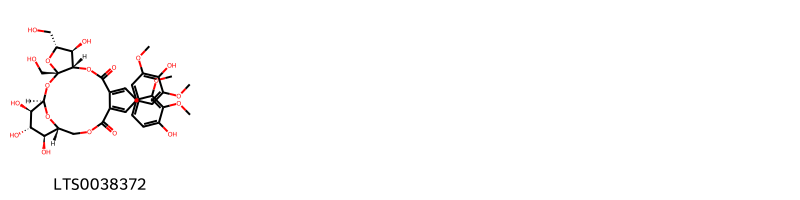{ width=100% }
    <figcaption>Hình ảnh cấu trúc hóa học của 1 hoạt chất thuộc nhóm Saccharolipids gồm ['(1r,3s,5r,6r,7s,10e,11e,15r,16s,17s,18r)-6,16,17,18-tetrahydroxy-10-[(4-hydroxy-2,3-dimethoxyphenyl)methylidene]-11-[(4-hydroxy-3,5-dimethoxyphenyl)methylidene]-3,5-bis(hydroxymethyl)-2,4,8,13,19-pentaoxatricyclo[13.3.1.0³,⁷]nonadecane-9,12-dione (LTS0038372)'].</figcaption>
</figure>

---

### Dược dân tộc học

Danh sách các quốc gia có sử dụng *Polygala glomerata* trong điều trị các bệnh. 

| Country   | Disease   | Bệnh               |
|:----------|:----------|:-------------------|
| Elsewhere | Tonic     | (thuộc) trương lực |

---

---
## Polygala japonica
### Thông tin về thực vật

!!! info "Phân loại thực vật của *Polygala japonica* từ GIBF:"
    - **Kingdom:** Plantae
    - **Phylum:** Tracheophyta
    - **Order:** Fabales
    - **Family:** Polygalaceae
    - **Genus:** Polygala
    - **Species:** *Polygala japonica*

 

| Label (VI)   | Label (EN)   | Scientific Name   | Descriptions (VI)   | Descriptions (EN)   | Also Known As (VI)   | Also Known As (EN)   |
|:-------------|:-------------|:------------------|:--------------------|:--------------------|:---------------------|:---------------------|
| N/A          | N/A          | Polygala japonica | loài thực vật       | species of plant    | ['']                 | ['']                 |

#### Phân bố trên thế giới

**Từ CSDL GIBF** Australia, Japan, Korea, Republic of, Chinese Taipei, Russian Federation, China

#### Phân bố tại Việt Nam

**Từ CSDL GIBF**: Không có ghi nhận ở Việt Nam

---
### Thành phần hóa học
        
- Theo cơ sở dữ liệu lotus: Từ loài *Polygala japonica* đã phân lập và xác định được 118 hoạt chất thuộc về các nhóm Flavonoids, Prenol lipids, Cinnamic acids and derivatives, Sphingolipids, Organooxygen compounds, Benzopyrans. 

|    | chemicalTaxonomyClassyfireClass   |   smiles_count |
|---:|:----------------------------------|---------------:|
|  0 | Benzopyrans                       |              1 |
|  1 | Cinnamic acids and derivatives    |              2 |
|  2 | Flavonoids                        |              2 |
|  3 | Organooxygen compounds            |              3 |
|  4 | Prenol lipids                     |            107 |
|  5 | Sphingolipids                     |              2 |

#### Nhóm Benzopyrans
<figure markdown="span">
    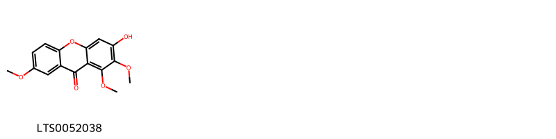{ width=100% }
    <figcaption>Hình ảnh cấu trúc hóa học của 1 hoạt chất thuộc nhóm Benzopyrans gồm ['3-hydroxy-1,2,7-trimethoxyxanthen-9-one (LTS0052038)'].</figcaption>
</figure>
#### Nhóm Cinnamic acids and derivatives
<figure markdown="span">
    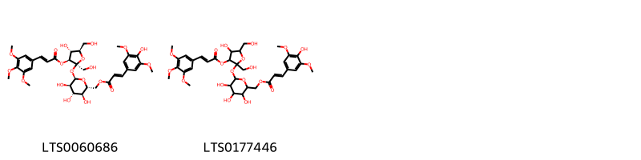{ width=100% }
    <figcaption>Hình ảnh cấu trúc hóa học của 2 hoạt chất thuộc nhóm Cinnamic acids and derivatives gồm ['tenuifoliside c (LTS0060686)', '(3,4,5-trihydroxy-6-{[4-hydroxy-2,5-bis(hydroxymethyl)-3-{[3-(3,4,5-trimethoxyphenyl)prop-2-enoyl]oxy}oxolan-2-yl]oxy}oxan-2-yl)methyl 3-(4-hydroxy-3,5-dimethoxyphenyl)prop-2-enoate (LTS0177446)'].</figcaption>
</figure>
#### Nhóm Flavonoids
<figure markdown="span">
    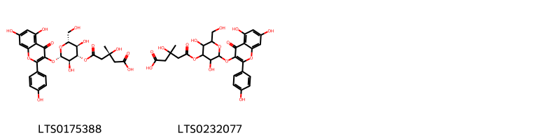{ width=100% }
    <figcaption>Hình ảnh cấu trúc hóa học của 2 hoạt chất thuộc nhóm Flavonoids gồm ['(3r)-5-{[(2s,3r,4s,5r,6r)-2-{[5,7-dihydroxy-2-(4-hydroxyphenyl)-4-oxochromen-3-yl]oxy}-3,5-dihydroxy-6-(hydroxymethyl)oxan-4-yl]oxy}-3-hydroxy-3-methyl-5-oxopentanoic acid (LTS0175388)', '5-[(2-{[5,7-dihydroxy-2-(4-hydroxyphenyl)-4-oxochromen-3-yl]oxy}-3,5-dihydroxy-6-(hydroxymethyl)oxan-4-yl)oxy]-3-hydroxy-3-methyl-5-oxopentanoic acid (LTS0232077)'].</figcaption>
</figure>
#### Nhóm Organooxygen compounds
<figure markdown="span">
    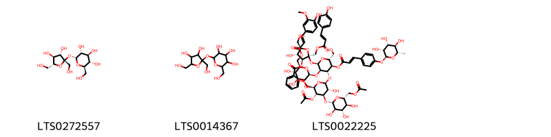{ width=100% }
    <figcaption>Hình ảnh cấu trúc hóa học của 3 hoạt chất thuộc nhóm Organooxygen compounds gồm ['sucrose (LTS0272557)', 'granulated sugar (LTS0014367)', '(2s,3s,4r,5r)-2-{[(2r,3r,4s,5r,6r)-4-{[(2s,3r,4r,5r,6r)-5-(acetyloxy)-4-{[(2s,3r,4s,5s,6r)-6-[(acetyloxy)methyl]-3,4,5-trihydroxyoxan-2-yl]oxy}-3-hydroxy-6-(hydroxymethyl)oxan-2-yl]oxy}-6-(hydroxymethyl)-3-{[(2s,3r,4s,5s,6r)-3,4,5-trihydroxy-6-({[(2e)-3-(4-hydroxy-3-methoxyphenyl)prop-2-enoyl]oxy}methyl)oxan-2-yl]oxy}-5-{[(2e)-3-(4-{[(2s,3r,4r,5r,6s)-3,4,5-trihydroxy-6-methyloxan-2-yl]oxy}phenyl)prop-2-enoyl]oxy}oxan-2-yl]oxy}-4-hydroxy-5-(hydroxymethyl)-2-({[(2e)-3-(4-hydroxyphenyl)prop-2-enoyl]oxy}methyl)oxolan-3-yl benzoate (LTS0022225)'].</figcaption>
</figure>
#### Nhóm Prenol lipids
<figure markdown="span">
    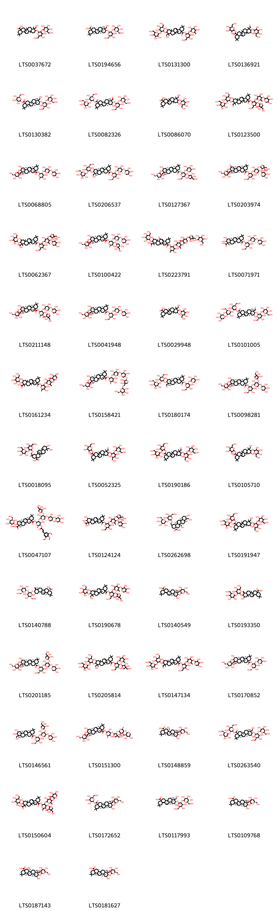{ width=100% }
    <figcaption>Hình ảnh cấu trúc hóa học của 107 hoạt chất thuộc nhóm Prenol lipids gồm ['10-{[4,5-dihydroxy-6-(hydroxymethyl)-3-{[3,4,5-trihydroxy-6-(hydroxymethyl)oxan-2-yl]oxy}oxan-2-yl]oxy}-9-(hydroxymethyl)-2,2,6a,6b,9,12a-hexamethyl-1,3,4,5,6,7,8,8a,10,11,12,12b,13,14b-tetradecahydropicene-4a-carboxylic acid (LTS0037672)', '(4as,6as,6br,8ar,9r,10s,12ar,12br,14bs)-10-{[(2r,3r,4s,5s,6r)-4,5-dihydroxy-6-(hydroxymethyl)-3-{[(2s,3r,4s,5s,6r)-3,4,5-trihydroxy-6-(hydroxymethyl)oxan-2-yl]oxy}oxan-2-yl]oxy}-9-(hydroxymethyl)-2,2,6a,6b,9,12a-hexamethyl-1,3,4,5,6,7,8,8a,10,11,12,12b,13,14b-tetradecahydropicene-4a-carboxylic acid (LTS0194656)', '4,5-dihydroxy-6-(hydroxymethyl)-3-[(3,4,5-trihydroxy-6-methyloxan-2-yl)oxy]oxan-2-yl 10-{[4,5-dihydroxy-6-(hydroxymethyl)-3-{[3,4,5-trihydroxy-6-(hydroxymethyl)oxan-2-yl]oxy}oxan-2-yl]oxy}-11-hydroxy-9-(hydroxymethyl)-2,2,6a,6b,9,12a-hexamethyl-1,3,4,5,6,7,8,8a,10,11,12,12b,13,14b-tetradecahydropicene-4a-carboxylate (LTS0131300)', '3,4,5-trihydroxy-6-(hydroxymethyl)oxan-2-yl 9-formyl-11-hydroxy-2,2,6a,6b,9,12a-hexamethyl-10-{[3,4,5-trihydroxy-6-(hydroxymethyl)oxan-2-yl]oxy}-1,3,4,5,6,7,8,8a,10,11,12,12b,13,14b-tetradecahydropicene-4a-carboxylate (LTS0136921)', '(2s,3r,4s,5s,6r)-3,4,5-trihydroxy-6-(hydroxymethyl)oxan-2-yl (4as,6as,6br,8ar,9r,10r,11s,12ar,12br,14bs)-10-{[(2r,3r,4s,5s,6r)-4,5-dihydroxy-6-(hydroxymethyl)-3-{[(2s,3r,4s,5s,6r)-3,4,5-trihydroxy-6-(hydroxymethyl)oxan-2-yl]oxy}oxan-2-yl]oxy}-11-hydroxy-9-(hydroxymethyl)-2,2,6a,6b,9,12a-hexamethyl-1,3,4,5,6,7,8,8a,10,11,12,12b,13,14b-tetradecahydropicene-4a-carboxylate (LTS0130382)', '(2s,3r,4s,5s,6r)-4,5-dihydroxy-6-(hydroxymethyl)-3-{[(2s,3r,4s,5s,6r)-3,4,5-trihydroxy-6-(hydroxymethyl)oxan-2-yl]oxy}oxan-2-yl (4as,6as,6br,8ar,9s,10r,11s,12ar,12br,14bs)-10-{[(2r,3r,4s,5s,6r)-4,5-dihydroxy-6-(hydroxymethyl)-3-{[(2s,3r,4s,5s,6r)-3,4,5-trihydroxy-6-(hydroxymethyl)oxan-2-yl]oxy}oxan-2-yl]oxy}-9-formyl-11-hydroxy-2,2,6a,6b,9,12a-hexamethyl-1,3,4,5,6,7,8,8a,10,11,12,12b,13,14b-tetradecahydropicene-4a-carboxylate (LTS0082326)', '11-hydroxy-9-(hydroxymethyl)-2,2,6a,6b,9,12a-hexamethyl-10-{[3,4,5-trihydroxy-6-(hydroxymethyl)oxan-2-yl]oxy}-1,3,4,5,6,7,8,8a,10,11,12,12b,13,14b-tetradecahydropicene-4a-carboxylic acid (LTS0086070)', '4-{[3,4-dihydroxy-4-(hydroxymethyl)oxolan-2-yl]oxy}-3-({3,4-dihydroxy-6-methyl-5-[(3,4,5-trihydroxyoxan-2-yl)oxy]oxan-2-yl}oxy)-5-hydroxy-6-(hydroxymethyl)oxan-2-yl 10-{[4,5-dihydroxy-6-(hydroxymethyl)-3-{[3,4,5-trihydroxy-6-(hydroxymethyl)oxan-2-yl]oxy}oxan-2-yl]oxy}-9-formyl-11-hydroxy-2,2,6a,6b,9,12a-hexamethyl-1,3,4,5,6,7,8,8a,10,11,12,12b,13,14b-tetradecahydropicene-4a-carboxylate (LTS0123500)', '(2s,3r,4s,4ar,6ar,6br,8as,12as,14ar,14br)-8a-({[(2s,3r,4s,5r,6r)-3-{[(2s,3r,4s,5r,6s)-3,4-dihydroxy-6-methyl-5-{[(2s,3r,4s,5r)-3,4,5-trihydroxyoxan-2-yl]oxy}oxan-2-yl]oxy}-4,5-dihydroxy-6-methyloxan-2-yl]oxy}carbonyl)-2-hydroxy-6b-(hydroxymethyl)-4,6a,11,11,14b-pentamethyl-3-{[(2r,3r,4s,5s,6r)-3,4,5-trihydroxy-6-(hydroxymethyl)oxan-2-yl]oxy}-1,2,3,4a,5,6,7,8,9,10,12,12a,14,14a-tetradecahydropicene-4-carboxylic acid (LTS0068805)', '(2s,3r,4s,5s,6r)-3-{[(2s,3r,4s,5r,6s)-3,4-dihydroxy-6-methyl-5-{[(2s,3r,4s,5r)-3,4,5-trihydroxyoxan-2-yl]oxy}oxan-2-yl]oxy}-4,5-dihydroxy-6-(hydroxymethyl)oxan-2-yl (4as,6as,6br,8ar,9r,10r,11s,12ar,12br,14bs)-10-{[(2r,3r,4s,5s,6r)-4,5-dihydroxy-6-(hydroxymethyl)-3-{[(2s,3r,4s,5s,6r)-3,4,5-trihydroxy-6-(hydroxymethyl)oxan-2-yl]oxy}oxan-2-yl]oxy}-11-hydroxy-9-(hydroxymethyl)-2,2,6a,6b,9,12a-hexamethyl-1,3,4,5,6,7,8,8a,10,11,12,12b,13,14b-tetradecahydropicene-4a-carboxylate (LTS0206537)', '(2s,3r,4s,5r,6r)-4-{[(2s,3r,4r)-3,4-dihydroxy-4-(hydroxymethyl)oxolan-2-yl]oxy}-5-hydroxy-6-(hydroxymethyl)-3-{[(2s,3r,4r,5r,6s)-3,4,5-trihydroxy-6-methyloxan-2-yl]oxy}oxan-2-yl (4as,6as,6br,8ar,9r,10r,11s,12ar,12br,14bs)-11-hydroxy-9-(hydroxymethyl)-2,2,6a,6b,9,12a-hexamethyl-10-{[(2r,3r,4s,5s,6r)-3,4,5-trihydroxy-6-(hydroxymethyl)oxan-2-yl]oxy}-1,3,4,5,6,7,8,8a,10,11,12,12b,13,14b-tetradecahydropicene-4a-carboxylate (LTS0127367)', '(3r,4s,4ar,6ar,6bs,8as,12as,14ar,14br)-8a-({[(2s,3r,4s,5s,6r)-3-{[(2s,3r,4s,5s,6s)-4-{[(2s,3r,4r)-3,4-dihydroxy-4-(hydroxymethyl)oxolan-2-yl]oxy}-3-hydroxy-6-methyl-5-{[(2s,3r,4s,5r)-3,4,5-trihydroxyoxan-2-yl]oxy}oxan-2-yl]oxy}-4,5-dihydroxy-6-(hydroxymethyl)oxan-2-yl]oxy}carbonyl)-4,6a,6b,11,11,14b-hexamethyl-2-oxo-3-{[(2s,3r,4s,5s,6r)-3,4,5-trihydroxy-6-(hydroxymethyl)oxan-2-yl]oxy}-3,4a,5,6,7,8,9,10,12,12a,14,14a-dodecahydro-1h-picene-4-carboxylic acid (LTS0203974)', '8a-[({3-[(4-{[3,4-dihydroxy-4-(hydroxymethyl)oxolan-2-yl]oxy}-3-hydroxy-6-methyl-5-[(3,4,5-trihydroxyoxan-2-yl)oxy]oxan-2-yl)oxy]-4,5-dihydroxy-6-(hydroxymethyl)oxan-2-yl}oxy)carbonyl]-4,6a,6b,11,11,14b-hexamethyl-2-oxo-3-{[3,4,5-trihydroxy-6-(hydroxymethyl)oxan-2-yl]oxy}-3,4a,5,6,7,8,9,10,12,12a,14,14a-dodecahydro-1h-picene-4-carboxylic acid (LTS0062367)', '(2s,3r,4s,4ar,6ar,6br,8as,12as,14ar,14br)-8a-({[(2s,3r,4s,5s,6r)-4-{[(2r,4s,5r)-4,5-dihydroxy-5-(hydroxymethyl)oxolan-2-yl]oxy}-3-{[(2s,3r,4s,5r,6s)-3,4-dihydroxy-6-methyl-5-{[(2s,3r,4s,5r)-3,4,5-trihydroxyoxan-2-yl]oxy}oxan-2-yl]oxy}-5-hydroxy-6-methyloxan-2-yl]oxy}carbonyl)-2-hydroxy-6b-(hydroxymethyl)-4,6a,11,11,14b-pentamethyl-3-{[(2r,3r,4s,5s,6r)-3,4,5-trihydroxy-6-(hydroxymethyl)oxan-2-yl]oxy}-1,2,3,4a,5,6,7,8,9,10,12,12a,14,14a-tetradecahydropicene-4-carboxylic acid (LTS0100422)', '8a-({[3-({5-[(5-{[3,4-dihydroxy-4-({[3,4,5-trihydroxy-6-(hydroxymethyl)oxan-2-yl]oxy}methyl)oxolan-2-yl]oxy}-3,4-dihydroxyoxan-2-yl)oxy]-3,4-dihydroxy-6-methyloxan-2-yl}oxy)-4,5-dihydroxy-6-methyloxan-2-yl]oxy}carbonyl)-2-hydroxy-6b-(hydroxymethyl)-4,6a,11,11,14b-pentamethyl-14-oxo-3-{[3,4,5-trihydroxy-6-(hydroxymethyl)oxan-2-yl]oxy}-2,3,4a,5,6,7,8,9,10,12,12a,14a-dodecahydro-1h-picene-4-carboxylic acid (LTS0223791)', '(2s,3r,4s,4ar,6ar,6bs,8as,12as,14ar,14br)-8a-({[(2s,3r,4s,5s,6r)-3-{[(2s,3r,4s,5r,6s)-3,4-dihydroxy-6-methyl-5-{[(2s,3r,4s,5r)-3,4,5-trihydroxyoxan-2-yl]oxy}oxan-2-yl]oxy}-4,5-dihydroxy-6-(hydroxymethyl)oxan-2-yl]oxy}carbonyl)-2,3-dihydroxy-4,6a,6b,11,11,14b-hexamethyl-1,2,3,4a,5,6,7,8,9,10,12,12a,14,14a-tetradecahydropicene-4-carboxylic acid (LTS0071971)', '(2s,3r,4s,4ar,6ar,6br,8as,12as,14ar,14br)-8a-({[(2s,3r,4s,5s,6r)-4-{[(2s,3r,4r)-3,4-dihydroxy-4-(hydroxymethyl)oxolan-2-yl]oxy}-3-{[(2s,3r,4s,5r,6s)-3,4-dihydroxy-6-methyl-5-{[(2s,3r,4s,5r)-3,4,5-trihydroxyoxan-2-yl]oxy}oxan-2-yl]oxy}-5-hydroxy-6-methyloxan-2-yl]oxy}carbonyl)-2-hydroxy-6b-(hydroxymethyl)-4,6a,11,11,14b-pentamethyl-3-{[(2r,3r,4s,5s,6r)-3,4,5-trihydroxy-6-(hydroxymethyl)oxan-2-yl]oxy}-1,2,3,4a,5,6,7,8,9,10,12,12a,14,14a-tetradecahydropicene-4-carboxylic acid (LTS0211148)', '(2s,3r,4s,4ar,6ar,6bs,8as,12as,14ar,14br)-8a-({[(2s,3r,4s,5s,6r)-3-{[(2s,3r,4s,5r,6s)-3,4-dihydroxy-6-methyl-5-{[(2s,3r,4s,5r)-3,4,5-trihydroxyoxan-2-yl]oxy}oxan-2-yl]oxy}-4,5-dihydroxy-6-(hydroxymethyl)oxan-2-yl]oxy}carbonyl)-2-hydroxy-4,6a,6b,11,11,14b-hexamethyl-3-{[(2r,3r,4s,5s,6r)-3,4,5-trihydroxy-6-(hydroxymethyl)oxan-2-yl]oxy}-1,2,3,4a,5,6,7,8,9,10,12,12a,14,14a-tetradecahydropicene-4-carboxylic acid (LTS0041948)', '11-hydroxy-9-(hydroxymethyl)-2,2,6a,6b,9,12a-hexamethyl-10-{[3,4,5-trihydroxy-6-(hydroxymethyl)oxan-2-yl]oxy}-1,3,4,5,6,7,8,8a,10,11,12,12b-dodecahydropicene-4a-carboxylic acid (LTS0029948)', '(2s,3r,4s,5s,6r)-3-{[(2s,3r,4r,5s,6r)-3,4-dihydroxy-6-(hydroxymethyl)-5-{[(2s,3r,4s,5r)-3,4,5-trihydroxyoxan-2-yl]oxy}oxan-2-yl]oxy}-4,5-dihydroxy-6-(hydroxymethyl)oxan-2-yl (4as,6as,6br,8ar,9s,10r,11s,12ar,12br,14bs)-10-{[(2r,3r,4s,5s,6r)-4,5-dihydroxy-6-(hydroxymethyl)-3-{[(2s,3r,4s,5s,6r)-3,4,5-trihydroxy-6-(hydroxymethyl)oxan-2-yl]oxy}oxan-2-yl]oxy}-9-formyl-11-hydroxy-2,2,6a,6b,9,12a-hexamethyl-1,3,4,5,6,7,8,8a,10,11,12,12b,13,14b-tetradecahydropicene-4a-carboxylate (LTS0101005)', '8a-({[3-({3,4-dihydroxy-6-methyl-5-[(3,4,5-trihydroxyoxan-2-yl)oxy]oxan-2-yl}oxy)-4,5-dihydroxy-6-methyloxan-2-yl]oxy}carbonyl)-2-hydroxy-6b-(hydroxymethyl)-4,6a,11,11,14b-pentamethyl-3-{[3,4,5-trihydroxy-6-(hydroxymethyl)oxan-2-yl]oxy}-1,2,3,4a,5,6,7,8,9,10,12,12a,14,14a-tetradecahydropicene-4-carboxylic acid (LTS0161234)', '(2s,3r,4s,4ar,6ar,6br,8as,12as,14ar,14br)-8a-({[(2s,3r,4s,5r,6r)-3-{[(2s,3r,4s,5r,6s)-5-{[(2s,3r,4r,5r)-5-{[(2s,3r,4s)-3,4-dihydroxy-4-({[(2r,3r,4s,5r,6r)-3,4,5-trihydroxy-6-(hydroxymethyl)oxan-2-yl]oxy}methyl)oxolan-2-yl]oxy}-3,4-dihydroxyoxan-2-yl]oxy}-3,4-dihydroxy-6-methyloxan-2-yl]oxy}-4,5-dihydroxy-6-methyloxan-2-yl]oxy}carbonyl)-2-hydroxy-6b-(hydroxymethyl)-4,6a,11,11,14b-pentamethyl-3-{[(2r,3r,4s,5s,6r)-3,4,5-trihydroxy-6-(hydroxymethyl)oxan-2-yl]oxy}-1,2,3,4a,5,6,7,8,9,10,12,12a,14,14a-tetradecahydropicene-4-carboxylic acid (LTS0158421)', '(2s,3r,4s,5s,6r)-4,5-dihydroxy-6-(hydroxymethyl)-3-{[(2s,3r,4r,5r,6s)-3,4,5-trihydroxy-6-methyloxan-2-yl]oxy}oxan-2-yl (4as,6as,6br,8ar,9s,10r,11s,12ar,12br,14bs)-10-{[(2r,3r,4s,5s,6r)-4,5-dihydroxy-6-(hydroxymethyl)-3-{[(2s,3r,4s,5s,6r)-3,4,5-trihydroxy-6-(hydroxymethyl)oxan-2-yl]oxy}oxan-2-yl]oxy}-9-formyl-11-hydroxy-2,2,6a,6b,9,12a-hexamethyl-1,3,4,5,6,7,8,8a,10,11,12,12b,13,14b-tetradecahydropicene-4a-carboxylate (LTS0180174)', '(2s,3r,4s,5s,6r)-3-{[(2s,3r,4r,5s,6s)-4-{[(2s,3r,4r)-3,4-dihydroxy-4-(hydroxymethyl)oxolan-2-yl]oxy}-3-hydroxy-6-methyl-5-{[(2s,3r,4s,5r)-3,4,5-trihydroxyoxan-2-yl]oxy}oxan-2-yl]oxy}-4,5-dihydroxy-6-(hydroxymethyl)oxan-2-yl (4as,6as,6br,8ar,9r,10r,11s,12ar,12br,14bs)-11-hydroxy-9-(hydroxymethyl)-2,2,6a,6b,9,12a-hexamethyl-10-{[(2r,3r,4s,5s,6r)-3,4,5-trihydroxy-6-(hydroxymethyl)oxan-2-yl]oxy}-1,3,4,5,6,7,8,8a,10,11,12,12b,13,14b-tetradecahydropicene-4a-carboxylate (LTS0098281)', '2-({[4,5-dihydroxy-6-(hydroxymethyl)-3-{[3,4,5-trihydroxy-6-(hydroxymethyl)oxan-2-yl]oxy}oxan-2-yl]oxy}methyl)-10-hydroxy-6a,9-bis(hydroxymethyl)-2,6b,9,12a-tetramethyl-1,3,4,5,6,7,8,8a,10,11,12,12b,13,14b-tetradecahydropicene-4a-carboxylic acid (LTS0018095)', '3,4,5-trihydroxy-6-(hydroxymethyl)oxan-2-yl 10-{[4,5-dihydroxy-6-(hydroxymethyl)-3-{[3,4,5-trihydroxy-6-(hydroxymethyl)oxan-2-yl]oxy}oxan-2-yl]oxy}-9-formyl-11-hydroxy-2,2,6a,6b,9,12a-hexamethyl-1,3,4,5,6,7,8,8a,10,11,12,12b,13,14b-tetradecahydropicene-4a-carboxylate (LTS0052325)', '4,5-dihydroxy-6-(hydroxymethyl)-3-{[3,4,5-trihydroxy-6-(hydroxymethyl)oxan-2-yl]oxy}oxan-2-yl 10-{[4,5-dihydroxy-6-(hydroxymethyl)-3-{[3,4,5-trihydroxy-6-(hydroxymethyl)oxan-2-yl]oxy}oxan-2-yl]oxy}-9-formyl-11-hydroxy-2,2,6a,6b,9,12a-hexamethyl-1,3,4,5,6,7,8,8a,10,11,12,12b,13,14b-tetradecahydropicene-4a-carboxylate (LTS0190186)', '3,4,5-trihydroxy-6-(hydroxymethyl)oxan-2-yl 11-hydroxy-9-(hydroxymethyl)-2,2,6a,6b,9,12a-hexamethyl-10-{[3,4,5-trihydroxy-6-(hydroxymethyl)oxan-2-yl]oxy}-1,3,4,5,6,7,8,8a,10,11,12,12b,13,14b-tetradecahydropicene-4a-carboxylate (LTS0105710)', '(2s,3r,4s,4ar,6ar,6br,8as,12as,14ar,14br)-8a-({[(2s,3r,4s,5r,6r)-3-{[(2s,3r,4s,5s,6s)-4-{[(2s,3r,4r)-3,4-dihydroxy-4-(hydroxymethyl)oxolan-2-yl]oxy}-5-{[(2r,3r,4s,5r)-3,5-dihydroxy-4-{[(2s,3r,4s,5s)-3,4,5-trihydroxyoxan-2-yl]oxy}oxan-2-yl]oxy}-3-hydroxy-6-methyloxan-2-yl]oxy}-4-hydroxy-6-methyl-5-{[(2e)-3-(3,4,5-trimethoxyphenyl)prop-2-enoyl]oxy}oxan-2-yl]oxy}carbonyl)-2-hydroxy-6b-(hydroxymethyl)-4,6a,11,11,14b-pentamethyl-3-{[(2r,3r,4s,5s,6r)-3,4,5-trihydroxy-6-(hydroxymethyl)oxan-2-yl]oxy}-1,2,3,4a,5,6,7,8,9,10,12,12a,14,14a-tetradecahydropicene-4-carboxylic acid (LTS0047107)', '8a-[({3-[(4-{[3,4-dihydroxy-4-(hydroxymethyl)oxolan-2-yl]oxy}-3-hydroxy-6-methyl-5-[(3,4,5-trihydroxyoxan-2-yl)oxy]oxan-2-yl)oxy]-4,5-dihydroxy-6-(hydroxymethyl)oxan-2-yl}oxy)carbonyl]-2,3-dihydroxy-4,6a,6b,11,11,14b-hexamethyl-1,2,3,4a,5,6,7,8,9,10,12,12a,14,14a-tetradecahydropicene-4-carboxylic acid (LTS0124124)', '(2r,4as,6ar,6br,8ar,9r,10s,12ar,12br,14bs)-2-({[(2r,3r,4s,5s,6r)-4,5-dihydroxy-6-(hydroxymethyl)-3-{[(2s,3r,4s,5s,6r)-3,4,5-trihydroxy-6-(hydroxymethyl)oxan-2-yl]oxy}oxan-2-yl]oxy}methyl)-10-hydroxy-6a,9-bis(hydroxymethyl)-2,6b,9,12a-tetramethyl-1,3,4,5,6,7,8,8a,10,11,12,12b,13,14b-tetradecahydropicene-4a-carboxylic acid (LTS0262698)', '4,5-dihydroxy-6-(hydroxymethyl)-3-{[3,4,5-trihydroxy-6-(hydroxymethyl)oxan-2-yl]oxy}oxan-2-yl 10-{[4,5-dihydroxy-6-(hydroxymethyl)-3-{[3,4,5-trihydroxy-6-(hydroxymethyl)oxan-2-yl]oxy}oxan-2-yl]oxy}-11-hydroxy-9-(hydroxymethyl)-2,2,6a,6b,9,12a-hexamethyl-1,3,4,5,6,7,8,8a,10,11,12,12b,13,14b-tetradecahydropicene-4a-carboxylate (LTS0191947)', '(4as,6as,6br,8ar,10r,11s,12ar,12br,14bs)-10-{[(2r,3r,4s,5s,6r)-4,5-dihydroxy-6-(hydroxymethyl)-3-{[(2s,3r,4s,5s,6r)-3,4,5-trihydroxy-6-(hydroxymethyl)oxan-2-yl]oxy}oxan-2-yl]oxy}-11-hydroxy-2,2,6a,6b,12a-pentamethyl-9-methylidene-1,3,4,5,6,7,8,8a,10,11,12,12b,13,14b-tetradecahydropicene-4a-carboxylic acid (LTS0140788)', '4-{[3,4-dihydroxy-4-(hydroxymethyl)oxolan-2-yl]oxy}-3-({3,4-dihydroxy-6-methyl-5-[(3,4,5-trihydroxyoxan-2-yl)oxy]oxan-2-yl}oxy)-5-hydroxy-6-(hydroxymethyl)oxan-2-yl 11-hydroxy-9-(hydroxymethyl)-2,2,6a,6b,9,12a-hexamethyl-10-{[3,4,5-trihydroxy-6-(hydroxymethyl)oxan-2-yl]oxy}-1,3,4,5,6,7,8,8a,10,11,12,12b,13,14b-tetradecahydropicene-4a-carboxylate (LTS0190678)', '(4as,6as,6br,8ar,9r,10r,11s,12as,12br)-11-hydroxy-9-(hydroxymethyl)-2,2,6a,6b,9,12a-hexamethyl-10-{[(2r,3r,4s,5s,6r)-3,4,5-trihydroxy-6-(hydroxymethyl)oxan-2-yl]oxy}-1,3,4,5,6,7,8,8a,10,11,12,12b-dodecahydropicene-4a-carboxylic acid (LTS0140549)', '10-{[4,5-dihydroxy-6-(hydroxymethyl)-3-{[3,4,5-trihydroxy-6-(hydroxymethyl)oxan-2-yl]oxy}oxan-2-yl]oxy}-11-hydroxy-2,2,6a,6b,12a-pentamethyl-9-methylidene-1,3,4,5,6,7,8,8a,10,11,12,12b,13,14b-tetradecahydropicene-4a-carboxylic acid (LTS0193350)', '(2s,3r,4s,5s,6r)-3-{[(2s,3r,4s,5s,6s)-4-{[(2s,3r,4r)-3,4-dihydroxy-4-(hydroxymethyl)oxolan-2-yl]oxy}-3-hydroxy-6-methyl-5-{[(2r,3r,4s,5r)-3,4,5-trihydroxyoxan-2-yl]oxy}oxan-2-yl]oxy}-4,5-dihydroxy-6-(hydroxymethyl)oxan-2-yl (4as,6as,6br,8ar,9r,10r,11s,12ar,12br,14bs)-11-hydroxy-9-(hydroxymethyl)-2,2,6a,6b,9,12a-hexamethyl-10-{[(2r,3r,4s,5s,6r)-3,4,5-trihydroxy-6-(hydroxymethyl)oxan-2-yl]oxy}-1,3,4,5,6,7,8,8a,10,11,12,12b,13,14b-tetradecahydropicene-4a-carboxylate (LTS0201185)', '4-{[3,4-dihydroxy-4-(hydroxymethyl)oxolan-2-yl]oxy}-5-hydroxy-6-(hydroxymethyl)-3-[(3,4,5-trihydroxy-6-methyloxan-2-yl)oxy]oxan-2-yl 10-{[4,5-dihydroxy-6-(hydroxymethyl)-3-{[3,4,5-trihydroxy-6-(hydroxymethyl)oxan-2-yl]oxy}oxan-2-yl]oxy}-11-hydroxy-9-(hydroxymethyl)-2,2,6a,6b,9,12a-hexamethyl-1,3,4,5,6,7,8,8a,10,11,12,12b,13,14b-tetradecahydropicene-4a-carboxylate (LTS0205814)', '3-({3,4-dihydroxy-6-methyl-5-[(3,4,5-trihydroxyoxan-2-yl)oxy]oxan-2-yl}oxy)-4,5-dihydroxy-6-(hydroxymethyl)oxan-2-yl 10-{[4,5-dihydroxy-6-(hydroxymethyl)-3-{[3,4,5-trihydroxy-6-(hydroxymethyl)oxan-2-yl]oxy}oxan-2-yl]oxy}-9-formyl-11-hydroxy-2,2,6a,6b,9,12a-hexamethyl-1,3,4,5,6,7,8,8a,10,11,12,12b,13,14b-tetradecahydropicene-4a-carboxylate (LTS0147134)', '(2r,3s,4r,5s,6s)-4,5-dihydroxy-6-(hydroxymethyl)-3-{[(2r,3s,4r,5r,6s)-3,4,5-trihydroxy-6-methyloxan-2-yl]oxy}oxan-2-yl (4as,6ar,6br,8as,9r,10r,11r,12as,12br,14bs)-11-hydroxy-9-(hydroxymethyl)-2,2,6a,6b,9,12a-hexamethyl-10-{[(2r,3s,4r,5s,6r)-3,4,5-trihydroxy-6-(hydroxymethyl)oxan-2-yl]oxy}-1,3,4,5,6,7,8,8a,10,11,12,12b,13,14b-tetradecahydropicene-4a-carboxylate (LTS0170852)', '(2s,3r,4s,5s,6r)-3-{[(2s,3r,4r,5s,6s)-4-{[(2s,3r,4r)-3,4-dihydroxy-4-(hydroxymethyl)oxolan-2-yl]oxy}-3-hydroxy-6-methyl-5-{[(2s,3r,4s,5r)-3,4,5-trihydroxyoxan-2-yl]oxy}oxan-2-yl]oxy}-4,5-dihydroxy-6-(hydroxymethyl)oxan-2-yl (4as,6as,6br,8ar,9r,10r,11s,12ar,12br,14bs)-10,11-dihydroxy-9-(hydroxymethyl)-2,2,6a,6b,9,12a-hexamethyl-1,3,4,5,6,7,8,8a,10,11,12,12b,13,14b-tetradecahydropicene-4a-carboxylate (LTS0146561)', '(2s,3r,4s,4ar,6ar,6br,8as,12as,14ar,14br)-8a-({[(2s,3r,4s,5s,6r)-4-{[(2s,3r,4r)-3-{[(2s,3r,4s,5r,6s)-3,4-dihydroxy-6-methyl-5-{[(2s,3r,4s,5r)-3,4,5-trihydroxyoxan-2-yl]oxy}oxan-2-yl]oxy}-4-hydroxy-4-(hydroxymethyl)oxolan-2-yl]oxy}-3,5-dihydroxy-6-methyloxan-2-yl]oxy}carbonyl)-2-hydroxy-6b-(hydroxymethyl)-4,6a,11,11,14b-pentamethyl-3-{[(2r,3r,4s,5s,6r)-3,4,5-trihydroxy-6-(hydroxymethyl)oxan-2-yl]oxy}-1,2,3,4a,5,6,7,8,9,10,12,12a,14,14a-tetradecahydropicene-4-carboxylic acid (LTS0151300)', '(4as,6ar,6br,8ar,9r,10r,11s,12ar,12br,14bs)-11-hydroxy-6a,9-bis(hydroxymethyl)-2,2,6b,9,12a-pentamethyl-10-{[(2r,3r,4s,5s,6r)-3,4,5-trihydroxy-6-(hydroxymethyl)oxan-2-yl]oxy}-1,3,4,5,6,7,8,8a,10,11,12,12b,13,14b-tetradecahydropicene-4a-carboxylic acid (LTS0148859)', '(2s,3r,4s,5s,6r)-4,5-dihydroxy-6-(hydroxymethyl)-3-{[(2s,3r,4s,5s,6r)-3,4,5-trihydroxy-6-(hydroxymethyl)oxan-2-yl]oxy}oxan-2-yl (4as,6as,6br,8ar,9r,10r,11s,12ar,12br,14bs)-10-{[(2r,3r,4s,5s,6r)-4,5-dihydroxy-6-(hydroxymethyl)-3-{[(2s,3r,4s,5s,6r)-3,4,5-trihydroxy-6-(hydroxymethyl)oxan-2-yl]oxy}oxan-2-yl]oxy}-11-hydroxy-9-(hydroxymethyl)-2,2,6a,6b,9,12a-hexamethyl-1,3,4,5,6,7,8,8a,10,11,12,12b,13,14b-tetradecahydropicene-4a-carboxylate (LTS0263540)', '8a-{[(4-{[3,4-dihydroxy-4-(hydroxymethyl)oxolan-2-yl]oxy}-3-({3,4-dihydroxy-6-methyl-5-[(3,4,5-trihydroxyoxan-2-yl)oxy]oxan-2-yl}oxy)-5-hydroxy-6-methyloxan-2-yl)oxy]carbonyl}-2-hydroxy-6b-(hydroxymethyl)-4,6a,11,11,14b-pentamethyl-3-{[3,4,5-trihydroxy-6-(hydroxymethyl)oxan-2-yl]oxy}-1,2,3,4a,5,6,7,8,9,10,12,12a,14,14a-tetradecahydropicene-4-carboxylic acid (LTS0150604)', '(2s,3r,4s,5s,6r)-3,4,5-trihydroxy-6-(hydroxymethyl)oxan-2-yl (4as,6as,6br,8ar,9s,10r,11s,12ar,12br,14bs)-9-formyl-11-hydroxy-2,2,6a,6b,9,12a-hexamethyl-10-{[(2r,3r,4s,5s,6r)-3,4,5-trihydroxy-6-(hydroxymethyl)oxan-2-yl]oxy}-1,3,4,5,6,7,8,8a,10,11,12,12b,13,14b-tetradecahydropicene-4a-carboxylate (LTS0172652)', '(4as,6as,6br,8ar,9r,10r,11s,12as,12br)-10-{[(2r,3r,4s,5s,6r)-4,5-dihydroxy-6-(hydroxymethyl)-3-{[(2s,3r,4s,5s,6r)-3,4,5-trihydroxy-6-(hydroxymethyl)oxan-2-yl]oxy}oxan-2-yl]oxy}-11-hydroxy-9-(hydroxymethyl)-2,2,6a,6b,9,12a-hexamethyl-1,3,4,5,6,7,8,8a,10,11,12,12b-dodecahydropicene-4a-carboxylic acid (LTS0117993)', '(4as,6as,6br,8as,9r,10r,11s,12ar,12br,14bs)-11-hydroxy-9-(hydroxymethyl)-2,2,6a,6b,9,12a-hexamethyl-10-{[(2r,3r,4s,5s,6r)-3,4,5-trihydroxy-6-(hydroxymethyl)oxan-2-yl]oxy}-1,3,4,5,6,7,8,8a,10,11,12,12b,13,14b-tetradecahydropicene-4a-carboxylic acid (LTS0109768)', '(2s,3r,4s,4ar,6ar,6br,8as,12as,14ar,14br)-2-hydroxy-6b-(hydroxymethyl)-4,6a,11,11,14b-pentamethyl-3-{[(2r,3r,4s,5s,6r)-3,4,5-trihydroxy-6-(hydroxymethyl)oxan-2-yl]oxy}-1,2,3,4a,5,6,7,8,9,10,12,12a,14,14a-tetradecahydropicene-4,8a-dicarboxylic acid (LTS0187143)', '(4as,6as,6br,8ar,9r,10r,11s,12ar,12br,14bs)-11-hydroxy-9-(hydroxymethyl)-2,2,6a,6b,9,12a-hexamethyl-10-{[(2r,3r,4s,5s,6r)-3,4,5-trihydroxy-6-(hydroxymethyl)oxan-2-yl]oxy}-1,3,4,5,6,7,8,8a,10,11,12,12b,13,14b-tetradecahydropicene-4a-carboxylic acid (LTS0181627)', '(2s,3r,4s,4ar,6ar,6br,8as,12as,14ar,14br)-8a-({[(2s,3r,4s,5r,6r)-4,5-dihydroxy-6-methyl-3-{[(2s,3r,4r,5r,6s)-3,4,5-trihydroxy-6-methyloxan-2-yl]oxy}oxan-2-yl]oxy}carbonyl)-2-hydroxy-6b-(hydroxymethyl)-4,6a,11,11,14b-pentamethyl-3-{[(2r,3r,4s,5s,6r)-3,4,5-trihydroxy-6-(hydroxymethyl)oxan-2-yl]oxy}-1,2,3,4a,5,6,7,8,9,10,12,12a,14,14a-tetradecahydropicene-4-carboxylic acid (LTS0257076)', '8a-[({4,5-dihydroxy-6-methyl-3-[(3,4,5-trihydroxy-6-methyloxan-2-yl)oxy]oxan-2-yl}oxy)carbonyl]-2-hydroxy-6b-(hydroxymethyl)-4,6a,11,11,14b-pentamethyl-3-{[3,4,5-trihydroxy-6-(hydroxymethyl)oxan-2-yl]oxy}-1,2,3,4a,5,6,7,8,9,10,12,12a,14,14a-tetradecahydropicene-4-carboxylic acid (LTS0187752)', '8a-({[3-({3,4-dihydroxy-6-methyl-5-[(3,4,5-trihydroxyoxan-2-yl)oxy]oxan-2-yl}oxy)-4,5-dihydroxy-6-(hydroxymethyl)oxan-2-yl]oxy}carbonyl)-2,3-dihydroxy-4,6a,6b,11,11,14b-hexamethyl-1,2,3,4a,5,6,7,8,9,10,12,12a,14,14a-tetradecahydropicene-4-carboxylic acid (LTS0121090)', '8a-({[3-({5-[(5-{[4,5-dihydroxy-5-({[3,4,5-trihydroxy-6-(hydroxymethyl)oxan-2-yl]oxy}methyl)oxolan-2-yl]oxy}-3,4-dihydroxyoxan-2-yl)oxy]-3,4-dihydroxy-6-methyloxan-2-yl}oxy)-4,5-dihydroxy-6-methyloxan-2-yl]oxy}carbonyl)-2-hydroxy-6b-(hydroxymethyl)-4,6a,11,11,14b-pentamethyl-3-{[3,4,5-trihydroxy-6-(hydroxymethyl)oxan-2-yl]oxy}-1,2,3,4a,5,6,7,8,9,10,12,12a,14,14a-tetradecahydropicene-4-carboxylic acid (LTS0262269)', '(2s,3r,4s,5s,6r)-3,4,5-trihydroxy-6-(hydroxymethyl)oxan-2-yl (4as,6as,6br,8ar,9r,10r,11s,12ar,12br,14bs)-11-hydroxy-9-(hydroxymethyl)-2,2,6a,6b,9,12a-hexamethyl-10-{[(2r,3r,4s,5s,6r)-3,4,5-trihydroxy-6-(hydroxymethyl)oxan-2-yl]oxy}-1,3,4,5,6,7,8,8a,10,11,12,12b,13,14b-tetradecahydropicene-4a-carboxylate (LTS0187069)', '(2s,3r,4s,5s,6r)-3-{[(2s,3r,4s,5r,6s)-5-{[(2s,3r,4r,5r)-3,4-dihydroxy-5-{[(2s,3r,4s,5r,6r)-3,4,5-trihydroxy-6-(hydroxymethyl)oxan-2-yl]oxy}oxan-2-yl]oxy}-3,4-dihydroxy-6-methyloxan-2-yl]oxy}-4,5-dihydroxy-6-(hydroxymethyl)oxan-2-yl (4as,6as,6br,8ar,9r,10r,11s,12ar,12br,14bs)-11-hydroxy-9-(hydroxymethyl)-2,2,6a,6b,9,12a-hexamethyl-10-{[(2r,3r,4s,5s,6r)-3,4,5-trihydroxy-6-(hydroxymethyl)oxan-2-yl]oxy}-1,3,4,5,6,7,8,8a,10,11,12,12b,13,14b-tetradecahydropicene-4a-carboxylate (LTS0190023)', '3-({3,4-dihydroxy-6-methyl-5-[(3,4,5-trihydroxyoxan-2-yl)oxy]oxan-2-yl}oxy)-4,5-dihydroxy-6-(hydroxymethyl)oxan-2-yl 10-{[4,5-dihydroxy-6-(hydroxymethyl)-3-{[3,4,5-trihydroxy-6-(hydroxymethyl)oxan-2-yl]oxy}oxan-2-yl]oxy}-11-hydroxy-9-(hydroxymethyl)-2,2,6a,6b,9,12a-hexamethyl-1,3,4,5,6,7,8,8a,10,11,12,12b,13,14b-tetradecahydropicene-4a-carboxylate (LTS0070157)', '3-[(4-{[3,4-dihydroxy-4-(hydroxymethyl)oxolan-2-yl]oxy}-3-hydroxy-6-methyl-5-[(3,4,5-trihydroxyoxan-2-yl)oxy]oxan-2-yl)oxy]-4,5-dihydroxy-6-(hydroxymethyl)oxan-2-yl 11-hydroxy-9-(hydroxymethyl)-2,2,6a,6b,9,12a-hexamethyl-10-{[3,4,5-trihydroxy-6-(hydroxymethyl)oxan-2-yl]oxy}-1,3,4,5,6,7,8,8a,10,11,12,12b,13,14b-tetradecahydropicene-4a-carboxylate (LTS0068383)', '8a-[({3-[(4-{[3,4-dihydroxy-4-(hydroxymethyl)oxolan-2-yl]oxy}-3-hydroxy-6-methyl-5-[(3,4,5-trihydroxyoxan-2-yl)oxy]oxan-2-yl)oxy]-4,5-dihydroxy-6-(hydroxymethyl)oxan-2-yl}oxy)carbonyl]-2-hydroxy-4,6a,6b,11,11,14b-hexamethyl-3-{[3,4,5-trihydroxy-6-(hydroxymethyl)oxan-2-yl]oxy}-1,2,3,4a,5,6,7,8,9,10,12,12a,14,14a-tetradecahydropicene-4-carboxylic acid (LTS0099790)', '2-hydroxy-6b-(hydroxymethyl)-4,6a,11,11,14b-pentamethyl-3-{[3,4,5-trihydroxy-6-(hydroxymethyl)oxan-2-yl]oxy}-1,2,3,4a,5,6,7,8,9,10,12,12a,14,14a-tetradecahydropicene-4,8a-dicarboxylic acid (LTS0217511)', '(2s,3r,4s,5r,6s)-4-{[(2r,3s,4s)-3,4-dihydroxy-4-(hydroxymethyl)oxolan-2-yl]oxy}-5-hydroxy-6-(hydroxymethyl)-3-{[(2s,3r,4s,5s,6s)-3,4,5-trihydroxy-6-methyloxan-2-yl]oxy}oxan-2-yl (4as,6ar,6br,8as,9r,10s,11s,12as,12br,14bs)-11-hydroxy-9-(hydroxymethyl)-2,2,6a,6b,9,12a-hexamethyl-10-{[(2r,3r,4s,5s,6s)-3,4,5-trihydroxy-6-(hydroxymethyl)oxan-2-yl]oxy}-1,3,4,5,6,7,8,8a,10,11,12,12b,13,14b-tetradecahydropicene-4a-carboxylate (LTS0223412)', '3,4,5-trihydroxy-6-(hydroxymethyl)oxan-2-yl 10-{[4,5-dihydroxy-6-(hydroxymethyl)-3-{[3,4,5-trihydroxy-6-(hydroxymethyl)oxan-2-yl]oxy}oxan-2-yl]oxy}-11-hydroxy-9-(hydroxymethyl)-2,2,6a,6b,9,12a-hexamethyl-1,3,4,5,6,7,8,8a,10,11,12,12b,13,14b-tetradecahydropicene-4a-carboxylate (LTS0214721)', '(2s,3r,4s,4ar,6ar,6br,8as,12as,14ar,14br)-8a-({[(2s,3r,4s,5r,6r)-3-{[(2s,3r,4s,5r,6s)-5-{[(2s,3r,4r,5r)-5-{[(2r,4s,5r)-4,5-dihydroxy-5-({[(2r,3r,4s,5r,6r)-3,4,5-trihydroxy-6-(hydroxymethyl)oxan-2-yl]oxy}methyl)oxolan-2-yl]oxy}-3,4-dihydroxyoxan-2-yl]oxy}-3,4-dihydroxy-6-methyloxan-2-yl]oxy}-4,5-dihydroxy-6-methyloxan-2-yl]oxy}carbonyl)-2-hydroxy-6b-(hydroxymethyl)-4,6a,11,11,14b-pentamethyl-3-{[(2r,3r,4s,5s,6r)-3,4,5-trihydroxy-6-(hydroxymethyl)oxan-2-yl]oxy}-1,2,3,4a,5,6,7,8,9,10,12,12a,14,14a-tetradecahydropicene-4-carboxylic acid (LTS0237693)', '(2s,3r,4s,5s,6r)-4,5-dihydroxy-6-(hydroxymethyl)-3-{[(2s,3r,4r,5r,6s)-3,4,5-trihydroxy-6-methyloxan-2-yl]oxy}oxan-2-yl (4as,6as,6br,8ar,9r,10r,11s,12ar,12br,14bs)-10-{[(2r,3r,4s,5s,6r)-4,5-dihydroxy-6-(hydroxymethyl)-3-{[(2s,3r,4s,5s,6r)-3,4,5-trihydroxy-6-(hydroxymethyl)oxan-2-yl]oxy}oxan-2-yl]oxy}-11-hydroxy-9-(hydroxymethyl)-2,2,6a,6b,9,12a-hexamethyl-1,3,4,5,6,7,8,8a,10,11,12,12b,13,14b-tetradecahydropicene-4a-carboxylate (LTS0089040)', '10-{[4,5-dihydroxy-6-(hydroxymethyl)-3-{[3,4,5-trihydroxy-6-(hydroxymethyl)oxan-2-yl]oxy}oxan-2-yl]oxy}-9-formyl-11-hydroxy-2,2,6a,6b,9,12a-hexamethyl-1,3,4,5,6,7,8,8a,10,11,12,12b,13,14b-tetradecahydropicene-4a-carboxylic acid (LTS0195268)', '8a-({[3-({3,4-dihydroxy-6-methyl-5-[(3,4,5-trihydroxyoxan-2-yl)oxy]oxan-2-yl}oxy)-4,5-dihydroxy-6-(hydroxymethyl)oxan-2-yl]oxy}carbonyl)-2-hydroxy-4,6a,6b,11,11,14b-hexamethyl-3-{[3,4,5-trihydroxy-6-(hydroxymethyl)oxan-2-yl]oxy}-1,2,3,4a,5,6,7,8,9,10,12,12a,14,14a-tetradecahydropicene-4-carboxylic acid (LTS0088122)', '(2s,3r,4s,4ar,6ar,6br,8as,12as,14ar,14bs)-8a-({[(2s,3r,4s,5r,6r)-3-{[(2s,3r,4s,5r,6s)-5-{[(2s,3r,4r,5s)-5-{[(2s,3r,4s)-3,4-dihydroxy-4-({[(2r,3r,4s,5r,6r)-3,4,5-trihydroxy-6-(hydroxymethyl)oxan-2-yl]oxy}methyl)oxolan-2-yl]oxy}-3,4-dihydroxyoxan-2-yl]oxy}-3,4-dihydroxy-6-methyloxan-2-yl]oxy}-4,5-dihydroxy-6-methyloxan-2-yl]oxy}carbonyl)-2-hydroxy-6b-(hydroxymethyl)-4,6a,11,11,14b-pentamethyl-14-oxo-3-{[(2s,3r,4s,5s,6r)-3,4,5-trihydroxy-6-(hydroxymethyl)oxan-2-yl]oxy}-2,3,4a,5,6,7,8,9,10,12,12a,14a-dodecahydro-1h-picene-4-carboxylic acid (LTS0196057)', '10-{[4,5-dihydroxy-6-(hydroxymethyl)-3-{[3,4,5-trihydroxy-6-(hydroxymethyl)oxan-2-yl]oxy}oxan-2-yl]oxy}-11-hydroxy-9-(hydroxymethyl)-2,2,6a,6b,9,12a-hexamethyl-1,3,4,5,6,7,8,8a,10,11,12,12b-dodecahydropicene-4a-carboxylic acid (LTS0219051)', '(3r,4s,4ar,6ar,6bs,8as,12as,14ar,14br)-8a-({[(2s,3r,4s,5s,6r)-3-{[(2s,3r,4s,5r,6s)-3,4-dihydroxy-6-methyl-5-{[(2s,3r,4s,5r)-3,4,5-trihydroxyoxan-2-yl]oxy}oxan-2-yl]oxy}-4,5-dihydroxy-6-(hydroxymethyl)oxan-2-yl]oxy}carbonyl)-4,6a,6b,11,11,14b-hexamethyl-2-oxo-3-{[(2s,3r,4s,5s,6r)-3,4,5-trihydroxy-6-(hydroxymethyl)oxan-2-yl]oxy}-3,4a,5,6,7,8,9,10,12,12a,14,14a-dodecahydro-1h-picene-4-carboxylic acid (LTS0212741)', '11-hydroxy-6a,9-bis(hydroxymethyl)-2,2,6b,9,12a-pentamethyl-10-{[3,4,5-trihydroxy-6-(hydroxymethyl)oxan-2-yl]oxy}-1,3,4,5,6,7,8,8a,10,11,12,12b,13,14b-tetradecahydropicene-4a-carboxylic acid (LTS0046112)', '8a-({[3-({5-[(5-{[3,4-dihydroxy-4-({[3,4,5-trihydroxy-6-(hydroxymethyl)oxan-2-yl]oxy}methyl)oxolan-2-yl]oxy}-3,4-dihydroxyoxan-2-yl)oxy]-3,4-dihydroxy-6-methyloxan-2-yl}oxy)-4,5-dihydroxy-6-methyloxan-2-yl]oxy}carbonyl)-2-hydroxy-6b-(hydroxymethyl)-4,6a,11,11,14b-pentamethyl-3-{[3,4,5-trihydroxy-6-(hydroxymethyl)oxan-2-yl]oxy}-1,2,3,4a,5,6,7,8,9,10,12,12a,14,14a-tetradecahydropicene-4-carboxylic acid (LTS0229534)', '(2s,3r,4s,5s,6r)-3-{[(2s,3r,4s,5s,6s)-4-{[(2s,3r,4r)-3,4-dihydroxy-4-(hydroxymethyl)oxolan-2-yl]oxy}-3-hydroxy-6-methyl-5-{[(2s,3r,4s,5r)-3,4,5-trihydroxyoxan-2-yl]oxy}oxan-2-yl]oxy}-4,5-dihydroxy-6-(hydroxymethyl)oxan-2-yl (4as,6as,6br,8ar,9r,10r,11s,12ar,12br,14bs)-11-hydroxy-9-(hydroxymethyl)-2,2,6a,6b,9,12a-hexamethyl-10-{[(2r,3r,4s,5s,6r)-3,4,5-trihydroxy-6-(hydroxymethyl)oxan-2-yl]oxy}-1,3,4,5,6,7,8,8a,10,11,12,12b,13,14b-tetradecahydropicene-4a-carboxylate (LTS0162912)', '(2s,3r,4s,5r,6r)-4-{[(2s,3r,4r)-3,4-dihydroxy-4-(hydroxymethyl)oxolan-2-yl]oxy}-3-{[(2s,3r,4s,5r,6s)-3,4-dihydroxy-6-methyl-5-{[(2s,3r,4s,5r)-3,4,5-trihydroxyoxan-2-yl]oxy}oxan-2-yl]oxy}-5-hydroxy-6-(hydroxymethyl)oxan-2-yl (4as,6as,6br,8ar,9r,10r,11s,12ar,12br,14bs)-11-hydroxy-9-(hydroxymethyl)-2,2,6a,6b,9,12a-hexamethyl-10-{[(2r,3r,4s,5s,6r)-3,4,5-trihydroxy-6-(hydroxymethyl)oxan-2-yl]oxy}-1,3,4,5,6,7,8,8a,10,11,12,12b,13,14b-tetradecahydropicene-4a-carboxylate (LTS0237936)', '4,5-dihydroxy-6-(hydroxymethyl)-3-[(3,4,5-trihydroxy-6-methyloxan-2-yl)oxy]oxan-2-yl 11-hydroxy-9-(hydroxymethyl)-2,2,6a,6b,9,12a-hexamethyl-10-{[3,4,5-trihydroxy-6-(hydroxymethyl)oxan-2-yl]oxy}-1,3,4,5,6,7,8,8a,10,11,12,12b,13,14b-tetradecahydropicene-4a-carboxylate (LTS0235719)', '(2s,3r,4s,4ar,6ar,6br,8as,12as,14ar,14bs)-8a-({[(2s,3r,4s,5r,6r)-3-{[(2s,3r,4s,5r,6s)-5-{[(2s,3r,4r,5r)-5-{[(2s,3r,4s)-3,4-dihydroxy-4-({[(2r,3r,4s,5r,6r)-3,4,5-trihydroxy-6-(hydroxymethyl)oxan-2-yl]oxy}methyl)oxolan-2-yl]oxy}-3,4-dihydroxyoxan-2-yl]oxy}-3,4-dihydroxy-6-methyloxan-2-yl]oxy}-4,5-dihydroxy-6-methyloxan-2-yl]oxy}carbonyl)-2-hydroxy-6b-(hydroxymethyl)-4,6a,11,11,14b-pentamethyl-14-oxo-3-{[(2r,3r,4s,5s,6r)-3,4,5-trihydroxy-6-(hydroxymethyl)oxan-2-yl]oxy}-2,3,4a,5,6,7,8,9,10,12,12a,14a-dodecahydro-1h-picene-4-carboxylic acid (LTS0236183)', '4-{[3,4-dihydroxy-5-(hydroxymethyl)oxolan-2-yl]oxy}-3-({3,4-dihydroxy-6-methyl-5-[(3,4,5-trihydroxyoxan-2-yl)oxy]oxan-2-yl}oxy)-5-hydroxy-6-(hydroxymethyl)oxan-2-yl 10-{[4,5-dihydroxy-6-(hydroxymethyl)-3-{[3,4,5-trihydroxy-6-(hydroxymethyl)oxan-2-yl]oxy}oxan-2-yl]oxy}-11-hydroxy-9-(hydroxymethyl)-2,2,6a,6b,9,12a-hexamethyl-1,3,4,5,6,7,8,8a,10,11,12,12b,13,14b-tetradecahydropicene-4a-carboxylate (LTS0206627)', '8a-({[3-({3,4-dihydroxy-6-methyl-5-[(3,4,5-trihydroxyoxan-2-yl)oxy]oxan-2-yl}oxy)-4,5-dihydroxy-6-(hydroxymethyl)oxan-2-yl]oxy}carbonyl)-4,6a,6b,11,11,14b-hexamethyl-2-oxo-3-{[3,4,5-trihydroxy-6-(hydroxymethyl)oxan-2-yl]oxy}-3,4a,5,6,7,8,9,10,12,12a,14,14a-dodecahydro-1h-picene-4-carboxylic acid (LTS0254853)', '(2s,3r,4s,4ar,6ar,6bs,8as,12as,14ar,14br)-8a-({[(2s,3r,4s,5s,6r)-3-{[(2s,3r,4s,5s,6s)-4-{[(2s,3r,4r)-3,4-dihydroxy-4-(hydroxymethyl)oxolan-2-yl]oxy}-3-hydroxy-6-methyl-5-{[(2s,3r,4s,5r)-3,4,5-trihydroxyoxan-2-yl]oxy}oxan-2-yl]oxy}-4,5-dihydroxy-6-(hydroxymethyl)oxan-2-yl]oxy}carbonyl)-2,3-dihydroxy-4,6a,6b,11,11,14b-hexamethyl-1,2,3,4a,5,6,7,8,9,10,12,12a,14,14a-tetradecahydropicene-4-carboxylic acid (LTS0045687)', '(2s,3r,4s,5s,6r)-3-{[(2s,3r,4s,5r,6s)-3,4-dihydroxy-6-methyl-5-{[(2s,3r,4s,5r)-3,4,5-trihydroxyoxan-2-yl]oxy}oxan-2-yl]oxy}-4,5-dihydroxy-6-(hydroxymethyl)oxan-2-yl (4as,6as,6br,8ar,9s,10r,11s,12ar,12br,14bs)-10-{[(2r,3r,4s,5s,6r)-4,5-dihydroxy-6-(hydroxymethyl)-3-{[(2s,3r,4s,5s,6r)-3,4,5-trihydroxy-6-(hydroxymethyl)oxan-2-yl]oxy}oxan-2-yl]oxy}-9-formyl-11-hydroxy-2,2,6a,6b,9,12a-hexamethyl-1,3,4,5,6,7,8,8a,10,11,12,12b,13,14b-tetradecahydropicene-4a-carboxylate (LTS0068718)', '10-{[4,5-dihydroxy-6-(hydroxymethyl)-3-{[3,4,5-trihydroxy-6-(hydroxymethyl)oxan-2-yl]oxy}oxan-2-yl]oxy}-11-hydroxy-2,2,6a,6b,9,9,12a-heptamethyl-1,3,4,5,6,7,8,8a,10,11,12,12b,13,14b-tetradecahydropicene-4a-carboxylic acid (LTS0177936)', '8a-{[(4-{[3,4-dihydroxy-4-(hydroxymethyl)oxolan-2-yl]oxy}-3-({3,4-dihydroxy-6-methyl-5-[(3,4,5-trihydroxyoxan-2-yl)oxy]oxan-2-yl}oxy)-5-hydroxy-6-(hydroxymethyl)oxan-2-yl)oxy]carbonyl}-2-hydroxy-4,6a,6b,11,11,14b-hexamethyl-3-{[3,4,5-trihydroxy-6-(hydroxymethyl)oxan-2-yl]oxy}-1,2,3,4a,5,6,7,8,9,10,12,12a,14,14a-tetradecahydropicene-4-carboxylic acid (LTS0204585)', '10-{[4,5-dihydroxy-6-(hydroxymethyl)-3-{[3,4,5-trihydroxy-6-(hydroxymethyl)oxan-2-yl]oxy}oxan-2-yl]oxy}-11-hydroxy-9-(hydroxymethyl)-2,2,6a,6b,9,12a-hexamethyl-1,3,4,5,6,7,8,8a,10,11,12,12b,13,14b-tetradecahydropicene-4a-carboxylic acid (LTS0246354)', '3-({5-[(3,4-dihydroxy-5-{[3,4,5-trihydroxy-6-(hydroxymethyl)oxan-2-yl]oxy}oxan-2-yl)oxy]-3,4-dihydroxy-6-methyloxan-2-yl}oxy)-4,5-dihydroxy-6-(hydroxymethyl)oxan-2-yl 11-hydroxy-9-(hydroxymethyl)-2,2,6a,6b,9,12a-hexamethyl-10-{[3,4,5-trihydroxy-6-(hydroxymethyl)oxan-2-yl]oxy}-1,3,4,5,6,7,8,8a,10,11,12,12b,13,14b-tetradecahydropicene-4a-carboxylate (LTS0256295)', '(2s,3r,4s,5s,6r)-3-{[(2s,3r,4s,5s,6s)-4-{[(2s,3r,4r)-3,4-dihydroxy-4-(hydroxymethyl)oxolan-2-yl]oxy}-3-hydroxy-6-methyl-5-{[(2s,3r,4s,5r)-3,4,5-trihydroxyoxan-2-yl]oxy}oxan-2-yl]oxy}-4,5-dihydroxy-6-(hydroxymethyl)oxan-2-yl (4as,6as,6br,8ar,9r,10r,11s,12ar,12br,14bs)-10,11-dihydroxy-9-(hydroxymethyl)-2,2,6a,6b,9,12a-hexamethyl-1,3,4,5,6,7,8,8a,10,11,12,12b,13,14b-tetradecahydropicene-4a-carboxylate (LTS0059775)', '(2s,3r,4s,5r,6r)-4-{[(2s,3r,4r)-3,4-dihydroxy-4-(hydroxymethyl)oxolan-2-yl]oxy}-3-{[(2s,3r,4s,5r,6s)-3,4-dihydroxy-6-methyl-5-{[(2s,3r,4s,5r)-3,4,5-trihydroxyoxan-2-yl]oxy}oxan-2-yl]oxy}-5-hydroxy-6-(hydroxymethyl)oxan-2-yl (4as,6as,6br,8ar,9s,10r,11s,12ar,12br,14bs)-10-{[(2r,3r,4s,5s,6r)-4,5-dihydroxy-6-(hydroxymethyl)-3-{[(2s,3r,4s,5s,6r)-3,4,5-trihydroxy-6-(hydroxymethyl)oxan-2-yl]oxy}oxan-2-yl]oxy}-9-formyl-11-hydroxy-2,2,6a,6b,9,12a-hexamethyl-1,3,4,5,6,7,8,8a,10,11,12,12b,13,14b-tetradecahydropicene-4a-carboxylate (LTS0128051)', '(4as,6as,6br,8ar,9s,10r,11s,12ar,12br,14bs)-10-{[(2r,3r,4s,5s,6r)-4,5-dihydroxy-6-(hydroxymethyl)-3-{[(2s,3r,4s,5s,6r)-3,4,5-trihydroxy-6-(hydroxymethyl)oxan-2-yl]oxy}oxan-2-yl]oxy}-9-formyl-11-hydroxy-2,2,6a,6b,9,12a-hexamethyl-1,3,4,5,6,7,8,8a,10,11,12,12b,13,14b-tetradecahydropicene-4a-carboxylic acid (LTS0135691)', '3-{[3,4-dihydroxy-6-(hydroxymethyl)-5-[(3,4,5-trihydroxyoxan-2-yl)oxy]oxan-2-yl]oxy}-4,5-dihydroxy-6-(hydroxymethyl)oxan-2-yl 10-{[4,5-dihydroxy-6-(hydroxymethyl)-3-{[3,4,5-trihydroxy-6-(hydroxymethyl)oxan-2-yl]oxy}oxan-2-yl]oxy}-9-formyl-11-hydroxy-2,2,6a,6b,9,12a-hexamethyl-1,3,4,5,6,7,8,8a,10,11,12,12b,13,14b-tetradecahydropicene-4a-carboxylate (LTS0055640)', '(2s,3r,4s,5r,6r)-4-{[(2s,3r,4r)-3,4-dihydroxy-4-(hydroxymethyl)oxolan-2-yl]oxy}-5-hydroxy-6-(hydroxymethyl)-3-{[(2s,3r,4r,5r,6s)-3,4,5-trihydroxy-6-methyloxan-2-yl]oxy}oxan-2-yl (4as,6as,6br,8ar,9r,10r,11s,12ar,12br,14bs)-10-{[(2r,3r,4s,5s,6r)-4,5-dihydroxy-6-(hydroxymethyl)-3-{[(2s,3r,4s,5s,6r)-3,4,5-trihydroxy-6-(hydroxymethyl)oxan-2-yl]oxy}oxan-2-yl]oxy}-11-hydroxy-9-(hydroxymethyl)-2,2,6a,6b,9,12a-hexamethyl-1,3,4,5,6,7,8,8a,10,11,12,12b,13,14b-tetradecahydropicene-4a-carboxylate (LTS0007874)', '4-{[3,4-dihydroxy-4-(hydroxymethyl)oxolan-2-yl]oxy}-5-hydroxy-6-(hydroxymethyl)-3-[(3,4,5-trihydroxy-6-methyloxan-2-yl)oxy]oxan-2-yl 11-hydroxy-9-(hydroxymethyl)-2,2,6a,6b,9,12a-hexamethyl-10-{[3,4,5-trihydroxy-6-(hydroxymethyl)oxan-2-yl]oxy}-1,3,4,5,6,7,8,8a,10,11,12,12b,13,14b-tetradecahydropicene-4a-carboxylate (LTS0029709)', '(2s,3r,4s,4ar,6ar,6br,8as,12as,14ar,14br)-8a-({[(2s,3r,4s,5s,6r)-3-{[(2s,3r,4s,5s,6s)-4-{[(2s,3r,4r)-3,4-dihydroxy-4-(hydroxymethyl)oxolan-2-yl]oxy}-5-{[(2s,3r,4s,5r)-3,5-dihydroxy-4-{[(2s,3r,4s,5s)-3,4,5-trihydroxyoxan-2-yl]oxy}oxan-2-yl]oxy}-3-hydroxy-6-methyloxan-2-yl]oxy}-5-{[(2e)-3-(4-methoxyphenyl)prop-2-enoyl]oxy}-6-methyl-4-{[(2s,3r,4r,5r,6s)-3,4,5-trihydroxy-6-methyloxan-2-yl]oxy}oxan-2-yl]oxy}carbonyl)-2-hydroxy-6b-(hydroxymethyl)-4,6a,11,11,14b-pentamethyl-3-{[(2r,3r,4s,5s,6r)-3,4,5-trihydroxy-6-(hydroxymethyl)oxan-2-yl]oxy}-1,2,3,4a,5,6,7,8,9,10,12,12a,14,14a-tetradecahydropicene-4-carboxylic acid (LTS0004204)', '3-[(4-{[3,4-dihydroxy-4-(hydroxymethyl)oxolan-2-yl]oxy}-3-hydroxy-6-methyl-5-[(3,4,5-trihydroxyoxan-2-yl)oxy]oxan-2-yl)oxy]-4,5-dihydroxy-6-(hydroxymethyl)oxan-2-yl 10,11-dihydroxy-9-(hydroxymethyl)-2,2,6a,6b,9,12a-hexamethyl-1,3,4,5,6,7,8,8a,10,11,12,12b,13,14b-tetradecahydropicene-4a-carboxylate (LTS0031834)', '(2r,3r,4s,5r,6r)-4,5-dihydroxy-6-(hydroxymethyl)-3-{[(2s,3r,4r,5r,6r)-3,4,5-trihydroxy-6-methyloxan-2-yl]oxy}oxan-2-yl (4ar,6as,6bs,8ar,9r,10r,11r,12as,12br,14bs)-10-{[(2r,3r,4r,5r,6r)-4,5-dihydroxy-6-(hydroxymethyl)-3-{[(2s,3r,4s,5r,6r)-3,4,5-trihydroxy-6-(hydroxymethyl)oxan-2-yl]oxy}oxan-2-yl]oxy}-11-hydroxy-9-(hydroxymethyl)-2,2,6a,6b,9,12a-hexamethyl-1,3,4,5,6,7,8,8a,10,11,12,12b,13,14b-tetradecahydropicene-4a-carboxylate (LTS0014109)', '(2s,3r,4s,4ar,6ar,6bs,8as,12as,14ar,14br)-8a-({[(2s,3r,4s,5s,6r)-3-{[(2s,3r,4r,5s,6s)-4-{[(2s,3r,4r)-3,4-dihydroxy-4-(hydroxymethyl)oxolan-2-yl]oxy}-3-hydroxy-6-methyl-5-{[(2s,3r,4s,5r)-3,4,5-trihydroxyoxan-2-yl]oxy}oxan-2-yl]oxy}-4,5-dihydroxy-6-(hydroxymethyl)oxan-2-yl]oxy}carbonyl)-2,3-dihydroxy-4,6a,6b,11,11,14b-hexamethyl-1,2,3,4a,5,6,7,8,9,10,12,12a,14,14a-tetradecahydropicene-4-carboxylic acid (LTS0001603)', '3-({3,4-dihydroxy-6-methyl-5-[(3,4,5-trihydroxyoxan-2-yl)oxy]oxan-2-yl}oxy)-4,5-dihydroxy-6-(hydroxymethyl)oxan-2-yl 11-hydroxy-9-(hydroxymethyl)-2,2,6a,6b,9,12a-hexamethyl-10-{[3,4,5-trihydroxy-6-(hydroxymethyl)oxan-2-yl]oxy}-1,3,4,5,6,7,8,8a,10,11,12,12b,13,14b-tetradecahydropicene-4a-carboxylate (LTS0015564)', '(2s,3r,4s,4ar,6ar,6br,8as,12as,14ar,14br)-8a-({[(2s,3r,4s,5s,6r)-3-{[(2s,3r,4s,5r,6s)-5-{[(2s,3r,4r,5r)-3,4-dihydroxy-5-{[(2s,3r,4s,5r,6r)-3,4,5-trihydroxy-6-(hydroxymethyl)oxan-2-yl]oxy}oxan-2-yl]oxy}-3,4-dihydroxy-6-methyloxan-2-yl]oxy}-5-{[(2e)-3-(4-methoxyphenyl)prop-2-enoyl]oxy}-6-methyl-4-{[(2s,3r,4s,5s,6r)-3,4,5-trihydroxy-6-(hydroxymethyl)oxan-2-yl]oxy}oxan-2-yl]oxy}carbonyl)-2-hydroxy-6b-(hydroxymethyl)-4,6a,11,11,14b-pentamethyl-3-{[(2r,3r,4s,5s,6r)-3,4,5-trihydroxy-6-(hydroxymethyl)oxan-2-yl]oxy}-1,2,3,4a,5,6,7,8,9,10,12,12a,14,14a-tetradecahydropicene-4-carboxylic acid (LTS0023596)', '8a-{[(4-{[4,5-dihydroxy-5-(hydroxymethyl)oxolan-2-yl]oxy}-3-({3,4-dihydroxy-6-methyl-5-[(3,4,5-trihydroxyoxan-2-yl)oxy]oxan-2-yl}oxy)-5-hydroxy-6-methyloxan-2-yl)oxy]carbonyl}-2-hydroxy-6b-(hydroxymethyl)-4,6a,11,11,14b-pentamethyl-3-{[3,4,5-trihydroxy-6-(hydroxymethyl)oxan-2-yl]oxy}-1,2,3,4a,5,6,7,8,9,10,12,12a,14,14a-tetradecahydropicene-4-carboxylic acid (LTS0097446)', '(2s,3r,4s,5s,6r)-4,5-dihydroxy-6-(hydroxymethyl)-3-{[(2s,3r,4r,5r,6s)-3,4,5-trihydroxy-6-methyloxan-2-yl]oxy}oxan-2-yl (4as,6as,6br,8ar,9r,10r,11s,12ar,12br,14bs)-11-hydroxy-9-(hydroxymethyl)-2,2,6a,6b,9,12a-hexamethyl-10-{[(2r,3r,4s,5s,6r)-3,4,5-trihydroxy-6-(hydroxymethyl)oxan-2-yl]oxy}-1,3,4,5,6,7,8,8a,10,11,12,12b,13,14b-tetradecahydropicene-4a-carboxylate (LTS0019082)', '(4as,6as,6br,8ar,9r,10r,11s,12ar,12br,14bs)-10-{[(2r,3r,4s,5s,6r)-4,5-dihydroxy-6-(hydroxymethyl)-3-{[(2s,3r,4s,5s,6r)-3,4,5-trihydroxy-6-(hydroxymethyl)oxan-2-yl]oxy}oxan-2-yl]oxy}-11-hydroxy-9-(hydroxymethyl)-2,2,6a,6b,9,12a-hexamethyl-1,3,4,5,6,7,8,8a,10,11,12,12b,13,14b-tetradecahydropicene-4a-carboxylic acid (LTS0237764)', '(2s,3r,4s,5s,6r)-3-{[(2s,3r,4s,5r,6s)-3,4-dihydroxy-6-methyl-5-{[(2s,3r,4s,5r)-3,4,5-trihydroxyoxan-2-yl]oxy}oxan-2-yl]oxy}-4,5-dihydroxy-6-(hydroxymethyl)oxan-2-yl (4as,6as,6br,8ar,9r,10r,11s,12ar,12br,14bs)-11-hydroxy-9-(hydroxymethyl)-2,2,6a,6b,9,12a-hexamethyl-10-{[(2r,3r,4s,5s,6r)-3,4,5-trihydroxy-6-(hydroxymethyl)oxan-2-yl]oxy}-1,3,4,5,6,7,8,8a,10,11,12,12b,13,14b-tetradecahydropicene-4a-carboxylate (LTS0073828)', '8a-{[(4-{[3-({3,4-dihydroxy-6-methyl-5-[(3,4,5-trihydroxyoxan-2-yl)oxy]oxan-2-yl}oxy)-4-hydroxy-4-(hydroxymethyl)oxolan-2-yl]oxy}-3,5-dihydroxy-6-methyloxan-2-yl)oxy]carbonyl}-2-hydroxy-6b-(hydroxymethyl)-4,6a,11,11,14b-pentamethyl-3-{[3,4,5-trihydroxy-6-(hydroxymethyl)oxan-2-yl]oxy}-1,2,3,4a,5,6,7,8,9,10,12,12a,14,14a-tetradecahydropicene-4-carboxylic acid (LTS0031235)', '(2s,3r,4s,4ar,6ar,6bs,8as,12as,14ar,14br)-8a-({[(2s,3r,4s,5r,6r)-4-{[(2s,3r,4r)-3,4-dihydroxy-4-(hydroxymethyl)oxolan-2-yl]oxy}-3-{[(2s,3r,4s,5r,6s)-3,4-dihydroxy-6-methyl-5-{[(2s,3r,4s,5r)-3,4,5-trihydroxyoxan-2-yl]oxy}oxan-2-yl]oxy}-5-hydroxy-6-(hydroxymethyl)oxan-2-yl]oxy}carbonyl)-2-hydroxy-4,6a,6b,11,11,14b-hexamethyl-3-{[(2r,3r,4s,5s,6r)-3,4,5-trihydroxy-6-(hydroxymethyl)oxan-2-yl]oxy}-1,2,3,4a,5,6,7,8,9,10,12,12a,14,14a-tetradecahydropicene-4-carboxylic acid (LTS0098437)', '(2s,3r,4s,4ar,6ar,6br,8as,12as,14ar,14br)-8a-({[(2s,3r,4s,5s,6r)-3-{[(2s,3r,4s,5r,6s)-5-{[(2s,3r,4r,5s)-5-{[(2s,3r,4s)-3,4-dihydroxy-4-({[(2r,3r,4s,5r,6r)-3,4,5-trihydroxy-6-(hydroxymethyl)oxan-2-yl]oxy}methyl)oxolan-2-yl]oxy}-3,4-dihydroxyoxan-2-yl]oxy}-3,4-dihydroxy-6-methyloxan-2-yl]oxy}-4,5-dihydroxy-6-(hydroxymethyl)oxan-2-yl]oxy}carbonyl)-2-hydroxy-6b-(hydroxymethyl)-4,6a,11,11,14b-pentamethyl-3-{[(2s,3r,4s,5s,6r)-3,4,5-trihydroxy-6-(hydroxymethyl)oxan-2-yl]oxy}-1,2,3,4a,5,6,7,8,9,10,12,12a,14,14a-tetradecahydropicene-4-carboxylic acid (LTS0236588)', '(4as,6as,6br,8ar,10r,11s,12ar,12br,14bs)-10-{[(2r,3r,4s,5s,6r)-4,5-dihydroxy-6-(hydroxymethyl)-3-{[(2s,3r,4s,5s,6r)-3,4,5-trihydroxy-6-(hydroxymethyl)oxan-2-yl]oxy}oxan-2-yl]oxy}-11-hydroxy-2,2,6a,6b,9,9,12a-heptamethyl-1,3,4,5,6,7,8,8a,10,11,12,12b,13,14b-tetradecahydropicene-4a-carboxylic acid (LTS0250824)', '(2s,3s,4s,5r,6s)-4-{[(2s,3r,4s,5s)-3,4-dihydroxy-5-(hydroxymethyl)oxolan-2-yl]oxy}-3-{[(2s,3s,4s,5r,6r)-3,4-dihydroxy-6-methyl-5-{[(2r,3s,4s,5s)-3,4,5-trihydroxyoxan-2-yl]oxy}oxan-2-yl]oxy}-5-hydroxy-6-(hydroxymethyl)oxan-2-yl (4as,6ar,6bs,8ar,9r,10r,11s,12as,12bs,14bs)-10-{[(2s,3s,4r,5r,6r)-4,5-dihydroxy-6-(hydroxymethyl)-3-{[(2r,3s,4s,5r,6r)-3,4,5-trihydroxy-6-(hydroxymethyl)oxan-2-yl]oxy}oxan-2-yl]oxy}-11-hydroxy-9-(hydroxymethyl)-2,2,6a,6b,9,12a-hexamethyl-1,3,4,5,6,7,8,8a,10,11,12,12b,13,14b-tetradecahydropicene-4a-carboxylate (LTS0043121)', '(2s,3r,4s,5s,6r)-3,4,5-trihydroxy-6-(hydroxymethyl)oxan-2-yl (4as,6as,6br,8ar,9s,10r,11s,12ar,12br,14bs)-10-{[(2r,3r,4s,5s,6r)-4,5-dihydroxy-6-(hydroxymethyl)-3-{[(2s,3r,4s,5s,6r)-3,4,5-trihydroxy-6-(hydroxymethyl)oxan-2-yl]oxy}oxan-2-yl]oxy}-9-formyl-11-hydroxy-2,2,6a,6b,9,12a-hexamethyl-1,3,4,5,6,7,8,8a,10,11,12,12b,13,14b-tetradecahydropicene-4a-carboxylate (LTS0020734)', '4,5-dihydroxy-6-(hydroxymethyl)-3-[(3,4,5-trihydroxy-6-methyloxan-2-yl)oxy]oxan-2-yl 10-{[4,5-dihydroxy-6-(hydroxymethyl)-3-{[3,4,5-trihydroxy-6-(hydroxymethyl)oxan-2-yl]oxy}oxan-2-yl]oxy}-9-formyl-11-hydroxy-2,2,6a,6b,9,12a-hexamethyl-1,3,4,5,6,7,8,8a,10,11,12,12b,13,14b-tetradecahydropicene-4a-carboxylate (LTS0235862)', '(2s,3r,4s,4ar,6ar,6bs,8as,12as,14ar,14br)-8a-({[(2s,3r,4s,5s,6r)-3-{[(2s,3r,4s,5s,6s)-4-{[(2s,3r,4r)-3,4-dihydroxy-4-(hydroxymethyl)oxolan-2-yl]oxy}-3-hydroxy-6-methyl-5-{[(2s,3r,4s,5r)-3,4,5-trihydroxyoxan-2-yl]oxy}oxan-2-yl]oxy}-4,5-dihydroxy-6-(hydroxymethyl)oxan-2-yl]oxy}carbonyl)-2-hydroxy-4,6a,6b,11,11,14b-hexamethyl-3-{[(2r,3r,4s,5s,6r)-3,4,5-trihydroxy-6-(hydroxymethyl)oxan-2-yl]oxy}-1,2,3,4a,5,6,7,8,9,10,12,12a,14,14a-tetradecahydropicene-4-carboxylic acid (LTS0109821)'].</figcaption>
</figure>
#### Nhóm Sphingolipids
<figure markdown="span">
    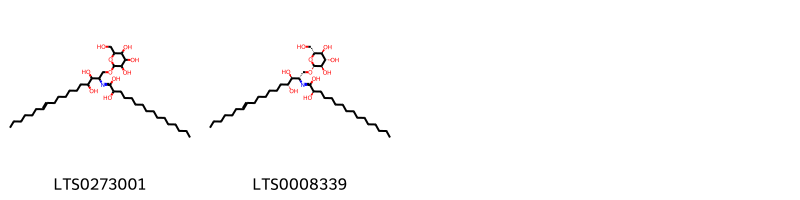{ width=100% }
    <figcaption>Hình ảnh cấu trúc hóa học của 2 hoạt chất thuộc nhóm Sphingolipids gồm ['n-(3,4-dihydroxy-1-{[3,4,5-trihydroxy-6-(hydroxymethyl)oxan-2-yl]oxy}octadec-11-en-2-yl)-2-hydroxyhexadecanimidic acid (LTS0273001)', '(2r)-n-[(2s,3s,4r,11e)-3,4-dihydroxy-1-{[(2r,3r,4s,5s,6r)-3,4,5-trihydroxy-6-(hydroxymethyl)oxan-2-yl]oxy}octadec-11-en-2-yl]-2-hydroxyhexadecanimidic acid (LTS0008339)'].</figcaption>
</figure>

---

### Dược dân tộc học

Danh sách các quốc gia có sử dụng *Polygala japonica* trong điều trị các bệnh. 

| Country   | Disease                  | Bệnh                   |
|:----------|:-------------------------|:-----------------------|
| China     | Expectorant, Carminative | Chất đờm, gây thối rữa |

---

---
## Polygala reinii
### Thông tin về thực vật

!!! info "Phân loại thực vật của *Polygala reinii* từ GIBF:"
    - **Kingdom:** Plantae
    - **Phylum:** Tracheophyta
    - **Order:** Fabales
    - **Family:** Polygalaceae
    - **Genus:** Polygala
    - **Species:** *Polygala reinii*

 

| Label (VI)   | Label (EN)   | Scientific Name   | Descriptions (VI)   | Descriptions (EN)   | Also Known As (VI)   | Also Known As (EN)   |
|:-------------|:-------------|:------------------|:--------------------|:--------------------|:---------------------|:---------------------|
| N/A          | N/A          | Polygala reinii   | loài thực vật       | species of plant    | ['']                 | ['']                 |

#### Phân bố trên thế giới

**Từ CSDL GIBF** nan, China, Japan

#### Phân bố tại Việt Nam

**Từ CSDL GIBF**: Không có ghi nhận ở Việt Nam

---
### Thành phần hóa học
        
- Theo cơ sở dữ liệu lotus: Từ loài *Polygala reinii* đã phân lập và xác định được 35 hoạt chất thuộc về các nhóm Cinnamic acids and derivatives, Prenol lipids, Organooxygen compounds. 

|    | chemicalTaxonomyClassyfireClass   |   smiles_count |
|---:|:----------------------------------|---------------:|
|  0 | Cinnamic acids and derivatives    |              7 |
|  1 | Organooxygen compounds            |             22 |
|  2 | Prenol lipids                     |              6 |

#### Nhóm Cinnamic acids and derivatives
<figure markdown="span">
    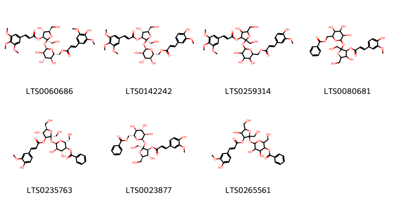{ width=100% }
    <figcaption>Hình ảnh cấu trúc hóa học của 7 hoạt chất thuộc nhóm Cinnamic acids and derivatives gồm ['tenuifoliside c (LTS0060686)', '[(2r,3s,4s,5r,6r)-3,4,5-trihydroxy-6-{[(2s,3s,4r,5r)-4-hydroxy-2,5-bis(hydroxymethyl)-3-{[(2e)-3-(3,4,5-trimethoxyphenyl)prop-2-enoyl]oxy}oxolan-2-yl]oxy}oxan-2-yl]methyl (2e)-3-(4-hydroxy-3-methoxyphenyl)prop-2-enoate (LTS0142242)', '(3,4,5-trihydroxy-6-{[4-hydroxy-2,5-bis(hydroxymethyl)-3-{[3-(3,4,5-trimethoxyphenyl)prop-2-enoyl]oxy}oxolan-2-yl]oxy}oxan-2-yl)methyl 3-(4-hydroxy-3-methoxyphenyl)prop-2-enoate (LTS0259314)', '{3,4,5-trihydroxy-6-[(4-hydroxy-3-{[3-(4-hydroxy-3-methoxyphenyl)prop-2-enoyl]oxy}-2,5-bis(hydroxymethyl)oxolan-2-yl)oxy]oxan-2-yl}methyl benzoate (LTS0080681)', '(2r,3s,4r,5r,6r)-4,5-dihydroxy-6-{[(2s,3s,4r,5r)-4-hydroxy-3-{[(2e)-3-(4-hydroxy-3-methoxyphenyl)prop-2-enoyl]oxy}-2,5-bis(hydroxymethyl)oxolan-2-yl]oxy}-2-(hydroxymethyl)oxan-3-yl benzoate (LTS0235763)', '[(2r,3s,4s,5r,6r)-3,4,5-trihydroxy-6-{[(2s,3s,4r,5r)-4-hydroxy-3-{[(2e)-3-(4-hydroxy-3-methoxyphenyl)prop-2-enoyl]oxy}-2,5-bis(hydroxymethyl)oxolan-2-yl]oxy}oxan-2-yl]methyl benzoate (LTS0023877)', '4,5-dihydroxy-6-[(4-hydroxy-3-{[3-(4-hydroxy-3-methoxyphenyl)prop-2-enoyl]oxy}-2,5-bis(hydroxymethyl)oxolan-2-yl)oxy]-2-(hydroxymethyl)oxan-3-yl benzoate (LTS0265561)'].</figcaption>
</figure>
#### Nhóm Organooxygen compounds
<figure markdown="span">
    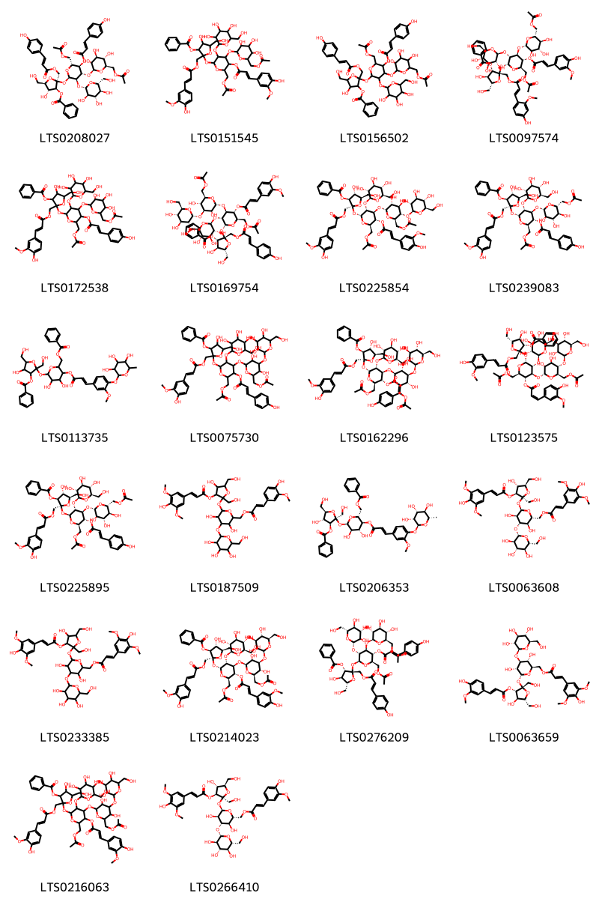{ width=100% }
    <figcaption>Hình ảnh cấu trúc hóa học của 22 hoạt chất thuộc nhóm Organooxygen compounds gồm ['(2s,3s,4r,5r)-2-{[(2r,3r,4s,5r,6r)-6-[(acetyloxy)methyl]-4-{[(2s,3r,4s,5s,6r)-6-[(acetyloxy)methyl]-3,4,5-trihydroxyoxan-2-yl]oxy}-5-{[(2e)-3-(4-hydroxyphenyl)prop-2-enoyl]oxy}-3-{[(2s,3r,4s,5s,6r)-3,4,5-trihydroxy-6-(hydroxymethyl)oxan-2-yl]oxy}oxan-2-yl]oxy}-4-hydroxy-5-(hydroxymethyl)-2-({[(2e)-3-(4-hydroxyphenyl)prop-2-enoyl]oxy}methyl)oxolan-3-yl benzoate (LTS0208027)', '2-({6-[(acetyloxy)methyl]-4-({6-[(acetyloxy)methyl]-3,4,5-trihydroxyoxan-2-yl}oxy)-5-{[3-(4-hydroxy-3-methoxyphenyl)prop-2-enoyl]oxy}-3-{[3,4,5-trihydroxy-6-(hydroxymethyl)oxan-2-yl]oxy}oxan-2-yl}oxy)-4-hydroxy-2-({[3-(4-hydroxy-3-methoxyphenyl)prop-2-enoyl]oxy}methyl)-5-(hydroxymethyl)oxolan-3-yl benzoate (LTS0151545)', '2-({6-[(acetyloxy)methyl]-4-({6-[(acetyloxy)methyl]-3,4,5-trihydroxyoxan-2-yl}oxy)-5-{[3-(4-hydroxyphenyl)prop-2-enoyl]oxy}-3-{[3,4,5-trihydroxy-6-(hydroxymethyl)oxan-2-yl]oxy}oxan-2-yl}oxy)-4-hydroxy-5-(hydroxymethyl)-2-({[3-(4-hydroxyphenyl)prop-2-enoyl]oxy}methyl)oxolan-3-yl benzoate (LTS0156502)', '(2s,3s,4r,5r)-2-{[(2r,3r,4s,5r,6r)-6-[(acetyloxy)methyl]-4-{[(2s,3r,4s,5s,6r)-6-[(acetyloxy)methyl]-3,4,5-trihydroxyoxan-2-yl]oxy}-5-{[(2e)-3-(4-hydroxy-3-methoxyphenyl)prop-2-enoyl]oxy}-3-{[(2s,3r,4s,5s,6r)-3,4,5-trihydroxy-6-(hydroxymethyl)oxan-2-yl]oxy}oxan-2-yl]oxy}-4-hydroxy-2-({[(2e)-3-(4-hydroxy-2-methoxyphenyl)prop-2-enoyl]oxy}methyl)-5-(hydroxymethyl)oxolan-3-yl benzoate (LTS0097574)', '2-({6-[(acetyloxy)methyl]-4-({6-[(acetyloxy)methyl]-3,4,5-trihydroxyoxan-2-yl}oxy)-5-{[3-(4-hydroxyphenyl)prop-2-enoyl]oxy}-3-{[3,4,5-trihydroxy-6-(hydroxymethyl)oxan-2-yl]oxy}oxan-2-yl}oxy)-4-hydroxy-2-({[3-(4-hydroxy-3-methoxyphenyl)prop-2-enoyl]oxy}methyl)-5-(hydroxymethyl)oxolan-3-yl benzoate (LTS0172538)', '(2s,3s,4r,5r)-2-{[(2r,3r,4s,5r,6r)-6-[(acetyloxy)methyl]-4-{[(2r,3r,4s,5r,6r)-6-[(acetyloxy)methyl]-3,5-dihydroxy-4-{[(2r,3r,4s,5s,6r)-3,4,5-trihydroxy-6-(hydroxymethyl)oxan-2-yl]oxy}oxan-2-yl]oxy}-5-{[(2e)-3-(4-hydroxy-3-methoxyphenyl)prop-2-enoyl]oxy}-3-{[(2s,3r,4s,5s,6r)-3,4,5-trihydroxy-6-(hydroxymethyl)oxan-2-yl]oxy}oxan-2-yl]oxy}-4-hydroxy-5-(hydroxymethyl)-2-({[(2e)-3-(4-hydroxyphenyl)prop-2-enoyl]oxy}methyl)oxolan-3-yl benzoate (LTS0169754)', '(2s,3s,4r,5r)-2-{[(2r,3r,4s,5r,6r)-6-[(acetyloxy)methyl]-4-{[(2r,3r,4r,5s,6r)-6-[(acetyloxy)methyl]-3,4-dihydroxy-5-{[(2s,3r,4s,5s,6r)-3,4,5-trihydroxy-6-(hydroxymethyl)oxan-2-yl]oxy}oxan-2-yl]oxy}-5-{[(2e)-3-(4-hydroxy-3-methoxyphenyl)prop-2-enoyl]oxy}-3-{[(2s,3r,4s,5s,6r)-3,4,5-trihydroxy-6-(hydroxymethyl)oxan-2-yl]oxy}oxan-2-yl]oxy}-4-hydroxy-2-({[(2e)-3-(4-hydroxy-3-methoxyphenyl)prop-2-enoyl]oxy}methyl)-5-(hydroxymethyl)oxolan-3-yl benzoate (LTS0225854)', '(2s,3s,4r,5r)-2-{[(2r,3r,4s,5r,6r)-6-[(acetyloxy)methyl]-4-{[(2s,3r,4s,5s,6r)-6-[(acetyloxy)methyl]-3,4,5-trihydroxyoxan-2-yl]oxy}-5-{[(2e)-3-(4-hydroxyphenyl)prop-2-enoyl]oxy}-3-{[(2s,3r,4s,5s,6r)-3,4,5-trihydroxy-6-(hydroxymethyl)oxan-2-yl]oxy}oxan-2-yl]oxy}-4-hydroxy-2-({[(2e)-3-(4-hydroxy-3-methoxyphenyl)prop-2-enoyl]oxy}methyl)-5-(hydroxymethyl)oxolan-3-yl benzoate (LTS0239083)', '(6-{[3-(benzoyloxy)-4-hydroxy-2,5-bis(hydroxymethyl)oxolan-2-yl]oxy}-4,5-dihydroxy-3-[(3-{3-methoxy-4-[(3,4,5-trihydroxy-6-methyloxan-2-yl)oxy]phenyl}prop-2-enoyl)oxy]oxan-2-yl)methyl benzoate (LTS0113735)', '2-({6-[(acetyloxy)methyl]-4-({6-[(acetyloxy)methyl]-3,5-dihydroxy-4-{[3,4,5-trihydroxy-6-(hydroxymethyl)oxan-2-yl]oxy}oxan-2-yl}oxy)-5-{[3-(4-hydroxyphenyl)prop-2-enoyl]oxy}-3-{[3,4,5-trihydroxy-6-(hydroxymethyl)oxan-2-yl]oxy}oxan-2-yl}oxy)-4-hydroxy-2-({[3-(4-hydroxy-3-methoxyphenyl)prop-2-enoyl]oxy}methyl)-5-(hydroxymethyl)oxolan-3-yl benzoate (LTS0075730)', '(2s,3s,4r,5r)-2-{[(2r,3r,4s,5r,6r)-6-[(acetyloxy)methyl]-4-{[(2s,3r,4s,5r,6r)-6-[(acetyloxy)methyl]-3,5-dihydroxy-4-{[(2s,3r,4s,5s,6r)-3,4,5-trihydroxy-6-(hydroxymethyl)oxan-2-yl]oxy}oxan-2-yl]oxy}-5-{[(2z)-3-(4-hydroxyphenyl)prop-2-enoyl]oxy}-3-{[(2s,3r,4s,5s,6r)-3,4,5-trihydroxy-6-(hydroxymethyl)oxan-2-yl]oxy}oxan-2-yl]oxy}-4-hydroxy-2-({[(2e)-3-(4-hydroxy-3-methoxyphenyl)prop-2-enoyl]oxy}methyl)-5-(hydroxymethyl)oxolan-3-yl benzoate (LTS0162296)', '(2s,3s,4r,5r)-2-{[(2r,3r,4s,5r,6r)-6-[(acetyloxy)methyl]-4-{[(2r,3r,4r,5s,6r)-6-[(acetyloxy)methyl]-3,4-dihydroxy-5-{[(2s,3r,4s,5s,6r)-3,4,5-trihydroxy-6-(hydroxymethyl)oxan-2-yl]oxy}oxan-2-yl]oxy}-5-{[(2z)-3-(4-hydroxy-3-methoxyphenyl)prop-2-enoyl]oxy}-3-{[(2s,3r,4s,5s,6r)-3,4,5-trihydroxy-6-(hydroxymethyl)oxan-2-yl]oxy}oxan-2-yl]oxy}-4-hydroxy-2-({[(2e)-3-(4-hydroxy-3-methoxyphenyl)prop-2-enoyl]oxy}methyl)-5-(hydroxymethyl)oxolan-3-yl benzoate (LTS0123575)', '(2s,3s,4r,5r)-2-{[(2s,3r,4s,5r,6r)-6-[(acetyloxy)methyl]-4-{[(2s,3r,4s,5s,6r)-6-[(acetyloxy)methyl]-3,4,5-trihydroxyoxan-2-yl]oxy}-5-{[(2e)-3-(4-hydroxyphenyl)prop-2-enoyl]oxy}-3-{[(2s,3r,4s,5s,6r)-3,4,5-trihydroxy-6-(hydroxymethyl)oxan-2-yl]oxy}oxan-2-yl]oxy}-4-hydroxy-2-({[(2e)-3-(4-hydroxy-3-methoxyphenyl)prop-2-enoyl]oxy}methyl)-5-(hydroxymethyl)oxolan-3-yl benzoate (LTS0225895)', '{3,5-dihydroxy-6-[(4-hydroxy-3-{[3-(4-hydroxy-3,5-dimethoxyphenyl)prop-2-enoyl]oxy}-2,5-bis(hydroxymethyl)oxolan-2-yl)oxy]-4-{[3,4,5-trihydroxy-6-(hydroxymethyl)oxan-2-yl]oxy}oxan-2-yl}methyl 3-(4-hydroxy-3-methoxyphenyl)prop-2-enoate (LTS0187509)', '[(2r,3s,4r,5r,6r)-6-{[(2s,3s,4r,5r)-3-(benzoyloxy)-4-hydroxy-2,5-bis(hydroxymethyl)oxolan-2-yl]oxy}-4,5-dihydroxy-3-{[(2e)-3-(3-methoxy-4-{[(2s,3r,4r,5r,6s)-3,4,5-trihydroxy-6-methyloxan-2-yl]oxy}phenyl)prop-2-enoyl]oxy}oxan-2-yl]methyl benzoate (LTS0206353)', '[(2r,3r,4s,5r,6r)-3,5-dihydroxy-6-{[(2s,3s,4r,5r)-4-hydroxy-3-{[(2e)-3-(4-hydroxy-3,5-dimethoxyphenyl)prop-2-enoyl]oxy}-2,5-bis(hydroxymethyl)oxolan-2-yl]oxy}-4-{[(2s,3r,4s,5s,6r)-3,4,5-trihydroxy-6-(hydroxymethyl)oxan-2-yl]oxy}oxan-2-yl]methyl (2e)-3-(4-hydroxy-3,5-dimethoxyphenyl)prop-2-enoate (LTS0063608)', '{3,5-dihydroxy-6-[(4-hydroxy-3-{[3-(4-hydroxy-3,5-dimethoxyphenyl)prop-2-enoyl]oxy}-2,5-bis(hydroxymethyl)oxolan-2-yl)oxy]-4-{[3,4,5-trihydroxy-6-(hydroxymethyl)oxan-2-yl]oxy}oxan-2-yl}methyl 3-(4-hydroxy-3,5-dimethoxyphenyl)prop-2-enoate (LTS0233385)', '(2s,3s,4r,5r)-2-{[(2r,3r,4s,5r,6r)-6-[(acetyloxy)methyl]-4-{[(2s,3r,4s,5r,6r)-6-[(acetyloxy)methyl]-3,5-dihydroxy-4-{[(2s,3r,4s,5s,6r)-3,4,5-trihydroxy-6-(hydroxymethyl)oxan-2-yl]oxy}oxan-2-yl]oxy}-5-{[(2e)-3-(4-hydroxy-3-methoxyphenyl)prop-2-enoyl]oxy}-3-{[(2s,3r,4s,5s,6r)-3,4,5-trihydroxy-6-(hydroxymethyl)oxan-2-yl]oxy}oxan-2-yl]oxy}-4-hydroxy-2-({[(2e)-3-(4-hydroxy-3-methoxyphenyl)prop-2-enoyl]oxy}methyl)-5-(hydroxymethyl)oxolan-3-yl benzoate (LTS0214023)', '(2s,3s,4r,5r)-2-{[(2s,3r,4s,5r,6r)-6-[(acetyloxy)methyl]-4-{[(2s,3r,4s,5s,6r)-6-[(acetyloxy)methyl]-3,4,5-trihydroxyoxan-2-yl]oxy}-5-{[(2e)-3-(4-hydroxyphenyl)prop-2-enoyl]oxy}-3-{[(2s,3r,4s,5s,6r)-3,4,5-trihydroxy-6-(hydroxymethyl)oxan-2-yl]oxy}oxan-2-yl]oxy}-4-hydroxy-5-(hydroxymethyl)-2-({[(2e)-3-(4-hydroxyphenyl)prop-2-enoyl]oxy}methyl)oxolan-3-yl benzoate (LTS0276209)', '[(2r,3r,4s,5r,6r)-3,5-dihydroxy-6-{[(2s,3s,4r,5r)-4-hydroxy-3-{[(2e)-3-(4-hydroxy-3-methoxyphenyl)prop-2-enoyl]oxy}-2,5-bis(hydroxymethyl)oxolan-2-yl]oxy}-4-{[(2s,3r,4s,5s,6r)-3,4,5-trihydroxy-6-(hydroxymethyl)oxan-2-yl]oxy}oxan-2-yl]methyl (2e)-3-(4-hydroxy-3,5-dimethoxyphenyl)prop-2-enoate (LTS0063659)', '2-({6-[(acetyloxy)methyl]-4-({6-[(acetyloxy)methyl]-3,5-dihydroxy-4-{[3,4,5-trihydroxy-6-(hydroxymethyl)oxan-2-yl]oxy}oxan-2-yl}oxy)-5-{[3-(4-hydroxy-3-methoxyphenyl)prop-2-enoyl]oxy}-3-{[3,4,5-trihydroxy-6-(hydroxymethyl)oxan-2-yl]oxy}oxan-2-yl}oxy)-4-hydroxy-2-({[3-(4-hydroxy-3-methoxyphenyl)prop-2-enoyl]oxy}methyl)-5-(hydroxymethyl)oxolan-3-yl benzoate (LTS0216063)', '[(2r,3r,4s,5r,6r)-3,5-dihydroxy-6-{[(2s,3s,4r,5r)-4-hydroxy-3-{[(2e)-3-(4-hydroxy-3,5-dimethoxyphenyl)prop-2-enoyl]oxy}-2,5-bis(hydroxymethyl)oxolan-2-yl]oxy}-4-{[(2s,3r,4s,5s,6r)-3,4,5-trihydroxy-6-(hydroxymethyl)oxan-2-yl]oxy}oxan-2-yl]methyl (2e)-3-(4-hydroxy-3-methoxyphenyl)prop-2-enoate (LTS0266410)'].</figcaption>
</figure>
#### Nhóm Prenol lipids
<figure markdown="span">
    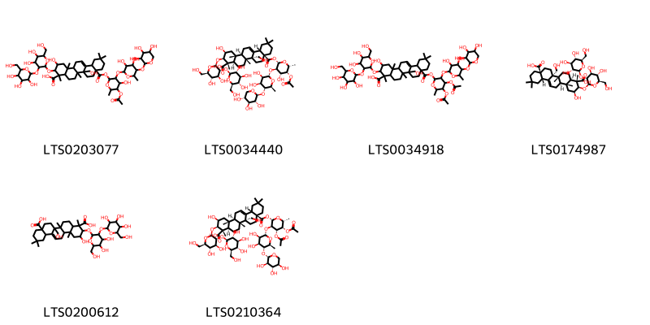{ width=100% }
    <figcaption>Hình ảnh cấu trúc hóa học của 6 hoạt chất thuộc nhóm Prenol lipids gồm ['8a-({[5-(acetyloxy)-3-({3,4-dihydroxy-6-methyl-5-[(3,4,5-trihydroxyoxan-2-yl)oxy]oxan-2-yl}oxy)-4-hydroxy-6-methyloxan-2-yl]oxy}carbonyl)-3-{[4,5-dihydroxy-6-(hydroxymethyl)-3-{[3,4,5-trihydroxy-6-(hydroxymethyl)oxan-2-yl]oxy}oxan-2-yl]oxy}-2-hydroxy-6b-(hydroxymethyl)-4,6a,11,11,14b-pentamethyl-1,2,3,4a,5,6,7,8,9,10,12,12a,14,14a-tetradecahydropicene-4-carboxylic acid (LTS0203077)', '(2s,3r,4s,4ar,6ar,6br,8as,12as,14ar,14br)-8a-({[(2s,3r,4s,5r,6r)-5-(acetyloxy)-3-{[(2s,3r,4s,5r,6s)-3,4-dihydroxy-6-methyl-5-{[(2s,3r,4s,5r)-3,4,5-trihydroxyoxan-2-yl]oxy}oxan-2-yl]oxy}-4-hydroxy-6-methyloxan-2-yl]oxy}carbonyl)-3-{[(2r,3r,4s,5s,6r)-4,5-dihydroxy-6-(hydroxymethyl)-3-{[(2s,3r,4s,5s,6r)-3,4,5-trihydroxy-6-(hydroxymethyl)oxan-2-yl]oxy}oxan-2-yl]oxy}-2-hydroxy-6b-(hydroxymethyl)-4,6a,11,11,14b-pentamethyl-1,2,3,4a,5,6,7,8,9,10,12,12a,14,14a-tetradecahydropicene-4-carboxylic acid (LTS0034440)', '8a-({[4,5-bis(acetyloxy)-3-({3,4-dihydroxy-6-methyl-5-[(3,4,5-trihydroxyoxan-2-yl)oxy]oxan-2-yl}oxy)-6-methyloxan-2-yl]oxy}carbonyl)-3-{[4,5-dihydroxy-6-(hydroxymethyl)-3-{[3,4,5-trihydroxy-6-(hydroxymethyl)oxan-2-yl]oxy}oxan-2-yl]oxy}-2-hydroxy-6b-(hydroxymethyl)-4,6a,11,11,14b-pentamethyl-1,2,3,4a,5,6,7,8,9,10,12,12a,14,14a-tetradecahydropicene-4-carboxylic acid (LTS0034918)', '(2s,3r,4s,4ar,6ar,6br,8as,12as,14ar,14br)-3-{[(2r,3r,4s,5s,6r)-4,5-dihydroxy-6-(hydroxymethyl)-3-{[(2s,3r,4s,5s,6r)-3,4,5-trihydroxy-6-(hydroxymethyl)oxan-2-yl]oxy}oxan-2-yl]oxy}-2-hydroxy-6b-(hydroxymethyl)-4,6a,11,11,14b-pentamethyl-1,2,3,4a,5,6,7,8,9,10,12,12a,14,14a-tetradecahydropicene-4,8a-dicarboxylic acid (LTS0174987)', '3-{[4,5-dihydroxy-6-(hydroxymethyl)-3-{[3,4,5-trihydroxy-6-(hydroxymethyl)oxan-2-yl]oxy}oxan-2-yl]oxy}-2-hydroxy-6b-(hydroxymethyl)-4,6a,11,11,14b-pentamethyl-1,2,3,4a,5,6,7,8,9,10,12,12a,14,14a-tetradecahydropicene-4,8a-dicarboxylic acid (LTS0200612)', '(2s,3r,4s,4ar,6ar,6br,8as,12as,14ar,14br)-8a-({[(2s,3r,4s,5s,6r)-4,5-bis(acetyloxy)-3-{[(2s,3r,4s,5r,6s)-3,4-dihydroxy-6-methyl-5-{[(2s,3r,4s,5r)-3,4,5-trihydroxyoxan-2-yl]oxy}oxan-2-yl]oxy}-6-methyloxan-2-yl]oxy}carbonyl)-3-{[(2r,3r,4s,5s,6r)-4,5-dihydroxy-6-(hydroxymethyl)-3-{[(2s,3r,4s,5s,6r)-3,4,5-trihydroxy-6-(hydroxymethyl)oxan-2-yl]oxy}oxan-2-yl]oxy}-2-hydroxy-6b-(hydroxymethyl)-4,6a,11,11,14b-pentamethyl-1,2,3,4a,5,6,7,8,9,10,12,12a,14,14a-tetradecahydropicene-4-carboxylic acid (LTS0210364)'].</figcaption>
</figure>

---

### Dược dân tộc học

Danh sách các quốc gia có sử dụng *Polygala reinii* trong điều trị các bệnh. 

| Country   | Disease   | Bệnh               |
|:----------|:----------|:-------------------|
| China     | Tonic     | (thuộc) trương lực |

---

---
## Polygala rupestris
### Thông tin về thực vật

!!! info "Phân loại thực vật của *Polygala rupestris* từ GIBF:"
    - **Kingdom:** Plantae
    - **Phylum:** Tracheophyta
    - **Order:** Fabales
    - **Family:** Polygalaceae
    - **Genus:** Polygala
    - **Species:** *Polygala rupestris*

 

| Label (VI)   | Label (EN)   | Scientific Name    | Descriptions (VI)   | Descriptions (EN)   | Also Known As (VI)   | Also Known As (EN)   |
|:-------------|:-------------|:-------------------|:--------------------|:--------------------|:---------------------|:---------------------|
| N/A          | N/A          | Polygala rupestris | loài thực vật       | species of plant    | ['']                 | ['']                 |

#### Phân bố trên thế giới

**Từ CSDL GIBF** France, Algeria, Spain

#### Phân bố tại Việt Nam

**Từ CSDL GIBF**: Không có ghi nhận ở Việt Nam

---
### Thành phần hóa học
        
- Theo cơ sở dữ liệu lotus: Từ loài *Polygala rupestris* đã phân lập và xác định được Chưa có hoạt chất nào được phân lập. hoạt chất thuộc về các nhóm Không có hoạt chất nào được phân lập. 

Không có hình ảnh nào được tạo ra

---

### Dược dân tộc học

Danh sách các quốc gia có sử dụng *Polygala rupestris* trong điều trị các bệnh. 

| Country   | Disease     | Bệnh           |
|:----------|:------------|:---------------|
| ain       | Expectorant | Thuốc long đàm |

---

---
## Polygala scoparia
### Thông tin về thực vật

!!! info "Phân loại thực vật của *N/A* từ GIBF:"
    - **Kingdom:** Plantae
    - **Phylum:** Tracheophyta
    - **Order:** Fabales
    - **Family:** Polygalaceae
    - **Genus:** Polygala
    - **Species:** *N/A*

 

| Label (VI)   | Label (EN)   | Scientific Name   | Descriptions (VI)   | Descriptions (EN)   | Also Known As (VI)   | Also Known As (EN)   |
|:-------------|:-------------|:------------------|:--------------------|:--------------------|:---------------------|:---------------------|
| N/A          | N/A          | Polygala scoparia | loài thực vật       | species of plant    | ['']                 | ['']                 |

#### Phân bố trên thế giới

**Từ CSDL GIBF** Italy, Australia, Argentina, Rwanda, French Guiana, Puerto Rico, Netherlands, Chinese Taipei, Spain, United States of America, Uruguay, Chile, El Salvador, South Africa, Brazil, Mexico, France, Indonesia, New Zealand

#### Phân bố tại Việt Nam

**Từ CSDL GIBF**: Không có ghi nhận ở Việt Nam

---
### Thành phần hóa học
        
- Theo cơ sở dữ liệu lotus: Từ loài *N/A* đã phân lập và xác định được Chưa có hoạt chất nào được phân lập. hoạt chất thuộc về các nhóm Không có hoạt chất nào được phân lập. 

Không có hình ảnh nào được tạo ra

---

### Dược dân tộc học

Danh sách các quốc gia có sử dụng *N/A* trong điều trị các bệnh. 

| Country   | Disease                            | Bệnh                               |
|:----------|:-----------------------------------|:-----------------------------------|
| Mexico    | Emetic, Poison, Tonic, Expectorant | Emetic, Poison, Tonic, Expectorant |

---

---
## Polygala senega
### Thông tin về thực vật

!!! info "Phân loại thực vật của *Polygala senega* từ GIBF:"
    - **Kingdom:** Plantae
    - **Phylum:** Tracheophyta
    - **Order:** Fabales
    - **Family:** Polygalaceae
    - **Genus:** Polygala
    - **Species:** *Polygala senega*

 

| Label (VI)   | Label (EN)   | Scientific Name   | Descriptions (VI)   | Descriptions (EN)   | Also Known As (VI)   | Also Known As (EN)   |
|:-------------|:-------------|:------------------|:--------------------|:--------------------|:---------------------|:---------------------|
| N/A          | N/A          | Polygala senega   | loài thực vật       | species of plant    | ['']                 | ['']                 |

#### Phân bố trên thế giới

**Từ CSDL GIBF** United States of America, Canada

#### Phân bố tại Việt Nam

**Từ CSDL GIBF**: Không có ghi nhận ở Việt Nam

---
### Thành phần hóa học
        
- Theo cơ sở dữ liệu lotus: Từ loài *Polygala senega* đã phân lập và xác định được 230 hoạt chất thuộc về các nhóm Naphthalenes, Phenols, Carboxylic acids and derivatives, Fatty Acyls, Indoles and derivatives, Cinnamic acids and derivatives, Isocoumarans, Cinnamaldehydes, Heteroaromatic compounds, Diazines, Prenol lipids, Benzene and substituted derivatives, Dihydrofurans, Organooxygen compounds, Benzothiazoles, Phenol ethers, Steroids and steroid derivatives, Benzodioxoles, Unsaturated hydrocarbons, Lactones, Coumarins and derivatives. 

|    | chemicalTaxonomyClassyfireClass     |   smiles_count |
|---:|:------------------------------------|---------------:|
|  0 | Benzene and substituted derivatives |             18 |
|  1 | Benzodioxoles                       |              1 |
|  2 | Benzothiazoles                      |              1 |
|  3 | Carboxylic acids and derivatives    |              6 |
|  4 | Cinnamaldehydes                     |              2 |
|  5 | Cinnamic acids and derivatives      |              2 |
|  6 | Coumarins and derivatives           |              1 |
|  7 | Diazines                            |              1 |
|  8 | Dihydrofurans                       |              1 |
|  9 | Fatty Acyls                         |             33 |
| 10 | Heteroaromatic compounds            |              4 |
| 11 | Indoles and derivatives             |              1 |
| 12 | Isocoumarans                        |              1 |
| 13 | Lactones                            |              7 |
| 14 | Naphthalenes                        |              1 |
| 15 | Organooxygen compounds              |             67 |
| 16 | Phenol ethers                       |              3 |
| 17 | Phenols                             |              4 |
| 18 | Prenol lipids                       |             71 |
| 19 | Steroids and steroid derivatives    |              4 |
| 20 | Unsaturated hydrocarbons            |              1 |

#### Nhóm Benzene and substituted derivatives
<figure markdown="span">
    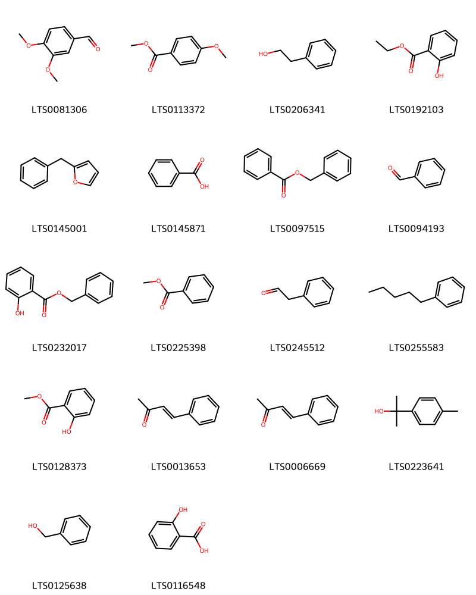{ width=100% }
    <figcaption>Hình ảnh cấu trúc hóa học của 18 hoạt chất thuộc nhóm Benzene and substituted derivatives gồm ['veratraldehyde (LTS0081306)', 'methyl anisate (LTS0113372)', '2-phenyl-ethanol (LTS0206341)', 'ethyl salicylate (LTS0192103)', '2-benzylfuran (LTS0145001)', 'benzoic acid (LTS0145871)', 'benzyl benzoate (LTS0097515)', 'benzaldehyde (LTS0094193)', 'benzyl salicylate (LTS0232017)', 'methyl benzoate (LTS0225398)', 'phenylacetaldehyde (LTS0245512)', 'pentylbenzene (LTS0255583)', 'methyl salicylate (LTS0128373)', 'benz (LTS0013653)', '4-phenyl-but-3-en-2-one (LTS0006669)', 'p-cymen-8-ol (LTS0223641)', 'benzyl alcohol (LTS0125638)', 'salicyclic acid (LTS0116548)'].</figcaption>
</figure>
#### Nhóm Benzodioxoles
<figure markdown="span">
    { width=100% }
    <figcaption>Hình ảnh cấu trúc hóa học của 1 hoạt chất thuộc nhóm Benzodioxoles gồm ['sassafras (LTS0136093)'].</figcaption>
</figure>
#### Nhóm Benzothiazoles
<figure markdown="span">
    { width=100% }
    <figcaption>Hình ảnh cấu trúc hóa học của 1 hoạt chất thuộc nhóm Benzothiazoles gồm ['benzothiazole (LTS0073984)'].</figcaption>
</figure>
#### Nhóm Carboxylic acids and derivatives
<figure markdown="span">
    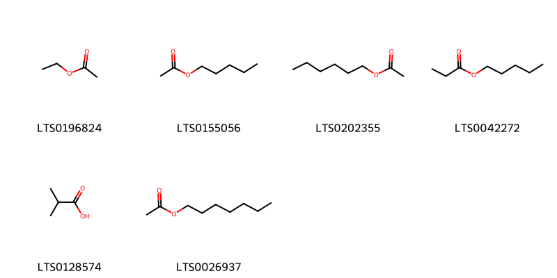{ width=100% }
    <figcaption>Hình ảnh cấu trúc hóa học của 6 hoạt chất thuộc nhóm Carboxylic acids and derivatives gồm ['ethyl acetate (LTS0196824)', 'amyl acetate (LTS0155056)', 'hexyl acetate (LTS0202355)', 'amyl propionate (LTS0042272)', 'isobutyric acid (LTS0128574)', 'heptyl acetate (LTS0026937)'].</figcaption>
</figure>
#### Nhóm Cinnamaldehydes
<figure markdown="span">
    { width=100% }
    <figcaption>Hình ảnh cấu trúc hóa học của 2 hoạt chất thuộc nhóm Cinnamaldehydes gồm ['3-phenyl-2-propenal (LTS0204346)', 'cinnamal (LTS0271313)'].</figcaption>
</figure>
#### Nhóm Cinnamic acids and derivatives
<figure markdown="span">
    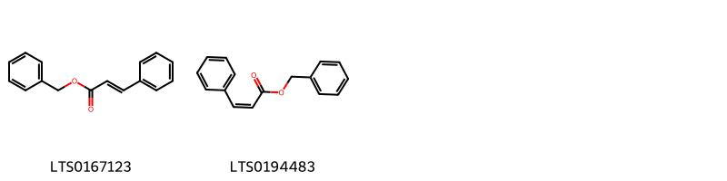{ width=100% }
    <figcaption>Hình ảnh cấu trúc hóa học của 2 hoạt chất thuộc nhóm Cinnamic acids and derivatives gồm ['benzyl cinnamate (LTS0167123)', 'benzyl (2z)-3-phenylprop-2-enoate (LTS0194483)'].</figcaption>
</figure>
#### Nhóm Coumarins and derivatives
<figure markdown="span">
    { width=100% }
    <figcaption>Hình ảnh cấu trúc hóa học của 1 hoạt chất thuộc nhóm Coumarins and derivatives gồm ['2h-1-benzopyran-2-one (LTS0069773)'].</figcaption>
</figure>
#### Nhóm Diazines
<figure markdown="span">
    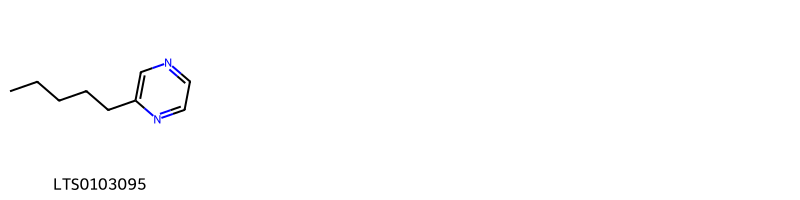{ width=100% }
    <figcaption>Hình ảnh cấu trúc hóa học của 1 hoạt chất thuộc nhóm Diazines gồm ['pentylpyrazine (LTS0103095)'].</figcaption>
</figure>
#### Nhóm Dihydrofurans
<figure markdown="span">
    { width=100% }
    <figcaption>Hình ảnh cấu trúc hóa học của 1 hoạt chất thuộc nhóm Dihydrofurans gồm ['2,5-dimethyl-3h-furan-2-carbaldehyde (LTS0206813)'].</figcaption>
</figure>
#### Nhóm Fatty Acyls
<figure markdown="span">
    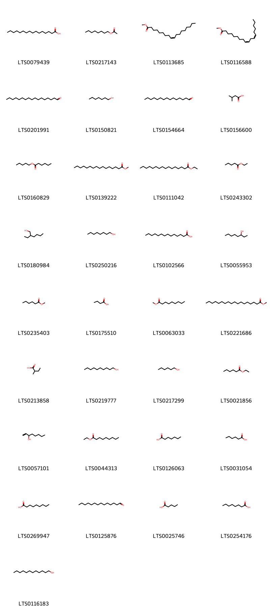{ width=100% }
    <figcaption>Hình ảnh cấu trúc hóa học của 33 hoạt chất thuộc nhóm Fatty Acyls gồm ['palmitic acid (LTS0079439)', 'octyl acetate (LTS0217143)', 'methyl oleate (LTS0113685)', 'methyl linoleate (LTS0116588)', 'heptadecanal (LTS0201991)', 'heptanol (LTS0150821)', 'pentadecanal (LTS0154664)', 'isovaleric acid (LTS0156600)', 'amyl hexanoate (LTS0160829)', 'methyl palmitate (LTS0139222)', 'ethyl palmitate (LTS0111042)', 'ethyl valerate (LTS0243302)', '2-ethylhexanol (LTS0180984)', 'octanol (LTS0250216)', 'myristic acid (LTS0102566)', '3-octanol (LTS0055953)', 'methyl caproate (LTS0235403)', 'butanoic acid (LTS0175510)', 'methyl nonanoate (ester) (LTS0063033)', 'methyl stearate (LTS0221686)', '2-methylbutanoic acid (LTS0213858)', 'decanol (LTS0219777)', 'hexanol (LTS0217299)', 'ethyl hexanoate (LTS0021856)', '1-octen-3-ol (LTS0057101)', 'ethyl nonanoate (LTS0044313)', 'heptanoic acid (LTS0126063)', 'hexanoic acid (LTS0031054)', 'nonanoic acid (LTS0269947)', 'tetradecanal (LTS0125876)', 'n-valeric acid (LTS0025746)', 'caprylic acid (LTS0254176)', '1-dodecanol (LTS0116183)'].</figcaption>
</figure>
#### Nhóm Heteroaromatic compounds
<figure markdown="span">
    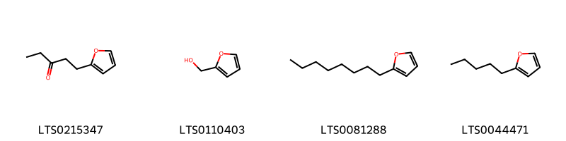{ width=100% }
    <figcaption>Hình ảnh cấu trúc hóa học của 4 hoạt chất thuộc nhóm Heteroaromatic compounds gồm ['1-(furan-2-yl)pentan-3-one (LTS0215347)', 'furfuryl alcohol (LTS0110403)', '2-octylfuran (LTS0081288)', 'amylfuran (LTS0044471)'].</figcaption>
</figure>
#### Nhóm Indoles and derivatives
<figure markdown="span">
    { width=100% }
    <figcaption>Hình ảnh cấu trúc hóa học của 1 hoạt chất thuộc nhóm Indoles and derivatives gồm ['indole (LTS0185357)'].</figcaption>
</figure>
#### Nhóm Isocoumarans
<figure markdown="span">
    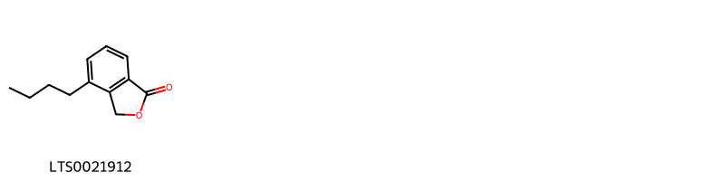{ width=100% }
    <figcaption>Hình ảnh cấu trúc hóa học của 1 hoạt chất thuộc nhóm Isocoumarans gồm ['4-butyl-3h-2-benzofuran-1-one (LTS0021912)'].</figcaption>
</figure>
#### Nhóm Lactones
<figure markdown="span">
    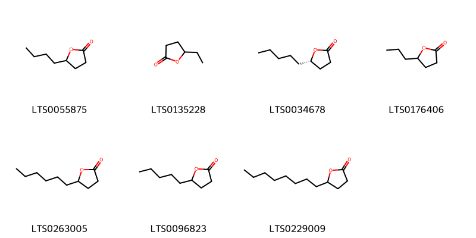{ width=100% }
    <figcaption>Hình ảnh cấu trúc hóa học của 7 hoạt chất thuộc nhóm Lactones gồm ['γ-octalactone (LTS0055875)', 'gamma-hexalactone (LTS0135228)', 'aldehyde c-18 (LTS0034678)', 'γ-heptalactone (LTS0176406)', 'γ-decalactone (LTS0263005)', 'gamma-nonalactone (LTS0096823)', 'γ-dodecalactone (LTS0229009)'].</figcaption>
</figure>
#### Nhóm Naphthalenes
<figure markdown="span">
    { width=100% }
    <figcaption>Hình ảnh cấu trúc hóa học của 1 hoạt chất thuộc nhóm Naphthalenes gồm ['naphthalene (LTS0254484)'].</figcaption>
</figure>
#### Nhóm Organooxygen compounds
<figure markdown="span">
    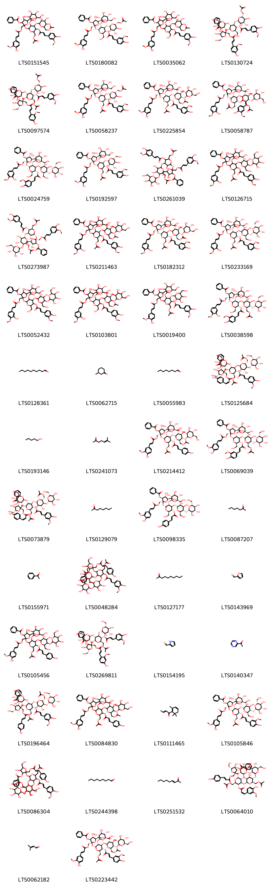{ width=100% }
    <figcaption>Hình ảnh cấu trúc hóa học của 67 hoạt chất thuộc nhóm Organooxygen compounds gồm ['2-({6-[(acetyloxy)methyl]-4-({6-[(acetyloxy)methyl]-3,4,5-trihydroxyoxan-2-yl}oxy)-5-{[3-(4-hydroxy-3-methoxyphenyl)prop-2-enoyl]oxy}-3-{[3,4,5-trihydroxy-6-(hydroxymethyl)oxan-2-yl]oxy}oxan-2-yl}oxy)-4-hydroxy-2-({[3-(4-hydroxy-3-methoxyphenyl)prop-2-enoyl]oxy}methyl)-5-(hydroxymethyl)oxolan-3-yl benzoate (LTS0151545)', '(2s,3s,4r,5r)-2-{[(2r,3r,4s,5r,6r)-4-{[(2s,3r,4s,5s,6r)-6-[(acetyloxy)methyl]-3,4,5-trihydroxyoxan-2-yl]oxy}-5-{[(2e)-3-(4-hydroxy-3-methoxyphenyl)prop-2-enoyl]oxy}-6-(hydroxymethyl)-3-{[(2s,3r,4s,5s,6r)-3,4,5-trihydroxy-6-(hydroxymethyl)oxan-2-yl]oxy}oxan-2-yl]oxy}-4-hydroxy-2-({[(2e)-3-(4-hydroxy-3-methoxyphenyl)prop-2-enoyl]oxy}methyl)-5-(hydroxymethyl)oxolan-3-yl benzoate (LTS0180082)', '2-{[4-({6-[(acetyloxy)methyl]-3,4,5-trihydroxyoxan-2-yl}oxy)-5-{[3-(4-hydroxy-3-methoxyphenyl)prop-2-enoyl]oxy}-6-(hydroxymethyl)-3-{[3,4,5-trihydroxy-6-(hydroxymethyl)oxan-2-yl]oxy}oxan-2-yl]oxy}-4-hydroxy-2-({[3-(4-hydroxy-3-methoxyphenyl)prop-2-enoyl]oxy}methyl)-5-(hydroxymethyl)oxolan-3-yl benzoate (LTS0035062)', '(2s,3s,4r,5r)-2-{[(2r,3r,4s,5r,6r)-4-{[(2s,3r,4s,5s,6r)-6-[(acetyloxy)methyl]-3,4,5-trihydroxyoxan-2-yl]oxy}-5-{[(2e)-3-(4-hydroxy-3-methoxyphenyl)prop-2-enoyl]oxy}-6-(hydroxymethyl)-3-{[(2s,3r,4s,5s,6r)-3,4,5-trihydroxy-6-(hydroxymethyl)oxan-2-yl]oxy}oxan-2-yl]oxy}-4-hydroxy-2-({[(2e)-3-(4-hydroxy-2-methoxyphenyl)prop-2-enoyl]oxy}methyl)-5-(hydroxymethyl)oxolan-3-yl benzoate (LTS0130724)', '(2s,3s,4r,5r)-2-{[(2r,3r,4s,5r,6r)-6-[(acetyloxy)methyl]-4-{[(2s,3r,4s,5s,6r)-6-[(acetyloxy)methyl]-3,4,5-trihydroxyoxan-2-yl]oxy}-5-{[(2e)-3-(4-hydroxy-3-methoxyphenyl)prop-2-enoyl]oxy}-3-{[(2s,3r,4s,5s,6r)-3,4,5-trihydroxy-6-(hydroxymethyl)oxan-2-yl]oxy}oxan-2-yl]oxy}-4-hydroxy-2-({[(2e)-3-(4-hydroxy-2-methoxyphenyl)prop-2-enoyl]oxy}methyl)-5-(hydroxymethyl)oxolan-3-yl benzoate (LTS0097574)', '(2s,3s,4r,5r)-2-{[(2r,3r,4s,5r,6r)-6-[(acetyloxy)methyl]-4-{[(2s,3r,4s,5s,6r)-6-[(acetyloxy)methyl]-3,4,5-trihydroxyoxan-2-yl]oxy}-5-{[(2e)-3-(4-hydroxy-3-methoxyphenyl)prop-2-enoyl]oxy}-3-{[(2s,3r,4s,5s,6r)-3,4,5-trihydroxy-6-(hydroxymethyl)oxan-2-yl]oxy}oxan-2-yl]oxy}-4-hydroxy-2-({[(2e)-3-(4-hydroxy-3-methoxyphenyl)prop-2-enoyl]oxy}methyl)-5-(hydroxymethyl)oxolan-3-yl benzoate (LTS0058237)', '(2s,3s,4r,5r)-2-{[(2r,3r,4s,5r,6r)-6-[(acetyloxy)methyl]-4-{[(2r,3r,4r,5s,6r)-6-[(acetyloxy)methyl]-3,4-dihydroxy-5-{[(2s,3r,4s,5s,6r)-3,4,5-trihydroxy-6-(hydroxymethyl)oxan-2-yl]oxy}oxan-2-yl]oxy}-5-{[(2e)-3-(4-hydroxy-3-methoxyphenyl)prop-2-enoyl]oxy}-3-{[(2s,3r,4s,5s,6r)-3,4,5-trihydroxy-6-(hydroxymethyl)oxan-2-yl]oxy}oxan-2-yl]oxy}-4-hydroxy-2-({[(2e)-3-(4-hydroxy-3-methoxyphenyl)prop-2-enoyl]oxy}methyl)-5-(hydroxymethyl)oxolan-3-yl benzoate (LTS0225854)', '(2s,3s,4r,5r)-2-{[(2r,3r,4s,5r,6r)-6-[(acetyloxy)methyl]-4-{[(2s,3r,4r,5s,6r)-6-[(acetyloxy)methyl]-3,4-dihydroxy-5-{[(2s,3r,4s,5s,6r)-3,4,5-trihydroxy-6-(hydroxymethyl)oxan-2-yl]oxy}oxan-2-yl]oxy}-5-{[(2z)-3-(4-hydroxy-3-methoxyphenyl)prop-2-enoyl]oxy}-3-{[(2s,3r,4s,5s,6r)-3,4,5-trihydroxy-6-(hydroxymethyl)oxan-2-yl]oxy}oxan-2-yl]oxy}-4-hydroxy-2-({[(2e)-3-(3-hydroxy-4-methoxyphenyl)prop-2-enoyl]oxy}methyl)-5-(hydroxymethyl)oxolan-3-yl benzoate (LTS0058787)', '(2s,3s,4r,5r)-2-{[(2r,3r,4s,5r,6r)-4-{[(2s,3r,4r,5s,6r)-3,4-dihydroxy-6-(hydroxymethyl)-5-{[(2s,3r,4s,5s,6r)-3,4,5-trihydroxy-6-(hydroxymethyl)oxan-2-yl]oxy}oxan-2-yl]oxy}-5-{[(2e)-3-(4-hydroxy-3-methoxyphenyl)prop-2-enoyl]oxy}-6-(hydroxymethyl)-3-{[(2s,3r,4s,5s,6r)-3,4,5-trihydroxy-6-(hydroxymethyl)oxan-2-yl]oxy}oxan-2-yl]oxy}-4-hydroxy-2-({[(2e)-3-(3-hydroxy-4-methoxyphenyl)prop-2-enoyl]oxy}methyl)-5-(hydroxymethyl)oxolan-3-yl benzoate (LTS0024759)', '(2s,3s,4r,5r)-2-{[(2r,3r,4s,5r,6r)-6-[(acetyloxy)methyl]-5-{[(2e)-3-(4-hydroxy-3-methoxyphenyl)prop-2-enoyl]oxy}-3,4-bis({[(2s,3r,4s,5s,6r)-3,4,5-trihydroxy-6-(hydroxymethyl)oxan-2-yl]oxy})oxan-2-yl]oxy}-4-hydroxy-2-({[(2e)-3-(4-hydroxy-3-methoxyphenyl)prop-2-enoyl]oxy}methyl)-5-(hydroxymethyl)oxolan-3-yl benzoate (LTS0192597)', '2-({6-[(acetyloxy)methyl]-4-({6-[(acetyloxy)methyl]-3,4-dihydroxy-5-{[3,4,5-trihydroxy-6-(hydroxymethyl)oxan-2-yl]oxy}oxan-2-yl}oxy)-3-hydroxy-5-{[3-(4-hydroxy-3-methoxyphenyl)prop-2-enoyl]oxy}oxan-2-yl}oxy)-4-hydroxy-2-({[3-(4-hydroxy-3-methoxyphenyl)prop-2-enoyl]oxy}methyl)-5-(hydroxymethyl)oxolan-3-yl benzoate (LTS0261039)', '2-({6-[(acetyloxy)methyl]-4-{[3,4-dihydroxy-6-(hydroxymethyl)-5-{[3,4,5-trihydroxy-6-(hydroxymethyl)oxan-2-yl]oxy}oxan-2-yl]oxy}-5-{[3-(4-hydroxy-3-methoxyphenyl)prop-2-enoyl]oxy}-3-{[3,4,5-trihydroxy-6-(hydroxymethyl)oxan-2-yl]oxy}oxan-2-yl}oxy)-4-hydroxy-2-({[3-(3-hydroxy-4-methoxyphenyl)prop-2-enoyl]oxy}methyl)-5-(hydroxymethyl)oxolan-3-yl benzoate (LTS0126715)', '(2s,3s,4r,5r)-2-{[(2r,3r,4r,5r,6r)-6-[(acetyloxy)methyl]-4-{[(2s,3r,4r,5s,6r)-6-[(acetyloxy)methyl]-3,4-dihydroxy-5-{[(2s,3r,4s,5s,6r)-3,4,5-trihydroxy-6-(hydroxymethyl)oxan-2-yl]oxy}oxan-2-yl]oxy}-3-hydroxy-5-{[(2e)-3-(4-hydroxy-3-methoxyphenyl)prop-2-enoyl]oxy}oxan-2-yl]oxy}-4-hydroxy-2-({[(2e)-3-(4-hydroxy-3-methoxyphenyl)prop-2-enoyl]oxy}methyl)-5-(hydroxymethyl)oxolan-3-yl benzoate (LTS0273987)', '2-({6-[(acetyloxy)methyl]-4-({6-[(acetyloxy)methyl]-3,4-dihydroxy-5-{[3,4,5-trihydroxy-6-(hydroxymethyl)oxan-2-yl]oxy}oxan-2-yl}oxy)-5-{[3-(4-hydroxy-3-methoxyphenyl)prop-2-enoyl]oxy}-3-{[3,4,5-trihydroxy-6-(hydroxymethyl)oxan-2-yl]oxy}oxan-2-yl}oxy)-4-hydroxy-2-({[3-(3-hydroxy-4-methoxyphenyl)prop-2-enoyl]oxy}methyl)-5-(hydroxymethyl)oxolan-3-yl benzoate (LTS0211463)', '(2s,3s,4r,5r)-2-{[(2r,3r,4s,5r,6r)-6-[(acetyloxy)methyl]-4-{[(2s,3r,4r,5s,6r)-6-[(acetyloxy)methyl]-3,4-dihydroxy-5-{[(2s,3r,4s,5s,6r)-3,4,5-trihydroxy-6-(hydroxymethyl)oxan-2-yl]oxy}oxan-2-yl]oxy}-5-{[(2e)-3-(4-hydroxy-3-methoxyphenyl)prop-2-enoyl]oxy}-3-{[(2s,3r,4s,5s,6r)-3,4,5-trihydroxy-6-(hydroxymethyl)oxan-2-yl]oxy}oxan-2-yl]oxy}-4-hydroxy-2-({[(2e)-3-(3-hydroxy-4-methoxyphenyl)prop-2-enoyl]oxy}methyl)-5-(hydroxymethyl)oxolan-3-yl benzoate (LTS0182312)', '(2s,3s,4r,5r)-2-{[(2r,3r,4s,5r,6r)-6-[(acetyloxy)methyl]-4-{[(2s,3r,4r,5s,6r)-3,4-dihydroxy-6-(hydroxymethyl)-5-{[(2s,3r,4s,5s,6r)-3,4,5-trihydroxy-6-(hydroxymethyl)oxan-2-yl]oxy}oxan-2-yl]oxy}-5-{[(2e)-3-(4-hydroxy-3-methoxyphenyl)prop-2-enoyl]oxy}-3-{[(2s,3r,4s,5s,6r)-3,4,5-trihydroxy-6-(hydroxymethyl)oxan-2-yl]oxy}oxan-2-yl]oxy}-4-hydroxy-2-({[(2e)-3-(3-hydroxy-4-methoxyphenyl)prop-2-enoyl]oxy}methyl)-5-(hydroxymethyl)oxolan-3-yl benzoate (LTS0233169)', '2-[(4-{[3,4-dihydroxy-6-(hydroxymethyl)-5-{[3,4,5-trihydroxy-6-(hydroxymethyl)oxan-2-yl]oxy}oxan-2-yl]oxy}-5-{[3-(4-hydroxy-3-methoxyphenyl)prop-2-enoyl]oxy}-6-(hydroxymethyl)-3-{[3,4,5-trihydroxy-6-(hydroxymethyl)oxan-2-yl]oxy}oxan-2-yl)oxy]-4-hydroxy-2-({[3-(3-hydroxy-4-methoxyphenyl)prop-2-enoyl]oxy}methyl)-5-(hydroxymethyl)oxolan-3-yl benzoate (LTS0052432)', '2-{[4-({6-[(acetyloxy)methyl]-3,4-dihydroxy-5-{[3,4,5-trihydroxy-6-(hydroxymethyl)oxan-2-yl]oxy}oxan-2-yl}oxy)-5-{[3-(4-hydroxy-3-methoxyphenyl)prop-2-enoyl]oxy}-6-(hydroxymethyl)-3-{[3,4,5-trihydroxy-6-(hydroxymethyl)oxan-2-yl]oxy}oxan-2-yl]oxy}-4-hydroxy-2-({[3-(3-hydroxy-4-methoxyphenyl)prop-2-enoyl]oxy}methyl)-5-(hydroxymethyl)oxolan-3-yl benzoate (LTS0103801)', '2-({6-[(acetyloxy)methyl]-5-{[3-(4-hydroxy-3-methoxyphenyl)prop-2-enoyl]oxy}-3,4-bis({[3,4,5-trihydroxy-6-(hydroxymethyl)oxan-2-yl]oxy})oxan-2-yl}oxy)-4-hydroxy-2-({[3-(4-hydroxy-3-methoxyphenyl)prop-2-enoyl]oxy}methyl)-5-(hydroxymethyl)oxolan-3-yl benzoate (LTS0019400)', '(2s,3s,4r,5r)-2-{[(2r,3r,4s,5r,6r)-4-{[(2s,3r,4r,5s,6r)-6-[(acetyloxy)methyl]-3,4-dihydroxy-5-{[(2s,3r,4s,5s,6r)-3,4,5-trihydroxy-6-(hydroxymethyl)oxan-2-yl]oxy}oxan-2-yl]oxy}-5-{[(2e)-3-(4-hydroxy-3-methoxyphenyl)prop-2-enoyl]oxy}-6-(hydroxymethyl)-3-{[(2s,3r,4s,5s,6r)-3,4,5-trihydroxy-6-(hydroxymethyl)oxan-2-yl]oxy}oxan-2-yl]oxy}-4-hydroxy-2-({[(2e)-3-(3-hydroxy-4-methoxyphenyl)prop-2-enoyl]oxy}methyl)-5-(hydroxymethyl)oxolan-3-yl benzoate (LTS0038598)', 'decanal (LTS0128361)', '3-methylcyclohexanone (LTS0062715)', 'octanal (LTS0055983)', '(2s,3s,4r,5r)-2-{[(2r,3r,4s,5r,6r)-6-[(acetyloxy)methyl]-4-{[(2r,3r,4r,5s,6r)-6-[(acetyloxy)methyl]-3,4-dihydroxy-5-{[(2s,3r,4s,5s,6r)-3,4,5-trihydroxy-6-(hydroxymethyl)oxan-2-yl]oxy}oxan-2-yl]oxy}-5-{[(2e)-3-(4-hydroxy-3-methoxyphenyl)prop-2-enoyl]oxy}-3-{[(2s,3r,4s,5s,6r)-3,4,5-trihydroxy-6-(hydroxymethyl)oxan-2-yl]oxy}oxan-2-yl]oxy}-4-hydroxy-5-(hydroxymethyl)-2-({[(2z)-3-(4-hydroxyphenyl)prop-2-enoyl]oxy}methyl)oxolan-3-yl benzoate (LTS0125684)', 'amyl alcohol (LTS0193146)', '6-methyl-5-hepten-2-one (LTS0241073)', '(2s,3s,4r,5r)-2-{[(2r,3r,4s,5r,6r)-6-[(acetyloxy)methyl]-4-{[(2r,3r,4r,5s,6r)-6-[(acetyloxy)methyl]-3,4-dihydroxy-5-{[(2s,3r,4s,5s,6r)-3,4,5-trihydroxy-6-(hydroxymethyl)oxan-2-yl]oxy}oxan-2-yl]oxy}-5-{[(2e)-3-(4-hydroxyphenyl)prop-2-enoyl]oxy}-3-{[(2s,3r,4s,5s,6r)-3,4,5-trihydroxy-6-(hydroxymethyl)oxan-2-yl]oxy}oxan-2-yl]oxy}-4-hydroxy-2-({[(2e)-3-(4-hydroxy-3-methoxyphenyl)prop-2-enoyl]oxy}methyl)-5-(hydroxymethyl)oxolan-3-yl benzoate (LTS0214412)', '(2s,3s,4r,5r)-2-{[(2r,3r,4s,5r,6r)-4-{[(2r,3r,4r,5s,6r)-6-[(acetyloxy)methyl]-3,4-dihydroxy-5-{[(2s,3r,4s,5s,6r)-3,4,5-trihydroxy-6-(hydroxymethyl)oxan-2-yl]oxy}oxan-2-yl]oxy}-5-{[(2e)-3-(4-hydroxy-3-methoxyphenyl)prop-2-enoyl]oxy}-6-(hydroxymethyl)-3-{[(2s,3r,4s,5s,6r)-3,4,5-trihydroxy-6-(hydroxymethyl)oxan-2-yl]oxy}oxan-2-yl]oxy}-4-hydroxy-2-({[(2e)-3-(4-hydroxy-3-methoxyphenyl)prop-2-enoyl]oxy}methyl)-5-(hydroxymethyl)oxolan-3-yl benzoate (LTS0069039)', '(2s,3s,4r,5r)-2-{[(2r,3r,4s,5r,6r)-6-[(acetyloxy)methyl]-4-{[(2s,3r,4r,5s,6r)-6-[(acetyloxy)methyl]-3,4-dihydroxy-5-{[(2s,3r,4s,5s,6r)-3,4,5-trihydroxy-6-(hydroxymethyl)oxan-2-yl]oxy}oxan-2-yl]oxy}-5-{[(2e)-3-(4-hydroxy-3-methoxyphenyl)prop-2-enoyl]oxy}-3-{[(2s,3r,4s,5s,6r)-3,4,5-trihydroxy-6-(hydroxymethyl)oxan-2-yl]oxy}oxan-2-yl]oxy}-4-hydroxy-5-(hydroxymethyl)-2-({[(2z)-3-(4-hydroxyphenyl)prop-2-enoyl]oxy}methyl)oxolan-3-yl benzoate (LTS0073879)', '2-octanone (LTS0129079)', '(2s,3s,4r,5r)-2-{[(2r,3r,4s,5r,6r)-4-{[(2r,3r,4r,5s,6r)-3,4-dihydroxy-6-(hydroxymethyl)-5-{[(2s,3r,4s,5s,6r)-3,4,5-trihydroxy-6-(hydroxymethyl)oxan-2-yl]oxy}oxan-2-yl]oxy}-6-(hydroxymethyl)-5-{[(2e)-3-(4-hydroxyphenyl)prop-2-enoyl]oxy}-3-{[(2s,3r,4s,5s,6r)-3,4,5-trihydroxy-6-(hydroxymethyl)oxan-2-yl]oxy}oxan-2-yl]oxy}-4-hydroxy-2-({[(2e)-3-(4-hydroxy-3-methoxyphenyl)prop-2-enoyl]oxy}methyl)-5-(hydroxymethyl)oxolan-3-yl benzoate (LTS0098335)', '2-heptanone (LTS0087207)', 'acetophenone (LTS0155971)', '2-({6-[(acetyloxy)methyl]-4-{[3,4-dihydroxy-6-(hydroxymethyl)-5-{[3,4,5-trihydroxy-6-(hydroxymethyl)oxan-2-yl]oxy}oxan-2-yl]oxy}-5-{[3-(4-hydroxy-3-methoxyphenyl)prop-2-enoyl]oxy}-3-{[3,4,5-trihydroxy-6-(hydroxymethyl)oxan-2-yl]oxy}oxan-2-yl}oxy)-4-hydroxy-5-(hydroxymethyl)-2-({[3-(4-hydroxyphenyl)prop-2-enoyl]oxy}methyl)oxolan-3-yl benzoate (LTS0048284)', '2-decanone (LTS0127177)', 'bran oil (LTS0143969)', '2-({6-[(acetyloxy)methyl]-4-{[3,4-dihydroxy-6-(hydroxymethyl)-5-{[3,4,5-trihydroxy-6-(hydroxymethyl)oxan-2-yl]oxy}oxan-2-yl]oxy}-5-{[3-(4-hydroxyphenyl)prop-2-enoyl]oxy}-3-{[3,4,5-trihydroxy-6-(hydroxymethyl)oxan-2-yl]oxy}oxan-2-yl}oxy)-4-hydroxy-2-({[3-(4-hydroxy-3-methoxyphenyl)prop-2-enoyl]oxy}methyl)-5-(hydroxymethyl)oxolan-3-yl benzoate (LTS0105456)', '(2s,3s,4r,5r)-2-{[(2r,3r,4s,5r,6r)-6-[(acetyloxy)methyl]-5-{[(2e)-3-(4-hydroxy-3-methoxyphenyl)prop-2-enoyl]oxy}-3,4-bis({[(2s,3r,4s,5s,6r)-3,4,5-trihydroxy-6-(hydroxymethyl)oxan-2-yl]oxy})oxan-2-yl]oxy}-4-hydroxy-2-({[(2e)-3-(4-hydroxy-2-methoxyphenyl)prop-2-enoyl]oxy}methyl)-5-(hydroxymethyl)oxolan-3-yl benzoate (LTS0269811)', 'pyrrole-2-carboxaldehyde (LTS0154195)', 'acetylpyrazine (LTS0140347)', '(2s,3s,4r,5r)-2-{[(2r,3r,4s,5r,6r)-6-[(acetyloxy)methyl]-4-{[(2s,3r,4r,5s,6r)-6-[(acetyloxy)methyl]-3,4-dihydroxy-5-{[(2s,3r,4s,5s,6r)-3,4,5-trihydroxy-6-(hydroxymethyl)oxan-2-yl]oxy}oxan-2-yl]oxy}-5-{[(2e)-3-(4-hydroxy-3-methoxyphenyl)prop-2-enoyl]oxy}-3-{[(2s,3r,4s,5s,6r)-3,4,5-trihydroxy-6-(hydroxymethyl)oxan-2-yl]oxy}oxan-2-yl]oxy}-4-hydroxy-5-(hydroxymethyl)-2-({[(2e)-3-(4-hydroxyphenyl)prop-2-enoyl]oxy}methyl)oxolan-3-yl benzoate (LTS0196464)', '2-({6-[(acetyloxy)methyl]-4-({6-[(acetyloxy)methyl]-3,4-dihydroxy-5-{[3,4,5-trihydroxy-6-(hydroxymethyl)oxan-2-yl]oxy}oxan-2-yl}oxy)-5-{[3-(4-hydroxyphenyl)prop-2-enoyl]oxy}-3-{[3,4,5-trihydroxy-6-(hydroxymethyl)oxan-2-yl]oxy}oxan-2-yl}oxy)-4-hydroxy-2-({[3-(4-hydroxy-3-methoxyphenyl)prop-2-enoyl]oxy}methyl)-5-(hydroxymethyl)oxolan-3-yl benzoate (LTS0084830)', 'damascenone (LTS0111465)', '(2s,3s,4r,5r)-2-{[(2r,3r,4s,5r,6r)-6-[(acetyloxy)methyl]-4-{[(2r,3r,4r,5s,6r)-3,4-dihydroxy-6-(hydroxymethyl)-5-{[(2s,3r,4s,5s,6r)-3,4,5-trihydroxy-6-(hydroxymethyl)oxan-2-yl]oxy}oxan-2-yl]oxy}-5-{[(2e)-3-(4-hydroxy-3-methoxyphenyl)prop-2-enoyl]oxy}-3-{[(2s,3r,4s,5s,6r)-3,4,5-trihydroxy-6-(hydroxymethyl)oxan-2-yl]oxy}oxan-2-yl]oxy}-4-hydroxy-2-({[(2e)-3-(4-hydroxy-3-methoxyphenyl)prop-2-enoyl]oxy}methyl)-5-(hydroxymethyl)oxolan-3-yl benzoate (LTS0105846)', '2-({6-[(acetyloxy)methyl]-4-({6-[(acetyloxy)methyl]-3,4-dihydroxy-5-{[3,4,5-trihydroxy-6-(hydroxymethyl)oxan-2-yl]oxy}oxan-2-yl}oxy)-5-{[3-(4-hydroxy-3-methoxyphenyl)prop-2-enoyl]oxy}-3-{[3,4,5-trihydroxy-6-(hydroxymethyl)oxan-2-yl]oxy}oxan-2-yl}oxy)-4-hydroxy-5-(hydroxymethyl)-2-({[3-(4-hydroxyphenyl)prop-2-enoyl]oxy}methyl)oxolan-3-yl benzoate (LTS0086304)', 'nonanal (LTS0244398)', 'non-3-en-2-one (LTS0251532)', '(2s,3s,4r,5r)-2-{[(2r,3r,4s,5r,6r)-6-[(acetyloxy)methyl]-4-{[(2s,3r,4r,5s,6r)-6-[(acetyloxy)methyl]-3,4-dihydroxy-5-{[(2s,3r,4s,5s,6r)-3,4,5-trihydroxy-6-(hydroxymethyl)oxan-2-yl]oxy}oxan-2-yl]oxy}-5-{[(2z)-3-(4-hydroxy-3-methoxyphenyl)prop-2-enoyl]oxy}-3-{[(2s,3r,4s,5s,6r)-3,4,5-trihydroxy-6-(hydroxymethyl)oxan-2-yl]oxy}oxan-2-yl]oxy}-4-hydroxy-5-(hydroxymethyl)-2-({[(2e)-3-(4-hydroxyphenyl)prop-2-enoyl]oxy}methyl)oxolan-3-yl benzoate (LTS0064010)', 'prenal (LTS0062182)', '(2s,3s,4r,5r)-2-{[(2r,3r,4s,5r,6r)-6-[(acetyloxy)methyl]-4-{[(2s,3r,4r,5s,6r)-6-[(acetyloxy)methyl]-3,4-dihydroxy-5-{[(2s,3r,4s,5s,6r)-3,4,5-trihydroxy-6-(hydroxymethyl)oxan-2-yl]oxy}oxan-2-yl]oxy}-5-{[(2e)-3-(4-hydroxy-3-methoxyphenyl)prop-2-enoyl]oxy}-3-{[(2s,3r,4s,5s,6r)-3,4,5-trihydroxy-6-(hydroxymethyl)oxan-2-yl]oxy}oxan-2-yl]oxy}-4-hydroxy-2-({[(2e)-3-(4-hydroxy-3-methoxyphenyl)prop-2-enoyl]oxy}methyl)-5-(hydroxymethyl)oxolan-3-yl benzoate (LTS0223442)', 'hexanal (LTS0238624)', 'apocynin (LTS0211279)', 'acetylfuran (LTS0186281)', '3-nonanone (LTS0066371)', '2-furyl pentyl ketone (LTS0063505)', '(2s,3s,4r,5r)-2-{[(2r,3r,4s,5r,6r)-4-{[(2r,3r,4r,5s,6r)-3,4-dihydroxy-6-(hydroxymethyl)-5-{[(2s,3r,4s,5s,6r)-3,4,5-trihydroxy-6-(hydroxymethyl)oxan-2-yl]oxy}oxan-2-yl]oxy}-5-{[(2e)-3-(4-hydroxy-3-methoxyphenyl)prop-2-enoyl]oxy}-6-(hydroxymethyl)-3-{[(2s,3r,4s,5s,6r)-3,4,5-trihydroxy-6-(hydroxymethyl)oxan-2-yl]oxy}oxan-2-yl]oxy}-4-hydroxy-5-(hydroxymethyl)-2-({[(2e)-3-(4-hydroxyphenyl)prop-2-enoyl]oxy}methyl)oxolan-3-yl benzoate (LTS0251701)', '(2s,3s,4r,5r)-2-{[(2r,3r,4s,5r,6r)-6-[(acetyloxy)methyl]-4-{[(2s,3r,4r,5s,6r)-3,4-dihydroxy-6-(hydroxymethyl)-5-{[(2s,3r,4s,5s,6r)-3,4,5-trihydroxy-6-(hydroxymethyl)oxan-2-yl]oxy}oxan-2-yl]oxy}-5-{[(2e)-3-(4-hydroxy-3-methoxyphenyl)prop-2-enoyl]oxy}-3-{[(2s,3r,4s,5s,6r)-3,4,5-trihydroxy-6-(hydroxymethyl)oxan-2-yl]oxy}oxan-2-yl]oxy}-4-hydroxy-5-(hydroxymethyl)-2-({[(2e)-3-(4-hydroxyphenyl)prop-2-enoyl]oxy}methyl)oxolan-3-yl benzoate (LTS0006114)', '(2s,3s,4r,5r)-2-{[(2r,3r,4s,5r,6r)-6-[(acetyloxy)methyl]-4-{[(2s,3r,4r,5s,6r)-6-[(acetyloxy)methyl]-3,4-dihydroxy-5-{[(2s,3r,4s,5s,6r)-3,4,5-trihydroxy-6-(hydroxymethyl)oxan-2-yl]oxy}oxan-2-yl]oxy}-5-{[(2e)-3-(4-hydroxyphenyl)prop-2-enoyl]oxy}-3-{[(2s,3r,4s,5s,6r)-3,4,5-trihydroxy-6-(hydroxymethyl)oxan-2-yl]oxy}oxan-2-yl]oxy}-4-hydroxy-2-({[(2e)-3-(4-hydroxy-3-methoxyphenyl)prop-2-enoyl]oxy}methyl)-5-(hydroxymethyl)oxolan-3-yl benzoate (LTS0135971)', 'valerophenone (LTS0126451)', '2-pentanoylfuran (LTS0023844)', 'pentanal (LTS0234306)', '2-nonanone (LTS0245014)', 'heptanal (LTS0031416)', 'undecan-2-one (LTS0244143)', '3-octen-2-one (LTS0270613)', '3-octanone (LTS0272728)', '(2s,3s,4r,5r)-2-{[(2r,3r,4s,5r,6r)-6-[(acetyloxy)methyl]-4-{[(2s,3r,4r,5s,6r)-3,4-dihydroxy-6-(hydroxymethyl)-5-{[(2s,3r,4s,5s,6r)-3,4,5-trihydroxy-6-(hydroxymethyl)oxan-2-yl]oxy}oxan-2-yl]oxy}-5-{[(2e)-3-(4-hydroxyphenyl)prop-2-enoyl]oxy}-3-{[(2s,3r,4s,5s,6r)-3,4,5-trihydroxy-6-(hydroxymethyl)oxan-2-yl]oxy}oxan-2-yl]oxy}-4-hydroxy-2-({[(2e)-3-(4-hydroxy-3-methoxyphenyl)prop-2-enoyl]oxy}methyl)-5-(hydroxymethyl)oxolan-3-yl benzoate (LTS0044427)'].</figcaption>
</figure>
#### Nhóm Phenol ethers
<figure markdown="span">
    { width=100% }
    <figcaption>Hình ảnh cấu trúc hóa học của 3 hoạt chất thuộc nhóm Phenol ethers gồm ['p-propenylanisole (LTS0177188)', 'tarragon (LTS0245226)', 'anethole (LTS0033696)'].</figcaption>
</figure>
#### Nhóm Phenols
<figure markdown="span">
    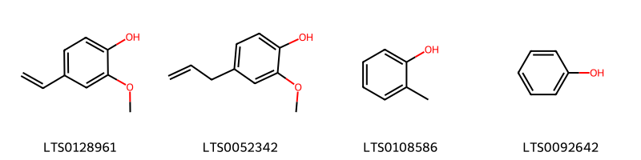{ width=100% }
    <figcaption>Hình ảnh cấu trúc hóa học của 4 hoạt chất thuộc nhóm Phenols gồm ['2-methoxy-4-vinyl-phenol (LTS0128961)', 'eugenol (LTS0052342)', 'o-cresol (LTS0108586)', 'phenol (LTS0092642)'].</figcaption>
</figure>
#### Nhóm Prenol lipids
<figure markdown="span">
    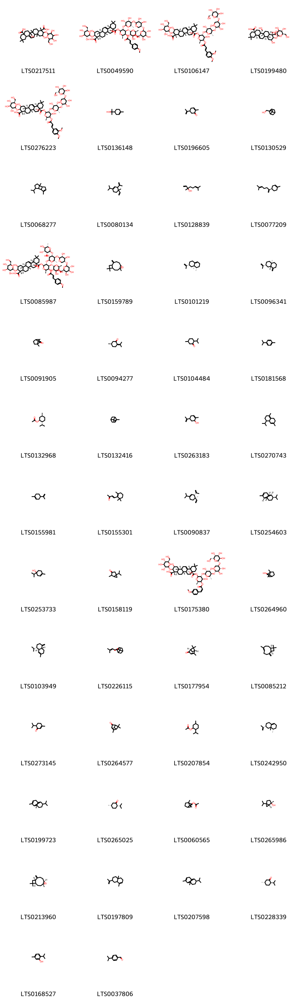{ width=100% }
    <figcaption>Hình ảnh cấu trúc hóa học của 71 hoạt chất thuộc nhóm Prenol lipids gồm ['2-hydroxy-6b-(hydroxymethyl)-4,6a,11,11,14b-pentamethyl-3-{[3,4,5-trihydroxy-6-(hydroxymethyl)oxan-2-yl]oxy}-1,2,3,4a,5,6,7,8,9,10,12,12a,14,14a-tetradecahydropicene-4,8a-dicarboxylic acid (LTS0217511)', 'senegin iii (LTS0049590)', '(2s,3r,4s,6ar,6br,8as,12as,14br)-8a-({[(2s,3r,4s,5r,6r)-3-{[(2s,3r,4s,5r,6s)-5-{[(2s,3r,4r,5r)-3,4-dihydroxy-5-{[(2s,3r,4s,5r,6r)-3,4,5-trihydroxy-6-(hydroxymethyl)oxan-2-yl]oxy}oxan-2-yl]oxy}-3,4-dihydroxy-6-methyloxan-2-yl]oxy}-5-{[(2e)-3-(3,4-dimethoxyphenyl)prop-2-enoyl]oxy}-4-hydroxy-6-methyloxan-2-yl]oxy}carbonyl)-2-hydroxy-6b-(hydroxymethyl)-4,6a,11,11,14b-pentamethyl-3-{[(2r,3r,4s,5s,6r)-3,4,5-trihydroxy-6-(hydroxymethyl)oxan-2-yl]oxy}-1,2,3,4a,5,6,7,8,9,10,12,12a,14,14a-tetradecahydropicene-4-carboxylic acid (LTS0106147)', '(2s,3r,4s,4ar,6ar,6br,8as,12ar,14ar,14br)-2-hydroxy-6b-(hydroxymethyl)-4,6a,11,11,14b-pentamethyl-3-{[(2r,3r,4s,5s,6r)-3,4,5-trihydroxy-6-(hydroxymethyl)oxan-2-yl]oxy}-1,2,3,4a,5,6,7,8,9,10,12,12a,14,14a-tetradecahydropicene-4,8a-dicarboxylic acid (LTS0199480)', 'senegin ii (LTS0276223)', 'terpineol (LTS0136148)', 'carvone (LTS0196605)', 'myrtenol (LTS0130529)', 'α-bourbonene (LTS0068277)', '4-ethenyl-1-isopropyl-4-methyl-3-(prop-1-en-2-yl)cyclohex-1-ene (LTS0080134)', 'linalool, (+-)- (LTS0128839)', '(r)-β-bisabolene (LTS0077209)', '(2s,3r,4s,4ar,6ar,6br,8as,12as,14ar,14br)-8a-({[(2s,3r,4s,5s,6r)-3-{[(2s,3r,4s,5s,6s)-5-{[(2s,3r,4r,5r)-3,4-dihydroxy-5-{[(2s,3r,4s,5r,6r)-3,4,5-trihydroxy-6-(hydroxymethyl)oxan-2-yl]oxy}oxan-2-yl]oxy}-3-hydroxy-6-methyl-4-{[(2s,3r,4r,5r,6s)-3,4,5-trihydroxy-6-methyloxan-2-yl]oxy}oxan-2-yl]oxy}-5-{[(2e)-3-(4-methoxyphenyl)prop-2-enoyl]oxy}-6-methyl-4-{[(2s,3r,4r,5r,6s)-3,4,5-trihydroxy-6-methyloxan-2-yl]oxy}oxan-2-yl]oxy}carbonyl)-2-hydroxy-6b-(hydroxymethyl)-4,6a,11,11,14b-pentamethyl-3-{[(2r,3r,4s,5s,6r)-3,4,5-trihydroxy-6-(hydroxymethyl)oxan-2-yl]oxy}-1,2,3,4a,5,6,7,8,9,10,12,12a,14,14a-tetradecahydropicene-4-carboxylic acid (LTS0085987)', 'caryophyllene oxide (LTS0159789)', 'eremophilene (LTS0101219)', 'β-selinene (LTS0096341)', 'camphor (LTS0091905)', '(+)-pulegone (LTS0094277)', 'menthone (LTS0104484)', 'cymene (LTS0181568)', 'menthyl acetate (LTS0132968)', 'α pinene (LTS0132416)', 'carveol (LTS0263183)', '4-isopropyl-1,6-dimethyl-2,3,4,4a,7,8-hexahydronaphthalene (LTS0270743)', 'limonene,  (LTS0155981)', 'β-ionone (LTS0155301)', 'elemene (LTS0090837)', 'α-ylangene (LTS0254603)', '4-terpineol (LTS0253733)', '3-isothujone (LTS0158119)', 'senegasaponin b (LTS0175380)', 'borneol (LTS0264960)', '(+)-gamma-cadinene (LTS0103949)', 'α-bergamotene (LTS0226115)', '(1r,5s)-4,6,6-trimethylbicyclo[3.1.1]hept-3-en-2-one (LTS0177954)', 'caryophyllene (LTS0085212)', 'piperitone (LTS0273145)', 'verbenone (LTS0264577)', 'l-menthyl acetate (LTS0207854)', '(1s,7r)-1,8a-dimethyl-7-(prop-1-en-2-yl)-2,3,5,6,7,8-hexahydro-1h-naphthalene (LTS0242950)', '(1s)-8-isopropyl-1,3-dimethyltricyclo[4.4.0.0²,⁷]dec-3-ene (LTS0199723)', '(-)-isomenthone (LTS0265025)', 'bornyl acetate (LTS0060565)', '(1r,2s)-5-isopropyl-2-methylbicyclo[3.1.0]hexan-2-ol (LTS0265986)', 'β-caryophyllene oxide (LTS0213960)', 'selinene (LTS0197809)', 'α-copaene (LTS0207598)', '(+)-menthone (LTS0228339)', 'thymol (LTS0168527)', 'cuminaldehyde (LTS0037806)', 'neral (LTS0165243)', '(+)-β-thujone (LTS0180873)', 'linalyl acetate (LTS0167325)', 'curcumene (LTS0190074)', '(1r,2s,7s,8s)-8-isopropyl-1,3-dimethyltricyclo[4.4.0.0²,⁷]dec-3-ene (LTS0190031)', '(2s,4r)-1,7,7-trimethylbicyclo[2.2.1]heptan-2-ol (LTS0010050)', 'p-menth-3-en-1-ol (LTS0108459)', '(-)-β-bisabolene (LTS0009940)', 'carvacrol (LTS0012882)', 'delta-cadinol (LTS0013807)', 'nerol (LTS0244289)', 'delta-cadinene (LTS0019321)', 'perillaldehyde,  (LTS0028488)', 'cuminol (LTS0021403)', 'α-selinene (LTS0024564)', 'sabinene hydrate (LTS0236165)', 'carvone, (+)- (LTS0027671)', 'α-citral (LTS0246122)', 'pseudoionone (LTS0119297)', '4-isopropyl-6-methyl-1-methylidene-3,4,4a,7,8,8a-hexahydro-2h-naphthalene (LTS0111070)', 'geranylacetone (LTS0231623)'].</figcaption>
</figure>
#### Nhóm Steroids and steroid derivatives
<figure markdown="span">
    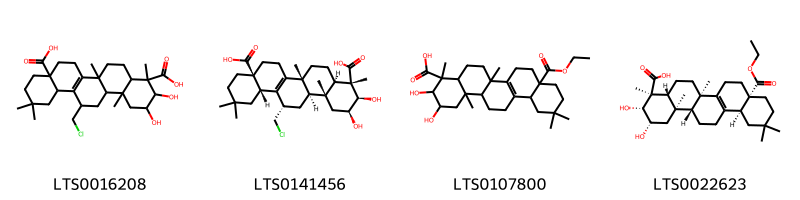{ width=100% }
    <figcaption>Hình ảnh cấu trúc hóa học của 4 hoạt chất thuộc nhóm Steroids and steroid derivatives gồm ['13-(chloromethyl)-2,3-dihydroxy-4,6a,11,11,14b-pentamethyl-2,3,4a,5,6,7,8,9,10,12,12a,13,14,14a-tetradecahydro-1h-picene-4,8a-dicarboxylic acid (LTS0016208)', 'senegenin (LTS0141456)', '8a-(ethoxycarbonyl)-2,3-dihydroxy-4,6a,11,11,14b-pentamethyl-2,3,4a,5,6,7,8,9,10,12,12a,13,14,14a-tetradecahydro-1h-picene-4-carboxylic acid (LTS0107800)', '(2s,3r,4s,4ar,6ar,8as,12as,14ar,14br)-8a-(ethoxycarbonyl)-2,3-dihydroxy-4,6a,11,11,14b-pentamethyl-2,3,4a,5,6,7,8,9,10,12,12a,13,14,14a-tetradecahydro-1h-picene-4-carboxylic acid (LTS0022623)'].</figcaption>
</figure>
#### Nhóm Unsaturated hydrocarbons
<figure markdown="span">
    { width=100% }
    <figcaption>Hình ảnh cấu trúc hóa học của 1 hoạt chất thuộc nhóm Unsaturated hydrocarbons gồm ['α terpinene (LTS0232891)'].</figcaption>
</figure>

---

### Dược dân tộc học

Danh sách các quốc gia có sử dụng *Polygala senega* trong điều trị các bệnh. 

| Country   | Disease                                  | Bệnh                                   |
|:----------|:-----------------------------------------|:---------------------------------------|
| Elsewhere | Expectorant, Poison, Tonic               | Thuốc long đờm, thuốc độc, thuốc bổ    |
| Japan*    | Expectorant                              | Thuốc long đàm                         |
| Turkey    | Diuretic, Emetic, Expectorant, Sudorific | Thuốc lợi tiểu, gây nôn, đờm, gây ngạt |

---

---
## Polygala siberica
### Thông tin về thực vật

!!! info "Phân loại thực vật của *Polygala sibirica* từ GIBF:"
    - **Kingdom:** Plantae
    - **Phylum:** Tracheophyta
    - **Order:** Fabales
    - **Family:** Polygalaceae
    - **Genus:** Polygala
    - **Species:** *Polygala sibirica*

 

| Label (VI)   | Label (EN)   | Scientific Name   | Descriptions (VI)   | Descriptions (EN)   | Also Known As (VI)   | Also Known As (EN)   |
|:-------------|:-------------|:------------------|:--------------------|:--------------------|:---------------------|:---------------------|
| N/A          | N/A          | Polygala senega   | loài thực vật       | species of plant    | ['']                 | ['']                 |

#### Phân bố trên thế giới

**Từ CSDL GIBF** Ukraine, Russian Federation, China, Mongolia

#### Phân bố tại Việt Nam

**Từ CSDL GIBF**: Không có ghi nhận ở Việt Nam

---
### Thành phần hóa học
        
- Theo cơ sở dữ liệu lotus: Từ loài *Polygala sibirica* đã phân lập và xác định được Chưa có hoạt chất nào được phân lập. hoạt chất thuộc về các nhóm Không có hoạt chất nào được phân lập. 

Không có hình ảnh nào được tạo ra

---

### Dược dân tộc học

Danh sách các quốc gia có sử dụng *Polygala sibirica* trong điều trị các bệnh. 

| Country   | Disease   | Bệnh           |
|:----------|:----------|:---------------|
| Asia      | Diuretic  | Thuốc lợi tiêu |

---

---
## Polygala sibirica
### Thông tin về thực vật

!!! info "Phân loại thực vật của *Polygala sibirica* từ GIBF:"
    - **Kingdom:** Plantae
    - **Phylum:** Tracheophyta
    - **Order:** Fabales
    - **Family:** Polygalaceae
    - **Genus:** Polygala
    - **Species:** *Polygala sibirica*

 

| Label (VI)   | Label (EN)   | Scientific Name   | Descriptions (VI)   | Descriptions (EN)   | Also Known As (VI)   | Also Known As (EN)   |
|:-------------|:-------------|:------------------|:--------------------|:--------------------|:---------------------|:---------------------|
| N/A          | N/A          | Polygala sibirica | loài thực vật       | species of plant    | ['']                 | ['']                 |

#### Phân bố trên thế giới

**Từ CSDL GIBF** Ukraine, Russian Federation, China, Mongolia

#### Phân bố tại Việt Nam

**Từ CSDL GIBF**: Không có ghi nhận ở Việt Nam

---
### Thành phần hóa học
        
- Theo cơ sở dữ liệu lotus: Từ loài *Polygala sibirica* đã phân lập và xác định được 66 hoạt chất thuộc về các nhóm Cinnamic acids and derivatives, Steroids and steroid derivatives, Organooxygen compounds, Benzopyrans. 

|    | chemicalTaxonomyClassyfireClass   |   smiles_count |
|---:|:----------------------------------|---------------:|
|  0 | Benzopyrans                       |             28 |
|  1 | Cinnamic acids and derivatives    |             23 |
|  2 | Organooxygen compounds            |             14 |
|  3 | Steroids and steroid derivatives  |              1 |

#### Nhóm Benzopyrans
<figure markdown="span">
    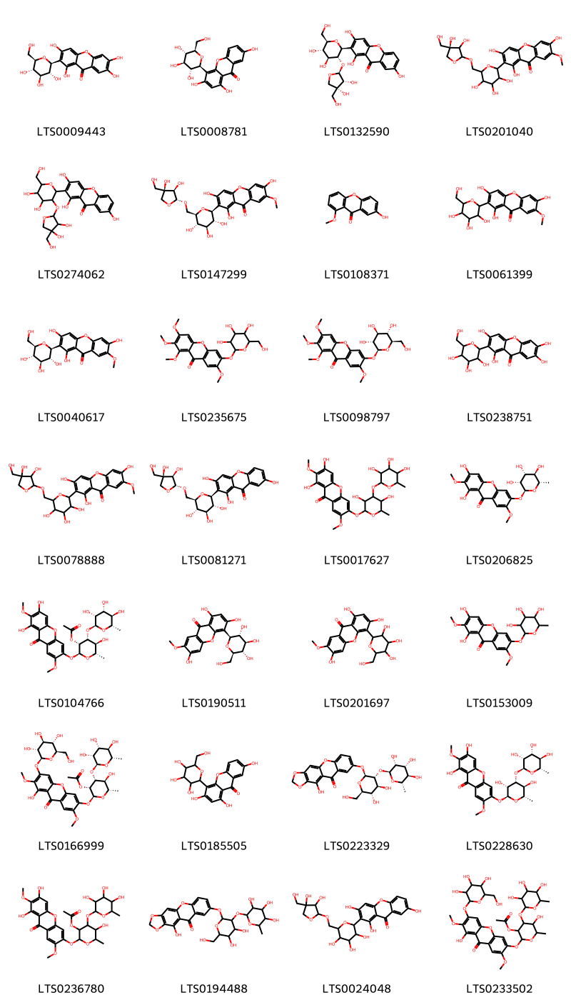{ width=100% }
    <figcaption>Hình ảnh cấu trúc hóa học của 28 hoạt chất thuộc nhóm Benzopyrans gồm ['mangiferin (LTS0009443)', 'lancerin (LTS0008781)', '2-[(2s,3r,4s,5s,6r)-3-{[(2s,3r,4r)-3,4-dihydroxy-4-(hydroxymethyl)oxolan-2-yl]oxy}-4,5-dihydroxy-6-(hydroxymethyl)oxan-2-yl]-1,3,7-trihydroxyxanthen-9-one (LTS0132590)', '2-[6-({[(4r)-3,4-dihydroxy-4-(hydroxymethyl)oxolan-2-yl]oxy}methyl)-3,4,5-trihydroxyoxan-2-yl]-1,3,6-trihydroxy-7-methoxyxanthen-9-one (LTS0201040)', '2-(3-{[3,4-dihydroxy-4-(hydroxymethyl)oxolan-2-yl]oxy}-4,5-dihydroxy-6-(hydroxymethyl)oxan-2-yl)-1,3,7-trihydroxyxanthen-9-one (LTS0274062)', '2-[(2s,3r,4r,5s,6r)-6-({[(2r,3r,4r)-3,4-dihydroxy-4-(hydroxymethyl)oxolan-2-yl]oxy}methyl)-3,4,5-trihydroxyoxan-2-yl]-1,3,6-trihydroxy-7-methoxyxanthen-9-one (LTS0147299)', '7-hydroxy-1-methoxyxanthen-9-one (LTS0108371)', '1,3,6-trihydroxy-7-methoxy-2-[3,4,5-trihydroxy-6-(hydroxymethyl)oxan-2-yl]xanthen-9-one (LTS0061399)', '1,3,6-trihydroxy-7-methoxy-2-[(2s,3r,4r,5s,6r)-3,4,5-trihydroxy-6-(hydroxymethyl)oxan-2-yl]xanthen-9-one (LTS0040617)', '1,2,3,7-tetramethoxy-6-{[3,4,5-trihydroxy-6-(hydroxymethyl)oxan-2-yl]oxy}xanthen-9-one (LTS0235675)', '1,2,3,7-tetramethoxy-6-{[(2s,3r,4s,5s,6r)-3,4,5-trihydroxy-6-(hydroxymethyl)oxan-2-yl]oxy}xanthen-9-one (LTS0098797)', 'mangiferin (LTS0238751)', '2-[6-({[3,4-dihydroxy-4-(hydroxymethyl)oxolan-2-yl]oxy}methyl)-3,4,5-trihydroxyoxan-2-yl]-1,3,6-trihydroxy-7-methoxyxanthen-9-one (LTS0078888)', '2-[(2s,3r,4r,5s,6r)-6-({[(2r,3r,4r)-3,4-dihydroxy-4-(hydroxymethyl)oxolan-2-yl]oxy}methyl)-3,4,5-trihydroxyoxan-2-yl]-1,3,7-trihydroxyxanthen-9-one (LTS0081271)', '6-({3,5-dihydroxy-6-methyl-4-[(3,4,5-trihydroxy-6-methyloxan-2-yl)oxy]oxan-2-yl}oxy)-1,3-dihydroxy-2,7-dimethoxyxanthen-9-one (LTS0017627)', '1,3-dihydroxy-2,7-dimethoxy-6-{[(2s,3r,4r,5r,6s)-3,4,5-trihydroxy-6-methyloxan-2-yl]oxy}xanthen-9-one (LTS0206825)', '(2s,3r,4r,5s,6s)-2-[(6,8-dihydroxy-2,7-dimethoxy-9-oxoxanthen-3-yl)oxy]-5-hydroxy-6-methyl-4-{[(2s,3r,4r,5r,6s)-3,4,5-trihydroxy-6-methyloxan-2-yl]oxy}oxan-3-yl acetate (LTS0104766)', '1,3,6-trihydroxy-7-methoxy-4-[(2s,3r,4r,5s,6r)-3,4,5-trihydroxy-6-(hydroxymethyl)oxan-2-yl]xanthen-9-one (LTS0190511)', '1,3,6-trihydroxy-7-methoxy-4-[3,4,5-trihydroxy-6-(hydroxymethyl)oxan-2-yl]xanthen-9-one (LTS0201697)', '1,3-dihydroxy-2,7-dimethoxy-6-[(3,4,5-trihydroxy-6-methyloxan-2-yl)oxy]xanthen-9-one (LTS0153009)', '(2s,3r,4r,5s,6s)-5-hydroxy-2-[(8-hydroxy-2,7-dimethoxy-9-oxo-6-{[(2s,3r,4s,5s,6r)-3,4,5-trihydroxy-6-(hydroxymethyl)oxan-2-yl]oxy}xanthen-3-yl)oxy]-6-methyl-4-{[(2s,3r,4r,5r,6s)-3,4,5-trihydroxy-6-methyloxan-2-yl]oxy}oxan-3-yl acetate (LTS0166999)', '1,3,7-trihydroxy-4-[3,4,5-trihydroxy-6-(hydroxymethyl)oxan-2-yl]xanthen-9-one (LTS0185505)', '8-{[(2s,3r,4s,5s,6r)-4,5-dihydroxy-6-(hydroxymethyl)-3-{[(2s,3r,4r,5r,6s)-3,4,5-trihydroxy-6-methyloxan-2-yl]oxy}oxan-2-yl]oxy}-11-hydroxy-2h-[1,3]dioxolo[4,5-b]xanthen-10-one (LTS0223329)', '6-{[(2s,3r,4r,5s,6s)-3,5-dihydroxy-6-methyl-4-{[(2s,3r,4r,5r,6s)-3,4,5-trihydroxy-6-methyloxan-2-yl]oxy}oxan-2-yl]oxy}-1,3-dihydroxy-2,7-dimethoxyxanthen-9-one (LTS0228630)', '2-[(6,8-dihydroxy-2,7-dimethoxy-9-oxoxanthen-3-yl)oxy]-5-hydroxy-6-methyl-4-[(3,4,5-trihydroxy-6-methyloxan-2-yl)oxy]oxan-3-yl acetate (LTS0236780)', '8-{[4,5-dihydroxy-6-(hydroxymethyl)-3-[(3,4,5-trihydroxy-6-methyloxan-2-yl)oxy]oxan-2-yl]oxy}-11-hydroxy-2h-[1,3]dioxolo[4,5-b]xanthen-10-one (LTS0194488)', '2-[6-({[3,4-dihydroxy-4-(hydroxymethyl)oxolan-2-yl]oxy}methyl)-3,4,5-trihydroxyoxan-2-yl]-1,3,7-trihydroxyxanthen-9-one (LTS0024048)', '5-hydroxy-2-[(8-hydroxy-2,7-dimethoxy-9-oxo-6-{[3,4,5-trihydroxy-6-(hydroxymethyl)oxan-2-yl]oxy}xanthen-3-yl)oxy]-6-methyl-4-[(3,4,5-trihydroxy-6-methyloxan-2-yl)oxy]oxan-3-yl acetate (LTS0233502)'].</figcaption>
</figure>
#### Nhóm Cinnamic acids and derivatives
<figure markdown="span">
    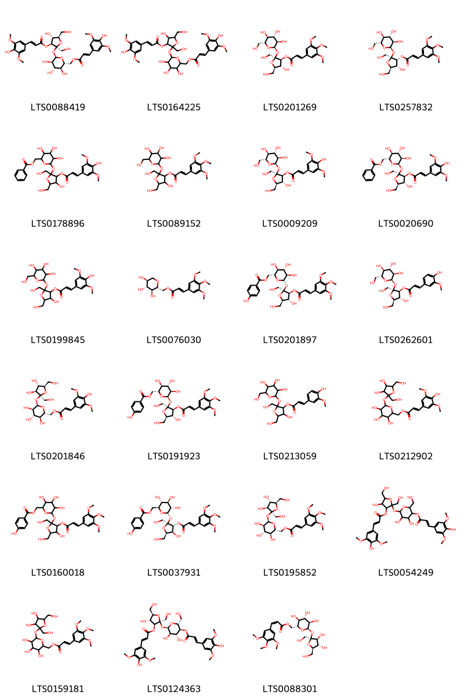{ width=100% }
    <figcaption>Hình ảnh cấu trúc hóa học của 23 hoạt chất thuộc nhóm Cinnamic acids and derivatives gồm ['[(2r,3s,4s,5r,6r)-3,4,5-trihydroxy-6-{[(2s,3s,4r,5r)-4-hydroxy-3-{[(2e)-3-(4-hydroxy-3,5-dimethoxyphenyl)prop-2-enoyl]oxy}-2,5-bis(hydroxymethyl)oxolan-2-yl]oxy}oxan-2-yl]methyl (2e)-3-(4-hydroxy-3,5-dimethoxyphenyl)prop-2-enoate (LTS0088419)', '{3,4,5-trihydroxy-6-[(4-hydroxy-3-{[3-(4-hydroxy-3,5-dimethoxyphenyl)prop-2-enoyl]oxy}-2,5-bis(hydroxymethyl)oxolan-2-yl)oxy]oxan-2-yl}methyl 3-(4-hydroxy-3,5-dimethoxyphenyl)prop-2-enoate (LTS0164225)', '(2s,3s,4r,5r)-4-hydroxy-2,5-bis(hydroxymethyl)-2-{[(2r,3r,4s,5s,6r)-3,4,5-trihydroxy-6-(hydroxymethyl)oxan-2-yl]oxy}oxolan-3-yl (2e)-3-(3,4,5-trimethoxyphenyl)prop-2-enoate (LTS0201269)', '(2s,3r,4r,5r)-4-hydroxy-2,5-bis(hydroxymethyl)-2-{[(2r,3r,4s,5s,6r)-3,4,5-trihydroxy-6-(hydroxymethyl)oxan-2-yl]oxy}oxolan-3-yl (2e)-3-(3,4,5-trimethoxyphenyl)prop-2-enoate (LTS0257832)', '{3,4,5-trihydroxy-6-[(4-hydroxy-3-{[3-(4-hydroxy-3,5-dimethoxyphenyl)prop-2-enoyl]oxy}-2,5-bis(hydroxymethyl)oxolan-2-yl)oxy]oxan-2-yl}methyl benzoate (LTS0178896)', '4-hydroxy-2,5-bis(hydroxymethyl)-2-{[3,4,5-trihydroxy-6-(hydroxymethyl)oxan-2-yl]oxy}oxolan-3-yl 3-(3,4,5-trimethoxyphenyl)prop-2-enoate (LTS0089152)', '(2s,3s,4r,5r)-4-hydroxy-2,5-bis(hydroxymethyl)-2-{[(2r,3r,4s,5s,6r)-3,4,5-trihydroxy-6-(hydroxymethyl)oxan-2-yl]oxy}oxolan-3-yl (2e)-3-(4-hydroxy-3,5-dimethoxyphenyl)prop-2-enoate (LTS0009209)', '[(2r,3s,4s,5r,6r)-3,4,5-trihydroxy-6-{[(2s,3s,4r,5r)-4-hydroxy-3-{[(2e)-3-(4-hydroxy-3,5-dimethoxyphenyl)prop-2-enoyl]oxy}-2,5-bis(hydroxymethyl)oxolan-2-yl]oxy}oxan-2-yl]methyl benzoate (LTS0020690)', '4-hydroxy-2,5-bis(hydroxymethyl)-2-{[3,4,5-trihydroxy-6-(hydroxymethyl)oxan-2-yl]oxy}oxolan-3-yl 3-(4-hydroxy-3,5-dimethoxyphenyl)prop-2-enoate (LTS0199845)', 'tenuifoliside d (LTS0076030)', '[(2r,3s,4s,5r,6s)-3,4,5-trihydroxy-6-{[(2s,3s,4r,5r)-4-hydroxy-2,5-bis(hydroxymethyl)-3-{[(2e)-3-(3,4,5-trimethoxyphenyl)prop-2-enoyl]oxy}oxolan-2-yl]oxy}oxan-2-yl]methyl 4-hydroxybenzoate (LTS0201897)', '(2s,3s,4r,5r)-4-hydroxy-2,5-bis(hydroxymethyl)-2-{[(2r,3r,4s,5s,6r)-3,4,5-trihydroxy-6-(hydroxymethyl)oxan-2-yl]oxy}oxolan-3-yl (2e)-3-(4-hydroxy-3-methoxyphenyl)prop-2-enoate (LTS0262601)', '[(2r,3s,4s,5r,6r)-6-{[(2s,3s,4s,5r)-3,4-dihydroxy-2,5-bis(hydroxymethyl)oxolan-2-yl]oxy}-3,4,5-trihydroxyoxan-2-yl]methyl (2e)-3-(4-hydroxy-3,5-dimethoxyphenyl)prop-2-enoate (LTS0201846)', 'tenuifoliside a (LTS0191923)', '4-hydroxy-2,5-bis(hydroxymethyl)-2-{[3,4,5-trihydroxy-6-(hydroxymethyl)oxan-2-yl]oxy}oxolan-3-yl 3-(4-hydroxy-3-methoxyphenyl)prop-2-enoate (LTS0213059)', '(6-{[3,4-dihydroxy-2,5-bis(hydroxymethyl)oxolan-2-yl]oxy}-3,4,5-trihydroxyoxan-2-yl)methyl 3-(4-hydroxy-3,5-dimethoxyphenyl)prop-2-enoate (LTS0212902)', '(3,4,5-trihydroxy-6-{[4-hydroxy-2,5-bis(hydroxymethyl)-3-{[3-(3,4,5-trimethoxyphenyl)prop-2-enoyl]oxy}oxolan-2-yl]oxy}oxan-2-yl)methyl 4-hydroxybenzoate (LTS0160018)', '[(2s,3r,4r,5s,6s)-3,4,5-trihydroxy-6-{[(2s,3r,4s,5r)-4-hydroxy-2,5-bis(hydroxymethyl)-3-{[(2e)-3-(3,4,5-trimethoxyphenyl)prop-2-enoyl]oxy}oxolan-2-yl]oxy}oxan-2-yl]methyl 4-hydroxybenzoate (LTS0037931)', '[(2r,3s,4s,5r,6r)-6-{[(2s,3s,4s,5r)-3,4-dihydroxy-2,5-bis(hydroxymethyl)oxolan-2-yl]oxy}-3,4,5-trihydroxyoxan-2-yl]methyl (2e)-3-(3,4,5-trimethoxyphenyl)prop-2-enoate (LTS0195852)', '4,5-dihydroxy-6-[(4-hydroxy-3-{[3-(4-hydroxy-3,5-dimethoxyphenyl)prop-2-enoyl]oxy}-2,5-bis(hydroxymethyl)oxolan-2-yl)oxy]-2-(hydroxymethyl)oxan-3-yl 3-(4-hydroxy-3,5-dimethoxyphenyl)prop-2-enoate (LTS0054249)', '(6-{[3,4-dihydroxy-2,5-bis(hydroxymethyl)oxolan-2-yl]oxy}-3,4,5-trihydroxyoxan-2-yl)methyl 3-(3,4,5-trimethoxyphenyl)prop-2-enoate (LTS0159181)', '(2r,3s,4r,5r,6r)-4,5-dihydroxy-6-{[(2s,3s,4r,5r)-4-hydroxy-3-{[(2e)-3-(4-hydroxy-3,5-dimethoxyphenyl)prop-2-enoyl]oxy}-2,5-bis(hydroxymethyl)oxolan-2-yl]oxy}-2-(hydroxymethyl)oxan-3-yl (2e)-3-(4-hydroxy-3,5-dimethoxyphenyl)prop-2-enoate (LTS0124363)', '[(2r,3s,4s,5r,6r)-6-{[(2s,3s,4s,5r)-3,4-dihydroxy-2,5-bis(hydroxymethyl)oxolan-2-yl]oxy}-3,4,5-trihydroxyoxan-2-yl]methyl (2z)-3-(3,4,5-trimethoxyphenyl)prop-2-enoate (LTS0088301)'].</figcaption>
</figure>
#### Nhóm Organooxygen compounds
<figure markdown="span">
    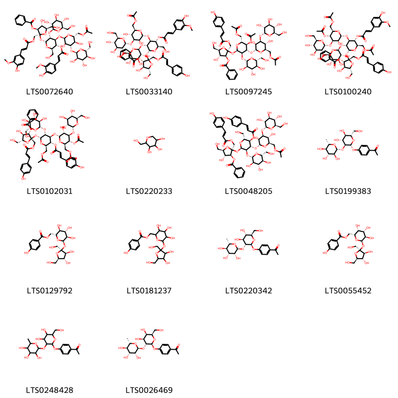{ width=100% }
    <figcaption>Hình ảnh cấu trúc hóa học của 14 hoạt chất thuộc nhóm Organooxygen compounds gồm ['(2s,3s,4r,5r)-2-{[(2r,3r,4s,5r,6r)-4-{[(2r,3r,4s,5r,6r)-6-[(acetyloxy)methyl]-3,5-dihydroxy-4-{[(2r,3r,4s,5s,6r)-3,4,5-trihydroxy-6-(hydroxymethyl)oxan-2-yl]oxy}oxan-2-yl]oxy}-5-{[(2e)-3-(4-hydroxy-3-methoxyphenyl)prop-2-enoyl]oxy}-6-(hydroxymethyl)-3-{[(2s,3r,4s,5s,6r)-3,4,5-trihydroxy-6-(hydroxymethyl)oxan-2-yl]oxy}oxan-2-yl]oxy}-4-hydroxy-2-({[(2e)-3-(4-hydroxy-3-methoxyphenyl)prop-2-enoyl]oxy}methyl)-5-(hydroxymethyl)oxolan-3-yl benzoate (LTS0072640)', '(2s,3s,4r,5r)-2-{[(2r,3r,4s,5r,6r)-4-{[(2r,3r,4s,5r,6r)-6-[(acetyloxy)methyl]-3,5-dihydroxy-4-{[(2r,3r,4s,5s,6r)-3,4,5-trihydroxy-6-(hydroxymethyl)oxan-2-yl]oxy}oxan-2-yl]oxy}-5-{[(2e)-3-(4-hydroxy-3-methoxyphenyl)prop-2-enoyl]oxy}-6-(hydroxymethyl)-3-{[(2s,3r,4s,5s,6r)-3,4,5-trihydroxy-6-(hydroxymethyl)oxan-2-yl]oxy}oxan-2-yl]oxy}-4-hydroxy-5-(hydroxymethyl)-2-({[(2e)-3-(4-hydroxyphenyl)prop-2-enoyl]oxy}methyl)oxolan-3-yl benzoate (LTS0033140)', '(2s,3s,4r,5r)-2-{[(2r,3r,4s,5r,6r)-5-(acetyloxy)-6-[(acetyloxy)methyl]-4-{[(2r,3r,4s,5r,6r)-6-[(acetyloxy)methyl]-3,5-dihydroxy-4-{[(2r,3r,4s,5s,6r)-3,4,5-trihydroxy-6-(hydroxymethyl)oxan-2-yl]oxy}oxan-2-yl]oxy}-3-{[(2s,3r,4s,5s,6r)-3,4,5-trihydroxy-6-(hydroxymethyl)oxan-2-yl]oxy}oxan-2-yl]oxy}-4-hydroxy-5-(hydroxymethyl)-2-({[(2e)-3-(4-hydroxyphenyl)prop-2-enoyl]oxy}methyl)oxolan-3-yl benzoate (LTS0097245)', '(2s,3s,4r,5r)-2-{[(2r,3r,4s,5r,6r)-4-{[(2r,3r,4r,5r,6r)-5-(acetyloxy)-6-[(acetyloxy)methyl]-3-hydroxy-4-{[(2r,3r,4s,5s,6r)-3,4,5-trihydroxy-6-(hydroxymethyl)oxan-2-yl]oxy}oxan-2-yl]oxy}-6-[(acetyloxy)methyl]-5-{[(2e)-3-(4-hydroxy-3-methoxyphenyl)prop-2-enoyl]oxy}-3-{[(2s,3r,4s,5s,6r)-3,4,5-trihydroxy-6-(hydroxymethyl)oxan-2-yl]oxy}oxan-2-yl]oxy}-4-hydroxy-5-(hydroxymethyl)-2-({[(2e)-3-(4-hydroxyphenyl)prop-2-enoyl]oxy}methyl)oxolan-3-yl benzoate (LTS0100240)', '(2s,3s,4r,5r)-2-{[(2r,3r,4s,5r,6r)-4-{[(2r,3r,4r,5r,6r)-5-(acetyloxy)-6-[(acetyloxy)methyl]-3-hydroxy-4-{[(2r,3r,4s,5s,6r)-3,4,5-trihydroxy-6-(hydroxymethyl)oxan-2-yl]oxy}oxan-2-yl]oxy}-6-[(acetyloxy)methyl]-5-{[(2e)-3-(4-hydroxyphenyl)prop-2-enoyl]oxy}-3-{[(2s,3r,4s,5s,6r)-3,4,5-trihydroxy-6-(hydroxymethyl)oxan-2-yl]oxy}oxan-2-yl]oxy}-4-hydroxy-5-(hydroxymethyl)-2-({[(2e)-3-(4-hydroxyphenyl)prop-2-enoyl]oxy}methyl)oxolan-3-yl benzoate (LTS0102031)', '2-(hydroxymethyl)oxane-3,4,5-triol (LTS0220233)', '(2s,3s,4r,5r)-2-{[(2r,3r,4s,5r,6r)-4-{[(2r,3r,4s,5r,6r)-6-[(acetyloxy)methyl]-3,5-dihydroxy-4-{[(2r,3r,4s,5s,6r)-3,4,5-trihydroxy-6-(hydroxymethyl)oxan-2-yl]oxy}oxan-2-yl]oxy}-6-(hydroxymethyl)-5-{[(2e)-3-(4-hydroxyphenyl)prop-2-enoyl]oxy}-3-{[(2s,3r,4s,5s,6r)-3,4,5-trihydroxy-6-(hydroxymethyl)oxan-2-yl]oxy}oxan-2-yl]oxy}-4-hydroxy-5-(hydroxymethyl)-2-({[(2e)-3-(4-hydroxyphenyl)prop-2-enoyl]oxy}methyl)oxolan-3-yl benzoate (LTS0048205)', '1-(4-{[(2r,3s,4r,5r,6s)-4,5-dihydroxy-6-(hydroxymethyl)-3-{[(2r,3s,4r,5r,6s)-3,4,5-trihydroxy-6-methyloxan-2-yl]oxy}oxan-2-yl]oxy}phenyl)ethanone (LTS0199383)', '[(2r,3s,4s,5r,6r)-6-{[(2s,3s,4s,5r)-3,4-dihydroxy-2,5-bis(hydroxymethyl)oxolan-2-yl]oxy}-3,4,5-trihydroxyoxan-2-yl]methyl 4-hydroxybenzoate (LTS0129792)', '(6-{[3,4-dihydroxy-2,5-bis(hydroxymethyl)oxolan-2-yl]oxy}-3,4,5-trihydroxyoxan-2-yl)methyl 4-hydroxybenzoate (LTS0181237)', '1-(4-{[(2s,3r,4s,5s,6r)-4,5-dihydroxy-6-(hydroxymethyl)-3-{[(2s,3r,4r,5r,6s)-3,4,5-trihydroxy-6-methyloxan-2-yl]oxy}oxan-2-yl]oxy}phenyl)ethanone (LTS0220342)', '[(2r,3r,4s,5r,6r)-6-{[(2s,3s,4s,5r)-3,4-dihydroxy-2,5-bis(hydroxymethyl)oxolan-2-yl]oxy}-3,4,5-trihydroxyoxan-2-yl]methyl 4-hydroxybenzoate (LTS0055452)', '1-(4-{[4,5-dihydroxy-6-(hydroxymethyl)-3-[(3,4,5-trihydroxy-6-methyloxan-2-yl)oxy]oxan-2-yl]oxy}phenyl)ethanone (LTS0248428)', '1-(4-{[(2s,3r,4s,5r,6r)-4,5-dihydroxy-6-(hydroxymethyl)-3-{[(2s,3r,4r,5r,6s)-3,4,5-trihydroxy-6-methyloxan-2-yl]oxy}oxan-2-yl]oxy}phenyl)ethanone (LTS0026469)'].</figcaption>
</figure>
#### Nhóm Steroids and steroid derivatives
<figure markdown="span">
    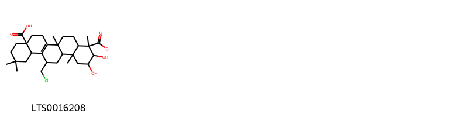{ width=100% }
    <figcaption>Hình ảnh cấu trúc hóa học của 1 hoạt chất thuộc nhóm Steroids and steroid derivatives gồm ['13-(chloromethyl)-2,3-dihydroxy-4,6a,11,11,14b-pentamethyl-2,3,4a,5,6,7,8,9,10,12,12a,13,14,14a-tetradecahydro-1h-picene-4,8a-dicarboxylic acid (LTS0016208)'].</figcaption>
</figure>

---

### Dược dân tộc học

Danh sách các quốc gia có sử dụng *Polygala sibirica* trong điều trị các bệnh. 

| Country   | Disease     | Bệnh           |
|:----------|:------------|:---------------|
| Elsewhere | Expectorant | Thuốc long đàm |

---

---
## Polygala tenuifolia
### Thông tin về thực vật

!!! info "Phân loại thực vật của *Polygala tenuifolia* từ GIBF:"
    - **Kingdom:** Plantae
    - **Phylum:** Tracheophyta
    - **Order:** Fabales
    - **Family:** Polygalaceae
    - **Genus:** Polygala
    - **Species:** *Polygala tenuifolia*

 

| Label (VI)   | Label (EN)   | Scientific Name     | Descriptions (VI)   | Descriptions (EN)   | Also Known As (VI)   | Also Known As (EN)   |
|:-------------|:-------------|:--------------------|:--------------------|:--------------------|:---------------------|:---------------------|
| N/A          | N/A          | Polygala tenuifolia | loài thực vật       | species of plant    | ['']                 | ['']                 |

#### Phân bố trên thế giới

**Từ CSDL GIBF** nan, Korea, Republic of, Brazil, Russian Federation, Mongolia, China

#### Phân bố tại Việt Nam

**Từ CSDL GIBF**: Không có ghi nhận ở Việt Nam

---
### Thành phần hóa học
        
- Theo cơ sở dữ liệu lotus: Từ loài *Polygala tenuifolia* đã phân lập và xác định được 181 hoạt chất thuộc về các nhóm Fatty Acyls, Prenol lipids, Indoles and derivatives, Cinnamic acids and derivatives, Harmala alkaloids, Organooxygen compounds, Carboxylic acids and derivatives, Benzopyrans. 

|    | chemicalTaxonomyClassyfireClass   |   smiles_count |
|---:|:----------------------------------|---------------:|
|  0 | Benzopyrans                       |             65 |
|  1 | Carboxylic acids and derivatives  |              6 |
|  2 | Cinnamic acids and derivatives    |             16 |
|  3 | Fatty Acyls                       |              1 |
|  4 | Harmala alkaloids                 |              6 |
|  5 | Indoles and derivatives           |              2 |
|  6 | Organooxygen compounds            |             74 |
|  7 | Prenol lipids                     |             10 |

#### Nhóm Benzopyrans
<figure markdown="span">
    { width=100% }
    <figcaption>Hình ảnh cấu trúc hóa học của 65 hoạt chất thuộc nhóm Benzopyrans gồm ['8,11-dihydroxy-2h-[1,3]dioxolo[4,5-b]xanthen-10-one (LTS0101492)', '1,3,6-trihydroxy-2,7-dimethoxyxanthen-9-one (LTS0043420)', 'mangiferin (LTS0009443)', 'lancerin (LTS0008781)', '2-[(2s,3r,4s,5s,6r)-3-{[(2s,3r,4r)-3,4-dihydroxy-4-(hydroxymethyl)oxolan-2-yl]oxy}-4,5-dihydroxy-6-(hydroxymethyl)oxan-2-yl]-1,3,7-trihydroxyxanthen-9-one (LTS0132590)', '3-hydroxy-1,2,7-trimethoxyxanthen-9-one (LTS0052038)', '2-[6-({[(4r)-3,4-dihydroxy-4-(hydroxymethyl)oxolan-2-yl]oxy}methyl)-3,4,5-trihydroxyoxan-2-yl]-1,3,6-trihydroxy-7-methoxyxanthen-9-one (LTS0201040)', '1,7-dihydroxy-4-methoxyxanthen-9-one (LTS0074751)', '1,7-dihydroxy-2,3-dimethoxyxanthen-9-one (LTS0062648)', '2-(3-{[3,4-dihydroxy-4-(hydroxymethyl)oxolan-2-yl]oxy}-4,5-dihydroxy-6-(hydroxymethyl)oxan-2-yl)-1,3,7-trihydroxyxanthen-9-one (LTS0274062)', '2-[(2s,3r,4r,5s,6r)-6-({[(2r,3r,4r)-3,4-dihydroxy-4-(hydroxymethyl)oxolan-2-yl]oxy}methyl)-3,4,5-trihydroxyoxan-2-yl]-1,3,6-trihydroxy-7-methoxyxanthen-9-one (LTS0147299)', '6-{[4,5-dihydroxy-6-(hydroxymethyl)-3-[(3,4,5-trihydroxy-6-methyloxan-2-yl)oxy]oxan-2-yl]oxy}-1,3-dihydroxy-7-methoxyxanthen-9-one (LTS0164259)', '6-{[(2s,3r,4s,5s,6r)-4,5-dihydroxy-6-(hydroxymethyl)-3-{[(2s,3r,4r,5r,6s)-3,4,5-trihydroxy-6-methyloxan-2-yl]oxy}oxan-2-yl]oxy}-1,3-dihydroxy-7-methoxyxanthen-9-one (LTS0243701)', '3-{[(2s,3r,4s,5s,6r)-4,5-dihydroxy-6-(hydroxymethyl)-3-{[(2s,3r,4r,5r,6s)-3,4,5-trihydroxy-6-methyloxan-2-yl]oxy}oxan-2-yl]oxy}-6,7-dihydroxy-2-methoxyxanthen-9-one (LTS0056164)', '1,3,6-trihydroxy-7-methoxy-2-[3,4,5-trihydroxy-6-(hydroxymethyl)oxan-2-yl]xanthen-9-one (LTS0061399)', '1,3,7-trihydroxy-2-methoxyxanthen-9-one (LTS0207686)', 'euxanthone (LTS0209320)', '1,3,6-trihydroxy-7-methoxy-2-[(2s,3r,4r,5s,6r)-3,4,5-trihydroxy-6-(hydroxymethyl)oxan-2-yl]xanthen-9-one (LTS0040617)', '1,2,3,7-tetramethoxy-6-{[3,4,5-trihydroxy-6-(hydroxymethyl)oxan-2-yl]oxy}xanthen-9-one (LTS0235675)', '1,3,7-trihydroxy-2-{[(2s,3r,4s,5s,6r)-3,4,5-trihydroxy-6-(hydroxymethyl)oxan-2-yl]oxy}xanthen-9-one (LTS0122400)', '1,2,3,7-tetramethoxy-6-{[(2s,3r,4s,5s,6r)-3,4,5-trihydroxy-6-(hydroxymethyl)oxan-2-yl]oxy}xanthen-9-one (LTS0098797)', '3-{[(2s,3r,4s,5s,6r)-4,5-dihydroxy-6-(hydroxymethyl)-3-{[(2s,3r,4r,5r,6s)-3,4,5-trihydroxy-6-methyloxan-2-yl]oxy}oxan-2-yl]oxy}-1,6-dihydroxy-2,7-dimethoxyxanthen-9-one (LTS0073803)', '1,3,7-trihydroxy-4-{[(2r,3s,4r,5r,6s)-3,4,5-trihydroxy-6-(hydroxymethyl)oxan-2-yl]oxy}xanthen-9-one (LTS0213320)', '1-hydroxy-3,7-dimethoxyxanthen-9-one (LTS0122941)', '1,6,7-trimethoxyxanthen-9-one (LTS0103746)', '1,2,3,7-tetramethoxyxanthen-9-one (LTS0198096)', '4-[(2s,3r,4r,5s,6r)-6-({[(2r,3r,4r)-3,4-dihydroxy-4-(hydroxymethyl)oxolan-2-yl]oxy}methyl)-3,4,5-trihydroxyoxan-2-yl]-1,3,6-trihydroxy-7-methoxyxanthen-9-one (LTS0079334)', '3-{[(2s,3r,4s,5s,6r)-4,5-dihydroxy-6-(hydroxymethyl)-3-{[(2s,3r,4r,5r,6s)-3,4,5-trihydroxy-6-methyloxan-2-yl]oxy}oxan-2-yl]oxy}-1,7-dihydroxyxanthen-9-one (LTS0089962)', '2,7-dihydroxyxanthen-9-one (LTS0075271)', '1,6-dihydroxy-3,5,7-trimethoxyxanthen-9-one (LTS0221829)', '1,7-dimethoxyxanthen-9-one (LTS0069877)', '4-[6-({[3,4-dihydroxy-4-(hydroxymethyl)oxolan-2-yl]oxy}methyl)-3,4,5-trihydroxyoxan-2-yl]-1,3,6-trihydroxy-7-methoxyxanthen-9-one (LTS0209064)', '3-{[(2s,3r,4s,5s,6r)-4,5-dihydroxy-6-(hydroxymethyl)-3-{[(2r,3s,4s,5s,6r)-3,4,5-trihydroxy-6-methyloxan-2-yl]oxy}oxan-2-yl]oxy}-1,6-dihydroxy-2,7-dimethoxyxanthen-9-one (LTS0096740)', '1,3,6-trihydroxy-7-methoxy-2-{[(2s,3r,4s,5s,6r)-3,4,5-trihydroxy-6-(hydroxymethyl)oxan-2-yl]oxy}xanthen-9-one (LTS0183008)', '1,2,3,6,7-pentamethoxyxanthen-9-one (LTS0086884)', '6-hydroxy-1,7-dimethoxyxanthen-9-one (LTS0001017)', '6,8-dihydroxy-1,2,3-trimethoxyxanthen-9-one (LTS0104824)', '1,3-dihydroxy-7-methoxy-4-[(2s,3r,4r,5s,6r)-3,4,5-trihydroxy-6-(hydroxymethyl)oxan-2-yl]xanthen-9-one (LTS0274705)', '2-[(2s,3r,4s,5s,6r)-3-{[(2s,3r,4r)-3,4-dihydroxy-4-(hydroxymethyl)oxolan-2-yl]oxy}-4,5-dihydroxy-6-(hydroxymethyl)oxan-2-yl]-1,3,6-trihydroxy-7-methoxyxanthen-9-one (LTS0256757)', '1,6-dihydroxy-3,7-dimethoxyxanthen-9-one (LTS0175349)', '1,6,7-trihydroxy-2,3-dimethoxyxanthen-9-one (LTS0206894)', '3-{[4,5-dihydroxy-6-(hydroxymethyl)-3-[(3,4,5-trihydroxy-6-methyloxan-2-yl)oxy]oxan-2-yl]oxy}-1,7-dihydroxyxanthen-9-one (LTS0138599)', '6-hydroxy-1,2,3,7-tetramethoxyxanthen-9-one (LTS0138618)', '1,3,6,7-tetramethoxyxanthen-9-one (LTS0152674)', '6-{[4,5-dihydroxy-6-(hydroxymethyl)-3-[(3,4,5-trihydroxy-6-methyloxan-2-yl)oxy]oxan-2-yl]oxy}-1,2,3,7-tetramethoxyxanthen-9-one (LTS0102269)', '1,3,6-trihydroxy-7-methoxyxanthen-9-one (LTS0237359)', '3-{[(2s,3r,4s,5s,6r)-4,5-dihydroxy-6-(hydroxymethyl)-3-{[(2s,3s,4s,5s,6r)-3,4,5-trihydroxy-6-methyloxan-2-yl]oxy}oxan-2-yl]oxy}-1,6-dihydroxy-2,7-dimethoxyxanthen-9-one (LTS0225356)', '3-{[(2r,3r,4s,5s,6r)-4,5-dihydroxy-6-(hydroxymethyl)-3-{[(2s,3r,4r,5r,6s)-3,4,5-trihydroxy-6-methyloxan-2-yl]oxy}oxan-2-yl]oxy}-1,7-dihydroxyxanthen-9-one (LTS0235688)', '6,8-dihydroxy-1,2,4-trimethoxyxanthen-9-one (LTS0171820)', '1,3,6-trihydroxy-7-methoxy-2-(3,4,5-trihydroxy-6-{[(3,4,5-trihydroxyoxan-2-yl)oxy]methyl}oxan-2-yl)xanthen-9-one (LTS0203664)', '1,6-dihydroxyxanthen-9-one (LTS0257994)', '2-(3-{[3,4-dihydroxy-4-(hydroxymethyl)oxolan-2-yl]oxy}-4,5-dihydroxy-6-(hydroxymethyl)oxan-2-yl)-1,3,6-trihydroxy-7-methoxyxanthen-9-one (LTS0250549)', '8,11-dimethoxy-2h-[1,3]dioxolo[4,5-b]xanthen-10-one (LTS0046143)', '6-{[(2s,3r,4s,5s,6r)-4,5-dihydroxy-6-(hydroxymethyl)-3-{[(2s,3r,4r,5r,6s)-3,4,5-trihydroxy-6-methyloxan-2-yl]oxy}oxan-2-yl]oxy}-1,2,3,7-tetramethoxyxanthen-9-one (LTS0245351)', 'gentisin (LTS0033272)', '6-{[(2s,3r,4s,5s,6r)-4,5-dihydroxy-6-(hydroxymethyl)-3-{[(2s,3r,4r,5r,6s)-3,4,5-trihydroxy-6-methyloxan-2-yl]oxy}oxan-2-yl]oxy}-1-hydroxy-3,7-dimethoxyxanthen-9-one (LTS0055275)', '1,7-dihydroxy-4-{[(2s,3r,4s,5s,6r)-3,4,5-trihydroxy-6-(hydroxymethyl)oxan-2-yl]oxy}xanthen-9-one (LTS0003020)', '6-{[4,5-dihydroxy-6-(hydroxymethyl)-3-[(3,4,5-trihydroxy-6-methyloxan-2-yl)oxy]oxan-2-yl]oxy}-1-hydroxy-3,7-dimethoxyxanthen-9-one (LTS0006524)', '7-hydroxy-1,2,3-trimethoxyxanthen-9-one (LTS0259719)', '1-hydroxy-3,6,7-trimethoxyxanthen-9-one (LTS0006954)', '1,3,6-trihydroxy-7-methoxy-2-[(2s,3r,4r,5s,6r)-3,4,5-trihydroxy-6-({[(2s,3s,4r,5r)-3,4,5-trihydroxyoxan-2-yl]oxy}methyl)oxan-2-yl]xanthen-9-one (LTS0044147)', '3-[(2s,3r,4s,5s,6r)-3-{[(2s,3r,4r)-3,4-dihydroxy-4-(hydroxymethyl)oxolan-2-yl]oxy}-4,5-dihydroxy-6-(hydroxymethyl)oxan-2-yl]-2,4,7-trihydroxy-6-methoxyxanthen-9-one (LTS0253473)', '1,3,6-trihydroxy-7-methoxy-2-[(2s,3r,4r,5s,6r)-3,4,5-trihydroxy-6-({[(2s,3s,4s,5s)-3,4,5-trihydroxyoxan-2-yl]oxy}methyl)oxan-2-yl]xanthen-9-one (LTS0246077)', '1,3-dihydroxy-7-methoxy-4-[3,4,5-trihydroxy-6-(hydroxymethyl)oxan-2-yl]xanthen-9-one (LTS0242280)', '3-{[4,5-dihydroxy-6-(hydroxymethyl)-3-[(3,4,5-trihydroxy-6-methyloxan-2-yl)oxy]oxan-2-yl]oxy}-1,6-dihydroxy-2,7-dimethoxyxanthen-9-one (LTS0048553)'].</figcaption>
</figure>
#### Nhóm Carboxylic acids and derivatives
<figure markdown="span">
    { width=100% }
    <figcaption>Hình ảnh cấu trúc hóa học của 6 hoạt chất thuộc nhóm Carboxylic acids and derivatives gồm ['2-[(acetyloxy)methyl]-2-{[3-({6-[(acetyloxy)methyl]-3,4,5-trihydroxyoxan-2-yl}oxy)-5-(benzoyloxy)-4-hydroxy-6-(hydroxymethyl)oxan-2-yl]oxy}-4-hydroxy-5-(hydroxymethyl)oxolan-3-yl benzoate (LTS0043433)', '(2r,3s,4s,5r,6r)-5-{[(2s,3r,4s,5s,6r)-6-[(acetyloxy)methyl]-3,4,5-trihydroxyoxan-2-yl]oxy}-6-{[(2s,3s,4r,5r)-2-[(acetyloxy)methyl]-3-(benzoyloxy)-4-hydroxy-5-(hydroxymethyl)oxolan-2-yl]oxy}-4-hydroxy-2-(hydroxymethyl)oxan-3-yl benzoate (LTS0267137)', '2-[(acetyloxy)methyl]-2-({6-[(acetyloxy)methyl]-5-(benzoyloxy)-4-hydroxy-3-{[3,4,5-trihydroxy-6-(hydroxymethyl)oxan-2-yl]oxy}oxan-2-yl}oxy)-4-hydroxy-5-(hydroxymethyl)oxolan-3-yl benzoate (LTS0167231)', '(2s,3s,4r,5r)-2-[(acetyloxy)methyl]-2-{[(2r,3r,4s,5s,6r)-6-[(acetyloxy)methyl]-5-(benzoyloxy)-4-hydroxy-3-{[(2s,3r,4s,5s,6r)-3,4,5-trihydroxy-6-(hydroxymethyl)oxan-2-yl]oxy}oxan-2-yl]oxy}-4-hydroxy-5-(hydroxymethyl)oxolan-3-yl benzoate (LTS0178383)', 'tenuifoliside e (LTS0002616)', '{5-[(acetyloxy)methyl]-5-{[3,5-bis(acetyloxy)-6-[(acetyloxy)methyl]-4-hydroxyoxan-2-yl]oxy}-3-hydroxy-4-{[3-(4-hydroxy-3-methoxyphenyl)prop-2-enoyl]oxy}oxolan-2-yl}methyl 3-(4-hydroxy-3,5-dimethoxyphenyl)prop-2-enoate (LTS0010488)'].</figcaption>
</figure>
#### Nhóm Cinnamic acids and derivatives
<figure markdown="span">
    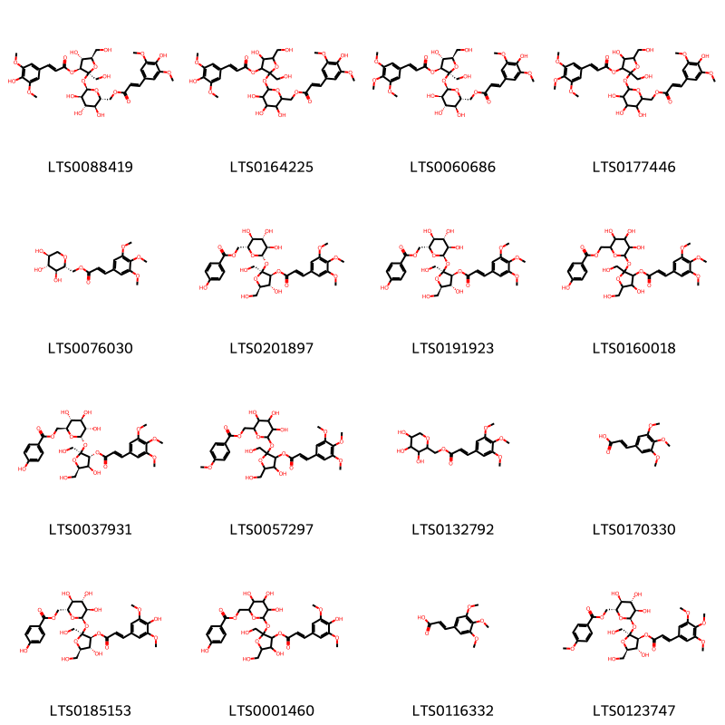{ width=100% }
    <figcaption>Hình ảnh cấu trúc hóa học của 16 hoạt chất thuộc nhóm Cinnamic acids and derivatives gồm ['[(2r,3s,4s,5r,6r)-3,4,5-trihydroxy-6-{[(2s,3s,4r,5r)-4-hydroxy-3-{[(2e)-3-(4-hydroxy-3,5-dimethoxyphenyl)prop-2-enoyl]oxy}-2,5-bis(hydroxymethyl)oxolan-2-yl]oxy}oxan-2-yl]methyl (2e)-3-(4-hydroxy-3,5-dimethoxyphenyl)prop-2-enoate (LTS0088419)', '{3,4,5-trihydroxy-6-[(4-hydroxy-3-{[3-(4-hydroxy-3,5-dimethoxyphenyl)prop-2-enoyl]oxy}-2,5-bis(hydroxymethyl)oxolan-2-yl)oxy]oxan-2-yl}methyl 3-(4-hydroxy-3,5-dimethoxyphenyl)prop-2-enoate (LTS0164225)', 'tenuifoliside c (LTS0060686)', '(3,4,5-trihydroxy-6-{[4-hydroxy-2,5-bis(hydroxymethyl)-3-{[3-(3,4,5-trimethoxyphenyl)prop-2-enoyl]oxy}oxolan-2-yl]oxy}oxan-2-yl)methyl 3-(4-hydroxy-3,5-dimethoxyphenyl)prop-2-enoate (LTS0177446)', 'tenuifoliside d (LTS0076030)', '[(2r,3s,4s,5r,6s)-3,4,5-trihydroxy-6-{[(2s,3s,4r,5r)-4-hydroxy-2,5-bis(hydroxymethyl)-3-{[(2e)-3-(3,4,5-trimethoxyphenyl)prop-2-enoyl]oxy}oxolan-2-yl]oxy}oxan-2-yl]methyl 4-hydroxybenzoate (LTS0201897)', 'tenuifoliside a (LTS0191923)', '(3,4,5-trihydroxy-6-{[4-hydroxy-2,5-bis(hydroxymethyl)-3-{[3-(3,4,5-trimethoxyphenyl)prop-2-enoyl]oxy}oxolan-2-yl]oxy}oxan-2-yl)methyl 4-hydroxybenzoate (LTS0160018)', '[(2s,3r,4r,5s,6s)-3,4,5-trihydroxy-6-{[(2s,3r,4s,5r)-4-hydroxy-2,5-bis(hydroxymethyl)-3-{[(2e)-3-(3,4,5-trimethoxyphenyl)prop-2-enoyl]oxy}oxolan-2-yl]oxy}oxan-2-yl]methyl 4-hydroxybenzoate (LTS0037931)', '(3,4,5-trihydroxy-6-{[4-hydroxy-2,5-bis(hydroxymethyl)-3-{[3-(3,4,5-trimethoxyphenyl)prop-2-enoyl]oxy}oxolan-2-yl]oxy}oxan-2-yl)methyl 4-methoxybenzoate (LTS0057297)', '(3,4,5-trihydroxyoxan-2-yl)methyl 3-(3,4,5-trimethoxyphenyl)prop-2-enoate (LTS0132792)', 'tmca (LTS0170330)', 'tenuifoliside b (LTS0185153)', '{3,4,5-trihydroxy-6-[(4-hydroxy-3-{[3-(4-hydroxy-3,5-dimethoxyphenyl)prop-2-enoyl]oxy}-2,5-bis(hydroxymethyl)oxolan-2-yl)oxy]oxan-2-yl}methyl 4-hydroxybenzoate (LTS0001460)', '3,4,5-trimethoxy cinnamic acid (LTS0116332)', '[(2r,3s,4s,5r,6r)-3,4,5-trihydroxy-6-{[(2s,3s,4r,5r)-4-hydroxy-2,5-bis(hydroxymethyl)-3-{[(2e)-3-(3,4,5-trimethoxyphenyl)prop-2-enoyl]oxy}oxolan-2-yl]oxy}oxan-2-yl]methyl 4-methoxybenzoate (LTS0123747)'].</figcaption>
</figure>
#### Nhóm Fatty Acyls
<figure markdown="span">
    { width=100% }
    <figcaption>Hình ảnh cấu trúc hóa học của 1 hoạt chất thuộc nhóm Fatty Acyls gồm ['oleic acid (LTS0256910)'].</figcaption>
</figure>
#### Nhóm Harmala alkaloids
<figure markdown="span">
    { width=100% }
    <figcaption>Hình ảnh cấu trúc hóa học của 6 hoạt chất thuộc nhóm Harmala alkaloids gồm ['harmalol (LTS0116566)', 'methyl 9h-pyrido[3,4-b]indole-1-carboxylate (LTS0143229)', 'harmol (LTS0023194)', 'harmane (LTS0068205)', 'perlolyrine (LTS0026035)', '1-methyl-3h,4h,9h-pyrido[3,4-b]indole (LTS0027115)'].</figcaption>
</figure>
#### Nhóm Indoles and derivatives
<figure markdown="span">
    { width=100% }
    <figcaption>Hình ảnh cấu trúc hóa học của 2 hoạt chất thuộc nhóm Indoles and derivatives gồm ['β-carboline (LTS0263207)', 'n-[2-(5-methoxy-1h-indol-3-yl)ethyl]ethanimidic acid (LTS0219322)'].</figcaption>
</figure>
#### Nhóm Organooxygen compounds
<figure markdown="span">
    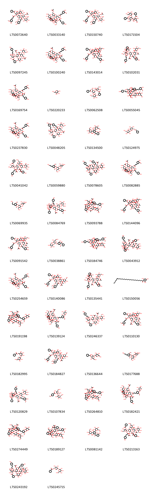{ width=100% }
    <figcaption>Hình ảnh cấu trúc hóa học của 74 hoạt chất thuộc nhóm Organooxygen compounds gồm ['(2s,3s,4r,5r)-2-{[(2r,3r,4s,5r,6r)-4-{[(2r,3r,4s,5r,6r)-6-[(acetyloxy)methyl]-3,5-dihydroxy-4-{[(2r,3r,4s,5s,6r)-3,4,5-trihydroxy-6-(hydroxymethyl)oxan-2-yl]oxy}oxan-2-yl]oxy}-5-{[(2e)-3-(4-hydroxy-3-methoxyphenyl)prop-2-enoyl]oxy}-6-(hydroxymethyl)-3-{[(2s,3r,4s,5s,6r)-3,4,5-trihydroxy-6-(hydroxymethyl)oxan-2-yl]oxy}oxan-2-yl]oxy}-4-hydroxy-2-({[(2e)-3-(4-hydroxy-3-methoxyphenyl)prop-2-enoyl]oxy}methyl)-5-(hydroxymethyl)oxolan-3-yl benzoate (LTS0072640)', '(2s,3s,4r,5r)-2-{[(2r,3r,4s,5r,6r)-4-{[(2r,3r,4s,5r,6r)-6-[(acetyloxy)methyl]-3,5-dihydroxy-4-{[(2r,3r,4s,5s,6r)-3,4,5-trihydroxy-6-(hydroxymethyl)oxan-2-yl]oxy}oxan-2-yl]oxy}-5-{[(2e)-3-(4-hydroxy-3-methoxyphenyl)prop-2-enoyl]oxy}-6-(hydroxymethyl)-3-{[(2s,3r,4s,5s,6r)-3,4,5-trihydroxy-6-(hydroxymethyl)oxan-2-yl]oxy}oxan-2-yl]oxy}-4-hydroxy-5-(hydroxymethyl)-2-({[(2e)-3-(4-hydroxyphenyl)prop-2-enoyl]oxy}methyl)oxolan-3-yl benzoate (LTS0033140)', '(2s,3s,4r,5r)-2-{[(2r,3r,4s,5r,6r)-4-{[(2s,3r,4s,5r,6r)-6-[(acetyloxy)methyl]-3,5-dihydroxy-4-{[(2s,3r,4s,5s,6r)-3,4,5-trihydroxy-6-(hydroxymethyl)oxan-2-yl]oxy}oxan-2-yl]oxy}-5-{[(2e)-3-(4-hydroxy-3-methoxyphenyl)prop-2-enoyl]oxy}-6-(hydroxymethyl)-3-{[(2s,3r,4s,5s,6r)-3,4,5-trihydroxy-6-(hydroxymethyl)oxan-2-yl]oxy}oxan-2-yl]oxy}-4-hydroxy-2-({[(2e)-3-(4-hydroxy-3-methoxyphenyl)prop-2-enoyl]oxy}methyl)-5-(hydroxymethyl)oxolan-3-yl benzoate (LTS0150740)', '2-{[5-(benzoyloxy)-4-hydroxy-6-(hydroxymethyl)-3-{[3,4,5-trihydroxy-6-(hydroxymethyl)oxan-2-yl]oxy}oxan-2-yl]oxy}-4-hydroxy-2,5-bis(hydroxymethyl)oxolan-3-yl benzoate (LTS0171504)', '(2s,3s,4r,5r)-2-{[(2r,3r,4s,5r,6r)-5-(acetyloxy)-6-[(acetyloxy)methyl]-4-{[(2r,3r,4s,5r,6r)-6-[(acetyloxy)methyl]-3,5-dihydroxy-4-{[(2r,3r,4s,5s,6r)-3,4,5-trihydroxy-6-(hydroxymethyl)oxan-2-yl]oxy}oxan-2-yl]oxy}-3-{[(2s,3r,4s,5s,6r)-3,4,5-trihydroxy-6-(hydroxymethyl)oxan-2-yl]oxy}oxan-2-yl]oxy}-4-hydroxy-5-(hydroxymethyl)-2-({[(2e)-3-(4-hydroxyphenyl)prop-2-enoyl]oxy}methyl)oxolan-3-yl benzoate (LTS0097245)', '(2s,3s,4r,5r)-2-{[(2r,3r,4s,5r,6r)-4-{[(2r,3r,4r,5r,6r)-5-(acetyloxy)-6-[(acetyloxy)methyl]-3-hydroxy-4-{[(2r,3r,4s,5s,6r)-3,4,5-trihydroxy-6-(hydroxymethyl)oxan-2-yl]oxy}oxan-2-yl]oxy}-6-[(acetyloxy)methyl]-5-{[(2e)-3-(4-hydroxy-3-methoxyphenyl)prop-2-enoyl]oxy}-3-{[(2s,3r,4s,5s,6r)-3,4,5-trihydroxy-6-(hydroxymethyl)oxan-2-yl]oxy}oxan-2-yl]oxy}-4-hydroxy-5-(hydroxymethyl)-2-({[(2e)-3-(4-hydroxyphenyl)prop-2-enoyl]oxy}methyl)oxolan-3-yl benzoate (LTS0100240)', '2-{[4-({6-[(acetyloxy)methyl]-3,5-dihydroxy-4-{[3,4,5-trihydroxy-6-(hydroxymethyl)oxan-2-yl]oxy}oxan-2-yl}oxy)-5-{[3-(4-hydroxy-3-methoxyphenyl)prop-2-enoyl]oxy}-6-(hydroxymethyl)-3-{[3,4,5-trihydroxy-6-(hydroxymethyl)oxan-2-yl]oxy}oxan-2-yl]oxy}-4-hydroxy-2-({[3-(4-hydroxy-3-methoxyphenyl)prop-2-enoyl]oxy}methyl)-5-(hydroxymethyl)oxolan-3-yl benzoate (LTS0143014)', '(2s,3s,4r,5r)-2-{[(2r,3r,4s,5r,6r)-4-{[(2r,3r,4r,5r,6r)-5-(acetyloxy)-6-[(acetyloxy)methyl]-3-hydroxy-4-{[(2r,3r,4s,5s,6r)-3,4,5-trihydroxy-6-(hydroxymethyl)oxan-2-yl]oxy}oxan-2-yl]oxy}-6-[(acetyloxy)methyl]-5-{[(2e)-3-(4-hydroxyphenyl)prop-2-enoyl]oxy}-3-{[(2s,3r,4s,5s,6r)-3,4,5-trihydroxy-6-(hydroxymethyl)oxan-2-yl]oxy}oxan-2-yl]oxy}-4-hydroxy-5-(hydroxymethyl)-2-({[(2e)-3-(4-hydroxyphenyl)prop-2-enoyl]oxy}methyl)oxolan-3-yl benzoate (LTS0102031)', '(2s,3s,4r,5r)-2-{[(2r,3r,4s,5r,6r)-6-[(acetyloxy)methyl]-4-{[(2r,3r,4s,5r,6r)-6-[(acetyloxy)methyl]-3,5-dihydroxy-4-{[(2r,3r,4s,5s,6r)-3,4,5-trihydroxy-6-(hydroxymethyl)oxan-2-yl]oxy}oxan-2-yl]oxy}-5-{[(2e)-3-(4-hydroxy-3-methoxyphenyl)prop-2-enoyl]oxy}-3-{[(2s,3r,4s,5s,6r)-3,4,5-trihydroxy-6-(hydroxymethyl)oxan-2-yl]oxy}oxan-2-yl]oxy}-4-hydroxy-5-(hydroxymethyl)-2-({[(2e)-3-(4-hydroxyphenyl)prop-2-enoyl]oxy}methyl)oxolan-3-yl benzoate (LTS0169754)', '2-(hydroxymethyl)oxane-3,4,5-triol (LTS0220233)', '(2s,3s,4r,5r)-2-{[(2r,3r,4s,5s,6r)-5-(benzoyloxy)-4-hydroxy-6-(hydroxymethyl)-3-{[(2s,3r,4s,5s,6r)-3,4,5-trihydroxy-6-(hydroxymethyl)oxan-2-yl]oxy}oxan-2-yl]oxy}-4-hydroxy-2,5-bis(hydroxymethyl)oxolan-3-yl benzoate (LTS0062508)', '2-{[4-({6-[(acetyloxy)methyl]-3,5-dihydroxy-4-{[3,4,5-trihydroxy-6-(hydroxymethyl)oxan-2-yl]oxy}oxan-2-yl}oxy)-5-{[3-(4-hydroxy-3-methoxyphenyl)prop-2-enoyl]oxy}-6-(hydroxymethyl)-3-{[3,4,5-trihydroxy-6-(hydroxymethyl)oxan-2-yl]oxy}oxan-2-yl]oxy}-4-hydroxy-5-(hydroxymethyl)-2-({[3-(4-hydroxyphenyl)prop-2-enoyl]oxy}methyl)oxolan-3-yl benzoate (LTS0055045)', '(2s,3s,4r,5r)-2-{[(2r,3r,4s,5r,6r)-4-{[(2s,3r,4s,5r,6r)-6-[(acetyloxy)methyl]-3,5-dihydroxy-4-{[(2s,3r,4s,5s,6r)-3,4,5-trihydroxy-6-(hydroxymethyl)oxan-2-yl]oxy}oxan-2-yl]oxy}-5-{[(2e)-3-(4-hydroxy-3-methoxyphenyl)prop-2-enoyl]oxy}-6-(hydroxymethyl)-3-{[(2s,3r,4s,5s,6r)-3,4,5-trihydroxy-6-(hydroxymethyl)oxan-2-yl]oxy}oxan-2-yl]oxy}-4-hydroxy-5-(hydroxymethyl)-2-({[(2e)-3-(4-hydroxyphenyl)prop-2-enoyl]oxy}methyl)oxolan-3-yl benzoate (LTS0237830)', '(2s,3s,4r,5r)-2-{[(2r,3r,4s,5r,6r)-4-{[(2r,3r,4s,5r,6r)-6-[(acetyloxy)methyl]-3,5-dihydroxy-4-{[(2r,3r,4s,5s,6r)-3,4,5-trihydroxy-6-(hydroxymethyl)oxan-2-yl]oxy}oxan-2-yl]oxy}-6-(hydroxymethyl)-5-{[(2e)-3-(4-hydroxyphenyl)prop-2-enoyl]oxy}-3-{[(2s,3r,4s,5s,6r)-3,4,5-trihydroxy-6-(hydroxymethyl)oxan-2-yl]oxy}oxan-2-yl]oxy}-4-hydroxy-5-(hydroxymethyl)-2-({[(2e)-3-(4-hydroxyphenyl)prop-2-enoyl]oxy}methyl)oxolan-3-yl benzoate (LTS0048205)', '2-(hydroxymethyl)-6-[2,4,6-trihydroxy-3-(3-hydroxybenzoyl)-5-[3,4,5-trihydroxy-6-(hydroxymethyl)oxan-2-yl]phenyl]oxane-3,4,5-triol (LTS0134500)', '(2s,3s,4r,5s,6s)-2-[(benzyloxy)methyl]-6-{[(3r,4r,5r,6s)-4,5-dihydroxy-6-(hydroxymethyl)oxan-3-yl]oxy}oxane-3,4,5-triol (LTS0124975)', '(2s,3s,4r,5s)-2-{[(2r,3s,4r,5r,6r)-6-[(acetyloxy)methyl]-4-{[(2s,3r,4s,5r,6s)-6-[(acetyloxy)methyl]-3,5-dihydroxy-4-{[(2r,3s,4r,5r,6s)-3,4,5-trihydroxy-6-(hydroxymethyl)oxan-2-yl]oxy}oxan-2-yl]oxy}-5-{[(2e)-3-(4-hydroxyphenyl)prop-2-enoyl]oxy}-3-{[(2s,3s,4r,5r,6r)-3,4,5-trihydroxy-6-(hydroxymethyl)oxan-2-yl]oxy}oxan-2-yl]oxy}-4-hydroxy-5-(hydroxymethyl)-2-({[(2e)-3-(4-hydroxyphenyl)prop-2-enoyl]oxy}methyl)oxolan-3-yl benzoate (LTS0041042)', '(2r,3s,4s,5r,6s)-5-{[(2s,3r,4r)-3,4-dihydroxy-4-(hydroxymethyl)oxolan-2-yl]oxy}-2-(hydroxymethyl)-6-{4-[(1e)-3-hydroxyprop-1-en-1-yl]-2,6-dimethoxyphenoxy}oxane-3,4-diol (LTS0059880)', '2-({6-[(acetyloxy)methyl]-4-({6-[(acetyloxy)methyl]-3,5-dihydroxy-4-{[3,4,5-trihydroxy-6-(hydroxymethyl)oxan-2-yl]oxy}oxan-2-yl}oxy)-5-{[3-(4-hydroxyphenyl)prop-2-enoyl]oxy}-3-{[3,4,5-trihydroxy-6-(hydroxymethyl)oxan-2-yl]oxy}oxan-2-yl}oxy)-4-hydroxy-5-(hydroxymethyl)-2-({[3-(4-hydroxyphenyl)prop-2-enoyl]oxy}methyl)oxolan-3-yl benzoate (LTS0078605)', '(2s,3s,4r,5r)-2-{[(2r,3r,4s,5r,6r)-4-{[(2s,3r,4r,5r,6r)-5-(acetyloxy)-6-[(acetyloxy)methyl]-3-hydroxy-4-{[(2s,3r,4s,5s,6r)-3,4,5-trihydroxy-6-(hydroxymethyl)oxan-2-yl]oxy}oxan-2-yl]oxy}-5-{[(2e)-3-(4-hydroxy-3-methoxyphenyl)prop-2-enoyl]oxy}-6-(hydroxymethyl)-3-{[(2s,3r,4s,5s,6r)-3,4,5-trihydroxy-6-(hydroxymethyl)oxan-2-yl]oxy}oxan-2-yl]oxy}-4-hydroxy-5-(hydroxymethyl)-2-({[(2e)-3-(4-hydroxyphenyl)prop-2-enoyl]oxy}methyl)oxolan-3-yl benzoate (LTS0082885)', '(2r,3s,4s,5r,6r)-5-{[(2s,3r,4r)-3,4-dihydroxy-4-(hydroxymethyl)oxolan-2-yl]oxy}-2-(hydroxymethyl)-6-{4-[(1z)-3-hydroxyprop-1-en-1-yl]-2,6-dimethoxyphenoxy}oxane-3,4-diol (LTS0069935)', '(2s,3s,4r,5r)-2-{[(2r,3r,4s,5r,6r)-6-[(acetyloxy)methyl]-4-{[(2s,3r,4s,5r,6r)-3,5-dihydroxy-6-(hydroxymethyl)-4-{[(2s,3r,4s,5s,6r)-3,4,5-trihydroxy-6-(hydroxymethyl)oxan-2-yl]oxy}oxan-2-yl]oxy}-5-{[(2e)-3-(4-hydroxy-3-methoxyphenyl)prop-2-enoyl]oxy}-3-{[(2s,3r,4s,5s,6r)-3,4,5-trihydroxy-6-(hydroxymethyl)oxan-2-yl]oxy}oxan-2-yl]oxy}-4-hydroxy-5-(hydroxymethyl)-2-({[(2e)-3-(4-hydroxyphenyl)prop-2-enoyl]oxy}methyl)oxolan-3-yl benzoate (LTS0084769)', '2-[(4-{[5-(acetyloxy)-6-[(acetyloxy)methyl]-3-hydroxy-4-{[3,4,5-trihydroxy-6-(hydroxymethyl)oxan-2-yl]oxy}oxan-2-yl]oxy}-6-[(acetyloxy)methyl]-5-{[3-(4-hydroxy-3-methoxyphenyl)prop-2-enoyl]oxy}-3-{[3,4,5-trihydroxy-6-(hydroxymethyl)oxan-2-yl]oxy}oxan-2-yl)oxy]-4-hydroxy-5-(hydroxymethyl)-2-({[3-(4-hydroxyphenyl)prop-2-enoyl]oxy}methyl)oxolan-3-yl benzoate (LTS0093788)', '2-[(4-{[5-(acetyloxy)-6-[(acetyloxy)methyl]-3-hydroxy-4-{[3,4,5-trihydroxy-6-(hydroxymethyl)oxan-2-yl]oxy}oxan-2-yl]oxy}-5-{[3-(4-hydroxy-3-methoxyphenyl)prop-2-enoyl]oxy}-6-(hydroxymethyl)-3-{[3,4,5-trihydroxy-6-(hydroxymethyl)oxan-2-yl]oxy}oxan-2-yl)oxy]-4-hydroxy-2-({[3-(4-hydroxy-3-methoxyphenyl)prop-2-enoyl]oxy}methyl)-5-(hydroxymethyl)oxolan-3-yl benzoate (LTS0144096)', '(2s,3s,4r,5r)-2-{[(2r,3r,4s,5r,6r)-4-{[(2r,3r,4r,5r,6r)-5-(acetyloxy)-6-[(acetyloxy)methyl]-3-hydroxy-4-{[(2r,3r,4s,5s,6r)-3,4,5-trihydroxy-6-(hydroxymethyl)oxan-2-yl]oxy}oxan-2-yl]oxy}-6-[(acetyloxy)methyl]-5-{[(2e)-3-(4-hydroxy-3-methoxyphenyl)prop-2-enoyl]oxy}-3-{[(2s,3r,4s,5s,6r)-3,4,5-trihydroxy-6-(hydroxymethyl)oxan-2-yl]oxy}oxan-2-yl]oxy}-4-hydroxy-2-({[(2e)-3-(4-hydroxy-3-methoxyphenyl)prop-2-enoyl]oxy}methyl)-5-(hydroxymethyl)oxolan-3-yl benzoate (LTS0091542)', '(2s,3r,4r,5r,6s)-2-{[(2s,3r,4s,5s,6r)-2-(4-benzoyl-3-hydroxy-5-methoxyphenoxy)-4,5-dihydroxy-6-(hydroxymethyl)oxan-3-yl]oxy}-6-methyloxane-3,4,5-triol (LTS0038861)', '2-[(4-{[5-(acetyloxy)-6-[(acetyloxy)methyl]-3-hydroxy-4-{[3,4,5-trihydroxy-6-(hydroxymethyl)oxan-2-yl]oxy}oxan-2-yl]oxy}-5-{[3-(4-hydroxy-3-methoxyphenyl)prop-2-enoyl]oxy}-6-(hydroxymethyl)-3-{[3,4,5-trihydroxy-6-(hydroxymethyl)oxan-2-yl]oxy}oxan-2-yl)oxy]-4-hydroxy-5-(hydroxymethyl)-2-({[3-(4-hydroxyphenyl)prop-2-enoyl]oxy}methyl)oxolan-3-yl benzoate (LTS0184746)', '2-[(4-{[5-(acetyloxy)-6-[(acetyloxy)methyl]-3-hydroxy-4-{[3,4,5-trihydroxy-6-(hydroxymethyl)oxan-2-yl]oxy}oxan-2-yl]oxy}-6-[(acetyloxy)methyl]-5-{[3-(4-hydroxyphenyl)prop-2-enoyl]oxy}-3-{[3,4,5-trihydroxy-6-(hydroxymethyl)oxan-2-yl]oxy}oxan-2-yl)oxy]-4-hydroxy-5-(hydroxymethyl)-2-({[3-(4-hydroxyphenyl)prop-2-enoyl]oxy}methyl)oxolan-3-yl benzoate (LTS0043912)', '(2s,3s,4r,5r)-2-{[(2r,3r,4s,5r,6r)-6-[(acetyloxy)methyl]-4-{[(2s,3r,4s,5r,6r)-6-[(acetyloxy)methyl]-3,5-dihydroxy-4-{[(2s,3r,4s,5s,6r)-3,4,5-trihydroxy-6-(hydroxymethyl)oxan-2-yl]oxy}oxan-2-yl]oxy}-5-{[(2e)-3-(4-hydroxy-3-methoxyphenyl)prop-2-enoyl]oxy}-3-{[(2s,3r,4s,5s,6r)-3,4,5-trihydroxy-6-(hydroxymethyl)oxan-2-yl]oxy}oxan-2-yl]oxy}-4-hydroxy-5-(hydroxymethyl)-2-({[(2e)-3-(4-hydroxyphenyl)prop-2-enoyl]oxy}methyl)oxolan-3-yl benzoate (LTS0254659)', '(2s,3s,4r,5r)-2-{[(2r,3r,4s,5r,6r)-4-{[(2r,3r,4r,5r,6r)-5-(acetyloxy)-6-[(acetyloxy)methyl]-3-hydroxy-4-{[(2r,3r,4s,5s,6r)-3,4,5-trihydroxy-6-(hydroxymethyl)oxan-2-yl]oxy}oxan-2-yl]oxy}-5-{[(2e)-3-(4-hydroxy-3-methoxyphenyl)prop-2-enoyl]oxy}-6-(hydroxymethyl)-3-{[(2s,3r,4s,5s,6r)-3,4,5-trihydroxy-6-(hydroxymethyl)oxan-2-yl]oxy}oxan-2-yl]oxy}-4-hydroxy-2-({[(2e)-3-(4-hydroxy-3-methoxyphenyl)prop-2-enoyl]oxy}methyl)-5-(hydroxymethyl)oxolan-3-yl benzoate (LTS0140086)', '(2s,3s,4r,5r)-2-{[(2r,3r,4s,5r,6r)-4-{[(2s,3r,4r,5r,6r)-5-(acetyloxy)-6-[(acetyloxy)methyl]-3-hydroxy-4-{[(2s,3r,4s,5s,6r)-3,4,5-trihydroxy-6-(hydroxymethyl)oxan-2-yl]oxy}oxan-2-yl]oxy}-6-[(acetyloxy)methyl]-5-{[(2e)-3-(4-hydroxyphenyl)prop-2-enoyl]oxy}-3-{[(2s,3r,4s,5s,6r)-3,4,5-trihydroxy-6-(hydroxymethyl)oxan-2-yl]oxy}oxan-2-yl]oxy}-4-hydroxy-5-(hydroxymethyl)-2-({[(2e)-3-(4-hydroxyphenyl)prop-2-enoyl]oxy}methyl)oxolan-3-yl benzoate (LTS0135441)', '(24z)-1-(2,4,6-trihydroxyphenyl)triacont-24-en-1-one (LTS0150056)', '2-[(4-{[5-(acetyloxy)-6-[(acetyloxy)methyl]-3-hydroxy-4-{[3,4,5-trihydroxy-6-(hydroxymethyl)oxan-2-yl]oxy}oxan-2-yl]oxy}-6-[(acetyloxy)methyl]-5-[(3-{3-methoxy-4-[(3,4,5-trihydroxy-6-methyloxan-2-yl)oxy]phenyl}prop-2-enoyl)oxy]-3-{[3,4,5-trihydroxy-6-(hydroxymethyl)oxan-2-yl]oxy}oxan-2-yl)oxy]-4-hydroxy-5-(hydroxymethyl)-2-({[3-(4-hydroxyphenyl)prop-2-enoyl]oxy}methyl)oxolan-3-yl benzoate (LTS0191198)', '(2s,3s,4r,5r)-2-{[(2r,3r,4s,5r,6r)-4-{[(2s,3r,4r,5r,6r)-5-(acetyloxy)-6-[(acetyloxy)methyl]-3-hydroxy-4-{[(2s,3r,4s,5s,6r)-3,4,5-trihydroxy-6-(hydroxymethyl)oxan-2-yl]oxy}oxan-2-yl]oxy}-6-[(acetyloxy)methyl]-5-{[(2e)-3-(3-methoxy-4-{[(2s,3r,4r,5r,6s)-3,4,5-trihydroxy-6-methyloxan-2-yl]oxy}phenyl)prop-2-enoyl]oxy}-3-{[(2s,3r,4s,5s,6r)-3,4,5-trihydroxy-6-(hydroxymethyl)oxan-2-yl]oxy}oxan-2-yl]oxy}-4-hydroxy-5-(hydroxymethyl)-2-({[(2e)-3-(4-hydroxyphenyl)prop-2-enoyl]oxy}methyl)oxolan-3-yl benzoate (LTS0139124)', '(2s,3s,4r,5r)-2-{[(2r,3r,4s,5r,6r)-5-(acetyloxy)-4-{[(2r,3r,4s,5r,6r)-6-[(acetyloxy)methyl]-3,5-dihydroxy-4-{[(2r,3r,4s,5s,6r)-3,4,5-trihydroxy-6-(hydroxymethyl)oxan-2-yl]oxy}oxan-2-yl]oxy}-6-(hydroxymethyl)-3-{[(2s,3r,4s,5s,6r)-3,4,5-trihydroxy-6-(hydroxymethyl)oxan-2-yl]oxy}oxan-2-yl]oxy}-4-hydroxy-5-(hydroxymethyl)-2-({[(2e)-3-(4-hydroxyphenyl)prop-2-enoyl]oxy}methyl)oxolan-3-yl benzoate (LTS0246337)', '(2s,3s,4r,5r)-2-{[(2r,3r,4s,5r,6r)-4-{[(2s,3r,4r,5r,6r)-5-(acetyloxy)-6-[(acetyloxy)methyl]-3-hydroxy-4-{[(2s,3r,4s,5s,6r)-3,4,5-trihydroxy-6-(hydroxymethyl)oxan-2-yl]oxy}oxan-2-yl]oxy}-6-[(acetyloxy)methyl]-5-{[(2e)-3-(4-hydroxy-3-methoxyphenyl)prop-2-enoyl]oxy}-3-{[(2s,3r,4s,5s,6r)-3,4,5-trihydroxy-6-(hydroxymethyl)oxan-2-yl]oxy}oxan-2-yl]oxy}-4-hydroxy-2-({[(2e)-3-(4-hydroxy-3-methoxyphenyl)prop-2-enoyl]oxy}methyl)-5-(hydroxymethyl)oxolan-3-yl benzoate (LTS0110130)', '(6-{[4,5-dihydroxy-6-(hydroxymethyl)oxan-3-yl]oxy}-3,4,5-trihydroxyoxan-2-yl)methyl benzoate (LTS0182995)', '(2s,3s,4r,5r)-2-{[(2r,3r,4s,5r,6r)-4-{[(2s,3r,4r,5r,6r)-5-(acetyloxy)-6-[(acetyloxy)methyl]-3-hydroxy-4-{[(2s,3r,4s,5s,6r)-3,4,5-trihydroxy-6-(hydroxymethyl)oxan-2-yl]oxy}oxan-2-yl]oxy}-5-{[(2e)-3-(4-hydroxy-3-methoxyphenyl)prop-2-enoyl]oxy}-6-(hydroxymethyl)-3-{[(2s,3r,4s,5s,6r)-3,4,5-trihydroxy-6-(hydroxymethyl)oxan-2-yl]oxy}oxan-2-yl]oxy}-4-hydroxy-2-({[(2e)-3-(4-hydroxy-3-methoxyphenyl)prop-2-enoyl]oxy}methyl)-5-(hydroxymethyl)oxolan-3-yl benzoate (LTS0184827)', '2-{[4,5-dihydroxy-6-(hydroxymethyl)oxan-3-yl]oxy}-3,5-dihydroxy-6-(hydroxymethyl)oxan-4-yl benzoate (LTS0136644)', '5-{[3,4-dihydroxy-4-(hydroxymethyl)oxolan-2-yl]oxy}-2-(hydroxymethyl)-6-[4-(3-hydroxyprop-1-en-1-yl)-2,6-dimethoxyphenoxy]oxane-3,4-diol (LTS0177688)', '(2s,3s,4r,5r)-2-{[(2r,3r,4s,5r,6r)-6-[(acetyloxy)methyl]-4-{[(2r,3r,4s,5r,6r)-3,5-dihydroxy-6-(hydroxymethyl)-4-{[(2r,3r,4s,5s,6r)-3,4,5-trihydroxy-6-(hydroxymethyl)oxan-2-yl]oxy}oxan-2-yl]oxy}-5-{[(2e)-3-(4-hydroxy-3-methoxyphenyl)prop-2-enoyl]oxy}-3-{[(2s,3r,4s,5s,6r)-3,4,5-trihydroxy-6-(hydroxymethyl)oxan-2-yl]oxy}oxan-2-yl]oxy}-4-hydroxy-5-(hydroxymethyl)-2-({[(2e)-3-(4-hydroxyphenyl)prop-2-enoyl]oxy}methyl)oxolan-3-yl benzoate (LTS0120829)', '(2s,3s,4r,5r)-4-hydroxy-2,5-bis(hydroxymethyl)-2-{[(2r,3r,4s,5s,6r)-3,4,5-trihydroxy-6-(hydroxymethyl)oxan-2-yl]oxy}oxolan-3-yl 4-methoxybenzoate (LTS0107834)', '2-({6-[(acetyloxy)methyl]-4-({6-[(acetyloxy)methyl]-3,5-dihydroxy-4-{[3,4,5-trihydroxy-6-(hydroxymethyl)oxan-2-yl]oxy}oxan-2-yl}oxy)-5-{[3-(4-hydroxy-3-methoxyphenyl)prop-2-enoyl]oxy}-3-{[3,4,5-trihydroxy-6-(hydroxymethyl)oxan-2-yl]oxy}oxan-2-yl}oxy)-4-hydroxy-5-(hydroxymethyl)-2-({[3-(4-hydroxyphenyl)prop-2-enoyl]oxy}methyl)oxolan-3-yl benzoate (LTS0264810)', '(2s,3s,4r,5r)-2-{[(2r,3r,4s,5r,6r)-6-[(acetyloxy)methyl]-4-{[(2s,3r,4s,5r,6r)-6-[(acetyloxy)methyl]-3,5-dihydroxy-4-{[(2s,3r,4s,5s,6r)-3,4,5-trihydroxy-6-(hydroxymethyl)oxan-2-yl]oxy}oxan-2-yl]oxy}-5-{[(2e)-3-(3-methoxy-4-{[(2s,3r,4r,5r,6s)-3,4,5-trihydroxy-6-methyloxan-2-yl]oxy}phenyl)prop-2-enoyl]oxy}-3-{[(2s,3r,4s,5s,6r)-3,4,5-trihydroxy-6-(hydroxymethyl)oxan-2-yl]oxy}oxan-2-yl]oxy}-4-hydroxy-5-(hydroxymethyl)-2-({[(2e)-3-(4-hydroxyphenyl)prop-2-enoyl]oxy}methyl)oxolan-3-yl benzoate (LTS0182421)', '2-({6-[(acetyloxy)methyl]-4-({6-[(acetyloxy)methyl]-3,5-dihydroxy-4-{[3,4,5-trihydroxy-6-(hydroxymethyl)oxan-2-yl]oxy}oxan-2-yl}oxy)-5-[(3-{3-methoxy-4-[(3,4,5-trihydroxy-6-methyloxan-2-yl)oxy]phenyl}prop-2-enoyl)oxy]-3-{[3,4,5-trihydroxy-6-(hydroxymethyl)oxan-2-yl]oxy}oxan-2-yl}oxy)-4-hydroxy-5-(hydroxymethyl)-2-({[3-(4-hydroxyphenyl)prop-2-enoyl]oxy}methyl)oxolan-3-yl benzoate (LTS0274449)', '2-({6-[(acetyloxy)methyl]-4-{[3,5-dihydroxy-6-(hydroxymethyl)-4-{[3,4,5-trihydroxy-6-(hydroxymethyl)oxan-2-yl]oxy}oxan-2-yl]oxy}-5-{[3-(4-hydroxy-3-methoxyphenyl)prop-2-enoyl]oxy}-3-{[3,4,5-trihydroxy-6-(hydroxymethyl)oxan-2-yl]oxy}oxan-2-yl}oxy)-4-hydroxy-5-(hydroxymethyl)-2-({[3-(4-hydroxyphenyl)prop-2-enoyl]oxy}methyl)oxolan-3-yl benzoate (LTS0189127)', '(2r,3r,4r,5r,6s)-2-(hydroxymethyl)-6-[2,4,6-trihydroxy-3-(3-hydroxybenzoyl)-5-[(2s,3r,4r,5r,6r)-3,4,5-trihydroxy-6-(hydroxymethyl)oxan-2-yl]phenyl]oxane-3,4,5-triol (LTS0081142)', '(2s,3r,4r,5s)-2-{[(2r,3s,4s,5r,6s)-4-{[(2r,3r,4s,5s,6s)-5-(acetyloxy)-6-[(acetyloxy)methyl]-3-hydroxy-4-{[(2s,3s,4r,5r,6r)-3,4,5-trihydroxy-6-(hydroxymethyl)oxan-2-yl]oxy}oxan-2-yl]oxy}-6-[(acetyloxy)methyl]-5-{[(2e)-3-(4-hydroxyphenyl)prop-2-enoyl]oxy}-3-{[(2s,3r,4s,5s,6s)-3,4,5-trihydroxy-6-(hydroxymethyl)oxan-2-yl]oxy}oxan-2-yl]oxy}-4-hydroxy-5-(hydroxymethyl)-2-({[(2e)-3-(4-hydroxyphenyl)prop-2-enoyl]oxy}methyl)oxolan-3-yl benzoate (LTS0213163)', '2-({6-[(acetyloxy)methyl]-4-({6-[(acetyloxy)methyl]-3,5-dihydroxy-4-{[3,4,5-trihydroxy-6-(hydroxymethyl)oxan-2-yl]oxy}oxan-2-yl}oxy)-5-{[(2e)-3-(4-hydroxyphenyl)prop-2-enoyl]oxy}-3-{[3,4,5-trihydroxy-6-(hydroxymethyl)oxan-2-yl]oxy}oxan-2-yl}oxy)-4-hydroxy-5-(hydroxymethyl)-2-({[(2e)-3-(4-hydroxyphenyl)prop-2-enoyl]oxy}methyl)oxolan-3-yl benzoate (LTS0243192)', '[(2r,3r,4s,5s)-3,4-dihydroxy-5-{[(2r,3r,4s,5s,6r)-3,4,5-trihydroxy-6-(hydroxymethyl)oxan-2-yl]oxy}oxan-2-yl]methyl benzoate (LTS0245715)', '2-{[2-(4-benzoyl-3-hydroxy-5-methoxyphenoxy)-4,5-dihydroxy-6-(hydroxymethyl)oxan-3-yl]oxy}-6-methyloxane-3,4,5-triol (LTS0200169)', '(2s,3s,4r,5r)-2-{[(2r,3r,4s,5r,6r)-4-{[(2s,3r,4r,5r,6r)-5-(acetyloxy)-6-[(acetyloxy)methyl]-3-hydroxy-4-{[(2s,3r,4s,5s,6r)-3,4,5-trihydroxy-6-(hydroxymethyl)oxan-2-yl]oxy}oxan-2-yl]oxy}-6-[(acetyloxy)methyl]-5-{[(2e)-3-(4-hydroxy-3-methoxyphenyl)prop-2-enoyl]oxy}-3-{[(2s,3r,4s,5s,6r)-3,4,5-trihydroxy-6-(hydroxymethyl)oxan-2-yl]oxy}oxan-2-yl]oxy}-4-hydroxy-5-(hydroxymethyl)-2-({[(2e)-3-(4-hydroxyphenyl)prop-2-enoyl]oxy}methyl)oxolan-3-yl benzoate (LTS0215898)', '2-[(4-{[5-(acetyloxy)-6-[(acetyloxy)methyl]-3-hydroxy-4-{[3,4,5-trihydroxy-6-(hydroxymethyl)oxan-2-yl]oxy}oxan-2-yl]oxy}-6-(hydroxymethyl)-5-{[3-(4-hydroxyphenyl)prop-2-enoyl]oxy}-3-{[3,4,5-trihydroxy-6-(hydroxymethyl)oxan-2-yl]oxy}oxan-2-yl)oxy]-4-hydroxy-5-(hydroxymethyl)-2-({[3-(4-hydroxyphenyl)prop-2-enoyl]oxy}methyl)oxolan-3-yl benzoate (LTS0086759)', '(2s,3s,4r,5r,6s)-2-{[(3s,4s,5s,6r)-4,5-dihydroxy-6-(hydroxymethyl)oxan-3-yl]oxy}-3,5-dihydroxy-6-(hydroxymethyl)oxan-4-yl benzoate (LTS0215269)', '(2s,3s,4r,5r)-2-{[(2r,3r,4s,5r,6r)-6-[(acetyloxy)methyl]-4-{[(2s,3r,4s,5r,6r)-6-[(acetyloxy)methyl]-3,5-dihydroxy-4-{[(2s,3r,4s,5s,6r)-3,4,5-trihydroxy-6-(hydroxymethyl)oxan-2-yl]oxy}oxan-2-yl]oxy}-5-{[(2e)-3-(4-hydroxyphenyl)prop-2-enoyl]oxy}-3-{[(2s,3r,4s,5s,6r)-3,4,5-trihydroxy-6-(hydroxymethyl)oxan-2-yl]oxy}oxan-2-yl]oxy}-4-hydroxy-5-(hydroxymethyl)-2-({[(2e)-3-(4-hydroxyphenyl)prop-2-enoyl]oxy}methyl)oxolan-3-yl benzoate (LTS0030722)', '(2s,3s,4r,5r)-2-{[(2r,3r,4s,5r,6r)-4-{[(2s,3r,4r,5r,6r)-5-(acetyloxy)-6-[(acetyloxy)methyl]-3-hydroxy-4-{[(2s,3r,4s,5s,6r)-3,4,5-trihydroxy-6-(hydroxymethyl)oxan-2-yl]oxy}oxan-2-yl]oxy}-6-(hydroxymethyl)-5-{[(2e)-3-(4-hydroxyphenyl)prop-2-enoyl]oxy}-3-{[(2s,3r,4s,5s,6r)-3,4,5-trihydroxy-6-(hydroxymethyl)oxan-2-yl]oxy}oxan-2-yl]oxy}-4-hydroxy-5-(hydroxymethyl)-2-({[(2e)-3-(4-hydroxyphenyl)prop-2-enoyl]oxy}methyl)oxolan-3-yl benzoate (LTS0029635)', '(2s,3s,4r,5r)-2-{[(2r,3r,4s,5r,6r)-4-{[(2r,3r,4r,5r,6r)-5-(acetyloxy)-6-[(acetyloxy)methyl]-3-hydroxy-4-{[(2r,3r,4s,5s,6r)-3,4,5-trihydroxy-6-(hydroxymethyl)oxan-2-yl]oxy}oxan-2-yl]oxy}-6-(hydroxymethyl)-5-{[(2e)-3-(4-hydroxyphenyl)prop-2-enoyl]oxy}-3-{[(2s,3r,4s,5s,6r)-3,4,5-trihydroxy-6-(hydroxymethyl)oxan-2-yl]oxy}oxan-2-yl]oxy}-4-hydroxy-5-(hydroxymethyl)-2-({[(2e)-3-(4-hydroxyphenyl)prop-2-enoyl]oxy}methyl)oxolan-3-yl benzoate (LTS0066536)', '2-[(4-{[5-(acetyloxy)-6-[(acetyloxy)methyl]-3-hydroxy-4-{[3,4,5-trihydroxy-6-(hydroxymethyl)oxan-2-yl]oxy}oxan-2-yl]oxy}-6-[(acetyloxy)methyl]-5-{[3-(4-hydroxy-3-methoxyphenyl)prop-2-enoyl]oxy}-3-{[3,4,5-trihydroxy-6-(hydroxymethyl)oxan-2-yl]oxy}oxan-2-yl)oxy]-4-hydroxy-2-({[3-(4-hydroxy-3-methoxyphenyl)prop-2-enoyl]oxy}methyl)-5-(hydroxymethyl)oxolan-3-yl benzoate (LTS0022044)', '(2s,3s,4r,5r)-2-{[(2r,3r,4s,5r,6r)-4-{[(2r,3r,4r,5r,6r)-5-(acetyloxy)-3-hydroxy-6-(hydroxymethyl)-4-{[(2r,3r,4s,5s,6r)-3,4,5-trihydroxy-6-(hydroxymethyl)oxan-2-yl]oxy}oxan-2-yl]oxy}-6-[(acetyloxy)methyl]-5-{[(2e)-3-(4-hydroxyphenyl)prop-2-enoyl]oxy}-3-{[(2s,3r,4s,5s,6r)-3,4,5-trihydroxy-6-(hydroxymethyl)oxan-2-yl]oxy}oxan-2-yl]oxy}-4-hydroxy-5-(hydroxymethyl)-2-({[(2e)-3-(4-hydroxyphenyl)prop-2-enoyl]oxy}methyl)oxolan-3-yl benzoate (LTS0020090)', '(2s,3r,4r,5r,6s)-2-{[(2s,4s,5s,6r)-2-(4-benzoyl-3-hydroxy-5-methoxyphenoxy)-4,5-dihydroxy-6-(hydroxymethyl)oxan-3-yl]oxy}-6-methyloxane-3,4,5-triol (LTS0158285)', '[(2s,3s,4r,5s,6r)-6-{[(3s,4s,5s,6r)-4,5-dihydroxy-6-(hydroxymethyl)oxan-3-yl]oxy}-3,4,5-trihydroxyoxan-2-yl]methyl benzoate (LTS0249890)', '2-[(4-{[5-(acetyloxy)-6-[(acetyloxy)methyl]-3-hydroxy-4-{[3,4,5-trihydroxy-6-(hydroxymethyl)oxan-2-yl]oxy}oxan-2-yl]oxy}-6-[(acetyloxy)methyl]-3-{[3,4,5-trihydroxy-6-(hydroxymethyl)oxan-2-yl]oxy}-5-[(3-{4-[(3,4,5-trihydroxy-6-methyloxan-2-yl)oxy]phenyl}prop-2-enoyl)oxy]oxan-2-yl)oxy]-4-hydroxy-5-(hydroxymethyl)-2-({[3-(4-hydroxyphenyl)prop-2-enoyl]oxy}methyl)oxolan-3-yl benzoate (LTS0256038)', '2-{[4-({6-[(acetyloxy)methyl]-3,5-dihydroxy-4-{[3,4,5-trihydroxy-6-(hydroxymethyl)oxan-2-yl]oxy}oxan-2-yl}oxy)-6-(hydroxymethyl)-5-{[3-(4-hydroxyphenyl)prop-2-enoyl]oxy}-3-{[3,4,5-trihydroxy-6-(hydroxymethyl)oxan-2-yl]oxy}oxan-2-yl]oxy}-4-hydroxy-5-(hydroxymethyl)-2-({[3-(4-hydroxyphenyl)prop-2-enoyl]oxy}methyl)oxolan-3-yl benzoate (LTS0129032)', '4-hydroxy-2,5-bis(hydroxymethyl)-2-{[3,4,5-trihydroxy-6-(hydroxymethyl)oxan-2-yl]oxy}oxolan-3-yl 4-methoxybenzoate (LTS0123798)', '2-[(4-{[5-(acetyloxy)-6-[(acetyloxy)methyl]-3-hydroxy-4-{[3,4,5-trihydroxy-6-(hydroxymethyl)oxan-2-yl]oxy}oxan-2-yl]oxy}-6-[(acetyloxy)methyl]-5-{[(2e)-3-[4-hydroxy-3-(hydroxymethyl)phenyl]prop-2-enoyl]oxy}-3-{[3,4,5-trihydroxy-6-(hydroxymethyl)oxan-2-yl]oxy}oxan-2-yl)oxy]-4-hydroxy-5-(hydroxymethyl)-2-({[(2e)-3-(4-hydroxyphenyl)prop-2-enoyl]oxy}methyl)oxolan-3-yl benzoate (LTS0068327)', '(26z)-1-(2,4,6-trihydroxyphenyl)dotriacont-26-en-1-one (LTS0063005)', '1-(2,4,6-trihydroxyphenyl)triacont-24-en-1-one (LTS0011743)', '(2s,3s,4r,5r,6s)-4-(benzyloxy)-2-{[(3r,4r,5r,6s)-4,5-dihydroxy-6-(hydroxymethyl)oxan-3-yl]oxy}-6-(hydroxymethyl)oxane-3,5-diol (LTS0021139)', '(2r,3s,4r,5r,6s)-2-(hydroxymethyl)-6-[2,4,6-trihydroxy-3-(3-hydroxybenzoyl)-5-[(2s,3r,4r,5s,6r)-3,4,5-trihydroxy-6-(hydroxymethyl)oxan-2-yl]phenyl]oxane-3,4,5-triol (LTS0026052)', '1-(2,4,6-trihydroxyphenyl)dotriacont-26-en-1-one (LTS0239065)', '(2r,3r,4s,5s)-3-hydroxy-2-(hydroxymethyl)-5-{[(2r,3r,4s,5s,6r)-3,4,5-trihydroxy-6-(hydroxymethyl)oxan-2-yl]oxy}oxan-4-yl benzoate (LTS0210353)', '(2r,3r,4s,5s)-4-hydroxy-2-(hydroxymethyl)-5-{[(2r,3r,4s,5s,6r)-3,4,5-trihydroxy-6-(hydroxymethyl)oxan-2-yl]oxy}oxan-3-yl benzoate (LTS0041069)', '(2s,3s,4r,5r)-2-{[(2r,3r,4s,5r,6r)-4-{[(2s,3r,4r,5r,6r)-5-(acetyloxy)-6-[(acetyloxy)methyl]-3-hydroxy-4-{[(2s,3r,4s,5s,6r)-3,4,5-trihydroxy-6-(hydroxymethyl)oxan-2-yl]oxy}oxan-2-yl]oxy}-6-[(acetyloxy)methyl]-3-{[(2s,3r,4s,5s,6r)-3,4,5-trihydroxy-6-(hydroxymethyl)oxan-2-yl]oxy}-5-{[(2e)-3-(4-{[(2s,3r,4r,5r,6s)-3,4,5-trihydroxy-6-methyloxan-2-yl]oxy}phenyl)prop-2-enoyl]oxy}oxan-2-yl]oxy}-4-hydroxy-5-(hydroxymethyl)-2-({[(2e)-3-(4-hydroxyphenyl)prop-2-enoyl]oxy}methyl)oxolan-3-yl benzoate (LTS0042070)', '(2s,3s,4r,5r)-2-{[(2r,3r,4s,5r,6r)-4-{[(2s,3r,4s,5r,6r)-6-[(acetyloxy)methyl]-3,5-dihydroxy-4-{[(2s,3r,4s,5s,6r)-3,4,5-trihydroxy-6-(hydroxymethyl)oxan-2-yl]oxy}oxan-2-yl]oxy}-6-(hydroxymethyl)-5-{[(2e)-3-(4-hydroxyphenyl)prop-2-enoyl]oxy}-3-{[(2s,3r,4s,5s,6r)-3,4,5-trihydroxy-6-(hydroxymethyl)oxan-2-yl]oxy}oxan-2-yl]oxy}-4-hydroxy-5-(hydroxymethyl)-2-({[(2e)-3-(4-hydroxyphenyl)prop-2-enoyl]oxy}methyl)oxolan-3-yl benzoate (LTS0036736)'].</figcaption>
</figure>
#### Nhóm Prenol lipids
<figure markdown="span">
    { width=100% }
    <figcaption>Hình ảnh cấu trúc hóa học của 10 hoạt chất thuộc nhóm Prenol lipids gồm ['2-hydroxy-6b-(hydroxymethyl)-4,6a,11,11,14b-pentamethyl-3-{[3,4,5-trihydroxy-6-(hydroxymethyl)oxan-2-yl]oxy}-1,2,3,4a,5,6,7,8,9,10,12,12a,14,14a-tetradecahydropicene-4,8a-dicarboxylic acid (LTS0217511)', '8a-({[3-({3,4-dihydroxy-6-methyl-5-[(3,4,5-trihydroxyoxan-2-yl)oxy]oxan-2-yl}oxy)-4,5-dihydroxy-6-methyloxan-2-yl]oxy}carbonyl)-2-hydroxy-6b-(hydroxymethyl)-4,6a,11,11,14b-pentamethyl-3-{[3,4,5-trihydroxy-6-(hydroxymethyl)oxan-2-yl]oxy}-1,2,3,4a,5,6,7,8,9,10,12,12a,14,14a-tetradecahydropicene-4-carboxylic acid (LTS0161234)', '(4s,4ar,6ar,6br,8as,12as,14ar,14br)-2-hydroxy-6b-(hydroxymethyl)-4,6a,11,11,14b-pentamethyl-3-{[3,4,5-trihydroxy-6-(hydroxymethyl)oxan-2-yl]oxy}-1,2,3,4a,5,6,7,8,9,10,12,12a,14,14a-tetradecahydropicene-4,8a-dicarboxylic acid (LTS0174850)', '(2s,3r,4s,4ar,6ar,6br,8as,12as,14ar,14br)-2-hydroxy-6b-(hydroxymethyl)-4,6a,11,11,14b-pentamethyl-3-{[(2r,3r,4s,5s,6r)-3,4,5-trihydroxy-6-(hydroxymethyl)oxan-2-yl]oxy}-1,2,3,4a,5,6,7,8,9,10,12,12a,14,14a-tetradecahydropicene-4,8a-dicarboxylic acid (LTS0187143)', '(2s,3r,4s,4ar,6ar,6br,8as,12as,14ar,14br)-8a-({[(2s,3r,4s,5r,6r)-3-{[(2s,3r,4s,5r,6s)-3,4-dihydroxy-6-methyl-5-{[(2s,3r,4s,5r)-3,4,5-trihydroxyoxan-2-yl]oxy}oxan-2-yl]oxy}-4,5-dihydroxy-6-methyloxan-2-yl]oxy}carbonyl)-2-hydroxy-6b-(hydroxymethyl)-4,6a,11,11,14b-pentamethyl-3-{[(2r,3r,4s,5s,6r)-3,4,5-trihydroxy-6-(hydroxymethyl)oxan-2-yl]oxy}-1,2,3,4a,5,6,7,8,9,10,12,12a,14,14a-tetradecahydropicene-4-carboxylic acid (LTS0068805)', 'senegin iii (LTS0049590)', '(2s,3r,4s,4ar,6ar,6br,8as,12ar,14ar,14br)-2-hydroxy-6b-(hydroxymethyl)-4,6a,11,11,14b-pentamethyl-3-{[(2r,3r,4s,5s,6r)-3,4,5-trihydroxy-6-(hydroxymethyl)oxan-2-yl]oxy}-1,2,3,4a,5,6,7,8,9,10,12,12a,14,14a-tetradecahydropicene-4,8a-dicarboxylic acid (LTS0199480)', '(2s,3r,4s,4ar,6ar,6br,8as,12as,14ar,14br)-8a-({[(2s,3r,4s,5s,6r)-3-{[(2s,3r,4s,5s,6s)-4-{[(2s,3r,4r)-3,4-dihydroxy-4-(hydroxymethyl)oxolan-2-yl]oxy}-5-{[(2s,3r,4r,5r)-3,4-dihydroxy-5-{[(2s,3r,4s,5r,6r)-3,4,5-trihydroxy-6-(hydroxymethyl)oxan-2-yl]oxy}oxan-2-yl]oxy}-3-hydroxy-6-methyloxan-2-yl]oxy}-5-{[(2e)-3-(4-methoxyphenyl)prop-2-enoyl]oxy}-6-methyl-4-{[(2s,3r,4r,5r,6s)-3,4,5-trihydroxy-6-methyloxan-2-yl]oxy}oxan-2-yl]oxy}carbonyl)-2-hydroxy-6b-(hydroxymethyl)-4,6a,11,11,14b-pentamethyl-3-{[(2r,3r,4s,5s,6r)-3,4,5-trihydroxy-6-(hydroxymethyl)oxan-2-yl]oxy}-1,2,3,4a,5,6,7,8,9,10,12,12a,14,14a-tetradecahydropicene-4-carboxylic acid (LTS0260248)', '8a-({[(2s,3r,4s,5r,6r)-3-{[(2s,3r,4s,5s,6s)-4-{[(2s,3r,4r)-3,4-dihydroxy-4-(hydroxymethyl)oxolan-2-yl]oxy}-3-hydroxy-6-methyl-5-{[(2s,3r,4s,5r)-3,4,5-trihydroxyoxan-2-yl]oxy}oxan-2-yl]oxy}-4-hydroxy-6-methyl-5-{[(2e)-3-(3,4,5-trimethoxyphenyl)prop-2-enoyl]oxy}oxan-2-yl]oxy}carbonyl)-2-hydroxy-6b-(hydroxymethyl)-4,6a,11,11,14b-pentamethyl-3-{[(2r,3r,4s,5s,6r)-3,4,5-trihydroxy-6-(hydroxymethyl)oxan-2-yl]oxy}-1,2,3,4a,5,6,7,8,9,10,12,12a,14,14a-tetradecahydropicene-4-carboxylic acid (LTS0036069)', 'onjisaponin f (LTS0036089)'].</figcaption>
</figure>

---

### Dược dân tộc học

Danh sách các quốc gia có sử dụng *Polygala tenuifolia* trong điều trị các bệnh. 

| Country   | Disease                                        | Bệnh                                    |
|:----------|:-----------------------------------------------|:----------------------------------------|
| China     | Cardiotonic, Expectorant, Nervine, Expectorant | Tim mạch, long đờm, thần kinh, long đờm |

---

---
## Polygala vulgaris
### Thông tin về thực vật

!!! info "Phân loại thực vật của *Polygala vulgaris* từ GIBF:"
    - **Kingdom:** Plantae
    - **Phylum:** Tracheophyta
    - **Order:** Fabales
    - **Family:** Polygalaceae
    - **Genus:** Polygala
    - **Species:** *Polygala vulgaris*

 

| Label (VI)   | Label (EN)   | Scientific Name   | Descriptions (VI)   | Descriptions (EN)   | Also Known As (VI)   | Also Known As (EN)   |
|:-------------|:-------------|:------------------|:--------------------|:--------------------|:---------------------|:---------------------|
| N/A          | N/A          | Polygala vulgaris | loài thực vật       | species of plant    | ['']                 | ['Common Milkwort']  |

#### Phân bố trên thế giới

**Từ CSDL GIBF** Italy, Australia, Norway, Ukraine, Denmark, Netherlands, Luxembourg, Spain, Hungary, Portugal, Sweden, Slovenia, Czechia, Germany, Switzerland, Austria, France, United Kingdom of Great Britain and Northern Ireland, Ireland

#### Phân bố tại Việt Nam

**Từ CSDL GIBF**: Không có ghi nhận ở Việt Nam

---
### Thành phần hóa học
        
- Theo cơ sở dữ liệu lotus: Từ loài *Polygala vulgaris* đã phân lập và xác định được 5 hoạt chất thuộc về các nhóm Cinnamic acids and derivatives, Benzopyrans, Benzene and substituted derivatives. 

|    | chemicalTaxonomyClassyfireClass     |   smiles_count |
|---:|:------------------------------------|---------------:|
|  0 | Benzene and substituted derivatives |              1 |
|  1 | Benzopyrans                         |              2 |
|  2 | Cinnamic acids and derivatives      |              2 |

#### Nhóm Benzene and substituted derivatives
<figure markdown="span">
    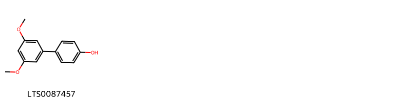{ width=100% }
    <figcaption>Hình ảnh cấu trúc hóa học của 1 hoạt chất thuộc nhóm Benzene and substituted derivatives gồm ["3',5'-dimethoxy-[1,1'-biphenyl]-4-ol (LTS0087457)"].</figcaption>
</figure>
#### Nhóm Benzopyrans
<figure markdown="span">
    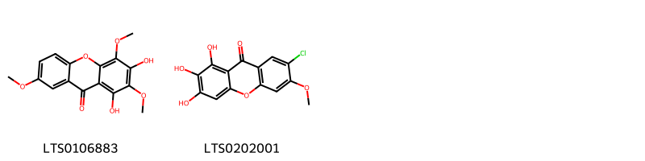{ width=100% }
    <figcaption>Hình ảnh cấu trúc hóa học của 2 hoạt chất thuộc nhóm Benzopyrans gồm ['1,3-dihydroxy-2,4,7-trimethoxyxanthen-9-one (LTS0106883)', '7-chloro-1,2,3-trihydroxy-6-methoxyxanthen-9-one (LTS0202001)'].</figcaption>
</figure>
#### Nhóm Cinnamic acids and derivatives
<figure markdown="span">
    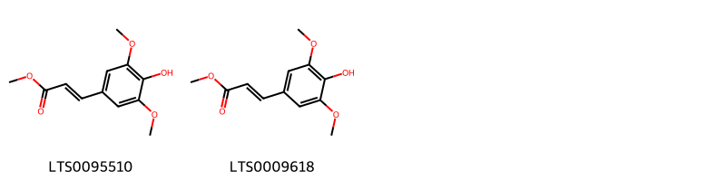{ width=100% }
    <figcaption>Hình ảnh cấu trúc hóa học của 2 hoạt chất thuộc nhóm Cinnamic acids and derivatives gồm ['methyl 3-(4-hydroxy-3,5-dimethoxyphenyl)prop-2-enoate (LTS0095510)', 'methyl (2e)-3-(4-hydroxy-3,5-dimethoxyphenyl)prop-2-enoate (LTS0009618)'].</figcaption>
</figure>

---

### Dược dân tộc học

Danh sách các quốc gia có sử dụng *Polygala vulgaris* trong điều trị các bệnh. 

| Country   | Disease                                   | Bệnh                                   |
|:----------|:------------------------------------------|:---------------------------------------|
| Turkey    | Antiseptic, Expectorant, Tonic, Sudorific | Khử trùng, đờm, thuốc bổ, gây ngạt thở |

---

