!!! abstract "Tóm tắt"

    Họ Polygonaceae gồm khoảng 9 chi và 73 loài được một số cộng đồng tại các quốc gia như Trinidad, Japan*, Italian, Brazil, Japan, Indochina, French, Nepal, China, Java, Dutch, Turkey, Canada(Salish), Africa(Kaffir), English, anish, Dominican Republic, UK, Europe, Sanscrit, USSR, Mexico, Mexico(Seri), South Africa(Kaffir), Haiti, Malaysia, Iraq, Kurdistan, ain, Venezuela, US(Blackfoot), Elsewhere, Paraguay, Australia, Malaya, India, US, France sử dụng trong một số trường hợp QUERY LENGTH LIMIT EXCEEDED. MAX ALLOWED QUERY : 500 CHARS QUERY LENGTH LIMIT EXCEEDED. MAX ALLOWED QUERY : 500 CHARS QUERY LENGTH LIMIT EXCEEDED. MAX ALLOWED QUERY : 500 CHARS MYMEMORY WARNING: YOU USED ALL AVAILABLE FREE TRANSLATIONS FOR TODAY. NEXT AVAILABLE IN  15 HOURS 46 MINUTES 18 SECONDS VISIT HTTPS://MYMEMORY.TRANSLATED.NET/DOC/USAGELIMITS.PHP TO TRANSLATE MORE.

!!! info "DrDuke"

    James A. Duke sinh năm 1929-2017 là một nhà thực vật học người Mỹ. Đây là một trong những tác giả hàng đầu trong lĩnh vực dược dân tộc học với cuốn *CRC Handbook of Medicinal Herbs* và chính là người xây dựng lên cơ sở dữ liệu về hợp chất tự nhiên và dược dân tộc học tại Bộ nông nghiệp Hoa Kỳ. Các thông tin được đăng tải tại website [Dr. Duke's Phytochemical and Ethnobotanical Databases](https://phytochem.nal.usda.gov/). 
    Trong suốt thập niên 1970, ông lãnh đạo the Plant Taxonomy Laboratory, Plant Genetics and Germplasm Institute of the Agricultural Research Service, U.S. Department of Agriculture.
    Trong tài liệu này, các thông tin về dược dân tộc của các dược liệu được trích dẫn từ tài liệu của James A. Ducke với sự trợ giúp của phần mềm dịch thuật từ tiếng Anh sang tiếng Việt.
   

# Chi Oxyria

??? note "Danh sách các dược liệu thuộc chi"
    
	 - *Oxyria digyna*

---
## Oxyria digyna
### Thông tin về thực vật

!!! info "Phân loại thực vật của *Oxyria digyna* từ GIBF:"
    - **Kingdom:** Plantae
    - **Phylum:** Tracheophyta
    - **Order:** Caryophyllales
    - **Family:** Polygonaceae
    - **Genus:** Oxyria
    - **Species:** *Oxyria digyna*

 

| Label (VI)   | Label (EN)   | Scientific Name   | Descriptions (VI)   | Descriptions (EN)   | Also Known As (VI)   | Also Known As (EN)                                                                                                        |
|:-------------|:-------------|:------------------|:--------------------|:--------------------|:---------------------|:--------------------------------------------------------------------------------------------------------------------------|
| N/A          | N/A          | Oxyria digyna     | loài thực vật       | species of plant    | ['']                 | ['alpine mountain-sorrel', 'alpine mountainsorrel', 'alpine sorrel', 'mountain sorrel', 'wood sorrel', 'mountain-sorrel'] |

#### Phân bố trên thế giới

**Từ CSDL GIBF** Austria, Greenland, Norway, United States of America, Faroe Islands, Iceland, Sweden, Belgium, Nepal, Finland, Slovakia, Russian Federation, Kazakhstan, Italy, Switzerland, Svalbard and Jan Mayen, Canada, United Kingdom of Great Britain and Northern Ireland

#### Phân bố tại Việt Nam

**Từ CSDL GIBF**: Không có ghi nhận ở Việt Nam

---
### Thành phần hóa học
        
- Theo cơ sở dữ liệu lotus: Từ loài *Oxyria digyna* đã phân lập và xác định được Chưa có hoạt chất nào được phân lập. hoạt chất thuộc về các nhóm Không có hoạt chất nào được phân lập. 

Không có hình ảnh nào được tạo ra

---

### Dược dân tộc học

Danh sách các quốc gia có sử dụng *Oxyria digyna* trong điều trị các bệnh. 

| Country   | Disease     | Bệnh                                                                                                                                                                                                |
|:----------|:------------|:----------------------------------------------------------------------------------------------------------------------------------------------------------------------------------------------------|
| Elsewhere | Refrigerant | MYMEMORY WARNING: YOU USED ALL AVAILABLE FREE TRANSLATIONS FOR TODAY. NEXT AVAILABLE IN  15 HOURS 46 MINUTES 14 SECONDS VISIT HTTPS://MYMEMORY.TRANSLATED.NET/DOC/USAGELIMITS.PHP TO TRANSLATE MORE |

---

# Chi Rheum

??? note "Danh sách các dược liệu thuộc chi"
    
	 - *Rheum coreanum*
	 - *Rheum emodi*
	 - *Rheum iciforme*
	 - *Rheum moorcroftianum*
	 - *Rheum officinale*
	 - *Rheum palmatum*
	 - *Rheum rhabarbarum*
	 - *Rheum rhaponticum*
	 - *Rheum ribes*
	 - *Rheum tanguticum*
	 - *Rheum undulatum*
	 - *Rheum webbianum*

---
## Rheum coreanum
### Thông tin về thực vật

!!! info "Phân loại thực vật của *Rheum coreanum* từ GIBF:"
    - **Kingdom:** Plantae
    - **Phylum:** Tracheophyta
    - **Order:** Caryophyllales
    - **Family:** Polygonaceae
    - **Genus:** Rheum
    - **Species:** *Rheum coreanum*

 

| Label (VI)   | Label (EN)   | Scientific Name   | Descriptions (VI)   | Descriptions (EN)   | Also Known As (VI)   | Also Known As (EN)   |
|:-------------|:-------------|:------------------|:--------------------|:--------------------|:---------------------|:---------------------|
| N/A          | N/A          | Rheum coreanum    |                     | species of plant    | ['']                 | ['Korean rhubarb']   |

#### Phân bố trên thế giới

**Từ CSDL GIBF** nan, Korea (Democratic People’s Republic of), Japan, Korea, Republic of

#### Phân bố tại Việt Nam

**Từ CSDL GIBF**: Không có ghi nhận ở Việt Nam

---
### Thành phần hóa học
        
- Theo cơ sở dữ liệu lotus: Từ loài *Rheum coreanum* đã phân lập và xác định được 7 hoạt chất thuộc về các nhóm Tannins, 2-arylbenzofuran flavonoids, Benzene and substituted derivatives. 

|    | chemicalTaxonomyClassyfireClass     |   smiles_count |
|---:|:------------------------------------|---------------:|
|  0 | 2-arylbenzofuran flavonoids         |              2 |
|  1 | Benzene and substituted derivatives |              4 |
|  2 | Tannins                             |              1 |

#### Nhóm 2-arylbenzofuran flavonoids
<figure markdown="span">
    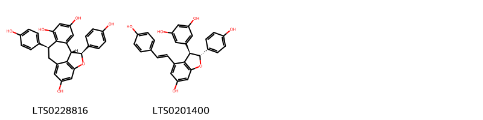{ width=100% }
    <figcaption>Hình ảnh cấu trúc hóa học của 2 hoạt chất thuộc nhóm 2-arylbenzofuran flavonoids gồm ['ampelopsin b (LTS0228816)', 'ε-viniferin (LTS0201400)'].</figcaption>
</figure>
#### Nhóm Benzene and substituted derivatives
<figure markdown="span">
    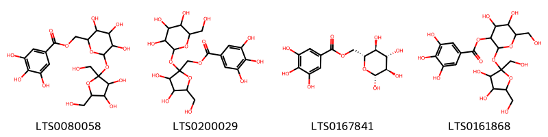{ width=100% }
    <figcaption>Hình ảnh cấu trúc hóa học của 4 hoạt chất thuộc nhóm Benzene and substituted derivatives gồm ['(6-{[3,4-dihydroxy-2,5-bis(hydroxymethyl)oxolan-2-yl]oxy}-3,4,5-trihydroxyoxan-2-yl)methyl 3,4,5-trihydroxybenzoate (LTS0080058)', '[3,4-dihydroxy-5-(hydroxymethyl)-2-{[3,4,5-trihydroxy-6-(hydroxymethyl)oxan-2-yl]oxy}oxolan-2-yl]methyl 3,4,5-trihydroxybenzoate (LTS0200029)', '6-o-galloyl-β-d-glucose (LTS0167841)', '2-{[3,4-dihydroxy-2,5-bis(hydroxymethyl)oxolan-2-yl]oxy}-4,5-dihydroxy-6-(hydroxymethyl)oxan-3-yl 3,4,5-trihydroxybenzoate (LTS0161868)'].</figcaption>
</figure>
#### Nhóm Tannins
<figure markdown="span">
    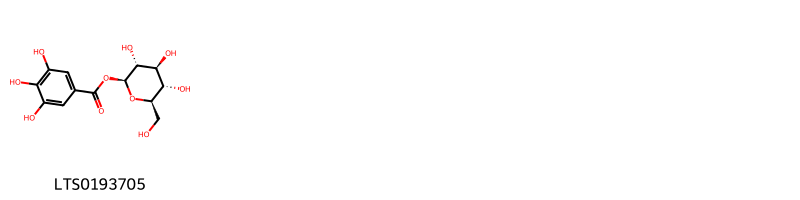{ width=100% }
    <figcaption>Hình ảnh cấu trúc hóa học của 1 hoạt chất thuộc nhóm Tannins gồm ['β-glucogallin (LTS0193705)'].</figcaption>
</figure>

---

### Dược dân tộc học

Danh sách các quốc gia có sử dụng *Rheum coreanum* trong điều trị các bệnh. 

| Country   | Disease             | Bệnh                                                                                                                                                                                                |
|:----------|:--------------------|:----------------------------------------------------------------------------------------------------------------------------------------------------------------------------------------------------|
| Japan*    | Aperient, Stomachic | MYMEMORY WARNING: YOU USED ALL AVAILABLE FREE TRANSLATIONS FOR TODAY. NEXT AVAILABLE IN  15 HOURS 45 MINUTES 50 SECONDS VISIT HTTPS://MYMEMORY.TRANSLATED.NET/DOC/USAGELIMITS.PHP TO TRANSLATE MORE |

---

---
## Rheum emodi
### Thông tin về thực vật

!!! info "Phân loại thực vật của *N/A* từ GIBF:"
    - **Kingdom:** Plantae
    - **Phylum:** Tracheophyta
    - **Order:** Caryophyllales
    - **Family:** Polygonaceae
    - **Genus:** Rheum
    - **Species:** *N/A*

 

| Label (VI)   | Label (EN)   | Scientific Name   | Descriptions (VI)   | Descriptions (EN)   | Also Known As (VI)   | Also Known As (EN)   |
|:-------------|:-------------|:------------------|:--------------------|:--------------------|:---------------------|:---------------------|
| N/A          | N/A          | Rheum emodi       | loài thực vật       | species of plant    | ['']                 | ['']                 |

#### Phân bố trên thế giới

**Từ CSDL GIBF** Mongolia, Uzbekistan, Sweden, Finland, China, Israel, Kazakhstan, New Zealand, Türkiye, Ecuador, Denmark, Netherlands, Poland, United States of America, Armenia, Russian Federation, Estonia, Belarus, Norway, Belgium, Iraq, Canada, Germany, Austria, Kyrgyzstan, Switzerland, United Kingdom of Great Britain and Northern Ireland

#### Phân bố tại Việt Nam

**Từ CSDL GIBF**: Không có ghi nhận ở Việt Nam

---
### Thành phần hóa học
        
- Theo cơ sở dữ liệu lotus: Từ loài *N/A* đã phân lập và xác định được Chưa có hoạt chất nào được phân lập. hoạt chất thuộc về các nhóm Không có hoạt chất nào được phân lập. 

Không có hình ảnh nào được tạo ra

---

### Dược dân tộc học

Danh sách các quốc gia có sử dụng *N/A* trong điều trị các bệnh. 

| Country   | Disease                                             | Bệnh                                                                                                                                                                                                |
|:----------|:----------------------------------------------------|:----------------------------------------------------------------------------------------------------------------------------------------------------------------------------------------------------|
| India     | Astringent, Dentifrice, Purgative, Stimulant, Tonic | MYMEMORY WARNING: YOU USED ALL AVAILABLE FREE TRANSLATIONS FOR TODAY. NEXT AVAILABLE IN  15 HOURS 45 MINUTES 21 SECONDS VISIT HTTPS://MYMEMORY.TRANSLATED.NET/DOC/USAGELIMITS.PHP TO TRANSLATE MORE |

---

---
## Rheum iciforme
### Thông tin về thực vật

!!! info "Phân loại thực vật của *N/A* từ GIBF:"
    - **Kingdom:** Plantae
    - **Phylum:** Tracheophyta
    - **Order:** Caryophyllales
    - **Family:** Polygonaceae
    - **Genus:** Rheum
    - **Species:** *N/A*

 

| Label (VI)   | Label (EN)   | Scientific Name   | Descriptions (VI)   | Descriptions (EN)   | Also Known As (VI)   | Also Known As (EN)   |
|:-------------|:-------------|:------------------|:--------------------|:--------------------|:---------------------|:---------------------|
| N/A          | N/A          | Rheum emodi       | loài thực vật       | species of plant    | ['']                 | ['']                 |

#### Phân bố trên thế giới

**Từ CSDL GIBF** Mongolia, Uzbekistan, Sweden, Finland, China, Israel, Kazakhstan, New Zealand, Türkiye, Ecuador, Denmark, Netherlands, Poland, United States of America, Armenia, Russian Federation, Estonia, Belarus, Norway, Belgium, Iraq, Canada, Germany, Austria, Kyrgyzstan, Switzerland, United Kingdom of Great Britain and Northern Ireland

#### Phân bố tại Việt Nam

**Từ CSDL GIBF**: Không có ghi nhận ở Việt Nam

---
### Thành phần hóa học
        
- Theo cơ sở dữ liệu lotus: Từ loài *N/A* đã phân lập và xác định được Chưa có hoạt chất nào được phân lập. hoạt chất thuộc về các nhóm Không có hoạt chất nào được phân lập. 

Không có hình ảnh nào được tạo ra

---

### Dược dân tộc học

Danh sách các quốc gia có sử dụng *N/A* trong điều trị các bệnh. 

| Country   | Disease   | Bệnh                                                                                                                                                                                                |
|:----------|:----------|:----------------------------------------------------------------------------------------------------------------------------------------------------------------------------------------------------|
| India     | Purgative | MYMEMORY WARNING: YOU USED ALL AVAILABLE FREE TRANSLATIONS FOR TODAY. NEXT AVAILABLE IN  15 HOURS 44 MINUTES 55 SECONDS VISIT HTTPS://MYMEMORY.TRANSLATED.NET/DOC/USAGELIMITS.PHP TO TRANSLATE MORE |

---

---
## Rheum moorcroftianum
### Thông tin về thực vật

!!! info "Phân loại thực vật của *Rheum moorcroftianum* từ GIBF:"
    - **Kingdom:** Plantae
    - **Phylum:** Tracheophyta
    - **Order:** Caryophyllales
    - **Family:** Polygonaceae
    - **Genus:** Rheum
    - **Species:** *Rheum moorcroftianum*

 

| Label (VI)   | Label (EN)   | Scientific Name      | Descriptions (VI)   | Descriptions (EN)   | Also Known As (VI)   | Also Known As (EN)   |
|:-------------|:-------------|:---------------------|:--------------------|:--------------------|:---------------------|:---------------------|
| N/A          | N/A          | Rheum moorcroftianum | loài thực vật       | species of plant    | ['']                 | ['']                 |

#### Phân bố trên thế giới

**Từ CSDL GIBF** nan, Norway, Nepal, China, India

#### Phân bố tại Việt Nam

**Từ CSDL GIBF**: Không có ghi nhận ở Việt Nam

---
### Thành phần hóa học
        
- Theo cơ sở dữ liệu lotus: Từ loài *Rheum moorcroftianum* đã phân lập và xác định được Chưa có hoạt chất nào được phân lập. hoạt chất thuộc về các nhóm Không có hoạt chất nào được phân lập. 

Không có hình ảnh nào được tạo ra

---

### Dược dân tộc học

Danh sách các quốc gia có sử dụng *Rheum moorcroftianum* trong điều trị các bệnh. 

| Country   | Disease   | Bệnh                                                                                                                                                                                                |
|:----------|:----------|:----------------------------------------------------------------------------------------------------------------------------------------------------------------------------------------------------|
| India     | Purgative | MYMEMORY WARNING: YOU USED ALL AVAILABLE FREE TRANSLATIONS FOR TODAY. NEXT AVAILABLE IN  15 HOURS 44 MINUTES 31 SECONDS VISIT HTTPS://MYMEMORY.TRANSLATED.NET/DOC/USAGELIMITS.PHP TO TRANSLATE MORE |

---

---
## Rheum officinale
### Thông tin về thực vật

!!! info "Phân loại thực vật của *Rheum officinale* từ GIBF:"
    - **Kingdom:** Plantae
    - **Phylum:** Tracheophyta
    - **Order:** Caryophyllales
    - **Family:** Polygonaceae
    - **Genus:** Rheum
    - **Species:** *Rheum officinale*

 

| Label (VI)   | Label (EN)   | Scientific Name   | Descriptions (VI)   | Descriptions (EN)   | Also Known As (VI)   | Also Known As (EN)   |
|:-------------|:-------------|:------------------|:--------------------|:--------------------|:---------------------|:---------------------|
| N/A          | N/A          | Rheum officinale  | loài thực vật       | species of plant    | ['']                 | ['']                 |

#### Phân bố trên thế giới

**Từ CSDL GIBF** nan, Hungary, Kenya, Poland, Iceland, Sweden, Indonesia, Finland, China, Colombia, Switzerland, unknown or invalid, Germany, United Kingdom of Great Britain and Northern Ireland, Spain, Netherlands

#### Phân bố tại Việt Nam

**Từ CSDL GIBF**: Không có ghi nhận ở Việt Nam

---
### Thành phần hóa học
        
- Theo cơ sở dữ liệu lotus: Từ loài *Rheum officinale* đã phân lập và xác định được 27 hoạt chất thuộc về các nhóm Benzene and substituted derivatives, Flavonoids, Anthracenes, Phenols, Organooxygen compounds, Stilbenes. 

|    | chemicalTaxonomyClassyfireClass     |   smiles_count |
|---:|:------------------------------------|---------------:|
|  0 | Anthracenes                         |             12 |
|  1 | Benzene and substituted derivatives |              5 |
|  2 | Flavonoids                          |              2 |
|  3 | Organooxygen compounds              |              2 |
|  4 | Phenols                             |              1 |
|  5 | Stilbenes                           |              5 |

#### Nhóm Anthracenes
<figure markdown="span">
    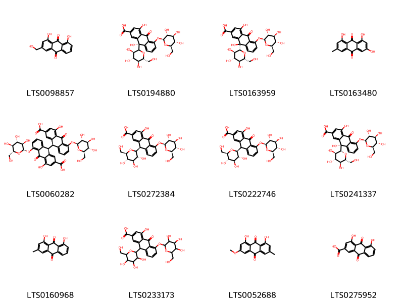{ width=100% }
    <figcaption>Hình ảnh cấu trúc hóa học của 12 hoạt chất thuộc nhóm Anthracenes gồm ['aloe emodin (LTS0098857)', '(9s)-4,9-dihydroxy-10-oxo-9-[(3r,4s,5s,6r)-3,4,5-trihydroxy-6-(hydroxymethyl)oxan-2-yl]-5-{[(2s,3r,4s,5s,6r)-3,4,5-trihydroxy-6-(hydroxymethyl)oxan-2-yl]oxy}anthracene-2-carboxylic acid (LTS0194880)', '4,9-dihydroxy-10-oxo-9-[(2r,3r,4s,5s,6r)-3,4,5-trihydroxy-6-(hydroxymethyl)oxan-2-yl]-5-{[(2s,3r,4s,5s,6r)-3,4,5-trihydroxy-6-(hydroxymethyl)oxan-2-yl]oxy}anthracene-2-carboxylic acid (LTS0163959)', 'emodin (LTS0163480)', 'sennoside a (LTS0060282)', '(9r)-4-hydroxy-10-oxo-9-[(3r,4r,5s,6r)-3,4,5-trihydroxy-6-(hydroxymethyl)oxan-2-yl]-5-{[(2s,3r,4s,5s,6r)-3,4,5-trihydroxy-6-(hydroxymethyl)oxan-2-yl]oxy}-9h-anthracene-2-carboxylic acid (LTS0272384)', '4-hydroxy-10-oxo-9-[(2s,3r,4r,5s,6r)-3,4,5-trihydroxy-6-(hydroxymethyl)oxan-2-yl]-5-{[(2s,3r,4s,5s,6r)-3,4,5-trihydroxy-6-(hydroxymethyl)oxan-2-yl]oxy}-9h-anthracene-2-carboxylic acid (LTS0222746)', '(9s)-4,9-dihydroxy-10-oxo-9-[(2r,3r,4s,5s,6r)-3,4,5-trihydroxy-6-(hydroxymethyl)oxan-2-yl]-5-{[(2s,3r,4s,5s,6r)-3,4,5-trihydroxy-6-(hydroxymethyl)oxan-2-yl]oxy}anthracene-2-carboxylic acid (LTS0241337)', 'turkey rhubarb (LTS0160968)', '4-hydroxy-10-oxo-9-[3,4,5-trihydroxy-6-(hydroxymethyl)oxan-2-yl]-5-{[3,4,5-trihydroxy-6-(hydroxymethyl)oxan-2-yl]oxy}-9h-anthracene-2-carboxylic acid (LTS0233173)', 'physcion (LTS0052688)', 'monorhein (LTS0275952)'].</figcaption>
</figure>
#### Nhóm Benzene and substituted derivatives
<figure markdown="span">
    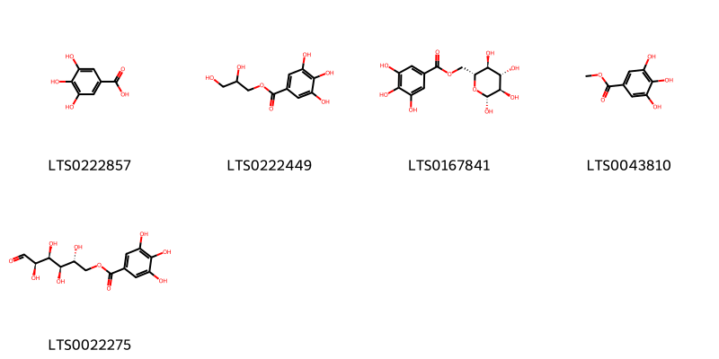{ width=100% }
    <figcaption>Hình ảnh cấu trúc hóa học của 5 hoạt chất thuộc nhóm Benzene and substituted derivatives gồm ['galop (LTS0222857)', '2,3-dihydroxypropyl 3,4,5-trihydroxybenzoate (LTS0222449)', '6-o-galloyl-β-d-glucose (LTS0167841)', 'methyl gallate (LTS0043810)', '(2r,3r,4s,5r)-2,3,4,5-tetrahydroxy-6-oxohexyl 3,4,5-trihydroxybenzoate (LTS0022275)'].</figcaption>
</figure>
#### Nhóm Flavonoids
<figure markdown="span">
    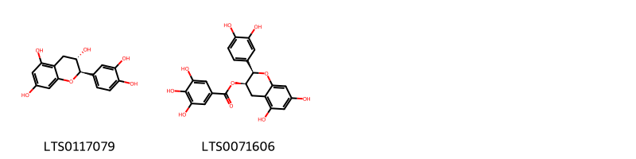{ width=100% }
    <figcaption>Hình ảnh cấu trúc hóa học của 2 hoạt chất thuộc nhóm Flavonoids gồm ['(+)-catechol (LTS0117079)', 'epicatechin gallate (LTS0071606)'].</figcaption>
</figure>
#### Nhóm Organooxygen compounds
<figure markdown="span">
    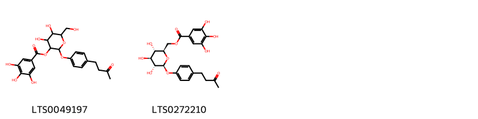{ width=100% }
    <figcaption>Hình ảnh cấu trúc hóa học của 2 hoạt chất thuộc nhóm Organooxygen compounds gồm ['4,5-dihydroxy-6-(hydroxymethyl)-2-[4-(3-oxobutyl)phenoxy]oxan-3-yl 3,4,5-trihydroxybenzoate (LTS0049197)', '[(2r,3s,4s,5r,6s)-3,4,5-trihydroxy-6-[4-(3-oxobutyl)phenoxy]oxan-2-yl]methyl 3,4,5-trihydroxybenzoate (LTS0272210)'].</figcaption>
</figure>
#### Nhóm Phenols
<figure markdown="span">
    { width=100% }
    <figcaption>Hình ảnh cấu trúc hóa học của 1 hoạt chất thuộc nhóm Phenols gồm ['frambinone (LTS0021621)'].</figcaption>
</figure>
#### Nhóm Stilbenes
<figure markdown="span">
    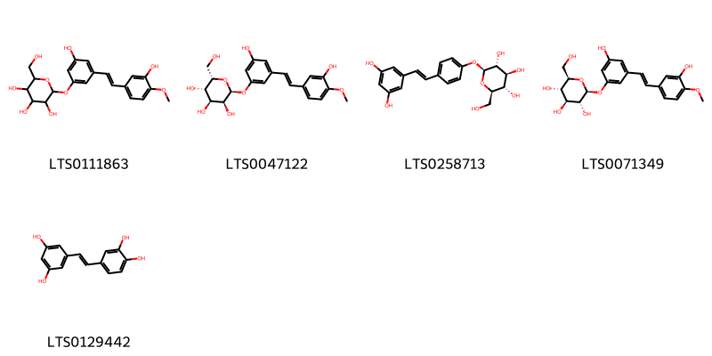{ width=100% }
    <figcaption>Hình ảnh cấu trúc hóa học của 5 hoạt chất thuộc nhóm Stilbenes gồm ['2-{3-hydroxy-5-[2-(3-hydroxy-4-methoxyphenyl)ethenyl]phenoxy}-6-(hydroxymethyl)oxane-3,4,5-triol (LTS0111863)', '(2s,3s,4s,5s,6s)-2-{3-hydroxy-5-[(1e)-2-(3-hydroxy-4-methoxyphenyl)ethenyl]phenoxy}-6-(hydroxymethyl)oxane-3,4,5-triol (LTS0047122)', '(2s,3r,4s,5s,6r)-2-{4-[2-(3,5-dihydroxyphenyl)ethenyl]phenoxy}-6-(hydroxymethyl)oxane-3,4,5-triol (LTS0258713)', 'rhaponticin (LTS0071349)', 'piceatannol (LTS0129442)'].</figcaption>
</figure>

---

### Dược dân tộc học

Danh sách các quốc gia có sử dụng *Rheum officinale* trong điều trị các bệnh. 

| Country   | Disease                                                                                                               | Bệnh                                                                                                                                                                                                |
|:----------|:----------------------------------------------------------------------------------------------------------------------|:----------------------------------------------------------------------------------------------------------------------------------------------------------------------------------------------------|
| China     | Laxative, Laxative, Laxative, Poison, Purgative, Purgative, Stomachic, Tonic, Astringent, Stomachic, Tonic, Vermifuge | MYMEMORY WARNING: YOU USED ALL AVAILABLE FREE TRANSLATIONS FOR TODAY. NEXT AVAILABLE IN  15 HOURS 44 MINUTES 08 SECONDS VISIT HTTPS://MYMEMORY.TRANSLATED.NET/DOC/USAGELIMITS.PHP TO TRANSLATE MORE |
| Japan*    | Aperient, Stomachic                                                                                                   | MYMEMORY WARNING: YOU USED ALL AVAILABLE FREE TRANSLATIONS FOR TODAY. NEXT AVAILABLE IN  15 HOURS 44 MINUTES 04 SECONDS VISIT HTTPS://MYMEMORY.TRANSLATED.NET/DOC/USAGELIMITS.PHP TO TRANSLATE MORE |
| Java      | Cosmetic                                                                                                              | MYMEMORY WARNING: YOU USED ALL AVAILABLE FREE TRANSLATIONS FOR TODAY. NEXT AVAILABLE IN  15 HOURS 44 MINUTES 00 SECONDS VISIT HTTPS://MYMEMORY.TRANSLATED.NET/DOC/USAGELIMITS.PHP TO TRANSLATE MORE |
| Malaya    | Purgative, Tonic                                                                                                      | MYMEMORY WARNING: YOU USED ALL AVAILABLE FREE TRANSLATIONS FOR TODAY. NEXT AVAILABLE IN  15 HOURS 43 MINUTES 57 SECONDS VISIT HTTPS://MYMEMORY.TRANSLATED.NET/DOC/USAGELIMITS.PHP TO TRANSLATE MORE |
| Turkey    | Astringent, Stomachic, Tonic, Purgative, nan                                                                          | MYMEMORY WARNING: YOU USED ALL AVAILABLE FREE TRANSLATIONS FOR TODAY. NEXT AVAILABLE IN  15 HOURS 43 MINUTES 54 SECONDS VISIT HTTPS://MYMEMORY.TRANSLATED.NET/DOC/USAGELIMITS.PHP TO TRANSLATE MORE |

---

---
## Rheum palmatum
### Thông tin về thực vật

!!! info "Phân loại thực vật của *Rheum palmatum* từ GIBF:"
    - **Kingdom:** Plantae
    - **Phylum:** Tracheophyta
    - **Order:** Caryophyllales
    - **Family:** Polygonaceae
    - **Genus:** Rheum
    - **Species:** *Rheum palmatum*

 

| Label (VI)   | Label (EN)   | Scientific Name   | Descriptions (VI)   | Descriptions (EN)   | Also Known As (VI)   | Also Known As (EN)   |
|:-------------|:-------------|:------------------|:--------------------|:--------------------|:---------------------|:---------------------|
| N/A          | N/A          | Rheum palmatum    | loài thực vật       | species of plant    | ['']                 | ['']                 |

#### Phân bố trên thế giới

**Từ CSDL GIBF** nan, Austria, United States of America, Norway, Korea, Republic of, Czechia, Sweden, Netherlands, Belgium, China, Australia, New Zealand, Colombia, unknown or invalid, Estonia, Germany, United Kingdom of Great Britain and Northern Ireland, Poland

#### Phân bố tại Việt Nam

**Từ CSDL GIBF**: Không có ghi nhận ở Việt Nam

---
### Thành phần hóa học
        
- Theo cơ sở dữ liệu lotus: Từ loài *Rheum palmatum* đã phân lập và xác định được 66 hoạt chất thuộc về các nhóm Indoles and derivatives, Benzene and substituted derivatives, Flavonoids, Tannins, Anthracenes, Naphthalenes, Phenols, Organooxygen compounds, 2-arylbenzofuran flavonoids, Stilbenes. 

|    | chemicalTaxonomyClassyfireClass     |   smiles_count |
|---:|:------------------------------------|---------------:|
|  0 | 2-arylbenzofuran flavonoids         |              1 |
|  1 | Anthracenes                         |             33 |
|  2 | Benzene and substituted derivatives |              7 |
|  3 | Flavonoids                          |              2 |
|  4 | Indoles and derivatives             |              1 |
|  5 | Naphthalenes                        |              1 |
|  6 | Organooxygen compounds              |             11 |
|  7 | Phenols                             |              1 |
|  8 | Stilbenes                           |              7 |
|  9 | Tannins                             |              2 |

#### Nhóm 2-arylbenzofuran flavonoids
<figure markdown="span">
    { width=100% }
    <figcaption>Hình ảnh cấu trúc hóa học của 1 hoạt chất thuộc nhóm 2-arylbenzofuran flavonoids gồm ['5-[(2r,3r)-4-hydroxy-2-(4-hydroxyphenyl)-6-[(1e)-2-(4-hydroxyphenyl)ethenyl]-2,3-dihydro-1-benzofuran-3-yl]benzene-1,3-diol (LTS0083026)'].</figcaption>
</figure>
#### Nhóm Anthracenes
<figure markdown="span">
    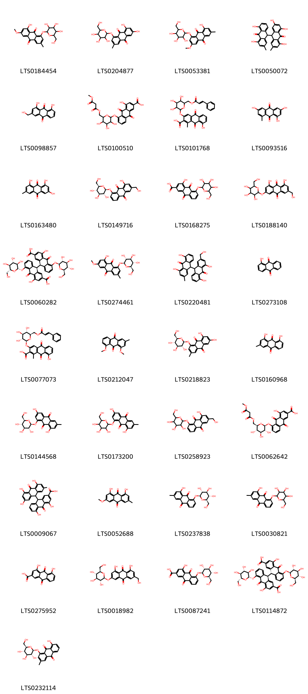{ width=100% }
    <figcaption>Hình ảnh cấu trúc hóa học của 33 hoạt chất thuộc nhóm Anthracenes gồm ['1-hydroxy-3-methoxy-6-methyl-8-{[3,4,5-trihydroxy-6-(hydroxymethyl)oxan-2-yl]oxy}anthracene-9,10-dione (LTS0184454)', '1,3-dihydroxy-6-methyl-8-{[3,4,5-trihydroxy-6-(hydroxymethyl)oxan-2-yl]oxy}anthracene-9,10-dione (LTS0204877)', '1-hydroxy-6-methoxy-3-methyl-8-{[3,4,5-trihydroxy-6-(hydroxymethyl)oxan-2-yl]oxy}anthracene-9,10-dione (LTS0053381)', 'palmidin c (LTS0050072)', 'aloe emodin (LTS0098857)', '4-hydroxy-9,10-dioxo-5-[(3,4,5-trihydroxy-6-{[(3-methoxy-3-oxopropanoyl)oxy]methyl}oxan-2-yl)oxy]anthracene-2-carboxylic acid (LTS0100510)', '8-hydroxy-1-methyl-9,10-dioxo-3-[(3,4,5-trihydroxy-6-{[(3-phenylprop-2-enoyl)oxy]methyl}oxan-2-yl)oxy]anthracene-2-carboxylic acid (LTS0101768)', '1,3,6-trihydroxy-8-methylanthracene-9,10-dione (LTS0093516)', 'emodin (LTS0163480)', '1-hydroxy-3-(hydroxymethyl)-8-{[(2s,3r,4s,5s,6r)-3,4,5-trihydroxy-6-(hydroxymethyl)oxan-2-yl]oxy}anthracene-9,10-dione (LTS0149716)', '4-hydroxy-9,10-dioxo-5-{[3,4,5-trihydroxy-6-(hydroxymethyl)oxan-2-yl]oxy}anthracene-2-carboxylic acid (LTS0168275)', '1,8-dihydroxy-3-(hydroxymethyl)-6-{[3,4,5-trihydroxy-6-(hydroxymethyl)oxan-2-yl]oxy}anthracene-9,10-dione (LTS0188140)', 'sennoside a (LTS0060282)', 'physcion 8-glucoside (LTS0274461)', 'palmidin b (LTS0220481)', 'hydroxyanthraquinone (LTS0273108)', '8-hydroxy-1-methyl-9,10-dioxo-3-{[(2s,3r,4s,5s,6r)-3,4,5-trihydroxy-6-({[(2e)-3-phenylprop-2-enoyl]oxy}methyl)oxan-2-yl]oxy}anthracene-2-carboxylic acid (LTS0077073)', '1,8-dimethoxy-3-methylanthracene-9,10-dione (LTS0212047)', 'emodin 1-o-β-d-glucoside (LTS0218823)', 'turkey rhubarb (LTS0160968)', 'emodin 8-glucoside (LTS0144568)', '1,6-dihydroxy-3-methyl-8-{[3,4,5-trihydroxy-6-(hydroxymethyl)oxan-2-yl]oxy}anthracene-9,10-dione (LTS0173200)', '1-hydroxy-3-(hydroxymethyl)-8-{[3,4,5-trihydroxy-6-(hydroxymethyl)oxan-2-yl]oxy}anthracene-9,10-dione (LTS0258923)', '4-hydroxy-9,10-dioxo-5-{[(2s,3r,4s,5s,6r)-3,4,5-trihydroxy-6-{[(3-methoxy-3-oxopropanoyl)oxy]methyl}oxan-2-yl]oxy}anthracene-2-carboxylic acid (LTS0062642)', "2',4,4',5,5'-pentahydroxy-7'-methyl-10,10'-dioxo-9h,9'h-[9,9'-bianthracene]-2-carboxylic acid (LTS0009067)", 'physcion (LTS0052688)', 'pulmatin (LTS0237838)', '1-hydroxy-3-methyl-8-{[3,4,5-trihydroxy-6-(hydroxymethyl)oxan-2-yl]oxy}anthracene-9,10-dione (LTS0030821)', 'monorhein (LTS0275952)', '1,8-dihydroxy-3-(hydroxymethyl)-6-{[(2s,3r,4s,5s,6r)-3,4,5-trihydroxy-6-(hydroxymethyl)oxan-2-yl]oxy}anthracene-9,10-dione (LTS0018982)', '4-hydroxy-9,10-dioxo-5-{[(2s,3r,4s,5s,6r)-3,4,5-trihydroxy-6-(hydroxymethyl)oxan-2-yl]oxy}anthracene-2-carboxylic acid (LTS0087241)', 'sennoside b (LTS0114872)', '8-hydroxy-3-methyl-1-{[(2s,3r,4s,5s,6r)-3,4,5-trihydroxy-6-(hydroxymethyl)oxan-2-yl]oxy}anthracene-9,10-dione (LTS0232114)'].</figcaption>
</figure>
#### Nhóm Benzene and substituted derivatives
<figure markdown="span">
    { width=100% }
    <figcaption>Hình ảnh cấu trúc hóa học của 7 hoạt chất thuộc nhóm Benzene and substituted derivatives gồm ['(6-{[3,4-dihydroxy-2,5-bis(hydroxymethyl)oxolan-2-yl]oxy}-3,4,5-trihydroxyoxan-2-yl)methyl 3,4,5-trihydroxybenzoate (LTS0080058)', '[3,4-dihydroxy-5-(hydroxymethyl)-2-{[3,4,5-trihydroxy-6-(hydroxymethyl)oxan-2-yl]oxy}oxolan-2-yl]methyl 3,4,5-trihydroxybenzoate (LTS0200029)', '6-o-galloyl-β-d-glucose (LTS0167841)', '[3,4-dihydroxy-5-(hydroxymethyl)-5-{[3,4,5-trihydroxy-6-(hydroxymethyl)oxan-2-yl]oxy}oxolan-2-yl]methyl 3,4,5-trihydroxybenzoate (LTS0233767)', 'galop (LTS0222857)', '(2,3,4,5-tetrahydroxyoxan-2-yl)methyl 3,4,5-trihydroxybenzoate (LTS0031755)', '4-hydroxy-2,5-bis(hydroxymethyl)-5-{[3,4,5-trihydroxy-6-(hydroxymethyl)oxan-2-yl]oxy}oxolan-3-yl 3,4,5-trihydroxybenzoate (LTS0049390)'].</figcaption>
</figure>
#### Nhóm Flavonoids
<figure markdown="span">
    { width=100% }
    <figcaption>Hình ảnh cấu trúc hóa học của 2 hoạt chất thuộc nhóm Flavonoids gồm ['(+)-catechol (LTS0117079)', 'catechin 3-o-gallate (LTS0019986)'].</figcaption>
</figure>
#### Nhóm Indoles and derivatives
<figure markdown="span">
    { width=100% }
    <figcaption>Hình ảnh cấu trúc hóa học của 1 hoạt chất thuộc nhóm Indoles and derivatives gồm ['n-[2-(5-methoxy-1h-indol-3-yl)ethyl]ethanimidic acid (LTS0219322)'].</figcaption>
</figure>
#### Nhóm Naphthalenes
<figure markdown="span">
    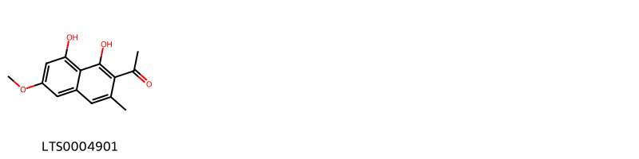{ width=100% }
    <figcaption>Hình ảnh cấu trúc hóa học của 1 hoạt chất thuộc nhóm Naphthalenes gồm ['torachrysone (LTS0004901)'].</figcaption>
</figure>
#### Nhóm Organooxygen compounds
<figure markdown="span">
    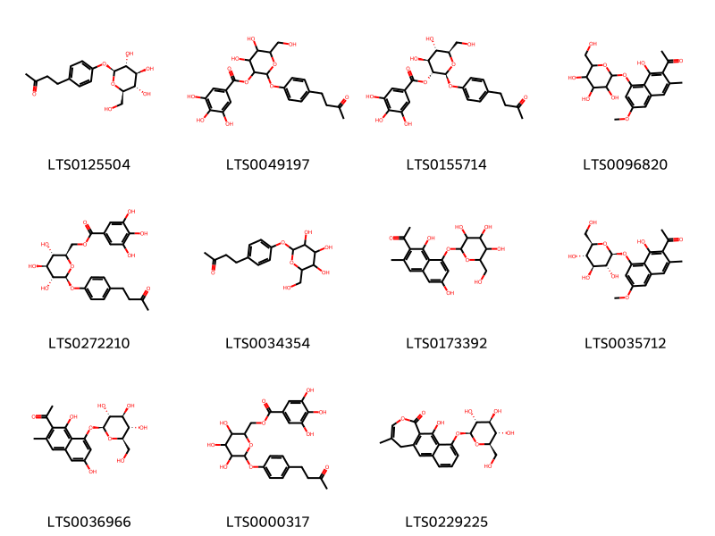{ width=100% }
    <figcaption>Hình ảnh cấu trúc hóa học của 11 hoạt chất thuộc nhóm Organooxygen compounds gồm ['raspberryketone glucoside (LTS0125504)', '4,5-dihydroxy-6-(hydroxymethyl)-2-[4-(3-oxobutyl)phenoxy]oxan-3-yl 3,4,5-trihydroxybenzoate (LTS0049197)', '(2s,3r,4s,5s,6r)-4,5-dihydroxy-6-(hydroxymethyl)-2-[4-(3-oxobutyl)phenoxy]oxan-3-yl 3,4,5-trihydroxybenzoate (LTS0155714)', '1-(1-hydroxy-6-methoxy-3-methyl-8-{[3,4,5-trihydroxy-6-(hydroxymethyl)oxan-2-yl]oxy}naphthalen-2-yl)ethanone (LTS0096820)', '[(2r,3s,4s,5r,6s)-3,4,5-trihydroxy-6-[4-(3-oxobutyl)phenoxy]oxan-2-yl]methyl 3,4,5-trihydroxybenzoate (LTS0272210)', 'raspberryketone glucoside (LTS0034354)', '1-(1,6-dihydroxy-3-methyl-8-{[3,4,5-trihydroxy-6-(hydroxymethyl)oxan-2-yl]oxy}naphthalen-2-yl)ethanone (LTS0173392)', '1-(1-hydroxy-6-methoxy-3-methyl-8-{[(2s,3r,4s,5s,6r)-3,4,5-trihydroxy-6-(hydroxymethyl)oxan-2-yl]oxy}naphthalen-2-yl)ethanone (LTS0035712)', '1-(1,6-dihydroxy-3-methyl-8-{[(2s,3r,4s,5s,6r)-3,4,5-trihydroxy-6-(hydroxymethyl)oxan-2-yl]oxy}naphthalen-2-yl)ethanone (LTS0036966)', '{3,4,5-trihydroxy-6-[4-(3-oxobutyl)phenoxy]oxan-2-yl}methyl 3,4,5-trihydroxybenzoate (LTS0000317)', '11-hydroxy-4-methyl-10-{[(2s,3r,4s,5s,6r)-3,4,5-trihydroxy-6-(hydroxymethyl)oxan-2-yl]oxy}-5h-naphtho[2,3-c]oxepin-1-one (LTS0229225)'].</figcaption>
</figure>
#### Nhóm Phenols
<figure markdown="span">
    { width=100% }
    <figcaption>Hình ảnh cấu trúc hóa học của 1 hoạt chất thuộc nhóm Phenols gồm ['frambinone (LTS0021621)'].</figcaption>
</figure>
#### Nhóm Stilbenes
<figure markdown="span">
    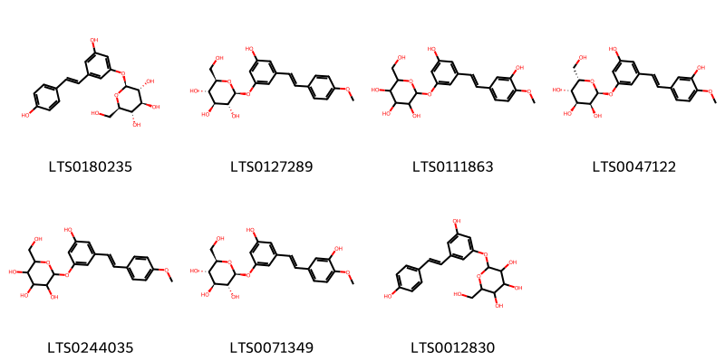{ width=100% }
    <figcaption>Hình ảnh cấu trúc hóa học của 7 hoạt chất thuộc nhóm Stilbenes gồm ['piceid (LTS0180235)', '(2s,3r,4s,5s,6r)-2-{3-hydroxy-5-[(1e)-2-(4-methoxyphenyl)ethenyl]phenoxy}-6-(hydroxymethyl)oxane-3,4,5-triol (LTS0127289)', '2-{3-hydroxy-5-[2-(3-hydroxy-4-methoxyphenyl)ethenyl]phenoxy}-6-(hydroxymethyl)oxane-3,4,5-triol (LTS0111863)', '(2s,3s,4s,5s,6s)-2-{3-hydroxy-5-[(1e)-2-(3-hydroxy-4-methoxyphenyl)ethenyl]phenoxy}-6-(hydroxymethyl)oxane-3,4,5-triol (LTS0047122)', '2-{3-hydroxy-5-[2-(4-methoxyphenyl)ethenyl]phenoxy}-6-(hydroxymethyl)oxane-3,4,5-triol (LTS0244035)', 'rhaponticin (LTS0071349)', '2-{3-hydroxy-5-[2-(4-hydroxyphenyl)ethenyl]phenoxy}-6-(hydroxymethyl)oxane-3,4,5-triol (LTS0012830)'].</figcaption>
</figure>
#### Nhóm Tannins
<figure markdown="span">
    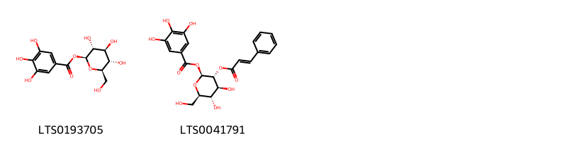{ width=100% }
    <figcaption>Hình ảnh cấu trúc hóa học của 2 hoạt chất thuộc nhóm Tannins gồm ['β-glucogallin (LTS0193705)', '(2s,3r,4s,5s,6r)-4,5-dihydroxy-6-(hydroxymethyl)-3-[(3-phenylprop-2-enoyl)oxy]oxan-2-yl 3,4,5-trihydroxybenzoate (LTS0041791)'].</figcaption>
</figure>

---

### Dược dân tộc học

Danh sách các quốc gia có sử dụng *Rheum palmatum* trong điều trị các bệnh. 

| Country   | Disease                     | Bệnh                                                                                                                                                                                                |
|:----------|:----------------------------|:----------------------------------------------------------------------------------------------------------------------------------------------------------------------------------------------------|
| China     | Aperient, Astringent, Tonic | MYMEMORY WARNING: YOU USED ALL AVAILABLE FREE TRANSLATIONS FOR TODAY. NEXT AVAILABLE IN  15 HOURS 43 MINUTES 21 SECONDS VISIT HTTPS://MYMEMORY.TRANSLATED.NET/DOC/USAGELIMITS.PHP TO TRANSLATE MORE |
| Japan*    | Aperient, Stomachic         | MYMEMORY WARNING: YOU USED ALL AVAILABLE FREE TRANSLATIONS FOR TODAY. NEXT AVAILABLE IN  15 HOURS 43 MINUTES 16 SECONDS VISIT HTTPS://MYMEMORY.TRANSLATED.NET/DOC/USAGELIMITS.PHP TO TRANSLATE MORE |

---

---
## Rheum rhabarbarum
### Thông tin về thực vật

!!! info "Phân loại thực vật của *Rheum rhabarbarum* từ GIBF:"
    - **Kingdom:** Plantae
    - **Phylum:** Tracheophyta
    - **Order:** Caryophyllales
    - **Family:** Polygonaceae
    - **Genus:** Rheum
    - **Species:** *Rheum rhabarbarum*

 

| Label (VI)   | Label (EN)   | Scientific Name   | Descriptions (VI)   | Descriptions (EN)                        | Also Known As (VI)   | Also Known As (EN)                      |
|:-------------|:-------------|:------------------|:--------------------|:-----------------------------------------|:---------------------|:----------------------------------------|
| N/A          | N/A          | Rheum rhabarbarum | loài thực vật       | species of plant, sometime used for food | ['']                 | ['Rheum rhabarbarum', 'garden rhubarb'] |

#### Phân bố trên thế giới

**Từ CSDL GIBF** Mongolia, Sweden, Finland, China, New Zealand, Ecuador, Poland, Denmark, Netherlands, United States of America, Russian Federation, Estonia, Belarus, Norway, Belgium, Canada, Germany, Austria, Australia, Switzerland, United Kingdom of Great Britain and Northern Ireland

#### Phân bố tại Việt Nam

**Từ CSDL GIBF**: Không có ghi nhận ở Việt Nam

---
### Thành phần hóa học
        
- Theo cơ sở dữ liệu lotus: Từ loài *Rheum rhabarbarum* đã phân lập và xác định được 60 hoạt chất thuộc về các nhóm Flavonoids, Anthracenes, Cinnamic acids and derivatives, Steroids and steroid derivatives, Hydroxy acids and derivatives, Organooxygen compounds, Prenol lipids, Stilbenes. 

|    | chemicalTaxonomyClassyfireClass   |   smiles_count |
|---:|:----------------------------------|---------------:|
|  0 | Anthracenes                       |              7 |
|  1 | Cinnamic acids and derivatives    |              6 |
|  2 | Flavonoids                        |              8 |
|  3 | Hydroxy acids and derivatives     |              2 |
|  4 | Organooxygen compounds            |              1 |
|  5 | Prenol lipids                     |              4 |
|  6 | Steroids and steroid derivatives  |              6 |
|  7 | Stilbenes                         |             26 |

#### Nhóm Anthracenes
<figure markdown="span">
    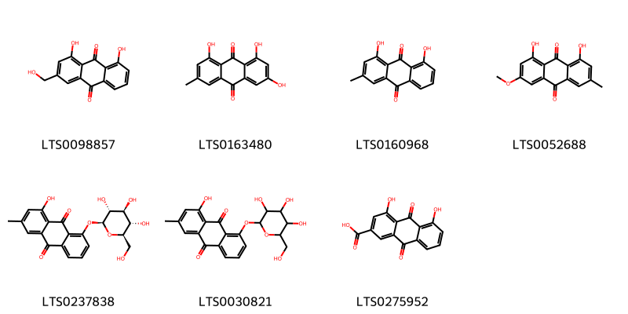{ width=100% }
    <figcaption>Hình ảnh cấu trúc hóa học của 7 hoạt chất thuộc nhóm Anthracenes gồm ['aloe emodin (LTS0098857)', 'emodin (LTS0163480)', 'turkey rhubarb (LTS0160968)', 'physcion (LTS0052688)', 'pulmatin (LTS0237838)', '1-hydroxy-3-methyl-8-{[3,4,5-trihydroxy-6-(hydroxymethyl)oxan-2-yl]oxy}anthracene-9,10-dione (LTS0030821)', 'monorhein (LTS0275952)'].</figcaption>
</figure>
#### Nhóm Cinnamic acids and derivatives
<figure markdown="span">
    { width=100% }
    <figcaption>Hình ảnh cấu trúc hóa học của 6 hoạt chất thuộc nhóm Cinnamic acids and derivatives gồm ['3,4,5-trihydroxy-6-(hydroxymethyl)oxan-2-yl 3-(4-hydroxy-3,5-dimethoxyphenyl)prop-2-enoate (LTS0157735)', '3,4,5-trihydroxy-6-(hydroxymethyl)oxan-2-yl 3-(4-hydroxyphenyl)prop-2-enoate (LTS0236297)', '1-o-sinapoyl-β-d-glucose (LTS0058596)', '3,4,5-trihydroxy-6-(hydroxymethyl)oxan-2-yl 3-(4-hydroxy-3-methoxyphenyl)prop-2-enoate (LTS0236996)', 'p-coumaroyl-d-glucose (LTS0230889)', '1-o-feruloyl-β-d-glucose (LTS0045837)'].</figcaption>
</figure>
#### Nhóm Flavonoids
<figure markdown="span">
    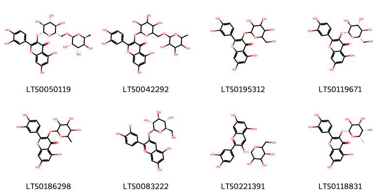{ width=100% }
    <figcaption>Hình ảnh cấu trúc hóa học của 8 hoạt chất thuộc nhóm Flavonoids gồm ['2-(3,4-dihydroxyphenyl)-5,7-dihydroxy-3-{[(2r,3s,4r,5r,6s)-3,4,5-trihydroxy-6-({[(2s,3s,4s,5s,6s)-3,4,5-trihydroxy-6-methyloxan-2-yl]oxy}methyl)oxan-2-yl]oxy}chromen-4-one (LTS0050119)', 'rutin (LTS0042292)', '2-(3,4-dihydroxyphenyl)-5,7-dihydroxy-3-{[3,4,5-trihydroxy-6-(hydroxymethyl)oxan-2-yl]oxy}chromen-4-one (LTS0195312)', '2-(3,4-dihydroxyphenyl)-5,7-dihydroxy-3-{[(2r,3s,4r,5r,6s)-3,4,5-trihydroxy-6-(hydroxymethyl)oxan-2-yl]oxy}chromen-4-one (LTS0119671)', 'quercitrin (LTS0186298)', '5,7-dihydroxy-2-(4-hydroxy-3-oxidophenyl)-3-{[(2s,3r,4s,5s,6r)-3,4,5-trihydroxy-6-(hydroxymethyl)oxan-2-yl]oxy}-1λ⁴-chromen-1-ylium (LTS0083222)', 'chrysanthemin (LTS0221391)', '2-(3,4-dihydroxyphenyl)-5,7-dihydroxy-3-{[(2r,3s,4s,5s,6s)-3,4,5-trihydroxy-6-methyloxan-2-yl]oxy}chromen-4-one (LTS0118831)'].</figcaption>
</figure>
#### Nhóm Hydroxy acids and derivatives
<figure markdown="span">
    { width=100% }
    <figcaption>Hình ảnh cấu trúc hóa học của 2 hoạt chất thuộc nhóm Hydroxy acids and derivatives gồm ['(-)-malic acid (LTS0128885)', 'malic acid (LTS0216520)'].</figcaption>
</figure>
#### Nhóm Organooxygen compounds
<figure markdown="span">
    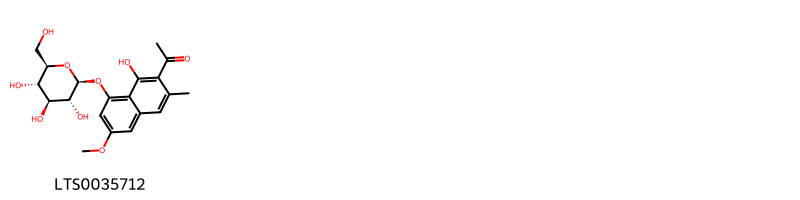{ width=100% }
    <figcaption>Hình ảnh cấu trúc hóa học của 1 hoạt chất thuộc nhóm Organooxygen compounds gồm ['1-(1-hydroxy-6-methoxy-3-methyl-8-{[(2s,3r,4s,5s,6r)-3,4,5-trihydroxy-6-(hydroxymethyl)oxan-2-yl]oxy}naphthalen-2-yl)ethanone (LTS0035712)'].</figcaption>
</figure>
#### Nhóm Prenol lipids
<figure markdown="span">
    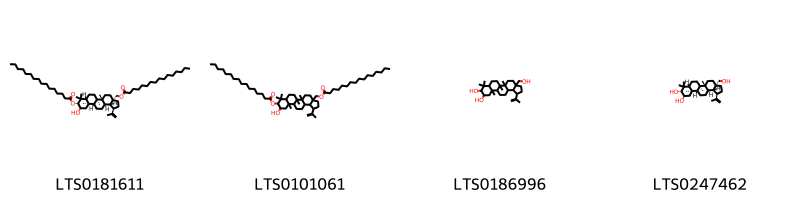{ width=100% }
    <figcaption>Hình ảnh cấu trúc hóa học của 4 hoạt chất thuộc nhóm Prenol lipids gồm ['[(1r,3as,5ar,5br,7ar,9r,10r,11ar,11br,13ar,13br)-9-(hexadecanoyloxy)-10-hydroxy-5a,5b,8,8,11a-pentamethyl-1-(prop-1-en-2-yl)-hexadecahydrocyclopenta[a]chrysen-3a-yl]methyl hexadecanoate (LTS0181611)', '[9-(hexadecanoyloxy)-10-hydroxy-5a,5b,8,8,11a-pentamethyl-1-(prop-1-en-2-yl)-hexadecahydrocyclopenta[a]chrysen-3a-yl]methyl hexadecanoate (LTS0101061)', '3a-(hydroxymethyl)-5a,5b,8,8,11a-pentamethyl-1-(prop-1-en-2-yl)-hexadecahydrocyclopenta[a]chrysene-9,10-diol (LTS0186996)', '(1r,3as,5ar,5br,7ar,9r,10r,11ar,11br,13ar,13br)-3a-(hydroxymethyl)-5a,5b,8,8,11a-pentamethyl-1-(prop-1-en-2-yl)-hexadecahydrocyclopenta[a]chrysene-9,10-diol (LTS0247462)'].</figcaption>
</figure>
#### Nhóm Steroids and steroid derivatives
<figure markdown="span">
    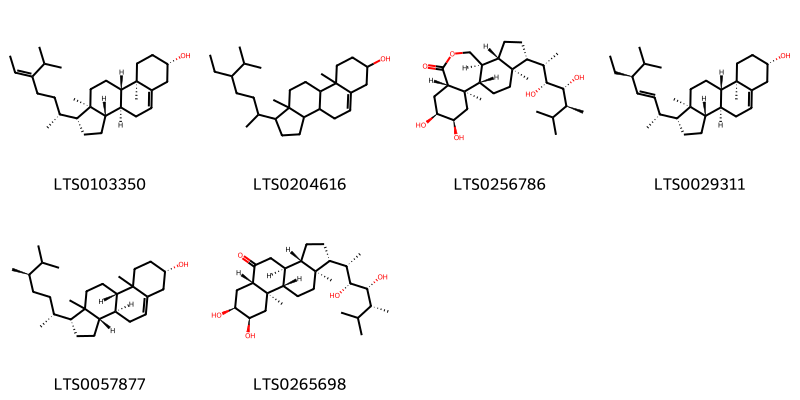{ width=100% }
    <figcaption>Hình ảnh cấu trúc hóa học của 6 hoạt chất thuộc nhóm Steroids and steroid derivatives gồm ['avenasterol (LTS0103350)', 'stigmast-5-en-3-ol, (3β)- (LTS0204616)', 'brassinolide (LTS0256786)', 'phytosterol (LTS0029311)', '(1r,3as,3bs,7s,9bs)-1-[(2r,5r)-5,6-dimethylheptan-2-yl]-9a,11a-dimethyl-1h,2h,3h,3ah,3bh,4h,6h,7h,8h,9h,9bh,10h,11h-cyclopenta[a]phenanthren-7-ol (LTS0057877)', '(1r,3as,3bs,5as,7s,8r,9ar,9bs,11as)-1-[(2s,3r,4r,5r)-3,4-dihydroxy-5,6-dimethylheptan-2-yl]-7,8-dihydroxy-9a,11a-dimethyl-tetradecahydrocyclopenta[a]phenanthren-5-one (LTS0265698)'].</figcaption>
</figure>
#### Nhóm Stilbenes
<figure markdown="span">
    { width=100% }
    <figcaption>Hình ảnh cấu trúc hóa học của 26 hoạt chất thuộc nhóm Stilbenes gồm ['4-methoxyresveratrol (LTS0110115)', 'rhapontigenin (LTS0127842)', 'tocilizumab (LTS0196778)', '(2s,3r,4s,5s,6r)-2-{3-hydroxy-5-[(1e)-2-(4-methoxyphenyl)ethenyl]phenoxy}-6-(hydroxymethyl)oxane-3,4,5-triol (LTS0127289)', '2-{3-hydroxy-5-[2-(3-hydroxy-4-methoxyphenyl)ethenyl]phenoxy}-6-(hydroxymethyl)oxane-3,4,5-triol (LTS0111863)', '(2s,3r,4s,5s,6r)-4,5-dihydroxy-2-{3-hydroxy-5-[(1e)-2-(3-hydroxy-4-methoxyphenyl)ethenyl]phenoxy}-6-(hydroxymethyl)oxan-3-yl 3,4,5-trimethoxybenzoate (LTS0131100)', '5-[2-(3-hydroxyphenyl)ethenyl]-2-methoxyphenol (LTS0201672)', 'cis-stilbene (LTS0025462)', '4-methoxyresveratrol (LTS0140648)', '2-{3-hydroxy-5-[2-(4-methoxyphenyl)ethenyl]phenoxy}-6-(hydroxymethyl)oxane-3,4,5-triol (LTS0244035)', '(2s,3r,4s,5s,6r)-2-{5-[(1e)-2-(3,5-dihydroxyphenyl)ethenyl]-2-hydroxyphenoxy}-6-(hydroxymethyl)oxane-3,4,5-triol (LTS0106796)', '4,5-dihydroxy-2-{3-hydroxy-5-[2-(3-hydroxy-4-methoxyphenyl)ethenyl]phenoxy}-6-(hydroxymethyl)oxan-3-yl 3,4,5-trimethoxybenzoate (LTS0256147)', '2-{5-[2-(3,5-dihydroxyphenyl)ethenyl]-2-hydroxyphenoxy}-6-(hydroxymethyl)oxane-3,4,5-triol (LTS0046089)', '2-{3-hydroxy-5-[2-(4-hydroxy-3-methoxyphenyl)ethenyl]phenoxy}-6-(hydroxymethyl)oxane-3,4,5-triol (LTS0069560)', '(2s,3r,4s,5s,6r)-4,5-dihydroxy-2-{3-hydroxy-5-[(1e)-2-(3-hydroxy-4-methoxyphenyl)ethenyl]phenoxy}-6-(hydroxymethyl)oxan-3-yl 3,4,5-trihydroxybenzoate (LTS0220423)', 'rhaponticin (LTS0071349)', 'resveratrol (LTS0256677)', '4,5-dihydroxy-2-{3-hydroxy-5-[2-(3-hydroxy-4-methoxyphenyl)ethenyl]phenoxy}-6-(hydroxymethyl)oxan-3-yl 3,4,5-trihydroxybenzoate (LTS0006178)', 'piceatannol (LTS0129442)', 'isorhapontigenin (LTS0001470)', 'rhapontigenin (LTS0012944)', 'isorhapontigenin (LTS0216575)', 'piceatannol (LTS0094372)', '(3,4,5-trihydroxy-6-{3-hydroxy-5-[2-(3-hydroxy-4-methoxyphenyl)ethenyl]phenoxy}oxan-2-yl)methyl 3,4,5-trihydroxybenzoate (LTS0238404)', '[(2r,3s,4s,5r,6s)-3,4,5-trihydroxy-6-{3-hydroxy-5-[(1e)-2-(3-hydroxy-4-methoxyphenyl)ethenyl]phenoxy}oxan-2-yl]methyl 3,4,5-trihydroxybenzoate (LTS0257047)', 'isorhapontin (LTS0038705)'].</figcaption>
</figure>

---

### Dược dân tộc học

Danh sách các quốc gia có sử dụng *Rheum rhabarbarum* trong điều trị các bệnh. 

| Country   | Disease                                | Bệnh                                                                                                                                                                                                |
|:----------|:---------------------------------------|:----------------------------------------------------------------------------------------------------------------------------------------------------------------------------------------------------|
| France    | Laxative                               | MYMEMORY WARNING: YOU USED ALL AVAILABLE FREE TRANSLATIONS FOR TODAY. NEXT AVAILABLE IN  15 HOURS 42 MINUTES 36 SECONDS VISIT HTTPS://MYMEMORY.TRANSLATED.NET/DOC/USAGELIMITS.PHP TO TRANSLATE MORE |
| Turkey    | Astringent, Tonic, Laxative, Stomachic | MYMEMORY WARNING: YOU USED ALL AVAILABLE FREE TRANSLATIONS FOR TODAY. NEXT AVAILABLE IN  15 HOURS 42 MINUTES 32 SECONDS VISIT HTTPS://MYMEMORY.TRANSLATED.NET/DOC/USAGELIMITS.PHP TO TRANSLATE MORE |

---

---
## Rheum rhaponticum
### Thông tin về thực vật

!!! info "Phân loại thực vật của *Rheum rhaponticum* từ GIBF:"
    - **Kingdom:** Plantae
    - **Phylum:** Tracheophyta
    - **Order:** Caryophyllales
    - **Family:** Polygonaceae
    - **Genus:** Rheum
    - **Species:** *Rheum rhaponticum*

 

| Label (VI)   | Label (EN)   | Scientific Name   | Descriptions (VI)   | Descriptions (EN)   | Also Known As (VI)   | Also Known As (EN)   |
|:-------------|:-------------|:------------------|:--------------------|:--------------------|:---------------------|:---------------------|
| N/A          | N/A          | Rheum rhaponticum | loài thực vật       | species of plant    | ['']                 | ['']                 |

#### Phân bố trên thế giới

**Từ CSDL GIBF** nan, Brazil, Czechia, Sweden, Finland, China, Kazakhstan, New Zealand, Denmark, Poland, Netherlands, United States of America, Russian Federation, Colombia, unknown or invalid, Estonia, Lithuania, Norway, Iceland, United Kingdom of Great Britain and Northern Ireland, Belgium, Canada, Hungary, Portugal, Slovakia, Ukraine, Australia, Bulgaria, France

#### Phân bố tại Việt Nam

**Từ CSDL GIBF**: Không có ghi nhận ở Việt Nam

---
### Thành phần hóa học
        
- Theo cơ sở dữ liệu lotus: Từ loài *Rheum rhaponticum* đã phân lập và xác định được 48 hoạt chất thuộc về các nhóm Flavonoids, Anthracenes, Cinnamic acids and derivatives, Organooxygen compounds, Stilbenes. 

|    | chemicalTaxonomyClassyfireClass   |   smiles_count |
|---:|:----------------------------------|---------------:|
|  0 | Anthracenes                       |              7 |
|  1 | Cinnamic acids and derivatives    |              6 |
|  2 | Flavonoids                        |              8 |
|  3 | Organooxygen compounds            |              1 |
|  4 | Stilbenes                         |             26 |

#### Nhóm Anthracenes
<figure markdown="span">
    { width=100% }
    <figcaption>Hình ảnh cấu trúc hóa học của 7 hoạt chất thuộc nhóm Anthracenes gồm ['aloe emodin (LTS0098857)', 'emodin (LTS0163480)', 'turkey rhubarb (LTS0160968)', 'physcion (LTS0052688)', 'pulmatin (LTS0237838)', '1-hydroxy-3-methyl-8-{[3,4,5-trihydroxy-6-(hydroxymethyl)oxan-2-yl]oxy}anthracene-9,10-dione (LTS0030821)', 'monorhein (LTS0275952)'].</figcaption>
</figure>
#### Nhóm Cinnamic acids and derivatives
<figure markdown="span">
    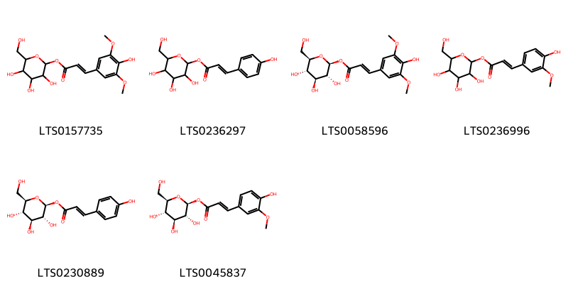{ width=100% }
    <figcaption>Hình ảnh cấu trúc hóa học của 6 hoạt chất thuộc nhóm Cinnamic acids and derivatives gồm ['3,4,5-trihydroxy-6-(hydroxymethyl)oxan-2-yl 3-(4-hydroxy-3,5-dimethoxyphenyl)prop-2-enoate (LTS0157735)', '3,4,5-trihydroxy-6-(hydroxymethyl)oxan-2-yl 3-(4-hydroxyphenyl)prop-2-enoate (LTS0236297)', '1-o-sinapoyl-β-d-glucose (LTS0058596)', '3,4,5-trihydroxy-6-(hydroxymethyl)oxan-2-yl 3-(4-hydroxy-3-methoxyphenyl)prop-2-enoate (LTS0236996)', 'p-coumaroyl-d-glucose (LTS0230889)', '1-o-feruloyl-β-d-glucose (LTS0045837)'].</figcaption>
</figure>
#### Nhóm Flavonoids
<figure markdown="span">
    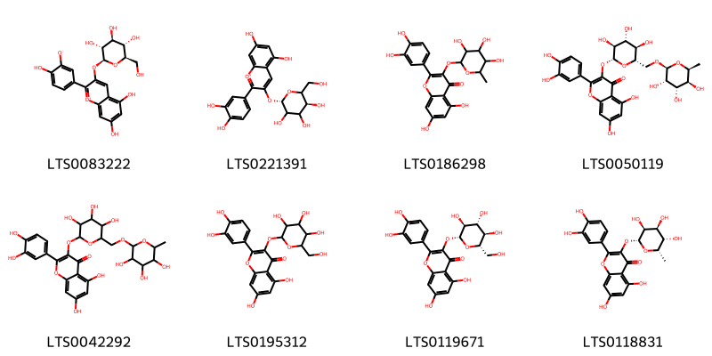{ width=100% }
    <figcaption>Hình ảnh cấu trúc hóa học của 8 hoạt chất thuộc nhóm Flavonoids gồm ['5,7-dihydroxy-2-(4-hydroxy-3-oxidophenyl)-3-{[(2s,3r,4s,5s,6r)-3,4,5-trihydroxy-6-(hydroxymethyl)oxan-2-yl]oxy}-1λ⁴-chromen-1-ylium (LTS0083222)', 'chrysanthemin (LTS0221391)', 'quercitrin (LTS0186298)', '2-(3,4-dihydroxyphenyl)-5,7-dihydroxy-3-{[(2r,3s,4r,5r,6s)-3,4,5-trihydroxy-6-({[(2s,3s,4s,5s,6s)-3,4,5-trihydroxy-6-methyloxan-2-yl]oxy}methyl)oxan-2-yl]oxy}chromen-4-one (LTS0050119)', 'rutin (LTS0042292)', '2-(3,4-dihydroxyphenyl)-5,7-dihydroxy-3-{[3,4,5-trihydroxy-6-(hydroxymethyl)oxan-2-yl]oxy}chromen-4-one (LTS0195312)', '2-(3,4-dihydroxyphenyl)-5,7-dihydroxy-3-{[(2r,3s,4r,5r,6s)-3,4,5-trihydroxy-6-(hydroxymethyl)oxan-2-yl]oxy}chromen-4-one (LTS0119671)', '2-(3,4-dihydroxyphenyl)-5,7-dihydroxy-3-{[(2r,3s,4s,5s,6s)-3,4,5-trihydroxy-6-methyloxan-2-yl]oxy}chromen-4-one (LTS0118831)'].</figcaption>
</figure>
#### Nhóm Organooxygen compounds
<figure markdown="span">
    { width=100% }
    <figcaption>Hình ảnh cấu trúc hóa học của 1 hoạt chất thuộc nhóm Organooxygen compounds gồm ['1-(1-hydroxy-6-methoxy-3-methyl-8-{[(2s,3r,4s,5s,6r)-3,4,5-trihydroxy-6-(hydroxymethyl)oxan-2-yl]oxy}naphthalen-2-yl)ethanone (LTS0035712)'].</figcaption>
</figure>
#### Nhóm Stilbenes
<figure markdown="span">
    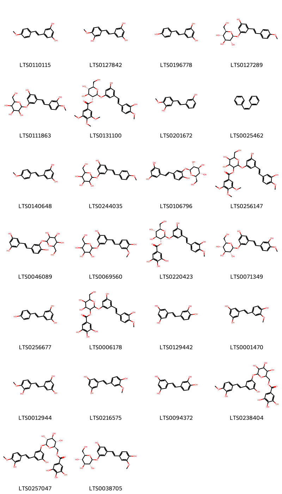{ width=100% }
    <figcaption>Hình ảnh cấu trúc hóa học của 26 hoạt chất thuộc nhóm Stilbenes gồm ['4-methoxyresveratrol (LTS0110115)', 'rhapontigenin (LTS0127842)', 'tocilizumab (LTS0196778)', '(2s,3r,4s,5s,6r)-2-{3-hydroxy-5-[(1e)-2-(4-methoxyphenyl)ethenyl]phenoxy}-6-(hydroxymethyl)oxane-3,4,5-triol (LTS0127289)', '2-{3-hydroxy-5-[2-(3-hydroxy-4-methoxyphenyl)ethenyl]phenoxy}-6-(hydroxymethyl)oxane-3,4,5-triol (LTS0111863)', '(2s,3r,4s,5s,6r)-4,5-dihydroxy-2-{3-hydroxy-5-[(1e)-2-(3-hydroxy-4-methoxyphenyl)ethenyl]phenoxy}-6-(hydroxymethyl)oxan-3-yl 3,4,5-trimethoxybenzoate (LTS0131100)', '5-[2-(3-hydroxyphenyl)ethenyl]-2-methoxyphenol (LTS0201672)', 'cis-stilbene (LTS0025462)', '4-methoxyresveratrol (LTS0140648)', '2-{3-hydroxy-5-[2-(4-methoxyphenyl)ethenyl]phenoxy}-6-(hydroxymethyl)oxane-3,4,5-triol (LTS0244035)', '(2s,3r,4s,5s,6r)-2-{5-[(1e)-2-(3,5-dihydroxyphenyl)ethenyl]-2-hydroxyphenoxy}-6-(hydroxymethyl)oxane-3,4,5-triol (LTS0106796)', '4,5-dihydroxy-2-{3-hydroxy-5-[2-(3-hydroxy-4-methoxyphenyl)ethenyl]phenoxy}-6-(hydroxymethyl)oxan-3-yl 3,4,5-trimethoxybenzoate (LTS0256147)', '2-{5-[2-(3,5-dihydroxyphenyl)ethenyl]-2-hydroxyphenoxy}-6-(hydroxymethyl)oxane-3,4,5-triol (LTS0046089)', '2-{3-hydroxy-5-[2-(4-hydroxy-3-methoxyphenyl)ethenyl]phenoxy}-6-(hydroxymethyl)oxane-3,4,5-triol (LTS0069560)', '(2s,3r,4s,5s,6r)-4,5-dihydroxy-2-{3-hydroxy-5-[(1e)-2-(3-hydroxy-4-methoxyphenyl)ethenyl]phenoxy}-6-(hydroxymethyl)oxan-3-yl 3,4,5-trihydroxybenzoate (LTS0220423)', 'rhaponticin (LTS0071349)', 'resveratrol (LTS0256677)', '4,5-dihydroxy-2-{3-hydroxy-5-[2-(3-hydroxy-4-methoxyphenyl)ethenyl]phenoxy}-6-(hydroxymethyl)oxan-3-yl 3,4,5-trihydroxybenzoate (LTS0006178)', 'piceatannol (LTS0129442)', 'isorhapontigenin (LTS0001470)', 'rhapontigenin (LTS0012944)', 'isorhapontigenin (LTS0216575)', 'piceatannol (LTS0094372)', '(3,4,5-trihydroxy-6-{3-hydroxy-5-[2-(3-hydroxy-4-methoxyphenyl)ethenyl]phenoxy}oxan-2-yl)methyl 3,4,5-trihydroxybenzoate (LTS0238404)', '[(2r,3s,4s,5r,6s)-3,4,5-trihydroxy-6-{3-hydroxy-5-[(1e)-2-(3-hydroxy-4-methoxyphenyl)ethenyl]phenoxy}oxan-2-yl]methyl 3,4,5-trihydroxybenzoate (LTS0257047)', 'isorhapontin (LTS0038705)'].</figcaption>
</figure>

---

### Dược dân tộc học

Danh sách các quốc gia có sử dụng *Rheum rhaponticum* trong điều trị các bệnh. 

| Country   | Disease   | Bệnh                                                                                                                                                                                                |
|:----------|:----------|:----------------------------------------------------------------------------------------------------------------------------------------------------------------------------------------------------|
| Elsewhere | Aperient  | MYMEMORY WARNING: YOU USED ALL AVAILABLE FREE TRANSLATIONS FOR TODAY. NEXT AVAILABLE IN  15 HOURS 41 MINUTES 46 SECONDS VISIT HTTPS://MYMEMORY.TRANSLATED.NET/DOC/USAGELIMITS.PHP TO TRANSLATE MORE |
| US        | Poison    | MYMEMORY WARNING: YOU USED ALL AVAILABLE FREE TRANSLATIONS FOR TODAY. NEXT AVAILABLE IN  15 HOURS 41 MINUTES 43 SECONDS VISIT HTTPS://MYMEMORY.TRANSLATED.NET/DOC/USAGELIMITS.PHP TO TRANSLATE MORE |

---

---
## Rheum ribes
### Thông tin về thực vật

!!! info "Phân loại thực vật của *Rheum ribes* từ GIBF:"
    - **Kingdom:** Plantae
    - **Phylum:** Tracheophyta
    - **Order:** Caryophyllales
    - **Family:** Polygonaceae
    - **Genus:** Rheum
    - **Species:** *Rheum ribes*

 

| Label (VI)   | Label (EN)   | Scientific Name   | Descriptions (VI)   | Descriptions (EN)   | Also Known As (VI)   | Also Known As (EN)   |
|:-------------|:-------------|:------------------|:--------------------|:--------------------|:---------------------|:---------------------|
| N/A          | N/A          | Rheum ribes       | loài thực vật       | species of plant    | ['']                 | ['']                 |

#### Phân bố trên thế giới

**Từ CSDL GIBF** nan, Afghanistan, Germany, Tajikistan, Norway, United States of America, Iran (Islamic Republic of), Armenia, Pakistan, Iraq, India, Türkiye, unknown or invalid, Jordan, Syrian Arab Republic, France, Lebanon, Azerbaijan

#### Phân bố tại Việt Nam

**Từ CSDL GIBF**: Không có ghi nhận ở Việt Nam

---
### Thành phần hóa học
        
- Theo cơ sở dữ liệu lotus: Từ loài *Rheum ribes* đã phân lập và xác định được 8 hoạt chất thuộc về các nhóm Anthracenes, Stilbenes. 

|    | chemicalTaxonomyClassyfireClass   |   smiles_count |
|---:|:----------------------------------|---------------:|
|  0 | Anthracenes                       |              7 |
|  1 | Stilbenes                         |              1 |

#### Nhóm Anthracenes
<figure markdown="span">
    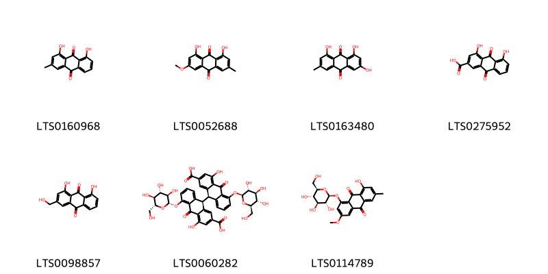{ width=100% }
    <figcaption>Hình ảnh cấu trúc hóa học của 7 hoạt chất thuộc nhóm Anthracenes gồm ['turkey rhubarb (LTS0160968)', 'physcion (LTS0052688)', 'emodin (LTS0163480)', 'monorhein (LTS0275952)', 'aloe emodin (LTS0098857)', 'sennoside a (LTS0060282)', 'physcion 8-glucoside (LTS0114789)'].</figcaption>
</figure>
#### Nhóm Stilbenes
<figure markdown="span">
    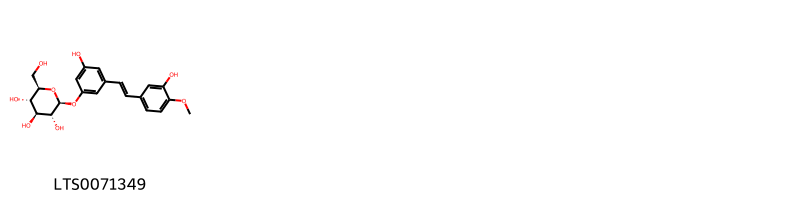{ width=100% }
    <figcaption>Hình ảnh cấu trúc hóa học của 1 hoạt chất thuộc nhóm Stilbenes gồm ['rhaponticin (LTS0071349)'].</figcaption>
</figure>

---

### Dược dân tộc học

Danh sách các quốc gia có sử dụng *Rheum ribes* trong điều trị các bệnh. 

| Country   | Disease             | Bệnh                                                                                                                                                                                                |
|:----------|:--------------------|:----------------------------------------------------------------------------------------------------------------------------------------------------------------------------------------------------|
| Iraq      | Laxative, Stomachic | MYMEMORY WARNING: YOU USED ALL AVAILABLE FREE TRANSLATIONS FOR TODAY. NEXT AVAILABLE IN  15 HOURS 41 MINUTES 04 SECONDS VISIT HTTPS://MYMEMORY.TRANSLATED.NET/DOC/USAGELIMITS.PHP TO TRANSLATE MORE |
| Kurdistan | Laxative            | MYMEMORY WARNING: YOU USED ALL AVAILABLE FREE TRANSLATIONS FOR TODAY. NEXT AVAILABLE IN  15 HOURS 41 MINUTES 01 SECONDS VISIT HTTPS://MYMEMORY.TRANSLATED.NET/DOC/USAGELIMITS.PHP TO TRANSLATE MORE |

---

---
## Rheum tanguticum
### Thông tin về thực vật

!!! info "Phân loại thực vật của *Rheum tanguticum* từ GIBF:"
    - **Kingdom:** Plantae
    - **Phylum:** Tracheophyta
    - **Order:** Caryophyllales
    - **Family:** Polygonaceae
    - **Genus:** Rheum
    - **Species:** *Rheum tanguticum*

 

| Label (VI)   | Label (EN)   | Scientific Name   | Descriptions (VI)   | Descriptions (EN)   | Also Known As (VI)   | Also Known As (EN)   |
|:-------------|:-------------|:------------------|:--------------------|:--------------------|:---------------------|:---------------------|
| N/A          | N/A          | Rheum tanguticum  | loài thực vật       | species of plant    | ['']                 | ['']                 |

#### Phân bố trên thế giới

**Từ CSDL GIBF** nan, United States of America, Korea, Republic of, Czechia, Belgium, China, Türkiye, Canada, Germany, Poland

#### Phân bố tại Việt Nam

**Từ CSDL GIBF**: Không có ghi nhận ở Việt Nam

---
### Thành phần hóa học
        
- Theo cơ sở dữ liệu lotus: Từ loài *Rheum tanguticum* đã phân lập và xác định được 10 hoạt chất thuộc về các nhóm Anthracenes, Stilbenes. 

|    | chemicalTaxonomyClassyfireClass   |   smiles_count |
|---:|:----------------------------------|---------------:|
|  0 | Anthracenes                       |              7 |
|  1 | Stilbenes                         |              3 |

#### Nhóm Anthracenes
<figure markdown="span">
    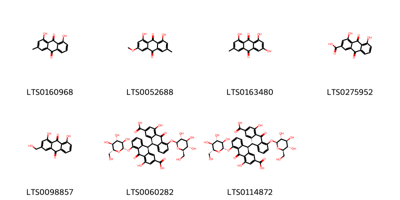{ width=100% }
    <figcaption>Hình ảnh cấu trúc hóa học của 7 hoạt chất thuộc nhóm Anthracenes gồm ['turkey rhubarb (LTS0160968)', 'physcion (LTS0052688)', 'emodin (LTS0163480)', 'monorhein (LTS0275952)', 'aloe emodin (LTS0098857)', 'sennoside a (LTS0060282)', 'sennoside b (LTS0114872)'].</figcaption>
</figure>
#### Nhóm Stilbenes
<figure markdown="span">
    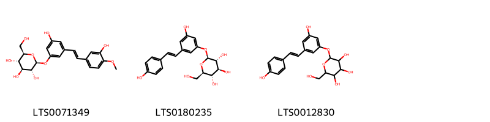{ width=100% }
    <figcaption>Hình ảnh cấu trúc hóa học của 3 hoạt chất thuộc nhóm Stilbenes gồm ['rhaponticin (LTS0071349)', 'piceid (LTS0180235)', '2-{3-hydroxy-5-[2-(4-hydroxyphenyl)ethenyl]phenoxy}-6-(hydroxymethyl)oxane-3,4,5-triol (LTS0012830)'].</figcaption>
</figure>

---

### Dược dân tộc học

Danh sách các quốc gia có sử dụng *Rheum tanguticum* trong điều trị các bệnh. 

| Country   | Disease             | Bệnh                                                                                                                                                                                                |
|:----------|:--------------------|:----------------------------------------------------------------------------------------------------------------------------------------------------------------------------------------------------|
| China     | Laxative            | MYMEMORY WARNING: YOU USED ALL AVAILABLE FREE TRANSLATIONS FOR TODAY. NEXT AVAILABLE IN  15 HOURS 40 MINUTES 32 SECONDS VISIT HTTPS://MYMEMORY.TRANSLATED.NET/DOC/USAGELIMITS.PHP TO TRANSLATE MORE |
| Japan*    | Aperient, Stomachic | MYMEMORY WARNING: YOU USED ALL AVAILABLE FREE TRANSLATIONS FOR TODAY. NEXT AVAILABLE IN  15 HOURS 40 MINUTES 28 SECONDS VISIT HTTPS://MYMEMORY.TRANSLATED.NET/DOC/USAGELIMITS.PHP TO TRANSLATE MORE |

---

---
## Rheum undulatum
### Thông tin về thực vật

!!! info "Phân loại thực vật của *N/A* từ GIBF:"
    - **Kingdom:** Plantae
    - **Phylum:** Tracheophyta
    - **Order:** Caryophyllales
    - **Family:** Polygonaceae
    - **Genus:** Rheum
    - **Species:** *N/A*

 

| Label (VI)   | Label (EN)   | Scientific Name   | Descriptions (VI)   | Descriptions (EN)   | Also Known As (VI)   | Also Known As (EN)   |
|:-------------|:-------------|:------------------|:--------------------|:--------------------|:---------------------|:---------------------|
| N/A          | N/A          | Rheum undulatum   | loài thực vật       | species of plant    | ['']                 | ['']                 |

#### Phân bố trên thế giới

**Từ CSDL GIBF** Mongolia, Uzbekistan, Sweden, Finland, China, Israel, Kazakhstan, New Zealand, Türkiye, Ecuador, Denmark, Netherlands, Poland, United States of America, Armenia, Russian Federation, Estonia, Belarus, Norway, Belgium, Iraq, Canada, Germany, Austria, Kyrgyzstan, Switzerland, United Kingdom of Great Britain and Northern Ireland

#### Phân bố tại Việt Nam

**Từ CSDL GIBF**: Không có ghi nhận ở Việt Nam

---
### Thành phần hóa học
        
- Theo cơ sở dữ liệu lotus: Từ loài *N/A* đã phân lập và xác định được 34 hoạt chất thuộc về các nhóm Anthracenes, Organooxygen compounds, Stilbenes. 

|    | chemicalTaxonomyClassyfireClass   |   smiles_count |
|---:|:----------------------------------|---------------:|
|  0 | Anthracenes                       |              7 |
|  1 | Organooxygen compounds            |              1 |
|  2 | Stilbenes                         |             26 |

#### Nhóm Anthracenes
<figure markdown="span">
    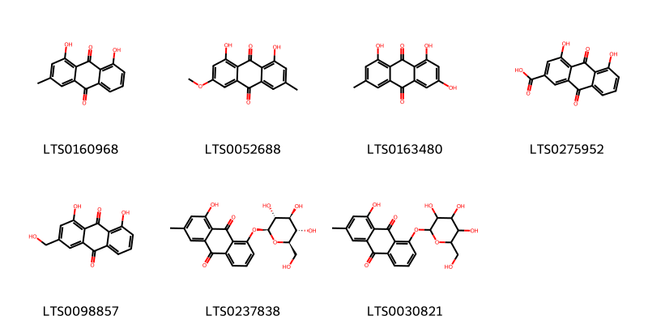{ width=100% }
    <figcaption>Hình ảnh cấu trúc hóa học của 7 hoạt chất thuộc nhóm Anthracenes gồm ['turkey rhubarb (LTS0160968)', 'physcion (LTS0052688)', 'emodin (LTS0163480)', 'monorhein (LTS0275952)', 'aloe emodin (LTS0098857)', 'pulmatin (LTS0237838)', '1-hydroxy-3-methyl-8-{[3,4,5-trihydroxy-6-(hydroxymethyl)oxan-2-yl]oxy}anthracene-9,10-dione (LTS0030821)'].</figcaption>
</figure>
#### Nhóm Organooxygen compounds
<figure markdown="span">
    { width=100% }
    <figcaption>Hình ảnh cấu trúc hóa học của 1 hoạt chất thuộc nhóm Organooxygen compounds gồm ['1-(1-hydroxy-6-methoxy-3-methyl-8-{[(2s,3r,4s,5s,6r)-3,4,5-trihydroxy-6-(hydroxymethyl)oxan-2-yl]oxy}naphthalen-2-yl)ethanone (LTS0035712)'].</figcaption>
</figure>
#### Nhóm Stilbenes
<figure markdown="span">
    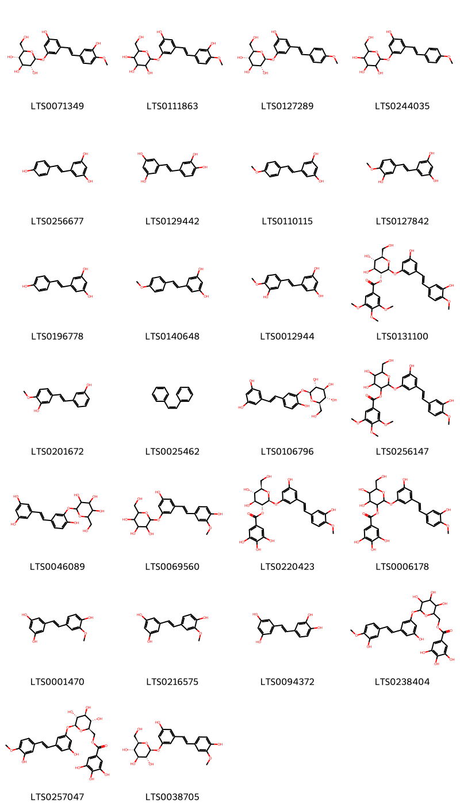{ width=100% }
    <figcaption>Hình ảnh cấu trúc hóa học của 26 hoạt chất thuộc nhóm Stilbenes gồm ['rhaponticin (LTS0071349)', '2-{3-hydroxy-5-[2-(3-hydroxy-4-methoxyphenyl)ethenyl]phenoxy}-6-(hydroxymethyl)oxane-3,4,5-triol (LTS0111863)', '(2s,3r,4s,5s,6r)-2-{3-hydroxy-5-[(1e)-2-(4-methoxyphenyl)ethenyl]phenoxy}-6-(hydroxymethyl)oxane-3,4,5-triol (LTS0127289)', '2-{3-hydroxy-5-[2-(4-methoxyphenyl)ethenyl]phenoxy}-6-(hydroxymethyl)oxane-3,4,5-triol (LTS0244035)', 'resveratrol (LTS0256677)', 'piceatannol (LTS0129442)', '4-methoxyresveratrol (LTS0110115)', 'rhapontigenin (LTS0127842)', 'tocilizumab (LTS0196778)', '4-methoxyresveratrol (LTS0140648)', 'rhapontigenin (LTS0012944)', '(2s,3r,4s,5s,6r)-4,5-dihydroxy-2-{3-hydroxy-5-[(1e)-2-(3-hydroxy-4-methoxyphenyl)ethenyl]phenoxy}-6-(hydroxymethyl)oxan-3-yl 3,4,5-trimethoxybenzoate (LTS0131100)', '5-[2-(3-hydroxyphenyl)ethenyl]-2-methoxyphenol (LTS0201672)', 'cis-stilbene (LTS0025462)', '(2s,3r,4s,5s,6r)-2-{5-[(1e)-2-(3,5-dihydroxyphenyl)ethenyl]-2-hydroxyphenoxy}-6-(hydroxymethyl)oxane-3,4,5-triol (LTS0106796)', '4,5-dihydroxy-2-{3-hydroxy-5-[2-(3-hydroxy-4-methoxyphenyl)ethenyl]phenoxy}-6-(hydroxymethyl)oxan-3-yl 3,4,5-trimethoxybenzoate (LTS0256147)', '2-{5-[2-(3,5-dihydroxyphenyl)ethenyl]-2-hydroxyphenoxy}-6-(hydroxymethyl)oxane-3,4,5-triol (LTS0046089)', '2-{3-hydroxy-5-[2-(4-hydroxy-3-methoxyphenyl)ethenyl]phenoxy}-6-(hydroxymethyl)oxane-3,4,5-triol (LTS0069560)', '(2s,3r,4s,5s,6r)-4,5-dihydroxy-2-{3-hydroxy-5-[(1e)-2-(3-hydroxy-4-methoxyphenyl)ethenyl]phenoxy}-6-(hydroxymethyl)oxan-3-yl 3,4,5-trihydroxybenzoate (LTS0220423)', '4,5-dihydroxy-2-{3-hydroxy-5-[2-(3-hydroxy-4-methoxyphenyl)ethenyl]phenoxy}-6-(hydroxymethyl)oxan-3-yl 3,4,5-trihydroxybenzoate (LTS0006178)', 'isorhapontigenin (LTS0001470)', 'isorhapontigenin (LTS0216575)', 'piceatannol (LTS0094372)', '(3,4,5-trihydroxy-6-{3-hydroxy-5-[2-(3-hydroxy-4-methoxyphenyl)ethenyl]phenoxy}oxan-2-yl)methyl 3,4,5-trihydroxybenzoate (LTS0238404)', '[(2r,3s,4s,5r,6s)-3,4,5-trihydroxy-6-{3-hydroxy-5-[(1e)-2-(3-hydroxy-4-methoxyphenyl)ethenyl]phenoxy}oxan-2-yl]methyl 3,4,5-trihydroxybenzoate (LTS0257047)', 'isorhapontin (LTS0038705)'].</figcaption>
</figure>

---

### Dược dân tộc học

Danh sách các quốc gia có sử dụng *N/A* trong điều trị các bệnh. 

| Country   | Disease   | Bệnh                                                                                                                                                                                                |
|:----------|:----------|:----------------------------------------------------------------------------------------------------------------------------------------------------------------------------------------------------|
| Elsewhere | Aperient  | MYMEMORY WARNING: YOU USED ALL AVAILABLE FREE TRANSLATIONS FOR TODAY. NEXT AVAILABLE IN  15 HOURS 39 MINUTES 56 SECONDS VISIT HTTPS://MYMEMORY.TRANSLATED.NET/DOC/USAGELIMITS.PHP TO TRANSLATE MORE |

---

---
## Rheum webbianum
### Thông tin về thực vật

!!! info "Phân loại thực vật của *Rheum webbianum* từ GIBF:"
    - **Kingdom:** Plantae
    - **Phylum:** Tracheophyta
    - **Order:** Caryophyllales
    - **Family:** Polygonaceae
    - **Genus:** Rheum
    - **Species:** *Rheum webbianum*

 

| Label (VI)   | Label (EN)   | Scientific Name   | Descriptions (VI)   | Descriptions (EN)   | Also Known As (VI)   | Also Known As (EN)   |
|:-------------|:-------------|:------------------|:--------------------|:--------------------|:---------------------|:---------------------|
| N/A          | N/A          | Rheum webbianum   | loài thực vật       | species of plant    | ['']                 | ['']                 |

#### Phân bố trên thế giới

**Từ CSDL GIBF** nan, Czechia, Sweden, Finland, Nepal, China, Spain, Denmark, United States of America, Pakistan, Norway, France, Belgium, Germany, Austria, Hungary, Italy, India, Switzerland, Bulgaria, United Kingdom of Great Britain and Northern Ireland

#### Phân bố tại Việt Nam

**Từ CSDL GIBF**: Không có ghi nhận ở Việt Nam

---
### Thành phần hóa học
        
- Theo cơ sở dữ liệu lotus: Từ loài *Rheum webbianum* đã phân lập và xác định được Chưa có hoạt chất nào được phân lập. hoạt chất thuộc về các nhóm Không có hoạt chất nào được phân lập. 

Không có hình ảnh nào được tạo ra

---

### Dược dân tộc học

Danh sách các quốc gia có sử dụng *Rheum webbianum* trong điều trị các bệnh. 

| Country   | Disease   | Bệnh                                                                                                                                                                                                |
|:----------|:----------|:----------------------------------------------------------------------------------------------------------------------------------------------------------------------------------------------------|
| India     | Purgative | MYMEMORY WARNING: YOU USED ALL AVAILABLE FREE TRANSLATIONS FOR TODAY. NEXT AVAILABLE IN  15 HOURS 39 MINUTES 15 SECONDS VISIT HTTPS://MYMEMORY.TRANSLATED.NET/DOC/USAGELIMITS.PHP TO TRANSLATE MORE |

---

# Chi Rumex

??? note "Danh sách các dược liệu thuộc chi"
    
	 - *Rumex acetosa*
	 - *Rumex acetosella*
	 - *Rumex acutus*
	 - *Rumex alpinus*
	 - *Rumex aquaticus*
	 - *Rumex brasiliensis*
	 - *Rumex crius*
	 - *Rumex daiwoo*
	 - *Rumex dentatus*
	 - *Rumex ecklonianus*
	 - *Rumex hymenosepalus*
	 - *Rumex japonicus*
	 - *Rumex maritimus*
	 - *Rumex nepalensis*
	 - *Rumex obtusifolius*
	 - *Rumex patientia*
	 - *Rumex sanguineus*
	 - *Rumex scutatus*
	 - *Rumex vesicarius*
	 - *Rumex violascens*

---
## Rumex acetosa
### Thông tin về thực vật

!!! info "Phân loại thực vật của *Rumex acetosa* từ GIBF:"
    - **Kingdom:** Plantae
    - **Phylum:** Tracheophyta
    - **Order:** Caryophyllales
    - **Family:** Polygonaceae
    - **Genus:** Rumex
    - **Species:** *Rumex acetosa*

 

| Label (VI)   | Label (EN)   | Scientific Name   | Descriptions (VI)   | Descriptions (EN)   | Also Known As (VI)   | Also Known As (EN)                           |
|:-------------|:-------------|:------------------|:--------------------|:--------------------|:---------------------|:---------------------------------------------|
| N/A          | N/A          | Rumex acetosa     | loài thực vật       | species of plant    | ['Rumex acetosa']    | ['Sorrel', 'common sorrel', 'garden sorrel'] |

#### Phân bố trên thế giới

**Từ CSDL GIBF** Ireland, Austria, Sweden, France, Netherlands, Belgium, Italy, Switzerland, Germany, United Kingdom of Great Britain and Northern Ireland, Spain, Denmark

#### Phân bố tại Việt Nam

**Từ CSDL GIBF**: Không có ghi nhận ở Việt Nam

---
### Thành phần hóa học
        
- Theo cơ sở dữ liệu lotus: Từ loài *Rumex acetosa* đã phân lập và xác định được 78 hoạt chất thuộc về các nhóm Tannins, Anthracenes, Flavonoids. 

|    | chemicalTaxonomyClassyfireClass   |   smiles_count |
|---:|:----------------------------------|---------------:|
|  0 | Anthracenes                       |              8 |
|  1 | Flavonoids                        |             68 |
|  2 | Tannins                           |              2 |

#### Nhóm Anthracenes
<figure markdown="span">
    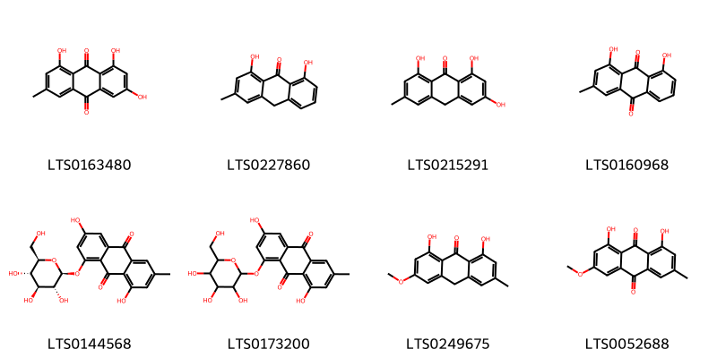{ width=100% }
    <figcaption>Hình ảnh cấu trúc hóa học của 8 hoạt chất thuộc nhóm Anthracenes gồm ['emodin (LTS0163480)', 'chrysarobin (LTS0227860)', 'emodin-9-anthrone (LTS0215291)', 'turkey rhubarb (LTS0160968)', 'emodin 8-glucoside (LTS0144568)', '1,6-dihydroxy-3-methyl-8-{[3,4,5-trihydroxy-6-(hydroxymethyl)oxan-2-yl]oxy}anthracene-9,10-dione (LTS0173200)', '1,8-dihydroxy-3-methoxy-6-methyl-10h-anthracen-9-one (LTS0249675)', 'physcion (LTS0052688)'].</figcaption>
</figure>
#### Nhóm Flavonoids
<figure markdown="span">
    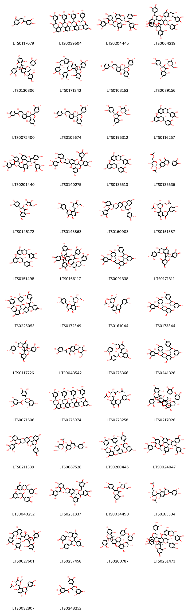{ width=100% }
    <figcaption>Hình ảnh cấu trúc hóa học của 68 hoạt chất thuộc nhóm Flavonoids gồm ['(+)-catechol (LTS0117079)', '2-(3,4-dihydroxyphenyl)-8-[2-(3,4-dihydroxyphenyl)-3,5,7-trihydroxy-3,4-dihydro-2h-1-benzopyran-4-yl]-4-[2-(3,4-dihydroxyphenyl)-4-[2-(3,4-dihydroxyphenyl)-3,5,7-trihydroxy-3,4-dihydro-2h-1-benzopyran-8-yl]-3,5,7-trihydroxy-3,4-dihydro-2h-1-benzopyran-8-yl]-3,4-dihydro-2h-1-benzopyran-3,5,7-triol (LTS0039604)', '(2r,3r,4r)-4-[(2r,3r)-2-(3,4-dihydroxyphenyl)-5,7-dihydroxy-3-(3,4,5-trihydroxybenzoyloxy)-3,4-dihydro-2h-1-benzopyran-8-yl]-5,7-dihydroxy-2-(4-hydroxyphenyl)-3,4-dihydro-2h-1-benzopyran-3-yl 3,4,5-trihydroxybenzoate (LTS0204445)', '5,13-bis(3,4-dihydroxyphenyl)-10-[2-(3,4-dihydroxyphenyl)-3,5,7-trihydroxy-3,4-dihydro-2h-1-benzopyran-4-yl]-7-[2-(3,4-dihydroxyphenyl)-3,5,7-trihydroxy-3,4-dihydro-2h-1-benzopyran-8-yl]-4,12,14-trioxapentacyclo[11.7.1.0²,¹¹.0³,⁸.0¹⁵,²⁰]henicosa-2(11),3(8),9,15,17,19-hexaene-6,9,17,19,21-pentol (LTS0064219)', '(1r,5r,6r,7s,13s,21r)-5,13-bis(3,4-dihydroxyphenyl)-7-(2,4,6-trihydroxyphenyl)-4,12,14-trioxapentacyclo[11.7.1.0²,¹¹.0³,⁸.0¹⁵,²⁰]henicosa-2,8,10,15,17,19-hexaene-6,9,17,19,21-pentol (LTS0130806)', '(1r,5r,6r,7r,13s,21r)-5,13-bis(3,4-dihydroxyphenyl)-7-[(2r,3r)-2-(3,4-dihydroxyphenyl)-3,5,7-trihydroxy-3,4-dihydro-2h-1-benzopyran-8-yl]-4,12,14-trioxapentacyclo[11.7.1.0²,¹¹.0³,⁸.0¹⁵,²⁰]henicosa-2,8,10,15,17,19-hexaene-6,9,17,19,21-pentol (LTS0171342)', '(2r,3r,4s)-2-(3,4-dihydroxyphenyl)-4-[(2r,3r)-2-(3,4-dihydroxyphenyl)-3,5,7-trihydroxy-3,4-dihydro-2h-1-benzopyran-6-yl]-3,4-dihydro-2h-1-benzopyran-3,5,7-triol (LTS0103163)', 'hyperoside (LTS0089156)', '2-(3,4-dihydroxyphenyl)-4-[2-(3,4-dihydroxyphenyl)-3,5,7-trihydroxy-3,4-dihydro-2h-1-benzopyran-6-yl]-3,4-dihydro-2h-1-benzopyran-3,5,7-triol (LTS0072400)', '(2r,3r,4s)-2-(3,4-dihydroxyphenyl)-4-[(2r,3s)-2-(3,4-dihydroxyphenyl)-3,5,7-trihydroxy-3,4-dihydro-2h-1-benzopyran-6-yl]-3,4-dihydro-2h-1-benzopyran-3,5,7-triol (LTS0105674)', '2-(3,4-dihydroxyphenyl)-5,7-dihydroxy-3-{[3,4,5-trihydroxy-6-(hydroxymethyl)oxan-2-yl]oxy}chromen-4-one (LTS0195312)', '(2r,3s,4s)-2-(3,4-dihydroxyphenyl)-4-[(2r,3r)-2-(3,4-dihydroxyphenyl)-3,5,7-trihydroxy-3,4-dihydro-2h-1-benzopyran-8-yl]-3,4-dihydro-2h-1-benzopyran-3,5,7-triol (LTS0116257)', '4-[2-(3,4-dihydroxyphenyl)-5,7-dihydroxy-3-(3,4,5-trihydroxybenzoyloxy)-3,4-dihydro-2h-1-benzopyran-8-yl]-5,7-dihydroxy-2-(4-hydroxyphenyl)-3,4-dihydro-2h-1-benzopyran-3-yl 3,4,5-trihydroxybenzoate (LTS0201440)', '2-(3,4-dihydroxyphenyl)-4-[2-(3,4-dihydroxyphenyl)-5,7-dihydroxy-3-(3,4,5-trihydroxybenzoyloxy)-3,4-dihydro-2h-1-benzopyran-6-yl]-5,7-dihydroxy-3,4-dihydro-2h-1-benzopyran-3-yl 3,4,5-trihydroxybenzoate (LTS0140275)', '(2r,3r,4r)-2-(3,4-dihydroxyphenyl)-4-[(2r,3r)-2-(3,4-dihydroxyphenyl)-3,5,7-trihydroxy-3,4-dihydro-2h-1-benzopyran-8-yl]-3,4-dihydro-2h-1-benzopyran-3,5,7-triol (LTS0135510)', '[(2r,3s,4s,5s,6s)-5-(acetyloxy)-6-[2-(3,4-dihydroxyphenyl)-5,7-dihydroxy-4-oxochromen-6-yl]-3,4-dihydroxyoxan-2-yl]methyl acetate (LTS0135536)', '3-{[3,4-dihydroxy-5-(hydroxymethyl)oxolan-2-yl]oxy}-2-(3,4-dihydroxyphenyl)-5,7-dihydroxychromen-4-one (LTS0145172)', 'orientin (LTS0143863)', '(2r,3r)-2-(3,4-dihydroxyphenyl)-6-[(2r,3r,4s)-2-(3,4-dihydroxyphenyl)-3,5,7-trihydroxy-3,4-dihydro-2h-1-benzopyran-4-yl]-5,7-dihydroxy-3,4-dihydro-2h-1-benzopyran-3-yl 3,4,5-trihydroxybenzoate (LTS0160903)', '[(2s,3s,4s,5r,6s)-5-(acetyloxy)-6-[2-(3,4-dihydroxyphenyl)-5,7-dihydroxy-4-oxochromen-8-yl]-3,4-dihydroxyoxan-2-yl]methyl acetate (LTS0151387)', '(2r,3s,4s)-2-(3,4-dihydroxyphenyl)-4-[(2r,3s)-2-(3,4-dihydroxyphenyl)-3,5,7-trihydroxy-3,4-dihydro-2h-1-benzopyran-8-yl]-3,4-dihydro-2h-1-benzopyran-3,5,7-triol (LTS0151498)', '5,13-bis(3,4-dihydroxyphenyl)-7-[2-(3,4-dihydroxyphenyl)-3,5,7-trihydroxy-3,4-dihydro-2h-1-benzopyran-8-yl]-6,9,17,19-tetrahydroxy-4,12,14-trioxapentacyclo[11.7.1.0²,¹¹.0³,⁸.0¹⁵,²⁰]henicosa-2,8,10,15,17,19-hexaen-21-yl 3,4,5-trihydroxybenzoate (LTS0166117)', '2-(3,4-dihydroxyphenyl)-8-[2-(3,4-dihydroxyphenyl)-3,5,7-trihydroxy-3,4-dihydro-2h-1-benzopyran-4-yl]-5,7-dihydroxy-3,4-dihydro-2h-1-benzopyran-3-yl 3,4,5-trihydroxybenzoate (LTS0091338)', 'procyanidin a1 (LTS0171311)', 'procyanidin c2 (LTS0226053)', 'orientin (LTS0172349)', '(2s,3r,4s,5s,6r)-2-[2-(3,4-dihydroxyphenyl)-5,7-dihydroxy-4-oxochromen-8-yl]-4,5-dihydroxy-6-(hydroxymethyl)oxan-3-yl acetate (LTS0161044)', "procyanidin b2 3'-o-gallate (LTS0173344)", 'proanthocyanidin a2 (LTS0117726)', 'isoorientin (LTS0043542)', '(2r,3r,4r)-4-[(2r,3r)-2-(3,4-dihydroxyphenyl)-3,5,7-trihydroxy-3,4-dihydro-2h-1-benzopyran-8-yl]-2-(4-hydroxyphenyl)-3,4-dihydro-2h-1-benzopyran-3,5,7-triol (LTS0276366)', '2-(3,4-dihydroxyphenyl)-5,7-dihydroxy-8-[3,5,7-trihydroxy-2-(4-hydroxyphenyl)-3,4-dihydro-2h-1-benzopyran-4-yl]-3,4-dihydro-2h-1-benzopyran-3-yl 3,4,5-trihydroxybenzoate (LTS0241328)', 'epicatechin gallate (LTS0071606)', '(2r,3r,4r)-2-(3,4-dihydroxyphenyl)-8-[(2r,3r,4r)-2-(3,4-dihydroxyphenyl)-3,5,7-trihydroxy-3,4-dihydro-2h-1-benzopyran-4-yl]-4-[(2r,3r,4s)-2-(3,4-dihydroxyphenyl)-4-[(2r,3r)-2-(3,4-dihydroxyphenyl)-3,5,7-trihydroxy-3,4-dihydro-2h-1-benzopyran-8-yl]-3,5,7-trihydroxy-3,4-dihydro-2h-1-benzopyran-8-yl]-3,4-dihydro-2h-1-benzopyran-3,5,7-triol (LTS0275974)', '[5-(acetyloxy)-6-[2-(3,4-dihydroxyphenyl)-5,7-dihydroxy-4-oxochromen-8-yl]-3,4-dihydroxyoxan-2-yl]methyl acetate (LTS0273258)', '(1r,5r,6r,7r,13s,21r)-5,13-bis(3,4-dihydroxyphenyl)-7-[(2r,3r)-2-(3,4-dihydroxyphenyl)-3,5,7-trihydroxy-3,4-dihydro-2h-1-benzopyran-8-yl]-6,9,17,19-tetrahydroxy-4,12,14-trioxapentacyclo[11.7.1.0²,¹¹.0³,⁸.0¹⁵,²⁰]henicosa-2,8,10,15,17,19-hexaen-21-yl 3,4,5-trihydroxybenzoate (LTS0217026)', '2-(3,4-dihydroxyphenyl)-5,7-dihydroxy-6-[3,5,7-trihydroxy-2-(4-hydroxyphenyl)-3,4-dihydro-2h-1-benzopyran-4-yl]-3,4-dihydro-2h-1-benzopyran-3-yl 3,4,5-trihydroxybenzoate (LTS0211339)', '(2s,3r,4s,5s,6r)-2-[2-(3,4-dihydroxyphenyl)-5,7-dihydroxy-4-oxochromen-6-yl]-4,5-dihydroxy-6-(hydroxymethyl)oxan-3-yl acetate (LTS0087528)', 'procyanidin c1 (LTS0260445)', '2-(3,4-dihydroxyphenyl)-4-[2-(3,4-dihydroxyphenyl)-5,7-dihydroxy-3-(3,4,5-trihydroxybenzoyloxy)-3,4-dihydro-2h-1-benzopyran-8-yl]-5,7-dihydroxy-3,4-dihydro-2h-1-benzopyran-3-yl 3,4,5-trihydroxybenzoate (LTS0024047)', '2-(3,4-dihydroxyphenyl)-4-[2-(3,4-dihydroxyphenyl)-3,5,7-trihydroxy-3,4-dihydro-2h-1-benzopyran-8-yl]-3,4-dihydro-2h-1-benzopyran-3,5,7-triol (LTS0040252)', '(2r,3r,4s)-2-(3,4-dihydroxyphenyl)-4-[(2r,3r)-2-(3,4-dihydroxyphenyl)-5,7-dihydroxy-3-(3,4,5-trihydroxybenzoyloxy)-3,4-dihydro-2h-1-benzopyran-6-yl]-5,7-dihydroxy-3,4-dihydro-2h-1-benzopyran-3-yl 3,4,5-trihydroxybenzoate (LTS0231837)', 'avicularin (LTS0034490)', '[5-(acetyloxy)-6-[2-(3,4-dihydroxyphenyl)-5,7-dihydroxy-4-oxochromen-6-yl]-3,4-dihydroxyoxan-2-yl]methyl acetate (LTS0165504)', '5,13-bis(3,4-dihydroxyphenyl)-7-[2-(3,4-dihydroxyphenyl)-3,5,7-trihydroxy-3,4-dihydro-2h-1-benzopyran-8-yl]-4,12,14-trioxapentacyclo[11.7.1.0²,¹¹.0³,⁸.0¹⁵,²⁰]henicosa-2,8,10,15,17,19-hexaene-6,9,17,19,21-pentol (LTS0027601)', '4-[2-(3,4-dihydroxyphenyl)-3,5,7-trihydroxy-3,4-dihydro-2h-1-benzopyran-8-yl]-2-(4-hydroxyphenyl)-3,4-dihydro-2h-1-benzopyran-3,5,7-triol (LTS0237458)', '(1r,5r,6r,7s,13s,21r)-13-(3,4-dihydroxyphenyl)-7-[(2r,3r)-2-(3,4-dihydroxyphenyl)-3,5,7-trihydroxy-3,4-dihydro-2h-1-benzopyran-8-yl]-5-(4-hydroxyphenyl)-4,12,14-trioxapentacyclo[11.7.1.0²,¹¹.0³,⁸.0¹⁵,²⁰]henicosa-2(11),3(8),9,15,17,19-hexaene-6,9,17,19,21-pentol (LTS0200787)', 'parameritannin a-1 (LTS0251473)', '2-[2-(3,4-dihydroxyphenyl)-5,7-dihydroxy-4-oxochromen-8-yl]-4,5-dihydroxy-6-(hydroxymethyl)oxan-3-yl acetate (LTS0032807)', '2-(3,4-dihydroxyphenyl)-5,7-dihydroxy-3,4-dihydro-2h-1-benzopyran-3-yl 3,4,5-trihydroxybenzoate (LTS0248252)', '[(2r,3s,4s,5r,6s)-5-(acetyloxy)-6-[2-(3,4-dihydroxyphenyl)-5,7-dihydroxy-4-oxochromen-6-yl]-3,4-dihydroxyoxan-2-yl]methyl acetate (LTS0057914)', '2-(3,4-dihydroxyphenyl)-4-[2-(3,4-dihydroxyphenyl)-3,5,7-trihydroxy-3,4-dihydro-2h-1-benzopyran-8-yl]-8-[3,5,7-trihydroxy-2-(4-hydroxyphenyl)-3,4-dihydro-2h-1-benzopyran-4-yl]-3,4-dihydro-2h-1-benzopyran-3,5,7-triol (LTS0265492)', '[(2r,3s,4s,5r,6s)-5-(acetyloxy)-6-[2-(3,4-dihydroxyphenyl)-5,7-dihydroxy-4-oxochromen-8-yl]-3,4-dihydroxyoxan-2-yl]methyl acetate (LTS0008706)', '(2r,3r,4r)-2-(3,4-dihydroxyphenyl)-4-[(2r,3s)-2-(3,4-dihydroxyphenyl)-3,5,7-trihydroxy-3,4-dihydro-2h-1-benzopyran-8-yl]-3,4-dihydro-2h-1-benzopyran-3,5,7-triol (LTS0066122)', '2-(3,4-dihydroxyphenyl)-6-[2-(3,4-dihydroxyphenyl)-3,5,7-trihydroxy-3,4-dihydro-2h-1-benzopyran-4-yl]-5,7-dihydroxy-3,4-dihydro-2h-1-benzopyran-3-yl 3,4,5-trihydroxybenzoate (LTS0268084)', '2-(3,4-dihydroxyphenyl)-4-[2-(3,4-dihydroxyphenyl)-4-[2-(3,4-dihydroxyphenyl)-5,7-dihydroxy-3-(3,4,5-trihydroxybenzoyloxy)-3,4-dihydro-2h-1-benzopyran-8-yl]-5,7-dihydroxy-3-(3,4,5-trihydroxybenzoyloxy)-3,4-dihydro-2h-1-benzopyran-8-yl]-5,7-dihydroxy-3,4-dihydro-2h-1-benzopyran-3-yl 3,4,5-trihydroxybenzoate (LTS0033389)', 'isoorientin (LTS0061958)', '(2r,3r)-2-(3,4-dihydroxyphenyl)-5,7-dihydroxy-6-[(2r,3r,4s)-3,5,7-trihydroxy-2-(4-hydroxyphenyl)-3,4-dihydro-2h-1-benzopyran-4-yl]-3,4-dihydro-2h-1-benzopyran-3-yl 3,4,5-trihydroxybenzoate (LTS0210305)', '(2r,3r,4s)-2-(3,4-dihydroxyphenyl)-8-[(2r,3r,4r)-2-(3,4-dihydroxyphenyl)-3,5,7-trihydroxy-3,4-dihydro-2h-1-benzopyran-4-yl]-4-[(2r,3s)-2-(3,4-dihydroxyphenyl)-3,5,7-trihydroxy-3,4-dihydro-2h-1-benzopyran-8-yl]-3,4-dihydro-2h-1-benzopyran-3,5,7-triol (LTS0027230)', '13-(3,4-dihydroxyphenyl)-7-[2-(3,4-dihydroxyphenyl)-3,5,7-trihydroxy-3,4-dihydro-2h-1-benzopyran-8-yl]-5-(4-hydroxyphenyl)-4,12,14-trioxapentacyclo[11.7.1.0²,¹¹.0³,⁸.0¹⁵,²⁰]henicosa-2(11),3(8),9,15,17,19-hexaene-6,9,17,19,21-pentol (LTS0236823)', 'catechol (LTS0090912)', '5,13-bis(3,4-dihydroxyphenyl)-7-(2,4,6-trihydroxyphenyl)-4,12,14-trioxapentacyclo[11.7.1.0²,¹¹.0³,⁸.0¹⁵,²⁰]henicosa-2,8,10,15,17,19-hexaene-6,9,17,19,21-pentol (LTS0017415)', '(2r,3r,4s)-2-(3,4-dihydroxyphenyl)-4-[(2r,3r)-2-(3,4-dihydroxyphenyl)-3,5,7-trihydroxy-3,4-dihydro-2h-1-benzopyran-8-yl]-8-[(2r,3r,4r)-3,5,7-trihydroxy-2-(4-hydroxyphenyl)-3,4-dihydro-2h-1-benzopyran-4-yl]-3,4-dihydro-2h-1-benzopyran-3,5,7-triol (LTS0103470)', '2-[2-(3,4-dihydroxyphenyl)-5,7-dihydroxy-4-oxochromen-6-yl]-4,5-dihydroxy-6-(hydroxymethyl)oxan-3-yl acetate (LTS0051212)', '(2r,3r,4r)-2-(3,4-dihydroxyphenyl)-4-[(2r,3r)-2-(3,4-dihydroxyphenyl)-5,7-dihydroxy-3-(3,4,5-trihydroxybenzoyloxy)-3,4-dihydro-2h-1-benzopyran-8-yl]-5,7-dihydroxy-3,4-dihydro-2h-1-benzopyran-3-yl 3,4,5-trihydroxybenzoate (LTS0018124)', '(2r,3r,4r)-2-(3,4-dihydroxyphenyl)-4-[(2r,3r,4s)-2-(3,4-dihydroxyphenyl)-4-[(2r,3r)-2-(3,4-dihydroxyphenyl)-5,7-dihydroxy-3-(3,4,5-trihydroxybenzoyloxy)-3,4-dihydro-2h-1-benzopyran-8-yl]-5,7-dihydroxy-3-(3,4,5-trihydroxybenzoyloxy)-3,4-dihydro-2h-1-benzopyran-8-yl]-5,7-dihydroxy-3,4-dihydro-2h-1-benzopyran-3-yl 3,4,5-trihydroxybenzoate (LTS0051143)', 'ent-epicatechin (LTS0265245)', '(2r,3r)-2-(3,4-dihydroxyphenyl)-5,7-dihydroxy-8-[(2r,3r,4r)-3,5,7-trihydroxy-2-(4-hydroxyphenyl)-3,4-dihydro-2h-1-benzopyran-4-yl]-3,4-dihydro-2h-1-benzopyran-3-yl 3,4,5-trihydroxybenzoate (LTS0258576)'].</figcaption>
</figure>
#### Nhóm Tannins
<figure markdown="span">
    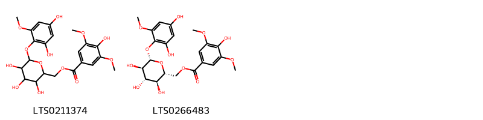{ width=100% }
    <figcaption>Hình ảnh cấu trúc hóa học của 2 hoạt chất thuộc nhóm Tannins gồm ['[6-(2,4-dihydroxy-6-methoxyphenoxy)-3,4,5-trihydroxyoxan-2-yl]methyl 4-hydroxy-3,5-dimethoxybenzoate (LTS0211374)', '[(2r,3s,4s,5r,6s)-6-(2,4-dihydroxy-6-methoxyphenoxy)-3,4,5-trihydroxyoxan-2-yl]methyl 4-hydroxy-3,5-dimethoxybenzoate (LTS0266483)'].</figcaption>
</figure>

---

### Dược dân tộc học

Danh sách các quốc gia có sử dụng *Rumex acetosa* trong điều trị các bệnh. 

| Country   | Disease                                         | Bệnh                                                                                                                                                                                                |
|:----------|:------------------------------------------------|:----------------------------------------------------------------------------------------------------------------------------------------------------------------------------------------------------|
| China     | Carminative, Parasiticide, Tonic                | MYMEMORY WARNING: YOU USED ALL AVAILABLE FREE TRANSLATIONS FOR TODAY. NEXT AVAILABLE IN  15 HOURS 38 MINUTES 41 SECONDS VISIT HTTPS://MYMEMORY.TRANSLATED.NET/DOC/USAGELIMITS.PHP TO TRANSLATE MORE |
| Elsewhere | Hemostat, Refrigerant                           | MYMEMORY WARNING: YOU USED ALL AVAILABLE FREE TRANSLATIONS FOR TODAY. NEXT AVAILABLE IN  15 HOURS 38 MINUTES 37 SECONDS VISIT HTTPS://MYMEMORY.TRANSLATED.NET/DOC/USAGELIMITS.PHP TO TRANSLATE MORE |
| Turkey    | Diuretic, Poison, Purgative, Styptic, Sudorific | MYMEMORY WARNING: YOU USED ALL AVAILABLE FREE TRANSLATIONS FOR TODAY. NEXT AVAILABLE IN  15 HOURS 38 MINUTES 33 SECONDS VISIT HTTPS://MYMEMORY.TRANSLATED.NET/DOC/USAGELIMITS.PHP TO TRANSLATE MORE |
| ain       | Apertif                                         | MYMEMORY WARNING: YOU USED ALL AVAILABLE FREE TRANSLATIONS FOR TODAY. NEXT AVAILABLE IN  15 HOURS 38 MINUTES 30 SECONDS VISIT HTTPS://MYMEMORY.TRANSLATED.NET/DOC/USAGELIMITS.PHP TO TRANSLATE MORE |

---

---
## Rumex acetosella
### Thông tin về thực vật

!!! info "Phân loại thực vật của *Rumex acetosella* từ GIBF:"
    - **Kingdom:** Plantae
    - **Phylum:** Tracheophyta
    - **Order:** Caryophyllales
    - **Family:** Polygonaceae
    - **Genus:** Rumex
    - **Species:** *Rumex acetosella*

 

| Label (VI)   | Label (EN)   | Scientific Name   | Descriptions (VI)   | Descriptions (EN)   | Also Known As (VI)   | Also Known As (EN)                                                                     |
|:-------------|:-------------|:------------------|:--------------------|:--------------------|:---------------------|:---------------------------------------------------------------------------------------|
| N/A          | N/A          | Rumex acetosella  | loài thực vật       | species of plant    | ['']                 | ['red sorrel', 'common sheep sorre', 'field sorrel', 'sheep sorrel', "sheep's sorrel"] |

#### Phân bố trên thế giới

**Từ CSDL GIBF** South Georgia and the South Sandwich Islands, Sweden, Chile, New Zealand, Ecuador, Spain, Denmark, Netherlands, Poland, United States of America, Colombia, Argentina, Norway, France, Belgium, Canada, Germany, Austria, Hungary, South Africa, Australia, Italy, Switzerland, United Kingdom of Great Britain and Northern Ireland

#### Phân bố tại Việt Nam

**Từ CSDL GIBF**: Không có ghi nhận ở Việt Nam

---
### Thành phần hóa học
        
- Theo cơ sở dữ liệu lotus: Từ loài *Rumex acetosella* đã phân lập và xác định được 4 hoạt chất thuộc về các nhóm Anthracenes, Flavonoids. 

|    | chemicalTaxonomyClassyfireClass   |   smiles_count |
|---:|:----------------------------------|---------------:|
|  0 | Anthracenes                       |              2 |
|  1 | Flavonoids                        |              2 |

#### Nhóm Anthracenes
<figure markdown="span">
    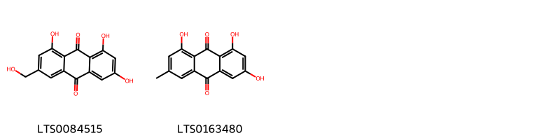{ width=100% }
    <figcaption>Hình ảnh cấu trúc hóa học của 2 hoạt chất thuộc nhóm Anthracenes gồm ['citreorosein (LTS0084515)', 'emodin (LTS0163480)'].</figcaption>
</figure>
#### Nhóm Flavonoids
<figure markdown="span">
    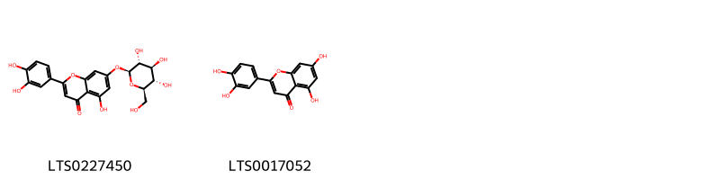{ width=100% }
    <figcaption>Hình ảnh cấu trúc hóa học của 2 hoạt chất thuộc nhóm Flavonoids gồm ['luteolin 7-o-glucoside (LTS0227450)', 'luteolin (LTS0017052)'].</figcaption>
</figure>

---

### Dược dân tộc học

Danh sách các quốc gia có sử dụng *Rumex acetosella* trong điều trị các bệnh. 

| Country   | Disease                                    | Bệnh                                                                                                                                                                                                |
|:----------|:-------------------------------------------|:----------------------------------------------------------------------------------------------------------------------------------------------------------------------------------------------------|
| Dutch     | Purgative                                  | MYMEMORY WARNING: YOU USED ALL AVAILABLE FREE TRANSLATIONS FOR TODAY. NEXT AVAILABLE IN  15 HOURS 37 MINUTES 51 SECONDS VISIT HTTPS://MYMEMORY.TRANSLATED.NET/DOC/USAGELIMITS.PHP TO TRANSLATE MORE |
| Elsewhere | Diaphoretic, Diuretic, Poison, Refrigerant | MYMEMORY WARNING: YOU USED ALL AVAILABLE FREE TRANSLATIONS FOR TODAY. NEXT AVAILABLE IN  15 HOURS 37 MINUTES 49 SECONDS VISIT HTTPS://MYMEMORY.TRANSLATED.NET/DOC/USAGELIMITS.PHP TO TRANSLATE MORE |
| French    | Sudorific                                  | MYMEMORY WARNING: YOU USED ALL AVAILABLE FREE TRANSLATIONS FOR TODAY. NEXT AVAILABLE IN  15 HOURS 37 MINUTES 45 SECONDS VISIT HTTPS://MYMEMORY.TRANSLATED.NET/DOC/USAGELIMITS.PHP TO TRANSLATE MORE |
| Italian   | Diuretic                                   | MYMEMORY WARNING: YOU USED ALL AVAILABLE FREE TRANSLATIONS FOR TODAY. NEXT AVAILABLE IN  15 HOURS 37 MINUTES 41 SECONDS VISIT HTTPS://MYMEMORY.TRANSLATED.NET/DOC/USAGELIMITS.PHP TO TRANSLATE MORE |
| Sanscrit  | Poison                                     | MYMEMORY WARNING: YOU USED ALL AVAILABLE FREE TRANSLATIONS FOR TODAY. NEXT AVAILABLE IN  15 HOURS 37 MINUTES 38 SECONDS VISIT HTTPS://MYMEMORY.TRANSLATED.NET/DOC/USAGELIMITS.PHP TO TRANSLATE MORE |
| Venezuela | Styptic                                    | MYMEMORY WARNING: YOU USED ALL AVAILABLE FREE TRANSLATIONS FOR TODAY. NEXT AVAILABLE IN  15 HOURS 37 MINUTES 33 SECONDS VISIT HTTPS://MYMEMORY.TRANSLATED.NET/DOC/USAGELIMITS.PHP TO TRANSLATE MORE |

---

---
## Rumex acutus
### Thông tin về thực vật

!!! info "Phân loại thực vật của *Rumex acutus* từ GIBF:"
    - **Kingdom:** Plantae
    - **Phylum:** Tracheophyta
    - **Order:** Caryophyllales
    - **Family:** Polygonaceae
    - **Genus:** Rumex
    - **Species:** *Rumex acutus*

 

| Label (VI)   | Label (EN)   | Scientific Name   | Descriptions (VI)   | Descriptions (EN)   | Also Known As (VI)   | Also Known As (EN)   |
|:-------------|:-------------|:------------------|:--------------------|:--------------------|:---------------------|:---------------------|
| N/A          | N/A          | Rumex acutus      | loài thực vật       | species of plant    | ['']                 | ['']                 |

#### Phân bố trên thế giới

**Từ CSDL GIBF** nan, Austria, Czechia, Sweden, France, Belgium, New Zealand, unknown or invalid, Germany, United Kingdom of Great Britain and Northern Ireland, Spain, Netherlands

#### Phân bố tại Việt Nam

**Từ CSDL GIBF**: Không có ghi nhận ở Việt Nam

---
### Thành phần hóa học
        
- Theo cơ sở dữ liệu lotus: Từ loài *Rumex acutus* đã phân lập và xác định được Chưa có hoạt chất nào được phân lập. hoạt chất thuộc về các nhóm Không có hoạt chất nào được phân lập. 

Không có hình ảnh nào được tạo ra

---

### Dược dân tộc học

Danh sách các quốc gia có sử dụng *Rumex acutus* trong điều trị các bệnh. 

| Country   | Disease                        | Bệnh                                                                                                                                                                                                |
|:----------|:-------------------------------|:----------------------------------------------------------------------------------------------------------------------------------------------------------------------------------------------------|
| French    | Antiseptic, Diuretic, Laxative | MYMEMORY WARNING: YOU USED ALL AVAILABLE FREE TRANSLATIONS FOR TODAY. NEXT AVAILABLE IN  15 HOURS 37 MINUTES 00 SECONDS VISIT HTTPS://MYMEMORY.TRANSLATED.NET/DOC/USAGELIMITS.PHP TO TRANSLATE MORE |
| anish     | Carminative, Tonic             | MYMEMORY WARNING: YOU USED ALL AVAILABLE FREE TRANSLATIONS FOR TODAY. NEXT AVAILABLE IN  15 HOURS 36 MINUTES 55 SECONDS VISIT HTTPS://MYMEMORY.TRANSLATED.NET/DOC/USAGELIMITS.PHP TO TRANSLATE MORE |

---

---
## Rumex alpinus
### Thông tin về thực vật

!!! info "Phân loại thực vật của *Rumex alpinus* từ GIBF:"
    - **Kingdom:** Plantae
    - **Phylum:** Tracheophyta
    - **Order:** Caryophyllales
    - **Family:** Polygonaceae
    - **Genus:** Rumex
    - **Species:** *Rumex alpinus*

 

| Label (VI)   | Label (EN)   | Scientific Name   | Descriptions (VI)   | Descriptions (EN)   | Also Known As (VI)   | Also Known As (EN)   |
|:-------------|:-------------|:------------------|:--------------------|:--------------------|:---------------------|:---------------------|
| N/A          | N/A          | Rumex alpinus     | loài thực vật       | species of plant    | ['']                 | ['']                 |

#### Phân bố trên thế giới

**Từ CSDL GIBF** Austria, United States of America, Romania, Norway, Czechia, United Kingdom of Great Britain and Northern Ireland, Ukraine, Russian Federation, Italy, Switzerland, Slovenia, Georgia, Germany, France, Poland

#### Phân bố tại Việt Nam

**Từ CSDL GIBF**: Không có ghi nhận ở Việt Nam

---
### Thành phần hóa học
        
- Theo cơ sở dữ liệu lotus: Từ loài *Rumex alpinus* đã phân lập và xác định được 3 hoạt chất thuộc về các nhóm Anthracenes, Naphthalenes. 

|    | chemicalTaxonomyClassyfireClass   |   smiles_count |
|---:|:----------------------------------|---------------:|
|  0 | Anthracenes                       |              2 |
|  1 | Naphthalenes                      |              1 |

#### Nhóm Anthracenes
<figure markdown="span">
    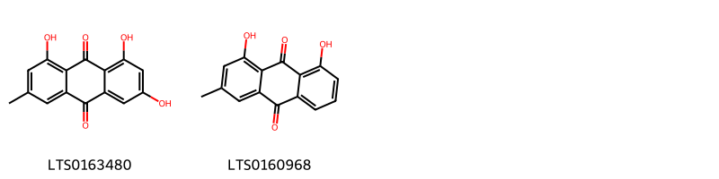{ width=100% }
    <figcaption>Hình ảnh cấu trúc hóa học của 2 hoạt chất thuộc nhóm Anthracenes gồm ['emodin (LTS0163480)', 'turkey rhubarb (LTS0160968)'].</figcaption>
</figure>
#### Nhóm Naphthalenes
<figure markdown="span">
    { width=100% }
    <figcaption>Hình ảnh cấu trúc hóa học của 1 hoạt chất thuộc nhóm Naphthalenes gồm ['nepodin (LTS0012918)'].</figcaption>
</figure>

---

### Dược dân tộc học

Danh sách các quốc gia có sử dụng *Rumex alpinus* trong điều trị các bệnh. 

| Country   | Disease     | Bệnh                                                                                                                                                                                                |
|:----------|:------------|:----------------------------------------------------------------------------------------------------------------------------------------------------------------------------------------------------|
| Europe    | Antioxidant | MYMEMORY WARNING: YOU USED ALL AVAILABLE FREE TRANSLATIONS FOR TODAY. NEXT AVAILABLE IN  15 HOURS 36 MINUTES 33 SECONDS VISIT HTTPS://MYMEMORY.TRANSLATED.NET/DOC/USAGELIMITS.PHP TO TRANSLATE MORE |
| French    | Tonic       | MYMEMORY WARNING: YOU USED ALL AVAILABLE FREE TRANSLATIONS FOR TODAY. NEXT AVAILABLE IN  15 HOURS 36 MINUTES 31 SECONDS VISIT HTTPS://MYMEMORY.TRANSLATED.NET/DOC/USAGELIMITS.PHP TO TRANSLATE MORE |
| Italian   | Antiseptic  | MYMEMORY WARNING: YOU USED ALL AVAILABLE FREE TRANSLATIONS FOR TODAY. NEXT AVAILABLE IN  15 HOURS 36 MINUTES 28 SECONDS VISIT HTTPS://MYMEMORY.TRANSLATED.NET/DOC/USAGELIMITS.PHP TO TRANSLATE MORE |
| anish     | Sedative    | MYMEMORY WARNING: YOU USED ALL AVAILABLE FREE TRANSLATIONS FOR TODAY. NEXT AVAILABLE IN  15 HOURS 36 MINUTES 24 SECONDS VISIT HTTPS://MYMEMORY.TRANSLATED.NET/DOC/USAGELIMITS.PHP TO TRANSLATE MORE |

---

---
## Rumex aquaticus
### Thông tin về thực vật

!!! info "Phân loại thực vật của *Rumex aquaticus* từ GIBF:"
    - **Kingdom:** Plantae
    - **Phylum:** Tracheophyta
    - **Order:** Caryophyllales
    - **Family:** Polygonaceae
    - **Genus:** Rumex
    - **Species:** *Rumex aquaticus*

 

| Label (VI)   | Label (EN)   | Scientific Name   | Descriptions (VI)   | Descriptions (EN)   | Also Known As (VI)   | Also Known As (EN)   |
|:-------------|:-------------|:------------------|:--------------------|:--------------------|:---------------------|:---------------------|
| N/A          | N/A          | Rumex aquaticus   | loài thực vật       | species of plant    | ['']                 | ['Scottish Dock']    |

#### Phân bố trên thế giới

**Từ CSDL GIBF** Belarus, Austria, Norway, Czechia, Mongolia, Sweden, Latvia, Finland, Slovakia, Russian Federation, Estonia, Lithuania, France, Denmark

#### Phân bố tại Việt Nam

**Từ CSDL GIBF**: Không có ghi nhận ở Việt Nam

---
### Thành phần hóa học
        
- Theo cơ sở dữ liệu lotus: Từ loài *Rumex aquaticus* đã phân lập và xác định được Chưa có hoạt chất nào được phân lập. hoạt chất thuộc về các nhóm Không có hoạt chất nào được phân lập. 

Không có hình ảnh nào được tạo ra

---

### Dược dân tộc học

Danh sách các quốc gia có sử dụng *Rumex aquaticus* trong điều trị các bệnh. 

| Country   | Disease          | Bệnh                                                                                                                                                                                                |
|:----------|:-----------------|:----------------------------------------------------------------------------------------------------------------------------------------------------------------------------------------------------|
| Turkey    | Digestive, Tonic | MYMEMORY WARNING: YOU USED ALL AVAILABLE FREE TRANSLATIONS FOR TODAY. NEXT AVAILABLE IN  15 HOURS 35 MINUTES 54 SECONDS VISIT HTTPS://MYMEMORY.TRANSLATED.NET/DOC/USAGELIMITS.PHP TO TRANSLATE MORE |

---

---
## Rumex brasiliensis
### Thông tin về thực vật

!!! info "Phân loại thực vật của *Rumex brasiliensis* từ GIBF:"
    - **Kingdom:** Plantae
    - **Phylum:** Tracheophyta
    - **Order:** Caryophyllales
    - **Family:** Polygonaceae
    - **Genus:** Rumex
    - **Species:** *Rumex brasiliensis*

 

| Label (VI)   | Label (EN)   | Scientific Name    | Descriptions (VI)   | Descriptions (EN)   | Also Known As (VI)   | Also Known As (EN)   |
|:-------------|:-------------|:-------------------|:--------------------|:--------------------|:---------------------|:---------------------|
| N/A          | N/A          | Rumex brasiliensis | loài thực vật       | species of plant    | ['']                 | ['']                 |

#### Phân bố trên thế giới

**Từ CSDL GIBF** nan, Brazil, United States of America, unknown or invalid, Argentina

#### Phân bố tại Việt Nam

**Từ CSDL GIBF**: Không có ghi nhận ở Việt Nam

---
### Thành phần hóa học
        
- Theo cơ sở dữ liệu lotus: Từ loài *Rumex brasiliensis* đã phân lập và xác định được Chưa có hoạt chất nào được phân lập. hoạt chất thuộc về các nhóm Không có hoạt chất nào được phân lập. 

Không có hình ảnh nào được tạo ra

---

### Dược dân tộc học

Danh sách các quốc gia có sử dụng *Rumex brasiliensis* trong điều trị các bệnh. 

| Country   | Disease         | Bệnh                                                                                                                                                                                                |
|:----------|:----------------|:----------------------------------------------------------------------------------------------------------------------------------------------------------------------------------------------------|
| Brazil    | Tonic, Diuretic | MYMEMORY WARNING: YOU USED ALL AVAILABLE FREE TRANSLATIONS FOR TODAY. NEXT AVAILABLE IN  15 HOURS 35 MINUTES 25 SECONDS VISIT HTTPS://MYMEMORY.TRANSLATED.NET/DOC/USAGELIMITS.PHP TO TRANSLATE MORE |

---

---
## Rumex crius
### Thông tin về thực vật

!!! info "Phân loại thực vật của *N/A* từ GIBF:"
    - **Kingdom:** Plantae
    - **Phylum:** Tracheophyta
    - **Order:** Caryophyllales
    - **Family:** Polygonaceae
    - **Genus:** Rumex
    - **Species:** *N/A*

 

| Label (VI)   | Label (EN)   | Scientific Name    | Descriptions (VI)   | Descriptions (EN)   | Also Known As (VI)   | Also Known As (EN)   |
|:-------------|:-------------|:-------------------|:--------------------|:--------------------|:---------------------|:---------------------|
| N/A          | N/A          | Rumex brasiliensis | loài thực vật       | species of plant    | ['']                 | ['']                 |

#### Phân bố trên thế giới

**Từ CSDL GIBF** United Arab Emirates, Israel, Chile, New Zealand, Ecuador, Spain, Netherlands, United States of America, Greece, Russian Federation, Colombia, Argentina, Mexico, United Kingdom of Great Britain and Northern Ireland, Chinese Taipei, Kuwait, Canada, Germany, Austria, Hungary, Portugal, South Africa, Australia, Italy, Peru, France, Ireland

#### Phân bố tại Việt Nam

**Từ CSDL GIBF**: Không có ghi nhận ở Việt Nam

---
### Thành phần hóa học
        
- Theo cơ sở dữ liệu lotus: Từ loài *N/A* đã phân lập và xác định được Chưa có hoạt chất nào được phân lập. hoạt chất thuộc về các nhóm Không có hoạt chất nào được phân lập. 

Không có hình ảnh nào được tạo ra

---

### Dược dân tộc học

Danh sách các quốc gia có sử dụng *N/A* trong điều trị các bệnh. 

| Country       | Disease                                             | Bệnh                                                                                                                                                                                                |
|:--------------|:----------------------------------------------------|:----------------------------------------------------------------------------------------------------------------------------------------------------------------------------------------------------|
| Brazil        | Poison                                              | MYMEMORY WARNING: YOU USED ALL AVAILABLE FREE TRANSLATIONS FOR TODAY. NEXT AVAILABLE IN  15 HOURS 35 MINUTES 01 SECONDS VISIT HTTPS://MYMEMORY.TRANSLATED.NET/DOC/USAGELIMITS.PHP TO TRANSLATE MORE |
| China         | Parasiticide, Tonic                                 | MYMEMORY WARNING: YOU USED ALL AVAILABLE FREE TRANSLATIONS FOR TODAY. NEXT AVAILABLE IN  15 HOURS 34 MINUTES 58 SECONDS VISIT HTTPS://MYMEMORY.TRANSLATED.NET/DOC/USAGELIMITS.PHP TO TRANSLATE MORE |
| Elsewhere     | Antiseptic, Astringent, Cathartic, Purgative, Tonic | MYMEMORY WARNING: YOU USED ALL AVAILABLE FREE TRANSLATIONS FOR TODAY. NEXT AVAILABLE IN  15 HOURS 34 MINUTES 56 SECONDS VISIT HTTPS://MYMEMORY.TRANSLATED.NET/DOC/USAGELIMITS.PHP TO TRANSLATE MORE |
| Europe        | Tonic, Laxative                                     | MYMEMORY WARNING: YOU USED ALL AVAILABLE FREE TRANSLATIONS FOR TODAY. NEXT AVAILABLE IN  15 HOURS 34 MINUTES 52 SECONDS VISIT HTTPS://MYMEMORY.TRANSLATED.NET/DOC/USAGELIMITS.PHP TO TRANSLATE MORE |
| Haiti         | Astringent, Diuretic, Emollient, Refrigerant        | MYMEMORY WARNING: YOU USED ALL AVAILABLE FREE TRANSLATIONS FOR TODAY. NEXT AVAILABLE IN  15 HOURS 34 MINUTES 49 SECONDS VISIT HTTPS://MYMEMORY.TRANSLATED.NET/DOC/USAGELIMITS.PHP TO TRANSLATE MORE |
| Turkey        | Astringent, Laxative, Sedative, Tonic               | MYMEMORY WARNING: YOU USED ALL AVAILABLE FREE TRANSLATIONS FOR TODAY. NEXT AVAILABLE IN  15 HOURS 34 MINUTES 46 SECONDS VISIT HTTPS://MYMEMORY.TRANSLATED.NET/DOC/USAGELIMITS.PHP TO TRANSLATE MORE |
| US            | Laxative, Parasiticide                              | MYMEMORY WARNING: YOU USED ALL AVAILABLE FREE TRANSLATIONS FOR TODAY. NEXT AVAILABLE IN  15 HOURS 34 MINUTES 44 SECONDS VISIT HTTPS://MYMEMORY.TRANSLATED.NET/DOC/USAGELIMITS.PHP TO TRANSLATE MORE |
| US(Blackfoot) | Suppurative                                         | MYMEMORY WARNING: YOU USED ALL AVAILABLE FREE TRANSLATIONS FOR TODAY. NEXT AVAILABLE IN  15 HOURS 34 MINUTES 40 SECONDS VISIT HTTPS://MYMEMORY.TRANSLATED.NET/DOC/USAGELIMITS.PHP TO TRANSLATE MORE |

---

---
## Rumex daiwoo
### Thông tin về thực vật

!!! info "Phân loại thực vật của *Rumex madaio* từ GIBF:"
    - **Kingdom:** Plantae
    - **Phylum:** Tracheophyta
    - **Order:** Caryophyllales
    - **Family:** Polygonaceae
    - **Genus:** Rumex
    - **Species:** *Rumex madaio*

 

| Label (VI)   | Label (EN)   | Scientific Name   | Descriptions (VI)   | Descriptions (EN)   | Also Known As (VI)   | Also Known As (EN)   |
|:-------------|:-------------|:------------------|:--------------------|:--------------------|:---------------------|:---------------------|
| N/A          | N/A          | Rumex daiwoo      |                     |                     | ['']                 | ['']                 |

#### Phân bố trên thế giới

**Từ CSDL GIBF** nan, Japan, China

#### Phân bố tại Việt Nam

**Từ CSDL GIBF**: Không có ghi nhận ở Việt Nam

---
### Thành phần hóa học
        
- Theo cơ sở dữ liệu lotus: Từ loài *Rumex madaio* đã phân lập và xác định được Chưa có hoạt chất nào được phân lập. hoạt chất thuộc về các nhóm Không có hoạt chất nào được phân lập. 

Không có hình ảnh nào được tạo ra

---

### Dược dân tộc học

Danh sách các quốc gia có sử dụng *Rumex madaio* trong điều trị các bệnh. 

| Country   | Disease                                        | Bệnh                                                                                                                                                                                                |
|:----------|:-----------------------------------------------|:----------------------------------------------------------------------------------------------------------------------------------------------------------------------------------------------------|
| China     | Alexiteric, Insecticide, Refrigerant, Laxative | MYMEMORY WARNING: YOU USED ALL AVAILABLE FREE TRANSLATIONS FOR TODAY. NEXT AVAILABLE IN  15 HOURS 34 MINUTES 10 SECONDS VISIT HTTPS://MYMEMORY.TRANSLATED.NET/DOC/USAGELIMITS.PHP TO TRANSLATE MORE |

---

---
## Rumex dentatus
### Thông tin về thực vật

!!! info "Phân loại thực vật của *Rumex dentatus* từ GIBF:"
    - **Kingdom:** Plantae
    - **Phylum:** Tracheophyta
    - **Order:** Caryophyllales
    - **Family:** Polygonaceae
    - **Genus:** Rumex
    - **Species:** *Rumex dentatus*

 

| Label (VI)   | Label (EN)   | Scientific Name   | Descriptions (VI)   | Descriptions (EN)   | Also Known As (VI)   | Also Known As (EN)                             |
|:-------------|:-------------|:------------------|:--------------------|:--------------------|:---------------------|:-----------------------------------------------|
| N/A          | N/A          | Rumex dentatus    | loài thực vật       | species of plant    | ['']                 | ['Aegean Dock', 'Golden Dock', 'Toothed Dock'] |

#### Phân bố trên thế giới

**Từ CSDL GIBF** nan, Mexico, United States of America, Japan, Korea, Republic of, Uzbekistan, Saudi Arabia, Chinese Taipei, Ukraine, China, Israel, Russian Federation, Pakistan, Armenia, India, Cyprus, France, Egypt

#### Phân bố tại Việt Nam

**Từ CSDL GIBF**: Không có ghi nhận ở Việt Nam

---
### Thành phần hóa học
        
- Theo cơ sở dữ liệu lotus: Từ loài *Rumex dentatus* đã phân lập và xác định được 3 hoạt chất thuộc về các nhóm Anthracenes, Flavonoids. 

|    | chemicalTaxonomyClassyfireClass   |   smiles_count |
|---:|:----------------------------------|---------------:|
|  0 | Anthracenes                       |              2 |
|  1 | Flavonoids                        |              1 |

#### Nhóm Anthracenes
<figure markdown="span">
    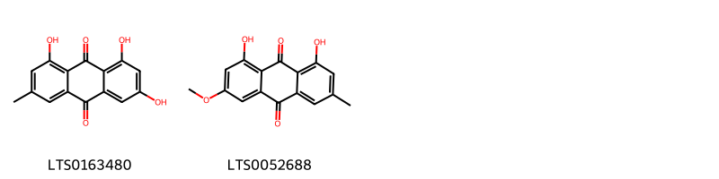{ width=100% }
    <figcaption>Hình ảnh cấu trúc hóa học của 2 hoạt chất thuộc nhóm Anthracenes gồm ['emodin (LTS0163480)', 'physcion (LTS0052688)'].</figcaption>
</figure>
#### Nhóm Flavonoids
<figure markdown="span">
    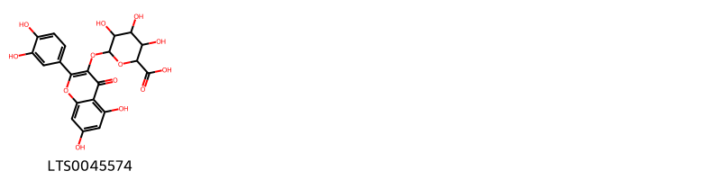{ width=100% }
    <figcaption>Hình ảnh cấu trúc hóa học của 1 hoạt chất thuộc nhóm Flavonoids gồm ['miquelianin (LTS0045574)'].</figcaption>
</figure>

---

### Dược dân tộc học

Danh sách các quốc gia có sử dụng *Rumex dentatus* trong điều trị các bệnh. 

| Country   | Disease    | Bệnh                                                                                                                                                                                                |
|:----------|:-----------|:----------------------------------------------------------------------------------------------------------------------------------------------------------------------------------------------------|
| Elsewhere | Astringent | MYMEMORY WARNING: YOU USED ALL AVAILABLE FREE TRANSLATIONS FOR TODAY. NEXT AVAILABLE IN  15 HOURS 33 MINUTES 49 SECONDS VISIT HTTPS://MYMEMORY.TRANSLATED.NET/DOC/USAGELIMITS.PHP TO TRANSLATE MORE |
| Iraq      | Antiseptic | MYMEMORY WARNING: YOU USED ALL AVAILABLE FREE TRANSLATIONS FOR TODAY. NEXT AVAILABLE IN  15 HOURS 33 MINUTES 46 SECONDS VISIT HTTPS://MYMEMORY.TRANSLATED.NET/DOC/USAGELIMITS.PHP TO TRANSLATE MORE |

---

---
## Rumex ecklonianus
### Thông tin về thực vật

!!! info "Phân loại thực vật của *Rumex lanceolatus* từ GIBF:"
    - **Kingdom:** Plantae
    - **Phylum:** Tracheophyta
    - **Order:** Caryophyllales
    - **Family:** Polygonaceae
    - **Genus:** Rumex
    - **Species:** *Rumex lanceolatus*

 

| Label (VI)   | Label (EN)   | Scientific Name   | Descriptions (VI)   | Descriptions (EN)   | Also Known As (VI)   | Also Known As (EN)   |
|:-------------|:-------------|:------------------|:--------------------|:--------------------|:---------------------|:---------------------|
| N/A          | N/A          | Rumex ecklonianus |                     |                     | ['']                 | ['']                 |

#### Phân bố trên thế giới

**Từ CSDL GIBF** nan, Namibia, unknown or invalid, South Africa

#### Phân bố tại Việt Nam

**Từ CSDL GIBF**: Không có ghi nhận ở Việt Nam

---
### Thành phần hóa học
        
- Theo cơ sở dữ liệu lotus: Từ loài *Rumex lanceolatus* đã phân lập và xác định được Chưa có hoạt chất nào được phân lập. hoạt chất thuộc về các nhóm Không có hoạt chất nào được phân lập. 

Không có hình ảnh nào được tạo ra

---

### Dược dân tộc học

Danh sách các quốc gia có sử dụng *Rumex lanceolatus* trong điều trị các bệnh. 

| Country              | Disease   | Bệnh                                                                                                                                                                                                |
|:---------------------|:----------|:----------------------------------------------------------------------------------------------------------------------------------------------------------------------------------------------------|
| South Africa(Kaffir) | Vermifuge | MYMEMORY WARNING: YOU USED ALL AVAILABLE FREE TRANSLATIONS FOR TODAY. NEXT AVAILABLE IN  15 HOURS 33 MINUTES 17 SECONDS VISIT HTTPS://MYMEMORY.TRANSLATED.NET/DOC/USAGELIMITS.PHP TO TRANSLATE MORE |

---

---
## Rumex hymenosepalus
### Thông tin về thực vật

!!! info "Phân loại thực vật của *Rumex hymenosepalus* từ GIBF:"
    - **Kingdom:** Plantae
    - **Phylum:** Tracheophyta
    - **Order:** Caryophyllales
    - **Family:** Polygonaceae
    - **Genus:** Rumex
    - **Species:** *Rumex hymenosepalus*

 

| Label (VI)   | Label (EN)   | Scientific Name     | Descriptions (VI)   | Descriptions (EN)   | Also Known As (VI)   | Also Known As (EN)   |
|:-------------|:-------------|:--------------------|:--------------------|:--------------------|:---------------------|:---------------------|
| N/A          | N/A          | Rumex hymenosepalus | loài thực vật       | species of plant    | ['']                 | ['']                 |

#### Phân bố trên thế giới

**Từ CSDL GIBF** Mexico, United States of America

#### Phân bố tại Việt Nam

**Từ CSDL GIBF**: Không có ghi nhận ở Việt Nam

---
### Thành phần hóa học
        
- Theo cơ sở dữ liệu lotus: Từ loài *Rumex hymenosepalus* đã phân lập và xác định được 1 hoạt chất thuộc về các nhóm Anthracenes. 

|    | chemicalTaxonomyClassyfireClass   |   smiles_count |
|---:|:----------------------------------|---------------:|
|  0 | Anthracenes                       |              1 |

#### Nhóm Anthracenes
<figure markdown="span">
    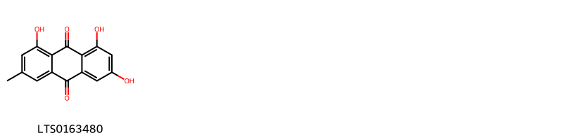{ width=100% }
    <figcaption>Hình ảnh cấu trúc hóa học của 1 hoạt chất thuộc nhóm Anthracenes gồm ['emodin (LTS0163480)'].</figcaption>
</figure>

---

### Dược dân tộc học

Danh sách các quốc gia có sử dụng *Rumex hymenosepalus* trong điều trị các bệnh. 

| Country   | Disease      | Bệnh                                                                                                                                                                                                |
|:----------|:-------------|:----------------------------------------------------------------------------------------------------------------------------------------------------------------------------------------------------|
| Mexico    | Carcinogenic | MYMEMORY WARNING: YOU USED ALL AVAILABLE FREE TRANSLATIONS FOR TODAY. NEXT AVAILABLE IN  15 HOURS 32 MINUTES 53 SECONDS VISIT HTTPS://MYMEMORY.TRANSLATED.NET/DOC/USAGELIMITS.PHP TO TRANSLATE MORE |
| US        | Poultice     | MYMEMORY WARNING: YOU USED ALL AVAILABLE FREE TRANSLATIONS FOR TODAY. NEXT AVAILABLE IN  15 HOURS 32 MINUTES 48 SECONDS VISIT HTTPS://MYMEMORY.TRANSLATED.NET/DOC/USAGELIMITS.PHP TO TRANSLATE MORE |

---

---
## Rumex japonicus
### Thông tin về thực vật

!!! info "Phân loại thực vật của *Rumex japonicus* từ GIBF:"
    - **Kingdom:** Plantae
    - **Phylum:** Tracheophyta
    - **Order:** Caryophyllales
    - **Family:** Polygonaceae
    - **Genus:** Rumex
    - **Species:** *Rumex japonicus*

 

| Label (VI)   | Label (EN)   | Scientific Name   | Descriptions (VI)   | Descriptions (EN)   | Also Known As (VI)   | Also Known As (EN)   |
|:-------------|:-------------|:------------------|:--------------------|:--------------------|:---------------------|:---------------------|
| N/A          | N/A          | Rumex japonicus   | loài thực vật       | species of plant    | ['']                 | ['']                 |

#### Phân bố trên thế giới

**Từ CSDL GIBF** Japan, Korea, Republic of, Chinese Taipei, China, Myanmar

#### Phân bố tại Việt Nam

**Từ CSDL GIBF**: Không có ghi nhận ở Việt Nam

---
### Thành phần hóa học
        
- Theo cơ sở dữ liệu lotus: Từ loài *Rumex japonicus* đã phân lập và xác định được 31 hoạt chất thuộc về các nhóm Benzene and substituted derivatives, Flavonoids, Anthracenes, Naphthalenes, Phenols, Organooxygen compounds, Tetralins, Prenol lipids. 

|    | chemicalTaxonomyClassyfireClass     |   smiles_count |
|---:|:------------------------------------|---------------:|
|  0 | Anthracenes                         |              9 |
|  1 | Benzene and substituted derivatives |              4 |
|  2 | Flavonoids                          |              5 |
|  3 | Naphthalenes                        |              3 |
|  4 | Organooxygen compounds              |              2 |
|  5 | Phenols                             |              1 |
|  6 | Prenol lipids                       |              6 |
|  7 | Tetralins                           |              1 |

#### Nhóm Anthracenes
<figure markdown="span">
    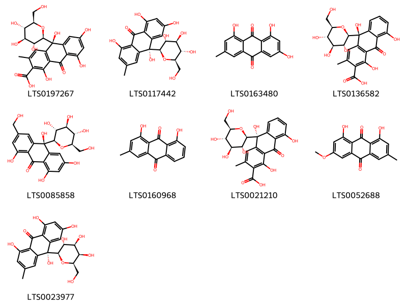{ width=100% }
    <figcaption>Hình ảnh cấu trúc hóa học của 9 hoạt chất thuộc nhóm Anthracenes gồm ['(10r)-1,6,8,10-tetrahydroxy-3-methyl-9-oxo-10-[(2r,3r,4s,5s,6r)-3,4,5-trihydroxy-6-(hydroxymethyl)oxan-2-yl]anthracene-2-carboxylic acid (LTS0197267)', '(10r)-1,3,8,10-tetrahydroxy-6-methyl-10-[(2r,3r,4s,5s,6r)-3,4,5-trihydroxy-6-(hydroxymethyl)oxan-2-yl]anthracen-9-one (LTS0117442)', 'emodin (LTS0163480)', '(10s)-1,8,10-trihydroxy-3-methyl-9-oxo-10-[(2r,3r,4s,5s,6r)-3,4,5-trihydroxy-6-(hydroxymethyl)oxan-2-yl]anthracene-2-carboxylic acid (LTS0136582)', '(10r)-1,3,8,10-tetrahydroxy-6-(hydroxymethyl)-10-[(2r,3r,4s,5s,6r)-3,4,5-trihydroxy-6-(hydroxymethyl)oxan-2-yl]anthracen-9-one (LTS0085858)', 'turkey rhubarb (LTS0160968)', '(10r)-1,8,10-trihydroxy-3-methyl-9-oxo-10-[(2r,3r,4s,5s,6r)-3,4,5-trihydroxy-6-(hydroxymethyl)oxan-2-yl]anthracene-2-carboxylic acid (LTS0021210)', 'physcion (LTS0052688)', '(10r)-1,3,8,10-tetrahydroxy-6-methyl-10-[(2r,3r,4s,5r,6r)-3,4,5-trihydroxy-6-(hydroxymethyl)oxan-2-yl]anthracen-9-one (LTS0023977)'].</figcaption>
</figure>
#### Nhóm Benzene and substituted derivatives
<figure markdown="span">
    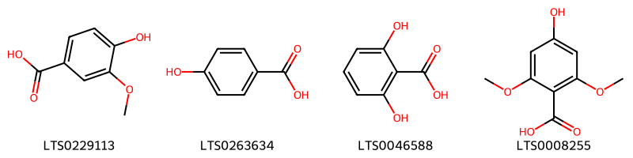{ width=100% }
    <figcaption>Hình ảnh cấu trúc hóa học của 4 hoạt chất thuộc nhóm Benzene and substituted derivatives gồm ['vanillic acid (LTS0229113)', 'p-hydroxybenzoic acid (LTS0263634)', '2,6-dihydroxybenzoic acid (LTS0046588)', '4-hydroxy-2,6-dimethoxybenzoic acid (LTS0008255)'].</figcaption>
</figure>
#### Nhóm Flavonoids
<figure markdown="span">
    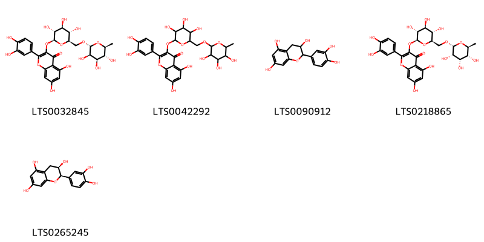{ width=100% }
    <figcaption>Hình ảnh cấu trúc hóa học của 5 hoạt chất thuộc nhóm Flavonoids gồm ['3-rutinosyl quercetin (LTS0032845)', 'rutin (LTS0042292)', 'catechol (LTS0090912)', '2-(3,4-dihydroxyphenyl)-5,7-dihydroxy-3-{[(2s,3r,4s,5s,6r)-3,4,5-trihydroxy-6-({[(2r,3s,4s,5r,6s)-3,4,5-trihydroxy-6-methyloxan-2-yl]oxy}methyl)oxan-2-yl]oxy}chromen-4-one (LTS0218865)', 'ent-epicatechin (LTS0265245)'].</figcaption>
</figure>
#### Nhóm Naphthalenes
<figure markdown="span">
    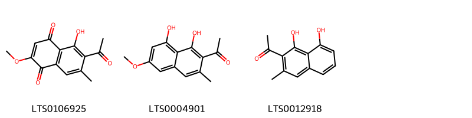{ width=100% }
    <figcaption>Hình ảnh cấu trúc hóa học của 3 hoạt chất thuộc nhóm Naphthalenes gồm ['6-acetyl-5-hydroxy-2-methoxy-7-methylnaphthalene-1,4-dione (LTS0106925)', 'torachrysone (LTS0004901)', 'nepodin (LTS0012918)'].</figcaption>
</figure>
#### Nhóm Organooxygen compounds
<figure markdown="span">
    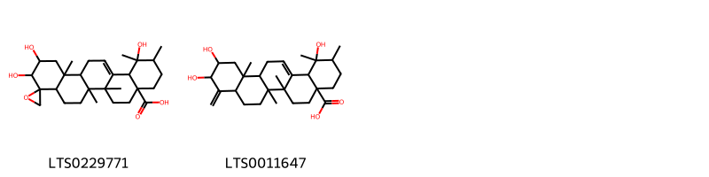{ width=100% }
    <figcaption>Hình ảnh cấu trúc hóa học của 2 hoạt chất thuộc nhóm Organooxygen compounds gồm ["2',3',12'-trihydroxy-6'a,6'b,11',12',14'b-pentamethyl-1',2',3',4'a,5',6',7',8',9',10',11',12'a,14',14'a-tetradecahydrospiro[oxirane-2,4'-picene]-8'a-carboxylic acid (LTS0229771)", '1,10,11-trihydroxy-1,2,6a,6b,12a-pentamethyl-9-methylidene-2,3,4,5,6,7,8,8a,10,11,12,12b,13,14b-tetradecahydropicene-4a-carboxylic acid (LTS0011647)'].</figcaption>
</figure>
#### Nhóm Phenols
<figure markdown="span">
    { width=100% }
    <figcaption>Hình ảnh cấu trúc hóa học của 1 hoạt chất thuộc nhóm Phenols gồm ['catechol (LTS0178554)'].</figcaption>
</figure>
#### Nhóm Prenol lipids
<figure markdown="span">
    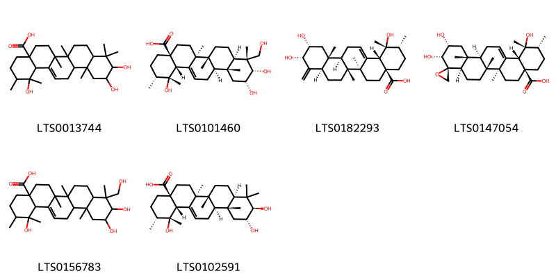{ width=100% }
    <figcaption>Hình ảnh cấu trúc hóa học của 6 hoạt chất thuộc nhóm Prenol lipids gồm ['1,10,11-trihydroxy-1,2,6a,6b,9,9,12a-heptamethyl-2,3,4,5,6,7,8,8a,10,11,12,12b,13,14b-tetradecahydropicene-4a-carboxylic acid (LTS0013744)', '(1r,2r,4as,6as,6br,8ar,9r,10s,11r,12ar,12br,14bs)-1,10,11-trihydroxy-9-(hydroxymethyl)-1,2,6a,6b,9,12a-hexamethyl-2,3,4,5,6,7,8,8a,10,11,12,12b,13,14b-tetradecahydropicene-4a-carboxylic acid (LTS0101460)', '(1r,2r,4as,6as,6br,8ar,10s,11r,12ar,12br,14bs)-1,10,11-trihydroxy-1,2,6a,6b,12a-pentamethyl-9-methylidene-2,3,4,5,6,7,8,8a,10,11,12,12b,13,14b-tetradecahydropicene-4a-carboxylic acid (LTS0182293)', "(2r,2'r,3'r,4'ar,6'ar,6'bs,8'as,11'r,12'r,12'as,14'ar,14'br)-2',3',12'-trihydroxy-6'a,6'b,11',12',14'b-pentamethyl-1',2',3',4'a,5',6',7',8',9',10',11',12'a,14',14'a-tetradecahydrospiro[oxirane-2,4'-picene]-8'a-carboxylic acid (LTS0147054)", '1,10,11-trihydroxy-9-(hydroxymethyl)-1,2,6a,6b,9,12a-hexamethyl-2,3,4,5,6,7,8,8a,10,11,12,12b,13,14b-tetradecahydropicene-4a-carboxylic acid (LTS0156783)', 'tormentic acid (LTS0102591)'].</figcaption>
</figure>
#### Nhóm Tetralins
<figure markdown="span">
    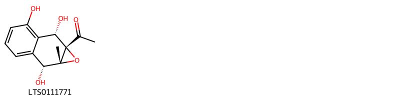{ width=100% }
    <figcaption>Hình ảnh cấu trúc hóa học của 1 hoạt chất thuộc nhóm Tetralins gồm ['1-[(1as,2s,7r,7ar)-2,3,7-trihydroxy-7a-methyl-2h,7h-naphtho[2,3-b]oxiren-1a-yl]ethanone (LTS0111771)'].</figcaption>
</figure>

---

### Dược dân tộc học

Danh sách các quốc gia có sử dụng *Rumex japonicus* trong điều trị các bệnh. 

| Country   | Disease                                                                            | Bệnh                                                                                                                                                                                                |
|:----------|:-----------------------------------------------------------------------------------|:----------------------------------------------------------------------------------------------------------------------------------------------------------------------------------------------------|
| China     | Carminative, Laxative, Parasiticide, Vermifuge, Antiseptic, Demulcent, Insecticide | MYMEMORY WARNING: YOU USED ALL AVAILABLE FREE TRANSLATIONS FOR TODAY. NEXT AVAILABLE IN  15 HOURS 32 MINUTES 17 SECONDS VISIT HTTPS://MYMEMORY.TRANSLATED.NET/DOC/USAGELIMITS.PHP TO TRANSLATE MORE |
| Elsewhere | Aperient                                                                           | MYMEMORY WARNING: YOU USED ALL AVAILABLE FREE TRANSLATIONS FOR TODAY. NEXT AVAILABLE IN  15 HOURS 32 MINUTES 14 SECONDS VISIT HTTPS://MYMEMORY.TRANSLATED.NET/DOC/USAGELIMITS.PHP TO TRANSLATE MORE |

---

---
## Rumex maritimus
### Thông tin về thực vật

!!! info "Phân loại thực vật của *Rumex maritimus* từ GIBF:"
    - **Kingdom:** Plantae
    - **Phylum:** Tracheophyta
    - **Order:** Caryophyllales
    - **Family:** Polygonaceae
    - **Genus:** Rumex
    - **Species:** *Rumex maritimus*

 

| Label (VI)   | Label (EN)   | Scientific Name   | Descriptions (VI)   | Descriptions (EN)   | Also Known As (VI)   | Also Known As (EN)                               |
|:-------------|:-------------|:------------------|:--------------------|:--------------------|:---------------------|:-------------------------------------------------|
| N/A          | N/A          | Rumex maritimus   | loài thực vật       | species of plant    | ['']                 | ['Bristle dock', 'Golden dock', 'Seashore dock'] |

#### Phân bố trên thế giới

**Từ CSDL GIBF** Belarus, Austria, Hungary, Norway, Czechia, Poland, Sweden, United Kingdom of Great Britain and Northern Ireland, Belgium, Slovakia, China, Russian Federation, Ukraine, Estonia, Germany, Lithuania, Denmark, Netherlands

#### Phân bố tại Việt Nam

**Từ CSDL GIBF**: Không có ghi nhận ở Việt Nam

---
### Thành phần hóa học
        
- Theo cơ sở dữ liệu lotus: Từ loài *Rumex maritimus* đã phân lập và xác định được 2 hoạt chất thuộc về các nhóm Prenol lipids. 

|    | chemicalTaxonomyClassyfireClass   |   smiles_count |
|---:|:----------------------------------|---------------:|
|  0 | Prenol lipids                     |              2 |

#### Nhóm Prenol lipids
<figure markdown="span">
    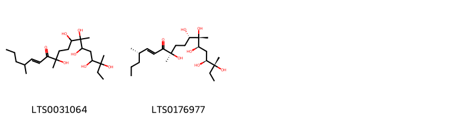{ width=100% }
    <figcaption>Hình ảnh cấu trúc hóa học của 2 hoạt chất thuộc nhóm Prenol lipids gồm ['8,11,12,13,15,16-hexahydroxy-4,8,12,16-tetramethyloctadec-5-en-7-one (LTS0031064)', '(4s,5e,8r,11s,12s,13r,15s,16r)-8,11,12,13,15,16-hexahydroxy-4,8,12,16-tetramethyloctadec-5-en-7-one (LTS0176977)'].</figcaption>
</figure>

---

### Dược dân tộc học

Danh sách các quốc gia có sử dụng *Rumex maritimus* trong điều trị các bệnh. 

| Country   | Disease                | Bệnh                                                                                                                                                                                                |
|:----------|:-----------------------|:----------------------------------------------------------------------------------------------------------------------------------------------------------------------------------------------------|
| Elsewhere | Cathartic, Refrigerant | MYMEMORY WARNING: YOU USED ALL AVAILABLE FREE TRANSLATIONS FOR TODAY. NEXT AVAILABLE IN  15 HOURS 31 MINUTES 40 SECONDS VISIT HTTPS://MYMEMORY.TRANSLATED.NET/DOC/USAGELIMITS.PHP TO TRANSLATE MORE |

---

---
## Rumex nepalensis
### Thông tin về thực vật

!!! info "Phân loại thực vật của *Rumex nepalensis* từ GIBF:"
    - **Kingdom:** Plantae
    - **Phylum:** Tracheophyta
    - **Order:** Caryophyllales
    - **Family:** Polygonaceae
    - **Genus:** Rumex
    - **Species:** *Rumex nepalensis*

 

| Label (VI)   | Label (EN)   | Scientific Name   | Descriptions (VI)   | Descriptions (EN)   | Also Known As (VI)   | Also Known As (EN)   |
|:-------------|:-------------|:------------------|:--------------------|:--------------------|:---------------------|:---------------------|
| N/A          | N/A          | Rumex nepalensis  |                     | species of plant    | ['']                 | ['']                 |

#### Phân bố trên thế giới

**Từ CSDL GIBF** Uganda, Nepal, China, Israel, Burundi, Tanzania, United Republic of, Réunion, Korea, Republic of, Greece, Bhutan, Pakistan, Albania, Ethiopia, Kenya, Norway, Syrian Arab Republic, Lebanon, Tajikistan, South Africa, Italy, India

#### Phân bố tại Việt Nam

**Từ CSDL GIBF**: Không có ghi nhận ở Việt Nam

---
### Thành phần hóa học
        
- Theo cơ sở dữ liệu lotus: Từ loài *Rumex nepalensis* đã phân lập và xác định được 25 hoạt chất thuộc về các nhóm Anthracenes, Naphthalenes, Saccharolipids, Organooxygen compounds, Stilbenes. 

|    | chemicalTaxonomyClassyfireClass   |   smiles_count |
|---:|:----------------------------------|---------------:|
|  0 | Anthracenes                       |             14 |
|  1 | Naphthalenes                      |              2 |
|  2 | Organooxygen compounds            |              5 |
|  3 | Saccharolipids                    |              2 |
|  4 | Stilbenes                         |              2 |

#### Nhóm Anthracenes
<figure markdown="span">
    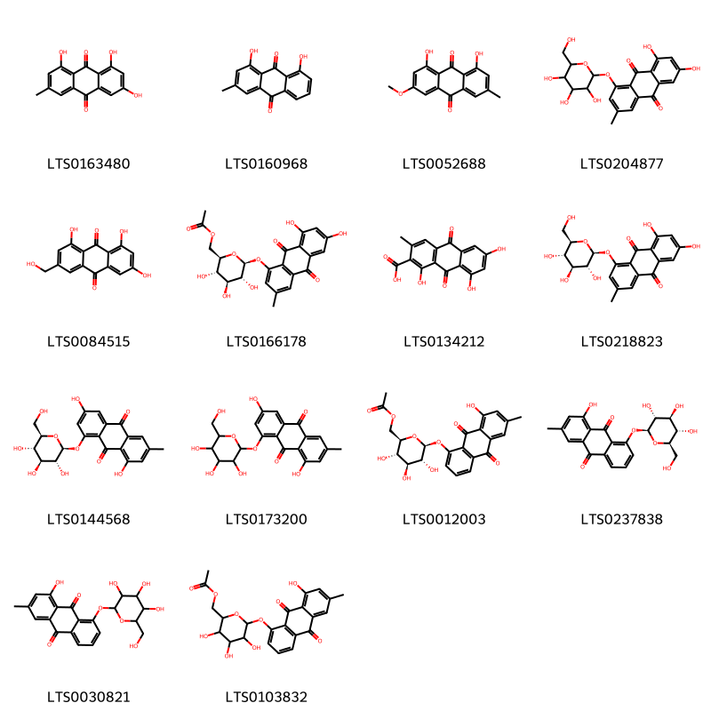{ width=100% }
    <figcaption>Hình ảnh cấu trúc hóa học của 14 hoạt chất thuộc nhóm Anthracenes gồm ['emodin (LTS0163480)', 'turkey rhubarb (LTS0160968)', 'physcion (LTS0052688)', '1,3-dihydroxy-6-methyl-8-{[3,4,5-trihydroxy-6-(hydroxymethyl)oxan-2-yl]oxy}anthracene-9,10-dione (LTS0204877)', 'citreorosein (LTS0084515)', '[(2r,3s,4s,5r,6s)-6-[(6,8-dihydroxy-3-methyl-9,10-dioxoanthracen-1-yl)oxy]-3,4,5-trihydroxyoxan-2-yl]methyl acetate (LTS0166178)', 'endocrocin (LTS0134212)', 'emodin 1-o-β-d-glucoside (LTS0218823)', 'emodin 8-glucoside (LTS0144568)', '1,6-dihydroxy-3-methyl-8-{[3,4,5-trihydroxy-6-(hydroxymethyl)oxan-2-yl]oxy}anthracene-9,10-dione (LTS0173200)', '[(2r,3s,4s,5r,6s)-3,4,5-trihydroxy-6-[(8-hydroxy-6-methyl-9,10-dioxoanthracen-1-yl)oxy]oxan-2-yl]methyl acetate (LTS0012003)', 'pulmatin (LTS0237838)', '1-hydroxy-3-methyl-8-{[3,4,5-trihydroxy-6-(hydroxymethyl)oxan-2-yl]oxy}anthracene-9,10-dione (LTS0030821)', '{3,4,5-trihydroxy-6-[(8-hydroxy-6-methyl-9,10-dioxoanthracen-1-yl)oxy]oxan-2-yl}methyl acetate (LTS0103832)'].</figcaption>
</figure>
#### Nhóm Naphthalenes
<figure markdown="span">
    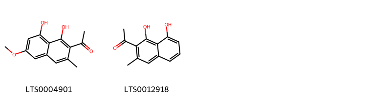{ width=100% }
    <figcaption>Hình ảnh cấu trúc hóa học của 2 hoạt chất thuộc nhóm Naphthalenes gồm ['torachrysone (LTS0004901)', 'nepodin (LTS0012918)'].</figcaption>
</figure>
#### Nhóm Organooxygen compounds
<figure markdown="span">
    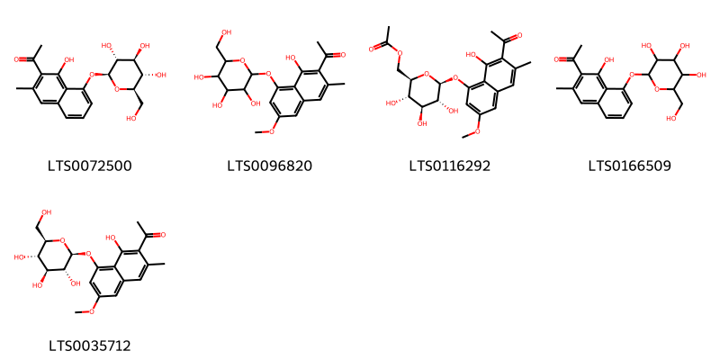{ width=100% }
    <figcaption>Hình ảnh cấu trúc hóa học của 5 hoạt chất thuộc nhóm Organooxygen compounds gồm ['1-(1-hydroxy-3-methyl-8-{[(2s,3r,4s,5s,6r)-3,4,5-trihydroxy-6-(hydroxymethyl)oxan-2-yl]oxy}naphthalen-2-yl)ethanone (LTS0072500)', '1-(1-hydroxy-6-methoxy-3-methyl-8-{[3,4,5-trihydroxy-6-(hydroxymethyl)oxan-2-yl]oxy}naphthalen-2-yl)ethanone (LTS0096820)', '[(2r,3s,4s,5r,6s)-6-[(7-acetyl-8-hydroxy-3-methoxy-6-methylnaphthalen-1-yl)oxy]-3,4,5-trihydroxyoxan-2-yl]methyl acetate (LTS0116292)', '1-(1-hydroxy-3-methyl-8-{[3,4,5-trihydroxy-6-(hydroxymethyl)oxan-2-yl]oxy}naphthalen-2-yl)ethanone (LTS0166509)', '1-(1-hydroxy-6-methoxy-3-methyl-8-{[(2s,3r,4s,5s,6r)-3,4,5-trihydroxy-6-(hydroxymethyl)oxan-2-yl]oxy}naphthalen-2-yl)ethanone (LTS0035712)'].</figcaption>
</figure>
#### Nhóm Saccharolipids
<figure markdown="span">
    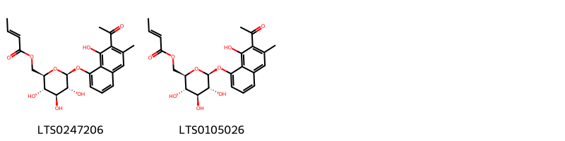{ width=100% }
    <figcaption>Hình ảnh cấu trúc hóa học của 2 hoạt chất thuộc nhóm Saccharolipids gồm ['[(2r,3s,4s,5r,6s)-6-[(7-acetyl-8-hydroxy-6-methylnaphthalen-1-yl)oxy]-3,4,5-trihydroxyoxan-2-yl]methyl but-2-enoate (LTS0247206)', '[(2r,3s,4s,5r,6s)-6-[(7-acetyl-8-hydroxy-6-methylnaphthalen-1-yl)oxy]-3,4,5-trihydroxyoxan-2-yl]methyl (2e)-but-2-enoate (LTS0105026)'].</figcaption>
</figure>
#### Nhóm Stilbenes
<figure markdown="span">
    { width=100% }
    <figcaption>Hình ảnh cấu trúc hóa học của 2 hoạt chất thuộc nhóm Stilbenes gồm ['tocilizumab (LTS0196778)', 'resveratrol (LTS0256677)'].</figcaption>
</figure>

---

### Dược dân tộc học

Danh sách các quốc gia có sử dụng *Rumex nepalensis* trong điều trị các bệnh. 

| Country   | Disease   | Bệnh                                                                                                                                                                                                |
|:----------|:----------|:----------------------------------------------------------------------------------------------------------------------------------------------------------------------------------------------------|
| Elsewhere | Purgative | MYMEMORY WARNING: YOU USED ALL AVAILABLE FREE TRANSLATIONS FOR TODAY. NEXT AVAILABLE IN  15 HOURS 31 MINUTES 09 SECONDS VISIT HTTPS://MYMEMORY.TRANSLATED.NET/DOC/USAGELIMITS.PHP TO TRANSLATE MORE |
| India     | Purgative | MYMEMORY WARNING: YOU USED ALL AVAILABLE FREE TRANSLATIONS FOR TODAY. NEXT AVAILABLE IN  15 HOURS 31 MINUTES 06 SECONDS VISIT HTTPS://MYMEMORY.TRANSLATED.NET/DOC/USAGELIMITS.PHP TO TRANSLATE MORE |

---

---
## Rumex obtusifolius
### Thông tin về thực vật

!!! info "Phân loại thực vật của *Rumex obtusifolius* từ GIBF:"
    - **Kingdom:** Plantae
    - **Phylum:** Tracheophyta
    - **Order:** Caryophyllales
    - **Family:** Polygonaceae
    - **Genus:** Rumex
    - **Species:** *Rumex obtusifolius*

 

| Label (VI)   | Label (EN)   | Scientific Name    | Descriptions (VI)   | Descriptions (EN)   | Also Known As (VI)   | Also Known As (EN)                                                                                      |
|:-------------|:-------------|:-------------------|:--------------------|:--------------------|:---------------------|:--------------------------------------------------------------------------------------------------------|
| N/A          | N/A          | Rumex obtusifolius | loài thực vật       | species of plant    | ['']                 | ['bitter dock', 'bluntleaf dock', 'broad-leaved dock', 'butter dock', 'dock leaf', 'round-leaved dock'] |

#### Phân bố trên thế giới

**Từ CSDL GIBF** New Zealand, Ecuador, Spain, Poland, Netherlands, Denmark, United States of America, Russian Federation, Colombia, Mexico, United Kingdom of Great Britain and Northern Ireland, Canada, Germany, Austria, Portugal, Australia, Italy, Peru, France, Ireland

#### Phân bố tại Việt Nam

**Từ CSDL GIBF**: Không có ghi nhận ở Việt Nam

---
### Thành phần hóa học
        
- Theo cơ sở dữ liệu lotus: Từ loài *Rumex obtusifolius* đã phân lập và xác định được 7 hoạt chất thuộc về các nhóm Organooxygen compounds, Carboxylic acids and derivatives, Pyridines and derivatives. 

|    | chemicalTaxonomyClassyfireClass   |   smiles_count |
|---:|:----------------------------------|---------------:|
|  0 | Carboxylic acids and derivatives  |              2 |
|  1 | Organooxygen compounds            |              4 |
|  2 | Pyridines and derivatives         |              1 |

#### Nhóm Carboxylic acids and derivatives
<figure markdown="span">
    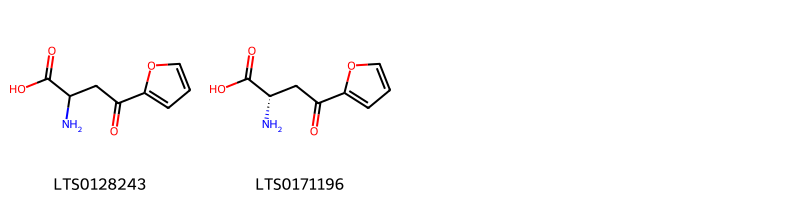{ width=100% }
    <figcaption>Hình ảnh cấu trúc hóa học của 2 hoạt chất thuộc nhóm Carboxylic acids and derivatives gồm ['2-amino-4-(furan-2-yl)-4-oxobutanoic acid (LTS0128243)', '(2s)-2-amino-4-(furan-2-yl)-4-oxobutanoic acid (LTS0171196)'].</figcaption>
</figure>
#### Nhóm Organooxygen compounds
<figure markdown="span">
    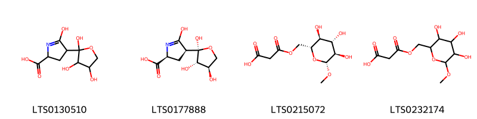{ width=100% }
    <figcaption>Hình ảnh cấu trúc hóa học của 4 hoạt chất thuộc nhóm Organooxygen compounds gồm ['5-hydroxy-4-(2,3,4-trihydroxyoxolan-2-yl)-3,4-dihydro-2h-pyrrole-2-carboxylic acid (LTS0130510)', '(2s,4s)-5-hydroxy-4-[(2r,3s,4r)-2,3,4-trihydroxyoxolan-2-yl]-3,4-dihydro-2h-pyrrole-2-carboxylic acid (LTS0177888)', '3-oxo-3-{[(2r,3s,4s,5r,6r)-3,4,5-trihydroxy-6-methoxyoxan-2-yl]methoxy}propanoic acid (LTS0215072)', '3-oxo-3-[(3,4,5-trihydroxy-6-methoxyoxan-2-yl)methoxy]propanoic acid (LTS0232174)'].</figcaption>
</figure>
#### Nhóm Pyridines and derivatives
<figure markdown="span">
    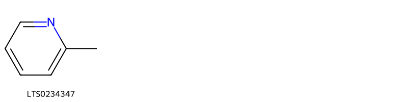{ width=100% }
    <figcaption>Hình ảnh cấu trúc hóa học của 1 hoạt chất thuộc nhóm Pyridines and derivatives gồm ['α-methylpyridine (LTS0234347)'].</figcaption>
</figure>

---

### Dược dân tộc học

Danh sách các quốc gia có sử dụng *Rumex obtusifolius* trong điều trị các bệnh. 

| Country        | Disease            | Bệnh                                                                                                                                                                                                |
|:---------------|:-------------------|:----------------------------------------------------------------------------------------------------------------------------------------------------------------------------------------------------|
| Canada(Salish) | Poultice           | MYMEMORY WARNING: YOU USED ALL AVAILABLE FREE TRANSLATIONS FOR TODAY. NEXT AVAILABLE IN  15 HOURS 30 MINUTES 37 SECONDS VISIT HTTPS://MYMEMORY.TRANSLATED.NET/DOC/USAGELIMITS.PHP TO TRANSLATE MORE |
| Iraq           | Collyrium          | MYMEMORY WARNING: YOU USED ALL AVAILABLE FREE TRANSLATIONS FOR TODAY. NEXT AVAILABLE IN  15 HOURS 30 MINUTES 33 SECONDS VISIT HTTPS://MYMEMORY.TRANSLATED.NET/DOC/USAGELIMITS.PHP TO TRANSLATE MORE |
| Turkey         | Tonic              | MYMEMORY WARNING: YOU USED ALL AVAILABLE FREE TRANSLATIONS FOR TODAY. NEXT AVAILABLE IN  15 HOURS 30 MINUTES 31 SECONDS VISIT HTTPS://MYMEMORY.TRANSLATED.NET/DOC/USAGELIMITS.PHP TO TRANSLATE MORE |
| US             | Laxative, Poultice | MYMEMORY WARNING: YOU USED ALL AVAILABLE FREE TRANSLATIONS FOR TODAY. NEXT AVAILABLE IN  15 HOURS 30 MINUTES 28 SECONDS VISIT HTTPS://MYMEMORY.TRANSLATED.NET/DOC/USAGELIMITS.PHP TO TRANSLATE MORE |

---

---
## Rumex patientia
### Thông tin về thực vật

!!! info "Phân loại thực vật của *Rumex patientia* từ GIBF:"
    - **Kingdom:** Plantae
    - **Phylum:** Tracheophyta
    - **Order:** Caryophyllales
    - **Family:** Polygonaceae
    - **Genus:** Rumex
    - **Species:** *Rumex patientia*

 

| Label (VI)   | Label (EN)   | Scientific Name   | Descriptions (VI)   | Descriptions (EN)   | Also Known As (VI)   | Also Known As (EN)   |
|:-------------|:-------------|:------------------|:--------------------|:--------------------|:---------------------|:---------------------|
| N/A          | N/A          | Rumex patientia   | loài thực vật       | species of plant    | ['']                 | ['Patience Dock']    |

#### Phân bố trên thế giới

**Từ CSDL GIBF** Czechia, Sweden, China, Kazakhstan, Poland, Denmark, Netherlands, United States of America, Romania, Russian Federation, Algeria, France, Belgium, Germany, Austria, Hungary, Slovakia, Ukraine, Switzerland, United Kingdom of Great Britain and Northern Ireland

#### Phân bố tại Việt Nam

**Từ CSDL GIBF**: Không có ghi nhận ở Việt Nam

---
### Thành phần hóa học
        
- Theo cơ sở dữ liệu lotus: Từ loài *Rumex patientia* đã phân lập và xác định được 39 hoạt chất thuộc về các nhóm Flavonoids, Anthracenes, Naphthalenes, Phenols, Organooxygen compounds, Lignan glycosides. 

|    | chemicalTaxonomyClassyfireClass   |   smiles_count |
|---:|:----------------------------------|---------------:|
|  0 | Anthracenes                       |             11 |
|  1 | Flavonoids                        |              8 |
|  2 | Lignan glycosides                 |              2 |
|  3 | Naphthalenes                      |              1 |
|  4 | Organooxygen compounds            |             16 |
|  5 | Phenols                           |              1 |

#### Nhóm Anthracenes
<figure markdown="span">
    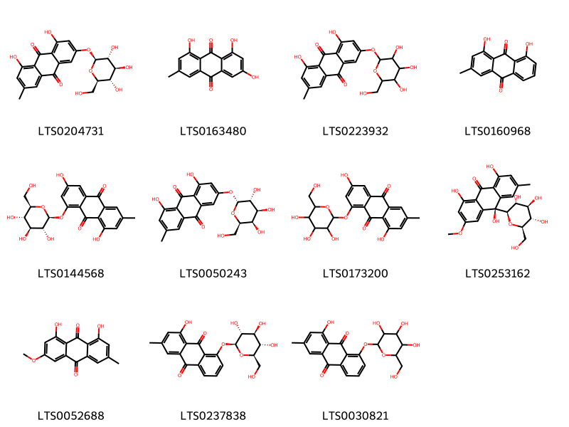{ width=100% }
    <figcaption>Hình ảnh cấu trúc hóa học của 11 hoạt chất thuộc nhóm Anthracenes gồm ['1,8-dihydroxy-3-methyl-6-{[(2s,3r,4s,5s,6r)-3,4,5-trihydroxy-6-(hydroxymethyl)oxan-2-yl]oxy}anthracene-9,10-dione (LTS0204731)', 'emodin (LTS0163480)', '1,8-dihydroxy-3-methyl-6-{[3,4,5-trihydroxy-6-(hydroxymethyl)oxan-2-yl]oxy}anthracene-9,10-dione (LTS0223932)', 'turkey rhubarb (LTS0160968)', 'emodin 8-glucoside (LTS0144568)', '1,8-dihydroxy-3-methyl-6-{[(2r,3r,4s,5r,6r)-3,4,5-trihydroxy-6-(hydroxymethyl)oxan-2-yl]oxy}anthracene-9,10-dione (LTS0050243)', '1,6-dihydroxy-3-methyl-8-{[3,4,5-trihydroxy-6-(hydroxymethyl)oxan-2-yl]oxy}anthracene-9,10-dione (LTS0173200)', '(10r)-1,8,10-trihydroxy-3-methoxy-6-methyl-10-[(2r,3r,4s,5s,6r)-3,4,5-trihydroxy-6-(hydroxymethyl)oxan-2-yl]anthracen-9-one (LTS0253162)', 'physcion (LTS0052688)', 'pulmatin (LTS0237838)', '1-hydroxy-3-methyl-8-{[3,4,5-trihydroxy-6-(hydroxymethyl)oxan-2-yl]oxy}anthracene-9,10-dione (LTS0030821)'].</figcaption>
</figure>
#### Nhóm Flavonoids
<figure markdown="span">
    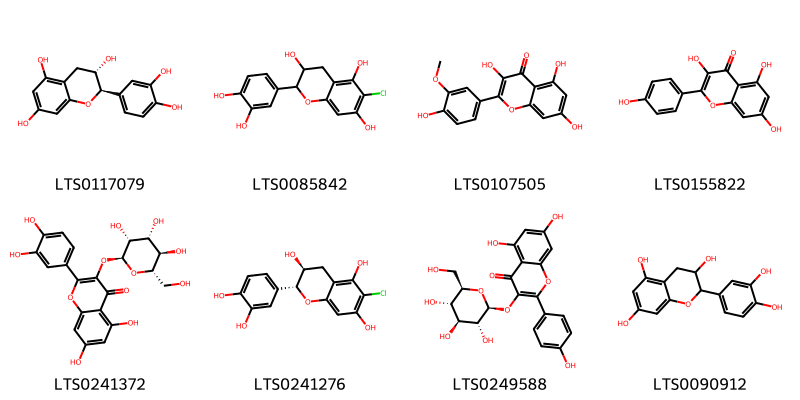{ width=100% }
    <figcaption>Hình ảnh cấu trúc hóa học của 8 hoạt chất thuộc nhóm Flavonoids gồm ['(+)-catechol (LTS0117079)', '6-chloro-2-(3,4-dihydroxyphenyl)-3,4-dihydro-2h-1-benzopyran-3,5,7-triol (LTS0085842)', 'isorhamnetin (LTS0107505)', 'kaempherol (LTS0155822)', '2-(3,4-dihydroxyphenyl)-5,7-dihydroxy-3-{[(2s,3r,4r,5r,6s)-3,4,5-trihydroxy-6-(hydroxymethyl)oxan-2-yl]oxy}chromen-4-one (LTS0241372)', '(2r,3s)-6-chloro-2-(3,4-dihydroxyphenyl)-3,4-dihydro-2h-1-benzopyran-3,5,7-triol (LTS0241276)', 'astragalin (LTS0249588)', 'catechol (LTS0090912)'].</figcaption>
</figure>
#### Nhóm Lignan glycosides
<figure markdown="span">
    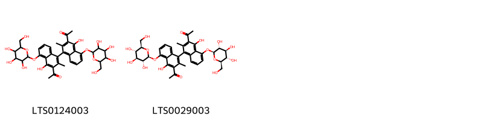{ width=100% }
    <figcaption>Hình ảnh cấu trúc hóa học của 2 hoạt chất thuộc nhóm Lignan glycosides gồm ["1-[3'-acetyl-4,4'-dihydroxy-2,2'-dimethyl-5,5'-bis({[3,4,5-trihydroxy-6-(hydroxymethyl)oxan-2-yl]oxy})-[1,1'-binaphthalen]-3-yl]ethanone (LTS0124003)", "1-[3'-acetyl-4,4'-dihydroxy-2,2'-dimethyl-5,5'-bis({[(2s,3r,4s,5s,6r)-3,4,5-trihydroxy-6-(hydroxymethyl)oxan-2-yl]oxy})-[1,1'-binaphthalen]-3-yl]ethanone (LTS0029003)"].</figcaption>
</figure>
#### Nhóm Naphthalenes
<figure markdown="span">
    { width=100% }
    <figcaption>Hình ảnh cấu trúc hóa học của 1 hoạt chất thuộc nhóm Naphthalenes gồm ['nepodin (LTS0012918)'].</figcaption>
</figure>
#### Nhóm Organooxygen compounds
<figure markdown="span">
    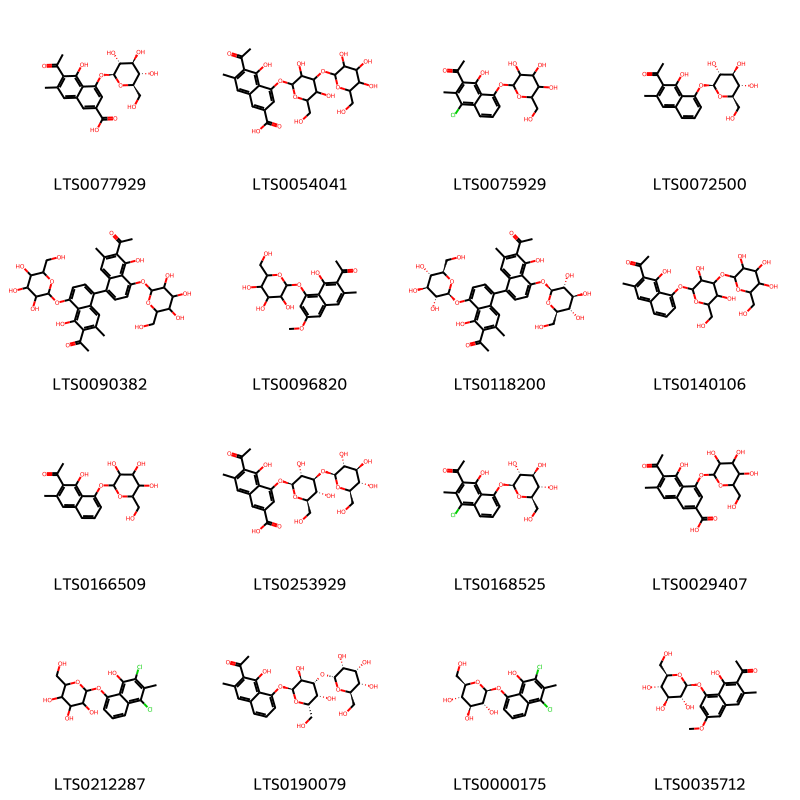{ width=100% }
    <figcaption>Hình ảnh cấu trúc hóa học của 16 hoạt chất thuộc nhóm Organooxygen compounds gồm ['6-acetyl-5-hydroxy-7-methyl-4-{[(2s,3r,4s,5s,6r)-3,4,5-trihydroxy-6-(hydroxymethyl)oxan-2-yl]oxy}naphthalene-2-carboxylic acid (LTS0077929)', '6-acetyl-4-{[3,5-dihydroxy-6-(hydroxymethyl)-4-{[3,4,5-trihydroxy-6-(hydroxymethyl)oxan-2-yl]oxy}oxan-2-yl]oxy}-5-hydroxy-7-methylnaphthalene-2-carboxylic acid (LTS0054041)', '1-(4-chloro-1-hydroxy-3-methyl-8-{[3,4,5-trihydroxy-6-(hydroxymethyl)oxan-2-yl]oxy}naphthalen-2-yl)ethanone (LTS0075929)', '1-(1-hydroxy-3-methyl-8-{[(2s,3r,4s,5s,6r)-3,4,5-trihydroxy-6-(hydroxymethyl)oxan-2-yl]oxy}naphthalen-2-yl)ethanone (LTS0072500)', "1-[6'-acetyl-5,5'-dihydroxy-7,7'-dimethyl-4,4'-bis({[3,4,5-trihydroxy-6-(hydroxymethyl)oxan-2-yl]oxy})-[1,1'-binaphthalen]-6-yl]ethanone (LTS0090382)", '1-(1-hydroxy-6-methoxy-3-methyl-8-{[3,4,5-trihydroxy-6-(hydroxymethyl)oxan-2-yl]oxy}naphthalen-2-yl)ethanone (LTS0096820)', "1-[6'-acetyl-5,5'-dihydroxy-7,7'-dimethyl-4,4'-bis({[(2s,3r,4s,5s,6r)-3,4,5-trihydroxy-6-(hydroxymethyl)oxan-2-yl]oxy})-[1,1'-binaphthalen]-6-yl]ethanone (LTS0118200)", '1-(8-{[3,5-dihydroxy-6-(hydroxymethyl)-4-{[3,4,5-trihydroxy-6-(hydroxymethyl)oxan-2-yl]oxy}oxan-2-yl]oxy}-1-hydroxy-3-methylnaphthalen-2-yl)ethanone (LTS0140106)', '1-(1-hydroxy-3-methyl-8-{[3,4,5-trihydroxy-6-(hydroxymethyl)oxan-2-yl]oxy}naphthalen-2-yl)ethanone (LTS0166509)', '6-acetyl-4-{[(2s,3r,4s,5r,6r)-3,5-dihydroxy-6-(hydroxymethyl)-4-{[(2s,3r,4s,5s,6r)-3,4,5-trihydroxy-6-(hydroxymethyl)oxan-2-yl]oxy}oxan-2-yl]oxy}-5-hydroxy-7-methylnaphthalene-2-carboxylic acid (LTS0253929)', '1-(4-chloro-1-hydroxy-3-methyl-8-{[(2s,3r,4s,5s,6r)-3,4,5-trihydroxy-6-(hydroxymethyl)oxan-2-yl]oxy}naphthalen-2-yl)ethanone (LTS0168525)', '6-acetyl-5-hydroxy-7-methyl-4-{[3,4,5-trihydroxy-6-(hydroxymethyl)oxan-2-yl]oxy}naphthalene-2-carboxylic acid (LTS0029407)', '2-[(5,7-dichloro-8-hydroxy-6-methylnaphthalen-1-yl)oxy]-6-(hydroxymethyl)oxane-3,4,5-triol (LTS0212287)', '1-(8-{[(2s,3s,4r,5r,6s)-3,5-dihydroxy-6-(hydroxymethyl)-4-{[(2r,3r,4r,5s,6r)-3,4,5-trihydroxy-6-(hydroxymethyl)oxan-2-yl]oxy}oxan-2-yl]oxy}-1-hydroxy-3-methylnaphthalen-2-yl)ethanone (LTS0190079)', '(2s,3r,4s,5s,6r)-2-[(5,7-dichloro-8-hydroxy-6-methylnaphthalen-1-yl)oxy]-6-(hydroxymethyl)oxane-3,4,5-triol (LTS0000175)', '1-(1-hydroxy-6-methoxy-3-methyl-8-{[(2s,3r,4s,5s,6r)-3,4,5-trihydroxy-6-(hydroxymethyl)oxan-2-yl]oxy}naphthalen-2-yl)ethanone (LTS0035712)'].</figcaption>
</figure>
#### Nhóm Phenols
<figure markdown="span">
    { width=100% }
    <figcaption>Hình ảnh cấu trúc hóa học của 1 hoạt chất thuộc nhóm Phenols gồm ['orcinol (LTS0230426)'].</figcaption>
</figure>

---

### Dược dân tộc học

Danh sách các quốc gia có sử dụng *Rumex patientia* trong điều trị các bệnh. 

| Country   | Disease                                           | Bệnh                                                                                                                                                                                                |
|:----------|:--------------------------------------------------|:----------------------------------------------------------------------------------------------------------------------------------------------------------------------------------------------------|
| Elsewhere | Cathartic, Purgative                              | MYMEMORY WARNING: YOU USED ALL AVAILABLE FREE TRANSLATIONS FOR TODAY. NEXT AVAILABLE IN  15 HOURS 30 MINUTES 03 SECONDS VISIT HTTPS://MYMEMORY.TRANSLATED.NET/DOC/USAGELIMITS.PHP TO TRANSLATE MORE |
| Haiti     | Diuretic, Laxative, Sedative, Diuretic, Emollient | MYMEMORY WARNING: YOU USED ALL AVAILABLE FREE TRANSLATIONS FOR TODAY. NEXT AVAILABLE IN  15 HOURS 29 MINUTES 56 SECONDS VISIT HTTPS://MYMEMORY.TRANSLATED.NET/DOC/USAGELIMITS.PHP TO TRANSLATE MORE |
| Turkey    | Diuretic, Carminative, Laxative, Tonic            | MYMEMORY WARNING: YOU USED ALL AVAILABLE FREE TRANSLATIONS FOR TODAY. NEXT AVAILABLE IN  15 HOURS 29 MINUTES 53 SECONDS VISIT HTTPS://MYMEMORY.TRANSLATED.NET/DOC/USAGELIMITS.PHP TO TRANSLATE MORE |

---

---
## Rumex sanguineus
### Thông tin về thực vật

!!! info "Phân loại thực vật của *Rumex sanguineus* từ GIBF:"
    - **Kingdom:** Plantae
    - **Phylum:** Tracheophyta
    - **Order:** Caryophyllales
    - **Family:** Polygonaceae
    - **Genus:** Rumex
    - **Species:** *Rumex sanguineus*

 

| Label (VI)   | Label (EN)   | Scientific Name   | Descriptions (VI)   | Descriptions (EN)   | Also Known As (VI)   | Also Known As (EN)   |
|:-------------|:-------------|:------------------|:--------------------|:--------------------|:---------------------|:---------------------|
| N/A          | N/A          | Rumex sanguineus  | loài thực vật       | species of plant    | ['']                 | ['Wood Dock']        |

#### Phân bố trên thế giới

**Từ CSDL GIBF** United States of America, France, Belgium, Denmark, Russian Federation, Switzerland, Germany, United Kingdom of Great Britain and Northern Ireland, Ireland, Netherlands

#### Phân bố tại Việt Nam

**Từ CSDL GIBF**: Không có ghi nhận ở Việt Nam

---
### Thành phần hóa học
        
- Theo cơ sở dữ liệu lotus: Từ loài *Rumex sanguineus* đã phân lập và xác định được Chưa có hoạt chất nào được phân lập. hoạt chất thuộc về các nhóm Không có hoạt chất nào được phân lập. 

Không có hình ảnh nào được tạo ra

---

### Dược dân tộc học

Danh sách các quốc gia có sử dụng *Rumex sanguineus* trong điều trị các bệnh. 

| Country   | Disease    | Bệnh                                                                                                                                                                                                |
|:----------|:-----------|:----------------------------------------------------------------------------------------------------------------------------------------------------------------------------------------------------|
| Dutch     | Diuretic   | MYMEMORY WARNING: YOU USED ALL AVAILABLE FREE TRANSLATIONS FOR TODAY. NEXT AVAILABLE IN  15 HOURS 29 MINUTES 12 SECONDS VISIT HTTPS://MYMEMORY.TRANSLATED.NET/DOC/USAGELIMITS.PHP TO TRANSLATE MORE |
| English   | Apertif    | MYMEMORY WARNING: YOU USED ALL AVAILABLE FREE TRANSLATIONS FOR TODAY. NEXT AVAILABLE IN  15 HOURS 29 MINUTES 10 SECONDS VISIT HTTPS://MYMEMORY.TRANSLATED.NET/DOC/USAGELIMITS.PHP TO TRANSLATE MORE |
| French    | Astringent | MYMEMORY WARNING: YOU USED ALL AVAILABLE FREE TRANSLATIONS FOR TODAY. NEXT AVAILABLE IN  15 HOURS 29 MINUTES 07 SECONDS VISIT HTTPS://MYMEMORY.TRANSLATED.NET/DOC/USAGELIMITS.PHP TO TRANSLATE MORE |

---

---
## Rumex scutatus
### Thông tin về thực vật

!!! info "Phân loại thực vật của *Rumex scutatus* từ GIBF:"
    - **Kingdom:** Plantae
    - **Phylum:** Tracheophyta
    - **Order:** Caryophyllales
    - **Family:** Polygonaceae
    - **Genus:** Rumex
    - **Species:** *Rumex scutatus*

 

| Label (VI)   | Label (EN)   | Scientific Name   | Descriptions (VI)   | Descriptions (EN)   | Also Known As (VI)   | Also Known As (EN)   |
|:-------------|:-------------|:------------------|:--------------------|:--------------------|:---------------------|:---------------------|
| N/A          | N/A          | Rumex scutatus    | loài thực vật       | species of plant    | ['']                 | ['']                 |

#### Phân bố trên thế giới

**Từ CSDL GIBF** Austria, Sweden, Iran (Islamic Republic of), Belgium, United Kingdom of Great Britain and Northern Ireland, Slovakia, Ukraine, Russian Federation, Italy, Switzerland, Slovenia, Croatia, Türkiye, Germany, Luxembourg, France, Spain, Netherlands

#### Phân bố tại Việt Nam

**Từ CSDL GIBF**: Không có ghi nhận ở Việt Nam

---
### Thành phần hóa học
        
- Theo cơ sở dữ liệu lotus: Từ loài *Rumex scutatus* đã phân lập và xác định được 4 hoạt chất thuộc về các nhóm Anthracenes. 

|    | chemicalTaxonomyClassyfireClass   |   smiles_count |
|---:|:----------------------------------|---------------:|
|  0 | Anthracenes                       |              4 |

#### Nhóm Anthracenes
<figure markdown="span">
    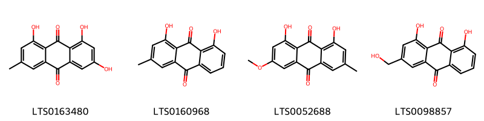{ width=100% }
    <figcaption>Hình ảnh cấu trúc hóa học của 4 hoạt chất thuộc nhóm Anthracenes gồm ['emodin (LTS0163480)', 'turkey rhubarb (LTS0160968)', 'physcion (LTS0052688)', 'aloe emodin (LTS0098857)'].</figcaption>
</figure>

---

### Dược dân tộc học

Danh sách các quốc gia có sử dụng *Rumex scutatus* trong điều trị các bệnh. 

| Country   | Disease                              | Bệnh                                                                                                                                                                                                |
|:----------|:-------------------------------------|:----------------------------------------------------------------------------------------------------------------------------------------------------------------------------------------------------|
| Elsewhere | Astringent, Refrigerant              | MYMEMORY WARNING: YOU USED ALL AVAILABLE FREE TRANSLATIONS FOR TODAY. NEXT AVAILABLE IN  15 HOURS 28 MINUTES 40 SECONDS VISIT HTTPS://MYMEMORY.TRANSLATED.NET/DOC/USAGELIMITS.PHP TO TRANSLATE MORE |
| Iraq      | Cardiac                              | MYMEMORY WARNING: YOU USED ALL AVAILABLE FREE TRANSLATIONS FOR TODAY. NEXT AVAILABLE IN  15 HOURS 28 MINUTES 36 SECONDS VISIT HTTPS://MYMEMORY.TRANSLATED.NET/DOC/USAGELIMITS.PHP TO TRANSLATE MORE |
| Turkey    | Apertif, Cardiac, Diuretic, Laxative | MYMEMORY WARNING: YOU USED ALL AVAILABLE FREE TRANSLATIONS FOR TODAY. NEXT AVAILABLE IN  15 HOURS 28 MINUTES 32 SECONDS VISIT HTTPS://MYMEMORY.TRANSLATED.NET/DOC/USAGELIMITS.PHP TO TRANSLATE MORE |

---

---
## Rumex vesicarius
### Thông tin về thực vật

!!! info "Phân loại thực vật của *Rumex vesicarius* từ GIBF:"
    - **Kingdom:** Plantae
    - **Phylum:** Tracheophyta
    - **Order:** Caryophyllales
    - **Family:** Polygonaceae
    - **Genus:** Rumex
    - **Species:** *Rumex vesicarius*

 

| Label (VI)   | Label (EN)   | Scientific Name   | Descriptions (VI)   | Descriptions (EN)   | Also Known As (VI)   | Also Known As (EN)                                 |
|:-------------|:-------------|:------------------|:--------------------|:--------------------|:---------------------|:---------------------------------------------------|
| N/A          | N/A          | Rumex vesicarius  | loài thực vật       | species of plant    | ['']                 | ['Acetosa vesicaria', 'Bladder dock', 'ruby dock'] |

#### Phân bố trên thế giới

**Từ CSDL GIBF** Morocco, United Arab Emirates, Algeria, Greece, Saudi Arabia, Kuwait, Israel, Australia, Egypt, Iraq, Jordan, Spain

#### Phân bố tại Việt Nam

**Từ CSDL GIBF**: Không có ghi nhận ở Việt Nam

---
### Thành phần hóa học
        
- Theo cơ sở dữ liệu lotus: Từ loài *Rumex vesicarius* đã phân lập và xác định được 7 hoạt chất thuộc về các nhóm Anthracenes, Flavonoids. 

|    | chemicalTaxonomyClassyfireClass   |   smiles_count |
|---:|:----------------------------------|---------------:|
|  0 | Anthracenes                       |              1 |
|  1 | Flavonoids                        |              6 |

#### Nhóm Anthracenes
<figure markdown="span">
    { width=100% }
    <figcaption>Hình ảnh cấu trúc hóa học của 1 hoạt chất thuộc nhóm Anthracenes gồm ['emodin (LTS0163480)'].</figcaption>
</figure>
#### Nhóm Flavonoids
<figure markdown="span">
    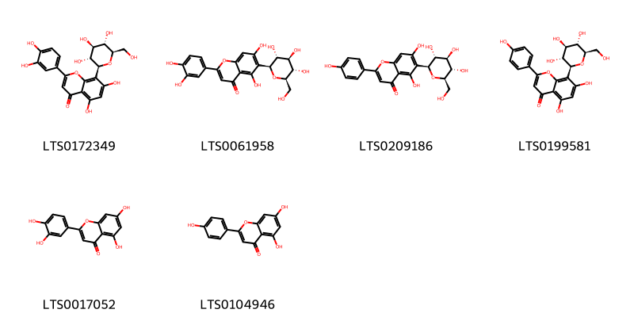{ width=100% }
    <figcaption>Hình ảnh cấu trúc hóa học của 6 hoạt chất thuộc nhóm Flavonoids gồm ['orientin (LTS0172349)', 'isoorientin (LTS0061958)', 'isovitexin (LTS0209186)', 'vitexin (LTS0199581)', 'luteolin (LTS0017052)', 'chamomile (LTS0104946)'].</figcaption>
</figure>

---

### Dược dân tộc học

Danh sách các quốc gia có sử dụng *Rumex vesicarius* trong điều trị các bệnh. 

| Country   | Disease                               | Bệnh                                                                                                                                                                                                |
|:----------|:--------------------------------------|:----------------------------------------------------------------------------------------------------------------------------------------------------------------------------------------------------|
| Elsewhere | Poison                                | MYMEMORY WARNING: YOU USED ALL AVAILABLE FREE TRANSLATIONS FOR TODAY. NEXT AVAILABLE IN  15 HOURS 28 MINUTES 03 SECONDS VISIT HTTPS://MYMEMORY.TRANSLATED.NET/DOC/USAGELIMITS.PHP TO TRANSLATE MORE |
| Iraq      | Laxative, Tonic, Astringent, Sedative | MYMEMORY WARNING: YOU USED ALL AVAILABLE FREE TRANSLATIONS FOR TODAY. NEXT AVAILABLE IN  15 HOURS 28 MINUTES 00 SECONDS VISIT HTTPS://MYMEMORY.TRANSLATED.NET/DOC/USAGELIMITS.PHP TO TRANSLATE MORE |

---

---
## Rumex violascens
### Thông tin về thực vật

!!! info "Phân loại thực vật của *Rumex violascens* từ GIBF:"
    - **Kingdom:** Plantae
    - **Phylum:** Tracheophyta
    - **Order:** Caryophyllales
    - **Family:** Polygonaceae
    - **Genus:** Rumex
    - **Species:** *Rumex violascens*

 

| Label (VI)   | Label (EN)   | Scientific Name   | Descriptions (VI)   | Descriptions (EN)   | Also Known As (VI)   | Also Known As (EN)   |
|:-------------|:-------------|:------------------|:--------------------|:--------------------|:---------------------|:---------------------|
| N/A          | N/A          | Rumex violascens  | loài thực vật       | species of plant    | ['']                 | ['']                 |

#### Phân bố trên thế giới

**Từ CSDL GIBF** nan, Mexico, United States of America

#### Phân bố tại Việt Nam

**Từ CSDL GIBF**: Không có ghi nhận ở Việt Nam

---
### Thành phần hóa học
        
- Theo cơ sở dữ liệu lotus: Từ loài *Rumex violascens* đã phân lập và xác định được Chưa có hoạt chất nào được phân lập. hoạt chất thuộc về các nhóm Không có hoạt chất nào được phân lập. 

Không có hình ảnh nào được tạo ra

---

### Dược dân tộc học

Danh sách các quốc gia có sử dụng *Rumex violascens* trong điều trị các bệnh. 

| Country      | Disease               | Bệnh                                                                                                                                                                                                |
|:-------------|:----------------------|:----------------------------------------------------------------------------------------------------------------------------------------------------------------------------------------------------|
| Mexico(Seri) | Antiseptic, Stimulant | MYMEMORY WARNING: YOU USED ALL AVAILABLE FREE TRANSLATIONS FOR TODAY. NEXT AVAILABLE IN  15 HOURS 27 MINUTES 22 SECONDS VISIT HTTPS://MYMEMORY.TRANSLATED.NET/DOC/USAGELIMITS.PHP TO TRANSLATE MORE |

---

# Chi Reynoutria

??? note "Danh sách các dược liệu thuộc chi"
    
	 - *Reynoutria japonica*

---
## Reynoutria japonica
### Thông tin về thực vật

!!! info "Phân loại thực vật của *Reynoutria japonica* từ GIBF:"
    - **Kingdom:** Plantae
    - **Phylum:** Tracheophyta
    - **Order:** Caryophyllales
    - **Family:** Polygonaceae
    - **Genus:** Reynoutria
    - **Species:** *Reynoutria japonica*

 

| Label (VI)   | Label (EN)   | Scientific Name     | Descriptions (VI)   | Descriptions (EN)   | Also Known As (VI)   | Also Known As (EN)                        |
|:-------------|:-------------|:--------------------|:--------------------|:--------------------|:---------------------|:------------------------------------------|
| N/A          | N/A          | Reynoutria japonica | loài thực vật       | species of plant    | ['']                 | ['Flowering Bamboo', 'Japanese Knotweed'] |

#### Phân bố trên thế giới

**Từ CSDL GIBF** Belarus, Austria, United States of America, Norway, Sweden, France, Netherlands, Chinese Taipei, Slovakia, Ukraine, Belgium, New Zealand, Italy, Switzerland, Canada, Germany, United Kingdom of Great Britain and Northern Ireland, Denmark

#### Phân bố tại Việt Nam

**Từ CSDL GIBF**: Không có ghi nhận ở Việt Nam

---
### Thành phần hóa học
        
- Theo cơ sở dữ liệu lotus: Từ loài *Reynoutria japonica* đã phân lập và xác định được 67 hoạt chất thuộc về các nhóm Benzene and substituted derivatives, Stilbenes, Flavonoids, Anthracenes, Coumarins and derivatives, Naphthalenes, Organooxygen compounds, Indoles and derivatives. 

|    | chemicalTaxonomyClassyfireClass     |   smiles_count |
|---:|:------------------------------------|---------------:|
|  0 | Anthracenes                         |             25 |
|  1 | Benzene and substituted derivatives |              3 |
|  2 | Coumarins and derivatives           |              1 |
|  3 | Flavonoids                          |             11 |
|  4 | Indoles and derivatives             |              2 |
|  5 | Naphthalenes                        |              1 |
|  6 | Organooxygen compounds              |              6 |
|  7 | Stilbenes                           |             17 |

#### Nhóm Anthracenes
<figure markdown="span">
    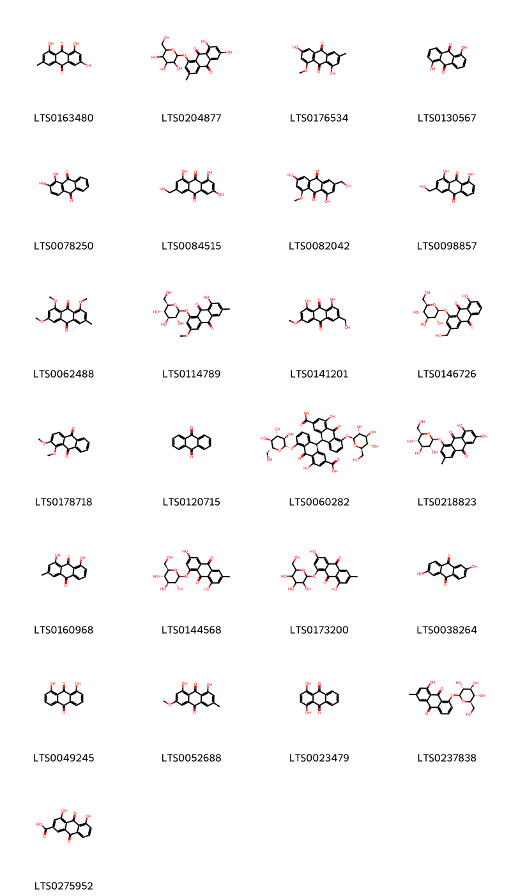{ width=100% }
    <figcaption>Hình ảnh cấu trúc hóa học của 25 hoạt chất thuộc nhóm Anthracenes gồm ['emodin (LTS0163480)', '1,3-dihydroxy-6-methyl-8-{[3,4,5-trihydroxy-6-(hydroxymethyl)oxan-2-yl]oxy}anthracene-9,10-dione (LTS0204877)', 'questin (LTS0176534)', 'anthrarufin (LTS0130567)', 'alizarin (LTS0078250)', 'citreorosein (LTS0084515)', 'questinol (LTS0082042)', 'aloe emodin (LTS0098857)', '1,3,8-trimethoxy-6-methylanthracene-9,10-dione (LTS0062488)', 'physcion 8-glucoside (LTS0114789)', '1,8-dihydroxy-3-(hydroxymethyl)-6-methoxyanthracene-9,10-dione (LTS0141201)', '8-hydroxy-3-(hydroxymethyl)-1-{[(2s,3r,4s,5s,6r)-3,4,5-trihydroxy-6-(hydroxymethyl)oxan-2-yl]oxy}anthracene-9,10-dione (LTS0146726)', '1,2-dimethoxyanthracene-9,10-dione (LTS0178718)', 'anthraquinone (LTS0120715)', 'sennoside a (LTS0060282)', 'emodin 1-o-β-d-glucoside (LTS0218823)', 'turkey rhubarb (LTS0160968)', 'emodin 8-glucoside (LTS0144568)', '1,6-dihydroxy-3-methyl-8-{[3,4,5-trihydroxy-6-(hydroxymethyl)oxan-2-yl]oxy}anthracene-9,10-dione (LTS0173200)', 'anthraflavic acid (LTS0038264)', 'danthron (LTS0049245)', 'physcion (LTS0052688)', 'quinizarin (LTS0023479)', 'pulmatin (LTS0237838)', 'monorhein (LTS0275952)'].</figcaption>
</figure>
#### Nhóm Benzene and substituted derivatives
<figure markdown="span">
    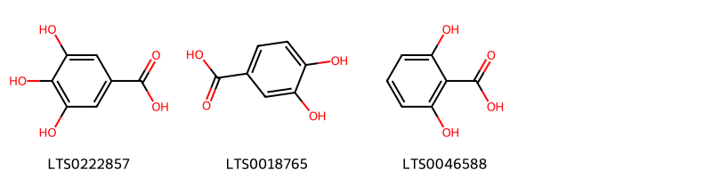{ width=100% }
    <figcaption>Hình ảnh cấu trúc hóa học của 3 hoạt chất thuộc nhóm Benzene and substituted derivatives gồm ['galop (LTS0222857)', '3,4-dihydroxybenzoic acid (LTS0018765)', '2,6-dihydroxybenzoic acid (LTS0046588)'].</figcaption>
</figure>
#### Nhóm Coumarins and derivatives
<figure markdown="span">
    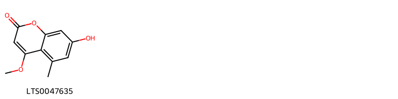{ width=100% }
    <figcaption>Hình ảnh cấu trúc hóa học của 1 hoạt chất thuộc nhóm Coumarins and derivatives gồm ['7-hydroxy-4-methoxy-5-methylchromen-2-one (LTS0047635)'].</figcaption>
</figure>
#### Nhóm Flavonoids
<figure markdown="span">
    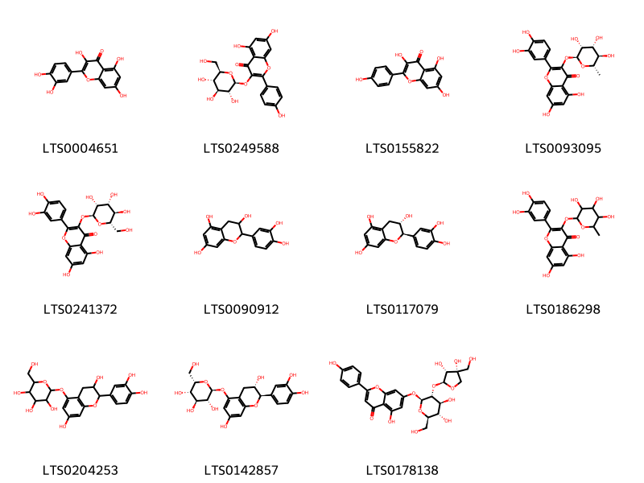{ width=100% }
    <figcaption>Hình ảnh cấu trúc hóa học của 11 hoạt chất thuộc nhóm Flavonoids gồm ['quercetin (LTS0004651)', 'astragalin (LTS0249588)', 'kaempherol (LTS0155822)', 'quercitrin (LTS0093095)', '2-(3,4-dihydroxyphenyl)-5,7-dihydroxy-3-{[(2s,3r,4r,5r,6s)-3,4,5-trihydroxy-6-(hydroxymethyl)oxan-2-yl]oxy}chromen-4-one (LTS0241372)', 'catechol (LTS0090912)', '(+)-catechol (LTS0117079)', 'quercitrin (LTS0186298)', '2-{[2-(3,4-dihydroxyphenyl)-3,7-dihydroxy-3,4-dihydro-2h-1-benzopyran-5-yl]oxy}-6-(hydroxymethyl)oxane-3,4,5-triol (LTS0204253)', '(2s,3r,4s,5s,6s)-2-{[(2r,3s)-2-(3,4-dihydroxyphenyl)-3,7-dihydroxy-3,4-dihydro-2h-1-benzopyran-5-yl]oxy}-6-(hydroxymethyl)oxane-3,4,5-triol (LTS0142857)', 'apiin (LTS0178138)'].</figcaption>
</figure>
#### Nhóm Indoles and derivatives
<figure markdown="span">
    { width=100% }
    <figcaption>Hình ảnh cấu trúc hóa học của 2 hoạt chất thuộc nhóm Indoles and derivatives gồm ['l-tryptophan (LTS0263809)', 'optimax (LTS0014343)'].</figcaption>
</figure>
#### Nhóm Naphthalenes
<figure markdown="span">
    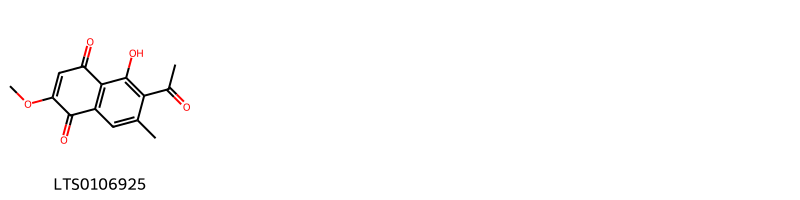{ width=100% }
    <figcaption>Hình ảnh cấu trúc hóa học của 1 hoạt chất thuộc nhóm Naphthalenes gồm ['6-acetyl-5-hydroxy-2-methoxy-7-methylnaphthalene-1,4-dione (LTS0106925)'].</figcaption>
</figure>
#### Nhóm Organooxygen compounds
<figure markdown="span">
    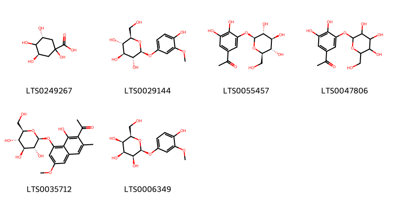{ width=100% }
    <figcaption>Hình ảnh cấu trúc hóa học của 6 hoạt chất thuộc nhóm Organooxygen compounds gồm ['(3r,5r)-1,3,4,5-tetrahydroxycyclohexane-1-carboxylic acid (LTS0249267)', '(2s,3r,4s,5s,6r)-2-(4-hydroxy-3-methoxyphenoxy)-6-(hydroxymethyl)oxane-3,4,5-triol (LTS0029144)', '1-(3,4-dihydroxy-5-{[(2s,3r,4s,5s,6r)-3,4,5-trihydroxy-6-(hydroxymethyl)oxan-2-yl]oxy}phenyl)ethanone (LTS0055457)', '1-(3,4-dihydroxy-5-{[3,4,5-trihydroxy-6-(hydroxymethyl)oxan-2-yl]oxy}phenyl)ethanone (LTS0047806)', '1-(1-hydroxy-6-methoxy-3-methyl-8-{[(2s,3r,4s,5s,6r)-3,4,5-trihydroxy-6-(hydroxymethyl)oxan-2-yl]oxy}naphthalen-2-yl)ethanone (LTS0035712)', '(2s,3s,4s,5r,6r)-2-(4-hydroxy-3-methoxyphenoxy)-6-(hydroxymethyl)oxane-3,4,5-triol (LTS0006349)'].</figcaption>
</figure>
#### Nhóm Stilbenes
<figure markdown="span">
    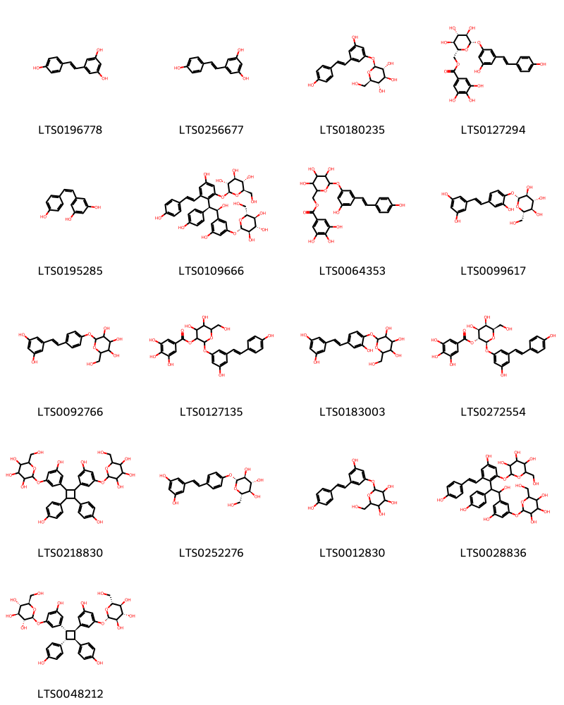{ width=100% }
    <figcaption>Hình ảnh cấu trúc hóa học của 17 hoạt chất thuộc nhóm Stilbenes gồm ['tocilizumab (LTS0196778)', 'resveratrol (LTS0256677)', 'piceid (LTS0180235)', '[(2r,3s,4s,5r,6s)-3,4,5-trihydroxy-6-{3-hydroxy-5-[(1e)-2-(4-hydroxyphenyl)ethenyl]phenoxy}oxan-2-yl]methyl 3,4,5-trihydroxybenzoate (LTS0127294)', 'cis-resveratrol (LTS0195285)', '(2s,3r,4s,5s,6r)-2-{3-hydroxy-5-[(1r,2s)-1-hydroxy-2-{4-hydroxy-2-[(1e)-2-(4-hydroxyphenyl)ethenyl]-6-{[(2s,3r,4s,5s,6r)-3,4,5-trihydroxy-6-(hydroxymethyl)oxan-2-yl]oxy}phenyl}-2-(4-hydroxyphenyl)ethyl]phenoxy}-6-(hydroxymethyl)oxane-3,4,5-triol (LTS0109666)', '(3,4,5-trihydroxy-6-{3-hydroxy-5-[2-(4-hydroxyphenyl)ethenyl]phenoxy}oxan-2-yl)methyl 3,4,5-trihydroxybenzoate (LTS0064353)', '(2r,3s,4r,5r,6s)-2-{4-[(1e)-2-(3,5-dihydroxyphenyl)ethenyl]-2-hydroxyphenoxy}-6-(hydroxymethyl)oxane-3,4,5-triol (LTS0099617)', 'resveratroloside (LTS0092766)', '4,5-dihydroxy-2-{3-hydroxy-5-[2-(4-hydroxyphenyl)ethenyl]phenoxy}-6-(hydroxymethyl)oxan-3-yl 3,4,5-trihydroxybenzoate (LTS0127135)', '2-{4-[2-(3,5-dihydroxyphenyl)ethenyl]-2-hydroxyphenoxy}-6-(hydroxymethyl)oxane-3,4,5-triol (LTS0183003)', '(2s,3r,4s,5r,6r)-4,5-dihydroxy-2-{3-hydroxy-5-[(1e)-2-(4-hydroxyphenyl)ethenyl]phenoxy}-6-(hydroxymethyl)oxan-3-yl 3,4,5-trihydroxybenzoate (LTS0272554)', '2-{3-hydroxy-5-[2-(3-hydroxy-5-{[3,4,5-trihydroxy-6-(hydroxymethyl)oxan-2-yl]oxy}phenyl)-3,4-bis(4-hydroxyphenyl)cyclobutyl]phenoxy}-6-(hydroxymethyl)oxane-3,4,5-triol (LTS0218830)', '(2r,3s,4r,5r,6s)-2-{4-[(1e)-2-(3,5-dihydroxyphenyl)ethenyl]phenoxy}-6-(hydroxymethyl)oxane-3,4,5-triol (LTS0252276)', '2-{3-hydroxy-5-[2-(4-hydroxyphenyl)ethenyl]phenoxy}-6-(hydroxymethyl)oxane-3,4,5-triol (LTS0012830)', '2-[3-hydroxy-5-(1-hydroxy-2-{4-hydroxy-2-[2-(4-hydroxyphenyl)ethenyl]-6-{[3,4,5-trihydroxy-6-(hydroxymethyl)oxan-2-yl]oxy}phenyl}-2-(4-hydroxyphenyl)ethyl)phenoxy]-6-(hydroxymethyl)oxane-3,4,5-triol (LTS0028836)', '(2s,3r,4s,5s,6r)-2-{3-hydroxy-5-[(1s,2s,3s,4s)-2-(3-hydroxy-5-{[(2s,3r,4s,5s,6r)-3,4,5-trihydroxy-6-(hydroxymethyl)oxan-2-yl]oxy}phenyl)-3,4-bis(4-hydroxyphenyl)cyclobutyl]phenoxy}-6-(hydroxymethyl)oxane-3,4,5-triol (LTS0048212)'].</figcaption>
</figure>

---

### Dược dân tộc học

Danh sách các quốc gia có sử dụng *Reynoutria japonica* trong điều trị các bệnh. 

| Country   | Disease                          | Bệnh                                                                                                                                                                                                |
|:----------|:---------------------------------|:----------------------------------------------------------------------------------------------------------------------------------------------------------------------------------------------------|
| Japan     | Diuretic, Stomachic, Emmenagogue | MYMEMORY WARNING: YOU USED ALL AVAILABLE FREE TRANSLATIONS FOR TODAY. NEXT AVAILABLE IN  15 HOURS 26 MINUTES 52 SECONDS VISIT HTTPS://MYMEMORY.TRANSLATED.NET/DOC/USAGELIMITS.PHP TO TRANSLATE MORE |

---

# Chi Aconogonum

??? note "Danh sách các dược liệu thuộc chi"
    
	 - *Aconogonum molle*

---
## Aconogonum molle
### Thông tin về thực vật

!!! info "Phân loại thực vật của *Koenigia mollis* từ GIBF:"
    - **Kingdom:** Plantae
    - **Phylum:** Tracheophyta
    - **Order:** Caryophyllales
    - **Family:** Polygonaceae
    - **Genus:** Koenigia
    - **Species:** *Koenigia mollis*

 

| Label (VI)   | Label (EN)   | Scientific Name     | Descriptions (VI)   | Descriptions (EN)   | Also Known As (VI)   | Also Known As (EN)                        |
|:-------------|:-------------|:--------------------|:--------------------|:--------------------|:---------------------|:------------------------------------------|
| N/A          | N/A          | Reynoutria japonica | loài thực vật       | species of plant    | ['']                 | ['Flowering Bamboo', 'Japanese Knotweed'] |

#### Phân bố trên thế giới

**Từ CSDL GIBF** nan, Japan, Nepal, China, United Kingdom of Great Britain and Northern Ireland

#### Phân bố tại Việt Nam

**Từ CSDL GIBF**: Không có ghi nhận ở Việt Nam

---
### Thành phần hóa học
        
- Theo cơ sở dữ liệu lotus: Từ loài *Koenigia mollis* đã phân lập và xác định được Chưa có hoạt chất nào được phân lập. hoạt chất thuộc về các nhóm Không có hoạt chất nào được phân lập. 

Không có hình ảnh nào được tạo ra

---

### Dược dân tộc học

Danh sách các quốc gia có sử dụng *Koenigia mollis* trong điều trị các bệnh. 

| Country   | Disease                | Bệnh                                                                                                                                                                                                |
|:----------|:-----------------------|:----------------------------------------------------------------------------------------------------------------------------------------------------------------------------------------------------|
| Nepal     | Astringent, Astringent | MYMEMORY WARNING: YOU USED ALL AVAILABLE FREE TRANSLATIONS FOR TODAY. NEXT AVAILABLE IN  15 HOURS 26 MINUTES 13 SECONDS VISIT HTTPS://MYMEMORY.TRANSLATED.NET/DOC/USAGELIMITS.PHP TO TRANSLATE MORE |

---

# Chi Emex

??? note "Danh sách các dược liệu thuộc chi"
    
	 - *Emex inosa*

---
## Emex inosa
### Thông tin về thực vật

!!! info "Phân loại thực vật của *N/A* từ GIBF:"
    - **Kingdom:** Plantae
    - **Phylum:** Tracheophyta
    - **Order:** Caryophyllales
    - **Family:** Polygonaceae
    - **Genus:** Rumex
    - **Species:** *N/A*

 

| Label (VI)   | Label (EN)   | Scientific Name     | Descriptions (VI)   | Descriptions (EN)   | Also Known As (VI)   | Also Known As (EN)                        |
|:-------------|:-------------|:--------------------|:--------------------|:--------------------|:---------------------|:------------------------------------------|
| N/A          | N/A          | Reynoutria japonica | loài thực vật       | species of plant    | ['']                 | ['Flowering Bamboo', 'Japanese Knotweed'] |

#### Phân bố trên thế giới

**Từ CSDL GIBF** Morocco, nan, Brazil, United States of America, Portugal, Iran (Islamic Republic of), New Caledonia, South Africa, China, Tunisia, Australia, Iraq, Cyprus, Cabo Verde, Spain

#### Phân bố tại Việt Nam

**Từ CSDL GIBF**: Không có ghi nhận ở Việt Nam

---
### Thành phần hóa học
        
- Theo cơ sở dữ liệu lotus: Từ loài *N/A* đã phân lập và xác định được Chưa có hoạt chất nào được phân lập. hoạt chất thuộc về các nhóm Không có hoạt chất nào được phân lập. 

Không có hình ảnh nào được tạo ra

---

### Dược dân tộc học

Danh sách các quốc gia có sử dụng *N/A* trong điều trị các bệnh. 

| Country        | Disease   | Bệnh                                                                                                                                                                                                |
|:---------------|:----------|:----------------------------------------------------------------------------------------------------------------------------------------------------------------------------------------------------|
| Africa(Kaffir) | Tonic     | MYMEMORY WARNING: YOU USED ALL AVAILABLE FREE TRANSLATIONS FOR TODAY. NEXT AVAILABLE IN  15 HOURS 25 MINUTES 51 SECONDS VISIT HTTPS://MYMEMORY.TRANSLATED.NET/DOC/USAGELIMITS.PHP TO TRANSLATE MORE |

---

# Chi Fagopyrum

??? note "Danh sách các dược liệu thuộc chi"
    
	 - *Fagopyrum cymosum*
	 - *Fagopyrum esculentum*

---
## Fagopyrum cymosum
### Thông tin về thực vật

!!! info "Phân loại thực vật của *Fagopyrum cymosum* từ GIBF:"
    - **Kingdom:** Plantae
    - **Phylum:** Tracheophyta
    - **Order:** Caryophyllales
    - **Family:** Polygonaceae
    - **Genus:** Fagopyrum
    - **Species:** *Fagopyrum cymosum*

 

| Label (VI)   | Label (EN)   | Scientific Name   | Descriptions (VI)   | Descriptions (EN)   | Also Known As (VI)   | Also Known As (EN)   |
|:-------------|:-------------|:------------------|:--------------------|:--------------------|:---------------------|:---------------------|
| N/A          | N/A          | Fagopyrum cymosum | loài thực vật       | species of plant    | ['']                 | ['']                 |

#### Phân bố trên thế giới

**Từ CSDL GIBF** nan, Japan, Portugal, Korea, Republic of, Norway, United States of America, United Kingdom of Great Britain and Northern Ireland, France, Chinese Taipei, Nepal, China, Thailand, New Zealand, Italy, India, Madagascar

#### Phân bố tại Việt Nam

**Từ CSDL GIBF**: Không có ghi nhận ở Việt Nam

---
### Thành phần hóa học
        
- Theo cơ sở dữ liệu lotus: Từ loài *Fagopyrum cymosum* đã phân lập và xác định được 1 hoạt chất thuộc về các nhóm Flavonoids. 

|    | chemicalTaxonomyClassyfireClass   |   smiles_count |
|---:|:----------------------------------|---------------:|
|  0 | Flavonoids                        |              1 |

#### Nhóm Flavonoids
<figure markdown="span">
    { width=100% }
    <figcaption>Hình ảnh cấu trúc hóa học của 1 hoạt chất thuộc nhóm Flavonoids gồm ['quercetin (LTS0004651)'].</figcaption>
</figure>

---

### Dược dân tộc học

Danh sách các quốc gia có sử dụng *Fagopyrum cymosum* trong điều trị các bệnh. 

| Country   |   Disease | Bệnh                                                                                                                                                                                                |
|:----------|----------:|:----------------------------------------------------------------------------------------------------------------------------------------------------------------------------------------------------|
| Japan     |       nan | MYMEMORY WARNING: YOU USED ALL AVAILABLE FREE TRANSLATIONS FOR TODAY. NEXT AVAILABLE IN  15 HOURS 25 MINUTES 26 SECONDS VISIT HTTPS://MYMEMORY.TRANSLATED.NET/DOC/USAGELIMITS.PHP TO TRANSLATE MORE |

---

---
## Fagopyrum esculentum
### Thông tin về thực vật

!!! info "Phân loại thực vật của *Fagopyrum esculentum* từ GIBF:"
    - **Kingdom:** Plantae
    - **Phylum:** Tracheophyta
    - **Order:** Caryophyllales
    - **Family:** Polygonaceae
    - **Genus:** Fagopyrum
    - **Species:** *Fagopyrum esculentum*

 

| Label (VI)   | Label (EN)   | Scientific Name      | Descriptions (VI)   | Descriptions (EN)                                     | Also Known As (VI)   | Also Known As (EN)   |
|:-------------|:-------------|:---------------------|:--------------------|:------------------------------------------------------|:---------------------|:---------------------|
| N/A          | N/A          | Fagopyrum esculentum | loài thực vật       | species of flowering plant in the family Polygonaceae | ['']                 | ['buckwheat plant']  |

#### Phân bố trên thế giới

**Từ CSDL GIBF** Czechia, Finland, China, New Zealand, Denmark, Netherlands, Poland, United States of America, Russian Federation, France, Belgium, Chinese Taipei, Luxembourg, Canada, Germany, Austria, Hungary, Slovakia, Australia, Italy, Switzerland, India, United Kingdom of Great Britain and Northern Ireland

#### Phân bố tại Việt Nam

**Từ CSDL GIBF**: Không có ghi nhận ở Việt Nam

---
### Thành phần hóa học
        
- Theo cơ sở dữ liệu lotus: Từ loài *Fagopyrum esculentum* đã phân lập và xác định được 100 hoạt chất thuộc về các nhóm Fatty Acyls, Benzene and substituted derivatives, Flavonoids, Benzodiazepines, Dibenzylbutane lignans, Pyrenes, Cinnamic acids and derivatives, Steroids and steroid derivatives, Carboxylic acids and derivatives, Anthracenes, Phenols, Lactams, Organooxygen compounds, Furanoid lignans. 

|    | chemicalTaxonomyClassyfireClass     |   smiles_count |
|---:|:------------------------------------|---------------:|
|  0 | Anthracenes                         |              3 |
|  1 | Benzene and substituted derivatives |              3 |
|  2 | Benzodiazepines                     |              2 |
|  3 | Carboxylic acids and derivatives    |              6 |
|  4 | Cinnamic acids and derivatives      |              6 |
|  5 | Dibenzylbutane lignans              |              2 |
|  6 | Fatty Acyls                         |             31 |
|  7 | Flavonoids                          |             26 |
|  8 | Furanoid lignans                    |              5 |
|  9 | Lactams                             |              1 |
| 10 | Organooxygen compounds              |              7 |
| 11 | Phenols                             |              2 |
| 12 | Pyrenes                             |              2 |
| 13 | Steroids and steroid derivatives    |              4 |

#### Nhóm Anthracenes
<figure markdown="span">
    { width=100% }
    <figcaption>Hình ảnh cấu trúc hóa học của 3 hoạt chất thuộc nhóm Anthracenes gồm ['emodin (LTS0163480)', 'turkey rhubarb (LTS0160968)', 'physcion (LTS0052688)'].</figcaption>
</figure>
#### Nhóm Benzene and substituted derivatives
<figure markdown="span">
    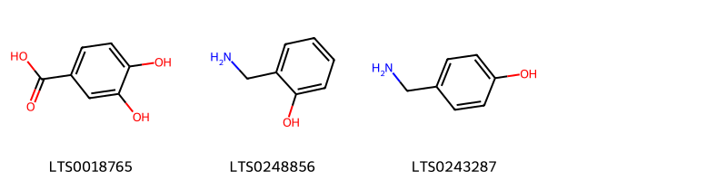{ width=100% }
    <figcaption>Hình ảnh cấu trúc hóa học của 3 hoạt chất thuộc nhóm Benzene and substituted derivatives gồm ['3,4-dihydroxybenzoic acid (LTS0018765)', '2-(aminomethyl)phenol (LTS0248856)', '4-hydroxybenzylamine (LTS0243287)'].</figcaption>
</figure>
#### Nhóm Benzodiazepines
<figure markdown="span">
    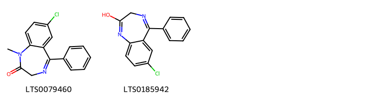{ width=100% }
    <figcaption>Hình ảnh cấu trúc hóa học của 2 hoạt chất thuộc nhóm Benzodiazepines gồm ['diazepam (LTS0079460)', 'lomax (LTS0185942)'].</figcaption>
</figure>
#### Nhóm Carboxylic acids and derivatives
<figure markdown="span">
    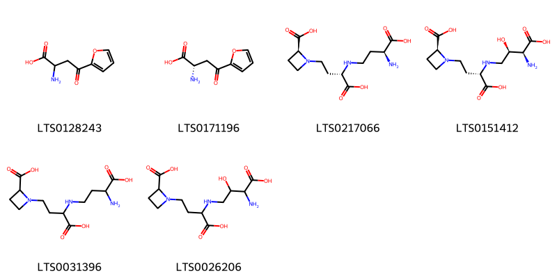{ width=100% }
    <figcaption>Hình ảnh cấu trúc hóa học của 6 hoạt chất thuộc nhóm Carboxylic acids and derivatives gồm ['2-amino-4-(furan-2-yl)-4-oxobutanoic acid (LTS0128243)', '(2s)-2-amino-4-(furan-2-yl)-4-oxobutanoic acid (LTS0171196)', 'nicotianamine (LTS0217066)', '(2s)-1-[(3s)-3-{[(2r,3s)-3-amino-3-carboxy-2-hydroxypropyl]amino}-3-carboxypropyl]azetidine-2-carboxylic acid (LTS0151412)', 'nicotianamine (LTS0031396)', '1-{3-[(3-amino-3-carboxy-2-hydroxypropyl)amino]-3-carboxypropyl}azetidine-2-carboxylic acid (LTS0026206)'].</figcaption>
</figure>
#### Nhóm Cinnamic acids and derivatives
<figure markdown="span">
    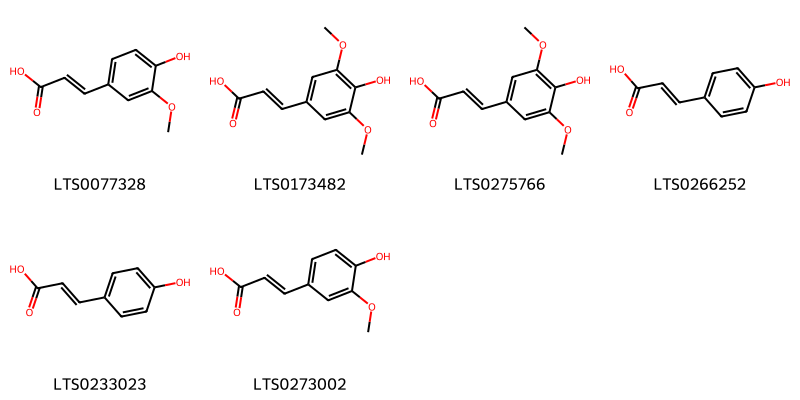{ width=100% }
    <figcaption>Hình ảnh cấu trúc hóa học của 6 hoạt chất thuộc nhóm Cinnamic acids and derivatives gồm ['ferulic acid (LTS0077328)', 'sinapinate (LTS0173482)', 'sinapoyl alcohol (LTS0275766)', 'para-coumaric acid (LTS0266252)', 'hydroxycinnamic acid (LTS0233023)', 'ferulic acid (LTS0273002)'].</figcaption>
</figure>
#### Nhóm Dibenzylbutane lignans
<figure markdown="span">
    { width=100% }
    <figcaption>Hình ảnh cấu trúc hóa học của 2 hoạt chất thuộc nhóm Dibenzylbutane lignans gồm ['(2s,3r)-2,3-bis[(4-hydroxy-3-methoxyphenyl)(¹³c)methyl](1-¹³c)butane-1,4-diol (LTS0268699)', 'secoisolariciresinol (LTS0086727)'].</figcaption>
</figure>
#### Nhóm Fatty Acyls
<figure markdown="span">
    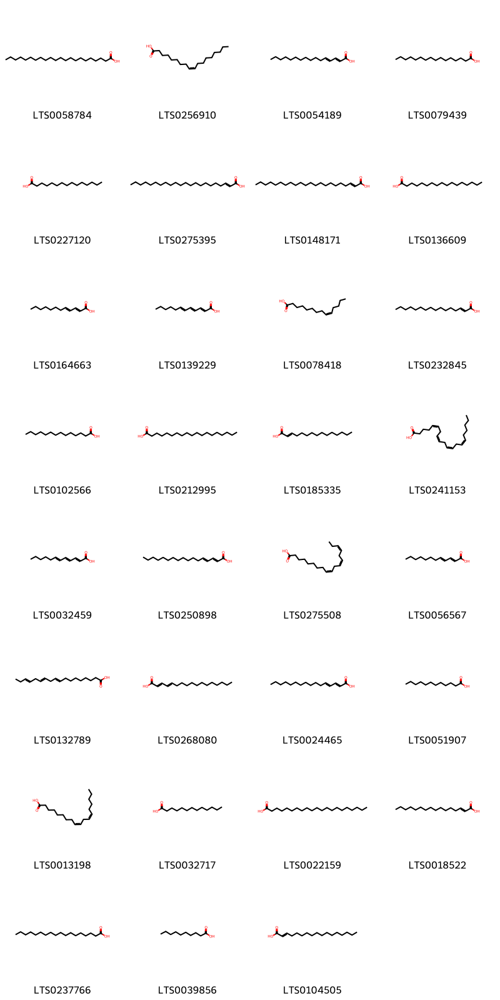{ width=100% }
    <figcaption>Hình ảnh cấu trúc hóa học của 31 hoạt chất thuộc nhóm Fatty Acyls gồm ['behenic acid (LTS0058784)', 'oleic acid (LTS0256910)', '(2e,4e)-hexadeca-2,4-dienoic acid (LTS0054189)', 'palmitic acid (LTS0079439)', 'pentadecanoic acid (LTS0227120)', '(2e)-docos-2-enoic acid (LTS0275395)', 'docos-2-enoic acid (LTS0148171)', 'heptadecanoic acid (LTS0136609)', 'dodeca-2,4-dienoic acid (LTS0164663)', '(2e,4e,6e)-dodeca-2,4,6-trienoic acid (LTS0139229)', 'myristoleic acid (LTS0078418)', 'hexadecenoic acid (LTS0232845)', 'myristic acid (LTS0102566)', 'nonadecanoic acid (LTS0212995)', 'pentadec-2-enoic acid (LTS0185335)', 'arachidonic acid (LTS0241153)', 'dodeca-2,4,6-trienoic acid (LTS0032459)', '(2e,4e)-heptadeca-2,4-dienoic acid (LTS0250898)', 'α-linolenic acid (LTS0275508)', '(2e,4e)-dodeca-2,4-dienoic acid (LTS0056567)', 'α linolenic acid (LTS0132789)', 'heptadeca-2,4-dienoic acid (LTS0268080)', 'hexadeca-2,4-dienoic acid (LTS0024465)', 'lauric acid (LTS0051907)', 'linoleic (LTS0013198)', 'n-tridecanoic acid (LTS0032717)', 'heneicosanoic acid (LTS0022159)', 't-2-hexadecenoic acid (LTS0018522)', 'stearic acid (LTS0237766)', 'capric acid (LTS0039856)', 'heptadec-2-enoic acid (LTS0104505)'].</figcaption>
</figure>
#### Nhóm Flavonoids
<figure markdown="span">
    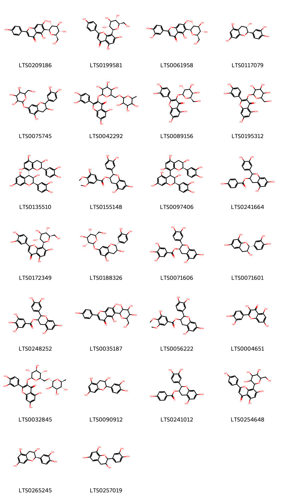{ width=100% }
    <figcaption>Hình ảnh cấu trúc hóa học của 26 hoạt chất thuộc nhóm Flavonoids gồm ['isovitexin (LTS0209186)', 'vitexin (LTS0199581)', 'isoorientin (LTS0061958)', '(+)-catechol (LTS0117079)', '2-{[2-(3,4-dihydroxyphenyl)-3,5-dihydroxy-3,4-dihydro-2h-1-benzopyran-7-yl]oxy}-6-(hydroxymethyl)oxane-3,4,5-triol (LTS0075745)', 'rutin (LTS0042292)', 'hyperoside (LTS0089156)', '2-(3,4-dihydroxyphenyl)-5,7-dihydroxy-3-{[3,4,5-trihydroxy-6-(hydroxymethyl)oxan-2-yl]oxy}chromen-4-one (LTS0195312)', '(2r,3r,4r)-2-(3,4-dihydroxyphenyl)-4-[(2r,3r)-2-(3,4-dihydroxyphenyl)-3,5,7-trihydroxy-3,4-dihydro-2h-1-benzopyran-8-yl]-3,4-dihydro-2h-1-benzopyran-3,5,7-triol (LTS0135510)', '(2r,3r)-2-(3,4-dihydroxyphenyl)-5,7-dihydroxy-3,4-dihydro-2h-1-benzopyran-3-yl 3-hydroxy-4,5-dimethoxybenzoate (LTS0155148)', '(2r,3r)-2-(3,4-dihydroxyphenyl)-4-[(2r,3r)-2-(3,4-dihydroxyphenyl)-3,5,7-trihydroxy-3,4-dihydro-2h-1-benzopyran-8-yl]-3,4-dihydro-2h-1-benzopyran-3,5,7-triol (LTS0097406)', '2-(3,4-dihydroxyphenyl)-5,7-dihydroxy-3,4-dihydro-2h-1-benzopyran-3-yl 4-hydroxybenzoate (LTS0241664)', 'orientin (LTS0172349)', 'catechin-7-o-glucoside (LTS0188326)', 'epicatechin gallate (LTS0071606)', '(2r,3s)-2-(3,4-dihydroxyphenyl)-3,4-dihydro-2h-1-benzopyran-3,6,8-triol (LTS0071601)', '2-(3,4-dihydroxyphenyl)-5,7-dihydroxy-3,4-dihydro-2h-1-benzopyran-3-yl 3,4,5-trihydroxybenzoate (LTS0248252)', 'isovitexin (LTS0035187)', '2-(3,4-dihydroxyphenyl)-5,7-dihydroxy-3,4-dihydro-2h-1-benzopyran-3-yl 3-hydroxy-4,5-dimethoxybenzoate (LTS0056222)', 'quercetin (LTS0004651)', '3-rutinosyl quercetin (LTS0032845)', 'catechol (LTS0090912)', '(2r,3r)-2-(3,4-dihydroxyphenyl)-5,7-dihydroxy-3,4-dihydro-2h-1-benzopyran-3-yl 4-hydroxybenzoate (LTS0241012)', 'vitexin (LTS0254648)', 'ent-epicatechin (LTS0265245)', '2-(3,4-dihydroxyphenyl)-3,4-dihydro-2h-1-benzopyran-3,6,8-triol (LTS0257019)'].</figcaption>
</figure>
#### Nhóm Furanoid lignans
<figure markdown="span">
    { width=100% }
    <figcaption>Hình ảnh cấu trúc hóa học của 5 hoạt chất thuộc nhóm Furanoid lignans gồm ['syringaresinol (LTS0116280)', 'pinoresinol (LTS0057431)', 'matairesinol (LTS0193475)', 'lariciresinol (LTS0010950)', '4-[(3ar,4s,6ar)-4-(4-hydroxy-3-methoxyphenyl)-hexahydrofuro[3,4-c]furan-1-yl]-2,6-dimethoxyphenol (LTS0041035)'].</figcaption>
</figure>
#### Nhóm Lactams
<figure markdown="span">
    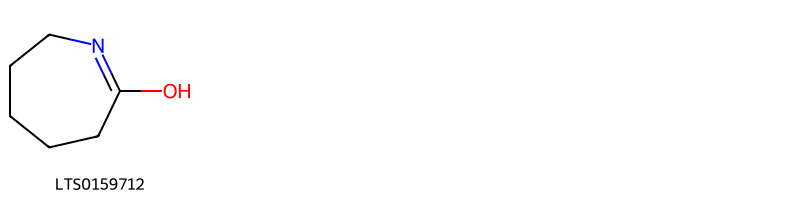{ width=100% }
    <figcaption>Hình ảnh cấu trúc hóa học của 1 hoạt chất thuộc nhóm Lactams gồm ['caprolactam (LTS0159712)'].</figcaption>
</figure>
#### Nhóm Organooxygen compounds
<figure markdown="span">
    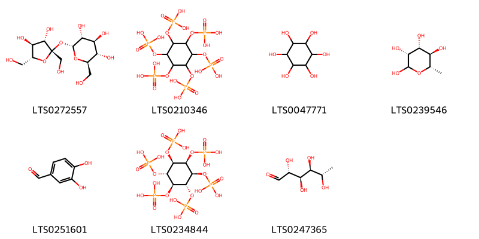{ width=100% }
    <figcaption>Hình ảnh cấu trúc hóa học của 7 hoạt chất thuộc nhóm Organooxygen compounds gồm ['sucrose (LTS0272557)', 'phytic acid (LTS0210346)', '(-)-inositol (LTS0047771)', 'l-rhamnose (LTS0239546)', '3,4-dihydroxybenzaldehyde (LTS0251601)', '[(1r,2r,3s,4r,5s,6s)-2,3,4,5,6-pentakis(phosphonooxy)cyclohexyl]oxyphosphonic acid (LTS0234844)', 'rhamnose (LTS0247365)'].</figcaption>
</figure>
#### Nhóm Phenols
<figure markdown="span">
    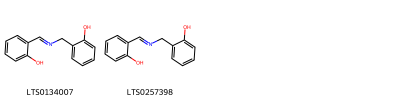{ width=100% }
    <figcaption>Hình ảnh cấu trúc hóa học của 2 hoạt chất thuộc nhóm Phenols gồm ['2-({[(2-hydroxyphenyl)methyl]imino}methyl)phenol (LTS0134007)', '2-[(e)-{[(2-hydroxyphenyl)methyl]imino}methyl]phenol (LTS0257398)'].</figcaption>
</figure>
#### Nhóm Pyrenes
<figure markdown="span">
    { width=100% }
    <figcaption>Hình ảnh cấu trúc hóa học của 2 hoạt chất thuộc nhóm Pyrenes gồm ['9,11,13,16,18,20-hexahydroxy-5,24-dimethyloctacyclo[13.11.1.1²,¹⁰.0³,⁸.0⁴,²⁵.0¹⁹,²⁷.0²¹,²⁶.0¹⁴,²⁸]octacosa-1(26),2,4(25),5,8,10,12,14(28),15,17,19(27),20,23-tridecaene-7,22-dione (LTS0238040)', 'hypericin (LTS0029230)'].</figcaption>
</figure>
#### Nhóm Steroids and steroid derivatives
<figure markdown="span">
    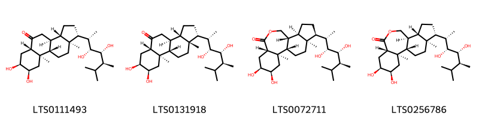{ width=100% }
    <figcaption>Hình ảnh cấu trúc hóa học của 4 hoạt chất thuộc nhóm Steroids and steroid derivatives gồm ['castasterone (LTS0111493)', '(1r,3as,3bs,5as,7s,8r,9ar,9bs,11ar)-1-[(2s,3r,4r,5s)-3,4-dihydroxy-5,6-dimethylheptan-2-yl]-7,8-dihydroxy-9a,11a-dimethyl-tetradecahydrocyclopenta[a]phenanthren-5-one (LTS0131918)', '(1s,2r,4r,5s,7s,11r,12r,15s,16s)-15-[(2s,3r,4r,5s)-3,4-dihydroxy-5,6-dimethylheptan-2-yl]-4,5-dihydroxy-2,16-dimethyl-9-oxatetracyclo[9.7.0.0²,⁷.0¹²,¹⁶]octadecan-8-one (LTS0072711)', 'brassinolide (LTS0256786)'].</figcaption>
</figure>

---

### Dược dân tộc học

Danh sách các quốc gia có sử dụng *Fagopyrum esculentum* trong điều trị các bệnh. 

| Country   | Disease     | Bệnh                                                                                                                                                                                                |
|:----------|:------------|:----------------------------------------------------------------------------------------------------------------------------------------------------------------------------------------------------|
| China     | Carminative | MYMEMORY WARNING: YOU USED ALL AVAILABLE FREE TRANSLATIONS FOR TODAY. NEXT AVAILABLE IN  15 HOURS 24 MINUTES 54 SECONDS VISIT HTTPS://MYMEMORY.TRANSLATED.NET/DOC/USAGELIMITS.PHP TO TRANSLATE MORE |

---

# Chi Polygonum

??? note "Danh sách các dược liệu thuộc chi"
    
	 - *Polygonum acre*
	 - *Polygonum alpinum*
	 - *Polygonum amphibium*
	 - *Polygonum aviculare*
	 - *Polygonum barbatum*
	 - *Polygonum bistorta*
	 - *Polygonum blumei*
	 - *Polygonum chinense*
	 - *Polygonum cuidatum*
	 - *Polygonum dumetorum*
	 - *Polygonum flaccidum*
	 - *Polygonum glabrum*
	 - *Polygonum hydopiper*
	 - *Polygonum hydropiper*
	 - *Polygonum lapathifolium*
	 - *Polygonum macrophyllum*
	 - *Polygonum miltiflorum*
	 - *Polygonum minus*
	 - *Polygonum molle*
	 - *Polygonum multiflorum*
	 - *Polygonum multiflorus*
	 - *Polygonum odoratum*
	 - *Polygonum orientale*
	 - *Polygonum perfoliatum*
	 - *Polygonum persicaria*
	 - *Polygonum pubescens*
	 - *Polygonum pulchrum*
	 - *Polygonum punctatum*
	 - *Polygonum strigosum*
	 - *Polygonum tenuicaule*
	 - *Polygonum tinctorium*
	 - *Polygonum tinctorum*
	 - *Polygonum tomentosum*
	 - *Polygonum virginianum*
	 - *Polygonum viviparum*

---
## Polygonum acre
### Thông tin về thực vật

!!! info "Phân loại thực vật của *N/A* từ GIBF:"
    - **Kingdom:** Plantae
    - **Phylum:** Tracheophyta
    - **Order:** Caryophyllales
    - **Family:** Polygonaceae
    - **Genus:** Persicaria
    - **Species:** *N/A*

 

| Label (VI)   | Label (EN)   | Scientific Name   | Descriptions (VI)   | Descriptions (EN)   | Also Known As (VI)   | Also Known As (EN)   |
|:-------------|:-------------|:------------------|:--------------------|:--------------------|:---------------------|:---------------------|
| N/A          | N/A          | Polygonum acre    |                     |                     | ['']                 | ['']                 |

#### Phân bố trên thế giới

**Từ CSDL GIBF** Brazil, Japan, Nepal, China, Chile, New Zealand, Ecuador, Thailand, Spain, Réunion, United States of America, Indonesia, Costa Rica, Colombia, Argentina, French Guiana, Hong Kong, Mexico, Benin, Kenya, United Kingdom of Great Britain and Northern Ireland, Chinese Taipei, Panama, Portugal, South Africa, Australia, France

#### Phân bố tại Việt Nam

**Từ CSDL GIBF**: Không có ghi nhận ở Việt Nam

---
### Thành phần hóa học
        
- Theo cơ sở dữ liệu lotus: Từ loài *N/A* đã phân lập và xác định được Chưa có hoạt chất nào được phân lập. hoạt chất thuộc về các nhóm Không có hoạt chất nào được phân lập. 

Không có hình ảnh nào được tạo ra

---

### Dược dân tộc học

Danh sách các quốc gia có sử dụng *N/A* trong điều trị các bệnh. 

| Country   | Disease   | Bệnh                                                                                                                                                                                                |
|:----------|:----------|:----------------------------------------------------------------------------------------------------------------------------------------------------------------------------------------------------|
| Mexico    | Diuretic  | MYMEMORY WARNING: YOU USED ALL AVAILABLE FREE TRANSLATIONS FOR TODAY. NEXT AVAILABLE IN  15 HOURS 23 MINUTES 58 SECONDS VISIT HTTPS://MYMEMORY.TRANSLATED.NET/DOC/USAGELIMITS.PHP TO TRANSLATE MORE |

---

---
## Polygonum alpinum
### Thông tin về thực vật

!!! info "Phân loại thực vật của *N/A* từ GIBF:"
    - **Kingdom:** Plantae
    - **Phylum:** Tracheophyta
    - **Order:** Caryophyllales
    - **Family:** Polygonaceae
    - **Genus:** N/A
    - **Species:** *N/A*

 

| Label (VI)   | Label (EN)   | Scientific Name   | Descriptions (VI)   | Descriptions (EN)   | Also Known As (VI)   | Also Known As (EN)   |
|:-------------|:-------------|:------------------|:--------------------|:--------------------|:---------------------|:---------------------|
| N/A          | N/A          | Polygonum alpinum | loài thực vật       | species of plant    | ['']                 | ['']                 |

#### Phân bố trên thế giới

**Từ CSDL GIBF** Brazil, Virgin Islands (British), China, Israel, Gambia, New Zealand, Türkiye, Ecuador, French Polynesia, Thailand, Spain, Netherlands, Puerto Rico, Cayman Islands, United States of America, Virgin Islands (U.S.), Indonesia, Colombia, Argentina, Aruba, Morocco, Hong Kong, Mexico, Guam, United Kingdom of Great Britain and Northern Ireland, Chinese Taipei, Kuwait, Canada, Germany, Austria, Hungary, Portugal, South Africa, Australia, Italy, India, France, Ireland

#### Phân bố tại Việt Nam

**Từ CSDL GIBF**: Không có ghi nhận ở Việt Nam

---
### Thành phần hóa học
        
- Theo cơ sở dữ liệu lotus: Từ loài *N/A* đã phân lập và xác định được Chưa có hoạt chất nào được phân lập. hoạt chất thuộc về các nhóm Không có hoạt chất nào được phân lập. 

Không có hình ảnh nào được tạo ra

---

### Dược dân tộc học

Danh sách các quốc gia có sử dụng *N/A* trong điều trị các bệnh. 

| Country   | Disease    | Bệnh                                                                                                                                                                                                |
|:----------|:-----------|:----------------------------------------------------------------------------------------------------------------------------------------------------------------------------------------------------|
| Elsewhere | Astringent | MYMEMORY WARNING: YOU USED ALL AVAILABLE FREE TRANSLATIONS FOR TODAY. NEXT AVAILABLE IN  15 HOURS 23 MINUTES 20 SECONDS VISIT HTTPS://MYMEMORY.TRANSLATED.NET/DOC/USAGELIMITS.PHP TO TRANSLATE MORE |

---

---
## Polygonum amphibium
### Thông tin về thực vật

!!! info "Phân loại thực vật của *Persicaria amphibia* từ GIBF:"
    - **Kingdom:** Plantae
    - **Phylum:** Tracheophyta
    - **Order:** Caryophyllales
    - **Family:** Polygonaceae
    - **Genus:** Persicaria
    - **Species:** *Persicaria amphibia*

 

| Label (VI)   | Label (EN)   | Scientific Name     | Descriptions (VI)   | Descriptions (EN)   | Also Known As (VI)   | Also Known As (EN)   |
|:-------------|:-------------|:--------------------|:--------------------|:--------------------|:---------------------|:---------------------|
| N/A          | N/A          | Polygonum amphibium | loài thực vật       | species of plant    | ['']                 | ['']                 |

#### Phân bố trên thế giới

**Từ CSDL GIBF** France, Latvia, Belgium, Switzerland, Estonia, Germany, United Kingdom of Great Britain and Northern Ireland

#### Phân bố tại Việt Nam

**Từ CSDL GIBF**: Không có ghi nhận ở Việt Nam

---
### Thành phần hóa học
        
- Theo cơ sở dữ liệu lotus: Từ loài *Persicaria amphibia* đã phân lập và xác định được Chưa có hoạt chất nào được phân lập. hoạt chất thuộc về các nhóm Không có hoạt chất nào được phân lập. 

Không có hình ảnh nào được tạo ra

---

### Dược dân tộc học

Danh sách các quốc gia có sử dụng *Persicaria amphibia* trong điều trị các bệnh. 

| Country   | Disease                                                          | Bệnh                                                                                                                                                                                                |
|:----------|:-----------------------------------------------------------------|:----------------------------------------------------------------------------------------------------------------------------------------------------------------------------------------------------|
| Elsewhere | Astringent, Diuretic, Sudorific, Tonic                           | MYMEMORY WARNING: YOU USED ALL AVAILABLE FREE TRANSLATIONS FOR TODAY. NEXT AVAILABLE IN  15 HOURS 22 MINUTES 52 SECONDS VISIT HTTPS://MYMEMORY.TRANSLATED.NET/DOC/USAGELIMITS.PHP TO TRANSLATE MORE |
| Turkey    | Aphrodisiac, Astringent, Diuretic, Sudorific, Tonic, Refrigerant | MYMEMORY WARNING: YOU USED ALL AVAILABLE FREE TRANSLATIONS FOR TODAY. NEXT AVAILABLE IN  15 HOURS 22 MINUTES 48 SECONDS VISIT HTTPS://MYMEMORY.TRANSLATED.NET/DOC/USAGELIMITS.PHP TO TRANSLATE MORE |

---

---
## Polygonum aviculare
### Thông tin về thực vật

!!! info "Phân loại thực vật của *Polygonum aviculare* từ GIBF:"
    - **Kingdom:** Plantae
    - **Phylum:** Tracheophyta
    - **Order:** Caryophyllales
    - **Family:** Polygonaceae
    - **Genus:** Polygonum
    - **Species:** *Polygonum aviculare*

 

| Label (VI)   | Label (EN)   | Scientific Name     | Descriptions (VI)                   | Descriptions (EN)   | Also Known As (VI)   | Also Known As (EN)                                          |
|:-------------|:-------------|:--------------------|:------------------------------------|:--------------------|:---------------------|:------------------------------------------------------------|
| N/A          | N/A          | Polygonum aviculare | loài thực vật dùng làm thuốc Đông y | species of plant    | ['']                 | ['common knotgrass', 'yard knotweed', 'prostrate knotweed'] |

#### Phân bố trên thế giới

**Từ CSDL GIBF** Sweden, Finland, Kazakhstan, New Zealand, Türkiye, Slovenia, Spain, Netherlands, United States of America, Argentina, Mexico, France, Belgium, Germany, Austria, Hungary, Portugal, Slovakia, South Africa, Australia, Ukraine, Italy, Switzerland, United Kingdom of Great Britain and Northern Ireland

#### Phân bố tại Việt Nam

**Từ CSDL GIBF**: Không có ghi nhận ở Việt Nam

---
### Thành phần hóa học
        
- Theo cơ sở dữ liệu lotus: Từ loài *Polygonum aviculare* đã phân lập và xác định được 31 hoạt chất thuộc về các nhóm Benzofurans, Benzene and substituted derivatives, Flavonoids, Cinnamic acids and derivatives, Furanoid lignans, Lignan glycosides. 

|    | chemicalTaxonomyClassyfireClass     |   smiles_count |
|---:|:------------------------------------|---------------:|
|  0 | Benzene and substituted derivatives |              6 |
|  1 | Benzofurans                         |              1 |
|  2 | Cinnamic acids and derivatives      |              4 |
|  3 | Flavonoids                          |             18 |
|  4 | Furanoid lignans                    |              1 |
|  5 | Lignan glycosides                   |              1 |

#### Nhóm Benzene and substituted derivatives
<figure markdown="span">
    { width=100% }
    <figcaption>Hình ảnh cấu trúc hóa học của 6 hoạt chất thuộc nhóm Benzene and substituted derivatives gồm ['syringic acid (LTS0210036)', '2,5-dihydroxybenzoic acid (LTS0170793)', 'galop (LTS0222857)', 'p-hydroxybenzoic acid (LTS0263634)', '3,4-dihydroxybenzoic acid (LTS0018765)', 'vanillic acid (LTS0229113)'].</figcaption>
</figure>
#### Nhóm Benzofurans
<figure markdown="span">
    { width=100% }
    <figcaption>Hình ảnh cấu trúc hóa học của 1 hoạt chất thuộc nhóm Benzofurans gồm ['loliolide (LTS0254454)'].</figcaption>
</figure>
#### Nhóm Cinnamic acids and derivatives
<figure markdown="span">
    { width=100% }
    <figcaption>Hình ảnh cấu trúc hóa học của 4 hoạt chất thuộc nhóm Cinnamic acids and derivatives gồm ['ferulic acid (LTS0077328)', 'sinapinate (LTS0173482)', '3,4-dihydroxycinnamic acid (LTS0128050)', 'para-coumaric acid (LTS0266252)'].</figcaption>
</figure>
#### Nhóm Flavonoids
<figure markdown="span">
    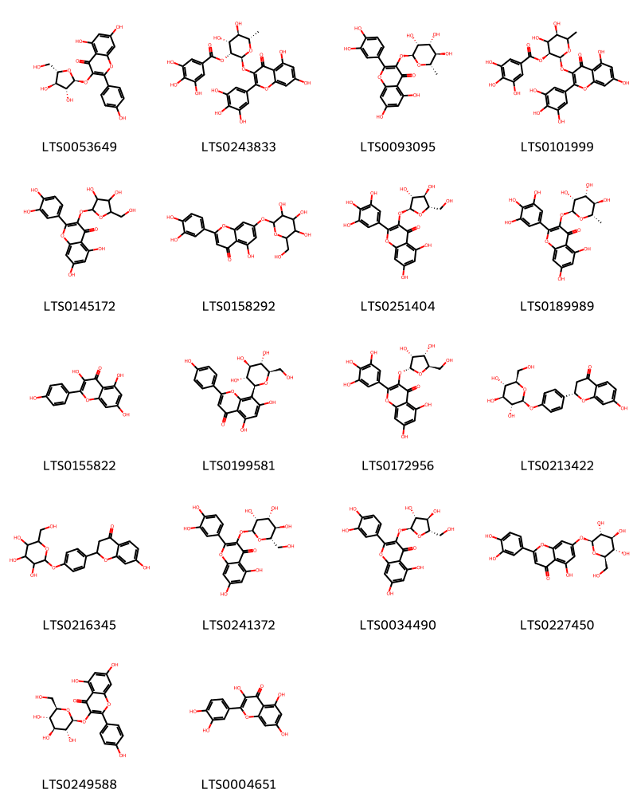{ width=100% }
    <figcaption>Hình ảnh cấu trúc hóa học của 18 hoạt chất thuộc nhóm Flavonoids gồm ['juglanin (LTS0053649)', '(2s,3r,4r,5r,6s)-2-{[5,7-dihydroxy-4-oxo-2-(3,4,5-trihydroxyphenyl)chromen-3-yl]oxy}-4,5-dihydroxy-6-methyloxan-3-yl 3,4,5-trihydroxybenzoate (LTS0243833)', 'quercitrin (LTS0093095)', 'desmanthin 1 (LTS0101999)', '3-{[3,4-dihydroxy-5-(hydroxymethyl)oxolan-2-yl]oxy}-2-(3,4-dihydroxyphenyl)-5,7-dihydroxychromen-4-one (LTS0145172)', '2-(3,4-dihydroxyphenyl)-5-hydroxy-7-{[3,4,5-trihydroxy-6-(hydroxymethyl)oxan-2-yl]oxy}chromen-4-one (LTS0158292)', '3-{[(2s,3r,4r,5s)-3,4-dihydroxy-5-(hydroxymethyl)oxolan-2-yl]oxy}-5,7-dihydroxy-2-(3,4,5-trihydroxyphenyl)chromen-4-one (LTS0251404)', 'myricitrin (LTS0189989)', 'kaempherol (LTS0155822)', 'vitexin (LTS0199581)', '3-{[(2r,3r,4s,5r)-3,4-dihydroxy-5-(hydroxymethyl)oxolan-2-yl]oxy}-5,7-dihydroxy-2-(3,4,5-trihydroxyphenyl)chromen-4-one (LTS0172956)', 'liquiritin (LTS0213422)', '7-hydroxy-2-(4-{[3,4,5-trihydroxy-6-(hydroxymethyl)oxan-2-yl]oxy}phenyl)-2,3-dihydro-1-benzopyran-4-one (LTS0216345)', '2-(3,4-dihydroxyphenyl)-5,7-dihydroxy-3-{[(2s,3r,4r,5r,6s)-3,4,5-trihydroxy-6-(hydroxymethyl)oxan-2-yl]oxy}chromen-4-one (LTS0241372)', 'avicularin (LTS0034490)', 'luteolin 7-o-glucoside (LTS0227450)', 'astragalin (LTS0249588)', 'quercetin (LTS0004651)'].</figcaption>
</figure>
#### Nhóm Furanoid lignans
<figure markdown="span">
    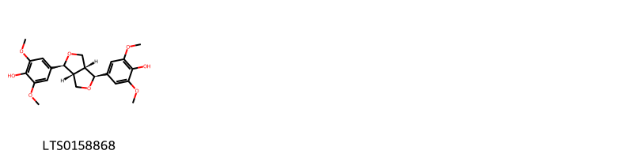{ width=100% }
    <figcaption>Hình ảnh cấu trúc hóa học của 1 hoạt chất thuộc nhóm Furanoid lignans gồm ['(+)-syringaresinol (LTS0158868)'].</figcaption>
</figure>
#### Nhóm Lignan glycosides
<figure markdown="span">
    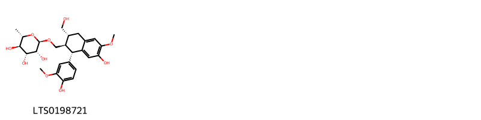{ width=100% }
    <figcaption>Hình ảnh cấu trúc hóa học của 1 hoạt chất thuộc nhóm Lignan glycosides gồm ['aviculin (LTS0198721)'].</figcaption>
</figure>

---

### Dược dân tộc học

Danh sách các quốc gia có sử dụng *Polygonum aviculare* trong điều trị các bệnh. 

| Country   | Disease                                                                                          | Bệnh                                                                                                                                                                                                |
|:----------|:-------------------------------------------------------------------------------------------------|:----------------------------------------------------------------------------------------------------------------------------------------------------------------------------------------------------|
| China     | Diuretic, Diuretic, Diuretic, Emollient, Vermifuge, Vermifuge, Vermifuge, Astringent             | MYMEMORY WARNING: YOU USED ALL AVAILABLE FREE TRANSLATIONS FOR TODAY. NEXT AVAILABLE IN  15 HOURS 22 MINUTES 19 SECONDS VISIT HTTPS://MYMEMORY.TRANSLATED.NET/DOC/USAGELIMITS.PHP TO TRANSLATE MORE |
| Elsewhere | Antiseptic, Astringent, nan, Cathartic, Emetic, Vermifuge, Hemostat, Laxative, Tonic, Cholagogue | MYMEMORY WARNING: YOU USED ALL AVAILABLE FREE TRANSLATIONS FOR TODAY. NEXT AVAILABLE IN  15 HOURS 22 MINUTES 17 SECONDS VISIT HTTPS://MYMEMORY.TRANSLATED.NET/DOC/USAGELIMITS.PHP TO TRANSLATE MORE |
| Turkey    | Demulcent, Diuretic, Tonic, Vulnerary, Antiseptic, Astringent, Hemostat                          | MYMEMORY WARNING: YOU USED ALL AVAILABLE FREE TRANSLATIONS FOR TODAY. NEXT AVAILABLE IN  15 HOURS 22 MINUTES 14 SECONDS VISIT HTTPS://MYMEMORY.TRANSLATED.NET/DOC/USAGELIMITS.PHP TO TRANSLATE MORE |

---

---
## Polygonum barbatum
### Thông tin về thực vật

!!! info "Phân loại thực vật của *N/A* từ GIBF:"
    - **Kingdom:** Plantae
    - **Phylum:** Tracheophyta
    - **Order:** Caryophyllales
    - **Family:** Polygonaceae
    - **Genus:** Persicaria
    - **Species:** *N/A*

 

| Label (VI)   | Label (EN)   | Scientific Name    | Descriptions (VI)   | Descriptions (EN)   | Also Known As (VI)   | Also Known As (EN)   |
|:-------------|:-------------|:-------------------|:--------------------|:--------------------|:---------------------|:---------------------|
| N/A          | N/A          | Polygonum barbatum | loài thực vật       | species of plant    | ['']                 | ['']                 |

#### Phân bố trên thế giới

**Từ CSDL GIBF** Brazil, Japan, Nepal, China, Chile, New Zealand, Ecuador, Thailand, Spain, Réunion, United States of America, Indonesia, Costa Rica, Colombia, Argentina, French Guiana, Hong Kong, Mexico, Benin, Kenya, United Kingdom of Great Britain and Northern Ireland, Chinese Taipei, Panama, Portugal, South Africa, Australia, France

#### Phân bố tại Việt Nam

**Từ CSDL GIBF**: Không có ghi nhận ở Việt Nam

---
### Thành phần hóa học
        
- Theo cơ sở dữ liệu lotus: Từ loài *N/A* đã phân lập và xác định được Chưa có hoạt chất nào được phân lập. hoạt chất thuộc về các nhóm Không có hoạt chất nào được phân lập. 

Không có hình ảnh nào được tạo ra

---

### Dược dân tộc học

Danh sách các quốc gia có sử dụng *N/A* trong điều trị các bệnh. 

| Country   | Disease                  | Bệnh                                                                                                                                                                                                |
|:----------|:-------------------------|:----------------------------------------------------------------------------------------------------------------------------------------------------------------------------------------------------|
| Elsewhere | Purgative, Tonic, Emetic | MYMEMORY WARNING: YOU USED ALL AVAILABLE FREE TRANSLATIONS FOR TODAY. NEXT AVAILABLE IN  15 HOURS 21 MINUTES 32 SECONDS VISIT HTTPS://MYMEMORY.TRANSLATED.NET/DOC/USAGELIMITS.PHP TO TRANSLATE MORE |
| India     | Astringent, Refrigerant  | MYMEMORY WARNING: YOU USED ALL AVAILABLE FREE TRANSLATIONS FOR TODAY. NEXT AVAILABLE IN  15 HOURS 21 MINUTES 27 SECONDS VISIT HTTPS://MYMEMORY.TRANSLATED.NET/DOC/USAGELIMITS.PHP TO TRANSLATE MORE |
| Malaya    | Piscicide, Vulnerary     | MYMEMORY WARNING: YOU USED ALL AVAILABLE FREE TRANSLATIONS FOR TODAY. NEXT AVAILABLE IN  15 HOURS 21 MINUTES 24 SECONDS VISIT HTTPS://MYMEMORY.TRANSLATED.NET/DOC/USAGELIMITS.PHP TO TRANSLATE MORE |

---

---
## Polygonum bistorta
### Thông tin về thực vật

!!! info "Phân loại thực vật của *Polygonum bistorta* từ GIBF:"
    - **Kingdom:** Plantae
    - **Phylum:** Tracheophyta
    - **Order:** Caryophyllales
    - **Family:** Polygonaceae
    - **Genus:** Polygonum
    - **Species:** *Polygonum bistorta*

 

| Label (VI)   | Label (EN)   | Scientific Name    | Descriptions (VI)   | Descriptions (EN)   | Also Known As (VI)   | Also Known As (EN)   |
|:-------------|:-------------|:-------------------|:--------------------|:--------------------|:---------------------|:---------------------|
| N/A          | N/A          | Polygonum bistorta | loài thực vật       | species of plant    | ['']                 | ['']                 |

#### Phân bố trên thế giới

**Từ CSDL GIBF** Austria, Iceland, Belgium, Italy, Switzerland, Bulgaria, Germany, France, Spain, Poland

#### Phân bố tại Việt Nam

**Từ CSDL GIBF**: Không có ghi nhận ở Việt Nam

---
### Thành phần hóa học
        
- Theo cơ sở dữ liệu lotus: Từ loài *Polygonum bistorta* đã phân lập và xác định được 54 hoạt chất thuộc về các nhóm Benzene and substituted derivatives, Flavonoids, Tannins, Carboxylic acids and derivatives, Cinnamic acids and derivatives, Steroids and steroid derivatives, Coumarins and derivatives, Phenols, Organooxygen compounds, Prenol lipids. 

|    | chemicalTaxonomyClassyfireClass     |   smiles_count |
|---:|:------------------------------------|---------------:|
|  0 | Benzene and substituted derivatives |              6 |
|  1 | Carboxylic acids and derivatives    |              1 |
|  2 | Cinnamic acids and derivatives      |              4 |
|  3 | Coumarins and derivatives           |              3 |
|  4 | Flavonoids                          |              3 |
|  5 | Organooxygen compounds              |              1 |
|  6 | Phenols                             |              2 |
|  7 | Prenol lipids                       |             15 |
|  8 | Steroids and steroid derivatives    |             18 |
|  9 | Tannins                             |              1 |

#### Nhóm Benzene and substituted derivatives
<figure markdown="span">
    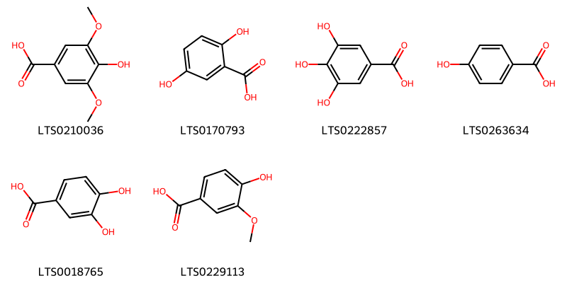{ width=100% }
    <figcaption>Hình ảnh cấu trúc hóa học của 6 hoạt chất thuộc nhóm Benzene and substituted derivatives gồm ['syringic acid (LTS0210036)', '2,5-dihydroxybenzoic acid (LTS0170793)', 'galop (LTS0222857)', 'p-hydroxybenzoic acid (LTS0263634)', '3,4-dihydroxybenzoic acid (LTS0018765)', 'vanillic acid (LTS0229113)'].</figcaption>
</figure>
#### Nhóm Carboxylic acids and derivatives
<figure markdown="span">
    { width=100% }
    <figcaption>Hình ảnh cấu trúc hóa học của 1 hoạt chất thuộc nhóm Carboxylic acids and derivatives gồm ['succinic acid (LTS0237204)'].</figcaption>
</figure>
#### Nhóm Cinnamic acids and derivatives
<figure markdown="span">
    { width=100% }
    <figcaption>Hình ảnh cấu trúc hóa học của 4 hoạt chất thuộc nhóm Cinnamic acids and derivatives gồm ['ferulic acid (LTS0077328)', 'sinapinate (LTS0173482)', '3,4-dihydroxycinnamic acid (LTS0128050)', 'para-coumaric acid (LTS0266252)'].</figcaption>
</figure>
#### Nhóm Coumarins and derivatives
<figure markdown="span">
    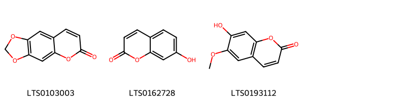{ width=100% }
    <figcaption>Hình ảnh cấu trúc hóa học của 3 hoạt chất thuộc nhóm Coumarins and derivatives gồm ['ayapin (LTS0103003)', 'umbelliferone (LTS0162728)', 'scopoletin (LTS0193112)'].</figcaption>
</figure>
#### Nhóm Flavonoids
<figure markdown="span">
    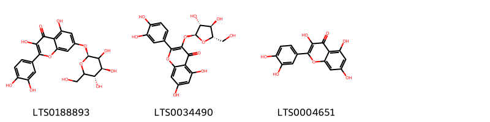{ width=100% }
    <figcaption>Hình ảnh cấu trúc hóa học của 3 hoạt chất thuộc nhóm Flavonoids gồm ['quercimeritrin (LTS0188893)', 'avicularin (LTS0034490)', 'quercetin (LTS0004651)'].</figcaption>
</figure>
#### Nhóm Organooxygen compounds
<figure markdown="span">
    { width=100% }
    <figcaption>Hình ảnh cấu trúc hóa học của 1 hoạt chất thuộc nhóm Organooxygen compounds gồm ['p-hydroxybenzaldehyde (LTS0259836)'].</figcaption>
</figure>
#### Nhóm Phenols
<figure markdown="span">
    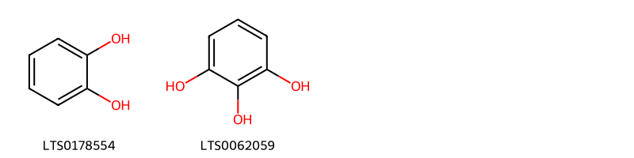{ width=100% }
    <figcaption>Hình ảnh cấu trúc hóa học của 2 hoạt chất thuộc nhóm Phenols gồm ['catechol (LTS0178554)', 'pyrogallol (LTS0062059)'].</figcaption>
</figure>
#### Nhóm Prenol lipids
<figure markdown="span">
    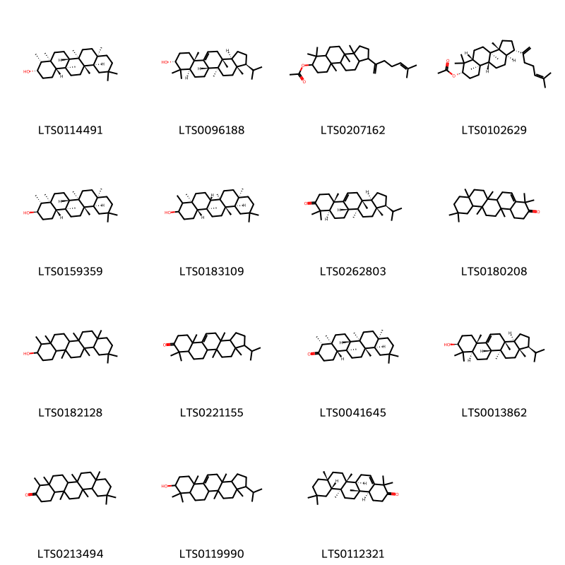{ width=100% }
    <figcaption>Hình ảnh cấu trúc hóa học của 15 hoạt chất thuộc nhóm Prenol lipids gồm ['epi-friedelanol (LTS0114491)', '(3s,3as,5as,5bs,7ar,9r,11as,13ar,13bs)-3-isopropyl-3a,5a,8,8,11a,13a-hexamethyl-1h,2h,3h,4h,5h,5bh,6h,7h,7ah,9h,10h,11h,13h,13bh-cyclopenta[a]chrysen-9-ol (LTS0096188)', '3a,3b,6,6,9a-pentamethyl-1-(6-methylhepta-1,5-dien-2-yl)-dodecahydro-1h-cyclopenta[a]phenanthren-7-yl acetate (LTS0207162)', '(1s,3ar,3br,5ar,7s,9ar,9br,11ar)-3a,3b,6,6,9a-pentamethyl-1-(6-methylhepta-1,5-dien-2-yl)-dodecahydro-1h-cyclopenta[a]phenanthren-7-yl acetate (LTS0102629)', '(3r,4r,4as,6as,6br,8ar,12ar,12bs,14as,14bs)-4,4a,6b,8a,11,11,12b,14a-octamethyl-hexadecahydropicen-3-ol (LTS0159359)', '(4as,6as,6br,8ar,12ar,12bs,14as,14bs)-4,4a,6b,8a,11,11,12b,14a-octamethyl-hexadecahydropicen-3-ol (LTS0183109)', '(3s,3as,5as,5bs,7ar,11as,13ar,13bs)-3-isopropyl-3a,5a,8,8,11a,13a-hexamethyl-1h,2h,3h,4h,5h,5bh,6h,7h,7ah,10h,11h,13h,13bh-cyclopenta[a]chrysen-9-one (LTS0262803)', '4,4,6b,8a,11,11,12b,14a-octamethyl-2,6,6a,7,8,9,10,12,12a,13,14,14b-dodecahydro-1h-picen-3-one (LTS0180208)', '4,4a,6b,8a,11,11,12b,14a-octamethyl-hexadecahydropicen-3-ol (LTS0182128)', '3-isopropyl-3a,5a,8,8,11a,13a-hexamethyl-1h,2h,3h,4h,5h,5bh,6h,7h,7ah,10h,11h,13h,13bh-cyclopenta[a]chrysen-9-one (LTS0221155)', '(-)-friedelin (LTS0041645)', 'isoarborinol (LTS0013862)', 'friedelin (LTS0213494)', '3-isopropyl-3a,5a,8,8,11a,13a-hexamethyl-1h,2h,3h,4h,5h,5bh,6h,7h,7ah,9h,10h,11h,13h,13bh-cyclopenta[a]chrysen-9-ol (LTS0119990)', 'glutinone (LTS0112321)'].</figcaption>
</figure>
#### Nhóm Steroids and steroid derivatives
<figure markdown="span">
    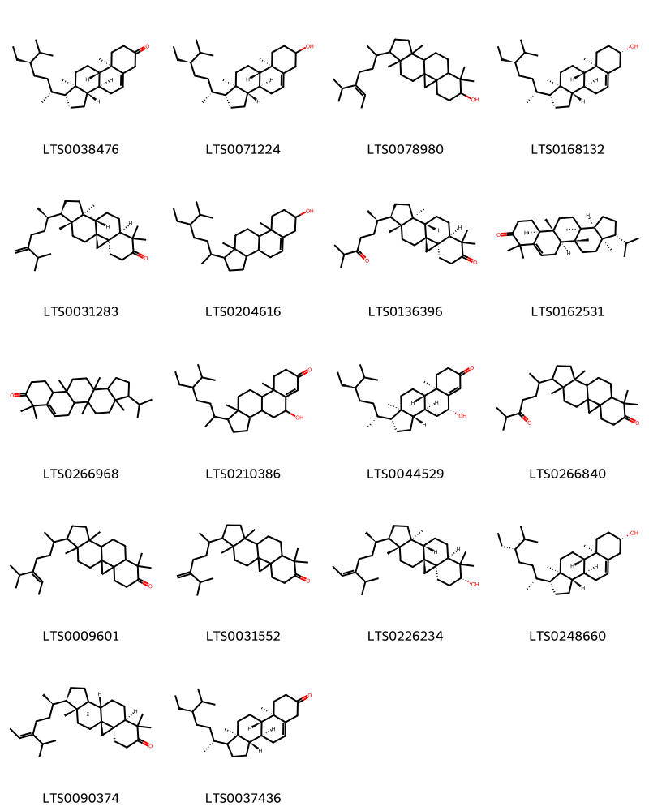{ width=100% }
    <figcaption>Hình ảnh cấu trúc hóa học của 18 hoạt chất thuộc nhóm Steroids and steroid derivatives gồm ['(1r,3as,3bs,9ar,9bs,11ar)-1-[(2r,5r)-5-ethyl-6-methylheptan-2-yl]-9a,11a-dimethyl-1h,2h,3h,3ah,3bh,4h,6h,8h,9h,9bh,10h,11h-cyclopenta[a]phenanthren-7-one (LTS0038476)', 'stigmast-5-en-3-ol (LTS0071224)', '15-(5-isopropylhept-5-en-2-yl)-7,7,12,16-tetramethylpentacyclo[9.7.0.0¹,³.0³,⁸.0¹²,¹⁶]octadecan-6-ol (LTS0078980)', 'sitosterol (LTS0168132)', '(1s,3r,8r,11s,12s,15r,16r)-7,7,12,16-tetramethyl-15-[(2r)-6-methyl-5-methylideneheptan-2-yl]pentacyclo[9.7.0.0¹,³.0³,⁸.0¹²,¹⁶]octadecan-6-one (LTS0031283)', 'stigmast-5-en-3-ol, (3β)- (LTS0204616)', '(1s,3r,8r,11s,12s,15r,16r)-7,7,12,16-tetramethyl-15-[(2r)-6-methyl-5-oxoheptan-2-yl]pentacyclo[9.7.0.0¹,³.0³,⁸.0¹²,¹⁶]octadecan-6-one (LTS0136396)', '(3r,3ar,5ar,5bs,11as,11br,13as,13bs)-3-isopropyl-3a,5a,8,8,11b,13a-hexamethyl-1h,2h,3h,4h,5h,5bh,6h,10h,11h,11ah,12h,13h,13bh-cyclopenta[a]chrysen-9-one (LTS0162531)', '3-isopropyl-3a,5a,8,8,11b,13a-hexamethyl-1h,2h,3h,4h,5h,5bh,6h,10h,11h,11ah,12h,13h,13bh-cyclopenta[a]chrysen-9-one (LTS0266968)', '1-(5-ethyl-6-methylheptan-2-yl)-5-hydroxy-9a,11a-dimethyl-1h,2h,3h,3ah,3bh,4h,5h,8h,9h,9bh,10h,11h-cyclopenta[a]phenanthren-7-one (LTS0210386)', '(1r,3as,3bs,5r,9ar,9bs,11ar)-1-[(2r,5r)-5-ethyl-6-methylheptan-2-yl]-5-hydroxy-9a,11a-dimethyl-1h,2h,3h,3ah,3bh,4h,5h,8h,9h,9bh,10h,11h-cyclopenta[a]phenanthren-7-one (LTS0044529)', '7,7,12,16-tetramethyl-15-(6-methyl-5-oxoheptan-2-yl)pentacyclo[9.7.0.0¹,³.0³,⁸.0¹²,¹⁶]octadecan-6-one (LTS0266840)', '15-(5-isopropylhept-5-en-2-yl)-7,7,12,16-tetramethylpentacyclo[9.7.0.0¹,³.0³,⁸.0¹²,¹⁶]octadecan-6-one (LTS0009601)', '7,7,12,16-tetramethyl-15-(6-methyl-5-methylideneheptan-2-yl)pentacyclo[9.7.0.0¹,³.0³,⁸.0¹²,¹⁶]octadecan-6-one (LTS0031552)', '(1s,3r,6r,8r,11s,12s,15r,16r)-15-[(2r,5e)-5-isopropylhept-5-en-2-yl]-7,7,12,16-tetramethylpentacyclo[9.7.0.0¹,³.0³,⁸.0¹²,¹⁶]octadecan-6-ol (LTS0226234)', 'clionasterol (LTS0248660)', '(1s,3r,8r,11s,12s,15r,16r)-15-[(2r,5e)-5-isopropylhept-5-en-2-yl]-7,7,12,16-tetramethylpentacyclo[9.7.0.0¹,³.0³,⁸.0¹²,¹⁶]octadecan-6-one (LTS0090374)', '(3as,3bs,9ar,9bs,11ar)-1-[(2r,5r)-5-ethyl-6-methylheptan-2-yl]-9a,11a-dimethyl-1h,2h,3h,3ah,3bh,4h,6h,8h,9h,9bh,10h,11h-cyclopenta[a]phenanthren-7-one (LTS0037436)'].</figcaption>
</figure>
#### Nhóm Tannins
<figure markdown="span">
    { width=100% }
    <figcaption>Hình ảnh cấu trúc hóa học của 1 hoạt chất thuộc nhóm Tannins gồm ['ellagic acid (LTS0037297)'].</figcaption>
</figure>

---

### Dược dân tộc học

Danh sách các quốc gia có sử dụng *Polygonum bistorta* trong điều trị các bệnh. 

| Country   | Disease                                                           | Bệnh                                                                                                                                                                                                |
|:----------|:------------------------------------------------------------------|:----------------------------------------------------------------------------------------------------------------------------------------------------------------------------------------------------|
| China     | Diuretic, Laxative, Refrigerant, Alexiteric                       | MYMEMORY WARNING: YOU USED ALL AVAILABLE FREE TRANSLATIONS FOR TODAY. NEXT AVAILABLE IN  15 HOURS 20 MINUTES 57 SECONDS VISIT HTTPS://MYMEMORY.TRANSLATED.NET/DOC/USAGELIMITS.PHP TO TRANSLATE MORE |
| Elsewhere | Antidote, Antiseptic, Astringent, Diuretic, Expectorant, Hemostat | MYMEMORY WARNING: YOU USED ALL AVAILABLE FREE TRANSLATIONS FOR TODAY. NEXT AVAILABLE IN  15 HOURS 20 MINUTES 54 SECONDS VISIT HTTPS://MYMEMORY.TRANSLATED.NET/DOC/USAGELIMITS.PHP TO TRANSLATE MORE |
| Iraq      | Expectorant                                                       | MYMEMORY WARNING: YOU USED ALL AVAILABLE FREE TRANSLATIONS FOR TODAY. NEXT AVAILABLE IN  15 HOURS 20 MINUTES 49 SECONDS VISIT HTTPS://MYMEMORY.TRANSLATED.NET/DOC/USAGELIMITS.PHP TO TRANSLATE MORE |
| Turkey    | Diuretic, Hemostat, Tonic, Astringent, Expectorant                | MYMEMORY WARNING: YOU USED ALL AVAILABLE FREE TRANSLATIONS FOR TODAY. NEXT AVAILABLE IN  15 HOURS 20 MINUTES 44 SECONDS VISIT HTTPS://MYMEMORY.TRANSLATED.NET/DOC/USAGELIMITS.PHP TO TRANSLATE MORE |
| UK        | Astringent                                                        | MYMEMORY WARNING: YOU USED ALL AVAILABLE FREE TRANSLATIONS FOR TODAY. NEXT AVAILABLE IN  15 HOURS 20 MINUTES 38 SECONDS VISIT HTTPS://MYMEMORY.TRANSLATED.NET/DOC/USAGELIMITS.PHP TO TRANSLATE MORE |
| US        | Astringent, Tonic                                                 | MYMEMORY WARNING: YOU USED ALL AVAILABLE FREE TRANSLATIONS FOR TODAY. NEXT AVAILABLE IN  15 HOURS 20 MINUTES 35 SECONDS VISIT HTTPS://MYMEMORY.TRANSLATED.NET/DOC/USAGELIMITS.PHP TO TRANSLATE MORE |
| USSR      | Astringent                                                        | MYMEMORY WARNING: YOU USED ALL AVAILABLE FREE TRANSLATIONS FOR TODAY. NEXT AVAILABLE IN  15 HOURS 20 MINUTES 32 SECONDS VISIT HTTPS://MYMEMORY.TRANSLATED.NET/DOC/USAGELIMITS.PHP TO TRANSLATE MORE |

---

---
## Polygonum blumei
### Thông tin về thực vật

!!! info "Phân loại thực vật của *Persicaria longiseta* từ GIBF:"
    - **Kingdom:** Plantae
    - **Phylum:** Tracheophyta
    - **Order:** Caryophyllales
    - **Family:** Polygonaceae
    - **Genus:** Persicaria
    - **Species:** *Persicaria longiseta*

 

| Label (VI)   | Label (EN)   | Scientific Name   | Descriptions (VI)   | Descriptions (EN)   | Also Known As (VI)   | Also Known As (EN)   |
|:-------------|:-------------|:------------------|:--------------------|:--------------------|:---------------------|:---------------------|
| N/A          | N/A          | Polygonum blumei  |                     |                     | ['']                 | ['']                 |

#### Phân bố trên thế giới

**Từ CSDL GIBF** nan, Indonesia, Japan, China

#### Phân bố tại Việt Nam

**Từ CSDL GIBF**: Không có ghi nhận ở Việt Nam

---
### Thành phần hóa học
        
- Theo cơ sở dữ liệu lotus: Từ loài *Persicaria longiseta* đã phân lập và xác định được 7 hoạt chất thuộc về các nhóm Benzene and substituted derivatives, Flavonoids. 

|    | chemicalTaxonomyClassyfireClass     |   smiles_count |
|---:|:------------------------------------|---------------:|
|  0 | Benzene and substituted derivatives |              1 |
|  1 | Flavonoids                          |              6 |

#### Nhóm Benzene and substituted derivatives
<figure markdown="span">
    { width=100% }
    <figcaption>Hình ảnh cấu trúc hóa học của 1 hoạt chất thuộc nhóm Benzene and substituted derivatives gồm ['galop (LTS0222857)'].</figcaption>
</figure>
#### Nhóm Flavonoids
<figure markdown="span">
    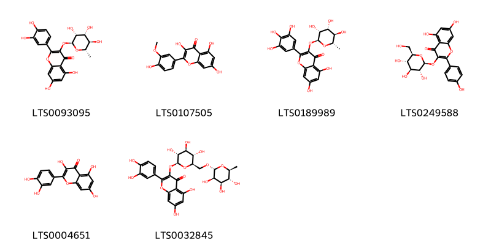{ width=100% }
    <figcaption>Hình ảnh cấu trúc hóa học của 6 hoạt chất thuộc nhóm Flavonoids gồm ['quercitrin (LTS0093095)', 'isorhamnetin (LTS0107505)', 'myricitrin (LTS0189989)', 'astragalin (LTS0249588)', 'quercetin (LTS0004651)', '3-rutinosyl quercetin (LTS0032845)'].</figcaption>
</figure>

---

### Dược dân tộc học

Danh sách các quốc gia có sử dụng *Persicaria longiseta* trong điều trị các bệnh. 

| Country   | Disease   | Bệnh                                                                                                                                                                                                |
|:----------|:----------|:----------------------------------------------------------------------------------------------------------------------------------------------------------------------------------------------------|
| China     | Vermifuge | MYMEMORY WARNING: YOU USED ALL AVAILABLE FREE TRANSLATIONS FOR TODAY. NEXT AVAILABLE IN  15 HOURS 19 MINUTES 52 SECONDS VISIT HTTPS://MYMEMORY.TRANSLATED.NET/DOC/USAGELIMITS.PHP TO TRANSLATE MORE |

---

---
## Polygonum chinense
### Thông tin về thực vật

!!! info "Phân loại thực vật của *N/A* từ GIBF:"
    - **Kingdom:** Plantae
    - **Phylum:** Tracheophyta
    - **Order:** Caryophyllales
    - **Family:** Polygonaceae
    - **Genus:** N/A
    - **Species:** *N/A*

 

| Label (VI)   | Label (EN)   | Scientific Name    | Descriptions (VI)   | Descriptions (EN)   | Also Known As (VI)   | Also Known As (EN)   |
|:-------------|:-------------|:-------------------|:--------------------|:--------------------|:---------------------|:---------------------|
| N/A          | N/A          | Polygonum chinense | loài thực vật       | species of plant    | ['']                 | ['']                 |

#### Phân bố trên thế giới

**Từ CSDL GIBF** Brazil, Virgin Islands (British), China, Israel, Gambia, New Zealand, Türkiye, Ecuador, French Polynesia, Thailand, Spain, Netherlands, Puerto Rico, Cayman Islands, United States of America, Virgin Islands (U.S.), Indonesia, Colombia, Argentina, Aruba, Morocco, Hong Kong, Mexico, Guam, United Kingdom of Great Britain and Northern Ireland, Chinese Taipei, Kuwait, Canada, Germany, Austria, Hungary, Portugal, South Africa, Australia, Italy, India, France, Ireland

#### Phân bố tại Việt Nam

**Từ CSDL GIBF**: Không có ghi nhận ở Việt Nam

---
### Thành phần hóa học
        
- Theo cơ sở dữ liệu lotus: Từ loài *N/A* đã phân lập và xác định được Chưa có hoạt chất nào được phân lập. hoạt chất thuộc về các nhóm Không có hoạt chất nào được phân lập. 

Không có hình ảnh nào được tạo ra

---

### Dược dân tộc học

Danh sách các quốc gia có sử dụng *N/A* trong điều trị các bệnh. 

| Country   | Disease                            | Bệnh                                                                                                                                                                                                |
|:----------|:-----------------------------------|:----------------------------------------------------------------------------------------------------------------------------------------------------------------------------------------------------|
| China     | Alexiteric, Vermifuge, Refrigerant | MYMEMORY WARNING: YOU USED ALL AVAILABLE FREE TRANSLATIONS FOR TODAY. NEXT AVAILABLE IN  15 HOURS 19 MINUTES 20 SECONDS VISIT HTTPS://MYMEMORY.TRANSLATED.NET/DOC/USAGELIMITS.PHP TO TRANSLATE MORE |
| Elsewhere | Tonic, Vulnerary                   | MYMEMORY WARNING: YOU USED ALL AVAILABLE FREE TRANSLATIONS FOR TODAY. NEXT AVAILABLE IN  15 HOURS 19 MINUTES 17 SECONDS VISIT HTTPS://MYMEMORY.TRANSLATED.NET/DOC/USAGELIMITS.PHP TO TRANSLATE MORE |

---

---
## Polygonum cuidatum
### Thông tin về thực vật

!!! info "Phân loại thực vật của *N/A* từ GIBF:"
    - **Kingdom:** Plantae
    - **Phylum:** Tracheophyta
    - **Order:** Caryophyllales
    - **Family:** Polygonaceae
    - **Genus:** Polygonum
    - **Species:** *N/A*

 

| Label (VI)   | Label (EN)   | Scientific Name    | Descriptions (VI)   | Descriptions (EN)   | Also Known As (VI)   | Also Known As (EN)   |
|:-------------|:-------------|:-------------------|:--------------------|:--------------------|:---------------------|:---------------------|
| N/A          | N/A          | Polygonum chinense | loài thực vật       | species of plant    | ['']                 | ['']                 |

#### Phân bố trên thế giới

**Từ CSDL GIBF** Brazil, Sweden, China, Israel, Chile, New Zealand, Türkiye, Spain, Netherlands, United States of America, Colombia, Argentina, Morocco, Gibraltar, France, Chinese Taipei, Canada, Namibia, Austria, Portugal, South Africa, Australia, Italy, India, Switzerland, United Kingdom of Great Britain and Northern Ireland

#### Phân bố tại Việt Nam

**Từ CSDL GIBF**: Không có ghi nhận ở Việt Nam

---
### Thành phần hóa học
        
- Theo cơ sở dữ liệu lotus: Từ loài *N/A* đã phân lập và xác định được Chưa có hoạt chất nào được phân lập. hoạt chất thuộc về các nhóm Không có hoạt chất nào được phân lập. 

Không có hình ảnh nào được tạo ra

---

### Dược dân tộc học

Danh sách các quốc gia có sử dụng *N/A* trong điều trị các bệnh. 

| Country   | Disease                                      | Bệnh                                                                                                                                                                                                |
|:----------|:---------------------------------------------|:----------------------------------------------------------------------------------------------------------------------------------------------------------------------------------------------------|
| China     | Alexiteric, Poison, Refrigerant              | MYMEMORY WARNING: YOU USED ALL AVAILABLE FREE TRANSLATIONS FOR TODAY. NEXT AVAILABLE IN  15 HOURS 18 MINUTES 53 SECONDS VISIT HTTPS://MYMEMORY.TRANSLATED.NET/DOC/USAGELIMITS.PHP TO TRANSLATE MORE |
| Elsewhere | Aperient, Diuretic, Gonadotrophic, Purgative | MYMEMORY WARNING: YOU USED ALL AVAILABLE FREE TRANSLATIONS FOR TODAY. NEXT AVAILABLE IN  15 HOURS 18 MINUTES 50 SECONDS VISIT HTTPS://MYMEMORY.TRANSLATED.NET/DOC/USAGELIMITS.PHP TO TRANSLATE MORE |

---

---
## Polygonum dumetorum
### Thông tin về thực vật

!!! info "Phân loại thực vật của *Fallopia dumetorum* từ GIBF:"
    - **Kingdom:** Plantae
    - **Phylum:** Tracheophyta
    - **Order:** Caryophyllales
    - **Family:** Polygonaceae
    - **Genus:** Fallopia
    - **Species:** *Fallopia dumetorum*

 

| Label (VI)   | Label (EN)   | Scientific Name     | Descriptions (VI)   | Descriptions (EN)   | Also Known As (VI)   | Also Known As (EN)   |
|:-------------|:-------------|:--------------------|:--------------------|:--------------------|:---------------------|:---------------------|
| N/A          | N/A          | Polygonum dumetorum | loài thực vật       | species of plant    | ['']                 | ['']                 |

#### Phân bố trên thế giới

**Từ CSDL GIBF** United States of America, United Kingdom of Great Britain and Northern Ireland, Ukraine, Russian Federation, Estonia, Germany, France, Spain, Poland

#### Phân bố tại Việt Nam

**Từ CSDL GIBF**: Không có ghi nhận ở Việt Nam

---
### Thành phần hóa học
        
- Theo cơ sở dữ liệu lotus: Từ loài *Fallopia dumetorum* đã phân lập và xác định được Chưa có hoạt chất nào được phân lập. hoạt chất thuộc về các nhóm Không có hoạt chất nào được phân lập. 

Không có hình ảnh nào được tạo ra

---

### Dược dân tộc học

Danh sách các quốc gia có sử dụng *Fallopia dumetorum* trong điều trị các bệnh. 

| Country   | Disease   | Bệnh                                                                                                                                                                                                |
|:----------|:----------|:----------------------------------------------------------------------------------------------------------------------------------------------------------------------------------------------------|
| Elsewhere | Laxative  | MYMEMORY WARNING: YOU USED ALL AVAILABLE FREE TRANSLATIONS FOR TODAY. NEXT AVAILABLE IN  15 HOURS 18 MINUTES 21 SECONDS VISIT HTTPS://MYMEMORY.TRANSLATED.NET/DOC/USAGELIMITS.PHP TO TRANSLATE MORE |
| English   | Laxative  | MYMEMORY WARNING: YOU USED ALL AVAILABLE FREE TRANSLATIONS FOR TODAY. NEXT AVAILABLE IN  15 HOURS 18 MINUTES 18 SECONDS VISIT HTTPS://MYMEMORY.TRANSLATED.NET/DOC/USAGELIMITS.PHP TO TRANSLATE MORE |

---

---
## Polygonum flaccidum
### Thông tin về thực vật

!!! info "Phân loại thực vật của *N/A* từ GIBF:"
    - **Kingdom:** Plantae
    - **Phylum:** Tracheophyta
    - **Order:** Caryophyllales
    - **Family:** Polygonaceae
    - **Genus:** Persicaria
    - **Species:** *N/A*

 

| Label (VI)   | Label (EN)   | Scientific Name     | Descriptions (VI)   | Descriptions (EN)   | Also Known As (VI)   | Also Known As (EN)   |
|:-------------|:-------------|:--------------------|:--------------------|:--------------------|:---------------------|:---------------------|
| N/A          | N/A          | Polygonum dumetorum | loài thực vật       | species of plant    | ['']                 | ['']                 |

#### Phân bố trên thế giới

**Từ CSDL GIBF** Brazil, Japan, Nepal, China, Chile, New Zealand, Ecuador, Thailand, Spain, Réunion, United States of America, Indonesia, Costa Rica, Colombia, Argentina, French Guiana, Hong Kong, Mexico, Benin, Kenya, United Kingdom of Great Britain and Northern Ireland, Chinese Taipei, Panama, Portugal, South Africa, Australia, France

#### Phân bố tại Việt Nam

**Từ CSDL GIBF**: Không có ghi nhận ở Việt Nam

---
### Thành phần hóa học
        
- Theo cơ sở dữ liệu lotus: Từ loài *N/A* đã phân lập và xác định được Chưa có hoạt chất nào được phân lập. hoạt chất thuộc về các nhóm Không có hoạt chất nào được phân lập. 

Không có hình ảnh nào được tạo ra

---

### Dược dân tộc học

Danh sách các quốc gia có sử dụng *N/A* trong điều trị các bệnh. 

| Country   | Disease     | Bệnh                                                                                                                                                                                                |
|:----------|:------------|:----------------------------------------------------------------------------------------------------------------------------------------------------------------------------------------------------|
| Java      | Emmenagogue | MYMEMORY WARNING: YOU USED ALL AVAILABLE FREE TRANSLATIONS FOR TODAY. NEXT AVAILABLE IN  15 HOURS 17 MINUTES 53 SECONDS VISIT HTTPS://MYMEMORY.TRANSLATED.NET/DOC/USAGELIMITS.PHP TO TRANSLATE MORE |

---

---
## Polygonum glabrum
### Thông tin về thực vật

!!! info "Phân loại thực vật của *N/A* từ GIBF:"
    - **Kingdom:** Plantae
    - **Phylum:** Tracheophyta
    - **Order:** Caryophyllales
    - **Family:** Polygonaceae
    - **Genus:** Persicaria
    - **Species:** *N/A*

 

| Label (VI)   | Label (EN)   | Scientific Name   | Descriptions (VI)   | Descriptions (EN)   | Also Known As (VI)   | Also Known As (EN)         |
|:-------------|:-------------|:------------------|:--------------------|:--------------------|:---------------------|:---------------------------|
| N/A          | N/A          | Polygonum glabrum | loài thực vật       | species of plant    | ['']                 | ['Common Marsh Buckwheat'] |

#### Phân bố trên thế giới

**Từ CSDL GIBF** Brazil, Japan, Nepal, China, Chile, New Zealand, Ecuador, Thailand, Spain, Réunion, United States of America, Indonesia, Costa Rica, Colombia, Argentina, French Guiana, Hong Kong, Mexico, Benin, Kenya, United Kingdom of Great Britain and Northern Ireland, Chinese Taipei, Panama, Portugal, South Africa, Australia, France

#### Phân bố tại Việt Nam

**Từ CSDL GIBF**: Không có ghi nhận ở Việt Nam

---
### Thành phần hóa học
        
- Theo cơ sở dữ liệu lotus: Từ loài *N/A* đã phân lập và xác định được 8 hoạt chất thuộc về các nhóm Naphthofurans. 

|    | chemicalTaxonomyClassyfireClass   |   smiles_count |
|---:|:----------------------------------|---------------:|
|  0 | Naphthofurans                     |              8 |

#### Nhóm Naphthofurans
<figure markdown="span">
    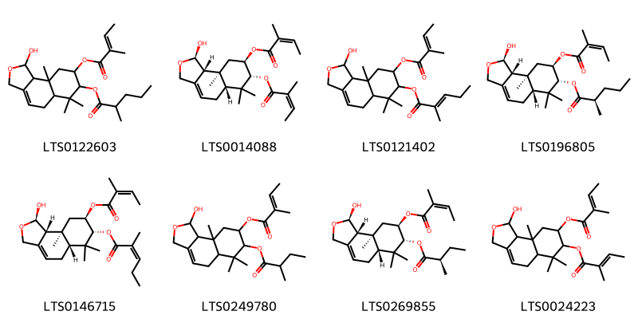{ width=100% }
    <figcaption>Hình ảnh cấu trúc hóa học của 8 hoạt chất thuộc nhóm Naphthofurans gồm ['1-hydroxy-6,6,9a-trimethyl-8-[(2-methylbut-2-enoyl)oxy]-1h,3h,5h,5ah,7h,8h,9h,9bh-naphtho[1,2-c]furan-7-yl 2-methylpentanoate (LTS0122603)', '(1r,5ar,7r,8r,9as,9br)-1-hydroxy-6,6,9a-trimethyl-8-{[(2z)-2-methylbut-2-enoyl]oxy}-1h,3h,5h,5ah,7h,8h,9h,9bh-naphtho[1,2-c]furan-7-yl (2z)-2-methylbut-2-enoate (LTS0014088)', '1-hydroxy-6,6,9a-trimethyl-8-[(2-methylbut-2-enoyl)oxy]-1h,3h,5h,5ah,7h,8h,9h,9bh-naphtho[1,2-c]furan-7-yl 2-methylpent-2-enoate (LTS0121402)', '(1r,5ar,7r,8r,9as,9br)-1-hydroxy-6,6,9a-trimethyl-8-{[(2z)-2-methylbut-2-enoyl]oxy}-1h,3h,5h,5ah,7h,8h,9h,9bh-naphtho[1,2-c]furan-7-yl (2r)-2-methylpentanoate (LTS0196805)', '(1r,5ar,7r,8r,9as,9br)-1-hydroxy-6,6,9a-trimethyl-8-{[(2z)-2-methylbut-2-enoyl]oxy}-1h,3h,5h,5ah,7h,8h,9h,9bh-naphtho[1,2-c]furan-7-yl (2z)-2-methylpent-2-enoate (LTS0146715)', '1-hydroxy-6,6,9a-trimethyl-7-[(2-methylbutanoyl)oxy]-1h,3h,5h,5ah,7h,8h,9h,9bh-naphtho[1,2-c]furan-8-yl 2-methylbut-2-enoate (LTS0249780)', '(1r,5ar,7r,8r,9as,9br)-1-hydroxy-6,6,9a-trimethyl-7-{[(2r)-2-methylbutanoyl]oxy}-1h,3h,5h,5ah,7h,8h,9h,9bh-naphtho[1,2-c]furan-8-yl (2z)-2-methylbut-2-enoate (LTS0269855)', '1-hydroxy-6,6,9a-trimethyl-8-[(2-methylbut-2-enoyl)oxy]-1h,3h,5h,5ah,7h,8h,9h,9bh-naphtho[1,2-c]furan-7-yl 2-methylbut-2-enoate (LTS0024223)'].</figcaption>
</figure>

---

### Dược dân tộc học

Danh sách các quốc gia có sử dụng *N/A* trong điều trị các bệnh. 

| Country   | Disease   | Bệnh                                                                                                                                                                                                |
|:----------|:----------|:----------------------------------------------------------------------------------------------------------------------------------------------------------------------------------------------------|
| Elsewhere | nan       | MYMEMORY WARNING: YOU USED ALL AVAILABLE FREE TRANSLATIONS FOR TODAY. NEXT AVAILABLE IN  15 HOURS 17 MINUTES 26 SECONDS VISIT HTTPS://MYMEMORY.TRANSLATED.NET/DOC/USAGELIMITS.PHP TO TRANSLATE MORE |
| Venezuela | Piscicide | MYMEMORY WARNING: YOU USED ALL AVAILABLE FREE TRANSLATIONS FOR TODAY. NEXT AVAILABLE IN  15 HOURS 17 MINUTES 22 SECONDS VISIT HTTPS://MYMEMORY.TRANSLATED.NET/DOC/USAGELIMITS.PHP TO TRANSLATE MORE |

---

---
## Polygonum hydopiper
### Thông tin về thực vật

!!! info "Phân loại thực vật của *N/A* từ GIBF:"
    - **Kingdom:** Plantae
    - **Phylum:** Tracheophyta
    - **Order:** Caryophyllales
    - **Family:** Polygonaceae
    - **Genus:** Persicaria
    - **Species:** *N/A*

 

| Label (VI)   | Label (EN)   | Scientific Name   | Descriptions (VI)   | Descriptions (EN)   | Also Known As (VI)   | Also Known As (EN)         |
|:-------------|:-------------|:------------------|:--------------------|:--------------------|:---------------------|:---------------------------|
| N/A          | N/A          | Polygonum glabrum | loài thực vật       | species of plant    | ['']                 | ['Common Marsh Buckwheat'] |

#### Phân bố trên thế giới

**Từ CSDL GIBF** Brazil, Japan, Nepal, China, Chile, New Zealand, Ecuador, Thailand, Spain, Réunion, United States of America, Indonesia, Costa Rica, Colombia, Argentina, French Guiana, Hong Kong, Mexico, Benin, Kenya, United Kingdom of Great Britain and Northern Ireland, Chinese Taipei, Panama, Portugal, South Africa, Australia, France

#### Phân bố tại Việt Nam

**Từ CSDL GIBF**: Không có ghi nhận ở Việt Nam

---
### Thành phần hóa học
        
- Theo cơ sở dữ liệu lotus: Từ loài *N/A* đã phân lập và xác định được Chưa có hoạt chất nào được phân lập. hoạt chất thuộc về các nhóm Không có hoạt chất nào được phân lập. 

Không có hình ảnh nào được tạo ra

---

### Dược dân tộc học

Danh sách các quốc gia có sử dụng *N/A* trong điều trị các bệnh. 

| Country   |   Disease | Bệnh                                                                                                                                                                                                |
|:----------|----------:|:----------------------------------------------------------------------------------------------------------------------------------------------------------------------------------------------------|
| Elsewhere |       nan | MYMEMORY WARNING: YOU USED ALL AVAILABLE FREE TRANSLATIONS FOR TODAY. NEXT AVAILABLE IN  15 HOURS 16 MINUTES 55 SECONDS VISIT HTTPS://MYMEMORY.TRANSLATED.NET/DOC/USAGELIMITS.PHP TO TRANSLATE MORE |

---

---
## Polygonum hydropiper
### Thông tin về thực vật

!!! info "Phân loại thực vật của *N/A* từ GIBF:"
    - **Kingdom:** Plantae
    - **Phylum:** Tracheophyta
    - **Order:** Caryophyllales
    - **Family:** Polygonaceae
    - **Genus:** Persicaria
    - **Species:** *N/A*

 

| Label (VI)   | Label (EN)   | Scientific Name      | Descriptions (VI)   | Descriptions (EN)   | Also Known As (VI)   | Also Known As (EN)        |
|:-------------|:-------------|:---------------------|:--------------------|:--------------------|:---------------------|:--------------------------|
| N/A          | N/A          | Polygonum hydropiper | loài thực vật       | species of plant    | ['']                 | ['Persicaria hydropiper'] |

#### Phân bố trên thế giới

**Từ CSDL GIBF** Brazil, Japan, Nepal, China, Chile, New Zealand, Ecuador, Thailand, Spain, Réunion, United States of America, Indonesia, Costa Rica, Colombia, Argentina, French Guiana, Hong Kong, Mexico, Benin, Kenya, United Kingdom of Great Britain and Northern Ireland, Chinese Taipei, Panama, Portugal, South Africa, Australia, France

#### Phân bố tại Việt Nam

**Từ CSDL GIBF**: Không có ghi nhận ở Việt Nam

---
### Thành phần hóa học
        
- Theo cơ sở dữ liệu lotus: Từ loài *N/A* đã phân lập và xác định được 115 hoạt chất thuộc về các nhóm Fatty Acyls, Benzene and substituted derivatives, Organic oxides, Flavonoids, Tannins, Naphthofurans, Carboxylic acids and derivatives, Cinnamic acids and derivatives, Tetrapyrroles and derivatives, Steroids and steroid derivatives, Isocoumarins and derivatives, Anthracenes, Organooxygen compounds. 

|    | chemicalTaxonomyClassyfireClass     |   smiles_count |
|---:|:------------------------------------|---------------:|
|  0 | Anthracenes                         |              4 |
|  1 | Benzene and substituted derivatives |              6 |
|  2 | Carboxylic acids and derivatives    |              3 |
|  3 | Cinnamic acids and derivatives      |              9 |
|  4 | Fatty Acyls                         |              5 |
|  5 | Flavonoids                          |             42 |
|  6 | Isocoumarins and derivatives        |              1 |
|  7 | Naphthofurans                       |             15 |
|  8 | Organic oxides                      |              3 |
|  9 | Organooxygen compounds              |             19 |
| 10 | Steroids and steroid derivatives    |              3 |
| 11 | Tannins                             |              1 |
| 12 | Tetrapyrroles and derivatives       |              4 |

#### Nhóm Anthracenes
<figure markdown="span">
    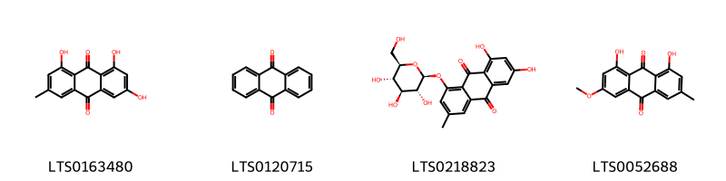{ width=100% }
    <figcaption>Hình ảnh cấu trúc hóa học của 4 hoạt chất thuộc nhóm Anthracenes gồm ['emodin (LTS0163480)', 'anthraquinone (LTS0120715)', 'emodin 1-o-β-d-glucoside (LTS0218823)', 'physcion (LTS0052688)'].</figcaption>
</figure>
#### Nhóm Benzene and substituted derivatives
<figure markdown="span">
    { width=100% }
    <figcaption>Hình ảnh cấu trúc hóa học của 6 hoạt chất thuộc nhóm Benzene and substituted derivatives gồm ['syringic acid (LTS0210036)', '2,5-dihydroxybenzoic acid (LTS0170793)', 'galop (LTS0222857)', 'p-hydroxybenzoic acid (LTS0263634)', '3,4-dihydroxybenzoic acid (LTS0018765)', 'vanillic acid (LTS0229113)'].</figcaption>
</figure>
#### Nhóm Carboxylic acids and derivatives
<figure markdown="span">
    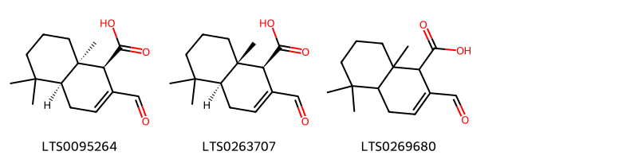{ width=100% }
    <figcaption>Hình ảnh cấu trúc hóa học của 3 hoạt chất thuộc nhóm Carboxylic acids and derivatives gồm ['(1r,4as,8ar)-2-formyl-5,5,8a-trimethyl-1,4,4a,6,7,8-hexahydronaphthalene-1-carboxylic acid (LTS0095264)', '(1r,4as,8as)-2-formyl-5,5,8a-trimethyl-1,4,4a,6,7,8-hexahydronaphthalene-1-carboxylic acid (LTS0263707)', '2-formyl-5,5,8a-trimethyl-1,4,4a,6,7,8-hexahydronaphthalene-1-carboxylic acid (LTS0269680)'].</figcaption>
</figure>
#### Nhóm Cinnamic acids and derivatives
<figure markdown="span">
    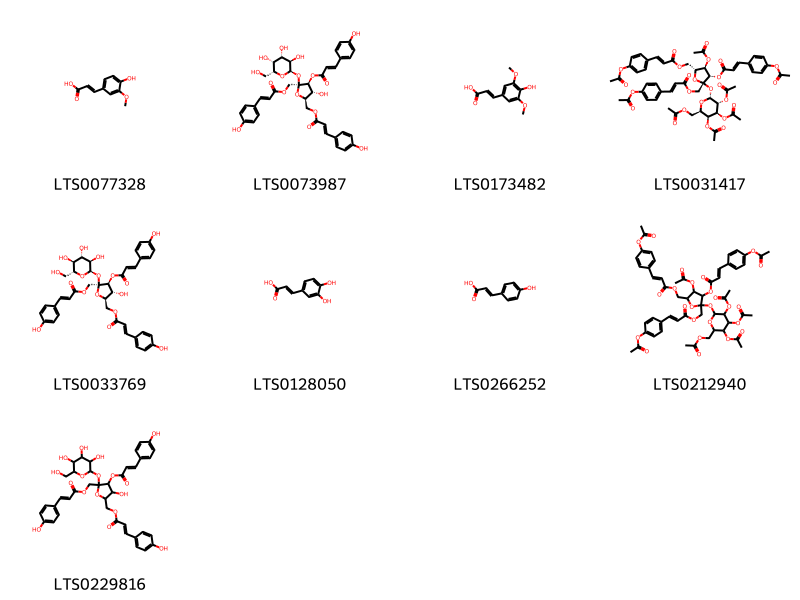{ width=100% }
    <figcaption>Hình ảnh cấu trúc hóa học của 9 hoạt chất thuộc nhóm Cinnamic acids and derivatives gồm ['ferulic acid (LTS0077328)', '[(2r,3r,4s,5s)-3-hydroxy-4-{[(2e)-3-(4-hydroxyphenyl)prop-2-enoyl]oxy}-5-({[(2e)-3-(4-hydroxyphenyl)prop-2-enoyl]oxy}methyl)-5-{[(2r,3r,4s,5r,6r)-3,4,5-trihydroxy-6-(hydroxymethyl)oxan-2-yl]oxy}oxolan-2-yl]methyl (2e)-3-(4-hydroxyphenyl)prop-2-enoate (LTS0073987)', 'sinapinate (LTS0173482)', '[(2s,3s,4r,5r)-4-(acetyloxy)-3-{[(2e)-3-[4-(acetyloxy)phenyl]prop-2-enoyl]oxy}-5-({[(2e)-3-[4-(acetyloxy)phenyl]prop-2-enoyl]oxy}methyl)-2-{[(2r,3r,4s,5s,6r)-3,4,5-tris(acetyloxy)-6-[(acetyloxy)methyl]oxan-2-yl]oxy}oxolan-2-yl]methyl (2e)-3-[4-(acetyloxy)phenyl]prop-2-enoate (LTS0031417)', '[(2r,3r,4s,5s)-3-hydroxy-4-{[(2e)-3-(4-hydroxyphenyl)prop-2-enoyl]oxy}-5-({[(2e)-3-(4-hydroxyphenyl)prop-2-enoyl]oxy}methyl)-5-{[(2r,3r,4s,5s,6r)-3,4,5-trihydroxy-6-(hydroxymethyl)oxan-2-yl]oxy}oxolan-2-yl]methyl (2e)-3-(4-hydroxyphenyl)prop-2-enoate (LTS0033769)', '3,4-dihydroxycinnamic acid (LTS0128050)', 'para-coumaric acid (LTS0266252)', '[4-(acetyloxy)-3-({3-[4-(acetyloxy)phenyl]prop-2-enoyl}oxy)-5-[({3-[4-(acetyloxy)phenyl]prop-2-enoyl}oxy)methyl]-2-{[3,4,5-tris(acetyloxy)-6-[(acetyloxy)methyl]oxan-2-yl]oxy}oxolan-2-yl]methyl 3-[4-(acetyloxy)phenyl]prop-2-enoate (LTS0212940)', '(3-hydroxy-4-{[3-(4-hydroxyphenyl)prop-2-enoyl]oxy}-5-({[3-(4-hydroxyphenyl)prop-2-enoyl]oxy}methyl)-5-{[3,4,5-trihydroxy-6-(hydroxymethyl)oxan-2-yl]oxy}oxolan-2-yl)methyl 3-(4-hydroxyphenyl)prop-2-enoate (LTS0229816)'].</figcaption>
</figure>
#### Nhóm Fatty Acyls
<figure markdown="span">
    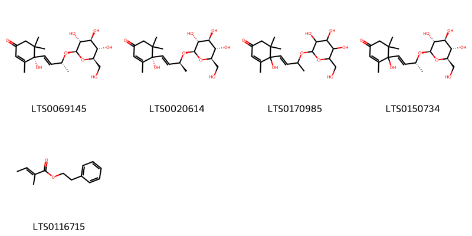{ width=100% }
    <figcaption>Hình ảnh cấu trúc hóa học của 5 hoạt chất thuộc nhóm Fatty Acyls gồm ['(4s)-4-hydroxy-3,5,5-trimethyl-4-[(1e,3r)-3-{[(2r,3r,4s,5s,6r)-3,4,5-trihydroxy-6-(hydroxymethyl)oxan-2-yl]oxy}but-1-en-1-yl]cyclohex-2-en-1-one (LTS0069145)', '(4s)-4-hydroxy-3,5,5-trimethyl-4-[(1e,3s)-3-{[(2r,3r,4s,5s,6r)-3,4,5-trihydroxy-6-(hydroxymethyl)oxan-2-yl]oxy}but-1-en-1-yl]cyclohex-2-en-1-one (LTS0020614)', '4-hydroxy-3,5,5-trimethyl-4-(3-{[3,4,5-trihydroxy-6-(hydroxymethyl)oxan-2-yl]oxy}but-1-en-1-yl)cyclohex-2-en-1-one (LTS0170985)', '4-hydroxy-3,5,5-trimethyl-4-[(1e,3r)-3-{[(2r,3r,4s,5s,6r)-3,4,5-trihydroxy-6-(hydroxymethyl)oxan-2-yl]oxy}but-1-en-1-yl]cyclohex-2-en-1-one (LTS0150734)', 'phenethyl tiglate (LTS0116715)'].</figcaption>
</figure>
#### Nhóm Flavonoids
<figure markdown="span">
    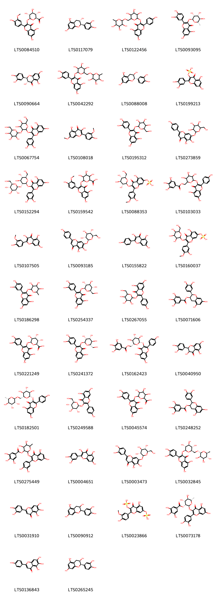{ width=100% }
    <figcaption>Hình ảnh cấu trúc hóa học của 42 hoạt chất thuộc nhóm Flavonoids gồm ['isorhamnetin-3-glucuronide (LTS0084510)', '(+)-catechol (LTS0117079)', '5,7-dihydroxy-2-(4-hydroxyphenyl)-3-[(3,4,5-trihydroxy-6-{[(3,4,5-trihydroxy-6-methyloxan-2-yl)oxy]methyl}oxan-2-yl)oxy]chromen-4-one (LTS0122456)', 'quercitrin (LTS0093095)', '(+)-taxifolin (LTS0090664)', 'rutin (LTS0042292)', 'α catechin (LTS0088008)', 'quercetin 3-sulfate (LTS0199213)', '3-{[4,5-dihydroxy-6-(hydroxymethyl)-3-{[3,4,5-trihydroxy-6-(hydroxymethyl)oxan-2-yl]oxy}oxan-2-yl]oxy}-2-(3,4-dihydroxyphenyl)-5,7-dihydroxychromen-4-one (LTS0067754)', 'rhamnazin (LTS0108018)', '2-(3,4-dihydroxyphenyl)-5,7-dihydroxy-3-{[3,4,5-trihydroxy-6-(hydroxymethyl)oxan-2-yl]oxy}chromen-4-one (LTS0195312)', '5,6-dihydroxy-2-(4-hydroxyphenyl)-7-{[3,4,5-trihydroxy-6-(hydroxymethyl)oxan-2-yl]oxy}chromen-4-one (LTS0273859)', 'quosp (LTS0152294)', '6-{[5,7-dihydroxy-2-(4-hydroxy-3-methoxyphenyl)-4-oxochromen-3-yl]oxy}-3,4,5-trihydroxyoxane-2-carboxylic acid (LTS0159542)', '[5-hydroxy-2-(3-hydroxy-4-methoxyphenyl)-4-oxo-3-{[(2s,3r,4s,5s,6r)-3,4,5-trihydroxy-6-(hydroxymethyl)oxan-2-yl]oxy}chromen-7-yl]oxidanesulfonic acid (LTS0088353)', '(6-{[5,7-dihydroxy-2-(4-hydroxyphenyl)-4-oxochromen-3-yl]oxy}-3,4,5-trihydroxyoxan-2-yl)methyl 3,4,5-trihydroxybenzoate (LTS0103033)', 'isorhamnetin (LTS0107505)', 'plantaginin (LTS0093185)', 'kaempherol (LTS0155822)', '[5-hydroxy-2-(3-hydroxy-4-methoxyphenyl)-4-oxo-3-{[3,4,5-trihydroxy-6-(hydroxymethyl)oxan-2-yl]oxy}chromen-7-yl]oxidanesulfonic acid (LTS0160037)', 'quercitrin (LTS0186298)', 'isoquercetin (LTS0254337)', 'trifolin (LTS0267055)', 'epicatechin gallate (LTS0071606)', '(2s,3s,4r,5s,6s)-6-{[2-(3,4-dihydroxyphenyl)-5,7-dihydroxy-4-oxochromen-3-yl]oxy}-3,4,5-trihydroxyoxane-2-carboxylic acid (LTS0221249)', '2-(3,4-dihydroxyphenyl)-5,7-dihydroxy-3-{[(2s,3r,4r,5r,6s)-3,4,5-trihydroxy-6-(hydroxymethyl)oxan-2-yl]oxy}chromen-4-one (LTS0241372)', '[(2r,3s,4s,5r,6s)-6-{[5,7-dihydroxy-2-(4-hydroxyphenyl)-4-oxochromen-3-yl]oxy}-3,4,5-trihydroxyoxan-2-yl]methyl 3,4,5-trihydroxybenzoate (LTS0162423)', '2,3-dihydroquercetin (LTS0040950)', 'nictoflorin (LTS0182501)', 'astragalin (LTS0249588)', 'miquelianin (LTS0045574)', '2-(3,4-dihydroxyphenyl)-5,7-dihydroxy-3,4-dihydro-2h-1-benzopyran-3-yl 3,4,5-trihydroxybenzoate (LTS0248252)', '2-{[2-(3,4-dihydroxyphenyl)-5,7-dihydroxy-4-oxochromen-3-yl]oxy}-4,5-dihydroxy-6-methyloxan-3-yl 3,4,5-trihydroxybenzoate (LTS0275449)', 'quercetin (LTS0004651)', '2-(3,4-dihydroxyphenyl)-5,6-dihydroxy-7-{[(2s,3r,4s,5s,6r)-3,4,5-trihydroxy-6-(hydroxymethyl)oxan-2-yl]oxy}chromen-4-one (LTS0003473)', '3-rutinosyl quercetin (LTS0032845)', '6-hydroxyluteolin (LTS0031910)', 'catechol (LTS0090912)', 'isorhamnetin 3,7-di-o-sulfate (LTS0023866)', '(2s,3r,4r,5r,6s)-2-{[2-(3,4-dihydroxyphenyl)-5,7-dihydroxy-4-oxochromen-3-yl]oxy}-4,5-dihydroxy-6-methyloxan-3-yl 3,4,5-trihydroxybenzoate (LTS0073178)', 'scutellarein (LTS0136843)', 'ent-epicatechin (LTS0265245)'].</figcaption>
</figure>
#### Nhóm Isocoumarins and derivatives
<figure markdown="span">
    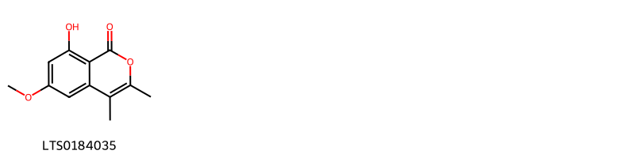{ width=100% }
    <figcaption>Hình ảnh cấu trúc hóa học của 1 hoạt chất thuộc nhóm Isocoumarins and derivatives gồm ['polygonolide (LTS0184035)'].</figcaption>
</figure>
#### Nhóm Naphthofurans
<figure markdown="span">
    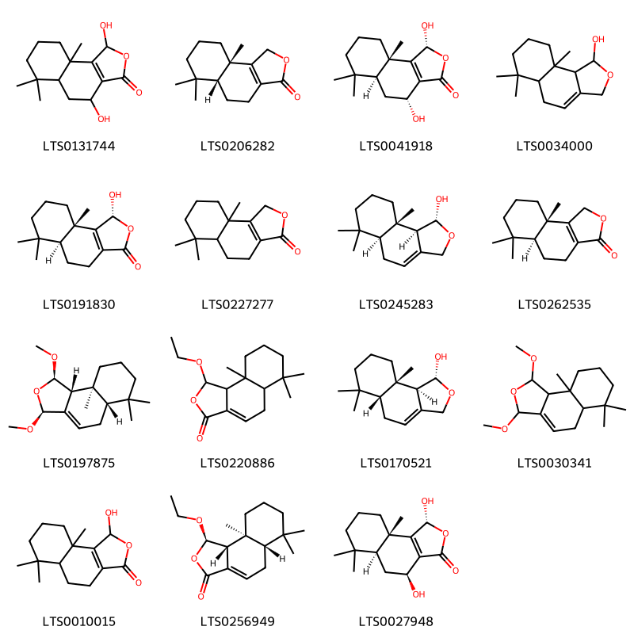{ width=100% }
    <figcaption>Hình ảnh cấu trúc hóa học của 15 hoạt chất thuộc nhóm Naphthofurans gồm ['1,4-dihydroxy-6,6,9a-trimethyl-1h,4h,5h,5ah,7h,8h,9h-naphtho[1,2-c]furan-3-one (LTS0131744)', '(5ar,9as)-6,6,9a-trimethyl-1h,4h,5h,5ah,7h,8h,9h-naphtho[1,2-c]furan-3-one (LTS0206282)', '(1r,4r,5as,9as)-1,4-dihydroxy-6,6,9a-trimethyl-1h,4h,5h,5ah,7h,8h,9h-naphtho[1,2-c]furan-3-one (LTS0041918)', '6,6,9a-trimethyl-1h,3h,5h,5ah,7h,8h,9h,9bh-naphtho[1,2-c]furan-1-ol (LTS0034000)', '(1r,5as,9as)-1-hydroxy-6,6,9a-trimethyl-1h,4h,5h,5ah,7h,8h,9h-naphtho[1,2-c]furan-3-one (LTS0191830)', '6,6,9a-trimethyl-1h,4h,5h,5ah,7h,8h,9h-naphtho[1,2-c]furan-3-one (LTS0227277)', '(1r,5as,9as,9br)-6,6,9a-trimethyl-1h,3h,5h,5ah,7h,8h,9h,9bh-naphtho[1,2-c]furan-1-ol (LTS0245283)', 'confertifolin (LTS0262535)', '(1r,3s,5as,9as,9br)-1,3-dimethoxy-6,6,9a-trimethyl-1h,3h,5h,5ah,7h,8h,9h,9bh-naphtho[1,2-c]furan (LTS0197875)', '1-ethoxy-6,6,9a-trimethyl-1h,5h,5ah,7h,8h,9h,9bh-naphtho[1,2-c]furan-3-one (LTS0220886)', '(1r,5ar,9as,9br)-6,6,9a-trimethyl-1h,3h,5h,5ah,7h,8h,9h,9bh-naphtho[1,2-c]furan-1-ol (LTS0170521)', '1,3-dimethoxy-6,6,9a-trimethyl-1h,3h,5h,5ah,7h,8h,9h,9bh-naphtho[1,2-c]furan (LTS0030341)', '1-hydroxy-6,6,9a-trimethyl-1h,4h,5h,5ah,7h,8h,9h-naphtho[1,2-c]furan-3-one (LTS0010015)', '(1r,5as,9as,9br)-1-ethoxy-6,6,9a-trimethyl-1h,5h,5ah,7h,8h,9h,9bh-naphtho[1,2-c]furan-3-one (LTS0256949)', '(1r,4s,5as,9as)-1,4-dihydroxy-6,6,9a-trimethyl-1h,4h,5h,5ah,7h,8h,9h-naphtho[1,2-c]furan-3-one (LTS0027948)'].</figcaption>
</figure>
#### Nhóm Organic oxides
<figure markdown="span">
    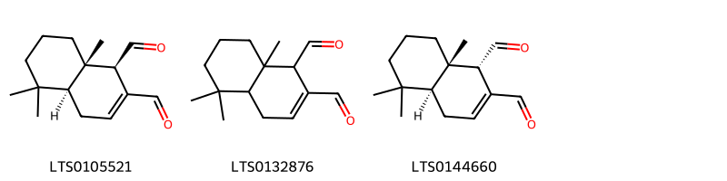{ width=100% }
    <figcaption>Hình ảnh cấu trúc hóa học của 3 hoạt chất thuộc nhóm Organic oxides gồm ['polygodial (LTS0105521)', '5,5,8a-trimethyl-1,4,4a,6,7,8-hexahydronaphthalene-1,2-dicarbaldehyde (LTS0132876)', '(1s,4as,8as)-5,5,8a-trimethyl-1,4,4a,6,7,8-hexahydronaphthalene-1,2-dicarbaldehyde (LTS0144660)'].</figcaption>
</figure>
#### Nhóm Organooxygen compounds
<figure markdown="span">
    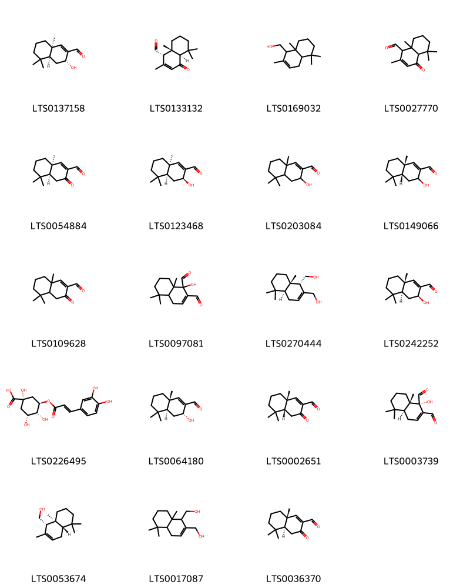{ width=100% }
    <figcaption>Hình ảnh cấu trúc hóa học của 19 hoạt chất thuộc nhóm Organooxygen compounds gồm ['(3r,4as,8as)-3-hydroxy-5,5,8a-trimethyl-3,4,4a,6,7,8-hexahydronaphthalene-2-carbaldehyde (LTS0137158)', '(1s,4ar,8as)-2,5,5,8a-tetramethyl-4-oxo-4a,6,7,8-tetrahydro-1h-naphthalene-1-carbaldehyde (LTS0133132)', '(2,5,5,8a-tetramethyl-1,4,4a,6,7,8-hexahydronaphthalen-1-yl)methanol (LTS0169032)', '2,5,5,8a-tetramethyl-4-oxo-4a,6,7,8-tetrahydro-1h-naphthalene-1-carbaldehyde (LTS0027770)', '(4as,8as)-5,5,8a-trimethyl-3-oxo-4a,6,7,8-tetrahydro-4h-naphthalene-2-carbaldehyde (LTS0054884)', '(3s,4as,8as)-3-hydroxy-5,5,8a-trimethyl-3,4,4a,6,7,8-hexahydronaphthalene-2-carbaldehyde (LTS0123468)', '3-hydroxy-5,5,8a-trimethyl-3,4,4a,6,7,8-hexahydronaphthalene-2-carbaldehyde (LTS0203084)', '(4ar,8ar)-3-hydroxy-5,5,8a-trimethyl-3,4,4a,6,7,8-hexahydronaphthalene-2-carbaldehyde (LTS0149066)', '5,5,8a-trimethyl-3-oxo-4a,6,7,8-tetrahydro-4h-naphthalene-2-carbaldehyde (LTS0109628)', '1-hydroxy-5,5,8a-trimethyl-4a,6,7,8-tetrahydro-4h-naphthalene-1,2-dicarbaldehyde (LTS0097081)', '[(1s,4as,8as)-2-(hydroxymethyl)-5,5,8a-trimethyl-1,4,4a,6,7,8-hexahydronaphthalen-1-yl]methanol (LTS0270444)', '(3s,4as,8ar)-3-hydroxy-5,5,8a-trimethyl-3,4,4a,6,7,8-hexahydronaphthalene-2-carbaldehyde (LTS0242252)', 'chlorogenic acid (LTS0226495)', '(3r,4as,8ar)-3-hydroxy-5,5,8a-trimethyl-3,4,4a,6,7,8-hexahydronaphthalene-2-carbaldehyde (LTS0064180)', '(4ar,8ar)-5,5,8a-trimethyl-3-oxo-4a,6,7,8-tetrahydro-4h-naphthalene-2-carbaldehyde (LTS0002651)', 'warburganal (LTS0003739)', 'drimenol (LTS0053674)', '[2-(hydroxymethyl)-5,5,8a-trimethyl-1,4,4a,6,7,8-hexahydronaphthalen-1-yl]methanol (LTS0017087)', '(4as,8ar)-5,5,8a-trimethyl-3-oxo-4a,6,7,8-tetrahydro-4h-naphthalene-2-carbaldehyde (LTS0036370)'].</figcaption>
</figure>
#### Nhóm Steroids and steroid derivatives
<figure markdown="span">
    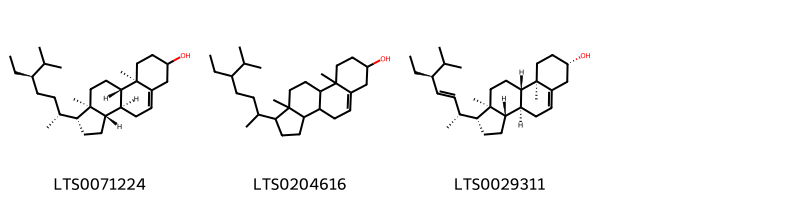{ width=100% }
    <figcaption>Hình ảnh cấu trúc hóa học của 3 hoạt chất thuộc nhóm Steroids and steroid derivatives gồm ['stigmast-5-en-3-ol (LTS0071224)', 'stigmast-5-en-3-ol, (3β)- (LTS0204616)', 'phytosterol (LTS0029311)'].</figcaption>
</figure>
#### Nhóm Tannins
<figure markdown="span">
    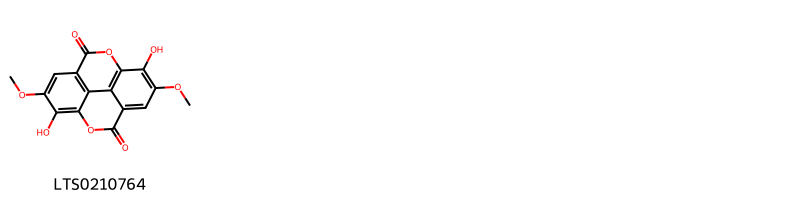{ width=100% }
    <figcaption>Hình ảnh cấu trúc hóa học của 1 hoạt chất thuộc nhóm Tannins gồm ['7,14-dihydroxy-6,13-dimethoxy-2,9-dioxatetracyclo[6.6.2.0⁴,¹⁶.0¹¹,¹⁵]hexadeca-1(15),4(16),5,7,11,13-hexaene-3,10-dione (LTS0210764)'].</figcaption>
</figure>
#### Nhóm Tetrapyrroles and derivatives
<figure markdown="span">
    { width=100% }
    <figcaption>Hình ảnh cấu trúc hóa học của 4 hoạt chất thuộc nhóm Tetrapyrroles and derivatives gồm ['methyl (3r,21s,22s)-16-ethenyl-11-ethyl-12,17,21,26-tetramethyl-4-oxo-22-(3-oxo-3-{[(2e,7r,11r)-3,7,11,15-tetramethylhexadec-2-en-1-yl]oxy}propyl)-7,23,24,25-tetraazahexacyclo[18.2.1.1⁵,⁸.1¹⁰,¹³.1¹⁵,¹⁸.0²,⁶]hexacosa-1(23),2(6),5(26),7,9,11,13,15,17,19-decaene-3-carboxylate (LTS0200273)', 'methyl (21s,22s)-16-ethenyl-11-ethyl-12-(hydroxymethylidene)-17,21,26-trimethyl-4-oxo-22-(3-oxo-3-{[(2e,7r,11r)-3,7,11,15-tetramethylhexadec-2-en-1-yl]oxy}propyl)-7,23,24,25-tetraazahexacyclo[18.2.1.1⁵,⁸.1¹⁰,¹³.1¹⁵,¹⁸.0²,⁶]hexacosa-1,5(26),6,8,10,13(25),14,16,18,20(23)-decaene-3-carboxylate (LTS0073176)', 'methyl (21s,22s)-16-ethenyl-11-ethyl-12,17,21,26-tetramethyl-4-oxo-22-(3-oxo-3-{[(2e)-3,7,11,15-tetramethylhexadec-2-en-1-yl]oxy}propyl)-7,23,24,25-tetraazahexacyclo[18.2.1.1⁵,⁸.1¹⁰,¹³.1¹⁵,¹⁸.0²,⁶]hexacosa-1(23),2(6),5(26),7,9,11,13,15,17,19-decaene-3-carboxylate (LTS0002371)', 'methyl (21s,22s)-16-ethenyl-11-ethyl-12-(hydroxymethylidene)-17,21,26-trimethyl-4-oxo-22-(3-oxo-3-{[(2e)-3,7,11,15-tetramethylhexadec-2-en-1-yl]oxy}propyl)-7,23,24,25-tetraazahexacyclo[18.2.1.1⁵,⁸.1¹⁰,¹³.1¹⁵,¹⁸.0²,⁶]hexacosa-1,5(26),6,8,10,13(25),14,16,18,20(23)-decaene-3-carboxylate (LTS0059915)'].</figcaption>
</figure>

---

### Dược dân tộc học

Danh sách các quốc gia có sử dụng *N/A* trong điều trị các bệnh. 

| Country   | Disease                                                                                                                      | Bệnh                                                                                                                                                                                                |
|:----------|:-----------------------------------------------------------------------------------------------------------------------------|:----------------------------------------------------------------------------------------------------------------------------------------------------------------------------------------------------|
| Elsewhere | Carminative, Contraceptive, Diuretic, Diuretic, Emmenagogue, Larvicide, Styptic, Tonic, Vermifuge, nan, Piscicide, Stimulant | MYMEMORY WARNING: YOU USED ALL AVAILABLE FREE TRANSLATIONS FOR TODAY. NEXT AVAILABLE IN  15 HOURS 16 MINUTES 23 SECONDS VISIT HTTPS://MYMEMORY.TRANSLATED.NET/DOC/USAGELIMITS.PHP TO TRANSLATE MORE |
| Java      | Insectifuge                                                                                                                  | MYMEMORY WARNING: YOU USED ALL AVAILABLE FREE TRANSLATIONS FOR TODAY. NEXT AVAILABLE IN  15 HOURS 16 MINUTES 20 SECONDS VISIT HTTPS://MYMEMORY.TRANSLATED.NET/DOC/USAGELIMITS.PHP TO TRANSLATE MORE |
| Turkey    | Diuretic, Rubefacient, Stimulant, Sudorific, Uterotonic, Antiseptic, Carminative, Hemostat, Vasoconstrictor, Poison          | MYMEMORY WARNING: YOU USED ALL AVAILABLE FREE TRANSLATIONS FOR TODAY. NEXT AVAILABLE IN  15 HOURS 16 MINUTES 16 SECONDS VISIT HTTPS://MYMEMORY.TRANSLATED.NET/DOC/USAGELIMITS.PHP TO TRANSLATE MORE |
| US        | Diuretic, Hemostat, Emmenagogue                                                                                              | MYMEMORY WARNING: YOU USED ALL AVAILABLE FREE TRANSLATIONS FOR TODAY. NEXT AVAILABLE IN  15 HOURS 16 MINUTES 13 SECONDS VISIT HTTPS://MYMEMORY.TRANSLATED.NET/DOC/USAGELIMITS.PHP TO TRANSLATE MORE |
| USSR      | Sedative, Hemostat                                                                                                           | MYMEMORY WARNING: YOU USED ALL AVAILABLE FREE TRANSLATIONS FOR TODAY. NEXT AVAILABLE IN  15 HOURS 16 MINUTES 10 SECONDS VISIT HTTPS://MYMEMORY.TRANSLATED.NET/DOC/USAGELIMITS.PHP TO TRANSLATE MORE |
| ain       | Hemostat                                                                                                                     | MYMEMORY WARNING: YOU USED ALL AVAILABLE FREE TRANSLATIONS FOR TODAY. NEXT AVAILABLE IN  15 HOURS 16 MINUTES 06 SECONDS VISIT HTTPS://MYMEMORY.TRANSLATED.NET/DOC/USAGELIMITS.PHP TO TRANSLATE MORE |

---

---
## Polygonum lapathifolium
### Thông tin về thực vật

!!! info "Phân loại thực vật của *N/A* từ GIBF:"
    - **Kingdom:** Plantae
    - **Phylum:** Tracheophyta
    - **Order:** Caryophyllales
    - **Family:** Polygonaceae
    - **Genus:** Persicaria
    - **Species:** *N/A*

 

| Label (VI)   | Label (EN)   | Scientific Name         | Descriptions (VI)   | Descriptions (EN)   | Also Known As (VI)   | Also Known As (EN)   |
|:-------------|:-------------|:------------------------|:--------------------|:--------------------|:---------------------|:---------------------|
| N/A          | N/A          | Polygonum lapathifolium | loài thực vật       | species of plant    | ['']                 | ['']                 |

#### Phân bố trên thế giới

**Từ CSDL GIBF** Brazil, Japan, Nepal, China, Chile, New Zealand, Ecuador, Thailand, Spain, Réunion, United States of America, Indonesia, Costa Rica, Colombia, Argentina, French Guiana, Hong Kong, Mexico, Benin, Kenya, United Kingdom of Great Britain and Northern Ireland, Chinese Taipei, Panama, Portugal, South Africa, Australia, France

#### Phân bố tại Việt Nam

**Từ CSDL GIBF**: Không có ghi nhận ở Việt Nam

---
### Thành phần hóa học
        
- Theo cơ sở dữ liệu lotus: Từ loài *N/A* đã phân lập và xác định được 72 hoạt chất thuộc về các nhóm Benzene and substituted derivatives, Linear 1,3-diarylpropanoids, Flavonoids, Cinnamic acids and derivatives, Steroids and steroid derivatives, Naphthalenes, Isoflavonoids. 

|    | chemicalTaxonomyClassyfireClass     |   smiles_count |
|---:|:------------------------------------|---------------:|
|  0 | Benzene and substituted derivatives |              5 |
|  1 | Cinnamic acids and derivatives      |             29 |
|  2 | Flavonoids                          |             17 |
|  3 | Isoflavonoids                       |              2 |
|  4 | Linear 1,3-diarylpropanoids         |             14 |
|  5 | Naphthalenes                        |              1 |
|  6 | Steroids and steroid derivatives    |              4 |

#### Nhóm Benzene and substituted derivatives
<figure markdown="span">
    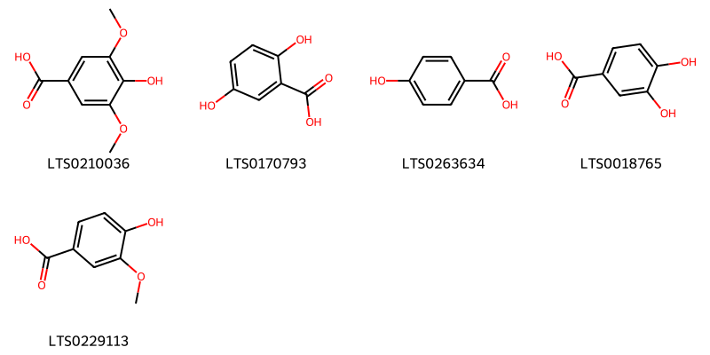{ width=100% }
    <figcaption>Hình ảnh cấu trúc hóa học của 5 hoạt chất thuộc nhóm Benzene and substituted derivatives gồm ['syringic acid (LTS0210036)', '2,5-dihydroxybenzoic acid (LTS0170793)', 'p-hydroxybenzoic acid (LTS0263634)', '3,4-dihydroxybenzoic acid (LTS0018765)', 'vanillic acid (LTS0229113)'].</figcaption>
</figure>
#### Nhóm Cinnamic acids and derivatives
<figure markdown="span">
    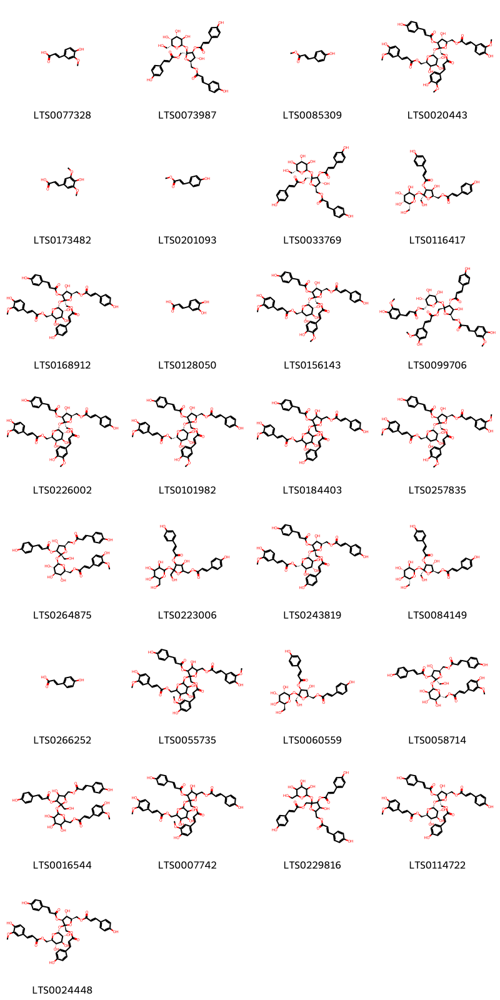{ width=100% }
    <figcaption>Hình ảnh cấu trúc hóa học của 29 hoạt chất thuộc nhóm Cinnamic acids and derivatives gồm ['ferulic acid (LTS0077328)', '[(2r,3r,4s,5s)-3-hydroxy-4-{[(2e)-3-(4-hydroxyphenyl)prop-2-enoyl]oxy}-5-({[(2e)-3-(4-hydroxyphenyl)prop-2-enoyl]oxy}methyl)-5-{[(2r,3r,4s,5r,6r)-3,4,5-trihydroxy-6-(hydroxymethyl)oxan-2-yl]oxy}oxolan-2-yl]methyl (2e)-3-(4-hydroxyphenyl)prop-2-enoate (LTS0073987)', 'methyl (2e)-3-(4-hydroxyphenyl)prop-2-enoate (LTS0085309)', '[(2r,3r,4s,5r,6r)-3,4,5-trihydroxy-6-{[(2s,3s,4r,5r)-4-hydroxy-2,5-bis({[(2e)-3-(4-hydroxy-3-methoxyphenyl)prop-2-enoyl]oxy}methyl)-3-{[(2e)-3-(4-hydroxyphenyl)prop-2-enoyl]oxy}oxolan-2-yl]oxy}oxan-2-yl]methyl (2e)-3-(4-hydroxy-3-methoxyphenyl)prop-2-enoate (LTS0020443)', 'sinapinate (LTS0173482)', 'methyl hydroxycinnamate (LTS0201093)', '[(2r,3r,4s,5s)-3-hydroxy-4-{[(2e)-3-(4-hydroxyphenyl)prop-2-enoyl]oxy}-5-({[(2e)-3-(4-hydroxyphenyl)prop-2-enoyl]oxy}methyl)-5-{[(2r,3r,4s,5s,6r)-3,4,5-trihydroxy-6-(hydroxymethyl)oxan-2-yl]oxy}oxolan-2-yl]methyl (2e)-3-(4-hydroxyphenyl)prop-2-enoate (LTS0033769)', '[(2r,3s,4s,5s)-3-hydroxy-5-(hydroxymethyl)-4-{[(2e)-3-(4-hydroxyphenyl)prop-2-enoyl]oxy}-5-{[(2r,3r,4s,5r,6r)-3,4,5-trihydroxy-6-(hydroxymethyl)oxan-2-yl]oxy}oxolan-2-yl]methyl (2e)-3-(4-hydroxyphenyl)prop-2-enoate (LTS0116417)', '[(2r,3r,4s,5r,6r)-3,4,5-trihydroxy-6-{[(2s,3s,4r,5r)-4-hydroxy-3-{[(2e)-3-(4-hydroxyphenyl)prop-2-enoyl]oxy}-2,5-bis({[(2e)-3-(4-hydroxyphenyl)prop-2-enoyl]oxy}methyl)oxolan-2-yl]oxy}oxan-2-yl]methyl (2e)-3-(4-hydroxy-3-methoxyphenyl)prop-2-enoate (LTS0168912)', '3,4-dihydroxycinnamic acid (LTS0128050)', '[(2r,3s,4s,5r,6r)-3,4,5-trihydroxy-6-{[(2s,3s,4r,5r)-4-hydroxy-2-({[(2e)-3-(4-hydroxy-3-methoxyphenyl)prop-2-enoyl]oxy}methyl)-3-{[(2e)-3-(4-hydroxyphenyl)prop-2-enoyl]oxy}-5-({[(2e)-3-(4-hydroxyphenyl)prop-2-enoyl]oxy}methyl)oxolan-2-yl]oxy}oxan-2-yl]methyl (2e)-3-(4-hydroxy-3-methoxyphenyl)prop-2-enoate (LTS0156143)', '[(2r,3s,4r,5r)-3-hydroxy-5-({[(2e)-3-(4-hydroxy-3-methoxyphenyl)prop-2-enoyl]oxy}methyl)-4-{[(2e)-3-(4-hydroxyphenyl)prop-2-enoyl]oxy}-5-{[(2r,3s,4s,5r,6r)-3,4,5-trihydroxy-6-({[(2e)-3-(4-hydroxy-3-methoxyphenyl)prop-2-enoyl]oxy}methyl)oxan-2-yl]oxy}oxolan-2-yl]methyl (2e)-3-(4-hydroxy-3-methoxyphenyl)prop-2-enoate (LTS0099706)', '[(2r,3r,4s,5r,6r)-3,4,5-trihydroxy-6-{[(2s,3s,4r,5r)-4-hydroxy-2-({[(2e)-3-(4-hydroxy-3-methoxyphenyl)prop-2-enoyl]oxy}methyl)-3-{[(2e)-3-(4-hydroxyphenyl)prop-2-enoyl]oxy}-5-({[(2e)-3-(4-hydroxyphenyl)prop-2-enoyl]oxy}methyl)oxolan-2-yl]oxy}oxan-2-yl]methyl (2e)-3-(4-hydroxy-3-methoxyphenyl)prop-2-enoate (LTS0226002)', '[(2s,3r,4r,5s,6r)-3,4,5-trihydroxy-6-{[(2r,3s,4r,5r)-4-hydroxy-2-({[(2e)-3-(4-hydroxy-3-methoxyphenyl)prop-2-enoyl]oxy}methyl)-3-{[(2e)-3-(4-hydroxyphenyl)prop-2-enoyl]oxy}-5-({[(2e)-3-(4-hydroxyphenyl)prop-2-enoyl]oxy}methyl)oxolan-2-yl]oxy}oxan-2-yl]methyl (2e)-3-(4-hydroxy-3-methoxyphenyl)prop-2-enoate (LTS0101982)', '{3,4,5-trihydroxy-6-[(4-hydroxy-3-{[3-(4-hydroxyphenyl)prop-2-enoyl]oxy}-2,5-bis({[3-(4-hydroxyphenyl)prop-2-enoyl]oxy}methyl)oxolan-2-yl)oxy]oxan-2-yl}methyl 3-(4-hydroxy-3-methoxyphenyl)prop-2-enoate (LTS0184403)', '[(2r,3s,4s,5r,6r)-3,4,5-trihydroxy-6-{[(2s,3s,4r,5r)-4-hydroxy-2,5-bis({[(2e)-3-(4-hydroxy-3-methoxyphenyl)prop-2-enoyl]oxy}methyl)-3-{[(2e)-3-(4-hydroxyphenyl)prop-2-enoyl]oxy}oxolan-2-yl]oxy}oxan-2-yl]methyl (2e)-3-(4-hydroxy-3-methoxyphenyl)prop-2-enoate (LTS0257835)', '[(2s,3r,4r,5s,6r)-3,4,5-trihydroxy-6-{[(2r,3s,4r,5r)-4-hydroxy-2-(hydroxymethyl)-3-{[(2e)-3-(4-hydroxyphenyl)prop-2-enoyl]oxy}-5-({[(2e)-3-(4-hydroxyphenyl)prop-2-enoyl]oxy}methyl)oxolan-2-yl]oxy}oxan-2-yl]methyl (2e)-3-(4-hydroxy-3-methoxyphenyl)prop-2-enoate (LTS0264875)', '[3-hydroxy-5-(hydroxymethyl)-4-{[3-(4-hydroxyphenyl)prop-2-enoyl]oxy}-5-{[3,4,5-trihydroxy-6-(hydroxymethyl)oxan-2-yl]oxy}oxolan-2-yl]methyl 3-(4-hydroxyphenyl)prop-2-enoate (LTS0223006)', '[(2s,3r,4r,5s,6r)-3,4,5-trihydroxy-6-{[(2r,3s,4r,5r)-4-hydroxy-3-{[(2e)-3-(4-hydroxyphenyl)prop-2-enoyl]oxy}-2,5-bis({[(2e)-3-(4-hydroxyphenyl)prop-2-enoyl]oxy}methyl)oxolan-2-yl]oxy}oxan-2-yl]methyl (2e)-3-(4-hydroxy-3-methoxyphenyl)prop-2-enoate (LTS0243819)', '[(2r,3r,4s,5s)-3-hydroxy-5-(hydroxymethyl)-4-{[(2e)-3-(4-hydroxyphenyl)prop-2-enoyl]oxy}-5-{[(2r,3r,4s,5s,6r)-3,4,5-trihydroxy-6-(hydroxymethyl)oxan-2-yl]oxy}oxolan-2-yl]methyl (2e)-3-(4-hydroxyphenyl)prop-2-enoate (LTS0084149)', 'para-coumaric acid (LTS0266252)', '(3,4,5-trihydroxy-6-{[4-hydroxy-2,5-bis({[3-(4-hydroxy-3-methoxyphenyl)prop-2-enoyl]oxy}methyl)-3-{[3-(4-hydroxyphenyl)prop-2-enoyl]oxy}oxolan-2-yl]oxy}oxan-2-yl)methyl 3-(4-hydroxy-3-methoxyphenyl)prop-2-enoate (LTS0055735)', '[(2r,3r,4s,5s)-3-hydroxy-5-(hydroxymethyl)-4-{[(2e)-3-(4-hydroxyphenyl)prop-2-enoyl]oxy}-5-{[(2r,3s,4s,5s,6s)-3,4,5-trihydroxy-6-(hydroxymethyl)oxan-2-yl]oxy}oxolan-2-yl]methyl (2e)-3-(4-hydroxyphenyl)prop-2-enoate (LTS0060559)', '[(2r,3s,4s,5r,6r)-3,4,5-trihydroxy-6-{[(2s,3s,4r,5r)-4-hydroxy-2-(hydroxymethyl)-3-{[(2e)-3-(4-hydroxyphenyl)prop-2-enoyl]oxy}-5-({[(2e)-3-(4-hydroxyphenyl)prop-2-enoyl]oxy}methyl)oxolan-2-yl]oxy}oxan-2-yl]methyl (2e)-3-(4-hydroxy-3-methoxyphenyl)prop-2-enoate (LTS0058714)', '(3,4,5-trihydroxy-6-{[4-hydroxy-2-(hydroxymethyl)-3-{[3-(4-hydroxyphenyl)prop-2-enoyl]oxy}-5-({[3-(4-hydroxyphenyl)prop-2-enoyl]oxy}methyl)oxolan-2-yl]oxy}oxan-2-yl)methyl 3-(4-hydroxy-3-methoxyphenyl)prop-2-enoate (LTS0016544)', '(3,4,5-trihydroxy-6-{[4-hydroxy-2-({[3-(4-hydroxy-3-methoxyphenyl)prop-2-enoyl]oxy}methyl)-3-{[3-(4-hydroxyphenyl)prop-2-enoyl]oxy}-5-({[3-(4-hydroxyphenyl)prop-2-enoyl]oxy}methyl)oxolan-2-yl]oxy}oxan-2-yl)methyl 3-(4-hydroxy-3-methoxyphenyl)prop-2-enoate (LTS0007742)', '(3-hydroxy-4-{[3-(4-hydroxyphenyl)prop-2-enoyl]oxy}-5-({[3-(4-hydroxyphenyl)prop-2-enoyl]oxy}methyl)-5-{[3,4,5-trihydroxy-6-(hydroxymethyl)oxan-2-yl]oxy}oxolan-2-yl)methyl 3-(4-hydroxyphenyl)prop-2-enoate (LTS0229816)', '[(2r,3s,4s,5r,6r)-3,4,5-trihydroxy-6-{[(2s,3s,4r,5r)-4-hydroxy-3-{[(2e)-3-(4-hydroxyphenyl)prop-2-enoyl]oxy}-2,5-bis({[(2e)-3-(4-hydroxyphenyl)prop-2-enoyl]oxy}methyl)oxolan-2-yl]oxy}oxan-2-yl]methyl (2e)-3-(4-hydroxy-3-methoxyphenyl)prop-2-enoate (LTS0114722)', '[(2r,3s,4s,5r,6r)-3,4,5-trihydroxy-6-{[(2r,3s,4r,5r)-4-hydroxy-3-{[(2e)-3-(4-hydroxyphenyl)prop-2-enoyl]oxy}-2,5-bis({[(2e)-3-(4-hydroxyphenyl)prop-2-enoyl]oxy}methyl)oxolan-2-yl]oxy}oxan-2-yl]methyl (2e)-3-(4-hydroxy-3-methoxyphenyl)prop-2-enoate (LTS0024448)'].</figcaption>
</figure>
#### Nhóm Flavonoids
<figure markdown="span">
    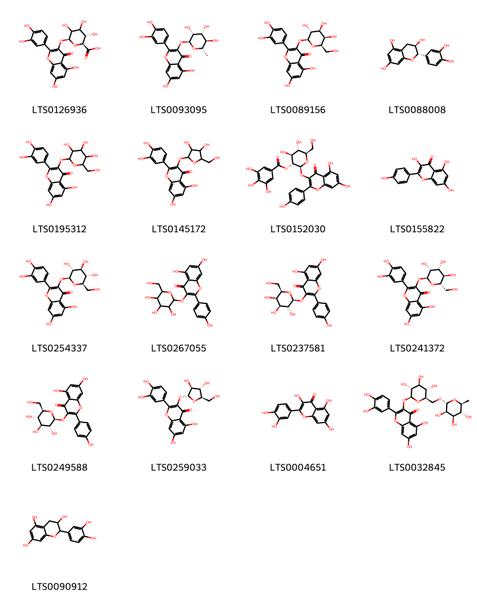{ width=100% }
    <figcaption>Hình ảnh cấu trúc hóa học của 17 hoạt chất thuộc nhóm Flavonoids gồm ['miquelianin (LTS0126936)', 'quercitrin (LTS0093095)', 'hyperoside (LTS0089156)', 'α catechin (LTS0088008)', '2-(3,4-dihydroxyphenyl)-5,7-dihydroxy-3-{[3,4,5-trihydroxy-6-(hydroxymethyl)oxan-2-yl]oxy}chromen-4-one (LTS0195312)', '3-{[3,4-dihydroxy-5-(hydroxymethyl)oxolan-2-yl]oxy}-2-(3,4-dihydroxyphenyl)-5,7-dihydroxychromen-4-one (LTS0145172)', '(2s,3r,4s,5s,6r)-2-{[5,7-dihydroxy-2-(4-hydroxyphenyl)-4-oxochromen-3-yl]oxy}-4,5-dihydroxy-6-(hydroxymethyl)oxan-3-yl 3,4,5-trihydroxybenzoate (LTS0152030)', 'kaempherol (LTS0155822)', 'isoquercetin (LTS0254337)', 'trifolin (LTS0267055)', 'trifolin (LTS0237581)', '2-(3,4-dihydroxyphenyl)-5,7-dihydroxy-3-{[(2s,3r,4r,5r,6s)-3,4,5-trihydroxy-6-(hydroxymethyl)oxan-2-yl]oxy}chromen-4-one (LTS0241372)', 'astragalin (LTS0249588)', '3-{[(2r,3s,4s,5r)-3,4-dihydroxy-5-(hydroxymethyl)oxolan-2-yl]oxy}-2-(3,4-dihydroxyphenyl)-5,7-dihydroxychromen-4-one (LTS0259033)', 'quercetin (LTS0004651)', '3-rutinosyl quercetin (LTS0032845)', 'catechol (LTS0090912)'].</figcaption>
</figure>
#### Nhóm Isoflavonoids
<figure markdown="span">
    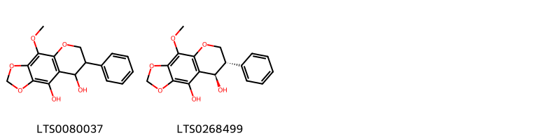{ width=100% }
    <figcaption>Hình ảnh cấu trúc hóa học của 2 hoạt chất thuộc nhóm Isoflavonoids gồm ['lapathinol (LTS0080037)', '(12s,13r)-8-methoxy-12-phenyl-4,6,10-trioxatricyclo[7.4.0.0³,⁷]trideca-1(9),2,7-triene-2,13-diol (LTS0268499)'].</figcaption>
</figure>
#### Nhóm Linear 1_3-diarylpropanoids
<figure markdown="span">
    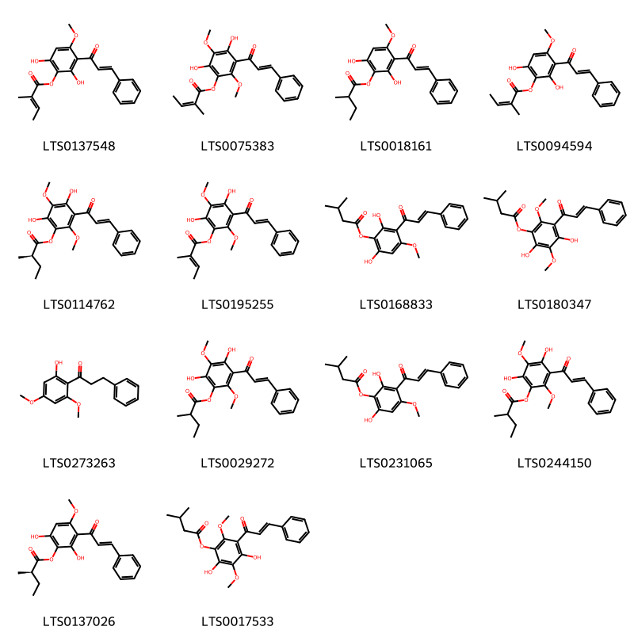{ width=100% }
    <figcaption>Hình ảnh cấu trúc hóa học của Không tìm thấy chú thích hoạt chất thuộc nhóm Linear 1_3-diarylpropanoids gồm Không tìm thấy chú thích.</figcaption>
</figure>
#### Nhóm Naphthalenes
<figure markdown="span">
    { width=100% }
    <figcaption>Hình ảnh cấu trúc hóa học của 1 hoạt chất thuộc nhóm Naphthalenes gồm ['2-methylnaphthalene (LTS0036975)'].</figcaption>
</figure>
#### Nhóm Steroids and steroid derivatives
<figure markdown="span">
    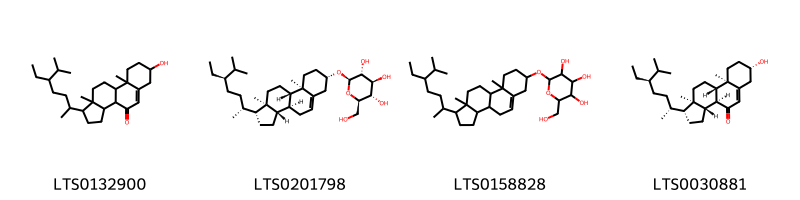{ width=100% }
    <figcaption>Hình ảnh cấu trúc hóa học của 4 hoạt chất thuộc nhóm Steroids and steroid derivatives gồm ['1-(5-ethyl-6-methylheptan-2-yl)-7-hydroxy-9a,11a-dimethyl-1h,2h,3h,3ah,3bh,6h,7h,8h,9h,9bh,10h,11h-cyclopenta[a]phenanthren-4-one (LTS0132900)', 'sitogluside (LTS0201798)', '2-{[1-(5-ethyl-6-methylheptan-2-yl)-9a,11a-dimethyl-1h,2h,3h,3ah,3bh,4h,6h,7h,8h,9h,9bh,10h,11h-cyclopenta[a]phenanthren-7-yl]oxy}-6-(hydroxymethyl)oxane-3,4,5-triol (LTS0158828)', '(1r,3as,3bs,7s,9ar,9bs,11ar)-1-[(2r,5r)-5-ethyl-6-methylheptan-2-yl]-7-hydroxy-9a,11a-dimethyl-1h,2h,3h,3ah,3bh,6h,7h,8h,9h,9bh,10h,11h-cyclopenta[a]phenanthren-4-one (LTS0030881)'].</figcaption>
</figure>

---

### Dược dân tộc học

Danh sách các quốc gia có sử dụng *N/A* trong điều trị các bệnh. 

| Country   | Disease     | Bệnh                                                                                                                                                                                                |
|:----------|:------------|:----------------------------------------------------------------------------------------------------------------------------------------------------------------------------------------------------|
| China     | Antiseptic  | MYMEMORY WARNING: YOU USED ALL AVAILABLE FREE TRANSLATIONS FOR TODAY. NEXT AVAILABLE IN  15 HOURS 15 MINUTES 24 SECONDS VISIT HTTPS://MYMEMORY.TRANSLATED.NET/DOC/USAGELIMITS.PHP TO TRANSLATE MORE |
| Elsewhere | nan, Poison | MYMEMORY WARNING: YOU USED ALL AVAILABLE FREE TRANSLATIONS FOR TODAY. NEXT AVAILABLE IN  15 HOURS 15 MINUTES 21 SECONDS VISIT HTTPS://MYMEMORY.TRANSLATED.NET/DOC/USAGELIMITS.PHP TO TRANSLATE MORE |

---

---
## Polygonum macrophyllum
### Thông tin về thực vật

!!! info "Phân loại thực vật của *Bistorta macrophylla* từ GIBF:"
    - **Kingdom:** Plantae
    - **Phylum:** Tracheophyta
    - **Order:** Caryophyllales
    - **Family:** Polygonaceae
    - **Genus:** Bistorta
    - **Species:** *Bistorta macrophylla*

 

| Label (VI)   | Label (EN)   | Scientific Name        | Descriptions (VI)   | Descriptions (EN)   | Also Known As (VI)   | Also Known As (EN)   |
|:-------------|:-------------|:-----------------------|:--------------------|:--------------------|:---------------------|:---------------------|
| N/A          | N/A          | Polygonum macrophyllum |                     | species of plant    | ['']                 | ['']                 |

#### Phân bố trên thế giới

**Từ CSDL GIBF** United States of America, India, Nepal, China

#### Phân bố tại Việt Nam

**Từ CSDL GIBF**: Không có ghi nhận ở Việt Nam

---
### Thành phần hóa học
        
- Theo cơ sở dữ liệu lotus: Từ loài *Bistorta macrophylla* đã phân lập và xác định được Chưa có hoạt chất nào được phân lập. hoạt chất thuộc về các nhóm Không có hoạt chất nào được phân lập. 

Không có hình ảnh nào được tạo ra

---

### Dược dân tộc học

Danh sách các quốc gia có sử dụng *Bistorta macrophylla* trong điều trị các bệnh. 

| Country   | Disease    | Bệnh                                                                                                                                                                                                |
|:----------|:-----------|:----------------------------------------------------------------------------------------------------------------------------------------------------------------------------------------------------|
| Elsewhere | Astringent | MYMEMORY WARNING: YOU USED ALL AVAILABLE FREE TRANSLATIONS FOR TODAY. NEXT AVAILABLE IN  15 HOURS 14 MINUTES 39 SECONDS VISIT HTTPS://MYMEMORY.TRANSLATED.NET/DOC/USAGELIMITS.PHP TO TRANSLATE MORE |

---

---
## Polygonum miltiflorum
### Thông tin về thực vật

!!! info "Phân loại thực vật của *Reynoutria multiflora* từ GIBF:"
    - **Kingdom:** Plantae
    - **Phylum:** Tracheophyta
    - **Order:** Caryophyllales
    - **Family:** Polygonaceae
    - **Genus:** Reynoutria
    - **Species:** *Reynoutria multiflora*

 

| Label (VI)   | Label (EN)   | Scientific Name        | Descriptions (VI)   | Descriptions (EN)   | Also Known As (VI)   | Also Known As (EN)   |
|:-------------|:-------------|:-----------------------|:--------------------|:--------------------|:---------------------|:---------------------|
| N/A          | N/A          | Polygonum macrophyllum |                     | species of plant    | ['']                 | ['']                 |

#### Phân bố trên thế giới

**Từ CSDL GIBF** nan, Austria, United States of America, Japan, Chinese Taipei, China, Russian Federation, Germany, France, Spain

#### Phân bố tại Việt Nam

**Từ CSDL GIBF**: Không có ghi nhận ở Việt Nam

---
### Thành phần hóa học
        
- Theo cơ sở dữ liệu lotus: Từ loài *Reynoutria multiflora* đã phân lập và xác định được Chưa có hoạt chất nào được phân lập. hoạt chất thuộc về các nhóm Không có hoạt chất nào được phân lập. 

Không có hình ảnh nào được tạo ra

---

### Dược dân tộc học

Danh sách các quốc gia có sử dụng *Reynoutria multiflora* trong điều trị các bệnh. 

| Country   | Disease   | Bệnh                                                                                                                                                                                                |
|:----------|:----------|:----------------------------------------------------------------------------------------------------------------------------------------------------------------------------------------------------|
| Elsewhere | Tonic     | MYMEMORY WARNING: YOU USED ALL AVAILABLE FREE TRANSLATIONS FOR TODAY. NEXT AVAILABLE IN  15 HOURS 14 MINUTES 13 SECONDS VISIT HTTPS://MYMEMORY.TRANSLATED.NET/DOC/USAGELIMITS.PHP TO TRANSLATE MORE |

---

---
## Polygonum minus
### Thông tin về thực vật

!!! info "Phân loại thực vật của *N/A* từ GIBF:"
    - **Kingdom:** Plantae
    - **Phylum:** Tracheophyta
    - **Order:** Caryophyllales
    - **Family:** Polygonaceae
    - **Genus:** Persicaria
    - **Species:** *N/A*

 

| Label (VI)   | Label (EN)   | Scientific Name   | Descriptions (VI)   | Descriptions (EN)   | Also Known As (VI)   | Also Known As (EN)   |
|:-------------|:-------------|:------------------|:--------------------|:--------------------|:---------------------|:---------------------|
| N/A          | N/A          | Polygonum minus   | loài thực vật       | species of plant    | ['']                 | ['']                 |

#### Phân bố trên thế giới

**Từ CSDL GIBF** Brazil, Japan, Nepal, China, Chile, New Zealand, Ecuador, Thailand, Spain, Réunion, United States of America, Indonesia, Costa Rica, Colombia, Argentina, French Guiana, Hong Kong, Mexico, Benin, Kenya, United Kingdom of Great Britain and Northern Ireland, Chinese Taipei, Panama, Portugal, South Africa, Australia, France

#### Phân bố tại Việt Nam

**Từ CSDL GIBF**: Không có ghi nhận ở Việt Nam

---
### Thành phần hóa học
        
- Theo cơ sở dữ liệu lotus: Từ loài *N/A* đã phân lập và xác định được 67 hoạt chất thuộc về các nhóm Fatty Acyls, Unsaturated hydrocarbons, Flavonoids, Naphthofurans, Organooxygen compounds, Prenol lipids, Saturated hydrocarbons, Epoxides. 

|    | chemicalTaxonomyClassyfireClass   |   smiles_count |
|---:|:----------------------------------|---------------:|
|  0 | Epoxides                          |              1 |
|  1 | Fatty Acyls                       |              9 |
|  2 | Flavonoids                        |              2 |
|  3 | Naphthofurans                     |              1 |
|  4 | Organooxygen compounds            |              4 |
|  5 | Prenol lipids                     |             41 |
|  6 | Saturated hydrocarbons            |              6 |
|  7 | Unsaturated hydrocarbons          |              3 |

#### Nhóm Epoxides
<figure markdown="span">
    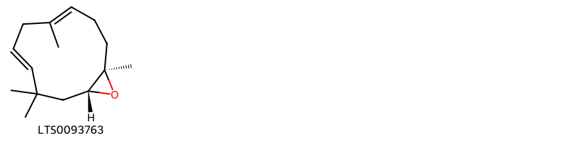{ width=100% }
    <figcaption>Hình ảnh cấu trúc hóa học của 1 hoạt chất thuộc nhóm Epoxides gồm ['(1r,4e,7e,11r)-1,5,9,9-tetramethyl-12-oxabicyclo[9.1.0]dodeca-4,7-diene (LTS0093763)'].</figcaption>
</figure>
#### Nhóm Fatty Acyls
<figure markdown="span">
    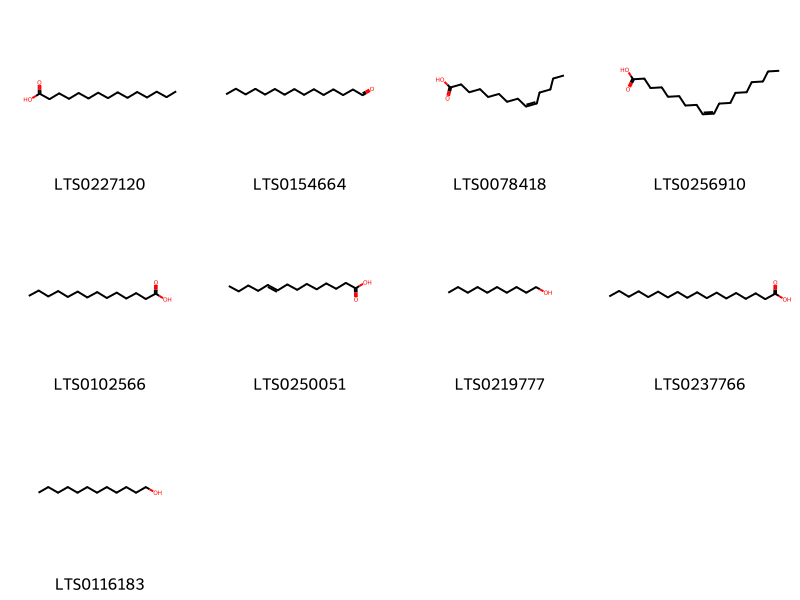{ width=100% }
    <figcaption>Hình ảnh cấu trúc hóa học của 9 hoạt chất thuộc nhóm Fatty Acyls gồm ['pentadecanoic acid (LTS0227120)', 'pentadecanal (LTS0154664)', 'myristoleic acid (LTS0078418)', 'oleic acid (LTS0256910)', 'myristic acid (LTS0102566)', 'myristoleate (LTS0250051)', 'decanol (LTS0219777)', 'stearic acid (LTS0237766)', '1-dodecanol (LTS0116183)'].</figcaption>
</figure>
#### Nhóm Flavonoids
<figure markdown="span">
    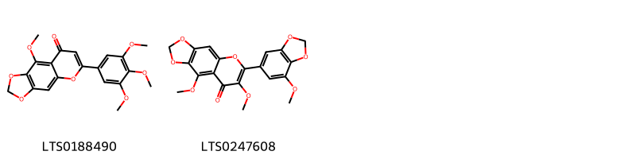{ width=100% }
    <figcaption>Hình ảnh cấu trúc hóa học của 2 hoạt chất thuộc nhóm Flavonoids gồm ['9-methoxy-6-(3,4,5-trimethoxyphenyl)-2h-[1,3]dioxolo[4,5-g]chromen-8-one (LTS0188490)', '7,9-dimethoxy-6-(7-methoxy-2h-1,3-benzodioxol-5-yl)-2h-[1,3]dioxolo[4,5-g]chromen-8-one (LTS0247608)'].</figcaption>
</figure>
#### Nhóm Naphthofurans
<figure markdown="span">
    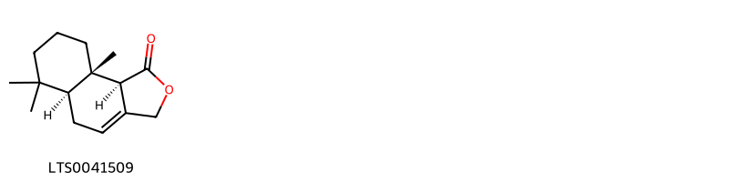{ width=100% }
    <figcaption>Hình ảnh cấu trúc hóa học của 1 hoạt chất thuộc nhóm Naphthofurans gồm ['drimenin (LTS0041509)'].</figcaption>
</figure>
#### Nhóm Organooxygen compounds
<figure markdown="span">
    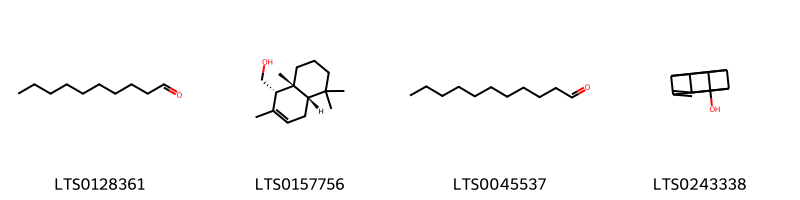{ width=100% }
    <figcaption>Hình ảnh cấu trúc hóa học của 4 hoạt chất thuộc nhóm Organooxygen compounds gồm ['decanal (LTS0128361)', '[(1s,4as,8ar)-2,5,5,8a-tetramethyl-1,4,4a,6,7,8-hexahydronaphthalen-1-yl]methanol (LTS0157756)', 'aldehyde c11 (LTS0045537)', '3,4,5,8-tetrahydro-2h-cuban-1-ol (LTS0243338)'].</figcaption>
</figure>
#### Nhóm Prenol lipids
<figure markdown="span">
    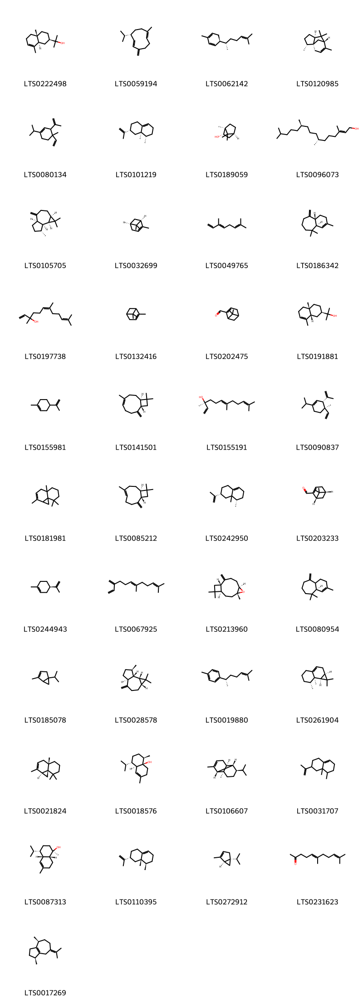{ width=100% }
    <figcaption>Hình ảnh cấu trúc hóa học của 41 hoạt chất thuộc nhóm Prenol lipids gồm ['α-eudesmol (LTS0222498)', '(-)-germacrene d (LTS0059194)', '(5s)-2-methyl-5-[(2s)-6-methylhept-5-en-2-yl]cyclohexa-1,3-diene (LTS0062142)', 'cedrene (LTS0120985)', '4-ethenyl-1-isopropyl-4-methyl-3-(prop-1-en-2-yl)cyclohex-1-ene (LTS0080134)', 'eremophilene (LTS0101219)', '(+)-borneol (LTS0189059)', 'phytol (LTS0096073)', '(1ar,4ar,7r,7as,7bs)-1,1,7-trimethyl-4-methylidene-octahydro-1ah-cyclopropa[e]azulene (LTS0105705)', '(-)-α-pinene (LTS0032699)', 'trans-β-ocimene (LTS0049765)', '(1r,6r)-α-himachalene (LTS0186342)', 'nerolidol (LTS0197738)', 'α pinene (LTS0132416)', 'myrtenal (LTS0202475)', '2-[(2r,4ar,8as)-4a,8-dimethyl-2,3,4,5,6,8a-hexahydro-1h-naphthalen-2-yl]propan-2-ol (LTS0191881)', 'limonene,  (LTS0155981)', 'β-caryophyllen (LTS0141501)', 'nerolidol (LTS0155191)', 'elemene (LTS0090837)', 'thujopsene (LTS0181981)', 'caryophyllene (LTS0085212)', '(1s,7r)-1,8a-dimethyl-7-(prop-1-en-2-yl)-2,3,5,6,7,8-hexahydro-1h-naphthalene (LTS0242950)', '(1s,5r)-6,6-dimethylbicyclo[3.1.1]hept-2-ene-2-carbaldehyde (LTS0203233)', 'α-limonene (LTS0244943)', 'β-farnesene (LTS0067925)', 'β-caryophyllene oxide (LTS0213960)', '(9ar)-2,9,9-trimethyl-5-methylidene-4,4a,6,7,8,9a-hexahydro-3h-benzo[7]annulene (LTS0080954)', 'α-thujene (LTS0185078)', '(1ar,4as,7r,7as,7bs)-1,1,7-trimethyl-4-methylidene-octahydro-1ah-cyclopropa[e]azulene (LTS0028578)', 'α-curcumene (LTS0019880)', '(1ar,7r,7ar,7bs)-1,1,7,7a-tetramethyl-1ah,2h,4h,5h,6h,7h,7bh-cyclopropa[a]naphthalene (LTS0261904)', '(-)-thujopsene (LTS0021824)', '(1s,4r,4ar,8ar)-1-isopropyl-4,7-dimethyl-2,3,4,5,6,8a-hexahydro-1h-naphthalen-4a-ol (LTS0018576)', '(1r,2s,6s,7s,8r)-8-isopropyl-1,3-dimethyltricyclo[4.4.0.0²,⁷]dec-3-ene (LTS0106607)', 'valencene (LTS0031707)', '(1r,4s,4as,8ar)-4-isopropyl-1,6-dimethyl-3,4,4a,7,8,8a-hexahydro-2h-naphthalen-1-ol (LTS0087313)', 'valencene (LTS0110395)', '(+)-α-thujene (LTS0272912)', 'geranylacetone (LTS0231623)', 'β-guaiene (LTS0017269)'].</figcaption>
</figure>
#### Nhóm Saturated hydrocarbons
<figure markdown="span">
    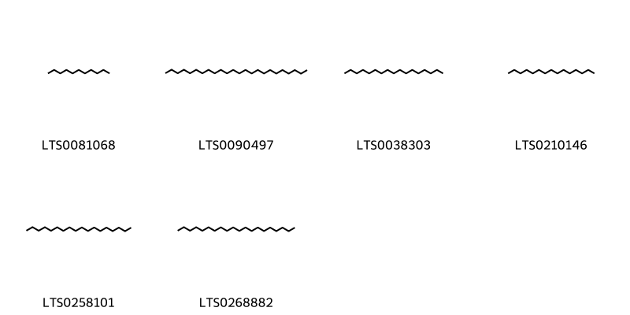{ width=100% }
    <figcaption>Hình ảnh cấu trúc hóa học của 6 hoạt chất thuộc nhóm Saturated hydrocarbons gồm ['undecane (LTS0081068)', 'tetracosane (LTS0090497)', 'heptadecane (LTS0038303)', 'pentadecane (LTS0210146)', 'octadecane (LTS0258101)', 'eicosane (LTS0268882)'].</figcaption>
</figure>
#### Nhóm Unsaturated hydrocarbons
<figure markdown="span">
    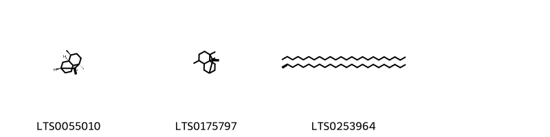{ width=100% }
    <figcaption>Hình ảnh cấu trúc hóa học của 3 hoạt chất thuộc nhóm Unsaturated hydrocarbons gồm ['(1r,3s,6s,7s,8s)-3,6,8-trimethyl-2-methylidenetricyclo[5.3.1.0³,⁸]undecane (LTS0055010)', '3,6,8-trimethyl-2-methylidenetricyclo[5.3.1.0³,⁸]undecane (LTS0175797)', '1-tetracosene; tetracosane (LTS0253964)'].</figcaption>
</figure>

---

### Dược dân tộc học

Danh sách các quốc gia có sử dụng *N/A* trong điều trị các bệnh. 

| Country   | Disease   | Bệnh                                                                                                                                                                                                |
|:----------|:----------|:----------------------------------------------------------------------------------------------------------------------------------------------------------------------------------------------------|
| Australia | Poison    | MYMEMORY WARNING: YOU USED ALL AVAILABLE FREE TRANSLATIONS FOR TODAY. NEXT AVAILABLE IN  15 HOURS 13 MINUTES 47 SECONDS VISIT HTTPS://MYMEMORY.TRANSLATED.NET/DOC/USAGELIMITS.PHP TO TRANSLATE MORE |
| Elsewhere | Piscicide | MYMEMORY WARNING: YOU USED ALL AVAILABLE FREE TRANSLATIONS FOR TODAY. NEXT AVAILABLE IN  15 HOURS 13 MINUTES 44 SECONDS VISIT HTTPS://MYMEMORY.TRANSLATED.NET/DOC/USAGELIMITS.PHP TO TRANSLATE MORE |

---

---
## Polygonum molle
### Thông tin về thực vật

!!! info "Phân loại thực vật của *N/A* từ GIBF:"
    - **Kingdom:** Plantae
    - **Phylum:** Tracheophyta
    - **Order:** Caryophyllales
    - **Family:** Polygonaceae
    - **Genus:** Koenigia
    - **Species:** *N/A*

 

| Label (VI)   | Label (EN)   | Scientific Name   | Descriptions (VI)   | Descriptions (EN)   | Also Known As (VI)   | Also Known As (EN)   |
|:-------------|:-------------|:------------------|:--------------------|:--------------------|:---------------------|:---------------------|
| N/A          | N/A          | Polygonum molle   | loài thực vật       | species of plant    | ['']                 | ['']                 |

#### Phân bố trên thế giới

**Từ CSDL GIBF** Mongolia, Czechia, Sweden, Finland, China, Chile, New Zealand, Kazakhstan, Spain, Netherlands, Denmark, Sri Lanka, United States of America, Korea, Republic of, Armenia, Russian Federation, Norway, France, Belgium, Canada, Austria, Ukraine, South Africa, Kyrgyzstan, Italy, India, Switzerland, United Kingdom of Great Britain and Northern Ireland

#### Phân bố tại Việt Nam

**Từ CSDL GIBF**: Không có ghi nhận ở Việt Nam

---
### Thành phần hóa học
        
- Theo cơ sở dữ liệu lotus: Từ loài *N/A* đã phân lập và xác định được Chưa có hoạt chất nào được phân lập. hoạt chất thuộc về các nhóm Không có hoạt chất nào được phân lập. 

Không có hình ảnh nào được tạo ra

---

### Dược dân tộc học

Danh sách các quốc gia có sử dụng *N/A* trong điều trị các bệnh. 

| Country   | Disease    | Bệnh                                                                                                                                                                                                |
|:----------|:-----------|:----------------------------------------------------------------------------------------------------------------------------------------------------------------------------------------------------|
| Elsewhere | Astringent | MYMEMORY WARNING: YOU USED ALL AVAILABLE FREE TRANSLATIONS FOR TODAY. NEXT AVAILABLE IN  15 HOURS 13 MINUTES 10 SECONDS VISIT HTTPS://MYMEMORY.TRANSLATED.NET/DOC/USAGELIMITS.PHP TO TRANSLATE MORE |

---

---
## Polygonum multiflorum
### Thông tin về thực vật

!!! info "Phân loại thực vật của *Reynoutria multiflora* từ GIBF:"
    - **Kingdom:** Plantae
    - **Phylum:** Tracheophyta
    - **Order:** Caryophyllales
    - **Family:** Polygonaceae
    - **Genus:** Reynoutria
    - **Species:** *Reynoutria multiflora*

 

| Label (VI)   | Label (EN)   | Scientific Name       | Descriptions (VI)   | Descriptions (EN)   | Also Known As (VI)   | Also Known As (EN)   |
|:-------------|:-------------|:----------------------|:--------------------|:--------------------|:---------------------|:---------------------|
| N/A          | N/A          | Polygonum multiflorum | loài thực vật       | species of plant    | ['']                 | ['']                 |

#### Phân bố trên thế giới

**Từ CSDL GIBF** nan, Austria, United States of America, Japan, Chinese Taipei, China, Russian Federation, Germany, France, Spain

#### Phân bố tại Việt Nam

**Từ CSDL GIBF**: Không có ghi nhận ở Việt Nam

---
### Thành phần hóa học
        
- Theo cơ sở dữ liệu lotus: Từ loài *Reynoutria multiflora* đã phân lập và xác định được 28 hoạt chất thuộc về các nhóm Indoles and derivatives, Benzene and substituted derivatives, Flavonoids, Anthracenes, Coumarins and derivatives, Organooxygen compounds, 2-arylbenzofuran flavonoids, Benzopyrans, Stilbenes. 

|    | chemicalTaxonomyClassyfireClass     |   smiles_count |
|---:|:------------------------------------|---------------:|
|  0 | 2-arylbenzofuran flavonoids         |              2 |
|  1 | Anthracenes                         |              5 |
|  2 | Benzene and substituted derivatives |              2 |
|  3 | Benzopyrans                         |              1 |
|  4 | Coumarins and derivatives           |              1 |
|  5 | Flavonoids                          |              7 |
|  6 | Indoles and derivatives             |              1 |
|  7 | Organooxygen compounds              |              1 |
|  8 | Stilbenes                           |              8 |

#### Nhóm 2-arylbenzofuran flavonoids
<figure markdown="span">
    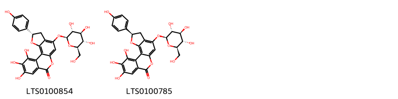{ width=100% }
    <figcaption>Hình ảnh cấu trúc hóa học của 2 hoạt chất thuộc nhóm 2-arylbenzofuran flavonoids gồm ['(15s)-3,4,5-trihydroxy-15-(4-hydroxyphenyl)-12-{[(2s,3r,4s,5s,6r)-3,4,5-trihydroxy-6-(hydroxymethyl)oxan-2-yl]oxy}-9,16-dioxatetracyclo[8.7.0.0²,⁷.0¹³,¹⁷]heptadeca-1(10),2(7),3,5,11,13(17)-hexaen-8-one (LTS0100854)', '(15r)-3,4,5-trihydroxy-15-(4-hydroxyphenyl)-12-{[(2s,3r,4s,5s,6r)-3,4,5-trihydroxy-6-(hydroxymethyl)oxan-2-yl]oxy}-9,16-dioxatetracyclo[8.7.0.0²,⁷.0¹³,¹⁷]heptadeca-1(10),2(7),3,5,11,13(17)-hexaen-8-one (LTS0100785)'].</figcaption>
</figure>
#### Nhóm Anthracenes
<figure markdown="span">
    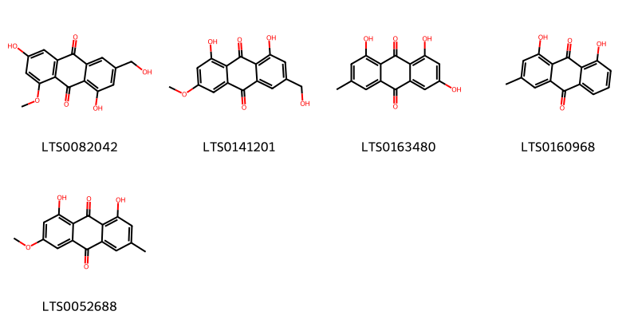{ width=100% }
    <figcaption>Hình ảnh cấu trúc hóa học của 5 hoạt chất thuộc nhóm Anthracenes gồm ['questinol (LTS0082042)', '1,8-dihydroxy-3-(hydroxymethyl)-6-methoxyanthracene-9,10-dione (LTS0141201)', 'emodin (LTS0163480)', 'turkey rhubarb (LTS0160968)', 'physcion (LTS0052688)'].</figcaption>
</figure>
#### Nhóm Benzene and substituted derivatives
<figure markdown="span">
    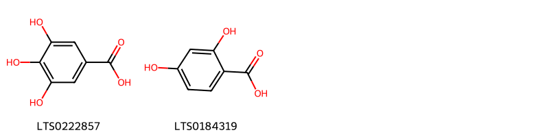{ width=100% }
    <figcaption>Hình ảnh cấu trúc hóa học của 2 hoạt chất thuộc nhóm Benzene and substituted derivatives gồm ['galop (LTS0222857)', '2,4-dihydroxybenzoic acid (LTS0184319)'].</figcaption>
</figure>
#### Nhóm Benzopyrans
<figure markdown="span">
    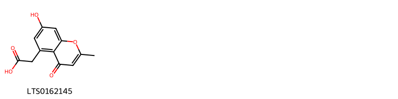{ width=100% }
    <figcaption>Hình ảnh cấu trúc hóa học của 1 hoạt chất thuộc nhóm Benzopyrans gồm ['(7-hydroxy-2-methyl-4-oxochromen-5-yl)acetic acid (LTS0162145)'].</figcaption>
</figure>
#### Nhóm Coumarins and derivatives
<figure markdown="span">
    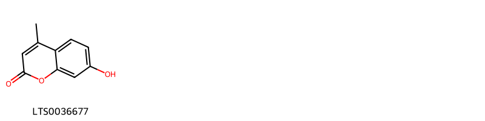{ width=100% }
    <figcaption>Hình ảnh cấu trúc hóa học của 1 hoạt chất thuộc nhóm Coumarins and derivatives gồm ['4-methylumbelliferone (LTS0036677)'].</figcaption>
</figure>
#### Nhóm Flavonoids
<figure markdown="span">
    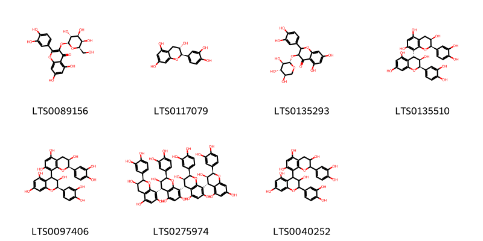{ width=100% }
    <figcaption>Hình ảnh cấu trúc hóa học của 7 hoạt chất thuộc nhóm Flavonoids gồm ['hyperoside (LTS0089156)', '(+)-catechol (LTS0117079)', '2-(3,4-dihydroxyphenyl)-5,7-dihydroxy-3-{[(2s,3r,4s,5r)-3,4,5-trihydroxyoxan-2-yl]oxy}-2,3-dihydro-1-benzopyran-4-one (LTS0135293)', '(2r,3r,4r)-2-(3,4-dihydroxyphenyl)-4-[(2r,3r)-2-(3,4-dihydroxyphenyl)-3,5,7-trihydroxy-3,4-dihydro-2h-1-benzopyran-8-yl]-3,4-dihydro-2h-1-benzopyran-3,5,7-triol (LTS0135510)', '(2r,3r)-2-(3,4-dihydroxyphenyl)-4-[(2r,3r)-2-(3,4-dihydroxyphenyl)-3,5,7-trihydroxy-3,4-dihydro-2h-1-benzopyran-8-yl]-3,4-dihydro-2h-1-benzopyran-3,5,7-triol (LTS0097406)', '(2r,3r,4r)-2-(3,4-dihydroxyphenyl)-8-[(2r,3r,4r)-2-(3,4-dihydroxyphenyl)-3,5,7-trihydroxy-3,4-dihydro-2h-1-benzopyran-4-yl]-4-[(2r,3r,4s)-2-(3,4-dihydroxyphenyl)-4-[(2r,3r)-2-(3,4-dihydroxyphenyl)-3,5,7-trihydroxy-3,4-dihydro-2h-1-benzopyran-8-yl]-3,5,7-trihydroxy-3,4-dihydro-2h-1-benzopyran-8-yl]-3,4-dihydro-2h-1-benzopyran-3,5,7-triol (LTS0275974)', '2-(3,4-dihydroxyphenyl)-4-[2-(3,4-dihydroxyphenyl)-3,5,7-trihydroxy-3,4-dihydro-2h-1-benzopyran-8-yl]-3,4-dihydro-2h-1-benzopyran-3,5,7-triol (LTS0040252)'].</figcaption>
</figure>
#### Nhóm Indoles and derivatives
<figure markdown="span">
    { width=100% }
    <figcaption>Hình ảnh cấu trúc hóa học của 1 hoạt chất thuộc nhóm Indoles and derivatives gồm ['n-[2-(5-methoxy-1h-indol-3-yl)ethyl]ethanimidic acid (LTS0219322)'].</figcaption>
</figure>
#### Nhóm Organooxygen compounds
<figure markdown="span">
    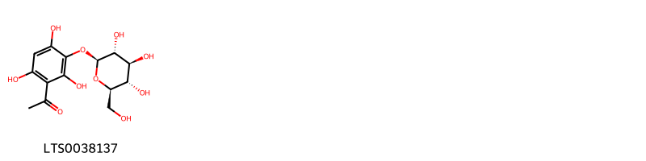{ width=100% }
    <figcaption>Hình ảnh cấu trúc hóa học của 1 hoạt chất thuộc nhóm Organooxygen compounds gồm ['1-(2,4,6-trihydroxy-3-{[(2s,3r,4s,5s,6r)-3,4,5-trihydroxy-6-(hydroxymethyl)oxan-2-yl]oxy}phenyl)ethanone (LTS0038137)'].</figcaption>
</figure>
#### Nhóm Stilbenes
<figure markdown="span">
    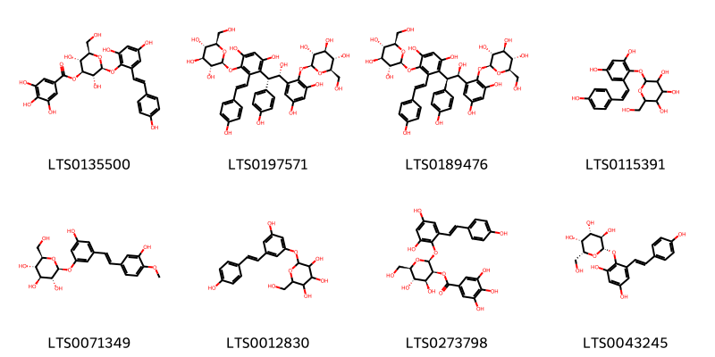{ width=100% }
    <figcaption>Hình ảnh cấu trúc hóa học của 8 hoạt chất thuộc nhóm Stilbenes gồm ['(2s,3r,4s,5r,6r)-2-{2,4-dihydroxy-6-[(1e)-2-(4-hydroxyphenyl)ethenyl]phenoxy}-3,5-dihydroxy-6-(hydroxymethyl)oxan-4-yl 3,4,5-trihydroxybenzoate (LTS0135500)', '(2s,3r,4s,5s,6r)-2-{2-[(1s,2r)-2-{4,6-dihydroxy-2-[(1e)-2-(4-hydroxyphenyl)ethenyl]-3-{[(2s,3r,4s,5s,6r)-3,4,5-trihydroxy-6-(hydroxymethyl)oxan-2-yl]oxy}phenyl}-1-hydroxy-2-(4-hydroxyphenyl)ethyl]-4,6-dihydroxyphenoxy}-6-(hydroxymethyl)oxane-3,4,5-triol (LTS0197571)', '(2s,3r,4s,5s,6r)-2-{2-[(1r,2s)-2-{4,6-dihydroxy-2-[(1e)-2-(4-hydroxyphenyl)ethenyl]-3-{[(2s,3r,4s,5s,6r)-3,4,5-trihydroxy-6-(hydroxymethyl)oxan-2-yl]oxy}phenyl}-1-hydroxy-2-(4-hydroxyphenyl)ethyl]-4,6-dihydroxyphenoxy}-6-(hydroxymethyl)oxane-3,4,5-triol (LTS0189476)', '2-{2,4-dihydroxy-6-[2-(4-hydroxyphenyl)ethenyl]phenoxy}-6-(hydroxymethyl)oxane-3,4,5-triol (LTS0115391)', 'rhaponticin (LTS0071349)', '2-{3-hydroxy-5-[2-(4-hydroxyphenyl)ethenyl]phenoxy}-6-(hydroxymethyl)oxane-3,4,5-triol (LTS0012830)', '(2s,3s,4s,5s,6r)-2-{2,4-dihydroxy-6-[(1e)-2-(4-hydroxyphenyl)ethenyl]phenoxy}-4,5-dihydroxy-6-(hydroxymethyl)oxan-3-yl 3,4,5-trihydroxybenzoate (LTS0273798)', '(2s,3r,4s,5r,6r)-2-{2,4-dihydroxy-6-[(1e)-2-(4-hydroxyphenyl)ethenyl]phenoxy}-6-(hydroxymethyl)oxane-3,4,5-triol (LTS0043245)'].</figcaption>
</figure>

---

### Dược dân tộc học

Danh sách các quốc gia có sử dụng *Reynoutria multiflora* trong điều trị các bệnh. 

| Country   | Disease                             | Bệnh                                                                                                                                                                                                |
|:----------|:------------------------------------|:----------------------------------------------------------------------------------------------------------------------------------------------------------------------------------------------------|
| China     | Tonic, Nervine, Tonic               | MYMEMORY WARNING: YOU USED ALL AVAILABLE FREE TRANSLATIONS FOR TODAY. NEXT AVAILABLE IN  15 HOURS 12 MINUTES 45 SECONDS VISIT HTTPS://MYMEMORY.TRANSLATED.NET/DOC/USAGELIMITS.PHP TO TRANSLATE MORE |
| Elsewhere | Antiprogestational, Tonic, Sedative | MYMEMORY WARNING: YOU USED ALL AVAILABLE FREE TRANSLATIONS FOR TODAY. NEXT AVAILABLE IN  15 HOURS 12 MINUTES 39 SECONDS VISIT HTTPS://MYMEMORY.TRANSLATED.NET/DOC/USAGELIMITS.PHP TO TRANSLATE MORE |

---

---
## Polygonum multiflorus
### Thông tin về thực vật

!!! info "Phân loại thực vật của *Reynoutria multiflora* từ GIBF:"
    - **Kingdom:** Plantae
    - **Phylum:** Tracheophyta
    - **Order:** Caryophyllales
    - **Family:** Polygonaceae
    - **Genus:** Reynoutria
    - **Species:** *Reynoutria multiflora*

 

| Label (VI)   | Label (EN)   | Scientific Name       | Descriptions (VI)   | Descriptions (EN)   | Also Known As (VI)   | Also Known As (EN)   |
|:-------------|:-------------|:----------------------|:--------------------|:--------------------|:---------------------|:---------------------|
| N/A          | N/A          | Polygonum multiflorum | loài thực vật       | species of plant    | ['']                 | ['']                 |

#### Phân bố trên thế giới

**Từ CSDL GIBF** nan, Austria, United States of America, Japan, Chinese Taipei, China, Russian Federation, Germany, France, Spain

#### Phân bố tại Việt Nam

**Từ CSDL GIBF**: Không có ghi nhận ở Việt Nam

---
### Thành phần hóa học
        
- Theo cơ sở dữ liệu lotus: Từ loài *Reynoutria multiflora* đã phân lập và xác định được Chưa có hoạt chất nào được phân lập. hoạt chất thuộc về các nhóm Không có hoạt chất nào được phân lập. 

Không có hình ảnh nào được tạo ra

---

### Dược dân tộc học

Danh sách các quốc gia có sử dụng *Reynoutria multiflora* trong điều trị các bệnh. 

| Country   | Disease         | Bệnh                                                                                                                                                                                                |
|:----------|:----------------|:----------------------------------------------------------------------------------------------------------------------------------------------------------------------------------------------------|
| Japan     | Laxative, Tonic | MYMEMORY WARNING: YOU USED ALL AVAILABLE FREE TRANSLATIONS FOR TODAY. NEXT AVAILABLE IN  15 HOURS 12 MINUTES 08 SECONDS VISIT HTTPS://MYMEMORY.TRANSLATED.NET/DOC/USAGELIMITS.PHP TO TRANSLATE MORE |

---

---
## Polygonum odoratum
### Thông tin về thực vật

!!! info "Phân loại thực vật của *Persicaria odorata* từ GIBF:"
    - **Kingdom:** Plantae
    - **Phylum:** Tracheophyta
    - **Order:** Caryophyllales
    - **Family:** Polygonaceae
    - **Genus:** Persicaria
    - **Species:** *Persicaria odorata*

 

| Label (VI)   | Label (EN)   | Scientific Name    | Descriptions (VI)   | Descriptions (EN)   | Also Known As (VI)   | Also Known As (EN)   |
|:-------------|:-------------|:-------------------|:--------------------|:--------------------|:---------------------|:---------------------|
| N/A          | N/A          | Polygonum odoratum | loài thực vật       | species of plant    | ['']                 | ['']                 |

#### Phân bố trên thế giới

**Từ CSDL GIBF** nan, Viet Nam, United States of America, Finland, China, Thailand, unknown or invalid, Togo, France, Lao People’s Democratic Republic, Poland

#### Phân bố tại Việt Nam

**Từ CSDL GIBF**: Hà Nội

---
### Thành phần hóa học
        
- Theo cơ sở dữ liệu lotus: Từ loài *Persicaria odorata* đã phân lập và xác định được Chưa có hoạt chất nào được phân lập. hoạt chất thuộc về các nhóm Không có hoạt chất nào được phân lập. 

Không có hình ảnh nào được tạo ra

---

### Dược dân tộc học

Danh sách các quốc gia có sử dụng *Persicaria odorata* trong điều trị các bệnh. 

| Country   | Disease   | Bệnh                                                                                                                                                                                                |
|:----------|:----------|:----------------------------------------------------------------------------------------------------------------------------------------------------------------------------------------------------|
| Indochina | Diuretic  | MYMEMORY WARNING: YOU USED ALL AVAILABLE FREE TRANSLATIONS FOR TODAY. NEXT AVAILABLE IN  15 HOURS 11 MINUTES 45 SECONDS VISIT HTTPS://MYMEMORY.TRANSLATED.NET/DOC/USAGELIMITS.PHP TO TRANSLATE MORE |

---

---
## Polygonum orientale
### Thông tin về thực vật

!!! info "Phân loại thực vật của *Polygonum orientale* từ GIBF:"
    - **Kingdom:** Plantae
    - **Phylum:** Tracheophyta
    - **Order:** Caryophyllales
    - **Family:** Polygonaceae
    - **Genus:** Polygonum
    - **Species:** *Polygonum orientale*

 

| Label (VI)   | Label (EN)   | Scientific Name     | Descriptions (VI)   | Descriptions (EN)   | Also Known As (VI)   | Also Known As (EN)   |
|:-------------|:-------------|:--------------------|:--------------------|:--------------------|:---------------------|:---------------------|
| N/A          | N/A          | Polygonum orientale | loài thực vật       | species of plant    | ['']                 | ['']                 |

#### Phân bố trên thế giới

**Từ CSDL GIBF** United States of America, Japan, China, Australia, India, Canada

#### Phân bố tại Việt Nam

**Từ CSDL GIBF**: Không có ghi nhận ở Việt Nam

---
### Thành phần hóa học
        
- Theo cơ sở dữ liệu lotus: Từ loài *Polygonum orientale* đã phân lập và xác định được 19 hoạt chất thuộc về các nhóm Flavonoids. 

|    | chemicalTaxonomyClassyfireClass   |   smiles_count |
|---:|:----------------------------------|---------------:|
|  0 | Flavonoids                        |             19 |

#### Nhóm Flavonoids
<figure markdown="span">
    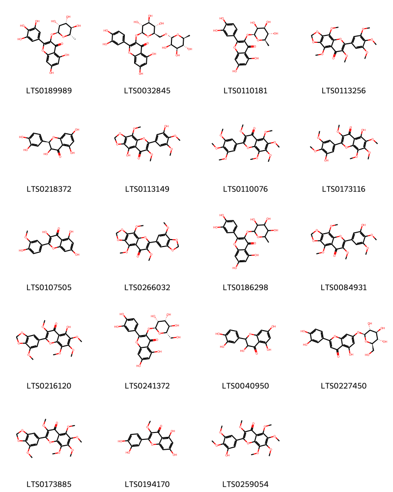{ width=100% }
    <figcaption>Hình ảnh cấu trúc hóa học của 19 hoạt chất thuộc nhóm Flavonoids gồm ['myricitrin (LTS0189989)', '3-rutinosyl quercetin (LTS0032845)', '2-(3,4-dihydroxyphenyl)-5,7-dihydroxy-3-{[(2s,3s,4s,5s,6r)-3,4,5-trihydroxy-6-methyloxan-2-yl]oxy}chromen-4-one (LTS0110181)', '4,7,9-trimethoxy-6-(3,4,5-trimethoxyphenyl)-2h-[1,3]dioxolo[4,5-g]chromen-8-one (LTS0113256)', '(2r)-2-(3,4-dihydroxyphenyl)-3,5,7-trihydroxy-2,3-dihydro-1-benzopyran-4-one (LTS0218372)', '9-hydroxy-6-(3-hydroxy-4,5-dimethoxyphenyl)-4,7-dimethoxy-2h-[1,3]dioxolo[4,5-g]chromen-8-one (LTS0113149)', 'exoticin (LTS0110076)', 'digicitrin (LTS0173116)', 'isorhamnetin (LTS0107505)', '4,7,9-trimethoxy-6-(7-methoxy-2h-1,3-benzodioxol-5-yl)-2h-[1,3]dioxolo[4,5-g]chromen-8-one (LTS0266032)', 'quercitrin (LTS0186298)', '6-(3-hydroxy-4,5-dimethoxyphenyl)-4,7,9-trimethoxy-2h-[1,3]dioxolo[4,5-g]chromen-8-one (LTS0084931)', '5-hydroxy-3,6,7,8-tetramethoxy-2-(7-methoxy-2h-1,3-benzodioxol-5-yl)chromen-4-one (LTS0216120)', '2-(3,4-dihydroxyphenyl)-5,7-dihydroxy-3-{[(2s,3r,4r,5r,6s)-3,4,5-trihydroxy-6-(hydroxymethyl)oxan-2-yl]oxy}chromen-4-one (LTS0241372)', '2,3-dihydroquercetin (LTS0040950)', 'luteolin 7-o-glucoside (LTS0227450)', '3,5,6,7,8-pentamethoxy-2-(7-methoxy-2h-1,3-benzodioxol-5-yl)chromen-4-one (LTS0173885)', 'quercetin 3-methyl ether (LTS0194170)', '2-(3-hydroxy-4,5-dimethoxyphenyl)-3,5,6,7,8-pentamethoxychromen-4-one (LTS0259054)'].</figcaption>
</figure>

---

### Dược dân tộc học

Danh sách các quốc gia có sử dụng *Polygonum orientale* trong điều trị các bệnh. 

| Country   | Disease        | Bệnh                                                                                                                                                                                                |
|:----------|:---------------|:----------------------------------------------------------------------------------------------------------------------------------------------------------------------------------------------------|
| China     | Carminative    | MYMEMORY WARNING: YOU USED ALL AVAILABLE FREE TRANSLATIONS FOR TODAY. NEXT AVAILABLE IN  15 HOURS 11 MINUTES 25 SECONDS VISIT HTTPS://MYMEMORY.TRANSLATED.NET/DOC/USAGELIMITS.PHP TO TRANSLATE MORE |
| Elsewhere | nan, Piscicide | MYMEMORY WARNING: YOU USED ALL AVAILABLE FREE TRANSLATIONS FOR TODAY. NEXT AVAILABLE IN  15 HOURS 11 MINUTES 19 SECONDS VISIT HTTPS://MYMEMORY.TRANSLATED.NET/DOC/USAGELIMITS.PHP TO TRANSLATE MORE |

---

---
## Polygonum perfoliatum
### Thông tin về thực vật

!!! info "Phân loại thực vật của *Persicaria perfoliata* từ GIBF:"
    - **Kingdom:** Plantae
    - **Phylum:** Tracheophyta
    - **Order:** Caryophyllales
    - **Family:** Polygonaceae
    - **Genus:** Persicaria
    - **Species:** *Persicaria perfoliata*

 

| Label (VI)   | Label (EN)   | Scientific Name       | Descriptions (VI)   | Descriptions (EN)   | Also Known As (VI)   | Also Known As (EN)   |
|:-------------|:-------------|:----------------------|:--------------------|:--------------------|:---------------------|:---------------------|
| N/A          | N/A          | Polygonum perfoliatum | loài thực vật       | species of plant    | ['']                 | ['']                 |

#### Phân bố trên thế giới

**Từ CSDL GIBF** United States of America, Korea, Republic of, Chinese Taipei, China, Georgia, Switzerland, Netherlands

#### Phân bố tại Việt Nam

**Từ CSDL GIBF**: Không có ghi nhận ở Việt Nam

---
### Thành phần hóa học
        
- Theo cơ sở dữ liệu lotus: Từ loài *Persicaria perfoliata* đã phân lập và xác định được Chưa có hoạt chất nào được phân lập. hoạt chất thuộc về các nhóm Không có hoạt chất nào được phân lập. 

Không có hình ảnh nào được tạo ra

---

### Dược dân tộc học

Danh sách các quốc gia có sử dụng *Persicaria perfoliata* trong điều trị các bệnh. 

| Country   | Disease              | Bệnh                                                                                                                                                                                                |
|:----------|:---------------------|:----------------------------------------------------------------------------------------------------------------------------------------------------------------------------------------------------|
| China     | Diuretic, Alexiteric | MYMEMORY WARNING: YOU USED ALL AVAILABLE FREE TRANSLATIONS FOR TODAY. NEXT AVAILABLE IN  15 HOURS 10 MINUTES 45 SECONDS VISIT HTTPS://MYMEMORY.TRANSLATED.NET/DOC/USAGELIMITS.PHP TO TRANSLATE MORE |

---

---
## Polygonum persicaria
### Thông tin về thực vật

!!! info "Phân loại thực vật của *Polygonum persicaria* từ GIBF:"
    - **Kingdom:** Plantae
    - **Phylum:** Tracheophyta
    - **Order:** Caryophyllales
    - **Family:** Polygonaceae
    - **Genus:** Polygonum
    - **Species:** *Polygonum persicaria*

 

| Label (VI)   | Label (EN)   | Scientific Name      | Descriptions (VI)   | Descriptions (EN)   | Also Known As (VI)   | Also Known As (EN)   |
|:-------------|:-------------|:---------------------|:--------------------|:--------------------|:---------------------|:---------------------|
| N/A          | N/A          | Polygonum persicaria | loài thực vật       | species of plant    | ['']                 | ['']                 |

#### Phân bố trên thế giới

**Từ CSDL GIBF** Austria, Portugal, Romania, Greece, Ukraine, Italy, Germany, France

#### Phân bố tại Việt Nam

**Từ CSDL GIBF**: Không có ghi nhận ở Việt Nam

---
### Thành phần hóa học
        
- Theo cơ sở dữ liệu lotus: Từ loài *Polygonum persicaria* đã phân lập và xác định được 17 hoạt chất thuộc về các nhóm Cinnamic acids and derivatives, Benzene and substituted derivatives, Stilbenes, Flavonoids. 

|    | chemicalTaxonomyClassyfireClass     |   smiles_count |
|---:|:------------------------------------|---------------:|
|  0 | Benzene and substituted derivatives |              6 |
|  1 | Cinnamic acids and derivatives      |              4 |
|  2 | Flavonoids                          |              5 |
|  3 | Stilbenes                           |              2 |

#### Nhóm Benzene and substituted derivatives
<figure markdown="span">
    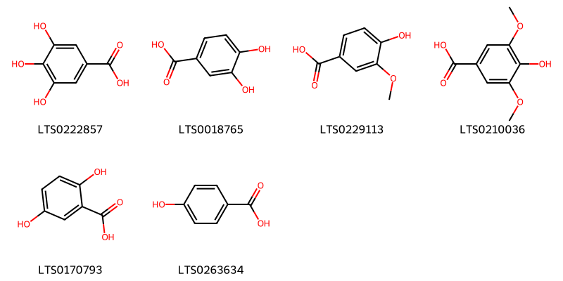{ width=100% }
    <figcaption>Hình ảnh cấu trúc hóa học của 6 hoạt chất thuộc nhóm Benzene and substituted derivatives gồm ['galop (LTS0222857)', '3,4-dihydroxybenzoic acid (LTS0018765)', 'vanillic acid (LTS0229113)', 'syringic acid (LTS0210036)', '2,5-dihydroxybenzoic acid (LTS0170793)', 'p-hydroxybenzoic acid (LTS0263634)'].</figcaption>
</figure>
#### Nhóm Cinnamic acids and derivatives
<figure markdown="span">
    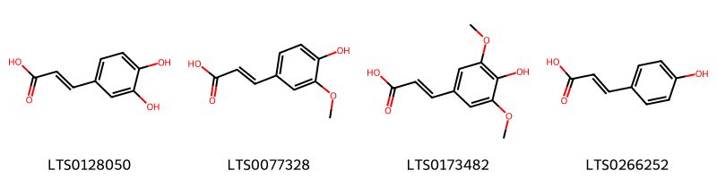{ width=100% }
    <figcaption>Hình ảnh cấu trúc hóa học của 4 hoạt chất thuộc nhóm Cinnamic acids and derivatives gồm ['3,4-dihydroxycinnamic acid (LTS0128050)', 'ferulic acid (LTS0077328)', 'sinapinate (LTS0173482)', 'para-coumaric acid (LTS0266252)'].</figcaption>
</figure>
#### Nhóm Flavonoids
<figure markdown="span">
    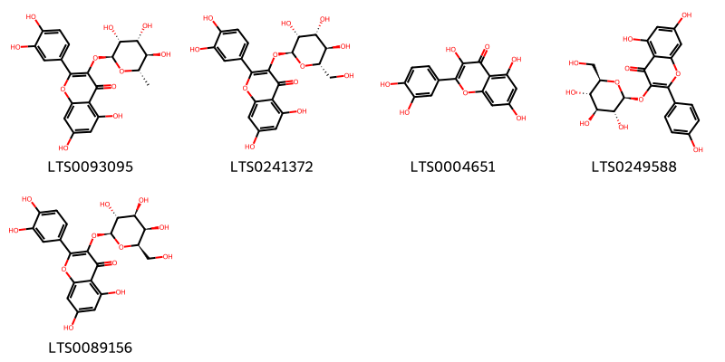{ width=100% }
    <figcaption>Hình ảnh cấu trúc hóa học của 5 hoạt chất thuộc nhóm Flavonoids gồm ['quercitrin (LTS0093095)', '2-(3,4-dihydroxyphenyl)-5,7-dihydroxy-3-{[(2s,3r,4r,5r,6s)-3,4,5-trihydroxy-6-(hydroxymethyl)oxan-2-yl]oxy}chromen-4-one (LTS0241372)', 'quercetin (LTS0004651)', 'astragalin (LTS0249588)', 'hyperoside (LTS0089156)'].</figcaption>
</figure>
#### Nhóm Stilbenes
<figure markdown="span">
    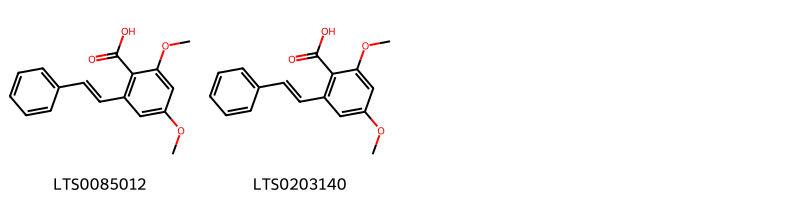{ width=100% }
    <figcaption>Hình ảnh cấu trúc hóa học của 2 hoạt chất thuộc nhóm Stilbenes gồm ['2,4-dimethoxy-6-[(1e)-2-phenylethenyl]benzoic acid (LTS0085012)', '2,4-dimethoxy-6-(2-phenylethenyl)benzoic acid (LTS0203140)'].</figcaption>
</figure>

---

### Dược dân tộc học

Danh sách các quốc gia có sử dụng *Polygonum persicaria* trong điều trị các bệnh. 

| Country   | Disease                                                           | Bệnh                                                                                                                                                                                                |
|:----------|:------------------------------------------------------------------|:----------------------------------------------------------------------------------------------------------------------------------------------------------------------------------------------------|
| Elsewhere | Antiseptic, Astringent, Laxative, Styptic, Vulnerary, Cardiotonic | MYMEMORY WARNING: YOU USED ALL AVAILABLE FREE TRANSLATIONS FOR TODAY. NEXT AVAILABLE IN  15 HOURS 10 MINUTES 20 SECONDS VISIT HTTPS://MYMEMORY.TRANSLATED.NET/DOC/USAGELIMITS.PHP TO TRANSLATE MORE |
| Turkey    | Astringent, Tonic                                                 | MYMEMORY WARNING: YOU USED ALL AVAILABLE FREE TRANSLATIONS FOR TODAY. NEXT AVAILABLE IN  15 HOURS 10 MINUTES 14 SECONDS VISIT HTTPS://MYMEMORY.TRANSLATED.NET/DOC/USAGELIMITS.PHP TO TRANSLATE MORE |
| ain       | Vulnerary                                                         | MYMEMORY WARNING: YOU USED ALL AVAILABLE FREE TRANSLATIONS FOR TODAY. NEXT AVAILABLE IN  15 HOURS 10 MINUTES 09 SECONDS VISIT HTTPS://MYMEMORY.TRANSLATED.NET/DOC/USAGELIMITS.PHP TO TRANSLATE MORE |

---

---
## Polygonum pubescens
### Thông tin về thực vật

!!! info "Phân loại thực vật của *Persicaria pubescens* từ GIBF:"
    - **Kingdom:** Plantae
    - **Phylum:** Tracheophyta
    - **Order:** Caryophyllales
    - **Family:** Polygonaceae
    - **Genus:** Persicaria
    - **Species:** *Persicaria pubescens*

 

| Label (VI)   | Label (EN)   | Scientific Name     | Descriptions (VI)   | Descriptions (EN)   | Also Known As (VI)   | Also Known As (EN)   |
|:-------------|:-------------|:--------------------|:--------------------|:--------------------|:---------------------|:---------------------|
| N/A          | N/A          | Polygonum pubescens |                     | species of plant    | ['']                 | ['']                 |

#### Phân bố trên thế giới

**Từ CSDL GIBF** nan, Viet Nam, Japan, Korea, Republic of, Nepal, Chinese Taipei, China, Thailand, Lao People’s Democratic Republic

#### Phân bố tại Việt Nam

**Từ CSDL GIBF**: Không có ghi nhận ở Việt Nam

---
### Thành phần hóa học
        
- Theo cơ sở dữ liệu lotus: Từ loài *Persicaria pubescens* đã phân lập và xác định được Chưa có hoạt chất nào được phân lập. hoạt chất thuộc về các nhóm Không có hoạt chất nào được phân lập. 

Không có hình ảnh nào được tạo ra

---

### Dược dân tộc học

Danh sách các quốc gia có sử dụng *Persicaria pubescens* trong điều trị các bệnh. 

| Country   | Disease   | Bệnh                                                                                                                                                                                                |
|:----------|:----------|:----------------------------------------------------------------------------------------------------------------------------------------------------------------------------------------------------|
| Malaya    | Hemostat  | MYMEMORY WARNING: YOU USED ALL AVAILABLE FREE TRANSLATIONS FOR TODAY. NEXT AVAILABLE IN  15 HOURS 09 MINUTES 37 SECONDS VISIT HTTPS://MYMEMORY.TRANSLATED.NET/DOC/USAGELIMITS.PHP TO TRANSLATE MORE |

---

---
## Polygonum pulchrum
### Thông tin về thực vật

!!! info "Phân loại thực vật của *N/A* từ GIBF:"
    - **Kingdom:** Plantae
    - **Phylum:** Tracheophyta
    - **Order:** Caryophyllales
    - **Family:** Polygonaceae
    - **Genus:** N/A
    - **Species:** *N/A*

 

| Label (VI)   | Label (EN)   | Scientific Name    | Descriptions (VI)   | Descriptions (EN)   | Also Known As (VI)   | Also Known As (EN)   |
|:-------------|:-------------|:-------------------|:--------------------|:--------------------|:---------------------|:---------------------|
| N/A          | N/A          | Polygonum pulchrum | loài thực vật       | species of plant    | ['']                 | ['']                 |

#### Phân bố trên thế giới

**Từ CSDL GIBF** Brazil, Virgin Islands (British), China, Israel, Gambia, New Zealand, Türkiye, Ecuador, French Polynesia, Thailand, Spain, Netherlands, Puerto Rico, Cayman Islands, United States of America, Virgin Islands (U.S.), Indonesia, Colombia, Argentina, Aruba, Morocco, Hong Kong, Mexico, Guam, United Kingdom of Great Britain and Northern Ireland, Chinese Taipei, Kuwait, Canada, Germany, Austria, Hungary, Portugal, South Africa, Australia, Italy, India, France, Ireland

#### Phân bố tại Việt Nam

**Từ CSDL GIBF**: Không có ghi nhận ở Việt Nam

---
### Thành phần hóa học
        
- Theo cơ sở dữ liệu lotus: Từ loài *N/A* đã phân lập và xác định được Chưa có hoạt chất nào được phân lập. hoạt chất thuộc về các nhóm Không có hoạt chất nào được phân lập. 

Không có hình ảnh nào được tạo ra

---

### Dược dân tộc học

Danh sách các quốc gia có sử dụng *N/A* trong điều trị các bệnh. 

| Country   | Disease          | Bệnh                                                                                                                                                                                                |
|:----------|:-----------------|:----------------------------------------------------------------------------------------------------------------------------------------------------------------------------------------------------|
| Elsewhere | Cardiodepressant | MYMEMORY WARNING: YOU USED ALL AVAILABLE FREE TRANSLATIONS FOR TODAY. NEXT AVAILABLE IN  15 HOURS 09 MINUTES 12 SECONDS VISIT HTTPS://MYMEMORY.TRANSLATED.NET/DOC/USAGELIMITS.PHP TO TRANSLATE MORE |
| Malaya    | Tonic            | MYMEMORY WARNING: YOU USED ALL AVAILABLE FREE TRANSLATIONS FOR TODAY. NEXT AVAILABLE IN  15 HOURS 09 MINUTES 09 SECONDS VISIT HTTPS://MYMEMORY.TRANSLATED.NET/DOC/USAGELIMITS.PHP TO TRANSLATE MORE |
| Malaysia  | Tonic            | MYMEMORY WARNING: YOU USED ALL AVAILABLE FREE TRANSLATIONS FOR TODAY. NEXT AVAILABLE IN  15 HOURS 09 MINUTES 04 SECONDS VISIT HTTPS://MYMEMORY.TRANSLATED.NET/DOC/USAGELIMITS.PHP TO TRANSLATE MORE |

---

---
## Polygonum punctatum
### Thông tin về thực vật

!!! info "Phân loại thực vật của *Polygonum punctatum* từ GIBF:"
    - **Kingdom:** Plantae
    - **Phylum:** Tracheophyta
    - **Order:** Caryophyllales
    - **Family:** Polygonaceae
    - **Genus:** Polygonum
    - **Species:** *Polygonum punctatum*

 

| Label (VI)   | Label (EN)   | Scientific Name     | Descriptions (VI)   | Descriptions (EN)   | Also Known As (VI)   | Also Known As (EN)      |
|:-------------|:-------------|:--------------------|:--------------------|:--------------------|:---------------------|:------------------------|
| N/A          | N/A          | Polygonum punctatum | loài thực vật       | species of plant    | ['']                 | ['Persicaria punctata'] |

#### Phân bố trên thế giới

**Từ CSDL GIBF** nan, Nicaragua, Brazil, Mexico, United States of America, Puerto Rico, Paraguay, Colombia, Argentina, Canada, Venezuela (Bolivarian Republic of)

#### Phân bố tại Việt Nam

**Từ CSDL GIBF**: Không có ghi nhận ở Việt Nam

---
### Thành phần hóa học
        
- Theo cơ sở dữ liệu lotus: Từ loài *Polygonum punctatum* đã phân lập và xác định được 1 hoạt chất thuộc về các nhóm Organic oxides. 

|    | chemicalTaxonomyClassyfireClass   |   smiles_count |
|---:|:----------------------------------|---------------:|
|  0 | Organic oxides                    |              1 |

#### Nhóm Organic oxides
<figure markdown="span">
    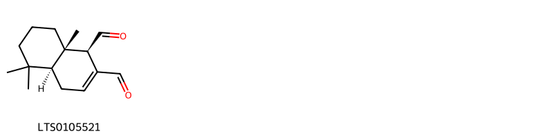{ width=100% }
    <figcaption>Hình ảnh cấu trúc hóa học của 1 hoạt chất thuộc nhóm Organic oxides gồm ['polygodial (LTS0105521)'].</figcaption>
</figure>

---

### Dược dân tộc học

Danh sách các quốc gia có sử dụng *Polygonum punctatum* trong điều trị các bệnh. 

| Country            | Disease                                                 | Bệnh                                                                                                                                                                                                |
|:-------------------|:--------------------------------------------------------|:----------------------------------------------------------------------------------------------------------------------------------------------------------------------------------------------------|
| Dominican Republic | Astringent, Emmenagogue, Stimulant, Diuretic, Vermifuge | MYMEMORY WARNING: YOU USED ALL AVAILABLE FREE TRANSLATIONS FOR TODAY. NEXT AVAILABLE IN  15 HOURS 08 MINUTES 35 SECONDS VISIT HTTPS://MYMEMORY.TRANSLATED.NET/DOC/USAGELIMITS.PHP TO TRANSLATE MORE |
| Paraguay           | Antifertility                                           | MYMEMORY WARNING: YOU USED ALL AVAILABLE FREE TRANSLATIONS FOR TODAY. NEXT AVAILABLE IN  15 HOURS 08 MINUTES 30 SECONDS VISIT HTTPS://MYMEMORY.TRANSLATED.NET/DOC/USAGELIMITS.PHP TO TRANSLATE MORE |
| US                 | Poison                                                  | MYMEMORY WARNING: YOU USED ALL AVAILABLE FREE TRANSLATIONS FOR TODAY. NEXT AVAILABLE IN  15 HOURS 08 MINUTES 25 SECONDS VISIT HTTPS://MYMEMORY.TRANSLATED.NET/DOC/USAGELIMITS.PHP TO TRANSLATE MORE |

---

---
## Polygonum strigosum
### Thông tin về thực vật

!!! info "Phân loại thực vật của *N/A* từ GIBF:"
    - **Kingdom:** Plantae
    - **Phylum:** Tracheophyta
    - **Order:** Caryophyllales
    - **Family:** Polygonaceae
    - **Genus:** Persicaria
    - **Species:** *N/A*

 

| Label (VI)   | Label (EN)   | Scientific Name     | Descriptions (VI)   | Descriptions (EN)   | Also Known As (VI)   | Also Known As (EN)   |
|:-------------|:-------------|:--------------------|:--------------------|:--------------------|:---------------------|:---------------------|
| N/A          | N/A          | Polygonum strigosum | loài thực vật       | species of plant    | ['']                 | ['']                 |

#### Phân bố trên thế giới

**Từ CSDL GIBF** Brazil, Japan, Nepal, China, Chile, New Zealand, Ecuador, Thailand, Spain, Réunion, United States of America, Indonesia, Costa Rica, Colombia, Argentina, French Guiana, Hong Kong, Mexico, Benin, Kenya, United Kingdom of Great Britain and Northern Ireland, Chinese Taipei, Panama, Portugal, South Africa, Australia, France

#### Phân bố tại Việt Nam

**Từ CSDL GIBF**: Không có ghi nhận ở Việt Nam

---
### Thành phần hóa học
        
- Theo cơ sở dữ liệu lotus: Từ loài *N/A* đã phân lập và xác định được Chưa có hoạt chất nào được phân lập. hoạt chất thuộc về các nhóm Không có hoạt chất nào được phân lập. 

Không có hình ảnh nào được tạo ra

---

### Dược dân tộc học

Danh sách các quốc gia có sử dụng *N/A* trong điều trị các bệnh. 

| Country   | Disease                 | Bệnh                                                                                                                                                                                                |
|:----------|:------------------------|:----------------------------------------------------------------------------------------------------------------------------------------------------------------------------------------------------|
| Australia | Poison                  | MYMEMORY WARNING: YOU USED ALL AVAILABLE FREE TRANSLATIONS FOR TODAY. NEXT AVAILABLE IN  15 HOURS 07 MINUTES 57 SECONDS VISIT HTTPS://MYMEMORY.TRANSLATED.NET/DOC/USAGELIMITS.PHP TO TRANSLATE MORE |
| Elsewhere | Piscicide, Stupefacient | MYMEMORY WARNING: YOU USED ALL AVAILABLE FREE TRANSLATIONS FOR TODAY. NEXT AVAILABLE IN  15 HOURS 07 MINUTES 53 SECONDS VISIT HTTPS://MYMEMORY.TRANSLATED.NET/DOC/USAGELIMITS.PHP TO TRANSLATE MORE |

---

---
## Polygonum tenuicaule
### Thông tin về thực vật

!!! info "Phân loại thực vật của *Bistorta tenuicaulis* từ GIBF:"
    - **Kingdom:** Plantae
    - **Phylum:** Tracheophyta
    - **Order:** Caryophyllales
    - **Family:** Polygonaceae
    - **Genus:** Bistorta
    - **Species:** *Bistorta tenuicaulis*

 

| Label (VI)   | Label (EN)   | Scientific Name      | Descriptions (VI)   | Descriptions (EN)                           | Also Known As (VI)   | Also Known As (EN)   |
|:-------------|:-------------|:---------------------|:--------------------|:--------------------------------------------|:---------------------|:---------------------|
| N/A          | N/A          | Polygonum tenuicaule | loài thực vật       | species of plant in the family Polygonaceae | ['']                 | ['']                 |

#### Phân bố trên thế giới

**Từ CSDL GIBF** nan, Japan, China, unknown or invalid, Canada

#### Phân bố tại Việt Nam

**Từ CSDL GIBF**: Không có ghi nhận ở Việt Nam

---
### Thành phần hóa học
        
- Theo cơ sở dữ liệu lotus: Từ loài *Bistorta tenuicaulis* đã phân lập và xác định được Chưa có hoạt chất nào được phân lập. hoạt chất thuộc về các nhóm Không có hoạt chất nào được phân lập. 

Không có hình ảnh nào được tạo ra

---

### Dược dân tộc học

Danh sách các quốc gia có sử dụng *Bistorta tenuicaulis* trong điều trị các bệnh. 

| Country   | Disease              | Bệnh                                                                                                                                                                                                |
|:----------|:---------------------|:----------------------------------------------------------------------------------------------------------------------------------------------------------------------------------------------------|
| Elsewhere | Astringent, Antidote | MYMEMORY WARNING: YOU USED ALL AVAILABLE FREE TRANSLATIONS FOR TODAY. NEXT AVAILABLE IN  15 HOURS 07 MINUTES 24 SECONDS VISIT HTTPS://MYMEMORY.TRANSLATED.NET/DOC/USAGELIMITS.PHP TO TRANSLATE MORE |

---

---
## Polygonum tinctorium
### Thông tin về thực vật

!!! info "Phân loại thực vật của *Persicaria tinctoria* từ GIBF:"
    - **Kingdom:** Plantae
    - **Phylum:** Tracheophyta
    - **Order:** Caryophyllales
    - **Family:** Polygonaceae
    - **Genus:** Persicaria
    - **Species:** *Persicaria tinctoria*

 

| Label (VI)   | Label (EN)   | Scientific Name      | Descriptions (VI)   | Descriptions (EN)   | Also Known As (VI)   | Also Known As (EN)   |
|:-------------|:-------------|:---------------------|:--------------------|:--------------------|:---------------------|:---------------------|
| N/A          | N/A          | Polygonum tinctorium | loài thực vật       | species of plant    | ['']                 | ['']                 |

#### Phân bố trên thế giới

**Từ CSDL GIBF** nan, Brazil, Japan, United States of America, Korea, Republic of, Belgium, China, Russian Federation, Georgia, Switzerland, India, unknown or invalid, Germany, United Kingdom of Great Britain and Northern Ireland, Azerbaijan

#### Phân bố tại Việt Nam

**Từ CSDL GIBF**: Không có ghi nhận ở Việt Nam

---
### Thành phần hóa học
        
- Theo cơ sở dữ liệu lotus: Từ loài *Persicaria tinctoria* đã phân lập và xác định được Chưa có hoạt chất nào được phân lập. hoạt chất thuộc về các nhóm Không có hoạt chất nào được phân lập. 

Không có hình ảnh nào được tạo ra

---

### Dược dân tộc học

Danh sách các quốc gia có sử dụng *Persicaria tinctoria* trong điều trị các bệnh. 

| Country   | Disease                  | Bệnh                                                                                                                                                                                                |
|:----------|:-------------------------|:----------------------------------------------------------------------------------------------------------------------------------------------------------------------------------------------------|
| China     | Antiphlogistic, Antidote | MYMEMORY WARNING: YOU USED ALL AVAILABLE FREE TRANSLATIONS FOR TODAY. NEXT AVAILABLE IN  15 HOURS 07 MINUTES 01 SECONDS VISIT HTTPS://MYMEMORY.TRANSLATED.NET/DOC/USAGELIMITS.PHP TO TRANSLATE MORE |

---

---
## Polygonum tinctorum
### Thông tin về thực vật

!!! info "Phân loại thực vật của *Persicaria tinctoria* từ GIBF:"
    - **Kingdom:** Plantae
    - **Phylum:** Tracheophyta
    - **Order:** Caryophyllales
    - **Family:** Polygonaceae
    - **Genus:** Persicaria
    - **Species:** *Persicaria tinctoria*

 

| Label (VI)   | Label (EN)   | Scientific Name      | Descriptions (VI)   | Descriptions (EN)   | Also Known As (VI)   | Also Known As (EN)   |
|:-------------|:-------------|:---------------------|:--------------------|:--------------------|:---------------------|:---------------------|
| N/A          | N/A          | Polygonum tinctorium | loài thực vật       | species of plant    | ['']                 | ['']                 |

#### Phân bố trên thế giới

**Từ CSDL GIBF** nan, Brazil, Japan, United States of America, Korea, Republic of, Belgium, China, Russian Federation, Georgia, Switzerland, India, unknown or invalid, Germany, United Kingdom of Great Britain and Northern Ireland, Azerbaijan

#### Phân bố tại Việt Nam

**Từ CSDL GIBF**: Không có ghi nhận ở Việt Nam

---
### Thành phần hóa học
        
- Theo cơ sở dữ liệu lotus: Từ loài *Persicaria tinctoria* đã phân lập và xác định được Chưa có hoạt chất nào được phân lập. hoạt chất thuộc về các nhóm Không có hoạt chất nào được phân lập. 

Không có hình ảnh nào được tạo ra

---

### Dược dân tộc học

Danh sách các quốc gia có sử dụng *Persicaria tinctoria* trong điều trị các bệnh. 

| Country   | Disease       | Bệnh                                                                                                                                                                                                |
|:----------|:--------------|:----------------------------------------------------------------------------------------------------------------------------------------------------------------------------------------------------|
| Elsewhere | Antidote, nan | MYMEMORY WARNING: YOU USED ALL AVAILABLE FREE TRANSLATIONS FOR TODAY. NEXT AVAILABLE IN  15 HOURS 06 MINUTES 29 SECONDS VISIT HTTPS://MYMEMORY.TRANSLATED.NET/DOC/USAGELIMITS.PHP TO TRANSLATE MORE |

---

---
## Polygonum tomentosum
### Thông tin về thực vật

!!! info "Phân loại thực vật của *Polygonum tomentosum* từ GIBF:"
    - **Kingdom:** Plantae
    - **Phylum:** Tracheophyta
    - **Order:** Caryophyllales
    - **Family:** Polygonaceae
    - **Genus:** Polygonum
    - **Species:** *Polygonum tomentosum*

 

| Label (VI)   | Label (EN)   | Scientific Name      | Descriptions (VI)   | Descriptions (EN)   | Also Known As (VI)   | Also Known As (EN)   |
|:-------------|:-------------|:---------------------|:--------------------|:--------------------|:---------------------|:---------------------|
| N/A          | N/A          | Polygonum tinctorium | loài thực vật       | species of plant    | ['']                 | ['']                 |

#### Phân bố trên thế giới

**Từ CSDL GIBF** nan, Sweden, Finland, New Caledonia, China, Poland, Ghana, Indonesia, Russian Federation, Estonia, Sierra Leone, Philippines, Germany, Austria, Greenland, Ukraine, South Africa, Côte d’Ivoire, India, Cameroon

#### Phân bố tại Việt Nam

**Từ CSDL GIBF**: Không có ghi nhận ở Việt Nam

---
### Thành phần hóa học
        
- Theo cơ sở dữ liệu lotus: Từ loài *Polygonum tomentosum* đã phân lập và xác định được Chưa có hoạt chất nào được phân lập. hoạt chất thuộc về các nhóm Không có hoạt chất nào được phân lập. 

Không có hình ảnh nào được tạo ra

---

### Dược dân tộc học

Danh sách các quốc gia có sử dụng *Polygonum tomentosum* trong điều trị các bệnh. 

| Country   | Disease   | Bệnh                                                                                                                                                                                                |
|:----------|:----------|:----------------------------------------------------------------------------------------------------------------------------------------------------------------------------------------------------|
| Malaya    | Tonic     | MYMEMORY WARNING: YOU USED ALL AVAILABLE FREE TRANSLATIONS FOR TODAY. NEXT AVAILABLE IN  15 HOURS 06 MINUTES 02 SECONDS VISIT HTTPS://MYMEMORY.TRANSLATED.NET/DOC/USAGELIMITS.PHP TO TRANSLATE MORE |

---

---
## Polygonum virginianum
### Thông tin về thực vật

!!! info "Phân loại thực vật của *Persicaria virginiana* từ GIBF:"
    - **Kingdom:** Plantae
    - **Phylum:** Tracheophyta
    - **Order:** Caryophyllales
    - **Family:** Polygonaceae
    - **Genus:** Persicaria
    - **Species:** *Persicaria virginiana*

 

| Label (VI)   | Label (EN)   | Scientific Name       | Descriptions (VI)   | Descriptions (EN)   | Also Known As (VI)   | Also Known As (EN)   |
|:-------------|:-------------|:----------------------|:--------------------|:--------------------|:---------------------|:---------------------|
| N/A          | N/A          | Polygonum virginianum |                     | species of plant    | ['']                 | ['']                 |

#### Phân bố trên thế giới

**Từ CSDL GIBF** China, United States of America, Norway, Canada

#### Phân bố tại Việt Nam

**Từ CSDL GIBF**: Không có ghi nhận ở Việt Nam

---
### Thành phần hóa học
        
- Theo cơ sở dữ liệu lotus: Từ loài *Persicaria virginiana* đã phân lập và xác định được Chưa có hoạt chất nào được phân lập. hoạt chất thuộc về các nhóm Không có hoạt chất nào được phân lập. 

Không có hình ảnh nào được tạo ra

---

### Dược dân tộc học

Danh sách các quốc gia có sử dụng *Persicaria virginiana* trong điều trị các bệnh. 

| Country   | Disease                                                           | Bệnh                                                                                                                                                                                                |
|:----------|:------------------------------------------------------------------|:----------------------------------------------------------------------------------------------------------------------------------------------------------------------------------------------------|
| Elsewhere | Astringent, nan, Demulcent, Diuretic, Tonic, Vulnerary, Stimulant | MYMEMORY WARNING: YOU USED ALL AVAILABLE FREE TRANSLATIONS FOR TODAY. NEXT AVAILABLE IN  15 HOURS 05 MINUTES 30 SECONDS VISIT HTTPS://MYMEMORY.TRANSLATED.NET/DOC/USAGELIMITS.PHP TO TRANSLATE MORE |

---

---
## Polygonum viviparum
### Thông tin về thực vật

!!! info "Phân loại thực vật của *N/A* từ GIBF:"
    - **Kingdom:** Plantae
    - **Phylum:** Tracheophyta
    - **Order:** Caryophyllales
    - **Family:** Polygonaceae
    - **Genus:** Bistorta
    - **Species:** *N/A*

 

| Label (VI)   | Label (EN)   | Scientific Name     | Descriptions (VI)   | Descriptions (EN)   | Also Known As (VI)   | Also Known As (EN)   |
|:-------------|:-------------|:--------------------|:--------------------|:--------------------|:---------------------|:---------------------|
| N/A          | N/A          | Polygonum viviparum | loài thực vật       | species of plant    | ['']                 | ['']                 |

#### Phân bố trên thế giới

**Từ CSDL GIBF** nan, Japan, Czechia, Sweden, New Zealand, Poland, Netherlands, Denmark, United States of America, Russian Federation, Norway, United Kingdom of Great Britain and Northern Ireland, Belgium, Luxembourg, Germany, Austria, Hungary, Greenland, Ukraine, Italy, Switzerland, France

#### Phân bố tại Việt Nam

**Từ CSDL GIBF**: Không có ghi nhận ở Việt Nam

---
### Thành phần hóa học
        
- Theo cơ sở dữ liệu lotus: Từ loài *N/A* đã phân lập và xác định được Chưa có hoạt chất nào được phân lập. hoạt chất thuộc về các nhóm Không có hoạt chất nào được phân lập. 

Không có hình ảnh nào được tạo ra

---

### Dược dân tộc học

Danh sách các quốc gia có sử dụng *N/A* trong điều trị các bệnh. 

| Country   | Disease                       | Bệnh                                                                                                                                                                                                |
|:----------|:------------------------------|:----------------------------------------------------------------------------------------------------------------------------------------------------------------------------------------------------|
| Elsewhere | Antiseptic, Astringent, Tonic | MYMEMORY WARNING: YOU USED ALL AVAILABLE FREE TRANSLATIONS FOR TODAY. NEXT AVAILABLE IN  15 HOURS 04 MINUTES 52 SECONDS VISIT HTTPS://MYMEMORY.TRANSLATED.NET/DOC/USAGELIMITS.PHP TO TRANSLATE MORE |

---

# Chi Coccoloba

??? note "Danh sách các dược liệu thuộc chi"
    
	 - *Coccoloba uvifera*

---
## Coccoloba uvifera
### Thông tin về thực vật

!!! info "Phân loại thực vật của *Coccoloba uvifera* từ GIBF:"
    - **Kingdom:** Plantae
    - **Phylum:** Tracheophyta
    - **Order:** Caryophyllales
    - **Family:** Polygonaceae
    - **Genus:** Coccoloba
    - **Species:** *Coccoloba uvifera*

 

| Label (VI)   | Label (EN)   | Scientific Name   | Descriptions (VI)   | Descriptions (EN)   | Also Known As (VI)    | Also Known As (EN)   |
|:-------------|:-------------|:------------------|:--------------------|:--------------------|:----------------------|:---------------------|
| N/A          | N/A          | Coccoloba uvifera | loài thực vật       | species of plant    | ['Coccoloba uvifera'] | ['Sea grape']        |

#### Phân bố trên thế giới

**Từ CSDL GIBF** nan, Virgin Islands (British), Saint Kitts and Nevis, Guadeloupe, Antigua and Barbuda, Honduras, French Polynesia, Trinidad and Tobago, Turks and Caicos Islands, Puerto Rico, Cayman Islands, United States of America, Jamaica, Virgin Islands (U.S.), Costa Rica, Dominican Republic, Colombia, Saint Martin (French part), Cuba, Aruba, French Guiana, Sint Maarten (Dutch part), Mexico, Guam, Panama, Bahamas, Australia, Belize

#### Phân bố tại Việt Nam

**Từ CSDL GIBF**: Không có ghi nhận ở Việt Nam

---
### Thành phần hóa học
        
- Theo cơ sở dữ liệu lotus: Từ loài *Coccoloba uvifera* đã phân lập và xác định được Chưa có hoạt chất nào được phân lập. hoạt chất thuộc về các nhóm Không có hoạt chất nào được phân lập. 

Không có hình ảnh nào được tạo ra

---

### Dược dân tộc học

Danh sách các quốc gia có sử dụng *Coccoloba uvifera* trong điều trị các bệnh. 

| Country   | Disease           | Bệnh                                                                                                                                                                                                |
|:----------|:------------------|:----------------------------------------------------------------------------------------------------------------------------------------------------------------------------------------------------|
| Elsewhere | Astringent        | MYMEMORY WARNING: YOU USED ALL AVAILABLE FREE TRANSLATIONS FOR TODAY. NEXT AVAILABLE IN  15 HOURS 04 MINUTES 25 SECONDS VISIT HTTPS://MYMEMORY.TRANSLATED.NET/DOC/USAGELIMITS.PHP TO TRANSLATE MORE |
| Haiti     | Astringent        | MYMEMORY WARNING: YOU USED ALL AVAILABLE FREE TRANSLATIONS FOR TODAY. NEXT AVAILABLE IN  15 HOURS 04 MINUTES 22 SECONDS VISIT HTTPS://MYMEMORY.TRANSLATED.NET/DOC/USAGELIMITS.PHP TO TRANSLATE MORE |
| Mexico    | Astringent, Tonic | MYMEMORY WARNING: YOU USED ALL AVAILABLE FREE TRANSLATIONS FOR TODAY. NEXT AVAILABLE IN  15 HOURS 04 MINUTES 19 SECONDS VISIT HTTPS://MYMEMORY.TRANSLATED.NET/DOC/USAGELIMITS.PHP TO TRANSLATE MORE |
| Trinidad  | Astringent        | MYMEMORY WARNING: YOU USED ALL AVAILABLE FREE TRANSLATIONS FOR TODAY. NEXT AVAILABLE IN  15 HOURS 04 MINUTES 17 SECONDS VISIT HTTPS://MYMEMORY.TRANSLATED.NET/DOC/USAGELIMITS.PHP TO TRANSLATE MORE |

---

